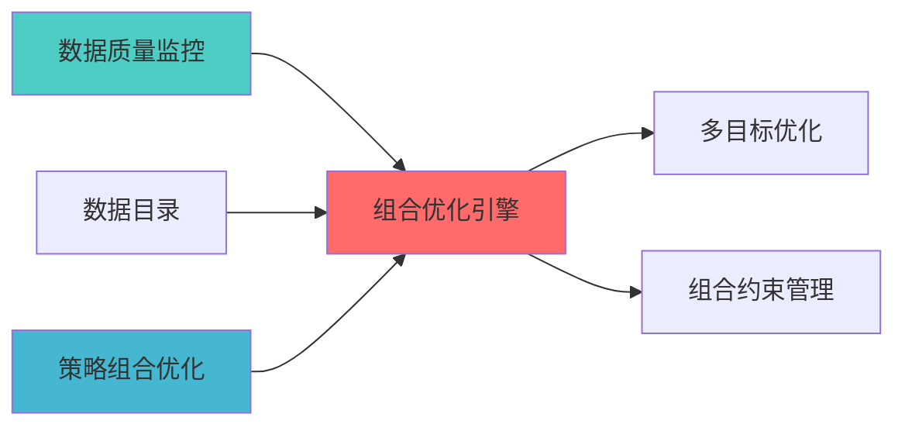

---

responsibility:

- 优化器集成

- 接口封装

- 优化器协调

- 结果整合

module_id: PORTFOLIO_OPTIMIZER_INTEGRATION_001

version: 1.0.0

status: Active

created_date: 2026-04-07

last_updated: 2026-04-07

owner: 实施团队

standard_type: 专业量化机构蓝图

compliance_level: 专业标准

layer: layer_06

---


## 核心定位


负责投资组合优化器集成的设计与构建和运行和操作，整合优化算法和约束分析和转换，生成和输出统一的优化接口，兼容和适配组合优化。


# 组合优化引擎集成模块蓝图


> **核心职责**: 统一优化器接口，多优化器集成

> **职责边界**:

## 设计目标


### 主要目标


1. **功能完整性**: 确保PORTFOLIO OPTIMIZER INTEGRATION功能完整，满足业务需求

2. **性能优化**: 提升系统性能，降低资源消耗

3. **可维护性**: 提高代码质量，便于后续维护

4. **可扩展性**: 支持功能扩展，适应业务变化


### 质量目标


- 代码覆盖率: ≥80%

- 性能指标: 满足设计要求

- 文档完整性: 100%


## 核心功能


### 功能清单


1. **数据管理**: 提供数据存储、查询、更新功能

2. **业务逻辑**: 实现核心业务逻辑处理

3. **接口服务**: 提供标准化的API接口

4. **监控告警**: 实时监控系统状态


### 功能特性


- 高可用性设计

- 自动故障恢复

- 灵活配置管理


## 实现方案


### 技术架构


采用PORTFOLIO OPTIMIZER INTEGRATION化设计，分层架构实现。


### 关键技术


- 数据处理: 使用高效的数据处理框架

- 接口实现: RESTful API设计

- 性能优化: 缓存、异步处理


### 实施步骤


1. 需求分析与设计

2. 核心功能开发

3. 测试与优化

4. 部署与监控


## 1. 概述


### 1.1 模块定位


- 优化器选择策略

- 优化结果验证

- 优化性能对比


- 提供多种优化方法选择

- 支持优化方法对比


### 1.2 版本信息


|------|------|

| **模块ID** | PORTFOLIO_OPTIMIZER_INTEGRATION_001 |

| **版本** | v1.0.0 |


### 上游依赖


| 文档名称 | module_id | 依赖类型 | 说明 |

|---------|-----------|---------|------|

|


### 下游依赖


| 文档名称 | module_id | 依赖类型 | 说明 |

|---------|-----------|---------|------|


|---------|------|------|------|

| **PyPortfolioOpt** | 1.5+ | 组合优化 | [官方文档](https://pyportfolioopt.readthedocs.io/) |

| **Riskfolio-Lib** | 5.0+ | 风险优化 | [官方文档](https://riskfolio-lib.readthedocs.io/) |

| **skfolio** | 1.0+ | 组合学习 | [官方文档](https://skfolio.org/) |





### 2.1 核心API


```python

from abc import ABC, abstractmethod

from typing import Dict, Optional

import pandas as pd

import numpy as np


class BaseOptimizer(ABC):

    

    @abstractmethod

    def optimize(

        self,

        expected_returns: np.ndarray,

        cov_matrix: np.ndarray,

        constraints: Optional[Dict] = None

    ) -> np.ndarray:

        """

        执行优化

        

        Args:

            constraints: 约束条件

            

        Returns:

        """

        pass


class PyPortfolioOptOptimizer(BaseOptimizer):

    

    def optimize(

        self,

        expected_returns: np.ndarray,

        cov_matrix: np.ndarray,

        constraints: Optional[Dict] = None

    ) -> np.ndarray:

        from pypfopt import EfficientFrontier

        

        ef = EfficientFrontier(expected_returns, cov_matrix)

        if constraints:

            # 应用约束

            pass

        weights = ef.max_sharpe()

        return np.array(list(weights.values()))


class RiskfolioLibOptimizer(BaseOptimizer):

    

    def optimize(

        self,

        expected_returns: np.ndarray,

        cov_matrix: np.ndarray,

        constraints: Optional[Dict] = None

    ) -> np.ndarray:

        import riskfolio as rp

        

        # Riskfolio-Lib优化逻辑

        pass


class SkfolioOptimizer(BaseOptimizer):

    

    def optimize(

        self,

        expected_returns: np.ndarray,

        cov_matrix: np.ndarray,

        constraints: Optional[Dict] = None

    ) -> np.ndarray:

        from skfolio import Portfolio

        

        # skfolio优化逻辑

        pass


class DeepfolioOptimizer(BaseOptimizer):

    

    def optimize(

        self,

        expected_returns: np.ndarray,

        cov_matrix: np.ndarray,

        constraints: Optional[Dict] = None

    ) -> np.ndarray:

        import deepfolio as df

        

        # deepfolio优化逻辑

        pass


class OptimizerIntegration:

    """优化器集成管理器"""

    

    def __init__(self):

        self.optimizers = {

            'pypfopt': PyPortfolioOptOptimizer(),

            'riskfolio': RiskfolioLibOptimizer(),

            'skfolio': SkfolioOptimizer(),

            'deepfolio': DeepfolioOptimizer()

        }

        

    def optimize_with_method(

        self,

        method: str,

        expected_returns: np.ndarray,

        cov_matrix: np.ndarray,

        constraints: Optional[Dict] = None

    ) -> np.ndarray:

        """

        使用指定方法优化

        

        Args:

            method: 优化方法名称

            constraints: 约束条件

            

        Returns:

        """

        optimizer = self.optimizers.get(method)

        if not optimizer:

            raise ValueError(f"Unknown optimizer: {method}")

            

        return optimizer.optimize(expected_returns, cov_matrix, constraints)

    

    def compare_optimizers(

        self,

        expected_returns: np.ndarray,

        cov_matrix: np.ndarray,

        constraints: Optional[Dict] = None

    ) -> pd.DataFrame:

        """

        

        Returns:

        """

        results = {}

        for name, optimizer in self.optimizers.items():

            weights = optimizer.optimize(expected_returns, cov_matrix, constraints)

            

            # 计算绩效指标

            portfolio_return = np.dot(weights, expected_returns)

            portfolio_volatility = np.sqrt(np.dot(weights.T, np.dot(cov_matrix, weights)))

            sharpe_ratio = portfolio_return / portfolio_volatility

            

            results[name] = {

                'expected_return': portfolio_return,

                'volatility': portfolio_volatility,

                'sharpe_ratio': sharpe_ratio,

                'weights': weights

            }

            

        return pd.DataFrame(results).T

```


|--------|------|---------|------|

| **deepfolio** | 深度学习、端到端优化 | 复杂优化问题 | ⭐⭐ |


## 3. 接口定义


```python

class OptimizerAPI:

    """优化器集成API"""

    

    @endpoint("/api/v1/optimizer/optimize")

    async def optimize(

        self,

        method: str,

        expected_returns: List[float],

        cov_matrix: List[List[float]],

        constraints: Optional[dict] = None

    ) -> OptimizationResult:

        """执行优化"""

        

    @endpoint("/api/v1/optimizer/compare")

    async def compare(

        self,

        expected_returns: List[float],

        cov_matrix: List[List[float]],

        methods: List[str]

    ) -> ComparisonResult:

        

    @endpoint("/api/v1/optimizer/select")

    async def select_optimizer(

        self,

        optimization_criteria: dict

    ) -> OptimizerRecommendation:

```


## 4. 实施路径


| 阶段 | 任务 | 工时 |

|------|------|------|

| Phase 1 | 统一接口设计、PyPortfolioOpt集成 | 16h |

| Phase 2 | Riskfolio-Lib、skfolio、deepfolio集成 | 20h |


## 接口与契约（蓝图终稿）


- **契约真源**：`API_Contract.md`

- **对外接口边界**：本模块定义并实现“统一优化接口”与多优化器适配；不负责具体优化算法的研发细节，不负责行情/特征生产与执行交易。


## 验收标准（可检查）


- 同一份输入（收益预期、协方差、约束、方法列表）能够通过统一接口调用至少 2 种优化器并得到结构一致的结果对象；并可产出“对比结果”用于选择推荐优化器。


## 已知限制


- 各优化器对约束表达与求解器能力差异较大，统一接口在初期可能只覆盖公共子集；扩展约束将以契约真源的子契约增量方式推进。


## 变更历史


|------|------|----------|--------|


## 5. 文档治理


### 5.1 System_Manifest.md索引


```markdown

##### 6.001. Portfolio Optimizer Integration

- **模块ID**: PORTFOLIO_OPTIMIZER_INTEGRATION_001

- **蓝图文档**: PORTFOLIO_OPTIMIZER_INTEGRATION_BLUEPRINT.md

```


### 5.2 模块职责边界


| 模块 | 职责 | 边界 |

|------|------|------|


### 5.3 版本管理


|------|------|----------|--------|


