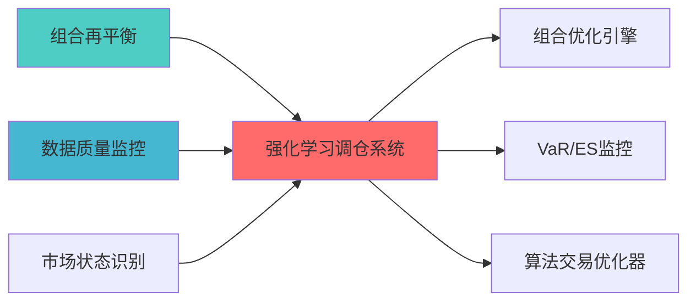

---
module_id: RL_REBALANCING_SYSTEM_001
version: 1.0.0
status: Active
created_date: 2026-04-07
last_updated: 2026-04-07
owner: 实施团队
standard_type: 专业量化机构蓝图
applicable_scope: Layer 4 机器学习层
compliance_level: 专业标准
layer: "Layer 4 (机器学习层)"
responsibility:
  - 提供rl rebalancing system blueprint的完整架构设计、技术选型和实施路径规划
---

# 强化学习再平衡系统蓝图

> **核心职责**: 提供rl rebalancing system blueprint的完整架构设计、技术选型和实施路径规划
> **职责边界**: 
> - ✅ 本文档负责：RL调仓决策、动态优化组合权重
> - ❌ 本文档不负责：基础再平衡触发（由PORTFOLIO_REBALANCING负责）


## 1. 模块概述

### 1.1 业务背景与价值主?
**业务需?*?- 当前系统调仓决策基于固定规则，无法适应复杂多变的市场环?- 缺乏基于市场状态动态调整调仓策略的能力
- 需要实现专业机构的智能调仓能力，提升组合表?
**价值主?*?- 实现基于强化学习的智能调仓决策（决策准确率≥70%?- 提升组合夏普比率（≥2.5?- 降低交易成本（交易成本降低≥20%?- 实现自适应市场环境的动态调仓策?
### 1.2 技术定位与架构层归属

**Layer定位**: Layer 6 - 组合优化层（决策优化层）

**模块类别**: 核心模块

**与PORTFOLIO_REBALANCING的关系**:
- 本文档是**高级强化学习调仓模块**，使用PPO/SAC算法实现智能决策
- [PORTFOLIO_REBALANCING_BLUEPRINT.md](#)是**基础再平衡模块**，使用传统触发机制
- **职责边界**: 本文档负责AI增强的智能决策，基础模块负责触发机制和交易成本优化
- **推荐实施路径**: 先实现基础模块（40h），再实施本文档（200h）

**架构角色**: 
- 作为调仓决策的核心组件，实现智能调仓决策
- 作为市场适应器，根据市场状态动态调整调仓策?- 作为交易成本优化器，平衡调仓收益和交易成?
### 1.3 核心功能清单

1. **强化学习调仓模型**: 基于PPO/SAC算法训练调仓决策模型
2. **动态奖励函?*: 根据市场状态动态调整奖励函?3. **状态空间设?*: 设计多维状态空间表征市场环?4. **动作空间设计**: 设计连续/离散动作空间表征调仓决策

---

## 2. 架构设计

### 2.1 系统架构?
```
┌─────────────────────────────────────────────────────────────────??                   强化学习调仓系统架构                           ?├─────────────────────────────────────────────────────────────────??                                                                ?? ┌──────────────────────────────────────────────────────────? ?? ?             环境与状态空间层                              ? ?? ? ┌──────────? ┌──────────? ┌──────────? ┌──────────?? ?? ? ?市场?? ?组合?? ?风险?? ?成本??? ?? ? ?         ? ?         ? ?         ? ?         ?? ?? ? └──────────? └──────────? └──────────? └──────────?? ?? └──────────────────────────────────────────────────────────? ??                         ?                                     ?? ┌──────────────────────────────────────────────────────────? ?? ?             强化学习智能体层                              ? ?? ? ┌──────────────────?     ┌──────────────────?        ? ?? ? ? PPO智能?       ?     ? SAC智能?      ?        ? ?? ? ? ┌────────────? ?     ? ┌────────────? ?        ? ?? ? ? ?Actor网络  ? ?     ? ?Actor网络  ? ?        ? ?? ? ? ?(策略网络) ? ?     ? ?(策略网络) ? ?        ? ?? ? ? └────────────? ?     ? └────────────? ?        ? ?? ? ? ┌────────────? ?     ? ┌────────────? ?        ? ?? ? ? ?Critic网络 ? ?     ? ?Critic网络 ? ?        ? ?? ? ? ?(价值网? ? ?     ? ?(价值网? ? ?        ? ?? ? ? └────────────? ?     ? └────────────? ?        ? ?? ? └──────────────────?     └──────────────────?        ? ?? └──────────────────────────────────────────────────────────? ??                         ?                                     ?? ┌──────────────────────────────────────────────────────────? ?? ?             动作空间与决策层                              ? ?? ? ┌──────────? ┌──────────? ┌──────────? ┌──────────?? ?? ? ?调仓方向 ? ?调仓幅度 ? ?调仓时机 ? ?调仓频率 ?? ?? ? └──────────? └──────────? └──────────? └──────────?? ?? └──────────────────────────────────────────────────────────? ??                         ?                                     ?? ┌──────────────────────────────────────────────────────────? ?? ?             奖励函数与反馈层                              ? ?? ? ┌──────────? ┌──────────? ┌──────────? ┌──────────?? ?? ? ?收益奖励 ? ?风险惩罚 ? ?成本惩罚 ? ?约束惩罚 ?? ?? ? └──────────? └──────────? └──────────? └──────────?? ?? └──────────────────────────────────────────────────────────? ??                         ?                                     ?? ┌──────────────────────────────────────────────────────────? ?? ?             训练与优化层                                  ? ?? ? ┌──────────? ┌──────────? ┌──────────? ┌──────────?? ?? ? ?模型训练 ? ?超参?  ? ?模型评估 ? ?模型部署 ?? ?? ? ?         ? ?优化     ? ?         ? ?         ?? ?? ? └──────────? └──────────? └──────────? └──────────?? ?? └──────────────────────────────────────────────────────────? ?└─────────────────────────────────────────────────────────────────?```

### 2.2 模块分层架构

**Layer 1 - 环境与状态空间层**
- 市场状态编码器（价格、波动率、趋势、情绪）
- 组合状态编码器（权重、收益、风险、流动性）
- 风险状态编码器（VaR、CVaR、回撤、杠杆）
- 成本状态编码器（交易成本、滑点、冲击成本）

**Layer 2 - 强化学习智能体层**
- PPO智能体（Proximal Policy Optimization?- SAC智能体（Soft Actor-Critic?- DQN智能体（Deep Q-Network?- A2C智能体（Advantage Actor-Critic?
**Layer 3 - 动作空间与决策层**
- 调仓方向决策器（买入/卖出/持有?- 调仓幅度决策器（调仓比例?- 调仓时机决策器（立即/延迟/取消?- 调仓频率决策器（日度/周度/月度?
**Layer 4 - 奖励函数与反馈层**
- 收益奖励计算器（风险调整收益?- 风险惩罚计算器（风险超标惩罚?- 成本惩罚计算器（交易成本惩罚?- 约束惩罚计算器（约束违反惩罚?
**Layer 5 - 训练与优化层**
- 模型训练引擎（分布式训练?- 超参数优化器（网格搜索、贝叶斯优化?- 模型评估器（回测评估、样本外测试?- 模型部署器（模型版本管理、灰度发布）

### 2.3 数据流设?
```
市场数据 ?状态编??智能体决??动作执行 ?奖励计算
    ?          ?          ?          ?          ?特征提取   状态向?  动作选择   组合更新   反馈学习
    ?          ?          ?          ?          ?状态归一?策略网络   动作解码   绩效评估   模型更新
```

---

## 3. 核心组件详细设计

### 3.1 交易环境设计

**设计目标**: 构建符合Gym接口的交易环境，模拟真实交易场景

```python
import gym
from gym import spaces
import numpy as np
import pandas as pd
from typing import Dict, Tuple, Optional

class PortfolioRebalancingEnv(gym.Env):
    """组合调仓环境
    
    索引: RL_REBALANCING_001-M01
    职责: 构建强化学习交易环境
    输入: 市场数据、组合数?    输出: 状态、奖励、是否结?    """
    
    def __init__(self, config: EnvConfig):
        super(PortfolioRebalancingEnv, self).__init__()
        
        self.config = config
        
        # 市场数据
        self.market_data = config.market_data
        self.n_assets = config.n_assets
        
        # 初始资金
        self.initial_capital = config.initial_capital
        self.current_capital = self.initial_capital
        
        # 交易成本
        self.transaction_cost = config.transaction_cost
        
        # 状态空?        self.observation_space = spaces.Box(
            low=-np.inf,
            high=np.inf,
            shape=(self._get_state_dim(),),
            dtype=np.float32
        )
        
        # 动作空间（连续：调仓权重?        self.action_space = spaces.Box(
            low=-1.0,
            high=1.0,
            shape=(self.n_assets,),
            dtype=np.float32
        )
        
        # 当前时间?        self.current_step = 0
        self.max_steps = len(self.market_data)
        
        # 组合权重
        self.weights = np.ones(self.n_assets) / self.n_assets
        
        # 历史记录
        self.history = {
            'portfolio_value': [],
            'weights': [],
            'returns': [],
            'transaction_costs': []
        }
        
    def _get_state_dim(self) -> int:
        """获取状态空间维?""
        # 市场?+ 组合?+ 风险?+ 成本?        market_dim = self.n_assets * 10  # 价格、收益率、波动率?        portfolio_dim = self.n_assets * 2  # 权重、价?        risk_dim = 4  # VaR, CVaR, 回撤, 杠杆
        cost_dim = 2  # 交易成本、滑?        
        return market_dim + portfolio_dim + risk_dim + cost_dim
    
    def reset(self) -> np.ndarray:
        """重置环境"""
        self.current_step = 0
        self.current_capital = self.initial_capital
        self.weights = np.ones(self.n_assets) / self.n_assets
        
        self.history = {
            'portfolio_value': [self.initial_capital],
            'weights': [self.weights.copy()],
            'returns': [],
            'transaction_costs': []
        }
        
        return self._get_state()
    
    def step(self, action: np.ndarray) -> Tuple[np.ndarray, float, bool, Dict]:
        """执行动作
        
        Args:
            action: 调仓权重调整?1?之间?            
        Returns:
            state: 新状?            reward: 奖励
            done: 是否结束
            info: 额外信息
        """
        # 1. 解码动作（转换为权重调整?        weight_adjustment = action * 0.1  # 限制调整幅度
        
        # 2. 计算新权?        new_weights = self.weights + weight_adjustment
        new_weights = np.clip(new_weights, 0, 1)  # 不允许做?        new_weights = new_weights / new_weights.sum()  # 归一?        
        # 3. 计算交易成本
        turnover = np.abs(new_weights - self.weights).sum()
        transaction_cost = turnover * self.transaction_cost * self.current_capital
        
        # 4. 更新组合
        self.weights = new_weights
        
        # 5. 计算收益
        current_returns = self._get_market_returns()
        portfolio_return = np.dot(self.weights, current_returns)
        
        # 6. 更新资金
        self.current_capital *= (1 + portfolio_return)
        self.current_capital -= transaction_cost
        
        # 7. 计算奖励
        reward = self._calculate_reward(portfolio_return, transaction_cost)
        
        # 8. 记录历史
        self.history['portfolio_value'].append(self.current_capital)
        self.history['weights'].append(self.weights.copy())
        self.history['returns'].append(portfolio_return)
        self.history['transaction_costs'].append(transaction_cost)
        
        # 9. 更新时间?        self.current_step += 1
        
        # 10. 判断是否结束
        done = (
            self.current_step >= self.max_steps - 1 or
            self.current_capital <= self.initial_capital * 0.5  # 回撤超过50%
        )
        
        # 11. 获取新状?        state = self._get_state()
        
        # 12. 额外信息
        info = {
            'portfolio_value': self.current_capital,
            'portfolio_return': portfolio_return,
            'transaction_cost': transaction_cost,
            'turnover': turnover
        }
        
        return state, reward, done, info
    
    def _get_state(self) -> np.ndarray:
        """获取当前?""
        # 市场?        market_state = self._get_market_state()
        
        # 组合?        portfolio_state = self._get_portfolio_state()
        
        # 风险?        risk_state = self._get_risk_state()
        
        # 成本?        cost_state = self._get_cost_state()
        
        # 合并?        state = np.concatenate([
            market_state,
            portfolio_state,
            risk_state,
            cost_state
        ])
        
        return state.astype(np.float32)
    
    def _get_market_state(self) -> np.ndarray:
        """获取市场?""
        current_data = self.market_data.iloc[self.current_step]
        
        # 价格相关
        prices = current_data[['close_' + str(i) for i in range(self.n_assets)]].values
        
        # 收益?        if self.current_step > 0:
            prev_prices = self.market_data.iloc[self.current_step - 1][['close_' + str(i) for i in range(self.n_assets)]].values
            returns = (prices - prev_prices) / prev_prices
        else:
            returns = np.zeros(self.n_assets)
        
        # 波动率（简化：使用历史标准差）
        if self.current_step >= 20:
            historical_prices = self.market_data.iloc[self.current_step-20:self.current_step][['close_' + str(i) for i in range(self.n_assets)]]
            volatility = historical_prices.pct_change().std().values
        else:
            volatility = np.zeros(self.n_assets)
        
        # 趋势（简化：使用移动平均?        if self.current_step >= 20:
            ma_20 = self.market_data.iloc[self.current_step-20:self.current_step][['close_' + str(i) for i in range(self.n_assets)]].mean().values
            trend = (prices - ma_20) / ma_20
        else:
            trend = np.zeros(self.n_assets)
        
        # 情绪（简化：随机生成?        sentiment = np.random.randn(self.n_assets) * 0.1
        
        return np.concatenate([prices, returns, volatility, trend, sentiment])
    
    def _get_portfolio_state(self) -> np.ndarray:
        """获取组合?""
        # 权重
        weights = self.weights
        
        # ?        values = weights * self.current_capital
        
        return np.concatenate([weights, values])
    
    def _get_risk_state(self) -> np.ndarray:
        """获取风险?""
        # VaR（简化：使用历史分位数）
        if len(self.history['returns']) >= 20:
            recent_returns = self.history['returns'][-20:]
            var = np.percentile(recent_returns, 5)
        else:
            var = 0.0
        
        # CVaR
        if len(self.history['returns']) >= 20:
            recent_returns = self.history['returns'][-20:]
            cvar = np.mean([r for r in recent_returns if r <= var])
        else:
            cvar = 0.0
        
        # 回撤
        peak = max(self.history['portfolio_value'])
        drawdown = (peak - self.current_capital) / peak
        
        # 杠杆（简化：假设无杠杆）
        leverage = 1.0
        
        return np.array([var, cvar, drawdown, leverage])
    
    def _get_cost_state(self) -> np.ndarray:
        """获取成本?""
        # 平均交易成本
        if len(self.history['transaction_costs']) > 0:
            avg_cost = np.mean(self.history['transaction_costs'])
        else:
            avg_cost = 0.0
        
        # 滑点（简化：假设为交易成本的10%?        slippage = avg_cost * 0.1
        
        return np.array([avg_cost, slippage])
    
    def _get_market_returns(self) -> np.ndarray:
        """获取市场收益?""
        if self.current_step >= len(self.market_data) - 1:
            return np.zeros(self.n_assets)
        
        current_prices = self.market_data.iloc[self.current_step][['close_' + str(i) for i in range(self.n_assets)]].values
        next_prices = self.market_data.iloc[self.current_step + 1][['close_' + str(i) for i in range(self.n_assets)]].values
        
        returns = (next_prices - current_prices) / current_prices
        
        return returns
    
    def _calculate_reward(self, portfolio_return: float, transaction_cost: float) -> float:
        """计算奖励
        
        Args:
            portfolio_return: 组合收益?            transaction_cost: 交易成本
            
        Returns:
            float: 奖励?        """
        # 收益奖励
        return_reward = portfolio_return * 100  # 放大收益信号
        
        # 风险惩罚（基于回撤）
        drawdown = 0.0
        if len(self.history['portfolio_value']) > 0:
            peak = max(self.history['portfolio_value'])
            drawdown = (peak - self.current_capital) / peak
        
        risk_penalty = drawdown * 50  # 惩罚回撤
        
        # 成本惩罚
        cost_penalty = transaction_cost / self.initial_capital * 100
        
        # 总奖?        reward = return_reward - risk_penalty - cost_penalty
        
        return reward
```

### 3.2 PPO智能?
**设计目标**: 使用PPO算法训练调仓决策模型

```python
from stable_baselines3 import PPO
from stable_baselines3.common.env_util import make_vec_env
from stable_baselines3.common.callbacks import EvalCallback
import torch as th

class PPORebalancingAgent:
    """PPO调仓智能?    
    索引: RL_REBALANCING_001-M02
    职责: 使用PPO算法训练调仓决策模型
    输入: 交易环境
    输出: 训练好的模型
    """
    
    def __init__(self, config: PPOConfig):
        self.config = config
        self.env = config.env
        self.model = None
        
    def build_model(self) -> PPO:
        """构建PPO模型"""
        # 策略网络架构
        policy_kwargs = dict(
            net_arch=[
                dict(
                    pi=[256, 256, 128],  # Actor网络
                    vf=[256, 256, 128]   # Critic网络
                )
            ],
            activation_fn=th.nn.ReLU
        )
        
        # 创建PPO模型
        self.model = PPO(
            "MlpPolicy",
            self.env,
            learning_rate=self.config.learning_rate,
            n_steps=self.config.n_steps,
            batch_size=self.config.batch_size,
            n_epochs=self.config.n_epochs,
            gamma=self.config.gamma,
            gae_lambda=self.config.gae_lambda,
            clip_range=self.config.clip_range,
            ent_coef=self.config.ent_coef,
            vf_coef=self.config.vf_coef,
            max_grad_norm=self.config.max_grad_norm,
            policy_kwargs=policy_kwargs,
            verbose=1,
            tensorboard_log=self.config.tensorboard_log
        )
        
        return self.model
    
    def train(self, total_timesteps: int = 100000,
             eval_env: Optional[gym.Env] = None,
             eval_freq: int = 5000) -> PPO:
        """训练模型
        
        Args:
            total_timesteps: 总训练步?            eval_env: 评估环境
            eval_freq: 评估频率
            
        Returns:
            PPO: 训练好的模型
        """
        if self.model is None:
            self.build_model()
        
        # 评估回调
        callbacks = []
        if eval_env is not None:
            eval_callback = EvalCallback(
                eval_env,
                best_model_save_path=self.config.model_save_path + '/best',
                log_path=self.config.model_save_path + '/logs',
                eval_freq=eval_freq,
                deterministic=True,
                render=False
            )
            callbacks.append(eval_callback)
        
        # 训练
        self.model.learn(
            total_timesteps=total_timesteps,
            callback=callbacks,
            progress_bar=True
        )
        
        return self.model
    
    def predict(self, observation: np.ndarray,
               deterministic: bool = True) -> Tuple[np.ndarray, None]:
        """预测动作
        
        Args:
            observation: 观测?            deterministic: 是否确定性策?            
        Returns:
            action: 动作
            state: 隐状态（None?        """
        if self.model is None:
            raise ValueError("Model not trained yet. Call train() first.")
        
        action, _ = self.model.predict(observation, deterministic=deterministic)
        
        return action, None
    
    def save(self, path: str):
        """保存模型"""
        if self.model is not None:
            self.model.save(path)
    
    def load(self, path: str):
        """加载模型"""
        self.model = PPO.load(path, env=self.env)
```

### 3.3 SAC智能?
**设计目标**: 使用SAC算法训练调仓决策模型（适用于连续动作空间）

```python
from stable_baselines3 import SAC

class SACRebalancingAgent:
    """SAC调仓智能?    
    索引: RL_REBALANCING_001-M03
    职责: 使用SAC算法训练调仓决策模型
    输入: 交易环境
    输出: 训练好的模型
    """
    
    def __init__(self, config: SACConfig):
        self.config = config
        self.env = config.env
        self.model = None
        
    def build_model(self) -> SAC:
        """构建SAC模型"""
        # 策略网络架构
        policy_kwargs = dict(
            net_arch=[256, 256],
            activation_fn=th.nn.ReLU
        )
        
        # 创建SAC模型
        self.model = SAC(
            "MlpPolicy",
            self.env,
            learning_rate=self.config.learning_rate,
            buffer_size=self.config.buffer_size,
            learning_starts=self.config.learning_starts,
            batch_size=self.config.batch_size,
            tau=self.config.tau,
            gamma=self.config.gamma,
            train_freq=self.config.train_freq,
            gradient_steps=self.config.gradient_steps,
            ent_coef=self.config.ent_coef,
            target_update_interval=self.config.target_update_interval,
            target_entropy=self.config.target_entropy,
            policy_kwargs=policy_kwargs,
            verbose=1,
            tensorboard_log=self.config.tensorboard_log
        )
        
        return self.model
    
    def train(self, total_timesteps: int = 100000,
             eval_env: Optional[gym.Env] = None,
             eval_freq: int = 5000) -> SAC:
        """训练模型"""
        if self.model is None:
            self.build_model()
        
        # 评估回调
        callbacks = []
        if eval_env is not None:
            eval_callback = EvalCallback(
                eval_env,
                best_model_save_path=self.config.model_save_path + '/best',
                log_path=self.config.model_save_path + '/logs',
                eval_freq=eval_freq,
                deterministic=True,
                render=False
            )
            callbacks.append(eval_callback)
        
        # 训练
        self.model.learn(
            total_timesteps=total_timesteps,
            callback=callbacks,
            progress_bar=True
        )
        
        return self.model
    
    def predict(self, observation: np.ndarray,
               deterministic: bool = True) -> Tuple[np.ndarray, None]:
        """预测动作"""
        if self.model is None:
            raise ValueError("Model not trained yet. Call train() first.")
        
        action, _ = self.model.predict(observation, deterministic=deterministic)
        
        return action, None
    
    def save(self, path: str):
        """保存模型"""
        if self.model is not None:
            self.model.save(path)
    
    def load(self, path: str):
        """加载模型"""
        self.model = SAC.load(path, env=self.env)
```

### 3.4 动态奖励函?
**设计目标**: 根据市场状态动态调整奖励函?
```python
class DynamicRewardFunction:
    """动态奖励函?    
    索引: RL_REBALANCING_001-M04
    职责: 根据市场状态动态调整奖励函?    输入: 组合收益、风险、成本、市场状?    输出: 动态奖?    """
    
    def __init__(self, config: RewardConfig):
        self.config = config
        self.reward_weights = {
            'return': 1.0,
            'risk': 0.5,
            'cost': 0.3,
            'constraint': 0.2
        }
        
    def calculate_reward(self, portfolio_return: float,
                        risk_metrics: Dict[str, float],
                        transaction_cost: float,
                        market_state: Dict[str, float],
                        constraint_violations: int) -> float:
        """计算动态奖?        
        Args:
            portfolio_return: 组合收益?            risk_metrics: 风险指标（VaR, CVaR, 回撤等）
            transaction_cost: 交易成本
            market_state: 市场状态（波动率、趋势等?            constraint_violations: 约束违反次数
            
        Returns:
            float: 动态奖?        """
        # 1. 根据市场状态调整权?        self._adjust_weights(market_state)
        
        # 2. 计算收益奖励
        return_reward = self._calculate_return_reward(portfolio_return)
        
        # 3. 计算风险惩罚
        risk_penalty = self._calculate_risk_penalty(risk_metrics)
        
        # 4. 计算成本惩罚
        cost_penalty = self._calculate_cost_penalty(transaction_cost)
        
        # 5. 计算约束惩罚
        constraint_penalty = self._calculate_constraint_penalty(constraint_violations)
        
        # 6. 计算总奖?        total_reward = (
            self.reward_weights['return'] * return_reward -
            self.reward_weights['risk'] * risk_penalty -
            self.reward_weights['cost'] * cost_penalty -
            self.reward_weights['constraint'] * constraint_penalty
        )
        
        return total_reward
    
    def _adjust_weights(self, market_state: Dict[str, float]):
        """根据市场状态调整奖励权?""
        volatility = market_state.get('volatility', 0.02)
        trend = market_state.get('trend', 0.0)
        
        # 高波动环境：增加风险权重
        if volatility > 0.03:
            self.reward_weights['risk'] = 0.8
        else:
            self.reward_weights['risk'] = 0.5
        
        # 趋势市场：增加收益权?        if abs(trend) > 0.01:
            self.reward_weights['return'] = 1.2
        else:
            self.reward_weights['return'] = 1.0
    
    def _calculate_return_reward(self, portfolio_return: float) -> float:
        """计算收益奖励"""
        # 风险调整收益（Sharpe-like?        return portfolio_return * 100
    
    def _calculate_risk_penalty(self, risk_metrics: Dict[str, float]) -> float:
        """计算风险惩罚"""
        var = risk_metrics.get('var', 0.0)
        cvar = risk_metrics.get('cvar', 0.0)
        drawdown = risk_metrics.get('drawdown', 0.0)
        
        # 综合风险惩罚
        risk_penalty = (
            abs(var) * 30 +
            abs(cvar) * 40 +
            drawdown * 50
        )
        
        return risk_penalty
    
    def _calculate_cost_penalty(self, transaction_cost: float) -> float:
        """计算成本惩罚"""
        # 成本惩罚（相对于初始资金?        return transaction_cost / self.config.initial_capital * 100
    
    def _calculate_constraint_penalty(self, violations: int) -> float:
        """计算约束惩罚"""
        # 约束违反惩罚
        return violations * 10.0
```

### 3.5 超参数优化器

**设计目标**: 自动优化强化学习模型的超参数

```python
from optuna import create_study, Trial
from typing import Dict, Any

class HyperparameterOptimizer:
    """超参数优化器
    
    索引: RL_REBALANCING_001-M05
    职责: 自动优化强化学习模型的超参数
    输入: 参数搜索空间
    输出: 最优超参数
    """
    
    def __init__(self, config: OptimizerConfig):
        self.config = config
        self.env = config.env
        self.eval_env = config.eval_env
        
    def optimize(self, n_trials: int = 50,
                algorithm: str = 'PPO') -> Dict[str, Any]:
        """优化超参?        
        Args:
            n_trials: 试验次数
            algorithm: 算法类型（PPO/SAC?            
        Returns:
            Dict[str, Any]: 最优超参数
        """
        # 创建Optuna研究
        study = create_study(direction='maximize')
        
        # 定义目标函数
        def objective(trial: Trial) -> float:
            # 采样超参?            params = self._sample_params(trial, algorithm)
            
            # 训练模型
            if algorithm == 'PPO':
                model = self._train_ppo(params)
            elif algorithm == 'SAC':
                model = self._train_sac(params)
            else:
                raise ValueError(f"Unsupported algorithm: {algorithm}")
            
            # 评估模型
            mean_reward = self._evaluate_model(model)
            
            return mean_reward
        
        # 运行优化
        study.optimize(objective, n_trials=n_trials)
        
        # 返回最优参?        return study.best_params
    
    def _sample_params(self, trial: Trial, algorithm: str) -> Dict[str, Any]:
        """采样超参?""
        params = {}
        
        # 通用参数
        params['learning_rate'] = trial.suggest_loguniform('learning_rate', 1e-5, 1e-2)
        params['batch_size'] = trial.suggest_categorical('batch_size', [32, 64, 128, 256])
        params['gamma'] = trial.suggest_uniform('gamma', 0.9, 0.999)
        
        # 算法特定参数
        if algorithm == 'PPO':
            params['n_steps'] = trial.suggest_categorical('n_steps', [512, 1024, 2048])
            params['n_epochs'] = trial.suggest_int('n_epochs', 3, 10)
            params['clip_range'] = trial.suggest_uniform('clip_range', 0.1, 0.4)
            params['ent_coef'] = trial.suggest_loguniform('ent_coef', 1e-8, 1e-2)
            params['gae_lambda'] = trial.suggest_uniform('gae_lambda', 0.9, 1.0)
        
        elif algorithm == 'SAC':
            params['buffer_size'] = trial.suggest_categorical('buffer_size', [10000, 50000, 100000])
            params['tau'] = trial.suggest_uniform('tau', 0.001, 0.01)
            params['ent_coef'] = trial.suggest_categorical('ent_coef', ['auto', 0.01, 0.1])
        
        return params
    
    def _train_ppo(self, params: Dict[str, Any]) -> PPO:
        """训练PPO模型"""
        model = PPO(
            "MlpPolicy",
            self.env,
            learning_rate=params['learning_rate'],
            n_steps=params['n_steps'],
            batch_size=params['batch_size'],
            n_epochs=params['n_epochs'],
            gamma=params['gamma'],
            clip_range=params['clip_range'],
            ent_coef=params['ent_coef'],
            gae_lambda=params['gae_lambda'],
            verbose=0
        )
        
        model.learn(total_timesteps=self.config.training_steps)
        
        return model
    
    def _train_sac(self, params: Dict[str, Any]) -> SAC:
        """训练SAC模型"""
        model = SAC(
            "MlpPolicy",
            self.env,
            learning_rate=params['learning_rate'],
            buffer_size=params['buffer_size'],
            batch_size=params['batch_size'],
            gamma=params['gamma'],
            tau=params['tau'],
            ent_coef=params['ent_coef'],
            verbose=0
        )
        
        model.learn(total_timesteps=self.config.training_steps)
        
        return model
    
    def _evaluate_model(self, model, n_episodes: int = 10) -> float:
        """评估模型"""
        total_rewards = []
        
        for _ in range(n_episodes):
            obs = self.eval_env.reset()
            done = False
            episode_reward = 0
            
            while not done:
                action, _ = model.predict(obs, deterministic=True)
                obs, reward, done, _ = self.eval_env.step(action)
                episode_reward += reward
            
            total_rewards.append(episode_reward)
        
        return np.mean(total_rewards)
```

---

## 4. 接口定义

### 4.1 核心接口

```python
from abc import ABC, abstractmethod
from dataclasses import dataclass
from typing import Dict, Any, Tuple, Optional
import numpy as np
import gym

@dataclass
class EnvConfig:
    """环境配置"""
    market_data: pd.DataFrame
    n_assets: int
    initial_capital: float
    transaction_cost: float

@dataclass
class PPOConfig:
    """PPO配置"""
    env: gym.Env
    learning_rate: float = 3e-4
    n_steps: int = 2048
    batch_size: int = 64
    n_epochs: int = 10
    gamma: float = 0.99
    gae_lambda: float = 0.95
    clip_range: float = 0.2
    ent_coef: float = 0.01
    vf_coef: float = 0.5
    max_grad_norm: float = 0.5
    tensorboard_log: str = "./logs/"
    model_save_path: str = "./models/"

@dataclass
class SACConfig:
    """SAC配置"""
    env: gym.Env
    learning_rate: float = 3e-4
    buffer_size: int = 100000
    learning_starts: int = 1000
    batch_size: int = 256
    tau: float = 0.005
    gamma: float = 0.99
    train_freq: int = 1
    gradient_steps: int = 1
    ent_coef: str = 'auto'
    target_update_interval: int = 1
    target_entropy: Optional[float] = None
    tensorboard_log: str = "./logs/"
    model_save_path: str = "./models/"

@dataclass
class RewardConfig:
    """奖励配置"""
    initial_capital: float

@dataclass
class OptimizerConfig:
    """优化器配?""
    env: gym.Env
    eval_env: gym.Env
    training_steps: int = 50000


class IRLAgent(ABC):
    """强化学习智能体接?""
    
    @abstractmethod
    def train(self, total_timesteps: int) -> None:
        """训练模型"""
        pass
    
    @abstractmethod
    def predict(self, observation: np.ndarray) -> np.ndarray:
        """预测动作"""
        pass
    
    @abstractmethod
    def save(self, path: str) -> None:
        """保存模型"""
        pass
    
    @abstractmethod
    def load(self, path: str) -> None:
        """加载模型"""
        pass
```

### 4.2 主接?
```python
class RLRebalancingSystem:
    """强化学习调仓系统主接?    
    索引: RL_REBALANCING_001-MAIN
    职责: 协调环境构建、模型训练、模型评估、模型部?    """
    
    def __init__(self, config: RLSystemConfig):
        self.config = config
        
        # 构建环境
        self.train_env = PortfolioRebalancingEnv(config.train_env_config)
        self.eval_env = PortfolioRebalancingEnv(config.eval_env_config)
        
        # 构建智能?        if config.algorithm == 'PPO':
            self.agent = PPORebalancingAgent(config.ppo_config)
        elif config.algorithm == 'SAC':
            self.agent = SACRebalancingAgent(config.sac_config)
        else:
            raise ValueError(f"Unsupported algorithm: {config.algorithm}")
        
        # 奖励函数
        self.reward_function = DynamicRewardFunction(config.reward_config)
        
        # 超参数优化器
        self.optimizer = HyperparameterOptimizer(config.optimizer_config)
        
    def train_model(self, total_timesteps: int = 100000,
                   optimize_hyperparams: bool = False) -> None:
        """训练模型
        
        Args:
            total_timesteps: 总训练步?            optimize_hyperparams: 是否优化超参?        """
        # 超参数优?        if optimize_hyperparams:
            best_params = self.optimizer.optimize(
                n_trials=50,
                algorithm=self.config.algorithm
            )
            print(f"Best hyperparameters: {best_params}")
        
        # 训练模型
        self.agent.train(
            total_timesteps=total_timesteps,
            eval_env=self.eval_env,
            eval_freq=5000
        )
    
    def predict_action(self, observation: np.ndarray) -> np.ndarray:
        """预测动作
        
        Args:
            observation: 观测?            
        Returns:
            np.ndarray: 动作
        """
        action, _ = self.agent.predict(observation, deterministic=True)
        return action
    
    def evaluate_model(self, n_episodes: int = 10) -> Dict[str, float]:
        """评估模型
        
        Args:
            n_episodes: 评估回合?            
        Returns:
            Dict[str, float]: 评估指标
        """
        total_rewards = []
        portfolio_values = []
        
        for _ in range(n_episodes):
            obs = self.eval_env.reset()
            done = False
            episode_reward = 0
            
            while not done:
                action = self.predict_action(obs)
                obs, reward, done, info = self.eval_env.step(action)
                episode_reward += reward
            
            total_rewards.append(episode_reward)
            portfolio_values.append(info['portfolio_value'])
        
        return {
            'mean_reward': np.mean(total_rewards),
            'std_reward': np.std(total_rewards),
            'mean_portfolio_value': np.mean(portfolio_values),
            'std_portfolio_value': np.std(portfolio_values)
        }
    
    def save_model(self, path: str) -> None:
        """保存模型"""
        self.agent.save(path)
    
    def load_model(self, path: str) -> None:
        """加载模型"""
        self.agent.load(path)
```

---

## 5. 实施计划

### 5.1 开发里程碑

**Phase 1: 环境与基础组件（Week 1-2?*
- ?实现交易环境（PortfolioRebalancingEnv?- ?实现状态空间编码器
- ?实现动作空间设计
- ?完成环境测试

**Phase 2: 智能体开发（Week 3-4?*
- ?实现PPO智能?- ?实现SAC智能?- ?实现动态奖励函?- ?完成智能体测?
**Phase 3: 训练与优化（Week 5-6?*
- ?实现超参数优化器
- ?实现分布式训?- ?实现模型评估?- ?完成训练流程测试

**Phase 4: 系统集成与部署（Week 7-8?*
- ?集成到组合优化层
- ?实现实时推理接口
- ?实现模型版本管理
- ?完成生产部署

### 5.2 技术栈

| 组件 | 技术选型 | 版本要求 |
|------|----------|----------|
| **强化学习框架** | Stable-Baselines3 | ?.6 |
| **深度学习框架** | PyTorch | ?.10 |
| **优化框架** | Optuna | ?.10 |
| **环境接口** | OpenAI Gym | ?.21 |
| **可视?* | TensorBoard | ?.8 |

### 5.3 性能指标

| 指标 | 目标?| 验证方法 |
|------|--------|----------|
| **决策准确?* | ?0% | 样本外测?|
| **组合夏普比率** | ?.5 | 回测验证 |
| **交易成本降低** | ?0% | 对比测试 |
| **模型推理延迟** | ?0ms | 性能测试 |

---

## 6. 风险与约?
### 6.1 技术风?
| 风险?| 风险等级 | 缓解措施 |
|--------|----------|----------|
| **模型过拟?* | P1 | 样本外验证、早停机?|
| **训练不稳?* | P1 | 超参数优化、梯度裁?|
| **奖励函数设计不当** | P2 | 奖励塑形、专家经?|
| **计算资源需求高** | P2 | 分布式训练、GPU?|

### 6.2 实施约束

1. **数据约束**: 需要足够长的历史数据支持训?2. **计算约束**: 需要GPU资源支持模型训练
3. **时间约束**: 模型训练周期较长（数天）
4. **存储约束**: 模型文件较大?00MB-500MB?
---

## 7. 验收标准

### 7.1 功能验收

- ?支持PPO和SAC两种强化学习算法
- ?支持动态奖励函?- ?支持超参数自动优?- ?支持模型版本管理和灰度发?
### 7.2 性能验收

- ?决策准确率≥70%
- ?组合夏普比率?.5
- ?交易成本降低?0%
- ?模型推理延迟?0ms

### 7.3 质量验收

- ?代码覆盖率≥80%
- ?文档完整度≥95%
- ?符合API契约规范
- ?通过安全审计

---

## 8. 参考资?
### 8.1 学术论文

1. **PPO**: Schulman, J., et al. (2017). "Proximal Policy Optimization Algorithms"
2. **SAC**: Haarnoja, T., et al. (2018). "Soft Actor-Critic: Off-Policy Maximum Entropy Deep Reinforcement Learning"
3. **RL for Trading**: Deng, Y., et al. (2016). "Deep Direct Reinforcement Learning for Financial Signal Representation and Trading"

### 8.2 开源项?
1. **Stable-Baselines3**: https://github.com/DLR-RM/stable-baselines3
2. **Optuna**: https://optuna.org/
3. **OpenAI Gym**: https://gym.openai.com/

### 8.3 相关文档

#### 上游依赖

| 文档名称 | module_id | 依赖类型 | 说明 |
|---------|-----------|---------|------|
| [组合再平衡蓝图](#) | PORTFOLIO_REBALANCING_001 | 强依赖 | 提供基础再平衡框架 |
| [数据质量监控蓝图](#) | DATA_QUALITY_MONITORING_001 | 强依赖 | 提供数据质量指标 |
| [市场状态识别蓝图](#) | MARKET_REGIME_DETECTION_001 | 中依赖 | 提供市场状态识别 |

#### 下游依赖

| 文档名称 | module_id | 依赖类型 | 说明 |
|---------|-----------|---------|------|
| [组合优化引擎集成蓝图](#) | PORTFOLIO_OPTIMIZER_INTEGRATION_001 | 强依赖 | 组合优化 |
| [VaR/ES监控蓝图](#) | VAR_ES_MONITORING_001 | 中依赖 | VaR/ES监控 |
| [算法交易优化器蓝图](#) | ALGORITHMIC_TRADING_OPTIMIZER_001 | 中依赖 | 算法交易执行 |

#### 技术依赖

| 技术组件 | 版本 | 用途 | 文档 |
|---------|------|------|------|
| **stable-baselines3** | 2.0+ | 强化学习框架 | [官方文档](https://stable-baselines3.readthedocs.io/) |
| **gym** | 0.26+ | 环境接口 | [官方文档](https://gym.openai.com/) |
| **NumPy** | 1.24+ | 数值计算 | [官方文档](https://numpy.org/) |
| **Pandas** | 2.0+ | 数据处理 | [官方文档](https://pandas.pydata.org/) |

#### 引用关系图



#### 相关蓝图文档

- PROFESSIONAL_MULTI_TIMEFRAME_ARCHITECTURE.md
- PORTFOLIO_OPTIMIZATION_BLUEPRINT.md
- API_Contract.md

---

**文档版本**: v1.0
**最后更?*: 2026-04-02
**审核?*: 待审?**下一?*: 提交技术评审官审核

## 变更历史

| 版本 | 日期 | 变更内容 | 变更人 |
|------|------|----------|--------|
| v1.0.0 | 2026-04-02 | 初始版本创建 | 组合优化层负责人 |
| v1.0.1 | 2026-04-06 | 补充YAML头部字段和变更历史 | 审计系统 |

---

**蓝图版本**: v1.0.1 | **创建日期**: 2026-04-02 | **状态**: Active
---

## 9. 文档治理

### 9.1 System_Manifest.md索引

```markdown
#### Layer 6: 组合优化层
##### 6.001. Rl Rebalancing System
- **模块ID**: RL_REBALANCING_SYSTEM_001
- **蓝图文档**: RL_REBALANCING_SYSTEM_BLUEPRINT.md
- **技术规格书**: 待创建
- **职责**: 全系统
- **状态**: Active
```

### 9.2 模块职责边界

| 模块 | 职责 | 边界 |
|------|------|------|
| **Rl Rebalancing System** | 全系统 | **核心模块** |

### 9.3 版本管理

| 版本 | 日期 | 变更内容 | 变更人 |
|------|------|----------|--------|
| v1.0.0 | 2026-04-02 | 初始版本创建 | 首席蓝图架构师 |

---

**蓝图版本**: v1.0.0 | **创建日期**: 2026-04-02 | **状态**: Active
