# 专业多时间框架策略架?
> **核心职责**: 文档内容说明
> **职责边界**: 
> - ✅ 本文档负责：文档内容说明相关内容
> - ❌ 本文档不负责：其他模块内容


> **版本**: v1.0
> **创建日期**: 2026-04-02
> **架构类型**: 专业机构级多时间框架融合架构
> **核心理念**: 桥水经济范式 + 文艺复兴统计套利 + 专业机构日内执行
> **替代文档**: [ARCHITECTURE.md](./ARCHITECTURE.md) - 此为完全重构的专业级替代方案

---

## 🏛?架构总览：三级时间框架融?

### 1.1 核心设计哲学

本架构基?*时间框架分离原则**，将投资决策分解为三个独立但协同的时间维度：

```
宏观配置?(季度/年度) ?中观策略?(周度/日度) ?微观执行?(日内/分钟/秒级)
```

**融合三大机构模式**?
1. **桥水基金模式**：经济范式判??全天候资产配?
2. **文艺复兴模式**：统计套利信??智能执行算法  
3. **专业机构模式**：日内交易团??多策略模块协?

### 1.2 架构全景?

```mermaid
graph TB
    subgraph "第一? 宏观配置?(Bridgewater模式)"
        A1[经济范式判断引擎] --> A2[全天候配置优化器]
        A2 --> A3[战略资产权重分配]
        A3 --> A4[季度调仓决策]
    end
    
    subgraph "第二? 中观策略?(Renaissance模式)"
        B1[市场状态识别系统] --> B2[阿尔法因子工厂]
        B2 --> B3[多因子合成引擎]
        B3 --> B4[日线组合优化器]
        B4 --> B5[日线交易信号生成]
    end
    
    subgraph "第三? 微观执行?(专业机构模式)"
        C1[分钟执行优化器] --> C2[智能执行算法库]
        C2 --> C3[具体交易订单生成]
        
        subgraph "专业策略模块集群"
            D1[开盘策略模块]
            D2[盘中策略模块] 
            D3[收盘策略模块]
            D4[事件驱动模块]
        end
        
        C4[实时风险对冲引擎] --> C5[秒级风险控制系统]
    end
    
    subgraph "贯穿支撑系统"
        E1[统一数据基础设施]
        E2[多时间框架风控体系]
        E3[全周期绩效归因系统]
        E4[人机协同决策界面]
    end
    
    A4 --> B1
    B5 --> C1
    D1 --> C1
    D2 --> C1
    D3 --> C1
    D4 --> C1
    
    E1 --> A1
    E1 --> B1
    E1 --> C1
    
    E2 --> A4
    E2 --> B5
    E2 --> C3
    
    E3 -.-> A1
    E3 -.-> B1
    E3 -.-> C1
    
    E4 --> A4
    E4 --> B5
    E4 --> C3
```



---

## 📊 第一级：宏观配置?(季度/年度)

### 2.1 层级定位与目?

| 维度 | 配置 |
|------|------|
| **时间框架** | 季度/年度决策，月度微?|
| **决策目标** | 战略资产配置，经济周期适应 |
| **风险目标** | 跨经济周期的稳定回报 |
| **调整频率** | 季度调仓，月度风险评?|
| **参考模?* | 桥水全天候策?|

### 2.2 核心组件

#### 2.2.1 经济范式判断引擎 (Economic Regime Engine)

```python
class EconomicRegimeEngine:
    """经济范式判断引擎 - 识别宏观经济周期阶段"""
    
    def __init__(self):
        self.macro_indicators = {
            'growth': ['GDP_growth', 'Industrial_output', 'PMI'],
            'inflation': ['CPI', 'PPI', 'Core_inflation'],
            'monetary': ['M2_growth', 'Interest_rate', 'Credit_growth'],
            'sentiment': ['Consumer_confidence', 'Business_sentiment']
        }
        self.regime_models = {
            'expansion': ExpansionRegimeModel(),
            'stagflation': StagflationRegimeModel(),
            'recession': RecessionRegimeModel(),
            'recovery': RecoveryRegimeModel()
        }
        
    def analyze_current_regime(self) -> RegimeAnalysis:
        """分析当前经济范式"""
        # 1. 收集宏观经济指标
        indicator_data = self._collect_macro_data()
        
        # 2. 多模型概率评?
        regime_probabilities = {}
        for regime_name, model in self.regime_models.items():
            probability = model.predict_probability(indicator_data)
            regime_probabilities[regime_name] = probability
        
        # 3. 生成范式判断
        dominant_regime = max(regime_probabilities, key=regime_probabilities.get)
        
        return RegimeAnalysis(
            dominant_regime=dominant_regime,
            probabilities=regime_probabilities,
            confidence=self._calculate_confidence(regime_probabilities),
            recommended_assets=self._get_recommended_assets(dominant_regime)
        )
```

#### 2.2.2 全天候配置优化器 (All-Weather Optimizer)

```python
class AllWeatherOptimizer:
    """全天候配置优化器 - 桥水风险平价模式"""
    
    def __init__(self):
        self.asset_classes = {
            'equity': {'growth': 'stocks', 'inflation': 'TIPS'},
            'bonds': {'growth': 'long_term_bonds', 'inflation': 'short_term_bonds'},
            'commodities': {'growth': 'industrial_metals', 'inflation': 'gold_oil'},
            'cash': {'growth': 'USD', 'inflation': 'other_currencies'}
        }
        self.risk_parity = RiskParityOptimizer()
        self.black_litterman = BlackLittermanModel()
        
    def optimize_allocation(self, regime: RegimeAnalysis) -> StrategicAllocation:
        """优化全天候资产配?""
        # 1. 基础风险平价配置
        base_weights = self.risk_parity.optimize(
            assets=list(self.asset_classes.keys()),
            risk_target=0.10,  # 年化波动?0%
            constraints={
                'min_weight': 0.05,
                'max_weight': 0.40
            }
        )
        
        # 2. 基于经济范式的Black-Litterman调整
        regime_views = self._generate_regime_views(regime)
        adjusted_weights = self.black_litterman.adjust(
            prior=base_weights,
            views=regime_views,
            confidence=regime.confidence * 0.8,  # 基于置信度调?
            tau=0.05  # 不确定性系?
        )
        
        # 3. 生成战略配置
        return StrategicAllocation(
            weights=adjusted_weights,
            regime=regime.dominant_regime,
            rebalance_trigger=self._get_rebalance_trigger(regime),
            expected_return=self._calculate_expected_return(adjusted_weights, regime),
            expected_risk=self._calculate_expected_risk(adjusted_weights, regime)
        )
```

### 2.3 输出产物

| 输出?| 格式 | 频率 | ç”?|
|--------|------|------|------|
| **经济范式报告** | JSON + PDF | 月度 | 宏观决策å?|
| **战略资产权重** | 权重向量 | 季度 | 大类资产配置 |
| **调仓触发信号** | 布尔?+ 原因 | 实时 | 触发配置调整 |
| **风险预算分配** | 风险预算矩阵 | 季度 | 风险限额管理 |

---

## 🧠 第二级：中观策略?(周度/日度)

### 3.1 层级定位与目?

| 维度 | 配置 |
|------|------|
| **时间框架** | 周度/日度决策，日内执?|
| **决策目标** | 超额收益(Alpha)生成，战术调?|
| **风险目标** | 风险调整后收益最大化 |
| **调整频率** | 日度信号生成，周度参数优?|
| **参考模?* | 文艺复兴统计套利 |

### 3.2 核心组件

#### 3.2.1 市场状态识别系?(Market Regime System)

```python
class MarketRegimeSystem:
    """市场状态识别系?- HMM + 技术指标融?""
    
    def __init__(self):
        self.hmm_model = HMMRegimeClassifier(n_states=4)  # 牛市/熊市/震荡?转折?
        self.technical_indicators = TechnicalRegimeIndicator()
        self.microstructure = MarketMicrostructureAnalyzer()
        
    def identify_market_state(self, market_data: MarketData) -> MarketState:
        """识别市场çŠ?""
        # 1. HMM隐马尔可夫模型识?
        hmm_state, hmm_prob = self.hmm_model.predict(market_data.price_series)
        
        # 2. 技术指标状态识?
        tech_state = self.technical_indicators.analyze(
            trend_indicators=['MA20', 'MA60', 'MACD'],
            momentum_indicators=['RSI', 'Stochastic', 'CCI'],
            volatility_indicators=['ATR', 'Bollinger']
        )
        
        # 3. 市场微观结构分析
        microstructure = self.microstructure.analyze(
            order_book=market_data.order_book,
            trade_flow=market_data.trade_flow,
            liquidity=market_data.liquidity
        )
        
        # 4. 多源融合决策
        final_state = self._fuse_decisions(
            hmm_state=hmm_state,
            tech_state=tech_state,
            microstructure=microstructure,
            hmm_confidence=hmm_prob
        )
        
        return MarketState(
            regime=final_state,
            confidence=self._calculate_confidence(hmm_prob, tech_state.confidence),
            duration_estimate=self._estimate_duration(final_state, market_data),
            strategy_implications=self._get_strategy_implications(final_state)
        )
```

#### 3.2.2 阿尔法因子工?(Alpha Factor Factory)

```python
class AlphaFactorFactory:
    """阿尔法因子工?- 5700+因子动态管?""
    
    def __init__(self):
        self.factor_library = FactorLibrary(size=5700)
        self.factor_selector = DynamicFactorSelector()
        self.factor_combiner = FactorCombinationEngine()
        
    def generate_alpha_signals(self, market_state: MarketState) -> AlphaSignals:
        """生成阿尔法信?""
        # 1. 基于市场状态的因子ç­?
        selected_factors = self.factor_selector.select_factors(
            market_regime=market_state.regime,
            stock_universe=self._get_stock_universe(),
            factor_types=['value', 'growth', 'quality', 'momentum', 'technical']
        )
        
        # 2. 因子计算与IC检?
        factor_values = {}
        factor_metrics = {}
        
        for factor in selected_factors:
            values = self.factor_library.calculate(factor)
            ic_result = self._calculate_ic(values, market_state)
            
            if ic_result.ic_ir > 1.0:  # IR > 1.0的因子保?
                factor_values[factor.name] = values
                factor_metrics[factor.name] = ic_result
        
        # 3. 多因子合?
        combined_alpha = self.factor_combiner.combine(
            factor_values=factor_values,
            weights=self._optimize_weights(factor_metrics),
            combination_method='hierarchical'  # 分层合成
        )
        
        # 4. 风险调整
        risk_adjusted_alpha = self._apply_risk_adjustment(
            alpha=combined_alpha,
            risk_factors=['market', 'size', 'value', 'momentum'],
            exposure_limits={'max_single_factor': 0.3}
        )
        
        return AlphaSignals(
            raw_scores=combined_alpha,
            risk_adjusted=risk_adjusted_alpha,
            factor_contributions=self._calculate_contributions(factor_values, factor_metrics),
            decay_forecast=self._forecast_decay(factor_metrics, market_state)
        )
```

#### 3.2.3 日线组合优化?(Daily Portfolio Optimizer)

```python
class DailyPortfolioOptimizer:
    """日线组合优化?- 均值方?+ 风险约束"""
    
    def __init__(self):
        self.mean_variance = MeanVarianceOptimizer()
        self.risk_constraints = RiskConstraintManager()
        self.turnover_control = TurnoverController()
        
    def optimize_daily_portfolio(self, 
                                alpha_signals: AlphaSignals,
                                current_positions: Dict) -> DailyPortfolio:
        """优化日线投资组合"""
        # 1. 预期收益估计
        expected_returns = self._estimate_returns(alpha_signals)
        
        # 2. 协方差矩阵估?
        covariance_matrix = self._estimate_covariance(
            returns_history=self._get_returns_history(),
            shrinkage_method='ledoit_wolf'
        )
        
        # 3. 优化问题定义
        optimization_problem = {
            'objective': 'max_sharpe',  # 最大化夏普比率
            'constraints': self.risk_constraints.get_daily_constraints(),
            'bounds': {
                'min_weight': 0.01,  # 最小持?%
                'max_weight': 0.10,  # 最大持?0%
                'max_turnover': 0.05  # 最大换手率5%
            }
        }
        
        # 4. 求解优化问题
        optimal_weights = self.mean_variance.optimize(
            expected_returns=expected_returns,
            covariance_matrix=covariance_matrix,
            **optimization_problem
        )
        
        # 5. 考虑交易成本调整
        adjusted_weights = self.turnover_control.adjust_for_cost(
            target_weights=optimal_weights,
            current_weights=current_positions,
            transaction_cost=0.001  # 交易成本0.1%
        )
        
        return DailyPortfolio(
            weights=adjusted_weights,
            expected_stats=self._calculate_expected_stats(adjusted_weights, expected_returns, covariance_matrix),
            rebalance_instructions=self._generate_rebalance_instructions(adjusted_weights, current_positions),
            risk_metrics=self._calculate_risk_metrics(adjusted_weights, covariance_matrix)
        )
```

#### 3.2.4 策略选择与权重分配系?(Strategy Selection & Weighting System)

```python
class StrategySelectionSystem:
    """策略选择与权重分配系?- 专业机构级多策略管理
    
    集成位置: 中观策略层核心组?
    职责: ?20+策略池中智能选择策略，动态分配权?
    核心算法: TOPSIS多准则决?+ 动态权重优?+ 风险平价分配
    参考设? [STRATEGY_SELECTION_BLUEPRINT.md](../03_TRADING_TACTICS/01_STRATEGY_FRAMEWORK/STRATEGY_SELECTION_BLUEPRINT.md)
    """
    
    def __init__(self, strategy_pool: StrategyPool):
        self.strategy_pool = strategy_pool
        self.evaluator = MultiCriteriaEvaluator()      # TOPSIS多准则评?
        self.weight_optimizer = DynamicWeightOptimizer()  # 动态权重优?
        self.correlation_analyzer = StrategyCorrelationAnalyzer()  # 相关性分?
        
    def select_strategies_by_timeframe(self, market_state: MarketState, 
                                      timeframe: str) -> SelectedStrategies:
        """基于时间框架选择策略
        
        参数:
            timeframe: 'weekly'周度策略, 'daily'日度策略, 'intraday'日内策略
            market_state: 当前市场çŠ?
            
        返回:
            选定策略列表及权重分?
        """
        # 1. 获取候选策略池
        all_strategies = self.strategy_pool.get_all_strategies()
        
        # 2. 按时间框架过?
        if timeframe == 'weekly':
            candidates = [s for s in all_strategies if s.timeframe in ['weekly', 'monthly']]
        elif timeframe == 'daily':
            candidates = [s for s in all_strategies if s.timeframe in ['daily', 'weekly']]
        elif timeframe == 'intraday':
            candidates = [s for s in all_strategies if s.timeframe in ['intraday', 'daily']]
        else:
            candidates = all_strategies
            
        # 3. 按市场状态过?
        market_filtered = [s for s in candidates 
                          if market_state.regime in s.get_applicable_states()]
        
        # 4. 多准则评?(TOPSIS算法)
        criteria_matrix = self._build_criteria_matrix(market_filtered)
        ranking_result = self.evaluator.evaluate(market_filtered, criteria_matrix)
        
        # 5. 相关性分?(避免高度相关策略)
        correlation_analysis = self.correlation_analyzer.analyze(market_filtered)
        diversified_strategies = self._apply_diversification_filter(
            ranking_result.top_strategies, 
            correlation_analysis
        )
        
        # 6. 动态权重分?
        final_weights = self.weight_optimizer.optimize_weights(
            diversified_strategies, 
            market_state=market_state
        )
        
        return SelectedStrategies(
            strategies=diversified_strategies,
            weights=final_weights,
            ranking_scores=ranking_result.closeness_scores,
            diversification_score=correlation_analysis.diversification_potential,
            selection_reasoning=self._generate_selection_reasoning(
                diversified_strategies, market_state, timeframe
            )
        )
        
    def _build_criteria_matrix(self, strategies: List[Strategy]) -> pd.DataFrame:
        """构建多准则评估矩?
        
        评估维度:
        - 绩效维度: 夏普比率、年化收益、最大回撤、胜?
        - 风险维度: 波动率、下行风险、尾部风?
        - 稳定性维? 收益序列稳定性、参数敏æ„?
        - 适应性维? 不同市场状态表现、策略鲁æ£?
        - 复杂度维? 策略简洁性、过拟合风险
        """
        criteria_data = {}
        
        for strategy in strategies:
            perf = strategy.get_performance()
            metrics = strategy.get_metrics()
            
            criteria_data[strategy.id] = {
                'sharpe_ratio': perf.sharpe_ratio,
                'annual_return': perf.annual_return,
                'max_drawdown': perf.max_drawdown,
                'win_rate': perf.win_rate,
                'volatility': metrics.volatility,
                'downside_risk': metrics.downside_risk,
                'stability_score': metrics.stability_score,
                'adaptability_score': metrics.adaptability_score,
                'complexity_score': metrics.complexity_score
            }
            
        return pd.DataFrame.from_dict(criteria_data, orient='index')
        
    def _apply_diversification_filter(self, strategies: List[Strategy],
                                    correlation_analysis: CorrelationAnalysis) -> List[Strategy]:
        """应用风险分散过滤?""
        filtered = []
        
        for strategy in strategies:
            # 检查与已选策略的相关?
            if not filtered:
                filtered.append(strategy)
                continue
                
            max_correlation = max(
                correlation_analysis.correlation_matrix.loc[strategy.id, s.id]
                for s in filtered if s.id in correlation_analysis.correlation_matrix.index
            )
            
            # 仅添加相关性低于阈值的策略
            if max_correlation < 0.7:
                filtered.append(strategy)
                
        return filtered
        
    def _generate_selection_reasoning(self, strategies: List[Strategy],
                                    market_state: MarketState,
                                    timeframe: str) -> str:
        """生成策略选择理由"""
        reasoning = []
        reasoning.append(f"时间框架: {timeframe}")
        reasoning.append(f"市场çŠ? {market_state.regime.value}")
        reasoning.append(f"选择策略数量: {len(strategies)}")
        
        for i, strategy in enumerate(strategies[:3], 1):
            perf = strategy.get_performance()
            reasoning.append(
                f"{i}. {strategy.name}: 夏普{perf.sharpe_ratio:.2f}, "
                f"年化收益{perf.annual_return:.1%}, 最大回撤{perf.max_drawdown:.1%}"
            )
            
        return "\n".join(reasoning)
```

### 3.3 输出产物

| 输出?| 格式 | 频率 | ç”?|
|--------|------|------|------|
| **市场状态报?* | JSON + 可视?| 日度 | 策略参数调整 |
| **阿尔法信号矩?* | 数值矩?| 日度 | 选股和权重基础 |
| **策略选择组合** | 策略列表 + 权重 | 日度/周度 | 多策略选择与权重分?|
| **日线目标组合** | 权重向量 | 日度 | 交易执行依据 |
| **风险暴露报告** | 风险矩阵 | 日度 | 风险监控 |

---

## ?第三级：微观执行?(日内/分钟/秒级)

### 4.1 层级定位与目?

| 维度 | 配置 |
|------|------|
| **时间框架** | 日内/分钟/秒级决策 |
| **决策目标** | 最优执行，成本最小化 |
| **风险目标** | 执行风险控制，流动性风?|
| **调整频率** | 分钟级优化，秒级对冲 |
| **参考模?* | 专业机构日内交易 |

### 4.2 核心组件

#### 4.2.1 分钟执行优化?(Minute Execution Optimizer)

```python
class MinuteExecutionOptimizer:
    """分钟执行优化?- 分时图模式识?+ 智能执行"""
    
    def __init__(self):
        self.minute_patterns = MinutePatternLibrary()
        self.execution_algorithms = ExecutionAlgorithmFactory()
        self.market_impact = MarketImpactModel()
        
    def optimize_minute_execution(self, 
                                 daily_signal: DailySignal,
                                 market_data: MinuteData) -> ExecutionPlan:
        """优化分钟级别执行"""
        # 1. 分时图模式识?
        pattern_analysis = self.minute_patterns.analyze(
            price_series=market_data.price,
            volume_series=market_data.volume,
            order_book=market_data.order_book
        )
        
        # 2. 执行算法选择
        algorithm = self.execution_algorithms.select_algorithm(
            order_characteristics={
                'size': daily_signal.quantity,
                'urgency': daily_signal.urgency,
                'symbol': daily_signal.symbol
            },
            market_conditions={
                'liquidity': market_data.liquidity,
                'volatility': market_data.volatility,
                'pattern': pattern_analysis.dominant_pattern
            }
        )
        
        # 3. 冲击成本预测
        impact_estimate = self.market_impact.estimate(
            order_size=daily_signal.quantity,
            symbol=daily_signal.symbol,
            time_of_day=market_data.timestamp.hour,
            algorithm=algorithm.name
        )
        
        # 4. 生成执行计划
        execution_plan = algorithm.generate_plan(
            symbol=daily_signal.symbol,
            quantity=daily_signal.quantity,
            constraints={
                'max_slippage': 0.001,  # 最大滑?.1%
                'completion_time': 'market_close',  # 收盘前完?
                'participation_rate': 0.10  # 最大参与率10%
            },
            market_data=market_data
        )
        
        return ExecutionPlan(
            algorithm=algorithm.name,
            schedule=execution_plan.schedule,
            expected_cost=impact_estimate.total_cost,
            risk_metrics=execution_plan.risk_metrics,
            contingency_plan=self._generate_contingency_plan(execution_plan, pattern_analysis)
        )
```

#### 4.2.2 智能执行算法?(Smart Execution Algorithms)

```python
class ExecutionAlgorithmFactory:
    """智能执行算法工厂 - VWAP/TWAP/IS/自适应"""
    
    def __init__(self):
        self.algorithms = {
            'VWAP': VWAPAlgorithm(
                volume_profile_source='historical',
                adaptation_mode='dynamic'
            ),
            'TWAP': TWAPAlgorithm(
                time_slices=30,  # 30个时间片
                slice_duration='1min'
            ),
            'IS': ImplementationShortfallAlgorithm(
                risk_aversion=0.5,
                urgency_weight=0.3
            ),
            'Adaptive': AdaptiveAlgorithm(
                learning_mode='reinforcement',
                adaptation_speed='fast'
            ),
            'DarkPool': DarkPoolAlgorithm(
                pool_selection='liquidity_optimized',
                minimum_fill=0.3  # 最低成交率30%
            )
        }
        
    def select_algorithm(self, order_characteristics: Dict, 
                        market_conditions: Dict) -> ExecutionAlgorithm:
        """选择最优执行算?""
        # 1. 基于订单特性的初筛
        candidate_algorithms = self._prefilter_algorithms(order_characteristics)
        
        # 2. 基于市场条件的评?
        algorithm_scores = {}
        for algo_name, algorithm in candidate_algorithms.items():
            score = algorithm.evaluate_suitability(
                order_size=order_characteristics['size'],
                symbol_liquidity=market_conditions['liquidity'],
                market_volatility=market_conditions['volatility'],
                time_constraint=order_characteristics.get('urgency', 'medium')
            )
            algorithm_scores[algo_name] = score
        
        # 3. 选择最高分算法
        best_algorithm = max(algorithm_scores, key=algorithm_scores.get)
        
        return self.algorithms[best_algorithm]
```

#### 4.2.3 实时风险对冲引擎 (Realtime Risk Hedger)

```python
class RealtimeRiskHedger:
    """实时风险对冲引擎 - 秒级风险监控与对?""
    
    def __init__(self):
        self.risk_monitors = {
            'exposure': ExposureMonitor(),
            'liquidity': LiquidityMonitor(),
            'volatility': VolatilityMonitor(),
            'correlation': CorrelationMonitor()
        }
        self.hedge_instruments = HedgeInstrumentFactory()
        self.hedge_strategies = HedgeStrategyFactory()
        
    def monitor_and_hedge(self, portfolio: Portfolio, 
                         market_data: RealtimeData) -> HedgeActions:
        """监控风险并执行对?""
        # 1. 实时风险监测
        risk_metrics = {}
        alerts = []
        
        for risk_type, monitor in self.risk_monitors.items():
            metrics = monitor.calculate(portfolio, market_data)
            risk_metrics[risk_type] = metrics
            
            if metrics.breached_threshold:
                alerts.append({
                    'risk_type': risk_type,
                    'severity': metrics.severity,
                    'current_value': metrics.current_value,
                    'threshold': metrics.threshold
                })
        
        # 2. 判断是否需要对?
        if not alerts:
            return HedgeActions(actions=[], hedged=False)
        
        # 3. 选择对冲工具和策?
        hedge_plan = self._create_hedge_plan(alerts, portfolio, market_data)
        
        # 4. 生成对冲指令
        hedge_actions = []
        for hedge_item in hedge_plan.items:
            instrument = self.hedge_instruments.get_instrument(
                instrument_type=hedge_item.instrument_type,
                symbol=hedge_item.symbol
            )
            
            strategy = self.hedge_strategies.get_strategy(
                strategy_type=hedge_item.strategy_type,
                hedge_ratio=hedge_item.ratio
            )
            
            action = strategy.generate_action(
                instrument=instrument,
                portfolio=portfolio,
                market_data=market_data
            )
            hedge_actions.append(action)
        
        return HedgeActions(
            actions=hedge_actions,
            hedged=True,
            risk_reduction=self._estimate_risk_reduction(hedge_plan),
            cost_estimate=self._estimate_hedge_cost(hedge_plan)
        )
```

### 4.3 专业策略模块集群

#### 4.3.1 开盘策略模?(Opening Strategy)

```python
class OpeningStrategy:
    """开盘策略模?- 集合竞价分析与开盘动?""
    
    def __init__(self):
        self.auction_analyzer = AuctionAnalyzer()
        self.opening_momentum = OpeningMomentumDetector()
        self.gap_analysis = GapAnalysisEngine()
        
    def generate_opening_signals(self, pre_market_data: PreMarketData) -> OpeningSignals:
        """生成开盘交易信?""
        # 1. 集合竞价分析
        auction_analysis = self.auction_analyzer.analyze(
            auction_orders=pre_market_data.auction_orders,
            indicative_price=pre_market_data.indicative_price
        )
        
        # 2. 跳空缺口分析
        gap_analysis = self.gap_analysis.analyze(
            previous_close=pre_market_data.previous_close,
            current_indication=pre_market_data.current_indication
        )
        
        # 3. 开盘动量预?
        momentum_prediction = self.opening_momentum.predict(
            pre_market_volume=pre_market_data.volume,
            overnight_news=pre_market_data.overnight_news,
            futures_pre_open=pre_market_data.futures_movement
        )
        
        # 4. 生成开盘信?
        signals = []
        if auction_analysis.imbalance_ratio > 1.5:  # 买卖失衡 > 50%
            signals.append(OpeningSignal(
                type='auction_imbalance',
                direction=auction_analysis.dominant_side,
                confidence=auction_analysis.confidence
            ))
        
        if gap_analysis.gap_size > 0.02:  # 跳空 > 2%
            signals.append(OpeningSignal(
                type='gap_fade' if gap_analysis.is_likely_fade else 'gap_follow',
                direction='short' if gap_analysis.is_likely_fade else 'long',
                confidence=gap_analysis.fade_probability
            ))
        
        return OpeningSignals(
            signals=signals,
            auction_analysis=auction_analysis,
            gap_analysis=gap_analysis,
            momentum_prediction=momentum_prediction,
            recommended_actions=self._generate_recommended_actions(signals)
        )
```

#### 4.3.2 盘中策略模块 (Intraday Strategy)

```python
class IntradayStrategy:
    """盘中策略模块 - 分时图突?+ 成交量异?""
    
    def __init__(self):
        self.chart_patterns = IntradayChartPatterns()
        self.volume_anomaly = VolumeAnomalyDetector()
        self.mean_reversion = IntradayMeanReversion()
        
    def generate_intraday_signals(self, 
                                 intraday_data: IntradayData) -> IntradaySignals:
        """生成盘中交易信号"""
        # 1. 分时图形态识?
        chart_patterns = self.chart_patterns.identify(
            price_series=intraday_data.price,
            volume_series=intraday_data.volume,
            time_of_day=intraday_data.timestamp.hour
        )
        
        # 2. 成交量异常检?
        volume_anomalies = self.volume_anomaly.detect(
            current_volume=intraday_data.volume,
            historical_volume=intraday_data.volume_history,
            threshold_sigma=3.0  # 3倍标准差
        )
        
        # 3. 均值回归机会识?
        mean_reversion_ops = self.mean_reversion.identify_opportunities(
            price_deviation=intraday_data.price_deviation,
            rsi_values=intraday_data.rsi,
            bollinger_position=intraday_data.bollinger_position
        )
        
        # 4. 信号整合与过?
        filtered_signals = self._filter_and_rank_signals(
            chart_signals=chart_patterns.signals,
            volume_signals=volume_anomalies.signals,
            mean_reversion_signals=mean_reversion_ops.signals
        )
        
        return IntradaySignals(
            signals=filtered_signals,
            market_context={
                'dominant_pattern': chart_patterns.dominant_pattern,
                'volume_regime': volume_anomalies.regime,
                'mean_reversion_strength': mean_reversion_ops.strength
            },
            risk_assessment=self._associate_risk(filtered_signals, intraday_data),
            execution_priority=self._assign_priority(filtered_signals)
        )
```

### 4.4 输出产物

| 输出?| 格式 | 频率 | ç”?|
|--------|------|------|------|
| **分钟执行计划** | 交易指令序列 | 分钟?| 具体交易执行 |
| **实时对冲指令** | 对冲订单 | 秒级 | 风险实时控制 |
| **专业策略信号** | 策略信号?| 按策略频?| 专业交易机会 |
| **执行质量报告** | 执行分析 | 日度 | 执行算法优化 |

---

## 🔗 贯穿支撑系统

### 5.1 统一数据基础设施

```python
class UnifiedDataInfrastructure:
    """统一数据基础设施 - 支持多时间框架数据需?""
    
    def __init__(self):
        self.data_sources = {
            'macro': MacroDataSource(),
            'daily': DailyDataSource(),
            'intraday': IntradayDataSource(),
            'realtime': RealtimeDataSource()
        }
        self.data_lake = TimeSeriesDataLake()
        self.data_apis = UnifiedDataAPIs()
        
    def get_data(self, timeframe: str, data_type: str, **kwargs):
        """获取指定时间框架的数?""
        source = self.data_sources.get(timeframe)
        if not source:
            raise ValueError(f"Unsupported timeframe: {timeframe}")
        
        # 检查缓?
        cache_key = self._generate_cache_key(timeframe, data_type, kwargs)
        cached_data = self.data_lake.get(cache_key)
        
        if cached_data and not kwargs.get('force_fresh', False):
            return cached_data
        
        # 从源获取数据
        fresh_data = source.fetch(data_type, **kwargs)
        
        # 存储到数据湖
        self.data_lake.store(cache_key, fresh_data)
        
        return fresh_data
```

### 5.2 多时间框架风控体?

```python
class MultiTimeframeRiskSystem:
    """多时间框架风控体?- 分层风险控制"""
    
    def __init__(self):
        self.risk_layers = {
            'strategic': StrategicRiskLayer(),      # 战略层风险（季度?
            'tactical': TacticalRiskLayer(),        # 战术层风险（日度?
            'execution': ExecutionRiskLayer(),      # 执行层风险（分钟?
            'realtime': RealtimeRiskLayer()         # 实时风险（秒级）
        }
        self.risk_aggregator = RiskAggregator()
        self.escalation_policy = RiskEscalationPolicy()
        
    def monitor_risk(self, portfolio: Portfolio, 
                    market_data: MultiTimeframeData) -> RiskReport:
        """监控多时间框架风?""
        risk_reports = {}
        
        # 各层级独立风险监?
        for layer_name, risk_layer in self.risk_layers.items():
            layer_report = risk_layer.monitor(
                portfolio=portfolio,
                market_data=market_data.get_layer_data(layer_name),
                layer_specific_rules=self._get_layer_rules(layer_name)
            )
            risk_reports[layer_name] = layer_report
        
        # 风险聚合与关联分?
        aggregated_risk = self.risk_aggregator.aggregate(risk_reports)
        
        # 风险升级决策
        escalation_actions = self.escalation_policy.evaluate(
            risk_reports=risk_reports,
            aggregated_risk=aggregated_risk
        )
        
        return RiskReport(
            layer_reports=risk_reports,
            aggregated_risk=aggregated_risk,
            escalation_actions=escalation_actions,
            overall_risk_score=self._calculate_overall_score(aggregated_risk)
        )
```

### 5.3 全周期绩效归因系?

```python
class FullCyclePerformanceAttribution:
    """全周期绩效归因系?- 跨时间框架收益分?""
    
    def __init__(self):
        self.attribution_methods = {
            'brinson': BrinsonAttribution(),
            'timeframe': TimeframeAttribution(),
            'strategy': StrategyAttribution(),
            'execution': ExecutionAttribution()
        }
        self.attribution_visualizer = AttributionVisualizer()
        
    def attribute_performance(self, 
                             portfolio_history: PortfolioHistory,
                             benchmark_history: BenchmarkHistory) -> AttributionReport:
        """进行全周期绩效归?""
        attribution_results = {}
        
        # 多维度归因分?
        for method_name, method in self.attribution_methods.items():
            result = method.attribute(
                portfolio=portfolio_history,
                benchmark=benchmark_history
            )
            attribution_results[method_name] = result
        
        # 归因结果整合
        integrated_view = self._integrate_attributions(attribution_results)
        
        # 生成可视化报?
        visualizations = self.attribution_visualizer.create_visualizations(

---

## 六、相关文?

### 6.1 P0级核心蓝?

#### AI增强系统

| 蓝图文档 | 说明 | 实施周期 |
|---------|------|---------|
| **[AI_EXPLAINABILITY_TOOLKIT_BLUEPRINT.md](./AI_EXPLAINABILITY_TOOLKIT_BLUEPRINT.md)** | AI可解释性工?- 桥水基金"安全花园"体系 | 2?|
| **[RAG_KNOWLEDGE_SYSTEM_BLUEPRINT.md](./RAG_KNOWLEDGE_SYSTEM_BLUEPRINT.md)** | RAG知识系统 - AI利用历史知识 | 2?|
| **[ADAPTIVE_MODEL_SYSTEM_BLUEPRINT.md](./ADAPTIVE_MODEL_SYSTEM_BLUEPRINT.md)** | 统一自适应模型 - 文艺复兴实时优化 | 3?|
| **[IMPLEMENTATION_ACCELERATION_BLUEPRINT.md](./IMPLEMENTATION_ACCELERATION_BLUEPRINT.md)** | 实施加速方?- AI辅助开?0% | 8个月 |

#### 核心监控体系

| 蓝图文档 | 说明 | 实施周期 |
|---------|------|---------|
| **[DATA_QUALITY_MONITORING_BLUEPRINT.md](./DATA_QUALITY_MONITORING_BLUEPRINT.md)** | 数据质量监控 - 桥水基金数据质量体系 | 2?|
| **[REALTIME_RISK_MONITORING_BLUEPRINT.md](./REALTIME_RISK_MONITORING_BLUEPRINT.md)** | 实时风险监控 - Two Sigma风险监控体系 | 2?|
| **[STRESS_TESTING_SYSTEM_BLUEPRINT.md](./STRESS_TESTING_SYSTEM_BLUEPRINT.md)** | 压力测试系统 - 桥水基金压力测试体系 | 2?|
| **[COMPLIANCE_MONITORING_SYSTEM_BLUEPRINT.md](./COMPLIANCE_MONITORING_SYSTEM_BLUEPRINT.md)** | 合规监控系统 - Citadel合规体系 | 2?|

### 6.2 配套实施文档

| 文档 | 说明 |
|------|------|
| [PROFESSIONAL_IMPLEMENTATION_BLUEPRINT.md](./PROFESSIONAL_IMPLEMENTATION_BLUEPRINT.md) | 专业实施蓝图 - 10个月实施路线?|
| [AI_STRATEGY_AUTOMATION_BLUEPRINT.md](./AI_STRATEGY_AUTOMATION_BLUEPRINT.md) | AI策略自动?- 90%自动化率 |
| [ARCHITECTURE.md](./ARCHITECTURE.md) | Layer 0-11技术流水线架构 |

---

**版本**: v1.1 | **更新**: 2026-04-03 | **çŠ?*: ?活跃
            attribution_results=attribution_results,
            integrated_view=integrated_view
        )
        
        return AttributionReport(
            method_results=attribution_results,
            integrated_view=integrated_view,
            key_insights=self._extract_insights(attribution_results),
            visualizations=visualizations,
            recommendations=self._generate_recommendations(integrated_view)
        )
```

---

## 🚀 架构迁移与实施路?

### 6.1 阶段式迁移策?

| 阶段 | 时间 | 目标 | 关键交付?|
|------|------|------|------------|
| **阶段1** | 1-2个月 | 架构设计与基础框架 | 1. 完整架构文档<br>2. 数据基础设施升级<br>3. 基础接口定义 |
| **阶段2** | 3-4个月 | 宏观配置层实?| 1. 经济范式引擎<br>2. 全天候优化器<br>3. 季度调仓系统 |
| **阶段3** | 5-7个月 | 中观策略层增?| 1. 市场状态系统升?br>2. 阿尔法因子工?br>3. 日线组合优化?|
| **阶段4** | 8-10个月 | 微观执行层建?| 1. 分钟执行优化?br>2. 智能算法?br>3. 实时风险对冲 |
| **阶段5** | 11-12个月 | 专业模块集成 | 1. 开?盘中/收盘策略<br>2. 事件驱动模块<br>3. 全系统集成测?|

### 6.2 关键技术选型

| 组件类别 | 推荐技?| 替代方案 | 选择理由 |
|----------|----------|----------|----------|
| **数据处理** | Apache Spark + Delta Lake | Dask + Parquet | 大规模时间序列处理能?|
| **实时计算** | Apache Flink | Kafka Streams | 低延迟流处理，状态管?|
| **时序数据?* | InfluxDB + QuestDB | TimescaleDB | 高频数据存储与查?|
| **机器学习** | PyTorch + Qlib | TensorFlow + Alphalens | 量化专用，因子研究友?|
| **优化求解** | CVXPY + Gurobi | SciPy + MOSEK | 组合优化专业支持 |
| **执行算法** | 自研 + CCXT | 第三方执行算法库 | 定制化，控制力强 |
| **可视?* | Streamlit + Plotly | Dash + Bokeh | 交互性强，开发快?|

### 6.3 预期效果与指?

| 性能指标 | 当前架构 | 新架构目?| 提升幅度 |
|----------|----------|------------|----------|
| **执行成本** | 0.5-1.0% | 0.1-0.3% | 降低60-80% |
| **日内机会捕捉** | 20-30% | 80-90% | 提升3-4?|
| **风险响应速度** | 分钟?| 秒级 | 提升60?|
| **策略容量** | 10-20个策?| 100+策略 | 提升5-10?|
| **回测速度** | 小时?| 分钟?| 提升10-60?|
| **系统可用?* | 95% | 99.9% | 提升至机构级 |

---

## 📋 总结：专业机构级架构的核心价?

### 7.1 架构优势总结

1. **时间框架分离**：宏观、中观、微观决策分离，各司其职
2. **机构模式融合**：桥水配?+ 文艺复兴阿尔?+ 专业执行
3. **全周期覆?*：从季度配置到秒级对冲的完整链条
4. **专业模块?*：开盘、盘中、收盘等专业交易模块
5. **风险分层控制**：战略风险、战术风险、执行风险独立管?

### 7.2 对个人开发者的特殊ä»?

尽管?不懂编程"，但此架构设计具有特殊优势：

1. **AI友好设计**：每个组件边界清晰，适合AI辅助实现
2. **配置驱动**：大量参数可通过配置文件调整，无需编程
3. **模块独立?*：可单独实现和测试每个模?
4. **渐进式迁?*：可从现有架构逐步迁移，风险可?

### 7.3 立即行动建议

1. **更新架构文档**：以此文档替代现有ARCHITECTURE.md
2. **制定详细计划**：按6.1?阶段制定月度计划
3. **启动数据基础设施升级**：这是所有层级的基础
4. **开始宏观层实现**：经济范式判断是最独立的起?

**不计成本追求最佳架构的承诺**：此架构代表了当前量化交易系统的顶级设计水平，完全符合专业机构的实践标准。虽然实施复杂、成本高昂，但一旦完成，将为您提供一?*真正的机构级交易系统**，而非个人开发者项ç›?

---
**版本**: v1.0 | **更新**: 2026-04-02 | **çŠ?*: 🆕 全新专业架构
