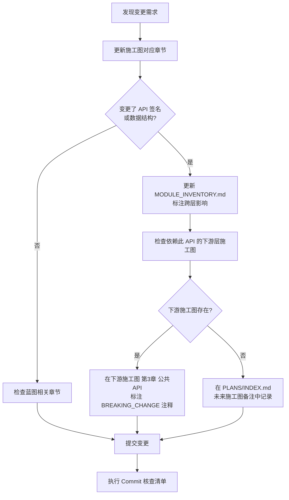
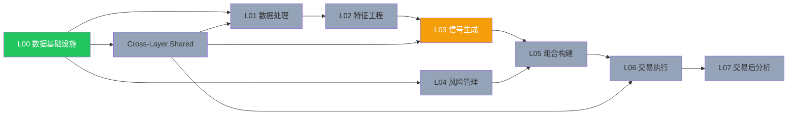

# 施工变更影响分析 Playbook

> **用途**：在 Phase 2 施工图编写或 Phase 3 代码实施过程中，发生任何变更时，按本 Playbook 评估影响范围并执行联动更新。
> **优先级**：P0 —— 施工阶段每次变更前**必须**执行本 Playbook 的快速评估（3 分钟）。

---

## 1. 快速评估流程（3 分钟）

每次变更前，按以下 4 问快速评估影响范围：

```
Q1. 这次变更影响哪一层（L00~L07 / Shared）？
Q2. 该层是否有施工图？施工图状态是 Draft/Active？
Q3. 这次变更是否影响公共 API 契约、数据结构或接口约定？
Q4. 是否有其他层依赖被变更的模块？（查 MODULE_INVENTORY.md 的跨层依赖列）
```

**回答判断**：
- Q3/Q4 中任一为"是" → 执行**标准变更流程**（见第 2 节）
- Q3/Q4 均为"否" → 执行**简化变更流程**（见第 3 节）

---

## 2. 标准变更流程（影响跨层 API 或数据契约）



### 2.1 标准变更核查清单

```
[ ] 施工图对应章节已更新（frontmatter last_updated 已改）
[ ] MODULE_INVENTORY.md 对应层已更新（施工状态列已更新）
[ ] 受影响的下游层施工图已标注 BREAKING_CHANGE（如存在）
[ ] MASTER_DEVELOPMENT_PLAN.md 任务状态已同步（如任务完成/变更）
[ ] TECH_DECISION_RECORDS.md 已同步（如涉及技术选型变更）
[ ] controlled-documents-register.md 版本号已更新（如施工图 version bump）
[ ] 本次变更已符合施工图 7 点格式要求（见 code-conventions.mdc）
[ ] git commit message 包含 scope（如 feat(L00-M1):）
```

---

## 3. 简化变更流程（本层内部变更，不影响跨层 API）

```
[ ] 更新施工图相关章节
[ ] 更新 frontmatter: last_updated 字段
[ ] 如影响测试计划，更新第 5 章（测试）
[ ] git commit message 包含 scope
```

---

## 4. Change Propagation Map（联动更新速查表）

### 4.1 施工图变更 → 联动更新

| 变更类型 | 必须联动更新的文件 |
|---------|-----------------|
| 新建施工图 | ① `PLANS/INDEX.md` 添加条目 + 更新状态<br>② `CONSTRUCTION/INDEX.md` 进度表更新<br>③ `MODULE_INVENTORY.md` 对应层施工图列链接<br>④ `controlled-documents-register.md` 添加注册 |
| 施工图 Draft→Active | ① `PLANS/INDEX.md` 状态更新<br>② `MODULE_INVENTORY.md` 施工状态列更新<br>③ `MASTER_DEVELOPMENT_PLAN.md` 任务勾选 |
| 变更公共 API（第 3 章） | ① 检查下游依赖层施工图<br>② 更新 `MODULE_INVENTORY.md` 描述<br>③ 若 BREAKING，同步 `TECH_DECISION_RECORDS.md` 影响说明 |
| 变更技术选型（第 6 章） | ① 更新 `TECH_DECISION_RECORDS.md` ADR 状态<br>② 评估影响的 L04/L05/L07 ADR 待决策项 |
| 变更数据结构/契约 | ① 更新 `BLUEPRINT_DOMAIN_INVENTORY.yaml` 对应 blueprint 的 tags<br>② 通知共享 Shared 施工图（若公共类型变更） |

### 4.2 代码实施变更 → 联动更新（Phase 3 预备）

| 变更类型 | 必须联动更新的文件 |
|---------|-----------------|
| 新增 `src/` 模块 | ① `MODULE_INVENTORY.md` 施工状态改为 `已实施`<br>② 对应层 `docs/03_BLUEPRINTS/L{XX}*/INDEX.md`<br>③ `MASTER_DEVELOPMENT_PLAN.md` 打勾 |
| 修改 `pyproject.toml` 依赖 | ① `docs/02_ARCHITECTURE/DEV_ENV_SETUP.md` 依赖版本表 |
| 新增 ADR | ① `TECH_DECISION_RECORDS.md` 摘要表<br>② `decision-record-standard.md` 的当前 ADR 清单 |

---

## 5. 跨层依赖图（Phase 2 施工顺序约束）



**图例**：绿色=已建初稿，橙色=下一优先，灰色=待建

> **重要约束**：
> - **L04 独立性**：L04 风险管理的核心计算（VaR/CVaR/止损）不得进入 L05（ADR-D1-001）
> - **L06 真源**：L06 交易执行的蓝图真源在 `docs/03_BLUEPRINTS/L08_EXECUTION/`（ADR-D1-002）
> - **ADR-006~009 阻塞**：L04/L05/L07 施工图编写依赖这 4 个 ADR 决策完成

---

## 6. BREAKING CHANGE 标注规范

在施工图的公共 API 章节，BREAKING CHANGE 应按以下格式标注：

```markdown
### 3.x 函数名（BREAKING_CHANGE: v1.1.0 → v1.2.0）

**变更原因**：[简短说明]
**旧签名**：`def old_func(a: int) -> str`
**新签名**：`def new_func(a: int, b: str = "default") -> str`
**影响层**：L03（信号生成）需更新调用方式
**迁移方法**：[迁移步骤]
```

---

## 7. 常见变更场景速查

| 场景 | 操作摘要 |
|------|---------|
| 新建 L03 施工图 | 见 §4.1 "新建施工图"行 + 参考 L00 施工图结构 |
| L00 数据结构调整 | 评估 L01 施工图前置条件章节是否需要更新 |
| ADR 决策完成（如 ADR-006）| 更新 TECH_DECISION_RECORDS.md + 解锁 L04 施工图编写 |
| 发现 Layer 边界错误 | 创建 DR-ARCH 决策记录 + 同时更新两个施工图 |
| 施工图达到 Active | 执行 §2.1 标准变更核查清单 |

---

## 8. 版本历史

| 版本 | 日期 | 变更 |
|------|------|------|
| 1.0.0 | 2026-04-16 | 初始创建（Phase 2 施工阶段专用）|
