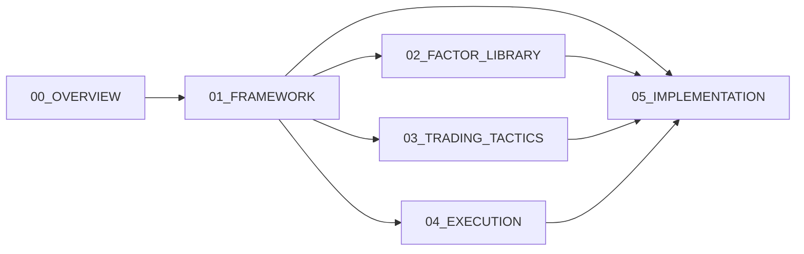

# 01_FRAMEWORK 文件夹宪章

> **定位**: 系统架构蓝图主存储区（L0-L11全模块蓝图汇集）
> **当前规模**: ~332个文件，22个子目录
> **负责人**: 首席架构师

---

## 1. 核心职责

本目录是 **ZephyrAlpha 系统架构的唯一真源（Single Source of Truth）**，存储所有层级的蓝图设计文档：

- **范围**: 覆盖 L00（概述）至 L11（战略决策）全12层
- **内容**: 架构蓝图、技术规格、决策记录、接口定义
- **目标**: 为实施层（05_IMPLEMENTATION）提供完整设计输入

---

## 2. 内容边界

### 允许存放的文件类型

| 类型 | 模式 | 示例 |
|------|------|------|
| 架构蓝图 | `*_blueprint.md` | `alpha-factor-layer-blueprint.md` |
| 技术规格 | `*_spec.md` | `data-ingestion-spec.md` |
| 决策记录 | `adr-*.md` | `adr-001-structlog-logging.md` |
| 模块索引 | `INDEX.md` | `LAYER4_ML/INDEX.md` |
| 层总览 | `layer_*_index.md` | `data-layer-index.md` |

### 禁止存放的文件类型

| 类型 | 原因 | 应放置位置 |
|------|------|------------|
| 施工文档（实施细节） | 超出设计范畴 | `05_IMPLEMENTATION/06_CONSTRUCTION_DOCS/` |
| 临时分析报告 | 非正式设计文档 | `09_AUDIT/STATE/` |
| 过程日志/夜间运行记录 | 执行过程产物 | `09_AUDIT/STATE/overnight_runs/` |
| 个人学习笔记 | 非正式知识 | `08_KNOWLEDGE/` |
| 测试数据/代码 | 非文档类内容 | `src/` 或 `tests/` |

---

## 3. 命名规范

### 文件命名

```
格式: {层标识}_{描述}-{类型}.md

示例:
  L01_data-source-blueprint.md        # L01层数据源蓝图
  L04_ml-model-spec.md                # L04层ML模型规格
  L05_trading-strategy-blueprint.md   # L05层交易策略蓝图
  adr-010-directory-numbering.md       # 技术决策记录
```

### 子目录命名

```
格式: {两位数字}_{大写模块名}

当前子目录:
  01_STANDARDS/           # 治理标准（计划迁移至01_GOVERNANCE/）
  LAYER4_ML/              # L04机器学习层蓝图
  LAYER5_TRADING/         # L05交易策略层蓝图
  ...
```

---

## 4. 容量限制

| 指标 | 当前值 | 上限 | 状态 |
|------|--------|------|------|
| 总文件数 | ~332 | 400 | 🟡 接近上限 |
| 子目录数 | 22 | 25 | 🟢 正常 |
| 最大深度 | 3 | 3 | 🟢 达标 |
| 单文件大小 | <5MB | 5MB | 🟢 正常 |

**告警阈值**:
- 文件数 >350: 黄色告警，启动整理
- 文件数 >400: 红色告警，必须归档或迁移

---

## 5. 保留策略（TTL）

| 内容类型 | TTL | 清理策略 |
|----------|-----|----------|
| 草稿蓝图 | 30天 | 自动移至 `06_ARCHIVE/` |
| 临时分析 | 14天 | 自动删除 |
| 过时版本 | 90天 | 价值提取后删除 |
| 索引快照 | 30天 | 自动删除 |

---

## 6. 自动化检查

### Pre-commit 检查

```bash
# 蓝图frontmatter完整性
python scripts/hooks/validate_blueprint_frontmatter.py docs/01_FRAMEWORK/*.md

# INDEX链接有效性
python scripts/hooks/check_index_links.py docs/01_FRAMEWORK/INDEX.md

# module_id重复检查
python scripts/audit/analyze_dup_module_ids.py --path docs/01_FRAMEWORK/
```

### 每日检查

- 目录深度扫描（`scripts/governance/scan_subsystem_duplicates.py`）
- 容量限制监控（集成到 `generate_project_health_dashboard.py`）

---

## 7. 与其他目录的关系



- **上游**: `00_OVERVIEW/`（系统总览）
- **下游**: `05_IMPLEMENTATION/`（施工实施）
- **平级协作**: `02_FACTOR_LIBRARY/`, `03_TRADING_TACTICS/`, `04_EXECUTION/`

---

## 8. 已知问题与改进计划

| 问题 | 优先级 | 计划解决时间 | 解决方案 |
|------|--------|--------------|----------|
| 蓝图分散（01_FRAMEWORK + 05_IMPLEMENTATION/06_CONSTRUCTION_DOCS/01_BLUEPRINTS/）| P1 | Phase D | 统一迁移至 `03_BLUEPRINTS/` |
| 部分文件layer字段误标 | P2 | 2026-04-20 | 运行 `diagnose_blueprint_layer_mismatch.py` 修复 |
| 文件数接近上限 | P2 | 持续监控 | 严格执行TTL，定期归档 |

---

## 9. 变更历史

| 版本 | 日期 | 变更 | 变更人 |
|------|------|------|--------|
| v1.0.0 | 2026-04-16 | 初始创建 | AI Assistant |

---

**相关链接**:
- [01_FRAMEWORK 索引](../../01_FRAMEWORK/INDEX.md)
- [BLUEPRINT_DOMAIN_INVENTORY](../../02_ARCHITECTURE/BLUEPRINT_DOMAIN_INVENTORY.yaml)
- [subsystem-registry.yaml](../../subsystem-registry.yaml)
