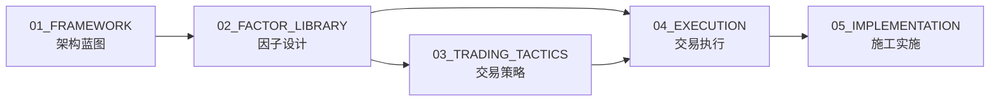

# 02_FACTOR_LIBRARY 文件夹宪章

> **定位**: Alpha因子设计与研究文档库（L02 因子层业务核心）
> **当前规模**: ~175个文件
> **负责人**: 因子研究负责人
> **对应层级**: L02 Factor Layer（系统架构Layer 2）

---

## 1. 核心职责

本目录是 **L02 因子层的业务核心**，负责：

- **因子设计**: Alpha因子定义、计算公式、信号逻辑
- **因子研究**: 因子有效性分析、IC测试、衰减分析
- **因子数据**: 数据源、清洗规则、存储规范
- **因子组合**: 多因子合成、因子权重、风险模型

---

## 2. 内容边界

### 允许存放的文件类型

| 类型 | 模式 | 示例 | 存放子目录 |
|------|------|------|------------|
| 因子定义 | `*_factor.md` | `momentum_factor.md` | `02_ALPHA_FACTORS_INDEX/` |
| 因子数据文档 | `*_data_*.md` | `data_source_guide.md` | `04_DATA_SOURCE/` |
| 风险因子 | `risk_*.md` | `risk_market_beta.md` | `03_RISK_FACTORS/` |
| 多因子合成 | `multi_factor_*.md` | `multi_factor_synthesis.md` | `13_MULTI_FACTOR_SYNTHESIS/` |
| 因子质量 | `*_quality.md` | `factor_data_quality.md` | `19_FACTOR_DATA_QUALITY/` |
| 因子ML | `*_ml_*.md` | `factor_ml_integration.md` | `23_FACTOR_ML_INTEGRATION/` |
| 因子注册 | `INDEX.md` | - | 各子目录 |

### 禁止存放的文件类型

| 类型 | 原因 | 应放置位置 |
|------|------|------------|
| 交易策略 | 属于L05策略层 | `03_TRADING_TACTICS/` |
| 执行逻辑 | 属于L06执行层 | `04_EXECUTION/` |
| 系统设计蓝图 | 属于架构设计 | `01_FRAMEWORK/` |
| 因子回测结果 | 临时分析 | `09_AUDIT/STATE/` |

---

## 3. 二级目录结构（按因子研究流程组织）

```
docs/02_FACTOR_LIBRARY/
├── 01_STANDARDS/               # 因子研究标准
├── 02_ALPHA_FACTORS_INDEX/     # Alpha因子定义索引
├── 03_RISK_FACTORS/            # 风险因子
├── 04_DATA_SOURCE/             # 数据源文档
│   ├── 03_CLEANING/           # 数据清洗
│   ├── 07_DATA_PIPELINE/      # 数据管道
│   └── ...                    # 其他数据源
├── 06_REGISTRY/                # 因子注册表
├── 10_MANUAL/                  # 因子手册
├── 13_MULTI_FACTOR_SYNTHESIS/  # 多因子合成
├── 15_FACTOR_VERSION_CONTROL/  # 因子版本控制
├── 19_FACTOR_DATA_QUALITY/       # 因子数据质量
├── 23_FACTOR_ML_INTEGRATION/     # 因子与ML结合
├── 26_FACTOR_DATA_LINEAGE/       # 因子数据血缘
├── 32_FACTOR_DYNAMIC_WEIGHT/     # 因子动态权重
└── INDEX.md                    # 本目录索引
```

---

## 4. 容量限制

| 指标 | 当前值 | 上限 | 状态 |
|------|--------|------|------|
| 总文件数 | ~175 | 300 | 🟢 充足 |
| 子目录数 | 12 | 20 | 🟢 正常 |
| 最大深度 | 3 | 3 | 🟢 达标 |
| 单文件大小 | <5MB | 5MB | 🟢 正常 |

**扩展空间**: 当前容量使用率58%，仍有较大扩展空间。

---

## 5. 保留策略

| 内容类型 | TTL | 备注 |
|----------|-----|------|
| 活跃因子定义 | 永久 | 持续维护更新 |
| 过时因子 | 90天 | 标记Deprecated后归档 |
| 因子测试报告 | 30天 | 临时分析，价值提取后删除 |
| 数据质量报告 | 30天 | 定期生成，保留最新 |

---

## 6. 自动化检查

```bash
# 因子定义frontmatter检查
python scripts/hooks/validate_blueprint_frontmatter.py \
  docs/02_FACTOR_LIBRARY/02_ALPHA_FACTORS_INDEX/*.md

# 因子注册表同步检查
python scripts/governance/generate_blueprint_registry.py \
  --check-sync docs/02_FACTOR_LIBRARY/

# 目录深度检查
python scripts/hooks/check_directory_naming.py docs/02_FACTOR_LIBRARY/
```

---

## 7. 与其他目录的关系



- **上游**: `01_FRAMEWORK/LAYER2_FACTOR/`（因子层架构设计）
- **下游**: `03_TRADING_TACTICS/`（策略使用因子）
- **下游**: `04_EXECUTION/`（执行层使用信号）

---

## 8. 已知问题与改进计划

| 问题 | 优先级 | 计划解决时间 | 解决方案 |
|------|--------|--------------|----------|
| 部分子目录为空 | P3 | 按需填充 | 随因子研究进展补充 |
| 与 01_FRAMEWORK/LAYER2_FACTOR/ 边界模糊 | P2 | Phase D | 明确分层：设计在01，实现在02 |
| 因子案例库（08_KNOWLEDGE）内容薄弱 | P2 | Sprint Week 2 | 从本目录提取案例至知识库 |

---

## 9. 变更历史

| 版本 | 日期 | 变更 | 变更人 |
|------|------|------|--------|
| v1.0.0 | 2026-04-16 | 初始创建 | AI Assistant |

---

**相关链接**:
- [02_FACTOR_LIBRARY 索引](../../02_FACTOR_LIBRARY/INDEX.md)
- [L02_FACTOR 架构蓝图](../../01_FRAMEWORK/LAYER2_FACTOR/INDEX.md)
- [因子案例库](../../08_KNOWLEDGE/FACTOR_LIBRARY/)
