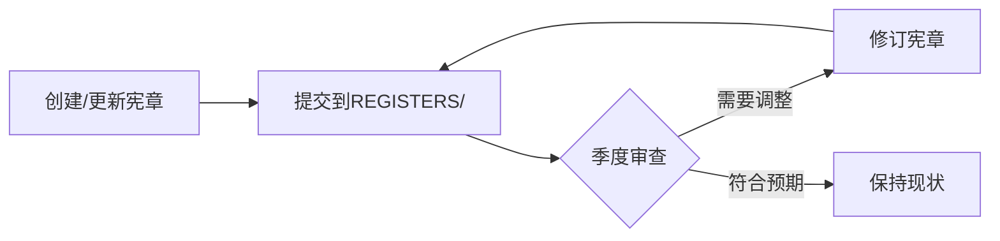

# 文件夹宪章（Folder Charter）模板

> **用途**：为每个一级目录建立清晰的边界定义和管理规范，防止内容混杂和无限膨胀。
> **适用范围**：`docs/` 下所有一级目录（`00_OVERVIEW/` 至 `11_STRATEGIC_DECISION/`）
> **更新频率**：每季度审查一次，重大结构调整时即时更新

---

## 宪章模板正文

```yaml
---
# 基本信息
charter_id: {DIR_NAME}_CHARTER
version: 1.0.0
status: Active          # Active | Deprecated | UnderReview
created_date: '2026-04-16'
last_updated: '2026-04-16'
review_cycle: quarterly
owner: {owner_name}

# 目录定位
directory_path: docs/{DIR_NAME}/
layer_mapping: {layer_00|layer_01|...|cross_layer}  # 对应系统架构层级
primary_purpose: |
  {一句话描述本目录的核心职责，不超过50字}

# 内容边界（允许/禁止）
allowed_content:
  - {允许的文件类型1，如：设计蓝图（*_blueprint.md）}
  - {允许的文件类型2，如：技术规格（*_spec.md）}
  - {允许的文件类型3，如：索引文件（INDEX.md）}
  - {允许的文件类型4，如：决策记录（*_decision.md）}

prohibited_content:
  - {禁止的文件类型1，如：临时草稿（*_draft.md）}
  - {禁止的文件类型2，如：个人笔记（*_note.md）}
  - {禁止的文件类型3，如：未经验证的AI输出（*_ai_output.md）}
  - {禁止的文件类型4，如：过程日志（overnight_runs/ 应放 STATE/）}

# 命名规范
naming_conventions:
  files: '{前缀}_{描述}_{后缀}.md'    # 如：L01_data-source-blueprint.md
  subdirs: '{两位数字}_{大写描述}'    # 如：01_STANDARDS/
  index: 'INDEX.md'                 # 每个子目录必须包含

# 容量限制（防止无限膨胀）
capacity_limits:
  max_total_files: 500              # 目录内总文件数上限
  max_subdirs: 20                 # 子目录数量上限
  max_depth: 3                     # 最大嵌套深度（相对于docs/）
  max_single_file_size_mb: 5       # 单个文件大小上限（MB）

# 保留策略（TTL）
retention_policy:
  draft_documents: 30_days        # 草稿保留30天
  temp_reports: 14_days           # 临时报告保留14天
  archived_content: 90_days       # 归档内容保留90天
  index_snapshots: 30_days        # 索引快照保留30天

# 自动化检查
automated_checks:
  pre_commit:
    - check_directory_naming      # 目录命名合规性
    - check_document_placement    # 文档放置位置
    - check_index_integrity       # INDEX.md完整性
  daily:
    - scan_directory_depth        # 目录深度扫描
    - check_capacity_limits       # 容量限制检查
  weekly:
    - retention_policy_enforcement # 保留策略执行

# 与其他目录的关系
relationships:
  parent: docs/                    # 上级目录
  siblings:                        # 平级相关目录
    - {相关目录1，如：01_FRAMEWORK}
    - {相关目录2，如：02_FACTOR_LIBRARY}
  downstream:                      # 依赖本目录的输出
    - {下游目录1，如：05_IMPLEMENTATION}
  upstream:                        # 本目录依赖的输入
    - {上游目录1，如：00_OVERVIEW}

# 变更历史
change_history:
  - version: 1.0.0
    date: '2026-04-16'
    change: '初始创建宪章'
    approver: {owner_name}
```

---

## 使用指南

### 步骤1：为新目录创建宪章

1. 复制本模板到目标目录，命名为 `_CHARTER.md`
2. 填写所有 `{占位符}` 内容
3. 提交到 `docs/01_GOVERNANCE/REGISTERS/folder-charters/` 统一备案

### 步骤2：已有目录宪章补全

对于已有目录，按以下优先级补全宪章：

| 优先级 | 目录 | 原因 |
|--------|------|------|
| P0 | 01_FRAMEWORK | 文件最多（332个），最易膨胀 |
| P0 | 09_AUDIT | 文件最多（1172个），需严格清理 |
| P1 | 05_IMPLEMENTATION | 文件多（487个），结构复杂 |
| P1 | 02_FACTOR_LIBRARY | 业务核心，需明确边界 |
| P2 | 08_HUMAN_AI_INTERFACE | 文件多（156个），需规范 |

### 步骤3：宪章审查流程



---

## 一级目录宪章快速填写示例

### 示例：01_FRAMEWORK 宪章

```yaml
charter_id: 01_FRAMEWORK_CHARTER
version: 1.0.0
status: Active
created_date: '2026-04-16'
last_updated: '2026-04-16'
owner: 首席架构师

directory_path: docs/01_FRAMEWORK/
layer_mapping: cross_layer
primary_purpose: |
  存储全系统架构蓝图（L0-L11），是系统设计的唯一真源。

allowed_content:
  - 系统架构蓝图（*_blueprint.md）
  - 模块接口规格（*_spec.md）
  - 技术决策记录（adr-*.md）
  - 目录索引（INDEX.md）

prohibited_content:
  - 施工文档（应放 05_IMPLEMENTATION/）
  - 临时分析报告（应放 09_AUDIT/STATE/）
  - 个人学习笔记（应放 08_KNOWLEDGE/）
  - 过程日志（应放 09_AUDIT/STATE/overnight_runs/）

naming_conventions:
  files: 'L{层号}_{描述}-blueprint.md'
  subdirs: '{两位数字}_{大写模块名}'
  index: 'INDEX.md'

capacity_limits:
  max_total_files: 400
  max_subdirs: 15
  max_depth: 3
  max_single_file_size_mb: 5

retention_policy:
  draft_blueprints: 30_days
  temp_analysis: 14_days
  archived_versions: 90_days

automated_checks:
  pre_commit:
    - validate_blueprint_frontmatter
    - check_index_links
  daily:
    - scan_directory_depth
    - check_duplicate_module_ids

relationships:
  parent: docs/
  siblings:
    - 02_FACTOR_LIBRARY
    - 03_TRADING_TACTICS
  downstream:
    - 05_IMPLEMENTATION
```

---

## 批量创建5个一级目录宪章任务

### 任务清单

| 序号 | 目录 | 优先级 | 文件数 | 核心挑战 | 预计耗时 |
|------|------|--------|--------|----------|----------|
| 1 | 01_FRAMEWORK | P0 | ~332 | 文件最多，需明确子目录边界 | 30 min |
| 2 | 09_AUDIT | P0 | ~1172 | 治理核心，需严格TTL和分类 | 30 min |
| 3 | 05_IMPLEMENTATION | P1 | ~487 | 施工文档混杂，需梳理结构 | 25 min |
| 4 | 02_FACTOR_LIBRARY | P1 | ~175 | 业务核心，因子研究边界 | 20 min |
| 5 | 08_HUMAN_AI_INTERFACE | P2 | ~156 | 人机交互模块多，需归类 | 20 min |

**总计**：预计2小时内完成前5个一级目录宪章创建。

---

## 变更历史

| 版本 | 日期 | 变更内容 | 变更人 |
|------|------|----------|--------|
| v1.0.0 | 2026-04-16 | 初始创建文件夹宪章模板 | AI Assistant |

---

**相关链接**:
- [subsystem-registry.yaml](../../subsystem-registry.yaml) - 子系统注册表
- [value-extraction-protocol.md](value-extraction-protocol.md) - 价值提取协议
- [document-repository-layout-standard.md](../09_AUDIT/STANDARDS/document-repository-layout-standard.md) - 仓库布局标准
