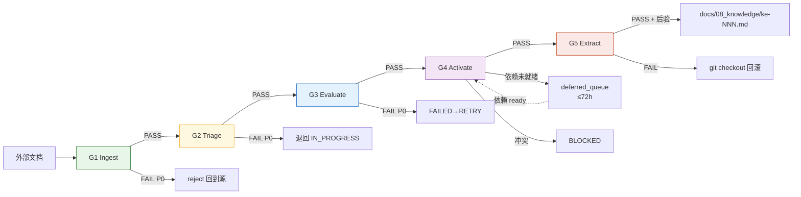

# ZephyrAlpha 5 级门禁策略（KMS 知识管道门禁体系）

> **本文件定位**：`zephyr.gates.gate_engine`（T-2-17，`src/zephyr/gates/gate_engine.py`）与 `g1~g5.yaml` 策略文件的**唯一权威策略 SSoT**。门禁触发条件、检查项、裁决逻辑、YAML schema、与 `task_repo` 状态机的集成边界，均以本文件为准。
>
> **适用范围**：KMS（Knowledge Management System）知识管道全过程 —— 从外部文档被管道吸入，到最终被提取成知识条目并激活入库。
>
> **不覆盖范围**：生命周期横切守卫（pre-commit hooks、Sentinel 扫描、Pydantic 契约校验、ATM 原子写入、运行时观测）不属于本 5 级门禁，归类为 **Lifecycle Guards**，见本文附录 A"与 Lifecycle Guards 的边界"。
>
> **版本说明**：v2.0.0 替换 v1.0.0（B10 session 权宜版）。原版本将 5 级门禁错位定义为 `Write/Commit/Phase/Contract/Runtime`，与 `gate_engine.py` 加载的 `g1_ingest~g5_extract.yaml` 语义不一致。本版本以**代码实现**为锚定点重新定义门禁语义。v2.1.0：2026-05-01 从 `02_enterprise_architecture/` 迁移至 `01_policies_and_standards/governance/architecture/`（`standard` 类文档按 PS-STD-001 §3.4 规定归入治理目录）。

---

## 一、为什么要重写（v1→v2 的关键修订）

| 问题 | v1.0.0（B10 权宜版） | v2.0.0（本版本） |
|------|---------------------|----------------|
| **5 级门禁语义** | Write / Commit / Phase / Contract / Runtime（生命周期横切）| Ingest / Triage / Evaluate / Activate / Extract（KMS 管道阶段）|
| **与代码一致性** | 不匹配 `g1~g5.yaml` 文件名与 `gate_engine._GATE_FILES` 映射 | **完全匹配**已实现代码 |
| **与 task_repo 集成** | 仅描述性说明，未定义具体转换点 | 明确 5 个状态转换触发点（见§六）|
| **YAML schema 不一致** | 未解决 `name/title/gate_name` 三字段并存 | **指定 `gate_name` 为机读权威字段**，`title` 为人类可读标签（见§七）|
| **severity 语义** | 仅 P0/P1/P2 | 双层：YAML 侧 `error/warning/info`（人类可读）→ 引擎侧 `P0/P1/P2`（机读）|
| **`checks` vs `entry_conditions`** | 未表态 | 统一为 `entry_conditions`；`checks` 仅作过渡期回落别名 |

原版本保留价值的章节（豁免机制、gates 表格式、P0/P1/P2 语义）已吸收进本版本。

---

## 二、5 级门禁总览

### 2.1 KMS 知识管道时间轴

```
┌──────────────────────────────────────────────────────────────────────┐
│   外部文档进入 → 被分类 → 被评估 → 被激活 → 被提取成 KE → 入知识库      │
└──────────────────────────────────────────────────────────────────────┘
       │            │           │           │            │
       ▼            ▼           ▼           ▼            ▼
     [G1]         [G2]         [G3]        [G4]         [G5]
   Ingest      Triage      Evaluate    Activate      Extract
  （吸入）    （分流）    （评估）    （激活）    （提取）
```

### 2.2 5 级门禁属性表

| Gate | 机读名 | 人类可读 | 触发时机 | 执行者 | 产物 |
|:----:|-------|---------|---------|-------|------|
| **G1** | `ingest` | G1 Ingest Gate | 文档被吸入管道（task `PENDING→IN_PROGRESS`）| `GateEngine.evaluate(task, "G1")` | `gates` 表 + `deferred_queue`（失败时）|
| **G2** | `triage` | G2 Triage Gate | 文档已分类并准备进入评估（`IN_PROGRESS→COMPLETED`）| `GateEngine.evaluate(task, "G2")` | `gates` 表 + 分类失败报告 |
| **G3** | `evaluate` | G3 Evaluate Gate | 价值打分完成，准备进入激活（`COMPLETED→VERIFIED`）| `GateEngine.evaluate(task, "G3")` | `gates` 表 + 评分详情 |
| **G4** | `activate` | G4 Activate Gate | KE 对象即将写入知识库前（KMS 管道独立动作）| `GateEngine.evaluate(task, "G4")` | `gates` 表 + `deferred_queue`（依赖未就绪时）|
| **G5** | `extract` | G5 Extract Gate | 实际执行知识条目文件写入前 | `GateEngine.evaluate(task, "G5")` | `gates` 表 + 提取产物路径 |

### 2.3 门禁与管道阶段映射

| 管道阶段 | 进入条件（前一 Gate 通过）| 本阶段工作 | 出口 Gate |
|---------|------------------------|----------|----------|
| `ingested` | 无 | 确认文件存在、编码、frontmatter 合规 | **G1** |
| `triaged` | G1 PASS | 打分类标签（BLUEPRINT / STRATEGY / …）、分配 layer、优先级 | **G2** |
| `evaluated` | G2 PASS | 计算 knowledge_value_score、查重、完整性校验 | **G3** |
| `activating` | G3 PASS | 等待依赖 KE 就位、无冲突检查、target_path 合规 | **G4** |
| `extracted` | G4 PASS | 渲染提取模板、写入 `docs/08_knowledge/` | **G5** |

---

## 三、严重级别（Severity）统一规范

### 3.1 双层语义映射

| YAML 侧（人类可读） | 引擎侧（机读） | 裁决语义 |
|-------------------|--------------|---------|
| `error` / `critical` | **P0** | 硬阻断，`GateViolationError` 抛出，任务不得推进 |
| `warning` / `warn` | **P1** | 软警告，`passed=True` 但写入 events 警告流 |
| `info` | **P2** | 仅记录，不告警、不阻塞 |

映射表已硬编码在 `gate_engine.GateEngine._SEVERITY_MAP`；**YAML 文件严禁直接写 P0/P1/P2**（机读字符串不应出现在人类编辑的策略文件中）。

### 3.2 分级判定原则

| 级别 | 判据 |
|:---:|------|
| **P0** | 违反会导致"可逆损失不可接受"：编码损坏、废弃路径写入、锚点文件缺失、schema 不合法、target_path 冲突（未授权覆盖）|
| **P1** | 违反表示"可逆损失可接受但需可见"：CRLF 换行、命名建议、唯一性相似度偏高、元数据可自动推导补齐 |
| **P2** | 违反仅为风格提示：冗余字段、未使用元数据 |

**禁止**：任何 check 在运行时动态升降级；级别调整仅能通过修改 YAML + 二次 review 完成。

---

## 四、各级门禁详细策略

### 4.1 G1 · Ingest Gate（吸入门禁）

#### 4.1.1 触发条件

- **状态机触发**：`TaskRepository.transition(task_id, IN_PROGRESS)` 调用时（已实现于 `task_repo.py:461`）
- **显式触发**：`GateEngine.evaluate(task, "G1")` 直接调用
- **前置条件**：task 的 `deliverables` 字段非空

#### 4.1.2 检查项（对应 `g1_ingest.yaml`）

| ID | 检查名 | 类型 | 级别 | 阈值/参数 | on_failure |
|----|-------|------|:---:|----------|-----------|
| G1-C00 | `no_deprecated_path` | `path_blacklist` | **P0** | `_legacy/ ARCHIVE/ deprecated/ _trash/ zephyralpha-1-0/ old_tree/ __OLD__` | `reject` |
| G1-C01 | `file_exists` | `condition` | **P0** | `os.path.exists + R_OK` | `reject` |
| G1-C02 | `encoding_compliant` | `encoding` | **P0** | UTF-8 + no BOM | `reject` |
| G1-C03 | `line_ending_compliant` | `line_ending` | P1 | 无 CRLF | `auto_fix`（转换为 LF）|
| G1-C04 | `frontmatter_present` | `frontmatter` | **P0** | 必须有 `---` 分隔块 | `reject` |
| G1-C05 | `frontmatter_required_fields` | `frontmatter` | **P0** | `doc_type, title, version, status, date, owner, ttl` | `reject` |
| G1-C06 | `file_size_within_limit` | `content_length` | P1 | ≤ 512 KB（.md）| `flag` |
| G1-C07 | `no_binary_content` | `content_quality` | **P0** | `chardet` 文本检测通过 | `reject` |

#### 4.1.3 降级策略

- **P0 失败** → `GateViolationError` 抛出；`task_repo.transition` 回滚，任务保持 `PENDING`；调用方必须修正文件后重试
- **P1 失败** → 记 `gates.details.p1_count+1`，继续推进；每日聚合 `p1_count ≥ 10` 触发 Owner 告警
- **`auto_fix` 特例**：G1-C03 允许引擎先执行 CRLF→LF 替换再重新验证；成功后视为 PASS 并 `events.insert(auto_fix)`

### 4.2 G2 · Triage Gate（分流门禁）

#### 4.2.1 触发条件

- **状态机触发**（未来扩展）：`IN_PROGRESS→COMPLETED`
- **显式触发**：`GateEngine.evaluate(task, "G2")`
- **前置条件**：G1 PASS，task 已带上 `classification` / `doc_type` / `priority`

#### 4.2.2 检查项（对应 `g2_triage.yaml`）

| ID | 检查名 | 级别 | 说明 | on_failure |
|----|-------|:---:|------|-----------|
| G2-C00 | `content_not_empty_shell` | **P0** | 空壳文件/占位符比例 > 50% 时阻断 | `reject` |
| G2-C01 | `classification_label_valid` | **P0** | 必须 ∈ `{BLUEPRINT, MODULE_SPEC, STRATEGY, AUDIT_REPORT, STATE_SNAPSHOT, GOVERNANCE_STD, KNOWLEDGE_ENTRY, TEMP_ARTIFACT, ORPHAN_SHELL, ENCODING_BROKEN}` | `reject` |
| G2-C02 | `doc_type_valid` | **P0** | 必须 ∈ frontmatter-standard 的合法 `doc_type` 枚举 | `reject` |
| G2-C03 | `priority_score_assigned` | **P0** | `P0/P1/P2/P3` 任一 | `auto_assign`（默认 P2）|
| G2-C04 | `layer_assignment_valid` | P1 | 必须 ∈ `l00_data_source ~ l13_experiment_pipeline` ∪ `{shared, cross_layer}` | `flag` |
| G2-C05 | `no_duplicate_ingest` | **P0** | `content_hash` 未在 `INGESTED_HASHES` 中 | `reject` |
| G2-C06 | `source_path_compliant` | P1 | 路径符合 directory-structure-standard | `flag` |

#### 4.2.3 降级策略

- **P0 失败** → 状态机回滚；task 返回 `IN_PROGRESS` 并记 `gates.details.failed_checks`
- **`auto_assign` 特例**：G2-C03 缺失 priority 时自动填 P2；记 `events.auto_assigned`
- **`reject` 后的处置**：task 可通过 `transition(FAILED)→transition(RETRY)` 路径重入

### 4.3 G3 · Evaluate Gate（评估门禁）

#### 4.3.1 触发条件

- **状态机触发**（未来扩展）：`COMPLETED→VERIFIED`
- **显式触发**：`GateEngine.evaluate(task, "G3")`
- **前置条件**：G2 PASS，task 已计算 `knowledge_value_score`

#### 4.3.2 检查项（对应 `g3_evaluate.yaml`）

| ID | 检查名 | 级别 | 阈值 | on_failure |
|----|-------|:---:|------|-----------|
| G3-C01 | `knowledge_value_score_threshold` | **P0** | `score ≥ 0.4` | `reject` |
| G3-C02 | `uniqueness_check` | P1 | `similarity < 0.95` | `flag` |
| G3-C03 | `content_integrity_verified` | **P0** | `encoding_status == 'clean'` + 无混合编码 | `reject` |
| G3-C04 | `metadata_complete` | P1 | 须含 `module_id, layer, classification` | `auto_fill`（按命名规则推导）|
| G3-C05 | `no_expired_ttl` | **P0** | `ttl == 'permanent' or ttl_expiry > now()` | `reject` |

#### 4.3.3 评分维度（定义于 `g3_evaluate.yaml:scoring_dimensions`）

| 维度 | 权重 | 语义 |
|------|:---:|------|
| `design_decision_density` | 0.30 | 独立设计决策密度 |
| `technical_specificity` | 0.25 | 技术细节具体度 |
| `reuse_potential` | 0.25 | 跨模块可复用性 |
| `irreplaceability` | 0.20 | 知识不可替代性（他处未录）|

评分公式：`weighted_sum(dim_i * weight_i)`，结果 ∈ [0, 1]。

#### 4.3.4 降级策略

- **P0 失败** → task 降档到 `FAILED`，可进入 `RETRY` 重评，或由 Owner 手动裁定 `CANCELLED`
- **P1 相似度过高** → 记 `dedup_candidate` 事件；不阻断，但该文档在 G4 阶段必须挂载 `merge_policy` 元数据

### 4.4 G4 · Activate Gate（激活门禁）

#### 4.4.1 触发条件

- **KMS 管道显式触发**：`GateEngine.evaluate(task, "G4")`（task 已达 `VERIFIED`；G4 不属状态机转换，属激活动作前的守卫）
- **前置条件**：G3 PASS，task 已解析依赖图 `doc.dependencies`

#### 4.4.2 检查项（对应 `g4_activate.yaml`）

| ID | 检查名 | 级别 | 说明 | on_failure |
|----|-------|:---:|------|-----------|
| G4-C01 | `dependencies_ready` | **P0** | 所有依赖 KE/module/config `status == 'active'` | **`defer`**（进入 `deferred_queue`）|
| G4-C02 | `no_conflict_with_existing` | **P0** | 与现有 active KE 无矛盾 | `flag`（人工仲裁）|
| G4-C03 | `target_path_compliant` | **P0** | 符合 `docs/08_knowledge/{subdir}/ke-*.md`（Stage G 后小写） | `reject` |
| G4-C04 | `frontmatter_schema_valid` | **P0** | 符合 `kms-entry-schema` | `reject` |
| G4-C05 | `module_id_registered` | P1 | `module_id ∈ MODULE_ID_REGISTRY` | `auto_register` |
| G4-C06 | `no_orphan_references` | P1 | 所有 `references` 均存在 | `flag` |

#### 4.4.3 Deferred Queue 机制（激活专用）

| 属性 | 值 | 说明 |
|------|---|------|
| `max_wait_time` | 72h | 超时后转人工 |
| `retry_interval` | 1h | 每小时重试依赖检查 |
| `on_timeout` | `flag_for_manual_review` | Owner 手动裁定：强制激活 / 标为 BLOCKED / 丢弃 |

#### 4.4.4 降级策略

- **G4-C01 依赖缺失** → `defer`（唯一非 `reject` 的 P0 路径）；task 状态进 `WAITING`，`waiting_for` 字段记录缺失依赖 ID 列表
- **G4-C02 冲突** → `flag` 而非 `reject`；task 进 `BLOCKED`，必须 Owner 合并后 `BLOCKED→READY`
- **其他 P0** → `reject`；task 进 `FAILED`

### 4.5 G5 · Extract Gate（提取门禁）

#### 4.5.1 触发条件

- **KMS 管道显式触发**：`GateEngine.evaluate(task, "G5")`
- **前置条件**：G4 PASS；`doc.gate_status ∈ {'passed_g4', 'active'}`

#### 4.5.2 检查项（对应 `g5_extract.yaml`）

| ID | 检查名 | 级别 | 说明 | on_failure |
|----|-------|:---:|------|-----------|
| G5-C01 | `extraction_template_ready` | **P0** | `doc_type ∈ EXTRACTION_TEMPLATES`（blueprint / strategy / factor / best_practice / lesson_learned）| `reject` |
| G5-C02 | `target_path_available` | **P0** | 路径不存在 **或** `overwrite_approved=true` | `flag`（等待批准）|
| G5-C03 | `target_path_compliant` | **P0** | 符合 `docs/08_knowledge/{category}/ke-{NNN}-{name}.md`（Stage G 后小写） | `reject` |
| G5-C04 | `ke_number_assigned` | **P0** | KE 编号 > `current_max_KE` 且唯一 | `auto_assign`（递增）|
| G5-C05 | `source_document_complete` | **P0** | 源文档 `gate_status ∈ {'passed_g4', 'active'}` | `reject` |
| G5-C06 | `extraction_scope_defined` | P1 | `extraction_scope` 非空 | `auto_scope`（全文）|

#### 4.5.3 后验检查（post_extraction_checks，写完后执行）

| 检查 | 通过条件 |
|------|---------|
| 提取内容非空 | `len(body.strip()) > 0` |
| 提取 frontmatter 合法 | 符合 `kms-entry-schema` |
| 无数据丢失 | 源文档关键段落抽查命中率 ≥ 90% |
| 交叉引用有效 | 新 KE 中所有 `[[KE-XXX]]` 可解析 |

后验失败任一条 → 回滚 `git checkout HEAD -- <target_path>`，task 降回 `FAILED`。

#### 4.5.4 降级策略

- **`auto_assign` / `auto_scope`** → 记 `events.auto_filled`，继续
- **G5-C02 路径冲突** → `flag` 等待 Owner 在 commit trailer 设 `gate-exempt: G5-C02 | reason: ... | valid_until: ...`
- **P0 失败** → `reject`，task 进 `FAILED` 并清理临时产物

---

## 五、门禁执行顺序与依赖关系

### 5.1 顺序图



### 5.2 依赖矩阵

| 下游 Gate | 必要前置 | 可选前置 | 并行允许？ |
|----------|---------|---------|:--------:|
| G1 | —（管道入口）| — | 否（入口串行）|
| G2 | G1 PASS | — | 否 |
| G3 | G2 PASS | — | 否 |
| G4 | G3 PASS | 依赖 KE 均 `active` | 否（单任务内）|
| G5 | G4 PASS | 模板已就绪 | 否 |

**并行性**：同一 task 的 5 级门禁严格串行；**不同 task** 的门禁可并行（SQLite WAL 支持并发读，写操作由 `TaskRepository.lock` 串行化）。

### 5.3 跳级规则（明令禁止）

- **禁止** 直接调用 `GateEngine.evaluate(task, "G3")` 而跳过 G1/G2：task 的 `gate_status` 字段必须按 `passed_g1 → passed_g2 → passed_g3 → …` 顺序推进
- **例外**：Phase 0 补录（历史知识回填）允许 Owner 签发 `gate-exempt: G1 | reason: legacy-backfill | valid_until: <date>` 在 commit trailer 中豁免；见§九

---

## 六、门禁与 `task_repo` 状态机集成规范

### 6.1 当前集成状态（`task_repo.py` 实装）

```python
# src/zephyr/db/task_repo.py:64
_STARTUP_GATE_ID = "G1"

# src/zephyr/db/task_repo.py:447-463
if to_status == TaskStatus.IN_PROGRESS and self._enable_gate:
    gate_result = self._gate_engine.evaluate(task_obj, _STARTUP_GATE_ID)
    if not gate_result.passed:
        raise GateViolationError(gate_result)
```

当前已接入 **G1（PENDING→IN_PROGRESS）** 一处。

### 6.2 完整集成映射（v2.0.0 规范，供 Sonnet 后续扩展实现）

| 状态转换 | 触发门禁 | 失败行为 | 成功副作用 |
|---------|---------|---------|-----------|
| `PENDING → IN_PROGRESS` | **G1** | `raise GateViolationError`，保持 `PENDING` | `events.insert(gate_passed, gate_id=G1)` |
| `IN_PROGRESS → COMPLETED` | **G2** | `raise GateViolationError`，保持 `IN_PROGRESS` | `task.gate_status = 'passed_g2'` |
| `COMPLETED → VERIFIED` | **G3** | `raise GateViolationError`，保持 `COMPLETED`；可通过 `COMPLETED→CANCELLED` 终止 | `task.gate_status = 'passed_g3'` |
| `VERIFIED`（终态）后的激活动作 | **G4** | 依赖未就绪 → `transition(WAITING, waiting_for=deps)`；其他 P0 → `transition(FAILED)` | `task.gate_status = 'passed_g4'` |
| 激活后写入知识库前 | **G5** | 后验失败 → `git checkout` 回滚 + `transition(FAILED)` | 新 KE 落盘 + `task.gate_status = 'extracted'` |

### 6.3 集成约束（强制）

1. **事务隔离**：门禁检查必须在 `task_repo._write_tx()` **之外**执行（`GateEngine` 持有独立 SQLite 连接；两个 `BEGIN IMMEDIATE` 会死锁）。当前 `task_repo.py:444-463` 已按此模式实现
2. **幂等性**：同一 `(task_id, gate_id)` 重复 `evaluate` 必须产生独立 `gate_run_id`（UUIDv4），历史记录保留，**禁止** UPSERT 覆盖
3. **事件写入**：门禁结果写入 `gates` 表的同时，`task_repo` 侧写入 `events` 表一条 `gate_evaluation` 事件（`payload={gate_id, passed, p0_count, p1_count}`），两表由 `events.task_id` 做外键关联
4. **disable 开关**：`TaskRepository(enable_gate=False)` 时所有门禁跳过（单元测试/Phase 0 补录专用）；**生产禁止**关闭

### 6.4 与 `TaskStatus` 十状态的交互

| `TaskStatus` | 门禁相关含义 |
|-------------|-------------|
| `PENDING` | 尚未通过 G1 |
| `IN_PROGRESS` | 通过 G1，正在进行分流/评估工作 |
| `COMPLETED` | 通过 G2，等待 G3 评估 |
| `VERIFIED` | 通过 G3，可进入激活/提取阶段（终态，不等于"已入知识库"）|
| `FAILED` | 任一门禁 P0 失败后的软删状态；可 `→RETRY→IN_PROGRESS` 重跑 |
| `BLOCKED` | G4 冲突 或 人工阻断；需 Owner 仲裁 → `READY` |
| `WAITING` | G4 依赖未就绪；`waiting_for` 字段存缺失依赖 ID |
| `READY` | 重新进入工作流的入口 |
| `RETRY` | `FAILED` 后申请重试，下一步必进 `IN_PROGRESS` |
| `CANCELLED` | 终态，不触发任何门禁 |

---

## 七、门禁 YAML Schema 规范（v2.0.0）

### 7.1 顶层字段权威定义

```yaml
# ---- 必填字段（禁止省略）----
schema_version: "1.0"                  # YAML schema 版本，升级时递增
doc_type: gate                         # 固定值，frontmatter_validator 据此选校验规则
gate_id: G1                            # 机读主键，格式 /^G[1-5]$/，必须在 {G1,G2,G3,G4,G5} 内
gate_name: ingest                      # 机读 slug，kebab-case，必须在 {ingest,triage,evaluate,activate,extract} 内
title: "G1 Ingest Gate"                # 人类可读标签，格式 "G{N} {Name} Gate"
description: "一句话总述本门禁职责"     # ≤ 200 字
status: active                         # active | deprecated | draft
ttl: permanent                         # 门禁策略文件 TTL 固定为 permanent

# ---- 可选元数据 ----
entry_conditions: [...]                # 检查项列表，见 §7.2
severity_levels: {...}                 # 级别语义说明（人类可读注释，非机读）
failure_actions: {...}                 # on_failure 动作枚举注释
# 各 gate 可追加本 gate 专属元数据，例如 g2 的 approved_labels / valid_layers
```

### 7.2 `entry_conditions` 数组项（每条 check）

```yaml
- id: G1-C00                           # 必填，格式 /^G[1-5]-C\d{2}$/
  name: no_deprecated_path             # 必填，snake_case 机读 slug（在同 gate 内唯一）
  type: path_blacklist                 # 必填，must ∈ gate_engine 支持的 check_type 列表
  description: "..."                   # 必填，≤ 300 字
  check: "描述性校验逻辑"               # 可选，人类可读检查语义
  severity: error                      # 必填，{error, critical, warning, warn, info}
  on_failure: reject                   # 必填，{reject, auto_fix, flag, defer, auto_assign,
                                       #        auto_register, auto_fill, auto_scope}
  verifiable: true                     # 必填，本检查是否可自动化验证
  verification_method: "..."           # 可选，单元测试说明
  params: {...}                        # 可选，传给 check handler 的参数字典
```

### 7.3 字段命名消歧（本次重点修复）

| 场景 | v1 问题 | v2 规范 |
|------|--------|--------|
| 门禁标识 | `name` / `title` / `gate_name` 三字段混用 | **`gate_name` 为机读唯一 slug**；`title` 为人类标签；顶层 `name` 字段**禁止使用** |
| 检查项列表 | `checks` / `entry_conditions` 并存 | **`entry_conditions` 为权威字段**；`checks` 仅为过渡期兼容别名（Sonnet 重构时移除）|
| 严重性字符串 | `error/warning` 与 `P0/P1` 混杂 | YAML 侧**只允许 `error/critical/warning/warn/info`**；`P0/P1/P2` 只在代码内部和 `gates.details` JSON 中出现 |

### 7.4 Schema 校验（启动期强制）

`GateEngine.reload_gates()` 必须对每个 YAML 执行：

1. 顶层必填字段存在性（`gate_id, gate_name, title, description, status, ttl, entry_conditions`）
2. `gate_id` 正则 `^G[1-5]$` 匹配
3. `gate_name` ∈ `{ingest, triage, evaluate, activate, extract}`
4. `gate_id` 与 YAML 文件名前缀一致（`g1_*.yaml` 必须 `gate_id=G1`）
5. `entry_conditions` 中每条 `id` 在同文件唯一
6. `severity` 字段值在允许集合内
7. `on_failure` 字段值在允许集合内

**失败动作**：引擎启动 `fail-fast`，拒绝启动；Owner 修复后重启。

### 7.5 YAML schema 校验工具（T-2-17 配套交付）

- **路径**：`scripts/governance/validate_gate_yaml.py`
- **调用**：`python -m scripts.governance.validate_gate_yaml`
- **pre-commit 挂载**：`.pre-commit-config.yaml` 需新增 hook，作用域 `src/zephyr/gates/*.yaml`
- **产物**：`.audit_cache/gate_yaml_validation.json`（`type: generated, ttl: 7d`）

---

## 八、`gates` 表持久化格式（ADR-0030 §4.2）

### 8.1 表结构（当前实装）

```sql
CREATE TABLE gates (
    gate_run_id   TEXT PRIMARY KEY,       -- UUIDv4，格式 "gr-<uuid>"
    gate_id       TEXT NOT NULL,          -- "G1:task-xxx" 形式（gate_id:task_id）
    passed        INTEGER NOT NULL,       -- 0/1
    details       TEXT NOT NULL,          -- JSON（见§8.2）
    artifact_path TEXT,                   -- 产物路径，可空
    created_at    TEXT NOT NULL           -- ISO 8601
);
```

### 8.2 `details` JSON schema

```json
{
  "gate_name": "G1 Ingest Gate",
  "checks_run": 8,
  "total_violations": 2,
  "p0_count": 1,
  "p1_count": 1,
  "p2_count": 0,
  "violations": [
    {"check_id": "G1-C00", "severity": "P0", "message": "..."},
    {"check_id": "G1-C03", "severity": "P1", "message": "..."}
  ],
  "exempted_by": null,
  "exemption_valid_until": null
}
```

### 8.3 保留策略

- **门禁运行记录**：永久保留（审计合规）
- **artifact_path 指向文件**：TTL 30 天，过期由 `scripts/governance/cleanup_gate_artifacts.py` 清理
- **每月审计汇报**：统计 `SELECT gate_id, COUNT(*), AVG(passed)` 输出到 `docs/09_audit/reports/monthly/gates-YYYYMM.md`

---

## 九、豁免机制（Owner-only Exemption）

### 9.1 豁免资格

- **可豁免**：仅 Project Owner
- **不可豁免**：`GOV-P0` 红线（编码损坏、锚点文件删除）
- **AI 禁止自行签发豁免**

### 9.2 豁免签发格式

commit message 必须使用 trailer 格式：

```
gate-exempt: G4-C01 | reason: 跨 Phase 依赖暂缺 | valid_until: 2026-05-01
```

| 字段 | 格式 | 说明 |
|------|------|------|
| `gate-exempt` | `G{N}-C{NN}` 或 `G{N}` | 被豁免的检查 ID |
| `reason` | 自由文本 ≥ 10 字 | 必须说明业务原因 |
| `valid_until` | ISO 日期 `YYYY-MM-DD` | 最多 30 天 |

### 9.3 豁免副作用

- `gates.details.exempted_by` 写 Owner email
- `events` 表追加 `exemption_granted` 事件
- 月度审计汇报中高亮（> 3 次/月 触发治理复盘）

---

## 十、附录 A：与 Lifecycle Guards 的边界

| 守卫 | 触发点 | 归属标准 | 与 5 级 Gate 关系 |
|------|-------|---------|------------------|
| **Write Guard** | ATM 原子写入时 | atomic-write-standard.md | 属基础设施层；G1 之前 |
| **Commit Guard** | git commit pre-commit hooks | `.pre-commit-config.yaml` | G1-G5 之外的版本控制层 |
| **Phase Guard** | Phase 切换 | phase-verification-procedure.md | 聚合 G1-G5 指标作输入 |
| **Contract Guard** | Pydantic v2 校验（ADR-0040）| `src/zephyr/schemas.py` | G4 调用底层实现 |
| **Runtime Guard** | 运行时观测 | runtime-observability-standard.md | 不触发 5 级 Gate |

---

## 十一、修订记录

| 日期 | 版本 | 变更 | 作者 |
|------|------|------|------|
| 2026-05-02 | **2.1.1** | **文件重命名**：`gate-strategy.md` → `gate-strategy-standard.md`，doc_type: standard 按 file-naming-standard §一.0 要求文件名后缀须为 -standard.md。 | AI Architect |
| 2026-05-01 | **2.1.0** | **目录迁移**：从 `02_enterprise_architecture/gate-strategy.md` 移至 `01_policies_and_standards/governance/architecture/gate-strategy.md`，`standard` 类文档按 PS-STD-001 §3.4 规定归入治理目录。 | AI Architect |
| 2026-04-24 | **2.0.0** | **重大修订**：5 级门禁语义从"Write/Commit/Phase/Contract/Runtime"改为"Ingest/Triage/Evaluate/Activate/Extract" | Claude Opus 4.7 |
| 2026-04-24 | 1.0.0 | B10 session 权宜初版 | — |

---

## 十二、参考文件

- ADR-0030（SQLite `gates` 表归属）
- ADR-0038（File-as-Task 三态一致性）
- ADR-0040（Pydantic v2 契约）
- ADR-0041（Handoff Protocol）
- ADR-0013（治理系统准入铁律）
- `src/zephyr/gates/gate_engine.py`（T-2-17 实装）
- `src/zephyr/gates/g1_ingest.yaml` ~ `g5_extract.yaml`
- `src/zephyr/db/task_repo.py`（T-1-04）
