# ZephyrAlpha 2.0 全系统统一编号规范

---

## 1. 目的与范�?

### 1.1 目的

本规范建�?ZephyrAlpha 2.0 全系�?*唯一的编号体�?*，确保：

- 任何人或 AI 读到一个编号，�?*唯一定位**到对应的架构层、代码目录、文档区�?
- 消除当前两套编号并行导致�?7 �?SSoT 矛盾
- �?5-10 年的系统演化预留充足的编号空�?

### 1.2 适用范围

本规范覆盖以下所有场景中的编号使用：

| 场景 | 示例 |
|------|------|
| `src/` 代码目录命名 | `src/zephyr/l00_data_source/` |
| `docs/03_modules/` 模块目录 | `docs/03_modules/l00_data_source/` |
| Architecture Model YAML | `layers/l00-data-source.yaml` |
| Mermaid 架构图节�?ID | `L00`, `L04`, `FE` |
| ADR 引用 | "本决策影�?L04 Risk Management �? |
| 施工图命�?| `construction-plan-l00-data-source.md` |
| 模块 ID 前缀 | `L00-DS-001`, `L04-RM-003` |

### 1.3 本规�?*�?*覆盖以下内容{#exclusions}

| # | 排除�?| 以哪个文件为�?|
|---|--------|-------------|
| 1 | 文件的具体命名规则（kebab-case / snake_case�?| file-naming-standard.md（GOV-DOC-003�?|
| 2 | 文件的存放路�?| file-path-standard.md（GOV-DOC-004�?|
| 3 | 目录结构定义 | directory-structure-standard.md（GOV-DOC-002�?|
| 4 | 文档生命周期管理 | document-lifecycle-standard.md（GOV-DOC-006�?|
| 5 | ADR 编号规则（扁平化 / 跳号 / 保留号） | file-naming-standard.md §2.2.4（编号空间铁律） |

### 1.4 专业对标

| 来源 | 对标内容 |
|------|---------|
| ISO 9001 §7.5.2 | "文件化信息应包含唯一标识"——本文的 module_id 即此要求的落�?|
| K8s API Group Naming | `apps/v1/deployments`——层次化命名空间让资源可唯一定位——本文的 `{DOMAIN}-{SUB}-{NNN}` 前缀体系基于此模�?|
| ITIL SACM �?Identification | 配置项必须有唯一标识符，标识符应携带语义信息（如位置/类型�?|
| Unicode CID（Character-ID）惯�?| "ID 永不回收"——本文的 append-only 原则基于�?|

### 1.5 唯一真源声明

> **SSoT**: 本规范的唯一真源�?`docs/02_enterprise_architecture/target-architecture/architecture-model/_index.yaml` 中的 `partitions` 列表�?
>
> 本文档是�?SSoT �?*人类可读解释**，不是独立真源。若本文档与 `_index.yaml` 冲突，以 `_index.yaml` 为准�?

---

## 2. 编号体系定义

### 2.1 层编号格�?

```
L{XX}    �?业务/技术层编号（XX = 00-99，两位数字，左补零）
shared   �?跨层公共契约与基础能力（特殊保留字，不使用 L 前缀�?
FE       �?前端独立平台（特殊保留字，不使用 L 前缀�?
```

**格式规则**�?

| 规则 | 说明 | 正确示例 | 错误示例 |
|------|------|---------|---------|
| 两位数字 | 始终使用两位，左补零 | `L00`, `L04`, `L13` | `L0`, `L4`, `L130` |
| 大写 L 前缀 | 在文�?图表/ID 中引用时使用大写 | `L00`, `L11` | `l00`, `layer00` |
| 小写目录�?| 在文件系统路径中使用小写 | `l00_data_source/` | `L00_Data_Source/` |
| kebab-case YAML | �?YAML 文件名中使用 kebab-case | `l00-data-source.yaml` | `l00_data_source.yaml` |
| snake_case 目录 | �?Python 包目录中使用 snake_case | `l00_data_source/` | `l00-data-source/` |

### 2.2 完整层编号注册表

以下�?ZephyrAlpha 2.0 全系统的完整层编号，按架构分层顺序排列：

#### 2.2.1 业务/技术层（L00-L13�?

| 层编�?| 层名�?| 职责描述 | src 目录 | 实施状�?|
|--------|--------|---------|----------|---------|
| **L00** | Data Source | 数据接入、标准化、落库、缓存与质量门禁 | `src/zephyr/l00_data_source/` | �?已创�?|
| **L01** | Infrastructure | 配置、日志、异常与基础运行能力 | `src/zephyr/l01_infrastructure/` | �?已创�?|
| **L02** | Alpha Factor | Alpha 因子计算引擎、PIT 合规与因子库管理 | `src/zephyr/l02_alpha_factor/` | �?已创�?|
| **L03** | Signal Generation | 交易信号生成、策略调度与信号合成 | `src/zephyr/l03_signal_generation/` | �?已创�?|
| **L04** | Risk Management | 实时风控、Kill Switch、压力测试与合规检�?| `src/zephyr/l04_risk_management/` | �?已创�?|
| **L05** | Portfolio Construction | 组合构建、权重优化与再平衡决�?| `src/zephyr/l05_portfolio_construction/` | �?已创�?|
| **L06** | Trade Execution | 订单路由、执行引擎、Broker ACL 边界与成交管�?| `src/zephyr/l06_trade_execution/` | �?已创�?|
| **L07** | Post-Trade Analytics | 交易后分析、绩效归因与报告生成 | `src/zephyr/l07_post_trade_analytics/` | �?已创�?|
| **L08** | Human-AI Interface | 人机交互、API 网关、监控面板与告警通知 | `src/zephyr/l08_human_ai_interface/` | �?已创�?|
| **L09** | Research Innovation | 研究工作台、回测框架与策略实验�?| `src/zephyr/l09_research_innovation/` | �?已创�?|
| **L10** | Governance Compliance | 合规治理、审计追踪与监管报告 | `src/zephyr/l10_compliance/` | �?已创�?|
| **L11** | ML Platform | ML 平台、Scout Agent、战略决策与 AI 引擎 | `src/zephyr/l11_ml_platform/` | �?已创�?|
| **L12** | System Telemetry | 系统遥测、可观测性、健康检查与 SLA 监控 | `src/zephyr/l12_system_telemetry/` | 📋 已规�?|
| **L13** | Experiment Pipeline | 实验管线�?A/B 测试框架 | `src/zephyr/l13_experiment_pipeline/` | 📋 已规�?|

#### 2.2.2 特殊分区

| 分区 ID | 名称 | 职责描述 | 对应路径 |
|---------|------|---------|---------|
| **shared** | Shared | 跨层公共契约与基础能力 | `src/zephyr/shared/` |
| **FE** | Frontend | 前端独立平台 FE-L1~L4 | `src/frontend/`（规划中�?|
| **scripts** | Scripts | 治理/审计/部署脚本 | `scripts/` |

#### 2.2.3 架构模型分区（非代码层，仅存在于 architecture-model/�?

| 分区 ID | 名称 | 职责描述 | YAML 路径 |
|---------|------|---------|----------|
| **cross-cutting** | Cross-Cutting | 运行平面、不变量、能力成熟度 | `architecture-model/cross-cutting/` |
| **contracts** | Contracts | P0/P1 跨层数据契约、OCP 扩展�?| `architecture-model/contracts/` |
| **events** | Events | 22 条领域事�?| `architecture-model/events/` |
| **ddd-model** | DDD Model | DDD 战术模式 | `architecture-model/domain/` |
| **technology** | Technology | 技术全景图 | `architecture-model/technology/` |

### 2.3 编号空间预留

```
L00-L13    已分配（14 个业�?技术层�?
L14-L19    近期预留�?-5 年内可能新增的层�?
L20-L49    中期预留�?-10 年扩展空间）
L50-L89    远期预留�?0 年以上或重大架构变更�?
L90-L99    实验/临时层（不得进入生产�?
```

**新增层的审批流程**�?

1. 提交 ADR 说明新增层的必要�?
2. 确认无法通过现有层的子模块解�?
3. �?`_index.yaml` �?`partitions` 中注�?
4. 同步更新本规范文�?

---

## 3. docs 目录编号处置方案

### 3.1 核心原则

> **docs 目录编号�?0-19, 99）是信息架构的物理路径编号，不是架构层编号�?*
>
> 它们在文件系统中保留，但在任何架构语义场景中，必须使�?L{XX} 层编号�?

### 3.2 两类编号的本质区�?

| 维度 | L{XX} 层编�?| docs 目录编号 |
|------|-------------|-------------|
| **本质** | 架构层标识（Architecture Layer ID�?| 信息资产抽屉编号（Drawer Number�?|
| **SSoT** | `_index.yaml` | `02-information-architecture.md` |
| **分类逻辑** | 按量化投资价值链分层 | 按治理属性混合分�?|
| **对应代码** | 1:1 对应 `src/zephyr/l{xx}_*/` | 无代码对�?|
| **使用场景** | 架构设计、代码、蓝图、ADR、图�?| 仅用�?`docs/` 物理目录路径 |
| **是否可在架构图中使用** | �?�?| �?�?|

### 3.3 docs 目录编号保留规则

docs 目录编号�?0-19, 99�?*仅在以下场景中合法使�?*�?

| 合法场景 | 示例 |
|---------|------|
| 文件系统路径引用 | `docs/09_data_platform/data-sources/` |
| 信息架构视图内部讨论 | "09 号抽屉存放数据平台文�? |
| `_index.yaml` �?INDEX.md 中的目录导航 | 目录索引条目 |

**禁止场景**�?

| 禁止场景 | 错误示例 | 正确替代 |
|---------|---------|---------|
| Mermaid 架构图节�?| `node_09[Data Platform]` | `node_L00[L00 Data Source]` |
| ADR 中引用架构层 | "影响 09 数据平台" | "影响 L00 Data Source �? |
| 蓝图 frontmatter �?layer 字段 | `layer: 09_data_platform` | `layer: l00_data_source` |
| 施工图命�?| `construction-plan-09-data.md` | `construction-plan-l00-data-source.md` |
| 模块 ID 前缀 | `09-DP-001` | `L00-DS-001` |
| 跨文档引用架构层 | "参见 09 号抽屉的设计" | "参见 L00 Data Source 层蓝�? |

### 3.4 旧版编号废弃对照�?

以下对照表列�?docs 目录编号中的**业务域抽�?*�?L{XX} 层编号的对应关系。这�?docs 目录编号在架构语义中**已废�?*，仅作为物理路径保留�?

| docs 目录编号 | docs 目录名称 | 对应 L{XX} �?| 映射说明 |
|-------------|-------------|-------------|---------|
| `09_data_platform` | 数据平台 | **L00** Data Source | 数据接入/存储/质量 �?L00 统一管辖 |
| `10_research_and_factor_lab` | 研究与因子实验室 | **L02** Alpha Factor + **L09** Research Innovation | 因子研究 �?L02；实验框�?�?L09 |
| `11_model_and_ml_platform` | 模型�?ML 平台 | **L11** ML Platform | 直接对应 |
| `12_strategy_and_portfolio` | 策略与组�?| **L03** Signal Generation + **L05** Portfolio Construction | 信号规则 �?L03；组合优�?�?L05 |
| `13_execution_and_order_lifecycle` | 执行与订单生命周�?| **L06** Trade Execution | 直接对应 |
| `14_reporting_and_distribution` | 报告与分�?| **L07** Post-Trade Analytics | 直接对应 |
| `07_ai_engineering`（已合并�?`03_modules/_b_track_interfaces/`�?| AI 工程与代理运�?| **L08** Human-AI Interface + **L11** ML Platform | Agent 交互 �?L08；ML 引擎 �?L11 |

以下 docs 目录编号**不存�?L{XX} 对应**（因为它们属于治�?架构/平台/知识层，不是业务域层）：

| docs 目录编号 | 性质 | 说明 |
|-------------|------|------|
| `00_governance` | 治理�?| 横向贯穿，不对应任何单一 L{XX} |
| `01_policies_and_standards` | 治理�?| 横向贯穿 |
| `02_enterprise_architecture` | 架构�?| 架构元数据，不是业务�?|
| `03_domain_architecture` | 架构�?| 领域架构视图 |
| `03_modules` | 架构�?| 模块�?L{XX} 子目录组�?|
| `06_security_and_identity` | 平台能力�?| 横向贯穿 |
| `07_sre_and_platform_ops` | 平台能力�?| 横向贯穿 |
| `08_knowledge` | 知识沉淀�?| 跨时空知识资�?|
| `16_compliance_and_legal` | 治理�?| 横向贯穿（部分与 L10 重叠�?|
| `17_risk_and_controls` | 治理�?| 横向贯穿（部分与 L04 重叠�?|
| `18_audit_and_evidence` | 治理�?| 横向贯穿 |
| `19_development_workspace` | ~~过程区~~ 已删�?| 迁至项目外部独立目录�?026-05-02�?|
| `99_archive` | 历史�?| 归档�?|

---

## 4. 前端编号规范

### 4.1 前端层级结构

前端作为独立平台，使�?`FE` 前缀而非 `L{XX}` 编号�?

```
FE         �?前端平台总称
FE-L1      �?前端展示层（UI Components�?
FE-L2      �?前端状态管理层（State Management�?
FE-L3      �?前端服务层（API Client / BFF�?
FE-L4      �?前端基础设施层（Build / Deploy / Testing�?
```

### 4.2 前端编号使用规则

| 场景 | 格式 | 示例 |
|------|------|------|
| 架构图节�?| `FE` �?`FE-L{N}` | `FE-L1`, `FE-L3` |
| 模块文档目录 | `docs/03_modules/frontend/<module>/` | �?|
| 模块 ID | `FE-L{N}-{TYPE}-{NNN}` | `FE-L1-DASH-001` |
| 施工�?| `construction-plan.md`（模块目录下�?| �?|

### 4.3 前端与后端层的交互约�?

前端层通过 **L08 Human-AI Interface** 层与后端交互�?

```
FE-L3 (API Client) ──HTTP/WS──�?L08 (API Gateway) ──�?L00-L07, L09-L13
```

在架构图中，前端与后端的交互边必须标�?L08 作为边界层�?

---

## 5. 各场景编号使用规�?

### 5.1 src 代码目录

```
src/zephyr/
├── shared/                    # 跨层公共
├── l00_data_source/           # L00
├── l01_infrastructure/        # L01
├── l02_alpha_factor/          # L02
├── ...
├── l11_ml_platform/    # L11（注：目录名�?strategic_decision，层名为 ML Platform�?
├── l12_system_telemetry/      # L12（规划中�?
└── l13_experiment_pipeline/   # L13（规划中�?
```

**命名规则**：`l{xx}_{snake_case_name}/`

### 5.2 docs 蓝图目录

```
docs/03_modules/
├── cross-layer/               # 跨层文档
├── l00_data_source/           # L00 模块
├── l01_infrastructure/        # L01 蓝图
├── ...
└── l11_ml_platform/    # L11 蓝图
```

**命名规则**：与 `src/zephyr/` 下的目录名保持一致（snake_case）�?

### 5.3 Architecture Model YAML

```
architecture-model/layers/
├── l00-data-source.yaml       # L00
├── l01-infrastructure.yaml    # L01
├── ...
└── l13-experiment-pipeline.yaml  # L13
```

**命名规则**：`l{xx}-{kebab-case-name}.yaml`

### 5.4 Mermaid 架构�?

```mermaid
graph TD
    L00[L00 Data Source]
    L01[L01 Infrastructure]
    L02[L02 Alpha Factor]
    L03[L03 Signal Generation]
    L04[L04 Risk Management]
    L05[L05 Portfolio Construction]
    L06[L06 Trade Execution]
    L07[L07 Post-Trade Analytics]
    L08[L08 Human-AI Interface]
    L09[L09 Research Innovation]
    L10[L10 Governance Compliance]
    L11[L11 ML Platform]
    L12[L12 System Telemetry]
    L13[L13 Experiment Pipeline]
    SH[Shared]
    FE[FE Frontend]
```



**节点 ID 规则**�?
- 业务层：`L{XX}`（大�?L + 两位数字�?
- 特殊分区：`SH`（Shared）、`FE`（Frontend�?
- 节点标签：`L{XX} {English Name}`

**禁止**�?Mermaid 图中使用 docs 目录编号作为节点 ID�?

### 5.5 ADR 引用

�?ADR 文档中引用架构层时：

```markdown
<!-- 正确 -->
本决策影�?**L04 Risk Management** 层的 Kill Switch 模块�?

<!-- 错误 -->
本决策影�?17_risk_and_controls 目录下的风控模块�?
```

### 5.6 施工图命�?

> **2026-05-02 更新**：施工指引已合并入蓝图（`blueprint.md` §12），不再需要独立的施工图文件。以下命名规范仅对历史文档保留适用�?

```
construction-plan-l{xx}-{kebab-case-description}.md
```

示例�?
- `construction-plan-l00-data-source.md`
- `construction-plan-l04-risk-management.md`
- `construction-plan-fe-l1-dashboard.md`
- `construction-plan-shared-config-center.md`

### 5.7 模块 ID 格式

模块 ID 在蓝图和 YAML 模型中使用，格式为：

```
L{XX}-{MODULE_ABBR}-{NNN}
```

| 组成部分 | 说明 | 示例 |
|---------|------|------|
| `L{XX}` | 所属层编号 | `L00`, `L04` |
| `{MODULE_ABBR}` | 模块缩写�?-4 个大写字母） | `DS`（Data Source�? `RM`（Risk Management�?|
| `{NNN}` | 三位序号 | `001`, `002` |

完整示例：`L00-DS-001`（L00 层数据源模块 001）、`L04-RM-003`（L04 层风控模�?003�?

**特殊分区模块 ID**�?
- Shared：`SH-{ABBR}-{NNN}`（如 `SH-CFG-001`�?
- Frontend：`FE-L{N}-{ABBR}-{NNN}`（如 `FE-L1-DASH-001`�?

### 5.8 其他实体 ID 前缀

以下 ID 前缀已在 `_index.yaml` �?`id_conventions` 中注册，与层编号体系互补�?

| 前缀格式 | 适用范围 | 示例 |
|---------|---------|------|
| `CTR-{NNN}` | 跨层数据契约 | `CTR-001` |
| `E-{DOMAIN}-{NN}` | 领域事件 | `E-EX-01` |
| `AGG-{NNN}` | DDD 聚合�?| `AGG-001` |
| `ENT-{NNN}` | DDD 实体 | `ENT-001` |
| `VO-{NNN}` | DDD 值对�?| `VO-001` |
| `T-{QUADRANT}{NN}` | Technology Radar�?*EA YAML**�?| `T-A01` |
| `IMPL-T-{QUADRANT}{NN}` | Technology Radar �?**仓库根摘�?*（与 `T-*` 隔离�?| `IMPL-T-A01` |
| `DS{NN}` | 数据�?| `DS01` |
| `LLM{NN}` | LLM 供应�?| `LLM01` |
| `ADR-{NNNN}` | 架构决策记录 | `ADR-0001` |

---

## 6. 违规检测规�?

### 6.1 自动检测项

以下违规可通过 CI/pre-commit 自动检测：

| 检测项 ID | 违规描述 | 检测方�?| 严重级别 |
|----------|---------|---------|---------|
| NUM-V01 | Mermaid 图中使用 docs 目录编号作为节点 ID | 正则匹配 `\b(0[0-9]\|1[0-9]\|99)_[a-z]` �?`.mmd` 文件�?| ERROR |
| NUM-V02 | 蓝图 frontmatter `layer` 字段使用 docs 目录编号 | 检�?`layer:` 值是否匹�?`l{xx}_*` 或合法特殊分�?| ERROR |
| NUM-V03 | 施工图文件名不以 `construction-plan-l{xx}-` �?`construction-plan-fe-` �?`construction-plan-shared-` 开�?| 文件名正�?| WARNING |
| NUM-V04 | `src/zephyr/` 下目录名不匹�?`l{xx}_{snake_case}` �?`shared` | 目录名正�?| ERROR |
| NUM-V05 | 模块 ID 不匹�?`L{XX}-{ABBR}-{NNN}` 格式 | frontmatter `module_id` 正则 | WARNING |
| NUM-V06 | 架构文档正文中使�?"09 数据平台" 等旧编号指代架构�?| 正则匹配已废弃的 docs 编号+业务域名称组�?| WARNING |

### 6.2 人工审查�?

| 审查�?ID | 审查内容 | 触发条件 |
|----------|---------|---------|
| NUM-R01 | 新增层编号是否经�?KB 决策记录审批 | 任何 `L14+` 编号首次出现 |
| NUM-R02 | 前端子层编号是否合理 | `FE-L5+` 编号首次出现 |
| NUM-R03 | 跨层契约是否正确引用两端层编�?| 新增 `CTR-*` 条目 |

### 6.3 违规处置

| 严重级别 | 处置方式 |
|---------|---------|
| **ERROR** | pre-commit 阻断提交，必须修复后才能提交 |
| **WARNING** | 允许提交，但在下一次审计中必须修复 |

---

## 7. 迁移指南

### 7.1 迁移原则

- **不改�?docs 物理目录结构**：`docs/09_data_platform/` 等目录保持不�?
- **只改变架构语义引�?*：所有架构文档、图表、ADR 中的引用统一�?L{XX}
- **渐进式迁�?*：新文档必须遵守本规范；存量文档在下次编辑时顺带修正

### 7.2 迁移检查清�?

- [ ] 所�?Mermaid 图节�?ID 改为 `L{XX}` 格式
- [ ] 所有蓝�?frontmatter `layer` 字段改为 `l{xx}_*` 格式
- [ ] 所有施工图文件名改�?`construction-plan-l{xx}-*.md`
- [ ] 所有模�?ID 改为 `L{XX}-{ABBR}-{NNN}` 格式
- [ ] 所�?ADR 中对架构层的引用改为 L{XX}
- [ ] 移除所有正文中�?抽屉 09"等旧编号称呼

---

## 8. 与其他规则的关系

| 规则 | 与本标准的关�?|
|------|-------------|
| file-naming-standard.md（GOV-DOC-003�?| 文件命名规范消费本标准的编号前缀（如 `GOV-DOC-`、`PS-STD-`、`DOM-L{XX}-`）来构�?module_id |
| directory-structure-standard.md（GOV-DOC-002�?| 目录结构规范中每个子目录�?module_id 前缀由本标准定义 |
| document-lifecycle-standard.md（GOV-DOC-006�?| 生命周期状态管理依�?module_id 来唯一标识文件——各编号域的文件可能有不同的 TTL 和状态转换要�?|
| document-discovery-policy.md（GOV-DOC-010�?| module_id 搜索范式以本标准的编号前缀体系为基础——�?.2 前缀速查表引�?|
| AR-ARCH-027 | 架构蓝图�?7 维度文档治理框架定义了编号体系要服务的具体维�?|
| ADR-0006 | 统一编号体系的设计决策记�?|

## 九、变更记�?

| 日期 | 版本 | 修改内容 |
|------|------|---------|
| 2026-04-25 | 1.0.0 | 初始创建。定义全系统统一编号体系：治�?操作/域规则的三级编号框架、L{XX} 层编�?vs docs 目录编号、前�?FE 编号、违规检测�?|
| 2026-05-01 | 1.1.1 | **元规对齐 (patch)**。（1）`date` 更新�?2026-05-01；（2）frontmatter `related_adrs`（复数，不在 PS-STD-001 §2.1 注册字段中）�?`related_adr`（单数，合法字段名）；（3）删除未注册字段 `superseded_by: null`（active 状态不需要；�?）修复重�?`### 1.3` 编号——不覆盖内容保留 §1.3，唯一真源声明 �?§1.5；（5）�?.4 专业对标表删�?2 行非专业机构内容（CTR-001/E-EX-01 是内部代�?ID 不是专业机构）�?|
| 2026-05-01 | 1.1.0 | 结构对齐。（1）新�?§1.3 不覆盖内�?+ §1.4 专业对标；（2）新�?§8 与其他规则的关系 + §�?变更记录；（3）补�?§7.2 迁移检查清单。对�?templates/policy-template.md 强制结构�?|
