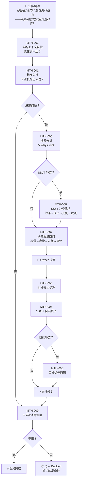

# 治理方法论

> module_id: PS-STD-011 | version: 2.8.1 | status: active | layer: cross_layer

---

## 总则：最优先行原则

AI 在面对任何决策问题时，思维起点必须是**"怎么做最合理"**，而非"规则允不允许"。
规则是护栏，不是停车标志。
**约束 How，不约束 What**：约束只能限制"怎么做到"，永远不能重新定义"要做什么"。

| # | 操作 |
|:--:|------|
| 1 | **先判断最优方案**：不考虑规则约束，怎么做是最合理、最有利于项目长期健康的？ |
| 2 | **再检查规则约束**：最优方案是否被现行规则限制？ |
| 3a | 无约束 → 执行 |
| 3b | 有约束 → 输出：(1)最优方案是X (2)被规则Y约束 (3)是否值得覆盖？需要什么审批？ |

**禁止**：以"规则说不允许"作为停止思考的借口；跳过步骤1直接进入步骤2；在3b中只说"不能"不给覆盖建议。

---

### 项目清爽原则

项目中的每一个文件必须有存在的理由。没有多余的文件。

| 规则 | 内容 |
|------|------|
| **唯一真源** | 同一概念只在一个文件中定义。**事前**：创建新文件前先检查责任是否已被已有文件覆盖（GOV-MOD-001 §7 #5 功能域重叠扫描、PS-STD-005 §10 #7 禁止平行蓝图）。**事后**：发现重复定义 → 立即合并 |
| **唯一责任** | 每个文件只承担一项职责。一个文件管多件事 → 拆分 |
| **能删就删** | 过时的、无意义的、已被替代的文件 → 立即删除。不保留"以防万一" |
| **最小维护成本** | 文件越多维护成本越高。删除一个不需要的文件比维护它省100倍精力 |

**判定标准**：若现在删掉这个文件，未来 3 个 AI session 内会有人发现它不见了吗？答案"不会"→ 删。

**禁止**：保留"万一将来需要"的文件；以"历史遗留"为由保留过时文件；创建占位跳转文件（"此文件已废弃请参见X"）；创建平行文件覆盖已有责任 → 需要新范围时升级原文件（version bump + changelog），禁止创建新文件后"合并"。

---

## 决策流程总图



**ASCII 速查版**（纯文本 AI session）：

```
  START ──→[总则:最优先行] ──→MTH-002 ──→MTH-001
                ↓          [发现问题?]──是──→MTH-009 ──→[够用?]──是──→✅
                ↓否                         ↓否
                MTH-006 (5 Whys)              📋 Backlog
                ↓          [SSoT冲突?]──是──→MTH-008
                ↓否                     ↓
                MTH-007 (四问) ←──────────┘
                ↓
                👤 Owner 决策
                ↓
                MTH-004 → MTH-005 → [目标冲突?]──是──→MTH-003
                                            ↓否
                                            ⚡执行 → MTH-009 → ...
```

### 决策流程快捷索引

- **总则：最优先行** — 所有决策的第 0 步：先判断最优方案，再检查规则约束
- **MTH-002（MUST）**：架构上下文自检——每次文件操作前必须先读架构层状态
- **MTH-001（方法论）**：标准先行——新问题先查是否有现有标准
- **MTH-006（MUST）**：根源分析——5 Whys 治根，治标禁止
- **MTH-008（方法论+硬规则）**：SSoT 冲突裁决——编号空间唯一、字段 SSoT
- **MTH-007（MUST）**：决策质量四问——提交Owner前四维检查
- **MTH-003**：目标优先——人类裁决原则
- **MTH-004～MTH-005**：对标定义 + 模块天花板与自治预留
- **MTH-009（MUST）**：补漏与终止双检——审查结束时输出三栏
- **MTH-010（MUST）**：规则体系架构审查——变动后四步检查
- **MTH-011（方法论）**：内容冗余审计三分类法——量化诊断文件是否冗余
- **MTH-012（方法论）**：涌现式设计——模板不应先于实例
- **MTH-013（方法论）**：路径架构合规创建——AI 不得自主决定目录层级

---

## 1. 目的与范围

本文件定义 ZephyrAlpha 项目治理决策的方法论——"怎么做治理决策"。它不是定义具体的规则，而是定义"制定规则的方法"。

适用于：`01_policies_and_standards/` 下所有规则的创建、修改、评审过程。

本源自 `../governance/document/document-control-policy.md`（GOV-DOC-009）中迁出的 ABS-003（标准先行）。原 ABS-003 在文档控制原则中与其他原则维度不一致（文档控制原则定义"文件怎么管"，治理方法论定义"决策怎么做"），因此独立成本文件。

> **编号说明**：本文件使用领域唯一前缀 `MTH-`（MTH-001），与 `../meta/behavior-boundaries-standard.md`（PS-STD-003）的 ABS 编号全局不冲突。

---

## 专业框架映射表

| 治理问题类型 | 对应专业框架 | 适用章节 |
|-------------|------------|---------|
| 安全策略 | ISO 27001 | Annex A（控制措施） |
| AI 治理 | ISO 42001 | §6~§8（AI 管理系统要求） |
| IT 服务管理 | ITIL 4 | SACM / Change Enablement / Incident Management |
| 治理问责 | COBIT 2019 | Governance & Management Objectives |
| 安全控制与隐私 | NIST 800-53 | AU / SC / IA / MP 控制家族 |
| 质量管理 | ISO 9001 | §7.5（文件化信息） |
| 风险管理 | ISO 31000 | §5~§7（风险评估方法） |
| Vibe Coding / AI辅助开发 | Anthropic / Cursor / Windsurf 官方指南 | CLAUDE.md / AGENTS.md / .cursorrules 规范 |

---

## MTH-001：标准先行

每条治理决策必须经过四步：

1. **明确问题**：本次决策要解决什么问题？
2. **查找标准**：该问题在专业框架中的对应章节是什么？（见专业框架映射表）
3. **适配标准**：专业框架有现成方案 → 适配到 ZephyrAlpha 上下文；没有 → 记录原因，自行定义
4. **记录溯源**：在规则"专业参考"字段中填写具体的专业框架和章节号

| | 内容 |
|---|------|
| **违反后果** | 治理体系不符合行业标准，审计不通过；后续决策缺乏一致性基础 |
| **验证方式** | 每条规则的"专业参考"字段是否已填写，且能追溯到具体的专业框架章节 |

---

## MTH-002：架构上下文自检 [MUST — 每次文件操作前强制执行]

1. **定位架构层**：文件 `layer` 字段是什么？对应哪个目录？（见 GOV-DOC-002）
2. **查验架构完整性**：该层目录是否已有架构描述文件？是否已被验证为完整？
   - 已完整 → 跳过步骤3，直接进入文件操作
   - 不完整 → MUST 进入步骤3
3. **探查架构该有的样子**：查 PS-STD-011 专业框架映射表 → 该问题域对应哪个专业框架？查 Vibe Coding 社区实践 → 这类文件在社区中如何组织？产出结论：该层应包含以下文件/结构，当前缺X
4. **仅当架构完整时才操作**：确认层的架构完整后，再进入具体文件操作。若架构不完整 → MUST 优先补全架构文件

| | 内容 |
|---|------|
| **违反后果** | 文件被放在错误的位置，产生孤立文件无架构上下文可追溯；不同 AI session 在碎片化目录结构中反复猜"放在这里还是那里" |
| **验证方式** | 新建/移动文件时，检查其 `layer` 字段是否匹配所在目录、该目录是否已有架构描述文件 |

---

## MTH-003：目标优先原则

当规则的字面执行与系统目标产生冲突时，目标优先于规则。

1. **冲突识别**（以下任一触发）：
   - 多条规则对同一事实给出矛盾要求
   - 严格遵循规则会导致预期外的破坏性后果
   - 规则在新范式下已失去效力但尚未正式废除
2. **裁决方向**：选择最能接近系统目标的路径，而非"最合规"的路径
3. **偏离记录**(MUST)：偏离了哪条规则 / 为什么偏离 / 替代方案是什么 / 达到了什么目标。"仅觉得规则不好"不算合法偏离
4. **事后修正**：偏离操作完成后评估是否需要修改原规则以避免同类冲突再次发生

**适用场景**（以下任一触发本原则）：
- 规则间冲突仲裁失败（如优先级表无法覆盖的新型冲突）
- 规则漏洞导致破坏性后果（规则未覆盖的边界情况）
- 规则滞后于架构进化（字段改名后引用未同步导致的安全空白）

| | 内容 |
|---|------|
| **违反后果** | 为"遵守规则"而做出破坏性决策——规则形式主义压倒系统目标，治理体系沦为自我维持的官僚机器 |
| **验证方式** | 所有偏离操作必须出现在 Session Log 或 ADR 中，且包含完整的偏离记录四要素（规则/原因/替代方案/达到目标） |

---

## MTH-004：对标 = 架构标准，非机构冗余

| 方向 | 内容 |
|------|------|
| **应复刻** | 架构容量（模块间接口定义、依赖管理）、分层设计（关注点隔离）、治理体系（版本管理、变更控制、审计追溯） |
| **不应复刻** | 人力冗余（多团队并行开发）、合规冗余（多地监管报告）、容灾冗余（多数据中心热备） |
| **判断标准** | 为"减少耦合、提高可测试性、降低认知负担"→ 适用。为"让两个团队不互相踩脚"→ 冗余 |

| | 内容 |
|---|------|
| **违反后果** | 过于豪华（堆叠无意义的冗余层）和过于简陋（以"一个人"为由放低架构标准）都会导致 1500 模块规模时崩溃 |
| **验证方式** | 每个架构决策标注对标动机——是"耦合分离"还是"组织边界" |

---

## MTH-005：模块天花板与自治预留

当前容量天花板约 **150-200 模块**。最终目标 1500+ 模块。

1. **当前设计必须考虑 1500+ 规模**：接口是否仍清晰、依赖树是否不爆炸、命名空间是否不冲突
2. **为 AI 自治预留接口**（低成本，不实现）：模块元数据标准化、清晰的状态机、机器可读的策略契约
3. **当前不开发 AI 自治模块**：预留接口是声明式标记，不是实现。实现推迟到 Phase 5

| | 内容 |
|---|------|
| **违反后果** | 50 模块时看似合理的设计，200 模块时成为瓶颈，1500 模块时不得不重写——每一次"现在先这样以后再改"都会在到达 1500 之前被技术债务拖死 |
| **验证方式** | CI 中检查每个新模块是否有完整 frontmatter（AI 自治的数据基础）；定期扫描接口契约完整性 |

---

## MTH-006：根源分析原则 [MUST — 每次发现问题时强制执行]

1. **5 Whys 溯源**：连续追问 5 个"为什么"，MUST NOT 在第一个为什么就停下
2. **根因判定**：
   - 治根：修复后同类问题不再产生 + 修复作用于系统设计层面 + 可描述为一条原则
   - 治标：仅作用于当前实例 / 可能在其他处重现 / 无法泛化为原则
3. **结构前置检查**：修复具体文件字段/引用前，MUST 先确认受影响目录的完整文件清单——该目录职责是什么？按单一责任原则应有哪些文件？当前缺失哪些？
4. **原子治根**：识别出根因后，MUST 检查项目中所有受同一根因影响的文件，一次性全部修复
5. **根因记录**：发现的根因 / 从哪个症状追踪到的 / 影响了哪些文件（全量清单）/ 修复后的设计原则
6. **诊断反转验证**：深挖完成后，MUST 回溯初始诊断——如果初始诊断与深挖结论不一致，MUST 追问"为什么初始诊断是错的？"并将根因加入症状-根因映射表。禁止跳过此步——跳过=下次遇到同类误信号仍会误诊

| 症状类型 | 常见根因 | 治根方向 |
|---------|---------|---------|
| 多处路径引用失效 | 系统按路径而非属性判定行为 | 改为属性推导引用 |
| 多文件字段冲突 | 概念在多处定义（非 SSoT） | 合并真源，其余改为引用 |
| 编号跳跃/不连续 | 编号规则未被显式定义 | 编号分配铁律（见 PS-STD-001 §5.4） |
| 相似规则在多个文件重复 | 文件边界未按责任单一原则划分 | 按唯一职责重新划分文件边界 |
| 修完文件后才发现目录缺文件 | 诊断时跳过结构盘点直接修字段 | 先结构前置检查（规则3）→ 补全缺失 → 再修字段 |
| 误诊"循环依赖"（实际是事件驱动） | 依赖图/契约表未区分hard/soft/event类型 | 声明循环依赖前MUST代码级验证import方向 |

| | 内容 |
|---|------|
| **违反后果** | 在症状层面反复打补丁，根因持续产生新问题，代码/文档积累"为什么这个也要改"的认知负担，最终架构腐败不可逆 |
| **验证方式** | 每次修复后追问——如果再发生一次同类问题，我还会回到这个文件来改吗？如果答案是"不会"→ 治根不彻底 |

---

## MTH-007：决策质量四问 [MUST — 每次向Owner提交方案时强制执行]

1. **埋雷检查**：这个选择会不会给未来埋雷？——选A方案，未来纠正需要重写架构吗？有清晰的拆除路径吗？
2. **容量检查**：这个选择会不会限制未来容量？——容量被谁消耗？还有多少余量？
3. **专业对标**：专业机构/Vibe Coding 社区怎么做的？——我们的选择在行业中有没有先例支撑？
4. **最终建议**（带推理）："A在埋雷维度无风险、容量维度有余量、对标维度有IETF/OWASP先例支撑，因此推荐A"

**反模式**："这个看着顺眼就选它"——跳过四问；"我觉得没问题"——跳过对标；"以后再说"——跳过埋雷检查

| | 内容 |
|---|------|
| **验证方式** | 每次建议被 Owner 采纳后，未来 3 个 session 内是否因为该建议的"埋雷"而被迫返工？如果是 → 四问执行不彻底 |

---

## MTH-008：SSoT 冲突裁决协议

1. **时序优先**：谁先注册/定义该概念？——查 frontmatter `date` 或 `created_at` 字段
2. **职责归属**：该概念的语义属于哪个文件的自然领域？——语义匹配度 = 该概念名是否直接描述了该文件的 core purpose
3. **专业先例**：专业机构在同类场景中怎么判定？——IETF RFC 编辑：已有 RFC 号不收回，新文档用更高的未使用号。OWASP：发现项目缩写冲突时后来者必须重命名
4. **裁决输出**：真源文件：X（module_id + 绝对路径）/ 冲突文件：Y / 修复方式：Y 迁移到独立编号空间 / 删除 Y 中的重复定义 / Y 改为引用 X

**不可协商**：编号空间（如 `ABS-`、`LFC-`、`MTH-`）只属于一个文件。字段定义（如 `status`、`stability`）的真源是 PS-STD-001。

| | 内容 |
|---|------|
| **违反后果** | 两个 AI session 读到不同的 `ABS-001` 定义 → 执行不同的规则 → 工程质量不一致 |
| **验证方式** | 裁决后执行 `grep "ABS-" --files-with-matches` 是否只返回 PS-STD-003？如果在其他文件中仍有 `ABS-` 引用，裁决未执行完毕 |

---

## MTH-009：补漏与终止双检 [MUST — 每次审查结束时强制执行]

1. **补漏检查**：按专业机构/Vibe Coding 社区的标准框架，当前审查范围内是否还有未覆盖的类别？——打开专业框架映射表 → 找到本次涉及的领域 → 逐条过，标记"已覆盖"/"当前阶段不适用"/"进入 Backlog"
2. **够用检查**：以当前已知条件和项目阶段，现有规则量是否已够用？——当前规则是否能覆盖下一个开发阶段的所有已知需求？是 → 停止。"万一将来需要"不构成施工理由
3. **双检记录**(MUST)："已覆盖：{列举}" / "进入 Backlog：{列举 + 预计Phase}" / "当前阶段不适用：{列举 + 原因}"

| | 内容 |
|---|------|
| **违反后果** | 项目节奏失控——要么一直在审查同一个东西（过度），要么还没审完就跳到下一个（不足）。两个方向都破坏工程质量 |
| **验证方式** | 本次审查结束后，下一个 Phase 的施工是否因为本次的"够用检查"遗漏而被迫回补？如果是 → "够用"判定错误 |

---

## MTH-010：规则体系架构审查原则

每次规则体系变动后（新增/合并/重命名/重组），执行四步审查：

**Step 1 — 名字=责任检查**

| 检查项 | 不合格处置 |
|--------|-----------|
| 文件名是否一眼看出责任？ | 重命名 |
| 文件名后缀是否统一？ | 统一后缀 |
| 文件名与 title 是否一致？ | 修正不一致的一方 |

**Step 2 — 责任声明检查**

| 检查项 | 不合格处置 |
|--------|-----------|
| 是否有正向责任声明（§1.2）？ | 补写 §1.2 |
| 是否有负向责任边界（§1.3）？ | 补写 §1.3 |
| 责任边界是否指向正确文件？ | 修正指向 |

**Step 3 — 文件夹职责检查**

| 检查项 | 不合格处置 |
|--------|-----------|
| 每个文件夹是否有责任声明？ | 写入 index.md |
| 文件夹是否只装一种类型？ | 迁移异类文件 |
| 文件夹命名是否遵循规范？ | 重命名 |

**Step 4 — 专业机构对标**

| 检查项 | 不合格处置 |
|--------|-----------|
| 文件划分是否与对标机构一致？ | 补充差距分析 |
| 命名是否与对标机构一致？ | 修正命名 |
| 是否有对标差异的正当理由？ | 补写论证或修正 |

审查频率：变更触发（新增/合并/重命名 → 受影响目录立即执行）/ 定期审计（全部 `01_policies_and_standards/`，每90天或Phase转换时）。

**禁止**：跳过 MTH-010 直接提交；Step 1-3 不合格时标记"通过"；以"将来再修"跳过重命名；选择性对标。

**完成标准**：输出审查报告 {Step1结果 + Step2结果 + Step3结果 + Step4结果}。Step 1-3 有不合格 → 修复后重新审查。Step 4 有差距但已论证正当理由 → 记录为"已知差距"。

---

## MTH-011：内容冗余审计三分类法 [SHOULD]

| 分类 | 判定标准 | 处理 |
|:----:|---------|------|
| 🔴 重复 | 该内容已在其他文件中被权威定义 | 删除，改为引用真源文件（`→ PS-STD-XXX §N`） |
| 🟡 废话 | 过度设计/很快过时/没人执行/层级错位 | 删除。如需保留，下沉到操作手册或代码 |
| 🟢 有价值 | 本文独有、不可推导、对决策有实际约束 | 保留。检查是否应移到更合适的文件 |

**量化评估**：🔴+🟡 >80% → 考虑废除整个文件；60%~80% → 大幅瘦身；30%~60% → 删除🔴🟡；<30% → 健康

**快速判定清单**（逐段初筛，三步依次执行）：
1. **独有吗？** 有其他文件已定义 → 🔴重复 → 删除，引用真源
2. **有人用吗？** 从不被执行/引用 → 🟡废话 → 删除
3. **指的路对吗？** 路径失效/编号不存在 → 修正为真实引用，或内容已过时 → 删除

**治根处理**：🔴重复 → 删除并替换为对真源的引用。🟡废话 → 直接删除。🟢有价值 → 保留，同时执行责任归属检查——放在当前文件是最合适的吗？

### 附：文件退役原则

| # | 操作 | 规则 |
|:--:|------|------|
| 1 | **提取** | 文件中有独特知识（🟢类）吗？→ 提取到正确文件。没有 → 跳步骤3 |
| 2 | **注入** | 提取内容必须去"应该放的地方"——不能改成另一个孤儿文件。查 PS-STD-011 §3 确定域归属 |
| 3 | **删除** | 删除原件。git log 保留历史 |

**禁止**：把退役文件改名当备份（`XXX_old`/`XXX_deprecated`）；提取内容后原件不删。

---

## MTH-012：涌现式设计原则 [SHOULD — 创建/完善结构化文档时执行]

模板定义**下限**（及格线），涌现式设计定义**上限**（草稿血肉不能浪费）。

**四步执行**：

**Step 1 — 模板填空（保下限）**：模板每个必填节填满。不跳节、不"待定"、不空着。

**Step 2 — 草稿差异识别**：草稿内容逐段与模板结构对比：

| 差异类型 | 示例 |
|---------|------|
| 模板外内容 | 草稿有"三轮审计结果"但模板没有§审计记录 |
| 模板内不足 | 草稿§架构决策有5框架对比+15维度评分，模板只给了3行空间 |

Step 3 — 差异分析（三问判定）：结构性还是装饰性？→ 装饰性丢弃。未来 AI session 读到它会不会做出不同的决策？→ 会就纳入。属于当前文件还是应迁移？→ 应迁移就迁移。

Step 4 — 反向修正模板（仅显著差异时触发）：模板有但实例没用到的节 → 是否真的需要？/ 实例需要但模板缺的 → 修正模板 / 模板节容量不足 → 扩大或拆分 / 模板字段定义过时 → 修正

Step 4 触发条件：实例比模板多 ≥2 个完整节 / 某节深度 ≥3 倍模板 / ADR 裁定字段格式升级（`→ KB:decisions`）。

MTH-011 vs MTH-012 互补：MTH-012 做加法（哪些该加），MTH-011 做减法（哪些该删）。

---

## MTH-013：路径架构合规创建原则 [MUST — 所有文件/目录创建操作]

AI 永远不得自行决定新目录的层级结构。

**三步决策流程**：
```
需要创建/修改文件
        ├→ 目标路径是否已存在于项目树中？→ 按现有路径写入（零决策）
        └→ 否：该文件类型在索引中有定义吗？
           查：GOV-DOC-002 §5.1.2 路径映射表 + registry-master-index.yaml + document-metadata-index.yaml
        ├→ 是（索引已定义存放规则）→ 按索引创建目录 → 写入文件
        └→ 否（全新领域）→ 标记"新路径结构"→ 提交 Owner 讨论
             临时存放：sketches_and_drafts/{YYYY-MM-DD}/proposed-path-structure.md
             通过 → 更新索引 → 创建目录 → 写入文件
             未通过 → 不创建，任务卡标 blocked.PATH_NOT_DEFINED
```

| # | 核心原则 |
|---|------|
| 1 | **零自主创建权**：AI 永远不能自行决定新目录层级——必须有索引授权或 Owner 批准 |
| 2 | **先查索引再行动**：所有路径操作前强制查询 GOV-DOC-002 §5.1.2 + registry-master-index.yaml |
| 3 | **新结构必须登记**：批准的新增目录创建后，同一 session 内同步更新三个索引文件 |
| 4 | **临时文件也守规矩**：`sketches_and_drafts/` 下也必须放在规定的草案目录下，禁止根目录创建 |
| 5 | **目录存在性前置检查**：写入前先 `os.path.exists(os.path.dirname(path))` → 不存在走三步流程 |

**禁止行为**：

| # | 禁止 | 原因 |
|---|------|------|
| 1 | 使用 `os.makedirs` 创建未在索引中定义的目录层级 | 必须先走三步流程 |
| 2 | 在项目根目录创建临时文件（如 `temp.py`、`test.md`） | 临时文件必须放 `sketches_and_drafts/` |
| 3 | "我觉得应该放这"决定路径 | 感觉不是导航工具 |
| 4 | 跳过索引查询直接 `mkdir` | 即使目录看起来很像正确的结构 |
| 5 | 创建了新目录但不在同一 session 内更新索引 | 目录成为"孤岛"，AI 无法发现其存在 |

**索引查询清单**（按顺序，任一有定义即可行动）：

| 顺序 | 索引文件 | 查询内容 |
|:---:|---------|------|
| 1 | GOV-DOC-002 §5.1.2 路径映射表 | 该文件类型的标准存放路径 |
| 2 | registry-master-index.yaml | 是否有类似模块的目录结构先例 |
| 3 | document-metadata-index.yaml | 是否有类似文件类型的存放路径先例 |
| 4 | module-id-registry.yaml | 如果是新目录对应新模块——module_id 是否已注册 |

| 文件类型 | 索引参考 |
|---------|------|
| 蓝图 | GOV-DOC-002 §5.1.2 模块文档 |
| 任务卡 | `Task` Pydantic model (schemas.py) |
| 治理标准 | GOV-DOC-002 §5.1.2 治理文档 |
| 源代码 | GOV-DOC-002 §5.1.2 业务代码 |
| 测试代码 | GOV-DOC-002 §5.1.2 测试代码 |
| 审计脚本 | scripts/governance/index.md |
| 草案/草稿 | GOV-DOC-002 §5.1.2 草案目录 |

---

## 与其他文件的关系

| 关联文件 | module_id | 关系 |
|---------|-----------|------|
| 元标准宪法 | PS-STD-000 | 本文件的规则分类标准遵从 PS-STD-000 的二元分类（后果不可逆性） |
| 规则治理标准 | PS-STD-009 | 本文件的方法论约束规则从创建到废弃的全生命周期和变更门控 |
| 文档控制原则 | GOV-DOC-009 | MTH-001（标准先行）原属 GOV-DOC-009 的 ABS-003，现已独立迁移；DOC-005 Step 1 引用本文件 |
| 目录结构规范 | GOV-DOC-002 | 被 GOV-DOC-009 DOC-005 Step 1 引用，作为文件放置决策的补充参考 |