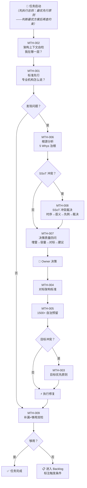

# 治理方法论

> module_id: PS-STD-011 | version: 2.6.0 | status: active | layer: cross_layer

---

## 总则：最优先行原则（Best-First Principle）

> 本原则是所有 MTH-001~011 的第 0 步——**每条 MTH 规则执行前，必须先过此思维关**。
> 对标：ITIL Change Enablement（从业务价值出发评估，非从现有限制出发）、Kubernetes KEP（先定义理想状态 What，再设计实现路径 How）。

AI 在面对任何决策问题时，思维起点必须是"**怎么做最合理**"，而非"**规则允不允许**"。

规则是护栏（guardrail），不是停车标志（stop sign）。

**约束是 How，不是 What**：约束只能限制"怎么做到"（实现路径），永远不能重新定义"要做什么"（理想状态）。先定义理想状态（What），再解决实现约束（How）——约束的合法作用是调整路径，不是否定目标。

**思维顺序**：

| 步 | 操作 | 说明 |
|:--:|------|------|
| 1 | **先判断最优方案** | 如果不考虑任何现行规则约束，怎么做是最合理、最符合专业实践、最有利于项目长期健康的？ |
| 2 | **再检查规则约束** | 最优方案是否被现行规则限制？ |
| 3a | 无约束 → **执行** | 按最优方案执行 |
| 3b | 有约束 → **不是停止，是建议覆盖** | 输出：(1) 最优方案是X (2) 被规则Y约束 (3) 是否值得覆盖？如果值得，需要什么审批？ |

**禁止行为**：
- ❌ 用"规则说不允许"作为停止思考的借口——规则不能替代专业判断
- ❌ 跳过步骤 1 直接进入步骤 2——从不考虑最优方案的决策是盲目的
- ❌ 在步骤 3b 中只说"不能做"不给出覆盖建议——AI 的角色是架构师，不是守门员

**注意**：本原则不否定规则——宪法级文件（`frozen` + `immutable_core`）仍然需要 Owner 审批才能变更。但 AI **不能**跳过"判断最优"这一步，直接以"不可变"封堵自己的思考。

> **大白话**：先想清楚什么是对的，再看规则挡不挡路。如果挡了，不是闭嘴——是告诉 Owner"这样做最对，但有条规矩挡着，要不要破个例？"

---

### 项目清爽原则（Project Cleanliness Principle）

> 本原则与最优先行原则并列——两条共同构成 AI 决策的双起点。最优先行回答"怎么做最好"，清爽原则回答"做完了留什么"。
> 对标：Lean Software Development（消除 Muda——浪费）+ Unix 哲学（Do One Thing Well——一个工具只做一件事）+ ISO 9001 §7.5（文件化信息应必要且充分，不堆积不需要的文档）。

项目中的每一个文件必须有存在的理由。**没有多余的文件。**

**核心规则**：

| 规则 | 内容 | 大白话 |
|------|------|--------|
| **唯一真源** | 同一概念只在一个文件中定义。发现重复定义 → 立即合并，不留"副本" | 一件事只有一本说明书，不会有两本说法不一样的 |
| **唯一责任** | 每个文件只承担一项职责。一个文件管多件事 → 拆分 | 一个文件只管一件事，管多了就乱 |
| **能删就删** | 过时的、无意义的、已被替代的文件 → 立即删除。不保留"以防万一"的备份 | 用不上的东西就扔，不用存着占地方 |
| **最小维护成本** | 文件越多，维护成本越高。删除一个不需要的文件，比维护它省 100 倍的精力 | 少一个文件就少一份要操心的事 |

**判定标准**（The "Would Anyone Notice?" Test）：

> 问自己：**"如果现在删掉这个文件，未来 3 个 AI session 内会有人发现它不见了吗？"**
>
> 如果答案是"不会"——删。不需要更多理由。

**禁止行为**：
- ❌ 保留"万一将来需要"的文件——"万一"不构成保留理由。将来需要时再建
- ❌ 用"这是历史遗留"为由保留过时文件——历史在 git log 里，不在当前工作树里
- ❌ 创建"占位跳转文件"（"此文件已废弃，请参见 X"）——废弃走 `superseded_by` 字段，不走占位文件

> **大白话**：项目就像一个工作台——工具越多不代表越厉害，只留真正在用的。用不上的工具除了积灰，还会让你每次找东西时多翻两下。删掉它们，工作台清爽，脑子也清爽。

---

## 决策流程总图（Decision Flow Map）

> **AI 导航指引**：此图为 MTH-001~009 的完整决策链路。每次承担治理任务时，先执行总则（最优先行——判断"怎么做最好"），再从此图入口开始，按箭头方向执行。方法论细节见各 MTH-XXX 条目。



**ASCII 速查版**（纯文本 AI session）：

```
  START ──→ [总则:最优先行] ──→ MTH-002 ──→ MTH-001
                ↓
          [发现问题?]── 否 ──→ MTH-009 ──→ [够用?]── 是 ──→ ✅
                ↓ 是                          ↓ 否
           MTH-006 (5 Whys)              📋 Backlog
                ↓
          [SSoT冲突?]── 是 ──→ MTH-008 ──┐
                ↓ 否                      ↓
           MTH-007 (四问) ←──────────────┘
                ↓
           👤 Owner 决策
                ↓
           MTH-004 → MTH-005 → [目标冲突?]── 是 ──→ MTH-003
                                     ↓ 否              ↓
                                    ⚡执行 ←──────────┘
                                       ↓
                                    MTH-009 → ...
```

---

### 决策流程快捷索引

- **总则：最优先行** — 所有决策的第 0 步：先判断最优方案，再检查规则约束。规则是护栏，不是停车标志。
- **MTH-002（MUST）**：架构上下文自检——每次文件操作前必须先读架构层状态
- **MTH-001（方法论）**：标准先行——新问题先查是否有现有标准
- **MTH-006（MUST）**：根源分析——5 Whys → 治标禁止
- **MTH-008（方法论+硬规则）**：SSoT 冲突裁决——编号空间唯一、字段 SSoT
- **MTH-007（MUST）**：决策质量四问——提交Owner前四维检查
- **MTH-003**：目标优先——人类裁决原则
- **MTH-004～MTH-005**：对标定义 + 模块天花板与自治预留
- **MTH-009（MUST）**：补漏与终止双检——审查结束时输出三栏
- **MTH-010（MUST）**：规则体系架构审查——变动后四步审
- **MTH-011（方法论）**：内容冗余审计三分类法——量化诊断文件是否冗余
- **MTH-012（方法论）**：涌现式设计——模板不应先于实例：先写最丰满的实例，再从实例提取模板
- **MTH-013（方法论）**：路径架构合规创建——AI 不得自主决定目录层级：索引有定义按索引，无定义找 Owner

---

## 1. 目的与范围

本文件定义 ZephyrAlpha 项目治理决策的方法论——"怎么做治理决策"。它不是定义具体的规则，而是定义"制定规则的方法"。

适用于：`01_policies_and_standards/` 下所有规则的创建、修改、评审过程。

本源自从 `../governance/document/document-control-policy.md`（GOV-DOC-009）中迁出的 ABS-003（标准先行）。原 ABS-003 在文档控制原则中与其他原则维度不一致（文档控制原则定义"文件怎么管"，治理方法论定义"决策怎么做"），因此独立成本文件。

> **编号说明**：本文件使用领域唯一前缀 `MTH-`（MTH-001），与 `../meta/behavior-boundaries-standard.md`（PS-STD-003）的 ABS 编号全局不冲突。

## 2. 标准先行（Standards-First Approach）

### MTH-001：标准先行

在进行任何治理决策（创建规则、定义流程、设计规范）之前，必须先问："这件事专业机构有没有标准做法？"不能凭直觉或习惯拍板。

- **规则**：每条治理决策必须经过以下四步：

  1. **明确问题**：本次决策要解决什么问题？
  2. **查找标准**：该问题在专业框架中的对应章节是什么？（见 §3 专业框架映射表）
  3. **适配标准**：
     - 如果专业框架有现成方案 → 适配到 ZephyrAlpha 上下文
     - 如果专业框架没有 → 记录原因，自行定义，并在"专业参考"字段标注"自行定义"
  4. **记录溯源**：在规则的"专业参考"字段中填写具体的专业框架和章节号

- **违反后果**：治理体系不符合行业标准，审计不通过；后续决策缺乏一致性基础
- **验证方式**：每条规则的"专业参考"字段是否已填写，且能追溯到具体的专业框架章节
- **专业参考**：ISO 9001 §0.1 → Quality Management Principles / ITIL → Guiding Principles

### MTH-002：架构上下文自检 [MUST — 每次文件操作前强制执行]

在创建或操作任何文件之前，AI **MUST** 先"向上看"——这个文件在整个架构中处于什么位置，该架构层是否完整、是否已通过验证。

- **规则**：每次文件操作前 **MUST** 执行以下四步：

  1. **定位架构层**：我要操作的文件的 `layer` 字段是什么？对应哪个目录？（查 `../governance/document/directory-structure-standard.md`（GOV-DOC-002））
  2. **查验架构完整性**：该层/目录是否已有架构描述文件？该架构是否已被验证为完整？
     - 若该层已有"架构已验证"标记 → 跳过步骤 3，直接进入文件操作
     - 若该层无架构描述或标记为"未验证" → **MUST** 进入步骤 3
  3. **探查架构该有的样子**：
     - 查 PS-STD-011 §3（专业框架映射表）：该问题域对应哪个专业框架？
     - 查 Vibe Coding 社区实践（Anthropic/Cursor/Windsurf 官方指南）：这类文件在社区中是如何组织的？
     - 产出结论："该层应该包含以下文件/结构，当前缺失 X"
  4. **仅当架构完整时才操作**：确认层的架构完整后，再进入具体文件操作（创建/修改/删除）。如果架构不完整，**MUST** 优先补全架构文件，而非直接创建孤立文件。

- **违反后果**：文件被放在错误的位置，产生孤立文件无架构上下文可追溯；不同 AI session 在碎片化目录结构中反复猜"Do I put this here or there?"
- **验证方式**：新建/移动文件时，检查其 `layer` 字段是否匹配所在目录、该目录是否已有架构描述文件
- **强制执行**：写入 AGENTS.md §7.5 思维模式速查表——"每次文件操作前"触发。PS-STD-009 P2/P3 变更流程中作为前置检查
- **专业参考**：ITIL SACM → Architecture Baseline（架构基线——变更前必须确认当前架构状态）/ Codified Context（arXiv 2602.20478）→ 领域触发策略（Domain-Triggered Loading——AI 必须先知道"这个领域有什么"才能决定"往哪里加"）

> **MTH-001 与 MTH-002 的关系**：MTH-001 回答"决策怎么做"（查标准→适配→记录），MTH-002 回答"操作在哪做"（定位层→查完整性→补架构→再操作）。两者在时间轴上是串联的：先执行 MTH-002 确定操作位置和层完整性，再执行 MTH-001 确定决策方法。

## 3. 专业框架映射表

不同的治理问题对应不同的专业框架，以下是标准映射：

| 治理问题类型 | 对应专业框架 | 适用章节 |
|-------------|------------|---------|
| **安全策略**（密钥、访问控制、事件响应） | ISO 27001 | Annex A（控制措施） |
| **AI 治理**（AI 自治、AI 安全、AI 伦理） | ISO 42001 | §6~§8（AI 管理系统要求） |
| **IT 服务管理**（变更管理、资产配置、事故响应） | ITIL 4 | SACM / Change Enablement / Incident Management |
| **治理问责**（角色权限、决策层级、审计追踪） | COBIT 2019 | Governance & Management Objectives |
| **安全控制与隐私**（数据保护、加密标准、审计追踪） | NIST 800-53 | AU / SC / IA / MP 控制家族 |
| **质量管理**（文档控制、流程设计、标准制定） | ISO 9001 | §7.5（文件化信息） |
| **风险管理**（交易风控、限额、止损） | ISO 31000 | §5~§7（风险评估方法） |
| **Vibe Coding / AI辅助开发** | Anthropic / Cursor / Windsurf 官方指南 | CLAUDE.md / AGENTS.md / .cursorrules 规范 |

### MTH-003：目标优先原则

当规则的字面执行与系统目标产生冲突时，**目标优先于规则**。规则是为目标服务的——不存在"宁毁目标，不违规则"的合法性。

- **规则**：
  1. **冲突识别**：以下任一情况触发本原则：
     - 两条或多条规则对同一事实给出矛盾要求，无法同时满足
     - 严格遵循规则会导致预期外的破坏性后果（数据丢失、系统停摆、风控失效）
     - 规则在新技术范式或新约束下已失去效力，但尚未正式废弃
  2. **裁决方向**：目标优先于规则——选择最能接近系统目标的路径，而非"最合规"的路径
  3. **偏离记录**：任何偏离规则的操作**必须记录**：
     - 偏离了哪条规则
     - 为什么偏离（冲突的具体场景和后果）
     - 替代方案是什么
     - 达到了什么目标
     - 仅欠一句"规则不好"不算合法偏离——必须有具体的替代方案和达成目标的证据
  4. **事后修正**：偏离操作完成后，必须评估是否需要修改原规则以避免同类冲突再次发生。如果需要，创建 ADR 记录规则修改

- **适用场景**：
  - 规则间冲突仲裁失败（如优先级表无法覆盖的新型冲突）
  - 规则漏洞导致破坏性后果（规则未覆盖的边界情况）
  - 规则滞后于架构进化（字段改名后引用未同步导致的安全空白）

- **违反后果**：为"遵守规则"而做出破坏性决策——规则形式主义压倒系统目标，治理体系沦为自我维持的官僚机器
- **验证方式**：所有偏离操作必须出现在 Session Log 或 ADR 中，且包含完整的偏离记录四要素（规则/原因/替代/目标）
- **专业参考**：ITIL 4 Guiding Principles → "Focus on Value"（价值优先于流程）/ ISO 9001 §0.1 → Quality Management Principles → "以客户为关注焦点"（客户目标优先于内部流程）/ Anthropic Model Spec → "Helpfulness over Harmlessness when trade-off is required"

> **MTH-001 / MTH-002 / MTH-003 的串联关系**：
> ```
> MTH-002（在哪做）→ MTH-001（怎么做）→ MTH-003（如果冲突怎么判）
> ```
> 三条构成完整的治理决策链：先定位架构位置，再决策执行方法，如果执行中规则冲突则目标优先裁决。

### MTH-004：对标 = 架构标准，非机构冗余

"对标顶级专业量化机构"的本质含义是**架构容量、分层设计、治理体系**达到机构级标准。**不是**复刻机构运营中的冗余结构。

- **规则**：
  1. **对标内容（应复刻）**：
     - 架构容量——模块间接口定义、依赖管理、可替换性。机构级的代码不管多少人在写，软件质量属性是一样的
     - 分层设计——API层/领域层/基础设施层的分离、关注点隔离。个人项目和机构项目的分层在形式上无差别
     - 治理体系——版本管理、变更控制、审计追溯、合规验证。治理体系的标准化程度不随团队规模线性递减
  2. **不对标内容（不应复刻）**：
     - 人力冗余——多团队并行开发同一模块、代码的多实现互备
     - 合规冗余——多地监管报告、合规审计的多重证据链（个人量化仅需单一份）
     - 容灾冗余——多数据中心热备、跨AZ双活、异地灾备（个人量化可接受冷备）
  3. **判断标准**：如果一个架构决策在机构环境中是为了"减少耦合、提高可测试性、降低认知负担"，则同样适用于个人项目。如果一个架构决策在机构环境中是为了"让两个团队不互相踩脚"，则属于冗余。

- **违反后果**：两个方向都不对——过于豪华（堆叠无意义的冗余层）和过于简陋（以"一个人做"为由放低架构标准）。两个方向都会导致 1500 模块规模时崩塌
- **验证方式**：每个架构决策标注对标动机——是"耦合分离"还是"组织边界"
- **专业参考**：Two Sigma / Jane Street → system architecture papers（架构设计层面）/ ITIL SACM → 配置项粒度原则（粒度过粗不管理，粒度过细不经济）/ 12-Factor App → "One codebase, one application"（个人与机构共用架构原则）

### MTH-005：模块天花板与自治预留

当前项目在"AI 仅作为编码工具（无自主决策能力）"模式下的实际容量天花板约 **150-200 模块**。最终目标是 1500+ 模块，差距（200→1500）由 Phase 5 "AI 自治"解决。

- **规则**：
  1. **当前设计必须考虑 1500+ 规模**：设计任何模块时，验证它在 1500+ 模块规模下的合理性——接口是否仍清晰、依赖树是否不爆炸、命名空间是否不冲突
  2. **为 AI 自治预留接口**（低成本，不实现）：
     - 模块元数据标准化（`module_id`、`depends_on`、`capability_tags`）——AI 自治需要可查询的模块目录
     - 清晰的状态机（每个模块的状态转换由规则定义，而非代码中硬编码）——AI 自治需要可预测的状态转移
     - 机器可读的策略契约（所有策略优先用 YAML 合同而非自然语言 prose 定义）——AI 自治需要可解析的约束而非可阅读的建议
  3. **当前不开发 AI 自治模块**：不要因为预留接口而偏离当前施工任务。预留接口是声明式标记（"这里会有一个接口"），不是实现。实现推迟到 Phase 5

- **违反后果**：50 模块时看似合理的设计在 200 模块时成为瓶颈，在 500 模块时不得不重写——每一次"现在先这样，以后再改"都会在到达 1500 之前被技术债务拖死
- **验证方式**：CI 中检查每个新模块是否有完整 frontmatter（AI 自治的数据基础）；定期扫描接口契约完整性
- **专业参考**：Netflix → Microservice Architecture（服务发现依赖标准化元数据）/ Kubernetes → CRD + Operator Pattern（声明式 + 自治控制器——模块元数据 = CRD，AI 自治 = Operator）/ HashiCorp Terraform → Provider Contract（每个模块暴露标准接口才能被外部驱动）

### MTH-006：根源分析原则 [MUST — 每次发现问题时强制执行]

在解决任何已发现的问题之前，**MUST** 先区分"治标"和"治根"——修复症状还是修复产生症状的系统。治标修复 **MUST NOT** 成为默认操作。

- **规则**：
  1. **5 Whys 溯源**：从问题表面症状出发，连续追问 5 次"为什么"，直至找到不可再分的根源。**MUST NOT** 在第一次为什么就停下
  2. **根因判定标准**：
     - 治根满足以下全部条件：
       a. 修复后同类问题不再自然产生（消除产生条件）
       b. 修复作用于系统设计层面（规则/架构/流程），而非单个实例
       c. 修复可以被描述为一条原则——"以后所有 X 都遵循 Y"而不是"这个 X 改成了 Y"
     - 治标满足以下任一特征：
       a. 修复仅作用于当前实例（更新一条路径、修正一个值）
       b. 修复后同类问题可能在另一处重现（没有消除产生条件）
       c. 修复无法被泛化为原则
  3. **结构前置检查（Structural Pre-Check）**：在修复具体文件的字段和引用之前，**MUST** 先确认受影响目录的完整文件清单——该目录的职责是什么？按单一责任原则应该包含哪些文件？当前缺失哪些？**MUST NOT** 跳过此步直接修字段——否则修复完现有文件后才发现目录缺文件，需返工再修一轮。
  4. **原子治根**：当识别出根因后，**MUST** 检查项目中所有受同一根因影响的文件，一次性全部修复。结构前置检查中发现的缺失文件 **MUST** 一并纳入此次修复范围。只治一个文件而留其他文件带病 = 治标
  5. **根因记录**：每次治根操作 **MUST** 在变更记录中说明：
     - 发现的根因是什么
     - 从哪个症状追踪到的
     - 影响了哪些文件（全量清单，含结构前置检查中发现的新增文件）
     - 修复后的设计原则是什么（一句话可被后续 AI 引用）

- **典型根因模式（非穷举，持续积累）**：

  | 症状类型 | 常见根因 | 治根方向 |
  |---------|---------|---------|
  | 多处路径引用失效 | 系统按路径而非属性判定行为 | 改为属性推导引擎 |
  | 多文件字段冲突 | 概念在多处定义（非 SSoT） | 合并真源，其余改为引用 |
  | 编号跳跃/不连续 | 编号规则未被显式定义 | 编号分配铁律（见 PS-STD-001 §5.4） |
  | 相似规则在多个文件重复 | 文件边界未按责任单一原则划分 | 按唯一职责重新划分文件边界 |
  | 修完文件字段后才发现目录缺文件 | 诊断时跳过结构盘点直接修字段——未先确认"该目录按责任应有哪些文件" | 先结构前置检查（MTH-006 规则 3）→ 补全缺失文件 → 再修字段/引用 |

- **违反后果**：在症状层面反复打补丁，根因持续产生新问题，代码/文档积累"为什么这个也要改？"的认知负担，最终架构腐败不可逆
- **验证方式**：每次修复后追问——"如果再发生一次同类问题，我还会回到这个文件来改吗？"如果答案是"会"，则治标未治根
- **强制执行**：写入 AGENTS.md §7.5 思维模式速查表——"遇到任何问题时"触发。治标修复触发 AGENTS.md §7.2 根源分析优先行为准则。

> **MTH-006 与 MTH-001~005、MTH-010 的串联**：
> ```
> MTH-002（在哪做）→ MTH-001（怎么做）→ MTH-006（根源分析：问题是治标还是治根？）
>     ↓ 如果是治根 → 先执行规则 3 结构前置检查（对齐 MTH-002 架构完整性 + MTH-010 Step 3 文件夹职责）
>     ↓ 再执行规则 4 原子治根
> MTH-004（对标架构标准）→ MTH-005（考虑 1500+ 自治预留）→ MTH-003（如果冲突目标优先）
> ```
> MTH-006 是决策链上的**诊断环节**——在行动之前先判病灶深度。其中规则 3（结构前置检查）是 MTH-002 架构自检在问题修复场景下的具体化：MTH-002 问"这个目录架构完整吗"，MTH-006 规则 3 问"这个目录按职责该有哪些文件、缺了哪些"。它与 AGENTS.md §7.2 根源分析优先是同一个原则在不同层面的体现：AGENTS.md 定义的是"AI 的行为准则"，本文件定义的是"治理方法论的步骤"。

### MTH-007：决策质量四问 [MUST — 每次向Owner提交方案时强制执行]

每次向 Owner 提交方案或建议时，**MUST** 完成以下四个维度的检查。缺少任一维度的方案 **MUST NOT** 进入 Owner 决策环节。

- **四问模板**：
  1. **埋雷检查**（Forward Cost）：这个选择会不会给未来埋雷？——如果选 A 方案，未来纠正它需要重写架构吗？需要不可逆迁移吗？有清晰的拆除路径吗？（对齐 AGENTS.md §6.3 未来成本评估）
  2. **容量检查**（Scalability）：这个选择会不会限制未来容量？——如果用 `A-` 作为前缀（2 字符），未来其他文件想用 `A-` 怎么办？容量被谁消耗的？还有多少余量？（对齐 MTH-005 1500+ 目标）
  3. **专业对标**（Professional Reference）：专业机构/Vibe Coding 社区怎么做的？——ISO 用家族号段、OWASP 用项目缩写、Kubernetes 用 API 组前缀。我们的选择在行业中有没有先例支撑？（对齐 MTH-004 对标=架构标准）
  4. **最终建议**（Recommendation with Reasoning）：基于以上三维度的综合判断给出建议——不是"我觉得 A 好"，而是"A 在埋雷维度无风险、容量维度有余量、对标维度有 IETF/OWASP 先例支撑，因此推荐 A"

- **反模式**：
  - "这个看着顺眼就选它吧"——跳过四问
  - "我觉得没问题"——跳过对标
  - "以后再说"——跳过埋雷检查
- **验证方式**：每次建议被 Owner 采纳后，未来 3 个 session 内是否因为该建议埋的雷而需要返工？如果是，四问执行不到位
- **专业参考**：ITIL → Change Impact Assessment（变更影响评估四维度：风险、范围、合规、替代方案）/ ISO 31000 → Risk Assessment（风险评估——任何决策前必须评估潜在后果）

### MTH-008：SSoT 冲突裁决协议（Single Source of Truth Conflict Arbitration）

当两个或以上规则文件对同一概念作出不同声明（编号冲突、字段定义冲突、职责重叠）时，必须使用本协议判定真源（SSoT）。

- **裁决四步法**：
  1. **时序优先**（Temporal Priority）：谁先注册/定义该概念？——先注册的文件拥有初始权。查 frontmatter `date` 或 `created_at` 字段
  2. **职责归属**（Semantic Ownership）：该概念的语义属于哪个文件的自然领域？——`ABS-`（行为边界）的语义自然属于 PS-STD-003（行为边界标准），不是 PS-STD-009（规则治理标准——尽管它包含生命周期内容，但编号空间 ABS- 不属于治理领域）。语义匹配度 = 该概念名是否直接描述了该文件的 core purpose
  3. **专业先例**（Professional Precedent）：专业机构在同类场景中怎么判定？——IETF RFC 编辑在发现编号冲突时，已有的 RFC 号不收回，新文档用更高的未使用号。OWASP 发现项目缩写冲突时，后来者必须重命名
  4. **裁决输出**（Arbitration Output）：输出明确的三句话：
     - 真源文件是 X（module_id + 绝对路径）
     - 冲突文件是 Y（module_id + 绝对路径）
     - 修复方式：Y 迁移到独立编号空间 / 删除 Y 中的重复定义 / Y 改为引用 X

- **裁决不可协商部分**：
  - 编号空间（如 `ABS-`、`LFC-`、`MTH-`）只属于一个文件。不存在"两个文件共享一个编号前缀"
  - 字段定义（如 `status`、`stability`）的真源是 PS-STD-001。其他文件只引用，不重定义
- **违反后果**：两个 AI session 读到不同的 `ABS-001` 定义 → 执行不同的规则 → 工程质量不可预测
- **验证方式**：裁决后执行 `grep "ABS-" --files-with-matches` 是否只返回 PS-STD-003？如果在其他文件中仍有 `ABS-` 引用，裁决未执行完毕
- **专业参考**：IETF RFC Editor → Publication Process（发现编号冲突时已发布 RFC 不变，新文档分配更高号）/ OWASP Project Governance → Project Naming Conflicts（后来者必须重命名）/ ISO/TC 37 → Terminology Unification（术语统一——同一概念只有一个标准定义）

### MTH-009：补漏与终止双检 [MUST — 每次审查结束时强制执行]

每次审查任务结束时，**MUST** 执行双重终止检查。无此输出 = 审查未完成。防止两个极端——过度审查（永远觉得"可能还有遗漏"）和审查不足（修了几个表面问题就停）。

- **双检流程**：
  1. **补漏检查**（Gap Sweep）：按专业机构/Vibe Coding 社区的标准框架，当前审查范围内是否还有未覆盖的类别？
     - 方法：打开 PS-STD-011 §3 专业框架映射表 → 找到本次审查涉及的安全/治理领域 → 检查该框架的 checkpoints 是否都已覆盖
     - 示例：审查安全边界文件 → 对齐 OWASP LLM Top 10（10 类威胁）→ 逐条过，标记"已覆盖"/"当前阶段不适用"/"进入 Backlog"
  2. **够用检查**（Sufficiency Stop）：以当前已知条件和项目阶段，现有规则量是否已经够用？
     - 判定标准：当前规则是否能覆盖下一个开发阶段（Phase+1）的所有已知需求？
     - 如果能 → 停止，进入待办。不因"未来可能需要"而提前施工
     - 如果不能 → 标记缺口，区分"必须现在做（Blocking）"和"可以以后做（Backlog）"
     - 反模式："万一将来需要……"——"万一"不构成施工理由。必须是不施工就无法进入下一阶段
  3. **双检记录**：审查结束时 **MUST** 输出双检结论：
     - "已覆盖：{列举}"
     - "进入 Backlog：{列举 + 预计Phase}"
     - "当前阶段不适用：{列举 + 原因}"

- **违反后果**：项目节奏失控——要么一直在审查同一个东西（过度），要么还没审完就跳到下一个（不足）。两个方向都破坏工程质量

- **与未来成本评估的关系**：够用检查直接消费 AGENTS.md §6.3 的决策矩阵——"未来做=低成本→现在不做，进 Backlog"
- **验证方式**：本次审查结束后，下一个 Phase 的施工是否因为本次的"够用检查"遗漏而被迫回补？如果是，"够用"判定错误
- **专业参考**：Deming PDCA Cycle → Check阶段（每个Cycle结束检查结果 / 制定下一Cycle目标）/ Agile Sprint Retrospective → Definition of Done（完成定义——做完的标志是"够用且不欠债"，不是"完美"）/ NIST SP 800-37 RMF → Step 6 Monitor（持续监控，发现新缺口时判定是立即处理还是计划处理）

### MTH-010：规则体系架构审查原则（Rule System Architecture Review）

每次规则体系发生变动后（新增文件、合并文件、重命名文件、重组目录结构），必须执行以下四步架构审查。对标 ITIL Service Validation & Testing（部署前验证）、OWASP ASVS 验证层级（按 checklist 逐项验证）、Kubernetes Conformance（标准合规检查）。

#### 四步审查流程

```
Step 1: 名字=责任检查
  ↓
Step 2: 责任声明检查
  ↓
Step 3: 文件夹职责检查
  ↓
Step 4: 专业机构对标
```

**Step 1 — 名字=责任检查（Name = Responsibility Audit）**

| 检查项 | 判定标准 | 不合格处理 |
|--------|---------|-----------|
| 文件名是否一眼看出责任 | 看到文件名后无需分析即可说出该文件管什么 | 重命名文件，使名字直接声明责任 |
| 文件名后缀是否统一 | 同目录下同类文件使用统一后缀（如 `-standard.md`） | 统一后缀 |
| 文件名与 title 是否一致 | 文件名和 frontmatter title 指向同一职责 | 修正不一致的一方 |

> **对标**：Kubernetes 目录结构——`controllers/`、`scheduler/`、`metrics/`，每个文件名即职责声明。ISO/IEC Directives Part 2——标准标题必须描述 scope。

**Step 2 — 责任声明检查（Responsibility Declaration Audit）**

| 检查项 | 判定标准 | 不合格处理 |
|--------|---------|-----------|
| 是否有正向责任声明 | §1.2 列明"本标准管理以下内容" | 补写 §1.2 |
| 是否有负向责任边界 | §1.3 列明"本标准**不**覆盖以下内容" | 补写 §1.3 |
| 责任边界是否指向正确文件 | 每个排除项标注了"以哪个文件为准" | 修正指向 |

> **对标**：Kubernetes KEP——强制要求 Goals + Non-Goals 双声明。ISO/IEC Directives Part 2——Scope clause 必须包含"本标准不适用于"。

**Step 3 — 文件夹职责检查（Folder Responsibility Audit）**

| 检查项 | 判定标准 | 不合格处理 |
|--------|---------|-----------|
| 每个文件夹是否有责任声明 | 文件夹的 index.md 中声明了责任范围和边界 | 写入 index.md §二 |
| 文件夹是否只装一种类型 | 文件夹内所有文件属于同一职责域 | 迁移异类文件到正确文件夹 |
| 文件夹命名是否遵循规则 | 全小写/单级或 kebab-case/语义自明 | 重命名文件夹 |

> **对标**：Kubernetes namespace——一个 namespace 只装一种资源类型。ITIL 4 独立实践——每个实践对应独立管理域，不重叠。

**Step 4 — 专业机构对标（Professional Reference Alignment）**

| 检查项 | 判定标准 | 不合格处理 |
|--------|---------|-----------|
| 文件划分是否与对标机构一致 | ITIL/ISO/Kubernetes/NIST 在同等规模下使用类似的文件数量和划分 | 补充差距分析说明 |
| 命名是否与对标机构一致 | 命名风格（kebab-case/编号制/文件名=责任）与实际对标机构一致 | 修正命名 |
| 是否有对标差异的正当理由 | 不一致的地方有明确的"为什么我们不需要"论证 | 补写论证或修正 |

> **对标**：PS-STD-011 §3 专业框架映射表；AGENTS.md §6.1 专业机构论证先行。

#### 审查频率

| 触发条件 | 审查范围 | 执行时机 |
|---------|---------|---------|
| 新增/合并/重命名文件 | 受影响的目录 | 变更后立即执行 |
| 目录结构重组 | 整个目录树 | 重组完成后执行 |
| 定期审计 | 全部 `01_policies_and_standards/` | 每 90 天或 Phase 转换时 |

#### 验证方式

- 审查完成后输出审查报告：{Step 1 结果} + {Step 2 结果} + {Step 3 结果} + {Step 4 结果}
- Step 1-3 有不合格项时，必须修复后才算 MTH-010 通过
- Step 4 有差距但已论证正当理由时，记录在"已知差距"中

#### 禁止行为

- **禁止**：跳过 MTH-010 直接提交规则体系变更
- **禁止**：Step 1-3 有不合格项时标记"通过"
- **禁止**：以"将来再修"为由跳过 Step 1 的重命名（文件名一确定就很难再改——名字是规则体系的身份证，改名成本随引用数量线性增长）
- **禁止**：对比专业机构时做"选择性对标"（只提到对我们有利的机构，忽略不利的）

### MTH-011：内容冗余审计三分类法（Content Redundancy Audit）

在审查任何规则文件时，**SHOULD** 使用三分类法审计文件内容的必要性。本方法是量化判断"一个文件该不该存在、该不该瘦身"的诊断工具。

> **对标**：ISO 9001 §7.5（文件化信息应必要且充分，不堆积不需要的文档）+ Lean（七大浪费之"过度加工"——Overprocessing：做了比需要的更多的事）+ Toyota Production System（Muda 消除——识别并消除不增值的活动）。

> **首次应用记录**：本方法首次应用于 GOV-DOC-011（drafts-audits-arbitration-protocol.md）审计，发现 250 行中 220 行（88%）为冗余或过度设计，直接导致该文件被裁定废除。

#### 三分类定义

| 分类 | 判定标准 | 处理方式 |
|:----:|---------|---------|
| 🔴 **重复** | 该内容已在其他文件中被权威定义。查 `depends_on` 链 + SSoT 注册表可确认 | **删除**重复内容，改为引用真源文件（`见 PS-STD-XXX §N`） |
| 🟡 **废话** | ① 过度设计——把企业级流程搬到单人项目<br>② 很快过时——依赖具体模型名/工具名，换一个就废<br>③ 没人执行——写了流程但从没走过<br>④ 层级错位——操作层面的事写进了规则层 | **删除**。如果确实需要，下沉到操作手册（`operational/`）或代码 |
| 🟢 **有价值** | 该内容是本文件**独有的**、**不可从其他文件推导的**、**对决策有实际约束力**的 | **保留**。同时检查：是否应该移到更合适的文件？（对齐项目清爽原则——唯一责任） |

#### 执行流程

```
1. 逐段分类 → 将文件内容按段落/章节逐一归入三类
       ↓
2. 量化评估 → 计算三类的行数占比
       ↓
3. 治根处理 → 按分类执行删除/引用/保留
```

**步骤 1 — 逐段分类**：

将目标文件的每一段（或每一节）分别归入 🔴🟡🟢 三类。原则：**一段只归一类**。如果一段里混杂了有价值的内容和废话，拆分它。

**步骤 2 — 量化评估**：

| 🔴+🟡 占比 | 判定 | 行动 |
|:---:|------|------|
| > 80% | 严重冗余——文件本身可能不需要存在 | 考虑**废除整个文件**，将 🟢 部分迁移到正确位置 |
| 60%~80% | 中度冗余——文件需要大幅瘦身 | 删除 🔴🟡，重写文件 |
| 30%~60% | 轻度冗余——文件基本健康 | 删除 🔴🟡，保留结构 |
| < 30% | 健康——文件内容必要且精简 | 仅删除 🔴，无需大改 |

**步骤 3 — 治根处理**：

- 🔴 类 → 删除并替换为对真源的引用
- 🟡 类 → 直接删除
- 🟢 类 → 保留，同时执行"责任归属检查"——这段内容放在当前文件是最合适的吗？如果不是，迁移到正确文件

#### 快速判定清单（Quick Decision Checklist）

审计文件内容时，对每一段依次问三个问题，答完即判：

| # | 问题 | 判定逻辑 |
|:--:|------|---------|
| 1 | **独有吗？** 这段内容除了这里，还有别的地方定义吗？ | 有其他文件已定义 → 🔴重复 → 删除，改为引用真源（`见 PS-STD-XXX §N`） |
| 2 | **有人用吗？** 这段内容会被任何人实际执行或引用吗？ | 从不被执行、从不被引用 → 🟡废话 → 删除 |
| 3 | **指的路对吗？** 内容中引用的路径、编号都是有效的吗？ | 路径失效/编号不存在 → 修正为真实引用，或判定内容本身已过时 → 删除 |

三步依次执行，不要跳过。如果三步都通过 → 初步判定为 🟢 有价值 → 再执行"责任归属检查"（放在当前文件是最合适的吗？）。

> **使用建议**：快速判定清单用于**逐段初筛**——先快速过一遍三问确定每段的初步归属，只在判定模糊时回退到三分类定义的详细标准。不要反过来：先读详细定义再逐段慢慢匹配，效率低且容易陷入"这段有点像 A 又有点像 B"的死循环。

#### 与 MTH-006（根源分析）的关系

三分类法是 MTH-006 的**前置诊断工具**：

```
MTH-011 三分类审计           MTH-006 根源分析
（量化：多少行是冗余？）  →  （定性：为什么会产生这些冗余？）
     数据                          根因
```

当你怀疑一个文件"可能不需要存在"时，先用 MTH-011 量化审计（得到数据：88% 冗余），再用 MTH-006 的 5 Whys 追根因（得到原因：治理表演/Governance Theater）。三分类给数据，5 Whys 给原因——两个加起来才是完整的"文件是否该废除"的论证链条。

#### 禁止行为

- ❌ 跳过三分类直接凭感觉判定"这个文件该删"——直觉会漏掉藏在 🟢 里的关键内容
- ❌ 把 🟡 的内容标记为 🟢 因为"写得挺认真的"——认真不改变内容的必要性
- ❌ 三分类后不执行删除——审计不做手术等于白审

#### 附：文件退役原则（File Retirement Principle）

> 本原则是 MTH-011（诊断）与项目清爽原则（能删就删）之间的桥梁步骤——诊断完、要动手删了，先过这一关。
> 对标：ITIL KM（知识资产退役前应评估保留价值）+ Lean（消除浪费不等于乱扔有价值的东西）。

MTH-011 判定应删除的文件，退役流程如下：

| 步 | 操作 | 规则 |
|:--:|------|------|
| 1 | **提取** | 文件中有独特知识（🟢 类内容）吗？→ 有 → 提取到正确文件。没有 → 跳步骤 3 |
| 2 | **注入** | 提取的内容必须去找"应该放的地方"——不能改成另一个孤儿文件。查 `PS-STD-011 §3` 确定域归属 |
| 3 | **删除** | 删除原件。git log 保留历史，不保留"此文件已删除"的占位文件 |

**退役文件的唯一合法处置路径是：提取知识 → 删除原件**。跳过提取直接删 = 可能丢失独特信息；提取后不删 = 制造冗余副本。

**禁止行为**：
- ❌ 把退役文件改名当"备份"——"XXX_old"、"XXX_deprecated"不是退役，是埋雷
- ❌ 提取内容后复原件不删——同一份知识出现在两个地方就是 SSoT 冲突

### MTH-012：涌现式设计原则（Emergent Design） [SHOULD — 创建/完善结构化文档时执行]

模板定义的是**下限**（及格线——必填项一个不能少），涌现式设计定义的是**上限**（优秀线——草稿里多出来的血肉不能浪费）。

> **对标**：Martin Fowler → Evolutionary Architecture（架构通过持续反馈演进，而非一次设计定型）。Kent Beck → Test-Driven Development 红-绿-重构循环（先写用例，再从用例提取接口设计）。Amazon → Working Backwards（从最终交付物 PR/FAQ 倒推产品设计）。三项的共同模式：**实例先于抽象**。

#### 核心原则

| 方向 | 原则 | 说明 |
|:----:|------|------|
| **下限** | 模板必填项一个不少 | 拿到模板后，先老老实实把每个必填节填满。模板是经过验证的最小结构——填满是及格线 |
| **上限** | 草稿血肉不能浪费 | 场外讨论/草稿中超出模板的内容，不是"填不下的就扔掉"——必须逐条识别、分析、纳入 |

#### 四步执行流程

```
Step 1: 模板填空（保下限）
  ↓
Step 2: 草稿差异识别（找出模板之外的血肉）
  ↓
Step 3: 差异分析（这些血肉是否应该纳入模板？）
  ↓
Step 4: 反向修正（模板缺了什么？）
```

**Step 1 — 模板填空（Template Filling）**：

将模板的每一个必填节填满。不做跳节、不写"待定"、不空着。这一步确保产出物至少是及格的。

> **对标**：ISO 9001 §7.5——文件化信息的每个要素都必须填写完整。Definition of Done——完成的最基本定义是"所有要求项都已完成"。

**Step 2 — 草稿差异识别（Gap Discovery）**：

将草稿/场外讨论的内容逐段与模板结构对比，标记两类差异：

| 差异类型 | 判定标准 | 示例 |
|---------|---------|------|
| **模板外内容** | 草稿中有、模板中没有对应节的内容 | 草稿有"三轮审计结果"但模板没有 §审计记录 |
| **模板内不足** | 草稿中某节的深度远超模板该节的容量 | 草稿的 §架构决策有 5 框架对比 + 15 维度评分，模板只给了 3 行空间 |

> **禁止行为**：草稿内容因"模板里没地方放"就直接丢弃。模板里没地方放 ≠ 内容不重要——可能是模板不完整。

**Step 3 — 差异分析（Gap Analysis）**：

对 Step 2 标记的每一条差异，执行三问判定：

| # | 问题 | 判定逻辑 |
|:--:|------|---------|
| 1 | **是结构性的还是装饰性的？** | 结构性（影响 AI 后续施工决策）→ 纳入。装饰性（措辞润色、无信息增量）→ 丢弃 |
| 2 | **未来 AI session 读到它，会不会做出不同的决策？** | 会 → 纳入。不会 → 考虑精简或丢弃 |
| 3 | **属于当前文件还是应该迁移到别处？** | 属于当前文件 → 纳入。应该放别处 → 迁移到正确文件（对齐 MTH-008 SSoT 裁决 + 项目清爽原则） |

> **大白话**：不是草稿多出来的每一行都要塞进蓝图。只塞那些"如果 AI 下次读不到，可能会做错决策"的内容。其余扔掉或归档。

**Step 4 — 反向修正（Reverse Correction）**：

在完成 Step 1-3（模板填空 + 血肉纳入）之后，产出物已经是丰满的实例。此时回头看模板本身——用这个丰满的实例倒推模板应该长什么样子：

| 检查项 | 判定标准 | 行动 |
|--------|---------|------|
| 模板有但实例没用到的节 | 该节是否真的需要？ | 如果实例不需要 → 考虑从模板中删除或降级为可选 |
| 实例需要但模板缺少的节 | 实例中新增的结构是否应该成为模板的固定节？ | 是 → 修正模板，加为新节 |
| 模板节容量不足 | 模板某节只给了 3 行，实例填了 50 行 | 扩大模板该节的容量或拆分 |
| 模板字段定义过时 | 模板用的格式（如 dataclass）与实例实际采用的（如 Pydantic V2）不一致 | 修正模板中的字段定义示例 |

> **关键认知**：Step 4 不是每次都要触发。只有当实例足够丰满、差异足够大时才值得修正模板。模板本身也有稳定性需求——频繁修正模板等于没有模板。
>
> **触发条件**：以下任一条件满足时执行 Step 4：
> - 实例比模板多出 ≥2 个完整节
> - 实例中某节的深度 ≥3 倍模板对应节
> - 模板中的字段定义格式（如 dataclass）已被实例采用的更新格式（如 Pydantic V2）在 ADR 中裁定为强制

#### 与 MTH-011（内容冗余审计）的关系

```
MTH-012 涌现式设计                    MTH-011 三分类审计
（方向：做加法——哪些该加？）    +    （方向：做减法——哪些该删？）
        ↑                                    ↑
    保上限                               保清爽
```

两条方法论的互补关系：

| 场景 | 先用哪个 | 原因 |
|------|:---:|------|
| 新文档从草稿迁移到蓝图 | MTH-012 | 先把血肉都纳入，再做减法不迟——先富后瘦 |
| 已有文档审查是否冗余 | MTH-011 | 先三分类量化冗余度，如有缺失再 MTH-012 补 |
| 模板本身审查 | MTH-012 Step 4 | 从实例倒推模板——模板是成果的抽象，不是先验的教条 |

#### 禁止行为

- ❌ 只满足于填满模板就停止——"模板全填了"不等于"文档做好了"。填满模板只是下限
- ❌ 草稿内容因"模板没地方放"就丢弃——应该走 Step 2→Step 3 判定，而非直接扔
- ❌ 差异分析跳过 Step 3 的三问——不是草稿多出来的一律照搬。炸鸡排的裹粉太厚不等于肉多
- ❌ 每次写完实例都触发 Step 4 修正模板——模板需要稳定性，只有显著差异时才修正
- ❌ 用"等模板定稿后再写实例"为由推迟施工——实例先于抽象，模板是从实例中涌现的

> **大白话总结**：拿到模板，先把必填项老老实实填完（下限）。草稿里多出来的东西不要扔——逐条问：AI 下次读不到这个会不会做错事？会就加进去（上限）。加完之后，回头看一眼模板：你缺了什么？该补就补。整个过程是：填模板 → 加血肉 → 改模板。你的目标是做出一份 AI 拿去就能正确施工的文档——模板只是帮你起步，不是你的天花板。

### MTH-013：路径架构合规创建原则（Path Architecture Compliance） [MUST — 所有文件/目录创建操作]

AI 永远不得自行决定新目录的层级结构。所有路径操作必须经过索引导航——索引中有定义则按定义，索引中无定义则提交 Owner 讨论。

> **对标**：ITIL SACM CI Registration——任何新配置项创建前必须验证其在 CMDB 中的注册状态。Kubernetes Namespace 管理——命名空间按角色创建，不得由 pod 自行声明。Terraform State——所有资源路径必须可追溯到 provider schema。共同模式：**创建先于验证，验证先于行动**。

#### 三步决策流程

```
需要创建/修改文件
        ↓
① 目标路径是否已存在于项目树中？
  └─ 是 → 按现有路径写入（零决策——路径已验证）
        ↓ 否
② 该文件类型在索引中有定义吗？
  查：GOV-DOC-002 §5.1.2 路径映射表
     + registry-master-index.yaml
     + document-metadata-index.yaml（原 master-document-inventory.yaml 已废弃）
  ├─ 是（索引中已定义此类型的存放规则）→ 按索引创建目录 → 写入文件
  └─ 否（全新领域，任何索引中均无定义）→ ③
        ↓
③ 标记为"新路径结构"——提交 Owner 讨论
  → 临时存放：sketches_and_drafts/{YYYY-MM-DD}/proposed-path-structure.md
  → 讨论通过：更新索引（路径映射表 + 注册表 + 文档清单）→ 正式创建目录 → 写入文件
  → 讨论未通过：不创建，等待进一步指示 → 任务卡标记 blocked.PATH_NOT_DEFINED
```

#### 核心原则

| # | 原则 | 说明 |
|---|------|------|
| 1 | **零自主创建权** | AI 永远不能自行决定新目录的层级结构——必须有索引授权或 Owner 批准 |
| 2 | **先查索引，再行动** | 所有路径操作前强制查询 GOV-DOC-002 §5.1.2 + registry-master-index.yaml |
| 3 | **新结构必须登记** | 任何经批准的新增目录创建后，必须在同一 session 内同步更新三个索引文件 |
| 4 | **临时文件也守规矩** | 即使是 `sketches_and_drafts/` 下的临时文件，也必须放在规定的草案目录下——禁止在根目录或其他非草案目录创建临时文件 |
| 5 | **目录存在性前置检查** | 写入文件前，先检查 `os.path.exists(os.path.dirname(path))`——不存在则走三步流程，不直接 `mkdir` |

#### 索引查询清单

在创建新目录前，必须按顺序查询以下索引文件——任一索引中有定义即可行动：

| 查询顺序 | 索引文件 | 查询内容 | 完整绝对路径 |
|:---:|------|---------|------------|
| 1 | 路径映射表 | §5.1.2 该文件类型的标准存放路径 | `../governance/document/directory-structure-standard.md` |
| 2 | 登记表总索引 | 是否有类似模块的目录结构先例 | `../_registry/catalogs/registry-master-index.yaml` |
| 3 | 文档清单 | 是否有类似文件类型的存放路径先例 | `../_registry/catalogs/document-metadata-index.yaml`（原 master-document-inventory.yaml 已废弃） |
| 4 | 模块ID注册表 | 如果新目录对应新模块——module_id 是否已注册 | `../../02_enterprise_architecture/target-architecture/architecture-model/module-id-registry.yaml` |

#### 目录创建模板

当索引中已有定义（Step ② → 是）时，按以下模板创建目录后写入文件：

```python
import os

target_dir = "D:\\ZephyrAlpha\\\{按索引确定的路径}"
os.makedirs(target_dir, exist_ok=True)

# 创建后立即追加输出到 stdout——方便审计
print(f"[MTH-013] 目录已按索引创建：{target_dir}")
```

#### 适用范围

本原则适用于项目中**所有类型**的文件/目录创建操作：

| 文件类型 | 示例 | 索引参考 |
|---------|------|---------|
| 蓝图文件 | `docs/03_modules/{layer}/{module}/blueprint.md` | GOV-DOC-002 §5.1.2 模块文档 |
| 任务卡文件 | `docs/03_modules/{layer}/{module}/changes/{feature-id}/{task_id}.md` | 本文件 + task-card-template.md |
| 治理标准 | `docs/01_policies_and_standards/{dimension}/{filename}.md` | GOV-DOC-002 §5.1.2 治理文档 |
| 源代码 | `src/zephyr/{layer_id}/{module}.py` | GOV-DOC-002 §5.1.2 业务代码 |
| 测试代码 | `tests/{layer_id}/test_{module}.py` | GOV-DOC-002 §5.1.2 测试代码 |
| 审计脚本 | `scripts/governance/{dimension}/{script}.py` | scripts/governance/index.md |
| 草案/草稿 | `sketches_and_drafts/{YYYY-MM-DD}/{filename}.md` | GOV-DOC-002 §5.1.2 草案目录 |

#### 与 MTH-011/012 的关系

```
MTH-013 路径合规创建
（方向：在哪创建——索引驱动，零自主）
        ↓
MTH-012 涌现式设计
（方向：创建什么——模板保下限+涌现保上限）
        ↓
MTH-011 内容冗余审计
（方向：创建后——三分类量化，及时清理）
```

#### 禁止行为

- ❌ 使用 `os.makedirs` 创建未在索引中定义的目录层级——必须先走三步流程
- ❌ 在项目根目录创建临时文件（如 `temp.py`、`test.md`）——临时文件必须放 `sketches_and_drafts/`
- ❌ 凭"我觉得应该放这"决定路径——感觉不是导航工具
- ❌ 跳过索引查询直接 `mkdir`——即使"目录看起来很像正确的结构"
- ❌ 创建了新目录但不在同一 session 内更新索引——目录成为"孤岛"，AI 无法发现其存在

> **大白话总结**：建文件之前先问三个问题——"这地方本来就有吗？"→"索引里写了该建在哪吗？"→"都没写？先跟 Owner 商量"。规则文件、任务卡、源代码、测试、脚本——不管什么类型的文件，路径创建必须能追溯到索引中的一条规则。没人管的地方不能随便建房子——要么规划局（索引）批了，要么市长（Owner）批了。

## 4. 与其他文件的关系

| 关联文件 | module_id | 关系 |
|---------|-----------|------|
| 元标准宪法 | PS-STD-000 | 本文件的规则分类标准遵从 PS-STD-000 的二元分类（后果不可逆性） |
| 规则治理标准 | PS-STD-009 | 本文件的方法论约束规则从创建到废弃的全生命周期和变更门控 |
| 文档控制原则 | GOV-DOC-009 | 本文件的 MTH-001（标准先行）原是 GOV-DOC-009 的 ABS-003，现已独立迁移为 MTH 编号；DOC-005 Step 1 引用本文件作为文件放置的补充参考 |
| 目录结构规范 | GOV-DOC-002 | 本文件被 GOV-DOC-009 DOC-005 Step 1 引用，作为文件放置决策的补充参考 |

## 5. 修订记录

| 日期 | 版本 | 修改内容 |
|------|------|---------|
| 2026-05-02 | 2.6.0 | **新增 MTH-013（路径架构合规创建原则 / Path Architecture Compliance）**。定义所有文件/目录创建前的三步决策流程——① 路径存在？→ ② 索引有定义？→ ③ 提交 Owner 讨论。核心原则：零自主创建权（AI 永远不得自行决定新目录层级）、先查索引再行动、新结构必须登记、临时文件也守规矩。包含索引查询清单（4 索引文件的完整绝对路径）+目录创建模板+7 类文件类型的索引参考。明确与 MTH-011/012 的互补关系——MTH-013 控制"在哪创建"，MTH-012 控制"创建什么"，MTH-011 控制"创建后清理"。对标：ITIL SACM + Kubernetes Namespace + Terraform State。方法论总数 12→13。MUST 硬规则 5→6（MTH-013 为 MUST 级——路径合规创建的后果不可逆性 = MTH-002 级）。版本号 minor +1。 |
| 2026-05-02 | 2.5.0 | **新增 MTH-012（涌现式设计原则 / Emergent Design）**。定义结构化文档创建的四步流程——模板填空（保下限）→ 草稿差异识别 → 差异分析（三问判定：结构性？影响 AI 决策？归属？）→ 反向修正模板。核心逻辑：模板是下限（必填项一个不少），涌现是上限（草稿血肉不能浪费）。实例先于抽象——用最丰满的实例倒推模板应该长什么样。定义 Step 4 触发条件（≥2 新节 / ≥3x 深度差异 / ADR 裁定格式升级）。明确与 MTH-011 的互补关系——MTH-012 做加法（该加什么），MTH-011 做减法（该删什么）。对标：Martin Fowler Evolutionary Architecture + Kent Beck TDD + Amazon Working Backwards。方法论总数 11→12。版本号 minor +1。 |
| 2026-05-01 | 2.4.2 | **MTH-011 新增文件退役原则附录**。在 MTH-011 禁止行为之后新增"文件退役原则"附录——三步退役流程：提取→注入→删除。来源于 `08_knowledge/ke-003` 价值提取协议，提取为方法论的桥梁步骤（MTH-011 诊断 → 退役原则处置 → 项目清爽原则执行删除）。对标：ITIL KM 知识资产退役评估 + Lean 消除浪费。版本号 patch +1。 |
| 2026-05-01 | 2.4.1 | **MTH-011 新增快速判定清单**。在"执行流程"与"与 MTH-006 的关系"之间插入"快速判定清单（Quick Decision Checklist）"子节——三步问（独有吗？/有人用吗？/指的路对吗？）将声明式三分类转化为可操作的决策式清单。附带使用建议：清单用于逐段初筛，判定模糊时回退到三分类详细标准。对标：OODA Loop Orient 阶段 + NIST SP 800-37 RMF quick check 表。版本号 patch +1。 |
| 2026-05-01 | 2.4.0 | **总则新增「项目清爽原则」+ 新增 MTH-011（内容冗余审计三分类法）**。(1) 总则新增第二条最高原则——项目清爽原则（Project Cleanliness Principle）：每个文件必须有存在理由，没有多余文件。核心规则四条（唯一真源/唯一责任/能删就删/最小维护成本）+ "Would Anyone Notice?" 判定标准 + 三项禁止行为。对标：Lean（消除 Muda）+ Unix 哲学（Do One Thing Well）+ ISO 9001 §7.5。(2) 新增 MTH-011（SHOULD 级方法论）：三分类审计（🔴重复/🟡废话/🟢有价值）→ 量化评估（四档占比矩阵）→ 治根处理。定义与 MTH-006 的前置诊断关系（三分类给数据，5 Whys 给原因）。首次应用记录：GOV-DOC-011 审计（250 行中 220 行 88% 冗余）。对标：ISO 9001 §7.5 + Lean Overprocessing + Toyota Muda。(3) 方法论总数 10→11（MTH-001~011），总则原则 1→2。版本号 minor +1。 |
| 2026-05-01 | 2.3.1 | **总则措辞增强：显式声明"约束是 How，不是 What"**。在"规则是护栏不是停车标志"与"思维顺序表"之间插入显式声明——约束只能限制"怎么做到"（实现路径），永远不能重新定义"要做什么"（理想状态）。先定义理想状态（What），再解决实现约束（How）。原因：Owner 在多轮 session 中反复口头强调此理念，证明原有隐含表述（护栏比喻）不足以让 AI session 自然内化——治根方案是将 KEP 的 What-before-How 哲学从"对标声明中的引用"升格为"总则中的显式指令"。版本号 patch +1。 |
| 2026-05-01 | 2.3.0 | **MTH-006 新增规则 3：结构前置检查（Structural Pre-Check）**。填补 MTH-006 在"根因判定"与"原子治根"之间的操作缺口——在修复具体文件字段/引用之前，MUST 先确认受影响目录的完整文件清单（该目录职责是什么、按单一责任原则应有哪些文件、缺失哪些）。避免"修完所有现有文件后才发现目录缺文件，需返工再修一轮"的常见反模式。(1) MTH-006 规则从 4 条扩展为 5 条：新增规则 3 结构前置检查，原规则 3 原子治根→规则 4（同步增强：要求纳入结构前置检查中发现的新增文件），原规则 4 根因记录→规则 5（同步增强：影响文件清单含新增文件）。(2) 典型根因模式表新增一行："修完文件字段后才发现目录缺文件"。(3) MTH-006 串联关系说明更新：新增与 MTH-002（架构完整性）+ MTH-010 Step 3（文件夹职责检查）的对齐注释。(4) 版本号 minor +1。 |
| 2026-05-01 | 2.2.0 | **新增总则：最优先行原则（Best-First Principle）**。定义所有 MTH 规则的第 0 步——AI 决策思维起点从"规则允不允许"翻转为"怎么做最合理"。(1) 三步思维顺序：先判断最优方案→再检查规则约束→有约束时不是停止而是建议覆盖。(2) 三项禁止行为：禁止用规则当停止思考的借口、禁止跳过最优判断、禁止只说"不能做"不给覆盖建议。(3) 规则定位从 stop sign 校正为 guardrail。同步更新决策流程总图（Mermaid START 节点 + ASCII 版 + 快捷索引）。对标 ITIL Change Enablement（从业务价值出发）+ Kubernetes KEP（先 What 后 How）。版本号 minor +1。 |
| 2026-05-01 | 2.1.0 | 状态升格：draft → active。MTH-001~010 十条方法论已稳定指导多轮规则体系变更，正式激活为标准。版本号 minor +1（状态变更属实质性升级）。|
| 2026-05-01 | 2.0.1 | Bug 修复。MTH-002 删除重复的"违反后果"+"验证方式"行（原第 148-149 行完全重复第 144-145 行内容），保留含专业参考的版本。|
| 2026-05-01 | 2.0.0 |
| 2026-05-01 | 1.9.0 | 新增 MTH-010（规则体系架构审查原则）。规则体系变动后（新增/合并/重命名/重组）必须执行四步审查：Step 1 名字=责任检查（文件名一眼看出责任 / 后缀统一 / 文件名=title）、Step 2 责任声明检查（正向量化声明的 §1.2 + 负向边界的 §1.3）、Step 3 文件夹职责检查（文件夹责任声明 / 单类型原则 / 命名规则）、Step 4 专业机构对标（ITIL/ISO/Kubernetes/NIST 对等规模对比 + 差异正当理由论证）。定义审查频率（变更触发/重组触发/定期 90 天）、验证方式（审查报告 + 不合格不可通过）、4 条禁止行为。MTH-001~010 构成十条完整治理方法论链。 |
| 2026-05-01 | 1.8.0 | 结构优化：新增"决策流程总图"——Mermaid flowchart + ASCII 速查版，展示 MTH-001~009 完整决策链路（从任务启动→架构自检→标准先行→根源分析→SSoT裁决→四问→Owner决策→对标+自治预留→目标冲突裁决→执行→补漏+够用→完成/Backlog）。AI 进入本文件后先读此图即可获知全局导航，再按需跳转到具体 MTH-XXX 条目。同步优化 AGENTS.md（§3 标题+措辞压缩 / §5.1 四原则措辞精简 / §7.1 去重交叉引用 §5）。|
| 2026-05-01 | 1.7.0 | 新增 MTH-007（决策质量四问）、MTH-008（SSoT 冲突裁决协议）、MTH-009（补漏与终止双检）。MTH-007：每次向 Owner 提交方案前必检四维度——埋雷（未来成本）、容量（可扩展性）、专业对标（机构先例）、建议（结构化推荐）。MTH-008：两个文件对同一概念定义冲突时的裁决协议——时序优先→职责归属→专业先例→裁决输出，编号空间只属于一个文件。MTH-009：审查结束时防过度/防不足的双检——对标补漏（按 OWASP/NIST 框架逐条过）+ 够用判定（Phase+1 是否够用）。MTH-001~009 构成完整治理方法论链。同步更新 AGENTS.md §7.5 思维模式速查表（场景/触发条件/对应模式/核心操作 四列速查），AGENTS.md v4.0.0→v4.1.0。 |
| 2026-05-01 | 1.6.0 | 新增 MTH-006（根源分析原则）。定义 5 Whys 溯源流程、治标/治根判定标准（3+3 条件）、原子治根规则、典型根因模式表（路径推导/字段冲突/编号跳跃/文件重复→各自治根方向）。MTH-006 插入决策链 MTH-002→MTH-001→MTH-006→MTH-004→MTH-005→MTH-003。与 AGENTS.md §7.2 根源分析优先互补（行为准则 vs 方法论步骤）。 |
| 2026-05-01 | 1.5.0 | 新增 MTH-004（对标=架构标准非机构冗余）和 MTH-005（模块天花板与自治预留）。MTH-004 明确三层对标（架构容量/分层设计/治理体系）与三层不对标（人力/合规/容灾冗余），判断标准：耦合分离→对标，组织边界→冗余。对标 Two Sigma/Jane Street 架构层面 + ITIL SACM 粒度原则。MTH-005 定义 150-200 模块天花板→1500+ 目标的自治理念：为 AI 自治预留低成本接口（标准化元数据/清晰状态机/机器可读契约），但不当前实现。MTH001~005 构成完整方法论框架。 |
| 2026-04-30 | 1.0.0 | 初始版本，从 GOV-DOC-009（原 ABS-003 标准先行）独立迁移，并扩展专业框架映射表 |
