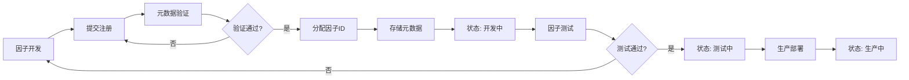
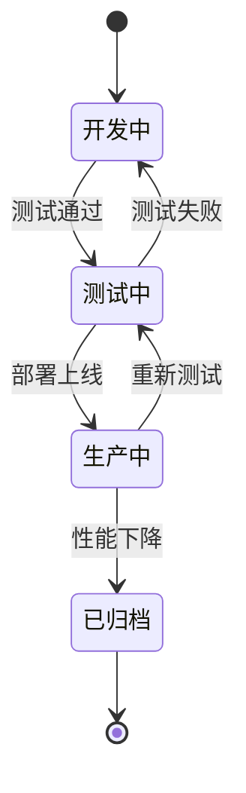

---
module_id: FACTOR_REGISTRY_001
version: 1.0.0
status: Active
created_date: 2026-04-07
last_updated: 2026-04-07
owner: 因子库团队
standard_type: 专业量化机构标准
applicable_scope: Layer 2 - 因子库层
compliance_level: 专业标准
responsibility:
  - 因子注册管理
  - 因子元数据维护
  - 因子生命周期跟踪
---

## 核心定位

负责因子注册表的设计与实现，提供因子注册、元数据管理和生命周期跟踪功能，支持因子库的规范化管理。

# 因子注册表 (Factor Registry)

> **核心职责**: 因子注册管理，维护因子元数据，跟踪因子生命周期
> **职责边界**:
> - ✅ 本文档负责：因子注册、元数据管理、生命周期跟踪、因子分类
> - ❌ 本文档不负责：因子计算、因子评估、因子优化

---

## 📋 一、因子注册表概述

### 1.1 定义

因子注册表是因子库的核心管理工具，记录所有因子的元数据信息，包括：
- 因子基本信息（名称、类型、描述）
- 因子技术规格（计算公式、数据依赖、参数配置）
- 因子生命周期状态（开发中、测试中、生产中、已归档）
- 因子性能指标（IC、IR、换手率、覆盖率）

### 1.2 核心功能

| 功能 | 描述 | 优先级 |
|------|------|--------|
| **因子注册** | 新因子注册到因子库 | P0 |
| **元数据管理** | 维护因子元数据信息 | P0 |
| **生命周期管理** | 跟踪因子生命周期状态 | P1 |
| **性能监控** | 监控因子性能指标 | P1 |
| **版本控制** | 管理因子版本 | P2 |

---

## 📊 二、因子注册流程

### 2.1 注册流程



### 2.2 注册要求

**必需信息**:
- 因子名称（唯一）
- 因子类型（Alpha、Risk、Technical等）
- 因子描述（50-200字）
- 计算公式或逻辑
- 数据依赖
- 参数配置

**可选信息**:
- 因子作者
- 参考论文
- 适用市场
- 适用周期

---

## 🔍 三、因子元数据结构

### 3.1 元数据字段

```yaml
factor_metadata:
  # 基本信息
  factor_id: "FACTOR_001"
  factor_name: "动量因子"
  factor_type: "Alpha"
  factor_category: "价格动量"
  description: "基于过去N日收益率计算的动量因子，捕捉价格趋势延续性"
  
  # 技术规格
  calculation_formula: "momentum = (close_t / close_t-n) - 1"
  data_dependencies:
    - "close_price"
    - "volume"
  parameters:
    lookback_period: 20
    smoothing_method: "EMA"
  
  # 生命周期
  status: "production"
  created_date: "2026-01-15"
  last_updated: "2026-04-07"
  version: "1.2.0"
  
  # 性能指标
  performance_metrics:
    ic_mean: 0.05
    ic_ir: 1.2
    turnover_rate: 0.15
    coverage: 0.95
  
  # 分类标签
  tags:
    - "动量"
    - "价格"
    - "趋势"
    - "中频"
  
  # 适用范围
  applicable_markets:
    - "A股"
    - "港股"
  applicable_periods:
    - "日频"
    - "周频"
```

### 3.2 字段说明

| 字段 | 类型 | 必需 | 描述 |
|------|------|------|------|
| factor_id | string | 是 | 因子唯一标识符 |
| factor_name | string | 是 | 因子名称 |
| factor_type | enum | 是 | 因子类型（Alpha/Risk/Technical） |
| factor_category | string | 是 | 因子分类 |
| description | string | 是 | 因子描述（50-200字） |
| calculation_formula | string | 是 | 计算公式或逻辑 |
| data_dependencies | list | 是 | 数据依赖列表 |
| parameters | dict | 是 | 参数配置 |
| status | enum | 是 | 生命周期状态 |
| performance_metrics | dict | 否 | 性能指标 |
| tags | list | 否 | 分类标签 |

---

## 📈 四、因子生命周期管理

### 4.1 生命周期状态



### 4.2 状态转换规则

| 当前状态 | 目标状态 | 触发条件 | 操作 |
|---------|---------|---------|------|
| 开发中 | 测试中 | 单元测试通过 | 更新状态，启动集成测试 |
| 测试中 | 生产中 | 集成测试通过 | 更新状态，部署到生产环境 |
| 测试中 | 开发中 | 测试失败 | 更新状态，返回开发 |
| 生产中 | 已归档 | IC持续下降 | 更新状态，停止使用 |
| 生产中 | 测试中 | 性能异常 | 更新状态，重新测试 |

---

## 🎯 五、因子性能监控

### 5.1 核心指标

| 指标 | 计算方法 | 目标值 | 监控频率 |
|------|---------|--------|---------|
| **IC均值** | Rank correlation | > 0.03 | 日频 |
| **IC IR** | IC均值 / IC标准差 | > 1.0 | 周频 |
| **换手率** | 持仓变化 / 总持仓 | < 0.3 | 日频 |
| **覆盖率** | 有效股票数 / 总股票数 | > 0.8 | 日频 |
| **衰减率** | IC_t / IC_t-1 | > 0.8 | 周频 |

### 5.2 监控告警

**告警规则**:
- IC均值 < 0.02: P1告警
- IC IR < 0.8: P1告警
- 换手率 > 0.5: P2告警
- 覆盖率 < 0.7: P2告警
- 衰减率 < 0.6: P1告警

---

## 🔗 六、与其他模块的关系

### 6.1 上游依赖

- **数据层**: 提供因子计算所需的基础数据
- **因子计算引擎**: 提供因子的计算逻辑

### 6.2 下游服务

- **因子评估系统**: 使用因子注册表中的元数据进行因子评估
- **组合优化系统**: 使用因子注册表中的因子进行组合优化
- **风险管理系统**: 使用风险因子进行风险控制

---

## 📝 七、实施计划

### 7.1 实施阶段

| 阶段 | 任务 | 时间 | 负责人 |
|------|------|------|--------|
| **阶段1** | 设计元数据结构 | Week 1 | 因子库团队 |
| **阶段2** | 实现注册功能 | Week 2-3 | 开发团队 |
| **阶段3** | 实现生命周期管理 | Week 4 | 开发团队 |
| **阶段4** | 实现性能监控 | Week 5 | 开发团队 |
| **阶段5** | 集成测试 | Week 6 | 测试团队 |

### 7.2 验收标准

- ✅ 因子注册成功率 > 99%
- ✅ 元数据查询响应时间 < 100ms
- ✅ 生命周期状态转换准确率 100%
- ✅ 性能监控覆盖率 100%

---

## 📚 八、参考文档

- 因子定义标准
- 因子计算框架
- 因子验证指南
- 因子分类标准

---

**文档版本**: v1.0.0 | **创建日期**: 2026-04-07 | **状态**: Active
