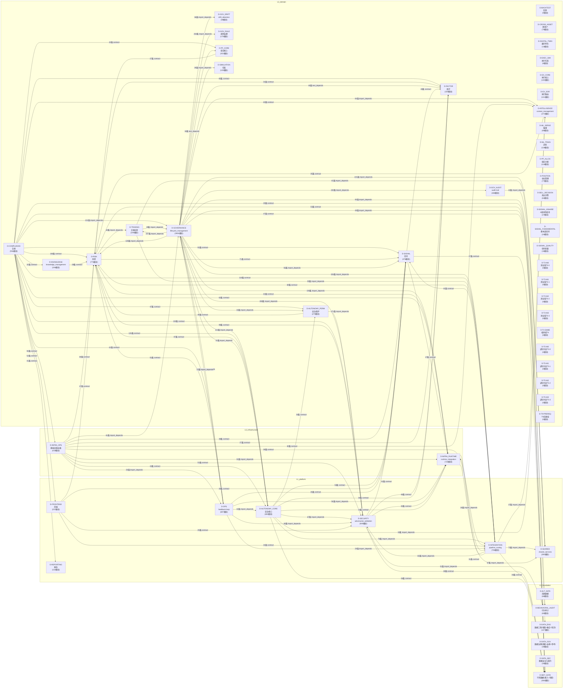

# 集成拓扑图

> 自动生成时间: 2026-06-24 02:30:56
> 数据源: depgraph.db edges表（跨域依赖）
> 跨域依赖对数: 603

```mermaid

%% 所有功能域集成依赖关系图
%% 生成时间: 2026-06-24 02:30:56
%% 数据源: depgraph.db edges表（跨域依赖）
%% 跨域依赖对数: 603

graph LR

    %% 功能域节点（按架构层分组）
    subgraph L0_infrastructure[L0_infrastructure]
        D_INFRA_OPS["D-INFRA_OPS<br/>基础设施运维<br/>(418模块)"]
        D_INFRA_RUNTIME["D-INFRA_RUNTIME<br/>runtime_integration<br/>(726模块)"]
    end
    subgraph L1_foundation[L1_foundation]
        D_ALT_DATA["D-ALT_DATA<br/>另类数据<br/>(68模块)"]
        D_BEHAVIORAL_AUDIT["D-BEHAVIORAL_AUDIT<br/>行为审计<br/>(60模块)"]
        D_DATA_ENG["D-DATA_ENG<br/>数据工程(增值+融合+知识)<br/>(147模块)"]
        D_DATA_GOV["D-DATA_GOV<br/>数据治理(质量+血缘+参考)<br/>(38模块)"]
        D_DATA_SEC["D-DATA_SEC<br/>数据安全与契约<br/>(30模块)"]
        D_MKT_DATA["D-MKT_DATA<br/>行情数据(接入+存储)<br/>(266模块)"]
    end
    subgraph L1_platform[L1_platform]
        D_AUTONOMY_CORE["D-AUTONOMY_CORE<br/>自治核心<br/>(650模块)"]
        D_FRONTEND["D-FRONTEND<br/>前端<br/>(237模块)"]
        D_INTEGRATION["D-INTEGRATION<br/>pipeline_routing<br/>(706模块)"]
        D_OPS["D-OPS<br/>feedback-loop<br/>(697模块)"]
        D_REPORTING["D-REPORTING<br/>报告<br/>(132模块)"]
        D_SECURITY["D-SECURITY<br/>adversarial_validation<br/>(849模块)"]
        D_SHARED["D-SHARED<br/>shared_services<br/>(290模块)"]
    end
    subgraph L2_domain[L2_domain]
        D_AUTONOMY_PERM["D-AUTONOMY_PERM<br/>自治保护<br/>(270模块)"]
        D_BACKTEST["D-BACKTEST<br/>回测<br/>(9模块)"]
        D_COMPLIANCE["D-COMPLIANCE<br/>合规<br/>(916模块)"]
        D_CROSS_ASSET["D-CROSS_ASSET<br/>跨资产<br/>(79模块)"]
        D_DIGITAL_TWIN["D-DIGITAL_TWIN<br/>数字孪生<br/>(13模块)"]
        D_EXEC_SIM["D-EXEC_SIM<br/>执行仿真<br/>(8模块)"]
        D_EX_CORE["D-EX_CORE<br/>执行核心<br/>(135模块)"]
        D_EX_SOR["D-EX_SOR<br/>执行路由<br/>(131模块)"]
        D_FACTOR["D-FACTOR<br/>因子<br/>(320模块)"]
        D_GOVERNANCE["D-GOVERNANCE<br/>lifecycle_management<br/>(3904模块)"]
        D_GOV_AUDIT["D-GOV_AUDIT<br/>audit-trail<br/>(268模块)"]
        D_GOV_DRIFT["D-GOV_DRIFT<br/>drift_detection<br/>(38模块)"]
        D_GOV_RULE["D-GOV_RULE<br/>规则治理<br/>(178模块)"]
        D_INTELLIGENCE["D-INTELLIGENCE<br/>context_management<br/>(273模块)"]
        D_KNOWLEDGE["D-KNOWLEDGE<br/>knowledge_management<br/>(194模块)"]
        D_ML_SERVE["D-ML_SERVE<br/>推理<br/>(69模块)"]
        D_ML_TRAIN["D-ML_TRAIN<br/>训练<br/>(119模块)"]
        D_PF_ALLOC["D-PF_ALLOC<br/>组合分配<br/>(114模块)"]
        D_PF_CORE["D-PF_CORE<br/>组合核心<br/>(202模块)"]
        D_POSITION["D-POSITION<br/>仓位管理<br/>(77模块)"]
        D_RISK["D-RISK<br/>风控<br/>(775模块)"]
        D_SELL_DECISION["D-SELL_DECISION<br/>卖出决策<br/>(64模块)"]
        D_SIGNAL["D-SIGNAL<br/>信号<br/>(476模块)"]
        D_SIGNAL_ASHARE["D-SIGNAL_ASHARE<br/>A股特色信号<br/>(27模块)"]
        D_SIGNAL_FUNDAMENTAL["D-SIGNAL_FUNDAMENTAL<br/>基本面信号<br/>(24模块)"]
        D_SIGNAL_QUALITY["D-SIGNAL_QUALITY<br/>信号质量<br/>(18模块)"]
        D_SIMULATION["D-SIMULATION<br/>仿真<br/>(128模块)"]
        D_T3_W0["D-T3-W0<br/>测试域T3-0<br/>(0模块)"]
        D_T3_W1["D-T3-W1<br/>测试域T3-1<br/>(0模块)"]
        D_T3_W2["D-T3-W2<br/>测试域T3-2<br/>(0模块)"]
        D_T3_W3["D-T3-W3<br/>测试域T3-3<br/>(0模块)"]
        D_T4_SAME["D-T4-SAME<br/>相同域T4<br/>(0模块)"]
        D_T5_W0["D-T5-W0<br/>读写并发T5-0<br/>(0模块)"]
        D_T5_W1["D-T5-W1<br/>读写并发T5-1<br/>(0模块)"]
        D_T5_W2["D-T5-W2<br/>读写并发T5-2<br/>(0模块)"]
        D_T5_W3["D-T5-W3<br/>读写并发T5-3<br/>(0模块)"]
        D_T9_PREREQ["D-T9-PREREQ<br/>T9前置域<br/>(0模块)"]
        D_TRADING["D-TRADING<br/>交易运营<br/>(249模块)"]
    end

    %% 跨域依赖（按依赖数排序，最多显示 100 条）
    D_GOVERNANCE -->|425条 import_depends| D_OPS
    D_GOVERNANCE -->|326条 import_depends| D_INTEGRATION
    D_GOVERNANCE -->|283条 import_depends| D_SECURITY
    D_GOVERNANCE -->|264条 import_depends| D_GOV_RULE
    D_GOVERNANCE -->|247条 import_depends| D_TRADING
    D_GOVERNANCE -->|221条 import_depends| D_SHARED
    D_GOVERNANCE -->|213条 import_depends| D_AUTONOMY_CORE
    D_GOVERNANCE -->|194条 import_depends| D_INFRA_RUNTIME
    D_AUTONOMY_PERM -->|171条 import_depends| D_SECURITY
    D_COMPLIANCE -->|166条 contract| D_RISK
    D_GOVERNANCE -->|150条 import_depends| D_GOV_AUDIT
    D_COMPLIANCE -->|131条 import_depends| D_GOVERNANCE
    D_COMPLIANCE -->|130条 contract| D_SECURITY
    D_GOVERNANCE -->|128条 import_depends| D_RISK
    D_COMPLIANCE -->|126条 contract| D_AUTONOMY_CORE
    D_COMPLIANCE -->|118条 contract| D_INTEGRATION
    D_RISK -->|98条 contract| D_SECURITY
    D_COMPLIANCE -->|93条 contract| D_SIGNAL
    D_COMPLIANCE -->|90条 contract| D_INFRA_OPS
    D_GOVERNANCE -->|90条 import_depends| D_BEHAVIORAL_AUDIT
    D_AUTONOMY_CORE -->|87条 contract| D_RISK
    D_GOVERNANCE -->|84条 import_depends| D_INTELLIGENCE
    D_AUTONOMY_CORE -->|76条 import_depends| D_INTEGRATION
    D_INTEGRATION -->|73条 import_depends| D_SHARED
    D_OPS -->|72条 import_depends| D_GOVERNANCE
    D_RISK -->|71条 contract| D_SIGNAL
    D_INTEGRATION -->|69条 contract| D_RISK
    D_INFRA_OPS -->|68条 contract| D_RISK
    D_AUTONOMY_CORE -->|67条 import_depends| D_SECURITY
    D_INFRA_RUNTIME -->|67条 import_depends| D_SHARED
    D_COMPLIANCE -->|65条 contract| D_FACTOR
    D_RISK -->|63条 contract| D_INFRA_RUNTIME
    D_COMPLIANCE -->|62条 contract| D_INFRA_RUNTIME
    D_COMPLIANCE -->|62条 contract| D_OPS
    D_SECURITY -->|62条 contract| D_SIGNAL
    D_INFRA_OPS -->|61条 import_depends| D_GOVERNANCE
    D_COMPLIANCE -->|60条 contract| D_INTELLIGENCE
    D_INTEGRATION -->|60条 import_depends| D_SECURITY
    D_OPS -->|58条 import_depends| D_INFRA_RUNTIME
    D_GOVERNANCE -->|56条 import_depends| D_SIGNAL
    D_TRADING -->|55条 import_depends| D_INTEGRATION
    D_RISK -->|54条 contract| D_FACTOR
    D_AUTONOMY_CORE -->|53条 contract| D_SIGNAL
    D_INFRA_OPS -->|53条 contract| D_SECURITY
    D_RISK -->|53条 contract| D_MKT_DATA
    D_COMPLIANCE -->|52条 contract| D_FRONTEND
    D_OPS -->|51条 contract| D_RISK
    D_SECURITY -->|51条 import_depends| D_BEHAVIORAL_AUDIT
    D_SECURITY -->|50条 contract| D_INFRA_RUNTIME
    D_GOVERNANCE -->|49条 import_depends| D_MKT_DATA
    D_AUTONOMY_PERM -->|48条 contract| D_RISK
    D_COMPLIANCE -->|47条 contract| D_AUTONOMY_PERM
    D_COMPLIANCE -->|47条 contract| D_MKT_DATA
    D_FRONTEND -->|47条 contract| D_RISK
    D_GOVERNANCE -->|46条 test_depends| D_FACTOR
    D_SECURITY -->|46条 contract| D_FACTOR
    D_AUTONOMY_CORE -->|43条 import_depends| D_GOVERNANCE
    D_INFRA_OPS -->|43条 contract| D_AUTONOMY_CORE
    D_TRADING -->|43条 import_depends| D_SHARED
    D_GOV_AUDIT -->|42条 import_depends| D_SHARED
    D_OPS -->|42条 import_depends| D_AUTONOMY_CORE
    D_COMPLIANCE -->|41条 contract| D_REPORTING
    D_INTEGRATION -->|41条 contract| D_SIGNAL
    D_SIGNAL -->|40条 contract| D_FACTOR
    D_INFRA_OPS -->|39条 contract| D_SIGNAL
    D_INFRA_OPS -->|38条 contract| D_INTEGRATION
    D_SECURITY -->|38条 contract| D_MKT_DATA
    D_INTEGRATION -->|37条 import_depends| D_INTELLIGENCE
    D_SIGNAL -->|37条 contract| D_MKT_DATA
    D_GOVERNANCE -->|36条 import_depends| D_GOV_DRIFT
    D_OPS -->|36条 import_depends| D_SECURITY
    D_INTELLIGENCE -->|35条 contract| D_RISK
    D_AUTONOMY_CORE -->|34条 contract| D_FACTOR
    D_FRONTEND -->|34条 contract| D_INTEGRATION
    D_INTEGRATION -->|34条 contract| D_MKT_DATA
    D_GOVERNANCE -->|33条 import_depends| D_AUTONOMY_PERM
    D_AUTONOMY_CORE -->|32条 contract| D_AUTONOMY_PERM
    D_AUTONOMY_CORE -->|32条 import_depends| D_INTELLIGENCE
    D_COMPLIANCE -->|32条 contract| D_KNOWLEDGE
    D_AUTONOMY_CORE -->|31条 contract| D_INFRA_RUNTIME
    D_INFRA_OPS -->|31条 import_depends| D_INFRA_RUNTIME
    D_INTEGRATION -->|31条 contract| D_INFRA_RUNTIME
    D_COMPLIANCE -->|30条 contract| D_PF_CORE
    D_GOVERNANCE -->|30条 test_depends| D_PF_CORE
    D_INFRA_OPS -->|30条 contract| D_INTELLIGENCE
    D_RISK -->|30条 import_depends| D_TRADING
    D_COMPLIANCE -->|29条 contract| D_DATA_ENG
    D_FRONTEND -->|29条 contract| D_SECURITY
    D_KNOWLEDGE -->|29条 contract| D_RISK
    D_OPS -->|29条 import_depends| D_INTEGRATION
    D_TRADING -->|29条 import_depends| D_GOVERNANCE
    D_FRONTEND -->|28条 contract| D_SIGNAL
    D_GOVERNANCE -->|28条 import_depends| D_SIMULATION
    D_INFRA_OPS -->|27条 contract| D_FACTOR
    D_PF_CORE -->|27条 contract| D_RISK
    D_SIGNAL -->|27条 contract| D_INFRA_RUNTIME
    D_AUTONOMY_CORE -->|26条 contract| D_MKT_DATA
    D_INFRA_OPS -->|26条 import_depends| D_OPS
    D_INFRA_RUNTIME -->|26条 import_depends| D_INTEGRATION
    D_OPS -->|26条 contract| D_SIGNAL
    %% ... 还有 503 条跨域依赖未显示

    %% 统计
    %% 域总数: 53
    %% 跨域依赖对数: 603
    %% 跨域依赖边总数: 10915

    %% Top 10 依赖对
    %% 1. D-GOVERNANCE -> D-OPS: 425 条
    %% 2. D-GOVERNANCE -> D-INTEGRATION: 326 条
    %% 3. D-GOVERNANCE -> D-SECURITY: 283 条
    %% 4. D-GOVERNANCE -> D-GOV_RULE: 264 条
    %% 5. D-GOVERNANCE -> D-TRADING: 247 条
    %% 6. D-GOVERNANCE -> D-SHARED: 221 条
    %% 7. D-GOVERNANCE -> D-AUTONOMY_CORE: 213 条
    %% 8. D-GOVERNANCE -> D-INFRA_RUNTIME: 194 条
    %% 9. D-AUTONOMY_PERM -> D-SECURITY: 171 条
    %% 10. D-COMPLIANCE -> D-RISK: 166 条

```
