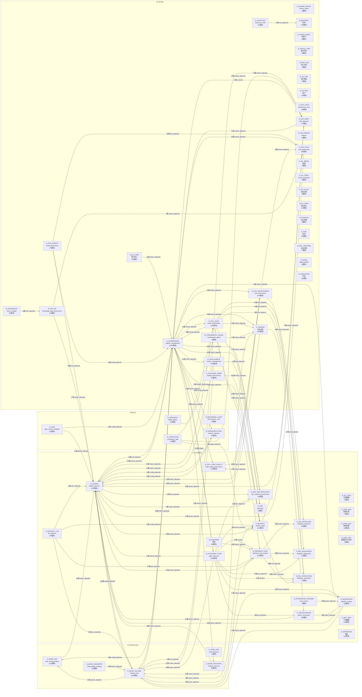

# 集成拓扑图

> **文档作用 / Purpose**: 展示系统间集成关系和数据流向，包括API调用、事件订阅、数据同步等集成方式。

> 自动生成时间: 2026-07-13 14:20:05
> 数据源: depgraph (PostgreSQL) edges表（跨域依赖）
> 跨域依赖对数: 433

```mermaid

%% 所有功能域集成依赖关系图
%% 生成时间: 2026-07-13 14:20:05
%% 数据源: depgraph (PostgreSQL) edges表（跨域依赖）
%% 跨域依赖对数: 433

graph LR

    %% 功能域节点（按架构层分组）
    subgraph L0_infrastructure[L0_infrastructure]
        D_INFRA_A2A["D_INFRA_A2A<br/>a2a_communication<br/>(133模块)"]
        D_INFRA_OPS["D_INFRA_OPS<br/>asset-inventory<br/>(2模块)"]
        D_INFRA_RECOVERY["D_INFRA_RECOVERY<br/>rollback_recovery<br/>(89模块)"]
        D_INFRA_RUNTIME["D_INFRA_RUNTIME<br/>runtime_core<br/>(302模块)"]
        D_INFRA_TELEMETRY["D_INFRA_TELEMETRY<br/>observability_profiling<br/>(10模块)"]
    end
    subgraph L1_foundation[L1_foundation]
        D_ALT_DATA["D_ALT_DATA<br/>另类数据<br/>(7模块)"]
        D_AUTONOMY_CORE["D_AUTONOMY_CORE<br/>agent_lifecycle<br/>(430模块)"]
        D_DATA_ENG["D_DATA_ENG<br/>数据工程<br/>(7模块)"]
        D_DATA_GOV["D_DATA_GOV<br/>数据治理<br/>(30模块)"]
        D_DATA_SEC["D_DATA_SEC<br/>数据安全与契约<br/>(7模块)"]
        D_FBL_DETECTORS["D_FBL_DETECTORS<br/>feedback_detectors<br/>(65模块)"]
        D_FBL_DIAGNOSERS["D_FBL_DIAGNOSERS<br/>feedback_diagnosers<br/>(76模块)"]
        D_FBL_VERIFICATION["D_FBL_VERIFICATION<br/>feedback_verification<br/>(71模块)"]
        D_FEEDBACK_LOOP["D_FEEDBACK_LOOP<br/>feedback_loop_engine<br/>(229模块)"]
        D_FRONTEND["D_FRONTEND<br/>前端<br/>(46模块)"]
        D_GOV_CODE_QUALITY["D_GOV_CODE_QUALITY<br/>code_quality_governance<br/>(109模块)"]
        D_GOV_OPS_RESILIENCE["D_GOV_OPS_RESILIENCE<br/>ops_resilience_governance<br/>(79模块)"]
        D_INTEGRATION["D_INTEGRATION<br/>pipeline_routing<br/>(92模块)"]
        D_INTEGRATION_GATEWAY["D_INTEGRATION_GATEWAY<br/>mcp_servers<br/>(2模块)"]
        D_MKT_DATA["D_MKT_DATA<br/>行情数据<br/>(10模块)"]
        D_OPS["D_OPS<br/>telemetry<br/>(8模块)"]
        D_ORCHESTRATOR["D_ORCHESTRATOR<br/>agent_orchestrator<br/>(82模块)"]
        D_REPORTING["D_REPORTING<br/>报告<br/>(10模块)"]
        D_SECURITY["D_SECURITY<br/>orphan_judge<br/>(212模块)"]
        D_SECURITY_LLM["D_SECURITY_LLM<br/>llm_defense<br/>(63模块)"]
        D_SHARED["D_SHARED<br/>shared_services<br/>(325模块)"]
    end
    subgraph L2_domain[L2_domain]
        D_ASHARE_SIGNAL["D_ASHARE_SIGNAL<br/>ashare_signal<br/>(8模块)"]
        D_AUDITTEST["D_AUDITTEST<br/>audit_test_suite<br/>(10模块)"]
        D_AUTONOMY_PERM["D_AUTONOMY_PERM<br/>budget_enforcement<br/>(55模块)"]
        D_BACKTEST["D_BACKTEST<br/>回测<br/>(33模块)"]
        D_CROSS_ASSET["D_CROSS_ASSET<br/>跨资产<br/>(8模块)"]
        D_DIGITAL_TWIN["D_DIGITAL_TWIN<br/>数字孪生<br/>(8模块)"]
        D_EXEC_SIM["D_EXEC_SIM<br/>执行仿真<br/>(7模块)"]
        D_EX_CORE["D_EX_CORE<br/>执行核心<br/>(23模块)"]
        D_EX_SOR["D_EX_SOR<br/>执行路由<br/>(7模块)"]
        D_FACTOR["D_FACTOR<br/>因子<br/>(14模块)"]
        D_FUNDAMENTAL_SIGNAL["D_FUNDAMENTAL_SIGNAL<br/>fundamental_signal<br/>(9模块)"]
        D_GOVERNANCE["D_GOVERNANCE<br/>registry_management<br/>(1059模块)"]
        D_GOV_AUDIT["D_GOV_AUDIT<br/>audit_orchestration<br/>(292模块)"]
        D_GOV_DOCS["D_GOV_DOCS<br/>architecture_docs<br/>(96模块)"]
        D_GOV_DRIFT["D_GOV_DRIFT<br/>drift_detection<br/>(77模块)"]
        D_GOV_ENFORCEMENT["D_GOV_ENFORCEMENT<br/>rule_enforcement<br/>(164模块)"]
        D_GOV_KB["D_GOV_KB<br/>knowledge_base_governance<br/>(30模块)"]
        D_GOV_REPAIR["D_GOV_REPAIR<br/>rollback<br/>(0模块)"]
        D_GOV_RULE["D_GOV_RULE<br/>rule_governance<br/>(35模块)"]
        D_GOV_SCRIPTS["D_GOV_SCRIPTS<br/>script_governance<br/>(74模块)"]
        D_INTELLIGENCE["D_INTELLIGENCE<br/>context_management<br/>(109模块)"]
        D_KNOWLEDGE["D_KNOWLEDGE<br/>vector_storage<br/>(43模块)"]
        D_ML_SERVE["D_ML_SERVE<br/>推理<br/>(7模块)"]
        D_ML_TRAIN["D_ML_TRAIN<br/>model_evaluation<br/>(6模块)"]
        D_PF_ALLOC["D_PF_ALLOC<br/>组合分配<br/>(9模块)"]
        D_PF_CORE["D_PF_CORE<br/>组合核心<br/>(13模块)"]
        D_POSITION["D_POSITION<br/>仓位管理<br/>(8模块)"]
        D_RISK["D_RISK<br/>风控<br/>(29模块)"]
        D_SELL_DECISION["D_SELL_DECISION<br/>卖出决策<br/>(7模块)"]
        D_SIGQC["D_SIGQC<br/>signal_quality<br/>(8模块)"]
        D_SIMULATION["D_SIMULATION<br/>仿真<br/>(11模块)"]
        D_TRADING["D_TRADING<br/>交易运营<br/>(101模块)"]
    end
    subgraph unknown[unknown]
        D_BEHAVIORAL_AUDIT["D_BEHAVIORAL_AUDIT<br/>drift_detector_core<br/>(0模块)"]
        D_COMPLIANCE["D_COMPLIANCE<br/>compliance_gate<br/>(24模块)"]
        D_DATA["D_DATA<br/>data_source_integrator<br/>(55模块)"]
        D_INFRASTRUCTURE["D_INFRASTRUCTURE<br/>shared_contracts<br/>(61模块)"]
        D_SIGLEGACY["D_SIGLEGACY<br/>signal_legacy<br/>(16模块)"]
    end

    %% 跨域依赖（按依赖数排序，最多显示 100 条）
    D_INFRA_RUNTIME -->|162条 config_depends| D_SHARED
    D_AUTONOMY_PERM -->|130条 import_depends| D_SECURITY
    D_GOVERNANCE -->|108条 import_depends| D_SHARED
    D_GOV_SCRIPTS -->|96条 test_depends| D_GOV_RULE
    D_GOVERNANCE -->|89条 import_depends| D_GOV_CODE_QUALITY
    D_AUTONOMY_CORE -->|67条 runtime| D_FBL_VERIFICATION
    D_AUTONOMY_CORE -->|66条 runtime| D_FEEDBACK_LOOP
    D_GOVERNANCE -->|64条 import_depends| D_GOV_OPS_RESILIENCE
    D_FEEDBACK_LOOP -->|58条 import_depends| D_FBL_DIAGNOSERS
    D_GOV_AUDIT -->|58条 import_depends| D_GOV_DRIFT
    D_INFRASTRUCTURE -->|56条 config_depends| D_SHARED
    D_INTEGRATION -->|56条 import_depends| D_SHARED
    D_GOVERNANCE -->|51条 import_depends| D_GOV_ENFORCEMENT
    D_GOV_AUDIT -->|50条 import_depends| D_SHARED
    D_AUTONOMY_CORE -->|49条 import_depends| D_INFRA_RUNTIME
    D_GOV_SCRIPTS -->|48条 test_depends| D_SHARED
    D_GOV_AUDIT -->|48条 config_depends| D_GOVERNANCE
    D_COMPLIANCE -->|46条 import_depends| D_GOV_DRIFT
    D_GOVERNANCE -->|45条 import_depends| D_GOV_AUDIT
    D_SECURITY -->|44条 import_depends| D_GOV_DRIFT
    D_FEEDBACK_LOOP -->|44条 import_depends| D_FBL_VERIFICATION
    D_GOV_ENFORCEMENT -->|41条 import_depends| D_GOV_CODE_QUALITY
    D_SECURITY_LLM -->|41条 config_depends| D_SECURITY
    D_GOV_CODE_QUALITY -->|39条 import_depends| D_GOV_ENFORCEMENT
    D_SECURITY -->|36条 test_depends| D_FBL_VERIFICATION
    D_TRADING -->|36条 import_depends| D_INFRA_RUNTIME
    D_FEEDBACK_LOOP -->|34条 import_depends| D_FBL_DETECTORS
    D_AUTONOMY_CORE -->|31条 import_depends| D_INTEGRATION
    D_SECURITY -->|29条 import_depends| D_SHARED
    D_ORCHESTRATOR -->|29条 import_depends| D_SHARED
    D_TRADING -->|29条 import_depends| D_ORCHESTRATOR
    D_GOV_AUDIT -->|27条 import_depends| D_GOV_OPS_RESILIENCE
    D_SHARED -->|26条 config_depends| D_INFRA_RUNTIME
    D_GOVERNANCE -->|25条 import_depends| D_GOV_RULE
    D_GOV_AUDIT -->|24条 test_depends| D_FBL_DIAGNOSERS
    D_AUTONOMY_CORE -->|24条 import_depends| D_SHARED
    D_GOVERNANCE -->|24条 config_depends| D_INFRA_RUNTIME
    D_GOVERNANCE -->|23条 import_depends| D_TRADING
    D_GOVERNANCE -->|23条 contract| D_AUTONOMY_CORE
    D_GOV_DRIFT -->|22条 import_depends| D_SHARED
    D_GOVERNANCE -->|21条 import_depends| D_INTEGRATION
    D_GOVERNANCE -->|21条 import_depends| D_INFRA_RECOVERY
    D_DATA -->|21条 import_depends| D_SHARED
    D_SECURITY_LLM -->|19条 test_depends| D_INFRA_RUNTIME
    D_SECURITY_LLM -->|19条 test_depends| D_SHARED
    D_INTELLIGENCE -->|19条 import_depends| D_SHARED
    D_INFRA_RUNTIME -->|18条 import_depends| D_GOVERNANCE
    D_GOV_ENFORCEMENT -->|18条 import_depends| D_GOV_RULE
    D_SHARED -->|18条 test_depends| D_GOVERNANCE
    D_INFRA_RECOVERY -->|18条 import_depends| D_SHARED
    D_GOV_KB -->|17条 import_depends| D_SHARED
    D_INFRA_RUNTIME -->|17条 import_depends| D_INTEGRATION
    D_FEEDBACK_LOOP -->|17条 import_depends| D_SHARED
    D_GOV_ENFORCEMENT -->|17条 import_depends| D_SHARED
    D_GOV_AUDIT -->|16条 import_depends| D_TRADING
    D_KNOWLEDGE -->|16条 test_depends| D_GOV_KB
    D_GOVERNANCE -->|16条 import_depends| D_SECURITY
    D_GOVERNANCE -->|15条 import_depends| D_INTELLIGENCE
    D_GOV_AUDIT -->|15条 import_depends| D_FEEDBACK_LOOP
    D_FRONTEND -->|14条 import_depends| D_FEEDBACK_LOOP
    D_GOV_ENFORCEMENT -->|14条 test_depends| D_FBL_VERIFICATION
    D_INFRA_RUNTIME -->|14条 import_depends| D_INFRA_A2A
    D_GOVERNANCE -->|14条 import_depends| D_OPS
    D_SIGLEGACY -->|14条 config_depends| D_FUNDAMENTAL_SIGNAL
    D_INTEGRATION -->|14条 import_depends| D_INFRA_RUNTIME
    D_AUTONOMY_CORE -->|14条 data| D_GOVERNANCE
    D_AUDITTEST -->|13条 test_depends| D_BACKTEST
    D_INTEGRATION_GATEWAY -->|13条 import_depends| D_INTEGRATION
    D_INTELLIGENCE -->|13条 import_depends| D_INFRA_RUNTIME
    D_INTELLIGENCE -->|13条 test_depends| D_OPS
    D_SHARED -->|13条 test_depends| D_GOV_OPS_RESILIENCE
    D_GOVERNANCE -->|13条 config_depends| D_INFRA_A2A
    D_GOVERNANCE -->|13条 import_depends| D_INFRASTRUCTURE
    D_GOV_AUDIT -->|13条 import_depends| D_SECURITY
    D_TRADING -->|12条 import_depends| D_SHARED
    D_AUTONOMY_CORE -->|12条 test_depends| D_FBL_DIAGNOSERS
    D_GOVERNANCE -->|12条 contract| D_GOV_DRIFT
    D_GOV_RULE -->|12条 import_depends| D_SHARED
    D_SECURITY_LLM -->|12条 test_depends| D_FEEDBACK_LOOP
    D_SHARED -->|12条 config_depends| D_INFRASTRUCTURE
    D_DATA -->|11条 config_depends| D_GOVERNANCE
    D_EX_CORE -->|11条 import_depends| D_GOVERNANCE
    D_FUNDAMENTAL_SIGNAL -->|11条 import_depends| D_TRADING
    D_GOV_AUDIT -->|10条 test_depends| D_FBL_DETECTORS
    D_INFRA_A2A -->|10条 import_depends| D_SHARED
    D_GOV_DRIFT -->|10条 import_depends| D_GOVERNANCE
    D_INFRA_TELEMETRY -->|10条 import_depends| D_INFRA_RUNTIME
    D_AUTONOMY_CORE -->|10条 test_depends| D_GOV_OPS_RESILIENCE
    D_COMPLIANCE -->|10条 import_depends| D_GOV_AUDIT
    D_GOV_SCRIPTS -->|9条 config_depends| D_GOVERNANCE
    D_AUTONOMY_CORE -->|9条 test_depends| D_ORCHESTRATOR
    D_INFRA_RUNTIME -->|8条 import_depends| D_FEEDBACK_LOOP
    D_GOV_OPS_RESILIENCE -->|8条 import_depends| D_SHARED
    D_GOV_AUDIT -->|8条 test_depends| D_FBL_VERIFICATION
    D_AUTONOMY_CORE -->|8条 import_depends| D_SECURITY
    D_ORCHESTRATOR -->|8条 import_depends| D_INTEGRATION
    D_GOV_KB -->|8条 import_depends| D_GOV_RULE
    D_INFRA_RUNTIME -->|8条 import_depends| D_SECURITY
    D_GOV_AUDIT -->|8条 test_depends| D_INFRA_RUNTIME
    D_COMPLIANCE -->|7条 import_depends| D_SECURITY
    %% ... 还有 333 条跨域依赖未显示

    %% 统计
    %% 域总数: 63
    %% 跨域依赖对数: 433
    %% 跨域依赖边总数: 3566

    %% Top 10 依赖对
    %% 1. D_INFRA_RUNTIME -> D_SHARED: 162 条
    %% 2. D_AUTONOMY_PERM -> D_SECURITY: 130 条
    %% 3. D_GOVERNANCE -> D_SHARED: 108 条
    %% 4. D_GOV_SCRIPTS -> D_GOV_RULE: 96 条
    %% 5. D_GOVERNANCE -> D_GOV_CODE_QUALITY: 89 条
    %% 6. D_AUTONOMY_CORE -> D_FBL_VERIFICATION: 67 条
    %% 7. D_AUTONOMY_CORE -> D_FEEDBACK_LOOP: 66 条
    %% 8. D_GOVERNANCE -> D_GOV_OPS_RESILIENCE: 64 条
    %% 9. D_FEEDBACK_LOOP -> D_FBL_DIAGNOSERS: 58 条
    %% 10. D_GOV_AUDIT -> D_GOV_DRIFT: 58 条

```
