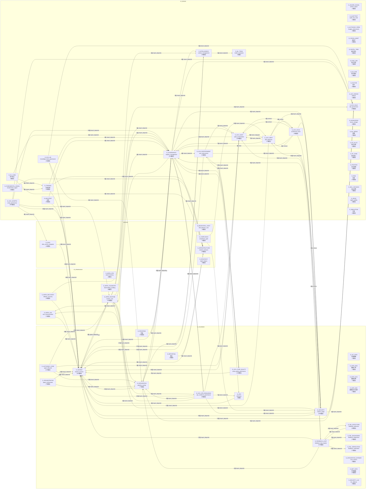

# 集成拓扑图

> **文档作用 / Purpose**: 展示系统间集成关系和数据流向，包括API调用、事件订阅、数据同步等集成方式。

> 自动生成时间: 2026-07-18 19:53:04
> 数据源: depgraph (PostgreSQL) edges表（跨域依赖）
> 跨域依赖对数: 277

```mermaid

%% 所有功能域集成依赖关系图
%% 生成时间: 2026-07-18 19:53:04
%% 数据源: depgraph (PostgreSQL) edges表（跨域依赖）
%% 跨域依赖对数: 277

graph LR

    %% 功能域节点（按架构层分组）
    subgraph L0_infrastructure[L0_infrastructure]
        D_INFRA_A2A["D_INFRA_A2A<br/>a2a_communication<br/>(72模块)"]
        D_INFRA_OPS["D_INFRA_OPS<br/>asset-inventory<br/>(2模块)"]
        D_INFRA_RECOVERY["D_INFRA_RECOVERY<br/>rollback_recovery<br/>(54模块)"]
        D_INFRA_RUNTIME["D_INFRA_RUNTIME<br/>runtime_core<br/>(159模块)"]
        D_INFRA_TELEMETRY["D_INFRA_TELEMETRY<br/>observability_profiling<br/>(0模块)"]
    end
    subgraph L1_foundation[L1_foundation]
        D_ALT_DATA["D_ALT_DATA<br/>另类数据<br/>(7模块)"]
        D_AUTONOMY_CORE["D_AUTONOMY_CORE<br/>agent_lifecycle<br/>(137模块)"]
        D_DATA_ENG["D_DATA_ENG<br/>数据工程<br/>(7模块)"]
        D_DATA_GOV["D_DATA_GOV<br/>数据治理<br/>(7模块)"]
        D_DATA_SEC["D_DATA_SEC<br/>数据安全与契约<br/>(7模块)"]
        D_FBL_DETECTORS["D_FBL_DETECTORS<br/>feedback_detectors<br/>(65模块)"]
        D_FBL_DIAGNOSERS["D_FBL_DIAGNOSERS<br/>feedback_diagnosers<br/>(76模块)"]
        D_FBL_VERIFICATION["D_FBL_VERIFICATION<br/>feedback_verification<br/>(71模块)"]
        D_FEEDBACK_LOOP["D_FEEDBACK_LOOP<br/>feedback_loop_engine<br/>(124模块)"]
        D_FRONTEND["D_FRONTEND<br/>前端<br/>(18模块)"]
        D_GOV_CODE_QUALITY["D_GOV_CODE_QUALITY<br/>code_quality_governance<br/>(126模块)"]
        D_GOV_OPS_RESILIENCE["D_GOV_OPS_RESILIENCE<br/>ops_resilience_governance<br/>(90模块)"]
        D_INTEGRATION["D_INTEGRATION<br/>pipeline_routing<br/>(77模块)"]
        D_INTEGRATION_GATEWAY["D_INTEGRATION_GATEWAY<br/>mcp_servers<br/>(0模块)"]
        D_MKT_DATA["D_MKT_DATA<br/>行情数据<br/>(10模块)"]
        D_OPS["D_OPS<br/>telemetry<br/>(9模块)"]
        D_ORCHESTRATOR["D_ORCHESTRATOR<br/>agent_orchestrator<br/>(72模块)"]
        D_REPORTING["D_REPORTING<br/>报告<br/>(3模块)"]
        D_SECURITY["D_SECURITY<br/>orphan_judge<br/>(165模块)"]
        D_SECURITY_LLM["D_SECURITY_LLM<br/>llm_defense<br/>(0模块)"]
        D_SHARED["D_SHARED<br/>shared_services<br/>(183模块)"]
    end
    subgraph L2_domain[L2_domain]
        D_ASHARE_SIGNAL["D_ASHARE_SIGNAL<br/>ashare_signal<br/>(7模块)"]
        D_AUDITTEST["D_AUDITTEST<br/>audit_test_suite<br/>(1模块)"]
        D_AUTONOMY_PERM["D_AUTONOMY_PERM<br/>budget_enforcement<br/>(2模块)"]
        D_BACKTEST["D_BACKTEST<br/>回测<br/>(25模块)"]
        D_CROSS_ASSET["D_CROSS_ASSET<br/>跨资产<br/>(8模块)"]
        D_DIGITAL_TWIN["D_DIGITAL_TWIN<br/>数字孪生<br/>(8模块)"]
        D_EXEC_SIM["D_EXEC_SIM<br/>执行仿真<br/>(7模块)"]
        D_EX_CORE["D_EX_CORE<br/>执行核心<br/>(8模块)"]
        D_EX_SOR["D_EX_SOR<br/>执行路由<br/>(7模块)"]
        D_FACTOR["D_FACTOR<br/>因子<br/>(5模块)"]
        D_FUNDAMENTAL_SIGNAL["D_FUNDAMENTAL_SIGNAL<br/>fundamental_signal<br/>(10模块)"]
        D_GOVERNANCE["D_GOVERNANCE<br/>registry_management<br/>(213模块)"]
        D_GOV_AUDIT["D_GOV_AUDIT<br/>audit_orchestration<br/>(100模块)"]
        D_GOV_DOCS["D_GOV_DOCS<br/>architecture_docs<br/>(28模块)"]
        D_GOV_DRIFT["D_GOV_DRIFT<br/>drift_detection<br/>(74模块)"]
        D_GOV_ENFORCEMENT["D_GOV_ENFORCEMENT<br/>rule_enforcement<br/>(31模块)"]
        D_GOV_KB["D_GOV_KB<br/>knowledge_base_governance<br/>(31模块)"]
        D_GOV_REPAIR["D_GOV_REPAIR<br/>rollback<br/>(1模块)"]
        D_GOV_RULE["D_GOV_RULE<br/>rule_governance<br/>(35模块)"]
        D_GOV_SCRIPTS["D_GOV_SCRIPTS<br/>script_governance<br/>(356模块)"]
        D_INTELLIGENCE["D_INTELLIGENCE<br/>context_management<br/>(30模块)"]
        D_KNOWLEDGE["D_KNOWLEDGE<br/>vector_storage<br/>(4模块)"]
        D_ML_SERVE["D_ML_SERVE<br/>推理<br/>(7模块)"]
        D_ML_TRAIN["D_ML_TRAIN<br/>model_evaluation<br/>(4模块)"]
        D_PF_ALLOC["D_PF_ALLOC<br/>组合分配<br/>(3模块)"]
        D_PF_CORE["D_PF_CORE<br/>组合核心<br/>(1模块)"]
        D_POSITION["D_POSITION<br/>仓位管理<br/>(1模块)"]
        D_RISK["D_RISK<br/>风控<br/>(11模块)"]
        D_SELL_DECISION["D_SELL_DECISION<br/>卖出决策<br/>(7模块)"]
        D_SIGQC["D_SIGQC<br/>signal_quality<br/>(2模块)"]
        D_SIMULATION["D_SIMULATION<br/>仿真<br/>(3模块)"]
        D_TRADING["D_TRADING<br/>交易运营<br/>(32模块)"]
    end
    subgraph unknown[unknown]
        D_BEHAVIORAL_AUDIT["D_BEHAVIORAL_AUDIT<br/>drift_detector_core<br/>(0模块)"]
        D_COMPLIANCE["D_COMPLIANCE<br/>compliance_gate<br/>(4模块)"]
        D_DATA["D_DATA<br/>data_source_integrator<br/>(42模块)"]
        D_INFRASTRUCTURE["D_INFRASTRUCTURE<br/>shared_contracts<br/>(26模块)"]
        D_SIGLEGACY["D_SIGLEGACY<br/>signal_legacy<br/>(0模块)"]
    end

    %% 跨域依赖（按依赖数排序，最多显示 100 条）
    D_INFRA_RUNTIME -->|141条 import_depends| D_SHARED
    D_INTEGRATION -->|63条 import_depends| D_SHARED
    D_GOV_ENFORCEMENT -->|57条 import_depends| D_GOV_CODE_QUALITY
    D_GOV_CODE_QUALITY -->|55条 import_depends| D_GOV_ENFORCEMENT
    D_GOVERNANCE -->|55条 import_depends| D_SHARED
    D_SECURITY -->|44条 import_depends| D_GOV_DRIFT
    D_COMPLIANCE -->|43条 import_depends| D_GOV_DRIFT
    D_GOV_SCRIPTS -->|39条 import_depends| D_GOVERNANCE
    D_ORCHESTRATOR -->|35条 import_depends| D_SHARED
    D_FEEDBACK_LOOP -->|35条 import_depends| D_FBL_VERIFICATION
    D_GOV_AUDIT -->|34条 import_depends| D_SHARED
    D_SECURITY -->|30条 import_depends| D_SHARED
    D_GOV_SCRIPTS -->|28条 import_depends| D_SHARED
    D_GOV_DRIFT -->|22条 import_depends| D_SHARED
    D_AUTONOMY_CORE -->|22条 import_depends| D_INFRA_RUNTIME
    D_AUTONOMY_CORE -->|18条 import_depends| D_SHARED
    D_GOV_KB -->|18条 import_depends| D_SHARED
    D_INFRA_RECOVERY -->|18条 import_depends| D_SHARED
    D_FEEDBACK_LOOP -->|17条 import_depends| D_SHARED
    D_INTELLIGENCE -->|17条 import_depends| D_SHARED
    D_INFRA_RUNTIME -->|17条 import_depends| D_INTEGRATION
    D_TRADING -->|16条 import_depends| D_SHARED
    D_GOV_RULE -->|15条 import_depends| D_SHARED
    D_DATA -->|13条 import_depends| D_SHARED
    D_GOV_ENFORCEMENT -->|13条 import_depends| D_SHARED
    D_INTEGRATION -->|13条 import_depends| D_INFRA_RUNTIME
    D_GOV_OPS_RESILIENCE -->|12条 import_depends| D_SHARED
    D_GOVERNANCE -->|12条 import_depends| D_GOV_OPS_RESILIENCE
    D_AUTONOMY_CORE -->|12条 import_depends| D_INTEGRATION
    D_INFRA_RUNTIME -->|11条 import_depends| D_GOVERNANCE
    D_GOV_AUDIT -->|11条 import_depends| D_GOVERNANCE
    D_TRADING -->|10条 import_depends| D_INFRASTRUCTURE
    D_GOVERNANCE -->|9条 import_depends| D_INTELLIGENCE
    D_INFRASTRUCTURE -->|9条 import_depends| D_SHARED
    D_INFRA_A2A -->|9条 import_depends| D_SHARED
    D_FUNDAMENTAL_SIGNAL -->|9条 import_depends| D_INFRASTRUCTURE
    D_GOVERNANCE -->|9条 import_depends| D_INFRA_RUNTIME
    D_GOV_OPS_RESILIENCE -->|9条 import_depends| D_GOVERNANCE
    D_REPORTING -->|8条 import_depends| D_INFRASTRUCTURE
    D_GOV_OPS_RESILIENCE -->|8条 import_depends| D_INTEGRATION
    D_GOV_KB -->|8条 import_depends| D_GOV_RULE
    D_GOVERNANCE -->|8条 import_depends| D_GOV_ENFORCEMENT
    D_ORCHESTRATOR -->|8条 import_depends| D_INTEGRATION
    D_GOV_AUDIT -->|8条 import_depends| D_GOV_DRIFT
    D_GOV_ENFORCEMENT -->|7条 import_depends| D_GOV_AUDIT
    D_GOV_DRIFT -->|7条 import_depends| D_GOV_AUDIT
    D_GOV_OPS_RESILIENCE -->|7条 import_depends| D_OPS
    D_GOV_CODE_QUALITY -->|7条 import_depends| D_SHARED
    D_FEEDBACK_LOOP -->|7条 import_depends| D_FBL_DIAGNOSERS
    D_GOV_DRIFT -->|7条 import_depends| D_GOVERNANCE
    D_EX_CORE -->|6条 import_depends| D_GOVERNANCE
    D_GOV_DOCS -->|6条 contract| D_SECURITY
    D_EX_CORE -->|6条 import_depends| D_TRADING
    D_FEEDBACK_LOOP -->|6条 import_depends| D_FBL_DETECTORS
    D_GOV_SCRIPTS -->|6条 import_depends| D_GOV_RULE
    D_GOVERNANCE -->|6条 import_depends| D_INFRASTRUCTURE
    D_GOVERNANCE -->|6条 import_depends| D_INFRA_A2A
    D_GOVERNANCE -->|6条 import_depends| D_INTEGRATION
    D_GOVERNANCE -->|6条 import_depends| D_SECURITY
    D_GOV_CODE_QUALITY -->|6条 import_depends| D_GOVERNANCE
    D_SECURITY -->|5条 import_depends| D_GOV_AUDIT
    D_INFRA_RECOVERY -->|5条 import_depends| D_GOV_AUDIT
    D_GOV_OPS_RESILIENCE -->|5条 import_depends| D_GOV_AUDIT
    D_GOV_DOCS -->|5条 contract| D_GOV_AUDIT
    D_GOV_DOCS -->|5条 data| D_GOVERNANCE
    D_INFRA_RUNTIME -->|5条 import_depends| D_GOV_OPS_RESILIENCE
    D_FUNDAMENTAL_SIGNAL -->|5条 import_depends| D_TRADING
    D_GOV_DRIFT -->|5条 runtime| D_GOV_DOCS
    D_INFRA_RUNTIME -->|5条 import_depends| D_SECURITY
    D_GOV_RULE -->|5条 import_depends| D_INTEGRATION
    D_COMPLIANCE -->|5条 import_depends| D_SECURITY
    D_INTEGRATION -->|4条 import_depends| D_GOVERNANCE
    D_GOV_OPS_RESILIENCE -->|4条 import_depends| D_INFRA_A2A
    D_GOV_DRIFT -->|4条 import_depends| D_SECURITY
    D_INTELLIGENCE -->|4条 import_depends| D_ML_TRAIN
    D_EX_CORE -->|4条 import_depends| D_INFRASTRUCTURE
    D_OPS -->|4条 import_depends| D_SHARED
    D_GOV_AUDIT -->|4条 contract| D_GOV_DOCS
    D_GOV_KB -->|4条 import_depends| D_INTEGRATION
    D_GOV_DOCS -->|4条 contract| D_GOV_DRIFT
    D_SECURITY -->|4条 import_depends| D_GOV_RULE
    D_GOV_SCRIPTS -->|4条 import_depends| D_DATA
    D_GOV_SCRIPTS -->|4条 import_depends| D_INFRA_RUNTIME
    D_SHARED -->|4条 import_depends| D_INFRA_RUNTIME
    D_TRADING -->|4条 import_depends| D_GOVERNANCE
    D_FRONTEND -->|4条 import_depends| D_GOVERNANCE
    D_GOV_OPS_RESILIENCE -->|4条 import_depends| D_SECURITY
    D_FEEDBACK_LOOP -->|4条 import_depends| D_INTEGRATION
    D_GOVERNANCE -->|4条 import_depends| D_GOV_RULE
    D_INFRA_RUNTIME -->|4条 import_depends| D_GOV_RULE
    D_GOV_DOCS -->|4条 runtime| D_FEEDBACK_LOOP
    D_GOV_ENFORCEMENT -->|4条 import_depends| D_SECURITY
    D_INFRA_RUNTIME -->|4条 import_depends| D_INTELLIGENCE
    D_FEEDBACK_LOOP -->|4条 import_depends| D_GOVERNANCE
    D_GOVERNANCE -->|4条 import_depends| D_OPS
    D_INTEGRATION -->|3条 import_depends| D_INTELLIGENCE
    D_AUTONOMY_CORE -->|3条 import_depends| D_GOV_AUDIT
    D_BACKTEST -->|3条 import_depends| D_GOVERNANCE
    D_BACKTEST -->|3条 import_depends| D_SHARED
    D_FBL_DETECTORS -->|3条 import_depends| D_FEEDBACK_LOOP
    %% ... 还有 177 条跨域依赖未显示

    %% 统计
    %% 域总数: 63
    %% 跨域依赖对数: 277
    %% 跨域依赖边总数: 1594

    %% Top 10 依赖对
    %% 1. D_INFRA_RUNTIME -> D_SHARED: 141 条
    %% 2. D_INTEGRATION -> D_SHARED: 63 条
    %% 3. D_GOV_ENFORCEMENT -> D_GOV_CODE_QUALITY: 57 条
    %% 4. D_GOV_CODE_QUALITY -> D_GOV_ENFORCEMENT: 55 条
    %% 5. D_GOVERNANCE -> D_SHARED: 55 条
    %% 6. D_SECURITY -> D_GOV_DRIFT: 44 条
    %% 7. D_COMPLIANCE -> D_GOV_DRIFT: 43 条
    %% 8. D_GOV_SCRIPTS -> D_GOVERNANCE: 39 条
    %% 9. D_ORCHESTRATOR -> D_SHARED: 35 条
    %% 10. D_FEEDBACK_LOOP -> D_FBL_VERIFICATION: 35 条

```
