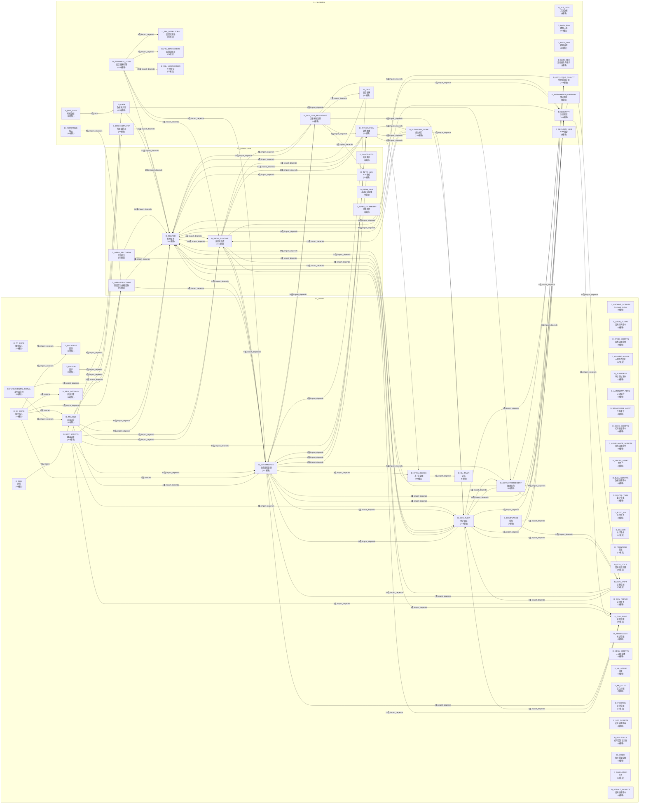

# 集成拓扑图

> **文档作用 / Purpose**: 展示系统间集成关系和数据流向，包括API调用、事件订阅、数据同步等集成方式。

> 自动生成时间: 2026-07-31 18:59:22
> 数据源: depgraph (PostgreSQL) edges表（跨域依赖）
> 跨域依赖对数: 263

```mermaid

%% 所有功能域集成依赖关系图
%% 生成时间: 2026-07-31 18:59:22
%% 数据源: depgraph (PostgreSQL) edges表（跨域依赖）
%% 跨域依赖对数: 263

graph LR

    %% 功能域节点（按架构层分组）
    subgraph L0_infrastructure[L0_infrastructure]
        D_CONTRACTS["D_CONTRACTS<br/>共享契约<br/>(0模块)"]
        D_INFRASTRUCTURE["D_INFRASTRUCTURE<br/>跨层契约基础设施<br/>(25模块)"]
        D_INFRA_A2A["D_INFRA_A2A<br/>A2A通信<br/>(72模块)"]
        D_INFRA_OPS["D_INFRA_OPS<br/>基础设施运维<br/>(0模块)"]
        D_INFRA_RECOVERY["D_INFRA_RECOVERY<br/>回滚恢复<br/>(55模块)"]
        D_INFRA_RUNTIME["D_INFRA_RUNTIME<br/>运行时集成<br/>(161模块)"]
        D_INFRA_TELEMETRY["D_INFRA_TELEMETRY<br/>可观测性<br/>(0模块)"]
        D_SHARED["D_SHARED<br/>共享服务<br/>(184模块)"]
    end
    subgraph L1_foundation[L1_foundation]
        D_ALT_DATA["D_ALT_DATA<br/>另类数据<br/>(8模块)"]
        D_AUTONOMY_CORE["D_AUTONOMY_CORE<br/>自治核心<br/>(130模块)"]
        D_DATA["D_DATA<br/>数据接入层<br/>(175模块)"]
        D_DATA_ENG["D_DATA_ENG<br/>数据工程<br/>(20模块)"]
        D_DATA_GOV["D_DATA_GOV<br/>数据治理<br/>(10模块)"]
        D_DATA_SEC["D_DATA_SEC<br/>数据安全与契约<br/>(7模块)"]
        D_FBL_DETECTORS["D_FBL_DETECTORS<br/>反馈检测器<br/>(65模块)"]
        D_FBL_DIAGNOSERS["D_FBL_DIAGNOSERS<br/>反馈诊断器<br/>(76模块)"]
        D_FBL_VERIFICATION["D_FBL_VERIFICATION<br/>反馈验证<br/>(71模块)"]
        D_FEEDBACK_LOOP["D_FEEDBACK_LOOP<br/>反馈循环引擎<br/>(125模块)"]
        D_GOV_CODE_QUALITY["D_GOV_CODE_QUALITY<br/>代码质量治理<br/>(169模块)"]
        D_GOV_OPS_RESILIENCE["D_GOV_OPS_RESILIENCE<br/>运维弹性治理<br/>(91模块)"]
        D_INTEGRATION["D_INTEGRATION<br/>管线路由<br/>(71模块)"]
        D_INTEGRATION_GATEWAY["D_INTEGRATION_GATEWAY<br/>集成网关<br/>(0模块)"]
        D_MKT_DATA["D_MKT_DATA<br/>行情数据<br/>(15模块)"]
        D_OPS["D_OPS<br/>反馈循环<br/>(11模块)"]
        D_ORCHESTRATOR["D_ORCHESTRATOR<br/>代理编排器<br/>(70模块)"]
        D_REPORTING["D_REPORTING<br/>报告<br/>(12模块)"]
        D_SECURITY["D_SECURITY<br/>对抗验证<br/>(166模块)"]
        D_SECURITY_LLM["D_SECURITY_LLM<br/>LLM防御<br/>(0模块)"]
    end
    subgraph L2_domain[L2_domain]
        D_ARCHIVE_SCRIPTS["D_ARCHIVE_SCRIPTS<br/>Archived Scripts<br/>(0模块)"]
        D_ARCH_GUARD["D_ARCH_GUARD<br/>架构守护脚本<br/>(0模块)"]
        D_ARCH_SCRIPTS["D_ARCH_SCRIPTS<br/>架构治理脚本<br/>(0模块)"]
        D_ASHARE_SIGNAL["D_ASHARE_SIGNAL<br/>A股特色信号<br/>(17模块)"]
        D_AUDITTEST["D_AUDITTEST<br/>审计测试套件<br/>(1模块)"]
        D_AUTONOMY_PERM["D_AUTONOMY_PERM<br/>自治保护<br/>(2模块)"]
        D_BACKTEST["D_BACKTEST<br/>回测<br/>(27模块)"]
        D_BEHAVIORAL_AUDIT["D_BEHAVIORAL_AUDIT<br/>行为审计<br/>(0模块)"]
        D_CODE_SCRIPTS["D_CODE_SCRIPTS<br/>代码质量脚本<br/>(0模块)"]
        D_COMPLIANCE["D_COMPLIANCE<br/>合规<br/>(2模块)"]
        D_COMPLIANCE_SCRIPTS["D_COMPLIANCE_SCRIPTS<br/>合规治理脚本<br/>(0模块)"]
        D_CROSS_ASSET["D_CROSS_ASSET<br/>跨资产<br/>(7模块)"]
        D_DATA_SCRIPTS["D_DATA_SCRIPTS<br/>数据治理脚本<br/>(0模块)"]
        D_DIGITAL_TWIN["D_DIGITAL_TWIN<br/>数字孪生<br/>(7模块)"]
        D_EXEC_SIM["D_EXEC_SIM<br/>执行仿真<br/>(7模块)"]
        D_EX_CORE["D_EX_CORE<br/>执行核心<br/>(24模块)"]
        D_EX_SOR["D_EX_SOR<br/>执行路由<br/>(17模块)"]
        D_FACTOR["D_FACTOR<br/>因子<br/>(86模块)"]
        D_FRONTEND["D_FRONTEND<br/>前端<br/>(12模块)"]
        D_FUNDAMENTAL_SIGNAL["D_FUNDAMENTAL_SIGNAL<br/>基本面信号<br/>(13模块)"]
        D_GOVERNANCE["D_GOVERNANCE<br/>生命周期管理<br/>(221模块)"]
        D_GOV_AUDIT["D_GOV_AUDIT<br/>审计追踪<br/>(124模块)"]
        D_GOV_DOCS["D_GOV_DOCS<br/>架构文档治理<br/>(26模块)"]
        D_GOV_DRIFT["D_GOV_DRIFT<br/>漂移检测<br/>(75模块)"]
        D_GOV_ENFORCEMENT["D_GOV_ENFORCEMENT<br/>规则执行<br/>(41模块)"]
        D_GOV_REPAIR["D_GOV_REPAIR<br/>治理修复<br/>(1模块)"]
        D_GOV_RULE["D_GOV_RULE<br/>规则治理<br/>(35模块)"]
        D_GOV_SCRIPTS["D_GOV_SCRIPTS<br/>脚本治理<br/>(382模块)"]
        D_INTELLIGENCE["D_INTELLIGENCE<br/>上下文管理<br/>(31模块)"]
        D_KNOWLEDGE["D_KNOWLEDGE<br/>知识管理<br/>(1模块)"]
        D_META_SCRIPTS["D_META_SCRIPTS<br/>元治理脚本<br/>(0模块)"]
        D_ML_SERVE["D_ML_SERVE<br/>推理<br/>(7模块)"]
        D_ML_TRAIN["D_ML_TRAIN<br/>训练<br/>(6模块)"]
        D_PF_ALLOC["D_PF_ALLOC<br/>组合分配<br/>(5模块)"]
        D_PF_CORE["D_PF_CORE<br/>组合核心<br/>(14模块)"]
        D_POSITION["D_POSITION<br/>仓位管理<br/>(11模块)"]
        D_RISK["D_RISK<br/>风控<br/>(15模块)"]
        D_SEC_SCRIPTS["D_SEC_SCRIPTS<br/>安全治理脚本<br/>(0模块)"]
        D_SELL_DECISION["D_SELL_DECISION<br/>卖出决策<br/>(21模块)"]
        D_SIGLEGACY["D_SIGLEGACY<br/>信号遗留设计态<br/>(0模块)"]
        D_SIGQC["D_SIGQC<br/>信号质量控制<br/>(2模块)"]
        D_SIMULATION["D_SIMULATION<br/>仿真<br/>(10模块)"]
        D_STRUCT_SCRIPTS["D_STRUCT_SCRIPTS<br/>结构治理脚本<br/>(0模块)"]
        D_TRADING["D_TRADING<br/>交易运营<br/>(40模块)"]
    end

    %% 跨域依赖（按依赖数排序，最多显示 100 条）
    D_INFRA_RUNTIME -->|163条 import_depends| D_SHARED
    D_GOV_CODE_QUALITY -->|87条 import_depends| D_GOV_ENFORCEMENT
    D_GOVERNANCE -->|71条 import_depends| D_SHARED
    D_INTEGRATION -->|61条 import_depends| D_SHARED
    D_GOV_AUDIT -->|58条 import_depends| D_SHARED
    D_GOV_SCRIPTS -->|47条 import_depends| D_GOVERNANCE
    D_SECURITY -->|44条 import_depends| D_GOV_DRIFT
    D_COMPLIANCE -->|43条 import_depends| D_GOV_DRIFT
    D_ORCHESTRATOR -->|42条 import_depends| D_SHARED
    D_SECURITY -->|39条 import_depends| D_SHARED
    D_FEEDBACK_LOOP -->|35条 import_depends| D_FBL_VERIFICATION
    D_INFRA_RECOVERY -->|34条 import_depends| D_SHARED
    D_GOV_SCRIPTS -->|34条 import_depends| D_SHARED
    D_GOV_DRIFT -->|34条 import_depends| D_SHARED
    D_AUTONOMY_CORE -->|25条 import_depends| D_SHARED
    D_TRADING -->|23条 import_depends| D_SHARED
    D_AUTONOMY_CORE -->|22条 import_depends| D_INFRA_RUNTIME
    D_GOV_ENFORCEMENT -->|22条 import_depends| D_SHARED
    D_GOV_RULE -->|22条 import_depends| D_SHARED
    D_GOV_ENFORCEMENT -->|22条 import_depends| D_GOV_AUDIT
    D_FEEDBACK_LOOP -->|22条 import_depends| D_SHARED
    D_INTELLIGENCE -->|19条 import_depends| D_SHARED
    D_DATA -->|19条 import_depends| D_SHARED
    D_GOV_CODE_QUALITY -->|19条 import_depends| D_SHARED
    D_TRADING -->|16条 import_depends| D_INFRASTRUCTURE
    D_GOV_SCRIPTS -->|14条 import_depends| D_INTEGRATION
    D_GOV_OPS_RESILIENCE -->|13条 import_depends| D_SHARED
    D_INTEGRATION -->|13条 import_depends| D_INFRA_RUNTIME
    D_GOVERNANCE -->|12条 import_depends| D_GOV_OPS_RESILIENCE
    D_INFRA_RUNTIME -->|12条 import_depends| D_GOVERNANCE
    D_GOV_AUDIT -->|11条 import_depends| D_GOVERNANCE
    D_EX_CORE -->|9条 contract| D_TRADING
    D_GOVERNANCE -->|9条 import_depends| D_INTELLIGENCE
    D_INFRA_A2A -->|9条 import_depends| D_SHARED
    D_INFRASTRUCTURE -->|9条 import_depends| D_SHARED
    D_GOVERNANCE -->|9条 import_depends| D_INFRA_RUNTIME
    D_FUNDAMENTAL_SIGNAL -->|9条 import_depends| D_INFRASTRUCTURE
    D_GOV_OPS_RESILIENCE -->|9条 import_depends| D_INTEGRATION
    D_GOVERNANCE -->|9条 import_depends| D_GOV_ENFORCEMENT
    D_GOV_OPS_RESILIENCE -->|8条 import_depends| D_GOVERNANCE
    D_INFRA_RUNTIME -->|8条 import_depends| D_INTEGRATION
    D_REPORTING -->|8条 import_depends| D_INFRASTRUCTURE
    D_GOV_CODE_QUALITY -->|8条 import_depends| D_GOVERNANCE
    D_GOV_DRIFT -->|7条 import_depends| D_GOVERNANCE
    D_EX_CORE -->|7条 contract| D_GOVERNANCE
    D_FEEDBACK_LOOP -->|7条 import_depends| D_FBL_DIAGNOSERS
    D_GOV_AUDIT -->|7条 import_depends| D_GOV_ENFORCEMENT
    D_GOV_DRIFT -->|7条 import_depends| D_GOV_AUDIT
    D_GOV_OPS_RESILIENCE -->|7条 import_depends| D_OPS
    D_GOV_SCRIPTS -->|7条 import_depends| D_INFRA_RUNTIME
    D_PF_CORE -->|7条 import_depends| D_BACKTEST
    D_GOV_ENFORCEMENT -->|6条 import_depends| D_GOV_CODE_QUALITY
    D_GOVERNANCE -->|6条 import_depends| D_INFRASTRUCTURE
    D_FEEDBACK_LOOP -->|6条 import_depends| D_FBL_DETECTORS
    D_TRADING -->|6条 import_depends| D_INFRA_RUNTIME
    D_GOV_OPS_RESILIENCE -->|6条 import_depends| D_GOV_AUDIT
    D_GOVERNANCE -->|6条 import_depends| D_SECURITY
    D_GOV_ENFORCEMENT -->|6条 import_depends| D_SECURITY
    D_GOVERNANCE -->|6条 import_depends| D_INFRA_A2A
    D_INTEGRATION -->|6条 import_depends| D_INTELLIGENCE
    D_GOV_AUDIT -->|6条 import_depends| D_GOV_DRIFT
    D_GOV_SCRIPTS -->|6条 import_depends| D_GOV_RULE
    D_INFRA_RUNTIME -->|5条 import_depends| D_SECURITY
    D_MKT_DATA -->|5条 data| D_DATA
    D_GOV_AUDIT -->|5条 import_depends| D_SECURITY
    D_GOV_SCRIPTS -->|5条 import_depends| D_DATA
    D_GOVERNANCE -->|5条 import_depends| D_INTEGRATION
    D_GOV_AUDIT -->|5条 import_depends| D_GOV_CODE_QUALITY
    D_SECURITY -->|5条 import_depends| D_GOV_AUDIT
    D_COMPLIANCE -->|5条 import_depends| D_SECURITY
    D_FUNDAMENTAL_SIGNAL -->|5条 import_depends| D_TRADING
    D_INFRA_RUNTIME -->|4条 import_depends| D_GOV_OPS_RESILIENCE
    D_INFRA_RUNTIME -->|4条 import_depends| D_GOV_RULE
    D_INTEGRATION -->|4条 import_depends| D_GOVERNANCE
    D_INTELLIGENCE -->|4条 import_depends| D_ML_TRAIN
    D_GOVERNANCE -->|4条 import_depends| D_OPS
    D_OPS -->|4条 import_depends| D_SHARED
    D_FEEDBACK_LOOP -->|4条 import_depends| D_GOVERNANCE
    D_GOV_OPS_RESILIENCE -->|4条 import_depends| D_INFRA_A2A
    D_RISK -->|4条 import| D_TRADING
    D_GOV_OPS_RESILIENCE -->|4条 import_depends| D_SECURITY
    D_SECURITY -->|4条 import_depends| D_GOV_RULE
    D_AUTONOMY_CORE -->|4条 import_depends| D_INTEGRATION
    D_SHARED -->|4条 import_depends| D_INFRA_RUNTIME
    D_TRADING -->|4条 import_depends| D_GOVERNANCE
    D_EX_CORE -->|4条 runtime| D_SELL_DECISION
    D_GOV_SCRIPTS -->|4条 import_depends| D_GOV_AUDIT
    D_GOVERNANCE -->|4条 import_depends| D_GOV_AUDIT
    D_EX_CORE -->|4条 import_depends| D_INFRASTRUCTURE
    D_INFRA_RECOVERY -->|4条 import_depends| D_GOV_AUDIT
    D_GOVERNANCE -->|4条 import_depends| D_GOV_RULE
    D_FACTOR -->|3条 import_depends| D_DATA
    D_AUTONOMY_CORE -->|3条 import_depends| D_GOV_AUDIT
    D_DATA -->|3条 import_depends| D_GOV_ENFORCEMENT
    D_GOV_AUDIT -->|3条 import_depends| D_GOV_RULE
    D_EX_CORE -->|3条 import_depends| D_BACKTEST
    D_FEEDBACK_LOOP -->|3条 import_depends| D_INFRA_RUNTIME
    D_INTEGRATION -->|3条 import_depends| D_AUTONOMY_CORE
    D_TRADING -->|3条 import_depends| D_ORCHESTRATOR
    D_INFRA_RUNTIME -->|3条 import_depends| D_GOV_AUDIT
    %% ... 还有 163 条跨域依赖未显示

    %% 统计
    %% 域总数: 72
    %% 跨域依赖对数: 263
    %% 跨域依赖边总数: 1736

    %% Top 10 依赖对
    %% 1. D_INFRA_RUNTIME -> D_SHARED: 163 条
    %% 2. D_GOV_CODE_QUALITY -> D_GOV_ENFORCEMENT: 87 条
    %% 3. D_GOVERNANCE -> D_SHARED: 71 条
    %% 4. D_INTEGRATION -> D_SHARED: 61 条
    %% 5. D_GOV_AUDIT -> D_SHARED: 58 条
    %% 6. D_GOV_SCRIPTS -> D_GOVERNANCE: 47 条
    %% 7. D_SECURITY -> D_GOV_DRIFT: 44 条
    %% 8. D_COMPLIANCE -> D_GOV_DRIFT: 43 条
    %% 9. D_ORCHESTRATOR -> D_SHARED: 42 条
    %% 10. D_SECURITY -> D_SHARED: 39 条

```
