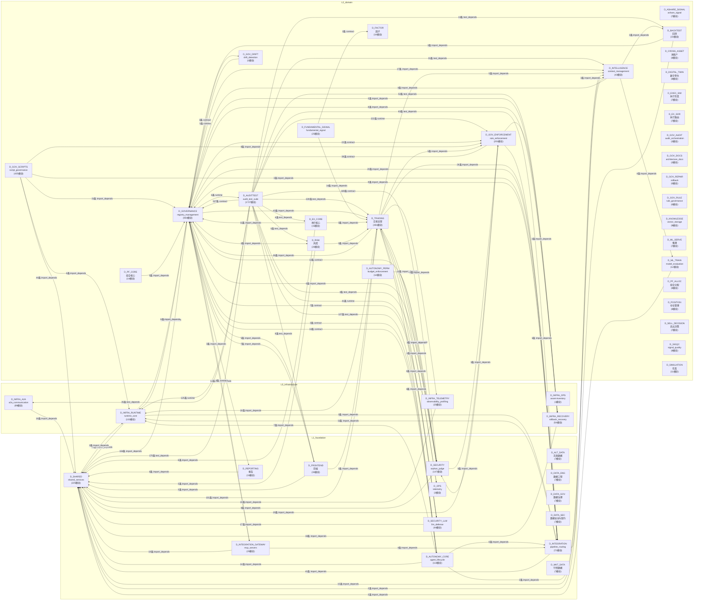

# 集成拓扑图

> **文档作用 / Purpose**: 展示系统间集成关系和数据流向，包括API调用、事件订阅、数据同步等集成方式。

> 自动生成时间: 2026-07-09 05:45:59
> 数据源: depgraph (PostgreSQL) edges表（跨域依赖）
> 跨域依赖对数: 175

```mermaid

%% 所有功能域集成依赖关系图
%% 生成时间: 2026-07-09 05:45:59
%% 数据源: depgraph (PostgreSQL) edges表（跨域依赖）
%% 跨域依赖对数: 175

graph LR

    %% 功能域节点（按架构层分组）
    subgraph L0_infrastructure[L0_infrastructure]
        D_INFRA_A2A["D_INFRA_A2A<br/>a2a_communication<br/>(89模块)"]
        D_INFRA_OPS["D_INFRA_OPS<br/>asset-inventory<br/>(1模块)"]
        D_INFRA_RECOVERY["D_INFRA_RECOVERY<br/>rollback_recovery<br/>(54模块)"]
        D_INFRA_RUNTIME["D_INFRA_RUNTIME<br/>runtime_core<br/>(132模块)"]
        D_INFRA_TELEMETRY["D_INFRA_TELEMETRY<br/>observability_profiling<br/>(25模块)"]
    end
    subgraph L1_foundation[L1_foundation]
        D_ALT_DATA["D_ALT_DATA<br/>另类数据<br/>(7模块)"]
        D_AUTONOMY_CORE["D_AUTONOMY_CORE<br/>agent_lifecycle<br/>(114模块)"]
        D_DATA_ENG["D_DATA_ENG<br/>数据工程<br/>(7模块)"]
        D_DATA_GOV["D_DATA_GOV<br/>数据治理<br/>(7模块)"]
        D_DATA_SEC["D_DATA_SEC<br/>数据安全与契约<br/>(7模块)"]
        D_FRONTEND["D_FRONTEND<br/>前端<br/>(30模块)"]
        D_INTEGRATION["D_INTEGRATION<br/>pipeline_routing<br/>(72模块)"]
        D_INTEGRATION_GATEWAY["D_INTEGRATION_GATEWAY<br/>mcp_servers<br/>(20模块)"]
        D_MKT_DATA["D_MKT_DATA<br/>行情数据<br/>(7模块)"]
        D_OPS["D_OPS<br/>telemetry<br/>(3模块)"]
        D_REPORTING["D_REPORTING<br/>报告<br/>(10模块)"]
        D_SECURITY["D_SECURITY<br/>orphan_judge<br/>(147模块)"]
        D_SECURITY_LLM["D_SECURITY_LLM<br/>llm_defense<br/>(44模块)"]
        D_SHARED["D_SHARED<br/>shared_services<br/>(225模块)"]
    end
    subgraph L2_domain[L2_domain]
        D_ASHARE_SIGNAL["D_ASHARE_SIGNAL<br/>ashare_signal<br/>(7模块)"]
        D_AUDITTEST["D_AUDITTEST<br/>audit_test_suite<br/>(1727模块)"]
        D_AUTONOMY_PERM["D_AUTONOMY_PERM<br/>budget_enforcement<br/>(14模块)"]
        D_BACKTEST["D_BACKTEST<br/>回测<br/>(33模块)"]
        D_CROSS_ASSET["D_CROSS_ASSET<br/>跨资产<br/>(8模块)"]
        D_DIGITAL_TWIN["D_DIGITAL_TWIN<br/>数字孪生<br/>(8模块)"]
        D_EXEC_SIM["D_EXEC_SIM<br/>执行仿真<br/>(7模块)"]
        D_EX_CORE["D_EX_CORE<br/>执行核心<br/>(15模块)"]
        D_EX_SOR["D_EX_SOR<br/>执行路由<br/>(7模块)"]
        D_FACTOR["D_FACTOR<br/>因子<br/>(14模块)"]
        D_FUNDAMENTAL_SIGNAL["D_FUNDAMENTAL_SIGNAL<br/>fundamental_signal<br/>(25模块)"]
        D_GOVERNANCE["D_GOVERNANCE<br/>registry_management<br/>(854模块)"]
        D_GOV_AUDIT["D_GOV_AUDIT<br/>audit_orchestration<br/>(2模块)"]
        D_GOV_DOCS["D_GOV_DOCS<br/>architecture_docs<br/>(2模块)"]
        D_GOV_DRIFT["D_GOV_DRIFT<br/>drift_detection<br/>(1模块)"]
        D_GOV_ENFORCEMENT["D_GOV_ENFORCEMENT<br/>rule_enforcement<br/>(201模块)"]
        D_GOV_REPAIR["D_GOV_REPAIR<br/>rollback<br/>(0模块)"]
        D_GOV_RULE["D_GOV_RULE<br/>rule_governance<br/>(0模块)"]
        D_GOV_SCRIPTS["D_GOV_SCRIPTS<br/>script_governance<br/>(435模块)"]
        D_INTELLIGENCE["D_INTELLIGENCE<br/>context_management<br/>(43模块)"]
        D_KNOWLEDGE["D_KNOWLEDGE<br/>vector_storage<br/>(9模块)"]
        D_ML_SERVE["D_ML_SERVE<br/>推理<br/>(7模块)"]
        D_ML_TRAIN["D_ML_TRAIN<br/>model_evaluation<br/>(12模块)"]
        D_PF_ALLOC["D_PF_ALLOC<br/>组合分配<br/>(8模块)"]
        D_PF_CORE["D_PF_CORE<br/>组合核心<br/>(14模块)"]
        D_POSITION["D_POSITION<br/>仓位管理<br/>(8模块)"]
        D_RISK["D_RISK<br/>风控<br/>(20模块)"]
        D_SELL_DECISION["D_SELL_DECISION<br/>卖出决策<br/>(7模块)"]
        D_SIGQC["D_SIGQC<br/>signal_quality<br/>(8模块)"]
        D_SIMULATION["D_SIMULATION<br/>仿真<br/>(11模块)"]
        D_TRADING["D_TRADING<br/>交易运营<br/>(481模块)"]
    end

    %% 跨域依赖（按依赖数排序，最多显示 100 条）
    D_AUDITTEST -->|639条 test_depends| D_TRADING
    D_AUDITTEST -->|527条 contract| D_GOVERNANCE
    D_AUDITTEST -->|222条 runtime| D_GOV_ENFORCEMENT
    D_AUDITTEST -->|170条 test_depends| D_SHARED
    D_AUDITTEST -->|169条 contract| D_SECURITY
    D_GOVERNANCE -->|164条 import_depends| D_SHARED
    D_AUDITTEST -->|127条 test_depends| D_AUTONOMY_CORE
    D_AUDITTEST -->|125条 runtime| D_INFRA_RUNTIME
    D_TRADING -->|101条 import_depends| D_SHARED
    D_INFRA_RUNTIME -->|70条 import_depends| D_SHARED
    D_AUDITTEST -->|63条 test_depends| D_INTEGRATION
    D_AUDITTEST -->|52条 test_depends| D_INFRA_RECOVERY
    D_GOV_SCRIPTS -->|44条 import_depends| D_SHARED
    D_GOVERNANCE -->|43条 import_depends| D_TRADING
    D_INTEGRATION -->|41条 import_depends| D_SHARED
    D_AUDITTEST -->|41条 runtime| D_SECURITY_LLM
    D_GOV_ENFORCEMENT -->|38条 contract| D_GOVERNANCE
    D_AUDITTEST -->|35条 test_depends| D_INFRA_A2A
    D_AUDITTEST -->|31条 test_depends| D_INTELLIGENCE
    D_GOV_SCRIPTS -->|31条 import_depends| D_GOVERNANCE
    D_TRADING -->|26条 import_depends| D_INTEGRATION
    D_TRADING -->|26条 import_depends| D_GOVERNANCE
    D_GOVERNANCE -->|22条 contract| D_GOV_ENFORCEMENT
    D_GOVERNANCE -->|20条 import_depends| D_INTEGRATION
    D_GOV_ENFORCEMENT -->|19条 import_depends| D_SHARED
    D_INTEGRATION_GATEWAY -->|19条 import_depends| D_SHARED
    D_INFRA_RECOVERY -->|18条 import_depends| D_SHARED
    D_TRADING -->|18条 import_depends| D_INFRA_RUNTIME
    D_GOVERNANCE -->|18条 config_depends| D_INFRA_RUNTIME
    D_SECURITY_LLM -->|17条 import_depends| D_SHARED
    D_GOVERNANCE -->|17条 import_depends| D_INTELLIGENCE
    D_INFRA_A2A -->|16条 import_depends| D_SHARED
    D_INTELLIGENCE -->|15条 import_depends| D_SHARED
    D_FUNDAMENTAL_SIGNAL -->|14条 import_depends| D_TRADING
    D_AUTONOMY_CORE -->|14条 contract| D_GOVERNANCE
    D_AUTONOMY_CORE -->|14条 import_depends| D_SHARED
    D_AUDITTEST -->|13条 test_depends| D_BACKTEST
    D_INTEGRATION_GATEWAY -->|13条 import_depends| D_GOVERNANCE
    D_GOVERNANCE -->|12条 contract| D_SECURITY
    D_AUTONOMY_PERM -->|12条 import_depends| D_SECURITY
    D_INTEGRATION -->|11条 import_depends| D_INFRA_RUNTIME
    D_EX_CORE -->|11条 import_depends| D_GOVERNANCE
    D_INFRA_TELEMETRY -->|10条 import_depends| D_SHARED
    D_SECURITY -->|9条 import_depends| D_SHARED
    D_INTEGRATION -->|9条 import_depends| D_GOVERNANCE
    D_AUDITTEST -->|8条 test_depends| D_FRONTEND
    D_GOV_SCRIPTS -->|8条 import_depends| D_GOV_ENFORCEMENT
    D_INFRA_RECOVERY -->|8条 import_depends| D_GOVERNANCE
    D_INFRA_RUNTIME -->|8条 import_depends| D_GOVERNANCE
    D_AUTONOMY_CORE -->|7条 import_depends| D_INFRA_RUNTIME
    D_GOVERNANCE -->|7条 contract| D_SECURITY_LLM
    D_FRONTEND -->|7条 import_depends| D_GOVERNANCE
    D_SECURITY -->|6条 import_depends| D_GOVERNANCE
    D_EX_CORE -->|6条 import_depends| D_SHARED
    D_TRADING -->|6条 import_depends| D_SECURITY
    D_SECURITY -->|6条 import_depends| D_GOV_ENFORCEMENT
    D_GOV_SCRIPTS -->|6条 import_depends| D_INFRA_RUNTIME
    D_REPORTING -->|6条 import_depends| D_SHARED
    D_GOVERNANCE -->|6条 runtime| D_AUDITTEST
    D_AUDITTEST -->|6条 test_depends| D_RISK
    D_AUTONOMY_CORE -->|6条 import_depends| D_INTEGRATION
    D_GOV_ENFORCEMENT -->|6条 import_depends| D_INTEGRATION
    D_TRADING -->|5条 import_depends| D_GOV_ENFORCEMENT
    D_GOVERNANCE -->|5条 import_depends| D_FRONTEND
    D_TRADING -->|5条 import_depends| D_INTELLIGENCE
    D_PF_CORE -->|5条 import_depends| D_GOVERNANCE
    D_GOV_DRIFT -->|5条 runtime| D_GOVERNANCE
    D_TRADING -->|4条 import_depends| D_SECURITY_LLM
    D_INTELLIGENCE -->|4条 import_depends| D_ML_TRAIN
    D_INTELLIGENCE -->|4条 import_depends| D_GOVERNANCE
    D_INTEGRATION_GATEWAY -->|4条 import_depends| D_INTEGRATION
    D_AUDITTEST -->|4条 test_depends| D_OPS
    D_AUDITTEST -->|4条 test_depends| D_EX_CORE
    D_TRADING -->|4条 import_depends| D_AUTONOMY_CORE
    D_SHARED -->|3条 import_depends| D_INFRA_RUNTIME
    D_BACKTEST -->|3条 import_depends| D_GOVERNANCE
    D_EX_CORE -->|3条 import_depends| D_TRADING
    D_FRONTEND -->|3条 import_depends| D_SHARED
    D_GOVERNANCE -->|3条 contract| D_AUTONOMY_CORE
    D_GOVERNANCE -->|3条 contract| D_GOV_DRIFT
    D_GOVERNANCE -->|3条 import_depends| D_INFRA_RECOVERY
    D_GOVERNANCE -->|3条 contract| D_INTEGRATION_GATEWAY
    D_GOVERNANCE -->|3条 import_depends| D_REPORTING
    D_GOVERNANCE -->|3条 import_depends| D_RISK
    D_GOV_ENFORCEMENT -->|3条 import_depends| D_INFRA_RECOVERY
    D_GOV_ENFORCEMENT -->|3条 import_depends| D_SECURITY
    D_GOV_SCRIPTS -->|3条 import_depends| D_INTEGRATION
    D_INFRA_RUNTIME -->|3条 import_depends| D_INTEGRATION
    D_INTEGRATION -->|3条 import_depends| D_INTELLIGENCE
    D_INTELLIGENCE -->|3条 import_depends| D_BACKTEST
    D_ML_TRAIN -->|3条 import_depends| D_SHARED
    D_RISK -->|3条 import_depends| D_SHARED
    D_RISK -->|3条 import_depends| D_TRADING
    D_SECURITY -->|3条 import_depends| D_TRADING
    D_TRADING -->|3条 import_depends| D_INFRA_TELEMETRY
    D_TRADING -->|3条 import_depends| D_OPS
    D_AUTONOMY_CORE -->|2条 import_depends| D_INTELLIGENCE
    D_FUNDAMENTAL_SIGNAL -->|2条 contract| D_FACTOR
    D_FRONTEND -->|2条 import_depends| D_TRADING
    D_BACKTEST -->|2条 import_depends| D_SHARED
    %% ... 还有 75 条跨域依赖未显示

    %% 统计
    %% 域总数: 50
    %% 跨域依赖对数: 175
    %% 跨域依赖边总数: 3468

    %% Top 10 依赖对
    %% 1. D_AUDITTEST -> D_TRADING: 639 条
    %% 2. D_AUDITTEST -> D_GOVERNANCE: 527 条
    %% 3. D_AUDITTEST -> D_GOV_ENFORCEMENT: 222 条
    %% 4. D_AUDITTEST -> D_SHARED: 170 条
    %% 5. D_AUDITTEST -> D_SECURITY: 169 条
    %% 6. D_GOVERNANCE -> D_SHARED: 164 条
    %% 7. D_AUDITTEST -> D_AUTONOMY_CORE: 127 条
    %% 8. D_AUDITTEST -> D_INFRA_RUNTIME: 125 条
    %% 9. D_TRADING -> D_SHARED: 101 条
    %% 10. D_INFRA_RUNTIME -> D_SHARED: 70 条

```
