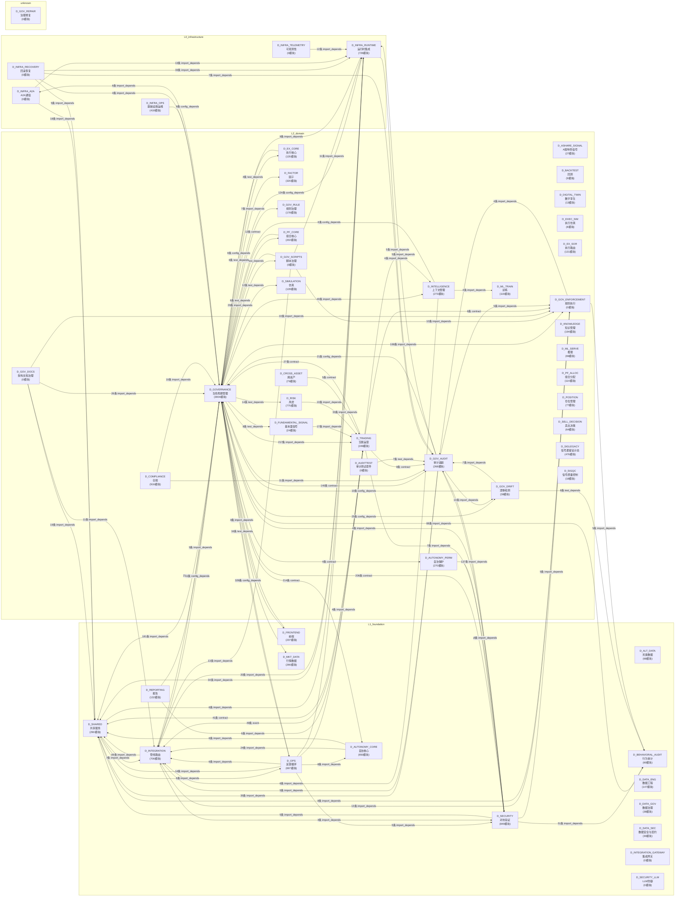

# 集成拓扑图

> **文档作用 / Purpose**: 展示系统间集成关系和数据流向，包括API调用、事件订阅、数据同步等集成方式。

> 自动生成时间: 2026-06-30 12:25:34
> 数据源: depgraph (PostgreSQL) edges表（跨域依赖）
> 跨域依赖对数: 213

```mermaid

%% 所有功能域集成依赖关系图
%% 生成时间: 2026-06-30 12:25:34
%% 数据源: depgraph (PostgreSQL) edges表（跨域依赖）
%% 跨域依赖对数: 213

graph LR

    %% 功能域节点（按架构层分组）
    subgraph L0_infrastructure[L0_infrastructure]
        D_INFRA_A2A["D_INFRA_A2A<br/>A2A通信<br/>(0模块)"]
        D_INFRA_OPS["D_INFRA_OPS<br/>基础设施运维<br/>(418模块)"]
        D_INFRA_RECOVERY["D_INFRA_RECOVERY<br/>回滚恢复<br/>(0模块)"]
        D_INFRA_RUNTIME["D_INFRA_RUNTIME<br/>运行时集成<br/>(726模块)"]
        D_INFRA_TELEMETRY["D_INFRA_TELEMETRY<br/>可观测性<br/>(0模块)"]
    end
    subgraph L1_foundation[L1_foundation]
        D_ALT_DATA["D_ALT_DATA<br/>另类数据<br/>(68模块)"]
        D_AUTONOMY_CORE["D_AUTONOMY_CORE<br/>自治核心<br/>(650模块)"]
        D_BEHAVIORAL_AUDIT["D_BEHAVIORAL_AUDIT<br/>行为审计<br/>(60模块)"]
        D_DATA_ENG["D_DATA_ENG<br/>数据工程<br/>(147模块)"]
        D_DATA_GOV["D_DATA_GOV<br/>数据治理<br/>(38模块)"]
        D_DATA_SEC["D_DATA_SEC<br/>数据安全与契约<br/>(30模块)"]
        D_FRONTEND["D_FRONTEND<br/>前端<br/>(237模块)"]
        D_INTEGRATION["D_INTEGRATION<br/>管线路由<br/>(706模块)"]
        D_INTEGRATION_GATEWAY["D_INTEGRATION_GATEWAY<br/>集成网关<br/>(0模块)"]
        D_MKT_DATA["D_MKT_DATA<br/>行情数据<br/>(266模块)"]
        D_OPS["D_OPS<br/>反馈循环<br/>(697模块)"]
        D_REPORTING["D_REPORTING<br/>报告<br/>(132模块)"]
        D_SECURITY["D_SECURITY<br/>对抗验证<br/>(849模块)"]
        D_SECURITY_LLM["D_SECURITY_LLM<br/>LLM防御<br/>(0模块)"]
        D_SHARED["D_SHARED<br/>共享服务<br/>(290模块)"]
    end
    subgraph L2_domain[L2_domain]
        D_ASHARE_SIGNAL["D_ASHARE_SIGNAL<br/>A股特色信号<br/>(27模块)"]
        D_AUDITTEST["D_AUDITTEST<br/>审计测试套件<br/>(0模块)"]
        D_AUTONOMY_PERM["D_AUTONOMY_PERM<br/>自治保护<br/>(270模块)"]
        D_BACKTEST["D_BACKTEST<br/>回测<br/>(9模块)"]
        D_COMPLIANCE["D_COMPLIANCE<br/>合规<br/>(916模块)"]
        D_CROSS_ASSET["D_CROSS_ASSET<br/>跨资产<br/>(79模块)"]
        D_DIGITAL_TWIN["D_DIGITAL_TWIN<br/>数字孪生<br/>(13模块)"]
        D_EXEC_SIM["D_EXEC_SIM<br/>执行仿真<br/>(8模块)"]
        D_EX_CORE["D_EX_CORE<br/>执行核心<br/>(135模块)"]
        D_EX_SOR["D_EX_SOR<br/>执行路由<br/>(131模块)"]
        D_FACTOR["D_FACTOR<br/>因子<br/>(320模块)"]
        D_FUNDAMENTAL_SIGNAL["D_FUNDAMENTAL_SIGNAL<br/>基本面信号<br/>(24模块)"]
        D_GOVERNANCE["D_GOVERNANCE<br/>生命周期管理<br/>(3904模块)"]
        D_GOV_AUDIT["D_GOV_AUDIT<br/>审计追踪<br/>(268模块)"]
        D_GOV_DOCS["D_GOV_DOCS<br/>架构文档治理<br/>(0模块)"]
        D_GOV_DRIFT["D_GOV_DRIFT<br/>漂移检测<br/>(38模块)"]
        D_GOV_ENFORCEMENT["D_GOV_ENFORCEMENT<br/>规则执行<br/>(0模块)"]
        D_GOV_RULE["D_GOV_RULE<br/>规则治理<br/>(178模块)"]
        D_GOV_SCRIPTS["D_GOV_SCRIPTS<br/>脚本治理<br/>(0模块)"]
        D_INTELLIGENCE["D_INTELLIGENCE<br/>上下文管理<br/>(273模块)"]
        D_KNOWLEDGE["D_KNOWLEDGE<br/>知识管理<br/>(194模块)"]
        D_ML_SERVE["D_ML_SERVE<br/>推理<br/>(69模块)"]
        D_ML_TRAIN["D_ML_TRAIN<br/>训练<br/>(119模块)"]
        D_PF_ALLOC["D_PF_ALLOC<br/>组合分配<br/>(114模块)"]
        D_PF_CORE["D_PF_CORE<br/>组合核心<br/>(202模块)"]
        D_POSITION["D_POSITION<br/>仓位管理<br/>(77模块)"]
        D_RISK["D_RISK<br/>风控<br/>(775模块)"]
        D_SELL_DECISION["D_SELL_DECISION<br/>卖出决策<br/>(64模块)"]
        D_SIGLEGACY["D_SIGLEGACY<br/>信号遗留设计态<br/>(476模块)"]
        D_SIGQC["D_SIGQC<br/>信号质量控制<br/>(18模块)"]
        D_SIMULATION["D_SIMULATION<br/>仿真<br/>(128模块)"]
        D_TRADING["D_TRADING<br/>交易运营<br/>(249模块)"]
    end
    subgraph unknown[unknown]
        D_GOV_REPAIR["D_GOV_REPAIR<br/>治理修复<br/>(0模块)"]
    end

    %% 跨域依赖（按依赖数排序，最多显示 100 条）
    D_GOVERNANCE -->|385条 config_depends| D_OPS
    D_GOVERNANCE -->|230条 import_depends| D_INTEGRATION
    D_GOVERNANCE -->|217条 import_depends| D_TRADING
    D_GOVERNANCE -->|214条 contract| D_AUTONOMY_CORE
    D_GOVERNANCE -->|206条 contract| D_SECURITY
    D_GOVERNANCE -->|181条 import_depends| D_SHARED
    D_GOVERNANCE -->|168条 import_depends| D_GOV_ENFORCEMENT
    D_GOVERNANCE -->|140条 contract| D_GOV_AUDIT
    D_AUTONOMY_PERM -->|137条 import_depends| D_SECURITY
    D_GOVERNANCE -->|124条 config_depends| D_INFRA_RUNTIME
    D_GOVERNANCE -->|88条 import_depends| D_BEHAVIORAL_AUDIT
    D_INTEGRATION -->|69条 import_depends| D_SHARED
    D_SECURITY -->|51条 import_depends| D_BEHAVIORAL_AUDIT
    D_GOVERNANCE -->|49条 import_depends| D_INTELLIGENCE
    D_TRADING -->|49条 event| D_INTEGRATION
    D_TRADING -->|41条 contract| D_SHARED
    D_GOV_AUDIT -->|35条 import_depends| D_SHARED
    D_INFRA_RUNTIME -->|34条 import_depends| D_SHARED
    D_OPS -->|33条 import_depends| D_INFRA_RUNTIME
    D_INFRA_RECOVERY -->|33条 import_depends| D_INFRA_RUNTIME
    D_GOV_SCRIPTS -->|29条 import_depends| D_GOVERNANCE
    D_OPS -->|29条 config_depends| D_GOVERNANCE
    D_TRADING -->|27条 contract| D_GOVERNANCE
    D_GOV_DOCS -->|26条 import_depends| D_GOVERNANCE
    D_GOVERNANCE -->|25条 config_depends| D_GOV_DRIFT
    D_AUTONOMY_CORE -->|24条 import_depends| D_INTEGRATION
    D_GOV_AUDIT -->|21条 config_depends| D_GOVERNANCE
    D_INFRA_RUNTIME -->|20条 import_depends| D_INTEGRATION
    D_GOV_DOCS -->|19条 import_depends| D_SHARED
    D_INFRA_A2A -->|18条 import_depends| D_SHARED
    D_FUNDAMENTAL_SIGNAL -->|17条 import_depends| D_TRADING
    D_GOVERNANCE -->|16条 test_depends| D_MKT_DATA
    D_GOVERNANCE -->|14条 test_depends| D_RISK
    D_OPS -->|14条 import_depends| D_SHARED
    D_GOV_ENFORCEMENT -->|13条 import_depends| D_INTEGRATION
    D_GOV_AUDIT -->|13条 import_depends| D_GOV_DRIFT
    D_INFRA_A2A -->|13条 import_depends| D_INFRA_RUNTIME
    D_GOV_SCRIPTS -->|13条 import_depends| D_INTEGRATION
    D_PF_CORE -->|12条 contract| D_GOVERNANCE
    D_INFRA_TELEMETRY -->|12条 import_depends| D_INFRA_RUNTIME
    D_GOVERNANCE -->|12条 test_depends| D_SIMULATION
    D_GOVERNANCE -->|12条 test_depends| D_GOV_SCRIPTS
    D_GOV_DOCS -->|11条 import_depends| D_INTEGRATION
    D_GOV_SCRIPTS -->|11条 import_depends| D_INFRA_RUNTIME
    D_COMPLIANCE -->|11条 import_depends| D_GOV_AUDIT
    D_INTEGRATION -->|11条 config_depends| D_GOVERNANCE
    D_GOV_SCRIPTS -->|10条 import_depends| D_GOV_ENFORCEMENT
    D_GOV_DOCS -->|10条 import_depends| D_GOV_ENFORCEMENT
    D_GOV_DRIFT -->|10条 config_depends| D_GOVERNANCE
    D_COMPLIANCE -->|10条 import_depends| D_GOVERNANCE
    D_RISK -->|10条 import_depends| D_TRADING
    D_INFRA_RUNTIME -->|9条 import_depends| D_GOVERNANCE
    D_GOV_ENFORCEMENT -->|8条 import_depends| D_SHARED
    D_GOVERNANCE -->|8条 test_depends| D_FRONTEND
    D_EX_CORE -->|8条 config_depends| D_GOVERNANCE
    D_GOVERNANCE -->|8条 test_depends| D_FUNDAMENTAL_SIGNAL
    D_OPS -->|8条 import_depends| D_AUTONOMY_CORE
    D_TRADING -->|8条 contract| D_GOV_AUDIT
    D_INFRA_OPS -->|8条 config_depends| D_GOVERNANCE
    D_GOV_DRIFT -->|8条 test_depends| D_BEHAVIORAL_AUDIT
    D_AUDITTEST -->|7条 test_depends| D_GOV_AUDIT
    D_GOVERNANCE -->|7条 import_depends| D_GOV_RULE
    D_GOV_DRIFT -->|7条 import_depends| D_GOV_AUDIT
    D_INFRA_RECOVERY -->|7条 import_depends| D_GOV_AUDIT
    D_SHARED -->|7条 import_depends| D_INTEGRATION
    D_TRADING -->|7条 import_depends| D_SECURITY
    D_GOV_AUDIT -->|6条 import_depends| D_SECURITY
    D_OPS -->|6条 import_depends| D_INTEGRATION
    D_TRADING -->|6条 contract| D_GOV_ENFORCEMENT
    D_INTELLIGENCE -->|6条 config_depends| D_GOVERNANCE
    D_REPORTING -->|6条 import_depends| D_TRADING
    D_INTELLIGENCE -->|6条 import_depends| D_INTEGRATION
    D_SHARED -->|6条 import_depends| D_INFRA_RUNTIME
    D_AUTONOMY_CORE -->|6条 import_depends| D_SHARED
    D_GOVERNANCE -->|6条 import_depends| D_INFRA_A2A
    D_GOVERNANCE -->|6条 test_depends| D_PF_CORE
    D_GOVERNANCE -->|6条 test_depends| D_EX_CORE
    D_SHARED -->|6条 import_depends| D_OPS
    D_GOV_ENFORCEMENT -->|5条 import_depends| D_BEHAVIORAL_AUDIT
    D_SECURITY -->|5条 import_depends| D_SHARED
    D_GOV_AUDIT -->|5条 import_depends| D_GOV_ENFORCEMENT
    D_TRADING -->|5条 import_depends| D_INTELLIGENCE
    D_CROSS_ASSET -->|5条 contract| D_TRADING
    D_OPS -->|5条 import_depends| D_SECURITY
    D_INFRA_RECOVERY -->|5条 import_depends| D_SHARED
    D_GOV_AUDIT -->|5条 import_depends| D_INTEGRATION
    D_REPORTING -->|5条 import_depends| D_GOVERNANCE
    D_GOV_AUDIT -->|5条 import_depends| D_INFRA_RUNTIME
    D_SECURITY -->|5条 import_depends| D_GOV_AUDIT
    D_SECURITY -->|5条 import_depends| D_GOV_ENFORCEMENT
    D_SECURITY -->|4条 import_depends| D_GOVERNANCE
    D_OPS -->|4条 import_depends| D_TRADING
    D_GOV_ENFORCEMENT -->|4条 import_depends| D_GOV_AUDIT
    D_INTEGRATION -->|4条 import_depends| D_SECURITY
    D_INFRA_RUNTIME -->|4条 import_depends| D_GOV_AUDIT
    D_INTELLIGENCE -->|4条 import_depends| D_ML_TRAIN
    D_GOVERNANCE -->|4条 test_depends| D_FACTOR
    D_INFRA_RECOVERY -->|4条 import_depends| D_GOVERNANCE
    D_FRONTEND -->|4条 import_depends| D_GOVERNANCE
    D_GOVERNANCE -->|4条 contract| D_AUTONOMY_PERM
    %% ... 还有 113 条跨域依赖未显示

    %% 统计
    %% 域总数: 53
    %% 跨域依赖对数: 213
    %% 跨域依赖边总数: 3452

    %% Top 10 依赖对
    %% 1. D_GOVERNANCE -> D_OPS: 385 条
    %% 2. D_GOVERNANCE -> D_INTEGRATION: 230 条
    %% 3. D_GOVERNANCE -> D_TRADING: 217 条
    %% 4. D_GOVERNANCE -> D_AUTONOMY_CORE: 214 条
    %% 5. D_GOVERNANCE -> D_SECURITY: 206 条
    %% 6. D_GOVERNANCE -> D_SHARED: 181 条
    %% 7. D_GOVERNANCE -> D_GOV_ENFORCEMENT: 168 条
    %% 8. D_GOVERNANCE -> D_GOV_AUDIT: 140 条
    %% 9. D_AUTONOMY_PERM -> D_SECURITY: 137 条
    %% 10. D_GOVERNANCE -> D_INFRA_RUNTIME: 124 条

```
