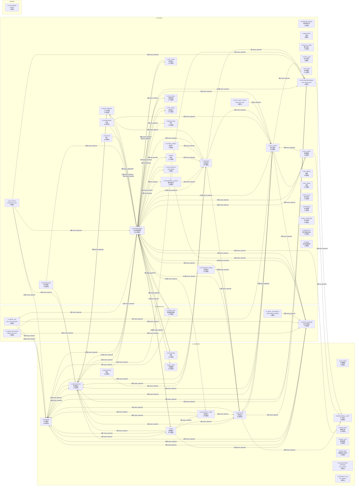

# 集成拓扑图

> **文档作用 / Purpose**: 展示系统间集成关系和数据流向，包括API调用、事件订阅、数据同步等集成方式。

> 自动生成时间: 2026-06-25 18:42:33
> 数据源: depgraph.db edges表（跨域依赖）
> 跨域依赖对数: 239

```mermaid

%% 所有功能域集成依赖关系图
%% 生成时间: 2026-06-25 18:42:33
%% 数据源: depgraph.db edges表（跨域依赖）
%% 跨域依赖对数: 239

graph LR

    %% 功能域节点（按架构层分组）
    subgraph L0_infrastructure[L0_infrastructure]
        D_INFRA_A2A["D_INFRA_A2A<br/>a2a_communication<br/>(0模块)"]
        D_INFRA_OPS["D_INFRA_OPS<br/>基础设施运维<br/>(418模块)"]
        D_INFRA_RECOVERY["D_INFRA_RECOVERY<br/>rollback_recovery<br/>(0模块)"]
        D_INFRA_RUNTIME["D_INFRA_RUNTIME<br/>运行时集成<br/>(726模块)"]
        D_INFRA_TELEMETRY["D_INFRA_TELEMETRY<br/>observability_profiling<br/>(0模块)"]
    end
    subgraph L1_foundation[L1_foundation]
        D_ALT_DATA["D-ALT_DATA<br/>另类数据<br/>(68模块)"]
        D_AUTONOMY_CORE["D-AUTONOMY_CORE<br/>自治核心<br/>(650模块)"]
        D_BEHAVIORAL_AUDIT["D-BEHAVIORAL_AUDIT<br/>行为审计<br/>(60模块)"]
        D_DATA_ENG["D-DATA_ENG<br/>数据工程<br/>(147模块)"]
        D_DATA_GOV["D-DATA_GOV<br/>数据治理<br/>(38模块)"]
        D_DATA_SEC["D-DATA_SEC<br/>数据安全与契约<br/>(30模块)"]
        D_FRONTEND["D-FRONTEND<br/>前端<br/>(237模块)"]
        D_INTEGRATION["D-INTEGRATION<br/>管线路由<br/>(706模块)"]
        D_INTEGRATION_GATEWAY["D-INTEGRATION-GATEWAY<br/>mcp_servers<br/>(0模块)"]
        D_MKT_DATA["D-MKT_DATA<br/>行情数据<br/>(266模块)"]
        D_OPS["D-OPS<br/>反馈循环<br/>(697模块)"]
        D_REPORTING["D-REPORTING<br/>报告<br/>(132模块)"]
        D_SECURITY["D-SECURITY<br/>对抗验证<br/>(849模块)"]
        D_SECURITY_LLM["D-SECURITY-LLM<br/>llm_defense<br/>(0模块)"]
        D_SHARED["D-SHARED<br/>共享服务<br/>(290模块)"]
    end
    subgraph L2_domain[L2_domain]
        D_ASHARE_SIGNAL["D-ASHARE_SIGNAL<br/>A股特色信号<br/>(27模块)"]
        D_AUTONOMY_PERM["D-AUTONOMY_PERM<br/>自治保护<br/>(270模块)"]
        D_BACKTEST["D-BACKTEST<br/>回测<br/>(9模块)"]
        D_COMPLIANCE["D-COMPLIANCE<br/>合规<br/>(916模块)"]
        D_CROSS_ASSET["D-CROSS_ASSET<br/>跨资产<br/>(79模块)"]
        D_DIGITAL_TWIN["D-DIGITAL_TWIN<br/>数字孪生<br/>(13模块)"]
        D_EXEC_SIM["D-EXEC_SIM<br/>执行仿真<br/>(8模块)"]
        D_EX_CORE["D-EX_CORE<br/>执行核心<br/>(135模块)"]
        D_EX_SOR["D-EX_SOR<br/>执行路由<br/>(131模块)"]
        D_FACTOR["D-FACTOR<br/>因子<br/>(320模块)"]
        D_FUNDAMENTAL_SIGNAL["D-FUNDAMENTAL_SIGNAL<br/>基本面信号<br/>(24模块)"]
        D_GOV_DOCS["D-GOV-DOCS<br/>architecture_docs<br/>(0模块)"]
        D_GOV_ENFORCEMENT["D-GOV-ENFORCEMENT<br/>rule_enforcement<br/>(0模块)"]
        D_GOV_SCRIPTS["D-GOV-SCRIPTS<br/>code_dedup<br/>(0模块)"]
        D_GOVERNANCE["D-GOVERNANCE<br/>生命周期管理<br/>(3904模块)"]
        D_GOV_AUDIT["D-GOV_AUDIT<br/>审计追踪<br/>(268模块)"]
        D_GOV_AUDIT_TESTS["D-GOV_AUDIT_TESTS<br/>audit_test_suite<br/>(0模块)"]
        D_GOV_DRIFT["D-GOV_DRIFT<br/>漂移检测<br/>(38模块)"]
        D_GOV_RULE["D-GOV_RULE<br/>规则治理<br/>(178模块)"]
        D_INTELLIGENCE["D-INTELLIGENCE<br/>上下文管理<br/>(273模块)"]
        D_KNOWLEDGE["D-KNOWLEDGE<br/>知识管理<br/>(194模块)"]
        D_ML_SERVE["D-ML_SERVE<br/>推理<br/>(69模块)"]
        D_ML_TRAIN["D-ML_TRAIN<br/>训练<br/>(119模块)"]
        D_PF_ALLOC["D-PF_ALLOC<br/>组合分配<br/>(114模块)"]
        D_PF_CORE["D-PF_CORE<br/>组合核心<br/>(202模块)"]
        D_POSITION["D-POSITION<br/>仓位管理<br/>(77模块)"]
        D_RISK["D-RISK<br/>风控<br/>(775模块)"]
        D_SELL_DECISION["D-SELL_DECISION<br/>卖出决策<br/>(64模块)"]
        D_SIGLEGACY["D-SIGLEGACY<br/>信号遗留设计态<br/>(476模块)"]
        D_SIGQC["D-SIGQC<br/>信号质量控制<br/>(18模块)"]
        D_SIMULATION["D-SIMULATION<br/>仿真<br/>(128模块)"]
        D_TRADING["D-TRADING<br/>交易运营<br/>(249模块)"]
    end
    subgraph unknown[unknown]
        D_GOV_REPAIR["D-GOV-REPAIR<br/>rollback<br/>(0模块)"]
    end

    %% 跨域依赖（按依赖数排序，最多显示 100 条）
    D_GOVERNANCE -->|385条 import_depends| D_OPS
    D_GOVERNANCE -->|237条 import_depends| D_INTEGRATION
    D_GOVERNANCE -->|226条 import_depends| D_TRADING
    D_GOVERNANCE -->|213条 import_depends| D_AUTONOMY_CORE
    D_GOVERNANCE -->|207条 import_depends| D_SECURITY
    D_GOVERNANCE -->|185条 import_depends| D_SHARED
    D_GOVERNANCE -->|168条 import_depends| D_GOV_ENFORCEMENT
    D_GOVERNANCE -->|140条 import_depends| D_GOV_AUDIT
    D_AUTONOMY_PERM -->|138条 import_depends| D_SECURITY
    D_GOVERNANCE -->|125条 import_depends| D_INFRA_RUNTIME
    D_GOVERNANCE -->|89条 import_depends| D_BEHAVIORAL_AUDIT
    D_INTEGRATION -->|71条 import_depends| D_SHARED
    D_TRADING -->|56条 import_depends| D_INTEGRATION
    D_SECURITY -->|51条 import_depends| D_BEHAVIORAL_AUDIT
    D_GOVERNANCE -->|50条 import_depends| D_INTELLIGENCE
    D_TRADING -->|43条 import_depends| D_SHARED
    D_GOV_AUDIT -->|42条 import_depends| D_SHARED
    D_INFRA_RUNTIME -->|36条 import_depends| D_SHARED
    D_INFRA_RECOVERY -->|33条 import_depends| D_INFRA_RUNTIME
    D_OPS -->|33条 import_depends| D_INFRA_RUNTIME
    D_GOV_SCRIPTS -->|30条 import_depends| D_GOVERNANCE
    D_OPS -->|29条 import_depends| D_GOVERNANCE
    D_TRADING -->|29条 import_depends| D_GOVERNANCE
    D_GOV_DOCS -->|28条 import_depends| D_GOVERNANCE
    D_AUTONOMY_CORE -->|26条 import_depends| D_INTEGRATION
    D_GOVERNANCE -->|26条 import_depends| D_GOV_DRIFT
    D_INFRA_RUNTIME -->|23条 import_depends| D_INTEGRATION
    D_GOV_AUDIT -->|21条 import_depends| D_GOVERNANCE
    D_GOV_DOCS -->|20条 import_depends| D_SHARED
    D_INFRA_A2A -->|18条 import_depends| D_SHARED
    D_FUNDAMENTAL_SIGNAL -->|17条 import_depends| D_TRADING
    D_GOVERNANCE -->|16条 test_depends| D_MKT_DATA
    D_INTEGRATION -->|16条 import_depends| D_INTELLIGENCE
    D_KNOWLEDGE -->|16条 import_depends| D_INTEGRATION
    D_OPS -->|15条 import_depends| D_SHARED
    D_GOVERNANCE -->|14条 test_depends| D_RISK
    D_INFRA_A2A -->|14条 import_depends| D_INFRA_RUNTIME
    D_GOV_ENFORCEMENT -->|13条 import_depends| D_INTEGRATION
    D_GOV_SCRIPTS -->|13条 import_depends| D_INTEGRATION
    D_GOV_AUDIT -->|13条 import_depends| D_GOV_DRIFT
    D_KNOWLEDGE -->|13条 import_depends| D_GOVERNANCE
    D_GOV_DOCS -->|12条 import_depends| D_GOV_ENFORCEMENT
    D_GOVERNANCE -->|12条 test_depends| D_GOV_SCRIPTS
    D_GOVERNANCE -->|12条 test_depends| D_SIMULATION
    D_INFRA_TELEMETRY -->|12条 import_depends| D_INFRA_RUNTIME
    D_PF_CORE -->|12条 import_depends| D_GOVERNANCE
    D_TRADING -->|12条 import_depends| D_SECURITY
    D_COMPLIANCE -->|11条 import_depends| D_GOVERNANCE
    D_COMPLIANCE -->|11条 import_depends| D_GOV_AUDIT
    D_GOV_DOCS -->|11条 import_depends| D_INTEGRATION
    D_GOV_SCRIPTS -->|11条 import_depends| D_INFRA_RUNTIME
    D_INTEGRATION -->|11条 import_depends| D_GOVERNANCE
    D_REPORTING -->|11条 import_depends| D_GOVERNANCE
    D_RISK -->|11条 import_depends| D_TRADING
    D_TRADING -->|11条 import_depends| D_GOV_AUDIT
    D_EX_CORE -->|10条 import_depends| D_GOVERNANCE
    D_GOV_SCRIPTS -->|10条 import_depends| D_GOV_ENFORCEMENT
    D_GOV_DRIFT -->|10条 import_depends| D_GOVERNANCE
    D_SHARED -->|10条 import_depends| D_INTEGRATION
    D_INFRA_RUNTIME -->|9条 import_depends| D_GOVERNANCE
    D_REPORTING -->|9条 import_depends| D_TRADING
    D_AUTONOMY_CORE -->|8条 import_depends| D_SHARED
    D_GOV_ENFORCEMENT -->|8条 import_depends| D_SHARED
    D_GOVERNANCE -->|8条 test_depends| D_FRONTEND
    D_GOVERNANCE -->|8条 test_depends| D_FUNDAMENTAL_SIGNAL
    D_GOVERNANCE -->|8条 import_depends| D_GOV_RULE
    D_GOV_DRIFT -->|8条 test_depends| D_BEHAVIORAL_AUDIT
    D_GOV_DRIFT -->|8条 import_depends| D_GOV_AUDIT
    D_INFRA_OPS -->|8条 import_depends| D_GOVERNANCE
    D_OPS -->|8条 import_depends| D_INTEGRATION
    D_GOV_AUDIT_TESTS -->|7条 test_depends| D_GOV_AUDIT
    D_INFRA_RECOVERY -->|7条 import_depends| D_GOV_AUDIT
    D_INTELLIGENCE -->|7条 import_depends| D_GOVERNANCE
    D_INTELLIGENCE -->|7条 import_depends| D_INTEGRATION
    D_SECURITY -->|7条 import_depends| D_SHARED
    D_GOVERNANCE -->|6条 test_depends| D_EX_CORE
    D_GOVERNANCE -->|6条 import_depends| D_INFRA_A2A
    D_GOVERNANCE -->|6条 data| D_INFRA_OPS
    D_GOVERNANCE -->|6条 test_depends| D_PF_CORE
    D_GOV_AUDIT -->|6条 import_depends| D_SECURITY
    D_INFRA_OPS -->|6条 import_depends| D_SHARED
    D_OPS -->|6条 import_depends| D_AUTONOMY_CORE
    D_SHARED -->|6条 import_depends| D_INFRA_RUNTIME
    D_SHARED -->|6条 import_depends| D_OPS
    D_TRADING -->|6条 import_depends| D_GOV_ENFORCEMENT
    D_TRADING -->|6条 import_depends| D_INTELLIGENCE
    D_CROSS_ASSET -->|5条 import_depends| D_TRADING
    D_FACTOR -->|5条 import_depends| D_GOVERNANCE
    D_GOV_ENFORCEMENT -->|5条 import_depends| D_BEHAVIORAL_AUDIT
    D_GOV_AUDIT -->|5条 import_depends| D_GOV_ENFORCEMENT
    D_GOV_AUDIT -->|5条 import_depends| D_INFRA_RUNTIME
    D_GOV_AUDIT -->|5条 import_depends| D_INTEGRATION
    D_INFRA_RECOVERY -->|5条 import_depends| D_SHARED
    D_INTEGRATION -->|5条 import_depends| D_SECURITY
    D_OPS -->|5条 import_depends| D_SECURITY
    D_SECURITY -->|5条 import_depends| D_GOV_ENFORCEMENT
    D_SECURITY -->|5条 import_depends| D_GOVERNANCE
    D_SECURITY -->|5条 import_depends| D_GOV_AUDIT
    D_AUTONOMY_CORE -->|4条 import_depends| D_SECURITY
    D_FRONTEND -->|4条 import_depends| D_GOVERNANCE
    %% ... 还有 139 条跨域依赖未显示

    %% 统计
    %% 域总数: 53
    %% 跨域依赖对数: 239
    %% 跨域依赖边总数: 3634

    %% Top 10 依赖对
    %% 1. D-GOVERNANCE -> D-OPS: 385 条
    %% 2. D-GOVERNANCE -> D-INTEGRATION: 237 条
    %% 3. D-GOVERNANCE -> D-TRADING: 226 条
    %% 4. D-GOVERNANCE -> D-AUTONOMY_CORE: 213 条
    %% 5. D-GOVERNANCE -> D-SECURITY: 207 条
    %% 6. D-GOVERNANCE -> D-SHARED: 185 条
    %% 7. D-GOVERNANCE -> D-GOV-ENFORCEMENT: 168 条
    %% 8. D-GOVERNANCE -> D-GOV_AUDIT: 140 条
    %% 9. D-AUTONOMY_PERM -> D-SECURITY: 138 条
    %% 10. D-GOVERNANCE -> D_INFRA_RUNTIME: 125 条

```
