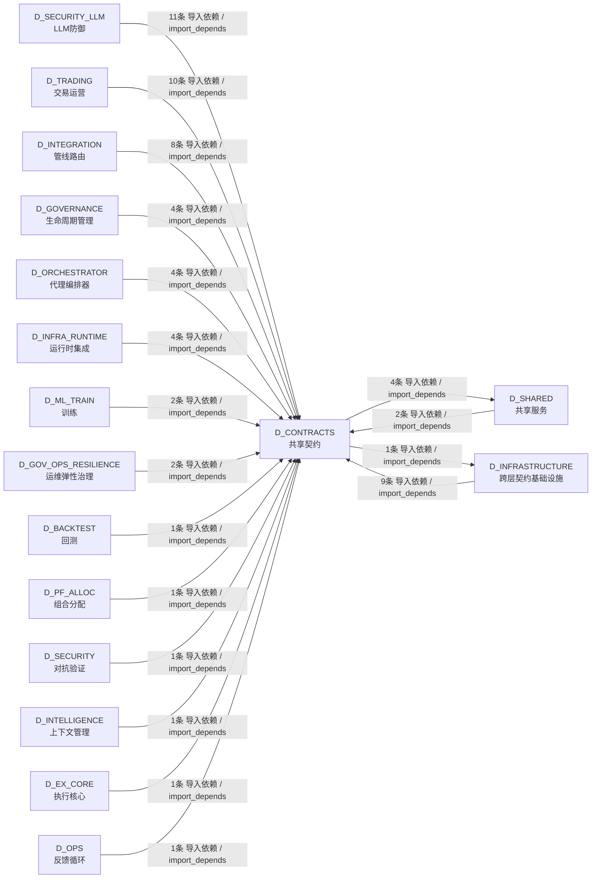

# 01_d_contracts / 共享契约 / D_CONTRACTS

> **文档作用 / Purpose**: 展示 共享契约（D_CONTRACTS）功能域的模块清单、域内依赖关系、跨域依赖关系、架构分层视图，供架构审查和域治理参考。

> 本文档由 generate_domain_doc.py 从 depgraph (PostgreSQL) 自动生成
> 数据源: depgraph (PostgreSQL) nodes表 + edges表

## 域基本信息 / Domain Overview

| 字段 | 值 | Field | Value |
|------|------|-------|-------|
| 编号 | 01 | Number | 01 |
| 域ID | D_CONTRACTS | Domain ID | D_CONTRACTS |
| 域名称 | 共享契约 | Domain Name | D_CONTRACTS |
| 层级 | L0 基础设施层 | Layer | L0 Infrastructure |
| 模块数 | 50 | Module Count | 50 |
| 域内依赖 | 12 | Internal Dependencies | 12 |
| 跨域入边 | 62 | Cross-domain Incoming | 62 |
| 跨域出边 | 5 | Cross-domain Outgoing | 5 |
| 设计态模块 | 0 | Design Modules | 0 |
| 生产态模块 | 50 | Production Modules | 50 |
| 容量 | 0/150 (正常) | Capacity | 0/150 (正常) |
| 描述 | 共享契约（从 D_SHARED 拆分） | Description | 共享契约（从 D_SHARED 拆分） |

## 模块分层清单 / Module Layered List

> 按 architecture_layer 分组的模块清单（共 50 个模块 / 50 modules）。

### L1 基础层 / Foundation Layer (50 modules)

| # | 模块路径 / Module Path | 模块名称 / Module Name (功能简介 / Description) | 成熟度 / Maturity | 蓝图 / Blueprint |
|:--:|---------|---------|:---:|:---:|
| 1 | src/zephyr/shared/contracts/backpressure/_types.py | Shared internal backpressure type definitions. | 生产态 / production |  |
| 2 | src/zephyr/shared/contracts/backpressure/pause.py | pause.py | 生产态 / production |  |
| 3 | src/zephyr/shared/contracts/backpressure/resume.py | resume.py | 生产态 / production |  |
| 4 | src/zephyr/shared/contracts/backpressure/throttle.py | throttle.py | 生产态 / production |  |
| 5 | src/zephyr/shared/contracts/contract_bus.py | ContractBus — 跨层通信抽象 + Pydantic v2 Schem... | 生产态 / production |  |
| 6 | src/zephyr/shared/contracts/core/base_event.py | BaseEvent — 跨层事件基类 | 生产态 / production |  |
| 7 | src/zephyr/shared/contracts/core/enforcer.py | ZephyrAlpha — shared/contracts/enforcer.py | 生产态 / production |  |
| 8 | src/zephyr/shared/contracts/core/factories.py | shared/contracts/factories.py — 跨层数据契约工... | 生产态 / production |  |
| 9 | src/zephyr/shared/contracts/core/gate_types.py | gate_types.py | 生产态 / production |  |
| 10 | src/zephyr/shared/contracts/core/registry.py | ZephyrAlpha — shared/contracts/registry.py | 生产态 / production |  |
| 11 | src/zephyr/shared/contracts/core/runtime_plane_tag.py | ZephyrAlpha — shared/contracts/runtime_plane_t... | 生产态 / production |  |
| 12 | src/zephyr/shared/contracts/core/system_configuration.py | system_configuration.py | 生产态 / production |  |
| 13 | src/zephyr/shared/contracts/core/timestamp.py | ZephyrAlpha — shared/contracts/timestamp.py | 生产态 / production |  |
| 14 | src/zephyr/shared/contracts/core/trace_context.py | trace_context.py | 生产态 / production |  |
| 15 | src/zephyr/shared/contracts/enums/__init__.py | shared/contracts/enums — 跨切面交易枚举真源 (5... | 生产态 / production |  |
| 16 | src/zephyr/shared/contracts/enums/order_enums.py | OrderSide/OrderStatus/OrderType — 交易枚举真源... | 生产态 / production |  |
| 17 | src/zephyr/shared/contracts/errors/contract_violation_err... | contract_violation_error.py | 生产态 / production |  |
| 18 | src/zephyr/shared/contracts/errors/data_quality_error.py | CTR-ERR-001: DataQualityError / 行情质量门禁不... | 生产态 / production |  |
| 19 | src/zephyr/shared/contracts/errors/execution_rejection_er... | execution_rejection_error.py | 生产态 / production |  |
| 20 | src/zephyr/shared/contracts/errors/factor_computation_err... | CTR-ERR-002: FactorComputationError / 因子计算... | 生产态 / production |  |
| 21 | src/zephyr/shared/contracts/errors/risk_limit_violation_e... | risk_limit_violation_error.py | 生产态 / production |  |
| 22 | src/zephyr/shared/contracts/errors/signal_degradation_war... | signal_degradation_warning.py | 生产态 / production |  |
| 23 | src/zephyr/shared/contracts/escalation/budget_alert.py | budget_alert.py | 生产态 / production |  |
| 24 | src/zephyr/shared/contracts/execution/capital_allocation_... | Backward-compat shim — canonical location is z... | 生产态 / production |  |
| 25 | src/zephyr/shared/contracts/execution/execution_report.py | Backward-compat shim — canonical location is z... | 生产态 / production |  |
| 26 | src/zephyr/shared/contracts/execution/fill.py | Backward-compat shim — canonical location is z... | 生产态 / production |  |
| 27 | src/zephyr/shared/contracts/execution/model_serving_reque... | Backward-compat shim — canonical location is z... | 生产态 / production |  |
| 28 | src/zephyr/shared/contracts/execution/order.py | Backward-compat shim — canonical location is z... | 生产态 / production |  |
| 29 | src/zephyr/shared/contracts/experiment/experiment_result.py | experiment_result.py | 生产态 / production |  |
| 30 | src/zephyr/shared/contracts/experiment/model_serving_resp... | model_serving_response.py | 生产态 / production |  |
| 31 | src/zephyr/shared/contracts/external/ext_001.py | ext_001.py | 生产态 / production |  |
| 32 | src/zephyr/shared/contracts/external/ext_002.py | ext_002.py | 生产态 / production |  |
| 33 | src/zephyr/shared/contracts/external/ext_003.py | ext_003.py | 生产态 / production |  |
| 34 | src/zephyr/shared/contracts/external/ext_004.py | ext_004.py | 生产态 / production |  |
| 35 | src/zephyr/shared/contracts/identity/agent_identity.py | agent_identity.py | 生产态 / production |  |
| 36 | src/zephyr/shared/contracts/identity/permission.py | permission.py | 生产态 / production |  |
| 37 | src/zephyr/shared/contracts/llm_gateway_protocol.py | LLMGatewayProtocol — LLM 网关抽象接口 | 生产态 / production |  |
| 38 | src/zephyr/shared/contracts/market/instrument.py | Backward-compat shim — canonical location is z... | 生产态 / production |  |
| 39 | src/zephyr/shared/contracts/orchestration_protocol.py | orchestration_protocol.py | 生产态 / production |  |
| 40 | src/zephyr/shared/contracts/portfolio/money.py | money.py | 生产态 / production |  |
| 41 | src/zephyr/shared/contracts/portfolio/performance_attribu... | Re-export shim — 真源已收敛至 zephyr.shared.co... | 生产态 / production |  |
| 42 | src/zephyr/shared/contracts/portfolio/position.py | Backward-compat shim — canonical location is z... | 生产态 / production |  |
| 43 | src/zephyr/shared/contracts/risk/compliance_rule.py | Backward-compat shim — canonical location is z... | 生产态 / production |  |
| 44 | src/zephyr/shared/contracts/risk/risk_dashboard_snapshot.py | Backward-compat shim — canonical location is z... | 生产态 / production |  |
| 45 | src/zephyr/shared/contracts/risk/risk_limits.py | Backward-compat shim — canonical location is z... | 生产态 / production |  |
| 46 | src/zephyr/shared/contracts/risk/risk_metrics.py | Backward-compat shim — canonical location is z... | 生产态 / production |  |
| 47 | src/zephyr/shared/contracts/risk/risk_validator_protocol.py | Backward-compat shim — canonical location is z... | 生产态 / production |  |
| 48 | src/zephyr/shared/contracts/security/security_decision.py | security_decision.py | 生产态 / production |  |
| 49 | src/zephyr/shared/contracts/skill_protocol.py | skill_protocol.py | 生产态 / production |  |
| 50 | src/zephyr/shared/contracts/task_repository_protocol.py | TaskRepositoryProtocol — TaskRepository 的 Pro... | 生产态 / production |  |

## 域内依赖图 / Internal Dependency Diagram

> 依赖图内嵌在本文档中，IDE 可直接渲染显示。参考 decision_index.md 设计，分三个视图：合并全景图、运营态子图、设计态子图（按 design_maturity 实际值拆分）。
>
> **图例说明 / Legend**：
> - **实线边框 = 运营态模块**（production，已上线运行）
> - **虚线边框 = 设计态模块**（design，蓝图阶段，代码未写）
> - **实线箭头 = 运营态依赖**（已生效的依赖关系）
> - **虚线箭头 = 非运营态依赖**（计划中/验证中的依赖关系）

### 合并全景图（全部模块，标签标注成熟度）

> 展示全部 50 个模块（生产态 50 + 设计态 0），标签标注成熟度。

#### 第 1 页 / 共 2 页

```mermaid
graph TD
    subgraph D_CONTRACTS["D_CONTRACTS 共享契约"]
        src_zephyr_shared_contracts_backpressure_types_py["(生产态 / production) Shared internal backpressure type definitions.<br/>文件: _types.py"]
        src_zephyr_shared_contracts_backpressure_pause_py["(生产态 / production) pause.py"]
        src_zephyr_shared_contracts_backpressure_resume_py["(生产态 / production) resume.py"]
        src_zephyr_shared_contracts_backpressure_throttle_py["(生产态 / production) throttle.py"]
        src_zephyr_shared_contracts_contract_bus_py["(生产态 / production) ContractBus — 跨层通信抽象 + Pydantic v2 Schem...<br/>文件: contract_bus.py"]
        src_zephyr_shared_contracts_core_base_event_py["(生产态 / production) BaseEvent — 跨层事件基类<br/>文件: base_event.py"]
        src_zephyr_shared_contracts_core_enforcer_py["(生产态 / production) ZephyrAlpha — shared/contracts/enforcer.py<br/>文件: enforcer.py"]
        src_zephyr_shared_contracts_core_factories_py["(生产态 / production) shared/contracts/factories.py — 跨层数据契约工...<br/>文件: factories.py"]
        src_zephyr_shared_contracts_core_gate_types_py["(生产态 / production) gate_types.py"]
        src_zephyr_shared_contracts_core_registry_py["(生产态 / production) ZephyrAlpha — shared/contracts/registry.py<br/>文件: registry.py"]
        src_zephyr_shared_contracts_core_runtime_plane_tag_py["(生产态 / production) ZephyrAlpha — shared/contracts/runtime_plane_t...<br/>文件: runtime_plane_tag.py"]
        src_zephyr_shared_contracts_core_system_configuration_py["(生产态 / production) system_configuration.py"]
        src_zephyr_shared_contracts_core_timestamp_py["(生产态 / production) ZephyrAlpha — shared/contracts/timestamp.py<br/>文件: timestamp.py"]
        src_zephyr_shared_contracts_core_trace_context_py["(生产态 / production) trace_context.py"]
        src_zephyr_shared_contracts_enums_init_py["(生产态 / production) shared/contracts/enums — 跨切面交易枚举真源 (5...<br/>文件: __init__.py"]
        src_zephyr_shared_contracts_enums_order_enums_py["(生产态 / production) OrderSide/OrderStatus/OrderType — 交易枚举真源...<br/>文件: order_enums.py"]
        src_zephyr_shared_contracts_errors_contract_violation_error_py["(生产态 / production) contract_violation_error.py"]
        src_zephyr_shared_contracts_errors_data_quality_error_py["(生产态 / production) CTR-ERR-001: DataQualityError / 行情质量门禁不...<br/>文件: data_quality_error.py"]
        src_zephyr_shared_contracts_errors_execution_rejection_error_py["(生产态 / production) execution_rejection_error.py"]
        src_zephyr_shared_contracts_errors_factor_computation_error_py["(生产态 / production) CTR-ERR-002: FactorComputationError / 因子计算...<br/>文件: factor_computation_error.py"]
        src_zephyr_shared_contracts_errors_risk_limit_violation_error_py["(生产态 / production) risk_limit_violation_error.py"]
        src_zephyr_shared_contracts_errors_signal_degradation_warning_py["(生产态 / production) signal_degradation_warning.py"]
        src_zephyr_shared_contracts_escalation_budget_alert_py["(生产态 / production) budget_alert.py"]
        src_zephyr_shared_contracts_execution_capital_allocation_result_py["(生产态 / production) Backward-compat shim — canonical location is z...<br/>文件: capital_allocation_result.py"]
        src_zephyr_shared_contracts_execution_execution_report_py["(生产态 / production) Backward-compat shim — canonical location is z...<br/>文件: execution_report.py"]
        src_zephyr_shared_contracts_execution_fill_py["(生产态 / production) Backward-compat shim — canonical location is z...<br/>文件: fill.py"]
        src_zephyr_shared_contracts_execution_model_serving_request_py["(生产态 / production) Backward-compat shim — canonical location is z...<br/>文件: model_serving_request.py"]
        src_zephyr_shared_contracts_execution_order_py["(生产态 / production) Backward-compat shim — canonical location is z...<br/>文件: order.py"]
        src_zephyr_shared_contracts_experiment_experiment_result_py["(生产态 / production) experiment_result.py"]
        src_zephyr_shared_contracts_experiment_model_serving_response_py["(生产态 / production) model_serving_response.py"]
    end
    src_zephyr_shared_contracts_backpressure_pause_py -->|导入依赖 / import_depends| src_zephyr_shared_contracts_core_trace_context_py
    src_zephyr_shared_contracts_backpressure_throttle_py -->|导入依赖 / import_depends| src_zephyr_shared_contracts_core_trace_context_py
    src_zephyr_shared_contracts_backpressure_types_py -->|导入依赖 / import_depends| src_zephyr_shared_contracts_core_trace_context_py
    src_zephyr_shared_contracts_backpressure_resume_py -->|导入依赖 / import_depends| src_zephyr_shared_contracts_core_trace_context_py
    src_zephyr_shared_contracts_errors_data_quality_error_py -->|导入依赖 / import_depends| src_zephyr_shared_contracts_core_trace_context_py
    src_zephyr_shared_contracts_enums_init_py -->|导入依赖 / import_depends| src_zephyr_shared_contracts_enums_order_enums_py
    src_zephyr_shared_contracts_errors_signal_degradation_warning_py -->|导入依赖 / import_depends| src_zephyr_shared_contracts_core_trace_context_py
    src_zephyr_shared_contracts_errors_execution_rejection_error_py -->|导入依赖 / import_depends| src_zephyr_shared_contracts_core_trace_context_py
    src_zephyr_shared_contracts_errors_factor_computation_error_py -->|导入依赖 / import_depends| src_zephyr_shared_contracts_core_trace_context_py
    src_zephyr_shared_contracts_errors_contract_violation_error_py -->|导入依赖 / import_depends| src_zephyr_shared_contracts_core_trace_context_py
    src_zephyr_shared_contracts_errors_risk_limit_violation_error_py -->|导入依赖 / import_depends| src_zephyr_shared_contracts_core_trace_context_py
    src_zephyr_shared_contracts_experiment_experiment_result_py -->|导入依赖 / import_depends| src_zephyr_shared_contracts_core_trace_context_py
    D_SHARED["(生产态 / production) D_SHARED"]
    src_zephyr_shared_contracts_core_registry_py -->|导入依赖 / import_depends| D_SHARED
    src_zephyr_shared_contracts_core_registry_py -->|导入依赖 / import_depends| D_SHARED
    src_zephyr_shared_contracts_core_registry_py -->|导入依赖 / import_depends| D_SHARED
    src_zephyr_shared_contracts_core_timestamp_py -->|导入依赖 / import_depends| D_SHARED
    D_TRADING["(生产态 / production) D_TRADING"]
    D_TRADING -->|导入依赖 / import_depends| src_zephyr_shared_contracts_core_system_configuration_py
    D_INFRASTRUCTURE["(生产态 / production) D_INFRASTRUCTURE"]
    D_INFRASTRUCTURE -->|导入依赖 / import_depends| src_zephyr_shared_contracts_core_trace_context_py
    D_INFRASTRUCTURE -->|导入依赖 / import_depends| src_zephyr_shared_contracts_core_trace_context_py
    D_INFRASTRUCTURE -->|导入依赖 / import_depends| src_zephyr_shared_contracts_core_trace_context_py
    D_ML_TRAIN["(生产态 / production) D_ML_TRAIN"]
    D_ML_TRAIN -->|导入依赖 / import_depends| src_zephyr_shared_contracts_experiment_model_serving_response_py
    D_INFRASTRUCTURE -->|导入依赖 / import_depends| src_zephyr_shared_contracts_core_trace_context_py
    D_INFRA_RUNTIME["(生产态 / production) D_INFRA_RUNTIME"]
    D_INFRA_RUNTIME -->|导入依赖 / import_depends| src_zephyr_shared_contracts_core_trace_context_py
    D_ML_TRAIN -->|导入依赖 / import_depends| src_zephyr_shared_contracts_experiment_model_serving_response_py
    D_TRADING -->|导入依赖 / import_depends| src_zephyr_shared_contracts_enums_order_enums_py
    D_INTEGRATION["(生产态 / production) D_INTEGRATION"]
    D_INTEGRATION -->|导入依赖 / import_depends| src_zephyr_shared_contracts_core_trace_context_py
    D_INFRASTRUCTURE -->|导入依赖 / import_depends| src_zephyr_shared_contracts_core_trace_context_py
    D_INFRASTRUCTURE -->|导入依赖 / import_depends| src_zephyr_shared_contracts_core_trace_context_py
    D_GOV_OPS_RESILIENCE["(生产态 / production) D_GOV_OPS_RESILIENCE"]
    D_GOV_OPS_RESILIENCE -->|导入依赖 / import_depends| src_zephyr_shared_contracts_escalation_budget_alert_py
    D_INTEGRATION -->|导入依赖 / import_depends| src_zephyr_shared_contracts_core_trace_context_py
    D_INFRASTRUCTURE -->|导入依赖 / import_depends| src_zephyr_shared_contracts_core_trace_context_py
    classDef production fill:#e1f5fe,stroke:#01579b,stroke-width:2px,color:#000
    classDef design fill:#fff3e0,stroke:#e65100,stroke-width:2px,color:#000,stroke-dasharray: 5 5
    classDef external_prod fill:#e8f5e9,stroke:#1b5e20,stroke-width:1px,color:#000
    classDef external_design fill:#fce4ec,stroke:#880e4f,stroke-width:1px,color:#000,stroke-dasharray: 5 5
    class src_zephyr_shared_contracts_backpressure_types_py,src_zephyr_shared_contracts_backpressure_pause_py,src_zephyr_shared_contracts_backpressure_resume_py,src_zephyr_shared_contracts_backpressure_throttle_py,src_zephyr_shared_contracts_contract_bus_py,src_zephyr_shared_contracts_core_base_event_py,src_zephyr_shared_contracts_core_enforcer_py,src_zephyr_shared_contracts_core_factories_py,src_zephyr_shared_contracts_core_gate_types_py,src_zephyr_shared_contracts_core_registry_py,src_zephyr_shared_contracts_core_runtime_plane_tag_py,src_zephyr_shared_contracts_core_system_configuration_py,src_zephyr_shared_contracts_core_timestamp_py,src_zephyr_shared_contracts_core_trace_context_py,src_zephyr_shared_contracts_enums_init_py,src_zephyr_shared_contracts_enums_order_enums_py,src_zephyr_shared_contracts_errors_contract_violation_error_py,src_zephyr_shared_contracts_errors_data_quality_error_py,src_zephyr_shared_contracts_errors_execution_rejection_error_py,src_zephyr_shared_contracts_errors_factor_computation_error_py,src_zephyr_shared_contracts_errors_risk_limit_violation_error_py,src_zephyr_shared_contracts_errors_signal_degradation_warning_py,src_zephyr_shared_contracts_escalation_budget_alert_py,src_zephyr_shared_contracts_execution_capital_allocation_result_py,src_zephyr_shared_contracts_execution_execution_report_py,src_zephyr_shared_contracts_execution_fill_py,src_zephyr_shared_contracts_execution_model_serving_request_py,src_zephyr_shared_contracts_execution_order_py,src_zephyr_shared_contracts_experiment_experiment_result_py,src_zephyr_shared_contracts_experiment_model_serving_response_py production
    class D_SHARED,D_TRADING,D_INFRASTRUCTURE,D_ML_TRAIN,D_INFRA_RUNTIME,D_INTEGRATION,D_GOV_OPS_RESILIENCE external_prod
```

#### 第 2 页 / 共 2 页

```mermaid
graph TD
    subgraph D_CONTRACTS["D_CONTRACTS 共享契约"]
        src_zephyr_shared_contracts_external_ext_001_py["(生产态 / production) ext_001.py"]
        src_zephyr_shared_contracts_external_ext_002_py["(生产态 / production) ext_002.py"]
        src_zephyr_shared_contracts_external_ext_003_py["(生产态 / production) ext_003.py"]
        src_zephyr_shared_contracts_external_ext_004_py["(生产态 / production) ext_004.py"]
        src_zephyr_shared_contracts_identity_agent_identity_py["(生产态 / production) agent_identity.py"]
        src_zephyr_shared_contracts_identity_permission_py["(生产态 / production) permission.py"]
        src_zephyr_shared_contracts_llm_gateway_protocol_py["(生产态 / production) LLMGatewayProtocol — LLM 网关抽象接口<br/>文件: llm_gateway_protocol.py"]
        src_zephyr_shared_contracts_market_instrument_py["(生产态 / production) Backward-compat shim — canonical location is z...<br/>文件: instrument.py"]
        src_zephyr_shared_contracts_orchestration_protocol_py["(生产态 / production) orchestration_protocol.py"]
        src_zephyr_shared_contracts_portfolio_money_py["(生产态 / production) money.py"]
        src_zephyr_shared_contracts_portfolio_performance_attribution_report_py["(生产态 / production) Re-export shim — 真源已收敛至 zephyr.shared.co...<br/>文件: performance_attribution_report.py"]
        src_zephyr_shared_contracts_portfolio_position_py["(生产态 / production) Backward-compat shim — canonical location is z...<br/>文件: position.py"]
        src_zephyr_shared_contracts_risk_compliance_rule_py["(生产态 / production) Backward-compat shim — canonical location is z...<br/>文件: compliance_rule.py"]
        src_zephyr_shared_contracts_risk_risk_dashboard_snapshot_py["(生产态 / production) Backward-compat shim — canonical location is z...<br/>文件: risk_dashboard_snapshot.py"]
        src_zephyr_shared_contracts_risk_risk_limits_py["(生产态 / production) Backward-compat shim — canonical location is z...<br/>文件: risk_limits.py"]
        src_zephyr_shared_contracts_risk_risk_metrics_py["(生产态 / production) Backward-compat shim — canonical location is z...<br/>文件: risk_metrics.py"]
        src_zephyr_shared_contracts_risk_risk_validator_protocol_py["(生产态 / production) Backward-compat shim — canonical location is z...<br/>文件: risk_validator_protocol.py"]
        src_zephyr_shared_contracts_security_security_decision_py["(生产态 / production) security_decision.py"]
        src_zephyr_shared_contracts_skill_protocol_py["(生产态 / production) skill_protocol.py"]
        src_zephyr_shared_contracts_task_repository_protocol_py["(生产态 / production) TaskRepositoryProtocol — TaskRepository 的 Pro...<br/>文件: task_repository_protocol.py"]
    end
    D_INFRASTRUCTURE["(生产态 / production) D_INFRASTRUCTURE"]
    src_zephyr_shared_contracts_portfolio_performance_attribution_report_py -->|导入依赖 / import_depends| D_INFRASTRUCTURE
    D_TRADING["(生产态 / production) D_TRADING"]
    D_TRADING -->|导入依赖 / import_depends| src_zephyr_shared_contracts_task_repository_protocol_py
    D_TRADING -->|导入依赖 / import_depends| src_zephyr_shared_contracts_llm_gateway_protocol_py
    D_SECURITY_LLM["(生产态 / production) D_SECURITY_LLM"]
    D_SECURITY_LLM -->|导入依赖 / import_depends| src_zephyr_shared_contracts_security_security_decision_py
    D_SECURITY_LLM -->|导入依赖 / import_depends| src_zephyr_shared_contracts_security_security_decision_py
    D_SECURITY_LLM -->|导入依赖 / import_depends| src_zephyr_shared_contracts_security_security_decision_py
    D_SECURITY_LLM -->|导入依赖 / import_depends| src_zephyr_shared_contracts_security_security_decision_py
    D_SECURITY_LLM -->|导入依赖 / import_depends| src_zephyr_shared_contracts_security_security_decision_py
    D_SECURITY_LLM -->|导入依赖 / import_depends| src_zephyr_shared_contracts_security_security_decision_py
    D_SECURITY_LLM -->|导入依赖 / import_depends| src_zephyr_shared_contracts_security_security_decision_py
    D_SECURITY_LLM -->|导入依赖 / import_depends| src_zephyr_shared_contracts_security_security_decision_py
    D_TRADING -->|导入依赖 / import_depends| src_zephyr_shared_contracts_task_repository_protocol_py
    D_TRADING -->|导入依赖 / import_depends| src_zephyr_shared_contracts_task_repository_protocol_py
    D_TRADING -->|导入依赖 / import_depends| src_zephyr_shared_contracts_task_repository_protocol_py
    D_TRADING -->|导入依赖 / import_depends| src_zephyr_shared_contracts_task_repository_protocol_py
    D_ORCHESTRATOR["(生产态 / production) D_ORCHESTRATOR"]
    D_ORCHESTRATOR -->|导入依赖 / import_depends| src_zephyr_shared_contracts_task_repository_protocol_py
    classDef production fill:#e1f5fe,stroke:#01579b,stroke-width:2px,color:#000
    classDef design fill:#fff3e0,stroke:#e65100,stroke-width:2px,color:#000,stroke-dasharray: 5 5
    classDef external_prod fill:#e8f5e9,stroke:#1b5e20,stroke-width:1px,color:#000
    classDef external_design fill:#fce4ec,stroke:#880e4f,stroke-width:1px,color:#000,stroke-dasharray: 5 5
    class src_zephyr_shared_contracts_external_ext_001_py,src_zephyr_shared_contracts_external_ext_002_py,src_zephyr_shared_contracts_external_ext_003_py,src_zephyr_shared_contracts_external_ext_004_py,src_zephyr_shared_contracts_identity_agent_identity_py,src_zephyr_shared_contracts_identity_permission_py,src_zephyr_shared_contracts_llm_gateway_protocol_py,src_zephyr_shared_contracts_market_instrument_py,src_zephyr_shared_contracts_orchestration_protocol_py,src_zephyr_shared_contracts_portfolio_money_py,src_zephyr_shared_contracts_portfolio_performance_attribution_report_py,src_zephyr_shared_contracts_portfolio_position_py,src_zephyr_shared_contracts_risk_compliance_rule_py,src_zephyr_shared_contracts_risk_risk_dashboard_snapshot_py,src_zephyr_shared_contracts_risk_risk_limits_py,src_zephyr_shared_contracts_risk_risk_metrics_py,src_zephyr_shared_contracts_risk_risk_validator_protocol_py,src_zephyr_shared_contracts_security_security_decision_py,src_zephyr_shared_contracts_skill_protocol_py,src_zephyr_shared_contracts_task_repository_protocol_py production
    class D_INFRASTRUCTURE,D_TRADING,D_SECURITY_LLM,D_ORCHESTRATOR external_prod
```

### 运营态子图（仅 design_maturity=production 的模块和依赖）

> 仅展示已上线运行的模块（共 50 个，12 条域内依赖）。

```mermaid
graph TD
    subgraph D_CONTRACTS["D_CONTRACTS 共享契约"]
        src_zephyr_shared_contracts_backpressure_types_py["(生产态 / production) Shared internal backpressure type definitions.<br/>文件: _types.py"]
        src_zephyr_shared_contracts_backpressure_pause_py["(生产态 / production) pause.py"]
        src_zephyr_shared_contracts_backpressure_resume_py["(生产态 / production) resume.py"]
        src_zephyr_shared_contracts_backpressure_throttle_py["(生产态 / production) throttle.py"]
        src_zephyr_shared_contracts_contract_bus_py["(生产态 / production) ContractBus — 跨层通信抽象 + Pydantic v2 Schem...<br/>文件: contract_bus.py"]
        src_zephyr_shared_contracts_core_base_event_py["(生产态 / production) BaseEvent — 跨层事件基类<br/>文件: base_event.py"]
        src_zephyr_shared_contracts_core_enforcer_py["(生产态 / production) ZephyrAlpha — shared/contracts/enforcer.py<br/>文件: enforcer.py"]
        src_zephyr_shared_contracts_core_factories_py["(生产态 / production) shared/contracts/factories.py — 跨层数据契约工...<br/>文件: factories.py"]
        src_zephyr_shared_contracts_core_gate_types_py["(生产态 / production) gate_types.py"]
        src_zephyr_shared_contracts_core_registry_py["(生产态 / production) ZephyrAlpha — shared/contracts/registry.py<br/>文件: registry.py"]
        src_zephyr_shared_contracts_core_runtime_plane_tag_py["(生产态 / production) ZephyrAlpha — shared/contracts/runtime_plane_t...<br/>文件: runtime_plane_tag.py"]
        src_zephyr_shared_contracts_core_system_configuration_py["(生产态 / production) system_configuration.py"]
        src_zephyr_shared_contracts_core_timestamp_py["(生产态 / production) ZephyrAlpha — shared/contracts/timestamp.py<br/>文件: timestamp.py"]
        src_zephyr_shared_contracts_core_trace_context_py["(生产态 / production) trace_context.py"]
        src_zephyr_shared_contracts_enums_init_py["(生产态 / production) shared/contracts/enums — 跨切面交易枚举真源 (5...<br/>文件: __init__.py"]
        src_zephyr_shared_contracts_enums_order_enums_py["(生产态 / production) OrderSide/OrderStatus/OrderType — 交易枚举真源...<br/>文件: order_enums.py"]
        src_zephyr_shared_contracts_errors_contract_violation_error_py["(生产态 / production) contract_violation_error.py"]
        src_zephyr_shared_contracts_errors_data_quality_error_py["(生产态 / production) CTR-ERR-001: DataQualityError / 行情质量门禁不...<br/>文件: data_quality_error.py"]
        src_zephyr_shared_contracts_errors_execution_rejection_error_py["(生产态 / production) execution_rejection_error.py"]
        src_zephyr_shared_contracts_errors_factor_computation_error_py["(生产态 / production) CTR-ERR-002: FactorComputationError / 因子计算...<br/>文件: factor_computation_error.py"]
        src_zephyr_shared_contracts_errors_risk_limit_violation_error_py["(生产态 / production) risk_limit_violation_error.py"]
        src_zephyr_shared_contracts_errors_signal_degradation_warning_py["(生产态 / production) signal_degradation_warning.py"]
        src_zephyr_shared_contracts_escalation_budget_alert_py["(生产态 / production) budget_alert.py"]
        src_zephyr_shared_contracts_execution_capital_allocation_result_py["(生产态 / production) Backward-compat shim — canonical location is z...<br/>文件: capital_allocation_result.py"]
        src_zephyr_shared_contracts_execution_execution_report_py["(生产态 / production) Backward-compat shim — canonical location is z...<br/>文件: execution_report.py"]
        src_zephyr_shared_contracts_execution_fill_py["(生产态 / production) Backward-compat shim — canonical location is z...<br/>文件: fill.py"]
        src_zephyr_shared_contracts_execution_model_serving_request_py["(生产态 / production) Backward-compat shim — canonical location is z...<br/>文件: model_serving_request.py"]
        src_zephyr_shared_contracts_execution_order_py["(生产态 / production) Backward-compat shim — canonical location is z...<br/>文件: order.py"]
        src_zephyr_shared_contracts_experiment_experiment_result_py["(生产态 / production) experiment_result.py"]
        src_zephyr_shared_contracts_experiment_model_serving_response_py["(生产态 / production) model_serving_response.py"]
        src_zephyr_shared_contracts_external_ext_001_py["(生产态 / production) ext_001.py"]
        src_zephyr_shared_contracts_external_ext_002_py["(生产态 / production) ext_002.py"]
        src_zephyr_shared_contracts_external_ext_003_py["(生产态 / production) ext_003.py"]
        src_zephyr_shared_contracts_external_ext_004_py["(生产态 / production) ext_004.py"]
        src_zephyr_shared_contracts_identity_agent_identity_py["(生产态 / production) agent_identity.py"]
        src_zephyr_shared_contracts_identity_permission_py["(生产态 / production) permission.py"]
        src_zephyr_shared_contracts_llm_gateway_protocol_py["(生产态 / production) LLMGatewayProtocol — LLM 网关抽象接口<br/>文件: llm_gateway_protocol.py"]
        src_zephyr_shared_contracts_market_instrument_py["(生产态 / production) Backward-compat shim — canonical location is z...<br/>文件: instrument.py"]
        src_zephyr_shared_contracts_orchestration_protocol_py["(生产态 / production) orchestration_protocol.py"]
        src_zephyr_shared_contracts_portfolio_money_py["(生产态 / production) money.py"]
        src_zephyr_shared_contracts_portfolio_performance_attribution_report_py["(生产态 / production) Re-export shim — 真源已收敛至 zephyr.shared.co...<br/>文件: performance_attribution_report.py"]
        src_zephyr_shared_contracts_portfolio_position_py["(生产态 / production) Backward-compat shim — canonical location is z...<br/>文件: position.py"]
        src_zephyr_shared_contracts_risk_compliance_rule_py["(生产态 / production) Backward-compat shim — canonical location is z...<br/>文件: compliance_rule.py"]
        src_zephyr_shared_contracts_risk_risk_dashboard_snapshot_py["(生产态 / production) Backward-compat shim — canonical location is z...<br/>文件: risk_dashboard_snapshot.py"]
        src_zephyr_shared_contracts_risk_risk_limits_py["(生产态 / production) Backward-compat shim — canonical location is z...<br/>文件: risk_limits.py"]
        src_zephyr_shared_contracts_risk_risk_metrics_py["(生产态 / production) Backward-compat shim — canonical location is z...<br/>文件: risk_metrics.py"]
        src_zephyr_shared_contracts_risk_risk_validator_protocol_py["(生产态 / production) Backward-compat shim — canonical location is z...<br/>文件: risk_validator_protocol.py"]
        src_zephyr_shared_contracts_security_security_decision_py["(生产态 / production) security_decision.py"]
        src_zephyr_shared_contracts_skill_protocol_py["(生产态 / production) skill_protocol.py"]
        src_zephyr_shared_contracts_task_repository_protocol_py["(生产态 / production) TaskRepositoryProtocol — TaskRepository 的 Pro...<br/>文件: task_repository_protocol.py"]
    end
    src_zephyr_shared_contracts_backpressure_pause_py -->|导入依赖 / import_depends| src_zephyr_shared_contracts_core_trace_context_py
    src_zephyr_shared_contracts_backpressure_throttle_py -->|导入依赖 / import_depends| src_zephyr_shared_contracts_core_trace_context_py
    src_zephyr_shared_contracts_backpressure_types_py -->|导入依赖 / import_depends| src_zephyr_shared_contracts_core_trace_context_py
    src_zephyr_shared_contracts_backpressure_resume_py -->|导入依赖 / import_depends| src_zephyr_shared_contracts_core_trace_context_py
    src_zephyr_shared_contracts_errors_data_quality_error_py -->|导入依赖 / import_depends| src_zephyr_shared_contracts_core_trace_context_py
    src_zephyr_shared_contracts_enums_init_py -->|导入依赖 / import_depends| src_zephyr_shared_contracts_enums_order_enums_py
    src_zephyr_shared_contracts_errors_signal_degradation_warning_py -->|导入依赖 / import_depends| src_zephyr_shared_contracts_core_trace_context_py
    src_zephyr_shared_contracts_errors_execution_rejection_error_py -->|导入依赖 / import_depends| src_zephyr_shared_contracts_core_trace_context_py
    src_zephyr_shared_contracts_errors_factor_computation_error_py -->|导入依赖 / import_depends| src_zephyr_shared_contracts_core_trace_context_py
    src_zephyr_shared_contracts_errors_contract_violation_error_py -->|导入依赖 / import_depends| src_zephyr_shared_contracts_core_trace_context_py
    src_zephyr_shared_contracts_errors_risk_limit_violation_error_py -->|导入依赖 / import_depends| src_zephyr_shared_contracts_core_trace_context_py
    src_zephyr_shared_contracts_experiment_experiment_result_py -->|导入依赖 / import_depends| src_zephyr_shared_contracts_core_trace_context_py
    D_INFRASTRUCTURE["(生产态 / production) D_INFRASTRUCTURE"]
    src_zephyr_shared_contracts_portfolio_performance_attribution_report_py -->|导入依赖 / import_depends| D_INFRASTRUCTURE
    D_SHARED["(生产态 / production) D_SHARED"]
    src_zephyr_shared_contracts_core_registry_py -->|导入依赖 / import_depends| D_SHARED
    src_zephyr_shared_contracts_core_registry_py -->|导入依赖 / import_depends| D_SHARED
    src_zephyr_shared_contracts_core_registry_py -->|导入依赖 / import_depends| D_SHARED
    src_zephyr_shared_contracts_core_timestamp_py -->|导入依赖 / import_depends| D_SHARED
    D_TRADING["(生产态 / production) D_TRADING"]
    D_TRADING -->|导入依赖 / import_depends| src_zephyr_shared_contracts_task_repository_protocol_py
    D_TRADING -->|导入依赖 / import_depends| src_zephyr_shared_contracts_llm_gateway_protocol_py
    D_SECURITY_LLM["(生产态 / production) D_SECURITY_LLM"]
    D_SECURITY_LLM -->|导入依赖 / import_depends| src_zephyr_shared_contracts_security_security_decision_py
    D_SECURITY_LLM -->|导入依赖 / import_depends| src_zephyr_shared_contracts_security_security_decision_py
    D_SECURITY_LLM -->|导入依赖 / import_depends| src_zephyr_shared_contracts_security_security_decision_py
    D_SECURITY_LLM -->|导入依赖 / import_depends| src_zephyr_shared_contracts_security_security_decision_py
    D_SECURITY_LLM -->|导入依赖 / import_depends| src_zephyr_shared_contracts_security_security_decision_py
    D_SECURITY_LLM -->|导入依赖 / import_depends| src_zephyr_shared_contracts_security_security_decision_py
    D_SECURITY_LLM -->|导入依赖 / import_depends| src_zephyr_shared_contracts_security_security_decision_py
    D_SECURITY_LLM -->|导入依赖 / import_depends| src_zephyr_shared_contracts_security_security_decision_py
    D_TRADING -->|导入依赖 / import_depends| src_zephyr_shared_contracts_core_system_configuration_py
    D_TRADING -->|导入依赖 / import_depends| src_zephyr_shared_contracts_task_repository_protocol_py
    D_TRADING -->|导入依赖 / import_depends| src_zephyr_shared_contracts_task_repository_protocol_py
    D_INFRASTRUCTURE -->|导入依赖 / import_depends| src_zephyr_shared_contracts_core_trace_context_py
    D_INFRASTRUCTURE -->|导入依赖 / import_depends| src_zephyr_shared_contracts_core_trace_context_py
    classDef production fill:#e1f5fe,stroke:#01579b,stroke-width:2px,color:#000
    classDef design fill:#fff3e0,stroke:#e65100,stroke-width:2px,color:#000,stroke-dasharray: 5 5
    classDef external_prod fill:#e8f5e9,stroke:#1b5e20,stroke-width:1px,color:#000
    classDef external_design fill:#fce4ec,stroke:#880e4f,stroke-width:1px,color:#000,stroke-dasharray: 5 5
    class src_zephyr_shared_contracts_backpressure_types_py,src_zephyr_shared_contracts_backpressure_pause_py,src_zephyr_shared_contracts_backpressure_resume_py,src_zephyr_shared_contracts_backpressure_throttle_py,src_zephyr_shared_contracts_contract_bus_py,src_zephyr_shared_contracts_core_base_event_py,src_zephyr_shared_contracts_core_enforcer_py,src_zephyr_shared_contracts_core_factories_py,src_zephyr_shared_contracts_core_gate_types_py,src_zephyr_shared_contracts_core_registry_py,src_zephyr_shared_contracts_core_runtime_plane_tag_py,src_zephyr_shared_contracts_core_system_configuration_py,src_zephyr_shared_contracts_core_timestamp_py,src_zephyr_shared_contracts_core_trace_context_py,src_zephyr_shared_contracts_enums_init_py,src_zephyr_shared_contracts_enums_order_enums_py,src_zephyr_shared_contracts_errors_contract_violation_error_py,src_zephyr_shared_contracts_errors_data_quality_error_py,src_zephyr_shared_contracts_errors_execution_rejection_error_py,src_zephyr_shared_contracts_errors_factor_computation_error_py,src_zephyr_shared_contracts_errors_risk_limit_violation_error_py,src_zephyr_shared_contracts_errors_signal_degradation_warning_py,src_zephyr_shared_contracts_escalation_budget_alert_py,src_zephyr_shared_contracts_execution_capital_allocation_result_py,src_zephyr_shared_contracts_execution_execution_report_py,src_zephyr_shared_contracts_execution_fill_py,src_zephyr_shared_contracts_execution_model_serving_request_py,src_zephyr_shared_contracts_execution_order_py,src_zephyr_shared_contracts_experiment_experiment_result_py,src_zephyr_shared_contracts_experiment_model_serving_response_py,src_zephyr_shared_contracts_external_ext_001_py,src_zephyr_shared_contracts_external_ext_002_py,src_zephyr_shared_contracts_external_ext_003_py,src_zephyr_shared_contracts_external_ext_004_py,src_zephyr_shared_contracts_identity_agent_identity_py,src_zephyr_shared_contracts_identity_permission_py,src_zephyr_shared_contracts_llm_gateway_protocol_py,src_zephyr_shared_contracts_market_instrument_py,src_zephyr_shared_contracts_orchestration_protocol_py,src_zephyr_shared_contracts_portfolio_money_py,src_zephyr_shared_contracts_portfolio_performance_attribution_report_py,src_zephyr_shared_contracts_portfolio_position_py,src_zephyr_shared_contracts_risk_compliance_rule_py,src_zephyr_shared_contracts_risk_risk_dashboard_snapshot_py,src_zephyr_shared_contracts_risk_risk_limits_py,src_zephyr_shared_contracts_risk_risk_metrics_py,src_zephyr_shared_contracts_risk_risk_validator_protocol_py,src_zephyr_shared_contracts_security_security_decision_py,src_zephyr_shared_contracts_skill_protocol_py,src_zephyr_shared_contracts_task_repository_protocol_py production
    class D_INFRASTRUCTURE,D_SHARED,D_TRADING,D_SECURITY_LLM external_prod
```

### 设计态子图（仅 design_maturity=design 的模块和依赖）

> 仅展示蓝图阶段、代码未写的设计态模块（共 0 个，0 条域内依赖）。

> （无设计态模块 / No design modules）

## 跨域依赖 / Cross-domain Dependencies

### 本域依赖的其他域（出边）/ Depends On

| # | 本域模块 / Source Module | → | 外部域-目标模块 / Target Module | 依赖类型 / Type |
|:--:|---------|:--:|---------|---------|
| 1 | Re-export shim — 真源已收敛至 zephyr.shared.co... | → | D_INFRASTRUCTURE 跨层契约基础设施: performance_attribution_report.py | 导入依赖 / import_depends |
| 2 | ZephyrAlpha — shared/contracts/registry.py (re... | → | D_SHARED 共享服务: Zero-dependency Observer pattern (subscribe/emi... | 导入依赖 / import_depends |
| 3 | ZephyrAlpha — shared/contracts/registry.py (re... | → | D_SHARED 共享服务: paths.py — 项目路径常量 SSoT（Single Source of... | 导入依赖 / import_depends |
| 4 | ZephyrAlpha — shared/contracts/registry.py (re... | → | D_SHARED 共享服务: schemas.py | 导入依赖 / import_depends |
| 5 | ZephyrAlpha — shared/contracts/timestamp.py (t... | → | D_SHARED 共享服务: time_utils.py —— 时间/日期工具（Phase 9 新增 ... | 导入依赖 / import_depends |

### 依赖本域的其他域（入边）/ Depended By

| # | 外部域-源模块 / Source Module | → | 本域模块 / Target Module | 依赖类型 / Type |
|:--:|---------|:--:|---------|---------|
| 1 | D_BACKTEST 回测: L_BACKTEST — Backtest Engine Layer (engine_bas... | → | trace_context.py | 导入依赖 / import_depends |
| 2 | D_EX_CORE 执行核心: D_EXECUTION_CORE — Order Manager (order_manage... | → | OrderSide/OrderStatus/OrderType — 交易枚举真源... | 导入依赖 / import_depends |
| 3 | D_GOVERNANCE 生命周期管理: G-CT-007 契约：Budget -> RBAC 配额限制. (rbac_b... | → | agent_identity.py | 导入依赖 / import_depends |
| 4 | D_GOVERNANCE 生命周期管理: G-CT-003 契约：Agent Spec -> RBAC 能力检查. (re... | → | skill_protocol.py | 导入依赖 / import_depends |
| 5 | D_GOVERNANCE 生命周期管理: G-CT-006 — BudgetAlert re-exported from shared... | → | budget_alert.py | 导入依赖 / import_depends |
| 6 | D_GOVERNANCE 生命周期管理: 实验 — Experimentation Pipeline Layer (pipelin... | → | experiment_result.py | 导入依赖 / import_depends |
| 7 | D_GOV_OPS_RESILIENCE 运维弹性治理: G-CT-003 消费端 — Escalation.on_rollback_failu... | → | budget_alert.py | 导入依赖 / import_depends |
| 8 | D_GOV_OPS_RESILIENCE 运维弹性治理: DefaultSecurityGateway — SecurityGateway 三层.... | → | security_decision.py | 导入依赖 / import_depends |
| 9 | D_INFRASTRUCTURE 跨层契约基础设施: experiment_result.py | → | trace_context.py | 导入依赖 / import_depends |
| 10 | D_INFRASTRUCTURE 跨层契约基础设施: factor_signal.py | → | trace_context.py | 导入依赖 / import_depends |
| 11 | D_INFRASTRUCTURE 跨层契约基础设施: fill.py | → | trace_context.py | 导入依赖 / import_depends |
| 12 | D_INFRASTRUCTURE 跨层契约基础设施: market_data.py | → | trace_context.py | 导入依赖 / import_depends |
| 13 | D_INFRASTRUCTURE 跨层契约基础设施: order.py | → | trace_context.py | 导入依赖 / import_depends |
| 14 | D_INFRASTRUCTURE 跨层契约基础设施: order.py | → | OrderSide/OrderStatus/OrderType — 交易枚举真源... | 导入依赖 / import_depends |
| 15 | D_INFRASTRUCTURE 跨层契约基础设施: position.py | → | trace_context.py | 导入依赖 / import_depends |
| 16 | D_INFRASTRUCTURE 跨层契约基础设施: risk_limits.py | → | trace_context.py | 导入依赖 / import_depends |
| 17 | D_INFRASTRUCTURE 跨层契约基础设施: synthesized_signal.py | → | trace_context.py | 导入依赖 / import_depends |
| 18 | D_INFRA_RUNTIME 运行时集成: A2A GovernanceAdapter — Phase 4 治理集成桥接器... | → | security_decision.py | 导入依赖 / import_depends |
| 19 | D_INFRA_RUNTIME 运行时集成: A2A 治理适配器 — 连接 A2A 协议与 Governance 层... | → | security_decision.py | 导入依赖 / import_depends |
| 20 | D_INFRA_RUNTIME 运行时集成: llm_fix_adapter.py | → | LLMGatewayProtocol — LLM 网关抽象接口 (llm_gat... | 导入依赖 / import_depends |
| 21 | D_INFRA_RUNTIME 运行时集成: backpressure_types.py - Pipeline backpressure s... | → | trace_context.py | 导入依赖 / import_depends |
| 22 | D_INTEGRATION 管线路由: GovernanceServer: 治理域统一MCP入口 (governance... | → | agent_identity.py | 导入依赖 / import_depends |
| 23 | D_INTEGRATION 管线路由: GovernanceServer: 治理域统一MCP入口 (governance... | → | skill_protocol.py | 导入依赖 / import_depends |
| 24 | D_INTEGRATION 管线路由: contract_violation_error.py | → | trace_context.py | 导入依赖 / import_depends |
| 25 | D_INTEGRATION 管线路由: CTR-ERR-001: DataQualityError / 行情质量门禁不.... | → | trace_context.py | 导入依赖 / import_depends |
| 26 | D_INTEGRATION 管线路由: execution_rejection_error.py | → | trace_context.py | 导入依赖 / import_depends |
| 27 | D_INTEGRATION 管线路由: CTR-ERR-002: FactorComputationError / 因子计算.... | → | trace_context.py | 导入依赖 / import_depends |
| 28 | D_INTEGRATION 管线路由: risk_limit_violation_error.py | → | trace_context.py | 导入依赖 / import_depends |
| 29 | D_INTEGRATION 管线路由: signal_degradation_warning.py | → | trace_context.py | 导入依赖 / import_depends |
| 30 | D_INTELLIGENCE 上下文管理: D_ML_TRAIN — Default Inference Engine (default... | → | model_serving_response.py | 导入依赖 / import_depends |
| 31 | D_ML_TRAIN 训练: D_ML_TRAIN — Default Inference Engine (default... | → | model_serving_response.py | 导入依赖 / import_depends |
| 32 | D_ML_TRAIN 训练: D_ML_TRAIN — ML Inference Base (inference_base.py) | → | model_serving_response.py | 导入依赖 / import_depends |
| 33 | D_OPS 反馈循环: G-CT-006 消费端 — Escalation.on_budget_alert()... | → | budget_alert.py | 导入依赖 / import_depends |
| 34 | D_ORCHESTRATOR 代理编排器: Orc 告警接收器 — handle_alert() 消费者 (alert_... | → | TaskRepositoryProtocol — TaskRepository 的 Pro... | 导入依赖 / import_depends |
| 35 | D_ORCHESTRATOR 代理编排器: ActiveTaskQueue — 后台任务轮询与自动分发 (task... | → | TaskRepositoryProtocol — TaskRepository 的 Pro... | 导入依赖 / import_depends |
| 36 | D_ORCHESTRATOR 代理编排器: BatchOrchestrator — 多 Worker 批量任务协调器（... | → | TaskRepositoryProtocol — TaskRepository 的 Pro... | 导入依赖 / import_depends |
| 37 | D_ORCHESTRATOR 代理编排器: ChaosHook — integrates ChaosEngine with the or... | → | orchestration_protocol.py | 导入依赖 / import_depends |
| 38 | D_PF_ALLOC 组合分配: D_PORTFOLIO_CORE — Default Equity Long-Only St... | → | OrderSide/OrderStatus/OrderType — 交易枚举真源... | 导入依赖 / import_depends |
| 39 | D_SECURITY 对抗验证: Agent identity — 角色与成熟度定义. (identity.py) | → | agent_identity.py | 导入依赖 / import_depends |
| 40 | D_SECURITY_LLM LLM防御: l0_supply_chain.py | → | security_decision.py | 导入依赖 / import_depends |
| 41 | D_SECURITY_LLM LLM防御: l1_input.py | → | security_decision.py | 导入依赖 / import_depends |
| 42 | D_SECURITY_LLM LLM防御: l2_prompt_protection.py | → | security_decision.py | 导入依赖 / import_depends |
| 43 | D_SECURITY_LLM LLM防御: l2a_process_sandbox.py | → | security_decision.py | 导入依赖 / import_depends |
| 44 | D_SECURITY_LLM LLM防御: l3_output.py | → | security_decision.py | 导入依赖 / import_depends |
| 45 | D_SECURITY_LLM LLM防御: l4_agent.py | → | security_decision.py | 导入依赖 / import_depends |
| 46 | D_SECURITY_LLM LLM防御: l5_resource_protection.py | → | security_decision.py | 导入依赖 / import_depends |
| 47 | D_SECURITY_LLM LLM防御: L6 Observability Layer — security event loggin... | → | security_decision.py | 导入依赖 / import_depends |
| 48 | D_SECURITY_LLM LLM防御: l8_multi_agent.py | → | security_decision.py | 导入依赖 / import_depends |
| 49 | D_SECURITY_LLM LLM防御: protocol.py | → | security_decision.py | 导入依赖 / import_depends |
| 50 | D_SECURITY_LLM LLM防御: l7_validation.py | → | security_decision.py | 导入依赖 / import_depends |
| 51 | D_SHARED 共享服务: constants.py —— 共享枚举 & 常量集中 re-export... | → | ZephyrAlpha — shared/contracts/runtime_plane_t... | 导入依赖 / import_depends |
| 52 | D_SHARED 共享服务: ports — D-DATA 服务的 Protocol 定义 (ports.py) | → | TaskRepositoryProtocol — TaskRepository 的 Pro... | 导入依赖 / import_depends |
| 53 | D_TRADING 交易运营: PipelineOrchestrator — M1-M11 管线协调器 (pipe... | → | LLMGatewayProtocol — LLM 网关抽象接口 (llm_gat... | 导入依赖 / import_depends |
| 54 | D_TRADING 交易运营: PipelineOrchestrator — M1-M11 管线协调器 (pipe... | → | TaskRepositoryProtocol — TaskRepository 的 Pro... | 导入依赖 / import_depends |
| 55 | D_TRADING 交易运营: AutoDispatcher — 守护进程内的轻量 PipelineDisp... | → | TaskRepositoryProtocol — TaskRepository 的 Pro... | 导入依赖 / import_depends |
| 56 | D_TRADING 交易运营: AutoRuntimeCore — 三层运行时运营中心（系统大脑... | → | system_configuration.py | 导入依赖 / import_depends |
| 57 | D_TRADING 交易运营: AutoRuntimeCore — 三层运行时运营中心（系统大脑... | → | TaskRepositoryProtocol — TaskRepository 的 Pro... | 导入依赖 / import_depends |
| 58 | D_TRADING 交易运营: AutoPilot — AI session 自动找活干、认领任务。 ... | → | TaskRepositoryProtocol — TaskRepository 的 Pro... | 导入依赖 / import_depends |
| 59 | D_TRADING 交易运营: boot_hooks.py | → | TaskRepositoryProtocol — TaskRepository 的 Pro... | 导入依赖 / import_depends |
| 60 | D_TRADING 交易运营: ide_health_daemon.py — TRAE IDE 幽灵窗口守护线... | → | TaskRepositoryProtocol — TaskRepository 的 Pro... | 导入依赖 / import_depends |
| 61 | D_TRADING 交易运营: Re-export wrapper: Order 真源在 zephyr.shared.c... | → | OrderSide/OrderStatus/OrderType — 交易枚举真源... | 导入依赖 / import_depends |
| 62 | D_TRADING 交易运营: 过渡兼容层（DEPRECATED）—— Money 契约 canonic... | → | money.py | 导入依赖 / import_depends |

### 跨域依赖图 / Cross-domain Dependency Diagram

> 本域与 16 个外部域直接连接（出边 5 条 + 入边 62 条 = 67 条）。只显示直接连接的域，不展开具体节点。

## 说明 / Notes

- **数据源 / Data Source**: `depgraph (PostgreSQL)` 的 `nodes`、`edges`、`domains` 表
- **生成器 / Generator**: `generate_domain_doc.py`（G2+G10 合并）
- **维护方式 / Maintenance**: 自动生成，全景图更新时刷新
- **文件名规则 / File Naming**: `{编号:02d}_{域ID小写}.md`，如 `16_d_trading.md`
- **图例说明 / Legend**: `[production]`=已上线 / `[design]`=设计中 / `[unknown]`=未知
