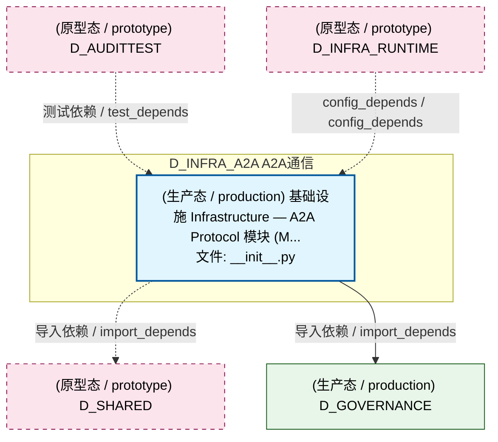
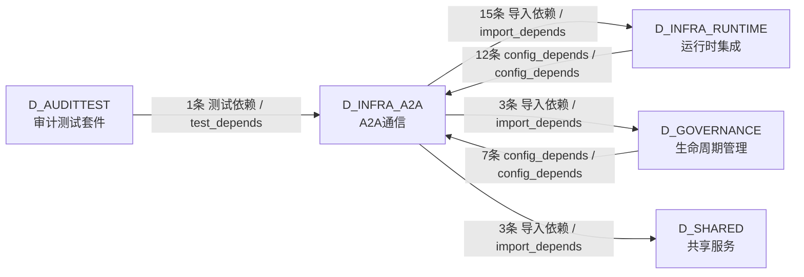

# 01_d_infra_a2a / a2a_communication / A2A通信 / A2A Communication

> **功能简介 / Overview**: Agent 与 Agent 之间的通信协议层，负责 AI 代理间的消息传递、请求路由和协议适配

> **文档作用 / Purpose**: 展示 A2A通信（D_INFRA_A2A）功能域的模块清单、域内依赖关系、跨域依赖关系、架构分层视图，供架构审查和域治理参考。

> 本文档由 generate_domain_doc.py 从 depgraph (PostgreSQL) 自动生成
> 最后更新: 2026-07-13 04:28:21
> 数据源: depgraph (PostgreSQL) nodes表 + edges表

## 域基本信息 / Domain Overview

| 字段 | 值 | Field | Value |
|------|------|-------|-------|
| 编号 | 01 | Number | 01 |
| 域ID | D_INFRA_A2A | Domain ID | D_INFRA_A2A |
| 域名称 | A2A通信 | Domain Name | A2A Communication |
| 层级 | L0 基础设施层 | Layer | L0 Infrastructure |
| 模块数 | 5 | Module Count | 5 |
| 域内依赖 | 2 | Internal Dependencies | 2 |
| 跨域入边 | 20 | Cross-domain Incoming | 20 |
| 跨域出边 | 21 | Cross-domain Outgoing | 21 |
| 设计态模块 | 0 | Design Modules | 0 |
| 原型态模块 | 4 | Prototype Modules | 4 |
| 生产态模块 | 1 | Production Modules | 1 |
| 容量 | 1/150 (正常) | Capacity | 1/150 (正常) |
| 描述 | A2A Card注册与发现(card_registry) | Description | A2A Card注册与发现(card_registry) |

## 模块分层清单 / Module Layered List

> 按 architecture_layer 分组的模块清单（共 5 个模块 / 5 modules）。

### L0 基础设施层 / Infrastructure Layer (5 modules)

| # | 模块路径 / Module Path | 模块名称 / Module Name (功能简介 / Description) | 成熟度 / Maturity | 蓝图 / Blueprint |
|:--:|---------|---------|:---:|:---:|
| 1 | src/zephyr/infrastructure/a2a_protocol/__init__.py | 基础设施 Infrastructure — A2A Protocol 模块 (M... | 生产态 / production | [MOD-INF-025](../../03_modules/_domain_infrastructure_operations/agent_to_agent_protocol/blueprint.md) |
| 2 | src/zephyr/infrastructure/a2a_protocol/governance/__init_... | A2A Protocol — MOD-INF-025 | 原型态 / prototype | [MOD-INF-025](../../03_modules/_domain_infrastructure_operations/agent_to_agent_protocol/blueprint.md) |
| 3 | src/zephyr/infrastructure/a2a_protocol/layer1_discovery/_... | Layer 1: 发现+身份 — Agent Card 模型, AGENTS.m... | 原型态 / prototype | [MOD-INF-025](../../03_modules/_domain_infrastructure_operations/agent_to_agent_protocol/blueprint.md) |
| 4 | src/zephyr/infrastructure/a2a_protocol/layer2_communicati... | Layer 2: 通信+任务 — Task 状态机, Message/Part... | 原型态 / prototype | [MOD-INF-025](../../03_modules/_domain_infrastructure_operations/agent_to_agent_protocol/blueprint.md) |
| 5 | src/zephyr/infrastructure/a2a_protocol/layer3_coordinatio... | Layer 3: 协调+仲裁 — Coordinator, Living Spec ... | 原型态 / prototype | [MOD-INF-025](../../03_modules/_domain_infrastructure_operations/agent_to_agent_protocol/blueprint.md) |

## 域内依赖图 / Internal Dependency Diagram

> 依赖图内嵌在本文档中，IDE 可直接渲染显示。参考 decision_index.md 设计，分四个视图：合并全景图、运营态子图、设计态子图、原型态子图（按 design_maturity 实际值拆分）。
>
> **图例说明 / Legend**：
> - **实线边框 = 运营态模块**（production，已上线运行）
> - **虚线边框 = 设计态模块**（design，蓝图阶段，代码未写）
> - **虚线边框 = 原型态模块**（prototype，代码已写，验证中未稳定上线）
> - **实线箭头 = 运营态依赖**（已生效的依赖关系）
> - **虚线箭头 = 非运营态依赖**（计划中/验证中的依赖关系）

### 合并全景图（全部模块，标签标注成熟度）

> 展示全部 5 个模块（生产态 1 + 设计态 0 + 原型态 4），标签标注成熟度。

```mermaid
graph TD
    subgraph D_INFRA_A2A["D_INFRA_A2A A2A通信"]
        src_zephyr_infrastructure_a2a_protocol_init_py["(生产态 / production) 基础设施 Infrastructure — A2A Protocol 模块 (M...<br/>文件: __init__.py"]
        src_zephyr_infrastructure_a2a_protocol_governance_init_py["(原型态 / prototype) A2A Protocol — MOD-INF-025<br/>文件: __init__.py"]
        src_zephyr_infrastructure_a2a_protocol_layer1_discovery_init_py["(原型态 / prototype) Layer 1: 发现+身份 — Agent Card 模型, AGENTS.m...<br/>文件: __init__.py"]
        src_zephyr_infrastructure_a2a_protocol_layer2_communication_init_py["(原型态 / prototype) Layer 2: 通信+任务 — Task 状态机, Message/Part...<br/>文件: __init__.py"]
        src_zephyr_infrastructure_a2a_protocol_layer3_coordination_init_py["(原型态 / prototype) Layer 3: 协调+仲裁 — Coordinator, Living Spec ...<br/>文件: __init__.py"]
    end
    src_zephyr_infrastructure_a2a_protocol_init_py -.->|导入依赖 / import_depends| src_zephyr_infrastructure_a2a_protocol_layer1_discovery_init_py
    src_zephyr_infrastructure_a2a_protocol_init_py -.->|导入依赖 / import_depends| src_zephyr_infrastructure_a2a_protocol_layer2_communication_init_py
    D_SHARED["(原型态 / prototype) D_SHARED"]
    src_zephyr_infrastructure_a2a_protocol_init_py -.->|导入依赖 / import_depends| D_SHARED
    D_GOVERNANCE["(生产态 / production) D_GOVERNANCE"]
    src_zephyr_infrastructure_a2a_protocol_init_py -->|导入依赖 / import_depends| D_GOVERNANCE
    src_zephyr_infrastructure_a2a_protocol_governance_init_py -.->|导入依赖 / import_depends| D_GOVERNANCE
    src_zephyr_infrastructure_a2a_protocol_layer1_discovery_init_py -.->|导入依赖 / import_depends| D_SHARED
    D_INFRA_RUNTIME["(生产态 / production) D_INFRA_RUNTIME"]
    src_zephyr_infrastructure_a2a_protocol_layer1_discovery_init_py -.->|导入依赖 / import_depends| D_INFRA_RUNTIME
    src_zephyr_infrastructure_a2a_protocol_layer1_discovery_init_py -.->|导入依赖 / import_depends| D_INFRA_RUNTIME
    src_zephyr_infrastructure_a2a_protocol_layer1_discovery_init_py -.->|导入依赖 / import_depends| D_INFRA_RUNTIME
    src_zephyr_infrastructure_a2a_protocol_layer2_communication_init_py -.->|导入依赖 / import_depends| D_SHARED
    src_zephyr_infrastructure_a2a_protocol_layer2_communication_init_py -.->|导入依赖 / import_depends| D_INFRA_RUNTIME
    src_zephyr_infrastructure_a2a_protocol_layer2_communication_init_py -.->|导入依赖 / import_depends| D_INFRA_RUNTIME
    src_zephyr_infrastructure_a2a_protocol_layer2_communication_init_py -.->|导入依赖 / import_depends| D_INFRA_RUNTIME
    src_zephyr_infrastructure_a2a_protocol_layer2_communication_init_py -.->|导入依赖 / import_depends| D_INFRA_RUNTIME
    src_zephyr_infrastructure_a2a_protocol_layer2_communication_init_py -.->|导入依赖 / import_depends| D_INFRA_RUNTIME
    src_zephyr_infrastructure_a2a_protocol_layer2_communication_init_py -.->|导入依赖 / import_depends| D_INFRA_RUNTIME
    src_zephyr_infrastructure_a2a_protocol_layer2_communication_init_py -.->|导入依赖 / import_depends| D_INFRA_RUNTIME
    D_AUDITTEST["(原型态 / prototype) D_AUDITTEST"]
    D_AUDITTEST -.->|测试依赖 / test_depends| src_zephyr_infrastructure_a2a_protocol_init_py
    D_GOVERNANCE -.->|config_depends / config_depends| src_zephyr_infrastructure_a2a_protocol_governance_init_py
    D_GOVERNANCE -.->|config_depends / config_depends| src_zephyr_infrastructure_a2a_protocol_governance_init_py
    D_GOVERNANCE -.->|config_depends / config_depends| src_zephyr_infrastructure_a2a_protocol_governance_init_py
    D_INFRA_RUNTIME -.->|config_depends / config_depends| src_zephyr_infrastructure_a2a_protocol_init_py
    D_GOVERNANCE -.->|config_depends / config_depends| src_zephyr_infrastructure_a2a_protocol_governance_init_py
    D_GOVERNANCE -.->|config_depends / config_depends| src_zephyr_infrastructure_a2a_protocol_governance_init_py
    D_GOVERNANCE -.->|config_depends / config_depends| src_zephyr_infrastructure_a2a_protocol_governance_init_py
    D_GOVERNANCE -.->|config_depends / config_depends| src_zephyr_infrastructure_a2a_protocol_governance_init_py
    D_INFRA_RUNTIME -.->|config_depends / config_depends| src_zephyr_infrastructure_a2a_protocol_layer3_coordination_init_py
    D_INFRA_RUNTIME -.->|config_depends / config_depends| src_zephyr_infrastructure_a2a_protocol_layer3_coordination_init_py
    D_INFRA_RUNTIME -.->|config_depends / config_depends| src_zephyr_infrastructure_a2a_protocol_layer3_coordination_init_py
    D_INFRA_RUNTIME -.->|config_depends / config_depends| src_zephyr_infrastructure_a2a_protocol_layer3_coordination_init_py
    D_INFRA_RUNTIME -.->|config_depends / config_depends| src_zephyr_infrastructure_a2a_protocol_layer3_coordination_init_py
    D_INFRA_RUNTIME -.->|config_depends / config_depends| src_zephyr_infrastructure_a2a_protocol_layer3_coordination_init_py
    classDef production fill:#e1f5fe,stroke:#01579b,stroke-width:2px,color:#000
    classDef design fill:#fff3e0,stroke:#e65100,stroke-width:2px,color:#000,stroke-dasharray: 5 5
    classDef external_prod fill:#e8f5e9,stroke:#1b5e20,stroke-width:1px,color:#000
    classDef external_design fill:#fce4ec,stroke:#880e4f,stroke-width:1px,color:#000,stroke-dasharray: 5 5
    class src_zephyr_infrastructure_a2a_protocol_init_py production
    class src_zephyr_infrastructure_a2a_protocol_governance_init_py,src_zephyr_infrastructure_a2a_protocol_layer1_discovery_init_py,src_zephyr_infrastructure_a2a_protocol_layer2_communication_init_py,src_zephyr_infrastructure_a2a_protocol_layer3_coordination_init_py design
    class D_GOVERNANCE,D_INFRA_RUNTIME external_prod
    class D_SHARED,D_AUDITTEST external_design
```

### 运营态子图（仅 design_maturity=production 的模块和依赖）

> 仅展示已上线运行的模块（共 1 个，0 条域内依赖）。

### 设计态子图（仅 design_maturity=design 的模块和依赖）

> 仅展示蓝图阶段、代码未写的设计态模块（共 0 个，0 条域内依赖）。

> （无设计态模块 / No design modules）

### 原型态子图（仅 design_maturity=prototype 的模块和依赖）

> 仅展示代码已写、验证中未稳定上线的原型态模块（共 4 个，0 条域内依赖）。

```mermaid
graph TD
    subgraph D_INFRA_A2A["D_INFRA_A2A A2A通信"]
        src_zephyr_infrastructure_a2a_protocol_governance_init_py["(原型态 / prototype) A2A Protocol — MOD-INF-025<br/>文件: __init__.py"]
        src_zephyr_infrastructure_a2a_protocol_layer1_discovery_init_py["(原型态 / prototype) Layer 1: 发现+身份 — Agent Card 模型, AGENTS.m...<br/>文件: __init__.py"]
        src_zephyr_infrastructure_a2a_protocol_layer2_communication_init_py["(原型态 / prototype) Layer 2: 通信+任务 — Task 状态机, Message/Part...<br/>文件: __init__.py"]
        src_zephyr_infrastructure_a2a_protocol_layer3_coordination_init_py["(原型态 / prototype) Layer 3: 协调+仲裁 — Coordinator, Living Spec ...<br/>文件: __init__.py"]
    end
    D_GOVERNANCE["(生产态 / production) D_GOVERNANCE"]
    src_zephyr_infrastructure_a2a_protocol_governance_init_py -.->|导入依赖 / import_depends| D_GOVERNANCE
    D_SHARED["(原型态 / prototype) D_SHARED"]
    src_zephyr_infrastructure_a2a_protocol_layer1_discovery_init_py -.->|导入依赖 / import_depends| D_SHARED
    D_INFRA_RUNTIME["(生产态 / production) D_INFRA_RUNTIME"]
    src_zephyr_infrastructure_a2a_protocol_layer1_discovery_init_py -.->|导入依赖 / import_depends| D_INFRA_RUNTIME
    src_zephyr_infrastructure_a2a_protocol_layer1_discovery_init_py -.->|导入依赖 / import_depends| D_INFRA_RUNTIME
    src_zephyr_infrastructure_a2a_protocol_layer1_discovery_init_py -.->|导入依赖 / import_depends| D_INFRA_RUNTIME
    src_zephyr_infrastructure_a2a_protocol_layer2_communication_init_py -.->|导入依赖 / import_depends| D_SHARED
    src_zephyr_infrastructure_a2a_protocol_layer2_communication_init_py -.->|导入依赖 / import_depends| D_INFRA_RUNTIME
    src_zephyr_infrastructure_a2a_protocol_layer2_communication_init_py -.->|导入依赖 / import_depends| D_INFRA_RUNTIME
    src_zephyr_infrastructure_a2a_protocol_layer2_communication_init_py -.->|导入依赖 / import_depends| D_INFRA_RUNTIME
    src_zephyr_infrastructure_a2a_protocol_layer2_communication_init_py -.->|导入依赖 / import_depends| D_INFRA_RUNTIME
    src_zephyr_infrastructure_a2a_protocol_layer2_communication_init_py -.->|导入依赖 / import_depends| D_INFRA_RUNTIME
    src_zephyr_infrastructure_a2a_protocol_layer2_communication_init_py -.->|导入依赖 / import_depends| D_INFRA_RUNTIME
    src_zephyr_infrastructure_a2a_protocol_layer2_communication_init_py -.->|导入依赖 / import_depends| D_INFRA_RUNTIME
    src_zephyr_infrastructure_a2a_protocol_layer2_communication_init_py -.->|导入依赖 / import_depends| D_INFRA_RUNTIME
    src_zephyr_infrastructure_a2a_protocol_layer3_coordination_init_py -.->|导入依赖 / import_depends| D_INFRA_RUNTIME
    D_GOVERNANCE -.->|config_depends / config_depends| src_zephyr_infrastructure_a2a_protocol_governance_init_py
    D_GOVERNANCE -.->|config_depends / config_depends| src_zephyr_infrastructure_a2a_protocol_governance_init_py
    D_GOVERNANCE -.->|config_depends / config_depends| src_zephyr_infrastructure_a2a_protocol_governance_init_py
    D_GOVERNANCE -.->|config_depends / config_depends| src_zephyr_infrastructure_a2a_protocol_governance_init_py
    D_GOVERNANCE -.->|config_depends / config_depends| src_zephyr_infrastructure_a2a_protocol_governance_init_py
    D_GOVERNANCE -.->|config_depends / config_depends| src_zephyr_infrastructure_a2a_protocol_governance_init_py
    D_GOVERNANCE -.->|config_depends / config_depends| src_zephyr_infrastructure_a2a_protocol_governance_init_py
    D_INFRA_RUNTIME -.->|config_depends / config_depends| src_zephyr_infrastructure_a2a_protocol_layer3_coordination_init_py
    D_INFRA_RUNTIME -.->|config_depends / config_depends| src_zephyr_infrastructure_a2a_protocol_layer3_coordination_init_py
    D_INFRA_RUNTIME -.->|config_depends / config_depends| src_zephyr_infrastructure_a2a_protocol_layer3_coordination_init_py
    D_INFRA_RUNTIME -.->|config_depends / config_depends| src_zephyr_infrastructure_a2a_protocol_layer3_coordination_init_py
    D_INFRA_RUNTIME -.->|config_depends / config_depends| src_zephyr_infrastructure_a2a_protocol_layer3_coordination_init_py
    D_INFRA_RUNTIME -.->|config_depends / config_depends| src_zephyr_infrastructure_a2a_protocol_layer3_coordination_init_py
    D_INFRA_RUNTIME -.->|config_depends / config_depends| src_zephyr_infrastructure_a2a_protocol_layer3_coordination_init_py
    D_INFRA_RUNTIME -.->|config_depends / config_depends| src_zephyr_infrastructure_a2a_protocol_layer3_coordination_init_py
    classDef production fill:#e1f5fe,stroke:#01579b,stroke-width:2px,color:#000
    classDef design fill:#fff3e0,stroke:#e65100,stroke-width:2px,color:#000,stroke-dasharray: 5 5
    classDef external_prod fill:#e8f5e9,stroke:#1b5e20,stroke-width:1px,color:#000
    classDef external_design fill:#fce4ec,stroke:#880e4f,stroke-width:1px,color:#000,stroke-dasharray: 5 5
    class src_zephyr_infrastructure_a2a_protocol_governance_init_py,src_zephyr_infrastructure_a2a_protocol_layer1_discovery_init_py,src_zephyr_infrastructure_a2a_protocol_layer2_communication_init_py,src_zephyr_infrastructure_a2a_protocol_layer3_coordination_init_py design
    class D_GOVERNANCE,D_INFRA_RUNTIME external_prod
    class D_SHARED external_design
```

## 跨域依赖 / Cross-domain Dependencies

### 本域依赖的其他域（出边）/ Depends On

| # | 本域模块 / Source Module | → | 外部域-目标模块 / Target Module | 依赖类型 / Type |
|:--:|---------|:--:|---------|---------|
| 1 | 基础设施 Infrastructure — A2A Protocol 模块 (M... | → | D_GOVERNANCE 生命周期管理: A2A GovernanceAdapter — Phase 4 治理集成桥接器... | 导入依赖 / import_depends |
| 2 | A2A Protocol — MOD-INF-025 (__init__.py) | → | D_GOVERNANCE 生命周期管理: Phase 4 Hold — A2A Phase 4 锁定标记模块 与其他... | 导入依赖 / import_depends |
| 3 | Layer 3: 协调+仲裁 — Coordinator, Living Spec ... | → | D_GOVERNANCE 生命周期管理: Re-export bridge for layer3_coordination govern... | 导入依赖 / import_depends |
| 4 | Layer 1: 发现+身份 — Agent Card 模型, AGENTS.m... | → | D_INFRA_RUNTIME 运行时集成: A2A Registry — Agent Card 注册与发现 (a2a_regi... | 导入依赖 / import_depends |
| 5 | Layer 1: 发现+身份 — Agent Card 模型, AGENTS.m... | → | D_INFRA_RUNTIME 运行时集成: Agent Card 模型 — A2A Layer 1 Discovery (agent... | 导入依赖 / import_depends |
| 6 | Layer 1: 发现+身份 — Agent Card 模型, AGENTS.m... | → | D_INFRA_RUNTIME 运行时集成: Identity Verifier — JWT 身份验证器 (identity_v... | 导入依赖 / import_depends |
| 7 | Layer 2: 通信+任务 — Task 状态机, Message/Part... | → | D_INFRA_RUNTIME 运行时集成: A2A Message/Part 系统 — Layer 2 Communication ... | 导入依赖 / import_depends |
| 8 | Layer 2: 通信+任务 — Task 状态机, Message/Part... | → | D_INFRA_RUNTIME 运行时集成: A2A Task 状态机 — Layer 2 Communication (a2a_s... | 导入依赖 / import_depends |
| 9 | Layer 2: 通信+任务 — Task 状态机, Message/Part... | → | D_INFRA_RUNTIME 运行时集成: Context Package — A2A 上下文包 (context_packag... | 导入依赖 / import_depends |
| 10 | Layer 2: 通信+任务 — Task 状态机, Message/Part... | → | D_INFRA_RUNTIME 运行时集成: Handoff Manager — Agent 间任务交接 (handoff_ma... | 导入依赖 / import_depends |
| 11 | Layer 2: 通信+任务 — Task 状态机, Message/Part... | → | D_INFRA_RUNTIME 运行时集成: Message Router — A2A 消息路由 (message_router.py) | 导入依赖 / import_depends |
| 12 | Layer 2: 通信+任务 — Task 状态机, Message/Part... | → | D_INFRA_RUNTIME 运行时集成: Push Notifier — A2A 推送通知 (push_notifier.py) | 导入依赖 / import_depends |
| 13 | Layer 2: 通信+任务 — Task 状态机, Message/Part... | → | D_INFRA_RUNTIME 运行时集成: Streaming — A2A 流式传输 (streaming.py) | 导入依赖 / import_depends |
| 14 | Layer 2: 通信+任务 — Task 状态机, Message/Part... | → | D_INFRA_RUNTIME 运行时集成: 触发监控器 (trigger_monitor.py) | 导入依赖 / import_depends |
| 15 | Layer 3: 协调+仲裁 — Coordinator, Living Spec ... | → | D_INFRA_RUNTIME 运行时集成: Re-export bridge for layer3_coordination consen... | 导入依赖 / import_depends |
| 16 | Layer 3: 协调+仲裁 — Coordinator, Living Spec ... | → | D_INFRA_RUNTIME 运行时集成: Re-export bridge for layer3_coordination core c... | 导入依赖 / import_depends |
| 17 | Layer 3: 协调+仲裁 — Coordinator, Living Spec ... | → | D_INFRA_RUNTIME 运行时集成: Re-export bridge for layer3_coordination intell... | 导入依赖 / import_depends |
| 18 | Layer 3: 协调+仲裁 — Coordinator, Living Spec ... | → | D_INFRA_RUNTIME 运行时集成: Re-export bridge for layer3_coordination securi... | 导入依赖 / import_depends |
| 19 | 基础设施 Infrastructure — A2A Protocol 模块 (M... | → | D_SHARED 共享服务: A2A Protocol — shared interface definitions. (... | 导入依赖 / import_depends |
| 20 | Layer 1: 发现+身份 — Agent Card 模型, AGENTS.m... | → | D_SHARED 共享服务: A2A Registry and Agent Card contracts — discov... | 导入依赖 / import_depends |
| 21 | Layer 2: 通信+任务 — Task 状态机, Message/Part... | → | D_SHARED 共享服务: A2A data structure contracts — Message, Task, ... | 导入依赖 / import_depends |

### 依赖本域的其他域（入边）/ Depended By

| # | 外部域-源模块 / Source Module | → | 本域模块 / Target Module | 依赖类型 / Type |
|:--:|---------|:--:|---------|---------|
| 1 | D_AUDITTEST 审计测试套件: test_cross_module_integration_llm_security.py | → | 基础设施 Infrastructure — A2A Protocol 模块 (M... | 测试依赖 / test_depends |
| 2 | D_GOVERNANCE 生命周期管理: _base_server.py | → | A2A Protocol — MOD-INF-025 (__init__.py) | config_depends / config_depends |
| 3 | D_GOVERNANCE 生命周期管理: audit_logger.py | → | A2A Protocol — MOD-INF-025 (__init__.py) | config_depends / config_depends |
| 4 | D_GOVERNANCE 生命周期管理: G-CT-008 契约：A2A -> Audit 审计 Agent 间通信. ... | → | A2A Protocol — MOD-INF-025 (__init__.py) | config_depends / config_depends |
| 5 | D_GOVERNANCE 生命周期管理: error_codes.py | → | A2A Protocol — MOD-INF-025 (__init__.py) | config_depends / config_depends |
| 6 | D_GOVERNANCE 生命周期管理: policy_engine.py | → | A2A Protocol — MOD-INF-025 (__init__.py) | config_depends / config_depends |
| 7 | D_GOVERNANCE 生命周期管理: rate_limiter.py | → | A2A Protocol — MOD-INF-025 (__init__.py) | config_depends / config_depends |
| 8 | D_GOVERNANCE 生命周期管理: session_manager.py | → | A2A Protocol — MOD-INF-025 (__init__.py) | config_depends / config_depends |
| 9 | D_INFRA_RUNTIME 运行时集成: A2A 碳足迹追踪 (a2a_carbon.py) | → | Layer 3: 协调+仲裁 — Coordinator, Living Spec ... | config_depends / config_depends |
| 10 | D_INFRA_RUNTIME 运行时集成: A2A 检查点管理器 (a2a_checkpoint.py) | → | Layer 3: 协调+仲裁 — Coordinator, Living Spec ... | config_depends / config_depends |
| 11 | D_INFRA_RUNTIME 运行时集成: P2: Agent同意管理 (a2a_consent.py) | → | Layer 3: 协调+仲裁 — Coordinator, Living Spec ... | config_depends / config_depends |
| 12 | D_INFRA_RUNTIME 运行时集成: P2: 宪法性Agent管理 (a2a_constitutional.py) | → | Layer 3: 协调+仲裁 — Coordinator, Living Spec ... | config_depends / config_depends |
| 13 | D_INFRA_RUNTIME 运行时集成: 上下文腐烂检测 (a2a_context_rot.py) | → | Layer 3: 协调+仲裁 — Coordinator, Living Spec ... | config_depends / config_depends |
| 14 | D_INFRA_RUNTIME 运行时集成: A2A 硬件路由器——GPU/CPU 调度 (a2a_hardware_ro... | → | Layer 3: 协调+仲裁 — Coordinator, Living Spec ... | config_depends / config_depends |
| 15 | D_INFRA_RUNTIME 运行时集成: P2: Agent休眠管理 (a2a_hibernate.py) | → | Layer 3: 协调+仲裁 — Coordinator, Living Spec ... | config_depends / config_depends |
| 16 | D_INFRA_RUNTIME 运行时集成: A2A 免疫系统 (a2a_immune.py) | → | Layer 3: 协调+仲裁 — Coordinator, Living Spec ... | config_depends / config_depends |
| 17 | D_INFRA_RUNTIME 运行时集成: A2A 指标收集 (a2a_metrics.py) | → | Layer 3: 协调+仲裁 — Coordinator, Living Spec ... | config_depends / config_depends |
| 18 | D_INFRA_RUNTIME 运行时集成: A2A协议安全 (a2a_protocol_security.py) | → | Layer 3: 协调+仲裁 — Coordinator, Living Spec ... | config_depends / config_depends |
| 19 | D_INFRA_RUNTIME 运行时集成: 向量化信誉系统 (a2a_vector_reputation.py) | → | Layer 3: 协调+仲裁 — Coordinator, Living Spec ... | config_depends / config_depends |
| 20 | D_INFRA_RUNTIME 运行时集成: realtime_streaming.py | → | 基础设施 Infrastructure — A2A Protocol 模块 (M... | config_depends / config_depends |

### 跨域依赖图 / Cross-domain Dependency Diagram

> 本域与 4 个外部域直接连接（出边 21 条 + 入边 20 条 = 41 条）。只显示直接连接的域，不展开具体节点。

## 说明 / Notes

- **数据源 / Data Source**: `depgraph (PostgreSQL)` 的 `nodes`、`edges`、`domains` 表
- **生成器 / Generator**: `generate_domain_doc.py`（G2+G10 合并）
- **维护方式 / Maintenance**: 自动生成，全景图更新时刷新
- **文件名规则 / File Naming**: `{编号:02d}_{域ID小写}.md`，如 `16_d_trading.md`
- **图例说明 / Legend**: `[production]`=已上线 / `[design]`=设计中 / `[prototype]`=原型 / `[unknown]`=未知
