# 01_d_infra_a2a / A2A通信

> **文档作用 / Purpose**: 展示 A2A通信（D_INFRA_A2A）功能域的模块清单、域内依赖关系、跨域依赖关系、架构分层视图，供架构审查和域治理参考。

> 本文档由 generate_domain_doc.py 从 depgraph (PostgreSQL) 自动生成
> 最后更新: 2026-07-01 11:55:17
> 数据源: depgraph (PostgreSQL) nodes表 + edges表

## 域基本信息 / Domain Overview

| 字段 | 值 | Field | Value |
|------|------|-------|-------|
| 编号 | 01 | Number | 01 |
| 域ID | D_INFRA_A2A | Domain ID | D_INFRA_A2A |
| 域名称 | A2A通信 | Domain Name | A2A通信 |
| 层级 | L0_infrastructure | Layer | L0_infrastructure |
| 模块数 | 101 | Module Count | 101 |
| 域内依赖 | 73 | Internal Dependencies | 73 |
| 跨域入边 | 6 | Cross-domain Incoming | 6 |
| 跨域出边 | 31 | Cross-domain Outgoing | 31 |
| 设计态模块 | 0 | Design Modules | 0 |
| 原型态模块 | 0 | Prototype Modules | 0 |
| 生产态模块 | 101 | Production Modules | 101 |
| 容量 | 114/150 (正常) | Capacity | 114/150 (正常) |
| 描述 | A2A Card注册与发现(card_registry) | Description | A2A Card注册与发现(card_registry) |

## 域内依赖图 / Internal Dependency Diagram

> 依赖图内嵌在本文档中，IDE 可直接渲染显示。每30个节点一组分页显示。
>
> **图例说明 / Legend**：
> - **实线边框 = 运营态模块**（production，已上线运行）
> - **虚线边框 = 设计态模块**（design，还在设计中）
> - **实线箭头 = 运营态依赖**（已生效的依赖关系）
> - **虚线箭头 = 设计态依赖**（计划中的依赖关系）

### 第 1 页 / 共 4 页 / Page 1 of 4

```mermaid
graph TD
    subgraph D_INFRA_A2A["D_INFRA_A2A A2A通信"]
        src_zephyr_infrastructure_a2a_protocol_init_py["src/zephyr/infrastructure/a2a_protocol/__init__.py production"]
        src_zephyr_infrastructure_a2a_protocol_a2a_card_registry_py["src/zephyr/infrastructure/a2a_protocol/a2a_card... production"]
        src_zephyr_infrastructure_a2a_protocol_layer1_discovery_init_py["src/zephyr/infrastructure/a2a_protocol/layer1_d... production"]
        src_zephyr_infrastructure_a2a_protocol_layer1_discovery_a2a_registry_py["src/zephyr/infrastructure/a2a_protocol/layer1_d... production"]
        src_zephyr_infrastructure_a2a_protocol_layer1_discovery_agent_card_py["src/zephyr/infrastructure/a2a_protocol/layer1_d... production"]
        src_zephyr_infrastructure_a2a_protocol_layer1_discovery_identity_verifier_py["src/zephyr/infrastructure/a2a_protocol/layer1_d... production"]
        src_zephyr_infrastructure_a2a_protocol_layer2_communication_init_py["src/zephyr/infrastructure/a2a_protocol/layer2_c... production"]
        src_zephyr_infrastructure_a2a_protocol_layer2_communication_a2a_schemas_py["src/zephyr/infrastructure/a2a_protocol/layer2_c... production"]
        src_zephyr_infrastructure_a2a_protocol_layer2_communication_a2a_state_py["src/zephyr/infrastructure/a2a_protocol/layer2_c... production"]
        src_zephyr_infrastructure_a2a_protocol_layer2_communication_context_package_py["src/zephyr/infrastructure/a2a_protocol/layer2_c... production"]
        src_zephyr_infrastructure_a2a_protocol_layer2_communication_handoff_manager_py["src/zephyr/infrastructure/a2a_protocol/layer2_c... production"]
        src_zephyr_infrastructure_a2a_protocol_layer2_communication_message_router_py["src/zephyr/infrastructure/a2a_protocol/layer2_c... production"]
        src_zephyr_infrastructure_a2a_protocol_layer2_communication_push_notifier_py["src/zephyr/infrastructure/a2a_protocol/layer2_c... production"]
        src_zephyr_infrastructure_a2a_protocol_layer2_communication_streaming_py["src/zephyr/infrastructure/a2a_protocol/layer2_c... production"]
        src_zephyr_infrastructure_a2a_protocol_layer2_communication_trigger_monitor_py["src/zephyr/infrastructure/a2a_protocol/layer2_c... production"]
        src_zephyr_infrastructure_a2a_protocol_layer3_coordination_init_py["src/zephyr/infrastructure/a2a_protocol/layer3_c... production"]
        src_zephyr_infrastructure_a2a_protocol_layer3_coordination_consensus_py["src/zephyr/infrastructure/a2a_protocol/layer3_c... production"]
        src_zephyr_infrastructure_a2a_protocol_layer3_coordination_core_coordination_py["src/zephyr/infrastructure/a2a_protocol/layer3_c... production"]
        src_zephyr_infrastructure_a2a_protocol_layer3_coordination_intelligence_py["src/zephyr/infrastructure/a2a_protocol/layer3_c... production"]
        src_zephyr_infrastructure_a2a_protocol_layer3_coordination_security_and_economics_py["src/zephyr/infrastructure/a2a_protocol/layer3_c... production"]
        src_zephyr_infrastructure_a2a_protocol_layer3_coordination_a2a_anomaly_detector_py["src/zephyr/infrastructure/a2a_protocol/layer3_c... production"]
        src_zephyr_infrastructure_a2a_protocol_layer3_coordination_a2a_behavior_fingerprint_py["src/zephyr/infrastructure/a2a_protocol/layer3_c... production"]
        src_zephyr_infrastructure_a2a_protocol_layer3_coordination_a2a_blame_attribution_py["src/zephyr/infrastructure/a2a_protocol/layer3_c... production"]
        src_zephyr_infrastructure_a2a_protocol_layer3_coordination_a2a_carbon_py["src/zephyr/infrastructure/a2a_protocol/layer3_c... production"]
        src_zephyr_infrastructure_a2a_protocol_layer3_coordination_a2a_causal_trace_py["src/zephyr/infrastructure/a2a_protocol/layer3_c... production"]
        src_zephyr_infrastructure_a2a_protocol_layer3_coordination_a2a_checkpoint_py["src/zephyr/infrastructure/a2a_protocol/layer3_c... production"]
        src_zephyr_infrastructure_a2a_protocol_layer3_coordination_a2a_collusion_detector_py["src/zephyr/infrastructure/a2a_protocol/layer3_c... production"]
        src_zephyr_infrastructure_a2a_protocol_layer3_coordination_a2a_consent_py["src/zephyr/infrastructure/a2a_protocol/layer3_c... production"]
        src_zephyr_infrastructure_a2a_protocol_layer3_coordination_a2a_constitutional_py["src/zephyr/infrastructure/a2a_protocol/layer3_c... production"]
        src_zephyr_infrastructure_a2a_protocol_layer3_coordination_a2a_context_rot_py["src/zephyr/infrastructure/a2a_protocol/layer3_c... production"]
    end
    src_zephyr_infrastructure_a2a_protocol_a2a_card_registry_py -->|import_depends| src_zephyr_infrastructure_a2a_protocol_layer1_discovery_a2a_registry_py
    src_zephyr_infrastructure_a2a_protocol_init_py -->|import_depends| src_zephyr_infrastructure_a2a_protocol_layer1_discovery_init_py
    src_zephyr_infrastructure_a2a_protocol_init_py -->|import_depends| src_zephyr_infrastructure_a2a_protocol_layer2_communication_init_py
    src_zephyr_infrastructure_a2a_protocol_layer1_discovery_a2a_registry_py -->|import_depends| src_zephyr_infrastructure_a2a_protocol_layer1_discovery_agent_card_py
    src_zephyr_infrastructure_a2a_protocol_layer1_discovery_init_py -->|import_depends| src_zephyr_infrastructure_a2a_protocol_layer1_discovery_agent_card_py
    src_zephyr_infrastructure_a2a_protocol_layer1_discovery_init_py -->|import_depends| src_zephyr_infrastructure_a2a_protocol_layer1_discovery_a2a_registry_py
    src_zephyr_infrastructure_a2a_protocol_layer1_discovery_init_py -->|import_depends| src_zephyr_infrastructure_a2a_protocol_layer1_discovery_identity_verifier_py
    src_zephyr_infrastructure_a2a_protocol_layer2_communication_message_router_py -->|import_depends| src_zephyr_infrastructure_a2a_protocol_layer2_communication_a2a_schemas_py
    src_zephyr_infrastructure_a2a_protocol_layer2_communication_init_py -->|import_depends| src_zephyr_infrastructure_a2a_protocol_layer2_communication_context_package_py
    src_zephyr_infrastructure_a2a_protocol_layer2_communication_init_py -->|import_depends| src_zephyr_infrastructure_a2a_protocol_layer2_communication_a2a_schemas_py
    src_zephyr_infrastructure_a2a_protocol_layer2_communication_init_py -->|import_depends| src_zephyr_infrastructure_a2a_protocol_layer2_communication_a2a_state_py
    src_zephyr_infrastructure_a2a_protocol_layer2_communication_init_py -->|import_depends| src_zephyr_infrastructure_a2a_protocol_layer2_communication_handoff_manager_py
    src_zephyr_infrastructure_a2a_protocol_layer2_communication_init_py -->|import_depends| src_zephyr_infrastructure_a2a_protocol_layer2_communication_message_router_py
    src_zephyr_infrastructure_a2a_protocol_layer2_communication_init_py -->|import_depends| src_zephyr_infrastructure_a2a_protocol_layer2_communication_push_notifier_py
    src_zephyr_infrastructure_a2a_protocol_layer2_communication_init_py -->|import_depends| src_zephyr_infrastructure_a2a_protocol_layer2_communication_streaming_py
    src_zephyr_infrastructure_a2a_protocol_layer2_communication_init_py -->|import_depends| src_zephyr_infrastructure_a2a_protocol_layer2_communication_trigger_monitor_py
    src_zephyr_infrastructure_a2a_protocol_layer3_coordination_a2a_carbon_py -->|config_depends| src_zephyr_infrastructure_a2a_protocol_layer3_coordination_init_py
    src_zephyr_infrastructure_a2a_protocol_layer3_coordination_a2a_checkpoint_py -->|config_depends| src_zephyr_infrastructure_a2a_protocol_layer3_coordination_init_py
    src_zephyr_infrastructure_a2a_protocol_layer3_coordination_a2a_consent_py -->|config_depends| src_zephyr_infrastructure_a2a_protocol_layer3_coordination_init_py
    src_zephyr_infrastructure_a2a_protocol_layer3_coordination_a2a_context_rot_py -->|config_depends| src_zephyr_infrastructure_a2a_protocol_layer3_coordination_init_py
    src_zephyr_infrastructure_a2a_protocol_layer3_coordination_a2a_constitutional_py -->|config_depends| src_zephyr_infrastructure_a2a_protocol_layer3_coordination_init_py
    src_zephyr_infrastructure_a2a_protocol_layer3_coordination_intelligence_py -->|import_depends| src_zephyr_infrastructure_a2a_protocol_layer3_coordination_a2a_blame_attribution_py
    src_zephyr_infrastructure_a2a_protocol_layer3_coordination_intelligence_py -->|import_depends| src_zephyr_infrastructure_a2a_protocol_layer3_coordination_a2a_behavior_fingerprint_py
    src_zephyr_infrastructure_a2a_protocol_layer3_coordination_intelligence_py -->|import_depends| src_zephyr_infrastructure_a2a_protocol_layer3_coordination_a2a_collusion_detector_py
    src_zephyr_infrastructure_a2a_protocol_layer3_coordination_intelligence_py -->|import_depends| src_zephyr_infrastructure_a2a_protocol_layer3_coordination_a2a_causal_trace_py
    src_zephyr_infrastructure_a2a_protocol_layer3_coordination_security_and_economics_py -->|import_depends| src_zephyr_infrastructure_a2a_protocol_layer3_coordination_a2a_anomaly_detector_py
    D_GOVERNANCE["D_GOVERNANCE prototype"]
    src_zephyr_infrastructure_a2a_protocol_init_py -.->|import_depends| D_GOVERNANCE
    D_SHARED["D_SHARED prototype"]
    src_zephyr_infrastructure_a2a_protocol_init_py -.->|import_depends| D_SHARED
    src_zephyr_infrastructure_a2a_protocol_layer1_discovery_agent_card_py -.->|import_depends| D_SHARED
    src_zephyr_infrastructure_a2a_protocol_layer1_discovery_init_py -.->|import_depends| D_SHARED
    src_zephyr_infrastructure_a2a_protocol_layer2_communication_context_package_py -.->|import_depends| D_SHARED
    src_zephyr_infrastructure_a2a_protocol_layer2_communication_a2a_schemas_py -.->|import_depends| D_SHARED
    src_zephyr_infrastructure_a2a_protocol_layer2_communication_a2a_state_py -.->|import_depends| D_SHARED
    src_zephyr_infrastructure_a2a_protocol_layer2_communication_handoff_manager_py -.->|import_depends| D_SHARED
    src_zephyr_infrastructure_a2a_protocol_layer2_communication_init_py -.->|import_depends| D_SHARED
    D_INFRA_RUNTIME["D_INFRA_RUNTIME production"]
    src_zephyr_infrastructure_a2a_protocol_layer3_coordination_init_py -->|import_depends| D_INFRA_RUNTIME
    classDef production fill:#e1f5fe,stroke:#01579b,stroke-width:2px,color:#000
    classDef design fill:#fff3e0,stroke:#e65100,stroke-width:2px,color:#000,stroke-dasharray: 5 5
    classDef external_prod fill:#e8f5e9,stroke:#1b5e20,stroke-width:1px,color:#000
    classDef external_design fill:#fce4ec,stroke:#880e4f,stroke-width:1px,color:#000,stroke-dasharray: 5 5
    class src_zephyr_infrastructure_a2a_protocol_init_py,src_zephyr_infrastructure_a2a_protocol_a2a_card_registry_py,src_zephyr_infrastructure_a2a_protocol_layer1_discovery_init_py,src_zephyr_infrastructure_a2a_protocol_layer1_discovery_a2a_registry_py,src_zephyr_infrastructure_a2a_protocol_layer1_discovery_agent_card_py,src_zephyr_infrastructure_a2a_protocol_layer1_discovery_identity_verifier_py,src_zephyr_infrastructure_a2a_protocol_layer2_communication_init_py,src_zephyr_infrastructure_a2a_protocol_layer2_communication_a2a_schemas_py,src_zephyr_infrastructure_a2a_protocol_layer2_communication_a2a_state_py,src_zephyr_infrastructure_a2a_protocol_layer2_communication_context_package_py,src_zephyr_infrastructure_a2a_protocol_layer2_communication_handoff_manager_py,src_zephyr_infrastructure_a2a_protocol_layer2_communication_message_router_py,src_zephyr_infrastructure_a2a_protocol_layer2_communication_push_notifier_py,src_zephyr_infrastructure_a2a_protocol_layer2_communication_streaming_py,src_zephyr_infrastructure_a2a_protocol_layer2_communication_trigger_monitor_py,src_zephyr_infrastructure_a2a_protocol_layer3_coordination_init_py,src_zephyr_infrastructure_a2a_protocol_layer3_coordination_consensus_py,src_zephyr_infrastructure_a2a_protocol_layer3_coordination_core_coordination_py,src_zephyr_infrastructure_a2a_protocol_layer3_coordination_intelligence_py,src_zephyr_infrastructure_a2a_protocol_layer3_coordination_security_and_economics_py,src_zephyr_infrastructure_a2a_protocol_layer3_coordination_a2a_anomaly_detector_py,src_zephyr_infrastructure_a2a_protocol_layer3_coordination_a2a_behavior_fingerprint_py,src_zephyr_infrastructure_a2a_protocol_layer3_coordination_a2a_blame_attribution_py,src_zephyr_infrastructure_a2a_protocol_layer3_coordination_a2a_carbon_py,src_zephyr_infrastructure_a2a_protocol_layer3_coordination_a2a_causal_trace_py,src_zephyr_infrastructure_a2a_protocol_layer3_coordination_a2a_checkpoint_py,src_zephyr_infrastructure_a2a_protocol_layer3_coordination_a2a_collusion_detector_py,src_zephyr_infrastructure_a2a_protocol_layer3_coordination_a2a_consent_py,src_zephyr_infrastructure_a2a_protocol_layer3_coordination_a2a_constitutional_py,src_zephyr_infrastructure_a2a_protocol_layer3_coordination_a2a_context_rot_py production
    class D_INFRA_RUNTIME external_prod
    class D_GOVERNANCE,D_SHARED external_design
```



### 第 2 页 / 共 4 页 / Page 2 of 4


### 第 3 页 / 共 4 页 / Page 3 of 4

```mermaid
graph TD
    subgraph D_INFRA_A2A["D_INFRA_A2A A2A通信"]
        src_zephyr_infrastructure_a2a_protocol_layer3_coordination_construction_verifier_py["src/zephyr/infrastructure/a2a_protocol/layer3_c... production"]
        src_zephyr_infrastructure_a2a_protocol_layer3_coordination_deadlock_guard_py["src/zephyr/infrastructure/a2a_protocol/layer3_c... production"]
        src_zephyr_infrastructure_a2a_protocol_layer3_coordination_livelock_detector_py["src/zephyr/infrastructure/a2a_protocol/layer3_c... production"]
        src_zephyr_infrastructure_a2a_protocol_layer3_coordination_semantic_diff_py["src/zephyr/infrastructure/a2a_protocol/layer3_c... production"]
        src_zephyr_infrastructure_a2a_protocol_layer3_coordination_session_smuggling_defense_py["src/zephyr/infrastructure/a2a_protocol/layer3_c... production"]
        src_zephyr_infrastructure_a2a_protocol_layer3_coordination_spec_sync_py["src/zephyr/infrastructure/a2a_protocol/layer3_c... production"]
        src_zephyr_infrastructure_a2a_protocol_layer3_coordination_supervisor_py["src/zephyr/infrastructure/a2a_protocol/layer3_c... production"]
        src_zephyr_infrastructure_a2a_protocol_legacy_auditor_py["src/zephyr/infrastructure/a2a_protocol/legacy_a... production"]
        src_zephyr_infrastructure_a2a_protocol_legacy_protocol_py["src/zephyr/infrastructure/a2a_protocol/legacy_p... production"]
        src_zephyr_infrastructure_a2a_protocol_local_first_arch_py["src/zephyr/infrastructure/a2a_protocol/local_fi... production"]
        src_zephyr_infrastructure_a2a_protocol_market_data_pipeline_py["src/zephyr/infrastructure/a2a_protocol/market_d... production"]
        src_zephyr_infrastructure_a2a_protocol_migration_strategy_py["src/zephyr/infrastructure/a2a_protocol/migratio... production"]
        src_zephyr_infrastructure_a2a_protocol_multi_agent_py["src/zephyr/infrastructure/a2a_protocol/multi_ag... production"]
        src_zephyr_infrastructure_a2a_protocol_multi_model_consensus_py["src/zephyr/infrastructure/a2a_protocol/multi_mo... production"]
        src_zephyr_infrastructure_a2a_protocol_offline_autonomy_py["src/zephyr/infrastructure/a2a_protocol/offline_... production"]
        src_zephyr_infrastructure_a2a_protocol_offline_resilience_py["src/zephyr/infrastructure/a2a_protocol/offline_... production"]
        src_zephyr_infrastructure_a2a_protocol_phase_hold_py["src/zephyr/infrastructure/a2a_protocol/phase_ho... production"]
        src_zephyr_infrastructure_a2a_protocol_prompt_lifecycle_py["src/zephyr/infrastructure/a2a_protocol/prompt_l... production"]
        src_zephyr_infrastructure_a2a_protocol_realtime_streaming_py["src/zephyr/infrastructure/a2a_protocol/realtime... production"]
        src_zephyr_infrastructure_events_init_py["src/zephyr/infrastructure/events/__init__.py production"]
        src_zephyr_infrastructure_events_event_store_py["src/zephyr/infrastructure/events/event_store.py production"]
        src_zephyr_infrastructure_pipeline_init_py["src/zephyr/infrastructure/pipeline/__init__.py production"]
        src_zephyr_infrastructure_pipeline_backpressure_manager_py["src/zephyr/infrastructure/pipeline/backpressure... production"]
        src_zephyr_infrastructure_pipeline_backpressure_types_py["src/zephyr/infrastructure/pipeline/backpressure... production"]
        src_zephyr_infrastructure_pipeline_circuit_breaker_manager_py["src/zephyr/infrastructure/pipeline/circuit_brea... production"]
        src_zephyr_infrastructure_pipeline_cost_tracker_py["src/zephyr/infrastructure/pipeline/cost_tracker.py production"]
        src_zephyr_infrastructure_pipeline_ct_pipe_routing_py["src/zephyr/infrastructure/pipeline/ct_pipe_rout... production"]
        src_zephyr_infrastructure_pipeline_dead_letter_queue_py["src/zephyr/infrastructure/pipeline/dead_letter_... production"]
        src_zephyr_infrastructure_pipeline_layer_consumer_registry_py["src/zephyr/infrastructure/pipeline/layer_consum... production"]
        src_zephyr_infrastructure_pipeline_layer_router_py["src/zephyr/infrastructure/pipeline/layer_router.py production"]
    end
    src_zephyr_infrastructure_events_init_py -->|import_depends| src_zephyr_infrastructure_events_event_store_py
    src_zephyr_infrastructure_pipeline_layer_router_py -->|config_depends| src_zephyr_infrastructure_pipeline_init_py
    D_GOV_AUDIT["D_GOV_AUDIT production"]
    src_zephyr_infrastructure_a2a_protocol_legacy_auditor_py -->|import_depends| D_GOV_AUDIT
    D_SHARED["D_SHARED prototype"]
    src_zephyr_infrastructure_a2a_protocol_legacy_protocol_py -.->|import_depends| D_SHARED
    src_zephyr_infrastructure_a2a_protocol_multi_agent_py -.->|import_depends| D_SHARED
    D_INFRA_RUNTIME["D_INFRA_RUNTIME production"]
    src_zephyr_infrastructure_events_init_py -->|import_depends| D_INFRA_RUNTIME
    src_zephyr_infrastructure_events_event_store_py -->|import_depends| D_SHARED
    src_zephyr_infrastructure_pipeline_backpressure_types_py -.->|import_depends| D_SHARED
    src_zephyr_infrastructure_pipeline_backpressure_manager_py -->|import_depends| D_INFRA_RUNTIME
    src_zephyr_infrastructure_pipeline_circuit_breaker_manager_py -->|import_depends| D_INFRA_RUNTIME
    src_zephyr_infrastructure_pipeline_ct_pipe_routing_py -->|import_depends| D_INFRA_RUNTIME
    src_zephyr_infrastructure_pipeline_ct_pipe_routing_py -.->|import_depends| D_SHARED
    src_zephyr_infrastructure_pipeline_cost_tracker_py -->|import_depends| D_INFRA_RUNTIME
    src_zephyr_infrastructure_pipeline_dead_letter_queue_py -->|import_depends| D_INFRA_RUNTIME
    src_zephyr_infrastructure_pipeline_dead_letter_queue_py -.->|import_depends| D_SHARED
    src_zephyr_infrastructure_pipeline_layer_consumer_registry_py -->|import_depends| D_INFRA_RUNTIME
    src_zephyr_infrastructure_pipeline_init_py -->|import_depends| D_INFRA_RUNTIME
    D_GOVERNANCE["D_GOVERNANCE prototype"]
    D_GOVERNANCE -.->|import_depends| src_zephyr_infrastructure_a2a_protocol_layer3_coordination_spec_sync_py
    classDef production fill:#e1f5fe,stroke:#01579b,stroke-width:2px,color:#000
    classDef design fill:#fff3e0,stroke:#e65100,stroke-width:2px,color:#000,stroke-dasharray: 5 5
    classDef external_prod fill:#e8f5e9,stroke:#1b5e20,stroke-width:1px,color:#000
    classDef external_design fill:#fce4ec,stroke:#880e4f,stroke-width:1px,color:#000,stroke-dasharray: 5 5
    class src_zephyr_infrastructure_a2a_protocol_layer3_coordination_construction_verifier_py,src_zephyr_infrastructure_a2a_protocol_layer3_coordination_deadlock_guard_py,src_zephyr_infrastructure_a2a_protocol_layer3_coordination_livelock_detector_py,src_zephyr_infrastructure_a2a_protocol_layer3_coordination_semantic_diff_py,src_zephyr_infrastructure_a2a_protocol_layer3_coordination_session_smuggling_defense_py,src_zephyr_infrastructure_a2a_protocol_layer3_coordination_spec_sync_py,src_zephyr_infrastructure_a2a_protocol_layer3_coordination_supervisor_py,src_zephyr_infrastructure_a2a_protocol_legacy_auditor_py,src_zephyr_infrastructure_a2a_protocol_legacy_protocol_py,src_zephyr_infrastructure_a2a_protocol_local_first_arch_py,src_zephyr_infrastructure_a2a_protocol_market_data_pipeline_py,src_zephyr_infrastructure_a2a_protocol_migration_strategy_py,src_zephyr_infrastructure_a2a_protocol_multi_agent_py,src_zephyr_infrastructure_a2a_protocol_multi_model_consensus_py,src_zephyr_infrastructure_a2a_protocol_offline_autonomy_py,src_zephyr_infrastructure_a2a_protocol_offline_resilience_py,src_zephyr_infrastructure_a2a_protocol_phase_hold_py,src_zephyr_infrastructure_a2a_protocol_prompt_lifecycle_py,src_zephyr_infrastructure_a2a_protocol_realtime_streaming_py,src_zephyr_infrastructure_events_init_py,src_zephyr_infrastructure_events_event_store_py,src_zephyr_infrastructure_pipeline_init_py,src_zephyr_infrastructure_pipeline_backpressure_manager_py,src_zephyr_infrastructure_pipeline_backpressure_types_py,src_zephyr_infrastructure_pipeline_circuit_breaker_manager_py,src_zephyr_infrastructure_pipeline_cost_tracker_py,src_zephyr_infrastructure_pipeline_ct_pipe_routing_py,src_zephyr_infrastructure_pipeline_dead_letter_queue_py,src_zephyr_infrastructure_pipeline_layer_consumer_registry_py,src_zephyr_infrastructure_pipeline_layer_router_py production
    class D_GOV_AUDIT,D_INFRA_RUNTIME external_prod
    class D_SHARED,D_GOVERNANCE external_design
```



### 第 4 页 / 共 4 页 / Page 4 of 4

```mermaid
graph TD
    subgraph D_INFRA_A2A["D_INFRA_A2A A2A通信"]
        src_zephyr_infrastructure_pipeline_llm_gateway_py["src/zephyr/infrastructure/pipeline/llm_gateway.py production"]
        src_zephyr_infrastructure_pipeline_model_router_py["src/zephyr/infrastructure/pipeline/model_router.py production"]
        src_zephyr_infrastructure_pipeline_models_py["src/zephyr/infrastructure/pipeline/models.py production"]
        src_zephyr_infrastructure_pipeline_pipeline_agent_bridge_py["src/zephyr/infrastructure/pipeline/pipeline_age... production"]
        src_zephyr_infrastructure_pipeline_pipeline_lock_py["src/zephyr/infrastructure/pipeline/pipeline_loc... production"]
        src_zephyr_infrastructure_pipeline_pipeline_roadmap_py["src/zephyr/infrastructure/pipeline/pipeline_roa... production"]
        src_zephyr_infrastructure_pipeline_preemption_manager_py["src/zephyr/infrastructure/pipeline/preemption_m... production"]
        src_zephyr_infrastructure_pipeline_routing_plugins_py["src/zephyr/infrastructure/pipeline/routing_plug... production"]
        src_zephyr_infrastructure_queue_init_py["src/zephyr/infrastructure/queue/__init__.py production"]
        src_zephyr_infrastructure_queue_task_queue_py["src/zephyr/infrastructure/queue/task_queue.py production"]
        src_zephyr_infrastructure_queue_task_scheduler_py["src/zephyr/infrastructure/queue/task_scheduler.py production"]
    end
    src_zephyr_infrastructure_queue_init_py -->|import_depends| src_zephyr_infrastructure_queue_task_scheduler_py
    D_SHARED["D_SHARED prototype"]
    src_zephyr_infrastructure_pipeline_models_py -.->|import_depends| D_SHARED
    D_INFRA_RUNTIME["D_INFRA_RUNTIME production"]
    src_zephyr_infrastructure_pipeline_pipeline_agent_bridge_py -->|import_depends| D_INFRA_RUNTIME
    src_zephyr_infrastructure_pipeline_preemption_manager_py -->|import_depends| D_INFRA_RUNTIME
    src_zephyr_infrastructure_pipeline_preemption_manager_py -->|import_depends| D_SHARED
    src_zephyr_infrastructure_pipeline_routing_plugins_py -->|import_depends| D_INFRA_RUNTIME
    classDef production fill:#e1f5fe,stroke:#01579b,stroke-width:2px,color:#000
    classDef design fill:#fff3e0,stroke:#e65100,stroke-width:2px,color:#000,stroke-dasharray: 5 5
    classDef external_prod fill:#e8f5e9,stroke:#1b5e20,stroke-width:1px,color:#000
    classDef external_design fill:#fce4ec,stroke:#880e4f,stroke-width:1px,color:#000,stroke-dasharray: 5 5
    class src_zephyr_infrastructure_pipeline_llm_gateway_py,src_zephyr_infrastructure_pipeline_model_router_py,src_zephyr_infrastructure_pipeline_models_py,src_zephyr_infrastructure_pipeline_pipeline_agent_bridge_py,src_zephyr_infrastructure_pipeline_pipeline_lock_py,src_zephyr_infrastructure_pipeline_pipeline_roadmap_py,src_zephyr_infrastructure_pipeline_preemption_manager_py,src_zephyr_infrastructure_pipeline_routing_plugins_py,src_zephyr_infrastructure_queue_init_py,src_zephyr_infrastructure_queue_task_queue_py,src_zephyr_infrastructure_queue_task_scheduler_py production
    class D_INFRA_RUNTIME external_prod
    class D_SHARED external_design
```



## 跨域依赖 / Cross-domain Dependencies

### 本域依赖的其他域（出边）/ Depends On

| 目标域 / Target Domain | 依赖数 / Count | 依赖类型 / Type |
|--------|:---:|---------|
| D_SHARED | 16 | import_depends |
| D_INFRA_RUNTIME | 13 | import_depends |
| D_GOVERNANCE | 1 | import_depends |
| D_GOV_AUDIT | 1 | import_depends |

### 依赖本域的其他域（入边）/ Depended By

| 源域 / Source Domain | 依赖数 / Count | 依赖类型 / Type |
|------|:---:|---------|
| D_GOVERNANCE | 6 | import_depends |

## 架构分层视图 / Architecture Overview

> 按 architecture_layer 分层显示 A2A通信（D_INFRA_A2A）的模块分布。共 101 个模块 / 101 modules。

```

┌──────────────────────────────────────────────────────────────────┐
│            L1 基础层 / Foundation Layer (101 modules)            │
├──────────────────────────────────────────────────────────────────┤
│   src/zephyr/infrastructure/a2a_protocol/__init__.py  [produc... │
│   src/zephyr/infrastructure/a2a_protocol/a2a_card_registry.py... │
│   src/zephyr/infrastructure/a2a_protocol/layer1_discovery/__i... │
│   src/zephyr/infrastructure/a2a_protocol/layer1_discovery/a2a... │
│   src/zephyr/infrastructure/a2a_protocol/layer1_discovery/age... │
│   src/zephyr/infrastructure/a2a_protocol/layer1_discovery/ide... │
│   src/zephyr/infrastructure/a2a_protocol/layer2_communication... │
│   src/zephyr/infrastructure/a2a_protocol/layer2_communication... │
│   src/zephyr/infrastructure/a2a_protocol/layer2_communication... │
│   src/zephyr/infrastructure/a2a_protocol/layer2_communication... │
│   src/zephyr/infrastructure/a2a_protocol/layer2_communication... │
│   src/zephyr/infrastructure/a2a_protocol/layer2_communication... │
│   src/zephyr/infrastructure/a2a_protocol/layer2_communication... │
│   src/zephyr/infrastructure/a2a_protocol/layer2_communication... │
│   src/zephyr/infrastructure/a2a_protocol/layer2_communication... │
│   src/zephyr/infrastructure/a2a_protocol/layer3_coordination/... │
│   src/zephyr/infrastructure/a2a_protocol/layer3_coordination/... │
│   src/zephyr/infrastructure/a2a_protocol/layer3_coordination/... │
│   ...还有 83 个模块 / 83 more modules                            │
└──────────────────────────────────────────────────────────────────┘

```

## 模块分层清单 / Module Layered List

> 按 architecture_layer 分组的模块清单（共 101 个模块 / 101 modules）。

### L1 基础层 / Foundation Layer (101 modules)

| # | 模块路径 / Module Path | 模块名称 / Module Name | 成熟度 / Maturity | 构建状态 / Build Status |
|:--:|---------|---------|:---:|:---:|
| 1 | src/zephyr/infrastructure/a2a_protocol/__init__.py | src/zephyr/infrastructure/a2a_protoco... | production | generated |
| 2 | src/zephyr/infrastructure/a2a_protocol/a2a_card_registry.py | src/zephyr/infrastructure/a2a_protoco... | production | generated |
| 3 | src/zephyr/infrastructure/a2a_protocol/layer1_discovery/_... | src/zephyr/infrastructure/a2a_protoco... | production | generated |
| 4 | src/zephyr/infrastructure/a2a_protocol/layer1_discovery/a... | src/zephyr/infrastructure/a2a_protoco... | production | generated |
| 5 | src/zephyr/infrastructure/a2a_protocol/layer1_discovery/a... | src/zephyr/infrastructure/a2a_protoco... | production | generated |
| 6 | src/zephyr/infrastructure/a2a_protocol/layer1_discovery/i... | src/zephyr/infrastructure/a2a_protoco... | production | generated |
| 7 | src/zephyr/infrastructure/a2a_protocol/layer2_communicati... | src/zephyr/infrastructure/a2a_protoco... | production | generated |
| 8 | src/zephyr/infrastructure/a2a_protocol/layer2_communicati... | src/zephyr/infrastructure/a2a_protoco... | production | generated |
| 9 | src/zephyr/infrastructure/a2a_protocol/layer2_communicati... | src/zephyr/infrastructure/a2a_protoco... | production | generated |
| 10 | src/zephyr/infrastructure/a2a_protocol/layer2_communicati... | src/zephyr/infrastructure/a2a_protoco... | production | generated |
| 11 | src/zephyr/infrastructure/a2a_protocol/layer2_communicati... | src/zephyr/infrastructure/a2a_protoco... | production | generated |
| 12 | src/zephyr/infrastructure/a2a_protocol/layer2_communicati... | src/zephyr/infrastructure/a2a_protoco... | production | generated |
| 13 | src/zephyr/infrastructure/a2a_protocol/layer2_communicati... | src/zephyr/infrastructure/a2a_protoco... | production | generated |
| 14 | src/zephyr/infrastructure/a2a_protocol/layer2_communicati... | src/zephyr/infrastructure/a2a_protoco... | production | generated |
| 15 | src/zephyr/infrastructure/a2a_protocol/layer2_communicati... | src/zephyr/infrastructure/a2a_protoco... | production | generated |
| 16 | src/zephyr/infrastructure/a2a_protocol/layer3_coordinatio... | src/zephyr/infrastructure/a2a_protoco... | production | generated |
| 17 | src/zephyr/infrastructure/a2a_protocol/layer3_coordinatio... | src/zephyr/infrastructure/a2a_protoco... | production | generated |
| 18 | src/zephyr/infrastructure/a2a_protocol/layer3_coordinatio... | src/zephyr/infrastructure/a2a_protoco... | production | generated |
| 19 | src/zephyr/infrastructure/a2a_protocol/layer3_coordinatio... | src/zephyr/infrastructure/a2a_protoco... | production | generated |
| 20 | src/zephyr/infrastructure/a2a_protocol/layer3_coordinatio... | src/zephyr/infrastructure/a2a_protoco... | production | generated |
| 21 | src/zephyr/infrastructure/a2a_protocol/layer3_coordinatio... | src/zephyr/infrastructure/a2a_protoco... | production | generated |
| 22 | src/zephyr/infrastructure/a2a_protocol/layer3_coordinatio... | src/zephyr/infrastructure/a2a_protoco... | production | generated |
| 23 | src/zephyr/infrastructure/a2a_protocol/layer3_coordinatio... | src/zephyr/infrastructure/a2a_protoco... | production | generated |
| 24 | src/zephyr/infrastructure/a2a_protocol/layer3_coordinatio... | src/zephyr/infrastructure/a2a_protoco... | production | generated |
| 25 | src/zephyr/infrastructure/a2a_protocol/layer3_coordinatio... | src/zephyr/infrastructure/a2a_protoco... | production | generated |
| 26 | src/zephyr/infrastructure/a2a_protocol/layer3_coordinatio... | src/zephyr/infrastructure/a2a_protoco... | production | generated |
| 27 | src/zephyr/infrastructure/a2a_protocol/layer3_coordinatio... | src/zephyr/infrastructure/a2a_protoco... | production | generated |
| 28 | src/zephyr/infrastructure/a2a_protocol/layer3_coordinatio... | src/zephyr/infrastructure/a2a_protoco... | production | generated |
| 29 | src/zephyr/infrastructure/a2a_protocol/layer3_coordinatio... | src/zephyr/infrastructure/a2a_protoco... | production | generated |
| 30 | src/zephyr/infrastructure/a2a_protocol/layer3_coordinatio... | src/zephyr/infrastructure/a2a_protoco... | production | generated |
| 31 | src/zephyr/infrastructure/a2a_protocol/layer3_coordinatio... | src/zephyr/infrastructure/a2a_protoco... | production | generated |
| 32 | src/zephyr/infrastructure/a2a_protocol/layer3_coordinatio... | src/zephyr/infrastructure/a2a_protoco... | production | generated |
| 33 | src/zephyr/infrastructure/a2a_protocol/layer3_coordinatio... | src/zephyr/infrastructure/a2a_protoco... | production | generated |
| 34 | src/zephyr/infrastructure/a2a_protocol/layer3_coordinatio... | src/zephyr/infrastructure/a2a_protoco... | production | generated |
| 35 | src/zephyr/infrastructure/a2a_protocol/layer3_coordinatio... | src/zephyr/infrastructure/a2a_protoco... | production | generated |
| 36 | src/zephyr/infrastructure/a2a_protocol/layer3_coordinatio... | src/zephyr/infrastructure/a2a_protoco... | production | generated |
| 37 | src/zephyr/infrastructure/a2a_protocol/layer3_coordinatio... | src/zephyr/infrastructure/a2a_protoco... | production | generated |
| 38 | src/zephyr/infrastructure/a2a_protocol/layer3_coordinatio... | src/zephyr/infrastructure/a2a_protoco... | production | generated |
| 39 | src/zephyr/infrastructure/a2a_protocol/layer3_coordinatio... | src/zephyr/infrastructure/a2a_protoco... | production | generated |
| 40 | src/zephyr/infrastructure/a2a_protocol/layer3_coordinatio... | src/zephyr/infrastructure/a2a_protoco... | production | generated |
| 41 | src/zephyr/infrastructure/a2a_protocol/layer3_coordinatio... | src/zephyr/infrastructure/a2a_protoco... | production | generated |
| 42 | src/zephyr/infrastructure/a2a_protocol/layer3_coordinatio... | src/zephyr/infrastructure/a2a_protoco... | production | generated |
| 43 | src/zephyr/infrastructure/a2a_protocol/layer3_coordinatio... | src/zephyr/infrastructure/a2a_protoco... | production | generated |
| 44 | src/zephyr/infrastructure/a2a_protocol/layer3_coordinatio... | src/zephyr/infrastructure/a2a_protoco... | production | generated |
| 45 | src/zephyr/infrastructure/a2a_protocol/layer3_coordinatio... | src/zephyr/infrastructure/a2a_protoco... | production | generated |
| 46 | src/zephyr/infrastructure/a2a_protocol/layer3_coordinatio... | src/zephyr/infrastructure/a2a_protoco... | production | generated |
| 47 | src/zephyr/infrastructure/a2a_protocol/layer3_coordinatio... | src/zephyr/infrastructure/a2a_protoco... | production | generated |
| 48 | src/zephyr/infrastructure/a2a_protocol/layer3_coordinatio... | src/zephyr/infrastructure/a2a_protoco... | production | generated |
| 49 | src/zephyr/infrastructure/a2a_protocol/layer3_coordinatio... | src/zephyr/infrastructure/a2a_protoco... | production | generated |
| 50 | src/zephyr/infrastructure/a2a_protocol/layer3_coordinatio... | src/zephyr/infrastructure/a2a_protoco... | production | generated |
| 51 | src/zephyr/infrastructure/a2a_protocol/layer3_coordinatio... | src/zephyr/infrastructure/a2a_protoco... | production | generated |
| 52 | src/zephyr/infrastructure/a2a_protocol/layer3_coordinatio... | src/zephyr/infrastructure/a2a_protoco... | production | generated |
| 53 | src/zephyr/infrastructure/a2a_protocol/layer3_coordinatio... | src/zephyr/infrastructure/a2a_protoco... | production | generated |
| 54 | src/zephyr/infrastructure/a2a_protocol/layer3_coordinatio... | src/zephyr/infrastructure/a2a_protoco... | production | generated |
| 55 | src/zephyr/infrastructure/a2a_protocol/layer3_coordinatio... | src/zephyr/infrastructure/a2a_protoco... | production | generated |
| 56 | src/zephyr/infrastructure/a2a_protocol/layer3_coordinatio... | src/zephyr/infrastructure/a2a_protoco... | production | generated |
| 57 | src/zephyr/infrastructure/a2a_protocol/layer3_coordinatio... | src/zephyr/infrastructure/a2a_protoco... | production | generated |
| 58 | src/zephyr/infrastructure/a2a_protocol/layer3_coordinatio... | src/zephyr/infrastructure/a2a_protoco... | production | generated |
| 59 | src/zephyr/infrastructure/a2a_protocol/layer3_coordinatio... | src/zephyr/infrastructure/a2a_protoco... | production | generated |
| 60 | src/zephyr/infrastructure/a2a_protocol/layer3_coordinatio... | src/zephyr/infrastructure/a2a_protoco... | production | generated |
| 61 | src/zephyr/infrastructure/a2a_protocol/layer3_coordinatio... | src/zephyr/infrastructure/a2a_protoco... | production | generated |
| 62 | src/zephyr/infrastructure/a2a_protocol/layer3_coordinatio... | src/zephyr/infrastructure/a2a_protoco... | production | generated |
| 63 | src/zephyr/infrastructure/a2a_protocol/layer3_coordinatio... | src/zephyr/infrastructure/a2a_protoco... | production | generated |
| 64 | src/zephyr/infrastructure/a2a_protocol/layer3_coordinatio... | src/zephyr/infrastructure/a2a_protoco... | production | generated |
| 65 | src/zephyr/infrastructure/a2a_protocol/layer3_coordinatio... | src/zephyr/infrastructure/a2a_protoco... | production | generated |
| 66 | src/zephyr/infrastructure/a2a_protocol/layer3_coordinatio... | src/zephyr/infrastructure/a2a_protoco... | production | generated |
| 67 | src/zephyr/infrastructure/a2a_protocol/layer3_coordinatio... | src/zephyr/infrastructure/a2a_protoco... | production | generated |
| 68 | src/zephyr/infrastructure/a2a_protocol/legacy_auditor.py | src/zephyr/infrastructure/a2a_protoco... | production | generated |
| 69 | src/zephyr/infrastructure/a2a_protocol/legacy_protocol.py | src/zephyr/infrastructure/a2a_protoco... | production | generated |
| 70 | src/zephyr/infrastructure/a2a_protocol/local_first_arch.py | src/zephyr/infrastructure/a2a_protoco... | production | generated |
| 71 | src/zephyr/infrastructure/a2a_protocol/market_data_pipeli... | src/zephyr/infrastructure/a2a_protoco... | production | generated |
| 72 | src/zephyr/infrastructure/a2a_protocol/migration_strategy.py | src/zephyr/infrastructure/a2a_protoco... | production | generated |
| 73 | src/zephyr/infrastructure/a2a_protocol/multi_agent.py | src/zephyr/infrastructure/a2a_protoco... | production | generated |
| 74 | src/zephyr/infrastructure/a2a_protocol/multi_model_consen... | src/zephyr/infrastructure/a2a_protoco... | production | generated |
| 75 | src/zephyr/infrastructure/a2a_protocol/offline_autonomy.py | src/zephyr/infrastructure/a2a_protoco... | production | generated |
| 76 | src/zephyr/infrastructure/a2a_protocol/offline_resilience.py | src/zephyr/infrastructure/a2a_protoco... | production | generated |
| 77 | src/zephyr/infrastructure/a2a_protocol/phase_hold.py | src/zephyr/infrastructure/a2a_protoco... | production | generated |
| 78 | src/zephyr/infrastructure/a2a_protocol/prompt_lifecycle.py | src/zephyr/infrastructure/a2a_protoco... | production | generated |
| 79 | src/zephyr/infrastructure/a2a_protocol/realtime_streaming.py | src/zephyr/infrastructure/a2a_protoco... | production | generated |
| 80 | src/zephyr/infrastructure/events/__init__.py | src/zephyr/infrastructure/events/__in... | production | generated |
| 81 | src/zephyr/infrastructure/events/event_store.py | src/zephyr/infrastructure/events/even... | production | generated |
| 82 | src/zephyr/infrastructure/pipeline/__init__.py | src/zephyr/infrastructure/pipeline/__... | production | generated |
| 83 | src/zephyr/infrastructure/pipeline/backpressure_manager.py | src/zephyr/infrastructure/pipeline/ba... | production | generated |
| 84 | src/zephyr/infrastructure/pipeline/backpressure_types.py | src/zephyr/infrastructure/pipeline/ba... | production | generated |
| 85 | src/zephyr/infrastructure/pipeline/circuit_breaker_manage... | src/zephyr/infrastructure/pipeline/ci... | production | generated |
| 86 | src/zephyr/infrastructure/pipeline/cost_tracker.py | src/zephyr/infrastructure/pipeline/co... | production | generated |
| 87 | src/zephyr/infrastructure/pipeline/ct_pipe_routing.py | src/zephyr/infrastructure/pipeline/ct... | production | generated |
| 88 | src/zephyr/infrastructure/pipeline/dead_letter_queue.py | src/zephyr/infrastructure/pipeline/de... | production | generated |
| 89 | src/zephyr/infrastructure/pipeline/layer_consumer_registr... | src/zephyr/infrastructure/pipeline/la... | production | generated |
| 90 | src/zephyr/infrastructure/pipeline/layer_router.py | src/zephyr/infrastructure/pipeline/la... | production | generated |
| 91 | src/zephyr/infrastructure/pipeline/llm_gateway.py | src/zephyr/infrastructure/pipeline/ll... | production | generated |
| 92 | src/zephyr/infrastructure/pipeline/model_router.py | src/zephyr/infrastructure/pipeline/mo... | production | generated |
| 93 | src/zephyr/infrastructure/pipeline/models.py | src/zephyr/infrastructure/pipeline/mo... | production | generated |
| 94 | src/zephyr/infrastructure/pipeline/pipeline_agent_bridge.py | src/zephyr/infrastructure/pipeline/pi... | production | generated |
| 95 | src/zephyr/infrastructure/pipeline/pipeline_lock.py | src/zephyr/infrastructure/pipeline/pi... | production | generated |
| 96 | src/zephyr/infrastructure/pipeline/pipeline_roadmap.py | src/zephyr/infrastructure/pipeline/pi... | production | generated |
| 97 | src/zephyr/infrastructure/pipeline/preemption_manager.py | src/zephyr/infrastructure/pipeline/pr... | production | generated |
| 98 | src/zephyr/infrastructure/pipeline/routing_plugins.py | src/zephyr/infrastructure/pipeline/ro... | production | generated |
| 99 | src/zephyr/infrastructure/queue/__init__.py | src/zephyr/infrastructure/queue/__ini... | production | generated |
| 100 | src/zephyr/infrastructure/queue/task_queue.py | src/zephyr/infrastructure/queue/task_... | production | generated |
| 101 | src/zephyr/infrastructure/queue/task_scheduler.py | src/zephyr/infrastructure/queue/task_... | production | generated |

## 依赖关系图 / Dependency Graph

> 域内模块依赖关系（共 73 条 / 73 edges）。按依赖类型分组，使用 → 表示方向。

```

┌──────────────────────────────────────────────────────────────────┐
│       依赖关系图 / Dependency Graph (共 73 条 / 73 edges)        │
├──────────────────────────────────────────────────────────────────┤
│   依赖类型数 / Dependency Types: 2                               │
│   [import_depends]: 50 条 / edges                                │
│   [config_depends]: 23 条 / edges                                │
└──────────────────────────────────────────────────────────────────┘

┌──────────────────────────────────────────────────────────────────┐
│                 [import_depends] (50 条 / edges)                 │
├──────────────────────────────────────────────────────────────────┤
│   a2a_card_registry.py → a2a_registry.py                         │
│   __init__.py → __init__.py                                      │
│   __init__.py → __init__.py                                      │
│   a2a_registry.py → agent_card.py                                │
│   __init__.py → agent_card.py                                    │
│   __init__.py → a2a_registry.py                                  │
│   __init__.py → identity_verifier.py                             │
│   message_router.py → a2a_schemas.py                             │
│   __init__.py → context_package.py                               │
│   __init__.py → a2a_schemas.py                                   │
│   __init__.py → a2a_state.py                                     │
│   __init__.py → handoff_manager.py                               │
│   __init__.py → message_router.py                                │
│   __init__.py → push_notifier.py                                 │
│   __init__.py → streaming.py                                     │
│   __init__.py → trigger_monitor.py                               │
│   supervisor.py → a2a_state.py                                   │
│   _core_coordination.py → cascade_guard.py                       │
│   _core_coordination.py → conflict_detector.py                   │
│   _core_coordination.py → arbitrator.py                          │
│   _core_coordination.py → construction_verifier.py               │
│   _core_coordination.py → semantic_diff.py                       │
│   _core_coordination.py → livelock_detector.py                   │
│   _core_coordination.py → deadlock_guard.py                      │
│   _core_coordination.py → supervisor.py                          │
│   _consensus.py → a2a_debate.py                                  │
│   _consensus.py → a2a_negotiation.py                             │
│   _consensus.py → a2a_saga.py                                    │
│   _consensus.py → a2a_voting.py                                  │
│   _consensus.py → a2a_work_steal.py                              │
│   _intelligence.py → a2a_blame_attribution.py                    │
│   _intelligence.py → a2a_behavior_fingerprint.py                 │
│   _intelligence.py → a2a_collusion_detector.py                   │
│   _intelligence.py → a2a_causal_trace.py                         │
│   _intelligence.py → a2a_cross_agent_semantic_...                │
│   _intelligence.py → a2a_knowledge_distill.py                    │
│   _intelligence.py → a2a_latent_comm.py                          │
│   _security_and_economics.py → a2a_anomaly_detector.py           │
│   _security_and_economics.py → a2a_economics.py                  │
│   _security_and_economics.py → a2a_forgetting.py                 │
│   _security_and_economics.py → a2a_delegation_chain.py           │
│   _security_and_economics.py → a2a_idle_guard.py                 │
│   _security_and_economics.py → a2a_idempotency.py                │
│   _security_and_economics.py → a2a_red_team.py                   │
│   _security_and_economics.py → a2a_temporal_admission.py         │
│   _security_and_economics.py → a2a_security.py                   │
│   _security_and_economics.py → session_smuggling_defense.py      │
│   __init__.py → event_store.py                                   │
│   __init__.py → llm_gateway.py                                   │
│   __init__.py → task_scheduler.py                                │
└──────────────────────────────────────────────────────────────────┘

**[config_depends]** (23 条 / edges) — 已达显示上限，省略 / limit reached

> (最多显示前 50 条依赖边，共 73 条)

```

## 说明 / Notes

- **数据源 / Data Source**: `depgraph (PostgreSQL)` 的 `nodes`、`edges`、`domains` 表
- **生成器 / Generator**: `generate_domain_doc.py`（G2+G10 合并）
- **维护方式 / Maintenance**: 自动生成，全景图更新时刷新
- **文件名规则 / File Naming**: `{编号:02d}_{域ID小写}.md`，如 `16_d_trading.md`
- **图例说明 / Legend**: `[production]`=已上线 / `[design]`=设计中 / `[prototype]`=原型 / `[unknown]`=未知
