# 01_d_infra_a2a / a2a_communication

> **文档作用 / Purpose**: 展示 a2a_communication（D-INFRA_A2A）功能域的模块清单、域内依赖关系和跨域依赖关系，供架构审查和域治理参考。

> 本文档由 generate_domain_doc.py 从 depgraph.db 自动生成
> 最后更新: 2026-06-29 01:07:22
> 数据源: depgraph.db nodes表 + edges表

## 域基本信息 / Domain Overview

| 字段 | 值 | Field | Value |
|------|------|-------|-------|
| 编号 | 01 | Number | 01 |
| 域ID | D-INFRA_A2A | Domain ID | D-INFRA_A2A |
| 域名称 | a2a_communication | Domain Name | a2a_communication |
| 层级 | L0_infrastructure | Layer | L0_infrastructure |
| 模块数 | 101 | Module Count | 101 |
| 域内依赖 | 73 | Internal Dependencies | 73 |
| 跨域入边 | 7 | Cross-domain Incoming | 7 |
| 跨域出边 | 35 | Cross-domain Outgoing | 35 |
| 设计态模块 | 0 | Design Modules | 0 |
| 原型态模块 | 0 | Prototype Modules | 0 |
| 生产态模块 | 101 | Production Modules | 101 |
| 容量 | 114/150 (正常) | Capacity | 114/150 (正常) |
| 描述 | A2A Card注册与发现(card_registry) | Description | A2A Card注册与发现(card_registry) |

## 模块清单 / Module List

共 101 个模块（按路径排序，全部显示）

| 模块路径 / Module Path | 模块名称 / Module Name | 设计成熟度 / Maturity | 构建状态 / Build Status |
|---------|---------|-----------|---------|
| src/zephyr/infrastructure/a2a_protocol/__init__.py |  | production | generated |
| src/zephyr/infrastructure/a2a_protocol/a2a_card_registry.py |  | production | generated |
| src/zephyr/infrastructure/a2a_protocol/layer1_discovery/__init__.py |  | production | generated |
| src/zephyr/infrastructure/a2a_protocol/layer1_discovery/a2a_registry.py |  | production | generated |
| src/zephyr/infrastructure/a2a_protocol/layer1_discovery/agent_card.py |  | production | generated |
| src/zephyr/infrastructure/a2a_protocol/layer1_discovery/identity_verifier.py |  | production | generated |
| src/zephyr/infrastructure/a2a_protocol/layer2_communication/__init__.py |  | production | generated |
| src/zephyr/infrastructure/a2a_protocol/layer2_communication/a2a_schemas.py |  | production | generated |
| src/zephyr/infrastructure/a2a_protocol/layer2_communication/a2a_state.py |  | production | generated |
| src/zephyr/infrastructure/a2a_protocol/layer2_communication/context_package.py |  | production | generated |
| src/zephyr/infrastructure/a2a_protocol/layer2_communication/handoff_manager.py |  | production | generated |
| src/zephyr/infrastructure/a2a_protocol/layer2_communication/message_router.py |  | production | generated |
| src/zephyr/infrastructure/a2a_protocol/layer2_communication/push_notifier.py |  | production | generated |
| src/zephyr/infrastructure/a2a_protocol/layer2_communication/streaming.py |  | production | generated |
| src/zephyr/infrastructure/a2a_protocol/layer2_communication/trigger_monitor.py |  | production | generated |
| src/zephyr/infrastructure/a2a_protocol/layer3_coordination/__init__.py |  | production | generated |
| src/zephyr/infrastructure/a2a_protocol/layer3_coordination/_consensus.py |  | production | generated |
| src/zephyr/infrastructure/a2a_protocol/layer3_coordination/_core_coordination.py |  | production | generated |
| src/zephyr/infrastructure/a2a_protocol/layer3_coordination/_intelligence.py |  | production | generated |
| ...yr/infrastructure/a2a_protocol/layer3_coordination/_security_and_economics.py |  | production | generated |
| ...ephyr/infrastructure/a2a_protocol/layer3_coordination/a2a_anomaly_detector.py |  | production | generated |
| ...r/infrastructure/a2a_protocol/layer3_coordination/a2a_behavior_fingerprint.py |  | production | generated |
| ...phyr/infrastructure/a2a_protocol/layer3_coordination/a2a_blame_attribution.py |  | production | generated |
| src/zephyr/infrastructure/a2a_protocol/layer3_coordination/a2a_carbon.py |  | production | generated |
| src/zephyr/infrastructure/a2a_protocol/layer3_coordination/a2a_causal_trace.py |  | production | generated |
| src/zephyr/infrastructure/a2a_protocol/layer3_coordination/a2a_checkpoint.py |  | production | generated |
| ...hyr/infrastructure/a2a_protocol/layer3_coordination/a2a_collusion_detector.py |  | production | generated |
| src/zephyr/infrastructure/a2a_protocol/layer3_coordination/a2a_consent.py |  | production | generated |
| src/zephyr/infrastructure/a2a_protocol/layer3_coordination/a2a_constitutional.py |  | production | generated |
| src/zephyr/infrastructure/a2a_protocol/layer3_coordination/a2a_context_rot.py |  | production | generated |
| ...rastructure/a2a_protocol/layer3_coordination/a2a_cross_agent_semantic_flow.py |  | production | generated |
| src/zephyr/infrastructure/a2a_protocol/layer3_coordination/a2a_dashboard.py |  | production | generated |
| src/zephyr/infrastructure/a2a_protocol/layer3_coordination/a2a_debate.py |  | production | generated |
| ...ephyr/infrastructure/a2a_protocol/layer3_coordination/a2a_delegation_chain.py |  | production | generated |
| src/zephyr/infrastructure/a2a_protocol/layer3_coordination/a2a_economics.py |  | production | generated |
| src/zephyr/infrastructure/a2a_protocol/layer3_coordination/a2a_forgetting.py |  | production | generated |
| ...yr/infrastructure/a2a_protocol/layer3_coordination/a2a_formal_verification.py |  | production | generated |
| ...phyr/infrastructure/a2a_protocol/layer3_coordination/a2a_frame_negotiation.py |  | production | generated |
| ...zephyr/infrastructure/a2a_protocol/layer3_coordination/a2a_hardware_router.py |  | production | generated |
| src/zephyr/infrastructure/a2a_protocol/layer3_coordination/a2a_hibernate.py |  | production | generated |
| src/zephyr/infrastructure/a2a_protocol/layer3_coordination/a2a_idempotency.py |  | production | generated |
| src/zephyr/infrastructure/a2a_protocol/layer3_coordination/a2a_idle_guard.py |  | production | generated |
| src/zephyr/infrastructure/a2a_protocol/layer3_coordination/a2a_immune.py |  | production | generated |
| ...phyr/infrastructure/a2a_protocol/layer3_coordination/a2a_knowledge_distill.py |  | production | generated |
| src/zephyr/infrastructure/a2a_protocol/layer3_coordination/a2a_latent_comm.py |  | production | generated |
| src/zephyr/infrastructure/a2a_protocol/layer3_coordination/a2a_metrics.py |  | production | generated |
| src/zephyr/infrastructure/a2a_protocol/layer3_coordination/a2a_negotiation.py |  | production | generated |
| ...ephyr/infrastructure/a2a_protocol/layer3_coordination/a2a_protocol_gateway.py |  | production | generated |
| ...phyr/infrastructure/a2a_protocol/layer3_coordination/a2a_protocol_security.py |  | production | generated |
| src/zephyr/infrastructure/a2a_protocol/layer3_coordination/a2a_red_team.py |  | production | generated |
| src/zephyr/infrastructure/a2a_protocol/layer3_coordination/a2a_saga.py |  | production | generated |
| src/zephyr/infrastructure/a2a_protocol/layer3_coordination/a2a_security.py |  | production | generated |
| ...hyr/infrastructure/a2a_protocol/layer3_coordination/a2a_temporal_admission.py |  | production | generated |
| src/zephyr/infrastructure/a2a_protocol/layer3_coordination/a2a_tracing.py |  | production | generated |
| ...phyr/infrastructure/a2a_protocol/layer3_coordination/a2a_vector_reputation.py |  | production | generated |
| src/zephyr/infrastructure/a2a_protocol/layer3_coordination/a2a_voting.py |  | production | generated |
| src/zephyr/infrastructure/a2a_protocol/layer3_coordination/a2a_work_steal.py |  | production | generated |
| src/zephyr/infrastructure/a2a_protocol/layer3_coordination/arbitrator.py |  | production | generated |
| src/zephyr/infrastructure/a2a_protocol/layer3_coordination/cascade_guard.py |  | production | generated |
| src/zephyr/infrastructure/a2a_protocol/layer3_coordination/conflict_detector.py |  | production | generated |
| ...phyr/infrastructure/a2a_protocol/layer3_coordination/construction_verifier.py |  | production | generated |
| src/zephyr/infrastructure/a2a_protocol/layer3_coordination/deadlock_guard.py |  | production | generated |
| src/zephyr/infrastructure/a2a_protocol/layer3_coordination/livelock_detector.py |  | production | generated |
| src/zephyr/infrastructure/a2a_protocol/layer3_coordination/semantic_diff.py |  | production | generated |
| .../infrastructure/a2a_protocol/layer3_coordination/session_smuggling_defense.py |  | production | generated |
| src/zephyr/infrastructure/a2a_protocol/layer3_coordination/spec_sync.py |  | production | generated |
| src/zephyr/infrastructure/a2a_protocol/layer3_coordination/supervisor.py |  | production | generated |
| src/zephyr/infrastructure/a2a_protocol/legacy_auditor.py |  | production | generated |
| src/zephyr/infrastructure/a2a_protocol/legacy_protocol.py |  | production | generated |
| src/zephyr/infrastructure/a2a_protocol/local_first_arch.py |  | production | generated |
| src/zephyr/infrastructure/a2a_protocol/market_data_pipeline.py |  | production | generated |
| src/zephyr/infrastructure/a2a_protocol/migration_strategy.py |  | production | generated |
| src/zephyr/infrastructure/a2a_protocol/multi_agent.py |  | production | generated |
| src/zephyr/infrastructure/a2a_protocol/multi_model_consensus.py |  | production | generated |
| src/zephyr/infrastructure/a2a_protocol/offline_autonomy.py |  | production | generated |
| src/zephyr/infrastructure/a2a_protocol/offline_resilience.py |  | production | generated |
| src/zephyr/infrastructure/a2a_protocol/phase_hold.py |  | production | generated |
| src/zephyr/infrastructure/a2a_protocol/prompt_lifecycle.py |  | production | generated |
| src/zephyr/infrastructure/a2a_protocol/realtime_streaming.py |  | production | generated |
| src/zephyr/infrastructure/events/__init__.py |  | production | generated |
| src/zephyr/infrastructure/events/event_store.py |  | production | generated |
| src/zephyr/infrastructure/pipeline/__init__.py |  | production | generated |
| src/zephyr/infrastructure/pipeline/backpressure_manager.py |  | production | generated |
| src/zephyr/infrastructure/pipeline/backpressure_types.py |  | production | generated |
| src/zephyr/infrastructure/pipeline/circuit_breaker_manager.py |  | production | generated |
| src/zephyr/infrastructure/pipeline/cost_tracker.py |  | production | generated |
| src/zephyr/infrastructure/pipeline/ct_pipe_routing.py |  | production | generated |
| src/zephyr/infrastructure/pipeline/dead_letter_queue.py |  | production | generated |
| src/zephyr/infrastructure/pipeline/layer_consumer_registry.py |  | production | generated |
| src/zephyr/infrastructure/pipeline/layer_router.py |  | production | generated |
| src/zephyr/infrastructure/pipeline/llm_gateway.py |  | production | generated |
| src/zephyr/infrastructure/pipeline/model_router.py |  | production | generated |
| src/zephyr/infrastructure/pipeline/models.py |  | production | generated |
| src/zephyr/infrastructure/pipeline/pipeline_agent_bridge.py |  | production | generated |
| src/zephyr/infrastructure/pipeline/pipeline_lock.py |  | production | generated |
| src/zephyr/infrastructure/pipeline/pipeline_roadmap.py |  | production | generated |
| src/zephyr/infrastructure/pipeline/preemption_manager.py |  | production | generated |
| src/zephyr/infrastructure/pipeline/routing_plugins.py |  | production | generated |
| src/zephyr/infrastructure/queue/__init__.py |  | production | generated |
| src/zephyr/infrastructure/queue/task_queue.py |  | production | generated |
| src/zephyr/infrastructure/queue/task_scheduler.py |  | production | generated |

## 域内依赖图 / Internal Dependency Diagram

> 依赖图内嵌在本文档中，IDE 可直接渲染显示。每30个节点一组分页显示。
>
> **图例说明 / Legend**：
> - **实线边框 = 运营态模块**（production，已上线运行）
> - **虚线边框 = 设计态模块**（design，还在设计中）
> - **实线箭头 = 运营态依赖**（已生效的依赖关系）
> - **虚线箭头 = 设计态依赖**（计划中的依赖关系）

### 第 1 页 / 共 4 页 / Page 1 of 4

### 第 2 页 / 共 4 页 / Page 2 of 4

### 第 3 页 / 共 4 页 / Page 3 of 4

```mermaid
graph TD
    subgraph D_INFRA_A2A["D-INFRA_A2A a2a_communication"]
        src_zephyr_infrastructure_a2a_protocol_layer3_coordination_construction_verifier_py["src/zephyr/infrastructure/a2a_protocol/layer3_c... production"]
        src_zephyr_infrastructure_a2a_protocol_layer3_coordination_deadlock_guard_py["src/zephyr/infrastructure/a2a_protocol/layer3_c... production"]
        src_zephyr_infrastructure_a2a_protocol_layer3_coordination_livelock_detector_py["src/zephyr/infrastructure/a2a_protocol/layer3_c... production"]
        src_zephyr_infrastructure_a2a_protocol_layer3_coordination_semantic_diff_py["src/zephyr/infrastructure/a2a_protocol/layer3_c... production"]
        src_zephyr_infrastructure_a2a_protocol_layer3_coordination_session_smuggling_defense_py["src/zephyr/infrastructure/a2a_protocol/layer3_c... production"]
        src_zephyr_infrastructure_a2a_protocol_layer3_coordination_spec_sync_py["src/zephyr/infrastructure/a2a_protocol/layer3_c... production"]
        src_zephyr_infrastructure_a2a_protocol_layer3_coordination_supervisor_py["src/zephyr/infrastructure/a2a_protocol/layer3_c... production"]
        src_zephyr_infrastructure_a2a_protocol_legacy_auditor_py["src/zephyr/infrastructure/a2a_protocol/legacy_a... production"]
        src_zephyr_infrastructure_a2a_protocol_legacy_protocol_py["src/zephyr/infrastructure/a2a_protocol/legacy_p... production"]
        src_zephyr_infrastructure_a2a_protocol_local_first_arch_py["src/zephyr/infrastructure/a2a_protocol/local_fi... production"]
        src_zephyr_infrastructure_a2a_protocol_market_data_pipeline_py["src/zephyr/infrastructure/a2a_protocol/market_d... production"]
        src_zephyr_infrastructure_a2a_protocol_migration_strategy_py["src/zephyr/infrastructure/a2a_protocol/migratio... production"]
        src_zephyr_infrastructure_a2a_protocol_multi_agent_py["src/zephyr/infrastructure/a2a_protocol/multi_ag... production"]
        src_zephyr_infrastructure_a2a_protocol_multi_model_consensus_py["src/zephyr/infrastructure/a2a_protocol/multi_mo... production"]
        src_zephyr_infrastructure_a2a_protocol_offline_autonomy_py["src/zephyr/infrastructure/a2a_protocol/offline_... production"]
        src_zephyr_infrastructure_a2a_protocol_offline_resilience_py["src/zephyr/infrastructure/a2a_protocol/offline_... production"]
        src_zephyr_infrastructure_a2a_protocol_phase_hold_py["src/zephyr/infrastructure/a2a_protocol/phase_ho... production"]
        src_zephyr_infrastructure_a2a_protocol_prompt_lifecycle_py["src/zephyr/infrastructure/a2a_protocol/prompt_l... production"]
        src_zephyr_infrastructure_a2a_protocol_realtime_streaming_py["src/zephyr/infrastructure/a2a_protocol/realtime... production"]
        src_zephyr_infrastructure_events_init_py["src/zephyr/infrastructure/events/__init__.py production"]
        src_zephyr_infrastructure_events_event_store_py["src/zephyr/infrastructure/events/event_store.py production"]
        src_zephyr_infrastructure_pipeline_init_py["src/zephyr/infrastructure/pipeline/__init__.py production"]
        src_zephyr_infrastructure_pipeline_backpressure_manager_py["src/zephyr/infrastructure/pipeline/backpressure... production"]
        src_zephyr_infrastructure_pipeline_backpressure_types_py["src/zephyr/infrastructure/pipeline/backpressure... production"]
        src_zephyr_infrastructure_pipeline_circuit_breaker_manager_py["src/zephyr/infrastructure/pipeline/circuit_brea... production"]
        src_zephyr_infrastructure_pipeline_cost_tracker_py["src/zephyr/infrastructure/pipeline/cost_tracker.py production"]
        src_zephyr_infrastructure_pipeline_ct_pipe_routing_py["src/zephyr/infrastructure/pipeline/ct_pipe_rout... production"]
        src_zephyr_infrastructure_pipeline_dead_letter_queue_py["src/zephyr/infrastructure/pipeline/dead_letter_... production"]
        src_zephyr_infrastructure_pipeline_layer_consumer_registry_py["src/zephyr/infrastructure/pipeline/layer_consum... production"]
        src_zephyr_infrastructure_pipeline_layer_router_py["src/zephyr/infrastructure/pipeline/layer_router.py production"]
    end
    src_zephyr_infrastructure_events_init_py -->|import_depends| src_zephyr_infrastructure_events_event_store_py
    src_zephyr_infrastructure_pipeline_layer_router_py -->|config_depends| src_zephyr_infrastructure_pipeline_init_py
    D_GOV_AUDIT["D-GOV_AUDIT production"]
    src_zephyr_infrastructure_a2a_protocol_legacy_auditor_py -->|import_depends| D_GOV_AUDIT
    D_SHARED["D-SHARED prototype"]
    src_zephyr_infrastructure_a2a_protocol_legacy_protocol_py -.->|import_depends| D_SHARED
    src_zephyr_infrastructure_a2a_protocol_multi_agent_py -.->|import_depends| D_SHARED
    D_INFRA_RUNTIME["D-INFRA_RUNTIME production"]
    src_zephyr_infrastructure_events_init_py -->|import_depends| D_INFRA_RUNTIME
    src_zephyr_infrastructure_events_event_store_py -->|import_depends| D_SHARED
    src_zephyr_infrastructure_pipeline_backpressure_types_py -.->|import_depends| D_SHARED
    src_zephyr_infrastructure_pipeline_backpressure_manager_py -->|import_depends| D_INFRA_RUNTIME
    src_zephyr_infrastructure_pipeline_circuit_breaker_manager_py -->|import_depends| D_INFRA_RUNTIME
    src_zephyr_infrastructure_pipeline_ct_pipe_routing_py -->|import_depends| D_SHARED
    src_zephyr_infrastructure_pipeline_ct_pipe_routing_py -->|import_depends| D_INFRA_RUNTIME
    src_zephyr_infrastructure_pipeline_ct_pipe_routing_py -.->|import_depends| D_SHARED
    src_zephyr_infrastructure_pipeline_cost_tracker_py -->|import_depends| D_INFRA_RUNTIME
    src_zephyr_infrastructure_pipeline_dead_letter_queue_py -->|import_depends| D_INFRA_RUNTIME
    src_zephyr_infrastructure_pipeline_dead_letter_queue_py -.->|import_depends| D_SHARED
    src_zephyr_infrastructure_pipeline_layer_consumer_registry_py -->|import_depends| D_INFRA_RUNTIME
    D_GOVERNANCE["D-GOVERNANCE prototype"]
    D_GOVERNANCE -.->|import_depends| src_zephyr_infrastructure_a2a_protocol_layer3_coordination_spec_sync_py
    classDef production fill:#e1f5fe,stroke:#01579b,stroke-width:2px,color:#000
    classDef design fill:#fff3e0,stroke:#e65100,stroke-width:2px,color:#000,stroke-dasharray: 5 5
    classDef external_prod fill:#e8f5e9,stroke:#1b5e20,stroke-width:1px,color:#000
    classDef external_design fill:#fce4ec,stroke:#880e4f,stroke-width:1px,color:#000,stroke-dasharray: 5 5
    class src_zephyr_infrastructure_a2a_protocol_layer3_coordination_construction_verifier_py,src_zephyr_infrastructure_a2a_protocol_layer3_coordination_deadlock_guard_py,src_zephyr_infrastructure_a2a_protocol_layer3_coordination_livelock_detector_py,src_zephyr_infrastructure_a2a_protocol_layer3_coordination_semantic_diff_py,src_zephyr_infrastructure_a2a_protocol_layer3_coordination_session_smuggling_defense_py,src_zephyr_infrastructure_a2a_protocol_layer3_coordination_spec_sync_py,src_zephyr_infrastructure_a2a_protocol_layer3_coordination_supervisor_py,src_zephyr_infrastructure_a2a_protocol_legacy_auditor_py,src_zephyr_infrastructure_a2a_protocol_legacy_protocol_py,src_zephyr_infrastructure_a2a_protocol_local_first_arch_py,src_zephyr_infrastructure_a2a_protocol_market_data_pipeline_py,src_zephyr_infrastructure_a2a_protocol_migration_strategy_py,src_zephyr_infrastructure_a2a_protocol_multi_agent_py,src_zephyr_infrastructure_a2a_protocol_multi_model_consensus_py,src_zephyr_infrastructure_a2a_protocol_offline_autonomy_py,src_zephyr_infrastructure_a2a_protocol_offline_resilience_py,src_zephyr_infrastructure_a2a_protocol_phase_hold_py,src_zephyr_infrastructure_a2a_protocol_prompt_lifecycle_py,src_zephyr_infrastructure_a2a_protocol_realtime_streaming_py,src_zephyr_infrastructure_events_init_py,src_zephyr_infrastructure_events_event_store_py,src_zephyr_infrastructure_pipeline_init_py,src_zephyr_infrastructure_pipeline_backpressure_manager_py,src_zephyr_infrastructure_pipeline_backpressure_types_py,src_zephyr_infrastructure_pipeline_circuit_breaker_manager_py,src_zephyr_infrastructure_pipeline_cost_tracker_py,src_zephyr_infrastructure_pipeline_ct_pipe_routing_py,src_zephyr_infrastructure_pipeline_dead_letter_queue_py,src_zephyr_infrastructure_pipeline_layer_consumer_registry_py,src_zephyr_infrastructure_pipeline_layer_router_py production
    class D_GOV_AUDIT,D_INFRA_RUNTIME external_prod
    class D_SHARED,D_GOVERNANCE external_design
```

### 第 4 页 / 共 4 页 / Page 4 of 4

```mermaid
graph TD
    subgraph D_INFRA_A2A["D-INFRA_A2A a2a_communication"]
        src_zephyr_infrastructure_pipeline_llm_gateway_py["src/zephyr/infrastructure/pipeline/llm_gateway.py production"]
        src_zephyr_infrastructure_pipeline_model_router_py["src/zephyr/infrastructure/pipeline/model_router.py production"]
        src_zephyr_infrastructure_pipeline_models_py["src/zephyr/infrastructure/pipeline/models.py production"]
        src_zephyr_infrastructure_pipeline_pipeline_agent_bridge_py["src/zephyr/infrastructure/pipeline/pipeline_age... production"]
        src_zephyr_infrastructure_pipeline_pipeline_lock_py["src/zephyr/infrastructure/pipeline/pipeline_loc... production"]
        src_zephyr_infrastructure_pipeline_pipeline_roadmap_py["src/zephyr/infrastructure/pipeline/pipeline_roa... production"]
        src_zephyr_infrastructure_pipeline_preemption_manager_py["src/zephyr/infrastructure/pipeline/preemption_m... production"]
        src_zephyr_infrastructure_pipeline_routing_plugins_py["src/zephyr/infrastructure/pipeline/routing_plug... production"]
        src_zephyr_infrastructure_queue_init_py["src/zephyr/infrastructure/queue/__init__.py production"]
        src_zephyr_infrastructure_queue_task_queue_py["src/zephyr/infrastructure/queue/task_queue.py production"]
        src_zephyr_infrastructure_queue_task_scheduler_py["src/zephyr/infrastructure/queue/task_scheduler.py production"]
    end
    src_zephyr_infrastructure_queue_init_py -->|import_depends| src_zephyr_infrastructure_queue_task_scheduler_py
    D_SHARED["D-SHARED prototype"]
    src_zephyr_infrastructure_pipeline_models_py -.->|import_depends| D_SHARED
    src_zephyr_infrastructure_pipeline_model_router_py -->|import_depends| D_SHARED
    D_INFRA_RUNTIME["D-INFRA_RUNTIME production"]
    src_zephyr_infrastructure_pipeline_pipeline_agent_bridge_py -->|import_depends| D_INFRA_RUNTIME
    src_zephyr_infrastructure_pipeline_preemption_manager_py -->|import_depends| D_INFRA_RUNTIME
    src_zephyr_infrastructure_pipeline_preemption_manager_py -->|import_depends| D_SHARED
    D_GOVERNANCE["D-GOVERNANCE production"]
    src_zephyr_infrastructure_pipeline_preemption_manager_py -->|import_depends| D_GOVERNANCE
    src_zephyr_infrastructure_pipeline_routing_plugins_py -->|import_depends| D_INFRA_RUNTIME
    D_SHARED -.->|import_depends| src_zephyr_infrastructure_queue_task_queue_py
    classDef production fill:#e1f5fe,stroke:#01579b,stroke-width:2px,color:#000
    classDef design fill:#fff3e0,stroke:#e65100,stroke-width:2px,color:#000,stroke-dasharray: 5 5
    classDef external_prod fill:#e8f5e9,stroke:#1b5e20,stroke-width:1px,color:#000
    classDef external_design fill:#fce4ec,stroke:#880e4f,stroke-width:1px,color:#000,stroke-dasharray: 5 5
    class src_zephyr_infrastructure_pipeline_llm_gateway_py,src_zephyr_infrastructure_pipeline_model_router_py,src_zephyr_infrastructure_pipeline_models_py,src_zephyr_infrastructure_pipeline_pipeline_agent_bridge_py,src_zephyr_infrastructure_pipeline_pipeline_lock_py,src_zephyr_infrastructure_pipeline_pipeline_roadmap_py,src_zephyr_infrastructure_pipeline_preemption_manager_py,src_zephyr_infrastructure_pipeline_routing_plugins_py,src_zephyr_infrastructure_queue_init_py,src_zephyr_infrastructure_queue_task_queue_py,src_zephyr_infrastructure_queue_task_scheduler_py production
    class D_INFRA_RUNTIME,D_GOVERNANCE external_prod
    class D_SHARED external_design
```

## 跨域依赖 / Cross-domain Dependencies

### 本域依赖的其他域（出边）/ Depends On

| 目标域 / Target Domain | 依赖数 / Count | 依赖类型 / Type |
|--------|:---:|---------|
| D-SHARED | 18 | import_depends |
| D-INFRA_RUNTIME | 13 | import_depends |
| D-GOVERNANCE | 2 | import_depends |
| D-GOV_AUDIT | 1 | import_depends |
| D-INTEGRATION | 1 | import_depends |

### 依赖本域的其他域（入边）/ Depended By

| 源域 / Source Domain | 依赖数 / Count | 依赖类型 / Type |
|------|:---:|---------|
| D-GOVERNANCE | 6 | import_depends |
| D-SHARED | 1 | import_depends |

## 说明 / Notes

- **数据源 / Data Source**: `depgraph.db` 的 `nodes`、`edges`、`domains` 表
- **生成器 / Generator**: `generate_domain_doc.py`
- **维护方式 / Maintenance**: 自动生成，全景图更新时刷新
- **文件名规则 / File Naming**: `{编号:02d}_{域ID小写}.md`，如 `16_d_trading.md`
