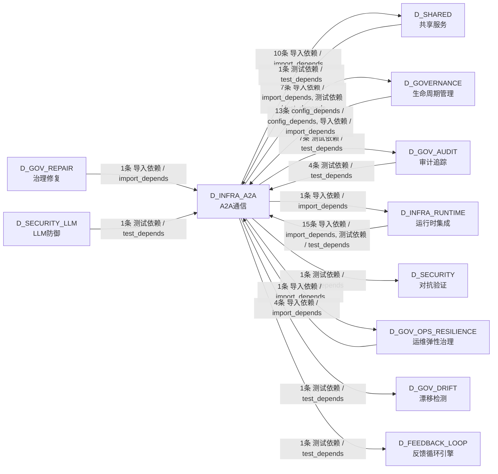

# 01_d_infra_a2a / a2a_communication / A2A通信 / A2A Communication

> **功能简介 / Overview**: Agent 与 Agent 之间的通信协议层，负责 AI 代理间的消息传递、请求路由和协议适配

> **文档作用 / Purpose**: 展示 A2A通信（D_INFRA_A2A）功能域的模块清单、域内依赖关系、跨域依赖关系、架构分层视图，供架构审查和域治理参考。

> 本文档由 generate_domain_doc.py 从 depgraph (PostgreSQL) 自动生成
> 最后更新: 2026-07-17 03:52:04
> 数据源: depgraph (PostgreSQL) nodes表 + edges表

## 域基本信息 / Domain Overview

| 字段 | 值 | Field | Value |
|------|------|-------|-------|
| 编号 | 01 | Number | 01 |
| 域ID | D_INFRA_A2A | Domain ID | D_INFRA_A2A |
| 域名称 | A2A通信 | Domain Name | A2A Communication |
| 层级 | L0 基础设施层 | Layer | L0 Infrastructure |
| 模块数 | 133 | Module Count | 133 |
| 域内依赖 | 83 | Internal Dependencies | 83 |
| 跨域入边 | 39 | Cross-domain Incoming | 39 |
| 跨域出边 | 29 | Cross-domain Outgoing | 29 |
| 设计态模块 | 0 | Design Modules | 0 |
| 原型态模块 | 104 | Prototype Modules | 104 |
| 生产态模块 | 29 | Production Modules | 29 |
| 容量 | 29/150 (正常) | Capacity | 29/150 (正常) |
| 描述 | A2A Card注册与发现(card_registry) | Description | A2A Card注册与发现(card_registry) |

## 模块分层清单 / Module Layered List

> 按 architecture_layer 分组的模块清单（共 133 个模块 / 133 modules）。

### L0 基础设施层 / Infrastructure Layer (77 modules)

| # | 模块路径 / Module Path | 模块名称 / Module Name (功能简介 / Description) | 成熟度 / Maturity | 蓝图 / Blueprint |
|:--:|---------|---------|:---:|:---:|
| 1 | src/zephyr/infrastructure/a2a_protocol/__init__.py | 基础设施 Infrastructure — A2A Protocol 模块 (M... | 生产态 / production | [MOD-INF-025](../../03_modules/_domain_infrastructure_operations/agent_to_agent_protocol/blueprint.md) |
| 2 | src/zephyr/infrastructure/a2a_protocol/a2a_card_registry.py | A2A Card Registry — 全局 Agent Card 注册单例 | 生产态 / production | [MOD-INF-025](../../03_modules/_domain_infrastructure_operations/agent_to_agent_protocol/blueprint.md) |
| 3 | src/zephyr/infrastructure/a2a_protocol/governance/__init_... | A2A Protocol — MOD-INF-025 | 原型态 / prototype | [MOD-INF-025](../../03_modules/_domain_infrastructure_operations/agent_to_agent_protocol/blueprint.md) |
| 4 | src/zephyr/infrastructure/a2a_protocol/layer1_discovery/_... | Layer 1: 发现+身份 — Agent Card 模型, AGENTS.m... | 原型态 / prototype | [MOD-INF-025](../../03_modules/_domain_infrastructure_operations/agent_to_agent_protocol/blueprint.md) |
| 5 | src/zephyr/infrastructure/a2a_protocol/layer1_discovery/a... | A2A Registry — Agent Card 注册与发现 | 生产态 / production | [MOD-INF-025](../../03_modules/_domain_infrastructure_operations/agent_to_agent_protocol/blueprint.md) |
| 6 | src/zephyr/infrastructure/a2a_protocol/layer1_discovery/a... | Agent Card 模型 — A2A Layer 1 Discovery | 生产态 / production | [MOD-INF-025](../../03_modules/_domain_infrastructure_operations/agent_to_agent_protocol/blueprint.md) |
| 7 | src/zephyr/infrastructure/a2a_protocol/layer1_discovery/i... | Identity Verifier — JWT 身份验证器 | 生产态 / production | [MOD-INF-025](../../03_modules/_domain_infrastructure_operations/agent_to_agent_protocol/blueprint.md) |
| 8 | src/zephyr/infrastructure/a2a_protocol/layer2_communicati... | Layer 2: 通信+任务 — Task 状态机, Message/Part... | 原型态 / prototype | [MOD-INF-025](../../03_modules/_domain_infrastructure_operations/agent_to_agent_protocol/blueprint.md) |
| 9 | src/zephyr/infrastructure/a2a_protocol/layer2_communicati... | A2A Message/Part 系统 — Layer 2 Communication | 生产态 / production | [MOD-INF-025](../../03_modules/_domain_infrastructure_operations/agent_to_agent_protocol/blueprint.md) |
| 10 | src/zephyr/infrastructure/a2a_protocol/layer2_communicati... | A2A Task 状态机 — Layer 2 Communication | 生产态 / production | [MOD-INF-025](../../03_modules/_domain_infrastructure_operations/agent_to_agent_protocol/blueprint.md) |
| 11 | src/zephyr/infrastructure/a2a_protocol/layer2_communicati... | Context Package — A2A 上下文包 | 原型态 / prototype | [MOD-INF-025](../../03_modules/_domain_infrastructure_operations/agent_to_agent_protocol/blueprint.md) |
| 12 | src/zephyr/infrastructure/a2a_protocol/layer2_communicati... | Handoff Manager — Agent 间任务交接 | 原型态 / prototype | [MOD-INF-025](../../03_modules/_domain_infrastructure_operations/agent_to_agent_protocol/blueprint.md) |
| 13 | src/zephyr/infrastructure/a2a_protocol/layer2_communicati... | Message Router — A2A 消息路由 | 生产态 / production | [MOD-INF-025](../../03_modules/_domain_infrastructure_operations/agent_to_agent_protocol/blueprint.md) |
| 14 | src/zephyr/infrastructure/a2a_protocol/layer2_communicati... | Push Notifier — A2A 推送通知 | 生产态 / production | [MOD-INF-025](../../03_modules/_domain_infrastructure_operations/agent_to_agent_protocol/blueprint.md) |
| 15 | src/zephyr/infrastructure/a2a_protocol/layer2_communicati... | Streaming — A2A 流式传输 | 生产态 / production | [MOD-INF-025](../../03_modules/_domain_infrastructure_operations/agent_to_agent_protocol/blueprint.md) |
| 16 | src/zephyr/infrastructure/a2a_protocol/layer2_communicati... | 触发监控器 | 生产态 / production | [MOD-INF-025](../../03_modules/_domain_infrastructure_operations/agent_to_agent_protocol/blueprint.md) |
| 17 | src/zephyr/infrastructure/a2a_protocol/layer3_coordinatio... | Layer 3: 协调+仲裁 — Coordinator, Living Spec ... | 原型态 / prototype | [MOD-INF-025](../../03_modules/_domain_infrastructure_operations/agent_to_agent_protocol/blueprint.md) |
| 18 | src/zephyr/infrastructure/a2a_protocol/layer3_coordinatio... | Re-export bridge for layer3_coordination consen... | 原型态 / prototype | [MOD-INF-025](../../03_modules/_domain_infrastructure_operations/agent_to_agent_protocol/blueprint.md) |
| 19 | src/zephyr/infrastructure/a2a_protocol/layer3_coordinatio... | Re-export bridge for layer3_coordination core c... | 原型态 / prototype | [MOD-INF-025](../../03_modules/_domain_infrastructure_operations/agent_to_agent_protocol/blueprint.md) |
| 20 | src/zephyr/infrastructure/a2a_protocol/layer3_coordinatio... | Re-export bridge for layer3_coordination intell... | 原型态 / prototype | [MOD-INF-025](../../03_modules/_domain_infrastructure_operations/agent_to_agent_protocol/blueprint.md) |
| 21 | src/zephyr/infrastructure/a2a_protocol/layer3_coordinatio... | Re-export bridge for layer3_coordination securi... | 原型态 / prototype | [MOD-INF-025](../../03_modules/_domain_infrastructure_operations/agent_to_agent_protocol/blueprint.md) |
| 22 | src/zephyr/infrastructure/a2a_protocol/layer3_coordinatio... | A2A 统计异常检测引擎 — 基线学习 + 实时异常判断 | 原型态 / prototype | [MOD-INF-025](../../03_modules/_domain_infrastructure_operations/agent_to_agent_protocol/blueprint.md) |
| 23 | src/zephyr/infrastructure/a2a_protocol/layer3_coordinatio... | A2A 行为指纹 — Agent 行为模式学习与画像 | 原型态 / prototype | [MOD-INF-025](../../03_modules/_domain_infrastructure_operations/agent_to_agent_protocol/blueprint.md) |
| 24 | src/zephyr/infrastructure/a2a_protocol/layer3_coordinatio... | A2A 责任归属引擎 — 因果链分析 + 责任分配 | 原型态 / prototype | [MOD-INF-025](../../03_modules/_domain_infrastructure_operations/agent_to_agent_protocol/blueprint.md) |
| 25 | src/zephyr/infrastructure/a2a_protocol/layer3_coordinatio... | A2A 碳足迹追踪 | 原型态 / prototype | [MOD-INF-025](../../03_modules/_domain_infrastructure_operations/agent_to_agent_protocol/blueprint.md) |
| 26 | src/zephyr/infrastructure/a2a_protocol/layer3_coordinatio... | A2A 因果追踪 — 跨 Agent 操作因果链图谱 | 原型态 / prototype | [MOD-INF-025](../../03_modules/_domain_infrastructure_operations/agent_to_agent_protocol/blueprint.md) |
| 27 | src/zephyr/infrastructure/a2a_protocol/layer3_coordinatio... | A2A 检查点管理器 | 原型态 / prototype | [MOD-INF-025](../../03_modules/_domain_infrastructure_operations/agent_to_agent_protocol/blueprint.md) |
| 28 | src/zephyr/infrastructure/a2a_protocol/layer3_coordinatio... | A2A 合谋检测器 — Agent 间串通模式识别 | 原型态 / prototype | [MOD-INF-025](../../03_modules/_domain_infrastructure_operations/agent_to_agent_protocol/blueprint.md) |
| 29 | src/zephyr/infrastructure/a2a_protocol/layer3_coordinatio... | P2: Agent同意管理 | 原型态 / prototype | [MOD-INF-025](../../03_modules/_domain_infrastructure_operations/agent_to_agent_protocol/blueprint.md) |
| 30 | src/zephyr/infrastructure/a2a_protocol/layer3_coordinatio... | P2: 宪法性Agent管理 | 原型态 / prototype | [MOD-INF-025](../../03_modules/_domain_infrastructure_operations/agent_to_agent_protocol/blueprint.md) |
| 31 | src/zephyr/infrastructure/a2a_protocol/layer3_coordinatio... | 上下文腐烂检测 | 原型态 / prototype | [MOD-INF-025](../../03_modules/_domain_infrastructure_operations/agent_to_agent_protocol/blueprint.md) |
| 32 | src/zephyr/infrastructure/a2a_protocol/layer3_coordinatio... | A2A 跨 Agent 语义流追踪 — 知识+意图在 Agent 间传递 | 原型态 / prototype | [MOD-INF-025](../../03_modules/_domain_infrastructure_operations/agent_to_agent_protocol/blueprint.md) |
| 33 | src/zephyr/infrastructure/a2a_protocol/layer3_coordinatio... | A2A 监控仪表盘 — Agent 集群运行状态可视化面板 | 原型态 / prototype | [MOD-INF-025](../../03_modules/_domain_infrastructure_operations/agent_to_agent_protocol/blueprint.md) |
| 34 | src/zephyr/infrastructure/a2a_protocol/layer3_coordinatio... | A2A 结构化辩论协议 — 多轮主张->反驳->合成 | 原型态 / prototype | [MOD-INF-025](../../03_modules/_domain_infrastructure_operations/agent_to_agent_protocol/blueprint.md) |
| 35 | src/zephyr/infrastructure/a2a_protocol/layer3_coordinatio... | 委托链 | 原型态 / prototype | [MOD-INF-025](../../03_modules/_domain_infrastructure_operations/agent_to_agent_protocol/blueprint.md) |
| 36 | src/zephyr/infrastructure/a2a_protocol/layer3_coordinatio... | A2A 经济学——Token/API成本追踪 | 原型态 / prototype | [MOD-INF-025](../../03_modules/_domain_infrastructure_operations/agent_to_agent_protocol/blueprint.md) |
| 37 | src/zephyr/infrastructure/a2a_protocol/layer3_coordinatio... | A2A 遗忘机制 | 原型态 / prototype | [MOD-INF-025](../../03_modules/_domain_infrastructure_operations/agent_to_agent_protocol/blueprint.md) |
| 38 | src/zephyr/infrastructure/a2a_protocol/layer3_coordinatio... | A2A 形式化验证 — 协议属性模型检查 | 原型态 / prototype | [MOD-INF-025](../../03_modules/_domain_infrastructure_operations/agent_to_agent_protocol/blueprint.md) |
| 39 | src/zephyr/infrastructure/a2a_protocol/layer3_coordinatio... | A2A ANP 帧协商协议 — Agent Negotiation Protoco... | 原型态 / prototype | [MOD-INF-025](../../03_modules/_domain_infrastructure_operations/agent_to_agent_protocol/blueprint.md) |
| 40 | src/zephyr/infrastructure/a2a_protocol/layer3_coordinatio... | A2A 硬件路由器——GPU/CPU 调度 | 原型态 / prototype | [MOD-INF-025](../../03_modules/_domain_infrastructure_operations/agent_to_agent_protocol/blueprint.md) |
| 41 | src/zephyr/infrastructure/a2a_protocol/layer3_coordinatio... | P2: Agent休眠管理 | 原型态 / prototype | [MOD-INF-025](../../03_modules/_domain_infrastructure_operations/agent_to_agent_protocol/blueprint.md) |
| 42 | src/zephyr/infrastructure/a2a_protocol/layer3_coordinatio... | A2A 幂等性保证 | 原型态 / prototype | [MOD-INF-025](../../03_modules/_domain_infrastructure_operations/agent_to_agent_protocol/blueprint.md) |
| 43 | src/zephyr/infrastructure/a2a_protocol/layer3_coordinatio... | A2A 空闲守卫 | 原型态 / prototype | [MOD-INF-025](../../03_modules/_domain_infrastructure_operations/agent_to_agent_protocol/blueprint.md) |
| 44 | src/zephyr/infrastructure/a2a_protocol/layer3_coordinatio... | A2A 免疫系统 | 原型态 / prototype | [MOD-INF-025](../../03_modules/_domain_infrastructure_operations/agent_to_agent_protocol/blueprint.md) |
| 45 | src/zephyr/infrastructure/a2a_protocol/layer3_coordinatio... | A2A 知识蒸馏 — 跨 Agent 经验提炼与共享 | 原型态 / prototype | [MOD-INF-025](../../03_modules/_domain_infrastructure_operations/agent_to_agent_protocol/blueprint.md) |
| 46 | src/zephyr/infrastructure/a2a_protocol/layer3_coordinatio... | A2A 隐性通信检测 — 检测 Agent 通过副作用隐式通信 | 原型态 / prototype | [MOD-INF-025](../../03_modules/_domain_infrastructure_operations/agent_to_agent_protocol/blueprint.md) |
| 47 | src/zephyr/infrastructure/a2a_protocol/layer3_coordinatio... | A2A 指标收集 | 原型态 / prototype | [MOD-INF-025](../../03_modules/_domain_infrastructure_operations/agent_to_agent_protocol/blueprint.md) |
| 48 | src/zephyr/infrastructure/a2a_protocol/layer3_coordinatio... | A2A 协商协议 — Agent 间资源/任务分配协商 | 生产态 / production | [MOD-INF-025](../../03_modules/_domain_infrastructure_operations/agent_to_agent_protocol/blueprint.md) |
| 49 | src/zephyr/infrastructure/a2a_protocol/layer3_coordinatio... | A2A 协议网关 — Agent 间请求分发与协议转换 | 原型态 / prototype | [MOD-INF-025](../../03_modules/_domain_infrastructure_operations/agent_to_agent_protocol/blueprint.md) |
| 50 | src/zephyr/infrastructure/a2a_protocol/layer3_coordinatio... | A2A协议安全 | 原型态 / prototype | [MOD-INF-025](../../03_modules/_domain_infrastructure_operations/agent_to_agent_protocol/blueprint.md) |
| 51 | src/zephyr/infrastructure/a2a_protocol/layer3_coordinatio... | A2A 红队测试 — 攻击向量定义与执行框架 | 原型态 / prototype | [MOD-INF-025](../../03_modules/_domain_infrastructure_operations/agent_to_agent_protocol/blueprint.md) |
| 52 | src/zephyr/infrastructure/a2a_protocol/layer3_coordinatio... | A2A Saga 事务协议 — 多 Agent 跨步分布式事务 | 生产态 / production | [MOD-INF-025](../../03_modules/_domain_infrastructure_operations/agent_to_agent_protocol/blueprint.md) |
| 53 | src/zephyr/infrastructure/a2a_protocol/layer3_coordinatio... | A2A 安全内容扫描器 — 六大类威胁检测 | 原型态 / prototype | [MOD-INF-025](../../03_modules/_domain_infrastructure_operations/agent_to_agent_protocol/blueprint.md) |
| 54 | src/zephyr/infrastructure/a2a_protocol/layer3_coordinatio... | 时序准入控制 | 原型态 / prototype | [MOD-INF-025](../../03_modules/_domain_infrastructure_operations/agent_to_agent_protocol/blueprint.md) |
| 55 | src/zephyr/infrastructure/a2a_protocol/layer3_coordinatio... | A2A 分布式追踪 — 跨 Agent 请求链追踪 (Span-based) | 原型态 / prototype | [MOD-INF-025](../../03_modules/_domain_infrastructure_operations/agent_to_agent_protocol/blueprint.md) |
| 56 | src/zephyr/infrastructure/a2a_protocol/layer3_coordinatio... | 向量化信誉系统 | 原型态 / prototype | [MOD-INF-025](../../03_modules/_domain_infrastructure_operations/agent_to_agent_protocol/blueprint.md) |
| 57 | src/zephyr/infrastructure/a2a_protocol/layer3_coordinatio... | A2A 加权投票协议 — 多 Agent 共识达成机制 | 生产态 / production | [MOD-INF-025](../../03_modules/_domain_infrastructure_operations/agent_to_agent_protocol/blueprint.md) |
| 58 | src/zephyr/infrastructure/a2a_protocol/layer3_coordinatio... | A2A 工作窃取调度器 — 跨 Agent 负载均衡 | 生产态 / production | [MOD-INF-025](../../03_modules/_domain_infrastructure_operations/agent_to_agent_protocol/blueprint.md) |
| 59 | src/zephyr/infrastructure/a2a_protocol/layer3_coordinatio... | A2A 三级仲裁引擎 — priority -> rule -> escalation | 生产态 / production | [MOD-INF-025](../../03_modules/_domain_infrastructure_operations/agent_to_agent_protocol/blueprint.md) |
| 60 | src/zephyr/infrastructure/a2a_protocol/layer3_coordinatio... | 级联守卫——防止失败在Agent间级联 | 生产态 / production | [MOD-INF-025](../../03_modules/_domain_infrastructure_operations/agent_to_agent_protocol/blueprint.md) |
| 61 | src/zephyr/infrastructure/a2a_protocol/layer3_coordinatio... | A2A 冲突检测引擎 — 语义+文本+资源三维冲突检测 | 生产态 / production | [MOD-INF-025](../../03_modules/_domain_infrastructure_operations/agent_to_agent_protocol/blueprint.md) |
| 62 | src/zephyr/infrastructure/a2a_protocol/layer3_coordinatio... | 施工后验证器 — 自指悖论防御：不橡胶图章，真正... | 原型态 / prototype | [MOD-INF-025](../../03_modules/_domain_infrastructure_operations/agent_to_agent_protocol/blueprint.md) |
| 63 | src/zephyr/infrastructure/a2a_protocol/layer3_coordinatio... | P2: 死锁守卫 | 生产态 / production | [MOD-INF-025](../../03_modules/_domain_infrastructure_operations/agent_to_agent_protocol/blueprint.md) |
| 64 | src/zephyr/infrastructure/a2a_protocol/layer3_coordinatio... | P2: 活锁检测器 | 生产态 / production | [MOD-INF-025](../../03_modules/_domain_infrastructure_operations/agent_to_agent_protocol/blueprint.md) |
| 65 | src/zephyr/infrastructure/a2a_protocol/layer3_coordinatio... | A2A 语义差异引擎 — 结构感知的 Agent 间差异检测 | 原型态 / prototype | [MOD-INF-025](../../03_modules/_domain_infrastructure_operations/agent_to_agent_protocol/blueprint.md) |
| 66 | src/zephyr/infrastructure/a2a_protocol/layer3_coordinatio... | A2A Session 走私防御 — 防止跨 Agent session 上... | 原型态 / prototype | [MOD-INF-025](../../03_modules/_domain_infrastructure_operations/agent_to_agent_protocol/blueprint.md) |
| 67 | src/zephyr/infrastructure/a2a_protocol/layer3_coordinatio... | A2A Living Spec 同步 — 蓝图与实现的双向漂移管理 | 原型态 / prototype | [MOD-INF-025](../../03_modules/_domain_infrastructure_operations/agent_to_agent_protocol/blueprint.md) |
| 68 | src/zephyr/infrastructure/a2a_protocol/layer3_coordinatio... | Supervisor — A2A Layer 3 Coordination | 生产态 / production | [MOD-INF-025](../../03_modules/_domain_infrastructure_operations/agent_to_agent_protocol/blueprint.md) |
| 69 | src/zephyr/infrastructure/a2a_protocol/local_first_arch.py | local_first_arch.py | 生产态 / production | [MOD-INF-025](../../03_modules/_domain_infrastructure_operations/agent_to_agent_protocol/blueprint.md) |
| 70 | src/zephyr/infrastructure/a2a_protocol/migration_strategy.py | migration_strategy.py | 生产态 / production | [MOD-INF-025](../../03_modules/_domain_infrastructure_operations/agent_to_agent_protocol/blueprint.md) |
| 71 | src/zephyr/infrastructure/a2a_protocol/multi_agent.py | multi_agent.py —— Multi-Agent 编排基座（Phase... | 生产态 / production | [MOD-INF-025](../../03_modules/_domain_infrastructure_operations/agent_to_agent_protocol/blueprint.md) |
| 72 | src/zephyr/infrastructure/a2a_protocol/multi_model_consen... | multi_model_consensus.py | 生产态 / production | [MOD-INF-025](../../03_modules/_domain_infrastructure_operations/agent_to_agent_protocol/blueprint.md) |
| 73 | src/zephyr/infrastructure/a2a_protocol/offline_autonomy.py | offline_autonomy.py | 生产态 / production | [MOD-INF-025](../../03_modules/_domain_infrastructure_operations/agent_to_agent_protocol/blueprint.md) |
| 74 | src/zephyr/infrastructure/a2a_protocol/offline_resilience.py | offline_resilience.py | 生产态 / production | [MOD-INF-025](../../03_modules/_domain_infrastructure_operations/agent_to_agent_protocol/blueprint.md) |
| 75 | src/zephyr/infrastructure/a2a_protocol/phase_hold.py | Phase 4 Hold — A2A Phase 4 锁定标记模块 与其他... | 生产态 / production | [MOD-INF-025](../../03_modules/_domain_infrastructure_operations/agent_to_agent_protocol/blueprint.md) |
| 76 | src/zephyr/infrastructure/a2a_protocol/prompt_lifecycle.py | prompt_lifecycle.py | 生产态 / production | [MOD-INF-025](../../03_modules/_domain_infrastructure_operations/agent_to_agent_protocol/blueprint.md) |
| 77 | src/zephyr/infrastructure/a2a_protocol/realtime_streaming.py | realtime_streaming.py | 原型态 / prototype | [MOD-INF-025](../../03_modules/_domain_infrastructure_operations/agent_to_agent_protocol/blueprint.md) |

### L2 领域层 / Domain Layer (56 modules)

| # | 模块路径 / Module Path | 模块名称 / Module Name (功能简介 / Description) | 成熟度 / Maturity | 蓝图 / Blueprint |
|:--:|---------|---------|:---:|:---:|
| 1 | tests/a2a/test_a2a_anomaly_detector.py | test_a2a_anomaly_detector.py | 原型态 / prototype | [MOD-INF-025](../../03_modules/_domain_infrastructure_operations/agent_to_agent_protocol/blueprint.md) |
| 2 | tests/a2a/test_a2a_behavior_fingerprint.py | test_a2a_behavior_fingerprint.py | 原型态 / prototype | [MOD-INF-025](../../03_modules/_domain_infrastructure_operations/agent_to_agent_protocol/blueprint.md) |
| 3 | tests/a2a/test_a2a_blame_attribution.py | test_a2a_blame_attribution.py | 原型态 / prototype | [MOD-INF-025](../../03_modules/_domain_infrastructure_operations/agent_to_agent_protocol/blueprint.md) |
| 4 | tests/a2a/test_a2a_carbon.py | test_a2a_carbon.py | 原型态 / prototype | [MOD-INF-025](../../03_modules/_domain_infrastructure_operations/agent_to_agent_protocol/blueprint.md) |
| 5 | tests/a2a/test_a2a_card_registry.py | test_a2a_card_registry.py | 原型态 / prototype | [MOD-INF-025](../../03_modules/_domain_infrastructure_operations/agent_to_agent_protocol/blueprint.md) |
| 6 | tests/a2a/test_a2a_causal_trace.py | test_a2a_causal_trace.py | 原型态 / prototype | [MOD-INF-025](../../03_modules/_domain_infrastructure_operations/agent_to_agent_protocol/blueprint.md) |
| 7 | tests/a2a/test_a2a_check.py | test_a2a_check.py | 原型态 / prototype | [MOD-INF-018](../../03_modules/_domain_autonomy_core/agent_role_based_access_control/blueprint.md) |
| 8 | tests/a2a/test_a2a_checkpoint.py | test_a2a_checkpoint.py | 原型态 / prototype | [MOD-INF-025](../../03_modules/_domain_infrastructure_operations/agent_to_agent_protocol/blueprint.md) |
| 9 | tests/a2a/test_a2a_collusion_detector.py | test_a2a_collusion_detector.py | 原型态 / prototype | [MOD-INF-025](../../03_modules/_domain_infrastructure_operations/agent_to_agent_protocol/blueprint.md) |
| 10 | tests/a2a/test_a2a_consent.py | test_a2a_consent.py | 原型态 / prototype | [MOD-INF-025](../../03_modules/_domain_infrastructure_operations/agent_to_agent_protocol/blueprint.md) |
| 11 | tests/a2a/test_a2a_constitutional.py | test_a2a_constitutional.py | 原型态 / prototype | [MOD-INF-025](../../03_modules/_domain_infrastructure_operations/agent_to_agent_protocol/blueprint.md) |
| 12 | tests/a2a/test_a2a_context_rot.py | test_a2a_context_rot.py | 原型态 / prototype | [MOD-INF-025](../../03_modules/_domain_infrastructure_operations/agent_to_agent_protocol/blueprint.md) |
| 13 | tests/a2a/test_a2a_cross_agent_semantic_flow.py | test_a2a_cross_agent_semantic_flow.py | 原型态 / prototype | [MOD-INF-025](../../03_modules/_domain_infrastructure_operations/agent_to_agent_protocol/blueprint.md) |
| 14 | tests/a2a/test_a2a_dashboard.py | test_a2a_dashboard.py | 原型态 / prototype | [MOD-INF-025](../../03_modules/_domain_infrastructure_operations/agent_to_agent_protocol/blueprint.md) |
| 15 | tests/a2a/test_a2a_debate.py | test_a2a_debate.py | 原型态 / prototype | [MOD-INF-025](../../03_modules/_domain_infrastructure_operations/agent_to_agent_protocol/blueprint.md) |
| 16 | tests/a2a/test_a2a_delegation_chain.py | test_a2a_delegation_chain.py | 原型态 / prototype | [MOD-INF-025](../../03_modules/_domain_infrastructure_operations/agent_to_agent_protocol/blueprint.md) |
| 17 | tests/a2a/test_a2a_economics.py | test_a2a_economics.py | 原型态 / prototype | [MOD-INF-025](../../03_modules/_domain_infrastructure_operations/agent_to_agent_protocol/blueprint.md) |
| 18 | tests/a2a/test_a2a_failure.py | test_a2a_failure.py | 原型态 / prototype | [MOD-INF-021](../../03_modules/_domain_autonomy_core/rollback_system/blueprint.md) |
| 19 | tests/a2a/test_a2a_forgetting.py | test_a2a_forgetting.py | 原型态 / prototype | [MOD-INF-025](../../03_modules/_domain_infrastructure_operations/agent_to_agent_protocol/blueprint.md) |
| 20 | tests/a2a/test_a2a_formal_verification.py | test_a2a_formal_verification.py | 原型态 / prototype | [MOD-INF-025](../../03_modules/_domain_infrastructure_operations/agent_to_agent_protocol/blueprint.md) |
| 21 | tests/a2a/test_a2a_frame_negotiation.py | test_a2a_frame_negotiation.py | 原型态 / prototype | [MOD-INF-025](../../03_modules/_domain_infrastructure_operations/agent_to_agent_protocol/blueprint.md) |
| 22 | tests/a2a/test_a2a_governance.py | test_a2a_governance.py | 原型态 / prototype | [MOD-INF-025](../../03_modules/_domain_infrastructure_operations/agent_to_agent_protocol/blueprint.md) |
| 23 | tests/a2a/test_a2a_governance_adapter.py | test_a2a_governance_adapter.py | 原型态 / prototype | [MOD-INF-025](../../03_modules/_domain_infrastructure_operations/agent_to_agent_protocol/blueprint.md) |
| 24 | tests/a2a/test_a2a_hardware_router.py | test_a2a_hardware_router.py | 原型态 / prototype | [MOD-INF-025](../../03_modules/_domain_infrastructure_operations/agent_to_agent_protocol/blueprint.md) |
| 25 | tests/a2a/test_a2a_hibernate.py | test_a2a_hibernate.py | 原型态 / prototype | [MOD-INF-025](../../03_modules/_domain_infrastructure_operations/agent_to_agent_protocol/blueprint.md) |
| 26 | tests/a2a/test_a2a_idempotency.py | test_a2a_idempotency.py | 原型态 / prototype | [MOD-INF-025](../../03_modules/_domain_infrastructure_operations/agent_to_agent_protocol/blueprint.md) |
| 27 | tests/a2a/test_a2a_idle_guard.py | test_a2a_idle_guard.py | 原型态 / prototype | [MOD-INF-025](../../03_modules/_domain_infrastructure_operations/agent_to_agent_protocol/blueprint.md) |
| 28 | tests/a2a/test_a2a_immune.py | test_a2a_immune.py | 原型态 / prototype | [MOD-INF-025](../../03_modules/_domain_infrastructure_operations/agent_to_agent_protocol/blueprint.md) |
| 29 | tests/a2a/test_a2a_knowledge_distill.py | test_a2a_knowledge_distill.py | 原型态 / prototype | [MOD-INF-025](../../03_modules/_domain_infrastructure_operations/agent_to_agent_protocol/blueprint.md) |
| 30 | tests/a2a/test_a2a_latent_comm.py | test_a2a_latent_comm.py | 原型态 / prototype | [MOD-INF-025](../../03_modules/_domain_infrastructure_operations/agent_to_agent_protocol/blueprint.md) |
| 31 | tests/a2a/test_a2a_layer1_discovery.py | test_a2a_layer1_discovery.py | 原型态 / prototype | [MOD-INF-025](../../03_modules/_domain_infrastructure_operations/agent_to_agent_protocol/blueprint.md) |
| 32 | tests/a2a/test_a2a_metrics.py | test_a2a_metrics.py | 原型态 / prototype | [MOD-INF-025](../../03_modules/_domain_infrastructure_operations/agent_to_agent_protocol/blueprint.md) |
| 33 | tests/a2a/test_a2a_negotiation.py | test_a2a_negotiation.py | 原型态 / prototype | [MOD-INF-025](../../03_modules/_domain_infrastructure_operations/agent_to_agent_protocol/blueprint.md) |
| 34 | tests/a2a/test_a2a_protocol_gateway.py | test_a2a_protocol_gateway.py | 原型态 / prototype | [MOD-INF-025](../../03_modules/_domain_infrastructure_operations/agent_to_agent_protocol/blueprint.md) |
| 35 | tests/a2a/test_a2a_protocol_security.py | test_a2a_protocol_security.py | 原型态 / prototype | [MOD-INF-025](../../03_modules/_domain_infrastructure_operations/agent_to_agent_protocol/blueprint.md) |
| 36 | tests/a2a/test_a2a_red_team.py | test_a2a_red_team.py | 原型态 / prototype | [MOD-INF-025](../../03_modules/_domain_infrastructure_operations/agent_to_agent_protocol/blueprint.md) |
| 37 | tests/a2a/test_a2a_saga.py | test_a2a_saga.py | 原型态 / prototype | [MOD-INF-025](../../03_modules/_domain_infrastructure_operations/agent_to_agent_protocol/blueprint.md) |
| 38 | tests/a2a/test_a2a_schemas.py | test_a2a_schemas.py | 原型态 / prototype | [MOD-INF-025](../../03_modules/_domain_infrastructure_operations/agent_to_agent_protocol/blueprint.md) |
| 39 | tests/a2a/test_a2a_security.py | test_a2a_security.py | 原型态 / prototype | [MOD-INF-025](../../03_modules/_domain_infrastructure_operations/agent_to_agent_protocol/blueprint.md) |
| 40 | tests/a2a/test_a2a_state.py | test_a2a_state.py | 原型态 / prototype | [MOD-INF-025](../../03_modules/_domain_infrastructure_operations/agent_to_agent_protocol/blueprint.md) |
| 41 | tests/a2a/test_a2a_temporal_admission.py | test_a2a_temporal_admission.py | 原型态 / prototype | [MOD-INF-025](../../03_modules/_domain_infrastructure_operations/agent_to_agent_protocol/blueprint.md) |
| 42 | tests/a2a/test_a2a_tracing.py | test_a2a_tracing.py | 原型态 / prototype | [MOD-INF-025](../../03_modules/_domain_infrastructure_operations/agent_to_agent_protocol/blueprint.md) |
| 43 | tests/a2a/test_a2a_vector_reputation.py | test_a2a_vector_reputation.py | 原型态 / prototype | [MOD-INF-025](../../03_modules/_domain_infrastructure_operations/agent_to_agent_protocol/blueprint.md) |
| 44 | tests/a2a/test_a2a_voting.py | test_a2a_voting.py | 原型态 / prototype | [MOD-INF-025](../../03_modules/_domain_infrastructure_operations/agent_to_agent_protocol/blueprint.md) |
| 45 | tests/a2a/test_a2a_work_steal.py | test_a2a_work_steal.py | 原型态 / prototype | [MOD-INF-025](../../03_modules/_domain_infrastructure_operations/agent_to_agent_protocol/blueprint.md) |
| 46 | tests/a2a/test_construction_verifier.py | test_construction_verifier.py | 原型态 / prototype | [MOD-INF-025](../../03_modules/_domain_infrastructure_operations/agent_to_agent_protocol/blueprint.md) |
| 47 | tests/a2a/test_mcp.py | test_mcp.py | 原型态 / prototype | [MOD-INF-013](../../03_modules/_cross_layer/model_context_protocol_servers/blueprint.md) |
| 48 | tests/a2a/test_spec_sync.py | test_spec_sync.py | 原型态 / prototype | [MOD-INF-025](../../03_modules/_domain_infrastructure_operations/agent_to_agent_protocol/blueprint.md) |
| 49 | tests/bridges/test_bridges_anomaly.py | test_bridges_anomaly.py | 原型态 / prototype | [MOD-INF-020](../../03_modules/_domain_governance/audit_trail/blueprint.md) |
| 50 | tests/bridges/test_bridges_contracts.py | test_bridges_contracts.py | 原型态 / prototype | [MOD-INF-020](../../03_modules/_domain_governance/audit_trail/blueprint.md) |
| 51 | tests/bridges/test_bridges_delegation_bridge.py | test_bridges_delegation_bridge.py | 原型态 / prototype | [MOD-INF-020](../../03_modules/_domain_governance/audit_trail/blueprint.md) |
| 52 | tests/bridges/test_bridges_drift_bridge.py | test_bridges_drift_bridge.py | 原型态 / prototype | [MOD-INF-020](../../03_modules/_domain_governance/audit_trail/blueprint.md) |
| 53 | tests/bridges/test_bridges_feedback_bridge.py | test_bridges_feedback_bridge.py | 原型态 / prototype | [MOD-INF-020](../../03_modules/_domain_governance/audit_trail/blueprint.md) |
| 54 | tests/bridges/test_bridges_spec_auditor.py | test_bridges_spec_auditor.py | 原型态 / prototype | [MOD-INF-020](../../03_modules/_domain_governance/audit_trail/blueprint.md) |
| 55 | tests/bridges/test_bridges_tiered_storage_bridge.py | test_bridges_tiered_storage_bridge.py | 原型态 / prototype | [MOD-INF-020](../../03_modules/_domain_governance/audit_trail/blueprint.md) |
| 56 | tests/bridges/test_bridges_trust_bridge.py | test_bridges_trust_bridge.py | 原型态 / prototype | [MOD-INF-020](../../03_modules/_domain_governance/audit_trail/blueprint.md) |

## 域内依赖图 / Internal Dependency Diagram

> 依赖图内嵌在本文档中，IDE 可直接渲染显示。参考 decision_index.md 设计，分四个视图：合并全景图、运营态子图、设计态子图、原型态子图（按 design_maturity 实际值拆分）。
>
> **图例说明 / Legend**：
> - **实线边框 = 运营态模块**（production，已上线运行）
> - **虚线边框 = 设计态模块**（design，蓝图阶段，代码未写）
> - **虚线边框 = 原型态模块**（prototype，代码已写，验证中未稳定上线）
> - **实线箭头 = 运营态依赖**（已生效的依赖关系）
> - **虚线箭头 = 非运营态依赖**（计划中/验证中的依赖关系）

### 合并全景图（全部模块，标签标注成熟度）

> 展示全部 133 个模块（生产态 29 + 设计态 0 + 原型态 104），标签标注成熟度。

#### 第 1 页 / 共 5 页

```mermaid
graph TD
    subgraph D_INFRA_A2A["D_INFRA_A2A A2A通信"]
        src_zephyr_infrastructure_a2a_protocol_init_py["(生产态 / production) 基础设施 Infrastructure — A2A Protocol 模块 (M...<br/>文件: __init__.py"]
        src_zephyr_infrastructure_a2a_protocol_a2a_card_registry_py["(生产态 / production) A2A Card Registry — 全局 Agent Card 注册单例<br/>文件: a2a_card_registry.py"]
        src_zephyr_infrastructure_a2a_protocol_governance_init_py["(原型态 / prototype) A2A Protocol — MOD-INF-025<br/>文件: __init__.py"]
        src_zephyr_infrastructure_a2a_protocol_layer1_discovery_init_py["(原型态 / prototype) Layer 1: 发现+身份 — Agent Card 模型, AGENTS.m...<br/>文件: __init__.py"]
        src_zephyr_infrastructure_a2a_protocol_layer1_discovery_a2a_registry_py["(生产态 / production) A2A Registry — Agent Card 注册与发现<br/>文件: a2a_registry.py"]
        src_zephyr_infrastructure_a2a_protocol_layer1_discovery_agent_card_py["(生产态 / production) Agent Card 模型 — A2A Layer 1 Discovery<br/>文件: agent_card.py"]
        src_zephyr_infrastructure_a2a_protocol_layer1_discovery_identity_verifier_py["(生产态 / production) Identity Verifier — JWT 身份验证器<br/>文件: identity_verifier.py"]
        src_zephyr_infrastructure_a2a_protocol_layer2_communication_init_py["(原型态 / prototype) Layer 2: 通信+任务 — Task 状态机, Message/Part...<br/>文件: __init__.py"]
        src_zephyr_infrastructure_a2a_protocol_layer2_communication_a2a_schemas_py["(生产态 / production) A2A Message/Part 系统 — Layer 2 Communication<br/>文件: a2a_schemas.py"]
        src_zephyr_infrastructure_a2a_protocol_layer2_communication_a2a_state_py["(生产态 / production) A2A Task 状态机 — Layer 2 Communication<br/>文件: a2a_state.py"]
        src_zephyr_infrastructure_a2a_protocol_layer2_communication_context_package_py["(原型态 / prototype) Context Package — A2A 上下文包<br/>文件: context_package.py"]
        src_zephyr_infrastructure_a2a_protocol_layer2_communication_handoff_manager_py["(原型态 / prototype) Handoff Manager — Agent 间任务交接<br/>文件: handoff_manager.py"]
        src_zephyr_infrastructure_a2a_protocol_layer2_communication_message_router_py["(生产态 / production) Message Router — A2A 消息路由<br/>文件: message_router.py"]
        src_zephyr_infrastructure_a2a_protocol_layer2_communication_push_notifier_py["(生产态 / production) Push Notifier — A2A 推送通知<br/>文件: push_notifier.py"]
        src_zephyr_infrastructure_a2a_protocol_layer2_communication_streaming_py["(生产态 / production) Streaming — A2A 流式传输<br/>文件: streaming.py"]
        src_zephyr_infrastructure_a2a_protocol_layer2_communication_trigger_monitor_py["(生产态 / production) 触发监控器<br/>文件: trigger_monitor.py"]
        src_zephyr_infrastructure_a2a_protocol_layer3_coordination_init_py["(原型态 / prototype) Layer 3: 协调+仲裁 — Coordinator, Living Spec ...<br/>文件: __init__.py"]
        src_zephyr_infrastructure_a2a_protocol_layer3_coordination_consensus_py["(原型态 / prototype) Re-export bridge for layer3_coordination consen...<br/>文件: _consensus.py"]
        src_zephyr_infrastructure_a2a_protocol_layer3_coordination_core_coordination_py["(原型态 / prototype) Re-export bridge for layer3_coordination core c...<br/>文件: _core_coordination.py"]
        src_zephyr_infrastructure_a2a_protocol_layer3_coordination_intelligence_py["(原型态 / prototype) Re-export bridge for layer3_coordination intell...<br/>文件: _intelligence.py"]
        src_zephyr_infrastructure_a2a_protocol_layer3_coordination_security_and_economics_py["(原型态 / prototype) Re-export bridge for layer3_coordination securi...<br/>文件: _security_and_economics.py"]
        src_zephyr_infrastructure_a2a_protocol_layer3_coordination_a2a_anomaly_detector_py["(原型态 / prototype) A2A 统计异常检测引擎 — 基线学习 + 实时异常判断<br/>文件: a2a_anomaly_detector.py"]
        src_zephyr_infrastructure_a2a_protocol_layer3_coordination_a2a_behavior_fingerprint_py["(原型态 / prototype) A2A 行为指纹 — Agent 行为模式学习与画像<br/>文件: a2a_behavior_fingerprint.py"]
        src_zephyr_infrastructure_a2a_protocol_layer3_coordination_a2a_blame_attribution_py["(原型态 / prototype) A2A 责任归属引擎 — 因果链分析 + 责任分配<br/>文件: a2a_blame_attribution.py"]
        src_zephyr_infrastructure_a2a_protocol_layer3_coordination_a2a_carbon_py["(原型态 / prototype) A2A 碳足迹追踪<br/>文件: a2a_carbon.py"]
        src_zephyr_infrastructure_a2a_protocol_layer3_coordination_a2a_causal_trace_py["(原型态 / prototype) A2A 因果追踪 — 跨 Agent 操作因果链图谱<br/>文件: a2a_causal_trace.py"]
        src_zephyr_infrastructure_a2a_protocol_layer3_coordination_a2a_checkpoint_py["(原型态 / prototype) A2A 检查点管理器<br/>文件: a2a_checkpoint.py"]
        src_zephyr_infrastructure_a2a_protocol_layer3_coordination_a2a_collusion_detector_py["(原型态 / prototype) A2A 合谋检测器 — Agent 间串通模式识别<br/>文件: a2a_collusion_detector.py"]
        src_zephyr_infrastructure_a2a_protocol_layer3_coordination_a2a_consent_py["(原型态 / prototype) P2: Agent同意管理<br/>文件: a2a_consent.py"]
        src_zephyr_infrastructure_a2a_protocol_layer3_coordination_a2a_constitutional_py["(原型态 / prototype) P2: 宪法性Agent管理<br/>文件: a2a_constitutional.py"]
    end
    src_zephyr_infrastructure_a2a_protocol_a2a_card_registry_py -->|导入依赖 / import_depends| src_zephyr_infrastructure_a2a_protocol_layer1_discovery_a2a_registry_py
    src_zephyr_infrastructure_a2a_protocol_init_py -.->|导入依赖 / import_depends| src_zephyr_infrastructure_a2a_protocol_layer1_discovery_init_py
    src_zephyr_infrastructure_a2a_protocol_init_py -.->|导入依赖 / import_depends| src_zephyr_infrastructure_a2a_protocol_layer2_communication_init_py
    src_zephyr_infrastructure_a2a_protocol_layer1_discovery_a2a_registry_py -->|导入依赖 / import_depends| src_zephyr_infrastructure_a2a_protocol_layer1_discovery_agent_card_py
    src_zephyr_infrastructure_a2a_protocol_layer1_discovery_init_py -.->|导入依赖 / import_depends| src_zephyr_infrastructure_a2a_protocol_layer1_discovery_a2a_registry_py
    src_zephyr_infrastructure_a2a_protocol_layer1_discovery_init_py -.->|导入依赖 / import_depends| src_zephyr_infrastructure_a2a_protocol_layer1_discovery_agent_card_py
    src_zephyr_infrastructure_a2a_protocol_layer1_discovery_init_py -.->|导入依赖 / import_depends| src_zephyr_infrastructure_a2a_protocol_layer1_discovery_identity_verifier_py
    src_zephyr_infrastructure_a2a_protocol_layer2_communication_message_router_py -->|导入依赖 / import_depends| src_zephyr_infrastructure_a2a_protocol_layer2_communication_a2a_schemas_py
    src_zephyr_infrastructure_a2a_protocol_layer3_coordination_a2a_carbon_py -.->|config_depends / config_depends| src_zephyr_infrastructure_a2a_protocol_layer3_coordination_init_py
    src_zephyr_infrastructure_a2a_protocol_layer3_coordination_a2a_checkpoint_py -.->|config_depends / config_depends| src_zephyr_infrastructure_a2a_protocol_layer3_coordination_init_py
    src_zephyr_infrastructure_a2a_protocol_layer2_communication_init_py -.->|导入依赖 / import_depends| src_zephyr_infrastructure_a2a_protocol_layer2_communication_a2a_state_py
    src_zephyr_infrastructure_a2a_protocol_layer2_communication_init_py -.->|导入依赖 / import_depends| src_zephyr_infrastructure_a2a_protocol_layer2_communication_handoff_manager_py
    src_zephyr_infrastructure_a2a_protocol_layer2_communication_init_py -.->|导入依赖 / import_depends| src_zephyr_infrastructure_a2a_protocol_layer2_communication_context_package_py
    src_zephyr_infrastructure_a2a_protocol_layer2_communication_init_py -.->|导入依赖 / import_depends| src_zephyr_infrastructure_a2a_protocol_layer2_communication_a2a_schemas_py
    src_zephyr_infrastructure_a2a_protocol_layer2_communication_init_py -.->|导入依赖 / import_depends| src_zephyr_infrastructure_a2a_protocol_layer2_communication_message_router_py
    src_zephyr_infrastructure_a2a_protocol_layer2_communication_init_py -.->|导入依赖 / import_depends| src_zephyr_infrastructure_a2a_protocol_layer2_communication_streaming_py
    src_zephyr_infrastructure_a2a_protocol_layer2_communication_init_py -.->|导入依赖 / import_depends| src_zephyr_infrastructure_a2a_protocol_layer2_communication_trigger_monitor_py
    src_zephyr_infrastructure_a2a_protocol_layer2_communication_init_py -.->|导入依赖 / import_depends| src_zephyr_infrastructure_a2a_protocol_layer2_communication_push_notifier_py
    src_zephyr_infrastructure_a2a_protocol_layer3_coordination_a2a_consent_py -.->|config_depends / config_depends| src_zephyr_infrastructure_a2a_protocol_layer3_coordination_init_py
    src_zephyr_infrastructure_a2a_protocol_layer3_coordination_a2a_constitutional_py -.->|config_depends / config_depends| src_zephyr_infrastructure_a2a_protocol_layer3_coordination_init_py
    src_zephyr_infrastructure_a2a_protocol_layer3_coordination_intelligence_py -.->|导入依赖 / import_depends| src_zephyr_infrastructure_a2a_protocol_layer3_coordination_a2a_blame_attribution_py
    src_zephyr_infrastructure_a2a_protocol_layer3_coordination_intelligence_py -.->|导入依赖 / import_depends| src_zephyr_infrastructure_a2a_protocol_layer3_coordination_a2a_behavior_fingerprint_py
    src_zephyr_infrastructure_a2a_protocol_layer3_coordination_intelligence_py -.->|导入依赖 / import_depends| src_zephyr_infrastructure_a2a_protocol_layer3_coordination_a2a_causal_trace_py
    src_zephyr_infrastructure_a2a_protocol_layer3_coordination_intelligence_py -.->|导入依赖 / import_depends| src_zephyr_infrastructure_a2a_protocol_layer3_coordination_a2a_collusion_detector_py
    src_zephyr_infrastructure_a2a_protocol_layer3_coordination_security_and_economics_py -.->|导入依赖 / import_depends| src_zephyr_infrastructure_a2a_protocol_layer3_coordination_a2a_anomaly_detector_py
    src_zephyr_infrastructure_a2a_protocol_layer3_coordination_init_py -.->|导入依赖 / import_depends| src_zephyr_infrastructure_a2a_protocol_layer3_coordination_consensus_py
    src_zephyr_infrastructure_a2a_protocol_layer3_coordination_init_py -.->|导入依赖 / import_depends| src_zephyr_infrastructure_a2a_protocol_layer3_coordination_intelligence_py
    src_zephyr_infrastructure_a2a_protocol_layer3_coordination_init_py -.->|导入依赖 / import_depends| src_zephyr_infrastructure_a2a_protocol_layer3_coordination_core_coordination_py
    src_zephyr_infrastructure_a2a_protocol_layer3_coordination_init_py -.->|导入依赖 / import_depends| src_zephyr_infrastructure_a2a_protocol_layer3_coordination_security_and_economics_py
    D_INFRA_RUNTIME["(原型态 / prototype) D_INFRA_RUNTIME"]
    src_zephyr_infrastructure_a2a_protocol_init_py -.->|导入依赖 / import_depends| D_INFRA_RUNTIME
    D_GOVERNANCE["(生产态 / production) D_GOVERNANCE"]
    src_zephyr_infrastructure_a2a_protocol_init_py -->|导入依赖 / import_depends| D_GOVERNANCE
    src_zephyr_infrastructure_a2a_protocol_governance_init_py -.->|导入依赖 / import_depends| D_GOVERNANCE
    D_SHARED["(原型态 / prototype) D_SHARED"]
    src_zephyr_infrastructure_a2a_protocol_layer1_discovery_agent_card_py -.->|导入依赖 / import_depends| D_SHARED
    src_zephyr_infrastructure_a2a_protocol_layer2_communication_a2a_schemas_py -.->|导入依赖 / import_depends| D_SHARED
    src_zephyr_infrastructure_a2a_protocol_layer2_communication_handoff_manager_py -.->|导入依赖 / import_depends| D_SHARED
    src_zephyr_infrastructure_a2a_protocol_layer2_communication_context_package_py -.->|导入依赖 / import_depends| D_SHARED
    src_zephyr_infrastructure_a2a_protocol_layer3_coordination_init_py -.->|导入依赖 / import_depends| D_GOVERNANCE
    src_zephyr_infrastructure_a2a_protocol_layer2_communication_init_py -.->|导入依赖 / import_depends| D_SHARED
    src_zephyr_infrastructure_a2a_protocol_layer1_discovery_init_py -.->|导入依赖 / import_depends| D_SHARED
    src_zephyr_infrastructure_a2a_protocol_layer2_communication_a2a_state_py -.->|导入依赖 / import_depends| D_SHARED
    D_INFRA_RUNTIME -.->|测试依赖 / test_depends| src_zephyr_infrastructure_a2a_protocol_layer2_communication_a2a_schemas_py
    D_INFRA_RUNTIME -.->|测试依赖 / test_depends| src_zephyr_infrastructure_a2a_protocol_layer2_communication_message_router_py
    D_INFRA_RUNTIME -.->|测试依赖 / test_depends| src_zephyr_infrastructure_a2a_protocol_layer2_communication_push_notifier_py
    D_INFRA_RUNTIME -.->|测试依赖 / test_depends| src_zephyr_infrastructure_a2a_protocol_layer2_communication_a2a_state_py
    D_INFRA_RUNTIME -.->|测试依赖 / test_depends| src_zephyr_infrastructure_a2a_protocol_layer2_communication_streaming_py
    D_INFRA_RUNTIME -.->|测试依赖 / test_depends| src_zephyr_infrastructure_a2a_protocol_layer2_communication_trigger_monitor_py
    D_SECURITY_LLM["(原型态 / prototype) D_SECURITY_LLM"]
    D_SECURITY_LLM -.->|测试依赖 / test_depends| src_zephyr_infrastructure_a2a_protocol_init_py
    D_GOVERNANCE -.->|config_depends / config_depends| src_zephyr_infrastructure_a2a_protocol_governance_init_py
    D_GOVERNANCE -.->|config_depends / config_depends| src_zephyr_infrastructure_a2a_protocol_governance_init_py
    D_GOVERNANCE -.->|config_depends / config_depends| src_zephyr_infrastructure_a2a_protocol_governance_init_py
    D_GOVERNANCE -.->|config_depends / config_depends| src_zephyr_infrastructure_a2a_protocol_governance_init_py
    D_GOVERNANCE -.->|config_depends / config_depends| src_zephyr_infrastructure_a2a_protocol_governance_init_py
    D_GOVERNANCE -.->|config_depends / config_depends| src_zephyr_infrastructure_a2a_protocol_governance_init_py
    D_INFRA_RUNTIME -->|导入依赖 / import_depends| src_zephyr_infrastructure_a2a_protocol_layer1_discovery_a2a_registry_py
    D_GOVERNANCE -.->|config_depends / config_depends| src_zephyr_infrastructure_a2a_protocol_governance_init_py
    classDef production fill:#e1f5fe,stroke:#01579b,stroke-width:2px,color:#000
    classDef design fill:#fff3e0,stroke:#e65100,stroke-width:2px,color:#000,stroke-dasharray: 5 5
    classDef external_prod fill:#e8f5e9,stroke:#1b5e20,stroke-width:1px,color:#000
    classDef external_design fill:#fce4ec,stroke:#880e4f,stroke-width:1px,color:#000,stroke-dasharray: 5 5
    class src_zephyr_infrastructure_a2a_protocol_init_py,src_zephyr_infrastructure_a2a_protocol_a2a_card_registry_py,src_zephyr_infrastructure_a2a_protocol_layer1_discovery_a2a_registry_py,src_zephyr_infrastructure_a2a_protocol_layer1_discovery_agent_card_py,src_zephyr_infrastructure_a2a_protocol_layer1_discovery_identity_verifier_py,src_zephyr_infrastructure_a2a_protocol_layer2_communication_a2a_schemas_py,src_zephyr_infrastructure_a2a_protocol_layer2_communication_a2a_state_py,src_zephyr_infrastructure_a2a_protocol_layer2_communication_message_router_py,src_zephyr_infrastructure_a2a_protocol_layer2_communication_push_notifier_py,src_zephyr_infrastructure_a2a_protocol_layer2_communication_streaming_py,src_zephyr_infrastructure_a2a_protocol_layer2_communication_trigger_monitor_py production
    class src_zephyr_infrastructure_a2a_protocol_governance_init_py,src_zephyr_infrastructure_a2a_protocol_layer1_discovery_init_py,src_zephyr_infrastructure_a2a_protocol_layer2_communication_init_py,src_zephyr_infrastructure_a2a_protocol_layer2_communication_context_package_py,src_zephyr_infrastructure_a2a_protocol_layer2_communication_handoff_manager_py,src_zephyr_infrastructure_a2a_protocol_layer3_coordination_init_py,src_zephyr_infrastructure_a2a_protocol_layer3_coordination_consensus_py,src_zephyr_infrastructure_a2a_protocol_layer3_coordination_core_coordination_py,src_zephyr_infrastructure_a2a_protocol_layer3_coordination_intelligence_py,src_zephyr_infrastructure_a2a_protocol_layer3_coordination_security_and_economics_py,src_zephyr_infrastructure_a2a_protocol_layer3_coordination_a2a_anomaly_detector_py,src_zephyr_infrastructure_a2a_protocol_layer3_coordination_a2a_behavior_fingerprint_py,src_zephyr_infrastructure_a2a_protocol_layer3_coordination_a2a_blame_attribution_py,src_zephyr_infrastructure_a2a_protocol_layer3_coordination_a2a_carbon_py,src_zephyr_infrastructure_a2a_protocol_layer3_coordination_a2a_causal_trace_py,src_zephyr_infrastructure_a2a_protocol_layer3_coordination_a2a_checkpoint_py,src_zephyr_infrastructure_a2a_protocol_layer3_coordination_a2a_collusion_detector_py,src_zephyr_infrastructure_a2a_protocol_layer3_coordination_a2a_consent_py,src_zephyr_infrastructure_a2a_protocol_layer3_coordination_a2a_constitutional_py design
    class D_GOVERNANCE external_prod
    class D_INFRA_RUNTIME,D_SHARED,D_SECURITY_LLM external_design
```



#### 第 2 页 / 共 5 页

```mermaid
graph TD
    subgraph D_INFRA_A2A["D_INFRA_A2A A2A通信"]
        src_zephyr_infrastructure_a2a_protocol_layer3_coordination_a2a_context_rot_py["(原型态 / prototype) 上下文腐烂检测<br/>文件: a2a_context_rot.py"]
        src_zephyr_infrastructure_a2a_protocol_layer3_coordination_a2a_cross_agent_semantic_flow_py["(原型态 / prototype) A2A 跨 Agent 语义流追踪 — 知识+意图在 Agent 间传递<br/>文件: a2a_cross_agent_semantic_flow.py"]
        src_zephyr_infrastructure_a2a_protocol_layer3_coordination_a2a_dashboard_py["(原型态 / prototype) A2A 监控仪表盘 — Agent 集群运行状态可视化面板<br/>文件: a2a_dashboard.py"]
        src_zephyr_infrastructure_a2a_protocol_layer3_coordination_a2a_debate_py["(原型态 / prototype) A2A 结构化辩论协议 — 多轮主张->反驳->合成<br/>文件: a2a_debate.py"]
        src_zephyr_infrastructure_a2a_protocol_layer3_coordination_a2a_delegation_chain_py["(原型态 / prototype) 委托链<br/>文件: a2a_delegation_chain.py"]
        src_zephyr_infrastructure_a2a_protocol_layer3_coordination_a2a_economics_py["(原型态 / prototype) A2A 经济学——Token/API成本追踪<br/>文件: a2a_economics.py"]
        src_zephyr_infrastructure_a2a_protocol_layer3_coordination_a2a_forgetting_py["(原型态 / prototype) A2A 遗忘机制<br/>文件: a2a_forgetting.py"]
        src_zephyr_infrastructure_a2a_protocol_layer3_coordination_a2a_formal_verification_py["(原型态 / prototype) A2A 形式化验证 — 协议属性模型检查<br/>文件: a2a_formal_verification.py"]
        src_zephyr_infrastructure_a2a_protocol_layer3_coordination_a2a_frame_negotiation_py["(原型态 / prototype) A2A ANP 帧协商协议 — Agent Negotiation Protoco...<br/>文件: a2a_frame_negotiation.py"]
        src_zephyr_infrastructure_a2a_protocol_layer3_coordination_a2a_hardware_router_py["(原型态 / prototype) A2A 硬件路由器——GPU/CPU 调度<br/>文件: a2a_hardware_router.py"]
        src_zephyr_infrastructure_a2a_protocol_layer3_coordination_a2a_hibernate_py["(原型态 / prototype) P2: Agent休眠管理<br/>文件: a2a_hibernate.py"]
        src_zephyr_infrastructure_a2a_protocol_layer3_coordination_a2a_idempotency_py["(原型态 / prototype) A2A 幂等性保证<br/>文件: a2a_idempotency.py"]
        src_zephyr_infrastructure_a2a_protocol_layer3_coordination_a2a_idle_guard_py["(原型态 / prototype) A2A 空闲守卫<br/>文件: a2a_idle_guard.py"]
        src_zephyr_infrastructure_a2a_protocol_layer3_coordination_a2a_immune_py["(原型态 / prototype) A2A 免疫系统<br/>文件: a2a_immune.py"]
        src_zephyr_infrastructure_a2a_protocol_layer3_coordination_a2a_knowledge_distill_py["(原型态 / prototype) A2A 知识蒸馏 — 跨 Agent 经验提炼与共享<br/>文件: a2a_knowledge_distill.py"]
        src_zephyr_infrastructure_a2a_protocol_layer3_coordination_a2a_latent_comm_py["(原型态 / prototype) A2A 隐性通信检测 — 检测 Agent 通过副作用隐式通信<br/>文件: a2a_latent_comm.py"]
        src_zephyr_infrastructure_a2a_protocol_layer3_coordination_a2a_metrics_py["(原型态 / prototype) A2A 指标收集<br/>文件: a2a_metrics.py"]
        src_zephyr_infrastructure_a2a_protocol_layer3_coordination_a2a_negotiation_py["(生产态 / production) A2A 协商协议 — Agent 间资源/任务分配协商<br/>文件: a2a_negotiation.py"]
        src_zephyr_infrastructure_a2a_protocol_layer3_coordination_a2a_protocol_gateway_py["(原型态 / prototype) A2A 协议网关 — Agent 间请求分发与协议转换<br/>文件: a2a_protocol_gateway.py"]
        src_zephyr_infrastructure_a2a_protocol_layer3_coordination_a2a_protocol_security_py["(原型态 / prototype) A2A协议安全<br/>文件: a2a_protocol_security.py"]
        src_zephyr_infrastructure_a2a_protocol_layer3_coordination_a2a_red_team_py["(原型态 / prototype) A2A 红队测试 — 攻击向量定义与执行框架<br/>文件: a2a_red_team.py"]
        src_zephyr_infrastructure_a2a_protocol_layer3_coordination_a2a_saga_py["(生产态 / production) A2A Saga 事务协议 — 多 Agent 跨步分布式事务<br/>文件: a2a_saga.py"]
        src_zephyr_infrastructure_a2a_protocol_layer3_coordination_a2a_security_py["(原型态 / prototype) A2A 安全内容扫描器 — 六大类威胁检测<br/>文件: a2a_security.py"]
        src_zephyr_infrastructure_a2a_protocol_layer3_coordination_a2a_temporal_admission_py["(原型态 / prototype) 时序准入控制<br/>文件: a2a_temporal_admission.py"]
        src_zephyr_infrastructure_a2a_protocol_layer3_coordination_a2a_tracing_py["(原型态 / prototype) A2A 分布式追踪 — 跨 Agent 请求链追踪 (Span-based)<br/>文件: a2a_tracing.py"]
        src_zephyr_infrastructure_a2a_protocol_layer3_coordination_a2a_vector_reputation_py["(原型态 / prototype) 向量化信誉系统<br/>文件: a2a_vector_reputation.py"]
        src_zephyr_infrastructure_a2a_protocol_layer3_coordination_a2a_voting_py["(生产态 / production) A2A 加权投票协议 — 多 Agent 共识达成机制<br/>文件: a2a_voting.py"]
        src_zephyr_infrastructure_a2a_protocol_layer3_coordination_a2a_work_steal_py["(生产态 / production) A2A 工作窃取调度器 — 跨 Agent 负载均衡<br/>文件: a2a_work_steal.py"]
        src_zephyr_infrastructure_a2a_protocol_layer3_coordination_arbitrator_py["(生产态 / production) A2A 三级仲裁引擎 — priority -> rule -> escalation<br/>文件: arbitrator.py"]
        src_zephyr_infrastructure_a2a_protocol_layer3_coordination_cascade_guard_py["(生产态 / production) 级联守卫——防止失败在Agent间级联<br/>文件: cascade_guard.py"]
    end
    src_zephyr_infrastructure_a2a_protocol_layer3_coordination_a2a_red_team_py -.->|导入依赖 / import_depends| src_zephyr_infrastructure_a2a_protocol_layer3_coordination_a2a_delegation_chain_py
    src_zephyr_infrastructure_a2a_protocol_layer3_coordination_a2a_red_team_py -.->|导入依赖 / import_depends| src_zephyr_infrastructure_a2a_protocol_layer3_coordination_a2a_security_py
    D_GOV_OPS_RESILIENCE["(生产态 / production) D_GOV_OPS_RESILIENCE"]
    src_zephyr_infrastructure_a2a_protocol_layer3_coordination_arbitrator_py -->|导入依赖 / import_depends| D_GOV_OPS_RESILIENCE
    D_GOV_OPS_RESILIENCE -->|导入依赖 / import_depends| src_zephyr_infrastructure_a2a_protocol_layer3_coordination_arbitrator_py
    D_GOV_AUDIT["(原型态 / prototype) D_GOV_AUDIT"]
    D_GOV_AUDIT -.->|测试依赖 / test_depends| src_zephyr_infrastructure_a2a_protocol_layer3_coordination_arbitrator_py
    D_GOV_AUDIT -.->|测试依赖 / test_depends| src_zephyr_infrastructure_a2a_protocol_layer3_coordination_arbitrator_py
    D_GOV_AUDIT -.->|测试依赖 / test_depends| src_zephyr_infrastructure_a2a_protocol_layer3_coordination_arbitrator_py
    D_GOV_AUDIT -.->|测试依赖 / test_depends| src_zephyr_infrastructure_a2a_protocol_layer3_coordination_cascade_guard_py
    D_INFRA_RUNTIME["(原型态 / prototype) D_INFRA_RUNTIME"]
    D_INFRA_RUNTIME -.->|测试依赖 / test_depends| src_zephyr_infrastructure_a2a_protocol_layer3_coordination_cascade_guard_py
    D_GOVERNANCE["(原型态 / prototype) D_GOVERNANCE"]
    D_GOVERNANCE -.->|导入依赖 / import_depends| src_zephyr_infrastructure_a2a_protocol_layer3_coordination_a2a_tracing_py
    D_GOVERNANCE -.->|导入依赖 / import_depends| src_zephyr_infrastructure_a2a_protocol_layer3_coordination_a2a_dashboard_py
    D_INFRA_RUNTIME -.->|导入依赖 / import_depends| src_zephyr_infrastructure_a2a_protocol_layer3_coordination_a2a_protocol_gateway_py
    D_GOV_OPS_RESILIENCE -->|导入依赖 / import_depends| src_zephyr_infrastructure_a2a_protocol_layer3_coordination_arbitrator_py
    D_GOVERNANCE -.->|导入依赖 / import_depends| src_zephyr_infrastructure_a2a_protocol_layer3_coordination_a2a_formal_verification_py
    D_GOVERNANCE -.->|导入依赖 / import_depends| src_zephyr_infrastructure_a2a_protocol_layer3_coordination_a2a_frame_negotiation_py
    D_GOVERNANCE -.->|导入依赖 / import_depends| src_zephyr_infrastructure_a2a_protocol_layer3_coordination_a2a_protocol_gateway_py
    D_INFRA_RUNTIME -.->|测试依赖 / test_depends| src_zephyr_infrastructure_a2a_protocol_layer3_coordination_arbitrator_py
    D_INFRA_RUNTIME -.->|测试依赖 / test_depends| src_zephyr_infrastructure_a2a_protocol_layer3_coordination_arbitrator_py
    classDef production fill:#e1f5fe,stroke:#01579b,stroke-width:2px,color:#000
    classDef design fill:#fff3e0,stroke:#e65100,stroke-width:2px,color:#000,stroke-dasharray: 5 5
    classDef external_prod fill:#e8f5e9,stroke:#1b5e20,stroke-width:1px,color:#000
    classDef external_design fill:#fce4ec,stroke:#880e4f,stroke-width:1px,color:#000,stroke-dasharray: 5 5
    class src_zephyr_infrastructure_a2a_protocol_layer3_coordination_a2a_negotiation_py,src_zephyr_infrastructure_a2a_protocol_layer3_coordination_a2a_saga_py,src_zephyr_infrastructure_a2a_protocol_layer3_coordination_a2a_voting_py,src_zephyr_infrastructure_a2a_protocol_layer3_coordination_a2a_work_steal_py,src_zephyr_infrastructure_a2a_protocol_layer3_coordination_arbitrator_py,src_zephyr_infrastructure_a2a_protocol_layer3_coordination_cascade_guard_py production
    class src_zephyr_infrastructure_a2a_protocol_layer3_coordination_a2a_context_rot_py,src_zephyr_infrastructure_a2a_protocol_layer3_coordination_a2a_cross_agent_semantic_flow_py,src_zephyr_infrastructure_a2a_protocol_layer3_coordination_a2a_dashboard_py,src_zephyr_infrastructure_a2a_protocol_layer3_coordination_a2a_debate_py,src_zephyr_infrastructure_a2a_protocol_layer3_coordination_a2a_delegation_chain_py,src_zephyr_infrastructure_a2a_protocol_layer3_coordination_a2a_economics_py,src_zephyr_infrastructure_a2a_protocol_layer3_coordination_a2a_forgetting_py,src_zephyr_infrastructure_a2a_protocol_layer3_coordination_a2a_formal_verification_py,src_zephyr_infrastructure_a2a_protocol_layer3_coordination_a2a_frame_negotiation_py,src_zephyr_infrastructure_a2a_protocol_layer3_coordination_a2a_hardware_router_py,src_zephyr_infrastructure_a2a_protocol_layer3_coordination_a2a_hibernate_py,src_zephyr_infrastructure_a2a_protocol_layer3_coordination_a2a_idempotency_py,src_zephyr_infrastructure_a2a_protocol_layer3_coordination_a2a_idle_guard_py,src_zephyr_infrastructure_a2a_protocol_layer3_coordination_a2a_immune_py,src_zephyr_infrastructure_a2a_protocol_layer3_coordination_a2a_knowledge_distill_py,src_zephyr_infrastructure_a2a_protocol_layer3_coordination_a2a_latent_comm_py,src_zephyr_infrastructure_a2a_protocol_layer3_coordination_a2a_metrics_py,src_zephyr_infrastructure_a2a_protocol_layer3_coordination_a2a_protocol_gateway_py,src_zephyr_infrastructure_a2a_protocol_layer3_coordination_a2a_protocol_security_py,src_zephyr_infrastructure_a2a_protocol_layer3_coordination_a2a_red_team_py,src_zephyr_infrastructure_a2a_protocol_layer3_coordination_a2a_security_py,src_zephyr_infrastructure_a2a_protocol_layer3_coordination_a2a_temporal_admission_py,src_zephyr_infrastructure_a2a_protocol_layer3_coordination_a2a_tracing_py,src_zephyr_infrastructure_a2a_protocol_layer3_coordination_a2a_vector_reputation_py design
    class D_GOV_OPS_RESILIENCE external_prod
    class D_GOV_AUDIT,D_INFRA_RUNTIME,D_GOVERNANCE external_design
```



#### 第 3 页 / 共 5 页

```mermaid
graph TD
    subgraph D_INFRA_A2A["D_INFRA_A2A A2A通信"]
        src_zephyr_infrastructure_a2a_protocol_layer3_coordination_conflict_detector_py["(生产态 / production) A2A 冲突检测引擎 — 语义+文本+资源三维冲突检测<br/>文件: conflict_detector.py"]
        src_zephyr_infrastructure_a2a_protocol_layer3_coordination_construction_verifier_py["(原型态 / prototype) 施工后验证器 — 自指悖论防御：不橡胶图章，真正...<br/>文件: construction_verifier.py"]
        src_zephyr_infrastructure_a2a_protocol_layer3_coordination_deadlock_guard_py["(生产态 / production) P2: 死锁守卫<br/>文件: deadlock_guard.py"]
        src_zephyr_infrastructure_a2a_protocol_layer3_coordination_livelock_detector_py["(生产态 / production) P2: 活锁检测器<br/>文件: livelock_detector.py"]
        src_zephyr_infrastructure_a2a_protocol_layer3_coordination_semantic_diff_py["(原型态 / prototype) A2A 语义差异引擎 — 结构感知的 Agent 间差异检测<br/>文件: semantic_diff.py"]
        src_zephyr_infrastructure_a2a_protocol_layer3_coordination_session_smuggling_defense_py["(原型态 / prototype) A2A Session 走私防御 — 防止跨 Agent session 上...<br/>文件: session_smuggling_defense.py"]
        src_zephyr_infrastructure_a2a_protocol_layer3_coordination_spec_sync_py["(原型态 / prototype) A2A Living Spec 同步 — 蓝图与实现的双向漂移管理<br/>文件: spec_sync.py"]
        src_zephyr_infrastructure_a2a_protocol_layer3_coordination_supervisor_py["(生产态 / production) Supervisor — A2A Layer 3 Coordination<br/>文件: supervisor.py"]
        src_zephyr_infrastructure_a2a_protocol_local_first_arch_py["(生产态 / production) local_first_arch.py"]
        src_zephyr_infrastructure_a2a_protocol_migration_strategy_py["(生产态 / production) migration_strategy.py"]
        src_zephyr_infrastructure_a2a_protocol_multi_agent_py["(生产态 / production) multi_agent.py —— Multi-Agent 编排基座（Phase...<br/>文件: multi_agent.py"]
        src_zephyr_infrastructure_a2a_protocol_multi_model_consensus_py["(生产态 / production) multi_model_consensus.py"]
        src_zephyr_infrastructure_a2a_protocol_offline_autonomy_py["(生产态 / production) offline_autonomy.py"]
        src_zephyr_infrastructure_a2a_protocol_offline_resilience_py["(生产态 / production) offline_resilience.py"]
        src_zephyr_infrastructure_a2a_protocol_phase_hold_py["(生产态 / production) Phase 4 Hold — A2A Phase 4 锁定标记模块 与其他...<br/>文件: phase_hold.py"]
        src_zephyr_infrastructure_a2a_protocol_prompt_lifecycle_py["(生产态 / production) prompt_lifecycle.py"]
        src_zephyr_infrastructure_a2a_protocol_realtime_streaming_py["(原型态 / prototype) realtime_streaming.py"]
        tests_a2a_test_a2a_anomaly_detector_py["(原型态 / prototype) test_a2a_anomaly_detector.py"]
        tests_a2a_test_a2a_behavior_fingerprint_py["(原型态 / prototype) test_a2a_behavior_fingerprint.py"]
        tests_a2a_test_a2a_blame_attribution_py["(原型态 / prototype) test_a2a_blame_attribution.py"]
        tests_a2a_test_a2a_carbon_py["(原型态 / prototype) test_a2a_carbon.py"]
        tests_a2a_test_a2a_card_registry_py["(原型态 / prototype) test_a2a_card_registry.py"]
        tests_a2a_test_a2a_causal_trace_py["(原型态 / prototype) test_a2a_causal_trace.py"]
        tests_a2a_test_a2a_check_py["(原型态 / prototype) test_a2a_check.py"]
        tests_a2a_test_a2a_checkpoint_py["(原型态 / prototype) test_a2a_checkpoint.py"]
        tests_a2a_test_a2a_collusion_detector_py["(原型态 / prototype) test_a2a_collusion_detector.py"]
        tests_a2a_test_a2a_consent_py["(原型态 / prototype) test_a2a_consent.py"]
        tests_a2a_test_a2a_constitutional_py["(原型态 / prototype) test_a2a_constitutional.py"]
        tests_a2a_test_a2a_context_rot_py["(原型态 / prototype) test_a2a_context_rot.py"]
        tests_a2a_test_a2a_cross_agent_semantic_flow_py["(原型态 / prototype) test_a2a_cross_agent_semantic_flow.py"]
    end
    D_SHARED["(原型态 / prototype) D_SHARED"]
    src_zephyr_infrastructure_a2a_protocol_multi_agent_py -.->|导入依赖 / import_depends| D_SHARED
    src_zephyr_infrastructure_a2a_protocol_layer3_coordination_construction_verifier_py -.->|导入依赖 / import_depends| D_SHARED
    D_SECURITY["(生产态 / production) D_SECURITY"]
    tests_a2a_test_a2a_check_py -.->|测试依赖 / test_depends| D_SECURITY
    src_zephyr_infrastructure_a2a_protocol_layer3_coordination_supervisor_py -->|导入依赖 / import_depends| D_SHARED
    D_GOV_OPS_RESILIENCE["(原型态 / prototype) D_GOV_OPS_RESILIENCE"]
    D_GOV_OPS_RESILIENCE -.->|导入依赖 / import_depends| src_zephyr_infrastructure_a2a_protocol_offline_autonomy_py
    D_INFRA_RUNTIME["(原型态 / prototype) D_INFRA_RUNTIME"]
    D_INFRA_RUNTIME -.->|测试依赖 / test_depends| src_zephyr_infrastructure_a2a_protocol_layer3_coordination_conflict_detector_py
    D_INFRA_RUNTIME -.->|测试依赖 / test_depends| src_zephyr_infrastructure_a2a_protocol_layer3_coordination_deadlock_guard_py
    D_INFRA_RUNTIME -.->|测试依赖 / test_depends| src_zephyr_infrastructure_a2a_protocol_layer3_coordination_supervisor_py
    D_SHARED -.->|测试依赖 / test_depends| src_zephyr_infrastructure_a2a_protocol_multi_agent_py
    D_GOV_OPS_RESILIENCE -.->|导入依赖 / import_depends| src_zephyr_infrastructure_a2a_protocol_offline_resilience_py
    D_GOVERNANCE["(原型态 / prototype) D_GOVERNANCE"]
    D_GOVERNANCE -.->|导入依赖 / import_depends| src_zephyr_infrastructure_a2a_protocol_layer3_coordination_spec_sync_py
    D_INFRA_RUNTIME -.->|测试依赖 / test_depends| src_zephyr_infrastructure_a2a_protocol_layer3_coordination_livelock_detector_py
    classDef production fill:#e1f5fe,stroke:#01579b,stroke-width:2px,color:#000
    classDef design fill:#fff3e0,stroke:#e65100,stroke-width:2px,color:#000,stroke-dasharray: 5 5
    classDef external_prod fill:#e8f5e9,stroke:#1b5e20,stroke-width:1px,color:#000
    classDef external_design fill:#fce4ec,stroke:#880e4f,stroke-width:1px,color:#000,stroke-dasharray: 5 5
    class src_zephyr_infrastructure_a2a_protocol_layer3_coordination_conflict_detector_py,src_zephyr_infrastructure_a2a_protocol_layer3_coordination_deadlock_guard_py,src_zephyr_infrastructure_a2a_protocol_layer3_coordination_livelock_detector_py,src_zephyr_infrastructure_a2a_protocol_layer3_coordination_supervisor_py,src_zephyr_infrastructure_a2a_protocol_local_first_arch_py,src_zephyr_infrastructure_a2a_protocol_migration_strategy_py,src_zephyr_infrastructure_a2a_protocol_multi_agent_py,src_zephyr_infrastructure_a2a_protocol_multi_model_consensus_py,src_zephyr_infrastructure_a2a_protocol_offline_autonomy_py,src_zephyr_infrastructure_a2a_protocol_offline_resilience_py,src_zephyr_infrastructure_a2a_protocol_phase_hold_py,src_zephyr_infrastructure_a2a_protocol_prompt_lifecycle_py production
    class src_zephyr_infrastructure_a2a_protocol_layer3_coordination_construction_verifier_py,src_zephyr_infrastructure_a2a_protocol_layer3_coordination_semantic_diff_py,src_zephyr_infrastructure_a2a_protocol_layer3_coordination_session_smuggling_defense_py,src_zephyr_infrastructure_a2a_protocol_layer3_coordination_spec_sync_py,src_zephyr_infrastructure_a2a_protocol_realtime_streaming_py,tests_a2a_test_a2a_anomaly_detector_py,tests_a2a_test_a2a_behavior_fingerprint_py,tests_a2a_test_a2a_blame_attribution_py,tests_a2a_test_a2a_carbon_py,tests_a2a_test_a2a_card_registry_py,tests_a2a_test_a2a_causal_trace_py,tests_a2a_test_a2a_check_py,tests_a2a_test_a2a_checkpoint_py,tests_a2a_test_a2a_collusion_detector_py,tests_a2a_test_a2a_consent_py,tests_a2a_test_a2a_constitutional_py,tests_a2a_test_a2a_context_rot_py,tests_a2a_test_a2a_cross_agent_semantic_flow_py design
    class D_SECURITY external_prod
    class D_SHARED,D_GOV_OPS_RESILIENCE,D_INFRA_RUNTIME,D_GOVERNANCE external_design
```



#### 第 4 页 / 共 5 页


#### 第 5 页 / 共 5 页

```mermaid
graph TD
    subgraph D_INFRA_A2A["D_INFRA_A2A A2A通信"]
        tests_a2a_test_a2a_voting_py["(原型态 / prototype) test_a2a_voting.py"]
        tests_a2a_test_a2a_work_steal_py["(原型态 / prototype) test_a2a_work_steal.py"]
        tests_a2a_test_construction_verifier_py["(原型态 / prototype) test_construction_verifier.py"]
        tests_a2a_test_mcp_py["(原型态 / prototype) test_mcp.py"]
        tests_a2a_test_spec_sync_py["(原型态 / prototype) test_spec_sync.py"]
        tests_bridges_test_bridges_anomaly_py["(原型态 / prototype) test_bridges_anomaly.py"]
        tests_bridges_test_bridges_contracts_py["(原型态 / prototype) test_bridges_contracts.py"]
        tests_bridges_test_bridges_delegation_bridge_py["(原型态 / prototype) test_bridges_delegation_bridge.py"]
        tests_bridges_test_bridges_drift_bridge_py["(原型态 / prototype) test_bridges_drift_bridge.py"]
        tests_bridges_test_bridges_feedback_bridge_py["(原型态 / prototype) test_bridges_feedback_bridge.py"]
        tests_bridges_test_bridges_spec_auditor_py["(原型态 / prototype) test_bridges_spec_auditor.py"]
        tests_bridges_test_bridges_tiered_storage_bridge_py["(原型态 / prototype) test_bridges_tiered_storage_bridge.py"]
        tests_bridges_test_bridges_trust_bridge_py["(原型态 / prototype) test_bridges_trust_bridge.py"]
    end
    D_GOV_DRIFT["(生产态 / production) D_GOV_DRIFT"]
    tests_bridges_test_bridges_drift_bridge_py -.->|测试依赖 / test_depends| D_GOV_DRIFT
    D_GOV_AUDIT["(生产态 / production) D_GOV_AUDIT"]
    tests_bridges_test_bridges_spec_auditor_py -.->|测试依赖 / test_depends| D_GOV_AUDIT
    D_FEEDBACK_LOOP["(生产态 / production) D_FEEDBACK_LOOP"]
    tests_bridges_test_bridges_spec_auditor_py -.->|测试依赖 / test_depends| D_FEEDBACK_LOOP
    tests_bridges_test_bridges_feedback_bridge_py -.->|测试依赖 / test_depends| D_GOV_AUDIT
    tests_bridges_test_bridges_trust_bridge_py -.->|测试依赖 / test_depends| D_GOV_AUDIT
    tests_bridges_test_bridges_tiered_storage_bridge_py -.->|测试依赖 / test_depends| D_GOV_AUDIT
    tests_bridges_test_bridges_anomaly_py -.->|测试依赖 / test_depends| D_GOV_AUDIT
    tests_bridges_test_bridges_contracts_py -.->|测试依赖 / test_depends| D_GOV_AUDIT
    tests_bridges_test_bridges_delegation_bridge_py -.->|测试依赖 / test_depends| D_GOV_AUDIT
    classDef production fill:#e1f5fe,stroke:#01579b,stroke-width:2px,color:#000
    classDef design fill:#fff3e0,stroke:#e65100,stroke-width:2px,color:#000,stroke-dasharray: 5 5
    classDef external_prod fill:#e8f5e9,stroke:#1b5e20,stroke-width:1px,color:#000
    classDef external_design fill:#fce4ec,stroke:#880e4f,stroke-width:1px,color:#000,stroke-dasharray: 5 5
    class tests_a2a_test_a2a_voting_py,tests_a2a_test_a2a_work_steal_py,tests_a2a_test_construction_verifier_py,tests_a2a_test_mcp_py,tests_a2a_test_spec_sync_py,tests_bridges_test_bridges_anomaly_py,tests_bridges_test_bridges_contracts_py,tests_bridges_test_bridges_delegation_bridge_py,tests_bridges_test_bridges_drift_bridge_py,tests_bridges_test_bridges_feedback_bridge_py,tests_bridges_test_bridges_spec_auditor_py,tests_bridges_test_bridges_tiered_storage_bridge_py,tests_bridges_test_bridges_trust_bridge_py design
    class D_GOV_DRIFT,D_GOV_AUDIT,D_FEEDBACK_LOOP external_prod
```



### 运营态子图（仅 design_maturity=production 的模块和依赖）

> 仅展示已上线运行的模块（共 29 个，4 条域内依赖）。

```mermaid
graph TD
    subgraph D_INFRA_A2A["D_INFRA_A2A A2A通信"]
        src_zephyr_infrastructure_a2a_protocol_init_py["(生产态 / production) 基础设施 Infrastructure — A2A Protocol 模块 (M...<br/>文件: __init__.py"]
        src_zephyr_infrastructure_a2a_protocol_a2a_card_registry_py["(生产态 / production) A2A Card Registry — 全局 Agent Card 注册单例<br/>文件: a2a_card_registry.py"]
        src_zephyr_infrastructure_a2a_protocol_layer1_discovery_a2a_registry_py["(生产态 / production) A2A Registry — Agent Card 注册与发现<br/>文件: a2a_registry.py"]
        src_zephyr_infrastructure_a2a_protocol_layer1_discovery_agent_card_py["(生产态 / production) Agent Card 模型 — A2A Layer 1 Discovery<br/>文件: agent_card.py"]
        src_zephyr_infrastructure_a2a_protocol_layer1_discovery_identity_verifier_py["(生产态 / production) Identity Verifier — JWT 身份验证器<br/>文件: identity_verifier.py"]
        src_zephyr_infrastructure_a2a_protocol_layer2_communication_a2a_schemas_py["(生产态 / production) A2A Message/Part 系统 — Layer 2 Communication<br/>文件: a2a_schemas.py"]
        src_zephyr_infrastructure_a2a_protocol_layer2_communication_a2a_state_py["(生产态 / production) A2A Task 状态机 — Layer 2 Communication<br/>文件: a2a_state.py"]
        src_zephyr_infrastructure_a2a_protocol_layer2_communication_message_router_py["(生产态 / production) Message Router — A2A 消息路由<br/>文件: message_router.py"]
        src_zephyr_infrastructure_a2a_protocol_layer2_communication_push_notifier_py["(生产态 / production) Push Notifier — A2A 推送通知<br/>文件: push_notifier.py"]
        src_zephyr_infrastructure_a2a_protocol_layer2_communication_streaming_py["(生产态 / production) Streaming — A2A 流式传输<br/>文件: streaming.py"]
        src_zephyr_infrastructure_a2a_protocol_layer2_communication_trigger_monitor_py["(生产态 / production) 触发监控器<br/>文件: trigger_monitor.py"]
        src_zephyr_infrastructure_a2a_protocol_layer3_coordination_a2a_negotiation_py["(生产态 / production) A2A 协商协议 — Agent 间资源/任务分配协商<br/>文件: a2a_negotiation.py"]
        src_zephyr_infrastructure_a2a_protocol_layer3_coordination_a2a_saga_py["(生产态 / production) A2A Saga 事务协议 — 多 Agent 跨步分布式事务<br/>文件: a2a_saga.py"]
        src_zephyr_infrastructure_a2a_protocol_layer3_coordination_a2a_voting_py["(生产态 / production) A2A 加权投票协议 — 多 Agent 共识达成机制<br/>文件: a2a_voting.py"]
        src_zephyr_infrastructure_a2a_protocol_layer3_coordination_a2a_work_steal_py["(生产态 / production) A2A 工作窃取调度器 — 跨 Agent 负载均衡<br/>文件: a2a_work_steal.py"]
        src_zephyr_infrastructure_a2a_protocol_layer3_coordination_arbitrator_py["(生产态 / production) A2A 三级仲裁引擎 — priority -> rule -> escalation<br/>文件: arbitrator.py"]
        src_zephyr_infrastructure_a2a_protocol_layer3_coordination_cascade_guard_py["(生产态 / production) 级联守卫——防止失败在Agent间级联<br/>文件: cascade_guard.py"]
        src_zephyr_infrastructure_a2a_protocol_layer3_coordination_conflict_detector_py["(生产态 / production) A2A 冲突检测引擎 — 语义+文本+资源三维冲突检测<br/>文件: conflict_detector.py"]
        src_zephyr_infrastructure_a2a_protocol_layer3_coordination_deadlock_guard_py["(生产态 / production) P2: 死锁守卫<br/>文件: deadlock_guard.py"]
        src_zephyr_infrastructure_a2a_protocol_layer3_coordination_livelock_detector_py["(生产态 / production) P2: 活锁检测器<br/>文件: livelock_detector.py"]
        src_zephyr_infrastructure_a2a_protocol_layer3_coordination_supervisor_py["(生产态 / production) Supervisor — A2A Layer 3 Coordination<br/>文件: supervisor.py"]
        src_zephyr_infrastructure_a2a_protocol_local_first_arch_py["(生产态 / production) local_first_arch.py"]
        src_zephyr_infrastructure_a2a_protocol_migration_strategy_py["(生产态 / production) migration_strategy.py"]
        src_zephyr_infrastructure_a2a_protocol_multi_agent_py["(生产态 / production) multi_agent.py —— Multi-Agent 编排基座（Phase...<br/>文件: multi_agent.py"]
        src_zephyr_infrastructure_a2a_protocol_multi_model_consensus_py["(生产态 / production) multi_model_consensus.py"]
        src_zephyr_infrastructure_a2a_protocol_offline_autonomy_py["(生产态 / production) offline_autonomy.py"]
        src_zephyr_infrastructure_a2a_protocol_offline_resilience_py["(生产态 / production) offline_resilience.py"]
        src_zephyr_infrastructure_a2a_protocol_phase_hold_py["(生产态 / production) Phase 4 Hold — A2A Phase 4 锁定标记模块 与其他...<br/>文件: phase_hold.py"]
        src_zephyr_infrastructure_a2a_protocol_prompt_lifecycle_py["(生产态 / production) prompt_lifecycle.py"]
    end
    src_zephyr_infrastructure_a2a_protocol_a2a_card_registry_py -->|导入依赖 / import_depends| src_zephyr_infrastructure_a2a_protocol_layer1_discovery_a2a_registry_py
    src_zephyr_infrastructure_a2a_protocol_layer1_discovery_a2a_registry_py -->|导入依赖 / import_depends| src_zephyr_infrastructure_a2a_protocol_layer1_discovery_agent_card_py
    src_zephyr_infrastructure_a2a_protocol_layer2_communication_message_router_py -->|导入依赖 / import_depends| src_zephyr_infrastructure_a2a_protocol_layer2_communication_a2a_schemas_py
    src_zephyr_infrastructure_a2a_protocol_layer3_coordination_supervisor_py -->|导入依赖 / import_depends| src_zephyr_infrastructure_a2a_protocol_layer2_communication_a2a_state_py
    D_SHARED["(原型态 / prototype) D_SHARED"]
    src_zephyr_infrastructure_a2a_protocol_multi_agent_py -.->|导入依赖 / import_depends| D_SHARED
    D_INFRA_RUNTIME["(原型态 / prototype) D_INFRA_RUNTIME"]
    src_zephyr_infrastructure_a2a_protocol_init_py -.->|导入依赖 / import_depends| D_INFRA_RUNTIME
    D_GOVERNANCE["(生产态 / production) D_GOVERNANCE"]
    src_zephyr_infrastructure_a2a_protocol_init_py -->|导入依赖 / import_depends| D_GOVERNANCE
    src_zephyr_infrastructure_a2a_protocol_layer1_discovery_agent_card_py -.->|导入依赖 / import_depends| D_SHARED
    src_zephyr_infrastructure_a2a_protocol_layer2_communication_a2a_schemas_py -.->|导入依赖 / import_depends| D_SHARED
    D_GOV_OPS_RESILIENCE["(生产态 / production) D_GOV_OPS_RESILIENCE"]
    src_zephyr_infrastructure_a2a_protocol_layer3_coordination_arbitrator_py -->|导入依赖 / import_depends| D_GOV_OPS_RESILIENCE
    src_zephyr_infrastructure_a2a_protocol_layer3_coordination_supervisor_py -->|导入依赖 / import_depends| D_SHARED
    src_zephyr_infrastructure_a2a_protocol_layer2_communication_a2a_state_py -.->|导入依赖 / import_depends| D_SHARED
    D_GOV_OPS_RESILIENCE -->|导入依赖 / import_depends| src_zephyr_infrastructure_a2a_protocol_layer3_coordination_arbitrator_py
    D_GOV_OPS_RESILIENCE -.->|导入依赖 / import_depends| src_zephyr_infrastructure_a2a_protocol_offline_autonomy_py
    D_GOV_AUDIT["(原型态 / prototype) D_GOV_AUDIT"]
    D_GOV_AUDIT -.->|测试依赖 / test_depends| src_zephyr_infrastructure_a2a_protocol_layer3_coordination_arbitrator_py
    D_GOV_AUDIT -.->|测试依赖 / test_depends| src_zephyr_infrastructure_a2a_protocol_layer3_coordination_arbitrator_py
    D_GOV_AUDIT -.->|测试依赖 / test_depends| src_zephyr_infrastructure_a2a_protocol_layer3_coordination_arbitrator_py
    D_GOV_AUDIT -.->|测试依赖 / test_depends| src_zephyr_infrastructure_a2a_protocol_layer3_coordination_cascade_guard_py
    D_INFRA_RUNTIME -.->|测试依赖 / test_depends| src_zephyr_infrastructure_a2a_protocol_layer3_coordination_cascade_guard_py
    D_INFRA_RUNTIME -.->|测试依赖 / test_depends| src_zephyr_infrastructure_a2a_protocol_layer3_coordination_conflict_detector_py
    D_INFRA_RUNTIME -.->|测试依赖 / test_depends| src_zephyr_infrastructure_a2a_protocol_layer3_coordination_deadlock_guard_py
    D_INFRA_RUNTIME -.->|测试依赖 / test_depends| src_zephyr_infrastructure_a2a_protocol_layer2_communication_a2a_schemas_py
    D_INFRA_RUNTIME -.->|测试依赖 / test_depends| src_zephyr_infrastructure_a2a_protocol_layer2_communication_message_router_py
    D_INFRA_RUNTIME -.->|测试依赖 / test_depends| src_zephyr_infrastructure_a2a_protocol_layer2_communication_push_notifier_py
    D_INFRA_RUNTIME -.->|测试依赖 / test_depends| src_zephyr_infrastructure_a2a_protocol_layer2_communication_a2a_state_py
    D_INFRA_RUNTIME -.->|测试依赖 / test_depends| src_zephyr_infrastructure_a2a_protocol_layer3_coordination_supervisor_py
    D_INFRA_RUNTIME -.->|测试依赖 / test_depends| src_zephyr_infrastructure_a2a_protocol_layer2_communication_streaming_py
    classDef production fill:#e1f5fe,stroke:#01579b,stroke-width:2px,color:#000
    classDef design fill:#fff3e0,stroke:#e65100,stroke-width:2px,color:#000,stroke-dasharray: 5 5
    classDef external_prod fill:#e8f5e9,stroke:#1b5e20,stroke-width:1px,color:#000
    classDef external_design fill:#fce4ec,stroke:#880e4f,stroke-width:1px,color:#000,stroke-dasharray: 5 5
    class src_zephyr_infrastructure_a2a_protocol_init_py,src_zephyr_infrastructure_a2a_protocol_a2a_card_registry_py,src_zephyr_infrastructure_a2a_protocol_layer1_discovery_a2a_registry_py,src_zephyr_infrastructure_a2a_protocol_layer1_discovery_agent_card_py,src_zephyr_infrastructure_a2a_protocol_layer1_discovery_identity_verifier_py,src_zephyr_infrastructure_a2a_protocol_layer2_communication_a2a_schemas_py,src_zephyr_infrastructure_a2a_protocol_layer2_communication_a2a_state_py,src_zephyr_infrastructure_a2a_protocol_layer2_communication_message_router_py,src_zephyr_infrastructure_a2a_protocol_layer2_communication_push_notifier_py,src_zephyr_infrastructure_a2a_protocol_layer2_communication_streaming_py,src_zephyr_infrastructure_a2a_protocol_layer2_communication_trigger_monitor_py,src_zephyr_infrastructure_a2a_protocol_layer3_coordination_a2a_negotiation_py,src_zephyr_infrastructure_a2a_protocol_layer3_coordination_a2a_saga_py,src_zephyr_infrastructure_a2a_protocol_layer3_coordination_a2a_voting_py,src_zephyr_infrastructure_a2a_protocol_layer3_coordination_a2a_work_steal_py,src_zephyr_infrastructure_a2a_protocol_layer3_coordination_arbitrator_py,src_zephyr_infrastructure_a2a_protocol_layer3_coordination_cascade_guard_py,src_zephyr_infrastructure_a2a_protocol_layer3_coordination_conflict_detector_py,src_zephyr_infrastructure_a2a_protocol_layer3_coordination_deadlock_guard_py,src_zephyr_infrastructure_a2a_protocol_layer3_coordination_livelock_detector_py,src_zephyr_infrastructure_a2a_protocol_layer3_coordination_supervisor_py,src_zephyr_infrastructure_a2a_protocol_local_first_arch_py,src_zephyr_infrastructure_a2a_protocol_migration_strategy_py,src_zephyr_infrastructure_a2a_protocol_multi_agent_py,src_zephyr_infrastructure_a2a_protocol_multi_model_consensus_py,src_zephyr_infrastructure_a2a_protocol_offline_autonomy_py,src_zephyr_infrastructure_a2a_protocol_offline_resilience_py,src_zephyr_infrastructure_a2a_protocol_phase_hold_py,src_zephyr_infrastructure_a2a_protocol_prompt_lifecycle_py production
    class D_GOVERNANCE,D_GOV_OPS_RESILIENCE external_prod
    class D_SHARED,D_INFRA_RUNTIME,D_GOV_AUDIT external_design
```



### 设计态子图（仅 design_maturity=design 的模块和依赖）

> 仅展示蓝图阶段、代码未写的设计态模块（共 0 个，0 条域内依赖）。

> （无设计态模块 / No design modules）

### 原型态子图（仅 design_maturity=prototype 的模块和依赖）

> 仅展示代码已写、验证中未稳定上线的原型态模块（共 104 个，40 条域内依赖）。

```mermaid
graph TD
    subgraph D_INFRA_A2A["D_INFRA_A2A A2A通信"]
        src_zephyr_infrastructure_a2a_protocol_governance_init_py["(原型态 / prototype) A2A Protocol — MOD-INF-025<br/>文件: __init__.py"]
        src_zephyr_infrastructure_a2a_protocol_layer1_discovery_init_py["(原型态 / prototype) Layer 1: 发现+身份 — Agent Card 模型, AGENTS.m...<br/>文件: __init__.py"]
        src_zephyr_infrastructure_a2a_protocol_layer2_communication_init_py["(原型态 / prototype) Layer 2: 通信+任务 — Task 状态机, Message/Part...<br/>文件: __init__.py"]
        src_zephyr_infrastructure_a2a_protocol_layer2_communication_context_package_py["(原型态 / prototype) Context Package — A2A 上下文包<br/>文件: context_package.py"]
        src_zephyr_infrastructure_a2a_protocol_layer2_communication_handoff_manager_py["(原型态 / prototype) Handoff Manager — Agent 间任务交接<br/>文件: handoff_manager.py"]
        src_zephyr_infrastructure_a2a_protocol_layer3_coordination_init_py["(原型态 / prototype) Layer 3: 协调+仲裁 — Coordinator, Living Spec ...<br/>文件: __init__.py"]
        src_zephyr_infrastructure_a2a_protocol_layer3_coordination_consensus_py["(原型态 / prototype) Re-export bridge for layer3_coordination consen...<br/>文件: _consensus.py"]
        src_zephyr_infrastructure_a2a_protocol_layer3_coordination_core_coordination_py["(原型态 / prototype) Re-export bridge for layer3_coordination core c...<br/>文件: _core_coordination.py"]
        src_zephyr_infrastructure_a2a_protocol_layer3_coordination_intelligence_py["(原型态 / prototype) Re-export bridge for layer3_coordination intell...<br/>文件: _intelligence.py"]
        src_zephyr_infrastructure_a2a_protocol_layer3_coordination_security_and_economics_py["(原型态 / prototype) Re-export bridge for layer3_coordination securi...<br/>文件: _security_and_economics.py"]
        src_zephyr_infrastructure_a2a_protocol_layer3_coordination_a2a_anomaly_detector_py["(原型态 / prototype) A2A 统计异常检测引擎 — 基线学习 + 实时异常判断<br/>文件: a2a_anomaly_detector.py"]
        src_zephyr_infrastructure_a2a_protocol_layer3_coordination_a2a_behavior_fingerprint_py["(原型态 / prototype) A2A 行为指纹 — Agent 行为模式学习与画像<br/>文件: a2a_behavior_fingerprint.py"]
        src_zephyr_infrastructure_a2a_protocol_layer3_coordination_a2a_blame_attribution_py["(原型态 / prototype) A2A 责任归属引擎 — 因果链分析 + 责任分配<br/>文件: a2a_blame_attribution.py"]
        src_zephyr_infrastructure_a2a_protocol_layer3_coordination_a2a_carbon_py["(原型态 / prototype) A2A 碳足迹追踪<br/>文件: a2a_carbon.py"]
        src_zephyr_infrastructure_a2a_protocol_layer3_coordination_a2a_causal_trace_py["(原型态 / prototype) A2A 因果追踪 — 跨 Agent 操作因果链图谱<br/>文件: a2a_causal_trace.py"]
        src_zephyr_infrastructure_a2a_protocol_layer3_coordination_a2a_checkpoint_py["(原型态 / prototype) A2A 检查点管理器<br/>文件: a2a_checkpoint.py"]
        src_zephyr_infrastructure_a2a_protocol_layer3_coordination_a2a_collusion_detector_py["(原型态 / prototype) A2A 合谋检测器 — Agent 间串通模式识别<br/>文件: a2a_collusion_detector.py"]
        src_zephyr_infrastructure_a2a_protocol_layer3_coordination_a2a_consent_py["(原型态 / prototype) P2: Agent同意管理<br/>文件: a2a_consent.py"]
        src_zephyr_infrastructure_a2a_protocol_layer3_coordination_a2a_constitutional_py["(原型态 / prototype) P2: 宪法性Agent管理<br/>文件: a2a_constitutional.py"]
        src_zephyr_infrastructure_a2a_protocol_layer3_coordination_a2a_context_rot_py["(原型态 / prototype) 上下文腐烂检测<br/>文件: a2a_context_rot.py"]
        src_zephyr_infrastructure_a2a_protocol_layer3_coordination_a2a_cross_agent_semantic_flow_py["(原型态 / prototype) A2A 跨 Agent 语义流追踪 — 知识+意图在 Agent 间传递<br/>文件: a2a_cross_agent_semantic_flow.py"]
        src_zephyr_infrastructure_a2a_protocol_layer3_coordination_a2a_dashboard_py["(原型态 / prototype) A2A 监控仪表盘 — Agent 集群运行状态可视化面板<br/>文件: a2a_dashboard.py"]
        src_zephyr_infrastructure_a2a_protocol_layer3_coordination_a2a_debate_py["(原型态 / prototype) A2A 结构化辩论协议 — 多轮主张->反驳->合成<br/>文件: a2a_debate.py"]
        src_zephyr_infrastructure_a2a_protocol_layer3_coordination_a2a_delegation_chain_py["(原型态 / prototype) 委托链<br/>文件: a2a_delegation_chain.py"]
        src_zephyr_infrastructure_a2a_protocol_layer3_coordination_a2a_economics_py["(原型态 / prototype) A2A 经济学——Token/API成本追踪<br/>文件: a2a_economics.py"]
        src_zephyr_infrastructure_a2a_protocol_layer3_coordination_a2a_forgetting_py["(原型态 / prototype) A2A 遗忘机制<br/>文件: a2a_forgetting.py"]
        src_zephyr_infrastructure_a2a_protocol_layer3_coordination_a2a_formal_verification_py["(原型态 / prototype) A2A 形式化验证 — 协议属性模型检查<br/>文件: a2a_formal_verification.py"]
        src_zephyr_infrastructure_a2a_protocol_layer3_coordination_a2a_frame_negotiation_py["(原型态 / prototype) A2A ANP 帧协商协议 — Agent Negotiation Protoco...<br/>文件: a2a_frame_negotiation.py"]
        src_zephyr_infrastructure_a2a_protocol_layer3_coordination_a2a_hardware_router_py["(原型态 / prototype) A2A 硬件路由器——GPU/CPU 调度<br/>文件: a2a_hardware_router.py"]
        src_zephyr_infrastructure_a2a_protocol_layer3_coordination_a2a_hibernate_py["(原型态 / prototype) P2: Agent休眠管理<br/>文件: a2a_hibernate.py"]
        src_zephyr_infrastructure_a2a_protocol_layer3_coordination_a2a_idempotency_py["(原型态 / prototype) A2A 幂等性保证<br/>文件: a2a_idempotency.py"]
        src_zephyr_infrastructure_a2a_protocol_layer3_coordination_a2a_idle_guard_py["(原型态 / prototype) A2A 空闲守卫<br/>文件: a2a_idle_guard.py"]
        src_zephyr_infrastructure_a2a_protocol_layer3_coordination_a2a_immune_py["(原型态 / prototype) A2A 免疫系统<br/>文件: a2a_immune.py"]
        src_zephyr_infrastructure_a2a_protocol_layer3_coordination_a2a_knowledge_distill_py["(原型态 / prototype) A2A 知识蒸馏 — 跨 Agent 经验提炼与共享<br/>文件: a2a_knowledge_distill.py"]
        src_zephyr_infrastructure_a2a_protocol_layer3_coordination_a2a_latent_comm_py["(原型态 / prototype) A2A 隐性通信检测 — 检测 Agent 通过副作用隐式通信<br/>文件: a2a_latent_comm.py"]
        src_zephyr_infrastructure_a2a_protocol_layer3_coordination_a2a_metrics_py["(原型态 / prototype) A2A 指标收集<br/>文件: a2a_metrics.py"]
        src_zephyr_infrastructure_a2a_protocol_layer3_coordination_a2a_protocol_gateway_py["(原型态 / prototype) A2A 协议网关 — Agent 间请求分发与协议转换<br/>文件: a2a_protocol_gateway.py"]
        src_zephyr_infrastructure_a2a_protocol_layer3_coordination_a2a_protocol_security_py["(原型态 / prototype) A2A协议安全<br/>文件: a2a_protocol_security.py"]
        src_zephyr_infrastructure_a2a_protocol_layer3_coordination_a2a_red_team_py["(原型态 / prototype) A2A 红队测试 — 攻击向量定义与执行框架<br/>文件: a2a_red_team.py"]
        src_zephyr_infrastructure_a2a_protocol_layer3_coordination_a2a_security_py["(原型态 / prototype) A2A 安全内容扫描器 — 六大类威胁检测<br/>文件: a2a_security.py"]
        src_zephyr_infrastructure_a2a_protocol_layer3_coordination_a2a_temporal_admission_py["(原型态 / prototype) 时序准入控制<br/>文件: a2a_temporal_admission.py"]
        src_zephyr_infrastructure_a2a_protocol_layer3_coordination_a2a_tracing_py["(原型态 / prototype) A2A 分布式追踪 — 跨 Agent 请求链追踪 (Span-based)<br/>文件: a2a_tracing.py"]
        src_zephyr_infrastructure_a2a_protocol_layer3_coordination_a2a_vector_reputation_py["(原型态 / prototype) 向量化信誉系统<br/>文件: a2a_vector_reputation.py"]
        src_zephyr_infrastructure_a2a_protocol_layer3_coordination_construction_verifier_py["(原型态 / prototype) 施工后验证器 — 自指悖论防御：不橡胶图章，真正...<br/>文件: construction_verifier.py"]
        src_zephyr_infrastructure_a2a_protocol_layer3_coordination_semantic_diff_py["(原型态 / prototype) A2A 语义差异引擎 — 结构感知的 Agent 间差异检测<br/>文件: semantic_diff.py"]
        src_zephyr_infrastructure_a2a_protocol_layer3_coordination_session_smuggling_defense_py["(原型态 / prototype) A2A Session 走私防御 — 防止跨 Agent session 上...<br/>文件: session_smuggling_defense.py"]
        src_zephyr_infrastructure_a2a_protocol_layer3_coordination_spec_sync_py["(原型态 / prototype) A2A Living Spec 同步 — 蓝图与实现的双向漂移管理<br/>文件: spec_sync.py"]
        src_zephyr_infrastructure_a2a_protocol_realtime_streaming_py["(原型态 / prototype) realtime_streaming.py"]
        tests_a2a_test_a2a_anomaly_detector_py["(原型态 / prototype) test_a2a_anomaly_detector.py"]
        tests_a2a_test_a2a_behavior_fingerprint_py["(原型态 / prototype) test_a2a_behavior_fingerprint.py"]
        tests_a2a_test_a2a_blame_attribution_py["(原型态 / prototype) test_a2a_blame_attribution.py"]
        tests_a2a_test_a2a_carbon_py["(原型态 / prototype) test_a2a_carbon.py"]
        tests_a2a_test_a2a_card_registry_py["(原型态 / prototype) test_a2a_card_registry.py"]
        tests_a2a_test_a2a_causal_trace_py["(原型态 / prototype) test_a2a_causal_trace.py"]
        tests_a2a_test_a2a_check_py["(原型态 / prototype) test_a2a_check.py"]
        tests_a2a_test_a2a_checkpoint_py["(原型态 / prototype) test_a2a_checkpoint.py"]
        tests_a2a_test_a2a_collusion_detector_py["(原型态 / prototype) test_a2a_collusion_detector.py"]
        tests_a2a_test_a2a_consent_py["(原型态 / prototype) test_a2a_consent.py"]
        tests_a2a_test_a2a_constitutional_py["(原型态 / prototype) test_a2a_constitutional.py"]
        tests_a2a_test_a2a_context_rot_py["(原型态 / prototype) test_a2a_context_rot.py"]
        tests_a2a_test_a2a_cross_agent_semantic_flow_py["(原型态 / prototype) test_a2a_cross_agent_semantic_flow.py"]
        tests_a2a_test_a2a_dashboard_py["(原型态 / prototype) test_a2a_dashboard.py"]
        tests_a2a_test_a2a_debate_py["(原型态 / prototype) test_a2a_debate.py"]
        tests_a2a_test_a2a_delegation_chain_py["(原型态 / prototype) test_a2a_delegation_chain.py"]
        tests_a2a_test_a2a_economics_py["(原型态 / prototype) test_a2a_economics.py"]
        tests_a2a_test_a2a_failure_py["(原型态 / prototype) test_a2a_failure.py"]
        tests_a2a_test_a2a_forgetting_py["(原型态 / prototype) test_a2a_forgetting.py"]
        tests_a2a_test_a2a_formal_verification_py["(原型态 / prototype) test_a2a_formal_verification.py"]
        tests_a2a_test_a2a_frame_negotiation_py["(原型态 / prototype) test_a2a_frame_negotiation.py"]
        tests_a2a_test_a2a_governance_py["(原型态 / prototype) test_a2a_governance.py"]
        tests_a2a_test_a2a_governance_adapter_py["(原型态 / prototype) test_a2a_governance_adapter.py"]
        tests_a2a_test_a2a_hardware_router_py["(原型态 / prototype) test_a2a_hardware_router.py"]
        tests_a2a_test_a2a_hibernate_py["(原型态 / prototype) test_a2a_hibernate.py"]
        tests_a2a_test_a2a_idempotency_py["(原型态 / prototype) test_a2a_idempotency.py"]
        tests_a2a_test_a2a_idle_guard_py["(原型态 / prototype) test_a2a_idle_guard.py"]
        tests_a2a_test_a2a_immune_py["(原型态 / prototype) test_a2a_immune.py"]
        tests_a2a_test_a2a_knowledge_distill_py["(原型态 / prototype) test_a2a_knowledge_distill.py"]
        tests_a2a_test_a2a_latent_comm_py["(原型态 / prototype) test_a2a_latent_comm.py"]
        tests_a2a_test_a2a_layer1_discovery_py["(原型态 / prototype) test_a2a_layer1_discovery.py"]
        tests_a2a_test_a2a_metrics_py["(原型态 / prototype) test_a2a_metrics.py"]
        tests_a2a_test_a2a_negotiation_py["(原型态 / prototype) test_a2a_negotiation.py"]
        tests_a2a_test_a2a_protocol_gateway_py["(原型态 / prototype) test_a2a_protocol_gateway.py"]
        tests_a2a_test_a2a_protocol_security_py["(原型态 / prototype) test_a2a_protocol_security.py"]
        tests_a2a_test_a2a_red_team_py["(原型态 / prototype) test_a2a_red_team.py"]
        tests_a2a_test_a2a_saga_py["(原型态 / prototype) test_a2a_saga.py"]
        tests_a2a_test_a2a_schemas_py["(原型态 / prototype) test_a2a_schemas.py"]
        tests_a2a_test_a2a_security_py["(原型态 / prototype) test_a2a_security.py"]
        tests_a2a_test_a2a_state_py["(原型态 / prototype) test_a2a_state.py"]
        tests_a2a_test_a2a_temporal_admission_py["(原型态 / prototype) test_a2a_temporal_admission.py"]
        tests_a2a_test_a2a_tracing_py["(原型态 / prototype) test_a2a_tracing.py"]
        tests_a2a_test_a2a_vector_reputation_py["(原型态 / prototype) test_a2a_vector_reputation.py"]
        tests_a2a_test_a2a_voting_py["(原型态 / prototype) test_a2a_voting.py"]
        tests_a2a_test_a2a_work_steal_py["(原型态 / prototype) test_a2a_work_steal.py"]
        tests_a2a_test_construction_verifier_py["(原型态 / prototype) test_construction_verifier.py"]
        tests_a2a_test_mcp_py["(原型态 / prototype) test_mcp.py"]
        tests_a2a_test_spec_sync_py["(原型态 / prototype) test_spec_sync.py"]
        tests_bridges_test_bridges_anomaly_py["(原型态 / prototype) test_bridges_anomaly.py"]
        tests_bridges_test_bridges_contracts_py["(原型态 / prototype) test_bridges_contracts.py"]
        tests_bridges_test_bridges_delegation_bridge_py["(原型态 / prototype) test_bridges_delegation_bridge.py"]
        tests_bridges_test_bridges_drift_bridge_py["(原型态 / prototype) test_bridges_drift_bridge.py"]
        tests_bridges_test_bridges_feedback_bridge_py["(原型态 / prototype) test_bridges_feedback_bridge.py"]
        tests_bridges_test_bridges_spec_auditor_py["(原型态 / prototype) test_bridges_spec_auditor.py"]
        tests_bridges_test_bridges_tiered_storage_bridge_py["(原型态 / prototype) test_bridges_tiered_storage_bridge.py"]
        tests_bridges_test_bridges_trust_bridge_py["(原型态 / prototype) test_bridges_trust_bridge.py"]
    end
    src_zephyr_infrastructure_a2a_protocol_layer3_coordination_a2a_carbon_py -.->|config_depends / config_depends| src_zephyr_infrastructure_a2a_protocol_layer3_coordination_init_py
    src_zephyr_infrastructure_a2a_protocol_layer3_coordination_a2a_checkpoint_py -.->|config_depends / config_depends| src_zephyr_infrastructure_a2a_protocol_layer3_coordination_init_py
    src_zephyr_infrastructure_a2a_protocol_layer2_communication_init_py -.->|导入依赖 / import_depends| src_zephyr_infrastructure_a2a_protocol_layer2_communication_handoff_manager_py
    src_zephyr_infrastructure_a2a_protocol_layer2_communication_init_py -.->|导入依赖 / import_depends| src_zephyr_infrastructure_a2a_protocol_layer2_communication_context_package_py
    src_zephyr_infrastructure_a2a_protocol_layer3_coordination_a2a_consent_py -.->|config_depends / config_depends| src_zephyr_infrastructure_a2a_protocol_layer3_coordination_init_py
    src_zephyr_infrastructure_a2a_protocol_layer3_coordination_a2a_context_rot_py -.->|config_depends / config_depends| src_zephyr_infrastructure_a2a_protocol_layer3_coordination_init_py
    src_zephyr_infrastructure_a2a_protocol_layer3_coordination_a2a_constitutional_py -.->|config_depends / config_depends| src_zephyr_infrastructure_a2a_protocol_layer3_coordination_init_py
    src_zephyr_infrastructure_a2a_protocol_layer3_coordination_a2a_hardware_router_py -.->|config_depends / config_depends| src_zephyr_infrastructure_a2a_protocol_layer3_coordination_init_py
    src_zephyr_infrastructure_a2a_protocol_layer3_coordination_a2a_hibernate_py -.->|config_depends / config_depends| src_zephyr_infrastructure_a2a_protocol_layer3_coordination_init_py
    src_zephyr_infrastructure_a2a_protocol_layer3_coordination_a2a_immune_py -.->|config_depends / config_depends| src_zephyr_infrastructure_a2a_protocol_layer3_coordination_init_py
    src_zephyr_infrastructure_a2a_protocol_layer3_coordination_a2a_metrics_py -.->|config_depends / config_depends| src_zephyr_infrastructure_a2a_protocol_layer3_coordination_init_py
    src_zephyr_infrastructure_a2a_protocol_layer3_coordination_a2a_protocol_security_py -.->|config_depends / config_depends| src_zephyr_infrastructure_a2a_protocol_layer3_coordination_init_py
    src_zephyr_infrastructure_a2a_protocol_layer3_coordination_a2a_red_team_py -.->|导入依赖 / import_depends| src_zephyr_infrastructure_a2a_protocol_layer3_coordination_a2a_delegation_chain_py
    src_zephyr_infrastructure_a2a_protocol_layer3_coordination_a2a_red_team_py -.->|导入依赖 / import_depends| src_zephyr_infrastructure_a2a_protocol_layer3_coordination_a2a_security_py
    src_zephyr_infrastructure_a2a_protocol_layer3_coordination_a2a_red_team_py -.->|导入依赖 / import_depends| src_zephyr_infrastructure_a2a_protocol_layer3_coordination_session_smuggling_defense_py
    src_zephyr_infrastructure_a2a_protocol_layer3_coordination_a2a_vector_reputation_py -.->|config_depends / config_depends| src_zephyr_infrastructure_a2a_protocol_layer3_coordination_init_py
    src_zephyr_infrastructure_a2a_protocol_layer3_coordination_consensus_py -.->|导入依赖 / import_depends| src_zephyr_infrastructure_a2a_protocol_layer3_coordination_a2a_debate_py
    src_zephyr_infrastructure_a2a_protocol_layer3_coordination_intelligence_py -.->|导入依赖 / import_depends| src_zephyr_infrastructure_a2a_protocol_layer3_coordination_a2a_blame_attribution_py
    src_zephyr_infrastructure_a2a_protocol_layer3_coordination_intelligence_py -.->|导入依赖 / import_depends| src_zephyr_infrastructure_a2a_protocol_layer3_coordination_a2a_behavior_fingerprint_py
    src_zephyr_infrastructure_a2a_protocol_layer3_coordination_intelligence_py -.->|导入依赖 / import_depends| src_zephyr_infrastructure_a2a_protocol_layer3_coordination_a2a_causal_trace_py
    src_zephyr_infrastructure_a2a_protocol_layer3_coordination_intelligence_py -.->|导入依赖 / import_depends| src_zephyr_infrastructure_a2a_protocol_layer3_coordination_a2a_collusion_detector_py
    src_zephyr_infrastructure_a2a_protocol_layer3_coordination_intelligence_py -.->|导入依赖 / import_depends| src_zephyr_infrastructure_a2a_protocol_layer3_coordination_a2a_cross_agent_semantic_flow_py
    src_zephyr_infrastructure_a2a_protocol_layer3_coordination_intelligence_py -.->|导入依赖 / import_depends| src_zephyr_infrastructure_a2a_protocol_layer3_coordination_a2a_knowledge_distill_py
    src_zephyr_infrastructure_a2a_protocol_layer3_coordination_intelligence_py -.->|导入依赖 / import_depends| src_zephyr_infrastructure_a2a_protocol_layer3_coordination_a2a_latent_comm_py
    src_zephyr_infrastructure_a2a_protocol_layer3_coordination_core_coordination_py -.->|导入依赖 / import_depends| src_zephyr_infrastructure_a2a_protocol_layer3_coordination_construction_verifier_py
    src_zephyr_infrastructure_a2a_protocol_layer3_coordination_core_coordination_py -.->|导入依赖 / import_depends| src_zephyr_infrastructure_a2a_protocol_layer3_coordination_semantic_diff_py
    src_zephyr_infrastructure_a2a_protocol_layer3_coordination_security_and_economics_py -.->|导入依赖 / import_depends| src_zephyr_infrastructure_a2a_protocol_layer3_coordination_a2a_anomaly_detector_py
    src_zephyr_infrastructure_a2a_protocol_layer3_coordination_security_and_economics_py -.->|导入依赖 / import_depends| src_zephyr_infrastructure_a2a_protocol_layer3_coordination_a2a_economics_py
    src_zephyr_infrastructure_a2a_protocol_layer3_coordination_security_and_economics_py -.->|导入依赖 / import_depends| src_zephyr_infrastructure_a2a_protocol_layer3_coordination_a2a_forgetting_py
    src_zephyr_infrastructure_a2a_protocol_layer3_coordination_security_and_economics_py -.->|导入依赖 / import_depends| src_zephyr_infrastructure_a2a_protocol_layer3_coordination_a2a_delegation_chain_py
    src_zephyr_infrastructure_a2a_protocol_layer3_coordination_security_and_economics_py -.->|导入依赖 / import_depends| src_zephyr_infrastructure_a2a_protocol_layer3_coordination_a2a_idempotency_py
    src_zephyr_infrastructure_a2a_protocol_layer3_coordination_security_and_economics_py -.->|导入依赖 / import_depends| src_zephyr_infrastructure_a2a_protocol_layer3_coordination_a2a_idle_guard_py
    src_zephyr_infrastructure_a2a_protocol_layer3_coordination_security_and_economics_py -.->|导入依赖 / import_depends| src_zephyr_infrastructure_a2a_protocol_layer3_coordination_a2a_temporal_admission_py
    src_zephyr_infrastructure_a2a_protocol_layer3_coordination_security_and_economics_py -.->|导入依赖 / import_depends| src_zephyr_infrastructure_a2a_protocol_layer3_coordination_a2a_security_py
    src_zephyr_infrastructure_a2a_protocol_layer3_coordination_security_and_economics_py -.->|导入依赖 / import_depends| src_zephyr_infrastructure_a2a_protocol_layer3_coordination_a2a_red_team_py
    src_zephyr_infrastructure_a2a_protocol_layer3_coordination_security_and_economics_py -.->|导入依赖 / import_depends| src_zephyr_infrastructure_a2a_protocol_layer3_coordination_session_smuggling_defense_py
    src_zephyr_infrastructure_a2a_protocol_layer3_coordination_init_py -.->|导入依赖 / import_depends| src_zephyr_infrastructure_a2a_protocol_layer3_coordination_consensus_py
    src_zephyr_infrastructure_a2a_protocol_layer3_coordination_init_py -.->|导入依赖 / import_depends| src_zephyr_infrastructure_a2a_protocol_layer3_coordination_intelligence_py
    src_zephyr_infrastructure_a2a_protocol_layer3_coordination_init_py -.->|导入依赖 / import_depends| src_zephyr_infrastructure_a2a_protocol_layer3_coordination_core_coordination_py
    src_zephyr_infrastructure_a2a_protocol_layer3_coordination_init_py -.->|导入依赖 / import_depends| src_zephyr_infrastructure_a2a_protocol_layer3_coordination_security_and_economics_py
    D_GOV_DRIFT["(生产态 / production) D_GOV_DRIFT"]
    tests_bridges_test_bridges_drift_bridge_py -.->|测试依赖 / test_depends| D_GOV_DRIFT
    D_GOV_AUDIT["(生产态 / production) D_GOV_AUDIT"]
    tests_bridges_test_bridges_spec_auditor_py -.->|测试依赖 / test_depends| D_GOV_AUDIT
    D_FEEDBACK_LOOP["(生产态 / production) D_FEEDBACK_LOOP"]
    tests_bridges_test_bridges_spec_auditor_py -.->|测试依赖 / test_depends| D_FEEDBACK_LOOP
    D_GOVERNANCE["(生产态 / production) D_GOVERNANCE"]
    src_zephyr_infrastructure_a2a_protocol_governance_init_py -.->|导入依赖 / import_depends| D_GOVERNANCE
    D_SHARED["(原型态 / prototype) D_SHARED"]
    src_zephyr_infrastructure_a2a_protocol_layer2_communication_handoff_manager_py -.->|导入依赖 / import_depends| D_SHARED
    src_zephyr_infrastructure_a2a_protocol_layer2_communication_context_package_py -.->|导入依赖 / import_depends| D_SHARED
    src_zephyr_infrastructure_a2a_protocol_layer3_coordination_init_py -.->|导入依赖 / import_depends| D_GOVERNANCE
    src_zephyr_infrastructure_a2a_protocol_layer3_coordination_construction_verifier_py -.->|导入依赖 / import_depends| D_SHARED
    D_SECURITY["(生产态 / production) D_SECURITY"]
    tests_a2a_test_a2a_check_py -.->|测试依赖 / test_depends| D_SECURITY
    tests_a2a_test_a2a_failure_py -.->|测试依赖 / test_depends| D_GOVERNANCE
    tests_a2a_test_a2a_governance_py -.->|测试依赖 / test_depends| D_GOVERNANCE
    tests_a2a_test_a2a_governance_py -.->|测试依赖 / test_depends| D_GOVERNANCE
    tests_a2a_test_a2a_governance_py -.->|测试依赖 / test_depends| D_GOVERNANCE
    tests_bridges_test_bridges_feedback_bridge_py -.->|测试依赖 / test_depends| D_GOV_AUDIT
    tests_bridges_test_bridges_trust_bridge_py -.->|测试依赖 / test_depends| D_GOV_AUDIT
    D_GOVERNANCE -.->|config_depends / config_depends| src_zephyr_infrastructure_a2a_protocol_governance_init_py
    D_GOVERNANCE -.->|config_depends / config_depends| src_zephyr_infrastructure_a2a_protocol_governance_init_py
    D_GOVERNANCE -.->|config_depends / config_depends| src_zephyr_infrastructure_a2a_protocol_governance_init_py
    D_GOVERNANCE -.->|config_depends / config_depends| src_zephyr_infrastructure_a2a_protocol_governance_init_py
    D_GOVERNANCE -.->|config_depends / config_depends| src_zephyr_infrastructure_a2a_protocol_governance_init_py
    D_GOVERNANCE -.->|config_depends / config_depends| src_zephyr_infrastructure_a2a_protocol_governance_init_py
    D_GOVERNANCE -.->|导入依赖 / import_depends| src_zephyr_infrastructure_a2a_protocol_layer3_coordination_a2a_tracing_py
    D_GOVERNANCE -.->|config_depends / config_depends| src_zephyr_infrastructure_a2a_protocol_governance_init_py
    D_GOVERNANCE -.->|导入依赖 / import_depends| src_zephyr_infrastructure_a2a_protocol_layer3_coordination_a2a_dashboard_py
    D_INFRA_RUNTIME["(生产态 / production) D_INFRA_RUNTIME"]
    D_INFRA_RUNTIME -.->|导入依赖 / import_depends| src_zephyr_infrastructure_a2a_protocol_layer3_coordination_a2a_protocol_gateway_py
    D_GOVERNANCE -.->|导入依赖 / import_depends| src_zephyr_infrastructure_a2a_protocol_layer3_coordination_a2a_formal_verification_py
    D_GOVERNANCE -.->|导入依赖 / import_depends| src_zephyr_infrastructure_a2a_protocol_layer3_coordination_a2a_frame_negotiation_py
    D_GOVERNANCE -.->|导入依赖 / import_depends| src_zephyr_infrastructure_a2a_protocol_layer3_coordination_a2a_protocol_gateway_py
    D_GOVERNANCE -.->|导入依赖 / import_depends| src_zephyr_infrastructure_a2a_protocol_layer3_coordination_spec_sync_py
    classDef production fill:#e1f5fe,stroke:#01579b,stroke-width:2px,color:#000
    classDef design fill:#fff3e0,stroke:#e65100,stroke-width:2px,color:#000,stroke-dasharray: 5 5
    classDef external_prod fill:#e8f5e9,stroke:#1b5e20,stroke-width:1px,color:#000
    classDef external_design fill:#fce4ec,stroke:#880e4f,stroke-width:1px,color:#000,stroke-dasharray: 5 5
    class src_zephyr_infrastructure_a2a_protocol_governance_init_py,src_zephyr_infrastructure_a2a_protocol_layer1_discovery_init_py,src_zephyr_infrastructure_a2a_protocol_layer2_communication_init_py,src_zephyr_infrastructure_a2a_protocol_layer2_communication_context_package_py,src_zephyr_infrastructure_a2a_protocol_layer2_communication_handoff_manager_py,src_zephyr_infrastructure_a2a_protocol_layer3_coordination_init_py,src_zephyr_infrastructure_a2a_protocol_layer3_coordination_consensus_py,src_zephyr_infrastructure_a2a_protocol_layer3_coordination_core_coordination_py,src_zephyr_infrastructure_a2a_protocol_layer3_coordination_intelligence_py,src_zephyr_infrastructure_a2a_protocol_layer3_coordination_security_and_economics_py,src_zephyr_infrastructure_a2a_protocol_layer3_coordination_a2a_anomaly_detector_py,src_zephyr_infrastructure_a2a_protocol_layer3_coordination_a2a_behavior_fingerprint_py,src_zephyr_infrastructure_a2a_protocol_layer3_coordination_a2a_blame_attribution_py,src_zephyr_infrastructure_a2a_protocol_layer3_coordination_a2a_carbon_py,src_zephyr_infrastructure_a2a_protocol_layer3_coordination_a2a_causal_trace_py,src_zephyr_infrastructure_a2a_protocol_layer3_coordination_a2a_checkpoint_py,src_zephyr_infrastructure_a2a_protocol_layer3_coordination_a2a_collusion_detector_py,src_zephyr_infrastructure_a2a_protocol_layer3_coordination_a2a_consent_py,src_zephyr_infrastructure_a2a_protocol_layer3_coordination_a2a_constitutional_py,src_zephyr_infrastructure_a2a_protocol_layer3_coordination_a2a_context_rot_py,src_zephyr_infrastructure_a2a_protocol_layer3_coordination_a2a_cross_agent_semantic_flow_py,src_zephyr_infrastructure_a2a_protocol_layer3_coordination_a2a_dashboard_py,src_zephyr_infrastructure_a2a_protocol_layer3_coordination_a2a_debate_py,src_zephyr_infrastructure_a2a_protocol_layer3_coordination_a2a_delegation_chain_py,src_zephyr_infrastructure_a2a_protocol_layer3_coordination_a2a_economics_py,src_zephyr_infrastructure_a2a_protocol_layer3_coordination_a2a_forgetting_py,src_zephyr_infrastructure_a2a_protocol_layer3_coordination_a2a_formal_verification_py,src_zephyr_infrastructure_a2a_protocol_layer3_coordination_a2a_frame_negotiation_py,src_zephyr_infrastructure_a2a_protocol_layer3_coordination_a2a_hardware_router_py,src_zephyr_infrastructure_a2a_protocol_layer3_coordination_a2a_hibernate_py,src_zephyr_infrastructure_a2a_protocol_layer3_coordination_a2a_idempotency_py,src_zephyr_infrastructure_a2a_protocol_layer3_coordination_a2a_idle_guard_py,src_zephyr_infrastructure_a2a_protocol_layer3_coordination_a2a_immune_py,src_zephyr_infrastructure_a2a_protocol_layer3_coordination_a2a_knowledge_distill_py,src_zephyr_infrastructure_a2a_protocol_layer3_coordination_a2a_latent_comm_py,src_zephyr_infrastructure_a2a_protocol_layer3_coordination_a2a_metrics_py,src_zephyr_infrastructure_a2a_protocol_layer3_coordination_a2a_protocol_gateway_py,src_zephyr_infrastructure_a2a_protocol_layer3_coordination_a2a_protocol_security_py,src_zephyr_infrastructure_a2a_protocol_layer3_coordination_a2a_red_team_py,src_zephyr_infrastructure_a2a_protocol_layer3_coordination_a2a_security_py,src_zephyr_infrastructure_a2a_protocol_layer3_coordination_a2a_temporal_admission_py,src_zephyr_infrastructure_a2a_protocol_layer3_coordination_a2a_tracing_py,src_zephyr_infrastructure_a2a_protocol_layer3_coordination_a2a_vector_reputation_py,src_zephyr_infrastructure_a2a_protocol_layer3_coordination_construction_verifier_py,src_zephyr_infrastructure_a2a_protocol_layer3_coordination_semantic_diff_py,src_zephyr_infrastructure_a2a_protocol_layer3_coordination_session_smuggling_defense_py,src_zephyr_infrastructure_a2a_protocol_layer3_coordination_spec_sync_py,src_zephyr_infrastructure_a2a_protocol_realtime_streaming_py,tests_a2a_test_a2a_anomaly_detector_py,tests_a2a_test_a2a_behavior_fingerprint_py,tests_a2a_test_a2a_blame_attribution_py,tests_a2a_test_a2a_carbon_py,tests_a2a_test_a2a_card_registry_py,tests_a2a_test_a2a_causal_trace_py,tests_a2a_test_a2a_check_py,tests_a2a_test_a2a_checkpoint_py,tests_a2a_test_a2a_collusion_detector_py,tests_a2a_test_a2a_consent_py,tests_a2a_test_a2a_constitutional_py,tests_a2a_test_a2a_context_rot_py,tests_a2a_test_a2a_cross_agent_semantic_flow_py,tests_a2a_test_a2a_dashboard_py,tests_a2a_test_a2a_debate_py,tests_a2a_test_a2a_delegation_chain_py,tests_a2a_test_a2a_economics_py,tests_a2a_test_a2a_failure_py,tests_a2a_test_a2a_forgetting_py,tests_a2a_test_a2a_formal_verification_py,tests_a2a_test_a2a_frame_negotiation_py,tests_a2a_test_a2a_governance_py,tests_a2a_test_a2a_governance_adapter_py,tests_a2a_test_a2a_hardware_router_py,tests_a2a_test_a2a_hibernate_py,tests_a2a_test_a2a_idempotency_py,tests_a2a_test_a2a_idle_guard_py,tests_a2a_test_a2a_immune_py,tests_a2a_test_a2a_knowledge_distill_py,tests_a2a_test_a2a_latent_comm_py,tests_a2a_test_a2a_layer1_discovery_py,tests_a2a_test_a2a_metrics_py,tests_a2a_test_a2a_negotiation_py,tests_a2a_test_a2a_protocol_gateway_py,tests_a2a_test_a2a_protocol_security_py,tests_a2a_test_a2a_red_team_py,tests_a2a_test_a2a_saga_py,tests_a2a_test_a2a_schemas_py,tests_a2a_test_a2a_security_py,tests_a2a_test_a2a_state_py,tests_a2a_test_a2a_temporal_admission_py,tests_a2a_test_a2a_tracing_py,tests_a2a_test_a2a_vector_reputation_py,tests_a2a_test_a2a_voting_py,tests_a2a_test_a2a_work_steal_py,tests_a2a_test_construction_verifier_py,tests_a2a_test_mcp_py,tests_a2a_test_spec_sync_py,tests_bridges_test_bridges_anomaly_py,tests_bridges_test_bridges_contracts_py,tests_bridges_test_bridges_delegation_bridge_py,tests_bridges_test_bridges_drift_bridge_py,tests_bridges_test_bridges_feedback_bridge_py,tests_bridges_test_bridges_spec_auditor_py,tests_bridges_test_bridges_tiered_storage_bridge_py,tests_bridges_test_bridges_trust_bridge_py design
    class D_GOV_DRIFT,D_GOV_AUDIT,D_FEEDBACK_LOOP,D_GOVERNANCE,D_SECURITY,D_INFRA_RUNTIME external_prod
    class D_SHARED external_design
```

## 跨域依赖 / Cross-domain Dependencies

### 本域依赖的其他域（出边）/ Depends On

| # | 本域模块 / Source Module | → | 外部域-目标模块 / Target Module | 依赖类型 / Type |
|:--:|---------|:--:|---------|---------|
| 1 | test_bridges_spec_auditor.py | → | D_FEEDBACK_LOOP 反馈循环引擎: protocols.py | 测试依赖 / test_depends |
| 2 | 基础设施 Infrastructure — A2A Protocol 模块 (M... | → | D_GOVERNANCE 生命周期管理: A2A GovernanceAdapter — Phase 4 治理集成桥接器... | 导入依赖 / import_depends |
| 3 | A2A Protocol — MOD-INF-025 (__init__.py) | → | D_GOVERNANCE 生命周期管理: Phase 4 Hold — A2A Phase 4 锁定标记模块 与其他... | 导入依赖 / import_depends |
| 4 | Layer 3: 协调+仲裁 — Coordinator, Living Spec ... | → | D_GOVERNANCE 生命周期管理: Re-export bridge for layer3_coordination govern... | 导入依赖 / import_depends |
| 5 | test_a2a_failure.py | → | D_GOVERNANCE 生命周期管理: G-CT-008 消费端 — Escalation.on_a2a_failure() ... | 测试依赖 / test_depends |
| 6 | test_a2a_governance.py | → | D_GOVERNANCE 生命周期管理: A2A GovernanceAdapter — Phase 4 治理集成桥接器... | 测试依赖 / test_depends |
| 7 | test_a2a_governance.py | → | D_GOVERNANCE 生命周期管理: Phase 4 Hold — A2A Phase 4 锁定标记模块 与其他... | 测试依赖 / test_depends |
| 8 | test_a2a_governance.py | → | D_GOVERNANCE 生命周期管理: G-CT-008 — A2ACommunication Pydantic V2 BaseMo... | 测试依赖 / test_depends |
| 9 | test_bridges_anomaly.py | → | D_GOV_AUDIT 审计追踪: anomaly.py | 测试依赖 / test_depends |
| 10 | test_bridges_contracts.py | → | D_GOV_AUDIT 审计追踪: contracts.py | 测试依赖 / test_depends |
| 11 | test_bridges_delegation_bridge.py | → | D_GOV_AUDIT 审计追踪: Audit ↔ DelegationManager 委托链审计桥接. (aud... | 测试依赖 / test_depends |
| 12 | test_bridges_feedback_bridge.py | → | D_GOV_AUDIT 审计追踪: Audit ↔ Feedback Loop 三角闭环桥接. (audit_fee... | 测试依赖 / test_depends |
| 13 | test_bridges_spec_auditor.py | → | D_GOV_AUDIT 审计追踪: spec_auditor.py | 测试依赖 / test_depends |
| 14 | test_bridges_tiered_storage_bridge.py | → | D_GOV_AUDIT 审计追踪: Audit ↔ WarmHotGate 三层存储桥接. (audit_tiere... | 测试依赖 / test_depends |
| 15 | test_bridges_trust_bridge.py | → | D_GOV_AUDIT 审计追踪: Audit ↔ ContinuousTrust 信任分数桥接. (audit_t... | 测试依赖 / test_depends |
| 16 | test_bridges_drift_bridge.py | → | D_GOV_DRIFT 漂移检测: drift_bridge.py | 测试依赖 / test_depends |
| 17 | A2A 三级仲裁引擎 — priority -> rule -> escalat... | → | D_GOV_OPS_RESILIENCE 运维弹性治理: Escalation Protocol data models — MOD-INF-022 ... | 导入依赖 / import_depends |
| 18 | 基础设施 Infrastructure — A2A Protocol 模块 (M... | → | D_INFRA_RUNTIME 运行时集成: A2A Protocol — shared interface definitions. (... | 导入依赖 / import_depends |
| 19 | test_a2a_check.py | → | D_SECURITY 对抗验证: Stub module: zephyr.security.access_control.a2a... | 测试依赖 / test_depends |
| 20 | Layer 1: 发现+身份 — Agent Card 模型, AGENTS.m... | → | D_SHARED 共享服务: A2A Registry and Agent Card contracts — discov... | 导入依赖 / import_depends |
| 21 | Agent Card 模型 — A2A Layer 1 Discovery (agent... | → | D_SHARED 共享服务: A2A Registry and Agent Card contracts — discov... | 导入依赖 / import_depends |
| 22 | Layer 2: 通信+任务 — Task 状态机, Message/Part... | → | D_SHARED 共享服务: A2A data structure contracts — Message, Task, ... | 导入依赖 / import_depends |
| 23 | A2A Message/Part 系统 — Layer 2 Communication ... | → | D_SHARED 共享服务: A2A data structure contracts — Message, Task, ... | 导入依赖 / import_depends |
| 24 | A2A Task 状态机 — Layer 2 Communication (a2a_s... | → | D_SHARED 共享服务: A2A data structure contracts — Message, Task, ... | 导入依赖 / import_depends |
| 25 | Context Package — A2A 上下文包 (context_packag... | → | D_SHARED 共享服务: A2A data structure contracts — Message, Task, ... | 导入依赖 / import_depends |
| 26 | Handoff Manager — Agent 间任务交接 (handoff_ma... | → | D_SHARED 共享服务: A2A data structure contracts — Message, Task, ... | 导入依赖 / import_depends |
| 27 | 施工后验证器 — 自指悖论防御：不橡胶图章，真正.... | → | D_SHARED 共享服务: paths.py — 项目路径常量 SSoT（Single Source of... | 导入依赖 / import_depends |
| 28 | Supervisor — A2A Layer 3 Coordination (supervi... | → | D_SHARED 共享服务: time_utils.py —— 时间/日期工具（Phase 9 新增 ... | 导入依赖 / import_depends |
| 29 | multi_agent.py —— Multi-Agent 编排基座（Phase... | → | D_SHARED 共享服务: A2A Coordination — shared interface definition... | 导入依赖 / import_depends |

### 依赖本域的其他域（入边）/ Depended By

| # | 外部域-源模块 / Source Module | → | 本域模块 / Target Module | 依赖类型 / Type |
|:--:|---------|:--:|---------|---------|
| 1 | D_GOVERNANCE 生命周期管理: _base_server.py | → | A2A Protocol — MOD-INF-025 (__init__.py) | config_depends / config_depends |
| 2 | D_GOVERNANCE 生命周期管理: audit_logger.py | → | A2A Protocol — MOD-INF-025 (__init__.py) | config_depends / config_depends |
| 3 | D_GOVERNANCE 生命周期管理: G-CT-008 契约：A2A -> Audit 审计 Agent 间通信. ... | → | A2A Protocol — MOD-INF-025 (__init__.py) | config_depends / config_depends |
| 4 | D_GOVERNANCE 生命周期管理: error_codes.py | → | A2A Protocol — MOD-INF-025 (__init__.py) | config_depends / config_depends |
| 5 | D_GOVERNANCE 生命周期管理: policy_engine.py | → | A2A Protocol — MOD-INF-025 (__init__.py) | config_depends / config_depends |
| 6 | D_GOVERNANCE 生命周期管理: rate_limiter.py | → | A2A Protocol — MOD-INF-025 (__init__.py) | config_depends / config_depends |
| 7 | D_GOVERNANCE 生命周期管理: session_manager.py | → | A2A Protocol — MOD-INF-025 (__init__.py) | config_depends / config_depends |
| 8 | D_GOVERNANCE 生命周期管理: Re-export bridge for layer3_coordination govern... | → | A2A 监控仪表盘 — Agent 集群运行状态可视化面板 ... | 导入依赖 / import_depends |
| 9 | D_GOVERNANCE 生命周期管理: Re-export bridge for layer3_coordination govern... | → | A2A 形式化验证 — 协议属性模型检查 (a2a_formal_... | 导入依赖 / import_depends |
| 10 | D_GOVERNANCE 生命周期管理: Re-export bridge for layer3_coordination govern... | → | A2A ANP 帧协商协议 — Agent Negotiation Protoco... | 导入依赖 / import_depends |
| 11 | D_GOVERNANCE 生命周期管理: Re-export bridge for layer3_coordination govern... | → | A2A 协议网关 — Agent 间请求分发与协议转换 (a2a... | 导入依赖 / import_depends |
| 12 | D_GOVERNANCE 生命周期管理: Re-export bridge for layer3_coordination govern... | → | A2A 分布式追踪 — 跨 Agent 请求链追踪 (Span-bas... | 导入依赖 / import_depends |
| 13 | D_GOVERNANCE 生命周期管理: Re-export bridge for layer3_coordination govern... | → | A2A Living Spec 同步 — 蓝图与实现的双向漂移管... | 导入依赖 / import_depends |
| 14 | D_GOV_AUDIT 审计追踪: test_f5_auto_shutdown.py | → | A2A 三级仲裁引擎 — priority -> rule -> escalat... | 测试依赖 / test_depends |
| 15 | D_GOV_AUDIT 审计追踪: F5 端到端集成测试 — boot→run→shutdown→resta... | → | A2A 三级仲裁引擎 — priority -> rule -> escalat... | 测试依赖 / test_depends |
| 16 | D_GOV_AUDIT 审计追踪: F5 红蓝对抗极端测试 — DM-201513 (test_f5_red_t... | → | A2A 三级仲裁引擎 — priority -> rule -> escalat... | 测试依赖 / test_depends |
| 17 | D_GOV_AUDIT 审计追踪: F5 红蓝对抗极端测试 — DM-201513 (test_f5_red_t... | → | 级联守卫——防止失败在Agent间级联 (cascade_guard.py) | 测试依赖 / test_depends |
| 18 | D_GOV_OPS_RESILIENCE 运维弹性治理: F5BootIntegration — F5 自动启动/关闭集成 (MOD-... | → | A2A 三级仲裁引擎 — priority -> rule -> escalat... | 导入依赖 / import_depends |
| 19 | D_GOV_OPS_RESILIENCE 运维弹性治理: F5EventSubscriber — F5 事件启动机制 (MOD-INF-0... | → | A2A 三级仲裁引擎 — priority -> rule -> escalat... | 导入依赖 / import_depends |
| 20 | D_GOV_OPS_RESILIENCE 运维弹性治理: offline_autonomy.py | → | offline_autonomy.py | 导入依赖 / import_depends |
| 21 | D_GOV_OPS_RESILIENCE 运维弹性治理: offline_resilience.py | → | offline_resilience.py | 导入依赖 / import_depends |
| 22 | D_GOV_REPAIR 治理修复: Agent 治理八件套 · Governance Domain — DOM-GO... | → | 基础设施 Infrastructure — A2A Protocol 模块 (M... | 导入依赖 / import_depends |
| 23 | D_INFRA_RUNTIME 运行时集成: AutoRuntimeCore — 三层运行时运营中心（系统大脑... | → | A2A 协议网关 — Agent 间请求分发与协议转换 (a2a... | 导入依赖 / import_depends |
| 24 | D_INFRA_RUNTIME 运行时集成: capability_sync.py | → | A2A Registry — Agent Card 注册与发现 (a2a_regi... | 导入依赖 / import_depends |
| 25 | D_INFRA_RUNTIME 运行时集成: test_arbiter.py | → | A2A 三级仲裁引擎 — priority -> rule -> escalat... | 测试依赖 / test_depends |
| 26 | D_INFRA_RUNTIME 运行时集成: test_arbitrator.py | → | A2A 三级仲裁引擎 — priority -> rule -> escalat... | 测试依赖 / test_depends |
| 27 | D_INFRA_RUNTIME 运行时集成: test_cascade_guard.py | → | 级联守卫——防止失败在Agent间级联 (cascade_guard.py) | 测试依赖 / test_depends |
| 28 | D_INFRA_RUNTIME 运行时集成: test_conflict_detector.py | → | A2A 冲突检测引擎 — 语义+文本+资源三维冲突检测 ... | 测试依赖 / test_depends |
| 29 | D_INFRA_RUNTIME 运行时集成: test_deadlock_guard.py | → | P2: 死锁守卫 (deadlock_guard.py) | 测试依赖 / test_depends |
| 30 | D_INFRA_RUNTIME 运行时集成: test_livelock_detector.py | → | P2: 活锁检测器 (livelock_detector.py) | 测试依赖 / test_depends |
| 31 | D_INFRA_RUNTIME 运行时集成: test_message_router.py | → | A2A Message/Part 系统 — Layer 2 Communication ... | 测试依赖 / test_depends |
| 32 | D_INFRA_RUNTIME 运行时集成: test_message_router.py | → | Message Router — A2A 消息路由 (message_router.py) | 测试依赖 / test_depends |
| 33 | D_INFRA_RUNTIME 运行时集成: test_push_notifier.py | → | Push Notifier — A2A 推送通知 (push_notifier.py) | 测试依赖 / test_depends |
| 34 | D_INFRA_RUNTIME 运行时集成: test_streaming.py | → | Streaming — A2A 流式传输 (streaming.py) | 测试依赖 / test_depends |
| 35 | D_INFRA_RUNTIME 运行时集成: test_supervisor.py | → | A2A Task 状态机 — Layer 2 Communication (a2a_s... | 测试依赖 / test_depends |
| 36 | D_INFRA_RUNTIME 运行时集成: test_supervisor.py | → | Supervisor — A2A Layer 3 Coordination (supervi... | 测试依赖 / test_depends |
| 37 | D_INFRA_RUNTIME 运行时集成: test_trigger_monitor.py | → | 触发监控器 (trigger_monitor.py) | 测试依赖 / test_depends |
| 38 | D_SECURITY_LLM LLM防御: test_cross_module_integration_llm_security.py | → | 基础设施 Infrastructure — A2A Protocol 模块 (M... | 测试依赖 / test_depends |
| 39 | D_SHARED 共享服务: test_multi_agent_root.py | → | multi_agent.py —— Multi-Agent 编排基座（Phase... | 测试依赖 / test_depends |

### 跨域依赖图 / Cross-domain Dependency Diagram

> 本域与 10 个外部域直接连接（出边 29 条 + 入边 39 条 = 68 条）。只显示直接连接的域，不展开具体节点。



## 说明 / Notes

- **数据源 / Data Source**: `depgraph (PostgreSQL)` 的 `nodes`、`edges`、`domains` 表
- **生成器 / Generator**: `generate_domain_doc.py`（G2+G10 合并）
- **维护方式 / Maintenance**: 自动生成，全景图更新时刷新
- **文件名规则 / File Naming**: `{编号:02d}_{域ID小写}.md`，如 `16_d_trading.md`
- **图例说明 / Legend**: `[production]`=已上线 / `[design]`=设计中 / `[prototype]`=原型 / `[unknown]`=未知
