```mermaid
graph TD
    subgraph D_INFRA_OPS["D-INFRA_OPS 基础设施运维"]
        D_INFRA_OPS_12_Analyzer["12层架构与九大平台映射分析器 Analyzer design"]
        D_INFRA_OPS_12_12_Layer_Architecture_Health_Check_and_Fault_Isolator["12层架构健康检查与故障隔离器 12-Layer Architecture Health Ch... design"]
        D_INFRA_OPS_A_Share_Intraday_Monitor_Dashboard_Configurator_A["A-Share Intraday Monitor Dashboard Configurator... design"]
        D_INFRA_OPS_AI_API_Cost_Manager_AI_API["AI API Cost Manager AI API成本管理器 design"]
        D_INFRA_OPS_API["API文档自动版本同步器 design"]
        D_INFRA_OPS_Administrator["Administrator 管理员 design"]
        D_INFRA_OPS_Agent_365_OTel_Enterprise_Pipeline_Agent_365_OTel["Agent 365 OTel Enterprise Pipeline Agent 365 OT... design"]
        D_INFRA_OPS_Agent_Communication_Protocol_Agent["Agent Communication Protocol Agent通信协议 design"]
        D_INFRA_OPS_Agent_RBAC_Permission_Guard_Agent_RBAC["Agent RBAC / Permission Guard Agent RBAC/权限守卫器 design"]
        D_INFRA_OPS_Agent_SRE_Formal_SLO_Agent_SRE_SLO["Agent SRE Formal SLO Agent SRE正式SLO design"]
        D_INFRA_OPS_Agent_SRE_Reliability_Engineering_Agent_SRE["Agent SRE Reliability Engineering Agent SRE可靠性工程 design"]
        D_INFRA_OPS_Agent["Agent调用审计日志器 design"]
        D_INFRA_OPS_Alert_Manager["Alert Manager 告警管理器 design"]
        D_INFRA_OPS_AlertEscalated["AlertEscalated 告警升级事件 design"]
        D_INFRA_OPS_AlertEscalation["AlertEscalation 告警升级契约 design"]
        D_INFRA_OPS_AlertFired["AlertFired 告警触发事件 design"]
        D_INFRA_OPS_Ant_Design_ECharts["Ant Design+ECharts可视化组件集成器 design"]
        D_INFRA_OPS_Backup_Manager["Backup Manager 备份管理器 design"]
        D_INFRA_OPS_Backup_Manager_1["Backup Manager 自动备份管理器 design"]
        D_INFRA_OPS_BackupCompleted["BackupCompleted 备份完成事件 design"]
        D_INFRA_OPS_BackupConfirmation["BackupConfirmation 备份确认契约 design"]
        D_INFRA_OPS_BackupFailed["BackupFailed 备份失败事件 design"]
        D_INFRA_OPS_CI_CD_Pipeline["CI/CD Pipeline 持续集成部署流水线 design"]
        D_INFRA_OPS_CI_CD_Pipeline_1["CI/CD Pipeline 管线 design"]
        D_INFRA_OPS_CI_CD["CI/CD流水线编排 design"]
        D_INFRA_OPS_CI_CD_1["CI/CD流水线集成器 design"]
        D_INFRA_OPS_CI["CI管道命令封装脚本 design"]
        D_INFRA_OPS_CQRS_Event_Sourcing_CQRS_Event_Sourcing_Model["CQRS/Event Sourcing模型 CQRS/Event Sourcing Model design"]
        D_INFRA_OPS_CapabilityReport["CapabilityReport 能力报告 design"]
        D_INFRA_OPS_Capacity_Assurance_SLI_SLO["Capacity Assurance & SLI/SLO 容量保障与服务等级 design"]
    end
    D_INFRA_OPS_AI_API_Cost_Manager_AI_API -.->|import_depends| D_INFRA_OPS_Agent_Communication_Protocol_Agent
    D_INFRA_OPS_Agent_Communication_Protocol_Agent -.->|import_depends| D_INFRA_OPS_Capacity_Assurance_SLI_SLO
    D_INFRA_OPS_Agent_Communication_Protocol_Agent -.->|contract| D_INFRA_OPS_CQRS_Event_Sourcing_CQRS_Event_Sourcing_Model
    D_INFRA_OPS_CI_CD_1 -.->|import_depends| D_INFRA_OPS_Ant_Design_ECharts
    D_AUTONOMY_CORE["D-AUTONOMY_CORE design"]
    D_INFRA_OPS_CI_CD_Pipeline_1 -.->|contract| D_AUTONOMY_CORE
    D_INFRA_RUNTIME["D-INFRA_RUNTIME design"]
    D_INFRA_OPS_Alert_Manager -.->|contract| D_INFRA_RUNTIME
    D_RISK["D-RISK design"]
    D_INFRA_OPS_Alert_Manager -.->|event| D_RISK
    D_FACTOR["D-FACTOR design"]
    D_INFRA_OPS_Backup_Manager_1 -.->|event| D_FACTOR
    D_OPS["D-OPS design"]
    D_INFRA_OPS_Backup_Manager_1 -.->|data| D_OPS
    D_SECURITY["D-SECURITY design"]
    D_INFRA_OPS_Agent_RBAC_Permission_Guard_Agent_RBAC -.->|event| D_SECURITY
    D_INFRA_OPS_AI_API_Cost_Manager_AI_API -.->|contract| D_OPS
    D_PF_CORE["D-PF_CORE design"]
    D_INFRA_OPS_AI_API_Cost_Manager_AI_API -.->|config_depends| D_PF_CORE
    D_INFRA_OPS_Agent_Communication_Protocol_Agent -.->|contract| D_INFRA_RUNTIME
    D_SIGNAL["D-SIGNAL design"]
    D_INFRA_OPS_Agent_365_OTel_Enterprise_Pipeline_Agent_365_OTel -.->|contract| D_SIGNAL
    D_SELL_DECISION["D-SELL_DECISION design"]
    D_INFRA_OPS_Agent_SRE_Reliability_Engineering_Agent_SRE -.->|contract| D_SELL_DECISION
    D_MKT_DATA["D-MKT_DATA design"]
    D_INFRA_OPS_Agent_SRE_Reliability_Engineering_Agent_SRE -.->|contract| D_MKT_DATA
    D_INFRA_OPS_Agent_SRE_Reliability_Engineering_Agent_SRE -.->|event| D_SIGNAL
    D_INFRA_OPS_Administrator -.->|data| D_SIGNAL
    D_INFRA_OPS_Administrator -.->|data| D_AUTONOMY_CORE
    D_COMPLIANCE["D-COMPLIANCE design"]
    D_COMPLIANCE -.->|config_depends| D_INFRA_OPS_Backup_Manager_1
    D_COMPLIANCE -.->|data| D_INFRA_OPS_Capacity_Assurance_SLI_SLO
    D_COMPLIANCE -.->|event| D_INFRA_OPS_CapabilityReport
    D_COMPLIANCE -.->|contract| D_INFRA_OPS_Agent_SRE_Formal_SLO_Agent_SRE_SLO
    D_COMPLIANCE -.->|contract| D_INFRA_OPS_CI_CD_1
    D_FRONTEND["D-FRONTEND design"]
    D_FRONTEND -.->|event| D_INFRA_OPS_CI_CD_1
    D_FRONTEND -.->|event| D_INFRA_OPS_12_Analyzer
    D_COMPLIANCE -.->|data| D_INFRA_OPS_12_Analyzer
    D_COMPLIANCE -.->|contract| D_INFRA_OPS_CI
    D_DATA_GOV["D-DATA_GOV design"]
    D_DATA_GOV -.->|event| D_INFRA_OPS_CI
    D_COMPLIANCE -.->|contract| D_INFRA_OPS_AlertEscalated
    D_COMPLIANCE -.->|data| D_INFRA_OPS_AlertEscalation
    D_COMPLIANCE -.->|config_depends| D_INFRA_OPS_BackupConfirmation
    D_COMPLIANCE -.->|config_depends| D_INFRA_OPS_BackupConfirmation
    classDef production fill:#e1f5fe,stroke:#01579b,stroke-width:2px,color:#000
    classDef design fill:#fff3e0,stroke:#e65100,stroke-width:2px,color:#000,stroke-dasharray: 5 5
    classDef external_prod fill:#e8f5e9,stroke:#1b5e20,stroke-width:1px,color:#000
    classDef external_design fill:#fce4ec,stroke:#880e4f,stroke-width:1px,color:#000,stroke-dasharray: 5 5
    class D_INFRA_OPS_12_Analyzer,D_INFRA_OPS_12_12_Layer_Architecture_Health_Check_and_Fault_Isolator,D_INFRA_OPS_A_Share_Intraday_Monitor_Dashboard_Configurator_A,D_INFRA_OPS_AI_API_Cost_Manager_AI_API,D_INFRA_OPS_API,D_INFRA_OPS_Administrator,D_INFRA_OPS_Agent_365_OTel_Enterprise_Pipeline_Agent_365_OTel,D_INFRA_OPS_Agent_Communication_Protocol_Agent,D_INFRA_OPS_Agent_RBAC_Permission_Guard_Agent_RBAC,D_INFRA_OPS_Agent_SRE_Formal_SLO_Agent_SRE_SLO,D_INFRA_OPS_Agent_SRE_Reliability_Engineering_Agent_SRE,D_INFRA_OPS_Agent,D_INFRA_OPS_Alert_Manager,D_INFRA_OPS_AlertEscalated,D_INFRA_OPS_AlertEscalation,D_INFRA_OPS_AlertFired,D_INFRA_OPS_Ant_Design_ECharts,D_INFRA_OPS_Backup_Manager,D_INFRA_OPS_Backup_Manager_1,D_INFRA_OPS_BackupCompleted,D_INFRA_OPS_BackupConfirmation,D_INFRA_OPS_BackupFailed,D_INFRA_OPS_CI_CD_Pipeline,D_INFRA_OPS_CI_CD_Pipeline_1,D_INFRA_OPS_CI_CD,D_INFRA_OPS_CI_CD_1,D_INFRA_OPS_CI,D_INFRA_OPS_CQRS_Event_Sourcing_CQRS_Event_Sourcing_Model,D_INFRA_OPS_CapabilityReport,D_INFRA_OPS_Capacity_Assurance_SLI_SLO design
    class D_AUTONOMY_CORE,D_INFRA_RUNTIME,D_RISK,D_FACTOR,D_OPS,D_SECURITY,D_PF_CORE,D_SIGNAL,D_SELL_DECISION,D_MKT_DATA,D_COMPLIANCE,D_FRONTEND,D_DATA_GOV external_design
```

# 01_d_infra_ops 域文档

> 本文档由 generate_domain_doc.py 从 depgraph.db 自动生成
> 最后更新: 2026-06-24 02:24:12
> 数据源: depgraph.db nodes表 + edges表

## 域基本信息 / Domain Overview

| 字段 | 值 | Field | Value |
|------|------|-------|-------|
| 编号 | 01 | Number | 01 |
| 域ID | D-INFRA_OPS | Domain ID | D-INFRA_OPS |
| 域名称 | 基础设施运维 | Domain Name | 基础设施运维 |
| 层级 | L0_infrastructure | Layer | L0_infrastructure |
| 模块数 | 418 | Module Count | 418 |
| 域内依赖 | 417 | Internal Dependencies | 417 |
| 跨域入边 | 122 | Cross-domain Incoming | 122 |
| 跨域出边 | 595 | Cross-domain Outgoing | 595 |
| 设计态模块 | 389 | Design Modules | 389 |
| 原型态模块 | 20 | Prototype Modules | 20 |
| 生产态模块 | 3 | Production Modules | 3 |
| 容量 | 418/150 (超容) | Capacity | 418/150 (超容) |
| 描述 | 基础设施运维与监控 | Description | 基础设施运维与监控 |

## 模块清单 / Module List

共 418 个模块（按路径排序，最多显示前 200 个）

| 模块路径 | 模块名称 | 设计成熟度 | 构建状态 | Module Path | Module Name | Maturity | Build Status |
|---------|---------|-----------|---------|-------------|-------------|----------|--------------|
| D-INFRA-OPS/12层架构与九大平台映射分析器 Analyzer | 12层架构与九大平台映射分析器 Analyzer | design | design_only | D-INFRA-OPS/12层架构与九大平台映射分析器 Analyzer | 12层架构与九大平台映射分析器 Analyzer | design | design_only |
| ...FRA-OPS/12层架构健康检查与故障隔离器 12-Layer Architecture Health Check and Fault Isolator | 12层架构健康检查与故障隔离器 12-Layer Architecture... | design | design_only | ...FRA-OPS/12层架构健康检查与故障隔离器 12-Layer Architecture Health Check and Fault Isolator | 12层架构健康检查与故障隔离器 12-Layer Architecture... | design | design_only |
| D-INFRA-OPS/A-Share Intraday Monitor Dashboard Configurator A股盘中监控看板配置器 | A-Share Intraday Monitor Dashboard Co... | design | design_only | D-INFRA-OPS/A-Share Intraday Monitor Dashboard Configurator A股盘中监控看板配置器 | A-Share Intraday Monitor Dashboard Co... | design | design_only |
| D-INFRA-OPS/AI API Cost Manager AI API成本管理器 | AI API Cost Manager AI API成本管理器 | design | design_only | D-INFRA-OPS/AI API Cost Manager AI API成本管理器 | AI API Cost Manager AI API成本管理器 | design | design_only |
| D-INFRA-OPS/API文档自动版本同步器 | API文档自动版本同步器 | design | design_only | D-INFRA-OPS/API文档自动版本同步器 | API文档自动版本同步器 | design | design_only |
| D-INFRA-OPS/Administrator 管理员 | Administrator 管理员 | design | design_only | D-INFRA-OPS/Administrator 管理员 | Administrator 管理员 | design | design_only |
| D-INFRA-OPS/Agent 365 OTel Enterprise Pipeline Agent 365 OTel企业级管道 | Agent 365 OTel Enterprise Pipeline Ag... | design | design_only | D-INFRA-OPS/Agent 365 OTel Enterprise Pipeline Agent 365 OTel企业级管道 | Agent 365 OTel Enterprise Pipeline Ag... | design | design_only |
| D-INFRA-OPS/Agent Communication Protocol Agent通信协议 | Agent Communication Protocol Agent通信协议 | design | design_only | D-INFRA-OPS/Agent Communication Protocol Agent通信协议 | Agent Communication Protocol Agent通信协议 | design | design_only |
| D-INFRA-OPS/Agent RBAC / Permission Guard Agent RBAC/权限守卫器 | Agent RBAC / Permission Guard Agent R... | design | design_only | D-INFRA-OPS/Agent RBAC / Permission Guard Agent RBAC/权限守卫器 | Agent RBAC / Permission Guard Agent R... | design | design_only |
| D-INFRA-OPS/Agent SRE Formal SLO Agent SRE正式SLO | Agent SRE Formal SLO Agent SRE正式SLO | design | design_only | D-INFRA-OPS/Agent SRE Formal SLO Agent SRE正式SLO | Agent SRE Formal SLO Agent SRE正式SLO | design | design_only |
| D-INFRA-OPS/Agent SRE Reliability Engineering Agent SRE可靠性工程 | Agent SRE Reliability Engineering Age... | design | design_only | D-INFRA-OPS/Agent SRE Reliability Engineering Agent SRE可靠性工程 | Agent SRE Reliability Engineering Age... | design | design_only |
| D-INFRA-OPS/Agent调用审计日志器 | Agent调用审计日志器 | design | design_only | D-INFRA-OPS/Agent调用审计日志器 | Agent调用审计日志器 | design | design_only |
| D-INFRA-OPS/Alert Manager 告警管理器 | Alert Manager 告警管理器 | design | design_only | D-INFRA-OPS/Alert Manager 告警管理器 | Alert Manager 告警管理器 | design | design_only |
| D-INFRA-OPS/AlertEscalated 告警升级事件 | AlertEscalated 告警升级事件 | design | design_only | D-INFRA-OPS/AlertEscalated 告警升级事件 | AlertEscalated 告警升级事件 | design | design_only |
| D-INFRA-OPS/AlertEscalation 告警升级契约 | AlertEscalation 告警升级契约 | design | design_only | D-INFRA-OPS/AlertEscalation 告警升级契约 | AlertEscalation 告警升级契约 | design | design_only |
| D-INFRA-OPS/AlertFired 告警触发事件 | AlertFired 告警触发事件 | design | design_only | D-INFRA-OPS/AlertFired 告警触发事件 | AlertFired 告警触发事件 | design | design_only |
| D-INFRA-OPS/Ant Design+ECharts可视化组件集成器 | Ant Design+ECharts可视化组件集成器 | design | design_only | D-INFRA-OPS/Ant Design+ECharts可视化组件集成器 | Ant Design+ECharts可视化组件集成器 | design | design_only |
| D-INFRA-OPS/Backup Manager 备份管理器 | Backup Manager 备份管理器 | design | design_only | D-INFRA-OPS/Backup Manager 备份管理器 | Backup Manager 备份管理器 | design | design_only |
| D-INFRA-OPS/Backup Manager 自动备份管理器 | Backup Manager 自动备份管理器 | design | design_only | D-INFRA-OPS/Backup Manager 自动备份管理器 | Backup Manager 自动备份管理器 | design | design_only |
| D-INFRA-OPS/BackupCompleted 备份完成事件 | BackupCompleted 备份完成事件 | design | design_only | D-INFRA-OPS/BackupCompleted 备份完成事件 | BackupCompleted 备份完成事件 | design | design_only |
| D-INFRA-OPS/BackupConfirmation 备份确认契约 | BackupConfirmation 备份确认契约 | design | design_only | D-INFRA-OPS/BackupConfirmation 备份确认契约 | BackupConfirmation 备份确认契约 | design | design_only |
| D-INFRA-OPS/BackupFailed 备份失败事件 | BackupFailed 备份失败事件 | design | design_only | D-INFRA-OPS/BackupFailed 备份失败事件 | BackupFailed 备份失败事件 | design | design_only |
| D-INFRA-OPS/CI/CD Pipeline 持续集成部署流水线 | CI/CD Pipeline 持续集成部署流水线 | design | design_only | D-INFRA-OPS/CI/CD Pipeline 持续集成部署流水线 | CI/CD Pipeline 持续集成部署流水线 | design | design_only |
| D-INFRA-OPS/CI/CD Pipeline 管线 | CI/CD Pipeline 管线 | design | design_only | D-INFRA-OPS/CI/CD Pipeline 管线 | CI/CD Pipeline 管线 | design | design_only |
| D-INFRA-OPS/CI/CD流水线编排 | CI/CD流水线编排 | design | design_only | D-INFRA-OPS/CI/CD流水线编排 | CI/CD流水线编排 | design | design_only |
| D-INFRA-OPS/CI/CD流水线集成器 | CI/CD流水线集成器 | design | design_only | D-INFRA-OPS/CI/CD流水线集成器 | CI/CD流水线集成器 | design | design_only |
| D-INFRA-OPS/CI管道命令封装脚本 | CI管道命令封装脚本 | design | design_only | D-INFRA-OPS/CI管道命令封装脚本 | CI管道命令封装脚本 | design | design_only |
| D-INFRA-OPS/CQRS/Event Sourcing模型 CQRS/Event Sourcing Model | CQRS/Event Sourcing模型 CQRS/Event Sour... | design | design_only | D-INFRA-OPS/CQRS/Event Sourcing模型 CQRS/Event Sourcing Model | CQRS/Event Sourcing模型 CQRS/Event Sour... | design | design_only |
| D-INFRA-OPS/CapabilityReport 能力报告 | CapabilityReport 能力报告 | design | design_only | D-INFRA-OPS/CapabilityReport 能力报告 | CapabilityReport 能力报告 | design | design_only |
| D-INFRA-OPS/Capacity Assurance & SLI/SLO 容量保障与服务等级 | Capacity Assurance & SLI/SLO 容量保障与服务等级 | design | design_only | D-INFRA-OPS/Capacity Assurance & SLI/SLO 容量保障与服务等级 | Capacity Assurance & SLI/SLO 容量保障与服务等级 | design | design_only |
| D-INFRA-OPS/Capacity Planner 容量规划器 | Capacity Planner 容量规划器 | design | design_only | D-INFRA-OPS/Capacity Planner 容量规划器 | Capacity Planner 容量规划器 | design | design_only |
| D-INFRA-OPS/Cold Data Archive Manager 冷数据归档管理器 | Cold Data Archive Manager 冷数据归档管理器 | design | design_only | D-INFRA-OPS/Cold Data Archive Manager 冷数据归档管理器 | Cold Data Archive Manager 冷数据归档管理器 | design | design_only |
| D-INFRA-OPS/Communication Encryption Config 通信加密配置 | Communication Encryption Config 通信加密配置 | design | design_only | D-INFRA-OPS/Communication Encryption Config 通信加密配置 | Communication Encryption Config 通信加密配置 | design | design_only |
| D-INFRA-OPS/Cost Optimizer 成本优化器 | Cost Optimizer 成本优化器 | design | design_only | D-INFRA-OPS/Cost Optimizer 成本优化器 | Cost Optimizer 成本优化器 | design | design_only |
| D-INFRA-OPS/Cybersecurity Shield 网络安全防护 | Cybersecurity Shield 网络安全防护 | design | design_only | D-INFRA-OPS/Cybersecurity Shield 网络安全防护 | Cybersecurity Shield 网络安全防护 | design | design_only |
| D-INFRA-OPS/D Drive Complete Failure D盘完全故障 | D Drive Complete Failure D盘完全故障 | design | design_only | D-INFRA-OPS/D Drive Complete Failure D盘完全故障 | D Drive Complete Failure D盘完全故障 | design | design_only |
| D-INFRA-OPS/D-INFRA-OPS | D-INFRA-OPS | design | design_only | D-INFRA-OPS/D-INFRA-OPS | D-INFRA-OPS | design | design_only |
| D-INFRA-OPS/DR Manager 灾备管理器 | DR Manager 灾备管理器 | design | design_only | D-INFRA-OPS/DR Manager 灾备管理器 | DR Manager 灾备管理器 | design | design_only |
| D-INFRA-OPS/DRDrillCompleted 灾备演练完成事件 | DRDrillCompleted 灾备演练完成事件 | design | design_only | D-INFRA-OPS/DRDrillCompleted 灾备演练完成事件 | DRDrillCompleted 灾备演练完成事件 | design | design_only |
| D-INFRA-OPS/Data Mesh 数据网格 | Data Mesh 数据网格 | design | design_only | D-INFRA-OPS/Data Mesh 数据网格 | Data Mesh 数据网格 | design | design_only |
| D-INFRA-OPS/Deployment Manager 部署管理器 | Deployment Manager 部署管理器 | design | design_only | D-INFRA-OPS/Deployment Manager 部署管理器 | Deployment Manager 部署管理器 | design | design_only |
| D-INFRA-OPS/DeploymentStageAdvanced 灰度发布阶段推进事件 | DeploymentStageAdvanced 灰度发布阶段推进事件 | design | design_only | D-INFRA-OPS/DeploymentStageAdvanced 灰度发布阶段推进事件 | DeploymentStageAdvanced 灰度发布阶段推进事件 | design | design_only |
| D-INFRA-OPS/Disaster Recovery Level L6 灾备分级L6日志审计 | Disaster Recovery Level L6 灾备分级L6日志审计 | design | design_only | D-INFRA-OPS/Disaster Recovery Level L6 灾备分级L6日志审计 | Disaster Recovery Level L6 灾备分级L6日志审计 | design | design_only |
| D-INFRA-OPS/Disaster Recovery 灾难恢复 | Disaster Recovery 灾难恢复 | design | design_only | D-INFRA-OPS/Disaster Recovery 灾难恢复 | Disaster Recovery 灾难恢复 | design | design_only |
| D-INFRA-OPS/Docker Docker容器 | Docker Docker容器 | design | design_only | D-INFRA-OPS/Docker Docker容器 | Docker Docker容器 | design | design_only |
| D-INFRA-OPS/Docker健康检查器 | Docker健康检查器 | design | design_only | D-INFRA-OPS/Docker健康检查器 | Docker健康检查器 | design | design_only |
| D-INFRA-OPS/Docker容器化研究环境管理器 | Docker容器化研究环境管理器 | design | design_only | D-INFRA-OPS/Docker容器化研究环境管理器 | Docker容器化研究环境管理器 | design | design_only |
| D-INFRA-OPS/D→E盘本地双副本 D→E Dual Copy | D→E盘本地双副本 D→E Dual Copy | design | design_only | D-INFRA-OPS/D→E盘本地双副本 D→E Dual Copy | D→E盘本地双副本 D→E Dual Copy | design | design_only |
| D-INFRA-OPS/D到E盘双副本策略 双副本架构 | D到E盘双副本策略 双副本架构 | design | design_only | D-INFRA-OPS/D到E盘双副本策略 双副本架构 | D到E盘双副本策略 双副本架构 | design | design_only |
| D-INFRA-OPS/ECharts大规模数据渲染 | ECharts大规模数据渲染 | design | design_only | D-INFRA-OPS/ECharts大规模数据渲染 | ECharts大规模数据渲染 | design | design_only |
| D-INFRA-OPS/ELK日志管理器 | ELK日志管理器 | design | design_only | D-INFRA-OPS/ELK日志管理器 | ELK日志管理器 | design | design_only |
| D-INFRA-OPS/External Instruction Monitoring 外部指令盯盘 | External Instruction Monitoring 外部指令盯盘 | design | design_only | D-INFRA-OPS/External Instruction Monitoring 外部指令盯盘 | External Instruction Monitoring 外部指令盯盘 | design | design_only |
| D-INFRA-OPS/FPGA Conditional Gate FPGA条件门禁 | FPGA Conditional Gate FPGA条件门禁 | design | design_only | D-INFRA-OPS/FPGA Conditional Gate FPGA条件门禁 | FPGA Conditional Gate FPGA条件门禁 | design | design_only |
| D-INFRA-OPS/GATE-FPGA FPGA硬件升级汇总 | GATE-FPGA FPGA硬件升级汇总 | design | design_only | D-INFRA-OPS/GATE-FPGA FPGA硬件升级汇总 | GATE-FPGA FPGA硬件升级汇总 | design | design_only |
| D-INFRA-OPS/GATE-FPGA-03 FPGA开发能力 | GATE-FPGA-03 FPGA开发能力 | design | design_only | D-INFRA-OPS/GATE-FPGA-03 FPGA开发能力 | GATE-FPGA-03 FPGA开发能力 | design | design_only |
| D-INFRA-OPS/HPC Manager HPC管理器 | HPC Manager HPC管理器 | design | design_only | D-INFRA-OPS/HPC Manager HPC管理器 | HPC Manager HPC管理器 | design | design_only |
| D-INFRA-OPS/Health Dashboard 健康仪表盘 | Health Dashboard 健康仪表盘 | design | design_only | D-INFRA-OPS/Health Dashboard 健康仪表盘 | Health Dashboard 健康仪表盘 | design | design_only |
| D-INFRA-OPS/HealthDashboard 健康仪表板契约 | HealthDashboard 健康仪表板契约 | design | design_only | D-INFRA-OPS/HealthDashboard 健康仪表板契约 | HealthDashboard 健康仪表板契约 | design | design_only |
| D-INFRA-OPS/IaC Manager IaC管理器 | IaC Manager IaC管理器 | design | design_only | D-INFRA-OPS/IaC Manager IaC管理器 | IaC Manager IaC管理器 | design | design_only |
| D-INFRA-OPS/Infrastructure Health Patrol Inspector 基础设施健康巡检器 | Infrastructure Health Patrol Inspecto... | design | design_only | D-INFRA-OPS/Infrastructure Health Patrol Inspector 基础设施健康巡检器 | Infrastructure Health Patrol Inspecto... | design | design_only |
| D-INFRA-OPS/Infrastructure as Code 基础设施即代码 | Infrastructure as Code 基础设施即代码 | design | design_only | D-INFRA-OPS/Infrastructure as Code 基础设施即代码 | Infrastructure as Code 基础设施即代码 | design | design_only |
| D-INFRA-OPS/InfrastructureStatus 基础设施状态契约 | InfrastructureStatus 基础设施状态契约 | design | design_only | D-INFRA-OPS/InfrastructureStatus 基础设施状态契约 | InfrastructureStatus 基础设施状态契约 | design | design_only |
| D-INFRA-OPS/Key Observability Metrics 关键可观测性指标 | Key Observability Metrics 关键可观测性指标 | design | design_only | D-INFRA-OPS/Key Observability Metrics 关键可观测性指标 | Key Observability Metrics 关键可观测性指标 | design | design_only |
| D-INFRA-OPS/KrakenD/Kong替代API网关评估 | KrakenD/Kong替代API网关评估 | design | design_only | D-INFRA-OPS/KrakenD/Kong替代API网关评估 | KrakenD/Kong替代API网关评估 | design | design_only |
| D-INFRA-OPS/LLM模型分级路由 LLM Model Tiered Routing | LLM模型分级路由 LLM Model Tiered Routing | design | design_only | D-INFRA-OPS/LLM模型分级路由 LLM Model Tiered Routing | LLM模型分级路由 LLM Model Tiered Routing | design | design_only |
| D-INFRA-OPS/Layer文档位置索引与完整性检查器 | Layer文档位置索引与完整性检查器 | design | design_only | D-INFRA-OPS/Layer文档位置索引与完整性检查器 | Layer文档位置索引与完整性检查器 | design | design_only |
| D-INFRA-OPS/Log Aggregator 日志聚合器 | Log Aggregator 日志聚合器 | design | design_only | D-INFRA-OPS/Log Aggregator 日志聚合器 | Log Aggregator 日志聚合器 | design | design_only |
| D-INFRA-OPS/LogAnomalyDetected 日志异常检测事件 | LogAnomalyDetected 日志异常检测事件 | design | design_only | D-INFRA-OPS/LogAnomalyDetected 日志异常检测事件 | LogAnomalyDetected 日志异常检测事件 | design | design_only |
| D-INFRA-OPS/Loki日志聚合 Loki Log Aggregation | Loki日志聚合 Loki Log Aggregation | design | design_only | D-INFRA-OPS/Loki日志聚合 Loki Log Aggregation | Loki日志聚合 Loki Log Aggregation | design | design_only |
| D-INFRA-OPS/MLflow性能基准测试器 | MLflow性能基准测试器 | design | design_only | D-INFRA-OPS/MLflow性能基准测试器 | MLflow性能基准测试器 | design | design_only |
| D-INFRA-OPS/MOD-INF-024 | MOD-INF-024 | design | design_only | D-INFRA-OPS/MOD-INF-024 | MOD-INF-024 | design | design_only |
| D-INFRA-OPS/MOD-INF-026 | MOD-INF-026 | design | design_only | D-INFRA-OPS/MOD-INF-026 | MOD-INF-026 | design | design_only |
| D-INFRA-OPS/MOD-INF-033 | MOD-INF-033 | design | design_only | D-INFRA-OPS/MOD-INF-033 | MOD-INF-033 | design | design_only |
| D-INFRA-OPS/MOD-INF-034 | MOD-INF-034 | design | design_only | D-INFRA-OPS/MOD-INF-034 | MOD-INF-034 | design | design_only |
| D-INFRA-OPS/MOD-INF-035 | MOD-INF-035 | design | design_only | D-INFRA-OPS/MOD-INF-035 | MOD-INF-035 | design | design_only |
| D-INFRA-OPS/MOD-INF-036 | MOD-INF-036 | design | design_only | D-INFRA-OPS/MOD-INF-036 | MOD-INF-036 | design | design_only |
| D-INFRA-OPS/MOD-MASTER-001 | MOD-MASTER-001 | design | design_only | D-INFRA-OPS/MOD-MASTER-001 | MOD-MASTER-001 | design | design_only |
| D-INFRA-OPS/Markdown表格校验器 | Markdown表格校验器 | design | design_only | D-INFRA-OPS/Markdown表格校验器 | Markdown表格校验器 | design | design_only |
| D-INFRA-OPS/Mermaid流程图渲染器 | Mermaid流程图渲染器 | design | design_only | D-INFRA-OPS/Mermaid流程图渲染器 | Mermaid流程图渲染器 | design | design_only |
| D-INFRA-OPS/Microsoft Agent 365 OTel Microsoft Agent 365 OTel管道 | Microsoft Agent 365 OTel Microsoft Ag... | design | design_only | D-INFRA-OPS/Microsoft Agent 365 OTel Microsoft Agent 365 OTel管道 | Microsoft Agent 365 OTel Microsoft Ag... | design | design_only |
| ...Cisco OpenTelemetry Multi-Agent Semantic Convention Microsoft/Cisco多Agent语义约定 | Microsoft/Cisco OpenTelemetry Multi-A... | design | design_only | ...Cisco OpenTelemetry Multi-Agent Semantic Convention Microsoft/Cisco多Agent语义约定 | Microsoft/Cisco OpenTelemetry Multi-A... | design | design_only |
| D-INFRA-OPS/Migration Strategy 迁移策略 | Migration Strategy 迁移策略 | design | design_only | D-INFRA-OPS/Migration Strategy 迁移策略 | Migration Strategy 迁移策略 | design | design_only |
| D-INFRA-OPS/Model Profiler & Capability Exam 模型画像与能力考试 | Model Profiler & Capability Exam 模型画像... | design | design_only | D-INFRA-OPS/Model Profiler & Capability Exam 模型画像与能力考试 | Model Profiler & Capability Exam 模型画像... | design | design_only |
| D-INFRA-OPS/ModelProfile 模型画像 | ModelProfile 模型画像 | design | design_only | D-INFRA-OPS/ModelProfile 模型画像 | ModelProfile 模型画像 | design | design_only |
| D-INFRA-OPS/Monitoring Stack 监控栈 | Monitoring Stack 监控栈 | design | design_only | D-INFRA-OPS/Monitoring Stack 监控栈 | Monitoring Stack 监控栈 | design | design_only |
| D-INFRA-OPS/Monitoring System 监控系统 | Monitoring System 监控系统 | design | design_only | D-INFRA-OPS/Monitoring System 监控系统 | Monitoring System 监控系统 | design | design_only |
| D-INFRA-OPS/Network Manager 网络管理器 | Network Manager 网络管理器 | design | design_only | D-INFRA-OPS/Network Manager 网络管理器 | Network Manager 网络管理器 | design | design_only |
| D-INFRA-OPS/NozyIO多语言代码编辑集成器 | NozyIO多语言代码编辑集成器 | design | design_only | D-INFRA-OPS/NozyIO多语言代码编辑集成器 | NozyIO多语言代码编辑集成器 | design | design_only |
| D-INFRA-OPS/Observability Three Pillars 可观测性三支柱 | Observability Three Pillars 可观测性三支柱 | design | design_only | D-INFRA-OPS/Observability Three Pillars 可观测性三支柱 | Observability Three Pillars 可观测性三支柱 | design | design_only |
| D-INFRA-OPS/Observability 可观测性 | Observability 可观测性 | design | design_only | D-INFRA-OPS/Observability 可观测性 | Observability 可观测性 | design | design_only |
| D-INFRA-OPS/OpenTelemetry | OpenTelemetry | design | design_only | D-INFRA-OPS/OpenTelemetry | OpenTelemetry | design | design_only |
| D-INFRA-OPS/OpenTelemetry Collector OpenTelemetry收集器 | OpenTelemetry Collector OpenTelemetry收集器 | design | design_only | D-INFRA-OPS/OpenTelemetry Collector OpenTelemetry收集器 | OpenTelemetry Collector OpenTelemetry收集器 | design | design_only |
| D-INFRA-OPS/PIT Manager Point-in-Time管理器 | PIT Manager Point-in-Time管理器 | design | design_only | D-INFRA-OPS/PIT Manager Point-in-Time管理器 | PIT Manager Point-in-Time管理器 | design | design_only |
| D-INFRA-OPS/Pipeline吞吐量瓶颈分析器 | Pipeline吞吐量瓶颈分析器 | design | design_only | D-INFRA-OPS/Pipeline吞吐量瓶颈分析器 | Pipeline吞吐量瓶颈分析器 | design | design_only |
| D-INFRA-OPS/Pipeline编排器 Pipeline Orchestrator | Pipeline编排器 Pipeline Orchestrator | design | design_only | D-INFRA-OPS/Pipeline编排器 Pipeline Orchestrator | Pipeline编排器 Pipeline Orchestrator | design | design_only |
| D-INFRA-OPS/Pipeline节点健康度探针 | Pipeline节点健康度探针 | design | design_only | D-INFRA-OPS/Pipeline节点健康度探针 | Pipeline节点健康度探针 | design | design_only |
| D-INFRA-OPS/Prometheus Prometheus监控系统 | Prometheus Prometheus监控系统 | design | design_only | D-INFRA-OPS/Prometheus Prometheus监控系统 | Prometheus Prometheus监控系统 | design | design_only |
| D-INFRA-OPS/Prometheus+Grafana监控栈 Prometheus Grafana Monitor Stack | Prometheus+Grafana监控栈 Prometheus Graf... | design | design_only | D-INFRA-OPS/Prometheus+Grafana监控栈 Prometheus Grafana Monitor Stack | Prometheus+Grafana监控栈 Prometheus Graf... | design | design_only |
| D-INFRA-OPS/PyQt5桌面GUI集成器 | PyQt5桌面GUI集成器 | design | design_only | D-INFRA-OPS/PyQt5桌面GUI集成器 | PyQt5桌面GUI集成器 | design | design_only |
| D-INFRA-OPS/Quantum-Classical Hybrid Computing Roadmap 量子-经典混合计算路线图 | Quantum-Classical Hybrid Computing Ro... | design | design_only | D-INFRA-OPS/Quantum-Classical Hybrid Computing Roadmap 量子-经典混合计算路线图 | Quantum-Classical Hybrid Computing Ro... | design | design_only |
| D-INFRA-OPS/RED Metrics Specification RED指标规格 | RED Metrics Specification RED指标规格 | design | design_only | D-INFRA-OPS/RED Metrics Specification RED指标规格 | RED Metrics Specification RED指标规格 | design | design_only |
| D-INFRA-OPS/React组件库定制 | React组件库定制 | design | design_only | D-INFRA-OPS/React组件库定制 | React组件库定制 | design | design_only |
| D-INFRA-OPS/Real-Time Dashboard Visual Renderer 实时仪表盘可视化渲染器 | Real-Time Dashboard Visual Renderer 实... | design | design_only | D-INFRA-OPS/Real-Time Dashboard Visual Renderer 实时仪表盘可视化渲染器 | Real-Time Dashboard Visual Renderer 实... | design | design_only |
| D-INFRA-OPS/Resilience Manager 弹性管理器 | Resilience Manager 弹性管理器 | design | design_only | D-INFRA-OPS/Resilience Manager 弹性管理器 | Resilience Manager 弹性管理器 | design | design_only |
| D-INFRA-OPS/Resilience Testing Engine 韧性测试引擎 | Resilience Testing Engine 韧性测试引擎 | design | design_only | D-INFRA-OPS/Resilience Testing Engine 韧性测试引擎 | Resilience Testing Engine 韧性测试引擎 | design | design_only |
| D-INFRA-OPS/SLA监控与保障器 | SLA监控与保障器 | design | design_only | D-INFRA-OPS/SLA监控与保障器 | SLA监控与保障器 | design | design_only |
| D-INFRA-OPS/SSL证书自动更新 | SSL证书自动更新 | design | design_only | D-INFRA-OPS/SSL证书自动更新 | SSL证书自动更新 | design | design_only |
| D-INFRA-OPS/Saga事务编排 Saga Transaction Orchestration | Saga事务编排 Saga Transaction Orchestration | design | design_only | D-INFRA-OPS/Saga事务编排 Saga Transaction Orchestration | Saga事务编排 Saga Transaction Orchestration | design | design_only |
| D-INFRA-OPS/Security Infra Manager 安全基础设施管理器 | Security Infra Manager 安全基础设施管理器 | design | design_only | D-INFRA-OPS/Security Infra Manager 安全基础设施管理器 | Security Infra Manager 安全基础设施管理器 | design | design_only |
| D-INFRA-OPS/Shared Infrastructure 共享基础设施 | Shared Infrastructure 共享基础设施 | design | design_only | D-INFRA-OPS/Shared Infrastructure 共享基础设施 | Shared Infrastructure 共享基础设施 | design | design_only |
| D-INFRA-OPS/Streamlit快速原型开发器 | Streamlit快速原型开发器 | design | design_only | D-INFRA-OPS/Streamlit快速原型开发器 | Streamlit快速原型开发器 | design | design_only |
| D-INFRA-OPS/Test Automation & CI/CD Integration 测试自动化与CI/CD集成 | Test Automation & CI/CD Integration 测... | design | design_only | D-INFRA-OPS/Test Automation & CI/CD Integration 测试自动化与CI/CD集成 | Test Automation & CI/CD Integration 测... | design | design_only |
| D-INFRA-OPS/Tool Scripts 工具脚本 | Tool Scripts 工具脚本 | design | design_only | D-INFRA-OPS/Tool Scripts 工具脚本 | Tool Scripts 工具脚本 | design | design_only |
| D-INFRA-OPS/Trace Hierarchical Model Trace层级模型 | Trace Hierarchical Model Trace层级模型 | design | design_only | D-INFRA-OPS/Trace Hierarchical Model Trace层级模型 | Trace Hierarchical Model Trace层级模型 | design | design_only |
| D-INFRA-OPS/Trace Hierarchy Model Trace层级模型 | Trace Hierarchy Model Trace层级模型 | design | design_only | D-INFRA-OPS/Trace Hierarchy Model Trace层级模型 | Trace Hierarchy Model Trace层级模型 | design | design_only |
| D-INFRA-OPS/W3C TraceContext W3C TraceContext追踪标准 | W3C TraceContext W3C TraceContext追踪标准 | design | design_only | D-INFRA-OPS/W3C TraceContext W3C TraceContext追踪标准 | W3C TraceContext W3C TraceContext追踪标准 | design | design_only |
| D-INFRA-OPS/eBPF eBPF无侵入Span补全 | eBPF eBPF无侵入Span补全 | design | design_only | D-INFRA-OPS/eBPF eBPF无侵入Span补全 | eBPF eBPF无侵入Span补全 | design | design_only |
| D-INFRA-OPS/mypy增量类型检查模式 | mypy增量类型检查模式 | design | design_only | D-INFRA-OPS/mypy增量类型检查模式 | mypy增量类型检查模式 | design | design_only |
| D-INFRA-OPS/pre-commit git钩子自动配置器 | pre-commit git钩子自动配置器 | design | design_only | D-INFRA-OPS/pre-commit git钩子自动配置器 | pre-commit git钩子自动配置器 | design | design_only |
| D-INFRA-OPS/wandb使用成本追踪器 | wandb使用成本追踪器 | design | design_only | D-INFRA-OPS/wandb使用成本追踪器 | wandb使用成本追踪器 | design | design_only |
| D-INFRA-OPS/业务指标量化与追踪器 Business Metric Quantifier and Tracker | 业务指标量化与追踪器 Business Metric Quantifier... | design | design_only | D-INFRA-OPS/业务指标量化与追踪器 Business Metric Quantifier and Tracker | 业务指标量化与追踪器 Business Metric Quantifier... | design | design_only |
| D-INFRA-OPS/个性化界面配置管理器 Management Config | 个性化界面配置管理器 Management Config | design | design_only | D-INFRA-OPS/个性化界面配置管理器 Management Config | 个性化界面配置管理器 Management Config | design | design_only |
| D-INFRA-OPS/主题与样式引擎 Engine | 主题与样式引擎 Engine | design | design_only | D-INFRA-OPS/主题与样式引擎 Engine | 主题与样式引擎 Engine | design | design_only |
| D-INFRA-OPS/事件总线监控 Monitoring Event | 事件总线监控 Monitoring Event | design | design_only | D-INFRA-OPS/事件总线监控 Monitoring Event | 事件总线监控 Monitoring Event | design | design_only |
| D-INFRA-OPS/五区域布局渲染引擎 Engine | 五区域布局渲染引擎 Engine | design | design_only | D-INFRA-OPS/五区域布局渲染引擎 Engine | 五区域布局渲染引擎 Engine | design | design_only |
| D-INFRA-OPS/五区域布局管理器 Management | 五区域布局管理器 Management | design | design_only | D-INFRA-OPS/五区域布局管理器 Management | 五区域布局管理器 Management | design | design_only |
| D-INFRA-OPS/交互反馈系统 Interactive Feedback System | 交互反馈系统 Interactive Feedback System | design | design_only | D-INFRA-OPS/交互反馈系统 Interactive Feedback System | 交互反馈系统 Interactive Feedback System | design | design_only |
| D-INFRA-OPS/交互操作埋点 Interactive Operation Tracking | 交互操作埋点 Interactive Operation Tracking | design | design_only | D-INFRA-OPS/交互操作埋点 Interactive Operation Tracking | 交互操作埋点 Interactive Operation Tracking | design | design_only |
| D-INFRA-OPS/交互方式使用统计热力图 Interaction Method Usage Statistics Heatmap | 交互方式使用统计热力图 Interaction Method Usage ... | design | design_only | D-INFRA-OPS/交互方式使用统计热力图 Interaction Method Usage Statistics Heatmap | 交互方式使用统计热力图 Interaction Method Usage ... | design | design_only |
| D-INFRA-OPS/交互方式成本效率分析器 Analyzer | 交互方式成本效率分析器 Analyzer | design | design_only | D-INFRA-OPS/交互方式成本效率分析器 Analyzer | 交互方式成本效率分析器 Analyzer | design | design_only |
| D-INFRA-OPS/交互界面迁移方案器 Interactive Interface Migration Planner | 交互界面迁移方案器 Interactive Interface Migra... | design | design_only | D-INFRA-OPS/交互界面迁移方案器 Interactive Interface Migration Planner | 交互界面迁移方案器 Interactive Interface Migra... | design | design_only |
| D-INFRA-OPS/交互设计规范合规检查器 Compliance | 交互设计规范合规检查器 Compliance | design | design_only | D-INFRA-OPS/交互设计规范合规检查器 Compliance | 交互设计规范合规检查器 Compliance | design | design_only |
| D-INFRA-OPS/交付物模板标准化器 Deliverable Template Standardizer | 交付物模板标准化器 Deliverable Template Standa... | design | design_only | D-INFRA-OPS/交付物模板标准化器 Deliverable Template Standardizer | 交付物模板标准化器 Deliverable Template Standa... | design | design_only |
| D-INFRA-OPS/交付物模板管理 Management | 交付物模板管理 Management | design | design_only | D-INFRA-OPS/交付物模板管理 Management | 交付物模板管理 Management | design | design_only |
| D-INFRA-OPS/交付物自动检查 Deliverable Auto Check | 交付物自动检查 Deliverable Auto Check | design | design_only | D-INFRA-OPS/交付物自动检查 Deliverable Auto Check | 交付物自动检查 Deliverable Auto Check | design | design_only |
| D-INFRA-OPS/交易日志不可自动清理 Logger | 交易日志不可自动清理 Logger | design | design_only | D-INFRA-OPS/交易日志不可自动清理 Logger | 交易日志不可自动清理 Logger | design | design_only |
| D-INFRA-OPS/交易时段依赖库不可自动升级 Trading Session Dependency Library No Auto Upgrade | 交易时段依赖库不可自动升级 Trading Session Depende... | design | design_only | D-INFRA-OPS/交易时段依赖库不可自动升级 Trading Session Dependency Library No Auto Upgrade | 交易时段依赖库不可自动升级 Trading Session Depende... | design | design_only |
| D-INFRA-OPS/代码块语法校验器 Checker | 代码块语法校验器 Checker | design | design_only | D-INFRA-OPS/代码块语法校验器 Checker | 代码块语法校验器 Checker | design | design_only |
| D-INFRA-OPS/代码质量度量看板 Code Quality Metrics Dashboard | 代码质量度量看板 Code Quality Metrics Dashboard | design | design_only | D-INFRA-OPS/代码质量度量看板 Code Quality Metrics Dashboard | 代码质量度量看板 Code Quality Metrics Dashboard | design | design_only |
| D-INFRA-OPS/优先级冲突解决器 Priority Conflict Resolver | 优先级冲突解决器 Priority Conflict Resolver | design | design_only | D-INFRA-OPS/优先级冲突解决器 Priority Conflict Resolver | 优先级冲突解决器 Priority Conflict Resolver | design | design_only |
| D-INFRA-OPS/优先级动态调整器 Priority Dynamic Adjuster | 优先级动态调整器 Priority Dynamic Adjuster | design | design_only | D-INFRA-OPS/优先级动态调整器 Priority Dynamic Adjuster | 优先级动态调整器 Priority Dynamic Adjuster | design | design_only |
| D-INFRA-OPS/优先级时间预算与延期预警器 Priority Time Budget and Delay Warmer | 优先级时间预算与延期预警器 Priority Time Budget an... | design | design_only | D-INFRA-OPS/优先级时间预算与延期预警器 Priority Time Budget and Delay Warmer | 优先级时间预算与延期预警器 Priority Time Budget an... | design | design_only |
| D-INFRA-OPS/优先级自动评估器 Priority Auto Evaluator | 优先级自动评估器 Priority Auto Evaluator | design | design_only | D-INFRA-OPS/优先级自动评估器 Priority Auto Evaluator | 优先级自动评估器 Priority Auto Evaluator | design | design_only |
| D-INFRA-OPS/优雅降级规划器 Fallback | 优雅降级规划器 Fallback | design | design_only | D-INFRA-OPS/优雅降级规划器 Fallback | 优雅降级规划器 Fallback | design | design_only |
| D-INFRA-OPS/依赖冲突检测 Dependency Conflict Detection | 依赖冲突检测 Dependency Conflict Detection | design | design_only | D-INFRA-OPS/依赖冲突检测 Dependency Conflict Detection | 依赖冲突检测 Dependency Conflict Detection | design | design_only |
| D-INFRA-OPS/依赖冲突检测器 Detector | 依赖冲突检测器 Detector | design | design_only | D-INFRA-OPS/依赖冲突检测器 Detector | 依赖冲突检测器 Detector | design | design_only |
| D-INFRA-OPS/依赖图韧性评分增强 Dependency Graph Resilience Score Enhancement | 依赖图韧性评分增强 Dependency Graph Resilience... | design | design_only | D-INFRA-OPS/依赖图韧性评分增强 Dependency Graph Resilience Score Enhancement | 依赖图韧性评分增强 Dependency Graph Resilience... | design | design_only |
| D-INFRA-OPS/依赖库升级流程 依赖库升级 Workflow | 依赖库升级流程 依赖库升级 Workflow | design | design_only | D-INFRA-OPS/依赖库升级流程 依赖库升级 Workflow | 依赖库升级流程 依赖库升级 Workflow | design | design_only |
| D-INFRA-OPS/依赖版本兼容性检查器 Dependency Version Compatibility Checker | 依赖版本兼容性检查器 Dependency Version Compati... | design | design_only | D-INFRA-OPS/依赖版本兼容性检查器 Dependency Version Compatibility Checker | 依赖版本兼容性检查器 Dependency Version Compati... | design | design_only |
| D-INFRA-OPS/依赖版本自动升级建议器 Dependency Version Auto Upgrade Advisor | 依赖版本自动升级建议器 Dependency Version Auto U... | design | design_only | D-INFRA-OPS/依赖版本自动升级建议器 Dependency Version Auto Upgrade Advisor | 依赖版本自动升级建议器 Dependency Version Auto U... | design | design_only |
| D-INFRA-OPS/信号质量评估消费桥接器 Signal | 信号质量评估消费桥接器 Signal | design | design_only | D-INFRA-OPS/信号质量评估消费桥接器 Signal | 信号质量评估消费桥接器 Signal | design | design_only |
| D-INFRA-OPS/元数据Schema迁移管理器 | 元数据Schema迁移管理器 | design | design_only | D-INFRA-OPS/元数据Schema迁移管理器 | 元数据Schema迁移管理器 | design | design_only |
| D-INFRA-OPS/全局快捷键管理 Management | 全局快捷键管理 Management | design | design_only | D-INFRA-OPS/全局快捷键管理 Management | 全局快捷键管理 Management | design | design_only |
| D-INFRA-OPS/全量恢复演练 Full Recovery Drill | 全量恢复演练 Full Recovery Drill | design | design_only | D-INFRA-OPS/全量恢复演练 Full Recovery Drill | 全量恢复演练 Full Recovery Drill | design | design_only |
| D-INFRA-OPS/内存泄漏检测器 Detector Memory | 内存泄漏检测器 Detector Memory | design | design_only | D-INFRA-OPS/内存泄漏检测器 Detector Memory | 内存泄漏检测器 Detector Memory | design | design_only |
| D-INFRA-OPS/决策流节点耗时瓶颈分析器 Analyzer Node | 决策流节点耗时瓶颈分析器 Analyzer Node | design | design_only | D-INFRA-OPS/决策流节点耗时瓶颈分析器 Analyzer Node | 决策流节点耗时瓶颈分析器 Analyzer Node | design | design_only |
| D-INFRA-OPS/决策路径频次统计器 Path | 决策路径频次统计器 Path | design | design_only | D-INFRA-OPS/决策路径频次统计器 Path | 决策路径频次统计器 Path | design | design_only |
| D-INFRA-OPS/分阶段实施编排器 Phased Implementation Orchestrator | 分阶段实施编排器 Phased Implementation Orches... | design | design_only | D-INFRA-OPS/分阶段实施编排器 Phased Implementation Orchestrator | 分阶段实施编排器 Phased Implementation Orches... | design | design_only |
| D-INFRA-OPS/前端安全审计 Audit Security Frontend | 前端安全审计 Audit Security Frontend | design | design_only | D-INFRA-OPS/前端安全审计 Audit Security Frontend | 前端安全审计 Audit Security Frontend | design | design_only |
| D-INFRA-OPS/前端性能基准测试 Frontend Performance | 前端性能基准测试 Frontend Performance | design | design_only | D-INFRA-OPS/前端性能基准测试 Frontend Performance | 前端性能基准测试 Frontend Performance | design | design_only |
| D-INFRA-OPS/前端组件渲染性能监控器 Monitor Frontend Performance | 前端组件渲染性能监控器 Monitor Frontend Performance | design | design_only | D-INFRA-OPS/前端组件渲染性能监控器 Monitor Frontend Performance | 前端组件渲染性能监控器 Monitor Frontend Performance | design | design_only |
| D-INFRA-OPS/功能废弃影响范围追踪器 Feature Deprecation Impact Scope Tracker | 功能废弃影响范围追踪器 Feature Deprecation Impac... | design | design_only | D-INFRA-OPS/功能废弃影响范围追踪器 Feature Deprecation Impact Scope Tracker | 功能废弃影响范围追踪器 Feature Deprecation Impac... | design | design_only |
| D-INFRA-OPS/动态韧性调整器 Dynamic Resilience Adjuster | 动态韧性调整器 Dynamic Resilience Adjuster | design | design_only | D-INFRA-OPS/动态韧性调整器 Dynamic Resilience Adjuster | 动态韧性调整器 Dynamic Resilience Adjuster | design | design_only |
| D-INFRA-OPS/协作过程动画回放器 Collaboration Process Animation Player | 协作过程动画回放器 Collaboration Process Anima... | design | design_only | D-INFRA-OPS/协作过程动画回放器 Collaboration Process Animation Player | 协作过程动画回放器 Collaboration Process Anima... | design | design_only |
| D-INFRA-OPS/双机热备 Active-Standby | 双机热备 Active-Standby | design | design_only | D-INFRA-OPS/双机热备 Active-Standby | 双机热备 Active-Standby | design | design_only |
| D-INFRA-OPS/变更必须灰度发布 Changes Must Be Canary Released | 变更必须灰度发布 Changes Must Be Canary Released | design | design_only | D-INFRA-OPS/变更必须灰度发布 Changes Must Be Canary Released | 变更必须灰度发布 Changes Must Be Canary Released | design | design_only |
| D-INFRA-OPS/变更管理 变更管理 Management | 变更管理 变更管理 Management | design | design_only | D-INFRA-OPS/变更管理 变更管理 Management | 变更管理 变更管理 Management | design | design_only |
| D-INFRA-OPS/变更管理是灰度而非直接发布 Grayscale Release | 变更管理是灰度而非直接发布 Grayscale Release | design | design_only | D-INFRA-OPS/变更管理是灰度而非直接发布 Grayscale Release | 变更管理是灰度而非直接发布 Grayscale Release | design | design_only |
| D-INFRA-OPS/可拖拽面板引擎 Engine | 可拖拽面板引擎 Engine | design | design_only | D-INFRA-OPS/可拖拽面板引擎 Engine | 可拖拽面板引擎 Engine | design | design_only |
| D-INFRA-OPS/可视化组件库 Visualization Component Library | 可视化组件库 Visualization Component Library | design | design_only | D-INFRA-OPS/可视化组件库 Visualization Component Library | 可视化组件库 Visualization Component Library | design | design_only |
| D-INFRA-OPS/可视化组件注册中心 Visualization Component Registry Center | 可视化组件注册中心 Visualization Component Reg... | design | design_only | D-INFRA-OPS/可视化组件注册中心 Visualization Component Registry Center | 可视化组件注册中心 Visualization Component Reg... | design | design_only |
| D-INFRA-OPS/可配置规则引擎 Configurable Rule Engine | 可配置规则引擎 Configurable Rule Engine | design | design_only | D-INFRA-OPS/可配置规则引擎 Configurable Rule Engine | 可配置规则引擎 Configurable Rule Engine | design | design_only |
| D-INFRA-OPS/命名规范CI门禁集成器 | 命名规范CI门禁集成器 | design | design_only | D-INFRA-OPS/命名规范CI门禁集成器 | 命名规范CI门禁集成器 | design | design_only |
| D-INFRA-OPS/命名规范自动修复建议器 Naming Convention Auto Repair Advisor | 命名规范自动修复建议器 Naming Convention Auto Re... | design | design_only | D-INFRA-OPS/命名规范自动修复建议器 Naming Convention Auto Repair Advisor | 命名规范自动修复建议器 Naming Convention Auto Re... | design | design_only |
| D-INFRA-OPS/响应式断点适配 Response | 响应式断点适配 Response | design | design_only | D-INFRA-OPS/响应式断点适配 Response | 响应式断点适配 Response | design | design_only |
| D-INFRA-OPS/回滚策略 回滚策略 Strategy | 回滚策略 回滚策略 Strategy | design | design_only | D-INFRA-OPS/回滚策略 回滚策略 Strategy | 回滚策略 回滚策略 Strategy | design | design_only |
| D-INFRA-OPS/图表主题动态切换 Table | 图表主题动态切换 Table | design | design_only | D-INFRA-OPS/图表主题动态切换 Table | 图表主题动态切换 Table | design | design_only |
| D-INFRA-OPS/图表主题标准化导出导入器 Importer Table | 图表主题标准化导出导入器 Importer Table | design | design_only | D-INFRA-OPS/图表主题标准化导出导入器 Importer Table | 图表主题标准化导出导入器 Importer Table | design | design_only |
| D-INFRA-OPS/图表导出与分享 Table | 图表导出与分享 Table | design | design_only | D-INFRA-OPS/图表导出与分享 Table | 图表导出与分享 Table | design | design_only |
| D-INFRA-OPS/备份策略 Backup Strategy | 备份策略 Backup Strategy | design | design_only | D-INFRA-OPS/备份策略 Backup Strategy | 备份策略 Backup Strategy | design | design_only |
| D-INFRA-OPS/复杂操作进度提示器 Complex Operation Progress Prompter | 复杂操作进度提示器 Complex Operation Progress ... | design | design_only | D-INFRA-OPS/复杂操作进度提示器 Complex Operation Progress Prompter | 复杂操作进度提示器 Complex Operation Progress ... | design | design_only |
| D-INFRA-OPS/多数据库SLA监控与告警器 | 多数据库SLA监控与告警器 | design | design_only | D-INFRA-OPS/多数据库SLA监控与告警器 | 多数据库SLA监控与告警器 | design | design_only |
| D-INFRA-OPS/多标签页管理器 Management Tag | 多标签页管理器 Management Tag | design | design_only | D-INFRA-OPS/多标签页管理器 Management Tag | 多标签页管理器 Management Tag | design | design_only |
| D-INFRA-OPS/大数据量图表优化 Table | 大数据量图表优化 Table | design | design_only | D-INFRA-OPS/大数据量图表优化 Table | 大数据量图表优化 Table | design | design_only |
| D-INFRA-OPS/委员会决策耗时监控器 Monitor | 委员会决策耗时监控器 Monitor | design | design_only | D-INFRA-OPS/委员会决策耗时监控器 Monitor | 委员会决策耗时监控器 Monitor | design | design_only |
| D-INFRA-OPS/字段类型变更影响分析器 Analyzer Field | 字段类型变更影响分析器 Analyzer Field | design | design_only | D-INFRA-OPS/字段类型变更影响分析器 Analyzer Field | 字段类型变更影响分析器 Analyzer Field | design | design_only |
| D-INFRA-OPS/存储层性能基准测试器 Storage Performance | 存储层性能基准测试器 Storage Performance | design | design_only | D-INFRA-OPS/存储层性能基准测试器 Storage Performance | 存储层性能基准测试器 Storage Performance | design | design_only |
| D-INFRA-OPS/存储成本量化核算器 Storage Cost Calculator | 存储成本量化核算器 Storage Cost Calculator | design | design_only | D-INFRA-OPS/存储成本量化核算器 Storage Cost Calculator | 存储成本量化核算器 Storage Cost Calculator | design | design_only |
| D-INFRA-OPS/学习进度量化评估 Learning Progress Quantitative Assessment | 学习进度量化评估 Learning Progress Quantitati... | design | design_only | D-INFRA-OPS/学习进度量化评估 Learning Progress Quantitative Assessment | 学习进度量化评估 Learning Progress Quantitati... | design | design_only |
| D-INFRA-OPS/实时数据流图表 Real-time Table | 实时数据流图表 Real-time Table | design | design_only | D-INFRA-OPS/实时数据流图表 Real-time Table | 实时数据流图表 Real-time Table | design | design_only |
| D-INFRA-OPS/实验追踪方案决策记录器 Experiment Tracking Scheme Decision Recorder | 实验追踪方案决策记录器 Experiment Tracking Schem... | design | design_only | D-INFRA-OPS/实验追踪方案决策记录器 Experiment Tracking Scheme Decision Recorder | 实验追踪方案决策记录器 Experiment Tracking Schem... | design | design_only |
| D-INFRA-OPS/实验追踪方案切换触发器 Experiment Tracking Scheme Switch Trigger | 实验追踪方案切换触发器 Experiment Tracking Schem... | design | design_only | D-INFRA-OPS/实验追踪方案切换触发器 Experiment Tracking Scheme Switch Trigger | 实验追踪方案切换触发器 Experiment Tracking Schem... | design | design_only |
| D-INFRA-OPS/审计报告自动生成器 Generator Audit Report | 审计报告自动生成器 Generator Audit Report | design | design_only | D-INFRA-OPS/审计报告自动生成器 Generator Audit Report | 审计报告自动生成器 Generator Audit Report | design | design_only |
| D-INFRA-OPS/审计日志分析 Audit Logger | 审计日志分析 Audit Logger | design | design_only | D-INFRA-OPS/审计日志分析 Audit Logger | 审计日志分析 Audit Logger | design | design_only |
| D-INFRA-OPS/审计重建演练 Audit Reconstruction Drill | 审计重建演练 Audit Reconstruction Drill | design | design_only | D-INFRA-OPS/审计重建演练 Audit Reconstruction Drill | 审计重建演练 Audit Reconstruction Drill | design | design_only |
| D-INFRA-OPS/容器健康检查 Container Health Check | 容器健康检查 Container Health Check | design | design_only | D-INFRA-OPS/容器健康检查 Container Health Check | 容器健康检查 Container Health Check | design | design_only |
| D-INFRA-OPS/容器安全扫描 Security | 容器安全扫描 Security | design | design_only | D-INFRA-OPS/容器安全扫描 Security | 容器安全扫描 Security | design | design_only |
| D-INFRA-OPS/容器资源限制 Container Resource Limit | 容器资源限制 Container Resource Limit | design | design_only | D-INFRA-OPS/容器资源限制 Container Resource Limit | 容器资源限制 Container Resource Limit | design | design_only |
| D-INFRA-OPS/密钥轮换模块 Key Rotation Module | 密钥轮换模块 Key Rotation Module | design | design_only | D-INFRA-OPS/密钥轮换模块 Key Rotation Module | 密钥轮换模块 Key Rotation Module | design | design_only |
| D-INFRA-OPS/导航使用热力图生成器 Generator | 导航使用热力图生成器 Generator | design | design_only | D-INFRA-OPS/导航使用热力图生成器 Generator | 导航使用热力图生成器 Generator | design | design_only |

> (仅显示前 200 个模块，共 418 个)

## 域内依赖图 / Internal Dependency Diagram

> 依赖图内嵌在本文档中，IDE 可直接渲染显示。
>
> **图例说明 / Legend**：
> - **实线边框 = 运营态模块**（production，已上线运行）
> - **虚线边框 = 设计态模块**（design，还在设计中）
> - **实线箭头 = 运营态依赖**（已生效的依赖关系）
> - **虚线箭头 = 设计态依赖**（计划中的依赖关系）

> (依赖图最多显示前 30 个节点，共 418 个)

## 跨域依赖 / Cross-domain Dependencies

### 本域依赖的其他域（出边）/ Depends On

| 目标域 | 依赖数 | 依赖类型 | Target Domain | Count | Type |
|--------|:---:|---------|---------------|:---:|------|
| D-RISK | 68 | data,contract,event,config_depends | D-RISK | 68 | data,contract,event,config_depends |
| D-GOVERNANCE | 61 | config_depends,import_depends,test_depends,contract,data,event | D-GOVERNANCE | 61 | config_depends,import_depends,test_depends,contract,data,event |
| D-SECURITY | 53 | contract,config_depends,event,data | D-SECURITY | 53 | contract,config_depends,event,data |
| D-AUTONOMY_CORE | 43 | data,contract,event,config_depends | D-AUTONOMY_CORE | 43 | data,contract,event,config_depends |
| D-SIGNAL | 39 | event,contract,data,config_depends | D-SIGNAL | 39 | event,contract,data,config_depends |
| D-INTEGRATION | 38 | contract,data,config_depends,event | D-INTEGRATION | 38 | contract,data,config_depends,event |
| D-INFRA_RUNTIME | 31 | import_depends,contract,config_depends,event,data | D-INFRA_RUNTIME | 31 | import_depends,contract,config_depends,event,data |
| D-INTELLIGENCE | 30 | event,config_depends,contract,data | D-INTELLIGENCE | 30 | event,config_depends,contract,data |
| D-FACTOR | 27 | event,contract,data,config_depends | D-FACTOR | 27 | event,contract,data,config_depends |
| D-OPS | 26 | import_depends,contract,event,data,config_depends | D-OPS | 26 | import_depends,contract,event,data,config_depends |
| D-MKT_DATA | 21 | contract,event,data,config_depends | D-MKT_DATA | 21 | contract,event,data,config_depends |
| D-PF_CORE | 19 | contract,config_depends,data,event | D-PF_CORE | 19 | contract,config_depends,data,event |
| D-KNOWLEDGE | 18 | data,contract,event,config_depends | D-KNOWLEDGE | 18 | data,contract,event,config_depends |
| D-EX_SOR | 13 | contract,data,config_depends | D-EX_SOR | 13 | contract,data,config_depends |
| D-TRADING | 12 | contract,event,data | D-TRADING | 12 | contract,event,data |
| D-REPORTING | 12 | config_depends,event,data,contract | D-REPORTING | 12 | config_depends,event,data,contract |
| D-AUTONOMY_PERM | 12 | config_depends,data,contract,event | D-AUTONOMY_PERM | 12 | config_depends,data,contract,event |
| D-PF_ALLOC | 11 | contract,event,config_depends | D-PF_ALLOC | 11 | contract,event,config_depends |
| D-ALT_DATA | 11 | data,event,contract,config_depends | D-ALT_DATA | 11 | data,event,contract,config_depends |
| D-POSITION | 8 | data,config_depends,event,contract | D-POSITION | 8 | data,config_depends,event,contract |
| D-ML_TRAIN | 8 | config_depends,contract,data,event | D-ML_TRAIN | 8 | config_depends,contract,data,event |
| D-EX_CORE | 7 | contract,data,event | D-EX_CORE | 7 | contract,data,event |
| D-SIMULATION | 6 | contract,event,data | D-SIMULATION | 6 | contract,event,data |
| D-SELL_DECISION | 6 | event,contract,data | D-SELL_DECISION | 6 | event,contract,data |
| D-ML_SERVE | 6 | event,data,contract | D-ML_SERVE | 6 | event,data,contract |
| D-DATA_ENG | 6 | event,contract,data | D-DATA_ENG | 6 | event,contract,data |
| D-GOV_AUDIT | 2 | import_depends | D-GOV_AUDIT | 2 | import_depends |
| D-SHARED | 1 | import_depends | D-SHARED | 1 | import_depends |

### 依赖本域的其他域（入边）/ Depended By

| 源域 | 依赖数 | 依赖类型 | Source Domain | Count | Type |
|------|:---:|---------|---------------|:---:|------|
| D-COMPLIANCE | 90 | event,contract,config_depends,data | D-COMPLIANCE | 90 | event,contract,config_depends,data |
| D-FRONTEND | 23 | import_depends,contract,config_depends,event,data | D-FRONTEND | 23 | import_depends,contract,config_depends,event,data |
| D-CROSS_ASSET | 5 | event,contract,data | D-CROSS_ASSET | 5 | event,contract,data |
| D-DATA_SEC | 2 | contract | D-DATA_SEC | 2 | contract |
| D-DATA_GOV | 2 | config_depends,event | D-DATA_GOV | 2 | config_depends,event |

## 说明 / Notes

- **数据源 / Data Source**: `depgraph.db` 的 `nodes`、`edges`、`domains` 表
- **生成器 / Generator**: `generate_domain_doc.py`
- **维护方式 / Maintenance**: 自动生成，全景图更新时刷新
- **文件名规则 / File Naming**: `{编号:02d}_{域ID小写}.md`，如 `16_d_trading.md`
