# 01_d_infra_ops / 基础设施运维

> **文档作用 / Purpose**: 展示 基础设施运维（D-INFRA_OPS）功能域的模块清单、域内依赖关系和跨域依赖关系，供架构审查和域治理参考。

> 本文档由 generate_domain_doc.py 从 depgraph.db 自动生成
> 最后更新: 2026-06-24 21:40:08
> 数据源: depgraph.db nodes表 + edges表

## 域基本信息 / Domain Overview

| 字段 | 值 | Field | Value |
|------|------|-------|-------|
| 编号 | 01 | Number | 01 |
| 域ID | D-INFRA_OPS | Domain ID | D-INFRA_OPS |
| 域名称 | 基础设施运维 | Domain Name | 基础设施运维 |
| 层级 | L0_infrastructure | Layer | L0_infrastructure |
| 模块数 | 418 | Module Count | 418 |
| 域内依赖 | 417 | Internal Dependencies | 417 |
| 跨域入边 | 122 | Cross-domain Incoming | 122 |
| 跨域出边 | 595 | Cross-domain Outgoing | 595 |
| 设计态模块 | 389 | Design Modules | 389 |
| 原型态模块 | 20 | Prototype Modules | 20 |
| 生产态模块 | 3 | Production Modules | 3 |
| 容量 | 418/150 (超容) | Capacity | 418/150 (超容) |
| 描述 | 基础设施运维与监控 | Description | 基础设施运维与监控 |

## 模块清单 / Module List

共 418 个模块（按路径排序，全部显示）

| 模块路径 / Module Path | 模块名称 / Module Name | 设计成熟度 / Maturity | 构建状态 / Build Status |
|---------|---------|-----------|---------|
| D-INFRA-OPS/12层架构与九大平台映射分析器 Analyzer | 12层架构与九大平台映射分析器 Analyzer | design | design_only |
| ...FRA-OPS/12层架构健康检查与故障隔离器 12-Layer Architecture Health Check and Fault Isolator | 12层架构健康检查与故障隔离器 12-Layer Architecture... | design | design_only |
| D-INFRA-OPS/A-Share Intraday Monitor Dashboard Configurator A股盘中监控看板配置器 | A-Share Intraday Monitor Dashboard Co... | design | design_only |
| D-INFRA-OPS/AI API Cost Manager AI API成本管理器 | AI API Cost Manager AI API成本管理器 | design | design_only |
| D-INFRA-OPS/API文档自动版本同步器 | API文档自动版本同步器 | design | design_only |
| D-INFRA-OPS/Administrator 管理员 | Administrator 管理员 | design | design_only |
| D-INFRA-OPS/Agent 365 OTel Enterprise Pipeline Agent 365 OTel企业级管道 | Agent 365 OTel Enterprise Pipeline Ag... | design | design_only |
| D-INFRA-OPS/Agent Communication Protocol Agent通信协议 | Agent Communication Protocol Agent通信协议 | design | design_only |
| D-INFRA-OPS/Agent RBAC / Permission Guard Agent RBAC/权限守卫器 | Agent RBAC / Permission Guard Agent R... | design | design_only |
| D-INFRA-OPS/Agent SRE Formal SLO Agent SRE正式SLO | Agent SRE Formal SLO Agent SRE正式SLO | design | design_only |
| D-INFRA-OPS/Agent SRE Reliability Engineering Agent SRE可靠性工程 | Agent SRE Reliability Engineering Age... | design | design_only |
| D-INFRA-OPS/Agent调用审计日志器 | Agent调用审计日志器 | design | design_only |
| D-INFRA-OPS/Alert Manager 告警管理器 | Alert Manager 告警管理器 | design | design_only |
| D-INFRA-OPS/AlertEscalated 告警升级事件 | AlertEscalated 告警升级事件 | design | design_only |
| D-INFRA-OPS/AlertEscalation 告警升级契约 | AlertEscalation 告警升级契约 | design | design_only |
| D-INFRA-OPS/AlertFired 告警触发事件 | AlertFired 告警触发事件 | design | design_only |
| D-INFRA-OPS/Ant Design+ECharts可视化组件集成器 | Ant Design+ECharts可视化组件集成器 | design | design_only |
| D-INFRA-OPS/Backup Manager 备份管理器 | Backup Manager 备份管理器 | design | design_only |
| D-INFRA-OPS/Backup Manager 自动备份管理器 | Backup Manager 自动备份管理器 | design | design_only |
| D-INFRA-OPS/BackupCompleted 备份完成事件 | BackupCompleted 备份完成事件 | design | design_only |
| D-INFRA-OPS/BackupConfirmation 备份确认契约 | BackupConfirmation 备份确认契约 | design | design_only |
| D-INFRA-OPS/BackupFailed 备份失败事件 | BackupFailed 备份失败事件 | design | design_only |
| D-INFRA-OPS/CI/CD Pipeline 持续集成部署流水线 | CI/CD Pipeline 持续集成部署流水线 | design | design_only |
| D-INFRA-OPS/CI/CD Pipeline 管线 | CI/CD Pipeline 管线 | design | design_only |
| D-INFRA-OPS/CI/CD流水线编排 | CI/CD流水线编排 | design | design_only |
| D-INFRA-OPS/CI/CD流水线集成器 | CI/CD流水线集成器 | design | design_only |
| D-INFRA-OPS/CI管道命令封装脚本 | CI管道命令封装脚本 | design | design_only |
| D-INFRA-OPS/CQRS/Event Sourcing模型 CQRS/Event Sourcing Model | CQRS/Event Sourcing模型 CQRS/Event Sour... | design | design_only |
| D-INFRA-OPS/CapabilityReport 能力报告 | CapabilityReport 能力报告 | design | design_only |
| D-INFRA-OPS/Capacity Assurance & SLI/SLO 容量保障与服务等级 | Capacity Assurance & SLI/SLO 容量保障与服务等级 | design | design_only |
| D-INFRA-OPS/Capacity Planner 容量规划器 | Capacity Planner 容量规划器 | design | design_only |
| D-INFRA-OPS/Cold Data Archive Manager 冷数据归档管理器 | Cold Data Archive Manager 冷数据归档管理器 | design | design_only |
| D-INFRA-OPS/Communication Encryption Config 通信加密配置 | Communication Encryption Config 通信加密配置 | design | design_only |
| D-INFRA-OPS/Cost Optimizer 成本优化器 | Cost Optimizer 成本优化器 | design | design_only |
| D-INFRA-OPS/Cybersecurity Shield 网络安全防护 | Cybersecurity Shield 网络安全防护 | design | design_only |
| D-INFRA-OPS/D Drive Complete Failure D盘完全故障 | D Drive Complete Failure D盘完全故障 | design | design_only |
| D-INFRA-OPS/D-INFRA-OPS | D-INFRA-OPS | design | design_only |
| D-INFRA-OPS/DR Manager 灾备管理器 | DR Manager 灾备管理器 | design | design_only |
| D-INFRA-OPS/DRDrillCompleted 灾备演练完成事件 | DRDrillCompleted 灾备演练完成事件 | design | design_only |
| D-INFRA-OPS/Data Mesh 数据网格 | Data Mesh 数据网格 | design | design_only |
| D-INFRA-OPS/Deployment Manager 部署管理器 | Deployment Manager 部署管理器 | design | design_only |
| D-INFRA-OPS/DeploymentStageAdvanced 灰度发布阶段推进事件 | DeploymentStageAdvanced 灰度发布阶段推进事件 | design | design_only |
| D-INFRA-OPS/Disaster Recovery Level L6 灾备分级L6日志审计 | Disaster Recovery Level L6 灾备分级L6日志审计 | design | design_only |
| D-INFRA-OPS/Disaster Recovery 灾难恢复 | Disaster Recovery 灾难恢复 | design | design_only |
| D-INFRA-OPS/Docker Docker容器 | Docker Docker容器 | design | design_only |
| D-INFRA-OPS/Docker健康检查器 | Docker健康检查器 | design | design_only |
| D-INFRA-OPS/Docker容器化研究环境管理器 | Docker容器化研究环境管理器 | design | design_only |
| D-INFRA-OPS/D→E盘本地双副本 D→E Dual Copy | D→E盘本地双副本 D→E Dual Copy | design | design_only |
| D-INFRA-OPS/D到E盘双副本策略 双副本架构 | D到E盘双副本策略 双副本架构 | design | design_only |
| D-INFRA-OPS/ECharts大规模数据渲染 | ECharts大规模数据渲染 | design | design_only |
| D-INFRA-OPS/ELK日志管理器 | ELK日志管理器 | design | design_only |
| D-INFRA-OPS/External Instruction Monitoring 外部指令盯盘 | External Instruction Monitoring 外部指令盯盘 | design | design_only |
| D-INFRA-OPS/FPGA Conditional Gate FPGA条件门禁 | FPGA Conditional Gate FPGA条件门禁 | design | design_only |
| D-INFRA-OPS/GATE-FPGA FPGA硬件升级汇总 | GATE-FPGA FPGA硬件升级汇总 | design | design_only |
| D-INFRA-OPS/GATE-FPGA-03 FPGA开发能力 | GATE-FPGA-03 FPGA开发能力 | design | design_only |
| D-INFRA-OPS/HPC Manager HPC管理器 | HPC Manager HPC管理器 | design | design_only |
| D-INFRA-OPS/Health Dashboard 健康仪表盘 | Health Dashboard 健康仪表盘 | design | design_only |
| D-INFRA-OPS/HealthDashboard 健康仪表板契约 | HealthDashboard 健康仪表板契约 | design | design_only |
| D-INFRA-OPS/IaC Manager IaC管理器 | IaC Manager IaC管理器 | design | design_only |
| D-INFRA-OPS/Infrastructure Health Patrol Inspector 基础设施健康巡检器 | Infrastructure Health Patrol Inspecto... | design | design_only |
| D-INFRA-OPS/Infrastructure as Code 基础设施即代码 | Infrastructure as Code 基础设施即代码 | design | design_only |
| D-INFRA-OPS/InfrastructureStatus 基础设施状态契约 | InfrastructureStatus 基础设施状态契约 | design | design_only |
| D-INFRA-OPS/Key Observability Metrics 关键可观测性指标 | Key Observability Metrics 关键可观测性指标 | design | design_only |
| D-INFRA-OPS/KrakenD/Kong替代API网关评估 | KrakenD/Kong替代API网关评估 | design | design_only |
| D-INFRA-OPS/LLM模型分级路由 LLM Model Tiered Routing | LLM模型分级路由 LLM Model Tiered Routing | design | design_only |
| D-INFRA-OPS/Layer文档位置索引与完整性检查器 | Layer文档位置索引与完整性检查器 | design | design_only |
| D-INFRA-OPS/Log Aggregator 日志聚合器 | Log Aggregator 日志聚合器 | design | design_only |
| D-INFRA-OPS/LogAnomalyDetected 日志异常检测事件 | LogAnomalyDetected 日志异常检测事件 | design | design_only |
| D-INFRA-OPS/Loki日志聚合 Loki Log Aggregation | Loki日志聚合 Loki Log Aggregation | design | design_only |
| D-INFRA-OPS/MLflow性能基准测试器 | MLflow性能基准测试器 | design | design_only |
| D-INFRA-OPS/MOD-INF-024 | MOD-INF-024 | design | design_only |
| D-INFRA-OPS/MOD-INF-026 | MOD-INF-026 | design | design_only |
| D-INFRA-OPS/MOD-INF-033 | MOD-INF-033 | design | design_only |
| D-INFRA-OPS/MOD-INF-034 | MOD-INF-034 | design | design_only |
| D-INFRA-OPS/MOD-INF-035 | MOD-INF-035 | design | design_only |
| D-INFRA-OPS/MOD-INF-036 | MOD-INF-036 | design | design_only |
| D-INFRA-OPS/MOD-MASTER-001 | MOD-MASTER-001 | design | design_only |
| D-INFRA-OPS/Markdown表格校验器 | Markdown表格校验器 | design | design_only |
| D-INFRA-OPS/Mermaid流程图渲染器 | Mermaid流程图渲染器 | design | design_only |
| D-INFRA-OPS/Microsoft Agent 365 OTel Microsoft Agent 365 OTel管道 | Microsoft Agent 365 OTel Microsoft Ag... | design | design_only |
| ...Cisco OpenTelemetry Multi-Agent Semantic Convention Microsoft/Cisco多Agent语义约定 | Microsoft/Cisco OpenTelemetry Multi-A... | design | design_only |
| D-INFRA-OPS/Migration Strategy 迁移策略 | Migration Strategy 迁移策略 | design | design_only |
| D-INFRA-OPS/Model Profiler & Capability Exam 模型画像与能力考试 | Model Profiler & Capability Exam 模型画像... | design | design_only |
| D-INFRA-OPS/ModelProfile 模型画像 | ModelProfile 模型画像 | design | design_only |
| D-INFRA-OPS/Monitoring Stack 监控栈 | Monitoring Stack 监控栈 | design | design_only |
| D-INFRA-OPS/Monitoring System 监控系统 | Monitoring System 监控系统 | design | design_only |
| D-INFRA-OPS/Network Manager 网络管理器 | Network Manager 网络管理器 | design | design_only |
| D-INFRA-OPS/NozyIO多语言代码编辑集成器 | NozyIO多语言代码编辑集成器 | design | design_only |
| D-INFRA-OPS/Observability Three Pillars 可观测性三支柱 | Observability Three Pillars 可观测性三支柱 | design | design_only |
| D-INFRA-OPS/Observability 可观测性 | Observability 可观测性 | design | design_only |
| D-INFRA-OPS/OpenTelemetry | OpenTelemetry | design | design_only |
| D-INFRA-OPS/OpenTelemetry Collector OpenTelemetry收集器 | OpenTelemetry Collector OpenTelemetry收集器 | design | design_only |
| D-INFRA-OPS/PIT Manager Point-in-Time管理器 | PIT Manager Point-in-Time管理器 | design | design_only |
| D-INFRA-OPS/Pipeline吞吐量瓶颈分析器 | Pipeline吞吐量瓶颈分析器 | design | design_only |
| D-INFRA-OPS/Pipeline编排器 Pipeline Orchestrator | Pipeline编排器 Pipeline Orchestrator | design | design_only |
| D-INFRA-OPS/Pipeline节点健康度探针 | Pipeline节点健康度探针 | design | design_only |
| D-INFRA-OPS/Prometheus Prometheus监控系统 | Prometheus Prometheus监控系统 | design | design_only |
| D-INFRA-OPS/Prometheus+Grafana监控栈 Prometheus Grafana Monitor Stack | Prometheus+Grafana监控栈 Prometheus Graf... | design | design_only |
| D-INFRA-OPS/PyQt5桌面GUI集成器 | PyQt5桌面GUI集成器 | design | design_only |
| D-INFRA-OPS/Quantum-Classical Hybrid Computing Roadmap 量子-经典混合计算路线图 | Quantum-Classical Hybrid Computing Ro... | design | design_only |
| D-INFRA-OPS/RED Metrics Specification RED指标规格 | RED Metrics Specification RED指标规格 | design | design_only |
| D-INFRA-OPS/React组件库定制 | React组件库定制 | design | design_only |
| D-INFRA-OPS/Real-Time Dashboard Visual Renderer 实时仪表盘可视化渲染器 | Real-Time Dashboard Visual Renderer 实... | design | design_only |
| D-INFRA-OPS/Resilience Manager 弹性管理器 | Resilience Manager 弹性管理器 | design | design_only |
| D-INFRA-OPS/Resilience Testing Engine 韧性测试引擎 | Resilience Testing Engine 韧性测试引擎 | design | design_only |
| D-INFRA-OPS/SLA监控与保障器 | SLA监控与保障器 | design | design_only |
| D-INFRA-OPS/SSL证书自动更新 | SSL证书自动更新 | design | design_only |
| D-INFRA-OPS/Saga事务编排 Saga Transaction Orchestration | Saga事务编排 Saga Transaction Orchestration | design | design_only |
| D-INFRA-OPS/Security Infra Manager 安全基础设施管理器 | Security Infra Manager 安全基础设施管理器 | design | design_only |
| D-INFRA-OPS/Shared Infrastructure 共享基础设施 | Shared Infrastructure 共享基础设施 | design | design_only |
| D-INFRA-OPS/Streamlit快速原型开发器 | Streamlit快速原型开发器 | design | design_only |
| D-INFRA-OPS/Test Automation & CI/CD Integration 测试自动化与CI/CD集成 | Test Automation & CI/CD Integration 测... | design | design_only |
| D-INFRA-OPS/Tool Scripts 工具脚本 | Tool Scripts 工具脚本 | design | design_only |
| D-INFRA-OPS/Trace Hierarchical Model Trace层级模型 | Trace Hierarchical Model Trace层级模型 | design | design_only |
| D-INFRA-OPS/Trace Hierarchy Model Trace层级模型 | Trace Hierarchy Model Trace层级模型 | design | design_only |
| D-INFRA-OPS/W3C TraceContext W3C TraceContext追踪标准 | W3C TraceContext W3C TraceContext追踪标准 | design | design_only |
| D-INFRA-OPS/eBPF eBPF无侵入Span补全 | eBPF eBPF无侵入Span补全 | design | design_only |
| D-INFRA-OPS/mypy增量类型检查模式 | mypy增量类型检查模式 | design | design_only |
| D-INFRA-OPS/pre-commit git钩子自动配置器 | pre-commit git钩子自动配置器 | design | design_only |
| D-INFRA-OPS/wandb使用成本追踪器 | wandb使用成本追踪器 | design | design_only |
| D-INFRA-OPS/业务指标量化与追踪器 Business Metric Quantifier and Tracker | 业务指标量化与追踪器 Business Metric Quantifier... | design | design_only |
| D-INFRA-OPS/个性化界面配置管理器 Management Config | 个性化界面配置管理器 Management Config | design | design_only |
| D-INFRA-OPS/主题与样式引擎 Engine | 主题与样式引擎 Engine | design | design_only |
| D-INFRA-OPS/事件总线监控 Monitoring Event | 事件总线监控 Monitoring Event | design | design_only |
| D-INFRA-OPS/五区域布局渲染引擎 Engine | 五区域布局渲染引擎 Engine | design | design_only |
| D-INFRA-OPS/五区域布局管理器 Management | 五区域布局管理器 Management | design | design_only |
| D-INFRA-OPS/交互反馈系统 Interactive Feedback System | 交互反馈系统 Interactive Feedback System | design | design_only |
| D-INFRA-OPS/交互操作埋点 Interactive Operation Tracking | 交互操作埋点 Interactive Operation Tracking | design | design_only |
| D-INFRA-OPS/交互方式使用统计热力图 Interaction Method Usage Statistics Heatmap | 交互方式使用统计热力图 Interaction Method Usage ... | design | design_only |
| D-INFRA-OPS/交互方式成本效率分析器 Analyzer | 交互方式成本效率分析器 Analyzer | design | design_only |
| D-INFRA-OPS/交互界面迁移方案器 Interactive Interface Migration Planner | 交互界面迁移方案器 Interactive Interface Migra... | design | design_only |
| D-INFRA-OPS/交互设计规范合规检查器 Compliance | 交互设计规范合规检查器 Compliance | design | design_only |
| D-INFRA-OPS/交付物模板标准化器 Deliverable Template Standardizer | 交付物模板标准化器 Deliverable Template Standa... | design | design_only |
| D-INFRA-OPS/交付物模板管理 Management | 交付物模板管理 Management | design | design_only |
| D-INFRA-OPS/交付物自动检查 Deliverable Auto Check | 交付物自动检查 Deliverable Auto Check | design | design_only |
| D-INFRA-OPS/交易日志不可自动清理 Logger | 交易日志不可自动清理 Logger | design | design_only |
| D-INFRA-OPS/交易时段依赖库不可自动升级 Trading Session Dependency Library No Auto Upgrade | 交易时段依赖库不可自动升级 Trading Session Depende... | design | design_only |
| D-INFRA-OPS/代码块语法校验器 Checker | 代码块语法校验器 Checker | design | design_only |
| D-INFRA-OPS/代码质量度量看板 Code Quality Metrics Dashboard | 代码质量度量看板 Code Quality Metrics Dashboard | design | design_only |
| D-INFRA-OPS/优先级冲突解决器 Priority Conflict Resolver | 优先级冲突解决器 Priority Conflict Resolver | design | design_only |
| D-INFRA-OPS/优先级动态调整器 Priority Dynamic Adjuster | 优先级动态调整器 Priority Dynamic Adjuster | design | design_only |
| D-INFRA-OPS/优先级时间预算与延期预警器 Priority Time Budget and Delay Warmer | 优先级时间预算与延期预警器 Priority Time Budget an... | design | design_only |
| D-INFRA-OPS/优先级自动评估器 Priority Auto Evaluator | 优先级自动评估器 Priority Auto Evaluator | design | design_only |
| D-INFRA-OPS/优雅降级规划器 Fallback | 优雅降级规划器 Fallback | design | design_only |
| D-INFRA-OPS/依赖冲突检测 Dependency Conflict Detection | 依赖冲突检测 Dependency Conflict Detection | design | design_only |
| D-INFRA-OPS/依赖冲突检测器 Detector | 依赖冲突检测器 Detector | design | design_only |
| D-INFRA-OPS/依赖图韧性评分增强 Dependency Graph Resilience Score Enhancement | 依赖图韧性评分增强 Dependency Graph Resilience... | design | design_only |
| D-INFRA-OPS/依赖库升级流程 依赖库升级 Workflow | 依赖库升级流程 依赖库升级 Workflow | design | design_only |
| D-INFRA-OPS/依赖版本兼容性检查器 Dependency Version Compatibility Checker | 依赖版本兼容性检查器 Dependency Version Compati... | design | design_only |
| D-INFRA-OPS/依赖版本自动升级建议器 Dependency Version Auto Upgrade Advisor | 依赖版本自动升级建议器 Dependency Version Auto U... | design | design_only |
| D-INFRA-OPS/信号质量评估消费桥接器 Signal | 信号质量评估消费桥接器 Signal | design | design_only |
| D-INFRA-OPS/元数据Schema迁移管理器 | 元数据Schema迁移管理器 | design | design_only |
| D-INFRA-OPS/全局快捷键管理 Management | 全局快捷键管理 Management | design | design_only |
| D-INFRA-OPS/全量恢复演练 Full Recovery Drill | 全量恢复演练 Full Recovery Drill | design | design_only |
| D-INFRA-OPS/内存泄漏检测器 Detector Memory | 内存泄漏检测器 Detector Memory | design | design_only |
| D-INFRA-OPS/决策流节点耗时瓶颈分析器 Analyzer Node | 决策流节点耗时瓶颈分析器 Analyzer Node | design | design_only |
| D-INFRA-OPS/决策路径频次统计器 Path | 决策路径频次统计器 Path | design | design_only |
| D-INFRA-OPS/分阶段实施编排器 Phased Implementation Orchestrator | 分阶段实施编排器 Phased Implementation Orches... | design | design_only |
| D-INFRA-OPS/前端安全审计 Audit Security Frontend | 前端安全审计 Audit Security Frontend | design | design_only |
| D-INFRA-OPS/前端性能基准测试 Frontend Performance | 前端性能基准测试 Frontend Performance | design | design_only |
| D-INFRA-OPS/前端组件渲染性能监控器 Monitor Frontend Performance | 前端组件渲染性能监控器 Monitor Frontend Performance | design | design_only |
| D-INFRA-OPS/功能废弃影响范围追踪器 Feature Deprecation Impact Scope Tracker | 功能废弃影响范围追踪器 Feature Deprecation Impac... | design | design_only |
| D-INFRA-OPS/动态韧性调整器 Dynamic Resilience Adjuster | 动态韧性调整器 Dynamic Resilience Adjuster | design | design_only |
| D-INFRA-OPS/协作过程动画回放器 Collaboration Process Animation Player | 协作过程动画回放器 Collaboration Process Anima... | design | design_only |
| D-INFRA-OPS/双机热备 Active-Standby | 双机热备 Active-Standby | design | design_only |
| D-INFRA-OPS/变更必须灰度发布 Changes Must Be Canary Released | 变更必须灰度发布 Changes Must Be Canary Released | design | design_only |
| D-INFRA-OPS/变更管理 变更管理 Management | 变更管理 变更管理 Management | design | design_only |
| D-INFRA-OPS/变更管理是灰度而非直接发布 Grayscale Release | 变更管理是灰度而非直接发布 Grayscale Release | design | design_only |
| D-INFRA-OPS/可拖拽面板引擎 Engine | 可拖拽面板引擎 Engine | design | design_only |
| D-INFRA-OPS/可视化组件库 Visualization Component Library | 可视化组件库 Visualization Component Library | design | design_only |
| D-INFRA-OPS/可视化组件注册中心 Visualization Component Registry Center | 可视化组件注册中心 Visualization Component Reg... | design | design_only |
| D-INFRA-OPS/可配置规则引擎 Configurable Rule Engine | 可配置规则引擎 Configurable Rule Engine | design | design_only |
| D-INFRA-OPS/命名规范CI门禁集成器 | 命名规范CI门禁集成器 | design | design_only |
| D-INFRA-OPS/命名规范自动修复建议器 Naming Convention Auto Repair Advisor | 命名规范自动修复建议器 Naming Convention Auto Re... | design | design_only |
| D-INFRA-OPS/响应式断点适配 Response | 响应式断点适配 Response | design | design_only |
| D-INFRA-OPS/回滚策略 回滚策略 Strategy | 回滚策略 回滚策略 Strategy | design | design_only |
| D-INFRA-OPS/图表主题动态切换 Table | 图表主题动态切换 Table | design | design_only |
| D-INFRA-OPS/图表主题标准化导出导入器 Importer Table | 图表主题标准化导出导入器 Importer Table | design | design_only |
| D-INFRA-OPS/图表导出与分享 Table | 图表导出与分享 Table | design | design_only |
| D-INFRA-OPS/备份策略 Backup Strategy | 备份策略 Backup Strategy | design | design_only |
| D-INFRA-OPS/复杂操作进度提示器 Complex Operation Progress Prompter | 复杂操作进度提示器 Complex Operation Progress ... | design | design_only |
| D-INFRA-OPS/多数据库SLA监控与告警器 | 多数据库SLA监控与告警器 | design | design_only |
| D-INFRA-OPS/多标签页管理器 Management Tag | 多标签页管理器 Management Tag | design | design_only |
| D-INFRA-OPS/大数据量图表优化 Table | 大数据量图表优化 Table | design | design_only |
| D-INFRA-OPS/委员会决策耗时监控器 Monitor | 委员会决策耗时监控器 Monitor | design | design_only |
| D-INFRA-OPS/字段类型变更影响分析器 Analyzer Field | 字段类型变更影响分析器 Analyzer Field | design | design_only |
| D-INFRA-OPS/存储层性能基准测试器 Storage Performance | 存储层性能基准测试器 Storage Performance | design | design_only |
| D-INFRA-OPS/存储成本量化核算器 Storage Cost Calculator | 存储成本量化核算器 Storage Cost Calculator | design | design_only |
| D-INFRA-OPS/学习进度量化评估 Learning Progress Quantitative Assessment | 学习进度量化评估 Learning Progress Quantitati... | design | design_only |
| D-INFRA-OPS/实时数据流图表 Real-time Table | 实时数据流图表 Real-time Table | design | design_only |
| D-INFRA-OPS/实验追踪方案决策记录器 Experiment Tracking Scheme Decision Recorder | 实验追踪方案决策记录器 Experiment Tracking Schem... | design | design_only |
| D-INFRA-OPS/实验追踪方案切换触发器 Experiment Tracking Scheme Switch Trigger | 实验追踪方案切换触发器 Experiment Tracking Schem... | design | design_only |
| D-INFRA-OPS/审计报告自动生成器 Generator Audit Report | 审计报告自动生成器 Generator Audit Report | design | design_only |
| D-INFRA-OPS/审计日志分析 Audit Logger | 审计日志分析 Audit Logger | design | design_only |
| D-INFRA-OPS/审计重建演练 Audit Reconstruction Drill | 审计重建演练 Audit Reconstruction Drill | design | design_only |
| D-INFRA-OPS/容器健康检查 Container Health Check | 容器健康检查 Container Health Check | design | design_only |
| D-INFRA-OPS/容器安全扫描 Security | 容器安全扫描 Security | design | design_only |
| D-INFRA-OPS/容器资源限制 Container Resource Limit | 容器资源限制 Container Resource Limit | design | design_only |
| D-INFRA-OPS/密钥轮换模块 Key Rotation Module | 密钥轮换模块 Key Rotation Module | design | design_only |
| D-INFRA-OPS/导航使用热力图生成器 Generator | 导航使用热力图生成器 Generator | design | design_only |
| D-INFRA-OPS/导航权限控制 Navigation Permission Control | 导航权限控制 Navigation Permission Control | design | design_only |
| D-INFRA-OPS/导航状态持久化与恢复器 State | 导航状态持久化与恢复器 State | design | design_only |
| D-INFRA-OPS/层级深度校验器 Checker | 层级深度校验器 Checker | design | design_only |
| ...FRA-OPS/层间依赖与部署顺序编排器 Inter-layer Dependency and Deployment Order Orchestrator | 层间依赖与部署顺序编排器 Inter-layer Dependency a... | design | design_only |
| D-INFRA-OPS/工作流健康检查 Workflow Health Check | 工作流健康检查 Workflow Health Check | design | design_only |
| D-INFRA-OPS/布局持久化 Layout Persistence | 布局持久化 Layout Persistence | design | design_only |
| D-INFRA-OPS/布局版本迁移转换器 Converter | 布局版本迁移转换器 Converter | design | design_only |
| D-INFRA-OPS/布局组件依赖关系检测器 Detector | 布局组件依赖关系检测器 Detector | design | design_only |
| D-INFRA-OPS/开发时间预算与实际偏差追踪器 Development Time Budget vs Actual Deviation Tracker | 开发时间预算与实际偏差追踪器 Development Time Budge... | design | design_only |
| D-INFRA-OPS/开发环境标准化 Environment | 开发环境标准化 Environment | design | design_only |
| D-INFRA-OPS/开发进度追踪器 Development Progress Tracker | 开发进度追踪器 Development Progress Tracker | design | design_only |
| D-INFRA-OPS/开源框架评估与集成器 Integration | 开源框架评估与集成器 Integration | design | design_only |
| D-INFRA-OPS/开源组件评估器 Open Source Component Evaluator | 开源组件评估器 Open Source Component Evaluator | design | design_only |
| D-INFRA-OPS/开源项目许可证兼容性检查器 Open Source Project License Compatibility Checker | 开源项目许可证兼容性检查器 Open Source Project Lic... | design | design_only |
| D-INFRA-OPS/异常使用统计与热点分析器 Analyzer | 异常使用统计与热点分析器 Analyzer | design | design_only |
| D-INFRA-OPS/引入混沌工程验证系统韧性 Chaos Engineering | 引入混沌工程验证系统韧性 Chaos Engineering | design | design_only |
| D-INFRA-OPS/性能基准回归检测器 Detector Performance | 性能基准回归检测器 Detector Performance | design | design_only |
| D-INFRA-OPS/性能基准测试器 Performance | 性能基准测试器 Performance | design | design_only |
| D-INFRA-OPS/性能指标SLA实时仪表板 | 性能指标SLA实时仪表板 | design | design_only |
| D-INFRA-OPS/性能测试Locust/JMeter集成器 | 性能测试Locust/JMeter集成器 | design | design_only |
| D-INFRA-OPS/批量重命名脚手架生成器 Generator Batch | 批量重命名脚手架生成器 Generator Batch | design | design_only |
| D-INFRA-OPS/技术债务追踪 Technical Debt Tracking | 技术债务追踪 Technical Debt Tracking | design | design_only |
| ...FRA-OPS/技术栈冗余检测与收敛建议器 Tech Stack Redundancy Detection and Convergence Advisor | 技术栈冗余检测与收敛建议器 Tech Stack Redundancy D... | design | design_only |
| D-INFRA-OPS/技术栈废弃预警器 Tech Stack Deprecation Warmer | 技术栈废弃预警器 Tech Stack Deprecation Warmer | design | design_only |
| D-INFRA-OPS/技术栈技术债务追踪器 Tech Stack Technical Debt Tracker | 技术栈技术债务追踪器 Tech Stack Technical Debt ... | design | design_only |
| D-INFRA-OPS/技术栈版本兼容性矩阵检查器 Tech Stack Version Compatibility Matrix Checker | 技术栈版本兼容性矩阵检查器 Tech Stack Version Comp... | design | design_only |
| D-INFRA-OPS/技术栈版本兼容性矩阵自动检测器 Detector | 技术栈版本兼容性矩阵自动检测器 Detector | design | design_only |
| D-INFRA-OPS/技术栈许可证合规检查器 Compliance | 技术栈许可证合规检查器 Compliance | design | design_only |
| D-INFRA-OPS/技术选型决策框架 Technology Selection Decision Framework | 技术选型决策框架 Technology Selection Decisio... | design | design_only |
| D-INFRA-OPS/技术选型决策记录追踪器 Technology Selection Decision Record Tracker | 技术选型决策记录追踪器 Technology Selection Deci... | design | design_only |
| D-INFRA-OPS/技术选型加权评分器 Technology Selection Weighted Scorer | 技术选型加权评分器 Technology Selection Weight... | design | design_only |
| D-INFRA-OPS/报告导出模块 Report | 报告导出模块 Report | design | design_only |
| D-INFRA-OPS/拖拽面板布局引擎 Engine | 拖拽面板布局引擎 Engine | design | design_only |
| ...指标阈值动态调整与合理性评估器 Metric Threshold Dynamic Adjustment and Rationality Evaluator | 指标阈值动态调整与合理性评估器 Metric Threshold Dyna... | design | design_only |
| D-INFRA-OPS/按钮状态机管理器 State Machine Management | 按钮状态机管理器 State Machine Management | design | design_only |
| D-INFRA-OPS/接口健康探测 Interface | 接口健康探测 Interface | design | design_only |
| D-INFRA-OPS/接口性能监控 Monitoring Interface Performance | 接口性能监控 Monitoring Interface Performance | design | design_only |
| D-INFRA-OPS/操作撤销重做栈 Operation Undo Redo Stack | 操作撤销重做栈 Operation Undo Redo Stack | design | design_only |
| D-INFRA-OPS/故障自动检测诊断器 Fault Auto Detection Diagnoser | 故障自动检测诊断器 Fault Auto Detection Diagnoser | design | design_only |
| D-INFRA-OPS/数字孪生系列 Digital Twin Series | 数字孪生系列 Digital Twin Series | design | design_only |
| D-INFRA-OPS/数据库备份与恢复方案器 Database | 数据库备份与恢复方案器 Database | design | design_only |
| D-INFRA-OPS/数据延迟检测 Latency | 数据延迟检测 Latency | design | design_only |
| D-INFRA-OPS/数据恢复流程 数据恢复 Workflow | 数据恢复流程 数据恢复 Workflow | design | design_only |
| D-INFRA-OPS/数据格式国际化本地化器 Local | 数据格式国际化本地化器 Local | design | design_only |
| D-INFRA-OPS/数据流断点调试器 Data Flow Breakpoint Debugger | 数据流断点调试器 Data Flow Breakpoint Debugger | design | design_only |
| D-INFRA-OPS/数据源可用性SLA追踪器 Data Source Availability SLA Tracker | 数据源可用性SLA追踪器 Data Source Availability... | design | design_only |
| D-INFRA-OPS/数据血缘追踪 Data Lineage Tracking | 数据血缘追踪 Data Lineage Tracking | design | design_only |
| D-INFRA-OPS/数据质量监控桥接器 Data Quality Monitoring | 数据质量监控桥接器 Data Quality Monitoring | design | design_only |
| D-INFRA-OPS/数据迁移模块 Data Migration Module | 数据迁移模块 Data Migration Module | design | design_only |
| D-INFRA-OPS/文件上传预览 File | 文件上传预览 File | design | design_only |
| D-INFRA-OPS/文件命名规范检查器 File | 文件命名规范检查器 File | design | design_only |
| D-INFRA-OPS/文件智能解析器 Parser File | 文件智能解析器 Parser File | design | design_only |
| D-INFRA-OPS/文档一致性校验器 Checker | 文档一致性校验器 Checker | design | design_only |
| D-INFRA-OPS/文档中心索引管理器 Management Index | 文档中心索引管理器 Management Index | design | design_only |
| D-INFRA-OPS/文档单一信息源管理器 Management | 文档单一信息源管理器 Management | design | design_only |
| D-INFRA-OPS/文档完整性扫描器 Document Completeness Scanner | 文档完整性扫描器 Document Completeness Scanner | design | design_only |
| D-INFRA-OPS/文档完整性自动化校验器 Checker | 文档完整性自动化校验器 Checker | design | design_only |
| D-INFRA-OPS/文档版本依赖一致性检查器 Document Version Dependency Consistency Checker | 文档版本依赖一致性检查器 Document Version Depende... | design | design_only |
| D-INFRA-OPS/文档状态变更通知与依赖影响分析器 Analyzer Notification State | 文档状态变更通知与依赖影响分析器 Analyzer Notificatio... | design | design_only |
| D-INFRA-OPS/文档章节链接有效性批量检查器 Batch | 文档章节链接有效性批量检查器 Batch | design | design_only |
| D-INFRA-OPS/文档结构导航地图自动生成器 Generator | 文档结构导航地图自动生成器 Generator | design | design_only |
| D-INFRA-OPS/文档链接有效性检查器 Document Link Validity Checker | 文档链接有效性检查器 Document Link Validity Che... | design | design_only |
| D-INFRA-OPS/新模块子模块脚手架自动生成器 Generator | 新模块子模块脚手架自动生成器 Generator | design | design_only |
| D-INFRA-OPS/无障碍访问适配 Accessibility Adaptation | 无障碍访问适配 Accessibility Adaptation | design | design_only |
| D-INFRA-OPS/日志保留与归档策略 Strategy Logger | 日志保留与归档策略 Strategy Logger | design | design_only |
| D-INFRA-OPS/日志异步写入 Logger Async | 日志异步写入 Logger Async | design | design_only |
| D-INFRA-OPS/日志智能分析器 Analyzer Logger | 日志智能分析器 Analyzer Logger | design | design_only |
| D-INFRA-OPS/日志聚合模块 Aggregator Logger | 日志聚合模块 Aggregator Logger | design | design_only |
| D-INFRA-OPS/日志脱敏模块 Logger | 日志脱敏模块 Logger | design | design_only |
| D-INFRA-OPS/日快照恢复演练 Daily Snapshot Recovery Drill | 日快照恢复演练 Daily Snapshot Recovery Drill | design | design_only |
| D-INFRA-OPS/架构决策记录 Architecture Decision Record | 架构决策记录 Architecture Decision Record | design | design_only |
| D-INFRA-OPS/架构性能瓶颈识别器 Performance | 架构性能瓶颈识别器 Performance | design | design_only |
| D-INFRA-OPS/架构版本演进追踪器 Architecture Version Evolution Tracker | 架构版本演进追踪器 Architecture Version Evolut... | design | design_only |
| D-INFRA-OPS/标签页状态管理 Management State Tag | 标签页状态管理 Management State Tag | design | design_only |
| D-INFRA-OPS/树状图差异对比器 Tree View Diff Comparator | 树状图差异对比器 Tree View Diff Comparator | design | design_only |
| D-INFRA-OPS/树状图版本差异可视化器 Tree View Version Diff Visualizer | 树状图版本差异可视化器 Tree View Version Diff Vi... | design | design_only |
| D-INFRA-OPS/树状图自动生成器 Generator | 树状图自动生成器 Generator | design | design_only |
| D-INFRA-OPS/树状图节点实时搜索与过滤器 Filter Real-time Node | 树状图节点实时搜索与过滤器 Filter Real-time Node | design | design_only |
| D-INFRA-OPS/桌面端专属交互优化器 Desktop Exclusive Interaction Optimizer | 桌面端专属交互优化器 Desktop Exclusive Interact... | design | design_only |
| D-INFRA-OPS/桌面端多显示器布局管理 Management | 桌面端多显示器布局管理 Management | design | design_only |
| D-INFRA-OPS/桌面端大屏优化器 Desktop Large Screen Optimizer | 桌面端大屏优化器 Desktop Large Screen Optimizer | design | design_only |
| D-INFRA-OPS/模块依赖关系图 Module Dependency Relationship Graph | 模块依赖关系图 Module Dependency Relationshi... | design | design_only |
| D-INFRA-OPS/模块依赖分析器 Analyzer | 模块依赖分析器 Analyzer | design | design_only |
| D-INFRA-OPS/模块依赖图生成 Module Dependency Graph Generator | 模块依赖图生成 Module Dependency Graph Gener... | design | design_only |
| D-INFRA-OPS/模块实现状态追踪器 State | 模块实现状态追踪器 State | design | design_only |
| D-INFRA-OPS/模块实现进度追踪器 Module Implementation Progress Tracker | 模块实现进度追踪器 Module Implementation Progr... | design | design_only |
| D-INFRA-OPS/模块边界与依赖识别器 Module Boundary and Dependency Identifier | 模块边界与依赖识别器 Module Boundary and Depend... | design | design_only |
| D-INFRA-OPS/模块间集成测试计划器 Integration | 模块间集成测试计划器 Integration | design | design_only |
| D-INFRA-OPS/模块隔离部署编排器 Module Isolation Deployment Orchestrator | 模块隔离部署编排器 Module Isolation Deployment... | design | design_only |
| D-INFRA-OPS/模型推理性能基准测试器 Inference Model Performance | 模型推理性能基准测试器 Inference Model Performance | design | design_only |
| D-INFRA-OPS/模型文件路径安全性检查器 Security Model File Path | 模型文件路径安全性检查器 Security Model File Path | design | design_only |
| D-INFRA-OPS/流水线性能监控 Monitoring Performance | 流水线性能监控 Monitoring Performance | design | design_only |
| D-INFRA-OPS/流水线执行延时统计分析器 Analyzer Execution | 流水线执行延时统计分析器 Analyzer Execution | design | design_only |
| D-INFRA-OPS/流水线执行日报自动生成器 Generator Execution | 流水线执行日报自动生成器 Generator Execution | design | design_only |
| D-INFRA-OPS/流水线执行时间偏差告警器 Execution Alerting | 流水线执行时间偏差告警器 Execution Alerting | design | design_only |
| D-INFRA-OPS/流水线执行监控 Execution Monitoring | 流水线执行监控 Execution Monitoring | design | design_only |
| D-INFRA-OPS/测试报告生成 Report | 测试报告生成 Report | design | design_only |
| D-INFRA-OPS/测试环境管理 Management Environment | 测试环境管理 Management Environment | design | design_only |
| D-INFRA-OPS/混沌工程实践 混沌工程 Chaos Engineering Practice | 混沌工程实践 混沌工程 Chaos Engineering Practice | design | design_only |
| D-INFRA-OPS/渐进式增强管理器 Management | 渐进式增强管理器 Management | design | design_only |
| D-INFRA-OPS/灰度发布与蓝绿部署框架 Canary Release and Blue-Green Deployment Framework | 灰度发布与蓝绿部署框架 Canary Release and Blue-G... | design | design_only |
| D-INFRA-OPS/灰度发布控制器 Canary Release Controller | 灰度发布控制器 Canary Release Controller | design | design_only |
| D-INFRA-OPS/灰度发布流程 灰度发布 Workflow | 灰度发布流程 灰度发布 Workflow | design | design_only |
| D-INFRA-OPS/灾备3-2-1-1-0+D到E 灾备架构 | 灾备3-2-1-1-0+D到E 灾备架构 | design | design_only |
| D-INFRA-OPS/灾备方案管理器 Management | 灾备方案管理器 Management | design | design_only |
| D-INFRA-OPS/灾备架构 灾备架构 Disaster Recovery Architecture | 灾备架构 灾备架构 Disaster Recovery Architecture | design | design_only |
| D-INFRA-OPS/灾备演练计划 灾备演练 Disaster Recovery Drill Plan | 灾备演练计划 灾备演练 Disaster Recovery Drill Plan | design | design_only |
| D-INFRA-OPS/环境初始化一键脚本 Environment | 环境初始化一键脚本 Environment | design | design_only |
| D-INFRA-OPS/监控事件聚合器 Monitoring Aggregator Event | 监控事件聚合器 Monitoring Aggregator Event | design | design_only |
| D-INFRA-OPS/监控方案迁移路径规划器 Monitoring Path | 监控方案迁移路径规划器 Monitoring Path | design | design_only |
| D-INFRA-OPS/监控阈值自适应调整器 Monitoring | 监控阈值自适应调整器 Monitoring | design | design_only |
| D-INFRA-OPS/盘中恢复演练 Intraday Recovery Drill | 盘中恢复演练 Intraday Recovery Drill | design | design_only |
| D-INFRA-OPS/目录模板快速初始化脚手架 Directory | 目录模板快速初始化脚手架 Directory | design | design_only |
| D-INFRA-OPS/目录结构一致性巡检器 Directory | 目录结构一致性巡检器 Directory | design | design_only |
| D-INFRA-OPS/目录结构规范校验器 Checker Directory | 目录结构规范校验器 Checker Directory | design | design_only |
| D-INFRA-OPS/目录结构验证器 Validator Directory | 目录结构验证器 Validator Directory | design | design_only |
| D-INFRA-OPS/目录迁移回滚方案器 Directory | 目录迁移回滚方案器 Directory | design | design_only |
| D-INFRA-OPS/目录迁移影响预分析器 Analyzer Directory | 目录迁移影响预分析器 Analyzer Directory | design | design_only |
| D-INFRA-OPS/知识来源质量评分器 Knowledge | 知识来源质量评分器 Knowledge | design | design_only |
| D-INFRA-OPS/知识生命周期管理 Lifecycle Knowledge Management | 知识生命周期管理 Lifecycle Knowledge Management | design | design_only |
| D-INFRA-OPS/硬件资源优化建议器 Hardware Resource Optimization Advisor | 硬件资源优化建议器 Hardware Resource Optimizat... | design | design_only |
| D-INFRA-OPS/系统健康度评分器 System Health Score Rater | 系统健康度评分器 System Health Score Rater | design | design_only |
| D-INFRA-OPS/系统版本兼容 System Version Compatibility | 系统版本兼容 System Version Compatibility | design | design_only |
| D-INFRA-OPS/系统级导航与功能入口管理器 Management | 系统级导航与功能入口管理器 Management | design | design_only |
| D-INFRA-OPS/系统资源监控告警器 Monitoring Alerting | 系统资源监控告警器 Monitoring Alerting | design | design_only |
| D-INFRA-OPS/系统集成测试编排器 Integration | 系统集成测试编排器 Integration | design | design_only |
| D-INFRA-OPS/组件使用频次统计数据采集器 Component Usage Frequency Statistics Collector | 组件使用频次统计数据采集器 Component Usage Frequen... | design | design_only |
| D-INFRA-OPS/组件复用注册中心 Component Reuse Registry Center | 组件复用注册中心 Component Reuse Registry Center | design | design_only |
| D-INFRA-OPS/统一交互入口管理器 Management | 统一交互入口管理器 Management | design | design_only |
| D-INFRA-OPS/统一健康检查框架 Unified Health Check Framework | 统一健康检查框架 Unified Health Check Framework | design | design_only |
| D-INFRA-OPS/自动化代码审查流水线 Automated Code Review Pipeline | 自动化代码审查流水线 Automated Code Review Pipe... | design | design_only |
| D-INFRA-OPS/自动化运维变更影响预分析器 Analyzer Operations | 自动化运维变更影响预分析器 Analyzer Operations | design | design_only |
| D-INFRA-OPS/自动化运维执行器 Execution Operations | 自动化运维执行器 Execution Operations | design | design_only |
| D-INFRA-OPS/自定义检查项 Custom Check Item | 自定义检查项 Custom Check Item | design | design_only |
| D-INFRA-OPS/自定义监控面板 Monitoring | 自定义监控面板 Monitoring | design | design_only |
| D-INFRA-OPS/自定义统计指标 Custom Statistics Metric | 自定义统计指标 Custom Statistics Metric | design | design_only |
| D-INFRA-OPS/色盲友好配色自动验证器 Validator | 色盲友好配色自动验证器 Validator | design | design_only |
| D-INFRA-OPS/节点关联分析器 Analyzer Node | 节点关联分析器 Analyzer Node | design | design_only |
| D-INFRA-OPS/蓝绿部署策略 Strategy | 蓝绿部署策略 Strategy | design | design_only |
| D-INFRA-OPS/表单Schema版本管理器 | 表单Schema版本管理器 | design | design_only |
| D-INFRA-OPS/表单自动保存 Table | 表单自动保存 Table | design | design_only |
| D-INFRA-OPS/表单草稿自动保存与恢复器 Table | 表单草稿自动保存与恢复器 Table | design | design_only |
| D-INFRA-OPS/表格列配置持久化器 Config Table | 表格列配置持久化器 Config Table | design | design_only |
| D-INFRA-OPS/跨域向后兼容性检查器 Cross-Domain Backward Compatibility Checker | 跨域向后兼容性检查器 Cross-Domain Backward Comp... | design | design_only |
| D-INFRA-OPS/跨模块阶段协调器 Cross-Module Phase Coordinator | 跨模块阶段协调器 Cross-Module Phase Coordinator | design | design_only |
| D-INFRA-OPS/路线图版本差异对比器 Roadmap Version Diff Comparator | 路线图版本差异对比器 Roadmap Version Diff Compa... | design | design_only |
| D-INFRA-OPS/辅助效果量化评估器 Helper | 辅助效果量化评估器 Helper | design | design_only |
| D-INFRA-OPS/运维变更审批流 Operations | 运维变更审批流 Operations | design | design_only |
| D-INFRA-OPS/运维操作审计 Audit Operations | 运维操作审计 Audit Operations | design | design_only |
| D-INFRA-OPS/进度偏差分析器 Analyzer | 进度偏差分析器 Analyzer | design | design_only |
| D-INFRA-OPS/通信性能监控模块 Monitoring Performance | 通信性能监控模块 Monitoring Performance | design | design_only |
| D-INFRA-OPS/通知与告警 Alerting Notification | 通知与告警 Alerting Notification | design | design_only |
| D-INFRA-OPS/遗产代码迁移适配器 Adapter | 遗产代码迁移适配器 Adapter | design | design_only |
| D-INFRA-OPS/部署依赖顺序校验器 Checker | 部署依赖顺序校验器 Checker | design | design_only |
| D-INFRA-OPS/部署安全扫描 Security | 部署安全扫描 Security | design | design_only |
| D-INFRA-OPS/部署性能基准 Performance | 部署性能基准 Performance | design | design_only |
| D-INFRA-OPS/部署架构漂移检测器 Detector | 部署架构漂移检测器 Detector | design | design_only |
| D-INFRA-OPS/部署监控优化器 Monitoring | 部署监控优化器 Monitoring | design | design_only |
| D-INFRA-OPS/配置变更审计 Audit Config | 配置变更审计 Audit Config | design | design_only |
| D-INFRA-OPS/配置变更审计日志追踪器 Audit Logger Config | 配置变更审计日志追踪器 Audit Logger Config | design | design_only |
| D-INFRA-OPS/配置模板生成器 Generator Config | 配置模板生成器 Generator Config | design | design_only |
| D-INFRA-OPS/配置漂移检测 Config | 配置漂移检测 Config | design | design_only |
| D-INFRA-OPS/配置迁移工具 Config Utils | 配置迁移工具 Config Utils | design | design_only |
| D-INFRA-OPS/里程碑依赖图自动生成器 Generator | 里程碑依赖图自动生成器 Generator | design | design_only |
| D-INFRA-OPS/里程碑健康检查 Milestone Health Check | 里程碑健康检查 Milestone Health Check | design | design_only |
| D-INFRA-OPS/里程碑风险预警 Risk | 里程碑风险预警 Risk | design | design_only |
| D-INFRA-OPS/金丝雀验证 金丝雀验证 Canary Verification | 金丝雀验证 金丝雀验证 Canary Verification | design | design_only |
| D-INFRA-OPS/阶段交付物定义器 Phase Deliverable Definer | 阶段交付物定义器 Phase Deliverable Definer | design | design_only |
| D-INFRA-OPS/阶段交付物检查器 Phase Deliverable Checker | 阶段交付物检查器 Phase Deliverable Checker | design | design_only |
| D-INFRA-OPS/阶段交付物验收清单生成器 Generator | 阶段交付物验收清单生成器 Generator | design | design_only |
| D-INFRA-OPS/阶段资源分配与调度器 Scheduler | 阶段资源分配与调度器 Scheduler | design | design_only |
| D-INFRA-OPS/阶段过渡触发器 Phase Transition Trigger | 阶段过渡触发器 Phase Transition Trigger | design | design_only |
| D-INFRA-OPS/阶段门禁检查器 Phase Gate Checker | 阶段门禁检查器 Phase Gate Checker | design | design_only |
| D-INFRA-OPS/阶段门禁自动验证器 Validator | 阶段门禁自动验证器 Validator | design | design_only |
| D-INFRA-OPS/面板拖拽状态同步 Sync State | 面板拖拽状态同步 Sync State | design | design_only |
| D-INFRA-OPS/韧性评分标准化器 Resilience Score Standardizer | 韧性评分标准化器 Resilience Score Standardizer | design | design_only |
| D-INFRA-OPS/项目目录结构生成器 Generator Directory | 项目目录结构生成器 Generator Directory | design | design_only |
| D-INFRA-OPS/预测性维护与自愈修复器 Predictive Maintenance and Self-Healing Repairer | 预测性维护与自愈修复器 Predictive Maintenance an... | design | design_only |
| D-INFRA-OPS/风控事件告警桥接器 Risk Control Alerting Event | 风控事件告警桥接器 Risk Control Alerting Event | design | design_only |
| D-INFRA-OPS/验收标准量化器 Acceptance Criteria Quantifier | 验收标准量化器 Acceptance Criteria Quantifier | design | design_only |
| D-INFRA-OPS/验证流程定制化编辑器 Workflow | 验证流程定制化编辑器 Workflow | design | design_only |
| D-INFRA-OPS/验证流程耗时基准器 Workflow | 验证流程耗时基准器 Workflow | design | design_only |
| config/infra/grafana/dashboards/provider.yml |  | production | orphan |
| config/infra/grafana/datasources/prometheus.yml |  | production | orphan |
| config/infra/prometheus/prometheus.yml |  | production | orphan |
| src/test_rb_t1_same/ |  | design | unbuilt |
| src/test_rb_t1_same/ |  | design | unbuilt |
| src/zephyr/governance/auto_rollback_trigger.py |  | prototype | draft |
| src/zephyr/governance/rollback_simulator.py |  | prototype | draft |
| src/zephyr/governance/rollback_wal.py |  | prototype | draft |
| src/zephyr/infra_ops/ | 基础设施运维域 | design | design_only |
| src/zephyr/infra_ops/__init__.py |  | prototype | draft |
| src/zephyr/infra_ops/_extensions/__init__.py |  | scaffold_placeholder | orphan |
| src/zephyr/infra_ops/alerting/ | 告警管理 | design | design_only |
| src/zephyr/infra_ops/api/__init__.py |  | scaffold_placeholder | orphan |
| src/zephyr/infra_ops/capacity/ | 容量管理 | design | design_only |
| src/zephyr/infra_ops/core/__init__.py |  | scaffold_placeholder | orphan |
| src/zephyr/infra_ops/dashboard/app.py |  | prototype | draft |
| src/zephyr/infra_ops/dashboard/components/fitness_functions.py |  | prototype | draft |
| src/zephyr/infra_ops/dashboard/components/gate_statistics.py |  | prototype | draft |
| src/zephyr/infra_ops/dashboard/components/knowledge_overview.py |  | prototype | draft |
| src/zephyr/infra_ops/dashboard/components/olap_trend.py |  | prototype | draft |
| src/zephyr/infra_ops/dashboard/components/task_progress.py |  | prototype | draft |
| src/zephyr/infra_ops/deployment/ | 部署管理 | design | design_only |
| src/zephyr/infra_ops/infrastructure/__init__.py |  | scaffold_placeholder | orphan |
| src/zephyr/infra_ops/interface_base.py |  | prototype | draft |
| src/zephyr/infra_ops/models/__init__.py |  | scaffold_placeholder | orphan |
| src/zephyr/infra_ops/monitoring/ | 基础设施监控 | design | design_only |
| src/zephyr/infra_ops/services/__init__.py |  | scaffold_placeholder | orphan |
| src/zephyr/infrastructure/rollback/governance/__init__.py |  | prototype | draft |
| src/zephyr/infrastructure/rollback/governance/auditor.py |  | prototype | draft |
| src/zephyr/infrastructure/rollback/governance/budget_tracker.py |  | prototype | draft |
| src/zephyr/infrastructure/rollback/governance/contracts.py |  | prototype | draft |
| src/zephyr/infrastructure/rollback/governance/drift_fix.py |  | prototype | draft |
| src/zephyr/infrastructure/rollback/governance/result_types.py |  | prototype | draft |
| tests/test_auto_rollback_trigger.py |  | prototype | draft |
| tests/test_rollback_simulator.py |  | prototype | draft |
| tests/test_rollback_wal.py |  | prototype | draft |

## 域内依赖图 / Internal Dependency Diagram

> 依赖图内嵌在本文档中，IDE 可直接渲染显示。每30个节点一组分页显示。
>
> **图例说明 / Legend**：
> - **实线边框 = 运营态模块**（production，已上线运行）
> - **虚线边框 = 设计态模块**（design，还在设计中）
> - **实线箭头 = 运营态依赖**（已生效的依赖关系）
> - **虚线箭头 = 设计态依赖**（计划中的依赖关系）

### 第 1 页 / 共 14 页 / Page 1 of 14

```mermaid
graph TD
    subgraph D_INFRA_OPS["D-INFRA_OPS 基础设施运维"]
        D_INFRA_OPS_12_Analyzer["12层架构与九大平台映射分析器 Analyzer design"]
        D_INFRA_OPS_12_12_Layer_Architecture_Health_Check_and_Fault_Isolator["12层架构健康检查与故障隔离器 12-Layer Architecture Health Ch... design"]
        D_INFRA_OPS_A_Share_Intraday_Monitor_Dashboard_Configurator_A["A-Share Intraday Monitor Dashboard Configurator... design"]
        D_INFRA_OPS_AI_API_Cost_Manager_AI_API["AI API Cost Manager AI API成本管理器 design"]
        D_INFRA_OPS_API["API文档自动版本同步器 design"]
        D_INFRA_OPS_Administrator["Administrator 管理员 design"]
        D_INFRA_OPS_Agent_365_OTel_Enterprise_Pipeline_Agent_365_OTel["Agent 365 OTel Enterprise Pipeline Agent 365 OT... design"]
        D_INFRA_OPS_Agent_Communication_Protocol_Agent["Agent Communication Protocol Agent通信协议 design"]
        D_INFRA_OPS_Agent_RBAC_Permission_Guard_Agent_RBAC["Agent RBAC / Permission Guard Agent RBAC/权限守卫器 design"]
        D_INFRA_OPS_Agent_SRE_Formal_SLO_Agent_SRE_SLO["Agent SRE Formal SLO Agent SRE正式SLO design"]
        D_INFRA_OPS_Agent_SRE_Reliability_Engineering_Agent_SRE["Agent SRE Reliability Engineering Agent SRE可靠性工程 design"]
        D_INFRA_OPS_Agent["Agent调用审计日志器 design"]
        D_INFRA_OPS_Alert_Manager["Alert Manager 告警管理器 design"]
        D_INFRA_OPS_AlertEscalated["AlertEscalated 告警升级事件 design"]
        D_INFRA_OPS_AlertEscalation["AlertEscalation 告警升级契约 design"]
        D_INFRA_OPS_AlertFired["AlertFired 告警触发事件 design"]
        D_INFRA_OPS_Ant_Design_ECharts["Ant Design+ECharts可视化组件集成器 design"]
        D_INFRA_OPS_Backup_Manager["Backup Manager 备份管理器 design"]
        D_INFRA_OPS_Backup_Manager_1["Backup Manager 自动备份管理器 design"]
        D_INFRA_OPS_BackupCompleted["BackupCompleted 备份完成事件 design"]
        D_INFRA_OPS_BackupConfirmation["BackupConfirmation 备份确认契约 design"]
        D_INFRA_OPS_BackupFailed["BackupFailed 备份失败事件 design"]
        D_INFRA_OPS_CI_CD_Pipeline["CI/CD Pipeline 持续集成部署流水线 design"]
        D_INFRA_OPS_CI_CD_Pipeline_1["CI/CD Pipeline 管线 design"]
        D_INFRA_OPS_CI_CD["CI/CD流水线编排 design"]
        D_INFRA_OPS_CI_CD_1["CI/CD流水线集成器 design"]
        D_INFRA_OPS_CI["CI管道命令封装脚本 design"]
        D_INFRA_OPS_CQRS_Event_Sourcing_CQRS_Event_Sourcing_Model["CQRS/Event Sourcing模型 CQRS/Event Sourcing Model design"]
        D_INFRA_OPS_CapabilityReport["CapabilityReport 能力报告 design"]
        D_INFRA_OPS_Capacity_Assurance_SLI_SLO["Capacity Assurance & SLI/SLO 容量保障与服务等级 design"]
    end
    D_INFRA_OPS_AI_API_Cost_Manager_AI_API -.->|import_depends| D_INFRA_OPS_Agent_Communication_Protocol_Agent
    D_INFRA_OPS_Agent_Communication_Protocol_Agent -.->|import_depends| D_INFRA_OPS_Capacity_Assurance_SLI_SLO
    D_INFRA_OPS_Agent_Communication_Protocol_Agent -.->|contract| D_INFRA_OPS_CQRS_Event_Sourcing_CQRS_Event_Sourcing_Model
    D_INFRA_OPS_CI_CD_1 -.->|import_depends| D_INFRA_OPS_Ant_Design_ECharts
    D_AUTONOMY_CORE["D-AUTONOMY_CORE design"]
    D_INFRA_OPS_CI_CD_Pipeline_1 -.->|contract| D_AUTONOMY_CORE
    D_INFRA_RUNTIME["D-INFRA_RUNTIME design"]
    D_INFRA_OPS_Alert_Manager -.->|contract| D_INFRA_RUNTIME
    D_RISK["D-RISK design"]
    D_INFRA_OPS_Alert_Manager -.->|event| D_RISK
    D_FACTOR["D-FACTOR design"]
    D_INFRA_OPS_Backup_Manager_1 -.->|event| D_FACTOR
    D_OPS["D-OPS design"]
    D_INFRA_OPS_Backup_Manager_1 -.->|data| D_OPS
    D_SECURITY["D-SECURITY design"]
    D_INFRA_OPS_Agent_RBAC_Permission_Guard_Agent_RBAC -.->|event| D_SECURITY
    D_INFRA_OPS_AI_API_Cost_Manager_AI_API -.->|contract| D_OPS
    D_PF_CORE["D-PF_CORE design"]
    D_INFRA_OPS_AI_API_Cost_Manager_AI_API -.->|config_depends| D_PF_CORE
    D_INFRA_OPS_Agent_Communication_Protocol_Agent -.->|contract| D_INFRA_RUNTIME
    D_SIGNAL["D-SIGNAL design"]
    D_INFRA_OPS_Agent_365_OTel_Enterprise_Pipeline_Agent_365_OTel -.->|contract| D_SIGNAL
    D_SELL_DECISION["D-SELL_DECISION design"]
    D_INFRA_OPS_Agent_SRE_Reliability_Engineering_Agent_SRE -.->|contract| D_SELL_DECISION
    D_MKT_DATA["D-MKT_DATA design"]
    D_INFRA_OPS_Agent_SRE_Reliability_Engineering_Agent_SRE -.->|contract| D_MKT_DATA
    D_INFRA_OPS_Agent_SRE_Reliability_Engineering_Agent_SRE -.->|event| D_SIGNAL
    D_INFRA_OPS_Administrator -.->|data| D_SIGNAL
    D_INFRA_OPS_Administrator -.->|data| D_AUTONOMY_CORE
    D_COMPLIANCE["D-COMPLIANCE design"]
    D_COMPLIANCE -.->|config_depends| D_INFRA_OPS_Backup_Manager_1
    D_COMPLIANCE -.->|data| D_INFRA_OPS_Capacity_Assurance_SLI_SLO
    D_COMPLIANCE -.->|event| D_INFRA_OPS_CapabilityReport
    D_COMPLIANCE -.->|contract| D_INFRA_OPS_Agent_SRE_Formal_SLO_Agent_SRE_SLO
    D_COMPLIANCE -.->|contract| D_INFRA_OPS_CI_CD_1
    D_FRONTEND["D-FRONTEND design"]
    D_FRONTEND -.->|event| D_INFRA_OPS_CI_CD_1
    D_FRONTEND -.->|event| D_INFRA_OPS_12_Analyzer
    D_COMPLIANCE -.->|data| D_INFRA_OPS_12_Analyzer
    D_COMPLIANCE -.->|contract| D_INFRA_OPS_CI
    D_DATA_GOV["D-DATA_GOV design"]
    D_DATA_GOV -.->|event| D_INFRA_OPS_CI
    D_COMPLIANCE -.->|contract| D_INFRA_OPS_AlertEscalated
    D_COMPLIANCE -.->|data| D_INFRA_OPS_AlertEscalation
    D_COMPLIANCE -.->|config_depends| D_INFRA_OPS_BackupConfirmation
    D_COMPLIANCE -.->|config_depends| D_INFRA_OPS_BackupConfirmation
    classDef production fill:#e1f5fe,stroke:#01579b,stroke-width:2px,color:#000
    classDef design fill:#fff3e0,stroke:#e65100,stroke-width:2px,color:#000,stroke-dasharray: 5 5
    classDef external_prod fill:#e8f5e9,stroke:#1b5e20,stroke-width:1px,color:#000
    classDef external_design fill:#fce4ec,stroke:#880e4f,stroke-width:1px,color:#000,stroke-dasharray: 5 5
    class D_INFRA_OPS_12_Analyzer,D_INFRA_OPS_12_12_Layer_Architecture_Health_Check_and_Fault_Isolator,D_INFRA_OPS_A_Share_Intraday_Monitor_Dashboard_Configurator_A,D_INFRA_OPS_AI_API_Cost_Manager_AI_API,D_INFRA_OPS_API,D_INFRA_OPS_Administrator,D_INFRA_OPS_Agent_365_OTel_Enterprise_Pipeline_Agent_365_OTel,D_INFRA_OPS_Agent_Communication_Protocol_Agent,D_INFRA_OPS_Agent_RBAC_Permission_Guard_Agent_RBAC,D_INFRA_OPS_Agent_SRE_Formal_SLO_Agent_SRE_SLO,D_INFRA_OPS_Agent_SRE_Reliability_Engineering_Agent_SRE,D_INFRA_OPS_Agent,D_INFRA_OPS_Alert_Manager,D_INFRA_OPS_AlertEscalated,D_INFRA_OPS_AlertEscalation,D_INFRA_OPS_AlertFired,D_INFRA_OPS_Ant_Design_ECharts,D_INFRA_OPS_Backup_Manager,D_INFRA_OPS_Backup_Manager_1,D_INFRA_OPS_BackupCompleted,D_INFRA_OPS_BackupConfirmation,D_INFRA_OPS_BackupFailed,D_INFRA_OPS_CI_CD_Pipeline,D_INFRA_OPS_CI_CD_Pipeline_1,D_INFRA_OPS_CI_CD,D_INFRA_OPS_CI_CD_1,D_INFRA_OPS_CI,D_INFRA_OPS_CQRS_Event_Sourcing_CQRS_Event_Sourcing_Model,D_INFRA_OPS_CapabilityReport,D_INFRA_OPS_Capacity_Assurance_SLI_SLO design
    class D_AUTONOMY_CORE,D_INFRA_RUNTIME,D_RISK,D_FACTOR,D_OPS,D_SECURITY,D_PF_CORE,D_SIGNAL,D_SELL_DECISION,D_MKT_DATA,D_COMPLIANCE,D_FRONTEND,D_DATA_GOV external_design
```

### 第 2 页 / 共 14 页 / Page 2 of 14

```mermaid
graph TD
    subgraph D_INFRA_OPS["D-INFRA_OPS 基础设施运维"]
        D_INFRA_OPS_Capacity_Planner["Capacity Planner 容量规划器 design"]
        D_INFRA_OPS_Cold_Data_Archive_Manager["Cold Data Archive Manager 冷数据归档管理器 design"]
        D_INFRA_OPS_Communication_Encryption_Config["Communication Encryption Config 通信加密配置 design"]
        D_INFRA_OPS_Cost_Optimizer["Cost Optimizer 成本优化器 design"]
        D_INFRA_OPS_Cybersecurity_Shield["Cybersecurity Shield 网络安全防护 design"]
        D_INFRA_OPS_D_Drive_Complete_Failure_D["D Drive Complete Failure D盘完全故障 design"]
        D_INFRA_OPS_D_INFRA_OPS["D-INFRA-OPS design"]
        D_INFRA_OPS_DR_Manager["DR Manager 灾备管理器 design"]
        D_INFRA_OPS_DRDrillCompleted["DRDrillCompleted 灾备演练完成事件 design"]
        D_INFRA_OPS_Data_Mesh["Data Mesh 数据网格 design"]
        D_INFRA_OPS_Deployment_Manager["Deployment Manager 部署管理器 design"]
        D_INFRA_OPS_DeploymentStageAdvanced["DeploymentStageAdvanced 灰度发布阶段推进事件 design"]
        D_INFRA_OPS_Disaster_Recovery_Level_L6_L6["Disaster Recovery Level L6 灾备分级L6日志审计 design"]
        D_INFRA_OPS_Disaster_Recovery["Disaster Recovery 灾难恢复 design"]
        D_INFRA_OPS_Docker_Docker["Docker Docker容器 design"]
        D_INFRA_OPS_Docker["Docker健康检查器 design"]
        D_INFRA_OPS_Docker_1["Docker容器化研究环境管理器 design"]
        D_INFRA_OPS_D_E_D_E_Dual_Copy["D→E盘本地双副本 D→E Dual Copy design"]
        D_INFRA_OPS_D_E["D到E盘双副本策略 双副本架构 design"]
        D_INFRA_OPS_ECharts["ECharts大规模数据渲染 design"]
        D_INFRA_OPS_ELK["ELK日志管理器 design"]
        D_INFRA_OPS_External_Instruction_Monitoring["External Instruction Monitoring 外部指令盯盘 design"]
        D_INFRA_OPS_FPGA_Conditional_Gate_FPGA["FPGA Conditional Gate FPGA条件门禁 design"]
        D_INFRA_OPS_GATE_FPGA_FPGA["GATE-FPGA FPGA硬件升级汇总 design"]
        D_INFRA_OPS_GATE_FPGA_03_FPGA["GATE-FPGA-03 FPGA开发能力 design"]
        D_INFRA_OPS_HPC_Manager_HPC["HPC Manager HPC管理器 design"]
        D_INFRA_OPS_Health_Dashboard["Health Dashboard 健康仪表盘 design"]
        D_INFRA_OPS_HealthDashboard["HealthDashboard 健康仪表板契约 design"]
        D_INFRA_OPS_IaC_Manager_IaC["IaC Manager IaC管理器 design"]
        D_INFRA_OPS_Infrastructure_Health_Patrol_Inspector["Infrastructure Health Patrol Inspector 基础设施健康巡检器 design"]
    end
    D_INFRA_OPS_Disaster_Recovery -.->|import_depends| D_INFRA_OPS_Health_Dashboard
    D_INFRA_OPS_HPC_Manager_HPC -.->|import_depends| D_INFRA_OPS_Deployment_Manager
    D_INFRA_OPS_Cost_Optimizer -.->|event| D_INFRA_OPS_DeploymentStageAdvanced
    D_OPS["D-OPS design"]
    D_INFRA_OPS_External_Instruction_Monitoring -.->|contract| D_OPS
    D_AUTONOMY_CORE["D-AUTONOMY_CORE design"]
    D_INFRA_OPS_D_INFRA_OPS -.->|data| D_AUTONOMY_CORE
    D_INFRA_OPS_Disaster_Recovery -.->|event| D_OPS
    D_SECURITY["D-SECURITY design"]
    D_INFRA_OPS_Health_Dashboard -.->|contract| D_SECURITY
    D_INTEGRATION["D-INTEGRATION design"]
    D_INFRA_OPS_Health_Dashboard -.->|data| D_INTEGRATION
    D_KNOWLEDGE["D-KNOWLEDGE design"]
    D_INFRA_OPS_Health_Dashboard -.->|data| D_KNOWLEDGE
    D_GOVERNANCE["D-GOVERNANCE design"]
    D_INFRA_OPS_Health_Dashboard -.->|data| D_GOVERNANCE
    D_RISK["D-RISK design"]
    D_INFRA_OPS_HPC_Manager_HPC -.->|contract| D_RISK
    D_INTELLIGENCE["D-INTELLIGENCE design"]
    D_INFRA_OPS_HPC_Manager_HPC -.->|config_depends| D_INTELLIGENCE
    D_INFRA_OPS_Deployment_Manager -.->|contract| D_AUTONOMY_CORE
    D_FACTOR["D-FACTOR design"]
    D_INFRA_OPS_Deployment_Manager -.->|contract| D_FACTOR
    D_INFRA_OPS_Deployment_Manager -.->|event| D_RISK
    D_PF_CORE["D-PF_CORE design"]
    D_INFRA_OPS_D_E_D_E_Dual_Copy -.->|contract| D_PF_CORE
    D_INFRA_OPS_D_E_D_E_Dual_Copy -.->|data| D_RISK
    D_INFRA_OPS_D_E_D_E_Dual_Copy -.->|contract| D_AUTONOMY_CORE
    D_COMPLIANCE["D-COMPLIANCE design"]
    D_COMPLIANCE -.->|contract| D_INFRA_OPS_Disaster_Recovery
    D_FRONTEND["D-FRONTEND design"]
    D_FRONTEND -.->|contract| D_INFRA_OPS_Health_Dashboard
    D_COMPLIANCE -.->|config_depends| D_INFRA_OPS_IaC_Manager_IaC
    D_COMPLIANCE -.->|data| D_INFRA_OPS_HPC_Manager_HPC
    D_COMPLIANCE -.->|contract| D_INFRA_OPS_Cold_Data_Archive_Manager
    D_FRONTEND -.->|contract| D_INFRA_OPS_FPGA_Conditional_Gate_FPGA
    D_COMPLIANCE -.->|config_depends| D_INFRA_OPS_Disaster_Recovery_Level_L6_L6
    D_COMPLIANCE -.->|event| D_INFRA_OPS_DeploymentStageAdvanced
    classDef production fill:#e1f5fe,stroke:#01579b,stroke-width:2px,color:#000
    classDef design fill:#fff3e0,stroke:#e65100,stroke-width:2px,color:#000,stroke-dasharray: 5 5
    classDef external_prod fill:#e8f5e9,stroke:#1b5e20,stroke-width:1px,color:#000
    classDef external_design fill:#fce4ec,stroke:#880e4f,stroke-width:1px,color:#000,stroke-dasharray: 5 5
    class D_INFRA_OPS_Capacity_Planner,D_INFRA_OPS_Cold_Data_Archive_Manager,D_INFRA_OPS_Communication_Encryption_Config,D_INFRA_OPS_Cost_Optimizer,D_INFRA_OPS_Cybersecurity_Shield,D_INFRA_OPS_D_Drive_Complete_Failure_D,D_INFRA_OPS_D_INFRA_OPS,D_INFRA_OPS_DR_Manager,D_INFRA_OPS_DRDrillCompleted,D_INFRA_OPS_Data_Mesh,D_INFRA_OPS_Deployment_Manager,D_INFRA_OPS_DeploymentStageAdvanced,D_INFRA_OPS_Disaster_Recovery_Level_L6_L6,D_INFRA_OPS_Disaster_Recovery,D_INFRA_OPS_Docker_Docker,D_INFRA_OPS_Docker,D_INFRA_OPS_Docker_1,D_INFRA_OPS_D_E_D_E_Dual_Copy,D_INFRA_OPS_D_E,D_INFRA_OPS_ECharts,D_INFRA_OPS_ELK,D_INFRA_OPS_External_Instruction_Monitoring,D_INFRA_OPS_FPGA_Conditional_Gate_FPGA,D_INFRA_OPS_GATE_FPGA_FPGA,D_INFRA_OPS_GATE_FPGA_03_FPGA,D_INFRA_OPS_HPC_Manager_HPC,D_INFRA_OPS_Health_Dashboard,D_INFRA_OPS_HealthDashboard,D_INFRA_OPS_IaC_Manager_IaC,D_INFRA_OPS_Infrastructure_Health_Patrol_Inspector design
    class D_OPS,D_AUTONOMY_CORE,D_SECURITY,D_INTEGRATION,D_KNOWLEDGE,D_GOVERNANCE,D_RISK,D_INTELLIGENCE,D_FACTOR,D_PF_CORE,D_COMPLIANCE,D_FRONTEND external_design
```

### 第 3 页 / 共 14 页 / Page 3 of 14

```mermaid
graph TD
    subgraph D_INFRA_OPS["D-INFRA_OPS 基础设施运维"]
        D_INFRA_OPS_Infrastructure_as_Code["Infrastructure as Code 基础设施即代码 design"]
        D_INFRA_OPS_InfrastructureStatus["InfrastructureStatus 基础设施状态契约 design"]
        D_INFRA_OPS_Key_Observability_Metrics["Key Observability Metrics 关键可观测性指标 design"]
        D_INFRA_OPS_KrakenD_Kong_API["KrakenD/Kong替代API网关评估 design"]
        D_INFRA_OPS_LLM_LLM_Model_Tiered_Routing["LLM模型分级路由 LLM Model Tiered Routing design"]
        D_INFRA_OPS_Layer["Layer文档位置索引与完整性检查器 design"]
        D_INFRA_OPS_Log_Aggregator["Log Aggregator 日志聚合器 design"]
        D_INFRA_OPS_LogAnomalyDetected["LogAnomalyDetected 日志异常检测事件 design"]
        D_INFRA_OPS_Loki_Loki_Log_Aggregation["Loki日志聚合 Loki Log Aggregation design"]
        D_INFRA_OPS_MLflow["MLflow性能基准测试器 design"]
        D_INFRA_OPS_MOD_INF_024["MOD-INF-024 design"]
        D_INFRA_OPS_MOD_INF_026["MOD-INF-026 design"]
        D_INFRA_OPS_MOD_INF_033["MOD-INF-033 design"]
        D_INFRA_OPS_MOD_INF_034["MOD-INF-034 design"]
        D_INFRA_OPS_MOD_INF_035["MOD-INF-035 design"]
        D_INFRA_OPS_MOD_INF_036["MOD-INF-036 design"]
        D_INFRA_OPS_MOD_MASTER_001["MOD-MASTER-001 design"]
        D_INFRA_OPS_Markdown["Markdown表格校验器 design"]
        D_INFRA_OPS_Mermaid["Mermaid流程图渲染器 design"]
        D_INFRA_OPS_Microsoft_Agent_365_OTel_Microsoft_Agent_365_OTel["Microsoft Agent 365 OTel Microsoft Agent 365 OT... design"]
        D_INFRA_OPS_Microsoft_Cisco_OpenTelemetry_Multi_Agent_Semantic_Convention_Microsoft_Cisco_Agent["Microsoft/Cisco OpenTelemetry Multi-Agent Seman... design"]
        D_INFRA_OPS_Migration_Strategy["Migration Strategy 迁移策略 design"]
        D_INFRA_OPS_Model_Profiler_Capability_Exam["Model Profiler & Capability Exam 模型画像与能力考试 design"]
        D_INFRA_OPS_ModelProfile["ModelProfile 模型画像 design"]
        D_INFRA_OPS_Monitoring_Stack["Monitoring Stack 监控栈 design"]
        D_INFRA_OPS_Monitoring_System["Monitoring System 监控系统 design"]
        D_INFRA_OPS_Network_Manager["Network Manager 网络管理器 design"]
        D_INFRA_OPS_NozyIO["NozyIO多语言代码编辑集成器 design"]
        D_INFRA_OPS_Observability_Three_Pillars["Observability Three Pillars 可观测性三支柱 design"]
        D_INFRA_OPS_Observability["Observability 可观测性 design"]
    end
    D_INFRA_OPS_MOD_INF_034 -.->|import_depends| D_INFRA_OPS_MOD_INF_036
    D_INFRA_OPS_MOD_INF_036 -.->|import_depends| D_INFRA_OPS_MOD_INF_033
    D_INFRA_OPS_MOD_INF_033 -.->|import_depends| D_INFRA_OPS_MOD_INF_024
    D_INFRA_OPS_MOD_INF_024 -.->|import_depends| D_INFRA_OPS_MOD_INF_035
    D_INFRA_OPS_MOD_INF_035 -.->|import_depends| D_INFRA_OPS_MOD_INF_026
    D_INFRA_OPS_MOD_INF_026 -.->|import_depends| D_INFRA_OPS_MOD_MASTER_001
    D_INFRA_OPS_Mermaid -.->|import_depends| D_INFRA_OPS_Markdown
    D_RISK["D-RISK design"]
    D_INFRA_OPS_MOD_INF_034 -.->|data| D_RISK
    D_SIGNAL["D-SIGNAL design"]
    D_INFRA_OPS_MOD_INF_034 -.->|event| D_SIGNAL
    D_SELL_DECISION["D-SELL_DECISION design"]
    D_INFRA_OPS_MOD_INF_034 -.->|event| D_SELL_DECISION
    D_MKT_DATA["D-MKT_DATA design"]
    D_INFRA_OPS_MOD_INF_036 -.->|event| D_MKT_DATA
    D_GOVERNANCE["D-GOVERNANCE design"]
    D_INFRA_OPS_MOD_INF_033 -.->|contract| D_GOVERNANCE
    D_INFRA_OPS_MOD_INF_033 -.->|contract| D_SIGNAL
    D_INTEGRATION["D-INTEGRATION design"]
    D_INFRA_OPS_MOD_INF_033 -.->|contract| D_INTEGRATION
    D_INFRA_OPS_MOD_INF_024 -.->|contract| D_GOVERNANCE
    D_TRADING["D-TRADING design"]
    D_INFRA_OPS_MOD_INF_024 -.->|contract| D_TRADING
    D_FACTOR["D-FACTOR design"]
    D_INFRA_OPS_MOD_INF_035 -.->|event| D_FACTOR
    D_PF_CORE["D-PF_CORE design"]
    D_INFRA_OPS_MOD_INF_026 -.->|contract| D_PF_CORE
    D_INFRA_OPS_MOD_INF_026 -.->|contract| D_FACTOR
    D_AUTONOMY_CORE["D-AUTONOMY_CORE design"]
    D_INFRA_OPS_MOD_MASTER_001 -.->|data| D_AUTONOMY_CORE
    D_SIMULATION["D-SIMULATION design"]
    D_INFRA_OPS_Log_Aggregator -.->|event| D_SIMULATION
    D_SECURITY["D-SECURITY design"]
    D_INFRA_OPS_Log_Aggregator -.->|contract| D_SECURITY
    D_CROSS_ASSET["D-CROSS_ASSET design"]
    D_CROSS_ASSET -.->|event| D_INFRA_OPS_MOD_INF_033
    D_FRONTEND["D-FRONTEND design"]
    D_FRONTEND -.->|contract| D_INFRA_OPS_MOD_INF_026
    D_FRONTEND -.->|config_depends| D_INFRA_OPS_MOD_INF_026
    D_COMPLIANCE["D-COMPLIANCE design"]
    D_COMPLIANCE -.->|contract| D_INFRA_OPS_MOD_MASTER_001
    D_COMPLIANCE -.->|contract| D_INFRA_OPS_Monitoring_System
    D_COMPLIANCE -.->|event| D_INFRA_OPS_Network_Manager
    D_COMPLIANCE -.->|event| D_INFRA_OPS_LLM_LLM_Model_Tiered_Routing
    D_COMPLIANCE -.->|config_depends| D_INFRA_OPS_Observability
    D_COMPLIANCE -.->|data| D_INFRA_OPS_Microsoft_Agent_365_OTel_Microsoft_Agent_365_OTel
    D_COMPLIANCE -.->|contract| D_INFRA_OPS_Infrastructure_as_Code
    classDef production fill:#e1f5fe,stroke:#01579b,stroke-width:2px,color:#000
    classDef design fill:#fff3e0,stroke:#e65100,stroke-width:2px,color:#000,stroke-dasharray: 5 5
    classDef external_prod fill:#e8f5e9,stroke:#1b5e20,stroke-width:1px,color:#000
    classDef external_design fill:#fce4ec,stroke:#880e4f,stroke-width:1px,color:#000,stroke-dasharray: 5 5
    class D_INFRA_OPS_Infrastructure_as_Code,D_INFRA_OPS_InfrastructureStatus,D_INFRA_OPS_Key_Observability_Metrics,D_INFRA_OPS_KrakenD_Kong_API,D_INFRA_OPS_LLM_LLM_Model_Tiered_Routing,D_INFRA_OPS_Layer,D_INFRA_OPS_Log_Aggregator,D_INFRA_OPS_LogAnomalyDetected,D_INFRA_OPS_Loki_Loki_Log_Aggregation,D_INFRA_OPS_MLflow,D_INFRA_OPS_MOD_INF_024,D_INFRA_OPS_MOD_INF_026,D_INFRA_OPS_MOD_INF_033,D_INFRA_OPS_MOD_INF_034,D_INFRA_OPS_MOD_INF_035,D_INFRA_OPS_MOD_INF_036,D_INFRA_OPS_MOD_MASTER_001,D_INFRA_OPS_Markdown,D_INFRA_OPS_Mermaid,D_INFRA_OPS_Microsoft_Agent_365_OTel_Microsoft_Agent_365_OTel,D_INFRA_OPS_Microsoft_Cisco_OpenTelemetry_Multi_Agent_Semantic_Convention_Microsoft_Cisco_Agent,D_INFRA_OPS_Migration_Strategy,D_INFRA_OPS_Model_Profiler_Capability_Exam,D_INFRA_OPS_ModelProfile,D_INFRA_OPS_Monitoring_Stack,D_INFRA_OPS_Monitoring_System,D_INFRA_OPS_Network_Manager,D_INFRA_OPS_NozyIO,D_INFRA_OPS_Observability_Three_Pillars,D_INFRA_OPS_Observability design
    class D_RISK,D_SIGNAL,D_SELL_DECISION,D_MKT_DATA,D_GOVERNANCE,D_INTEGRATION,D_TRADING,D_FACTOR,D_PF_CORE,D_AUTONOMY_CORE,D_SIMULATION,D_SECURITY,D_CROSS_ASSET,D_FRONTEND,D_COMPLIANCE external_design
```

### 第 4 页 / 共 14 页 / Page 4 of 14

```mermaid
graph TD
    subgraph D_INFRA_OPS["D-INFRA_OPS 基础设施运维"]
        D_INFRA_OPS_OpenTelemetry["OpenTelemetry design"]
        D_INFRA_OPS_OpenTelemetry_Collector_OpenTelemetry["OpenTelemetry Collector OpenTelemetry收集器 design"]
        D_INFRA_OPS_PIT_Manager_Point_in_Time["PIT Manager Point-in-Time管理器 design"]
        D_INFRA_OPS_Pipeline["Pipeline吞吐量瓶颈分析器 design"]
        D_INFRA_OPS_Pipeline_Pipeline_Orchestrator["Pipeline编排器 Pipeline Orchestrator design"]
        D_INFRA_OPS_Pipeline_1["Pipeline节点健康度探针 design"]
        D_INFRA_OPS_Prometheus_Prometheus["Prometheus Prometheus监控系统 design"]
        D_INFRA_OPS_Prometheus_Grafana_Prometheus_Grafana_Monitor_Stack["Prometheus+Grafana监控栈 Prometheus Grafana Monito... design"]
        D_INFRA_OPS_PyQt5_GUI["PyQt5桌面GUI集成器 design"]
        D_INFRA_OPS_Quantum_Classical_Hybrid_Computing_Roadmap["Quantum-Classical Hybrid Computing Roadmap 量子-经... design"]
        D_INFRA_OPS_RED_Metrics_Specification_RED["RED Metrics Specification RED指标规格 design"]
        D_INFRA_OPS_React["React组件库定制 design"]
        D_INFRA_OPS_Real_Time_Dashboard_Visual_Renderer["Real-Time Dashboard Visual Renderer 实时仪表盘可视化渲染器 design"]
        D_INFRA_OPS_Resilience_Manager["Resilience Manager 弹性管理器 design"]
        D_INFRA_OPS_Resilience_Testing_Engine["Resilience Testing Engine 韧性测试引擎 design"]
        D_INFRA_OPS_SLA["SLA监控与保障器 design"]
        D_INFRA_OPS_SSL["SSL证书自动更新 design"]
        D_INFRA_OPS_Saga_Saga_Transaction_Orchestration["Saga事务编排 Saga Transaction Orchestration design"]
        D_INFRA_OPS_Security_Infra_Manager["Security Infra Manager 安全基础设施管理器 design"]
        D_INFRA_OPS_Shared_Infrastructure["Shared Infrastructure 共享基础设施 design"]
        D_INFRA_OPS_Streamlit["Streamlit快速原型开发器 design"]
        D_INFRA_OPS_Test_Automation_CI_CD_Integration_CI_CD["Test Automation & CI/CD Integration 测试自动化与CI/CD集成 design"]
        D_INFRA_OPS_Tool_Scripts["Tool Scripts 工具脚本 design"]
        D_INFRA_OPS_Trace_Hierarchical_Model_Trace["Trace Hierarchical Model Trace层级模型 design"]
        D_INFRA_OPS_Trace_Hierarchy_Model_Trace["Trace Hierarchy Model Trace层级模型 design"]
        D_INFRA_OPS_W3C_TraceContext_W3C_TraceContext["W3C TraceContext W3C TraceContext追踪标准 design"]
        D_INFRA_OPS_eBPF_eBPF_Span["eBPF eBPF无侵入Span补全 design"]
        D_INFRA_OPS_mypy["mypy增量类型检查模式 design"]
        D_INFRA_OPS_pre_commit_git["pre-commit git钩子自动配置器 design"]
        D_INFRA_OPS_wandb["wandb使用成本追踪器 design"]
    end
    D_INFRA_OPS_Shared_Infrastructure -.->|import_depends| D_INFRA_OPS_Tool_Scripts
    D_INFRA_OPS_Tool_Scripts -.->|import_depends| D_INFRA_OPS_Quantum_Classical_Hybrid_Computing_Roadmap
    D_INFRA_OPS_PIT_Manager_Point_in_Time -.->|import_depends| D_INFRA_OPS_Pipeline_Pipeline_Orchestrator
    D_INFRA_OPS_Pipeline_Pipeline_Orchestrator -.->|import_depends| D_INFRA_OPS_Saga_Saga_Transaction_Orchestration
    D_INFRA_OPS_Trace_Hierarchy_Model_Trace -.->|import_depends| D_INFRA_OPS_Prometheus_Prometheus
    D_INFRA_OPS_Prometheus_Prometheus -.->|import_depends| D_INFRA_OPS_eBPF_eBPF_Span
    D_INFRA_OPS_Trace_Hierarchical_Model_Trace -.->|import_depends| D_INFRA_OPS_Test_Automation_CI_CD_Integration_CI_CD
    D_INFRA_OPS_Streamlit -.->|import_depends| D_INFRA_OPS_PyQt5_GUI
    D_INFRA_OPS_Pipeline_1 -.->|import_depends| D_INFRA_OPS_Pipeline
    D_INFRA_OPS_OpenTelemetry_Collector_OpenTelemetry -.->|import_depends| D_INFRA_OPS_Prometheus_Grafana_Prometheus_Grafana_Monitor_Stack
    D_INTEGRATION["D-INTEGRATION design"]
    D_INFRA_OPS_Resilience_Manager -.->|config_depends| D_INTEGRATION
    D_ML_SERVE["D-ML_SERVE design"]
    D_INFRA_OPS_Security_Infra_Manager -.->|event| D_ML_SERVE
    D_INTELLIGENCE["D-INTELLIGENCE design"]
    D_INFRA_OPS_Security_Infra_Manager -.->|event| D_INTELLIGENCE
    D_AUTONOMY_PERM["D-AUTONOMY_PERM design"]
    D_INFRA_OPS_Security_Infra_Manager -.->|config_depends| D_AUTONOMY_PERM
    D_GOVERNANCE["D-GOVERNANCE design"]
    D_INFRA_OPS_Tool_Scripts -.->|data| D_GOVERNANCE
    D_AUTONOMY_CORE["D-AUTONOMY_CORE design"]
    D_INFRA_OPS_Quantum_Classical_Hybrid_Computing_Roadmap -.->|data| D_AUTONOMY_CORE
    D_INFRA_OPS_Quantum_Classical_Hybrid_Computing_Roadmap -.->|config_depends| D_INTELLIGENCE
    D_MKT_DATA["D-MKT_DATA design"]
    D_INFRA_OPS_PIT_Manager_Point_in_Time -.->|data| D_MKT_DATA
    D_INFRA_OPS_PIT_Manager_Point_in_Time -.->|data| D_AUTONOMY_PERM
    D_SECURITY["D-SECURITY design"]
    D_INFRA_OPS_Pipeline_Pipeline_Orchestrator -.->|event| D_SECURITY
    D_INFRA_OPS_Saga_Saga_Transaction_Orchestration -.->|config_depends| D_INTEGRATION
    D_SIGNAL["D-SIGNAL design"]
    D_INFRA_OPS_Saga_Saga_Transaction_Orchestration -.->|config_depends| D_SIGNAL
    D_INFRA_RUNTIME["D-INFRA_RUNTIME design"]
    D_INFRA_OPS_OpenTelemetry -.->|config_depends| D_INFRA_RUNTIME
    D_INFRA_OPS_Trace_Hierarchy_Model_Trace -.->|event| D_ML_SERVE
    D_RISK["D-RISK design"]
    D_INFRA_OPS_Prometheus_Prometheus -.->|contract| D_RISK
    D_COMPLIANCE["D-COMPLIANCE design"]
    D_COMPLIANCE -.->|contract| D_INFRA_OPS_Resilience_Manager
    D_COMPLIANCE -.->|contract| D_INFRA_OPS_Resilience_Manager
    D_COMPLIANCE -.->|data| D_INFRA_OPS_Pipeline_Pipeline_Orchestrator
    D_COMPLIANCE -.->|event| D_INFRA_OPS_Saga_Saga_Transaction_Orchestration
    D_COMPLIANCE -.->|data| D_INFRA_OPS_OpenTelemetry
    D_DATA_GOV["D-DATA_GOV design"]
    D_DATA_GOV -.->|config_depends| D_INFRA_OPS_Trace_Hierarchical_Model_Trace
    D_COMPLIANCE -.->|data| D_INFRA_OPS_SSL
    D_COMPLIANCE -.->|contract| D_INFRA_OPS_OpenTelemetry_Collector_OpenTelemetry
    D_COMPLIANCE -.->|contract| D_INFRA_OPS_Prometheus_Grafana_Prometheus_Grafana_Monitor_Stack
    classDef production fill:#e1f5fe,stroke:#01579b,stroke-width:2px,color:#000
    classDef design fill:#fff3e0,stroke:#e65100,stroke-width:2px,color:#000,stroke-dasharray: 5 5
    classDef external_prod fill:#e8f5e9,stroke:#1b5e20,stroke-width:1px,color:#000
    classDef external_design fill:#fce4ec,stroke:#880e4f,stroke-width:1px,color:#000,stroke-dasharray: 5 5
    class D_INFRA_OPS_OpenTelemetry,D_INFRA_OPS_OpenTelemetry_Collector_OpenTelemetry,D_INFRA_OPS_PIT_Manager_Point_in_Time,D_INFRA_OPS_Pipeline,D_INFRA_OPS_Pipeline_Pipeline_Orchestrator,D_INFRA_OPS_Pipeline_1,D_INFRA_OPS_Prometheus_Prometheus,D_INFRA_OPS_Prometheus_Grafana_Prometheus_Grafana_Monitor_Stack,D_INFRA_OPS_PyQt5_GUI,D_INFRA_OPS_Quantum_Classical_Hybrid_Computing_Roadmap,D_INFRA_OPS_RED_Metrics_Specification_RED,D_INFRA_OPS_React,D_INFRA_OPS_Real_Time_Dashboard_Visual_Renderer,D_INFRA_OPS_Resilience_Manager,D_INFRA_OPS_Resilience_Testing_Engine,D_INFRA_OPS_SLA,D_INFRA_OPS_SSL,D_INFRA_OPS_Saga_Saga_Transaction_Orchestration,D_INFRA_OPS_Security_Infra_Manager,D_INFRA_OPS_Shared_Infrastructure,D_INFRA_OPS_Streamlit,D_INFRA_OPS_Test_Automation_CI_CD_Integration_CI_CD,D_INFRA_OPS_Tool_Scripts,D_INFRA_OPS_Trace_Hierarchical_Model_Trace,D_INFRA_OPS_Trace_Hierarchy_Model_Trace,D_INFRA_OPS_W3C_TraceContext_W3C_TraceContext,D_INFRA_OPS_eBPF_eBPF_Span,D_INFRA_OPS_mypy,D_INFRA_OPS_pre_commit_git,D_INFRA_OPS_wandb design
    class D_INTEGRATION,D_ML_SERVE,D_INTELLIGENCE,D_AUTONOMY_PERM,D_GOVERNANCE,D_AUTONOMY_CORE,D_MKT_DATA,D_SECURITY,D_SIGNAL,D_INFRA_RUNTIME,D_RISK,D_COMPLIANCE,D_DATA_GOV external_design
```

### 第 5 页 / 共 14 页 / Page 5 of 14

```mermaid
graph TD
    subgraph D_INFRA_OPS["D-INFRA_OPS 基础设施运维"]
        D_INFRA_OPS_Business_Metric_Quantifier_and_Tracker["业务指标量化与追踪器 Business Metric Quantifier and Tracker design"]
        D_INFRA_OPS_Management_Config["个性化界面配置管理器 Management Config design"]
        D_INFRA_OPS_Engine["主题与样式引擎 Engine design"]
        D_INFRA_OPS_Monitoring_Event["事件总线监控 Monitoring Event design"]
        D_INFRA_OPS_Engine_1["五区域布局渲染引擎 Engine design"]
        D_INFRA_OPS_Management["五区域布局管理器 Management design"]
        D_INFRA_OPS_Interactive_Feedback_System["交互反馈系统 Interactive Feedback System design"]
        D_INFRA_OPS_Interactive_Operation_Tracking["交互操作埋点 Interactive Operation Tracking design"]
        D_INFRA_OPS_Interaction_Method_Usage_Statistics_Heatmap["交互方式使用统计热力图 Interaction Method Usage Statistics... design"]
        D_INFRA_OPS_Analyzer["交互方式成本效率分析器 Analyzer design"]
        D_INFRA_OPS_Interactive_Interface_Migration_Planner["交互界面迁移方案器 Interactive Interface Migration Planner design"]
        D_INFRA_OPS_Compliance["交互设计规范合规检查器 Compliance design"]
        D_INFRA_OPS_Deliverable_Template_Standardizer["交付物模板标准化器 Deliverable Template Standardizer design"]
        D_INFRA_OPS_Management_1["交付物模板管理 Management design"]
        D_INFRA_OPS_Deliverable_Auto_Check["交付物自动检查 Deliverable Auto Check design"]
        D_INFRA_OPS_Logger["交易日志不可自动清理 Logger design"]
        D_INFRA_OPS_Trading_Session_Dependency_Library_No_Auto_Upgrade["交易时段依赖库不可自动升级 Trading Session Dependency Librar... design"]
        D_INFRA_OPS_Checker["代码块语法校验器 Checker design"]
        D_INFRA_OPS_Code_Quality_Metrics_Dashboard["代码质量度量看板 Code Quality Metrics Dashboard design"]
        D_INFRA_OPS_Priority_Conflict_Resolver["优先级冲突解决器 Priority Conflict Resolver design"]
        D_INFRA_OPS_Priority_Dynamic_Adjuster["优先级动态调整器 Priority Dynamic Adjuster design"]
        D_INFRA_OPS_Priority_Time_Budget_and_Delay_Warmer["优先级时间预算与延期预警器 Priority Time Budget and Delay Wa... design"]
        D_INFRA_OPS_Priority_Auto_Evaluator["优先级自动评估器 Priority Auto Evaluator design"]
        D_INFRA_OPS_Fallback["优雅降级规划器 Fallback design"]
        D_INFRA_OPS_Dependency_Conflict_Detection["依赖冲突检测 Dependency Conflict Detection design"]
        D_INFRA_OPS_Detector["依赖冲突检测器 Detector design"]
        D_INFRA_OPS_Dependency_Graph_Resilience_Score_Enhancement["依赖图韧性评分增强 Dependency Graph Resilience Score Enh... design"]
        D_INFRA_OPS_Workflow["依赖库升级流程 依赖库升级 Workflow design"]
        D_INFRA_OPS_Dependency_Version_Compatibility_Checker["依赖版本兼容性检查器 Dependency Version Compatibility Che... design"]
        D_INFRA_OPS_Dependency_Version_Auto_Upgrade_Advisor["依赖版本自动升级建议器 Dependency Version Auto Upgrade Adv... design"]
    end
    D_INFRA_OPS_Code_Quality_Metrics_Dashboard -.->|import_depends| D_INFRA_OPS_Engine
    D_INFRA_OPS_Engine -.->|import_depends| D_INFRA_OPS_Interactive_Feedback_System
    D_INFRA_OPS_Priority_Conflict_Resolver -.->|import_depends| D_INFRA_OPS_Priority_Time_Budget_and_Delay_Warmer
    D_INFRA_OPS_Interaction_Method_Usage_Statistics_Heatmap -.->|import_depends| D_INFRA_OPS_Analyzer
    D_INFRA_OPS_Fallback -.->|import_depends| D_INFRA_OPS_Dependency_Graph_Resilience_Score_Enhancement
    D_KNOWLEDGE["D-KNOWLEDGE design"]
    D_INFRA_OPS_Trading_Session_Dependency_Library_No_Auto_Upgrade -.->|data| D_KNOWLEDGE
    D_RISK["D-RISK design"]
    D_INFRA_OPS_Trading_Session_Dependency_Library_No_Auto_Upgrade -.->|event| D_RISK
    D_OPS["D-OPS design"]
    D_INFRA_OPS_Trading_Session_Dependency_Library_No_Auto_Upgrade -.->|data| D_OPS
    D_INFRA_OPS_Logger -.->|contract| D_RISK
    D_INFRA_OPS_Logger -.->|event| D_RISK
    D_POSITION["D-POSITION design"]
    D_INFRA_OPS_Logger -.->|config_depends| D_POSITION
    D_ML_TRAIN["D-ML_TRAIN design"]
    D_INFRA_OPS_Management -.->|contract| D_ML_TRAIN
    D_SECURITY["D-SECURITY design"]
    D_INFRA_OPS_Management -.->|config_depends| D_SECURITY
    D_INFRA_RUNTIME["D-INFRA_RUNTIME design"]
    D_INFRA_OPS_Engine_1 -.->|contract| D_INFRA_RUNTIME
    D_AUTONOMY_CORE["D-AUTONOMY_CORE design"]
    D_INFRA_OPS_Dependency_Version_Compatibility_Checker -.->|event| D_AUTONOMY_CORE
    D_SIMULATION["D-SIMULATION design"]
    D_INFRA_OPS_Priority_Auto_Evaluator -.->|contract| D_SIMULATION
    D_INFRA_OPS_Priority_Auto_Evaluator -.->|data| D_INFRA_RUNTIME
    D_INFRA_OPS_Interactive_Interface_Migration_Planner -.->|contract| D_SECURITY
    D_PF_CORE["D-PF_CORE design"]
    D_INFRA_OPS_Interactive_Interface_Migration_Planner -.->|event| D_PF_CORE
    D_INFRA_OPS_Code_Quality_Metrics_Dashboard -.->|data| D_OPS
    D_FRONTEND["D-FRONTEND design"]
    D_FRONTEND -.->|contract| D_INFRA_OPS_Workflow
    D_FRONTEND -.->|contract| D_INFRA_OPS_Engine_1
    D_FRONTEND -.->|data| D_INFRA_OPS_Management_Config
    D_FRONTEND -.->|contract| D_INFRA_OPS_Code_Quality_Metrics_Dashboard
    D_COMPLIANCE["D-COMPLIANCE design"]
    D_COMPLIANCE -.->|config_depends| D_INFRA_OPS_Code_Quality_Metrics_Dashboard
    D_COMPLIANCE -.->|data| D_INFRA_OPS_Detector
    D_FRONTEND -.->|contract| D_INFRA_OPS_Checker
    D_COMPLIANCE -.->|contract| D_INFRA_OPS_Interactive_Operation_Tracking
    D_FRONTEND -.->|contract| D_INFRA_OPS_Deliverable_Template_Standardizer
    D_COMPLIANCE -.->|data| D_INFRA_OPS_Deliverable_Template_Standardizer
    D_COMPLIANCE -.->|data| D_INFRA_OPS_Interaction_Method_Usage_Statistics_Heatmap
    D_COMPLIANCE -.->|data| D_INFRA_OPS_Analyzer
    classDef production fill:#e1f5fe,stroke:#01579b,stroke-width:2px,color:#000
    classDef design fill:#fff3e0,stroke:#e65100,stroke-width:2px,color:#000,stroke-dasharray: 5 5
    classDef external_prod fill:#e8f5e9,stroke:#1b5e20,stroke-width:1px,color:#000
    classDef external_design fill:#fce4ec,stroke:#880e4f,stroke-width:1px,color:#000,stroke-dasharray: 5 5
    class D_INFRA_OPS_Business_Metric_Quantifier_and_Tracker,D_INFRA_OPS_Management_Config,D_INFRA_OPS_Engine,D_INFRA_OPS_Monitoring_Event,D_INFRA_OPS_Engine_1,D_INFRA_OPS_Management,D_INFRA_OPS_Interactive_Feedback_System,D_INFRA_OPS_Interactive_Operation_Tracking,D_INFRA_OPS_Interaction_Method_Usage_Statistics_Heatmap,D_INFRA_OPS_Analyzer,D_INFRA_OPS_Interactive_Interface_Migration_Planner,D_INFRA_OPS_Compliance,D_INFRA_OPS_Deliverable_Template_Standardizer,D_INFRA_OPS_Management_1,D_INFRA_OPS_Deliverable_Auto_Check,D_INFRA_OPS_Logger,D_INFRA_OPS_Trading_Session_Dependency_Library_No_Auto_Upgrade,D_INFRA_OPS_Checker,D_INFRA_OPS_Code_Quality_Metrics_Dashboard,D_INFRA_OPS_Priority_Conflict_Resolver,D_INFRA_OPS_Priority_Dynamic_Adjuster,D_INFRA_OPS_Priority_Time_Budget_and_Delay_Warmer,D_INFRA_OPS_Priority_Auto_Evaluator,D_INFRA_OPS_Fallback,D_INFRA_OPS_Dependency_Conflict_Detection,D_INFRA_OPS_Detector,D_INFRA_OPS_Dependency_Graph_Resilience_Score_Enhancement,D_INFRA_OPS_Workflow,D_INFRA_OPS_Dependency_Version_Compatibility_Checker,D_INFRA_OPS_Dependency_Version_Auto_Upgrade_Advisor design
    class D_KNOWLEDGE,D_RISK,D_OPS,D_POSITION,D_ML_TRAIN,D_SECURITY,D_INFRA_RUNTIME,D_AUTONOMY_CORE,D_SIMULATION,D_PF_CORE,D_FRONTEND,D_COMPLIANCE external_design
```

### 第 6 页 / 共 14 页 / Page 6 of 14

```mermaid
graph TD
    subgraph D_INFRA_OPS["D-INFRA_OPS 基础设施运维"]
        D_INFRA_OPS_Signal["信号质量评估消费桥接器 Signal design"]
        D_INFRA_OPS_Schema["元数据Schema迁移管理器 design"]
        D_INFRA_OPS_Management["全局快捷键管理 Management design"]
        D_INFRA_OPS_Full_Recovery_Drill["全量恢复演练 Full Recovery Drill design"]
        D_INFRA_OPS_Detector_Memory["内存泄漏检测器 Detector Memory design"]
        D_INFRA_OPS_Analyzer_Node["决策流节点耗时瓶颈分析器 Analyzer Node design"]
        D_INFRA_OPS_Path["决策路径频次统计器 Path design"]
        D_INFRA_OPS_Phased_Implementation_Orchestrator["分阶段实施编排器 Phased Implementation Orchestrator design"]
        D_INFRA_OPS_Audit_Security_Frontend["前端安全审计 Audit Security Frontend design"]
        D_INFRA_OPS_Frontend_Performance["前端性能基准测试 Frontend Performance design"]
        D_INFRA_OPS_Monitor_Frontend_Performance["前端组件渲染性能监控器 Monitor Frontend Performance design"]
        D_INFRA_OPS_Feature_Deprecation_Impact_Scope_Tracker["功能废弃影响范围追踪器 Feature Deprecation Impact Scope Tr... design"]
        D_INFRA_OPS_Dynamic_Resilience_Adjuster["动态韧性调整器 Dynamic Resilience Adjuster design"]
        D_INFRA_OPS_Collaboration_Process_Animation_Player["协作过程动画回放器 Collaboration Process Animation Player design"]
        D_INFRA_OPS_Active_Standby["双机热备 Active-Standby design"]
        D_INFRA_OPS_Changes_Must_Be_Canary_Released["变更必须灰度发布 Changes Must Be Canary Released design"]
        D_INFRA_OPS_Management_1["变更管理 变更管理 Management design"]
        D_INFRA_OPS_Grayscale_Release["变更管理是灰度而非直接发布 Grayscale Release design"]
        D_INFRA_OPS_Engine["可拖拽面板引擎 Engine design"]
        D_INFRA_OPS_Visualization_Component_Library["可视化组件库 Visualization Component Library design"]
        D_INFRA_OPS_Visualization_Component_Registry_Center["可视化组件注册中心 Visualization Component Registry Center design"]
        D_INFRA_OPS_Configurable_Rule_Engine["可配置规则引擎 Configurable Rule Engine design"]
        D_INFRA_OPS_CI["命名规范CI门禁集成器 design"]
        D_INFRA_OPS_Naming_Convention_Auto_Repair_Advisor["命名规范自动修复建议器 Naming Convention Auto Repair Advisor design"]
        D_INFRA_OPS_Response["响应式断点适配 Response design"]
        D_INFRA_OPS_Strategy["回滚策略 回滚策略 Strategy design"]
        D_INFRA_OPS_Table["图表主题动态切换 Table design"]
        D_INFRA_OPS_Importer_Table["图表主题标准化导出导入器 Importer Table design"]
        D_INFRA_OPS_Table_1["图表导出与分享 Table design"]
        D_INFRA_OPS_Backup_Strategy["备份策略 Backup Strategy design"]
    end
    D_INFRA_OPS_Frontend_Performance -.->|import_depends| D_INFRA_OPS_Audit_Security_Frontend
    D_INFRA_OPS_Analyzer_Node -.->|import_depends| D_INFRA_OPS_Path
    D_INFRA_OPS_Path -.->|import_depends| D_INFRA_OPS_Schema
    D_KNOWLEDGE["D-KNOWLEDGE design"]
    D_INFRA_OPS_Full_Recovery_Drill -.->|event| D_KNOWLEDGE
    D_SIGNAL["D-SIGNAL design"]
    D_INFRA_OPS_Full_Recovery_Drill -.->|data| D_SIGNAL
    D_INTELLIGENCE["D-INTELLIGENCE design"]
    D_INFRA_OPS_Management_1 -.->|data| D_INTELLIGENCE
    D_GOVERNANCE["D-GOVERNANCE design"]
    D_INFRA_OPS_Management_1 -.->|contract| D_GOVERNANCE
    D_RISK["D-RISK design"]
    D_INFRA_OPS_Management_1 -.->|contract| D_RISK
    D_AUTONOMY_PERM["D-AUTONOMY_PERM design"]
    D_INFRA_OPS_Strategy -.->|data| D_AUTONOMY_PERM
    D_INFRA_OPS_Changes_Must_Be_Canary_Released -.->|contract| D_SIGNAL
    D_INFRA_RUNTIME["D-INFRA_RUNTIME design"]
    D_INFRA_OPS_Changes_Must_Be_Canary_Released -.->|event| D_INFRA_RUNTIME
    D_INFRA_OPS_Grayscale_Release -.->|contract| D_AUTONOMY_PERM
    D_INFRA_OPS_Grayscale_Release -.->|event| D_RISK
    D_EX_SOR["D-EX_SOR design"]
    D_INFRA_OPS_Engine -.->|data| D_EX_SOR
    D_INFRA_OPS_Phased_Implementation_Orchestrator -.->|event| D_INTELLIGENCE
    D_INFRA_OPS_Phased_Implementation_Orchestrator -.->|contract| D_RISK
    D_INTEGRATION["D-INTEGRATION design"]
    D_INFRA_OPS_Visualization_Component_Library -.->|event| D_INTEGRATION
    D_SECURITY["D-SECURITY design"]
    D_INFRA_OPS_Visualization_Component_Library -.->|data| D_SECURITY
    D_DATA_SEC["D-DATA_SEC design"]
    D_DATA_SEC -.->|contract| D_INFRA_OPS_Strategy
    D_COMPLIANCE["D-COMPLIANCE design"]
    D_COMPLIANCE -.->|contract| D_INFRA_OPS_Changes_Must_Be_Canary_Released
    D_COMPLIANCE -.->|contract| D_INFRA_OPS_Response
    D_COMPLIANCE -.->|contract| D_INFRA_OPS_Management
    D_FRONTEND["D-FRONTEND design"]
    D_FRONTEND -.->|data| D_INFRA_OPS_Table_1
    D_COMPLIANCE -.->|contract| D_INFRA_OPS_Audit_Security_Frontend
    D_COMPLIANCE -.->|data| D_INFRA_OPS_Importer_Table
    D_COMPLIANCE -.->|contract| D_INFRA_OPS_Collaboration_Process_Animation_Player
    D_FRONTEND -.->|data| D_INFRA_OPS_Monitor_Frontend_Performance
    D_CROSS_ASSET["D-CROSS_ASSET design"]
    D_CROSS_ASSET -.->|contract| D_INFRA_OPS_Monitor_Frontend_Performance
    D_COMPLIANCE -.->|event| D_INFRA_OPS_Dynamic_Resilience_Adjuster
    classDef production fill:#e1f5fe,stroke:#01579b,stroke-width:2px,color:#000
    classDef design fill:#fff3e0,stroke:#e65100,stroke-width:2px,color:#000,stroke-dasharray: 5 5
    classDef external_prod fill:#e8f5e9,stroke:#1b5e20,stroke-width:1px,color:#000
    classDef external_design fill:#fce4ec,stroke:#880e4f,stroke-width:1px,color:#000,stroke-dasharray: 5 5
    class D_INFRA_OPS_Signal,D_INFRA_OPS_Schema,D_INFRA_OPS_Management,D_INFRA_OPS_Full_Recovery_Drill,D_INFRA_OPS_Detector_Memory,D_INFRA_OPS_Analyzer_Node,D_INFRA_OPS_Path,D_INFRA_OPS_Phased_Implementation_Orchestrator,D_INFRA_OPS_Audit_Security_Frontend,D_INFRA_OPS_Frontend_Performance,D_INFRA_OPS_Monitor_Frontend_Performance,D_INFRA_OPS_Feature_Deprecation_Impact_Scope_Tracker,D_INFRA_OPS_Dynamic_Resilience_Adjuster,D_INFRA_OPS_Collaboration_Process_Animation_Player,D_INFRA_OPS_Active_Standby,D_INFRA_OPS_Changes_Must_Be_Canary_Released,D_INFRA_OPS_Management_1,D_INFRA_OPS_Grayscale_Release,D_INFRA_OPS_Engine,D_INFRA_OPS_Visualization_Component_Library,D_INFRA_OPS_Visualization_Component_Registry_Center,D_INFRA_OPS_Configurable_Rule_Engine,D_INFRA_OPS_CI,D_INFRA_OPS_Naming_Convention_Auto_Repair_Advisor,D_INFRA_OPS_Response,D_INFRA_OPS_Strategy,D_INFRA_OPS_Table,D_INFRA_OPS_Importer_Table,D_INFRA_OPS_Table_1,D_INFRA_OPS_Backup_Strategy design
    class D_KNOWLEDGE,D_SIGNAL,D_INTELLIGENCE,D_GOVERNANCE,D_RISK,D_AUTONOMY_PERM,D_INFRA_RUNTIME,D_EX_SOR,D_INTEGRATION,D_SECURITY,D_DATA_SEC,D_COMPLIANCE,D_FRONTEND,D_CROSS_ASSET external_design
```

### 第 7 页 / 共 14 页 / Page 7 of 14

```mermaid
graph TD
    subgraph D_INFRA_OPS["D-INFRA_OPS 基础设施运维"]
        D_INFRA_OPS_Complex_Operation_Progress_Prompter["复杂操作进度提示器 Complex Operation Progress Prompter design"]
        D_INFRA_OPS_SLA["多数据库SLA监控与告警器 design"]
        D_INFRA_OPS_Management_Tag["多标签页管理器 Management Tag design"]
        D_INFRA_OPS_Table["大数据量图表优化 Table design"]
        D_INFRA_OPS_Monitor["委员会决策耗时监控器 Monitor design"]
        D_INFRA_OPS_Analyzer_Field["字段类型变更影响分析器 Analyzer Field design"]
        D_INFRA_OPS_Storage_Performance["存储层性能基准测试器 Storage Performance design"]
        D_INFRA_OPS_Storage_Cost_Calculator["存储成本量化核算器 Storage Cost Calculator design"]
        D_INFRA_OPS_Learning_Progress_Quantitative_Assessment["学习进度量化评估 Learning Progress Quantitative Assessment design"]
        D_INFRA_OPS_Real_time_Table["实时数据流图表 Real-time Table design"]
        D_INFRA_OPS_Experiment_Tracking_Scheme_Decision_Recorder["实验追踪方案决策记录器 Experiment Tracking Scheme Decision... design"]
        D_INFRA_OPS_Experiment_Tracking_Scheme_Switch_Trigger["实验追踪方案切换触发器 Experiment Tracking Scheme Switch T... design"]
        D_INFRA_OPS_Generator_Audit_Report["审计报告自动生成器 Generator Audit Report design"]
        D_INFRA_OPS_Audit_Logger["审计日志分析 Audit Logger design"]
        D_INFRA_OPS_Audit_Reconstruction_Drill["审计重建演练 Audit Reconstruction Drill design"]
        D_INFRA_OPS_Container_Health_Check["容器健康检查 Container Health Check design"]
        D_INFRA_OPS_Security["容器安全扫描 Security design"]
        D_INFRA_OPS_Container_Resource_Limit["容器资源限制 Container Resource Limit design"]
        D_INFRA_OPS_Key_Rotation_Module["密钥轮换模块 Key Rotation Module design"]
        D_INFRA_OPS_Generator["导航使用热力图生成器 Generator design"]
        D_INFRA_OPS_Navigation_Permission_Control["导航权限控制 Navigation Permission Control design"]
        D_INFRA_OPS_State["导航状态持久化与恢复器 State design"]
        D_INFRA_OPS_Checker["层级深度校验器 Checker design"]
        D_INFRA_OPS_Inter_layer_Dependency_and_Deployment_Order_Orchestrator["层间依赖与部署顺序编排器 Inter-layer Dependency and Deploym... design"]
        D_INFRA_OPS_Workflow_Health_Check["工作流健康检查 Workflow Health Check design"]
        D_INFRA_OPS_Layout_Persistence["布局持久化 Layout Persistence design"]
        D_INFRA_OPS_Converter["布局版本迁移转换器 Converter design"]
        D_INFRA_OPS_Detector["布局组件依赖关系检测器 Detector design"]
        D_INFRA_OPS_Development_Time_Budget_vs_Actual_Deviation_Tracker["开发时间预算与实际偏差追踪器 Development Time Budget vs Actua... design"]
        D_INFRA_OPS_Environment["开发环境标准化 Environment design"]
    end
    D_INFRA_OPS_Security -.->|import_depends| D_INFRA_OPS_Key_Rotation_Module
    D_INFRA_OPS_Real_time_Table -.->|import_depends| D_INFRA_OPS_Learning_Progress_Quantitative_Assessment
    D_INFRA_OPS_State -.->|import_depends| D_INFRA_OPS_Generator
    D_INFRA_OPS_SLA -.->|import_depends| D_INFRA_OPS_Experiment_Tracking_Scheme_Decision_Recorder
    D_INFRA_OPS_Experiment_Tracking_Scheme_Decision_Recorder -.->|import_depends| D_INFRA_OPS_Experiment_Tracking_Scheme_Switch_Trigger
    D_INTEGRATION["D-INTEGRATION design"]
    D_INFRA_OPS_Storage_Cost_Calculator -.->|contract| D_INTEGRATION
    D_INFRA_OPS_Storage_Cost_Calculator -.->|data| D_INTEGRATION
    D_GOVERNANCE["D-GOVERNANCE design"]
    D_INFRA_OPS_Audit_Reconstruction_Drill -.->|contract| D_GOVERNANCE
    D_AUTONOMY_PERM["D-AUTONOMY_PERM design"]
    D_INFRA_OPS_Management_Tag -.->|event| D_AUTONOMY_PERM
    D_FACTOR["D-FACTOR design"]
    D_INFRA_OPS_Management_Tag -.->|event| D_FACTOR
    D_EX_SOR["D-EX_SOR design"]
    D_INFRA_OPS_Inter_layer_Dependency_and_Deployment_Order_Orchestrator -.->|data| D_EX_SOR
    D_INFRA_OPS_Inter_layer_Dependency_and_Deployment_Order_Orchestrator -.->|data| D_INTEGRATION
    D_INFRA_OPS_Inter_layer_Dependency_and_Deployment_Order_Orchestrator -.->|data| D_AUTONOMY_PERM
    D_AUTONOMY_CORE["D-AUTONOMY_CORE design"]
    D_INFRA_OPS_Generator_Audit_Report -.->|data| D_AUTONOMY_CORE
    D_KNOWLEDGE["D-KNOWLEDGE design"]
    D_INFRA_OPS_Generator_Audit_Report -.->|contract| D_KNOWLEDGE
    D_EX_CORE["D-EX_CORE design"]
    D_INFRA_OPS_Generator_Audit_Report -.->|data| D_EX_CORE
    D_INFRA_OPS_Audit_Logger -.->|data| D_EX_SOR
    D_REPORTING["D-REPORTING design"]
    D_INFRA_OPS_Audit_Logger -.->|data| D_REPORTING
    D_INFRA_OPS_Container_Health_Check -.->|data| D_KNOWLEDGE
    D_INFRA_OPS_Container_Health_Check -.->|contract| D_KNOWLEDGE
    D_COMPLIANCE["D-COMPLIANCE design"]
    D_COMPLIANCE -.->|event| D_INFRA_OPS_Storage_Cost_Calculator
    D_CROSS_ASSET["D-CROSS_ASSET design"]
    D_CROSS_ASSET -.->|event| D_INFRA_OPS_Complex_Operation_Progress_Prompter
    D_COMPLIANCE -.->|contract| D_INFRA_OPS_Inter_layer_Dependency_and_Deployment_Order_Orchestrator
    D_COMPLIANCE -.->|event| D_INFRA_OPS_Audit_Logger
    D_COMPLIANCE -.->|contract| D_INFRA_OPS_Layout_Persistence
    D_COMPLIANCE -.->|data| D_INFRA_OPS_Layout_Persistence
    D_FRONTEND["D-FRONTEND design"]
    D_FRONTEND -.->|config_depends| D_INFRA_OPS_Experiment_Tracking_Scheme_Switch_Trigger
    D_FRONTEND -.->|contract| D_INFRA_OPS_Analyzer_Field
    D_COMPLIANCE -.->|event| D_INFRA_OPS_Monitor
    classDef production fill:#e1f5fe,stroke:#01579b,stroke-width:2px,color:#000
    classDef design fill:#fff3e0,stroke:#e65100,stroke-width:2px,color:#000,stroke-dasharray: 5 5
    classDef external_prod fill:#e8f5e9,stroke:#1b5e20,stroke-width:1px,color:#000
    classDef external_design fill:#fce4ec,stroke:#880e4f,stroke-width:1px,color:#000,stroke-dasharray: 5 5
    class D_INFRA_OPS_Complex_Operation_Progress_Prompter,D_INFRA_OPS_SLA,D_INFRA_OPS_Management_Tag,D_INFRA_OPS_Table,D_INFRA_OPS_Monitor,D_INFRA_OPS_Analyzer_Field,D_INFRA_OPS_Storage_Performance,D_INFRA_OPS_Storage_Cost_Calculator,D_INFRA_OPS_Learning_Progress_Quantitative_Assessment,D_INFRA_OPS_Real_time_Table,D_INFRA_OPS_Experiment_Tracking_Scheme_Decision_Recorder,D_INFRA_OPS_Experiment_Tracking_Scheme_Switch_Trigger,D_INFRA_OPS_Generator_Audit_Report,D_INFRA_OPS_Audit_Logger,D_INFRA_OPS_Audit_Reconstruction_Drill,D_INFRA_OPS_Container_Health_Check,D_INFRA_OPS_Security,D_INFRA_OPS_Container_Resource_Limit,D_INFRA_OPS_Key_Rotation_Module,D_INFRA_OPS_Generator,D_INFRA_OPS_Navigation_Permission_Control,D_INFRA_OPS_State,D_INFRA_OPS_Checker,D_INFRA_OPS_Inter_layer_Dependency_and_Deployment_Order_Orchestrator,D_INFRA_OPS_Workflow_Health_Check,D_INFRA_OPS_Layout_Persistence,D_INFRA_OPS_Converter,D_INFRA_OPS_Detector,D_INFRA_OPS_Development_Time_Budget_vs_Actual_Deviation_Tracker,D_INFRA_OPS_Environment design
    class D_INTEGRATION,D_GOVERNANCE,D_AUTONOMY_PERM,D_FACTOR,D_EX_SOR,D_AUTONOMY_CORE,D_KNOWLEDGE,D_EX_CORE,D_REPORTING,D_COMPLIANCE,D_CROSS_ASSET,D_FRONTEND external_design
```

### 第 8 页 / 共 14 页 / Page 8 of 14

```mermaid
graph TD
    subgraph D_INFRA_OPS["D-INFRA_OPS 基础设施运维"]
        D_INFRA_OPS_Development_Progress_Tracker["开发进度追踪器 Development Progress Tracker design"]
        D_INFRA_OPS_Integration["开源框架评估与集成器 Integration design"]
        D_INFRA_OPS_Open_Source_Component_Evaluator["开源组件评估器 Open Source Component Evaluator design"]
        D_INFRA_OPS_Open_Source_Project_License_Compatibility_Checker["开源项目许可证兼容性检查器 Open Source Project License Compa... design"]
        D_INFRA_OPS_Analyzer["异常使用统计与热点分析器 Analyzer design"]
        D_INFRA_OPS_Chaos_Engineering["引入混沌工程验证系统韧性 Chaos Engineering design"]
        D_INFRA_OPS_Detector_Performance["性能基准回归检测器 Detector Performance design"]
        D_INFRA_OPS_Performance["性能基准测试器 Performance design"]
        D_INFRA_OPS_SLA["性能指标SLA实时仪表板 design"]
        D_INFRA_OPS_Locust_JMeter["性能测试Locust/JMeter集成器 design"]
        D_INFRA_OPS_Generator_Batch["批量重命名脚手架生成器 Generator Batch design"]
        D_INFRA_OPS_Technical_Debt_Tracking["技术债务追踪 Technical Debt Tracking design"]
        D_INFRA_OPS_Tech_Stack_Redundancy_Detection_and_Convergence_Advisor["技术栈冗余检测与收敛建议器 Tech Stack Redundancy Detection a... design"]
        D_INFRA_OPS_Tech_Stack_Deprecation_Warmer["技术栈废弃预警器 Tech Stack Deprecation Warmer design"]
        D_INFRA_OPS_Tech_Stack_Technical_Debt_Tracker["技术栈技术债务追踪器 Tech Stack Technical Debt Tracker design"]
        D_INFRA_OPS_Tech_Stack_Version_Compatibility_Matrix_Checker["技术栈版本兼容性矩阵检查器 Tech Stack Version Compatibility ... design"]
        D_INFRA_OPS_Detector["技术栈版本兼容性矩阵自动检测器 Detector design"]
        D_INFRA_OPS_Compliance["技术栈许可证合规检查器 Compliance design"]
        D_INFRA_OPS_Technology_Selection_Decision_Framework["技术选型决策框架 Technology Selection Decision Framework design"]
        D_INFRA_OPS_Technology_Selection_Decision_Record_Tracker["技术选型决策记录追踪器 Technology Selection Decision Recor... design"]
        D_INFRA_OPS_Technology_Selection_Weighted_Scorer["技术选型加权评分器 Technology Selection Weighted Scorer design"]
        D_INFRA_OPS_Report["报告导出模块 Report design"]
        D_INFRA_OPS_Engine["拖拽面板布局引擎 Engine design"]
        D_INFRA_OPS_Metric_Threshold_Dynamic_Adjustment_and_Rationality_Evaluator["指标阈值动态调整与合理性评估器 Metric Threshold Dynamic Adjust... design"]
        D_INFRA_OPS_State_Machine_Management["按钮状态机管理器 State Machine Management design"]
        D_INFRA_OPS_Interface["接口健康探测 Interface design"]
        D_INFRA_OPS_Monitoring_Interface_Performance["接口性能监控 Monitoring Interface Performance design"]
        D_INFRA_OPS_Operation_Undo_Redo_Stack["操作撤销重做栈 Operation Undo Redo Stack design"]
        D_INFRA_OPS_Fault_Auto_Detection_Diagnoser["故障自动检测诊断器 Fault Auto Detection Diagnoser design"]
        D_INFRA_OPS_Digital_Twin_Series["数字孪生系列 Digital Twin Series design"]
    end
    D_INFRA_OPS_Detector -.->|import_depends| D_INFRA_OPS_Tech_Stack_Technical_Debt_Tracker
    D_INFRA_OPS_Technology_Selection_Weighted_Scorer -.->|import_depends| D_INFRA_OPS_Technology_Selection_Decision_Record_Tracker
    D_INFRA_OPS_Technology_Selection_Decision_Record_Tracker -.->|import_depends| D_INFRA_OPS_Technology_Selection_Decision_Framework
    D_INFRA_OPS_Technology_Selection_Decision_Framework -.->|import_depends| D_INFRA_OPS_Open_Source_Project_License_Compatibility_Checker
    D_INFRA_OPS_Tech_Stack_Redundancy_Detection_and_Convergence_Advisor -.->|import_depends| D_INFRA_OPS_Tech_Stack_Version_Compatibility_Matrix_Checker
    D_INFRA_OPS_Tech_Stack_Version_Compatibility_Matrix_Checker -.->|import_depends| D_INFRA_OPS_Tech_Stack_Deprecation_Warmer
    D_INFRA_OPS_Tech_Stack_Deprecation_Warmer -.->|import_depends| D_INFRA_OPS_Compliance
    D_INFRA_OPS_SLA -.->|import_depends| D_INFRA_OPS_Detector_Performance
    D_INFRA_OPS_Detector_Performance -.->|import_depends| D_INFRA_OPS_Analyzer
    D_EX_SOR["D-EX_SOR design"]
    D_INFRA_OPS_Digital_Twin_Series -.->|contract| D_EX_SOR
    D_RISK["D-RISK design"]
    D_INFRA_OPS_Chaos_Engineering -.->|contract| D_RISK
    D_ALT_DATA["D-ALT_DATA design"]
    D_INFRA_OPS_Integration -.->|data| D_ALT_DATA
    D_SECURITY["D-SECURITY design"]
    D_INFRA_OPS_Integration -.->|event| D_SECURITY
    D_SIGNAL["D-SIGNAL design"]
    D_INFRA_OPS_Integration -.->|event| D_SIGNAL
    D_MKT_DATA["D-MKT_DATA design"]
    D_INFRA_OPS_Locust_JMeter -.->|contract| D_MKT_DATA
    D_GOVERNANCE["D-GOVERNANCE design"]
    D_INFRA_OPS_Locust_JMeter -.->|data| D_GOVERNANCE
    D_INFRA_OPS_Open_Source_Component_Evaluator -.->|event| D_RISK
    D_INFRA_RUNTIME["D-INFRA_RUNTIME design"]
    D_INFRA_OPS_Open_Source_Component_Evaluator -.->|event| D_INFRA_RUNTIME
    D_OPS["D-OPS design"]
    D_INFRA_OPS_Interface -.->|config_depends| D_OPS
    D_AUTONOMY_CORE["D-AUTONOMY_CORE design"]
    D_INFRA_OPS_Interface -.->|data| D_AUTONOMY_CORE
    D_INFRA_OPS_Monitoring_Interface_Performance -.->|config_depends| D_GOVERNANCE
    D_INFRA_OPS_Monitoring_Interface_Performance -.->|event| D_GOVERNANCE
    D_INTELLIGENCE["D-INTELLIGENCE design"]
    D_INFRA_OPS_Monitoring_Interface_Performance -.->|contract| D_INTELLIGENCE
    D_INFRA_OPS_Development_Progress_Tracker -.->|contract| D_GOVERNANCE
    D_COMPLIANCE["D-COMPLIANCE design"]
    D_COMPLIANCE -.->|data| D_INFRA_OPS_Locust_JMeter
    D_COMPLIANCE -.->|data| D_INFRA_OPS_Open_Source_Component_Evaluator
    D_COMPLIANCE -.->|data| D_INFRA_OPS_Monitoring_Interface_Performance
    D_FRONTEND["D-FRONTEND design"]
    D_FRONTEND -.->|data| D_INFRA_OPS_Engine
    D_FRONTEND -.->|config_depends| D_INFRA_OPS_Technology_Selection_Weighted_Scorer
    D_FRONTEND -.->|contract| D_INFRA_OPS_Technology_Selection_Decision_Record_Tracker
    D_COMPLIANCE -.->|data| D_INFRA_OPS_Tech_Stack_Version_Compatibility_Matrix_Checker
    D_COMPLIANCE -.->|data| D_INFRA_OPS_Generator_Batch
    classDef production fill:#e1f5fe,stroke:#01579b,stroke-width:2px,color:#000
    classDef design fill:#fff3e0,stroke:#e65100,stroke-width:2px,color:#000,stroke-dasharray: 5 5
    classDef external_prod fill:#e8f5e9,stroke:#1b5e20,stroke-width:1px,color:#000
    classDef external_design fill:#fce4ec,stroke:#880e4f,stroke-width:1px,color:#000,stroke-dasharray: 5 5
    class D_INFRA_OPS_Development_Progress_Tracker,D_INFRA_OPS_Integration,D_INFRA_OPS_Open_Source_Component_Evaluator,D_INFRA_OPS_Open_Source_Project_License_Compatibility_Checker,D_INFRA_OPS_Analyzer,D_INFRA_OPS_Chaos_Engineering,D_INFRA_OPS_Detector_Performance,D_INFRA_OPS_Performance,D_INFRA_OPS_SLA,D_INFRA_OPS_Locust_JMeter,D_INFRA_OPS_Generator_Batch,D_INFRA_OPS_Technical_Debt_Tracking,D_INFRA_OPS_Tech_Stack_Redundancy_Detection_and_Convergence_Advisor,D_INFRA_OPS_Tech_Stack_Deprecation_Warmer,D_INFRA_OPS_Tech_Stack_Technical_Debt_Tracker,D_INFRA_OPS_Tech_Stack_Version_Compatibility_Matrix_Checker,D_INFRA_OPS_Detector,D_INFRA_OPS_Compliance,D_INFRA_OPS_Technology_Selection_Decision_Framework,D_INFRA_OPS_Technology_Selection_Decision_Record_Tracker,D_INFRA_OPS_Technology_Selection_Weighted_Scorer,D_INFRA_OPS_Report,D_INFRA_OPS_Engine,D_INFRA_OPS_Metric_Threshold_Dynamic_Adjustment_and_Rationality_Evaluator,D_INFRA_OPS_State_Machine_Management,D_INFRA_OPS_Interface,D_INFRA_OPS_Monitoring_Interface_Performance,D_INFRA_OPS_Operation_Undo_Redo_Stack,D_INFRA_OPS_Fault_Auto_Detection_Diagnoser,D_INFRA_OPS_Digital_Twin_Series design
    class D_EX_SOR,D_RISK,D_ALT_DATA,D_SECURITY,D_SIGNAL,D_MKT_DATA,D_GOVERNANCE,D_INFRA_RUNTIME,D_OPS,D_AUTONOMY_CORE,D_INTELLIGENCE,D_COMPLIANCE,D_FRONTEND external_design
```

### 第 9 页 / 共 14 页 / Page 9 of 14

```mermaid
graph TD
    subgraph D_INFRA_OPS["D-INFRA_OPS 基础设施运维"]
        D_INFRA_OPS_Database["数据库备份与恢复方案器 Database design"]
        D_INFRA_OPS_Latency["数据延迟检测 Latency design"]
        D_INFRA_OPS_Workflow["数据恢复流程 数据恢复 Workflow design"]
        D_INFRA_OPS_Local["数据格式国际化本地化器 Local design"]
        D_INFRA_OPS_Data_Flow_Breakpoint_Debugger["数据流断点调试器 Data Flow Breakpoint Debugger design"]
        D_INFRA_OPS_SLA_Data_Source_Availability_SLA_Tracker["数据源可用性SLA追踪器 Data Source Availability SLA Tracker design"]
        D_INFRA_OPS_Data_Lineage_Tracking["数据血缘追踪 Data Lineage Tracking design"]
        D_INFRA_OPS_Data_Quality_Monitoring["数据质量监控桥接器 Data Quality Monitoring design"]
        D_INFRA_OPS_Data_Migration_Module["数据迁移模块 Data Migration Module design"]
        D_INFRA_OPS_File["文件上传预览 File design"]
        D_INFRA_OPS_File_1["文件命名规范检查器 File design"]
        D_INFRA_OPS_Parser_File["文件智能解析器 Parser File design"]
        D_INFRA_OPS_Checker["文档一致性校验器 Checker design"]
        D_INFRA_OPS_Management_Index["文档中心索引管理器 Management Index design"]
        D_INFRA_OPS_Management["文档单一信息源管理器 Management design"]
        D_INFRA_OPS_Document_Completeness_Scanner["文档完整性扫描器 Document Completeness Scanner design"]
        D_INFRA_OPS_Checker_1["文档完整性自动化校验器 Checker design"]
        D_INFRA_OPS_Document_Version_Dependency_Consistency_Checker["文档版本依赖一致性检查器 Document Version Dependency Consis... design"]
        D_INFRA_OPS_Analyzer_Notification_State["文档状态变更通知与依赖影响分析器 Analyzer Notification State design"]
        D_INFRA_OPS_Batch["文档章节链接有效性批量检查器 Batch design"]
        D_INFRA_OPS_Generator["文档结构导航地图自动生成器 Generator design"]
        D_INFRA_OPS_Document_Link_Validity_Checker["文档链接有效性检查器 Document Link Validity Checker design"]
        D_INFRA_OPS_Generator_1["新模块子模块脚手架自动生成器 Generator design"]
        D_INFRA_OPS_Accessibility_Adaptation["无障碍访问适配 Accessibility Adaptation design"]
        D_INFRA_OPS_Strategy_Logger["日志保留与归档策略 Strategy Logger design"]
        D_INFRA_OPS_Logger_Async["日志异步写入 Logger Async design"]
        D_INFRA_OPS_Analyzer_Logger["日志智能分析器 Analyzer Logger design"]
        D_INFRA_OPS_Aggregator_Logger["日志聚合模块 Aggregator Logger design"]
        D_INFRA_OPS_Logger["日志脱敏模块 Logger design"]
        D_INFRA_OPS_Daily_Snapshot_Recovery_Drill["日快照恢复演练 Daily Snapshot Recovery Drill design"]
    end
    D_INFRA_OPS_Document_Link_Validity_Checker -.->|import_depends| D_INFRA_OPS_Management
    D_INFRA_OPS_Management -.->|import_depends| D_INFRA_OPS_Database
    D_INFRA_OPS_Checker -.->|import_depends| D_INFRA_OPS_Document_Completeness_Scanner
    D_INFRA_OPS_Analyzer_Notification_State -.->|import_depends| D_INFRA_OPS_Checker_1
    D_INFRA_OPS_Checker_1 -.->|import_depends| D_INFRA_OPS_Document_Version_Dependency_Consistency_Checker
    D_INFRA_OPS_Generator_1 -.->|import_depends| D_INFRA_OPS_Generator
    D_INFRA_OPS_Generator -.->|import_depends| D_INFRA_OPS_Batch
    D_DATA_ENG["D-DATA_ENG design"]
    D_INFRA_OPS_SLA_Data_Source_Availability_SLA_Tracker -.->|event| D_DATA_ENG
    D_SELL_DECISION["D-SELL_DECISION design"]
    D_INFRA_OPS_Daily_Snapshot_Recovery_Drill -.->|event| D_SELL_DECISION
    D_REPORTING["D-REPORTING design"]
    D_INFRA_OPS_Daily_Snapshot_Recovery_Drill -.->|config_depends| D_REPORTING
    D_INFRA_RUNTIME["D-INFRA_RUNTIME design"]
    D_INFRA_OPS_Daily_Snapshot_Recovery_Drill -.->|contract| D_INFRA_RUNTIME
    D_MKT_DATA["D-MKT_DATA design"]
    D_INFRA_OPS_Daily_Snapshot_Recovery_Drill -.->|event| D_MKT_DATA
    D_PF_ALLOC["D-PF_ALLOC design"]
    D_INFRA_OPS_Data_Lineage_Tracking -.->|contract| D_PF_ALLOC
    D_GOVERNANCE["D-GOVERNANCE design"]
    D_INFRA_OPS_Data_Lineage_Tracking -.->|event| D_GOVERNANCE
    D_PF_CORE["D-PF_CORE design"]
    D_INFRA_OPS_Data_Lineage_Tracking -.->|contract| D_PF_CORE
    D_INFRA_OPS_Workflow -.->|config_depends| D_MKT_DATA
    D_SIGNAL["D-SIGNAL design"]
    D_INFRA_OPS_Workflow -.->|event| D_SIGNAL
    D_INFRA_OPS_Management -.->|contract| D_PF_CORE
    D_ALT_DATA["D-ALT_DATA design"]
    D_INFRA_OPS_Database -.->|event| D_ALT_DATA
    D_SECURITY["D-SECURITY design"]
    D_INFRA_OPS_Database -.->|event| D_SECURITY
    D_EX_SOR["D-EX_SOR design"]
    D_INFRA_OPS_Checker -.->|contract| D_EX_SOR
    D_AUTONOMY_CORE["D-AUTONOMY_CORE design"]
    D_INFRA_OPS_Checker -.->|contract| D_AUTONOMY_CORE
    D_COMPLIANCE["D-COMPLIANCE design"]
    D_COMPLIANCE -.->|event| D_INFRA_OPS_Checker
    D_COMPLIANCE -.->|event| D_INFRA_OPS_Analyzer_Logger
    classDef production fill:#e1f5fe,stroke:#01579b,stroke-width:2px,color:#000
    classDef design fill:#fff3e0,stroke:#e65100,stroke-width:2px,color:#000,stroke-dasharray: 5 5
    classDef external_prod fill:#e8f5e9,stroke:#1b5e20,stroke-width:1px,color:#000
    classDef external_design fill:#fce4ec,stroke:#880e4f,stroke-width:1px,color:#000,stroke-dasharray: 5 5
    class D_INFRA_OPS_Database,D_INFRA_OPS_Latency,D_INFRA_OPS_Workflow,D_INFRA_OPS_Local,D_INFRA_OPS_Data_Flow_Breakpoint_Debugger,D_INFRA_OPS_SLA_Data_Source_Availability_SLA_Tracker,D_INFRA_OPS_Data_Lineage_Tracking,D_INFRA_OPS_Data_Quality_Monitoring,D_INFRA_OPS_Data_Migration_Module,D_INFRA_OPS_File,D_INFRA_OPS_File_1,D_INFRA_OPS_Parser_File,D_INFRA_OPS_Checker,D_INFRA_OPS_Management_Index,D_INFRA_OPS_Management,D_INFRA_OPS_Document_Completeness_Scanner,D_INFRA_OPS_Checker_1,D_INFRA_OPS_Document_Version_Dependency_Consistency_Checker,D_INFRA_OPS_Analyzer_Notification_State,D_INFRA_OPS_Batch,D_INFRA_OPS_Generator,D_INFRA_OPS_Document_Link_Validity_Checker,D_INFRA_OPS_Generator_1,D_INFRA_OPS_Accessibility_Adaptation,D_INFRA_OPS_Strategy_Logger,D_INFRA_OPS_Logger_Async,D_INFRA_OPS_Analyzer_Logger,D_INFRA_OPS_Aggregator_Logger,D_INFRA_OPS_Logger,D_INFRA_OPS_Daily_Snapshot_Recovery_Drill design
    class D_DATA_ENG,D_SELL_DECISION,D_REPORTING,D_INFRA_RUNTIME,D_MKT_DATA,D_PF_ALLOC,D_GOVERNANCE,D_PF_CORE,D_SIGNAL,D_ALT_DATA,D_SECURITY,D_EX_SOR,D_AUTONOMY_CORE,D_COMPLIANCE external_design
```

### 第 10 页 / 共 14 页 / Page 10 of 14

```mermaid
graph TD
    subgraph D_INFRA_OPS["D-INFRA_OPS 基础设施运维"]
        D_INFRA_OPS_Architecture_Decision_Record["架构决策记录 Architecture Decision Record design"]
        D_INFRA_OPS_Performance["架构性能瓶颈识别器 Performance design"]
        D_INFRA_OPS_Architecture_Version_Evolution_Tracker["架构版本演进追踪器 Architecture Version Evolution Tracker design"]
        D_INFRA_OPS_Management_State_Tag["标签页状态管理 Management State Tag design"]
        D_INFRA_OPS_Tree_View_Diff_Comparator["树状图差异对比器 Tree View Diff Comparator design"]
        D_INFRA_OPS_Tree_View_Version_Diff_Visualizer["树状图版本差异可视化器 Tree View Version Diff Visualizer design"]
        D_INFRA_OPS_Generator["树状图自动生成器 Generator design"]
        D_INFRA_OPS_Filter_Real_time_Node["树状图节点实时搜索与过滤器 Filter Real-time Node design"]
        D_INFRA_OPS_Desktop_Exclusive_Interaction_Optimizer["桌面端专属交互优化器 Desktop Exclusive Interaction Optimizer design"]
        D_INFRA_OPS_Management["桌面端多显示器布局管理 Management design"]
        D_INFRA_OPS_Desktop_Large_Screen_Optimizer["桌面端大屏优化器 Desktop Large Screen Optimizer design"]
        D_INFRA_OPS_Module_Dependency_Relationship_Graph["模块依赖关系图 Module Dependency Relationship Graph design"]
        D_INFRA_OPS_Analyzer["模块依赖分析器 Analyzer design"]
        D_INFRA_OPS_Module_Dependency_Graph_Generator["模块依赖图生成 Module Dependency Graph Generator design"]
        D_INFRA_OPS_State["模块实现状态追踪器 State design"]
        D_INFRA_OPS_Module_Implementation_Progress_Tracker["模块实现进度追踪器 Module Implementation Progress Tracker design"]
        D_INFRA_OPS_Module_Boundary_and_Dependency_Identifier["模块边界与依赖识别器 Module Boundary and Dependency Ident... design"]
        D_INFRA_OPS_Integration["模块间集成测试计划器 Integration design"]
        D_INFRA_OPS_Module_Isolation_Deployment_Orchestrator["模块隔离部署编排器 Module Isolation Deployment Orchestrator design"]
        D_INFRA_OPS_Inference_Model_Performance["模型推理性能基准测试器 Inference Model Performance design"]
        D_INFRA_OPS_Security_Model_File_Path["模型文件路径安全性检查器 Security Model File Path design"]
        D_INFRA_OPS_Monitoring_Performance["流水线性能监控 Monitoring Performance design"]
        D_INFRA_OPS_Analyzer_Execution["流水线执行延时统计分析器 Analyzer Execution design"]
        D_INFRA_OPS_Generator_Execution["流水线执行日报自动生成器 Generator Execution design"]
        D_INFRA_OPS_Execution_Alerting["流水线执行时间偏差告警器 Execution Alerting design"]
        D_INFRA_OPS_Execution_Monitoring["流水线执行监控 Execution Monitoring design"]
        D_INFRA_OPS_Report["测试报告生成 Report design"]
        D_INFRA_OPS_Management_Environment["测试环境管理 Management Environment design"]
        D_INFRA_OPS_Chaos_Engineering_Practice["混沌工程实践 混沌工程 Chaos Engineering Practice design"]
        D_INFRA_OPS_Management_1["渐进式增强管理器 Management design"]
    end
    D_INFRA_OPS_Desktop_Large_Screen_Optimizer -.->|import_depends| D_INFRA_OPS_Desktop_Exclusive_Interaction_Optimizer
    D_INFRA_OPS_Module_Implementation_Progress_Tracker -.->|import_depends| D_INFRA_OPS_Integration
    D_INFRA_OPS_Analyzer_Execution -.->|import_depends| D_INFRA_OPS_Execution_Alerting
    D_INFRA_OPS_Execution_Alerting -.->|import_depends| D_INFRA_OPS_Generator_Execution
    D_INFRA_OPS_Filter_Real_time_Node -.->|import_depends| D_INFRA_OPS_Tree_View_Version_Diff_Visualizer
    D_INFRA_OPS_Security_Model_File_Path -.->|import_depends| D_INFRA_OPS_Inference_Model_Performance
    D_RISK["D-RISK design"]
    D_INFRA_OPS_Chaos_Engineering_Practice -.->|data| D_RISK
    D_INFRA_RUNTIME["D-INFRA_RUNTIME design"]
    D_INFRA_OPS_Desktop_Large_Screen_Optimizer -.->|contract| D_INFRA_RUNTIME
    D_INFRA_OPS_Management_1 -.->|data| D_RISK
    D_KNOWLEDGE["D-KNOWLEDGE design"]
    D_INFRA_OPS_Management_1 -.->|contract| D_KNOWLEDGE
    D_INFRA_OPS_State -.->|event| D_RISK
    D_GOVERNANCE["D-GOVERNANCE design"]
    D_INFRA_OPS_State -.->|config_depends| D_GOVERNANCE
    D_EX_CORE["D-EX_CORE design"]
    D_INFRA_OPS_Performance -.->|data| D_EX_CORE
    D_INFRA_OPS_Module_Implementation_Progress_Tracker -.->|contract| D_GOVERNANCE
    D_ML_TRAIN["D-ML_TRAIN design"]
    D_INFRA_OPS_Integration -.->|data| D_ML_TRAIN
    D_PF_ALLOC["D-PF_ALLOC design"]
    D_INFRA_OPS_Integration -.->|contract| D_PF_ALLOC
    D_TRADING["D-TRADING design"]
    D_INFRA_OPS_Integration -.->|event| D_TRADING
    D_FACTOR["D-FACTOR design"]
    D_INFRA_OPS_Analyzer -.->|contract| D_FACTOR
    D_INFRA_OPS_Analyzer -.->|config_depends| D_GOVERNANCE
    D_INTEGRATION["D-INTEGRATION design"]
    D_INFRA_OPS_Report -.->|contract| D_INTEGRATION
    D_SECURITY["D-SECURITY design"]
    D_INFRA_OPS_Report -.->|data| D_SECURITY
    D_COMPLIANCE["D-COMPLIANCE design"]
    D_COMPLIANCE -.->|contract| D_INFRA_OPS_Module_Isolation_Deployment_Orchestrator
    D_COMPLIANCE -.->|contract| D_INFRA_OPS_Module_Isolation_Deployment_Orchestrator
    D_COMPLIANCE -.->|contract| D_INFRA_OPS_Module_Isolation_Deployment_Orchestrator
    D_COMPLIANCE -.->|contract| D_INFRA_OPS_Desktop_Large_Screen_Optimizer
    D_COMPLIANCE -.->|data| D_INFRA_OPS_Desktop_Exclusive_Interaction_Optimizer
    D_COMPLIANCE -.->|config_depends| D_INFRA_OPS_Management_Environment
    D_COMPLIANCE -.->|data| D_INFRA_OPS_Management_State_Tag
    D_COMPLIANCE -.->|contract| D_INFRA_OPS_Tree_View_Version_Diff_Visualizer
    D_COMPLIANCE -.->|config_depends| D_INFRA_OPS_Architecture_Version_Evolution_Tracker
    D_CROSS_ASSET["D-CROSS_ASSET design"]
    D_CROSS_ASSET -.->|data| D_INFRA_OPS_Architecture_Decision_Record
    classDef production fill:#e1f5fe,stroke:#01579b,stroke-width:2px,color:#000
    classDef design fill:#fff3e0,stroke:#e65100,stroke-width:2px,color:#000,stroke-dasharray: 5 5
    classDef external_prod fill:#e8f5e9,stroke:#1b5e20,stroke-width:1px,color:#000
    classDef external_design fill:#fce4ec,stroke:#880e4f,stroke-width:1px,color:#000,stroke-dasharray: 5 5
    class D_INFRA_OPS_Architecture_Decision_Record,D_INFRA_OPS_Performance,D_INFRA_OPS_Architecture_Version_Evolution_Tracker,D_INFRA_OPS_Management_State_Tag,D_INFRA_OPS_Tree_View_Diff_Comparator,D_INFRA_OPS_Tree_View_Version_Diff_Visualizer,D_INFRA_OPS_Generator,D_INFRA_OPS_Filter_Real_time_Node,D_INFRA_OPS_Desktop_Exclusive_Interaction_Optimizer,D_INFRA_OPS_Management,D_INFRA_OPS_Desktop_Large_Screen_Optimizer,D_INFRA_OPS_Module_Dependency_Relationship_Graph,D_INFRA_OPS_Analyzer,D_INFRA_OPS_Module_Dependency_Graph_Generator,D_INFRA_OPS_State,D_INFRA_OPS_Module_Implementation_Progress_Tracker,D_INFRA_OPS_Module_Boundary_and_Dependency_Identifier,D_INFRA_OPS_Integration,D_INFRA_OPS_Module_Isolation_Deployment_Orchestrator,D_INFRA_OPS_Inference_Model_Performance,D_INFRA_OPS_Security_Model_File_Path,D_INFRA_OPS_Monitoring_Performance,D_INFRA_OPS_Analyzer_Execution,D_INFRA_OPS_Generator_Execution,D_INFRA_OPS_Execution_Alerting,D_INFRA_OPS_Execution_Monitoring,D_INFRA_OPS_Report,D_INFRA_OPS_Management_Environment,D_INFRA_OPS_Chaos_Engineering_Practice,D_INFRA_OPS_Management_1 design
    class D_RISK,D_INFRA_RUNTIME,D_KNOWLEDGE,D_GOVERNANCE,D_EX_CORE,D_ML_TRAIN,D_PF_ALLOC,D_TRADING,D_FACTOR,D_INTEGRATION,D_SECURITY,D_COMPLIANCE,D_CROSS_ASSET external_design
```

### 第 11 页 / 共 14 页 / Page 11 of 14

```mermaid
graph TD
    subgraph D_INFRA_OPS["D-INFRA_OPS 基础设施运维"]
        D_INFRA_OPS_Canary_Release_and_Blue_Green_Deployment_Framework["灰度发布与蓝绿部署框架 Canary Release and Blue-Green Deplo... design"]
        D_INFRA_OPS_Canary_Release_Controller["灰度发布控制器 Canary Release Controller design"]
        D_INFRA_OPS_Workflow["灰度发布流程 灰度发布 Workflow design"]
        D_INFRA_OPS_3_2_1_1_0_D_E["灾备3-2-1-1-0+D到E 灾备架构 design"]
        D_INFRA_OPS_Management["灾备方案管理器 Management design"]
        D_INFRA_OPS_Disaster_Recovery_Architecture["灾备架构 灾备架构 Disaster Recovery Architecture design"]
        D_INFRA_OPS_Disaster_Recovery_Drill_Plan["灾备演练计划 灾备演练 Disaster Recovery Drill Plan design"]
        D_INFRA_OPS_Environment["环境初始化一键脚本 Environment design"]
        D_INFRA_OPS_Monitoring_Aggregator_Event["监控事件聚合器 Monitoring Aggregator Event design"]
        D_INFRA_OPS_Monitoring_Path["监控方案迁移路径规划器 Monitoring Path design"]
        D_INFRA_OPS_Monitoring["监控阈值自适应调整器 Monitoring design"]
        D_INFRA_OPS_Intraday_Recovery_Drill["盘中恢复演练 Intraday Recovery Drill design"]
        D_INFRA_OPS_Directory["目录模板快速初始化脚手架 Directory design"]
        D_INFRA_OPS_Directory_1["目录结构一致性巡检器 Directory design"]
        D_INFRA_OPS_Checker_Directory["目录结构规范校验器 Checker Directory design"]
        D_INFRA_OPS_Validator_Directory["目录结构验证器 Validator Directory design"]
        D_INFRA_OPS_Directory_2["目录迁移回滚方案器 Directory design"]
        D_INFRA_OPS_Analyzer_Directory["目录迁移影响预分析器 Analyzer Directory design"]
        D_INFRA_OPS_Knowledge["知识来源质量评分器 Knowledge design"]
        D_INFRA_OPS_Lifecycle_Knowledge_Management["知识生命周期管理 Lifecycle Knowledge Management design"]
        D_INFRA_OPS_Hardware_Resource_Optimization_Advisor["硬件资源优化建议器 Hardware Resource Optimization Advisor design"]
        D_INFRA_OPS_System_Health_Score_Rater["系统健康度评分器 System Health Score Rater design"]
        D_INFRA_OPS_System_Version_Compatibility["系统版本兼容 System Version Compatibility design"]
        D_INFRA_OPS_Management_1["系统级导航与功能入口管理器 Management design"]
        D_INFRA_OPS_Monitoring_Alerting["系统资源监控告警器 Monitoring Alerting design"]
        D_INFRA_OPS_Integration["系统集成测试编排器 Integration design"]
        D_INFRA_OPS_Component_Usage_Frequency_Statistics_Collector["组件使用频次统计数据采集器 Component Usage Frequency Statist... design"]
        D_INFRA_OPS_Component_Reuse_Registry_Center["组件复用注册中心 Component Reuse Registry Center design"]
        D_INFRA_OPS_Management_2["统一交互入口管理器 Management design"]
        D_INFRA_OPS_Unified_Health_Check_Framework["统一健康检查框架 Unified Health Check Framework design"]
    end
    D_INFRA_OPS_3_2_1_1_0_D_E -.->|import_depends| D_INFRA_OPS_Disaster_Recovery_Architecture
    D_INFRA_OPS_Directory_1 -.->|import_depends| D_INFRA_OPS_Directory
    D_INFRA_OPS_Analyzer_Directory -.->|import_depends| D_INFRA_OPS_Directory_2
    D_INFRA_OPS_Directory_2 -.->|import_depends| D_INFRA_OPS_Monitoring_Path
    D_INFRA_OPS_Monitoring_Path -.->|import_depends| D_INFRA_OPS_Monitoring
    D_INFRA_OPS_Lifecycle_Knowledge_Management -.->|import_depends| D_INFRA_OPS_System_Version_Compatibility
    D_INFRA_OPS_Canary_Release_and_Blue_Green_Deployment_Framework -.->|import_depends| D_INFRA_OPS_Unified_Health_Check_Framework
    D_AUTONOMY_PERM["D-AUTONOMY_PERM design"]
    D_INFRA_OPS_Intraday_Recovery_Drill -.->|contract| D_AUTONOMY_PERM
    D_KNOWLEDGE["D-KNOWLEDGE design"]
    D_INFRA_OPS_Intraday_Recovery_Drill -.->|contract| D_KNOWLEDGE
    D_FACTOR["D-FACTOR design"]
    D_INFRA_OPS_3_2_1_1_0_D_E -.->|event| D_FACTOR
    D_GOVERNANCE["D-GOVERNANCE design"]
    D_INFRA_OPS_3_2_1_1_0_D_E -.->|contract| D_GOVERNANCE
    D_SECURITY["D-SECURITY design"]
    D_INFRA_OPS_3_2_1_1_0_D_E -.->|event| D_SECURITY
    D_REPORTING["D-REPORTING design"]
    D_INFRA_OPS_Disaster_Recovery_Architecture -.->|data| D_REPORTING
    D_OPS["D-OPS design"]
    D_INFRA_OPS_Disaster_Recovery_Drill_Plan -.->|config_depends| D_OPS
    D_ML_SERVE["D-ML_SERVE design"]
    D_INFRA_OPS_Management_2 -.->|data| D_ML_SERVE
    D_AUTONOMY_CORE["D-AUTONOMY_CORE design"]
    D_INFRA_OPS_Management_2 -.->|event| D_AUTONOMY_CORE
    D_RISK["D-RISK design"]
    D_INFRA_OPS_Integration -.->|config_depends| D_RISK
    D_INFRA_RUNTIME["D-INFRA_RUNTIME design"]
    D_INFRA_OPS_Management_1 -.->|contract| D_INFRA_RUNTIME
    D_INTELLIGENCE["D-INTELLIGENCE design"]
    D_INFRA_OPS_Management_1 -.->|event| D_INTELLIGENCE
    D_INFRA_OPS_Management_1 -.->|config_depends| D_RISK
    D_INFRA_OPS_Management_1 -.->|data| D_INFRA_RUNTIME
    D_INFRA_OPS_Monitoring_Alerting -.->|contract| D_INTELLIGENCE
    D_DATA_SEC["D-DATA_SEC design"]
    D_DATA_SEC -.->|contract| D_INFRA_OPS_3_2_1_1_0_D_E
    D_COMPLIANCE["D-COMPLIANCE design"]
    D_COMPLIANCE -.->|event| D_INFRA_OPS_Management_1
    D_COMPLIANCE -.->|event| D_INFRA_OPS_Monitoring_Alerting
    D_COMPLIANCE -.->|event| D_INFRA_OPS_Checker_Directory
    D_FRONTEND["D-FRONTEND design"]
    D_FRONTEND -.->|data| D_INFRA_OPS_Management
    D_COMPLIANCE -.->|event| D_INFRA_OPS_Environment
    D_COMPLIANCE -.->|data| D_INFRA_OPS_Canary_Release_Controller
    D_COMPLIANCE -.->|event| D_INFRA_OPS_Directory_1
    D_COMPLIANCE -.->|contract| D_INFRA_OPS_Analyzer_Directory
    D_COMPLIANCE -.->|data| D_INFRA_OPS_Monitoring
    classDef production fill:#e1f5fe,stroke:#01579b,stroke-width:2px,color:#000
    classDef design fill:#fff3e0,stroke:#e65100,stroke-width:2px,color:#000,stroke-dasharray: 5 5
    classDef external_prod fill:#e8f5e9,stroke:#1b5e20,stroke-width:1px,color:#000
    classDef external_design fill:#fce4ec,stroke:#880e4f,stroke-width:1px,color:#000,stroke-dasharray: 5 5
    class D_INFRA_OPS_Canary_Release_and_Blue_Green_Deployment_Framework,D_INFRA_OPS_Canary_Release_Controller,D_INFRA_OPS_Workflow,D_INFRA_OPS_3_2_1_1_0_D_E,D_INFRA_OPS_Management,D_INFRA_OPS_Disaster_Recovery_Architecture,D_INFRA_OPS_Disaster_Recovery_Drill_Plan,D_INFRA_OPS_Environment,D_INFRA_OPS_Monitoring_Aggregator_Event,D_INFRA_OPS_Monitoring_Path,D_INFRA_OPS_Monitoring,D_INFRA_OPS_Intraday_Recovery_Drill,D_INFRA_OPS_Directory,D_INFRA_OPS_Directory_1,D_INFRA_OPS_Checker_Directory,D_INFRA_OPS_Validator_Directory,D_INFRA_OPS_Directory_2,D_INFRA_OPS_Analyzer_Directory,D_INFRA_OPS_Knowledge,D_INFRA_OPS_Lifecycle_Knowledge_Management,D_INFRA_OPS_Hardware_Resource_Optimization_Advisor,D_INFRA_OPS_System_Health_Score_Rater,D_INFRA_OPS_System_Version_Compatibility,D_INFRA_OPS_Management_1,D_INFRA_OPS_Monitoring_Alerting,D_INFRA_OPS_Integration,D_INFRA_OPS_Component_Usage_Frequency_Statistics_Collector,D_INFRA_OPS_Component_Reuse_Registry_Center,D_INFRA_OPS_Management_2,D_INFRA_OPS_Unified_Health_Check_Framework design
    class D_AUTONOMY_PERM,D_KNOWLEDGE,D_FACTOR,D_GOVERNANCE,D_SECURITY,D_REPORTING,D_OPS,D_ML_SERVE,D_AUTONOMY_CORE,D_RISK,D_INFRA_RUNTIME,D_INTELLIGENCE,D_DATA_SEC,D_COMPLIANCE,D_FRONTEND external_design
```

### 第 12 页 / 共 14 页 / Page 12 of 14

```mermaid
graph TD
    subgraph D_INFRA_OPS["D-INFRA_OPS 基础设施运维"]
        D_INFRA_OPS_Automated_Code_Review_Pipeline["自动化代码审查流水线 Automated Code Review Pipeline design"]
        D_INFRA_OPS_Analyzer_Operations["自动化运维变更影响预分析器 Analyzer Operations design"]
        D_INFRA_OPS_Execution_Operations["自动化运维执行器 Execution Operations design"]
        D_INFRA_OPS_Custom_Check_Item["自定义检查项 Custom Check Item design"]
        D_INFRA_OPS_Monitoring["自定义监控面板 Monitoring design"]
        D_INFRA_OPS_Custom_Statistics_Metric["自定义统计指标 Custom Statistics Metric design"]
        D_INFRA_OPS_Validator["色盲友好配色自动验证器 Validator design"]
        D_INFRA_OPS_Analyzer_Node["节点关联分析器 Analyzer Node design"]
        D_INFRA_OPS_Strategy["蓝绿部署策略 Strategy design"]
        D_INFRA_OPS_Schema["表单Schema版本管理器 design"]
        D_INFRA_OPS_Table["表单自动保存 Table design"]
        D_INFRA_OPS_Table_1["表单草稿自动保存与恢复器 Table design"]
        D_INFRA_OPS_Config_Table["表格列配置持久化器 Config Table design"]
        D_INFRA_OPS_Cross_Domain_Backward_Compatibility_Checker["跨域向后兼容性检查器 Cross-Domain Backward Compatibility ... design"]
        D_INFRA_OPS_Cross_Module_Phase_Coordinator["跨模块阶段协调器 Cross-Module Phase Coordinator design"]
        D_INFRA_OPS_Roadmap_Version_Diff_Comparator["路线图版本差异对比器 Roadmap Version Diff Comparator design"]
        D_INFRA_OPS_Helper["辅助效果量化评估器 Helper design"]
        D_INFRA_OPS_Operations["运维变更审批流 Operations design"]
        D_INFRA_OPS_Audit_Operations["运维操作审计 Audit Operations design"]
        D_INFRA_OPS_Analyzer["进度偏差分析器 Analyzer design"]
        D_INFRA_OPS_Monitoring_Performance["通信性能监控模块 Monitoring Performance design"]
        D_INFRA_OPS_Alerting_Notification["通知与告警 Alerting Notification design"]
        D_INFRA_OPS_Adapter["遗产代码迁移适配器 Adapter design"]
        D_INFRA_OPS_Checker["部署依赖顺序校验器 Checker design"]
        D_INFRA_OPS_Security["部署安全扫描 Security design"]
        D_INFRA_OPS_Performance["部署性能基准 Performance design"]
        D_INFRA_OPS_Detector["部署架构漂移检测器 Detector design"]
        D_INFRA_OPS_Monitoring_1["部署监控优化器 Monitoring design"]
        D_INFRA_OPS_Audit_Config["配置变更审计 Audit Config design"]
        D_INFRA_OPS_Audit_Logger_Config["配置变更审计日志追踪器 Audit Logger Config design"]
    end
    D_INFRA_OPS_Monitoring -.->|import_depends| D_INFRA_OPS_Custom_Check_Item
    D_INFRA_OPS_Custom_Check_Item -.->|import_depends| D_INFRA_OPS_Custom_Statistics_Metric
    D_INFRA_OPS_Schema -.->|import_depends| D_INFRA_OPS_Table_1
    D_INFRA_OPS_Helper -.->|import_depends| D_INFRA_OPS_Analyzer_Operations
    D_INFRA_OPS_Detector -.->|import_depends| D_INFRA_OPS_Checker
    D_SIMULATION["D-SIMULATION design"]
    D_INFRA_OPS_Alerting_Notification -.->|contract| D_SIMULATION
    D_MKT_DATA["D-MKT_DATA design"]
    D_INFRA_OPS_Alerting_Notification -.->|contract| D_MKT_DATA
    D_SELL_DECISION["D-SELL_DECISION design"]
    D_INFRA_OPS_Monitoring_1 -.->|event| D_SELL_DECISION
    D_INTELLIGENCE["D-INTELLIGENCE design"]
    D_INFRA_OPS_Automated_Code_Review_Pipeline -.->|contract| D_INTELLIGENCE
    D_SECURITY["D-SECURITY design"]
    D_INFRA_OPS_Strategy -.->|contract| D_SECURITY
    D_INTEGRATION["D-INTEGRATION design"]
    D_INFRA_OPS_Strategy -.->|data| D_INTEGRATION
    D_RISK["D-RISK design"]
    D_INFRA_OPS_Monitoring_Performance -.->|data| D_RISK
    D_GOVERNANCE["D-GOVERNANCE design"]
    D_INFRA_OPS_Monitoring_Performance -.->|contract| D_GOVERNANCE
    D_SIGNAL["D-SIGNAL design"]
    D_INFRA_OPS_Audit_Config -.->|data| D_SIGNAL
    D_INFRA_OPS_Security -.->|contract| D_GOVERNANCE
    D_INFRA_OPS_Monitoring -.->|data| D_GOVERNANCE
    D_EX_SOR["D-EX_SOR design"]
    D_INFRA_OPS_Custom_Check_Item -.->|contract| D_EX_SOR
    D_INFRA_OPS_Custom_Statistics_Metric -.->|contract| D_GOVERNANCE
    D_AUTONOMY_PERM["D-AUTONOMY_PERM design"]
    D_INFRA_OPS_Analyzer_Node -.->|data| D_AUTONOMY_PERM
    D_INFRA_OPS_Analyzer -.->|event| D_RISK
    D_COMPLIANCE["D-COMPLIANCE design"]
    D_COMPLIANCE -.->|event| D_INFRA_OPS_Alerting_Notification
    D_FRONTEND["D-FRONTEND design"]
    D_FRONTEND -.->|contract| D_INFRA_OPS_Alerting_Notification
    D_COMPLIANCE -.->|event| D_INFRA_OPS_Analyzer
    D_COMPLIANCE -.->|config_depends| D_INFRA_OPS_Analyzer
    D_COMPLIANCE -.->|contract| D_INFRA_OPS_Analyzer
    D_COMPLIANCE -.->|config_depends| D_INFRA_OPS_Validator
    D_COMPLIANCE -.->|config_depends| D_INFRA_OPS_Validator
    D_COMPLIANCE -.->|contract| D_INFRA_OPS_Detector
    D_FRONTEND -.->|contract| D_INFRA_OPS_Detector
    D_CROSS_ASSET["D-CROSS_ASSET design"]
    D_CROSS_ASSET -.->|data| D_INFRA_OPS_Audit_Logger_Config
    classDef production fill:#e1f5fe,stroke:#01579b,stroke-width:2px,color:#000
    classDef design fill:#fff3e0,stroke:#e65100,stroke-width:2px,color:#000,stroke-dasharray: 5 5
    classDef external_prod fill:#e8f5e9,stroke:#1b5e20,stroke-width:1px,color:#000
    classDef external_design fill:#fce4ec,stroke:#880e4f,stroke-width:1px,color:#000,stroke-dasharray: 5 5
    class D_INFRA_OPS_Automated_Code_Review_Pipeline,D_INFRA_OPS_Analyzer_Operations,D_INFRA_OPS_Execution_Operations,D_INFRA_OPS_Custom_Check_Item,D_INFRA_OPS_Monitoring,D_INFRA_OPS_Custom_Statistics_Metric,D_INFRA_OPS_Validator,D_INFRA_OPS_Analyzer_Node,D_INFRA_OPS_Strategy,D_INFRA_OPS_Schema,D_INFRA_OPS_Table,D_INFRA_OPS_Table_1,D_INFRA_OPS_Config_Table,D_INFRA_OPS_Cross_Domain_Backward_Compatibility_Checker,D_INFRA_OPS_Cross_Module_Phase_Coordinator,D_INFRA_OPS_Roadmap_Version_Diff_Comparator,D_INFRA_OPS_Helper,D_INFRA_OPS_Operations,D_INFRA_OPS_Audit_Operations,D_INFRA_OPS_Analyzer,D_INFRA_OPS_Monitoring_Performance,D_INFRA_OPS_Alerting_Notification,D_INFRA_OPS_Adapter,D_INFRA_OPS_Checker,D_INFRA_OPS_Security,D_INFRA_OPS_Performance,D_INFRA_OPS_Detector,D_INFRA_OPS_Monitoring_1,D_INFRA_OPS_Audit_Config,D_INFRA_OPS_Audit_Logger_Config design
    class D_SIMULATION,D_MKT_DATA,D_SELL_DECISION,D_INTELLIGENCE,D_SECURITY,D_INTEGRATION,D_RISK,D_GOVERNANCE,D_SIGNAL,D_EX_SOR,D_AUTONOMY_PERM,D_COMPLIANCE,D_FRONTEND,D_CROSS_ASSET external_design
```

### 第 13 页 / 共 14 页 / Page 13 of 14

```mermaid
graph TD
    subgraph D_INFRA_OPS["D-INFRA_OPS 基础设施运维"]
        D_INFRA_OPS_Generator_Config["配置模板生成器 Generator Config design"]
        D_INFRA_OPS_Config["配置漂移检测 Config design"]
        D_INFRA_OPS_Config_Utils["配置迁移工具 Config Utils design"]
        D_INFRA_OPS_Generator["里程碑依赖图自动生成器 Generator design"]
        D_INFRA_OPS_Milestone_Health_Check["里程碑健康检查 Milestone Health Check design"]
        D_INFRA_OPS_Risk["里程碑风险预警 Risk design"]
        D_INFRA_OPS_Canary_Verification["金丝雀验证 金丝雀验证 Canary Verification design"]
        D_INFRA_OPS_Phase_Deliverable_Definer["阶段交付物定义器 Phase Deliverable Definer design"]
        D_INFRA_OPS_Phase_Deliverable_Checker["阶段交付物检查器 Phase Deliverable Checker design"]
        D_INFRA_OPS_Generator_1["阶段交付物验收清单生成器 Generator design"]
        D_INFRA_OPS_Scheduler["阶段资源分配与调度器 Scheduler design"]
        D_INFRA_OPS_Phase_Transition_Trigger["阶段过渡触发器 Phase Transition Trigger design"]
        D_INFRA_OPS_Phase_Gate_Checker["阶段门禁检查器 Phase Gate Checker design"]
        D_INFRA_OPS_Validator["阶段门禁自动验证器 Validator design"]
        D_INFRA_OPS_Sync_State["面板拖拽状态同步 Sync State design"]
        D_INFRA_OPS_Resilience_Score_Standardizer["韧性评分标准化器 Resilience Score Standardizer design"]
        D_INFRA_OPS_Generator_Directory["项目目录结构生成器 Generator Directory design"]
        D_INFRA_OPS_Predictive_Maintenance_and_Self_Healing_Repairer["预测性维护与自愈修复器 Predictive Maintenance and Self-Hea... design"]
        D_INFRA_OPS_Risk_Control_Alerting_Event["风控事件告警桥接器 Risk Control Alerting Event design"]
        D_INFRA_OPS_Acceptance_Criteria_Quantifier["验收标准量化器 Acceptance Criteria Quantifier design"]
        D_INFRA_OPS_Workflow["验证流程定制化编辑器 Workflow design"]
        D_INFRA_OPS_Workflow_1["验证流程耗时基准器 Workflow design"]
        config_infra_grafana_dashboards_provider_yml["config/infra/grafana/dashboards/provider.yml production"]
        config_infra_grafana_datasources_prometheus_yml["config/infra/grafana/datasources/prometheus.yml production"]
        config_infra_prometheus_prometheus_yml["config/infra/prometheus/prometheus.yml production"]
        src_test_rb_t1_same["src/test_rb_t1_same/ design"]
        src_test_rb_t1_same_1["src/test_rb_t1_same/ design"]
        src_zephyr_governance_auto_rollback_trigger_py["src/zephyr/governance/auto_rollback_trigger.py prototype"]
        src_zephyr_governance_rollback_simulator_py["src/zephyr/governance/rollback_simulator.py prototype"]
        src_zephyr_governance_rollback_wal_py["src/zephyr/governance/rollback_wal.py prototype"]
    end
    D_INFRA_OPS_Acceptance_Criteria_Quantifier -.->|import_depends| D_INFRA_OPS_Risk
    D_INFRA_OPS_Risk -.->|import_depends| D_INFRA_OPS_Phase_Deliverable_Checker
    D_INFRA_OPS_Phase_Gate_Checker -.->|import_depends| D_INFRA_OPS_Generator_1
    D_INFRA_OPS_Generator_1 -.->|import_depends| D_INFRA_OPS_Scheduler
    D_INFRA_OPS_Scheduler -.->|import_depends| D_INFRA_OPS_Phase_Transition_Trigger
    D_INFRA_OPS_Workflow -.->|import_depends| D_INFRA_OPS_Workflow_1
    D_GOVERNANCE["D-GOVERNANCE production"]
    src_zephyr_governance_auto_rollback_trigger_py -.->|config_depends| D_GOVERNANCE
    src_zephyr_governance_rollback_simulator_py -.->|config_depends| D_GOVERNANCE
    src_zephyr_governance_rollback_wal_py -.->|config_depends| D_GOVERNANCE
    D_SIGNAL["D-SIGNAL design"]
    D_INFRA_OPS_Canary_Verification -.->|contract| D_SIGNAL
    D_OPS["D-OPS design"]
    D_INFRA_OPS_Canary_Verification -.->|contract| D_OPS
    D_INFRA_OPS_Canary_Verification -.->|event| D_SIGNAL
    D_AUTONOMY_CORE["D-AUTONOMY_CORE design"]
    D_INFRA_OPS_Generator_Directory -.->|data| D_AUTONOMY_CORE
    D_INFRA_OPS_Generator_Directory -.->|config_depends| D_SIGNAL
    D_REPORTING["D-REPORTING design"]
    D_INFRA_OPS_Predictive_Maintenance_and_Self_Healing_Repairer -.->|config_depends| D_REPORTING
    D_INTEGRATION["D-INTEGRATION design"]
    D_INFRA_OPS_Config_Utils -.->|event| D_INTEGRATION
    D_AUTONOMY_PERM["D-AUTONOMY_PERM design"]
    D_INFRA_OPS_Config_Utils -.->|data| D_AUTONOMY_PERM
    D_INFRA_OPS_Phase_Deliverable_Definer -.->|data| D_OPS
    D_RISK["D-RISK design"]
    D_INFRA_OPS_Phase_Deliverable_Definer -.->|event| D_RISK
    D_INFRA_OPS_Milestone_Health_Check -.->|data| D_OPS
    D_SECURITY["D-SECURITY design"]
    D_INFRA_OPS_Milestone_Health_Check -.->|event| D_SECURITY
    D_COMPLIANCE["D-COMPLIANCE design"]
    D_COMPLIANCE -.->|data| D_INFRA_OPS_Canary_Verification
    D_COMPLIANCE -.->|contract| D_INFRA_OPS_Milestone_Health_Check
    D_COMPLIANCE -.->|contract| D_INFRA_OPS_Phase_Deliverable_Checker
    D_COMPLIANCE -.->|config_depends| D_INFRA_OPS_Phase_Deliverable_Checker
    D_COMPLIANCE -.->|event| D_INFRA_OPS_Sync_State
    D_COMPLIANCE -.->|data| D_INFRA_OPS_Validator
    D_COMPLIANCE -.->|contract| D_INFRA_OPS_Phase_Transition_Trigger
    D_COMPLIANCE -.->|config_depends| D_INFRA_OPS_Workflow_1
    classDef production fill:#e1f5fe,stroke:#01579b,stroke-width:2px,color:#000
    classDef design fill:#fff3e0,stroke:#e65100,stroke-width:2px,color:#000,stroke-dasharray: 5 5
    classDef external_prod fill:#e8f5e9,stroke:#1b5e20,stroke-width:1px,color:#000
    classDef external_design fill:#fce4ec,stroke:#880e4f,stroke-width:1px,color:#000,stroke-dasharray: 5 5
    class config_infra_grafana_dashboards_provider_yml,config_infra_grafana_datasources_prometheus_yml,config_infra_prometheus_prometheus_yml production
    class D_INFRA_OPS_Generator_Config,D_INFRA_OPS_Config,D_INFRA_OPS_Config_Utils,D_INFRA_OPS_Generator,D_INFRA_OPS_Milestone_Health_Check,D_INFRA_OPS_Risk,D_INFRA_OPS_Canary_Verification,D_INFRA_OPS_Phase_Deliverable_Definer,D_INFRA_OPS_Phase_Deliverable_Checker,D_INFRA_OPS_Generator_1,D_INFRA_OPS_Scheduler,D_INFRA_OPS_Phase_Transition_Trigger,D_INFRA_OPS_Phase_Gate_Checker,D_INFRA_OPS_Validator,D_INFRA_OPS_Sync_State,D_INFRA_OPS_Resilience_Score_Standardizer,D_INFRA_OPS_Generator_Directory,D_INFRA_OPS_Predictive_Maintenance_and_Self_Healing_Repairer,D_INFRA_OPS_Risk_Control_Alerting_Event,D_INFRA_OPS_Acceptance_Criteria_Quantifier,D_INFRA_OPS_Workflow,D_INFRA_OPS_Workflow_1,src_test_rb_t1_same,src_test_rb_t1_same_1,src_zephyr_governance_auto_rollback_trigger_py,src_zephyr_governance_rollback_simulator_py,src_zephyr_governance_rollback_wal_py design
    class D_GOVERNANCE external_prod
    class D_SIGNAL,D_OPS,D_AUTONOMY_CORE,D_REPORTING,D_INTEGRATION,D_AUTONOMY_PERM,D_RISK,D_SECURITY,D_COMPLIANCE external_design
```

### 第 14 页 / 共 14 页 / Page 14 of 14

```mermaid
graph TD
    subgraph D_INFRA_OPS["D-INFRA_OPS 基础设施运维"]
        src_zephyr_infra_ops["基础设施运维域 design"]
        src_zephyr_infra_ops_init_py["src/zephyr/infra_ops/__init__.py prototype"]
        src_zephyr_infra_ops_extensions_init_py["src/zephyr/infra_ops/_extensions/__init__.py scaffold_placeholder"]
        src_zephyr_infra_ops_alerting["告警管理 design"]
        src_zephyr_infra_ops_api_init_py["src/zephyr/infra_ops/api/__init__.py scaffold_placeholder"]
        src_zephyr_infra_ops_capacity["容量管理 design"]
        src_zephyr_infra_ops_core_init_py["src/zephyr/infra_ops/core/__init__.py scaffold_placeholder"]
        src_zephyr_infra_ops_dashboard_app_py["src/zephyr/infra_ops/dashboard/app.py prototype"]
        src_zephyr_infra_ops_dashboard_components_fitness_functions_py["src/zephyr/infra_ops/dashboard/components/fitne... prototype"]
        src_zephyr_infra_ops_dashboard_components_gate_statistics_py["src/zephyr/infra_ops/dashboard/components/gate_... prototype"]
        src_zephyr_infra_ops_dashboard_components_knowledge_overview_py["src/zephyr/infra_ops/dashboard/components/knowl... prototype"]
        src_zephyr_infra_ops_dashboard_components_olap_trend_py["src/zephyr/infra_ops/dashboard/components/olap_... prototype"]
        src_zephyr_infra_ops_dashboard_components_task_progress_py["src/zephyr/infra_ops/dashboard/components/task_... prototype"]
        src_zephyr_infra_ops_deployment["部署管理 design"]
        src_zephyr_infra_ops_infrastructure_init_py["src/zephyr/infra_ops/infrastructure/__init__.py scaffold_placeholder"]
        src_zephyr_infra_ops_interface_base_py["src/zephyr/infra_ops/interface_base.py prototype"]
        src_zephyr_infra_ops_models_init_py["src/zephyr/infra_ops/models/__init__.py scaffold_placeholder"]
        src_zephyr_infra_ops_monitoring["基础设施监控 design"]
        src_zephyr_infra_ops_services_init_py["src/zephyr/infra_ops/services/__init__.py scaffold_placeholder"]
        src_zephyr_infrastructure_rollback_governance_init_py["src/zephyr/infrastructure/rollback/governance/_... prototype"]
        src_zephyr_infrastructure_rollback_governance_auditor_py["src/zephyr/infrastructure/rollback/governance/a... prototype"]
        src_zephyr_infrastructure_rollback_governance_budget_tracker_py["src/zephyr/infrastructure/rollback/governance/b... prototype"]
        src_zephyr_infrastructure_rollback_governance_contracts_py["src/zephyr/infrastructure/rollback/governance/c... prototype"]
        src_zephyr_infrastructure_rollback_governance_drift_fix_py["src/zephyr/infrastructure/rollback/governance/d... prototype"]
        src_zephyr_infrastructure_rollback_governance_result_types_py["src/zephyr/infrastructure/rollback/governance/r... prototype"]
        tests_test_auto_rollback_trigger_py["tests/test_auto_rollback_trigger.py prototype"]
        tests_test_rollback_simulator_py["tests/test_rollback_simulator.py prototype"]
        tests_test_rollback_wal_py["tests/test_rollback_wal.py prototype"]
    end
    src_zephyr_infra_ops_interface_base_py -.->|config_depends| src_zephyr_infra_ops_init_py
    src_zephyr_infra_ops_dashboard_app_py -.->|import_depends| src_zephyr_infra_ops_init_py
    src_zephyr_infra_ops_dashboard_components_gate_statistics_py -.->|config_depends| src_zephyr_infra_ops_dashboard_components_fitness_functions_py
    src_zephyr_infra_ops_dashboard_components_task_progress_py -.->|config_depends| src_zephyr_infra_ops_dashboard_components_gate_statistics_py
    src_zephyr_infra_ops_dashboard_components_knowledge_overview_py -.->|config_depends| src_zephyr_infra_ops_dashboard_components_gate_statistics_py
    src_zephyr_infra_ops_dashboard_components_olap_trend_py -.->|config_depends| src_zephyr_infra_ops_dashboard_components_gate_statistics_py
    src_zephyr_infrastructure_rollback_governance_budget_tracker_py -.->|config_depends| src_zephyr_infrastructure_rollback_governance_init_py
    src_zephyr_infrastructure_rollback_governance_drift_fix_py -.->|config_depends| src_zephyr_infrastructure_rollback_governance_init_py
    src_zephyr_infrastructure_rollback_governance_result_types_py -.->|config_depends| src_zephyr_infrastructure_rollback_governance_init_py
    D_SHARED["D-SHARED prototype"]
    src_zephyr_infra_ops_dashboard_app_py -.->|import_depends| D_SHARED
    D_GOVERNANCE["D-GOVERNANCE production"]
    src_zephyr_infra_ops_dashboard_app_py -.->|import_depends| D_GOVERNANCE
    src_zephyr_infra_ops_dashboard_app_py -.->|import_depends| D_GOVERNANCE
    D_OPS["D-OPS production"]
    src_zephyr_infra_ops_dashboard_components_fitness_functions_py -.->|import_depends| D_OPS
    D_GOV_AUDIT["D-GOV_AUDIT prototype"]
    src_zephyr_infrastructure_rollback_governance_auditor_py -.->|import_depends| D_GOV_AUDIT
    src_zephyr_infrastructure_rollback_governance_contracts_py -.->|import_depends| D_GOV_AUDIT
    D_INFRA_RUNTIME["D-INFRA_RUNTIME production"]
    src_zephyr_infrastructure_rollback_governance_init_py -.->|import_depends| D_INFRA_RUNTIME
    tests_test_auto_rollback_trigger_py -.->|test_depends| D_GOVERNANCE
    tests_test_rollback_simulator_py -.->|test_depends| D_GOVERNANCE
    tests_test_rollback_wal_py -.->|test_depends| D_GOVERNANCE
    D_FRONTEND["D-FRONTEND production"]
    D_FRONTEND -.->|import_depends| src_zephyr_infra_ops_init_py
    classDef production fill:#e1f5fe,stroke:#01579b,stroke-width:2px,color:#000
    classDef design fill:#fff3e0,stroke:#e65100,stroke-width:2px,color:#000,stroke-dasharray: 5 5
    classDef external_prod fill:#e8f5e9,stroke:#1b5e20,stroke-width:1px,color:#000
    classDef external_design fill:#fce4ec,stroke:#880e4f,stroke-width:1px,color:#000,stroke-dasharray: 5 5
    class src_zephyr_infra_ops,src_zephyr_infra_ops_init_py,src_zephyr_infra_ops_extensions_init_py,src_zephyr_infra_ops_alerting,src_zephyr_infra_ops_api_init_py,src_zephyr_infra_ops_capacity,src_zephyr_infra_ops_core_init_py,src_zephyr_infra_ops_dashboard_app_py,src_zephyr_infra_ops_dashboard_components_fitness_functions_py,src_zephyr_infra_ops_dashboard_components_gate_statistics_py,src_zephyr_infra_ops_dashboard_components_knowledge_overview_py,src_zephyr_infra_ops_dashboard_components_olap_trend_py,src_zephyr_infra_ops_dashboard_components_task_progress_py,src_zephyr_infra_ops_deployment,src_zephyr_infra_ops_infrastructure_init_py,src_zephyr_infra_ops_interface_base_py,src_zephyr_infra_ops_models_init_py,src_zephyr_infra_ops_monitoring,src_zephyr_infra_ops_services_init_py,src_zephyr_infrastructure_rollback_governance_init_py,src_zephyr_infrastructure_rollback_governance_auditor_py,src_zephyr_infrastructure_rollback_governance_budget_tracker_py,src_zephyr_infrastructure_rollback_governance_contracts_py,src_zephyr_infrastructure_rollback_governance_drift_fix_py,src_zephyr_infrastructure_rollback_governance_result_types_py,tests_test_auto_rollback_trigger_py,tests_test_rollback_simulator_py,tests_test_rollback_wal_py design
    class D_GOVERNANCE,D_OPS,D_INFRA_RUNTIME,D_FRONTEND external_prod
    class D_SHARED,D_GOV_AUDIT external_design
```

## 跨域依赖 / Cross-domain Dependencies

### 本域依赖的其他域（出边）/ Depends On

| 目标域 / Target Domain | 依赖数 / Count | 依赖类型 / Type |
|--------|:---:|---------|
| D-RISK | 68 | data,contract,event,config_depends |
| D-GOVERNANCE | 61 | config_depends,import_depends,test_depends,contract,data,event |
| D-SECURITY | 53 | contract,config_depends,event,data |
| D-AUTONOMY_CORE | 43 | data,contract,event,config_depends |
| D-SIGNAL | 39 | event,contract,data,config_depends |
| D-INTEGRATION | 38 | contract,data,config_depends,event |
| D-INFRA_RUNTIME | 31 | import_depends,contract,config_depends,event,data |
| D-INTELLIGENCE | 30 | event,config_depends,contract,data |
| D-FACTOR | 27 | event,contract,data,config_depends |
| D-OPS | 26 | import_depends,contract,event,data,config_depends |
| D-MKT_DATA | 21 | contract,event,data,config_depends |
| D-PF_CORE | 19 | contract,config_depends,data,event |
| D-KNOWLEDGE | 18 | data,contract,event,config_depends |
| D-EX_SOR | 13 | contract,data,config_depends |
| D-TRADING | 12 | contract,event,data |
| D-REPORTING | 12 | config_depends,event,data,contract |
| D-AUTONOMY_PERM | 12 | config_depends,data,contract,event |
| D-PF_ALLOC | 11 | contract,event,config_depends |
| D-ALT_DATA | 11 | data,event,contract,config_depends |
| D-POSITION | 8 | data,config_depends,event,contract |
| D-ML_TRAIN | 8 | config_depends,contract,data,event |
| D-EX_CORE | 7 | contract,data,event |
| D-SIMULATION | 6 | contract,event,data |
| D-SELL_DECISION | 6 | event,contract,data |
| D-ML_SERVE | 6 | event,data,contract |
| D-DATA_ENG | 6 | event,contract,data |
| D-GOV_AUDIT | 2 | import_depends |
| D-SHARED | 1 | import_depends |

### 依赖本域的其他域（入边）/ Depended By

| 源域 / Source Domain | 依赖数 / Count | 依赖类型 / Type |
|------|:---:|---------|
| D-COMPLIANCE | 90 | event,contract,config_depends,data |
| D-FRONTEND | 23 | import_depends,contract,config_depends,event,data |
| D-CROSS_ASSET | 5 | event,contract,data |
| D-DATA_SEC | 2 | contract |
| D-DATA_GOV | 2 | config_depends,event |

## 说明 / Notes

- **数据源 / Data Source**: `depgraph.db` 的 `nodes`、`edges`、`domains` 表
- **生成器 / Generator**: `generate_domain_doc.py`
- **维护方式 / Maintenance**: 自动生成，全景图更新时刷新
- **文件名规则 / File Naming**: `{编号:02d}_{域ID小写}.md`，如 `16_d_trading.md`
