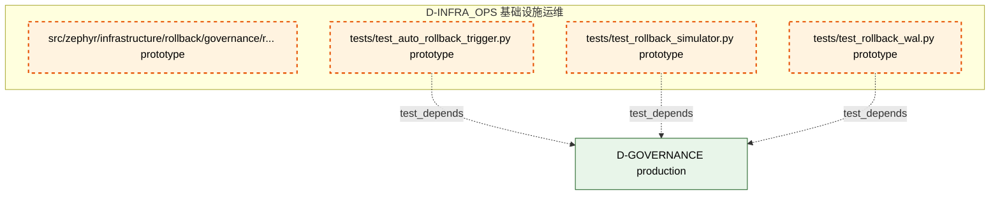

# 02_d_infra_ops / 基础设施运维

> **文档作用 / Purpose**: 展示 基础设施运维（D-INFRA_OPS）功能域的模块清单、域内依赖关系和跨域依赖关系，供架构审查和域治理参考。

> 本文档由 generate_domain_doc.py 从 depgraph.db 自动生成
> 最后更新: 2026-06-29 01:07:22
> 数据源: depgraph.db nodes表 + edges表

## 域基本信息 / Domain Overview

| 字段 | 值 | Field | Value |
|------|------|-------|-------|
| 编号 | 02 | Number | 02 |
| 域ID | D-INFRA_OPS | Domain ID | D-INFRA_OPS |
| 域名称 | 基础设施运维 | Domain Name | resource_optimization |
| 层级 | L0_infrastructure | Layer | L0_infrastructure |
| 模块数 | 34 | Module Count | 34 |
| 域内依赖 | 9 | Internal Dependencies | 9 |
| 跨域入边 | 1 | Cross-domain Incoming | 1 |
| 跨域出边 | 13 | Cross-domain Outgoing | 13 |
| 设计态模块 | 1 | Design Modules | 1 |
| 原型态模块 | 26 | Prototype Modules | 26 |
| 生产态模块 | 7 | Production Modules | 7 |
| 容量 | 7/150 (正常) | Capacity | 7/150 (正常) |
| 描述 | 资源优化引擎 | Description | 资源优化引擎 |

## 模块清单 / Module List

共 34 个模块（按路径排序，全部显示）

| 模块路径 / Module Path | 模块名称 / Module Name | 设计成熟度 / Maturity | 构建状态 / Build Status |
|---------|---------|-----------|---------|
| config/infra/grafana/dashboards/provider.yml |  | production | deprecated |
| config/infra/grafana/datasources/prometheus.yml |  | production | deprecated |
| config/infra/prometheus/prometheus.yml |  | production | deprecated |
| scripts/construction/test_deepseek_api.py |  | production | generated |
| scripts/ide_health_service.py |  | production | generated |
| src/zephyr/governance/auto_rollback_trigger.py |  | prototype | generated |
| src/zephyr/governance/rollback_simulator.py |  | prototype | generated |
| src/zephyr/governance/rollback_wal.py |  | prototype | generated |
| src/zephyr/infra_ops/ | 基础设施运维域 | design | planned |
| src/zephyr/infra_ops/__init__.py |  | prototype | generated |
| src/zephyr/infra_ops/_extensions/__init__.py |  | prototype | deprecated |
| src/zephyr/infra_ops/api/__init__.py |  | prototype | deprecated |
| src/zephyr/infra_ops/core/__init__.py |  | prototype | deprecated |
| src/zephyr/infra_ops/dashboard/__init__.py |  | production | generated |
| src/zephyr/infra_ops/dashboard/app.py |  | prototype | generated |
| src/zephyr/infra_ops/dashboard/components/__init__.py |  | production | generated |
| src/zephyr/infra_ops/dashboard/components/fitness_functions.py |  | prototype | generated |
| src/zephyr/infra_ops/dashboard/components/gate_statistics.py |  | prototype | generated |
| src/zephyr/infra_ops/dashboard/components/knowledge_overview.py |  | prototype | generated |
| src/zephyr/infra_ops/dashboard/components/olap_trend.py |  | prototype | generated |
| src/zephyr/infra_ops/dashboard/components/task_progress.py |  | prototype | generated |
| src/zephyr/infra_ops/infrastructure/__init__.py |  | prototype | deprecated |
| src/zephyr/infra_ops/interface_base.py |  | prototype | generated |
| src/zephyr/infra_ops/models/__init__.py |  | prototype | deprecated |
| src/zephyr/infra_ops/services/__init__.py |  | prototype | deprecated |
| src/zephyr/infrastructure/rollback/governance/__init__.py |  | prototype | generated |
| src/zephyr/infrastructure/rollback/governance/auditor.py |  | prototype | generated |
| src/zephyr/infrastructure/rollback/governance/budget_tracker.py |  | prototype | generated |
| src/zephyr/infrastructure/rollback/governance/contracts.py |  | prototype | generated |
| src/zephyr/infrastructure/rollback/governance/drift_fix.py |  | prototype | generated |
| src/zephyr/infrastructure/rollback/governance/result_types.py |  | prototype | generated |
| tests/test_auto_rollback_trigger.py |  | prototype | generated |
| tests/test_rollback_simulator.py |  | prototype | generated |
| tests/test_rollback_wal.py |  | prototype | generated |

## 域内依赖图 / Internal Dependency Diagram

> 依赖图内嵌在本文档中，IDE 可直接渲染显示。每30个节点一组分页显示。
>
> **图例说明 / Legend**：
> - **实线边框 = 运营态模块**（production，已上线运行）
> - **虚线边框 = 设计态模块**（design，还在设计中）
> - **实线箭头 = 运营态依赖**（已生效的依赖关系）
> - **虚线箭头 = 设计态依赖**（计划中的依赖关系）

### 第 1 页 / 共 2 页 / Page 1 of 2

```mermaid
graph TD
    subgraph D_INFRA_OPS["D-INFRA_OPS 基础设施运维"]
        config_infra_grafana_dashboards_provider_yml["config/infra/grafana/dashboards/provider.yml production"]
        config_infra_grafana_datasources_prometheus_yml["config/infra/grafana/datasources/prometheus.yml production"]
        config_infra_prometheus_prometheus_yml["config/infra/prometheus/prometheus.yml production"]
        scripts_construction_test_deepseek_api_py["scripts/construction/test_deepseek_api.py production"]
        scripts_ide_health_service_py["scripts/ide_health_service.py production"]
        src_zephyr_governance_auto_rollback_trigger_py["src/zephyr/governance/auto_rollback_trigger.py prototype"]
        src_zephyr_governance_rollback_simulator_py["src/zephyr/governance/rollback_simulator.py prototype"]
        src_zephyr_governance_rollback_wal_py["src/zephyr/governance/rollback_wal.py prototype"]
        src_zephyr_infra_ops["基础设施运维域 design"]
        src_zephyr_infra_ops_init_py["src/zephyr/infra_ops/__init__.py prototype"]
        src_zephyr_infra_ops_extensions_init_py["src/zephyr/infra_ops/_extensions/__init__.py prototype"]
        src_zephyr_infra_ops_api_init_py["src/zephyr/infra_ops/api/__init__.py prototype"]
        src_zephyr_infra_ops_core_init_py["src/zephyr/infra_ops/core/__init__.py prototype"]
        src_zephyr_infra_ops_dashboard_init_py["src/zephyr/infra_ops/dashboard/__init__.py production"]
        src_zephyr_infra_ops_dashboard_app_py["src/zephyr/infra_ops/dashboard/app.py prototype"]
        src_zephyr_infra_ops_dashboard_components_init_py["src/zephyr/infra_ops/dashboard/components/__ini... production"]
        src_zephyr_infra_ops_dashboard_components_fitness_functions_py["src/zephyr/infra_ops/dashboard/components/fitne... prototype"]
        src_zephyr_infra_ops_dashboard_components_gate_statistics_py["src/zephyr/infra_ops/dashboard/components/gate_... prototype"]
        src_zephyr_infra_ops_dashboard_components_knowledge_overview_py["src/zephyr/infra_ops/dashboard/components/knowl... prototype"]
        src_zephyr_infra_ops_dashboard_components_olap_trend_py["src/zephyr/infra_ops/dashboard/components/olap_... prototype"]
        src_zephyr_infra_ops_dashboard_components_task_progress_py["src/zephyr/infra_ops/dashboard/components/task_... prototype"]
        src_zephyr_infra_ops_infrastructure_init_py["src/zephyr/infra_ops/infrastructure/__init__.py prototype"]
        src_zephyr_infra_ops_interface_base_py["src/zephyr/infra_ops/interface_base.py prototype"]
        src_zephyr_infra_ops_models_init_py["src/zephyr/infra_ops/models/__init__.py prototype"]
        src_zephyr_infra_ops_services_init_py["src/zephyr/infra_ops/services/__init__.py prototype"]
        src_zephyr_infrastructure_rollback_governance_init_py["src/zephyr/infrastructure/rollback/governance/_... prototype"]
        src_zephyr_infrastructure_rollback_governance_auditor_py["src/zephyr/infrastructure/rollback/governance/a... prototype"]
        src_zephyr_infrastructure_rollback_governance_budget_tracker_py["src/zephyr/infrastructure/rollback/governance/b... prototype"]
        src_zephyr_infrastructure_rollback_governance_contracts_py["src/zephyr/infrastructure/rollback/governance/c... prototype"]
        src_zephyr_infrastructure_rollback_governance_drift_fix_py["src/zephyr/infrastructure/rollback/governance/d... prototype"]
    end
    src_zephyr_infra_ops_interface_base_py -.->|config_depends| src_zephyr_infra_ops_init_py
    src_zephyr_infra_ops_dashboard_app_py -.->|import_depends| src_zephyr_infra_ops_init_py
    src_zephyr_infra_ops_dashboard_components_gate_statistics_py -.->|config_depends| src_zephyr_infra_ops_dashboard_components_fitness_functions_py
    src_zephyr_infra_ops_dashboard_components_task_progress_py -.->|config_depends| src_zephyr_infra_ops_dashboard_components_gate_statistics_py
    src_zephyr_infra_ops_dashboard_components_knowledge_overview_py -.->|config_depends| src_zephyr_infra_ops_dashboard_components_gate_statistics_py
    src_zephyr_infra_ops_dashboard_components_olap_trend_py -.->|config_depends| src_zephyr_infra_ops_dashboard_components_gate_statistics_py
    src_zephyr_infrastructure_rollback_governance_budget_tracker_py -.->|config_depends| src_zephyr_infrastructure_rollback_governance_init_py
    src_zephyr_infrastructure_rollback_governance_drift_fix_py -.->|config_depends| src_zephyr_infrastructure_rollback_governance_init_py
    D_GOVERNANCE["D-GOVERNANCE production"]
    src_zephyr_governance_auto_rollback_trigger_py -.->|config_depends| D_GOVERNANCE
    src_zephyr_governance_rollback_simulator_py -.->|config_depends| D_GOVERNANCE
    src_zephyr_governance_rollback_wal_py -.->|config_depends| D_GOVERNANCE
    src_zephyr_infra_ops_dashboard_app_py -.->|import_depends| D_GOVERNANCE
    src_zephyr_infra_ops_dashboard_app_py -.->|import_depends| D_GOVERNANCE
    D_SHARED["D-SHARED prototype"]
    src_zephyr_infra_ops_dashboard_app_py -.->|import_depends| D_SHARED
    D_OPS["D-OPS production"]
    src_zephyr_infra_ops_dashboard_components_fitness_functions_py -.->|import_depends| D_OPS
    D_GOV_AUDIT["D-GOV_AUDIT prototype"]
    src_zephyr_infrastructure_rollback_governance_auditor_py -.->|import_depends| D_GOV_AUDIT
    src_zephyr_infrastructure_rollback_governance_contracts_py -.->|import_depends| D_GOV_AUDIT
    D_INFRA_RUNTIME["D-INFRA_RUNTIME production"]
    src_zephyr_infrastructure_rollback_governance_init_py -.->|import_depends| D_INFRA_RUNTIME
    D_FRONTEND["D-FRONTEND production"]
    D_FRONTEND -.->|import_depends| src_zephyr_infra_ops_init_py
    classDef production fill:#e1f5fe,stroke:#01579b,stroke-width:2px,color:#000
    classDef design fill:#fff3e0,stroke:#e65100,stroke-width:2px,color:#000,stroke-dasharray: 5 5
    classDef external_prod fill:#e8f5e9,stroke:#1b5e20,stroke-width:1px,color:#000
    classDef external_design fill:#fce4ec,stroke:#880e4f,stroke-width:1px,color:#000,stroke-dasharray: 5 5
    class config_infra_grafana_dashboards_provider_yml,config_infra_grafana_datasources_prometheus_yml,config_infra_prometheus_prometheus_yml,scripts_construction_test_deepseek_api_py,scripts_ide_health_service_py,src_zephyr_infra_ops_dashboard_init_py,src_zephyr_infra_ops_dashboard_components_init_py production
    class src_zephyr_governance_auto_rollback_trigger_py,src_zephyr_governance_rollback_simulator_py,src_zephyr_governance_rollback_wal_py,src_zephyr_infra_ops,src_zephyr_infra_ops_init_py,src_zephyr_infra_ops_extensions_init_py,src_zephyr_infra_ops_api_init_py,src_zephyr_infra_ops_core_init_py,src_zephyr_infra_ops_dashboard_app_py,src_zephyr_infra_ops_dashboard_components_fitness_functions_py,src_zephyr_infra_ops_dashboard_components_gate_statistics_py,src_zephyr_infra_ops_dashboard_components_knowledge_overview_py,src_zephyr_infra_ops_dashboard_components_olap_trend_py,src_zephyr_infra_ops_dashboard_components_task_progress_py,src_zephyr_infra_ops_infrastructure_init_py,src_zephyr_infra_ops_interface_base_py,src_zephyr_infra_ops_models_init_py,src_zephyr_infra_ops_services_init_py,src_zephyr_infrastructure_rollback_governance_init_py,src_zephyr_infrastructure_rollback_governance_auditor_py,src_zephyr_infrastructure_rollback_governance_budget_tracker_py,src_zephyr_infrastructure_rollback_governance_contracts_py,src_zephyr_infrastructure_rollback_governance_drift_fix_py design
    class D_GOVERNANCE,D_OPS,D_INFRA_RUNTIME,D_FRONTEND external_prod
    class D_SHARED,D_GOV_AUDIT external_design
```

### 第 2 页 / 共 2 页 / Page 2 of 2

## 跨域依赖 / Cross-domain Dependencies

### 本域依赖的其他域（出边）/ Depends On

| 目标域 / Target Domain | 依赖数 / Count | 依赖类型 / Type |
|--------|:---:|---------|
| D-GOVERNANCE | 8 | config_depends,import_depends,test_depends |
| D-GOV_AUDIT | 2 | import_depends |
| D-INFRA_RUNTIME | 1 | import_depends |
| D-OPS | 1 | import_depends |
| D-SHARED | 1 | import_depends |

### 依赖本域的其他域（入边）/ Depended By

| 源域 / Source Domain | 依赖数 / Count | 依赖类型 / Type |
|------|:---:|---------|
| D-FRONTEND | 1 | import_depends |

## 说明 / Notes

- **数据源 / Data Source**: `depgraph.db` 的 `nodes`、`edges`、`domains` 表
- **生成器 / Generator**: `generate_domain_doc.py`
- **维护方式 / Maintenance**: 自动生成，全景图更新时刷新
- **文件名规则 / File Naming**: `{编号:02d}_{域ID小写}.md`，如 `16_d_trading.md`
