# 02_d_infra_ops / 基础设施运维

> **文档作用 / Purpose**: 展示 基础设施运维（D_INFRA_OPS）功能域的模块清单、域内依赖关系、跨域依赖关系、架构分层视图，供架构审查和域治理参考。

> 本文档由 generate_domain_doc.py 从 depgraph (PostgreSQL) 自动生成
> 最后更新: 2026-07-01 03:38:51
> 数据源: depgraph (PostgreSQL) nodes表 + edges表

## 域基本信息 / Domain Overview

| 字段 | 值 | Field | Value |
|------|------|-------|-------|
| 编号 | 02 | Number | 02 |
| 域ID | D_INFRA_OPS | Domain ID | D_INFRA_OPS |
| 域名称 | 基础设施运维 | Domain Name | 基础设施运维 |
| 层级 | L0_infrastructure | Layer | L0_infrastructure |
| 模块数 | 16 | Module Count | 16 |
| 域内依赖 | 6 | Internal Dependencies | 6 |
| 跨域入边 | 1 | Cross-domain Incoming | 1 |
| 跨域出边 | 11 | Cross-domain Outgoing | 11 |
| 设计态模块 | 1 | Design Modules | 1 |
| 原型态模块 | 11 | Prototype Modules | 11 |
| 生产态模块 | 4 | Production Modules | 4 |
| 容量 | 7/150 (正常) | Capacity | 7/150 (正常) |
| 描述 | 资源优化引擎 | Description | 资源优化引擎 |

## 域内依赖图 / Internal Dependency Diagram

> 依赖图内嵌在本文档中，IDE 可直接渲染显示。每30个节点一组分页显示。
>
> **图例说明 / Legend**：
> - **实线边框 = 运营态模块**（production，已上线运行）
> - **虚线边框 = 设计态模块**（design，还在设计中）
> - **实线箭头 = 运营态依赖**（已生效的依赖关系）
> - **虚线箭头 = 设计态依赖**（计划中的依赖关系）

```mermaid
graph TD
    subgraph D_INFRA_OPS["D_INFRA_OPS 基础设施运维"]
        scripts_construction_test_deepseek_api_py["scripts/construction/test_deepseek_api.py production"]
        scripts_ide_health_service_py["scripts/ide_health_service.py production"]
        src_zephyr_governance_auto_rollback_trigger_py["src/zephyr/governance/auto_rollback_trigger.py prototype"]
        src_zephyr_governance_rollback_simulator_py["src/zephyr/governance/rollback_simulator.py prototype"]
        src_zephyr_governance_rollback_wal_py["src/zephyr/governance/rollback_wal.py prototype"]
        src_zephyr_infra_ops["基础设施运维域 design"]
        src_zephyr_infra_ops_init_py["src/zephyr/infra_ops/__init__.py prototype"]
        src_zephyr_infra_ops_dashboard_init_py["src/zephyr/infra_ops/dashboard/__init__.py production"]
        src_zephyr_infra_ops_dashboard_app_py["src/zephyr/infra_ops/dashboard/app.py prototype"]
        src_zephyr_infra_ops_dashboard_components_init_py["src/zephyr/infra_ops/dashboard/components/__ini... production"]
        src_zephyr_infra_ops_dashboard_components_fitness_functions_py["src/zephyr/infra_ops/dashboard/components/fitne... prototype"]
        src_zephyr_infra_ops_dashboard_components_gate_statistics_py["src/zephyr/infra_ops/dashboard/components/gate_... prototype"]
        src_zephyr_infra_ops_dashboard_components_knowledge_overview_py["src/zephyr/infra_ops/dashboard/components/knowl... prototype"]
        src_zephyr_infra_ops_dashboard_components_olap_trend_py["src/zephyr/infra_ops/dashboard/components/olap_... prototype"]
        src_zephyr_infra_ops_dashboard_components_task_progress_py["src/zephyr/infra_ops/dashboard/components/task_... prototype"]
        src_zephyr_infra_ops_interface_base_py["src/zephyr/infra_ops/interface_base.py prototype"]
    end
    src_zephyr_infra_ops_interface_base_py -.->|config_depends| src_zephyr_infra_ops_init_py
    src_zephyr_infra_ops_dashboard_app_py -.->|import_depends| src_zephyr_infra_ops_init_py
    src_zephyr_infra_ops_dashboard_components_gate_statistics_py -.->|config_depends| src_zephyr_infra_ops_dashboard_components_fitness_functions_py
    src_zephyr_infra_ops_dashboard_components_task_progress_py -.->|config_depends| src_zephyr_infra_ops_dashboard_components_gate_statistics_py
    src_zephyr_infra_ops_dashboard_components_knowledge_overview_py -.->|config_depends| src_zephyr_infra_ops_dashboard_components_gate_statistics_py
    src_zephyr_infra_ops_dashboard_components_olap_trend_py -.->|config_depends| src_zephyr_infra_ops_dashboard_components_gate_statistics_py
    D_SHARED["D_SHARED prototype"]
    src_zephyr_infra_ops_dashboard_app_py -.->|import_depends| D_SHARED
    D_OPS["D_OPS production"]
    src_zephyr_infra_ops_dashboard_components_fitness_functions_py -.->|import_depends| D_OPS
    D_GOVERNANCE["D_GOVERNANCE production"]
    src_zephyr_governance_auto_rollback_trigger_py -.->|config_depends| D_GOVERNANCE
    src_zephyr_governance_rollback_simulator_py -.->|config_depends| D_GOVERNANCE
    src_zephyr_governance_rollback_wal_py -.->|config_depends| D_GOVERNANCE
    D_FRONTEND["D_FRONTEND production"]
    D_FRONTEND -.->|import_depends| src_zephyr_infra_ops_init_py
    classDef production fill:#e1f5fe,stroke:#01579b,stroke-width:2px,color:#000
    classDef design fill:#fff3e0,stroke:#e65100,stroke-width:2px,color:#000,stroke-dasharray: 5 5
    classDef external_prod fill:#e8f5e9,stroke:#1b5e20,stroke-width:1px,color:#000
    classDef external_design fill:#fce4ec,stroke:#880e4f,stroke-width:1px,color:#000,stroke-dasharray: 5 5
    class scripts_construction_test_deepseek_api_py,scripts_ide_health_service_py,src_zephyr_infra_ops_dashboard_init_py,src_zephyr_infra_ops_dashboard_components_init_py production
    class src_zephyr_governance_auto_rollback_trigger_py,src_zephyr_governance_rollback_simulator_py,src_zephyr_governance_rollback_wal_py,src_zephyr_infra_ops,src_zephyr_infra_ops_init_py,src_zephyr_infra_ops_dashboard_app_py,src_zephyr_infra_ops_dashboard_components_fitness_functions_py,src_zephyr_infra_ops_dashboard_components_gate_statistics_py,src_zephyr_infra_ops_dashboard_components_knowledge_overview_py,src_zephyr_infra_ops_dashboard_components_olap_trend_py,src_zephyr_infra_ops_dashboard_components_task_progress_py,src_zephyr_infra_ops_interface_base_py design
    class D_OPS,D_GOVERNANCE,D_FRONTEND external_prod
    class D_SHARED external_design
```



## 跨域依赖 / Cross-domain Dependencies

### 本域依赖的其他域（出边）/ Depends On

| 目标域 / Target Domain | 依赖数 / Count | 依赖类型 / Type |
|--------|:---:|---------|
| D_GOVERNANCE | 6 | config_depends,test_depends |
| D_GOV_AUDIT | 2 | import_depends |
| D_INFRA_RUNTIME | 1 | import_depends |
| D_OPS | 1 | import_depends |
| D_SHARED | 1 | import_depends |

### 依赖本域的其他域（入边）/ Depended By

| 源域 / Source Domain | 依赖数 / Count | 依赖类型 / Type |
|------|:---:|---------|
| D_FRONTEND | 1 | import_depends |

## 架构分层视图 / Architecture Overview

> 按 architecture_layer 分层显示 基础设施运维（D_INFRA_OPS）的模块分布。共 16 个模块 / 16 modules。

```

┌──────────────────────────────────────────────────────────────────┐
│         L0 基础设施层 / Infrastructure Layer (1 modules)         │
├──────────────────────────────────────────────────────────────────┤
│   基础设施运维域  [design]                                       │
└──────────────────────────────────────────────────────────────────┘
                                  │
                                  ▼
┌──────────────────────────────────────────────────────────────────┐
│            L1 基础层 / Foundation Layer (11 modules)             │
├──────────────────────────────────────────────────────────────────┤
│   src/zephyr/governance/auto_rollback_trigger.py  [prototype]    │
│   src/zephyr/governance/rollback_simulator.py  [prototype]       │
│   src/zephyr/governance/rollback_wal.py  [prototype]             │
│   src/zephyr/infra_ops/__init__.py  [prototype]                  │
│   src/zephyr/infra_ops/dashboard/app.py  [prototype]             │
│   src/zephyr/infra_ops/dashboard/components/fitness_functions... │
│   src/zephyr/infra_ops/dashboard/components/gate_statistics.p... │
│   src/zephyr/infra_ops/dashboard/components/knowledge_overvie... │
│   src/zephyr/infra_ops/dashboard/components/olap_trend.py  [p... │
│   src/zephyr/infra_ops/dashboard/components/task_progress.py ... │
│   src/zephyr/infra_ops/interface_base.py  [prototype]            │
└──────────────────────────────────────────────────────────────────┘
                                  │
                                  ▼
┌──────────────────────────────────────────────────────────────────┐
│                未分类 / Unclassified (4 modules)                 │
├──────────────────────────────────────────────────────────────────┤
│   scripts/construction/test_deepseek_api.py  [production]        │
│   scripts/ide_health_service.py  [production]                    │
│   src/zephyr/infra_ops/dashboard/__init__.py  [production]       │
│   src/zephyr/infra_ops/dashboard/components/__init__.py  [pro... │
└──────────────────────────────────────────────────────────────────┘

```

## 模块分层清单 / Module Layered List

> 按 architecture_layer 分组的模块清单（共 16 个模块 / 16 modules）。

### L0 基础设施层 / Infrastructure Layer (1 modules)

| # | 模块路径 / Module Path | 模块名称 / Module Name | 成熟度 / Maturity | 构建状态 / Build Status |
|:--:|---------|---------|:---:|:---:|
| 1 | src/zephyr/infra_ops/ | 基础设施运维域 | design | planned |

### L1 基础层 / Foundation Layer (11 modules)

| # | 模块路径 / Module Path | 模块名称 / Module Name | 成熟度 / Maturity | 构建状态 / Build Status |
|:--:|---------|---------|:---:|:---:|
| 1 | src/zephyr/governance/auto_rollback_trigger.py | src/zephyr/governance/auto_rollback_t... | prototype | generated |
| 2 | src/zephyr/governance/rollback_simulator.py | src/zephyr/governance/rollback_simula... | prototype | generated |
| 3 | src/zephyr/governance/rollback_wal.py | src/zephyr/governance/rollback_wal.py | prototype | generated |
| 4 | src/zephyr/infra_ops/__init__.py | src/zephyr/infra_ops/__init__.py | prototype | generated |
| 5 | src/zephyr/infra_ops/dashboard/app.py | src/zephyr/infra_ops/dashboard/app.py | prototype | generated |
| 6 | src/zephyr/infra_ops/dashboard/components/fitness_functio... | src/zephyr/infra_ops/dashboard/compon... | prototype | generated |
| 7 | src/zephyr/infra_ops/dashboard/components/gate_statistics.py | src/zephyr/infra_ops/dashboard/compon... | prototype | generated |
| 8 | src/zephyr/infra_ops/dashboard/components/knowledge_overv... | src/zephyr/infra_ops/dashboard/compon... | prototype | generated |
| 9 | src/zephyr/infra_ops/dashboard/components/olap_trend.py | src/zephyr/infra_ops/dashboard/compon... | prototype | generated |
| 10 | src/zephyr/infra_ops/dashboard/components/task_progress.py | src/zephyr/infra_ops/dashboard/compon... | prototype | generated |
| 11 | src/zephyr/infra_ops/interface_base.py | src/zephyr/infra_ops/interface_base.py | prototype | generated |

### 未分类 / Unclassified (4 modules)

| # | 模块路径 / Module Path | 模块名称 / Module Name | 成熟度 / Maturity | 构建状态 / Build Status |
|:--:|---------|---------|:---:|:---:|
| 1 | scripts/construction/test_deepseek_api.py | scripts/construction/test_deepseek_ap... | production | generated |
| 2 | scripts/ide_health_service.py | scripts/ide_health_service.py | production | generated |
| 3 | src/zephyr/infra_ops/dashboard/__init__.py | src/zephyr/infra_ops/dashboard/__init... | production | generated |
| 4 | src/zephyr/infra_ops/dashboard/components/__init__.py | src/zephyr/infra_ops/dashboard/compon... | production | generated |

## 依赖关系图 / Dependency Graph

> 域内模块依赖关系（共 6 条 / 6 edges）。按依赖类型分组，使用 → 表示方向。

```

┌──────────────────────────────────────────────────────────────────┐
│        依赖关系图 / Dependency Graph (共 6 条 / 6 edges)         │
├──────────────────────────────────────────────────────────────────┤
│   依赖类型数 / Dependency Types: 2                               │
│   [config_depends]: 5 条 / edges                                 │
│   [import_depends]: 1 条 / edges                                 │
└──────────────────────────────────────────────────────────────────┘

┌──────────────────────────────────────────────────────────────────┐
│                 [config_depends] (5 条 / edges)                  │
├──────────────────────────────────────────────────────────────────┤
│   interface_base.py → __init__.py                                │
│   gate_statistics.py → fitness_functions.py                      │
│   task_progress.py → gate_statistics.py                          │
│   knowledge_overview.py → gate_statistics.py                     │
│   olap_trend.py → gate_statistics.py                             │
└──────────────────────────────────────────────────────────────────┘

┌──────────────────────────────────────────────────────────────────┐
│                 [import_depends] (1 条 / edges)                  │
├──────────────────────────────────────────────────────────────────┤
│   app.py → __init__.py                                           │
└──────────────────────────────────────────────────────────────────┘

```

## 说明 / Notes

- **数据源 / Data Source**: `depgraph (PostgreSQL)` 的 `nodes`、`edges`、`domains` 表
- **生成器 / Generator**: `generate_domain_doc.py`（G2+G10 合并）
- **维护方式 / Maintenance**: 自动生成，全景图更新时刷新
- **文件名规则 / File Naming**: `{编号:02d}_{域ID小写}.md`，如 `16_d_trading.md`
- **图例说明 / Legend**: `[production]`=已上线 / `[design]`=设计中 / `[prototype]`=原型 / `[unknown]`=未知
