# 02_d_infra_runtime / 运行时集成

> **文档作用 / Purpose**: 展示 运行时集成（D-INFRA_RUNTIME）功能域的模块清单、域内依赖关系和跨域依赖关系，供架构审查和域治理参考。

> 本文档由 generate_domain_doc.py 从 depgraph.db 自动生成
> 最后更新: 2026-06-24 23:01:54
> 数据源: depgraph.db nodes表 + edges表

## 域基本信息 / Domain Overview

| 字段 | 值 | Field | Value |
|------|------|-------|-------|
| 编号 | 02 | Number | 02 |
| 域ID | D-INFRA_RUNTIME | Domain ID | D-INFRA_RUNTIME |
| 域名称 | 运行时集成 | Domain Name | runtime_integration |
| 层级 | L0_infrastructure | Layer | L0_infrastructure |
| 模块数 | 727 | Module Count | 727 |
| 域内依赖 | 674 | Internal Dependencies | 674 |
| 跨域入边 | 762 | Cross-domain Incoming | 762 |
| 跨域出边 | 124 | Cross-domain Outgoing | 124 |
| 设计态模块 | 311 | Design Modules | 311 |
| 原型态模块 | 0 | Prototype Modules | 0 |
| 生产态模块 | 410 | Production Modules | 410 |
| 容量 | 726/150 (超容) | Capacity | 726/150 (超容) |
| 描述 | 运行时集成层 | Description | 运行时集成层 |

## 模块清单 / Module List

共 727 个模块（按路径排序，全部显示）

| 模块路径 / Module Path | 模块名称 / Module Name | 设计成熟度 / Maturity | 构建状态 / Build Status |
|---------|---------|-----------|---------|
| D-INFRA-RUNTIME/A-Share Diffusion Model Data Augmentation A股扩散模型数据增强 | A-Share Diffusion Model Data Augmenta... | design | design_only |
| D-INFRA-RUNTIME/AB Test Dependency Mapper AB测试依赖映射器 | AB Test Dependency Mapper AB测试依赖映射器 | design | design_only |
| D-INFRA-RUNTIME/API Documentation Synchronizer API文档同步器 | API Documentation Synchronizer API文档同步器 | design | design_only |
| D-INFRA-RUNTIME/API Version Compatibility Detector API版本兼容检测器 | API Version Compatibility Detector AP... | design | design_only |
| D-INFRA-RUNTIME/API Version Manager API版本管理器 | API Version Manager API版本管理器 | design | design_only |
| D-INFRA-RUNTIME/Alert Escalation Strategy Engine 告警升级策略引擎 | Alert Escalation Strategy Engine 告警升级... | design | design_only |
| D-INFRA-RUNTIME/Alert Silence Manager 告警静默管理器 | Alert Silence Manager 告警静默管理器 | design | design_only |
| D-INFRA-RUNTIME/Alternative Data Source Expansion 另类数据源扩展 | Alternative Data Source Expansion 另类数... | design | design_only |
| D-INFRA-RUNTIME/App 包装器 | App 包装器 | design | design_only |
| D-INFRA-RUNTIME/Application State Snapshotter 应用状态快照器 | Application State Snapshotter 应用状态快照器 | design | design_only |
| D-INFRA-RUNTIME/Architecture Compliance Checker 架构合规检查器 | Architecture Compliance Checker 架构合规检查器 | design | design_only |
| D-INFRA-RUNTIME/Architecture Evolution Planner 架构演进规划器 | Architecture Evolution Planner 架构演进规划器 | design | design_only |
| D-INFRA-RUNTIME/Architecture Recommendation Engine 架构推荐引擎 | Architecture Recommendation Engine 架构... | design | design_only |
| D-INFRA-RUNTIME/Automated Code Reviewer 自动代码审查器 | Automated Code Reviewer 自动代码审查器 | design | design_only |
| D-INFRA-RUNTIME/Bandwidth Optimizer 带宽优化 | Bandwidth Optimizer 带宽优化 | design | design_only |
| D-INFRA-RUNTIME/Base 基础 | Base 基础 | design | design_only |
| D-INFRA-RUNTIME/Batch Data Processor 批量数据处理器 | Batch Data Processor 批量数据处理器 | design | design_only |
| D-INFRA-RUNTIME/Blue-Green Dependency Mapper 蓝绿依赖映射器 | Blue-Green Dependency Mapper 蓝绿依赖映射器 | design | design_only |
| D-INFRA-RUNTIME/Blueprint Code Sync 蓝图代码同步 | Blueprint Code Sync 蓝图代码同步 | design | design_only |
| D-INFRA-RUNTIME/CPU Core Allocation Manager CPU核心分配管理器 | CPU Core Allocation Manager CPU核心分配管理器 | design | design_only |
| D-INFRA-RUNTIME/Cache Data Preloader 缓存数据预加载器 | Cache Data Preloader 缓存数据预加载器 | design | design_only |
| D-INFRA-RUNTIME/Cache Warmup Manager 缓存预热管理器 | Cache Warmup Manager 缓存预热管理器 | design | design_only |
| D-INFRA-RUNTIME/Canary Dependency Mapper 金丝雀依赖映射器 | Canary Dependency Mapper 金丝雀依赖映射器 | design | design_only |
| D-INFRA-RUNTIME/Capacity Alert 容量告警 | Capacity Alert 容量告警 | design | design_only |
| D-INFRA-RUNTIME/CapacityThresholdBreached 容量阈值突破事件 | CapacityThresholdBreached 容量阈值突破事件 | design | design_only |
| D-INFRA-RUNTIME/Causal ML 深度补充 因果ML深度补充 | Causal ML 深度补充 因果ML深度补充 | design | design_only |
| D-INFRA-RUNTIME/ChromaDB Vector Database ChromaDB向量数据库 | ChromaDB Vector Database ChromaDB向量数据库 | design | design_only |
| D-INFRA-RUNTIME/Circular Dependency Detector 循环依赖检测器 | Circular Dependency Detector 循环依赖检测器 | design | design_only |
| D-INFRA-RUNTIME/ClickHouse Database ClickHouse数据库 | ClickHouse Database ClickHouse数据库 | design | design_only |
| D-INFRA-RUNTIME/Clock Sync Service 时钟同步服务 | Clock Sync Service 时钟同步服务 | design | design_only |
| D-INFRA-RUNTIME/Code Change Impact Analyzer 代码变更影响分析器 | Code Change Impact Analyzer 代码变更影响分析器 | design | design_only |
| D-INFRA-RUNTIME/Code Complexity Analyzer 代码复杂度分析器 | Code Complexity Analyzer 代码复杂度分析器 | design | design_only |
| D-INFRA-RUNTIME/Code Duplication Detector 代码重复检测器 | Code Duplication Detector 代码重复检测器 | design | design_only |
| D-INFRA-RUNTIME/Code Security Static Analyzer 代码安全静态分析器 | Code Security Static Analyzer 代码安全静态分析器 | design | design_only |
| D-INFRA-RUNTIME/Code Standard Enforcer 代码规范强制执行器 | Code Standard Enforcer 代码规范强制执行器 | design | design_only |
| D-INFRA-RUNTIME/Code Structure Visualizer 代码结构可视化器 | Code Structure Visualizer 代码结构可视化器 | design | design_only |
| D-INFRA-RUNTIME/Code Template Engine 代码模板引擎 | Code Template Engine 代码模板引擎 | design | design_only |
| D-INFRA-RUNTIME/Cold Start Optimizer 冷启动优化器 | Cold Start Optimizer 冷启动优化器 | design | design_only |
| D-INFRA-RUNTIME/Cold Storage 冷存储 | Cold Storage 冷存储 | design | design_only |
| D-INFRA-RUNTIME/Cold平面 冷平面 | Cold平面 冷平面 | design | design_only |
| D-INFRA-RUNTIME/Communication Protocol Adapter 通信协议适配器 | Communication Protocol Adapter 通信协议适配器 | design | design_only |
| D-INFRA-RUNTIME/ConfigManager 配置管理器 | ConfigManager 配置管理器 | design | design_only |
| D-INFRA-RUNTIME/Configuration Change Notifier 配置变更通知器 | Configuration Change Notifier 配置变更通知器 | design | design_only |
| D-INFRA-RUNTIME/Configuration Code Generator 配置代码生成器 | Configuration Code Generator 配置代码生成器 | design | design_only |
| D-INFRA-RUNTIME/Configuration Dependency Mapper 配置依赖映射器 | Configuration Dependency Mapper 配置依赖映射器 | design | design_only |
| D-INFRA-RUNTIME/Configuration Diff Detector 配置差异检测器 | Configuration Diff Detector 配置差异检测器 | design | design_only |
| D-INFRA-RUNTIME/Configuration Encryption Manager 配置加密管理器 | Configuration Encryption Manager 配置加密管理器 | design | design_only |
| D-INFRA-RUNTIME/Configuration Hot Update Engine 配置热更新引擎 | Configuration Hot Update Engine 配置热更新引擎 | design | design_only |
| D-INFRA-RUNTIME/Configuration Manager 配置管理器 | Configuration Manager 配置管理器 | design | design_only |
| D-INFRA-RUNTIME/Configuration Merge Engine 配置合并引擎 | Configuration Merge Engine 配置合并引擎 | design | design_only |
| D-INFRA-RUNTIME/Configuration Validation Engine 配置校验引擎 | Configuration Validation Engine 配置校验引擎 | design | design_only |
| ...FRA-RUNTIME/Configuration Version Management & Rollback Framework 配置版本管理与回滚框架 | Configuration Version Management & Ro... | design | design_only |
| D-INFRA-RUNTIME/Conformal Prediction 共形预测 | Conformal Prediction 共形预测 | design | design_only |
| D-INFRA-RUNTIME/Connection Pool Manager 连接池管理器 | Connection Pool Manager 连接池管理器 | design | design_only |
| D-INFRA-RUNTIME/Container Image Cache Manager 容器镜像缓存管理器 | Container Image Cache Manager 容器镜像缓存管理器 | design | design_only |
| D-INFRA-RUNTIME/Container Orchestrator 容器编排器 | Container Orchestrator 容器编排器 | design | design_only |
| D-INFRA-RUNTIME/Container Resource Isolator 容器资源隔离器 | Container Resource Isolator 容器资源隔离器 | design | design_only |
| D-INFRA-RUNTIME/Continuous Improvement Engine 持续改进引擎 | Continuous Improvement Engine 持续改进引擎 | design | design_only |
| D-INFRA-RUNTIME/Conversation Context Compressor 对话上下文压缩 | Conversation Context Compressor 对话上下文压缩 | design | design_only |
| D-INFRA-RUNTIME/Cross-Module Interface Registry 跨模块接口注册中心 | Cross-Module Interface Registry 跨模块接口... | design | design_only |
| D-INFRA-RUNTIME/Cross-Origin Resource Sharing Manager 跨域资源共享管理器 | Cross-Origin Resource Sharing Manager... | design | design_only |
| D-INFRA-RUNTIME/Cross-Phase State Propagator 跨阶段状态传递器 | Cross-Phase State Propagator 跨阶段状态传递器 | design | design_only |
| D-INFRA-RUNTIME/Cybersecurity Shield 网络安全防护组件 | Cybersecurity Shield 网络安全防护组件 | design | design_only |
| D-INFRA-RUNTIME/D-INFRA | D-INFRA | design | design_only |
| D-INFRA-RUNTIME/D-INFRA-RUNTIME | D-INFRA-RUNTIME | design | design_only |
| D-INFRA-RUNTIME/DAO Layer Code Generator DAO层代码生成器 | DAO Layer Code Generator DAO层代码生成器 | design | design_only |
| D-INFRA-RUNTIME/Data Aggregation View Manager 数据聚合视图管理器 | Data Aggregation View Manager 数据聚合视图管理器 | design | design_only |
| D-INFRA-RUNTIME/Data Buffer Pool Manager 数据缓冲池管理器 | Data Buffer Pool Manager 数据缓冲池管理器 | design | design_only |
| D-INFRA-RUNTIME/Data Compression Manager 数据压缩管理器 | Data Compression Manager 数据压缩管理器 | design | design_only |
| D-INFRA-RUNTIME/Data Format Version Coordinator 数据格式版本协调器 | Data Format Version Coordinator 数据格式版... | design | design_only |
| D-INFRA-RUNTIME/Data Migration Script Generator 数据迁移脚本生成器 | Data Migration Script Generator 数据迁移脚... | design | design_only |
| D-INFRA-RUNTIME/Data Model Generator 数据模型生成器 | Data Model Generator 数据模型生成器 | design | design_only |
| D-INFRA-RUNTIME/Data Source Star Rating Dynamic Updater 数据源星级评分动态更新器 | Data Source Star Rating Dynamic Updat... | design | design_only |
| D-INFRA-RUNTIME/Data Sovereignty Manager 数据主权管理器 | Data Sovereignty Manager 数据主权管理器 | design | design_only |
| D-INFRA-RUNTIME/Data Transfer Validator 数据传输校验器 | Data Transfer Validator 数据传输校验器 | design | design_only |
| D-INFRA-RUNTIME/Data Transformation Performance Optimizer 数据转换性能优化器 | Data Transformation Performance Optim... | design | design_only |
| D-INFRA-RUNTIME/Data Transformation Pipeline Orchestrator 数据转换管线编排器 | Data Transformation Pipeline Orchestr... | design | design_only |
| D-INFRA-RUNTIME/Database Layer 数据库层 | Database Layer 数据库层 | design | design_only |
| D-INFRA-RUNTIME/Database Schema Synchronizer 数据库Schema同步器 | Database Schema Synchronizer 数据库Schem... | design | design_only |
| D-INFRA-RUNTIME/DegradationTriggered 降级触发事件 | DegradationTriggered 降级触发事件 | design | design_only |
| D-INFRA-RUNTIME/Deliverable Version Tracker 交付物版本追踪器 | Deliverable Version Tracker 交付物版本追踪器 | design | design_only |
| D-INFRA-RUNTIME/Dependency Conflict Resolver 依赖冲突解决器 | Dependency Conflict Resolver 依赖冲突解决器 | design | design_only |
| D-INFRA-RUNTIME/Dependency Graph Visualization Renderer 依赖图可视化渲染器 | Dependency Graph Visualization Render... | design | design_only |
| D-INFRA-RUNTIME/Dependency Security Vulnerability Scanner 依赖安全漏洞扫描器 | Dependency Security Vulnerability Sca... | design | design_only |
| D-INFRA-RUNTIME/Dependency Upgrade Compatibility Checker 依赖升级兼容性检查器 | Dependency Upgrade Compatibility Chec... | design | design_only |
| D-INFRA-RUNTIME/Dependency Version Lock Manager 依赖版本锁定管理器 | Dependency Version Lock Manager 依赖版本锁... | design | design_only |
| D-INFRA-RUNTIME/Dependency Visualizer 依赖可视化器 | Dependency Visualizer 依赖可视化器 | design | design_only |
| D-INFRA-RUNTIME/Deployment Topology Manager 部署拓扑管理器 | Deployment Topology Manager 部署拓扑管理器 | design | design_only |
| D-INFRA-RUNTIME/Development Plan Visualizer 开发计划可视化器 | Development Plan Visualizer 开发计划可视化器 | design | design_only |
| D-INFRA-RUNTIME/Distributed Lock Manager 分布式锁管理器 | Distributed Lock Manager 分布式锁管理器 | design | design_only |
| D-INFRA-RUNTIME/Document Link Validator 文档链接验证器 | Document Link Validator 文档链接验证器 | design | design_only |
| D-INFRA-RUNTIME/Document Search Indexer 文档搜索索引器 | Document Search Indexer 文档搜索索引器 | design | design_only |
| D-INFRA-RUNTIME/Document Template Engine 文档模板引擎 | Document Template Engine 文档模板引擎 | design | design_only |
| D-INFRA-RUNTIME/Document Version Manager 文档版本管理器 | Document Version Manager 文档版本管理器 | design | design_only |
| D-INFRA-RUNTIME/Domain-Driven Design Validator 领域驱动设计校验器 | Domain-Driven Design Validator 领域驱动设计校验器 | design | design_only |
| D-INFRA-RUNTIME/DuckDB Database DuckDB数据库 | DuckDB Database DuckDB数据库 | design | design_only |
| D-INFRA-RUNTIME/Elastic Scaling Manager 弹性伸缩管理器 | Elastic Scaling Manager 弹性伸缩管理器 | design | design_only |
| D-INFRA-RUNTIME/Endpoint Response Format Validator 端点响应格式校验器 | Endpoint Response Format Validator 端点... | design | design_only |
| D-INFRA-RUNTIME/Environment Configuration Layering Manager 环境配置分层管理器 | Environment Configuration Layering Ma... | design | design_only |
| D-INFRA-RUNTIME/Environment Manager 环境管理 | Environment Manager 环境管理 | design | design_only |
| D-INFRA-RUNTIME/Environment Variable Manager 环境变量管理器 | Environment Variable Manager 环境变量管理器 | design | design_only |
| D-INFRA-RUNTIME/Error Handling Code Generator 错误处理代码生成器 | Error Handling Code Generator 错误处理代码生成器 | design | design_only |
| D-INFRA-RUNTIME/EventBus 事件总线 | EventBus 事件总线 | design | design_only |
| D-INFRA-RUNTIME/EventStoreDB Event Store EventStoreDB事件存储 | EventStoreDB Event Store EventStoreDB... | design | design_only |
| D-INFRA-RUNTIME/Experiment and Resilience Testing 实验与韧性测试 | Experiment and Resilience Testing 实验与... | design | design_only |
| D-INFRA-RUNTIME/FAISS Vector Search FAISS向量检索 | FAISS Vector Search FAISS向量检索 | design | design_only |
| D-INFRA-RUNTIME/Factor Warmup Manager 因子预热管理器 | Factor Warmup Manager 因子预热管理器 | design | design_only |
| D-INFRA-RUNTIME/Failover Coordinator 故障转移协调器 | Failover Coordinator 故障转移协调器 | design | design_only |
| D-INFRA-RUNTIME/Faiss GPU Vector Search Faiss GPU向量搜索 | Faiss GPU Vector Search Faiss GPU向量搜索 | design | design_only |
| D-INFRA-RUNTIME/Feature Drift & Concept Drift Detection 特征漂移与概念漂移检测 | Feature Drift & Concept Drift Detecti... | design | design_only |
| D-INFRA-RUNTIME/Feature Lifecycle Manager 功能生命周期管理器 | Feature Lifecycle Manager 功能生命周期管理器 | design | design_only |
| D-INFRA-RUNTIME/Field Mapping Converter 字段映射转换器 | Field Mapping Converter 字段映射转换器 | design | design_only |
| D-INFRA-RUNTIME/Financial Time Series Data Augmentation 金融时序数据增强 | Financial Time Series Data Augmentati... | design | design_only |
| D-INFRA-RUNTIME/GPU Compute Pipeline Manager GPU计算管线管理器 | GPU Compute Pipeline Manager GPU计算管线管理器 | design | design_only |
| D-INFRA-RUNTIME/GPU Inference Training Dynamic Allocator GPU推理训练动态分配器 | GPU Inference Training Dynamic Alloca... | design | design_only |
| D-INFRA-RUNTIME/GPU Kernel Launch Optimizer GPU内核启动优化器 | GPU Kernel Launch Optimizer GPU内核启动优化器 | design | design_only |
| D-INFRA-RUNTIME/GPU MPS多进程并发 GPU Multi-Process Service | GPU MPS多进程并发 GPU Multi-Process Service | design | design_only |
| D-INFRA-RUNTIME/GPU Memory Transfer Optimizer GPU内存传输优化器 | GPU Memory Transfer Optimizer GPU内存传输优化器 | design | design_only |
| D-INFRA-RUNTIME/GPU Programming Abstraction Layer GPU编程抽象层 | GPU Programming Abstraction Layer GPU... | design | design_only |
| D-INFRA-RUNTIME/GPU Resource Monitor GPU资源监控器 | GPU Resource Monitor GPU资源监控器 | design | design_only |
| D-INFRA-RUNTIME/GPU Scheduler GPU调度器 | GPU Scheduler GPU调度器 | design | design_only |
| D-INFRA-RUNTIME/GPUOOMDetected GPU OOM检测事件 | GPUOOMDetected GPU OOM检测事件 | design | design_only |
| D-INFRA-RUNTIME/GPU调度上岗+热交换 GPU调度 | GPU调度上岗+热交换 GPU调度 | design | design_only |
| D-INFRA-RUNTIME/GPU调度层 GPU调度 | GPU调度层 GPU调度 | design | design_only |
| D-INFRA-RUNTIME/Global Dependency Graph Calculator 全局依赖图计算器 | Global Dependency Graph Calculator 全局... | design | design_only |
| D-INFRA-RUNTIME/Governance Adapter 治理适配器 | Governance Adapter 治理适配器 | design | design_only |
| D-INFRA-RUNTIME/Governance Protocol 治理协议 | Governance Protocol 治理协议 | design | design_only |
| D-INFRA-RUNTIME/Graceful Shutdown Coordinator 优雅关闭协调器 | Graceful Shutdown Coordinator 优雅关闭协调器 | design | design_only |
| D-INFRA-RUNTIME/Graph Neural Network for Stock Relations 图神经网络用于股票关系建模 | Graph Neural Network for Stock Relati... | design | design_only |
| D-INFRA-RUNTIME/Hardware Accelerator 硬件加速器 | Hardware Accelerator 硬件加速器 | design | design_only |
| D-INFRA-RUNTIME/High Performance HA Framework 高性能高可用保障框架 | High Performance HA Framework 高性能高可用保障框架 | design | design_only |
| D-INFRA-RUNTIME/Hot Storage 热存储 | Hot Storage 热存储 | design | design_only |
| D-INFRA-RUNTIME/Hot↔Warm必须通过IPC协议通信 Hot-Warm IPC Protocol | Hot↔Warm必须通过IPC协议通信 Hot-Warm IPC Prot... | design | design_only |
| D-INFRA-RUNTIME/Hot平面 热平面 | Hot平面 热平面 | design | design_only |
| D-INFRA-RUNTIME/Inference Engine Warmer 推理引擎预热器 | Inference Engine Warmer 推理引擎预热器 | design | design_only |
| D-INFRA-RUNTIME/Infrastructure Status 基础设施状态 | Infrastructure Status 基础设施状态 | design | design_only |
| D-INFRA-RUNTIME/Infrastructure Topology Visualizer 基础设施拓扑可视化器 | Infrastructure Topology Visualizer 基础... | design | design_only |
| D-INFRA-RUNTIME/InfrastructureAlert 基础设施告警 | InfrastructureAlert 基础设施告警 | design | design_only |
| D-INFRA-RUNTIME/InfrastructureNode 基础设施节点 | InfrastructureNode 基础设施节点 | design | design_only |
| D-INFRA-RUNTIME/Inter-Layer Data Format Converter & Validator 层间数据格式转换与校验器 | Inter-Layer Data Format Converter & V... | design | design_only |
| D-INFRA-RUNTIME/Inter-Module Communication Protocol Manager 模块间通信协议管理器 | Inter-Module Communication Protocol M... | design | design_only |
| D-INFRA-RUNTIME/Inter-Process Communication Manager 进程间通信管理器 | Inter-Process Communication Manager 进... | design | design_only |
| D-INFRA-RUNTIME/Interface Mock Generator 接口Mock生成器 | Interface Mock Generator 接口Mock生成器 | design | design_only |
| D-INFRA-RUNTIME/Iteration Cycle Tracker 迭代周期追踪器 | Iteration Cycle Tracker 迭代周期追踪器 | design | design_only |
| D-INFRA-RUNTIME/Kafka Message Queue Kafka消息队列 | Kafka Message Queue Kafka消息队列 | design | design_only |
| D-INFRA-RUNTIME/Knowledge Base Data Sovereignty 知识库数据主权管理 | Knowledge Base Data Sovereignty 知识库数据... | design | design_only |
| D-INFRA-RUNTIME/Knowledge Base Indexer 知识库索引器 | Knowledge Base Indexer 知识库索引器 | design | design_only |
| D-INFRA-RUNTIME/LLM Agent for Fundamental Analysis 大语言模型Agent用于基本面分析 | LLM Agent for Fundamental Analysis 大语... | design | design_only |
| D-INFRA-RUNTIME/Learning System Bridge Declaration 学习系统桥接声明 | Learning System Bridge Declaration 学习... | design | design_only |
| D-INFRA-RUNTIME/Live Data to Research Domain Feedback Channel 实盘数据→研究域反馈通道 | Live Data to Research Domain Feedback... | design | design_only |
| D-INFRA-RUNTIME/Load Balancing Strategy Engine 负载均衡策略引擎 | Load Balancing Strategy Engine 负载均衡策略引擎 | design | design_only |
| D-INFRA-RUNTIME/Local First Architecture 本地优先架构 | Local First Architecture 本地优先架构 | design | design_only |
| D-INFRA-RUNTIME/MCP Sentinel System Monitor MCP哨兵系统监控器 | MCP Sentinel System Monitor MCP哨兵系统监控器 | design | design_only |
| D-INFRA-RUNTIME/Mamba/SSM State Space Model Mamba/SSM状态空间模型 | Mamba/SSM State Space Model Mamba/SSM... | design | design_only |
| D-INFRA-RUNTIME/Market Microstructure Deep Modeling 市场微观结构深度建模 | Market Microstructure Deep Modeling 市... | design | design_only |
| D-INFRA-RUNTIME/Message Queue Manager 消息队列管理器 | Message Queue Manager 消息队列管理器 | design | design_only |
| D-INFRA-RUNTIME/Message Queue 消息队列 | Message Queue 消息队列 | design | design_only |
| D-INFRA-RUNTIME/Metric Anomaly Detector 指标异常检测器 | Metric Anomaly Detector 指标异常检测器 | design | design_only |
| D-INFRA-RUNTIME/Milestone Dependency Validator 里程碑依赖校验器 | Milestone Dependency Validator 里程碑依赖校验器 | design | design_only |
| D-INFRA-RUNTIME/MinIO Object Storage MinIO对象存储 | MinIO Object Storage MinIO对象存储 | design | design_only |
| D-INFRA-RUNTIME/Model Registry & Experiment Management 模型注册与实验管理 | Model Registry & Experiment Managemen... | design | design_only |
| D-INFRA-RUNTIME/Model Warmup Manager 模型预热管理器 | Model Warmup Manager 模型预热管理器 | design | design_only |
| D-INFRA-RUNTIME/Module Configuration Aggregator 模块配置聚合器 | Module Configuration Aggregator 模块配置聚合器 | design | design_only |
| D-INFRA-RUNTIME/Module Dependency Injector 模块依赖注入器 | Module Dependency Injector 模块依赖注入器 | design | design_only |
| D-INFRA-RUNTIME/Module Documentation Indexer 模块文档索引器 | Module Documentation Indexer 模块文档索引器 | design | design_only |
| D-INFRA-RUNTIME/Module Exception Boundary Manager 模块异常边界管理器 | Module Exception Boundary Manager 模块异... | design | design_only |
| D-INFRA-RUNTIME/Module Feature Toggle Manager 模块功能开关管理器 | Module Feature Toggle Manager 模块功能开关管理器 | design | design_only |
| D-INFRA-RUNTIME/Module Health Checker 模块健康检查器 | Module Health Checker 模块健康检查器 | design | design_only |
| D-INFRA-RUNTIME/Module Hot Update Manager 模块热更新管理器 | Module Hot Update Manager 模块热更新管理器 | design | design_only |
| D-INFRA-RUNTIME/Module Interface Contract Manager 模块接口契约管理器 | Module Interface Contract Manager 模块接... | design | design_only |
| D-INFRA-RUNTIME/Module Lifecycle Manager 模块生命周期管理器 | Module Lifecycle Manager 模块生命周期管理器 | design | design_only |
| D-INFRA-RUNTIME/Module Log Aggregator 模块日志聚合器 | Module Log Aggregator 模块日志聚合器 | design | design_only |
| D-INFRA-RUNTIME/Module Metrics Collector 模块度量采集器 | Module Metrics Collector 模块度量采集器 | design | design_only |
| D-INFRA-RUNTIME/Module Performance Profiler 模块性能分析器 | Module Performance Profiler 模块性能分析器 | design | design_only |
| D-INFRA-RUNTIME/Module Registry 模块注册中心 | Module Registry 模块注册中心 | design | design_only |
| D-INFRA-RUNTIME/Module Sandbox Isolator 模块沙箱隔离器 | Module Sandbox Isolator 模块沙箱隔离器 | design | design_only |
| D-INFRA-RUNTIME/Module Test Runner 模块测试运行器 | Module Test Runner 模块测试运行器 | design | design_only |
| D-INFRA-RUNTIME/Module Version Dependency Resolver 模块版本依赖解析器 | Module Version Dependency Resolver 模块... | design | design_only |
| D-INFRA-RUNTIME/Monitoring Dashboard Process 监控面板进程 | Monitoring Dashboard Process 监控面板进程 | design | design_only |
| D-INFRA-RUNTIME/Monitoring Data Aggregator 监控数据聚合器 | Monitoring Data Aggregator 监控数据聚合器 | design | design_only |
| D-INFRA-RUNTIME/Multi-Device State Coordinator 多端状态协调器 | Multi-Device State Coordinator 多端状态协调器 | design | design_only |
| D-INFRA-RUNTIME/Multi-Modal Input Router 多模态输入路由 | Multi-Modal Input Router 多模态输入路由 | design | design_only |
| D-INFRA-RUNTIME/Multi-Process Isolation & Runtime Architecture 多进程隔离与运行时架构 | Multi-Process Isolation & Runtime Arc... | design | design_only |
| D-INFRA-RUNTIME/Multi-Protocol Network Adapter 多协议网络适配器 | Multi-Protocol Network Adapter 多协议网络适配器 | design | design_only |
| D-INFRA-RUNTIME/Multi-Region Collaboration Manager 多区域协同管理器 | Multi-Region Collaboration Manager 多区... | design | design_only |
| D-INFRA-RUNTIME/NAS Storage NAS存储 | NAS Storage NAS存储 | design | design_only |
| D-INFRA-RUNTIME/NSSM+自研Supervisor 进程守护层 | NSSM+自研Supervisor 进程守护层 | design | design_only |
| D-INFRA-RUNTIME/NSSM注册Windows服务 NSSM Windows Service | NSSM注册Windows服务 NSSM Windows Service | design | design_only |
| D-INFRA-RUNTIME/Network Policy Manager 网络策略管理器 | Network Policy Manager 网络策略管理器 | design | design_only |
| D-INFRA-RUNTIME/Node Return Type Contractor 节点返回值类型契约器 | Node Return Type Contractor 节点返回值类型契约器 | design | design_only |
| D-INFRA-RUNTIME/P3 Process Specification P3进程规格 | P3 Process Specification P3进程规格 | design | design_only |
| D-INFRA-RUNTIME/Package Dependency Graph Generator 包依赖图生成器 | Package Dependency Graph Generator 包依... | design | design_only |
| D-INFRA-RUNTIME/Panel Layout Engine 面板布局引擎 | Panel Layout Engine 面板布局引擎 | design | design_only |
| D-INFRA-RUNTIME/Parquet Columnar Storage Parquet列式存储 | Parquet Columnar Storage Parquet列式存储 | design | design_only |
| D-INFRA-RUNTIME/Parquet Parquet列式存储格式 | Parquet Parquet列式存储格式 | design | design_only |
| D-INFRA-RUNTIME/Path Resolver 路径解析 | Path Resolver 路径解析 | design | design_only |
| D-INFRA-RUNTIME/Phase Retrospective Analyzer 阶段回顾分析器 | Phase Retrospective Analyzer 阶段回顾分析器 | design | design_only |
| D-INFRA-RUNTIME/Phase Synchronization Coordinator 阶段同步协调器 | Phase Synchronization Coordinator 阶段同... | design | design_only |
| D-INFRA-RUNTIME/Plugin System Manager 插件系统管理器 | Plugin System Manager 插件系统管理器 | design | design_only |
| D-INFRA-RUNTIME/Policy Conflict Auto Detector 策略冲突自动检测器 | Policy Conflict Auto Detector 策略冲突自动检测器 | design | design_only |
| D-INFRA-RUNTIME/Privacy-Preserving Computation 隐私保护计算 | Privacy-Preserving Computation 隐私保护计算 | design | design_only |
| D-INFRA-RUNTIME/Process Daemon Monitor 进程守护监控器 | Process Daemon Monitor 进程守护监控器 | design | design_only |
| D-INFRA-RUNTIME/Process Manager 进程管理器 | Process Manager 进程管理器 | design | design_only |
| D-INFRA-RUNTIME/ProcessHeartbeatLost 进程心跳丢失事件 | ProcessHeartbeatLost 进程心跳丢失事件 | design | design_only |
| D-INFRA-RUNTIME/Progressive Delivery Pre-check Enhancer 渐进交付前置检查增强 | Progressive Delivery Pre-check Enhanc... | design | design_only |
| D-INFRA-RUNTIME/Qdrant Vector Database Qdrant向量数据库 | Qdrant Vector Database Qdrant向量数据库 | design | design_only |
| D-INFRA-RUNTIME/REST API Code Generator REST API代码生成器 | REST API Code Generator REST API代码生成器 | design | design_only |
| D-INFRA-RUNTIME/RTO RPO Specification RTO RPO规格 | RTO RPO Specification RTO RPO规格 | design | design_only |
| D-INFRA-RUNTIME/Real-Time Alert Engine 实时告警引擎 | Real-Time Alert Engine 实时告警引擎 | design | design_only |
| D-INFRA-RUNTIME/Real-Time Data Stream Manager 实时数据流管理器 | Real-Time Data Stream Manager 实时数据流管理器 | design | design_only |
| D-INFRA-RUNTIME/Real-Time Data Warmer 实时数据预热器 | Real-Time Data Warmer 实时数据预热器 | design | design_only |
| D-INFRA-RUNTIME/Redis Connection Lost Redis连接断开 | Redis Connection Lost Redis连接断开 | design | design_only |
| D-INFRA-RUNTIME/Redis Data Loss Redis数据丢失 | Redis Data Loss Redis数据丢失 | design | design_only |
| D-INFRA-RUNTIME/Redis Hash Redis哈希 | Redis Hash Redis哈希 | design | design_only |
| D-INFRA-RUNTIME/Redis In-Memory Store Redis内存存储 | Redis In-Memory Store Redis内存存储 | design | design_only |
| D-INFRA-RUNTIME/Redis Manager Redis管理器 | Redis Manager Redis管理器 | design | design_only |
| D-INFRA-RUNTIME/Redis Pub/Sub Redis发布订阅 | Redis Pub/Sub Redis发布订阅 | design | design_only |
| D-INFRA-RUNTIME/Redis Pub/Sub 发布订阅 | Redis Pub/Sub 发布订阅 | design | design_only |
| D-INFRA-RUNTIME/Redis Redis内存数据库 | Redis Redis内存数据库 | design | design_only |
| D-INFRA-RUNTIME/Redis Stream 消息通道 | Redis Stream 消息通道 | design | design_only |
| D-INFRA-RUNTIME/Redis使用混合持久化RDB+AOF Hybrid Persistence | Redis使用混合持久化RDB+AOF Hybrid Persistence | design | design_only |
| D-INFRA-RUNTIME/Redis共享状态 共享状态层 | Redis共享状态 共享状态层 | design | design_only |
| D-INFRA-RUNTIME/Redis读写熔断器 | Redis读写熔断器 | design | design_only |
| D-INFRA-RUNTIME/Redis集群/哨兵 Redis Cluster Sentinel | Redis集群/哨兵 Redis Cluster Sentinel | design | design_only |
| D-INFRA-RUNTIME/Region Collapse Manager 区域折叠管理器 | Region Collapse Manager 区域折叠管理器 | design | design_only |
| D-INFRA-RUNTIME/Regression Test Orchestrator 回归测试编排器 | Regression Test Orchestrator 回归测试编排器 | design | design_only |
| D-INFRA-RUNTIME/Reinforcement Learning for Portfolio & Execution 强化学习用于组合优化与订单执行 | Reinforcement Learning for Portfolio ... | design | design_only |
| D-INFRA-RUNTIME/Request Chain Tracer 请求链追踪器 | Request Chain Tracer 请求链追踪器 | design | design_only |
| D-INFRA-RUNTIME/Request Forwarding & Load Balancer 请求转发与负载均衡器 | Request Forwarding & Load Balancer 请求... | design | design_only |
| D-INFRA-RUNTIME/Request Retry Manager 请求重试管理器 | Request Retry Manager 请求重试管理器 | design | design_only |
| D-INFRA-RUNTIME/Resource Load Balancer 资源负载均衡器 | Resource Load Balancer 资源负载均衡器 | design | design_only |
| D-INFRA-RUNTIME/Resource Quota Manager 资源配额管理器 | Resource Quota Manager 资源配额管理器 | design | design_only |
| D-INFRA-RUNTIME/Resource Reservation Manager 资源预约管理器 | Resource Reservation Manager 资源预约管理器 | design | design_only |
| D-INFRA-RUNTIME/Resource Scheduler 资源调度器 | Resource Scheduler 资源调度器 | design | design_only |
| D-INFRA-RUNTIME/Resource Timeline Manager 资源时间线管理器 | Resource Timeline Manager 资源时间线管理器 | design | design_only |
| D-INFRA-RUNTIME/Resource Usage Auditor 资源使用审计器 | Resource Usage Auditor 资源使用审计器 | design | design_only |
| D-INFRA-RUNTIME/Return Value Performance Monitor 返回值性能监控器 | Return Value Performance Monitor 返回值性... | design | design_only |
| D-INFRA-RUNTIME/Runtime Configuration Validator 运行时配置校验器 | Runtime Configuration Validator 运行时配置校验器 | design | design_only |
| D-INFRA-RUNTIME/Runtime Environment 运行时环境 | Runtime Environment 运行时环境 | design | design_only |
| D-INFRA-RUNTIME/Runtime Infrastructure Self-Checker 运行时基础设施自检器 | Runtime Infrastructure Self-Checker 运... | design | design_only |
| D-INFRA-RUNTIME/Runtime 运行时 | Runtime 运行时 | design | design_only |
| D-INFRA-RUNTIME/SDK Auto Generator SDK自动生成器 | SDK Auto Generator SDK自动生成器 | design | design_only |
| D-INFRA-RUNTIME/SQLite Database SQLite数据库 | SQLite Database SQLite数据库 | design | design_only |
| D-INFRA-RUNTIME/SQLite SQLite嵌入式数据库 | SQLite SQLite嵌入式数据库 | design | design_only |
| D-INFRA-RUNTIME/Schedule Conflict Detector 时间表冲突检测器 | Schedule Conflict Detector 时间表冲突检测器 | design | design_only |
| D-INFRA-RUNTIME/Serialization Performance Optimizer 序列化性能优化器 | Serialization Performance Optimizer 序... | design | design_only |
| D-INFRA-RUNTIME/Service Degradation Manager 服务降级管理器 | Service Degradation Manager 服务降级管理器 | design | design_only |
| D-INFRA-RUNTIME/Service Dependency Health Checker 服务依赖健康检查器 | Service Dependency Health Checker 服务依... | design | design_only |
| D-INFRA-RUNTIME/Service Discovery Registrar 服务发现注册器 | Service Discovery Registrar 服务发现注册器 | design | design_only |
| D-INFRA-RUNTIME/Service Rate Limiter 服务限流器 | Service Rate Limiter 服务限流器 | design | design_only |
| D-INFRA-RUNTIME/Service Registry 服务注册表 | Service Registry 服务注册表 | design | design_only |
| D-INFRA-RUNTIME/Session Persistence Manager 会话持久化管理器 | Session Persistence Manager 会话持久化管理器 | design | design_only |
| D-INFRA-RUNTIME/Signal Warmup Manager 信号预热管理器 | Signal Warmup Manager 信号预热管理器 | design | design_only |
| D-INFRA-RUNTIME/Signature Methods 签名方法 | Signature Methods 签名方法 | design | design_only |
| D-INFRA-RUNTIME/Single-Machine Concurrency Mode Optimizer 单机并发模式优化器 | Single-Machine Concurrency Mode Optim... | design | design_only |
| D-INFRA-RUNTIME/Specification Automation Checker 规范自动化检查器 | Specification Automation Checker 规范自动... | design | design_only |
| D-INFRA-RUNTIME/State Machine 状态机 | State Machine 状态机 | design | design_only |
| D-INFRA-RUNTIME/Strategy Backtesting Infrastructure 策略回测基础设施 | Strategy Backtesting Infrastructure 策... | design | design_only |
| D-INFRA-RUNTIME/Strategy Correlation Matrix Calculator 策略相关性矩阵计算器 | Strategy Correlation Matrix Calculato... | design | design_only |
| D-INFRA-RUNTIME/Strategy Execution Plan Optimizer 策略执行计划优化器 | Strategy Execution Plan Optimizer 策略执... | design | design_only |
| D-INFRA-RUNTIME/Strategy Parameter Tuning Engine 策略参数调优引擎 | Strategy Parameter Tuning Engine 策略参数... | design | design_only |
| D-INFRA-RUNTIME/Strategy Portfolio Simulator 策略组合模拟器 | Strategy Portfolio Simulator 策略组合模拟器 | design | design_only |
| D-INFRA-RUNTIME/Survival Analysis 生存分析 | Survival Analysis 生存分析 | design | design_only |
| D-INFRA-RUNTIME/System Master Infrastructure 系统总蓝图基础设施支撑 | System Master Infrastructure 系统总蓝图基础设施支撑 | design | design_only |
| D-INFRA-RUNTIME/System Startup Orchestrator 系统启动编排器 | System Startup Orchestrator 系统启动编排器 | design | design_only |
| D-INFRA-RUNTIME/SystemStarted 系统启动事件 | SystemStarted 系统启动事件 | design | design_only |
| D-INFRA-RUNTIME/SystemStopped 系统停止事件 | SystemStopped 系统停止事件 | design | design_only |
| D-INFRA-RUNTIME/Task Priority Scheduler 任务优先级调度器 | Task Priority Scheduler 任务优先级调度器 | design | design_only |
| D-INFRA-RUNTIME/Technical Debt Tracker 技术债务追踪器 | Technical Debt Tracker 技术债务追踪器 | design | design_only |
| D-INFRA-RUNTIME/Telemetry Four-Stream Unified Collector 遥测四流统一采集器 | Telemetry Four-Stream Unified Collect... | design | design_only |
| D-INFRA-RUNTIME/Terminology Consistency Validator 术语一致性校验器 | Terminology Consistency Validator 术语一... | design | design_only |
| D-INFRA-RUNTIME/Test Code Generator 测试代码生成器 | Test Code Generator 测试代码生成器 | design | design_only |
| D-INFRA-RUNTIME/Test Coverage Tracker 测试覆盖率追踪器 | Test Coverage Tracker 测试覆盖率追踪器 | design | design_only |
| D-INFRA-RUNTIME/Thread Pool Manager 线程池管理器 | Thread Pool Manager 线程池管理器 | design | design_only |
| ...RUNTIME/Time-Series Conformal Prediction Enhancement TCP/DDCI/CP-VaR 时序保形预测增强 | Time-Series Conformal Prediction Enha... | design | design_only |
| D-INFRA-RUNTIME/Time-Series Database & Tiered Storage 时序数据库与分层存储架构 | Time-Series Database & Tiered Storage... | design | design_only |
| D-INFRA-RUNTIME/Traffic Mirror Dependency Mapping Enhancer 流量镜像依赖映射增强 | Traffic Mirror Dependency Mapping Enh... | design | design_only |
| D-INFRA-RUNTIME/Traffic Mirror Mapper 流量镜像映射器 | Traffic Mirror Mapper 流量镜像映射器 | design | design_only |
| D-INFRA-RUNTIME/Traffic Shaper 流量整形器 | Traffic Shaper 流量整形器 | design | design_only |
| D-INFRA-RUNTIME/Transformer Time-Series Architecture Transformer时序架构 | Transformer Time-Series Architecture ... | design | design_only |
| D-INFRA-RUNTIME/Transitive Dependency Analyzer 传递依赖分析器 | Transitive Dependency Analyzer 传递依赖分析器 | design | design_only |
| D-INFRA-RUNTIME/Unified Feature Toggle Framework 统一功能开关框架 | Unified Feature Toggle Framework 统一功能... | design | design_only |
| D-INFRA-RUNTIME/User Preference Synchronizer 用户偏好同步器 | User Preference Synchronizer 用户偏好同步器 | design | design_only |
| D-INFRA-RUNTIME/Validation Rule Generator 验证规则生成器 | Validation Rule Generator 验证规则生成器 | design | design_only |
| D-INFRA-RUNTIME/Warm Storage 温存储 | Warm Storage 温存储 | design | design_only |
| D-INFRA-RUNTIME/Warm平面 温平面 | Warm平面 温平面 | design | design_only |
| D-INFRA-RUNTIME/WebSocket Reconnection WebSocket断线重连 | WebSocket Reconnection WebSocket断线重连 | design | design_only |
| D-INFRA-RUNTIME/WinSW Windows Service Wrapper 服务 | WinSW Windows Service Wrapper 服务 | design | design_only |
| D-INFRA-RUNTIME/Workflow Version Management 工作流版本管理 | Workflow Version Management 工作流版本管理 | design | design_only |
| D-INFRA-RUNTIME/Working Memory 工作记忆 | Working Memory 工作记忆 | design | design_only |
| D-INFRA-RUNTIME/pywin32supervisor pywin32监控器 | pywin32supervisor pywin32监控器 | design | design_only |
| D-INFRA-RUNTIME/交易时段核心进程不可自动重启 Core | 交易时段核心进程不可自动重启 Core | design | design_only |
| D-INFRA-RUNTIME/关键路径使用熔断器模式 Circuit Breaker | 关键路径使用熔断器模式 Circuit Breaker | design | design_only |
| D-INFRA-RUNTIME/分三平面Hot Warm Cold Three-Plane | 分三平面Hot Warm Cold Three-Plane | design | design_only |
| D-INFRA-RUNTIME/应急保命轨 应急保命轨 Emergency Life-Saving Track | 应急保命轨 应急保命轨 Emergency Life-Saving Track | design | design_only |
| D-INFRA-RUNTIME/数据字段Schema版本管理器 Data Field Schema Version Manager | 数据字段Schema版本管理器 Data Field Schema Ver... | design | design_only |
| D-INFRA-RUNTIME/数据完整性校验器 Data Integrity Validator | 数据完整性校验器 Data Integrity Validator | design | design_only |
| D-INFRA-RUNTIME/数据库管理器 Database Manager (16分片SQLite) | 数据库管理器 Database Manager (16分片SQLite) | design | design_only |
| D-INFRA-RUNTIME/数据血缘追踪器 Data Lineage Tracker | 数据血缘追踪器 Data Lineage Tracker | design | design_only |
| D-INFRA-RUNTIME/数据质量监控器 Data Quality Monitor | 数据质量监控器 Data Quality Monitor | design | design_only |
| D-INFRA-RUNTIME/数据验证规则引擎 Data Validation Rule Engine | 数据验证规则引擎 Data Validation Rule Engine | design | design_only |
| D-INFRA-RUNTIME/熔断器模式 Circuit Breaker | 熔断器模式 Circuit Breaker | design | design_only |
| D-INFRA-RUNTIME/缓存一致性管理器 Cache Consistency Manager | 缓存一致性管理器 Cache Consistency Manager | design | design_only |
| D-INFRA-RUNTIME/自研Python守护进程 Python Supervisor | 自研Python守护进程 Python Supervisor | design | design_only |
| D-INFRA-RUNTIME/跨域事件总线 Cross-domain Event Bus | 跨域事件总线 Cross-domain Event Bus | design | design_only |
| D-INFRA-RUNTIME/跨运行时平面禁止共享可变全局状态 No Shared Mutable Global State | 跨运行时平面禁止共享可变全局状态 No Shared Mutable Gl... | design | design_only |
| D-INFRA-RUNTIME/运行时架构用进程守护模式 Process Guard Mode | 运行时架构用进程守护模式 Process Guard Mode | design | design_only |
| D-INFRA-RUNTIME/需要应急保命轨 Survival Track | 需要应急保命轨 Survival Track | design | design_only |
| src/zephyr/__init__.py |  | production | draft |
| src/zephyr/autonomy_core/pipeline_orchestrator.py |  | production | draft |
| src/zephyr/infrastructure/__init__.py |  | production | draft |
| src/zephyr/infrastructure/__init___from_infra.py |  | production | draft |
| src/zephyr/infrastructure/_base_server.py |  | production | draft |
| src/zephyr/infrastructure/_extensions/__init__.py |  | scaffold_placeholder | orphan |
| src/zephyr/infrastructure/a2a_protocol/__init__.py |  | production | draft |
| src/zephyr/infrastructure/a2a_protocol/a2a_card_registry.py |  | production | draft |
| src/zephyr/infrastructure/a2a_protocol/layer1_discovery/__init__.py |  | production | draft |
| src/zephyr/infrastructure/a2a_protocol/layer1_discovery/a2a_registry.py |  | production | draft |
| src/zephyr/infrastructure/a2a_protocol/layer1_discovery/agent_card.py |  | production | draft |
| src/zephyr/infrastructure/a2a_protocol/layer1_discovery/identity_verifier.py |  | production | draft |
| src/zephyr/infrastructure/a2a_protocol/layer2_communication/__init__.py |  | production | draft |
| src/zephyr/infrastructure/a2a_protocol/layer2_communication/a2a_schemas.py |  | production | draft |
| src/zephyr/infrastructure/a2a_protocol/layer2_communication/a2a_state.py |  | production | draft |
| src/zephyr/infrastructure/a2a_protocol/layer2_communication/context_package.py |  | production | draft |
| src/zephyr/infrastructure/a2a_protocol/layer2_communication/handoff_manager.py |  | production | draft |
| src/zephyr/infrastructure/a2a_protocol/layer2_communication/message_router.py |  | production | draft |
| src/zephyr/infrastructure/a2a_protocol/layer2_communication/push_notifier.py |  | production | draft |
| src/zephyr/infrastructure/a2a_protocol/layer2_communication/streaming.py |  | production | draft |
| src/zephyr/infrastructure/a2a_protocol/layer2_communication/trigger_monitor.py |  | production | draft |
| src/zephyr/infrastructure/a2a_protocol/layer3_coordination/__init__.py |  | production | draft |
| src/zephyr/infrastructure/a2a_protocol/layer3_coordination/_consensus.py |  | production | draft |
| src/zephyr/infrastructure/a2a_protocol/layer3_coordination/_core_coordination.py |  | production | draft |
| src/zephyr/infrastructure/a2a_protocol/layer3_coordination/_intelligence.py |  | production | draft |
| ...yr/infrastructure/a2a_protocol/layer3_coordination/_security_and_economics.py |  | production | draft |
| ...ephyr/infrastructure/a2a_protocol/layer3_coordination/a2a_anomaly_detector.py |  | production | draft |
| ...r/infrastructure/a2a_protocol/layer3_coordination/a2a_behavior_fingerprint.py |  | production | draft |
| ...phyr/infrastructure/a2a_protocol/layer3_coordination/a2a_blame_attribution.py |  | production | draft |
| src/zephyr/infrastructure/a2a_protocol/layer3_coordination/a2a_carbon.py |  | production | draft |
| src/zephyr/infrastructure/a2a_protocol/layer3_coordination/a2a_causal_trace.py |  | production | draft |
| src/zephyr/infrastructure/a2a_protocol/layer3_coordination/a2a_checkpoint.py |  | production | draft |
| ...hyr/infrastructure/a2a_protocol/layer3_coordination/a2a_collusion_detector.py |  | production | draft |
| src/zephyr/infrastructure/a2a_protocol/layer3_coordination/a2a_consent.py |  | production | draft |
| src/zephyr/infrastructure/a2a_protocol/layer3_coordination/a2a_constitutional.py |  | production | draft |
| src/zephyr/infrastructure/a2a_protocol/layer3_coordination/a2a_context_rot.py |  | production | draft |
| ...rastructure/a2a_protocol/layer3_coordination/a2a_cross_agent_semantic_flow.py |  | production | draft |
| src/zephyr/infrastructure/a2a_protocol/layer3_coordination/a2a_dashboard.py |  | production | draft |
| src/zephyr/infrastructure/a2a_protocol/layer3_coordination/a2a_debate.py |  | production | draft |
| ...ephyr/infrastructure/a2a_protocol/layer3_coordination/a2a_delegation_chain.py |  | production | draft |
| src/zephyr/infrastructure/a2a_protocol/layer3_coordination/a2a_economics.py |  | production | draft |
| src/zephyr/infrastructure/a2a_protocol/layer3_coordination/a2a_forgetting.py |  | production | draft |
| ...yr/infrastructure/a2a_protocol/layer3_coordination/a2a_formal_verification.py |  | production | draft |
| ...phyr/infrastructure/a2a_protocol/layer3_coordination/a2a_frame_negotiation.py |  | production | draft |
| ...zephyr/infrastructure/a2a_protocol/layer3_coordination/a2a_hardware_router.py |  | production | draft |
| src/zephyr/infrastructure/a2a_protocol/layer3_coordination/a2a_hibernate.py |  | production | draft |
| src/zephyr/infrastructure/a2a_protocol/layer3_coordination/a2a_idempotency.py |  | production | draft |
| src/zephyr/infrastructure/a2a_protocol/layer3_coordination/a2a_idle_guard.py |  | production | draft |
| src/zephyr/infrastructure/a2a_protocol/layer3_coordination/a2a_immune.py |  | production | draft |
| ...phyr/infrastructure/a2a_protocol/layer3_coordination/a2a_knowledge_distill.py |  | production | draft |
| src/zephyr/infrastructure/a2a_protocol/layer3_coordination/a2a_latent_comm.py |  | production | draft |
| src/zephyr/infrastructure/a2a_protocol/layer3_coordination/a2a_metrics.py |  | production | draft |
| src/zephyr/infrastructure/a2a_protocol/layer3_coordination/a2a_negotiation.py |  | production | draft |
| ...ephyr/infrastructure/a2a_protocol/layer3_coordination/a2a_protocol_gateway.py |  | production | draft |
| ...phyr/infrastructure/a2a_protocol/layer3_coordination/a2a_protocol_security.py |  | production | draft |
| src/zephyr/infrastructure/a2a_protocol/layer3_coordination/a2a_red_team.py |  | production | draft |
| src/zephyr/infrastructure/a2a_protocol/layer3_coordination/a2a_saga.py |  | production | draft |
| src/zephyr/infrastructure/a2a_protocol/layer3_coordination/a2a_security.py |  | production | draft |
| ...hyr/infrastructure/a2a_protocol/layer3_coordination/a2a_temporal_admission.py |  | production | draft |
| src/zephyr/infrastructure/a2a_protocol/layer3_coordination/a2a_tracing.py |  | production | draft |
| ...phyr/infrastructure/a2a_protocol/layer3_coordination/a2a_vector_reputation.py |  | production | draft |
| src/zephyr/infrastructure/a2a_protocol/layer3_coordination/a2a_voting.py |  | production | draft |
| src/zephyr/infrastructure/a2a_protocol/layer3_coordination/a2a_work_steal.py |  | production | draft |
| src/zephyr/infrastructure/a2a_protocol/layer3_coordination/arbitrator.py |  | production | draft |
| src/zephyr/infrastructure/a2a_protocol/layer3_coordination/cascade_guard.py |  | production | draft |
| src/zephyr/infrastructure/a2a_protocol/layer3_coordination/conflict_detector.py |  | production | draft |
| ...phyr/infrastructure/a2a_protocol/layer3_coordination/construction_verifier.py |  | production | draft |
| src/zephyr/infrastructure/a2a_protocol/layer3_coordination/deadlock_guard.py |  | production | draft |
| src/zephyr/infrastructure/a2a_protocol/layer3_coordination/livelock_detector.py |  | production | draft |
| src/zephyr/infrastructure/a2a_protocol/layer3_coordination/semantic_diff.py |  | production | draft |
| .../infrastructure/a2a_protocol/layer3_coordination/session_smuggling_defense.py |  | production | draft |
| src/zephyr/infrastructure/a2a_protocol/layer3_coordination/spec_sync.py |  | production | draft |
| src/zephyr/infrastructure/a2a_protocol/layer3_coordination/supervisor.py |  | production | draft |
| src/zephyr/infrastructure/a2a_protocol/legacy_auditor.py |  | production | draft |
| src/zephyr/infrastructure/a2a_protocol/legacy_protocol.py |  | production | draft |
| src/zephyr/infrastructure/a2a_protocol/local_first_arch.py |  | production | draft |
| src/zephyr/infrastructure/a2a_protocol/market_data_pipeline.py |  | production | draft |
| src/zephyr/infrastructure/a2a_protocol/migration_strategy.py |  | production | draft |
| src/zephyr/infrastructure/a2a_protocol/multi_agent.py |  | production | draft |
| src/zephyr/infrastructure/a2a_protocol/multi_model_consensus.py |  | production | draft |
| src/zephyr/infrastructure/a2a_protocol/offline_autonomy.py |  | production | draft |
| src/zephyr/infrastructure/a2a_protocol/offline_resilience.py |  | production | draft |
| src/zephyr/infrastructure/a2a_protocol/phase_hold.py |  | production | draft |
| src/zephyr/infrastructure/a2a_protocol/prompt_lifecycle.py |  | production | draft |
| src/zephyr/infrastructure/a2a_protocol/realtime_streaming.py |  | production | draft |
| src/zephyr/infrastructure/adaptation/__init__.py |  | production | draft |
| src/zephyr/infrastructure/api/__init__.py |  | scaffold_placeholder | orphan |
| src/zephyr/infrastructure/asset_inventory/__init__.py |  | production | draft |
| src/zephyr/infrastructure/asset_inventory/__main__.py |  | production | draft |
| src/zephyr/infrastructure/asset_inventory/classifier.py |  | production | draft |
| src/zephyr/infrastructure/asset_inventory/dashboard.py |  | production | draft |
| src/zephyr/infrastructure/asset_inventory/dependency.py |  | production | draft |
| src/zephyr/infrastructure/asset_inventory/index_generator.py |  | production | draft |
| src/zephyr/infrastructure/asset_inventory/lifecycle.py |  | production | draft |
| src/zephyr/infrastructure/asset_inventory/mcp_server.py |  | production | draft |
| src/zephyr/infrastructure/asset_inventory/metadata.py |  | production | draft |
| src/zephyr/infrastructure/asset_inventory/models.py |  | production | draft |
| src/zephyr/infrastructure/asset_inventory/reconciler.py |  | production | draft |
| src/zephyr/infrastructure/asset_inventory/registry_adapter.py |  | production | draft |
| src/zephyr/infrastructure/asset_inventory/scanner.py |  | production | draft |
| src/zephyr/infrastructure/asset_inventory/telemetry.py |  | production | draft |
| src/zephyr/infrastructure/asset_inventory/trust_anchor.py |  | production | draft |
| src/zephyr/infrastructure/audit_logger.py |  | production | draft |
| src/zephyr/infrastructure/auto_diagnostics.py |  | production | draft |
| src/zephyr/infrastructure/auto_fix_engine/__init__.py |  | production | draft |
| src/zephyr/infrastructure/auto_fix_engine/__main__.py |  | production | draft |
| src/zephyr/infrastructure/auto_fix_engine/alignment_syncer.py |  | production | draft |
| src/zephyr/infrastructure/auto_fix_engine/all_completer.py |  | production | draft |
| src/zephyr/infrastructure/auto_fix_engine/batch_fixer.py |  | production | draft |
| src/zephyr/infrastructure/auto_fix_engine/compliance_auditor.py |  | production | draft |
| src/zephyr/infrastructure/auto_fix_engine/config_fixer.py |  | production | draft |
| src/zephyr/infrastructure/auto_fix_engine/dedup_extractor.py |  | production | draft |
| src/zephyr/infrastructure/auto_fix_engine/dep_version_fixer.py |  | production | draft |
| src/zephyr/infrastructure/auto_fix_engine/drift_fixer.py |  | production | draft |
| src/zephyr/infrastructure/auto_fix_engine/engine.py |  | production | draft |
| src/zephyr/infrastructure/auto_fix_engine/escalation_bridge.py |  | production | draft |
| src/zephyr/infrastructure/auto_fix_engine/event_hooks.py |  | production | draft |
| src/zephyr/infrastructure/auto_fix_engine/fix_budget.py |  | production | draft |
| src/zephyr/infrastructure/auto_fix_engine/fix_diff.py |  | production | draft |
| src/zephyr/infrastructure/auto_fix_engine/fix_health_check.py |  | production | draft |
| src/zephyr/infrastructure/auto_fix_engine/fix_pattern_miner.py |  | production | draft |
| src/zephyr/infrastructure/auto_fix_engine/fix_reliability.py |  | production | draft |
| src/zephyr/infrastructure/auto_fix_engine/fix_report.py |  | production | draft |
| src/zephyr/infrastructure/auto_fix_engine/fix_safety.py |  | production | draft |
| src/zephyr/infrastructure/auto_fix_engine/fix_scheduler.py |  | production | draft |
| src/zephyr/infrastructure/auto_fix_engine/import_fixer.py |  | production | draft |
| src/zephyr/infrastructure/auto_fix_engine/interrupt_guard.py |  | production | draft |
| src/zephyr/infrastructure/auto_fix_engine/llm_fix_adapter.py |  | production | draft |
| src/zephyr/infrastructure/auto_fix_engine/models.py |  | production | draft |
| src/zephyr/infrastructure/auto_fix_engine/scaffold_registrar.py |  | production | draft |
| src/zephyr/infrastructure/auto_fix_engine/self_heal_agent.py |  | production | draft |
| src/zephyr/infrastructure/auto_fix_engine/shadow_workspace.py |  | production | draft |
| src/zephyr/infrastructure/auto_fix_engine/state_machine.py |  | production | draft |
| src/zephyr/infrastructure/auto_fix_engine/zombie_cleaner.py |  | production | draft |
| src/zephyr/infrastructure/blueprint_code_sync.py |  | production | draft |
| src/zephyr/infrastructure/blueprint_search_server.py |  | production | draft |
| src/zephyr/infrastructure/capacity_assurance/__init__.py |  | production | draft |
| src/zephyr/infrastructure/capacity_assurance/contracts/__init__.py |  | production | draft |
| src/zephyr/infrastructure/capacity_assurance/contracts/batch1_infra.py |  | production | draft |
| src/zephyr/infrastructure/capacity_assurance/contracts/batch3_integration.py |  | production | draft |
| src/zephyr/infrastructure/capacity_assurance/contracts/contract_bus.py |  | production | draft |
| src/zephyr/infrastructure/capacity_assurance/cross_module_integration.py |  | production | draft |
| src/zephyr/infrastructure/capacity_assurance/modules/__init__.py |  | production | draft |
| src/zephyr/infrastructure/capacity_assurance/modules/ai_skill_monitor.py |  | production | draft |
| src/zephyr/infrastructure/capacity_assurance/modules/capacity_testing_harness.py |  | production | draft |
| src/zephyr/infrastructure/capacity_assurance/modules/cliff_detector.py |  | production | draft |
| src/zephyr/infrastructure/capacity_assurance/modules/cold_start_estimator.py |  | production | draft |
| src/zephyr/infrastructure/capacity_assurance/modules/config_reload_semantic.py |  | production | draft |
| src/zephyr/infrastructure/capacity_assurance/modules/context_budget_guard.py |  | production | draft |
| ...phyr/infrastructure/capacity_assurance/modules/degradation_spiral_detector.py |  | production | draft |
| src/zephyr/infrastructure/capacity_assurance/modules/dr_drill_scheduler.py |  | production | draft |
| src/zephyr/infrastructure/capacity_assurance/modules/graceful_shutdown.py |  | production | draft |
| src/zephyr/infrastructure/capacity_assurance/modules/hawthorne_blind.py |  | production | draft |
| src/zephyr/infrastructure/capacity_assurance/modules/multi_model_vendor_risk.py |  | production | draft |
| ...phyr/infrastructure/capacity_assurance/modules/observer_effect_compensator.py |  | production | draft |
| src/zephyr/infrastructure/capacity_assurance/modules/owner_health_monitor.py |  | production | draft |
| src/zephyr/infrastructure/capacity_assurance/modules/per_task_token_budget.py |  | production | draft |
| src/zephyr/infrastructure/capacity_assurance/modules/startup_guard.py |  | production | draft |
| src/zephyr/infrastructure/capacity_assurance/modules/sunk_cost_intervention.py |  | production | draft |
| src/zephyr/infrastructure/capacity_assurance/modules/time_partitioned_slo.py |  | production | draft |
| src/zephyr/infrastructure/capacity_assurance/modules/token_value_attribution.py |  | production | draft |
| src/zephyr/infrastructure/capacity_assurance/modules/trace_capacity_injector.py |  | production | draft |
| src/zephyr/infrastructure/capacity_assurance/modules/winfs_defense.py |  | production | draft |
| src/zephyr/infrastructure/capacity_assurance/risk_mitigation.py |  | production | draft |
| src/zephyr/infrastructure/capacity_assurance/schema.py |  | production | draft |
| src/zephyr/infrastructure/capacity_assurance/sli_instrumentation.py |  | production | draft |
| src/zephyr/infrastructure/capacity_assurance/tech_stack.py |  | production | draft |
| src/zephyr/infrastructure/compensation/__init__.py |  | production | draft |
| src/zephyr/infrastructure/config/__init__.py |  | production | draft |
| src/zephyr/infrastructure/config/shared/config/__init__.py |  | production | draft |
| src/zephyr/infrastructure/config/shared/config/loader.py |  | production | draft |
| src/zephyr/infrastructure/config_validator.py |  | production | draft |
| src/zephyr/infrastructure/contract_tester.py |  | production | draft |
| src/zephyr/infrastructure/core/__init__.py |  | scaffold_placeholder | orphan |
| src/zephyr/infrastructure/cost_tracker.py |  | production | draft |
| src/zephyr/infrastructure/dashboard/__init__.py |  | production | orphan |
| src/zephyr/infrastructure/dashboard/components/__init__.py |  | production | orphan |
| src/zephyr/infrastructure/db/__init__.py |  | production | draft |
| src/zephyr/infrastructure/db/atomic_transaction_manager.py |  | production | draft |
| src/zephyr/infrastructure/db/audit_schema.py |  | production | draft |
| src/zephyr/infrastructure/db/base_repo.py |  | production | draft |
| src/zephyr/infrastructure/db/circuit_breaker_repo.py |  | production | draft |
| src/zephyr/infrastructure/db/circuit_breaker_types.py |  | production | draft |
| src/zephyr/infrastructure/db/database_manager.py |  | production | draft |
| src/zephyr/infrastructure/db/gate_repo.py |  | production | draft |
| src/zephyr/infrastructure/db/olap_engine.py |  | production | draft |
| src/zephyr/infrastructure/db/query.py |  | production | draft |
| src/zephyr/infrastructure/db/query_metrics.py |  | production | draft |
| src/zephyr/infrastructure/db/sqlite_schema.py |  | production | draft |
| src/zephyr/infrastructure/db/task_repo.py |  | production | draft |
| src/zephyr/infrastructure/db/transition.py |  | production | draft |
| src/zephyr/infrastructure/dependency/__init__.py |  | production | draft |
| src/zephyr/infrastructure/doc_guard_server.py |  | production | draft |
| src/zephyr/infrastructure/draft/__init__.py |  | production | draft |
| src/zephyr/infrastructure/dry_run_simulator.py |  | production | draft |
| src/zephyr/infrastructure/error_codes.py |  | production | draft |
| src/zephyr/infrastructure/event_bus_upgrade.py |  | production | draft |
| src/zephyr/infrastructure/event_store.py |  | production | draft |
| src/zephyr/infrastructure/events/__init__.py |  | production | draft |
| src/zephyr/infrastructure/events/event_store.py |  | production | draft |
| src/zephyr/infrastructure/file_watcher.py |  | production | draft |
| src/zephyr/infrastructure/finding_task_bridge.py |  | production | draft |
| src/zephyr/infrastructure/gate_engine_server.py |  | production | draft |
| src/zephyr/infrastructure/gateway_server.py |  | production | draft |
| src/zephyr/infrastructure/handoff_auto_loader.py |  | production | draft |
| src/zephyr/infrastructure/health_monitor/__init__.py |  | production | draft |
| src/zephyr/infrastructure/health_monitor/health_aggregator.py |  | production | draft |
| src/zephyr/infrastructure/hooks/__init__.py |  | production | draft |
| src/zephyr/infrastructure/hooks/event_hook.py |  | production | draft |
| src/zephyr/infrastructure/impact/__init__.py |  | production | draft |
| src/zephyr/infrastructure/impact/impact_propagator.py |  | production | draft |
| src/zephyr/infrastructure/impact/llm_impact_analyzer.py |  | production | draft |
| src/zephyr/infrastructure/infra_06/__init__.py |  | production | draft |
| src/zephyr/infrastructure/infra_06/cache.py |  | production | draft |
| src/zephyr/infrastructure/infra_06/process_lifecycle_gateway.py |  | production | draft |
| src/zephyr/infrastructure/infra_06/process_pool.py |  | production | draft |
| src/zephyr/infrastructure/infrastructure/__init__.py |  | scaffold_placeholder | orphan |
| src/zephyr/infrastructure/infrastructure_base.py |  | production | draft |
| src/zephyr/infrastructure/kill_switch_sim.py |  | production | draft |
| src/zephyr/infrastructure/knowledge/__init__.py |  | production | draft |
| src/zephyr/infrastructure/knowledge_base_server.py |  | production | draft |
| src/zephyr/infrastructure/lifecycle/__init__.py |  | production | draft |
| src/zephyr/infrastructure/lifecycle/lazy_loader.py |  | production | draft |
| src/zephyr/infrastructure/lifecycle/resource_optimization_engine.py |  | production | draft |
| src/zephyr/infrastructure/lifecycle/scope_guard.py |  | production | draft |
| src/zephyr/infrastructure/lifecycle/task_lifecycle_manager.py |  | production | draft |
| src/zephyr/infrastructure/maintenance/__init__.py |  | production | draft |
| src/zephyr/infrastructure/model_capability_exam/__init__.py |  | production | draft |
| src/zephyr/infrastructure/model_capability_exam/capability_passport.py |  | production | draft |
| src/zephyr/infrastructure/model_capability_exam/exam_orchestrator.py |  | production | draft |
| src/zephyr/infrastructure/model_capability_exam/exam_test_cases.py |  | production | draft |
| src/zephyr/infrastructure/model_profiler/__init__.py |  | production | draft |
| src/zephyr/infrastructure/model_profiler/benchmark_suite.py |  | production | draft |
| src/zephyr/infrastructure/model_profiler/capability_passport.py |  | production | draft |
| src/zephyr/infrastructure/model_profiler/cli.py |  | production | draft |
| src/zephyr/infrastructure/model_profiler/deepseek_v4_chat.py |  | production | draft |
| src/zephyr/infrastructure/model_profiler/exam_orchestrator.py |  | production | draft |
| src/zephyr/infrastructure/model_profiler/exam_test_cases.py |  | production | draft |
| src/zephyr/infrastructure/model_profiler/model_discovery.py |  | production | draft |
| src/zephyr/infrastructure/model_profiler/profiler.py |  | production | draft |
| src/zephyr/infrastructure/model_profiler/provider_data.py |  | production | draft |
| src/zephyr/infrastructure/model_profiler/results_writer.py |  | production | draft |
| src/zephyr/infrastructure/model_profiler/task_model_learner.py |  | production | draft |
| src/zephyr/infrastructure/models/__init__.py |  | scaffold_placeholder | orphan |
| src/zephyr/infrastructure/observability/__init__.py |  | production | draft |
| src/zephyr/infrastructure/observability/__init___from_infra.py |  | production | draft |
| src/zephyr/infrastructure/observability/contract_metrics.py |  | production | draft |
| src/zephyr/infrastructure/observability/health_probes.py |  | production | draft |
| src/zephyr/infrastructure/observability/notifier.py |  | production | draft |
| src/zephyr/infrastructure/observability/trace_decorator.py |  | production | draft |
| src/zephyr/infrastructure/observability_02/__init__.py |  | production | draft |
| src/zephyr/infrastructure/observability_02/session_audit.py |  | production | draft |
| src/zephyr/infrastructure/pipeline/__init__.py |  | production | draft |
| src/zephyr/infrastructure/pipeline/backpressure_manager.py |  | production | draft |
| src/zephyr/infrastructure/pipeline/backpressure_types.py |  | production | draft |
| src/zephyr/infrastructure/pipeline/circuit_breaker_manager.py |  | production | draft |
| src/zephyr/infrastructure/pipeline/cost_tracker.py |  | production | draft |
| src/zephyr/infrastructure/pipeline/ct_pipe_routing.py |  | production | draft |
| src/zephyr/infrastructure/pipeline/dead_letter_queue.py |  | production | draft |
| src/zephyr/infrastructure/pipeline/layer_consumer_registry.py |  | production | draft |
| src/zephyr/infrastructure/pipeline/layer_router.py |  | production | draft |
| src/zephyr/infrastructure/pipeline/llm_gateway.py |  | production | draft |
| src/zephyr/infrastructure/pipeline/model_profiler/__init__.py |  | production | draft |
| src/zephyr/infrastructure/pipeline/model_profiler/benchmark_suite.py |  | production | draft |
| src/zephyr/infrastructure/pipeline/model_profiler/capability_passport.py |  | production | draft |
| src/zephyr/infrastructure/pipeline/model_profiler/cli.py |  | production | draft |
| src/zephyr/infrastructure/pipeline/model_profiler/deepseek_v4_chat.py |  | production | draft |
| src/zephyr/infrastructure/pipeline/model_profiler/exam_orchestrator.py |  | production | draft |
| src/zephyr/infrastructure/pipeline/model_profiler/exam_test_cases.py |  | production | draft |
| src/zephyr/infrastructure/pipeline/model_profiler/model_discovery.py |  | production | draft |
| src/zephyr/infrastructure/pipeline/model_profiler/profiler.py |  | production | draft |
| src/zephyr/infrastructure/pipeline/model_profiler/results_writer.py |  | production | draft |
| src/zephyr/infrastructure/pipeline/model_profiler/task_model_learner.py |  | production | draft |
| src/zephyr/infrastructure/pipeline/model_router.py |  | production | draft |
| src/zephyr/infrastructure/pipeline/models.py |  | production | draft |
| src/zephyr/infrastructure/pipeline/pipeline_agent_bridge.py |  | production | draft |
| src/zephyr/infrastructure/pipeline/pipeline_lock.py |  | production | draft |
| src/zephyr/infrastructure/pipeline/pipeline_roadmap.py |  | production | draft |
| src/zephyr/infrastructure/pipeline/preemption_manager.py |  | production | draft |
| src/zephyr/infrastructure/pipeline/routing_plugins.py |  | production | draft |
| src/zephyr/infrastructure/prompt_provider.py |  | production | draft |
| src/zephyr/infrastructure/pydantic_v2_migrator.py |  | production | draft |
| src/zephyr/infrastructure/quality/__init__.py |  | production | draft |
| src/zephyr/infrastructure/quality/quality_monitor.py |  | production | draft |
| src/zephyr/infrastructure/queue/__init__.py |  | production | draft |
| src/zephyr/infrastructure/queue/task_queue.py |  | production | draft |
| src/zephyr/infrastructure/queue/task_scheduler.py |  | production | draft |
| src/zephyr/infrastructure/rate_limiter.py |  | production | draft |
| src/zephyr/infrastructure/reliability/__init__.py |  | production | draft |
| src/zephyr/infrastructure/reliability/circuit_breaker.py |  | production | draft |
| src/zephyr/infrastructure/reliability/context_guard.py |  | production | draft |
| src/zephyr/infrastructure/resource_provider.py |  | production | draft |
| src/zephyr/infrastructure/rollback/__init__.py |  | production | draft |
| src/zephyr/infrastructure/rollback/_manifest.py |  | production | draft |
| src/zephyr/infrastructure/rollback/agent_cooldown.py |  | production | draft |
| src/zephyr/infrastructure/rollback/auditor.py |  | production | draft |
| src/zephyr/infrastructure/rollback/auto_rollback_trigger.py |  | production | draft |
| src/zephyr/infrastructure/rollback/autonomy_dashboard.py |  | production | draft |
| src/zephyr/infrastructure/rollback/backtest_engine.py |  | production | draft |
| src/zephyr/infrastructure/rollback/budget_tracker.py |  | production | draft |
| src/zephyr/infrastructure/rollback/checkpoint_gc.py |  | production | draft |
| src/zephyr/infrastructure/rollback/commit_quality_gate.py |  | production | draft |
| src/zephyr/infrastructure/rollback/complexity_budget.py |  | production | draft |
| src/zephyr/infrastructure/rollback/concurrency_guard.py |  | production | stable |
| src/zephyr/infrastructure/rollback/confidence_quantifier.py |  | production | draft |
| src/zephyr/infrastructure/rollback/continuous_trust.py |  | production | draft |
| src/zephyr/infrastructure/rollback/contract.py |  | production | draft |
| src/zephyr/infrastructure/rollback/contracts.py |  | production | draft |
| src/zephyr/infrastructure/rollback/credential_rotation_trigger.py |  | production | draft |
| src/zephyr/infrastructure/rollback/cross_agent_conflict_detector.py |  | production | draft |
| src/zephyr/infrastructure/rollback/cross_platform_shell.py |  | production | draft |
| src/zephyr/infrastructure/rollback/down_migration_generator.py |  | production | draft |
| src/zephyr/infrastructure/rollback/drift_fix.py |  | production | draft |
| src/zephyr/infrastructure/rollback/env_watcher.py |  | production | draft |
| src/zephyr/infrastructure/rollback/external_merkle_proof.py |  | production | draft |
| src/zephyr/infrastructure/rollback/fault_tolerance.py |  | production | draft |
| src/zephyr/infrastructure/rollback/forensic.py |  | production | draft |
| src/zephyr/infrastructure/rollback/forward_fix_runner.py |  | production | draft |
| src/zephyr/infrastructure/rollback/fsm_verifier.py |  | production | draft |
| src/zephyr/infrastructure/rollback/git_infra_snapshot.py |  | production | draft |
| src/zephyr/infrastructure/rollback/hallucination_guard.py |  | production | draft |
| src/zephyr/infrastructure/rollback/intent_archiver.py |  | production | draft |
| src/zephyr/infrastructure/rollback/kill_switch.py |  | production | draft |
| src/zephyr/infrastructure/rollback/knowngoodstate_ledger.py |  | production | draft |
| src/zephyr/infrastructure/rollback/llm_impact_analyzer.py |  | production | draft |
| src/zephyr/infrastructure/rollback/model_drift_detector.py |  | production | draft |
| src/zephyr/infrastructure/rollback/owner_absent.py |  | production | draft |
| src/zephyr/infrastructure/rollback/paper_live_transition.py |  | production | draft |
| src/zephyr/infrastructure/rollback/phase_check_registry.py |  | production | draft |
| src/zephyr/infrastructure/rollback/phase_manager.py |  | production | draft |
| src/zephyr/infrastructure/rollback/post_live_verification.py |  | production | draft |
| src/zephyr/infrastructure/rollback/result_types.py |  | production | draft |
| src/zephyr/infrastructure/rollback/right_to_be_forgotten.py |  | production | draft |
| src/zephyr/infrastructure/rollback/rollback_abuse_detector.py |  | production | draft |
| src/zephyr/infrastructure/rollback/rollback_audit_nexus.py |  | production | draft |
| src/zephyr/infrastructure/rollback/rollback_bootstrap.py |  | production | draft |
| src/zephyr/infrastructure/rollback/rollback_budget.py |  | production | draft |
| src/zephyr/infrastructure/rollback/rollback_context_restorer.py |  | production | draft |
| src/zephyr/infrastructure/rollback/rollback_dashboard.py |  | production | draft |
| src/zephyr/infrastructure/rollback/rollback_drill.py |  | production | draft |
| src/zephyr/infrastructure/rollback/rollback_executor.py |  | production | draft |
| src/zephyr/infrastructure/rollback/rollback_integration.py |  | production | draft |
| src/zephyr/infrastructure/rollback/rollback_lock.py |  | production | draft |
| src/zephyr/infrastructure/rollback/rollback_loop_detector.py |  | production | draft |
| src/zephyr/infrastructure/rollback/rollback_simulator.py |  | production | draft |
| src/zephyr/infrastructure/rollback/rollback_state_machine.py |  | production | draft |
| src/zephyr/infrastructure/rollback/rollback_target_staleness.py |  | production | draft |
| src/zephyr/infrastructure/rollback/rollback_verifier.py |  | production | draft |
| src/zephyr/infrastructure/rollback/rollback_wal.py |  | production | draft |
| src/zephyr/infrastructure/rollback/runbook_generator.py |  | production | draft |
| src/zephyr/infrastructure/rollback/s3_snapshot_lifecycle.py |  | production | draft |
| src/zephyr/infrastructure/rollback/sandbox_enforcer.py |  | production | draft |
| src/zephyr/infrastructure/rollback/secret_rotation_aware.py |  | production | draft |
| src/zephyr/infrastructure/rollback/semantic_rollback_tag.py |  | production | draft |
| src/zephyr/infrastructure/rollback/semantic_similar_detector.py |  | production | draft |
| src/zephyr/infrastructure/rollback/sqlite_dumper.py |  | production | draft |
| src/zephyr/infrastructure/rollback/startup_shutdown.py |  | production | draft |
| src/zephyr/infrastructure/rollback/startup_shutdown_cli.py |  | production | draft |
| src/zephyr/infrastructure/rollback/submodule_sync.py |  | production | draft |
| src/zephyr/infrastructure/rollback/temporal_context_adapter.py |  | production | draft |
| src/zephyr/infrastructure/rollback/topology_change_log.py |  | production | draft |
| src/zephyr/infrastructure/rollback/trading_kill_switch.py |  | production | draft |
| src/zephyr/infrastructure/rollback/venv_sync.py |  | production | draft |
| src/zephyr/infrastructure/rollback/vulnerability_rescanner.py |  | production | draft |
| src/zephyr/infrastructure/rollback/warm_standby.py |  | production | draft |
| src/zephyr/infrastructure/runtime/__init__.py |  | production | draft |
| src/zephyr/infrastructure/runtime/startup_shutdown.py |  | production | draft |
| src/zephyr/infrastructure/sandbox_server.py |  | production | draft |
| src/zephyr/infrastructure/script_system/__init__.py |  | production | draft |
| src/zephyr/infrastructure/script_system/finding.py |  | production | draft |
| src/zephyr/infrastructure/script_system/gate_bridge.py |  | production | draft |
| src/zephyr/infrastructure/script_system/kb_bridge.py |  | production | draft |
| src/zephyr/infrastructure/sentinel_server.py |  | production | draft |
| src/zephyr/infrastructure/services/__init__.py |  | scaffold_placeholder | orphan |
| src/zephyr/infrastructure/session/__init__.py |  | production | draft |
| src/zephyr/infrastructure/sla/__init__.py |  | production | draft |
| src/zephyr/infrastructure/sla/sla_monitor.py |  | production | draft |
| src/zephyr/infrastructure/sync/__init__.py |  | production | draft |
| src/zephyr/infrastructure/sync/blueprint_code_sync.py |  | production | draft |
| src/zephyr/infrastructure/system_telemetry/__init__.py |  | production | draft |
| src/zephyr/infrastructure/system_telemetry/_budget_telemetry_bridge.py |  | production | draft |
| src/zephyr/infrastructure/system_telemetry/_trace_bridge.py |  | production | draft |
| src/zephyr/infrastructure/system_telemetry/ai_behavior/__init__.py |  | production | draft |
| src/zephyr/infrastructure/system_telemetry/ai_behavior/event_sink.py |  | production | draft |
| src/zephyr/infrastructure/system_telemetry/alerts/__init__.py |  | production | orphan |
| src/zephyr/infrastructure/system_telemetry/archive/__init__.py |  | production | draft |
| src/zephyr/infrastructure/system_telemetry/archive/cold_stub.py |  | production | draft |
| src/zephyr/infrastructure/system_telemetry/auto_bootstrap.py |  | production | draft |
| src/zephyr/infrastructure/system_telemetry/contract_metrics.py |  | production | draft |
| src/zephyr/infrastructure/system_telemetry/facade.py |  | production | draft |
| src/zephyr/infrastructure/system_telemetry/health/__init__.py |  | production | orphan |
| src/zephyr/infrastructure/system_telemetry/health_aggregator.py |  | production | draft |
| src/zephyr/infrastructure/system_telemetry/health_probes.py |  | production | draft |
| src/zephyr/infrastructure/system_telemetry/logs/__init__.py |  | production | draft |
| src/zephyr/infrastructure/system_telemetry/logs/structured_sink.py |  | production | draft |
| src/zephyr/infrastructure/system_telemetry/metrics/__init__.py |  | production | draft |
| src/zephyr/infrastructure/system_telemetry/metrics/blueprint_metrics.py |  | production | draft |
| src/zephyr/infrastructure/system_telemetry/metrics_bridge.py |  | production | draft |
| src/zephyr/infrastructure/system_telemetry/profiles/__init__.py |  | production | orphan |
| src/zephyr/infrastructure/system_telemetry/schema/__init__.py |  | production | orphan |
| src/zephyr/infrastructure/system_telemetry/traces/__init__.py |  | production | draft |
| src/zephyr/infrastructure/system_telemetry/traces/span_stub.py |  | production | draft |
| src/zephyr/infrastructure/system_telemetry/watchdog.py |  | production | draft |
| src/zephyr/infrastructure/task_manager_server.py |  | production | draft |
| src/zephyr/infrastructure/telemetry_server.py |  | production | draft |
| src/zephyr/infrastructure/vector_memory_server.py |  | production | draft |
| src/zephyr/infrastructure/warm_hot_gate.py |  | production | draft |
| src/zephyr/shared/lifecycle/__init__.py |  | production | draft |
| src/zephyr/shared/lifecycle/daemon_registry.py |  | production | draft |
| src/zephyr/shared/lifecycle/daemon_registry_from_infra.py |  | production | draft |
| src/zephyr/shared/lifecycle/hooks.py |  | production | draft |
| src/zephyr/shared/lifecycle/hooks_from_infra.py |  | production | draft |
| src/zephyr/shared/lifecycle/lazy_loader.py |  | production | draft |
| src/zephyr/shared/lifecycle/resource_optimization_engine.py |  | production | draft |
| src/zephyr/shared/lifecycle/resource_optimization_models.py |  | production | draft |
| src/zephyr/shared/lifecycle/resource_optimization_models_from_infra.py |  | production | draft |
| 运维基础设施域/D-INFRA-03 | Backup Manager(架构版) | design | design_only |
| 运维基础设施域/D-INFRA-321 | 数据源可用性SLA追踪器 | design | design_only |
| 运行时基础设施域-配置管理/D-INFRA-06 | 配置管理器 | design | design_only |

## 域内依赖图 / Internal Dependency Diagram

> 依赖图内嵌在本文档中，IDE 可直接渲染显示。每30个节点一组分页显示。
>
> **图例说明 / Legend**：
> - **实线边框 = 运营态模块**（production，已上线运行）
> - **虚线边框 = 设计态模块**（design，还在设计中）
> - **实线箭头 = 运营态依赖**（已生效的依赖关系）
> - **虚线箭头 = 设计态依赖**（计划中的依赖关系）

### 第 1 页 / 共 25 页 / Page 1 of 25

```mermaid
graph TD
    subgraph D_INFRA_RUNTIME["D-INFRA_RUNTIME 运行时集成"]
        D_INFRA_RUNTIME_A_Share_Diffusion_Model_Data_Augmentation_A["A-Share Diffusion Model Data Augmentation A股扩散模... design"]
        D_INFRA_RUNTIME_AB_Test_Dependency_Mapper_AB["AB Test Dependency Mapper AB测试依赖映射器 design"]
        D_INFRA_RUNTIME_API_Documentation_Synchronizer_API["API Documentation Synchronizer API文档同步器 design"]
        D_INFRA_RUNTIME_API_Version_Compatibility_Detector_API["API Version Compatibility Detector API版本兼容检测器 design"]
        D_INFRA_RUNTIME_API_Version_Manager_API["API Version Manager API版本管理器 design"]
        D_INFRA_RUNTIME_Alert_Escalation_Strategy_Engine["Alert Escalation Strategy Engine 告警升级策略引擎 design"]
        D_INFRA_RUNTIME_Alert_Silence_Manager["Alert Silence Manager 告警静默管理器 design"]
        D_INFRA_RUNTIME_Alternative_Data_Source_Expansion["Alternative Data Source Expansion 另类数据源扩展 design"]
        D_INFRA_RUNTIME_App["App 包装器 design"]
        D_INFRA_RUNTIME_Application_State_Snapshotter["Application State Snapshotter 应用状态快照器 design"]
        D_INFRA_RUNTIME_Architecture_Compliance_Checker["Architecture Compliance Checker 架构合规检查器 design"]
        D_INFRA_RUNTIME_Architecture_Evolution_Planner["Architecture Evolution Planner 架构演进规划器 design"]
        D_INFRA_RUNTIME_Architecture_Recommendation_Engine["Architecture Recommendation Engine 架构推荐引擎 design"]
        D_INFRA_RUNTIME_Automated_Code_Reviewer["Automated Code Reviewer 自动代码审查器 design"]
        D_INFRA_RUNTIME_Bandwidth_Optimizer["Bandwidth Optimizer 带宽优化 design"]
        D_INFRA_RUNTIME_Base["Base 基础 design"]
        D_INFRA_RUNTIME_Batch_Data_Processor["Batch Data Processor 批量数据处理器 design"]
        D_INFRA_RUNTIME_Blue_Green_Dependency_Mapper["Blue-Green Dependency Mapper 蓝绿依赖映射器 design"]
        D_INFRA_RUNTIME_Blueprint_Code_Sync["Blueprint Code Sync 蓝图代码同步 design"]
        D_INFRA_RUNTIME_CPU_Core_Allocation_Manager_CPU["CPU Core Allocation Manager CPU核心分配管理器 design"]
        D_INFRA_RUNTIME_Cache_Data_Preloader["Cache Data Preloader 缓存数据预加载器 design"]
        D_INFRA_RUNTIME_Cache_Warmup_Manager["Cache Warmup Manager 缓存预热管理器 design"]
        D_INFRA_RUNTIME_Canary_Dependency_Mapper["Canary Dependency Mapper 金丝雀依赖映射器 design"]
        D_INFRA_RUNTIME_Capacity_Alert["Capacity Alert 容量告警 design"]
        D_INFRA_RUNTIME_CapacityThresholdBreached["CapacityThresholdBreached 容量阈值突破事件 design"]
        D_INFRA_RUNTIME_Causal_ML_ML["Causal ML 深度补充 因果ML深度补充 design"]
        D_INFRA_RUNTIME_ChromaDB_Vector_Database_ChromaDB["ChromaDB Vector Database ChromaDB向量数据库 design"]
        D_INFRA_RUNTIME_Circular_Dependency_Detector["Circular Dependency Detector 循环依赖检测器 design"]
        D_INFRA_RUNTIME_ClickHouse_Database_ClickHouse["ClickHouse Database ClickHouse数据库 design"]
        D_INFRA_RUNTIME_Clock_Sync_Service["Clock Sync Service 时钟同步服务 design"]
    end
    D_INFRA_RUNTIME_Alert_Silence_Manager -.->|import_depends| D_INFRA_RUNTIME_Alert_Escalation_Strategy_Engine
    D_INFRA_RUNTIME_Canary_Dependency_Mapper -.->|import_depends| D_INFRA_RUNTIME_Blue_Green_Dependency_Mapper
    D_INFRA_RUNTIME_Blue_Green_Dependency_Mapper -.->|import_depends| D_INFRA_RUNTIME_AB_Test_Dependency_Mapper_AB
    D_INFRA_RUNTIME_Blueprint_Code_Sync -.->|import_depends| D_INFRA_RUNTIME_Base
    D_INFRA_RUNTIME_Base -.->|import_depends| D_INFRA_RUNTIME_App
    D_MKT_DATA["D-MKT_DATA design"]
    D_MKT_DATA -.->|data| D_INFRA_RUNTIME_Causal_ML_ML
    D_AUTONOMY_CORE["D-AUTONOMY_CORE design"]
    D_AUTONOMY_CORE -.->|config_depends| D_INFRA_RUNTIME_A_Share_Diffusion_Model_Data_Augmentation_A
    D_MKT_DATA -.->|config_depends| D_INFRA_RUNTIME_CPU_Core_Allocation_Manager_CPU
    D_INTELLIGENCE["D-INTELLIGENCE design"]
    D_INTELLIGENCE -.->|data| D_INFRA_RUNTIME_CPU_Core_Allocation_Manager_CPU
    D_RISK["D-RISK design"]
    D_RISK -.->|event| D_INFRA_RUNTIME_Cache_Warmup_Manager
    D_AUTONOMY_CORE -.->|contract| D_INFRA_RUNTIME_Cache_Warmup_Manager
    D_PF_ALLOC["D-PF_ALLOC design"]
    D_PF_ALLOC -.->|contract| D_INFRA_RUNTIME_Cache_Data_Preloader
    D_ML_TRAIN["D-ML_TRAIN design"]
    D_ML_TRAIN -.->|data| D_INFRA_RUNTIME_Cache_Data_Preloader
    D_CROSS_ASSET["D-CROSS_ASSET design"]
    D_CROSS_ASSET -.->|event| D_INFRA_RUNTIME_Cache_Data_Preloader
    D_SECURITY["D-SECURITY design"]
    D_SECURITY -.->|config_depends| D_INFRA_RUNTIME_Batch_Data_Processor
    D_GOVERNANCE["D-GOVERNANCE design"]
    D_GOVERNANCE -.->|data| D_INFRA_RUNTIME_Batch_Data_Processor
    D_RISK -.->|contract| D_INFRA_RUNTIME_Alert_Silence_Manager
    D_INTEGRATION["D-INTEGRATION design"]
    D_INTEGRATION -.->|data| D_INFRA_RUNTIME_Alert_Silence_Manager
    D_COMPLIANCE["D-COMPLIANCE design"]
    D_COMPLIANCE -.->|data| D_INFRA_RUNTIME_Alert_Silence_Manager
    D_PF_CORE["D-PF_CORE design"]
    D_PF_CORE -.->|data| D_INFRA_RUNTIME_Alert_Escalation_Strategy_Engine
    classDef production fill:#e1f5fe,stroke:#01579b,stroke-width:2px,color:#000
    classDef design fill:#fff3e0,stroke:#e65100,stroke-width:2px,color:#000,stroke-dasharray: 5 5
    classDef external_prod fill:#e8f5e9,stroke:#1b5e20,stroke-width:1px,color:#000
    classDef external_design fill:#fce4ec,stroke:#880e4f,stroke-width:1px,color:#000,stroke-dasharray: 5 5
    class D_INFRA_RUNTIME_A_Share_Diffusion_Model_Data_Augmentation_A,D_INFRA_RUNTIME_AB_Test_Dependency_Mapper_AB,D_INFRA_RUNTIME_API_Documentation_Synchronizer_API,D_INFRA_RUNTIME_API_Version_Compatibility_Detector_API,D_INFRA_RUNTIME_API_Version_Manager_API,D_INFRA_RUNTIME_Alert_Escalation_Strategy_Engine,D_INFRA_RUNTIME_Alert_Silence_Manager,D_INFRA_RUNTIME_Alternative_Data_Source_Expansion,D_INFRA_RUNTIME_App,D_INFRA_RUNTIME_Application_State_Snapshotter,D_INFRA_RUNTIME_Architecture_Compliance_Checker,D_INFRA_RUNTIME_Architecture_Evolution_Planner,D_INFRA_RUNTIME_Architecture_Recommendation_Engine,D_INFRA_RUNTIME_Automated_Code_Reviewer,D_INFRA_RUNTIME_Bandwidth_Optimizer,D_INFRA_RUNTIME_Base,D_INFRA_RUNTIME_Batch_Data_Processor,D_INFRA_RUNTIME_Blue_Green_Dependency_Mapper,D_INFRA_RUNTIME_Blueprint_Code_Sync,D_INFRA_RUNTIME_CPU_Core_Allocation_Manager_CPU,D_INFRA_RUNTIME_Cache_Data_Preloader,D_INFRA_RUNTIME_Cache_Warmup_Manager,D_INFRA_RUNTIME_Canary_Dependency_Mapper,D_INFRA_RUNTIME_Capacity_Alert,D_INFRA_RUNTIME_CapacityThresholdBreached,D_INFRA_RUNTIME_Causal_ML_ML,D_INFRA_RUNTIME_ChromaDB_Vector_Database_ChromaDB,D_INFRA_RUNTIME_Circular_Dependency_Detector,D_INFRA_RUNTIME_ClickHouse_Database_ClickHouse,D_INFRA_RUNTIME_Clock_Sync_Service design
    class D_MKT_DATA,D_AUTONOMY_CORE,D_INTELLIGENCE,D_RISK,D_PF_ALLOC,D_ML_TRAIN,D_CROSS_ASSET,D_SECURITY,D_GOVERNANCE,D_INTEGRATION,D_COMPLIANCE,D_PF_CORE external_design
```

### 第 2 页 / 共 25 页 / Page 2 of 25

```mermaid
graph TD
    subgraph D_INFRA_RUNTIME["D-INFRA_RUNTIME 运行时集成"]
        D_INFRA_RUNTIME_Code_Change_Impact_Analyzer["Code Change Impact Analyzer 代码变更影响分析器 design"]
        D_INFRA_RUNTIME_Code_Complexity_Analyzer["Code Complexity Analyzer 代码复杂度分析器 design"]
        D_INFRA_RUNTIME_Code_Duplication_Detector["Code Duplication Detector 代码重复检测器 design"]
        D_INFRA_RUNTIME_Code_Security_Static_Analyzer["Code Security Static Analyzer 代码安全静态分析器 design"]
        D_INFRA_RUNTIME_Code_Standard_Enforcer["Code Standard Enforcer 代码规范强制执行器 design"]
        D_INFRA_RUNTIME_Code_Structure_Visualizer["Code Structure Visualizer 代码结构可视化器 design"]
        D_INFRA_RUNTIME_Code_Template_Engine["Code Template Engine 代码模板引擎 design"]
        D_INFRA_RUNTIME_Cold_Start_Optimizer["Cold Start Optimizer 冷启动优化器 design"]
        D_INFRA_RUNTIME_Cold_Storage["Cold Storage 冷存储 design"]
        D_INFRA_RUNTIME_Cold["Cold平面 冷平面 design"]
        D_INFRA_RUNTIME_Communication_Protocol_Adapter["Communication Protocol Adapter 通信协议适配器 design"]
        D_INFRA_RUNTIME_ConfigManager["ConfigManager 配置管理器 design"]
        D_INFRA_RUNTIME_Configuration_Change_Notifier["Configuration Change Notifier 配置变更通知器 design"]
        D_INFRA_RUNTIME_Configuration_Code_Generator["Configuration Code Generator 配置代码生成器 design"]
        D_INFRA_RUNTIME_Configuration_Dependency_Mapper["Configuration Dependency Mapper 配置依赖映射器 design"]
        D_INFRA_RUNTIME_Configuration_Diff_Detector["Configuration Diff Detector 配置差异检测器 design"]
        D_INFRA_RUNTIME_Configuration_Encryption_Manager["Configuration Encryption Manager 配置加密管理器 design"]
        D_INFRA_RUNTIME_Configuration_Hot_Update_Engine["Configuration Hot Update Engine 配置热更新引擎 design"]
        D_INFRA_RUNTIME_Configuration_Manager["Configuration Manager 配置管理器 design"]
        D_INFRA_RUNTIME_Configuration_Merge_Engine["Configuration Merge Engine 配置合并引擎 design"]
        D_INFRA_RUNTIME_Configuration_Validation_Engine["Configuration Validation Engine 配置校验引擎 design"]
        D_INFRA_RUNTIME_Configuration_Version_Management_Rollback_Framework["Configuration Version Management & Rollback Fra... design"]
        D_INFRA_RUNTIME_Conformal_Prediction["Conformal Prediction 共形预测 design"]
        D_INFRA_RUNTIME_Connection_Pool_Manager["Connection Pool Manager 连接池管理器 design"]
        D_INFRA_RUNTIME_Container_Image_Cache_Manager["Container Image Cache Manager 容器镜像缓存管理器 design"]
        D_INFRA_RUNTIME_Container_Orchestrator["Container Orchestrator 容器编排器 design"]
        D_INFRA_RUNTIME_Container_Resource_Isolator["Container Resource Isolator 容器资源隔离器 design"]
        D_INFRA_RUNTIME_Continuous_Improvement_Engine["Continuous Improvement Engine 持续改进引擎 design"]
        D_INFRA_RUNTIME_Conversation_Context_Compressor["Conversation Context Compressor 对话上下文压缩 design"]
        D_INFRA_RUNTIME_Cross_Module_Interface_Registry["Cross-Module Interface Registry 跨模块接口注册中心 design"]
    end
    D_INFRA_RUNTIME_Configuration_Change_Notifier -.->|import_depends| D_INFRA_RUNTIME_Configuration_Diff_Detector
    D_INFRA_RUNTIME_Configuration_Diff_Detector -.->|import_depends| D_INFRA_RUNTIME_Configuration_Merge_Engine
    D_INFRA_RUNTIME_Configuration_Encryption_Manager -.->|import_depends| D_INFRA_RUNTIME_Configuration_Hot_Update_Engine
    D_INFRA_RUNTIME_Configuration_Hot_Update_Engine -.->|import_depends| D_INFRA_RUNTIME_Configuration_Dependency_Mapper
    D_INFRA_RUNTIME_Configuration_Dependency_Mapper -.->|import_depends| D_INFRA_RUNTIME_Configuration_Version_Management_Rollback_Framework
    D_INFRA_RUNTIME_Configuration_Version_Management_Rollback_Framework -.->|import_depends| D_INFRA_RUNTIME_Configuration_Validation_Engine
    D_INFRA_RUNTIME_Container_Image_Cache_Manager -.->|import_depends| D_INFRA_RUNTIME_Container_Resource_Isolator
    D_INFRA_RUNTIME_Code_Complexity_Analyzer -.->|import_depends| D_INFRA_RUNTIME_Code_Duplication_Detector
    D_INFRA_RUNTIME_Code_Duplication_Detector -.->|import_depends| D_INFRA_RUNTIME_Code_Change_Impact_Analyzer
    D_SHARED["D-SHARED design"]
    D_INFRA_RUNTIME_Code_Standard_Enforcer -.->|contract| D_SHARED
    D_FACTOR["D-FACTOR design"]
    D_FACTOR -.->|contract| D_INFRA_RUNTIME_ConfigManager
    D_COMPLIANCE["D-COMPLIANCE design"]
    D_COMPLIANCE -.->|contract| D_INFRA_RUNTIME_ConfigManager
    D_MKT_DATA["D-MKT_DATA design"]
    D_MKT_DATA -.->|data| D_INFRA_RUNTIME_ConfigManager
    D_FACTOR -.->|contract| D_INFRA_RUNTIME_ConfigManager
    D_CROSS_ASSET["D-CROSS_ASSET design"]
    D_CROSS_ASSET -.->|contract| D_INFRA_RUNTIME_ConfigManager
    D_MKT_DATA -.->|config_depends| D_INFRA_RUNTIME_ConfigManager
    D_COMPLIANCE -.->|data| D_INFRA_RUNTIME_ConfigManager
    D_ML_SERVE["D-ML_SERVE design"]
    D_ML_SERVE -.->|event| D_INFRA_RUNTIME_Conformal_Prediction
    D_INTEGRATION["D-INTEGRATION design"]
    D_INTEGRATION -.->|data| D_INFRA_RUNTIME_Conformal_Prediction
    D_INTELLIGENCE["D-INTELLIGENCE design"]
    D_INTELLIGENCE -.->|data| D_INFRA_RUNTIME_Conformal_Prediction
    D_GOVERNANCE["D-GOVERNANCE design"]
    D_GOVERNANCE -.->|contract| D_INFRA_RUNTIME_Communication_Protocol_Adapter
    D_SECURITY["D-SECURITY design"]
    D_SECURITY -.->|contract| D_INFRA_RUNTIME_Communication_Protocol_Adapter
    D_OPS["D-OPS design"]
    D_OPS -.->|config_depends| D_INFRA_RUNTIME_Communication_Protocol_Adapter
    D_DATA_ENG["D-DATA_ENG design"]
    D_DATA_ENG -.->|data| D_INFRA_RUNTIME_Configuration_Manager
    D_COMPLIANCE -.->|contract| D_INFRA_RUNTIME_Configuration_Manager
    classDef production fill:#e1f5fe,stroke:#01579b,stroke-width:2px,color:#000
    classDef design fill:#fff3e0,stroke:#e65100,stroke-width:2px,color:#000,stroke-dasharray: 5 5
    classDef external_prod fill:#e8f5e9,stroke:#1b5e20,stroke-width:1px,color:#000
    classDef external_design fill:#fce4ec,stroke:#880e4f,stroke-width:1px,color:#000,stroke-dasharray: 5 5
    class D_INFRA_RUNTIME_Code_Change_Impact_Analyzer,D_INFRA_RUNTIME_Code_Complexity_Analyzer,D_INFRA_RUNTIME_Code_Duplication_Detector,D_INFRA_RUNTIME_Code_Security_Static_Analyzer,D_INFRA_RUNTIME_Code_Standard_Enforcer,D_INFRA_RUNTIME_Code_Structure_Visualizer,D_INFRA_RUNTIME_Code_Template_Engine,D_INFRA_RUNTIME_Cold_Start_Optimizer,D_INFRA_RUNTIME_Cold_Storage,D_INFRA_RUNTIME_Cold,D_INFRA_RUNTIME_Communication_Protocol_Adapter,D_INFRA_RUNTIME_ConfigManager,D_INFRA_RUNTIME_Configuration_Change_Notifier,D_INFRA_RUNTIME_Configuration_Code_Generator,D_INFRA_RUNTIME_Configuration_Dependency_Mapper,D_INFRA_RUNTIME_Configuration_Diff_Detector,D_INFRA_RUNTIME_Configuration_Encryption_Manager,D_INFRA_RUNTIME_Configuration_Hot_Update_Engine,D_INFRA_RUNTIME_Configuration_Manager,D_INFRA_RUNTIME_Configuration_Merge_Engine,D_INFRA_RUNTIME_Configuration_Validation_Engine,D_INFRA_RUNTIME_Configuration_Version_Management_Rollback_Framework,D_INFRA_RUNTIME_Conformal_Prediction,D_INFRA_RUNTIME_Connection_Pool_Manager,D_INFRA_RUNTIME_Container_Image_Cache_Manager,D_INFRA_RUNTIME_Container_Orchestrator,D_INFRA_RUNTIME_Container_Resource_Isolator,D_INFRA_RUNTIME_Continuous_Improvement_Engine,D_INFRA_RUNTIME_Conversation_Context_Compressor,D_INFRA_RUNTIME_Cross_Module_Interface_Registry design
    class D_SHARED,D_FACTOR,D_COMPLIANCE,D_MKT_DATA,D_CROSS_ASSET,D_ML_SERVE,D_INTEGRATION,D_INTELLIGENCE,D_GOVERNANCE,D_SECURITY,D_OPS,D_DATA_ENG external_design
```

### 第 3 页 / 共 25 页 / Page 3 of 25

```mermaid
graph TD
    subgraph D_INFRA_RUNTIME["D-INFRA_RUNTIME 运行时集成"]
        D_INFRA_RUNTIME_Cross_Origin_Resource_Sharing_Manager["Cross-Origin Resource Sharing Manager 跨域资源共享管理器 design"]
        D_INFRA_RUNTIME_Cross_Phase_State_Propagator["Cross-Phase State Propagator 跨阶段状态传递器 design"]
        D_INFRA_RUNTIME_Cybersecurity_Shield["Cybersecurity Shield 网络安全防护组件 design"]
        D_INFRA_RUNTIME_D_INFRA["D-INFRA design"]
        D_INFRA_RUNTIME_D_INFRA_RUNTIME["D-INFRA-RUNTIME design"]
        D_INFRA_RUNTIME_DAO_Layer_Code_Generator_DAO["DAO Layer Code Generator DAO层代码生成器 design"]
        D_INFRA_RUNTIME_Data_Aggregation_View_Manager["Data Aggregation View Manager 数据聚合视图管理器 design"]
        D_INFRA_RUNTIME_Data_Buffer_Pool_Manager["Data Buffer Pool Manager 数据缓冲池管理器 design"]
        D_INFRA_RUNTIME_Data_Compression_Manager["Data Compression Manager 数据压缩管理器 design"]
        D_INFRA_RUNTIME_Data_Format_Version_Coordinator["Data Format Version Coordinator 数据格式版本协调器 design"]
        D_INFRA_RUNTIME_Data_Migration_Script_Generator["Data Migration Script Generator 数据迁移脚本生成器 design"]
        D_INFRA_RUNTIME_Data_Model_Generator["Data Model Generator 数据模型生成器 design"]
        D_INFRA_RUNTIME_Data_Source_Star_Rating_Dynamic_Updater["Data Source Star Rating Dynamic Updater 数据源星级评分... design"]
        D_INFRA_RUNTIME_Data_Sovereignty_Manager["Data Sovereignty Manager 数据主权管理器 design"]
        D_INFRA_RUNTIME_Data_Transfer_Validator["Data Transfer Validator 数据传输校验器 design"]
        D_INFRA_RUNTIME_Data_Transformation_Performance_Optimizer["Data Transformation Performance Optimizer 数据转换性... design"]
        D_INFRA_RUNTIME_Data_Transformation_Pipeline_Orchestrator["Data Transformation Pipeline Orchestrator 数据转换管... design"]
        D_INFRA_RUNTIME_Database_Layer["Database Layer 数据库层 design"]
        D_INFRA_RUNTIME_Database_Schema_Synchronizer_Schema["Database Schema Synchronizer 数据库Schema同步器 design"]
        D_INFRA_RUNTIME_DegradationTriggered["DegradationTriggered 降级触发事件 design"]
        D_INFRA_RUNTIME_Deliverable_Version_Tracker["Deliverable Version Tracker 交付物版本追踪器 design"]
        D_INFRA_RUNTIME_Dependency_Conflict_Resolver["Dependency Conflict Resolver 依赖冲突解决器 design"]
        D_INFRA_RUNTIME_Dependency_Graph_Visualization_Renderer["Dependency Graph Visualization Renderer 依赖图可视化渲染器 design"]
        D_INFRA_RUNTIME_Dependency_Security_Vulnerability_Scanner["Dependency Security Vulnerability Scanner 依赖安全漏... design"]
        D_INFRA_RUNTIME_Dependency_Upgrade_Compatibility_Checker["Dependency Upgrade Compatibility Checker 依赖升级兼容... design"]
        D_INFRA_RUNTIME_Dependency_Version_Lock_Manager["Dependency Version Lock Manager 依赖版本锁定管理器 design"]
        D_INFRA_RUNTIME_Dependency_Visualizer["Dependency Visualizer 依赖可视化器 design"]
        D_INFRA_RUNTIME_Deployment_Topology_Manager["Deployment Topology Manager 部署拓扑管理器 design"]
        D_INFRA_RUNTIME_Development_Plan_Visualizer["Development Plan Visualizer 开发计划可视化器 design"]
        D_INFRA_RUNTIME_Distributed_Lock_Manager["Distributed Lock Manager 分布式锁管理器 design"]
    end
    D_INFRA_RUNTIME_Data_Format_Version_Coordinator -.->|import_depends| D_INFRA_RUNTIME_Data_Transformation_Performance_Optimizer
    D_INFRA_RUNTIME_Data_Buffer_Pool_Manager -.->|import_depends| D_INFRA_RUNTIME_Data_Source_Star_Rating_Dynamic_Updater
    D_INFRA_RUNTIME_Data_Source_Star_Rating_Dynamic_Updater -.->|import_depends| D_INFRA_RUNTIME_Data_Migration_Script_Generator
    D_INFRA_RUNTIME_Data_Migration_Script_Generator -.->|import_depends| D_INFRA_RUNTIME_Database_Schema_Synchronizer_Schema
    D_INFRA_RUNTIME_Data_Transformation_Pipeline_Orchestrator -.->|import_depends| D_INFRA_RUNTIME_Data_Aggregation_View_Manager
    D_INFRA_RUNTIME_Dependency_Version_Lock_Manager -.->|import_depends| D_INFRA_RUNTIME_Dependency_Security_Vulnerability_Scanner
    D_INFRA_RUNTIME_Dependency_Conflict_Resolver -.->|import_depends| D_INFRA_RUNTIME_Dependency_Upgrade_Compatibility_Checker
    D_INFRA_RUNTIME_Dependency_Upgrade_Compatibility_Checker -.->|import_depends| D_INFRA_RUNTIME_Dependency_Graph_Visualization_Renderer
    D_INFRA_RUNTIME_Dependency_Visualizer -.->|import_depends| D_INFRA_RUNTIME_Deployment_Topology_Manager
    D_DATA_ENG["D-DATA_ENG design"]
    D_DATA_ENG -.->|domain_dependency| D_INFRA_RUNTIME_D_INFRA
    D_EX_SOR["D-EX_SOR design"]
    D_EX_SOR -.->|domain_dependency| D_INFRA_RUNTIME_D_INFRA
    D_INTEGRATION["D-INTEGRATION design"]
    D_INTEGRATION -.->|domain_dependency| D_INFRA_RUNTIME_D_INFRA
    D_ML_SERVE["D-ML_SERVE design"]
    D_ML_SERVE -.->|domain_dependency| D_INFRA_RUNTIME_D_INFRA
    D_OPS["D-OPS design"]
    D_OPS -.->|domain_dependency| D_INFRA_RUNTIME_D_INFRA
    D_SECURITY["D-SECURITY design"]
    D_SECURITY -.->|event| D_INFRA_RUNTIME_Database_Layer
    D_PF_ALLOC["D-PF_ALLOC design"]
    D_PF_ALLOC -.->|data| D_INFRA_RUNTIME_Data_Transfer_Validator
    D_INFRA_OPS["D-INFRA_OPS design"]
    D_INFRA_OPS -.->|contract| D_INFRA_RUNTIME_Cross_Origin_Resource_Sharing_Manager
    D_SIGNAL["D-SIGNAL design"]
    D_SIGNAL -.->|contract| D_INFRA_RUNTIME_Cross_Origin_Resource_Sharing_Manager
    D_AUTONOMY_PERM["D-AUTONOMY_PERM design"]
    D_AUTONOMY_PERM -.->|event| D_INFRA_RUNTIME_Distributed_Lock_Manager
    D_FACTOR["D-FACTOR design"]
    D_FACTOR -.->|contract| D_INFRA_RUNTIME_Data_Compression_Manager
    D_SECURITY -.->|contract| D_INFRA_RUNTIME_Data_Compression_Manager
    D_FACTOR -.->|event| D_INFRA_RUNTIME_Data_Format_Version_Coordinator
    D_AUTONOMY_CORE["D-AUTONOMY_CORE design"]
    D_AUTONOMY_CORE -.->|event| D_INFRA_RUNTIME_Data_Format_Version_Coordinator
    D_INFRA_OPS -.->|config_depends| D_INFRA_RUNTIME_Data_Buffer_Pool_Manager
    classDef production fill:#e1f5fe,stroke:#01579b,stroke-width:2px,color:#000
    classDef design fill:#fff3e0,stroke:#e65100,stroke-width:2px,color:#000,stroke-dasharray: 5 5
    classDef external_prod fill:#e8f5e9,stroke:#1b5e20,stroke-width:1px,color:#000
    classDef external_design fill:#fce4ec,stroke:#880e4f,stroke-width:1px,color:#000,stroke-dasharray: 5 5
    class D_INFRA_RUNTIME_Cross_Origin_Resource_Sharing_Manager,D_INFRA_RUNTIME_Cross_Phase_State_Propagator,D_INFRA_RUNTIME_Cybersecurity_Shield,D_INFRA_RUNTIME_D_INFRA,D_INFRA_RUNTIME_D_INFRA_RUNTIME,D_INFRA_RUNTIME_DAO_Layer_Code_Generator_DAO,D_INFRA_RUNTIME_Data_Aggregation_View_Manager,D_INFRA_RUNTIME_Data_Buffer_Pool_Manager,D_INFRA_RUNTIME_Data_Compression_Manager,D_INFRA_RUNTIME_Data_Format_Version_Coordinator,D_INFRA_RUNTIME_Data_Migration_Script_Generator,D_INFRA_RUNTIME_Data_Model_Generator,D_INFRA_RUNTIME_Data_Source_Star_Rating_Dynamic_Updater,D_INFRA_RUNTIME_Data_Sovereignty_Manager,D_INFRA_RUNTIME_Data_Transfer_Validator,D_INFRA_RUNTIME_Data_Transformation_Performance_Optimizer,D_INFRA_RUNTIME_Data_Transformation_Pipeline_Orchestrator,D_INFRA_RUNTIME_Database_Layer,D_INFRA_RUNTIME_Database_Schema_Synchronizer_Schema,D_INFRA_RUNTIME_DegradationTriggered,D_INFRA_RUNTIME_Deliverable_Version_Tracker,D_INFRA_RUNTIME_Dependency_Conflict_Resolver,D_INFRA_RUNTIME_Dependency_Graph_Visualization_Renderer,D_INFRA_RUNTIME_Dependency_Security_Vulnerability_Scanner,D_INFRA_RUNTIME_Dependency_Upgrade_Compatibility_Checker,D_INFRA_RUNTIME_Dependency_Version_Lock_Manager,D_INFRA_RUNTIME_Dependency_Visualizer,D_INFRA_RUNTIME_Deployment_Topology_Manager,D_INFRA_RUNTIME_Development_Plan_Visualizer,D_INFRA_RUNTIME_Distributed_Lock_Manager design
    class D_DATA_ENG,D_EX_SOR,D_INTEGRATION,D_ML_SERVE,D_OPS,D_SECURITY,D_PF_ALLOC,D_INFRA_OPS,D_SIGNAL,D_AUTONOMY_PERM,D_FACTOR,D_AUTONOMY_CORE external_design
```

### 第 4 页 / 共 25 页 / Page 4 of 25

```mermaid
graph TD
    subgraph D_INFRA_RUNTIME["D-INFRA_RUNTIME 运行时集成"]
        D_INFRA_RUNTIME_Document_Link_Validator["Document Link Validator 文档链接验证器 design"]
        D_INFRA_RUNTIME_Document_Search_Indexer["Document Search Indexer 文档搜索索引器 design"]
        D_INFRA_RUNTIME_Document_Template_Engine["Document Template Engine 文档模板引擎 design"]
        D_INFRA_RUNTIME_Document_Version_Manager["Document Version Manager 文档版本管理器 design"]
        D_INFRA_RUNTIME_Domain_Driven_Design_Validator["Domain-Driven Design Validator 领域驱动设计校验器 design"]
        D_INFRA_RUNTIME_DuckDB_Database_DuckDB["DuckDB Database DuckDB数据库 design"]
        D_INFRA_RUNTIME_Elastic_Scaling_Manager["Elastic Scaling Manager 弹性伸缩管理器 design"]
        D_INFRA_RUNTIME_Endpoint_Response_Format_Validator["Endpoint Response Format Validator 端点响应格式校验器 design"]
        D_INFRA_RUNTIME_Environment_Configuration_Layering_Manager["Environment Configuration Layering Manager 环境配置... design"]
        D_INFRA_RUNTIME_Environment_Manager["Environment Manager 环境管理 design"]
        D_INFRA_RUNTIME_Environment_Variable_Manager["Environment Variable Manager 环境变量管理器 design"]
        D_INFRA_RUNTIME_Error_Handling_Code_Generator["Error Handling Code Generator 错误处理代码生成器 design"]
        D_INFRA_RUNTIME_EventBus["EventBus 事件总线 design"]
        D_INFRA_RUNTIME_EventStoreDB_Event_Store_EventStoreDB["EventStoreDB Event Store EventStoreDB事件存储 design"]
        D_INFRA_RUNTIME_Experiment_and_Resilience_Testing["Experiment and Resilience Testing 实验与韧性测试 design"]
        D_INFRA_RUNTIME_FAISS_Vector_Search_FAISS["FAISS Vector Search FAISS向量检索 design"]
        D_INFRA_RUNTIME_Factor_Warmup_Manager["Factor Warmup Manager 因子预热管理器 design"]
        D_INFRA_RUNTIME_Failover_Coordinator["Failover Coordinator 故障转移协调器 design"]
        D_INFRA_RUNTIME_Faiss_GPU_Vector_Search_Faiss_GPU["Faiss GPU Vector Search Faiss GPU向量搜索 design"]
        D_INFRA_RUNTIME_Feature_Drift_Concept_Drift_Detection["Feature Drift & Concept Drift Detection 特征漂移与概念... design"]
        D_INFRA_RUNTIME_Feature_Lifecycle_Manager["Feature Lifecycle Manager 功能生命周期管理器 design"]
        D_INFRA_RUNTIME_Field_Mapping_Converter["Field Mapping Converter 字段映射转换器 design"]
        D_INFRA_RUNTIME_Financial_Time_Series_Data_Augmentation["Financial Time Series Data Augmentation 金融时序数据增强 design"]
        D_INFRA_RUNTIME_GPU_Compute_Pipeline_Manager_GPU["GPU Compute Pipeline Manager GPU计算管线管理器 design"]
        D_INFRA_RUNTIME_GPU_Inference_Training_Dynamic_Allocator_GPU["GPU Inference Training Dynamic Allocator GPU推理训... design"]
        D_INFRA_RUNTIME_GPU_Kernel_Launch_Optimizer_GPU["GPU Kernel Launch Optimizer GPU内核启动优化器 design"]
        D_INFRA_RUNTIME_GPU_MPS_GPU_Multi_Process_Service["GPU MPS多进程并发 GPU Multi-Process Service design"]
        D_INFRA_RUNTIME_GPU_Memory_Transfer_Optimizer_GPU["GPU Memory Transfer Optimizer GPU内存传输优化器 design"]
        D_INFRA_RUNTIME_GPU_Programming_Abstraction_Layer_GPU["GPU Programming Abstraction Layer GPU编程抽象层 design"]
        D_INFRA_RUNTIME_GPU_Resource_Monitor_GPU["GPU Resource Monitor GPU资源监控器 design"]
    end
    D_INFRA_RUNTIME_EventBus -.->|import_depends| D_INFRA_RUNTIME_Environment_Manager
    D_INFRA_RUNTIME_Failover_Coordinator -.->|import_depends| D_INFRA_RUNTIME_Financial_Time_Series_Data_Augmentation
    D_INFRA_RUNTIME_GPU_Compute_Pipeline_Manager_GPU -.->|import_depends| D_INFRA_RUNTIME_GPU_Memory_Transfer_Optimizer_GPU
    D_INFRA_RUNTIME_GPU_Memory_Transfer_Optimizer_GPU -.->|import_depends| D_INFRA_RUNTIME_GPU_Programming_Abstraction_Layer_GPU
    D_INFRA_RUNTIME_GPU_Programming_Abstraction_Layer_GPU -.->|import_depends| D_INFRA_RUNTIME_GPU_Resource_Monitor_GPU
    D_INFRA_RUNTIME_GPU_Resource_Monitor_GPU -.->|import_depends| D_INFRA_RUNTIME_GPU_Inference_Training_Dynamic_Allocator_GPU
    D_INFRA_RUNTIME_GPU_Inference_Training_Dynamic_Allocator_GPU -.->|import_depends| D_INFRA_RUNTIME_GPU_Kernel_Launch_Optimizer_GPU
    D_INFRA_RUNTIME_Document_Template_Engine -.->|import_depends| D_INFRA_RUNTIME_Document_Version_Manager
    D_INFRA_RUNTIME_Feature_Lifecycle_Manager -.->|import_depends| D_INFRA_RUNTIME_Domain_Driven_Design_Validator
    D_DATA_ENG["D-DATA_ENG design"]
    D_DATA_ENG -.->|contract| D_INFRA_RUNTIME_EventBus
    D_EX_CORE["D-EX_CORE design"]
    D_EX_CORE -.->|contract| D_INFRA_RUNTIME_EventBus
    D_TRADING["D-TRADING design"]
    D_TRADING -.->|event| D_INFRA_RUNTIME_EventBus
    D_SECURITY["D-SECURITY design"]
    D_SECURITY -.->|data| D_INFRA_RUNTIME_Failover_Coordinator
    D_GOVERNANCE["D-GOVERNANCE design"]
    D_GOVERNANCE -.->|contract| D_INFRA_RUNTIME_Failover_Coordinator
    D_INFRA_OPS["D-INFRA_OPS design"]
    D_INFRA_OPS -.->|event| D_INFRA_RUNTIME_Failover_Coordinator
    D_KNOWLEDGE["D-KNOWLEDGE design"]
    D_KNOWLEDGE -.->|event| D_INFRA_RUNTIME_Failover_Coordinator
    D_SIGNAL["D-SIGNAL design"]
    D_SIGNAL -.->|contract| D_INFRA_RUNTIME_Financial_Time_Series_Data_Augmentation
    D_SECURITY -.->|contract| D_INFRA_RUNTIME_Financial_Time_Series_Data_Augmentation
    D_INFRA_OPS -.->|contract| D_INFRA_RUNTIME_Feature_Drift_Concept_Drift_Detection
    D_FACTOR["D-FACTOR design"]
    D_FACTOR -.->|contract| D_INFRA_RUNTIME_GPU_Memory_Transfer_Optimizer_GPU
    D_AUTONOMY_CORE["D-AUTONOMY_CORE design"]
    D_AUTONOMY_CORE -.->|config_depends| D_INFRA_RUNTIME_GPU_Memory_Transfer_Optimizer_GPU
    D_GOVERNANCE -.->|config_depends| D_INFRA_RUNTIME_GPU_Memory_Transfer_Optimizer_GPU
    D_ML_SERVE["D-ML_SERVE design"]
    D_ML_SERVE -.->|event| D_INFRA_RUNTIME_GPU_Programming_Abstraction_Layer_GPU
    D_PF_CORE["D-PF_CORE design"]
    D_PF_CORE -.->|contract| D_INFRA_RUNTIME_GPU_Programming_Abstraction_Layer_GPU
    classDef production fill:#e1f5fe,stroke:#01579b,stroke-width:2px,color:#000
    classDef design fill:#fff3e0,stroke:#e65100,stroke-width:2px,color:#000,stroke-dasharray: 5 5
    classDef external_prod fill:#e8f5e9,stroke:#1b5e20,stroke-width:1px,color:#000
    classDef external_design fill:#fce4ec,stroke:#880e4f,stroke-width:1px,color:#000,stroke-dasharray: 5 5
    class D_INFRA_RUNTIME_Document_Link_Validator,D_INFRA_RUNTIME_Document_Search_Indexer,D_INFRA_RUNTIME_Document_Template_Engine,D_INFRA_RUNTIME_Document_Version_Manager,D_INFRA_RUNTIME_Domain_Driven_Design_Validator,D_INFRA_RUNTIME_DuckDB_Database_DuckDB,D_INFRA_RUNTIME_Elastic_Scaling_Manager,D_INFRA_RUNTIME_Endpoint_Response_Format_Validator,D_INFRA_RUNTIME_Environment_Configuration_Layering_Manager,D_INFRA_RUNTIME_Environment_Manager,D_INFRA_RUNTIME_Environment_Variable_Manager,D_INFRA_RUNTIME_Error_Handling_Code_Generator,D_INFRA_RUNTIME_EventBus,D_INFRA_RUNTIME_EventStoreDB_Event_Store_EventStoreDB,D_INFRA_RUNTIME_Experiment_and_Resilience_Testing,D_INFRA_RUNTIME_FAISS_Vector_Search_FAISS,D_INFRA_RUNTIME_Factor_Warmup_Manager,D_INFRA_RUNTIME_Failover_Coordinator,D_INFRA_RUNTIME_Faiss_GPU_Vector_Search_Faiss_GPU,D_INFRA_RUNTIME_Feature_Drift_Concept_Drift_Detection,D_INFRA_RUNTIME_Feature_Lifecycle_Manager,D_INFRA_RUNTIME_Field_Mapping_Converter,D_INFRA_RUNTIME_Financial_Time_Series_Data_Augmentation,D_INFRA_RUNTIME_GPU_Compute_Pipeline_Manager_GPU,D_INFRA_RUNTIME_GPU_Inference_Training_Dynamic_Allocator_GPU,D_INFRA_RUNTIME_GPU_Kernel_Launch_Optimizer_GPU,D_INFRA_RUNTIME_GPU_MPS_GPU_Multi_Process_Service,D_INFRA_RUNTIME_GPU_Memory_Transfer_Optimizer_GPU,D_INFRA_RUNTIME_GPU_Programming_Abstraction_Layer_GPU,D_INFRA_RUNTIME_GPU_Resource_Monitor_GPU design
    class D_DATA_ENG,D_EX_CORE,D_TRADING,D_SECURITY,D_GOVERNANCE,D_INFRA_OPS,D_KNOWLEDGE,D_SIGNAL,D_FACTOR,D_AUTONOMY_CORE,D_ML_SERVE,D_PF_CORE external_design
```

### 第 5 页 / 共 25 页 / Page 5 of 25

```mermaid
graph TD
    subgraph D_INFRA_RUNTIME["D-INFRA_RUNTIME 运行时集成"]
        D_INFRA_RUNTIME_GPU_Scheduler_GPU["GPU Scheduler GPU调度器 design"]
        D_INFRA_RUNTIME_GPUOOMDetected_GPU_OOM["GPUOOMDetected GPU OOM检测事件 design"]
        D_INFRA_RUNTIME_GPU_GPU["GPU调度上岗+热交换 GPU调度 design"]
        D_INFRA_RUNTIME_GPU_GPU_1["GPU调度层 GPU调度 design"]
        D_INFRA_RUNTIME_Global_Dependency_Graph_Calculator["Global Dependency Graph Calculator 全局依赖图计算器 design"]
        D_INFRA_RUNTIME_Governance_Adapter["Governance Adapter 治理适配器 design"]
        D_INFRA_RUNTIME_Governance_Protocol["Governance Protocol 治理协议 design"]
        D_INFRA_RUNTIME_Graceful_Shutdown_Coordinator["Graceful Shutdown Coordinator 优雅关闭协调器 design"]
        D_INFRA_RUNTIME_Graph_Neural_Network_for_Stock_Relations["Graph Neural Network for Stock Relations 图神经网络用... design"]
        D_INFRA_RUNTIME_Hardware_Accelerator["Hardware Accelerator 硬件加速器 design"]
        D_INFRA_RUNTIME_High_Performance_HA_Framework["High Performance HA Framework 高性能高可用保障框架 design"]
        D_INFRA_RUNTIME_Hot_Storage["Hot Storage 热存储 design"]
        D_INFRA_RUNTIME_Hot_Warm_IPC_Hot_Warm_IPC_Protocol["Hot↔Warm必须通过IPC协议通信 Hot-Warm IPC Protocol design"]
        D_INFRA_RUNTIME_Hot["Hot平面 热平面 design"]
        D_INFRA_RUNTIME_Inference_Engine_Warmer["Inference Engine Warmer 推理引擎预热器 design"]
        D_INFRA_RUNTIME_Infrastructure_Status["Infrastructure Status 基础设施状态 design"]
        D_INFRA_RUNTIME_Infrastructure_Topology_Visualizer["Infrastructure Topology Visualizer 基础设施拓扑可视化器 design"]
        D_INFRA_RUNTIME_InfrastructureAlert["InfrastructureAlert 基础设施告警 design"]
        D_INFRA_RUNTIME_InfrastructureNode["InfrastructureNode 基础设施节点 design"]
        D_INFRA_RUNTIME_Inter_Layer_Data_Format_Converter_Validator["Inter-Layer Data Format Converter & Validator 层... design"]
        D_INFRA_RUNTIME_Inter_Module_Communication_Protocol_Manager["Inter-Module Communication Protocol Manager 模块间... design"]
        D_INFRA_RUNTIME_Inter_Process_Communication_Manager["Inter-Process Communication Manager 进程间通信管理器 design"]
        D_INFRA_RUNTIME_Interface_Mock_Generator_Mock["Interface Mock Generator 接口Mock生成器 design"]
        D_INFRA_RUNTIME_Iteration_Cycle_Tracker["Iteration Cycle Tracker 迭代周期追踪器 design"]
        D_INFRA_RUNTIME_Kafka_Message_Queue_Kafka["Kafka Message Queue Kafka消息队列 design"]
        D_INFRA_RUNTIME_Knowledge_Base_Data_Sovereignty["Knowledge Base Data Sovereignty 知识库数据主权管理 design"]
        D_INFRA_RUNTIME_Knowledge_Base_Indexer["Knowledge Base Indexer 知识库索引器 design"]
        D_INFRA_RUNTIME_LLM_Agent_for_Fundamental_Analysis_Agent["LLM Agent for Fundamental Analysis 大语言模型Agent用于... design"]
        D_INFRA_RUNTIME_Learning_System_Bridge_Declaration["Learning System Bridge Declaration 学习系统桥接声明 design"]
        D_INFRA_RUNTIME_Live_Data_to_Research_Domain_Feedback_Channel["Live Data to Research Domain Feedback Channel 实... design"]
    end
    D_INFRA_RUNTIME_GPU_GPU_1 -.->|import_depends| D_INFRA_RUNTIME_Hot
    D_INFRA_RUNTIME_GPU_GPU_1 -.->|import_depends| D_INFRA_RUNTIME_InfrastructureNode
    D_INFRA_RUNTIME_Governance_Adapter -.->|import_depends| D_INFRA_RUNTIME_Governance_Protocol
    D_SECURITY["D-SECURITY design"]
    D_SECURITY -.->|contract| D_INFRA_RUNTIME_High_Performance_HA_Framework
    D_MKT_DATA["D-MKT_DATA design"]
    D_MKT_DATA -.->|contract| D_INFRA_RUNTIME_High_Performance_HA_Framework
    D_AUTONOMY_CORE["D-AUTONOMY_CORE design"]
    D_AUTONOMY_CORE -.->|event| D_INFRA_RUNTIME_GPU_Scheduler_GPU
    D_GOVERNANCE["D-GOVERNANCE design"]
    D_GOVERNANCE -.->|contract| D_INFRA_RUNTIME_Graph_Neural_Network_for_Stock_Relations
    D_COMPLIANCE["D-COMPLIANCE design"]
    D_COMPLIANCE -.->|data| D_INFRA_RUNTIME_Graph_Neural_Network_for_Stock_Relations
    D_MKT_DATA -.->|config_depends| D_INFRA_RUNTIME_Graph_Neural_Network_for_Stock_Relations
    D_FACTOR["D-FACTOR design"]
    D_FACTOR -.->|event| D_INFRA_RUNTIME_LLM_Agent_for_Fundamental_Analysis_Agent
    D_MKT_DATA -.->|event| D_INFRA_RUNTIME_LLM_Agent_for_Fundamental_Analysis_Agent
    D_SECURITY -.->|contract| D_INFRA_RUNTIME_Learning_System_Bridge_Declaration
    D_DATA_ENG["D-DATA_ENG design"]
    D_DATA_ENG -.->|event| D_INFRA_RUNTIME_Learning_System_Bridge_Declaration
    D_SECURITY -.->|data| D_INFRA_RUNTIME_Learning_System_Bridge_Declaration
    D_MKT_DATA -.->|data| D_INFRA_RUNTIME_Hardware_Accelerator
    D_KNOWLEDGE["D-KNOWLEDGE design"]
    D_KNOWLEDGE -.->|data| D_INFRA_RUNTIME_Inter_Process_Communication_Manager
    D_RISK["D-RISK design"]
    D_RISK -.->|config_depends| D_INFRA_RUNTIME_Inter_Process_Communication_Manager
    D_RISK -.->|event| D_INFRA_RUNTIME_Graceful_Shutdown_Coordinator
    classDef production fill:#e1f5fe,stroke:#01579b,stroke-width:2px,color:#000
    classDef design fill:#fff3e0,stroke:#e65100,stroke-width:2px,color:#000,stroke-dasharray: 5 5
    classDef external_prod fill:#e8f5e9,stroke:#1b5e20,stroke-width:1px,color:#000
    classDef external_design fill:#fce4ec,stroke:#880e4f,stroke-width:1px,color:#000,stroke-dasharray: 5 5
    class D_INFRA_RUNTIME_GPU_Scheduler_GPU,D_INFRA_RUNTIME_GPUOOMDetected_GPU_OOM,D_INFRA_RUNTIME_GPU_GPU,D_INFRA_RUNTIME_GPU_GPU_1,D_INFRA_RUNTIME_Global_Dependency_Graph_Calculator,D_INFRA_RUNTIME_Governance_Adapter,D_INFRA_RUNTIME_Governance_Protocol,D_INFRA_RUNTIME_Graceful_Shutdown_Coordinator,D_INFRA_RUNTIME_Graph_Neural_Network_for_Stock_Relations,D_INFRA_RUNTIME_Hardware_Accelerator,D_INFRA_RUNTIME_High_Performance_HA_Framework,D_INFRA_RUNTIME_Hot_Storage,D_INFRA_RUNTIME_Hot_Warm_IPC_Hot_Warm_IPC_Protocol,D_INFRA_RUNTIME_Hot,D_INFRA_RUNTIME_Inference_Engine_Warmer,D_INFRA_RUNTIME_Infrastructure_Status,D_INFRA_RUNTIME_Infrastructure_Topology_Visualizer,D_INFRA_RUNTIME_InfrastructureAlert,D_INFRA_RUNTIME_InfrastructureNode,D_INFRA_RUNTIME_Inter_Layer_Data_Format_Converter_Validator,D_INFRA_RUNTIME_Inter_Module_Communication_Protocol_Manager,D_INFRA_RUNTIME_Inter_Process_Communication_Manager,D_INFRA_RUNTIME_Interface_Mock_Generator_Mock,D_INFRA_RUNTIME_Iteration_Cycle_Tracker,D_INFRA_RUNTIME_Kafka_Message_Queue_Kafka,D_INFRA_RUNTIME_Knowledge_Base_Data_Sovereignty,D_INFRA_RUNTIME_Knowledge_Base_Indexer,D_INFRA_RUNTIME_LLM_Agent_for_Fundamental_Analysis_Agent,D_INFRA_RUNTIME_Learning_System_Bridge_Declaration,D_INFRA_RUNTIME_Live_Data_to_Research_Domain_Feedback_Channel design
    class D_SECURITY,D_MKT_DATA,D_AUTONOMY_CORE,D_GOVERNANCE,D_COMPLIANCE,D_FACTOR,D_DATA_ENG,D_KNOWLEDGE,D_RISK external_design
```

### 第 6 页 / 共 25 页 / Page 6 of 25

```mermaid
graph TD
    subgraph D_INFRA_RUNTIME["D-INFRA_RUNTIME 运行时集成"]
        D_INFRA_RUNTIME_Load_Balancing_Strategy_Engine["Load Balancing Strategy Engine 负载均衡策略引擎 design"]
        D_INFRA_RUNTIME_Local_First_Architecture["Local First Architecture 本地优先架构 design"]
        D_INFRA_RUNTIME_MCP_Sentinel_System_Monitor_MCP["MCP Sentinel System Monitor MCP哨兵系统监控器 design"]
        D_INFRA_RUNTIME_Mamba_SSM_State_Space_Model_Mamba_SSM["Mamba/SSM State Space Model Mamba/SSM状态空间模型 design"]
        D_INFRA_RUNTIME_Market_Microstructure_Deep_Modeling["Market Microstructure Deep Modeling 市场微观结构深度建模 design"]
        D_INFRA_RUNTIME_Message_Queue_Manager["Message Queue Manager 消息队列管理器 design"]
        D_INFRA_RUNTIME_Message_Queue["Message Queue 消息队列 design"]
        D_INFRA_RUNTIME_Metric_Anomaly_Detector["Metric Anomaly Detector 指标异常检测器 design"]
        D_INFRA_RUNTIME_Milestone_Dependency_Validator["Milestone Dependency Validator 里程碑依赖校验器 design"]
        D_INFRA_RUNTIME_MinIO_Object_Storage_MinIO["MinIO Object Storage MinIO对象存储 design"]
        D_INFRA_RUNTIME_Model_Registry_Experiment_Management["Model Registry & Experiment Management 模型注册与实验管理 design"]
        D_INFRA_RUNTIME_Model_Warmup_Manager["Model Warmup Manager 模型预热管理器 design"]
        D_INFRA_RUNTIME_Module_Configuration_Aggregator["Module Configuration Aggregator 模块配置聚合器 design"]
        D_INFRA_RUNTIME_Module_Dependency_Injector["Module Dependency Injector 模块依赖注入器 design"]
        D_INFRA_RUNTIME_Module_Documentation_Indexer["Module Documentation Indexer 模块文档索引器 design"]
        D_INFRA_RUNTIME_Module_Exception_Boundary_Manager["Module Exception Boundary Manager 模块异常边界管理器 design"]
        D_INFRA_RUNTIME_Module_Feature_Toggle_Manager["Module Feature Toggle Manager 模块功能开关管理器 design"]
        D_INFRA_RUNTIME_Module_Health_Checker["Module Health Checker 模块健康检查器 design"]
        D_INFRA_RUNTIME_Module_Hot_Update_Manager["Module Hot Update Manager 模块热更新管理器 design"]
        D_INFRA_RUNTIME_Module_Interface_Contract_Manager["Module Interface Contract Manager 模块接口契约管理器 design"]
        D_INFRA_RUNTIME_Module_Lifecycle_Manager["Module Lifecycle Manager 模块生命周期管理器 design"]
        D_INFRA_RUNTIME_Module_Log_Aggregator["Module Log Aggregator 模块日志聚合器 design"]
        D_INFRA_RUNTIME_Module_Metrics_Collector["Module Metrics Collector 模块度量采集器 design"]
        D_INFRA_RUNTIME_Module_Performance_Profiler["Module Performance Profiler 模块性能分析器 design"]
        D_INFRA_RUNTIME_Module_Registry["Module Registry 模块注册中心 design"]
        D_INFRA_RUNTIME_Module_Sandbox_Isolator["Module Sandbox Isolator 模块沙箱隔离器 design"]
        D_INFRA_RUNTIME_Module_Test_Runner["Module Test Runner 模块测试运行器 design"]
        D_INFRA_RUNTIME_Module_Version_Dependency_Resolver["Module Version Dependency Resolver 模块版本依赖解析器 design"]
        D_INFRA_RUNTIME_Monitoring_Dashboard_Process["Monitoring Dashboard Process 监控面板进程 design"]
        D_INFRA_RUNTIME_Monitoring_Data_Aggregator["Monitoring Data Aggregator 监控数据聚合器 design"]
    end
    D_INFRA_RUNTIME_MCP_Sentinel_System_Monitor_MCP -.->|import_depends| D_INFRA_RUNTIME_Monitoring_Data_Aggregator
    D_INFRA_RUNTIME_Module_Lifecycle_Manager -.->|import_depends| D_INFRA_RUNTIME_Module_Registry
    D_INFRA_RUNTIME_Module_Registry -.->|import_depends| D_INFRA_RUNTIME_Module_Dependency_Injector
    D_INFRA_RUNTIME_Module_Dependency_Injector -.->|import_depends| D_INFRA_RUNTIME_Module_Configuration_Aggregator
    D_INFRA_RUNTIME_Module_Configuration_Aggregator -.->|import_depends| D_INFRA_RUNTIME_Module_Health_Checker
    D_INFRA_RUNTIME_Module_Health_Checker -.->|import_depends| D_INFRA_RUNTIME_Module_Hot_Update_Manager
    D_INFRA_RUNTIME_Module_Hot_Update_Manager -.->|import_depends| D_INFRA_RUNTIME_Module_Feature_Toggle_Manager
    D_INFRA_RUNTIME_Module_Sandbox_Isolator -.->|import_depends| D_INFRA_RUNTIME_Module_Metrics_Collector
    D_INFRA_RUNTIME_Module_Metrics_Collector -.->|import_depends| D_INFRA_RUNTIME_Module_Log_Aggregator
    D_INFRA_RUNTIME_Module_Log_Aggregator -.->|import_depends| D_INFRA_RUNTIME_Module_Exception_Boundary_Manager
    D_INFRA_RUNTIME_Module_Exception_Boundary_Manager -.->|import_depends| D_INFRA_RUNTIME_Module_Performance_Profiler
    D_INFRA_RUNTIME_Module_Performance_Profiler -.->|import_depends| D_INFRA_RUNTIME_Module_Documentation_Indexer
    D_INFRA_RUNTIME_Module_Documentation_Indexer -.->|import_depends| D_INFRA_RUNTIME_Module_Test_Runner
    D_AUTONOMY_CORE["D-AUTONOMY_CORE design"]
    D_AUTONOMY_CORE -.->|data| D_INFRA_RUNTIME_Message_Queue
    D_COMPLIANCE["D-COMPLIANCE design"]
    D_COMPLIANCE -.->|event| D_INFRA_RUNTIME_Model_Registry_Experiment_Management
    D_AUTONOMY_CORE -.->|event| D_INFRA_RUNTIME_Model_Registry_Experiment_Management
    D_COMPLIANCE -.->|event| D_INFRA_RUNTIME_Model_Registry_Experiment_Management
    D_GOVERNANCE["D-GOVERNANCE design"]
    D_GOVERNANCE -.->|contract| D_INFRA_RUNTIME_Model_Registry_Experiment_Management
    D_EX_CORE["D-EX_CORE design"]
    D_EX_CORE -.->|contract| D_INFRA_RUNTIME_Market_Microstructure_Deep_Modeling
    D_GOVERNANCE -.->|contract| D_INFRA_RUNTIME_Market_Microstructure_Deep_Modeling
    D_REPORTING["D-REPORTING design"]
    D_REPORTING -.->|event| D_INFRA_RUNTIME_Market_Microstructure_Deep_Modeling
    D_CROSS_ASSET["D-CROSS_ASSET design"]
    D_CROSS_ASSET -.->|config_depends| D_INFRA_RUNTIME_Market_Microstructure_Deep_Modeling
    D_OPS["D-OPS design"]
    D_OPS -.->|contract| D_INFRA_RUNTIME_Mamba_SSM_State_Space_Model_Mamba_SSM
    D_PF_CORE["D-PF_CORE design"]
    D_PF_CORE -.->|contract| D_INFRA_RUNTIME_Mamba_SSM_State_Space_Model_Mamba_SSM
    D_SECURITY["D-SECURITY design"]
    D_SECURITY -.->|event| D_INFRA_RUNTIME_Mamba_SSM_State_Space_Model_Mamba_SSM
    D_SECURITY -.->|contract| D_INFRA_RUNTIME_Load_Balancing_Strategy_Engine
    D_INFRA_OPS["D-INFRA_OPS design"]
    D_INFRA_OPS -.->|contract| D_INFRA_RUNTIME_Load_Balancing_Strategy_Engine
    D_GOVERNANCE -.->|contract| D_INFRA_RUNTIME_Load_Balancing_Strategy_Engine
    classDef production fill:#e1f5fe,stroke:#01579b,stroke-width:2px,color:#000
    classDef design fill:#fff3e0,stroke:#e65100,stroke-width:2px,color:#000,stroke-dasharray: 5 5
    classDef external_prod fill:#e8f5e9,stroke:#1b5e20,stroke-width:1px,color:#000
    classDef external_design fill:#fce4ec,stroke:#880e4f,stroke-width:1px,color:#000,stroke-dasharray: 5 5
    class D_INFRA_RUNTIME_Load_Balancing_Strategy_Engine,D_INFRA_RUNTIME_Local_First_Architecture,D_INFRA_RUNTIME_MCP_Sentinel_System_Monitor_MCP,D_INFRA_RUNTIME_Mamba_SSM_State_Space_Model_Mamba_SSM,D_INFRA_RUNTIME_Market_Microstructure_Deep_Modeling,D_INFRA_RUNTIME_Message_Queue_Manager,D_INFRA_RUNTIME_Message_Queue,D_INFRA_RUNTIME_Metric_Anomaly_Detector,D_INFRA_RUNTIME_Milestone_Dependency_Validator,D_INFRA_RUNTIME_MinIO_Object_Storage_MinIO,D_INFRA_RUNTIME_Model_Registry_Experiment_Management,D_INFRA_RUNTIME_Model_Warmup_Manager,D_INFRA_RUNTIME_Module_Configuration_Aggregator,D_INFRA_RUNTIME_Module_Dependency_Injector,D_INFRA_RUNTIME_Module_Documentation_Indexer,D_INFRA_RUNTIME_Module_Exception_Boundary_Manager,D_INFRA_RUNTIME_Module_Feature_Toggle_Manager,D_INFRA_RUNTIME_Module_Health_Checker,D_INFRA_RUNTIME_Module_Hot_Update_Manager,D_INFRA_RUNTIME_Module_Interface_Contract_Manager,D_INFRA_RUNTIME_Module_Lifecycle_Manager,D_INFRA_RUNTIME_Module_Log_Aggregator,D_INFRA_RUNTIME_Module_Metrics_Collector,D_INFRA_RUNTIME_Module_Performance_Profiler,D_INFRA_RUNTIME_Module_Registry,D_INFRA_RUNTIME_Module_Sandbox_Isolator,D_INFRA_RUNTIME_Module_Test_Runner,D_INFRA_RUNTIME_Module_Version_Dependency_Resolver,D_INFRA_RUNTIME_Monitoring_Dashboard_Process,D_INFRA_RUNTIME_Monitoring_Data_Aggregator design
    class D_AUTONOMY_CORE,D_COMPLIANCE,D_GOVERNANCE,D_EX_CORE,D_REPORTING,D_CROSS_ASSET,D_OPS,D_PF_CORE,D_SECURITY,D_INFRA_OPS external_design
```

### 第 7 页 / 共 25 页 / Page 7 of 25

```mermaid
graph TD
    subgraph D_INFRA_RUNTIME["D-INFRA_RUNTIME 运行时集成"]
        D_INFRA_RUNTIME_Multi_Device_State_Coordinator["Multi-Device State Coordinator 多端状态协调器 design"]
        D_INFRA_RUNTIME_Multi_Modal_Input_Router["Multi-Modal Input Router 多模态输入路由 design"]
        D_INFRA_RUNTIME_Multi_Process_Isolation_Runtime_Architecture["Multi-Process Isolation & Runtime Architecture ... design"]
        D_INFRA_RUNTIME_Multi_Protocol_Network_Adapter["Multi-Protocol Network Adapter 多协议网络适配器 design"]
        D_INFRA_RUNTIME_Multi_Region_Collaboration_Manager["Multi-Region Collaboration Manager 多区域协同管理器 design"]
        D_INFRA_RUNTIME_NAS_Storage_NAS["NAS Storage NAS存储 design"]
        D_INFRA_RUNTIME_NSSM_Supervisor["NSSM+自研Supervisor 进程守护层 design"]
        D_INFRA_RUNTIME_NSSM_Windows_NSSM_Windows_Service["NSSM注册Windows服务 NSSM Windows Service design"]
        D_INFRA_RUNTIME_Network_Policy_Manager["Network Policy Manager 网络策略管理器 design"]
        D_INFRA_RUNTIME_Node_Return_Type_Contractor["Node Return Type Contractor 节点返回值类型契约器 design"]
        D_INFRA_RUNTIME_P3_Process_Specification_P3["P3 Process Specification P3进程规格 design"]
        D_INFRA_RUNTIME_Package_Dependency_Graph_Generator["Package Dependency Graph Generator 包依赖图生成器 design"]
        D_INFRA_RUNTIME_Panel_Layout_Engine["Panel Layout Engine 面板布局引擎 design"]
        D_INFRA_RUNTIME_Parquet_Columnar_Storage_Parquet["Parquet Columnar Storage Parquet列式存储 design"]
        D_INFRA_RUNTIME_Parquet_Parquet["Parquet Parquet列式存储格式 design"]
        D_INFRA_RUNTIME_Path_Resolver["Path Resolver 路径解析 design"]
        D_INFRA_RUNTIME_Phase_Retrospective_Analyzer["Phase Retrospective Analyzer 阶段回顾分析器 design"]
        D_INFRA_RUNTIME_Phase_Synchronization_Coordinator["Phase Synchronization Coordinator 阶段同步协调器 design"]
        D_INFRA_RUNTIME_Plugin_System_Manager["Plugin System Manager 插件系统管理器 design"]
        D_INFRA_RUNTIME_Policy_Conflict_Auto_Detector["Policy Conflict Auto Detector 策略冲突自动检测器 design"]
        D_INFRA_RUNTIME_Privacy_Preserving_Computation["Privacy-Preserving Computation 隐私保护计算 design"]
        D_INFRA_RUNTIME_Process_Daemon_Monitor["Process Daemon Monitor 进程守护监控器 design"]
        D_INFRA_RUNTIME_Process_Manager["Process Manager 进程管理器 design"]
        D_INFRA_RUNTIME_ProcessHeartbeatLost["ProcessHeartbeatLost 进程心跳丢失事件 design"]
        D_INFRA_RUNTIME_Progressive_Delivery_Pre_check_Enhancer["Progressive Delivery Pre-check Enhancer 渐进交付前置检查增强 design"]
        D_INFRA_RUNTIME_Qdrant_Vector_Database_Qdrant["Qdrant Vector Database Qdrant向量数据库 design"]
        D_INFRA_RUNTIME_REST_API_Code_Generator_REST_API["REST API Code Generator REST API代码生成器 design"]
        D_INFRA_RUNTIME_RTO_RPO_Specification_RTO_RPO["RTO RPO Specification RTO RPO规格 design"]
        D_INFRA_RUNTIME_Real_Time_Alert_Engine["Real-Time Alert Engine 实时告警引擎 design"]
        D_INFRA_RUNTIME_Real_Time_Data_Stream_Manager["Real-Time Data Stream Manager 实时数据流管理器 design"]
    end
    D_INFRA_RUNTIME_Multi_Protocol_Network_Adapter -.->|import_depends| D_INFRA_RUNTIME_Multi_Modal_Input_Router
    D_INFRA_RUNTIME_Multi_Protocol_Network_Adapter -.->|contract| D_INFRA_RUNTIME_NSSM_Supervisor
    D_INFRA_RUNTIME_Package_Dependency_Graph_Generator -.->|import_depends| D_INFRA_RUNTIME_RTO_RPO_Specification_RTO_RPO
    D_INFRA_RUNTIME_NAS_Storage_NAS -.->|import_depends| D_INFRA_RUNTIME_Parquet_Columnar_Storage_Parquet
    D_SHARED["D-SHARED design"]
    D_INFRA_RUNTIME_REST_API_Code_Generator_REST_API -.->|data| D_SHARED
    D_GOVERNANCE["D-GOVERNANCE design"]
    D_GOVERNANCE -.->|event| D_INFRA_RUNTIME_Process_Manager
    D_SECURITY["D-SECURITY design"]
    D_SECURITY -.->|config_depends| D_INFRA_RUNTIME_Process_Manager
    D_MKT_DATA["D-MKT_DATA design"]
    D_MKT_DATA -.->|data| D_INFRA_RUNTIME_Process_Manager
    D_PF_ALLOC["D-PF_ALLOC design"]
    D_PF_ALLOC -.->|event| D_INFRA_RUNTIME_Multi_Process_Isolation_Runtime_Architecture
    D_AUTONOMY_CORE["D-AUTONOMY_CORE design"]
    D_AUTONOMY_CORE -.->|contract| D_INFRA_RUNTIME_Multi_Process_Isolation_Runtime_Architecture
    D_RISK["D-RISK design"]
    D_RISK -.->|contract| D_INFRA_RUNTIME_Process_Daemon_Monitor
    D_GOVERNANCE -.->|contract| D_INFRA_RUNTIME_Process_Daemon_Monitor
    D_OPS["D-OPS design"]
    D_OPS -.->|data| D_INFRA_RUNTIME_Process_Daemon_Monitor
    D_RISK -.->|event| D_INFRA_RUNTIME_Multi_Protocol_Network_Adapter
    D_SIMULATION["D-SIMULATION design"]
    D_SIMULATION -.->|event| D_INFRA_RUNTIME_Multi_Protocol_Network_Adapter
    D_RISK -.->|event| D_INFRA_RUNTIME_Multi_Modal_Input_Router
    D_EX_SOR["D-EX_SOR design"]
    D_EX_SOR -.->|contract| D_INFRA_RUNTIME_Multi_Region_Collaboration_Manager
    D_REPORTING["D-REPORTING design"]
    D_REPORTING -.->|config_depends| D_INFRA_RUNTIME_Multi_Region_Collaboration_Manager
    D_ML_TRAIN["D-ML_TRAIN design"]
    D_ML_TRAIN -.->|data| D_INFRA_RUNTIME_Network_Policy_Manager
    D_RISK -.->|data| D_INFRA_RUNTIME_Real_Time_Data_Stream_Manager
    classDef production fill:#e1f5fe,stroke:#01579b,stroke-width:2px,color:#000
    classDef design fill:#fff3e0,stroke:#e65100,stroke-width:2px,color:#000,stroke-dasharray: 5 5
    classDef external_prod fill:#e8f5e9,stroke:#1b5e20,stroke-width:1px,color:#000
    classDef external_design fill:#fce4ec,stroke:#880e4f,stroke-width:1px,color:#000,stroke-dasharray: 5 5
    class D_INFRA_RUNTIME_Multi_Device_State_Coordinator,D_INFRA_RUNTIME_Multi_Modal_Input_Router,D_INFRA_RUNTIME_Multi_Process_Isolation_Runtime_Architecture,D_INFRA_RUNTIME_Multi_Protocol_Network_Adapter,D_INFRA_RUNTIME_Multi_Region_Collaboration_Manager,D_INFRA_RUNTIME_NAS_Storage_NAS,D_INFRA_RUNTIME_NSSM_Supervisor,D_INFRA_RUNTIME_NSSM_Windows_NSSM_Windows_Service,D_INFRA_RUNTIME_Network_Policy_Manager,D_INFRA_RUNTIME_Node_Return_Type_Contractor,D_INFRA_RUNTIME_P3_Process_Specification_P3,D_INFRA_RUNTIME_Package_Dependency_Graph_Generator,D_INFRA_RUNTIME_Panel_Layout_Engine,D_INFRA_RUNTIME_Parquet_Columnar_Storage_Parquet,D_INFRA_RUNTIME_Parquet_Parquet,D_INFRA_RUNTIME_Path_Resolver,D_INFRA_RUNTIME_Phase_Retrospective_Analyzer,D_INFRA_RUNTIME_Phase_Synchronization_Coordinator,D_INFRA_RUNTIME_Plugin_System_Manager,D_INFRA_RUNTIME_Policy_Conflict_Auto_Detector,D_INFRA_RUNTIME_Privacy_Preserving_Computation,D_INFRA_RUNTIME_Process_Daemon_Monitor,D_INFRA_RUNTIME_Process_Manager,D_INFRA_RUNTIME_ProcessHeartbeatLost,D_INFRA_RUNTIME_Progressive_Delivery_Pre_check_Enhancer,D_INFRA_RUNTIME_Qdrant_Vector_Database_Qdrant,D_INFRA_RUNTIME_REST_API_Code_Generator_REST_API,D_INFRA_RUNTIME_RTO_RPO_Specification_RTO_RPO,D_INFRA_RUNTIME_Real_Time_Alert_Engine,D_INFRA_RUNTIME_Real_Time_Data_Stream_Manager design
    class D_SHARED,D_GOVERNANCE,D_SECURITY,D_MKT_DATA,D_PF_ALLOC,D_AUTONOMY_CORE,D_RISK,D_OPS,D_SIMULATION,D_EX_SOR,D_REPORTING,D_ML_TRAIN external_design
```

### 第 8 页 / 共 25 页 / Page 8 of 25

```mermaid
graph TD
    subgraph D_INFRA_RUNTIME["D-INFRA_RUNTIME 运行时集成"]
        D_INFRA_RUNTIME_Real_Time_Data_Warmer["Real-Time Data Warmer 实时数据预热器 design"]
        D_INFRA_RUNTIME_Redis_Connection_Lost_Redis["Redis Connection Lost Redis连接断开 design"]
        D_INFRA_RUNTIME_Redis_Data_Loss_Redis["Redis Data Loss Redis数据丢失 design"]
        D_INFRA_RUNTIME_Redis_Hash_Redis["Redis Hash Redis哈希 design"]
        D_INFRA_RUNTIME_Redis_In_Memory_Store_Redis["Redis In-Memory Store Redis内存存储 design"]
        D_INFRA_RUNTIME_Redis_Manager_Redis["Redis Manager Redis管理器 design"]
        D_INFRA_RUNTIME_Redis_Pub_Sub_Redis["Redis Pub/Sub Redis发布订阅 design"]
        D_INFRA_RUNTIME_Redis_Pub_Sub["Redis Pub/Sub 发布订阅 design"]
        D_INFRA_RUNTIME_Redis_Redis["Redis Redis内存数据库 design"]
        D_INFRA_RUNTIME_Redis_Stream["Redis Stream 消息通道 design"]
        D_INFRA_RUNTIME_Redis_RDB_AOF_Hybrid_Persistence["Redis使用混合持久化RDB+AOF Hybrid Persistence design"]
        D_INFRA_RUNTIME_Redis["Redis共享状态 共享状态层 design"]
        D_INFRA_RUNTIME_Redis_1["Redis读写熔断器 design"]
        D_INFRA_RUNTIME_Redis_Redis_Cluster_Sentinel["Redis集群/哨兵 Redis Cluster Sentinel design"]
        D_INFRA_RUNTIME_Region_Collapse_Manager["Region Collapse Manager 区域折叠管理器 design"]
        D_INFRA_RUNTIME_Regression_Test_Orchestrator["Regression Test Orchestrator 回归测试编排器 design"]
        D_INFRA_RUNTIME_Reinforcement_Learning_for_Portfolio_Execution["Reinforcement Learning for Portfolio & Executio... design"]
        D_INFRA_RUNTIME_Request_Chain_Tracer["Request Chain Tracer 请求链追踪器 design"]
        D_INFRA_RUNTIME_Request_Forwarding_Load_Balancer["Request Forwarding & Load Balancer 请求转发与负载均衡器 design"]
        D_INFRA_RUNTIME_Request_Retry_Manager["Request Retry Manager 请求重试管理器 design"]
        D_INFRA_RUNTIME_Resource_Load_Balancer["Resource Load Balancer 资源负载均衡器 design"]
        D_INFRA_RUNTIME_Resource_Quota_Manager["Resource Quota Manager 资源配额管理器 design"]
        D_INFRA_RUNTIME_Resource_Reservation_Manager["Resource Reservation Manager 资源预约管理器 design"]
        D_INFRA_RUNTIME_Resource_Scheduler["Resource Scheduler 资源调度器 design"]
        D_INFRA_RUNTIME_Resource_Timeline_Manager["Resource Timeline Manager 资源时间线管理器 design"]
        D_INFRA_RUNTIME_Resource_Usage_Auditor["Resource Usage Auditor 资源使用审计器 design"]
        D_INFRA_RUNTIME_Return_Value_Performance_Monitor["Return Value Performance Monitor 返回值性能监控器 design"]
        D_INFRA_RUNTIME_Runtime_Configuration_Validator["Runtime Configuration Validator 运行时配置校验器 design"]
        D_INFRA_RUNTIME_Runtime_Environment["Runtime Environment 运行时环境 design"]
        D_INFRA_RUNTIME_Runtime_Infrastructure_Self_Checker["Runtime Infrastructure Self-Checker 运行时基础设施自检器 design"]
    end
    D_INFRA_RUNTIME_Return_Value_Performance_Monitor -.->|config_depends| D_INFRA_RUNTIME_Redis_1
    D_INFRA_RUNTIME_Resource_Reservation_Manager -.->|import_depends| D_INFRA_RUNTIME_Resource_Quota_Manager
    D_INFRA_RUNTIME_Resource_Quota_Manager -.->|import_depends| D_INFRA_RUNTIME_Resource_Usage_Auditor
    D_INFRA_RUNTIME_Redis_Pub_Sub_Redis -.->|import_depends| D_INFRA_RUNTIME_Redis_Stream
    D_INFRA_RUNTIME_Redis_Stream -.->|import_depends| D_INFRA_RUNTIME_Redis_Pub_Sub
    D_INFRA_RUNTIME_Redis_Pub_Sub -.->|import_depends| D_INFRA_RUNTIME_Redis_Hash_Redis
    D_SHARED["D-SHARED design"]
    D_INFRA_RUNTIME_Request_Chain_Tracer -.->|contract| D_SHARED
    D_INFRA_RUNTIME_Redis_1 -.->|event| D_SHARED
    D_AUTONOMY_CORE["D-AUTONOMY_CORE design"]
    D_AUTONOMY_CORE -.->|config_depends| D_INFRA_RUNTIME_Redis_Manager_Redis
    D_RISK["D-RISK design"]
    D_RISK -.->|contract| D_INFRA_RUNTIME_Redis_Manager_Redis
    D_REPORTING["D-REPORTING design"]
    D_REPORTING -.->|contract| D_INFRA_RUNTIME_Reinforcement_Learning_for_Portfolio_Execution
    D_EX_SOR["D-EX_SOR design"]
    D_EX_SOR -.->|data| D_INFRA_RUNTIME_Runtime_Configuration_Validator
    D_INTEGRATION["D-INTEGRATION design"]
    D_INTEGRATION -.->|contract| D_INFRA_RUNTIME_Runtime_Configuration_Validator
    D_CROSS_ASSET["D-CROSS_ASSET design"]
    D_CROSS_ASSET -.->|contract| D_INFRA_RUNTIME_Resource_Scheduler
    D_COMPLIANCE["D-COMPLIANCE design"]
    D_COMPLIANCE -.->|data| D_INFRA_RUNTIME_Resource_Scheduler
    D_MKT_DATA["D-MKT_DATA design"]
    D_MKT_DATA -.->|data| D_INFRA_RUNTIME_Resource_Scheduler
    D_RISK -.->|data| D_INFRA_RUNTIME_Request_Forwarding_Load_Balancer
    D_AUTONOMY_CORE -.->|contract| D_INFRA_RUNTIME_Runtime_Infrastructure_Self_Checker
    D_EX_SOR -.->|contract| D_INFRA_RUNTIME_Real_Time_Data_Warmer
    D_INTEGRATION -.->|contract| D_INFRA_RUNTIME_Real_Time_Data_Warmer
    D_COMPLIANCE -.->|event| D_INFRA_RUNTIME_Real_Time_Data_Warmer
    D_RISK -.->|contract| D_INFRA_RUNTIME_Request_Chain_Tracer
    D_FACTOR["D-FACTOR design"]
    D_FACTOR -.->|contract| D_INFRA_RUNTIME_Request_Chain_Tracer
    classDef production fill:#e1f5fe,stroke:#01579b,stroke-width:2px,color:#000
    classDef design fill:#fff3e0,stroke:#e65100,stroke-width:2px,color:#000,stroke-dasharray: 5 5
    classDef external_prod fill:#e8f5e9,stroke:#1b5e20,stroke-width:1px,color:#000
    classDef external_design fill:#fce4ec,stroke:#880e4f,stroke-width:1px,color:#000,stroke-dasharray: 5 5
    class D_INFRA_RUNTIME_Real_Time_Data_Warmer,D_INFRA_RUNTIME_Redis_Connection_Lost_Redis,D_INFRA_RUNTIME_Redis_Data_Loss_Redis,D_INFRA_RUNTIME_Redis_Hash_Redis,D_INFRA_RUNTIME_Redis_In_Memory_Store_Redis,D_INFRA_RUNTIME_Redis_Manager_Redis,D_INFRA_RUNTIME_Redis_Pub_Sub_Redis,D_INFRA_RUNTIME_Redis_Pub_Sub,D_INFRA_RUNTIME_Redis_Redis,D_INFRA_RUNTIME_Redis_Stream,D_INFRA_RUNTIME_Redis_RDB_AOF_Hybrid_Persistence,D_INFRA_RUNTIME_Redis,D_INFRA_RUNTIME_Redis_1,D_INFRA_RUNTIME_Redis_Redis_Cluster_Sentinel,D_INFRA_RUNTIME_Region_Collapse_Manager,D_INFRA_RUNTIME_Regression_Test_Orchestrator,D_INFRA_RUNTIME_Reinforcement_Learning_for_Portfolio_Execution,D_INFRA_RUNTIME_Request_Chain_Tracer,D_INFRA_RUNTIME_Request_Forwarding_Load_Balancer,D_INFRA_RUNTIME_Request_Retry_Manager,D_INFRA_RUNTIME_Resource_Load_Balancer,D_INFRA_RUNTIME_Resource_Quota_Manager,D_INFRA_RUNTIME_Resource_Reservation_Manager,D_INFRA_RUNTIME_Resource_Scheduler,D_INFRA_RUNTIME_Resource_Timeline_Manager,D_INFRA_RUNTIME_Resource_Usage_Auditor,D_INFRA_RUNTIME_Return_Value_Performance_Monitor,D_INFRA_RUNTIME_Runtime_Configuration_Validator,D_INFRA_RUNTIME_Runtime_Environment,D_INFRA_RUNTIME_Runtime_Infrastructure_Self_Checker design
    class D_SHARED,D_AUTONOMY_CORE,D_RISK,D_REPORTING,D_EX_SOR,D_INTEGRATION,D_CROSS_ASSET,D_COMPLIANCE,D_MKT_DATA,D_FACTOR external_design
```

### 第 9 页 / 共 25 页 / Page 9 of 25

```mermaid
graph TD
    subgraph D_INFRA_RUNTIME["D-INFRA_RUNTIME 运行时集成"]
        D_INFRA_RUNTIME_Runtime["Runtime 运行时 design"]
        D_INFRA_RUNTIME_SDK_Auto_Generator_SDK["SDK Auto Generator SDK自动生成器 design"]
        D_INFRA_RUNTIME_SQLite_Database_SQLite["SQLite Database SQLite数据库 design"]
        D_INFRA_RUNTIME_SQLite_SQLite["SQLite SQLite嵌入式数据库 design"]
        D_INFRA_RUNTIME_Schedule_Conflict_Detector["Schedule Conflict Detector 时间表冲突检测器 design"]
        D_INFRA_RUNTIME_Serialization_Performance_Optimizer["Serialization Performance Optimizer 序列化性能优化器 design"]
        D_INFRA_RUNTIME_Service_Degradation_Manager["Service Degradation Manager 服务降级管理器 design"]
        D_INFRA_RUNTIME_Service_Dependency_Health_Checker["Service Dependency Health Checker 服务依赖健康检查器 design"]
        D_INFRA_RUNTIME_Service_Discovery_Registrar["Service Discovery Registrar 服务发现注册器 design"]
        D_INFRA_RUNTIME_Service_Rate_Limiter["Service Rate Limiter 服务限流器 design"]
        D_INFRA_RUNTIME_Service_Registry["Service Registry 服务注册表 design"]
        D_INFRA_RUNTIME_Session_Persistence_Manager["Session Persistence Manager 会话持久化管理器 design"]
        D_INFRA_RUNTIME_Signal_Warmup_Manager["Signal Warmup Manager 信号预热管理器 design"]
        D_INFRA_RUNTIME_Signature_Methods["Signature Methods 签名方法 design"]
        D_INFRA_RUNTIME_Single_Machine_Concurrency_Mode_Optimizer["Single-Machine Concurrency Mode Optimizer 单机并发模... design"]
        D_INFRA_RUNTIME_Specification_Automation_Checker["Specification Automation Checker 规范自动化检查器 design"]
        D_INFRA_RUNTIME_State_Machine["State Machine 状态机 design"]
        D_INFRA_RUNTIME_Strategy_Backtesting_Infrastructure["Strategy Backtesting Infrastructure 策略回测基础设施 design"]
        D_INFRA_RUNTIME_Strategy_Correlation_Matrix_Calculator["Strategy Correlation Matrix Calculator 策略相关性矩阵计算器 design"]
        D_INFRA_RUNTIME_Strategy_Execution_Plan_Optimizer["Strategy Execution Plan Optimizer 策略执行计划优化器 design"]
        D_INFRA_RUNTIME_Strategy_Parameter_Tuning_Engine["Strategy Parameter Tuning Engine 策略参数调优引擎 design"]
        D_INFRA_RUNTIME_Strategy_Portfolio_Simulator["Strategy Portfolio Simulator 策略组合模拟器 design"]
        D_INFRA_RUNTIME_Survival_Analysis["Survival Analysis 生存分析 design"]
        D_INFRA_RUNTIME_System_Master_Infrastructure["System Master Infrastructure 系统总蓝图基础设施支撑 design"]
        D_INFRA_RUNTIME_System_Startup_Orchestrator["System Startup Orchestrator 系统启动编排器 design"]
        D_INFRA_RUNTIME_SystemStarted["SystemStarted 系统启动事件 design"]
        D_INFRA_RUNTIME_SystemStopped["SystemStopped 系统停止事件 design"]
        D_INFRA_RUNTIME_Task_Priority_Scheduler["Task Priority Scheduler 任务优先级调度器 design"]
        D_INFRA_RUNTIME_Technical_Debt_Tracker["Technical Debt Tracker 技术债务追踪器 design"]
        D_INFRA_RUNTIME_Telemetry_Four_Stream_Unified_Collector["Telemetry Four-Stream Unified Collector 遥测四流统一采集器 design"]
    end
    D_INFRA_RUNTIME_Runtime -.->|import_depends| D_INFRA_RUNTIME_Service_Degradation_Manager
    D_INFRA_RUNTIME_Service_Rate_Limiter -.->|import_depends| D_INFRA_RUNTIME_Service_Dependency_Health_Checker
    D_INFRA_RUNTIME_Strategy_Execution_Plan_Optimizer -.->|import_depends| D_INFRA_RUNTIME_Strategy_Backtesting_Infrastructure
    D_INFRA_RUNTIME_Strategy_Backtesting_Infrastructure -.->|import_depends| D_INFRA_RUNTIME_Strategy_Portfolio_Simulator
    D_INFRA_RUNTIME_Strategy_Portfolio_Simulator -.->|import_depends| D_INFRA_RUNTIME_Strategy_Parameter_Tuning_Engine
    D_INFRA_RUNTIME_Strategy_Parameter_Tuning_Engine -.->|import_depends| D_INFRA_RUNTIME_Strategy_Correlation_Matrix_Calculator
    D_OPS["D-OPS design"]
    D_OPS -.->|data| D_INFRA_RUNTIME_SystemStarted
    D_SECURITY["D-SECURITY design"]
    D_SECURITY -.->|event| D_INFRA_RUNTIME_SystemStopped
    D_GOVERNANCE["D-GOVERNANCE design"]
    D_GOVERNANCE -.->|data| D_INFRA_RUNTIME_Service_Registry
    D_EX_SOR["D-EX_SOR design"]
    D_EX_SOR -.->|data| D_INFRA_RUNTIME_Service_Registry
    D_SIMULATION["D-SIMULATION design"]
    D_SIMULATION -.->|contract| D_INFRA_RUNTIME_Service_Registry
    D_INFRA_OPS["D-INFRA_OPS design"]
    D_INFRA_OPS -.->|event| D_INFRA_RUNTIME_Runtime
    D_GOVERNANCE -.->|config_depends| D_INFRA_RUNTIME_Service_Degradation_Manager
    D_INFRA_OPS -.->|config_depends| D_INFRA_RUNTIME_Service_Degradation_Manager
    D_ALT_DATA["D-ALT_DATA design"]
    D_ALT_DATA -.->|data| D_INFRA_RUNTIME_Survival_Analysis
    D_COMPLIANCE["D-COMPLIANCE design"]
    D_COMPLIANCE -.->|data| D_INFRA_RUNTIME_Survival_Analysis
    D_RISK["D-RISK design"]
    D_RISK -.->|data| D_INFRA_RUNTIME_Single_Machine_Concurrency_Mode_Optimizer
    D_SIGNAL["D-SIGNAL design"]
    D_SIGNAL -.->|data| D_INFRA_RUNTIME_System_Startup_Orchestrator
    D_COMPLIANCE -.->|data| D_INFRA_RUNTIME_Serialization_Performance_Optimizer
    D_GOVERNANCE -.->|contract| D_INFRA_RUNTIME_Serialization_Performance_Optimizer
    D_EX_SOR -.->|event| D_INFRA_RUNTIME_Service_Discovery_Registrar
    classDef production fill:#e1f5fe,stroke:#01579b,stroke-width:2px,color:#000
    classDef design fill:#fff3e0,stroke:#e65100,stroke-width:2px,color:#000,stroke-dasharray: 5 5
    classDef external_prod fill:#e8f5e9,stroke:#1b5e20,stroke-width:1px,color:#000
    classDef external_design fill:#fce4ec,stroke:#880e4f,stroke-width:1px,color:#000,stroke-dasharray: 5 5
    class D_INFRA_RUNTIME_Runtime,D_INFRA_RUNTIME_SDK_Auto_Generator_SDK,D_INFRA_RUNTIME_SQLite_Database_SQLite,D_INFRA_RUNTIME_SQLite_SQLite,D_INFRA_RUNTIME_Schedule_Conflict_Detector,D_INFRA_RUNTIME_Serialization_Performance_Optimizer,D_INFRA_RUNTIME_Service_Degradation_Manager,D_INFRA_RUNTIME_Service_Dependency_Health_Checker,D_INFRA_RUNTIME_Service_Discovery_Registrar,D_INFRA_RUNTIME_Service_Rate_Limiter,D_INFRA_RUNTIME_Service_Registry,D_INFRA_RUNTIME_Session_Persistence_Manager,D_INFRA_RUNTIME_Signal_Warmup_Manager,D_INFRA_RUNTIME_Signature_Methods,D_INFRA_RUNTIME_Single_Machine_Concurrency_Mode_Optimizer,D_INFRA_RUNTIME_Specification_Automation_Checker,D_INFRA_RUNTIME_State_Machine,D_INFRA_RUNTIME_Strategy_Backtesting_Infrastructure,D_INFRA_RUNTIME_Strategy_Correlation_Matrix_Calculator,D_INFRA_RUNTIME_Strategy_Execution_Plan_Optimizer,D_INFRA_RUNTIME_Strategy_Parameter_Tuning_Engine,D_INFRA_RUNTIME_Strategy_Portfolio_Simulator,D_INFRA_RUNTIME_Survival_Analysis,D_INFRA_RUNTIME_System_Master_Infrastructure,D_INFRA_RUNTIME_System_Startup_Orchestrator,D_INFRA_RUNTIME_SystemStarted,D_INFRA_RUNTIME_SystemStopped,D_INFRA_RUNTIME_Task_Priority_Scheduler,D_INFRA_RUNTIME_Technical_Debt_Tracker,D_INFRA_RUNTIME_Telemetry_Four_Stream_Unified_Collector design
    class D_OPS,D_SECURITY,D_GOVERNANCE,D_EX_SOR,D_SIMULATION,D_INFRA_OPS,D_ALT_DATA,D_COMPLIANCE,D_RISK,D_SIGNAL external_design
```

### 第 10 页 / 共 25 页 / Page 10 of 25

```mermaid
graph TD
    subgraph D_INFRA_RUNTIME["D-INFRA_RUNTIME 运行时集成"]
        D_INFRA_RUNTIME_Terminology_Consistency_Validator["Terminology Consistency Validator 术语一致性校验器 design"]
        D_INFRA_RUNTIME_Test_Code_Generator["Test Code Generator 测试代码生成器 design"]
        D_INFRA_RUNTIME_Test_Coverage_Tracker["Test Coverage Tracker 测试覆盖率追踪器 design"]
        D_INFRA_RUNTIME_Thread_Pool_Manager["Thread Pool Manager 线程池管理器 design"]
        D_INFRA_RUNTIME_Time_Series_Conformal_Prediction_Enhancement_TCP_DDCI_CP_VaR["Time-Series Conformal Prediction Enhancement TC... design"]
        D_INFRA_RUNTIME_Time_Series_Database_Tiered_Storage["Time-Series Database & Tiered Storage 时序数据库与分层存储架构 design"]
        D_INFRA_RUNTIME_Traffic_Mirror_Dependency_Mapping_Enhancer["Traffic Mirror Dependency Mapping Enhancer 流量镜像... design"]
        D_INFRA_RUNTIME_Traffic_Mirror_Mapper["Traffic Mirror Mapper 流量镜像映射器 design"]
        D_INFRA_RUNTIME_Traffic_Shaper["Traffic Shaper 流量整形器 design"]
        D_INFRA_RUNTIME_Transformer_Time_Series_Architecture_Transformer["Transformer Time-Series Architecture Transforme... design"]
        D_INFRA_RUNTIME_Transitive_Dependency_Analyzer["Transitive Dependency Analyzer 传递依赖分析器 design"]
        D_INFRA_RUNTIME_Unified_Feature_Toggle_Framework["Unified Feature Toggle Framework 统一功能开关框架 design"]
        D_INFRA_RUNTIME_User_Preference_Synchronizer["User Preference Synchronizer 用户偏好同步器 design"]
        D_INFRA_RUNTIME_Validation_Rule_Generator["Validation Rule Generator 验证规则生成器 design"]
        D_INFRA_RUNTIME_Warm_Storage["Warm Storage 温存储 design"]
        D_INFRA_RUNTIME_Warm["Warm平面 温平面 design"]
        D_INFRA_RUNTIME_WebSocket_Reconnection_WebSocket["WebSocket Reconnection WebSocket断线重连 design"]
        D_INFRA_RUNTIME_WinSW_Windows_Service_Wrapper["WinSW Windows Service Wrapper 服务 design"]
        D_INFRA_RUNTIME_Workflow_Version_Management["Workflow Version Management 工作流版本管理 design"]
        D_INFRA_RUNTIME_Working_Memory["Working Memory 工作记忆 design"]
        D_INFRA_RUNTIME_pywin32supervisor_pywin32["pywin32supervisor pywin32监控器 design"]
        D_INFRA_RUNTIME_Core["交易时段核心进程不可自动重启 Core design"]
        D_INFRA_RUNTIME_Circuit_Breaker["关键路径使用熔断器模式 Circuit Breaker design"]
        D_INFRA_RUNTIME_Hot_Warm_Cold_Three_Plane["分三平面Hot Warm Cold Three-Plane design"]
        D_INFRA_RUNTIME_Emergency_Life_Saving_Track["应急保命轨 应急保命轨 Emergency Life-Saving Track design"]
        D_INFRA_RUNTIME_Schema_Data_Field_Schema_Version_Manager["数据字段Schema版本管理器 Data Field Schema Version Manager design"]
        D_INFRA_RUNTIME_Data_Integrity_Validator["数据完整性校验器 Data Integrity Validator design"]
        D_INFRA_RUNTIME_Database_Manager_16_SQLite["数据库管理器 Database Manager (16分片SQLite) design"]
        D_INFRA_RUNTIME_Data_Lineage_Tracker["数据血缘追踪器 Data Lineage Tracker design"]
        D_INFRA_RUNTIME_Data_Quality_Monitor["数据质量监控器 Data Quality Monitor design"]
    end
    D_INFRA_RUNTIME_Data_Quality_Monitor -.->|import_depends| D_INFRA_RUNTIME_Data_Lineage_Tracker
    D_INFRA_RUNTIME_Data_Lineage_Tracker -.->|import_depends| D_INFRA_RUNTIME_Data_Integrity_Validator
    D_INFRA_RUNTIME_Data_Lineage_Tracker -.->|data| D_INFRA_RUNTIME_Transformer_Time_Series_Architecture_Transformer
    D_INFRA_RUNTIME_Data_Integrity_Validator -.->|import_depends| D_INFRA_RUNTIME_Schema_Data_Field_Schema_Version_Manager
    D_INFRA_RUNTIME_pywin32supervisor_pywin32 -.->|import_depends| D_INFRA_RUNTIME_WinSW_Windows_Service_Wrapper
    D_SIMULATION["D-SIMULATION design"]
    D_SIMULATION -.->|event| D_INFRA_RUNTIME_Database_Manager_16_SQLite
    D_OPS["D-OPS design"]
    D_OPS -.->|data| D_INFRA_RUNTIME_Database_Manager_16_SQLite
    D_SECURITY["D-SECURITY design"]
    D_SECURITY -.->|config_depends| D_INFRA_RUNTIME_Database_Manager_16_SQLite
    D_SECURITY -.->|data| D_INFRA_RUNTIME_Data_Quality_Monitor
    D_ALT_DATA["D-ALT_DATA design"]
    D_ALT_DATA -.->|event| D_INFRA_RUNTIME_Data_Quality_Monitor
    D_INFRA_OPS["D-INFRA_OPS design"]
    D_INFRA_OPS -.->|contract| D_INFRA_RUNTIME_Data_Integrity_Validator
    D_GOVERNANCE["D-GOVERNANCE design"]
    D_GOVERNANCE -.->|data| D_INFRA_RUNTIME_Schema_Data_Field_Schema_Version_Manager
    D_SECURITY -.->|config_depends| D_INFRA_RUNTIME_Time_Series_Database_Tiered_Storage
    D_FACTOR["D-FACTOR design"]
    D_FACTOR -.->|data| D_INFRA_RUNTIME_Transformer_Time_Series_Architecture_Transformer
    D_RISK["D-RISK design"]
    D_RISK -.->|data| D_INFRA_RUNTIME_Transformer_Time_Series_Architecture_Transformer
    D_SIGNAL["D-SIGNAL design"]
    D_SIGNAL -.->|contract| D_INFRA_RUNTIME_Time_Series_Conformal_Prediction_Enhancement_TCP_DDCI_CP_VaR
    D_KNOWLEDGE["D-KNOWLEDGE design"]
    D_KNOWLEDGE -.->|contract| D_INFRA_RUNTIME_Time_Series_Conformal_Prediction_Enhancement_TCP_DDCI_CP_VaR
    D_FACTOR -.->|event| D_INFRA_RUNTIME_Thread_Pool_Manager
    D_SECURITY -.->|contract| D_INFRA_RUNTIME_Thread_Pool_Manager
    D_AUTONOMY_CORE["D-AUTONOMY_CORE design"]
    D_AUTONOMY_CORE -.->|data| D_INFRA_RUNTIME_WebSocket_Reconnection_WebSocket
    classDef production fill:#e1f5fe,stroke:#01579b,stroke-width:2px,color:#000
    classDef design fill:#fff3e0,stroke:#e65100,stroke-width:2px,color:#000,stroke-dasharray: 5 5
    classDef external_prod fill:#e8f5e9,stroke:#1b5e20,stroke-width:1px,color:#000
    classDef external_design fill:#fce4ec,stroke:#880e4f,stroke-width:1px,color:#000,stroke-dasharray: 5 5
    class D_INFRA_RUNTIME_Terminology_Consistency_Validator,D_INFRA_RUNTIME_Test_Code_Generator,D_INFRA_RUNTIME_Test_Coverage_Tracker,D_INFRA_RUNTIME_Thread_Pool_Manager,D_INFRA_RUNTIME_Time_Series_Conformal_Prediction_Enhancement_TCP_DDCI_CP_VaR,D_INFRA_RUNTIME_Time_Series_Database_Tiered_Storage,D_INFRA_RUNTIME_Traffic_Mirror_Dependency_Mapping_Enhancer,D_INFRA_RUNTIME_Traffic_Mirror_Mapper,D_INFRA_RUNTIME_Traffic_Shaper,D_INFRA_RUNTIME_Transformer_Time_Series_Architecture_Transformer,D_INFRA_RUNTIME_Transitive_Dependency_Analyzer,D_INFRA_RUNTIME_Unified_Feature_Toggle_Framework,D_INFRA_RUNTIME_User_Preference_Synchronizer,D_INFRA_RUNTIME_Validation_Rule_Generator,D_INFRA_RUNTIME_Warm_Storage,D_INFRA_RUNTIME_Warm,D_INFRA_RUNTIME_WebSocket_Reconnection_WebSocket,D_INFRA_RUNTIME_WinSW_Windows_Service_Wrapper,D_INFRA_RUNTIME_Workflow_Version_Management,D_INFRA_RUNTIME_Working_Memory,D_INFRA_RUNTIME_pywin32supervisor_pywin32,D_INFRA_RUNTIME_Core,D_INFRA_RUNTIME_Circuit_Breaker,D_INFRA_RUNTIME_Hot_Warm_Cold_Three_Plane,D_INFRA_RUNTIME_Emergency_Life_Saving_Track,D_INFRA_RUNTIME_Schema_Data_Field_Schema_Version_Manager,D_INFRA_RUNTIME_Data_Integrity_Validator,D_INFRA_RUNTIME_Database_Manager_16_SQLite,D_INFRA_RUNTIME_Data_Lineage_Tracker,D_INFRA_RUNTIME_Data_Quality_Monitor design
    class D_SIMULATION,D_OPS,D_SECURITY,D_ALT_DATA,D_INFRA_OPS,D_GOVERNANCE,D_FACTOR,D_RISK,D_SIGNAL,D_KNOWLEDGE,D_AUTONOMY_CORE external_design
```

### 第 11 页 / 共 25 页 / Page 11 of 25

```mermaid
graph TD
    subgraph D_INFRA_RUNTIME["D-INFRA_RUNTIME 运行时集成"]
        D_INFRA_RUNTIME_Data_Validation_Rule_Engine["数据验证规则引擎 Data Validation Rule Engine design"]
        D_INFRA_RUNTIME_Circuit_Breaker["熔断器模式 Circuit Breaker design"]
        D_INFRA_RUNTIME_Cache_Consistency_Manager["缓存一致性管理器 Cache Consistency Manager design"]
        D_INFRA_RUNTIME_Python_Python_Supervisor["自研Python守护进程 Python Supervisor design"]
        D_INFRA_RUNTIME_Cross_domain_Event_Bus["跨域事件总线 Cross-domain Event Bus design"]
        D_INFRA_RUNTIME_No_Shared_Mutable_Global_State["跨运行时平面禁止共享可变全局状态 No Shared Mutable Global State design"]
        D_INFRA_RUNTIME_Process_Guard_Mode["运行时架构用进程守护模式 Process Guard Mode design"]
        D_INFRA_RUNTIME_Survival_Track["需要应急保命轨 Survival Track design"]
        src_zephyr_init_py["src/zephyr/__init__.py production"]
        src_zephyr_autonomy_core_pipeline_orchestrator_py["src/zephyr/autonomy_core/pipeline_orchestrator.py production"]
        src_zephyr_infrastructure_init_py["src/zephyr/infrastructure/__init__.py production"]
        src_zephyr_infrastructure_init_from_infra_py["src/zephyr/infrastructure/__init___from_infra.py production"]
        src_zephyr_infrastructure_base_server_py["src/zephyr/infrastructure/_base_server.py production"]
        src_zephyr_infrastructure_extensions_init_py["src/zephyr/infrastructure/_extensions/__init__.py scaffold_placeholder"]
        src_zephyr_infrastructure_a2a_protocol_init_py["src/zephyr/infrastructure/a2a_protocol/__init__.py production"]
        src_zephyr_infrastructure_a2a_protocol_a2a_card_registry_py["src/zephyr/infrastructure/a2a_protocol/a2a_card... production"]
        src_zephyr_infrastructure_a2a_protocol_layer1_discovery_init_py["src/zephyr/infrastructure/a2a_protocol/layer1_d... production"]
        src_zephyr_infrastructure_a2a_protocol_layer1_discovery_a2a_registry_py["src/zephyr/infrastructure/a2a_protocol/layer1_d... production"]
        src_zephyr_infrastructure_a2a_protocol_layer1_discovery_agent_card_py["src/zephyr/infrastructure/a2a_protocol/layer1_d... production"]
        src_zephyr_infrastructure_a2a_protocol_layer1_discovery_identity_verifier_py["src/zephyr/infrastructure/a2a_protocol/layer1_d... production"]
        src_zephyr_infrastructure_a2a_protocol_layer2_communication_init_py["src/zephyr/infrastructure/a2a_protocol/layer2_c... production"]
        src_zephyr_infrastructure_a2a_protocol_layer2_communication_a2a_schemas_py["src/zephyr/infrastructure/a2a_protocol/layer2_c... production"]
        src_zephyr_infrastructure_a2a_protocol_layer2_communication_a2a_state_py["src/zephyr/infrastructure/a2a_protocol/layer2_c... production"]
        src_zephyr_infrastructure_a2a_protocol_layer2_communication_context_package_py["src/zephyr/infrastructure/a2a_protocol/layer2_c... production"]
        src_zephyr_infrastructure_a2a_protocol_layer2_communication_handoff_manager_py["src/zephyr/infrastructure/a2a_protocol/layer2_c... production"]
        src_zephyr_infrastructure_a2a_protocol_layer2_communication_message_router_py["src/zephyr/infrastructure/a2a_protocol/layer2_c... production"]
        src_zephyr_infrastructure_a2a_protocol_layer2_communication_push_notifier_py["src/zephyr/infrastructure/a2a_protocol/layer2_c... production"]
        src_zephyr_infrastructure_a2a_protocol_layer2_communication_streaming_py["src/zephyr/infrastructure/a2a_protocol/layer2_c... production"]
        src_zephyr_infrastructure_a2a_protocol_layer2_communication_trigger_monitor_py["src/zephyr/infrastructure/a2a_protocol/layer2_c... production"]
        src_zephyr_infrastructure_a2a_protocol_layer3_coordination_init_py["src/zephyr/infrastructure/a2a_protocol/layer3_c... production"]
    end
    src_zephyr_infrastructure_a2a_protocol_a2a_card_registry_py -->|import_depends| src_zephyr_infrastructure_a2a_protocol_layer1_discovery_a2a_registry_py
    src_zephyr_infrastructure_base_server_py -->|import_depends| src_zephyr_infrastructure_init_py
    src_zephyr_infrastructure_init_from_infra_py -->|config_depends| src_zephyr_infrastructure_init_py
    src_zephyr_infrastructure_a2a_protocol_init_py -->|import_depends| src_zephyr_infrastructure_a2a_protocol_layer1_discovery_init_py
    src_zephyr_infrastructure_a2a_protocol_init_py -->|import_depends| src_zephyr_infrastructure_a2a_protocol_layer2_communication_init_py
    src_zephyr_infrastructure_a2a_protocol_layer1_discovery_a2a_registry_py -->|import_depends| src_zephyr_infrastructure_a2a_protocol_layer1_discovery_agent_card_py
    src_zephyr_infrastructure_a2a_protocol_layer1_discovery_init_py -->|import_depends| src_zephyr_infrastructure_a2a_protocol_layer1_discovery_agent_card_py
    src_zephyr_infrastructure_a2a_protocol_layer1_discovery_init_py -->|import_depends| src_zephyr_infrastructure_a2a_protocol_layer1_discovery_a2a_registry_py
    src_zephyr_infrastructure_a2a_protocol_layer1_discovery_init_py -->|import_depends| src_zephyr_infrastructure_a2a_protocol_layer1_discovery_identity_verifier_py
    src_zephyr_infrastructure_a2a_protocol_layer2_communication_message_router_py -->|import_depends| src_zephyr_infrastructure_a2a_protocol_layer2_communication_a2a_schemas_py
    src_zephyr_infrastructure_a2a_protocol_layer2_communication_init_py -->|import_depends| src_zephyr_infrastructure_a2a_protocol_layer2_communication_context_package_py
    src_zephyr_infrastructure_a2a_protocol_layer2_communication_init_py -->|import_depends| src_zephyr_infrastructure_a2a_protocol_layer2_communication_a2a_schemas_py
    src_zephyr_infrastructure_a2a_protocol_layer2_communication_init_py -->|import_depends| src_zephyr_infrastructure_a2a_protocol_layer2_communication_a2a_state_py
    src_zephyr_infrastructure_a2a_protocol_layer2_communication_init_py -->|import_depends| src_zephyr_infrastructure_a2a_protocol_layer2_communication_handoff_manager_py
    src_zephyr_infrastructure_a2a_protocol_layer2_communication_init_py -->|import_depends| src_zephyr_infrastructure_a2a_protocol_layer2_communication_message_router_py
    src_zephyr_infrastructure_a2a_protocol_layer2_communication_init_py -->|import_depends| src_zephyr_infrastructure_a2a_protocol_layer2_communication_push_notifier_py
    src_zephyr_infrastructure_a2a_protocol_layer2_communication_init_py -->|import_depends| src_zephyr_infrastructure_a2a_protocol_layer2_communication_streaming_py
    src_zephyr_infrastructure_a2a_protocol_layer2_communication_init_py -->|import_depends| src_zephyr_infrastructure_a2a_protocol_layer2_communication_trigger_monitor_py
    src_zephyr_infrastructure_a2a_protocol_layer3_coordination_init_py -->|import_depends| src_zephyr_infrastructure_init_py
    src_zephyr_autonomy_core_pipeline_orchestrator_py -->|import_depends| src_zephyr_infrastructure_init_py
    D_INFRA_RUNTIME_Cross_domain_Event_Bus -.->|import_depends| D_INFRA_RUNTIME_Cache_Consistency_Manager
    D_OPS["D-OPS production"]
    src_zephyr_init_py -->|import_depends| D_OPS
    D_GOVERNANCE["D-GOVERNANCE production"]
    src_zephyr_infrastructure_base_server_py -->|import_depends| D_GOVERNANCE
    D_SHARED["D-SHARED prototype"]
    src_zephyr_infrastructure_a2a_protocol_init_py -.->|import_depends| D_SHARED
    src_zephyr_infrastructure_a2a_protocol_init_py -.->|import_depends| D_GOVERNANCE
    src_zephyr_infrastructure_a2a_protocol_layer1_discovery_agent_card_py -.->|import_depends| D_SHARED
    src_zephyr_infrastructure_a2a_protocol_layer1_discovery_init_py -.->|import_depends| D_SHARED
    src_zephyr_infrastructure_a2a_protocol_layer2_communication_context_package_py -.->|import_depends| D_SHARED
    src_zephyr_infrastructure_a2a_protocol_layer2_communication_a2a_schemas_py -.->|import_depends| D_SHARED
    src_zephyr_infrastructure_a2a_protocol_layer2_communication_a2a_state_py -.->|import_depends| D_SHARED
    src_zephyr_infrastructure_a2a_protocol_layer2_communication_handoff_manager_py -.->|import_depends| D_SHARED
    src_zephyr_infrastructure_a2a_protocol_layer2_communication_init_py -.->|import_depends| D_SHARED
    src_zephyr_autonomy_core_pipeline_orchestrator_py -->|import_depends| D_SHARED
    src_zephyr_autonomy_core_pipeline_orchestrator_py -->|import_depends| D_SHARED
    src_zephyr_autonomy_core_pipeline_orchestrator_py -->|import_depends| D_GOVERNANCE
    D_GOV_AUDIT["D-GOV_AUDIT production"]
    src_zephyr_autonomy_core_pipeline_orchestrator_py -->|import_depends| D_GOV_AUDIT
    D_OPS -.->|import_depends| src_zephyr_infrastructure_init_py
    D_GOV_AUDIT -.->|import_depends| src_zephyr_infrastructure_init_py
    D_GOV_AUDIT -.->|import_depends| src_zephyr_infrastructure_init_py
    D_GOV_AUDIT -.->|import_depends| src_zephyr_infrastructure_init_py
    D_GOV_AUDIT -.->|import_depends| src_zephyr_infrastructure_init_py
    D_GOV_AUDIT -.->|import_depends| src_zephyr_infrastructure_init_py
    D_GOVERNANCE -.->|import_depends| src_zephyr_infrastructure_init_py
    D_GOVERNANCE -.->|import_depends| src_zephyr_infrastructure_init_py
    D_GOVERNANCE -.->|import_depends| src_zephyr_infrastructure_init_py
    D_INFRA_OPS["D-INFRA_OPS prototype"]
    D_INFRA_OPS -.->|import_depends| src_zephyr_infrastructure_init_py
    D_GOVERNANCE -.->|import_depends| src_zephyr_infrastructure_init_py
    D_INTELLIGENCE["D-INTELLIGENCE prototype"]
    D_INTELLIGENCE -.->|import_depends| src_zephyr_infrastructure_init_py
    D_OPS -.->|import_depends| src_zephyr_infrastructure_init_py
    D_OPS -.->|import_depends| src_zephyr_infrastructure_init_py
    D_OPS -.->|import_depends| src_zephyr_infrastructure_init_py
    classDef production fill:#e1f5fe,stroke:#01579b,stroke-width:2px,color:#000
    classDef design fill:#fff3e0,stroke:#e65100,stroke-width:2px,color:#000,stroke-dasharray: 5 5
    classDef external_prod fill:#e8f5e9,stroke:#1b5e20,stroke-width:1px,color:#000
    classDef external_design fill:#fce4ec,stroke:#880e4f,stroke-width:1px,color:#000,stroke-dasharray: 5 5
    class src_zephyr_init_py,src_zephyr_autonomy_core_pipeline_orchestrator_py,src_zephyr_infrastructure_init_py,src_zephyr_infrastructure_init_from_infra_py,src_zephyr_infrastructure_base_server_py,src_zephyr_infrastructure_a2a_protocol_init_py,src_zephyr_infrastructure_a2a_protocol_a2a_card_registry_py,src_zephyr_infrastructure_a2a_protocol_layer1_discovery_init_py,src_zephyr_infrastructure_a2a_protocol_layer1_discovery_a2a_registry_py,src_zephyr_infrastructure_a2a_protocol_layer1_discovery_agent_card_py,src_zephyr_infrastructure_a2a_protocol_layer1_discovery_identity_verifier_py,src_zephyr_infrastructure_a2a_protocol_layer2_communication_init_py,src_zephyr_infrastructure_a2a_protocol_layer2_communication_a2a_schemas_py,src_zephyr_infrastructure_a2a_protocol_layer2_communication_a2a_state_py,src_zephyr_infrastructure_a2a_protocol_layer2_communication_context_package_py,src_zephyr_infrastructure_a2a_protocol_layer2_communication_handoff_manager_py,src_zephyr_infrastructure_a2a_protocol_layer2_communication_message_router_py,src_zephyr_infrastructure_a2a_protocol_layer2_communication_push_notifier_py,src_zephyr_infrastructure_a2a_protocol_layer2_communication_streaming_py,src_zephyr_infrastructure_a2a_protocol_layer2_communication_trigger_monitor_py,src_zephyr_infrastructure_a2a_protocol_layer3_coordination_init_py production
    class D_INFRA_RUNTIME_Data_Validation_Rule_Engine,D_INFRA_RUNTIME_Circuit_Breaker,D_INFRA_RUNTIME_Cache_Consistency_Manager,D_INFRA_RUNTIME_Python_Python_Supervisor,D_INFRA_RUNTIME_Cross_domain_Event_Bus,D_INFRA_RUNTIME_No_Shared_Mutable_Global_State,D_INFRA_RUNTIME_Process_Guard_Mode,D_INFRA_RUNTIME_Survival_Track,src_zephyr_infrastructure_extensions_init_py design
    class D_OPS,D_GOVERNANCE,D_GOV_AUDIT external_prod
    class D_SHARED,D_INFRA_OPS,D_INTELLIGENCE external_design
```

### 第 12 页 / 共 25 页 / Page 12 of 25


### 第 13 页 / 共 25 页 / Page 13 of 25


### 第 14 页 / 共 25 页 / Page 14 of 25


### 第 15 页 / 共 25 页 / Page 15 of 25

```mermaid
graph TD
    subgraph D_INFRA_RUNTIME["D-INFRA_RUNTIME 运行时集成"]
        src_zephyr_infrastructure_auto_fix_engine_dep_version_fixer_py["src/zephyr/infrastructure/auto_fix_engine/dep_v... production"]
        src_zephyr_infrastructure_auto_fix_engine_drift_fixer_py["src/zephyr/infrastructure/auto_fix_engine/drift... production"]
        src_zephyr_infrastructure_auto_fix_engine_engine_py["src/zephyr/infrastructure/auto_fix_engine/engin... production"]
        src_zephyr_infrastructure_auto_fix_engine_escalation_bridge_py["src/zephyr/infrastructure/auto_fix_engine/escal... production"]
        src_zephyr_infrastructure_auto_fix_engine_event_hooks_py["src/zephyr/infrastructure/auto_fix_engine/event... production"]
        src_zephyr_infrastructure_auto_fix_engine_fix_budget_py["src/zephyr/infrastructure/auto_fix_engine/fix_b... production"]
        src_zephyr_infrastructure_auto_fix_engine_fix_diff_py["src/zephyr/infrastructure/auto_fix_engine/fix_d... production"]
        src_zephyr_infrastructure_auto_fix_engine_fix_health_check_py["src/zephyr/infrastructure/auto_fix_engine/fix_h... production"]
        src_zephyr_infrastructure_auto_fix_engine_fix_pattern_miner_py["src/zephyr/infrastructure/auto_fix_engine/fix_p... production"]
        src_zephyr_infrastructure_auto_fix_engine_fix_reliability_py["src/zephyr/infrastructure/auto_fix_engine/fix_r... production"]
        src_zephyr_infrastructure_auto_fix_engine_fix_report_py["src/zephyr/infrastructure/auto_fix_engine/fix_r... production"]
        src_zephyr_infrastructure_auto_fix_engine_fix_safety_py["src/zephyr/infrastructure/auto_fix_engine/fix_s... production"]
        src_zephyr_infrastructure_auto_fix_engine_fix_scheduler_py["src/zephyr/infrastructure/auto_fix_engine/fix_s... production"]
        src_zephyr_infrastructure_auto_fix_engine_import_fixer_py["src/zephyr/infrastructure/auto_fix_engine/impor... production"]
        src_zephyr_infrastructure_auto_fix_engine_interrupt_guard_py["src/zephyr/infrastructure/auto_fix_engine/inter... production"]
        src_zephyr_infrastructure_auto_fix_engine_llm_fix_adapter_py["src/zephyr/infrastructure/auto_fix_engine/llm_f... production"]
        src_zephyr_infrastructure_auto_fix_engine_models_py["src/zephyr/infrastructure/auto_fix_engine/model... production"]
        src_zephyr_infrastructure_auto_fix_engine_scaffold_registrar_py["src/zephyr/infrastructure/auto_fix_engine/scaff... production"]
        src_zephyr_infrastructure_auto_fix_engine_self_heal_agent_py["src/zephyr/infrastructure/auto_fix_engine/self_... production"]
        src_zephyr_infrastructure_auto_fix_engine_shadow_workspace_py["src/zephyr/infrastructure/auto_fix_engine/shado... production"]
        src_zephyr_infrastructure_auto_fix_engine_state_machine_py["src/zephyr/infrastructure/auto_fix_engine/state... production"]
        src_zephyr_infrastructure_auto_fix_engine_zombie_cleaner_py["src/zephyr/infrastructure/auto_fix_engine/zombi... production"]
        src_zephyr_infrastructure_blueprint_code_sync_py["src/zephyr/infrastructure/blueprint_code_sync.py production"]
        src_zephyr_infrastructure_blueprint_search_server_py["src/zephyr/infrastructure/blueprint_search_serv... production"]
        src_zephyr_infrastructure_capacity_assurance_init_py["src/zephyr/infrastructure/capacity_assurance/__... production"]
        src_zephyr_infrastructure_capacity_assurance_contracts_init_py["src/zephyr/infrastructure/capacity_assurance/co... production"]
        src_zephyr_infrastructure_capacity_assurance_contracts_batch1_infra_py["src/zephyr/infrastructure/capacity_assurance/co... production"]
        src_zephyr_infrastructure_capacity_assurance_contracts_batch3_integration_py["src/zephyr/infrastructure/capacity_assurance/co... production"]
        src_zephyr_infrastructure_capacity_assurance_contracts_contract_bus_py["src/zephyr/infrastructure/capacity_assurance/co... production"]
        src_zephyr_infrastructure_capacity_assurance_cross_module_integration_py["src/zephyr/infrastructure/capacity_assurance/cr... production"]
    end
    src_zephyr_infrastructure_capacity_assurance_cross_module_integration_py -->|config_depends| src_zephyr_infrastructure_capacity_assurance_init_py
    src_zephyr_infrastructure_capacity_assurance_contracts_batch1_infra_py -->|config_depends| src_zephyr_infrastructure_capacity_assurance_contracts_init_py
    src_zephyr_infrastructure_capacity_assurance_contracts_batch3_integration_py -->|config_depends| src_zephyr_infrastructure_capacity_assurance_contracts_init_py
    D_INTEGRATION["D-INTEGRATION prototype"]
    src_zephyr_infrastructure_blueprint_search_server_py -.->|import_depends| D_INTEGRATION
    D_GOVERNANCE["D-GOVERNANCE production"]
    src_zephyr_infrastructure_auto_fix_engine_escalation_bridge_py -->|import_depends| D_GOVERNANCE
    D_SHARED["D-SHARED prototype"]
    src_zephyr_infrastructure_auto_fix_engine_llm_fix_adapter_py -.->|import_depends| D_SHARED
    src_zephyr_infrastructure_auto_fix_engine_state_machine_py -.->|import_depends| D_SHARED
    D_GOVERNANCE -.->|runtime| src_zephyr_infrastructure_capacity_assurance_cross_module_integration_py
    D_GOVERNANCE -.->|runtime| src_zephyr_infrastructure_capacity_assurance_cross_module_integration_py
    D_GOVERNANCE -.->|runtime| src_zephyr_infrastructure_capacity_assurance_cross_module_integration_py
    D_GOVERNANCE -.->|runtime| src_zephyr_infrastructure_capacity_assurance_cross_module_integration_py
    D_GOVERNANCE -.->|runtime| src_zephyr_infrastructure_capacity_assurance_cross_module_integration_py
    D_GOVERNANCE -.->|runtime| src_zephyr_infrastructure_capacity_assurance_cross_module_integration_py
    D_GOVERNANCE -.->|config_depends| src_zephyr_infrastructure_capacity_assurance_contracts_init_py
    classDef production fill:#e1f5fe,stroke:#01579b,stroke-width:2px,color:#000
    classDef design fill:#fff3e0,stroke:#e65100,stroke-width:2px,color:#000,stroke-dasharray: 5 5
    classDef external_prod fill:#e8f5e9,stroke:#1b5e20,stroke-width:1px,color:#000
    classDef external_design fill:#fce4ec,stroke:#880e4f,stroke-width:1px,color:#000,stroke-dasharray: 5 5
    class src_zephyr_infrastructure_auto_fix_engine_dep_version_fixer_py,src_zephyr_infrastructure_auto_fix_engine_drift_fixer_py,src_zephyr_infrastructure_auto_fix_engine_engine_py,src_zephyr_infrastructure_auto_fix_engine_escalation_bridge_py,src_zephyr_infrastructure_auto_fix_engine_event_hooks_py,src_zephyr_infrastructure_auto_fix_engine_fix_budget_py,src_zephyr_infrastructure_auto_fix_engine_fix_diff_py,src_zephyr_infrastructure_auto_fix_engine_fix_health_check_py,src_zephyr_infrastructure_auto_fix_engine_fix_pattern_miner_py,src_zephyr_infrastructure_auto_fix_engine_fix_reliability_py,src_zephyr_infrastructure_auto_fix_engine_fix_report_py,src_zephyr_infrastructure_auto_fix_engine_fix_safety_py,src_zephyr_infrastructure_auto_fix_engine_fix_scheduler_py,src_zephyr_infrastructure_auto_fix_engine_import_fixer_py,src_zephyr_infrastructure_auto_fix_engine_interrupt_guard_py,src_zephyr_infrastructure_auto_fix_engine_llm_fix_adapter_py,src_zephyr_infrastructure_auto_fix_engine_models_py,src_zephyr_infrastructure_auto_fix_engine_scaffold_registrar_py,src_zephyr_infrastructure_auto_fix_engine_self_heal_agent_py,src_zephyr_infrastructure_auto_fix_engine_shadow_workspace_py,src_zephyr_infrastructure_auto_fix_engine_state_machine_py,src_zephyr_infrastructure_auto_fix_engine_zombie_cleaner_py,src_zephyr_infrastructure_blueprint_code_sync_py,src_zephyr_infrastructure_blueprint_search_server_py,src_zephyr_infrastructure_capacity_assurance_init_py,src_zephyr_infrastructure_capacity_assurance_contracts_init_py,src_zephyr_infrastructure_capacity_assurance_contracts_batch1_infra_py,src_zephyr_infrastructure_capacity_assurance_contracts_batch3_integration_py,src_zephyr_infrastructure_capacity_assurance_contracts_contract_bus_py,src_zephyr_infrastructure_capacity_assurance_cross_module_integration_py production
    class D_GOVERNANCE external_prod
    class D_INTEGRATION,D_SHARED external_design
```

### 第 16 页 / 共 25 页 / Page 16 of 25


### 第 17 页 / 共 25 页 / Page 17 of 25


### 第 18 页 / 共 25 页 / Page 18 of 25

```mermaid
graph TD
    subgraph D_INFRA_RUNTIME["D-INFRA_RUNTIME 运行时集成"]
        src_zephyr_infrastructure_gate_engine_server_py["src/zephyr/infrastructure/gate_engine_server.py production"]
        src_zephyr_infrastructure_gateway_server_py["src/zephyr/infrastructure/gateway_server.py production"]
        src_zephyr_infrastructure_handoff_auto_loader_py["src/zephyr/infrastructure/handoff_auto_loader.py production"]
        src_zephyr_infrastructure_health_monitor_init_py["src/zephyr/infrastructure/health_monitor/__init... production"]
        src_zephyr_infrastructure_health_monitor_health_aggregator_py["src/zephyr/infrastructure/health_monitor/health... production"]
        src_zephyr_infrastructure_hooks_init_py["src/zephyr/infrastructure/hooks/__init__.py production"]
        src_zephyr_infrastructure_hooks_event_hook_py["src/zephyr/infrastructure/hooks/event_hook.py production"]
        src_zephyr_infrastructure_impact_init_py["src/zephyr/infrastructure/impact/__init__.py production"]
        src_zephyr_infrastructure_impact_impact_propagator_py["src/zephyr/infrastructure/impact/impact_propaga... production"]
        src_zephyr_infrastructure_impact_llm_impact_analyzer_py["src/zephyr/infrastructure/impact/llm_impact_ana... production"]
        src_zephyr_infrastructure_infra_06_init_py["src/zephyr/infrastructure/infra_06/__init__.py production"]
        src_zephyr_infrastructure_infra_06_cache_py["src/zephyr/infrastructure/infra_06/cache.py production"]
        src_zephyr_infrastructure_infra_06_process_lifecycle_gateway_py["src/zephyr/infrastructure/infra_06/process_life... production"]
        src_zephyr_infrastructure_infra_06_process_pool_py["src/zephyr/infrastructure/infra_06/process_pool.py production"]
        src_zephyr_infrastructure_infrastructure_init_py["src/zephyr/infrastructure/infrastructure/__init... scaffold_placeholder"]
        src_zephyr_infrastructure_infrastructure_base_py["src/zephyr/infrastructure/infrastructure_base.py production"]
        src_zephyr_infrastructure_kill_switch_sim_py["src/zephyr/infrastructure/kill_switch_sim.py production"]
        src_zephyr_infrastructure_knowledge_init_py["src/zephyr/infrastructure/knowledge/__init__.py production"]
        src_zephyr_infrastructure_knowledge_base_server_py["src/zephyr/infrastructure/knowledge_base_server.py production"]
        src_zephyr_infrastructure_lifecycle_init_py["src/zephyr/infrastructure/lifecycle/__init__.py production"]
        src_zephyr_infrastructure_lifecycle_lazy_loader_py["src/zephyr/infrastructure/lifecycle/lazy_loader.py production"]
        src_zephyr_infrastructure_lifecycle_resource_optimization_engine_py["src/zephyr/infrastructure/lifecycle/resource_op... production"]
        src_zephyr_infrastructure_lifecycle_scope_guard_py["src/zephyr/infrastructure/lifecycle/scope_guard.py production"]
        src_zephyr_infrastructure_lifecycle_task_lifecycle_manager_py["src/zephyr/infrastructure/lifecycle/task_lifecy... production"]
        src_zephyr_infrastructure_maintenance_init_py["src/zephyr/infrastructure/maintenance/__init__.py production"]
        src_zephyr_infrastructure_model_capability_exam_init_py["src/zephyr/infrastructure/model_capability_exam... production"]
        src_zephyr_infrastructure_model_capability_exam_capability_passport_py["src/zephyr/infrastructure/model_capability_exam... production"]
        src_zephyr_infrastructure_model_capability_exam_exam_orchestrator_py["src/zephyr/infrastructure/model_capability_exam... production"]
        src_zephyr_infrastructure_model_capability_exam_exam_test_cases_py["src/zephyr/infrastructure/model_capability_exam... production"]
        src_zephyr_infrastructure_model_profiler_init_py["src/zephyr/infrastructure/model_profiler/__init... production"]
    end
    src_zephyr_infrastructure_health_monitor_health_aggregator_py -->|config_depends| src_zephyr_infrastructure_health_monitor_init_py
    src_zephyr_infrastructure_hooks_event_hook_py -->|config_depends| src_zephyr_infrastructure_hooks_init_py
    src_zephyr_infrastructure_impact_init_py -->|import_depends| src_zephyr_infrastructure_impact_llm_impact_analyzer_py
    src_zephyr_infrastructure_impact_init_py -->|import_depends| src_zephyr_infrastructure_impact_impact_propagator_py
    src_zephyr_infrastructure_infra_06_init_py -->|import_depends| src_zephyr_infrastructure_infra_06_cache_py
    src_zephyr_infrastructure_lifecycle_resource_optimization_engine_py -->|import_depends| src_zephyr_infrastructure_lifecycle_lazy_loader_py
    src_zephyr_infrastructure_lifecycle_resource_optimization_engine_py -->|import_depends| src_zephyr_infrastructure_lifecycle_init_py
    src_zephyr_infrastructure_lifecycle_init_py -->|import_depends| src_zephyr_infrastructure_lifecycle_scope_guard_py
    src_zephyr_infrastructure_model_capability_exam_capability_passport_py -->|config_depends| src_zephyr_infrastructure_model_capability_exam_init_py
    src_zephyr_infrastructure_model_capability_exam_exam_orchestrator_py -->|config_depends| src_zephyr_infrastructure_model_capability_exam_init_py
    src_zephyr_infrastructure_model_capability_exam_exam_test_cases_py -->|config_depends| src_zephyr_infrastructure_model_capability_exam_init_py
    D_SHARED["D-SHARED prototype"]
    src_zephyr_infrastructure_gateway_server_py -.->|import_depends| D_SHARED
    src_zephyr_infrastructure_knowledge_base_server_py -->|import_depends| D_SHARED
    D_INTEGRATION["D-INTEGRATION production"]
    src_zephyr_infrastructure_gate_engine_server_py -->|import_depends| D_INTEGRATION
    src_zephyr_infrastructure_gate_engine_server_py -.->|import_depends| D_INTEGRATION
    src_zephyr_infrastructure_infra_06_cache_py -.->|import_depends| D_INTEGRATION
    src_zephyr_infrastructure_infra_06_process_pool_py -.->|import_depends| D_INTEGRATION
    src_zephyr_infrastructure_infra_06_process_lifecycle_gateway_py -.->|import_depends| D_INTEGRATION
    src_zephyr_infrastructure_infra_06_process_lifecycle_gateway_py -->|import_depends| D_SHARED
    src_zephyr_infrastructure_infra_06_init_py -->|import_depends| D_SHARED
    src_zephyr_infrastructure_lifecycle_resource_optimization_engine_py -->|import_depends| D_INTEGRATION
    src_zephyr_infrastructure_lifecycle_resource_optimization_engine_py -->|import_depends| D_INTEGRATION
    src_zephyr_infrastructure_lifecycle_resource_optimization_engine_py -->|import_depends| D_SHARED
    src_zephyr_infrastructure_lifecycle_resource_optimization_engine_py -->|import_depends| D_INTEGRATION
    D_GOV_AUDIT["D-GOV_AUDIT prototype"]
    src_zephyr_infrastructure_lifecycle_resource_optimization_engine_py -.->|import_depends| D_GOV_AUDIT
    D_SHARED -->|import_depends| src_zephyr_infrastructure_lifecycle_task_lifecycle_manager_py
    classDef production fill:#e1f5fe,stroke:#01579b,stroke-width:2px,color:#000
    classDef design fill:#fff3e0,stroke:#e65100,stroke-width:2px,color:#000,stroke-dasharray: 5 5
    classDef external_prod fill:#e8f5e9,stroke:#1b5e20,stroke-width:1px,color:#000
    classDef external_design fill:#fce4ec,stroke:#880e4f,stroke-width:1px,color:#000,stroke-dasharray: 5 5
    class src_zephyr_infrastructure_gate_engine_server_py,src_zephyr_infrastructure_gateway_server_py,src_zephyr_infrastructure_handoff_auto_loader_py,src_zephyr_infrastructure_health_monitor_init_py,src_zephyr_infrastructure_health_monitor_health_aggregator_py,src_zephyr_infrastructure_hooks_init_py,src_zephyr_infrastructure_hooks_event_hook_py,src_zephyr_infrastructure_impact_init_py,src_zephyr_infrastructure_impact_impact_propagator_py,src_zephyr_infrastructure_impact_llm_impact_analyzer_py,src_zephyr_infrastructure_infra_06_init_py,src_zephyr_infrastructure_infra_06_cache_py,src_zephyr_infrastructure_infra_06_process_lifecycle_gateway_py,src_zephyr_infrastructure_infra_06_process_pool_py,src_zephyr_infrastructure_infrastructure_base_py,src_zephyr_infrastructure_kill_switch_sim_py,src_zephyr_infrastructure_knowledge_init_py,src_zephyr_infrastructure_knowledge_base_server_py,src_zephyr_infrastructure_lifecycle_init_py,src_zephyr_infrastructure_lifecycle_lazy_loader_py,src_zephyr_infrastructure_lifecycle_resource_optimization_engine_py,src_zephyr_infrastructure_lifecycle_scope_guard_py,src_zephyr_infrastructure_lifecycle_task_lifecycle_manager_py,src_zephyr_infrastructure_maintenance_init_py,src_zephyr_infrastructure_model_capability_exam_init_py,src_zephyr_infrastructure_model_capability_exam_capability_passport_py,src_zephyr_infrastructure_model_capability_exam_exam_orchestrator_py,src_zephyr_infrastructure_model_capability_exam_exam_test_cases_py,src_zephyr_infrastructure_model_profiler_init_py production
    class src_zephyr_infrastructure_infrastructure_init_py design
    class D_INTEGRATION external_prod
    class D_SHARED,D_GOV_AUDIT external_design
```

### 第 19 页 / 共 25 页 / Page 19 of 25

```mermaid
graph TD
    subgraph D_INFRA_RUNTIME["D-INFRA_RUNTIME 运行时集成"]
        src_zephyr_infrastructure_model_profiler_benchmark_suite_py["src/zephyr/infrastructure/model_profiler/benchm... production"]
        src_zephyr_infrastructure_model_profiler_capability_passport_py["src/zephyr/infrastructure/model_profiler/capabi... production"]
        src_zephyr_infrastructure_model_profiler_cli_py["src/zephyr/infrastructure/model_profiler/cli.py production"]
        src_zephyr_infrastructure_model_profiler_deepseek_v4_chat_py["src/zephyr/infrastructure/model_profiler/deepse... production"]
        src_zephyr_infrastructure_model_profiler_exam_orchestrator_py["src/zephyr/infrastructure/model_profiler/exam_o... production"]
        src_zephyr_infrastructure_model_profiler_exam_test_cases_py["src/zephyr/infrastructure/model_profiler/exam_t... production"]
        src_zephyr_infrastructure_model_profiler_model_discovery_py["src/zephyr/infrastructure/model_profiler/model_... production"]
        src_zephyr_infrastructure_model_profiler_profiler_py["src/zephyr/infrastructure/model_profiler/profil... production"]
        src_zephyr_infrastructure_model_profiler_provider_data_py["src/zephyr/infrastructure/model_profiler/provid... production"]
        src_zephyr_infrastructure_model_profiler_results_writer_py["src/zephyr/infrastructure/model_profiler/result... production"]
        src_zephyr_infrastructure_model_profiler_task_model_learner_py["src/zephyr/infrastructure/model_profiler/task_m... production"]
        src_zephyr_infrastructure_models_init_py["src/zephyr/infrastructure/models/__init__.py scaffold_placeholder"]
        src_zephyr_infrastructure_observability_init_py["src/zephyr/infrastructure/observability/__init_... production"]
        src_zephyr_infrastructure_observability_init_from_infra_py["src/zephyr/infrastructure/observability/__init_... production"]
        src_zephyr_infrastructure_observability_contract_metrics_py["src/zephyr/infrastructure/observability/contrac... production"]
        src_zephyr_infrastructure_observability_health_probes_py["src/zephyr/infrastructure/observability/health_... production"]
        src_zephyr_infrastructure_observability_notifier_py["src/zephyr/infrastructure/observability/notifie... production"]
        src_zephyr_infrastructure_observability_trace_decorator_py["src/zephyr/infrastructure/observability/trace_d... production"]
        src_zephyr_infrastructure_observability_02_init_py["src/zephyr/infrastructure/observability_02/__in... production"]
        src_zephyr_infrastructure_observability_02_session_audit_py["src/zephyr/infrastructure/observability_02/sess... production"]
        src_zephyr_infrastructure_pipeline_init_py["src/zephyr/infrastructure/pipeline/__init__.py production"]
        src_zephyr_infrastructure_pipeline_backpressure_manager_py["src/zephyr/infrastructure/pipeline/backpressure... production"]
        src_zephyr_infrastructure_pipeline_backpressure_types_py["src/zephyr/infrastructure/pipeline/backpressure... production"]
        src_zephyr_infrastructure_pipeline_circuit_breaker_manager_py["src/zephyr/infrastructure/pipeline/circuit_brea... production"]
        src_zephyr_infrastructure_pipeline_cost_tracker_py["src/zephyr/infrastructure/pipeline/cost_tracker.py production"]
        src_zephyr_infrastructure_pipeline_ct_pipe_routing_py["src/zephyr/infrastructure/pipeline/ct_pipe_rout... production"]
        src_zephyr_infrastructure_pipeline_dead_letter_queue_py["src/zephyr/infrastructure/pipeline/dead_letter_... production"]
        src_zephyr_infrastructure_pipeline_layer_consumer_registry_py["src/zephyr/infrastructure/pipeline/layer_consum... production"]
        src_zephyr_infrastructure_pipeline_layer_router_py["src/zephyr/infrastructure/pipeline/layer_router.py production"]
        src_zephyr_infrastructure_pipeline_llm_gateway_py["src/zephyr/infrastructure/pipeline/llm_gateway.py production"]
    end
    src_zephyr_infrastructure_observability_contract_metrics_py -->|config_depends| src_zephyr_infrastructure_observability_init_py
    src_zephyr_infrastructure_observability_health_probes_py -->|config_depends| src_zephyr_infrastructure_observability_init_py
    src_zephyr_infrastructure_observability_02_init_py -->|import_depends| src_zephyr_infrastructure_observability_02_session_audit_py
    src_zephyr_infrastructure_observability_init_from_infra_py -->|import_depends| src_zephyr_infrastructure_observability_notifier_py
    src_zephyr_infrastructure_observability_init_from_infra_py -->|import_depends| src_zephyr_infrastructure_observability_init_py
    src_zephyr_infrastructure_observability_init_from_infra_py -->|import_depends| src_zephyr_infrastructure_observability_trace_decorator_py
    src_zephyr_infrastructure_pipeline_layer_router_py -->|config_depends| src_zephyr_infrastructure_pipeline_init_py
    src_zephyr_infrastructure_pipeline_init_py -->|import_depends| src_zephyr_infrastructure_pipeline_llm_gateway_py
    D_INTEGRATION["D-INTEGRATION prototype"]
    src_zephyr_infrastructure_observability_02_session_audit_py -.->|import_depends| D_INTEGRATION
    D_SHARED["D-SHARED prototype"]
    src_zephyr_infrastructure_pipeline_backpressure_types_py -.->|import_depends| D_SHARED
    src_zephyr_infrastructure_pipeline_ct_pipe_routing_py -->|import_depends| D_SHARED
    src_zephyr_infrastructure_pipeline_ct_pipe_routing_py -.->|import_depends| D_SHARED
    src_zephyr_infrastructure_pipeline_dead_letter_queue_py -.->|import_depends| D_SHARED
    classDef production fill:#e1f5fe,stroke:#01579b,stroke-width:2px,color:#000
    classDef design fill:#fff3e0,stroke:#e65100,stroke-width:2px,color:#000,stroke-dasharray: 5 5
    classDef external_prod fill:#e8f5e9,stroke:#1b5e20,stroke-width:1px,color:#000
    classDef external_design fill:#fce4ec,stroke:#880e4f,stroke-width:1px,color:#000,stroke-dasharray: 5 5
    class src_zephyr_infrastructure_model_profiler_benchmark_suite_py,src_zephyr_infrastructure_model_profiler_capability_passport_py,src_zephyr_infrastructure_model_profiler_cli_py,src_zephyr_infrastructure_model_profiler_deepseek_v4_chat_py,src_zephyr_infrastructure_model_profiler_exam_orchestrator_py,src_zephyr_infrastructure_model_profiler_exam_test_cases_py,src_zephyr_infrastructure_model_profiler_model_discovery_py,src_zephyr_infrastructure_model_profiler_profiler_py,src_zephyr_infrastructure_model_profiler_provider_data_py,src_zephyr_infrastructure_model_profiler_results_writer_py,src_zephyr_infrastructure_model_profiler_task_model_learner_py,src_zephyr_infrastructure_observability_init_py,src_zephyr_infrastructure_observability_init_from_infra_py,src_zephyr_infrastructure_observability_contract_metrics_py,src_zephyr_infrastructure_observability_health_probes_py,src_zephyr_infrastructure_observability_notifier_py,src_zephyr_infrastructure_observability_trace_decorator_py,src_zephyr_infrastructure_observability_02_init_py,src_zephyr_infrastructure_observability_02_session_audit_py,src_zephyr_infrastructure_pipeline_init_py,src_zephyr_infrastructure_pipeline_backpressure_manager_py,src_zephyr_infrastructure_pipeline_backpressure_types_py,src_zephyr_infrastructure_pipeline_circuit_breaker_manager_py,src_zephyr_infrastructure_pipeline_cost_tracker_py,src_zephyr_infrastructure_pipeline_ct_pipe_routing_py,src_zephyr_infrastructure_pipeline_dead_letter_queue_py,src_zephyr_infrastructure_pipeline_layer_consumer_registry_py,src_zephyr_infrastructure_pipeline_layer_router_py,src_zephyr_infrastructure_pipeline_llm_gateway_py production
    class src_zephyr_infrastructure_models_init_py design
    class D_INTEGRATION,D_SHARED external_design
```

### 第 20 页 / 共 25 页 / Page 20 of 25

```mermaid
graph TD
    subgraph D_INFRA_RUNTIME["D-INFRA_RUNTIME 运行时集成"]
        src_zephyr_infrastructure_pipeline_model_profiler_init_py["src/zephyr/infrastructure/pipeline/model_profil... production"]
        src_zephyr_infrastructure_pipeline_model_profiler_benchmark_suite_py["src/zephyr/infrastructure/pipeline/model_profil... production"]
        src_zephyr_infrastructure_pipeline_model_profiler_capability_passport_py["src/zephyr/infrastructure/pipeline/model_profil... production"]
        src_zephyr_infrastructure_pipeline_model_profiler_cli_py["src/zephyr/infrastructure/pipeline/model_profil... production"]
        src_zephyr_infrastructure_pipeline_model_profiler_deepseek_v4_chat_py["src/zephyr/infrastructure/pipeline/model_profil... production"]
        src_zephyr_infrastructure_pipeline_model_profiler_exam_orchestrator_py["src/zephyr/infrastructure/pipeline/model_profil... production"]
        src_zephyr_infrastructure_pipeline_model_profiler_exam_test_cases_py["src/zephyr/infrastructure/pipeline/model_profil... production"]
        src_zephyr_infrastructure_pipeline_model_profiler_model_discovery_py["src/zephyr/infrastructure/pipeline/model_profil... production"]
        src_zephyr_infrastructure_pipeline_model_profiler_profiler_py["src/zephyr/infrastructure/pipeline/model_profil... production"]
        src_zephyr_infrastructure_pipeline_model_profiler_results_writer_py["src/zephyr/infrastructure/pipeline/model_profil... production"]
        src_zephyr_infrastructure_pipeline_model_profiler_task_model_learner_py["src/zephyr/infrastructure/pipeline/model_profil... production"]
        src_zephyr_infrastructure_pipeline_model_router_py["src/zephyr/infrastructure/pipeline/model_router.py production"]
        src_zephyr_infrastructure_pipeline_models_py["src/zephyr/infrastructure/pipeline/models.py production"]
        src_zephyr_infrastructure_pipeline_pipeline_agent_bridge_py["src/zephyr/infrastructure/pipeline/pipeline_age... production"]
        src_zephyr_infrastructure_pipeline_pipeline_lock_py["src/zephyr/infrastructure/pipeline/pipeline_loc... production"]
        src_zephyr_infrastructure_pipeline_pipeline_roadmap_py["src/zephyr/infrastructure/pipeline/pipeline_roa... production"]
        src_zephyr_infrastructure_pipeline_preemption_manager_py["src/zephyr/infrastructure/pipeline/preemption_m... production"]
        src_zephyr_infrastructure_pipeline_routing_plugins_py["src/zephyr/infrastructure/pipeline/routing_plug... production"]
        src_zephyr_infrastructure_prompt_provider_py["src/zephyr/infrastructure/prompt_provider.py production"]
        src_zephyr_infrastructure_pydantic_v2_migrator_py["src/zephyr/infrastructure/pydantic_v2_migrator.py production"]
        src_zephyr_infrastructure_quality_init_py["src/zephyr/infrastructure/quality/__init__.py production"]
        src_zephyr_infrastructure_quality_quality_monitor_py["src/zephyr/infrastructure/quality/quality_monit... production"]
        src_zephyr_infrastructure_queue_init_py["src/zephyr/infrastructure/queue/__init__.py production"]
        src_zephyr_infrastructure_queue_task_queue_py["src/zephyr/infrastructure/queue/task_queue.py production"]
        src_zephyr_infrastructure_queue_task_scheduler_py["src/zephyr/infrastructure/queue/task_scheduler.py production"]
        src_zephyr_infrastructure_rate_limiter_py["src/zephyr/infrastructure/rate_limiter.py production"]
        src_zephyr_infrastructure_reliability_init_py["src/zephyr/infrastructure/reliability/__init__.py production"]
        src_zephyr_infrastructure_reliability_circuit_breaker_py["src/zephyr/infrastructure/reliability/circuit_b... production"]
        src_zephyr_infrastructure_reliability_context_guard_py["src/zephyr/infrastructure/reliability/context_g... production"]
        src_zephyr_infrastructure_resource_provider_py["src/zephyr/infrastructure/resource_provider.py production"]
    end
    src_zephyr_infrastructure_pipeline_model_profiler_benchmark_suite_py -->|config_depends| src_zephyr_infrastructure_pipeline_model_profiler_init_py
    src_zephyr_infrastructure_pipeline_model_profiler_capability_passport_py -->|config_depends| src_zephyr_infrastructure_pipeline_model_profiler_init_py
    src_zephyr_infrastructure_pipeline_model_profiler_deepseek_v4_chat_py -->|config_depends| src_zephyr_infrastructure_pipeline_model_profiler_init_py
    src_zephyr_infrastructure_pipeline_model_profiler_exam_test_cases_py -->|config_depends| src_zephyr_infrastructure_pipeline_model_profiler_init_py
    src_zephyr_infrastructure_pipeline_model_profiler_profiler_py -->|config_depends| src_zephyr_infrastructure_pipeline_model_profiler_init_py
    src_zephyr_infrastructure_pipeline_model_profiler_exam_orchestrator_py -->|config_depends| src_zephyr_infrastructure_pipeline_model_profiler_init_py
    src_zephyr_infrastructure_pipeline_model_profiler_results_writer_py -->|config_depends| src_zephyr_infrastructure_pipeline_model_profiler_init_py
    src_zephyr_infrastructure_pipeline_model_profiler_init_py -->|import_depends| src_zephyr_infrastructure_pipeline_model_profiler_cli_py
    src_zephyr_infrastructure_quality_init_py -->|import_depends| src_zephyr_infrastructure_quality_quality_monitor_py
    src_zephyr_infrastructure_queue_init_py -->|import_depends| src_zephyr_infrastructure_queue_task_scheduler_py
    src_zephyr_infrastructure_reliability_init_py -->|import_depends| src_zephyr_infrastructure_reliability_circuit_breaker_py
    src_zephyr_infrastructure_reliability_init_py -->|import_depends| src_zephyr_infrastructure_reliability_context_guard_py
    D_INTEGRATION["D-INTEGRATION prototype"]
    src_zephyr_infrastructure_resource_provider_py -.->|import_depends| D_INTEGRATION
    D_SHARED["D-SHARED prototype"]
    src_zephyr_infrastructure_pipeline_models_py -.->|import_depends| D_SHARED
    src_zephyr_infrastructure_pipeline_model_router_py -->|import_depends| D_SHARED
    src_zephyr_infrastructure_pipeline_preemption_manager_py -->|import_depends| D_SHARED
    D_GOVERNANCE["D-GOVERNANCE production"]
    src_zephyr_infrastructure_pipeline_preemption_manager_py -->|import_depends| D_GOVERNANCE
    src_zephyr_infrastructure_pipeline_model_profiler_model_discovery_py -->|import_depends| D_GOVERNANCE
    D_SHARED -.->|import_depends| src_zephyr_infrastructure_queue_task_queue_py
    classDef production fill:#e1f5fe,stroke:#01579b,stroke-width:2px,color:#000
    classDef design fill:#fff3e0,stroke:#e65100,stroke-width:2px,color:#000,stroke-dasharray: 5 5
    classDef external_prod fill:#e8f5e9,stroke:#1b5e20,stroke-width:1px,color:#000
    classDef external_design fill:#fce4ec,stroke:#880e4f,stroke-width:1px,color:#000,stroke-dasharray: 5 5
    class src_zephyr_infrastructure_pipeline_model_profiler_init_py,src_zephyr_infrastructure_pipeline_model_profiler_benchmark_suite_py,src_zephyr_infrastructure_pipeline_model_profiler_capability_passport_py,src_zephyr_infrastructure_pipeline_model_profiler_cli_py,src_zephyr_infrastructure_pipeline_model_profiler_deepseek_v4_chat_py,src_zephyr_infrastructure_pipeline_model_profiler_exam_orchestrator_py,src_zephyr_infrastructure_pipeline_model_profiler_exam_test_cases_py,src_zephyr_infrastructure_pipeline_model_profiler_model_discovery_py,src_zephyr_infrastructure_pipeline_model_profiler_profiler_py,src_zephyr_infrastructure_pipeline_model_profiler_results_writer_py,src_zephyr_infrastructure_pipeline_model_profiler_task_model_learner_py,src_zephyr_infrastructure_pipeline_model_router_py,src_zephyr_infrastructure_pipeline_models_py,src_zephyr_infrastructure_pipeline_pipeline_agent_bridge_py,src_zephyr_infrastructure_pipeline_pipeline_lock_py,src_zephyr_infrastructure_pipeline_pipeline_roadmap_py,src_zephyr_infrastructure_pipeline_preemption_manager_py,src_zephyr_infrastructure_pipeline_routing_plugins_py,src_zephyr_infrastructure_prompt_provider_py,src_zephyr_infrastructure_pydantic_v2_migrator_py,src_zephyr_infrastructure_quality_init_py,src_zephyr_infrastructure_quality_quality_monitor_py,src_zephyr_infrastructure_queue_init_py,src_zephyr_infrastructure_queue_task_queue_py,src_zephyr_infrastructure_queue_task_scheduler_py,src_zephyr_infrastructure_rate_limiter_py,src_zephyr_infrastructure_reliability_init_py,src_zephyr_infrastructure_reliability_circuit_breaker_py,src_zephyr_infrastructure_reliability_context_guard_py,src_zephyr_infrastructure_resource_provider_py production
    class D_GOVERNANCE external_prod
    class D_INTEGRATION,D_SHARED external_design
```

### 第 21 页 / 共 25 页 / Page 21 of 25

```mermaid
graph TD
    subgraph D_INFRA_RUNTIME["D-INFRA_RUNTIME 运行时集成"]
        src_zephyr_infrastructure_rollback_init_py["src/zephyr/infrastructure/rollback/__init__.py production"]
        src_zephyr_infrastructure_rollback_manifest_py["src/zephyr/infrastructure/rollback/_manifest.py production"]
        src_zephyr_infrastructure_rollback_agent_cooldown_py["src/zephyr/infrastructure/rollback/agent_cooldo... production"]
        src_zephyr_infrastructure_rollback_auditor_py["src/zephyr/infrastructure/rollback/auditor.py production"]
        src_zephyr_infrastructure_rollback_auto_rollback_trigger_py["src/zephyr/infrastructure/rollback/auto_rollbac... production"]
        src_zephyr_infrastructure_rollback_autonomy_dashboard_py["src/zephyr/infrastructure/rollback/autonomy_das... production"]
        src_zephyr_infrastructure_rollback_backtest_engine_py["src/zephyr/infrastructure/rollback/backtest_eng... production"]
        src_zephyr_infrastructure_rollback_budget_tracker_py["src/zephyr/infrastructure/rollback/budget_track... production"]
        src_zephyr_infrastructure_rollback_checkpoint_gc_py["src/zephyr/infrastructure/rollback/checkpoint_g... production"]
        src_zephyr_infrastructure_rollback_commit_quality_gate_py["src/zephyr/infrastructure/rollback/commit_quali... production"]
        src_zephyr_infrastructure_rollback_complexity_budget_py["src/zephyr/infrastructure/rollback/complexity_b... production"]
        src_zephyr_infrastructure_rollback_concurrency_guard_py["src/zephyr/infrastructure/rollback/concurrency_... production"]
        src_zephyr_infrastructure_rollback_confidence_quantifier_py["src/zephyr/infrastructure/rollback/confidence_q... production"]
        src_zephyr_infrastructure_rollback_continuous_trust_py["src/zephyr/infrastructure/rollback/continuous_t... production"]
        src_zephyr_infrastructure_rollback_contract_py["src/zephyr/infrastructure/rollback/contract.py production"]
        src_zephyr_infrastructure_rollback_contracts_py["src/zephyr/infrastructure/rollback/contracts.py production"]
        src_zephyr_infrastructure_rollback_credential_rotation_trigger_py["src/zephyr/infrastructure/rollback/credential_r... production"]
        src_zephyr_infrastructure_rollback_cross_agent_conflict_detector_py["src/zephyr/infrastructure/rollback/cross_agent_... production"]
        src_zephyr_infrastructure_rollback_cross_platform_shell_py["src/zephyr/infrastructure/rollback/cross_platfo... production"]
        src_zephyr_infrastructure_rollback_down_migration_generator_py["src/zephyr/infrastructure/rollback/down_migrati... production"]
        src_zephyr_infrastructure_rollback_drift_fix_py["src/zephyr/infrastructure/rollback/drift_fix.py production"]
        src_zephyr_infrastructure_rollback_env_watcher_py["src/zephyr/infrastructure/rollback/env_watcher.py production"]
        src_zephyr_infrastructure_rollback_external_merkle_proof_py["src/zephyr/infrastructure/rollback/external_mer... production"]
        src_zephyr_infrastructure_rollback_fault_tolerance_py["src/zephyr/infrastructure/rollback/fault_tolera... production"]
        src_zephyr_infrastructure_rollback_forensic_py["src/zephyr/infrastructure/rollback/forensic.py production"]
        src_zephyr_infrastructure_rollback_forward_fix_runner_py["src/zephyr/infrastructure/rollback/forward_fix_... production"]
        src_zephyr_infrastructure_rollback_fsm_verifier_py["src/zephyr/infrastructure/rollback/fsm_verifier.py production"]
        src_zephyr_infrastructure_rollback_git_infra_snapshot_py["src/zephyr/infrastructure/rollback/git_infra_sn... production"]
        src_zephyr_infrastructure_rollback_hallucination_guard_py["src/zephyr/infrastructure/rollback/hallucinatio... production"]
        src_zephyr_infrastructure_rollback_intent_archiver_py["src/zephyr/infrastructure/rollback/intent_archi... production"]
    end
    src_zephyr_infrastructure_rollback_auto_rollback_trigger_py -->|config_depends| src_zephyr_infrastructure_rollback_init_py
    src_zephyr_infrastructure_rollback_backtest_engine_py -->|config_depends| src_zephyr_infrastructure_rollback_init_py
    src_zephyr_infrastructure_rollback_continuous_trust_py -->|config_depends| src_zephyr_infrastructure_rollback_init_py
    src_zephyr_infrastructure_rollback_contract_py -->|config_depends| src_zephyr_infrastructure_rollback_init_py
    src_zephyr_infrastructure_rollback_cross_agent_conflict_detector_py -->|config_depends| src_zephyr_infrastructure_rollback_init_py
    src_zephyr_infrastructure_rollback_credential_rotation_trigger_py -->|config_depends| src_zephyr_infrastructure_rollback_init_py
    src_zephyr_infrastructure_rollback_hallucination_guard_py -->|config_depends| src_zephyr_infrastructure_rollback_init_py
    src_zephyr_infrastructure_rollback_intent_archiver_py -->|config_depends| src_zephyr_infrastructure_rollback_init_py
    src_zephyr_infrastructure_rollback_manifest_py -->|config_depends| src_zephyr_infrastructure_rollback_init_py
    src_zephyr_infrastructure_rollback_init_py -->|import_depends| src_zephyr_infrastructure_rollback_agent_cooldown_py
    src_zephyr_infrastructure_rollback_init_py -->|import_depends| src_zephyr_infrastructure_rollback_autonomy_dashboard_py
    src_zephyr_infrastructure_rollback_init_py -->|import_depends| src_zephyr_infrastructure_rollback_auditor_py
    src_zephyr_infrastructure_rollback_init_py -->|import_depends| src_zephyr_infrastructure_rollback_complexity_budget_py
    src_zephyr_infrastructure_rollback_init_py -->|import_depends| src_zephyr_infrastructure_rollback_checkpoint_gc_py
    src_zephyr_infrastructure_rollback_init_py -->|import_depends| src_zephyr_infrastructure_rollback_budget_tracker_py
    src_zephyr_infrastructure_rollback_init_py -->|import_depends| src_zephyr_infrastructure_rollback_confidence_quantifier_py
    src_zephyr_infrastructure_rollback_init_py -->|import_depends| src_zephyr_infrastructure_rollback_commit_quality_gate_py
    src_zephyr_infrastructure_rollback_init_py -->|import_depends| src_zephyr_infrastructure_rollback_down_migration_generator_py
    src_zephyr_infrastructure_rollback_init_py -->|import_depends| src_zephyr_infrastructure_rollback_cross_platform_shell_py
    src_zephyr_infrastructure_rollback_init_py -->|import_depends| src_zephyr_infrastructure_rollback_external_merkle_proof_py
    src_zephyr_infrastructure_rollback_init_py -->|import_depends| src_zephyr_infrastructure_rollback_forensic_py
    src_zephyr_infrastructure_rollback_init_py -->|import_depends| src_zephyr_infrastructure_rollback_forward_fix_runner_py
    src_zephyr_infrastructure_rollback_init_py -->|import_depends| src_zephyr_infrastructure_rollback_fault_tolerance_py
    src_zephyr_infrastructure_rollback_init_py -->|import_depends| src_zephyr_infrastructure_rollback_env_watcher_py
    src_zephyr_infrastructure_rollback_init_py -->|import_depends| src_zephyr_infrastructure_rollback_fsm_verifier_py
    src_zephyr_infrastructure_rollback_init_py -->|import_depends| src_zephyr_infrastructure_rollback_git_infra_snapshot_py
    D_GOV_AUDIT["D-GOV_AUDIT production"]
    src_zephyr_infrastructure_rollback_auditor_py -->|import_depends| D_GOV_AUDIT
    src_zephyr_infrastructure_rollback_contracts_py -->|import_depends| D_GOV_AUDIT
    D_GOVERNANCE["D-GOVERNANCE production"]
    D_GOVERNANCE -->|import| src_zephyr_infrastructure_rollback_concurrency_guard_py
    D_GOVERNANCE -->|import| src_zephyr_infrastructure_rollback_concurrency_guard_py
    D_GOVERNANCE -->|import| src_zephyr_infrastructure_rollback_concurrency_guard_py
    D_GOVERNANCE -.->|import| src_zephyr_infrastructure_rollback_concurrency_guard_py
    classDef production fill:#e1f5fe,stroke:#01579b,stroke-width:2px,color:#000
    classDef design fill:#fff3e0,stroke:#e65100,stroke-width:2px,color:#000,stroke-dasharray: 5 5
    classDef external_prod fill:#e8f5e9,stroke:#1b5e20,stroke-width:1px,color:#000
    classDef external_design fill:#fce4ec,stroke:#880e4f,stroke-width:1px,color:#000,stroke-dasharray: 5 5
    class src_zephyr_infrastructure_rollback_init_py,src_zephyr_infrastructure_rollback_manifest_py,src_zephyr_infrastructure_rollback_agent_cooldown_py,src_zephyr_infrastructure_rollback_auditor_py,src_zephyr_infrastructure_rollback_auto_rollback_trigger_py,src_zephyr_infrastructure_rollback_autonomy_dashboard_py,src_zephyr_infrastructure_rollback_backtest_engine_py,src_zephyr_infrastructure_rollback_budget_tracker_py,src_zephyr_infrastructure_rollback_checkpoint_gc_py,src_zephyr_infrastructure_rollback_commit_quality_gate_py,src_zephyr_infrastructure_rollback_complexity_budget_py,src_zephyr_infrastructure_rollback_concurrency_guard_py,src_zephyr_infrastructure_rollback_confidence_quantifier_py,src_zephyr_infrastructure_rollback_continuous_trust_py,src_zephyr_infrastructure_rollback_contract_py,src_zephyr_infrastructure_rollback_contracts_py,src_zephyr_infrastructure_rollback_credential_rotation_trigger_py,src_zephyr_infrastructure_rollback_cross_agent_conflict_detector_py,src_zephyr_infrastructure_rollback_cross_platform_shell_py,src_zephyr_infrastructure_rollback_down_migration_generator_py,src_zephyr_infrastructure_rollback_drift_fix_py,src_zephyr_infrastructure_rollback_env_watcher_py,src_zephyr_infrastructure_rollback_external_merkle_proof_py,src_zephyr_infrastructure_rollback_fault_tolerance_py,src_zephyr_infrastructure_rollback_forensic_py,src_zephyr_infrastructure_rollback_forward_fix_runner_py,src_zephyr_infrastructure_rollback_fsm_verifier_py,src_zephyr_infrastructure_rollback_git_infra_snapshot_py,src_zephyr_infrastructure_rollback_hallucination_guard_py,src_zephyr_infrastructure_rollback_intent_archiver_py production
    class D_GOV_AUDIT,D_GOVERNANCE external_prod
```

### 第 22 页 / 共 25 页 / Page 22 of 25

```mermaid
graph TD
    subgraph D_INFRA_RUNTIME["D-INFRA_RUNTIME 运行时集成"]
        src_zephyr_infrastructure_rollback_kill_switch_py["src/zephyr/infrastructure/rollback/kill_switch.py production"]
        src_zephyr_infrastructure_rollback_knowngoodstate_ledger_py["src/zephyr/infrastructure/rollback/knowngoodsta... production"]
        src_zephyr_infrastructure_rollback_llm_impact_analyzer_py["src/zephyr/infrastructure/rollback/llm_impact_a... production"]
        src_zephyr_infrastructure_rollback_model_drift_detector_py["src/zephyr/infrastructure/rollback/model_drift_... production"]
        src_zephyr_infrastructure_rollback_owner_absent_py["src/zephyr/infrastructure/rollback/owner_absent.py production"]
        src_zephyr_infrastructure_rollback_paper_live_transition_py["src/zephyr/infrastructure/rollback/paper_live_t... production"]
        src_zephyr_infrastructure_rollback_phase_check_registry_py["src/zephyr/infrastructure/rollback/phase_check_... production"]
        src_zephyr_infrastructure_rollback_phase_manager_py["src/zephyr/infrastructure/rollback/phase_manage... production"]
        src_zephyr_infrastructure_rollback_post_live_verification_py["src/zephyr/infrastructure/rollback/post_live_ve... production"]
        src_zephyr_infrastructure_rollback_result_types_py["src/zephyr/infrastructure/rollback/result_types.py production"]
        src_zephyr_infrastructure_rollback_right_to_be_forgotten_py["src/zephyr/infrastructure/rollback/right_to_be_... production"]
        src_zephyr_infrastructure_rollback_rollback_abuse_detector_py["src/zephyr/infrastructure/rollback/rollback_abu... production"]
        src_zephyr_infrastructure_rollback_rollback_audit_nexus_py["src/zephyr/infrastructure/rollback/rollback_aud... production"]
        src_zephyr_infrastructure_rollback_rollback_bootstrap_py["src/zephyr/infrastructure/rollback/rollback_boo... production"]
        src_zephyr_infrastructure_rollback_rollback_budget_py["src/zephyr/infrastructure/rollback/rollback_bud... production"]
        src_zephyr_infrastructure_rollback_rollback_context_restorer_py["src/zephyr/infrastructure/rollback/rollback_con... production"]
        src_zephyr_infrastructure_rollback_rollback_dashboard_py["src/zephyr/infrastructure/rollback/rollback_das... production"]
        src_zephyr_infrastructure_rollback_rollback_drill_py["src/zephyr/infrastructure/rollback/rollback_dri... production"]
        src_zephyr_infrastructure_rollback_rollback_executor_py["src/zephyr/infrastructure/rollback/rollback_exe... production"]
        src_zephyr_infrastructure_rollback_rollback_integration_py["src/zephyr/infrastructure/rollback/rollback_int... production"]
        src_zephyr_infrastructure_rollback_rollback_lock_py["src/zephyr/infrastructure/rollback/rollback_loc... production"]
        src_zephyr_infrastructure_rollback_rollback_loop_detector_py["src/zephyr/infrastructure/rollback/rollback_loo... production"]
        src_zephyr_infrastructure_rollback_rollback_simulator_py["src/zephyr/infrastructure/rollback/rollback_sim... production"]
        src_zephyr_infrastructure_rollback_rollback_state_machine_py["src/zephyr/infrastructure/rollback/rollback_sta... production"]
        src_zephyr_infrastructure_rollback_rollback_target_staleness_py["src/zephyr/infrastructure/rollback/rollback_tar... production"]
        src_zephyr_infrastructure_rollback_rollback_verifier_py["src/zephyr/infrastructure/rollback/rollback_ver... production"]
        src_zephyr_infrastructure_rollback_rollback_wal_py["src/zephyr/infrastructure/rollback/rollback_wal.py production"]
        src_zephyr_infrastructure_rollback_runbook_generator_py["src/zephyr/infrastructure/rollback/runbook_gene... production"]
        src_zephyr_infrastructure_rollback_s3_snapshot_lifecycle_py["src/zephyr/infrastructure/rollback/s3_snapshot_... production"]
        src_zephyr_infrastructure_rollback_sandbox_enforcer_py["src/zephyr/infrastructure/rollback/sandbox_enfo... production"]
    end
    D_SHARED["D-SHARED production"]
    src_zephyr_infrastructure_rollback_phase_check_registry_py -->|import_depends| D_SHARED
    D_INTEGRATION["D-INTEGRATION prototype"]
    src_zephyr_infrastructure_rollback_phase_check_registry_py -.->|import_depends| D_INTEGRATION
    src_zephyr_infrastructure_rollback_phase_check_registry_py -.->|import_depends| D_INTEGRATION
    src_zephyr_infrastructure_rollback_phase_check_registry_py -.->|import_depends| D_SHARED
    D_GOV_AUDIT["D-GOV_AUDIT prototype"]
    src_zephyr_infrastructure_rollback_phase_check_registry_py -.->|import_depends| D_GOV_AUDIT
    src_zephyr_infrastructure_rollback_phase_check_registry_py -->|import_depends| D_GOV_AUDIT
    D_GOVERNANCE["D-GOVERNANCE production"]
    src_zephyr_infrastructure_rollback_phase_check_registry_py -->|import_depends| D_GOVERNANCE
    src_zephyr_infrastructure_rollback_phase_check_registry_py -->|import_depends| D_GOVERNANCE
    src_zephyr_infrastructure_rollback_rollback_abuse_detector_py -->|import_depends| D_GOV_AUDIT
    src_zephyr_infrastructure_rollback_rollback_audit_nexus_py -->|import_depends| D_GOV_AUDIT
    src_zephyr_infrastructure_rollback_rollback_executor_py -->|import_depends| D_GOV_AUDIT
    classDef production fill:#e1f5fe,stroke:#01579b,stroke-width:2px,color:#000
    classDef design fill:#fff3e0,stroke:#e65100,stroke-width:2px,color:#000,stroke-dasharray: 5 5
    classDef external_prod fill:#e8f5e9,stroke:#1b5e20,stroke-width:1px,color:#000
    classDef external_design fill:#fce4ec,stroke:#880e4f,stroke-width:1px,color:#000,stroke-dasharray: 5 5
    class src_zephyr_infrastructure_rollback_kill_switch_py,src_zephyr_infrastructure_rollback_knowngoodstate_ledger_py,src_zephyr_infrastructure_rollback_llm_impact_analyzer_py,src_zephyr_infrastructure_rollback_model_drift_detector_py,src_zephyr_infrastructure_rollback_owner_absent_py,src_zephyr_infrastructure_rollback_paper_live_transition_py,src_zephyr_infrastructure_rollback_phase_check_registry_py,src_zephyr_infrastructure_rollback_phase_manager_py,src_zephyr_infrastructure_rollback_post_live_verification_py,src_zephyr_infrastructure_rollback_result_types_py,src_zephyr_infrastructure_rollback_right_to_be_forgotten_py,src_zephyr_infrastructure_rollback_rollback_abuse_detector_py,src_zephyr_infrastructure_rollback_rollback_audit_nexus_py,src_zephyr_infrastructure_rollback_rollback_bootstrap_py,src_zephyr_infrastructure_rollback_rollback_budget_py,src_zephyr_infrastructure_rollback_rollback_context_restorer_py,src_zephyr_infrastructure_rollback_rollback_dashboard_py,src_zephyr_infrastructure_rollback_rollback_drill_py,src_zephyr_infrastructure_rollback_rollback_executor_py,src_zephyr_infrastructure_rollback_rollback_integration_py,src_zephyr_infrastructure_rollback_rollback_lock_py,src_zephyr_infrastructure_rollback_rollback_loop_detector_py,src_zephyr_infrastructure_rollback_rollback_simulator_py,src_zephyr_infrastructure_rollback_rollback_state_machine_py,src_zephyr_infrastructure_rollback_rollback_target_staleness_py,src_zephyr_infrastructure_rollback_rollback_verifier_py,src_zephyr_infrastructure_rollback_rollback_wal_py,src_zephyr_infrastructure_rollback_runbook_generator_py,src_zephyr_infrastructure_rollback_s3_snapshot_lifecycle_py,src_zephyr_infrastructure_rollback_sandbox_enforcer_py production
    class D_SHARED,D_GOVERNANCE external_prod
    class D_INTEGRATION,D_GOV_AUDIT external_design
```

### 第 23 页 / 共 25 页 / Page 23 of 25

```mermaid
graph TD
    subgraph D_INFRA_RUNTIME["D-INFRA_RUNTIME 运行时集成"]
        src_zephyr_infrastructure_rollback_secret_rotation_aware_py["src/zephyr/infrastructure/rollback/secret_rotat... production"]
        src_zephyr_infrastructure_rollback_semantic_rollback_tag_py["src/zephyr/infrastructure/rollback/semantic_rol... production"]
        src_zephyr_infrastructure_rollback_semantic_similar_detector_py["src/zephyr/infrastructure/rollback/semantic_sim... production"]
        src_zephyr_infrastructure_rollback_sqlite_dumper_py["src/zephyr/infrastructure/rollback/sqlite_dumpe... production"]
        src_zephyr_infrastructure_rollback_startup_shutdown_py["src/zephyr/infrastructure/rollback/startup_shut... production"]
        src_zephyr_infrastructure_rollback_startup_shutdown_cli_py["src/zephyr/infrastructure/rollback/startup_shut... production"]
        src_zephyr_infrastructure_rollback_submodule_sync_py["src/zephyr/infrastructure/rollback/submodule_sy... production"]
        src_zephyr_infrastructure_rollback_temporal_context_adapter_py["src/zephyr/infrastructure/rollback/temporal_con... production"]
        src_zephyr_infrastructure_rollback_topology_change_log_py["src/zephyr/infrastructure/rollback/topology_cha... production"]
        src_zephyr_infrastructure_rollback_trading_kill_switch_py["src/zephyr/infrastructure/rollback/trading_kill... production"]
        src_zephyr_infrastructure_rollback_venv_sync_py["src/zephyr/infrastructure/rollback/venv_sync.py production"]
        src_zephyr_infrastructure_rollback_vulnerability_rescanner_py["src/zephyr/infrastructure/rollback/vulnerabilit... production"]
        src_zephyr_infrastructure_rollback_warm_standby_py["src/zephyr/infrastructure/rollback/warm_standby.py production"]
        src_zephyr_infrastructure_runtime_init_py["src/zephyr/infrastructure/runtime/__init__.py production"]
        src_zephyr_infrastructure_runtime_startup_shutdown_py["src/zephyr/infrastructure/runtime/startup_shutd... production"]
        src_zephyr_infrastructure_sandbox_server_py["src/zephyr/infrastructure/sandbox_server.py production"]
        src_zephyr_infrastructure_script_system_init_py["src/zephyr/infrastructure/script_system/__init_... production"]
        src_zephyr_infrastructure_script_system_finding_py["src/zephyr/infrastructure/script_system/finding.py production"]
        src_zephyr_infrastructure_script_system_gate_bridge_py["src/zephyr/infrastructure/script_system/gate_br... production"]
        src_zephyr_infrastructure_script_system_kb_bridge_py["src/zephyr/infrastructure/script_system/kb_brid... production"]
        src_zephyr_infrastructure_sentinel_server_py["src/zephyr/infrastructure/sentinel_server.py production"]
        src_zephyr_infrastructure_services_init_py["src/zephyr/infrastructure/services/__init__.py scaffold_placeholder"]
        src_zephyr_infrastructure_session_init_py["src/zephyr/infrastructure/session/__init__.py production"]
        src_zephyr_infrastructure_sla_init_py["src/zephyr/infrastructure/sla/__init__.py production"]
        src_zephyr_infrastructure_sla_sla_monitor_py["src/zephyr/infrastructure/sla/sla_monitor.py production"]
        src_zephyr_infrastructure_sync_init_py["src/zephyr/infrastructure/sync/__init__.py production"]
        src_zephyr_infrastructure_sync_blueprint_code_sync_py["src/zephyr/infrastructure/sync/blueprint_code_s... production"]
        src_zephyr_infrastructure_system_telemetry_init_py["src/zephyr/infrastructure/system_telemetry/__in... production"]
        src_zephyr_infrastructure_system_telemetry_budget_telemetry_bridge_py["src/zephyr/infrastructure/system_telemetry/_bud... production"]
        src_zephyr_infrastructure_system_telemetry_trace_bridge_py["src/zephyr/infrastructure/system_telemetry/_tra... production"]
    end
    src_zephyr_infrastructure_runtime_startup_shutdown_py -->|config_depends| src_zephyr_infrastructure_runtime_init_py
    src_zephyr_infrastructure_script_system_gate_bridge_py -->|config_depends| src_zephyr_infrastructure_script_system_init_py
    src_zephyr_infrastructure_sla_init_py -->|import_depends| src_zephyr_infrastructure_sla_sla_monitor_py
    src_zephyr_infrastructure_sync_init_py -->|import_depends| src_zephyr_infrastructure_sync_blueprint_code_sync_py
    src_zephyr_infrastructure_system_telemetry_trace_bridge_py -->|config_depends| src_zephyr_infrastructure_system_telemetry_init_py
    src_zephyr_infrastructure_system_telemetry_budget_telemetry_bridge_py -->|config_depends| src_zephyr_infrastructure_system_telemetry_init_py
    D_SHARED["D-SHARED prototype"]
    src_zephyr_infrastructure_rollback_sqlite_dumper_py -.->|import_depends| D_SHARED
    D_GOVERNANCE["D-GOVERNANCE production"]
    src_zephyr_infrastructure_rollback_sqlite_dumper_py -->|import_depends| D_GOVERNANCE
    D_INTEGRATION["D-INTEGRATION production"]
    src_zephyr_infrastructure_script_system_finding_py -->|import_depends| D_INTEGRATION
    src_zephyr_infrastructure_script_system_kb_bridge_py -->|import_depends| D_SHARED
    classDef production fill:#e1f5fe,stroke:#01579b,stroke-width:2px,color:#000
    classDef design fill:#fff3e0,stroke:#e65100,stroke-width:2px,color:#000,stroke-dasharray: 5 5
    classDef external_prod fill:#e8f5e9,stroke:#1b5e20,stroke-width:1px,color:#000
    classDef external_design fill:#fce4ec,stroke:#880e4f,stroke-width:1px,color:#000,stroke-dasharray: 5 5
    class src_zephyr_infrastructure_rollback_secret_rotation_aware_py,src_zephyr_infrastructure_rollback_semantic_rollback_tag_py,src_zephyr_infrastructure_rollback_semantic_similar_detector_py,src_zephyr_infrastructure_rollback_sqlite_dumper_py,src_zephyr_infrastructure_rollback_startup_shutdown_py,src_zephyr_infrastructure_rollback_startup_shutdown_cli_py,src_zephyr_infrastructure_rollback_submodule_sync_py,src_zephyr_infrastructure_rollback_temporal_context_adapter_py,src_zephyr_infrastructure_rollback_topology_change_log_py,src_zephyr_infrastructure_rollback_trading_kill_switch_py,src_zephyr_infrastructure_rollback_venv_sync_py,src_zephyr_infrastructure_rollback_vulnerability_rescanner_py,src_zephyr_infrastructure_rollback_warm_standby_py,src_zephyr_infrastructure_runtime_init_py,src_zephyr_infrastructure_runtime_startup_shutdown_py,src_zephyr_infrastructure_sandbox_server_py,src_zephyr_infrastructure_script_system_init_py,src_zephyr_infrastructure_script_system_finding_py,src_zephyr_infrastructure_script_system_gate_bridge_py,src_zephyr_infrastructure_script_system_kb_bridge_py,src_zephyr_infrastructure_sentinel_server_py,src_zephyr_infrastructure_session_init_py,src_zephyr_infrastructure_sla_init_py,src_zephyr_infrastructure_sla_sla_monitor_py,src_zephyr_infrastructure_sync_init_py,src_zephyr_infrastructure_sync_blueprint_code_sync_py,src_zephyr_infrastructure_system_telemetry_init_py,src_zephyr_infrastructure_system_telemetry_budget_telemetry_bridge_py,src_zephyr_infrastructure_system_telemetry_trace_bridge_py production
    class src_zephyr_infrastructure_services_init_py design
    class D_GOVERNANCE,D_INTEGRATION external_prod
    class D_SHARED external_design
```

### 第 24 页 / 共 25 页 / Page 24 of 25

```mermaid
graph TD
    subgraph D_INFRA_RUNTIME["D-INFRA_RUNTIME 运行时集成"]
        src_zephyr_infrastructure_system_telemetry_ai_behavior_init_py["src/zephyr/infrastructure/system_telemetry/ai_b... production"]
        src_zephyr_infrastructure_system_telemetry_ai_behavior_event_sink_py["src/zephyr/infrastructure/system_telemetry/ai_b... production"]
        src_zephyr_infrastructure_system_telemetry_alerts_init_py["src/zephyr/infrastructure/system_telemetry/aler... production"]
        src_zephyr_infrastructure_system_telemetry_archive_init_py["src/zephyr/infrastructure/system_telemetry/arch... production"]
        src_zephyr_infrastructure_system_telemetry_archive_cold_stub_py["src/zephyr/infrastructure/system_telemetry/arch... production"]
        src_zephyr_infrastructure_system_telemetry_auto_bootstrap_py["src/zephyr/infrastructure/system_telemetry/auto... production"]
        src_zephyr_infrastructure_system_telemetry_contract_metrics_py["src/zephyr/infrastructure/system_telemetry/cont... production"]
        src_zephyr_infrastructure_system_telemetry_facade_py["src/zephyr/infrastructure/system_telemetry/faca... production"]
        src_zephyr_infrastructure_system_telemetry_health_init_py["src/zephyr/infrastructure/system_telemetry/heal... production"]
        src_zephyr_infrastructure_system_telemetry_health_aggregator_py["src/zephyr/infrastructure/system_telemetry/heal... production"]
        src_zephyr_infrastructure_system_telemetry_health_probes_py["src/zephyr/infrastructure/system_telemetry/heal... production"]
        src_zephyr_infrastructure_system_telemetry_logs_init_py["src/zephyr/infrastructure/system_telemetry/logs... production"]
        src_zephyr_infrastructure_system_telemetry_logs_structured_sink_py["src/zephyr/infrastructure/system_telemetry/logs... production"]
        src_zephyr_infrastructure_system_telemetry_metrics_init_py["src/zephyr/infrastructure/system_telemetry/metr... production"]
        src_zephyr_infrastructure_system_telemetry_metrics_blueprint_metrics_py["src/zephyr/infrastructure/system_telemetry/metr... production"]
        src_zephyr_infrastructure_system_telemetry_metrics_bridge_py["src/zephyr/infrastructure/system_telemetry/metr... production"]
        src_zephyr_infrastructure_system_telemetry_profiles_init_py["src/zephyr/infrastructure/system_telemetry/prof... production"]
        src_zephyr_infrastructure_system_telemetry_schema_init_py["src/zephyr/infrastructure/system_telemetry/sche... production"]
        src_zephyr_infrastructure_system_telemetry_traces_init_py["src/zephyr/infrastructure/system_telemetry/trac... production"]
        src_zephyr_infrastructure_system_telemetry_traces_span_stub_py["src/zephyr/infrastructure/system_telemetry/trac... production"]
        src_zephyr_infrastructure_system_telemetry_watchdog_py["src/zephyr/infrastructure/system_telemetry/watc... production"]
        src_zephyr_infrastructure_task_manager_server_py["src/zephyr/infrastructure/task_manager_server.py production"]
        src_zephyr_infrastructure_telemetry_server_py["src/zephyr/infrastructure/telemetry_server.py production"]
        src_zephyr_infrastructure_vector_memory_server_py["src/zephyr/infrastructure/vector_memory_server.py production"]
        src_zephyr_infrastructure_warm_hot_gate_py["src/zephyr/infrastructure/warm_hot_gate.py production"]
        src_zephyr_shared_lifecycle_init_py["src/zephyr/shared/lifecycle/__init__.py production"]
        src_zephyr_shared_lifecycle_daemon_registry_py["src/zephyr/shared/lifecycle/daemon_registry.py production"]
        src_zephyr_shared_lifecycle_daemon_registry_from_infra_py["src/zephyr/shared/lifecycle/daemon_registry_fro... production"]
        src_zephyr_shared_lifecycle_hooks_py["src/zephyr/shared/lifecycle/hooks.py production"]
        src_zephyr_shared_lifecycle_hooks_from_infra_py["src/zephyr/shared/lifecycle/hooks_from_infra.py production"]
    end
    src_zephyr_infrastructure_system_telemetry_archive_cold_stub_py -->|config_depends| src_zephyr_infrastructure_system_telemetry_archive_init_py
    src_zephyr_infrastructure_system_telemetry_metrics_blueprint_metrics_py -->|config_depends| src_zephyr_infrastructure_system_telemetry_metrics_init_py
    src_zephyr_shared_lifecycle_hooks_from_infra_py -->|config_depends| src_zephyr_shared_lifecycle_init_py
    src_zephyr_shared_lifecycle_daemon_registry_from_infra_py -->|config_depends| src_zephyr_shared_lifecycle_init_py
    D_SHARED["D-SHARED production"]
    src_zephyr_infrastructure_task_manager_server_py -->|import_depends| D_SHARED
    src_zephyr_infrastructure_task_manager_server_py -->|import_depends| D_SHARED
    D_INTEGRATION["D-INTEGRATION production"]
    src_zephyr_infrastructure_task_manager_server_py -->|import_depends| D_INTEGRATION
    src_zephyr_infrastructure_task_manager_server_py -->|import_depends| D_INTEGRATION
    src_zephyr_infrastructure_vector_memory_server_py -->|import_depends| D_SHARED
    src_zephyr_infrastructure_system_telemetry_auto_bootstrap_py -->|import_depends| D_SHARED
    D_GOVERNANCE["D-GOVERNANCE production"]
    src_zephyr_infrastructure_system_telemetry_auto_bootstrap_py -->|import_depends| D_GOVERNANCE
    D_OPS["D-OPS prototype"]
    src_zephyr_infrastructure_system_telemetry_health_aggregator_py -.->|import_depends| D_OPS
    src_zephyr_infrastructure_system_telemetry_health_aggregator_py -.->|import_depends| D_SHARED
    D_BEHAVIORAL_AUDIT["D-BEHAVIORAL_AUDIT production"]
    src_zephyr_infrastructure_system_telemetry_contract_metrics_py -->|import_depends| D_BEHAVIORAL_AUDIT
    src_zephyr_infrastructure_system_telemetry_metrics_bridge_py -->|import_depends| D_SHARED
    D_GOVERNANCE -.->|import_depends| src_zephyr_shared_lifecycle_daemon_registry_py
    D_SHARED -->|import_depends| src_zephyr_shared_lifecycle_daemon_registry_py
    D_SHARED -->|import_depends| src_zephyr_shared_lifecycle_daemon_registry_py
    D_OPS -.->|import_depends| src_zephyr_shared_lifecycle_hooks_py
    classDef production fill:#e1f5fe,stroke:#01579b,stroke-width:2px,color:#000
    classDef design fill:#fff3e0,stroke:#e65100,stroke-width:2px,color:#000,stroke-dasharray: 5 5
    classDef external_prod fill:#e8f5e9,stroke:#1b5e20,stroke-width:1px,color:#000
    classDef external_design fill:#fce4ec,stroke:#880e4f,stroke-width:1px,color:#000,stroke-dasharray: 5 5
    class src_zephyr_infrastructure_system_telemetry_ai_behavior_init_py,src_zephyr_infrastructure_system_telemetry_ai_behavior_event_sink_py,src_zephyr_infrastructure_system_telemetry_alerts_init_py,src_zephyr_infrastructure_system_telemetry_archive_init_py,src_zephyr_infrastructure_system_telemetry_archive_cold_stub_py,src_zephyr_infrastructure_system_telemetry_auto_bootstrap_py,src_zephyr_infrastructure_system_telemetry_contract_metrics_py,src_zephyr_infrastructure_system_telemetry_facade_py,src_zephyr_infrastructure_system_telemetry_health_init_py,src_zephyr_infrastructure_system_telemetry_health_aggregator_py,src_zephyr_infrastructure_system_telemetry_health_probes_py,src_zephyr_infrastructure_system_telemetry_logs_init_py,src_zephyr_infrastructure_system_telemetry_logs_structured_sink_py,src_zephyr_infrastructure_system_telemetry_metrics_init_py,src_zephyr_infrastructure_system_telemetry_metrics_blueprint_metrics_py,src_zephyr_infrastructure_system_telemetry_metrics_bridge_py,src_zephyr_infrastructure_system_telemetry_profiles_init_py,src_zephyr_infrastructure_system_telemetry_schema_init_py,src_zephyr_infrastructure_system_telemetry_traces_init_py,src_zephyr_infrastructure_system_telemetry_traces_span_stub_py,src_zephyr_infrastructure_system_telemetry_watchdog_py,src_zephyr_infrastructure_task_manager_server_py,src_zephyr_infrastructure_telemetry_server_py,src_zephyr_infrastructure_vector_memory_server_py,src_zephyr_infrastructure_warm_hot_gate_py,src_zephyr_shared_lifecycle_init_py,src_zephyr_shared_lifecycle_daemon_registry_py,src_zephyr_shared_lifecycle_daemon_registry_from_infra_py,src_zephyr_shared_lifecycle_hooks_py,src_zephyr_shared_lifecycle_hooks_from_infra_py production
    class D_SHARED,D_INTEGRATION,D_GOVERNANCE,D_BEHAVIORAL_AUDIT external_prod
    class D_OPS external_design
```

### 第 25 页 / 共 25 页 / Page 25 of 25

```mermaid
graph TD
    subgraph D_INFRA_RUNTIME["D-INFRA_RUNTIME 运行时集成"]
        src_zephyr_shared_lifecycle_lazy_loader_py["src/zephyr/shared/lifecycle/lazy_loader.py production"]
        src_zephyr_shared_lifecycle_resource_optimization_engine_py["src/zephyr/shared/lifecycle/resource_optimizati... production"]
        src_zephyr_shared_lifecycle_resource_optimization_models_py["src/zephyr/shared/lifecycle/resource_optimizati... production"]
        src_zephyr_shared_lifecycle_resource_optimization_models_from_infra_py["src/zephyr/shared/lifecycle/resource_optimizati... production"]
        D_INFRA_03["Backup Manager(架构版) design"]
        D_INFRA_321["数据源可用性SLA追踪器 design"]
        D_INFRA_06["配置管理器 design"]
    end
    D_TRADING["D-TRADING prototype"]
    D_TRADING -.->|import_depends| src_zephyr_shared_lifecycle_lazy_loader_py
    D_SHARED["D-SHARED prototype"]
    D_SHARED -.->|import_depends| src_zephyr_shared_lifecycle_resource_optimization_models_py
    D_SHARED -.->|import_depends| src_zephyr_shared_lifecycle_resource_optimization_models_py
    classDef production fill:#e1f5fe,stroke:#01579b,stroke-width:2px,color:#000
    classDef design fill:#fff3e0,stroke:#e65100,stroke-width:2px,color:#000,stroke-dasharray: 5 5
    classDef external_prod fill:#e8f5e9,stroke:#1b5e20,stroke-width:1px,color:#000
    classDef external_design fill:#fce4ec,stroke:#880e4f,stroke-width:1px,color:#000,stroke-dasharray: 5 5
    class src_zephyr_shared_lifecycle_lazy_loader_py,src_zephyr_shared_lifecycle_resource_optimization_engine_py,src_zephyr_shared_lifecycle_resource_optimization_models_py,src_zephyr_shared_lifecycle_resource_optimization_models_from_infra_py production
    class D_INFRA_03,D_INFRA_321,D_INFRA_06 design
    class D_TRADING,D_SHARED external_design
```

## 跨域依赖 / Cross-domain Dependencies

### 本域依赖的其他域（出边）/ Depends On

| 目标域 / Target Domain | 依赖数 / Count | 依赖类型 / Type |
|--------|:---:|---------|
| D-SHARED | 66 | import_depends,contract,data,event |
| D-INTEGRATION | 26 | import_depends |
| D-GOVERNANCE | 17 | import_depends |
| D-GOV_AUDIT | 12 | import_depends |
| D-OPS | 2 | import_depends |
| D-BEHAVIORAL_AUDIT | 1 | import_depends |

### 依赖本域的其他域（入边）/ Depended By

| 源域 / Source Domain | 依赖数 / Count | 依赖类型 / Type |
|------|:---:|---------|
| D-GOVERNANCE | 194 | runtime,import_depends,test_depends,config_depends,data,event,contract,import |
| D-RISK | 63 | data,contract,config_depends,event |
| D-COMPLIANCE | 62 | contract,data,event,config_depends |
| D-OPS | 57 | import_depends,test_depends,domain_dependency,data,contract,config_depends,event |
| D-SECURITY | 50 | contract,event,config_depends,data |
| D-INTEGRATION | 31 | domain_dependency,contract,data,event,config_depends |
| D-INFRA_OPS | 31 | import_depends,contract,event,config_depends,data |
| D-AUTONOMY_CORE | 31 | config_depends,event,data,contract |
| D-SIGNAL | 27 | data,contract,event,config_depends |
| D-MKT_DATA | 24 | contract,data,config_depends,event |
| D-DATA_ENG | 20 | domain_dependency,contract,event,data,config_depends |
| D-FACTOR | 19 | contract,data,event,config_depends |
| D-PF_CORE | 15 | contract,data,event,config_depends |
| D-EX_SOR | 12 | domain_dependency,data,contract,event |
| D-ML_TRAIN | 11 | contract,data,event,config_depends |
| D-REPORTING | 10 | contract,event,config_depends,data |
| D-PF_ALLOC | 10 | event,data,config_depends,contract |
| D-KNOWLEDGE | 10 | event,contract,data |
| D-INTELLIGENCE | 10 | import_depends,data,contract,event,config_depends |
| D-EX_CORE | 10 | contract,event,data,config_depends |
| D-AUTONOMY_PERM | 10 | test_depends,event,data,config_depends,contract |
| D-CROSS_ASSET | 9 | contract,config_depends,event,data |
| D-TRADING | 7 | contract,import_depends,event,data |
| D-SHARED | 7 | import_depends |
| D-SIMULATION | 6 | event,contract |
| D-ML_SERVE | 6 | domain_dependency,event,contract,data |
| D-FRONTEND | 6 | data,config_depends,contract |
| D-GOV_AUDIT | 5 | import_depends |
| D-ALT_DATA | 3 | event,data,contract |
| D-POSITION | 2 | event,contract |
| D-DATA_SEC | 2 | config_depends,data |
| D-DATA_GOV | 2 | event |

## 说明 / Notes

- **数据源 / Data Source**: `depgraph.db` 的 `nodes`、`edges`、`domains` 表
- **生成器 / Generator**: `generate_domain_doc.py`
- **维护方式 / Maintenance**: 自动生成，全景图更新时刷新
- **文件名规则 / File Naming**: `{编号:02d}_{域ID小写}.md`，如 `16_d_trading.md`
