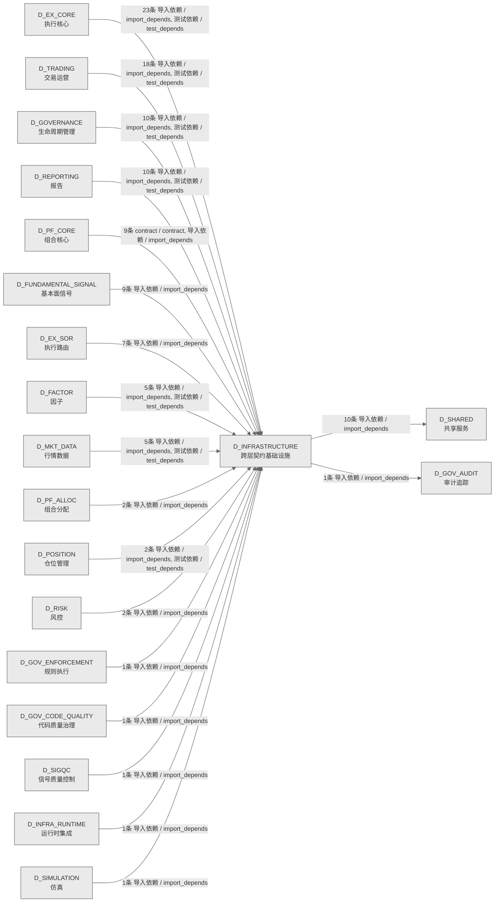

# 02_d_infrastructure / 跨层契约基础设施域 / Cross-Layer Contract Infrastructure

> **功能简介 / Overview**: 跨层契约基础设施，负责跨层契约定义、共享契约管理和契约校验

> **文档作用 / Purpose**: 展示 跨层契约基础设施（D_INFRASTRUCTURE）功能域的域内依赖关系、跨域依赖关系，模块信息（成熟度/中英文名/大白话/文件路径）内嵌于 Mermaid 节点，供架构审查和域治理参考。

> 本文档由 generate_domain_doc.py 从 depgraph (PostgreSQL) 自动生成
> 数据源: depgraph (PostgreSQL) nodes表 + edges表

> **[可缩放 HTML 版 / Zoomable HTML](http://localhost:8765/docs/02_enterprise_architecture/02_domain_architecture_docs/_zoomable_html/02_d_infrastructure.html)** — Ctrl+滚轮缩放 ｜ 双击重置 ｜ Ctrl+Shift+D 切换拖动/选择模式

## 域基本信息 / Domain Overview

| 字段 | 值 | Field | Value |
|------|------|-------|-------|
| 编号 | 02 | Number | 02 |
| 域ID | D_INFRASTRUCTURE | Domain ID | D_INFRASTRUCTURE |
| 域名称 | 跨层契约基础设施 | Domain Name | Cross-Layer Contract Infrastructure |
| 层级 | L0 基础设施层 | Layer | L0 Infrastructure |
| 模块数 | 26 | Module Count | 26 |
| 域内依赖 | 2 | Internal Dependencies | 2 |
| 跨域入边 | 107 | Cross-domain Incoming | 107 |
| 跨域出边 | 11 | Cross-domain Outgoing | 11 |
| 设计态模块 | 0 | Design Modules | 0 |
| 生产态模块 | 26 | Production Modules | 26 |
| 容量 | 26/150 (正常) | Capacity | 26/150 (正常) |
| 描述 | 跨层契约数据类(CTR-001 NormalizedMarketData 等) | Description | 跨层契约数据类(CTR-001 NormalizedMarketData 等) |

## 域内依赖图 / Internal Dependency Diagram

> 依赖图内嵌在本文档中，IDE 可直接渲染；网页版可 Ctrl+滚轮缩放 + 拖动平移查看细节。
>
> **图例说明 / Legend**：
> - 🟦 **蓝色 = 运营态模块**（production，已上线运行）
> - 🟧 **橙色虚线 = 设计态模块**（design，蓝图阶段，代码未写）
> - **实线箭头 = 运营态依赖**（已生效的依赖关系）
> - **虚线箭头 = 非运营态依赖**（计划中/验证中的依赖关系）

### 全景图（全部模块，颜色区分运营态/设计态）

> 展示全部 26 个模块（生产态 26 + 设计态 0），含跨域依赖外部节点。节点含成熟度+名称+大白话/简介+文件路径。

```mermaid
%%{init: {'theme': 'base', 'themeVariables': {'primaryColor': '#eaeaea', 'primaryTextColor': '#333333', 'primaryBorderColor': '#666666', 'lineColor': '#666666', 'secondaryColor': '#eaeaea', 'tertiaryColor': '#eaeaea', 'fontSize': '14px'}}}%%
flowchart TD
    scripts_backup_backup_reconciler_py["灾备备份系统事件触发器<br/>backup_reconciler.py — 灾备备份系统事件触发器<br/>（post-commit reconciler）<br/>Backup Reconciler<br/>文件: backup/backup_reconciler.py<br/>(生产态 / production)"]
    src_zephyr_infrastructure_config_init_py["Init<br/>ZephyrAlpha — 基础设施 Infrastructure Layer —<br/>Configuration Management<br/>文件: config/__init__.py<br/>(生产态 / production)"]
    src_zephyr_shared_contracts_capital_allocation_result_py["Capital Allocation Result<br/>共享层/契约包的capital_allocation_result模块<br/>文件: contracts/capital_allocation_result.py<br/>(生产态 / production)"]
    src_zephyr_shared_contracts_compliance_rule_py["Compliance Rule<br/>共享层/契约包的compliance_rule模块<br/>文件: contracts/compliance_rule.py<br/>(生产态 / production)"]
    src_zephyr_shared_contracts_execution_report_py["Execution Report<br/>共享层/契约包的execution_report模块<br/>文件: contracts/execution_report.py<br/>(生产态 / production)"]
    src_zephyr_shared_contracts_experiment_result_py["Experiment Result<br/>共享层/契约包的experiment_result模块<br/>文件: contracts/experiment_result.py<br/>(生产态 / production)"]
    src_zephyr_shared_contracts_factor_monitor_report_py["Factor Monitor Report<br/>共享层/契约包的factor_monitor_report模块<br/>文件: contracts/factor_monitor_report.py<br/>(生产态 / production)"]
    src_zephyr_shared_contracts_factor_signal_py["Factor Signal<br/>共享层/契约包的factor_signal模块<br/>文件: contracts/factor_signal.py<br/>(生产态 / production)"]
    src_zephyr_shared_contracts_fill_py["Fill<br/>共享层/契约包的fill模块<br/>文件: contracts/fill.py<br/>(生产态 / production)"]
    src_zephyr_shared_contracts_macro_factor_signal_py["Macro Factor Signal<br/>共享层/契约包的macro_factor_signal模块<br/>文件: contracts/macro_factor_signal.py<br/>(生产态 / production)"]
    src_zephyr_shared_contracts_market_data_py["Market Data<br/>共享层/契约包的market_data模块<br/>文件: contracts/market_data.py<br/>(生产态 / production)"]
    src_zephyr_shared_contracts_model_serving_request_py["Model Serving Request<br/>共享层/契约包的model_serving_request模块<br/>文件: contracts/model_serving_request.py<br/>(生产态 / production)"]
    src_zephyr_shared_contracts_model_serving_response_py["Model Serving Response<br/>共享层/契约包的model_serving_response模块<br/>文件: contracts/model_serving_response.py<br/>(生产态 / production)"]
    src_zephyr_shared_contracts_order_py["Order<br/>共享层/契约包的order模块<br/>文件: contracts/order.py<br/>(生产态 / production)"]
    src_zephyr_shared_contracts_performance_attribution_report_py["Performance Attribution Report<br/>共享层/契约包的performance_attribution_report模<br/>块<br/>文件: contracts<br/>/performance_attribution_report.py<br/>(生产态 / production)"]
    src_zephyr_shared_contracts_position_py["Position<br/>共享层/契约包的position模块<br/>文件: contracts/position.py<br/>(生产态 / production)"]
    src_zephyr_shared_contracts_risk_dashboard_snapshot_py["Risk Dashboard Snapshot<br/>共享层/契约包的risk_dashboard_snapshot模块<br/>文件: contracts/risk_dashboard_snapshot.py<br/>(生产态 / production)"]
    src_zephyr_shared_contracts_risk_metrics_py["Risk Metrics<br/>共享层/契约包的risk_metrics模块<br/>文件: contracts/risk_metrics.py<br/>(生产态 / production)"]
    src_zephyr_shared_contracts_strategy_lifecycle_event_py["Strategy Lifecycle Event<br/>共享层/契约包的strategy_lifecycle_event模块<br/>文件: contracts/strategy_lifecycle_event.py<br/>(生产态 / production)"]
    src_zephyr_shared_contracts_synthesized_signal_py["Synthesized Signal<br/>共享层/契约包的synthesized_signal模块<br/>文件: contracts/synthesized_signal.py<br/>(生产态 / production)"]
    src_zephyr_shared_contracts_system_configuration_py["System Configuration<br/>共享层/契约包的system_configuration模块<br/>文件: contracts/system_configuration.py<br/>(生产态 / production)"]
    src_zephyr_shared_contracts_target_portfolio_py["Target Portfolio<br/>共享层/契约包的target_portfolio模块<br/>文件: contracts/target_portfolio.py<br/>(生产态 / production)"]
    src_zephyr_shared_contracts_telemetry_emitter_py["Telemetry Emitter<br/>共享层/契约包的telemetry_emitter模块<br/>文件: contracts/telemetry_emitter.py<br/>(生产态 / production)"]
    src_zephyr_shared_contracts_trace_context_py["Trace Context<br/>共享层/契约包的trace_context模块<br/>文件: contracts/trace_context.py<br/>(生产态 / production)"]
    scripts_backup_backup_reconciler_py ~~~ src_zephyr_infrastructure_config_init_py
    src_zephyr_infrastructure_config_init_py ~~~ src_zephyr_shared_contracts_capital_allocation_result_py
    src_zephyr_shared_contracts_capital_allocation_result_py ~~~ src_zephyr_shared_contracts_compliance_rule_py
    src_zephyr_shared_contracts_compliance_rule_py ~~~ src_zephyr_shared_contracts_execution_report_py
    src_zephyr_shared_contracts_execution_report_py ~~~ src_zephyr_shared_contracts_experiment_result_py
    src_zephyr_shared_contracts_experiment_result_py ~~~ src_zephyr_shared_contracts_factor_monitor_report_py
    src_zephyr_shared_contracts_factor_monitor_report_py ~~~ src_zephyr_shared_contracts_factor_signal_py
    src_zephyr_shared_contracts_factor_signal_py ~~~ src_zephyr_shared_contracts_fill_py
    src_zephyr_shared_contracts_fill_py ~~~ src_zephyr_shared_contracts_macro_factor_signal_py
    src_zephyr_shared_contracts_macro_factor_signal_py ~~~ src_zephyr_shared_contracts_market_data_py
    src_zephyr_shared_contracts_market_data_py ~~~ src_zephyr_shared_contracts_model_serving_request_py
    src_zephyr_shared_contracts_model_serving_request_py ~~~ src_zephyr_shared_contracts_model_serving_response_py
    src_zephyr_shared_contracts_model_serving_response_py ~~~ src_zephyr_shared_contracts_order_py
    src_zephyr_shared_contracts_order_py ~~~ src_zephyr_shared_contracts_performance_attribution_report_py
    src_zephyr_shared_contracts_performance_attribution_report_py ~~~ src_zephyr_shared_contracts_position_py
    src_zephyr_shared_contracts_position_py ~~~ src_zephyr_shared_contracts_risk_dashboard_snapshot_py
    src_zephyr_shared_contracts_risk_dashboard_snapshot_py ~~~ src_zephyr_shared_contracts_risk_metrics_py
    src_zephyr_shared_contracts_risk_metrics_py ~~~ src_zephyr_shared_contracts_strategy_lifecycle_event_py
    src_zephyr_shared_contracts_strategy_lifecycle_event_py ~~~ src_zephyr_shared_contracts_synthesized_signal_py
    src_zephyr_shared_contracts_synthesized_signal_py ~~~ src_zephyr_shared_contracts_system_configuration_py
    src_zephyr_shared_contracts_system_configuration_py ~~~ src_zephyr_shared_contracts_target_portfolio_py
    src_zephyr_shared_contracts_target_portfolio_py ~~~ src_zephyr_shared_contracts_telemetry_emitter_py
    src_zephyr_shared_contracts_telemetry_emitter_py ~~~ src_zephyr_shared_contracts_trace_context_py
    src_zephyr_infrastructure_config_app_config_py["应用配置数据类<br/>app_config.py — 应用配置数据类与加载/热重载逻辑<br/>App Config<br/>文件: config/app_config.py<br/>(生产态 / production)"]
    src_zephyr_shared_contracts_risk_limits_py["Risk Limits<br/>共享层/契约包的risk_limits模块<br/>文件: contracts/risk_limits.py<br/>(生产态 / production)"]
    src_zephyr_infrastructure_config_app_config_py ~~~ src_zephyr_shared_contracts_risk_limits_py
    src_zephyr_infrastructure_config_init_py -->|导入依赖 / import_depends| src_zephyr_infrastructure_config_app_config_py
    src_zephyr_shared_contracts_target_portfolio_py -->|导入依赖 / import_depends| src_zephyr_shared_contracts_risk_limits_py
    D_SHARED["共享服务<br/>共享服务，负责跨域共享的工具、协议和基础服务<br/>Shared Services<br/>跨域节点 / cross-domain<br/>(生产态 / production)"]
    src_zephyr_shared_contracts_experiment_result_py -->|导入依赖 / import_depends| D_SHARED
    src_zephyr_shared_contracts_target_portfolio_py -->|导入依赖 / import_depends| D_SHARED
    src_zephyr_shared_contracts_market_data_py -->|导入依赖 / import_depends| D_SHARED
    src_zephyr_shared_contracts_synthesized_signal_py -->|导入依赖 / import_depends| D_SHARED
    D_GOV_AUDIT["审计追踪<br/>审计追踪，负责变更审计追踪和操作日志管理<br/>Audit Trail<br/>跨域节点 / cross-domain<br/>(生产态 / production)"]
    scripts_backup_backup_reconciler_py -->|导入依赖 / import_depends| D_GOV_AUDIT
    src_zephyr_shared_contracts_fill_py -->|导入依赖 / import_depends| D_SHARED
    src_zephyr_shared_contracts_order_py -->|导入依赖 / import_depends| D_SHARED
    src_zephyr_shared_contracts_position_py -->|导入依赖 / import_depends| D_SHARED
    src_zephyr_shared_contracts_risk_limits_py -->|导入依赖 / import_depends| D_SHARED
    src_zephyr_shared_contracts_order_py -->|导入依赖 / import_depends| D_SHARED
    src_zephyr_shared_contracts_factor_signal_py -->|导入依赖 / import_depends| D_SHARED
    D_PF_CORE["组合核心<br/>组合核心，负责投资组合构建、持仓管理和组合优化<br/>Portfolio Core<br/>跨域节点 / cross-domain<br/>(生产态 / production)"]
    D_PF_CORE -->|contract / contract| src_zephyr_shared_contracts_strategy_lifecycle_event_py
    D_PF_CORE -->|contract / contract| src_zephyr_shared_contracts_target_portfolio_py
    D_PF_CORE -->|导入依赖 / import_depends| src_zephyr_shared_contracts_risk_limits_py
    D_PF_CORE -->|导入依赖 / import_depends| src_zephyr_shared_contracts_risk_limits_py
    D_REPORTING["报告<br/>报告，负责投资报告、风险报告和合规报告的生成与分<br/>发<br/>Reporting<br/>跨域节点 / cross-domain<br/>(生产态 / production)"]
    D_REPORTING -->|导入依赖 / import_depends| src_zephyr_shared_contracts_performance_attribution_report_py
    D_TRADING["交易运营<br/>交易运营，负责交易生命周期管理、订单状态和成交处<br/>理<br/>Trading Operations<br/>跨域节点 / cross-domain<br/>(生产态 / production)"]
    D_TRADING -->|导入依赖 / import_depends| src_zephyr_shared_contracts_fill_py
    D_EX_CORE["执行核心<br/>执行核心，负责订单执行引擎、执行策略和执行管理<br/>Execution Core<br/>跨域节点 / cross-domain<br/>(生产态 / production)"]
    D_EX_CORE -->|导入依赖 / import_depends| src_zephyr_shared_contracts_order_py
    D_EX_SOR["执行路由<br/>执行路由，负责订单路由、智能拆单和执行场所选择<br/>Execution Routing<br/>跨域节点 / cross-domain<br/>(生产态 / production)"]
    D_EX_SOR -->|导入依赖 / import_depends| src_zephyr_shared_contracts_fill_py
    D_EX_CORE -->|导入依赖 / import_depends| src_zephyr_shared_contracts_position_py
    D_TRADING -->|导入依赖 / import_depends| src_zephyr_shared_contracts_execution_report_py
    D_MKT_DATA["行情数据<br/>行情数据，负责市场行情数据的采集、分发和订阅管理<br/>Market Data<br/>跨域节点 / cross-domain<br/>(生产态 / production)"]
    D_MKT_DATA -->|导入依赖 / import_depends| src_zephyr_shared_contracts_market_data_py
    D_TRADING -->|导入依赖 / import_depends| src_zephyr_shared_contracts_trace_context_py
    D_POSITION["仓位管理<br/>仓位管理，负责持仓跟踪、仓位计算和盈亏分析<br/>Position Management<br/>跨域节点 / cross-domain<br/>(生产态 / production)"]
    D_POSITION -->|导入依赖 / import_depends| src_zephyr_shared_contracts_risk_limits_py
    D_EX_SOR -->|导入依赖 / import_depends| src_zephyr_shared_contracts_order_py
    D_TRADING -->|测试依赖 / test_depends| src_zephyr_shared_contracts_fill_py
    classDef production fill:#e1f5fe,stroke:#01579b,stroke-width:2px,color:#000
    classDef design fill:#fff3e0,stroke:#e65100,stroke-width:2px,color:#000,stroke-dasharray: 5 5
    classDef external_prod fill:#e8f4fd,stroke:#0277bd,stroke-width:1px,color:#000
    classDef external_design fill:#fff8e7,stroke:#ef6c00,stroke-width:1px,color:#000,stroke-dasharray: 5 5
    class scripts_backup_backup_reconciler_py,src_zephyr_infrastructure_config_init_py,src_zephyr_infrastructure_config_app_config_py,src_zephyr_shared_contracts_capital_allocation_result_py,src_zephyr_shared_contracts_compliance_rule_py,src_zephyr_shared_contracts_execution_report_py,src_zephyr_shared_contracts_experiment_result_py,src_zephyr_shared_contracts_factor_monitor_report_py,src_zephyr_shared_contracts_factor_signal_py,src_zephyr_shared_contracts_fill_py,src_zephyr_shared_contracts_macro_factor_signal_py,src_zephyr_shared_contracts_market_data_py,src_zephyr_shared_contracts_model_serving_request_py,src_zephyr_shared_contracts_model_serving_response_py,src_zephyr_shared_contracts_order_py,src_zephyr_shared_contracts_performance_attribution_report_py,src_zephyr_shared_contracts_position_py,src_zephyr_shared_contracts_risk_dashboard_snapshot_py,src_zephyr_shared_contracts_risk_limits_py,src_zephyr_shared_contracts_risk_metrics_py,src_zephyr_shared_contracts_strategy_lifecycle_event_py,src_zephyr_shared_contracts_synthesized_signal_py,src_zephyr_shared_contracts_system_configuration_py,src_zephyr_shared_contracts_target_portfolio_py,src_zephyr_shared_contracts_telemetry_emitter_py,src_zephyr_shared_contracts_trace_context_py production
    class D_SHARED,D_GOV_AUDIT,D_PF_CORE,D_REPORTING,D_TRADING,D_EX_CORE,D_EX_SOR,D_MKT_DATA,D_POSITION external_prod
```

### 运营态的图（仅 design_maturity=production 的模块和域内依赖）

> 仅展示已上线运行的模块（共 26 个），不含跨域外部节点。跨域依赖见下方跨域依赖章节。

```mermaid
%%{init: {'theme': 'base', 'themeVariables': {'primaryColor': '#eaeaea', 'primaryTextColor': '#333333', 'primaryBorderColor': '#666666', 'lineColor': '#666666', 'secondaryColor': '#eaeaea', 'tertiaryColor': '#eaeaea', 'fontSize': '14px'}}}%%
flowchart TD
    scripts_backup_backup_reconciler_py["灾备备份系统事件触发器<br/>backup_reconciler.py — 灾备备份系统事件触发器<br/>（post-commit reconciler）<br/>Backup Reconciler<br/>文件: backup/backup_reconciler.py<br/>(生产态 / production)"]
    src_zephyr_infrastructure_config_init_py["Init<br/>ZephyrAlpha — 基础设施 Infrastructure Layer —<br/>Configuration Management<br/>文件: config/__init__.py<br/>(生产态 / production)"]
    src_zephyr_shared_contracts_capital_allocation_result_py["Capital Allocation Result<br/>共享层/契约包的capital_allocation_result模块<br/>文件: contracts/capital_allocation_result.py<br/>(生产态 / production)"]
    src_zephyr_shared_contracts_compliance_rule_py["Compliance Rule<br/>共享层/契约包的compliance_rule模块<br/>文件: contracts/compliance_rule.py<br/>(生产态 / production)"]
    src_zephyr_shared_contracts_execution_report_py["Execution Report<br/>共享层/契约包的execution_report模块<br/>文件: contracts/execution_report.py<br/>(生产态 / production)"]
    src_zephyr_shared_contracts_experiment_result_py["Experiment Result<br/>共享层/契约包的experiment_result模块<br/>文件: contracts/experiment_result.py<br/>(生产态 / production)"]
    src_zephyr_shared_contracts_factor_monitor_report_py["Factor Monitor Report<br/>共享层/契约包的factor_monitor_report模块<br/>文件: contracts/factor_monitor_report.py<br/>(生产态 / production)"]
    src_zephyr_shared_contracts_factor_signal_py["Factor Signal<br/>共享层/契约包的factor_signal模块<br/>文件: contracts/factor_signal.py<br/>(生产态 / production)"]
    src_zephyr_shared_contracts_fill_py["Fill<br/>共享层/契约包的fill模块<br/>文件: contracts/fill.py<br/>(生产态 / production)"]
    src_zephyr_shared_contracts_macro_factor_signal_py["Macro Factor Signal<br/>共享层/契约包的macro_factor_signal模块<br/>文件: contracts/macro_factor_signal.py<br/>(生产态 / production)"]
    src_zephyr_shared_contracts_market_data_py["Market Data<br/>共享层/契约包的market_data模块<br/>文件: contracts/market_data.py<br/>(生产态 / production)"]
    src_zephyr_shared_contracts_model_serving_request_py["Model Serving Request<br/>共享层/契约包的model_serving_request模块<br/>文件: contracts/model_serving_request.py<br/>(生产态 / production)"]
    src_zephyr_shared_contracts_model_serving_response_py["Model Serving Response<br/>共享层/契约包的model_serving_response模块<br/>文件: contracts/model_serving_response.py<br/>(生产态 / production)"]
    src_zephyr_shared_contracts_order_py["Order<br/>共享层/契约包的order模块<br/>文件: contracts/order.py<br/>(生产态 / production)"]
    src_zephyr_shared_contracts_performance_attribution_report_py["Performance Attribution Report<br/>共享层/契约包的performance_attribution_report模<br/>块<br/>文件: contracts<br/>/performance_attribution_report.py<br/>(生产态 / production)"]
    src_zephyr_shared_contracts_position_py["Position<br/>共享层/契约包的position模块<br/>文件: contracts/position.py<br/>(生产态 / production)"]
    src_zephyr_shared_contracts_risk_dashboard_snapshot_py["Risk Dashboard Snapshot<br/>共享层/契约包的risk_dashboard_snapshot模块<br/>文件: contracts/risk_dashboard_snapshot.py<br/>(生产态 / production)"]
    src_zephyr_shared_contracts_risk_metrics_py["Risk Metrics<br/>共享层/契约包的risk_metrics模块<br/>文件: contracts/risk_metrics.py<br/>(生产态 / production)"]
    src_zephyr_shared_contracts_strategy_lifecycle_event_py["Strategy Lifecycle Event<br/>共享层/契约包的strategy_lifecycle_event模块<br/>文件: contracts/strategy_lifecycle_event.py<br/>(生产态 / production)"]
    src_zephyr_shared_contracts_synthesized_signal_py["Synthesized Signal<br/>共享层/契约包的synthesized_signal模块<br/>文件: contracts/synthesized_signal.py<br/>(生产态 / production)"]
    src_zephyr_shared_contracts_system_configuration_py["System Configuration<br/>共享层/契约包的system_configuration模块<br/>文件: contracts/system_configuration.py<br/>(生产态 / production)"]
    src_zephyr_shared_contracts_target_portfolio_py["Target Portfolio<br/>共享层/契约包的target_portfolio模块<br/>文件: contracts/target_portfolio.py<br/>(生产态 / production)"]
    src_zephyr_shared_contracts_telemetry_emitter_py["Telemetry Emitter<br/>共享层/契约包的telemetry_emitter模块<br/>文件: contracts/telemetry_emitter.py<br/>(生产态 / production)"]
    src_zephyr_shared_contracts_trace_context_py["Trace Context<br/>共享层/契约包的trace_context模块<br/>文件: contracts/trace_context.py<br/>(生产态 / production)"]
    scripts_backup_backup_reconciler_py ~~~ src_zephyr_infrastructure_config_init_py
    src_zephyr_infrastructure_config_init_py ~~~ src_zephyr_shared_contracts_capital_allocation_result_py
    src_zephyr_shared_contracts_capital_allocation_result_py ~~~ src_zephyr_shared_contracts_compliance_rule_py
    src_zephyr_shared_contracts_compliance_rule_py ~~~ src_zephyr_shared_contracts_execution_report_py
    src_zephyr_shared_contracts_execution_report_py ~~~ src_zephyr_shared_contracts_experiment_result_py
    src_zephyr_shared_contracts_experiment_result_py ~~~ src_zephyr_shared_contracts_factor_monitor_report_py
    src_zephyr_shared_contracts_factor_monitor_report_py ~~~ src_zephyr_shared_contracts_factor_signal_py
    src_zephyr_shared_contracts_factor_signal_py ~~~ src_zephyr_shared_contracts_fill_py
    src_zephyr_shared_contracts_fill_py ~~~ src_zephyr_shared_contracts_macro_factor_signal_py
    src_zephyr_shared_contracts_macro_factor_signal_py ~~~ src_zephyr_shared_contracts_market_data_py
    src_zephyr_shared_contracts_market_data_py ~~~ src_zephyr_shared_contracts_model_serving_request_py
    src_zephyr_shared_contracts_model_serving_request_py ~~~ src_zephyr_shared_contracts_model_serving_response_py
    src_zephyr_shared_contracts_model_serving_response_py ~~~ src_zephyr_shared_contracts_order_py
    src_zephyr_shared_contracts_order_py ~~~ src_zephyr_shared_contracts_performance_attribution_report_py
    src_zephyr_shared_contracts_performance_attribution_report_py ~~~ src_zephyr_shared_contracts_position_py
    src_zephyr_shared_contracts_position_py ~~~ src_zephyr_shared_contracts_risk_dashboard_snapshot_py
    src_zephyr_shared_contracts_risk_dashboard_snapshot_py ~~~ src_zephyr_shared_contracts_risk_metrics_py
    src_zephyr_shared_contracts_risk_metrics_py ~~~ src_zephyr_shared_contracts_strategy_lifecycle_event_py
    src_zephyr_shared_contracts_strategy_lifecycle_event_py ~~~ src_zephyr_shared_contracts_synthesized_signal_py
    src_zephyr_shared_contracts_synthesized_signal_py ~~~ src_zephyr_shared_contracts_system_configuration_py
    src_zephyr_shared_contracts_system_configuration_py ~~~ src_zephyr_shared_contracts_target_portfolio_py
    src_zephyr_shared_contracts_target_portfolio_py ~~~ src_zephyr_shared_contracts_telemetry_emitter_py
    src_zephyr_shared_contracts_telemetry_emitter_py ~~~ src_zephyr_shared_contracts_trace_context_py
    src_zephyr_infrastructure_config_app_config_py["应用配置数据类<br/>app_config.py — 应用配置数据类与加载/热重载逻辑<br/>App Config<br/>文件: config/app_config.py<br/>(生产态 / production)"]
    src_zephyr_shared_contracts_risk_limits_py["Risk Limits<br/>共享层/契约包的risk_limits模块<br/>文件: contracts/risk_limits.py<br/>(生产态 / production)"]
    src_zephyr_infrastructure_config_app_config_py ~~~ src_zephyr_shared_contracts_risk_limits_py
    src_zephyr_infrastructure_config_init_py -->|导入依赖 / import_depends| src_zephyr_infrastructure_config_app_config_py
    src_zephyr_shared_contracts_target_portfolio_py -->|导入依赖 / import_depends| src_zephyr_shared_contracts_risk_limits_py
    classDef production fill:#e1f5fe,stroke:#01579b,stroke-width:2px,color:#000
    classDef design fill:#fff3e0,stroke:#e65100,stroke-width:2px,color:#000,stroke-dasharray: 5 5
    classDef external_prod fill:#e8f4fd,stroke:#0277bd,stroke-width:1px,color:#000
    classDef external_design fill:#fff8e7,stroke:#ef6c00,stroke-width:1px,color:#000,stroke-dasharray: 5 5
    class scripts_backup_backup_reconciler_py,src_zephyr_infrastructure_config_init_py,src_zephyr_infrastructure_config_app_config_py,src_zephyr_shared_contracts_capital_allocation_result_py,src_zephyr_shared_contracts_compliance_rule_py,src_zephyr_shared_contracts_execution_report_py,src_zephyr_shared_contracts_experiment_result_py,src_zephyr_shared_contracts_factor_monitor_report_py,src_zephyr_shared_contracts_factor_signal_py,src_zephyr_shared_contracts_fill_py,src_zephyr_shared_contracts_macro_factor_signal_py,src_zephyr_shared_contracts_market_data_py,src_zephyr_shared_contracts_model_serving_request_py,src_zephyr_shared_contracts_model_serving_response_py,src_zephyr_shared_contracts_order_py,src_zephyr_shared_contracts_performance_attribution_report_py,src_zephyr_shared_contracts_position_py,src_zephyr_shared_contracts_risk_dashboard_snapshot_py,src_zephyr_shared_contracts_risk_limits_py,src_zephyr_shared_contracts_risk_metrics_py,src_zephyr_shared_contracts_strategy_lifecycle_event_py,src_zephyr_shared_contracts_synthesized_signal_py,src_zephyr_shared_contracts_system_configuration_py,src_zephyr_shared_contracts_target_portfolio_py,src_zephyr_shared_contracts_telemetry_emitter_py,src_zephyr_shared_contracts_trace_context_py production
```

### 设计态的图（仅 design_maturity=design 的模块和域内依赖）

> 仅展示蓝图阶段、代码未写的设计态模块（共 0 个），不含跨域外部节点。

> （无模块 / No modules）

## 跨域依赖 / Cross-domain Dependencies

### 本域依赖的其他域（出边）/ Depends On

| # | 本域模块 / Source Module | → | 外部域-目标模块 / Target Module | 依赖类型 / Type |
|:--:|---------|:--:|---------|---------|
| 1 | 灾备备份系统事件触发器 / Backup Reconciler (backup/backup... | → | D_GOV_AUDIT 审计追踪: 对账注册表 / reconciliation_registry (audit/reconciliatio... | 导入依赖 / import_depends |
| 2 | Experiment Result / Experiment Result (contracts/experime... | → | D_SHARED 共享服务: Trace Context / Trace Context (core/trace_context.py) | 导入依赖 / import_depends |
| 3 | Factor Signal / Factor Signal (contracts/factor_signal.py) | → | D_SHARED 共享服务: Trace Context / Trace Context (core/trace_context.py) | 导入依赖 / import_depends |
| 4 | Fill / Fill (contracts/fill.py) | → | D_SHARED 共享服务: Trace Context / Trace Context (core/trace_context.py) | 导入依赖 / import_depends |
| 5 | Market Data / Market Data (contracts/market_data.py) | → | D_SHARED 共享服务: Trace Context / Trace Context (core/trace_context.py) | 导入依赖 / import_depends |
| 6 | Order / Order (contracts/order.py) | → | D_SHARED 共享服务: Trace Context / Trace Context (core/trace_context.py) | 导入依赖 / import_depends |
| 7 | Order / Order (contracts/order.py) | → | D_SHARED 共享服务: 交易枚举真源 / Order Enums (enums/order_enums.py) | 导入依赖 / import_depends |
| 8 | Position / Position (contracts/position.py) | → | D_SHARED 共享服务: Trace Context / Trace Context (core/trace_context.py) | 导入依赖 / import_depends |
| 9 | Risk Limits / Risk Limits (contracts/risk_limits.py) | → | D_SHARED 共享服务: Trace Context / Trace Context (core/trace_context.py) | 导入依赖 / import_depends |
| 10 | Synthesized Signal / Synthesized Signal (contracts/synthe... | → | D_SHARED 共享服务: Trace Context / Trace Context (core/trace_context.py) | 导入依赖 / import_depends |
| 11 | Target Portfolio / Target Portfolio (contracts/target_por... | → | D_SHARED 共享服务: Trace Context / Trace Context (core/trace_context.py) | 导入依赖 / import_depends |

### 依赖本域的其他域（入边）/ Depended By

| # | 外部域-源模块 / Source Module | → | 本域模块 / Target Module | 依赖类型 / Type |
|:--:|---------|:--:|---------|---------|
| 1 | D_EX_CORE 执行核心: Aggregate Root Manager / Aggregate Root Manager (ex_core/... | → | Fill / Fill (contracts/fill.py) | 导入依赖 / import_depends |
| 2 | D_EX_CORE 执行核心: Aggregate Root Manager / Aggregate Root Manager (ex_core/... | → | Order / Order (contracts/order.py) | 导入依赖 / import_depends |
| 3 | D_EX_CORE 执行核心: Aggregate Root Manager / Aggregate Root Manager (ex_core/... | → | Position / Position (contracts/position.py) | 导入依赖 / import_depends |
| 4 | D_EX_CORE 执行核心: 执行引擎 / D_EXECUTION_CORE — Execution Engine (ex_core/... | → | Order / Order (contracts/order.py) | 导入依赖 / import_depends |
| 5 | D_EX_CORE 执行核心: 执行引擎 / D_EXECUTION_CORE — Execution Engine (ex_core/... | → | Risk Limits / Risk Limits (contracts/risk_limits.py) | 导入依赖 / import_depends |
| 6 | D_EX_CORE 执行核心: 部分成交处理器 (ex_core/fill_handler.py) | → | Fill / Fill (contracts/fill.py) | 导入依赖 / import_depends |
| 7 | D_EX_CORE 执行核心: 部分成交处理器 (ex_core/fill_handler.py) | → | Order / Order (contracts/order.py) | 导入依赖 / import_depends |
| 8 | D_EX_CORE 执行核心: 下单执行 Saga 编排器 / Order Execution Saga (ex_core/orde... | → | Fill / Fill (contracts/fill.py) | 导入依赖 / import_depends |
| 9 | D_EX_CORE 执行核心: 下单执行 Saga 编排器 / Order Execution Saga (ex_core/orde... | → | Order / Order (contracts/order.py) | 导入依赖 / import_depends |
| 10 | D_EX_CORE 执行核心: 下单执行 Saga 编排器 / Order Execution Saga (ex_core/orde... | → | Risk Limits / Risk Limits (contracts/risk_limits.py) | 导入依赖 / import_depends |
| 11 | D_EX_CORE 执行核心: 订单管理器 / D_EXECUTION_CORE — Order Manager (ex_core/o... | → | Fill / Fill (contracts/fill.py) | 导入依赖 / import_depends |
| 12 | D_EX_CORE 执行核心: 订单管理器 / D_EXECUTION_CORE — Order Manager (ex_core/o... | → | Order / Order (contracts/order.py) | 导入依赖 / import_depends |
| 13 | D_EX_CORE 执行核心: 盘中持仓对账器 / Position Reconciler (ex_core/position_re... | → | Position / Position (contracts/position.py) | 导入依赖 / import_depends |
| 14 | D_EX_CORE 执行核心: Position Tracker / Tracker (position_tracker/tracker.py) | → | Fill / Fill (contracts/fill.py) | 导入依赖 / import_depends |
| 15 | D_EX_CORE 执行核心: Position Tracker / Tracker (position_tracker/tracker.py) | → | Position / Position (contracts/position.py) | 导入依赖 / import_depends |
| 16 | D_EX_CORE 执行核心: Repository Interface / Repository Interface (ex_core/repo... | → | Order / Order (contracts/order.py) | 导入依赖 / import_depends |
| 17 | D_EX_CORE 执行核心: Repository Interface / Repository Interface (ex_core/repo... | → | Position / Position (contracts/position.py) | 导入依赖 / import_depends |
| 18 | D_EX_CORE 执行核心: 交易会话 / trading_session (ex_core/trading_session.py) | → | Fill / Fill (contracts/fill.py) | 导入依赖 / import_depends |
| 19 | D_EX_CORE 执行核心: 交易会话 / trading_session (ex_core/trading_session.py) | → | Order / Order (contracts/order.py) | 导入依赖 / import_depends |
| 20 | D_EX_CORE 执行核心: 交易会话 / trading_session (ex_core/trading_session.py) | → | Position / Position (contracts/position.py) | 导入依赖 / import_depends |
| 21 | D_EX_CORE 执行核心: 交易会话 / trading_session (ex_core/trading_session.py) | → | Risk Limits / Risk Limits (contracts/risk_limits.py) | 导入依赖 / import_depends |
| 22 | D_EX_CORE 执行核心: D-EX-CORE-56 盘中持仓对账器 / Test Position Reconciler (e... | → | Fill / Fill (contracts/fill.py) | 测试依赖 / test_depends |
| 23 | D_EX_CORE 执行核心: D-EX-CORE-56 盘中持仓对账器 / Test Position Reconciler (e... | → | Position / Position (contracts/position.py) | 测试依赖 / test_depends |
| 24 | D_EX_SOR 执行路由: —连接失败、断线、状态机非法跳转 / Broker Api Connector (... | → | Fill / Fill (contracts/fill.py) | 导入依赖 / import_depends |
| 25 | D_EX_SOR 执行路由: —连接失败、断线、状态机非法跳转 / Broker Api Connector (... | → | Order / Order (contracts/order.py) | 导入依赖 / import_depends |
| 26 | D_EX_SOR 执行路由: 算法执行选择器 / algo_execution_selector (core/algo_execu... | → | Order / Order (contracts/order.py) | 导入依赖 / import_depends |
| 27 | D_EX_SOR 执行路由: 算法交易引擎 / algo_trading_engine (core/algo_trading_eng... | → | Order / Order (contracts/order.py) | 导入依赖 / import_depends |
| 28 | D_EX_SOR 执行路由: 经纪人适配器管理器 / broker_adapter_manager (core/broker_... | → | Fill / Fill (contracts/fill.py) | 导入依赖 / import_depends |
| 29 | D_EX_SOR 执行路由: 经纪人适配器管理器 / broker_adapter_manager (core/broker_... | → | Order / Order (contracts/order.py) | 导入依赖 / import_depends |
| 30 | D_EX_SOR 执行路由: optimal订单路由器 / optimal_order_router (core/optimal_or... | → | Order / Order (contracts/order.py) | 导入依赖 / import_depends |
| 31 | D_FACTOR 因子: —FactorSignal 批量缓冲写入器 / Buffer (batch_output/buff... | → | Factor Signal / Factor Signal (contracts/factor_signal.py) | 导入依赖 / import_depends |
| 32 | D_FACTOR 因子: 转换器 / converter (ctr001_consumer/converter.py) | → | Market Data / Market Data (contracts/market_data.py) | 导入依赖 / import_depends |
| 33 | D_FACTOR 因子: 转换器 / converter (ctr002_producer/converter.py) | → | Factor Signal / Factor Signal (contracts/factor_signal.py) | 导入依赖 / import_depends |
| 34 | D_FACTOR 因子: —converter + filter_quality / Test Ctr001 Consumer (fact... | → | Market Data / Market Data (contracts/market_data.py) | 测试依赖 / test_depends |
| 35 | D_FACTOR 因子: —to_signals / Test Ctr002 Producer (factor/test_ctr002_p... | → | Factor Signal / Factor Signal (contracts/factor_signal.py) | 测试依赖 / test_depends |
| 36 | D_FUNDAMENTAL_SIGNAL 基本面信号: 信号生成聚合基类 / Signal Generation Aggregator Base (gen... | → | Factor Signal / Factor Signal (contracts/factor_signal.py) | 导入依赖 / import_depends |
| 37 | D_FUNDAMENTAL_SIGNAL 基本面信号: 信号生成聚合基类 / Signal Generation Aggregator Base (gen... | → | Synthesized Signal / Synthesized Signal (contracts/synthe... | 导入依赖 / import_depends |
| 38 | D_FUNDAMENTAL_SIGNAL 基本面信号: 默认信号聚合器 / Default Signal Aggregator (implementatio... | → | Factor Signal / Factor Signal (contracts/factor_signal.py) | 导入依赖 / import_depends |
| 39 | D_FUNDAMENTAL_SIGNAL 基本面信号: 默认信号聚合器 / Default Signal Aggregator (implementatio... | → | Synthesized Signal / Synthesized Signal (contracts/synthe... | 导入依赖 / import_depends |
| 40 | D_FUNDAMENTAL_SIGNAL 基本面信号: 管线 / Alpha Signal Pipeline (signal_fundamental/pipeline... | → | Factor Signal / Factor Signal (contracts/factor_signal.py) | 导入依赖 / import_depends |
| 41 | D_FUNDAMENTAL_SIGNAL 基本面信号: 管线 / Alpha Signal Pipeline (signal_fundamental/pipeline... | → | Synthesized Signal / Synthesized Signal (contracts/synthe... | 导入依赖 / import_depends |
| 42 | D_FUNDAMENTAL_SIGNAL 基本面信号: 策略默认资本分配器 / Strategy Default Capital Allocator (... | → | Synthesized Signal / Synthesized Signal (contracts/synthe... | 导入依赖 / import_depends |
| 43 | D_FUNDAMENTAL_SIGNAL 基本面信号: 信号合成器 / Signal Synthesizer (synth/signal_synthesizer... | → | Factor Signal / Factor Signal (contracts/factor_signal.py) | 导入依赖 / import_depends |
| 44 | D_FUNDAMENTAL_SIGNAL 基本面信号: 信号合成器 / Signal Synthesizer (synth/signal_synthesizer... | → | Synthesized Signal / Synthesized Signal (contracts/synthe... | 导入依赖 / import_depends |
| 45 | D_GOVERNANCE 生命周期管理: A2Afull验证 / a2a_full_verification (scripts/a2a_full_ver... | → | Init / Init (config/__init__.py) | 导入依赖 / import_depends |
| 46 | D_GOVERNANCE 生命周期管理: 本地层daemon / local_layer_daemon (construction/local_lay... | → | Init / Init (config/__init__.py) | 导入依赖 / import_depends |
| 47 | D_GOVERNANCE 生命周期管理: 风险验证桥接 / D_EXECUTION_CORE — Risk Validation Bridge... | → | Risk Limits / Risk Limits (contracts/risk_limits.py) | 导入依赖 / import_depends |
| 48 | D_GOVERNANCE 生命周期管理: 仿真经纪人 / D_EXECUTION_CORE — Simulation Broker Adapte... | → | Fill / Fill (contracts/fill.py) | 导入依赖 / import_depends |
| 49 | D_GOVERNANCE 生命周期管理: 仿真经纪人 / D_EXECUTION_CORE — Simulation Broker Adapte... | → | Order / Order (contracts/order.py) | 导入依赖 / import_depends |
| 50 | D_GOVERNANCE 生命周期管理: 仿真经纪人 / D_EXECUTION_CORE — Simulation Broker Adapte... | → | Position / Position (contracts/position.py) | 导入依赖 / import_depends |
| 51 | D_GOVERNANCE 生命周期管理: Test E2e Pipeline / Test E2e Pipeline (trading/test_e2e_p... | → | Synthesized Signal / Synthesized Signal (contracts/synthe... | 测试依赖 / test_depends |
| 52 | D_GOVERNANCE 生命周期管理: Main Data Flow End-to-End Test / Test Phase E Main Flow (... | → | Factor Signal / Factor Signal (contracts/factor_signal.py) | 测试依赖 / test_depends |
| 53 | D_GOVERNANCE 生命周期管理: Main Data Flow End-to-End Test / Test Phase E Main Flow (... | → | Market Data / Market Data (contracts/market_data.py) | 测试依赖 / test_depends |
| 54 | D_GOVERNANCE 生命周期管理: Main Data Flow End-to-End Test / Test Phase E Main Flow (... | → | Synthesized Signal / Synthesized Signal (contracts/synthe... | 测试依赖 / test_depends |
| 55 | D_GOV_CODE_QUALITY 代码质量治理: 配置 / config (code_dedup/config.py) | → | 应用配置数据类 / App Config (config/app_config.py) | 导入依赖 / import_depends |
| 56 | D_GOV_ENFORCEMENT 规则执行: ComplianceRule 真源已合并至 zephyr.shared.contracts.compl... | → | Compliance Rule / Compliance Rule (contracts/compliance_r... | 导入依赖 / import_depends |
| 57 | D_INFRA_RUNTIME 运行时集成: —水平触发调和循环 / Health Monitor (trading/health_monit... | → | Telemetry Emitter / Telemetry Emitter (contracts/telemetr... | 导入依赖 / import_depends |
| 58 | D_MKT_DATA 行情数据: Init / Init (market_data/__init__.py) | → | Market Data / Market Data (contracts/market_data.py) | 导入依赖 / import_depends |
| 59 | D_MKT_DATA 行情数据: Connector Base / Base (connectors/base.py) | → | Market Data / Market Data (contracts/market_data.py) | 导入依赖 / import_depends |
| 60 | D_MKT_DATA 行情数据: —D_MKT_DATA→D_FACTOR 数据供给 / Producer (normalized_ma... | → | Market Data / Market Data (contracts/market_data.py) | 导入依赖 / import_depends |
| 61 | D_MKT_DATA 行情数据: Vendor Base / Vendor Base (market_data/vendor_base.py) | → | Market Data / Market Data (contracts/market_data.py) | 导入依赖 / import_depends |
| 62 | D_MKT_DATA 行情数据: MOD-MKT-002 Vendor Base 单元测试. / Test Vendor Base (mar... | → | Market Data / Market Data (contracts/market_data.py) | 测试依赖 / test_depends |
| 63 | D_PF_ALLOC 组合分配: Strategy Lifecycle Event / Strategy Lifecycle Event (pf_a... | → | Strategy Lifecycle Event / Strategy Lifecycle Event (cont... | 导入依赖 / import_depends |
| 64 | D_PF_ALLOC 组合分配: Default Equity Long-Only Strategy / Default Equity Strate... | → | Order / Order (contracts/order.py) | 导入依赖 / import_depends |
| 65 | D_PF_CORE 组合核心: 约束不可满足 / Constraint Solver (core/constraint_solver.py) | → | Risk Limits / Risk Limits (contracts/risk_limits.py) | 导入依赖 / import_depends |
| 66 | D_PF_CORE 组合核心: Performance Attribution Engine / Performance Attribution ... | → | Performance Attribution Report / Performance Attribution ... | 导入依赖 / import_depends |
| 67 | D_PF_CORE 组合核心: 组合优化方法 / Portfolio Optimizer (core/portfolio_optimi... | → | Risk Limits / Risk Limits (contracts/risk_limits.py) | 导入依赖 / import_depends |
| 68 | D_PF_CORE 组合核心: 组合优化方法 / Portfolio Optimizer (core/portfolio_optimi... | → | Target Portfolio / Target Portfolio (contracts/target_por... | 导入依赖 / import_depends |
| 69 | D_PF_CORE 组合核心: 组合优化方法 / Portfolio Optimizer (core/portfolio_optimi... | → | Target Portfolio / Target Portfolio (contracts/target_por... | contract / contract |
| 70 | D_PF_CORE 组合核心: risk_breach > drift > event > calendar) / Rebalance Sched... | → | Risk Limits / Risk Limits (contracts/risk_limits.py) | 导入依赖 / import_depends |
| 71 | D_PF_CORE 组合核心: risk_breach > drift > event > calendar) / Rebalance Sched... | → | Target Portfolio / Target Portfolio (contracts/target_por... | 导入依赖 / import_depends |
| 72 | D_PF_CORE 组合核心: 策略生命周期状态 / Strategy Engine (core/strategy_engine.py) | → | Strategy Lifecycle Event / Strategy Lifecycle Event (cont... | contract / contract |
| 73 | D_PF_CORE 组合核心: 策略生命周期状态 / Strategy Engine (core/strategy_engine.py) | → | Strategy Lifecycle Event / Strategy Lifecycle Event (cont... | 导入依赖 / import_depends |
| 74 | D_POSITION 仓位管理: 仓位决策市场状态 ①~⑫ / Position Sizing Engine (core/pos... | → | Risk Limits / Risk Limits (contracts/risk_limits.py) | 导入依赖 / import_depends |
| 75 | D_POSITION 仓位管理: Position Sizing Engine 测试 / Test Position Sizing Engine... | → | Risk Limits / Risk Limits (contracts/risk_limits.py) | 测试依赖 / test_depends |
| 76 | D_REPORTING 报告: 单笔成交的 TCA 分析，返回执行报告""" / Analytics Base (re... | → | Execution Report / Execution Report (contracts/execution_... | 导入依赖 / import_depends |
| 77 | D_REPORTING 报告: 单笔成交的 TCA 分析，返回执行报告""" / Analytics Base (re... | → | Fill / Fill (contracts/fill.py) | 导入依赖 / import_depends |
| 78 | D_REPORTING 报告: 单笔成交的 TCA 分析，返回执行报告""" / Analytics Base (re... | → | Order / Order (contracts/order.py) | 导入依赖 / import_depends |
| 79 | D_REPORTING 报告: 单笔成交的 TCA 分析，返回执行报告""" / Analytics Base (re... | → | Performance Attribution Report / Performance Attribution ... | 导入依赖 / import_depends |
| 80 | D_REPORTING 报告: Default Attribution Engine / Default Attribution Engine (... | → | Performance Attribution Report / Performance Attribution ... | 导入依赖 / import_depends |
| 81 | D_REPORTING 报告: Default TCA Engine / Default Tca Engine (reporting/defaul... | → | Execution Report / Execution Report (contracts/execution_... | 导入依赖 / import_depends |
| 82 | D_REPORTING 报告: Default TCA Engine / Default Tca Engine (reporting/defaul... | → | Fill / Fill (contracts/fill.py) | 导入依赖 / import_depends |
| 83 | D_REPORTING 报告: Default TCA Engine / Default Tca Engine (reporting/defaul... | → | Order / Order (contracts/order.py) | 导入依赖 / import_depends |
| 84 | D_REPORTING 报告: Real-time P&L Dashboard / Realtime Pnl Dashboard (reporti... | → | Fill / Fill (contracts/fill.py) | 导入依赖 / import_depends |
| 85 | D_REPORTING 报告: MOD-RPT-004 Real-time P&L Dashboard 单元测试. / Test Real... | → | Fill / Fill (contracts/fill.py) | 测试依赖 / test_depends |
| 86 | D_RISK 风控: Risk Limits Calculator / Risk Limits (risk/risk_limits.py) | → | Risk Limits / Risk Limits (contracts/risk_limits.py) | 导入依赖 / import_depends |
| 87 | D_RISK 风控: 校验单标的权重是否合规 / Risk Manager (risk/risk_manager.py) | → | Risk Limits / Risk Limits (contracts/risk_limits.py) | 导入依赖 / import_depends |
| 88 | D_SIGQC 信号质量控制: Signal Quality Degradation Monitor Base / Degradation Mon... | → | Synthesized Signal / Synthesized Signal (contracts/synthe... | 导入依赖 / import_depends |
| 89 | D_SIMULATION 仿真: 当前 UTC 时间 / Pipeline Base (simulation/pipeline_base.py) | → | Experiment Result / Experiment Result (contracts/experime... | 导入依赖 / import_depends |
| 90 | D_TRADING 交易运营: PnL Calculator / Pnl Calculator (trading/pnl_calculator.py) | → | Fill / Fill (contracts/fill.py) | 导入依赖 / import_depends |
| 91 | D_TRADING 交易运营: Settlement & Reconciliation Engine / Settlement Reconcili... | → | Fill / Fill (contracts/fill.py) | 导入依赖 / import_depends |
| 92 | D_TRADING 交易运营: BrokerInterface / Broker Interface (trading_contracts/bro... | → | Fill / Fill (contracts/fill.py) | 导入依赖 / import_depends |
| 93 | D_TRADING 交易运营: BrokerInterface / Broker Interface (trading_contracts/bro... | → | Order / Order (contracts/order.py) | 导入依赖 / import_depends |
| 94 | D_TRADING 交易运营: BrokerInterface / Broker Interface (trading_contracts/bro... | → | Position / Position (contracts/position.py) | 导入依赖 / import_depends |
| 95 | D_TRADING 交易运营: Execution Rejection Error / Execution Rejection Error (ex... | → | Trace Context / Trace Context (contracts/trace_context.py) | 导入依赖 / import_depends |
| 96 | D_TRADING 交易运营: ExecutionReport 真源在 zephyr.shared.contracts.execution_... | → | Execution Report / Execution Report (contracts/execution_... | 导入依赖 / import_depends |
| 97 | D_TRADING 交易运营: Fill 真源在 zephyr.shared.contracts.fill / Fill (executio... | → | Fill / Fill (contracts/fill.py) | 导入依赖 / import_depends |
| 98 | D_TRADING 交易运营: Order 真源在 zephyr.shared.contracts.order / Order (execu... | → | Order / Order (contracts/order.py) | 导入依赖 / import_depends |
| 99 | D_TRADING 交易运营: PositionSnapshot 真源在 zephyr.shared.contracts.position ... | → | Position / Position (contracts/position.py) | 导入依赖 / import_depends |
| 100 | D_TRADING 交易运营: 交易域数据契约工厂方法 / Factories (trading_contracts/fac... | → | Factor Signal / Factor Signal (contracts/factor_signal.py) | 导入依赖 / import_depends |
| 101 | D_TRADING 交易运营: 交易域数据契约工厂方法 / Factories (trading_contracts/fac... | → | Synthesized Signal / Synthesized Signal (contracts/synthe... | 导入依赖 / import_depends |
| 102 | D_TRADING 交易运营: Strategy Lifecycle Event / Strategy Lifecycle Event (cont... | → | Strategy Lifecycle Event / Strategy Lifecycle Event (cont... | 导入依赖 / import_depends |
| 103 | D_TRADING 交易运营: Risk Limit Violation Error / Risk Limit Violation Error (... | → | Trace Context / Trace Context (contracts/trace_context.py) | 导入依赖 / import_depends |
| 104 | D_TRADING 交易运营: Risk Limits / Risk Limits (risk/risk_limits.py) | → | Trace Context / Trace Context (contracts/trace_context.py) | 导入依赖 / import_depends |
| 105 | D_TRADING 交易运营: Risk Validator Protocol / Risk Validator Protocol (risk/r... | → | Risk Limits / Risk Limits (contracts/risk_limits.py) | 导入依赖 / import_depends |
| 106 | D_TRADING 交易运营: MOD-TRADING-002 PnL Calculator 单元测试. / Test Pnl Calcu... | → | Fill / Fill (contracts/fill.py) | 测试依赖 / test_depends |
| 107 | D_TRADING 交易运营: MOD-TRADING-003 Settlement & Reconciliation Engine 单元测... | → | Fill / Fill (contracts/fill.py) | 测试依赖 / test_depends |

### 跨域依赖图 / Cross-domain Dependency Diagram

> 本域与 19 个外部域直接连接（出边 11 条 + 入边 107 条 = 118 条）。只显示直接连接的域，不展开具体节点。

## 说明 / Notes

- **数据源 / Data Source**: `depgraph (PostgreSQL)` 的 `nodes`、`edges`、`domains` 表
- **生成器 / Generator**: `generate_domain_doc.py`（G2+G10 合并）
- **维护方式 / Maintenance**: 自动生成，全景图更新时刷新
- **文件名规则 / File Naming**: `{编号:02d}_{域ID小写}.md`，如 `16_d_trading.md`
- **图例说明 / Legend**: `[production]`=已上线 / `[design]`=设计中 / `[unknown]`=未知
