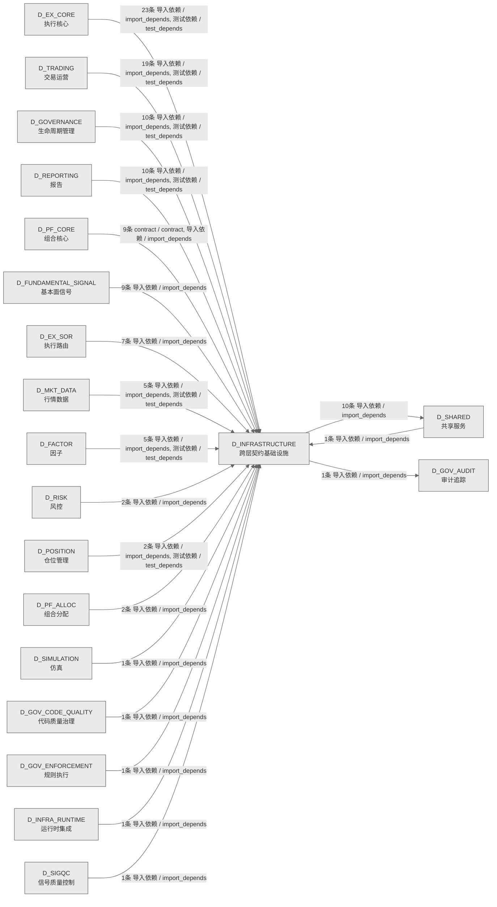

# 02_d_infrastructure / 跨层契约基础设施域 / Cross-Layer Contract Infrastructure

> **功能简介 / Overview**: 跨层契约基础设施，负责跨层契约定义、共享契约管理和契约校验

> **文档作用 / Purpose**: 展示 跨层契约基础设施（D_INFRASTRUCTURE）功能域的域内依赖关系、跨域依赖关系，模块信息（成熟度/中英文名/大白话/文件路径）内嵌于 Mermaid 节点，供架构审查和域治理参考。

> 本文档由 generate_domain_doc.py 从 depgraph (PostgreSQL) 自动生成
> 数据源: depgraph (PostgreSQL) nodes表 + edges表

> **[可缩放 HTML 版 / Zoomable HTML](http://localhost:8765/docs/02_enterprise_architecture/02_domain_architecture_docs/_zoomable_html/02_d_infrastructure.html)** — Ctrl+滚轮缩放 ｜ 双击重置 ｜ Ctrl+Shift+D 切换拖动/选择模式

## 域基本信息 / Domain Overview

| 字段 | 值 | Field | Value |
|------|------|-------|-------|
| 编号 | 02 | Number | 02 |
| 域ID | D_INFRASTRUCTURE | Domain ID | D_INFRASTRUCTURE |
| 域名称 | 跨层契约基础设施 | Domain Name | Cross-Layer Contract Infrastructure |
| 层级 | L0 基础设施层 | Layer | L0 Infrastructure |
| 模块数 | 26 | Module Count | 26 |
| 域内依赖 | 2 | Internal Dependencies | 2 |
| 跨域入边 | 109 | Cross-domain Incoming | 109 |
| 跨域出边 | 11 | Cross-domain Outgoing | 11 |
| 设计态模块 | 0 | Design Modules | 0 |
| 生产态模块 | 26 | Production Modules | 26 |
| 容量 | 26/150 (正常) | Capacity | 26/150 (正常) |
| 描述 | 跨层契约数据类(CTR-001 NormalizedMarketData 等) | Description | 跨层契约数据类(CTR-001 NormalizedMarketData 等) |

## 域内依赖图 / Internal Dependency Diagram

> 依赖图内嵌在本文档中，IDE 可直接渲染；网页版可 Ctrl+滚轮缩放 + 拖动平移查看细节。
>
> **图例说明 / Legend**：
> - 🟦 **蓝色 = 运营态模块**（production，已上线运行）
> - 🟧 **橙色虚线 = 设计态模块**（design，蓝图阶段，代码未写）
> - **实线箭头 = 运营态依赖**（已生效的依赖关系）
> - **虚线箭头 = 非运营态依赖**（计划中/验证中的依赖关系）

### 全景图（全部模块，颜色区分运营态/设计态）

> 展示全部 26 个模块（生产态 26 + 设计态 0），含跨域依赖外部节点。节点含成熟度+名称+大白话/简介+文件路径。

```mermaid
%%{init: {'theme': 'base', 'themeVariables': {'primaryColor': '#eaeaea', 'primaryTextColor': '#333333', 'primaryBorderColor': '#666666', 'lineColor': '#666666', 'secondaryColor': '#eaeaea', 'tertiaryColor': '#eaeaea', 'fontSize': '14px'}}}%%
flowchart TD
    scripts_backup_backup_reconciler_py["backup/backup_reconciler<br/>backup_reconciler.py — 灾备备份系统事件触发器<br/>（post-commit reconciler）<br/>文件: backup/backup_reconciler.py<br/>(生产态 / production)"]
    src_zephyr_infrastructure_config_init_py["infrastructure/config 包入口<br/>ZephyrAlpha — 基础设施 Infrastructure Layer —<br/>Configuration Management<br/>文件: config/__init__.py<br/>(生产态 / production)"]
    src_zephyr_shared_contracts_capital_allocation_result_py["contracts/capital_allocation_result<br/>共享层/契约包的capital_allocation_result模块<br/>文件: contracts/capital_allocation_result.py<br/>(生产态 / production)"]
    src_zephyr_shared_contracts_compliance_rule_py["contracts/compliance_rule<br/>共享层/契约包的compliance_rule模块<br/>文件: contracts/compliance_rule.py<br/>(生产态 / production)"]
    src_zephyr_shared_contracts_execution_report_py["contracts/execution_report<br/>共享层/契约包的execution_report模块<br/>文件: contracts/execution_report.py<br/>(生产态 / production)"]
    src_zephyr_shared_contracts_experiment_result_py["contracts/experiment_result<br/>共享层/契约包的experiment_result模块<br/>文件: contracts/experiment_result.py<br/>(生产态 / production)"]
    src_zephyr_shared_contracts_factor_monitor_report_py["contracts/factor_monitor_report<br/>共享层/契约包的factor_monitor_report模块<br/>文件: contracts/factor_monitor_report.py<br/>(生产态 / production)"]
    src_zephyr_shared_contracts_factor_signal_py["contracts/factor_signal<br/>共享层/契约包的factor_signal模块<br/>文件: contracts/factor_signal.py<br/>(生产态 / production)"]
    src_zephyr_shared_contracts_fill_py["contracts/fill<br/>共享层/契约包的fill模块<br/>文件: contracts/fill.py<br/>(生产态 / production)"]
    src_zephyr_shared_contracts_macro_factor_signal_py["contracts/macro_factor_signal<br/>共享层/契约包的macro_factor_signal模块<br/>文件: contracts/macro_factor_signal.py<br/>(生产态 / production)"]
    src_zephyr_shared_contracts_market_data_py["contracts/market_data<br/>共享层/契约包的market_data模块<br/>文件: contracts/market_data.py<br/>(生产态 / production)"]
    src_zephyr_shared_contracts_model_serving_request_py["contracts/model_serving_request<br/>共享层/契约包的model_serving_request模块<br/>文件: contracts/model_serving_request.py<br/>(生产态 / production)"]
    src_zephyr_shared_contracts_model_serving_response_py["contracts/model_serving_response<br/>共享层/契约包的model_serving_response模块<br/>文件: contracts/model_serving_response.py<br/>(生产态 / production)"]
    src_zephyr_shared_contracts_order_py["contracts/order<br/>共享层/契约包的order模块<br/>文件: contracts/order.py<br/>(生产态 / production)"]
    src_zephyr_shared_contracts_performance_attribution_report_py["contracts/performance_attribution_report<br/>共享层/契约包的performance_attribution_report模<br/>块<br/>文件: contracts<br/>/performance_attribution_report.py<br/>(生产态 / production)"]
    src_zephyr_shared_contracts_position_py["contracts/position<br/>共享层/契约包的position模块<br/>文件: contracts/position.py<br/>(生产态 / production)"]
    src_zephyr_shared_contracts_risk_dashboard_snapshot_py["contracts/risk_dashboard_snapshot<br/>共享层/契约包的risk_dashboard_snapshot模块<br/>文件: contracts/risk_dashboard_snapshot.py<br/>(生产态 / production)"]
    src_zephyr_shared_contracts_risk_metrics_py["contracts/risk_metrics<br/>共享层/契约包的risk_metrics模块<br/>文件: contracts/risk_metrics.py<br/>(生产态 / production)"]
    src_zephyr_shared_contracts_strategy_lifecycle_event_py["contracts/strategy_lifecycle_event<br/>共享层/契约包的strategy_lifecycle_event模块<br/>文件: contracts/strategy_lifecycle_event.py<br/>(生产态 / production)"]
    src_zephyr_shared_contracts_synthesized_signal_py["contracts/synthesized_signal<br/>共享层/契约包的synthesized_signal模块<br/>文件: contracts/synthesized_signal.py<br/>(生产态 / production)"]
    src_zephyr_shared_contracts_system_configuration_py["contracts/system_configuration<br/>共享层/契约包的system_configuration模块<br/>文件: contracts/system_configuration.py<br/>(生产态 / production)"]
    src_zephyr_shared_contracts_target_portfolio_py["contracts/target_portfolio<br/>共享层/契约包的target_portfolio模块<br/>文件: contracts/target_portfolio.py<br/>(生产态 / production)"]
    src_zephyr_shared_contracts_telemetry_emitter_py["contracts/telemetry_emitter<br/>共享层/契约包的telemetry_emitter模块<br/>文件: contracts/telemetry_emitter.py<br/>(生产态 / production)"]
    src_zephyr_shared_contracts_trace_context_py["contracts/trace_context<br/>共享层/契约包的trace_context模块<br/>文件: contracts/trace_context.py<br/>(生产态 / production)"]
    scripts_backup_backup_reconciler_py ~~~ src_zephyr_infrastructure_config_init_py
    src_zephyr_infrastructure_config_init_py ~~~ src_zephyr_shared_contracts_capital_allocation_result_py
    src_zephyr_shared_contracts_capital_allocation_result_py ~~~ src_zephyr_shared_contracts_compliance_rule_py
    src_zephyr_shared_contracts_compliance_rule_py ~~~ src_zephyr_shared_contracts_execution_report_py
    src_zephyr_shared_contracts_execution_report_py ~~~ src_zephyr_shared_contracts_experiment_result_py
    src_zephyr_shared_contracts_experiment_result_py ~~~ src_zephyr_shared_contracts_factor_monitor_report_py
    src_zephyr_shared_contracts_factor_monitor_report_py ~~~ src_zephyr_shared_contracts_factor_signal_py
    src_zephyr_shared_contracts_factor_signal_py ~~~ src_zephyr_shared_contracts_fill_py
    src_zephyr_shared_contracts_fill_py ~~~ src_zephyr_shared_contracts_macro_factor_signal_py
    src_zephyr_shared_contracts_macro_factor_signal_py ~~~ src_zephyr_shared_contracts_market_data_py
    src_zephyr_shared_contracts_market_data_py ~~~ src_zephyr_shared_contracts_model_serving_request_py
    src_zephyr_shared_contracts_model_serving_request_py ~~~ src_zephyr_shared_contracts_model_serving_response_py
    src_zephyr_shared_contracts_model_serving_response_py ~~~ src_zephyr_shared_contracts_order_py
    src_zephyr_shared_contracts_order_py ~~~ src_zephyr_shared_contracts_performance_attribution_report_py
    src_zephyr_shared_contracts_performance_attribution_report_py ~~~ src_zephyr_shared_contracts_position_py
    src_zephyr_shared_contracts_position_py ~~~ src_zephyr_shared_contracts_risk_dashboard_snapshot_py
    src_zephyr_shared_contracts_risk_dashboard_snapshot_py ~~~ src_zephyr_shared_contracts_risk_metrics_py
    src_zephyr_shared_contracts_risk_metrics_py ~~~ src_zephyr_shared_contracts_strategy_lifecycle_event_py
    src_zephyr_shared_contracts_strategy_lifecycle_event_py ~~~ src_zephyr_shared_contracts_synthesized_signal_py
    src_zephyr_shared_contracts_synthesized_signal_py ~~~ src_zephyr_shared_contracts_system_configuration_py
    src_zephyr_shared_contracts_system_configuration_py ~~~ src_zephyr_shared_contracts_target_portfolio_py
    src_zephyr_shared_contracts_target_portfolio_py ~~~ src_zephyr_shared_contracts_telemetry_emitter_py
    src_zephyr_shared_contracts_telemetry_emitter_py ~~~ src_zephyr_shared_contracts_trace_context_py
    src_zephyr_infrastructure_config_app_config_py["config/app_config<br/>app_config.py — 应用配置数据类与加载/热重载逻辑<br/>文件: config/app_config.py<br/>(生产态 / production)"]
    src_zephyr_shared_contracts_risk_limits_py["contracts/risk_limits<br/>共享层/契约包的risk_limits模块<br/>文件: contracts/risk_limits.py<br/>(生产态 / production)"]
    src_zephyr_infrastructure_config_app_config_py ~~~ src_zephyr_shared_contracts_risk_limits_py
    src_zephyr_infrastructure_config_init_py -->|导入依赖 / import_depends| src_zephyr_infrastructure_config_app_config_py
    src_zephyr_shared_contracts_target_portfolio_py -->|导入依赖 / import_depends| src_zephyr_shared_contracts_risk_limits_py
    D_SHARED["共享服务<br/>共享服务，负责跨域共享的工具、协议和基础服务<br/>Shared Services<br/>跨域节点 / cross-domain<br/>(生产态 / production)"]
    src_zephyr_shared_contracts_fill_py -->|导入依赖 / import_depends| D_SHARED
    D_GOV_AUDIT["审计追踪<br/>审计追踪，负责变更审计追踪和操作日志管理<br/>Audit Trail<br/>跨域节点 / cross-domain<br/>(生产态 / production)"]
    scripts_backup_backup_reconciler_py -->|导入依赖 / import_depends| D_GOV_AUDIT
    src_zephyr_shared_contracts_order_py -->|导入依赖 / import_depends| D_SHARED
    src_zephyr_shared_contracts_experiment_result_py -->|导入依赖 / import_depends| D_SHARED
    src_zephyr_shared_contracts_factor_signal_py -->|导入依赖 / import_depends| D_SHARED
    src_zephyr_shared_contracts_market_data_py -->|导入依赖 / import_depends| D_SHARED
    src_zephyr_shared_contracts_order_py -->|导入依赖 / import_depends| D_SHARED
    src_zephyr_shared_contracts_risk_limits_py -->|导入依赖 / import_depends| D_SHARED
    src_zephyr_shared_contracts_position_py -->|导入依赖 / import_depends| D_SHARED
    src_zephyr_shared_contracts_target_portfolio_py -->|导入依赖 / import_depends| D_SHARED
    src_zephyr_shared_contracts_synthesized_signal_py -->|导入依赖 / import_depends| D_SHARED
    D_SHARED -->|导入依赖 / import_depends| src_zephyr_shared_contracts_performance_attribution_report_py
    D_GOVERNANCE["生命周期管理<br/>生命周期管理，负责蓝图/模块<br/>/任务的声明周期管理和元数据治理<br/>Lifecycle Management<br/>跨域节点 / cross-domain<br/>(生产态 / production)"]
    D_GOVERNANCE -->|导入依赖 / import_depends| src_zephyr_shared_contracts_risk_limits_py
    D_EX_CORE["执行核心<br/>执行核心，负责订单执行引擎、执行策略和执行管理<br/>Execution Core<br/>跨域节点 / cross-domain<br/>(生产态 / production)"]
    D_EX_CORE -->|测试依赖 / test_depends| src_zephyr_shared_contracts_position_py
    D_EX_CORE -->|测试依赖 / test_depends| src_zephyr_shared_contracts_fill_py
    D_MKT_DATA["行情数据<br/>行情数据，负责市场行情数据的采集、分发和订阅管理<br/>Market Data<br/>跨域节点 / cross-domain<br/>(生产态 / production)"]
    D_MKT_DATA -->|导入依赖 / import_depends| src_zephyr_shared_contracts_market_data_py
    D_MKT_DATA -->|导入依赖 / import_depends| src_zephyr_shared_contracts_market_data_py
    D_FUNDAMENTAL_SIGNAL["基本面信号<br/>基本面信号，负责基于财务数据的基本面信号生成<br/>Fundamental Signal<br/>跨域节点 / cross-domain<br/>(生产态 / production)"]
    D_FUNDAMENTAL_SIGNAL -->|导入依赖 / import_depends| src_zephyr_shared_contracts_factor_signal_py
    D_FUNDAMENTAL_SIGNAL -->|导入依赖 / import_depends| src_zephyr_shared_contracts_synthesized_signal_py
    D_FUNDAMENTAL_SIGNAL -->|导入依赖 / import_depends| src_zephyr_shared_contracts_factor_signal_py
    D_FUNDAMENTAL_SIGNAL -->|导入依赖 / import_depends| src_zephyr_shared_contracts_synthesized_signal_py
    D_FUNDAMENTAL_SIGNAL -->|导入依赖 / import_depends| src_zephyr_shared_contracts_factor_signal_py
    D_FUNDAMENTAL_SIGNAL -->|导入依赖 / import_depends| src_zephyr_shared_contracts_synthesized_signal_py
    D_SIGQC["信号质量控制<br/>信号质量控制，负责信号质量评估、异常检测和质量门<br/>禁<br/>Signal Quality Control<br/>跨域节点 / cross-domain<br/>(生产态 / production)"]
    D_SIGQC -->|导入依赖 / import_depends| src_zephyr_shared_contracts_synthesized_signal_py
    D_PF_CORE["组合核心<br/>组合核心，负责投资组合构建、持仓管理和组合优化<br/>Portfolio Core<br/>跨域节点 / cross-domain<br/>(生产态 / production)"]
    D_PF_CORE -->|导入依赖 / import_depends| src_zephyr_shared_contracts_risk_limits_py
    D_FACTOR["因子<br/>因子，负责因子计算、因子库管理和因子评价<br/>Factor<br/>跨域节点 / cross-domain<br/>(生产态 / production)"]
    D_FACTOR -->|导入依赖 / import_depends| src_zephyr_shared_contracts_factor_signal_py
    classDef production fill:#e1f5fe,stroke:#01579b,stroke-width:2px,color:#000
    classDef design fill:#fff3e0,stroke:#e65100,stroke-width:2px,color:#000,stroke-dasharray: 5 5
    classDef external_prod fill:#e8f4fd,stroke:#0277bd,stroke-width:1px,color:#000
    classDef external_design fill:#fff8e7,stroke:#ef6c00,stroke-width:1px,color:#000,stroke-dasharray: 5 5
    class scripts_backup_backup_reconciler_py,src_zephyr_infrastructure_config_init_py,src_zephyr_infrastructure_config_app_config_py,src_zephyr_shared_contracts_capital_allocation_result_py,src_zephyr_shared_contracts_compliance_rule_py,src_zephyr_shared_contracts_execution_report_py,src_zephyr_shared_contracts_experiment_result_py,src_zephyr_shared_contracts_factor_monitor_report_py,src_zephyr_shared_contracts_factor_signal_py,src_zephyr_shared_contracts_fill_py,src_zephyr_shared_contracts_macro_factor_signal_py,src_zephyr_shared_contracts_market_data_py,src_zephyr_shared_contracts_model_serving_request_py,src_zephyr_shared_contracts_model_serving_response_py,src_zephyr_shared_contracts_order_py,src_zephyr_shared_contracts_performance_attribution_report_py,src_zephyr_shared_contracts_position_py,src_zephyr_shared_contracts_risk_dashboard_snapshot_py,src_zephyr_shared_contracts_risk_limits_py,src_zephyr_shared_contracts_risk_metrics_py,src_zephyr_shared_contracts_strategy_lifecycle_event_py,src_zephyr_shared_contracts_synthesized_signal_py,src_zephyr_shared_contracts_system_configuration_py,src_zephyr_shared_contracts_target_portfolio_py,src_zephyr_shared_contracts_telemetry_emitter_py,src_zephyr_shared_contracts_trace_context_py production
    class D_SHARED,D_GOV_AUDIT,D_GOVERNANCE,D_EX_CORE,D_MKT_DATA,D_FUNDAMENTAL_SIGNAL,D_SIGQC,D_PF_CORE,D_FACTOR external_prod
```

### 运营态的图（仅 design_maturity=production 的模块和域内依赖）

> 仅展示已上线运行的模块（共 26 个），不含跨域外部节点。跨域依赖见下方跨域依赖章节。

```mermaid
%%{init: {'theme': 'base', 'themeVariables': {'primaryColor': '#eaeaea', 'primaryTextColor': '#333333', 'primaryBorderColor': '#666666', 'lineColor': '#666666', 'secondaryColor': '#eaeaea', 'tertiaryColor': '#eaeaea', 'fontSize': '14px'}}}%%
flowchart TD
    scripts_backup_backup_reconciler_py["backup/backup_reconciler<br/>backup_reconciler.py — 灾备备份系统事件触发器<br/>（post-commit reconciler）<br/>文件: backup/backup_reconciler.py<br/>(生产态 / production)"]
    src_zephyr_infrastructure_config_init_py["infrastructure/config 包入口<br/>ZephyrAlpha — 基础设施 Infrastructure Layer —<br/>Configuration Management<br/>文件: config/__init__.py<br/>(生产态 / production)"]
    src_zephyr_shared_contracts_capital_allocation_result_py["contracts/capital_allocation_result<br/>共享层/契约包的capital_allocation_result模块<br/>文件: contracts/capital_allocation_result.py<br/>(生产态 / production)"]
    src_zephyr_shared_contracts_compliance_rule_py["contracts/compliance_rule<br/>共享层/契约包的compliance_rule模块<br/>文件: contracts/compliance_rule.py<br/>(生产态 / production)"]
    src_zephyr_shared_contracts_execution_report_py["contracts/execution_report<br/>共享层/契约包的execution_report模块<br/>文件: contracts/execution_report.py<br/>(生产态 / production)"]
    src_zephyr_shared_contracts_experiment_result_py["contracts/experiment_result<br/>共享层/契约包的experiment_result模块<br/>文件: contracts/experiment_result.py<br/>(生产态 / production)"]
    src_zephyr_shared_contracts_factor_monitor_report_py["contracts/factor_monitor_report<br/>共享层/契约包的factor_monitor_report模块<br/>文件: contracts/factor_monitor_report.py<br/>(生产态 / production)"]
    src_zephyr_shared_contracts_factor_signal_py["contracts/factor_signal<br/>共享层/契约包的factor_signal模块<br/>文件: contracts/factor_signal.py<br/>(生产态 / production)"]
    src_zephyr_shared_contracts_fill_py["contracts/fill<br/>共享层/契约包的fill模块<br/>文件: contracts/fill.py<br/>(生产态 / production)"]
    src_zephyr_shared_contracts_macro_factor_signal_py["contracts/macro_factor_signal<br/>共享层/契约包的macro_factor_signal模块<br/>文件: contracts/macro_factor_signal.py<br/>(生产态 / production)"]
    src_zephyr_shared_contracts_market_data_py["contracts/market_data<br/>共享层/契约包的market_data模块<br/>文件: contracts/market_data.py<br/>(生产态 / production)"]
    src_zephyr_shared_contracts_model_serving_request_py["contracts/model_serving_request<br/>共享层/契约包的model_serving_request模块<br/>文件: contracts/model_serving_request.py<br/>(生产态 / production)"]
    src_zephyr_shared_contracts_model_serving_response_py["contracts/model_serving_response<br/>共享层/契约包的model_serving_response模块<br/>文件: contracts/model_serving_response.py<br/>(生产态 / production)"]
    src_zephyr_shared_contracts_order_py["contracts/order<br/>共享层/契约包的order模块<br/>文件: contracts/order.py<br/>(生产态 / production)"]
    src_zephyr_shared_contracts_performance_attribution_report_py["contracts/performance_attribution_report<br/>共享层/契约包的performance_attribution_report模<br/>块<br/>文件: contracts<br/>/performance_attribution_report.py<br/>(生产态 / production)"]
    src_zephyr_shared_contracts_position_py["contracts/position<br/>共享层/契约包的position模块<br/>文件: contracts/position.py<br/>(生产态 / production)"]
    src_zephyr_shared_contracts_risk_dashboard_snapshot_py["contracts/risk_dashboard_snapshot<br/>共享层/契约包的risk_dashboard_snapshot模块<br/>文件: contracts/risk_dashboard_snapshot.py<br/>(生产态 / production)"]
    src_zephyr_shared_contracts_risk_metrics_py["contracts/risk_metrics<br/>共享层/契约包的risk_metrics模块<br/>文件: contracts/risk_metrics.py<br/>(生产态 / production)"]
    src_zephyr_shared_contracts_strategy_lifecycle_event_py["contracts/strategy_lifecycle_event<br/>共享层/契约包的strategy_lifecycle_event模块<br/>文件: contracts/strategy_lifecycle_event.py<br/>(生产态 / production)"]
    src_zephyr_shared_contracts_synthesized_signal_py["contracts/synthesized_signal<br/>共享层/契约包的synthesized_signal模块<br/>文件: contracts/synthesized_signal.py<br/>(生产态 / production)"]
    src_zephyr_shared_contracts_system_configuration_py["contracts/system_configuration<br/>共享层/契约包的system_configuration模块<br/>文件: contracts/system_configuration.py<br/>(生产态 / production)"]
    src_zephyr_shared_contracts_target_portfolio_py["contracts/target_portfolio<br/>共享层/契约包的target_portfolio模块<br/>文件: contracts/target_portfolio.py<br/>(生产态 / production)"]
    src_zephyr_shared_contracts_telemetry_emitter_py["contracts/telemetry_emitter<br/>共享层/契约包的telemetry_emitter模块<br/>文件: contracts/telemetry_emitter.py<br/>(生产态 / production)"]
    src_zephyr_shared_contracts_trace_context_py["contracts/trace_context<br/>共享层/契约包的trace_context模块<br/>文件: contracts/trace_context.py<br/>(生产态 / production)"]
    scripts_backup_backup_reconciler_py ~~~ src_zephyr_infrastructure_config_init_py
    src_zephyr_infrastructure_config_init_py ~~~ src_zephyr_shared_contracts_capital_allocation_result_py
    src_zephyr_shared_contracts_capital_allocation_result_py ~~~ src_zephyr_shared_contracts_compliance_rule_py
    src_zephyr_shared_contracts_compliance_rule_py ~~~ src_zephyr_shared_contracts_execution_report_py
    src_zephyr_shared_contracts_execution_report_py ~~~ src_zephyr_shared_contracts_experiment_result_py
    src_zephyr_shared_contracts_experiment_result_py ~~~ src_zephyr_shared_contracts_factor_monitor_report_py
    src_zephyr_shared_contracts_factor_monitor_report_py ~~~ src_zephyr_shared_contracts_factor_signal_py
    src_zephyr_shared_contracts_factor_signal_py ~~~ src_zephyr_shared_contracts_fill_py
    src_zephyr_shared_contracts_fill_py ~~~ src_zephyr_shared_contracts_macro_factor_signal_py
    src_zephyr_shared_contracts_macro_factor_signal_py ~~~ src_zephyr_shared_contracts_market_data_py
    src_zephyr_shared_contracts_market_data_py ~~~ src_zephyr_shared_contracts_model_serving_request_py
    src_zephyr_shared_contracts_model_serving_request_py ~~~ src_zephyr_shared_contracts_model_serving_response_py
    src_zephyr_shared_contracts_model_serving_response_py ~~~ src_zephyr_shared_contracts_order_py
    src_zephyr_shared_contracts_order_py ~~~ src_zephyr_shared_contracts_performance_attribution_report_py
    src_zephyr_shared_contracts_performance_attribution_report_py ~~~ src_zephyr_shared_contracts_position_py
    src_zephyr_shared_contracts_position_py ~~~ src_zephyr_shared_contracts_risk_dashboard_snapshot_py
    src_zephyr_shared_contracts_risk_dashboard_snapshot_py ~~~ src_zephyr_shared_contracts_risk_metrics_py
    src_zephyr_shared_contracts_risk_metrics_py ~~~ src_zephyr_shared_contracts_strategy_lifecycle_event_py
    src_zephyr_shared_contracts_strategy_lifecycle_event_py ~~~ src_zephyr_shared_contracts_synthesized_signal_py
    src_zephyr_shared_contracts_synthesized_signal_py ~~~ src_zephyr_shared_contracts_system_configuration_py
    src_zephyr_shared_contracts_system_configuration_py ~~~ src_zephyr_shared_contracts_target_portfolio_py
    src_zephyr_shared_contracts_target_portfolio_py ~~~ src_zephyr_shared_contracts_telemetry_emitter_py
    src_zephyr_shared_contracts_telemetry_emitter_py ~~~ src_zephyr_shared_contracts_trace_context_py
    src_zephyr_infrastructure_config_app_config_py["config/app_config<br/>app_config.py — 应用配置数据类与加载/热重载逻辑<br/>文件: config/app_config.py<br/>(生产态 / production)"]
    src_zephyr_shared_contracts_risk_limits_py["contracts/risk_limits<br/>共享层/契约包的risk_limits模块<br/>文件: contracts/risk_limits.py<br/>(生产态 / production)"]
    src_zephyr_infrastructure_config_app_config_py ~~~ src_zephyr_shared_contracts_risk_limits_py
    src_zephyr_infrastructure_config_init_py -->|导入依赖 / import_depends| src_zephyr_infrastructure_config_app_config_py
    src_zephyr_shared_contracts_target_portfolio_py -->|导入依赖 / import_depends| src_zephyr_shared_contracts_risk_limits_py
    classDef production fill:#e1f5fe,stroke:#01579b,stroke-width:2px,color:#000
    classDef design fill:#fff3e0,stroke:#e65100,stroke-width:2px,color:#000,stroke-dasharray: 5 5
    classDef external_prod fill:#e8f4fd,stroke:#0277bd,stroke-width:1px,color:#000
    classDef external_design fill:#fff8e7,stroke:#ef6c00,stroke-width:1px,color:#000,stroke-dasharray: 5 5
    class scripts_backup_backup_reconciler_py,src_zephyr_infrastructure_config_init_py,src_zephyr_infrastructure_config_app_config_py,src_zephyr_shared_contracts_capital_allocation_result_py,src_zephyr_shared_contracts_compliance_rule_py,src_zephyr_shared_contracts_execution_report_py,src_zephyr_shared_contracts_experiment_result_py,src_zephyr_shared_contracts_factor_monitor_report_py,src_zephyr_shared_contracts_factor_signal_py,src_zephyr_shared_contracts_fill_py,src_zephyr_shared_contracts_macro_factor_signal_py,src_zephyr_shared_contracts_market_data_py,src_zephyr_shared_contracts_model_serving_request_py,src_zephyr_shared_contracts_model_serving_response_py,src_zephyr_shared_contracts_order_py,src_zephyr_shared_contracts_performance_attribution_report_py,src_zephyr_shared_contracts_position_py,src_zephyr_shared_contracts_risk_dashboard_snapshot_py,src_zephyr_shared_contracts_risk_limits_py,src_zephyr_shared_contracts_risk_metrics_py,src_zephyr_shared_contracts_strategy_lifecycle_event_py,src_zephyr_shared_contracts_synthesized_signal_py,src_zephyr_shared_contracts_system_configuration_py,src_zephyr_shared_contracts_target_portfolio_py,src_zephyr_shared_contracts_telemetry_emitter_py,src_zephyr_shared_contracts_trace_context_py production
```

### 设计态的图（仅 design_maturity=design 的模块和域内依赖）

> 仅展示蓝图阶段、代码未写的设计态模块（共 0 个），不含跨域外部节点。

> （无模块 / No modules）

## 跨域依赖 / Cross-domain Dependencies

### 本域依赖的其他域（出边）/ Depends On

| # | 本域模块 / Source Module | → | 外部域-目标模块 / Target Module | 依赖类型 / Type |
|:--:|---------|:--:|---------|---------|
| 1 | backup_reconciler.py — 灾备备份系统事件触发器（post-comm... | → | D_GOV_AUDIT 审计追踪: 对账注册表 / reconciliation_registry (audit/reconciliatio... | 导入依赖 / import_depends |
| 2 | contracts/experiment_result.py | → | D_SHARED 共享服务: core/trace_context.py | 导入依赖 / import_depends |
| 3 | contracts/factor_signal.py | → | D_SHARED 共享服务: core/trace_context.py | 导入依赖 / import_depends |
| 4 | contracts/fill.py | → | D_SHARED 共享服务: core/trace_context.py | 导入依赖 / import_depends |
| 5 | contracts/market_data.py | → | D_SHARED 共享服务: core/trace_context.py | 导入依赖 / import_depends |
| 6 | contracts/order.py | → | D_SHARED 共享服务: core/trace_context.py | 导入依赖 / import_depends |
| 7 | contracts/order.py | → | D_SHARED 共享服务: OrderSide/OrderStatus/OrderType — 交易枚举真源 (5.152 #1... | 导入依赖 / import_depends |
| 8 | contracts/position.py | → | D_SHARED 共享服务: core/trace_context.py | 导入依赖 / import_depends |
| 9 | contracts/risk_limits.py | → | D_SHARED 共享服务: core/trace_context.py | 导入依赖 / import_depends |
| 10 | contracts/synthesized_signal.py | → | D_SHARED 共享服务: core/trace_context.py | 导入依赖 / import_depends |
| 11 | contracts/target_portfolio.py | → | D_SHARED 共享服务: core/trace_context.py | 导入依赖 / import_depends |

### 依赖本域的其他域（入边）/ Depended By

| # | 外部域-源模块 / Source Module | → | 本域模块 / Target Module | 依赖类型 / Type |
|:--:|---------|:--:|---------|---------|
| 1 | D_EX_CORE 执行核心: D_EX_CORE — Aggregate Root Manager (执行域聚合根管理器) ... | → | contracts/fill.py | 导入依赖 / import_depends |
| 2 | D_EX_CORE 执行核心: D_EX_CORE — Aggregate Root Manager (执行域聚合根管理器) ... | → | contracts/order.py | 导入依赖 / import_depends |
| 3 | D_EX_CORE 执行核心: D_EX_CORE — Aggregate Root Manager (执行域聚合根管理器) ... | → | contracts/position.py | 导入依赖 / import_depends |
| 4 | D_EX_CORE 执行核心: 执行引擎 / D_EXECUTION_CORE — Execution Engine (ex_core/... | → | contracts/order.py | 导入依赖 / import_depends |
| 5 | D_EX_CORE 执行核心: 执行引擎 / D_EXECUTION_CORE — Execution Engine (ex_core/... | → | contracts/risk_limits.py | 导入依赖 / import_depends |
| 6 | D_EX_CORE 执行核心: 部分成交处理器 (ex_core/fill_handler.py) | → | contracts/fill.py | 导入依赖 / import_depends |
| 7 | D_EX_CORE 执行核心: 部分成交处理器 (ex_core/fill_handler.py) | → | contracts/order.py | 导入依赖 / import_depends |
| 8 | D_EX_CORE 执行核心: Order Execution Saga — 下单执行 Saga 编排器 (MOD-EX-057 ... | → | contracts/fill.py | 导入依赖 / import_depends |
| 9 | D_EX_CORE 执行核心: Order Execution Saga — 下单执行 Saga 编排器 (MOD-EX-057 ... | → | contracts/order.py | 导入依赖 / import_depends |
| 10 | D_EX_CORE 执行核心: Order Execution Saga — 下单执行 Saga 编排器 (MOD-EX-057 ... | → | contracts/risk_limits.py | 导入依赖 / import_depends |
| 11 | D_EX_CORE 执行核心: 订单管理器 / D_EXECUTION_CORE — Order Manager (ex_core/o... | → | contracts/fill.py | 导入依赖 / import_depends |
| 12 | D_EX_CORE 执行核心: 订单管理器 / D_EXECUTION_CORE — Order Manager (ex_core/o... | → | contracts/order.py | 导入依赖 / import_depends |
| 13 | D_EX_CORE 执行核心: D_EXECUTION_CORE — 盘中持仓对账器 (Position Reconciler) ... | → | contracts/position.py | 导入依赖 / import_depends |
| 14 | D_EX_CORE 执行核心: D_EXECUTION_CORE — Position Tracker (持仓跟踪器) (positi... | → | contracts/fill.py | 导入依赖 / import_depends |
| 15 | D_EX_CORE 执行核心: D_EXECUTION_CORE — Position Tracker (持仓跟踪器) (positi... | → | contracts/position.py | 导入依赖 / import_depends |
| 16 | D_EX_CORE 执行核心: D_EX_CORE — Repository Interface (执行域仓储接口) (ex_co... | → | contracts/order.py | 导入依赖 / import_depends |
| 17 | D_EX_CORE 执行核心: D_EX_CORE — Repository Interface (执行域仓储接口) (ex_co... | → | contracts/position.py | 导入依赖 / import_depends |
| 18 | D_EX_CORE 执行核心: 交易会话 / trading_session (ex_core/trading_session.py) | → | contracts/fill.py | 导入依赖 / import_depends |
| 19 | D_EX_CORE 执行核心: 交易会话 / trading_session (ex_core/trading_session.py) | → | contracts/order.py | 导入依赖 / import_depends |
| 20 | D_EX_CORE 执行核心: 交易会话 / trading_session (ex_core/trading_session.py) | → | contracts/position.py | 导入依赖 / import_depends |
| 21 | D_EX_CORE 执行核心: 交易会话 / trading_session (ex_core/trading_session.py) | → | contracts/risk_limits.py | 导入依赖 / import_depends |
| 22 | D_EX_CORE 执行核心: PositionReconciler 单元测试 — D-EX-CORE-56 盘中持仓对账... | → | contracts/fill.py | 测试依赖 / test_depends |
| 23 | D_EX_CORE 执行核心: PositionReconciler 单元测试 — D-EX-CORE-56 盘中持仓对账... | → | contracts/position.py | 测试依赖 / test_depends |
| 24 | D_EX_SOR 执行路由: Broker API Connector — 券商 API 连接器 (MOD-XS-013) (api... | → | contracts/fill.py | 导入依赖 / import_depends |
| 25 | D_EX_SOR 执行路由: Broker API Connector — 券商 API 连接器 (MOD-XS-013) (api... | → | contracts/order.py | 导入依赖 / import_depends |
| 26 | D_EX_SOR 执行路由: 算法执行选择器 / algo_execution_selector (core/algo_execu... | → | contracts/order.py | 导入依赖 / import_depends |
| 27 | D_EX_SOR 执行路由: 算法交易引擎 / algo_trading_engine (core/algo_trading_eng... | → | contracts/order.py | 导入依赖 / import_depends |
| 28 | D_EX_SOR 执行路由: 经纪人适配器管理器 / broker_adapter_manager (core/broker_... | → | contracts/fill.py | 导入依赖 / import_depends |
| 29 | D_EX_SOR 执行路由: 经纪人适配器管理器 / broker_adapter_manager (core/broker_... | → | contracts/order.py | 导入依赖 / import_depends |
| 30 | D_EX_SOR 执行路由: optimal订单路由器 / optimal_order_router (core/optimal_or... | → | contracts/order.py | 导入依赖 / import_depends |
| 31 | D_FACTOR 因子: D_FACTOR core batch_output.buffer——FactorSignal 批量缓... | → | contracts/factor_signal.py | 导入依赖 / import_depends |
| 32 | D_FACTOR 因子: 转换器 / converter (ctr001_consumer/converter.py) | → | contracts/market_data.py | 导入依赖 / import_depends |
| 33 | D_FACTOR 因子: 转换器 / converter (ctr002_producer/converter.py) | → | contracts/factor_signal.py | 导入依赖 / import_depends |
| 34 | D_FACTOR 因子: CTR-001 NormalizedMarketData 消费者测试——converter + fi... | → | contracts/market_data.py | 测试依赖 / test_depends |
| 35 | D_FACTOR 因子: CTR-002 FactorSignal 生产者测试——to_signals。 (factor/t... | → | contracts/factor_signal.py | 测试依赖 / test_depends |
| 36 | D_FUNDAMENTAL_SIGNAL 基本面信号: 信号生成聚合基类 / Signal Generation Aggregator Base (gen... | → | contracts/factor_signal.py | 导入依赖 / import_depends |
| 37 | D_FUNDAMENTAL_SIGNAL 基本面信号: 信号生成聚合基类 / Signal Generation Aggregator Base (gen... | → | contracts/synthesized_signal.py | 导入依赖 / import_depends |
| 38 | D_FUNDAMENTAL_SIGNAL 基本面信号: 默认信号聚合器 / Default Signal Aggregator (implementatio... | → | contracts/factor_signal.py | 导入依赖 / import_depends |
| 39 | D_FUNDAMENTAL_SIGNAL 基本面信号: 默认信号聚合器 / Default Signal Aggregator (implementatio... | → | contracts/synthesized_signal.py | 导入依赖 / import_depends |
| 40 | D_FUNDAMENTAL_SIGNAL 基本面信号: 管线 / Alpha Signal Pipeline (signal_fundamental/pipeline... | → | contracts/factor_signal.py | 导入依赖 / import_depends |
| 41 | D_FUNDAMENTAL_SIGNAL 基本面信号: 管线 / Alpha Signal Pipeline (signal_fundamental/pipeline... | → | contracts/synthesized_signal.py | 导入依赖 / import_depends |
| 42 | D_FUNDAMENTAL_SIGNAL 基本面信号: 策略默认资本分配器 / Strategy Default Capital Allocator (... | → | contracts/synthesized_signal.py | 导入依赖 / import_depends |
| 43 | D_FUNDAMENTAL_SIGNAL 基本面信号: 信号合成器 / Signal Synthesizer (synth/signal_synthesizer... | → | contracts/factor_signal.py | 导入依赖 / import_depends |
| 44 | D_FUNDAMENTAL_SIGNAL 基本面信号: 信号合成器 / Signal Synthesizer (synth/signal_synthesizer... | → | contracts/synthesized_signal.py | 导入依赖 / import_depends |
| 45 | D_GOVERNANCE 生命周期管理: A2Afull验证 / a2a_full_verification (scripts/a2a_full_ver... | → | ZephyrAlpha — 基础设施 Infrastructure Layer — Configura... | 导入依赖 / import_depends |
| 46 | D_GOVERNANCE 生命周期管理: 本地层daemon / local_layer_daemon (construction/local_lay... | → | ZephyrAlpha — 基础设施 Infrastructure Layer — Configura... | 导入依赖 / import_depends |
| 47 | D_GOVERNANCE 生命周期管理: 风险验证桥接 / D_EXECUTION_CORE — Risk Validation Bridge... | → | contracts/risk_limits.py | 导入依赖 / import_depends |
| 48 | D_GOVERNANCE 生命周期管理: 仿真经纪人 / D_EXECUTION_CORE — Simulation Broker Adapte... | → | contracts/fill.py | 导入依赖 / import_depends |
| 49 | D_GOVERNANCE 生命周期管理: 仿真经纪人 / D_EXECUTION_CORE — Simulation Broker Adapte... | → | contracts/order.py | 导入依赖 / import_depends |
| 50 | D_GOVERNANCE 生命周期管理: 仿真经纪人 / D_EXECUTION_CORE — Simulation Broker Adapte... | → | contracts/position.py | 导入依赖 / import_depends |
| 51 | D_GOVERNANCE 生命周期管理: E2E 集成测试：全流水线贯通测试 (trading/test_e2e_pipeline... | → | contracts/synthesized_signal.py | 测试依赖 / test_depends |
| 52 | D_GOVERNANCE 生命周期管理: Phase E — Main Data Flow End-to-End Test (trading/test_p... | → | contracts/factor_signal.py | 测试依赖 / test_depends |
| 53 | D_GOVERNANCE 生命周期管理: Phase E — Main Data Flow End-to-End Test (trading/test_p... | → | contracts/market_data.py | 测试依赖 / test_depends |
| 54 | D_GOVERNANCE 生命周期管理: Phase E — Main Data Flow End-to-End Test (trading/test_p... | → | contracts/synthesized_signal.py | 测试依赖 / test_depends |
| 55 | D_GOV_CODE_QUALITY 代码质量治理: 配置 / config (code_dedup/config.py) | → | app_config.py — 应用配置数据类与加载/热重载逻辑 (config/... | 导入依赖 / import_depends |
| 56 | D_GOV_ENFORCEMENT 规则执行: Re-export shim — ComplianceRule 真源已合并至 zephyr.shar... | → | contracts/compliance_rule.py | 导入依赖 / import_depends |
| 57 | D_INFRA_RUNTIME 运行时集成: HealthMonitor — 健康监控 + 自愈 (trading/health_monitor.py) | → | contracts/telemetry_emitter.py | 导入依赖 / import_depends |
| 58 | D_MKT_DATA 行情数据: market_data/__init__.py | → | contracts/market_data.py | 导入依赖 / import_depends |
| 59 | D_MKT_DATA 行情数据: D_MKT_DATA — Connector Base (行情数据连接器基类) (connec... | → | contracts/market_data.py | 导入依赖 / import_depends |
| 60 | D_MKT_DATA 行情数据: NormalizedMarketData 生产者——D_MKT_DATA→D_FACTOR 数据... | → | contracts/market_data.py | 导入依赖 / import_depends |
| 61 | D_MKT_DATA 行情数据: D_MKT_DATA — Vendor Base (行情数据源基类) (market_data/v... | → | contracts/market_data.py | 导入依赖 / import_depends |
| 62 | D_MKT_DATA 行情数据: MOD-MKT-002 Vendor Base 单元测试. (market_data/test_vendo... | → | contracts/market_data.py | 测试依赖 / test_depends |
| 63 | D_PF_ALLOC 组合分配: pf_alloc/strategy_lifecycle_event.py | → | contracts/strategy_lifecycle_event.py | 导入依赖 / import_depends |
| 64 | D_PF_ALLOC 组合分配: D_PORTFOLIO_CORE — Default Equity Long-Only Strategy (pf... | → | contracts/order.py | 导入依赖 / import_depends |
| 65 | D_PF_CORE 组合核心: Constraint Solver — 约束求解器 (MOD-PF-006) (core/constr... | → | contracts/risk_limits.py | 导入依赖 / import_depends |
| 66 | D_PF_CORE 组合核心: Performance Attribution Engine — 绩效归因引擎 (MOD-PF-00... | → | contracts/performance_attribution_report.py | 导入依赖 / import_depends |
| 67 | D_PF_CORE 组合核心: Portfolio Optimizer — 组合优化器 (MOD-PF-002) (core/port... | → | contracts/risk_limits.py | 导入依赖 / import_depends |
| 68 | D_PF_CORE 组合核心: Portfolio Optimizer — 组合优化器 (MOD-PF-002) (core/port... | → | contracts/target_portfolio.py | contract / contract |
| 69 | D_PF_CORE 组合核心: Portfolio Optimizer — 组合优化器 (MOD-PF-002) (core/port... | → | contracts/target_portfolio.py | 导入依赖 / import_depends |
| 70 | D_PF_CORE 组合核心: Rebalance Scheduler — 再平衡调度器 (MOD-PF-003) (core/re... | → | contracts/risk_limits.py | 导入依赖 / import_depends |
| 71 | D_PF_CORE 组合核心: Rebalance Scheduler — 再平衡调度器 (MOD-PF-003) (core/re... | → | contracts/target_portfolio.py | 导入依赖 / import_depends |
| 72 | D_PF_CORE 组合核心: Strategy Engine — 策略引擎 (MOD-PF-001) (core/strategy_e... | → | contracts/strategy_lifecycle_event.py | contract / contract |
| 73 | D_PF_CORE 组合核心: Strategy Engine — 策略引擎 (MOD-PF-001) (core/strategy_e... | → | contracts/strategy_lifecycle_event.py | 导入依赖 / import_depends |
| 74 | D_POSITION 仓位管理: Position Sizing Engine — 仓位决策引擎 (MOD-POS-001) (cor... | → | contracts/risk_limits.py | 导入依赖 / import_depends |
| 75 | D_POSITION 仓位管理: Position Sizing Engine 测试 (MOD-POS-001 阶段1)。 (positi... | → | contracts/risk_limits.py | 测试依赖 / test_depends |
| 76 | D_REPORTING 报告: D_REPORTING — Post-Trade Analytics Layer (reporting/anal... | → | contracts/execution_report.py | 导入依赖 / import_depends |
| 77 | D_REPORTING 报告: D_REPORTING — Post-Trade Analytics Layer (reporting/anal... | → | contracts/fill.py | 导入依赖 / import_depends |
| 78 | D_REPORTING 报告: D_REPORTING — Post-Trade Analytics Layer (reporting/anal... | → | contracts/order.py | 导入依赖 / import_depends |
| 79 | D_REPORTING 报告: D_REPORTING — Post-Trade Analytics Layer (reporting/anal... | → | contracts/performance_attribution_report.py | 导入依赖 / import_depends |
| 80 | D_REPORTING 报告: D_REPORTING — Default Attribution Engine (reporting/defa... | → | contracts/performance_attribution_report.py | 导入依赖 / import_depends |
| 81 | D_REPORTING 报告: D_REPORTING — Default TCA Engine (reporting/default_tca_... | → | contracts/execution_report.py | 导入依赖 / import_depends |
| 82 | D_REPORTING 报告: D_REPORTING — Default TCA Engine (reporting/default_tca_... | → | contracts/fill.py | 导入依赖 / import_depends |
| 83 | D_REPORTING 报告: D_REPORTING — Default TCA Engine (reporting/default_tca_... | → | contracts/order.py | 导入依赖 / import_depends |
| 84 | D_REPORTING 报告: D_REPORTING — Real-time P&L Dashboard (实时盈亏仪表盘) (... | → | contracts/fill.py | 导入依赖 / import_depends |
| 85 | D_REPORTING 报告: MOD-RPT-004 Real-time P&L Dashboard 单元测试. (reporting/... | → | contracts/fill.py | 测试依赖 / test_depends |
| 86 | D_RISK 风控: D_RISK — Risk Limits Calculator (risk/risk_limits.py) | → | contracts/risk_limits.py | 导入依赖 / import_depends |
| 87 | D_RISK 风控: ZephyrAlpha — D_RISK Risk Management Layer — 风控管理器... | → | contracts/risk_limits.py | 导入依赖 / import_depends |
| 88 | D_SHARED 共享服务: Re-export shim — 真源已收敛至 zephyr.shared.contracts.pe... | → | contracts/performance_attribution_report.py | 导入依赖 / import_depends |
| 89 | D_SIGQC 信号质量控制: D_SIGQC — Signal Quality Degradation Monitor Base (signa... | → | contracts/synthesized_signal.py | 导入依赖 / import_depends |
| 90 | D_SIMULATION 仿真: 实验 — Experimentation Pipeline Layer (simulation/pipeli... | → | contracts/experiment_result.py | 导入依赖 / import_depends |
| 91 | D_TRADING 交易运营: D_TRADING — PnL Calculator (盈亏计算器) (trading/pnl_cal... | → | contracts/fill.py | 导入依赖 / import_depends |
| 92 | D_TRADING 交易运营: D_TRADING — Settlement & Reconciliation Engine (结算对账... | → | contracts/fill.py | 导入依赖 / import_depends |
| 93 | D_TRADING 交易运营: D_EXECUTION_CORE — BrokerInterface (trading_contracts/br... | → | contracts/fill.py | 导入依赖 / import_depends |
| 94 | D_TRADING 交易运营: D_EXECUTION_CORE — BrokerInterface (trading_contracts/br... | → | contracts/order.py | 导入依赖 / import_depends |
| 95 | D_TRADING 交易运营: D_EXECUTION_CORE — BrokerInterface (trading_contracts/br... | → | contracts/position.py | 导入依赖 / import_depends |
| 96 | D_TRADING 交易运营: execution/execution_rejection_error.py | → | contracts/trace_context.py | 导入依赖 / import_depends |
| 97 | D_TRADING 交易运营: Re-export wrapper: ExecutionReport 真源在 zephyr.shared.c... | → | contracts/execution_report.py | 导入依赖 / import_depends |
| 98 | D_TRADING 交易运营: Re-export wrapper: Fill 真源在 zephyr.shared.contracts.fi... | → | contracts/fill.py | 导入依赖 / import_depends |
| 99 | D_TRADING 交易运营: Re-export wrapper: Order 真源在 zephyr.shared.contracts.o... | → | contracts/order.py | 导入依赖 / import_depends |
| 100 | D_TRADING 交易运营: Re-export wrapper: PositionSnapshot 真源在 zephyr.shared.... | → | contracts/position.py | 导入依赖 / import_depends |
| 101 | D_TRADING 交易运营: trading-contracts/factories.py — 交易域数据契约工厂方法 ... | → | contracts/factor_signal.py | 导入依赖 / import_depends |
| 102 | D_TRADING 交易运营: trading-contracts/factories.py — 交易域数据契约工厂方法 ... | → | contracts/synthesized_signal.py | 导入依赖 / import_depends |
| 103 | D_TRADING 交易运营: Re-export shim — 真源已收敛至 zephyr.shared.contracts.pe... | → | contracts/performance_attribution_report.py | 导入依赖 / import_depends |
| 104 | D_TRADING 交易运营: contracts/strategy_lifecycle_event.py | → | contracts/strategy_lifecycle_event.py | 导入依赖 / import_depends |
| 105 | D_TRADING 交易运营: risk/risk_limit_violation_error.py | → | contracts/trace_context.py | 导入依赖 / import_depends |
| 106 | D_TRADING 交易运营: risk/risk_limits.py | → | contracts/trace_context.py | 导入依赖 / import_depends |
| 107 | D_TRADING 交易运营: risk/risk_validator_protocol.py | → | contracts/risk_limits.py | 导入依赖 / import_depends |
| 108 | D_TRADING 交易运营: MOD-TRADING-002 PnL Calculator 单元测试. (trading/test_pn... | → | contracts/fill.py | 测试依赖 / test_depends |
| 109 | D_TRADING 交易运营: MOD-TRADING-003 Settlement & Reconciliation Engine 单元测... | → | contracts/fill.py | 测试依赖 / test_depends |

### 跨域依赖图 / Cross-domain Dependency Diagram

> 本域与 19 个外部域直接连接（出边 11 条 + 入边 109 条 = 120 条）。只显示直接连接的域，不展开具体节点。

## 说明 / Notes

- **数据源 / Data Source**: `depgraph (PostgreSQL)` 的 `nodes`、`edges`、`domains` 表
- **生成器 / Generator**: `generate_domain_doc.py`（G2+G10 合并）
- **维护方式 / Maintenance**: 自动生成，全景图更新时刷新
- **文件名规则 / File Naming**: `{编号:02d}_{域ID小写}.md`，如 `16_d_trading.md`
- **图例说明 / Legend**: `[production]`=已上线 / `[design]`=设计中 / `[unknown]`=未知
