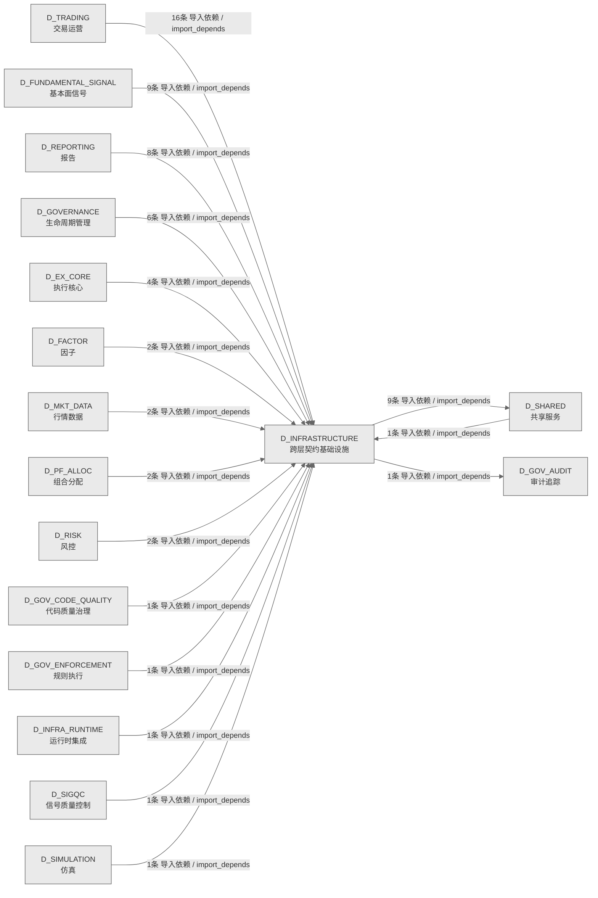

# 02_d_infrastructure / 跨层契约基础设施域 / Cross-Layer Contract Infrastructure

> **功能简介 / Overview**: 跨层契约基础设施，负责跨层契约定义、共享契约管理和契约校验

> **文档作用 / Purpose**: 展示 跨层契约基础设施（D_INFRASTRUCTURE）功能域的域内依赖关系、跨域依赖关系，模块信息（成熟度/中英文名/大白话/文件路径）内嵌于 Mermaid 节点，供架构审查和域治理参考。

> 本文档由 generate_domain_doc.py 从 depgraph (PostgreSQL) 自动生成
> 数据源: depgraph (PostgreSQL) nodes表 + edges表

> **[可缩放 HTML 版 / Zoomable HTML](http://localhost:8765/docs/02_enterprise_architecture/02_domain_architecture_docs/_zoomable_html/02_d_infrastructure.html)** — Ctrl+滚轮缩放 ｜ 双击重置 ｜ Ctrl+Shift+D 切换拖动/选择模式

## 域基本信息 / Domain Overview

| 字段 | 值 | Field | Value |
|------|------|-------|-------|
| 编号 | 02 | Number | 02 |
| 域ID | D_INFRASTRUCTURE | Domain ID | D_INFRASTRUCTURE |
| 域名称 | 跨层契约基础设施 | Domain Name | Cross-Layer Contract Infrastructure |
| 层级 | L0 基础设施层 | Layer | L0 Infrastructure |
| 模块数 | 25 | Module Count | 25 |
| 域内依赖 | 1 | Internal Dependencies | 1 |
| 跨域入边 | 57 | Cross-domain Incoming | 57 |
| 跨域出边 | 10 | Cross-domain Outgoing | 10 |
| 设计态模块 | 0 | Design Modules | 0 |
| 生产态模块 | 25 | Production Modules | 25 |
| 容量 | 25/150 (正常) | Capacity | 25/150 (正常) |
| 描述 | 跨层契约数据类(CTR-001 NormalizedMarketData 等) | Description | 跨层契约数据类(CTR-001 NormalizedMarketData 等) |

## 域内依赖图 / Internal Dependency Diagram

> 依赖图内嵌在本文档中，IDE 可直接渲染；网页版可 Ctrl+滚轮缩放 + 拖动平移查看细节。全景图用颜色区分运营态/设计态，不再分页/拆子图。
>
> **图例说明 / Legend**：
> - 🟦 **蓝色 = 运营态模块**（production，已上线运行）
> - 🟧 **橙色虚线 = 设计态模块**（design，蓝图阶段，代码未写）
> - **实线箭头 = 运营态依赖**（已生效的依赖关系）
> - **虚线箭头 = 非运营态依赖**（计划中/验证中的依赖关系）

### 全景依赖图（全部模块，颜色区分运营态/设计态）

> 展示全部 25 个模块（生产态 25 + 设计态 0），节点含成熟度+中英文名+大白话+文件路径。

```mermaid
%%{init: {'theme': 'base', 'themeVariables': {'primaryColor': '#eaeaea', 'primaryTextColor': '#333333', 'primaryBorderColor': '#666666', 'lineColor': '#666666', 'secondaryColor': '#eaeaea', 'tertiaryColor': '#eaeaea', 'fontSize': '14px'}}}%%
flowchart TD
    scripts_backup_backup_reconciler_py["(生产态 / production) backupreconciler / Backup Reconciler<br/>backup_reconciler.py — 灾备备份系统事件触发器（post-commit reconciler）<br/>文件: backup/backup_reconciler.py"]
    src_zephyr_infrastructure_config_init_py["(生产态 / production) 反馈循环配置包 / Infrastructure Config Package<br/>反馈循环域下 config 子包，归集该方向的模块。本身不含业务逻辑，只是组织归属。<br/>文件: config/__init__.py"]
    src_zephyr_shared_contracts_capital_allocation_result_py["(生产态 / production) capitalallocation结果 / Capital Allocation Result<br/>==== BEGIN CODGEN:CTR-P1-003 ====<br/>文件: contracts/capital_allocation_result.py"]
    src_zephyr_shared_contracts_compliance_rule_py["(生产态 / production) 合规规则 / Compliance Rule<br/>==== BEGIN CODGEN:CTR-P1-012 ====<br/>文件: contracts/compliance_rule.py"]
    src_zephyr_shared_contracts_execution_report_py["(生产态 / production) 执行报告 / Execution Report<br/>==== BEGIN CODGEN:CTR-P1-007 ====<br/>文件: contracts/execution_report.py"]
    src_zephyr_shared_contracts_experiment_result_py["(生产态 / production) 实验结果 / Experiment Result<br/>==== BEGIN CODGEN:CTR-P1-014 ====<br/>文件: contracts/experiment_result.py"]
    src_zephyr_shared_contracts_factor_monitor_report_py["(生产态 / production) 因子监控器报告 / Factor Monitor Report<br/>==== BEGIN CODGEN:CTR-P1-001 ====<br/>文件: contracts/factor_monitor_report.py"]
    src_zephyr_shared_contracts_factor_signal_py["(生产态 / production) 因子信号 / Factor Signal<br/>==== BEGIN CODGEN:CTR-002 ====<br/>文件: contracts/factor_signal.py"]
    src_zephyr_shared_contracts_fill_py["(生产态 / production) fill / Fill<br/>==== BEGIN CODGEN:CTR-005 ====<br/>文件: contracts/fill.py"]
    src_zephyr_shared_contracts_macro_factor_signal_py["(生产态 / production) macro因子信号 / Macro Factor Signal<br/>==== BEGIN CODGEN:CTR-P1-002 ====<br/>文件: contracts/macro_factor_signal.py"]
    src_zephyr_shared_contracts_market_data_py["(生产态 / production) market数据 / Market Data<br/>==== BEGIN CODGEN:CTR-001 ====<br/>文件: contracts/market_data.py"]
    src_zephyr_shared_contracts_model_serving_request_py["(生产态 / production) 模型servingrequest / Model Serving Request<br/>==== BEGIN CODGEN:CTR-P1-004 ====<br/>文件: contracts/model_serving_request.py"]
    src_zephyr_shared_contracts_model_serving_response_py["(生产态 / production) 模型serving响应 / Model Serving Response<br/>==== BEGIN CODGEN:CTR-P1-005 ====<br/>文件: contracts/model_serving_response.py"]
    src_zephyr_shared_contracts_order_py["(生产态 / production) order / Order<br/>==== BEGIN CODGEN:CTR-004 ====<br/>文件: contracts/order.py"]
    src_zephyr_shared_contracts_performance_attribution_report_py["(生产态 / production) 性能attribution报告 / Performance Attribution Report<br/>==== BEGIN CODGEN:CTR-P1-009 ====<br/>文件: contracts/performance_attribution_report.py"]
    src_zephyr_shared_contracts_position_py["(生产态 / production) position / Position<br/>==== BEGIN CODGEN:CTR-006 ====<br/>文件: contracts/position.py"]
    src_zephyr_shared_contracts_risk_dashboard_snapshot_py["(生产态 / production) 风险仪表板snapshot / Risk Dashboard Snapshot<br/>==== BEGIN CODGEN:CTR-P1-008 ====<br/>文件: contracts/risk_dashboard_snapshot.py"]
    src_zephyr_shared_contracts_risk_limits_py["(生产态 / production) 风险limits / Risk Limits<br/>==== BEGIN CODGEN:CTR-003 ====<br/>文件: contracts/risk_limits.py"]
    src_zephyr_shared_contracts_risk_metrics_py["(生产态 / production) 风险指标 / Risk Metrics<br/>==== BEGIN CODGEN:CTR-P1-011 ====<br/>文件: contracts/risk_metrics.py"]
    src_zephyr_shared_contracts_strategy_lifecycle_event_py["(生产态 / production) 策略生命周期事件 / Strategy Lifecycle Event<br/>==== BEGIN CODGEN:CTR-P1-006 ====<br/>文件: contracts/strategy_lifecycle_event.py"]
    src_zephyr_shared_contracts_synthesized_signal_py["(生产态 / production) synthesized信号 / Synthesized Signal<br/>==== BEGIN CODGEN:CTR-P1-015 ====<br/>文件: contracts/synthesized_signal.py"]
    src_zephyr_shared_contracts_system_configuration_py["(生产态 / production) 系统配置 / System Configuration<br/>==== BEGIN CODGEN:CTR-P1-010 ====<br/>文件: contracts/system_configuration.py"]
    src_zephyr_shared_contracts_telemetry_emitter_py["(生产态 / production) 遥测emitter / Telemetry Emitter<br/>==== BEGIN CODGEN:CTR-P1-013 ====<br/>文件: contracts/telemetry_emitter.py"]
    src_zephyr_shared_contracts_trace_context_py["(生产态 / production) 追踪上下文 / Trace Context<br/>==== BEGIN CODGEN:CTR-TRACE-001 ====<br/>文件: contracts/trace_context.py"]
    scripts_backup_backup_reconciler_py ~~~ src_zephyr_infrastructure_config_init_py
    src_zephyr_infrastructure_config_init_py ~~~ src_zephyr_shared_contracts_capital_allocation_result_py
    src_zephyr_shared_contracts_capital_allocation_result_py ~~~ src_zephyr_shared_contracts_compliance_rule_py
    src_zephyr_shared_contracts_compliance_rule_py ~~~ src_zephyr_shared_contracts_execution_report_py
    src_zephyr_shared_contracts_execution_report_py ~~~ src_zephyr_shared_contracts_experiment_result_py
    src_zephyr_shared_contracts_experiment_result_py ~~~ src_zephyr_shared_contracts_factor_monitor_report_py
    src_zephyr_shared_contracts_factor_monitor_report_py ~~~ src_zephyr_shared_contracts_factor_signal_py
    src_zephyr_shared_contracts_factor_signal_py ~~~ src_zephyr_shared_contracts_fill_py
    src_zephyr_shared_contracts_fill_py ~~~ src_zephyr_shared_contracts_macro_factor_signal_py
    src_zephyr_shared_contracts_macro_factor_signal_py ~~~ src_zephyr_shared_contracts_market_data_py
    src_zephyr_shared_contracts_market_data_py ~~~ src_zephyr_shared_contracts_model_serving_request_py
    src_zephyr_shared_contracts_model_serving_request_py ~~~ src_zephyr_shared_contracts_model_serving_response_py
    src_zephyr_shared_contracts_model_serving_response_py ~~~ src_zephyr_shared_contracts_order_py
    src_zephyr_shared_contracts_order_py ~~~ src_zephyr_shared_contracts_performance_attribution_report_py
    src_zephyr_shared_contracts_performance_attribution_report_py ~~~ src_zephyr_shared_contracts_position_py
    src_zephyr_shared_contracts_position_py ~~~ src_zephyr_shared_contracts_risk_dashboard_snapshot_py
    src_zephyr_shared_contracts_risk_dashboard_snapshot_py ~~~ src_zephyr_shared_contracts_risk_limits_py
    src_zephyr_shared_contracts_risk_limits_py ~~~ src_zephyr_shared_contracts_risk_metrics_py
    src_zephyr_shared_contracts_risk_metrics_py ~~~ src_zephyr_shared_contracts_strategy_lifecycle_event_py
    src_zephyr_shared_contracts_strategy_lifecycle_event_py ~~~ src_zephyr_shared_contracts_synthesized_signal_py
    src_zephyr_shared_contracts_synthesized_signal_py ~~~ src_zephyr_shared_contracts_system_configuration_py
    src_zephyr_shared_contracts_system_configuration_py ~~~ src_zephyr_shared_contracts_telemetry_emitter_py
    src_zephyr_shared_contracts_telemetry_emitter_py ~~~ src_zephyr_shared_contracts_trace_context_py
    src_zephyr_infrastructure_config_app_config_py["(生产态 / production) app配置 / App Config<br/>app_config.py — 应用配置数据类与加载/热重载逻辑<br/>文件: config/app_config.py"]
    src_zephyr_infrastructure_config_init_py -->|导入依赖 / import_depends| src_zephyr_infrastructure_config_app_config_py
    D_SHARED["(生产态 / production) 共享服务 / Shared Services<br/>共享服务，负责跨域共享的工具、协议和基础服务<br/>跨域节点 / cross-domain"]
    src_zephyr_shared_contracts_market_data_py -->|导入依赖 / import_depends| D_SHARED
    src_zephyr_shared_contracts_synthesized_signal_py -->|导入依赖 / import_depends| D_SHARED
    D_GOV_AUDIT["(生产态 / production) 审计追踪 / Audit Trail<br/>审计追踪，负责变更审计追踪和操作日志管理<br/>跨域节点 / cross-domain"]
    scripts_backup_backup_reconciler_py -->|导入依赖 / import_depends| D_GOV_AUDIT
    src_zephyr_shared_contracts_position_py -->|导入依赖 / import_depends| D_SHARED
    src_zephyr_shared_contracts_experiment_result_py -->|导入依赖 / import_depends| D_SHARED
    src_zephyr_shared_contracts_risk_limits_py -->|导入依赖 / import_depends| D_SHARED
    src_zephyr_shared_contracts_order_py -->|导入依赖 / import_depends| D_SHARED
    src_zephyr_shared_contracts_factor_signal_py -->|导入依赖 / import_depends| D_SHARED
    src_zephyr_shared_contracts_fill_py -->|导入依赖 / import_depends| D_SHARED
    src_zephyr_shared_contracts_order_py -->|导入依赖 / import_depends| D_SHARED
    D_REPORTING["(生产态 / production) 报告 / Reporting<br/>报告，负责投资报告、风险报告和合规报告的生成与分发<br/>跨域节点 / cross-domain"]
    D_REPORTING -->|导入依赖 / import_depends| src_zephyr_shared_contracts_fill_py
    D_FUNDAMENTAL_SIGNAL["(生产态 / production) 基本面信号 / Fundamental Signal<br/>基本面信号，负责基于财务数据的基本面信号生成<br/>跨域节点 / cross-domain"]
    D_FUNDAMENTAL_SIGNAL -->|导入依赖 / import_depends| src_zephyr_shared_contracts_factor_signal_py
    D_TRADING["(生产态 / production) 交易运营 / Trading Operations<br/>交易运营，负责交易生命周期管理、订单状态和成交处理<br/>跨域节点 / cross-domain"]
    D_TRADING -->|导入依赖 / import_depends| src_zephyr_shared_contracts_fill_py
    D_INFRA_RUNTIME["(生产态 / production) 运行时集成 / Runtime Integration<br/>运行时集成，负责组件生命周期编排、启动钩子和运行时上下文管理<br/>跨域节点 / cross-domain"]
    D_INFRA_RUNTIME -->|导入依赖 / import_depends| src_zephyr_shared_contracts_telemetry_emitter_py
    D_GOVERNANCE["(生产态 / production) 生命周期管理 / Lifecycle Management<br/>生命周期管理，负责蓝图/模块/任务的声明周期管理和元数据治理<br/>跨域节点 / cross-domain"]
    D_GOVERNANCE -->|导入依赖 / import_depends| src_zephyr_shared_contracts_position_py
    D_PF_ALLOC["(生产态 / production) 组合分配 / Portfolio Allocation<br/>组合分配，负责资产配置、权重分配和再平衡<br/>跨域节点 / cross-domain"]
    D_PF_ALLOC -->|导入依赖 / import_depends| src_zephyr_shared_contracts_order_py
    D_PF_ALLOC -->|导入依赖 / import_depends| src_zephyr_shared_contracts_strategy_lifecycle_event_py
    D_TRADING -->|导入依赖 / import_depends| src_zephyr_shared_contracts_execution_report_py
    D_TRADING -->|导入依赖 / import_depends| src_zephyr_shared_contracts_trace_context_py
    D_FACTOR["(生产态 / production) 因子 / Factor<br/>因子，负责因子计算、因子库管理和因子评价<br/>跨域节点 / cross-domain"]
    D_FACTOR -->|导入依赖 / import_depends| src_zephyr_shared_contracts_market_data_py
    D_FUNDAMENTAL_SIGNAL -->|导入依赖 / import_depends| src_zephyr_shared_contracts_synthesized_signal_py
    D_GOVERNANCE -->|导入依赖 / import_depends| src_zephyr_infrastructure_config_init_py
    D_EX_CORE["(生产态 / production) 执行核心 / Execution Core<br/>执行核心，负责订单执行引擎、执行策略和执行管理<br/>跨域节点 / cross-domain"]
    D_EX_CORE -->|导入依赖 / import_depends| src_zephyr_shared_contracts_order_py
    D_SIGQC["(生产态 / production) 信号质量控制 / Signal Quality Control<br/>信号质量控制，负责信号质量评估、异常检测和质量门禁<br/>跨域节点 / cross-domain"]
    D_SIGQC -->|导入依赖 / import_depends| src_zephyr_shared_contracts_synthesized_signal_py
    D_TRADING -->|导入依赖 / import_depends| src_zephyr_shared_contracts_factor_signal_py
    classDef production fill:#e1f5fe,stroke:#01579b,stroke-width:2px,color:#000
    classDef design fill:#fff3e0,stroke:#e65100,stroke-width:2px,color:#000,stroke-dasharray: 5 5
    classDef external_prod fill:#e8f4fd,stroke:#0277bd,stroke-width:1px,color:#000
    classDef external_design fill:#fff8e7,stroke:#ef6c00,stroke-width:1px,color:#000,stroke-dasharray: 5 5
    class scripts_backup_backup_reconciler_py,src_zephyr_infrastructure_config_init_py,src_zephyr_infrastructure_config_app_config_py,src_zephyr_shared_contracts_capital_allocation_result_py,src_zephyr_shared_contracts_compliance_rule_py,src_zephyr_shared_contracts_execution_report_py,src_zephyr_shared_contracts_experiment_result_py,src_zephyr_shared_contracts_factor_monitor_report_py,src_zephyr_shared_contracts_factor_signal_py,src_zephyr_shared_contracts_fill_py,src_zephyr_shared_contracts_macro_factor_signal_py,src_zephyr_shared_contracts_market_data_py,src_zephyr_shared_contracts_model_serving_request_py,src_zephyr_shared_contracts_model_serving_response_py,src_zephyr_shared_contracts_order_py,src_zephyr_shared_contracts_performance_attribution_report_py,src_zephyr_shared_contracts_position_py,src_zephyr_shared_contracts_risk_dashboard_snapshot_py,src_zephyr_shared_contracts_risk_limits_py,src_zephyr_shared_contracts_risk_metrics_py,src_zephyr_shared_contracts_strategy_lifecycle_event_py,src_zephyr_shared_contracts_synthesized_signal_py,src_zephyr_shared_contracts_system_configuration_py,src_zephyr_shared_contracts_telemetry_emitter_py,src_zephyr_shared_contracts_trace_context_py production
    class D_SHARED,D_GOV_AUDIT,D_REPORTING,D_FUNDAMENTAL_SIGNAL,D_TRADING,D_INFRA_RUNTIME,D_GOVERNANCE,D_PF_ALLOC,D_FACTOR,D_EX_CORE,D_SIGQC external_prod
```

## 跨域依赖 / Cross-domain Dependencies

### 本域依赖的其他域（出边）/ Depends On

| # | 本域模块 / Source Module | → | 外部域-目标模块 / Target Module | 依赖类型 / Type |
|:--:|---------|:--:|---------|---------|
| 1 | backupreconciler / Backup Reconciler (backup/backup_recon... | → | D_GOV_AUDIT 审计追踪: 对账注册表 / Reconciliation Registry (audit/reconciliatio... | 导入依赖 / import_depends |
| 2 | 实验结果 / Experiment Result (contracts/experiment_result... | → | D_SHARED 共享服务: 追踪上下文 / Trace Context (core/trace_context.py) | 导入依赖 / import_depends |
| 3 | 因子信号 / Factor Signal (contracts/factor_signal.py) | → | D_SHARED 共享服务: 追踪上下文 / Trace Context (core/trace_context.py) | 导入依赖 / import_depends |
| 4 | fill / Fill (contracts/fill.py) | → | D_SHARED 共享服务: 追踪上下文 / Trace Context (core/trace_context.py) | 导入依赖 / import_depends |
| 5 | market数据 / Market Data (contracts/market_data.py) | → | D_SHARED 共享服务: 追踪上下文 / Trace Context (core/trace_context.py) | 导入依赖 / import_depends |
| 6 | order / Order (contracts/order.py) | → | D_SHARED 共享服务: 追踪上下文 / Trace Context (core/trace_context.py) | 导入依赖 / import_depends |
| 7 | order / Order (contracts/order.py) | → | D_SHARED 共享服务: orderenums / Order Enums (enums/order_enums.py) | 导入依赖 / import_depends |
| 8 | position / Position (contracts/position.py) | → | D_SHARED 共享服务: 追踪上下文 / Trace Context (core/trace_context.py) | 导入依赖 / import_depends |
| 9 | 风险limits / Risk Limits (contracts/risk_limits.py) | → | D_SHARED 共享服务: 追踪上下文 / Trace Context (core/trace_context.py) | 导入依赖 / import_depends |
| 10 | synthesized信号 / Synthesized Signal (contracts/synthesiz... | → | D_SHARED 共享服务: 追踪上下文 / Trace Context (core/trace_context.py) | 导入依赖 / import_depends |

### 依赖本域的其他域（入边）/ Depended By

| # | 外部域-源模块 / Source Module | → | 本域模块 / Target Module | 依赖类型 / Type |
|:--:|---------|:--:|---------|---------|
| 1 | D_EX_CORE 执行核心: 执行引擎 / Execution Engine (ex_core/execution_engine.py) | → | order / Order (contracts/order.py) | 导入依赖 / import_depends |
| 2 | D_EX_CORE 执行核心: 执行引擎 / Execution Engine (ex_core/execution_engine.py) | → | 风险limits / Risk Limits (contracts/risk_limits.py) | 导入依赖 / import_depends |
| 3 | D_EX_CORE 执行核心: order管理器 / Order Manager (ex_core/order_manager.py) | → | fill / Fill (contracts/fill.py) | 导入依赖 / import_depends |
| 4 | D_EX_CORE 执行核心: order管理器 / Order Manager (ex_core/order_manager.py) | → | order / Order (contracts/order.py) | 导入依赖 / import_depends |
| 5 | D_FACTOR 因子: converter / Converter (ctr001_consumer/converter.py) | → | market数据 / Market Data (contracts/market_data.py) | 导入依赖 / import_depends |
| 6 | D_FACTOR 因子: converter / Converter (ctr002_producer/converter.py) | → | 因子信号 / Factor Signal (contracts/factor_signal.py) | 导入依赖 / import_depends |
| 7 | D_FUNDAMENTAL_SIGNAL 基本面信号: aggregator基础 / Aggregator Base (gen/aggregator_base.py) | → | 因子信号 / Factor Signal (contracts/factor_signal.py) | 导入依赖 / import_depends |
| 8 | D_FUNDAMENTAL_SIGNAL 基本面信号: aggregator基础 / Aggregator Base (gen/aggregator_base.py) | → | synthesized信号 / Synthesized Signal (contracts/synthesiz... | 导入依赖 / import_depends |
| 9 | D_FUNDAMENTAL_SIGNAL 基本面信号: default信号aggregator / Default Signal Aggregator (implem... | → | 因子信号 / Factor Signal (contracts/factor_signal.py) | 导入依赖 / import_depends |
| 10 | D_FUNDAMENTAL_SIGNAL 基本面信号: default信号aggregator / Default Signal Aggregator (implem... | → | synthesized信号 / Synthesized Signal (contracts/synthesiz... | 导入依赖 / import_depends |
| 11 | D_FUNDAMENTAL_SIGNAL 基本面信号: 流水线 / Pipeline (signal_fundamental/pipeline.py) | → | 因子信号 / Factor Signal (contracts/factor_signal.py) | 导入依赖 / import_depends |
| 12 | D_FUNDAMENTAL_SIGNAL 基本面信号: 流水线 / Pipeline (signal_fundamental/pipeline.py) | → | synthesized信号 / Synthesized Signal (contracts/synthesiz... | 导入依赖 / import_depends |
| 13 | D_FUNDAMENTAL_SIGNAL 基本面信号: defaultcapitalallocator / Default Capital Allocator (impl... | → | synthesized信号 / Synthesized Signal (contracts/synthesiz... | 导入依赖 / import_depends |
| 14 | D_FUNDAMENTAL_SIGNAL 基本面信号: 信号synthesizer / Signal Synthesizer (synth/signal_synthe... | → | 因子信号 / Factor Signal (contracts/factor_signal.py) | 导入依赖 / import_depends |
| 15 | D_FUNDAMENTAL_SIGNAL 基本面信号: 信号synthesizer / Signal Synthesizer (synth/signal_synthe... | → | synthesized信号 / Synthesized Signal (contracts/synthesiz... | 导入依赖 / import_depends |
| 16 | D_GOVERNANCE 生命周期管理: a2afull验证 / A2a Full Verification (scripts/a2a_full_ver... | → | 反馈循环配置包 / Infrastructure Config Package (config/__... | 导入依赖 / import_depends |
| 17 | D_GOVERNANCE 生命周期管理: 本地层daemon / Local Layer Daemon (construction/local_lay... | → | 反馈循环配置包 / Infrastructure Config Package (config/__... | 导入依赖 / import_depends |
| 18 | D_GOVERNANCE 生命周期管理: 风险validation桥接 / Risk Validation Bridge (adapters/ris... | → | 风险limits / Risk Limits (contracts/risk_limits.py) | 导入依赖 / import_depends |
| 19 | D_GOVERNANCE 生命周期管理: simulation券商 / Simulation Broker (adapters/simulation_b... | → | fill / Fill (contracts/fill.py) | 导入依赖 / import_depends |
| 20 | D_GOVERNANCE 生命周期管理: simulation券商 / Simulation Broker (adapters/simulation_b... | → | order / Order (contracts/order.py) | 导入依赖 / import_depends |
| 21 | D_GOVERNANCE 生命周期管理: simulation券商 / Simulation Broker (adapters/simulation_b... | → | position / Position (contracts/position.py) | 导入依赖 / import_depends |
| 22 | D_GOV_CODE_QUALITY 代码质量治理: 配置 / Config (code_dedup/config.py) | → | app配置 / App Config (config/app_config.py) | 导入依赖 / import_depends |
| 23 | D_GOV_ENFORCEMENT 规则执行: 合规规则 / Compliance Rule (rule_enforcement/compliance_r... | → | 合规规则 / Compliance Rule (contracts/compliance_rule.py) | 导入依赖 / import_depends |
| 24 | D_INFRA_RUNTIME 运行时集成: 健康监控器 / Health Monitor (trading/health_monitor.py) | → | 遥测emitter / Telemetry Emitter (contracts/telemetry_emit... | 导入依赖 / import_depends |
| 25 | D_MKT_DATA 行情数据: 行情数据域包 / Market Data Domain Package (market_data/__... | → | market数据 / Market Data (contracts/market_data.py) | 导入依赖 / import_depends |
| 26 | D_MKT_DATA 行情数据: producer / Producer (normalized_market_data_producer/prod... | → | market数据 / Market Data (contracts/market_data.py) | 导入依赖 / import_depends |
| 27 | D_PF_ALLOC 组合分配: 策略生命周期事件 / Strategy Lifecycle Event (pf_alloc/str... | → | 策略生命周期事件 / Strategy Lifecycle Event (contracts/st... | 导入依赖 / import_depends |
| 28 | D_PF_ALLOC 组合分配: defaultequity策略 / Default Equity Strategy (pf_core/defa... | → | order / Order (contracts/order.py) | 导入依赖 / import_depends |
| 29 | D_REPORTING 报告: analytics基础 / Analytics Base (reporting/analytics_base.py) | → | 执行报告 / Execution Report (contracts/execution_report.py) | 导入依赖 / import_depends |
| 30 | D_REPORTING 报告: analytics基础 / Analytics Base (reporting/analytics_base.py) | → | fill / Fill (contracts/fill.py) | 导入依赖 / import_depends |
| 31 | D_REPORTING 报告: analytics基础 / Analytics Base (reporting/analytics_base.py) | → | order / Order (contracts/order.py) | 导入依赖 / import_depends |
| 32 | D_REPORTING 报告: analytics基础 / Analytics Base (reporting/analytics_base.py) | → | 性能attribution报告 / Performance Attribution Report (con... | 导入依赖 / import_depends |
| 33 | D_REPORTING 报告: defaultattribution引擎 / Default Attribution Engine (repo... | → | 性能attribution报告 / Performance Attribution Report (con... | 导入依赖 / import_depends |
| 34 | D_REPORTING 报告: defaulttca引擎 / Default Tca Engine (reporting/default_tc... | → | 执行报告 / Execution Report (contracts/execution_report.py) | 导入依赖 / import_depends |
| 35 | D_REPORTING 报告: defaulttca引擎 / Default Tca Engine (reporting/default_tc... | → | fill / Fill (contracts/fill.py) | 导入依赖 / import_depends |
| 36 | D_REPORTING 报告: defaulttca引擎 / Default Tca Engine (reporting/default_tc... | → | order / Order (contracts/order.py) | 导入依赖 / import_depends |
| 37 | D_RISK 风控: 风险limits / Risk Limits (risk/risk_limits.py) | → | 风险limits / Risk Limits (contracts/risk_limits.py) | 导入依赖 / import_depends |
| 38 | D_RISK 风控: 风险管理器 / Risk Manager (risk/risk_manager.py) | → | 风险limits / Risk Limits (contracts/risk_limits.py) | 导入依赖 / import_depends |
| 39 | D_SHARED 共享服务: 性能attribution报告 / Performance Attribution Report (por... | → | 性能attribution报告 / Performance Attribution Report (con... | 导入依赖 / import_depends |
| 40 | D_SIGQC 信号质量控制: 降级监控器基础 / Degradation Monitor Base (signal_quality... | → | synthesized信号 / Synthesized Signal (contracts/synthesiz... | 导入依赖 / import_depends |
| 41 | D_SIMULATION 仿真: 流水线基础 / Pipeline Base (simulation/pipeline_base.py) | → | 实验结果 / Experiment Result (contracts/experiment_result... | 导入依赖 / import_depends |
| 42 | D_TRADING 交易运营: 券商interface / Broker Interface (trading_contracts/broke... | → | fill / Fill (contracts/fill.py) | 导入依赖 / import_depends |
| 43 | D_TRADING 交易运营: 券商interface / Broker Interface (trading_contracts/broke... | → | order / Order (contracts/order.py) | 导入依赖 / import_depends |
| 44 | D_TRADING 交易运营: 券商interface / Broker Interface (trading_contracts/broke... | → | position / Position (contracts/position.py) | 导入依赖 / import_depends |
| 45 | D_TRADING 交易运营: 执行拒绝错误 / Execution Rejection Error (execution/execu... | → | 追踪上下文 / Trace Context (contracts/trace_context.py) | 导入依赖 / import_depends |
| 46 | D_TRADING 交易运营: 执行报告 / Execution Report (execution/execution_report.py) | → | 执行报告 / Execution Report (contracts/execution_report.py) | 导入依赖 / import_depends |
| 47 | D_TRADING 交易运营: fill / Fill (execution/fill.py) | → | fill / Fill (contracts/fill.py) | 导入依赖 / import_depends |
| 48 | D_TRADING 交易运营: order / Order (execution/order.py) | → | order / Order (contracts/order.py) | 导入依赖 / import_depends |
| 49 | D_TRADING 交易运营: position / Position (execution/position.py) | → | position / Position (contracts/position.py) | 导入依赖 / import_depends |
| 50 | D_TRADING 交易运营: factories / Factories (trading_contracts/factories.py) | → | 因子信号 / Factor Signal (contracts/factor_signal.py) | 导入依赖 / import_depends |
| 51 | D_TRADING 交易运营: factories / Factories (trading_contracts/factories.py) | → | synthesized信号 / Synthesized Signal (contracts/synthesiz... | 导入依赖 / import_depends |
| 52 | D_TRADING 交易运营: 信号降级警告 / Signal Degradation Warning (market/signal_... | → | 追踪上下文 / Trace Context (contracts/trace_context.py) | 导入依赖 / import_depends |
| 53 | D_TRADING 交易运营: 性能attribution报告 / Performance Attribution Report (con... | → | 性能attribution报告 / Performance Attribution Report (con... | 导入依赖 / import_depends |
| 54 | D_TRADING 交易运营: 策略生命周期事件 / Strategy Lifecycle Event (contracts/st... | → | 策略生命周期事件 / Strategy Lifecycle Event (contracts/st... | 导入依赖 / import_depends |
| 55 | D_TRADING 交易运营: 风险限制违规错误 / Risk Limit Violation Error (risk/risk_... | → | 追踪上下文 / Trace Context (contracts/trace_context.py) | 导入依赖 / import_depends |
| 56 | D_TRADING 交易运营: 风险limits / Risk Limits (risk/risk_limits.py) | → | 追踪上下文 / Trace Context (contracts/trace_context.py) | 导入依赖 / import_depends |
| 57 | D_TRADING 交易运营: 风险校验器协议 / Risk Validator Protocol (risk/risk_valid... | → | 风险limits / Risk Limits (contracts/risk_limits.py) | 导入依赖 / import_depends |

### 跨域依赖图 / Cross-domain Dependency Diagram

> 本域与 16 个外部域直接连接（出边 10 条 + 入边 57 条 = 67 条）。只显示直接连接的域，不展开具体节点。

## 说明 / Notes

- **数据源 / Data Source**: `depgraph (PostgreSQL)` 的 `nodes`、`edges`、`domains` 表
- **生成器 / Generator**: `generate_domain_doc.py`（G2+G10 合并）
- **维护方式 / Maintenance**: 自动生成，全景图更新时刷新
- **文件名规则 / File Naming**: `{编号:02d}_{域ID小写}.md`，如 `16_d_trading.md`
- **图例说明 / Legend**: `[production]`=已上线 / `[design]`=设计中 / `[unknown]`=未知
