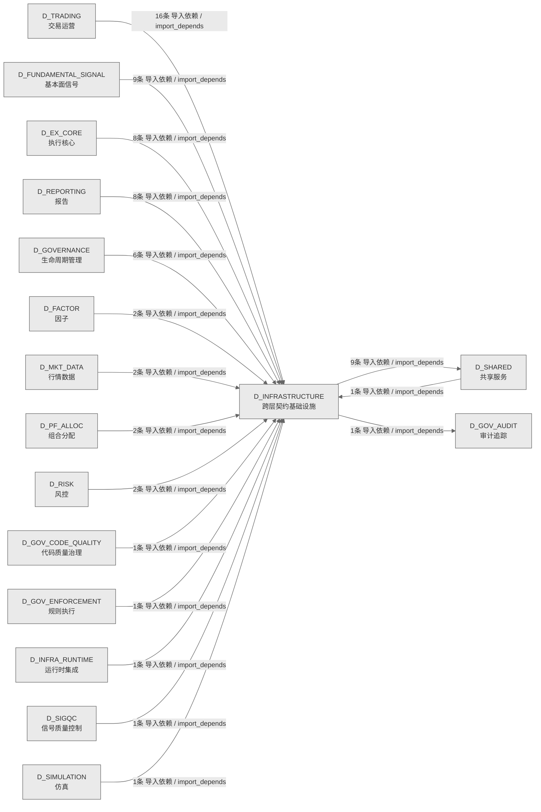

# 02_d_infrastructure / 跨层契约基础设施域 / Cross-Layer Contract Infrastructure

> **功能简介 / Overview**: 跨层契约基础设施，负责跨层契约定义、共享契约管理和契约校验

> **文档作用 / Purpose**: 展示 跨层契约基础设施（D_INFRASTRUCTURE）功能域的域内依赖关系、跨域依赖关系，模块信息（成熟度/中英文名/大白话/文件路径）内嵌于 Mermaid 节点，供架构审查和域治理参考。

> 本文档由 generate_domain_doc.py 从 depgraph (PostgreSQL) 自动生成
> 数据源: depgraph (PostgreSQL) nodes表 + edges表

> **[可缩放 HTML 版 / Zoomable HTML](http://localhost:8765/docs/02_enterprise_architecture/02_domain_architecture_docs/_zoomable_html/02_d_infrastructure.html)** — Ctrl+滚轮缩放 ｜ 双击重置 ｜ Ctrl+Shift+D 切换拖动/选择模式

## 域基本信息 / Domain Overview

| 字段 | 值 | Field | Value |
|------|------|-------|-------|
| 编号 | 02 | Number | 02 |
| 域ID | D_INFRASTRUCTURE | Domain ID | D_INFRASTRUCTURE |
| 域名称 | 跨层契约基础设施 | Domain Name | Cross-Layer Contract Infrastructure |
| 层级 | L0 基础设施层 | Layer | L0 Infrastructure |
| 模块数 | 25 | Module Count | 25 |
| 域内依赖 | 1 | Internal Dependencies | 1 |
| 跨域入边 | 61 | Cross-domain Incoming | 61 |
| 跨域出边 | 10 | Cross-domain Outgoing | 10 |
| 设计态模块 | 0 | Design Modules | 0 |
| 生产态模块 | 25 | Production Modules | 25 |
| 容量 | 25/150 (正常) | Capacity | 25/150 (正常) |
| 描述 | 跨层契约数据类(CTR-001 NormalizedMarketData 等) | Description | 跨层契约数据类(CTR-001 NormalizedMarketData 等) |

## 域内依赖图 / Internal Dependency Diagram

> 依赖图内嵌在本文档中，IDE 可直接渲染；网页版可 Ctrl+滚轮缩放 + 拖动平移查看细节。
>
> **图例说明 / Legend**：
> - 🟦 **蓝色 = 运营态模块**（production，已上线运行）
> - 🟧 **橙色虚线 = 设计态模块**（design，蓝图阶段，代码未写）
> - **实线箭头 = 运营态依赖**（已生效的依赖关系）
> - **虚线箭头 = 非运营态依赖**（计划中/验证中的依赖关系）

### 全景图（全部模块，颜色区分运营态/设计态）

> 展示全部 25 个模块（生产态 25 + 设计态 0），含跨域依赖外部节点。节点含成熟度+名称+大白话/简介+文件路径。

```mermaid
%%{init: {'theme': 'base', 'themeVariables': {'primaryColor': '#eaeaea', 'primaryTextColor': '#333333', 'primaryBorderColor': '#666666', 'lineColor': '#666666', 'secondaryColor': '#eaeaea', 'tertiaryColor': '#eaeaea', 'fontSize': '14px'}}}%%
flowchart TD
    scripts_backup_backup_reconciler_py["备份协调器<br/>灾备备份系统事件触发器（post-commit reconciler）<br/>backup_reconciler<br/>文件: backup/backup_reconciler.py<br/>(生产态 / production)"]
    src_zephyr_infrastructure_config_init_py["infrastructure/config 包入口<br/>ZephyrAlpha — 基础设施 Infrastructure Layer —<br/>Configuration Management<br/>文件: config/__init__.py<br/>(生产态 / production)"]
    src_zephyr_shared_contracts_capital_allocation_result_py["资本分配结果<br/>资本allocation结果，contracts的结果，封装操作结<br/>果的数据结构<br/>capital_allocation_result<br/>文件: contracts/capital_allocation_result.py<br/>(生产态 / production)"]
    src_zephyr_shared_contracts_compliance_rule_py["合规规则<br/>合规规则，contracts的核心类，封装ComplianceRule<br/>相关逻辑<br/>compliance_rule<br/>文件: contracts/compliance_rule.py<br/>(生产态 / production)"]
    src_zephyr_shared_contracts_execution_report_py["执行报告<br/>共享层/契约包的execution_report模块<br/>文件: contracts/execution_report.py<br/>(生产态 / production)"]
    src_zephyr_shared_contracts_experiment_result_py["实验结果<br/>实验结果，contracts的结果，封装操作结果的数据结<br/>构<br/>experiment_result<br/>文件: contracts/experiment_result.py<br/>(生产态 / production)"]
    src_zephyr_shared_contracts_factor_monitor_report_py["因子监控报告<br/>contracts的监控器，持续监视某项指标，异常时上报<br/>factor_monitor_report<br/>文件: contracts/factor_monitor_report.py<br/>(生产态 / production)"]
    src_zephyr_shared_contracts_factor_signal_py["因子信号<br/>因子信号，contracts的核心类，封装FactorSignal相<br/>关逻辑<br/>factor_signal<br/>文件: contracts/factor_signal.py<br/>(生产态 / production)"]
    src_zephyr_shared_contracts_fill_py["成交<br/>成交，contracts的核心类，封装成交相关逻辑<br/>fill<br/>文件: contracts/fill.py<br/>(生产态 / production)"]
    src_zephyr_shared_contracts_macro_factor_signal_py["macro因子信号<br/>contracts的核心类，封装MacroFactorSignal相关逻辑<br/>macro_factor_signal<br/>文件: contracts/macro_factor_signal.py<br/>(生产态 / production)"]
    src_zephyr_shared_contracts_market_data_py["市场数据<br/>市场数据，contracts的核心类，封装NormalizedMarke<br/>tData相关逻辑<br/>market_data<br/>文件: contracts/market_data.py<br/>(生产态 / production)"]
    src_zephyr_shared_contracts_model_serving_request_py["模型服务请求<br/>共享层/契约包的model_serving_request模块<br/>文件: contracts/model_serving_request.py<br/>(生产态 / production)"]
    src_zephyr_shared_contracts_model_serving_response_py["模型服务响应<br/>共享层/契约包的model_serving_response模块<br/>文件: contracts/model_serving_response.py<br/>(生产态 / production)"]
    src_zephyr_shared_contracts_order_py["订单<br/>订单，contracts的核心类，封装订单相关逻辑<br/>order<br/>文件: contracts/order.py<br/>(生产态 / production)"]
    src_zephyr_shared_contracts_performance_attribution_report_py["绩效attribution报告<br/>共享层/契约包的performance_attribution_<br/>report模块<br/>文件: contracts/performance_attribution_<br/>report.py<br/>(生产态 / production)"]
    src_zephyr_shared_contracts_position_py["持仓<br/>持仓，contracts的核心类，封装PositionSnapshot相<br/>关逻辑<br/>文件: contracts/position.py<br/>(生产态 / production)"]
    src_zephyr_shared_contracts_risk_dashboard_snapshot_py["风险仪表盘快照<br/>contracts的核心类，封装RiskDashboardSnapshot相关<br/>逻辑<br/>risk_dashboard_snapshot<br/>文件: contracts/risk_dashboard_snapshot.py<br/>(生产态 / production)"]
    src_zephyr_shared_contracts_risk_limits_py["风险limits<br/>contracts的核心类，封装RiskLimits相关逻辑<br/>risk_limits<br/>文件: contracts/risk_limits.py<br/>(生产态 / production)"]
    src_zephyr_shared_contracts_risk_metrics_py["风险指标<br/>共享层/契约包的risk_metrics模块<br/>文件: contracts/risk_metrics.py<br/>(生产态 / production)"]
    src_zephyr_shared_contracts_strategy_lifecycle_event_py["策略生命周期事件<br/>contracts的事件，定义和分发事件<br/>strategy_lifecycle_event<br/>文件: contracts/strategy_lifecycle_event.py<br/>(生产态 / production)"]
    src_zephyr_shared_contracts_synthesized_signal_py["synthesized信号<br/>contracts的核心类，封装SynthesizedSignal相关逻辑<br/>synthesized_signal<br/>文件: contracts/synthesized_signal.py<br/>(生产态 / production)"]
    src_zephyr_shared_contracts_system_configuration_py["系统配置<br/>共享层/契约包的system_configuration模块<br/>文件: contracts/system_configuration.py<br/>(生产态 / production)"]
    src_zephyr_shared_contracts_telemetry_emitter_py["遥测发射器<br/>遥测emitter，contracts的核心类，封装TelemetryEmi<br/>tter相关逻辑<br/>telemetry_emitter<br/>文件: contracts/telemetry_emitter.py<br/>(生产态 / production)"]
    src_zephyr_shared_contracts_trace_context_py["追踪上下文<br/>追踪上下文，contracts的核心类，封装TraceContext<br/>相关逻辑<br/>trace_context<br/>文件: contracts/trace_context.py<br/>(生产态 / production)"]
    scripts_backup_backup_reconciler_py ~~~ src_zephyr_infrastructure_config_init_py
    src_zephyr_infrastructure_config_init_py ~~~ src_zephyr_shared_contracts_capital_allocation_result_py
    src_zephyr_shared_contracts_capital_allocation_result_py ~~~ src_zephyr_shared_contracts_compliance_rule_py
    src_zephyr_shared_contracts_compliance_rule_py ~~~ src_zephyr_shared_contracts_execution_report_py
    src_zephyr_shared_contracts_execution_report_py ~~~ src_zephyr_shared_contracts_experiment_result_py
    src_zephyr_shared_contracts_experiment_result_py ~~~ src_zephyr_shared_contracts_factor_monitor_report_py
    src_zephyr_shared_contracts_factor_monitor_report_py ~~~ src_zephyr_shared_contracts_factor_signal_py
    src_zephyr_shared_contracts_factor_signal_py ~~~ src_zephyr_shared_contracts_fill_py
    src_zephyr_shared_contracts_fill_py ~~~ src_zephyr_shared_contracts_macro_factor_signal_py
    src_zephyr_shared_contracts_macro_factor_signal_py ~~~ src_zephyr_shared_contracts_market_data_py
    src_zephyr_shared_contracts_market_data_py ~~~ src_zephyr_shared_contracts_model_serving_request_py
    src_zephyr_shared_contracts_model_serving_request_py ~~~ src_zephyr_shared_contracts_model_serving_response_py
    src_zephyr_shared_contracts_model_serving_response_py ~~~ src_zephyr_shared_contracts_order_py
    src_zephyr_shared_contracts_order_py ~~~ src_zephyr_shared_contracts_performance_attribution_report_py
    src_zephyr_shared_contracts_performance_attribution_report_py ~~~ src_zephyr_shared_contracts_position_py
    src_zephyr_shared_contracts_position_py ~~~ src_zephyr_shared_contracts_risk_dashboard_snapshot_py
    src_zephyr_shared_contracts_risk_dashboard_snapshot_py ~~~ src_zephyr_shared_contracts_risk_limits_py
    src_zephyr_shared_contracts_risk_limits_py ~~~ src_zephyr_shared_contracts_risk_metrics_py
    src_zephyr_shared_contracts_risk_metrics_py ~~~ src_zephyr_shared_contracts_strategy_lifecycle_event_py
    src_zephyr_shared_contracts_strategy_lifecycle_event_py ~~~ src_zephyr_shared_contracts_synthesized_signal_py
    src_zephyr_shared_contracts_synthesized_signal_py ~~~ src_zephyr_shared_contracts_system_configuration_py
    src_zephyr_shared_contracts_system_configuration_py ~~~ src_zephyr_shared_contracts_telemetry_emitter_py
    src_zephyr_shared_contracts_telemetry_emitter_py ~~~ src_zephyr_shared_contracts_trace_context_py
    src_zephyr_infrastructure_config_app_config_py["应用配置<br/>应用配置数据类与加载/热重载逻辑<br/>app_config<br/>文件: config/app_config.py<br/>(生产态 / production)"]
    src_zephyr_infrastructure_config_init_py -->|导入依赖 / import_depends| src_zephyr_infrastructure_config_app_config_py
    D_SHARED["共享服务<br/>共享服务，负责跨域共享的工具、协议和基础服务<br/>Shared Services<br/>跨域节点 / cross-domain<br/>(生产态 / production)"]
    src_zephyr_shared_contracts_synthesized_signal_py -->|导入依赖 / import_depends| D_SHARED
    src_zephyr_shared_contracts_market_data_py -->|导入依赖 / import_depends| D_SHARED
    D_GOV_AUDIT["审计追踪<br/>审计追踪，负责变更审计追踪和操作日志管理<br/>Audit Trail<br/>跨域节点 / cross-domain<br/>(生产态 / production)"]
    scripts_backup_backup_reconciler_py -->|导入依赖 / import_depends| D_GOV_AUDIT
    src_zephyr_shared_contracts_position_py -->|导入依赖 / import_depends| D_SHARED
    src_zephyr_shared_contracts_experiment_result_py -->|导入依赖 / import_depends| D_SHARED
    src_zephyr_shared_contracts_factor_signal_py -->|导入依赖 / import_depends| D_SHARED
    src_zephyr_shared_contracts_risk_limits_py -->|导入依赖 / import_depends| D_SHARED
    src_zephyr_shared_contracts_fill_py -->|导入依赖 / import_depends| D_SHARED
    src_zephyr_shared_contracts_order_py -->|导入依赖 / import_depends| D_SHARED
    src_zephyr_shared_contracts_order_py -->|导入依赖 / import_depends| D_SHARED
    D_EX_CORE["执行核心<br/>执行核心，负责订单执行引擎、执行策略和执行管理<br/>Execution Core<br/>跨域节点 / cross-domain<br/>(生产态 / production)"]
    D_EX_CORE -->|导入依赖 / import_depends| src_zephyr_shared_contracts_fill_py
    D_EX_CORE -->|导入依赖 / import_depends| src_zephyr_shared_contracts_order_py
    D_EX_CORE -->|导入依赖 / import_depends| src_zephyr_shared_contracts_position_py
    D_EX_CORE -->|导入依赖 / import_depends| src_zephyr_shared_contracts_risk_limits_py
    D_REPORTING["报告<br/>报告，负责投资报告、风险报告和合规报告的生成与分<br/>发<br/>Reporting<br/>跨域节点 / cross-domain<br/>(生产态 / production)"]
    D_REPORTING -->|导入依赖 / import_depends| src_zephyr_shared_contracts_fill_py
    D_PF_ALLOC["组合分配<br/>组合分配，负责资产配置、权重分配和再平衡<br/>Portfolio Allocation<br/>跨域节点 / cross-domain<br/>(生产态 / production)"]
    D_PF_ALLOC -->|导入依赖 / import_depends| src_zephyr_shared_contracts_order_py
    D_GOVERNANCE["生命周期管理<br/>生命周期管理，负责蓝图/模块<br/>/任务的声明周期管理和元数据治理<br/>Lifecycle Management<br/>跨域节点 / cross-domain<br/>(生产态 / production)"]
    D_GOVERNANCE -->|导入依赖 / import_depends| src_zephyr_shared_contracts_position_py
    D_FUNDAMENTAL_SIGNAL["基本面信号<br/>基本面信号，负责基于财务数据的基本面信号生成<br/>Fundamental Signal<br/>跨域节点 / cross-domain<br/>(生产态 / production)"]
    D_FUNDAMENTAL_SIGNAL -->|导入依赖 / import_depends| src_zephyr_shared_contracts_factor_signal_py
    D_TRADING["交易运营<br/>交易运营，负责交易生命周期管理、订单状态和成交处<br/>理<br/>Trading Operations<br/>跨域节点 / cross-domain<br/>(生产态 / production)"]
    D_TRADING -->|导入依赖 / import_depends| src_zephyr_shared_contracts_fill_py
    D_FUNDAMENTAL_SIGNAL -->|导入依赖 / import_depends| src_zephyr_shared_contracts_synthesized_signal_py
    D_INFRA_RUNTIME["运行时集成<br/>运行时集成，负责组件生命周期编排、启动钩子和运行<br/>时上下文管理<br/>Runtime Integration<br/>跨域节点 / cross-domain<br/>(生产态 / production)"]
    D_INFRA_RUNTIME -->|导入依赖 / import_depends| src_zephyr_shared_contracts_telemetry_emitter_py
    D_PF_ALLOC -->|导入依赖 / import_depends| src_zephyr_shared_contracts_strategy_lifecycle_event_py
    D_FACTOR["因子<br/>因子，负责因子计算、因子库管理和因子评价<br/>Factor<br/>跨域节点 / cross-domain<br/>(生产态 / production)"]
    D_FACTOR -->|导入依赖 / import_depends| src_zephyr_shared_contracts_market_data_py
    D_SIGQC["信号质量控制<br/>信号质量控制，负责信号质量评估、异常检测和质量门<br/>禁<br/>Signal Quality Control<br/>跨域节点 / cross-domain<br/>(生产态 / production)"]
    D_SIGQC -->|导入依赖 / import_depends| src_zephyr_shared_contracts_synthesized_signal_py
    D_TRADING -->|导入依赖 / import_depends| src_zephyr_shared_contracts_execution_report_py
    classDef production fill:#e1f5fe,stroke:#01579b,stroke-width:2px,color:#000
    classDef design fill:#fff3e0,stroke:#e65100,stroke-width:2px,color:#000,stroke-dasharray: 5 5
    classDef external_prod fill:#e8f4fd,stroke:#0277bd,stroke-width:1px,color:#000
    classDef external_design fill:#fff8e7,stroke:#ef6c00,stroke-width:1px,color:#000,stroke-dasharray: 5 5
    class scripts_backup_backup_reconciler_py,src_zephyr_infrastructure_config_init_py,src_zephyr_infrastructure_config_app_config_py,src_zephyr_shared_contracts_capital_allocation_result_py,src_zephyr_shared_contracts_compliance_rule_py,src_zephyr_shared_contracts_execution_report_py,src_zephyr_shared_contracts_experiment_result_py,src_zephyr_shared_contracts_factor_monitor_report_py,src_zephyr_shared_contracts_factor_signal_py,src_zephyr_shared_contracts_fill_py,src_zephyr_shared_contracts_macro_factor_signal_py,src_zephyr_shared_contracts_market_data_py,src_zephyr_shared_contracts_model_serving_request_py,src_zephyr_shared_contracts_model_serving_response_py,src_zephyr_shared_contracts_order_py,src_zephyr_shared_contracts_performance_attribution_report_py,src_zephyr_shared_contracts_position_py,src_zephyr_shared_contracts_risk_dashboard_snapshot_py,src_zephyr_shared_contracts_risk_limits_py,src_zephyr_shared_contracts_risk_metrics_py,src_zephyr_shared_contracts_strategy_lifecycle_event_py,src_zephyr_shared_contracts_synthesized_signal_py,src_zephyr_shared_contracts_system_configuration_py,src_zephyr_shared_contracts_telemetry_emitter_py,src_zephyr_shared_contracts_trace_context_py production
    class D_SHARED,D_GOV_AUDIT,D_EX_CORE,D_REPORTING,D_PF_ALLOC,D_GOVERNANCE,D_FUNDAMENTAL_SIGNAL,D_TRADING,D_INFRA_RUNTIME,D_FACTOR,D_SIGQC external_prod
```

### 运营态的图（仅 design_maturity=production 的模块和域内依赖）

> 仅展示已上线运行的模块（共 25 个），不含跨域外部节点。跨域依赖见下方跨域依赖章节。

```mermaid
%%{init: {'theme': 'base', 'themeVariables': {'primaryColor': '#eaeaea', 'primaryTextColor': '#333333', 'primaryBorderColor': '#666666', 'lineColor': '#666666', 'secondaryColor': '#eaeaea', 'tertiaryColor': '#eaeaea', 'fontSize': '14px'}}}%%
flowchart TD
    scripts_backup_backup_reconciler_py["备份协调器<br/>灾备备份系统事件触发器（post-commit reconciler）<br/>backup_reconciler<br/>文件: backup/backup_reconciler.py<br/>(生产态 / production)"]
    src_zephyr_infrastructure_config_init_py["infrastructure/config 包入口<br/>ZephyrAlpha — 基础设施 Infrastructure Layer —<br/>Configuration Management<br/>文件: config/__init__.py<br/>(生产态 / production)"]
    src_zephyr_shared_contracts_capital_allocation_result_py["资本分配结果<br/>资本allocation结果，contracts的结果，封装操作结<br/>果的数据结构<br/>capital_allocation_result<br/>文件: contracts/capital_allocation_result.py<br/>(生产态 / production)"]
    src_zephyr_shared_contracts_compliance_rule_py["合规规则<br/>合规规则，contracts的核心类，封装ComplianceRule<br/>相关逻辑<br/>compliance_rule<br/>文件: contracts/compliance_rule.py<br/>(生产态 / production)"]
    src_zephyr_shared_contracts_execution_report_py["执行报告<br/>共享层/契约包的execution_report模块<br/>文件: contracts/execution_report.py<br/>(生产态 / production)"]
    src_zephyr_shared_contracts_experiment_result_py["实验结果<br/>实验结果，contracts的结果，封装操作结果的数据结<br/>构<br/>experiment_result<br/>文件: contracts/experiment_result.py<br/>(生产态 / production)"]
    src_zephyr_shared_contracts_factor_monitor_report_py["因子监控报告<br/>contracts的监控器，持续监视某项指标，异常时上报<br/>factor_monitor_report<br/>文件: contracts/factor_monitor_report.py<br/>(生产态 / production)"]
    src_zephyr_shared_contracts_factor_signal_py["因子信号<br/>因子信号，contracts的核心类，封装FactorSignal相<br/>关逻辑<br/>factor_signal<br/>文件: contracts/factor_signal.py<br/>(生产态 / production)"]
    src_zephyr_shared_contracts_fill_py["成交<br/>成交，contracts的核心类，封装成交相关逻辑<br/>fill<br/>文件: contracts/fill.py<br/>(生产态 / production)"]
    src_zephyr_shared_contracts_macro_factor_signal_py["macro因子信号<br/>contracts的核心类，封装MacroFactorSignal相关逻辑<br/>macro_factor_signal<br/>文件: contracts/macro_factor_signal.py<br/>(生产态 / production)"]
    src_zephyr_shared_contracts_market_data_py["市场数据<br/>市场数据，contracts的核心类，封装NormalizedMarke<br/>tData相关逻辑<br/>market_data<br/>文件: contracts/market_data.py<br/>(生产态 / production)"]
    src_zephyr_shared_contracts_model_serving_request_py["模型服务请求<br/>共享层/契约包的model_serving_request模块<br/>文件: contracts/model_serving_request.py<br/>(生产态 / production)"]
    src_zephyr_shared_contracts_model_serving_response_py["模型服务响应<br/>共享层/契约包的model_serving_response模块<br/>文件: contracts/model_serving_response.py<br/>(生产态 / production)"]
    src_zephyr_shared_contracts_order_py["订单<br/>订单，contracts的核心类，封装订单相关逻辑<br/>order<br/>文件: contracts/order.py<br/>(生产态 / production)"]
    src_zephyr_shared_contracts_performance_attribution_report_py["绩效attribution报告<br/>共享层/契约包的performance_attribution_<br/>report模块<br/>文件: contracts/performance_attribution_<br/>report.py<br/>(生产态 / production)"]
    src_zephyr_shared_contracts_position_py["持仓<br/>持仓，contracts的核心类，封装PositionSnapshot相<br/>关逻辑<br/>文件: contracts/position.py<br/>(生产态 / production)"]
    src_zephyr_shared_contracts_risk_dashboard_snapshot_py["风险仪表盘快照<br/>contracts的核心类，封装RiskDashboardSnapshot相关<br/>逻辑<br/>risk_dashboard_snapshot<br/>文件: contracts/risk_dashboard_snapshot.py<br/>(生产态 / production)"]
    src_zephyr_shared_contracts_risk_limits_py["风险limits<br/>contracts的核心类，封装RiskLimits相关逻辑<br/>risk_limits<br/>文件: contracts/risk_limits.py<br/>(生产态 / production)"]
    src_zephyr_shared_contracts_risk_metrics_py["风险指标<br/>共享层/契约包的risk_metrics模块<br/>文件: contracts/risk_metrics.py<br/>(生产态 / production)"]
    src_zephyr_shared_contracts_strategy_lifecycle_event_py["策略生命周期事件<br/>contracts的事件，定义和分发事件<br/>strategy_lifecycle_event<br/>文件: contracts/strategy_lifecycle_event.py<br/>(生产态 / production)"]
    src_zephyr_shared_contracts_synthesized_signal_py["synthesized信号<br/>contracts的核心类，封装SynthesizedSignal相关逻辑<br/>synthesized_signal<br/>文件: contracts/synthesized_signal.py<br/>(生产态 / production)"]
    src_zephyr_shared_contracts_system_configuration_py["系统配置<br/>共享层/契约包的system_configuration模块<br/>文件: contracts/system_configuration.py<br/>(生产态 / production)"]
    src_zephyr_shared_contracts_telemetry_emitter_py["遥测发射器<br/>遥测emitter，contracts的核心类，封装TelemetryEmi<br/>tter相关逻辑<br/>telemetry_emitter<br/>文件: contracts/telemetry_emitter.py<br/>(生产态 / production)"]
    src_zephyr_shared_contracts_trace_context_py["追踪上下文<br/>追踪上下文，contracts的核心类，封装TraceContext<br/>相关逻辑<br/>trace_context<br/>文件: contracts/trace_context.py<br/>(生产态 / production)"]
    scripts_backup_backup_reconciler_py ~~~ src_zephyr_infrastructure_config_init_py
    src_zephyr_infrastructure_config_init_py ~~~ src_zephyr_shared_contracts_capital_allocation_result_py
    src_zephyr_shared_contracts_capital_allocation_result_py ~~~ src_zephyr_shared_contracts_compliance_rule_py
    src_zephyr_shared_contracts_compliance_rule_py ~~~ src_zephyr_shared_contracts_execution_report_py
    src_zephyr_shared_contracts_execution_report_py ~~~ src_zephyr_shared_contracts_experiment_result_py
    src_zephyr_shared_contracts_experiment_result_py ~~~ src_zephyr_shared_contracts_factor_monitor_report_py
    src_zephyr_shared_contracts_factor_monitor_report_py ~~~ src_zephyr_shared_contracts_factor_signal_py
    src_zephyr_shared_contracts_factor_signal_py ~~~ src_zephyr_shared_contracts_fill_py
    src_zephyr_shared_contracts_fill_py ~~~ src_zephyr_shared_contracts_macro_factor_signal_py
    src_zephyr_shared_contracts_macro_factor_signal_py ~~~ src_zephyr_shared_contracts_market_data_py
    src_zephyr_shared_contracts_market_data_py ~~~ src_zephyr_shared_contracts_model_serving_request_py
    src_zephyr_shared_contracts_model_serving_request_py ~~~ src_zephyr_shared_contracts_model_serving_response_py
    src_zephyr_shared_contracts_model_serving_response_py ~~~ src_zephyr_shared_contracts_order_py
    src_zephyr_shared_contracts_order_py ~~~ src_zephyr_shared_contracts_performance_attribution_report_py
    src_zephyr_shared_contracts_performance_attribution_report_py ~~~ src_zephyr_shared_contracts_position_py
    src_zephyr_shared_contracts_position_py ~~~ src_zephyr_shared_contracts_risk_dashboard_snapshot_py
    src_zephyr_shared_contracts_risk_dashboard_snapshot_py ~~~ src_zephyr_shared_contracts_risk_limits_py
    src_zephyr_shared_contracts_risk_limits_py ~~~ src_zephyr_shared_contracts_risk_metrics_py
    src_zephyr_shared_contracts_risk_metrics_py ~~~ src_zephyr_shared_contracts_strategy_lifecycle_event_py
    src_zephyr_shared_contracts_strategy_lifecycle_event_py ~~~ src_zephyr_shared_contracts_synthesized_signal_py
    src_zephyr_shared_contracts_synthesized_signal_py ~~~ src_zephyr_shared_contracts_system_configuration_py
    src_zephyr_shared_contracts_system_configuration_py ~~~ src_zephyr_shared_contracts_telemetry_emitter_py
    src_zephyr_shared_contracts_telemetry_emitter_py ~~~ src_zephyr_shared_contracts_trace_context_py
    src_zephyr_infrastructure_config_app_config_py["应用配置<br/>应用配置数据类与加载/热重载逻辑<br/>app_config<br/>文件: config/app_config.py<br/>(生产态 / production)"]
    src_zephyr_infrastructure_config_init_py -->|导入依赖 / import_depends| src_zephyr_infrastructure_config_app_config_py
    classDef production fill:#e1f5fe,stroke:#01579b,stroke-width:2px,color:#000
    classDef design fill:#fff3e0,stroke:#e65100,stroke-width:2px,color:#000,stroke-dasharray: 5 5
    classDef external_prod fill:#e8f4fd,stroke:#0277bd,stroke-width:1px,color:#000
    classDef external_design fill:#fff8e7,stroke:#ef6c00,stroke-width:1px,color:#000,stroke-dasharray: 5 5
    class scripts_backup_backup_reconciler_py,src_zephyr_infrastructure_config_init_py,src_zephyr_infrastructure_config_app_config_py,src_zephyr_shared_contracts_capital_allocation_result_py,src_zephyr_shared_contracts_compliance_rule_py,src_zephyr_shared_contracts_execution_report_py,src_zephyr_shared_contracts_experiment_result_py,src_zephyr_shared_contracts_factor_monitor_report_py,src_zephyr_shared_contracts_factor_signal_py,src_zephyr_shared_contracts_fill_py,src_zephyr_shared_contracts_macro_factor_signal_py,src_zephyr_shared_contracts_market_data_py,src_zephyr_shared_contracts_model_serving_request_py,src_zephyr_shared_contracts_model_serving_response_py,src_zephyr_shared_contracts_order_py,src_zephyr_shared_contracts_performance_attribution_report_py,src_zephyr_shared_contracts_position_py,src_zephyr_shared_contracts_risk_dashboard_snapshot_py,src_zephyr_shared_contracts_risk_limits_py,src_zephyr_shared_contracts_risk_metrics_py,src_zephyr_shared_contracts_strategy_lifecycle_event_py,src_zephyr_shared_contracts_synthesized_signal_py,src_zephyr_shared_contracts_system_configuration_py,src_zephyr_shared_contracts_telemetry_emitter_py,src_zephyr_shared_contracts_trace_context_py production
```

### 设计态的图（仅 design_maturity=design 的模块和域内依赖）

> 仅展示蓝图阶段、代码未写的设计态模块（共 0 个），不含跨域外部节点。

> （无模块 / No modules）

## 跨域依赖 / Cross-domain Dependencies

### 本域依赖的其他域（出边）/ Depends On

| # | 本域模块 / Source Module | → | 外部域-目标模块 / Target Module | 依赖类型 / Type |
|:--:|---------|:--:|---------|---------|
| 1 | 备份协调器 / backup_reconciler (backup/backup_reconciler.py) | → | D_GOV_AUDIT 审计追踪: 对账注册表 / reconciliation_registry (audit/reconciliatio... | 导入依赖 / import_depends |
| 2 | 实验结果 / experiment_result (contracts/experiment_result... | → | D_SHARED 共享服务: 追踪上下文 / trace_context (core/trace_context.py) | 导入依赖 / import_depends |
| 3 | 因子信号 / factor_signal (contracts/factor_signal.py) | → | D_SHARED 共享服务: 追踪上下文 / trace_context (core/trace_context.py) | 导入依赖 / import_depends |
| 4 | 成交 / fill (contracts/fill.py) | → | D_SHARED 共享服务: 追踪上下文 / trace_context (core/trace_context.py) | 导入依赖 / import_depends |
| 5 | 市场数据 / market_data (contracts/market_data.py) | → | D_SHARED 共享服务: 追踪上下文 / trace_context (core/trace_context.py) | 导入依赖 / import_depends |
| 6 | 订单 / order (contracts/order.py) | → | D_SHARED 共享服务: 追踪上下文 / trace_context (core/trace_context.py) | 导入依赖 / import_depends |
| 7 | 订单 / order (contracts/order.py) | → | D_SHARED 共享服务: 订单枚举 / order_enums (enums/order_enums.py) | 导入依赖 / import_depends |
| 8 | 持仓 / position (contracts/position.py) | → | D_SHARED 共享服务: 追踪上下文 / trace_context (core/trace_context.py) | 导入依赖 / import_depends |
| 9 | 风险limits / risk_limits (contracts/risk_limits.py) | → | D_SHARED 共享服务: 追踪上下文 / trace_context (core/trace_context.py) | 导入依赖 / import_depends |
| 10 | synthesized信号 / synthesized_signal (contracts/synthesiz... | → | D_SHARED 共享服务: 追踪上下文 / trace_context (core/trace_context.py) | 导入依赖 / import_depends |

### 依赖本域的其他域（入边）/ Depended By

| # | 外部域-源模块 / Source Module | → | 本域模块 / Target Module | 依赖类型 / Type |
|:--:|---------|:--:|---------|---------|
| 1 | D_EX_CORE 执行核心: 执行引擎 / D_EXECUTION_CORE — Execution Engine (ex_core/... | → | 订单 / order (contracts/order.py) | 导入依赖 / import_depends |
| 2 | D_EX_CORE 执行核心: 执行引擎 / D_EXECUTION_CORE — Execution Engine (ex_core/... | → | 风险limits / risk_limits (contracts/risk_limits.py) | 导入依赖 / import_depends |
| 3 | D_EX_CORE 执行核心: 订单管理器 / D_EXECUTION_CORE — Order Manager (ex_core/o... | → | 成交 / fill (contracts/fill.py) | 导入依赖 / import_depends |
| 4 | D_EX_CORE 执行核心: 订单管理器 / D_EXECUTION_CORE — Order Manager (ex_core/o... | → | 订单 / order (contracts/order.py) | 导入依赖 / import_depends |
| 5 | D_EX_CORE 执行核心: 交易会话 / trading_session (ex_core/trading_session.py) | → | 成交 / fill (contracts/fill.py) | 导入依赖 / import_depends |
| 6 | D_EX_CORE 执行核心: 交易会话 / trading_session (ex_core/trading_session.py) | → | 订单 / order (contracts/order.py) | 导入依赖 / import_depends |
| 7 | D_EX_CORE 执行核心: 交易会话 / trading_session (ex_core/trading_session.py) | → | 持仓 / position (contracts/position.py) | 导入依赖 / import_depends |
| 8 | D_EX_CORE 执行核心: 交易会话 / trading_session (ex_core/trading_session.py) | → | 风险limits / risk_limits (contracts/risk_limits.py) | 导入依赖 / import_depends |
| 9 | D_FACTOR 因子: 转换器 / converter (ctr001_consumer/converter.py) | → | 市场数据 / market_data (contracts/market_data.py) | 导入依赖 / import_depends |
| 10 | D_FACTOR 因子: 转换器 / converter (ctr002_producer/converter.py) | → | 因子信号 / factor_signal (contracts/factor_signal.py) | 导入依赖 / import_depends |
| 11 | D_FUNDAMENTAL_SIGNAL 基本面信号: 信号生成聚合基类 / Signal Generation Aggregator Base (gen... | → | 因子信号 / factor_signal (contracts/factor_signal.py) | 导入依赖 / import_depends |
| 12 | D_FUNDAMENTAL_SIGNAL 基本面信号: 信号生成聚合基类 / Signal Generation Aggregator Base (gen... | → | synthesized信号 / synthesized_signal (contracts/synthesiz... | 导入依赖 / import_depends |
| 13 | D_FUNDAMENTAL_SIGNAL 基本面信号: 默认信号聚合器 / Default Signal Aggregator (implementatio... | → | 因子信号 / factor_signal (contracts/factor_signal.py) | 导入依赖 / import_depends |
| 14 | D_FUNDAMENTAL_SIGNAL 基本面信号: 默认信号聚合器 / Default Signal Aggregator (implementatio... | → | synthesized信号 / synthesized_signal (contracts/synthesiz... | 导入依赖 / import_depends |
| 15 | D_FUNDAMENTAL_SIGNAL 基本面信号: 管线 / Alpha Signal Pipeline (signal_fundamental/pipeline... | → | 因子信号 / factor_signal (contracts/factor_signal.py) | 导入依赖 / import_depends |
| 16 | D_FUNDAMENTAL_SIGNAL 基本面信号: 管线 / Alpha Signal Pipeline (signal_fundamental/pipeline... | → | synthesized信号 / synthesized_signal (contracts/synthesiz... | 导入依赖 / import_depends |
| 17 | D_FUNDAMENTAL_SIGNAL 基本面信号: 策略默认资本分配器 / Strategy Default Capital Allocator (... | → | synthesized信号 / synthesized_signal (contracts/synthesiz... | 导入依赖 / import_depends |
| 18 | D_FUNDAMENTAL_SIGNAL 基本面信号: 信号合成器 / Signal Synthesizer (synth/signal_synthesizer... | → | 因子信号 / factor_signal (contracts/factor_signal.py) | 导入依赖 / import_depends |
| 19 | D_FUNDAMENTAL_SIGNAL 基本面信号: 信号合成器 / Signal Synthesizer (synth/signal_synthesizer... | → | synthesized信号 / synthesized_signal (contracts/synthesiz... | 导入依赖 / import_depends |
| 20 | D_GOVERNANCE 生命周期管理: A2Afull验证 / a2a_full_verification (scripts/a2a_full_ver... | → | 包入口 / __init__ (config/__init__.py) | 导入依赖 / import_depends |
| 21 | D_GOVERNANCE 生命周期管理: 本地层daemon / local_layer_daemon (construction/local_lay... | → | 包入口 / __init__ (config/__init__.py) | 导入依赖 / import_depends |
| 22 | D_GOVERNANCE 生命周期管理: 风险验证桥接 / D_EXECUTION_CORE — Risk Validation Bridge... | → | 风险limits / risk_limits (contracts/risk_limits.py) | 导入依赖 / import_depends |
| 23 | D_GOVERNANCE 生命周期管理: 仿真经纪人 / D_EXECUTION_CORE — Simulation Broker Adapte... | → | 成交 / fill (contracts/fill.py) | 导入依赖 / import_depends |
| 24 | D_GOVERNANCE 生命周期管理: 仿真经纪人 / D_EXECUTION_CORE — Simulation Broker Adapte... | → | 订单 / order (contracts/order.py) | 导入依赖 / import_depends |
| 25 | D_GOVERNANCE 生命周期管理: 仿真经纪人 / D_EXECUTION_CORE — Simulation Broker Adapte... | → | 持仓 / position (contracts/position.py) | 导入依赖 / import_depends |
| 26 | D_GOV_CODE_QUALITY 代码质量治理: 配置 / config (code_dedup/config.py) | → | 应用配置 / app_config (config/app_config.py) | 导入依赖 / import_depends |
| 27 | D_GOV_ENFORCEMENT 规则执行: 合规规则 / compliance_rule (rule_enforcement/compliance_r... | → | 合规规则 / compliance_rule (contracts/compliance_rule.py) | 导入依赖 / import_depends |
| 28 | D_INFRA_RUNTIME 运行时集成: 健康监控 / health_monitor (trading/health_monitor.py) | → | 遥测发射器 / telemetry_emitter (contracts/telemetry_emitt... | 导入依赖 / import_depends |
| 29 | D_MKT_DATA 行情数据: 包入口 / __init__ (market_data/__init__.py) | → | 市场数据 / market_data (contracts/market_data.py) | 导入依赖 / import_depends |
| 30 | D_MKT_DATA 行情数据: 生产者 / producer (normalized_market_data_producer/produc... | → | 市场数据 / market_data (contracts/market_data.py) | 导入依赖 / import_depends |
| 31 | D_PF_ALLOC 组合分配: 策略生命周期事件 / strategy_lifecycle_event (pf_alloc/str... | → | 策略生命周期事件 / strategy_lifecycle_event (contracts/st... | 导入依赖 / import_depends |
| 32 | D_PF_ALLOC 组合分配: 默认权益策略 / D_PORTFOLIO_CORE — Default Equity Long-On... | → | 订单 / order (contracts/order.py) | 导入依赖 / import_depends |
| 33 | D_REPORTING 报告: analytics基类 / D_REPORTING — Post-Trade Analytics Layer... | → | 执行报告 / execution_report (contracts/execution_report.py) | 导入依赖 / import_depends |
| 34 | D_REPORTING 报告: analytics基类 / D_REPORTING — Post-Trade Analytics Layer... | → | 成交 / fill (contracts/fill.py) | 导入依赖 / import_depends |
| 35 | D_REPORTING 报告: analytics基类 / D_REPORTING — Post-Trade Analytics Layer... | → | 订单 / order (contracts/order.py) | 导入依赖 / import_depends |
| 36 | D_REPORTING 报告: analytics基类 / D_REPORTING — Post-Trade Analytics Layer... | → | 绩效attribution报告 / performance_attribution_report (con... | 导入依赖 / import_depends |
| 37 | D_REPORTING 报告: 默认attribution引擎 / D_REPORTING — Default Attribution ... | → | 绩效attribution报告 / performance_attribution_report (con... | 导入依赖 / import_depends |
| 38 | D_REPORTING 报告: 默认tca引擎 / D_REPORTING — Default TCA Engine (reportin... | → | 执行报告 / execution_report (contracts/execution_report.py) | 导入依赖 / import_depends |
| 39 | D_REPORTING 报告: 默认tca引擎 / D_REPORTING — Default TCA Engine (reportin... | → | 成交 / fill (contracts/fill.py) | 导入依赖 / import_depends |
| 40 | D_REPORTING 报告: 默认tca引擎 / D_REPORTING — Default TCA Engine (reportin... | → | 订单 / order (contracts/order.py) | 导入依赖 / import_depends |
| 41 | D_RISK 风控: 风险limits / D_RISK — Risk Limits Calculator (risk/risk_... | → | 风险limits / risk_limits (contracts/risk_limits.py) | 导入依赖 / import_depends |
| 42 | D_RISK 风控: 风控管理器 / risk_manager (risk/risk_manager.py) | → | 风险limits / risk_limits (contracts/risk_limits.py) | 导入依赖 / import_depends |
| 43 | D_SHARED 共享服务: 绩效attribution报告 / performance_attribution_report (por... | → | 绩效attribution报告 / performance_attribution_report (con... | 导入依赖 / import_depends |
| 44 | D_SIGQC 信号质量控制: 退化监控基类 / D_SIGQC — Signal Quality Degradation Moni... | → | synthesized信号 / synthesized_signal (contracts/synthesiz... | 导入依赖 / import_depends |
| 45 | D_SIMULATION 仿真: 管线基类 / pipeline_base (simulation/pipeline_base.py) | → | 实验结果 / experiment_result (contracts/experiment_result... | 导入依赖 / import_depends |
| 46 | D_TRADING 交易运营: 经纪人接口 / D_EXECUTION_CORE — BrokerInterface (trading... | → | 成交 / fill (contracts/fill.py) | 导入依赖 / import_depends |
| 47 | D_TRADING 交易运营: 经纪人接口 / D_EXECUTION_CORE — BrokerInterface (trading... | → | 订单 / order (contracts/order.py) | 导入依赖 / import_depends |
| 48 | D_TRADING 交易运营: 经纪人接口 / D_EXECUTION_CORE — BrokerInterface (trading... | → | 持仓 / position (contracts/position.py) | 导入依赖 / import_depends |
| 49 | D_TRADING 交易运营: 执行拒绝错误 / execution_rejection_error (execution/execu... | → | 追踪上下文 / trace_context (contracts/trace_context.py) | 导入依赖 / import_depends |
| 50 | D_TRADING 交易运营: 执行报告 / execution_report (execution/execution_report.py) | → | 执行报告 / execution_report (contracts/execution_report.py) | 导入依赖 / import_depends |
| 51 | D_TRADING 交易运营: 成交 / fill (execution/fill.py) | → | 成交 / fill (contracts/fill.py) | 导入依赖 / import_depends |
| 52 | D_TRADING 交易运营: 订单 / order (execution/order.py) | → | 订单 / order (contracts/order.py) | 导入依赖 / import_depends |
| 53 | D_TRADING 交易运营: 持仓 / position (execution/position.py) | → | 持仓 / position (contracts/position.py) | 导入依赖 / import_depends |
| 54 | D_TRADING 交易运营: 工厂 / factories (trading_contracts/factories.py) | → | 因子信号 / factor_signal (contracts/factor_signal.py) | 导入依赖 / import_depends |
| 55 | D_TRADING 交易运营: 工厂 / factories (trading_contracts/factories.py) | → | synthesized信号 / synthesized_signal (contracts/synthesiz... | 导入依赖 / import_depends |
| 56 | D_TRADING 交易运营: 信号退化警告 / signal_degradation_warning (market/signal_... | → | 追踪上下文 / trace_context (contracts/trace_context.py) | 导入依赖 / import_depends |
| 57 | D_TRADING 交易运营: 绩效attribution报告 / performance_attribution_report (con... | → | 绩效attribution报告 / performance_attribution_report (con... | 导入依赖 / import_depends |
| 58 | D_TRADING 交易运营: 策略生命周期事件 / strategy_lifecycle_event (contracts/st... | → | 策略生命周期事件 / strategy_lifecycle_event (contracts/st... | 导入依赖 / import_depends |
| 59 | D_TRADING 交易运营: 风险限制违规错误 / risk_limit_violation_error (risk/risk_... | → | 追踪上下文 / trace_context (contracts/trace_context.py) | 导入依赖 / import_depends |
| 60 | D_TRADING 交易运营: 风险limits / risk_limits (risk/risk_limits.py) | → | 追踪上下文 / trace_context (contracts/trace_context.py) | 导入依赖 / import_depends |
| 61 | D_TRADING 交易运营: 风险校验器协议 / risk_validator_protocol (risk/risk_valid... | → | 风险limits / risk_limits (contracts/risk_limits.py) | 导入依赖 / import_depends |

### 跨域依赖图 / Cross-domain Dependency Diagram

> 本域与 16 个外部域直接连接（出边 10 条 + 入边 61 条 = 71 条）。只显示直接连接的域，不展开具体节点。

## 说明 / Notes

- **数据源 / Data Source**: `depgraph (PostgreSQL)` 的 `nodes`、`edges`、`domains` 表
- **生成器 / Generator**: `generate_domain_doc.py`（G2+G10 合并）
- **维护方式 / Maintenance**: 自动生成，全景图更新时刷新
- **文件名规则 / File Naming**: `{编号:02d}_{域ID小写}.md`，如 `16_d_trading.md`
- **图例说明 / Legend**: `[production]`=已上线 / `[design]`=设计中 / `[unknown]`=未知
