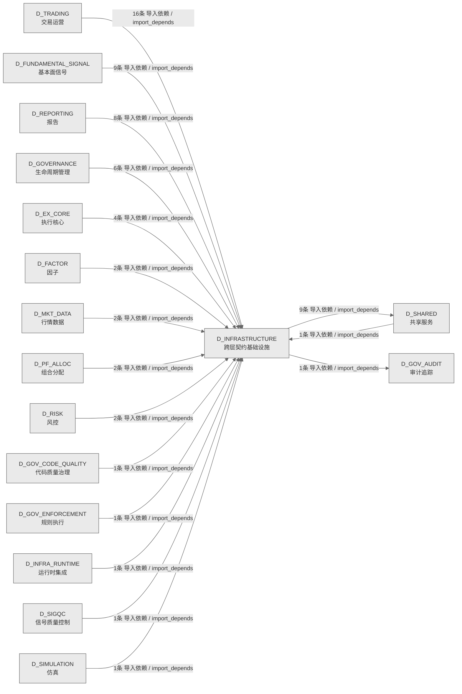

# 02_d_infrastructure / 跨层契约基础设施 / Cross-Layer Contract Infrastructure

> **功能简介 / Overview**: 跨层契约基础设施，负责跨层契约定义、共享契约管理和契约校验

> **文档作用 / Purpose**: 展示 跨层契约基础设施（D_INFRASTRUCTURE）功能域的模块清单、域内依赖关系、跨域依赖关系、架构分层视图，供架构审查和域治理参考。

> 本文档由 generate_domain_doc.py 从 depgraph (PostgreSQL) 自动生成
> 数据源: depgraph (PostgreSQL) nodes表 + edges表

> **[可缩放 HTML 版 / Zoomable HTML](http://localhost:8765/docs/02_enterprise_architecture/02_domain_architecture_docs/02_d_infrastructure.html)** — Ctrl+滚轮缩放 ｜ 双击重置 ｜ Ctrl+Shift+D 切换拖动/选择模式

## 域基本信息 / Domain Overview

| 字段 | 值 | Field | Value |
|------|------|-------|-------|
| 编号 | 02 | Number | 02 |
| 域ID | D_INFRASTRUCTURE | Domain ID | D_INFRASTRUCTURE |
| 域名称 | 跨层契约基础设施 | Domain Name | Cross-Layer Contract Infrastructure |
| 层级 | L0 基础设施层 | Layer | L0 Infrastructure |
| 模块数 | 25 | Module Count | 25 |
| 域内依赖 | 1 | Internal Dependencies | 1 |
| 跨域入边 | 57 | Cross-domain Incoming | 57 |
| 跨域出边 | 10 | Cross-domain Outgoing | 10 |
| 设计态模块 | 0 | Design Modules | 0 |
| 生产态模块 | 25 | Production Modules | 25 |
| 容量 | 25/150 (正常) | Capacity | 25/150 (正常) |
| 描述 | 跨层契约数据类(CTR-001 NormalizedMarketData 等) | Description | 跨层契约数据类(CTR-001 NormalizedMarketData 等) |

## 模块分层清单 / Module Layered List

> 按 architecture_layer 分组的模块清单（共 25 个模块 / 25 modules）。

### L0 基础设施层 / Infrastructure Layer (25 modules)

| # | 模块路径 / Module Path | 模块名称 / Module Name (功能简介 / Description) | 成熟度 / Maturity | 蓝图 / Blueprint |
|:--:|---------|---------|:---:|:---:|
| 1 | scripts/backup/backup_reconciler.py | backup_reconciler.py — 灾备备份系统事件触发器（post-commit reconciler） | 生产态 / production |  |
| 2 | src/zephyr/infrastructure/config/__init__.py | ZephyrAlpha — 基础设施 Infrastructure Layer — Configuration Management | 生产态 / production |  |
| 3 | src/zephyr/infrastructure/config/app_config.py | app_config.py — 应用配置数据类与加载/热重载逻辑 | 生产态 / production |  |
| 4 | src/zephyr/shared/contracts/capital_allocation_result.py | contracts/capital_allocation_result.py | 生产态 / production |  |
| 5 | src/zephyr/shared/contracts/compliance_rule.py | contracts/compliance_rule.py | 生产态 / production |  |
| 6 | src/zephyr/shared/contracts/execution_report.py | contracts/execution_report.py | 生产态 / production |  |
| 7 | src/zephyr/shared/contracts/experiment_result.py | contracts/experiment_result.py | 生产态 / production |  |
| 8 | src/zephyr/shared/contracts/factor_monitor_report.py | contracts/factor_monitor_report.py | 生产态 / production |  |
| 9 | src/zephyr/shared/contracts/factor_signal.py | contracts/factor_signal.py | 生产态 / production |  |
| 10 | src/zephyr/shared/contracts/fill.py | contracts/fill.py | 生产态 / production |  |
| 11 | src/zephyr/shared/contracts/macro_factor_signal.py | contracts/macro_factor_signal.py | 生产态 / production |  |
| 12 | src/zephyr/shared/contracts/market_data.py | contracts/market_data.py | 生产态 / production |  |
| 13 | src/zephyr/shared/contracts/model_serving_request.py | contracts/model_serving_request.py | 生产态 / production |  |
| 14 | src/zephyr/shared/contracts/model_serving_response.py | contracts/model_serving_response.py | 生产态 / production |  |
| 15 | src/zephyr/shared/contracts/order.py | contracts/order.py | 生产态 / production |  |
| 16 | src/zephyr/shared/contracts/performance_attribution_repor... | contracts/performance_attribution_report.py | 生产态 / production |  |
| 17 | src/zephyr/shared/contracts/position.py | contracts/position.py | 生产态 / production |  |
| 18 | src/zephyr/shared/contracts/risk_dashboard_snapshot.py | contracts/risk_dashboard_snapshot.py | 生产态 / production |  |
| 19 | src/zephyr/shared/contracts/risk_limits.py | contracts/risk_limits.py | 生产态 / production |  |
| 20 | src/zephyr/shared/contracts/risk_metrics.py | contracts/risk_metrics.py | 生产态 / production |  |
| 21 | src/zephyr/shared/contracts/strategy_lifecycle_event.py | contracts/strategy_lifecycle_event.py | 生产态 / production |  |
| 22 | src/zephyr/shared/contracts/synthesized_signal.py | contracts/synthesized_signal.py | 生产态 / production |  |
| 23 | src/zephyr/shared/contracts/system_configuration.py | contracts/system_configuration.py | 生产态 / production |  |
| 24 | src/zephyr/shared/contracts/telemetry_emitter.py | contracts/telemetry_emitter.py | 生产态 / production |  |
| 25 | src/zephyr/shared/contracts/trace_context.py | contracts/trace_context.py | 生产态 / production |  |

## 域内依赖图 / Internal Dependency Diagram

> 依赖图内嵌在本文档中，IDE 可直接渲染显示。参考 decision_index.md 设计，分三个视图：合并全景图、运营态子图、设计态子图（按 design_maturity 实际值拆分）。
>
> **图例说明 / Legend**：
> - **实线边框 = 运营态模块**（production，已上线运行）
> - **虚线边框 = 设计态模块**（design，蓝图阶段，代码未写）
> - **实线箭头 = 运营态依赖**（已生效的依赖关系）
> - **虚线箭头 = 非运营态依赖**（计划中/验证中的依赖关系）

### 合并全景图（全部模块，标签标注成熟度）

> 展示全部 25 个模块（生产态 25 + 设计态 0），标签标注成熟度。

### 运营态子图（仅 design_maturity=production 的模块和依赖）

> 仅展示已上线运行的模块（共 25 个，1 条域内依赖）。

```mermaid
%%{init: {'theme': 'base', 'themeVariables': {'primaryColor': '#eaeaea', 'primaryTextColor': '#333333', 'primaryBorderColor': '#666666', 'lineColor': '#666666', 'secondaryColor': '#eaeaea', 'tertiaryColor': '#eaeaea', 'fontSize': '14px'}}}%%
flowchart TD
    scripts_backup_backup_reconciler_py["(生产态 / production) backup_reconciler.py — 灾备备份系统事件触发器（post-commit reconciler）<br/>backup_reconciler.py — 灾备备份系统事件触发器（post-commit reconciler）<br/>文件: backup/backup_reconciler.py"]
    src_zephyr_infrastructure_config_init_py["(生产态 / production) ZephyrAlpha — 基础设施 Infrastructure Layer — Configuration Management<br/>ZephyrAlpha — 基础设施 Infrastructure Layer — Configuration Management<br/>文件: config/__init__.py"]
    src_zephyr_shared_contracts_capital_allocation_result_py["(生产态 / production) contracts/capital_allocation_result.py"]
    src_zephyr_shared_contracts_compliance_rule_py["(生产态 / production) contracts/compliance_rule.py"]
    src_zephyr_shared_contracts_execution_report_py["(生产态 / production) contracts/execution_report.py"]
    src_zephyr_shared_contracts_experiment_result_py["(生产态 / production) contracts/experiment_result.py"]
    src_zephyr_shared_contracts_factor_monitor_report_py["(生产态 / production) contracts/factor_monitor_report.py"]
    src_zephyr_shared_contracts_factor_signal_py["(生产态 / production) contracts/factor_signal.py"]
    src_zephyr_shared_contracts_fill_py["(生产态 / production) contracts/fill.py"]
    src_zephyr_shared_contracts_macro_factor_signal_py["(生产态 / production) contracts/macro_factor_signal.py"]
    src_zephyr_shared_contracts_market_data_py["(生产态 / production) contracts/market_data.py"]
    src_zephyr_shared_contracts_model_serving_request_py["(生产态 / production) contracts/model_serving_request.py"]
    src_zephyr_shared_contracts_model_serving_response_py["(生产态 / production) contracts/model_serving_response.py"]
    src_zephyr_shared_contracts_order_py["(生产态 / production) contracts/order.py"]
    src_zephyr_shared_contracts_performance_attribution_report_py["(生产态 / production) contracts/performance_attribution_report.py"]
    src_zephyr_shared_contracts_position_py["(生产态 / production) contracts/position.py"]
    src_zephyr_shared_contracts_risk_dashboard_snapshot_py["(生产态 / production) contracts/risk_dashboard_snapshot.py"]
    src_zephyr_shared_contracts_risk_limits_py["(生产态 / production) contracts/risk_limits.py"]
    src_zephyr_shared_contracts_risk_metrics_py["(生产态 / production) contracts/risk_metrics.py"]
    src_zephyr_shared_contracts_strategy_lifecycle_event_py["(生产态 / production) contracts/strategy_lifecycle_event.py"]
    src_zephyr_shared_contracts_synthesized_signal_py["(生产态 / production) contracts/synthesized_signal.py"]
    src_zephyr_shared_contracts_system_configuration_py["(生产态 / production) contracts/system_configuration.py"]
    src_zephyr_shared_contracts_telemetry_emitter_py["(生产态 / production) contracts/telemetry_emitter.py"]
    src_zephyr_shared_contracts_trace_context_py["(生产态 / production) contracts/trace_context.py"]
    scripts_backup_backup_reconciler_py ~~~ src_zephyr_infrastructure_config_init_py
    src_zephyr_infrastructure_config_init_py ~~~ src_zephyr_shared_contracts_capital_allocation_result_py
    src_zephyr_shared_contracts_capital_allocation_result_py ~~~ src_zephyr_shared_contracts_compliance_rule_py
    src_zephyr_shared_contracts_compliance_rule_py ~~~ src_zephyr_shared_contracts_execution_report_py
    src_zephyr_shared_contracts_execution_report_py ~~~ src_zephyr_shared_contracts_experiment_result_py
    src_zephyr_shared_contracts_experiment_result_py ~~~ src_zephyr_shared_contracts_factor_monitor_report_py
    src_zephyr_shared_contracts_factor_monitor_report_py ~~~ src_zephyr_shared_contracts_factor_signal_py
    src_zephyr_shared_contracts_factor_signal_py ~~~ src_zephyr_shared_contracts_fill_py
    src_zephyr_shared_contracts_fill_py ~~~ src_zephyr_shared_contracts_macro_factor_signal_py
    src_zephyr_shared_contracts_macro_factor_signal_py ~~~ src_zephyr_shared_contracts_market_data_py
    src_zephyr_shared_contracts_market_data_py ~~~ src_zephyr_shared_contracts_model_serving_request_py
    src_zephyr_shared_contracts_model_serving_request_py ~~~ src_zephyr_shared_contracts_model_serving_response_py
    src_zephyr_shared_contracts_model_serving_response_py ~~~ src_zephyr_shared_contracts_order_py
    src_zephyr_shared_contracts_order_py ~~~ src_zephyr_shared_contracts_performance_attribution_report_py
    src_zephyr_shared_contracts_performance_attribution_report_py ~~~ src_zephyr_shared_contracts_position_py
    src_zephyr_shared_contracts_position_py ~~~ src_zephyr_shared_contracts_risk_dashboard_snapshot_py
    src_zephyr_shared_contracts_risk_dashboard_snapshot_py ~~~ src_zephyr_shared_contracts_risk_limits_py
    src_zephyr_shared_contracts_risk_limits_py ~~~ src_zephyr_shared_contracts_risk_metrics_py
    src_zephyr_shared_contracts_risk_metrics_py ~~~ src_zephyr_shared_contracts_strategy_lifecycle_event_py
    src_zephyr_shared_contracts_strategy_lifecycle_event_py ~~~ src_zephyr_shared_contracts_synthesized_signal_py
    src_zephyr_shared_contracts_synthesized_signal_py ~~~ src_zephyr_shared_contracts_system_configuration_py
    src_zephyr_shared_contracts_system_configuration_py ~~~ src_zephyr_shared_contracts_telemetry_emitter_py
    src_zephyr_shared_contracts_telemetry_emitter_py ~~~ src_zephyr_shared_contracts_trace_context_py
    src_zephyr_infrastructure_config_app_config_py["(生产态 / production) app_config.py — 应用配置数据类与加载/热重载逻辑<br/>app_config.py — 应用配置数据类与加载/热重载逻辑<br/>文件: config/app_config.py"]
    src_zephyr_infrastructure_config_init_py -->|导入依赖 / import_depends| src_zephyr_infrastructure_config_app_config_py
    D_SHARED["(生产态 / production) D_SHARED 共享服务"]
    src_zephyr_shared_contracts_market_data_py -->|导入依赖 / import_depends| D_SHARED
    src_zephyr_shared_contracts_synthesized_signal_py -->|导入依赖 / import_depends| D_SHARED
    src_zephyr_shared_contracts_position_py -->|导入依赖 / import_depends| D_SHARED
    src_zephyr_shared_contracts_experiment_result_py -->|导入依赖 / import_depends| D_SHARED
    D_GOV_AUDIT["(生产态 / production) D_GOV_AUDIT 审计追踪"]
    scripts_backup_backup_reconciler_py -->|导入依赖 / import_depends| D_GOV_AUDIT
    src_zephyr_shared_contracts_risk_limits_py -->|导入依赖 / import_depends| D_SHARED
    src_zephyr_shared_contracts_order_py -->|导入依赖 / import_depends| D_SHARED
    src_zephyr_shared_contracts_factor_signal_py -->|导入依赖 / import_depends| D_SHARED
    src_zephyr_shared_contracts_fill_py -->|导入依赖 / import_depends| D_SHARED
    src_zephyr_shared_contracts_order_py -->|导入依赖 / import_depends| D_SHARED
    D_TRADING["(生产态 / production) D_TRADING 交易运营"]
    D_TRADING -->|导入依赖 / import_depends| src_zephyr_shared_contracts_trace_context_py
    D_FACTOR["(生产态 / production) D_FACTOR 因子"]
    D_FACTOR -->|导入依赖 / import_depends| src_zephyr_shared_contracts_market_data_py
    D_TRADING -->|导入依赖 / import_depends| src_zephyr_shared_contracts_execution_report_py
    D_EX_CORE["(生产态 / production) D_EX_CORE 执行核心"]
    D_EX_CORE -->|导入依赖 / import_depends| src_zephyr_shared_contracts_order_py
    D_SIGQC["(生产态 / production) D_SIGQC 信号质量控制"]
    D_SIGQC -->|导入依赖 / import_depends| src_zephyr_shared_contracts_synthesized_signal_py
    D_TRADING -->|导入依赖 / import_depends| src_zephyr_shared_contracts_factor_signal_py
    D_FUNDAMENTAL_SIGNAL["(生产态 / production) D_FUNDAMENTAL_SIGNAL 基本面信号"]
    D_FUNDAMENTAL_SIGNAL -->|导入依赖 / import_depends| src_zephyr_shared_contracts_factor_signal_py
    D_FUNDAMENTAL_SIGNAL -->|导入依赖 / import_depends| src_zephyr_shared_contracts_synthesized_signal_py
    D_PF_ALLOC["(生产态 / production) D_PF_ALLOC 组合分配"]
    D_PF_ALLOC -->|导入依赖 / import_depends| src_zephyr_shared_contracts_strategy_lifecycle_event_py
    D_FACTOR -->|导入依赖 / import_depends| src_zephyr_shared_contracts_factor_signal_py
    D_FUNDAMENTAL_SIGNAL -->|导入依赖 / import_depends| src_zephyr_shared_contracts_synthesized_signal_py
    D_FUNDAMENTAL_SIGNAL -->|导入依赖 / import_depends| src_zephyr_shared_contracts_factor_signal_py
    D_TRADING -->|导入依赖 / import_depends| src_zephyr_shared_contracts_order_py
    D_GOVERNANCE["(生产态 / production) D_GOVERNANCE 生命周期管理"]
    D_GOVERNANCE -->|导入依赖 / import_depends| src_zephyr_infrastructure_config_init_py
    D_GOV_CODE_QUALITY["(生产态 / production) D_GOV_CODE_QUALITY 代码质量治理"]
    D_GOV_CODE_QUALITY -->|导入依赖 / import_depends| src_zephyr_infrastructure_config_app_config_py
    classDef production fill:#e8edf2,stroke:#0277bd,stroke-width:2px,color:#1a1a1a
    classDef design fill:#f0ebe3,stroke:#bf360c,stroke-width:2px,color:#1a1a1a,stroke-dasharray: 5 5
    classDef external_prod fill:#e8efe9,stroke:#1b5e20,stroke-width:1px,color:#1a1a1a
    classDef external_design fill:#efe5ea,stroke:#880e4f,stroke-width:1px,color:#1a1a1a,stroke-dasharray: 5 5
    class scripts_backup_backup_reconciler_py,src_zephyr_infrastructure_config_init_py,src_zephyr_infrastructure_config_app_config_py,src_zephyr_shared_contracts_capital_allocation_result_py,src_zephyr_shared_contracts_compliance_rule_py,src_zephyr_shared_contracts_execution_report_py,src_zephyr_shared_contracts_experiment_result_py,src_zephyr_shared_contracts_factor_monitor_report_py,src_zephyr_shared_contracts_factor_signal_py,src_zephyr_shared_contracts_fill_py,src_zephyr_shared_contracts_macro_factor_signal_py,src_zephyr_shared_contracts_market_data_py,src_zephyr_shared_contracts_model_serving_request_py,src_zephyr_shared_contracts_model_serving_response_py,src_zephyr_shared_contracts_order_py,src_zephyr_shared_contracts_performance_attribution_report_py,src_zephyr_shared_contracts_position_py,src_zephyr_shared_contracts_risk_dashboard_snapshot_py,src_zephyr_shared_contracts_risk_limits_py,src_zephyr_shared_contracts_risk_metrics_py,src_zephyr_shared_contracts_strategy_lifecycle_event_py,src_zephyr_shared_contracts_synthesized_signal_py,src_zephyr_shared_contracts_system_configuration_py,src_zephyr_shared_contracts_telemetry_emitter_py,src_zephyr_shared_contracts_trace_context_py production
    class D_SHARED,D_GOV_AUDIT,D_TRADING,D_FACTOR,D_EX_CORE,D_SIGQC,D_FUNDAMENTAL_SIGNAL,D_PF_ALLOC,D_GOVERNANCE,D_GOV_CODE_QUALITY external_prod
```

### 设计态子图（仅 design_maturity=design 的模块和依赖）

> 仅展示蓝图阶段、代码未写的设计态模块（共 0 个，0 条域内依赖）。

> （无设计态模块 / No design modules）

## 跨域依赖 / Cross-domain Dependencies

### 本域依赖的其他域（出边）/ Depends On

| # | 本域模块 / Source Module | → | 外部域-目标模块 / Target Module | 依赖类型 / Type |
|:--:|---------|:--:|---------|---------|
| 1 | backup_reconciler.py — 灾备备份系统事件触发器（post-comm... | → | D_GOV_AUDIT 审计追踪: reconciliation_registry.py — GitCommitGateway post-commi... | 导入依赖 / import_depends |
| 2 | contracts/experiment_result.py | → | D_SHARED 共享服务: core/trace_context.py | 导入依赖 / import_depends |
| 3 | contracts/factor_signal.py | → | D_SHARED 共享服务: core/trace_context.py | 导入依赖 / import_depends |
| 4 | contracts/fill.py | → | D_SHARED 共享服务: core/trace_context.py | 导入依赖 / import_depends |
| 5 | contracts/market_data.py | → | D_SHARED 共享服务: core/trace_context.py | 导入依赖 / import_depends |
| 6 | contracts/order.py | → | D_SHARED 共享服务: core/trace_context.py | 导入依赖 / import_depends |
| 7 | contracts/order.py | → | D_SHARED 共享服务: OrderSide/OrderStatus/OrderType — 交易枚举真源 (5.152 #1... | 导入依赖 / import_depends |
| 8 | contracts/position.py | → | D_SHARED 共享服务: core/trace_context.py | 导入依赖 / import_depends |
| 9 | contracts/risk_limits.py | → | D_SHARED 共享服务: core/trace_context.py | 导入依赖 / import_depends |
| 10 | contracts/synthesized_signal.py | → | D_SHARED 共享服务: core/trace_context.py | 导入依赖 / import_depends |

### 依赖本域的其他域（入边）/ Depended By

| # | 外部域-源模块 / Source Module | → | 本域模块 / Target Module | 依赖类型 / Type |
|:--:|---------|:--:|---------|---------|
| 1 | D_EX_CORE 执行核心: D_EXECUTION_CORE — Execution Engine (ex_core/execution_e... | → | contracts/order.py | 导入依赖 / import_depends |
| 2 | D_EX_CORE 执行核心: D_EXECUTION_CORE — Execution Engine (ex_core/execution_e... | → | contracts/risk_limits.py | 导入依赖 / import_depends |
| 3 | D_EX_CORE 执行核心: D_EXECUTION_CORE — Order Manager (ex_core/order_manager.py) | → | contracts/fill.py | 导入依赖 / import_depends |
| 4 | D_EX_CORE 执行核心: D_EXECUTION_CORE — Order Manager (ex_core/order_manager.py) | → | contracts/order.py | 导入依赖 / import_depends |
| 5 | D_FACTOR 因子: CTR-001 NormalizedMarketData 消费者——数据适配层。 (ctr0... | → | contracts/market_data.py | 导入依赖 / import_depends |
| 6 | D_FACTOR 因子: CTR-002 FactorSignal 生产者——信号适配层。 (ctr002_produ... | → | contracts/factor_signal.py | 导入依赖 / import_depends |
| 7 | D_FUNDAMENTAL_SIGNAL 基本面信号: D_SIGNAL — Signal Generation Layer (gen/aggregator_base.py) | → | contracts/factor_signal.py | 导入依赖 / import_depends |
| 8 | D_FUNDAMENTAL_SIGNAL 基本面信号: D_SIGNAL — Signal Generation Layer (gen/aggregator_base.py) | → | contracts/synthesized_signal.py | 导入依赖 / import_depends |
| 9 | D_FUNDAMENTAL_SIGNAL 基本面信号: D_SIGNAL — Default Signal Aggregator (implementations/de... | → | contracts/factor_signal.py | 导入依赖 / import_depends |
| 10 | D_FUNDAMENTAL_SIGNAL 基本面信号: D_SIGNAL — Default Signal Aggregator (implementations/de... | → | contracts/synthesized_signal.py | 导入依赖 / import_depends |
| 11 | D_FUNDAMENTAL_SIGNAL 基本面信号: AlphaSignalPipeline D_FACTOR->D_SIGNAL跨层集成管道 (signa... | → | contracts/factor_signal.py | 导入依赖 / import_depends |
| 12 | D_FUNDAMENTAL_SIGNAL 基本面信号: AlphaSignalPipeline D_FACTOR->D_SIGNAL跨层集成管道 (signa... | → | contracts/synthesized_signal.py | 导入依赖 / import_depends |
| 13 | D_FUNDAMENTAL_SIGNAL 基本面信号: D_SIGNAL — Default Capital Allocator (implementations/de... | → | contracts/synthesized_signal.py | 导入依赖 / import_depends |
| 14 | D_FUNDAMENTAL_SIGNAL 基本面信号: D_SIGNAL — Signal Synthesizer (synth/signal_synthesizer.py) | → | contracts/factor_signal.py | 导入依赖 / import_depends |
| 15 | D_FUNDAMENTAL_SIGNAL 基本面信号: D_SIGNAL — Signal Synthesizer (synth/signal_synthesizer.py) | → | contracts/synthesized_signal.py | 导入依赖 / import_depends |
| 16 | D_GOVERNANCE 生命周期管理: A2A Protocol 全链路满分验证脚本 (scripts/a2a_full_verific... | → | ZephyrAlpha — 基础设施 Infrastructure Layer — Configura... | 导入依赖 / import_depends |
| 17 | D_GOVERNANCE 生命周期管理: local_layer_daemon.py — L2 本地模型层守护进程（薄包装，D... | → | ZephyrAlpha — 基础设施 Infrastructure Layer — Configura... | 导入依赖 / import_depends |
| 18 | D_GOVERNANCE 生命周期管理: D_EXECUTION_CORE — Risk Validation Bridge (DW-239) (adap... | → | contracts/risk_limits.py | 导入依赖 / import_depends |
| 19 | D_GOVERNANCE 生命周期管理: D_EXECUTION_CORE — Simulation Broker Adapter (adapters/s... | → | contracts/fill.py | 导入依赖 / import_depends |
| 20 | D_GOVERNANCE 生命周期管理: D_EXECUTION_CORE — Simulation Broker Adapter (adapters/s... | → | contracts/order.py | 导入依赖 / import_depends |
| 21 | D_GOVERNANCE 生命周期管理: D_EXECUTION_CORE — Simulation Broker Adapter (adapters/s... | → | contracts/position.py | 导入依赖 / import_depends |
| 22 | D_GOV_CODE_QUALITY 代码质量治理: 配置管理 — 策略树 YAML 加载 + 项目规模感知四 Tier 自适应... | → | app_config.py — 应用配置数据类与加载/热重载逻辑 (config/... | 导入依赖 / import_depends |
| 23 | D_GOV_ENFORCEMENT 规则执行: Re-export shim — ComplianceRule 真源已合并至 zephyr.shar... | → | contracts/compliance_rule.py | 导入依赖 / import_depends |
| 24 | D_INFRA_RUNTIME 运行时集成: HealthMonitor — 健康监控 + 自愈 (trading/health_monitor.py) | → | contracts/telemetry_emitter.py | 导入依赖 / import_depends |
| 25 | D_MKT_DATA 行情数据: market_data/__init__.py | → | contracts/market_data.py | 导入依赖 / import_depends |
| 26 | D_MKT_DATA 行情数据: NormalizedMarketData 生产者——D_MKT_DATA→D_FACTOR 数据... | → | contracts/market_data.py | 导入依赖 / import_depends |
| 27 | D_PF_ALLOC 组合分配: pf_alloc/strategy_lifecycle_event.py | → | contracts/strategy_lifecycle_event.py | 导入依赖 / import_depends |
| 28 | D_PF_ALLOC 组合分配: D_PORTFOLIO_CORE — Default Equity Long-Only Strategy (pf... | → | contracts/order.py | 导入依赖 / import_depends |
| 29 | D_REPORTING 报告: D_REPORTING — Post-Trade Analytics Layer (reporting/anal... | → | contracts/execution_report.py | 导入依赖 / import_depends |
| 30 | D_REPORTING 报告: D_REPORTING — Post-Trade Analytics Layer (reporting/anal... | → | contracts/fill.py | 导入依赖 / import_depends |
| 31 | D_REPORTING 报告: D_REPORTING — Post-Trade Analytics Layer (reporting/anal... | → | contracts/order.py | 导入依赖 / import_depends |
| 32 | D_REPORTING 报告: D_REPORTING — Post-Trade Analytics Layer (reporting/anal... | → | contracts/performance_attribution_report.py | 导入依赖 / import_depends |
| 33 | D_REPORTING 报告: D_REPORTING — Default Attribution Engine (reporting/defa... | → | contracts/performance_attribution_report.py | 导入依赖 / import_depends |
| 34 | D_REPORTING 报告: D_REPORTING — Default TCA Engine (reporting/default_tca_... | → | contracts/execution_report.py | 导入依赖 / import_depends |
| 35 | D_REPORTING 报告: D_REPORTING — Default TCA Engine (reporting/default_tca_... | → | contracts/fill.py | 导入依赖 / import_depends |
| 36 | D_REPORTING 报告: D_REPORTING — Default TCA Engine (reporting/default_tca_... | → | contracts/order.py | 导入依赖 / import_depends |
| 37 | D_RISK 风控: D_RISK — Risk Limits Calculator (risk/risk_limits.py) | → | contracts/risk_limits.py | 导入依赖 / import_depends |
| 38 | D_RISK 风控: ZephyrAlpha — D_RISK Risk Management Layer — 风控管理器... | → | contracts/risk_limits.py | 导入依赖 / import_depends |
| 39 | D_SHARED 共享服务: Re-export shim — 真源已收敛至 zephyr.shared.contracts.pe... | → | contracts/performance_attribution_report.py | 导入依赖 / import_depends |
| 40 | D_SIGQC 信号质量控制: D_SIGQC — Signal Quality Degradation Monitor Base (signa... | → | contracts/synthesized_signal.py | 导入依赖 / import_depends |
| 41 | D_SIMULATION 仿真: 实验 — Experimentation Pipeline Layer (simulation/pipeli... | → | contracts/experiment_result.py | 导入依赖 / import_depends |
| 42 | D_TRADING 交易运营: D_EXECUTION_CORE — BrokerInterface (trading_contracts/br... | → | contracts/fill.py | 导入依赖 / import_depends |
| 43 | D_TRADING 交易运营: D_EXECUTION_CORE — BrokerInterface (trading_contracts/br... | → | contracts/order.py | 导入依赖 / import_depends |
| 44 | D_TRADING 交易运营: D_EXECUTION_CORE — BrokerInterface (trading_contracts/br... | → | contracts/position.py | 导入依赖 / import_depends |
| 45 | D_TRADING 交易运营: execution/execution_rejection_error.py | → | contracts/trace_context.py | 导入依赖 / import_depends |
| 46 | D_TRADING 交易运营: Re-export wrapper: ExecutionReport 真源在 zephyr.shared.c... | → | contracts/execution_report.py | 导入依赖 / import_depends |
| 47 | D_TRADING 交易运营: Re-export wrapper: Fill 真源在 zephyr.shared.contracts.fi... | → | contracts/fill.py | 导入依赖 / import_depends |
| 48 | D_TRADING 交易运营: Re-export wrapper: Order 真源在 zephyr.shared.contracts.o... | → | contracts/order.py | 导入依赖 / import_depends |
| 49 | D_TRADING 交易运营: Re-export wrapper: PositionSnapshot 真源在 zephyr.shared.... | → | contracts/position.py | 导入依赖 / import_depends |
| 50 | D_TRADING 交易运营: trading-contracts/factories.py — 交易域数据契约工厂方法 ... | → | contracts/factor_signal.py | 导入依赖 / import_depends |
| 51 | D_TRADING 交易运营: trading-contracts/factories.py — 交易域数据契约工厂方法 ... | → | contracts/synthesized_signal.py | 导入依赖 / import_depends |
| 52 | D_TRADING 交易运营: market/signal_degradation_warning.py | → | contracts/trace_context.py | 导入依赖 / import_depends |
| 53 | D_TRADING 交易运营: Re-export shim — 真源已收敛至 zephyr.shared.contracts.pe... | → | contracts/performance_attribution_report.py | 导入依赖 / import_depends |
| 54 | D_TRADING 交易运营: contracts/strategy_lifecycle_event.py | → | contracts/strategy_lifecycle_event.py | 导入依赖 / import_depends |
| 55 | D_TRADING 交易运营: risk/risk_limit_violation_error.py | → | contracts/trace_context.py | 导入依赖 / import_depends |
| 56 | D_TRADING 交易运营: risk/risk_limits.py | → | contracts/trace_context.py | 导入依赖 / import_depends |
| 57 | D_TRADING 交易运营: risk/risk_validator_protocol.py | → | contracts/risk_limits.py | 导入依赖 / import_depends |

### 跨域依赖图 / Cross-domain Dependency Diagram

> 本域与 16 个外部域直接连接（出边 10 条 + 入边 57 条 = 67 条）。只显示直接连接的域，不展开具体节点。

## 说明 / Notes

- **数据源 / Data Source**: `depgraph (PostgreSQL)` 的 `nodes`、`edges`、`domains` 表
- **生成器 / Generator**: `generate_domain_doc.py`（G2+G10 合并）
- **维护方式 / Maintenance**: 自动生成，全景图更新时刷新
- **文件名规则 / File Naming**: `{编号:02d}_{域ID小写}.md`，如 `16_d_trading.md`
- **图例说明 / Legend**: `[production]`=已上线 / `[design]`=设计中 / `[unknown]`=未知
