# 03_d_alt_data / 另类数据

> **文档作用 / Purpose**: 展示 另类数据（D-ALT_DATA）功能域的模块清单、域内依赖关系和跨域依赖关系，供架构审查和域治理参考。

> 本文档由 generate_domain_doc.py 从 depgraph.db 自动生成
> 最后更新: 2026-06-24 23:01:53
> 数据源: depgraph.db nodes表 + edges表

## 域基本信息 / Domain Overview

| 字段 | 值 | Field | Value |
|------|------|-------|-------|
| 编号 | 03 | Number | 03 |
| 域ID | D-ALT_DATA | Domain ID | D-ALT_DATA |
| 域名称 | 另类数据 | Domain Name | 另类数据 |
| 层级 | L1_foundation | Layer | L1_foundation |
| 模块数 | 68 | Module Count | 68 |
| 域内依赖 | 61 | Internal Dependencies | 61 |
| 跨域入边 | 37 | Cross-domain Incoming | 37 |
| 跨域出边 | 91 | Cross-domain Outgoing | 91 |
| 设计态模块 | 61 | Design Modules | 61 |
| 原型态模块 | 1 | Prototype Modules | 1 |
| 生产态模块 | 0 | Production Modules | 0 |
| 容量 | 68/150 (正常) | Capacity | 68/150 (正常) |
| 描述 | 另类数据域。负责另类数据源的接入与处理，包括卫星图像、社交媒体情绪、供应链数据、ESG数据。 | Description | 另类数据域。负责另类数据源的接入与处理，包括卫星图像、社交媒体情绪、供应链数据、ESG数据。 |

## 模块清单 / Module List

共 68 个模块（按路径排序，全部显示）

| 模块路径 / Module Path | 模块名称 / Module Name | 设计成熟度 / Maturity | 构建状态 / Build Status |
|---------|---------|-----------|---------|
| D-ALT-DATA/3-second Contrarian Capital Flow Identification Module 3秒级逆势资金流识别模块 | 3-second Contrarian Capital Flow Iden... | design | design_only |
| D-ALT-DATA/A-011 tushare账号开通 tushare Account | A-011 tushare账号开通 tushare Account | design | design_only |
| D-ALT-DATA/A-Share Capital Flow Tracker A股资金流向追踪器 | A-Share Capital Flow Tracker A股资金流向追踪器 | design | design_only |
| D-ALT-DATA/A-Share Event Causal Reasoner A股事件因果推理引擎 | A-Share Event Causal Reasoner A股事件因果推理引擎 | design | design_only |
| D-ALT-DATA/A-Share Industry Chain Knowledge Graph A股产业链知识图谱 | A-Share Industry Chain Knowledge Grap... | design | design_only |
| D-ALT-DATA/A-Share Policy Expectation Analyzer A股政策预期分析器 | A-Share Policy Expectation Analyzer A... | design | design_only |
| D-ALT-DATA/AShareCapitalFlowTracker A股资金流向追踪器 | AShareCapitalFlowTracker A股资金流向追踪器 | design | design_only |
| D-ALT-DATA/AShareCapitalFlowTracker A股资金流追踪器 | AShareCapitalFlowTracker A股资金流追踪器 | design | design_only |
| D-ALT-DATA/AShareEventCausalReasoner A股事件因果推理器 | AShareEventCausalReasoner A股事件因果推理器 | design | design_only |
| D-ALT-DATA/ASharePolicyExpectationAnalyzer A股政策预期分析器 | ASharePolicyExpectationAnalyzer A股政策预... | design | design_only |
| D-ALT-DATA/Alt-Data Compliance Reviewer 另类数据合规审查器 | Alt-Data Compliance Reviewer 另类数据合规审查器 | design | design_only |
| D-ALT-DATA/Alt-Data Lineage Tracker 另类数据血缘追踪器 | Alt-Data Lineage Tracker 另类数据血缘追踪器 | design | design_only |
| D-ALT-DATA/AltDataBacktester 另类数据回测器 | AltDataBacktester 另类数据回测器 | design | design_only |
| D-ALT-DATA/AltDataCatalog 另类数据目录 | AltDataCatalog 另类数据目录 | design | design_only |
| D-ALT-DATA/AltDataComplianceReviewer 另类数据合规审查器 | AltDataComplianceReviewer 另类数据合规审查器 | design | design_only |
| D-ALT-DATA/AltDataConnector 另类数据连接器 | AltDataConnector 另类数据连接器 | design | design_only |
| D-ALT-DATA/AltDataCostOptimizer 另类数据成本优化器 | AltDataCostOptimizer 另类数据成本优化器 | design | design_only |
| D-ALT-DATA/AltDataFeed 另类数据流 | AltDataFeed 另类数据流 | design | design_only |
| D-ALT-DATA/AltDataIngested 另类数据已接入 | AltDataIngested 另类数据已接入 | design | design_only |
| D-ALT-DATA/AltDataLineageTracker 另类数据血缘追踪器 | AltDataLineageTracker 另类数据血缘追踪器 | design | design_only |
| D-ALT-DATA/AltDataQualityDegraded 另类数据质量降级 | AltDataQualityDegraded 另类数据质量降级 | design | design_only |
| D-ALT-DATA/AltDataQualityScorer 另类数据质量评分器 | AltDataQualityScorer 另类数据质量评分器 | design | design_only |
| D-ALT-DATA/AltDataSignal 另类数据信号 | AltDataSignal 另类数据信号 | design | design_only |
| D-ALT-DATA/Alternative Data Domain 另类数据域 | Alternative Data Domain 另类数据域 | design | design_only |
| D-ALT-DATA/Alternative Data Source Health & Degradation Manager 另类数据源健康度与降级管理器 | Alternative Data Source Health & Degr... | design | design_only |
| D-ALT-DATA/C-014 主播信号融合 Anchor Signal Fusion | C-014 主播信号融合 Anchor Signal Fusion | design | design_only |
| D-ALT-DATA/CompositeSentimentIndex CSI情绪温度指数 | CompositeSentimentIndex CSI情绪温度指数 | design | design_only |
| D-ALT-DATA/Connector 另类数据连接器(骨架) | Connector 另类数据连接器(骨架) | design | design_only |
| D-ALT-DATA/D-ALT-DATA | D-ALT-DATA | design | design_only |
| D-ALT-DATA/Data Change Audit 数据变更审计 | Data Change Audit 数据变更审计 | design | design_only |
| D-ALT-DATA/Data Fingerprint 数据指纹 | Data Fingerprint 数据指纹 | design | design_only |
| D-ALT-DATA/Filing Compliance Event 合规事件 | Filing Compliance Event 合规事件 | design | design_only |
| D-ALT-DATA/Filing NLP Engine 财务公告NLP引擎 | Filing NLP Engine 财务公告NLP引擎 | design | design_only |
| D-ALT-DATA/FilingEventDetected 申报事件检测 | FilingEventDetected 申报事件检测 | design | design_only |
| D-ALT-DATA/FilingNLP 监管文件NLP(骨架) | FilingNLP 监管文件NLP(骨架) | design | design_only |
| D-ALT-DATA/FilingNLPEngine 监管文件NLP引擎 | FilingNLPEngine 监管文件NLP引擎 | design | design_only |
| D-ALT-DATA/FilingNLPEngine 财报NLP引擎 | FilingNLPEngine 财报NLP引擎 | design | design_only |
| D-ALT-DATA/GeopoliticalRiskAnalyzer 地缘政治风险分析器 | GeopoliticalRiskAnalyzer 地缘政治风险分析器 | design | design_only |
| D-ALT-DATA/LLM Market Interpreter LLM市场解读 | LLM Market Interpreter LLM市场解读 | design | design_only |
| D-ALT-DATA/LLMMarketInterpreter LLM市场解读器 | LLMMarketInterpreter LLM市场解读器 | design | design_only |
| D-ALT-DATA/LLMMarketInterpreter LLM市场解释器 | LLMMarketInterpreter LLM市场解释器 | design | design_only |
| D-ALT-DATA/NLP情感分析系列 NLP Sentiment Analysis Series | NLP情感分析系列 NLP Sentiment Analysis Series | design | design_only |
| D-ALT-DATA/PolicyThemeMapper 政策主题映射器 | PolicyThemeMapper 政策主题映射器 | design | design_only |
| D-ALT-DATA/Satellite & Geospatial Engine 卫星图像与地理数据引擎 | Satellite & Geospatial Engine 卫星图像与地理... | design | design_only |
| D-ALT-DATA/SatelliteGeospatialEngine 卫星地理空间引擎 | SatelliteGeospatialEngine 卫星地理空间引擎 | design | design_only |
| D-ALT-DATA/Sentiment Engine 情绪信号引擎 | Sentiment Engine 情绪信号引擎 | design | design_only |
| D-ALT-DATA/Sentiment Factor 情绪因子 | Sentiment Factor 情绪因子 | design | design_only |
| D-ALT-DATA/SentimentEngine 情感引擎 | SentimentEngine 情感引擎 | design | design_only |
| D-ALT-DATA/SentimentEngine 情绪引擎(骨架) | SentimentEngine 情绪引擎(骨架) | design | design_only |
| D-ALT-DATA/SentimentIndexPercentile 情绪指数历史分位数 | SentimentIndexPercentile 情绪指数历史分位数 | design | design_only |
| D-ALT-DATA/SentimentSignalReady 情绪信号就绪 | SentimentSignalReady 情绪信号就绪 | design | design_only |
| D-ALT-DATA/SignalExtractor 信号提取器(骨架) | SignalExtractor 信号提取器(骨架) | design | design_only |
| D-ALT-DATA/Supply Chain Risk Alert 供应链风险告警 | Supply Chain Risk Alert 供应链风险告警 | design | design_only |
| D-ALT-DATA/SupplyChainDisruption 供应链中断 | SupplyChainDisruption 供应链中断 | design | design_only |
| D-ALT-DATA/SupplyChainGraph 产业链图谱(骨架) | SupplyChainGraph 产业链图谱(骨架) | design | design_only |
| D-ALT-DATA/Training Data Bias Assessment 训练数据偏差评估 | Training Data Bias Assessment 训练数据偏差评估 | design | design_only |
| D-ALT-DATA/Whisper ASR语音识别 | Whisper ASR语音识别 | design | design_only |
| D-ALT-DATA/tushare待开通而非立即接入 tushare Deferred | tushare待开通而非立即接入 tushare Deferred | design | design_only |
| D-ALT-DATA/tushare新闻为新闻主力源 tushare as News Source | tushare新闻为新闻主力源 tushare as News Source | design | design_only |
| D-ALT-DATA/另类数据PIT保障 Alternative Data PIT | 另类数据PIT保障 Alternative Data PIT | design | design_only |
| D-ALT-DATA/另类数据集成框架缺失 Alternative Data Framework Gap | 另类数据集成框架缺失 Alternative Data Framework... | design | design_only |
| src/zephyr/alt_data/__init__.py |  | prototype | orphan |
| src/zephyr/alt_data/_extensions/__init__.py |  | scaffold_placeholder | orphan |
| src/zephyr/alt_data/api/__init__.py |  | scaffold_placeholder | orphan |
| src/zephyr/alt_data/core/__init__.py |  | scaffold_placeholder | orphan |
| src/zephyr/alt_data/infrastructure/__init__.py |  | scaffold_placeholder | orphan |
| src/zephyr/alt_data/models/__init__.py |  | scaffold_placeholder | orphan |
| src/zephyr/alt_data/services/__init__.py |  | scaffold_placeholder | orphan |

## 域内依赖图 / Internal Dependency Diagram

> 依赖图内嵌在本文档中，IDE 可直接渲染显示。每30个节点一组分页显示。
>
> **图例说明 / Legend**：
> - **实线边框 = 运营态模块**（production，已上线运行）
> - **虚线边框 = 设计态模块**（design，还在设计中）
> - **实线箭头 = 运营态依赖**（已生效的依赖关系）
> - **虚线箭头 = 设计态依赖**（计划中的依赖关系）

### 第 1 页 / 共 3 页 / Page 1 of 3

```mermaid
graph TD
    subgraph D_ALT_DATA["D-ALT_DATA 另类数据"]
        D_ALT_DATA_3_second_Contrarian_Capital_Flow_Identification_Module_3["3-second Contrarian Capital Flow Identification... design"]
        D_ALT_DATA_A_011_tushare_tushare_Account["A-011 tushare账号开通 tushare Account design"]
        D_ALT_DATA_A_Share_Capital_Flow_Tracker_A["A-Share Capital Flow Tracker A股资金流向追踪器 design"]
        D_ALT_DATA_A_Share_Event_Causal_Reasoner_A["A-Share Event Causal Reasoner A股事件因果推理引擎 design"]
        D_ALT_DATA_A_Share_Industry_Chain_Knowledge_Graph_A["A-Share Industry Chain Knowledge Graph A股产业链知识图谱 design"]
        D_ALT_DATA_A_Share_Policy_Expectation_Analyzer_A["A-Share Policy Expectation Analyzer A股政策预期分析器 design"]
        D_ALT_DATA_AShareCapitalFlowTracker_A["AShareCapitalFlowTracker A股资金流向追踪器 design"]
        D_ALT_DATA_AShareCapitalFlowTracker_A_1["AShareCapitalFlowTracker A股资金流追踪器 design"]
        D_ALT_DATA_AShareEventCausalReasoner_A["AShareEventCausalReasoner A股事件因果推理器 design"]
        D_ALT_DATA_ASharePolicyExpectationAnalyzer_A["ASharePolicyExpectationAnalyzer A股政策预期分析器 design"]
        D_ALT_DATA_Alt_Data_Compliance_Reviewer["Alt-Data Compliance Reviewer 另类数据合规审查器 design"]
        D_ALT_DATA_Alt_Data_Lineage_Tracker["Alt-Data Lineage Tracker 另类数据血缘追踪器 design"]
        D_ALT_DATA_AltDataBacktester["AltDataBacktester 另类数据回测器 design"]
        D_ALT_DATA_AltDataCatalog["AltDataCatalog 另类数据目录 design"]
        D_ALT_DATA_AltDataComplianceReviewer["AltDataComplianceReviewer 另类数据合规审查器 design"]
        D_ALT_DATA_AltDataConnector["AltDataConnector 另类数据连接器 design"]
        D_ALT_DATA_AltDataCostOptimizer["AltDataCostOptimizer 另类数据成本优化器 design"]
        D_ALT_DATA_AltDataFeed["AltDataFeed 另类数据流 design"]
        D_ALT_DATA_AltDataIngested["AltDataIngested 另类数据已接入 design"]
        D_ALT_DATA_AltDataLineageTracker["AltDataLineageTracker 另类数据血缘追踪器 design"]
        D_ALT_DATA_AltDataQualityDegraded["AltDataQualityDegraded 另类数据质量降级 design"]
        D_ALT_DATA_AltDataQualityScorer["AltDataQualityScorer 另类数据质量评分器 design"]
        D_ALT_DATA_AltDataSignal["AltDataSignal 另类数据信号 design"]
        D_ALT_DATA_Alternative_Data_Domain["Alternative Data Domain 另类数据域 design"]
        D_ALT_DATA_Alternative_Data_Source_Health_Degradation_Manager["Alternative Data Source Health & Degradation Ma... design"]
        D_ALT_DATA_C_014_Anchor_Signal_Fusion["C-014 主播信号融合 Anchor Signal Fusion design"]
        D_ALT_DATA_CompositeSentimentIndex_CSI["CompositeSentimentIndex CSI情绪温度指数 design"]
        D_ALT_DATA_Connector["Connector 另类数据连接器(骨架) design"]
        D_ALT_DATA_D_ALT_DATA["D-ALT-DATA design"]
        D_ALT_DATA_Data_Change_Audit["Data Change Audit 数据变更审计 design"]
    end
    D_ALT_DATA_D_ALT_DATA -.->|config_depends| D_ALT_DATA_AltDataBacktester
    D_ALT_DATA_A_Share_Capital_Flow_Tracker_A -.->|import_depends| D_ALT_DATA_A_Share_Event_Causal_Reasoner_A
    D_ALT_DATA_A_Share_Event_Causal_Reasoner_A -.->|import_depends| D_ALT_DATA_C_014_Anchor_Signal_Fusion
    D_ALT_DATA_A_Share_Event_Causal_Reasoner_A -.->|import_depends| D_ALT_DATA_A_011_tushare_tushare_Account
    D_ALT_DATA_C_014_Anchor_Signal_Fusion -.->|import_depends| D_ALT_DATA_AltDataConnector
    D_ALT_DATA_AltDataQualityScorer -.->|import_depends| D_ALT_DATA_AltDataCostOptimizer
    D_ALT_DATA_AltDataCostOptimizer -.->|import_depends| D_ALT_DATA_AltDataBacktester
    D_ALT_DATA_AltDataBacktester -.->|import_depends| D_ALT_DATA_AltDataCatalog
    D_ALT_DATA_AltDataComplianceReviewer -.->|import_depends| D_ALT_DATA_AShareCapitalFlowTracker_A
    D_ALT_DATA_AShareCapitalFlowTracker_A -.->|import_depends| D_ALT_DATA_ASharePolicyExpectationAnalyzer_A
    D_ALT_DATA_ASharePolicyExpectationAnalyzer_A -.->|import_depends| D_ALT_DATA_AShareEventCausalReasoner_A
    D_ALT_DATA_AShareEventCausalReasoner_A -.->|import_depends| D_ALT_DATA_Alternative_Data_Source_Health_Degradation_Manager
    D_ALT_DATA_Alternative_Data_Source_Health_Degradation_Manager -.->|import_depends| D_ALT_DATA_Alt_Data_Lineage_Tracker
    D_ALT_DATA_Alt_Data_Lineage_Tracker -.->|import_depends| D_ALT_DATA_A_Share_Policy_Expectation_Analyzer_A
    D_ALT_DATA_A_Share_Policy_Expectation_Analyzer_A -.->|import_depends| D_ALT_DATA_A_Share_Industry_Chain_Knowledge_Graph_A
    D_ALT_DATA_AShareCapitalFlowTracker_A_1 -.->|import_depends| D_ALT_DATA_AltDataLineageTracker
    D_ALT_DATA_AShareCapitalFlowTracker_A_1 -.->|import_depends| D_ALT_DATA_Alternative_Data_Domain
    D_MKT_DATA["D-MKT_DATA design"]
    D_ALT_DATA_D_ALT_DATA -.->|contract| D_MKT_DATA
    D_INTEGRATION["D-INTEGRATION design"]
    D_ALT_DATA_D_ALT_DATA -.->|contract| D_INTEGRATION
    D_DATA_ENG["D-DATA_ENG design"]
    D_ALT_DATA_D_ALT_DATA -.->|domain_dependency| D_DATA_ENG
    D_SECURITY["D-SECURITY design"]
    D_ALT_DATA_Alt_Data_Compliance_Reviewer -.->|config_depends| D_SECURITY
    D_ALT_DATA_A_Share_Capital_Flow_Tracker_A -.->|data| D_SECURITY
    D_ALT_DATA_A_Share_Event_Causal_Reasoner_A -.->|contract| D_INTEGRATION
    D_RISK["D-RISK design"]
    D_ALT_DATA_A_Share_Event_Causal_Reasoner_A -.->|contract| D_RISK
    D_SIGNAL["D-SIGNAL design"]
    D_ALT_DATA_C_014_Anchor_Signal_Fusion -.->|contract| D_SIGNAL
    D_ML_TRAIN["D-ML_TRAIN design"]
    D_ALT_DATA_C_014_Anchor_Signal_Fusion -.->|data| D_ML_TRAIN
    D_ALT_DATA_C_014_Anchor_Signal_Fusion -.->|data| D_SIGNAL
    D_REPORTING["D-REPORTING design"]
    D_ALT_DATA_A_011_tushare_tushare_Account -.->|data| D_REPORTING
    D_ALT_DATA_A_011_tushare_tushare_Account -.->|data| D_SECURITY
    D_FACTOR["D-FACTOR design"]
    D_ALT_DATA_AltDataConnector -.->|contract| D_FACTOR
    D_ALT_DATA_AltDataConnector -.->|event| D_SECURITY
    D_GOVERNANCE["D-GOVERNANCE design"]
    D_ALT_DATA_AltDataQualityScorer -.->|event| D_GOVERNANCE
    D_OPS["D-OPS design"]
    D_OPS -.->|contract| D_ALT_DATA_D_ALT_DATA
    D_COMPLIANCE["D-COMPLIANCE design"]
    D_COMPLIANCE -.->|contract| D_ALT_DATA_A_Share_Capital_Flow_Tracker_A
    D_FRONTEND["D-FRONTEND design"]
    D_FRONTEND -.->|contract| D_ALT_DATA_AltDataQualityScorer
    D_OPS -.->|contract| D_ALT_DATA_AltDataQualityScorer
    D_OPS -.->|event| D_ALT_DATA_AltDataQualityScorer
    D_COMPLIANCE -.->|data| D_ALT_DATA_AltDataCostOptimizer
    D_INFRA_OPS["D-INFRA_OPS design"]
    D_INFRA_OPS -.->|contract| D_ALT_DATA_ASharePolicyExpectationAnalyzer_A
    D_COMPLIANCE -.->|contract| D_ALT_DATA_AShareEventCausalReasoner_A
    D_INFRA_OPS -.->|contract| D_ALT_DATA_AShareEventCausalReasoner_A
    D_COMPLIANCE -.->|contract| D_ALT_DATA_Alt_Data_Lineage_Tracker
    D_INFRA_OPS -.->|event| D_ALT_DATA_AShareCapitalFlowTracker_A_1
    D_COMPLIANCE -.->|data| D_ALT_DATA_AltDataQualityDegraded
    D_INFRA_OPS -.->|contract| D_ALT_DATA_AltDataQualityDegraded
    D_INFRA_OPS -.->|data| D_ALT_DATA_AltDataSignal
    D_PF_ALLOC["D-PF_ALLOC design"]
    D_PF_ALLOC -.->|event| D_ALT_DATA_AltDataSignal
    classDef production fill:#e1f5fe,stroke:#01579b,stroke-width:2px,color:#000
    classDef design fill:#fff3e0,stroke:#e65100,stroke-width:2px,color:#000,stroke-dasharray: 5 5
    classDef external_prod fill:#e8f5e9,stroke:#1b5e20,stroke-width:1px,color:#000
    classDef external_design fill:#fce4ec,stroke:#880e4f,stroke-width:1px,color:#000,stroke-dasharray: 5 5
    class D_ALT_DATA_3_second_Contrarian_Capital_Flow_Identification_Module_3,D_ALT_DATA_A_011_tushare_tushare_Account,D_ALT_DATA_A_Share_Capital_Flow_Tracker_A,D_ALT_DATA_A_Share_Event_Causal_Reasoner_A,D_ALT_DATA_A_Share_Industry_Chain_Knowledge_Graph_A,D_ALT_DATA_A_Share_Policy_Expectation_Analyzer_A,D_ALT_DATA_AShareCapitalFlowTracker_A,D_ALT_DATA_AShareCapitalFlowTracker_A_1,D_ALT_DATA_AShareEventCausalReasoner_A,D_ALT_DATA_ASharePolicyExpectationAnalyzer_A,D_ALT_DATA_Alt_Data_Compliance_Reviewer,D_ALT_DATA_Alt_Data_Lineage_Tracker,D_ALT_DATA_AltDataBacktester,D_ALT_DATA_AltDataCatalog,D_ALT_DATA_AltDataComplianceReviewer,D_ALT_DATA_AltDataConnector,D_ALT_DATA_AltDataCostOptimizer,D_ALT_DATA_AltDataFeed,D_ALT_DATA_AltDataIngested,D_ALT_DATA_AltDataLineageTracker,D_ALT_DATA_AltDataQualityDegraded,D_ALT_DATA_AltDataQualityScorer,D_ALT_DATA_AltDataSignal,D_ALT_DATA_Alternative_Data_Domain,D_ALT_DATA_Alternative_Data_Source_Health_Degradation_Manager,D_ALT_DATA_C_014_Anchor_Signal_Fusion,D_ALT_DATA_CompositeSentimentIndex_CSI,D_ALT_DATA_Connector,D_ALT_DATA_D_ALT_DATA,D_ALT_DATA_Data_Change_Audit design
    class D_MKT_DATA,D_INTEGRATION,D_DATA_ENG,D_SECURITY,D_RISK,D_SIGNAL,D_ML_TRAIN,D_REPORTING,D_FACTOR,D_GOVERNANCE,D_OPS,D_COMPLIANCE,D_FRONTEND,D_INFRA_OPS,D_PF_ALLOC external_design
```

### 第 2 页 / 共 3 页 / Page 2 of 3

```mermaid
graph TD
    subgraph D_ALT_DATA["D-ALT_DATA 另类数据"]
        D_ALT_DATA_Data_Fingerprint["Data Fingerprint 数据指纹 design"]
        D_ALT_DATA_Filing_Compliance_Event["Filing Compliance Event 合规事件 design"]
        D_ALT_DATA_Filing_NLP_Engine_NLP["Filing NLP Engine 财务公告NLP引擎 design"]
        D_ALT_DATA_FilingEventDetected["FilingEventDetected 申报事件检测 design"]
        D_ALT_DATA_FilingNLP_NLP["FilingNLP 监管文件NLP(骨架) design"]
        D_ALT_DATA_FilingNLPEngine_NLP["FilingNLPEngine 监管文件NLP引擎 design"]
        D_ALT_DATA_FilingNLPEngine_NLP_1["FilingNLPEngine 财报NLP引擎 design"]
        D_ALT_DATA_GeopoliticalRiskAnalyzer["GeopoliticalRiskAnalyzer 地缘政治风险分析器 design"]
        D_ALT_DATA_LLM_Market_Interpreter_LLM["LLM Market Interpreter LLM市场解读 design"]
        D_ALT_DATA_LLMMarketInterpreter_LLM["LLMMarketInterpreter LLM市场解读器 design"]
        D_ALT_DATA_LLMMarketInterpreter_LLM_1["LLMMarketInterpreter LLM市场解释器 design"]
        D_ALT_DATA_NLP_NLP_Sentiment_Analysis_Series["NLP情感分析系列 NLP Sentiment Analysis Series design"]
        D_ALT_DATA_PolicyThemeMapper["PolicyThemeMapper 政策主题映射器 design"]
        D_ALT_DATA_Satellite_Geospatial_Engine["Satellite & Geospatial Engine 卫星图像与地理数据引擎 design"]
        D_ALT_DATA_SatelliteGeospatialEngine["SatelliteGeospatialEngine 卫星地理空间引擎 design"]
        D_ALT_DATA_Sentiment_Engine["Sentiment Engine 情绪信号引擎 design"]
        D_ALT_DATA_Sentiment_Factor["Sentiment Factor 情绪因子 design"]
        D_ALT_DATA_SentimentEngine["SentimentEngine 情感引擎 design"]
        D_ALT_DATA_SentimentEngine_1["SentimentEngine 情绪引擎(骨架) design"]
        D_ALT_DATA_SentimentIndexPercentile["SentimentIndexPercentile 情绪指数历史分位数 design"]
        D_ALT_DATA_SentimentSignalReady["SentimentSignalReady 情绪信号就绪 design"]
        D_ALT_DATA_SignalExtractor["SignalExtractor 信号提取器(骨架) design"]
        D_ALT_DATA_Supply_Chain_Risk_Alert["Supply Chain Risk Alert 供应链风险告警 design"]
        D_ALT_DATA_SupplyChainDisruption["SupplyChainDisruption 供应链中断 design"]
        D_ALT_DATA_SupplyChainGraph["SupplyChainGraph 产业链图谱(骨架) design"]
        D_ALT_DATA_Training_Data_Bias_Assessment["Training Data Bias Assessment 训练数据偏差评估 design"]
        D_ALT_DATA_Whisper_ASR["Whisper ASR语音识别 design"]
        D_ALT_DATA_tushare_tushare_Deferred["tushare待开通而非立即接入 tushare Deferred design"]
        D_ALT_DATA_tushare_tushare_as_News_Source["tushare新闻为新闻主力源 tushare as News Source design"]
        D_ALT_DATA_PIT_Alternative_Data_PIT["另类数据PIT保障 Alternative Data PIT design"]
    end
    D_ALT_DATA_Whisper_ASR -.->|import_depends| D_ALT_DATA_Sentiment_Engine
    D_ALT_DATA_Sentiment_Engine -.->|import_depends| D_ALT_DATA_Filing_NLP_Engine_NLP
    D_ALT_DATA_Filing_NLP_Engine_NLP -.->|import_depends| D_ALT_DATA_Satellite_Geospatial_Engine
    D_ALT_DATA_Satellite_Geospatial_Engine -.->|import_depends| D_ALT_DATA_LLM_Market_Interpreter_LLM
    D_ALT_DATA_Satellite_Geospatial_Engine -.->|event| D_ALT_DATA_Filing_Compliance_Event
    D_ALT_DATA_LLMMarketInterpreter_LLM -.->|import_depends| D_ALT_DATA_GeopoliticalRiskAnalyzer
    D_ALT_DATA_SentimentEngine -.->|import_depends| D_ALT_DATA_FilingNLPEngine_NLP_1
    D_ALT_DATA_FilingNLPEngine_NLP_1 -.->|import_depends| D_ALT_DATA_SatelliteGeospatialEngine
    D_ALT_DATA_SatelliteGeospatialEngine -.->|import_depends| D_ALT_DATA_LLMMarketInterpreter_LLM_1
    D_ALT_DATA_LLMMarketInterpreter_LLM_1 -.->|contract| D_ALT_DATA_Supply_Chain_Risk_Alert
    D_ALT_DATA_SentimentSignalReady -.->|event| D_ALT_DATA_FilingNLP_NLP
    D_ALT_DATA_SentimentEngine_1 -.->|import_depends| D_ALT_DATA_FilingNLP_NLP
    D_ALT_DATA_FilingNLP_NLP -.->|import_depends| D_ALT_DATA_SupplyChainGraph
    D_ALT_DATA_SupplyChainGraph -.->|import_depends| D_ALT_DATA_SignalExtractor
    D_RISK["D-RISK design"]
    D_ALT_DATA_tushare_tushare_Deferred -.->|contract| D_RISK
    D_ALT_DATA_PIT_Alternative_Data_PIT -.->|data| D_RISK
    D_SIGNAL["D-SIGNAL design"]
    D_ALT_DATA_PIT_Alternative_Data_PIT -.->|data| D_SIGNAL
    D_TRADING["D-TRADING design"]
    D_ALT_DATA_Sentiment_Engine -.->|event| D_TRADING
    D_INFRA_RUNTIME["D-INFRA_RUNTIME design"]
    D_ALT_DATA_Sentiment_Engine -.->|data| D_INFRA_RUNTIME
    D_ALT_DATA_Sentiment_Engine -.->|event| D_RISK
    D_SECURITY["D-SECURITY design"]
    D_ALT_DATA_Filing_NLP_Engine_NLP -.->|event| D_SECURITY
    D_FACTOR["D-FACTOR design"]
    D_ALT_DATA_Filing_NLP_Engine_NLP -.->|data| D_FACTOR
    D_GOVERNANCE["D-GOVERNANCE design"]
    D_ALT_DATA_Filing_NLP_Engine_NLP -.->|data| D_GOVERNANCE
    D_ALT_DATA_Satellite_Geospatial_Engine -.->|contract| D_SECURITY
    D_ALT_DATA_Satellite_Geospatial_Engine -.->|data| D_FACTOR
    D_ALT_DATA_Satellite_Geospatial_Engine -.->|data| D_RISK
    D_DATA_ENG["D-DATA_ENG design"]
    D_ALT_DATA_PolicyThemeMapper -.->|event| D_DATA_ENG
    D_ALT_DATA_PolicyThemeMapper -.->|contract| D_GOVERNANCE
    D_ALT_DATA_PolicyThemeMapper -.->|event| D_RISK
    D_COMPLIANCE["D-COMPLIANCE design"]
    D_COMPLIANCE -.->|contract| D_ALT_DATA_tushare_tushare_as_News_Source
    D_COMPLIANCE -.->|data| D_ALT_DATA_Sentiment_Engine
    D_OPS["D-OPS design"]
    D_OPS -.->|contract| D_ALT_DATA_Filing_NLP_Engine_NLP
    D_COMPLIANCE -.->|data| D_ALT_DATA_PolicyThemeMapper
    D_INFRA_OPS["D-INFRA_OPS design"]
    D_INFRA_OPS -.->|config_depends| D_ALT_DATA_PolicyThemeMapper
    D_COMPLIANCE -.->|config_depends| D_ALT_DATA_PolicyThemeMapper
    D_INFRA_OPS -.->|data| D_ALT_DATA_SentimentEngine
    D_COMPLIANCE -.->|data| D_ALT_DATA_SentimentEngine
    D_INFRA_OPS -.->|data| D_ALT_DATA_FilingNLPEngine_NLP_1
    D_COMPLIANCE -.->|config_depends| D_ALT_DATA_FilingNLPEngine_NLP_1
    D_COMPLIANCE -.->|config_depends| D_ALT_DATA_LLMMarketInterpreter_LLM_1
    D_INFRA_OPS -.->|event| D_ALT_DATA_SentimentSignalReady
    D_COMPLIANCE -.->|contract| D_ALT_DATA_SentimentSignalReady
    D_PF_ALLOC["D-PF_ALLOC design"]
    D_PF_ALLOC -.->|data| D_ALT_DATA_NLP_NLP_Sentiment_Analysis_Series
    D_INFRA_OPS -.->|contract| D_ALT_DATA_SentimentIndexPercentile
    classDef production fill:#e1f5fe,stroke:#01579b,stroke-width:2px,color:#000
    classDef design fill:#fff3e0,stroke:#e65100,stroke-width:2px,color:#000,stroke-dasharray: 5 5
    classDef external_prod fill:#e8f5e9,stroke:#1b5e20,stroke-width:1px,color:#000
    classDef external_design fill:#fce4ec,stroke:#880e4f,stroke-width:1px,color:#000,stroke-dasharray: 5 5
    class D_ALT_DATA_Data_Fingerprint,D_ALT_DATA_Filing_Compliance_Event,D_ALT_DATA_Filing_NLP_Engine_NLP,D_ALT_DATA_FilingEventDetected,D_ALT_DATA_FilingNLP_NLP,D_ALT_DATA_FilingNLPEngine_NLP,D_ALT_DATA_FilingNLPEngine_NLP_1,D_ALT_DATA_GeopoliticalRiskAnalyzer,D_ALT_DATA_LLM_Market_Interpreter_LLM,D_ALT_DATA_LLMMarketInterpreter_LLM,D_ALT_DATA_LLMMarketInterpreter_LLM_1,D_ALT_DATA_NLP_NLP_Sentiment_Analysis_Series,D_ALT_DATA_PolicyThemeMapper,D_ALT_DATA_Satellite_Geospatial_Engine,D_ALT_DATA_SatelliteGeospatialEngine,D_ALT_DATA_Sentiment_Engine,D_ALT_DATA_Sentiment_Factor,D_ALT_DATA_SentimentEngine,D_ALT_DATA_SentimentEngine_1,D_ALT_DATA_SentimentIndexPercentile,D_ALT_DATA_SentimentSignalReady,D_ALT_DATA_SignalExtractor,D_ALT_DATA_Supply_Chain_Risk_Alert,D_ALT_DATA_SupplyChainDisruption,D_ALT_DATA_SupplyChainGraph,D_ALT_DATA_Training_Data_Bias_Assessment,D_ALT_DATA_Whisper_ASR,D_ALT_DATA_tushare_tushare_Deferred,D_ALT_DATA_tushare_tushare_as_News_Source,D_ALT_DATA_PIT_Alternative_Data_PIT design
    class D_RISK,D_SIGNAL,D_TRADING,D_INFRA_RUNTIME,D_SECURITY,D_FACTOR,D_GOVERNANCE,D_DATA_ENG,D_COMPLIANCE,D_OPS,D_INFRA_OPS,D_PF_ALLOC external_design
```

### 第 3 页 / 共 3 页 / Page 3 of 3

```mermaid
graph TD
    subgraph D_ALT_DATA["D-ALT_DATA 另类数据"]
        D_ALT_DATA_Alternative_Data_Framework_Gap["另类数据集成框架缺失 Alternative Data Framework Gap design"]
        src_zephyr_alt_data_init_py["src/zephyr/alt_data/__init__.py prototype"]
        src_zephyr_alt_data_extensions_init_py["src/zephyr/alt_data/_extensions/__init__.py scaffold_placeholder"]
        src_zephyr_alt_data_api_init_py["src/zephyr/alt_data/api/__init__.py scaffold_placeholder"]
        src_zephyr_alt_data_core_init_py["src/zephyr/alt_data/core/__init__.py scaffold_placeholder"]
        src_zephyr_alt_data_infrastructure_init_py["src/zephyr/alt_data/infrastructure/__init__.py scaffold_placeholder"]
        src_zephyr_alt_data_models_init_py["src/zephyr/alt_data/models/__init__.py scaffold_placeholder"]
        src_zephyr_alt_data_services_init_py["src/zephyr/alt_data/services/__init__.py scaffold_placeholder"]
    end
    D_SHARED["D-SHARED design"]
    src_zephyr_alt_data_init_py -.->|contract| D_SHARED
    D_GOVERNANCE["D-GOVERNANCE design"]
    D_ALT_DATA_Alternative_Data_Framework_Gap -.->|config_depends| D_GOVERNANCE
    D_AUTONOMY_CORE["D-AUTONOMY_CORE design"]
    D_ALT_DATA_Alternative_Data_Framework_Gap -.->|data| D_AUTONOMY_CORE
    D_INFRA_OPS["D-INFRA_OPS design"]
    D_INFRA_OPS -.->|contract| D_ALT_DATA_Alternative_Data_Framework_Gap
    classDef production fill:#e1f5fe,stroke:#01579b,stroke-width:2px,color:#000
    classDef design fill:#fff3e0,stroke:#e65100,stroke-width:2px,color:#000,stroke-dasharray: 5 5
    classDef external_prod fill:#e8f5e9,stroke:#1b5e20,stroke-width:1px,color:#000
    classDef external_design fill:#fce4ec,stroke:#880e4f,stroke-width:1px,color:#000,stroke-dasharray: 5 5
    class D_ALT_DATA_Alternative_Data_Framework_Gap,src_zephyr_alt_data_init_py,src_zephyr_alt_data_extensions_init_py,src_zephyr_alt_data_api_init_py,src_zephyr_alt_data_core_init_py,src_zephyr_alt_data_infrastructure_init_py,src_zephyr_alt_data_models_init_py,src_zephyr_alt_data_services_init_py design
    class D_SHARED,D_GOVERNANCE,D_AUTONOMY_CORE,D_INFRA_OPS external_design
```

## 跨域依赖 / Cross-domain Dependencies

### 本域依赖的其他域（出边）/ Depends On

| 目标域 / Target Domain | 依赖数 / Count | 依赖类型 / Type |
|--------|:---:|---------|
| D-SECURITY | 10 | event,contract,config_depends,data |
| D-RISK | 10 | contract,data,event |
| D-GOVERNANCE | 10 | config_depends,data,contract,event |
| D-AUTONOMY_CORE | 9 | data,contract,config_depends |
| D-SIGNAL | 8 | data,contract,event |
| D-INTEGRATION | 5 | contract,config_depends,event |
| D-SHARED | 4 | contract,data,event |
| D-MKT_DATA | 4 | contract,data,config_depends |
| D-INTELLIGENCE | 4 | contract,data,config_depends |
| D-FACTOR | 4 | data,contract,event |
| D-DATA_ENG | 4 | domain_dependency,event,contract |
| D-INFRA_RUNTIME | 3 | data,event,contract |
| D-TRADING | 2 | event,contract |
| D-SIMULATION | 2 | contract,config_depends |
| D-REPORTING | 2 | data,contract |
| D-POSITION | 2 | contract,data |
| D-ML_SERVE | 2 | data,event |
| D-KNOWLEDGE | 2 | event,contract |
| D-PF_CORE | 1 | event |
| D-ML_TRAIN | 1 | data |
| D-EX_SOR | 1 | config_depends |
| D-AUTONOMY_PERM | 1 | data |

### 依赖本域的其他域（入边）/ Depended By

| 源域 / Source Domain | 依赖数 / Count | 依赖类型 / Type |
|------|:---:|---------|
| D-COMPLIANCE | 19 | contract,data,config_depends,event |
| D-INFRA_OPS | 11 | contract,config_depends,data,event |
| D-OPS | 4 | contract,event |
| D-PF_ALLOC | 2 | event,data |
| D-FRONTEND | 1 | contract |

## 说明 / Notes

- **数据源 / Data Source**: `depgraph.db` 的 `nodes`、`edges`、`domains` 表
- **生成器 / Generator**: `generate_domain_doc.py`
- **维护方式 / Maintenance**: 自动生成，全景图更新时刷新
- **文件名规则 / File Naming**: `{编号:02d}_{域ID小写}.md`，如 `16_d_trading.md`
