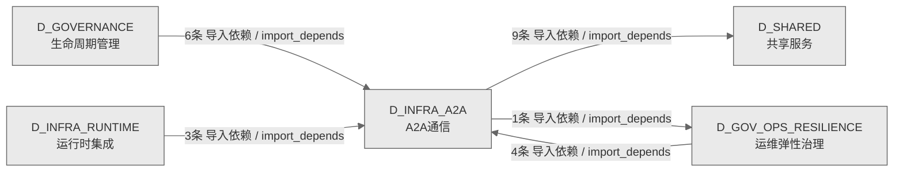

# 03_d_infra_a2a / A2A通信域 / A2A Communication

> **功能简介 / Overview**: Agent 与 Agent 之间的通信协议层，负责 AI 代理间的消息传递、请求路由和协议适配

> **文档作用 / Purpose**: 展示 A2A通信（D_INFRA_A2A）功能域的域内依赖关系、跨域依赖关系，模块信息（成熟度/中英文名/大白话/文件路径）内嵌于 Mermaid 节点，供架构审查和域治理参考。

> 本文档由 generate_domain_doc.py 从 depgraph (PostgreSQL) 自动生成
> 数据源: depgraph (PostgreSQL) nodes表 + edges表

> **[可缩放 HTML 版 / Zoomable HTML](http://localhost:8765/docs/02_enterprise_architecture/02_domain_architecture_docs/_zoomable_html/03_d_infra_a2a.html)** — Ctrl+滚轮缩放 ｜ 双击重置 ｜ Ctrl+Shift+D 切换拖动/选择模式

## 域基本信息 / Domain Overview

| 字段 | 值 | Field | Value |
|------|------|-------|-------|
| 编号 | 03 | Number | 03 |
| 域ID | D_INFRA_A2A | Domain ID | D_INFRA_A2A |
| 域名称 | A2A通信 | Domain Name | A2A Communication |
| 层级 | L0 基础设施层 | Layer | L0 Infrastructure |
| 模块数 | 72 | Module Count | 72 |
| 域内依赖 | 42 | Internal Dependencies | 42 |
| 跨域入边 | 13 | Cross-domain Incoming | 13 |
| 跨域出边 | 10 | Cross-domain Outgoing | 10 |
| 设计态模块 | 0 | Design Modules | 0 |
| 生产态模块 | 72 | Production Modules | 72 |
| 容量 | 72/150 (正常) | Capacity | 72/150 (正常) |
| 描述 | A2A Card注册与发现(card_registry) | Description | A2A Card注册与发现(card_registry) |

## 域内依赖图 / Internal Dependency Diagram

> 依赖图内嵌在本文档中，IDE 可直接渲染；网页版可 Ctrl+滚轮缩放 + 拖动平移查看细节。
>
> **图例说明 / Legend**：
> - 🟦 **蓝色 = 运营态模块**（production，已上线运行）
> - 🟧 **橙色虚线 = 设计态模块**（design，蓝图阶段，代码未写）
> - **实线箭头 = 运营态依赖**（已生效的依赖关系）
> - **虚线箭头 = 非运营态依赖**（计划中/验证中的依赖关系）

### 全景图（全部模块，颜色区分运营态/设计态）

> 展示全部 72 个模块（生产态 72 + 设计态 0），含跨域依赖外部节点。节点含成熟度+名称+大白话/简介+文件路径。

```mermaid
%%{init: {'theme': 'base', 'themeVariables': {'primaryColor': '#eaeaea', 'primaryTextColor': '#333333', 'primaryBorderColor': '#666666', 'lineColor': '#666666', 'secondaryColor': '#eaeaea', 'tertiaryColor': '#eaeaea', 'fontSize': '14px'}}}%%
flowchart TD
    src_zephyr_infrastructure_a2a_protocol_a2a_card_registry_py["A2Acard注册表<br/>A2A Card Registry — 全局 Agent Card 注册单例<br/>a2a_card_registry<br/>文件: a2a_protocol/a2a_card_registry.py<br/>(生产态 / production)"]
    src_zephyr_infrastructure_a2a_protocol_layer2_communication_context_package_py["上下文包<br/>Context Package — A2A 上下文包<br/>context_package<br/>文件: layer2_communication/context_package.py<br/>(生产态 / production)"]
    src_zephyr_infrastructure_a2a_protocol_layer2_communication_handoff_manager_py["handoff管理器<br/>Handoff Manager — Agent 间任务交接<br/>handoff_manager<br/>文件: layer2_communication/handoff_manager.py<br/>(生产态 / production)"]
    src_zephyr_infrastructure_a2a_protocol_layer2_communication_message_router_py["message路由器<br/>Message Router — A2A 消息路由<br/>message_router<br/>文件: layer2_communication/message_router.py<br/>(生产态 / production)"]
    src_zephyr_infrastructure_a2a_protocol_layer2_communication_push_notifier_py["push通知器<br/>Push Notifier — A2A 推送通知<br/>push_notifier<br/>文件: layer2_communication/push_notifier.py<br/>(生产态 / production)"]
    src_zephyr_infrastructure_a2a_protocol_layer2_communication_streaming_py["流式<br/>Streaming — A2A 流式传输<br/>文件: layer2_communication/streaming.py<br/>(生产态 / production)"]
    src_zephyr_infrastructure_a2a_protocol_layer2_communication_trigger_monitor_py["触发监控器<br/>layer2 communication包的触发监控器模块<br/>trigger_monitor<br/>文件: layer2_communication/trigger_monitor.py<br/>(生产态 / production)"]
    src_zephyr_infrastructure_a2a_protocol_layer3_coordination_consensus_py["共识<br/>共识。Re-export bridge for layer3_coordination<br/>consensus symbols.<br/>文件: layer3_coordination/_consensus.py<br/>(生产态 / production)"]
    src_zephyr_infrastructure_a2a_protocol_layer3_coordination_core_coordination_py["核心coordination<br/>核心coordination。Re-export bridge for layer3_<br/>coordination core coordination symbols.<br/>文件: layer3_coordination/_core_coordination.py<br/>(生产态 / production)"]
    src_zephyr_infrastructure_a2a_protocol_layer3_coordination_intelligence_py["智能<br/>智能。Re-export bridge for layer3_coordination<br/>intelligence symbols.<br/>文件: layer3_coordination/_intelligence.py<br/>(生产态 / production)"]
    src_zephyr_infrastructure_a2a_protocol_layer3_coordination_security_and_economics_py["安全andeconomics<br/>安全andeconomics。Re-export bridge for layer3_<br/>coordination security and economics symbols.<br/>文件: layer3_coordination/_security_and_<br/>economics.py<br/>(生产态 / production)"]
    src_zephyr_infrastructure_a2a_protocol_layer3_coordination_a2a_agent_blocklist_py["A2A代理blocklist<br/>A2A Agent 黑名单管理（重命名自 a2a_protocol_<br/>security.py，AI-14 审计 P5 修复）<br/>a2a_agent_blocklist<br/>文件: layer3_coordination/a2a_agent_blocklist.py<br/>(生产态 / production)"]
    src_zephyr_infrastructure_a2a_protocol_layer3_coordination_a2a_carbon_py["A2A 碳足迹追踪<br/>layer3 coordination包的A2A 碳足迹追踪模块<br/>a2a_carbon<br/>文件: layer3_coordination/a2a_carbon.py<br/>(生产态 / production)"]
    src_zephyr_infrastructure_a2a_protocol_layer3_coordination_a2a_checkpoint_py["A2A 检查点管理器<br/>layer3 coordination包的A2A 检查点管理器模块<br/>a2a_checkpoint<br/>文件: layer3_coordination/a2a_checkpoint.py<br/>(生产态 / production)"]
    src_zephyr_infrastructure_a2a_protocol_layer3_coordination_a2a_consent_py["P2: Agent同意管理<br/>layer3 coordination包的P2: Agent同意管理模块<br/>a2a_consent<br/>文件: layer3_coordination/a2a_consent.py<br/>(生产态 / production)"]
    src_zephyr_infrastructure_a2a_protocol_layer3_coordination_a2a_constitutional_py["P2: 宪法性Agent管理<br/>layer3 coordination包的P2: 宪法性Agent管理模块<br/>a2a_constitutional<br/>文件: layer3_coordination/a2a_constitutional.py<br/>(生产态 / production)"]
    src_zephyr_infrastructure_a2a_protocol_layer3_coordination_a2a_context_rot_py["上下文腐烂检测<br/>layer3 coordination包的上下文腐烂检测模块<br/>a2a_context_rot<br/>文件: layer3_coordination/a2a_context_rot.py<br/>(生产态 / production)"]
    src_zephyr_infrastructure_a2a_protocol_layer3_coordination_a2a_dashboard_py["A2A仪表盘<br/>A2A 监控仪表盘 — Agent 集群运行状态可视化面板<br/>a2a_dashboard<br/>文件: layer3_coordination/a2a_dashboard.py<br/>(生产态 / production)"]
    src_zephyr_infrastructure_a2a_protocol_layer3_coordination_a2a_formal_verification_py["A2A 形式化验证 — 协议属性模型检查<br/>a2a_formal_verification<br/>文件: layer3_coordination/a2a_formal_<br/>verification.py<br/>(生产态 / production)"]
    src_zephyr_infrastructure_a2a_protocol_layer3_coordination_a2a_frame_negotiation_py["A2A帧negotiation<br/>A2A ANP 帧协商协议 — Agent Negotiation Protocol<br/>帧层协商<br/>a2a_frame_negotiation<br/>文件: layer3_coordination/a2a_frame_<br/>negotiation.py<br/>(生产态 / production)"]
    src_zephyr_infrastructure_a2a_protocol_layer3_coordination_a2a_hardware_router_py["A2A 硬件路由器——GPU/CPU 调度<br/>a2a_hardware_router<br/>文件: layer3_coordination/a2a_hardware_router.py<br/>(生产态 / production)"]
    src_zephyr_infrastructure_a2a_protocol_layer3_coordination_a2a_hibernate_py["P2: Agent休眠管理<br/>layer3 coordination包的P2: Agent休眠管理模块<br/>a2a_hibernate<br/>文件: layer3_coordination/a2a_hibernate.py<br/>(生产态 / production)"]
    src_zephyr_infrastructure_a2a_protocol_layer3_coordination_a2a_immune_py["A2A 免疫系统<br/>layer3 coordination包的A2A 免疫系统模块<br/>a2a_immune<br/>文件: layer3_coordination/a2a_immune.py<br/>(生产态 / production)"]
    src_zephyr_infrastructure_a2a_protocol_layer3_coordination_a2a_metrics_py["A2A 指标收集<br/>layer3 coordination包的A2A 指标收集模块<br/>a2a_metrics<br/>文件: layer3_coordination/a2a_metrics.py<br/>(生产态 / production)"]
    src_zephyr_infrastructure_a2a_protocol_layer3_coordination_a2a_protocol_gateway_py["A2A协议网关<br/>A2A 协议网关 — Agent 间请求分发与协议转换<br/>a2a_protocol_gateway<br/>文件: layer3_coordination/a2a_protocol_<br/>gateway.py<br/>(生产态 / production)"]
    src_zephyr_infrastructure_a2a_protocol_layer3_coordination_a2a_tracing_py["A2A 分布式追踪 — 跨 Agent 请求链追踪<br/>(Span-based)<br/>a2a_tracing<br/>文件: layer3_coordination/a2a_tracing.py<br/>(生产态 / production)"]
    src_zephyr_infrastructure_a2a_protocol_layer3_coordination_a2a_vector_reputation_py["向量化信誉系统<br/>layer3 coordination包的向量化信誉系统模块<br/>a2a_vector_reputation<br/>文件: layer3_coordination/a2a_vector_<br/>reputation.py<br/>(生产态 / production)"]
    src_zephyr_infrastructure_a2a_protocol_layer3_coordination_spec_sync_py["spec同步<br/>A2A Living Spec 同步 — 蓝图与实现的双向漂移管理<br/>spec_sync<br/>文件: layer3_coordination/spec_sync.py<br/>(生产态 / production)"]
    src_zephyr_infrastructure_a2a_protocol_local_first_arch_py["本地首架构<br/>基础设施/a2a_protocol包的本地首架构模块<br/>local_first_arch<br/>文件: a2a_protocol/local_first_arch.py<br/>(生产态 / production)"]
    src_zephyr_infrastructure_a2a_protocol_migration_strategy_py["迁移策略<br/>基础设施/a2a_protocol包的迁移策略模块<br/>migration_strategy<br/>文件: a2a_protocol/migration_strategy.py<br/>(生产态 / production)"]
    src_zephyr_infrastructure_a2a_protocol_multi_agent_py["多代理<br/>— Multi-Agent 编排基座（Phase 14 / 盲点 B33）<br/>multi_agent<br/>文件: a2a_protocol/multi_agent.py<br/>(生产态 / production)"]
    src_zephyr_infrastructure_a2a_protocol_multi_model_consensus_py["多模型共识<br/>多模型共识，基础设施的模型，定义数据结构和字段。<br/>multi_model_consensus<br/>文件: a2a_protocol/multi_model_consensus.py<br/>(生产态 / production)"]
    src_zephyr_infrastructure_a2a_protocol_offline_autonomy_py["离线autonomy<br/>基础设施/a2a_protocol包的离线autonomy模块<br/>offline_autonomy<br/>文件: a2a_protocol/offline_autonomy.py<br/>(生产态 / production)"]
    src_zephyr_infrastructure_a2a_protocol_offline_resilience_py["离线韧性<br/>基础设施/a2a_protocol包的离线韧性模块<br/>offline_resilience<br/>文件: a2a_protocol/offline_resilience.py<br/>(生产态 / production)"]
    src_zephyr_infrastructure_a2a_protocol_phase_hold_py["阶段hold<br/>基础设施/a2a_protocol包的阶段hold模块<br/>phase_hold<br/>文件: a2a_protocol/phase_hold.py<br/>(生产态 / production)"]
    src_zephyr_infrastructure_a2a_protocol_prompt_lifecycle_py["提示生命周期<br/>基础设施/a2a_protocol包的提示生命周期模块<br/>prompt_lifecycle<br/>文件: a2a_protocol/prompt_lifecycle.py<br/>(生产态 / production)"]
    src_zephyr_infrastructure_a2a_protocol_realtime_streaming_py["实时流式<br/>基础设施/a2a_protocol包的实时流式模块<br/>realtime_streaming<br/>文件: a2a_protocol/realtime_streaming.py<br/>(生产态 / production)"]
    src_zephyr_infrastructure_a2a_protocol_a2a_card_registry_py ~~~ src_zephyr_infrastructure_a2a_protocol_layer2_communication_context_package_py
    src_zephyr_infrastructure_a2a_protocol_layer2_communication_context_package_py ~~~ src_zephyr_infrastructure_a2a_protocol_layer2_communication_handoff_manager_py
    src_zephyr_infrastructure_a2a_protocol_layer2_communication_handoff_manager_py ~~~ src_zephyr_infrastructure_a2a_protocol_layer2_communication_message_router_py
    src_zephyr_infrastructure_a2a_protocol_layer2_communication_message_router_py ~~~ src_zephyr_infrastructure_a2a_protocol_layer2_communication_push_notifier_py
    src_zephyr_infrastructure_a2a_protocol_layer2_communication_push_notifier_py ~~~ src_zephyr_infrastructure_a2a_protocol_layer2_communication_streaming_py
    src_zephyr_infrastructure_a2a_protocol_layer2_communication_streaming_py ~~~ src_zephyr_infrastructure_a2a_protocol_layer2_communication_trigger_monitor_py
    src_zephyr_infrastructure_a2a_protocol_layer2_communication_trigger_monitor_py ~~~ src_zephyr_infrastructure_a2a_protocol_layer3_coordination_consensus_py
    src_zephyr_infrastructure_a2a_protocol_layer3_coordination_consensus_py ~~~ src_zephyr_infrastructure_a2a_protocol_layer3_coordination_core_coordination_py
    src_zephyr_infrastructure_a2a_protocol_layer3_coordination_core_coordination_py ~~~ src_zephyr_infrastructure_a2a_protocol_layer3_coordination_intelligence_py
    src_zephyr_infrastructure_a2a_protocol_layer3_coordination_intelligence_py ~~~ src_zephyr_infrastructure_a2a_protocol_layer3_coordination_security_and_economics_py
    src_zephyr_infrastructure_a2a_protocol_layer3_coordination_security_and_economics_py ~~~ src_zephyr_infrastructure_a2a_protocol_layer3_coordination_a2a_agent_blocklist_py
    src_zephyr_infrastructure_a2a_protocol_layer3_coordination_a2a_agent_blocklist_py ~~~ src_zephyr_infrastructure_a2a_protocol_layer3_coordination_a2a_carbon_py
    src_zephyr_infrastructure_a2a_protocol_layer3_coordination_a2a_carbon_py ~~~ src_zephyr_infrastructure_a2a_protocol_layer3_coordination_a2a_checkpoint_py
    src_zephyr_infrastructure_a2a_protocol_layer3_coordination_a2a_checkpoint_py ~~~ src_zephyr_infrastructure_a2a_protocol_layer3_coordination_a2a_consent_py
    src_zephyr_infrastructure_a2a_protocol_layer3_coordination_a2a_consent_py ~~~ src_zephyr_infrastructure_a2a_protocol_layer3_coordination_a2a_constitutional_py
    src_zephyr_infrastructure_a2a_protocol_layer3_coordination_a2a_constitutional_py ~~~ src_zephyr_infrastructure_a2a_protocol_layer3_coordination_a2a_context_rot_py
    src_zephyr_infrastructure_a2a_protocol_layer3_coordination_a2a_context_rot_py ~~~ src_zephyr_infrastructure_a2a_protocol_layer3_coordination_a2a_dashboard_py
    src_zephyr_infrastructure_a2a_protocol_layer3_coordination_a2a_dashboard_py ~~~ src_zephyr_infrastructure_a2a_protocol_layer3_coordination_a2a_formal_verification_py
    src_zephyr_infrastructure_a2a_protocol_layer3_coordination_a2a_formal_verification_py ~~~ src_zephyr_infrastructure_a2a_protocol_layer3_coordination_a2a_frame_negotiation_py
    src_zephyr_infrastructure_a2a_protocol_layer3_coordination_a2a_frame_negotiation_py ~~~ src_zephyr_infrastructure_a2a_protocol_layer3_coordination_a2a_hardware_router_py
    src_zephyr_infrastructure_a2a_protocol_layer3_coordination_a2a_hardware_router_py ~~~ src_zephyr_infrastructure_a2a_protocol_layer3_coordination_a2a_hibernate_py
    src_zephyr_infrastructure_a2a_protocol_layer3_coordination_a2a_hibernate_py ~~~ src_zephyr_infrastructure_a2a_protocol_layer3_coordination_a2a_immune_py
    src_zephyr_infrastructure_a2a_protocol_layer3_coordination_a2a_immune_py ~~~ src_zephyr_infrastructure_a2a_protocol_layer3_coordination_a2a_metrics_py
    src_zephyr_infrastructure_a2a_protocol_layer3_coordination_a2a_metrics_py ~~~ src_zephyr_infrastructure_a2a_protocol_layer3_coordination_a2a_protocol_gateway_py
    src_zephyr_infrastructure_a2a_protocol_layer3_coordination_a2a_protocol_gateway_py ~~~ src_zephyr_infrastructure_a2a_protocol_layer3_coordination_a2a_tracing_py
    src_zephyr_infrastructure_a2a_protocol_layer3_coordination_a2a_tracing_py ~~~ src_zephyr_infrastructure_a2a_protocol_layer3_coordination_a2a_vector_reputation_py
    src_zephyr_infrastructure_a2a_protocol_layer3_coordination_a2a_vector_reputation_py ~~~ src_zephyr_infrastructure_a2a_protocol_layer3_coordination_spec_sync_py
    src_zephyr_infrastructure_a2a_protocol_layer3_coordination_spec_sync_py ~~~ src_zephyr_infrastructure_a2a_protocol_local_first_arch_py
    src_zephyr_infrastructure_a2a_protocol_local_first_arch_py ~~~ src_zephyr_infrastructure_a2a_protocol_migration_strategy_py
    src_zephyr_infrastructure_a2a_protocol_migration_strategy_py ~~~ src_zephyr_infrastructure_a2a_protocol_multi_agent_py
    src_zephyr_infrastructure_a2a_protocol_multi_agent_py ~~~ src_zephyr_infrastructure_a2a_protocol_multi_model_consensus_py
    src_zephyr_infrastructure_a2a_protocol_multi_model_consensus_py ~~~ src_zephyr_infrastructure_a2a_protocol_offline_autonomy_py
    src_zephyr_infrastructure_a2a_protocol_offline_autonomy_py ~~~ src_zephyr_infrastructure_a2a_protocol_offline_resilience_py
    src_zephyr_infrastructure_a2a_protocol_offline_resilience_py ~~~ src_zephyr_infrastructure_a2a_protocol_phase_hold_py
    src_zephyr_infrastructure_a2a_protocol_phase_hold_py ~~~ src_zephyr_infrastructure_a2a_protocol_prompt_lifecycle_py
    src_zephyr_infrastructure_a2a_protocol_prompt_lifecycle_py ~~~ src_zephyr_infrastructure_a2a_protocol_realtime_streaming_py
    src_zephyr_infrastructure_a2a_protocol_layer2_communication_a2a_schemas_py["A2A模式<br/>A2A Message/Part 系统 — Layer 2 Communication<br/>a2a_schemas<br/>文件: layer2_communication/a2a_schemas.py<br/>(生产态 / production)"]
    src_zephyr_infrastructure_a2a_protocol_layer3_coordination_a2a_anomaly_detector_py["A2A 统计异常检测引擎 — 基线学习 + 实时异常判断<br/>a2a_anomaly_detector<br/>文件: layer3_coordination/a2a_anomaly_<br/>detector.py<br/>(生产态 / production)"]
    src_zephyr_infrastructure_a2a_protocol_layer3_coordination_a2a_behavior_fingerprint_py["A2A行为指纹<br/>A2A 行为指纹 — Agent 行为模式学习与画像<br/>a2a_behavior_fingerprint<br/>文件: layer3_coordination/a2a_behavior_<br/>fingerprint.py<br/>(生产态 / production)"]
    src_zephyr_infrastructure_a2a_protocol_layer3_coordination_a2a_blame_attribution_py["A2A 责任归属引擎 — 因果链分析 + 责任分配<br/>a2a_blame_attribution<br/>文件: layer3_coordination/a2a_blame_<br/>attribution.py<br/>(生产态 / production)"]
    src_zephyr_infrastructure_a2a_protocol_layer3_coordination_a2a_causal_trace_py["A2Acausal追踪<br/>A2A 因果追踪 — 跨 Agent 操作因果链图谱<br/>a2a_causal_trace<br/>文件: layer3_coordination/a2a_causal_trace.py<br/>(生产态 / production)"]
    src_zephyr_infrastructure_a2a_protocol_layer3_coordination_a2a_collusion_detector_py["A2Acollusion检测器<br/>A2A 合谋检测器 — Agent 间串通模式识别<br/>a2a_collusion_detector<br/>文件: layer3_coordination/a2a_collusion_<br/>detector.py<br/>(生产态 / production)"]
    src_zephyr_infrastructure_a2a_protocol_layer3_coordination_a2a_cross_agent_semantic_flow_py["A2A跨代理semantic流程<br/>A2A 跨 Agent 语义流追踪 — 知识+意图在 Agent<br/>间传递<br/>a2a_cross_agent_semantic_flow<br/>文件: layer3_coordination/a2a_cross_agent_<br/>semantic_flow.py<br/>(生产态 / production)"]
    src_zephyr_infrastructure_a2a_protocol_layer3_coordination_a2a_debate_py["A2A 结构化辩论协议 — 多轮主张->反驳->合成<br/>a2a_debate<br/>文件: layer3_coordination/a2a_debate.py<br/>(生产态 / production)"]
    src_zephyr_infrastructure_a2a_protocol_layer3_coordination_a2a_economics_py["A2A 经济学——Token/API成本追踪<br/>a2a_economics<br/>文件: layer3_coordination/a2a_economics.py<br/>(生产态 / production)"]
    src_zephyr_infrastructure_a2a_protocol_layer3_coordination_a2a_forgetting_py["A2A 遗忘机制<br/>layer3 coordination包的A2A 遗忘机制模块<br/>a2a_forgetting<br/>文件: layer3_coordination/a2a_forgetting.py<br/>(生产态 / production)"]
    src_zephyr_infrastructure_a2a_protocol_layer3_coordination_a2a_idempotency_py["A2A 幂等性保证<br/>layer3 coordination包的A2A 幂等性保证模块<br/>a2a_idempotency<br/>文件: layer3_coordination/a2a_idempotency.py<br/>(生产态 / production)"]
    src_zephyr_infrastructure_a2a_protocol_layer3_coordination_a2a_idle_guard_py["A2A 空闲守卫<br/>layer3 coordination包的A2A 空闲守卫模块<br/>a2a_idle_guard<br/>文件: layer3_coordination/a2a_idle_guard.py<br/>(生产态 / production)"]
    src_zephyr_infrastructure_a2a_protocol_layer3_coordination_a2a_knowledge_distill_py["A2A知识distill<br/>A2A 知识蒸馏 — 跨 Agent 经验提炼与共享<br/>a2a_knowledge_distill<br/>文件: layer3_coordination/a2a_knowledge_<br/>distill.py<br/>(生产态 / production)"]
    src_zephyr_infrastructure_a2a_protocol_layer3_coordination_a2a_latent_comm_py["A2A 隐性通信检测 — 检测 Agent 通过副作用隐式通信<br/>a2a_latent_comm<br/>文件: layer3_coordination/a2a_latent_comm.py<br/>(生产态 / production)"]
    src_zephyr_infrastructure_a2a_protocol_layer3_coordination_a2a_negotiation_py["A2A 协商协议 — Agent 间资源/任务分配协商<br/>a2a_negotiation<br/>文件: layer3_coordination/a2a_negotiation.py<br/>(生产态 / production)"]
    src_zephyr_infrastructure_a2a_protocol_layer3_coordination_a2a_red_team_py["A2A 红队测试 — 攻击向量定义与执行框架<br/>a2a_red_team<br/>文件: layer3_coordination/a2a_red_team.py<br/>(生产态 / production)"]
    src_zephyr_infrastructure_a2a_protocol_layer3_coordination_a2a_saga_py["A2A Saga 事务协议 — 多 Agent 跨步分布式事务<br/>a2a_saga<br/>文件: layer3_coordination/a2a_saga.py<br/>(生产态 / production)"]
    src_zephyr_infrastructure_a2a_protocol_layer3_coordination_a2a_temporal_admission_py["时序准入控制<br/>layer3 coordination包的时序准入控制模块<br/>a2a_temporal_admission<br/>文件: layer3_coordination/a2a_temporal_<br/>admission.py<br/>(生产态 / production)"]
    src_zephyr_infrastructure_a2a_protocol_layer3_coordination_a2a_voting_py["A2A 加权投票协议 — 多 Agent 共识达成机制<br/>a2a_voting<br/>文件: layer3_coordination/a2a_voting.py<br/>(生产态 / production)"]
    src_zephyr_infrastructure_a2a_protocol_layer3_coordination_a2a_work_steal_py["A2A 工作窃取调度器 — 跨 Agent 负载均衡<br/>a2a_work_steal<br/>文件: layer3_coordination/a2a_work_steal.py<br/>(生产态 / production)"]
    src_zephyr_infrastructure_a2a_protocol_layer3_coordination_arbitrator_py["仲裁器<br/>A2A 三级仲裁引擎 — priority -> rule -><br/>escalation<br/>arbitrator<br/>文件: layer3_coordination/arbitrator.py<br/>(生产态 / production)"]
    src_zephyr_infrastructure_a2a_protocol_layer3_coordination_cascade_guard_py["级联守卫<br/>级联守卫——防止失败在Agent间级联<br/>cascade_guard<br/>文件: layer3_coordination/cascade_guard.py<br/>(生产态 / production)"]
    src_zephyr_infrastructure_a2a_protocol_layer3_coordination_conflict_detector_py["A2A 冲突检测引擎 — 语义+文本+资源三维冲突检测<br/>conflict_detector<br/>文件: layer3_coordination/conflict_detector.py<br/>(生产态 / production)"]
    src_zephyr_infrastructure_a2a_protocol_layer3_coordination_construction_verifier_py["施工后验证器 —<br/>自指悖论防御：不橡胶图章，真正验证 A2A<br/>协议模块的施工完整<br/>construction_verifier<br/>文件: layer3_coordination/construction_<br/>verifier.py<br/>(生产态 / production)"]
    src_zephyr_infrastructure_a2a_protocol_layer3_coordination_deadlock_guard_py["P2: 死锁守卫<br/>layer3 coordination包的P2: 死锁守卫模块<br/>deadlock_guard<br/>文件: layer3_coordination/deadlock_guard.py<br/>(生产态 / production)"]
    src_zephyr_infrastructure_a2a_protocol_layer3_coordination_livelock_detector_py["P2: 活锁检测器<br/>layer3 coordination包的P2: 活锁检测器模块<br/>livelock_detector<br/>文件: layer3_coordination/livelock_detector.py<br/>(生产态 / production)"]
    src_zephyr_infrastructure_a2a_protocol_layer3_coordination_semantic_diff_py["semantic差异<br/>A2A 语义差异引擎 — 结构感知的 Agent 间差异检测<br/>semantic_diff<br/>文件: layer3_coordination/semantic_diff.py<br/>(生产态 / production)"]
    src_zephyr_infrastructure_a2a_protocol_layer2_communication_a2a_schemas_py ~~~ src_zephyr_infrastructure_a2a_protocol_layer3_coordination_a2a_anomaly_detector_py
    src_zephyr_infrastructure_a2a_protocol_layer3_coordination_a2a_anomaly_detector_py ~~~ src_zephyr_infrastructure_a2a_protocol_layer3_coordination_a2a_behavior_fingerprint_py
    src_zephyr_infrastructure_a2a_protocol_layer3_coordination_a2a_behavior_fingerprint_py ~~~ src_zephyr_infrastructure_a2a_protocol_layer3_coordination_a2a_blame_attribution_py
    src_zephyr_infrastructure_a2a_protocol_layer3_coordination_a2a_blame_attribution_py ~~~ src_zephyr_infrastructure_a2a_protocol_layer3_coordination_a2a_causal_trace_py
    src_zephyr_infrastructure_a2a_protocol_layer3_coordination_a2a_causal_trace_py ~~~ src_zephyr_infrastructure_a2a_protocol_layer3_coordination_a2a_collusion_detector_py
    src_zephyr_infrastructure_a2a_protocol_layer3_coordination_a2a_collusion_detector_py ~~~ src_zephyr_infrastructure_a2a_protocol_layer3_coordination_a2a_cross_agent_semantic_flow_py
    src_zephyr_infrastructure_a2a_protocol_layer3_coordination_a2a_cross_agent_semantic_flow_py ~~~ src_zephyr_infrastructure_a2a_protocol_layer3_coordination_a2a_debate_py
    src_zephyr_infrastructure_a2a_protocol_layer3_coordination_a2a_debate_py ~~~ src_zephyr_infrastructure_a2a_protocol_layer3_coordination_a2a_economics_py
    src_zephyr_infrastructure_a2a_protocol_layer3_coordination_a2a_economics_py ~~~ src_zephyr_infrastructure_a2a_protocol_layer3_coordination_a2a_forgetting_py
    src_zephyr_infrastructure_a2a_protocol_layer3_coordination_a2a_forgetting_py ~~~ src_zephyr_infrastructure_a2a_protocol_layer3_coordination_a2a_idempotency_py
    src_zephyr_infrastructure_a2a_protocol_layer3_coordination_a2a_idempotency_py ~~~ src_zephyr_infrastructure_a2a_protocol_layer3_coordination_a2a_idle_guard_py
    src_zephyr_infrastructure_a2a_protocol_layer3_coordination_a2a_idle_guard_py ~~~ src_zephyr_infrastructure_a2a_protocol_layer3_coordination_a2a_knowledge_distill_py
    src_zephyr_infrastructure_a2a_protocol_layer3_coordination_a2a_knowledge_distill_py ~~~ src_zephyr_infrastructure_a2a_protocol_layer3_coordination_a2a_latent_comm_py
    src_zephyr_infrastructure_a2a_protocol_layer3_coordination_a2a_latent_comm_py ~~~ src_zephyr_infrastructure_a2a_protocol_layer3_coordination_a2a_negotiation_py
    src_zephyr_infrastructure_a2a_protocol_layer3_coordination_a2a_negotiation_py ~~~ src_zephyr_infrastructure_a2a_protocol_layer3_coordination_a2a_red_team_py
    src_zephyr_infrastructure_a2a_protocol_layer3_coordination_a2a_red_team_py ~~~ src_zephyr_infrastructure_a2a_protocol_layer3_coordination_a2a_saga_py
    src_zephyr_infrastructure_a2a_protocol_layer3_coordination_a2a_saga_py ~~~ src_zephyr_infrastructure_a2a_protocol_layer3_coordination_a2a_temporal_admission_py
    src_zephyr_infrastructure_a2a_protocol_layer3_coordination_a2a_temporal_admission_py ~~~ src_zephyr_infrastructure_a2a_protocol_layer3_coordination_a2a_voting_py
    src_zephyr_infrastructure_a2a_protocol_layer3_coordination_a2a_voting_py ~~~ src_zephyr_infrastructure_a2a_protocol_layer3_coordination_a2a_work_steal_py
    src_zephyr_infrastructure_a2a_protocol_layer3_coordination_a2a_work_steal_py ~~~ src_zephyr_infrastructure_a2a_protocol_layer3_coordination_arbitrator_py
    src_zephyr_infrastructure_a2a_protocol_layer3_coordination_arbitrator_py ~~~ src_zephyr_infrastructure_a2a_protocol_layer3_coordination_cascade_guard_py
    src_zephyr_infrastructure_a2a_protocol_layer3_coordination_cascade_guard_py ~~~ src_zephyr_infrastructure_a2a_protocol_layer3_coordination_conflict_detector_py
    src_zephyr_infrastructure_a2a_protocol_layer3_coordination_conflict_detector_py ~~~ src_zephyr_infrastructure_a2a_protocol_layer3_coordination_construction_verifier_py
    src_zephyr_infrastructure_a2a_protocol_layer3_coordination_construction_verifier_py ~~~ src_zephyr_infrastructure_a2a_protocol_layer3_coordination_deadlock_guard_py
    src_zephyr_infrastructure_a2a_protocol_layer3_coordination_deadlock_guard_py ~~~ src_zephyr_infrastructure_a2a_protocol_layer3_coordination_livelock_detector_py
    src_zephyr_infrastructure_a2a_protocol_layer3_coordination_livelock_detector_py ~~~ src_zephyr_infrastructure_a2a_protocol_layer3_coordination_semantic_diff_py
    src_zephyr_infrastructure_a2a_protocol_layer1_discovery_a2a_registry_py["A2A注册表<br/>A2A Registry — Agent Card 注册与发现<br/>a2a_registry<br/>文件: layer1_discovery/a2a_registry.py<br/>(生产态 / production)"]
    src_zephyr_infrastructure_a2a_protocol_layer1_discovery_identity_verifier_py["identity验证器<br/>Identity Verifier — JWT 身份验证器<br/>identity_verifier<br/>文件: layer1_discovery/identity_verifier.py<br/>(生产态 / production)"]
    src_zephyr_infrastructure_a2a_protocol_layer3_coordination_a2a_delegation_chain_py["委托链<br/>layer3 coordination包的委托链模块<br/>a2a_delegation_chain<br/>文件: layer3_coordination/a2a_delegation_<br/>chain.py<br/>(生产态 / production)"]
    src_zephyr_infrastructure_a2a_protocol_layer3_coordination_a2a_security_py["A2A 安全内容扫描器 — 六大类威胁检测<br/>a2a_security<br/>文件: layer3_coordination/a2a_security.py<br/>(生产态 / production)"]
    src_zephyr_infrastructure_a2a_protocol_layer3_coordination_session_smuggling_defense_py["会话smuggling防御<br/>A2A Session 走私防御 — 防止跨 Agent session<br/>上下文伪造<br/>session_smuggling_defense<br/>文件: layer3_coordination/session_smuggling_<br/>defense.py<br/>(生产态 / production)"]
    src_zephyr_infrastructure_a2a_protocol_layer3_coordination_supervisor_py["监督器<br/>监督者——任务分配、死锁检测、超时管理<br/>Supervisor — A2A Layer 3 Coordination<br/>文件: layer3_coordination/supervisor.py<br/>(生产态 / production)"]
    src_zephyr_infrastructure_a2a_protocol_layer1_discovery_a2a_registry_py ~~~ src_zephyr_infrastructure_a2a_protocol_layer1_discovery_identity_verifier_py
    src_zephyr_infrastructure_a2a_protocol_layer1_discovery_identity_verifier_py ~~~ src_zephyr_infrastructure_a2a_protocol_layer3_coordination_a2a_delegation_chain_py
    src_zephyr_infrastructure_a2a_protocol_layer3_coordination_a2a_delegation_chain_py ~~~ src_zephyr_infrastructure_a2a_protocol_layer3_coordination_a2a_security_py
    src_zephyr_infrastructure_a2a_protocol_layer3_coordination_a2a_security_py ~~~ src_zephyr_infrastructure_a2a_protocol_layer3_coordination_session_smuggling_defense_py
    src_zephyr_infrastructure_a2a_protocol_layer3_coordination_session_smuggling_defense_py ~~~ src_zephyr_infrastructure_a2a_protocol_layer3_coordination_supervisor_py
    src_zephyr_infrastructure_a2a_protocol_layer1_discovery_agent_card_py["代理card<br/>Agent Card 模型 — A2A Layer 1 Discovery<br/>agent_card<br/>文件: layer1_discovery/agent_card.py<br/>(生产态 / production)"]
    src_zephyr_infrastructure_a2a_protocol_layer2_communication_a2a_state_py["A2A状态<br/>A2A Task 状态机 — Layer 2 Communication<br/>a2a_state<br/>文件: layer2_communication/a2a_state.py<br/>(生产态 / production)"]
    src_zephyr_infrastructure_a2a_protocol_layer1_discovery_agent_card_py ~~~ src_zephyr_infrastructure_a2a_protocol_layer2_communication_a2a_state_py
    src_zephyr_infrastructure_a2a_protocol_a2a_card_registry_py -->|导入依赖 / import_depends| src_zephyr_infrastructure_a2a_protocol_layer1_discovery_a2a_registry_py
    src_zephyr_infrastructure_a2a_protocol_layer1_discovery_a2a_registry_py -->|导入依赖 / import_depends| src_zephyr_infrastructure_a2a_protocol_layer1_discovery_agent_card_py
    src_zephyr_infrastructure_a2a_protocol_layer2_communication_message_router_py -->|导入依赖 / import_depends| src_zephyr_infrastructure_a2a_protocol_layer2_communication_a2a_schemas_py
    src_zephyr_infrastructure_a2a_protocol_layer3_coordination_a2a_red_team_py -->|导入依赖 / import_depends| src_zephyr_infrastructure_a2a_protocol_layer1_discovery_a2a_registry_py
    src_zephyr_infrastructure_a2a_protocol_layer3_coordination_a2a_red_team_py -->|导入依赖 / import_depends| src_zephyr_infrastructure_a2a_protocol_layer1_discovery_agent_card_py
    src_zephyr_infrastructure_a2a_protocol_layer3_coordination_a2a_red_team_py -->|导入依赖 / import_depends| src_zephyr_infrastructure_a2a_protocol_layer1_discovery_identity_verifier_py
    src_zephyr_infrastructure_a2a_protocol_layer3_coordination_a2a_red_team_py -->|导入依赖 / import_depends| src_zephyr_infrastructure_a2a_protocol_layer2_communication_a2a_state_py
    src_zephyr_infrastructure_a2a_protocol_layer3_coordination_a2a_red_team_py -->|导入依赖 / import_depends| src_zephyr_infrastructure_a2a_protocol_layer3_coordination_a2a_delegation_chain_py
    src_zephyr_infrastructure_a2a_protocol_layer3_coordination_a2a_red_team_py -->|导入依赖 / import_depends| src_zephyr_infrastructure_a2a_protocol_layer3_coordination_a2a_security_py
    src_zephyr_infrastructure_a2a_protocol_layer3_coordination_a2a_red_team_py -->|导入依赖 / import_depends| src_zephyr_infrastructure_a2a_protocol_layer3_coordination_session_smuggling_defense_py
    src_zephyr_infrastructure_a2a_protocol_layer3_coordination_a2a_red_team_py -->|导入依赖 / import_depends| src_zephyr_infrastructure_a2a_protocol_layer3_coordination_supervisor_py
    src_zephyr_infrastructure_a2a_protocol_layer3_coordination_consensus_py -->|导入依赖 / import_depends| src_zephyr_infrastructure_a2a_protocol_layer3_coordination_a2a_debate_py
    src_zephyr_infrastructure_a2a_protocol_layer3_coordination_consensus_py -->|导入依赖 / import_depends| src_zephyr_infrastructure_a2a_protocol_layer3_coordination_a2a_negotiation_py
    src_zephyr_infrastructure_a2a_protocol_layer3_coordination_consensus_py -->|导入依赖 / import_depends| src_zephyr_infrastructure_a2a_protocol_layer3_coordination_a2a_saga_py
    src_zephyr_infrastructure_a2a_protocol_layer3_coordination_consensus_py -->|导入依赖 / import_depends| src_zephyr_infrastructure_a2a_protocol_layer3_coordination_a2a_voting_py
    src_zephyr_infrastructure_a2a_protocol_layer3_coordination_consensus_py -->|导入依赖 / import_depends| src_zephyr_infrastructure_a2a_protocol_layer3_coordination_a2a_work_steal_py
    src_zephyr_infrastructure_a2a_protocol_layer3_coordination_core_coordination_py -->|导入依赖 / import_depends| src_zephyr_infrastructure_a2a_protocol_layer3_coordination_conflict_detector_py
    src_zephyr_infrastructure_a2a_protocol_layer3_coordination_core_coordination_py -->|导入依赖 / import_depends| src_zephyr_infrastructure_a2a_protocol_layer3_coordination_deadlock_guard_py
    src_zephyr_infrastructure_a2a_protocol_layer3_coordination_core_coordination_py -->|导入依赖 / import_depends| src_zephyr_infrastructure_a2a_protocol_layer3_coordination_construction_verifier_py
    src_zephyr_infrastructure_a2a_protocol_layer3_coordination_core_coordination_py -->|导入依赖 / import_depends| src_zephyr_infrastructure_a2a_protocol_layer3_coordination_cascade_guard_py
    src_zephyr_infrastructure_a2a_protocol_layer3_coordination_core_coordination_py -->|导入依赖 / import_depends| src_zephyr_infrastructure_a2a_protocol_layer3_coordination_arbitrator_py
    src_zephyr_infrastructure_a2a_protocol_layer3_coordination_core_coordination_py -->|导入依赖 / import_depends| src_zephyr_infrastructure_a2a_protocol_layer3_coordination_livelock_detector_py
    src_zephyr_infrastructure_a2a_protocol_layer3_coordination_core_coordination_py -->|导入依赖 / import_depends| src_zephyr_infrastructure_a2a_protocol_layer3_coordination_semantic_diff_py
    src_zephyr_infrastructure_a2a_protocol_layer3_coordination_core_coordination_py -->|导入依赖 / import_depends| src_zephyr_infrastructure_a2a_protocol_layer3_coordination_supervisor_py
    src_zephyr_infrastructure_a2a_protocol_layer3_coordination_supervisor_py -->|导入依赖 / import_depends| src_zephyr_infrastructure_a2a_protocol_layer2_communication_a2a_state_py
    src_zephyr_infrastructure_a2a_protocol_layer3_coordination_security_and_economics_py -->|导入依赖 / import_depends| src_zephyr_infrastructure_a2a_protocol_layer3_coordination_a2a_anomaly_detector_py
    src_zephyr_infrastructure_a2a_protocol_layer3_coordination_security_and_economics_py -->|导入依赖 / import_depends| src_zephyr_infrastructure_a2a_protocol_layer3_coordination_a2a_forgetting_py
    src_zephyr_infrastructure_a2a_protocol_layer3_coordination_security_and_economics_py -->|导入依赖 / import_depends| src_zephyr_infrastructure_a2a_protocol_layer3_coordination_a2a_delegation_chain_py
    src_zephyr_infrastructure_a2a_protocol_layer3_coordination_security_and_economics_py -->|导入依赖 / import_depends| src_zephyr_infrastructure_a2a_protocol_layer3_coordination_a2a_economics_py
    src_zephyr_infrastructure_a2a_protocol_layer3_coordination_security_and_economics_py -->|导入依赖 / import_depends| src_zephyr_infrastructure_a2a_protocol_layer3_coordination_a2a_idempotency_py
    src_zephyr_infrastructure_a2a_protocol_layer3_coordination_security_and_economics_py -->|导入依赖 / import_depends| src_zephyr_infrastructure_a2a_protocol_layer3_coordination_a2a_idle_guard_py
    src_zephyr_infrastructure_a2a_protocol_layer3_coordination_security_and_economics_py -->|导入依赖 / import_depends| src_zephyr_infrastructure_a2a_protocol_layer3_coordination_a2a_security_py
    src_zephyr_infrastructure_a2a_protocol_layer3_coordination_security_and_economics_py -->|导入依赖 / import_depends| src_zephyr_infrastructure_a2a_protocol_layer3_coordination_a2a_red_team_py
    src_zephyr_infrastructure_a2a_protocol_layer3_coordination_security_and_economics_py -->|导入依赖 / import_depends| src_zephyr_infrastructure_a2a_protocol_layer3_coordination_a2a_temporal_admission_py
    src_zephyr_infrastructure_a2a_protocol_layer3_coordination_security_and_economics_py -->|导入依赖 / import_depends| src_zephyr_infrastructure_a2a_protocol_layer3_coordination_session_smuggling_defense_py
    src_zephyr_infrastructure_a2a_protocol_layer3_coordination_intelligence_py -->|导入依赖 / import_depends| src_zephyr_infrastructure_a2a_protocol_layer3_coordination_a2a_causal_trace_py
    src_zephyr_infrastructure_a2a_protocol_layer3_coordination_intelligence_py -->|导入依赖 / import_depends| src_zephyr_infrastructure_a2a_protocol_layer3_coordination_a2a_blame_attribution_py
    src_zephyr_infrastructure_a2a_protocol_layer3_coordination_intelligence_py -->|导入依赖 / import_depends| src_zephyr_infrastructure_a2a_protocol_layer3_coordination_a2a_behavior_fingerprint_py
    src_zephyr_infrastructure_a2a_protocol_layer3_coordination_intelligence_py -->|导入依赖 / import_depends| src_zephyr_infrastructure_a2a_protocol_layer3_coordination_a2a_collusion_detector_py
    src_zephyr_infrastructure_a2a_protocol_layer3_coordination_intelligence_py -->|导入依赖 / import_depends| src_zephyr_infrastructure_a2a_protocol_layer3_coordination_a2a_cross_agent_semantic_flow_py
    src_zephyr_infrastructure_a2a_protocol_layer3_coordination_intelligence_py -->|导入依赖 / import_depends| src_zephyr_infrastructure_a2a_protocol_layer3_coordination_a2a_latent_comm_py
    src_zephyr_infrastructure_a2a_protocol_layer3_coordination_intelligence_py -->|导入依赖 / import_depends| src_zephyr_infrastructure_a2a_protocol_layer3_coordination_a2a_knowledge_distill_py
    D_SHARED["共享服务<br/>共享服务，负责跨域共享的工具、协议和基础服务<br/>Shared Services<br/>跨域节点 / cross-domain<br/>(生产态 / production)"]
    src_zephyr_infrastructure_a2a_protocol_layer3_coordination_construction_verifier_py -->|导入依赖 / import_depends| D_SHARED
    src_zephyr_infrastructure_a2a_protocol_layer2_communication_context_package_py -->|导入依赖 / import_depends| D_SHARED
    src_zephyr_infrastructure_a2a_protocol_layer2_communication_a2a_schemas_py -->|导入依赖 / import_depends| D_SHARED
    src_zephyr_infrastructure_a2a_protocol_layer1_discovery_agent_card_py -->|导入依赖 / import_depends| D_SHARED
    src_zephyr_infrastructure_a2a_protocol_multi_agent_py -->|导入依赖 / import_depends| D_SHARED
    src_zephyr_infrastructure_a2a_protocol_layer2_communication_handoff_manager_py -->|导入依赖 / import_depends| D_SHARED
    D_GOV_OPS_RESILIENCE["运维弹性治理<br/>运维弹性治理，负责运维治理、安全治理、弹性治理和<br/>升级协议<br/>Ops Resilience Governance<br/>跨域节点 / cross-domain<br/>(生产态 / production)"]
    src_zephyr_infrastructure_a2a_protocol_layer3_coordination_arbitrator_py -->|导入依赖 / import_depends| D_GOV_OPS_RESILIENCE
    src_zephyr_infrastructure_a2a_protocol_layer3_coordination_supervisor_py -->|导入依赖 / import_depends| D_SHARED
    src_zephyr_infrastructure_a2a_protocol_layer3_coordination_arbitrator_py -->|导入依赖 / import_depends| D_SHARED
    src_zephyr_infrastructure_a2a_protocol_layer2_communication_a2a_state_py -->|导入依赖 / import_depends| D_SHARED
    D_GOVERNANCE["生命周期管理<br/>生命周期管理，负责蓝图/模块<br/>/任务的声明周期管理和元数据治理<br/>Lifecycle Management<br/>跨域节点 / cross-domain<br/>(生产态 / production)"]
    D_GOVERNANCE -->|导入依赖 / import_depends| src_zephyr_infrastructure_a2a_protocol_layer3_coordination_a2a_frame_negotiation_py
    D_GOV_OPS_RESILIENCE -->|导入依赖 / import_depends| src_zephyr_infrastructure_a2a_protocol_layer3_coordination_arbitrator_py
    D_GOV_OPS_RESILIENCE -->|导入依赖 / import_depends| src_zephyr_infrastructure_a2a_protocol_offline_resilience_py
    D_GOVERNANCE -->|导入依赖 / import_depends| src_zephyr_infrastructure_a2a_protocol_layer3_coordination_spec_sync_py
    D_GOVERNANCE -->|导入依赖 / import_depends| src_zephyr_infrastructure_a2a_protocol_layer3_coordination_a2a_protocol_gateway_py
    D_GOVERNANCE -->|导入依赖 / import_depends| src_zephyr_infrastructure_a2a_protocol_layer3_coordination_a2a_dashboard_py
    D_INFRA_RUNTIME["运行时集成<br/>运行时集成，负责组件生命周期编排、启动钩子和运行<br/>时上下文管理<br/>Runtime Integration<br/>跨域节点 / cross-domain<br/>(生产态 / production)"]
    D_INFRA_RUNTIME -->|导入依赖 / import_depends| src_zephyr_infrastructure_a2a_protocol_layer3_coordination_a2a_protocol_gateway_py
    D_GOVERNANCE -->|导入依赖 / import_depends| src_zephyr_infrastructure_a2a_protocol_layer3_coordination_a2a_formal_verification_py
    D_INFRA_RUNTIME -->|导入依赖 / import_depends| src_zephyr_infrastructure_a2a_protocol_layer1_discovery_a2a_registry_py
    D_GOV_OPS_RESILIENCE -->|导入依赖 / import_depends| src_zephyr_infrastructure_a2a_protocol_offline_autonomy_py
    D_GOVERNANCE -->|导入依赖 / import_depends| src_zephyr_infrastructure_a2a_protocol_layer3_coordination_a2a_tracing_py
    D_GOV_OPS_RESILIENCE -->|导入依赖 / import_depends| src_zephyr_infrastructure_a2a_protocol_layer3_coordination_arbitrator_py
    D_INFRA_RUNTIME -->|导入依赖 / import_depends| src_zephyr_infrastructure_a2a_protocol_a2a_card_registry_py
    classDef production fill:#e1f5fe,stroke:#01579b,stroke-width:2px,color:#000
    classDef design fill:#fff3e0,stroke:#e65100,stroke-width:2px,color:#000,stroke-dasharray: 5 5
    classDef external_prod fill:#e8f4fd,stroke:#0277bd,stroke-width:1px,color:#000
    classDef external_design fill:#fff8e7,stroke:#ef6c00,stroke-width:1px,color:#000,stroke-dasharray: 5 5
    class src_zephyr_infrastructure_a2a_protocol_a2a_card_registry_py,src_zephyr_infrastructure_a2a_protocol_layer1_discovery_a2a_registry_py,src_zephyr_infrastructure_a2a_protocol_layer1_discovery_agent_card_py,src_zephyr_infrastructure_a2a_protocol_layer1_discovery_identity_verifier_py,src_zephyr_infrastructure_a2a_protocol_layer2_communication_a2a_schemas_py,src_zephyr_infrastructure_a2a_protocol_layer2_communication_a2a_state_py,src_zephyr_infrastructure_a2a_protocol_layer2_communication_context_package_py,src_zephyr_infrastructure_a2a_protocol_layer2_communication_handoff_manager_py,src_zephyr_infrastructure_a2a_protocol_layer2_communication_message_router_py,src_zephyr_infrastructure_a2a_protocol_layer2_communication_push_notifier_py,src_zephyr_infrastructure_a2a_protocol_layer2_communication_streaming_py,src_zephyr_infrastructure_a2a_protocol_layer2_communication_trigger_monitor_py,src_zephyr_infrastructure_a2a_protocol_layer3_coordination_consensus_py,src_zephyr_infrastructure_a2a_protocol_layer3_coordination_core_coordination_py,src_zephyr_infrastructure_a2a_protocol_layer3_coordination_intelligence_py,src_zephyr_infrastructure_a2a_protocol_layer3_coordination_security_and_economics_py,src_zephyr_infrastructure_a2a_protocol_layer3_coordination_a2a_agent_blocklist_py,src_zephyr_infrastructure_a2a_protocol_layer3_coordination_a2a_anomaly_detector_py,src_zephyr_infrastructure_a2a_protocol_layer3_coordination_a2a_behavior_fingerprint_py,src_zephyr_infrastructure_a2a_protocol_layer3_coordination_a2a_blame_attribution_py,src_zephyr_infrastructure_a2a_protocol_layer3_coordination_a2a_carbon_py,src_zephyr_infrastructure_a2a_protocol_layer3_coordination_a2a_causal_trace_py,src_zephyr_infrastructure_a2a_protocol_layer3_coordination_a2a_checkpoint_py,src_zephyr_infrastructure_a2a_protocol_layer3_coordination_a2a_collusion_detector_py,src_zephyr_infrastructure_a2a_protocol_layer3_coordination_a2a_consent_py,src_zephyr_infrastructure_a2a_protocol_layer3_coordination_a2a_constitutional_py,src_zephyr_infrastructure_a2a_protocol_layer3_coordination_a2a_context_rot_py,src_zephyr_infrastructure_a2a_protocol_layer3_coordination_a2a_cross_agent_semantic_flow_py,src_zephyr_infrastructure_a2a_protocol_layer3_coordination_a2a_dashboard_py,src_zephyr_infrastructure_a2a_protocol_layer3_coordination_a2a_debate_py,src_zephyr_infrastructure_a2a_protocol_layer3_coordination_a2a_delegation_chain_py,src_zephyr_infrastructure_a2a_protocol_layer3_coordination_a2a_economics_py,src_zephyr_infrastructure_a2a_protocol_layer3_coordination_a2a_forgetting_py,src_zephyr_infrastructure_a2a_protocol_layer3_coordination_a2a_formal_verification_py,src_zephyr_infrastructure_a2a_protocol_layer3_coordination_a2a_frame_negotiation_py,src_zephyr_infrastructure_a2a_protocol_layer3_coordination_a2a_hardware_router_py,src_zephyr_infrastructure_a2a_protocol_layer3_coordination_a2a_hibernate_py,src_zephyr_infrastructure_a2a_protocol_layer3_coordination_a2a_idempotency_py,src_zephyr_infrastructure_a2a_protocol_layer3_coordination_a2a_idle_guard_py,src_zephyr_infrastructure_a2a_protocol_layer3_coordination_a2a_immune_py,src_zephyr_infrastructure_a2a_protocol_layer3_coordination_a2a_knowledge_distill_py,src_zephyr_infrastructure_a2a_protocol_layer3_coordination_a2a_latent_comm_py,src_zephyr_infrastructure_a2a_protocol_layer3_coordination_a2a_metrics_py,src_zephyr_infrastructure_a2a_protocol_layer3_coordination_a2a_negotiation_py,src_zephyr_infrastructure_a2a_protocol_layer3_coordination_a2a_protocol_gateway_py,src_zephyr_infrastructure_a2a_protocol_layer3_coordination_a2a_red_team_py,src_zephyr_infrastructure_a2a_protocol_layer3_coordination_a2a_saga_py,src_zephyr_infrastructure_a2a_protocol_layer3_coordination_a2a_security_py,src_zephyr_infrastructure_a2a_protocol_layer3_coordination_a2a_temporal_admission_py,src_zephyr_infrastructure_a2a_protocol_layer3_coordination_a2a_tracing_py,src_zephyr_infrastructure_a2a_protocol_layer3_coordination_a2a_vector_reputation_py,src_zephyr_infrastructure_a2a_protocol_layer3_coordination_a2a_voting_py,src_zephyr_infrastructure_a2a_protocol_layer3_coordination_a2a_work_steal_py,src_zephyr_infrastructure_a2a_protocol_layer3_coordination_arbitrator_py,src_zephyr_infrastructure_a2a_protocol_layer3_coordination_cascade_guard_py,src_zephyr_infrastructure_a2a_protocol_layer3_coordination_conflict_detector_py,src_zephyr_infrastructure_a2a_protocol_layer3_coordination_construction_verifier_py,src_zephyr_infrastructure_a2a_protocol_layer3_coordination_deadlock_guard_py,src_zephyr_infrastructure_a2a_protocol_layer3_coordination_livelock_detector_py,src_zephyr_infrastructure_a2a_protocol_layer3_coordination_semantic_diff_py,src_zephyr_infrastructure_a2a_protocol_layer3_coordination_session_smuggling_defense_py,src_zephyr_infrastructure_a2a_protocol_layer3_coordination_spec_sync_py,src_zephyr_infrastructure_a2a_protocol_layer3_coordination_supervisor_py,src_zephyr_infrastructure_a2a_protocol_local_first_arch_py,src_zephyr_infrastructure_a2a_protocol_migration_strategy_py,src_zephyr_infrastructure_a2a_protocol_multi_agent_py,src_zephyr_infrastructure_a2a_protocol_multi_model_consensus_py,src_zephyr_infrastructure_a2a_protocol_offline_autonomy_py,src_zephyr_infrastructure_a2a_protocol_offline_resilience_py,src_zephyr_infrastructure_a2a_protocol_phase_hold_py,src_zephyr_infrastructure_a2a_protocol_prompt_lifecycle_py,src_zephyr_infrastructure_a2a_protocol_realtime_streaming_py production
    class D_SHARED,D_GOV_OPS_RESILIENCE,D_GOVERNANCE,D_INFRA_RUNTIME external_prod
```

### 运营态的图（仅 design_maturity=production 的模块和域内依赖）

> 仅展示已上线运行的模块（共 72 个），不含跨域外部节点。跨域依赖见下方跨域依赖章节。

```mermaid
%%{init: {'theme': 'base', 'themeVariables': {'primaryColor': '#eaeaea', 'primaryTextColor': '#333333', 'primaryBorderColor': '#666666', 'lineColor': '#666666', 'secondaryColor': '#eaeaea', 'tertiaryColor': '#eaeaea', 'fontSize': '14px'}}}%%
flowchart TD
    src_zephyr_infrastructure_a2a_protocol_a2a_card_registry_py["A2Acard注册表<br/>A2A Card Registry — 全局 Agent Card 注册单例<br/>a2a_card_registry<br/>文件: a2a_protocol/a2a_card_registry.py<br/>(生产态 / production)"]
    src_zephyr_infrastructure_a2a_protocol_layer2_communication_context_package_py["上下文包<br/>Context Package — A2A 上下文包<br/>context_package<br/>文件: layer2_communication/context_package.py<br/>(生产态 / production)"]
    src_zephyr_infrastructure_a2a_protocol_layer2_communication_handoff_manager_py["handoff管理器<br/>Handoff Manager — Agent 间任务交接<br/>handoff_manager<br/>文件: layer2_communication/handoff_manager.py<br/>(生产态 / production)"]
    src_zephyr_infrastructure_a2a_protocol_layer2_communication_message_router_py["message路由器<br/>Message Router — A2A 消息路由<br/>message_router<br/>文件: layer2_communication/message_router.py<br/>(生产态 / production)"]
    src_zephyr_infrastructure_a2a_protocol_layer2_communication_push_notifier_py["push通知器<br/>Push Notifier — A2A 推送通知<br/>push_notifier<br/>文件: layer2_communication/push_notifier.py<br/>(生产态 / production)"]
    src_zephyr_infrastructure_a2a_protocol_layer2_communication_streaming_py["流式<br/>Streaming — A2A 流式传输<br/>文件: layer2_communication/streaming.py<br/>(生产态 / production)"]
    src_zephyr_infrastructure_a2a_protocol_layer2_communication_trigger_monitor_py["触发监控器<br/>layer2 communication包的触发监控器模块<br/>trigger_monitor<br/>文件: layer2_communication/trigger_monitor.py<br/>(生产态 / production)"]
    src_zephyr_infrastructure_a2a_protocol_layer3_coordination_consensus_py["共识<br/>共识。Re-export bridge for layer3_coordination<br/>consensus symbols.<br/>文件: layer3_coordination/_consensus.py<br/>(生产态 / production)"]
    src_zephyr_infrastructure_a2a_protocol_layer3_coordination_core_coordination_py["核心coordination<br/>核心coordination。Re-export bridge for layer3_<br/>coordination core coordination symbols.<br/>文件: layer3_coordination/_core_coordination.py<br/>(生产态 / production)"]
    src_zephyr_infrastructure_a2a_protocol_layer3_coordination_intelligence_py["智能<br/>智能。Re-export bridge for layer3_coordination<br/>intelligence symbols.<br/>文件: layer3_coordination/_intelligence.py<br/>(生产态 / production)"]
    src_zephyr_infrastructure_a2a_protocol_layer3_coordination_security_and_economics_py["安全andeconomics<br/>安全andeconomics。Re-export bridge for layer3_<br/>coordination security and economics symbols.<br/>文件: layer3_coordination/_security_and_<br/>economics.py<br/>(生产态 / production)"]
    src_zephyr_infrastructure_a2a_protocol_layer3_coordination_a2a_agent_blocklist_py["A2A代理blocklist<br/>A2A Agent 黑名单管理（重命名自 a2a_protocol_<br/>security.py，AI-14 审计 P5 修复）<br/>a2a_agent_blocklist<br/>文件: layer3_coordination/a2a_agent_blocklist.py<br/>(生产态 / production)"]
    src_zephyr_infrastructure_a2a_protocol_layer3_coordination_a2a_carbon_py["A2A 碳足迹追踪<br/>layer3 coordination包的A2A 碳足迹追踪模块<br/>a2a_carbon<br/>文件: layer3_coordination/a2a_carbon.py<br/>(生产态 / production)"]
    src_zephyr_infrastructure_a2a_protocol_layer3_coordination_a2a_checkpoint_py["A2A 检查点管理器<br/>layer3 coordination包的A2A 检查点管理器模块<br/>a2a_checkpoint<br/>文件: layer3_coordination/a2a_checkpoint.py<br/>(生产态 / production)"]
    src_zephyr_infrastructure_a2a_protocol_layer3_coordination_a2a_consent_py["P2: Agent同意管理<br/>layer3 coordination包的P2: Agent同意管理模块<br/>a2a_consent<br/>文件: layer3_coordination/a2a_consent.py<br/>(生产态 / production)"]
    src_zephyr_infrastructure_a2a_protocol_layer3_coordination_a2a_constitutional_py["P2: 宪法性Agent管理<br/>layer3 coordination包的P2: 宪法性Agent管理模块<br/>a2a_constitutional<br/>文件: layer3_coordination/a2a_constitutional.py<br/>(生产态 / production)"]
    src_zephyr_infrastructure_a2a_protocol_layer3_coordination_a2a_context_rot_py["上下文腐烂检测<br/>layer3 coordination包的上下文腐烂检测模块<br/>a2a_context_rot<br/>文件: layer3_coordination/a2a_context_rot.py<br/>(生产态 / production)"]
    src_zephyr_infrastructure_a2a_protocol_layer3_coordination_a2a_dashboard_py["A2A仪表盘<br/>A2A 监控仪表盘 — Agent 集群运行状态可视化面板<br/>a2a_dashboard<br/>文件: layer3_coordination/a2a_dashboard.py<br/>(生产态 / production)"]
    src_zephyr_infrastructure_a2a_protocol_layer3_coordination_a2a_formal_verification_py["A2A 形式化验证 — 协议属性模型检查<br/>a2a_formal_verification<br/>文件: layer3_coordination/a2a_formal_<br/>verification.py<br/>(生产态 / production)"]
    src_zephyr_infrastructure_a2a_protocol_layer3_coordination_a2a_frame_negotiation_py["A2A帧negotiation<br/>A2A ANP 帧协商协议 — Agent Negotiation Protocol<br/>帧层协商<br/>a2a_frame_negotiation<br/>文件: layer3_coordination/a2a_frame_<br/>negotiation.py<br/>(生产态 / production)"]
    src_zephyr_infrastructure_a2a_protocol_layer3_coordination_a2a_hardware_router_py["A2A 硬件路由器——GPU/CPU 调度<br/>a2a_hardware_router<br/>文件: layer3_coordination/a2a_hardware_router.py<br/>(生产态 / production)"]
    src_zephyr_infrastructure_a2a_protocol_layer3_coordination_a2a_hibernate_py["P2: Agent休眠管理<br/>layer3 coordination包的P2: Agent休眠管理模块<br/>a2a_hibernate<br/>文件: layer3_coordination/a2a_hibernate.py<br/>(生产态 / production)"]
    src_zephyr_infrastructure_a2a_protocol_layer3_coordination_a2a_immune_py["A2A 免疫系统<br/>layer3 coordination包的A2A 免疫系统模块<br/>a2a_immune<br/>文件: layer3_coordination/a2a_immune.py<br/>(生产态 / production)"]
    src_zephyr_infrastructure_a2a_protocol_layer3_coordination_a2a_metrics_py["A2A 指标收集<br/>layer3 coordination包的A2A 指标收集模块<br/>a2a_metrics<br/>文件: layer3_coordination/a2a_metrics.py<br/>(生产态 / production)"]
    src_zephyr_infrastructure_a2a_protocol_layer3_coordination_a2a_protocol_gateway_py["A2A协议网关<br/>A2A 协议网关 — Agent 间请求分发与协议转换<br/>a2a_protocol_gateway<br/>文件: layer3_coordination/a2a_protocol_<br/>gateway.py<br/>(生产态 / production)"]
    src_zephyr_infrastructure_a2a_protocol_layer3_coordination_a2a_tracing_py["A2A 分布式追踪 — 跨 Agent 请求链追踪<br/>(Span-based)<br/>a2a_tracing<br/>文件: layer3_coordination/a2a_tracing.py<br/>(生产态 / production)"]
    src_zephyr_infrastructure_a2a_protocol_layer3_coordination_a2a_vector_reputation_py["向量化信誉系统<br/>layer3 coordination包的向量化信誉系统模块<br/>a2a_vector_reputation<br/>文件: layer3_coordination/a2a_vector_<br/>reputation.py<br/>(生产态 / production)"]
    src_zephyr_infrastructure_a2a_protocol_layer3_coordination_spec_sync_py["spec同步<br/>A2A Living Spec 同步 — 蓝图与实现的双向漂移管理<br/>spec_sync<br/>文件: layer3_coordination/spec_sync.py<br/>(生产态 / production)"]
    src_zephyr_infrastructure_a2a_protocol_local_first_arch_py["本地首架构<br/>基础设施/a2a_protocol包的本地首架构模块<br/>local_first_arch<br/>文件: a2a_protocol/local_first_arch.py<br/>(生产态 / production)"]
    src_zephyr_infrastructure_a2a_protocol_migration_strategy_py["迁移策略<br/>基础设施/a2a_protocol包的迁移策略模块<br/>migration_strategy<br/>文件: a2a_protocol/migration_strategy.py<br/>(生产态 / production)"]
    src_zephyr_infrastructure_a2a_protocol_multi_agent_py["多代理<br/>— Multi-Agent 编排基座（Phase 14 / 盲点 B33）<br/>multi_agent<br/>文件: a2a_protocol/multi_agent.py<br/>(生产态 / production)"]
    src_zephyr_infrastructure_a2a_protocol_multi_model_consensus_py["多模型共识<br/>多模型共识，基础设施的模型，定义数据结构和字段。<br/>multi_model_consensus<br/>文件: a2a_protocol/multi_model_consensus.py<br/>(生产态 / production)"]
    src_zephyr_infrastructure_a2a_protocol_offline_autonomy_py["离线autonomy<br/>基础设施/a2a_protocol包的离线autonomy模块<br/>offline_autonomy<br/>文件: a2a_protocol/offline_autonomy.py<br/>(生产态 / production)"]
    src_zephyr_infrastructure_a2a_protocol_offline_resilience_py["离线韧性<br/>基础设施/a2a_protocol包的离线韧性模块<br/>offline_resilience<br/>文件: a2a_protocol/offline_resilience.py<br/>(生产态 / production)"]
    src_zephyr_infrastructure_a2a_protocol_phase_hold_py["阶段hold<br/>基础设施/a2a_protocol包的阶段hold模块<br/>phase_hold<br/>文件: a2a_protocol/phase_hold.py<br/>(生产态 / production)"]
    src_zephyr_infrastructure_a2a_protocol_prompt_lifecycle_py["提示生命周期<br/>基础设施/a2a_protocol包的提示生命周期模块<br/>prompt_lifecycle<br/>文件: a2a_protocol/prompt_lifecycle.py<br/>(生产态 / production)"]
    src_zephyr_infrastructure_a2a_protocol_realtime_streaming_py["实时流式<br/>基础设施/a2a_protocol包的实时流式模块<br/>realtime_streaming<br/>文件: a2a_protocol/realtime_streaming.py<br/>(生产态 / production)"]
    src_zephyr_infrastructure_a2a_protocol_a2a_card_registry_py ~~~ src_zephyr_infrastructure_a2a_protocol_layer2_communication_context_package_py
    src_zephyr_infrastructure_a2a_protocol_layer2_communication_context_package_py ~~~ src_zephyr_infrastructure_a2a_protocol_layer2_communication_handoff_manager_py
    src_zephyr_infrastructure_a2a_protocol_layer2_communication_handoff_manager_py ~~~ src_zephyr_infrastructure_a2a_protocol_layer2_communication_message_router_py
    src_zephyr_infrastructure_a2a_protocol_layer2_communication_message_router_py ~~~ src_zephyr_infrastructure_a2a_protocol_layer2_communication_push_notifier_py
    src_zephyr_infrastructure_a2a_protocol_layer2_communication_push_notifier_py ~~~ src_zephyr_infrastructure_a2a_protocol_layer2_communication_streaming_py
    src_zephyr_infrastructure_a2a_protocol_layer2_communication_streaming_py ~~~ src_zephyr_infrastructure_a2a_protocol_layer2_communication_trigger_monitor_py
    src_zephyr_infrastructure_a2a_protocol_layer2_communication_trigger_monitor_py ~~~ src_zephyr_infrastructure_a2a_protocol_layer3_coordination_consensus_py
    src_zephyr_infrastructure_a2a_protocol_layer3_coordination_consensus_py ~~~ src_zephyr_infrastructure_a2a_protocol_layer3_coordination_core_coordination_py
    src_zephyr_infrastructure_a2a_protocol_layer3_coordination_core_coordination_py ~~~ src_zephyr_infrastructure_a2a_protocol_layer3_coordination_intelligence_py
    src_zephyr_infrastructure_a2a_protocol_layer3_coordination_intelligence_py ~~~ src_zephyr_infrastructure_a2a_protocol_layer3_coordination_security_and_economics_py
    src_zephyr_infrastructure_a2a_protocol_layer3_coordination_security_and_economics_py ~~~ src_zephyr_infrastructure_a2a_protocol_layer3_coordination_a2a_agent_blocklist_py
    src_zephyr_infrastructure_a2a_protocol_layer3_coordination_a2a_agent_blocklist_py ~~~ src_zephyr_infrastructure_a2a_protocol_layer3_coordination_a2a_carbon_py
    src_zephyr_infrastructure_a2a_protocol_layer3_coordination_a2a_carbon_py ~~~ src_zephyr_infrastructure_a2a_protocol_layer3_coordination_a2a_checkpoint_py
    src_zephyr_infrastructure_a2a_protocol_layer3_coordination_a2a_checkpoint_py ~~~ src_zephyr_infrastructure_a2a_protocol_layer3_coordination_a2a_consent_py
    src_zephyr_infrastructure_a2a_protocol_layer3_coordination_a2a_consent_py ~~~ src_zephyr_infrastructure_a2a_protocol_layer3_coordination_a2a_constitutional_py
    src_zephyr_infrastructure_a2a_protocol_layer3_coordination_a2a_constitutional_py ~~~ src_zephyr_infrastructure_a2a_protocol_layer3_coordination_a2a_context_rot_py
    src_zephyr_infrastructure_a2a_protocol_layer3_coordination_a2a_context_rot_py ~~~ src_zephyr_infrastructure_a2a_protocol_layer3_coordination_a2a_dashboard_py
    src_zephyr_infrastructure_a2a_protocol_layer3_coordination_a2a_dashboard_py ~~~ src_zephyr_infrastructure_a2a_protocol_layer3_coordination_a2a_formal_verification_py
    src_zephyr_infrastructure_a2a_protocol_layer3_coordination_a2a_formal_verification_py ~~~ src_zephyr_infrastructure_a2a_protocol_layer3_coordination_a2a_frame_negotiation_py
    src_zephyr_infrastructure_a2a_protocol_layer3_coordination_a2a_frame_negotiation_py ~~~ src_zephyr_infrastructure_a2a_protocol_layer3_coordination_a2a_hardware_router_py
    src_zephyr_infrastructure_a2a_protocol_layer3_coordination_a2a_hardware_router_py ~~~ src_zephyr_infrastructure_a2a_protocol_layer3_coordination_a2a_hibernate_py
    src_zephyr_infrastructure_a2a_protocol_layer3_coordination_a2a_hibernate_py ~~~ src_zephyr_infrastructure_a2a_protocol_layer3_coordination_a2a_immune_py
    src_zephyr_infrastructure_a2a_protocol_layer3_coordination_a2a_immune_py ~~~ src_zephyr_infrastructure_a2a_protocol_layer3_coordination_a2a_metrics_py
    src_zephyr_infrastructure_a2a_protocol_layer3_coordination_a2a_metrics_py ~~~ src_zephyr_infrastructure_a2a_protocol_layer3_coordination_a2a_protocol_gateway_py
    src_zephyr_infrastructure_a2a_protocol_layer3_coordination_a2a_protocol_gateway_py ~~~ src_zephyr_infrastructure_a2a_protocol_layer3_coordination_a2a_tracing_py
    src_zephyr_infrastructure_a2a_protocol_layer3_coordination_a2a_tracing_py ~~~ src_zephyr_infrastructure_a2a_protocol_layer3_coordination_a2a_vector_reputation_py
    src_zephyr_infrastructure_a2a_protocol_layer3_coordination_a2a_vector_reputation_py ~~~ src_zephyr_infrastructure_a2a_protocol_layer3_coordination_spec_sync_py
    src_zephyr_infrastructure_a2a_protocol_layer3_coordination_spec_sync_py ~~~ src_zephyr_infrastructure_a2a_protocol_local_first_arch_py
    src_zephyr_infrastructure_a2a_protocol_local_first_arch_py ~~~ src_zephyr_infrastructure_a2a_protocol_migration_strategy_py
    src_zephyr_infrastructure_a2a_protocol_migration_strategy_py ~~~ src_zephyr_infrastructure_a2a_protocol_multi_agent_py
    src_zephyr_infrastructure_a2a_protocol_multi_agent_py ~~~ src_zephyr_infrastructure_a2a_protocol_multi_model_consensus_py
    src_zephyr_infrastructure_a2a_protocol_multi_model_consensus_py ~~~ src_zephyr_infrastructure_a2a_protocol_offline_autonomy_py
    src_zephyr_infrastructure_a2a_protocol_offline_autonomy_py ~~~ src_zephyr_infrastructure_a2a_protocol_offline_resilience_py
    src_zephyr_infrastructure_a2a_protocol_offline_resilience_py ~~~ src_zephyr_infrastructure_a2a_protocol_phase_hold_py
    src_zephyr_infrastructure_a2a_protocol_phase_hold_py ~~~ src_zephyr_infrastructure_a2a_protocol_prompt_lifecycle_py
    src_zephyr_infrastructure_a2a_protocol_prompt_lifecycle_py ~~~ src_zephyr_infrastructure_a2a_protocol_realtime_streaming_py
    src_zephyr_infrastructure_a2a_protocol_layer2_communication_a2a_schemas_py["A2A模式<br/>A2A Message/Part 系统 — Layer 2 Communication<br/>a2a_schemas<br/>文件: layer2_communication/a2a_schemas.py<br/>(生产态 / production)"]
    src_zephyr_infrastructure_a2a_protocol_layer3_coordination_a2a_anomaly_detector_py["A2A 统计异常检测引擎 — 基线学习 + 实时异常判断<br/>a2a_anomaly_detector<br/>文件: layer3_coordination/a2a_anomaly_<br/>detector.py<br/>(生产态 / production)"]
    src_zephyr_infrastructure_a2a_protocol_layer3_coordination_a2a_behavior_fingerprint_py["A2A行为指纹<br/>A2A 行为指纹 — Agent 行为模式学习与画像<br/>a2a_behavior_fingerprint<br/>文件: layer3_coordination/a2a_behavior_<br/>fingerprint.py<br/>(生产态 / production)"]
    src_zephyr_infrastructure_a2a_protocol_layer3_coordination_a2a_blame_attribution_py["A2A 责任归属引擎 — 因果链分析 + 责任分配<br/>a2a_blame_attribution<br/>文件: layer3_coordination/a2a_blame_<br/>attribution.py<br/>(生产态 / production)"]
    src_zephyr_infrastructure_a2a_protocol_layer3_coordination_a2a_causal_trace_py["A2Acausal追踪<br/>A2A 因果追踪 — 跨 Agent 操作因果链图谱<br/>a2a_causal_trace<br/>文件: layer3_coordination/a2a_causal_trace.py<br/>(生产态 / production)"]
    src_zephyr_infrastructure_a2a_protocol_layer3_coordination_a2a_collusion_detector_py["A2Acollusion检测器<br/>A2A 合谋检测器 — Agent 间串通模式识别<br/>a2a_collusion_detector<br/>文件: layer3_coordination/a2a_collusion_<br/>detector.py<br/>(生产态 / production)"]
    src_zephyr_infrastructure_a2a_protocol_layer3_coordination_a2a_cross_agent_semantic_flow_py["A2A跨代理semantic流程<br/>A2A 跨 Agent 语义流追踪 — 知识+意图在 Agent<br/>间传递<br/>a2a_cross_agent_semantic_flow<br/>文件: layer3_coordination/a2a_cross_agent_<br/>semantic_flow.py<br/>(生产态 / production)"]
    src_zephyr_infrastructure_a2a_protocol_layer3_coordination_a2a_debate_py["A2A 结构化辩论协议 — 多轮主张->反驳->合成<br/>a2a_debate<br/>文件: layer3_coordination/a2a_debate.py<br/>(生产态 / production)"]
    src_zephyr_infrastructure_a2a_protocol_layer3_coordination_a2a_economics_py["A2A 经济学——Token/API成本追踪<br/>a2a_economics<br/>文件: layer3_coordination/a2a_economics.py<br/>(生产态 / production)"]
    src_zephyr_infrastructure_a2a_protocol_layer3_coordination_a2a_forgetting_py["A2A 遗忘机制<br/>layer3 coordination包的A2A 遗忘机制模块<br/>a2a_forgetting<br/>文件: layer3_coordination/a2a_forgetting.py<br/>(生产态 / production)"]
    src_zephyr_infrastructure_a2a_protocol_layer3_coordination_a2a_idempotency_py["A2A 幂等性保证<br/>layer3 coordination包的A2A 幂等性保证模块<br/>a2a_idempotency<br/>文件: layer3_coordination/a2a_idempotency.py<br/>(生产态 / production)"]
    src_zephyr_infrastructure_a2a_protocol_layer3_coordination_a2a_idle_guard_py["A2A 空闲守卫<br/>layer3 coordination包的A2A 空闲守卫模块<br/>a2a_idle_guard<br/>文件: layer3_coordination/a2a_idle_guard.py<br/>(生产态 / production)"]
    src_zephyr_infrastructure_a2a_protocol_layer3_coordination_a2a_knowledge_distill_py["A2A知识distill<br/>A2A 知识蒸馏 — 跨 Agent 经验提炼与共享<br/>a2a_knowledge_distill<br/>文件: layer3_coordination/a2a_knowledge_<br/>distill.py<br/>(生产态 / production)"]
    src_zephyr_infrastructure_a2a_protocol_layer3_coordination_a2a_latent_comm_py["A2A 隐性通信检测 — 检测 Agent 通过副作用隐式通信<br/>a2a_latent_comm<br/>文件: layer3_coordination/a2a_latent_comm.py<br/>(生产态 / production)"]
    src_zephyr_infrastructure_a2a_protocol_layer3_coordination_a2a_negotiation_py["A2A 协商协议 — Agent 间资源/任务分配协商<br/>a2a_negotiation<br/>文件: layer3_coordination/a2a_negotiation.py<br/>(生产态 / production)"]
    src_zephyr_infrastructure_a2a_protocol_layer3_coordination_a2a_red_team_py["A2A 红队测试 — 攻击向量定义与执行框架<br/>a2a_red_team<br/>文件: layer3_coordination/a2a_red_team.py<br/>(生产态 / production)"]
    src_zephyr_infrastructure_a2a_protocol_layer3_coordination_a2a_saga_py["A2A Saga 事务协议 — 多 Agent 跨步分布式事务<br/>a2a_saga<br/>文件: layer3_coordination/a2a_saga.py<br/>(生产态 / production)"]
    src_zephyr_infrastructure_a2a_protocol_layer3_coordination_a2a_temporal_admission_py["时序准入控制<br/>layer3 coordination包的时序准入控制模块<br/>a2a_temporal_admission<br/>文件: layer3_coordination/a2a_temporal_<br/>admission.py<br/>(生产态 / production)"]
    src_zephyr_infrastructure_a2a_protocol_layer3_coordination_a2a_voting_py["A2A 加权投票协议 — 多 Agent 共识达成机制<br/>a2a_voting<br/>文件: layer3_coordination/a2a_voting.py<br/>(生产态 / production)"]
    src_zephyr_infrastructure_a2a_protocol_layer3_coordination_a2a_work_steal_py["A2A 工作窃取调度器 — 跨 Agent 负载均衡<br/>a2a_work_steal<br/>文件: layer3_coordination/a2a_work_steal.py<br/>(生产态 / production)"]
    src_zephyr_infrastructure_a2a_protocol_layer3_coordination_arbitrator_py["仲裁器<br/>A2A 三级仲裁引擎 — priority -> rule -><br/>escalation<br/>arbitrator<br/>文件: layer3_coordination/arbitrator.py<br/>(生产态 / production)"]
    src_zephyr_infrastructure_a2a_protocol_layer3_coordination_cascade_guard_py["级联守卫<br/>级联守卫——防止失败在Agent间级联<br/>cascade_guard<br/>文件: layer3_coordination/cascade_guard.py<br/>(生产态 / production)"]
    src_zephyr_infrastructure_a2a_protocol_layer3_coordination_conflict_detector_py["A2A 冲突检测引擎 — 语义+文本+资源三维冲突检测<br/>conflict_detector<br/>文件: layer3_coordination/conflict_detector.py<br/>(生产态 / production)"]
    src_zephyr_infrastructure_a2a_protocol_layer3_coordination_construction_verifier_py["施工后验证器 —<br/>自指悖论防御：不橡胶图章，真正验证 A2A<br/>协议模块的施工完整<br/>construction_verifier<br/>文件: layer3_coordination/construction_<br/>verifier.py<br/>(生产态 / production)"]
    src_zephyr_infrastructure_a2a_protocol_layer3_coordination_deadlock_guard_py["P2: 死锁守卫<br/>layer3 coordination包的P2: 死锁守卫模块<br/>deadlock_guard<br/>文件: layer3_coordination/deadlock_guard.py<br/>(生产态 / production)"]
    src_zephyr_infrastructure_a2a_protocol_layer3_coordination_livelock_detector_py["P2: 活锁检测器<br/>layer3 coordination包的P2: 活锁检测器模块<br/>livelock_detector<br/>文件: layer3_coordination/livelock_detector.py<br/>(生产态 / production)"]
    src_zephyr_infrastructure_a2a_protocol_layer3_coordination_semantic_diff_py["semantic差异<br/>A2A 语义差异引擎 — 结构感知的 Agent 间差异检测<br/>semantic_diff<br/>文件: layer3_coordination/semantic_diff.py<br/>(生产态 / production)"]
    src_zephyr_infrastructure_a2a_protocol_layer2_communication_a2a_schemas_py ~~~ src_zephyr_infrastructure_a2a_protocol_layer3_coordination_a2a_anomaly_detector_py
    src_zephyr_infrastructure_a2a_protocol_layer3_coordination_a2a_anomaly_detector_py ~~~ src_zephyr_infrastructure_a2a_protocol_layer3_coordination_a2a_behavior_fingerprint_py
    src_zephyr_infrastructure_a2a_protocol_layer3_coordination_a2a_behavior_fingerprint_py ~~~ src_zephyr_infrastructure_a2a_protocol_layer3_coordination_a2a_blame_attribution_py
    src_zephyr_infrastructure_a2a_protocol_layer3_coordination_a2a_blame_attribution_py ~~~ src_zephyr_infrastructure_a2a_protocol_layer3_coordination_a2a_causal_trace_py
    src_zephyr_infrastructure_a2a_protocol_layer3_coordination_a2a_causal_trace_py ~~~ src_zephyr_infrastructure_a2a_protocol_layer3_coordination_a2a_collusion_detector_py
    src_zephyr_infrastructure_a2a_protocol_layer3_coordination_a2a_collusion_detector_py ~~~ src_zephyr_infrastructure_a2a_protocol_layer3_coordination_a2a_cross_agent_semantic_flow_py
    src_zephyr_infrastructure_a2a_protocol_layer3_coordination_a2a_cross_agent_semantic_flow_py ~~~ src_zephyr_infrastructure_a2a_protocol_layer3_coordination_a2a_debate_py
    src_zephyr_infrastructure_a2a_protocol_layer3_coordination_a2a_debate_py ~~~ src_zephyr_infrastructure_a2a_protocol_layer3_coordination_a2a_economics_py
    src_zephyr_infrastructure_a2a_protocol_layer3_coordination_a2a_economics_py ~~~ src_zephyr_infrastructure_a2a_protocol_layer3_coordination_a2a_forgetting_py
    src_zephyr_infrastructure_a2a_protocol_layer3_coordination_a2a_forgetting_py ~~~ src_zephyr_infrastructure_a2a_protocol_layer3_coordination_a2a_idempotency_py
    src_zephyr_infrastructure_a2a_protocol_layer3_coordination_a2a_idempotency_py ~~~ src_zephyr_infrastructure_a2a_protocol_layer3_coordination_a2a_idle_guard_py
    src_zephyr_infrastructure_a2a_protocol_layer3_coordination_a2a_idle_guard_py ~~~ src_zephyr_infrastructure_a2a_protocol_layer3_coordination_a2a_knowledge_distill_py
    src_zephyr_infrastructure_a2a_protocol_layer3_coordination_a2a_knowledge_distill_py ~~~ src_zephyr_infrastructure_a2a_protocol_layer3_coordination_a2a_latent_comm_py
    src_zephyr_infrastructure_a2a_protocol_layer3_coordination_a2a_latent_comm_py ~~~ src_zephyr_infrastructure_a2a_protocol_layer3_coordination_a2a_negotiation_py
    src_zephyr_infrastructure_a2a_protocol_layer3_coordination_a2a_negotiation_py ~~~ src_zephyr_infrastructure_a2a_protocol_layer3_coordination_a2a_red_team_py
    src_zephyr_infrastructure_a2a_protocol_layer3_coordination_a2a_red_team_py ~~~ src_zephyr_infrastructure_a2a_protocol_layer3_coordination_a2a_saga_py
    src_zephyr_infrastructure_a2a_protocol_layer3_coordination_a2a_saga_py ~~~ src_zephyr_infrastructure_a2a_protocol_layer3_coordination_a2a_temporal_admission_py
    src_zephyr_infrastructure_a2a_protocol_layer3_coordination_a2a_temporal_admission_py ~~~ src_zephyr_infrastructure_a2a_protocol_layer3_coordination_a2a_voting_py
    src_zephyr_infrastructure_a2a_protocol_layer3_coordination_a2a_voting_py ~~~ src_zephyr_infrastructure_a2a_protocol_layer3_coordination_a2a_work_steal_py
    src_zephyr_infrastructure_a2a_protocol_layer3_coordination_a2a_work_steal_py ~~~ src_zephyr_infrastructure_a2a_protocol_layer3_coordination_arbitrator_py
    src_zephyr_infrastructure_a2a_protocol_layer3_coordination_arbitrator_py ~~~ src_zephyr_infrastructure_a2a_protocol_layer3_coordination_cascade_guard_py
    src_zephyr_infrastructure_a2a_protocol_layer3_coordination_cascade_guard_py ~~~ src_zephyr_infrastructure_a2a_protocol_layer3_coordination_conflict_detector_py
    src_zephyr_infrastructure_a2a_protocol_layer3_coordination_conflict_detector_py ~~~ src_zephyr_infrastructure_a2a_protocol_layer3_coordination_construction_verifier_py
    src_zephyr_infrastructure_a2a_protocol_layer3_coordination_construction_verifier_py ~~~ src_zephyr_infrastructure_a2a_protocol_layer3_coordination_deadlock_guard_py
    src_zephyr_infrastructure_a2a_protocol_layer3_coordination_deadlock_guard_py ~~~ src_zephyr_infrastructure_a2a_protocol_layer3_coordination_livelock_detector_py
    src_zephyr_infrastructure_a2a_protocol_layer3_coordination_livelock_detector_py ~~~ src_zephyr_infrastructure_a2a_protocol_layer3_coordination_semantic_diff_py
    src_zephyr_infrastructure_a2a_protocol_layer1_discovery_a2a_registry_py["A2A注册表<br/>A2A Registry — Agent Card 注册与发现<br/>a2a_registry<br/>文件: layer1_discovery/a2a_registry.py<br/>(生产态 / production)"]
    src_zephyr_infrastructure_a2a_protocol_layer1_discovery_identity_verifier_py["identity验证器<br/>Identity Verifier — JWT 身份验证器<br/>identity_verifier<br/>文件: layer1_discovery/identity_verifier.py<br/>(生产态 / production)"]
    src_zephyr_infrastructure_a2a_protocol_layer3_coordination_a2a_delegation_chain_py["委托链<br/>layer3 coordination包的委托链模块<br/>a2a_delegation_chain<br/>文件: layer3_coordination/a2a_delegation_<br/>chain.py<br/>(生产态 / production)"]
    src_zephyr_infrastructure_a2a_protocol_layer3_coordination_a2a_security_py["A2A 安全内容扫描器 — 六大类威胁检测<br/>a2a_security<br/>文件: layer3_coordination/a2a_security.py<br/>(生产态 / production)"]
    src_zephyr_infrastructure_a2a_protocol_layer3_coordination_session_smuggling_defense_py["会话smuggling防御<br/>A2A Session 走私防御 — 防止跨 Agent session<br/>上下文伪造<br/>session_smuggling_defense<br/>文件: layer3_coordination/session_smuggling_<br/>defense.py<br/>(生产态 / production)"]
    src_zephyr_infrastructure_a2a_protocol_layer3_coordination_supervisor_py["监督器<br/>监督者——任务分配、死锁检测、超时管理<br/>Supervisor — A2A Layer 3 Coordination<br/>文件: layer3_coordination/supervisor.py<br/>(生产态 / production)"]
    src_zephyr_infrastructure_a2a_protocol_layer1_discovery_a2a_registry_py ~~~ src_zephyr_infrastructure_a2a_protocol_layer1_discovery_identity_verifier_py
    src_zephyr_infrastructure_a2a_protocol_layer1_discovery_identity_verifier_py ~~~ src_zephyr_infrastructure_a2a_protocol_layer3_coordination_a2a_delegation_chain_py
    src_zephyr_infrastructure_a2a_protocol_layer3_coordination_a2a_delegation_chain_py ~~~ src_zephyr_infrastructure_a2a_protocol_layer3_coordination_a2a_security_py
    src_zephyr_infrastructure_a2a_protocol_layer3_coordination_a2a_security_py ~~~ src_zephyr_infrastructure_a2a_protocol_layer3_coordination_session_smuggling_defense_py
    src_zephyr_infrastructure_a2a_protocol_layer3_coordination_session_smuggling_defense_py ~~~ src_zephyr_infrastructure_a2a_protocol_layer3_coordination_supervisor_py
    src_zephyr_infrastructure_a2a_protocol_layer1_discovery_agent_card_py["代理card<br/>Agent Card 模型 — A2A Layer 1 Discovery<br/>agent_card<br/>文件: layer1_discovery/agent_card.py<br/>(生产态 / production)"]
    src_zephyr_infrastructure_a2a_protocol_layer2_communication_a2a_state_py["A2A状态<br/>A2A Task 状态机 — Layer 2 Communication<br/>a2a_state<br/>文件: layer2_communication/a2a_state.py<br/>(生产态 / production)"]
    src_zephyr_infrastructure_a2a_protocol_layer1_discovery_agent_card_py ~~~ src_zephyr_infrastructure_a2a_protocol_layer2_communication_a2a_state_py
    src_zephyr_infrastructure_a2a_protocol_a2a_card_registry_py -->|导入依赖 / import_depends| src_zephyr_infrastructure_a2a_protocol_layer1_discovery_a2a_registry_py
    src_zephyr_infrastructure_a2a_protocol_layer1_discovery_a2a_registry_py -->|导入依赖 / import_depends| src_zephyr_infrastructure_a2a_protocol_layer1_discovery_agent_card_py
    src_zephyr_infrastructure_a2a_protocol_layer2_communication_message_router_py -->|导入依赖 / import_depends| src_zephyr_infrastructure_a2a_protocol_layer2_communication_a2a_schemas_py
    src_zephyr_infrastructure_a2a_protocol_layer3_coordination_a2a_red_team_py -->|导入依赖 / import_depends| src_zephyr_infrastructure_a2a_protocol_layer1_discovery_a2a_registry_py
    src_zephyr_infrastructure_a2a_protocol_layer3_coordination_a2a_red_team_py -->|导入依赖 / import_depends| src_zephyr_infrastructure_a2a_protocol_layer1_discovery_agent_card_py
    src_zephyr_infrastructure_a2a_protocol_layer3_coordination_a2a_red_team_py -->|导入依赖 / import_depends| src_zephyr_infrastructure_a2a_protocol_layer1_discovery_identity_verifier_py
    src_zephyr_infrastructure_a2a_protocol_layer3_coordination_a2a_red_team_py -->|导入依赖 / import_depends| src_zephyr_infrastructure_a2a_protocol_layer2_communication_a2a_state_py
    src_zephyr_infrastructure_a2a_protocol_layer3_coordination_a2a_red_team_py -->|导入依赖 / import_depends| src_zephyr_infrastructure_a2a_protocol_layer3_coordination_a2a_delegation_chain_py
    src_zephyr_infrastructure_a2a_protocol_layer3_coordination_a2a_red_team_py -->|导入依赖 / import_depends| src_zephyr_infrastructure_a2a_protocol_layer3_coordination_a2a_security_py
    src_zephyr_infrastructure_a2a_protocol_layer3_coordination_a2a_red_team_py -->|导入依赖 / import_depends| src_zephyr_infrastructure_a2a_protocol_layer3_coordination_session_smuggling_defense_py
    src_zephyr_infrastructure_a2a_protocol_layer3_coordination_a2a_red_team_py -->|导入依赖 / import_depends| src_zephyr_infrastructure_a2a_protocol_layer3_coordination_supervisor_py
    src_zephyr_infrastructure_a2a_protocol_layer3_coordination_consensus_py -->|导入依赖 / import_depends| src_zephyr_infrastructure_a2a_protocol_layer3_coordination_a2a_debate_py
    src_zephyr_infrastructure_a2a_protocol_layer3_coordination_consensus_py -->|导入依赖 / import_depends| src_zephyr_infrastructure_a2a_protocol_layer3_coordination_a2a_negotiation_py
    src_zephyr_infrastructure_a2a_protocol_layer3_coordination_consensus_py -->|导入依赖 / import_depends| src_zephyr_infrastructure_a2a_protocol_layer3_coordination_a2a_saga_py
    src_zephyr_infrastructure_a2a_protocol_layer3_coordination_consensus_py -->|导入依赖 / import_depends| src_zephyr_infrastructure_a2a_protocol_layer3_coordination_a2a_voting_py
    src_zephyr_infrastructure_a2a_protocol_layer3_coordination_consensus_py -->|导入依赖 / import_depends| src_zephyr_infrastructure_a2a_protocol_layer3_coordination_a2a_work_steal_py
    src_zephyr_infrastructure_a2a_protocol_layer3_coordination_core_coordination_py -->|导入依赖 / import_depends| src_zephyr_infrastructure_a2a_protocol_layer3_coordination_conflict_detector_py
    src_zephyr_infrastructure_a2a_protocol_layer3_coordination_core_coordination_py -->|导入依赖 / import_depends| src_zephyr_infrastructure_a2a_protocol_layer3_coordination_deadlock_guard_py
    src_zephyr_infrastructure_a2a_protocol_layer3_coordination_core_coordination_py -->|导入依赖 / import_depends| src_zephyr_infrastructure_a2a_protocol_layer3_coordination_construction_verifier_py
    src_zephyr_infrastructure_a2a_protocol_layer3_coordination_core_coordination_py -->|导入依赖 / import_depends| src_zephyr_infrastructure_a2a_protocol_layer3_coordination_cascade_guard_py
    src_zephyr_infrastructure_a2a_protocol_layer3_coordination_core_coordination_py -->|导入依赖 / import_depends| src_zephyr_infrastructure_a2a_protocol_layer3_coordination_arbitrator_py
    src_zephyr_infrastructure_a2a_protocol_layer3_coordination_core_coordination_py -->|导入依赖 / import_depends| src_zephyr_infrastructure_a2a_protocol_layer3_coordination_livelock_detector_py
    src_zephyr_infrastructure_a2a_protocol_layer3_coordination_core_coordination_py -->|导入依赖 / import_depends| src_zephyr_infrastructure_a2a_protocol_layer3_coordination_semantic_diff_py
    src_zephyr_infrastructure_a2a_protocol_layer3_coordination_core_coordination_py -->|导入依赖 / import_depends| src_zephyr_infrastructure_a2a_protocol_layer3_coordination_supervisor_py
    src_zephyr_infrastructure_a2a_protocol_layer3_coordination_supervisor_py -->|导入依赖 / import_depends| src_zephyr_infrastructure_a2a_protocol_layer2_communication_a2a_state_py
    src_zephyr_infrastructure_a2a_protocol_layer3_coordination_security_and_economics_py -->|导入依赖 / import_depends| src_zephyr_infrastructure_a2a_protocol_layer3_coordination_a2a_anomaly_detector_py
    src_zephyr_infrastructure_a2a_protocol_layer3_coordination_security_and_economics_py -->|导入依赖 / import_depends| src_zephyr_infrastructure_a2a_protocol_layer3_coordination_a2a_forgetting_py
    src_zephyr_infrastructure_a2a_protocol_layer3_coordination_security_and_economics_py -->|导入依赖 / import_depends| src_zephyr_infrastructure_a2a_protocol_layer3_coordination_a2a_delegation_chain_py
    src_zephyr_infrastructure_a2a_protocol_layer3_coordination_security_and_economics_py -->|导入依赖 / import_depends| src_zephyr_infrastructure_a2a_protocol_layer3_coordination_a2a_economics_py
    src_zephyr_infrastructure_a2a_protocol_layer3_coordination_security_and_economics_py -->|导入依赖 / import_depends| src_zephyr_infrastructure_a2a_protocol_layer3_coordination_a2a_idempotency_py
    src_zephyr_infrastructure_a2a_protocol_layer3_coordination_security_and_economics_py -->|导入依赖 / import_depends| src_zephyr_infrastructure_a2a_protocol_layer3_coordination_a2a_idle_guard_py
    src_zephyr_infrastructure_a2a_protocol_layer3_coordination_security_and_economics_py -->|导入依赖 / import_depends| src_zephyr_infrastructure_a2a_protocol_layer3_coordination_a2a_security_py
    src_zephyr_infrastructure_a2a_protocol_layer3_coordination_security_and_economics_py -->|导入依赖 / import_depends| src_zephyr_infrastructure_a2a_protocol_layer3_coordination_a2a_red_team_py
    src_zephyr_infrastructure_a2a_protocol_layer3_coordination_security_and_economics_py -->|导入依赖 / import_depends| src_zephyr_infrastructure_a2a_protocol_layer3_coordination_a2a_temporal_admission_py
    src_zephyr_infrastructure_a2a_protocol_layer3_coordination_security_and_economics_py -->|导入依赖 / import_depends| src_zephyr_infrastructure_a2a_protocol_layer3_coordination_session_smuggling_defense_py
    src_zephyr_infrastructure_a2a_protocol_layer3_coordination_intelligence_py -->|导入依赖 / import_depends| src_zephyr_infrastructure_a2a_protocol_layer3_coordination_a2a_causal_trace_py
    src_zephyr_infrastructure_a2a_protocol_layer3_coordination_intelligence_py -->|导入依赖 / import_depends| src_zephyr_infrastructure_a2a_protocol_layer3_coordination_a2a_blame_attribution_py
    src_zephyr_infrastructure_a2a_protocol_layer3_coordination_intelligence_py -->|导入依赖 / import_depends| src_zephyr_infrastructure_a2a_protocol_layer3_coordination_a2a_behavior_fingerprint_py
    src_zephyr_infrastructure_a2a_protocol_layer3_coordination_intelligence_py -->|导入依赖 / import_depends| src_zephyr_infrastructure_a2a_protocol_layer3_coordination_a2a_collusion_detector_py
    src_zephyr_infrastructure_a2a_protocol_layer3_coordination_intelligence_py -->|导入依赖 / import_depends| src_zephyr_infrastructure_a2a_protocol_layer3_coordination_a2a_cross_agent_semantic_flow_py
    src_zephyr_infrastructure_a2a_protocol_layer3_coordination_intelligence_py -->|导入依赖 / import_depends| src_zephyr_infrastructure_a2a_protocol_layer3_coordination_a2a_latent_comm_py
    src_zephyr_infrastructure_a2a_protocol_layer3_coordination_intelligence_py -->|导入依赖 / import_depends| src_zephyr_infrastructure_a2a_protocol_layer3_coordination_a2a_knowledge_distill_py
    classDef production fill:#e1f5fe,stroke:#01579b,stroke-width:2px,color:#000
    classDef design fill:#fff3e0,stroke:#e65100,stroke-width:2px,color:#000,stroke-dasharray: 5 5
    classDef external_prod fill:#e8f4fd,stroke:#0277bd,stroke-width:1px,color:#000
    classDef external_design fill:#fff8e7,stroke:#ef6c00,stroke-width:1px,color:#000,stroke-dasharray: 5 5
    class src_zephyr_infrastructure_a2a_protocol_a2a_card_registry_py,src_zephyr_infrastructure_a2a_protocol_layer1_discovery_a2a_registry_py,src_zephyr_infrastructure_a2a_protocol_layer1_discovery_agent_card_py,src_zephyr_infrastructure_a2a_protocol_layer1_discovery_identity_verifier_py,src_zephyr_infrastructure_a2a_protocol_layer2_communication_a2a_schemas_py,src_zephyr_infrastructure_a2a_protocol_layer2_communication_a2a_state_py,src_zephyr_infrastructure_a2a_protocol_layer2_communication_context_package_py,src_zephyr_infrastructure_a2a_protocol_layer2_communication_handoff_manager_py,src_zephyr_infrastructure_a2a_protocol_layer2_communication_message_router_py,src_zephyr_infrastructure_a2a_protocol_layer2_communication_push_notifier_py,src_zephyr_infrastructure_a2a_protocol_layer2_communication_streaming_py,src_zephyr_infrastructure_a2a_protocol_layer2_communication_trigger_monitor_py,src_zephyr_infrastructure_a2a_protocol_layer3_coordination_consensus_py,src_zephyr_infrastructure_a2a_protocol_layer3_coordination_core_coordination_py,src_zephyr_infrastructure_a2a_protocol_layer3_coordination_intelligence_py,src_zephyr_infrastructure_a2a_protocol_layer3_coordination_security_and_economics_py,src_zephyr_infrastructure_a2a_protocol_layer3_coordination_a2a_agent_blocklist_py,src_zephyr_infrastructure_a2a_protocol_layer3_coordination_a2a_anomaly_detector_py,src_zephyr_infrastructure_a2a_protocol_layer3_coordination_a2a_behavior_fingerprint_py,src_zephyr_infrastructure_a2a_protocol_layer3_coordination_a2a_blame_attribution_py,src_zephyr_infrastructure_a2a_protocol_layer3_coordination_a2a_carbon_py,src_zephyr_infrastructure_a2a_protocol_layer3_coordination_a2a_causal_trace_py,src_zephyr_infrastructure_a2a_protocol_layer3_coordination_a2a_checkpoint_py,src_zephyr_infrastructure_a2a_protocol_layer3_coordination_a2a_collusion_detector_py,src_zephyr_infrastructure_a2a_protocol_layer3_coordination_a2a_consent_py,src_zephyr_infrastructure_a2a_protocol_layer3_coordination_a2a_constitutional_py,src_zephyr_infrastructure_a2a_protocol_layer3_coordination_a2a_context_rot_py,src_zephyr_infrastructure_a2a_protocol_layer3_coordination_a2a_cross_agent_semantic_flow_py,src_zephyr_infrastructure_a2a_protocol_layer3_coordination_a2a_dashboard_py,src_zephyr_infrastructure_a2a_protocol_layer3_coordination_a2a_debate_py,src_zephyr_infrastructure_a2a_protocol_layer3_coordination_a2a_delegation_chain_py,src_zephyr_infrastructure_a2a_protocol_layer3_coordination_a2a_economics_py,src_zephyr_infrastructure_a2a_protocol_layer3_coordination_a2a_forgetting_py,src_zephyr_infrastructure_a2a_protocol_layer3_coordination_a2a_formal_verification_py,src_zephyr_infrastructure_a2a_protocol_layer3_coordination_a2a_frame_negotiation_py,src_zephyr_infrastructure_a2a_protocol_layer3_coordination_a2a_hardware_router_py,src_zephyr_infrastructure_a2a_protocol_layer3_coordination_a2a_hibernate_py,src_zephyr_infrastructure_a2a_protocol_layer3_coordination_a2a_idempotency_py,src_zephyr_infrastructure_a2a_protocol_layer3_coordination_a2a_idle_guard_py,src_zephyr_infrastructure_a2a_protocol_layer3_coordination_a2a_immune_py,src_zephyr_infrastructure_a2a_protocol_layer3_coordination_a2a_knowledge_distill_py,src_zephyr_infrastructure_a2a_protocol_layer3_coordination_a2a_latent_comm_py,src_zephyr_infrastructure_a2a_protocol_layer3_coordination_a2a_metrics_py,src_zephyr_infrastructure_a2a_protocol_layer3_coordination_a2a_negotiation_py,src_zephyr_infrastructure_a2a_protocol_layer3_coordination_a2a_protocol_gateway_py,src_zephyr_infrastructure_a2a_protocol_layer3_coordination_a2a_red_team_py,src_zephyr_infrastructure_a2a_protocol_layer3_coordination_a2a_saga_py,src_zephyr_infrastructure_a2a_protocol_layer3_coordination_a2a_security_py,src_zephyr_infrastructure_a2a_protocol_layer3_coordination_a2a_temporal_admission_py,src_zephyr_infrastructure_a2a_protocol_layer3_coordination_a2a_tracing_py,src_zephyr_infrastructure_a2a_protocol_layer3_coordination_a2a_vector_reputation_py,src_zephyr_infrastructure_a2a_protocol_layer3_coordination_a2a_voting_py,src_zephyr_infrastructure_a2a_protocol_layer3_coordination_a2a_work_steal_py,src_zephyr_infrastructure_a2a_protocol_layer3_coordination_arbitrator_py,src_zephyr_infrastructure_a2a_protocol_layer3_coordination_cascade_guard_py,src_zephyr_infrastructure_a2a_protocol_layer3_coordination_conflict_detector_py,src_zephyr_infrastructure_a2a_protocol_layer3_coordination_construction_verifier_py,src_zephyr_infrastructure_a2a_protocol_layer3_coordination_deadlock_guard_py,src_zephyr_infrastructure_a2a_protocol_layer3_coordination_livelock_detector_py,src_zephyr_infrastructure_a2a_protocol_layer3_coordination_semantic_diff_py,src_zephyr_infrastructure_a2a_protocol_layer3_coordination_session_smuggling_defense_py,src_zephyr_infrastructure_a2a_protocol_layer3_coordination_spec_sync_py,src_zephyr_infrastructure_a2a_protocol_layer3_coordination_supervisor_py,src_zephyr_infrastructure_a2a_protocol_local_first_arch_py,src_zephyr_infrastructure_a2a_protocol_migration_strategy_py,src_zephyr_infrastructure_a2a_protocol_multi_agent_py,src_zephyr_infrastructure_a2a_protocol_multi_model_consensus_py,src_zephyr_infrastructure_a2a_protocol_offline_autonomy_py,src_zephyr_infrastructure_a2a_protocol_offline_resilience_py,src_zephyr_infrastructure_a2a_protocol_phase_hold_py,src_zephyr_infrastructure_a2a_protocol_prompt_lifecycle_py,src_zephyr_infrastructure_a2a_protocol_realtime_streaming_py production
```

### 设计态的图（仅 design_maturity=design 的模块和域内依赖）

> 仅展示蓝图阶段、代码未写的设计态模块（共 0 个），不含跨域外部节点。

> （无模块 / No modules）

## 跨域依赖 / Cross-domain Dependencies

### 本域依赖的其他域（出边）/ Depends On

| # | 本域模块 / Source Module | → | 外部域-目标模块 / Target Module | 依赖类型 / Type |
|:--:|---------|:--:|---------|---------|
| 1 | 仲裁器 / arbitrator (layer3_coordination/arbitrator.py) | → | D_GOV_OPS_RESILIENCE 运维弹性治理: 升级模型 / Escalation Protocol data models — MOD-INF-022... | 导入依赖 / import_depends |
| 2 | 代理card / agent_card (layer1_discovery/agent_card.py) | → | D_SHARED 共享服务: A2A注册表 / A2A Registry and Agent Card contracts — disc... | 导入依赖 / import_depends |
| 3 | A2A模式 / a2a_schemas (layer2_communication/a2a_schemas.py) | → | D_SHARED 共享服务: A2A模式 / A2A data structure contracts — Message, Task, ... | 导入依赖 / import_depends |
| 4 | A2A状态 / a2a_state (layer2_communication/a2a_state.py) | → | D_SHARED 共享服务: A2A模式 / A2A data structure contracts — Message, Task, ... | 导入依赖 / import_depends |
| 5 | 上下文包 / context_package (layer2_communication/context_... | → | D_SHARED 共享服务: A2A模式 / A2A data structure contracts — Message, Task, ... | 导入依赖 / import_depends |
| 6 | handoff管理器 / handoff_manager (layer2_communication/han... | → | D_SHARED 共享服务: A2A模式 / A2A data structure contracts — Message, Task, ... | 导入依赖 / import_depends |
| 7 | 仲裁器 / arbitrator (layer3_coordination/arbitrator.py) | → | D_SHARED 共享服务: A2A协调 / A2A Coordination — shared interface definition... | 导入依赖 / import_depends |
| 8 | 施工后验证器 — 自指悖论防御：不橡胶图章，真正验证 A2A 协... | → | D_SHARED 共享服务: paths.py — 项目路径常量 SSoT（Single Source of  / paths ... | 导入依赖 / import_depends |
| 9 | 监督器 / Supervisor — A2A Layer 3 Coordination (layer3_c... | → | D_SHARED 共享服务: 时间工具 / time_utils (utils/time_utils.py) | 导入依赖 / import_depends |
| 10 | 多代理 / multi_agent (a2a_protocol/multi_agent.py) | → | D_SHARED 共享服务: A2A协调 / A2A Coordination — shared interface definition... | 导入依赖 / import_depends |

### 依赖本域的其他域（入边）/ Depended By

| # | 外部域-源模块 / Source Module | → | 本域模块 / Target Module | 依赖类型 / Type |
|:--:|---------|:--:|---------|---------|
| 1 | D_GOVERNANCE 生命周期管理: 治理集成 / Re-export bridge for layer3_coordination gover... | → | A2A仪表盘 / a2a_dashboard (layer3_coordination/a2a_dashbo... | 导入依赖 / import_depends |
| 2 | D_GOVERNANCE 生命周期管理: 治理集成 / Re-export bridge for layer3_coordination gover... | → | A2A 形式化验证 — 协议属性模型检查 / a2a_formal_verificat... | 导入依赖 / import_depends |
| 3 | D_GOVERNANCE 生命周期管理: 治理集成 / Re-export bridge for layer3_coordination gover... | → | A2A帧negotiation / a2a_frame_negotiation (layer3_coordina... | 导入依赖 / import_depends |
| 4 | D_GOVERNANCE 生命周期管理: 治理集成 / Re-export bridge for layer3_coordination gover... | → | A2A协议网关 / a2a_protocol_gateway (layer3_coordination/a... | 导入依赖 / import_depends |
| 5 | D_GOVERNANCE 生命周期管理: 治理集成 / Re-export bridge for layer3_coordination gover... | → | A2A 分布式追踪 — 跨 Agent 请求链追踪 (Span-based) / a2a_... | 导入依赖 / import_depends |
| 6 | D_GOVERNANCE 生命周期管理: 治理集成 / Re-export bridge for layer3_coordination gover... | → | spec同步 / spec_sync (layer3_coordination/spec_sync.py) | 导入依赖 / import_depends |
| 7 | D_GOV_OPS_RESILIENCE 运维弹性治理: f5启动集成 / f5_boot_integration (resilience_governance/f... | → | 仲裁器 / arbitrator (layer3_coordination/arbitrator.py) | 导入依赖 / import_depends |
| 8 | D_GOV_OPS_RESILIENCE 运维弹性治理: f5事件订阅器 / f5_event_subscriber (resilience_governance... | → | 仲裁器 / arbitrator (layer3_coordination/arbitrator.py) | 导入依赖 / import_depends |
| 9 | D_GOV_OPS_RESILIENCE 运维弹性治理: 离线autonomy / offline_autonomy (resilience_governance/of... | → | 离线autonomy / offline_autonomy (a2a_protocol/offline_aut... | 导入依赖 / import_depends |
| 10 | D_GOV_OPS_RESILIENCE 运维弹性治理: 离线韧性 / offline_resilience (resilience_governance/offl... | → | 离线韧性 / offline_resilience (a2a_protocol/offline_resil... | 导入依赖 / import_depends |
| 11 | D_INFRA_RUNTIME 运行时集成: 自动运行时核心 / auto_runtime_core (trading/auto_runtime_... | → | A2Acard注册表 / a2a_card_registry (a2a_protocol/a2a_card_... | 导入依赖 / import_depends |
| 12 | D_INFRA_RUNTIME 运行时集成: 自动运行时核心 / auto_runtime_core (trading/auto_runtime_... | → | A2A协议网关 / a2a_protocol_gateway (layer3_coordination/a... | 导入依赖 / import_depends |
| 13 | D_INFRA_RUNTIME 运行时集成: 能力同步 / capability_sync (trading/capability_sync.py) | → | A2A注册表 / a2a_registry (layer1_discovery/a2a_registry.py) | 导入依赖 / import_depends |

### 跨域依赖图 / Cross-domain Dependency Diagram

> 本域与 4 个外部域直接连接（出边 10 条 + 入边 13 条 = 23 条）。只显示直接连接的域，不展开具体节点。



## 说明 / Notes

- **数据源 / Data Source**: `depgraph (PostgreSQL)` 的 `nodes`、`edges`、`domains` 表
- **生成器 / Generator**: `generate_domain_doc.py`（G2+G10 合并）
- **维护方式 / Maintenance**: 自动生成，全景图更新时刷新
- **文件名规则 / File Naming**: `{编号:02d}_{域ID小写}.md`，如 `16_d_trading.md`
- **图例说明 / Legend**: `[production]`=已上线 / `[design]`=设计中 / `[unknown]`=未知
