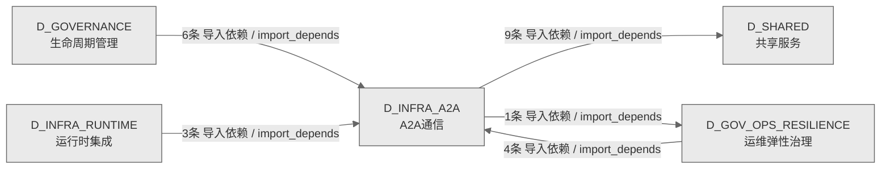

# 03_d_infra_a2a / A2A通信 / A2A Communication

> **功能简介 / Overview**: Agent 与 Agent 之间的通信协议层，负责 AI 代理间的消息传递、请求路由和协议适配

> **文档作用 / Purpose**: 展示 A2A通信（D_INFRA_A2A）功能域的模块清单、域内依赖关系、跨域依赖关系、架构分层视图，供架构审查和域治理参考。

> 本文档由 generate_domain_doc.py 从 depgraph (PostgreSQL) 自动生成
> 数据源: depgraph (PostgreSQL) nodes表 + edges表

> **[可缩放 HTML 版 / Zoomable HTML](http://localhost:8765/docs/02_enterprise_architecture/02_domain_architecture_docs/03_d_infra_a2a.html)** — Ctrl+滚轮缩放 ｜ 双击重置 ｜ Ctrl+Shift+D 切换拖动/选择模式

## 域基本信息 / Domain Overview

| 字段 | 值 | Field | Value |
|------|------|-------|-------|
| 编号 | 03 | Number | 03 |
| 域ID | D_INFRA_A2A | Domain ID | D_INFRA_A2A |
| 域名称 | A2A通信 | Domain Name | A2A Communication |
| 层级 | L0 基础设施层 | Layer | L0 Infrastructure |
| 模块数 | 72 | Module Count | 72 |
| 域内依赖 | 42 | Internal Dependencies | 42 |
| 跨域入边 | 13 | Cross-domain Incoming | 13 |
| 跨域出边 | 10 | Cross-domain Outgoing | 10 |
| 设计态模块 | 0 | Design Modules | 0 |
| 生产态模块 | 72 | Production Modules | 72 |
| 容量 | 72/150 (正常) | Capacity | 72/150 (正常) |
| 描述 | A2A Card注册与发现(card_registry) | Description | A2A Card注册与发现(card_registry) |

## 模块分层清单 / Module Layered List

> 按 architecture_layer 分组的模块清单（共 72 个模块 / 72 modules）。

### L0 基础设施层 / Infrastructure Layer (72 modules)

| # | 模块路径 / Module Path | 模块名称 / Module Name (功能简介 / Description) | 成熟度 / Maturity | 蓝图 / Blueprint |
|:--:|---------|---------|:---:|:---:|
| 1 | src/zephyr/infrastructure/a2a_protocol/a2a_card_registry.py | A2A Card Registry — 全局 Agent Card 注册单例 | 生产态 / production |  |
| 2 | src/zephyr/infrastructure/a2a_protocol/layer1_discovery/a... | A2A Registry — Agent Card 注册与发现 | 生产态 / production |  |
| 3 | src/zephyr/infrastructure/a2a_protocol/layer1_discovery/a... | Agent Card 模型 — A2A Layer 1 Discovery | 生产态 / production |  |
| 4 | src/zephyr/infrastructure/a2a_protocol/layer1_discovery/i... | Identity Verifier — JWT 身份验证器 | 生产态 / production |  |
| 5 | src/zephyr/infrastructure/a2a_protocol/layer2_communicati... | A2A Message/Part 系统 — Layer 2 Communication | 生产态 / production |  |
| 6 | src/zephyr/infrastructure/a2a_protocol/layer2_communicati... | A2A Task 状态机 — Layer 2 Communication | 生产态 / production |  |
| 7 | src/zephyr/infrastructure/a2a_protocol/layer2_communicati... | Context Package — A2A 上下文包 | 生产态 / production |  |
| 8 | src/zephyr/infrastructure/a2a_protocol/layer2_communicati... | Handoff Manager — Agent 间任务交接 | 生产态 / production |  |
| 9 | src/zephyr/infrastructure/a2a_protocol/layer2_communicati... | Message Router — A2A 消息路由 | 生产态 / production |  |
| 10 | src/zephyr/infrastructure/a2a_protocol/layer2_communicati... | Push Notifier — A2A 推送通知 | 生产态 / production |  |
| 11 | src/zephyr/infrastructure/a2a_protocol/layer2_communicati... | Streaming — A2A 流式传输 | 生产态 / production |  |
| 12 | src/zephyr/infrastructure/a2a_protocol/layer2_communicati... | 触发监控器 | 生产态 / production |  |
| 13 | src/zephyr/infrastructure/a2a_protocol/layer3_coordinatio... | Re-export bridge for layer3_coordination consensus symbols. | 生产态 / production |  |
| 14 | src/zephyr/infrastructure/a2a_protocol/layer3_coordinatio... | Re-export bridge for layer3_coordination core coordination symbols. | 生产态 / production |  |
| 15 | src/zephyr/infrastructure/a2a_protocol/layer3_coordinatio... | Re-export bridge for layer3_coordination intelligence symbols. | 生产态 / production |  |
| 16 | src/zephyr/infrastructure/a2a_protocol/layer3_coordinatio... | Re-export bridge for layer3_coordination security and economics symbols. | 生产态 / production |  |
| 17 | src/zephyr/infrastructure/a2a_protocol/layer3_coordinatio... | A2A Agent 黑名单管理（重命名自 a2a_protocol_security.py，AI-14 审计 P5 修复） | 生产态 / production |  |
| 18 | src/zephyr/infrastructure/a2a_protocol/layer3_coordinatio... | A2A 统计异常检测引擎 — 基线学习 + 实时异常判断 | 生产态 / production |  |
| 19 | src/zephyr/infrastructure/a2a_protocol/layer3_coordinatio... | A2A 行为指纹 — Agent 行为模式学习与画像 | 生产态 / production |  |
| 20 | src/zephyr/infrastructure/a2a_protocol/layer3_coordinatio... | A2A 责任归属引擎 — 因果链分析 + 责任分配 | 生产态 / production |  |
| 21 | src/zephyr/infrastructure/a2a_protocol/layer3_coordinatio... | A2A 碳足迹追踪 | 生产态 / production |  |
| 22 | src/zephyr/infrastructure/a2a_protocol/layer3_coordinatio... | A2A 因果追踪 — 跨 Agent 操作因果链图谱 | 生产态 / production |  |
| 23 | src/zephyr/infrastructure/a2a_protocol/layer3_coordinatio... | A2A 检查点管理器 | 生产态 / production |  |
| 24 | src/zephyr/infrastructure/a2a_protocol/layer3_coordinatio... | A2A 合谋检测器 — Agent 间串通模式识别 | 生产态 / production |  |
| 25 | src/zephyr/infrastructure/a2a_protocol/layer3_coordinatio... | P2: Agent同意管理 | 生产态 / production |  |
| 26 | src/zephyr/infrastructure/a2a_protocol/layer3_coordinatio... | P2: 宪法性Agent管理 | 生产态 / production |  |
| 27 | src/zephyr/infrastructure/a2a_protocol/layer3_coordinatio... | 上下文腐烂检测 | 生产态 / production |  |
| 28 | src/zephyr/infrastructure/a2a_protocol/layer3_coordinatio... | A2A 跨 Agent 语义流追踪 — 知识+意图在 Agent 间传递 | 生产态 / production |  |
| 29 | src/zephyr/infrastructure/a2a_protocol/layer3_coordinatio... | A2A 监控仪表盘 — Agent 集群运行状态可视化面板 | 生产态 / production |  |
| 30 | src/zephyr/infrastructure/a2a_protocol/layer3_coordinatio... | A2A 结构化辩论协议 — 多轮主张->反驳->合成 | 生产态 / production |  |
| 31 | src/zephyr/infrastructure/a2a_protocol/layer3_coordinatio... | 委托链 | 生产态 / production |  |
| 32 | src/zephyr/infrastructure/a2a_protocol/layer3_coordinatio... | A2A 经济学——Token/API成本追踪 | 生产态 / production |  |
| 33 | src/zephyr/infrastructure/a2a_protocol/layer3_coordinatio... | A2A 遗忘机制 | 生产态 / production |  |
| 34 | src/zephyr/infrastructure/a2a_protocol/layer3_coordinatio... | A2A 形式化验证 — 协议属性模型检查 | 生产态 / production |  |
| 35 | src/zephyr/infrastructure/a2a_protocol/layer3_coordinatio... | A2A ANP 帧协商协议 — Agent Negotiation Protocol 帧层协商 | 生产态 / production |  |
| 36 | src/zephyr/infrastructure/a2a_protocol/layer3_coordinatio... | A2A 硬件路由器——GPU/CPU 调度 | 生产态 / production |  |
| 37 | src/zephyr/infrastructure/a2a_protocol/layer3_coordinatio... | P2: Agent休眠管理 | 生产态 / production |  |
| 38 | src/zephyr/infrastructure/a2a_protocol/layer3_coordinatio... | A2A 幂等性保证 | 生产态 / production |  |
| 39 | src/zephyr/infrastructure/a2a_protocol/layer3_coordinatio... | A2A 空闲守卫 | 生产态 / production |  |
| 40 | src/zephyr/infrastructure/a2a_protocol/layer3_coordinatio... | A2A 免疫系统 | 生产态 / production |  |
| 41 | src/zephyr/infrastructure/a2a_protocol/layer3_coordinatio... | A2A 知识蒸馏 — 跨 Agent 经验提炼与共享 | 生产态 / production |  |
| 42 | src/zephyr/infrastructure/a2a_protocol/layer3_coordinatio... | A2A 隐性通信检测 — 检测 Agent 通过副作用隐式通信 | 生产态 / production |  |
| 43 | src/zephyr/infrastructure/a2a_protocol/layer3_coordinatio... | A2A 指标收集 | 生产态 / production |  |
| 44 | src/zephyr/infrastructure/a2a_protocol/layer3_coordinatio... | A2A 协商协议 — Agent 间资源/任务分配协商 | 生产态 / production |  |
| 45 | src/zephyr/infrastructure/a2a_protocol/layer3_coordinatio... | A2A 协议网关 — Agent 间请求分发与协议转换 | 生产态 / production |  |
| 46 | src/zephyr/infrastructure/a2a_protocol/layer3_coordinatio... | A2A 红队测试 — 攻击向量定义与执行框架 | 生产态 / production |  |
| 47 | src/zephyr/infrastructure/a2a_protocol/layer3_coordinatio... | A2A Saga 事务协议 — 多 Agent 跨步分布式事务 | 生产态 / production |  |
| 48 | src/zephyr/infrastructure/a2a_protocol/layer3_coordinatio... | A2A 安全内容扫描器 — 六大类威胁检测 | 生产态 / production |  |
| 49 | src/zephyr/infrastructure/a2a_protocol/layer3_coordinatio... | 时序准入控制 | 生产态 / production |  |
| 50 | src/zephyr/infrastructure/a2a_protocol/layer3_coordinatio... | A2A 分布式追踪 — 跨 Agent 请求链追踪 (Span-based) | 生产态 / production |  |
| 51 | src/zephyr/infrastructure/a2a_protocol/layer3_coordinatio... | 向量化信誉系统 | 生产态 / production |  |
| 52 | src/zephyr/infrastructure/a2a_protocol/layer3_coordinatio... | A2A 加权投票协议 — 多 Agent 共识达成机制 | 生产态 / production |  |
| 53 | src/zephyr/infrastructure/a2a_protocol/layer3_coordinatio... | A2A 工作窃取调度器 — 跨 Agent 负载均衡 | 生产态 / production |  |
| 54 | src/zephyr/infrastructure/a2a_protocol/layer3_coordinatio... | A2A 三级仲裁引擎 — priority -> rule -> escalation | 生产态 / production |  |
| 55 | src/zephyr/infrastructure/a2a_protocol/layer3_coordinatio... | 级联守卫——防止失败在Agent间级联 | 生产态 / production |  |
| 56 | src/zephyr/infrastructure/a2a_protocol/layer3_coordinatio... | A2A 冲突检测引擎 — 语义+文本+资源三维冲突检测 | 生产态 / production |  |
| 57 | src/zephyr/infrastructure/a2a_protocol/layer3_coordinatio... | 施工后验证器 — 自指悖论防御：不橡胶图章，真正验证 A2A 协议模块的施工完整性 | 生产态 / production |  |
| 58 | src/zephyr/infrastructure/a2a_protocol/layer3_coordinatio... | P2: 死锁守卫 | 生产态 / production |  |
| 59 | src/zephyr/infrastructure/a2a_protocol/layer3_coordinatio... | P2: 活锁检测器 | 生产态 / production |  |
| 60 | src/zephyr/infrastructure/a2a_protocol/layer3_coordinatio... | A2A 语义差异引擎 — 结构感知的 Agent 间差异检测 | 生产态 / production |  |
| 61 | src/zephyr/infrastructure/a2a_protocol/layer3_coordinatio... | A2A Session 走私防御 — 防止跨 Agent session 上下文伪造 | 生产态 / production |  |
| 62 | src/zephyr/infrastructure/a2a_protocol/layer3_coordinatio... | A2A Living Spec 同步 — 蓝图与实现的双向漂移管理 | 生产态 / production |  |
| 63 | src/zephyr/infrastructure/a2a_protocol/layer3_coordinatio... | Supervisor — A2A Layer 3 Coordination | 生产态 / production |  |
| 64 | src/zephyr/infrastructure/a2a_protocol/local_first_arch.py | a2a_protocol/local_first_arch.py | 生产态 / production |  |
| 65 | src/zephyr/infrastructure/a2a_protocol/migration_strategy.py | a2a_protocol/migration_strategy.py | 生产态 / production |  |
| 66 | src/zephyr/infrastructure/a2a_protocol/multi_agent.py | multi_agent.py —— Multi-Agent 编排基座（Phase 14 | 盲点 B33） | 生产态 / production |  |
| 67 | src/zephyr/infrastructure/a2a_protocol/multi_model_consen... | a2a_protocol/multi_model_consensus.py | 生产态 / production |  |
| 68 | src/zephyr/infrastructure/a2a_protocol/offline_autonomy.py | a2a_protocol/offline_autonomy.py | 生产态 / production |  |
| 69 | src/zephyr/infrastructure/a2a_protocol/offline_resilience.py | a2a_protocol/offline_resilience.py | 生产态 / production |  |
| 70 | src/zephyr/infrastructure/a2a_protocol/phase_hold.py | Phase 4 Hold — A2A Phase 4 锁定标记模块 与其他 Phase 3 模块不可并发施工. | 生产态 / production |  |
| 71 | src/zephyr/infrastructure/a2a_protocol/prompt_lifecycle.py | a2a_protocol/prompt_lifecycle.py | 生产态 / production |  |
| 72 | src/zephyr/infrastructure/a2a_protocol/realtime_streaming.py | a2a_protocol/realtime_streaming.py | 生产态 / production |  |

## 域内依赖图 / Internal Dependency Diagram

> 依赖图内嵌在本文档中，IDE 可直接渲染显示。参考 decision_index.md 设计，分三个视图：合并全景图、运营态子图、设计态子图（按 design_maturity 实际值拆分）。
>
> **图例说明 / Legend**：
> - **实线边框 = 运营态模块**（production，已上线运行）
> - **虚线边框 = 设计态模块**（design，蓝图阶段，代码未写）
> - **实线箭头 = 运营态依赖**（已生效的依赖关系）
> - **虚线箭头 = 非运营态依赖**（计划中/验证中的依赖关系）

### 合并全景图（全部模块，标签标注成熟度）

> 展示全部 72 个模块（生产态 72 + 设计态 0），标签标注成熟度。

#### 第 1 页 / 共 3 页

```mermaid
%%{init: {'theme': 'base', 'themeVariables': {'primaryColor': '#eaeaea', 'primaryTextColor': '#333333', 'primaryBorderColor': '#666666', 'lineColor': '#666666', 'secondaryColor': '#eaeaea', 'tertiaryColor': '#eaeaea', 'fontSize': '14px'}}}%%
flowchart TD
    src_zephyr_infrastructure_a2a_protocol_a2a_card_registry_py["(生产态 / production) A2A Card Registry — 全局 Agent Card 注册单例<br/>A2A Card Registry — 全局 Agent Card 注册单例<br/>文件: a2a_protocol/a2a_card_registry.py"]
    src_zephyr_infrastructure_a2a_protocol_layer1_discovery_identity_verifier_py["(生产态 / production) Identity Verifier — JWT 身份验证器<br/>Identity Verifier — JWT 身份验证器<br/>文件: layer1_discovery/identity_verifier.py"]
    src_zephyr_infrastructure_a2a_protocol_layer2_communication_a2a_state_py["(生产态 / production) A2A Task 状态机 — Layer 2 Communication<br/>A2A Task 状态机 — Layer 2 Communication<br/>文件: layer2_communication/a2a_state.py"]
    src_zephyr_infrastructure_a2a_protocol_layer2_communication_context_package_py["(生产态 / production) Context Package — A2A 上下文包<br/>Context Package — A2A 上下文包<br/>文件: layer2_communication/context_package.py"]
    src_zephyr_infrastructure_a2a_protocol_layer2_communication_handoff_manager_py["(生产态 / production) Handoff Manager — Agent 间任务交接<br/>Handoff Manager — Agent 间任务交接<br/>文件: layer2_communication/handoff_manager.py"]
    src_zephyr_infrastructure_a2a_protocol_layer2_communication_message_router_py["(生产态 / production) Message Router — A2A 消息路由<br/>Message Router — A2A 消息路由<br/>文件: layer2_communication/message_router.py"]
    src_zephyr_infrastructure_a2a_protocol_layer2_communication_push_notifier_py["(生产态 / production) Push Notifier — A2A 推送通知<br/>Push Notifier — A2A 推送通知<br/>文件: layer2_communication/push_notifier.py"]
    src_zephyr_infrastructure_a2a_protocol_layer2_communication_streaming_py["(生产态 / production) Streaming — A2A 流式传输<br/>Streaming — A2A 流式传输<br/>文件: layer2_communication/streaming.py"]
    src_zephyr_infrastructure_a2a_protocol_layer2_communication_trigger_monitor_py["(生产态 / production) 触发监控器<br/>触发监控器<br/>文件: layer2_communication/trigger_monitor.py"]
    src_zephyr_infrastructure_a2a_protocol_layer3_coordination_consensus_py["(生产态 / production) Re-export bridge for layer3_coordination consensus symbols.<br/>Re-export bridge for layer3_coordination consensus symbols.<br/>文件: layer3_coordination/_consensus.py"]
    src_zephyr_infrastructure_a2a_protocol_layer3_coordination_core_coordination_py["(生产态 / production) Re-export bridge for layer3_coordination core coordination symbols.<br/>Re-export bridge for layer3_coordination core coordination symbols.<br/>文件: layer3_coordination/_core_coordination.py"]
    src_zephyr_infrastructure_a2a_protocol_layer3_coordination_intelligence_py["(生产态 / production) Re-export bridge for layer3_coordination intelligence symbols.<br/>Re-export bridge for layer3_coordination intelligence symbols.<br/>文件: layer3_coordination/_intelligence.py"]
    src_zephyr_infrastructure_a2a_protocol_layer3_coordination_security_and_economics_py["(生产态 / production) Re-export bridge for layer3_coordination security and economics symbols.<br/>Re-export bridge for layer3_coordination security and economics symbols.<br/>文件: layer3_coordination/_security_and_economics.py"]
    src_zephyr_infrastructure_a2a_protocol_layer3_coordination_a2a_agent_blocklist_py["(生产态 / production) A2A Agent 黑名单管理（重命名自 a2a_protocol_security.py，AI-14 审计 P5 修复）<br/>A2A Agent 黑名单管理（重命名自 a2a_protocol_security.py，AI-14 审计 P5 修复）<br/>文件: layer3_coordination/a2a_agent_blocklist.py"]
    src_zephyr_infrastructure_a2a_protocol_layer3_coordination_a2a_carbon_py["(生产态 / production) A2A 碳足迹追踪<br/>A2A 碳足迹追踪<br/>文件: layer3_coordination/a2a_carbon.py"]
    src_zephyr_infrastructure_a2a_protocol_layer3_coordination_a2a_checkpoint_py["(生产态 / production) A2A 检查点管理器<br/>A2A 检查点管理器<br/>文件: layer3_coordination/a2a_checkpoint.py"]
    src_zephyr_infrastructure_a2a_protocol_layer3_coordination_a2a_consent_py["(生产态 / production) P2: Agent同意管理<br/>P2: Agent同意管理<br/>文件: layer3_coordination/a2a_consent.py"]
    src_zephyr_infrastructure_a2a_protocol_layer3_coordination_a2a_constitutional_py["(生产态 / production) P2: 宪法性Agent管理<br/>P2: 宪法性Agent管理<br/>文件: layer3_coordination/a2a_constitutional.py"]
    src_zephyr_infrastructure_a2a_protocol_layer3_coordination_a2a_context_rot_py["(生产态 / production) 上下文腐烂检测<br/>上下文腐烂检测<br/>文件: layer3_coordination/a2a_context_rot.py"]
    src_zephyr_infrastructure_a2a_protocol_layer3_coordination_a2a_dashboard_py["(生产态 / production) A2A 监控仪表盘 — Agent 集群运行状态可视化面板<br/>A2A 监控仪表盘 — Agent 集群运行状态可视化面板<br/>文件: layer3_coordination/a2a_dashboard.py"]
    src_zephyr_infrastructure_a2a_protocol_a2a_card_registry_py ~~~ src_zephyr_infrastructure_a2a_protocol_layer1_discovery_identity_verifier_py
    src_zephyr_infrastructure_a2a_protocol_layer1_discovery_identity_verifier_py ~~~ src_zephyr_infrastructure_a2a_protocol_layer2_communication_a2a_state_py
    src_zephyr_infrastructure_a2a_protocol_layer2_communication_a2a_state_py ~~~ src_zephyr_infrastructure_a2a_protocol_layer2_communication_context_package_py
    src_zephyr_infrastructure_a2a_protocol_layer2_communication_context_package_py ~~~ src_zephyr_infrastructure_a2a_protocol_layer2_communication_handoff_manager_py
    src_zephyr_infrastructure_a2a_protocol_layer2_communication_handoff_manager_py ~~~ src_zephyr_infrastructure_a2a_protocol_layer2_communication_message_router_py
    src_zephyr_infrastructure_a2a_protocol_layer2_communication_message_router_py ~~~ src_zephyr_infrastructure_a2a_protocol_layer2_communication_push_notifier_py
    src_zephyr_infrastructure_a2a_protocol_layer2_communication_push_notifier_py ~~~ src_zephyr_infrastructure_a2a_protocol_layer2_communication_streaming_py
    src_zephyr_infrastructure_a2a_protocol_layer2_communication_streaming_py ~~~ src_zephyr_infrastructure_a2a_protocol_layer2_communication_trigger_monitor_py
    src_zephyr_infrastructure_a2a_protocol_layer2_communication_trigger_monitor_py ~~~ src_zephyr_infrastructure_a2a_protocol_layer3_coordination_consensus_py
    src_zephyr_infrastructure_a2a_protocol_layer3_coordination_consensus_py ~~~ src_zephyr_infrastructure_a2a_protocol_layer3_coordination_core_coordination_py
    src_zephyr_infrastructure_a2a_protocol_layer3_coordination_core_coordination_py ~~~ src_zephyr_infrastructure_a2a_protocol_layer3_coordination_intelligence_py
    src_zephyr_infrastructure_a2a_protocol_layer3_coordination_intelligence_py ~~~ src_zephyr_infrastructure_a2a_protocol_layer3_coordination_security_and_economics_py
    src_zephyr_infrastructure_a2a_protocol_layer3_coordination_security_and_economics_py ~~~ src_zephyr_infrastructure_a2a_protocol_layer3_coordination_a2a_agent_blocklist_py
    src_zephyr_infrastructure_a2a_protocol_layer3_coordination_a2a_agent_blocklist_py ~~~ src_zephyr_infrastructure_a2a_protocol_layer3_coordination_a2a_carbon_py
    src_zephyr_infrastructure_a2a_protocol_layer3_coordination_a2a_carbon_py ~~~ src_zephyr_infrastructure_a2a_protocol_layer3_coordination_a2a_checkpoint_py
    src_zephyr_infrastructure_a2a_protocol_layer3_coordination_a2a_checkpoint_py ~~~ src_zephyr_infrastructure_a2a_protocol_layer3_coordination_a2a_consent_py
    src_zephyr_infrastructure_a2a_protocol_layer3_coordination_a2a_consent_py ~~~ src_zephyr_infrastructure_a2a_protocol_layer3_coordination_a2a_constitutional_py
    src_zephyr_infrastructure_a2a_protocol_layer3_coordination_a2a_constitutional_py ~~~ src_zephyr_infrastructure_a2a_protocol_layer3_coordination_a2a_context_rot_py
    src_zephyr_infrastructure_a2a_protocol_layer3_coordination_a2a_context_rot_py ~~~ src_zephyr_infrastructure_a2a_protocol_layer3_coordination_a2a_dashboard_py
    src_zephyr_infrastructure_a2a_protocol_layer1_discovery_a2a_registry_py["(生产态 / production) A2A Registry — Agent Card 注册与发现<br/>A2A Registry — Agent Card 注册与发现<br/>文件: layer1_discovery/a2a_registry.py"]
    src_zephyr_infrastructure_a2a_protocol_layer2_communication_a2a_schemas_py["(生产态 / production) A2A Message/Part 系统 — Layer 2 Communication<br/>A2A Message/Part 系统 — Layer 2 Communication<br/>文件: layer2_communication/a2a_schemas.py"]
    src_zephyr_infrastructure_a2a_protocol_layer3_coordination_a2a_anomaly_detector_py["(生产态 / production) A2A 统计异常检测引擎 — 基线学习 + 实时异常判断<br/>A2A 统计异常检测引擎 — 基线学习 + 实时异常判断<br/>文件: layer3_coordination/a2a_anomaly_detector.py"]
    src_zephyr_infrastructure_a2a_protocol_layer3_coordination_a2a_behavior_fingerprint_py["(生产态 / production) A2A 行为指纹 — Agent 行为模式学习与画像<br/>A2A 行为指纹 — Agent 行为模式学习与画像<br/>文件: layer3_coordination/a2a_behavior_fingerprint.py"]
    src_zephyr_infrastructure_a2a_protocol_layer3_coordination_a2a_blame_attribution_py["(生产态 / production) A2A 责任归属引擎 — 因果链分析 + 责任分配<br/>A2A 责任归属引擎 — 因果链分析 + 责任分配<br/>文件: layer3_coordination/a2a_blame_attribution.py"]
    src_zephyr_infrastructure_a2a_protocol_layer3_coordination_a2a_causal_trace_py["(生产态 / production) A2A 因果追踪 — 跨 Agent 操作因果链图谱<br/>A2A 因果追踪 — 跨 Agent 操作因果链图谱<br/>文件: layer3_coordination/a2a_causal_trace.py"]
    src_zephyr_infrastructure_a2a_protocol_layer3_coordination_a2a_collusion_detector_py["(生产态 / production) A2A 合谋检测器 — Agent 间串通模式识别<br/>A2A 合谋检测器 — Agent 间串通模式识别<br/>文件: layer3_coordination/a2a_collusion_detector.py"]
    src_zephyr_infrastructure_a2a_protocol_layer3_coordination_a2a_cross_agent_semantic_flow_py["(生产态 / production) A2A 跨 Agent 语义流追踪 — 知识+意图在 Agent 间传递<br/>A2A 跨 Agent 语义流追踪 — 知识+意图在 Agent 间传递<br/>文件: layer3_coordination/a2a_cross_agent_semantic_flow.py"]
    src_zephyr_infrastructure_a2a_protocol_layer3_coordination_a2a_debate_py["(生产态 / production) A2A 结构化辩论协议 — 多轮主张->反驳->合成<br/>A2A 结构化辩论协议 — 多轮主张->反驳->合成<br/>文件: layer3_coordination/a2a_debate.py"]
    src_zephyr_infrastructure_a2a_protocol_layer1_discovery_a2a_registry_py ~~~ src_zephyr_infrastructure_a2a_protocol_layer2_communication_a2a_schemas_py
    src_zephyr_infrastructure_a2a_protocol_layer2_communication_a2a_schemas_py ~~~ src_zephyr_infrastructure_a2a_protocol_layer3_coordination_a2a_anomaly_detector_py
    src_zephyr_infrastructure_a2a_protocol_layer3_coordination_a2a_anomaly_detector_py ~~~ src_zephyr_infrastructure_a2a_protocol_layer3_coordination_a2a_behavior_fingerprint_py
    src_zephyr_infrastructure_a2a_protocol_layer3_coordination_a2a_behavior_fingerprint_py ~~~ src_zephyr_infrastructure_a2a_protocol_layer3_coordination_a2a_blame_attribution_py
    src_zephyr_infrastructure_a2a_protocol_layer3_coordination_a2a_blame_attribution_py ~~~ src_zephyr_infrastructure_a2a_protocol_layer3_coordination_a2a_causal_trace_py
    src_zephyr_infrastructure_a2a_protocol_layer3_coordination_a2a_causal_trace_py ~~~ src_zephyr_infrastructure_a2a_protocol_layer3_coordination_a2a_collusion_detector_py
    src_zephyr_infrastructure_a2a_protocol_layer3_coordination_a2a_collusion_detector_py ~~~ src_zephyr_infrastructure_a2a_protocol_layer3_coordination_a2a_cross_agent_semantic_flow_py
    src_zephyr_infrastructure_a2a_protocol_layer3_coordination_a2a_cross_agent_semantic_flow_py ~~~ src_zephyr_infrastructure_a2a_protocol_layer3_coordination_a2a_debate_py
    src_zephyr_infrastructure_a2a_protocol_layer1_discovery_agent_card_py["(生产态 / production) Agent Card 模型 — A2A Layer 1 Discovery<br/>Agent Card 模型 — A2A Layer 1 Discovery<br/>文件: layer1_discovery/agent_card.py"]
    src_zephyr_infrastructure_a2a_protocol_a2a_card_registry_py -->|导入依赖 / import_depends| src_zephyr_infrastructure_a2a_protocol_layer1_discovery_a2a_registry_py
    src_zephyr_infrastructure_a2a_protocol_layer1_discovery_a2a_registry_py -->|导入依赖 / import_depends| src_zephyr_infrastructure_a2a_protocol_layer1_discovery_agent_card_py
    src_zephyr_infrastructure_a2a_protocol_layer2_communication_message_router_py -->|导入依赖 / import_depends| src_zephyr_infrastructure_a2a_protocol_layer2_communication_a2a_schemas_py
    src_zephyr_infrastructure_a2a_protocol_layer3_coordination_intelligence_py -->|导入依赖 / import_depends| src_zephyr_infrastructure_a2a_protocol_layer3_coordination_a2a_behavior_fingerprint_py
    src_zephyr_infrastructure_a2a_protocol_layer3_coordination_intelligence_py -->|导入依赖 / import_depends| src_zephyr_infrastructure_a2a_protocol_layer3_coordination_a2a_blame_attribution_py
    src_zephyr_infrastructure_a2a_protocol_layer3_coordination_intelligence_py -->|导入依赖 / import_depends| src_zephyr_infrastructure_a2a_protocol_layer3_coordination_a2a_causal_trace_py
    src_zephyr_infrastructure_a2a_protocol_layer3_coordination_intelligence_py -->|导入依赖 / import_depends| src_zephyr_infrastructure_a2a_protocol_layer3_coordination_a2a_collusion_detector_py
    src_zephyr_infrastructure_a2a_protocol_layer3_coordination_intelligence_py -->|导入依赖 / import_depends| src_zephyr_infrastructure_a2a_protocol_layer3_coordination_a2a_cross_agent_semantic_flow_py
    src_zephyr_infrastructure_a2a_protocol_layer3_coordination_consensus_py -->|导入依赖 / import_depends| src_zephyr_infrastructure_a2a_protocol_layer3_coordination_a2a_debate_py
    src_zephyr_infrastructure_a2a_protocol_layer3_coordination_security_and_economics_py -->|导入依赖 / import_depends| src_zephyr_infrastructure_a2a_protocol_layer3_coordination_a2a_anomaly_detector_py
    D_SHARED["(生产态 / production) D_SHARED 共享服务"]
    src_zephyr_infrastructure_a2a_protocol_layer1_discovery_agent_card_py -->|导入依赖 / import_depends| D_SHARED
    src_zephyr_infrastructure_a2a_protocol_layer2_communication_handoff_manager_py -->|导入依赖 / import_depends| D_SHARED
    src_zephyr_infrastructure_a2a_protocol_layer2_communication_context_package_py -->|导入依赖 / import_depends| D_SHARED
    src_zephyr_infrastructure_a2a_protocol_layer2_communication_a2a_schemas_py -->|导入依赖 / import_depends| D_SHARED
    src_zephyr_infrastructure_a2a_protocol_layer2_communication_a2a_state_py -->|导入依赖 / import_depends| D_SHARED
    D_GOVERNANCE["(生产态 / production) D_GOVERNANCE 生命周期管理"]
    D_GOVERNANCE -->|导入依赖 / import_depends| src_zephyr_infrastructure_a2a_protocol_layer3_coordination_a2a_dashboard_py
    D_INFRA_RUNTIME["(生产态 / production) D_INFRA_RUNTIME 运行时集成"]
    D_INFRA_RUNTIME -->|导入依赖 / import_depends| src_zephyr_infrastructure_a2a_protocol_layer1_discovery_a2a_registry_py
    D_INFRA_RUNTIME -->|导入依赖 / import_depends| src_zephyr_infrastructure_a2a_protocol_a2a_card_registry_py
    classDef production fill:#e8edf2,stroke:#0277bd,stroke-width:2px,color:#1a1a1a
    classDef design fill:#f0ebe3,stroke:#bf360c,stroke-width:2px,color:#1a1a1a,stroke-dasharray: 5 5
    classDef external_prod fill:#e8efe9,stroke:#1b5e20,stroke-width:1px,color:#1a1a1a
    classDef external_design fill:#efe5ea,stroke:#880e4f,stroke-width:1px,color:#1a1a1a,stroke-dasharray: 5 5
    class src_zephyr_infrastructure_a2a_protocol_a2a_card_registry_py,src_zephyr_infrastructure_a2a_protocol_layer1_discovery_a2a_registry_py,src_zephyr_infrastructure_a2a_protocol_layer1_discovery_agent_card_py,src_zephyr_infrastructure_a2a_protocol_layer1_discovery_identity_verifier_py,src_zephyr_infrastructure_a2a_protocol_layer2_communication_a2a_schemas_py,src_zephyr_infrastructure_a2a_protocol_layer2_communication_a2a_state_py,src_zephyr_infrastructure_a2a_protocol_layer2_communication_context_package_py,src_zephyr_infrastructure_a2a_protocol_layer2_communication_handoff_manager_py,src_zephyr_infrastructure_a2a_protocol_layer2_communication_message_router_py,src_zephyr_infrastructure_a2a_protocol_layer2_communication_push_notifier_py,src_zephyr_infrastructure_a2a_protocol_layer2_communication_streaming_py,src_zephyr_infrastructure_a2a_protocol_layer2_communication_trigger_monitor_py,src_zephyr_infrastructure_a2a_protocol_layer3_coordination_consensus_py,src_zephyr_infrastructure_a2a_protocol_layer3_coordination_core_coordination_py,src_zephyr_infrastructure_a2a_protocol_layer3_coordination_intelligence_py,src_zephyr_infrastructure_a2a_protocol_layer3_coordination_security_and_economics_py,src_zephyr_infrastructure_a2a_protocol_layer3_coordination_a2a_agent_blocklist_py,src_zephyr_infrastructure_a2a_protocol_layer3_coordination_a2a_anomaly_detector_py,src_zephyr_infrastructure_a2a_protocol_layer3_coordination_a2a_behavior_fingerprint_py,src_zephyr_infrastructure_a2a_protocol_layer3_coordination_a2a_blame_attribution_py,src_zephyr_infrastructure_a2a_protocol_layer3_coordination_a2a_carbon_py,src_zephyr_infrastructure_a2a_protocol_layer3_coordination_a2a_causal_trace_py,src_zephyr_infrastructure_a2a_protocol_layer3_coordination_a2a_checkpoint_py,src_zephyr_infrastructure_a2a_protocol_layer3_coordination_a2a_collusion_detector_py,src_zephyr_infrastructure_a2a_protocol_layer3_coordination_a2a_consent_py,src_zephyr_infrastructure_a2a_protocol_layer3_coordination_a2a_constitutional_py,src_zephyr_infrastructure_a2a_protocol_layer3_coordination_a2a_context_rot_py,src_zephyr_infrastructure_a2a_protocol_layer3_coordination_a2a_cross_agent_semantic_flow_py,src_zephyr_infrastructure_a2a_protocol_layer3_coordination_a2a_dashboard_py,src_zephyr_infrastructure_a2a_protocol_layer3_coordination_a2a_debate_py production
    class D_SHARED,D_GOVERNANCE,D_INFRA_RUNTIME external_prod
```

#### 第 2 页 / 共 3 页

```mermaid
%%{init: {'theme': 'base', 'themeVariables': {'primaryColor': '#eaeaea', 'primaryTextColor': '#333333', 'primaryBorderColor': '#666666', 'lineColor': '#666666', 'secondaryColor': '#eaeaea', 'tertiaryColor': '#eaeaea', 'fontSize': '14px'}}}%%
flowchart TD
    src_zephyr_infrastructure_a2a_protocol_layer3_coordination_a2a_economics_py["(生产态 / production) A2A 经济学——Token/API成本追踪<br/>A2A 经济学——Token/API成本追踪<br/>文件: layer3_coordination/a2a_economics.py"]
    src_zephyr_infrastructure_a2a_protocol_layer3_coordination_a2a_forgetting_py["(生产态 / production) A2A 遗忘机制<br/>A2A 遗忘机制<br/>文件: layer3_coordination/a2a_forgetting.py"]
    src_zephyr_infrastructure_a2a_protocol_layer3_coordination_a2a_formal_verification_py["(生产态 / production) A2A 形式化验证 — 协议属性模型检查<br/>A2A 形式化验证 — 协议属性模型检查<br/>文件: layer3_coordination/a2a_formal_verification.py"]
    src_zephyr_infrastructure_a2a_protocol_layer3_coordination_a2a_frame_negotiation_py["(生产态 / production) A2A ANP 帧协商协议 — Agent Negotiation Protocol 帧层协商<br/>A2A ANP 帧协商协议 — Agent Negotiation Protocol 帧层协商<br/>文件: layer3_coordination/a2a_frame_negotiation.py"]
    src_zephyr_infrastructure_a2a_protocol_layer3_coordination_a2a_hardware_router_py["(生产态 / production) A2A 硬件路由器——GPU/CPU 调度<br/>A2A 硬件路由器——GPU/CPU 调度<br/>文件: layer3_coordination/a2a_hardware_router.py"]
    src_zephyr_infrastructure_a2a_protocol_layer3_coordination_a2a_hibernate_py["(生产态 / production) P2: Agent休眠管理<br/>P2: Agent休眠管理<br/>文件: layer3_coordination/a2a_hibernate.py"]
    src_zephyr_infrastructure_a2a_protocol_layer3_coordination_a2a_idempotency_py["(生产态 / production) A2A 幂等性保证<br/>A2A 幂等性保证<br/>文件: layer3_coordination/a2a_idempotency.py"]
    src_zephyr_infrastructure_a2a_protocol_layer3_coordination_a2a_idle_guard_py["(生产态 / production) A2A 空闲守卫<br/>A2A 空闲守卫<br/>文件: layer3_coordination/a2a_idle_guard.py"]
    src_zephyr_infrastructure_a2a_protocol_layer3_coordination_a2a_immune_py["(生产态 / production) A2A 免疫系统<br/>A2A 免疫系统<br/>文件: layer3_coordination/a2a_immune.py"]
    src_zephyr_infrastructure_a2a_protocol_layer3_coordination_a2a_knowledge_distill_py["(生产态 / production) A2A 知识蒸馏 — 跨 Agent 经验提炼与共享<br/>A2A 知识蒸馏 — 跨 Agent 经验提炼与共享<br/>文件: layer3_coordination/a2a_knowledge_distill.py"]
    src_zephyr_infrastructure_a2a_protocol_layer3_coordination_a2a_latent_comm_py["(生产态 / production) A2A 隐性通信检测 — 检测 Agent 通过副作用隐式通信<br/>A2A 隐性通信检测 — 检测 Agent 通过副作用隐式通信<br/>文件: layer3_coordination/a2a_latent_comm.py"]
    src_zephyr_infrastructure_a2a_protocol_layer3_coordination_a2a_metrics_py["(生产态 / production) A2A 指标收集<br/>A2A 指标收集<br/>文件: layer3_coordination/a2a_metrics.py"]
    src_zephyr_infrastructure_a2a_protocol_layer3_coordination_a2a_negotiation_py["(生产态 / production) A2A 协商协议 — Agent 间资源/任务分配协商<br/>A2A 协商协议 — Agent 间资源/任务分配协商<br/>文件: layer3_coordination/a2a_negotiation.py"]
    src_zephyr_infrastructure_a2a_protocol_layer3_coordination_a2a_protocol_gateway_py["(生产态 / production) A2A 协议网关 — Agent 间请求分发与协议转换<br/>A2A 协议网关 — Agent 间请求分发与协议转换<br/>文件: layer3_coordination/a2a_protocol_gateway.py"]
    src_zephyr_infrastructure_a2a_protocol_layer3_coordination_a2a_red_team_py["(生产态 / production) A2A 红队测试 — 攻击向量定义与执行框架<br/>A2A 红队测试 — 攻击向量定义与执行框架<br/>文件: layer3_coordination/a2a_red_team.py"]
    src_zephyr_infrastructure_a2a_protocol_layer3_coordination_a2a_saga_py["(生产态 / production) A2A Saga 事务协议 — 多 Agent 跨步分布式事务<br/>A2A Saga 事务协议 — 多 Agent 跨步分布式事务<br/>文件: layer3_coordination/a2a_saga.py"]
    src_zephyr_infrastructure_a2a_protocol_layer3_coordination_a2a_temporal_admission_py["(生产态 / production) 时序准入控制<br/>时序准入控制<br/>文件: layer3_coordination/a2a_temporal_admission.py"]
    src_zephyr_infrastructure_a2a_protocol_layer3_coordination_a2a_tracing_py["(生产态 / production) A2A 分布式追踪 — 跨 Agent 请求链追踪 (Span-based)<br/>A2A 分布式追踪 — 跨 Agent 请求链追踪 (Span-based)<br/>文件: layer3_coordination/a2a_tracing.py"]
    src_zephyr_infrastructure_a2a_protocol_layer3_coordination_a2a_vector_reputation_py["(生产态 / production) 向量化信誉系统<br/>向量化信誉系统<br/>文件: layer3_coordination/a2a_vector_reputation.py"]
    src_zephyr_infrastructure_a2a_protocol_layer3_coordination_a2a_voting_py["(生产态 / production) A2A 加权投票协议 — 多 Agent 共识达成机制<br/>A2A 加权投票协议 — 多 Agent 共识达成机制<br/>文件: layer3_coordination/a2a_voting.py"]
    src_zephyr_infrastructure_a2a_protocol_layer3_coordination_a2a_work_steal_py["(生产态 / production) A2A 工作窃取调度器 — 跨 Agent 负载均衡<br/>A2A 工作窃取调度器 — 跨 Agent 负载均衡<br/>文件: layer3_coordination/a2a_work_steal.py"]
    src_zephyr_infrastructure_a2a_protocol_layer3_coordination_arbitrator_py["(生产态 / production) A2A 三级仲裁引擎 — priority -> rule -> escalation<br/>A2A 三级仲裁引擎 — priority -> rule -> escalation<br/>文件: layer3_coordination/arbitrator.py"]
    src_zephyr_infrastructure_a2a_protocol_layer3_coordination_cascade_guard_py["(生产态 / production) 级联守卫——防止失败在Agent间级联<br/>级联守卫——防止失败在Agent间级联<br/>文件: layer3_coordination/cascade_guard.py"]
    src_zephyr_infrastructure_a2a_protocol_layer3_coordination_conflict_detector_py["(生产态 / production) A2A 冲突检测引擎 — 语义+文本+资源三维冲突检测<br/>A2A 冲突检测引擎 — 语义+文本+资源三维冲突检测<br/>文件: layer3_coordination/conflict_detector.py"]
    src_zephyr_infrastructure_a2a_protocol_layer3_coordination_construction_verifier_py["(生产态 / production) 施工后验证器 — 自指悖论防御：不橡胶图章，真正验证 A2A 协议模块的施工完整性<br/>施工后验证器 — 自指悖论防御：不橡胶图章，真正验证 A2A 协议模块的施工完整性<br/>文件: layer3_coordination/construction_verifier.py"]
    src_zephyr_infrastructure_a2a_protocol_layer3_coordination_deadlock_guard_py["(生产态 / production) P2: 死锁守卫<br/>P2: 死锁守卫<br/>文件: layer3_coordination/deadlock_guard.py"]
    src_zephyr_infrastructure_a2a_protocol_layer3_coordination_livelock_detector_py["(生产态 / production) P2: 活锁检测器<br/>P2: 活锁检测器<br/>文件: layer3_coordination/livelock_detector.py"]
    src_zephyr_infrastructure_a2a_protocol_layer3_coordination_semantic_diff_py["(生产态 / production) A2A 语义差异引擎 — 结构感知的 Agent 间差异检测<br/>A2A 语义差异引擎 — 结构感知的 Agent 间差异检测<br/>文件: layer3_coordination/semantic_diff.py"]
    src_zephyr_infrastructure_a2a_protocol_layer3_coordination_a2a_economics_py ~~~ src_zephyr_infrastructure_a2a_protocol_layer3_coordination_a2a_forgetting_py
    src_zephyr_infrastructure_a2a_protocol_layer3_coordination_a2a_forgetting_py ~~~ src_zephyr_infrastructure_a2a_protocol_layer3_coordination_a2a_formal_verification_py
    src_zephyr_infrastructure_a2a_protocol_layer3_coordination_a2a_formal_verification_py ~~~ src_zephyr_infrastructure_a2a_protocol_layer3_coordination_a2a_frame_negotiation_py
    src_zephyr_infrastructure_a2a_protocol_layer3_coordination_a2a_frame_negotiation_py ~~~ src_zephyr_infrastructure_a2a_protocol_layer3_coordination_a2a_hardware_router_py
    src_zephyr_infrastructure_a2a_protocol_layer3_coordination_a2a_hardware_router_py ~~~ src_zephyr_infrastructure_a2a_protocol_layer3_coordination_a2a_hibernate_py
    src_zephyr_infrastructure_a2a_protocol_layer3_coordination_a2a_hibernate_py ~~~ src_zephyr_infrastructure_a2a_protocol_layer3_coordination_a2a_idempotency_py
    src_zephyr_infrastructure_a2a_protocol_layer3_coordination_a2a_idempotency_py ~~~ src_zephyr_infrastructure_a2a_protocol_layer3_coordination_a2a_idle_guard_py
    src_zephyr_infrastructure_a2a_protocol_layer3_coordination_a2a_idle_guard_py ~~~ src_zephyr_infrastructure_a2a_protocol_layer3_coordination_a2a_immune_py
    src_zephyr_infrastructure_a2a_protocol_layer3_coordination_a2a_immune_py ~~~ src_zephyr_infrastructure_a2a_protocol_layer3_coordination_a2a_knowledge_distill_py
    src_zephyr_infrastructure_a2a_protocol_layer3_coordination_a2a_knowledge_distill_py ~~~ src_zephyr_infrastructure_a2a_protocol_layer3_coordination_a2a_latent_comm_py
    src_zephyr_infrastructure_a2a_protocol_layer3_coordination_a2a_latent_comm_py ~~~ src_zephyr_infrastructure_a2a_protocol_layer3_coordination_a2a_metrics_py
    src_zephyr_infrastructure_a2a_protocol_layer3_coordination_a2a_metrics_py ~~~ src_zephyr_infrastructure_a2a_protocol_layer3_coordination_a2a_negotiation_py
    src_zephyr_infrastructure_a2a_protocol_layer3_coordination_a2a_negotiation_py ~~~ src_zephyr_infrastructure_a2a_protocol_layer3_coordination_a2a_protocol_gateway_py
    src_zephyr_infrastructure_a2a_protocol_layer3_coordination_a2a_protocol_gateway_py ~~~ src_zephyr_infrastructure_a2a_protocol_layer3_coordination_a2a_red_team_py
    src_zephyr_infrastructure_a2a_protocol_layer3_coordination_a2a_red_team_py ~~~ src_zephyr_infrastructure_a2a_protocol_layer3_coordination_a2a_saga_py
    src_zephyr_infrastructure_a2a_protocol_layer3_coordination_a2a_saga_py ~~~ src_zephyr_infrastructure_a2a_protocol_layer3_coordination_a2a_temporal_admission_py
    src_zephyr_infrastructure_a2a_protocol_layer3_coordination_a2a_temporal_admission_py ~~~ src_zephyr_infrastructure_a2a_protocol_layer3_coordination_a2a_tracing_py
    src_zephyr_infrastructure_a2a_protocol_layer3_coordination_a2a_tracing_py ~~~ src_zephyr_infrastructure_a2a_protocol_layer3_coordination_a2a_vector_reputation_py
    src_zephyr_infrastructure_a2a_protocol_layer3_coordination_a2a_vector_reputation_py ~~~ src_zephyr_infrastructure_a2a_protocol_layer3_coordination_a2a_voting_py
    src_zephyr_infrastructure_a2a_protocol_layer3_coordination_a2a_voting_py ~~~ src_zephyr_infrastructure_a2a_protocol_layer3_coordination_a2a_work_steal_py
    src_zephyr_infrastructure_a2a_protocol_layer3_coordination_a2a_work_steal_py ~~~ src_zephyr_infrastructure_a2a_protocol_layer3_coordination_arbitrator_py
    src_zephyr_infrastructure_a2a_protocol_layer3_coordination_arbitrator_py ~~~ src_zephyr_infrastructure_a2a_protocol_layer3_coordination_cascade_guard_py
    src_zephyr_infrastructure_a2a_protocol_layer3_coordination_cascade_guard_py ~~~ src_zephyr_infrastructure_a2a_protocol_layer3_coordination_conflict_detector_py
    src_zephyr_infrastructure_a2a_protocol_layer3_coordination_conflict_detector_py ~~~ src_zephyr_infrastructure_a2a_protocol_layer3_coordination_construction_verifier_py
    src_zephyr_infrastructure_a2a_protocol_layer3_coordination_construction_verifier_py ~~~ src_zephyr_infrastructure_a2a_protocol_layer3_coordination_deadlock_guard_py
    src_zephyr_infrastructure_a2a_protocol_layer3_coordination_deadlock_guard_py ~~~ src_zephyr_infrastructure_a2a_protocol_layer3_coordination_livelock_detector_py
    src_zephyr_infrastructure_a2a_protocol_layer3_coordination_livelock_detector_py ~~~ src_zephyr_infrastructure_a2a_protocol_layer3_coordination_semantic_diff_py
    src_zephyr_infrastructure_a2a_protocol_layer3_coordination_a2a_delegation_chain_py["(生产态 / production) 委托链<br/>委托链<br/>文件: layer3_coordination/a2a_delegation_chain.py"]
    src_zephyr_infrastructure_a2a_protocol_layer3_coordination_a2a_security_py["(生产态 / production) A2A 安全内容扫描器 — 六大类威胁检测<br/>A2A 安全内容扫描器 — 六大类威胁检测<br/>文件: layer3_coordination/a2a_security.py"]
    src_zephyr_infrastructure_a2a_protocol_layer3_coordination_a2a_delegation_chain_py ~~~ src_zephyr_infrastructure_a2a_protocol_layer3_coordination_a2a_security_py
    src_zephyr_infrastructure_a2a_protocol_layer3_coordination_a2a_red_team_py -->|导入依赖 / import_depends| src_zephyr_infrastructure_a2a_protocol_layer3_coordination_a2a_delegation_chain_py
    src_zephyr_infrastructure_a2a_protocol_layer3_coordination_a2a_red_team_py -->|导入依赖 / import_depends| src_zephyr_infrastructure_a2a_protocol_layer3_coordination_a2a_security_py
    D_SHARED["(生产态 / production) D_SHARED 共享服务"]
    src_zephyr_infrastructure_a2a_protocol_layer3_coordination_construction_verifier_py -->|导入依赖 / import_depends| D_SHARED
    src_zephyr_infrastructure_a2a_protocol_layer3_coordination_arbitrator_py -->|导入依赖 / import_depends| D_SHARED
    D_GOV_OPS_RESILIENCE["(生产态 / production) D_GOV_OPS_RESILIENCE 运维弹性治理"]
    src_zephyr_infrastructure_a2a_protocol_layer3_coordination_arbitrator_py -->|导入依赖 / import_depends| D_GOV_OPS_RESILIENCE
    D_GOVERNANCE["(生产态 / production) D_GOVERNANCE 生命周期管理"]
    D_GOVERNANCE -->|导入依赖 / import_depends| src_zephyr_infrastructure_a2a_protocol_layer3_coordination_a2a_protocol_gateway_py
    D_GOVERNANCE -->|导入依赖 / import_depends| src_zephyr_infrastructure_a2a_protocol_layer3_coordination_a2a_formal_verification_py
    D_INFRA_RUNTIME["(生产态 / production) D_INFRA_RUNTIME 运行时集成"]
    D_INFRA_RUNTIME -->|导入依赖 / import_depends| src_zephyr_infrastructure_a2a_protocol_layer3_coordination_a2a_protocol_gateway_py
    D_GOV_OPS_RESILIENCE -->|导入依赖 / import_depends| src_zephyr_infrastructure_a2a_protocol_layer3_coordination_arbitrator_py
    D_GOVERNANCE -->|导入依赖 / import_depends| src_zephyr_infrastructure_a2a_protocol_layer3_coordination_a2a_frame_negotiation_py
    D_GOVERNANCE -->|导入依赖 / import_depends| src_zephyr_infrastructure_a2a_protocol_layer3_coordination_a2a_tracing_py
    D_GOV_OPS_RESILIENCE -->|导入依赖 / import_depends| src_zephyr_infrastructure_a2a_protocol_layer3_coordination_arbitrator_py
    classDef production fill:#e8edf2,stroke:#0277bd,stroke-width:2px,color:#1a1a1a
    classDef design fill:#f0ebe3,stroke:#bf360c,stroke-width:2px,color:#1a1a1a,stroke-dasharray: 5 5
    classDef external_prod fill:#e8efe9,stroke:#1b5e20,stroke-width:1px,color:#1a1a1a
    classDef external_design fill:#efe5ea,stroke:#880e4f,stroke-width:1px,color:#1a1a1a,stroke-dasharray: 5 5
    class src_zephyr_infrastructure_a2a_protocol_layer3_coordination_a2a_delegation_chain_py,src_zephyr_infrastructure_a2a_protocol_layer3_coordination_a2a_economics_py,src_zephyr_infrastructure_a2a_protocol_layer3_coordination_a2a_forgetting_py,src_zephyr_infrastructure_a2a_protocol_layer3_coordination_a2a_formal_verification_py,src_zephyr_infrastructure_a2a_protocol_layer3_coordination_a2a_frame_negotiation_py,src_zephyr_infrastructure_a2a_protocol_layer3_coordination_a2a_hardware_router_py,src_zephyr_infrastructure_a2a_protocol_layer3_coordination_a2a_hibernate_py,src_zephyr_infrastructure_a2a_protocol_layer3_coordination_a2a_idempotency_py,src_zephyr_infrastructure_a2a_protocol_layer3_coordination_a2a_idle_guard_py,src_zephyr_infrastructure_a2a_protocol_layer3_coordination_a2a_immune_py,src_zephyr_infrastructure_a2a_protocol_layer3_coordination_a2a_knowledge_distill_py,src_zephyr_infrastructure_a2a_protocol_layer3_coordination_a2a_latent_comm_py,src_zephyr_infrastructure_a2a_protocol_layer3_coordination_a2a_metrics_py,src_zephyr_infrastructure_a2a_protocol_layer3_coordination_a2a_negotiation_py,src_zephyr_infrastructure_a2a_protocol_layer3_coordination_a2a_protocol_gateway_py,src_zephyr_infrastructure_a2a_protocol_layer3_coordination_a2a_red_team_py,src_zephyr_infrastructure_a2a_protocol_layer3_coordination_a2a_saga_py,src_zephyr_infrastructure_a2a_protocol_layer3_coordination_a2a_security_py,src_zephyr_infrastructure_a2a_protocol_layer3_coordination_a2a_temporal_admission_py,src_zephyr_infrastructure_a2a_protocol_layer3_coordination_a2a_tracing_py,src_zephyr_infrastructure_a2a_protocol_layer3_coordination_a2a_vector_reputation_py,src_zephyr_infrastructure_a2a_protocol_layer3_coordination_a2a_voting_py,src_zephyr_infrastructure_a2a_protocol_layer3_coordination_a2a_work_steal_py,src_zephyr_infrastructure_a2a_protocol_layer3_coordination_arbitrator_py,src_zephyr_infrastructure_a2a_protocol_layer3_coordination_cascade_guard_py,src_zephyr_infrastructure_a2a_protocol_layer3_coordination_conflict_detector_py,src_zephyr_infrastructure_a2a_protocol_layer3_coordination_construction_verifier_py,src_zephyr_infrastructure_a2a_protocol_layer3_coordination_deadlock_guard_py,src_zephyr_infrastructure_a2a_protocol_layer3_coordination_livelock_detector_py,src_zephyr_infrastructure_a2a_protocol_layer3_coordination_semantic_diff_py production
    class D_SHARED,D_GOV_OPS_RESILIENCE,D_GOVERNANCE,D_INFRA_RUNTIME external_prod
```



#### 第 3 页 / 共 3 页

```mermaid
%%{init: {'theme': 'base', 'themeVariables': {'primaryColor': '#eaeaea', 'primaryTextColor': '#333333', 'primaryBorderColor': '#666666', 'lineColor': '#666666', 'secondaryColor': '#eaeaea', 'tertiaryColor': '#eaeaea', 'fontSize': '14px'}}}%%
flowchart TD
    src_zephyr_infrastructure_a2a_protocol_layer3_coordination_session_smuggling_defense_py["(生产态 / production) A2A Session 走私防御 — 防止跨 Agent session 上下文伪造<br/>A2A Session 走私防御 — 防止跨 Agent session 上下文伪造<br/>文件: layer3_coordination/session_smuggling_defense.py"]
    src_zephyr_infrastructure_a2a_protocol_layer3_coordination_spec_sync_py["(生产态 / production) A2A Living Spec 同步 — 蓝图与实现的双向漂移管理<br/>A2A Living Spec 同步 — 蓝图与实现的双向漂移管理<br/>文件: layer3_coordination/spec_sync.py"]
    src_zephyr_infrastructure_a2a_protocol_layer3_coordination_supervisor_py["(生产态 / production) Supervisor — A2A Layer 3 Coordination<br/>Supervisor — A2A Layer 3 Coordination<br/>文件: layer3_coordination/supervisor.py"]
    src_zephyr_infrastructure_a2a_protocol_local_first_arch_py["(生产态 / production) a2a_protocol/local_first_arch.py"]
    src_zephyr_infrastructure_a2a_protocol_migration_strategy_py["(生产态 / production) a2a_protocol/migration_strategy.py"]
    src_zephyr_infrastructure_a2a_protocol_multi_agent_py["(生产态 / production) multi_agent.py —— Multi-Agent 编排基座（Phase 14 / 盲点 B33）<br/>multi_agent.py —— Multi-Agent 编排基座（Phase 14 / 盲点 B33）<br/>文件: a2a_protocol/multi_agent.py"]
    src_zephyr_infrastructure_a2a_protocol_multi_model_consensus_py["(生产态 / production) a2a_protocol/multi_model_consensus.py"]
    src_zephyr_infrastructure_a2a_protocol_offline_autonomy_py["(生产态 / production) a2a_protocol/offline_autonomy.py"]
    src_zephyr_infrastructure_a2a_protocol_offline_resilience_py["(生产态 / production) a2a_protocol/offline_resilience.py"]
    src_zephyr_infrastructure_a2a_protocol_phase_hold_py["(生产态 / production) Phase 4 Hold — A2A Phase 4 锁定标记模块 与其他 Phase 3 模块不可并发施工.<br/>Phase 4 Hold — A2A Phase 4 锁定标记模块 与其他 Phase 3 模块不可并发施工.<br/>文件: a2a_protocol/phase_hold.py"]
    src_zephyr_infrastructure_a2a_protocol_prompt_lifecycle_py["(生产态 / production) a2a_protocol/prompt_lifecycle.py"]
    src_zephyr_infrastructure_a2a_protocol_realtime_streaming_py["(生产态 / production) a2a_protocol/realtime_streaming.py"]
    src_zephyr_infrastructure_a2a_protocol_layer3_coordination_session_smuggling_defense_py ~~~ src_zephyr_infrastructure_a2a_protocol_layer3_coordination_spec_sync_py
    src_zephyr_infrastructure_a2a_protocol_layer3_coordination_spec_sync_py ~~~ src_zephyr_infrastructure_a2a_protocol_layer3_coordination_supervisor_py
    src_zephyr_infrastructure_a2a_protocol_layer3_coordination_supervisor_py ~~~ src_zephyr_infrastructure_a2a_protocol_local_first_arch_py
    src_zephyr_infrastructure_a2a_protocol_local_first_arch_py ~~~ src_zephyr_infrastructure_a2a_protocol_migration_strategy_py
    src_zephyr_infrastructure_a2a_protocol_migration_strategy_py ~~~ src_zephyr_infrastructure_a2a_protocol_multi_agent_py
    src_zephyr_infrastructure_a2a_protocol_multi_agent_py ~~~ src_zephyr_infrastructure_a2a_protocol_multi_model_consensus_py
    src_zephyr_infrastructure_a2a_protocol_multi_model_consensus_py ~~~ src_zephyr_infrastructure_a2a_protocol_offline_autonomy_py
    src_zephyr_infrastructure_a2a_protocol_offline_autonomy_py ~~~ src_zephyr_infrastructure_a2a_protocol_offline_resilience_py
    src_zephyr_infrastructure_a2a_protocol_offline_resilience_py ~~~ src_zephyr_infrastructure_a2a_protocol_phase_hold_py
    src_zephyr_infrastructure_a2a_protocol_phase_hold_py ~~~ src_zephyr_infrastructure_a2a_protocol_prompt_lifecycle_py
    src_zephyr_infrastructure_a2a_protocol_prompt_lifecycle_py ~~~ src_zephyr_infrastructure_a2a_protocol_realtime_streaming_py
    D_SHARED["(生产态 / production) D_SHARED 共享服务"]
    src_zephyr_infrastructure_a2a_protocol_multi_agent_py -->|导入依赖 / import_depends| D_SHARED
    src_zephyr_infrastructure_a2a_protocol_layer3_coordination_supervisor_py -->|导入依赖 / import_depends| D_SHARED
    D_GOVERNANCE["(生产态 / production) D_GOVERNANCE 生命周期管理"]
    D_GOVERNANCE -->|导入依赖 / import_depends| src_zephyr_infrastructure_a2a_protocol_layer3_coordination_spec_sync_py
    D_GOV_OPS_RESILIENCE["(生产态 / production) D_GOV_OPS_RESILIENCE 运维弹性治理"]
    D_GOV_OPS_RESILIENCE -->|导入依赖 / import_depends| src_zephyr_infrastructure_a2a_protocol_offline_resilience_py
    D_GOV_OPS_RESILIENCE -->|导入依赖 / import_depends| src_zephyr_infrastructure_a2a_protocol_offline_autonomy_py
    classDef production fill:#e8edf2,stroke:#0277bd,stroke-width:2px,color:#1a1a1a
    classDef design fill:#f0ebe3,stroke:#bf360c,stroke-width:2px,color:#1a1a1a,stroke-dasharray: 5 5
    classDef external_prod fill:#e8efe9,stroke:#1b5e20,stroke-width:1px,color:#1a1a1a
    classDef external_design fill:#efe5ea,stroke:#880e4f,stroke-width:1px,color:#1a1a1a,stroke-dasharray: 5 5
    class src_zephyr_infrastructure_a2a_protocol_layer3_coordination_session_smuggling_defense_py,src_zephyr_infrastructure_a2a_protocol_layer3_coordination_spec_sync_py,src_zephyr_infrastructure_a2a_protocol_layer3_coordination_supervisor_py,src_zephyr_infrastructure_a2a_protocol_local_first_arch_py,src_zephyr_infrastructure_a2a_protocol_migration_strategy_py,src_zephyr_infrastructure_a2a_protocol_multi_agent_py,src_zephyr_infrastructure_a2a_protocol_multi_model_consensus_py,src_zephyr_infrastructure_a2a_protocol_offline_autonomy_py,src_zephyr_infrastructure_a2a_protocol_offline_resilience_py,src_zephyr_infrastructure_a2a_protocol_phase_hold_py,src_zephyr_infrastructure_a2a_protocol_prompt_lifecycle_py,src_zephyr_infrastructure_a2a_protocol_realtime_streaming_py production
    class D_SHARED,D_GOVERNANCE,D_GOV_OPS_RESILIENCE external_prod
```



### 运营态子图（仅 design_maturity=production 的模块和依赖）

> 仅展示已上线运行的模块（共 72 个，42 条域内依赖）。

```mermaid
%%{init: {'theme': 'base', 'themeVariables': {'primaryColor': '#eaeaea', 'primaryTextColor': '#333333', 'primaryBorderColor': '#666666', 'lineColor': '#666666', 'secondaryColor': '#eaeaea', 'tertiaryColor': '#eaeaea', 'fontSize': '14px'}}}%%
flowchart TD
    src_zephyr_infrastructure_a2a_protocol_a2a_card_registry_py["(生产态 / production) A2A Card Registry — 全局 Agent Card 注册单例<br/>A2A Card Registry — 全局 Agent Card 注册单例<br/>文件: a2a_protocol/a2a_card_registry.py"]
    src_zephyr_infrastructure_a2a_protocol_layer2_communication_context_package_py["(生产态 / production) Context Package — A2A 上下文包<br/>Context Package — A2A 上下文包<br/>文件: layer2_communication/context_package.py"]
    src_zephyr_infrastructure_a2a_protocol_layer2_communication_handoff_manager_py["(生产态 / production) Handoff Manager — Agent 间任务交接<br/>Handoff Manager — Agent 间任务交接<br/>文件: layer2_communication/handoff_manager.py"]
    src_zephyr_infrastructure_a2a_protocol_layer2_communication_message_router_py["(生产态 / production) Message Router — A2A 消息路由<br/>Message Router — A2A 消息路由<br/>文件: layer2_communication/message_router.py"]
    src_zephyr_infrastructure_a2a_protocol_layer2_communication_push_notifier_py["(生产态 / production) Push Notifier — A2A 推送通知<br/>Push Notifier — A2A 推送通知<br/>文件: layer2_communication/push_notifier.py"]
    src_zephyr_infrastructure_a2a_protocol_layer2_communication_streaming_py["(生产态 / production) Streaming — A2A 流式传输<br/>Streaming — A2A 流式传输<br/>文件: layer2_communication/streaming.py"]
    src_zephyr_infrastructure_a2a_protocol_layer2_communication_trigger_monitor_py["(生产态 / production) 触发监控器<br/>触发监控器<br/>文件: layer2_communication/trigger_monitor.py"]
    src_zephyr_infrastructure_a2a_protocol_layer3_coordination_consensus_py["(生产态 / production) Re-export bridge for layer3_coordination consensus symbols.<br/>Re-export bridge for layer3_coordination consensus symbols.<br/>文件: layer3_coordination/_consensus.py"]
    src_zephyr_infrastructure_a2a_protocol_layer3_coordination_core_coordination_py["(生产态 / production) Re-export bridge for layer3_coordination core coordination symbols.<br/>Re-export bridge for layer3_coordination core coordination symbols.<br/>文件: layer3_coordination/_core_coordination.py"]
    src_zephyr_infrastructure_a2a_protocol_layer3_coordination_intelligence_py["(生产态 / production) Re-export bridge for layer3_coordination intelligence symbols.<br/>Re-export bridge for layer3_coordination intelligence symbols.<br/>文件: layer3_coordination/_intelligence.py"]
    src_zephyr_infrastructure_a2a_protocol_layer3_coordination_security_and_economics_py["(生产态 / production) Re-export bridge for layer3_coordination security and economics symbols.<br/>Re-export bridge for layer3_coordination security and economics symbols.<br/>文件: layer3_coordination/_security_and_economics.py"]
    src_zephyr_infrastructure_a2a_protocol_layer3_coordination_a2a_agent_blocklist_py["(生产态 / production) A2A Agent 黑名单管理（重命名自 a2a_protocol_security.py，AI-14 审计 P5 修复）<br/>A2A Agent 黑名单管理（重命名自 a2a_protocol_security.py，AI-14 审计 P5 修复）<br/>文件: layer3_coordination/a2a_agent_blocklist.py"]
    src_zephyr_infrastructure_a2a_protocol_layer3_coordination_a2a_carbon_py["(生产态 / production) A2A 碳足迹追踪<br/>A2A 碳足迹追踪<br/>文件: layer3_coordination/a2a_carbon.py"]
    src_zephyr_infrastructure_a2a_protocol_layer3_coordination_a2a_checkpoint_py["(生产态 / production) A2A 检查点管理器<br/>A2A 检查点管理器<br/>文件: layer3_coordination/a2a_checkpoint.py"]
    src_zephyr_infrastructure_a2a_protocol_layer3_coordination_a2a_consent_py["(生产态 / production) P2: Agent同意管理<br/>P2: Agent同意管理<br/>文件: layer3_coordination/a2a_consent.py"]
    src_zephyr_infrastructure_a2a_protocol_layer3_coordination_a2a_constitutional_py["(生产态 / production) P2: 宪法性Agent管理<br/>P2: 宪法性Agent管理<br/>文件: layer3_coordination/a2a_constitutional.py"]
    src_zephyr_infrastructure_a2a_protocol_layer3_coordination_a2a_context_rot_py["(生产态 / production) 上下文腐烂检测<br/>上下文腐烂检测<br/>文件: layer3_coordination/a2a_context_rot.py"]
    src_zephyr_infrastructure_a2a_protocol_layer3_coordination_a2a_dashboard_py["(生产态 / production) A2A 监控仪表盘 — Agent 集群运行状态可视化面板<br/>A2A 监控仪表盘 — Agent 集群运行状态可视化面板<br/>文件: layer3_coordination/a2a_dashboard.py"]
    src_zephyr_infrastructure_a2a_protocol_layer3_coordination_a2a_formal_verification_py["(生产态 / production) A2A 形式化验证 — 协议属性模型检查<br/>A2A 形式化验证 — 协议属性模型检查<br/>文件: layer3_coordination/a2a_formal_verification.py"]
    src_zephyr_infrastructure_a2a_protocol_layer3_coordination_a2a_frame_negotiation_py["(生产态 / production) A2A ANP 帧协商协议 — Agent Negotiation Protocol 帧层协商<br/>A2A ANP 帧协商协议 — Agent Negotiation Protocol 帧层协商<br/>文件: layer3_coordination/a2a_frame_negotiation.py"]
    src_zephyr_infrastructure_a2a_protocol_layer3_coordination_a2a_hardware_router_py["(生产态 / production) A2A 硬件路由器——GPU/CPU 调度<br/>A2A 硬件路由器——GPU/CPU 调度<br/>文件: layer3_coordination/a2a_hardware_router.py"]
    src_zephyr_infrastructure_a2a_protocol_layer3_coordination_a2a_hibernate_py["(生产态 / production) P2: Agent休眠管理<br/>P2: Agent休眠管理<br/>文件: layer3_coordination/a2a_hibernate.py"]
    src_zephyr_infrastructure_a2a_protocol_layer3_coordination_a2a_immune_py["(生产态 / production) A2A 免疫系统<br/>A2A 免疫系统<br/>文件: layer3_coordination/a2a_immune.py"]
    src_zephyr_infrastructure_a2a_protocol_layer3_coordination_a2a_metrics_py["(生产态 / production) A2A 指标收集<br/>A2A 指标收集<br/>文件: layer3_coordination/a2a_metrics.py"]
    src_zephyr_infrastructure_a2a_protocol_layer3_coordination_a2a_protocol_gateway_py["(生产态 / production) A2A 协议网关 — Agent 间请求分发与协议转换<br/>A2A 协议网关 — Agent 间请求分发与协议转换<br/>文件: layer3_coordination/a2a_protocol_gateway.py"]
    src_zephyr_infrastructure_a2a_protocol_layer3_coordination_a2a_tracing_py["(生产态 / production) A2A 分布式追踪 — 跨 Agent 请求链追踪 (Span-based)<br/>A2A 分布式追踪 — 跨 Agent 请求链追踪 (Span-based)<br/>文件: layer3_coordination/a2a_tracing.py"]
    src_zephyr_infrastructure_a2a_protocol_layer3_coordination_a2a_vector_reputation_py["(生产态 / production) 向量化信誉系统<br/>向量化信誉系统<br/>文件: layer3_coordination/a2a_vector_reputation.py"]
    src_zephyr_infrastructure_a2a_protocol_layer3_coordination_spec_sync_py["(生产态 / production) A2A Living Spec 同步 — 蓝图与实现的双向漂移管理<br/>A2A Living Spec 同步 — 蓝图与实现的双向漂移管理<br/>文件: layer3_coordination/spec_sync.py"]
    src_zephyr_infrastructure_a2a_protocol_local_first_arch_py["(生产态 / production) a2a_protocol/local_first_arch.py"]
    src_zephyr_infrastructure_a2a_protocol_migration_strategy_py["(生产态 / production) a2a_protocol/migration_strategy.py"]
    src_zephyr_infrastructure_a2a_protocol_multi_agent_py["(生产态 / production) multi_agent.py —— Multi-Agent 编排基座（Phase 14 / 盲点 B33）<br/>multi_agent.py —— Multi-Agent 编排基座（Phase 14 / 盲点 B33）<br/>文件: a2a_protocol/multi_agent.py"]
    src_zephyr_infrastructure_a2a_protocol_multi_model_consensus_py["(生产态 / production) a2a_protocol/multi_model_consensus.py"]
    src_zephyr_infrastructure_a2a_protocol_offline_autonomy_py["(生产态 / production) a2a_protocol/offline_autonomy.py"]
    src_zephyr_infrastructure_a2a_protocol_offline_resilience_py["(生产态 / production) a2a_protocol/offline_resilience.py"]
    src_zephyr_infrastructure_a2a_protocol_phase_hold_py["(生产态 / production) Phase 4 Hold — A2A Phase 4 锁定标记模块 与其他 Phase 3 模块不可并发施工.<br/>Phase 4 Hold — A2A Phase 4 锁定标记模块 与其他 Phase 3 模块不可并发施工.<br/>文件: a2a_protocol/phase_hold.py"]
    src_zephyr_infrastructure_a2a_protocol_prompt_lifecycle_py["(生产态 / production) a2a_protocol/prompt_lifecycle.py"]
    src_zephyr_infrastructure_a2a_protocol_realtime_streaming_py["(生产态 / production) a2a_protocol/realtime_streaming.py"]
    src_zephyr_infrastructure_a2a_protocol_a2a_card_registry_py ~~~ src_zephyr_infrastructure_a2a_protocol_layer2_communication_context_package_py
    src_zephyr_infrastructure_a2a_protocol_layer2_communication_context_package_py ~~~ src_zephyr_infrastructure_a2a_protocol_layer2_communication_handoff_manager_py
    src_zephyr_infrastructure_a2a_protocol_layer2_communication_handoff_manager_py ~~~ src_zephyr_infrastructure_a2a_protocol_layer2_communication_message_router_py
    src_zephyr_infrastructure_a2a_protocol_layer2_communication_message_router_py ~~~ src_zephyr_infrastructure_a2a_protocol_layer2_communication_push_notifier_py
    src_zephyr_infrastructure_a2a_protocol_layer2_communication_push_notifier_py ~~~ src_zephyr_infrastructure_a2a_protocol_layer2_communication_streaming_py
    src_zephyr_infrastructure_a2a_protocol_layer2_communication_streaming_py ~~~ src_zephyr_infrastructure_a2a_protocol_layer2_communication_trigger_monitor_py
    src_zephyr_infrastructure_a2a_protocol_layer2_communication_trigger_monitor_py ~~~ src_zephyr_infrastructure_a2a_protocol_layer3_coordination_consensus_py
    src_zephyr_infrastructure_a2a_protocol_layer3_coordination_consensus_py ~~~ src_zephyr_infrastructure_a2a_protocol_layer3_coordination_core_coordination_py
    src_zephyr_infrastructure_a2a_protocol_layer3_coordination_core_coordination_py ~~~ src_zephyr_infrastructure_a2a_protocol_layer3_coordination_intelligence_py
    src_zephyr_infrastructure_a2a_protocol_layer3_coordination_intelligence_py ~~~ src_zephyr_infrastructure_a2a_protocol_layer3_coordination_security_and_economics_py
    src_zephyr_infrastructure_a2a_protocol_layer3_coordination_security_and_economics_py ~~~ src_zephyr_infrastructure_a2a_protocol_layer3_coordination_a2a_agent_blocklist_py
    src_zephyr_infrastructure_a2a_protocol_layer3_coordination_a2a_agent_blocklist_py ~~~ src_zephyr_infrastructure_a2a_protocol_layer3_coordination_a2a_carbon_py
    src_zephyr_infrastructure_a2a_protocol_layer3_coordination_a2a_carbon_py ~~~ src_zephyr_infrastructure_a2a_protocol_layer3_coordination_a2a_checkpoint_py
    src_zephyr_infrastructure_a2a_protocol_layer3_coordination_a2a_checkpoint_py ~~~ src_zephyr_infrastructure_a2a_protocol_layer3_coordination_a2a_consent_py
    src_zephyr_infrastructure_a2a_protocol_layer3_coordination_a2a_consent_py ~~~ src_zephyr_infrastructure_a2a_protocol_layer3_coordination_a2a_constitutional_py
    src_zephyr_infrastructure_a2a_protocol_layer3_coordination_a2a_constitutional_py ~~~ src_zephyr_infrastructure_a2a_protocol_layer3_coordination_a2a_context_rot_py
    src_zephyr_infrastructure_a2a_protocol_layer3_coordination_a2a_context_rot_py ~~~ src_zephyr_infrastructure_a2a_protocol_layer3_coordination_a2a_dashboard_py
    src_zephyr_infrastructure_a2a_protocol_layer3_coordination_a2a_dashboard_py ~~~ src_zephyr_infrastructure_a2a_protocol_layer3_coordination_a2a_formal_verification_py
    src_zephyr_infrastructure_a2a_protocol_layer3_coordination_a2a_formal_verification_py ~~~ src_zephyr_infrastructure_a2a_protocol_layer3_coordination_a2a_frame_negotiation_py
    src_zephyr_infrastructure_a2a_protocol_layer3_coordination_a2a_frame_negotiation_py ~~~ src_zephyr_infrastructure_a2a_protocol_layer3_coordination_a2a_hardware_router_py
    src_zephyr_infrastructure_a2a_protocol_layer3_coordination_a2a_hardware_router_py ~~~ src_zephyr_infrastructure_a2a_protocol_layer3_coordination_a2a_hibernate_py
    src_zephyr_infrastructure_a2a_protocol_layer3_coordination_a2a_hibernate_py ~~~ src_zephyr_infrastructure_a2a_protocol_layer3_coordination_a2a_immune_py
    src_zephyr_infrastructure_a2a_protocol_layer3_coordination_a2a_immune_py ~~~ src_zephyr_infrastructure_a2a_protocol_layer3_coordination_a2a_metrics_py
    src_zephyr_infrastructure_a2a_protocol_layer3_coordination_a2a_metrics_py ~~~ src_zephyr_infrastructure_a2a_protocol_layer3_coordination_a2a_protocol_gateway_py
    src_zephyr_infrastructure_a2a_protocol_layer3_coordination_a2a_protocol_gateway_py ~~~ src_zephyr_infrastructure_a2a_protocol_layer3_coordination_a2a_tracing_py
    src_zephyr_infrastructure_a2a_protocol_layer3_coordination_a2a_tracing_py ~~~ src_zephyr_infrastructure_a2a_protocol_layer3_coordination_a2a_vector_reputation_py
    src_zephyr_infrastructure_a2a_protocol_layer3_coordination_a2a_vector_reputation_py ~~~ src_zephyr_infrastructure_a2a_protocol_layer3_coordination_spec_sync_py
    src_zephyr_infrastructure_a2a_protocol_layer3_coordination_spec_sync_py ~~~ src_zephyr_infrastructure_a2a_protocol_local_first_arch_py
    src_zephyr_infrastructure_a2a_protocol_local_first_arch_py ~~~ src_zephyr_infrastructure_a2a_protocol_migration_strategy_py
    src_zephyr_infrastructure_a2a_protocol_migration_strategy_py ~~~ src_zephyr_infrastructure_a2a_protocol_multi_agent_py
    src_zephyr_infrastructure_a2a_protocol_multi_agent_py ~~~ src_zephyr_infrastructure_a2a_protocol_multi_model_consensus_py
    src_zephyr_infrastructure_a2a_protocol_multi_model_consensus_py ~~~ src_zephyr_infrastructure_a2a_protocol_offline_autonomy_py
    src_zephyr_infrastructure_a2a_protocol_offline_autonomy_py ~~~ src_zephyr_infrastructure_a2a_protocol_offline_resilience_py
    src_zephyr_infrastructure_a2a_protocol_offline_resilience_py ~~~ src_zephyr_infrastructure_a2a_protocol_phase_hold_py
    src_zephyr_infrastructure_a2a_protocol_phase_hold_py ~~~ src_zephyr_infrastructure_a2a_protocol_prompt_lifecycle_py
    src_zephyr_infrastructure_a2a_protocol_prompt_lifecycle_py ~~~ src_zephyr_infrastructure_a2a_protocol_realtime_streaming_py
    src_zephyr_infrastructure_a2a_protocol_layer2_communication_a2a_schemas_py["(生产态 / production) A2A Message/Part 系统 — Layer 2 Communication<br/>A2A Message/Part 系统 — Layer 2 Communication<br/>文件: layer2_communication/a2a_schemas.py"]
    src_zephyr_infrastructure_a2a_protocol_layer3_coordination_a2a_anomaly_detector_py["(生产态 / production) A2A 统计异常检测引擎 — 基线学习 + 实时异常判断<br/>A2A 统计异常检测引擎 — 基线学习 + 实时异常判断<br/>文件: layer3_coordination/a2a_anomaly_detector.py"]
    src_zephyr_infrastructure_a2a_protocol_layer3_coordination_a2a_behavior_fingerprint_py["(生产态 / production) A2A 行为指纹 — Agent 行为模式学习与画像<br/>A2A 行为指纹 — Agent 行为模式学习与画像<br/>文件: layer3_coordination/a2a_behavior_fingerprint.py"]
    src_zephyr_infrastructure_a2a_protocol_layer3_coordination_a2a_blame_attribution_py["(生产态 / production) A2A 责任归属引擎 — 因果链分析 + 责任分配<br/>A2A 责任归属引擎 — 因果链分析 + 责任分配<br/>文件: layer3_coordination/a2a_blame_attribution.py"]
    src_zephyr_infrastructure_a2a_protocol_layer3_coordination_a2a_causal_trace_py["(生产态 / production) A2A 因果追踪 — 跨 Agent 操作因果链图谱<br/>A2A 因果追踪 — 跨 Agent 操作因果链图谱<br/>文件: layer3_coordination/a2a_causal_trace.py"]
    src_zephyr_infrastructure_a2a_protocol_layer3_coordination_a2a_collusion_detector_py["(生产态 / production) A2A 合谋检测器 — Agent 间串通模式识别<br/>A2A 合谋检测器 — Agent 间串通模式识别<br/>文件: layer3_coordination/a2a_collusion_detector.py"]
    src_zephyr_infrastructure_a2a_protocol_layer3_coordination_a2a_cross_agent_semantic_flow_py["(生产态 / production) A2A 跨 Agent 语义流追踪 — 知识+意图在 Agent 间传递<br/>A2A 跨 Agent 语义流追踪 — 知识+意图在 Agent 间传递<br/>文件: layer3_coordination/a2a_cross_agent_semantic_flow.py"]
    src_zephyr_infrastructure_a2a_protocol_layer3_coordination_a2a_debate_py["(生产态 / production) A2A 结构化辩论协议 — 多轮主张->反驳->合成<br/>A2A 结构化辩论协议 — 多轮主张->反驳->合成<br/>文件: layer3_coordination/a2a_debate.py"]
    src_zephyr_infrastructure_a2a_protocol_layer3_coordination_a2a_economics_py["(生产态 / production) A2A 经济学——Token/API成本追踪<br/>A2A 经济学——Token/API成本追踪<br/>文件: layer3_coordination/a2a_economics.py"]
    src_zephyr_infrastructure_a2a_protocol_layer3_coordination_a2a_forgetting_py["(生产态 / production) A2A 遗忘机制<br/>A2A 遗忘机制<br/>文件: layer3_coordination/a2a_forgetting.py"]
    src_zephyr_infrastructure_a2a_protocol_layer3_coordination_a2a_idempotency_py["(生产态 / production) A2A 幂等性保证<br/>A2A 幂等性保证<br/>文件: layer3_coordination/a2a_idempotency.py"]
    src_zephyr_infrastructure_a2a_protocol_layer3_coordination_a2a_idle_guard_py["(生产态 / production) A2A 空闲守卫<br/>A2A 空闲守卫<br/>文件: layer3_coordination/a2a_idle_guard.py"]
    src_zephyr_infrastructure_a2a_protocol_layer3_coordination_a2a_knowledge_distill_py["(生产态 / production) A2A 知识蒸馏 — 跨 Agent 经验提炼与共享<br/>A2A 知识蒸馏 — 跨 Agent 经验提炼与共享<br/>文件: layer3_coordination/a2a_knowledge_distill.py"]
    src_zephyr_infrastructure_a2a_protocol_layer3_coordination_a2a_latent_comm_py["(生产态 / production) A2A 隐性通信检测 — 检测 Agent 通过副作用隐式通信<br/>A2A 隐性通信检测 — 检测 Agent 通过副作用隐式通信<br/>文件: layer3_coordination/a2a_latent_comm.py"]
    src_zephyr_infrastructure_a2a_protocol_layer3_coordination_a2a_negotiation_py["(生产态 / production) A2A 协商协议 — Agent 间资源/任务分配协商<br/>A2A 协商协议 — Agent 间资源/任务分配协商<br/>文件: layer3_coordination/a2a_negotiation.py"]
    src_zephyr_infrastructure_a2a_protocol_layer3_coordination_a2a_red_team_py["(生产态 / production) A2A 红队测试 — 攻击向量定义与执行框架<br/>A2A 红队测试 — 攻击向量定义与执行框架<br/>文件: layer3_coordination/a2a_red_team.py"]
    src_zephyr_infrastructure_a2a_protocol_layer3_coordination_a2a_saga_py["(生产态 / production) A2A Saga 事务协议 — 多 Agent 跨步分布式事务<br/>A2A Saga 事务协议 — 多 Agent 跨步分布式事务<br/>文件: layer3_coordination/a2a_saga.py"]
    src_zephyr_infrastructure_a2a_protocol_layer3_coordination_a2a_temporal_admission_py["(生产态 / production) 时序准入控制<br/>时序准入控制<br/>文件: layer3_coordination/a2a_temporal_admission.py"]
    src_zephyr_infrastructure_a2a_protocol_layer3_coordination_a2a_voting_py["(生产态 / production) A2A 加权投票协议 — 多 Agent 共识达成机制<br/>A2A 加权投票协议 — 多 Agent 共识达成机制<br/>文件: layer3_coordination/a2a_voting.py"]
    src_zephyr_infrastructure_a2a_protocol_layer3_coordination_a2a_work_steal_py["(生产态 / production) A2A 工作窃取调度器 — 跨 Agent 负载均衡<br/>A2A 工作窃取调度器 — 跨 Agent 负载均衡<br/>文件: layer3_coordination/a2a_work_steal.py"]
    src_zephyr_infrastructure_a2a_protocol_layer3_coordination_arbitrator_py["(生产态 / production) A2A 三级仲裁引擎 — priority -> rule -> escalation<br/>A2A 三级仲裁引擎 — priority -> rule -> escalation<br/>文件: layer3_coordination/arbitrator.py"]
    src_zephyr_infrastructure_a2a_protocol_layer3_coordination_cascade_guard_py["(生产态 / production) 级联守卫——防止失败在Agent间级联<br/>级联守卫——防止失败在Agent间级联<br/>文件: layer3_coordination/cascade_guard.py"]
    src_zephyr_infrastructure_a2a_protocol_layer3_coordination_conflict_detector_py["(生产态 / production) A2A 冲突检测引擎 — 语义+文本+资源三维冲突检测<br/>A2A 冲突检测引擎 — 语义+文本+资源三维冲突检测<br/>文件: layer3_coordination/conflict_detector.py"]
    src_zephyr_infrastructure_a2a_protocol_layer3_coordination_construction_verifier_py["(生产态 / production) 施工后验证器 — 自指悖论防御：不橡胶图章，真正验证 A2A 协议模块的施工完整性<br/>施工后验证器 — 自指悖论防御：不橡胶图章，真正验证 A2A 协议模块的施工完整性<br/>文件: layer3_coordination/construction_verifier.py"]
    src_zephyr_infrastructure_a2a_protocol_layer3_coordination_deadlock_guard_py["(生产态 / production) P2: 死锁守卫<br/>P2: 死锁守卫<br/>文件: layer3_coordination/deadlock_guard.py"]
    src_zephyr_infrastructure_a2a_protocol_layer3_coordination_livelock_detector_py["(生产态 / production) P2: 活锁检测器<br/>P2: 活锁检测器<br/>文件: layer3_coordination/livelock_detector.py"]
    src_zephyr_infrastructure_a2a_protocol_layer3_coordination_semantic_diff_py["(生产态 / production) A2A 语义差异引擎 — 结构感知的 Agent 间差异检测<br/>A2A 语义差异引擎 — 结构感知的 Agent 间差异检测<br/>文件: layer3_coordination/semantic_diff.py"]
    src_zephyr_infrastructure_a2a_protocol_layer2_communication_a2a_schemas_py ~~~ src_zephyr_infrastructure_a2a_protocol_layer3_coordination_a2a_anomaly_detector_py
    src_zephyr_infrastructure_a2a_protocol_layer3_coordination_a2a_anomaly_detector_py ~~~ src_zephyr_infrastructure_a2a_protocol_layer3_coordination_a2a_behavior_fingerprint_py
    src_zephyr_infrastructure_a2a_protocol_layer3_coordination_a2a_behavior_fingerprint_py ~~~ src_zephyr_infrastructure_a2a_protocol_layer3_coordination_a2a_blame_attribution_py
    src_zephyr_infrastructure_a2a_protocol_layer3_coordination_a2a_blame_attribution_py ~~~ src_zephyr_infrastructure_a2a_protocol_layer3_coordination_a2a_causal_trace_py
    src_zephyr_infrastructure_a2a_protocol_layer3_coordination_a2a_causal_trace_py ~~~ src_zephyr_infrastructure_a2a_protocol_layer3_coordination_a2a_collusion_detector_py
    src_zephyr_infrastructure_a2a_protocol_layer3_coordination_a2a_collusion_detector_py ~~~ src_zephyr_infrastructure_a2a_protocol_layer3_coordination_a2a_cross_agent_semantic_flow_py
    src_zephyr_infrastructure_a2a_protocol_layer3_coordination_a2a_cross_agent_semantic_flow_py ~~~ src_zephyr_infrastructure_a2a_protocol_layer3_coordination_a2a_debate_py
    src_zephyr_infrastructure_a2a_protocol_layer3_coordination_a2a_debate_py ~~~ src_zephyr_infrastructure_a2a_protocol_layer3_coordination_a2a_economics_py
    src_zephyr_infrastructure_a2a_protocol_layer3_coordination_a2a_economics_py ~~~ src_zephyr_infrastructure_a2a_protocol_layer3_coordination_a2a_forgetting_py
    src_zephyr_infrastructure_a2a_protocol_layer3_coordination_a2a_forgetting_py ~~~ src_zephyr_infrastructure_a2a_protocol_layer3_coordination_a2a_idempotency_py
    src_zephyr_infrastructure_a2a_protocol_layer3_coordination_a2a_idempotency_py ~~~ src_zephyr_infrastructure_a2a_protocol_layer3_coordination_a2a_idle_guard_py
    src_zephyr_infrastructure_a2a_protocol_layer3_coordination_a2a_idle_guard_py ~~~ src_zephyr_infrastructure_a2a_protocol_layer3_coordination_a2a_knowledge_distill_py
    src_zephyr_infrastructure_a2a_protocol_layer3_coordination_a2a_knowledge_distill_py ~~~ src_zephyr_infrastructure_a2a_protocol_layer3_coordination_a2a_latent_comm_py
    src_zephyr_infrastructure_a2a_protocol_layer3_coordination_a2a_latent_comm_py ~~~ src_zephyr_infrastructure_a2a_protocol_layer3_coordination_a2a_negotiation_py
    src_zephyr_infrastructure_a2a_protocol_layer3_coordination_a2a_negotiation_py ~~~ src_zephyr_infrastructure_a2a_protocol_layer3_coordination_a2a_red_team_py
    src_zephyr_infrastructure_a2a_protocol_layer3_coordination_a2a_red_team_py ~~~ src_zephyr_infrastructure_a2a_protocol_layer3_coordination_a2a_saga_py
    src_zephyr_infrastructure_a2a_protocol_layer3_coordination_a2a_saga_py ~~~ src_zephyr_infrastructure_a2a_protocol_layer3_coordination_a2a_temporal_admission_py
    src_zephyr_infrastructure_a2a_protocol_layer3_coordination_a2a_temporal_admission_py ~~~ src_zephyr_infrastructure_a2a_protocol_layer3_coordination_a2a_voting_py
    src_zephyr_infrastructure_a2a_protocol_layer3_coordination_a2a_voting_py ~~~ src_zephyr_infrastructure_a2a_protocol_layer3_coordination_a2a_work_steal_py
    src_zephyr_infrastructure_a2a_protocol_layer3_coordination_a2a_work_steal_py ~~~ src_zephyr_infrastructure_a2a_protocol_layer3_coordination_arbitrator_py
    src_zephyr_infrastructure_a2a_protocol_layer3_coordination_arbitrator_py ~~~ src_zephyr_infrastructure_a2a_protocol_layer3_coordination_cascade_guard_py
    src_zephyr_infrastructure_a2a_protocol_layer3_coordination_cascade_guard_py ~~~ src_zephyr_infrastructure_a2a_protocol_layer3_coordination_conflict_detector_py
    src_zephyr_infrastructure_a2a_protocol_layer3_coordination_conflict_detector_py ~~~ src_zephyr_infrastructure_a2a_protocol_layer3_coordination_construction_verifier_py
    src_zephyr_infrastructure_a2a_protocol_layer3_coordination_construction_verifier_py ~~~ src_zephyr_infrastructure_a2a_protocol_layer3_coordination_deadlock_guard_py
    src_zephyr_infrastructure_a2a_protocol_layer3_coordination_deadlock_guard_py ~~~ src_zephyr_infrastructure_a2a_protocol_layer3_coordination_livelock_detector_py
    src_zephyr_infrastructure_a2a_protocol_layer3_coordination_livelock_detector_py ~~~ src_zephyr_infrastructure_a2a_protocol_layer3_coordination_semantic_diff_py
    src_zephyr_infrastructure_a2a_protocol_layer1_discovery_a2a_registry_py["(生产态 / production) A2A Registry — Agent Card 注册与发现<br/>A2A Registry — Agent Card 注册与发现<br/>文件: layer1_discovery/a2a_registry.py"]
    src_zephyr_infrastructure_a2a_protocol_layer1_discovery_identity_verifier_py["(生产态 / production) Identity Verifier — JWT 身份验证器<br/>Identity Verifier — JWT 身份验证器<br/>文件: layer1_discovery/identity_verifier.py"]
    src_zephyr_infrastructure_a2a_protocol_layer3_coordination_a2a_delegation_chain_py["(生产态 / production) 委托链<br/>委托链<br/>文件: layer3_coordination/a2a_delegation_chain.py"]
    src_zephyr_infrastructure_a2a_protocol_layer3_coordination_a2a_security_py["(生产态 / production) A2A 安全内容扫描器 — 六大类威胁检测<br/>A2A 安全内容扫描器 — 六大类威胁检测<br/>文件: layer3_coordination/a2a_security.py"]
    src_zephyr_infrastructure_a2a_protocol_layer3_coordination_session_smuggling_defense_py["(生产态 / production) A2A Session 走私防御 — 防止跨 Agent session 上下文伪造<br/>A2A Session 走私防御 — 防止跨 Agent session 上下文伪造<br/>文件: layer3_coordination/session_smuggling_defense.py"]
    src_zephyr_infrastructure_a2a_protocol_layer3_coordination_supervisor_py["(生产态 / production) Supervisor — A2A Layer 3 Coordination<br/>Supervisor — A2A Layer 3 Coordination<br/>文件: layer3_coordination/supervisor.py"]
    src_zephyr_infrastructure_a2a_protocol_layer1_discovery_a2a_registry_py ~~~ src_zephyr_infrastructure_a2a_protocol_layer1_discovery_identity_verifier_py
    src_zephyr_infrastructure_a2a_protocol_layer1_discovery_identity_verifier_py ~~~ src_zephyr_infrastructure_a2a_protocol_layer3_coordination_a2a_delegation_chain_py
    src_zephyr_infrastructure_a2a_protocol_layer3_coordination_a2a_delegation_chain_py ~~~ src_zephyr_infrastructure_a2a_protocol_layer3_coordination_a2a_security_py
    src_zephyr_infrastructure_a2a_protocol_layer3_coordination_a2a_security_py ~~~ src_zephyr_infrastructure_a2a_protocol_layer3_coordination_session_smuggling_defense_py
    src_zephyr_infrastructure_a2a_protocol_layer3_coordination_session_smuggling_defense_py ~~~ src_zephyr_infrastructure_a2a_protocol_layer3_coordination_supervisor_py
    src_zephyr_infrastructure_a2a_protocol_layer1_discovery_agent_card_py["(生产态 / production) Agent Card 模型 — A2A Layer 1 Discovery<br/>Agent Card 模型 — A2A Layer 1 Discovery<br/>文件: layer1_discovery/agent_card.py"]
    src_zephyr_infrastructure_a2a_protocol_layer2_communication_a2a_state_py["(生产态 / production) A2A Task 状态机 — Layer 2 Communication<br/>A2A Task 状态机 — Layer 2 Communication<br/>文件: layer2_communication/a2a_state.py"]
    src_zephyr_infrastructure_a2a_protocol_layer1_discovery_agent_card_py ~~~ src_zephyr_infrastructure_a2a_protocol_layer2_communication_a2a_state_py
    src_zephyr_infrastructure_a2a_protocol_a2a_card_registry_py -->|导入依赖 / import_depends| src_zephyr_infrastructure_a2a_protocol_layer1_discovery_a2a_registry_py
    src_zephyr_infrastructure_a2a_protocol_layer1_discovery_a2a_registry_py -->|导入依赖 / import_depends| src_zephyr_infrastructure_a2a_protocol_layer1_discovery_agent_card_py
    src_zephyr_infrastructure_a2a_protocol_layer2_communication_message_router_py -->|导入依赖 / import_depends| src_zephyr_infrastructure_a2a_protocol_layer2_communication_a2a_schemas_py
    src_zephyr_infrastructure_a2a_protocol_layer3_coordination_a2a_red_team_py -->|导入依赖 / import_depends| src_zephyr_infrastructure_a2a_protocol_layer1_discovery_a2a_registry_py
    src_zephyr_infrastructure_a2a_protocol_layer3_coordination_a2a_red_team_py -->|导入依赖 / import_depends| src_zephyr_infrastructure_a2a_protocol_layer1_discovery_agent_card_py
    src_zephyr_infrastructure_a2a_protocol_layer3_coordination_a2a_red_team_py -->|导入依赖 / import_depends| src_zephyr_infrastructure_a2a_protocol_layer1_discovery_identity_verifier_py
    src_zephyr_infrastructure_a2a_protocol_layer3_coordination_a2a_red_team_py -->|导入依赖 / import_depends| src_zephyr_infrastructure_a2a_protocol_layer2_communication_a2a_state_py
    src_zephyr_infrastructure_a2a_protocol_layer3_coordination_a2a_red_team_py -->|导入依赖 / import_depends| src_zephyr_infrastructure_a2a_protocol_layer3_coordination_a2a_delegation_chain_py
    src_zephyr_infrastructure_a2a_protocol_layer3_coordination_a2a_red_team_py -->|导入依赖 / import_depends| src_zephyr_infrastructure_a2a_protocol_layer3_coordination_a2a_security_py
    src_zephyr_infrastructure_a2a_protocol_layer3_coordination_a2a_red_team_py -->|导入依赖 / import_depends| src_zephyr_infrastructure_a2a_protocol_layer3_coordination_session_smuggling_defense_py
    src_zephyr_infrastructure_a2a_protocol_layer3_coordination_a2a_red_team_py -->|导入依赖 / import_depends| src_zephyr_infrastructure_a2a_protocol_layer3_coordination_supervisor_py
    src_zephyr_infrastructure_a2a_protocol_layer3_coordination_intelligence_py -->|导入依赖 / import_depends| src_zephyr_infrastructure_a2a_protocol_layer3_coordination_a2a_behavior_fingerprint_py
    src_zephyr_infrastructure_a2a_protocol_layer3_coordination_intelligence_py -->|导入依赖 / import_depends| src_zephyr_infrastructure_a2a_protocol_layer3_coordination_a2a_blame_attribution_py
    src_zephyr_infrastructure_a2a_protocol_layer3_coordination_intelligence_py -->|导入依赖 / import_depends| src_zephyr_infrastructure_a2a_protocol_layer3_coordination_a2a_causal_trace_py
    src_zephyr_infrastructure_a2a_protocol_layer3_coordination_intelligence_py -->|导入依赖 / import_depends| src_zephyr_infrastructure_a2a_protocol_layer3_coordination_a2a_collusion_detector_py
    src_zephyr_infrastructure_a2a_protocol_layer3_coordination_intelligence_py -->|导入依赖 / import_depends| src_zephyr_infrastructure_a2a_protocol_layer3_coordination_a2a_cross_agent_semantic_flow_py
    src_zephyr_infrastructure_a2a_protocol_layer3_coordination_intelligence_py -->|导入依赖 / import_depends| src_zephyr_infrastructure_a2a_protocol_layer3_coordination_a2a_knowledge_distill_py
    src_zephyr_infrastructure_a2a_protocol_layer3_coordination_intelligence_py -->|导入依赖 / import_depends| src_zephyr_infrastructure_a2a_protocol_layer3_coordination_a2a_latent_comm_py
    src_zephyr_infrastructure_a2a_protocol_layer3_coordination_core_coordination_py -->|导入依赖 / import_depends| src_zephyr_infrastructure_a2a_protocol_layer3_coordination_cascade_guard_py
    src_zephyr_infrastructure_a2a_protocol_layer3_coordination_core_coordination_py -->|导入依赖 / import_depends| src_zephyr_infrastructure_a2a_protocol_layer3_coordination_construction_verifier_py
    src_zephyr_infrastructure_a2a_protocol_layer3_coordination_core_coordination_py -->|导入依赖 / import_depends| src_zephyr_infrastructure_a2a_protocol_layer3_coordination_arbitrator_py
    src_zephyr_infrastructure_a2a_protocol_layer3_coordination_core_coordination_py -->|导入依赖 / import_depends| src_zephyr_infrastructure_a2a_protocol_layer3_coordination_conflict_detector_py
    src_zephyr_infrastructure_a2a_protocol_layer3_coordination_core_coordination_py -->|导入依赖 / import_depends| src_zephyr_infrastructure_a2a_protocol_layer3_coordination_deadlock_guard_py
    src_zephyr_infrastructure_a2a_protocol_layer3_coordination_core_coordination_py -->|导入依赖 / import_depends| src_zephyr_infrastructure_a2a_protocol_layer3_coordination_livelock_detector_py
    src_zephyr_infrastructure_a2a_protocol_layer3_coordination_core_coordination_py -->|导入依赖 / import_depends| src_zephyr_infrastructure_a2a_protocol_layer3_coordination_semantic_diff_py
    src_zephyr_infrastructure_a2a_protocol_layer3_coordination_core_coordination_py -->|导入依赖 / import_depends| src_zephyr_infrastructure_a2a_protocol_layer3_coordination_supervisor_py
    src_zephyr_infrastructure_a2a_protocol_layer3_coordination_supervisor_py -->|导入依赖 / import_depends| src_zephyr_infrastructure_a2a_protocol_layer2_communication_a2a_state_py
    src_zephyr_infrastructure_a2a_protocol_layer3_coordination_consensus_py -->|导入依赖 / import_depends| src_zephyr_infrastructure_a2a_protocol_layer3_coordination_a2a_debate_py
    src_zephyr_infrastructure_a2a_protocol_layer3_coordination_consensus_py -->|导入依赖 / import_depends| src_zephyr_infrastructure_a2a_protocol_layer3_coordination_a2a_negotiation_py
    src_zephyr_infrastructure_a2a_protocol_layer3_coordination_consensus_py -->|导入依赖 / import_depends| src_zephyr_infrastructure_a2a_protocol_layer3_coordination_a2a_voting_py
    src_zephyr_infrastructure_a2a_protocol_layer3_coordination_consensus_py -->|导入依赖 / import_depends| src_zephyr_infrastructure_a2a_protocol_layer3_coordination_a2a_saga_py
    src_zephyr_infrastructure_a2a_protocol_layer3_coordination_consensus_py -->|导入依赖 / import_depends| src_zephyr_infrastructure_a2a_protocol_layer3_coordination_a2a_work_steal_py
    src_zephyr_infrastructure_a2a_protocol_layer3_coordination_security_and_economics_py -->|导入依赖 / import_depends| src_zephyr_infrastructure_a2a_protocol_layer3_coordination_a2a_anomaly_detector_py
    src_zephyr_infrastructure_a2a_protocol_layer3_coordination_security_and_economics_py -->|导入依赖 / import_depends| src_zephyr_infrastructure_a2a_protocol_layer3_coordination_a2a_forgetting_py
    src_zephyr_infrastructure_a2a_protocol_layer3_coordination_security_and_economics_py -->|导入依赖 / import_depends| src_zephyr_infrastructure_a2a_protocol_layer3_coordination_a2a_delegation_chain_py
    src_zephyr_infrastructure_a2a_protocol_layer3_coordination_security_and_economics_py -->|导入依赖 / import_depends| src_zephyr_infrastructure_a2a_protocol_layer3_coordination_a2a_economics_py
    src_zephyr_infrastructure_a2a_protocol_layer3_coordination_security_and_economics_py -->|导入依赖 / import_depends| src_zephyr_infrastructure_a2a_protocol_layer3_coordination_a2a_idle_guard_py
    src_zephyr_infrastructure_a2a_protocol_layer3_coordination_security_and_economics_py -->|导入依赖 / import_depends| src_zephyr_infrastructure_a2a_protocol_layer3_coordination_a2a_idempotency_py
    src_zephyr_infrastructure_a2a_protocol_layer3_coordination_security_and_economics_py -->|导入依赖 / import_depends| src_zephyr_infrastructure_a2a_protocol_layer3_coordination_a2a_security_py
    src_zephyr_infrastructure_a2a_protocol_layer3_coordination_security_and_economics_py -->|导入依赖 / import_depends| src_zephyr_infrastructure_a2a_protocol_layer3_coordination_a2a_temporal_admission_py
    src_zephyr_infrastructure_a2a_protocol_layer3_coordination_security_and_economics_py -->|导入依赖 / import_depends| src_zephyr_infrastructure_a2a_protocol_layer3_coordination_a2a_red_team_py
    src_zephyr_infrastructure_a2a_protocol_layer3_coordination_security_and_economics_py -->|导入依赖 / import_depends| src_zephyr_infrastructure_a2a_protocol_layer3_coordination_session_smuggling_defense_py
    D_SHARED["(生产态 / production) D_SHARED 共享服务"]
    src_zephyr_infrastructure_a2a_protocol_layer3_coordination_construction_verifier_py -->|导入依赖 / import_depends| D_SHARED
    src_zephyr_infrastructure_a2a_protocol_multi_agent_py -->|导入依赖 / import_depends| D_SHARED
    src_zephyr_infrastructure_a2a_protocol_layer1_discovery_agent_card_py -->|导入依赖 / import_depends| D_SHARED
    src_zephyr_infrastructure_a2a_protocol_layer2_communication_handoff_manager_py -->|导入依赖 / import_depends| D_SHARED
    src_zephyr_infrastructure_a2a_protocol_layer2_communication_context_package_py -->|导入依赖 / import_depends| D_SHARED
    src_zephyr_infrastructure_a2a_protocol_layer2_communication_a2a_schemas_py -->|导入依赖 / import_depends| D_SHARED
    D_GOV_OPS_RESILIENCE["(生产态 / production) D_GOV_OPS_RESILIENCE 运维弹性治理"]
    src_zephyr_infrastructure_a2a_protocol_layer3_coordination_arbitrator_py -->|导入依赖 / import_depends| D_GOV_OPS_RESILIENCE
    src_zephyr_infrastructure_a2a_protocol_layer3_coordination_supervisor_py -->|导入依赖 / import_depends| D_SHARED
    src_zephyr_infrastructure_a2a_protocol_layer3_coordination_arbitrator_py -->|导入依赖 / import_depends| D_SHARED
    src_zephyr_infrastructure_a2a_protocol_layer2_communication_a2a_state_py -->|导入依赖 / import_depends| D_SHARED
    D_GOVERNANCE["(生产态 / production) D_GOVERNANCE 生命周期管理"]
    D_GOVERNANCE -->|导入依赖 / import_depends| src_zephyr_infrastructure_a2a_protocol_layer3_coordination_a2a_protocol_gateway_py
    D_GOVERNANCE -->|导入依赖 / import_depends| src_zephyr_infrastructure_a2a_protocol_layer3_coordination_spec_sync_py
    D_GOVERNANCE -->|导入依赖 / import_depends| src_zephyr_infrastructure_a2a_protocol_layer3_coordination_a2a_formal_verification_py
    D_INFRA_RUNTIME["(生产态 / production) D_INFRA_RUNTIME 运行时集成"]
    D_INFRA_RUNTIME -->|导入依赖 / import_depends| src_zephyr_infrastructure_a2a_protocol_layer3_coordination_a2a_protocol_gateway_py
    D_GOVERNANCE -->|导入依赖 / import_depends| src_zephyr_infrastructure_a2a_protocol_layer3_coordination_a2a_dashboard_py
    D_GOV_OPS_RESILIENCE -->|导入依赖 / import_depends| src_zephyr_infrastructure_a2a_protocol_layer3_coordination_arbitrator_py
    D_GOVERNANCE -->|导入依赖 / import_depends| src_zephyr_infrastructure_a2a_protocol_layer3_coordination_a2a_frame_negotiation_py
    D_GOV_OPS_RESILIENCE -->|导入依赖 / import_depends| src_zephyr_infrastructure_a2a_protocol_offline_resilience_py
    D_GOVERNANCE -->|导入依赖 / import_depends| src_zephyr_infrastructure_a2a_protocol_layer3_coordination_a2a_tracing_py
    D_GOV_OPS_RESILIENCE -->|导入依赖 / import_depends| src_zephyr_infrastructure_a2a_protocol_offline_autonomy_py
    D_INFRA_RUNTIME -->|导入依赖 / import_depends| src_zephyr_infrastructure_a2a_protocol_layer1_discovery_a2a_registry_py
    D_GOV_OPS_RESILIENCE -->|导入依赖 / import_depends| src_zephyr_infrastructure_a2a_protocol_layer3_coordination_arbitrator_py
    D_INFRA_RUNTIME -->|导入依赖 / import_depends| src_zephyr_infrastructure_a2a_protocol_a2a_card_registry_py
    classDef production fill:#e8edf2,stroke:#0277bd,stroke-width:2px,color:#1a1a1a
    classDef design fill:#f0ebe3,stroke:#bf360c,stroke-width:2px,color:#1a1a1a,stroke-dasharray: 5 5
    classDef external_prod fill:#e8efe9,stroke:#1b5e20,stroke-width:1px,color:#1a1a1a
    classDef external_design fill:#efe5ea,stroke:#880e4f,stroke-width:1px,color:#1a1a1a,stroke-dasharray: 5 5
    class src_zephyr_infrastructure_a2a_protocol_a2a_card_registry_py,src_zephyr_infrastructure_a2a_protocol_layer1_discovery_a2a_registry_py,src_zephyr_infrastructure_a2a_protocol_layer1_discovery_agent_card_py,src_zephyr_infrastructure_a2a_protocol_layer1_discovery_identity_verifier_py,src_zephyr_infrastructure_a2a_protocol_layer2_communication_a2a_schemas_py,src_zephyr_infrastructure_a2a_protocol_layer2_communication_a2a_state_py,src_zephyr_infrastructure_a2a_protocol_layer2_communication_context_package_py,src_zephyr_infrastructure_a2a_protocol_layer2_communication_handoff_manager_py,src_zephyr_infrastructure_a2a_protocol_layer2_communication_message_router_py,src_zephyr_infrastructure_a2a_protocol_layer2_communication_push_notifier_py,src_zephyr_infrastructure_a2a_protocol_layer2_communication_streaming_py,src_zephyr_infrastructure_a2a_protocol_layer2_communication_trigger_monitor_py,src_zephyr_infrastructure_a2a_protocol_layer3_coordination_consensus_py,src_zephyr_infrastructure_a2a_protocol_layer3_coordination_core_coordination_py,src_zephyr_infrastructure_a2a_protocol_layer3_coordination_intelligence_py,src_zephyr_infrastructure_a2a_protocol_layer3_coordination_security_and_economics_py,src_zephyr_infrastructure_a2a_protocol_layer3_coordination_a2a_agent_blocklist_py,src_zephyr_infrastructure_a2a_protocol_layer3_coordination_a2a_anomaly_detector_py,src_zephyr_infrastructure_a2a_protocol_layer3_coordination_a2a_behavior_fingerprint_py,src_zephyr_infrastructure_a2a_protocol_layer3_coordination_a2a_blame_attribution_py,src_zephyr_infrastructure_a2a_protocol_layer3_coordination_a2a_carbon_py,src_zephyr_infrastructure_a2a_protocol_layer3_coordination_a2a_causal_trace_py,src_zephyr_infrastructure_a2a_protocol_layer3_coordination_a2a_checkpoint_py,src_zephyr_infrastructure_a2a_protocol_layer3_coordination_a2a_collusion_detector_py,src_zephyr_infrastructure_a2a_protocol_layer3_coordination_a2a_consent_py,src_zephyr_infrastructure_a2a_protocol_layer3_coordination_a2a_constitutional_py,src_zephyr_infrastructure_a2a_protocol_layer3_coordination_a2a_context_rot_py,src_zephyr_infrastructure_a2a_protocol_layer3_coordination_a2a_cross_agent_semantic_flow_py,src_zephyr_infrastructure_a2a_protocol_layer3_coordination_a2a_dashboard_py,src_zephyr_infrastructure_a2a_protocol_layer3_coordination_a2a_debate_py,src_zephyr_infrastructure_a2a_protocol_layer3_coordination_a2a_delegation_chain_py,src_zephyr_infrastructure_a2a_protocol_layer3_coordination_a2a_economics_py,src_zephyr_infrastructure_a2a_protocol_layer3_coordination_a2a_forgetting_py,src_zephyr_infrastructure_a2a_protocol_layer3_coordination_a2a_formal_verification_py,src_zephyr_infrastructure_a2a_protocol_layer3_coordination_a2a_frame_negotiation_py,src_zephyr_infrastructure_a2a_protocol_layer3_coordination_a2a_hardware_router_py,src_zephyr_infrastructure_a2a_protocol_layer3_coordination_a2a_hibernate_py,src_zephyr_infrastructure_a2a_protocol_layer3_coordination_a2a_idempotency_py,src_zephyr_infrastructure_a2a_protocol_layer3_coordination_a2a_idle_guard_py,src_zephyr_infrastructure_a2a_protocol_layer3_coordination_a2a_immune_py,src_zephyr_infrastructure_a2a_protocol_layer3_coordination_a2a_knowledge_distill_py,src_zephyr_infrastructure_a2a_protocol_layer3_coordination_a2a_latent_comm_py,src_zephyr_infrastructure_a2a_protocol_layer3_coordination_a2a_metrics_py,src_zephyr_infrastructure_a2a_protocol_layer3_coordination_a2a_negotiation_py,src_zephyr_infrastructure_a2a_protocol_layer3_coordination_a2a_protocol_gateway_py,src_zephyr_infrastructure_a2a_protocol_layer3_coordination_a2a_red_team_py,src_zephyr_infrastructure_a2a_protocol_layer3_coordination_a2a_saga_py,src_zephyr_infrastructure_a2a_protocol_layer3_coordination_a2a_security_py,src_zephyr_infrastructure_a2a_protocol_layer3_coordination_a2a_temporal_admission_py,src_zephyr_infrastructure_a2a_protocol_layer3_coordination_a2a_tracing_py,src_zephyr_infrastructure_a2a_protocol_layer3_coordination_a2a_vector_reputation_py,src_zephyr_infrastructure_a2a_protocol_layer3_coordination_a2a_voting_py,src_zephyr_infrastructure_a2a_protocol_layer3_coordination_a2a_work_steal_py,src_zephyr_infrastructure_a2a_protocol_layer3_coordination_arbitrator_py,src_zephyr_infrastructure_a2a_protocol_layer3_coordination_cascade_guard_py,src_zephyr_infrastructure_a2a_protocol_layer3_coordination_conflict_detector_py,src_zephyr_infrastructure_a2a_protocol_layer3_coordination_construction_verifier_py,src_zephyr_infrastructure_a2a_protocol_layer3_coordination_deadlock_guard_py,src_zephyr_infrastructure_a2a_protocol_layer3_coordination_livelock_detector_py,src_zephyr_infrastructure_a2a_protocol_layer3_coordination_semantic_diff_py,src_zephyr_infrastructure_a2a_protocol_layer3_coordination_session_smuggling_defense_py,src_zephyr_infrastructure_a2a_protocol_layer3_coordination_spec_sync_py,src_zephyr_infrastructure_a2a_protocol_layer3_coordination_supervisor_py,src_zephyr_infrastructure_a2a_protocol_local_first_arch_py,src_zephyr_infrastructure_a2a_protocol_migration_strategy_py,src_zephyr_infrastructure_a2a_protocol_multi_agent_py,src_zephyr_infrastructure_a2a_protocol_multi_model_consensus_py,src_zephyr_infrastructure_a2a_protocol_offline_autonomy_py,src_zephyr_infrastructure_a2a_protocol_offline_resilience_py,src_zephyr_infrastructure_a2a_protocol_phase_hold_py,src_zephyr_infrastructure_a2a_protocol_prompt_lifecycle_py,src_zephyr_infrastructure_a2a_protocol_realtime_streaming_py production
    class D_SHARED,D_GOV_OPS_RESILIENCE,D_GOVERNANCE,D_INFRA_RUNTIME external_prod
```

### 设计态子图（仅 design_maturity=design 的模块和依赖）

> 仅展示蓝图阶段、代码未写的设计态模块（共 0 个，0 条域内依赖）。

> （无设计态模块 / No design modules）

## 跨域依赖 / Cross-domain Dependencies

### 本域依赖的其他域（出边）/ Depends On

| # | 本域模块 / Source Module | → | 外部域-目标模块 / Target Module | 依赖类型 / Type |
|:--:|---------|:--:|---------|---------|
| 1 | A2A 三级仲裁引擎 — priority -> rule -> escalation (layer... | → | D_GOV_OPS_RESILIENCE 运维弹性治理: Escalation Protocol data models — MOD-INF-022 (escalatio... | 导入依赖 / import_depends |
| 2 | Agent Card 模型 — A2A Layer 1 Discovery (layer1_discover... | → | D_SHARED 共享服务: A2A Registry and Agent Card contracts — discovery and id... | 导入依赖 / import_depends |
| 3 | A2A Message/Part 系统 — Layer 2 Communication (layer2_co... | → | D_SHARED 共享服务: A2A data structure contracts — Message, Task, and StateM... | 导入依赖 / import_depends |
| 4 | A2A Task 状态机 — Layer 2 Communication (layer2_communic... | → | D_SHARED 共享服务: A2A data structure contracts — Message, Task, and StateM... | 导入依赖 / import_depends |
| 5 | Context Package — A2A 上下文包 (layer2_communication/con... | → | D_SHARED 共享服务: A2A data structure contracts — Message, Task, and StateM... | 导入依赖 / import_depends |
| 6 | Handoff Manager — Agent 间任务交接 (layer2_communication... | → | D_SHARED 共享服务: A2A data structure contracts — Message, Task, and StateM... | 导入依赖 / import_depends |
| 7 | A2A 三级仲裁引擎 — priority -> rule -> escalation (layer... | → | D_SHARED 共享服务: A2A Coordination — shared interface definitions for mult... | 导入依赖 / import_depends |
| 8 | 施工后验证器 — 自指悖论防御：不橡胶图章，真正验证 A2A 协... | → | D_SHARED 共享服务: paths.py — 项目路径常量 SSoT（Single Source of Truth） (... | 导入依赖 / import_depends |
| 9 | Supervisor — A2A Layer 3 Coordination (layer3_coordinati... | → | D_SHARED 共享服务: time_utils.py —— 时间/日期工具（Phase 9 新增 | 盲点 B19... | 导入依赖 / import_depends |
| 10 | multi_agent.py —— Multi-Agent 编排基座（Phase 14 | 盲点... | → | D_SHARED 共享服务: A2A Coordination — shared interface definitions for mult... | 导入依赖 / import_depends |

### 依赖本域的其他域（入边）/ Depended By

| # | 外部域-源模块 / Source Module | → | 本域模块 / Target Module | 依赖类型 / Type |
|:--:|---------|:--:|---------|---------|
| 1 | D_GOVERNANCE 生命周期管理: Re-export bridge for layer3_coordination governance integ... | → | A2A 监控仪表盘 — Agent 集群运行状态可视化面板 (layer3_co... | 导入依赖 / import_depends |
| 2 | D_GOVERNANCE 生命周期管理: Re-export bridge for layer3_coordination governance integ... | → | A2A 形式化验证 — 协议属性模型检查 (layer3_coordination/a... | 导入依赖 / import_depends |
| 3 | D_GOVERNANCE 生命周期管理: Re-export bridge for layer3_coordination governance integ... | → | A2A ANP 帧协商协议 — Agent Negotiation Protocol 帧层协商... | 导入依赖 / import_depends |
| 4 | D_GOVERNANCE 生命周期管理: Re-export bridge for layer3_coordination governance integ... | → | A2A 协议网关 — Agent 间请求分发与协议转换 (layer3_coordi... | 导入依赖 / import_depends |
| 5 | D_GOVERNANCE 生命周期管理: Re-export bridge for layer3_coordination governance integ... | → | A2A 分布式追踪 — 跨 Agent 请求链追踪 (Span-based) (layer... | 导入依赖 / import_depends |
| 6 | D_GOVERNANCE 生命周期管理: Re-export bridge for layer3_coordination governance integ... | → | A2A Living Spec 同步 — 蓝图与实现的双向漂移管理 (layer3_... | 导入依赖 / import_depends |
| 7 | D_GOV_OPS_RESILIENCE 运维弹性治理: F5BootIntegration — F5 自动启动/关闭集成 (MOD-INF-022 §... | → | A2A 三级仲裁引擎 — priority -> rule -> escalation (layer... | 导入依赖 / import_depends |
| 8 | D_GOV_OPS_RESILIENCE 运维弹性治理: F5EventSubscriber — F5 事件启动机制 (MOD-INF-022 §3). (... | → | A2A 三级仲裁引擎 — priority -> rule -> escalation (layer... | 导入依赖 / import_depends |
| 9 | D_GOV_OPS_RESILIENCE 运维弹性治理: resilience_governance/offline_autonomy.py | → | a2a_protocol/offline_autonomy.py | 导入依赖 / import_depends |
| 10 | D_GOV_OPS_RESILIENCE 运维弹性治理: resilience_governance/offline_resilience.py | → | a2a_protocol/offline_resilience.py | 导入依赖 / import_depends |
| 11 | D_INFRA_RUNTIME 运行时集成: AutoRuntimeCore — 三层运行时运营中心（系统大脑） (tradin... | → | A2A Card Registry — 全局 Agent Card 注册单例 (a2a_protoc... | 导入依赖 / import_depends |
| 12 | D_INFRA_RUNTIME 运行时集成: AutoRuntimeCore — 三层运行时运营中心（系统大脑） (tradin... | → | A2A 协议网关 — Agent 间请求分发与协议转换 (layer3_coordi... | 导入依赖 / import_depends |
| 13 | D_INFRA_RUNTIME 运行时集成: trading/capability_sync.py | → | A2A Registry — Agent Card 注册与发现 (layer1_discovery/a... | 导入依赖 / import_depends |

### 跨域依赖图 / Cross-domain Dependency Diagram

> 本域与 4 个外部域直接连接（出边 10 条 + 入边 13 条 = 23 条）。只显示直接连接的域，不展开具体节点。



## 说明 / Notes

- **数据源 / Data Source**: `depgraph (PostgreSQL)` 的 `nodes`、`edges`、`domains` 表
- **生成器 / Generator**: `generate_domain_doc.py`（G2+G10 合并）
- **维护方式 / Maintenance**: 自动生成，全景图更新时刷新
- **文件名规则 / File Naming**: `{编号:02d}_{域ID小写}.md`，如 `16_d_trading.md`
- **图例说明 / Legend**: `[production]`=已上线 / `[design]`=设计中 / `[unknown]`=未知
