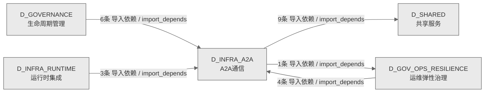

# 03_d_infra_a2a / A2A通信域 / A2A Communication

> **功能简介 / Overview**: Agent 与 Agent 之间的通信协议层，负责 AI 代理间的消息传递、请求路由和协议适配

> **文档作用 / Purpose**: 展示 A2A通信（D_INFRA_A2A）功能域的域内依赖关系、跨域依赖关系，模块信息（成熟度/中英文名/大白话/文件路径）内嵌于 Mermaid 节点，供架构审查和域治理参考。

> 本文档由 generate_domain_doc.py 从 depgraph (PostgreSQL) 自动生成
> 数据源: depgraph (PostgreSQL) nodes表 + edges表

> **[可缩放 HTML 版 / Zoomable HTML](http://localhost:8765/docs/02_enterprise_architecture/02_domain_architecture_docs/_zoomable_html/03_d_infra_a2a.html)** — Ctrl+滚轮缩放 ｜ 双击重置 ｜ Ctrl+Shift+D 切换拖动/选择模式

## 域基本信息 / Domain Overview

| 字段 | 值 | Field | Value |
|------|------|-------|-------|
| 编号 | 03 | Number | 03 |
| 域ID | D_INFRA_A2A | Domain ID | D_INFRA_A2A |
| 域名称 | A2A通信 | Domain Name | A2A Communication |
| 层级 | L0 基础设施层 | Layer | L0 Infrastructure |
| 模块数 | 72 | Module Count | 72 |
| 域内依赖 | 42 | Internal Dependencies | 42 |
| 跨域入边 | 13 | Cross-domain Incoming | 13 |
| 跨域出边 | 10 | Cross-domain Outgoing | 10 |
| 设计态模块 | 0 | Design Modules | 0 |
| 生产态模块 | 72 | Production Modules | 72 |
| 容量 | 72/150 (正常) | Capacity | 72/150 (正常) |
| 描述 | A2A Card注册与发现(card_registry) | Description | A2A Card注册与发现(card_registry) |

## 域内依赖图 / Internal Dependency Diagram

> 依赖图内嵌在本文档中，IDE 可直接渲染；网页版可 Ctrl+滚轮缩放 + 拖动平移查看细节。全景图用颜色区分运营态/设计态，不再分页/拆子图。
>
> **图例说明 / Legend**：
> - 🟦 **蓝色 = 运营态模块**（production，已上线运行）
> - 🟧 **橙色虚线 = 设计态模块**（design，蓝图阶段，代码未写）
> - **实线箭头 = 运营态依赖**（已生效的依赖关系）
> - **虚线箭头 = 非运营态依赖**（计划中/验证中的依赖关系）

### 全景依赖图（全部模块，颜色区分运营态/设计态）

> 展示全部 72 个模块（生产态 72 + 设计态 0），节点含成熟度+中英文名+大白话+文件路径。

```mermaid
%%{init: {'theme': 'base', 'themeVariables': {'primaryColor': '#eaeaea', 'primaryTextColor': '#333333', 'primaryBorderColor': '#666666', 'lineColor': '#666666', 'secondaryColor': '#eaeaea', 'tertiaryColor': '#eaeaea', 'fontSize': '14px'}}}%%
flowchart TD
    src_zephyr_infrastructure_a2a_protocol_a2a_card_registry_py["(生产态 / production) a2acard注册表 / A2a Card Registry<br/>A2A Card Registry — 全局 Agent Card 注册单例<br/>文件: a2a_protocol/a2a_card_registry.py"]
    src_zephyr_infrastructure_a2a_protocol_layer2_communication_context_package_py["(生产态 / production) 上下文package / Context Package<br/>Context Package — A2A 上下文包<br/>文件: layer2_communication/context_package.py"]
    src_zephyr_infrastructure_a2a_protocol_layer2_communication_handoff_manager_py["(生产态 / production) handoff管理器 / Handoff Manager<br/>Handoff Manager — Agent 间任务交接<br/>文件: layer2_communication/handoff_manager.py"]
    src_zephyr_infrastructure_a2a_protocol_layer2_communication_message_router_py["(生产态 / production) message路由器 / Message Router<br/>Message Router — A2A 消息路由<br/>文件: layer2_communication/message_router.py"]
    src_zephyr_infrastructure_a2a_protocol_layer2_communication_push_notifier_py["(生产态 / production) 推送notifier / Push Notifier<br/>Push Notifier — A2A 推送通知<br/>文件: layer2_communication/push_notifier.py"]
    src_zephyr_infrastructure_a2a_protocol_layer2_communication_streaming_py["(生产态 / production) 流式 / Streaming<br/>Streaming — A2A 流式传输<br/>文件: layer2_communication/streaming.py"]
    src_zephyr_infrastructure_a2a_protocol_layer2_communication_trigger_monitor_py["(生产态 / production) 触发器监控器 / Trigger Monitor<br/>触发监控器<br/>文件: layer2_communication/trigger_monitor.py"]
    src_zephyr_infrastructure_a2a_protocol_layer3_coordination_consensus_py["(生产态 / production) 共识 / Consensus<br/>Re-export bridge for layer3_coordination consensus symbols.<br/>文件: layer3_coordination/_consensus.py"]
    src_zephyr_infrastructure_a2a_protocol_layer3_coordination_core_coordination_py["(生产态 / production) 核心coordination / Core Coordination<br/>Re-export bridge for layer3_coordination core coordination symbols.<br/>文件: layer3_coordination/_core_coordination.py"]
    src_zephyr_infrastructure_a2a_protocol_layer3_coordination_intelligence_py["(生产态 / production) intelligence / Intelligence<br/>Re-export bridge for layer3_coordination intelligence symbols.<br/>文件: layer3_coordination/_intelligence.py"]
    src_zephyr_infrastructure_a2a_protocol_layer3_coordination_security_and_economics_py["(生产态 / production) 安全andeconomics / Security And Economics<br/>Re-export bridge for layer3_coordination security and economics symbols.<br/>文件: layer3_coordination/_security_and_economics.py"]
    src_zephyr_infrastructure_a2a_protocol_layer3_coordination_a2a_agent_blocklist_py["(生产态 / production) a2a代理blocklist / A2a Agent Blocklist<br/>A2A Agent 黑名单管理（重命名自 a2a_protocol_security.py，AI-14 审计 P5 修复）<br/>文件: layer3_coordination/a2a_agent_blocklist.py"]
    src_zephyr_infrastructure_a2a_protocol_layer3_coordination_a2a_carbon_py["(生产态 / production) a2acarbon / A2a Carbon<br/>A2A 碳足迹追踪<br/>文件: layer3_coordination/a2a_carbon.py"]
    src_zephyr_infrastructure_a2a_protocol_layer3_coordination_a2a_checkpoint_py["(生产态 / production) a2acheckpoint / A2a Checkpoint<br/>A2A 检查点管理器<br/>文件: layer3_coordination/a2a_checkpoint.py"]
    src_zephyr_infrastructure_a2a_protocol_layer3_coordination_a2a_consent_py["(生产态 / production) a2aconsent / A2a Consent<br/>P2: Agent同意管理<br/>文件: layer3_coordination/a2a_consent.py"]
    src_zephyr_infrastructure_a2a_protocol_layer3_coordination_a2a_constitutional_py["(生产态 / production) a2aconstitutional / A2a Constitutional<br/>P2: 宪法性Agent管理<br/>文件: layer3_coordination/a2a_constitutional.py"]
    src_zephyr_infrastructure_a2a_protocol_layer3_coordination_a2a_context_rot_py["(生产态 / production) a2a上下文rot / A2a Context Rot<br/>上下文腐烂检测<br/>文件: layer3_coordination/a2a_context_rot.py"]
    src_zephyr_infrastructure_a2a_protocol_layer3_coordination_a2a_dashboard_py["(生产态 / production) a2a仪表板 / A2a Dashboard<br/>A2A 监控仪表盘 — Agent 集群运行状态可视化面板<br/>文件: layer3_coordination/a2a_dashboard.py"]
    src_zephyr_infrastructure_a2a_protocol_layer3_coordination_a2a_formal_verification_py["(生产态 / production) a2aformal验证 / A2a Formal Verification<br/>A2A 形式化验证 — 协议属性模型检查<br/>文件: layer3_coordination/a2a_formal_verification.py"]
    src_zephyr_infrastructure_a2a_protocol_layer3_coordination_a2a_frame_negotiation_py["(生产态 / production) a2aframe协商 / A2a Frame Negotiation<br/>A2A ANP 帧协商协议 — Agent Negotiation Protocol 帧层协商<br/>文件: layer3_coordination/a2a_frame_negotiation.py"]
    src_zephyr_infrastructure_a2a_protocol_layer3_coordination_a2a_hardware_router_py["(生产态 / production) a2ahardware路由器 / A2a Hardware Router<br/>A2A 硬件路由器——GPU/CPU 调度<br/>文件: layer3_coordination/a2a_hardware_router.py"]
    src_zephyr_infrastructure_a2a_protocol_layer3_coordination_a2a_hibernate_py["(生产态 / production) a2ahibernate / A2a Hibernate<br/>P2: Agent休眠管理<br/>文件: layer3_coordination/a2a_hibernate.py"]
    src_zephyr_infrastructure_a2a_protocol_layer3_coordination_a2a_immune_py["(生产态 / production) a2aimmune / A2a Immune<br/>A2A 免疫系统<br/>文件: layer3_coordination/a2a_immune.py"]
    src_zephyr_infrastructure_a2a_protocol_layer3_coordination_a2a_metrics_py["(生产态 / production) a2a指标 / A2a Metrics<br/>A2A 指标收集<br/>文件: layer3_coordination/a2a_metrics.py"]
    src_zephyr_infrastructure_a2a_protocol_layer3_coordination_a2a_protocol_gateway_py["(生产态 / production) a2a协议gateway / A2a Protocol Gateway<br/>A2A 协议网关 — Agent 间请求分发与协议转换<br/>文件: layer3_coordination/a2a_protocol_gateway.py"]
    src_zephyr_infrastructure_a2a_protocol_layer3_coordination_a2a_tracing_py["(生产态 / production) a2atracing / A2a Tracing<br/>A2A 分布式追踪 — 跨 Agent 请求链追踪 (Span-based)<br/>文件: layer3_coordination/a2a_tracing.py"]
    src_zephyr_infrastructure_a2a_protocol_layer3_coordination_a2a_vector_reputation_py["(生产态 / production) a2avectorreputation / A2a Vector Reputation<br/>向量化信誉系统<br/>文件: layer3_coordination/a2a_vector_reputation.py"]
    src_zephyr_infrastructure_a2a_protocol_layer3_coordination_spec_sync_py["(生产态 / production) 规格同步 / Spec Sync<br/>A2A Living Spec 同步 — 蓝图与实现的双向漂移管理<br/>文件: layer3_coordination/spec_sync.py"]
    src_zephyr_infrastructure_a2a_protocol_local_first_arch_py["(生产态 / production) 本地优先架构 / Local First Arch<br/>CommunicationError;ConflictError;DelegationError<br/>文件: a2a_protocol/local_first_arch.py"]
    src_zephyr_infrastructure_a2a_protocol_migration_strategy_py["(生产态 / production) 迁移策略 / Migration Strategy<br/>CommunicationError;ConflictError;DelegationError<br/>文件: a2a_protocol/migration_strategy.py"]
    src_zephyr_infrastructure_a2a_protocol_multi_agent_py["(生产态 / production) 多代理 / Multi Agent<br/>multi_agent.py —— Multi-Agent 编排基座（Phase 14 / 盲点 B33）<br/>文件: a2a_protocol/multi_agent.py"]
    src_zephyr_infrastructure_a2a_protocol_multi_model_consensus_py["(生产态 / production) 多模型共识 / Multi Model Consensus<br/>CommunicationError;ConflictError;DelegationError<br/>文件: a2a_protocol/multi_model_consensus.py"]
    src_zephyr_infrastructure_a2a_protocol_offline_autonomy_py["(生产态 / production) 离线autonomy / Offline Autonomy<br/>noqa: m03-duplicate  M03豁免: AI趋同演化(不同模块为相似问题生成相似代码),非复...<br/>文件: a2a_protocol/offline_autonomy.py"]
    src_zephyr_infrastructure_a2a_protocol_offline_resilience_py["(生产态 / production) 离线韧性 / Offline Resilience<br/>CommunicationError;ConflictError;DelegationError<br/>文件: a2a_protocol/offline_resilience.py"]
    src_zephyr_infrastructure_a2a_protocol_phase_hold_py["(生产态 / production) phasehold / Phase Hold<br/>Phase 4 Hold — A2A Phase 4 锁定标记模块 与其他 Phase 3 模块不可并发施工.<br/>文件: a2a_protocol/phase_hold.py"]
    src_zephyr_infrastructure_a2a_protocol_prompt_lifecycle_py["(生产态 / production) 提示词生命周期 / Prompt Lifecycle<br/>CommunicationError;ConflictError;DelegationError<br/>文件: a2a_protocol/prompt_lifecycle.py"]
    src_zephyr_infrastructure_a2a_protocol_realtime_streaming_py["(生产态 / production) 实时流式 / Realtime Streaming<br/>CommunicationError;ConflictError;DelegationError<br/>文件: a2a_protocol/realtime_streaming.py"]
    src_zephyr_infrastructure_a2a_protocol_a2a_card_registry_py ~~~ src_zephyr_infrastructure_a2a_protocol_layer2_communication_context_package_py
    src_zephyr_infrastructure_a2a_protocol_layer2_communication_context_package_py ~~~ src_zephyr_infrastructure_a2a_protocol_layer2_communication_handoff_manager_py
    src_zephyr_infrastructure_a2a_protocol_layer2_communication_handoff_manager_py ~~~ src_zephyr_infrastructure_a2a_protocol_layer2_communication_message_router_py
    src_zephyr_infrastructure_a2a_protocol_layer2_communication_message_router_py ~~~ src_zephyr_infrastructure_a2a_protocol_layer2_communication_push_notifier_py
    src_zephyr_infrastructure_a2a_protocol_layer2_communication_push_notifier_py ~~~ src_zephyr_infrastructure_a2a_protocol_layer2_communication_streaming_py
    src_zephyr_infrastructure_a2a_protocol_layer2_communication_streaming_py ~~~ src_zephyr_infrastructure_a2a_protocol_layer2_communication_trigger_monitor_py
    src_zephyr_infrastructure_a2a_protocol_layer2_communication_trigger_monitor_py ~~~ src_zephyr_infrastructure_a2a_protocol_layer3_coordination_consensus_py
    src_zephyr_infrastructure_a2a_protocol_layer3_coordination_consensus_py ~~~ src_zephyr_infrastructure_a2a_protocol_layer3_coordination_core_coordination_py
    src_zephyr_infrastructure_a2a_protocol_layer3_coordination_core_coordination_py ~~~ src_zephyr_infrastructure_a2a_protocol_layer3_coordination_intelligence_py
    src_zephyr_infrastructure_a2a_protocol_layer3_coordination_intelligence_py ~~~ src_zephyr_infrastructure_a2a_protocol_layer3_coordination_security_and_economics_py
    src_zephyr_infrastructure_a2a_protocol_layer3_coordination_security_and_economics_py ~~~ src_zephyr_infrastructure_a2a_protocol_layer3_coordination_a2a_agent_blocklist_py
    src_zephyr_infrastructure_a2a_protocol_layer3_coordination_a2a_agent_blocklist_py ~~~ src_zephyr_infrastructure_a2a_protocol_layer3_coordination_a2a_carbon_py
    src_zephyr_infrastructure_a2a_protocol_layer3_coordination_a2a_carbon_py ~~~ src_zephyr_infrastructure_a2a_protocol_layer3_coordination_a2a_checkpoint_py
    src_zephyr_infrastructure_a2a_protocol_layer3_coordination_a2a_checkpoint_py ~~~ src_zephyr_infrastructure_a2a_protocol_layer3_coordination_a2a_consent_py
    src_zephyr_infrastructure_a2a_protocol_layer3_coordination_a2a_consent_py ~~~ src_zephyr_infrastructure_a2a_protocol_layer3_coordination_a2a_constitutional_py
    src_zephyr_infrastructure_a2a_protocol_layer3_coordination_a2a_constitutional_py ~~~ src_zephyr_infrastructure_a2a_protocol_layer3_coordination_a2a_context_rot_py
    src_zephyr_infrastructure_a2a_protocol_layer3_coordination_a2a_context_rot_py ~~~ src_zephyr_infrastructure_a2a_protocol_layer3_coordination_a2a_dashboard_py
    src_zephyr_infrastructure_a2a_protocol_layer3_coordination_a2a_dashboard_py ~~~ src_zephyr_infrastructure_a2a_protocol_layer3_coordination_a2a_formal_verification_py
    src_zephyr_infrastructure_a2a_protocol_layer3_coordination_a2a_formal_verification_py ~~~ src_zephyr_infrastructure_a2a_protocol_layer3_coordination_a2a_frame_negotiation_py
    src_zephyr_infrastructure_a2a_protocol_layer3_coordination_a2a_frame_negotiation_py ~~~ src_zephyr_infrastructure_a2a_protocol_layer3_coordination_a2a_hardware_router_py
    src_zephyr_infrastructure_a2a_protocol_layer3_coordination_a2a_hardware_router_py ~~~ src_zephyr_infrastructure_a2a_protocol_layer3_coordination_a2a_hibernate_py
    src_zephyr_infrastructure_a2a_protocol_layer3_coordination_a2a_hibernate_py ~~~ src_zephyr_infrastructure_a2a_protocol_layer3_coordination_a2a_immune_py
    src_zephyr_infrastructure_a2a_protocol_layer3_coordination_a2a_immune_py ~~~ src_zephyr_infrastructure_a2a_protocol_layer3_coordination_a2a_metrics_py
    src_zephyr_infrastructure_a2a_protocol_layer3_coordination_a2a_metrics_py ~~~ src_zephyr_infrastructure_a2a_protocol_layer3_coordination_a2a_protocol_gateway_py
    src_zephyr_infrastructure_a2a_protocol_layer3_coordination_a2a_protocol_gateway_py ~~~ src_zephyr_infrastructure_a2a_protocol_layer3_coordination_a2a_tracing_py
    src_zephyr_infrastructure_a2a_protocol_layer3_coordination_a2a_tracing_py ~~~ src_zephyr_infrastructure_a2a_protocol_layer3_coordination_a2a_vector_reputation_py
    src_zephyr_infrastructure_a2a_protocol_layer3_coordination_a2a_vector_reputation_py ~~~ src_zephyr_infrastructure_a2a_protocol_layer3_coordination_spec_sync_py
    src_zephyr_infrastructure_a2a_protocol_layer3_coordination_spec_sync_py ~~~ src_zephyr_infrastructure_a2a_protocol_local_first_arch_py
    src_zephyr_infrastructure_a2a_protocol_local_first_arch_py ~~~ src_zephyr_infrastructure_a2a_protocol_migration_strategy_py
    src_zephyr_infrastructure_a2a_protocol_migration_strategy_py ~~~ src_zephyr_infrastructure_a2a_protocol_multi_agent_py
    src_zephyr_infrastructure_a2a_protocol_multi_agent_py ~~~ src_zephyr_infrastructure_a2a_protocol_multi_model_consensus_py
    src_zephyr_infrastructure_a2a_protocol_multi_model_consensus_py ~~~ src_zephyr_infrastructure_a2a_protocol_offline_autonomy_py
    src_zephyr_infrastructure_a2a_protocol_offline_autonomy_py ~~~ src_zephyr_infrastructure_a2a_protocol_offline_resilience_py
    src_zephyr_infrastructure_a2a_protocol_offline_resilience_py ~~~ src_zephyr_infrastructure_a2a_protocol_phase_hold_py
    src_zephyr_infrastructure_a2a_protocol_phase_hold_py ~~~ src_zephyr_infrastructure_a2a_protocol_prompt_lifecycle_py
    src_zephyr_infrastructure_a2a_protocol_prompt_lifecycle_py ~~~ src_zephyr_infrastructure_a2a_protocol_realtime_streaming_py
    src_zephyr_infrastructure_a2a_protocol_layer2_communication_a2a_schemas_py["(生产态 / production) a2a模式 / A2a Schemas<br/>A2A Message/Part 系统 — Layer 2 Communication<br/>文件: layer2_communication/a2a_schemas.py"]
    src_zephyr_infrastructure_a2a_protocol_layer3_coordination_a2a_anomaly_detector_py["(生产态 / production) a2a异常检测器 / A2a Anomaly Detector<br/>A2A 统计异常检测引擎 — 基线学习 + 实时异常判断<br/>文件: layer3_coordination/a2a_anomaly_detector.py"]
    src_zephyr_infrastructure_a2a_protocol_layer3_coordination_a2a_behavior_fingerprint_py["(生产态 / production) a2abehavior指纹 / A2a Behavior Fingerprint<br/>A2A 行为指纹 — Agent 行为模式学习与画像<br/>文件: layer3_coordination/a2a_behavior_fingerprint.py"]
    src_zephyr_infrastructure_a2a_protocol_layer3_coordination_a2a_blame_attribution_py["(生产态 / production) a2ablameattribution / A2a Blame Attribution<br/>A2A 责任归属引擎 — 因果链分析 + 责任分配<br/>文件: layer3_coordination/a2a_blame_attribution.py"]
    src_zephyr_infrastructure_a2a_protocol_layer3_coordination_a2a_causal_trace_py["(生产态 / production) a2acausal追踪 / A2a Causal Trace<br/>A2A 因果追踪 — 跨 Agent 操作因果链图谱<br/>文件: layer3_coordination/a2a_causal_trace.py"]
    src_zephyr_infrastructure_a2a_protocol_layer3_coordination_a2a_collusion_detector_py["(生产态 / production) a2acollusion检测器 / A2a Collusion Detector<br/>A2A 合谋检测器 — Agent 间串通模式识别<br/>文件: layer3_coordination/a2a_collusion_detector.py"]
    src_zephyr_infrastructure_a2a_protocol_layer3_coordination_a2a_cross_agent_semantic_flow_py["(生产态 / production) a2a跨代理语义流 / A2a Cross Agent Semantic Flow<br/>A2A 跨 Agent 语义流追踪 — 知识+意图在 Agent 间传递<br/>文件: layer3_coordination/a2a_cross_agent_semantic_flow.py"]
    src_zephyr_infrastructure_a2a_protocol_layer3_coordination_a2a_debate_py["(生产态 / production) a2adebate / A2a Debate<br/>A2A 结构化辩论协议 — 多轮主张->反驳->合成<br/>文件: layer3_coordination/a2a_debate.py"]
    src_zephyr_infrastructure_a2a_protocol_layer3_coordination_a2a_economics_py["(生产态 / production) a2aeconomics / A2a Economics<br/>A2A 经济学——Token/API成本追踪<br/>文件: layer3_coordination/a2a_economics.py"]
    src_zephyr_infrastructure_a2a_protocol_layer3_coordination_a2a_forgetting_py["(生产态 / production) a2aforgetting / A2a Forgetting<br/>A2A 遗忘机制<br/>文件: layer3_coordination/a2a_forgetting.py"]
    src_zephyr_infrastructure_a2a_protocol_layer3_coordination_a2a_idempotency_py["(生产态 / production) a2aidempotency / A2a Idempotency<br/>A2A 幂等性保证<br/>文件: layer3_coordination/a2a_idempotency.py"]
    src_zephyr_infrastructure_a2a_protocol_layer3_coordination_a2a_idle_guard_py["(生产态 / production) a2aidle守卫 / A2a Idle Guard<br/>A2A 空闲守卫<br/>文件: layer3_coordination/a2a_idle_guard.py"]
    src_zephyr_infrastructure_a2a_protocol_layer3_coordination_a2a_knowledge_distill_py["(生产态 / production) a2aknowledgedistill / A2a Knowledge Distill<br/>A2A 知识蒸馏 — 跨 Agent 经验提炼与共享<br/>文件: layer3_coordination/a2a_knowledge_distill.py"]
    src_zephyr_infrastructure_a2a_protocol_layer3_coordination_a2a_latent_comm_py["(生产态 / production) a2alatentcomm / A2a Latent Comm<br/>A2A 隐性通信检测 — 检测 Agent 通过副作用隐式通信<br/>文件: layer3_coordination/a2a_latent_comm.py"]
    src_zephyr_infrastructure_a2a_protocol_layer3_coordination_a2a_negotiation_py["(生产态 / production) a2a协商 / A2a Negotiation<br/>A2A 协商协议 — Agent 间资源/任务分配协商<br/>文件: layer3_coordination/a2a_negotiation.py"]
    src_zephyr_infrastructure_a2a_protocol_layer3_coordination_a2a_red_team_py["(生产态 / production) a2aredteam / A2a Red Team<br/>A2A 红队测试 — 攻击向量定义与执行框架<br/>文件: layer3_coordination/a2a_red_team.py"]
    src_zephyr_infrastructure_a2a_protocol_layer3_coordination_a2a_saga_py["(生产态 / production) a2asaga / A2a Saga<br/>A2A Saga 事务协议 — 多 Agent 跨步分布式事务<br/>文件: layer3_coordination/a2a_saga.py"]
    src_zephyr_infrastructure_a2a_protocol_layer3_coordination_a2a_temporal_admission_py["(生产态 / production) a2atemporal准入 / A2a Temporal Admission<br/>时序准入控制<br/>文件: layer3_coordination/a2a_temporal_admission.py"]
    src_zephyr_infrastructure_a2a_protocol_layer3_coordination_a2a_voting_py["(生产态 / production) a2avoting / A2a Voting<br/>A2A 加权投票协议 — 多 Agent 共识达成机制<br/>文件: layer3_coordination/a2a_voting.py"]
    src_zephyr_infrastructure_a2a_protocol_layer3_coordination_a2a_work_steal_py["(生产态 / production) a2aworksteal / A2a Work Steal<br/>A2A 工作窃取调度器 — 跨 Agent 负载均衡<br/>文件: layer3_coordination/a2a_work_steal.py"]
    src_zephyr_infrastructure_a2a_protocol_layer3_coordination_arbitrator_py["(生产态 / production) arbitrator / Arbitrator<br/>A2A 三级仲裁引擎 — priority -> rule -> escalation<br/>文件: layer3_coordination/arbitrator.py"]
    src_zephyr_infrastructure_a2a_protocol_layer3_coordination_cascade_guard_py["(生产态 / production) 级联守卫 / Cascade Guard<br/>级联守卫——防止失败在Agent间级联<br/>文件: layer3_coordination/cascade_guard.py"]
    src_zephyr_infrastructure_a2a_protocol_layer3_coordination_conflict_detector_py["(生产态 / production) conflict检测器 / Conflict Detector<br/>A2A 冲突检测引擎 — 语义+文本+资源三维冲突检测<br/>文件: layer3_coordination/conflict_detector.py"]
    src_zephyr_infrastructure_a2a_protocol_layer3_coordination_construction_verifier_py["(生产态 / production) construction验证器 / Construction Verifier<br/>施工后验证器 — 自指悖论防御：不橡胶图章，真正验证 A2A 协议模块的施工完整性<br/>文件: layer3_coordination/construction_verifier.py"]
    src_zephyr_infrastructure_a2a_protocol_layer3_coordination_deadlock_guard_py["(生产态 / production) deadlock守卫 / Deadlock Guard<br/>P2: 死锁守卫<br/>文件: layer3_coordination/deadlock_guard.py"]
    src_zephyr_infrastructure_a2a_protocol_layer3_coordination_livelock_detector_py["(生产态 / production) livelock检测器 / Livelock Detector<br/>P2: 活锁检测器<br/>文件: layer3_coordination/livelock_detector.py"]
    src_zephyr_infrastructure_a2a_protocol_layer3_coordination_semantic_diff_py["(生产态 / production) 语义差异 / Semantic Diff<br/>A2A 语义差异引擎 — 结构感知的 Agent 间差异检测<br/>文件: layer3_coordination/semantic_diff.py"]
    src_zephyr_infrastructure_a2a_protocol_layer2_communication_a2a_schemas_py ~~~ src_zephyr_infrastructure_a2a_protocol_layer3_coordination_a2a_anomaly_detector_py
    src_zephyr_infrastructure_a2a_protocol_layer3_coordination_a2a_anomaly_detector_py ~~~ src_zephyr_infrastructure_a2a_protocol_layer3_coordination_a2a_behavior_fingerprint_py
    src_zephyr_infrastructure_a2a_protocol_layer3_coordination_a2a_behavior_fingerprint_py ~~~ src_zephyr_infrastructure_a2a_protocol_layer3_coordination_a2a_blame_attribution_py
    src_zephyr_infrastructure_a2a_protocol_layer3_coordination_a2a_blame_attribution_py ~~~ src_zephyr_infrastructure_a2a_protocol_layer3_coordination_a2a_causal_trace_py
    src_zephyr_infrastructure_a2a_protocol_layer3_coordination_a2a_causal_trace_py ~~~ src_zephyr_infrastructure_a2a_protocol_layer3_coordination_a2a_collusion_detector_py
    src_zephyr_infrastructure_a2a_protocol_layer3_coordination_a2a_collusion_detector_py ~~~ src_zephyr_infrastructure_a2a_protocol_layer3_coordination_a2a_cross_agent_semantic_flow_py
    src_zephyr_infrastructure_a2a_protocol_layer3_coordination_a2a_cross_agent_semantic_flow_py ~~~ src_zephyr_infrastructure_a2a_protocol_layer3_coordination_a2a_debate_py
    src_zephyr_infrastructure_a2a_protocol_layer3_coordination_a2a_debate_py ~~~ src_zephyr_infrastructure_a2a_protocol_layer3_coordination_a2a_economics_py
    src_zephyr_infrastructure_a2a_protocol_layer3_coordination_a2a_economics_py ~~~ src_zephyr_infrastructure_a2a_protocol_layer3_coordination_a2a_forgetting_py
    src_zephyr_infrastructure_a2a_protocol_layer3_coordination_a2a_forgetting_py ~~~ src_zephyr_infrastructure_a2a_protocol_layer3_coordination_a2a_idempotency_py
    src_zephyr_infrastructure_a2a_protocol_layer3_coordination_a2a_idempotency_py ~~~ src_zephyr_infrastructure_a2a_protocol_layer3_coordination_a2a_idle_guard_py
    src_zephyr_infrastructure_a2a_protocol_layer3_coordination_a2a_idle_guard_py ~~~ src_zephyr_infrastructure_a2a_protocol_layer3_coordination_a2a_knowledge_distill_py
    src_zephyr_infrastructure_a2a_protocol_layer3_coordination_a2a_knowledge_distill_py ~~~ src_zephyr_infrastructure_a2a_protocol_layer3_coordination_a2a_latent_comm_py
    src_zephyr_infrastructure_a2a_protocol_layer3_coordination_a2a_latent_comm_py ~~~ src_zephyr_infrastructure_a2a_protocol_layer3_coordination_a2a_negotiation_py
    src_zephyr_infrastructure_a2a_protocol_layer3_coordination_a2a_negotiation_py ~~~ src_zephyr_infrastructure_a2a_protocol_layer3_coordination_a2a_red_team_py
    src_zephyr_infrastructure_a2a_protocol_layer3_coordination_a2a_red_team_py ~~~ src_zephyr_infrastructure_a2a_protocol_layer3_coordination_a2a_saga_py
    src_zephyr_infrastructure_a2a_protocol_layer3_coordination_a2a_saga_py ~~~ src_zephyr_infrastructure_a2a_protocol_layer3_coordination_a2a_temporal_admission_py
    src_zephyr_infrastructure_a2a_protocol_layer3_coordination_a2a_temporal_admission_py ~~~ src_zephyr_infrastructure_a2a_protocol_layer3_coordination_a2a_voting_py
    src_zephyr_infrastructure_a2a_protocol_layer3_coordination_a2a_voting_py ~~~ src_zephyr_infrastructure_a2a_protocol_layer3_coordination_a2a_work_steal_py
    src_zephyr_infrastructure_a2a_protocol_layer3_coordination_a2a_work_steal_py ~~~ src_zephyr_infrastructure_a2a_protocol_layer3_coordination_arbitrator_py
    src_zephyr_infrastructure_a2a_protocol_layer3_coordination_arbitrator_py ~~~ src_zephyr_infrastructure_a2a_protocol_layer3_coordination_cascade_guard_py
    src_zephyr_infrastructure_a2a_protocol_layer3_coordination_cascade_guard_py ~~~ src_zephyr_infrastructure_a2a_protocol_layer3_coordination_conflict_detector_py
    src_zephyr_infrastructure_a2a_protocol_layer3_coordination_conflict_detector_py ~~~ src_zephyr_infrastructure_a2a_protocol_layer3_coordination_construction_verifier_py
    src_zephyr_infrastructure_a2a_protocol_layer3_coordination_construction_verifier_py ~~~ src_zephyr_infrastructure_a2a_protocol_layer3_coordination_deadlock_guard_py
    src_zephyr_infrastructure_a2a_protocol_layer3_coordination_deadlock_guard_py ~~~ src_zephyr_infrastructure_a2a_protocol_layer3_coordination_livelock_detector_py
    src_zephyr_infrastructure_a2a_protocol_layer3_coordination_livelock_detector_py ~~~ src_zephyr_infrastructure_a2a_protocol_layer3_coordination_semantic_diff_py
    src_zephyr_infrastructure_a2a_protocol_layer1_discovery_a2a_registry_py["(生产态 / production) a2a注册表 / A2a Registry<br/>A2A Registry — Agent Card 注册与发现<br/>文件: layer1_discovery/a2a_registry.py"]
    src_zephyr_infrastructure_a2a_protocol_layer1_discovery_identity_verifier_py["(生产态 / production) 身份验证器 / Identity Verifier<br/>Identity Verifier — JWT 身份验证器<br/>文件: layer1_discovery/identity_verifier.py"]
    src_zephyr_infrastructure_a2a_protocol_layer3_coordination_a2a_delegation_chain_py["(生产态 / production) a2adelegation链 / A2a Delegation Chain<br/>委托链<br/>文件: layer3_coordination/a2a_delegation_chain.py"]
    src_zephyr_infrastructure_a2a_protocol_layer3_coordination_a2a_security_py["(生产态 / production) a2a安全 / A2a Security<br/>A2A 安全内容扫描器 — 六大类威胁检测<br/>文件: layer3_coordination/a2a_security.py"]
    src_zephyr_infrastructure_a2a_protocol_layer3_coordination_session_smuggling_defense_py["(生产态 / production) 会话smuggling防御 / Session Smuggling Defense<br/>A2A Session 走私防御 — 防止跨 Agent session 上下文伪造<br/>文件: layer3_coordination/session_smuggling_defense.py"]
    src_zephyr_infrastructure_a2a_protocol_layer3_coordination_supervisor_py["(生产态 / production) supervisor / Supervisor<br/>Supervisor — A2A Layer 3 Coordination<br/>文件: layer3_coordination/supervisor.py"]
    src_zephyr_infrastructure_a2a_protocol_layer1_discovery_a2a_registry_py ~~~ src_zephyr_infrastructure_a2a_protocol_layer1_discovery_identity_verifier_py
    src_zephyr_infrastructure_a2a_protocol_layer1_discovery_identity_verifier_py ~~~ src_zephyr_infrastructure_a2a_protocol_layer3_coordination_a2a_delegation_chain_py
    src_zephyr_infrastructure_a2a_protocol_layer3_coordination_a2a_delegation_chain_py ~~~ src_zephyr_infrastructure_a2a_protocol_layer3_coordination_a2a_security_py
    src_zephyr_infrastructure_a2a_protocol_layer3_coordination_a2a_security_py ~~~ src_zephyr_infrastructure_a2a_protocol_layer3_coordination_session_smuggling_defense_py
    src_zephyr_infrastructure_a2a_protocol_layer3_coordination_session_smuggling_defense_py ~~~ src_zephyr_infrastructure_a2a_protocol_layer3_coordination_supervisor_py
    src_zephyr_infrastructure_a2a_protocol_layer1_discovery_agent_card_py["(生产态 / production) 代理card / Agent Card<br/>Agent Card 模型 — A2A Layer 1 Discovery<br/>文件: layer1_discovery/agent_card.py"]
    src_zephyr_infrastructure_a2a_protocol_layer2_communication_a2a_state_py["(生产态 / production) a2a状态 / A2a State<br/>A2A Task 状态机 — Layer 2 Communication<br/>文件: layer2_communication/a2a_state.py"]
    src_zephyr_infrastructure_a2a_protocol_layer1_discovery_agent_card_py ~~~ src_zephyr_infrastructure_a2a_protocol_layer2_communication_a2a_state_py
    src_zephyr_infrastructure_a2a_protocol_a2a_card_registry_py -->|导入依赖 / import_depends| src_zephyr_infrastructure_a2a_protocol_layer1_discovery_a2a_registry_py
    src_zephyr_infrastructure_a2a_protocol_layer1_discovery_a2a_registry_py -->|导入依赖 / import_depends| src_zephyr_infrastructure_a2a_protocol_layer1_discovery_agent_card_py
    src_zephyr_infrastructure_a2a_protocol_layer2_communication_message_router_py -->|导入依赖 / import_depends| src_zephyr_infrastructure_a2a_protocol_layer2_communication_a2a_schemas_py
    src_zephyr_infrastructure_a2a_protocol_layer3_coordination_a2a_red_team_py -->|导入依赖 / import_depends| src_zephyr_infrastructure_a2a_protocol_layer1_discovery_a2a_registry_py
    src_zephyr_infrastructure_a2a_protocol_layer3_coordination_a2a_red_team_py -->|导入依赖 / import_depends| src_zephyr_infrastructure_a2a_protocol_layer1_discovery_identity_verifier_py
    src_zephyr_infrastructure_a2a_protocol_layer3_coordination_a2a_red_team_py -->|导入依赖 / import_depends| src_zephyr_infrastructure_a2a_protocol_layer1_discovery_agent_card_py
    src_zephyr_infrastructure_a2a_protocol_layer3_coordination_a2a_red_team_py -->|导入依赖 / import_depends| src_zephyr_infrastructure_a2a_protocol_layer2_communication_a2a_state_py
    src_zephyr_infrastructure_a2a_protocol_layer3_coordination_a2a_red_team_py -->|导入依赖 / import_depends| src_zephyr_infrastructure_a2a_protocol_layer3_coordination_a2a_delegation_chain_py
    src_zephyr_infrastructure_a2a_protocol_layer3_coordination_a2a_red_team_py -->|导入依赖 / import_depends| src_zephyr_infrastructure_a2a_protocol_layer3_coordination_a2a_security_py
    src_zephyr_infrastructure_a2a_protocol_layer3_coordination_a2a_red_team_py -->|导入依赖 / import_depends| src_zephyr_infrastructure_a2a_protocol_layer3_coordination_session_smuggling_defense_py
    src_zephyr_infrastructure_a2a_protocol_layer3_coordination_a2a_red_team_py -->|导入依赖 / import_depends| src_zephyr_infrastructure_a2a_protocol_layer3_coordination_supervisor_py
    src_zephyr_infrastructure_a2a_protocol_layer3_coordination_supervisor_py -->|导入依赖 / import_depends| src_zephyr_infrastructure_a2a_protocol_layer2_communication_a2a_state_py
    src_zephyr_infrastructure_a2a_protocol_layer3_coordination_core_coordination_py -->|导入依赖 / import_depends| src_zephyr_infrastructure_a2a_protocol_layer3_coordination_cascade_guard_py
    src_zephyr_infrastructure_a2a_protocol_layer3_coordination_core_coordination_py -->|导入依赖 / import_depends| src_zephyr_infrastructure_a2a_protocol_layer3_coordination_livelock_detector_py
    src_zephyr_infrastructure_a2a_protocol_layer3_coordination_core_coordination_py -->|导入依赖 / import_depends| src_zephyr_infrastructure_a2a_protocol_layer3_coordination_arbitrator_py
    src_zephyr_infrastructure_a2a_protocol_layer3_coordination_core_coordination_py -->|导入依赖 / import_depends| src_zephyr_infrastructure_a2a_protocol_layer3_coordination_deadlock_guard_py
    src_zephyr_infrastructure_a2a_protocol_layer3_coordination_core_coordination_py -->|导入依赖 / import_depends| src_zephyr_infrastructure_a2a_protocol_layer3_coordination_construction_verifier_py
    src_zephyr_infrastructure_a2a_protocol_layer3_coordination_core_coordination_py -->|导入依赖 / import_depends| src_zephyr_infrastructure_a2a_protocol_layer3_coordination_conflict_detector_py
    src_zephyr_infrastructure_a2a_protocol_layer3_coordination_core_coordination_py -->|导入依赖 / import_depends| src_zephyr_infrastructure_a2a_protocol_layer3_coordination_semantic_diff_py
    src_zephyr_infrastructure_a2a_protocol_layer3_coordination_core_coordination_py -->|导入依赖 / import_depends| src_zephyr_infrastructure_a2a_protocol_layer3_coordination_supervisor_py
    src_zephyr_infrastructure_a2a_protocol_layer3_coordination_consensus_py -->|导入依赖 / import_depends| src_zephyr_infrastructure_a2a_protocol_layer3_coordination_a2a_debate_py
    src_zephyr_infrastructure_a2a_protocol_layer3_coordination_consensus_py -->|导入依赖 / import_depends| src_zephyr_infrastructure_a2a_protocol_layer3_coordination_a2a_negotiation_py
    src_zephyr_infrastructure_a2a_protocol_layer3_coordination_consensus_py -->|导入依赖 / import_depends| src_zephyr_infrastructure_a2a_protocol_layer3_coordination_a2a_saga_py
    src_zephyr_infrastructure_a2a_protocol_layer3_coordination_consensus_py -->|导入依赖 / import_depends| src_zephyr_infrastructure_a2a_protocol_layer3_coordination_a2a_voting_py
    src_zephyr_infrastructure_a2a_protocol_layer3_coordination_consensus_py -->|导入依赖 / import_depends| src_zephyr_infrastructure_a2a_protocol_layer3_coordination_a2a_work_steal_py
    src_zephyr_infrastructure_a2a_protocol_layer3_coordination_intelligence_py -->|导入依赖 / import_depends| src_zephyr_infrastructure_a2a_protocol_layer3_coordination_a2a_blame_attribution_py
    src_zephyr_infrastructure_a2a_protocol_layer3_coordination_intelligence_py -->|导入依赖 / import_depends| src_zephyr_infrastructure_a2a_protocol_layer3_coordination_a2a_behavior_fingerprint_py
    src_zephyr_infrastructure_a2a_protocol_layer3_coordination_intelligence_py -->|导入依赖 / import_depends| src_zephyr_infrastructure_a2a_protocol_layer3_coordination_a2a_collusion_detector_py
    src_zephyr_infrastructure_a2a_protocol_layer3_coordination_intelligence_py -->|导入依赖 / import_depends| src_zephyr_infrastructure_a2a_protocol_layer3_coordination_a2a_causal_trace_py
    src_zephyr_infrastructure_a2a_protocol_layer3_coordination_intelligence_py -->|导入依赖 / import_depends| src_zephyr_infrastructure_a2a_protocol_layer3_coordination_a2a_cross_agent_semantic_flow_py
    src_zephyr_infrastructure_a2a_protocol_layer3_coordination_intelligence_py -->|导入依赖 / import_depends| src_zephyr_infrastructure_a2a_protocol_layer3_coordination_a2a_latent_comm_py
    src_zephyr_infrastructure_a2a_protocol_layer3_coordination_intelligence_py -->|导入依赖 / import_depends| src_zephyr_infrastructure_a2a_protocol_layer3_coordination_a2a_knowledge_distill_py
    src_zephyr_infrastructure_a2a_protocol_layer3_coordination_security_and_economics_py -->|导入依赖 / import_depends| src_zephyr_infrastructure_a2a_protocol_layer3_coordination_a2a_anomaly_detector_py
    src_zephyr_infrastructure_a2a_protocol_layer3_coordination_security_and_economics_py -->|导入依赖 / import_depends| src_zephyr_infrastructure_a2a_protocol_layer3_coordination_a2a_economics_py
    src_zephyr_infrastructure_a2a_protocol_layer3_coordination_security_and_economics_py -->|导入依赖 / import_depends| src_zephyr_infrastructure_a2a_protocol_layer3_coordination_a2a_delegation_chain_py
    src_zephyr_infrastructure_a2a_protocol_layer3_coordination_security_and_economics_py -->|导入依赖 / import_depends| src_zephyr_infrastructure_a2a_protocol_layer3_coordination_a2a_forgetting_py
    src_zephyr_infrastructure_a2a_protocol_layer3_coordination_security_and_economics_py -->|导入依赖 / import_depends| src_zephyr_infrastructure_a2a_protocol_layer3_coordination_a2a_idempotency_py
    src_zephyr_infrastructure_a2a_protocol_layer3_coordination_security_and_economics_py -->|导入依赖 / import_depends| src_zephyr_infrastructure_a2a_protocol_layer3_coordination_a2a_idle_guard_py
    src_zephyr_infrastructure_a2a_protocol_layer3_coordination_security_and_economics_py -->|导入依赖 / import_depends| src_zephyr_infrastructure_a2a_protocol_layer3_coordination_a2a_red_team_py
    src_zephyr_infrastructure_a2a_protocol_layer3_coordination_security_and_economics_py -->|导入依赖 / import_depends| src_zephyr_infrastructure_a2a_protocol_layer3_coordination_a2a_temporal_admission_py
    src_zephyr_infrastructure_a2a_protocol_layer3_coordination_security_and_economics_py -->|导入依赖 / import_depends| src_zephyr_infrastructure_a2a_protocol_layer3_coordination_a2a_security_py
    src_zephyr_infrastructure_a2a_protocol_layer3_coordination_security_and_economics_py -->|导入依赖 / import_depends| src_zephyr_infrastructure_a2a_protocol_layer3_coordination_session_smuggling_defense_py
    D_SHARED["(生产态 / production) 共享服务 / Shared Services<br/>共享服务，负责跨域共享的工具、协议和基础服务<br/>跨域节点 / cross-domain"]
    src_zephyr_infrastructure_a2a_protocol_layer2_communication_context_package_py -->|导入依赖 / import_depends| D_SHARED
    src_zephyr_infrastructure_a2a_protocol_layer2_communication_a2a_schemas_py -->|导入依赖 / import_depends| D_SHARED
    src_zephyr_infrastructure_a2a_protocol_layer3_coordination_construction_verifier_py -->|导入依赖 / import_depends| D_SHARED
    src_zephyr_infrastructure_a2a_protocol_layer1_discovery_agent_card_py -->|导入依赖 / import_depends| D_SHARED
    src_zephyr_infrastructure_a2a_protocol_multi_agent_py -->|导入依赖 / import_depends| D_SHARED
    src_zephyr_infrastructure_a2a_protocol_layer2_communication_handoff_manager_py -->|导入依赖 / import_depends| D_SHARED
    D_GOV_OPS_RESILIENCE["(生产态 / production) 运维弹性治理 / Ops Resilience Governance<br/>运维弹性治理，负责运维治理、安全治理、弹性治理和升级协议<br/>跨域节点 / cross-domain"]
    src_zephyr_infrastructure_a2a_protocol_layer3_coordination_arbitrator_py -->|导入依赖 / import_depends| D_GOV_OPS_RESILIENCE
    src_zephyr_infrastructure_a2a_protocol_layer3_coordination_supervisor_py -->|导入依赖 / import_depends| D_SHARED
    src_zephyr_infrastructure_a2a_protocol_layer3_coordination_arbitrator_py -->|导入依赖 / import_depends| D_SHARED
    src_zephyr_infrastructure_a2a_protocol_layer2_communication_a2a_state_py -->|导入依赖 / import_depends| D_SHARED
    D_GOV_OPS_RESILIENCE -->|导入依赖 / import_depends| src_zephyr_infrastructure_a2a_protocol_layer3_coordination_arbitrator_py
    D_GOVERNANCE["(生产态 / production) 生命周期管理 / Lifecycle Management<br/>生命周期管理，负责蓝图/模块/任务的声明周期管理和元数据治理<br/>跨域节点 / cross-domain"]
    D_GOVERNANCE -->|导入依赖 / import_depends| src_zephyr_infrastructure_a2a_protocol_layer3_coordination_a2a_frame_negotiation_py
    D_GOV_OPS_RESILIENCE -->|导入依赖 / import_depends| src_zephyr_infrastructure_a2a_protocol_offline_resilience_py
    D_GOVERNANCE -->|导入依赖 / import_depends| src_zephyr_infrastructure_a2a_protocol_layer3_coordination_a2a_protocol_gateway_py
    D_GOVERNANCE -->|导入依赖 / import_depends| src_zephyr_infrastructure_a2a_protocol_layer3_coordination_spec_sync_py
    D_INFRA_RUNTIME["(生产态 / production) 运行时集成 / Runtime Integration<br/>运行时集成，负责组件生命周期编排、启动钩子和运行时上下文管理<br/>跨域节点 / cross-domain"]
    D_INFRA_RUNTIME -->|导入依赖 / import_depends| src_zephyr_infrastructure_a2a_protocol_layer3_coordination_a2a_protocol_gateway_py
    D_GOVERNANCE -->|导入依赖 / import_depends| src_zephyr_infrastructure_a2a_protocol_layer3_coordination_a2a_formal_verification_py
    D_GOVERNANCE -->|导入依赖 / import_depends| src_zephyr_infrastructure_a2a_protocol_layer3_coordination_a2a_dashboard_py
    D_GOVERNANCE -->|导入依赖 / import_depends| src_zephyr_infrastructure_a2a_protocol_layer3_coordination_a2a_tracing_py
    D_GOV_OPS_RESILIENCE -->|导入依赖 / import_depends| src_zephyr_infrastructure_a2a_protocol_offline_autonomy_py
    D_INFRA_RUNTIME -->|导入依赖 / import_depends| src_zephyr_infrastructure_a2a_protocol_layer1_discovery_a2a_registry_py
    D_GOV_OPS_RESILIENCE -->|导入依赖 / import_depends| src_zephyr_infrastructure_a2a_protocol_layer3_coordination_arbitrator_py
    D_INFRA_RUNTIME -->|导入依赖 / import_depends| src_zephyr_infrastructure_a2a_protocol_a2a_card_registry_py
    classDef production fill:#e1f5fe,stroke:#01579b,stroke-width:2px,color:#000
    classDef design fill:#fff3e0,stroke:#e65100,stroke-width:2px,color:#000,stroke-dasharray: 5 5
    classDef external_prod fill:#e8f4fd,stroke:#0277bd,stroke-width:1px,color:#000
    classDef external_design fill:#fff8e7,stroke:#ef6c00,stroke-width:1px,color:#000,stroke-dasharray: 5 5
    class src_zephyr_infrastructure_a2a_protocol_a2a_card_registry_py,src_zephyr_infrastructure_a2a_protocol_layer1_discovery_a2a_registry_py,src_zephyr_infrastructure_a2a_protocol_layer1_discovery_agent_card_py,src_zephyr_infrastructure_a2a_protocol_layer1_discovery_identity_verifier_py,src_zephyr_infrastructure_a2a_protocol_layer2_communication_a2a_schemas_py,src_zephyr_infrastructure_a2a_protocol_layer2_communication_a2a_state_py,src_zephyr_infrastructure_a2a_protocol_layer2_communication_context_package_py,src_zephyr_infrastructure_a2a_protocol_layer2_communication_handoff_manager_py,src_zephyr_infrastructure_a2a_protocol_layer2_communication_message_router_py,src_zephyr_infrastructure_a2a_protocol_layer2_communication_push_notifier_py,src_zephyr_infrastructure_a2a_protocol_layer2_communication_streaming_py,src_zephyr_infrastructure_a2a_protocol_layer2_communication_trigger_monitor_py,src_zephyr_infrastructure_a2a_protocol_layer3_coordination_consensus_py,src_zephyr_infrastructure_a2a_protocol_layer3_coordination_core_coordination_py,src_zephyr_infrastructure_a2a_protocol_layer3_coordination_intelligence_py,src_zephyr_infrastructure_a2a_protocol_layer3_coordination_security_and_economics_py,src_zephyr_infrastructure_a2a_protocol_layer3_coordination_a2a_agent_blocklist_py,src_zephyr_infrastructure_a2a_protocol_layer3_coordination_a2a_anomaly_detector_py,src_zephyr_infrastructure_a2a_protocol_layer3_coordination_a2a_behavior_fingerprint_py,src_zephyr_infrastructure_a2a_protocol_layer3_coordination_a2a_blame_attribution_py,src_zephyr_infrastructure_a2a_protocol_layer3_coordination_a2a_carbon_py,src_zephyr_infrastructure_a2a_protocol_layer3_coordination_a2a_causal_trace_py,src_zephyr_infrastructure_a2a_protocol_layer3_coordination_a2a_checkpoint_py,src_zephyr_infrastructure_a2a_protocol_layer3_coordination_a2a_collusion_detector_py,src_zephyr_infrastructure_a2a_protocol_layer3_coordination_a2a_consent_py,src_zephyr_infrastructure_a2a_protocol_layer3_coordination_a2a_constitutional_py,src_zephyr_infrastructure_a2a_protocol_layer3_coordination_a2a_context_rot_py,src_zephyr_infrastructure_a2a_protocol_layer3_coordination_a2a_cross_agent_semantic_flow_py,src_zephyr_infrastructure_a2a_protocol_layer3_coordination_a2a_dashboard_py,src_zephyr_infrastructure_a2a_protocol_layer3_coordination_a2a_debate_py,src_zephyr_infrastructure_a2a_protocol_layer3_coordination_a2a_delegation_chain_py,src_zephyr_infrastructure_a2a_protocol_layer3_coordination_a2a_economics_py,src_zephyr_infrastructure_a2a_protocol_layer3_coordination_a2a_forgetting_py,src_zephyr_infrastructure_a2a_protocol_layer3_coordination_a2a_formal_verification_py,src_zephyr_infrastructure_a2a_protocol_layer3_coordination_a2a_frame_negotiation_py,src_zephyr_infrastructure_a2a_protocol_layer3_coordination_a2a_hardware_router_py,src_zephyr_infrastructure_a2a_protocol_layer3_coordination_a2a_hibernate_py,src_zephyr_infrastructure_a2a_protocol_layer3_coordination_a2a_idempotency_py,src_zephyr_infrastructure_a2a_protocol_layer3_coordination_a2a_idle_guard_py,src_zephyr_infrastructure_a2a_protocol_layer3_coordination_a2a_immune_py,src_zephyr_infrastructure_a2a_protocol_layer3_coordination_a2a_knowledge_distill_py,src_zephyr_infrastructure_a2a_protocol_layer3_coordination_a2a_latent_comm_py,src_zephyr_infrastructure_a2a_protocol_layer3_coordination_a2a_metrics_py,src_zephyr_infrastructure_a2a_protocol_layer3_coordination_a2a_negotiation_py,src_zephyr_infrastructure_a2a_protocol_layer3_coordination_a2a_protocol_gateway_py,src_zephyr_infrastructure_a2a_protocol_layer3_coordination_a2a_red_team_py,src_zephyr_infrastructure_a2a_protocol_layer3_coordination_a2a_saga_py,src_zephyr_infrastructure_a2a_protocol_layer3_coordination_a2a_security_py,src_zephyr_infrastructure_a2a_protocol_layer3_coordination_a2a_temporal_admission_py,src_zephyr_infrastructure_a2a_protocol_layer3_coordination_a2a_tracing_py,src_zephyr_infrastructure_a2a_protocol_layer3_coordination_a2a_vector_reputation_py,src_zephyr_infrastructure_a2a_protocol_layer3_coordination_a2a_voting_py,src_zephyr_infrastructure_a2a_protocol_layer3_coordination_a2a_work_steal_py,src_zephyr_infrastructure_a2a_protocol_layer3_coordination_arbitrator_py,src_zephyr_infrastructure_a2a_protocol_layer3_coordination_cascade_guard_py,src_zephyr_infrastructure_a2a_protocol_layer3_coordination_conflict_detector_py,src_zephyr_infrastructure_a2a_protocol_layer3_coordination_construction_verifier_py,src_zephyr_infrastructure_a2a_protocol_layer3_coordination_deadlock_guard_py,src_zephyr_infrastructure_a2a_protocol_layer3_coordination_livelock_detector_py,src_zephyr_infrastructure_a2a_protocol_layer3_coordination_semantic_diff_py,src_zephyr_infrastructure_a2a_protocol_layer3_coordination_session_smuggling_defense_py,src_zephyr_infrastructure_a2a_protocol_layer3_coordination_spec_sync_py,src_zephyr_infrastructure_a2a_protocol_layer3_coordination_supervisor_py,src_zephyr_infrastructure_a2a_protocol_local_first_arch_py,src_zephyr_infrastructure_a2a_protocol_migration_strategy_py,src_zephyr_infrastructure_a2a_protocol_multi_agent_py,src_zephyr_infrastructure_a2a_protocol_multi_model_consensus_py,src_zephyr_infrastructure_a2a_protocol_offline_autonomy_py,src_zephyr_infrastructure_a2a_protocol_offline_resilience_py,src_zephyr_infrastructure_a2a_protocol_phase_hold_py,src_zephyr_infrastructure_a2a_protocol_prompt_lifecycle_py,src_zephyr_infrastructure_a2a_protocol_realtime_streaming_py production
    class D_SHARED,D_GOV_OPS_RESILIENCE,D_GOVERNANCE,D_INFRA_RUNTIME external_prod
```

## 跨域依赖 / Cross-domain Dependencies

### 本域依赖的其他域（出边）/ Depends On

| # | 本域模块 / Source Module | → | 外部域-目标模块 / Target Module | 依赖类型 / Type |
|:--:|---------|:--:|---------|---------|
| 1 | arbitrator / Arbitrator (layer3_coordination/arbitrator.py) | → | D_GOV_OPS_RESILIENCE 运维弹性治理: 升级模型 / Escalation Models (escalation/escalation_model... | 导入依赖 / import_depends |
| 2 | 代理card / Agent Card (layer1_discovery/agent_card.py) | → | D_SHARED 共享服务: a2a注册表 / A2a Registry (a2a/a2a_registry.py) | 导入依赖 / import_depends |
| 3 | a2a模式 / A2a Schemas (layer2_communication/a2a_schemas.py) | → | D_SHARED 共享服务: a2a模式 / A2a Schemas (a2a/a2a_schemas.py) | 导入依赖 / import_depends |
| 4 | a2a状态 / A2a State (layer2_communication/a2a_state.py) | → | D_SHARED 共享服务: a2a模式 / A2a Schemas (a2a/a2a_schemas.py) | 导入依赖 / import_depends |
| 5 | 上下文package / Context Package (layer2_communication/con... | → | D_SHARED 共享服务: a2a模式 / A2a Schemas (a2a/a2a_schemas.py) | 导入依赖 / import_depends |
| 6 | handoff管理器 / Handoff Manager (layer2_communication/han... | → | D_SHARED 共享服务: a2a模式 / A2a Schemas (a2a/a2a_schemas.py) | 导入依赖 / import_depends |
| 7 | arbitrator / Arbitrator (layer3_coordination/arbitrator.py) | → | D_SHARED 共享服务: a2acoordination / A2a Coordination (a2a/a2a_coordination.py) | 导入依赖 / import_depends |
| 8 | construction验证器 / Construction Verifier (layer3_coordi... | → | D_SHARED 共享服务: paths / Paths (io/paths.py) | 导入依赖 / import_depends |
| 9 | supervisor / Supervisor (layer3_coordination/supervisor.py) | → | D_SHARED 共享服务: 时间utils / Time Utils (utils/time_utils.py) | 导入依赖 / import_depends |
| 10 | 多代理 / Multi Agent (a2a_protocol/multi_agent.py) | → | D_SHARED 共享服务: a2acoordination / A2a Coordination (a2a/a2a_coordination.py) | 导入依赖 / import_depends |

### 依赖本域的其他域（入边）/ Depended By

| # | 外部域-源模块 / Source Module | → | 本域模块 / Target Module | 依赖类型 / Type |
|:--:|---------|:--:|---------|---------|
| 1 | D_GOVERNANCE 生命周期管理: 治理集成 / Governance Integration (layer3_coordination/_g... | → | a2a仪表板 / A2a Dashboard (layer3_coordination/a2a_dashbo... | 导入依赖 / import_depends |
| 2 | D_GOVERNANCE 生命周期管理: 治理集成 / Governance Integration (layer3_coordination/_g... | → | a2aformal验证 / A2a Formal Verification (layer3_coordinat... | 导入依赖 / import_depends |
| 3 | D_GOVERNANCE 生命周期管理: 治理集成 / Governance Integration (layer3_coordination/_g... | → | a2aframe协商 / A2a Frame Negotiation (layer3_coordination... | 导入依赖 / import_depends |
| 4 | D_GOVERNANCE 生命周期管理: 治理集成 / Governance Integration (layer3_coordination/_g... | → | a2a协议gateway / A2a Protocol Gateway (layer3_coordinatio... | 导入依赖 / import_depends |
| 5 | D_GOVERNANCE 生命周期管理: 治理集成 / Governance Integration (layer3_coordination/_g... | → | a2atracing / A2a Tracing (layer3_coordination/a2a_tracing... | 导入依赖 / import_depends |
| 6 | D_GOVERNANCE 生命周期管理: 治理集成 / Governance Integration (layer3_coordination/_g... | → | 规格同步 / Spec Sync (layer3_coordination/spec_sync.py) | 导入依赖 / import_depends |
| 7 | D_GOV_OPS_RESILIENCE 运维弹性治理: f5boot集成 / F5 Boot Integration (resilience_governance/f... | → | arbitrator / Arbitrator (layer3_coordination/arbitrator.py) | 导入依赖 / import_depends |
| 8 | D_GOV_OPS_RESILIENCE 运维弹性治理: f5事件subscriber / F5 Event Subscriber (resilience_govern... | → | arbitrator / Arbitrator (layer3_coordination/arbitrator.py) | 导入依赖 / import_depends |
| 9 | D_GOV_OPS_RESILIENCE 运维弹性治理: 离线autonomy / Offline Autonomy (resilience_governance/of... | → | 离线autonomy / Offline Autonomy (a2a_protocol/offline_aut... | 导入依赖 / import_depends |
| 10 | D_GOV_OPS_RESILIENCE 运维弹性治理: 离线韧性 / Offline Resilience (resilience_governance/offl... | → | 离线韧性 / Offline Resilience (a2a_protocol/offline_resil... | 导入依赖 / import_depends |
| 11 | D_INFRA_RUNTIME 运行时集成: 自动运行时核心 / Auto Runtime Core (trading/auto_runtime_... | → | a2acard注册表 / A2a Card Registry (a2a_protocol/a2a_card_... | 导入依赖 / import_depends |
| 12 | D_INFRA_RUNTIME 运行时集成: 自动运行时核心 / Auto Runtime Core (trading/auto_runtime_... | → | a2a协议gateway / A2a Protocol Gateway (layer3_coordinatio... | 导入依赖 / import_depends |
| 13 | D_INFRA_RUNTIME 运行时集成: 能力同步 / Capability Sync (trading/capability_sync.py) | → | a2a注册表 / A2a Registry (layer1_discovery/a2a_registry.py) | 导入依赖 / import_depends |

### 跨域依赖图 / Cross-domain Dependency Diagram

> 本域与 4 个外部域直接连接（出边 10 条 + 入边 13 条 = 23 条）。只显示直接连接的域，不展开具体节点。



## 说明 / Notes

- **数据源 / Data Source**: `depgraph (PostgreSQL)` 的 `nodes`、`edges`、`domains` 表
- **生成器 / Generator**: `generate_domain_doc.py`（G2+G10 合并）
- **维护方式 / Maintenance**: 自动生成，全景图更新时刷新
- **文件名规则 / File Naming**: `{编号:02d}_{域ID小写}.md`，如 `16_d_trading.md`
- **图例说明 / Legend**: `[production]`=已上线 / `[design]`=设计中 / `[unknown]`=未知
