# 03_d_infra_recovery / 回滚恢复

> **文档作用 / Purpose**: 展示 回滚恢复（D_INFRA_RECOVERY）功能域的模块清单、域内依赖关系、跨域依赖关系、架构分层视图，供架构审查和域治理参考。

> 本文档由 generate_domain_doc.py 从 depgraph (PostgreSQL) 自动生成
> 最后更新: 2026-07-01 03:02:35
> 数据源: depgraph (PostgreSQL) nodes表 + edges表

## 域基本信息 / Domain Overview

| 字段 | 值 | Field | Value |
|------|------|-------|-------|
| 编号 | 03 | Number | 03 |
| 域ID | D_INFRA_RECOVERY | Domain ID | D_INFRA_RECOVERY |
| 域名称 | 回滚恢复 | Domain Name | 回滚恢复 |
| 层级 | L0_infrastructure | Layer | L0_infrastructure |
| 模块数 | 107 | Module Count | 107 |
| 域内依赖 | 79 | Internal Dependencies | 79 |
| 跨域入边 | 0 | Cross-domain Incoming | 0 |
| 跨域出边 | 48 | Cross-domain Outgoing | 48 |
| 设计态模块 | 0 | Design Modules | 0 |
| 原型态模块 | 0 | Prototype Modules | 0 |
| 生产态模块 | 107 | Production Modules | 107 |
| 容量 | 107/150 (正常) | Capacity | 107/150 (正常) |
| 描述 | 双轨Checkpoint(git commit + SQLite JSONL dump) | Description | 双轨Checkpoint(git commit + SQLite JSONL dump) |

## 域内依赖图 / Internal Dependency Diagram

> 依赖图内嵌在本文档中，IDE 可直接渲染显示。每30个节点一组分页显示。
>
> **图例说明 / Legend**：
> - **实线边框 = 运营态模块**（production，已上线运行）
> - **虚线边框 = 设计态模块**（design，还在设计中）
> - **实线箭头 = 运营态依赖**（已生效的依赖关系）
> - **虚线箭头 = 设计态依赖**（计划中的依赖关系）

### 第 1 页 / 共 4 页 / Page 1 of 4


### 第 2 页 / 共 4 页 / Page 2 of 4

```mermaid
graph TD
    subgraph D_INFRA_RECOVERY["D_INFRA_RECOVERY 回滚恢复"]
        src_zephyr_infrastructure_reliability_init_py["src/zephyr/infrastructure/reliability/__init__.py production"]
        src_zephyr_infrastructure_reliability_circuit_breaker_py["src/zephyr/infrastructure/reliability/circuit_b... production"]
        src_zephyr_infrastructure_reliability_context_guard_py["src/zephyr/infrastructure/reliability/context_g... production"]
        src_zephyr_infrastructure_rollback_init_py["src/zephyr/infrastructure/rollback/__init__.py production"]
        src_zephyr_infrastructure_rollback_manifest_py["src/zephyr/infrastructure/rollback/_manifest.py production"]
        src_zephyr_infrastructure_rollback_agent_cooldown_py["src/zephyr/infrastructure/rollback/agent_cooldo... production"]
        src_zephyr_infrastructure_rollback_auditor_py["src/zephyr/infrastructure/rollback/auditor.py production"]
        src_zephyr_infrastructure_rollback_auto_rollback_trigger_py["src/zephyr/infrastructure/rollback/auto_rollbac... production"]
        src_zephyr_infrastructure_rollback_autonomy_dashboard_py["src/zephyr/infrastructure/rollback/autonomy_das... production"]
        src_zephyr_infrastructure_rollback_backtest_engine_py["src/zephyr/infrastructure/rollback/backtest_eng... production"]
        src_zephyr_infrastructure_rollback_budget_tracker_py["src/zephyr/infrastructure/rollback/budget_track... production"]
        src_zephyr_infrastructure_rollback_checkpoint_gc_py["src/zephyr/infrastructure/rollback/checkpoint_g... production"]
        src_zephyr_infrastructure_rollback_commit_quality_gate_py["src/zephyr/infrastructure/rollback/commit_quali... production"]
        src_zephyr_infrastructure_rollback_complexity_budget_py["src/zephyr/infrastructure/rollback/complexity_b... production"]
        src_zephyr_infrastructure_rollback_confidence_quantifier_py["src/zephyr/infrastructure/rollback/confidence_q... production"]
        src_zephyr_infrastructure_rollback_continuous_trust_py["src/zephyr/infrastructure/rollback/continuous_t... production"]
        src_zephyr_infrastructure_rollback_contract_py["src/zephyr/infrastructure/rollback/contract.py production"]
        src_zephyr_infrastructure_rollback_contracts_py["src/zephyr/infrastructure/rollback/contracts.py production"]
        src_zephyr_infrastructure_rollback_credential_rotation_trigger_py["src/zephyr/infrastructure/rollback/credential_r... production"]
        src_zephyr_infrastructure_rollback_cross_agent_conflict_detector_py["src/zephyr/infrastructure/rollback/cross_agent_... production"]
        src_zephyr_infrastructure_rollback_cross_platform_shell_py["src/zephyr/infrastructure/rollback/cross_platfo... production"]
        src_zephyr_infrastructure_rollback_down_migration_generator_py["src/zephyr/infrastructure/rollback/down_migrati... production"]
        src_zephyr_infrastructure_rollback_drift_fix_py["src/zephyr/infrastructure/rollback/drift_fix.py production"]
        src_zephyr_infrastructure_rollback_env_watcher_py["src/zephyr/infrastructure/rollback/env_watcher.py production"]
        src_zephyr_infrastructure_rollback_external_merkle_proof_py["src/zephyr/infrastructure/rollback/external_mer... production"]
        src_zephyr_infrastructure_rollback_fault_tolerance_py["src/zephyr/infrastructure/rollback/fault_tolera... production"]
        src_zephyr_infrastructure_rollback_forensic_py["src/zephyr/infrastructure/rollback/forensic.py production"]
        src_zephyr_infrastructure_rollback_forward_fix_runner_py["src/zephyr/infrastructure/rollback/forward_fix_... production"]
        src_zephyr_infrastructure_rollback_fsm_verifier_py["src/zephyr/infrastructure/rollback/fsm_verifier.py production"]
        src_zephyr_infrastructure_rollback_git_infra_snapshot_py["src/zephyr/infrastructure/rollback/git_infra_sn... production"]
    end
    src_zephyr_infrastructure_reliability_init_py -->|import_depends| src_zephyr_infrastructure_reliability_circuit_breaker_py
    src_zephyr_infrastructure_reliability_init_py -->|import_depends| src_zephyr_infrastructure_reliability_context_guard_py
    src_zephyr_infrastructure_rollback_auto_rollback_trigger_py -->|config_depends| src_zephyr_infrastructure_rollback_init_py
    src_zephyr_infrastructure_rollback_backtest_engine_py -->|config_depends| src_zephyr_infrastructure_rollback_init_py
    src_zephyr_infrastructure_rollback_continuous_trust_py -->|config_depends| src_zephyr_infrastructure_rollback_init_py
    src_zephyr_infrastructure_rollback_contract_py -->|config_depends| src_zephyr_infrastructure_rollback_init_py
    src_zephyr_infrastructure_rollback_cross_agent_conflict_detector_py -->|config_depends| src_zephyr_infrastructure_rollback_init_py
    src_zephyr_infrastructure_rollback_credential_rotation_trigger_py -->|config_depends| src_zephyr_infrastructure_rollback_init_py
    src_zephyr_infrastructure_rollback_manifest_py -->|config_depends| src_zephyr_infrastructure_rollback_init_py
    src_zephyr_infrastructure_rollback_init_py -->|import_depends| src_zephyr_infrastructure_rollback_agent_cooldown_py
    src_zephyr_infrastructure_rollback_init_py -->|import_depends| src_zephyr_infrastructure_rollback_autonomy_dashboard_py
    src_zephyr_infrastructure_rollback_init_py -->|import_depends| src_zephyr_infrastructure_rollback_auditor_py
    src_zephyr_infrastructure_rollback_init_py -->|import_depends| src_zephyr_infrastructure_rollback_complexity_budget_py
    src_zephyr_infrastructure_rollback_init_py -->|import_depends| src_zephyr_infrastructure_rollback_checkpoint_gc_py
    src_zephyr_infrastructure_rollback_init_py -->|import_depends| src_zephyr_infrastructure_rollback_budget_tracker_py
    src_zephyr_infrastructure_rollback_init_py -->|import_depends| src_zephyr_infrastructure_rollback_confidence_quantifier_py
    src_zephyr_infrastructure_rollback_init_py -->|import_depends| src_zephyr_infrastructure_rollback_commit_quality_gate_py
    src_zephyr_infrastructure_rollback_init_py -->|import_depends| src_zephyr_infrastructure_rollback_down_migration_generator_py
    src_zephyr_infrastructure_rollback_init_py -->|import_depends| src_zephyr_infrastructure_rollback_cross_platform_shell_py
    src_zephyr_infrastructure_rollback_init_py -->|import_depends| src_zephyr_infrastructure_rollback_external_merkle_proof_py
    src_zephyr_infrastructure_rollback_init_py -->|import_depends| src_zephyr_infrastructure_rollback_forensic_py
    src_zephyr_infrastructure_rollback_init_py -->|import_depends| src_zephyr_infrastructure_rollback_forward_fix_runner_py
    src_zephyr_infrastructure_rollback_init_py -->|import_depends| src_zephyr_infrastructure_rollback_fault_tolerance_py
    src_zephyr_infrastructure_rollback_init_py -->|import_depends| src_zephyr_infrastructure_rollback_env_watcher_py
    src_zephyr_infrastructure_rollback_init_py -->|import_depends| src_zephyr_infrastructure_rollback_fsm_verifier_py
    src_zephyr_infrastructure_rollback_init_py -->|import_depends| src_zephyr_infrastructure_rollback_git_infra_snapshot_py
    D_INFRA_RUNTIME["D_INFRA_RUNTIME production"]
    src_zephyr_infrastructure_reliability_init_py -->|import_depends| D_INFRA_RUNTIME
    D_GOV_AUDIT["D_GOV_AUDIT production"]
    src_zephyr_infrastructure_rollback_auditor_py -->|import_depends| D_GOV_AUDIT
    src_zephyr_infrastructure_rollback_contracts_py -->|import_depends| D_GOV_AUDIT
    src_zephyr_infrastructure_rollback_init_py -->|import_depends| D_INFRA_RUNTIME
    classDef production fill:#e1f5fe,stroke:#01579b,stroke-width:2px,color:#000
    classDef design fill:#fff3e0,stroke:#e65100,stroke-width:2px,color:#000,stroke-dasharray: 5 5
    classDef external_prod fill:#e8f5e9,stroke:#1b5e20,stroke-width:1px,color:#000
    classDef external_design fill:#fce4ec,stroke:#880e4f,stroke-width:1px,color:#000,stroke-dasharray: 5 5
    class src_zephyr_infrastructure_reliability_init_py,src_zephyr_infrastructure_reliability_circuit_breaker_py,src_zephyr_infrastructure_reliability_context_guard_py,src_zephyr_infrastructure_rollback_init_py,src_zephyr_infrastructure_rollback_manifest_py,src_zephyr_infrastructure_rollback_agent_cooldown_py,src_zephyr_infrastructure_rollback_auditor_py,src_zephyr_infrastructure_rollback_auto_rollback_trigger_py,src_zephyr_infrastructure_rollback_autonomy_dashboard_py,src_zephyr_infrastructure_rollback_backtest_engine_py,src_zephyr_infrastructure_rollback_budget_tracker_py,src_zephyr_infrastructure_rollback_checkpoint_gc_py,src_zephyr_infrastructure_rollback_commit_quality_gate_py,src_zephyr_infrastructure_rollback_complexity_budget_py,src_zephyr_infrastructure_rollback_confidence_quantifier_py,src_zephyr_infrastructure_rollback_continuous_trust_py,src_zephyr_infrastructure_rollback_contract_py,src_zephyr_infrastructure_rollback_contracts_py,src_zephyr_infrastructure_rollback_credential_rotation_trigger_py,src_zephyr_infrastructure_rollback_cross_agent_conflict_detector_py,src_zephyr_infrastructure_rollback_cross_platform_shell_py,src_zephyr_infrastructure_rollback_down_migration_generator_py,src_zephyr_infrastructure_rollback_drift_fix_py,src_zephyr_infrastructure_rollback_env_watcher_py,src_zephyr_infrastructure_rollback_external_merkle_proof_py,src_zephyr_infrastructure_rollback_fault_tolerance_py,src_zephyr_infrastructure_rollback_forensic_py,src_zephyr_infrastructure_rollback_forward_fix_runner_py,src_zephyr_infrastructure_rollback_fsm_verifier_py,src_zephyr_infrastructure_rollback_git_infra_snapshot_py production
    class D_INFRA_RUNTIME,D_GOV_AUDIT external_prod
```



### 第 3 页 / 共 4 页 / Page 3 of 4


### 第 4 页 / 共 4 页 / Page 4 of 4


## 跨域依赖 / Cross-domain Dependencies

### 本域依赖的其他域（出边）/ Depends On

| 目标域 / Target Domain | 依赖数 / Count | 依赖类型 / Type |
|--------|:---:|---------|
| D_INFRA_RUNTIME | 33 | import_depends |
| D_GOV_AUDIT | 7 | import_depends |
| D_SHARED | 4 | import_depends |
| D_GOVERNANCE | 2 | import_depends |
| D_INTEGRATION | 2 | import_depends |

### 依赖本域的其他域（入边）/ Depended By

无跨域入边依赖 / No cross-domain incoming dependencies

## 架构分层视图 / Architecture Overview

> 按 architecture_layer 分层显示 回滚恢复（D_INFRA_RECOVERY）的模块分布。共 107 个模块 / 107 modules。

```

┌──────────────────────────────────────────────────────────────────┐
│            L1 基础层 / Foundation Layer (105 modules)            │
├──────────────────────────────────────────────────────────────────┤
│   src/zephyr/infrastructure/auto_fix_engine/__init__.py  [pro... │
│   src/zephyr/infrastructure/auto_fix_engine/__main__.py  [pro... │
│   src/zephyr/infrastructure/auto_fix_engine/alignment_syncer.... │
│   src/zephyr/infrastructure/auto_fix_engine/all_completer.py ... │
│   src/zephyr/infrastructure/auto_fix_engine/batch_fixer.py  [... │
│   src/zephyr/infrastructure/auto_fix_engine/compliance_audito... │
│   src/zephyr/infrastructure/auto_fix_engine/config_fixer.py  ... │
│   src/zephyr/infrastructure/auto_fix_engine/dedup_extractor.p... │
│   src/zephyr/infrastructure/auto_fix_engine/dep_version_fixer... │
│   src/zephyr/infrastructure/auto_fix_engine/drift_fixer.py  [... │
│   src/zephyr/infrastructure/auto_fix_engine/engine.py  [produ... │
│   src/zephyr/infrastructure/auto_fix_engine/escalation_bridge... │
│   src/zephyr/infrastructure/auto_fix_engine/event_hooks.py  [... │
│   src/zephyr/infrastructure/auto_fix_engine/fix_budget.py  [p... │
│   src/zephyr/infrastructure/auto_fix_engine/fix_diff.py  [pro... │
│   src/zephyr/infrastructure/auto_fix_engine/fix_health_check.... │
│   src/zephyr/infrastructure/auto_fix_engine/fix_pattern_miner... │
│   src/zephyr/infrastructure/auto_fix_engine/fix_reliability.p... │
│   ...还有 87 个模块 / 87 more modules                            │
└──────────────────────────────────────────────────────────────────┘
                                  │
                                  ▼
┌──────────────────────────────────────────────────────────────────┐
│                未分类 / Unclassified (2 modules)                 │
├──────────────────────────────────────────────────────────────────┤
│   src/zephyr/infrastructure/rollback/rollback_boot_integratio... │
│   src/zephyr/infrastructure/rollback/rollback_scheduler.py  [... │
└──────────────────────────────────────────────────────────────────┘

```

## 模块分层清单 / Module Layered List

> 按 architecture_layer 分组的模块清单（共 107 个模块 / 107 modules）。

### L1 基础层 / Foundation Layer (105 modules)

| # | 模块路径 / Module Path | 模块名称 / Module Name | 成熟度 / Maturity | 构建状态 / Build Status |
|:--:|---------|---------|:---:|:---:|
| 1 | src/zephyr/infrastructure/auto_fix_engine/__init__.py | src/zephyr/infrastructure/auto_fix_en... | production | generated |
| 2 | src/zephyr/infrastructure/auto_fix_engine/__main__.py | src/zephyr/infrastructure/auto_fix_en... | production | generated |
| 3 | src/zephyr/infrastructure/auto_fix_engine/alignment_synce... | src/zephyr/infrastructure/auto_fix_en... | production | generated |
| 4 | src/zephyr/infrastructure/auto_fix_engine/all_completer.py | src/zephyr/infrastructure/auto_fix_en... | production | generated |
| 5 | src/zephyr/infrastructure/auto_fix_engine/batch_fixer.py | src/zephyr/infrastructure/auto_fix_en... | production | generated |
| 6 | src/zephyr/infrastructure/auto_fix_engine/compliance_audi... | src/zephyr/infrastructure/auto_fix_en... | production | generated |
| 7 | src/zephyr/infrastructure/auto_fix_engine/config_fixer.py | src/zephyr/infrastructure/auto_fix_en... | production | generated |
| 8 | src/zephyr/infrastructure/auto_fix_engine/dedup_extractor.py | src/zephyr/infrastructure/auto_fix_en... | production | generated |
| 9 | src/zephyr/infrastructure/auto_fix_engine/dep_version_fix... | src/zephyr/infrastructure/auto_fix_en... | production | generated |
| 10 | src/zephyr/infrastructure/auto_fix_engine/drift_fixer.py | src/zephyr/infrastructure/auto_fix_en... | production | generated |
| 11 | src/zephyr/infrastructure/auto_fix_engine/engine.py | src/zephyr/infrastructure/auto_fix_en... | production | generated |
| 12 | src/zephyr/infrastructure/auto_fix_engine/escalation_brid... | src/zephyr/infrastructure/auto_fix_en... | production | generated |
| 13 | src/zephyr/infrastructure/auto_fix_engine/event_hooks.py | src/zephyr/infrastructure/auto_fix_en... | production | generated |
| 14 | src/zephyr/infrastructure/auto_fix_engine/fix_budget.py | src/zephyr/infrastructure/auto_fix_en... | production | generated |
| 15 | src/zephyr/infrastructure/auto_fix_engine/fix_diff.py | src/zephyr/infrastructure/auto_fix_en... | production | generated |
| 16 | src/zephyr/infrastructure/auto_fix_engine/fix_health_chec... | src/zephyr/infrastructure/auto_fix_en... | production | generated |
| 17 | src/zephyr/infrastructure/auto_fix_engine/fix_pattern_min... | src/zephyr/infrastructure/auto_fix_en... | production | generated |
| 18 | src/zephyr/infrastructure/auto_fix_engine/fix_reliability.py | src/zephyr/infrastructure/auto_fix_en... | production | generated |
| 19 | src/zephyr/infrastructure/auto_fix_engine/fix_report.py | src/zephyr/infrastructure/auto_fix_en... | production | generated |
| 20 | src/zephyr/infrastructure/auto_fix_engine/fix_safety.py | src/zephyr/infrastructure/auto_fix_en... | production | generated |
| 21 | src/zephyr/infrastructure/auto_fix_engine/fix_scheduler.py | src/zephyr/infrastructure/auto_fix_en... | production | generated |
| 22 | src/zephyr/infrastructure/auto_fix_engine/import_fixer.py | src/zephyr/infrastructure/auto_fix_en... | production | generated |
| 23 | src/zephyr/infrastructure/auto_fix_engine/interrupt_guard.py | src/zephyr/infrastructure/auto_fix_en... | production | generated |
| 24 | src/zephyr/infrastructure/auto_fix_engine/llm_fix_adapter.py | src/zephyr/infrastructure/auto_fix_en... | production | generated |
| 25 | src/zephyr/infrastructure/auto_fix_engine/models.py | src/zephyr/infrastructure/auto_fix_en... | production | generated |
| 26 | src/zephyr/infrastructure/auto_fix_engine/scaffold_regist... | src/zephyr/infrastructure/auto_fix_en... | production | generated |
| 27 | src/zephyr/infrastructure/auto_fix_engine/self_heal_agent.py | src/zephyr/infrastructure/auto_fix_en... | production | generated |
| 28 | src/zephyr/infrastructure/auto_fix_engine/shadow_workspac... | src/zephyr/infrastructure/auto_fix_en... | production | generated |
| 29 | src/zephyr/infrastructure/auto_fix_engine/state_machine.py | src/zephyr/infrastructure/auto_fix_en... | production | generated |
| 30 | src/zephyr/infrastructure/auto_fix_engine/zombie_cleaner.py | src/zephyr/infrastructure/auto_fix_en... | production | generated |
| 31 | src/zephyr/infrastructure/reliability/__init__.py | src/zephyr/infrastructure/reliability... | production | generated |
| 32 | src/zephyr/infrastructure/reliability/circuit_breaker.py | src/zephyr/infrastructure/reliability... | production | generated |
| 33 | src/zephyr/infrastructure/reliability/context_guard.py | src/zephyr/infrastructure/reliability... | production | generated |
| 34 | src/zephyr/infrastructure/rollback/__init__.py | src/zephyr/infrastructure/rollback/__... | production | generated |
| 35 | src/zephyr/infrastructure/rollback/_manifest.py | src/zephyr/infrastructure/rollback/_m... | production | generated |
| 36 | src/zephyr/infrastructure/rollback/agent_cooldown.py | src/zephyr/infrastructure/rollback/ag... | production | generated |
| 37 | src/zephyr/infrastructure/rollback/auditor.py | src/zephyr/infrastructure/rollback/au... | production | generated |
| 38 | src/zephyr/infrastructure/rollback/auto_rollback_trigger.py | src/zephyr/infrastructure/rollback/au... | production | generated |
| 39 | src/zephyr/infrastructure/rollback/autonomy_dashboard.py | src/zephyr/infrastructure/rollback/au... | production | generated |
| 40 | src/zephyr/infrastructure/rollback/backtest_engine.py | src/zephyr/infrastructure/rollback/ba... | production | generated |
| 41 | src/zephyr/infrastructure/rollback/budget_tracker.py | src/zephyr/infrastructure/rollback/bu... | production | generated |
| 42 | src/zephyr/infrastructure/rollback/checkpoint_gc.py | src/zephyr/infrastructure/rollback/ch... | production | generated |
| 43 | src/zephyr/infrastructure/rollback/commit_quality_gate.py | src/zephyr/infrastructure/rollback/co... | production | generated |
| 44 | src/zephyr/infrastructure/rollback/complexity_budget.py | src/zephyr/infrastructure/rollback/co... | production | generated |
| 45 | src/zephyr/infrastructure/rollback/confidence_quantifier.py | src/zephyr/infrastructure/rollback/co... | production | generated |
| 46 | src/zephyr/infrastructure/rollback/continuous_trust.py | src/zephyr/infrastructure/rollback/co... | production | generated |
| 47 | src/zephyr/infrastructure/rollback/contract.py | src/zephyr/infrastructure/rollback/co... | production | generated |
| 48 | src/zephyr/infrastructure/rollback/contracts.py | src/zephyr/infrastructure/rollback/co... | production | generated |
| 49 | src/zephyr/infrastructure/rollback/credential_rotation_tr... | src/zephyr/infrastructure/rollback/cr... | production | generated |
| 50 | src/zephyr/infrastructure/rollback/cross_agent_conflict_d... | src/zephyr/infrastructure/rollback/cr... | production | generated |
| 51 | src/zephyr/infrastructure/rollback/cross_platform_shell.py | src/zephyr/infrastructure/rollback/cr... | production | generated |
| 52 | src/zephyr/infrastructure/rollback/down_migration_generat... | src/zephyr/infrastructure/rollback/do... | production | generated |
| 53 | src/zephyr/infrastructure/rollback/drift_fix.py | src/zephyr/infrastructure/rollback/dr... | production | generated |
| 54 | src/zephyr/infrastructure/rollback/env_watcher.py | src/zephyr/infrastructure/rollback/en... | production | generated |
| 55 | src/zephyr/infrastructure/rollback/external_merkle_proof.py | src/zephyr/infrastructure/rollback/ex... | production | generated |
| 56 | src/zephyr/infrastructure/rollback/fault_tolerance.py | src/zephyr/infrastructure/rollback/fa... | production | generated |
| 57 | src/zephyr/infrastructure/rollback/forensic.py | src/zephyr/infrastructure/rollback/fo... | production | generated |
| 58 | src/zephyr/infrastructure/rollback/forward_fix_runner.py | src/zephyr/infrastructure/rollback/fo... | production | generated |
| 59 | src/zephyr/infrastructure/rollback/fsm_verifier.py | src/zephyr/infrastructure/rollback/fs... | production | generated |
| 60 | src/zephyr/infrastructure/rollback/git_infra_snapshot.py | src/zephyr/infrastructure/rollback/gi... | production | generated |
| 61 | src/zephyr/infrastructure/rollback/hallucination_guard.py | src/zephyr/infrastructure/rollback/ha... | production | generated |
| 62 | src/zephyr/infrastructure/rollback/intent_archiver.py | src/zephyr/infrastructure/rollback/in... | production | generated |
| 63 | src/zephyr/infrastructure/rollback/kill_switch.py | src/zephyr/infrastructure/rollback/ki... | production | generated |
| 64 | src/zephyr/infrastructure/rollback/knowngoodstate_ledger.py | src/zephyr/infrastructure/rollback/kn... | production | generated |
| 65 | src/zephyr/infrastructure/rollback/llm_impact_analyzer.py | src/zephyr/infrastructure/rollback/ll... | production | generated |
| 66 | src/zephyr/infrastructure/rollback/model_drift_detector.py | src/zephyr/infrastructure/rollback/mo... | production | generated |
| 67 | src/zephyr/infrastructure/rollback/owner_absent.py | src/zephyr/infrastructure/rollback/ow... | production | generated |
| 68 | src/zephyr/infrastructure/rollback/paper_live_transition.py | src/zephyr/infrastructure/rollback/pa... | production | generated |
| 69 | src/zephyr/infrastructure/rollback/phase_check_registry.py | src/zephyr/infrastructure/rollback/ph... | production | generated |
| 70 | src/zephyr/infrastructure/rollback/phase_manager.py | src/zephyr/infrastructure/rollback/ph... | production | generated |
| 71 | src/zephyr/infrastructure/rollback/post_live_verification.py | src/zephyr/infrastructure/rollback/po... | production | generated |
| 72 | src/zephyr/infrastructure/rollback/result_types.py | src/zephyr/infrastructure/rollback/re... | production | generated |
| 73 | src/zephyr/infrastructure/rollback/right_to_be_forgotten.py | src/zephyr/infrastructure/rollback/ri... | production | generated |
| 74 | src/zephyr/infrastructure/rollback/rollback_abuse_detecto... | src/zephyr/infrastructure/rollback/ro... | production | generated |
| 75 | src/zephyr/infrastructure/rollback/rollback_audit_nexus.py | src/zephyr/infrastructure/rollback/ro... | production | generated |
| 76 | src/zephyr/infrastructure/rollback/rollback_bootstrap.py | src/zephyr/infrastructure/rollback/ro... | production | generated |
| 77 | src/zephyr/infrastructure/rollback/rollback_budget.py | src/zephyr/infrastructure/rollback/ro... | production | generated |
| 78 | src/zephyr/infrastructure/rollback/rollback_context_resto... | src/zephyr/infrastructure/rollback/ro... | production | generated |
| 79 | src/zephyr/infrastructure/rollback/rollback_dashboard.py | src/zephyr/infrastructure/rollback/ro... | production | generated |
| 80 | src/zephyr/infrastructure/rollback/rollback_drill.py | src/zephyr/infrastructure/rollback/ro... | production | generated |
| 81 | src/zephyr/infrastructure/rollback/rollback_executor.py | src/zephyr/infrastructure/rollback/ro... | production | generated |
| 82 | src/zephyr/infrastructure/rollback/rollback_integration.py | src/zephyr/infrastructure/rollback/ro... | production | generated |
| 83 | src/zephyr/infrastructure/rollback/rollback_lock.py | src/zephyr/infrastructure/rollback/ro... | production | generated |
| 84 | src/zephyr/infrastructure/rollback/rollback_loop_detector.py | src/zephyr/infrastructure/rollback/ro... | production | generated |
| 85 | src/zephyr/infrastructure/rollback/rollback_simulator.py | src/zephyr/infrastructure/rollback/ro... | production | generated |
| 86 | src/zephyr/infrastructure/rollback/rollback_state_machine.py | src/zephyr/infrastructure/rollback/ro... | production | generated |
| 87 | src/zephyr/infrastructure/rollback/rollback_target_stalen... | src/zephyr/infrastructure/rollback/ro... | production | generated |
| 88 | src/zephyr/infrastructure/rollback/rollback_verifier.py | src/zephyr/infrastructure/rollback/ro... | production | generated |
| 89 | src/zephyr/infrastructure/rollback/rollback_wal.py | src/zephyr/infrastructure/rollback/ro... | production | generated |
| 90 | src/zephyr/infrastructure/rollback/runbook_generator.py | src/zephyr/infrastructure/rollback/ru... | production | generated |
| 91 | src/zephyr/infrastructure/rollback/s3_snapshot_lifecycle.py | src/zephyr/infrastructure/rollback/s3... | production | generated |
| 92 | src/zephyr/infrastructure/rollback/sandbox_enforcer.py | src/zephyr/infrastructure/rollback/sa... | production | generated |
| 93 | src/zephyr/infrastructure/rollback/secret_rotation_aware.py | src/zephyr/infrastructure/rollback/se... | production | generated |
| 94 | src/zephyr/infrastructure/rollback/semantic_rollback_tag.py | src/zephyr/infrastructure/rollback/se... | production | generated |
| 95 | src/zephyr/infrastructure/rollback/semantic_similar_detec... | src/zephyr/infrastructure/rollback/se... | production | generated |
| 96 | src/zephyr/infrastructure/rollback/sqlite_dumper.py | src/zephyr/infrastructure/rollback/sq... | production | generated |
| 97 | src/zephyr/infrastructure/rollback/startup_shutdown.py | src/zephyr/infrastructure/rollback/st... | production | generated |
| 98 | src/zephyr/infrastructure/rollback/startup_shutdown_cli.py | src/zephyr/infrastructure/rollback/st... | production | generated |
| 99 | src/zephyr/infrastructure/rollback/submodule_sync.py | src/zephyr/infrastructure/rollback/su... | production | generated |
| 100 | src/zephyr/infrastructure/rollback/temporal_context_adapt... | src/zephyr/infrastructure/rollback/te... | production | generated |
| 101 | src/zephyr/infrastructure/rollback/topology_change_log.py | src/zephyr/infrastructure/rollback/to... | production | generated |
| 102 | src/zephyr/infrastructure/rollback/trading_kill_switch.py | src/zephyr/infrastructure/rollback/tr... | production | generated |
| 103 | src/zephyr/infrastructure/rollback/venv_sync.py | src/zephyr/infrastructure/rollback/ve... | production | generated |
| 104 | src/zephyr/infrastructure/rollback/vulnerability_rescanne... | src/zephyr/infrastructure/rollback/vu... | production | generated |
| 105 | src/zephyr/infrastructure/rollback/warm_standby.py | src/zephyr/infrastructure/rollback/wa... | production | generated |

### 未分类 / Unclassified (2 modules)

| # | 模块路径 / Module Path | 模块名称 / Module Name | 成熟度 / Maturity | 构建状态 / Build Status |
|:--:|---------|---------|:---:|:---:|
| 1 | src/zephyr/infrastructure/rollback/rollback_boot_integrat... | src/zephyr/infrastructure/rollback/ro... | production | generated |
| 2 | src/zephyr/infrastructure/rollback/rollback_scheduler.py | src/zephyr/infrastructure/rollback/ro... | production | generated |

## 依赖关系图 / Dependency Graph

> 域内模块依赖关系（共 79 条 / 79 edges）。按依赖类型分组，使用 → 表示方向。

```

┌──────────────────────────────────────────────────────────────────┐
│       依赖关系图 / Dependency Graph (共 79 条 / 79 edges)        │
├──────────────────────────────────────────────────────────────────┤
│   依赖类型数 / Dependency Types: 2                               │
│   [import_depends]: 61 条 / edges                                │
│   [config_depends]: 18 条 / edges                                │
└──────────────────────────────────────────────────────────────────┘

┌──────────────────────────────────────────────────────────────────┐
│                 [import_depends] (61 条 / edges)                 │
├──────────────────────────────────────────────────────────────────┤
│   __init__.py → alignment_syncer.py                              │
│   __init__.py → all_completer.py                                 │
│   __init__.py → dep_version_fixer.py                             │
│   __init__.py → drift_fixer.py                                   │
│   __init__.py → config_fixer.py                                  │
│   __init__.py → event_hooks.py                                   │
│   __init__.py → dedup_extractor.py                               │
│   __init__.py → interrupt_guard.py                               │
│   __init__.py → fix_scheduler.py                                 │
│   __init__.py → import_fixer.py                                  │
│   __init__.py → llm_fix_adapter.py                               │
│   __init__.py → scaffold_registrar.py                            │
│   __init__.py → self_heal_agent.py                               │
│   __init__.py → circuit_breaker.py                               │
│   __init__.py → context_guard.py                                 │
│   __init__.py → agent_cooldown.py                                │
│   __init__.py → autonomy_dashboard.py                            │
│   __init__.py → auditor.py                                       │
│   __init__.py → complexity_budget.py                             │
│   __init__.py → checkpoint_gc.py                                 │
│   __init__.py → budget_tracker.py                                │
│   __init__.py → confidence_quantifier.py                         │
│   __init__.py → commit_quality_gate.py                           │
│   __init__.py → down_migration_generator.py                      │
│   __init__.py → cross_platform_shell.py                          │
│   __init__.py → external_merkle_proof.py                         │
│   __init__.py → forensic.py                                      │
│   __init__.py → forward_fix_runner.py                            │
│   __init__.py → fault_tolerance.py                               │
│   __init__.py → env_watcher.py                                   │
│   __init__.py → fsm_verifier.py                                  │
│   __init__.py → git_infra_snapshot.py                            │
│   __init__.py → model_drift_detector.py                          │
│   __init__.py → owner_absent.py                                  │
│   __init__.py → paper_live_transition.py                         │
│   __init__.py → post_live_verification.py                        │
│   __init__.py → right_to_be_forgotten.py                         │
│   __init__.py → rollback_bootstrap.py                            │
│   __init__.py → rollback_budget.py                               │
│   __init__.py → rollback_integration.py                          │
│   __init__.py → rollback_context_restorer.py                     │
│   __init__.py → rollback_drill.py                                │
│   __init__.py → rollback_dashboard.py                            │
│   __init__.py → rollback_loop_detector.py                        │
│   __init__.py → rollback_simulator.py                            │
│   __init__.py → rollback_state_machine.py                        │
│   __init__.py → rollback_target_staleness.py                     │
│   __init__.py → runbook_generator.py                             │
│   __init__.py → s3_snapshot_lifecycle.py                         │
│   ...还有 12 条 / 12 more edges                                  │
└──────────────────────────────────────────────────────────────────┘

**[config_depends]** (18 条 / edges) — 已达显示上限，省略 / limit reached

> (最多显示前 50 条依赖边，共 79 条)

```

## 说明 / Notes

- **数据源 / Data Source**: `depgraph (PostgreSQL)` 的 `nodes`、`edges`、`domains` 表
- **生成器 / Generator**: `generate_domain_doc.py`（G2+G10 合并）
- **维护方式 / Maintenance**: 自动生成，全景图更新时刷新
- **文件名规则 / File Naming**: `{编号:02d}_{域ID小写}.md`，如 `16_d_trading.md`
- **图例说明 / Legend**: `[production]`=已上线 / `[design]`=设计中 / `[prototype]`=原型 / `[unknown]`=未知
