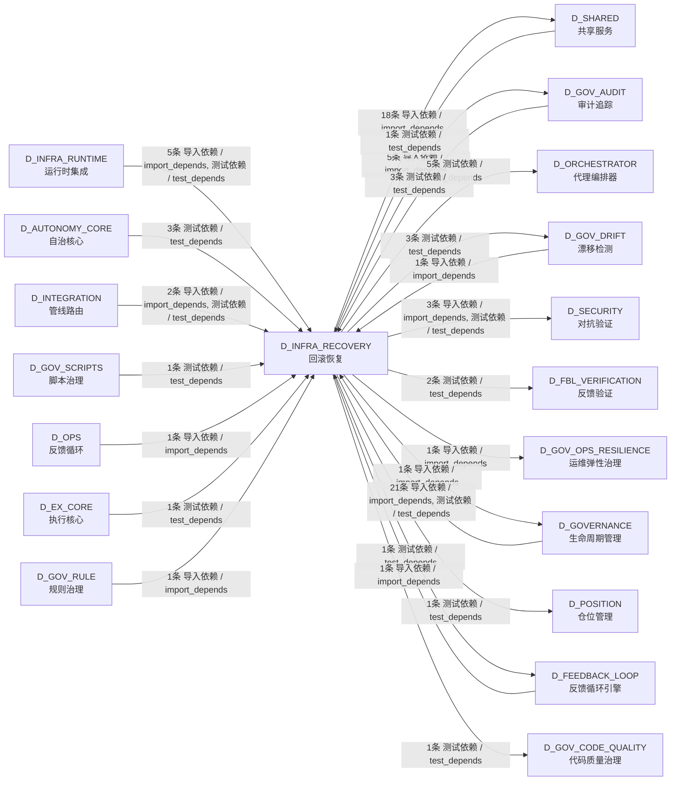

# 03_d_infra_recovery / rollback_recovery / 回滚恢复 / Rollback Recovery

> **功能简介 / Overview**: 回滚恢复，负责系统故障时的状态回滚、事务补偿和恢复编排

> **文档作用 / Purpose**: 展示 回滚恢复（D_INFRA_RECOVERY）功能域的模块清单、域内依赖关系、跨域依赖关系、架构分层视图，供架构审查和域治理参考。

> 本文档由 generate_domain_doc.py 从 depgraph (PostgreSQL) 自动生成
> 最后更新: 2026-07-13 11:38:06
> 数据源: depgraph (PostgreSQL) nodes表 + edges表

## 域基本信息 / Domain Overview

| 字段 | 值 | Field | Value |
|------|------|-------|-------|
| 编号 | 03 | Number | 03 |
| 域ID | D_INFRA_RECOVERY | Domain ID | D_INFRA_RECOVERY |
| 域名称 | 回滚恢复 | Domain Name | Rollback Recovery |
| 层级 | L0 基础设施层 | Layer | L0 Infrastructure |
| 模块数 | 89 | Module Count | 89 |
| 域内依赖 | 74 | Internal Dependencies | 74 |
| 跨域入边 | 41 | Cross-domain Incoming | 41 |
| 跨域出边 | 41 | Cross-domain Outgoing | 41 |
| 设计态模块 | 0 | Design Modules | 0 |
| 原型态模块 | 41 | Prototype Modules | 41 |
| 生产态模块 | 48 | Production Modules | 48 |
| 容量 | 48/150 (正常) | Capacity | 48/150 (正常) |
| 描述 | 双轨Checkpoint(git commit + SQLite JSONL dump) | Description | 双轨Checkpoint(git commit + SQLite JSONL dump) |

## 模块分层清单 / Module Layered List

> 按 architecture_layer 分组的模块清单（共 89 个模块 / 89 modules）。

### L0 基础设施层 / Infrastructure Layer (54 modules)

| # | 模块路径 / Module Path | 模块名称 / Module Name (功能简介 / Description) | 成熟度 / Maturity | 蓝图 / Blueprint |
|:--:|---------|---------|:---:|:---:|
| 1 | src/zephyr/infrastructure/rollback/__init__.py | MOD-INF-021 Rollback System — ZephyrAlpha 回滚... | 原型态 / prototype | [MOD-INF-021](../../03_modules/_domain_autonomy_core/rollback_system/blueprint.md) |
| 2 | src/zephyr/infrastructure/rollback/_manifest.py | MOD-INF-021 Rollback System — 模块文件清单 (_m... | 原型态 / prototype | [MOD-INF-021](../../03_modules/_domain_autonomy_core/rollback_system/blueprint.md) |
| 3 | src/zephyr/infrastructure/rollback/agent_cooldown.py | AgentCooldown — Agent 冷却隔离器。 | 生产态 / production | [MOD-INF-021](../../03_modules/_domain_autonomy_core/rollback_system/blueprint.md) |
| 4 | src/zephyr/infrastructure/rollback/auditor.py | G-CT-004 契约：Rollback -> Audit 记录回滚操作. | 生产态 / production | [MOD-INF-021](../../03_modules/_domain_autonomy_core/rollback_system/blueprint.md) |
| 5 | src/zephyr/infrastructure/rollback/auto_rollback_trigger.py | AutoRollbackTrigger — 自动回滚触发器。 | 生产态 / production | [MOD-INF-021](../../03_modules/_domain_autonomy_core/rollback_system/blueprint.md) |
| 6 | src/zephyr/infrastructure/rollback/budget_tracker.py | G-CT-009 契约：Rollback -> Budget 回滚成本计入... | 原型态 / prototype | [MOD-INF-021](../../03_modules/_domain_autonomy_core/rollback_system/blueprint.md) |
| 7 | src/zephyr/infrastructure/rollback/checkpoint_gc.py | CheckpointGC — Checkpoint 垃圾回收。 | 生产态 / production | [MOD-INF-021](../../03_modules/_domain_autonomy_core/rollback_system/blueprint.md) |
| 8 | src/zephyr/infrastructure/rollback/commit_quality_gate.py | CommitQualityGate — Commit 质量基础设施。 | 生产态 / production | [MOD-INF-021](../../03_modules/_domain_autonomy_core/rollback_system/blueprint.md) |
| 9 | src/zephyr/infrastructure/rollback/complexity_budget.py | ComplexityBudget — 回滚复杂度元 Budget 监控。 | 原型态 / prototype | [MOD-INF-021](../../03_modules/_domain_autonomy_core/rollback_system/blueprint.md) |
| 10 | src/zephyr/infrastructure/rollback/contract.py | CT-RBK-GATE-001 集成契约落地——Rollback System... | 生产态 / production | [MOD-INF-021](../../03_modules/_domain_autonomy_core/rollback_system/blueprint.md) |
| 11 | src/zephyr/infrastructure/rollback/contracts.py | G-CT-002 Rollback 消费端 — on_audit_anomaly() ... | 原型态 / prototype | [MOD-INF-021](../../03_modules/_domain_autonomy_core/rollback_system/blueprint.md) |
| 12 | src/zephyr/infrastructure/rollback/credential_rotation_tr... | CredentialRotationTrigger — 凭据自动轮替。 | 生产态 / production | [MOD-INF-021](../../03_modules/_domain_autonomy_core/rollback_system/blueprint.md) |
| 13 | src/zephyr/infrastructure/rollback/cross_platform_shell.py | CrossPlatformShell — 跨平台 Shell 脚本双输出。 | 生产态 / production | [MOD-INF-021](../../03_modules/_domain_autonomy_core/rollback_system/blueprint.md) |
| 14 | src/zephyr/infrastructure/rollback/drift_fix.py | drift_fix.py | 生产态 / production | [MOD-INF-021](../../03_modules/_domain_autonomy_core/rollback_system/blueprint.md) |
| 15 | src/zephyr/infrastructure/rollback/env_watcher.py | EnvWatcher — 环境变量热重载监控器。 | 生产态 / production | [MOD-INF-021](../../03_modules/_domain_autonomy_core/rollback_system/blueprint.md) |
| 16 | src/zephyr/infrastructure/rollback/external_merkle_proof.py | External Merkle Proof — 外部可验证回滚完整性证明。 | 生产态 / production | [MOD-INF-021](../../03_modules/_domain_autonomy_core/rollback_system/blueprint.md) |
| 17 | src/zephyr/infrastructure/rollback/forensic.py | Forensic Engine — 取证基础设施（Phase 8 完整实... | 生产态 / production | [MOD-INF-021](../../03_modules/_domain_autonomy_core/rollback_system/blueprint.md) |
| 18 | src/zephyr/infrastructure/rollback/forward_fix_runner.py | ForwardFixRunner — Forward-Fix 执行器。 | 生产态 / production | [MOD-INF-021](../../03_modules/_domain_autonomy_core/rollback_system/blueprint.md) |
| 19 | src/zephyr/infrastructure/rollback/git_infra_snapshot.py | GitInfraSnapshot — Git 基础设施快照与污染防护。 | 生产态 / production | [MOD-INF-021](../../03_modules/_domain_autonomy_core/rollback_system/blueprint.md) |
| 20 | src/zephyr/infrastructure/rollback/hallucination_guard.py | HallucinationGuard — AI 幻觉防护：回滚后强制状... | 生产态 / production | [MOD-INF-021](../../03_modules/_domain_autonomy_core/rollback_system/blueprint.md) |
| 21 | src/zephyr/infrastructure/rollback/intent_archiver.py | IntentArchiver — 意图存档保护。 | 生产态 / production | [MOD-INF-021](../../03_modules/_domain_autonomy_core/rollback_system/blueprint.md) |
| 22 | src/zephyr/infrastructure/rollback/kill_switch.py | KillSwitchManager — 三级 Kill Switch 管理器。 | 生产态 / production | [MOD-INF-021](../../03_modules/_domain_autonomy_core/rollback_system/blueprint.md) |
| 23 | src/zephyr/infrastructure/rollback/knowngoodstate_ledger.py | KnowngoodstateLedger — 已验证正确状态收据。 | 生产态 / production | [MOD-INF-021](../../03_modules/_domain_autonomy_core/rollback_system/blueprint.md) |
| 24 | src/zephyr/infrastructure/rollback/right_to_be_forgotten.py | Right to be Forgotten — GDPR 遗忘权合规检查器。 | 生产态 / production | [MOD-INF-021](../../03_modules/_domain_autonomy_core/rollback_system/blueprint.md) |
| 25 | src/zephyr/infrastructure/rollback/rollback_abuse_detecto... | RollbackAbuseDetector — 回滚滥用检测。 | 生产态 / production | [MOD-INF-021](../../03_modules/_domain_autonomy_core/rollback_system/blueprint.md) |
| 26 | src/zephyr/infrastructure/rollback/rollback_audit_nexus.py | RollbackAuditNexus — 回滚审计记录聚合到 Nexus ... | 生产态 / production | [MOD-INF-021](../../03_modules/_domain_autonomy_core/rollback_system/blueprint.md) |
| 27 | src/zephyr/infrastructure/rollback/rollback_boot_integrat... | RollbackBootIntegration — 回滚系统自动启动/关... | 原型态 / prototype | [MOD-INF-021](../../03_modules/_domain_autonomy_core/rollback_system/blueprint.md) |
| 28 | src/zephyr/infrastructure/rollback/rollback_bootstrap.py | RollbackBootstrap — 零依赖自举回滚器。 | 生产态 / production | [MOD-INF-021](../../03_modules/_domain_autonomy_core/rollback_system/blueprint.md) |
| 29 | src/zephyr/infrastructure/rollback/rollback_budget.py | RollbackBudget — 回滚预算管理器。 | 生产态 / production | [MOD-INF-021](../../03_modules/_domain_autonomy_core/rollback_system/blueprint.md) |
| 30 | src/zephyr/infrastructure/rollback/rollback_context_resto... | RollbackContextRestorer — 上下文恢复器。 | 生产态 / production | [MOD-INF-021](../../03_modules/_domain_autonomy_core/rollback_system/blueprint.md) |
| 31 | src/zephyr/infrastructure/rollback/rollback_dashboard.py | RollbackDashboard — 回滚仪表盘（零依赖 Markdow... | 生产态 / production | [MOD-INF-021](../../03_modules/_domain_autonomy_core/rollback_system/blueprint.md) |
| 32 | src/zephyr/infrastructure/rollback/rollback_drill.py | RollbackDrill — 定期回滚演练调度器 (DiRT-style)。 | 生产态 / production | [MOD-INF-021](../../03_modules/_domain_autonomy_core/rollback_system/blueprint.md) |
| 33 | src/zephyr/infrastructure/rollback/rollback_executor.py | RollbackExecutor — 回滚执行器核心封装。 | 生产态 / production | [MOD-INF-021](../../03_modules/_domain_autonomy_core/rollback_system/blueprint.md) |
| 34 | src/zephyr/infrastructure/rollback/rollback_integration.py | Rollback Integration — executor 集成增强层。 | 生产态 / production | [MOD-INF-021](../../03_modules/_domain_autonomy_core/rollback_system/blueprint.md) |
| 35 | src/zephyr/infrastructure/rollback/rollback_lock.py | RollbackLock — 全局回滚锁管理。 | 生产态 / production | [MOD-INF-021](../../03_modules/_domain_autonomy_core/rollback_system/blueprint.md) |
| 36 | src/zephyr/infrastructure/rollback/rollback_loop_detector.py | RollbackLoopDetector — 回滚循环检测器。 | 生产态 / production | [MOD-INF-021](../../03_modules/_domain_autonomy_core/rollback_system/blueprint.md) |
| 37 | src/zephyr/infrastructure/rollback/rollback_scheduler.py | RollbackScheduler — 回滚系统自动运行调度器 (MO... | 生产态 / production | [MOD-INF-021](../../03_modules/_domain_autonomy_core/rollback_system/blueprint.md) |
| 38 | src/zephyr/infrastructure/rollback/rollback_simulator.py | RollbackSimulator — 回滚模拟器（CI 集成）。 | 生产态 / production | [MOD-INF-021](../../03_modules/_domain_autonomy_core/rollback_system/blueprint.md) |
| 39 | src/zephyr/infrastructure/rollback/rollback_state_machine.py | RollbackStateMachine — 回滚步骤级状态机。 | 生产态 / production | [MOD-INF-021](../../03_modules/_domain_autonomy_core/rollback_system/blueprint.md) |
| 40 | src/zephyr/infrastructure/rollback/rollback_target_stalen... | RollbackTargetStaleness — 回滚目标陈旧度检测。 | 生产态 / production | [MOD-INF-021](../../03_modules/_domain_autonomy_core/rollback_system/blueprint.md) |
| 41 | src/zephyr/infrastructure/rollback/rollback_verifier.py | RollbackVerifier — 回滚后验证器。 | 生产态 / production | [MOD-INF-021](../../03_modules/_domain_autonomy_core/rollback_system/blueprint.md) |
| 42 | src/zephyr/infrastructure/rollback/rollback_wal.py | RollbackWAL — 回滚预写日志。 | 生产态 / production | [MOD-INF-021](../../03_modules/_domain_autonomy_core/rollback_system/blueprint.md) |
| 43 | src/zephyr/infrastructure/rollback/runbook_generator.py | RunbookGenerator — 回滚操作 Runbook 自动生成。 | 生产态 / production | [MOD-INF-021](../../03_modules/_domain_autonomy_core/rollback_system/blueprint.md) |
| 44 | src/zephyr/infrastructure/rollback/s3_snapshot_lifecycle.py | S3 Snapshot Lifecycle Manager — 快照防生命周期... | 生产态 / production | [MOD-INF-021](../../03_modules/_domain_autonomy_core/rollback_system/blueprint.md) |
| 45 | src/zephyr/infrastructure/rollback/secret_rotation_aware.py | SecretRotationAware — 密钥轮替感知器。 | 生产态 / production | [MOD-INF-021](../../03_modules/_domain_autonomy_core/rollback_system/blueprint.md) |
| 46 | src/zephyr/infrastructure/rollback/semantic_rollback_tag.py | SemanticRollbackTag — 语义化 Rollback Tag 管理器。 | 生产态 / production | [MOD-INF-021](../../03_modules/_domain_autonomy_core/rollback_system/blueprint.md) |
| 47 | src/zephyr/infrastructure/rollback/semantic_similar_detec... | SemanticSimilarDetector — 语义变形攻击检测。 | 生产态 / production | [MOD-INF-021](../../03_modules/_domain_autonomy_core/rollback_system/blueprint.md) |
| 48 | src/zephyr/infrastructure/rollback/sqlite_dumper.py | SqliteDumper — SQLite 双轨 Checkpoint 的 DB 层... | 生产态 / production | [MOD-INF-021](../../03_modules/_domain_autonomy_core/rollback_system/blueprint.md) |
| 49 | src/zephyr/infrastructure/rollback/submodule_sync.py | Submodule Sync — Submodule/Monorepo 多仓库同步... | 生产态 / production | [MOD-INF-021](../../03_modules/_domain_autonomy_core/rollback_system/blueprint.md) |
| 50 | src/zephyr/infrastructure/rollback/temporal_context_adapt... | TemporalContextAdapter — AI 时间上下文断裂修复。 | 生产态 / production | [MOD-INF-021](../../03_modules/_domain_autonomy_core/rollback_system/blueprint.md) |
| 51 | src/zephyr/infrastructure/rollback/topology_change_log.py | TopologyChangeLog — 分支拓扑变更日志。 | 生产态 / production | [MOD-INF-021](../../03_modules/_domain_autonomy_core/rollback_system/blueprint.md) |
| 52 | src/zephyr/infrastructure/rollback/venv_sync.py | VenvSync — venv/conda 版本同步保障。 | 生产态 / production | [MOD-INF-021](../../03_modules/_domain_autonomy_core/rollback_system/blueprint.md) |
| 53 | src/zephyr/infrastructure/rollback/vulnerability_rescanne... | VulnerabilityRescanner — 依赖漏洞复扫。 | 生产态 / production | [MOD-INF-021](../../03_modules/_domain_autonomy_core/rollback_system/blueprint.md) |
| 54 | src/zephyr/infrastructure/rollback/warm_standby.py | WarmStandby — 温备热切（git worktree 副本维护）。 | 生产态 / production | [MOD-INF-021](../../03_modules/_domain_autonomy_core/rollback_system/blueprint.md) |

### L2 领域层 / Domain Layer (35 modules)

| # | 模块路径 / Module Path | 模块名称 / Module Name (功能简介 / Description) | 成熟度 / Maturity | 蓝图 / Blueprint |
|:--:|---------|---------|:---:|:---:|
| 1 | tests/canary/test_canary_controller.py | test_canary_controller.py | 原型态 / prototype | [MOD-INF-033](../../03_modules/_cross_layer/behavioral_auditor/blueprint.md) |
| 2 | tests/canary/test_canary_manager.py | test_canary_manager.py | 原型态 / prototype | [MOD-INF-039](../../03_modules/_cross_layer/agent_orchestrator/blueprint.md) |
| 3 | tests/canary/test_canary_register.py | test_canary_register.py | 原型态 / prototype | [MOD-INF-017](../../03_modules/_domain_governance/code_dedup_engine/blueprint.md) |
| 4 | tests/canary/test_canary_repair.py | test_canary_repair.py | 原型态 / prototype | [MOD-FEEDBACK_LOOP](../../03_modules/_cross_layer/feedback_loop/blueprint.md) |
| 5 | tests/canary/test_canary_rollout_manager.py | test_canary_rollout_manager.py | 原型态 / prototype | [MOD-INF-018](../../03_modules/_domain_autonomy_core/agent_role_based_access_control/blueprint.md) |
| 6 | tests/chaos/test_chaos_engine.py | test_chaos_engine.py | 原型态 / prototype | [MOD-INF-039](../../03_modules/_cross_layer/agent_orchestrator/blueprint.md) |
| 7 | tests/chaos/test_chaos_engine_ops.py | test_chaos_engine_ops.py | 原型态 / prototype | [MOD-INF-039](../../03_modules/_cross_layer/agent_orchestrator/blueprint.md) |
| 8 | tests/chaos/test_chaos_engineering.py | test_chaos_engineering.py | 原型态 / prototype | [MOD-FEEDBACK_LOOP](../../03_modules/_cross_layer/feedback_loop/blueprint.md) |
| 9 | tests/chaos/test_chaos_hooks.py | test_chaos_hooks.py | 原型态 / prototype | [MOD-INF-039](../../03_modules/_cross_layer/agent_orchestrator/blueprint.md) |
| 10 | tests/chaos/test_chaos_injector.py | test_chaos_injector.py | 原型态 / prototype | [MOD-INF-033](../../03_modules/_cross_layer/behavioral_auditor/blueprint.md) |
| 11 | tests/rollback/conftest.py | conftest.py | 原型态 / prototype |  |
| 12 | tests/rollback/test_concurrency_guard.py | test_concurrency_guard.py | 原型态 / prototype | [MOD-INF-021](../../03_modules/_domain_autonomy_core/rollback_system/blueprint.md) |
| 13 | tests/rollback/test_position_reconciler.py | test_position_reconciler.py | 原型态 / prototype | [MOD-INF-021](../../03_modules/_domain_autonomy_core/rollback_system/blueprint.md) |
| 14 | tests/rollback/test_rollback_abuse_detector.py | test_rollback_abuse_detector.py | 原型态 / prototype | [MOD-INF-021](../../03_modules/_domain_autonomy_core/rollback_system/blueprint.md) |
| 15 | tests/rollback/test_rollback_audit_nexus.py | test_rollback_audit_nexus.py | 原型态 / prototype | [MOD-INF-021](../../03_modules/_domain_autonomy_core/rollback_system/blueprint.md) |
| 16 | tests/rollback/test_rollback_bootstrap.py | test_rollback_bootstrap.py | 原型态 / prototype | [MOD-INF-021](../../03_modules/_domain_autonomy_core/rollback_system/blueprint.md) |
| 17 | tests/rollback/test_rollback_bridge.py | test_rollback_bridge.py | 原型态 / prototype | [MOD-INF-033](../../03_modules/_cross_layer/behavioral_auditor/blueprint.md) |
| 18 | tests/rollback/test_rollback_budget.py | test_rollback_budget.py | 原型态 / prototype | [MOD-INF-021](../../03_modules/_domain_autonomy_core/rollback_system/blueprint.md) |
| 19 | tests/rollback/test_rollback_concurrent_extreme.py | Extreme tests for concurrent rollback (MOD-INF-... | 原型态 / prototype | [MOD-INF-021](../../03_modules/_domain_autonomy_core/rollback_system/blueprint.md) |
| 20 | tests/rollback/test_rollback_context_restorer.py | test_rollback_context_restorer.py | 原型态 / prototype | [MOD-INF-021](../../03_modules/_domain_autonomy_core/rollback_system/blueprint.md) |
| 21 | tests/rollback/test_rollback_dashboard.py | test_rollback_dashboard.py | 原型态 / prototype | [MOD-INF-021](../../03_modules/_domain_autonomy_core/rollback_system/blueprint.md) |
| 22 | tests/rollback/test_rollback_drill.py | test_rollback_drill.py | 原型态 / prototype | [MOD-INF-021](../../03_modules/_domain_autonomy_core/rollback_system/blueprint.md) |
| 23 | tests/rollback/test_rollback_executor_root.py | test_rollback_executor_root.py | 原型态 / prototype | [MOD-INF-021](../../03_modules/_domain_autonomy_core/rollback_system/blueprint.md) |
| 24 | tests/rollback/test_rollback_integration.py | test_rollback_integration.py | 原型态 / prototype | [MOD-INF-021](../../03_modules/_domain_autonomy_core/rollback_system/blueprint.md) |
| 25 | tests/rollback/test_rollback_integrity.py | test_rollback_integrity.py | 原型态 / prototype | [MOD-FEEDBACK_LOOP](../../03_modules/_cross_layer/feedback_loop/blueprint.md) |
| 26 | tests/rollback/test_rollback_lock.py | test_rollback_lock.py | 原型态 / prototype | [MOD-INF-021](../../03_modules/_domain_autonomy_core/rollback_system/blueprint.md) |
| 27 | tests/rollback/test_rollback_loop_detector.py | test_rollback_loop_detector.py | 原型态 / prototype | [MOD-INF-021](../../03_modules/_domain_autonomy_core/rollback_system/blueprint.md) |
| 28 | tests/rollback/test_rollback_partial_extreme.py | Extreme tests for partial_revert (MOD-INF-021 B... | 原型态 / prototype | [MOD-INF-021](../../03_modules/_domain_autonomy_core/rollback_system/blueprint.md) |
| 29 | tests/rollback/test_rollback_sandbox.py | test_rollback_sandbox.py | 原型态 / prototype | [MOD-INF-018](../../03_modules/_domain_autonomy_core/agent_role_based_access_control/blueprint.md) |
| 30 | tests/rollback/test_rollback_scheduler.py | DM-201911 红蓝对抗极端测试: RollbackScheduler ... | 原型态 / prototype | [MOD-INF-021](../../03_modules/_domain_autonomy_core/rollback_system/blueprint.md) |
| 31 | tests/rollback/test_rollback_simulator.py | test_rollback_simulator.py | 原型态 / prototype | [MOD-INF-021](../../03_modules/_domain_autonomy_core/rollback_system/blueprint.md) |
| 32 | tests/rollback/test_rollback_state_machine.py | test_rollback_state_machine.py | 原型态 / prototype | [MOD-INF-021](../../03_modules/_domain_autonomy_core/rollback_system/blueprint.md) |
| 33 | tests/rollback/test_rollback_target_staleness.py | test_rollback_target_staleness.py | 原型态 / prototype | [MOD-INF-021](../../03_modules/_domain_autonomy_core/rollback_system/blueprint.md) |
| 34 | tests/rollback/test_rollback_verifier_root.py | test_rollback_verifier_root.py | 原型态 / prototype | [MOD-INF-021](../../03_modules/_domain_autonomy_core/rollback_system/blueprint.md) |
| 35 | tests/rollback/test_rollback_wal.py | test_rollback_wal.py | 原型态 / prototype | [MOD-INF-021](../../03_modules/_domain_autonomy_core/rollback_system/blueprint.md) |

## 域内依赖图 / Internal Dependency Diagram

> 依赖图内嵌在本文档中，IDE 可直接渲染显示。参考 decision_index.md 设计，分四个视图：合并全景图、运营态子图、设计态子图、原型态子图（按 design_maturity 实际值拆分）。
>
> **图例说明 / Legend**：
> - **实线边框 = 运营态模块**（production，已上线运行）
> - **虚线边框 = 设计态模块**（design，蓝图阶段，代码未写）
> - **虚线边框 = 原型态模块**（prototype，代码已写，验证中未稳定上线）
> - **实线箭头 = 运营态依赖**（已生效的依赖关系）
> - **虚线箭头 = 非运营态依赖**（计划中/验证中的依赖关系）

### 合并全景图（全部模块，标签标注成熟度）

> 展示全部 89 个模块（生产态 48 + 设计态 0 + 原型态 41），标签标注成熟度。

#### 第 1 页 / 共 3 页

```mermaid
graph TD
    subgraph D_INFRA_RECOVERY["D_INFRA_RECOVERY 回滚恢复"]
        src_zephyr_infrastructure_rollback_init_py["(原型态 / prototype) MOD-INF-021 Rollback System — ZephyrAlpha 回滚...<br/>文件: __init__.py"]
        src_zephyr_infrastructure_rollback_manifest_py["(原型态 / prototype) MOD-INF-021 Rollback System — 模块文件清单 (_m...<br/>文件: _manifest.py"]
        src_zephyr_infrastructure_rollback_agent_cooldown_py["(生产态 / production) AgentCooldown — Agent 冷却隔离器。<br/>文件: agent_cooldown.py"]
        src_zephyr_infrastructure_rollback_auditor_py["(生产态 / production) G-CT-004 契约：Rollback -> Audit 记录回滚操作.<br/>文件: auditor.py"]
        src_zephyr_infrastructure_rollback_auto_rollback_trigger_py["(生产态 / production) AutoRollbackTrigger — 自动回滚触发器。<br/>文件: auto_rollback_trigger.py"]
        src_zephyr_infrastructure_rollback_budget_tracker_py["(原型态 / prototype) G-CT-009 契约：Rollback -> Budget 回滚成本计入...<br/>文件: budget_tracker.py"]
        src_zephyr_infrastructure_rollback_checkpoint_gc_py["(生产态 / production) CheckpointGC — Checkpoint 垃圾回收。<br/>文件: checkpoint_gc.py"]
        src_zephyr_infrastructure_rollback_commit_quality_gate_py["(生产态 / production) CommitQualityGate — Commit 质量基础设施。<br/>文件: commit_quality_gate.py"]
        src_zephyr_infrastructure_rollback_complexity_budget_py["(原型态 / prototype) ComplexityBudget — 回滚复杂度元 Budget 监控。<br/>文件: complexity_budget.py"]
        src_zephyr_infrastructure_rollback_contract_py["(生产态 / production) CT-RBK-GATE-001 集成契约落地——Rollback System...<br/>文件: contract.py"]
        src_zephyr_infrastructure_rollback_contracts_py["(原型态 / prototype) G-CT-002 Rollback 消费端 — on_audit_anomaly() ...<br/>文件: contracts.py"]
        src_zephyr_infrastructure_rollback_credential_rotation_trigger_py["(生产态 / production) CredentialRotationTrigger — 凭据自动轮替。<br/>文件: credential_rotation_trigger.py"]
        src_zephyr_infrastructure_rollback_cross_platform_shell_py["(生产态 / production) CrossPlatformShell — 跨平台 Shell 脚本双输出。<br/>文件: cross_platform_shell.py"]
        src_zephyr_infrastructure_rollback_drift_fix_py["(生产态 / production) drift_fix.py"]
        src_zephyr_infrastructure_rollback_env_watcher_py["(生产态 / production) EnvWatcher — 环境变量热重载监控器。<br/>文件: env_watcher.py"]
        src_zephyr_infrastructure_rollback_external_merkle_proof_py["(生产态 / production) External Merkle Proof — 外部可验证回滚完整性证明。<br/>文件: external_merkle_proof.py"]
        src_zephyr_infrastructure_rollback_forensic_py["(生产态 / production) Forensic Engine — 取证基础设施（Phase 8 完整实...<br/>文件: forensic.py"]
        src_zephyr_infrastructure_rollback_forward_fix_runner_py["(生产态 / production) ForwardFixRunner — Forward-Fix 执行器。<br/>文件: forward_fix_runner.py"]
        src_zephyr_infrastructure_rollback_git_infra_snapshot_py["(生产态 / production) GitInfraSnapshot — Git 基础设施快照与污染防护。<br/>文件: git_infra_snapshot.py"]
        src_zephyr_infrastructure_rollback_hallucination_guard_py["(生产态 / production) HallucinationGuard — AI 幻觉防护：回滚后强制状...<br/>文件: hallucination_guard.py"]
        src_zephyr_infrastructure_rollback_intent_archiver_py["(生产态 / production) IntentArchiver — 意图存档保护。<br/>文件: intent_archiver.py"]
        src_zephyr_infrastructure_rollback_kill_switch_py["(生产态 / production) KillSwitchManager — 三级 Kill Switch 管理器。<br/>文件: kill_switch.py"]
        src_zephyr_infrastructure_rollback_knowngoodstate_ledger_py["(生产态 / production) KnowngoodstateLedger — 已验证正确状态收据。<br/>文件: knowngoodstate_ledger.py"]
        src_zephyr_infrastructure_rollback_right_to_be_forgotten_py["(生产态 / production) Right to be Forgotten — GDPR 遗忘权合规检查器。<br/>文件: right_to_be_forgotten.py"]
        src_zephyr_infrastructure_rollback_rollback_abuse_detector_py["(生产态 / production) RollbackAbuseDetector — 回滚滥用检测。<br/>文件: rollback_abuse_detector.py"]
        src_zephyr_infrastructure_rollback_rollback_audit_nexus_py["(生产态 / production) RollbackAuditNexus — 回滚审计记录聚合到 Nexus ...<br/>文件: rollback_audit_nexus.py"]
        src_zephyr_infrastructure_rollback_rollback_boot_integration_py["(原型态 / prototype) RollbackBootIntegration — 回滚系统自动启动/关...<br/>文件: rollback_boot_integration.py"]
        src_zephyr_infrastructure_rollback_rollback_bootstrap_py["(生产态 / production) RollbackBootstrap — 零依赖自举回滚器。<br/>文件: rollback_bootstrap.py"]
        src_zephyr_infrastructure_rollback_rollback_budget_py["(生产态 / production) RollbackBudget — 回滚预算管理器。<br/>文件: rollback_budget.py"]
        src_zephyr_infrastructure_rollback_rollback_context_restorer_py["(生产态 / production) RollbackContextRestorer — 上下文恢复器。<br/>文件: rollback_context_restorer.py"]
    end
    src_zephyr_infrastructure_rollback_rollback_boot_integration_py -.->|导入依赖 / import_depends| src_zephyr_infrastructure_rollback_auto_rollback_trigger_py
    src_zephyr_infrastructure_rollback_manifest_py -.->|config_depends / config_depends| src_zephyr_infrastructure_rollback_init_py
    src_zephyr_infrastructure_rollback_init_py -.->|导入依赖 / import_depends| src_zephyr_infrastructure_rollback_auditor_py
    src_zephyr_infrastructure_rollback_init_py -.->|导入依赖 / import_depends| src_zephyr_infrastructure_rollback_agent_cooldown_py
    src_zephyr_infrastructure_rollback_init_py -.->|导入依赖 / import_depends| src_zephyr_infrastructure_rollback_budget_tracker_py
    src_zephyr_infrastructure_rollback_init_py -.->|导入依赖 / import_depends| src_zephyr_infrastructure_rollback_auto_rollback_trigger_py
    src_zephyr_infrastructure_rollback_init_py -.->|导入依赖 / import_depends| src_zephyr_infrastructure_rollback_commit_quality_gate_py
    src_zephyr_infrastructure_rollback_init_py -.->|导入依赖 / import_depends| src_zephyr_infrastructure_rollback_checkpoint_gc_py
    src_zephyr_infrastructure_rollback_init_py -.->|导入依赖 / import_depends| src_zephyr_infrastructure_rollback_complexity_budget_py
    src_zephyr_infrastructure_rollback_init_py -.->|导入依赖 / import_depends| src_zephyr_infrastructure_rollback_external_merkle_proof_py
    src_zephyr_infrastructure_rollback_init_py -.->|导入依赖 / import_depends| src_zephyr_infrastructure_rollback_env_watcher_py
    src_zephyr_infrastructure_rollback_init_py -.->|导入依赖 / import_depends| src_zephyr_infrastructure_rollback_cross_platform_shell_py
    src_zephyr_infrastructure_rollback_init_py -.->|导入依赖 / import_depends| src_zephyr_infrastructure_rollback_drift_fix_py
    src_zephyr_infrastructure_rollback_init_py -.->|导入依赖 / import_depends| src_zephyr_infrastructure_rollback_forensic_py
    src_zephyr_infrastructure_rollback_init_py -.->|导入依赖 / import_depends| src_zephyr_infrastructure_rollback_forward_fix_runner_py
    src_zephyr_infrastructure_rollback_init_py -.->|导入依赖 / import_depends| src_zephyr_infrastructure_rollback_kill_switch_py
    src_zephyr_infrastructure_rollback_init_py -.->|导入依赖 / import_depends| src_zephyr_infrastructure_rollback_git_infra_snapshot_py
    src_zephyr_infrastructure_rollback_init_py -.->|导入依赖 / import_depends| src_zephyr_infrastructure_rollback_right_to_be_forgotten_py
    src_zephyr_infrastructure_rollback_init_py -.->|导入依赖 / import_depends| src_zephyr_infrastructure_rollback_rollback_context_restorer_py
    src_zephyr_infrastructure_rollback_init_py -.->|导入依赖 / import_depends| src_zephyr_infrastructure_rollback_rollback_bootstrap_py
    src_zephyr_infrastructure_rollback_init_py -.->|导入依赖 / import_depends| src_zephyr_infrastructure_rollback_rollback_boot_integration_py
    src_zephyr_infrastructure_rollback_init_py -.->|导入依赖 / import_depends| src_zephyr_infrastructure_rollback_rollback_budget_py
    D_GOV_AUDIT["(生产态 / production) D_GOV_AUDIT"]
    src_zephyr_infrastructure_rollback_auditor_py -->|导入依赖 / import_depends| D_GOV_AUDIT
    D_SHARED["(原型态 / prototype) D_SHARED"]
    src_zephyr_infrastructure_rollback_agent_cooldown_py -.->|导入依赖 / import_depends| D_SHARED
    src_zephyr_infrastructure_rollback_contracts_py -.->|导入依赖 / import_depends| D_GOV_AUDIT
    src_zephyr_infrastructure_rollback_external_merkle_proof_py -->|导入依赖 / import_depends| D_SHARED
    D_SECURITY["(生产态 / production) D_SECURITY"]
    src_zephyr_infrastructure_rollback_drift_fix_py -->|导入依赖 / import_depends| D_SECURITY
    src_zephyr_infrastructure_rollback_forensic_py -->|导入依赖 / import_depends| D_SHARED
    src_zephyr_infrastructure_rollback_forward_fix_runner_py -->|导入依赖 / import_depends| D_SHARED
    src_zephyr_infrastructure_rollback_right_to_be_forgotten_py -->|导入依赖 / import_depends| D_SHARED
    src_zephyr_infrastructure_rollback_rollback_audit_nexus_py -->|导入依赖 / import_depends| D_GOV_AUDIT
    src_zephyr_infrastructure_rollback_rollback_abuse_detector_py -->|导入依赖 / import_depends| D_GOV_AUDIT
    src_zephyr_infrastructure_rollback_rollback_boot_integration_py -.->|导入依赖 / import_depends| D_SHARED
    D_GOV_OPS_RESILIENCE["(生产态 / production) D_GOV_OPS_RESILIENCE"]
    src_zephyr_infrastructure_rollback_rollback_boot_integration_py -.->|导入依赖 / import_depends| D_GOV_OPS_RESILIENCE
    D_OPS["(生产态 / production) D_OPS"]
    D_OPS -.->|导入依赖 / import_depends| src_zephyr_infrastructure_rollback_budget_tracker_py
    D_GOV_DRIFT["(原型态 / prototype) D_GOV_DRIFT"]
    D_GOV_DRIFT -.->|导入依赖 / import_depends| src_zephyr_infrastructure_rollback_drift_fix_py
    D_GOV_RULE["(生产态 / production) D_GOV_RULE"]
    D_GOV_RULE -->|导入依赖 / import_depends| src_zephyr_infrastructure_rollback_contract_py
    D_INTEGRATION["(生产态 / production) D_INTEGRATION"]
    D_INTEGRATION -->|导入依赖 / import_depends| src_zephyr_infrastructure_rollback_contract_py
    D_INFRA_RUNTIME["(生产态 / production) D_INFRA_RUNTIME"]
    D_INFRA_RUNTIME -.->|导入依赖 / import_depends| src_zephyr_infrastructure_rollback_rollback_boot_integration_py
    D_AUTONOMY_CORE["(原型态 / prototype) D_AUTONOMY_CORE"]
    D_AUTONOMY_CORE -.->|测试依赖 / test_depends| src_zephyr_infrastructure_rollback_agent_cooldown_py
    D_AUTONOMY_CORE -.->|测试依赖 / test_depends| src_zephyr_infrastructure_rollback_auto_rollback_trigger_py
    D_EX_CORE["(原型态 / prototype) D_EX_CORE"]
    D_EX_CORE -.->|测试依赖 / test_depends| src_zephyr_infrastructure_rollback_kill_switch_py
    D_SHARED -.->|测试依赖 / test_depends| src_zephyr_infrastructure_rollback_cross_platform_shell_py
    D_GOV_AUDIT -.->|测试依赖 / test_depends| src_zephyr_infrastructure_rollback_drift_fix_py
    D_INTEGRATION -.->|测试依赖 / test_depends| src_zephyr_infrastructure_rollback_external_merkle_proof_py
    D_GOV_SCRIPTS["(原型态 / prototype) D_GOV_SCRIPTS"]
    D_GOV_SCRIPTS -.->|测试依赖 / test_depends| src_zephyr_infrastructure_rollback_git_infra_snapshot_py
    D_GOVERNANCE["(原型态 / prototype) D_GOVERNANCE"]
    D_GOVERNANCE -.->|测试依赖 / test_depends| src_zephyr_infrastructure_rollback_credential_rotation_trigger_py
    D_GOVERNANCE -.->|测试依赖 / test_depends| src_zephyr_infrastructure_rollback_hallucination_guard_py
    D_GOVERNANCE -.->|测试依赖 / test_depends| src_zephyr_infrastructure_rollback_auditor_py
    classDef production fill:#e1f5fe,stroke:#01579b,stroke-width:2px,color:#000
    classDef design fill:#fff3e0,stroke:#e65100,stroke-width:2px,color:#000,stroke-dasharray: 5 5
    classDef external_prod fill:#e8f5e9,stroke:#1b5e20,stroke-width:1px,color:#000
    classDef external_design fill:#fce4ec,stroke:#880e4f,stroke-width:1px,color:#000,stroke-dasharray: 5 5
    class src_zephyr_infrastructure_rollback_agent_cooldown_py,src_zephyr_infrastructure_rollback_auditor_py,src_zephyr_infrastructure_rollback_auto_rollback_trigger_py,src_zephyr_infrastructure_rollback_checkpoint_gc_py,src_zephyr_infrastructure_rollback_commit_quality_gate_py,src_zephyr_infrastructure_rollback_contract_py,src_zephyr_infrastructure_rollback_credential_rotation_trigger_py,src_zephyr_infrastructure_rollback_cross_platform_shell_py,src_zephyr_infrastructure_rollback_drift_fix_py,src_zephyr_infrastructure_rollback_env_watcher_py,src_zephyr_infrastructure_rollback_external_merkle_proof_py,src_zephyr_infrastructure_rollback_forensic_py,src_zephyr_infrastructure_rollback_forward_fix_runner_py,src_zephyr_infrastructure_rollback_git_infra_snapshot_py,src_zephyr_infrastructure_rollback_hallucination_guard_py,src_zephyr_infrastructure_rollback_intent_archiver_py,src_zephyr_infrastructure_rollback_kill_switch_py,src_zephyr_infrastructure_rollback_knowngoodstate_ledger_py,src_zephyr_infrastructure_rollback_right_to_be_forgotten_py,src_zephyr_infrastructure_rollback_rollback_abuse_detector_py,src_zephyr_infrastructure_rollback_rollback_audit_nexus_py,src_zephyr_infrastructure_rollback_rollback_bootstrap_py,src_zephyr_infrastructure_rollback_rollback_budget_py,src_zephyr_infrastructure_rollback_rollback_context_restorer_py production
    class src_zephyr_infrastructure_rollback_init_py,src_zephyr_infrastructure_rollback_manifest_py,src_zephyr_infrastructure_rollback_budget_tracker_py,src_zephyr_infrastructure_rollback_complexity_budget_py,src_zephyr_infrastructure_rollback_contracts_py,src_zephyr_infrastructure_rollback_rollback_boot_integration_py design
    class D_GOV_AUDIT,D_SECURITY,D_GOV_OPS_RESILIENCE,D_OPS,D_GOV_RULE,D_INTEGRATION,D_INFRA_RUNTIME external_prod
    class D_SHARED,D_GOV_DRIFT,D_AUTONOMY_CORE,D_EX_CORE,D_GOV_SCRIPTS,D_GOVERNANCE external_design
```

#### 第 2 页 / 共 3 页

```mermaid
graph TD
    subgraph D_INFRA_RECOVERY["D_INFRA_RECOVERY 回滚恢复"]
        src_zephyr_infrastructure_rollback_rollback_dashboard_py["(生产态 / production) RollbackDashboard — 回滚仪表盘（零依赖 Markdow...<br/>文件: rollback_dashboard.py"]
        src_zephyr_infrastructure_rollback_rollback_drill_py["(生产态 / production) RollbackDrill — 定期回滚演练调度器 (DiRT-style)。<br/>文件: rollback_drill.py"]
        src_zephyr_infrastructure_rollback_rollback_executor_py["(生产态 / production) RollbackExecutor — 回滚执行器核心封装。<br/>文件: rollback_executor.py"]
        src_zephyr_infrastructure_rollback_rollback_integration_py["(生产态 / production) Rollback Integration — executor 集成增强层。<br/>文件: rollback_integration.py"]
        src_zephyr_infrastructure_rollback_rollback_lock_py["(生产态 / production) RollbackLock — 全局回滚锁管理。<br/>文件: rollback_lock.py"]
        src_zephyr_infrastructure_rollback_rollback_loop_detector_py["(生产态 / production) RollbackLoopDetector — 回滚循环检测器。<br/>文件: rollback_loop_detector.py"]
        src_zephyr_infrastructure_rollback_rollback_scheduler_py["(生产态 / production) RollbackScheduler — 回滚系统自动运行调度器 (MO...<br/>文件: rollback_scheduler.py"]
        src_zephyr_infrastructure_rollback_rollback_simulator_py["(生产态 / production) RollbackSimulator — 回滚模拟器（CI 集成）。<br/>文件: rollback_simulator.py"]
        src_zephyr_infrastructure_rollback_rollback_state_machine_py["(生产态 / production) RollbackStateMachine — 回滚步骤级状态机。<br/>文件: rollback_state_machine.py"]
        src_zephyr_infrastructure_rollback_rollback_target_staleness_py["(生产态 / production) RollbackTargetStaleness — 回滚目标陈旧度检测。<br/>文件: rollback_target_staleness.py"]
        src_zephyr_infrastructure_rollback_rollback_verifier_py["(生产态 / production) RollbackVerifier — 回滚后验证器。<br/>文件: rollback_verifier.py"]
        src_zephyr_infrastructure_rollback_rollback_wal_py["(生产态 / production) RollbackWAL — 回滚预写日志。<br/>文件: rollback_wal.py"]
        src_zephyr_infrastructure_rollback_runbook_generator_py["(生产态 / production) RunbookGenerator — 回滚操作 Runbook 自动生成。<br/>文件: runbook_generator.py"]
        src_zephyr_infrastructure_rollback_s3_snapshot_lifecycle_py["(生产态 / production) S3 Snapshot Lifecycle Manager — 快照防生命周期...<br/>文件: s3_snapshot_lifecycle.py"]
        src_zephyr_infrastructure_rollback_secret_rotation_aware_py["(生产态 / production) SecretRotationAware — 密钥轮替感知器。<br/>文件: secret_rotation_aware.py"]
        src_zephyr_infrastructure_rollback_semantic_rollback_tag_py["(生产态 / production) SemanticRollbackTag — 语义化 Rollback Tag 管理器。<br/>文件: semantic_rollback_tag.py"]
        src_zephyr_infrastructure_rollback_semantic_similar_detector_py["(生产态 / production) SemanticSimilarDetector — 语义变形攻击检测。<br/>文件: semantic_similar_detector.py"]
        src_zephyr_infrastructure_rollback_sqlite_dumper_py["(生产态 / production) SqliteDumper — SQLite 双轨 Checkpoint 的 DB 层...<br/>文件: sqlite_dumper.py"]
        src_zephyr_infrastructure_rollback_submodule_sync_py["(生产态 / production) Submodule Sync — Submodule/Monorepo 多仓库同步...<br/>文件: submodule_sync.py"]
        src_zephyr_infrastructure_rollback_temporal_context_adapter_py["(生产态 / production) TemporalContextAdapter — AI 时间上下文断裂修复。<br/>文件: temporal_context_adapter.py"]
        src_zephyr_infrastructure_rollback_topology_change_log_py["(生产态 / production) TopologyChangeLog — 分支拓扑变更日志。<br/>文件: topology_change_log.py"]
        src_zephyr_infrastructure_rollback_venv_sync_py["(生产态 / production) VenvSync — venv/conda 版本同步保障。<br/>文件: venv_sync.py"]
        src_zephyr_infrastructure_rollback_vulnerability_rescanner_py["(生产态 / production) VulnerabilityRescanner — 依赖漏洞复扫。<br/>文件: vulnerability_rescanner.py"]
        src_zephyr_infrastructure_rollback_warm_standby_py["(生产态 / production) WarmStandby — 温备热切（git worktree 副本维护）。<br/>文件: warm_standby.py"]
        tests_canary_test_canary_controller_py["(原型态 / prototype) test_canary_controller.py"]
        tests_canary_test_canary_manager_py["(原型态 / prototype) test_canary_manager.py"]
        tests_canary_test_canary_register_py["(原型态 / prototype) test_canary_register.py"]
        tests_canary_test_canary_repair_py["(原型态 / prototype) test_canary_repair.py"]
        tests_canary_test_canary_rollout_manager_py["(原型态 / prototype) test_canary_rollout_manager.py"]
        tests_chaos_test_chaos_engine_py["(原型态 / prototype) test_chaos_engine.py"]
    end
    src_zephyr_infrastructure_rollback_rollback_executor_py -->|导入依赖 / import_depends| src_zephyr_infrastructure_rollback_rollback_lock_py
    src_zephyr_infrastructure_rollback_rollback_executor_py -->|导入依赖 / import_depends| src_zephyr_infrastructure_rollback_sqlite_dumper_py
    src_zephyr_infrastructure_rollback_rollback_scheduler_py -->|导入依赖 / import_depends| src_zephyr_infrastructure_rollback_rollback_drill_py
    src_zephyr_infrastructure_rollback_rollback_scheduler_py -->|导入依赖 / import_depends| src_zephyr_infrastructure_rollback_rollback_wal_py
    D_SHARED["(原型态 / prototype) D_SHARED"]
    src_zephyr_infrastructure_rollback_rollback_executor_py -.->|导入依赖 / import_depends| D_SHARED
    src_zephyr_infrastructure_rollback_rollback_executor_py -->|导入依赖 / import_depends| D_SHARED
    D_GOV_AUDIT["(生产态 / production) D_GOV_AUDIT"]
    src_zephyr_infrastructure_rollback_rollback_executor_py -->|导入依赖 / import_depends| D_GOV_AUDIT
    src_zephyr_infrastructure_rollback_rollback_drill_py -.->|导入依赖 / import_depends| D_SHARED
    src_zephyr_infrastructure_rollback_rollback_integration_py -.->|导入依赖 / import_depends| D_SHARED
    src_zephyr_infrastructure_rollback_rollback_integration_py -->|导入依赖 / import_depends| D_SHARED
    src_zephyr_infrastructure_rollback_rollback_integration_py -->|导入依赖 / import_depends| D_SHARED
    src_zephyr_infrastructure_rollback_rollback_verifier_py -.->|导入依赖 / import_depends| D_SHARED
    src_zephyr_infrastructure_rollback_s3_snapshot_lifecycle_py -->|导入依赖 / import_depends| D_SHARED
    src_zephyr_infrastructure_rollback_sqlite_dumper_py -.->|导入依赖 / import_depends| D_SHARED
    src_zephyr_infrastructure_rollback_sqlite_dumper_py -->|导入依赖 / import_depends| D_SHARED
    src_zephyr_infrastructure_rollback_sqlite_dumper_py -->|导入依赖 / import_depends| D_SHARED
    D_GOVERNANCE["(生产态 / production) D_GOVERNANCE"]
    src_zephyr_infrastructure_rollback_sqlite_dumper_py -->|导入依赖 / import_depends| D_GOVERNANCE
    src_zephyr_infrastructure_rollback_warm_standby_py -->|导入依赖 / import_depends| D_SHARED
    D_GOV_CODE_QUALITY["(生产态 / production) D_GOV_CODE_QUALITY"]
    tests_canary_test_canary_register_py -.->|测试依赖 / test_depends| D_GOV_CODE_QUALITY
    D_FEEDBACK_LOOP["(生产态 / production) D_FEEDBACK_LOOP"]
    D_FEEDBACK_LOOP -->|导入依赖 / import_depends| src_zephyr_infrastructure_rollback_rollback_executor_py
    D_GOVERNANCE -->|导入依赖 / import_depends| src_zephyr_infrastructure_rollback_rollback_executor_py
    D_GOVERNANCE -.->|导入依赖 / import_depends| src_zephyr_infrastructure_rollback_rollback_executor_py
    D_GOVERNANCE -.->|导入依赖 / import_depends| src_zephyr_infrastructure_rollback_rollback_verifier_py
    D_GOVERNANCE -.->|测试依赖 / test_depends| src_zephyr_infrastructure_rollback_secret_rotation_aware_py
    D_GOVERNANCE -.->|测试依赖 / test_depends| src_zephyr_infrastructure_rollback_s3_snapshot_lifecycle_py
    D_GOVERNANCE -.->|测试依赖 / test_depends| src_zephyr_infrastructure_rollback_sqlite_dumper_py
    D_GOVERNANCE -.->|测试依赖 / test_depends| src_zephyr_infrastructure_rollback_submodule_sync_py
    D_GOVERNANCE -.->|测试依赖 / test_depends| src_zephyr_infrastructure_rollback_venv_sync_py
    D_GOVERNANCE -.->|测试依赖 / test_depends| src_zephyr_infrastructure_rollback_runbook_generator_py
    D_GOVERNANCE -.->|测试依赖 / test_depends| src_zephyr_infrastructure_rollback_warm_standby_py
    D_GOVERNANCE -.->|测试依赖 / test_depends| src_zephyr_infrastructure_rollback_vulnerability_rescanner_py
    D_INFRA_RUNTIME["(原型态 / prototype) D_INFRA_RUNTIME"]
    D_INFRA_RUNTIME -.->|测试依赖 / test_depends| src_zephyr_infrastructure_rollback_topology_change_log_py
    D_GOV_AUDIT -.->|测试依赖 / test_depends| src_zephyr_infrastructure_rollback_semantic_similar_detector_py
    D_GOV_AUDIT -.->|测试依赖 / test_depends| src_zephyr_infrastructure_rollback_semantic_rollback_tag_py
    classDef production fill:#e1f5fe,stroke:#01579b,stroke-width:2px,color:#000
    classDef design fill:#fff3e0,stroke:#e65100,stroke-width:2px,color:#000,stroke-dasharray: 5 5
    classDef external_prod fill:#e8f5e9,stroke:#1b5e20,stroke-width:1px,color:#000
    classDef external_design fill:#fce4ec,stroke:#880e4f,stroke-width:1px,color:#000,stroke-dasharray: 5 5
    class src_zephyr_infrastructure_rollback_rollback_dashboard_py,src_zephyr_infrastructure_rollback_rollback_drill_py,src_zephyr_infrastructure_rollback_rollback_executor_py,src_zephyr_infrastructure_rollback_rollback_integration_py,src_zephyr_infrastructure_rollback_rollback_lock_py,src_zephyr_infrastructure_rollback_rollback_loop_detector_py,src_zephyr_infrastructure_rollback_rollback_scheduler_py,src_zephyr_infrastructure_rollback_rollback_simulator_py,src_zephyr_infrastructure_rollback_rollback_state_machine_py,src_zephyr_infrastructure_rollback_rollback_target_staleness_py,src_zephyr_infrastructure_rollback_rollback_verifier_py,src_zephyr_infrastructure_rollback_rollback_wal_py,src_zephyr_infrastructure_rollback_runbook_generator_py,src_zephyr_infrastructure_rollback_s3_snapshot_lifecycle_py,src_zephyr_infrastructure_rollback_secret_rotation_aware_py,src_zephyr_infrastructure_rollback_semantic_rollback_tag_py,src_zephyr_infrastructure_rollback_semantic_similar_detector_py,src_zephyr_infrastructure_rollback_sqlite_dumper_py,src_zephyr_infrastructure_rollback_submodule_sync_py,src_zephyr_infrastructure_rollback_temporal_context_adapter_py,src_zephyr_infrastructure_rollback_topology_change_log_py,src_zephyr_infrastructure_rollback_venv_sync_py,src_zephyr_infrastructure_rollback_vulnerability_rescanner_py,src_zephyr_infrastructure_rollback_warm_standby_py production
    class tests_canary_test_canary_controller_py,tests_canary_test_canary_manager_py,tests_canary_test_canary_register_py,tests_canary_test_canary_repair_py,tests_canary_test_canary_rollout_manager_py,tests_chaos_test_chaos_engine_py design
    class D_GOV_AUDIT,D_GOVERNANCE,D_GOV_CODE_QUALITY,D_FEEDBACK_LOOP external_prod
    class D_SHARED,D_INFRA_RUNTIME external_design
```

#### 第 3 页 / 共 3 页

```mermaid
graph TD
    subgraph D_INFRA_RECOVERY["D_INFRA_RECOVERY 回滚恢复"]
        tests_chaos_test_chaos_engine_ops_py["(原型态 / prototype) test_chaos_engine_ops.py"]
        tests_chaos_test_chaos_engineering_py["(原型态 / prototype) test_chaos_engineering.py"]
        tests_chaos_test_chaos_hooks_py["(原型态 / prototype) test_chaos_hooks.py"]
        tests_chaos_test_chaos_injector_py["(原型态 / prototype) test_chaos_injector.py"]
        tests_rollback_conftest_py["(原型态 / prototype) conftest.py"]
        tests_rollback_test_concurrency_guard_py["(原型态 / prototype) test_concurrency_guard.py"]
        tests_rollback_test_position_reconciler_py["(原型态 / prototype) test_position_reconciler.py"]
        tests_rollback_test_rollback_abuse_detector_py["(原型态 / prototype) test_rollback_abuse_detector.py"]
        tests_rollback_test_rollback_audit_nexus_py["(原型态 / prototype) test_rollback_audit_nexus.py"]
        tests_rollback_test_rollback_bootstrap_py["(原型态 / prototype) test_rollback_bootstrap.py"]
        tests_rollback_test_rollback_bridge_py["(原型态 / prototype) test_rollback_bridge.py"]
        tests_rollback_test_rollback_budget_py["(原型态 / prototype) test_rollback_budget.py"]
        tests_rollback_test_rollback_concurrent_extreme_py["(原型态 / prototype) Extreme tests for concurrent rollback (MOD-INF-...<br/>文件: test_rollback_concurrent_extreme.py"]
        tests_rollback_test_rollback_context_restorer_py["(原型态 / prototype) test_rollback_context_restorer.py"]
        tests_rollback_test_rollback_dashboard_py["(原型态 / prototype) test_rollback_dashboard.py"]
        tests_rollback_test_rollback_drill_py["(原型态 / prototype) test_rollback_drill.py"]
        tests_rollback_test_rollback_executor_root_py["(原型态 / prototype) test_rollback_executor_root.py"]
        tests_rollback_test_rollback_integration_py["(原型态 / prototype) test_rollback_integration.py"]
        tests_rollback_test_rollback_integrity_py["(原型态 / prototype) test_rollback_integrity.py"]
        tests_rollback_test_rollback_lock_py["(原型态 / prototype) test_rollback_lock.py"]
        tests_rollback_test_rollback_loop_detector_py["(原型态 / prototype) test_rollback_loop_detector.py"]
        tests_rollback_test_rollback_partial_extreme_py["(原型态 / prototype) Extreme tests for partial_revert (MOD-INF-021 B...<br/>文件: test_rollback_partial_extreme.py"]
        tests_rollback_test_rollback_sandbox_py["(原型态 / prototype) test_rollback_sandbox.py"]
        tests_rollback_test_rollback_scheduler_py["(原型态 / prototype) DM-201911 红蓝对抗极端测试: RollbackScheduler ...<br/>文件: test_rollback_scheduler.py"]
        tests_rollback_test_rollback_simulator_py["(原型态 / prototype) test_rollback_simulator.py"]
        tests_rollback_test_rollback_state_machine_py["(原型态 / prototype) test_rollback_state_machine.py"]
        tests_rollback_test_rollback_target_staleness_py["(原型态 / prototype) test_rollback_target_staleness.py"]
        tests_rollback_test_rollback_verifier_root_py["(原型态 / prototype) test_rollback_verifier_root.py"]
        tests_rollback_test_rollback_wal_py["(原型态 / prototype) test_rollback_wal.py"]
    end
    D_ORCHESTRATOR["(生产态 / production) D_ORCHESTRATOR"]
    tests_chaos_test_chaos_hooks_py -.->|测试依赖 / test_depends| D_ORCHESTRATOR
    tests_chaos_test_chaos_hooks_py -.->|测试依赖 / test_depends| D_ORCHESTRATOR
    D_GOV_DRIFT["(生产态 / production) D_GOV_DRIFT"]
    tests_chaos_test_chaos_injector_py -.->|测试依赖 / test_depends| D_GOV_DRIFT
    tests_chaos_test_chaos_engine_ops_py -.->|测试依赖 / test_depends| D_ORCHESTRATOR
    D_FEEDBACK_LOOP["(生产态 / production) D_FEEDBACK_LOOP"]
    tests_chaos_test_chaos_engineering_py -.->|测试依赖 / test_depends| D_FEEDBACK_LOOP
    D_POSITION["(生产态 / production) D_POSITION"]
    tests_rollback_test_position_reconciler_py -.->|测试依赖 / test_depends| D_POSITION
    tests_rollback_test_rollback_bridge_py -.->|测试依赖 / test_depends| D_GOV_DRIFT
    D_FBL_VERIFICATION["(生产态 / production) D_FBL_VERIFICATION"]
    tests_rollback_test_rollback_integrity_py -.->|测试依赖 / test_depends| D_FBL_VERIFICATION
    D_SECURITY["(生产态 / production) D_SECURITY"]
    tests_rollback_test_rollback_sandbox_py -.->|测试依赖 / test_depends| D_SECURITY
    classDef production fill:#e1f5fe,stroke:#01579b,stroke-width:2px,color:#000
    classDef design fill:#fff3e0,stroke:#e65100,stroke-width:2px,color:#000,stroke-dasharray: 5 5
    classDef external_prod fill:#e8f5e9,stroke:#1b5e20,stroke-width:1px,color:#000
    classDef external_design fill:#fce4ec,stroke:#880e4f,stroke-width:1px,color:#000,stroke-dasharray: 5 5
    class tests_chaos_test_chaos_engine_ops_py,tests_chaos_test_chaos_engineering_py,tests_chaos_test_chaos_hooks_py,tests_chaos_test_chaos_injector_py,tests_rollback_conftest_py,tests_rollback_test_concurrency_guard_py,tests_rollback_test_position_reconciler_py,tests_rollback_test_rollback_abuse_detector_py,tests_rollback_test_rollback_audit_nexus_py,tests_rollback_test_rollback_bootstrap_py,tests_rollback_test_rollback_bridge_py,tests_rollback_test_rollback_budget_py,tests_rollback_test_rollback_concurrent_extreme_py,tests_rollback_test_rollback_context_restorer_py,tests_rollback_test_rollback_dashboard_py,tests_rollback_test_rollback_drill_py,tests_rollback_test_rollback_executor_root_py,tests_rollback_test_rollback_integration_py,tests_rollback_test_rollback_integrity_py,tests_rollback_test_rollback_lock_py,tests_rollback_test_rollback_loop_detector_py,tests_rollback_test_rollback_partial_extreme_py,tests_rollback_test_rollback_sandbox_py,tests_rollback_test_rollback_scheduler_py,tests_rollback_test_rollback_simulator_py,tests_rollback_test_rollback_state_machine_py,tests_rollback_test_rollback_target_staleness_py,tests_rollback_test_rollback_verifier_root_py,tests_rollback_test_rollback_wal_py design
    class D_ORCHESTRATOR,D_GOV_DRIFT,D_FEEDBACK_LOOP,D_POSITION,D_FBL_VERIFICATION,D_SECURITY external_prod
```

### 运营态子图（仅 design_maturity=production 的模块和依赖）

> 仅展示已上线运行的模块（共 48 个，6 条域内依赖）。

```mermaid
graph TD
    subgraph D_INFRA_RECOVERY["D_INFRA_RECOVERY 回滚恢复"]
        src_zephyr_infrastructure_rollback_agent_cooldown_py["(生产态 / production) AgentCooldown — Agent 冷却隔离器。<br/>文件: agent_cooldown.py"]
        src_zephyr_infrastructure_rollback_auditor_py["(生产态 / production) G-CT-004 契约：Rollback -> Audit 记录回滚操作.<br/>文件: auditor.py"]
        src_zephyr_infrastructure_rollback_auto_rollback_trigger_py["(生产态 / production) AutoRollbackTrigger — 自动回滚触发器。<br/>文件: auto_rollback_trigger.py"]
        src_zephyr_infrastructure_rollback_checkpoint_gc_py["(生产态 / production) CheckpointGC — Checkpoint 垃圾回收。<br/>文件: checkpoint_gc.py"]
        src_zephyr_infrastructure_rollback_commit_quality_gate_py["(生产态 / production) CommitQualityGate — Commit 质量基础设施。<br/>文件: commit_quality_gate.py"]
        src_zephyr_infrastructure_rollback_contract_py["(生产态 / production) CT-RBK-GATE-001 集成契约落地——Rollback System...<br/>文件: contract.py"]
        src_zephyr_infrastructure_rollback_credential_rotation_trigger_py["(生产态 / production) CredentialRotationTrigger — 凭据自动轮替。<br/>文件: credential_rotation_trigger.py"]
        src_zephyr_infrastructure_rollback_cross_platform_shell_py["(生产态 / production) CrossPlatformShell — 跨平台 Shell 脚本双输出。<br/>文件: cross_platform_shell.py"]
        src_zephyr_infrastructure_rollback_drift_fix_py["(生产态 / production) drift_fix.py"]
        src_zephyr_infrastructure_rollback_env_watcher_py["(生产态 / production) EnvWatcher — 环境变量热重载监控器。<br/>文件: env_watcher.py"]
        src_zephyr_infrastructure_rollback_external_merkle_proof_py["(生产态 / production) External Merkle Proof — 外部可验证回滚完整性证明。<br/>文件: external_merkle_proof.py"]
        src_zephyr_infrastructure_rollback_forensic_py["(生产态 / production) Forensic Engine — 取证基础设施（Phase 8 完整实...<br/>文件: forensic.py"]
        src_zephyr_infrastructure_rollback_forward_fix_runner_py["(生产态 / production) ForwardFixRunner — Forward-Fix 执行器。<br/>文件: forward_fix_runner.py"]
        src_zephyr_infrastructure_rollback_git_infra_snapshot_py["(生产态 / production) GitInfraSnapshot — Git 基础设施快照与污染防护。<br/>文件: git_infra_snapshot.py"]
        src_zephyr_infrastructure_rollback_hallucination_guard_py["(生产态 / production) HallucinationGuard — AI 幻觉防护：回滚后强制状...<br/>文件: hallucination_guard.py"]
        src_zephyr_infrastructure_rollback_intent_archiver_py["(生产态 / production) IntentArchiver — 意图存档保护。<br/>文件: intent_archiver.py"]
        src_zephyr_infrastructure_rollback_kill_switch_py["(生产态 / production) KillSwitchManager — 三级 Kill Switch 管理器。<br/>文件: kill_switch.py"]
        src_zephyr_infrastructure_rollback_knowngoodstate_ledger_py["(生产态 / production) KnowngoodstateLedger — 已验证正确状态收据。<br/>文件: knowngoodstate_ledger.py"]
        src_zephyr_infrastructure_rollback_right_to_be_forgotten_py["(生产态 / production) Right to be Forgotten — GDPR 遗忘权合规检查器。<br/>文件: right_to_be_forgotten.py"]
        src_zephyr_infrastructure_rollback_rollback_abuse_detector_py["(生产态 / production) RollbackAbuseDetector — 回滚滥用检测。<br/>文件: rollback_abuse_detector.py"]
        src_zephyr_infrastructure_rollback_rollback_audit_nexus_py["(生产态 / production) RollbackAuditNexus — 回滚审计记录聚合到 Nexus ...<br/>文件: rollback_audit_nexus.py"]
        src_zephyr_infrastructure_rollback_rollback_bootstrap_py["(生产态 / production) RollbackBootstrap — 零依赖自举回滚器。<br/>文件: rollback_bootstrap.py"]
        src_zephyr_infrastructure_rollback_rollback_budget_py["(生产态 / production) RollbackBudget — 回滚预算管理器。<br/>文件: rollback_budget.py"]
        src_zephyr_infrastructure_rollback_rollback_context_restorer_py["(生产态 / production) RollbackContextRestorer — 上下文恢复器。<br/>文件: rollback_context_restorer.py"]
        src_zephyr_infrastructure_rollback_rollback_dashboard_py["(生产态 / production) RollbackDashboard — 回滚仪表盘（零依赖 Markdow...<br/>文件: rollback_dashboard.py"]
        src_zephyr_infrastructure_rollback_rollback_drill_py["(生产态 / production) RollbackDrill — 定期回滚演练调度器 (DiRT-style)。<br/>文件: rollback_drill.py"]
        src_zephyr_infrastructure_rollback_rollback_executor_py["(生产态 / production) RollbackExecutor — 回滚执行器核心封装。<br/>文件: rollback_executor.py"]
        src_zephyr_infrastructure_rollback_rollback_integration_py["(生产态 / production) Rollback Integration — executor 集成增强层。<br/>文件: rollback_integration.py"]
        src_zephyr_infrastructure_rollback_rollback_lock_py["(生产态 / production) RollbackLock — 全局回滚锁管理。<br/>文件: rollback_lock.py"]
        src_zephyr_infrastructure_rollback_rollback_loop_detector_py["(生产态 / production) RollbackLoopDetector — 回滚循环检测器。<br/>文件: rollback_loop_detector.py"]
        src_zephyr_infrastructure_rollback_rollback_scheduler_py["(生产态 / production) RollbackScheduler — 回滚系统自动运行调度器 (MO...<br/>文件: rollback_scheduler.py"]
        src_zephyr_infrastructure_rollback_rollback_simulator_py["(生产态 / production) RollbackSimulator — 回滚模拟器（CI 集成）。<br/>文件: rollback_simulator.py"]
        src_zephyr_infrastructure_rollback_rollback_state_machine_py["(生产态 / production) RollbackStateMachine — 回滚步骤级状态机。<br/>文件: rollback_state_machine.py"]
        src_zephyr_infrastructure_rollback_rollback_target_staleness_py["(生产态 / production) RollbackTargetStaleness — 回滚目标陈旧度检测。<br/>文件: rollback_target_staleness.py"]
        src_zephyr_infrastructure_rollback_rollback_verifier_py["(生产态 / production) RollbackVerifier — 回滚后验证器。<br/>文件: rollback_verifier.py"]
        src_zephyr_infrastructure_rollback_rollback_wal_py["(生产态 / production) RollbackWAL — 回滚预写日志。<br/>文件: rollback_wal.py"]
        src_zephyr_infrastructure_rollback_runbook_generator_py["(生产态 / production) RunbookGenerator — 回滚操作 Runbook 自动生成。<br/>文件: runbook_generator.py"]
        src_zephyr_infrastructure_rollback_s3_snapshot_lifecycle_py["(生产态 / production) S3 Snapshot Lifecycle Manager — 快照防生命周期...<br/>文件: s3_snapshot_lifecycle.py"]
        src_zephyr_infrastructure_rollback_secret_rotation_aware_py["(生产态 / production) SecretRotationAware — 密钥轮替感知器。<br/>文件: secret_rotation_aware.py"]
        src_zephyr_infrastructure_rollback_semantic_rollback_tag_py["(生产态 / production) SemanticRollbackTag — 语义化 Rollback Tag 管理器。<br/>文件: semantic_rollback_tag.py"]
        src_zephyr_infrastructure_rollback_semantic_similar_detector_py["(生产态 / production) SemanticSimilarDetector — 语义变形攻击检测。<br/>文件: semantic_similar_detector.py"]
        src_zephyr_infrastructure_rollback_sqlite_dumper_py["(生产态 / production) SqliteDumper — SQLite 双轨 Checkpoint 的 DB 层...<br/>文件: sqlite_dumper.py"]
        src_zephyr_infrastructure_rollback_submodule_sync_py["(生产态 / production) Submodule Sync — Submodule/Monorepo 多仓库同步...<br/>文件: submodule_sync.py"]
        src_zephyr_infrastructure_rollback_temporal_context_adapter_py["(生产态 / production) TemporalContextAdapter — AI 时间上下文断裂修复。<br/>文件: temporal_context_adapter.py"]
        src_zephyr_infrastructure_rollback_topology_change_log_py["(生产态 / production) TopologyChangeLog — 分支拓扑变更日志。<br/>文件: topology_change_log.py"]
        src_zephyr_infrastructure_rollback_venv_sync_py["(生产态 / production) VenvSync — venv/conda 版本同步保障。<br/>文件: venv_sync.py"]
        src_zephyr_infrastructure_rollback_vulnerability_rescanner_py["(生产态 / production) VulnerabilityRescanner — 依赖漏洞复扫。<br/>文件: vulnerability_rescanner.py"]
        src_zephyr_infrastructure_rollback_warm_standby_py["(生产态 / production) WarmStandby — 温备热切（git worktree 副本维护）。<br/>文件: warm_standby.py"]
    end
    src_zephyr_infrastructure_rollback_rollback_executor_py -->|导入依赖 / import_depends| src_zephyr_infrastructure_rollback_contract_py
    src_zephyr_infrastructure_rollback_rollback_executor_py -->|导入依赖 / import_depends| src_zephyr_infrastructure_rollback_rollback_lock_py
    src_zephyr_infrastructure_rollback_rollback_executor_py -->|导入依赖 / import_depends| src_zephyr_infrastructure_rollback_sqlite_dumper_py
    src_zephyr_infrastructure_rollback_rollback_integration_py -->|导入依赖 / import_depends| src_zephyr_infrastructure_rollback_contract_py
    src_zephyr_infrastructure_rollback_rollback_scheduler_py -->|导入依赖 / import_depends| src_zephyr_infrastructure_rollback_rollback_drill_py
    src_zephyr_infrastructure_rollback_rollback_scheduler_py -->|导入依赖 / import_depends| src_zephyr_infrastructure_rollback_rollback_wal_py
    D_GOV_AUDIT["(生产态 / production) D_GOV_AUDIT"]
    src_zephyr_infrastructure_rollback_auditor_py -->|导入依赖 / import_depends| D_GOV_AUDIT
    D_SHARED["(原型态 / prototype) D_SHARED"]
    src_zephyr_infrastructure_rollback_agent_cooldown_py -.->|导入依赖 / import_depends| D_SHARED
    src_zephyr_infrastructure_rollback_external_merkle_proof_py -->|导入依赖 / import_depends| D_SHARED
    D_SECURITY["(生产态 / production) D_SECURITY"]
    src_zephyr_infrastructure_rollback_drift_fix_py -->|导入依赖 / import_depends| D_SECURITY
    src_zephyr_infrastructure_rollback_forensic_py -->|导入依赖 / import_depends| D_SHARED
    src_zephyr_infrastructure_rollback_forward_fix_runner_py -->|导入依赖 / import_depends| D_SHARED
    src_zephyr_infrastructure_rollback_right_to_be_forgotten_py -->|导入依赖 / import_depends| D_SHARED
    src_zephyr_infrastructure_rollback_rollback_audit_nexus_py -->|导入依赖 / import_depends| D_GOV_AUDIT
    src_zephyr_infrastructure_rollback_rollback_abuse_detector_py -->|导入依赖 / import_depends| D_GOV_AUDIT
    src_zephyr_infrastructure_rollback_rollback_executor_py -.->|导入依赖 / import_depends| D_SHARED
    src_zephyr_infrastructure_rollback_rollback_executor_py -->|导入依赖 / import_depends| D_SHARED
    src_zephyr_infrastructure_rollback_rollback_executor_py -->|导入依赖 / import_depends| D_GOV_AUDIT
    src_zephyr_infrastructure_rollback_rollback_drill_py -.->|导入依赖 / import_depends| D_SHARED
    src_zephyr_infrastructure_rollback_rollback_integration_py -.->|导入依赖 / import_depends| D_SHARED
    src_zephyr_infrastructure_rollback_rollback_integration_py -->|导入依赖 / import_depends| D_SHARED
    D_FEEDBACK_LOOP["(生产态 / production) D_FEEDBACK_LOOP"]
    D_FEEDBACK_LOOP -->|导入依赖 / import_depends| src_zephyr_infrastructure_rollback_rollback_executor_py
    D_GOV_DRIFT["(原型态 / prototype) D_GOV_DRIFT"]
    D_GOV_DRIFT -.->|导入依赖 / import_depends| src_zephyr_infrastructure_rollback_drift_fix_py
    D_GOV_RULE["(生产态 / production) D_GOV_RULE"]
    D_GOV_RULE -->|导入依赖 / import_depends| src_zephyr_infrastructure_rollback_contract_py
    D_INTEGRATION["(生产态 / production) D_INTEGRATION"]
    D_INTEGRATION -->|导入依赖 / import_depends| src_zephyr_infrastructure_rollback_contract_py
    D_GOVERNANCE["(生产态 / production) D_GOVERNANCE"]
    D_GOVERNANCE -->|导入依赖 / import_depends| src_zephyr_infrastructure_rollback_rollback_executor_py
    D_GOVERNANCE -.->|导入依赖 / import_depends| src_zephyr_infrastructure_rollback_rollback_executor_py
    D_GOVERNANCE -.->|导入依赖 / import_depends| src_zephyr_infrastructure_rollback_rollback_verifier_py
    D_AUTONOMY_CORE["(原型态 / prototype) D_AUTONOMY_CORE"]
    D_AUTONOMY_CORE -.->|测试依赖 / test_depends| src_zephyr_infrastructure_rollback_agent_cooldown_py
    D_AUTONOMY_CORE -.->|测试依赖 / test_depends| src_zephyr_infrastructure_rollback_auto_rollback_trigger_py
    D_EX_CORE["(原型态 / prototype) D_EX_CORE"]
    D_EX_CORE -.->|测试依赖 / test_depends| src_zephyr_infrastructure_rollback_kill_switch_py
    D_SHARED -.->|测试依赖 / test_depends| src_zephyr_infrastructure_rollback_cross_platform_shell_py
    D_GOV_AUDIT -.->|测试依赖 / test_depends| src_zephyr_infrastructure_rollback_drift_fix_py
    D_INTEGRATION -.->|测试依赖 / test_depends| src_zephyr_infrastructure_rollback_external_merkle_proof_py
    D_GOV_SCRIPTS["(原型态 / prototype) D_GOV_SCRIPTS"]
    D_GOV_SCRIPTS -.->|测试依赖 / test_depends| src_zephyr_infrastructure_rollback_git_infra_snapshot_py
    D_GOVERNANCE -.->|测试依赖 / test_depends| src_zephyr_infrastructure_rollback_credential_rotation_trigger_py
    classDef production fill:#e1f5fe,stroke:#01579b,stroke-width:2px,color:#000
    classDef design fill:#fff3e0,stroke:#e65100,stroke-width:2px,color:#000,stroke-dasharray: 5 5
    classDef external_prod fill:#e8f5e9,stroke:#1b5e20,stroke-width:1px,color:#000
    classDef external_design fill:#fce4ec,stroke:#880e4f,stroke-width:1px,color:#000,stroke-dasharray: 5 5
    class src_zephyr_infrastructure_rollback_agent_cooldown_py,src_zephyr_infrastructure_rollback_auditor_py,src_zephyr_infrastructure_rollback_auto_rollback_trigger_py,src_zephyr_infrastructure_rollback_checkpoint_gc_py,src_zephyr_infrastructure_rollback_commit_quality_gate_py,src_zephyr_infrastructure_rollback_contract_py,src_zephyr_infrastructure_rollback_credential_rotation_trigger_py,src_zephyr_infrastructure_rollback_cross_platform_shell_py,src_zephyr_infrastructure_rollback_drift_fix_py,src_zephyr_infrastructure_rollback_env_watcher_py,src_zephyr_infrastructure_rollback_external_merkle_proof_py,src_zephyr_infrastructure_rollback_forensic_py,src_zephyr_infrastructure_rollback_forward_fix_runner_py,src_zephyr_infrastructure_rollback_git_infra_snapshot_py,src_zephyr_infrastructure_rollback_hallucination_guard_py,src_zephyr_infrastructure_rollback_intent_archiver_py,src_zephyr_infrastructure_rollback_kill_switch_py,src_zephyr_infrastructure_rollback_knowngoodstate_ledger_py,src_zephyr_infrastructure_rollback_right_to_be_forgotten_py,src_zephyr_infrastructure_rollback_rollback_abuse_detector_py,src_zephyr_infrastructure_rollback_rollback_audit_nexus_py,src_zephyr_infrastructure_rollback_rollback_bootstrap_py,src_zephyr_infrastructure_rollback_rollback_budget_py,src_zephyr_infrastructure_rollback_rollback_context_restorer_py,src_zephyr_infrastructure_rollback_rollback_dashboard_py,src_zephyr_infrastructure_rollback_rollback_drill_py,src_zephyr_infrastructure_rollback_rollback_executor_py,src_zephyr_infrastructure_rollback_rollback_integration_py,src_zephyr_infrastructure_rollback_rollback_lock_py,src_zephyr_infrastructure_rollback_rollback_loop_detector_py,src_zephyr_infrastructure_rollback_rollback_scheduler_py,src_zephyr_infrastructure_rollback_rollback_simulator_py,src_zephyr_infrastructure_rollback_rollback_state_machine_py,src_zephyr_infrastructure_rollback_rollback_target_staleness_py,src_zephyr_infrastructure_rollback_rollback_verifier_py,src_zephyr_infrastructure_rollback_rollback_wal_py,src_zephyr_infrastructure_rollback_runbook_generator_py,src_zephyr_infrastructure_rollback_s3_snapshot_lifecycle_py,src_zephyr_infrastructure_rollback_secret_rotation_aware_py,src_zephyr_infrastructure_rollback_semantic_rollback_tag_py,src_zephyr_infrastructure_rollback_semantic_similar_detector_py,src_zephyr_infrastructure_rollback_sqlite_dumper_py,src_zephyr_infrastructure_rollback_submodule_sync_py,src_zephyr_infrastructure_rollback_temporal_context_adapter_py,src_zephyr_infrastructure_rollback_topology_change_log_py,src_zephyr_infrastructure_rollback_venv_sync_py,src_zephyr_infrastructure_rollback_vulnerability_rescanner_py,src_zephyr_infrastructure_rollback_warm_standby_py production
    class D_GOV_AUDIT,D_SECURITY,D_FEEDBACK_LOOP,D_GOV_RULE,D_INTEGRATION,D_GOVERNANCE external_prod
    class D_SHARED,D_GOV_DRIFT,D_AUTONOMY_CORE,D_EX_CORE,D_GOV_SCRIPTS external_design
```

### 设计态子图（仅 design_maturity=design 的模块和依赖）

> 仅展示蓝图阶段、代码未写的设计态模块（共 0 个，0 条域内依赖）。

> （无设计态模块 / No design modules）

### 原型态子图（仅 design_maturity=prototype 的模块和依赖）

> 仅展示代码已写、验证中未稳定上线的原型态模块（共 41 个，4 条域内依赖）。

```mermaid
graph TD
    subgraph D_INFRA_RECOVERY["D_INFRA_RECOVERY 回滚恢复"]
        src_zephyr_infrastructure_rollback_init_py["(原型态 / prototype) MOD-INF-021 Rollback System — ZephyrAlpha 回滚...<br/>文件: __init__.py"]
        src_zephyr_infrastructure_rollback_manifest_py["(原型态 / prototype) MOD-INF-021 Rollback System — 模块文件清单 (_m...<br/>文件: _manifest.py"]
        src_zephyr_infrastructure_rollback_budget_tracker_py["(原型态 / prototype) G-CT-009 契约：Rollback -> Budget 回滚成本计入...<br/>文件: budget_tracker.py"]
        src_zephyr_infrastructure_rollback_complexity_budget_py["(原型态 / prototype) ComplexityBudget — 回滚复杂度元 Budget 监控。<br/>文件: complexity_budget.py"]
        src_zephyr_infrastructure_rollback_contracts_py["(原型态 / prototype) G-CT-002 Rollback 消费端 — on_audit_anomaly() ...<br/>文件: contracts.py"]
        src_zephyr_infrastructure_rollback_rollback_boot_integration_py["(原型态 / prototype) RollbackBootIntegration — 回滚系统自动启动/关...<br/>文件: rollback_boot_integration.py"]
        tests_canary_test_canary_controller_py["(原型态 / prototype) test_canary_controller.py"]
        tests_canary_test_canary_manager_py["(原型态 / prototype) test_canary_manager.py"]
        tests_canary_test_canary_register_py["(原型态 / prototype) test_canary_register.py"]
        tests_canary_test_canary_repair_py["(原型态 / prototype) test_canary_repair.py"]
        tests_canary_test_canary_rollout_manager_py["(原型态 / prototype) test_canary_rollout_manager.py"]
        tests_chaos_test_chaos_engine_py["(原型态 / prototype) test_chaos_engine.py"]
        tests_chaos_test_chaos_engine_ops_py["(原型态 / prototype) test_chaos_engine_ops.py"]
        tests_chaos_test_chaos_engineering_py["(原型态 / prototype) test_chaos_engineering.py"]
        tests_chaos_test_chaos_hooks_py["(原型态 / prototype) test_chaos_hooks.py"]
        tests_chaos_test_chaos_injector_py["(原型态 / prototype) test_chaos_injector.py"]
        tests_rollback_conftest_py["(原型态 / prototype) conftest.py"]
        tests_rollback_test_concurrency_guard_py["(原型态 / prototype) test_concurrency_guard.py"]
        tests_rollback_test_position_reconciler_py["(原型态 / prototype) test_position_reconciler.py"]
        tests_rollback_test_rollback_abuse_detector_py["(原型态 / prototype) test_rollback_abuse_detector.py"]
        tests_rollback_test_rollback_audit_nexus_py["(原型态 / prototype) test_rollback_audit_nexus.py"]
        tests_rollback_test_rollback_bootstrap_py["(原型态 / prototype) test_rollback_bootstrap.py"]
        tests_rollback_test_rollback_bridge_py["(原型态 / prototype) test_rollback_bridge.py"]
        tests_rollback_test_rollback_budget_py["(原型态 / prototype) test_rollback_budget.py"]
        tests_rollback_test_rollback_concurrent_extreme_py["(原型态 / prototype) Extreme tests for concurrent rollback (MOD-INF-...<br/>文件: test_rollback_concurrent_extreme.py"]
        tests_rollback_test_rollback_context_restorer_py["(原型态 / prototype) test_rollback_context_restorer.py"]
        tests_rollback_test_rollback_dashboard_py["(原型态 / prototype) test_rollback_dashboard.py"]
        tests_rollback_test_rollback_drill_py["(原型态 / prototype) test_rollback_drill.py"]
        tests_rollback_test_rollback_executor_root_py["(原型态 / prototype) test_rollback_executor_root.py"]
        tests_rollback_test_rollback_integration_py["(原型态 / prototype) test_rollback_integration.py"]
        tests_rollback_test_rollback_integrity_py["(原型态 / prototype) test_rollback_integrity.py"]
        tests_rollback_test_rollback_lock_py["(原型态 / prototype) test_rollback_lock.py"]
        tests_rollback_test_rollback_loop_detector_py["(原型态 / prototype) test_rollback_loop_detector.py"]
        tests_rollback_test_rollback_partial_extreme_py["(原型态 / prototype) Extreme tests for partial_revert (MOD-INF-021 B...<br/>文件: test_rollback_partial_extreme.py"]
        tests_rollback_test_rollback_sandbox_py["(原型态 / prototype) test_rollback_sandbox.py"]
        tests_rollback_test_rollback_scheduler_py["(原型态 / prototype) DM-201911 红蓝对抗极端测试: RollbackScheduler ...<br/>文件: test_rollback_scheduler.py"]
        tests_rollback_test_rollback_simulator_py["(原型态 / prototype) test_rollback_simulator.py"]
        tests_rollback_test_rollback_state_machine_py["(原型态 / prototype) test_rollback_state_machine.py"]
        tests_rollback_test_rollback_target_staleness_py["(原型态 / prototype) test_rollback_target_staleness.py"]
        tests_rollback_test_rollback_verifier_root_py["(原型态 / prototype) test_rollback_verifier_root.py"]
        tests_rollback_test_rollback_wal_py["(原型态 / prototype) test_rollback_wal.py"]
    end
    src_zephyr_infrastructure_rollback_manifest_py -.->|config_depends / config_depends| src_zephyr_infrastructure_rollback_init_py
    src_zephyr_infrastructure_rollback_init_py -.->|导入依赖 / import_depends| src_zephyr_infrastructure_rollback_budget_tracker_py
    src_zephyr_infrastructure_rollback_init_py -.->|导入依赖 / import_depends| src_zephyr_infrastructure_rollback_complexity_budget_py
    src_zephyr_infrastructure_rollback_init_py -.->|导入依赖 / import_depends| src_zephyr_infrastructure_rollback_rollback_boot_integration_py
    D_GOV_AUDIT["(生产态 / production) D_GOV_AUDIT"]
    src_zephyr_infrastructure_rollback_contracts_py -.->|导入依赖 / import_depends| D_GOV_AUDIT
    D_SHARED["(生产态 / production) D_SHARED"]
    src_zephyr_infrastructure_rollback_rollback_boot_integration_py -.->|导入依赖 / import_depends| D_SHARED
    D_GOV_OPS_RESILIENCE["(生产态 / production) D_GOV_OPS_RESILIENCE"]
    src_zephyr_infrastructure_rollback_rollback_boot_integration_py -.->|导入依赖 / import_depends| D_GOV_OPS_RESILIENCE
    D_GOV_CODE_QUALITY["(生产态 / production) D_GOV_CODE_QUALITY"]
    tests_canary_test_canary_register_py -.->|测试依赖 / test_depends| D_GOV_CODE_QUALITY
    D_GOV_DRIFT["(生产态 / production) D_GOV_DRIFT"]
    tests_canary_test_canary_controller_py -.->|测试依赖 / test_depends| D_GOV_DRIFT
    D_FBL_VERIFICATION["(生产态 / production) D_FBL_VERIFICATION"]
    tests_canary_test_canary_repair_py -.->|测试依赖 / test_depends| D_FBL_VERIFICATION
    D_ORCHESTRATOR["(生产态 / production) D_ORCHESTRATOR"]
    tests_canary_test_canary_manager_py -.->|测试依赖 / test_depends| D_ORCHESTRATOR
    D_SECURITY["(生产态 / production) D_SECURITY"]
    tests_canary_test_canary_rollout_manager_py -.->|测试依赖 / test_depends| D_SECURITY
    tests_chaos_test_chaos_hooks_py -.->|测试依赖 / test_depends| D_ORCHESTRATOR
    tests_chaos_test_chaos_hooks_py -.->|测试依赖 / test_depends| D_ORCHESTRATOR
    tests_chaos_test_chaos_engine_py -.->|测试依赖 / test_depends| D_ORCHESTRATOR
    tests_chaos_test_chaos_injector_py -.->|测试依赖 / test_depends| D_GOV_DRIFT
    tests_chaos_test_chaos_engine_ops_py -.->|测试依赖 / test_depends| D_ORCHESTRATOR
    D_FEEDBACK_LOOP["(生产态 / production) D_FEEDBACK_LOOP"]
    tests_chaos_test_chaos_engineering_py -.->|测试依赖 / test_depends| D_FEEDBACK_LOOP
    D_POSITION["(生产态 / production) D_POSITION"]
    tests_rollback_test_position_reconciler_py -.->|测试依赖 / test_depends| D_POSITION
    D_OPS["(生产态 / production) D_OPS"]
    D_OPS -.->|导入依赖 / import_depends| src_zephyr_infrastructure_rollback_budget_tracker_py
    D_INFRA_RUNTIME["(生产态 / production) D_INFRA_RUNTIME"]
    D_INFRA_RUNTIME -.->|导入依赖 / import_depends| src_zephyr_infrastructure_rollback_rollback_boot_integration_py
    classDef production fill:#e1f5fe,stroke:#01579b,stroke-width:2px,color:#000
    classDef design fill:#fff3e0,stroke:#e65100,stroke-width:2px,color:#000,stroke-dasharray: 5 5
    classDef external_prod fill:#e8f5e9,stroke:#1b5e20,stroke-width:1px,color:#000
    classDef external_design fill:#fce4ec,stroke:#880e4f,stroke-width:1px,color:#000,stroke-dasharray: 5 5
    class src_zephyr_infrastructure_rollback_init_py,src_zephyr_infrastructure_rollback_manifest_py,src_zephyr_infrastructure_rollback_budget_tracker_py,src_zephyr_infrastructure_rollback_complexity_budget_py,src_zephyr_infrastructure_rollback_contracts_py,src_zephyr_infrastructure_rollback_rollback_boot_integration_py,tests_canary_test_canary_controller_py,tests_canary_test_canary_manager_py,tests_canary_test_canary_register_py,tests_canary_test_canary_repair_py,tests_canary_test_canary_rollout_manager_py,tests_chaos_test_chaos_engine_py,tests_chaos_test_chaos_engine_ops_py,tests_chaos_test_chaos_engineering_py,tests_chaos_test_chaos_hooks_py,tests_chaos_test_chaos_injector_py,tests_rollback_conftest_py,tests_rollback_test_concurrency_guard_py,tests_rollback_test_position_reconciler_py,tests_rollback_test_rollback_abuse_detector_py,tests_rollback_test_rollback_audit_nexus_py,tests_rollback_test_rollback_bootstrap_py,tests_rollback_test_rollback_bridge_py,tests_rollback_test_rollback_budget_py,tests_rollback_test_rollback_concurrent_extreme_py,tests_rollback_test_rollback_context_restorer_py,tests_rollback_test_rollback_dashboard_py,tests_rollback_test_rollback_drill_py,tests_rollback_test_rollback_executor_root_py,tests_rollback_test_rollback_integration_py,tests_rollback_test_rollback_integrity_py,tests_rollback_test_rollback_lock_py,tests_rollback_test_rollback_loop_detector_py,tests_rollback_test_rollback_partial_extreme_py,tests_rollback_test_rollback_sandbox_py,tests_rollback_test_rollback_scheduler_py,tests_rollback_test_rollback_simulator_py,tests_rollback_test_rollback_state_machine_py,tests_rollback_test_rollback_target_staleness_py,tests_rollback_test_rollback_verifier_root_py,tests_rollback_test_rollback_wal_py design
    class D_GOV_AUDIT,D_SHARED,D_GOV_OPS_RESILIENCE,D_GOV_CODE_QUALITY,D_GOV_DRIFT,D_FBL_VERIFICATION,D_ORCHESTRATOR,D_SECURITY,D_FEEDBACK_LOOP,D_POSITION,D_OPS,D_INFRA_RUNTIME external_prod
```

## 跨域依赖 / Cross-domain Dependencies

### 本域依赖的其他域（出边）/ Depends On

| # | 本域模块 / Source Module | → | 外部域-目标模块 / Target Module | 依赖类型 / Type |
|:--:|---------|:--:|---------|---------|
| 1 | test_canary_repair.py | → | D_FBL_VERIFICATION 反馈验证: Canary Repair — v0.8.0 R104b (canary_repair.py) | 测试依赖 / test_depends |
| 2 | test_rollback_integrity.py | → | D_FBL_VERIFICATION 反馈验证: Rollback Integrity — v0.3.0 R18b (rollback_int... | 测试依赖 / test_depends |
| 3 | test_chaos_engineering.py | → | D_FEEDBACK_LOOP 反馈循环引擎: Chaos Engineering — v0.13.0 R172 (chaos_engine... | 测试依赖 / test_depends |
| 4 | SqliteDumper — SQLite 双轨 Checkpoint 的 DB 层... | → | D_GOVERNANCE 生命周期管理: SQLite 元数据层 Schema DDL + 版本化迁移框架（T-... | 导入依赖 / import_depends |
| 5 | G-CT-004 契约：Rollback -> Audit 记录回滚操作. ... | → | D_GOV_AUDIT 审计追踪: contracts.py | 导入依赖 / import_depends |
| 6 | G-CT-002 Rollback 消费端 — on_audit_anomaly() ... | → | D_GOV_AUDIT 审计追踪: anomaly.py | 导入依赖 / import_depends |
| 7 | RollbackAbuseDetector — 回滚滥用检测。 (rollba... | → | D_GOV_AUDIT 审计追踪: query.py | 导入依赖 / import_depends |
| 8 | RollbackAuditNexus — 回滚审计记录聚合到 Nexus ... | → | D_GOV_AUDIT 审计追踪: writer.py | 导入依赖 / import_depends |
| 9 | RollbackExecutor — 回滚执行器核心封装。 (rollb... | → | D_GOV_AUDIT 审计追踪: writer.py | 导入依赖 / import_depends |
| 10 | test_canary_register.py | → | D_GOV_CODE_QUALITY 代码质量治理: 金丝雀注册表维护器 — 注册/过期/腐败检测. (cana... | 测试依赖 / test_depends |
| 11 | test_canary_controller.py | → | D_GOV_DRIFT 漂移检测: Detector Canary Controller — 检测器金丝雀部署 ... | 测试依赖 / test_depends |
| 12 | test_chaos_injector.py | → | D_GOV_DRIFT 漂移检测: Drift Chaos Injector — 混沌工程主动漂移注入 §... | 测试依赖 / test_depends |
| 13 | test_rollback_bridge.py | → | D_GOV_DRIFT 漂移检测: G-CT-006 契约：Drift -> Rollback 漂移触发回滚. ... | 测试依赖 / test_depends |
| 14 | RollbackBootIntegration — 回滚系统自动启动/关.... | → | D_GOV_OPS_RESILIENCE 运维弹性治理: EventHook — 声明式任务系统事件订阅 (event_hook.py) | 导入依赖 / import_depends |
| 15 | test_canary_manager.py | → | D_ORCHESTRATOR 代理编排器: 金丝雀发布管理器（CT-CANARY）——权重分流+指标.... | 测试依赖 / test_depends |
| 16 | test_chaos_engine.py | → | D_ORCHESTRATOR 代理编排器: Chaos 故障注入引擎（CT-CHAOS-001）——4注入点×... | 测试依赖 / test_depends |
| 17 | test_chaos_engine_ops.py | → | D_ORCHESTRATOR 代理编排器: Chaos 故障注入引擎（CT-CHAOS-001）——4注入点×... | 测试依赖 / test_depends |
| 18 | test_chaos_hooks.py | → | D_ORCHESTRATOR 代理编排器: Chaos 故障注入引擎（CT-CHAOS-001）——4注入点×... | 测试依赖 / test_depends |
| 19 | test_chaos_hooks.py | → | D_ORCHESTRATOR 代理编排器: ChaosHook — integrates ChaosEngine with the or... | 测试依赖 / test_depends |
| 20 | test_position_reconciler.py | → | D_POSITION 仓位管理: Position Reconciler — v0.10.1 持仓对账: execut... | 测试依赖 / test_depends |
| 21 | drift_fix.py | → | D_SECURITY 对抗验证: G-CT-005 — ManagedDriftEvent Pydantic V2 BaseM... | 导入依赖 / import_depends |
| 22 | test_canary_rollout_manager.py | → | D_SECURITY 对抗验证: CanaryRolloutManager — 灰度发布管理器. (canary... | 测试依赖 / test_depends |
| 23 | test_rollback_sandbox.py | → | D_SECURITY 对抗验证: Stub module: zephyr.security.access_control.rol... | 测试依赖 / test_depends |
| 24 | AgentCooldown — Agent 冷却隔离器。 (agent_cool... | → | D_SHARED 共享服务: SQLite 连接工厂真源（SSoT） (sqlite_factory.py) | 导入依赖 / import_depends |
| 25 | External Merkle Proof — 外部可验证回滚完整性证... | → | D_SHARED 共享服务: paths.py — 项目路径常量 SSoT（Single Source of... | 导入依赖 / import_depends |
| 26 | Forensic Engine — 取证基础设施（Phase 8 完整实... | → | D_SHARED 共享服务: file_utils.py —— 安全文件操作工具（Phase 3 新... | 导入依赖 / import_depends |
| 27 | ForwardFixRunner — Forward-Fix 执行器。 (forwa... | → | D_SHARED 共享服务: paths.py — 项目路径常量 SSoT（Single Source of... | 导入依赖 / import_depends |
| 28 | Right to be Forgotten — GDPR 遗忘权合规检查器... | → | D_SHARED 共享服务: paths.py — 项目路径常量 SSoT（Single Source of... | 导入依赖 / import_depends |
| 29 | RollbackBootIntegration — 回滚系统自动启动/关.... | → | D_SHARED 共享服务: EventBus — 事件总线（带背压控制）(M-07) (event... | 导入依赖 / import_depends |
| 30 | RollbackDrill — 定期回滚演练调度器 (DiRT-style... | → | D_SHARED 共享服务: SQLite 连接工厂真源（SSoT） (sqlite_factory.py) | 导入依赖 / import_depends |
| 31 | RollbackExecutor — 回滚执行器核心封装。 (rollb... | → | D_SHARED 共享服务: paths.py — 项目路径常量 SSoT（Single Source of... | 导入依赖 / import_depends |
| 32 | RollbackExecutor — 回滚执行器核心封装。 (rollb... | → | D_SHARED 共享服务: async_utils.py — async/sync 边界桥接（5.12.8 .... | 导入依赖 / import_depends |
| 33 | Rollback Integration — executor 集成增强层。 (... | → | D_SHARED 共享服务: paths.py — 项目路径常量 SSoT（Single Source of... | 导入依赖 / import_depends |
| 34 | Rollback Integration — executor 集成增强层。 (... | → | D_SHARED 共享服务: SQLite 连接工厂真源（SSoT） (sqlite_factory.py) | 导入依赖 / import_depends |
| 35 | Rollback Integration — executor 集成增强层。 (... | → | D_SHARED 共享服务: secrets.py —— Secrets 管理抽象（Phase 7 新增 ... | 导入依赖 / import_depends |
| 36 | RollbackVerifier — 回滚后验证器。 (rollback_ve... | → | D_SHARED 共享服务: SQLite 连接工厂真源（SSoT） (sqlite_factory.py) | 导入依赖 / import_depends |
| 37 | S3 Snapshot Lifecycle Manager — 快照防生命周期... | → | D_SHARED 共享服务: paths.py — 项目路径常量 SSoT（Single Source of... | 导入依赖 / import_depends |
| 38 | SqliteDumper — SQLite 双轨 Checkpoint 的 DB 层... | → | D_SHARED 共享服务: paths.py — 项目路径常量 SSoT（Single Source of... | 导入依赖 / import_depends |
| 39 | SqliteDumper — SQLite 双轨 Checkpoint 的 DB 层... | → | D_SHARED 共享服务: SQLite 连接工厂真源（SSoT） (sqlite_factory.py) | 导入依赖 / import_depends |
| 40 | SqliteDumper — SQLite 双轨 Checkpoint 的 DB 层... | → | D_SHARED 共享服务: time_utils.py —— 时间/日期工具（Phase 9 新增 ... | 导入依赖 / import_depends |
| 41 | WarmStandby — 温备热切（git worktree 副本维护... | → | D_SHARED 共享服务: serialization.py —— 统一序列化/反序列化基础设... | 导入依赖 / import_depends |

### 依赖本域的其他域（入边）/ Depended By

| # | 外部域-源模块 / Source Module | → | 本域模块 / Target Module | 依赖类型 / Type |
|:--:|---------|:--:|---------|---------|
| 1 | D_AUTONOMY_CORE 自治核心: test_agent_cooldown.py | → | AgentCooldown — Agent 冷却隔离器。 (agent_cool... | 测试依赖 / test_depends |
| 2 | D_AUTONOMY_CORE 自治核心: test_auto_rollback_trigger.py | → | AutoRollbackTrigger — 自动回滚触发器。 (auto_r... | 测试依赖 / test_depends |
| 3 | D_AUTONOMY_CORE 自治核心: test_intent_archiver.py | → | IntentArchiver — 意图存档保护。 (intent_archiv... | 测试依赖 / test_depends |
| 4 | D_EX_CORE 执行核心: test_ce_kill_switch.py | → | KillSwitchManager — 三级 Kill Switch 管理器。 ... | 测试依赖 / test_depends |
| 5 | D_FEEDBACK_LOOP 反馈循环引擎: scheduler_act.py | → | RollbackExecutor — 回滚执行器核心封装。 (rollb... | 导入依赖 / import_depends |
| 6 | D_GOVERNANCE 生命周期管理: Rollback System CLI — MOD-INF-021 v0.10.0 Git-... | → | RollbackExecutor — 回滚执行器核心封装。 (rollb... | 导入依赖 / import_depends |
| 7 | D_GOVERNANCE 生命周期管理: Rollback System CLI — MOD-INF-021 v0.10.0 Git-... | → | RollbackVerifier — 回滚后验证器。 (rollback_ve... | 导入依赖 / import_depends |
| 8 | D_GOVERNANCE 生命周期管理: GovernanceServer: 治理域统一MCP入口 (governance... | → | RollbackExecutor — 回滚执行器核心封装。 (rollb... | 导入依赖 / import_depends |
| 9 | D_GOVERNANCE 生命周期管理: test_credential_rotation_trigger.py | → | CredentialRotationTrigger — 凭据自动轮替。 (cr... | 测试依赖 / test_depends |
| 10 | D_GOVERNANCE 生命周期管理: test_secret_rotation_aware.py | → | SecretRotationAware — 密钥轮替感知器。 (secret... | 测试依赖 / test_depends |
| 11 | D_GOVERNANCE 生命周期管理: test_hallucination_guard.py | → | HallucinationGuard — AI 幻觉防护：回滚后强制状... | 测试依赖 / test_depends |
| 12 | D_GOVERNANCE 生命周期管理: test_auditor.py | → | G-CT-004 契约：Rollback -> Audit 记录回滚操作. ... | 测试依赖 / test_depends |
| 13 | D_GOVERNANCE 生命周期管理: test_forensic.py | → | Forensic Engine — 取证基础设施（Phase 8 完整实... | 测试依赖 / test_depends |
| 14 | D_GOVERNANCE 生命周期管理: test_governance_auditor.py | → | G-CT-004 契约：Rollback -> Audit 记录回滚操作. ... | 测试依赖 / test_depends |
| 15 | D_GOVERNANCE 生命周期管理: test_right_to_be_forgotten.py | → | Right to be Forgotten — GDPR 遗忘权合规检查器... | 测试依赖 / test_depends |
| 16 | D_GOVERNANCE 生命周期管理: test_s3_snapshot_lifecycle.py | → | S3 Snapshot Lifecycle Manager — 快照防生命周期... | 测试依赖 / test_depends |
| 17 | D_GOVERNANCE 生命周期管理: test_sqlite_dumper.py | → | SqliteDumper — SQLite 双轨 Checkpoint 的 DB 层... | 测试依赖 / test_depends |
| 18 | D_GOVERNANCE 生命周期管理: test_contract.py | → | CT-RBK-GATE-001 集成契约落地——Rollback System... | 测试依赖 / test_depends |
| 19 | D_GOVERNANCE 生命周期管理: test_submodule_sync.py | → | Submodule Sync — Submodule/Monorepo 多仓库同步... | 测试依赖 / test_depends |
| 20 | D_GOVERNANCE 生命周期管理: test_checkpoint_gc.py | → | CheckpointGC — Checkpoint 垃圾回收。 (checkpoi... | 测试依赖 / test_depends |
| 21 | D_GOVERNANCE 生命周期管理: test_venv_sync.py | → | VenvSync — venv/conda 版本同步保障。 (venv_syn... | 测试依赖 / test_depends |
| 22 | D_GOVERNANCE 生命周期管理: test_env_watcher.py | → | EnvWatcher — 环境变量热重载监控器。 (env_watch... | 测试依赖 / test_depends |
| 23 | D_GOVERNANCE 生命周期管理: test_runbook_generator.py | → | RunbookGenerator — 回滚操作 Runbook 自动生成。... | 测试依赖 / test_depends |
| 24 | D_GOVERNANCE 生命周期管理: test_knowngoodstate_ledger.py | → | KnowngoodstateLedger — 已验证正确状态收据。 (k... | 测试依赖 / test_depends |
| 25 | D_GOVERNANCE 生命周期管理: test_warm_standby.py | → | WarmStandby — 温备热切（git worktree 副本维护... | 测试依赖 / test_depends |
| 26 | D_GOVERNANCE 生命周期管理: test_vulnerability_rescanner.py | → | VulnerabilityRescanner — 依赖漏洞复扫。 (vulne... | 测试依赖 / test_depends |
| 27 | D_GOV_AUDIT 审计追踪: test_drift_fix.py | → | drift_fix.py | 测试依赖 / test_depends |
| 28 | D_GOV_AUDIT 审计追踪: test_semantic_rollback_tag.py | → | SemanticRollbackTag — 语义化 Rollback Tag 管理... | 测试依赖 / test_depends |
| 29 | D_GOV_AUDIT 审计追踪: test_semantic_similar_detector.py | → | SemanticSimilarDetector — 语义变形攻击检测。 (... | 测试依赖 / test_depends |
| 30 | D_GOV_DRIFT 漂移检测: Gate-side Drift Detector Recovery — zephyr.gov... | → | drift_fix.py | 导入依赖 / import_depends |
| 31 | D_GOV_RULE 规则治理: GateEngine — KMS G1-G6 + Orc G0/G7 + 交易 G10-... | → | CT-RBK-GATE-001 集成契约落地——Rollback System... | 导入依赖 / import_depends |
| 32 | D_GOV_SCRIPTS 脚本治理: test_git_infra_snapshot.py | → | GitInfraSnapshot — Git 基础设施快照与污染防护... | 测试依赖 / test_depends |
| 33 | D_INFRA_RUNTIME 运行时集成: boot_hooks.py | → | RollbackBootIntegration — 回滚系统自动启动/关.... | 导入依赖 / import_depends |
| 34 | D_INFRA_RUNTIME 运行时集成: test_commit_quality_gate.py | → | CommitQualityGate — Commit 质量基础设施。 (com... | 测试依赖 / test_depends |
| 35 | D_INFRA_RUNTIME 运行时集成: test_forward_fix_runner.py | → | ForwardFixRunner — Forward-Fix 执行器。 (forwa... | 测试依赖 / test_depends |
| 36 | D_INFRA_RUNTIME 运行时集成: test_topology_change_log.py | → | TopologyChangeLog — 分支拓扑变更日志。 (topolo... | 测试依赖 / test_depends |
| 37 | D_INFRA_RUNTIME 运行时集成: test_temporal_context_adapter.py | → | TemporalContextAdapter — AI 时间上下文断裂修复... | 测试依赖 / test_depends |
| 38 | D_INTEGRATION 管线路由: PipelineOrchestrator — M1-M11 管线协调器 (pipe... | → | CT-RBK-GATE-001 集成契约落地——Rollback System... | 导入依赖 / import_depends |
| 39 | D_INTEGRATION 管线路由: test_external_merkle_proof.py | → | External Merkle Proof — 外部可验证回滚完整性证... | 测试依赖 / test_depends |
| 40 | D_OPS 反馈循环: budget_tracker.py | → | G-CT-009 契约：Rollback -> Budget 回滚成本计入.... | 导入依赖 / import_depends |
| 41 | D_SHARED 共享服务: test_cross_platform_shell.py | → | CrossPlatformShell — 跨平台 Shell 脚本双输出。... | 测试依赖 / test_depends |

### 跨域依赖图 / Cross-domain Dependency Diagram

> 本域与 18 个外部域直接连接（出边 41 条 + 入边 41 条 = 82 条）。只显示直接连接的域，不展开具体节点。

## 说明 / Notes

- **数据源 / Data Source**: `depgraph (PostgreSQL)` 的 `nodes`、`edges`、`domains` 表
- **生成器 / Generator**: `generate_domain_doc.py`（G2+G10 合并）
- **维护方式 / Maintenance**: 自动生成，全景图更新时刷新
- **文件名规则 / File Naming**: `{编号:02d}_{域ID小写}.md`，如 `16_d_trading.md`
- **图例说明 / Legend**: `[production]`=已上线 / `[design]`=设计中 / `[prototype]`=原型 / `[unknown]`=未知
