# 03_d_infra_recovery / rollback_recovery

> **文档作用 / Purpose**: 展示 rollback_recovery（D_INFRA_RECOVERY）功能域的模块清单、域内依赖关系、跨域依赖关系、架构分层视图，供架构审查和域治理参考。

> 本文档由 generate_domain_doc.py 从 depgraph (PostgreSQL) 自动生成
> 最后更新: 2026-07-06 05:00:22
> 数据源: depgraph (PostgreSQL) nodes表 + edges表

## 域基本信息 / Domain Overview

| 字段 | 值 | Field | Value |
|------|------|-------|-------|
| 编号 | 03 | Number | 03 |
| 域ID | D_INFRA_RECOVERY | Domain ID | D_INFRA_RECOVERY |
| 域名称 | rollback_recovery | Domain Name | rollback_recovery |
| 层级 | L0_infrastructure | Layer | L0_infrastructure |
| 模块数 | 54 | Module Count | 54 |
| 域内依赖 | 52 | Internal Dependencies | 52 |
| 跨域入边 | 62 | Cross-domain Incoming | 62 |
| 跨域出边 | 18 | Cross-domain Outgoing | 18 |
| 设计态模块 | 0 | Design Modules | 0 |
| 原型态模块 | 6 | Prototype Modules | 6 |
| 生产态模块 | 48 | Production Modules | 48 |
| 容量 | 48/150 (正常) | Capacity | 48/150 (正常) |
| 描述 | 双轨Checkpoint(git commit + SQLite JSONL dump) | Description | 双轨Checkpoint(git commit + SQLite JSONL dump) |

## 域内依赖图 / Internal Dependency Diagram

> 依赖图内嵌在本文档中，IDE 可直接渲染显示。每30个节点一组分页显示。
>
> **图例说明 / Legend**：
> - **实线边框 = 运营态模块**（production，已上线运行）
> - **虚线边框 = 设计态模块**（design，还在设计中）
> - **实线箭头 = 运营态依赖**（已生效的依赖关系）
> - **虚线箭头 = 设计态依赖**（计划中的依赖关系）

### 第 1 页 / 共 2 页 / Page 1 of 2

```mermaid
graph TD
    subgraph D_INFRA_RECOVERY["D_INFRA_RECOVERY rollback_recovery"]
        src_zephyr_infrastructure_rollback_init_py["src/zephyr/infrastructure/rollback/__init__.py prototype"]
        src_zephyr_infrastructure_rollback_manifest_py["src/zephyr/infrastructure/rollback/_manifest.py prototype"]
        src_zephyr_infrastructure_rollback_agent_cooldown_py["src/zephyr/infrastructure/rollback/agent_cooldo... production"]
        src_zephyr_infrastructure_rollback_auditor_py["src/zephyr/infrastructure/rollback/auditor.py production"]
        src_zephyr_infrastructure_rollback_auto_rollback_trigger_py["src/zephyr/infrastructure/rollback/auto_rollbac... production"]
        src_zephyr_infrastructure_rollback_budget_tracker_py["src/zephyr/infrastructure/rollback/budget_track... prototype"]
        src_zephyr_infrastructure_rollback_checkpoint_gc_py["src/zephyr/infrastructure/rollback/checkpoint_g... production"]
        src_zephyr_infrastructure_rollback_commit_quality_gate_py["src/zephyr/infrastructure/rollback/commit_quali... production"]
        src_zephyr_infrastructure_rollback_complexity_budget_py["src/zephyr/infrastructure/rollback/complexity_b... prototype"]
        src_zephyr_infrastructure_rollback_contract_py["src/zephyr/infrastructure/rollback/contract.py production"]
        src_zephyr_infrastructure_rollback_contracts_py["src/zephyr/infrastructure/rollback/contracts.py prototype"]
        src_zephyr_infrastructure_rollback_credential_rotation_trigger_py["src/zephyr/infrastructure/rollback/credential_r... production"]
        src_zephyr_infrastructure_rollback_cross_platform_shell_py["src/zephyr/infrastructure/rollback/cross_platfo... production"]
        src_zephyr_infrastructure_rollback_drift_fix_py["src/zephyr/infrastructure/rollback/drift_fix.py production"]
        src_zephyr_infrastructure_rollback_env_watcher_py["src/zephyr/infrastructure/rollback/env_watcher.py production"]
        src_zephyr_infrastructure_rollback_external_merkle_proof_py["src/zephyr/infrastructure/rollback/external_mer... production"]
        src_zephyr_infrastructure_rollback_forensic_py["src/zephyr/infrastructure/rollback/forensic.py production"]
        src_zephyr_infrastructure_rollback_forward_fix_runner_py["src/zephyr/infrastructure/rollback/forward_fix_... production"]
        src_zephyr_infrastructure_rollback_git_infra_snapshot_py["src/zephyr/infrastructure/rollback/git_infra_sn... production"]
        src_zephyr_infrastructure_rollback_hallucination_guard_py["src/zephyr/infrastructure/rollback/hallucinatio... production"]
        src_zephyr_infrastructure_rollback_intent_archiver_py["src/zephyr/infrastructure/rollback/intent_archi... production"]
        src_zephyr_infrastructure_rollback_kill_switch_py["src/zephyr/infrastructure/rollback/kill_switch.py production"]
        src_zephyr_infrastructure_rollback_knowngoodstate_ledger_py["src/zephyr/infrastructure/rollback/knowngoodsta... production"]
        src_zephyr_infrastructure_rollback_right_to_be_forgotten_py["src/zephyr/infrastructure/rollback/right_to_be_... production"]
        src_zephyr_infrastructure_rollback_rollback_abuse_detector_py["src/zephyr/infrastructure/rollback/rollback_abu... production"]
        src_zephyr_infrastructure_rollback_rollback_audit_nexus_py["src/zephyr/infrastructure/rollback/rollback_aud... production"]
        src_zephyr_infrastructure_rollback_rollback_boot_integration_py["src/zephyr/infrastructure/rollback/rollback_boo... prototype"]
        src_zephyr_infrastructure_rollback_rollback_bootstrap_py["src/zephyr/infrastructure/rollback/rollback_boo... production"]
        src_zephyr_infrastructure_rollback_rollback_budget_py["src/zephyr/infrastructure/rollback/rollback_bud... production"]
        src_zephyr_infrastructure_rollback_rollback_context_restorer_py["src/zephyr/infrastructure/rollback/rollback_con... production"]
    end
    src_zephyr_infrastructure_rollback_rollback_boot_integration_py -.->|import_depends| src_zephyr_infrastructure_rollback_auto_rollback_trigger_py
    src_zephyr_infrastructure_rollback_init_py -.->|import_depends| src_zephyr_infrastructure_rollback_auditor_py
    src_zephyr_infrastructure_rollback_init_py -.->|import_depends| src_zephyr_infrastructure_rollback_auto_rollback_trigger_py
    src_zephyr_infrastructure_rollback_init_py -.->|import_depends| src_zephyr_infrastructure_rollback_agent_cooldown_py
    src_zephyr_infrastructure_rollback_init_py -.->|import_depends| src_zephyr_infrastructure_rollback_budget_tracker_py
    src_zephyr_infrastructure_rollback_init_py -.->|import_depends| src_zephyr_infrastructure_rollback_checkpoint_gc_py
    src_zephyr_infrastructure_rollback_init_py -.->|import_depends| src_zephyr_infrastructure_rollback_commit_quality_gate_py
    src_zephyr_infrastructure_rollback_init_py -.->|import_depends| src_zephyr_infrastructure_rollback_complexity_budget_py
    src_zephyr_infrastructure_rollback_init_py -.->|import_depends| src_zephyr_infrastructure_rollback_cross_platform_shell_py
    src_zephyr_infrastructure_rollback_init_py -.->|import_depends| src_zephyr_infrastructure_rollback_drift_fix_py
    src_zephyr_infrastructure_rollback_init_py -.->|import_depends| src_zephyr_infrastructure_rollback_env_watcher_py
    src_zephyr_infrastructure_rollback_init_py -.->|import_depends| src_zephyr_infrastructure_rollback_git_infra_snapshot_py
    src_zephyr_infrastructure_rollback_init_py -.->|import_depends| src_zephyr_infrastructure_rollback_external_merkle_proof_py
    src_zephyr_infrastructure_rollback_init_py -.->|import_depends| src_zephyr_infrastructure_rollback_forensic_py
    src_zephyr_infrastructure_rollback_init_py -.->|import_depends| src_zephyr_infrastructure_rollback_forward_fix_runner_py
    src_zephyr_infrastructure_rollback_init_py -.->|import_depends| src_zephyr_infrastructure_rollback_kill_switch_py
    src_zephyr_infrastructure_rollback_init_py -.->|import_depends| src_zephyr_infrastructure_rollback_right_to_be_forgotten_py
    src_zephyr_infrastructure_rollback_init_py -.->|import_depends| src_zephyr_infrastructure_rollback_rollback_boot_integration_py
    src_zephyr_infrastructure_rollback_init_py -.->|import_depends| src_zephyr_infrastructure_rollback_rollback_bootstrap_py
    src_zephyr_infrastructure_rollback_init_py -.->|import_depends| src_zephyr_infrastructure_rollback_rollback_budget_py
    src_zephyr_infrastructure_rollback_init_py -.->|import_depends| src_zephyr_infrastructure_rollback_rollback_context_restorer_py
    src_zephyr_infrastructure_rollback_manifest_py -.->|config_depends| src_zephyr_infrastructure_rollback_init_py
    D_SHARED["D_SHARED prototype"]
    src_zephyr_infrastructure_rollback_agent_cooldown_py -.->|import_depends| D_SHARED
    src_zephyr_infrastructure_rollback_forensic_py -.->|import_depends| D_SHARED
    D_GOVERNANCE["D_GOVERNANCE production"]
    src_zephyr_infrastructure_rollback_rollback_abuse_detector_py -->|import_depends| D_GOVERNANCE
    src_zephyr_infrastructure_rollback_drift_fix_py -->|import_depends| D_GOVERNANCE
    src_zephyr_infrastructure_rollback_auditor_py -->|import_depends| D_GOVERNANCE
    src_zephyr_infrastructure_rollback_contracts_py -.->|import_depends| D_GOVERNANCE
    src_zephyr_infrastructure_rollback_rollback_boot_integration_py -.->|import_depends| D_GOVERNANCE
    src_zephyr_infrastructure_rollback_rollback_audit_nexus_py -->|import_depends| D_GOVERNANCE
    D_AUDITTEST["D_AUDITTEST prototype"]
    D_AUDITTEST -.->|test_depends| src_zephyr_infrastructure_rollback_auditor_py
    D_AUDITTEST -.->|test_depends| src_zephyr_infrastructure_rollback_auditor_py
    D_AUDITTEST -.->|test_depends| src_zephyr_infrastructure_rollback_auto_rollback_trigger_py
    D_AUDITTEST -.->|test_depends| src_zephyr_infrastructure_rollback_agent_cooldown_py
    D_GOVERNANCE -.->|import_depends| src_zephyr_infrastructure_rollback_budget_tracker_py
    D_AUDITTEST -.->|test_depends| src_zephyr_infrastructure_rollback_checkpoint_gc_py
    D_AUDITTEST -.->|test_depends| src_zephyr_infrastructure_rollback_commit_quality_gate_py
    D_GOV_ENFORCEMENT["D_GOV_ENFORCEMENT prototype"]
    D_GOV_ENFORCEMENT -.->|import_depends| src_zephyr_infrastructure_rollback_contract_py
    D_INTEGRATION["D_INTEGRATION production"]
    D_INTEGRATION -->|import_depends| src_zephyr_infrastructure_rollback_contract_py
    D_GOV_ENFORCEMENT -->|import_depends| src_zephyr_infrastructure_rollback_contract_py
    D_AUDITTEST -.->|test_depends| src_zephyr_infrastructure_rollback_contract_py
    D_AUDITTEST -.->|test_depends| src_zephyr_infrastructure_rollback_credential_rotation_trigger_py
    D_AUDITTEST -.->|test_depends| src_zephyr_infrastructure_rollback_cross_platform_shell_py
    D_GOV_ENFORCEMENT -.->|import_depends| src_zephyr_infrastructure_rollback_drift_fix_py
    D_AUDITTEST -.->|test_depends| src_zephyr_infrastructure_rollback_drift_fix_py
    classDef production fill:#e1f5fe,stroke:#01579b,stroke-width:2px,color:#000
    classDef design fill:#fff3e0,stroke:#e65100,stroke-width:2px,color:#000,stroke-dasharray: 5 5
    classDef external_prod fill:#e8f5e9,stroke:#1b5e20,stroke-width:1px,color:#000
    classDef external_design fill:#fce4ec,stroke:#880e4f,stroke-width:1px,color:#000,stroke-dasharray: 5 5
    class src_zephyr_infrastructure_rollback_agent_cooldown_py,src_zephyr_infrastructure_rollback_auditor_py,src_zephyr_infrastructure_rollback_auto_rollback_trigger_py,src_zephyr_infrastructure_rollback_checkpoint_gc_py,src_zephyr_infrastructure_rollback_commit_quality_gate_py,src_zephyr_infrastructure_rollback_contract_py,src_zephyr_infrastructure_rollback_credential_rotation_trigger_py,src_zephyr_infrastructure_rollback_cross_platform_shell_py,src_zephyr_infrastructure_rollback_drift_fix_py,src_zephyr_infrastructure_rollback_env_watcher_py,src_zephyr_infrastructure_rollback_external_merkle_proof_py,src_zephyr_infrastructure_rollback_forensic_py,src_zephyr_infrastructure_rollback_forward_fix_runner_py,src_zephyr_infrastructure_rollback_git_infra_snapshot_py,src_zephyr_infrastructure_rollback_hallucination_guard_py,src_zephyr_infrastructure_rollback_intent_archiver_py,src_zephyr_infrastructure_rollback_kill_switch_py,src_zephyr_infrastructure_rollback_knowngoodstate_ledger_py,src_zephyr_infrastructure_rollback_right_to_be_forgotten_py,src_zephyr_infrastructure_rollback_rollback_abuse_detector_py,src_zephyr_infrastructure_rollback_rollback_audit_nexus_py,src_zephyr_infrastructure_rollback_rollback_bootstrap_py,src_zephyr_infrastructure_rollback_rollback_budget_py,src_zephyr_infrastructure_rollback_rollback_context_restorer_py production
    class src_zephyr_infrastructure_rollback_init_py,src_zephyr_infrastructure_rollback_manifest_py,src_zephyr_infrastructure_rollback_budget_tracker_py,src_zephyr_infrastructure_rollback_complexity_budget_py,src_zephyr_infrastructure_rollback_contracts_py,src_zephyr_infrastructure_rollback_rollback_boot_integration_py design
    class D_GOVERNANCE,D_INTEGRATION external_prod
    class D_SHARED,D_AUDITTEST,D_GOV_ENFORCEMENT external_design
```



### 第 2 页 / 共 2 页 / Page 2 of 2

```mermaid
graph TD
    subgraph D_INFRA_RECOVERY["D_INFRA_RECOVERY rollback_recovery"]
        src_zephyr_infrastructure_rollback_rollback_dashboard_py["src/zephyr/infrastructure/rollback/rollback_das... production"]
        src_zephyr_infrastructure_rollback_rollback_drill_py["src/zephyr/infrastructure/rollback/rollback_dri... production"]
        src_zephyr_infrastructure_rollback_rollback_executor_py["src/zephyr/infrastructure/rollback/rollback_exe... production"]
        src_zephyr_infrastructure_rollback_rollback_integration_py["src/zephyr/infrastructure/rollback/rollback_int... production"]
        src_zephyr_infrastructure_rollback_rollback_lock_py["src/zephyr/infrastructure/rollback/rollback_loc... production"]
        src_zephyr_infrastructure_rollback_rollback_loop_detector_py["src/zephyr/infrastructure/rollback/rollback_loo... production"]
        src_zephyr_infrastructure_rollback_rollback_scheduler_py["src/zephyr/infrastructure/rollback/rollback_sch... production"]
        src_zephyr_infrastructure_rollback_rollback_simulator_py["src/zephyr/infrastructure/rollback/rollback_sim... production"]
        src_zephyr_infrastructure_rollback_rollback_state_machine_py["src/zephyr/infrastructure/rollback/rollback_sta... production"]
        src_zephyr_infrastructure_rollback_rollback_target_staleness_py["src/zephyr/infrastructure/rollback/rollback_tar... production"]
        src_zephyr_infrastructure_rollback_rollback_verifier_py["src/zephyr/infrastructure/rollback/rollback_ver... production"]
        src_zephyr_infrastructure_rollback_rollback_wal_py["src/zephyr/infrastructure/rollback/rollback_wal.py production"]
        src_zephyr_infrastructure_rollback_runbook_generator_py["src/zephyr/infrastructure/rollback/runbook_gene... production"]
        src_zephyr_infrastructure_rollback_s3_snapshot_lifecycle_py["src/zephyr/infrastructure/rollback/s3_snapshot_... production"]
        src_zephyr_infrastructure_rollback_secret_rotation_aware_py["src/zephyr/infrastructure/rollback/secret_rotat... production"]
        src_zephyr_infrastructure_rollback_semantic_rollback_tag_py["src/zephyr/infrastructure/rollback/semantic_rol... production"]
        src_zephyr_infrastructure_rollback_semantic_similar_detector_py["src/zephyr/infrastructure/rollback/semantic_sim... production"]
        src_zephyr_infrastructure_rollback_sqlite_dumper_py["src/zephyr/infrastructure/rollback/sqlite_dumpe... production"]
        src_zephyr_infrastructure_rollback_submodule_sync_py["src/zephyr/infrastructure/rollback/submodule_sy... production"]
        src_zephyr_infrastructure_rollback_temporal_context_adapter_py["src/zephyr/infrastructure/rollback/temporal_con... production"]
        src_zephyr_infrastructure_rollback_topology_change_log_py["src/zephyr/infrastructure/rollback/topology_cha... production"]
        src_zephyr_infrastructure_rollback_venv_sync_py["src/zephyr/infrastructure/rollback/venv_sync.py production"]
        src_zephyr_infrastructure_rollback_vulnerability_rescanner_py["src/zephyr/infrastructure/rollback/vulnerabilit... production"]
        src_zephyr_infrastructure_rollback_warm_standby_py["src/zephyr/infrastructure/rollback/warm_standby.py production"]
    end
    src_zephyr_infrastructure_rollback_rollback_executor_py -->|import_depends| src_zephyr_infrastructure_rollback_rollback_lock_py
    src_zephyr_infrastructure_rollback_rollback_executor_py -->|import_depends| src_zephyr_infrastructure_rollback_sqlite_dumper_py
    src_zephyr_infrastructure_rollback_rollback_scheduler_py -->|import_depends| src_zephyr_infrastructure_rollback_rollback_drill_py
    src_zephyr_infrastructure_rollback_rollback_scheduler_py -->|import_depends| src_zephyr_infrastructure_rollback_rollback_wal_py
    D_SHARED["D_SHARED production"]
    src_zephyr_infrastructure_rollback_rollback_integration_py -->|import_depends| D_SHARED
    src_zephyr_infrastructure_rollback_rollback_integration_py -.->|import_depends| D_SHARED
    src_zephyr_infrastructure_rollback_rollback_drill_py -.->|import_depends| D_SHARED
    D_GOVERNANCE["D_GOVERNANCE production"]
    src_zephyr_infrastructure_rollback_rollback_executor_py -->|import_depends| D_GOVERNANCE
    src_zephyr_infrastructure_rollback_rollback_executor_py -.->|import_depends| D_SHARED
    src_zephyr_infrastructure_rollback_rollback_verifier_py -.->|import_depends| D_SHARED
    src_zephyr_infrastructure_rollback_sqlite_dumper_py -->|import_depends| D_GOVERNANCE
    src_zephyr_infrastructure_rollback_sqlite_dumper_py -->|import_depends| D_SHARED
    src_zephyr_infrastructure_rollback_sqlite_dumper_py -->|import_depends| D_SHARED
    src_zephyr_infrastructure_rollback_sqlite_dumper_py -.->|import_depends| D_SHARED
    D_AUDITTEST["D_AUDITTEST prototype"]
    D_AUDITTEST -.->|test_depends| src_zephyr_infrastructure_rollback_venv_sync_py
    D_AUDITTEST -.->|test_depends| src_zephyr_infrastructure_rollback_rollback_dashboard_py
    D_AUDITTEST -.->|test_depends| src_zephyr_infrastructure_rollback_rollback_integration_py
    D_AUDITTEST -.->|test_depends| src_zephyr_infrastructure_rollback_rollback_drill_py
    D_INFRA_RUNTIME["D_INFRA_RUNTIME production"]
    D_INFRA_RUNTIME -->|import_depends| src_zephyr_infrastructure_rollback_rollback_executor_py
    D_GOVERNANCE -.->|import_depends| src_zephyr_infrastructure_rollback_rollback_executor_py
    D_INTEGRATION_GATEWAY["D_INTEGRATION_GATEWAY prototype"]
    D_INTEGRATION_GATEWAY -.->|import_depends| src_zephyr_infrastructure_rollback_rollback_executor_py
    D_TRADING["D_TRADING production"]
    D_TRADING -->|import_depends| src_zephyr_infrastructure_rollback_rollback_executor_py
    D_AUDITTEST -.->|test_depends| src_zephyr_infrastructure_rollback_rollback_executor_py
    D_AUDITTEST -.->|test_depends| src_zephyr_infrastructure_rollback_rollback_executor_py
    D_AUDITTEST -.->|test_depends| src_zephyr_infrastructure_rollback_rollback_executor_py
    D_AUDITTEST -.->|test_depends| src_zephyr_infrastructure_rollback_rollback_loop_detector_py
    D_AUDITTEST -.->|test_depends| src_zephyr_infrastructure_rollback_rollback_lock_py
    D_AUDITTEST -.->|test_depends| src_zephyr_infrastructure_rollback_rollback_lock_py
    D_AUDITTEST -.->|test_depends| src_zephyr_infrastructure_rollback_rollback_lock_py
    classDef production fill:#e1f5fe,stroke:#01579b,stroke-width:2px,color:#000
    classDef design fill:#fff3e0,stroke:#e65100,stroke-width:2px,color:#000,stroke-dasharray: 5 5
    classDef external_prod fill:#e8f5e9,stroke:#1b5e20,stroke-width:1px,color:#000
    classDef external_design fill:#fce4ec,stroke:#880e4f,stroke-width:1px,color:#000,stroke-dasharray: 5 5
    class src_zephyr_infrastructure_rollback_rollback_dashboard_py,src_zephyr_infrastructure_rollback_rollback_drill_py,src_zephyr_infrastructure_rollback_rollback_executor_py,src_zephyr_infrastructure_rollback_rollback_integration_py,src_zephyr_infrastructure_rollback_rollback_lock_py,src_zephyr_infrastructure_rollback_rollback_loop_detector_py,src_zephyr_infrastructure_rollback_rollback_scheduler_py,src_zephyr_infrastructure_rollback_rollback_simulator_py,src_zephyr_infrastructure_rollback_rollback_state_machine_py,src_zephyr_infrastructure_rollback_rollback_target_staleness_py,src_zephyr_infrastructure_rollback_rollback_verifier_py,src_zephyr_infrastructure_rollback_rollback_wal_py,src_zephyr_infrastructure_rollback_runbook_generator_py,src_zephyr_infrastructure_rollback_s3_snapshot_lifecycle_py,src_zephyr_infrastructure_rollback_secret_rotation_aware_py,src_zephyr_infrastructure_rollback_semantic_rollback_tag_py,src_zephyr_infrastructure_rollback_semantic_similar_detector_py,src_zephyr_infrastructure_rollback_sqlite_dumper_py,src_zephyr_infrastructure_rollback_submodule_sync_py,src_zephyr_infrastructure_rollback_temporal_context_adapter_py,src_zephyr_infrastructure_rollback_topology_change_log_py,src_zephyr_infrastructure_rollback_venv_sync_py,src_zephyr_infrastructure_rollback_vulnerability_rescanner_py,src_zephyr_infrastructure_rollback_warm_standby_py production
    class D_SHARED,D_GOVERNANCE,D_INFRA_RUNTIME,D_TRADING external_prod
    class D_AUDITTEST,D_INTEGRATION_GATEWAY external_design
```



## 跨域依赖 / Cross-domain Dependencies

### 本域依赖的其他域（出边）/ Depends On

| 目标域 / Target Domain | 依赖数 / Count | 依赖类型 / Type |
|--------|:---:|---------|
| D_SHARED | 10 | import_depends |
| D_GOVERNANCE | 8 | import_depends |

### 依赖本域的其他域（入边）/ Depended By

| 源域 / Source Domain | 依赖数 / Count | 依赖类型 / Type |
|------|:---:|---------|
| D_AUDITTEST | 52 | test_depends |
| D_GOVERNANCE | 3 | import_depends |
| D_GOV_ENFORCEMENT | 3 | import_depends |
| D_INFRA_RUNTIME | 1 | import_depends |
| D_INTEGRATION | 1 | import_depends |
| D_INTEGRATION_GATEWAY | 1 | import_depends |
| D_TRADING | 1 | import_depends |

## 架构分层视图 / Architecture Overview

> 按 architecture_layer 分层显示 rollback_recovery（D_INFRA_RECOVERY）的模块分布。共 54 个模块 / 54 modules。

```

┌──────────────────────────────────────────────────────────────────┐
│        L0 基础设施层 / Infrastructure Layer (54 modules)         │
├──────────────────────────────────────────────────────────────────┤
│   src/zephyr/infrastructure/rollback/__init__.py  [prototype]    │
│   src/zephyr/infrastructure/rollback/_manifest.py  [prototype]   │
│   src/zephyr/infrastructure/rollback/agent_cooldown.py  [prod... │
│   src/zephyr/infrastructure/rollback/auditor.py  [production]    │
│   src/zephyr/infrastructure/rollback/auto_rollback_trigger.py... │
│   src/zephyr/infrastructure/rollback/budget_tracker.py  [prot... │
│   src/zephyr/infrastructure/rollback/checkpoint_gc.py  [produ... │
│   src/zephyr/infrastructure/rollback/commit_quality_gate.py  ... │
│   src/zephyr/infrastructure/rollback/complexity_budget.py  [p... │
│   src/zephyr/infrastructure/rollback/contract.py  [production]   │
│   src/zephyr/infrastructure/rollback/contracts.py  [prototype]   │
│   src/zephyr/infrastructure/rollback/credential_rotation_trig... │
│   src/zephyr/infrastructure/rollback/cross_platform_shell.py ... │
│   src/zephyr/infrastructure/rollback/drift_fix.py  [production]  │
│   src/zephyr/infrastructure/rollback/env_watcher.py  [product... │
│   src/zephyr/infrastructure/rollback/external_merkle_proof.py... │
│   src/zephyr/infrastructure/rollback/forensic.py  [production]   │
│   src/zephyr/infrastructure/rollback/forward_fix_runner.py  [... │
│   ...还有 36 个模块 / 36 more modules                            │
└──────────────────────────────────────────────────────────────────┘

```

## 模块分层清单 / Module Layered List

> 按 architecture_layer 分组的模块清单（共 54 个模块 / 54 modules）。

### L0 基础设施层 / Infrastructure Layer (54 modules)

| # | 模块路径 / Module Path | 模块名称 / Module Name | 成熟度 / Maturity | 构建状态 / Build Status |
|:--:|---------|---------|:---:|:---:|
| 1 | src/zephyr/infrastructure/rollback/__init__.py | src/zephyr/infrastructure/rollback/__... | prototype | generated |
| 2 | src/zephyr/infrastructure/rollback/_manifest.py | src/zephyr/infrastructure/rollback/_m... | prototype | generated |
| 3 | src/zephyr/infrastructure/rollback/agent_cooldown.py | src/zephyr/infrastructure/rollback/ag... | production | generated |
| 4 | src/zephyr/infrastructure/rollback/auditor.py | src/zephyr/infrastructure/rollback/au... | production | generated |
| 5 | src/zephyr/infrastructure/rollback/auto_rollback_trigger.py | src/zephyr/infrastructure/rollback/au... | production | generated |
| 6 | src/zephyr/infrastructure/rollback/budget_tracker.py | src/zephyr/infrastructure/rollback/bu... | prototype | generated |
| 7 | src/zephyr/infrastructure/rollback/checkpoint_gc.py | src/zephyr/infrastructure/rollback/ch... | production | generated |
| 8 | src/zephyr/infrastructure/rollback/commit_quality_gate.py | src/zephyr/infrastructure/rollback/co... | production | generated |
| 9 | src/zephyr/infrastructure/rollback/complexity_budget.py | src/zephyr/infrastructure/rollback/co... | prototype | generated |
| 10 | src/zephyr/infrastructure/rollback/contract.py | src/zephyr/infrastructure/rollback/co... | production | generated |
| 11 | src/zephyr/infrastructure/rollback/contracts.py | src/zephyr/infrastructure/rollback/co... | prototype | generated |
| 12 | src/zephyr/infrastructure/rollback/credential_rotation_tr... | src/zephyr/infrastructure/rollback/cr... | production | generated |
| 13 | src/zephyr/infrastructure/rollback/cross_platform_shell.py | src/zephyr/infrastructure/rollback/cr... | production | generated |
| 14 | src/zephyr/infrastructure/rollback/drift_fix.py | src/zephyr/infrastructure/rollback/dr... | production | generated |
| 15 | src/zephyr/infrastructure/rollback/env_watcher.py | src/zephyr/infrastructure/rollback/en... | production | generated |
| 16 | src/zephyr/infrastructure/rollback/external_merkle_proof.py | src/zephyr/infrastructure/rollback/ex... | production | generated |
| 17 | src/zephyr/infrastructure/rollback/forensic.py | src/zephyr/infrastructure/rollback/fo... | production | generated |
| 18 | src/zephyr/infrastructure/rollback/forward_fix_runner.py | src/zephyr/infrastructure/rollback/fo... | production | generated |
| 19 | src/zephyr/infrastructure/rollback/git_infra_snapshot.py | src/zephyr/infrastructure/rollback/gi... | production | generated |
| 20 | src/zephyr/infrastructure/rollback/hallucination_guard.py | src/zephyr/infrastructure/rollback/ha... | production | generated |
| 21 | src/zephyr/infrastructure/rollback/intent_archiver.py | src/zephyr/infrastructure/rollback/in... | production | generated |
| 22 | src/zephyr/infrastructure/rollback/kill_switch.py | src/zephyr/infrastructure/rollback/ki... | production | generated |
| 23 | src/zephyr/infrastructure/rollback/knowngoodstate_ledger.py | src/zephyr/infrastructure/rollback/kn... | production | generated |
| 24 | src/zephyr/infrastructure/rollback/right_to_be_forgotten.py | src/zephyr/infrastructure/rollback/ri... | production | generated |
| 25 | src/zephyr/infrastructure/rollback/rollback_abuse_detecto... | src/zephyr/infrastructure/rollback/ro... | production | generated |
| 26 | src/zephyr/infrastructure/rollback/rollback_audit_nexus.py | src/zephyr/infrastructure/rollback/ro... | production | generated |
| 27 | src/zephyr/infrastructure/rollback/rollback_boot_integrat... | src/zephyr/infrastructure/rollback/ro... | prototype | generated |
| 28 | src/zephyr/infrastructure/rollback/rollback_bootstrap.py | src/zephyr/infrastructure/rollback/ro... | production | generated |
| 29 | src/zephyr/infrastructure/rollback/rollback_budget.py | src/zephyr/infrastructure/rollback/ro... | production | generated |
| 30 | src/zephyr/infrastructure/rollback/rollback_context_resto... | src/zephyr/infrastructure/rollback/ro... | production | generated |
| 31 | src/zephyr/infrastructure/rollback/rollback_dashboard.py | src/zephyr/infrastructure/rollback/ro... | production | generated |
| 32 | src/zephyr/infrastructure/rollback/rollback_drill.py | src/zephyr/infrastructure/rollback/ro... | production | generated |
| 33 | src/zephyr/infrastructure/rollback/rollback_executor.py | src/zephyr/infrastructure/rollback/ro... | production | generated |
| 34 | src/zephyr/infrastructure/rollback/rollback_integration.py | src/zephyr/infrastructure/rollback/ro... | production | generated |
| 35 | src/zephyr/infrastructure/rollback/rollback_lock.py | src/zephyr/infrastructure/rollback/ro... | production | generated |
| 36 | src/zephyr/infrastructure/rollback/rollback_loop_detector.py | src/zephyr/infrastructure/rollback/ro... | production | generated |
| 37 | src/zephyr/infrastructure/rollback/rollback_scheduler.py | src/zephyr/infrastructure/rollback/ro... | production | generated |
| 38 | src/zephyr/infrastructure/rollback/rollback_simulator.py | src/zephyr/infrastructure/rollback/ro... | production | generated |
| 39 | src/zephyr/infrastructure/rollback/rollback_state_machine.py | src/zephyr/infrastructure/rollback/ro... | production | generated |
| 40 | src/zephyr/infrastructure/rollback/rollback_target_stalen... | src/zephyr/infrastructure/rollback/ro... | production | generated |
| 41 | src/zephyr/infrastructure/rollback/rollback_verifier.py | src/zephyr/infrastructure/rollback/ro... | production | generated |
| 42 | src/zephyr/infrastructure/rollback/rollback_wal.py | src/zephyr/infrastructure/rollback/ro... | production | generated |
| 43 | src/zephyr/infrastructure/rollback/runbook_generator.py | src/zephyr/infrastructure/rollback/ru... | production | generated |
| 44 | src/zephyr/infrastructure/rollback/s3_snapshot_lifecycle.py | src/zephyr/infrastructure/rollback/s3... | production | generated |
| 45 | src/zephyr/infrastructure/rollback/secret_rotation_aware.py | src/zephyr/infrastructure/rollback/se... | production | generated |
| 46 | src/zephyr/infrastructure/rollback/semantic_rollback_tag.py | src/zephyr/infrastructure/rollback/se... | production | generated |
| 47 | src/zephyr/infrastructure/rollback/semantic_similar_detec... | src/zephyr/infrastructure/rollback/se... | production | generated |
| 48 | src/zephyr/infrastructure/rollback/sqlite_dumper.py | src/zephyr/infrastructure/rollback/sq... | production | generated |
| 49 | src/zephyr/infrastructure/rollback/submodule_sync.py | src/zephyr/infrastructure/rollback/su... | production | generated |
| 50 | src/zephyr/infrastructure/rollback/temporal_context_adapt... | src/zephyr/infrastructure/rollback/te... | production | generated |
| 51 | src/zephyr/infrastructure/rollback/topology_change_log.py | src/zephyr/infrastructure/rollback/to... | production | generated |
| 52 | src/zephyr/infrastructure/rollback/venv_sync.py | src/zephyr/infrastructure/rollback/ve... | production | generated |
| 53 | src/zephyr/infrastructure/rollback/vulnerability_rescanne... | src/zephyr/infrastructure/rollback/vu... | production | generated |
| 54 | src/zephyr/infrastructure/rollback/warm_standby.py | src/zephyr/infrastructure/rollback/wa... | production | generated |

## 依赖关系图 / Dependency Graph

> 域内模块依赖关系（共 52 条 / 52 edges）。按依赖类型分组，使用 → 表示方向。

```

┌──────────────────────────────────────────────────────────────────┐
│       依赖关系图 / Dependency Graph (共 52 条 / 52 edges)        │
├──────────────────────────────────────────────────────────────────┤
│   依赖类型数 / Dependency Types: 2                               │
│   [import_depends]: 51 条 / edges                                │
│   [config_depends]: 1 条 / edges                                 │
└──────────────────────────────────────────────────────────────────┘

┌──────────────────────────────────────────────────────────────────┐
│                 [import_depends] (51 条 / edges)                 │
├──────────────────────────────────────────────────────────────────┤
│   rollback_boot_integration.py → auto_rollback_trigger.py        │
│   rollback_boot_integration.py → rollback_executor.py            │
│   rollback_boot_integration.py → rollback_lock.py                │
│   rollback_boot_integration.py → rollback_wal.py                 │
│   rollback_boot_integration.py → rollback_verifier.py            │
│   rollback_integration.py → contract.py                          │
│   rollback_executor.py → contract.py                             │
│   rollback_executor.py → rollback_lock.py                        │
│   rollback_executor.py → sqlite_dumper.py                        │
│   rollback_scheduler.py → rollback_drill.py                      │
│   rollback_scheduler.py → rollback_wal.py                        │
│   __init__.py → auditor.py                                       │
│   __init__.py → auto_rollback_trigger.py                         │
│   __init__.py → agent_cooldown.py                                │
│   __init__.py → budget_tracker.py                                │
│   __init__.py → checkpoint_gc.py                                 │
│   __init__.py → commit_quality_gate.py                           │
│   __init__.py → complexity_budget.py                             │
│   __init__.py → cross_platform_shell.py                          │
│   __init__.py → drift_fix.py                                     │
│   __init__.py → env_watcher.py                                   │
│   __init__.py → git_infra_snapshot.py                            │
│   __init__.py → external_merkle_proof.py                         │
│   __init__.py → forensic.py                                      │
│   __init__.py → forward_fix_runner.py                            │
│   __init__.py → kill_switch.py                                   │
│   __init__.py → right_to_be_forgotten.py                         │
│   __init__.py → rollback_boot_integration.py                     │
│   __init__.py → rollback_bootstrap.py                            │
│   __init__.py → rollback_budget.py                               │
│   __init__.py → rollback_context_restorer.py                     │
│   __init__.py → rollback_dashboard.py                            │
│   __init__.py → rollback_integration.py                          │
│   __init__.py → rollback_drill.py                                │
│   __init__.py → rollback_executor.py                             │
│   __init__.py → rollback_loop_detector.py                        │
│   __init__.py → rollback_simulator.py                            │
│   __init__.py → rollback_state_machine.py                        │
│   __init__.py → rollback_target_staleness.py                     │
│   __init__.py → runbook_generator.py                             │
│   __init__.py → rollback_verifier.py                             │
│   __init__.py → secret_rotation_aware.py                         │
│   __init__.py → s3_snapshot_lifecycle.py                         │
│   __init__.py → semantic_rollback_tag.py                         │
│   __init__.py → temporal_context_adapter.py                      │
│   __init__.py → semantic_similar_detector.py                     │
│   __init__.py → submodule_sync.py                                │
│   __init__.py → venv_sync.py                                     │
│   __init__.py → topology_change_log.py                           │
│   ...还有 2 条 / 2 more edges                                    │
└──────────────────────────────────────────────────────────────────┘

**[config_depends]** (1 条 / edges) — 已达显示上限，省略 / limit reached

> (最多显示前 50 条依赖边，共 52 条)

```

## 说明 / Notes

- **数据源 / Data Source**: `depgraph (PostgreSQL)` 的 `nodes`、`edges`、`domains` 表
- **生成器 / Generator**: `generate_domain_doc.py`（G2+G10 合并）
- **维护方式 / Maintenance**: 自动生成，全景图更新时刷新
- **文件名规则 / File Naming**: `{编号:02d}_{域ID小写}.md`，如 `16_d_trading.md`
- **图例说明 / Legend**: `[production]`=已上线 / `[design]`=设计中 / `[prototype]`=原型 / `[unknown]`=未知
