# 04_d_infra_runtime / 运行时集成

> **文档作用 / Purpose**: 展示 运行时集成（D-INFRA_RUNTIME）功能域的模块清单、域内依赖关系和跨域依赖关系，供架构审查和域治理参考。

> 本文档由 generate_domain_doc.py 从 depgraph.db 自动生成
> 最后更新: 2026-06-29 01:07:22
> 数据源: depgraph.db nodes表 + edges表

## 域基本信息 / Domain Overview

| 字段 | 值 | Field | Value |
|------|------|-------|-------|
| 编号 | 04 | Number | 04 |
| 域ID | D-INFRA_RUNTIME | Domain ID | D-INFRA_RUNTIME |
| 域名称 | 运行时集成 | Domain Name | runtime_integration |
| 层级 | L0_infrastructure | Layer | L0_infrastructure |
| 模块数 | 144 | Module Count | 144 |
| 域内依赖 | 101 | Internal Dependencies | 101 |
| 跨域入边 | 242 | Cross-domain Incoming | 242 |
| 跨域出边 | 68 | Cross-domain Outgoing | 68 |
| 设计态模块 | 0 | Design Modules | 0 |
| 原型态模块 | 6 | Prototype Modules | 6 |
| 生产态模块 | 138 | Production Modules | 138 |
| 容量 | 139/150 (正常) | Capacity | 139/150 (正常) |
| 描述 | 运行时集成层 | Description | 运行时集成层 |

## 模块清单 / Module List

共 144 个模块（按路径排序，全部显示）

| 模块路径 / Module Path | 模块名称 / Module Name | 设计成熟度 / Maturity | 构建状态 / Build Status |
|---------|---------|-----------|---------|
| src/zephyr/__init__.py |  | production | generated |
| src/zephyr/autonomy_core/pipeline_orchestrator.py |  | production | generated |
| src/zephyr/infrastructure/__init__.py |  | production | generated |
| src/zephyr/infrastructure/__init___from_infra.py |  | production | generated |
| src/zephyr/infrastructure/_base_server.py |  | production | generated |
| src/zephyr/infrastructure/_extensions/__init__.py |  | prototype | deprecated |
| src/zephyr/infrastructure/adaptation/__init__.py |  | production | generated |
| src/zephyr/infrastructure/api/__init__.py |  | prototype | deprecated |
| src/zephyr/infrastructure/asset_inventory/__init__.py |  | production | generated |
| src/zephyr/infrastructure/asset_inventory/__main__.py |  | production | generated |
| src/zephyr/infrastructure/asset_inventory/classifier.py |  | production | generated |
| src/zephyr/infrastructure/asset_inventory/dashboard.py |  | production | generated |
| src/zephyr/infrastructure/asset_inventory/dependency.py |  | production | generated |
| src/zephyr/infrastructure/asset_inventory/index_generator.py |  | production | generated |
| src/zephyr/infrastructure/asset_inventory/lifecycle.py |  | production | generated |
| src/zephyr/infrastructure/asset_inventory/mcp_server.py |  | production | generated |
| src/zephyr/infrastructure/asset_inventory/metadata.py |  | production | generated |
| src/zephyr/infrastructure/asset_inventory/models.py |  | production | generated |
| src/zephyr/infrastructure/asset_inventory/reconciler.py |  | production | generated |
| src/zephyr/infrastructure/asset_inventory/registry_adapter.py |  | production | generated |
| src/zephyr/infrastructure/asset_inventory/scanner.py |  | production | generated |
| src/zephyr/infrastructure/asset_inventory/telemetry.py |  | production | generated |
| src/zephyr/infrastructure/asset_inventory/trust_anchor.py |  | production | generated |
| src/zephyr/infrastructure/audit_logger.py |  | production | generated |
| src/zephyr/infrastructure/auto_diagnostics.py |  | production | generated |
| src/zephyr/infrastructure/blueprint_code_sync.py |  | production | generated |
| src/zephyr/infrastructure/blueprint_search_server.py |  | production | generated |
| src/zephyr/infrastructure/capacity_assurance/__init__.py |  | production | generated |
| src/zephyr/infrastructure/capacity_assurance/contracts/__init__.py |  | production | generated |
| src/zephyr/infrastructure/capacity_assurance/contracts/batch1_infra.py |  | production | generated |
| src/zephyr/infrastructure/capacity_assurance/contracts/batch3_integration.py |  | production | generated |
| src/zephyr/infrastructure/capacity_assurance/contracts/contract_bus.py |  | production | generated |
| src/zephyr/infrastructure/capacity_assurance/cross_module_integration.py |  | production | generated |
| src/zephyr/infrastructure/capacity_assurance/modules/__init__.py |  | production | generated |
| src/zephyr/infrastructure/capacity_assurance/modules/ai_skill_monitor.py |  | production | generated |
| src/zephyr/infrastructure/capacity_assurance/modules/capacity_testing_harness.py |  | production | generated |
| src/zephyr/infrastructure/capacity_assurance/modules/cliff_detector.py |  | production | generated |
| src/zephyr/infrastructure/capacity_assurance/modules/cold_start_estimator.py |  | production | generated |
| src/zephyr/infrastructure/capacity_assurance/modules/config_reload_semantic.py |  | production | generated |
| src/zephyr/infrastructure/capacity_assurance/modules/context_budget_guard.py |  | production | generated |
| ...phyr/infrastructure/capacity_assurance/modules/degradation_spiral_detector.py |  | production | generated |
| src/zephyr/infrastructure/capacity_assurance/modules/dr_drill_scheduler.py |  | production | generated |
| src/zephyr/infrastructure/capacity_assurance/modules/graceful_shutdown.py |  | production | generated |
| src/zephyr/infrastructure/capacity_assurance/modules/hawthorne_blind.py |  | production | generated |
| src/zephyr/infrastructure/capacity_assurance/modules/multi_model_vendor_risk.py |  | production | generated |
| ...phyr/infrastructure/capacity_assurance/modules/observer_effect_compensator.py |  | production | generated |
| src/zephyr/infrastructure/capacity_assurance/modules/owner_health_monitor.py |  | production | generated |
| src/zephyr/infrastructure/capacity_assurance/modules/per_task_token_budget.py |  | production | generated |
| src/zephyr/infrastructure/capacity_assurance/modules/startup_guard.py |  | production | generated |
| src/zephyr/infrastructure/capacity_assurance/modules/sunk_cost_intervention.py |  | production | generated |
| src/zephyr/infrastructure/capacity_assurance/modules/time_partitioned_slo.py |  | production | generated |
| src/zephyr/infrastructure/capacity_assurance/modules/token_value_attribution.py |  | production | generated |
| src/zephyr/infrastructure/capacity_assurance/modules/trace_capacity_injector.py |  | production | generated |
| src/zephyr/infrastructure/capacity_assurance/modules/winfs_defense.py |  | production | generated |
| src/zephyr/infrastructure/capacity_assurance/risk_mitigation.py |  | production | generated |
| src/zephyr/infrastructure/capacity_assurance/schema.py |  | production | generated |
| src/zephyr/infrastructure/capacity_assurance/sli_instrumentation.py |  | production | generated |
| src/zephyr/infrastructure/capacity_assurance/tech_stack.py |  | production | generated |
| src/zephyr/infrastructure/compensation/__init__.py |  | production | generated |
| src/zephyr/infrastructure/config/__init__.py |  | production | generated |
| src/zephyr/infrastructure/config/shared/config/__init__.py |  | production | generated |
| src/zephyr/infrastructure/config/shared/config/loader.py |  | production | generated |
| src/zephyr/infrastructure/config_validator.py |  | production | generated |
| src/zephyr/infrastructure/contract_tester.py |  | production | generated |
| src/zephyr/infrastructure/core/__init__.py |  | prototype | deprecated |
| src/zephyr/infrastructure/cost_tracker.py |  | production | generated |
| src/zephyr/infrastructure/dashboard/__init__.py |  | production | deprecated |
| src/zephyr/infrastructure/dashboard/components/__init__.py |  | production | deprecated |
| src/zephyr/infrastructure/db/__init__.py |  | production | generated |
| src/zephyr/infrastructure/db/atomic_transaction_manager.py |  | production | generated |
| src/zephyr/infrastructure/db/audit_schema.py |  | production | generated |
| src/zephyr/infrastructure/db/base_repo.py |  | production | generated |
| src/zephyr/infrastructure/db/circuit_breaker_repo.py |  | production | generated |
| src/zephyr/infrastructure/db/circuit_breaker_types.py |  | production | generated |
| src/zephyr/infrastructure/db/database_manager.py |  | production | generated |
| src/zephyr/infrastructure/db/gate_repo.py |  | production | generated |
| src/zephyr/infrastructure/db/olap_engine.py |  | production | generated |
| src/zephyr/infrastructure/db/query.py |  | production | generated |
| src/zephyr/infrastructure/db/query_metrics.py |  | production | generated |
| src/zephyr/infrastructure/db/sqlite_schema.py |  | production | generated |
| src/zephyr/infrastructure/db/task_repo.py |  | production | generated |
| src/zephyr/infrastructure/db/transition.py |  | production | generated |
| src/zephyr/infrastructure/dependency/__init__.py |  | production | generated |
| src/zephyr/infrastructure/doc_guard_server.py |  | production | generated |
| src/zephyr/infrastructure/draft/__init__.py |  | production | generated |
| src/zephyr/infrastructure/dry_run_simulator.py |  | production | generated |
| src/zephyr/infrastructure/error_codes.py |  | production | generated |
| src/zephyr/infrastructure/event_bus_upgrade.py |  | production | generated |
| src/zephyr/infrastructure/event_store.py |  | production | generated |
| src/zephyr/infrastructure/file_watcher.py |  | production | generated |
| src/zephyr/infrastructure/finding_task_bridge.py |  | production | generated |
| src/zephyr/infrastructure/gate_engine_server.py |  | production | generated |
| src/zephyr/infrastructure/gateway_server.py |  | production | generated |
| src/zephyr/infrastructure/handoff_auto_loader.py |  | production | generated |
| src/zephyr/infrastructure/health_monitor/__init__.py |  | production | generated |
| src/zephyr/infrastructure/health_monitor/health_aggregator.py |  | production | generated |
| src/zephyr/infrastructure/hooks/__init__.py |  | production | generated |
| src/zephyr/infrastructure/hooks/event_hook.py |  | production | generated |
| src/zephyr/infrastructure/impact/__init__.py |  | production | generated |
| src/zephyr/infrastructure/impact/impact_propagator.py |  | production | generated |
| src/zephyr/infrastructure/impact/llm_impact_analyzer.py |  | production | generated |
| src/zephyr/infrastructure/infra_06/__init__.py |  | production | generated |
| src/zephyr/infrastructure/infra_06/cache.py |  | production | generated |
| src/zephyr/infrastructure/infra_06/process_lifecycle_gateway.py |  | production | generated |
| src/zephyr/infrastructure/infrastructure/__init__.py |  | prototype | deprecated |
| src/zephyr/infrastructure/infrastructure_base.py |  | production | generated |
| src/zephyr/infrastructure/kill_switch_sim.py |  | production | generated |
| src/zephyr/infrastructure/knowledge/__init__.py |  | production | generated |
| src/zephyr/infrastructure/knowledge_base_server.py |  | production | generated |
| src/zephyr/infrastructure/lifecycle/__init__.py |  | production | generated |
| src/zephyr/infrastructure/lifecycle/lazy_loader.py |  | production | generated |
| src/zephyr/infrastructure/lifecycle/resource_optimization_engine.py |  | production | generated |
| src/zephyr/infrastructure/lifecycle/scope_guard.py |  | production | generated |
| src/zephyr/infrastructure/lifecycle/task_lifecycle_manager.py |  | production | generated |
| src/zephyr/infrastructure/maintenance/__init__.py |  | production | generated |
| src/zephyr/infrastructure/models/__init__.py |  | prototype | deprecated |
| src/zephyr/infrastructure/observability_02/__init__.py |  | production | generated |
| src/zephyr/infrastructure/observability_02/session_audit.py |  | production | generated |
| src/zephyr/infrastructure/prompt_provider.py |  | production | generated |
| src/zephyr/infrastructure/pydantic_v2_migrator.py |  | production | generated |
| src/zephyr/infrastructure/rate_limiter.py |  | production | generated |
| src/zephyr/infrastructure/resource_provider.py |  | production | generated |
| src/zephyr/infrastructure/runtime/__init__.py |  | production | generated |
| src/zephyr/infrastructure/runtime/startup_shutdown.py |  | production | generated |
| src/zephyr/infrastructure/sandbox_server.py |  | production | generated |
| src/zephyr/infrastructure/script_system/__init__.py |  | production | generated |
| src/zephyr/infrastructure/script_system/finding.py |  | production | generated |
| src/zephyr/infrastructure/script_system/gate_bridge.py |  | production | generated |
| src/zephyr/infrastructure/script_system/kb_bridge.py |  | production | generated |
| src/zephyr/infrastructure/sentinel_server.py |  | production | generated |
| src/zephyr/infrastructure/services/__init__.py |  | prototype | deprecated |
| src/zephyr/infrastructure/task_manager_server.py |  | production | generated |
| src/zephyr/infrastructure/telemetry_server.py |  | production | generated |
| src/zephyr/infrastructure/vector_memory_server.py |  | production | generated |
| src/zephyr/infrastructure/warm_hot_gate.py |  | production | generated |
| src/zephyr/shared/lifecycle/__init__.py |  | production | generated |
| src/zephyr/shared/lifecycle/daemon_registry.py |  | production | generated |
| src/zephyr/shared/lifecycle/daemon_registry_from_infra.py |  | production | generated |
| src/zephyr/shared/lifecycle/hooks.py |  | production | generated |
| src/zephyr/shared/lifecycle/hooks_from_infra.py |  | production | generated |
| src/zephyr/shared/lifecycle/lazy_loader.py |  | production | generated |
| src/zephyr/shared/lifecycle/resource_optimization_engine.py |  | production | generated |
| src/zephyr/shared/lifecycle/resource_optimization_models.py |  | production | generated |
| src/zephyr/shared/lifecycle/resource_optimization_models_from_infra.py |  | production | generated |

## 域内依赖图 / Internal Dependency Diagram

> 依赖图内嵌在本文档中，IDE 可直接渲染显示。每30个节点一组分页显示。
>
> **图例说明 / Legend**：
> - **实线边框 = 运营态模块**（production，已上线运行）
> - **虚线边框 = 设计态模块**（design，还在设计中）
> - **实线箭头 = 运营态依赖**（已生效的依赖关系）
> - **虚线箭头 = 设计态依赖**（计划中的依赖关系）

### 第 1 页 / 共 5 页 / Page 1 of 5

```mermaid
graph TD
    subgraph D_INFRA_RUNTIME["D-INFRA_RUNTIME 运行时集成"]
        src_zephyr_init_py["src/zephyr/__init__.py production"]
        src_zephyr_autonomy_core_pipeline_orchestrator_py["src/zephyr/autonomy_core/pipeline_orchestrator.py production"]
        src_zephyr_infrastructure_init_py["src/zephyr/infrastructure/__init__.py production"]
        src_zephyr_infrastructure_init_from_infra_py["src/zephyr/infrastructure/__init___from_infra.py production"]
        src_zephyr_infrastructure_base_server_py["src/zephyr/infrastructure/_base_server.py production"]
        src_zephyr_infrastructure_extensions_init_py["src/zephyr/infrastructure/_extensions/__init__.py prototype"]
        src_zephyr_infrastructure_adaptation_init_py["src/zephyr/infrastructure/adaptation/__init__.py production"]
        src_zephyr_infrastructure_api_init_py["src/zephyr/infrastructure/api/__init__.py prototype"]
        src_zephyr_infrastructure_asset_inventory_init_py["src/zephyr/infrastructure/asset_inventory/__ini... production"]
        src_zephyr_infrastructure_asset_inventory_main_py["src/zephyr/infrastructure/asset_inventory/__mai... production"]
        src_zephyr_infrastructure_asset_inventory_classifier_py["src/zephyr/infrastructure/asset_inventory/class... production"]
        src_zephyr_infrastructure_asset_inventory_dashboard_py["src/zephyr/infrastructure/asset_inventory/dashb... production"]
        src_zephyr_infrastructure_asset_inventory_dependency_py["src/zephyr/infrastructure/asset_inventory/depen... production"]
        src_zephyr_infrastructure_asset_inventory_index_generator_py["src/zephyr/infrastructure/asset_inventory/index... production"]
        src_zephyr_infrastructure_asset_inventory_lifecycle_py["src/zephyr/infrastructure/asset_inventory/lifec... production"]
        src_zephyr_infrastructure_asset_inventory_mcp_server_py["src/zephyr/infrastructure/asset_inventory/mcp_s... production"]
        src_zephyr_infrastructure_asset_inventory_metadata_py["src/zephyr/infrastructure/asset_inventory/metad... production"]
        src_zephyr_infrastructure_asset_inventory_models_py["src/zephyr/infrastructure/asset_inventory/model... production"]
        src_zephyr_infrastructure_asset_inventory_reconciler_py["src/zephyr/infrastructure/asset_inventory/recon... production"]
        src_zephyr_infrastructure_asset_inventory_registry_adapter_py["src/zephyr/infrastructure/asset_inventory/regis... production"]
        src_zephyr_infrastructure_asset_inventory_scanner_py["src/zephyr/infrastructure/asset_inventory/scann... production"]
        src_zephyr_infrastructure_asset_inventory_telemetry_py["src/zephyr/infrastructure/asset_inventory/telem... production"]
        src_zephyr_infrastructure_asset_inventory_trust_anchor_py["src/zephyr/infrastructure/asset_inventory/trust... production"]
        src_zephyr_infrastructure_audit_logger_py["src/zephyr/infrastructure/audit_logger.py production"]
        src_zephyr_infrastructure_auto_diagnostics_py["src/zephyr/infrastructure/auto_diagnostics.py production"]
        src_zephyr_infrastructure_blueprint_code_sync_py["src/zephyr/infrastructure/blueprint_code_sync.py production"]
        src_zephyr_infrastructure_blueprint_search_server_py["src/zephyr/infrastructure/blueprint_search_serv... production"]
        src_zephyr_infrastructure_capacity_assurance_init_py["src/zephyr/infrastructure/capacity_assurance/__... production"]
        src_zephyr_infrastructure_capacity_assurance_contracts_init_py["src/zephyr/infrastructure/capacity_assurance/co... production"]
        src_zephyr_infrastructure_capacity_assurance_contracts_batch1_infra_py["src/zephyr/infrastructure/capacity_assurance/co... production"]
    end
    src_zephyr_infrastructure_auto_diagnostics_py -->|config_depends| src_zephyr_infrastructure_init_py
    src_zephyr_infrastructure_blueprint_code_sync_py -->|config_depends| src_zephyr_infrastructure_init_py
    src_zephyr_infrastructure_blueprint_search_server_py -->|import_depends| src_zephyr_infrastructure_init_py
    src_zephyr_infrastructure_base_server_py -->|import_depends| src_zephyr_infrastructure_init_py
    src_zephyr_infrastructure_init_from_infra_py -->|config_depends| src_zephyr_infrastructure_init_py
    src_zephyr_infrastructure_adaptation_init_py -->|import_depends| src_zephyr_infrastructure_init_py
    src_zephyr_infrastructure_asset_inventory_classifier_py -->|import_depends| src_zephyr_infrastructure_init_py
    src_zephyr_infrastructure_asset_inventory_dependency_py -->|config_depends| src_zephyr_infrastructure_asset_inventory_init_py
    src_zephyr_infrastructure_asset_inventory_index_generator_py -->|import_depends| src_zephyr_infrastructure_init_py
    src_zephyr_infrastructure_asset_inventory_lifecycle_py -->|import_depends| src_zephyr_infrastructure_init_py
    src_zephyr_infrastructure_asset_inventory_metadata_py -->|config_depends| src_zephyr_infrastructure_asset_inventory_init_py
    src_zephyr_infrastructure_asset_inventory_dashboard_py -->|import_depends| src_zephyr_infrastructure_init_py
    src_zephyr_infrastructure_asset_inventory_trust_anchor_py -->|config_depends| src_zephyr_infrastructure_asset_inventory_init_py
    src_zephyr_infrastructure_asset_inventory_mcp_server_py -->|config_depends| src_zephyr_infrastructure_asset_inventory_init_py
    src_zephyr_infrastructure_asset_inventory_reconciler_py -->|import_depends| src_zephyr_infrastructure_init_py
    src_zephyr_infrastructure_asset_inventory_models_py -->|config_depends| src_zephyr_infrastructure_asset_inventory_init_py
    src_zephyr_infrastructure_asset_inventory_scanner_py -->|import_depends| src_zephyr_infrastructure_init_py
    src_zephyr_infrastructure_asset_inventory_registry_adapter_py -->|import_depends| src_zephyr_infrastructure_init_py
    src_zephyr_infrastructure_asset_inventory_telemetry_py -->|import_depends| src_zephyr_infrastructure_init_py
    src_zephyr_infrastructure_asset_inventory_main_py -->|import_depends| src_zephyr_infrastructure_init_py
    src_zephyr_infrastructure_capacity_assurance_contracts_batch1_infra_py -->|config_depends| src_zephyr_infrastructure_capacity_assurance_contracts_init_py
    src_zephyr_infrastructure_capacity_assurance_contracts_init_py -->|import_depends| src_zephyr_infrastructure_init_py
    src_zephyr_autonomy_core_pipeline_orchestrator_py -->|import_depends| src_zephyr_infrastructure_init_py
    D_OPS["D-OPS production"]
    src_zephyr_init_py -->|import_depends| D_OPS
    D_INTEGRATION["D-INTEGRATION prototype"]
    src_zephyr_infrastructure_audit_logger_py -.->|import_depends| D_INTEGRATION
    D_GOV_AUDIT["D-GOV_AUDIT production"]
    src_zephyr_infrastructure_audit_logger_py -->|import_depends| D_GOV_AUDIT
    src_zephyr_infrastructure_blueprint_search_server_py -.->|import_depends| D_INTEGRATION
    D_GOVERNANCE["D-GOVERNANCE production"]
    src_zephyr_infrastructure_base_server_py -->|import_depends| D_GOVERNANCE
    src_zephyr_infrastructure_asset_inventory_lifecycle_py -->|import_depends| D_GOV_AUDIT
    D_SHARED["D-SHARED production"]
    src_zephyr_autonomy_core_pipeline_orchestrator_py -->|import_depends| D_SHARED
    src_zephyr_autonomy_core_pipeline_orchestrator_py -->|import_depends| D_SHARED
    src_zephyr_autonomy_core_pipeline_orchestrator_py -->|import_depends| D_GOVERNANCE
    src_zephyr_autonomy_core_pipeline_orchestrator_py -->|import_depends| D_GOV_AUDIT
    src_zephyr_autonomy_core_pipeline_orchestrator_py -->|import_depends| D_GOVERNANCE
    src_zephyr_autonomy_core_pipeline_orchestrator_py -.->|import_depends| D_SHARED
    src_zephyr_autonomy_core_pipeline_orchestrator_py -.->|import_depends| D_SHARED
    src_zephyr_autonomy_core_pipeline_orchestrator_py -.->|import_depends| D_INTEGRATION
    src_zephyr_autonomy_core_pipeline_orchestrator_py -.->|import_depends| D_INTEGRATION
    D_OPS -.->|import_depends| src_zephyr_infrastructure_init_py
    D_GOV_AUDIT -.->|import_depends| src_zephyr_infrastructure_init_py
    D_GOV_AUDIT -.->|import_depends| src_zephyr_infrastructure_init_py
    D_GOV_AUDIT -.->|import_depends| src_zephyr_infrastructure_init_py
    D_GOV_AUDIT -.->|import_depends| src_zephyr_infrastructure_init_py
    D_GOV_AUDIT -.->|import_depends| src_zephyr_infrastructure_init_py
    D_GOVERNANCE -.->|import_depends| src_zephyr_infrastructure_init_py
    D_GOVERNANCE -.->|import_depends| src_zephyr_infrastructure_init_py
    D_GOVERNANCE -.->|import_depends| src_zephyr_infrastructure_init_py
    D_INFRA_A2A["D-INFRA_A2A production"]
    D_INFRA_A2A -->|import_depends| src_zephyr_infrastructure_init_py
    D_INFRA_A2A -->|import_depends| src_zephyr_infrastructure_init_py
    D_INFRA_RECOVERY["D-INFRA_RECOVERY production"]
    D_INFRA_RECOVERY -->|import_depends| src_zephyr_infrastructure_init_py
    D_INFRA_RECOVERY -->|import_depends| src_zephyr_infrastructure_init_py
    D_INFRA_RECOVERY -->|import_depends| src_zephyr_infrastructure_init_py
    D_INFRA_RECOVERY -->|import_depends| src_zephyr_infrastructure_init_py
    classDef production fill:#e1f5fe,stroke:#01579b,stroke-width:2px,color:#000
    classDef design fill:#fff3e0,stroke:#e65100,stroke-width:2px,color:#000,stroke-dasharray: 5 5
    classDef external_prod fill:#e8f5e9,stroke:#1b5e20,stroke-width:1px,color:#000
    classDef external_design fill:#fce4ec,stroke:#880e4f,stroke-width:1px,color:#000,stroke-dasharray: 5 5
    class src_zephyr_init_py,src_zephyr_autonomy_core_pipeline_orchestrator_py,src_zephyr_infrastructure_init_py,src_zephyr_infrastructure_init_from_infra_py,src_zephyr_infrastructure_base_server_py,src_zephyr_infrastructure_adaptation_init_py,src_zephyr_infrastructure_asset_inventory_init_py,src_zephyr_infrastructure_asset_inventory_main_py,src_zephyr_infrastructure_asset_inventory_classifier_py,src_zephyr_infrastructure_asset_inventory_dashboard_py,src_zephyr_infrastructure_asset_inventory_dependency_py,src_zephyr_infrastructure_asset_inventory_index_generator_py,src_zephyr_infrastructure_asset_inventory_lifecycle_py,src_zephyr_infrastructure_asset_inventory_mcp_server_py,src_zephyr_infrastructure_asset_inventory_metadata_py,src_zephyr_infrastructure_asset_inventory_models_py,src_zephyr_infrastructure_asset_inventory_reconciler_py,src_zephyr_infrastructure_asset_inventory_registry_adapter_py,src_zephyr_infrastructure_asset_inventory_scanner_py,src_zephyr_infrastructure_asset_inventory_telemetry_py,src_zephyr_infrastructure_asset_inventory_trust_anchor_py,src_zephyr_infrastructure_audit_logger_py,src_zephyr_infrastructure_auto_diagnostics_py,src_zephyr_infrastructure_blueprint_code_sync_py,src_zephyr_infrastructure_blueprint_search_server_py,src_zephyr_infrastructure_capacity_assurance_init_py,src_zephyr_infrastructure_capacity_assurance_contracts_init_py,src_zephyr_infrastructure_capacity_assurance_contracts_batch1_infra_py production
    class src_zephyr_infrastructure_extensions_init_py,src_zephyr_infrastructure_api_init_py design
    class D_OPS,D_GOV_AUDIT,D_GOVERNANCE,D_SHARED,D_INFRA_A2A,D_INFRA_RECOVERY external_prod
    class D_INTEGRATION external_design
```

### 第 2 页 / 共 5 页 / Page 2 of 5

### 第 3 页 / 共 5 页 / Page 3 of 5

### 第 4 页 / 共 5 页 / Page 4 of 5

```mermaid
graph TD
    subgraph D_INFRA_RUNTIME["D-INFRA_RUNTIME 运行时集成"]
        src_zephyr_infrastructure_finding_task_bridge_py["src/zephyr/infrastructure/finding_task_bridge.py production"]
        src_zephyr_infrastructure_gate_engine_server_py["src/zephyr/infrastructure/gate_engine_server.py production"]
        src_zephyr_infrastructure_gateway_server_py["src/zephyr/infrastructure/gateway_server.py production"]
        src_zephyr_infrastructure_handoff_auto_loader_py["src/zephyr/infrastructure/handoff_auto_loader.py production"]
        src_zephyr_infrastructure_health_monitor_init_py["src/zephyr/infrastructure/health_monitor/__init... production"]
        src_zephyr_infrastructure_health_monitor_health_aggregator_py["src/zephyr/infrastructure/health_monitor/health... production"]
        src_zephyr_infrastructure_hooks_init_py["src/zephyr/infrastructure/hooks/__init__.py production"]
        src_zephyr_infrastructure_hooks_event_hook_py["src/zephyr/infrastructure/hooks/event_hook.py production"]
        src_zephyr_infrastructure_impact_init_py["src/zephyr/infrastructure/impact/__init__.py production"]
        src_zephyr_infrastructure_impact_impact_propagator_py["src/zephyr/infrastructure/impact/impact_propaga... production"]
        src_zephyr_infrastructure_impact_llm_impact_analyzer_py["src/zephyr/infrastructure/impact/llm_impact_ana... production"]
        src_zephyr_infrastructure_infra_06_init_py["src/zephyr/infrastructure/infra_06/__init__.py production"]
        src_zephyr_infrastructure_infra_06_cache_py["src/zephyr/infrastructure/infra_06/cache.py production"]
        src_zephyr_infrastructure_infra_06_process_lifecycle_gateway_py["src/zephyr/infrastructure/infra_06/process_life... production"]
        src_zephyr_infrastructure_infrastructure_init_py["src/zephyr/infrastructure/infrastructure/__init... prototype"]
        src_zephyr_infrastructure_infrastructure_base_py["src/zephyr/infrastructure/infrastructure_base.py production"]
        src_zephyr_infrastructure_kill_switch_sim_py["src/zephyr/infrastructure/kill_switch_sim.py production"]
        src_zephyr_infrastructure_knowledge_init_py["src/zephyr/infrastructure/knowledge/__init__.py production"]
        src_zephyr_infrastructure_knowledge_base_server_py["src/zephyr/infrastructure/knowledge_base_server.py production"]
        src_zephyr_infrastructure_lifecycle_init_py["src/zephyr/infrastructure/lifecycle/__init__.py production"]
        src_zephyr_infrastructure_lifecycle_lazy_loader_py["src/zephyr/infrastructure/lifecycle/lazy_loader.py production"]
        src_zephyr_infrastructure_lifecycle_resource_optimization_engine_py["src/zephyr/infrastructure/lifecycle/resource_op... production"]
        src_zephyr_infrastructure_lifecycle_scope_guard_py["src/zephyr/infrastructure/lifecycle/scope_guard.py production"]
        src_zephyr_infrastructure_lifecycle_task_lifecycle_manager_py["src/zephyr/infrastructure/lifecycle/task_lifecy... production"]
        src_zephyr_infrastructure_maintenance_init_py["src/zephyr/infrastructure/maintenance/__init__.py production"]
        src_zephyr_infrastructure_models_init_py["src/zephyr/infrastructure/models/__init__.py prototype"]
        src_zephyr_infrastructure_observability_02_init_py["src/zephyr/infrastructure/observability_02/__in... production"]
        src_zephyr_infrastructure_observability_02_session_audit_py["src/zephyr/infrastructure/observability_02/sess... production"]
        src_zephyr_infrastructure_prompt_provider_py["src/zephyr/infrastructure/prompt_provider.py production"]
        src_zephyr_infrastructure_pydantic_v2_migrator_py["src/zephyr/infrastructure/pydantic_v2_migrator.py production"]
    end
    src_zephyr_infrastructure_health_monitor_health_aggregator_py -->|config_depends| src_zephyr_infrastructure_health_monitor_init_py
    src_zephyr_infrastructure_hooks_event_hook_py -->|config_depends| src_zephyr_infrastructure_hooks_init_py
    src_zephyr_infrastructure_impact_init_py -->|import_depends| src_zephyr_infrastructure_impact_llm_impact_analyzer_py
    src_zephyr_infrastructure_impact_init_py -->|import_depends| src_zephyr_infrastructure_impact_impact_propagator_py
    src_zephyr_infrastructure_infra_06_init_py -->|import_depends| src_zephyr_infrastructure_infra_06_cache_py
    src_zephyr_infrastructure_lifecycle_resource_optimization_engine_py -->|import_depends| src_zephyr_infrastructure_lifecycle_lazy_loader_py
    src_zephyr_infrastructure_lifecycle_resource_optimization_engine_py -->|import_depends| src_zephyr_infrastructure_lifecycle_init_py
    src_zephyr_infrastructure_lifecycle_init_py -->|import_depends| src_zephyr_infrastructure_lifecycle_scope_guard_py
    src_zephyr_infrastructure_observability_02_init_py -->|import_depends| src_zephyr_infrastructure_observability_02_session_audit_py
    D_SHARED["D-SHARED prototype"]
    src_zephyr_infrastructure_gateway_server_py -.->|import_depends| D_SHARED
    src_zephyr_infrastructure_knowledge_base_server_py -->|import_depends| D_SHARED
    D_INTEGRATION["D-INTEGRATION production"]
    src_zephyr_infrastructure_gate_engine_server_py -->|import_depends| D_INTEGRATION
    src_zephyr_infrastructure_gate_engine_server_py -.->|import_depends| D_INTEGRATION
    src_zephyr_infrastructure_finding_task_bridge_py -->|import_depends| D_SHARED
    src_zephyr_infrastructure_finding_task_bridge_py -->|import_depends| D_INTEGRATION
    src_zephyr_infrastructure_infra_06_cache_py -.->|import_depends| D_INTEGRATION
    src_zephyr_infrastructure_infra_06_process_lifecycle_gateway_py -.->|import_depends| D_INTEGRATION
    src_zephyr_infrastructure_infra_06_init_py -->|import_depends| D_SHARED
    src_zephyr_infrastructure_lifecycle_resource_optimization_engine_py -->|import_depends| D_INTEGRATION
    src_zephyr_infrastructure_lifecycle_resource_optimization_engine_py -->|import_depends| D_INTEGRATION
    D_GOV_AUDIT["D-GOV_AUDIT prototype"]
    src_zephyr_infrastructure_lifecycle_resource_optimization_engine_py -.->|import_depends| D_GOV_AUDIT
    src_zephyr_infrastructure_observability_02_session_audit_py -.->|import_depends| D_INTEGRATION
    D_SHARED -->|import_depends| src_zephyr_infrastructure_lifecycle_task_lifecycle_manager_py
    classDef production fill:#e1f5fe,stroke:#01579b,stroke-width:2px,color:#000
    classDef design fill:#fff3e0,stroke:#e65100,stroke-width:2px,color:#000,stroke-dasharray: 5 5
    classDef external_prod fill:#e8f5e9,stroke:#1b5e20,stroke-width:1px,color:#000
    classDef external_design fill:#fce4ec,stroke:#880e4f,stroke-width:1px,color:#000,stroke-dasharray: 5 5
    class src_zephyr_infrastructure_finding_task_bridge_py,src_zephyr_infrastructure_gate_engine_server_py,src_zephyr_infrastructure_gateway_server_py,src_zephyr_infrastructure_handoff_auto_loader_py,src_zephyr_infrastructure_health_monitor_init_py,src_zephyr_infrastructure_health_monitor_health_aggregator_py,src_zephyr_infrastructure_hooks_init_py,src_zephyr_infrastructure_hooks_event_hook_py,src_zephyr_infrastructure_impact_init_py,src_zephyr_infrastructure_impact_impact_propagator_py,src_zephyr_infrastructure_impact_llm_impact_analyzer_py,src_zephyr_infrastructure_infra_06_init_py,src_zephyr_infrastructure_infra_06_cache_py,src_zephyr_infrastructure_infra_06_process_lifecycle_gateway_py,src_zephyr_infrastructure_infrastructure_base_py,src_zephyr_infrastructure_kill_switch_sim_py,src_zephyr_infrastructure_knowledge_init_py,src_zephyr_infrastructure_knowledge_base_server_py,src_zephyr_infrastructure_lifecycle_init_py,src_zephyr_infrastructure_lifecycle_lazy_loader_py,src_zephyr_infrastructure_lifecycle_resource_optimization_engine_py,src_zephyr_infrastructure_lifecycle_scope_guard_py,src_zephyr_infrastructure_lifecycle_task_lifecycle_manager_py,src_zephyr_infrastructure_maintenance_init_py,src_zephyr_infrastructure_observability_02_init_py,src_zephyr_infrastructure_observability_02_session_audit_py,src_zephyr_infrastructure_prompt_provider_py,src_zephyr_infrastructure_pydantic_v2_migrator_py production
    class src_zephyr_infrastructure_infrastructure_init_py,src_zephyr_infrastructure_models_init_py design
    class D_INTEGRATION external_prod
    class D_SHARED,D_GOV_AUDIT external_design
```

### 第 5 页 / 共 5 页 / Page 5 of 5

```mermaid
graph TD
    subgraph D_INFRA_RUNTIME["D-INFRA_RUNTIME 运行时集成"]
        src_zephyr_infrastructure_rate_limiter_py["src/zephyr/infrastructure/rate_limiter.py production"]
        src_zephyr_infrastructure_resource_provider_py["src/zephyr/infrastructure/resource_provider.py production"]
        src_zephyr_infrastructure_runtime_init_py["src/zephyr/infrastructure/runtime/__init__.py production"]
        src_zephyr_infrastructure_runtime_startup_shutdown_py["src/zephyr/infrastructure/runtime/startup_shutd... production"]
        src_zephyr_infrastructure_sandbox_server_py["src/zephyr/infrastructure/sandbox_server.py production"]
        src_zephyr_infrastructure_script_system_init_py["src/zephyr/infrastructure/script_system/__init_... production"]
        src_zephyr_infrastructure_script_system_finding_py["src/zephyr/infrastructure/script_system/finding.py production"]
        src_zephyr_infrastructure_script_system_gate_bridge_py["src/zephyr/infrastructure/script_system/gate_br... production"]
        src_zephyr_infrastructure_script_system_kb_bridge_py["src/zephyr/infrastructure/script_system/kb_brid... production"]
        src_zephyr_infrastructure_sentinel_server_py["src/zephyr/infrastructure/sentinel_server.py production"]
        src_zephyr_infrastructure_services_init_py["src/zephyr/infrastructure/services/__init__.py prototype"]
        src_zephyr_infrastructure_task_manager_server_py["src/zephyr/infrastructure/task_manager_server.py production"]
        src_zephyr_infrastructure_telemetry_server_py["src/zephyr/infrastructure/telemetry_server.py production"]
        src_zephyr_infrastructure_vector_memory_server_py["src/zephyr/infrastructure/vector_memory_server.py production"]
        src_zephyr_infrastructure_warm_hot_gate_py["src/zephyr/infrastructure/warm_hot_gate.py production"]
        src_zephyr_shared_lifecycle_init_py["src/zephyr/shared/lifecycle/__init__.py production"]
        src_zephyr_shared_lifecycle_daemon_registry_py["src/zephyr/shared/lifecycle/daemon_registry.py production"]
        src_zephyr_shared_lifecycle_daemon_registry_from_infra_py["src/zephyr/shared/lifecycle/daemon_registry_fro... production"]
        src_zephyr_shared_lifecycle_hooks_py["src/zephyr/shared/lifecycle/hooks.py production"]
        src_zephyr_shared_lifecycle_hooks_from_infra_py["src/zephyr/shared/lifecycle/hooks_from_infra.py production"]
        src_zephyr_shared_lifecycle_lazy_loader_py["src/zephyr/shared/lifecycle/lazy_loader.py production"]
        src_zephyr_shared_lifecycle_resource_optimization_engine_py["src/zephyr/shared/lifecycle/resource_optimizati... production"]
        src_zephyr_shared_lifecycle_resource_optimization_models_py["src/zephyr/shared/lifecycle/resource_optimizati... production"]
        src_zephyr_shared_lifecycle_resource_optimization_models_from_infra_py["src/zephyr/shared/lifecycle/resource_optimizati... production"]
    end
    src_zephyr_infrastructure_runtime_startup_shutdown_py -->|config_depends| src_zephyr_infrastructure_runtime_init_py
    src_zephyr_infrastructure_script_system_gate_bridge_py -->|config_depends| src_zephyr_infrastructure_script_system_init_py
    src_zephyr_shared_lifecycle_hooks_from_infra_py -->|config_depends| src_zephyr_shared_lifecycle_init_py
    src_zephyr_shared_lifecycle_daemon_registry_from_infra_py -->|config_depends| src_zephyr_shared_lifecycle_init_py
    src_zephyr_shared_lifecycle_resource_optimization_engine_py -->|config_depends| src_zephyr_shared_lifecycle_init_py
    src_zephyr_shared_lifecycle_resource_optimization_models_from_infra_py -->|config_depends| src_zephyr_shared_lifecycle_init_py
    D_INTEGRATION["D-INTEGRATION prototype"]
    src_zephyr_infrastructure_resource_provider_py -.->|import_depends| D_INTEGRATION
    D_SHARED["D-SHARED production"]
    src_zephyr_infrastructure_task_manager_server_py -->|import_depends| D_SHARED
    src_zephyr_infrastructure_task_manager_server_py -->|import_depends| D_SHARED
    src_zephyr_infrastructure_task_manager_server_py -->|import_depends| D_INTEGRATION
    src_zephyr_infrastructure_task_manager_server_py -->|import_depends| D_INTEGRATION
    src_zephyr_infrastructure_vector_memory_server_py -->|import_depends| D_SHARED
    src_zephyr_infrastructure_script_system_finding_py -->|import_depends| D_INTEGRATION
    src_zephyr_infrastructure_script_system_kb_bridge_py -->|import_depends| D_SHARED
    D_SHARED -->|import_depends| src_zephyr_shared_lifecycle_daemon_registry_py
    D_SHARED -.->|import_depends| src_zephyr_shared_lifecycle_resource_optimization_models_py
    D_SHARED -.->|import_depends| src_zephyr_shared_lifecycle_resource_optimization_models_py
    D_OPS["D-OPS prototype"]
    D_OPS -.->|import_depends| src_zephyr_shared_lifecycle_hooks_py
    D_SHARED -->|import_depends| src_zephyr_shared_lifecycle_daemon_registry_py
    D_TRADING["D-TRADING prototype"]
    D_TRADING -.->|import_depends| src_zephyr_shared_lifecycle_lazy_loader_py
    classDef production fill:#e1f5fe,stroke:#01579b,stroke-width:2px,color:#000
    classDef design fill:#fff3e0,stroke:#e65100,stroke-width:2px,color:#000,stroke-dasharray: 5 5
    classDef external_prod fill:#e8f5e9,stroke:#1b5e20,stroke-width:1px,color:#000
    classDef external_design fill:#fce4ec,stroke:#880e4f,stroke-width:1px,color:#000,stroke-dasharray: 5 5
    class src_zephyr_infrastructure_rate_limiter_py,src_zephyr_infrastructure_resource_provider_py,src_zephyr_infrastructure_runtime_init_py,src_zephyr_infrastructure_runtime_startup_shutdown_py,src_zephyr_infrastructure_sandbox_server_py,src_zephyr_infrastructure_script_system_init_py,src_zephyr_infrastructure_script_system_finding_py,src_zephyr_infrastructure_script_system_gate_bridge_py,src_zephyr_infrastructure_script_system_kb_bridge_py,src_zephyr_infrastructure_sentinel_server_py,src_zephyr_infrastructure_task_manager_server_py,src_zephyr_infrastructure_telemetry_server_py,src_zephyr_infrastructure_vector_memory_server_py,src_zephyr_infrastructure_warm_hot_gate_py,src_zephyr_shared_lifecycle_init_py,src_zephyr_shared_lifecycle_daemon_registry_py,src_zephyr_shared_lifecycle_daemon_registry_from_infra_py,src_zephyr_shared_lifecycle_hooks_py,src_zephyr_shared_lifecycle_hooks_from_infra_py,src_zephyr_shared_lifecycle_lazy_loader_py,src_zephyr_shared_lifecycle_resource_optimization_engine_py,src_zephyr_shared_lifecycle_resource_optimization_models_py,src_zephyr_shared_lifecycle_resource_optimization_models_from_infra_py production
    class src_zephyr_infrastructure_services_init_py design
    class D_SHARED external_prod
    class D_INTEGRATION,D_OPS,D_TRADING external_design
```

## 跨域依赖 / Cross-domain Dependencies

### 本域依赖的其他域（出边）/ Depends On

| 目标域 / Target Domain | 依赖数 / Count | 依赖类型 / Type |
|--------|:---:|---------|
| D-SHARED | 34 | import_depends |
| D-INTEGRATION | 20 | import_depends |
| D-GOVERNANCE | 9 | import_depends |
| D-GOV_AUDIT | 4 | import_depends |
| D-OPS | 1 | import_depends |

### 依赖本域的其他域（入边）/ Depended By

| 源域 / Source Domain | 依赖数 / Count | 依赖类型 / Type |
|------|:---:|---------|
| D-GOVERNANCE | 124 | config_depends,import_depends,runtime,test_depends |
| D-OPS | 33 | import_depends,test_depends |
| D-INFRA_RECOVERY | 33 | import_depends |
| D-INFRA_A2A | 13 | import_depends |
| D-INFRA_TELEMETRY | 12 | import_depends |
| D-GOV_SCRIPTS | 11 | import_depends |
| D-SHARED | 6 | import_depends |
| D-GOV_AUDIT | 5 | import_depends |
| D-TRADING | 3 | contract,import_depends |
| D-INFRA_OPS | 1 | import_depends |
| D-AUTONOMY_PERM | 1 | test_depends |

## 说明 / Notes

- **数据源 / Data Source**: `depgraph.db` 的 `nodes`、`edges`、`domains` 表
- **生成器 / Generator**: `generate_domain_doc.py`
- **维护方式 / Maintenance**: 自动生成，全景图更新时刷新
- **文件名规则 / File Naming**: `{编号:02d}_{域ID小写}.md`，如 `16_d_trading.md`
