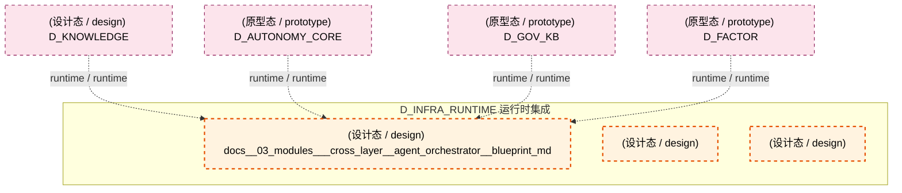
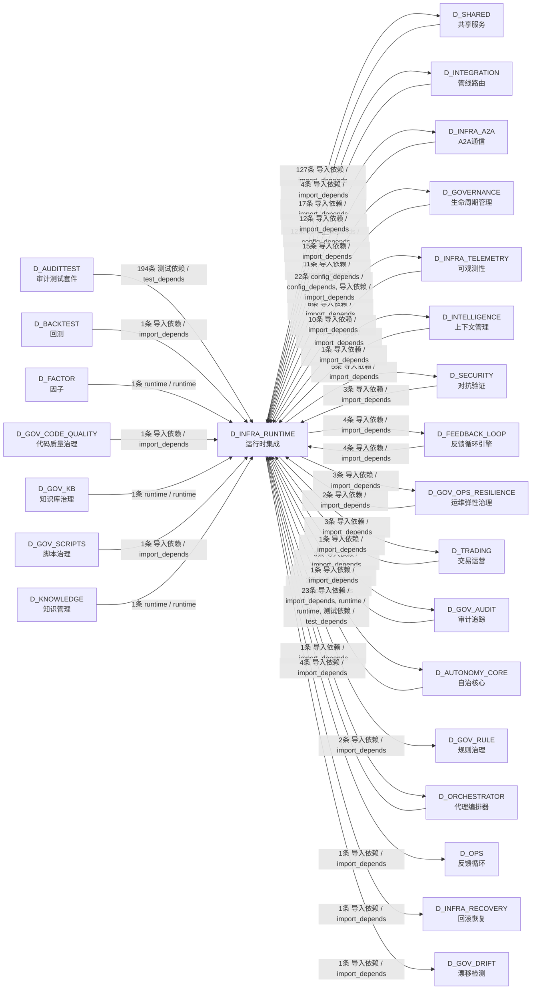

# 04_d_infra_runtime / runtime_core / 运行时集成 / Runtime Integration

> **功能简介 / Overview**: 运行时集成，负责组件生命周期编排、启动钩子和运行时上下文管理

> **文档作用 / Purpose**: 展示 运行时集成（D_INFRA_RUNTIME）功能域的模块清单、域内依赖关系、跨域依赖关系、架构分层视图，供架构审查和域治理参考。

> 本文档由 generate_domain_doc.py 从 depgraph (PostgreSQL) 自动生成
> 最后更新: 2026-07-12 22:29:24
> 数据源: depgraph (PostgreSQL) nodes表 + edges表

## 域基本信息 / Domain Overview

| 字段 | 值 | Field | Value |
|------|------|-------|-------|
| 编号 | 04 | Number | 04 |
| 域ID | D_INFRA_RUNTIME | Domain ID | D_INFRA_RUNTIME |
| 域名称 | 运行时集成 | Domain Name | Runtime Integration |
| 层级 | L0 基础设施层 | Layer | L0 Infrastructure |
| 模块数 | 239 | Module Count | 239 |
| 域内依赖 | 230 | Internal Dependencies | 230 |
| 跨域入边 | 302 | Cross-domain Incoming | 302 |
| 跨域出边 | 204 | Cross-domain Outgoing | 204 |
| 设计态模块 | 3 | Design Modules | 3 |
| 原型态模块 | 101 | Prototype Modules | 101 |
| 生产态模块 | 135 | Production Modules | 135 |
| 容量 | 135/150 (正常) | Capacity | 135/150 (正常) |
| 描述 | 三层运行时编排(L1 Trae/L2 Local/L3 API) | Description | 三层运行时编排(L1 Trae/L2 Local/L3 API) |

## 模块分层清单 / Module Layered List

> 按 architecture_layer 分组的模块清单（共 239 个模块 / 239 modules）。

### L0 基础设施层 / Infrastructure Layer (206 modules)

| # | 模块路径 / Module Path | 模块名称 / Module Name (功能简介 / Description) | 成熟度 / Maturity | 蓝图 / Blueprint |
|:--:|---------|---------|:---:|:---:|
| 1 | docs/03_modules/_cross_layer/shared_core/contracts_bluepr... |  | 设计态 / design |  |
| 2 | docs/03_modules/_cross_layer/shared_core/shared_infra_blu... |  | 设计态 / design |  |
| 3 | src/zephyr/__init__.py | ZephyrAlpha 核心包索引 + 模块懒加载器 (M-04) | 原型态 / prototype | [MOD-INF-002](../../03_modules/_domain_infrastructure_runtime/runtime_integration/blueprint.md) |
| 4 | src/zephyr/infrastructure/__init__.py | __init__.py | 原型态 / prototype |  |
| 5 | src/zephyr/infrastructure/_extensions/__init__.py | __init__.py | 原型态 / prototype |  |
| 6 | src/zephyr/infrastructure/a2a_protocol/a2a_card_registry.py | A2A Card Registry — 全局 Agent Card 注册单例 | 生产态 / production | [MOD-INF-025](../../03_modules/_domain_infrastructure_operations/agent_to_agent_protocol/blueprint.md) |
| 7 | src/zephyr/infrastructure/a2a_protocol/layer1_discovery/a... | A2A Registry — Agent Card 注册与发现 | 生产态 / production | [MOD-INF-025](../../03_modules/_domain_infrastructure_operations/agent_to_agent_protocol/blueprint.md) |
| 8 | src/zephyr/infrastructure/a2a_protocol/layer1_discovery/a... | Agent Card 模型 — A2A Layer 1 Discovery | 生产态 / production | [MOD-INF-025](../../03_modules/_domain_infrastructure_operations/agent_to_agent_protocol/blueprint.md) |
| 9 | src/zephyr/infrastructure/a2a_protocol/layer1_discovery/i... | Identity Verifier — JWT 身份验证器 | 生产态 / production | [MOD-INF-025](../../03_modules/_domain_infrastructure_operations/agent_to_agent_protocol/blueprint.md) |
| 10 | src/zephyr/infrastructure/a2a_protocol/layer2_communicati... | A2A Message/Part 系统 — Layer 2 Communication | 生产态 / production | [MOD-INF-025](../../03_modules/_domain_infrastructure_operations/agent_to_agent_protocol/blueprint.md) |
| 11 | src/zephyr/infrastructure/a2a_protocol/layer2_communicati... | A2A Task 状态机 — Layer 2 Communication | 生产态 / production | [MOD-INF-025](../../03_modules/_domain_infrastructure_operations/agent_to_agent_protocol/blueprint.md) |
| 12 | src/zephyr/infrastructure/a2a_protocol/layer2_communicati... | Context Package — A2A 上下文包 | 原型态 / prototype | [MOD-INF-025](../../03_modules/_domain_infrastructure_operations/agent_to_agent_protocol/blueprint.md) |
| 13 | src/zephyr/infrastructure/a2a_protocol/layer2_communicati... | Handoff Manager — Agent 间任务交接 | 原型态 / prototype | [MOD-INF-025](../../03_modules/_domain_infrastructure_operations/agent_to_agent_protocol/blueprint.md) |
| 14 | src/zephyr/infrastructure/a2a_protocol/layer2_communicati... | Message Router — A2A 消息路由 | 生产态 / production | [MOD-INF-025](../../03_modules/_domain_infrastructure_operations/agent_to_agent_protocol/blueprint.md) |
| 15 | src/zephyr/infrastructure/a2a_protocol/layer2_communicati... | Push Notifier — A2A 推送通知 | 生产态 / production | [MOD-INF-025](../../03_modules/_domain_infrastructure_operations/agent_to_agent_protocol/blueprint.md) |
| 16 | src/zephyr/infrastructure/a2a_protocol/layer2_communicati... | Streaming — A2A 流式传输 | 生产态 / production | [MOD-INF-025](../../03_modules/_domain_infrastructure_operations/agent_to_agent_protocol/blueprint.md) |
| 17 | src/zephyr/infrastructure/a2a_protocol/layer2_communicati... | 触发监控器 | 生产态 / production | [MOD-INF-025](../../03_modules/_domain_infrastructure_operations/agent_to_agent_protocol/blueprint.md) |
| 18 | src/zephyr/infrastructure/a2a_protocol/layer3_coordinatio... | Re-export bridge for layer3_coordination consen... | 原型态 / prototype | [MOD-INF-025](../../03_modules/_domain_infrastructure_operations/agent_to_agent_protocol/blueprint.md) |
| 19 | src/zephyr/infrastructure/a2a_protocol/layer3_coordinatio... | Re-export bridge for layer3_coordination core c... | 原型态 / prototype | [MOD-INF-025](../../03_modules/_domain_infrastructure_operations/agent_to_agent_protocol/blueprint.md) |
| 20 | src/zephyr/infrastructure/a2a_protocol/layer3_coordinatio... | Re-export bridge for layer3_coordination intell... | 原型态 / prototype | [MOD-INF-025](../../03_modules/_domain_infrastructure_operations/agent_to_agent_protocol/blueprint.md) |
| 21 | src/zephyr/infrastructure/a2a_protocol/layer3_coordinatio... | Re-export bridge for layer3_coordination securi... | 原型态 / prototype | [MOD-INF-025](../../03_modules/_domain_infrastructure_operations/agent_to_agent_protocol/blueprint.md) |
| 22 | src/zephyr/infrastructure/a2a_protocol/layer3_coordinatio... | A2A 统计异常检测引擎 — 基线学习 + 实时异常判断 | 原型态 / prototype | [MOD-INF-025](../../03_modules/_domain_infrastructure_operations/agent_to_agent_protocol/blueprint.md) |
| 23 | src/zephyr/infrastructure/a2a_protocol/layer3_coordinatio... | A2A 行为指纹 — Agent 行为模式学习与画像 | 原型态 / prototype | [MOD-INF-025](../../03_modules/_domain_infrastructure_operations/agent_to_agent_protocol/blueprint.md) |
| 24 | src/zephyr/infrastructure/a2a_protocol/layer3_coordinatio... | A2A 责任归属引擎 — 因果链分析 + 责任分配 | 原型态 / prototype | [MOD-INF-025](../../03_modules/_domain_infrastructure_operations/agent_to_agent_protocol/blueprint.md) |
| 25 | src/zephyr/infrastructure/a2a_protocol/layer3_coordinatio... | A2A 碳足迹追踪 | 原型态 / prototype | [MOD-INF-025](../../03_modules/_domain_infrastructure_operations/agent_to_agent_protocol/blueprint.md) |
| 26 | src/zephyr/infrastructure/a2a_protocol/layer3_coordinatio... | A2A 因果追踪 — 跨 Agent 操作因果链图谱 | 原型态 / prototype | [MOD-INF-025](../../03_modules/_domain_infrastructure_operations/agent_to_agent_protocol/blueprint.md) |
| 27 | src/zephyr/infrastructure/a2a_protocol/layer3_coordinatio... | A2A 检查点管理器 | 原型态 / prototype | [MOD-INF-025](../../03_modules/_domain_infrastructure_operations/agent_to_agent_protocol/blueprint.md) |
| 28 | src/zephyr/infrastructure/a2a_protocol/layer3_coordinatio... | A2A 合谋检测器 — Agent 间串通模式识别 | 原型态 / prototype | [MOD-INF-025](../../03_modules/_domain_infrastructure_operations/agent_to_agent_protocol/blueprint.md) |
| 29 | src/zephyr/infrastructure/a2a_protocol/layer3_coordinatio... | P2: Agent同意管理 | 原型态 / prototype | [MOD-INF-025](../../03_modules/_domain_infrastructure_operations/agent_to_agent_protocol/blueprint.md) |
| 30 | src/zephyr/infrastructure/a2a_protocol/layer3_coordinatio... | P2: 宪法性Agent管理 | 原型态 / prototype | [MOD-INF-025](../../03_modules/_domain_infrastructure_operations/agent_to_agent_protocol/blueprint.md) |
| 31 | src/zephyr/infrastructure/a2a_protocol/layer3_coordinatio... | 上下文腐烂检测 | 原型态 / prototype | [MOD-INF-025](../../03_modules/_domain_infrastructure_operations/agent_to_agent_protocol/blueprint.md) |
| 32 | src/zephyr/infrastructure/a2a_protocol/layer3_coordinatio... | A2A 跨 Agent 语义流追踪 — 知识+意图在 Agent 间传递 | 原型态 / prototype | [MOD-INF-025](../../03_modules/_domain_infrastructure_operations/agent_to_agent_protocol/blueprint.md) |
| 33 | src/zephyr/infrastructure/a2a_protocol/layer3_coordinatio... | A2A 监控仪表盘 — Agent 集群运行状态可视化面板 | 原型态 / prototype | [MOD-INF-025](../../03_modules/_domain_infrastructure_operations/agent_to_agent_protocol/blueprint.md) |
| 34 | src/zephyr/infrastructure/a2a_protocol/layer3_coordinatio... | A2A 结构化辩论协议 — 多轮主张->反驳->合成 | 原型态 / prototype | [MOD-INF-025](../../03_modules/_domain_infrastructure_operations/agent_to_agent_protocol/blueprint.md) |
| 35 | src/zephyr/infrastructure/a2a_protocol/layer3_coordinatio... | 委托链 | 原型态 / prototype | [MOD-INF-025](../../03_modules/_domain_infrastructure_operations/agent_to_agent_protocol/blueprint.md) |
| 36 | src/zephyr/infrastructure/a2a_protocol/layer3_coordinatio... | A2A 经济学——Token/API成本追踪 | 原型态 / prototype | [MOD-INF-025](../../03_modules/_domain_infrastructure_operations/agent_to_agent_protocol/blueprint.md) |
| 37 | src/zephyr/infrastructure/a2a_protocol/layer3_coordinatio... | A2A 遗忘机制 | 原型态 / prototype | [MOD-INF-025](../../03_modules/_domain_infrastructure_operations/agent_to_agent_protocol/blueprint.md) |
| 38 | src/zephyr/infrastructure/a2a_protocol/layer3_coordinatio... | A2A 形式化验证 — 协议属性模型检查 | 原型态 / prototype | [MOD-INF-025](../../03_modules/_domain_infrastructure_operations/agent_to_agent_protocol/blueprint.md) |
| 39 | src/zephyr/infrastructure/a2a_protocol/layer3_coordinatio... | A2A ANP 帧协商协议 — Agent Negotiation Protoco... | 原型态 / prototype | [MOD-INF-025](../../03_modules/_domain_infrastructure_operations/agent_to_agent_protocol/blueprint.md) |
| 40 | src/zephyr/infrastructure/a2a_protocol/layer3_coordinatio... | A2A 硬件路由器——GPU/CPU 调度 | 原型态 / prototype | [MOD-INF-025](../../03_modules/_domain_infrastructure_operations/agent_to_agent_protocol/blueprint.md) |
| 41 | src/zephyr/infrastructure/a2a_protocol/layer3_coordinatio... | P2: Agent休眠管理 | 原型态 / prototype | [MOD-INF-025](../../03_modules/_domain_infrastructure_operations/agent_to_agent_protocol/blueprint.md) |
| 42 | src/zephyr/infrastructure/a2a_protocol/layer3_coordinatio... | A2A 幂等性保证 | 原型态 / prototype | [MOD-INF-025](../../03_modules/_domain_infrastructure_operations/agent_to_agent_protocol/blueprint.md) |
| 43 | src/zephyr/infrastructure/a2a_protocol/layer3_coordinatio... | A2A 空闲守卫 | 原型态 / prototype | [MOD-INF-025](../../03_modules/_domain_infrastructure_operations/agent_to_agent_protocol/blueprint.md) |
| 44 | src/zephyr/infrastructure/a2a_protocol/layer3_coordinatio... | A2A 免疫系统 | 原型态 / prototype | [MOD-INF-025](../../03_modules/_domain_infrastructure_operations/agent_to_agent_protocol/blueprint.md) |
| 45 | src/zephyr/infrastructure/a2a_protocol/layer3_coordinatio... | A2A 知识蒸馏 — 跨 Agent 经验提炼与共享 | 原型态 / prototype | [MOD-INF-025](../../03_modules/_domain_infrastructure_operations/agent_to_agent_protocol/blueprint.md) |
| 46 | src/zephyr/infrastructure/a2a_protocol/layer3_coordinatio... | A2A 隐性通信检测 — 检测 Agent 通过副作用隐式通信 | 原型态 / prototype | [MOD-INF-025](../../03_modules/_domain_infrastructure_operations/agent_to_agent_protocol/blueprint.md) |
| 47 | src/zephyr/infrastructure/a2a_protocol/layer3_coordinatio... | A2A 指标收集 | 原型态 / prototype | [MOD-INF-025](../../03_modules/_domain_infrastructure_operations/agent_to_agent_protocol/blueprint.md) |
| 48 | src/zephyr/infrastructure/a2a_protocol/layer3_coordinatio... | A2A 协商协议 — Agent 间资源/任务分配协商 | 生产态 / production | [MOD-INF-025](../../03_modules/_domain_infrastructure_operations/agent_to_agent_protocol/blueprint.md) |
| 49 | src/zephyr/infrastructure/a2a_protocol/layer3_coordinatio... | A2A 协议网关 — Agent 间请求分发与协议转换 | 原型态 / prototype | [MOD-INF-025](../../03_modules/_domain_infrastructure_operations/agent_to_agent_protocol/blueprint.md) |
| 50 | src/zephyr/infrastructure/a2a_protocol/layer3_coordinatio... | A2A协议安全 | 原型态 / prototype | [MOD-INF-025](../../03_modules/_domain_infrastructure_operations/agent_to_agent_protocol/blueprint.md) |
| 51 | src/zephyr/infrastructure/a2a_protocol/layer3_coordinatio... | A2A 红队测试 — 攻击向量定义与执行框架 | 原型态 / prototype | [MOD-INF-025](../../03_modules/_domain_infrastructure_operations/agent_to_agent_protocol/blueprint.md) |
| 52 | src/zephyr/infrastructure/a2a_protocol/layer3_coordinatio... | A2A Saga 事务协议 — 多 Agent 跨步分布式事务 | 生产态 / production | [MOD-INF-025](../../03_modules/_domain_infrastructure_operations/agent_to_agent_protocol/blueprint.md) |
| 53 | src/zephyr/infrastructure/a2a_protocol/layer3_coordinatio... | A2A 安全内容扫描器 — 六大类威胁检测 | 原型态 / prototype | [MOD-INF-025](../../03_modules/_domain_infrastructure_operations/agent_to_agent_protocol/blueprint.md) |
| 54 | src/zephyr/infrastructure/a2a_protocol/layer3_coordinatio... | 时序准入控制 | 原型态 / prototype | [MOD-INF-025](../../03_modules/_domain_infrastructure_operations/agent_to_agent_protocol/blueprint.md) |
| 55 | src/zephyr/infrastructure/a2a_protocol/layer3_coordinatio... | A2A 分布式追踪 — 跨 Agent 请求链追踪 (Span-based) | 原型态 / prototype | [MOD-INF-025](../../03_modules/_domain_infrastructure_operations/agent_to_agent_protocol/blueprint.md) |
| 56 | src/zephyr/infrastructure/a2a_protocol/layer3_coordinatio... | 向量化信誉系统 | 原型态 / prototype | [MOD-INF-025](../../03_modules/_domain_infrastructure_operations/agent_to_agent_protocol/blueprint.md) |
| 57 | src/zephyr/infrastructure/a2a_protocol/layer3_coordinatio... | A2A 加权投票协议 — 多 Agent 共识达成机制 | 生产态 / production | [MOD-INF-025](../../03_modules/_domain_infrastructure_operations/agent_to_agent_protocol/blueprint.md) |
| 58 | src/zephyr/infrastructure/a2a_protocol/layer3_coordinatio... | A2A 工作窃取调度器 — 跨 Agent 负载均衡 | 生产态 / production | [MOD-INF-025](../../03_modules/_domain_infrastructure_operations/agent_to_agent_protocol/blueprint.md) |
| 59 | src/zephyr/infrastructure/a2a_protocol/layer3_coordinatio... | A2A 三级仲裁引擎 — priority -> rule -> escalation | 生产态 / production | [MOD-INF-025](../../03_modules/_domain_infrastructure_operations/agent_to_agent_protocol/blueprint.md) |
| 60 | src/zephyr/infrastructure/a2a_protocol/layer3_coordinatio... | 级联守卫——防止失败在Agent间级联 | 生产态 / production | [MOD-INF-025](../../03_modules/_domain_infrastructure_operations/agent_to_agent_protocol/blueprint.md) |
| 61 | src/zephyr/infrastructure/a2a_protocol/layer3_coordinatio... | A2A 冲突检测引擎 — 语义+文本+资源三维冲突检测 | 生产态 / production | [MOD-INF-025](../../03_modules/_domain_infrastructure_operations/agent_to_agent_protocol/blueprint.md) |
| 62 | src/zephyr/infrastructure/a2a_protocol/layer3_coordinatio... | 施工后验证器 — 自指悖论防御：不橡胶图章，真正... | 原型态 / prototype | [MOD-INF-025](../../03_modules/_domain_infrastructure_operations/agent_to_agent_protocol/blueprint.md) |
| 63 | src/zephyr/infrastructure/a2a_protocol/layer3_coordinatio... | P2: 死锁守卫 | 生产态 / production | [MOD-INF-025](../../03_modules/_domain_infrastructure_operations/agent_to_agent_protocol/blueprint.md) |
| 64 | src/zephyr/infrastructure/a2a_protocol/layer3_coordinatio... | P2: 活锁检测器 | 生产态 / production | [MOD-INF-025](../../03_modules/_domain_infrastructure_operations/agent_to_agent_protocol/blueprint.md) |
| 65 | src/zephyr/infrastructure/a2a_protocol/layer3_coordinatio... | A2A 语义差异引擎 — 结构感知的 Agent 间差异检测 | 原型态 / prototype | [MOD-INF-025](../../03_modules/_domain_infrastructure_operations/agent_to_agent_protocol/blueprint.md) |
| 66 | src/zephyr/infrastructure/a2a_protocol/layer3_coordinatio... | A2A Session 走私防御 — 防止跨 Agent session 上... | 原型态 / prototype | [MOD-INF-025](../../03_modules/_domain_infrastructure_operations/agent_to_agent_protocol/blueprint.md) |
| 67 | src/zephyr/infrastructure/a2a_protocol/layer3_coordinatio... | A2A Living Spec 同步 — 蓝图与实现的双向漂移管理 | 原型态 / prototype | [MOD-INF-025](../../03_modules/_domain_infrastructure_operations/agent_to_agent_protocol/blueprint.md) |
| 68 | src/zephyr/infrastructure/a2a_protocol/layer3_coordinatio... | Supervisor — A2A Layer 3 Coordination | 生产态 / production | [MOD-INF-025](../../03_modules/_domain_infrastructure_operations/agent_to_agent_protocol/blueprint.md) |
| 69 | src/zephyr/infrastructure/a2a_protocol/local_first_arch.py | local_first_arch.py | 生产态 / production | [MOD-INF-025](../../03_modules/_domain_infrastructure_operations/agent_to_agent_protocol/blueprint.md) |
| 70 | src/zephyr/infrastructure/a2a_protocol/migration_strategy.py | migration_strategy.py | 生产态 / production | [MOD-INF-025](../../03_modules/_domain_infrastructure_operations/agent_to_agent_protocol/blueprint.md) |
| 71 | src/zephyr/infrastructure/a2a_protocol/multi_agent.py | multi_agent.py —— Multi-Agent 编排基座（Phase... | 生产态 / production | [MOD-INF-025](../../03_modules/_domain_infrastructure_operations/agent_to_agent_protocol/blueprint.md) |
| 72 | src/zephyr/infrastructure/a2a_protocol/multi_model_consen... | multi_model_consensus.py | 生产态 / production | [MOD-INF-025](../../03_modules/_domain_infrastructure_operations/agent_to_agent_protocol/blueprint.md) |
| 73 | src/zephyr/infrastructure/a2a_protocol/offline_autonomy.py | offline_autonomy.py | 生产态 / production | [MOD-INF-025](../../03_modules/_domain_infrastructure_operations/agent_to_agent_protocol/blueprint.md) |
| 74 | src/zephyr/infrastructure/a2a_protocol/offline_resilience.py | offline_resilience.py | 生产态 / production | [MOD-INF-025](../../03_modules/_domain_infrastructure_operations/agent_to_agent_protocol/blueprint.md) |
| 75 | src/zephyr/infrastructure/a2a_protocol/phase_hold.py | Phase 4 Hold — A2A Phase 4 锁定标记模块 与其他... | 生产态 / production | [MOD-INF-025](../../03_modules/_domain_infrastructure_operations/agent_to_agent_protocol/blueprint.md) |
| 76 | src/zephyr/infrastructure/a2a_protocol/prompt_lifecycle.py | prompt_lifecycle.py | 生产态 / production | [MOD-INF-025](../../03_modules/_domain_infrastructure_operations/agent_to_agent_protocol/blueprint.md) |
| 77 | src/zephyr/infrastructure/a2a_protocol/realtime_streaming.py | realtime_streaming.py | 原型态 / prototype | [MOD-INF-025](../../03_modules/_domain_infrastructure_operations/agent_to_agent_protocol/blueprint.md) |
| 78 | src/zephyr/infrastructure/api/__init__.py | __init__.py | 原型态 / prototype |  |
| 79 | src/zephyr/infrastructure/asset_inventory/__init__.py | asset-inventory — MOD-INF-026 · 资产盘点系统... | 生产态 / production | [MOD-INF-026](../../03_modules/_domain_infrastructure_operations/asset_inventory/blueprint.md) |
| 80 | src/zephyr/infrastructure/asset_inventory/__main__.py | Asset Inventory CLI — MOD-INF-026 蓝图 §31 | 原型态 / prototype | [MOD-INF-026](../../03_modules/_domain_infrastructure_operations/asset_inventory/blueprint.md) |
| 81 | src/zephyr/infrastructure/asset_inventory/classifier.py | AssetClassifier — MOD-INF-026 L2 资产自动分类器 | 生产态 / production | [MOD-INF-026](../../03_modules/_domain_infrastructure_operations/asset_inventory/blueprint.md) |
| 82 | src/zephyr/infrastructure/asset_inventory/dashboard.py | AssetDashboard — MOD-INF-026 资产健康仪表盘生成器 | 生产态 / production | [MOD-INF-026](../../03_modules/_domain_infrastructure_operations/asset_inventory/blueprint.md) |
| 83 | src/zephyr/infrastructure/asset_inventory/dependency.py | MOD-INF-026 §18 — 资产依赖图。 | 生产态 / production | [MOD-INF-026](../../03_modules/_domain_infrastructure_operations/asset_inventory/blueprint.md) |
| 84 | src/zephyr/infrastructure/asset_inventory/index_generator.py | UnifiedAssetIndex — MOD-INF-026 L3 统一资产索... | 生产态 / production | [MOD-INF-026](../../03_modules/_domain_infrastructure_operations/asset_inventory/blueprint.md) |
| 85 | src/zephyr/infrastructure/asset_inventory/lifecycle.py | AssetLifecycle — MOD-INF-026 L5 ITIL生命周期自... | 生产态 / production | [MOD-INF-026](../../03_modules/_domain_infrastructure_operations/asset_inventory/blueprint.md) |
| 86 | src/zephyr/infrastructure/asset_inventory/mcp_server.py | AssetInventory MCP Server — MOD-INF-026 蓝图 §21 | 原型态 / prototype | [MOD-INF-026](../../03_modules/_domain_infrastructure_operations/asset_inventory/blueprint.md) |
| 87 | src/zephyr/infrastructure/asset_inventory/metadata.py | MOD-INF-026 §24-25 — Git 历史元数据提取 + 多 ... | 生产态 / production | [MOD-INF-026](../../03_modules/_domain_infrastructure_operations/asset_inventory/blueprint.md) |
| 88 | src/zephyr/infrastructure/asset_inventory/models.py | AssetInventoryModels — MOD-INF-026 Pydantic V2... | 生产态 / production | [MOD-INF-026](../../03_modules/_domain_infrastructure_operations/asset_inventory/blueprint.md) |
| 89 | src/zephyr/infrastructure/asset_inventory/reconciler.py | ReconciliationEngine — MOD-INF-026 L4 注册表 v... | 生产态 / production | [MOD-INF-026](../../03_modules/_domain_infrastructure_operations/asset_inventory/blueprint.md) |
| 90 | src/zephyr/infrastructure/asset_inventory/registry_adapte... | MOD-INF-026 §17 — 24 个异构注册表统一解析适配器。 | 生产态 / production | [MOD-INF-026](../../03_modules/_domain_infrastructure_operations/asset_inventory/blueprint.md) |
| 91 | src/zephyr/infrastructure/asset_inventory/scanner.py | AssetDiscoveryScanner — MOD-INF-026 L1 全量文... | 生产态 / production | [MOD-INF-026](../../03_modules/_domain_infrastructure_operations/asset_inventory/blueprint.md) |
| 92 | src/zephyr/infrastructure/asset_inventory/telemetry.py | AssetInventoryTelemetry — MOD-INF-026 自监控指标 | 生产态 / production | [MOD-INF-026](../../03_modules/_domain_infrastructure_operations/asset_inventory/blueprint.md) |
| 93 | src/zephyr/infrastructure/asset_inventory/trust_anchor.py | MOD-INF-026 §26 — 三重信任锚验证门 R20。 | 生产态 / production | [MOD-INF-026](../../03_modules/_domain_infrastructure_operations/asset_inventory/blueprint.md) |
| 94 | src/zephyr/infrastructure/auto_diagnostics.py | RI-12 AutoDiagnostics — 自动诊断引擎 | 生产态 / production | [MOD-INF-002](../../03_modules/_domain_infrastructure_runtime/runtime_integration/blueprint.md) |
| 95 | src/zephyr/infrastructure/auto_fix_engine/__init__.py | __init__.py | 生产态 / production | [MOD-INF-031](../../03_modules/_cross_layer/auto_fix_engine/blueprint.md) |
| 96 | src/zephyr/infrastructure/auto_fix_engine/__main__.py | __main__.py | 原型态 / prototype | [MOD-INF-031](../../03_modules/_cross_layer/auto_fix_engine/blueprint.md) |
| 97 | src/zephyr/infrastructure/auto_fix_engine/alignment_synce... | alignment_syncer.py | 原型态 / prototype | [MOD-INF-031](../../03_modules/_cross_layer/auto_fix_engine/blueprint.md) |
| 98 | src/zephyr/infrastructure/auto_fix_engine/all_completer.py | all_completer.py | 原型态 / prototype | [MOD-INF-031](../../03_modules/_cross_layer/auto_fix_engine/blueprint.md) |
| 99 | src/zephyr/infrastructure/auto_fix_engine/auto_fix_config... | auto_fix_config.yaml | 生产态 / production |  |
| 100 | src/zephyr/infrastructure/auto_fix_engine/batch_fixer.py | batch_fixer.py | 原型态 / prototype | [MOD-INF-031](../../03_modules/_cross_layer/auto_fix_engine/blueprint.md) |
| 101 | src/zephyr/infrastructure/auto_fix_engine/compliance_audi... | compliance_auditor.py | 原型态 / prototype | [MOD-INF-031](../../03_modules/_cross_layer/auto_fix_engine/blueprint.md) |
| 102 | src/zephyr/infrastructure/auto_fix_engine/config_fixer.py | config_fixer.py | 原型态 / prototype | [MOD-INF-031](../../03_modules/_cross_layer/auto_fix_engine/blueprint.md) |
| 103 | src/zephyr/infrastructure/auto_fix_engine/dedup_extractor.py | dedup_extractor.py | 原型态 / prototype | [MOD-INF-031](../../03_modules/_cross_layer/auto_fix_engine/blueprint.md) |
| 104 | src/zephyr/infrastructure/auto_fix_engine/dep_version_fix... | dep_version_fixer.py | 生产态 / production | [MOD-INF-031](../../03_modules/_cross_layer/auto_fix_engine/blueprint.md) |
| 105 | src/zephyr/infrastructure/auto_fix_engine/drift_fixer.py | drift_fixer.py | 生产态 / production | [MOD-INF-031](../../03_modules/_cross_layer/auto_fix_engine/blueprint.md) |
| 106 | src/zephyr/infrastructure/auto_fix_engine/engine.py | engine.py | 生产态 / production | [MOD-INF-031](../../03_modules/_cross_layer/auto_fix_engine/blueprint.md) |
| 107 | src/zephyr/infrastructure/auto_fix_engine/escalation_brid... | escalation_bridge.py | 生产态 / production | [MOD-INF-031](../../03_modules/_cross_layer/auto_fix_engine/blueprint.md) |
| 108 | src/zephyr/infrastructure/auto_fix_engine/event_hooks.py | event_hooks.py | 生产态 / production | [MOD-INF-031](../../03_modules/_cross_layer/auto_fix_engine/blueprint.md) |
| 109 | src/zephyr/infrastructure/auto_fix_engine/fix_budget.py | fix_budget.py | 生产态 / production | [MOD-INF-031](../../03_modules/_cross_layer/auto_fix_engine/blueprint.md) |
| 110 | src/zephyr/infrastructure/auto_fix_engine/fix_diff.py | fix_diff.py | 生产态 / production | [MOD-INF-031](../../03_modules/_cross_layer/auto_fix_engine/blueprint.md) |
| 111 | src/zephyr/infrastructure/auto_fix_engine/fix_health_chec... | fix_health_check.py | 生产态 / production | [MOD-INF-031](../../03_modules/_cross_layer/auto_fix_engine/blueprint.md) |
| 112 | src/zephyr/infrastructure/auto_fix_engine/fix_pattern_min... | fix_pattern_miner.py | 生产态 / production | [MOD-INF-031](../../03_modules/_cross_layer/auto_fix_engine/blueprint.md) |
| 113 | src/zephyr/infrastructure/auto_fix_engine/fix_reliability.py | fix_reliability.py | 生产态 / production | [MOD-INF-031](../../03_modules/_cross_layer/auto_fix_engine/blueprint.md) |
| 114 | src/zephyr/infrastructure/auto_fix_engine/fix_report.py | fix_report.py | 生产态 / production | [MOD-INF-031](../../03_modules/_cross_layer/auto_fix_engine/blueprint.md) |
| 115 | src/zephyr/infrastructure/auto_fix_engine/fix_safety.py | fix_safety.py | 生产态 / production | [MOD-INF-031](../../03_modules/_cross_layer/auto_fix_engine/blueprint.md) |
| 116 | src/zephyr/infrastructure/auto_fix_engine/fix_scheduler.py | fix_scheduler.py | 生产态 / production | [MOD-INF-031](../../03_modules/_cross_layer/auto_fix_engine/blueprint.md) |
| 117 | src/zephyr/infrastructure/auto_fix_engine/import_fixer.py | import_fixer.py | 原型态 / prototype | [MOD-INF-031](../../03_modules/_cross_layer/auto_fix_engine/blueprint.md) |
| 118 | src/zephyr/infrastructure/auto_fix_engine/interrupt_guard.py | interrupt_guard.py | 生产态 / production | [MOD-INF-031](../../03_modules/_cross_layer/auto_fix_engine/blueprint.md) |
| 119 | src/zephyr/infrastructure/auto_fix_engine/llm_fix_adapter.py | llm_fix_adapter.py | 生产态 / production | [MOD-INF-031](../../03_modules/_cross_layer/auto_fix_engine/blueprint.md) |
| 120 | src/zephyr/infrastructure/auto_fix_engine/models.py | models.py | 生产态 / production | [MOD-INF-031](../../03_modules/_cross_layer/auto_fix_engine/blueprint.md) |
| 121 | src/zephyr/infrastructure/auto_fix_engine/scaffold_regist... | scaffold_registrar.py | 生产态 / production | [MOD-INF-031](../../03_modules/_cross_layer/auto_fix_engine/blueprint.md) |
| 122 | src/zephyr/infrastructure/auto_fix_engine/self_heal_agent.py | self_heal_agent.py | 生产态 / production | [MOD-INF-031](../../03_modules/_cross_layer/auto_fix_engine/blueprint.md) |
| 123 | src/zephyr/infrastructure/auto_fix_engine/shadow_workspac... | shadow_workspace.py | 生产态 / production | [MOD-INF-031](../../03_modules/_cross_layer/auto_fix_engine/blueprint.md) |
| 124 | src/zephyr/infrastructure/auto_fix_engine/state_machine.py | state_machine.py | 生产态 / production | [MOD-INF-031](../../03_modules/_cross_layer/auto_fix_engine/blueprint.md) |
| 125 | src/zephyr/infrastructure/auto_fix_engine/zombie_cleaner.py | zombie_cleaner.py | 生产态 / production | [MOD-INF-031](../../03_modules/_cross_layer/auto_fix_engine/blueprint.md) |
| 126 | src/zephyr/infrastructure/capacity_assurance/__init__.py | ZephyrAlpha 容量保障体系 (Capacity Assurance) ... | 原型态 / prototype | [MOD-INF-001](../../03_modules/_domain_infrastructure_operations/capacity_assurance/blueprint.md) |
| 127 | src/zephyr/infrastructure/capacity_assurance/budget_forec... | budget_forecaster.py — Token 预算预测 (DD120-e... | 生产态 / production | [MOD-INF-001](../../03_modules/_domain_infrastructure_operations/capacity_assurance/blueprint.md) |
| 128 | src/zephyr/infrastructure/capacity_assurance/contracts/__... | capacity-assurance contracts — ContractBus 44... | 原型态 / prototype | [MOD-INF-001](../../03_modules/_domain_infrastructure_operations/capacity_assurance/blueprint.md) |
| 129 | src/zephyr/infrastructure/capacity_assurance/contracts/ba... | Batch1 基础设施层契约 — 15条 Pydantic v2 Schem... | 原型态 / prototype | [MOD-INF-001](../../03_modules/_domain_infrastructure_operations/capacity_assurance/blueprint.md) |
| 130 | src/zephyr/infrastructure/capacity_assurance/contracts/ba... | Batch3 集成层契约 — 14条 Pydantic v2 Schema（O... | 原型态 / prototype | [MOD-INF-001](../../03_modules/_domain_infrastructure_operations/capacity_assurance/blueprint.md) |
| 131 | src/zephyr/infrastructure/capacity_assurance/contracts/co... | ContractBus loader — 加载全部44条容量保障契约... | 原型态 / prototype | [MOD-INF-001](../../03_modules/_domain_infrastructure_operations/capacity_assurance/blueprint.md) |
| 132 | src/zephyr/infrastructure/capacity_assurance/cross_module... | Cross-module integration — CT-1~CT-4 跨模块集... | 原型态 / prototype | [MOD-INF-001](../../03_modules/_domain_infrastructure_operations/capacity_assurance/blueprint.md) |
| 133 | src/zephyr/infrastructure/capacity_assurance/host_resourc... | host_resource_governor.py — 主机资源治理 (B17,... | 生产态 / production | [MOD-INF-001](../../03_modules/_domain_infrastructure_operations/capacity_assurance/blueprint.md) |
| 134 | src/zephyr/infrastructure/capacity_assurance/kill_switch.py | kill_switch.py -- safety circuit breaker (DD110... | 生产态 / production | [MOD-INF-001](../../03_modules/_domain_infrastructure_operations/capacity_assurance/blueprint.md) |
| 135 | src/zephyr/infrastructure/capacity_assurance/risk_mitigat... | Risk mitigation — R1~R16 全量风险缓解实现（对... | 原型态 / prototype | [MOD-INF-001](../../03_modules/_domain_infrastructure_operations/capacity_assurance/blueprint.md) |
| 136 | src/zephyr/infrastructure/capacity_assurance/schema.py | SchemaManager — 容量保障体系数据库 Schema 管理器 | 原型态 / prototype | [MOD-INF-001](../../03_modules/_domain_infrastructure_operations/capacity_assurance/blueprint.md) |
| 137 | src/zephyr/infrastructure/capacity_assurance/sli_instrume... | SLI instrumentation — SLI采集插桩点（对标蓝图 ... | 原型态 / prototype | [MOD-INF-001](../../03_modules/_domain_infrastructure_operations/capacity_assurance/blueprint.md) |
| 138 | src/zephyr/infrastructure/capacity_assurance/tech_stack.py | TechStackValidator — 技术栈可用性校验器 | 原型态 / prototype | [MOD-INF-001](../../03_modules/_domain_infrastructure_operations/capacity_assurance/blueprint.md) |
| 139 | src/zephyr/infrastructure/capacity_assurance/token_budget.py | token_budget.py — Token 估算工具 SSoT | 生产态 / production | [MOD-INF-001](../../03_modules/_domain_infrastructure_operations/capacity_assurance/blueprint.md) |
| 140 | src/zephyr/infrastructure/config_validator.py | M-12 ConfigValidator — 配置参数校验器 | 生产态 / production | [MOD-INF-002](../../03_modules/_domain_infrastructure_runtime/runtime_integration/blueprint.md) |
| 141 | src/zephyr/infrastructure/contract_tester.py | M-11 ContractTester — 契约测试框架 | 生产态 / production | [MOD-INF-002](../../03_modules/_domain_infrastructure_runtime/runtime_integration/blueprint.md) |
| 142 | src/zephyr/infrastructure/core/__init__.py | __init__.py | 原型态 / prototype |  |
| 143 | src/zephyr/infrastructure/cost_tracker.py | RI-15 CostTracker — 成本追踪器 | 生产态 / production | [MOD-INF-002](../../03_modules/_domain_infrastructure_runtime/runtime_integration/blueprint.md) |
| 144 | src/zephyr/infrastructure/dashboard/__init__.py | __init__.py | 原型态 / prototype | [MOD-L08-001](../../03_modules/_domain_frontend/blueprint.md) |
| 145 | src/zephyr/infrastructure/dashboard/components/__init__.py | __init__.py | 原型态 / prototype | [MOD-L08-001](../../03_modules/_domain_frontend/blueprint.md) |
| 146 | src/zephyr/infrastructure/database_service.py | DatabaseService: 统一管理数据库的连接池、生命周... | 原型态 / prototype | [MOD-INF-002](../../03_modules/_domain_infrastructure_runtime/runtime_integration/blueprint.md) |
| 147 | src/zephyr/infrastructure/dry_run_simulator.py | RI-14 DryRunSimulator — 干运行模拟器 | 生产态 / production | [MOD-INF-002](../../03_modules/_domain_infrastructure_runtime/runtime_integration/blueprint.md) |
| 148 | src/zephyr/infrastructure/event_bus_upgrade.py | DEPRECATED: 此文件已废弃。 | 生产态 / production | [MOD-INF-002](../../03_modules/_domain_infrastructure_runtime/runtime_integration/blueprint.md) |
| 149 | src/zephyr/infrastructure/event_store.py | RI-13 EventStore — 事件存储 | 生产态 / production | [MOD-INF-002](../../03_modules/_domain_infrastructure_runtime/runtime_integration/blueprint.md) |
| 150 | src/zephyr/infrastructure/file_watcher.py | file_watcher.py | 生产态 / production | [MOD-INF-002](../../03_modules/_domain_infrastructure_runtime/runtime_integration/blueprint.md) |
| 151 | src/zephyr/infrastructure/finding_task_bridge.py | Finding->TaskCard 桥接器 | 生产态 / production | [MOD-INF-002](../../03_modules/_domain_infrastructure_runtime/runtime_integration/blueprint.md) |
| 152 | src/zephyr/infrastructure/health_monitor/health_aggregato... | 全系统健康聚合 — check_all_systems() | 原型态 / prototype | [MOD-INF-035](../../03_modules/_cross_layer/auto_runtime_core/blueprint.md) |
| 153 | src/zephyr/infrastructure/hooks/__init__.py | __init__.py | 原型态 / prototype | [MOD-INF-002](../../03_modules/_domain_infrastructure_runtime/runtime_integration/blueprint.md) |
| 154 | src/zephyr/infrastructure/hooks/event_hook.py | EventHook — 声明式任务系统事件订阅 | 原型态 / prototype | [MOD-INF-002](../../03_modules/_domain_infrastructure_runtime/runtime_integration/blueprint.md) |
| 155 | src/zephyr/infrastructure/infrastructure_base.py | 基础设施 — Infrastructure Layer Skeleton | 生产态 / production | [MOD-INF-002](../../03_modules/_domain_infrastructure_runtime/runtime_integration/blueprint.md) |
| 156 | src/zephyr/infrastructure/kill_switch_sim.py | Kill Switch T0 Hardware Simulator | 生产态 / production | [MOD-INF-002](../../03_modules/_domain_infrastructure_runtime/runtime_integration/blueprint.md) |
| 157 | src/zephyr/infrastructure/lifecycle/__init__.py | core.lifecycle — lifecycle management, resourc... | 原型态 / prototype | [MOD-INF-035](../../03_modules/_cross_layer/auto_runtime_core/blueprint.md) |
| 158 | src/zephyr/infrastructure/model_capability_exam/__init__.py | # [MODULE] zephyr.infrastructure.model_capabili... | 原型态 / prototype | [MOD-INF-036](../../03_modules/_cross_layer/model_capability_exam/blueprint.md) |
| 159 | src/zephyr/infrastructure/model_profiler/__init__.py | Model Profiler — 本地 + 远程模型性能基准测试 | 原型态 / prototype | [MOD-INF-034](../../03_modules/_cross_layer/model_profiler/blueprint.md) |
| 160 | src/zephyr/infrastructure/models/__init__.py | __init__.py | 原型态 / prototype |  |
| 161 | src/zephyr/infrastructure/observability/__init__.py | Auto-generated contracts package — system-tele... | 原型态 / prototype |  |
| 162 | src/zephyr/infrastructure/observability/notifier.py | Notifier — 多渠道 Owner 通知。 | 生产态 / production |  |
| 163 | src/zephyr/infrastructure/pipeline/__init__.py | ZephyrAlpha Pipeline 模块 — M1-M11 双管线 + K8... | 原型态 / prototype | [MOD-INF-009](../../03_modules/_cross_layer/pipeline/blueprint.md) |
| 164 | src/zephyr/infrastructure/pipeline/backpressure_manager.py | Pipeline — Backpressure Manager | 生产态 / production | [MOD-INF-009](../../03_modules/_cross_layer/pipeline/blueprint.md) |
| 165 | src/zephyr/infrastructure/pipeline/backpressure_types.py | backpressure_types.py - Pipeline backpressure s... | 生产态 / production | [MOD-INF-009](../../03_modules/_cross_layer/pipeline/blueprint.md) |
| 166 | src/zephyr/infrastructure/pipeline/circuit_breaker_manage... | CircuitBreakerManager -- standalone circuit bre... | 生产态 / production | [MOD-INF-009](../../03_modules/_cross_layer/pipeline/blueprint.md) |
| 167 | src/zephyr/infrastructure/pipeline/cost_tracker.py | CostTracker —— LLM 调用成本追踪器（SRC-0025） | 生产态 / production | [MOD-INF-009](../../03_modules/_cross_layer/pipeline/blueprint.md) |
| 168 | src/zephyr/infrastructure/pipeline/ct_pipe_routing.py | CT-PIPE-ORC-001 — TaskCard -> 管线入口节点路由 | 生产态 / production | [MOD-INF-009](../../03_modules/_cross_layer/pipeline/blueprint.md) |
| 169 | src/zephyr/infrastructure/pipeline/dead_letter_queue.py | DeadLetterQueue — 死信队列 | 生产态 / production | [MOD-INF-009](../../03_modules/_cross_layer/pipeline/blueprint.md) |
| 170 | src/zephyr/infrastructure/pipeline/llm_gateway.py | MOD-INF-019: Agent Spec — LLM Gateway | 生产态 / production | [MOD-INF-009](../../03_modules/_cross_layer/pipeline/blueprint.md) |
| 171 | src/zephyr/infrastructure/pipeline/model_router.py | ModelRouter — 模型路由与降级链管理 | 生产态 / production | [MOD-INF-009](../../03_modules/_cross_layer/pipeline/blueprint.md) |
| 172 | src/zephyr/infrastructure/pipeline/models.py | Pipeline 数据模型 | 生产态 / production | [MOD-INF-009](../../03_modules/_cross_layer/pipeline/blueprint.md) |
| 173 | src/zephyr/infrastructure/pipeline/pipeline_agent_bridge.py | Pipeline -> Agent Bridge — 双编排器桥接层 | 生产态 / production | [MOD-INF-009](../../03_modules/_cross_layer/pipeline/blueprint.md) |
| 174 | src/zephyr/infrastructure/pipeline/pipeline_lock.py | Pipeline Lock — 双管线并发锁 | 生产态 / production | [MOD-INF-009](../../03_modules/_cross_layer/pipeline/blueprint.md) |
| 175 | src/zephyr/infrastructure/pipeline/pipeline_roadmap.py | Pipeline 未来版本路线图——v0.10.0 -> v0.12.0 ... | 生产态 / production | [MOD-INF-009](../../03_modules/_cross_layer/pipeline/blueprint.md) |
| 176 | src/zephyr/infrastructure/pipeline/preemption_manager.py | PreemptionManager -- 优先级抢占管理器 | 生产态 / production | [MOD-INF-009](../../03_modules/_cross_layer/pipeline/blueprint.md) |
| 177 | src/zephyr/infrastructure/pipeline/routing_plugins.py | Pipeline Routing Plugin System — K8s Schedulin... | 生产态 / production | [MOD-INF-009](../../03_modules/_cross_layer/pipeline/blueprint.md) |
| 178 | src/zephyr/infrastructure/pydantic_v2_migrator.py | M-15 PydanticV2Migrator — Pydantic V2 迁移工具 | 生产态 / production | [MOD-INF-002](../../03_modules/_domain_infrastructure_runtime/runtime_integration/blueprint.md) |
| 179 | src/zephyr/infrastructure/runtime/__init__.py | __init__.py | 原型态 / prototype |  |
| 180 | src/zephyr/infrastructure/script_system/__init__.py | __init__.py | 原型态 / prototype | [MOD-INF-005](../../03_modules/_domain_governance/governance_automation/blueprint.md) |
| 181 | src/zephyr/infrastructure/script_system/finding.py | Finding Schema — 审计发现标准化数据模型 | 生产态 / production | [MOD-INF-005](../../03_modules/_domain_governance/governance_automation/blueprint.md) |
| 182 | src/zephyr/infrastructure/script_system/gate_bridge.py | Script->Gate 门禁桥接器 — submit_findings() 生产者 | 原型态 / prototype | [MOD-INF-005](../../03_modules/_domain_governance/governance_automation/blueprint.md) |
| 183 | src/zephyr/infrastructure/script_system/kb_bridge.py | Script->KB 审计入库桥接器 — publish_to_kb() 生产者 | 原型态 / prototype | [MOD-INF-005](../../03_modules/_domain_governance/governance_automation/blueprint.md) |
| 184 | src/zephyr/infrastructure/services/__init__.py | __init__.py | 原型态 / prototype |  |
| 185 | src/zephyr/infrastructure/sla/sla_monitor.py | SLA Monitor — 服务等级协议 (SLA) 监控 RTO/RPO。 | 生产态 / production |  |
| 186 | src/zephyr/infrastructure/system_telemetry/_budget_teleme... | _budget_telemetry_bridge.py | 原型态 / prototype | [MOD-INF-015](../../03_modules/_domain_infrastructure_operations/system_telemetry/blueprint.md) |
| 187 | src/zephyr/infrastructure/system_telemetry/_trace_bridge.py | _trace_bridge.py | 原型态 / prototype | [MOD-INF-015](../../03_modules/_domain_infrastructure_operations/system_telemetry/blueprint.md) |
| 188 | src/zephyr/infrastructure/system_telemetry/ai_behavior/ev... | 遥测 · ai_behavior/event_sink — AI 行为遥测事... | 原型态 / prototype | [MOD-INF-015](../../03_modules/_domain_infrastructure_operations/system_telemetry/blueprint.md) |
| 189 | src/zephyr/infrastructure/system_telemetry/archive/cold_s... | 遥测 · archive/cold_stub — 冷存储归档管道。 | 原型态 / prototype | [MOD-INF-015](../../03_modules/_domain_infrastructure_operations/system_telemetry/blueprint.md) |
| 190 | src/zephyr/infrastructure/system_telemetry/auto_bootstrap.py | auto_bootstrap — 全自动遥测注入钩子（MOD-INF-0... | 生产态 / production | [MOD-INF-015](../../03_modules/_domain_infrastructure_operations/system_telemetry/blueprint.md) |
| 191 | src/zephyr/infrastructure/system_telemetry/contract_metri... | ZephyrAlpha — system-telemetry/contract_metrics.py | 生产态 / production | [MOD-INF-015](../../03_modules/_domain_infrastructure_operations/system_telemetry/blueprint.md) |
| 192 | src/zephyr/infrastructure/system_telemetry/facade.py | Telemetry — 系统遥测门面类（MOD-INF-015 v2.1.0） | 原型态 / prototype | [MOD-INF-015](../../03_modules/_domain_infrastructure_operations/system_telemetry/blueprint.md) |
| 193 | src/zephyr/infrastructure/system_telemetry/health_aggrega... | 健康聚合器（Health Aggregator） | 生产态 / production | [MOD-INF-015](../../03_modules/_domain_infrastructure_operations/system_telemetry/blueprint.md) |
| 194 | src/zephyr/infrastructure/system_telemetry/health_probes.py | 三态健康探针协议（Health Probes — CT-HEALTH-001） | 生产态 / production | [MOD-INF-015](../../03_modules/_domain_infrastructure_operations/system_telemetry/blueprint.md) |
| 195 | src/zephyr/infrastructure/system_telemetry/logs/structure... | logs/structured_sink — 结构化日志管道（D_SYSTE... | 原型态 / prototype | [MOD-INF-015](../../03_modules/_domain_infrastructure_operations/system_telemetry/blueprint.md) |
| 196 | src/zephyr/infrastructure/system_telemetry/metrics/bluepr... | blueprint_metrics — 蓝图使用追踪 instrumentation | 原型态 / prototype | [MOD-INF-015](../../03_modules/_domain_infrastructure_operations/system_telemetry/blueprint.md) |
| 197 | src/zephyr/infrastructure/system_telemetry/metrics_bridge.py | TELE->FLE 指标桥接 — emit_metrics() 生产者 | 原型态 / prototype | [MOD-INF-015](../../03_modules/_domain_infrastructure_operations/system_telemetry/blueprint.md) |
| 198 | src/zephyr/infrastructure/system_telemetry/traces/span_st... | 遥测 · traces/span_stub — W3C TraceContext 分... | 原型态 / prototype | [MOD-INF-015](../../03_modules/_domain_infrastructure_operations/system_telemetry/blueprint.md) |
| 199 | src/zephyr/infrastructure/system_telemetry/watchdog.py | 三冗余 Watchdog（CT-WATCHDOG-001）——互检+Pani... | 原型态 / prototype | [MOD-INF-015](../../03_modules/_domain_infrastructure_operations/system_telemetry/blueprint.md) |
| 200 | src/zephyr/infrastructure/warm_hot_gate.py | M-14 WarmHotGate — Warm->Hot 阻断门 | 生产态 / production | [MOD-INF-002](../../03_modules/_domain_infrastructure_runtime/runtime_integration/blueprint.md) |

> (仅显示前 200 个模块，共 206 个)

### L1 基础层 / Foundation Layer (5 modules)

| # | 模块路径 / Module Path | 模块名称 / Module Name (功能简介 / Description) | 成熟度 / Maturity | 蓝图 / Blueprint |
|:--:|---------|---------|:---:|:---:|
| 1 | docs/01_policies_and_standards/_registry/catalogs/infrast... | zephyr-clickhouse-c1-market — database 节点 (ARCH-053) | 生产态 / production |  |
| 2 | docs/01_policies_and_standards/_registry/catalogs/infrast... | zephyr-sqlite-task-db — database 节点 (ARCH-053) | 生产态 / production |  |
| 3 | docs/01_policies_and_standards/_registry/catalogs/infrast... | zephyr-chroma-vector-db — database 节点 (ARCH-053) | 生产态 / production |  |
| 4 | docs/01_policies_and_standards/_registry/catalogs/infrast... | zephyr-depgraph-db — database 节点 (ARCH-053) | 生产态 / production |  |
| 5 | docs/03_modules/_cross_layer/agent_orchestrator/blueprint.md | docs__03_modules___cross_layer__agent_orchestrator__blueprint_md | 设计态 / design | [MOD-INF-039](../../03_modules/_cross_layer/agent_orchestrator/blueprint.md) |

### L2 领域层 / Domain Layer (28 modules)

| # | 模块路径 / Module Path | 模块名称 / Module Name (功能简介 / Description) | 成熟度 / Maturity | 蓝图 / Blueprint |
|:--:|---------|---------|:---:|:---:|
| 1 | src/zephyr/trading/__main__.py | python -m zephyr.trading — AutoRuntime Core 入口 | 原型态 / prototype | [MOD-INF-035](../../03_modules/_cross_layer/auto_runtime_core/blueprint.md) |
| 2 | src/zephyr/trading/action_dispatcher.py | ActionDispatcher --- 大脑的"手" v2.0 (Phase 2) | 生产态 / production | [MOD-INF-035](../../03_modules/_cross_layer/auto_runtime_core/blueprint.md) |
| 3 | src/zephyr/trading/ai_audit_logger.py | AiAuditLogger — AI 行为审计日志 | 生产态 / production | [MOD-INF-035](../../03_modules/_cross_layer/auto_runtime_core/blueprint.md) |
| 4 | src/zephyr/trading/auto_integrator.py | AutoIntegrator — 自动接入器 | 生产态 / production | [MOD-INF-035](../../03_modules/_cross_layer/auto_runtime_core/blueprint.md) |
| 5 | src/zephyr/trading/auto_runtime_core.py | AutoRuntimeCore — 三层运行时运营中心（系统大脑） | 生产态 / production | [MOD-INF-035](../../03_modules/_cross_layer/auto_runtime_core/blueprint.md) |
| 6 | src/zephyr/trading/auto_task_generator.py | AutoTaskGenerator — 自动任务生成器 | 生产态 / production | [MOD-INF-035](../../03_modules/_cross_layer/auto_runtime_core/blueprint.md) |
| 7 | src/zephyr/trading/boot_hooks.py | boot_hooks.py | 生产态 / production | [MOD-INF-035](../../03_modules/_cross_layer/auto_runtime_core/blueprint.md) |
| 8 | src/zephyr/trading/capability_card.py | CapabilityCard — 能力卡片数据模型 | 生产态 / production | [MOD-INF-035](../../03_modules/_cross_layer/auto_runtime_core/blueprint.md) |
| 9 | src/zephyr/trading/capability_registry.py | CapabilityRegistry — 能力注册中心 | 生产态 / production | [MOD-INF-035](../../03_modules/_cross_layer/auto_runtime_core/blueprint.md) |
| 10 | src/zephyr/trading/capability_sync.py | capability_sync.py | 生产态 / production | [MOD-INF-035](../../03_modules/_cross_layer/auto_runtime_core/blueprint.md) |
| 11 | src/zephyr/trading/dream_cycle.py | DreamCycle — 知识固化引擎 | 生产态 / production | [MOD-INF-035](../../03_modules/_cross_layer/auto_runtime_core/blueprint.md) |
| 12 | src/zephyr/trading/finalizer.py | Finalizer — 优雅清理器 | 生产态 / production | [MOD-INF-035](../../03_modules/_cross_layer/auto_runtime_core/blueprint.md) |
| 13 | src/zephyr/trading/health_monitor.py | HealthMonitor — 健康监控 + 自愈 | 生产态 / production | [MOD-INF-035](../../03_modules/_cross_layer/auto_runtime_core/blueprint.md) |
| 14 | src/zephyr/trading/integration_registry.py | IntegrationRegistry — 集成注册表 | 生产态 / production | [MOD-INF-035](../../03_modules/_cross_layer/auto_runtime_core/blueprint.md) |
| 15 | src/zephyr/trading/lifecycle_manager.py | lifecycle_manager.py | 生产态 / production | [MOD-INF-035](../../03_modules/_cross_layer/auto_runtime_core/blueprint.md) |
| 16 | src/zephyr/trading/module_onboarding_scanner.py | ModuleOnboardingScanner — 模块接入扫描器 | 生产态 / production | [MOD-INF-035](../../03_modules/_cross_layer/auto_runtime_core/blueprint.md) |
| 17 | src/zephyr/trading/night_shift_queue.py | NightShiftQueue — 夜班登记表持久化 | 生产态 / production | [MOD-INF-035](../../03_modules/_cross_layer/auto_runtime_core/blueprint.md) |
| 18 | src/zephyr/trading/orphan_detector.py | OrphanDetector — 孤儿检测器 | 原型态 / prototype | [MOD-INF-035](../../03_modules/_cross_layer/auto_runtime_core/blueprint.md) |
| 19 | src/zephyr/trading/ports.py | Protocol-based interface layer for runtime->pip... | 原型态 / prototype | [MOD-INF-035](../../03_modules/_cross_layer/auto_runtime_core/blueprint.md) |
| 20 | src/zephyr/trading/resource_optimization.py | resource_optimization.py - MAPE-K autonomic res... | 生产态 / production | [MOD-INF-035](../../03_modules/_cross_layer/auto_runtime_core/blueprint.md) |
| 21 | src/zephyr/trading/runtime_config.py | runtime_config.py | 生产态 / production | [MOD-INF-035](../../03_modules/_cross_layer/auto_runtime_core/blueprint.md) |
| 22 | src/zephyr/trading/staging_area.py | StagingArea — 多AI并发草稿写入+提交+冲突检测模... | 生产态 / production | [MOD-INF-035](../../03_modules/_cross_layer/auto_runtime_core/blueprint.md) |
| 23 | src/zephyr/trading/status_dashboard.py | StatusDashboard — 实时状态面板 | 生产态 / production | [MOD-INF-035](../../03_modules/_cross_layer/auto_runtime_core/blueprint.md) |
| 24 | src/zephyr/trading/stop_gate.py | StopGate — 质量闸门 | 生产态 / production | [MOD-INF-035](../../03_modules/_cross_layer/auto_runtime_core/blueprint.md) |
| 25 | src/zephyr/trading/task_gate.py | TaskGate --- 任务门控 | 生产态 / production | [MOD-INF-035](../../03_modules/_cross_layer/auto_runtime_core/blueprint.md) |
| 26 | src/zephyr/trading/windows_service.py | WindowsService — Windows Service 包装器 | 原型态 / prototype | [MOD-INF-035](../../03_modules/_cross_layer/auto_runtime_core/blueprint.md) |
| 27 | src/zephyr/trading/work_dag.py | WorkDAG + WorkItem — 工作编排数据模型 | 生产态 / production | [MOD-INF-035](../../03_modules/_cross_layer/auto_runtime_core/blueprint.md) |
| 28 | src/zephyr/trading/work_orchestrator.py | work_orchestrator.py | 生产态 / production | [MOD-INF-035](../../03_modules/_cross_layer/auto_runtime_core/blueprint.md) |

## 域内依赖图 / Internal Dependency Diagram

> 依赖图内嵌在本文档中，IDE 可直接渲染显示。参考 decision_index.md 设计，分四个视图：合并全景图、运营态子图、设计态子图、原型态子图（按 design_maturity 实际值拆分）。
>
> **图例说明 / Legend**：
> - **实线边框 = 运营态模块**（production，已上线运行）
> - **虚线边框 = 设计态模块**（design，蓝图阶段，代码未写）
> - **虚线边框 = 原型态模块**（prototype，代码已写，验证中未稳定上线）
> - **实线箭头 = 运营态依赖**（已生效的依赖关系）
> - **虚线箭头 = 非运营态依赖**（计划中/验证中的依赖关系）

### 合并全景图（全部模块，标签标注成熟度）

> 展示全部 239 个模块（生产态 135 + 设计态 3 + 原型态 101），标签标注成熟度。

#### 第 1 页 / 共 8 页

```mermaid
graph TD
    subgraph D_INFRA_RUNTIME["D_INFRA_RUNTIME 运行时集成"]
        docs_01_policies_and_standards_registry_catalogs_infrastructure_registry_yaml["(生产态 / production) zephyr-clickhouse-c1-market — database 节点 (ARCH-053)"]
        docs_01_policies_and_standards_registry_catalogs_infrastructure_registry_yaml_1["(生产态 / production) zephyr-sqlite-task-db — database 节点 (ARCH-053)"]
        docs_01_policies_and_standards_registry_catalogs_infrastructure_registry_yaml_2["(生产态 / production) zephyr-chroma-vector-db — database 节点 (ARCH-053)"]
        docs_01_policies_and_standards_registry_catalogs_infrastructure_registry_yaml_3["(生产态 / production) zephyr-depgraph-db — database 节点 (ARCH-053)"]
        docs_03_modules_cross_layer_agent_orchestrator_blueprint_md["(设计态 / design) docs__03_modules___cross_layer__agent_orchestrator__blueprint_md"]
        docs_03_modules_cross_layer_shared_core_contracts_blueprint_md["(设计态 / design) "]
        docs_03_modules_cross_layer_shared_core_shared_infra_blueprint_md["(设计态 / design) "]
        src_zephyr_init_py["(原型态 / prototype) ZephyrAlpha 核心包索引 + 模块懒加载器 (M-04)<br/>文件: __init__.py"]
        src_zephyr_infrastructure_init_py["(原型态 / prototype) __init__.py"]
        src_zephyr_infrastructure_extensions_init_py["(原型态 / prototype) __init__.py"]
        src_zephyr_infrastructure_a2a_protocol_a2a_card_registry_py["(生产态 / production) A2A Card Registry — 全局 Agent Card 注册单例<br/>文件: a2a_card_registry.py"]
        src_zephyr_infrastructure_a2a_protocol_layer1_discovery_a2a_registry_py["(生产态 / production) A2A Registry — Agent Card 注册与发现<br/>文件: a2a_registry.py"]
        src_zephyr_infrastructure_a2a_protocol_layer1_discovery_agent_card_py["(生产态 / production) Agent Card 模型 — A2A Layer 1 Discovery<br/>文件: agent_card.py"]
        src_zephyr_infrastructure_a2a_protocol_layer1_discovery_identity_verifier_py["(生产态 / production) Identity Verifier — JWT 身份验证器<br/>文件: identity_verifier.py"]
        src_zephyr_infrastructure_a2a_protocol_layer2_communication_a2a_schemas_py["(生产态 / production) A2A Message/Part 系统 — Layer 2 Communication<br/>文件: a2a_schemas.py"]
        src_zephyr_infrastructure_a2a_protocol_layer2_communication_a2a_state_py["(生产态 / production) A2A Task 状态机 — Layer 2 Communication<br/>文件: a2a_state.py"]
        src_zephyr_infrastructure_a2a_protocol_layer2_communication_context_package_py["(原型态 / prototype) Context Package — A2A 上下文包<br/>文件: context_package.py"]
        src_zephyr_infrastructure_a2a_protocol_layer2_communication_handoff_manager_py["(原型态 / prototype) Handoff Manager — Agent 间任务交接<br/>文件: handoff_manager.py"]
        src_zephyr_infrastructure_a2a_protocol_layer2_communication_message_router_py["(生产态 / production) Message Router — A2A 消息路由<br/>文件: message_router.py"]
        src_zephyr_infrastructure_a2a_protocol_layer2_communication_push_notifier_py["(生产态 / production) Push Notifier — A2A 推送通知<br/>文件: push_notifier.py"]
        src_zephyr_infrastructure_a2a_protocol_layer2_communication_streaming_py["(生产态 / production) Streaming — A2A 流式传输<br/>文件: streaming.py"]
        src_zephyr_infrastructure_a2a_protocol_layer2_communication_trigger_monitor_py["(生产态 / production) 触发监控器<br/>文件: trigger_monitor.py"]
        src_zephyr_infrastructure_a2a_protocol_layer3_coordination_consensus_py["(原型态 / prototype) Re-export bridge for layer3_coordination consen...<br/>文件: _consensus.py"]
        src_zephyr_infrastructure_a2a_protocol_layer3_coordination_core_coordination_py["(原型态 / prototype) Re-export bridge for layer3_coordination core c...<br/>文件: _core_coordination.py"]
        src_zephyr_infrastructure_a2a_protocol_layer3_coordination_intelligence_py["(原型态 / prototype) Re-export bridge for layer3_coordination intell...<br/>文件: _intelligence.py"]
        src_zephyr_infrastructure_a2a_protocol_layer3_coordination_security_and_economics_py["(原型态 / prototype) Re-export bridge for layer3_coordination securi...<br/>文件: _security_and_economics.py"]
        src_zephyr_infrastructure_a2a_protocol_layer3_coordination_a2a_anomaly_detector_py["(原型态 / prototype) A2A 统计异常检测引擎 — 基线学习 + 实时异常判断<br/>文件: a2a_anomaly_detector.py"]
        src_zephyr_infrastructure_a2a_protocol_layer3_coordination_a2a_behavior_fingerprint_py["(原型态 / prototype) A2A 行为指纹 — Agent 行为模式学习与画像<br/>文件: a2a_behavior_fingerprint.py"]
        src_zephyr_infrastructure_a2a_protocol_layer3_coordination_a2a_blame_attribution_py["(原型态 / prototype) A2A 责任归属引擎 — 因果链分析 + 责任分配<br/>文件: a2a_blame_attribution.py"]
        src_zephyr_infrastructure_a2a_protocol_layer3_coordination_a2a_carbon_py["(原型态 / prototype) A2A 碳足迹追踪<br/>文件: a2a_carbon.py"]
    end
    src_zephyr_infrastructure_a2a_protocol_a2a_card_registry_py -->|导入依赖 / import_depends| src_zephyr_infrastructure_a2a_protocol_layer1_discovery_a2a_registry_py
    src_zephyr_infrastructure_a2a_protocol_layer1_discovery_a2a_registry_py -->|导入依赖 / import_depends| src_zephyr_infrastructure_a2a_protocol_layer1_discovery_agent_card_py
    src_zephyr_infrastructure_a2a_protocol_layer2_communication_message_router_py -->|导入依赖 / import_depends| src_zephyr_infrastructure_a2a_protocol_layer2_communication_a2a_schemas_py
    src_zephyr_infrastructure_a2a_protocol_layer3_coordination_intelligence_py -.->|导入依赖 / import_depends| src_zephyr_infrastructure_a2a_protocol_layer3_coordination_a2a_behavior_fingerprint_py
    src_zephyr_infrastructure_a2a_protocol_layer3_coordination_intelligence_py -.->|导入依赖 / import_depends| src_zephyr_infrastructure_a2a_protocol_layer3_coordination_a2a_blame_attribution_py
    src_zephyr_infrastructure_a2a_protocol_layer3_coordination_security_and_economics_py -.->|导入依赖 / import_depends| src_zephyr_infrastructure_a2a_protocol_layer3_coordination_a2a_anomaly_detector_py
    D_SHARED["(生产态 / production) D_SHARED"]
    src_zephyr_init_py -.->|导入依赖 / import_depends| D_SHARED
    D_FEEDBACK_LOOP["(生产态 / production) D_FEEDBACK_LOOP"]
    src_zephyr_init_py -.->|导入依赖 / import_depends| D_FEEDBACK_LOOP
    src_zephyr_infrastructure_a2a_protocol_layer1_discovery_agent_card_py -.->|导入依赖 / import_depends| D_SHARED
    src_zephyr_infrastructure_a2a_protocol_layer2_communication_a2a_schemas_py -.->|导入依赖 / import_depends| D_SHARED
    src_zephyr_infrastructure_a2a_protocol_layer2_communication_context_package_py -.->|导入依赖 / import_depends| D_SHARED
    src_zephyr_infrastructure_a2a_protocol_layer2_communication_a2a_state_py -.->|导入依赖 / import_depends| D_SHARED
    src_zephyr_infrastructure_a2a_protocol_layer2_communication_handoff_manager_py -.->|导入依赖 / import_depends| D_SHARED
    D_INFRA_A2A["(原型态 / prototype) D_INFRA_A2A"]
    src_zephyr_infrastructure_a2a_protocol_layer3_coordination_a2a_carbon_py -.->|config_depends / config_depends| D_INFRA_A2A
    D_KNOWLEDGE["(设计态 / design) D_KNOWLEDGE"]
    D_KNOWLEDGE -.->|runtime / runtime| docs_03_modules_cross_layer_agent_orchestrator_blueprint_md
    D_AUTONOMY_CORE["(原型态 / prototype) D_AUTONOMY_CORE"]
    D_AUTONOMY_CORE -.->|runtime / runtime| docs_03_modules_cross_layer_agent_orchestrator_blueprint_md
    D_GOV_KB["(原型态 / prototype) D_GOV_KB"]
    D_GOV_KB -.->|runtime / runtime| docs_03_modules_cross_layer_agent_orchestrator_blueprint_md
    D_FACTOR["(原型态 / prototype) D_FACTOR"]
    D_FACTOR -.->|runtime / runtime| docs_03_modules_cross_layer_agent_orchestrator_blueprint_md
    D_INFRA_A2A -.->|导入依赖 / import_depends| src_zephyr_infrastructure_a2a_protocol_layer1_discovery_a2a_registry_py
    D_INFRA_A2A -.->|导入依赖 / import_depends| src_zephyr_infrastructure_a2a_protocol_layer1_discovery_agent_card_py
    D_INFRA_A2A -.->|导入依赖 / import_depends| src_zephyr_infrastructure_a2a_protocol_layer1_discovery_identity_verifier_py
    D_INFRA_A2A -.->|导入依赖 / import_depends| src_zephyr_infrastructure_a2a_protocol_layer2_communication_a2a_schemas_py
    D_INFRA_A2A -.->|导入依赖 / import_depends| src_zephyr_infrastructure_a2a_protocol_layer2_communication_a2a_state_py
    D_INFRA_A2A -.->|导入依赖 / import_depends| src_zephyr_infrastructure_a2a_protocol_layer2_communication_context_package_py
    D_INFRA_A2A -.->|导入依赖 / import_depends| src_zephyr_infrastructure_a2a_protocol_layer2_communication_handoff_manager_py
    D_INFRA_A2A -.->|导入依赖 / import_depends| src_zephyr_infrastructure_a2a_protocol_layer2_communication_push_notifier_py
    D_INFRA_A2A -.->|导入依赖 / import_depends| src_zephyr_infrastructure_a2a_protocol_layer2_communication_streaming_py
    D_INFRA_A2A -.->|导入依赖 / import_depends| src_zephyr_infrastructure_a2a_protocol_layer2_communication_trigger_monitor_py
    D_INFRA_A2A -.->|导入依赖 / import_depends| src_zephyr_infrastructure_a2a_protocol_layer2_communication_message_router_py
    classDef production fill:#e1f5fe,stroke:#01579b,stroke-width:2px,color:#000
    classDef design fill:#fff3e0,stroke:#e65100,stroke-width:2px,color:#000,stroke-dasharray: 5 5
    classDef external_prod fill:#e8f5e9,stroke:#1b5e20,stroke-width:1px,color:#000
    classDef external_design fill:#fce4ec,stroke:#880e4f,stroke-width:1px,color:#000,stroke-dasharray: 5 5
    class docs_01_policies_and_standards_registry_catalogs_infrastructure_registry_yaml,docs_01_policies_and_standards_registry_catalogs_infrastructure_registry_yaml_1,docs_01_policies_and_standards_registry_catalogs_infrastructure_registry_yaml_2,docs_01_policies_and_standards_registry_catalogs_infrastructure_registry_yaml_3,src_zephyr_infrastructure_a2a_protocol_a2a_card_registry_py,src_zephyr_infrastructure_a2a_protocol_layer1_discovery_a2a_registry_py,src_zephyr_infrastructure_a2a_protocol_layer1_discovery_agent_card_py,src_zephyr_infrastructure_a2a_protocol_layer1_discovery_identity_verifier_py,src_zephyr_infrastructure_a2a_protocol_layer2_communication_a2a_schemas_py,src_zephyr_infrastructure_a2a_protocol_layer2_communication_a2a_state_py,src_zephyr_infrastructure_a2a_protocol_layer2_communication_message_router_py,src_zephyr_infrastructure_a2a_protocol_layer2_communication_push_notifier_py,src_zephyr_infrastructure_a2a_protocol_layer2_communication_streaming_py,src_zephyr_infrastructure_a2a_protocol_layer2_communication_trigger_monitor_py production
    class docs_03_modules_cross_layer_agent_orchestrator_blueprint_md,docs_03_modules_cross_layer_shared_core_contracts_blueprint_md,docs_03_modules_cross_layer_shared_core_shared_infra_blueprint_md,src_zephyr_init_py,src_zephyr_infrastructure_init_py,src_zephyr_infrastructure_extensions_init_py,src_zephyr_infrastructure_a2a_protocol_layer2_communication_context_package_py,src_zephyr_infrastructure_a2a_protocol_layer2_communication_handoff_manager_py,src_zephyr_infrastructure_a2a_protocol_layer3_coordination_consensus_py,src_zephyr_infrastructure_a2a_protocol_layer3_coordination_core_coordination_py,src_zephyr_infrastructure_a2a_protocol_layer3_coordination_intelligence_py,src_zephyr_infrastructure_a2a_protocol_layer3_coordination_security_and_economics_py,src_zephyr_infrastructure_a2a_protocol_layer3_coordination_a2a_anomaly_detector_py,src_zephyr_infrastructure_a2a_protocol_layer3_coordination_a2a_behavior_fingerprint_py,src_zephyr_infrastructure_a2a_protocol_layer3_coordination_a2a_blame_attribution_py,src_zephyr_infrastructure_a2a_protocol_layer3_coordination_a2a_carbon_py design
    class D_SHARED,D_FEEDBACK_LOOP external_prod
    class D_INFRA_A2A,D_KNOWLEDGE,D_AUTONOMY_CORE,D_GOV_KB,D_FACTOR external_design
```



#### 第 2 页 / 共 8 页

```mermaid
graph TD
    subgraph D_INFRA_RUNTIME["D_INFRA_RUNTIME 运行时集成"]
        src_zephyr_infrastructure_a2a_protocol_layer3_coordination_a2a_causal_trace_py["(原型态 / prototype) A2A 因果追踪 — 跨 Agent 操作因果链图谱<br/>文件: a2a_causal_trace.py"]
        src_zephyr_infrastructure_a2a_protocol_layer3_coordination_a2a_checkpoint_py["(原型态 / prototype) A2A 检查点管理器<br/>文件: a2a_checkpoint.py"]
        src_zephyr_infrastructure_a2a_protocol_layer3_coordination_a2a_collusion_detector_py["(原型态 / prototype) A2A 合谋检测器 — Agent 间串通模式识别<br/>文件: a2a_collusion_detector.py"]
        src_zephyr_infrastructure_a2a_protocol_layer3_coordination_a2a_consent_py["(原型态 / prototype) P2: Agent同意管理<br/>文件: a2a_consent.py"]
        src_zephyr_infrastructure_a2a_protocol_layer3_coordination_a2a_constitutional_py["(原型态 / prototype) P2: 宪法性Agent管理<br/>文件: a2a_constitutional.py"]
        src_zephyr_infrastructure_a2a_protocol_layer3_coordination_a2a_context_rot_py["(原型态 / prototype) 上下文腐烂检测<br/>文件: a2a_context_rot.py"]
        src_zephyr_infrastructure_a2a_protocol_layer3_coordination_a2a_cross_agent_semantic_flow_py["(原型态 / prototype) A2A 跨 Agent 语义流追踪 — 知识+意图在 Agent 间传递<br/>文件: a2a_cross_agent_semantic_flow.py"]
        src_zephyr_infrastructure_a2a_protocol_layer3_coordination_a2a_dashboard_py["(原型态 / prototype) A2A 监控仪表盘 — Agent 集群运行状态可视化面板<br/>文件: a2a_dashboard.py"]
        src_zephyr_infrastructure_a2a_protocol_layer3_coordination_a2a_debate_py["(原型态 / prototype) A2A 结构化辩论协议 — 多轮主张->反驳->合成<br/>文件: a2a_debate.py"]
        src_zephyr_infrastructure_a2a_protocol_layer3_coordination_a2a_delegation_chain_py["(原型态 / prototype) 委托链<br/>文件: a2a_delegation_chain.py"]
        src_zephyr_infrastructure_a2a_protocol_layer3_coordination_a2a_economics_py["(原型态 / prototype) A2A 经济学——Token/API成本追踪<br/>文件: a2a_economics.py"]
        src_zephyr_infrastructure_a2a_protocol_layer3_coordination_a2a_forgetting_py["(原型态 / prototype) A2A 遗忘机制<br/>文件: a2a_forgetting.py"]
        src_zephyr_infrastructure_a2a_protocol_layer3_coordination_a2a_formal_verification_py["(原型态 / prototype) A2A 形式化验证 — 协议属性模型检查<br/>文件: a2a_formal_verification.py"]
        src_zephyr_infrastructure_a2a_protocol_layer3_coordination_a2a_frame_negotiation_py["(原型态 / prototype) A2A ANP 帧协商协议 — Agent Negotiation Protoco...<br/>文件: a2a_frame_negotiation.py"]
        src_zephyr_infrastructure_a2a_protocol_layer3_coordination_a2a_hardware_router_py["(原型态 / prototype) A2A 硬件路由器——GPU/CPU 调度<br/>文件: a2a_hardware_router.py"]
        src_zephyr_infrastructure_a2a_protocol_layer3_coordination_a2a_hibernate_py["(原型态 / prototype) P2: Agent休眠管理<br/>文件: a2a_hibernate.py"]
        src_zephyr_infrastructure_a2a_protocol_layer3_coordination_a2a_idempotency_py["(原型态 / prototype) A2A 幂等性保证<br/>文件: a2a_idempotency.py"]
        src_zephyr_infrastructure_a2a_protocol_layer3_coordination_a2a_idle_guard_py["(原型态 / prototype) A2A 空闲守卫<br/>文件: a2a_idle_guard.py"]
        src_zephyr_infrastructure_a2a_protocol_layer3_coordination_a2a_immune_py["(原型态 / prototype) A2A 免疫系统<br/>文件: a2a_immune.py"]
        src_zephyr_infrastructure_a2a_protocol_layer3_coordination_a2a_knowledge_distill_py["(原型态 / prototype) A2A 知识蒸馏 — 跨 Agent 经验提炼与共享<br/>文件: a2a_knowledge_distill.py"]
        src_zephyr_infrastructure_a2a_protocol_layer3_coordination_a2a_latent_comm_py["(原型态 / prototype) A2A 隐性通信检测 — 检测 Agent 通过副作用隐式通信<br/>文件: a2a_latent_comm.py"]
        src_zephyr_infrastructure_a2a_protocol_layer3_coordination_a2a_metrics_py["(原型态 / prototype) A2A 指标收集<br/>文件: a2a_metrics.py"]
        src_zephyr_infrastructure_a2a_protocol_layer3_coordination_a2a_negotiation_py["(生产态 / production) A2A 协商协议 — Agent 间资源/任务分配协商<br/>文件: a2a_negotiation.py"]
        src_zephyr_infrastructure_a2a_protocol_layer3_coordination_a2a_protocol_gateway_py["(原型态 / prototype) A2A 协议网关 — Agent 间请求分发与协议转换<br/>文件: a2a_protocol_gateway.py"]
        src_zephyr_infrastructure_a2a_protocol_layer3_coordination_a2a_protocol_security_py["(原型态 / prototype) A2A协议安全<br/>文件: a2a_protocol_security.py"]
        src_zephyr_infrastructure_a2a_protocol_layer3_coordination_a2a_red_team_py["(原型态 / prototype) A2A 红队测试 — 攻击向量定义与执行框架<br/>文件: a2a_red_team.py"]
        src_zephyr_infrastructure_a2a_protocol_layer3_coordination_a2a_saga_py["(生产态 / production) A2A Saga 事务协议 — 多 Agent 跨步分布式事务<br/>文件: a2a_saga.py"]
        src_zephyr_infrastructure_a2a_protocol_layer3_coordination_a2a_security_py["(原型态 / prototype) A2A 安全内容扫描器 — 六大类威胁检测<br/>文件: a2a_security.py"]
        src_zephyr_infrastructure_a2a_protocol_layer3_coordination_a2a_temporal_admission_py["(原型态 / prototype) 时序准入控制<br/>文件: a2a_temporal_admission.py"]
        src_zephyr_infrastructure_a2a_protocol_layer3_coordination_a2a_tracing_py["(原型态 / prototype) A2A 分布式追踪 — 跨 Agent 请求链追踪 (Span-based)<br/>文件: a2a_tracing.py"]
    end
    src_zephyr_infrastructure_a2a_protocol_layer3_coordination_a2a_red_team_py -.->|导入依赖 / import_depends| src_zephyr_infrastructure_a2a_protocol_layer3_coordination_a2a_delegation_chain_py
    src_zephyr_infrastructure_a2a_protocol_layer3_coordination_a2a_red_team_py -.->|导入依赖 / import_depends| src_zephyr_infrastructure_a2a_protocol_layer3_coordination_a2a_security_py
    D_INFRA_A2A["(原型态 / prototype) D_INFRA_A2A"]
    src_zephyr_infrastructure_a2a_protocol_layer3_coordination_a2a_checkpoint_py -.->|config_depends / config_depends| D_INFRA_A2A
    src_zephyr_infrastructure_a2a_protocol_layer3_coordination_a2a_consent_py -.->|config_depends / config_depends| D_INFRA_A2A
    src_zephyr_infrastructure_a2a_protocol_layer3_coordination_a2a_constitutional_py -.->|config_depends / config_depends| D_INFRA_A2A
    src_zephyr_infrastructure_a2a_protocol_layer3_coordination_a2a_context_rot_py -.->|config_depends / config_depends| D_INFRA_A2A
    src_zephyr_infrastructure_a2a_protocol_layer3_coordination_a2a_hibernate_py -.->|config_depends / config_depends| D_INFRA_A2A
    src_zephyr_infrastructure_a2a_protocol_layer3_coordination_a2a_hardware_router_py -.->|config_depends / config_depends| D_INFRA_A2A
    src_zephyr_infrastructure_a2a_protocol_layer3_coordination_a2a_immune_py -.->|config_depends / config_depends| D_INFRA_A2A
    src_zephyr_infrastructure_a2a_protocol_layer3_coordination_a2a_metrics_py -.->|config_depends / config_depends| D_INFRA_A2A
    src_zephyr_infrastructure_a2a_protocol_layer3_coordination_a2a_protocol_security_py -.->|config_depends / config_depends| D_INFRA_A2A
    D_GOVERNANCE["(原型态 / prototype) D_GOVERNANCE"]
    D_GOVERNANCE -.->|导入依赖 / import_depends| src_zephyr_infrastructure_a2a_protocol_layer3_coordination_a2a_dashboard_py
    D_GOVERNANCE -.->|导入依赖 / import_depends| src_zephyr_infrastructure_a2a_protocol_layer3_coordination_a2a_formal_verification_py
    D_GOVERNANCE -.->|导入依赖 / import_depends| src_zephyr_infrastructure_a2a_protocol_layer3_coordination_a2a_frame_negotiation_py
    D_GOVERNANCE -.->|导入依赖 / import_depends| src_zephyr_infrastructure_a2a_protocol_layer3_coordination_a2a_protocol_gateway_py
    D_GOVERNANCE -.->|导入依赖 / import_depends| src_zephyr_infrastructure_a2a_protocol_layer3_coordination_a2a_tracing_py
    D_AUDITTEST["(原型态 / prototype) D_AUDITTEST"]
    D_AUDITTEST -.->|测试依赖 / test_depends| src_zephyr_infrastructure_a2a_protocol_layer3_coordination_a2a_negotiation_py
    D_AUDITTEST -.->|测试依赖 / test_depends| src_zephyr_infrastructure_a2a_protocol_layer3_coordination_a2a_saga_py
    classDef production fill:#e1f5fe,stroke:#01579b,stroke-width:2px,color:#000
    classDef design fill:#fff3e0,stroke:#e65100,stroke-width:2px,color:#000,stroke-dasharray: 5 5
    classDef external_prod fill:#e8f5e9,stroke:#1b5e20,stroke-width:1px,color:#000
    classDef external_design fill:#fce4ec,stroke:#880e4f,stroke-width:1px,color:#000,stroke-dasharray: 5 5
    class src_zephyr_infrastructure_a2a_protocol_layer3_coordination_a2a_negotiation_py,src_zephyr_infrastructure_a2a_protocol_layer3_coordination_a2a_saga_py production
    class src_zephyr_infrastructure_a2a_protocol_layer3_coordination_a2a_causal_trace_py,src_zephyr_infrastructure_a2a_protocol_layer3_coordination_a2a_checkpoint_py,src_zephyr_infrastructure_a2a_protocol_layer3_coordination_a2a_collusion_detector_py,src_zephyr_infrastructure_a2a_protocol_layer3_coordination_a2a_consent_py,src_zephyr_infrastructure_a2a_protocol_layer3_coordination_a2a_constitutional_py,src_zephyr_infrastructure_a2a_protocol_layer3_coordination_a2a_context_rot_py,src_zephyr_infrastructure_a2a_protocol_layer3_coordination_a2a_cross_agent_semantic_flow_py,src_zephyr_infrastructure_a2a_protocol_layer3_coordination_a2a_dashboard_py,src_zephyr_infrastructure_a2a_protocol_layer3_coordination_a2a_debate_py,src_zephyr_infrastructure_a2a_protocol_layer3_coordination_a2a_delegation_chain_py,src_zephyr_infrastructure_a2a_protocol_layer3_coordination_a2a_economics_py,src_zephyr_infrastructure_a2a_protocol_layer3_coordination_a2a_forgetting_py,src_zephyr_infrastructure_a2a_protocol_layer3_coordination_a2a_formal_verification_py,src_zephyr_infrastructure_a2a_protocol_layer3_coordination_a2a_frame_negotiation_py,src_zephyr_infrastructure_a2a_protocol_layer3_coordination_a2a_hardware_router_py,src_zephyr_infrastructure_a2a_protocol_layer3_coordination_a2a_hibernate_py,src_zephyr_infrastructure_a2a_protocol_layer3_coordination_a2a_idempotency_py,src_zephyr_infrastructure_a2a_protocol_layer3_coordination_a2a_idle_guard_py,src_zephyr_infrastructure_a2a_protocol_layer3_coordination_a2a_immune_py,src_zephyr_infrastructure_a2a_protocol_layer3_coordination_a2a_knowledge_distill_py,src_zephyr_infrastructure_a2a_protocol_layer3_coordination_a2a_latent_comm_py,src_zephyr_infrastructure_a2a_protocol_layer3_coordination_a2a_metrics_py,src_zephyr_infrastructure_a2a_protocol_layer3_coordination_a2a_protocol_gateway_py,src_zephyr_infrastructure_a2a_protocol_layer3_coordination_a2a_protocol_security_py,src_zephyr_infrastructure_a2a_protocol_layer3_coordination_a2a_red_team_py,src_zephyr_infrastructure_a2a_protocol_layer3_coordination_a2a_security_py,src_zephyr_infrastructure_a2a_protocol_layer3_coordination_a2a_temporal_admission_py,src_zephyr_infrastructure_a2a_protocol_layer3_coordination_a2a_tracing_py design
    class D_INFRA_A2A,D_GOVERNANCE,D_AUDITTEST external_design
```



#### 第 3 页 / 共 8 页

```mermaid
graph TD
    subgraph D_INFRA_RUNTIME["D_INFRA_RUNTIME 运行时集成"]
        src_zephyr_infrastructure_a2a_protocol_layer3_coordination_a2a_vector_reputation_py["(原型态 / prototype) 向量化信誉系统<br/>文件: a2a_vector_reputation.py"]
        src_zephyr_infrastructure_a2a_protocol_layer3_coordination_a2a_voting_py["(生产态 / production) A2A 加权投票协议 — 多 Agent 共识达成机制<br/>文件: a2a_voting.py"]
        src_zephyr_infrastructure_a2a_protocol_layer3_coordination_a2a_work_steal_py["(生产态 / production) A2A 工作窃取调度器 — 跨 Agent 负载均衡<br/>文件: a2a_work_steal.py"]
        src_zephyr_infrastructure_a2a_protocol_layer3_coordination_arbitrator_py["(生产态 / production) A2A 三级仲裁引擎 — priority -> rule -> escalation<br/>文件: arbitrator.py"]
        src_zephyr_infrastructure_a2a_protocol_layer3_coordination_cascade_guard_py["(生产态 / production) 级联守卫——防止失败在Agent间级联<br/>文件: cascade_guard.py"]
        src_zephyr_infrastructure_a2a_protocol_layer3_coordination_conflict_detector_py["(生产态 / production) A2A 冲突检测引擎 — 语义+文本+资源三维冲突检测<br/>文件: conflict_detector.py"]
        src_zephyr_infrastructure_a2a_protocol_layer3_coordination_construction_verifier_py["(原型态 / prototype) 施工后验证器 — 自指悖论防御：不橡胶图章，真正...<br/>文件: construction_verifier.py"]
        src_zephyr_infrastructure_a2a_protocol_layer3_coordination_deadlock_guard_py["(生产态 / production) P2: 死锁守卫<br/>文件: deadlock_guard.py"]
        src_zephyr_infrastructure_a2a_protocol_layer3_coordination_livelock_detector_py["(生产态 / production) P2: 活锁检测器<br/>文件: livelock_detector.py"]
        src_zephyr_infrastructure_a2a_protocol_layer3_coordination_semantic_diff_py["(原型态 / prototype) A2A 语义差异引擎 — 结构感知的 Agent 间差异检测<br/>文件: semantic_diff.py"]
        src_zephyr_infrastructure_a2a_protocol_layer3_coordination_session_smuggling_defense_py["(原型态 / prototype) A2A Session 走私防御 — 防止跨 Agent session 上...<br/>文件: session_smuggling_defense.py"]
        src_zephyr_infrastructure_a2a_protocol_layer3_coordination_spec_sync_py["(原型态 / prototype) A2A Living Spec 同步 — 蓝图与实现的双向漂移管理<br/>文件: spec_sync.py"]
        src_zephyr_infrastructure_a2a_protocol_layer3_coordination_supervisor_py["(生产态 / production) Supervisor — A2A Layer 3 Coordination<br/>文件: supervisor.py"]
        src_zephyr_infrastructure_a2a_protocol_local_first_arch_py["(生产态 / production) local_first_arch.py"]
        src_zephyr_infrastructure_a2a_protocol_migration_strategy_py["(生产态 / production) migration_strategy.py"]
        src_zephyr_infrastructure_a2a_protocol_multi_agent_py["(生产态 / production) multi_agent.py —— Multi-Agent 编排基座（Phase...<br/>文件: multi_agent.py"]
        src_zephyr_infrastructure_a2a_protocol_multi_model_consensus_py["(生产态 / production) multi_model_consensus.py"]
        src_zephyr_infrastructure_a2a_protocol_offline_autonomy_py["(生产态 / production) offline_autonomy.py"]
        src_zephyr_infrastructure_a2a_protocol_offline_resilience_py["(生产态 / production) offline_resilience.py"]
        src_zephyr_infrastructure_a2a_protocol_phase_hold_py["(生产态 / production) Phase 4 Hold — A2A Phase 4 锁定标记模块 与其他...<br/>文件: phase_hold.py"]
        src_zephyr_infrastructure_a2a_protocol_prompt_lifecycle_py["(生产态 / production) prompt_lifecycle.py"]
        src_zephyr_infrastructure_a2a_protocol_realtime_streaming_py["(原型态 / prototype) realtime_streaming.py"]
        src_zephyr_infrastructure_api_init_py["(原型态 / prototype) __init__.py"]
        src_zephyr_infrastructure_asset_inventory_init_py["(生产态 / production) asset-inventory — MOD-INF-026 · 资产盘点系统...<br/>文件: __init__.py"]
        src_zephyr_infrastructure_asset_inventory_main_py["(原型态 / prototype) Asset Inventory CLI — MOD-INF-026 蓝图 §31<br/>文件: __main__.py"]
        src_zephyr_infrastructure_asset_inventory_classifier_py["(生产态 / production) AssetClassifier — MOD-INF-026 L2 资产自动分类器<br/>文件: classifier.py"]
        src_zephyr_infrastructure_asset_inventory_dashboard_py["(生产态 / production) AssetDashboard — MOD-INF-026 资产健康仪表盘生成器<br/>文件: dashboard.py"]
        src_zephyr_infrastructure_asset_inventory_dependency_py["(生产态 / production) MOD-INF-026 §18 — 资产依赖图。<br/>文件: dependency.py"]
        src_zephyr_infrastructure_asset_inventory_index_generator_py["(生产态 / production) UnifiedAssetIndex — MOD-INF-026 L3 统一资产索...<br/>文件: index_generator.py"]
        src_zephyr_infrastructure_asset_inventory_lifecycle_py["(生产态 / production) AssetLifecycle — MOD-INF-026 L5 ITIL生命周期自...<br/>文件: lifecycle.py"]
    end
    src_zephyr_infrastructure_asset_inventory_main_py -.->|导入依赖 / import_depends| src_zephyr_infrastructure_asset_inventory_dependency_py
    src_zephyr_infrastructure_asset_inventory_main_py -.->|导入依赖 / import_depends| src_zephyr_infrastructure_asset_inventory_dashboard_py
    src_zephyr_infrastructure_asset_inventory_main_py -.->|导入依赖 / import_depends| src_zephyr_infrastructure_asset_inventory_index_generator_py
    src_zephyr_infrastructure_asset_inventory_main_py -.->|导入依赖 / import_depends| src_zephyr_infrastructure_asset_inventory_classifier_py
    D_SHARED["(原型态 / prototype) D_SHARED"]
    src_zephyr_infrastructure_a2a_protocol_multi_agent_py -.->|导入依赖 / import_depends| D_SHARED
    D_INFRA_A2A["(生产态 / production) D_INFRA_A2A"]
    src_zephyr_infrastructure_a2a_protocol_realtime_streaming_py -.->|config_depends / config_depends| D_INFRA_A2A
    src_zephyr_infrastructure_a2a_protocol_layer3_coordination_a2a_vector_reputation_py -.->|config_depends / config_depends| D_INFRA_A2A
    D_GOV_OPS_RESILIENCE["(生产态 / production) D_GOV_OPS_RESILIENCE"]
    src_zephyr_infrastructure_a2a_protocol_layer3_coordination_arbitrator_py -->|导入依赖 / import_depends| D_GOV_OPS_RESILIENCE
    src_zephyr_infrastructure_a2a_protocol_layer3_coordination_construction_verifier_py -.->|导入依赖 / import_depends| D_SHARED
    src_zephyr_infrastructure_a2a_protocol_layer3_coordination_supervisor_py -->|导入依赖 / import_depends| D_SHARED
    src_zephyr_infrastructure_asset_inventory_dashboard_py -->|导入依赖 / import_depends| D_SHARED
    D_GOVERNANCE["(生产态 / production) D_GOVERNANCE"]
    src_zephyr_infrastructure_asset_inventory_dashboard_py -->|导入依赖 / import_depends| D_GOVERNANCE
    src_zephyr_infrastructure_asset_inventory_index_generator_py -->|导入依赖 / import_depends| D_SHARED
    src_zephyr_infrastructure_asset_inventory_classifier_py -->|导入依赖 / import_depends| D_SHARED
    src_zephyr_infrastructure_asset_inventory_lifecycle_py -->|导入依赖 / import_depends| D_SHARED
    D_GOV_AUDIT["(生产态 / production) D_GOV_AUDIT"]
    src_zephyr_infrastructure_asset_inventory_lifecycle_py -->|导入依赖 / import_depends| D_GOV_AUDIT
    src_zephyr_infrastructure_asset_inventory_main_py -.->|导入依赖 / import_depends| D_SHARED
    src_zephyr_infrastructure_asset_inventory_main_py -.->|导入依赖 / import_depends| D_SHARED
    D_GOV_OPS_RESILIENCE -->|导入依赖 / import_depends| src_zephyr_infrastructure_a2a_protocol_layer3_coordination_arbitrator_py
    D_GOV_OPS_RESILIENCE -->|导入依赖 / import_depends| src_zephyr_infrastructure_a2a_protocol_layer3_coordination_arbitrator_py
    D_GOVERNANCE -.->|导入依赖 / import_depends| src_zephyr_infrastructure_a2a_protocol_layer3_coordination_spec_sync_py
    D_AUDITTEST["(原型态 / prototype) D_AUDITTEST"]
    D_AUDITTEST -.->|测试依赖 / test_depends| src_zephyr_infrastructure_a2a_protocol_layer3_coordination_a2a_voting_py
    D_AUDITTEST -.->|测试依赖 / test_depends| src_zephyr_infrastructure_a2a_protocol_layer3_coordination_a2a_work_steal_py
    D_AUDITTEST -.->|测试依赖 / test_depends| src_zephyr_infrastructure_asset_inventory_dependency_py
    D_AUDITTEST -.->|测试依赖 / test_depends| src_zephyr_infrastructure_a2a_protocol_layer3_coordination_arbitrator_py
    D_AUDITTEST -.->|测试依赖 / test_depends| src_zephyr_infrastructure_a2a_protocol_layer3_coordination_arbitrator_py
    D_AUDITTEST -.->|测试依赖 / test_depends| src_zephyr_infrastructure_a2a_protocol_layer3_coordination_arbitrator_py
    D_AUDITTEST -.->|测试依赖 / test_depends| src_zephyr_infrastructure_a2a_protocol_layer3_coordination_cascade_guard_py
    D_AUDITTEST -.->|测试依赖 / test_depends| src_zephyr_infrastructure_a2a_protocol_layer3_coordination_arbitrator_py
    D_AUDITTEST -.->|测试依赖 / test_depends| src_zephyr_infrastructure_a2a_protocol_layer3_coordination_arbitrator_py
    D_AUDITTEST -.->|测试依赖 / test_depends| src_zephyr_infrastructure_a2a_protocol_layer3_coordination_cascade_guard_py
    D_AUDITTEST -.->|测试依赖 / test_depends| src_zephyr_infrastructure_a2a_protocol_layer3_coordination_conflict_detector_py
    D_AUDITTEST -.->|测试依赖 / test_depends| src_zephyr_infrastructure_asset_inventory_classifier_py
    classDef production fill:#e1f5fe,stroke:#01579b,stroke-width:2px,color:#000
    classDef design fill:#fff3e0,stroke:#e65100,stroke-width:2px,color:#000,stroke-dasharray: 5 5
    classDef external_prod fill:#e8f5e9,stroke:#1b5e20,stroke-width:1px,color:#000
    classDef external_design fill:#fce4ec,stroke:#880e4f,stroke-width:1px,color:#000,stroke-dasharray: 5 5
    class src_zephyr_infrastructure_a2a_protocol_layer3_coordination_a2a_voting_py,src_zephyr_infrastructure_a2a_protocol_layer3_coordination_a2a_work_steal_py,src_zephyr_infrastructure_a2a_protocol_layer3_coordination_arbitrator_py,src_zephyr_infrastructure_a2a_protocol_layer3_coordination_cascade_guard_py,src_zephyr_infrastructure_a2a_protocol_layer3_coordination_conflict_detector_py,src_zephyr_infrastructure_a2a_protocol_layer3_coordination_deadlock_guard_py,src_zephyr_infrastructure_a2a_protocol_layer3_coordination_livelock_detector_py,src_zephyr_infrastructure_a2a_protocol_layer3_coordination_supervisor_py,src_zephyr_infrastructure_a2a_protocol_local_first_arch_py,src_zephyr_infrastructure_a2a_protocol_migration_strategy_py,src_zephyr_infrastructure_a2a_protocol_multi_agent_py,src_zephyr_infrastructure_a2a_protocol_multi_model_consensus_py,src_zephyr_infrastructure_a2a_protocol_offline_autonomy_py,src_zephyr_infrastructure_a2a_protocol_offline_resilience_py,src_zephyr_infrastructure_a2a_protocol_phase_hold_py,src_zephyr_infrastructure_a2a_protocol_prompt_lifecycle_py,src_zephyr_infrastructure_asset_inventory_init_py,src_zephyr_infrastructure_asset_inventory_classifier_py,src_zephyr_infrastructure_asset_inventory_dashboard_py,src_zephyr_infrastructure_asset_inventory_dependency_py,src_zephyr_infrastructure_asset_inventory_index_generator_py,src_zephyr_infrastructure_asset_inventory_lifecycle_py production
    class src_zephyr_infrastructure_a2a_protocol_layer3_coordination_a2a_vector_reputation_py,src_zephyr_infrastructure_a2a_protocol_layer3_coordination_construction_verifier_py,src_zephyr_infrastructure_a2a_protocol_layer3_coordination_semantic_diff_py,src_zephyr_infrastructure_a2a_protocol_layer3_coordination_session_smuggling_defense_py,src_zephyr_infrastructure_a2a_protocol_layer3_coordination_spec_sync_py,src_zephyr_infrastructure_a2a_protocol_realtime_streaming_py,src_zephyr_infrastructure_api_init_py,src_zephyr_infrastructure_asset_inventory_main_py design
    class D_INFRA_A2A,D_GOV_OPS_RESILIENCE,D_GOVERNANCE,D_GOV_AUDIT external_prod
    class D_SHARED,D_AUDITTEST external_design
```



#### 第 4 页 / 共 8 页

```mermaid
graph TD
    subgraph D_INFRA_RUNTIME["D_INFRA_RUNTIME 运行时集成"]
        src_zephyr_infrastructure_asset_inventory_mcp_server_py["(原型态 / prototype) AssetInventory MCP Server — MOD-INF-026 蓝图 §21<br/>文件: mcp_server.py"]
        src_zephyr_infrastructure_asset_inventory_metadata_py["(生产态 / production) MOD-INF-026 §24-25 — Git 历史元数据提取 + 多 ...<br/>文件: metadata.py"]
        src_zephyr_infrastructure_asset_inventory_models_py["(生产态 / production) AssetInventoryModels — MOD-INF-026 Pydantic V2...<br/>文件: models.py"]
        src_zephyr_infrastructure_asset_inventory_reconciler_py["(生产态 / production) ReconciliationEngine — MOD-INF-026 L4 注册表 v...<br/>文件: reconciler.py"]
        src_zephyr_infrastructure_asset_inventory_registry_adapter_py["(生产态 / production) MOD-INF-026 §17 — 24 个异构注册表统一解析适配器。<br/>文件: registry_adapter.py"]
        src_zephyr_infrastructure_asset_inventory_scanner_py["(生产态 / production) AssetDiscoveryScanner — MOD-INF-026 L1 全量文...<br/>文件: scanner.py"]
        src_zephyr_infrastructure_asset_inventory_telemetry_py["(生产态 / production) AssetInventoryTelemetry — MOD-INF-026 自监控指标<br/>文件: telemetry.py"]
        src_zephyr_infrastructure_asset_inventory_trust_anchor_py["(生产态 / production) MOD-INF-026 §26 — 三重信任锚验证门 R20。<br/>文件: trust_anchor.py"]
        src_zephyr_infrastructure_auto_diagnostics_py["(生产态 / production) RI-12 AutoDiagnostics — 自动诊断引擎<br/>文件: auto_diagnostics.py"]
        src_zephyr_infrastructure_auto_fix_engine_init_py["(生产态 / production) __init__.py"]
        src_zephyr_infrastructure_auto_fix_engine_main_py["(原型态 / prototype) __main__.py"]
        src_zephyr_infrastructure_auto_fix_engine_alignment_syncer_py["(原型态 / prototype) alignment_syncer.py"]
        src_zephyr_infrastructure_auto_fix_engine_all_completer_py["(原型态 / prototype) all_completer.py"]
        src_zephyr_infrastructure_auto_fix_engine_auto_fix_config_yaml["(生产态 / production) auto_fix_config.yaml"]
        src_zephyr_infrastructure_auto_fix_engine_batch_fixer_py["(原型态 / prototype) batch_fixer.py"]
        src_zephyr_infrastructure_auto_fix_engine_compliance_auditor_py["(原型态 / prototype) compliance_auditor.py"]
        src_zephyr_infrastructure_auto_fix_engine_config_fixer_py["(原型态 / prototype) config_fixer.py"]
        src_zephyr_infrastructure_auto_fix_engine_dedup_extractor_py["(原型态 / prototype) dedup_extractor.py"]
        src_zephyr_infrastructure_auto_fix_engine_dep_version_fixer_py["(生产态 / production) dep_version_fixer.py"]
        src_zephyr_infrastructure_auto_fix_engine_drift_fixer_py["(生产态 / production) drift_fixer.py"]
        src_zephyr_infrastructure_auto_fix_engine_engine_py["(生产态 / production) engine.py"]
        src_zephyr_infrastructure_auto_fix_engine_escalation_bridge_py["(生产态 / production) escalation_bridge.py"]
        src_zephyr_infrastructure_auto_fix_engine_event_hooks_py["(生产态 / production) event_hooks.py"]
        src_zephyr_infrastructure_auto_fix_engine_fix_budget_py["(生产态 / production) fix_budget.py"]
        src_zephyr_infrastructure_auto_fix_engine_fix_diff_py["(生产态 / production) fix_diff.py"]
        src_zephyr_infrastructure_auto_fix_engine_fix_health_check_py["(生产态 / production) fix_health_check.py"]
        src_zephyr_infrastructure_auto_fix_engine_fix_pattern_miner_py["(生产态 / production) fix_pattern_miner.py"]
        src_zephyr_infrastructure_auto_fix_engine_fix_reliability_py["(生产态 / production) fix_reliability.py"]
        src_zephyr_infrastructure_auto_fix_engine_fix_report_py["(生产态 / production) fix_report.py"]
        src_zephyr_infrastructure_auto_fix_engine_fix_safety_py["(生产态 / production) fix_safety.py"]
    end
    src_zephyr_infrastructure_asset_inventory_reconciler_py -->|导入依赖 / import_depends| src_zephyr_infrastructure_asset_inventory_models_py
    src_zephyr_infrastructure_asset_inventory_registry_adapter_py -->|导入依赖 / import_depends| src_zephyr_infrastructure_asset_inventory_models_py
    src_zephyr_infrastructure_asset_inventory_scanner_py -->|导入依赖 / import_depends| src_zephyr_infrastructure_asset_inventory_models_py
    src_zephyr_infrastructure_auto_fix_engine_batch_fixer_py -.->|导入依赖 / import_depends| src_zephyr_infrastructure_auto_fix_engine_fix_budget_py
    src_zephyr_infrastructure_auto_fix_engine_batch_fixer_py -.->|导入依赖 / import_depends| src_zephyr_infrastructure_auto_fix_engine_fix_reliability_py
    src_zephyr_infrastructure_auto_fix_engine_engine_py -.->|导入依赖 / import_depends| src_zephyr_infrastructure_auto_fix_engine_batch_fixer_py
    src_zephyr_infrastructure_auto_fix_engine_engine_py -.->|导入依赖 / import_depends| src_zephyr_infrastructure_auto_fix_engine_compliance_auditor_py
    src_zephyr_infrastructure_auto_fix_engine_engine_py -->|导入依赖 / import_depends| src_zephyr_infrastructure_auto_fix_engine_escalation_bridge_py
    src_zephyr_infrastructure_auto_fix_engine_engine_py -->|导入依赖 / import_depends| src_zephyr_infrastructure_auto_fix_engine_fix_budget_py
    src_zephyr_infrastructure_auto_fix_engine_engine_py -->|导入依赖 / import_depends| src_zephyr_infrastructure_auto_fix_engine_fix_health_check_py
    src_zephyr_infrastructure_auto_fix_engine_engine_py -->|导入依赖 / import_depends| src_zephyr_infrastructure_auto_fix_engine_fix_pattern_miner_py
    src_zephyr_infrastructure_auto_fix_engine_engine_py -->|导入依赖 / import_depends| src_zephyr_infrastructure_auto_fix_engine_fix_reliability_py
    src_zephyr_infrastructure_auto_fix_engine_engine_py -->|导入依赖 / import_depends| src_zephyr_infrastructure_auto_fix_engine_fix_safety_py
    src_zephyr_infrastructure_auto_fix_engine_engine_py -->|导入依赖 / import_depends| src_zephyr_infrastructure_auto_fix_engine_fix_report_py
    src_zephyr_infrastructure_auto_fix_engine_event_hooks_py -->|导入依赖 / import_depends| src_zephyr_infrastructure_auto_fix_engine_engine_py
    src_zephyr_infrastructure_auto_fix_engine_init_py -.->|导入依赖 / import_depends| src_zephyr_infrastructure_auto_fix_engine_alignment_syncer_py
    src_zephyr_infrastructure_auto_fix_engine_init_py -.->|导入依赖 / import_depends| src_zephyr_infrastructure_auto_fix_engine_all_completer_py
    src_zephyr_infrastructure_auto_fix_engine_init_py -.->|导入依赖 / import_depends| src_zephyr_infrastructure_auto_fix_engine_batch_fixer_py
    src_zephyr_infrastructure_auto_fix_engine_init_py -.->|导入依赖 / import_depends| src_zephyr_infrastructure_auto_fix_engine_compliance_auditor_py
    src_zephyr_infrastructure_auto_fix_engine_init_py -.->|导入依赖 / import_depends| src_zephyr_infrastructure_auto_fix_engine_config_fixer_py
    src_zephyr_infrastructure_auto_fix_engine_init_py -.->|导入依赖 / import_depends| src_zephyr_infrastructure_auto_fix_engine_dedup_extractor_py
    src_zephyr_infrastructure_auto_fix_engine_init_py -->|导入依赖 / import_depends| src_zephyr_infrastructure_auto_fix_engine_dep_version_fixer_py
    src_zephyr_infrastructure_auto_fix_engine_init_py -->|导入依赖 / import_depends| src_zephyr_infrastructure_auto_fix_engine_escalation_bridge_py
    src_zephyr_infrastructure_auto_fix_engine_init_py -->|导入依赖 / import_depends| src_zephyr_infrastructure_auto_fix_engine_drift_fixer_py
    src_zephyr_infrastructure_auto_fix_engine_init_py -->|导入依赖 / import_depends| src_zephyr_infrastructure_auto_fix_engine_engine_py
    src_zephyr_infrastructure_auto_fix_engine_init_py -->|导入依赖 / import_depends| src_zephyr_infrastructure_auto_fix_engine_event_hooks_py
    src_zephyr_infrastructure_auto_fix_engine_init_py -->|导入依赖 / import_depends| src_zephyr_infrastructure_auto_fix_engine_fix_health_check_py
    src_zephyr_infrastructure_auto_fix_engine_init_py -->|导入依赖 / import_depends| src_zephyr_infrastructure_auto_fix_engine_fix_diff_py
    src_zephyr_infrastructure_auto_fix_engine_init_py -->|导入依赖 / import_depends| src_zephyr_infrastructure_auto_fix_engine_fix_pattern_miner_py
    src_zephyr_infrastructure_auto_fix_engine_main_py -.->|导入依赖 / import_depends| src_zephyr_infrastructure_auto_fix_engine_engine_py
    src_zephyr_infrastructure_auto_fix_engine_auto_fix_config_yaml -->|config_depends / config_depends| src_zephyr_infrastructure_auto_fix_engine_init_py
    D_SHARED["(生产态 / production) D_SHARED"]
    src_zephyr_infrastructure_asset_inventory_mcp_server_py -.->|导入依赖 / import_depends| D_SHARED
    src_zephyr_infrastructure_asset_inventory_reconciler_py -->|导入依赖 / import_depends| D_SHARED
    src_zephyr_infrastructure_asset_inventory_telemetry_py -->|导入依赖 / import_depends| D_SHARED
    src_zephyr_infrastructure_asset_inventory_registry_adapter_py -.->|导入依赖 / import_depends| D_SHARED
    src_zephyr_infrastructure_asset_inventory_registry_adapter_py -->|导入依赖 / import_depends| D_SHARED
    src_zephyr_infrastructure_asset_inventory_scanner_py -->|导入依赖 / import_depends| D_SHARED
    src_zephyr_infrastructure_asset_inventory_trust_anchor_py -->|导入依赖 / import_depends| D_SHARED
    src_zephyr_infrastructure_auto_fix_engine_alignment_syncer_py -.->|导入依赖 / import_depends| D_SHARED
    src_zephyr_infrastructure_auto_fix_engine_all_completer_py -.->|导入依赖 / import_depends| D_SHARED
    src_zephyr_infrastructure_auto_fix_engine_compliance_auditor_py -.->|导入依赖 / import_depends| D_SHARED
    src_zephyr_infrastructure_auto_fix_engine_compliance_auditor_py -.->|导入依赖 / import_depends| D_SHARED
    src_zephyr_infrastructure_auto_fix_engine_config_fixer_py -.->|导入依赖 / import_depends| D_SHARED
    src_zephyr_infrastructure_auto_fix_engine_dedup_extractor_py -.->|导入依赖 / import_depends| D_SHARED
    src_zephyr_infrastructure_auto_fix_engine_dep_version_fixer_py -->|导入依赖 / import_depends| D_SHARED
    D_GOVERNANCE["(生产态 / production) D_GOVERNANCE"]
    src_zephyr_infrastructure_auto_fix_engine_escalation_bridge_py -->|导入依赖 / import_depends| D_GOVERNANCE
    D_GOV_CODE_QUALITY["(原型态 / prototype) D_GOV_CODE_QUALITY"]
    D_GOV_CODE_QUALITY -.->|导入依赖 / import_depends| src_zephyr_infrastructure_asset_inventory_scanner_py
    D_GOVERNANCE -.->|导入依赖 / import_depends| src_zephyr_infrastructure_asset_inventory_scanner_py
    D_SECURITY["(原型态 / prototype) D_SECURITY"]
    D_SECURITY -.->|导入依赖 / import_depends| src_zephyr_infrastructure_asset_inventory_mcp_server_py
    D_FEEDBACK_LOOP["(生产态 / production) D_FEEDBACK_LOOP"]
    D_FEEDBACK_LOOP -->|导入依赖 / import_depends| src_zephyr_infrastructure_auto_fix_engine_init_py
    D_AUDITTEST["(原型态 / prototype) D_AUDITTEST"]
    D_AUDITTEST -.->|测试依赖 / test_depends| src_zephyr_infrastructure_auto_diagnostics_py
    D_AUDITTEST -.->|测试依赖 / test_depends| src_zephyr_infrastructure_auto_fix_engine_engine_py
    D_AUDITTEST -.->|测试依赖 / test_depends| src_zephyr_infrastructure_auto_fix_engine_fix_safety_py
    D_AUDITTEST -.->|测试依赖 / test_depends| src_zephyr_infrastructure_auto_fix_engine_fix_budget_py
    D_AUDITTEST -.->|测试依赖 / test_depends| src_zephyr_infrastructure_auto_fix_engine_fix_reliability_py
    D_AUDITTEST -.->|测试依赖 / test_depends| src_zephyr_infrastructure_auto_fix_engine_drift_fixer_py
    D_AUDITTEST -.->|测试依赖 / test_depends| src_zephyr_infrastructure_auto_fix_engine_escalation_bridge_py
    D_AUDITTEST -.->|测试依赖 / test_depends| src_zephyr_infrastructure_auto_fix_engine_event_hooks_py
    D_AUDITTEST -.->|测试依赖 / test_depends| src_zephyr_infrastructure_auto_fix_engine_fix_diff_py
    D_AUDITTEST -.->|测试依赖 / test_depends| src_zephyr_infrastructure_auto_fix_engine_fix_health_check_py
    D_AUDITTEST -.->|测试依赖 / test_depends| src_zephyr_infrastructure_auto_fix_engine_fix_budget_py
    classDef production fill:#e1f5fe,stroke:#01579b,stroke-width:2px,color:#000
    classDef design fill:#fff3e0,stroke:#e65100,stroke-width:2px,color:#000,stroke-dasharray: 5 5
    classDef external_prod fill:#e8f5e9,stroke:#1b5e20,stroke-width:1px,color:#000
    classDef external_design fill:#fce4ec,stroke:#880e4f,stroke-width:1px,color:#000,stroke-dasharray: 5 5
    class src_zephyr_infrastructure_asset_inventory_metadata_py,src_zephyr_infrastructure_asset_inventory_models_py,src_zephyr_infrastructure_asset_inventory_reconciler_py,src_zephyr_infrastructure_asset_inventory_registry_adapter_py,src_zephyr_infrastructure_asset_inventory_scanner_py,src_zephyr_infrastructure_asset_inventory_telemetry_py,src_zephyr_infrastructure_asset_inventory_trust_anchor_py,src_zephyr_infrastructure_auto_diagnostics_py,src_zephyr_infrastructure_auto_fix_engine_init_py,src_zephyr_infrastructure_auto_fix_engine_auto_fix_config_yaml,src_zephyr_infrastructure_auto_fix_engine_dep_version_fixer_py,src_zephyr_infrastructure_auto_fix_engine_drift_fixer_py,src_zephyr_infrastructure_auto_fix_engine_engine_py,src_zephyr_infrastructure_auto_fix_engine_escalation_bridge_py,src_zephyr_infrastructure_auto_fix_engine_event_hooks_py,src_zephyr_infrastructure_auto_fix_engine_fix_budget_py,src_zephyr_infrastructure_auto_fix_engine_fix_diff_py,src_zephyr_infrastructure_auto_fix_engine_fix_health_check_py,src_zephyr_infrastructure_auto_fix_engine_fix_pattern_miner_py,src_zephyr_infrastructure_auto_fix_engine_fix_reliability_py,src_zephyr_infrastructure_auto_fix_engine_fix_report_py,src_zephyr_infrastructure_auto_fix_engine_fix_safety_py production
    class src_zephyr_infrastructure_asset_inventory_mcp_server_py,src_zephyr_infrastructure_auto_fix_engine_main_py,src_zephyr_infrastructure_auto_fix_engine_alignment_syncer_py,src_zephyr_infrastructure_auto_fix_engine_all_completer_py,src_zephyr_infrastructure_auto_fix_engine_batch_fixer_py,src_zephyr_infrastructure_auto_fix_engine_compliance_auditor_py,src_zephyr_infrastructure_auto_fix_engine_config_fixer_py,src_zephyr_infrastructure_auto_fix_engine_dedup_extractor_py design
    class D_SHARED,D_GOVERNANCE,D_FEEDBACK_LOOP external_prod
    class D_GOV_CODE_QUALITY,D_SECURITY,D_AUDITTEST external_design
```



#### 第 5 页 / 共 8 页

```mermaid
graph TD
    subgraph D_INFRA_RUNTIME["D_INFRA_RUNTIME 运行时集成"]
        src_zephyr_infrastructure_auto_fix_engine_fix_scheduler_py["(生产态 / production) fix_scheduler.py"]
        src_zephyr_infrastructure_auto_fix_engine_import_fixer_py["(原型态 / prototype) import_fixer.py"]
        src_zephyr_infrastructure_auto_fix_engine_interrupt_guard_py["(生产态 / production) interrupt_guard.py"]
        src_zephyr_infrastructure_auto_fix_engine_llm_fix_adapter_py["(生产态 / production) llm_fix_adapter.py"]
        src_zephyr_infrastructure_auto_fix_engine_models_py["(生产态 / production) models.py"]
        src_zephyr_infrastructure_auto_fix_engine_scaffold_registrar_py["(生产态 / production) scaffold_registrar.py"]
        src_zephyr_infrastructure_auto_fix_engine_self_heal_agent_py["(生产态 / production) self_heal_agent.py"]
        src_zephyr_infrastructure_auto_fix_engine_shadow_workspace_py["(生产态 / production) shadow_workspace.py"]
        src_zephyr_infrastructure_auto_fix_engine_state_machine_py["(生产态 / production) state_machine.py"]
        src_zephyr_infrastructure_auto_fix_engine_zombie_cleaner_py["(生产态 / production) zombie_cleaner.py"]
        src_zephyr_infrastructure_capacity_assurance_init_py["(原型态 / prototype) ZephyrAlpha 容量保障体系 (Capacity Assurance) ...<br/>文件: __init__.py"]
        src_zephyr_infrastructure_capacity_assurance_budget_forecaster_py["(生产态 / production) budget_forecaster.py — Token 预算预测 (DD120-e...<br/>文件: budget_forecaster.py"]
        src_zephyr_infrastructure_capacity_assurance_contracts_init_py["(原型态 / prototype) capacity-assurance contracts — ContractBus 44...<br/>文件: __init__.py"]
        src_zephyr_infrastructure_capacity_assurance_contracts_batch1_infra_py["(原型态 / prototype) Batch1 基础设施层契约 — 15条 Pydantic v2 Schem...<br/>文件: batch1_infra.py"]
        src_zephyr_infrastructure_capacity_assurance_contracts_batch3_integration_py["(原型态 / prototype) Batch3 集成层契约 — 14条 Pydantic v2 Schema（O...<br/>文件: batch3_integration.py"]
        src_zephyr_infrastructure_capacity_assurance_contracts_contract_bus_py["(原型态 / prototype) ContractBus loader — 加载全部44条容量保障契约...<br/>文件: contract_bus.py"]
        src_zephyr_infrastructure_capacity_assurance_cross_module_integration_py["(原型态 / prototype) Cross-module integration — CT-1~CT-4 跨模块集...<br/>文件: cross_module_integration.py"]
        src_zephyr_infrastructure_capacity_assurance_host_resource_governor_py["(生产态 / production) host_resource_governor.py — 主机资源治理 (B17,...<br/>文件: host_resource_governor.py"]
        src_zephyr_infrastructure_capacity_assurance_kill_switch_py["(生产态 / production) kill_switch.py -- safety circuit breaker (DD110...<br/>文件: kill_switch.py"]
        src_zephyr_infrastructure_capacity_assurance_risk_mitigation_py["(原型态 / prototype) Risk mitigation — R1~R16 全量风险缓解实现（对...<br/>文件: risk_mitigation.py"]
        src_zephyr_infrastructure_capacity_assurance_schema_py["(原型态 / prototype) SchemaManager — 容量保障体系数据库 Schema 管理器<br/>文件: schema.py"]
        src_zephyr_infrastructure_capacity_assurance_sli_instrumentation_py["(原型态 / prototype) SLI instrumentation — SLI采集插桩点（对标蓝图 ...<br/>文件: sli_instrumentation.py"]
        src_zephyr_infrastructure_capacity_assurance_tech_stack_py["(原型态 / prototype) TechStackValidator — 技术栈可用性校验器<br/>文件: tech_stack.py"]
        src_zephyr_infrastructure_capacity_assurance_token_budget_py["(生产态 / production) token_budget.py — Token 估算工具 SSoT<br/>文件: token_budget.py"]
        src_zephyr_infrastructure_config_validator_py["(生产态 / production) M-12 ConfigValidator — 配置参数校验器<br/>文件: config_validator.py"]
        src_zephyr_infrastructure_contract_tester_py["(生产态 / production) M-11 ContractTester — 契约测试框架<br/>文件: contract_tester.py"]
        src_zephyr_infrastructure_core_init_py["(原型态 / prototype) __init__.py"]
        src_zephyr_infrastructure_cost_tracker_py["(生产态 / production) RI-15 CostTracker — 成本追踪器<br/>文件: cost_tracker.py"]
        src_zephyr_infrastructure_dashboard_init_py["(原型态 / prototype) __init__.py"]
        src_zephyr_infrastructure_dashboard_components_init_py["(原型态 / prototype) __init__.py"]
    end
    src_zephyr_infrastructure_auto_fix_engine_fix_scheduler_py -->|导入依赖 / import_depends| src_zephyr_infrastructure_auto_fix_engine_models_py
    src_zephyr_infrastructure_auto_fix_engine_import_fixer_py -.->|导入依赖 / import_depends| src_zephyr_infrastructure_auto_fix_engine_models_py
    src_zephyr_infrastructure_auto_fix_engine_llm_fix_adapter_py -->|导入依赖 / import_depends| src_zephyr_infrastructure_auto_fix_engine_models_py
    src_zephyr_infrastructure_auto_fix_engine_scaffold_registrar_py -->|导入依赖 / import_depends| src_zephyr_infrastructure_auto_fix_engine_models_py
    src_zephyr_infrastructure_auto_fix_engine_shadow_workspace_py -->|导入依赖 / import_depends| src_zephyr_infrastructure_auto_fix_engine_models_py
    src_zephyr_infrastructure_auto_fix_engine_self_heal_agent_py -->|导入依赖 / import_depends| src_zephyr_infrastructure_auto_fix_engine_models_py
    src_zephyr_infrastructure_auto_fix_engine_zombie_cleaner_py -->|导入依赖 / import_depends| src_zephyr_infrastructure_auto_fix_engine_models_py
    src_zephyr_infrastructure_capacity_assurance_cross_module_integration_py -.->|config_depends / config_depends| src_zephyr_infrastructure_capacity_assurance_init_py
    src_zephyr_infrastructure_capacity_assurance_sli_instrumentation_py -.->|config_depends / config_depends| src_zephyr_infrastructure_capacity_assurance_init_py
    src_zephyr_infrastructure_capacity_assurance_tech_stack_py -.->|config_depends / config_depends| src_zephyr_infrastructure_capacity_assurance_init_py
    src_zephyr_infrastructure_capacity_assurance_contracts_init_py -.->|导入依赖 / import_depends| src_zephyr_infrastructure_capacity_assurance_contracts_contract_bus_py
    src_zephyr_infrastructure_capacity_assurance_contracts_contract_bus_py -.->|导入依赖 / import_depends| src_zephyr_infrastructure_capacity_assurance_contracts_batch3_integration_py
    src_zephyr_infrastructure_capacity_assurance_contracts_contract_bus_py -.->|导入依赖 / import_depends| src_zephyr_infrastructure_capacity_assurance_contracts_batch1_infra_py
    D_SHARED["(原型态 / prototype) D_SHARED"]
    src_zephyr_infrastructure_cost_tracker_py -.->|导入依赖 / import_depends| D_SHARED
    src_zephyr_infrastructure_cost_tracker_py -->|导入依赖 / import_depends| D_SHARED
    src_zephyr_infrastructure_auto_fix_engine_import_fixer_py -.->|导入依赖 / import_depends| D_SHARED
    src_zephyr_infrastructure_auto_fix_engine_llm_fix_adapter_py -.->|导入依赖 / import_depends| D_SHARED
    src_zephyr_infrastructure_auto_fix_engine_interrupt_guard_py -->|导入依赖 / import_depends| D_SHARED
    src_zephyr_infrastructure_auto_fix_engine_scaffold_registrar_py -->|导入依赖 / import_depends| D_SHARED
    src_zephyr_infrastructure_auto_fix_engine_shadow_workspace_py -->|导入依赖 / import_depends| D_SHARED
    src_zephyr_infrastructure_auto_fix_engine_zombie_cleaner_py -->|导入依赖 / import_depends| D_SHARED
    src_zephyr_infrastructure_capacity_assurance_schema_py -.->|导入依赖 / import_depends| D_SHARED
    src_zephyr_infrastructure_capacity_assurance_risk_mitigation_py -.->|导入依赖 / import_depends| D_SHARED
    D_GOVERNANCE["(原型态 / prototype) D_GOVERNANCE"]
    src_zephyr_infrastructure_capacity_assurance_contracts_contract_bus_py -.->|导入依赖 / import_depends| D_GOVERNANCE
    D_AUTONOMY_CORE["(生产态 / production) D_AUTONOMY_CORE"]
    D_AUTONOMY_CORE -->|导入依赖 / import_depends| src_zephyr_infrastructure_capacity_assurance_token_budget_py
    D_AUTONOMY_CORE -->|导入依赖 / import_depends| src_zephyr_infrastructure_capacity_assurance_token_budget_py
    D_AUTONOMY_CORE -->|导入依赖 / import_depends| src_zephyr_infrastructure_capacity_assurance_token_budget_py
    D_AUTONOMY_CORE -->|导入依赖 / import_depends| src_zephyr_infrastructure_capacity_assurance_token_budget_py
    D_AUTONOMY_CORE -->|导入依赖 / import_depends| src_zephyr_infrastructure_capacity_assurance_token_budget_py
    D_AUTONOMY_CORE -->|导入依赖 / import_depends| src_zephyr_infrastructure_capacity_assurance_token_budget_py
    D_AUTONOMY_CORE -->|导入依赖 / import_depends| src_zephyr_infrastructure_capacity_assurance_kill_switch_py
    D_GOV_AUDIT["(原型态 / prototype) D_GOV_AUDIT"]
    D_GOV_AUDIT -.->|导入依赖 / import_depends| src_zephyr_infrastructure_auto_fix_engine_state_machine_py
    D_GOVERNANCE -->|导入依赖 / import_depends| src_zephyr_infrastructure_capacity_assurance_token_budget_py
    D_ORCHESTRATOR["(生产态 / production) D_ORCHESTRATOR"]
    D_ORCHESTRATOR -->|导入依赖 / import_depends| src_zephyr_infrastructure_capacity_assurance_token_budget_py
    D_ORCHESTRATOR -.->|导入依赖 / import_depends| src_zephyr_infrastructure_capacity_assurance_token_budget_py
    D_AUDITTEST["(原型态 / prototype) D_AUDITTEST"]
    D_AUDITTEST -.->|测试依赖 / test_depends| src_zephyr_infrastructure_auto_fix_engine_state_machine_py
    D_AUDITTEST -.->|测试依赖 / test_depends| src_zephyr_infrastructure_auto_fix_engine_fix_scheduler_py
    D_AUDITTEST -.->|测试依赖 / test_depends| src_zephyr_infrastructure_auto_fix_engine_models_py
    D_AUDITTEST -.->|测试依赖 / test_depends| src_zephyr_infrastructure_auto_fix_engine_shadow_workspace_py
    classDef production fill:#e1f5fe,stroke:#01579b,stroke-width:2px,color:#000
    classDef design fill:#fff3e0,stroke:#e65100,stroke-width:2px,color:#000,stroke-dasharray: 5 5
    classDef external_prod fill:#e8f5e9,stroke:#1b5e20,stroke-width:1px,color:#000
    classDef external_design fill:#fce4ec,stroke:#880e4f,stroke-width:1px,color:#000,stroke-dasharray: 5 5
    class src_zephyr_infrastructure_auto_fix_engine_fix_scheduler_py,src_zephyr_infrastructure_auto_fix_engine_interrupt_guard_py,src_zephyr_infrastructure_auto_fix_engine_llm_fix_adapter_py,src_zephyr_infrastructure_auto_fix_engine_models_py,src_zephyr_infrastructure_auto_fix_engine_scaffold_registrar_py,src_zephyr_infrastructure_auto_fix_engine_self_heal_agent_py,src_zephyr_infrastructure_auto_fix_engine_shadow_workspace_py,src_zephyr_infrastructure_auto_fix_engine_state_machine_py,src_zephyr_infrastructure_auto_fix_engine_zombie_cleaner_py,src_zephyr_infrastructure_capacity_assurance_budget_forecaster_py,src_zephyr_infrastructure_capacity_assurance_host_resource_governor_py,src_zephyr_infrastructure_capacity_assurance_kill_switch_py,src_zephyr_infrastructure_capacity_assurance_token_budget_py,src_zephyr_infrastructure_config_validator_py,src_zephyr_infrastructure_contract_tester_py,src_zephyr_infrastructure_cost_tracker_py production
    class src_zephyr_infrastructure_auto_fix_engine_import_fixer_py,src_zephyr_infrastructure_capacity_assurance_init_py,src_zephyr_infrastructure_capacity_assurance_contracts_init_py,src_zephyr_infrastructure_capacity_assurance_contracts_batch1_infra_py,src_zephyr_infrastructure_capacity_assurance_contracts_batch3_integration_py,src_zephyr_infrastructure_capacity_assurance_contracts_contract_bus_py,src_zephyr_infrastructure_capacity_assurance_cross_module_integration_py,src_zephyr_infrastructure_capacity_assurance_risk_mitigation_py,src_zephyr_infrastructure_capacity_assurance_schema_py,src_zephyr_infrastructure_capacity_assurance_sli_instrumentation_py,src_zephyr_infrastructure_capacity_assurance_tech_stack_py,src_zephyr_infrastructure_core_init_py,src_zephyr_infrastructure_dashboard_init_py,src_zephyr_infrastructure_dashboard_components_init_py design
    class D_AUTONOMY_CORE,D_ORCHESTRATOR external_prod
    class D_SHARED,D_GOVERNANCE,D_GOV_AUDIT,D_AUDITTEST external_design
```



#### 第 6 页 / 共 8 页

```mermaid
graph TD
    subgraph D_INFRA_RUNTIME["D_INFRA_RUNTIME 运行时集成"]
        src_zephyr_infrastructure_database_service_py["(原型态 / prototype) DatabaseService: 统一管理数据库的连接池、生命周...<br/>文件: database_service.py"]
        src_zephyr_infrastructure_dry_run_simulator_py["(生产态 / production) RI-14 DryRunSimulator — 干运行模拟器<br/>文件: dry_run_simulator.py"]
        src_zephyr_infrastructure_event_bus_upgrade_py["(生产态 / production) DEPRECATED: 此文件已废弃。<br/>文件: event_bus_upgrade.py"]
        src_zephyr_infrastructure_event_store_py["(生产态 / production) RI-13 EventStore — 事件存储<br/>文件: event_store.py"]
        src_zephyr_infrastructure_file_watcher_py["(生产态 / production) file_watcher.py"]
        src_zephyr_infrastructure_finding_task_bridge_py["(生产态 / production) Finding->TaskCard 桥接器<br/>文件: finding_task_bridge.py"]
        src_zephyr_infrastructure_health_monitor_health_aggregator_py["(原型态 / prototype) 全系统健康聚合 — check_all_systems()<br/>文件: health_aggregator.py"]
        src_zephyr_infrastructure_hooks_init_py["(原型态 / prototype) __init__.py"]
        src_zephyr_infrastructure_hooks_event_hook_py["(原型态 / prototype) EventHook — 声明式任务系统事件订阅<br/>文件: event_hook.py"]
        src_zephyr_infrastructure_infrastructure_base_py["(生产态 / production) 基础设施 — Infrastructure Layer Skeleton<br/>文件: infrastructure_base.py"]
        src_zephyr_infrastructure_kill_switch_sim_py["(生产态 / production) Kill Switch T0 Hardware Simulator<br/>文件: kill_switch_sim.py"]
        src_zephyr_infrastructure_lifecycle_init_py["(原型态 / prototype) core.lifecycle — lifecycle management, resourc...<br/>文件: __init__.py"]
        src_zephyr_infrastructure_model_capability_exam_init_py["(原型态 / prototype) # (MODULE) zephyr.infrastructure.model_capabili...<br/>文件: __init__.py"]
        src_zephyr_infrastructure_model_profiler_init_py["(原型态 / prototype) Model Profiler — 本地 + 远程模型性能基准测试<br/>文件: __init__.py"]
        src_zephyr_infrastructure_models_init_py["(原型态 / prototype) __init__.py"]
        src_zephyr_infrastructure_observability_init_py["(原型态 / prototype) Auto-generated contracts package — system-tele...<br/>文件: __init__.py"]
        src_zephyr_infrastructure_observability_notifier_py["(生产态 / production) Notifier — 多渠道 Owner 通知。<br/>文件: notifier.py"]
        src_zephyr_infrastructure_pipeline_init_py["(原型态 / prototype) ZephyrAlpha Pipeline 模块 — M1-M11 双管线 + K8...<br/>文件: __init__.py"]
        src_zephyr_infrastructure_pipeline_backpressure_manager_py["(生产态 / production) Pipeline — Backpressure Manager<br/>文件: backpressure_manager.py"]
        src_zephyr_infrastructure_pipeline_backpressure_types_py["(生产态 / production) backpressure_types.py - Pipeline backpressure s...<br/>文件: backpressure_types.py"]
        src_zephyr_infrastructure_pipeline_circuit_breaker_manager_py["(生产态 / production) CircuitBreakerManager -- standalone circuit bre...<br/>文件: circuit_breaker_manager.py"]
        src_zephyr_infrastructure_pipeline_cost_tracker_py["(生产态 / production) CostTracker —— LLM 调用成本追踪器（SRC-0025）<br/>文件: cost_tracker.py"]
        src_zephyr_infrastructure_pipeline_ct_pipe_routing_py["(生产态 / production) CT-PIPE-ORC-001 — TaskCard -> 管线入口节点路由<br/>文件: ct_pipe_routing.py"]
        src_zephyr_infrastructure_pipeline_dead_letter_queue_py["(生产态 / production) DeadLetterQueue — 死信队列<br/>文件: dead_letter_queue.py"]
        src_zephyr_infrastructure_pipeline_llm_gateway_py["(生产态 / production) MOD-INF-019: Agent Spec — LLM Gateway<br/>文件: llm_gateway.py"]
        src_zephyr_infrastructure_pipeline_model_router_py["(生产态 / production) ModelRouter — 模型路由与降级链管理<br/>文件: model_router.py"]
        src_zephyr_infrastructure_pipeline_models_py["(生产态 / production) Pipeline 数据模型<br/>文件: models.py"]
        src_zephyr_infrastructure_pipeline_pipeline_agent_bridge_py["(生产态 / production) Pipeline -> Agent Bridge — 双编排器桥接层<br/>文件: pipeline_agent_bridge.py"]
        src_zephyr_infrastructure_pipeline_pipeline_lock_py["(生产态 / production) Pipeline Lock — 双管线并发锁<br/>文件: pipeline_lock.py"]
        src_zephyr_infrastructure_pipeline_pipeline_roadmap_py["(生产态 / production) Pipeline 未来版本路线图——v0.10.0 -> v0.12.0 ...<br/>文件: pipeline_roadmap.py"]
    end
    src_zephyr_infrastructure_hooks_init_py -.->|导入依赖 / import_depends| src_zephyr_infrastructure_hooks_event_hook_py
    src_zephyr_infrastructure_pipeline_backpressure_manager_py -->|导入依赖 / import_depends| src_zephyr_infrastructure_pipeline_backpressure_types_py
    src_zephyr_infrastructure_observability_init_py -.->|config_depends / config_depends| src_zephyr_infrastructure_observability_notifier_py
    src_zephyr_infrastructure_pipeline_circuit_breaker_manager_py -->|导入依赖 / import_depends| src_zephyr_infrastructure_pipeline_models_py
    src_zephyr_infrastructure_pipeline_cost_tracker_py -->|导入依赖 / import_depends| src_zephyr_infrastructure_pipeline_models_py
    src_zephyr_infrastructure_pipeline_cost_tracker_py -->|导入依赖 / import_depends| src_zephyr_infrastructure_pipeline_model_router_py
    src_zephyr_infrastructure_pipeline_ct_pipe_routing_py -->|导入依赖 / import_depends| src_zephyr_infrastructure_pipeline_models_py
    src_zephyr_infrastructure_pipeline_dead_letter_queue_py -->|导入依赖 / import_depends| src_zephyr_infrastructure_pipeline_models_py
    src_zephyr_infrastructure_pipeline_pipeline_agent_bridge_py -->|导入依赖 / import_depends| src_zephyr_infrastructure_pipeline_models_py
    src_zephyr_infrastructure_pipeline_init_py -.->|导入依赖 / import_depends| src_zephyr_infrastructure_pipeline_backpressure_manager_py
    src_zephyr_infrastructure_pipeline_init_py -.->|导入依赖 / import_depends| src_zephyr_infrastructure_pipeline_circuit_breaker_manager_py
    src_zephyr_infrastructure_pipeline_init_py -.->|导入依赖 / import_depends| src_zephyr_infrastructure_pipeline_cost_tracker_py
    src_zephyr_infrastructure_pipeline_init_py -.->|导入依赖 / import_depends| src_zephyr_infrastructure_pipeline_ct_pipe_routing_py
    src_zephyr_infrastructure_pipeline_init_py -.->|导入依赖 / import_depends| src_zephyr_infrastructure_pipeline_dead_letter_queue_py
    src_zephyr_infrastructure_pipeline_init_py -.->|导入依赖 / import_depends| src_zephyr_infrastructure_pipeline_llm_gateway_py
    src_zephyr_infrastructure_pipeline_init_py -.->|导入依赖 / import_depends| src_zephyr_infrastructure_pipeline_models_py
    src_zephyr_infrastructure_pipeline_init_py -.->|导入依赖 / import_depends| src_zephyr_infrastructure_pipeline_model_router_py
    src_zephyr_infrastructure_pipeline_init_py -.->|导入依赖 / import_depends| src_zephyr_infrastructure_pipeline_pipeline_agent_bridge_py
    src_zephyr_infrastructure_pipeline_init_py -.->|导入依赖 / import_depends| src_zephyr_infrastructure_pipeline_pipeline_lock_py
    src_zephyr_infrastructure_pipeline_init_py -.->|导入依赖 / import_depends| src_zephyr_infrastructure_pipeline_pipeline_roadmap_py
    D_GOVERNANCE["(生产态 / production) D_GOVERNANCE"]
    src_zephyr_infrastructure_database_service_py -.->|导入依赖 / import_depends| D_GOVERNANCE
    src_zephyr_infrastructure_database_service_py -.->|导入依赖 / import_depends| D_GOVERNANCE
    D_SHARED["(原型态 / prototype) D_SHARED"]
    src_zephyr_infrastructure_database_service_py -.->|导入依赖 / import_depends| D_SHARED
    src_zephyr_infrastructure_database_service_py -.->|导入依赖 / import_depends| D_SHARED
    src_zephyr_infrastructure_database_service_py -.->|导入依赖 / import_depends| D_SHARED
    D_INTEGRATION["(生产态 / production) D_INTEGRATION"]
    src_zephyr_infrastructure_event_bus_upgrade_py -->|导入依赖 / import_depends| D_INTEGRATION
    src_zephyr_infrastructure_event_bus_upgrade_py -.->|导入依赖 / import_depends| D_SHARED
    src_zephyr_infrastructure_event_store_py -.->|导入依赖 / import_depends| D_SHARED
    src_zephyr_infrastructure_event_store_py -->|导入依赖 / import_depends| D_SHARED
    src_zephyr_infrastructure_file_watcher_py -->|导入依赖 / import_depends| D_SHARED
    src_zephyr_infrastructure_kill_switch_sim_py -->|导入依赖 / import_depends| D_SHARED
    src_zephyr_infrastructure_finding_task_bridge_py -->|导入依赖 / import_depends| D_INTEGRATION
    src_zephyr_infrastructure_finding_task_bridge_py -->|导入依赖 / import_depends| D_SHARED
    src_zephyr_infrastructure_observability_notifier_py -->|导入依赖 / import_depends| D_SHARED
    src_zephyr_infrastructure_observability_notifier_py -->|导入依赖 / import_depends| D_SHARED
    D_BACKTEST["(生产态 / production) D_BACKTEST"]
    D_BACKTEST -.->|导入依赖 / import_depends| src_zephyr_infrastructure_database_service_py
    D_GOVERNANCE -.->|导入依赖 / import_depends| src_zephyr_infrastructure_database_service_py
    D_INTEGRATION -->|导入依赖 / import_depends| src_zephyr_infrastructure_pipeline_circuit_breaker_manager_py
    D_INTEGRATION -->|导入依赖 / import_depends| src_zephyr_infrastructure_pipeline_cost_tracker_py
    D_INTEGRATION -->|导入依赖 / import_depends| src_zephyr_infrastructure_pipeline_ct_pipe_routing_py
    D_INTEGRATION -->|导入依赖 / import_depends| src_zephyr_infrastructure_pipeline_dead_letter_queue_py
    D_INTEGRATION -->|导入依赖 / import_depends| src_zephyr_infrastructure_pipeline_model_router_py
    D_INTEGRATION -->|导入依赖 / import_depends| src_zephyr_infrastructure_pipeline_models_py
    D_INTEGRATION -->|导入依赖 / import_depends| src_zephyr_infrastructure_pipeline_pipeline_lock_py
    D_INTEGRATION -->|导入依赖 / import_depends| src_zephyr_infrastructure_pipeline_pipeline_agent_bridge_py
    D_INTELLIGENCE["(生产态 / production) D_INTELLIGENCE"]
    D_INTELLIGENCE -->|导入依赖 / import_depends| src_zephyr_infrastructure_pipeline_models_py
    D_FEEDBACK_LOOP["(生产态 / production) D_FEEDBACK_LOOP"]
    D_FEEDBACK_LOOP -->|导入依赖 / import_depends| src_zephyr_infrastructure_pipeline_backpressure_manager_py
    D_GOVERNANCE -.->|导入依赖 / import_depends| src_zephyr_infrastructure_finding_task_bridge_py
    D_AUDITTEST["(原型态 / prototype) D_AUDITTEST"]
    D_AUDITTEST -.->|测试依赖 / test_depends| src_zephyr_infrastructure_pipeline_ct_pipe_routing_py
    D_AUDITTEST -.->|测试依赖 / test_depends| src_zephyr_infrastructure_pipeline_models_py
    classDef production fill:#e1f5fe,stroke:#01579b,stroke-width:2px,color:#000
    classDef design fill:#fff3e0,stroke:#e65100,stroke-width:2px,color:#000,stroke-dasharray: 5 5
    classDef external_prod fill:#e8f5e9,stroke:#1b5e20,stroke-width:1px,color:#000
    classDef external_design fill:#fce4ec,stroke:#880e4f,stroke-width:1px,color:#000,stroke-dasharray: 5 5
    class src_zephyr_infrastructure_dry_run_simulator_py,src_zephyr_infrastructure_event_bus_upgrade_py,src_zephyr_infrastructure_event_store_py,src_zephyr_infrastructure_file_watcher_py,src_zephyr_infrastructure_finding_task_bridge_py,src_zephyr_infrastructure_infrastructure_base_py,src_zephyr_infrastructure_kill_switch_sim_py,src_zephyr_infrastructure_observability_notifier_py,src_zephyr_infrastructure_pipeline_backpressure_manager_py,src_zephyr_infrastructure_pipeline_backpressure_types_py,src_zephyr_infrastructure_pipeline_circuit_breaker_manager_py,src_zephyr_infrastructure_pipeline_cost_tracker_py,src_zephyr_infrastructure_pipeline_ct_pipe_routing_py,src_zephyr_infrastructure_pipeline_dead_letter_queue_py,src_zephyr_infrastructure_pipeline_llm_gateway_py,src_zephyr_infrastructure_pipeline_model_router_py,src_zephyr_infrastructure_pipeline_models_py,src_zephyr_infrastructure_pipeline_pipeline_agent_bridge_py,src_zephyr_infrastructure_pipeline_pipeline_lock_py,src_zephyr_infrastructure_pipeline_pipeline_roadmap_py production
    class src_zephyr_infrastructure_database_service_py,src_zephyr_infrastructure_health_monitor_health_aggregator_py,src_zephyr_infrastructure_hooks_init_py,src_zephyr_infrastructure_hooks_event_hook_py,src_zephyr_infrastructure_lifecycle_init_py,src_zephyr_infrastructure_model_capability_exam_init_py,src_zephyr_infrastructure_model_profiler_init_py,src_zephyr_infrastructure_models_init_py,src_zephyr_infrastructure_observability_init_py,src_zephyr_infrastructure_pipeline_init_py design
    class D_GOVERNANCE,D_INTEGRATION,D_BACKTEST,D_INTELLIGENCE,D_FEEDBACK_LOOP external_prod
    class D_SHARED,D_AUDITTEST external_design
```



#### 第 7 页 / 共 8 页

```mermaid
graph TD
    subgraph D_INFRA_RUNTIME["D_INFRA_RUNTIME 运行时集成"]
        src_zephyr_infrastructure_pipeline_preemption_manager_py["(生产态 / production) PreemptionManager -- 优先级抢占管理器<br/>文件: preemption_manager.py"]
        src_zephyr_infrastructure_pipeline_routing_plugins_py["(生产态 / production) Pipeline Routing Plugin System — K8s Schedulin...<br/>文件: routing_plugins.py"]
        src_zephyr_infrastructure_pydantic_v2_migrator_py["(生产态 / production) M-15 PydanticV2Migrator — Pydantic V2 迁移工具<br/>文件: pydantic_v2_migrator.py"]
        src_zephyr_infrastructure_runtime_init_py["(原型态 / prototype) __init__.py"]
        src_zephyr_infrastructure_script_system_init_py["(原型态 / prototype) __init__.py"]
        src_zephyr_infrastructure_script_system_finding_py["(生产态 / production) Finding Schema — 审计发现标准化数据模型<br/>文件: finding.py"]
        src_zephyr_infrastructure_script_system_gate_bridge_py["(原型态 / prototype) Script->Gate 门禁桥接器 — submit_findings() 生产者<br/>文件: gate_bridge.py"]
        src_zephyr_infrastructure_script_system_kb_bridge_py["(原型态 / prototype) Script->KB 审计入库桥接器 — publish_to_kb() 生产者<br/>文件: kb_bridge.py"]
        src_zephyr_infrastructure_services_init_py["(原型态 / prototype) __init__.py"]
        src_zephyr_infrastructure_sla_sla_monitor_py["(生产态 / production) SLA Monitor — 服务等级协议 (SLA) 监控 RTO/RPO。<br/>文件: sla_monitor.py"]
        src_zephyr_infrastructure_system_telemetry_budget_telemetry_bridge_py["(原型态 / prototype) _budget_telemetry_bridge.py"]
        src_zephyr_infrastructure_system_telemetry_trace_bridge_py["(原型态 / prototype) _trace_bridge.py"]
        src_zephyr_infrastructure_system_telemetry_ai_behavior_event_sink_py["(原型态 / prototype) 遥测 · ai_behavior/event_sink — AI 行为遥测事...<br/>文件: event_sink.py"]
        src_zephyr_infrastructure_system_telemetry_archive_cold_stub_py["(原型态 / prototype) 遥测 · archive/cold_stub — 冷存储归档管道。<br/>文件: cold_stub.py"]
        src_zephyr_infrastructure_system_telemetry_auto_bootstrap_py["(生产态 / production) auto_bootstrap — 全自动遥测注入钩子（MOD-INF-0...<br/>文件: auto_bootstrap.py"]
        src_zephyr_infrastructure_system_telemetry_contract_metrics_py["(生产态 / production) ZephyrAlpha — system-telemetry/contract_metrics.py<br/>文件: contract_metrics.py"]
        src_zephyr_infrastructure_system_telemetry_facade_py["(原型态 / prototype) Telemetry — 系统遥测门面类（MOD-INF-015 v2.1.0）<br/>文件: facade.py"]
        src_zephyr_infrastructure_system_telemetry_health_aggregator_py["(生产态 / production) 健康聚合器（Health Aggregator）<br/>文件: health_aggregator.py"]
        src_zephyr_infrastructure_system_telemetry_health_probes_py["(生产态 / production) 三态健康探针协议（Health Probes — CT-HEALTH-001）<br/>文件: health_probes.py"]
        src_zephyr_infrastructure_system_telemetry_logs_structured_sink_py["(原型态 / prototype) logs/structured_sink — 结构化日志管道（D_SYSTE...<br/>文件: structured_sink.py"]
        src_zephyr_infrastructure_system_telemetry_metrics_blueprint_metrics_py["(原型态 / prototype) blueprint_metrics — 蓝图使用追踪 instrumentation<br/>文件: blueprint_metrics.py"]
        src_zephyr_infrastructure_system_telemetry_metrics_bridge_py["(原型态 / prototype) TELE->FLE 指标桥接 — emit_metrics() 生产者<br/>文件: metrics_bridge.py"]
        src_zephyr_infrastructure_system_telemetry_traces_span_stub_py["(原型态 / prototype) 遥测 · traces/span_stub — W3C TraceContext 分...<br/>文件: span_stub.py"]
        src_zephyr_infrastructure_system_telemetry_watchdog_py["(原型态 / prototype) 三冗余 Watchdog（CT-WATCHDOG-001）——互检+Pani...<br/>文件: watchdog.py"]
        src_zephyr_infrastructure_warm_hot_gate_py["(生产态 / production) M-14 WarmHotGate — Warm->Hot 阻断门<br/>文件: warm_hot_gate.py"]
        src_zephyr_shared_lifecycle_init_py["(原型态 / prototype) __init__.py"]
        src_zephyr_shared_lifecycle_daemon_registry_py["(生产态 / production) daemon_registry.py - unified daemon thread regi...<br/>文件: daemon_registry.py"]
        src_zephyr_shared_lifecycle_hooks_py["(生产态 / production) hooks.py —— 模块生命周期钩子（Phase 2 新增 / ...<br/>文件: hooks.py"]
        src_zephyr_shared_lifecycle_lazy_loader_py["(生产态 / production) lazy_loader.py - Lazy module loading registry<br/>文件: lazy_loader.py"]
        src_zephyr_shared_lifecycle_resource_optimization_engine_py["(生产态 / production) resource_optimization_engine.py"]
    end
    src_zephyr_infrastructure_script_system_init_py -.->|config_depends / config_depends| src_zephyr_infrastructure_script_system_finding_py
    src_zephyr_infrastructure_system_telemetry_health_aggregator_py -->|导入依赖 / import_depends| src_zephyr_infrastructure_system_telemetry_health_probes_py
    src_zephyr_infrastructure_system_telemetry_auto_bootstrap_py -->|导入依赖 / import_depends| src_zephyr_infrastructure_system_telemetry_contract_metrics_py
    src_zephyr_infrastructure_system_telemetry_auto_bootstrap_py -.->|导入依赖 / import_depends| src_zephyr_infrastructure_system_telemetry_facade_py
    src_zephyr_infrastructure_system_telemetry_auto_bootstrap_py -.->|导入依赖 / import_depends| src_zephyr_infrastructure_system_telemetry_budget_telemetry_bridge_py
    src_zephyr_infrastructure_system_telemetry_facade_py -.->|导入依赖 / import_depends| src_zephyr_infrastructure_system_telemetry_health_aggregator_py
    src_zephyr_infrastructure_system_telemetry_facade_py -.->|导入依赖 / import_depends| src_zephyr_infrastructure_system_telemetry_watchdog_py
    src_zephyr_infrastructure_system_telemetry_facade_py -.->|导入依赖 / import_depends| src_zephyr_infrastructure_system_telemetry_ai_behavior_event_sink_py
    src_zephyr_infrastructure_system_telemetry_facade_py -.->|导入依赖 / import_depends| src_zephyr_infrastructure_system_telemetry_archive_cold_stub_py
    src_zephyr_infrastructure_system_telemetry_facade_py -.->|导入依赖 / import_depends| src_zephyr_infrastructure_system_telemetry_traces_span_stub_py
    src_zephyr_infrastructure_system_telemetry_ai_behavior_event_sink_py -.->|导入依赖 / import_depends| src_zephyr_infrastructure_system_telemetry_logs_structured_sink_py
    src_zephyr_infrastructure_system_telemetry_logs_structured_sink_py -.->|导入依赖 / import_depends| src_zephyr_infrastructure_system_telemetry_trace_bridge_py
    src_zephyr_infrastructure_system_telemetry_traces_span_stub_py -.->|导入依赖 / import_depends| src_zephyr_infrastructure_system_telemetry_trace_bridge_py
    src_zephyr_shared_lifecycle_init_py -.->|config_depends / config_depends| src_zephyr_shared_lifecycle_daemon_registry_py
    D_SHARED["(生产态 / production) D_SHARED"]
    src_zephyr_infrastructure_pipeline_preemption_manager_py -->|导入依赖 / import_depends| D_SHARED
    src_zephyr_infrastructure_pipeline_preemption_manager_py -->|导入依赖 / import_depends| D_SHARED
    D_GOVERNANCE["(生产态 / production) D_GOVERNANCE"]
    src_zephyr_infrastructure_pipeline_preemption_manager_py -->|导入依赖 / import_depends| D_GOVERNANCE
    D_INTEGRATION["(生产态 / production) D_INTEGRATION"]
    src_zephyr_infrastructure_script_system_finding_py -->|导入依赖 / import_depends| D_INTEGRATION
    src_zephyr_infrastructure_script_system_kb_bridge_py -.->|导入依赖 / import_depends| D_SHARED
    src_zephyr_infrastructure_sla_sla_monitor_py -->|导入依赖 / import_depends| D_SHARED
    src_zephyr_infrastructure_sla_sla_monitor_py -->|导入依赖 / import_depends| D_SHARED
    src_zephyr_infrastructure_system_telemetry_health_aggregator_py -->|导入依赖 / import_depends| D_SHARED
    src_zephyr_infrastructure_system_telemetry_auto_bootstrap_py -->|导入依赖 / import_depends| D_SHARED
    D_INFRA_TELEMETRY["(生产态 / production) D_INFRA_TELEMETRY"]
    src_zephyr_infrastructure_system_telemetry_auto_bootstrap_py -->|导入依赖 / import_depends| D_INFRA_TELEMETRY
    src_zephyr_infrastructure_system_telemetry_facade_py -.->|导入依赖 / import_depends| D_SHARED
    src_zephyr_infrastructure_system_telemetry_facade_py -.->|导入依赖 / import_depends| D_INFRA_TELEMETRY
    src_zephyr_infrastructure_system_telemetry_facade_py -.->|导入依赖 / import_depends| D_INFRA_TELEMETRY
    src_zephyr_infrastructure_system_telemetry_facade_py -.->|导入依赖 / import_depends| D_INFRA_TELEMETRY
    src_zephyr_infrastructure_system_telemetry_facade_py -.->|导入依赖 / import_depends| D_INFRA_TELEMETRY
    D_INFRA_TELEMETRY -->|导入依赖 / import_depends| src_zephyr_infrastructure_system_telemetry_auto_bootstrap_py
    D_INFRA_TELEMETRY -->|导入依赖 / import_depends| src_zephyr_infrastructure_system_telemetry_contract_metrics_py
    D_INFRA_TELEMETRY -.->|导入依赖 / import_depends| src_zephyr_infrastructure_system_telemetry_facade_py
    D_INFRA_TELEMETRY -->|导入依赖 / import_depends| src_zephyr_infrastructure_system_telemetry_health_probes_py
    D_INFRA_TELEMETRY -.->|导入依赖 / import_depends| src_zephyr_infrastructure_system_telemetry_metrics_bridge_py
    D_INFRA_TELEMETRY -.->|导入依赖 / import_depends| src_zephyr_infrastructure_system_telemetry_watchdog_py
    D_INFRA_TELEMETRY -.->|导入依赖 / import_depends| src_zephyr_infrastructure_system_telemetry_ai_behavior_event_sink_py
    D_INFRA_TELEMETRY -.->|导入依赖 / import_depends| src_zephyr_infrastructure_system_telemetry_archive_cold_stub_py
    D_INFRA_TELEMETRY -.->|导入依赖 / import_depends| src_zephyr_infrastructure_system_telemetry_logs_structured_sink_py
    D_INFRA_TELEMETRY -.->|导入依赖 / import_depends| src_zephyr_infrastructure_system_telemetry_traces_span_stub_py
    D_INTEGRATION -->|导入依赖 / import_depends| src_zephyr_infrastructure_pipeline_preemption_manager_py
    D_INTEGRATION -->|导入依赖 / import_depends| src_zephyr_infrastructure_pipeline_routing_plugins_py
    D_INTEGRATION -->|导入依赖 / import_depends| src_zephyr_shared_lifecycle_resource_optimization_engine_py
    D_INTEGRATION -.->|导入依赖 / import_depends| src_zephyr_infrastructure_system_telemetry_facade_py
    D_SHARED -->|导入依赖 / import_depends| src_zephyr_shared_lifecycle_daemon_registry_py
    classDef production fill:#e1f5fe,stroke:#01579b,stroke-width:2px,color:#000
    classDef design fill:#fff3e0,stroke:#e65100,stroke-width:2px,color:#000,stroke-dasharray: 5 5
    classDef external_prod fill:#e8f5e9,stroke:#1b5e20,stroke-width:1px,color:#000
    classDef external_design fill:#fce4ec,stroke:#880e4f,stroke-width:1px,color:#000,stroke-dasharray: 5 5
    class src_zephyr_infrastructure_pipeline_preemption_manager_py,src_zephyr_infrastructure_pipeline_routing_plugins_py,src_zephyr_infrastructure_pydantic_v2_migrator_py,src_zephyr_infrastructure_script_system_finding_py,src_zephyr_infrastructure_sla_sla_monitor_py,src_zephyr_infrastructure_system_telemetry_auto_bootstrap_py,src_zephyr_infrastructure_system_telemetry_contract_metrics_py,src_zephyr_infrastructure_system_telemetry_health_aggregator_py,src_zephyr_infrastructure_system_telemetry_health_probes_py,src_zephyr_infrastructure_warm_hot_gate_py,src_zephyr_shared_lifecycle_daemon_registry_py,src_zephyr_shared_lifecycle_hooks_py,src_zephyr_shared_lifecycle_lazy_loader_py,src_zephyr_shared_lifecycle_resource_optimization_engine_py production
    class src_zephyr_infrastructure_runtime_init_py,src_zephyr_infrastructure_script_system_init_py,src_zephyr_infrastructure_script_system_gate_bridge_py,src_zephyr_infrastructure_script_system_kb_bridge_py,src_zephyr_infrastructure_services_init_py,src_zephyr_infrastructure_system_telemetry_budget_telemetry_bridge_py,src_zephyr_infrastructure_system_telemetry_trace_bridge_py,src_zephyr_infrastructure_system_telemetry_ai_behavior_event_sink_py,src_zephyr_infrastructure_system_telemetry_archive_cold_stub_py,src_zephyr_infrastructure_system_telemetry_facade_py,src_zephyr_infrastructure_system_telemetry_logs_structured_sink_py,src_zephyr_infrastructure_system_telemetry_metrics_blueprint_metrics_py,src_zephyr_infrastructure_system_telemetry_metrics_bridge_py,src_zephyr_infrastructure_system_telemetry_traces_span_stub_py,src_zephyr_infrastructure_system_telemetry_watchdog_py,src_zephyr_shared_lifecycle_init_py design
    class D_SHARED,D_GOVERNANCE,D_INTEGRATION,D_INFRA_TELEMETRY external_prod
```



#### 第 8 页 / 共 8 页

```mermaid
graph TD
    subgraph D_INFRA_RUNTIME["D_INFRA_RUNTIME 运行时集成"]
        src_zephyr_shared_lifecycle_resource_optimization_models_py["(生产态 / production) models.py - Pydantic data models for resource o...<br/>文件: resource_optimization_models.py"]
        src_zephyr_trading_main_py["(原型态 / prototype) python -m zephyr.trading — AutoRuntime Core 入口<br/>文件: __main__.py"]
        src_zephyr_trading_action_dispatcher_py["(生产态 / production) ActionDispatcher --- 大脑的'手' v2.0 (Phase 2)<br/>文件: action_dispatcher.py"]
        src_zephyr_trading_ai_audit_logger_py["(生产态 / production) AiAuditLogger — AI 行为审计日志<br/>文件: ai_audit_logger.py"]
        src_zephyr_trading_auto_integrator_py["(生产态 / production) AutoIntegrator — 自动接入器<br/>文件: auto_integrator.py"]
        src_zephyr_trading_auto_runtime_core_py["(生产态 / production) AutoRuntimeCore — 三层运行时运营中心（系统大脑）<br/>文件: auto_runtime_core.py"]
        src_zephyr_trading_auto_task_generator_py["(生产态 / production) AutoTaskGenerator — 自动任务生成器<br/>文件: auto_task_generator.py"]
        src_zephyr_trading_boot_hooks_py["(生产态 / production) boot_hooks.py"]
        src_zephyr_trading_capability_card_py["(生产态 / production) CapabilityCard — 能力卡片数据模型<br/>文件: capability_card.py"]
        src_zephyr_trading_capability_registry_py["(生产态 / production) CapabilityRegistry — 能力注册中心<br/>文件: capability_registry.py"]
        src_zephyr_trading_capability_sync_py["(生产态 / production) capability_sync.py"]
        src_zephyr_trading_dream_cycle_py["(生产态 / production) DreamCycle — 知识固化引擎<br/>文件: dream_cycle.py"]
        src_zephyr_trading_finalizer_py["(生产态 / production) Finalizer — 优雅清理器<br/>文件: finalizer.py"]
        src_zephyr_trading_health_monitor_py["(生产态 / production) HealthMonitor — 健康监控 + 自愈<br/>文件: health_monitor.py"]
        src_zephyr_trading_integration_registry_py["(生产态 / production) IntegrationRegistry — 集成注册表<br/>文件: integration_registry.py"]
        src_zephyr_trading_lifecycle_manager_py["(生产态 / production) lifecycle_manager.py"]
        src_zephyr_trading_module_onboarding_scanner_py["(生产态 / production) ModuleOnboardingScanner — 模块接入扫描器<br/>文件: module_onboarding_scanner.py"]
        src_zephyr_trading_night_shift_queue_py["(生产态 / production) NightShiftQueue — 夜班登记表持久化<br/>文件: night_shift_queue.py"]
        src_zephyr_trading_orphan_detector_py["(原型态 / prototype) OrphanDetector — 孤儿检测器<br/>文件: orphan_detector.py"]
        src_zephyr_trading_ports_py["(原型态 / prototype) Protocol-based interface layer for runtime->pip...<br/>文件: ports.py"]
        src_zephyr_trading_resource_optimization_py["(生产态 / production) resource_optimization.py - MAPE-K autonomic res...<br/>文件: resource_optimization.py"]
        src_zephyr_trading_runtime_config_py["(生产态 / production) runtime_config.py"]
        src_zephyr_trading_staging_area_py["(生产态 / production) StagingArea — 多AI并发草稿写入+提交+冲突检测模...<br/>文件: staging_area.py"]
        src_zephyr_trading_status_dashboard_py["(生产态 / production) StatusDashboard — 实时状态面板<br/>文件: status_dashboard.py"]
        src_zephyr_trading_stop_gate_py["(生产态 / production) StopGate — 质量闸门<br/>文件: stop_gate.py"]
        src_zephyr_trading_task_gate_py["(生产态 / production) TaskGate --- 任务门控<br/>文件: task_gate.py"]
        src_zephyr_trading_windows_service_py["(原型态 / prototype) WindowsService — Windows Service 包装器<br/>文件: windows_service.py"]
        src_zephyr_trading_work_dag_py["(生产态 / production) WorkDAG + WorkItem — 工作编排数据模型<br/>文件: work_dag.py"]
        src_zephyr_trading_work_orchestrator_py["(生产态 / production) work_orchestrator.py"]
    end
    src_zephyr_trading_boot_hooks_py -->|导入依赖 / import_depends| src_zephyr_trading_finalizer_py
    src_zephyr_trading_auto_runtime_core_py -->|导入依赖 / import_depends| src_zephyr_trading_ai_audit_logger_py
    src_zephyr_trading_auto_runtime_core_py -->|导入依赖 / import_depends| src_zephyr_trading_boot_hooks_py
    src_zephyr_trading_auto_runtime_core_py -->|导入依赖 / import_depends| src_zephyr_trading_capability_registry_py
    src_zephyr_trading_auto_runtime_core_py -->|导入依赖 / import_depends| src_zephyr_trading_auto_integrator_py
    src_zephyr_trading_auto_runtime_core_py -->|导入依赖 / import_depends| src_zephyr_trading_capability_sync_py
    src_zephyr_trading_auto_runtime_core_py -->|导入依赖 / import_depends| src_zephyr_trading_dream_cycle_py
    src_zephyr_trading_auto_runtime_core_py -->|导入依赖 / import_depends| src_zephyr_trading_finalizer_py
    src_zephyr_trading_auto_runtime_core_py -->|导入依赖 / import_depends| src_zephyr_trading_health_monitor_py
    src_zephyr_trading_auto_runtime_core_py -->|导入依赖 / import_depends| src_zephyr_trading_integration_registry_py
    src_zephyr_trading_auto_runtime_core_py -->|导入依赖 / import_depends| src_zephyr_trading_lifecycle_manager_py
    src_zephyr_trading_auto_runtime_core_py -->|导入依赖 / import_depends| src_zephyr_trading_module_onboarding_scanner_py
    src_zephyr_trading_auto_runtime_core_py -->|导入依赖 / import_depends| src_zephyr_trading_night_shift_queue_py
    src_zephyr_trading_auto_runtime_core_py -.->|导入依赖 / import_depends| src_zephyr_trading_orphan_detector_py
    src_zephyr_trading_auto_runtime_core_py -->|导入依赖 / import_depends| src_zephyr_trading_runtime_config_py
    src_zephyr_trading_auto_runtime_core_py -->|导入依赖 / import_depends| src_zephyr_trading_resource_optimization_py
    src_zephyr_trading_auto_runtime_core_py -->|导入依赖 / import_depends| src_zephyr_trading_status_dashboard_py
    src_zephyr_trading_auto_runtime_core_py -->|导入依赖 / import_depends| src_zephyr_trading_stop_gate_py
    src_zephyr_trading_auto_runtime_core_py -->|导入依赖 / import_depends| src_zephyr_trading_work_dag_py
    src_zephyr_trading_auto_runtime_core_py -->|导入依赖 / import_depends| src_zephyr_trading_work_orchestrator_py
    src_zephyr_trading_capability_registry_py -->|导入依赖 / import_depends| src_zephyr_trading_capability_card_py
    src_zephyr_trading_auto_integrator_py -->|导入依赖 / import_depends| src_zephyr_trading_capability_card_py
    src_zephyr_trading_auto_integrator_py -->|导入依赖 / import_depends| src_zephyr_trading_capability_registry_py
    src_zephyr_trading_auto_integrator_py -->|导入依赖 / import_depends| src_zephyr_trading_module_onboarding_scanner_py
    src_zephyr_trading_capability_sync_py -->|导入依赖 / import_depends| src_zephyr_trading_capability_card_py
    src_zephyr_trading_capability_sync_py -->|导入依赖 / import_depends| src_zephyr_trading_capability_registry_py
    src_zephyr_trading_health_monitor_py -->|导入依赖 / import_depends| src_zephyr_trading_resource_optimization_py
    src_zephyr_trading_lifecycle_manager_py -->|导入依赖 / import_depends| src_zephyr_trading_ai_audit_logger_py
    src_zephyr_trading_lifecycle_manager_py -->|导入依赖 / import_depends| src_zephyr_trading_capability_registry_py
    src_zephyr_trading_lifecycle_manager_py -->|导入依赖 / import_depends| src_zephyr_trading_dream_cycle_py
    src_zephyr_trading_lifecycle_manager_py -->|导入依赖 / import_depends| src_zephyr_trading_finalizer_py
    src_zephyr_trading_lifecycle_manager_py -->|导入依赖 / import_depends| src_zephyr_trading_health_monitor_py
    src_zephyr_trading_lifecycle_manager_py -->|导入依赖 / import_depends| src_zephyr_trading_integration_registry_py
    src_zephyr_trading_lifecycle_manager_py -->|导入依赖 / import_depends| src_zephyr_trading_night_shift_queue_py
    src_zephyr_trading_lifecycle_manager_py -->|导入依赖 / import_depends| src_zephyr_trading_runtime_config_py
    src_zephyr_trading_lifecycle_manager_py -->|导入依赖 / import_depends| src_zephyr_trading_stop_gate_py
    src_zephyr_trading_lifecycle_manager_py -->|导入依赖 / import_depends| src_zephyr_trading_work_orchestrator_py
    src_zephyr_trading_module_onboarding_scanner_py -->|导入依赖 / import_depends| src_zephyr_trading_capability_registry_py
    src_zephyr_trading_orphan_detector_py -.->|导入依赖 / import_depends| src_zephyr_trading_capability_registry_py
    src_zephyr_trading_orphan_detector_py -.->|导入依赖 / import_depends| src_zephyr_trading_module_onboarding_scanner_py
    src_zephyr_trading_resource_optimization_py -->|导入依赖 / import_depends| src_zephyr_shared_lifecycle_resource_optimization_models_py
    src_zephyr_trading_status_dashboard_py -->|导入依赖 / import_depends| src_zephyr_trading_capability_registry_py
    src_zephyr_trading_status_dashboard_py -->|导入依赖 / import_depends| src_zephyr_trading_health_monitor_py
    src_zephyr_trading_status_dashboard_py -->|导入依赖 / import_depends| src_zephyr_trading_night_shift_queue_py
    src_zephyr_trading_status_dashboard_py -.->|导入依赖 / import_depends| src_zephyr_trading_orphan_detector_py
    src_zephyr_trading_status_dashboard_py -->|导入依赖 / import_depends| src_zephyr_trading_work_orchestrator_py
    src_zephyr_trading_windows_service_py -.->|导入依赖 / import_depends| src_zephyr_trading_auto_runtime_core_py
    src_zephyr_trading_windows_service_py -.->|导入依赖 / import_depends| src_zephyr_trading_runtime_config_py
    src_zephyr_trading_windows_service_py -.->|导入依赖 / import_depends| src_zephyr_trading_main_py
    src_zephyr_trading_work_orchestrator_py -->|导入依赖 / import_depends| src_zephyr_trading_capability_registry_py
    src_zephyr_trading_work_orchestrator_py -->|导入依赖 / import_depends| src_zephyr_trading_work_dag_py
    src_zephyr_trading_main_py -.->|导入依赖 / import_depends| src_zephyr_trading_auto_runtime_core_py
    src_zephyr_trading_main_py -.->|导入依赖 / import_depends| src_zephyr_trading_runtime_config_py
    D_SHARED["(生产态 / production) D_SHARED"]
    src_zephyr_trading_action_dispatcher_py -->|导入依赖 / import_depends| D_SHARED
    src_zephyr_trading_action_dispatcher_py -->|导入依赖 / import_depends| D_SHARED
    src_zephyr_trading_ai_audit_logger_py -->|导入依赖 / import_depends| D_SHARED
    D_INTEGRATION["(生产态 / production) D_INTEGRATION"]
    src_zephyr_trading_ai_audit_logger_py -->|导入依赖 / import_depends| D_INTEGRATION
    src_zephyr_trading_ai_audit_logger_py -->|导入依赖 / import_depends| D_SHARED
    src_zephyr_trading_boot_hooks_py -->|导入依赖 / import_depends| D_SHARED
    src_zephyr_trading_boot_hooks_py -->|导入依赖 / import_depends| D_SHARED
    src_zephyr_trading_boot_hooks_py -.->|导入依赖 / import_depends| D_SHARED
    src_zephyr_trading_boot_hooks_py -.->|导入依赖 / import_depends| D_SHARED
    D_OPS["(生产态 / production) D_OPS"]
    src_zephyr_trading_boot_hooks_py -->|导入依赖 / import_depends| D_OPS
    D_GOVERNANCE["(生产态 / production) D_GOVERNANCE"]
    src_zephyr_trading_boot_hooks_py -->|导入依赖 / import_depends| D_GOVERNANCE
    src_zephyr_trading_boot_hooks_py -->|导入依赖 / import_depends| D_SHARED
    src_zephyr_trading_boot_hooks_py -->|导入依赖 / import_depends| D_SHARED
    src_zephyr_trading_boot_hooks_py -->|导入依赖 / import_depends| D_SHARED
    src_zephyr_trading_boot_hooks_py -->|导入依赖 / import_depends| D_SHARED
    D_SECURITY["(生产态 / production) D_SECURITY"]
    D_SECURITY -->|导入依赖 / import_depends| src_zephyr_trading_capability_registry_py
    D_SECURITY -->|导入依赖 / import_depends| src_zephyr_trading_module_onboarding_scanner_py
    D_SHARED -->|导入依赖 / import_depends| src_zephyr_shared_lifecycle_resource_optimization_models_py
    D_SHARED -->|导入依赖 / import_depends| src_zephyr_shared_lifecycle_resource_optimization_models_py
    D_GOVERNANCE -.->|导入依赖 / import_depends| src_zephyr_trading_auto_runtime_core_py
    D_GOVERNANCE -.->|导入依赖 / import_depends| src_zephyr_trading_auto_task_generator_py
    D_GOV_SCRIPTS["(原型态 / prototype) D_GOV_SCRIPTS"]
    D_GOV_SCRIPTS -.->|导入依赖 / import_depends| src_zephyr_trading_staging_area_py
    D_AUDITTEST["(原型态 / prototype) D_AUDITTEST"]
    D_AUDITTEST -.->|测试依赖 / test_depends| src_zephyr_trading_action_dispatcher_py
    D_AUDITTEST -.->|测试依赖 / test_depends| src_zephyr_trading_auto_runtime_core_py
    D_AUDITTEST -.->|测试依赖 / test_depends| src_zephyr_trading_boot_hooks_py
    D_AUDITTEST -.->|测试依赖 / test_depends| src_zephyr_trading_ai_audit_logger_py
    D_AUDITTEST -.->|测试依赖 / test_depends| src_zephyr_trading_auto_integrator_py
    D_AUDITTEST -.->|测试依赖 / test_depends| src_zephyr_trading_capability_card_py
    D_AUDITTEST -.->|测试依赖 / test_depends| src_zephyr_trading_capability_registry_py
    D_AUDITTEST -.->|测试依赖 / test_depends| src_zephyr_trading_module_onboarding_scanner_py
    classDef production fill:#e1f5fe,stroke:#01579b,stroke-width:2px,color:#000
    classDef design fill:#fff3e0,stroke:#e65100,stroke-width:2px,color:#000,stroke-dasharray: 5 5
    classDef external_prod fill:#e8f5e9,stroke:#1b5e20,stroke-width:1px,color:#000
    classDef external_design fill:#fce4ec,stroke:#880e4f,stroke-width:1px,color:#000,stroke-dasharray: 5 5
    class src_zephyr_shared_lifecycle_resource_optimization_models_py,src_zephyr_trading_action_dispatcher_py,src_zephyr_trading_ai_audit_logger_py,src_zephyr_trading_auto_integrator_py,src_zephyr_trading_auto_runtime_core_py,src_zephyr_trading_auto_task_generator_py,src_zephyr_trading_boot_hooks_py,src_zephyr_trading_capability_card_py,src_zephyr_trading_capability_registry_py,src_zephyr_trading_capability_sync_py,src_zephyr_trading_dream_cycle_py,src_zephyr_trading_finalizer_py,src_zephyr_trading_health_monitor_py,src_zephyr_trading_integration_registry_py,src_zephyr_trading_lifecycle_manager_py,src_zephyr_trading_module_onboarding_scanner_py,src_zephyr_trading_night_shift_queue_py,src_zephyr_trading_resource_optimization_py,src_zephyr_trading_runtime_config_py,src_zephyr_trading_staging_area_py,src_zephyr_trading_status_dashboard_py,src_zephyr_trading_stop_gate_py,src_zephyr_trading_task_gate_py,src_zephyr_trading_work_dag_py,src_zephyr_trading_work_orchestrator_py production
    class src_zephyr_trading_main_py,src_zephyr_trading_orphan_detector_py,src_zephyr_trading_ports_py,src_zephyr_trading_windows_service_py design
    class D_SHARED,D_INTEGRATION,D_OPS,D_GOVERNANCE,D_SECURITY external_prod
    class D_GOV_SCRIPTS,D_AUDITTEST external_design
```



### 运营态子图（仅 design_maturity=production 的模块和依赖）

> 仅展示已上线运行的模块（共 135 个，119 条域内依赖）。

```mermaid
graph TD
    subgraph D_INFRA_RUNTIME["D_INFRA_RUNTIME 运行时集成"]
        docs_01_policies_and_standards_registry_catalogs_infrastructure_registry_yaml["(生产态 / production) zephyr-clickhouse-c1-market — database 节点 (ARCH-053)"]
        docs_01_policies_and_standards_registry_catalogs_infrastructure_registry_yaml_1["(生产态 / production) zephyr-sqlite-task-db — database 节点 (ARCH-053)"]
        docs_01_policies_and_standards_registry_catalogs_infrastructure_registry_yaml_2["(生产态 / production) zephyr-chroma-vector-db — database 节点 (ARCH-053)"]
        docs_01_policies_and_standards_registry_catalogs_infrastructure_registry_yaml_3["(生产态 / production) zephyr-depgraph-db — database 节点 (ARCH-053)"]
        src_zephyr_infrastructure_a2a_protocol_a2a_card_registry_py["(生产态 / production) A2A Card Registry — 全局 Agent Card 注册单例<br/>文件: a2a_card_registry.py"]
        src_zephyr_infrastructure_a2a_protocol_layer1_discovery_a2a_registry_py["(生产态 / production) A2A Registry — Agent Card 注册与发现<br/>文件: a2a_registry.py"]
        src_zephyr_infrastructure_a2a_protocol_layer1_discovery_agent_card_py["(生产态 / production) Agent Card 模型 — A2A Layer 1 Discovery<br/>文件: agent_card.py"]
        src_zephyr_infrastructure_a2a_protocol_layer1_discovery_identity_verifier_py["(生产态 / production) Identity Verifier — JWT 身份验证器<br/>文件: identity_verifier.py"]
        src_zephyr_infrastructure_a2a_protocol_layer2_communication_a2a_schemas_py["(生产态 / production) A2A Message/Part 系统 — Layer 2 Communication<br/>文件: a2a_schemas.py"]
        src_zephyr_infrastructure_a2a_protocol_layer2_communication_a2a_state_py["(生产态 / production) A2A Task 状态机 — Layer 2 Communication<br/>文件: a2a_state.py"]
        src_zephyr_infrastructure_a2a_protocol_layer2_communication_message_router_py["(生产态 / production) Message Router — A2A 消息路由<br/>文件: message_router.py"]
        src_zephyr_infrastructure_a2a_protocol_layer2_communication_push_notifier_py["(生产态 / production) Push Notifier — A2A 推送通知<br/>文件: push_notifier.py"]
        src_zephyr_infrastructure_a2a_protocol_layer2_communication_streaming_py["(生产态 / production) Streaming — A2A 流式传输<br/>文件: streaming.py"]
        src_zephyr_infrastructure_a2a_protocol_layer2_communication_trigger_monitor_py["(生产态 / production) 触发监控器<br/>文件: trigger_monitor.py"]
        src_zephyr_infrastructure_a2a_protocol_layer3_coordination_a2a_negotiation_py["(生产态 / production) A2A 协商协议 — Agent 间资源/任务分配协商<br/>文件: a2a_negotiation.py"]
        src_zephyr_infrastructure_a2a_protocol_layer3_coordination_a2a_saga_py["(生产态 / production) A2A Saga 事务协议 — 多 Agent 跨步分布式事务<br/>文件: a2a_saga.py"]
        src_zephyr_infrastructure_a2a_protocol_layer3_coordination_a2a_voting_py["(生产态 / production) A2A 加权投票协议 — 多 Agent 共识达成机制<br/>文件: a2a_voting.py"]
        src_zephyr_infrastructure_a2a_protocol_layer3_coordination_a2a_work_steal_py["(生产态 / production) A2A 工作窃取调度器 — 跨 Agent 负载均衡<br/>文件: a2a_work_steal.py"]
        src_zephyr_infrastructure_a2a_protocol_layer3_coordination_arbitrator_py["(生产态 / production) A2A 三级仲裁引擎 — priority -> rule -> escalation<br/>文件: arbitrator.py"]
        src_zephyr_infrastructure_a2a_protocol_layer3_coordination_cascade_guard_py["(生产态 / production) 级联守卫——防止失败在Agent间级联<br/>文件: cascade_guard.py"]
        src_zephyr_infrastructure_a2a_protocol_layer3_coordination_conflict_detector_py["(生产态 / production) A2A 冲突检测引擎 — 语义+文本+资源三维冲突检测<br/>文件: conflict_detector.py"]
        src_zephyr_infrastructure_a2a_protocol_layer3_coordination_deadlock_guard_py["(生产态 / production) P2: 死锁守卫<br/>文件: deadlock_guard.py"]
        src_zephyr_infrastructure_a2a_protocol_layer3_coordination_livelock_detector_py["(生产态 / production) P2: 活锁检测器<br/>文件: livelock_detector.py"]
        src_zephyr_infrastructure_a2a_protocol_layer3_coordination_supervisor_py["(生产态 / production) Supervisor — A2A Layer 3 Coordination<br/>文件: supervisor.py"]
        src_zephyr_infrastructure_a2a_protocol_local_first_arch_py["(生产态 / production) local_first_arch.py"]
        src_zephyr_infrastructure_a2a_protocol_migration_strategy_py["(生产态 / production) migration_strategy.py"]
        src_zephyr_infrastructure_a2a_protocol_multi_agent_py["(生产态 / production) multi_agent.py —— Multi-Agent 编排基座（Phase...<br/>文件: multi_agent.py"]
        src_zephyr_infrastructure_a2a_protocol_multi_model_consensus_py["(生产态 / production) multi_model_consensus.py"]
        src_zephyr_infrastructure_a2a_protocol_offline_autonomy_py["(生产态 / production) offline_autonomy.py"]
        src_zephyr_infrastructure_a2a_protocol_offline_resilience_py["(生产态 / production) offline_resilience.py"]
        src_zephyr_infrastructure_a2a_protocol_phase_hold_py["(生产态 / production) Phase 4 Hold — A2A Phase 4 锁定标记模块 与其他...<br/>文件: phase_hold.py"]
        src_zephyr_infrastructure_a2a_protocol_prompt_lifecycle_py["(生产态 / production) prompt_lifecycle.py"]
        src_zephyr_infrastructure_asset_inventory_init_py["(生产态 / production) asset-inventory — MOD-INF-026 · 资产盘点系统...<br/>文件: __init__.py"]
        src_zephyr_infrastructure_asset_inventory_classifier_py["(生产态 / production) AssetClassifier — MOD-INF-026 L2 资产自动分类器<br/>文件: classifier.py"]
        src_zephyr_infrastructure_asset_inventory_dashboard_py["(生产态 / production) AssetDashboard — MOD-INF-026 资产健康仪表盘生成器<br/>文件: dashboard.py"]
        src_zephyr_infrastructure_asset_inventory_dependency_py["(生产态 / production) MOD-INF-026 §18 — 资产依赖图。<br/>文件: dependency.py"]
        src_zephyr_infrastructure_asset_inventory_index_generator_py["(生产态 / production) UnifiedAssetIndex — MOD-INF-026 L3 统一资产索...<br/>文件: index_generator.py"]
        src_zephyr_infrastructure_asset_inventory_lifecycle_py["(生产态 / production) AssetLifecycle — MOD-INF-026 L5 ITIL生命周期自...<br/>文件: lifecycle.py"]
        src_zephyr_infrastructure_asset_inventory_metadata_py["(生产态 / production) MOD-INF-026 §24-25 — Git 历史元数据提取 + 多 ...<br/>文件: metadata.py"]
        src_zephyr_infrastructure_asset_inventory_models_py["(生产态 / production) AssetInventoryModels — MOD-INF-026 Pydantic V2...<br/>文件: models.py"]
        src_zephyr_infrastructure_asset_inventory_reconciler_py["(生产态 / production) ReconciliationEngine — MOD-INF-026 L4 注册表 v...<br/>文件: reconciler.py"]
        src_zephyr_infrastructure_asset_inventory_registry_adapter_py["(生产态 / production) MOD-INF-026 §17 — 24 个异构注册表统一解析适配器。<br/>文件: registry_adapter.py"]
        src_zephyr_infrastructure_asset_inventory_scanner_py["(生产态 / production) AssetDiscoveryScanner — MOD-INF-026 L1 全量文...<br/>文件: scanner.py"]
        src_zephyr_infrastructure_asset_inventory_telemetry_py["(生产态 / production) AssetInventoryTelemetry — MOD-INF-026 自监控指标<br/>文件: telemetry.py"]
        src_zephyr_infrastructure_asset_inventory_trust_anchor_py["(生产态 / production) MOD-INF-026 §26 — 三重信任锚验证门 R20。<br/>文件: trust_anchor.py"]
        src_zephyr_infrastructure_auto_diagnostics_py["(生产态 / production) RI-12 AutoDiagnostics — 自动诊断引擎<br/>文件: auto_diagnostics.py"]
        src_zephyr_infrastructure_auto_fix_engine_init_py["(生产态 / production) __init__.py"]
        src_zephyr_infrastructure_auto_fix_engine_auto_fix_config_yaml["(生产态 / production) auto_fix_config.yaml"]
        src_zephyr_infrastructure_auto_fix_engine_dep_version_fixer_py["(生产态 / production) dep_version_fixer.py"]
        src_zephyr_infrastructure_auto_fix_engine_drift_fixer_py["(生产态 / production) drift_fixer.py"]
        src_zephyr_infrastructure_auto_fix_engine_engine_py["(生产态 / production) engine.py"]
        src_zephyr_infrastructure_auto_fix_engine_escalation_bridge_py["(生产态 / production) escalation_bridge.py"]
        src_zephyr_infrastructure_auto_fix_engine_event_hooks_py["(生产态 / production) event_hooks.py"]
        src_zephyr_infrastructure_auto_fix_engine_fix_budget_py["(生产态 / production) fix_budget.py"]
        src_zephyr_infrastructure_auto_fix_engine_fix_diff_py["(生产态 / production) fix_diff.py"]
        src_zephyr_infrastructure_auto_fix_engine_fix_health_check_py["(生产态 / production) fix_health_check.py"]
        src_zephyr_infrastructure_auto_fix_engine_fix_pattern_miner_py["(生产态 / production) fix_pattern_miner.py"]
        src_zephyr_infrastructure_auto_fix_engine_fix_reliability_py["(生产态 / production) fix_reliability.py"]
        src_zephyr_infrastructure_auto_fix_engine_fix_report_py["(生产态 / production) fix_report.py"]
        src_zephyr_infrastructure_auto_fix_engine_fix_safety_py["(生产态 / production) fix_safety.py"]
        src_zephyr_infrastructure_auto_fix_engine_fix_scheduler_py["(生产态 / production) fix_scheduler.py"]
        src_zephyr_infrastructure_auto_fix_engine_interrupt_guard_py["(生产态 / production) interrupt_guard.py"]
        src_zephyr_infrastructure_auto_fix_engine_llm_fix_adapter_py["(生产态 / production) llm_fix_adapter.py"]
        src_zephyr_infrastructure_auto_fix_engine_models_py["(生产态 / production) models.py"]
        src_zephyr_infrastructure_auto_fix_engine_scaffold_registrar_py["(生产态 / production) scaffold_registrar.py"]
        src_zephyr_infrastructure_auto_fix_engine_self_heal_agent_py["(生产态 / production) self_heal_agent.py"]
        src_zephyr_infrastructure_auto_fix_engine_shadow_workspace_py["(生产态 / production) shadow_workspace.py"]
        src_zephyr_infrastructure_auto_fix_engine_state_machine_py["(生产态 / production) state_machine.py"]
        src_zephyr_infrastructure_auto_fix_engine_zombie_cleaner_py["(生产态 / production) zombie_cleaner.py"]
        src_zephyr_infrastructure_capacity_assurance_budget_forecaster_py["(生产态 / production) budget_forecaster.py — Token 预算预测 (DD120-e...<br/>文件: budget_forecaster.py"]
        src_zephyr_infrastructure_capacity_assurance_host_resource_governor_py["(生产态 / production) host_resource_governor.py — 主机资源治理 (B17,...<br/>文件: host_resource_governor.py"]
        src_zephyr_infrastructure_capacity_assurance_kill_switch_py["(生产态 / production) kill_switch.py -- safety circuit breaker (DD110...<br/>文件: kill_switch.py"]
        src_zephyr_infrastructure_capacity_assurance_token_budget_py["(生产态 / production) token_budget.py — Token 估算工具 SSoT<br/>文件: token_budget.py"]
        src_zephyr_infrastructure_config_validator_py["(生产态 / production) M-12 ConfigValidator — 配置参数校验器<br/>文件: config_validator.py"]
        src_zephyr_infrastructure_contract_tester_py["(生产态 / production) M-11 ContractTester — 契约测试框架<br/>文件: contract_tester.py"]
        src_zephyr_infrastructure_cost_tracker_py["(生产态 / production) RI-15 CostTracker — 成本追踪器<br/>文件: cost_tracker.py"]
        src_zephyr_infrastructure_dry_run_simulator_py["(生产态 / production) RI-14 DryRunSimulator — 干运行模拟器<br/>文件: dry_run_simulator.py"]
        src_zephyr_infrastructure_event_bus_upgrade_py["(生产态 / production) DEPRECATED: 此文件已废弃。<br/>文件: event_bus_upgrade.py"]
        src_zephyr_infrastructure_event_store_py["(生产态 / production) RI-13 EventStore — 事件存储<br/>文件: event_store.py"]
        src_zephyr_infrastructure_file_watcher_py["(生产态 / production) file_watcher.py"]
        src_zephyr_infrastructure_finding_task_bridge_py["(生产态 / production) Finding->TaskCard 桥接器<br/>文件: finding_task_bridge.py"]
        src_zephyr_infrastructure_infrastructure_base_py["(生产态 / production) 基础设施 — Infrastructure Layer Skeleton<br/>文件: infrastructure_base.py"]
        src_zephyr_infrastructure_kill_switch_sim_py["(生产态 / production) Kill Switch T0 Hardware Simulator<br/>文件: kill_switch_sim.py"]
        src_zephyr_infrastructure_observability_notifier_py["(生产态 / production) Notifier — 多渠道 Owner 通知。<br/>文件: notifier.py"]
        src_zephyr_infrastructure_pipeline_backpressure_manager_py["(生产态 / production) Pipeline — Backpressure Manager<br/>文件: backpressure_manager.py"]
        src_zephyr_infrastructure_pipeline_backpressure_types_py["(生产态 / production) backpressure_types.py - Pipeline backpressure s...<br/>文件: backpressure_types.py"]
        src_zephyr_infrastructure_pipeline_circuit_breaker_manager_py["(生产态 / production) CircuitBreakerManager -- standalone circuit bre...<br/>文件: circuit_breaker_manager.py"]
        src_zephyr_infrastructure_pipeline_cost_tracker_py["(生产态 / production) CostTracker —— LLM 调用成本追踪器（SRC-0025）<br/>文件: cost_tracker.py"]
        src_zephyr_infrastructure_pipeline_ct_pipe_routing_py["(生产态 / production) CT-PIPE-ORC-001 — TaskCard -> 管线入口节点路由<br/>文件: ct_pipe_routing.py"]
        src_zephyr_infrastructure_pipeline_dead_letter_queue_py["(生产态 / production) DeadLetterQueue — 死信队列<br/>文件: dead_letter_queue.py"]
        src_zephyr_infrastructure_pipeline_llm_gateway_py["(生产态 / production) MOD-INF-019: Agent Spec — LLM Gateway<br/>文件: llm_gateway.py"]
        src_zephyr_infrastructure_pipeline_model_router_py["(生产态 / production) ModelRouter — 模型路由与降级链管理<br/>文件: model_router.py"]
        src_zephyr_infrastructure_pipeline_models_py["(生产态 / production) Pipeline 数据模型<br/>文件: models.py"]
        src_zephyr_infrastructure_pipeline_pipeline_agent_bridge_py["(生产态 / production) Pipeline -> Agent Bridge — 双编排器桥接层<br/>文件: pipeline_agent_bridge.py"]
        src_zephyr_infrastructure_pipeline_pipeline_lock_py["(生产态 / production) Pipeline Lock — 双管线并发锁<br/>文件: pipeline_lock.py"]
        src_zephyr_infrastructure_pipeline_pipeline_roadmap_py["(生产态 / production) Pipeline 未来版本路线图——v0.10.0 -> v0.12.0 ...<br/>文件: pipeline_roadmap.py"]
        src_zephyr_infrastructure_pipeline_preemption_manager_py["(生产态 / production) PreemptionManager -- 优先级抢占管理器<br/>文件: preemption_manager.py"]
        src_zephyr_infrastructure_pipeline_routing_plugins_py["(生产态 / production) Pipeline Routing Plugin System — K8s Schedulin...<br/>文件: routing_plugins.py"]
        src_zephyr_infrastructure_pydantic_v2_migrator_py["(生产态 / production) M-15 PydanticV2Migrator — Pydantic V2 迁移工具<br/>文件: pydantic_v2_migrator.py"]
        src_zephyr_infrastructure_script_system_finding_py["(生产态 / production) Finding Schema — 审计发现标准化数据模型<br/>文件: finding.py"]
        src_zephyr_infrastructure_sla_sla_monitor_py["(生产态 / production) SLA Monitor — 服务等级协议 (SLA) 监控 RTO/RPO。<br/>文件: sla_monitor.py"]
        src_zephyr_infrastructure_system_telemetry_auto_bootstrap_py["(生产态 / production) auto_bootstrap — 全自动遥测注入钩子（MOD-INF-0...<br/>文件: auto_bootstrap.py"]
        src_zephyr_infrastructure_system_telemetry_contract_metrics_py["(生产态 / production) ZephyrAlpha — system-telemetry/contract_metrics.py<br/>文件: contract_metrics.py"]
        src_zephyr_infrastructure_system_telemetry_health_aggregator_py["(生产态 / production) 健康聚合器（Health Aggregator）<br/>文件: health_aggregator.py"]
        src_zephyr_infrastructure_system_telemetry_health_probes_py["(生产态 / production) 三态健康探针协议（Health Probes — CT-HEALTH-001）<br/>文件: health_probes.py"]
        src_zephyr_infrastructure_warm_hot_gate_py["(生产态 / production) M-14 WarmHotGate — Warm->Hot 阻断门<br/>文件: warm_hot_gate.py"]
        src_zephyr_shared_lifecycle_daemon_registry_py["(生产态 / production) daemon_registry.py - unified daemon thread regi...<br/>文件: daemon_registry.py"]
        src_zephyr_shared_lifecycle_hooks_py["(生产态 / production) hooks.py —— 模块生命周期钩子（Phase 2 新增 / ...<br/>文件: hooks.py"]
        src_zephyr_shared_lifecycle_lazy_loader_py["(生产态 / production) lazy_loader.py - Lazy module loading registry<br/>文件: lazy_loader.py"]
        src_zephyr_shared_lifecycle_resource_optimization_engine_py["(生产态 / production) resource_optimization_engine.py"]
        src_zephyr_shared_lifecycle_resource_optimization_models_py["(生产态 / production) models.py - Pydantic data models for resource o...<br/>文件: resource_optimization_models.py"]
        src_zephyr_trading_action_dispatcher_py["(生产态 / production) ActionDispatcher --- 大脑的'手' v2.0 (Phase 2)<br/>文件: action_dispatcher.py"]
        src_zephyr_trading_ai_audit_logger_py["(生产态 / production) AiAuditLogger — AI 行为审计日志<br/>文件: ai_audit_logger.py"]
        src_zephyr_trading_auto_integrator_py["(生产态 / production) AutoIntegrator — 自动接入器<br/>文件: auto_integrator.py"]
        src_zephyr_trading_auto_runtime_core_py["(生产态 / production) AutoRuntimeCore — 三层运行时运营中心（系统大脑）<br/>文件: auto_runtime_core.py"]
        src_zephyr_trading_auto_task_generator_py["(生产态 / production) AutoTaskGenerator — 自动任务生成器<br/>文件: auto_task_generator.py"]
        src_zephyr_trading_boot_hooks_py["(生产态 / production) boot_hooks.py"]
        src_zephyr_trading_capability_card_py["(生产态 / production) CapabilityCard — 能力卡片数据模型<br/>文件: capability_card.py"]
        src_zephyr_trading_capability_registry_py["(生产态 / production) CapabilityRegistry — 能力注册中心<br/>文件: capability_registry.py"]
        src_zephyr_trading_capability_sync_py["(生产态 / production) capability_sync.py"]
        src_zephyr_trading_dream_cycle_py["(生产态 / production) DreamCycle — 知识固化引擎<br/>文件: dream_cycle.py"]
        src_zephyr_trading_finalizer_py["(生产态 / production) Finalizer — 优雅清理器<br/>文件: finalizer.py"]
        src_zephyr_trading_health_monitor_py["(生产态 / production) HealthMonitor — 健康监控 + 自愈<br/>文件: health_monitor.py"]
        src_zephyr_trading_integration_registry_py["(生产态 / production) IntegrationRegistry — 集成注册表<br/>文件: integration_registry.py"]
        src_zephyr_trading_lifecycle_manager_py["(生产态 / production) lifecycle_manager.py"]
        src_zephyr_trading_module_onboarding_scanner_py["(生产态 / production) ModuleOnboardingScanner — 模块接入扫描器<br/>文件: module_onboarding_scanner.py"]
        src_zephyr_trading_night_shift_queue_py["(生产态 / production) NightShiftQueue — 夜班登记表持久化<br/>文件: night_shift_queue.py"]
        src_zephyr_trading_resource_optimization_py["(生产态 / production) resource_optimization.py - MAPE-K autonomic res...<br/>文件: resource_optimization.py"]
        src_zephyr_trading_runtime_config_py["(生产态 / production) runtime_config.py"]
        src_zephyr_trading_staging_area_py["(生产态 / production) StagingArea — 多AI并发草稿写入+提交+冲突检测模...<br/>文件: staging_area.py"]
        src_zephyr_trading_status_dashboard_py["(生产态 / production) StatusDashboard — 实时状态面板<br/>文件: status_dashboard.py"]
        src_zephyr_trading_stop_gate_py["(生产态 / production) StopGate — 质量闸门<br/>文件: stop_gate.py"]
        src_zephyr_trading_task_gate_py["(生产态 / production) TaskGate --- 任务门控<br/>文件: task_gate.py"]
        src_zephyr_trading_work_dag_py["(生产态 / production) WorkDAG + WorkItem — 工作编排数据模型<br/>文件: work_dag.py"]
        src_zephyr_trading_work_orchestrator_py["(生产态 / production) work_orchestrator.py"]
    end
    src_zephyr_infrastructure_warm_hot_gate_py -->|导入依赖 / import_depends| src_zephyr_infrastructure_config_validator_py
    src_zephyr_infrastructure_warm_hot_gate_py -->|导入依赖 / import_depends| src_zephyr_infrastructure_contract_tester_py
    src_zephyr_infrastructure_a2a_protocol_a2a_card_registry_py -->|导入依赖 / import_depends| src_zephyr_infrastructure_a2a_protocol_layer1_discovery_a2a_registry_py
    src_zephyr_infrastructure_a2a_protocol_layer1_discovery_a2a_registry_py -->|导入依赖 / import_depends| src_zephyr_infrastructure_a2a_protocol_layer1_discovery_agent_card_py
    src_zephyr_infrastructure_a2a_protocol_layer2_communication_message_router_py -->|导入依赖 / import_depends| src_zephyr_infrastructure_a2a_protocol_layer2_communication_a2a_schemas_py
    src_zephyr_infrastructure_a2a_protocol_layer3_coordination_supervisor_py -->|导入依赖 / import_depends| src_zephyr_infrastructure_a2a_protocol_layer2_communication_a2a_state_py
    src_zephyr_infrastructure_asset_inventory_dashboard_py -->|导入依赖 / import_depends| src_zephyr_infrastructure_asset_inventory_models_py
    src_zephyr_infrastructure_asset_inventory_index_generator_py -->|导入依赖 / import_depends| src_zephyr_infrastructure_asset_inventory_models_py
    src_zephyr_infrastructure_asset_inventory_classifier_py -->|导入依赖 / import_depends| src_zephyr_infrastructure_asset_inventory_models_py
    src_zephyr_infrastructure_asset_inventory_lifecycle_py -->|导入依赖 / import_depends| src_zephyr_infrastructure_asset_inventory_models_py
    src_zephyr_infrastructure_asset_inventory_reconciler_py -->|导入依赖 / import_depends| src_zephyr_infrastructure_asset_inventory_models_py
    src_zephyr_infrastructure_asset_inventory_registry_adapter_py -->|导入依赖 / import_depends| src_zephyr_infrastructure_asset_inventory_models_py
    src_zephyr_infrastructure_asset_inventory_scanner_py -->|导入依赖 / import_depends| src_zephyr_infrastructure_asset_inventory_models_py
    src_zephyr_infrastructure_auto_fix_engine_dep_version_fixer_py -->|导入依赖 / import_depends| src_zephyr_infrastructure_auto_fix_engine_models_py
    src_zephyr_infrastructure_auto_fix_engine_escalation_bridge_py -->|导入依赖 / import_depends| src_zephyr_infrastructure_auto_fix_engine_models_py
    src_zephyr_infrastructure_auto_fix_engine_drift_fixer_py -->|导入依赖 / import_depends| src_zephyr_infrastructure_auto_fix_engine_models_py
    src_zephyr_infrastructure_auto_fix_engine_fix_budget_py -->|导入依赖 / import_depends| src_zephyr_infrastructure_auto_fix_engine_models_py
    src_zephyr_infrastructure_auto_fix_engine_engine_py -->|导入依赖 / import_depends| src_zephyr_infrastructure_auto_fix_engine_escalation_bridge_py
    src_zephyr_infrastructure_auto_fix_engine_engine_py -->|导入依赖 / import_depends| src_zephyr_infrastructure_auto_fix_engine_fix_budget_py
    src_zephyr_infrastructure_auto_fix_engine_engine_py -->|导入依赖 / import_depends| src_zephyr_infrastructure_auto_fix_engine_fix_health_check_py
    src_zephyr_infrastructure_auto_fix_engine_engine_py -->|导入依赖 / import_depends| src_zephyr_infrastructure_auto_fix_engine_fix_pattern_miner_py
    src_zephyr_infrastructure_auto_fix_engine_engine_py -->|导入依赖 / import_depends| src_zephyr_infrastructure_auto_fix_engine_fix_reliability_py
    src_zephyr_infrastructure_auto_fix_engine_engine_py -->|导入依赖 / import_depends| src_zephyr_infrastructure_auto_fix_engine_fix_safety_py
    src_zephyr_infrastructure_auto_fix_engine_engine_py -->|导入依赖 / import_depends| src_zephyr_infrastructure_auto_fix_engine_fix_report_py
    src_zephyr_infrastructure_auto_fix_engine_engine_py -->|导入依赖 / import_depends| src_zephyr_infrastructure_auto_fix_engine_models_py
    src_zephyr_infrastructure_auto_fix_engine_engine_py -->|导入依赖 / import_depends| src_zephyr_infrastructure_auto_fix_engine_shadow_workspace_py
    src_zephyr_infrastructure_auto_fix_engine_event_hooks_py -->|导入依赖 / import_depends| src_zephyr_infrastructure_auto_fix_engine_engine_py
    src_zephyr_infrastructure_auto_fix_engine_event_hooks_py -->|导入依赖 / import_depends| src_zephyr_infrastructure_auto_fix_engine_models_py
    src_zephyr_infrastructure_auto_fix_engine_fix_health_check_py -->|导入依赖 / import_depends| src_zephyr_infrastructure_auto_fix_engine_models_py
    src_zephyr_infrastructure_auto_fix_engine_fix_diff_py -->|导入依赖 / import_depends| src_zephyr_infrastructure_auto_fix_engine_models_py
    src_zephyr_infrastructure_auto_fix_engine_fix_pattern_miner_py -->|导入依赖 / import_depends| src_zephyr_infrastructure_auto_fix_engine_models_py
    src_zephyr_infrastructure_auto_fix_engine_fix_reliability_py -->|导入依赖 / import_depends| src_zephyr_infrastructure_auto_fix_engine_models_py
    src_zephyr_infrastructure_auto_fix_engine_fix_safety_py -->|导入依赖 / import_depends| src_zephyr_infrastructure_auto_fix_engine_models_py
    src_zephyr_infrastructure_auto_fix_engine_fix_scheduler_py -->|导入依赖 / import_depends| src_zephyr_infrastructure_auto_fix_engine_models_py
    src_zephyr_infrastructure_auto_fix_engine_fix_report_py -->|导入依赖 / import_depends| src_zephyr_infrastructure_auto_fix_engine_models_py
    src_zephyr_infrastructure_auto_fix_engine_llm_fix_adapter_py -->|导入依赖 / import_depends| src_zephyr_infrastructure_auto_fix_engine_fix_safety_py
    src_zephyr_infrastructure_auto_fix_engine_llm_fix_adapter_py -->|导入依赖 / import_depends| src_zephyr_infrastructure_auto_fix_engine_models_py
    src_zephyr_infrastructure_auto_fix_engine_scaffold_registrar_py -->|导入依赖 / import_depends| src_zephyr_infrastructure_auto_fix_engine_models_py
    src_zephyr_infrastructure_auto_fix_engine_shadow_workspace_py -->|导入依赖 / import_depends| src_zephyr_infrastructure_auto_fix_engine_models_py
    src_zephyr_infrastructure_auto_fix_engine_init_py -->|导入依赖 / import_depends| src_zephyr_infrastructure_auto_fix_engine_dep_version_fixer_py
    src_zephyr_infrastructure_auto_fix_engine_init_py -->|导入依赖 / import_depends| src_zephyr_infrastructure_auto_fix_engine_escalation_bridge_py
    src_zephyr_infrastructure_auto_fix_engine_init_py -->|导入依赖 / import_depends| src_zephyr_infrastructure_auto_fix_engine_drift_fixer_py
    src_zephyr_infrastructure_auto_fix_engine_init_py -->|导入依赖 / import_depends| src_zephyr_infrastructure_auto_fix_engine_engine_py
    src_zephyr_infrastructure_auto_fix_engine_init_py -->|导入依赖 / import_depends| src_zephyr_infrastructure_auto_fix_engine_event_hooks_py
    src_zephyr_infrastructure_auto_fix_engine_init_py -->|导入依赖 / import_depends| src_zephyr_infrastructure_auto_fix_engine_fix_health_check_py
    src_zephyr_infrastructure_auto_fix_engine_init_py -->|导入依赖 / import_depends| src_zephyr_infrastructure_auto_fix_engine_fix_diff_py
    src_zephyr_infrastructure_auto_fix_engine_init_py -->|导入依赖 / import_depends| src_zephyr_infrastructure_auto_fix_engine_fix_pattern_miner_py
    src_zephyr_infrastructure_auto_fix_engine_init_py -->|导入依赖 / import_depends| src_zephyr_infrastructure_auto_fix_engine_fix_scheduler_py
    src_zephyr_infrastructure_auto_fix_engine_init_py -->|导入依赖 / import_depends| src_zephyr_infrastructure_auto_fix_engine_llm_fix_adapter_py
    src_zephyr_infrastructure_auto_fix_engine_init_py -->|导入依赖 / import_depends| src_zephyr_infrastructure_auto_fix_engine_interrupt_guard_py
    src_zephyr_infrastructure_auto_fix_engine_init_py -->|导入依赖 / import_depends| src_zephyr_infrastructure_auto_fix_engine_models_py
    src_zephyr_infrastructure_auto_fix_engine_init_py -->|导入依赖 / import_depends| src_zephyr_infrastructure_auto_fix_engine_scaffold_registrar_py
    src_zephyr_infrastructure_auto_fix_engine_init_py -->|导入依赖 / import_depends| src_zephyr_infrastructure_auto_fix_engine_shadow_workspace_py
    src_zephyr_infrastructure_auto_fix_engine_init_py -->|导入依赖 / import_depends| src_zephyr_infrastructure_auto_fix_engine_self_heal_agent_py
    src_zephyr_infrastructure_auto_fix_engine_self_heal_agent_py -->|导入依赖 / import_depends| src_zephyr_infrastructure_auto_fix_engine_models_py
    src_zephyr_infrastructure_auto_fix_engine_zombie_cleaner_py -->|导入依赖 / import_depends| src_zephyr_infrastructure_auto_fix_engine_models_py
    src_zephyr_infrastructure_pipeline_backpressure_manager_py -->|导入依赖 / import_depends| src_zephyr_infrastructure_pipeline_backpressure_types_py
    src_zephyr_infrastructure_pipeline_circuit_breaker_manager_py -->|导入依赖 / import_depends| src_zephyr_infrastructure_pipeline_models_py
    src_zephyr_infrastructure_pipeline_cost_tracker_py -->|导入依赖 / import_depends| src_zephyr_infrastructure_pipeline_models_py
    src_zephyr_infrastructure_pipeline_cost_tracker_py -->|导入依赖 / import_depends| src_zephyr_infrastructure_pipeline_model_router_py
    src_zephyr_infrastructure_pipeline_ct_pipe_routing_py -->|导入依赖 / import_depends| src_zephyr_infrastructure_pipeline_models_py
    src_zephyr_infrastructure_pipeline_dead_letter_queue_py -->|导入依赖 / import_depends| src_zephyr_infrastructure_pipeline_models_py
    src_zephyr_infrastructure_pipeline_pipeline_agent_bridge_py -->|导入依赖 / import_depends| src_zephyr_infrastructure_pipeline_models_py
    src_zephyr_infrastructure_pipeline_preemption_manager_py -->|导入依赖 / import_depends| src_zephyr_infrastructure_pipeline_models_py
    src_zephyr_infrastructure_pipeline_routing_plugins_py -->|导入依赖 / import_depends| src_zephyr_infrastructure_pipeline_ct_pipe_routing_py
    src_zephyr_infrastructure_pipeline_routing_plugins_py -->|导入依赖 / import_depends| src_zephyr_infrastructure_pipeline_models_py
    src_zephyr_infrastructure_system_telemetry_health_aggregator_py -->|导入依赖 / import_depends| src_zephyr_infrastructure_system_telemetry_health_probes_py
    src_zephyr_infrastructure_system_telemetry_auto_bootstrap_py -->|导入依赖 / import_depends| src_zephyr_infrastructure_system_telemetry_contract_metrics_py
    src_zephyr_trading_boot_hooks_py -->|导入依赖 / import_depends| src_zephyr_infrastructure_observability_notifier_py
    src_zephyr_trading_boot_hooks_py -->|导入依赖 / import_depends| src_zephyr_infrastructure_sla_sla_monitor_py
    src_zephyr_trading_boot_hooks_py -->|导入依赖 / import_depends| src_zephyr_infrastructure_system_telemetry_health_aggregator_py
    src_zephyr_trading_boot_hooks_py -->|导入依赖 / import_depends| src_zephyr_trading_finalizer_py
    src_zephyr_trading_auto_runtime_core_py -->|导入依赖 / import_depends| src_zephyr_shared_lifecycle_resource_optimization_engine_py
    src_zephyr_trading_auto_runtime_core_py -->|导入依赖 / import_depends| src_zephyr_trading_ai_audit_logger_py
    src_zephyr_trading_auto_runtime_core_py -->|导入依赖 / import_depends| src_zephyr_trading_boot_hooks_py
    src_zephyr_trading_auto_runtime_core_py -->|导入依赖 / import_depends| src_zephyr_trading_capability_registry_py
    src_zephyr_trading_auto_runtime_core_py -->|导入依赖 / import_depends| src_zephyr_trading_auto_integrator_py
    src_zephyr_trading_auto_runtime_core_py -->|导入依赖 / import_depends| src_zephyr_trading_capability_sync_py
    src_zephyr_trading_auto_runtime_core_py -->|导入依赖 / import_depends| src_zephyr_trading_dream_cycle_py
    src_zephyr_trading_auto_runtime_core_py -->|导入依赖 / import_depends| src_zephyr_trading_finalizer_py
    src_zephyr_trading_auto_runtime_core_py -->|导入依赖 / import_depends| src_zephyr_trading_health_monitor_py
    src_zephyr_trading_auto_runtime_core_py -->|导入依赖 / import_depends| src_zephyr_trading_integration_registry_py
    src_zephyr_trading_auto_runtime_core_py -->|导入依赖 / import_depends| src_zephyr_trading_lifecycle_manager_py
    src_zephyr_trading_auto_runtime_core_py -->|导入依赖 / import_depends| src_zephyr_trading_module_onboarding_scanner_py
    src_zephyr_trading_auto_runtime_core_py -->|导入依赖 / import_depends| src_zephyr_trading_night_shift_queue_py
    src_zephyr_trading_auto_runtime_core_py -->|导入依赖 / import_depends| src_zephyr_trading_runtime_config_py
    src_zephyr_trading_auto_runtime_core_py -->|导入依赖 / import_depends| src_zephyr_trading_resource_optimization_py
    src_zephyr_trading_auto_runtime_core_py -->|导入依赖 / import_depends| src_zephyr_trading_status_dashboard_py
    src_zephyr_trading_auto_runtime_core_py -->|导入依赖 / import_depends| src_zephyr_trading_stop_gate_py
    src_zephyr_trading_auto_runtime_core_py -->|导入依赖 / import_depends| src_zephyr_trading_work_dag_py
    src_zephyr_trading_auto_runtime_core_py -->|导入依赖 / import_depends| src_zephyr_trading_work_orchestrator_py
    src_zephyr_trading_capability_registry_py -->|导入依赖 / import_depends| src_zephyr_trading_capability_card_py
    src_zephyr_trading_auto_integrator_py -->|导入依赖 / import_depends| src_zephyr_trading_capability_card_py
    src_zephyr_trading_auto_integrator_py -->|导入依赖 / import_depends| src_zephyr_trading_capability_registry_py
    src_zephyr_trading_auto_integrator_py -->|导入依赖 / import_depends| src_zephyr_trading_module_onboarding_scanner_py
    src_zephyr_trading_capability_sync_py -->|导入依赖 / import_depends| src_zephyr_trading_capability_card_py
    src_zephyr_trading_capability_sync_py -->|导入依赖 / import_depends| src_zephyr_trading_capability_registry_py
    src_zephyr_trading_health_monitor_py -->|导入依赖 / import_depends| src_zephyr_trading_resource_optimization_py
    src_zephyr_trading_lifecycle_manager_py -->|导入依赖 / import_depends| src_zephyr_trading_ai_audit_logger_py
    src_zephyr_trading_lifecycle_manager_py -->|导入依赖 / import_depends| src_zephyr_trading_capability_registry_py
    src_zephyr_trading_lifecycle_manager_py -->|导入依赖 / import_depends| src_zephyr_trading_dream_cycle_py
    src_zephyr_trading_lifecycle_manager_py -->|导入依赖 / import_depends| src_zephyr_trading_finalizer_py
    src_zephyr_trading_lifecycle_manager_py -->|导入依赖 / import_depends| src_zephyr_trading_health_monitor_py
    src_zephyr_trading_lifecycle_manager_py -->|导入依赖 / import_depends| src_zephyr_trading_integration_registry_py
    src_zephyr_trading_lifecycle_manager_py -->|导入依赖 / import_depends| src_zephyr_trading_night_shift_queue_py
    src_zephyr_trading_lifecycle_manager_py -->|导入依赖 / import_depends| src_zephyr_trading_runtime_config_py
    src_zephyr_trading_lifecycle_manager_py -->|导入依赖 / import_depends| src_zephyr_trading_stop_gate_py
    src_zephyr_trading_lifecycle_manager_py -->|导入依赖 / import_depends| src_zephyr_trading_work_orchestrator_py
    src_zephyr_trading_module_onboarding_scanner_py -->|导入依赖 / import_depends| src_zephyr_trading_capability_registry_py
    src_zephyr_trading_resource_optimization_py -->|导入依赖 / import_depends| src_zephyr_shared_lifecycle_daemon_registry_py
    src_zephyr_trading_resource_optimization_py -->|导入依赖 / import_depends| src_zephyr_shared_lifecycle_lazy_loader_py
    src_zephyr_trading_resource_optimization_py -->|导入依赖 / import_depends| src_zephyr_shared_lifecycle_resource_optimization_models_py
    src_zephyr_trading_status_dashboard_py -->|导入依赖 / import_depends| src_zephyr_trading_capability_registry_py
    src_zephyr_trading_status_dashboard_py -->|导入依赖 / import_depends| src_zephyr_trading_health_monitor_py
    src_zephyr_trading_status_dashboard_py -->|导入依赖 / import_depends| src_zephyr_trading_night_shift_queue_py
    src_zephyr_trading_status_dashboard_py -->|导入依赖 / import_depends| src_zephyr_trading_work_orchestrator_py
    src_zephyr_trading_work_orchestrator_py -->|导入依赖 / import_depends| src_zephyr_trading_capability_registry_py
    src_zephyr_trading_work_orchestrator_py -->|导入依赖 / import_depends| src_zephyr_trading_work_dag_py
    src_zephyr_infrastructure_auto_fix_engine_auto_fix_config_yaml -->|config_depends / config_depends| src_zephyr_infrastructure_auto_fix_engine_init_py
    D_SHARED["(原型态 / prototype) D_SHARED"]
    src_zephyr_infrastructure_cost_tracker_py -.->|导入依赖 / import_depends| D_SHARED
    src_zephyr_infrastructure_cost_tracker_py -->|导入依赖 / import_depends| D_SHARED
    D_INTEGRATION["(生产态 / production) D_INTEGRATION"]
    src_zephyr_infrastructure_event_bus_upgrade_py -->|导入依赖 / import_depends| D_INTEGRATION
    src_zephyr_infrastructure_event_bus_upgrade_py -.->|导入依赖 / import_depends| D_SHARED
    src_zephyr_infrastructure_event_store_py -.->|导入依赖 / import_depends| D_SHARED
    src_zephyr_infrastructure_event_store_py -->|导入依赖 / import_depends| D_SHARED
    src_zephyr_infrastructure_file_watcher_py -->|导入依赖 / import_depends| D_SHARED
    src_zephyr_infrastructure_kill_switch_sim_py -->|导入依赖 / import_depends| D_SHARED
    src_zephyr_infrastructure_finding_task_bridge_py -->|导入依赖 / import_depends| D_INTEGRATION
    src_zephyr_infrastructure_finding_task_bridge_py -->|导入依赖 / import_depends| D_SHARED
    src_zephyr_infrastructure_a2a_protocol_multi_agent_py -.->|导入依赖 / import_depends| D_SHARED
    src_zephyr_infrastructure_a2a_protocol_layer1_discovery_agent_card_py -.->|导入依赖 / import_depends| D_SHARED
    src_zephyr_infrastructure_a2a_protocol_layer2_communication_a2a_schemas_py -.->|导入依赖 / import_depends| D_SHARED
    src_zephyr_infrastructure_a2a_protocol_layer2_communication_a2a_state_py -.->|导入依赖 / import_depends| D_SHARED
    D_GOV_OPS_RESILIENCE["(生产态 / production) D_GOV_OPS_RESILIENCE"]
    src_zephyr_infrastructure_a2a_protocol_layer3_coordination_arbitrator_py -->|导入依赖 / import_depends| D_GOV_OPS_RESILIENCE
    D_AUTONOMY_CORE["(生产态 / production) D_AUTONOMY_CORE"]
    D_AUTONOMY_CORE -->|导入依赖 / import_depends| src_zephyr_infrastructure_capacity_assurance_token_budget_py
    D_AUTONOMY_CORE -->|导入依赖 / import_depends| src_zephyr_infrastructure_capacity_assurance_token_budget_py
    D_AUTONOMY_CORE -->|导入依赖 / import_depends| src_zephyr_infrastructure_capacity_assurance_token_budget_py
    D_AUTONOMY_CORE -->|导入依赖 / import_depends| src_zephyr_infrastructure_capacity_assurance_token_budget_py
    D_AUTONOMY_CORE -->|导入依赖 / import_depends| src_zephyr_infrastructure_capacity_assurance_token_budget_py
    D_AUTONOMY_CORE -->|导入依赖 / import_depends| src_zephyr_infrastructure_capacity_assurance_token_budget_py
    D_AUTONOMY_CORE -->|导入依赖 / import_depends| src_zephyr_infrastructure_capacity_assurance_kill_switch_py
    D_GOV_AUDIT["(原型态 / prototype) D_GOV_AUDIT"]
    D_GOV_AUDIT -.->|导入依赖 / import_depends| src_zephyr_infrastructure_auto_fix_engine_state_machine_py
    D_GOV_CODE_QUALITY["(原型态 / prototype) D_GOV_CODE_QUALITY"]
    D_GOV_CODE_QUALITY -.->|导入依赖 / import_depends| src_zephyr_infrastructure_asset_inventory_scanner_py
    D_GOVERNANCE["(生产态 / production) D_GOVERNANCE"]
    D_GOVERNANCE -->|导入依赖 / import_depends| src_zephyr_infrastructure_capacity_assurance_token_budget_py
    D_GOVERNANCE -.->|导入依赖 / import_depends| src_zephyr_infrastructure_asset_inventory_scanner_py
    D_GOV_OPS_RESILIENCE -->|导入依赖 / import_depends| src_zephyr_infrastructure_a2a_protocol_layer3_coordination_arbitrator_py
    D_GOV_OPS_RESILIENCE -->|导入依赖 / import_depends| src_zephyr_infrastructure_a2a_protocol_layer3_coordination_arbitrator_py
    D_INFRA_A2A["(原型态 / prototype) D_INFRA_A2A"]
    D_INFRA_A2A -.->|导入依赖 / import_depends| src_zephyr_infrastructure_a2a_protocol_layer1_discovery_a2a_registry_py
    D_INFRA_A2A -.->|导入依赖 / import_depends| src_zephyr_infrastructure_a2a_protocol_layer1_discovery_agent_card_py
    classDef production fill:#e1f5fe,stroke:#01579b,stroke-width:2px,color:#000
    classDef design fill:#fff3e0,stroke:#e65100,stroke-width:2px,color:#000,stroke-dasharray: 5 5
    classDef external_prod fill:#e8f5e9,stroke:#1b5e20,stroke-width:1px,color:#000
    classDef external_design fill:#fce4ec,stroke:#880e4f,stroke-width:1px,color:#000,stroke-dasharray: 5 5
    class docs_01_policies_and_standards_registry_catalogs_infrastructure_registry_yaml,docs_01_policies_and_standards_registry_catalogs_infrastructure_registry_yaml_1,docs_01_policies_and_standards_registry_catalogs_infrastructure_registry_yaml_2,docs_01_policies_and_standards_registry_catalogs_infrastructure_registry_yaml_3,src_zephyr_infrastructure_a2a_protocol_a2a_card_registry_py,src_zephyr_infrastructure_a2a_protocol_layer1_discovery_a2a_registry_py,src_zephyr_infrastructure_a2a_protocol_layer1_discovery_agent_card_py,src_zephyr_infrastructure_a2a_protocol_layer1_discovery_identity_verifier_py,src_zephyr_infrastructure_a2a_protocol_layer2_communication_a2a_schemas_py,src_zephyr_infrastructure_a2a_protocol_layer2_communication_a2a_state_py,src_zephyr_infrastructure_a2a_protocol_layer2_communication_message_router_py,src_zephyr_infrastructure_a2a_protocol_layer2_communication_push_notifier_py,src_zephyr_infrastructure_a2a_protocol_layer2_communication_streaming_py,src_zephyr_infrastructure_a2a_protocol_layer2_communication_trigger_monitor_py,src_zephyr_infrastructure_a2a_protocol_layer3_coordination_a2a_negotiation_py,src_zephyr_infrastructure_a2a_protocol_layer3_coordination_a2a_saga_py,src_zephyr_infrastructure_a2a_protocol_layer3_coordination_a2a_voting_py,src_zephyr_infrastructure_a2a_protocol_layer3_coordination_a2a_work_steal_py,src_zephyr_infrastructure_a2a_protocol_layer3_coordination_arbitrator_py,src_zephyr_infrastructure_a2a_protocol_layer3_coordination_cascade_guard_py,src_zephyr_infrastructure_a2a_protocol_layer3_coordination_conflict_detector_py,src_zephyr_infrastructure_a2a_protocol_layer3_coordination_deadlock_guard_py,src_zephyr_infrastructure_a2a_protocol_layer3_coordination_livelock_detector_py,src_zephyr_infrastructure_a2a_protocol_layer3_coordination_supervisor_py,src_zephyr_infrastructure_a2a_protocol_local_first_arch_py,src_zephyr_infrastructure_a2a_protocol_migration_strategy_py,src_zephyr_infrastructure_a2a_protocol_multi_agent_py,src_zephyr_infrastructure_a2a_protocol_multi_model_consensus_py,src_zephyr_infrastructure_a2a_protocol_offline_autonomy_py,src_zephyr_infrastructure_a2a_protocol_offline_resilience_py,src_zephyr_infrastructure_a2a_protocol_phase_hold_py,src_zephyr_infrastructure_a2a_protocol_prompt_lifecycle_py,src_zephyr_infrastructure_asset_inventory_init_py,src_zephyr_infrastructure_asset_inventory_classifier_py,src_zephyr_infrastructure_asset_inventory_dashboard_py,src_zephyr_infrastructure_asset_inventory_dependency_py,src_zephyr_infrastructure_asset_inventory_index_generator_py,src_zephyr_infrastructure_asset_inventory_lifecycle_py,src_zephyr_infrastructure_asset_inventory_metadata_py,src_zephyr_infrastructure_asset_inventory_models_py,src_zephyr_infrastructure_asset_inventory_reconciler_py,src_zephyr_infrastructure_asset_inventory_registry_adapter_py,src_zephyr_infrastructure_asset_inventory_scanner_py,src_zephyr_infrastructure_asset_inventory_telemetry_py,src_zephyr_infrastructure_asset_inventory_trust_anchor_py,src_zephyr_infrastructure_auto_diagnostics_py,src_zephyr_infrastructure_auto_fix_engine_init_py,src_zephyr_infrastructure_auto_fix_engine_auto_fix_config_yaml,src_zephyr_infrastructure_auto_fix_engine_dep_version_fixer_py,src_zephyr_infrastructure_auto_fix_engine_drift_fixer_py,src_zephyr_infrastructure_auto_fix_engine_engine_py,src_zephyr_infrastructure_auto_fix_engine_escalation_bridge_py,src_zephyr_infrastructure_auto_fix_engine_event_hooks_py,src_zephyr_infrastructure_auto_fix_engine_fix_budget_py,src_zephyr_infrastructure_auto_fix_engine_fix_diff_py,src_zephyr_infrastructure_auto_fix_engine_fix_health_check_py,src_zephyr_infrastructure_auto_fix_engine_fix_pattern_miner_py,src_zephyr_infrastructure_auto_fix_engine_fix_reliability_py,src_zephyr_infrastructure_auto_fix_engine_fix_report_py,src_zephyr_infrastructure_auto_fix_engine_fix_safety_py,src_zephyr_infrastructure_auto_fix_engine_fix_scheduler_py,src_zephyr_infrastructure_auto_fix_engine_interrupt_guard_py,src_zephyr_infrastructure_auto_fix_engine_llm_fix_adapter_py,src_zephyr_infrastructure_auto_fix_engine_models_py,src_zephyr_infrastructure_auto_fix_engine_scaffold_registrar_py,src_zephyr_infrastructure_auto_fix_engine_self_heal_agent_py,src_zephyr_infrastructure_auto_fix_engine_shadow_workspace_py,src_zephyr_infrastructure_auto_fix_engine_state_machine_py,src_zephyr_infrastructure_auto_fix_engine_zombie_cleaner_py,src_zephyr_infrastructure_capacity_assurance_budget_forecaster_py,src_zephyr_infrastructure_capacity_assurance_host_resource_governor_py,src_zephyr_infrastructure_capacity_assurance_kill_switch_py,src_zephyr_infrastructure_capacity_assurance_token_budget_py,src_zephyr_infrastructure_config_validator_py,src_zephyr_infrastructure_contract_tester_py,src_zephyr_infrastructure_cost_tracker_py,src_zephyr_infrastructure_dry_run_simulator_py,src_zephyr_infrastructure_event_bus_upgrade_py,src_zephyr_infrastructure_event_store_py,src_zephyr_infrastructure_file_watcher_py,src_zephyr_infrastructure_finding_task_bridge_py,src_zephyr_infrastructure_infrastructure_base_py,src_zephyr_infrastructure_kill_switch_sim_py,src_zephyr_infrastructure_observability_notifier_py,src_zephyr_infrastructure_pipeline_backpressure_manager_py,src_zephyr_infrastructure_pipeline_backpressure_types_py,src_zephyr_infrastructure_pipeline_circuit_breaker_manager_py,src_zephyr_infrastructure_pipeline_cost_tracker_py,src_zephyr_infrastructure_pipeline_ct_pipe_routing_py,src_zephyr_infrastructure_pipeline_dead_letter_queue_py,src_zephyr_infrastructure_pipeline_llm_gateway_py,src_zephyr_infrastructure_pipeline_model_router_py,src_zephyr_infrastructure_pipeline_models_py,src_zephyr_infrastructure_pipeline_pipeline_agent_bridge_py,src_zephyr_infrastructure_pipeline_pipeline_lock_py,src_zephyr_infrastructure_pipeline_pipeline_roadmap_py,src_zephyr_infrastructure_pipeline_preemption_manager_py,src_zephyr_infrastructure_pipeline_routing_plugins_py,src_zephyr_infrastructure_pydantic_v2_migrator_py,src_zephyr_infrastructure_script_system_finding_py,src_zephyr_infrastructure_sla_sla_monitor_py,src_zephyr_infrastructure_system_telemetry_auto_bootstrap_py,src_zephyr_infrastructure_system_telemetry_contract_metrics_py,src_zephyr_infrastructure_system_telemetry_health_aggregator_py,src_zephyr_infrastructure_system_telemetry_health_probes_py,src_zephyr_infrastructure_warm_hot_gate_py,src_zephyr_shared_lifecycle_daemon_registry_py,src_zephyr_shared_lifecycle_hooks_py,src_zephyr_shared_lifecycle_lazy_loader_py,src_zephyr_shared_lifecycle_resource_optimization_engine_py,src_zephyr_shared_lifecycle_resource_optimization_models_py,src_zephyr_trading_action_dispatcher_py,src_zephyr_trading_ai_audit_logger_py,src_zephyr_trading_auto_integrator_py,src_zephyr_trading_auto_runtime_core_py,src_zephyr_trading_auto_task_generator_py,src_zephyr_trading_boot_hooks_py,src_zephyr_trading_capability_card_py,src_zephyr_trading_capability_registry_py,src_zephyr_trading_capability_sync_py,src_zephyr_trading_dream_cycle_py,src_zephyr_trading_finalizer_py,src_zephyr_trading_health_monitor_py,src_zephyr_trading_integration_registry_py,src_zephyr_trading_lifecycle_manager_py,src_zephyr_trading_module_onboarding_scanner_py,src_zephyr_trading_night_shift_queue_py,src_zephyr_trading_resource_optimization_py,src_zephyr_trading_runtime_config_py,src_zephyr_trading_staging_area_py,src_zephyr_trading_status_dashboard_py,src_zephyr_trading_stop_gate_py,src_zephyr_trading_task_gate_py,src_zephyr_trading_work_dag_py,src_zephyr_trading_work_orchestrator_py production
    class D_INTEGRATION,D_GOV_OPS_RESILIENCE,D_AUTONOMY_CORE,D_GOVERNANCE external_prod
    class D_SHARED,D_GOV_AUDIT,D_GOV_CODE_QUALITY,D_INFRA_A2A external_design
```

### 设计态子图（仅 design_maturity=design 的模块和依赖）

> 仅展示蓝图阶段、代码未写的设计态模块（共 3 个，0 条域内依赖）。



### 原型态子图（仅 design_maturity=prototype 的模块和依赖）

> 仅展示代码已写、验证中未稳定上线的原型态模块（共 101 个，38 条域内依赖）。

```mermaid
graph TD
    subgraph D_INFRA_RUNTIME["D_INFRA_RUNTIME 运行时集成"]
        src_zephyr_init_py["(原型态 / prototype) ZephyrAlpha 核心包索引 + 模块懒加载器 (M-04)<br/>文件: __init__.py"]
        src_zephyr_infrastructure_init_py["(原型态 / prototype) __init__.py"]
        src_zephyr_infrastructure_extensions_init_py["(原型态 / prototype) __init__.py"]
        src_zephyr_infrastructure_a2a_protocol_layer2_communication_context_package_py["(原型态 / prototype) Context Package — A2A 上下文包<br/>文件: context_package.py"]
        src_zephyr_infrastructure_a2a_protocol_layer2_communication_handoff_manager_py["(原型态 / prototype) Handoff Manager — Agent 间任务交接<br/>文件: handoff_manager.py"]
        src_zephyr_infrastructure_a2a_protocol_layer3_coordination_consensus_py["(原型态 / prototype) Re-export bridge for layer3_coordination consen...<br/>文件: _consensus.py"]
        src_zephyr_infrastructure_a2a_protocol_layer3_coordination_core_coordination_py["(原型态 / prototype) Re-export bridge for layer3_coordination core c...<br/>文件: _core_coordination.py"]
        src_zephyr_infrastructure_a2a_protocol_layer3_coordination_intelligence_py["(原型态 / prototype) Re-export bridge for layer3_coordination intell...<br/>文件: _intelligence.py"]
        src_zephyr_infrastructure_a2a_protocol_layer3_coordination_security_and_economics_py["(原型态 / prototype) Re-export bridge for layer3_coordination securi...<br/>文件: _security_and_economics.py"]
        src_zephyr_infrastructure_a2a_protocol_layer3_coordination_a2a_anomaly_detector_py["(原型态 / prototype) A2A 统计异常检测引擎 — 基线学习 + 实时异常判断<br/>文件: a2a_anomaly_detector.py"]
        src_zephyr_infrastructure_a2a_protocol_layer3_coordination_a2a_behavior_fingerprint_py["(原型态 / prototype) A2A 行为指纹 — Agent 行为模式学习与画像<br/>文件: a2a_behavior_fingerprint.py"]
        src_zephyr_infrastructure_a2a_protocol_layer3_coordination_a2a_blame_attribution_py["(原型态 / prototype) A2A 责任归属引擎 — 因果链分析 + 责任分配<br/>文件: a2a_blame_attribution.py"]
        src_zephyr_infrastructure_a2a_protocol_layer3_coordination_a2a_carbon_py["(原型态 / prototype) A2A 碳足迹追踪<br/>文件: a2a_carbon.py"]
        src_zephyr_infrastructure_a2a_protocol_layer3_coordination_a2a_causal_trace_py["(原型态 / prototype) A2A 因果追踪 — 跨 Agent 操作因果链图谱<br/>文件: a2a_causal_trace.py"]
        src_zephyr_infrastructure_a2a_protocol_layer3_coordination_a2a_checkpoint_py["(原型态 / prototype) A2A 检查点管理器<br/>文件: a2a_checkpoint.py"]
        src_zephyr_infrastructure_a2a_protocol_layer3_coordination_a2a_collusion_detector_py["(原型态 / prototype) A2A 合谋检测器 — Agent 间串通模式识别<br/>文件: a2a_collusion_detector.py"]
        src_zephyr_infrastructure_a2a_protocol_layer3_coordination_a2a_consent_py["(原型态 / prototype) P2: Agent同意管理<br/>文件: a2a_consent.py"]
        src_zephyr_infrastructure_a2a_protocol_layer3_coordination_a2a_constitutional_py["(原型态 / prototype) P2: 宪法性Agent管理<br/>文件: a2a_constitutional.py"]
        src_zephyr_infrastructure_a2a_protocol_layer3_coordination_a2a_context_rot_py["(原型态 / prototype) 上下文腐烂检测<br/>文件: a2a_context_rot.py"]
        src_zephyr_infrastructure_a2a_protocol_layer3_coordination_a2a_cross_agent_semantic_flow_py["(原型态 / prototype) A2A 跨 Agent 语义流追踪 — 知识+意图在 Agent 间传递<br/>文件: a2a_cross_agent_semantic_flow.py"]
        src_zephyr_infrastructure_a2a_protocol_layer3_coordination_a2a_dashboard_py["(原型态 / prototype) A2A 监控仪表盘 — Agent 集群运行状态可视化面板<br/>文件: a2a_dashboard.py"]
        src_zephyr_infrastructure_a2a_protocol_layer3_coordination_a2a_debate_py["(原型态 / prototype) A2A 结构化辩论协议 — 多轮主张->反驳->合成<br/>文件: a2a_debate.py"]
        src_zephyr_infrastructure_a2a_protocol_layer3_coordination_a2a_delegation_chain_py["(原型态 / prototype) 委托链<br/>文件: a2a_delegation_chain.py"]
        src_zephyr_infrastructure_a2a_protocol_layer3_coordination_a2a_economics_py["(原型态 / prototype) A2A 经济学——Token/API成本追踪<br/>文件: a2a_economics.py"]
        src_zephyr_infrastructure_a2a_protocol_layer3_coordination_a2a_forgetting_py["(原型态 / prototype) A2A 遗忘机制<br/>文件: a2a_forgetting.py"]
        src_zephyr_infrastructure_a2a_protocol_layer3_coordination_a2a_formal_verification_py["(原型态 / prototype) A2A 形式化验证 — 协议属性模型检查<br/>文件: a2a_formal_verification.py"]
        src_zephyr_infrastructure_a2a_protocol_layer3_coordination_a2a_frame_negotiation_py["(原型态 / prototype) A2A ANP 帧协商协议 — Agent Negotiation Protoco...<br/>文件: a2a_frame_negotiation.py"]
        src_zephyr_infrastructure_a2a_protocol_layer3_coordination_a2a_hardware_router_py["(原型态 / prototype) A2A 硬件路由器——GPU/CPU 调度<br/>文件: a2a_hardware_router.py"]
        src_zephyr_infrastructure_a2a_protocol_layer3_coordination_a2a_hibernate_py["(原型态 / prototype) P2: Agent休眠管理<br/>文件: a2a_hibernate.py"]
        src_zephyr_infrastructure_a2a_protocol_layer3_coordination_a2a_idempotency_py["(原型态 / prototype) A2A 幂等性保证<br/>文件: a2a_idempotency.py"]
        src_zephyr_infrastructure_a2a_protocol_layer3_coordination_a2a_idle_guard_py["(原型态 / prototype) A2A 空闲守卫<br/>文件: a2a_idle_guard.py"]
        src_zephyr_infrastructure_a2a_protocol_layer3_coordination_a2a_immune_py["(原型态 / prototype) A2A 免疫系统<br/>文件: a2a_immune.py"]
        src_zephyr_infrastructure_a2a_protocol_layer3_coordination_a2a_knowledge_distill_py["(原型态 / prototype) A2A 知识蒸馏 — 跨 Agent 经验提炼与共享<br/>文件: a2a_knowledge_distill.py"]
        src_zephyr_infrastructure_a2a_protocol_layer3_coordination_a2a_latent_comm_py["(原型态 / prototype) A2A 隐性通信检测 — 检测 Agent 通过副作用隐式通信<br/>文件: a2a_latent_comm.py"]
        src_zephyr_infrastructure_a2a_protocol_layer3_coordination_a2a_metrics_py["(原型态 / prototype) A2A 指标收集<br/>文件: a2a_metrics.py"]
        src_zephyr_infrastructure_a2a_protocol_layer3_coordination_a2a_protocol_gateway_py["(原型态 / prototype) A2A 协议网关 — Agent 间请求分发与协议转换<br/>文件: a2a_protocol_gateway.py"]
        src_zephyr_infrastructure_a2a_protocol_layer3_coordination_a2a_protocol_security_py["(原型态 / prototype) A2A协议安全<br/>文件: a2a_protocol_security.py"]
        src_zephyr_infrastructure_a2a_protocol_layer3_coordination_a2a_red_team_py["(原型态 / prototype) A2A 红队测试 — 攻击向量定义与执行框架<br/>文件: a2a_red_team.py"]
        src_zephyr_infrastructure_a2a_protocol_layer3_coordination_a2a_security_py["(原型态 / prototype) A2A 安全内容扫描器 — 六大类威胁检测<br/>文件: a2a_security.py"]
        src_zephyr_infrastructure_a2a_protocol_layer3_coordination_a2a_temporal_admission_py["(原型态 / prototype) 时序准入控制<br/>文件: a2a_temporal_admission.py"]
        src_zephyr_infrastructure_a2a_protocol_layer3_coordination_a2a_tracing_py["(原型态 / prototype) A2A 分布式追踪 — 跨 Agent 请求链追踪 (Span-based)<br/>文件: a2a_tracing.py"]
        src_zephyr_infrastructure_a2a_protocol_layer3_coordination_a2a_vector_reputation_py["(原型态 / prototype) 向量化信誉系统<br/>文件: a2a_vector_reputation.py"]
        src_zephyr_infrastructure_a2a_protocol_layer3_coordination_construction_verifier_py["(原型态 / prototype) 施工后验证器 — 自指悖论防御：不橡胶图章，真正...<br/>文件: construction_verifier.py"]
        src_zephyr_infrastructure_a2a_protocol_layer3_coordination_semantic_diff_py["(原型态 / prototype) A2A 语义差异引擎 — 结构感知的 Agent 间差异检测<br/>文件: semantic_diff.py"]
        src_zephyr_infrastructure_a2a_protocol_layer3_coordination_session_smuggling_defense_py["(原型态 / prototype) A2A Session 走私防御 — 防止跨 Agent session 上...<br/>文件: session_smuggling_defense.py"]
        src_zephyr_infrastructure_a2a_protocol_layer3_coordination_spec_sync_py["(原型态 / prototype) A2A Living Spec 同步 — 蓝图与实现的双向漂移管理<br/>文件: spec_sync.py"]
        src_zephyr_infrastructure_a2a_protocol_realtime_streaming_py["(原型态 / prototype) realtime_streaming.py"]
        src_zephyr_infrastructure_api_init_py["(原型态 / prototype) __init__.py"]
        src_zephyr_infrastructure_asset_inventory_main_py["(原型态 / prototype) Asset Inventory CLI — MOD-INF-026 蓝图 §31<br/>文件: __main__.py"]
        src_zephyr_infrastructure_asset_inventory_mcp_server_py["(原型态 / prototype) AssetInventory MCP Server — MOD-INF-026 蓝图 §21<br/>文件: mcp_server.py"]
        src_zephyr_infrastructure_auto_fix_engine_main_py["(原型态 / prototype) __main__.py"]
        src_zephyr_infrastructure_auto_fix_engine_alignment_syncer_py["(原型态 / prototype) alignment_syncer.py"]
        src_zephyr_infrastructure_auto_fix_engine_all_completer_py["(原型态 / prototype) all_completer.py"]
        src_zephyr_infrastructure_auto_fix_engine_batch_fixer_py["(原型态 / prototype) batch_fixer.py"]
        src_zephyr_infrastructure_auto_fix_engine_compliance_auditor_py["(原型态 / prototype) compliance_auditor.py"]
        src_zephyr_infrastructure_auto_fix_engine_config_fixer_py["(原型态 / prototype) config_fixer.py"]
        src_zephyr_infrastructure_auto_fix_engine_dedup_extractor_py["(原型态 / prototype) dedup_extractor.py"]
        src_zephyr_infrastructure_auto_fix_engine_import_fixer_py["(原型态 / prototype) import_fixer.py"]
        src_zephyr_infrastructure_capacity_assurance_init_py["(原型态 / prototype) ZephyrAlpha 容量保障体系 (Capacity Assurance) ...<br/>文件: __init__.py"]
        src_zephyr_infrastructure_capacity_assurance_contracts_init_py["(原型态 / prototype) capacity-assurance contracts — ContractBus 44...<br/>文件: __init__.py"]
        src_zephyr_infrastructure_capacity_assurance_contracts_batch1_infra_py["(原型态 / prototype) Batch1 基础设施层契约 — 15条 Pydantic v2 Schem...<br/>文件: batch1_infra.py"]
        src_zephyr_infrastructure_capacity_assurance_contracts_batch3_integration_py["(原型态 / prototype) Batch3 集成层契约 — 14条 Pydantic v2 Schema（O...<br/>文件: batch3_integration.py"]
        src_zephyr_infrastructure_capacity_assurance_contracts_contract_bus_py["(原型态 / prototype) ContractBus loader — 加载全部44条容量保障契约...<br/>文件: contract_bus.py"]
        src_zephyr_infrastructure_capacity_assurance_cross_module_integration_py["(原型态 / prototype) Cross-module integration — CT-1~CT-4 跨模块集...<br/>文件: cross_module_integration.py"]
        src_zephyr_infrastructure_capacity_assurance_risk_mitigation_py["(原型态 / prototype) Risk mitigation — R1~R16 全量风险缓解实现（对...<br/>文件: risk_mitigation.py"]
        src_zephyr_infrastructure_capacity_assurance_schema_py["(原型态 / prototype) SchemaManager — 容量保障体系数据库 Schema 管理器<br/>文件: schema.py"]
        src_zephyr_infrastructure_capacity_assurance_sli_instrumentation_py["(原型态 / prototype) SLI instrumentation — SLI采集插桩点（对标蓝图 ...<br/>文件: sli_instrumentation.py"]
        src_zephyr_infrastructure_capacity_assurance_tech_stack_py["(原型态 / prototype) TechStackValidator — 技术栈可用性校验器<br/>文件: tech_stack.py"]
        src_zephyr_infrastructure_core_init_py["(原型态 / prototype) __init__.py"]
        src_zephyr_infrastructure_dashboard_init_py["(原型态 / prototype) __init__.py"]
        src_zephyr_infrastructure_dashboard_components_init_py["(原型态 / prototype) __init__.py"]
        src_zephyr_infrastructure_database_service_py["(原型态 / prototype) DatabaseService: 统一管理数据库的连接池、生命周...<br/>文件: database_service.py"]
        src_zephyr_infrastructure_health_monitor_health_aggregator_py["(原型态 / prototype) 全系统健康聚合 — check_all_systems()<br/>文件: health_aggregator.py"]
        src_zephyr_infrastructure_hooks_init_py["(原型态 / prototype) __init__.py"]
        src_zephyr_infrastructure_hooks_event_hook_py["(原型态 / prototype) EventHook — 声明式任务系统事件订阅<br/>文件: event_hook.py"]
        src_zephyr_infrastructure_lifecycle_init_py["(原型态 / prototype) core.lifecycle — lifecycle management, resourc...<br/>文件: __init__.py"]
        src_zephyr_infrastructure_model_capability_exam_init_py["(原型态 / prototype) # (MODULE) zephyr.infrastructure.model_capabili...<br/>文件: __init__.py"]
        src_zephyr_infrastructure_model_profiler_init_py["(原型态 / prototype) Model Profiler — 本地 + 远程模型性能基准测试<br/>文件: __init__.py"]
        src_zephyr_infrastructure_models_init_py["(原型态 / prototype) __init__.py"]
        src_zephyr_infrastructure_observability_init_py["(原型态 / prototype) Auto-generated contracts package — system-tele...<br/>文件: __init__.py"]
        src_zephyr_infrastructure_pipeline_init_py["(原型态 / prototype) ZephyrAlpha Pipeline 模块 — M1-M11 双管线 + K8...<br/>文件: __init__.py"]
        src_zephyr_infrastructure_runtime_init_py["(原型态 / prototype) __init__.py"]
        src_zephyr_infrastructure_script_system_init_py["(原型态 / prototype) __init__.py"]
        src_zephyr_infrastructure_script_system_gate_bridge_py["(原型态 / prototype) Script->Gate 门禁桥接器 — submit_findings() 生产者<br/>文件: gate_bridge.py"]
        src_zephyr_infrastructure_script_system_kb_bridge_py["(原型态 / prototype) Script->KB 审计入库桥接器 — publish_to_kb() 生产者<br/>文件: kb_bridge.py"]
        src_zephyr_infrastructure_services_init_py["(原型态 / prototype) __init__.py"]
        src_zephyr_infrastructure_system_telemetry_budget_telemetry_bridge_py["(原型态 / prototype) _budget_telemetry_bridge.py"]
        src_zephyr_infrastructure_system_telemetry_trace_bridge_py["(原型态 / prototype) _trace_bridge.py"]
        src_zephyr_infrastructure_system_telemetry_ai_behavior_event_sink_py["(原型态 / prototype) 遥测 · ai_behavior/event_sink — AI 行为遥测事...<br/>文件: event_sink.py"]
        src_zephyr_infrastructure_system_telemetry_archive_cold_stub_py["(原型态 / prototype) 遥测 · archive/cold_stub — 冷存储归档管道。<br/>文件: cold_stub.py"]
        src_zephyr_infrastructure_system_telemetry_facade_py["(原型态 / prototype) Telemetry — 系统遥测门面类（MOD-INF-015 v2.1.0）<br/>文件: facade.py"]
        src_zephyr_infrastructure_system_telemetry_logs_structured_sink_py["(原型态 / prototype) logs/structured_sink — 结构化日志管道（D_SYSTE...<br/>文件: structured_sink.py"]
        src_zephyr_infrastructure_system_telemetry_metrics_blueprint_metrics_py["(原型态 / prototype) blueprint_metrics — 蓝图使用追踪 instrumentation<br/>文件: blueprint_metrics.py"]
        src_zephyr_infrastructure_system_telemetry_metrics_bridge_py["(原型态 / prototype) TELE->FLE 指标桥接 — emit_metrics() 生产者<br/>文件: metrics_bridge.py"]
        src_zephyr_infrastructure_system_telemetry_traces_span_stub_py["(原型态 / prototype) 遥测 · traces/span_stub — W3C TraceContext 分...<br/>文件: span_stub.py"]
        src_zephyr_infrastructure_system_telemetry_watchdog_py["(原型态 / prototype) 三冗余 Watchdog（CT-WATCHDOG-001）——互检+Pani...<br/>文件: watchdog.py"]
        src_zephyr_shared_lifecycle_init_py["(原型态 / prototype) __init__.py"]
        src_zephyr_trading_main_py["(原型态 / prototype) python -m zephyr.trading — AutoRuntime Core 入口<br/>文件: __main__.py"]
        src_zephyr_trading_orphan_detector_py["(原型态 / prototype) OrphanDetector — 孤儿检测器<br/>文件: orphan_detector.py"]
        src_zephyr_trading_ports_py["(原型态 / prototype) Protocol-based interface layer for runtime->pip...<br/>文件: ports.py"]
        src_zephyr_trading_windows_service_py["(原型态 / prototype) WindowsService — Windows Service 包装器<br/>文件: windows_service.py"]
    end
    src_zephyr_infrastructure_a2a_protocol_layer3_coordination_a2a_red_team_py -.->|导入依赖 / import_depends| src_zephyr_infrastructure_a2a_protocol_layer3_coordination_a2a_delegation_chain_py
    src_zephyr_infrastructure_a2a_protocol_layer3_coordination_a2a_red_team_py -.->|导入依赖 / import_depends| src_zephyr_infrastructure_a2a_protocol_layer3_coordination_a2a_security_py
    src_zephyr_infrastructure_a2a_protocol_layer3_coordination_a2a_red_team_py -.->|导入依赖 / import_depends| src_zephyr_infrastructure_a2a_protocol_layer3_coordination_session_smuggling_defense_py
    src_zephyr_infrastructure_a2a_protocol_layer3_coordination_core_coordination_py -.->|导入依赖 / import_depends| src_zephyr_infrastructure_a2a_protocol_layer3_coordination_construction_verifier_py
    src_zephyr_infrastructure_a2a_protocol_layer3_coordination_core_coordination_py -.->|导入依赖 / import_depends| src_zephyr_infrastructure_a2a_protocol_layer3_coordination_semantic_diff_py
    src_zephyr_infrastructure_a2a_protocol_layer3_coordination_consensus_py -.->|导入依赖 / import_depends| src_zephyr_infrastructure_a2a_protocol_layer3_coordination_a2a_debate_py
    src_zephyr_infrastructure_a2a_protocol_layer3_coordination_intelligence_py -.->|导入依赖 / import_depends| src_zephyr_infrastructure_a2a_protocol_layer3_coordination_a2a_behavior_fingerprint_py
    src_zephyr_infrastructure_a2a_protocol_layer3_coordination_intelligence_py -.->|导入依赖 / import_depends| src_zephyr_infrastructure_a2a_protocol_layer3_coordination_a2a_blame_attribution_py
    src_zephyr_infrastructure_a2a_protocol_layer3_coordination_intelligence_py -.->|导入依赖 / import_depends| src_zephyr_infrastructure_a2a_protocol_layer3_coordination_a2a_causal_trace_py
    src_zephyr_infrastructure_a2a_protocol_layer3_coordination_intelligence_py -.->|导入依赖 / import_depends| src_zephyr_infrastructure_a2a_protocol_layer3_coordination_a2a_collusion_detector_py
    src_zephyr_infrastructure_a2a_protocol_layer3_coordination_intelligence_py -.->|导入依赖 / import_depends| src_zephyr_infrastructure_a2a_protocol_layer3_coordination_a2a_cross_agent_semantic_flow_py
    src_zephyr_infrastructure_a2a_protocol_layer3_coordination_intelligence_py -.->|导入依赖 / import_depends| src_zephyr_infrastructure_a2a_protocol_layer3_coordination_a2a_knowledge_distill_py
    src_zephyr_infrastructure_a2a_protocol_layer3_coordination_intelligence_py -.->|导入依赖 / import_depends| src_zephyr_infrastructure_a2a_protocol_layer3_coordination_a2a_latent_comm_py
    src_zephyr_infrastructure_a2a_protocol_layer3_coordination_security_and_economics_py -.->|导入依赖 / import_depends| src_zephyr_infrastructure_a2a_protocol_layer3_coordination_a2a_anomaly_detector_py
    src_zephyr_infrastructure_a2a_protocol_layer3_coordination_security_and_economics_py -.->|导入依赖 / import_depends| src_zephyr_infrastructure_a2a_protocol_layer3_coordination_a2a_delegation_chain_py
    src_zephyr_infrastructure_a2a_protocol_layer3_coordination_security_and_economics_py -.->|导入依赖 / import_depends| src_zephyr_infrastructure_a2a_protocol_layer3_coordination_a2a_economics_py
    src_zephyr_infrastructure_a2a_protocol_layer3_coordination_security_and_economics_py -.->|导入依赖 / import_depends| src_zephyr_infrastructure_a2a_protocol_layer3_coordination_a2a_forgetting_py
    src_zephyr_infrastructure_a2a_protocol_layer3_coordination_security_and_economics_py -.->|导入依赖 / import_depends| src_zephyr_infrastructure_a2a_protocol_layer3_coordination_a2a_idempotency_py
    src_zephyr_infrastructure_a2a_protocol_layer3_coordination_security_and_economics_py -.->|导入依赖 / import_depends| src_zephyr_infrastructure_a2a_protocol_layer3_coordination_a2a_idle_guard_py
    src_zephyr_infrastructure_a2a_protocol_layer3_coordination_security_and_economics_py -.->|导入依赖 / import_depends| src_zephyr_infrastructure_a2a_protocol_layer3_coordination_a2a_security_py
    src_zephyr_infrastructure_a2a_protocol_layer3_coordination_security_and_economics_py -.->|导入依赖 / import_depends| src_zephyr_infrastructure_a2a_protocol_layer3_coordination_a2a_red_team_py
    src_zephyr_infrastructure_a2a_protocol_layer3_coordination_security_and_economics_py -.->|导入依赖 / import_depends| src_zephyr_infrastructure_a2a_protocol_layer3_coordination_a2a_temporal_admission_py
    src_zephyr_infrastructure_a2a_protocol_layer3_coordination_security_and_economics_py -.->|导入依赖 / import_depends| src_zephyr_infrastructure_a2a_protocol_layer3_coordination_session_smuggling_defense_py
    src_zephyr_infrastructure_capacity_assurance_cross_module_integration_py -.->|config_depends / config_depends| src_zephyr_infrastructure_capacity_assurance_init_py
    src_zephyr_infrastructure_capacity_assurance_sli_instrumentation_py -.->|config_depends / config_depends| src_zephyr_infrastructure_capacity_assurance_init_py
    src_zephyr_infrastructure_capacity_assurance_tech_stack_py -.->|config_depends / config_depends| src_zephyr_infrastructure_capacity_assurance_init_py
    src_zephyr_infrastructure_capacity_assurance_contracts_init_py -.->|导入依赖 / import_depends| src_zephyr_infrastructure_capacity_assurance_contracts_contract_bus_py
    src_zephyr_infrastructure_capacity_assurance_contracts_contract_bus_py -.->|导入依赖 / import_depends| src_zephyr_infrastructure_capacity_assurance_contracts_batch3_integration_py
    src_zephyr_infrastructure_capacity_assurance_contracts_contract_bus_py -.->|导入依赖 / import_depends| src_zephyr_infrastructure_capacity_assurance_contracts_batch1_infra_py
    src_zephyr_infrastructure_hooks_init_py -.->|导入依赖 / import_depends| src_zephyr_infrastructure_hooks_event_hook_py
    src_zephyr_infrastructure_system_telemetry_facade_py -.->|导入依赖 / import_depends| src_zephyr_infrastructure_system_telemetry_watchdog_py
    src_zephyr_infrastructure_system_telemetry_facade_py -.->|导入依赖 / import_depends| src_zephyr_infrastructure_system_telemetry_ai_behavior_event_sink_py
    src_zephyr_infrastructure_system_telemetry_facade_py -.->|导入依赖 / import_depends| src_zephyr_infrastructure_system_telemetry_archive_cold_stub_py
    src_zephyr_infrastructure_system_telemetry_facade_py -.->|导入依赖 / import_depends| src_zephyr_infrastructure_system_telemetry_traces_span_stub_py
    src_zephyr_infrastructure_system_telemetry_ai_behavior_event_sink_py -.->|导入依赖 / import_depends| src_zephyr_infrastructure_system_telemetry_logs_structured_sink_py
    src_zephyr_infrastructure_system_telemetry_logs_structured_sink_py -.->|导入依赖 / import_depends| src_zephyr_infrastructure_system_telemetry_trace_bridge_py
    src_zephyr_infrastructure_system_telemetry_traces_span_stub_py -.->|导入依赖 / import_depends| src_zephyr_infrastructure_system_telemetry_trace_bridge_py
    src_zephyr_trading_windows_service_py -.->|导入依赖 / import_depends| src_zephyr_trading_main_py
    D_SHARED["(生产态 / production) D_SHARED"]
    src_zephyr_init_py -.->|导入依赖 / import_depends| D_SHARED
    D_FEEDBACK_LOOP["(生产态 / production) D_FEEDBACK_LOOP"]
    src_zephyr_init_py -.->|导入依赖 / import_depends| D_FEEDBACK_LOOP
    D_GOVERNANCE["(生产态 / production) D_GOVERNANCE"]
    src_zephyr_infrastructure_database_service_py -.->|导入依赖 / import_depends| D_GOVERNANCE
    src_zephyr_infrastructure_database_service_py -.->|导入依赖 / import_depends| D_GOVERNANCE
    src_zephyr_infrastructure_database_service_py -.->|导入依赖 / import_depends| D_SHARED
    src_zephyr_infrastructure_database_service_py -.->|导入依赖 / import_depends| D_SHARED
    src_zephyr_infrastructure_database_service_py -.->|导入依赖 / import_depends| D_SHARED
    src_zephyr_infrastructure_a2a_protocol_layer2_communication_context_package_py -.->|导入依赖 / import_depends| D_SHARED
    src_zephyr_infrastructure_a2a_protocol_layer2_communication_handoff_manager_py -.->|导入依赖 / import_depends| D_SHARED
    src_zephyr_infrastructure_a2a_protocol_layer3_coordination_construction_verifier_py -.->|导入依赖 / import_depends| D_SHARED
    src_zephyr_infrastructure_asset_inventory_mcp_server_py -.->|导入依赖 / import_depends| D_SHARED
    src_zephyr_infrastructure_auto_fix_engine_alignment_syncer_py -.->|导入依赖 / import_depends| D_SHARED
    src_zephyr_infrastructure_asset_inventory_main_py -.->|导入依赖 / import_depends| D_SHARED
    src_zephyr_infrastructure_asset_inventory_main_py -.->|导入依赖 / import_depends| D_SHARED
    src_zephyr_infrastructure_auto_fix_engine_all_completer_py -.->|导入依赖 / import_depends| D_SHARED
    D_BACKTEST["(生产态 / production) D_BACKTEST"]
    D_BACKTEST -.->|导入依赖 / import_depends| src_zephyr_infrastructure_database_service_py
    D_GOVERNANCE -.->|导入依赖 / import_depends| src_zephyr_infrastructure_database_service_py
    D_INFRA_A2A["(原型态 / prototype) D_INFRA_A2A"]
    D_INFRA_A2A -.->|导入依赖 / import_depends| src_zephyr_infrastructure_a2a_protocol_layer2_communication_context_package_py
    D_INFRA_A2A -.->|导入依赖 / import_depends| src_zephyr_infrastructure_a2a_protocol_layer2_communication_handoff_manager_py
    D_GOVERNANCE -.->|导入依赖 / import_depends| src_zephyr_infrastructure_a2a_protocol_layer3_coordination_a2a_dashboard_py
    D_GOVERNANCE -.->|导入依赖 / import_depends| src_zephyr_infrastructure_a2a_protocol_layer3_coordination_a2a_formal_verification_py
    D_GOVERNANCE -.->|导入依赖 / import_depends| src_zephyr_infrastructure_a2a_protocol_layer3_coordination_a2a_frame_negotiation_py
    D_GOVERNANCE -.->|导入依赖 / import_depends| src_zephyr_infrastructure_a2a_protocol_layer3_coordination_a2a_protocol_gateway_py
    D_GOVERNANCE -.->|导入依赖 / import_depends| src_zephyr_infrastructure_a2a_protocol_layer3_coordination_a2a_tracing_py
    D_GOVERNANCE -.->|导入依赖 / import_depends| src_zephyr_infrastructure_a2a_protocol_layer3_coordination_spec_sync_py
    D_INFRA_A2A -.->|导入依赖 / import_depends| src_zephyr_infrastructure_a2a_protocol_layer3_coordination_consensus_py
    D_INFRA_A2A -.->|导入依赖 / import_depends| src_zephyr_infrastructure_a2a_protocol_layer3_coordination_core_coordination_py
    D_INFRA_A2A -.->|导入依赖 / import_depends| src_zephyr_infrastructure_a2a_protocol_layer3_coordination_intelligence_py
    D_INFRA_A2A -.->|导入依赖 / import_depends| src_zephyr_infrastructure_a2a_protocol_layer3_coordination_security_and_economics_py
    D_INFRA_TELEMETRY["(生产态 / production) D_INFRA_TELEMETRY"]
    D_INFRA_TELEMETRY -.->|导入依赖 / import_depends| src_zephyr_infrastructure_system_telemetry_facade_py
    classDef production fill:#e1f5fe,stroke:#01579b,stroke-width:2px,color:#000
    classDef design fill:#fff3e0,stroke:#e65100,stroke-width:2px,color:#000,stroke-dasharray: 5 5
    classDef external_prod fill:#e8f5e9,stroke:#1b5e20,stroke-width:1px,color:#000
    classDef external_design fill:#fce4ec,stroke:#880e4f,stroke-width:1px,color:#000,stroke-dasharray: 5 5
    class src_zephyr_init_py,src_zephyr_infrastructure_init_py,src_zephyr_infrastructure_extensions_init_py,src_zephyr_infrastructure_a2a_protocol_layer2_communication_context_package_py,src_zephyr_infrastructure_a2a_protocol_layer2_communication_handoff_manager_py,src_zephyr_infrastructure_a2a_protocol_layer3_coordination_consensus_py,src_zephyr_infrastructure_a2a_protocol_layer3_coordination_core_coordination_py,src_zephyr_infrastructure_a2a_protocol_layer3_coordination_intelligence_py,src_zephyr_infrastructure_a2a_protocol_layer3_coordination_security_and_economics_py,src_zephyr_infrastructure_a2a_protocol_layer3_coordination_a2a_anomaly_detector_py,src_zephyr_infrastructure_a2a_protocol_layer3_coordination_a2a_behavior_fingerprint_py,src_zephyr_infrastructure_a2a_protocol_layer3_coordination_a2a_blame_attribution_py,src_zephyr_infrastructure_a2a_protocol_layer3_coordination_a2a_carbon_py,src_zephyr_infrastructure_a2a_protocol_layer3_coordination_a2a_causal_trace_py,src_zephyr_infrastructure_a2a_protocol_layer3_coordination_a2a_checkpoint_py,src_zephyr_infrastructure_a2a_protocol_layer3_coordination_a2a_collusion_detector_py,src_zephyr_infrastructure_a2a_protocol_layer3_coordination_a2a_consent_py,src_zephyr_infrastructure_a2a_protocol_layer3_coordination_a2a_constitutional_py,src_zephyr_infrastructure_a2a_protocol_layer3_coordination_a2a_context_rot_py,src_zephyr_infrastructure_a2a_protocol_layer3_coordination_a2a_cross_agent_semantic_flow_py,src_zephyr_infrastructure_a2a_protocol_layer3_coordination_a2a_dashboard_py,src_zephyr_infrastructure_a2a_protocol_layer3_coordination_a2a_debate_py,src_zephyr_infrastructure_a2a_protocol_layer3_coordination_a2a_delegation_chain_py,src_zephyr_infrastructure_a2a_protocol_layer3_coordination_a2a_economics_py,src_zephyr_infrastructure_a2a_protocol_layer3_coordination_a2a_forgetting_py,src_zephyr_infrastructure_a2a_protocol_layer3_coordination_a2a_formal_verification_py,src_zephyr_infrastructure_a2a_protocol_layer3_coordination_a2a_frame_negotiation_py,src_zephyr_infrastructure_a2a_protocol_layer3_coordination_a2a_hardware_router_py,src_zephyr_infrastructure_a2a_protocol_layer3_coordination_a2a_hibernate_py,src_zephyr_infrastructure_a2a_protocol_layer3_coordination_a2a_idempotency_py,src_zephyr_infrastructure_a2a_protocol_layer3_coordination_a2a_idle_guard_py,src_zephyr_infrastructure_a2a_protocol_layer3_coordination_a2a_immune_py,src_zephyr_infrastructure_a2a_protocol_layer3_coordination_a2a_knowledge_distill_py,src_zephyr_infrastructure_a2a_protocol_layer3_coordination_a2a_latent_comm_py,src_zephyr_infrastructure_a2a_protocol_layer3_coordination_a2a_metrics_py,src_zephyr_infrastructure_a2a_protocol_layer3_coordination_a2a_protocol_gateway_py,src_zephyr_infrastructure_a2a_protocol_layer3_coordination_a2a_protocol_security_py,src_zephyr_infrastructure_a2a_protocol_layer3_coordination_a2a_red_team_py,src_zephyr_infrastructure_a2a_protocol_layer3_coordination_a2a_security_py,src_zephyr_infrastructure_a2a_protocol_layer3_coordination_a2a_temporal_admission_py,src_zephyr_infrastructure_a2a_protocol_layer3_coordination_a2a_tracing_py,src_zephyr_infrastructure_a2a_protocol_layer3_coordination_a2a_vector_reputation_py,src_zephyr_infrastructure_a2a_protocol_layer3_coordination_construction_verifier_py,src_zephyr_infrastructure_a2a_protocol_layer3_coordination_semantic_diff_py,src_zephyr_infrastructure_a2a_protocol_layer3_coordination_session_smuggling_defense_py,src_zephyr_infrastructure_a2a_protocol_layer3_coordination_spec_sync_py,src_zephyr_infrastructure_a2a_protocol_realtime_streaming_py,src_zephyr_infrastructure_api_init_py,src_zephyr_infrastructure_asset_inventory_main_py,src_zephyr_infrastructure_asset_inventory_mcp_server_py,src_zephyr_infrastructure_auto_fix_engine_main_py,src_zephyr_infrastructure_auto_fix_engine_alignment_syncer_py,src_zephyr_infrastructure_auto_fix_engine_all_completer_py,src_zephyr_infrastructure_auto_fix_engine_batch_fixer_py,src_zephyr_infrastructure_auto_fix_engine_compliance_auditor_py,src_zephyr_infrastructure_auto_fix_engine_config_fixer_py,src_zephyr_infrastructure_auto_fix_engine_dedup_extractor_py,src_zephyr_infrastructure_auto_fix_engine_import_fixer_py,src_zephyr_infrastructure_capacity_assurance_init_py,src_zephyr_infrastructure_capacity_assurance_contracts_init_py,src_zephyr_infrastructure_capacity_assurance_contracts_batch1_infra_py,src_zephyr_infrastructure_capacity_assurance_contracts_batch3_integration_py,src_zephyr_infrastructure_capacity_assurance_contracts_contract_bus_py,src_zephyr_infrastructure_capacity_assurance_cross_module_integration_py,src_zephyr_infrastructure_capacity_assurance_risk_mitigation_py,src_zephyr_infrastructure_capacity_assurance_schema_py,src_zephyr_infrastructure_capacity_assurance_sli_instrumentation_py,src_zephyr_infrastructure_capacity_assurance_tech_stack_py,src_zephyr_infrastructure_core_init_py,src_zephyr_infrastructure_dashboard_init_py,src_zephyr_infrastructure_dashboard_components_init_py,src_zephyr_infrastructure_database_service_py,src_zephyr_infrastructure_health_monitor_health_aggregator_py,src_zephyr_infrastructure_hooks_init_py,src_zephyr_infrastructure_hooks_event_hook_py,src_zephyr_infrastructure_lifecycle_init_py,src_zephyr_infrastructure_model_capability_exam_init_py,src_zephyr_infrastructure_model_profiler_init_py,src_zephyr_infrastructure_models_init_py,src_zephyr_infrastructure_observability_init_py,src_zephyr_infrastructure_pipeline_init_py,src_zephyr_infrastructure_runtime_init_py,src_zephyr_infrastructure_script_system_init_py,src_zephyr_infrastructure_script_system_gate_bridge_py,src_zephyr_infrastructure_script_system_kb_bridge_py,src_zephyr_infrastructure_services_init_py,src_zephyr_infrastructure_system_telemetry_budget_telemetry_bridge_py,src_zephyr_infrastructure_system_telemetry_trace_bridge_py,src_zephyr_infrastructure_system_telemetry_ai_behavior_event_sink_py,src_zephyr_infrastructure_system_telemetry_archive_cold_stub_py,src_zephyr_infrastructure_system_telemetry_facade_py,src_zephyr_infrastructure_system_telemetry_logs_structured_sink_py,src_zephyr_infrastructure_system_telemetry_metrics_blueprint_metrics_py,src_zephyr_infrastructure_system_telemetry_metrics_bridge_py,src_zephyr_infrastructure_system_telemetry_traces_span_stub_py,src_zephyr_infrastructure_system_telemetry_watchdog_py,src_zephyr_shared_lifecycle_init_py,src_zephyr_trading_main_py,src_zephyr_trading_orphan_detector_py,src_zephyr_trading_ports_py,src_zephyr_trading_windows_service_py design
    class D_SHARED,D_FEEDBACK_LOOP,D_GOVERNANCE,D_BACKTEST,D_INFRA_TELEMETRY external_prod
    class D_INFRA_A2A external_design
```

## 跨域依赖 / Cross-domain Dependencies

### 本域依赖的其他域（出边）/ Depends On

| # | 本域模块 / Source Module | → | 外部域-目标模块 / Target Module | 依赖类型 / Type |
|:--:|---------|:--:|---------|---------|
| 1 | boot_hooks.py | → | D_AUTONOMY_CORE 自治核心: MOD-INF-019: Agent Spec — Skill Freshness Exte... | 导入依赖 / import_depends |
| 2 | boot_hooks.py | → | D_AUTONOMY_CORE 自治核心: MOD-INF-019: Agent Spec — Skill Lifecycle (ski... | 导入依赖 / import_depends |
| 3 | ZephyrAlpha 核心包索引 + 模块懒加载器 (M-04) (_... | → | D_FEEDBACK_LOOP 反馈循环引擎: Secret Rotation — v0.14.0 R189 (secret_rotatio... | 导入依赖 / import_depends |
| 4 | AutoRuntimeCore — 三层运行时运营中心（系统大脑... | → | D_FEEDBACK_LOOP 反馈循环引擎: Feedback Loop Engine — MOD-FEEDBACK_LOOP. (__i... | 导入依赖 / import_depends |
| 5 | AutoRuntimeCore — 三层运行时运营中心（系统大脑... | → | D_FEEDBACK_LOOP 反馈循环引擎: FLE 全链路调度器 —— collect->detect->diagnose... | 导入依赖 / import_depends |
| 6 | lifecycle_manager.py | → | D_FEEDBACK_LOOP 反馈循环引擎: Feedback Loop Engine — MOD-FEEDBACK_LOOP. (__i... | 导入依赖 / import_depends |
| 7 | AssetDashboard — MOD-INF-026 资产健康仪表盘生... | → | D_GOVERNANCE 生命周期管理: depgraph Schema DDL + 版本化迁移框架 (depgraph_... | 导入依赖 / import_depends |
| 8 | escalation_bridge.py | → | D_GOVERNANCE 生命周期管理: Escalation Adapter — MOD-INF-022 统一集成入口.... | 导入依赖 / import_depends |
| 9 | ContractBus loader — 加载全部44条容量保障契约.... | → | D_GOVERNANCE 生命周期管理: Batch2 治理层契约 — 15条 Pydantic v2 Schema（P... | 导入依赖 / import_depends |
| 10 | DatabaseService: 统一管理数据库的连接池、生命周... | → | D_GOVERNANCE 生命周期管理: depgraph Schema DDL + 版本化迁移框架 (depgraph_... | 导入依赖 / import_depends |
| 11 | DatabaseService: 统一管理数据库的连接池、生命周... | → | D_GOVERNANCE 生命周期管理: SQLite 元数据层 Schema DDL + 版本化迁移框架（T-... | 导入依赖 / import_depends |
| 12 | PreemptionManager -- 优先级抢占管理器 (preempti... | → | D_GOVERNANCE 生命周期管理: TaskRepository — 任务登记表 CRUD + 状态机（T-1... | 导入依赖 / import_depends |
| 13 | AutoRuntimeCore — 三层运行时运营中心（系统大脑... | → | D_GOVERNANCE 生命周期管理: model_router.py | 导入依赖 / import_depends |
| 14 | AutoRuntimeCore — 三层运行时运营中心（系统大脑... | → | D_GOVERNANCE 生命周期管理: TaskRepository — 任务登记表 CRUD + 状态机（T-1... | 导入依赖 / import_depends |
| 15 | AutoRuntimeCore — 三层运行时运营中心（系统大脑... | → | D_GOVERNANCE 生命周期管理: Escalation Adapter — MOD-INF-022 统一集成入口.... | 导入依赖 / import_depends |
| 16 | boot_hooks.py | → | D_GOVERNANCE 生命周期管理: TaskRepository — 任务登记表 CRUD + 状态机（T-1... | 导入依赖 / import_depends |
| 17 | resource_optimization.py - MAPE-K autonomic res... | → | D_GOVERNANCE 生命周期管理: capacity_governance_loop.py | 导入依赖 / import_depends |
| 18 | AssetLifecycle — MOD-INF-026 L5 ITIL生命周期自... | → | D_GOV_AUDIT 审计追踪: writer.py | 导入依赖 / import_depends |
| 19 | engine.py | → | D_GOV_AUDIT 审计追踪: finding_model.py | 导入依赖 / import_depends |
| 20 | resource_optimization.py - MAPE-K autonomic res... | → | D_GOV_AUDIT 审计追踪: bridge.py | 导入依赖 / import_depends |
| 21 | lifecycle_manager.py | → | D_GOV_DRIFT 漂移检测: self_monitor.py | 导入依赖 / import_depends |
| 22 | A2A 三级仲裁引擎 — priority -> rule -> escalat... | → | D_GOV_OPS_RESILIENCE 运维弹性治理: Escalation Protocol data models — MOD-INF-022 ... | 导入依赖 / import_depends |
| 23 | AutoRuntimeCore — 三层运行时运营中心（系统大脑... | → | D_GOV_OPS_RESILIENCE 运维弹性治理: Coldstart Manager — v0.7.0 冷启动管理器: escal... | 导入依赖 / import_depends |
| 24 | boot_hooks.py | → | D_GOV_OPS_RESILIENCE 运维弹性治理: EventHook — 声明式任务系统事件订阅 (event_hook.py) | 导入依赖 / import_depends |
| 25 | AutoRuntimeCore — 三层运行时运营中心（系统大脑... | → | D_GOV_RULE 规则治理: G-TRIPLE-ALIGN: 蓝图↔代码↔依赖图三方对齐门禁 ... | 导入依赖 / import_depends |
| 26 | boot_hooks.py | → | D_GOV_RULE 规则治理: G-TRIPLE-ALIGN: 蓝图↔代码↔依赖图三方对齐门禁 ... | 导入依赖 / import_depends |
| 27 | A2A 碳足迹追踪 (a2a_carbon.py) | → | D_INFRA_A2A A2A通信: Layer 3: 协调+仲裁 — Coordinator, Living Spec ... | config_depends / config_depends |
| 28 | A2A 检查点管理器 (a2a_checkpoint.py) | → | D_INFRA_A2A A2A通信: Layer 3: 协调+仲裁 — Coordinator, Living Spec ... | config_depends / config_depends |
| 29 | P2: Agent同意管理 (a2a_consent.py) | → | D_INFRA_A2A A2A通信: Layer 3: 协调+仲裁 — Coordinator, Living Spec ... | config_depends / config_depends |
| 30 | P2: 宪法性Agent管理 (a2a_constitutional.py) | → | D_INFRA_A2A A2A通信: Layer 3: 协调+仲裁 — Coordinator, Living Spec ... | config_depends / config_depends |
| 31 | 上下文腐烂检测 (a2a_context_rot.py) | → | D_INFRA_A2A A2A通信: Layer 3: 协调+仲裁 — Coordinator, Living Spec ... | config_depends / config_depends |
| 32 | A2A 硬件路由器——GPU/CPU 调度 (a2a_hardware_ro... | → | D_INFRA_A2A A2A通信: Layer 3: 协调+仲裁 — Coordinator, Living Spec ... | config_depends / config_depends |
| 33 | P2: Agent休眠管理 (a2a_hibernate.py) | → | D_INFRA_A2A A2A通信: Layer 3: 协调+仲裁 — Coordinator, Living Spec ... | config_depends / config_depends |
| 34 | A2A 免疫系统 (a2a_immune.py) | → | D_INFRA_A2A A2A通信: Layer 3: 协调+仲裁 — Coordinator, Living Spec ... | config_depends / config_depends |
| 35 | A2A 指标收集 (a2a_metrics.py) | → | D_INFRA_A2A A2A通信: Layer 3: 协调+仲裁 — Coordinator, Living Spec ... | config_depends / config_depends |
| 36 | A2A协议安全 (a2a_protocol_security.py) | → | D_INFRA_A2A A2A通信: Layer 3: 协调+仲裁 — Coordinator, Living Spec ... | config_depends / config_depends |
| 37 | 向量化信誉系统 (a2a_vector_reputation.py) | → | D_INFRA_A2A A2A通信: Layer 3: 协调+仲裁 — Coordinator, Living Spec ... | config_depends / config_depends |
| 38 | realtime_streaming.py | → | D_INFRA_A2A A2A通信: 基础设施 Infrastructure — A2A Protocol 模块 (M... | config_depends / config_depends |
| 39 | boot_hooks.py | → | D_INFRA_RECOVERY 回滚恢复: RollbackBootIntegration — 回滚系统自动启动/关.... | 导入依赖 / import_depends |
| 40 | auto_bootstrap — 全自动遥测注入钩子（MOD-INF-0... | → | D_INFRA_TELEMETRY 可观测性: 遥测 · metrics — SLI/SLO 与业务指标流 (__init... | 导入依赖 / import_depends |
| 41 | Telemetry — 系统遥测门面类（MOD-INF-015 v2.1.0... | → | D_INFRA_TELEMETRY 可观测性: AlertSubsystem — 告警规则评估引擎（MOD-INF-015... | 导入依赖 / import_depends |
| 42 | Telemetry — 系统遥测门面类（MOD-INF-015 v2.1.0... | → | D_INFRA_TELEMETRY 可观测性: 遥测 · archive — 冷存储归档管道（TTL + gzip +... | 导入依赖 / import_depends |
| 43 | Telemetry — 系统遥测门面类（MOD-INF-015 v2.1.0... | → | D_INFRA_TELEMETRY 可观测性: health subsystem — 模块健康注册与 LifecycleMan... | 导入依赖 / import_depends |
| 44 | Telemetry — 系统遥测门面类（MOD-INF-015 v2.1.0... | → | D_INFRA_TELEMETRY 可观测性: ProfileSubsystem — 系统资源画像（MOD-INF-015 .... | 导入依赖 / import_depends |
| 45 | Telemetry — 系统遥测门面类（MOD-INF-015 v2.1.0... | → | D_INFRA_TELEMETRY 可观测性: SchemaSubsystem — Schema 版本管理与兼容性校验.... | 导入依赖 / import_depends |
| 46 | DEPRECATED: 此文件已废弃。 (event_bus_upgrade.py) | → | D_INTEGRATION 管线路由: EventBus 升级策略引擎 (upgrade_strategy.py) | 导入依赖 / import_depends |
| 47 | Finding->TaskCard 桥接器 (finding_task_bridge.py) | → | D_INTEGRATION 管线路由: schemas.py | 导入依赖 / import_depends |
| 48 | Finding Schema — 审计发现标准化数据模型 (findi... | → | D_INTEGRATION 管线路由: schemas.py | 导入依赖 / import_depends |
| 49 | AiAuditLogger — AI 行为审计日志 (ai_audit_logg... | → | D_INTEGRATION 管线路由: schemas.py | 导入依赖 / import_depends |
| 50 | AutoRuntimeCore — 三层运行时运营中心（系统大脑... | → | D_INTEGRATION 管线路由: DeepSeekChat — 通过 DeepSeek API 进行 LLM 推理... | 导入依赖 / import_depends |
| 51 | AutoRuntimeCore — 三层运行时运营中心（系统大脑... | → | D_INTEGRATION 管线路由: EmbeddingRouter — MOD-INF-011 双嵌入维度路由 (... | 导入依赖 / import_depends |
| 52 | AutoRuntimeCore — 三层运行时运营中心（系统大脑... | → | D_INTEGRATION 管线路由: LocalModelScheduler — L2 本地模型 24/7 调度循... | 导入依赖 / import_depends |
| 53 | AutoRuntimeCore — 三层运行时运营中心（系统大脑... | → | D_INTEGRATION 管线路由: OllamaChat — 通过 Ollama HTTP API 进行本地 LLM... | 导入依赖 / import_depends |
| 54 | AutoRuntimeCore — 三层运行时运营中心（系统大脑... | → | D_INTEGRATION 管线路由: PipelineOrchestrator — M1-M11 管线协调器 (pipe... | 导入依赖 / import_depends |
| 55 | AutoRuntimeCore — 三层运行时运营中心（系统大脑... | → | D_INTEGRATION 管线路由: InProcessVectorMemory — MOD-INF-011 VMS 统一入... | 导入依赖 / import_depends |
| 56 | CapabilityCard — 能力卡片数据模型 (capability_... | → | D_INTEGRATION 管线路由: schemas.py | 导入依赖 / import_depends |
| 57 | DreamCycle — 知识固化引擎 (dream_cycle.py) | → | D_INTEGRATION 管线路由: schemas.py | 导入依赖 / import_depends |
| 58 | HealthMonitor — 健康监控 + 自愈 (health_monito... | → | D_INTEGRATION 管线路由: schemas.py | 导入依赖 / import_depends |
| 59 | IntegrationRegistry — 集成注册表 (integration_... | → | D_INTEGRATION 管线路由: schemas.py | 导入依赖 / import_depends |
| 60 | NightShiftQueue — 夜班登记表持久化 (night_shif... | → | D_INTEGRATION 管线路由: schemas.py | 导入依赖 / import_depends |
| 61 | runtime_config.py | → | D_INTEGRATION 管线路由: runtime_types.py | 导入依赖 / import_depends |
| 62 | WorkDAG + WorkItem — 工作编排数据模型 (work_da... | → | D_INTEGRATION 管线路由: schemas.py | 导入依赖 / import_depends |
| 63 | AutoRuntimeCore — 三层运行时运营中心（系统大脑... | → | D_INTELLIGENCE 上下文管理: Model Profiling — 本地 + 远程模型性能基准测试 ... | 导入依赖 / import_depends |
| 64 | AutoRuntimeCore — 三层运行时运营中心（系统大脑... | → | D_INTELLIGENCE 上下文管理: Results Writer — 持久化 benchmark 结果，支持历... | 导入依赖 / import_depends |
| 65 | AutoRuntimeCore — 三层运行时运营中心（系统大脑... | → | D_INTELLIGENCE 上下文管理: ModelTaskMatrix — 任务×模型性能学习引擎 (task... | 导入依赖 / import_depends |
| 66 | boot_hooks.py | → | D_INTELLIGENCE 上下文管理: KB->VMS 同步引擎 — sync_to_vms() 生产者 (sync_... | 导入依赖 / import_depends |
| 67 | TaskGate --- 任务门控 (task_gate.py) | → | D_INTELLIGENCE 上下文管理: CapabilityPassport --- AI 模型能力护照 (capabil... | 导入依赖 / import_depends |
| 68 | boot_hooks.py | → | D_OPS 反馈循环: Budget Enforcer core engine — MOD-INF-024 (bud... | 导入依赖 / import_depends |
| 69 | boot_hooks.py | → | D_ORCHESTRATOR 代理编排器: Orc->VMS 记忆写入器 (memory_writer.py) | 导入依赖 / import_depends |
| 70 | AutoRuntimeCore — 三层运行时运营中心（系统大脑... | → | D_SECURITY 对抗验证: GenesisBootstrap — RBAC系统启动引导器. (genesi... | 导入依赖 / import_depends |
| 71 | boot_hooks.py | → | D_SECURITY 对抗验证: GenesisBootstrap — RBAC系统启动引导器. (genesi... | 导入依赖 / import_depends |
| 72 | boot_hooks.py | → | D_SECURITY 对抗验证: KillSwitch — 熔断器. (kill_switch.py) | 导入依赖 / import_depends |
| 73 | boot_hooks.py | → | D_SECURITY 对抗验证: NonRepudiation — 不可抵赖性审计签名. (non_repu... | 导入依赖 / import_depends |
| 74 | boot_hooks.py | → | D_SECURITY 对抗验证: CommitTrigger — 事件驱动红蓝对抗触发器 (MOD-IN... | 导入依赖 / import_depends |
| 75 | ZephyrAlpha 核心包索引 + 模块懒加载器 (M-04) (_... | → | D_SHARED 共享服务: paths.py — 项目路径常量 SSoT（Single Source of... | 导入依赖 / import_depends |
| 76 | Agent Card 模型 — A2A Layer 1 Discovery (agent... | → | D_SHARED 共享服务: A2A Registry and Agent Card contracts — discov... | 导入依赖 / import_depends |
| 77 | A2A Message/Part 系统 — Layer 2 Communication ... | → | D_SHARED 共享服务: A2A data structure contracts — Message, Task, ... | 导入依赖 / import_depends |
| 78 | A2A Task 状态机 — Layer 2 Communication (a2a_s... | → | D_SHARED 共享服务: A2A data structure contracts — Message, Task, ... | 导入依赖 / import_depends |
| 79 | Context Package — A2A 上下文包 (context_packag... | → | D_SHARED 共享服务: A2A data structure contracts — Message, Task, ... | 导入依赖 / import_depends |
| 80 | Handoff Manager — Agent 间任务交接 (handoff_ma... | → | D_SHARED 共享服务: A2A data structure contracts — Message, Task, ... | 导入依赖 / import_depends |
| 81 | 施工后验证器 — 自指悖论防御：不橡胶图章，真正.... | → | D_SHARED 共享服务: paths.py — 项目路径常量 SSoT（Single Source of... | 导入依赖 / import_depends |
| 82 | Supervisor — A2A Layer 3 Coordination (supervi... | → | D_SHARED 共享服务: time_utils.py —— 时间/日期工具（Phase 9 新增 ... | 导入依赖 / import_depends |
| 83 | multi_agent.py —— Multi-Agent 编排基座（Phase... | → | D_SHARED 共享服务: A2A Coordination — shared interface definition... | 导入依赖 / import_depends |
| 84 | Asset Inventory CLI — MOD-INF-026 蓝图 §31 (_... | → | D_SHARED 共享服务: paths.py — 项目路径常量 SSoT（Single Source of... | 导入依赖 / import_depends |
| 85 | Asset Inventory CLI — MOD-INF-026 蓝图 §31 (_... | → | D_SHARED 共享服务: serialization.py —— 统一序列化/反序列化基础设... | 导入依赖 / import_depends |
| 86 | AssetClassifier — MOD-INF-026 L2 资产自动分类... | → | D_SHARED 共享服务: paths.py — 项目路径常量 SSoT（Single Source of... | 导入依赖 / import_depends |
| 87 | AssetDashboard — MOD-INF-026 资产健康仪表盘生... | → | D_SHARED 共享服务: paths.py — 项目路径常量 SSoT（Single Source of... | 导入依赖 / import_depends |
| 88 | UnifiedAssetIndex — MOD-INF-026 L3 统一资产索.... | → | D_SHARED 共享服务: paths.py — 项目路径常量 SSoT（Single Source of... | 导入依赖 / import_depends |
| 89 | AssetLifecycle — MOD-INF-026 L5 ITIL生命周期自... | → | D_SHARED 共享服务: paths.py — 项目路径常量 SSoT（Single Source of... | 导入依赖 / import_depends |
| 90 | AssetInventory MCP Server — MOD-INF-026 蓝图 ... | → | D_SHARED 共享服务: paths.py — 项目路径常量 SSoT（Single Source of... | 导入依赖 / import_depends |
| 91 | ReconciliationEngine — MOD-INF-026 L4 注册表 v... | → | D_SHARED 共享服务: paths.py — 项目路径常量 SSoT（Single Source of... | 导入依赖 / import_depends |
| 92 | MOD-INF-026 §17 — 24 个异构注册表统一解析适配... | → | D_SHARED 共享服务: paths.py — 项目路径常量 SSoT（Single Source of... | 导入依赖 / import_depends |
| 93 | MOD-INF-026 §17 — 24 个异构注册表统一解析适配... | → | D_SHARED 共享服务: SQLite 连接工厂真源（SSoT） (sqlite_factory.py) | 导入依赖 / import_depends |
| 94 | AssetDiscoveryScanner — MOD-INF-026 L1 全量文.... | → | D_SHARED 共享服务: paths.py — 项目路径常量 SSoT（Single Source of... | 导入依赖 / import_depends |
| 95 | AssetInventoryTelemetry — MOD-INF-026 自监控指... | → | D_SHARED 共享服务: secrets.py —— Secrets 管理抽象（Phase 7 新增 ... | 导入依赖 / import_depends |
| 96 | MOD-INF-026 §26 — 三重信任锚验证门 R20。 (tru... | → | D_SHARED 共享服务: paths.py — 项目路径常量 SSoT（Single Source of... | 导入依赖 / import_depends |
| 97 | alignment_syncer.py | → | D_SHARED 共享服务: paths.py — 项目路径常量 SSoT（Single Source of... | 导入依赖 / import_depends |
| 98 | all_completer.py | → | D_SHARED 共享服务: paths.py — 项目路径常量 SSoT（Single Source of... | 导入依赖 / import_depends |
| 99 | compliance_auditor.py | → | D_SHARED 共享服务: paths.py — 项目路径常量 SSoT（Single Source of... | 导入依赖 / import_depends |
| 100 | compliance_auditor.py | → | D_SHARED 共享服务: SQLite 连接工厂真源（SSoT） (sqlite_factory.py) | 导入依赖 / import_depends |
| 101 | config_fixer.py | → | D_SHARED 共享服务: paths.py — 项目路径常量 SSoT（Single Source of... | 导入依赖 / import_depends |
| 102 | dedup_extractor.py | → | D_SHARED 共享服务: paths.py — 项目路径常量 SSoT（Single Source of... | 导入依赖 / import_depends |
| 103 | dep_version_fixer.py | → | D_SHARED 共享服务: paths.py — 项目路径常量 SSoT（Single Source of... | 导入依赖 / import_depends |
| 104 | drift_fixer.py | → | D_SHARED 共享服务: paths.py — 项目路径常量 SSoT（Single Source of... | 导入依赖 / import_depends |
| 105 | event_hooks.py | → | D_SHARED 共享服务: EventBus — 事件总线（带背压控制）(M-07) (event... | 导入依赖 / import_depends |
| 106 | fix_budget.py | → | D_SHARED 共享服务: paths.py — 项目路径常量 SSoT（Single Source of... | 导入依赖 / import_depends |
| 107 | fix_budget.py | → | D_SHARED 共享服务: SQLite 连接工厂真源（SSoT） (sqlite_factory.py) | 导入依赖 / import_depends |
| 108 | fix_health_check.py | → | D_SHARED 共享服务: paths.py — 项目路径常量 SSoT（Single Source of... | 导入依赖 / import_depends |
| 109 | fix_health_check.py | → | D_SHARED 共享服务: SQLite 连接工厂真源（SSoT） (sqlite_factory.py) | 导入依赖 / import_depends |
| 110 | fix_pattern_miner.py | → | D_SHARED 共享服务: paths.py — 项目路径常量 SSoT（Single Source of... | 导入依赖 / import_depends |
| 111 | fix_pattern_miner.py | → | D_SHARED 共享服务: SQLite 连接工厂真源（SSoT） (sqlite_factory.py) | 导入依赖 / import_depends |
| 112 | fix_reliability.py | → | D_SHARED 共享服务: paths.py — 项目路径常量 SSoT（Single Source of... | 导入依赖 / import_depends |
| 113 | fix_reliability.py | → | D_SHARED 共享服务: SQLite 连接工厂真源（SSoT） (sqlite_factory.py) | 导入依赖 / import_depends |
| 114 | fix_safety.py | → | D_SHARED 共享服务: file_utils.py —— 安全文件操作工具（Phase 3 新... | 导入依赖 / import_depends |
| 115 | import_fixer.py | → | D_SHARED 共享服务: paths.py — 项目路径常量 SSoT（Single Source of... | 导入依赖 / import_depends |
| 116 | interrupt_guard.py | → | D_SHARED 共享服务: paths.py — 项目路径常量 SSoT（Single Source of... | 导入依赖 / import_depends |
| 117 | llm_fix_adapter.py | → | D_SHARED 共享服务: LLMGatewayProtocol — LLM 网关抽象接口 (llm_gat... | 导入依赖 / import_depends |
| 118 | scaffold_registrar.py | → | D_SHARED 共享服务: paths.py — 项目路径常量 SSoT（Single Source of... | 导入依赖 / import_depends |
| 119 | shadow_workspace.py | → | D_SHARED 共享服务: paths.py — 项目路径常量 SSoT（Single Source of... | 导入依赖 / import_depends |
| 120 | zombie_cleaner.py | → | D_SHARED 共享服务: paths.py — 项目路径常量 SSoT（Single Source of... | 导入依赖 / import_depends |
| 121 | Risk mitigation — R1~R16 全量风险缓解实现（对.... | → | D_SHARED 共享服务: SQLite 连接工厂真源（SSoT） (sqlite_factory.py) | 导入依赖 / import_depends |
| 122 | SchemaManager — 容量保障体系数据库 Schema 管理... | → | D_SHARED 共享服务: SQLite 连接工厂真源（SSoT） (sqlite_factory.py) | 导入依赖 / import_depends |
| 123 | RI-15 CostTracker — 成本追踪器 (cost_tracker.py) | → | D_SHARED 共享服务: paths.py — 项目路径常量 SSoT（Single Source of... | 导入依赖 / import_depends |
| 124 | RI-15 CostTracker — 成本追踪器 (cost_tracker.py) | → | D_SHARED 共享服务: SQLite 连接工厂真源（SSoT） (sqlite_factory.py) | 导入依赖 / import_depends |
| 125 | DatabaseService: 统一管理数据库的连接池、生命周... | → | D_SHARED 共享服务: DatabaseCRUDMixin: 共享的 governance.db + depgr... | 导入依赖 / import_depends |
| 126 | DatabaseService: 统一管理数据库的连接池、生命周... | → | D_SHARED 共享服务: paths.py — 项目路径常量 SSoT（Single Source of... | 导入依赖 / import_depends |
| 127 | DatabaseService: 统一管理数据库的连接池、生命周... | → | D_SHARED 共享服务: secrets.py —— Secrets 管理抽象（Phase 7 新增 ... | 导入依赖 / import_depends |
| 128 | DEPRECATED: 此文件已废弃。 (event_bus_upgrade.py) | → | D_SHARED 共享服务: EventBus 升级策略引擎 (upgrade_strategy.py) | 导入依赖 / import_depends |
| 129 | RI-13 EventStore — 事件存储 (event_store.py) | → | D_SHARED 共享服务: paths.py — 项目路径常量 SSoT（Single Source of... | 导入依赖 / import_depends |
| 130 | RI-13 EventStore — 事件存储 (event_store.py) | → | D_SHARED 共享服务: SQLite 连接工厂真源（SSoT） (sqlite_factory.py) | 导入依赖 / import_depends |
| 131 | file_watcher.py | → | D_SHARED 共享服务: paths.py — 项目路径常量 SSoT（Single Source of... | 导入依赖 / import_depends |
| 132 | Finding->TaskCard 桥接器 (finding_task_bridge.py) | → | D_SHARED 共享服务: paths.py — 项目路径常量 SSoT（Single Source of... | 导入依赖 / import_depends |
| 133 | Kill Switch T0 Hardware Simulator (kill_switch_... | → | D_SHARED 共享服务: time_utils.py —— 时间/日期工具（Phase 9 新增 ... | 导入依赖 / import_depends |
| 134 | Notifier — 多渠道 Owner 通知。 (notifier.py) | → | D_SHARED 共享服务: EventBus — 事件总线（带背压控制）(M-07) (event... | 导入依赖 / import_depends |
| 135 | Notifier — 多渠道 Owner 通知。 (notifier.py) | → | D_SHARED 共享服务: paths.py — 项目路径常量 SSoT（Single Source of... | 导入依赖 / import_depends |
| 136 | backpressure_types.py - Pipeline backpressure s... | → | D_SHARED 共享服务: trace_context.py | 导入依赖 / import_depends |
| 137 | CT-PIPE-ORC-001 — TaskCard -> 管线入口节点路由... | → | D_SHARED 共享服务: schemas.py | 导入依赖 / import_depends |
| 138 | MOD-INF-019: Agent Spec — LLM Gateway (llm_gat... | → | D_SHARED 共享服务: env.py | 导入依赖 / import_depends |
| 139 | MOD-INF-019: Agent Spec — LLM Gateway (llm_gat... | → | D_SHARED 共享服务: secrets.py —— Secrets 管理抽象（Phase 7 新增 ... | 导入依赖 / import_depends |
| 140 | MOD-INF-019: Agent Spec — LLM Gateway (llm_gat... | → | D_SHARED 共享服务: async_utils.py — async/sync 边界桥接（5.12.8 .... | 导入依赖 / import_depends |
| 141 | Pipeline 数据模型 (models.py) | → | D_SHARED 共享服务: schemas.py | 导入依赖 / import_depends |
| 142 | Pipeline 数据模型 (models.py) | → | D_SHARED 共享服务: time_utils.py —— 时间/日期工具（Phase 9 新增 ... | 导入依赖 / import_depends |
| 143 | PreemptionManager -- 优先级抢占管理器 (preempti... | → | D_SHARED 共享服务: serialization.py —— 统一序列化/反序列化基础设... | 导入依赖 / import_depends |
| 144 | PreemptionManager -- 优先级抢占管理器 (preempti... | → | D_SHARED 共享服务: time_utils.py —— 时间/日期工具（Phase 9 新增 ... | 导入依赖 / import_depends |
| 145 | Script->KB 审计入库桥接器 — publish_to_kb() 生... | → | D_SHARED 共享服务: serialization.py —— 统一序列化/反序列化基础设... | 导入依赖 / import_depends |
| 146 | SLA Monitor — 服务等级协议 (SLA) 监控 RTO/RPO... | → | D_SHARED 共享服务: EventBus — 事件总线（带背压控制）(M-07) (event... | 导入依赖 / import_depends |
| 147 | SLA Monitor — 服务等级协议 (SLA) 监控 RTO/RPO... | → | D_SHARED 共享服务: paths.py — 项目路径常量 SSoT（Single Source of... | 导入依赖 / import_depends |
| 148 | 遥测 · archive/cold_stub — 冷存储归档管道。 (... | → | D_SHARED 共享服务: paths.py — 项目路径常量 SSoT（Single Source of... | 导入依赖 / import_depends |
| 149 | auto_bootstrap — 全自动遥测注入钩子（MOD-INF-0... | → | D_SHARED 共享服务: serialization.py —— 统一序列化/反序列化基础设... | 导入依赖 / import_depends |
| 150 | Telemetry — 系统遥测门面类（MOD-INF-015 v2.1.0... | → | D_SHARED 共享服务: paths.py — 项目路径常量 SSoT（Single Source of... | 导入依赖 / import_depends |
| 151 | Telemetry — 系统遥测门面类（MOD-INF-015 v2.1.0... | → | D_SHARED 共享服务: serialization.py —— 统一序列化/反序列化基础设... | 导入依赖 / import_depends |
| 152 | 健康聚合器（Health Aggregator） (health_aggrega... | → | D_SHARED 共享服务: EventBus — 事件总线（带背压控制）(M-07) (event... | 导入依赖 / import_depends |
| 153 | 三态健康探针协议（Health Probes — CT-HEALTH-00... | → | D_SHARED 共享服务: paths.py — 项目路径常量 SSoT（Single Source of... | 导入依赖 / import_depends |
| 154 | blueprint_metrics — 蓝图使用追踪 instrumentati... | → | D_SHARED 共享服务: paths.py — 项目路径常量 SSoT（Single Source of... | 导入依赖 / import_depends |
| 155 | 三冗余 Watchdog（CT-WATCHDOG-001）——互检+Pani... | → | D_SHARED 共享服务: paths.py — 项目路径常量 SSoT（Single Source of... | 导入依赖 / import_depends |
| 156 | ActionDispatcher --- 大脑的"手" v2.0 (Phase 2) ... | → | D_SHARED 共享服务: paths.py — 项目路径常量 SSoT（Single Source of... | 导入依赖 / import_depends |
| 157 | ActionDispatcher --- 大脑的"手" v2.0 (Phase 2) ... | → | D_SHARED 共享服务: serialization.py —— 统一序列化/反序列化基础设... | 导入依赖 / import_depends |
| 158 | AiAuditLogger — AI 行为审计日志 (ai_audit_logg... | → | D_SHARED 共享服务: serialization.py —— 统一序列化/反序列化基础设... | 导入依赖 / import_depends |
| 159 | AiAuditLogger — AI 行为审计日志 (ai_audit_logg... | → | D_SHARED 共享服务: time_utils.py —— 时间/日期工具（Phase 9 新增 ... | 导入依赖 / import_depends |
| 160 | AutoIntegrator — 自动接入器 (auto_integrator.py) | → | D_SHARED 共享服务: time_utils.py —— 时间/日期工具（Phase 9 新增 ... | 导入依赖 / import_depends |
| 161 | AutoRuntimeCore — 三层运行时运营中心（系统大脑... | → | D_SHARED 共享服务: system_configuration.py | 导入依赖 / import_depends |
| 162 | AutoRuntimeCore — 三层运行时运营中心（系统大脑... | → | D_SHARED 共享服务: TaskRepositoryProtocol — TaskRepository 的 Pro... | 导入依赖 / import_depends |
| 163 | AutoRuntimeCore — 三层运行时运营中心（系统大脑... | → | D_SHARED 共享服务: constants.py —— 共享枚举 & 常量集中 re-export... | 导入依赖 / import_depends |
| 164 | AutoRuntimeCore — 三层运行时运营中心（系统大脑... | → | D_SHARED 共享服务: paths.py — 项目路径常量 SSoT（Single Source of... | 导入依赖 / import_depends |
| 165 | AutoRuntimeCore — 三层运行时运营中心（系统大脑... | → | D_SHARED 共享服务: A2A Registry and Agent Card contracts — discov... | 导入依赖 / import_depends |
| 166 | AutoTaskGenerator — 自动任务生成器 (auto_task_... | → | D_SHARED 共享服务: EventBus — 事件总线（带背压控制）(M-07) (event... | 导入依赖 / import_depends |
| 167 | AutoTaskGenerator — 自动任务生成器 (auto_task_... | → | D_SHARED 共享服务: paths.py — 项目路径常量 SSoT（Single Source of... | 导入依赖 / import_depends |
| 168 | boot_hooks.py | → | D_SHARED 共享服务: TaskRepositoryProtocol — TaskRepository 的 Pro... | 导入依赖 / import_depends |
| 169 | boot_hooks.py | → | D_SHARED 共享服务: EventBus — 事件总线（带背压控制）(M-07) (event... | 导入依赖 / import_depends |
| 170 | boot_hooks.py | → | D_SHARED 共享服务: constants.py —— 共享枚举 & 常量集中 re-export... | 导入依赖 / import_depends |
| 171 | boot_hooks.py | → | D_SHARED 共享服务: paths.py — 项目路径常量 SSoT（Single Source of... | 导入依赖 / import_depends |
| 172 | boot_hooks.py | → | D_SHARED 共享服务: health.py —— ZephyrAlpha 聚合健康检查 (health.py) | 导入依赖 / import_depends |
| 173 | boot_hooks.py | → | D_SHARED 共享服务: CT-HEALTH-001: System-wide Health Discovery Reg... | 导入依赖 / import_depends |
| 174 | boot_hooks.py | → | D_SHARED 共享服务: longevity_monitor.py | 导入依赖 / import_depends |
| 175 | boot_hooks.py | → | D_SHARED 共享服务: Autonomy Monitor — AI 自主等级监控与降级。 (au... | 导入依赖 / import_depends |
| 176 | boot_hooks.py | → | D_SHARED 共享服务: metrics.py —— 轻量级 Metrics 收集基础设施（Ph... | 导入依赖 / import_depends |
| 177 | CapabilityCard — 能力卡片数据模型 (capability_... | → | D_SHARED 共享服务: time_utils.py —— 时间/日期工具（Phase 9 新增 ... | 导入依赖 / import_depends |
| 178 | CapabilityRegistry — 能力注册中心 (capability_... | → | D_SHARED 共享服务: serialization.py —— 统一序列化/反序列化基础设... | 导入依赖 / import_depends |
| 179 | DreamCycle — 知识固化引擎 (dream_cycle.py) | → | D_SHARED 共享服务: time_utils.py —— 时间/日期工具（Phase 9 新增 ... | 导入依赖 / import_depends |
| 180 | Finalizer — 优雅清理器 (finalizer.py) | → | D_SHARED 共享服务: health.py —— ZephyrAlpha 聚合健康检查 (health.py) | 导入依赖 / import_depends |
| 181 | Finalizer — 优雅清理器 (finalizer.py) | → | D_SHARED 共享服务: metrics.py —— 轻量级 Metrics 收集基础设施（Ph... | 导入依赖 / import_depends |
| 182 | HealthMonitor — 健康监控 + 自愈 (health_monito... | → | D_SHARED 共享服务: EventBus — 事件总线（带背压控制）(M-07) (event... | 导入依赖 / import_depends |
| 183 | HealthMonitor — 健康监控 + 自愈 (health_monito... | → | D_SHARED 共享服务: paths.py — 项目路径常量 SSoT（Single Source of... | 导入依赖 / import_depends |
| 184 | HealthMonitor — 健康监控 + 自愈 (health_monito... | → | D_SHARED 共享服务: longevity_monitor.py | 导入依赖 / import_depends |
| 185 | HealthMonitor — 健康监控 + 自愈 (health_monito... | → | D_SHARED 共享服务: metrics.py —— 轻量级 Metrics 收集基础设施（Ph... | 导入依赖 / import_depends |
| 186 | HealthMonitor — 健康监控 + 自愈 (health_monito... | → | D_SHARED 共享服务: time_utils.py —— 时间/日期工具（Phase 9 新增 ... | 导入依赖 / import_depends |
| 187 | lifecycle_manager.py | → | D_SHARED 共享服务: paths.py — 项目路径常量 SSoT（Single Source of... | 导入依赖 / import_depends |
| 188 | NightShiftQueue — 夜班登记表持久化 (night_shif... | → | D_SHARED 共享服务: serialization.py —— 统一序列化/反序列化基础设... | 导入依赖 / import_depends |
| 189 | NightShiftQueue — 夜班登记表持久化 (night_shif... | → | D_SHARED 共享服务: time_utils.py —— 时间/日期工具（Phase 9 新增 ... | 导入依赖 / import_depends |
| 190 | resource_optimization.py - MAPE-K autonomic res... | → | D_SHARED 共享服务: capacity_calibrator.py | 导入依赖 / import_depends |
| 191 | resource_optimization.py - MAPE-K autonomic res... | → | D_SHARED 共享服务: capacity_digital_twin.py | 导入依赖 / import_depends |
| 192 | resource_optimization.py - MAPE-K autonomic res... | → | D_SHARED 共享服务: capacity_fingerprint.py | 导入依赖 / import_depends |
| 193 | resource_optimization.py - MAPE-K autonomic res... | → | D_SHARED 共享服务: capacity_runbook_generator.py | 导入依赖 / import_depends |
| 194 | resource_optimization.py - MAPE-K autonomic res... | → | D_SHARED 共享服务: model_capacity_probe.py | 导入依赖 / import_depends |
| 195 | resource_optimization.py - MAPE-K autonomic res... | → | D_SHARED 共享服务: EventBus — 事件总线（带背压控制）(M-07) (event... | 导入依赖 / import_depends |
| 196 | resource_optimization.py - MAPE-K autonomic res... | → | D_SHARED 共享服务: process_pool.py - Shared process pool for MCP s... | 导入依赖 / import_depends |
| 197 | resource_optimization.py - MAPE-K autonomic res... | → | D_SHARED 共享服务: io_cache.py - File-level I/O cache with LRU evi... | 导入依赖 / import_depends |
| 198 | StatusDashboard — 实时状态面板 (status_dashboa... | → | D_SHARED 共享服务: time_utils.py —— 时间/日期工具（Phase 9 新增 ... | 导入依赖 / import_depends |
| 199 | StopGate — 质量闸门 (stop_gate.py) | → | D_SHARED 共享服务: time_utils.py —— 时间/日期工具（Phase 9 新增 ... | 导入依赖 / import_depends |
| 200 | work_orchestrator.py | → | D_SHARED 共享服务: serialization.py —— 统一序列化/反序列化基础设... | 导入依赖 / import_depends |
| 201 | work_orchestrator.py | → | D_SHARED 共享服务: time_utils.py —— 时间/日期工具（Phase 9 新增 ... | 导入依赖 / import_depends |
| 202 | boot_hooks.py | → | D_TRADING 交易运营: ide_health_daemon.py — TRAE IDE 幽灵窗口守护线... | 导入依赖 / import_depends |
| 203 | resource_optimization.py - MAPE-K autonomic res... | → | D_TRADING 交易运营: gpu_monitor.py — NVIDIA GPU 状态采集器 (gpu_mo... | 导入依赖 / import_depends |
| 204 | resource_optimization.py - MAPE-K autonomic res... | → | D_TRADING 交易运营: ide_health_daemon.py — TRAE IDE 幽灵窗口守护线... | 导入依赖 / import_depends |

### 依赖本域的其他域（入边）/ Depended By

| # | 外部域-源模块 / Source Module | → | 本域模块 / Target Module | 依赖类型 / Type |
|:--:|---------|:--:|---------|---------|
| 1 | D_AUDITTEST 审计测试套件: test_a2a_card_registry.py | → | A2A Card Registry — 全局 Agent Card 注册单例 (... | 测试依赖 / test_depends |
| 2 | D_AUDITTEST 审计测试套件: test_a2a_card_registry.py | → | A2A Registry — Agent Card 注册与发现 (a2a_regi... | 测试依赖 / test_depends |
| 3 | D_AUDITTEST 审计测试套件: test_a2a_card_registry.py | → | Agent Card 模型 — A2A Layer 1 Discovery (agent... | 测试依赖 / test_depends |
| 4 | D_AUDITTEST 审计测试套件: test_a2a_layer1_discovery.py | → | A2A Registry — Agent Card 注册与发现 (a2a_regi... | 测试依赖 / test_depends |
| 5 | D_AUDITTEST 审计测试套件: test_a2a_layer1_discovery.py | → | Agent Card 模型 — A2A Layer 1 Discovery (agent... | 测试依赖 / test_depends |
| 6 | D_AUDITTEST 审计测试套件: test_a2a_layer1_discovery.py | → | Identity Verifier — JWT 身份验证器 (identity_v... | 测试依赖 / test_depends |
| 7 | D_AUDITTEST 审计测试套件: test_a2a_negotiation.py | → | A2A 协商协议 — Agent 间资源/任务分配协商 (a2a_... | 测试依赖 / test_depends |
| 8 | D_AUDITTEST 审计测试套件: test_a2a_saga.py | → | A2A Saga 事务协议 — 多 Agent 跨步分布式事务 (a... | 测试依赖 / test_depends |
| 9 | D_AUDITTEST 审计测试套件: test_a2a_schemas.py | → | A2A Message/Part 系统 — Layer 2 Communication ... | 测试依赖 / test_depends |
| 10 | D_AUDITTEST 审计测试套件: test_a2a_state.py | → | A2A Task 状态机 — Layer 2 Communication (a2a_s... | 测试依赖 / test_depends |
| 11 | D_AUDITTEST 审计测试套件: test_a2a_voting.py | → | A2A 加权投票协议 — 多 Agent 共识达成机制 (a2a_... | 测试依赖 / test_depends |
| 12 | D_AUDITTEST 审计测试套件: test_a2a_work_steal.py | → | A2A 工作窃取调度器 — 跨 Agent 负载均衡 (a2a_wo... | 测试依赖 / test_depends |
| 13 | D_AUDITTEST 审计测试套件: test_action_dispatcher.py | → | ActionDispatcher --- 大脑的"手" v2.0 (Phase 2) ... | 测试依赖 / test_depends |
| 14 | D_AUDITTEST 审计测试套件: RBAC 自动启动/关闭生命周期集成测试. (test_rbac_... | → | AutoRuntimeCore — 三层运行时运营中心（系统大脑... | 测试依赖 / test_depends |
| 15 | D_AUDITTEST 审计测试套件: RBAC 自动启动/关闭生命周期集成测试. (test_rbac_... | → | boot_hooks.py | 测试依赖 / test_depends |
| 16 | D_AUDITTEST 审计测试套件: test_ai_audit_logger.py | → | AiAuditLogger — AI 行为审计日志 (ai_audit_logg... | 测试依赖 / test_depends |
| 17 | D_AUDITTEST 审计测试套件: test_state_machine.py | → | state_machine.py | 测试依赖 / test_depends |
| 18 | D_AUDITTEST 审计测试套件: test_auto_diagnostics.py | → | RI-12 AutoDiagnostics — 自动诊断引擎 (auto_dia... | 测试依赖 / test_depends |
| 19 | D_AUDITTEST 审计测试套件: DM-202508 验收测试: F15注册到phase_manager实现.... | → | engine.py | 测试依赖 / test_depends |
| 20 | D_AUDITTEST 审计测试套件: DM-202508 验收测试: F15注册到phase_manager实现.... | → | fix_scheduler.py | 测试依赖 / test_depends |
| 21 | D_AUDITTEST 审计测试套件: F15 自动修复引擎 - 红蓝对抗极端测试 (test_auto_... | → | fix_budget.py | 测试依赖 / test_depends |
| 22 | D_AUDITTEST 审计测试套件: F15 自动修复引擎 - 红蓝对抗极端测试 (test_auto_... | → | fix_reliability.py | 测试依赖 / test_depends |
| 23 | D_AUDITTEST 审计测试套件: F15 自动修复引擎 - 红蓝对抗极端测试 (test_auto_... | → | fix_safety.py | 测试依赖 / test_depends |
| 24 | D_AUDITTEST 审计测试套件: F15 自动修复引擎 - 红蓝对抗极端测试 (test_auto_... | → | models.py | 测试依赖 / test_depends |
| 25 | D_AUDITTEST 审计测试套件: F15 自动修复引擎 - 红蓝对抗极端测试 (test_auto_... | → | self_heal_agent.py | 测试依赖 / test_depends |
| 26 | D_AUDITTEST 审计测试套件: F15 自动修复引擎 - 红蓝对抗极端测试 (test_auto_... | → | shadow_workspace.py | 测试依赖 / test_depends |
| 27 | D_AUDITTEST 审计测试套件: test_auto_integrator.py | → | AutoIntegrator — 自动接入器 (auto_integrator.py) | 测试依赖 / test_depends |
| 28 | D_AUDITTEST 审计测试套件: test_auto_integrator.py | → | CapabilityCard — 能力卡片数据模型 (capability_... | 测试依赖 / test_depends |
| 29 | D_AUDITTEST 审计测试套件: test_auto_integrator.py | → | CapabilityRegistry — 能力注册中心 (capability_... | 测试依赖 / test_depends |
| 30 | D_AUDITTEST 审计测试套件: test_auto_integrator.py | → | ModuleOnboardingScanner — 模块接入扫描器 (modu... | 测试依赖 / test_depends |
| 31 | D_AUDITTEST 审计测试套件: test_auto_runtime_core.py | → | AutoRuntimeCore — 三层运行时运营中心（系统大脑... | 测试依赖 / test_depends |
| 32 | D_AUDITTEST 审计测试套件: test_auto_runtime_core.py | → | lifecycle_manager.py | 测试依赖 / test_depends |
| 33 | D_AUDITTEST 审计测试套件: test_auto_runtime_core.py | → | runtime_config.py | 测试依赖 / test_depends |
| 34 | D_AUDITTEST 审计测试套件: AutoRuntimeCore → FeedbackLoopScheduler 自动启... | → | AutoRuntimeCore — 三层运行时运营中心（系统大脑... | 测试依赖 / test_depends |
| 35 | D_AUDITTEST 审计测试套件: AutoRuntimeCore → FeedbackLoopScheduler 自动启... | → | runtime_config.py | 测试依赖 / test_depends |
| 36 | D_AUDITTEST 审计测试套件: test_auto_task_generator.py | → | AutoTaskGenerator — 自动任务生成器 (auto_task_... | 测试依赖 / test_depends |
| 37 | D_AUDITTEST 审计测试套件: F11 ContextPipeline 红蓝对抗极端测试 (test_cont... | → | kill_switch.py -- safety circuit breaker (DD110... | 测试依赖 / test_depends |
| 38 | D_AUDITTEST 审计测试套件: test_host_resource_governor.py | → | host_resource_governor.py — 主机资源治理 (B17,... | 测试依赖 / test_depends |
| 39 | D_AUDITTEST 审计测试套件: test_token_budget_root.py | → | token_budget.py — Token 估算工具 SSoT (token_b... | 测试依赖 / test_depends |
| 40 | D_AUDITTEST 审计测试套件: test_ba_state_machine.py | → | state_machine.py | 测试依赖 / test_depends |
| 41 | D_AUDITTEST 审计测试套件: test_budget_forecaster.py | → | budget_forecaster.py — Token 预算预测 (DD120-e... | 测试依赖 / test_depends |
| 42 | D_AUDITTEST 审计测试套件: DM-201504: F4 BudgetEngine自动关闭——shutdown.... | → | boot_hooks.py | 测试依赖 / test_depends |
| 43 | D_AUDITTEST 审计测试套件: test_capability_card.py | → | CapabilityCard — 能力卡片数据模型 (capability_... | 测试依赖 / test_depends |
| 44 | D_AUDITTEST 审计测试套件: test_capability_registry.py | → | CapabilityCard — 能力卡片数据模型 (capability_... | 测试依赖 / test_depends |
| 45 | D_AUDITTEST 审计测试套件: test_capability_registry.py | → | CapabilityRegistry — 能力注册中心 (capability_... | 测试依赖 / test_depends |
| 46 | D_AUDITTEST 审计测试套件: test_capability_sync.py | → | CapabilityCard — 能力卡片数据模型 (capability_... | 测试依赖 / test_depends |
| 47 | D_AUDITTEST 审计测试套件: test_capability_sync.py | → | CapabilityRegistry — 能力注册中心 (capability_... | 测试依赖 / test_depends |
| 48 | D_AUDITTEST 审计测试套件: test_capability_sync.py | → | capability_sync.py | 测试依赖 / test_depends |
| 49 | D_AUDITTEST 审计测试套件: test_config_validator.py | → | M-12 ConfigValidator — 配置参数校验器 (config_... | 测试依赖 / test_depends |
| 50 | D_AUDITTEST 审计测试套件: F11 ContextPipeline 三层自动化机制测试 (test_co... | → | kill_switch.py -- safety circuit breaker (DD110... | 测试依赖 / test_depends |
| 51 | D_AUDITTEST 审计测试套件: test_contract_tester.py | → | M-11 ContractTester — 契约测试框架 (contract_t... | 测试依赖 / test_depends |
| 52 | D_AUDITTEST 审计测试套件: test_ct_pipe_routing_root.py | → | CT-PIPE-ORC-001 — TaskCard -> 管线入口节点路由... | 测试依赖 / test_depends |
| 53 | D_AUDITTEST 审计测试套件: test_ct_pipe_routing_root.py | → | Pipeline 数据模型 (models.py) | 测试依赖 / test_depends |
| 54 | D_AUDITTEST 审计测试套件: test_dependency_root.py | → | MOD-INF-026 §18 — 资产依赖图。 (dependency.py) | 测试依赖 / test_depends |
| 55 | D_AUDITTEST 审计测试套件: test_drift_fixer.py | → | drift_fixer.py | 测试依赖 / test_depends |
| 56 | D_AUDITTEST 审计测试套件: test_drift_fixer.py | → | models.py | 测试依赖 / test_depends |
| 57 | D_AUDITTEST 审计测试套件: test_escalation_bridge.py | → | escalation_bridge.py | 测试依赖 / test_depends |
| 58 | D_AUDITTEST 审计测试套件: test_escalation_bridge.py | → | models.py | 测试依赖 / test_depends |
| 59 | D_AUDITTEST 审计测试套件: test_event_bus_upgrade.py | → | DEPRECATED: 此文件已废弃。 (event_bus_upgrade.py) | 测试依赖 / test_depends |
| 60 | D_AUDITTEST 审计测试套件: test_event_hooks.py | → | event_hooks.py | 测试依赖 / test_depends |
| 61 | D_AUDITTEST 审计测试套件: test_event_hooks.py | → | models.py | 测试依赖 / test_depends |
| 62 | D_AUDITTEST 审计测试套件: test_event_store.py | → | RI-13 EventStore — 事件存储 (event_store.py) | 测试依赖 / test_depends |
| 63 | D_AUDITTEST 审计测试套件: F21 自动运行测试 — DM-201250 (test_f21_auto_ru... | → | HealthMonitor — 健康监控 + 自愈 (health_monito... | 测试依赖 / test_depends |
| 64 | D_AUDITTEST 审计测试套件: F21 自动关闭测试 — DM-201250 (test_f21_auto_sh... | → | Finalizer — 优雅清理器 (finalizer.py) | 测试依赖 / test_depends |
| 65 | D_AUDITTEST 审计测试套件: F21 自动启动测试 — DM-201250 (test_f21_auto_st... | → | Finalizer — 优雅清理器 (finalizer.py) | 测试依赖 / test_depends |
| 66 | D_AUDITTEST 审计测试套件: test_f5_auto_shutdown.py | → | A2A 三级仲裁引擎 — priority -> rule -> escalat... | 测试依赖 / test_depends |
| 67 | D_AUDITTEST 审计测试套件: F5 端到端集成测试 — boot→run→shutdown→resta... | → | A2A 三级仲裁引擎 — priority -> rule -> escalat... | 测试依赖 / test_depends |
| 68 | D_AUDITTEST 审计测试套件: F5 红蓝对抗极端测试 — DM-201513 (test_f5_red_t... | → | A2A 三级仲裁引擎 — priority -> rule -> escalat... | 测试依赖 / test_depends |
| 69 | D_AUDITTEST 审计测试套件: F5 红蓝对抗极端测试 — DM-201513 (test_f5_red_t... | → | 级联守卫——防止失败在Agent间级联 (cascade_guard.py) | 测试依赖 / test_depends |
| 70 | D_AUDITTEST 审计测试套件: test_lifecycle_hooks.py | → | hooks.py —— 模块生命周期钩子（Phase 2 新增 | ... | 测试依赖 / test_depends |
| 71 | D_AUDITTEST 审计测试套件: test_file_watcher.py | → | file_watcher.py | 测试依赖 / test_depends |
| 72 | D_AUDITTEST 审计测试套件: test_fix_budget.py | → | fix_budget.py | 测试依赖 / test_depends |
| 73 | D_AUDITTEST 审计测试套件: test_fix_budget.py | → | models.py | 测试依赖 / test_depends |
| 74 | D_AUDITTEST 审计测试套件: test_fix_diff.py | → | fix_diff.py | 测试依赖 / test_depends |
| 75 | D_AUDITTEST 审计测试套件: test_fix_diff.py | → | models.py | 测试依赖 / test_depends |
| 76 | D_AUDITTEST 审计测试套件: test_fix_health_check.py | → | fix_health_check.py | 测试依赖 / test_depends |
| 77 | D_AUDITTEST 审计测试套件: test_fix_health_check.py | → | models.py | 测试依赖 / test_depends |
| 78 | D_AUDITTEST 审计测试套件: test_fix_pattern_miner.py | → | fix_pattern_miner.py | 测试依赖 / test_depends |
| 79 | D_AUDITTEST 审计测试套件: test_fix_pattern_miner.py | → | models.py | 测试依赖 / test_depends |
| 80 | D_AUDITTEST 审计测试套件: test_fix_reliability.py | → | fix_reliability.py | 测试依赖 / test_depends |
| 81 | D_AUDITTEST 审计测试套件: test_fix_reliability.py | → | models.py | 测试依赖 / test_depends |
| 82 | D_AUDITTEST 审计测试套件: test_fix_report.py | → | fix_report.py | 测试依赖 / test_depends |
| 83 | D_AUDITTEST 审计测试套件: test_fix_report.py | → | models.py | 测试依赖 / test_depends |
| 84 | D_AUDITTEST 审计测试套件: test_fix_safety.py | → | fix_safety.py | 测试依赖 / test_depends |
| 85 | D_AUDITTEST 审计测试套件: test_fix_safety.py | → | models.py | 测试依赖 / test_depends |
| 86 | D_AUDITTEST 审计测试套件: test_fix_scheduler.py | → | fix_scheduler.py | 测试依赖 / test_depends |
| 87 | D_AUDITTEST 审计测试套件: test_fix_scheduler.py | → | models.py | 测试依赖 / test_depends |
| 88 | D_AUDITTEST 审计测试套件: test_arbiter.py | → | A2A 三级仲裁引擎 — priority -> rule -> escalat... | 测试依赖 / test_depends |
| 89 | D_AUDITTEST 审计测试套件: test_arbitrator.py | → | A2A 三级仲裁引擎 — priority -> rule -> escalat... | 测试依赖 / test_depends |
| 90 | D_AUDITTEST 审计测试套件: test_cascade_guard.py | → | 级联守卫——防止失败在Agent间级联 (cascade_guard.py) | 测试依赖 / test_depends |
| 91 | D_AUDITTEST 审计测试套件: test_classifier_root.py | → | AssetClassifier — MOD-INF-026 L2 资产自动分类... | 测试依赖 / test_depends |
| 92 | D_AUDITTEST 审计测试套件: test_classifier_root.py | → | AssetInventoryModels — MOD-INF-026 Pydantic V2... | 测试依赖 / test_depends |
| 93 | D_AUDITTEST 审计测试套件: test_conflict_detector.py | → | A2A 冲突检测引擎 — 语义+文本+资源三维冲突检测 ... | 测试依赖 / test_depends |
| 94 | D_AUDITTEST 审计测试套件: test_cost_tracker.py | → | RI-15 CostTracker — 成本追踪器 (cost_tracker.py) | 测试依赖 / test_depends |
| 95 | D_AUDITTEST 审计测试套件: test_dashboard_root.py | → | AssetDashboard — MOD-INF-026 资产健康仪表盘生... | 测试依赖 / test_depends |
| 96 | D_AUDITTEST 审计测试套件: test_dashboard_root.py | → | AssetInventoryModels — MOD-INF-026 Pydantic V2... | 测试依赖 / test_depends |
| 97 | D_AUDITTEST 审计测试套件: test_deadlock_guard.py | → | P2: 死锁守卫 (deadlock_guard.py) | 测试依赖 / test_depends |
| 98 | D_AUDITTEST 审计测试套件: test_dry_run_simulator.py | → | RI-14 DryRunSimulator — 干运行模拟器 (dry_run_... | 测试依赖 / test_depends |
| 99 | D_AUDITTEST 审计测试套件: test_finding_task_bridge.py | → | Finding->TaskCard 桥接器 (finding_task_bridge.py) | 测试依赖 / test_depends |
| 100 | D_AUDITTEST 审计测试套件: test_index_generator_root.py | → | UnifiedAssetIndex — MOD-INF-026 L3 统一资产索.... | 测试依赖 / test_depends |
| 101 | D_AUDITTEST 审计测试套件: test_index_generator_root.py | → | AssetInventoryModels — MOD-INF-026 Pydantic V2... | 测试依赖 / test_depends |
| 102 | D_AUDITTEST 审计测试套件: test_infrastructure_base.py | → | 基础设施 — Infrastructure Layer Skeleton (infr... | 测试依赖 / test_depends |
| 103 | D_AUDITTEST 审计测试套件: test_kill_switch_sim.py | → | Kill Switch T0 Hardware Simulator (kill_switch_... | 测试依赖 / test_depends |
| 104 | D_AUDITTEST 审计测试套件: test_lifecycle_root.py | → | AssetLifecycle — MOD-INF-026 L5 ITIL生命周期自... | 测试依赖 / test_depends |
| 105 | D_AUDITTEST 审计测试套件: test_lifecycle_root.py | → | AssetInventoryModels — MOD-INF-026 Pydantic V2... | 测试依赖 / test_depends |
| 106 | D_AUDITTEST 审计测试套件: test_livelock_detector.py | → | P2: 活锁检测器 (livelock_detector.py) | 测试依赖 / test_depends |
| 107 | D_AUDITTEST 审计测试套件: DM-202914: MCP boot→FLE→MCP→shutdown全链路E2... | → | AutoRuntimeCore — 三层运行时运营中心（系统大脑... | 测试依赖 / test_depends |
| 108 | D_AUDITTEST 审计测试套件: test_message_router.py | → | A2A Message/Part 系统 — Layer 2 Communication ... | 测试依赖 / test_depends |
| 109 | D_AUDITTEST 审计测试套件: test_message_router.py | → | Message Router — A2A 消息路由 (message_router.py) | 测试依赖 / test_depends |
| 110 | D_AUDITTEST 审计测试套件: test_metadata.py | → | MOD-INF-026 §24-25 — Git 历史元数据提取 + 多 ... | 测试依赖 / test_depends |
| 111 | D_AUDITTEST 审计测试套件: test_preemption_manager.py | → | PreemptionManager -- 优先级抢占管理器 (preempti... | 测试依赖 / test_depends |
| 112 | D_AUDITTEST 审计测试套件: test_push_notifier.py | → | Push Notifier — A2A 推送通知 (push_notifier.py) | 测试依赖 / test_depends |
| 113 | D_AUDITTEST 审计测试套件: test_pydantic_v2_migrator.py | → | M-15 PydanticV2Migrator — Pydantic V2 迁移工具... | 测试依赖 / test_depends |
| 114 | D_AUDITTEST 审计测试套件: test_reconciler_root.py | → | AssetInventoryModels — MOD-INF-026 Pydantic V2... | 测试依赖 / test_depends |
| 115 | D_AUDITTEST 审计测试套件: test_reconciler_root.py | → | ReconciliationEngine — MOD-INF-026 L4 注册表 v... | 测试依赖 / test_depends |
| 116 | D_AUDITTEST 审计测试套件: test_registry_adapter_root.py | → | AssetInventoryModels — MOD-INF-026 Pydantic V2... | 测试依赖 / test_depends |
| 117 | D_AUDITTEST 审计测试套件: test_registry_adapter_root.py | → | MOD-INF-026 §17 — 24 个异构注册表统一解析适配... | 测试依赖 / test_depends |
| 118 | D_AUDITTEST 审计测试套件: test_scanner_root.py | → | AssetInventoryModels — MOD-INF-026 Pydantic V2... | 测试依赖 / test_depends |
| 119 | D_AUDITTEST 审计测试套件: test_scanner_root.py | → | AssetDiscoveryScanner — MOD-INF-026 L1 全量文.... | 测试依赖 / test_depends |
| 120 | D_AUDITTEST 审计测试套件: test_streaming.py | → | Streaming — A2A 流式传输 (streaming.py) | 测试依赖 / test_depends |
| 121 | D_AUDITTEST 审计测试套件: test_supervisor.py | → | A2A Task 状态机 — Layer 2 Communication (a2a_s... | 测试依赖 / test_depends |
| 122 | D_AUDITTEST 审计测试套件: test_supervisor.py | → | Supervisor — A2A Layer 3 Coordination (supervi... | 测试依赖 / test_depends |
| 123 | D_AUDITTEST 审计测试套件: test_telemetry.py | → | AssetInventoryTelemetry — MOD-INF-026 自监控指... | 测试依赖 / test_depends |
| 124 | D_AUDITTEST 审计测试套件: test_trigger_monitor.py | → | 触发监控器 (trigger_monitor.py) | 测试依赖 / test_depends |
| 125 | D_AUDITTEST 审计测试套件: test_trust_anchor_root.py | → | MOD-INF-026 §26 — 三重信任锚验证门 R20。 (tru... | 测试依赖 / test_depends |
| 126 | D_AUDITTEST 审计测试套件: test_warm_hot_gate.py | → | M-14 WarmHotGate — Warm->Hot 阻断门 (warm_hot_... | 测试依赖 / test_depends |
| 127 | D_AUDITTEST 审计测试套件: test_cross_module_integration_llm_security.py | → | MOD-INF-019: Agent Spec — LLM Gateway (llm_gat... | 测试依赖 / test_depends |
| 128 | D_AUDITTEST 审计测试套件: test_dep_version_fixer.py | → | __init__.py | 测试依赖 / test_depends |
| 129 | D_AUDITTEST 审计测试套件: test_dep_version_fixer.py | → | dep_version_fixer.py | 测试依赖 / test_depends |
| 130 | D_AUDITTEST 审计测试套件: test_dep_version_fixer.py | → | models.py | 测试依赖 / test_depends |
| 131 | D_AUDITTEST 审计测试套件: test_engine_root.py | → | engine.py | 测试依赖 / test_depends |
| 132 | D_AUDITTEST 审计测试套件: test_engine_root.py | → | models.py | 测试依赖 / test_depends |
| 133 | D_AUDITTEST 审计测试套件: test_interrupt_guard.py | → | interrupt_guard.py | 测试依赖 / test_depends |
| 134 | D_AUDITTEST 审计测试套件: test_llm_fix_adapter.py | → | llm_fix_adapter.py | 测试依赖 / test_depends |
| 135 | D_AUDITTEST 审计测试套件: test_llm_fix_adapter.py | → | models.py | 测试依赖 / test_depends |
| 136 | D_AUDITTEST 审计测试套件: test_llm_gateway.py | → | MOD-INF-019: Agent Spec — LLM Gateway (llm_gat... | 测试依赖 / test_depends |
| 137 | D_AUDITTEST 审计测试套件: test_models_root.py | → | models.py | 测试依赖 / test_depends |
| 138 | D_AUDITTEST 审计测试套件: test_orphan_detector.py | → | ModuleOnboardingScanner — 模块接入扫描器 (modu... | 测试依赖 / test_depends |
| 139 | D_AUDITTEST 审计测试套件: test_scaffold_registrar.py | → | __init__.py | 测试依赖 / test_depends |
| 140 | D_AUDITTEST 审计测试套件: test_scaffold_registrar.py | → | models.py | 测试依赖 / test_depends |
| 141 | D_AUDITTEST 审计测试套件: test_scaffold_registrar.py | → | scaffold_registrar.py | 测试依赖 / test_depends |
| 142 | D_AUDITTEST 审计测试套件: test_shadow_workspace.py | → | models.py | 测试依赖 / test_depends |
| 143 | D_AUDITTEST 审计测试套件: test_shadow_workspace.py | → | shadow_workspace.py | 测试依赖 / test_depends |
| 144 | D_AUDITTEST 审计测试套件: test_zombie_cleaner.py | → | models.py | 测试依赖 / test_depends |
| 145 | D_AUDITTEST 审计测试套件: test_zombie_cleaner.py | → | zombie_cleaner.py | 测试依赖 / test_depends |
| 146 | D_AUDITTEST 审计测试套件: test_model_router.py | → | ModelRouter — 模型路由与降级链管理 (model_rout... | 测试依赖 / test_depends |
| 147 | D_AUDITTEST 审计测试套件: test_multi_agent_root.py | → | multi_agent.py —— Multi-Agent 编排基座（Phase... | 测试依赖 / test_depends |
| 148 | D_AUDITTEST 审计测试套件: test_observability_health.py | → | hooks.py —— 模块生命周期钩子（Phase 2 新增 | ... | 测试依赖 / test_depends |
| 149 | D_AUDITTEST 审计测试套件: test_pipeline_agent_bridge.py | → | Pipeline 数据模型 (models.py) | 测试依赖 / test_depends |
| 150 | D_AUDITTEST 审计测试套件: test_pipeline_agent_bridge.py | → | Pipeline -> Agent Bridge — 双编排器桥接层 (pip... | 测试依赖 / test_depends |
| 151 | D_AUDITTEST 审计测试套件: test_pipeline_cost_tracker.py | → | CostTracker —— LLM 调用成本追踪器（SRC-0025）... | 测试依赖 / test_depends |
| 152 | D_AUDITTEST 审计测试套件: test_pipeline_cost_tracker.py | → | Pipeline 数据模型 (models.py) | 测试依赖 / test_depends |
| 153 | D_AUDITTEST 审计测试套件: test_pipeline_lock.py | → | Pipeline Lock — 双管线并发锁 (pipeline_lock.py) | 测试依赖 / test_depends |
| 154 | D_AUDITTEST 审计测试套件: test_pipeline_models.py | → | Pipeline 数据模型 (models.py) | 测试依赖 / test_depends |
| 155 | D_AUDITTEST 审计测试套件: DM-202010: PipelineOrchestrator 自动启动/周期运... | → | Pipeline 数据模型 (models.py) | 测试依赖 / test_depends |
| 156 | D_AUDITTEST 审计测试套件: test_pipeline_roadmap.py | → | Pipeline 未来版本路线图——v0.10.0 -> v0.12.0 .... | 测试依赖 / test_depends |
| 157 | D_AUDITTEST 审计测试套件: test_resource_optimization.py | → | models.py - Pydantic data models for resource o... | 测试依赖 / test_depends |
| 158 | D_AUDITTEST 审计测试套件: test_resource_optimization.py | → | resource_optimization.py - MAPE-K autonomic res... | 测试依赖 / test_depends |
| 159 | D_AUDITTEST 审计测试套件: test_task_gate.py | → | TaskGate --- 任务门控 (task_gate.py) | 测试依赖 / test_depends |
| 160 | D_AUDITTEST 审计测试套件: test_backpressure_manager.py | → | Pipeline — Backpressure Manager (backpressure_... | 测试依赖 / test_depends |
| 161 | D_AUDITTEST 审计测试套件: test_backpressure_manager.py | → | backpressure_types.py - Pipeline backpressure s... | 测试依赖 / test_depends |
| 162 | D_AUDITTEST 审计测试套件: test_backpressure_types.py | → | backpressure_types.py - Pipeline backpressure s... | 测试依赖 / test_depends |
| 163 | D_AUDITTEST 审计测试套件: test_boot_hooks.py | → | boot_hooks.py | 测试依赖 / test_depends |
| 164 | D_AUDITTEST 审计测试套件: test_circuit_breaker_manager.py | → | CircuitBreakerManager -- standalone circuit bre... | 测试依赖 / test_depends |
| 165 | D_AUDITTEST 审计测试套件: test_circuit_breaker_manager.py | → | Pipeline 数据模型 (models.py) | 测试依赖 / test_depends |
| 166 | D_AUDITTEST 审计测试套件: test_dead_letter_queue.py | → | DeadLetterQueue — 死信队列 (dead_letter_queue.py) | 测试依赖 / test_depends |
| 167 | D_AUDITTEST 审计测试套件: test_dead_letter_queue.py | → | Pipeline 数据模型 (models.py) | 测试依赖 / test_depends |
| 168 | D_AUDITTEST 审计测试套件: test_dream_cycle.py | → | DreamCycle — 知识固化引擎 (dream_cycle.py) | 测试依赖 / test_depends |
| 169 | D_AUDITTEST 审计测试套件: test_finalizer.py | → | Finalizer — 优雅清理器 (finalizer.py) | 测试依赖 / test_depends |
| 170 | D_AUDITTEST 审计测试套件: test_integration_registry.py | → | IntegrationRegistry — 集成注册表 (integration_... | 测试依赖 / test_depends |
| 171 | D_AUDITTEST 审计测试套件: test_lifecycle_manager.py | → | CapabilityRegistry — 能力注册中心 (capability_... | 测试依赖 / test_depends |
| 172 | D_AUDITTEST 审计测试套件: test_lifecycle_manager.py | → | DreamCycle — 知识固化引擎 (dream_cycle.py) | 测试依赖 / test_depends |
| 173 | D_AUDITTEST 审计测试套件: test_lifecycle_manager.py | → | Finalizer — 优雅清理器 (finalizer.py) | 测试依赖 / test_depends |
| 174 | D_AUDITTEST 审计测试套件: test_lifecycle_manager.py | → | HealthMonitor — 健康监控 + 自愈 (health_monito... | 测试依赖 / test_depends |
| 175 | D_AUDITTEST 审计测试套件: test_lifecycle_manager.py | → | IntegrationRegistry — 集成注册表 (integration_... | 测试依赖 / test_depends |
| 176 | D_AUDITTEST 审计测试套件: test_lifecycle_manager.py | → | lifecycle_manager.py | 测试依赖 / test_depends |
| 177 | D_AUDITTEST 审计测试套件: test_lifecycle_manager.py | → | NightShiftQueue — 夜班登记表持久化 (night_shif... | 测试依赖 / test_depends |
| 178 | D_AUDITTEST 审计测试套件: test_lifecycle_manager.py | → | StopGate — 质量闸门 (stop_gate.py) | 测试依赖 / test_depends |
| 179 | D_AUDITTEST 审计测试套件: test_lifecycle_manager.py | → | work_orchestrator.py | 测试依赖 / test_depends |
| 180 | D_AUDITTEST 审计测试套件: test_module_onboarding_scanner.py | → | CapabilityCard — 能力卡片数据模型 (capability_... | 测试依赖 / test_depends |
| 181 | D_AUDITTEST 审计测试套件: test_module_onboarding_scanner.py | → | CapabilityRegistry — 能力注册中心 (capability_... | 测试依赖 / test_depends |
| 182 | D_AUDITTEST 审计测试套件: test_module_onboarding_scanner.py | → | ModuleOnboardingScanner — 模块接入扫描器 (modu... | 测试依赖 / test_depends |
| 183 | D_AUDITTEST 审计测试套件: test_night_shift_queue.py | → | NightShiftQueue — 夜班登记表持久化 (night_shif... | 测试依赖 / test_depends |
| 184 | D_AUDITTEST 审计测试套件: test_routing_plugins.py | → | CT-PIPE-ORC-001 — TaskCard -> 管线入口节点路由... | 测试依赖 / test_depends |
| 185 | D_AUDITTEST 审计测试套件: test_routing_plugins.py | → | Pipeline 数据模型 (models.py) | 测试依赖 / test_depends |
| 186 | D_AUDITTEST 审计测试套件: test_routing_plugins.py | → | Pipeline Routing Plugin System — K8s Schedulin... | 测试依赖 / test_depends |
| 187 | D_AUDITTEST 审计测试套件: test_runtime_config.py | → | runtime_config.py | 测试依赖 / test_depends |
| 188 | D_AUDITTEST 审计测试套件: test_staging_area.py | → | StagingArea — 多AI并发草稿写入+提交+冲突检测模... | 测试依赖 / test_depends |
| 189 | D_AUDITTEST 审计测试套件: test_status_dashboard.py | → | HealthMonitor — 健康监控 + 自愈 (health_monito... | 测试依赖 / test_depends |
| 190 | D_AUDITTEST 审计测试套件: test_status_dashboard.py | → | StatusDashboard — 实时状态面板 (status_dashboa... | 测试依赖 / test_depends |
| 191 | D_AUDITTEST 审计测试套件: test_stop_gate.py | → | StopGate — 质量闸门 (stop_gate.py) | 测试依赖 / test_depends |
| 192 | D_AUDITTEST 审计测试套件: test_work_dag.py | → | WorkDAG + WorkItem — 工作编排数据模型 (work_da... | 测试依赖 / test_depends |
| 193 | D_AUDITTEST 审计测试套件: test_work_orchestrator.py | → | WorkDAG + WorkItem — 工作编排数据模型 (work_da... | 测试依赖 / test_depends |
| 194 | D_AUDITTEST 审计测试套件: test_work_orchestrator.py | → | work_orchestrator.py | 测试依赖 / test_depends |
| 195 | D_AUTONOMY_CORE 自治核心: ContextAssembler — 上下文装配、校验、影子留档 ... | → | token_budget.py — Token 估算工具 SSoT (token_b... | 导入依赖 / import_depends |
| 196 | D_AUTONOMY_CORE 自治核心: TruncationStrategy — TruncationStrategy (conte... | → | token_budget.py — Token 估算工具 SSoT (token_b... | 导入依赖 / import_depends |
| 197 | D_AUTONOMY_CORE 自治核心: ContextBudgetTracker: token budget management w... | → | token_budget.py — Token 估算工具 SSoT (token_b... | 导入依赖 / import_depends |
| 198 | D_AUTONOMY_CORE 自治核心: ContextInjector: retrieve and inject relevant k... | → | token_budget.py — Token 估算工具 SSoT (token_b... | 导入依赖 / import_depends |
| 199 | D_AUTONOMY_CORE 自治核心: context_pipeline — Context Engine **四段流水线... | → | token_budget.py — Token 估算工具 SSoT (token_b... | 导入依赖 / import_depends |
| 200 | D_AUTONOMY_CORE 自治核心: context_pipeline_auto.py — ContextPipeline 三.... | → | kill_switch.py -- safety circuit breaker (DD110... | 导入依赖 / import_depends |
| 201 | D_AUTONOMY_CORE 自治核心: file_autoregister.py | → | blueprint.md | runtime / runtime |
| 202 | D_AUTONOMY_CORE 自治核心: PromptRegistry: YAML-driven Prompt 模板注册表 (... | → | token_budget.py — Token 估算工具 SSoT (token_b... | 导入依赖 / import_depends |
| 203 | D_AUTONOMY_CORE 自治核心: F1 AutoRuntimeCore 非mock端到端集成测试 (test_a... | → | AutoRuntimeCore — 三层运行时运营中心（系统大脑... | 测试依赖 / test_depends |
| 204 | D_AUTONOMY_CORE 自治核心: F1 AutoRuntimeCore 非mock端到端集成测试 (test_a... | → | CapabilityRegistry — 能力注册中心 (capability_... | 测试依赖 / test_depends |
| 205 | D_AUTONOMY_CORE 自治核心: F1 AutoRuntimeCore 非mock端到端集成测试 (test_a... | → | DreamCycle — 知识固化引擎 (dream_cycle.py) | 测试依赖 / test_depends |
| 206 | D_AUTONOMY_CORE 自治核心: F1 AutoRuntimeCore 非mock端到端集成测试 (test_a... | → | HealthMonitor — 健康监控 + 自愈 (health_monito... | 测试依赖 / test_depends |
| 207 | D_AUTONOMY_CORE 自治核心: F1 AutoRuntimeCore 非mock端到端集成测试 (test_a... | → | runtime_config.py | 测试依赖 / test_depends |
| 208 | D_AUTONOMY_CORE 自治核心: F1 AutoRuntimeCore 非mock端到端集成测试 (test_a... | → | WorkDAG + WorkItem — 工作编排数据模型 (work_da... | 测试依赖 / test_depends |
| 209 | D_AUTONOMY_CORE 自治核心: F1 AutoRuntimeCore 非mock端到端集成测试 (test_a... | → | work_orchestrator.py | 测试依赖 / test_depends |
| 210 | D_AUTONOMY_CORE 自治核心: F14 管线编排/反馈环 — 红蓝对抗端到端极端测试 (... | → | Pipeline — Backpressure Manager (backpressure_... | 测试依赖 / test_depends |
| 211 | D_AUTONOMY_CORE 自治核心: F14 管线编排/反馈环 — 红蓝对抗端到端极端测试 (... | → | backpressure_types.py - Pipeline backpressure s... | 测试依赖 / test_depends |
| 212 | D_AUTONOMY_CORE 自治核心: F14 管线编排/反馈环 — 红蓝对抗端到端极端测试 (... | → | DeadLetterQueue — 死信队列 (dead_letter_queue.py) | 测试依赖 / test_depends |
| 213 | D_AUTONOMY_CORE 自治核心: F14 管线编排/反馈环 — 红蓝对抗端到端极端测试 (... | → | Pipeline 数据模型 (models.py) | 测试依赖 / test_depends |
| 214 | D_AUTONOMY_CORE 自治核心: F1 自动驾驶/运行时大脑 — 红蓝对抗端到端极端测... | → | DreamCycle — 知识固化引擎 (dream_cycle.py) | 测试依赖 / test_depends |
| 215 | D_AUTONOMY_CORE 自治核心: F1 自动驾驶/运行时大脑 — 红蓝对抗端到端极端测... | → | HealthMonitor — 健康监控 + 自愈 (health_monito... | 测试依赖 / test_depends |
| 216 | D_AUTONOMY_CORE 自治核心: F1 自动驾驶/运行时大脑 — 红蓝对抗端到端极端测... | → | WorkDAG + WorkItem — 工作编排数据模型 (work_da... | 测试依赖 / test_depends |
| 217 | D_AUTONOMY_CORE 自治核心: F1 自动驾驶/运行时大脑 — 红蓝对抗端到端极端测... | → | work_orchestrator.py | 测试依赖 / test_depends |
| 218 | D_BACKTEST 回测: 回测数据处理器模块（v1.1.0 扩展：多源化 + Click... | → | DatabaseService: 统一管理数据库的连接池、生命周... | 导入依赖 / import_depends |
| 219 | D_FACTOR 因子: alpha_signal_pipeline.py | → | blueprint.md | runtime / runtime |
| 220 | D_FEEDBACK_LOOP 反馈循环引擎: FLE -> Pipeline 背压桥接（CTR-BP-001~003） (bac... | → | Pipeline — Backpressure Manager (backpressure_... | 导入依赖 / import_depends |
| 221 | D_FEEDBACK_LOOP 反馈循环引擎: FLE 持久化写入器 — 写 metrics/alerts/dispatch_... | → | TELE->FLE 指标桥接 — emit_metrics() 生产者 (me... | 导入依赖 / import_depends |
| 222 | D_FEEDBACK_LOOP 反馈循环引擎: FLE 全链路调度器 —— collect->detect->diagnose... | → | __init__.py | 导入依赖 / import_depends |
| 223 | D_FEEDBACK_LOOP 反馈循环引擎: FLE 全链路调度器 —— collect->detect->diagnose... | → | TELE->FLE 指标桥接 — emit_metrics() 生产者 (me... | 导入依赖 / import_depends |
| 224 | D_GOVERNANCE 生命周期管理: A2A Protocol 全链路满分验证脚本 (a2a_full_verif... | → | __init__.py | 导入依赖 / import_depends |
| 225 | D_GOVERNANCE 生命周期管理: local_layer_daemon.py — L2 本地模型层守护进程.... | → | __init__.py | 导入依赖 / import_depends |
| 226 | D_GOVERNANCE 生命周期管理: start_brain.py — ZephyrAlpha 系统大脑一键启动 ... | → | AutoRuntimeCore — 三层运行时运营中心（系统大脑... | 导入依赖 / import_depends |
| 227 | D_GOVERNANCE 生命周期管理: start_brain.py — ZephyrAlpha 系统大脑一键启动 ... | → | AutoTaskGenerator — 自动任务生成器 (auto_task_... | 导入依赖 / import_depends |
| 228 | D_GOVERNANCE 生命周期管理: session_simulator — 30 个模拟开发 session 的蓝... | → | blueprint_metrics — 蓝图使用追踪 instrumentati... | 导入依赖 / import_depends |
| 229 | D_GOVERNANCE 生命周期管理: base.py — 审计脚本基类 (base.py) | → | __init__.py | 导入依赖 / import_depends |
| 230 | D_GOVERNANCE 生命周期管理: check_registry_consistency — 跨登记表一致性校... | → | __init__.py | 导入依赖 / import_depends |
| 231 | D_GOVERNANCE 生命周期管理: finding_state_machine.py — Finding 全生命周期.... | → | Finding Schema — 审计发现标准化数据模型 (findi... | 导入依赖 / import_depends |
| 232 | D_GOVERNANCE 生命周期管理: validate_emergency_bypass_log.py — 应急绕过审.... | → | __init__.py | 导入依赖 / import_depends |
| 233 | D_GOVERNANCE 生命周期管理: run_all.py — 脚本系统统一入口脚本 (run_all.py) | → | Finding->TaskCard 桥接器 (finding_task_bridge.py) | 导入依赖 / import_depends |
| 234 | D_GOVERNANCE 生命周期管理: run_all.py — 脚本系统统一入口脚本 (run_all.py) | → | Finding Schema — 审计发现标准化数据模型 (findi... | 导入依赖 / import_depends |
| 235 | D_GOVERNANCE 生命周期管理: IDE健康守护进程CLI包装器 (ide_health_service.py) | → | daemon_registry.py - unified daemon thread regi... | 导入依赖 / import_depends |
| 236 | D_GOVERNANCE 生命周期管理: context_budget.py —— 上下文预算管理与超预算截... | → | token_budget.py — Token 估算工具 SSoT (token_b... | 导入依赖 / import_depends |
| 237 | D_GOVERNANCE 生命周期管理: MiniQMT 实盘行情 Provider（Tick + 5档盘口） (mi... | → | DatabaseService: 统一管理数据库的连接池、生命周... | 导入依赖 / import_depends |
| 238 | D_GOVERNANCE 生命周期管理: Self-Benchmark (W3-7) — 5 组已知对自验证 + 引.... | → | AssetDiscoveryScanner — MOD-INF-026 L1 全量文.... | 导入依赖 / import_depends |
| 239 | D_GOVERNANCE 生命周期管理: Re-export bridge for layer3_coordination govern... | → | A2A 监控仪表盘 — Agent 集群运行状态可视化面板 ... | 导入依赖 / import_depends |
| 240 | D_GOVERNANCE 生命周期管理: Re-export bridge for layer3_coordination govern... | → | A2A 形式化验证 — 协议属性模型检查 (a2a_formal_... | 导入依赖 / import_depends |
| 241 | D_GOVERNANCE 生命周期管理: Re-export bridge for layer3_coordination govern... | → | A2A ANP 帧协商协议 — Agent Negotiation Protoco... | 导入依赖 / import_depends |
| 242 | D_GOVERNANCE 生命周期管理: Re-export bridge for layer3_coordination govern... | → | A2A 协议网关 — Agent 间请求分发与协议转换 (a2a... | 导入依赖 / import_depends |
| 243 | D_GOVERNANCE 生命周期管理: Re-export bridge for layer3_coordination govern... | → | A2A 分布式追踪 — 跨 Agent 请求链追踪 (Span-bas... | 导入依赖 / import_depends |
| 244 | D_GOVERNANCE 生命周期管理: Re-export bridge for layer3_coordination govern... | → | A2A Living Spec 同步 — 蓝图与实现的双向漂移管... | 导入依赖 / import_depends |
| 245 | D_GOVERNANCE 生命周期管理: service_layer_owners.yaml | → | ZephyrAlpha 核心包索引 + 模块懒加载器 (M-04) (_... | config_depends / config_depends |
| 246 | D_GOV_AUDIT 审计追踪: __init__.py | → | state_machine.py | 导入依赖 / import_depends |
| 247 | D_GOV_CODE_QUALITY 代码质量治理: code-dedup-engine CLI——子命令映射+退出码+扫描... | → | AssetDiscoveryScanner — MOD-INF-026 L1 全量文.... | 导入依赖 / import_depends |
| 248 | D_GOV_KB 知识库治理: G4 Activate 门禁 — 人工激活（T-2-13-D） (activ... | → | blueprint.md | runtime / runtime |
| 249 | D_GOV_OPS_RESILIENCE 运维弹性治理: F5BootIntegration — F5 自动启动/关闭集成 (MOD-... | → | A2A 三级仲裁引擎 — priority -> rule -> escalat... | 导入依赖 / import_depends |
| 250 | D_GOV_OPS_RESILIENCE 运维弹性治理: F5EventSubscriber — F5 事件启动机制 (MOD-INF-0... | → | A2A 三级仲裁引擎 — priority -> rule -> escalat... | 导入依赖 / import_depends |
| 251 | D_GOV_SCRIPTS 脚本治理: [INVARIANTS] 使用测试数据库副本，不污染生产数据... | → | StagingArea — 多AI并发草稿写入+提交+冲突检测模... | 导入依赖 / import_depends |
| 252 | D_INFRA_A2A A2A通信: Layer 1: 发现+身份 — Agent Card 模型, AGENTS.m... | → | A2A Registry — Agent Card 注册与发现 (a2a_regi... | 导入依赖 / import_depends |
| 253 | D_INFRA_A2A A2A通信: Layer 1: 发现+身份 — Agent Card 模型, AGENTS.m... | → | Agent Card 模型 — A2A Layer 1 Discovery (agent... | 导入依赖 / import_depends |
| 254 | D_INFRA_A2A A2A通信: Layer 1: 发现+身份 — Agent Card 模型, AGENTS.m... | → | Identity Verifier — JWT 身份验证器 (identity_v... | 导入依赖 / import_depends |
| 255 | D_INFRA_A2A A2A通信: Layer 2: 通信+任务 — Task 状态机, Message/Part... | → | A2A Message/Part 系统 — Layer 2 Communication ... | 导入依赖 / import_depends |
| 256 | D_INFRA_A2A A2A通信: Layer 2: 通信+任务 — Task 状态机, Message/Part... | → | A2A Task 状态机 — Layer 2 Communication (a2a_s... | 导入依赖 / import_depends |
| 257 | D_INFRA_A2A A2A通信: Layer 2: 通信+任务 — Task 状态机, Message/Part... | → | Context Package — A2A 上下文包 (context_packag... | 导入依赖 / import_depends |
| 258 | D_INFRA_A2A A2A通信: Layer 2: 通信+任务 — Task 状态机, Message/Part... | → | Handoff Manager — Agent 间任务交接 (handoff_ma... | 导入依赖 / import_depends |
| 259 | D_INFRA_A2A A2A通信: Layer 2: 通信+任务 — Task 状态机, Message/Part... | → | Message Router — A2A 消息路由 (message_router.py) | 导入依赖 / import_depends |
| 260 | D_INFRA_A2A A2A通信: Layer 2: 通信+任务 — Task 状态机, Message/Part... | → | Push Notifier — A2A 推送通知 (push_notifier.py) | 导入依赖 / import_depends |
| 261 | D_INFRA_A2A A2A通信: Layer 2: 通信+任务 — Task 状态机, Message/Part... | → | Streaming — A2A 流式传输 (streaming.py) | 导入依赖 / import_depends |
| 262 | D_INFRA_A2A A2A通信: Layer 2: 通信+任务 — Task 状态机, Message/Part... | → | 触发监控器 (trigger_monitor.py) | 导入依赖 / import_depends |
| 263 | D_INFRA_A2A A2A通信: Layer 3: 协调+仲裁 — Coordinator, Living Spec ... | → | Re-export bridge for layer3_coordination consen... | 导入依赖 / import_depends |
| 264 | D_INFRA_A2A A2A通信: Layer 3: 协调+仲裁 — Coordinator, Living Spec ... | → | Re-export bridge for layer3_coordination core c... | 导入依赖 / import_depends |
| 265 | D_INFRA_A2A A2A通信: Layer 3: 协调+仲裁 — Coordinator, Living Spec ... | → | Re-export bridge for layer3_coordination intell... | 导入依赖 / import_depends |
| 266 | D_INFRA_A2A A2A通信: Layer 3: 协调+仲裁 — Coordinator, Living Spec ... | → | Re-export bridge for layer3_coordination securi... | 导入依赖 / import_depends |
| 267 | D_INFRA_TELEMETRY 可观测性: system-telemetry — 系统遥测模块（MOD-INF-015 v... | → | auto_bootstrap — 全自动遥测注入钩子（MOD-INF-0... | 导入依赖 / import_depends |
| 268 | D_INFRA_TELEMETRY 可观测性: system-telemetry — 系统遥测模块（MOD-INF-015 v... | → | ZephyrAlpha — system-telemetry/contract_metric... | 导入依赖 / import_depends |
| 269 | D_INFRA_TELEMETRY 可观测性: system-telemetry — 系统遥测模块（MOD-INF-015 v... | → | Telemetry — 系统遥测门面类（MOD-INF-015 v2.1.0... | 导入依赖 / import_depends |
| 270 | D_INFRA_TELEMETRY 可观测性: system-telemetry — 系统遥测模块（MOD-INF-015 v... | → | 三态健康探针协议（Health Probes — CT-HEALTH-00... | 导入依赖 / import_depends |
| 271 | D_INFRA_TELEMETRY 可观测性: system-telemetry — 系统遥测模块（MOD-INF-015 v... | → | TELE->FLE 指标桥接 — emit_metrics() 生产者 (me... | 导入依赖 / import_depends |
| 272 | D_INFRA_TELEMETRY 可观测性: system-telemetry — 系统遥测模块（MOD-INF-015 v... | → | 三冗余 Watchdog（CT-WATCHDOG-001）——互检+Pani... | 导入依赖 / import_depends |
| 273 | D_INFRA_TELEMETRY 可观测性: 遥测 · ai_behavior — AI 行为遥测（7维度 + Err... | → | 遥测 · ai_behavior/event_sink — AI 行为遥测事... | 导入依赖 / import_depends |
| 274 | D_INFRA_TELEMETRY 可观测性: 遥测 · archive — 冷存储归档管道（TTL + gzip +... | → | 遥测 · archive/cold_stub — 冷存储归档管道。 (... | 导入依赖 / import_depends |
| 275 | D_INFRA_TELEMETRY 可观测性: logs — 结构化日志流（structlog + JSONL + trace... | → | logs/structured_sink — 结构化日志管道（D_SYSTE... | 导入依赖 / import_depends |
| 276 | D_INFRA_TELEMETRY 可观测性: 遥测 · traces — 分布式链路追踪（W3C TraceCont... | → | 遥测 · traces/span_stub — W3C TraceContext 分... | 导入依赖 / import_depends |
| 277 | D_INTEGRATION 管线路由: LocalModelScheduler — L2 本地模型 24/7 调度循... | → | resource_optimization_engine.py | 导入依赖 / import_depends |
| 278 | D_INTEGRATION 管线路由: ZephyrAlpha MCP Telemetry Server — 系统可观测.... | → | Telemetry — 系统遥测门面类（MOD-INF-015 v2.1.0... | 导入依赖 / import_depends |
| 279 | D_INTEGRATION 管线路由: PipelineOrchestrator — M1-M11 管线协调器 (pipe... | → | CircuitBreakerManager -- standalone circuit bre... | 导入依赖 / import_depends |
| 280 | D_INTEGRATION 管线路由: PipelineOrchestrator — M1-M11 管线协调器 (pipe... | → | CostTracker —— LLM 调用成本追踪器（SRC-0025）... | 导入依赖 / import_depends |
| 281 | D_INTEGRATION 管线路由: PipelineOrchestrator — M1-M11 管线协调器 (pipe... | → | CT-PIPE-ORC-001 — TaskCard -> 管线入口节点路由... | 导入依赖 / import_depends |
| 282 | D_INTEGRATION 管线路由: PipelineOrchestrator — M1-M11 管线协调器 (pipe... | → | DeadLetterQueue — 死信队列 (dead_letter_queue.py) | 导入依赖 / import_depends |
| 283 | D_INTEGRATION 管线路由: PipelineOrchestrator — M1-M11 管线协调器 (pipe... | → | ModelRouter — 模型路由与降级链管理 (model_rout... | 导入依赖 / import_depends |
| 284 | D_INTEGRATION 管线路由: PipelineOrchestrator — M1-M11 管线协调器 (pipe... | → | Pipeline 数据模型 (models.py) | 导入依赖 / import_depends |
| 285 | D_INTEGRATION 管线路由: PipelineOrchestrator — M1-M11 管线协调器 (pipe... | → | Pipeline -> Agent Bridge — 双编排器桥接层 (pip... | 导入依赖 / import_depends |
| 286 | D_INTEGRATION 管线路由: PipelineOrchestrator — M1-M11 管线协调器 (pipe... | → | Pipeline Lock — 双管线并发锁 (pipeline_lock.py) | 导入依赖 / import_depends |
| 287 | D_INTEGRATION 管线路由: PipelineOrchestrator — M1-M11 管线协调器 (pipe... | → | PreemptionManager -- 优先级抢占管理器 (preempti... | 导入依赖 / import_depends |
| 288 | D_INTEGRATION 管线路由: PipelineOrchestrator — M1-M11 管线协调器 (pipe... | → | Pipeline Routing Plugin System — K8s Schedulin... | 导入依赖 / import_depends |
| 289 | D_INTELLIGENCE 上下文管理: ModelTaskMatrix — 任务×模型性能学习引擎 (task... | → | Pipeline 数据模型 (models.py) | 导入依赖 / import_depends |
| 290 | D_KNOWLEDGE 知识管理: blueprint.md | → | blueprint.md | runtime / runtime |
| 291 | D_ORCHESTRATOR 代理编排器: AgentOrchestrator · 多角色 Agent 路由、工具链.... | → | token_budget.py — Token 估算工具 SSoT (token_b... | 导入依赖 / import_depends |
| 292 | D_ORCHESTRATOR 代理编排器: agent_orchestrator.py | → | token_budget.py — Token 估算工具 SSoT (token_b... | 导入依赖 / import_depends |
| 293 | D_ORCHESTRATOR 代理编排器: Orc->Script 脚本执行器 — run_audit() 生产者 (s... | → | Script->Gate 门禁桥接器 — submit_findings() 生... | 导入依赖 / import_depends |
| 294 | D_ORCHESTRATOR 代理编排器: Orc->Script 脚本执行器 — run_audit() 生产者 (s... | → | Script->KB 审计入库桥接器 — publish_to_kb() 生... | 导入依赖 / import_depends |
| 295 | D_SECURITY 对抗验证: mcp_integration.py | → | AssetInventory MCP Server — MOD-INF-026 蓝图 ... | 导入依赖 / import_depends |
| 296 | D_SECURITY 对抗验证: [INVARIANTS] 蓝图 §4 文件清单与代码双向对齐 (o... | → | CapabilityRegistry — 能力注册中心 (capability_... | 导入依赖 / import_depends |
| 297 | D_SECURITY 对抗验证: [INVARIANTS] 蓝图 §4 文件清单与代码双向对齐 (o... | → | ModuleOnboardingScanner — 模块接入扫描器 (modu... | 导入依赖 / import_depends |
| 298 | D_SHARED 共享服务: ProcessLifecycleGateway — 进程生命周期统一入口... | → | daemon_registry.py - unified daemon thread regi... | 导入依赖 / import_depends |
| 299 | D_SHARED 共享服务: process_pool.py - Shared process pool for MCP s... | → | models.py - Pydantic data models for resource o... | 导入依赖 / import_depends |
| 300 | D_SHARED 共享服务: io_cache.py - File-level I/O cache with LRU evi... | → | models.py - Pydantic data models for resource o... | 导入依赖 / import_depends |
| 301 | D_SHARED 共享服务: health.py —— ZephyrAlpha 聚合健康检查 (health.py) | → | hooks.py —— 模块生命周期钩子（Phase 2 新增 | ... | 导入依赖 / import_depends |
| 302 | D_TRADING 交易运营: ide_health_daemon.py — TRAE IDE 幽灵窗口守护线... | → | daemon_registry.py - unified daemon thread regi... | 导入依赖 / import_depends |

### 跨域依赖图 / Cross-domain Dependency Diagram

> 本域与 24 个外部域直接连接（出边 204 条 + 入边 302 条 = 506 条）。只显示直接连接的域，不展开具体节点。



## 说明 / Notes

- **数据源 / Data Source**: `depgraph (PostgreSQL)` 的 `nodes`、`edges`、`domains` 表
- **生成器 / Generator**: `generate_domain_doc.py`（G2+G10 合并）
- **维护方式 / Maintenance**: 自动生成，全景图更新时刷新
- **文件名规则 / File Naming**: `{编号:02d}_{域ID小写}.md`，如 `16_d_trading.md`
- **图例说明 / Legend**: `[production]`=已上线 / `[design]`=设计中 / `[prototype]`=原型 / `[unknown]`=未知
