# 04_d_infra_runtime / 运行时集成

> **文档作用 / Purpose**: 展示 运行时集成（D_INFRA_RUNTIME）功能域的模块清单、域内依赖关系、跨域依赖关系、架构分层视图，供架构审查和域治理参考。

> 本文档由 generate_domain_doc.py 从 depgraph (PostgreSQL) 自动生成
> 最后更新: 2026-07-01 20:34:06
> 数据源: depgraph (PostgreSQL) nodes表 + edges表

## 域基本信息 / Domain Overview

| 字段 | 值 | Field | Value |
|------|------|-------|-------|
| 编号 | 04 | Number | 04 |
| 域ID | D_INFRA_RUNTIME | Domain ID | D_INFRA_RUNTIME |
| 域名称 | 运行时集成 | Domain Name | 运行时集成 |
| 层级 | L0_infrastructure | Layer | L0_infrastructure |
| 模块数 | 90 | Module Count | 90 |
| 域内依赖 | 67 | Internal Dependencies | 67 |
| 跨域入边 | 210 | Cross-domain Incoming | 210 |
| 跨域出边 | 27 | Cross-domain Outgoing | 27 |
| 设计态模块 | 0 | Design Modules | 0 |
| 原型态模块 | 0 | Prototype Modules | 0 |
| 生产态模块 | 90 | Production Modules | 90 |
| 容量 | 139/150 (正常) | Capacity | 139/150 (正常) |
| 描述 | 运行时集成层 | Description | 运行时集成层 |

## 域内依赖图 / Internal Dependency Diagram

> 依赖图内嵌在本文档中，IDE 可直接渲染显示。每30个节点一组分页显示。
>
> **图例说明 / Legend**：
> - **实线边框 = 运营态模块**（production，已上线运行）
> - **虚线边框 = 设计态模块**（design，还在设计中）
> - **实线箭头 = 运营态依赖**（已生效的依赖关系）
> - **虚线箭头 = 设计态依赖**（计划中的依赖关系）

### 第 1 页 / 共 3 页 / Page 1 of 3

```mermaid
graph TD
    subgraph D_INFRA_RUNTIME["D_INFRA_RUNTIME 运行时集成"]
        src_zephyr_init_py["src/zephyr/__init__.py production"]
        src_zephyr_autonomy_core_pipeline_orchestrator_py["src/zephyr/autonomy_core/pipeline_orchestrator.py production"]
        src_zephyr_infrastructure_init_py["src/zephyr/infrastructure/__init__.py production"]
        src_zephyr_infrastructure_base_server_py["src/zephyr/infrastructure/_base_server.py production"]
        src_zephyr_infrastructure_adaptation_init_py["src/zephyr/infrastructure/adaptation/__init__.py production"]
        src_zephyr_infrastructure_asset_inventory_init_py["src/zephyr/infrastructure/asset_inventory/__ini... production"]
        src_zephyr_infrastructure_asset_inventory_main_py["src/zephyr/infrastructure/asset_inventory/__mai... production"]
        src_zephyr_infrastructure_asset_inventory_classifier_py["src/zephyr/infrastructure/asset_inventory/class... production"]
        src_zephyr_infrastructure_asset_inventory_dashboard_py["src/zephyr/infrastructure/asset_inventory/dashb... production"]
        src_zephyr_infrastructure_asset_inventory_dependency_py["src/zephyr/infrastructure/asset_inventory/depen... production"]
        src_zephyr_infrastructure_asset_inventory_index_generator_py["src/zephyr/infrastructure/asset_inventory/index... production"]
        src_zephyr_infrastructure_asset_inventory_lifecycle_py["src/zephyr/infrastructure/asset_inventory/lifec... production"]
        src_zephyr_infrastructure_asset_inventory_mcp_server_py["src/zephyr/infrastructure/asset_inventory/mcp_s... production"]
        src_zephyr_infrastructure_asset_inventory_metadata_py["src/zephyr/infrastructure/asset_inventory/metad... production"]
        src_zephyr_infrastructure_asset_inventory_models_py["src/zephyr/infrastructure/asset_inventory/model... production"]
        src_zephyr_infrastructure_asset_inventory_reconciler_py["src/zephyr/infrastructure/asset_inventory/recon... production"]
        src_zephyr_infrastructure_asset_inventory_registry_adapter_py["src/zephyr/infrastructure/asset_inventory/regis... production"]
        src_zephyr_infrastructure_asset_inventory_scanner_py["src/zephyr/infrastructure/asset_inventory/scann... production"]
        src_zephyr_infrastructure_asset_inventory_telemetry_py["src/zephyr/infrastructure/asset_inventory/telem... production"]
        src_zephyr_infrastructure_asset_inventory_trust_anchor_py["src/zephyr/infrastructure/asset_inventory/trust... production"]
        src_zephyr_infrastructure_audit_logger_py["src/zephyr/infrastructure/audit_logger.py production"]
        src_zephyr_infrastructure_auto_diagnostics_py["src/zephyr/infrastructure/auto_diagnostics.py production"]
        src_zephyr_infrastructure_blueprint_code_sync_py["src/zephyr/infrastructure/blueprint_code_sync.py production"]
        src_zephyr_infrastructure_blueprint_search_server_py["src/zephyr/infrastructure/blueprint_search_serv... production"]
        src_zephyr_infrastructure_capacity_assurance_init_py["src/zephyr/infrastructure/capacity_assurance/__... production"]
        src_zephyr_infrastructure_capacity_assurance_contracts_init_py["src/zephyr/infrastructure/capacity_assurance/co... production"]
        src_zephyr_infrastructure_capacity_assurance_contracts_batch1_infra_py["src/zephyr/infrastructure/capacity_assurance/co... production"]
        src_zephyr_infrastructure_capacity_assurance_contracts_batch3_integration_py["src/zephyr/infrastructure/capacity_assurance/co... production"]
        src_zephyr_infrastructure_capacity_assurance_contracts_contract_bus_py["src/zephyr/infrastructure/capacity_assurance/co... production"]
        src_zephyr_infrastructure_capacity_assurance_cross_module_integration_py["src/zephyr/infrastructure/capacity_assurance/cr... production"]
    end
    src_zephyr_infrastructure_auto_diagnostics_py -->|config_depends| src_zephyr_infrastructure_init_py
    src_zephyr_infrastructure_blueprint_code_sync_py -->|config_depends| src_zephyr_infrastructure_init_py
    src_zephyr_infrastructure_blueprint_search_server_py -->|import_depends| src_zephyr_infrastructure_init_py
    src_zephyr_infrastructure_base_server_py -->|import_depends| src_zephyr_infrastructure_init_py
    src_zephyr_infrastructure_adaptation_init_py -->|import_depends| src_zephyr_infrastructure_init_py
    src_zephyr_infrastructure_asset_inventory_classifier_py -->|import_depends| src_zephyr_infrastructure_init_py
    src_zephyr_infrastructure_asset_inventory_dependency_py -->|config_depends| src_zephyr_infrastructure_asset_inventory_init_py
    src_zephyr_infrastructure_asset_inventory_index_generator_py -->|import_depends| src_zephyr_infrastructure_init_py
    src_zephyr_infrastructure_asset_inventory_lifecycle_py -->|import_depends| src_zephyr_infrastructure_init_py
    src_zephyr_infrastructure_asset_inventory_metadata_py -->|config_depends| src_zephyr_infrastructure_asset_inventory_init_py
    src_zephyr_infrastructure_asset_inventory_dashboard_py -->|import_depends| src_zephyr_infrastructure_init_py
    src_zephyr_infrastructure_asset_inventory_trust_anchor_py -->|config_depends| src_zephyr_infrastructure_asset_inventory_init_py
    src_zephyr_infrastructure_asset_inventory_mcp_server_py -->|config_depends| src_zephyr_infrastructure_asset_inventory_init_py
    src_zephyr_infrastructure_asset_inventory_reconciler_py -->|import_depends| src_zephyr_infrastructure_init_py
    src_zephyr_infrastructure_asset_inventory_models_py -->|config_depends| src_zephyr_infrastructure_asset_inventory_init_py
    src_zephyr_infrastructure_asset_inventory_scanner_py -->|import_depends| src_zephyr_infrastructure_init_py
    src_zephyr_infrastructure_asset_inventory_registry_adapter_py -->|import_depends| src_zephyr_infrastructure_init_py
    src_zephyr_infrastructure_asset_inventory_telemetry_py -->|import_depends| src_zephyr_infrastructure_init_py
    src_zephyr_infrastructure_asset_inventory_main_py -->|import_depends| src_zephyr_infrastructure_init_py
    src_zephyr_infrastructure_capacity_assurance_cross_module_integration_py -->|config_depends| src_zephyr_infrastructure_capacity_assurance_init_py
    src_zephyr_infrastructure_capacity_assurance_contracts_batch1_infra_py -->|config_depends| src_zephyr_infrastructure_capacity_assurance_contracts_init_py
    src_zephyr_infrastructure_capacity_assurance_contracts_contract_bus_py -->|import_depends| src_zephyr_infrastructure_init_py
    src_zephyr_infrastructure_capacity_assurance_contracts_batch3_integration_py -->|config_depends| src_zephyr_infrastructure_capacity_assurance_contracts_init_py
    src_zephyr_infrastructure_capacity_assurance_contracts_init_py -->|import_depends| src_zephyr_infrastructure_init_py
    src_zephyr_autonomy_core_pipeline_orchestrator_py -->|import_depends| src_zephyr_infrastructure_init_py
    D_OPS["D_OPS production"]
    src_zephyr_init_py -->|import_depends| D_OPS
    D_GOV_AUDIT["D_GOV_AUDIT production"]
    src_zephyr_infrastructure_audit_logger_py -->|import_depends| D_GOV_AUDIT
    D_GOVERNANCE["D_GOVERNANCE production"]
    src_zephyr_infrastructure_base_server_py -->|import_depends| D_GOVERNANCE
    src_zephyr_infrastructure_asset_inventory_lifecycle_py -->|import_depends| D_GOV_AUDIT
    D_SHARED["D_SHARED production"]
    src_zephyr_autonomy_core_pipeline_orchestrator_py -->|import_depends| D_SHARED
    src_zephyr_autonomy_core_pipeline_orchestrator_py -->|import_depends| D_GOVERNANCE
    src_zephyr_autonomy_core_pipeline_orchestrator_py -->|import_depends| D_GOV_AUDIT
    src_zephyr_autonomy_core_pipeline_orchestrator_py -.->|import_depends| D_SHARED
    src_zephyr_autonomy_core_pipeline_orchestrator_py -.->|import_depends| D_SHARED
    D_INTEGRATION["D_INTEGRATION prototype"]
    src_zephyr_autonomy_core_pipeline_orchestrator_py -.->|import_depends| D_INTEGRATION
    src_zephyr_autonomy_core_pipeline_orchestrator_py -.->|import_depends| D_INTEGRATION
    D_GOV_AUDIT -.->|import_depends| src_zephyr_infrastructure_init_py
    D_GOV_AUDIT -.->|import_depends| src_zephyr_infrastructure_init_py
    D_GOV_AUDIT -.->|import_depends| src_zephyr_infrastructure_init_py
    D_GOVERNANCE -.->|import_depends| src_zephyr_infrastructure_init_py
    D_GOVERNANCE -.->|import_depends| src_zephyr_infrastructure_init_py
    D_GOVERNANCE -.->|import_depends| src_zephyr_infrastructure_init_py
    D_INFRA_A2A["D_INFRA_A2A production"]
    D_INFRA_A2A -->|import_depends| src_zephyr_infrastructure_init_py
    D_INFRA_A2A -->|import_depends| src_zephyr_infrastructure_init_py
    D_INFRA_RECOVERY["D_INFRA_RECOVERY production"]
    D_INFRA_RECOVERY -->|import_depends| src_zephyr_infrastructure_init_py
    D_INFRA_RECOVERY -->|import_depends| src_zephyr_infrastructure_init_py
    D_INFRA_RECOVERY -->|import_depends| src_zephyr_infrastructure_init_py
    D_INFRA_RECOVERY -->|import_depends| src_zephyr_infrastructure_init_py
    classDef production fill:#e1f5fe,stroke:#01579b,stroke-width:2px,color:#000
    classDef design fill:#fff3e0,stroke:#e65100,stroke-width:2px,color:#000,stroke-dasharray: 5 5
    classDef external_prod fill:#e8f5e9,stroke:#1b5e20,stroke-width:1px,color:#000
    classDef external_design fill:#fce4ec,stroke:#880e4f,stroke-width:1px,color:#000,stroke-dasharray: 5 5
    class src_zephyr_init_py,src_zephyr_autonomy_core_pipeline_orchestrator_py,src_zephyr_infrastructure_init_py,src_zephyr_infrastructure_base_server_py,src_zephyr_infrastructure_adaptation_init_py,src_zephyr_infrastructure_asset_inventory_init_py,src_zephyr_infrastructure_asset_inventory_main_py,src_zephyr_infrastructure_asset_inventory_classifier_py,src_zephyr_infrastructure_asset_inventory_dashboard_py,src_zephyr_infrastructure_asset_inventory_dependency_py,src_zephyr_infrastructure_asset_inventory_index_generator_py,src_zephyr_infrastructure_asset_inventory_lifecycle_py,src_zephyr_infrastructure_asset_inventory_mcp_server_py,src_zephyr_infrastructure_asset_inventory_metadata_py,src_zephyr_infrastructure_asset_inventory_models_py,src_zephyr_infrastructure_asset_inventory_reconciler_py,src_zephyr_infrastructure_asset_inventory_registry_adapter_py,src_zephyr_infrastructure_asset_inventory_scanner_py,src_zephyr_infrastructure_asset_inventory_telemetry_py,src_zephyr_infrastructure_asset_inventory_trust_anchor_py,src_zephyr_infrastructure_audit_logger_py,src_zephyr_infrastructure_auto_diagnostics_py,src_zephyr_infrastructure_blueprint_code_sync_py,src_zephyr_infrastructure_blueprint_search_server_py,src_zephyr_infrastructure_capacity_assurance_init_py,src_zephyr_infrastructure_capacity_assurance_contracts_init_py,src_zephyr_infrastructure_capacity_assurance_contracts_batch1_infra_py,src_zephyr_infrastructure_capacity_assurance_contracts_batch3_integration_py,src_zephyr_infrastructure_capacity_assurance_contracts_contract_bus_py,src_zephyr_infrastructure_capacity_assurance_cross_module_integration_py production
    class D_OPS,D_GOV_AUDIT,D_GOVERNANCE,D_SHARED,D_INFRA_A2A,D_INFRA_RECOVERY external_prod
    class D_INTEGRATION external_design
```



### 第 2 页 / 共 3 页 / Page 2 of 3


### 第 3 页 / 共 3 页 / Page 3 of 3

```mermaid
graph TD
    subgraph D_INFRA_RUNTIME["D_INFRA_RUNTIME 运行时集成"]
        src_zephyr_infrastructure_knowledge_init_py["src/zephyr/infrastructure/knowledge/__init__.py production"]
        src_zephyr_infrastructure_knowledge_base_server_py["src/zephyr/infrastructure/knowledge_base_server.py production"]
        src_zephyr_infrastructure_lifecycle_init_py["src/zephyr/infrastructure/lifecycle/__init__.py production"]
        src_zephyr_infrastructure_lifecycle_lazy_loader_py["src/zephyr/infrastructure/lifecycle/lazy_loader.py production"]
        src_zephyr_infrastructure_lifecycle_resource_optimization_engine_py["src/zephyr/infrastructure/lifecycle/resource_op... production"]
        src_zephyr_infrastructure_lifecycle_scope_guard_py["src/zephyr/infrastructure/lifecycle/scope_guard.py production"]
        src_zephyr_infrastructure_lifecycle_task_lifecycle_manager_py["src/zephyr/infrastructure/lifecycle/task_lifecy... production"]
        src_zephyr_infrastructure_maintenance_init_py["src/zephyr/infrastructure/maintenance/__init__.py production"]
        src_zephyr_infrastructure_prompt_provider_py["src/zephyr/infrastructure/prompt_provider.py production"]
        src_zephyr_infrastructure_pydantic_v2_migrator_py["src/zephyr/infrastructure/pydantic_v2_migrator.py production"]
        src_zephyr_infrastructure_rate_limiter_py["src/zephyr/infrastructure/rate_limiter.py production"]
        src_zephyr_infrastructure_resource_provider_py["src/zephyr/infrastructure/resource_provider.py production"]
        src_zephyr_infrastructure_runtime_init_py["src/zephyr/infrastructure/runtime/__init__.py production"]
        src_zephyr_infrastructure_runtime_startup_shutdown_py["src/zephyr/infrastructure/runtime/startup_shutd... production"]
        src_zephyr_infrastructure_sandbox_server_py["src/zephyr/infrastructure/sandbox_server.py production"]
        src_zephyr_infrastructure_script_system_init_py["src/zephyr/infrastructure/script_system/__init_... production"]
        src_zephyr_infrastructure_script_system_finding_py["src/zephyr/infrastructure/script_system/finding.py production"]
        src_zephyr_infrastructure_script_system_gate_bridge_py["src/zephyr/infrastructure/script_system/gate_br... production"]
        src_zephyr_infrastructure_script_system_kb_bridge_py["src/zephyr/infrastructure/script_system/kb_brid... production"]
        src_zephyr_infrastructure_sentinel_server_py["src/zephyr/infrastructure/sentinel_server.py production"]
        src_zephyr_infrastructure_task_manager_server_py["src/zephyr/infrastructure/task_manager_server.py production"]
        src_zephyr_infrastructure_telemetry_server_py["src/zephyr/infrastructure/telemetry_server.py production"]
        src_zephyr_infrastructure_vector_memory_server_py["src/zephyr/infrastructure/vector_memory_server.py production"]
        src_zephyr_infrastructure_warm_hot_gate_py["src/zephyr/infrastructure/warm_hot_gate.py production"]
        src_zephyr_shared_lifecycle_init_py["src/zephyr/shared/lifecycle/__init__.py production"]
        src_zephyr_shared_lifecycle_daemon_registry_py["src/zephyr/shared/lifecycle/daemon_registry.py production"]
        src_zephyr_shared_lifecycle_hooks_py["src/zephyr/shared/lifecycle/hooks.py production"]
        src_zephyr_shared_lifecycle_lazy_loader_py["src/zephyr/shared/lifecycle/lazy_loader.py production"]
        src_zephyr_shared_lifecycle_resource_optimization_engine_py["src/zephyr/shared/lifecycle/resource_optimizati... production"]
        src_zephyr_shared_lifecycle_resource_optimization_models_py["src/zephyr/shared/lifecycle/resource_optimizati... production"]
    end
    src_zephyr_infrastructure_lifecycle_resource_optimization_engine_py -->|import_depends| src_zephyr_infrastructure_lifecycle_lazy_loader_py
    src_zephyr_infrastructure_lifecycle_resource_optimization_engine_py -->|import_depends| src_zephyr_infrastructure_lifecycle_init_py
    src_zephyr_infrastructure_lifecycle_init_py -->|import_depends| src_zephyr_infrastructure_lifecycle_scope_guard_py
    src_zephyr_infrastructure_runtime_startup_shutdown_py -->|config_depends| src_zephyr_infrastructure_runtime_init_py
    src_zephyr_infrastructure_script_system_gate_bridge_py -->|config_depends| src_zephyr_infrastructure_script_system_init_py
    src_zephyr_shared_lifecycle_resource_optimization_engine_py -->|config_depends| src_zephyr_shared_lifecycle_init_py
    D_SHARED["D_SHARED production"]
    src_zephyr_infrastructure_knowledge_base_server_py -->|import_depends| D_SHARED
    D_INTEGRATION["D_INTEGRATION production"]
    src_zephyr_infrastructure_task_manager_server_py -->|import_depends| D_INTEGRATION
    src_zephyr_infrastructure_task_manager_server_py -->|import_depends| D_INTEGRATION
    src_zephyr_infrastructure_vector_memory_server_py -->|import_depends| D_SHARED
    src_zephyr_infrastructure_script_system_finding_py -->|import_depends| D_INTEGRATION
    src_zephyr_infrastructure_script_system_kb_bridge_py -->|import_depends| D_SHARED
    D_SHARED -->|import_depends| src_zephyr_shared_lifecycle_daemon_registry_py
    D_SHARED -.->|import_depends| src_zephyr_shared_lifecycle_resource_optimization_models_py
    D_SHARED -.->|import_depends| src_zephyr_shared_lifecycle_resource_optimization_models_py
    D_TRADING["D_TRADING prototype"]
    D_TRADING -.->|import_depends| src_zephyr_shared_lifecycle_lazy_loader_py
    classDef production fill:#e1f5fe,stroke:#01579b,stroke-width:2px,color:#000
    classDef design fill:#fff3e0,stroke:#e65100,stroke-width:2px,color:#000,stroke-dasharray: 5 5
    classDef external_prod fill:#e8f5e9,stroke:#1b5e20,stroke-width:1px,color:#000
    classDef external_design fill:#fce4ec,stroke:#880e4f,stroke-width:1px,color:#000,stroke-dasharray: 5 5
    class src_zephyr_infrastructure_knowledge_init_py,src_zephyr_infrastructure_knowledge_base_server_py,src_zephyr_infrastructure_lifecycle_init_py,src_zephyr_infrastructure_lifecycle_lazy_loader_py,src_zephyr_infrastructure_lifecycle_resource_optimization_engine_py,src_zephyr_infrastructure_lifecycle_scope_guard_py,src_zephyr_infrastructure_lifecycle_task_lifecycle_manager_py,src_zephyr_infrastructure_maintenance_init_py,src_zephyr_infrastructure_prompt_provider_py,src_zephyr_infrastructure_pydantic_v2_migrator_py,src_zephyr_infrastructure_rate_limiter_py,src_zephyr_infrastructure_resource_provider_py,src_zephyr_infrastructure_runtime_init_py,src_zephyr_infrastructure_runtime_startup_shutdown_py,src_zephyr_infrastructure_sandbox_server_py,src_zephyr_infrastructure_script_system_init_py,src_zephyr_infrastructure_script_system_finding_py,src_zephyr_infrastructure_script_system_gate_bridge_py,src_zephyr_infrastructure_script_system_kb_bridge_py,src_zephyr_infrastructure_sentinel_server_py,src_zephyr_infrastructure_task_manager_server_py,src_zephyr_infrastructure_telemetry_server_py,src_zephyr_infrastructure_vector_memory_server_py,src_zephyr_infrastructure_warm_hot_gate_py,src_zephyr_shared_lifecycle_init_py,src_zephyr_shared_lifecycle_daemon_registry_py,src_zephyr_shared_lifecycle_hooks_py,src_zephyr_shared_lifecycle_lazy_loader_py,src_zephyr_shared_lifecycle_resource_optimization_engine_py,src_zephyr_shared_lifecycle_resource_optimization_models_py production
    class D_SHARED,D_INTEGRATION external_prod
    class D_TRADING external_design
```



## 跨域依赖 / Cross-domain Dependencies

### 本域依赖的其他域（出边）/ Depends On

| 目标域 / Target Domain | 依赖数 / Count | 依赖类型 / Type |
|--------|:---:|---------|
| D_SHARED | 11 | import_depends |
| D_INTEGRATION | 9 | import_depends |
| D_GOV_AUDIT | 4 | import_depends |
| D_GOVERNANCE | 2 | import_depends |
| D_OPS | 1 | import_depends |

### 依赖本域的其他域（入边）/ Depended By

| 源域 / Source Domain | 依赖数 / Count | 依赖类型 / Type |
|------|:---:|---------|
| D_GOVERNANCE | 117 | config_depends,import_depends,test_depends |
| D_INFRA_RECOVERY | 33 | import_depends |
| D_INFRA_A2A | 13 | import_depends |
| D_INFRA_TELEMETRY | 12 | import_depends |
| D_OPS | 11 | import_depends,test_depends |
| D_GOV_SCRIPTS | 11 | import_depends |
| D_GOV_AUDIT | 5 | import_depends |
| D_SHARED | 4 | import_depends |
| D_TRADING | 2 | import_depends |
| D_INFRA_OPS | 1 | import_depends |
| D_AUTONOMY_PERM | 1 | test_depends |

## 架构分层视图 / Architecture Overview

> 按 architecture_layer 分层显示 运行时集成（D_INFRA_RUNTIME）的模块分布。共 90 个模块 / 90 modules。

```

┌──────────────────────────────────────────────────────────────────┐
│            L1 基础层 / Foundation Layer (90 modules)             │
├──────────────────────────────────────────────────────────────────┤
│   src/zephyr/__init__.py  [production]                           │
│   src/zephyr/autonomy_core/pipeline_orchestrator.py  [product... │
│   src/zephyr/infrastructure/__init__.py  [production]            │
│   src/zephyr/infrastructure/_base_server.py  [production]        │
│   src/zephyr/infrastructure/adaptation/__init__.py  [production] │
│   src/zephyr/infrastructure/asset_inventory/__init__.py  [pro... │
│   src/zephyr/infrastructure/asset_inventory/__main__.py  [pro... │
│   src/zephyr/infrastructure/asset_inventory/classifier.py  [p... │
│   src/zephyr/infrastructure/asset_inventory/dashboard.py  [pr... │
│   src/zephyr/infrastructure/asset_inventory/dependency.py  [p... │
│   src/zephyr/infrastructure/asset_inventory/index_generator.p... │
│   src/zephyr/infrastructure/asset_inventory/lifecycle.py  [pr... │
│   src/zephyr/infrastructure/asset_inventory/mcp_server.py  [p... │
│   src/zephyr/infrastructure/asset_inventory/metadata.py  [pro... │
│   src/zephyr/infrastructure/asset_inventory/models.py  [produ... │
│   src/zephyr/infrastructure/asset_inventory/reconciler.py  [p... │
│   src/zephyr/infrastructure/asset_inventory/registry_adapter.... │
│   src/zephyr/infrastructure/asset_inventory/scanner.py  [prod... │
│   ...还有 72 个模块 / 72 more modules                            │
└──────────────────────────────────────────────────────────────────┘

```

## 模块分层清单 / Module Layered List

> 按 architecture_layer 分组的模块清单（共 90 个模块 / 90 modules）。

### L1 基础层 / Foundation Layer (90 modules)

| # | 模块路径 / Module Path | 模块名称 / Module Name | 成熟度 / Maturity | 构建状态 / Build Status |
|:--:|---------|---------|:---:|:---:|
| 1 | src/zephyr/__init__.py | src/zephyr/__init__.py | production | generated |
| 2 | src/zephyr/autonomy_core/pipeline_orchestrator.py | src/zephyr/autonomy_core/pipeline_orc... | production | generated |
| 3 | src/zephyr/infrastructure/__init__.py | src/zephyr/infrastructure/__init__.py | production | generated |
| 4 | src/zephyr/infrastructure/_base_server.py | src/zephyr/infrastructure/_base_serve... | production | generated |
| 5 | src/zephyr/infrastructure/adaptation/__init__.py | src/zephyr/infrastructure/adaptation/... | production | generated |
| 6 | src/zephyr/infrastructure/asset_inventory/__init__.py | src/zephyr/infrastructure/asset_inven... | production | generated |
| 7 | src/zephyr/infrastructure/asset_inventory/__main__.py | src/zephyr/infrastructure/asset_inven... | production | generated |
| 8 | src/zephyr/infrastructure/asset_inventory/classifier.py | src/zephyr/infrastructure/asset_inven... | production | generated |
| 9 | src/zephyr/infrastructure/asset_inventory/dashboard.py | src/zephyr/infrastructure/asset_inven... | production | generated |
| 10 | src/zephyr/infrastructure/asset_inventory/dependency.py | src/zephyr/infrastructure/asset_inven... | production | generated |
| 11 | src/zephyr/infrastructure/asset_inventory/index_generator.py | src/zephyr/infrastructure/asset_inven... | production | generated |
| 12 | src/zephyr/infrastructure/asset_inventory/lifecycle.py | src/zephyr/infrastructure/asset_inven... | production | generated |
| 13 | src/zephyr/infrastructure/asset_inventory/mcp_server.py | src/zephyr/infrastructure/asset_inven... | production | generated |
| 14 | src/zephyr/infrastructure/asset_inventory/metadata.py | src/zephyr/infrastructure/asset_inven... | production | generated |
| 15 | src/zephyr/infrastructure/asset_inventory/models.py | src/zephyr/infrastructure/asset_inven... | production | generated |
| 16 | src/zephyr/infrastructure/asset_inventory/reconciler.py | src/zephyr/infrastructure/asset_inven... | production | generated |
| 17 | src/zephyr/infrastructure/asset_inventory/registry_adapte... | src/zephyr/infrastructure/asset_inven... | production | generated |
| 18 | src/zephyr/infrastructure/asset_inventory/scanner.py | src/zephyr/infrastructure/asset_inven... | production | generated |
| 19 | src/zephyr/infrastructure/asset_inventory/telemetry.py | src/zephyr/infrastructure/asset_inven... | production | generated |
| 20 | src/zephyr/infrastructure/asset_inventory/trust_anchor.py | src/zephyr/infrastructure/asset_inven... | production | generated |
| 21 | src/zephyr/infrastructure/audit_logger.py | src/zephyr/infrastructure/audit_logge... | production | generated |
| 22 | src/zephyr/infrastructure/auto_diagnostics.py | src/zephyr/infrastructure/auto_diagno... | production | generated |
| 23 | src/zephyr/infrastructure/blueprint_code_sync.py | src/zephyr/infrastructure/blueprint_c... | production | generated |
| 24 | src/zephyr/infrastructure/blueprint_search_server.py | src/zephyr/infrastructure/blueprint_s... | production | generated |
| 25 | src/zephyr/infrastructure/capacity_assurance/__init__.py | src/zephyr/infrastructure/capacity_as... | production | generated |
| 26 | src/zephyr/infrastructure/capacity_assurance/contracts/__... | src/zephyr/infrastructure/capacity_as... | production | generated |
| 27 | src/zephyr/infrastructure/capacity_assurance/contracts/ba... | src/zephyr/infrastructure/capacity_as... | production | generated |
| 28 | src/zephyr/infrastructure/capacity_assurance/contracts/ba... | src/zephyr/infrastructure/capacity_as... | production | generated |
| 29 | src/zephyr/infrastructure/capacity_assurance/contracts/co... | src/zephyr/infrastructure/capacity_as... | production | generated |
| 30 | src/zephyr/infrastructure/capacity_assurance/cross_module... | src/zephyr/infrastructure/capacity_as... | production | generated |
| 31 | src/zephyr/infrastructure/capacity_assurance/risk_mitigat... | src/zephyr/infrastructure/capacity_as... | production | generated |
| 32 | src/zephyr/infrastructure/capacity_assurance/schema.py | src/zephyr/infrastructure/capacity_as... | production | generated |
| 33 | src/zephyr/infrastructure/capacity_assurance/sli_instrume... | src/zephyr/infrastructure/capacity_as... | production | generated |
| 34 | src/zephyr/infrastructure/capacity_assurance/tech_stack.py | src/zephyr/infrastructure/capacity_as... | production | generated |
| 35 | src/zephyr/infrastructure/compensation/__init__.py | src/zephyr/infrastructure/compensatio... | production | generated |
| 36 | src/zephyr/infrastructure/config/__init__.py | src/zephyr/infrastructure/config/__in... | production | generated |
| 37 | src/zephyr/infrastructure/config_validator.py | src/zephyr/infrastructure/config_vali... | production | generated |
| 38 | src/zephyr/infrastructure/contract_tester.py | src/zephyr/infrastructure/contract_te... | production | generated |
| 39 | src/zephyr/infrastructure/cost_tracker.py | src/zephyr/infrastructure/cost_tracke... | production | generated |
| 40 | src/zephyr/infrastructure/dependency/__init__.py | src/zephyr/infrastructure/dependency/... | production | generated |
| 41 | src/zephyr/infrastructure/doc_guard_server.py | src/zephyr/infrastructure/doc_guard_s... | production | generated |
| 42 | src/zephyr/infrastructure/draft/__init__.py | src/zephyr/infrastructure/draft/__ini... | production | generated |
| 43 | src/zephyr/infrastructure/dry_run_simulator.py | src/zephyr/infrastructure/dry_run_sim... | production | generated |
| 44 | src/zephyr/infrastructure/error_codes.py | src/zephyr/infrastructure/error_codes.py | production | generated |
| 45 | src/zephyr/infrastructure/event_bus_upgrade.py | src/zephyr/infrastructure/event_bus_u... | production | generated |
| 46 | src/zephyr/infrastructure/event_store.py | src/zephyr/infrastructure/event_store.py | production | generated |
| 47 | src/zephyr/infrastructure/file_watcher.py | src/zephyr/infrastructure/file_watche... | production | generated |
| 48 | src/zephyr/infrastructure/finding_task_bridge.py | src/zephyr/infrastructure/finding_tas... | production | generated |
| 49 | src/zephyr/infrastructure/gate_engine_server.py | src/zephyr/infrastructure/gate_engine... | production | generated |
| 50 | src/zephyr/infrastructure/gateway_server.py | src/zephyr/infrastructure/gateway_ser... | production | generated |
| 51 | src/zephyr/infrastructure/handoff_auto_loader.py | src/zephyr/infrastructure/handoff_aut... | production | generated |
| 52 | src/zephyr/infrastructure/health_monitor/__init__.py | src/zephyr/infrastructure/health_moni... | production | generated |
| 53 | src/zephyr/infrastructure/health_monitor/health_aggregato... | src/zephyr/infrastructure/health_moni... | production | generated |
| 54 | src/zephyr/infrastructure/hooks/__init__.py | src/zephyr/infrastructure/hooks/__ini... | production | generated |
| 55 | src/zephyr/infrastructure/hooks/event_hook.py | src/zephyr/infrastructure/hooks/event... | production | generated |
| 56 | src/zephyr/infrastructure/impact/__init__.py | src/zephyr/infrastructure/impact/__in... | production | generated |
| 57 | src/zephyr/infrastructure/impact/impact_propagator.py | src/zephyr/infrastructure/impact/impa... | production | generated |
| 58 | src/zephyr/infrastructure/impact/llm_impact_analyzer.py | src/zephyr/infrastructure/impact/llm_... | production | generated |
| 59 | src/zephyr/infrastructure/infrastructure_base.py | src/zephyr/infrastructure/infrastruct... | production | generated |
| 60 | src/zephyr/infrastructure/kill_switch_sim.py | src/zephyr/infrastructure/kill_switch... | production | generated |
| 61 | src/zephyr/infrastructure/knowledge/__init__.py | src/zephyr/infrastructure/knowledge/_... | production | generated |
| 62 | src/zephyr/infrastructure/knowledge_base_server.py | src/zephyr/infrastructure/knowledge_b... | production | generated |
| 63 | src/zephyr/infrastructure/lifecycle/__init__.py | src/zephyr/infrastructure/lifecycle/_... | production | generated |
| 64 | src/zephyr/infrastructure/lifecycle/lazy_loader.py | src/zephyr/infrastructure/lifecycle/l... | production | generated |
| 65 | src/zephyr/infrastructure/lifecycle/resource_optimization... | src/zephyr/infrastructure/lifecycle/r... | production | generated |
| 66 | src/zephyr/infrastructure/lifecycle/scope_guard.py | src/zephyr/infrastructure/lifecycle/s... | production | generated |
| 67 | src/zephyr/infrastructure/lifecycle/task_lifecycle_manage... | src/zephyr/infrastructure/lifecycle/t... | production | generated |
| 68 | src/zephyr/infrastructure/maintenance/__init__.py | src/zephyr/infrastructure/maintenance... | production | generated |
| 69 | src/zephyr/infrastructure/prompt_provider.py | src/zephyr/infrastructure/prompt_prov... | production | generated |
| 70 | src/zephyr/infrastructure/pydantic_v2_migrator.py | src/zephyr/infrastructure/pydantic_v2... | production | generated |
| 71 | src/zephyr/infrastructure/rate_limiter.py | src/zephyr/infrastructure/rate_limite... | production | generated |
| 72 | src/zephyr/infrastructure/resource_provider.py | src/zephyr/infrastructure/resource_pr... | production | generated |
| 73 | src/zephyr/infrastructure/runtime/__init__.py | src/zephyr/infrastructure/runtime/__i... | production | generated |
| 74 | src/zephyr/infrastructure/runtime/startup_shutdown.py | src/zephyr/infrastructure/runtime/sta... | production | generated |
| 75 | src/zephyr/infrastructure/sandbox_server.py | src/zephyr/infrastructure/sandbox_ser... | production | generated |
| 76 | src/zephyr/infrastructure/script_system/__init__.py | src/zephyr/infrastructure/script_syst... | production | generated |
| 77 | src/zephyr/infrastructure/script_system/finding.py | src/zephyr/infrastructure/script_syst... | production | generated |
| 78 | src/zephyr/infrastructure/script_system/gate_bridge.py | src/zephyr/infrastructure/script_syst... | production | generated |
| 79 | src/zephyr/infrastructure/script_system/kb_bridge.py | src/zephyr/infrastructure/script_syst... | production | generated |
| 80 | src/zephyr/infrastructure/sentinel_server.py | src/zephyr/infrastructure/sentinel_se... | production | generated |
| 81 | src/zephyr/infrastructure/task_manager_server.py | src/zephyr/infrastructure/task_manage... | production | generated |
| 82 | src/zephyr/infrastructure/telemetry_server.py | src/zephyr/infrastructure/telemetry_s... | production | generated |
| 83 | src/zephyr/infrastructure/vector_memory_server.py | src/zephyr/infrastructure/vector_memo... | production | generated |
| 84 | src/zephyr/infrastructure/warm_hot_gate.py | src/zephyr/infrastructure/warm_hot_ga... | production | generated |
| 85 | src/zephyr/shared/lifecycle/__init__.py | src/zephyr/shared/lifecycle/__init__.py | production | generated |
| 86 | src/zephyr/shared/lifecycle/daemon_registry.py | src/zephyr/shared/lifecycle/daemon_re... | production | generated |
| 87 | src/zephyr/shared/lifecycle/hooks.py | src/zephyr/shared/lifecycle/hooks.py | production | generated |
| 88 | src/zephyr/shared/lifecycle/lazy_loader.py | src/zephyr/shared/lifecycle/lazy_load... | production | generated |
| 89 | src/zephyr/shared/lifecycle/resource_optimization_engine.py | src/zephyr/shared/lifecycle/resource_... | production | generated |
| 90 | src/zephyr/shared/lifecycle/resource_optimization_models.py | src/zephyr/shared/lifecycle/resource_... | production | generated |

## 依赖关系图 / Dependency Graph

> 域内模块依赖关系（共 67 条 / 67 edges）。按依赖类型分组，使用 → 表示方向。

```

┌──────────────────────────────────────────────────────────────────┐
│       依赖关系图 / Dependency Graph (共 67 条 / 67 edges)        │
├──────────────────────────────────────────────────────────────────┤
│   依赖类型数 / Dependency Types: 2                               │
│   [import_depends]: 35 条 / edges                                │
│   [config_depends]: 32 条 / edges                                │
└──────────────────────────────────────────────────────────────────┘

┌──────────────────────────────────────────────────────────────────┐
│                 [import_depends] (35 条 / edges)                 │
├──────────────────────────────────────────────────────────────────┤
│   blueprint_search_server.py → __init__.py                       │
│   doc_guard_server.py → __init__.py                              │
│   gateway_server.py → __init__.py                                │
│   knowledge_base_server.py → __init__.py                         │
│   gate_engine_server.py → __init__.py                            │
│   sentinel_server.py → __init__.py                               │
│   vector_memory_server.py → __init__.py                          │
│   sandbox_server.py → __init__.py                                │
│   warm_hot_gate.py → __init__.py                                 │
│   _base_server.py → __init__.py                                  │
│   __init__.py → __init__.py                                      │
│   classifier.py → __init__.py                                    │
│   index_generator.py → __init__.py                               │
│   lifecycle.py → __init__.py                                     │
│   dashboard.py → __init__.py                                     │
│   reconciler.py → __init__.py                                    │
│   scanner.py → __init__.py                                       │
│   registry_adapter.py → __init__.py                              │
│   telemetry.py → __init__.py                                     │
│   __main__.py → __init__.py                                      │
│   contract_bus.py → __init__.py                                  │
│   __init__.py → __init__.py                                      │
│   __init__.py → __init__.py                                      │
│   __init__.py → __init__.py                                      │
│   __init__.py → __init__.py                                      │
│   __init__.py → __init__.py                                      │
│   __init__.py → __init__.py                                      │
│   __init__.py → llm_impact_analyzer.py                           │
│   __init__.py → impact_propagator.py                             │
│   __init__.py → __init__.py                                      │
│   resource_optimization_eng... → lazy_loader.py                  │
│   resource_optimization_eng... → __init__.py                     │
│   __init__.py → scope_guard.py                                   │
│   __init__.py → __init__.py                                      │
│   pipeline_orchestrator.py → __init__.py                         │
└──────────────────────────────────────────────────────────────────┘

┌──────────────────────────────────────────────────────────────────┐
│                 [config_depends] (32 条 / edges)                 │
├──────────────────────────────────────────────────────────────────┤
│   contract_tester.py → __init__.py                               │
│   auto_diagnostics.py → __init__.py                              │
│   config_validator.py → __init__.py                              │
│   blueprint_code_sync.py → __init__.py                           │
│   cost_tracker.py → __init__.py                                  │
│   dry_run_simulator.py → __init__.py                             │
│   error_codes.py → __init__.py                                   │
│   event_store.py → __init__.py                                   │
│   kill_switch_sim.py → __init__.py                               │
│   handoff_auto_loader.py → __init__.py                           │
│   infrastructure_base.py → __init__.py                           │
│   prompt_provider.py → __init__.py                               │
│   pydantic_v2_migrator.py → __init__.py                          │
│   rate_limiter.py → __init__.py                                  │
│   ...还有 18 条 / 18 more edges                                  │
└──────────────────────────────────────────────────────────────────┘

> (最多显示前 50 条依赖边，共 67 条)

```

## 说明 / Notes

- **数据源 / Data Source**: `depgraph (PostgreSQL)` 的 `nodes`、`edges`、`domains` 表
- **生成器 / Generator**: `generate_domain_doc.py`（G2+G10 合并）
- **维护方式 / Maintenance**: 自动生成，全景图更新时刷新
- **文件名规则 / File Naming**: `{编号:02d}_{域ID小写}.md`，如 `16_d_trading.md`
- **图例说明 / Legend**: `[production]`=已上线 / `[design]`=设计中 / `[prototype]`=原型 / `[unknown]`=未知
