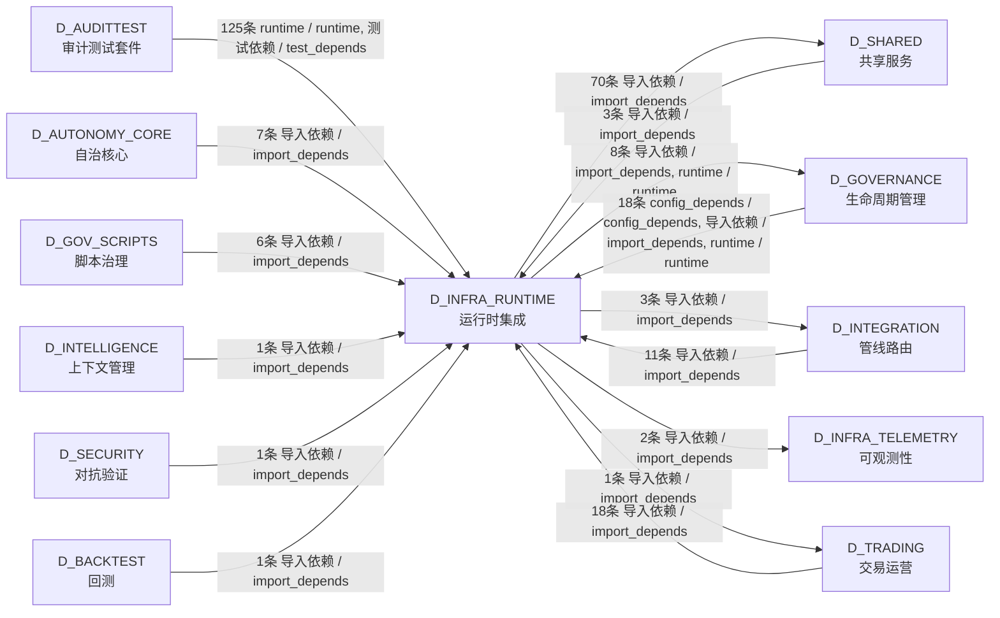

# 04_d_infra_runtime / runtime_core / 运行时集成 / Runtime Integration

> **功能简介 / Overview**: 运行时集成，负责组件生命周期编排、启动钩子和运行时上下文管理

> **文档作用 / Purpose**: 展示 运行时集成（D_INFRA_RUNTIME）功能域的模块清单、域内依赖关系、跨域依赖关系、架构分层视图，供架构审查和域治理参考。

> 本文档由 generate_domain_doc.py 从 depgraph (PostgreSQL) 自动生成
> 最后更新: 2026-07-09 17:30:50
> 数据源: depgraph (PostgreSQL) nodes表 + edges表

## 域基本信息 / Domain Overview

| 字段 | 值 | Field | Value |
|------|------|-------|-------|
| 编号 | 04 | Number | 04 |
| 域ID | D_INFRA_RUNTIME | Domain ID | D_INFRA_RUNTIME |
| 域名称 | 运行时集成 | Domain Name | Runtime Integration |
| 层级 | L0 基础设施层 | Layer | L0 Infrastructure |
| 模块数 | 132 | Module Count | 132 |
| 域内依赖 | 117 | Internal Dependencies | 117 |
| 跨域入边 | 191 | Cross-domain Incoming | 191 |
| 跨域出边 | 84 | Cross-domain Outgoing | 84 |
| 设计态模块 | 0 | Design Modules | 0 |
| 原型态模块 | 45 | Prototype Modules | 45 |
| 生产态模块 | 87 | Production Modules | 87 |
| 容量 | 87/150 (正常) | Capacity | 87/150 (正常) |
| 描述 | 三层运行时编排(L1 Trae/L2 Local/L3 API) | Description | 三层运行时编排(L1 Trae/L2 Local/L3 API) |

## 模块分层清单 / Module Layered List

> 按 architecture_layer 分组的模块清单（共 132 个模块 / 132 modules）。

### L0 基础设施层 / Infrastructure Layer (128 modules)

| # | 模块路径 / Module Path | 模块名称 / Module Name (功能简介 / Description) | 成熟度 / Maturity | 蓝图 / Blueprint |
|:--:|---------|---------|:---:|:---:|
| 1 | src/zephyr/__init__.py | ZephyrAlpha 核心包索引 + 模块懒加载器 (M-04) | 原型态 / prototype | [MOD-INF-002](../../03_modules/_domain_infrastructure_runtime/runtime_integration/blueprint.md) |
| 2 | src/zephyr/infrastructure/__init__.py | __init__.py | 原型态 / prototype |  |
| 3 | src/zephyr/infrastructure/_extensions/__init__.py | __init__.py | 原型态 / prototype |  |
| 4 | src/zephyr/infrastructure/api/__init__.py | __init__.py | 原型态 / prototype |  |
| 5 | src/zephyr/infrastructure/asset_inventory/__init__.py | asset-inventory — MOD-INF-026 · 资产盘点系统... | 生产态 / production | [MOD-INF-026](../../03_modules/_domain_infrastructure_operations/asset_inventory/blueprint.md) |
| 6 | src/zephyr/infrastructure/asset_inventory/__main__.py | Asset Inventory CLI — MOD-INF-026 蓝图 §31 | 原型态 / prototype | [MOD-INF-026](../../03_modules/_domain_infrastructure_operations/asset_inventory/blueprint.md) |
| 7 | src/zephyr/infrastructure/asset_inventory/classifier.py | AssetClassifier — MOD-INF-026 L2 资产自动分类器 | 生产态 / production | [MOD-INF-026](../../03_modules/_domain_infrastructure_operations/asset_inventory/blueprint.md) |
| 8 | src/zephyr/infrastructure/asset_inventory/dashboard.py | AssetDashboard — MOD-INF-026 资产健康仪表盘生成器 | 生产态 / production | [MOD-INF-026](../../03_modules/_domain_infrastructure_operations/asset_inventory/blueprint.md) |
| 9 | src/zephyr/infrastructure/asset_inventory/dependency.py | MOD-INF-026 §18 — 资产依赖图。 | 生产态 / production | [MOD-INF-026](../../03_modules/_domain_infrastructure_operations/asset_inventory/blueprint.md) |
| 10 | src/zephyr/infrastructure/asset_inventory/index_generator.py | UnifiedAssetIndex — MOD-INF-026 L3 统一资产索... | 生产态 / production | [MOD-INF-026](../../03_modules/_domain_infrastructure_operations/asset_inventory/blueprint.md) |
| 11 | src/zephyr/infrastructure/asset_inventory/lifecycle.py | AssetLifecycle — MOD-INF-026 L5 ITIL生命周期自... | 生产态 / production | [MOD-INF-026](../../03_modules/_domain_infrastructure_operations/asset_inventory/blueprint.md) |
| 12 | src/zephyr/infrastructure/asset_inventory/mcp_server.py | AssetInventory MCP Server — MOD-INF-026 蓝图 §21 | 原型态 / prototype | [MOD-INF-026](../../03_modules/_domain_infrastructure_operations/asset_inventory/blueprint.md) |
| 13 | src/zephyr/infrastructure/asset_inventory/metadata.py | MOD-INF-026 §24-25 — Git 历史元数据提取 + 多 ... | 生产态 / production | [MOD-INF-026](../../03_modules/_domain_infrastructure_operations/asset_inventory/blueprint.md) |
| 14 | src/zephyr/infrastructure/asset_inventory/models.py | AssetInventoryModels — MOD-INF-026 Pydantic V2... | 生产态 / production | [MOD-INF-026](../../03_modules/_domain_infrastructure_operations/asset_inventory/blueprint.md) |
| 15 | src/zephyr/infrastructure/asset_inventory/reconciler.py | ReconciliationEngine — MOD-INF-026 L4 注册表 v... | 生产态 / production | [MOD-INF-026](../../03_modules/_domain_infrastructure_operations/asset_inventory/blueprint.md) |
| 16 | src/zephyr/infrastructure/asset_inventory/registry_adapte... | MOD-INF-026 §17 — 24 个异构注册表统一解析适配器。 | 生产态 / production | [MOD-INF-026](../../03_modules/_domain_infrastructure_operations/asset_inventory/blueprint.md) |
| 17 | src/zephyr/infrastructure/asset_inventory/scanner.py | AssetDiscoveryScanner — MOD-INF-026 L1 全量文... | 生产态 / production | [MOD-INF-026](../../03_modules/_domain_infrastructure_operations/asset_inventory/blueprint.md) |
| 18 | src/zephyr/infrastructure/asset_inventory/telemetry.py | AssetInventoryTelemetry — MOD-INF-026 自监控指标 | 生产态 / production | [MOD-INF-026](../../03_modules/_domain_infrastructure_operations/asset_inventory/blueprint.md) |
| 19 | src/zephyr/infrastructure/asset_inventory/trust_anchor.py | MOD-INF-026 §26 — 三重信任锚验证门 R20。 | 生产态 / production | [MOD-INF-026](../../03_modules/_domain_infrastructure_operations/asset_inventory/blueprint.md) |
| 20 | src/zephyr/infrastructure/auto_diagnostics.py | RI-12 AutoDiagnostics — 自动诊断引擎 | 生产态 / production | [MOD-INF-002](../../03_modules/_domain_infrastructure_runtime/runtime_integration/blueprint.md) |
| 21 | src/zephyr/infrastructure/auto_fix_engine/__init__.py | __init__.py | 生产态 / production | [MOD-INF-031](../../03_modules/_cross_layer/auto_fix_engine/blueprint.md) |
| 22 | src/zephyr/infrastructure/auto_fix_engine/__main__.py | __main__.py | 原型态 / prototype | [MOD-INF-031](../../03_modules/_cross_layer/auto_fix_engine/blueprint.md) |
| 23 | src/zephyr/infrastructure/auto_fix_engine/alignment_synce... | alignment_syncer.py | 原型态 / prototype | [MOD-INF-031](../../03_modules/_cross_layer/auto_fix_engine/blueprint.md) |
| 24 | src/zephyr/infrastructure/auto_fix_engine/all_completer.py | all_completer.py | 原型态 / prototype | [MOD-INF-031](../../03_modules/_cross_layer/auto_fix_engine/blueprint.md) |
| 25 | src/zephyr/infrastructure/auto_fix_engine/auto_fix_config... | auto_fix_config.yaml | 生产态 / production |  |
| 26 | src/zephyr/infrastructure/auto_fix_engine/batch_fixer.py | batch_fixer.py | 原型态 / prototype | [MOD-INF-031](../../03_modules/_cross_layer/auto_fix_engine/blueprint.md) |
| 27 | src/zephyr/infrastructure/auto_fix_engine/compliance_audi... | compliance_auditor.py | 原型态 / prototype | [MOD-INF-031](../../03_modules/_cross_layer/auto_fix_engine/blueprint.md) |
| 28 | src/zephyr/infrastructure/auto_fix_engine/config_fixer.py | config_fixer.py | 原型态 / prototype | [MOD-INF-031](../../03_modules/_cross_layer/auto_fix_engine/blueprint.md) |
| 29 | src/zephyr/infrastructure/auto_fix_engine/dedup_extractor.py | dedup_extractor.py | 原型态 / prototype | [MOD-INF-031](../../03_modules/_cross_layer/auto_fix_engine/blueprint.md) |
| 30 | src/zephyr/infrastructure/auto_fix_engine/dep_version_fix... | dep_version_fixer.py | 生产态 / production | [MOD-INF-031](../../03_modules/_cross_layer/auto_fix_engine/blueprint.md) |
| 31 | src/zephyr/infrastructure/auto_fix_engine/drift_fixer.py | drift_fixer.py | 生产态 / production | [MOD-INF-031](../../03_modules/_cross_layer/auto_fix_engine/blueprint.md) |
| 32 | src/zephyr/infrastructure/auto_fix_engine/engine.py | engine.py | 生产态 / production | [MOD-INF-031](../../03_modules/_cross_layer/auto_fix_engine/blueprint.md) |
| 33 | src/zephyr/infrastructure/auto_fix_engine/escalation_brid... | escalation_bridge.py | 生产态 / production | [MOD-INF-031](../../03_modules/_cross_layer/auto_fix_engine/blueprint.md) |
| 34 | src/zephyr/infrastructure/auto_fix_engine/event_hooks.py | event_hooks.py | 生产态 / production | [MOD-INF-031](../../03_modules/_cross_layer/auto_fix_engine/blueprint.md) |
| 35 | src/zephyr/infrastructure/auto_fix_engine/fix_budget.py | fix_budget.py | 生产态 / production | [MOD-INF-031](../../03_modules/_cross_layer/auto_fix_engine/blueprint.md) |
| 36 | src/zephyr/infrastructure/auto_fix_engine/fix_diff.py | fix_diff.py | 生产态 / production | [MOD-INF-031](../../03_modules/_cross_layer/auto_fix_engine/blueprint.md) |
| 37 | src/zephyr/infrastructure/auto_fix_engine/fix_health_chec... | fix_health_check.py | 生产态 / production | [MOD-INF-031](../../03_modules/_cross_layer/auto_fix_engine/blueprint.md) |
| 38 | src/zephyr/infrastructure/auto_fix_engine/fix_pattern_min... | fix_pattern_miner.py | 生产态 / production | [MOD-INF-031](../../03_modules/_cross_layer/auto_fix_engine/blueprint.md) |
| 39 | src/zephyr/infrastructure/auto_fix_engine/fix_reliability.py | fix_reliability.py | 生产态 / production | [MOD-INF-031](../../03_modules/_cross_layer/auto_fix_engine/blueprint.md) |
| 40 | src/zephyr/infrastructure/auto_fix_engine/fix_report.py | fix_report.py | 生产态 / production | [MOD-INF-031](../../03_modules/_cross_layer/auto_fix_engine/blueprint.md) |
| 41 | src/zephyr/infrastructure/auto_fix_engine/fix_safety.py | fix_safety.py | 生产态 / production | [MOD-INF-031](../../03_modules/_cross_layer/auto_fix_engine/blueprint.md) |
| 42 | src/zephyr/infrastructure/auto_fix_engine/fix_scheduler.py | fix_scheduler.py | 生产态 / production | [MOD-INF-031](../../03_modules/_cross_layer/auto_fix_engine/blueprint.md) |
| 43 | src/zephyr/infrastructure/auto_fix_engine/import_fixer.py | import_fixer.py | 原型态 / prototype | [MOD-INF-031](../../03_modules/_cross_layer/auto_fix_engine/blueprint.md) |
| 44 | src/zephyr/infrastructure/auto_fix_engine/interrupt_guard.py | interrupt_guard.py | 生产态 / production | [MOD-INF-031](../../03_modules/_cross_layer/auto_fix_engine/blueprint.md) |
| 45 | src/zephyr/infrastructure/auto_fix_engine/llm_fix_adapter.py | llm_fix_adapter.py | 生产态 / production | [MOD-INF-031](../../03_modules/_cross_layer/auto_fix_engine/blueprint.md) |
| 46 | src/zephyr/infrastructure/auto_fix_engine/models.py | models.py | 生产态 / production | [MOD-INF-031](../../03_modules/_cross_layer/auto_fix_engine/blueprint.md) |
| 47 | src/zephyr/infrastructure/auto_fix_engine/scaffold_regist... | scaffold_registrar.py | 生产态 / production | [MOD-INF-031](../../03_modules/_cross_layer/auto_fix_engine/blueprint.md) |
| 48 | src/zephyr/infrastructure/auto_fix_engine/self_heal_agent.py | self_heal_agent.py | 生产态 / production | [MOD-INF-031](../../03_modules/_cross_layer/auto_fix_engine/blueprint.md) |
| 49 | src/zephyr/infrastructure/auto_fix_engine/shadow_workspac... | shadow_workspace.py | 生产态 / production | [MOD-INF-031](../../03_modules/_cross_layer/auto_fix_engine/blueprint.md) |
| 50 | src/zephyr/infrastructure/auto_fix_engine/state_machine.py | state_machine.py | 生产态 / production | [MOD-INF-031](../../03_modules/_cross_layer/auto_fix_engine/blueprint.md) |
| 51 | src/zephyr/infrastructure/auto_fix_engine/zombie_cleaner.py | zombie_cleaner.py | 生产态 / production | [MOD-INF-031](../../03_modules/_cross_layer/auto_fix_engine/blueprint.md) |
| 52 | src/zephyr/infrastructure/capacity_assurance/__init__.py | ZephyrAlpha 容量保障体系 (Capacity Assurance) ... | 原型态 / prototype | [MOD-INF-001](../../03_modules/_domain_infrastructure_operations/capacity_assurance/blueprint.md) |
| 53 | src/zephyr/infrastructure/capacity_assurance/budget_forec... | budget_forecaster.py — Token 预算预测 (DD120-e... | 生产态 / production | [MOD-INF-001](../../03_modules/_domain_infrastructure_operations/capacity_assurance/blueprint.md) |
| 54 | src/zephyr/infrastructure/capacity_assurance/contracts/__... | capacity-assurance contracts — ContractBus 44... | 原型态 / prototype | [MOD-INF-001](../../03_modules/_domain_infrastructure_operations/capacity_assurance/blueprint.md) |
| 55 | src/zephyr/infrastructure/capacity_assurance/contracts/ba... | Batch1 基础设施层契约 — 15条 Pydantic v2 Schem... | 原型态 / prototype | [MOD-INF-001](../../03_modules/_domain_infrastructure_operations/capacity_assurance/blueprint.md) |
| 56 | src/zephyr/infrastructure/capacity_assurance/contracts/ba... | Batch2 治理层契约 — 15条 Pydantic v2 Schema（P... | 原型态 / prototype | [MOD-INF-001](../../03_modules/_domain_infrastructure_operations/capacity_assurance/blueprint.md) |
| 57 | src/zephyr/infrastructure/capacity_assurance/contracts/ba... | Batch3 集成层契约 — 14条 Pydantic v2 Schema（O... | 原型态 / prototype | [MOD-INF-001](../../03_modules/_domain_infrastructure_operations/capacity_assurance/blueprint.md) |
| 58 | src/zephyr/infrastructure/capacity_assurance/contracts/co... | ContractBus loader — 加载全部44条容量保障契约... | 原型态 / prototype | [MOD-INF-001](../../03_modules/_domain_infrastructure_operations/capacity_assurance/blueprint.md) |
| 59 | src/zephyr/infrastructure/capacity_assurance/cross_module... | Cross-module integration — CT-1~CT-4 跨模块集... | 原型态 / prototype | [MOD-INF-001](../../03_modules/_domain_infrastructure_operations/capacity_assurance/blueprint.md) |
| 60 | src/zephyr/infrastructure/capacity_assurance/host_resourc... | host_resource_governor.py — 主机资源治理 (B17,... | 生产态 / production | [MOD-INF-001](../../03_modules/_domain_infrastructure_operations/capacity_assurance/blueprint.md) |
| 61 | src/zephyr/infrastructure/capacity_assurance/kill_switch.py | kill_switch.py -- safety circuit breaker (DD110... | 生产态 / production | [MOD-INF-001](../../03_modules/_domain_infrastructure_operations/capacity_assurance/blueprint.md) |
| 62 | src/zephyr/infrastructure/capacity_assurance/risk_mitigat... | Risk mitigation — R1~R16 全量风险缓解实现（对... | 原型态 / prototype | [MOD-INF-001](../../03_modules/_domain_infrastructure_operations/capacity_assurance/blueprint.md) |
| 63 | src/zephyr/infrastructure/capacity_assurance/schema.py | SchemaManager — 容量保障体系数据库 Schema 管理器 | 原型态 / prototype | [MOD-INF-001](../../03_modules/_domain_infrastructure_operations/capacity_assurance/blueprint.md) |
| 64 | src/zephyr/infrastructure/capacity_assurance/sli_instrume... | SLI instrumentation — SLI采集插桩点（对标蓝图 ... | 原型态 / prototype | [MOD-INF-001](../../03_modules/_domain_infrastructure_operations/capacity_assurance/blueprint.md) |
| 65 | src/zephyr/infrastructure/capacity_assurance/tech_stack.py | TechStackValidator — 技术栈可用性校验器 | 原型态 / prototype | [MOD-INF-001](../../03_modules/_domain_infrastructure_operations/capacity_assurance/blueprint.md) |
| 66 | src/zephyr/infrastructure/capacity_assurance/token_budget.py | token_budget.py — Token 估算工具 SSoT | 生产态 / production | [MOD-INF-001](../../03_modules/_domain_infrastructure_operations/capacity_assurance/blueprint.md) |
| 67 | src/zephyr/infrastructure/config/__init__.py | ZephyrAlpha — 基础设施 Infrastructure Layer —... | 生产态 / production | [MOD-INF-002](../../03_modules/_domain_infrastructure_runtime/runtime_integration/blueprint.md) |
| 68 | src/zephyr/infrastructure/config_validator.py | M-12 ConfigValidator — 配置参数校验器 | 生产态 / production | [MOD-INF-002](../../03_modules/_domain_infrastructure_runtime/runtime_integration/blueprint.md) |
| 69 | src/zephyr/infrastructure/contract_tester.py | M-11 ContractTester — 契约测试框架 | 生产态 / production | [MOD-INF-002](../../03_modules/_domain_infrastructure_runtime/runtime_integration/blueprint.md) |
| 70 | src/zephyr/infrastructure/core/__init__.py | __init__.py | 原型态 / prototype |  |
| 71 | src/zephyr/infrastructure/cost_tracker.py | RI-15 CostTracker — 成本追踪器 | 生产态 / production | [MOD-INF-002](../../03_modules/_domain_infrastructure_runtime/runtime_integration/blueprint.md) |
| 72 | src/zephyr/infrastructure/dashboard/__init__.py | __init__.py | 原型态 / prototype | [MOD-L08-001](../../03_modules/_domain_frontend/blueprint.md) |
| 73 | src/zephyr/infrastructure/dashboard/components/__init__.py | __init__.py | 原型态 / prototype | [MOD-L08-001](../../03_modules/_domain_frontend/blueprint.md) |
| 74 | src/zephyr/infrastructure/database_service.py | DatabaseService: 统一管理数据库的连接池、生命周... | 原型态 / prototype | [MOD-INF-002](../../03_modules/_domain_infrastructure_runtime/runtime_integration/blueprint.md) |
| 75 | src/zephyr/infrastructure/dry_run_simulator.py | RI-14 DryRunSimulator — 干运行模拟器 | 生产态 / production | [MOD-INF-002](../../03_modules/_domain_infrastructure_runtime/runtime_integration/blueprint.md) |
| 76 | src/zephyr/infrastructure/event_bus_upgrade.py | DEPRECATED: 此文件已废弃。 | 生产态 / production | [MOD-INF-002](../../03_modules/_domain_infrastructure_runtime/runtime_integration/blueprint.md) |
| 77 | src/zephyr/infrastructure/event_store.py | RI-13 EventStore — 事件存储 | 生产态 / production | [MOD-INF-002](../../03_modules/_domain_infrastructure_runtime/runtime_integration/blueprint.md) |
| 78 | src/zephyr/infrastructure/file_watcher.py | file_watcher.py | 生产态 / production | [MOD-INF-002](../../03_modules/_domain_infrastructure_runtime/runtime_integration/blueprint.md) |
| 79 | src/zephyr/infrastructure/finding_task_bridge.py | Finding->TaskCard 桥接器 | 生产态 / production | [MOD-INF-002](../../03_modules/_domain_infrastructure_runtime/runtime_integration/blueprint.md) |
| 80 | src/zephyr/infrastructure/health_monitor/health_aggregato... | 全系统健康聚合 — check_all_systems() | 原型态 / prototype | [MOD-INF-035](../../03_modules/_cross_layer/auto_runtime_core/blueprint.md) |
| 81 | src/zephyr/infrastructure/hooks/__init__.py | __init__.py | 原型态 / prototype | [MOD-INF-002](../../03_modules/_domain_infrastructure_runtime/runtime_integration/blueprint.md) |
| 82 | src/zephyr/infrastructure/hooks/event_hook.py | EventHook — 声明式任务系统事件订阅 | 原型态 / prototype | [MOD-INF-002](../../03_modules/_domain_infrastructure_runtime/runtime_integration/blueprint.md) |
| 83 | src/zephyr/infrastructure/infrastructure_base.py | 基础设施 — Infrastructure Layer Skeleton | 生产态 / production | [MOD-INF-002](../../03_modules/_domain_infrastructure_runtime/runtime_integration/blueprint.md) |
| 84 | src/zephyr/infrastructure/kill_switch_sim.py | Kill Switch T0 Hardware Simulator | 生产态 / production | [MOD-INF-002](../../03_modules/_domain_infrastructure_runtime/runtime_integration/blueprint.md) |
| 85 | src/zephyr/infrastructure/lifecycle/__init__.py | core.lifecycle — lifecycle management, resourc... | 原型态 / prototype | [MOD-INF-035](../../03_modules/_cross_layer/auto_runtime_core/blueprint.md) |
| 86 | src/zephyr/infrastructure/model_capability_exam/__init__.py | # [MODULE] zephyr.infrastructure.model_capabili... | 原型态 / prototype | [MOD-INF-036](../../03_modules/_cross_layer/model_capability_exam/blueprint.md) |
| 87 | src/zephyr/infrastructure/model_profiler/__init__.py | Model Profiler — 本地 + 远程模型性能基准测试 | 原型态 / prototype | [MOD-INF-034](../../03_modules/_cross_layer/model_profiler/blueprint.md) |
| 88 | src/zephyr/infrastructure/models/__init__.py | __init__.py | 原型态 / prototype |  |
| 89 | src/zephyr/infrastructure/observability/__init__.py | Auto-generated contracts package — system-tele... | 原型态 / prototype |  |
| 90 | src/zephyr/infrastructure/observability/notifier.py | Notifier — 多渠道 Owner 通知。 | 生产态 / production |  |
| 91 | src/zephyr/infrastructure/pipeline/__init__.py | ZephyrAlpha Pipeline 模块 — M1-M11 双管线 + K8... | 原型态 / prototype | [MOD-INF-009](../../03_modules/_cross_layer/pipeline/blueprint.md) |
| 92 | src/zephyr/infrastructure/pipeline/backpressure_manager.py | Pipeline — Backpressure Manager | 生产态 / production | [MOD-INF-009](../../03_modules/_cross_layer/pipeline/blueprint.md) |
| 93 | src/zephyr/infrastructure/pipeline/backpressure_types.py | backpressure_types.py - Pipeline backpressure s... | 生产态 / production | [MOD-INF-009](../../03_modules/_cross_layer/pipeline/blueprint.md) |
| 94 | src/zephyr/infrastructure/pipeline/circuit_breaker_manage... | CircuitBreakerManager -- standalone circuit bre... | 生产态 / production | [MOD-INF-009](../../03_modules/_cross_layer/pipeline/blueprint.md) |
| 95 | src/zephyr/infrastructure/pipeline/cost_tracker.py | CostTracker —— LLM 调用成本追踪器（SRC-0025） | 生产态 / production | [MOD-INF-009](../../03_modules/_cross_layer/pipeline/blueprint.md) |
| 96 | src/zephyr/infrastructure/pipeline/ct_pipe_routing.py | CT-PIPE-ORC-001 — TaskCard -> 管线入口节点路由 | 生产态 / production | [MOD-INF-009](../../03_modules/_cross_layer/pipeline/blueprint.md) |
| 97 | src/zephyr/infrastructure/pipeline/dead_letter_queue.py | DeadLetterQueue — 死信队列 | 生产态 / production | [MOD-INF-009](../../03_modules/_cross_layer/pipeline/blueprint.md) |
| 98 | src/zephyr/infrastructure/pipeline/llm_gateway.py | MOD-INF-019: Agent Spec — LLM Gateway | 生产态 / production | [MOD-INF-009](../../03_modules/_cross_layer/pipeline/blueprint.md) |
| 99 | src/zephyr/infrastructure/pipeline/model_router.py | ModelRouter — 模型路由与降级链管理 | 生产态 / production | [MOD-INF-009](../../03_modules/_cross_layer/pipeline/blueprint.md) |
| 100 | src/zephyr/infrastructure/pipeline/models.py | Pipeline 数据模型 | 生产态 / production | [MOD-INF-009](../../03_modules/_cross_layer/pipeline/blueprint.md) |
| 101 | src/zephyr/infrastructure/pipeline/pipeline_agent_bridge.py | Pipeline -> Agent Bridge — 双编排器桥接层 | 生产态 / production | [MOD-INF-009](../../03_modules/_cross_layer/pipeline/blueprint.md) |
| 102 | src/zephyr/infrastructure/pipeline/pipeline_lock.py | Pipeline Lock — 双管线并发锁 | 生产态 / production | [MOD-INF-009](../../03_modules/_cross_layer/pipeline/blueprint.md) |
| 103 | src/zephyr/infrastructure/pipeline/pipeline_roadmap.py | Pipeline 未来版本路线图——v0.10.0 -> v0.12.0 ... | 生产态 / production | [MOD-INF-009](../../03_modules/_cross_layer/pipeline/blueprint.md) |
| 104 | src/zephyr/infrastructure/pipeline/preemption_manager.py | PreemptionManager -- 优先级抢占管理器 | 生产态 / production | [MOD-INF-009](../../03_modules/_cross_layer/pipeline/blueprint.md) |
| 105 | src/zephyr/infrastructure/pipeline/routing_plugins.py | Pipeline Routing Plugin System — K8s Schedulin... | 生产态 / production | [MOD-INF-009](../../03_modules/_cross_layer/pipeline/blueprint.md) |
| 106 | src/zephyr/infrastructure/pydantic_v2_migrator.py | M-15 PydanticV2Migrator — Pydantic V2 迁移工具 | 生产态 / production | [MOD-INF-002](../../03_modules/_domain_infrastructure_runtime/runtime_integration/blueprint.md) |
| 107 | src/zephyr/infrastructure/registry_governance.py | Registry Governance — MOD-INF-037 | 生产态 / production | [MOD-INF-037](../../03_modules/_domain_governance/registry_governance/blueprint.md) |
| 108 | src/zephyr/infrastructure/runtime/__init__.py | __init__.py | 原型态 / prototype |  |
| 109 | src/zephyr/infrastructure/script_system/__init__.py | __init__.py | 原型态 / prototype | [MOD-INF-005](../../03_modules/_domain_governance/governance_automation/blueprint.md) |
| 110 | src/zephyr/infrastructure/script_system/finding.py | Finding Schema — 审计发现标准化数据模型 | 生产态 / production | [MOD-INF-005](../../03_modules/_domain_governance/governance_automation/blueprint.md) |
| 111 | src/zephyr/infrastructure/script_system/gate_bridge.py | Script->Gate 门禁桥接器 — submit_findings() 生产者 | 原型态 / prototype | [MOD-INF-005](../../03_modules/_domain_governance/governance_automation/blueprint.md) |
| 112 | src/zephyr/infrastructure/script_system/kb_bridge.py | Script->KB 审计入库桥接器 — publish_to_kb() 生产者 | 原型态 / prototype | [MOD-INF-005](../../03_modules/_domain_governance/governance_automation/blueprint.md) |
| 113 | src/zephyr/infrastructure/services/__init__.py | __init__.py | 原型态 / prototype |  |
| 114 | src/zephyr/infrastructure/sla/sla_monitor.py | SLA Monitor — 服务等级协议 (SLA) 监控 RTO/RPO。 | 生产态 / production |  |
| 115 | src/zephyr/infrastructure/system_snapshot.py | SystemSnapshotter — M1 系统状态镜像（CL-017 RI... | 生产态 / production | [MOD-INF-002](../../03_modules/_domain_infrastructure_runtime/runtime_integration/blueprint.md) |
| 116 | src/zephyr/infrastructure/warm_hot_gate.py | M-14 WarmHotGate — Warm->Hot 阻断门 | 生产态 / production | [MOD-INF-002](../../03_modules/_domain_infrastructure_runtime/runtime_integration/blueprint.md) |
| 117 | src/zephyr/shared/lifecycle/__init__.py | __init__.py | 原型态 / prototype | [MOD-INF-016](../../03_modules/_cross_layer/shared_core/blueprint.md) |
| 118 | src/zephyr/shared/lifecycle/daemon_registry.py | daemon_registry.py - unified daemon thread regi... | 生产态 / production | [MOD-INF-016](../../03_modules/_cross_layer/shared_core/blueprint.md) |
| 119 | src/zephyr/shared/lifecycle/health.py | health.py —— ZephyrAlpha 聚合健康检查 | 生产态 / production | [MOD-INF-016](../../03_modules/_cross_layer/shared_core/blueprint.md) |
| 120 | src/zephyr/shared/lifecycle/health_discovery.py | CT-HEALTH-001: System-wide Health Discovery Reg... | 生产态 / production | [MOD-INF-016](../../03_modules/_cross_layer/shared_core/blueprint.md) |
| 121 | src/zephyr/shared/lifecycle/hooks.py | hooks.py —— 模块生命周期钩子（Phase 2 新增 | ... | 生产态 / production | [MOD-INF-016](../../03_modules/_cross_layer/shared_core/blueprint.md) |
| 122 | src/zephyr/shared/lifecycle/lazy_loader.py | lazy_loader.py - Lazy module loading registry | 生产态 / production | [MOD-INF-016](../../03_modules/_cross_layer/shared_core/blueprint.md) |
| 123 | src/zephyr/shared/lifecycle/longevity_monitor.py | longevity_monitor.py | 生产态 / production | [MOD-INF-016](../../03_modules/_cross_layer/shared_core/blueprint.md) |
| 124 | src/zephyr/shared/lifecycle/resource_optimization_engine.py | resource_optimization_engine.py | 生产态 / production | [MOD-INF-016](../../03_modules/_cross_layer/shared_core/blueprint.md) |
| 125 | src/zephyr/shared/lifecycle/resource_optimization_models.py | models.py - Pydantic data models for resource o... | 生产态 / production | [MOD-INF-016](../../03_modules/_cross_layer/shared_core/blueprint.md) |
| 126 | src/zephyr/shared/lifecycle/state_machine.py | StateMachine[S] — 通用状态机泛型基类 (MOD-INF-038) | 原型态 / prototype | [MOD-INF-038](../../03_modules/_domain_infrastructure_runtime/state_machine_engine/blueprint.md) |
| 127 | src/zephyr/shared/lifecycle/task_heartbeat.py | task_heartbeat.py | 生产态 / production |  |
| 128 | src/zephyr/shared/lifecycle/ttl_cleanup_engine.py | ttl_cleanup_engine.py | 生产态 / production |  |

### L1 基础层 / Foundation Layer (4 modules)

| # | 模块路径 / Module Path | 模块名称 / Module Name (功能简介 / Description) | 成熟度 / Maturity | 蓝图 / Blueprint |
|:--:|---------|---------|:---:|:---:|
| 1 | docs/01_policies_and_standards/_registry/catalogs/infrast... | zephyr-depgraph-db — database 节点 (ARCH-053) | 生产态 / production |  |
| 2 | docs/01_policies_and_standards/_registry/catalogs/infrast... | zephyr-chroma-vector-db — database 节点 (ARCH-053) | 生产态 / production |  |
| 3 | docs/01_policies_and_standards/_registry/catalogs/infrast... | zephyr-clickhouse-c1-market — database 节点 (ARCH-053) | 生产态 / production |  |
| 4 | docs/01_policies_and_standards/_registry/catalogs/infrast... | zephyr-sqlite-task-db — database 节点 (ARCH-053) | 生产态 / production |  |

## 域内依赖图 / Internal Dependency Diagram

> 依赖图内嵌在本文档中，IDE 可直接渲染显示。参考 decision_index.md 设计，分四个视图：合并全景图、运营态子图、设计态子图、原型态子图（按 design_maturity 实际值拆分）。
>
> **图例说明 / Legend**：
> - **实线边框 = 运营态模块**（production，已上线运行）
> - **虚线边框 = 设计态模块**（design，蓝图阶段，代码未写）
> - **虚线边框 = 原型态模块**（prototype，代码已写，验证中未稳定上线）
> - **实线箭头 = 运营态依赖**（已生效的依赖关系）
> - **虚线箭头 = 非运营态依赖**（计划中/验证中的依赖关系）

### 合并全景图（全部模块，标签标注成熟度）

> 展示全部 132 个模块（生产态 87 + 设计态 0 + 原型态 45），标签标注成熟度。

#### 第 1 页 / 共 5 页

```mermaid
graph TD
    subgraph D_INFRA_RUNTIME["D_INFRA_RUNTIME 运行时集成"]
        docs_01_policies_and_standards_registry_catalogs_infrastructure_registry_yaml["(生产态 / production) zephyr-depgraph-db — database 节点 (ARCH-053)"]
        docs_01_policies_and_standards_registry_catalogs_infrastructure_registry_yaml_1["(生产态 / production) zephyr-chroma-vector-db — database 节点 (ARCH-053)"]
        docs_01_policies_and_standards_registry_catalogs_infrastructure_registry_yaml_2["(生产态 / production) zephyr-clickhouse-c1-market — database 节点 (ARCH-053)"]
        docs_01_policies_and_standards_registry_catalogs_infrastructure_registry_yaml_3["(生产态 / production) zephyr-sqlite-task-db — database 节点 (ARCH-053)"]
        src_zephyr_init_py["(原型态 / prototype) ZephyrAlpha 核心包索引 + 模块懒加载器 (M-04)<br/>文件: __init__.py"]
        src_zephyr_infrastructure_init_py["(原型态 / prototype) __init__.py"]
        src_zephyr_infrastructure_extensions_init_py["(原型态 / prototype) __init__.py"]
        src_zephyr_infrastructure_api_init_py["(原型态 / prototype) __init__.py"]
        src_zephyr_infrastructure_asset_inventory_init_py["(生产态 / production) asset-inventory — MOD-INF-026 · 资产盘点系统...<br/>文件: __init__.py"]
        src_zephyr_infrastructure_asset_inventory_main_py["(原型态 / prototype) Asset Inventory CLI — MOD-INF-026 蓝图 §31<br/>文件: __main__.py"]
        src_zephyr_infrastructure_asset_inventory_classifier_py["(生产态 / production) AssetClassifier — MOD-INF-026 L2 资产自动分类器<br/>文件: classifier.py"]
        src_zephyr_infrastructure_asset_inventory_dashboard_py["(生产态 / production) AssetDashboard — MOD-INF-026 资产健康仪表盘生成器<br/>文件: dashboard.py"]
        src_zephyr_infrastructure_asset_inventory_dependency_py["(生产态 / production) MOD-INF-026 §18 — 资产依赖图。<br/>文件: dependency.py"]
        src_zephyr_infrastructure_asset_inventory_index_generator_py["(生产态 / production) UnifiedAssetIndex — MOD-INF-026 L3 统一资产索...<br/>文件: index_generator.py"]
        src_zephyr_infrastructure_asset_inventory_lifecycle_py["(生产态 / production) AssetLifecycle — MOD-INF-026 L5 ITIL生命周期自...<br/>文件: lifecycle.py"]
        src_zephyr_infrastructure_asset_inventory_mcp_server_py["(原型态 / prototype) AssetInventory MCP Server — MOD-INF-026 蓝图 §21<br/>文件: mcp_server.py"]
        src_zephyr_infrastructure_asset_inventory_metadata_py["(生产态 / production) MOD-INF-026 §24-25 — Git 历史元数据提取 + 多 ...<br/>文件: metadata.py"]
        src_zephyr_infrastructure_asset_inventory_models_py["(生产态 / production) AssetInventoryModels — MOD-INF-026 Pydantic V2...<br/>文件: models.py"]
        src_zephyr_infrastructure_asset_inventory_reconciler_py["(生产态 / production) ReconciliationEngine — MOD-INF-026 L4 注册表 v...<br/>文件: reconciler.py"]
        src_zephyr_infrastructure_asset_inventory_registry_adapter_py["(生产态 / production) MOD-INF-026 §17 — 24 个异构注册表统一解析适配器。<br/>文件: registry_adapter.py"]
        src_zephyr_infrastructure_asset_inventory_scanner_py["(生产态 / production) AssetDiscoveryScanner — MOD-INF-026 L1 全量文...<br/>文件: scanner.py"]
        src_zephyr_infrastructure_asset_inventory_telemetry_py["(生产态 / production) AssetInventoryTelemetry — MOD-INF-026 自监控指标<br/>文件: telemetry.py"]
        src_zephyr_infrastructure_asset_inventory_trust_anchor_py["(生产态 / production) MOD-INF-026 §26 — 三重信任锚验证门 R20。<br/>文件: trust_anchor.py"]
        src_zephyr_infrastructure_auto_diagnostics_py["(生产态 / production) RI-12 AutoDiagnostics — 自动诊断引擎<br/>文件: auto_diagnostics.py"]
        src_zephyr_infrastructure_auto_fix_engine_init_py["(生产态 / production) __init__.py"]
        src_zephyr_infrastructure_auto_fix_engine_main_py["(原型态 / prototype) __main__.py"]
        src_zephyr_infrastructure_auto_fix_engine_alignment_syncer_py["(原型态 / prototype) alignment_syncer.py"]
        src_zephyr_infrastructure_auto_fix_engine_all_completer_py["(原型态 / prototype) all_completer.py"]
        src_zephyr_infrastructure_auto_fix_engine_auto_fix_config_yaml["(生产态 / production) auto_fix_config.yaml"]
        src_zephyr_infrastructure_auto_fix_engine_batch_fixer_py["(原型态 / prototype) batch_fixer.py"]
    end
    src_zephyr_infrastructure_asset_inventory_dashboard_py -->|导入依赖 / import_depends| src_zephyr_infrastructure_asset_inventory_models_py
    src_zephyr_infrastructure_asset_inventory_classifier_py -->|导入依赖 / import_depends| src_zephyr_infrastructure_asset_inventory_models_py
    src_zephyr_infrastructure_asset_inventory_index_generator_py -->|导入依赖 / import_depends| src_zephyr_infrastructure_asset_inventory_models_py
    src_zephyr_infrastructure_asset_inventory_lifecycle_py -->|导入依赖 / import_depends| src_zephyr_infrastructure_asset_inventory_models_py
    src_zephyr_infrastructure_asset_inventory_registry_adapter_py -->|导入依赖 / import_depends| src_zephyr_infrastructure_asset_inventory_models_py
    src_zephyr_infrastructure_asset_inventory_reconciler_py -->|导入依赖 / import_depends| src_zephyr_infrastructure_asset_inventory_models_py
    src_zephyr_infrastructure_asset_inventory_scanner_py -->|导入依赖 / import_depends| src_zephyr_infrastructure_asset_inventory_models_py
    src_zephyr_infrastructure_asset_inventory_main_py -.->|导入依赖 / import_depends| src_zephyr_infrastructure_asset_inventory_dependency_py
    src_zephyr_infrastructure_asset_inventory_main_py -.->|导入依赖 / import_depends| src_zephyr_infrastructure_asset_inventory_dashboard_py
    src_zephyr_infrastructure_asset_inventory_main_py -.->|导入依赖 / import_depends| src_zephyr_infrastructure_asset_inventory_classifier_py
    src_zephyr_infrastructure_asset_inventory_main_py -.->|导入依赖 / import_depends| src_zephyr_infrastructure_asset_inventory_index_generator_py
    src_zephyr_infrastructure_asset_inventory_main_py -.->|导入依赖 / import_depends| src_zephyr_infrastructure_asset_inventory_models_py
    src_zephyr_infrastructure_asset_inventory_main_py -.->|导入依赖 / import_depends| src_zephyr_infrastructure_asset_inventory_registry_adapter_py
    src_zephyr_infrastructure_asset_inventory_main_py -.->|导入依赖 / import_depends| src_zephyr_infrastructure_asset_inventory_reconciler_py
    src_zephyr_infrastructure_asset_inventory_main_py -.->|导入依赖 / import_depends| src_zephyr_infrastructure_asset_inventory_scanner_py
    src_zephyr_infrastructure_asset_inventory_main_py -.->|导入依赖 / import_depends| src_zephyr_infrastructure_asset_inventory_telemetry_py
    src_zephyr_infrastructure_auto_fix_engine_init_py -.->|导入依赖 / import_depends| src_zephyr_infrastructure_auto_fix_engine_alignment_syncer_py
    src_zephyr_infrastructure_auto_fix_engine_init_py -.->|导入依赖 / import_depends| src_zephyr_infrastructure_auto_fix_engine_all_completer_py
    src_zephyr_infrastructure_auto_fix_engine_init_py -.->|导入依赖 / import_depends| src_zephyr_infrastructure_auto_fix_engine_batch_fixer_py
    src_zephyr_infrastructure_auto_fix_engine_auto_fix_config_yaml -->|config_depends / config_depends| src_zephyr_infrastructure_auto_fix_engine_init_py
    D_SHARED["(生产态 / production) D_SHARED"]
    src_zephyr_init_py -.->|导入依赖 / import_depends| D_SHARED
    D_INFRA_TELEMETRY["(生产态 / production) D_INFRA_TELEMETRY"]
    src_zephyr_init_py -.->|导入依赖 / import_depends| D_INFRA_TELEMETRY
    D_TRADING["(生产态 / production) D_TRADING"]
    src_zephyr_init_py -.->|导入依赖 / import_depends| D_TRADING
    D_GOVERNANCE["(设计态 / design) D_GOVERNANCE"]
    src_zephyr_init_py -.->|runtime / runtime| D_GOVERNANCE
    src_zephyr_infrastructure_asset_inventory_dashboard_py -->|导入依赖 / import_depends| D_SHARED
    src_zephyr_infrastructure_asset_inventory_dashboard_py -->|导入依赖 / import_depends| D_GOVERNANCE
    src_zephyr_infrastructure_asset_inventory_classifier_py -->|导入依赖 / import_depends| D_SHARED
    src_zephyr_infrastructure_asset_inventory_index_generator_py -->|导入依赖 / import_depends| D_SHARED
    src_zephyr_infrastructure_asset_inventory_lifecycle_py -->|导入依赖 / import_depends| D_SHARED
    src_zephyr_infrastructure_asset_inventory_lifecycle_py -->|导入依赖 / import_depends| D_GOVERNANCE
    src_zephyr_infrastructure_asset_inventory_mcp_server_py -.->|导入依赖 / import_depends| D_SHARED
    src_zephyr_infrastructure_asset_inventory_registry_adapter_py -.->|导入依赖 / import_depends| D_SHARED
    src_zephyr_infrastructure_asset_inventory_registry_adapter_py -->|导入依赖 / import_depends| D_SHARED
    src_zephyr_infrastructure_asset_inventory_reconciler_py -->|导入依赖 / import_depends| D_SHARED
    src_zephyr_infrastructure_asset_inventory_scanner_py -->|导入依赖 / import_depends| D_SHARED
    D_GOVERNANCE -.->|runtime / runtime| src_zephyr_init_py
    D_GOVERNANCE -.->|导入依赖 / import_depends| src_zephyr_infrastructure_asset_inventory_scanner_py
    D_GOVERNANCE -.->|导入依赖 / import_depends| src_zephyr_infrastructure_asset_inventory_scanner_py
    D_SECURITY["(原型态 / prototype) D_SECURITY"]
    D_SECURITY -.->|导入依赖 / import_depends| src_zephyr_infrastructure_asset_inventory_mcp_server_py
    D_TRADING -->|导入依赖 / import_depends| src_zephyr_infrastructure_auto_fix_engine_init_py
    D_GOV_SCRIPTS["(原型态 / prototype) D_GOV_SCRIPTS"]
    D_GOV_SCRIPTS -.->|导入依赖 / import_depends| src_zephyr_infrastructure_init_py
    D_GOV_SCRIPTS -.->|导入依赖 / import_depends| src_zephyr_infrastructure_init_py
    D_GOV_SCRIPTS -.->|导入依赖 / import_depends| src_zephyr_infrastructure_init_py
    D_AUDITTEST["(原型态 / prototype) D_AUDITTEST"]
    D_AUDITTEST -.->|测试依赖 / test_depends| src_zephyr_infrastructure_auto_diagnostics_py
    D_AUDITTEST -.->|测试依赖 / test_depends| src_zephyr_infrastructure_asset_inventory_dependency_py
    D_AUDITTEST -.->|测试依赖 / test_depends| src_zephyr_infrastructure_asset_inventory_classifier_py
    D_AUDITTEST -.->|测试依赖 / test_depends| src_zephyr_infrastructure_asset_inventory_models_py
    D_AUDITTEST -.->|测试依赖 / test_depends| src_zephyr_infrastructure_asset_inventory_dashboard_py
    D_AUDITTEST -.->|测试依赖 / test_depends| src_zephyr_infrastructure_asset_inventory_models_py
    D_AUDITTEST -.->|测试依赖 / test_depends| src_zephyr_infrastructure_asset_inventory_index_generator_py
    classDef production fill:#e1f5fe,stroke:#01579b,stroke-width:2px,color:#000
    classDef design fill:#fff3e0,stroke:#e65100,stroke-width:2px,color:#000,stroke-dasharray: 5 5
    classDef external_prod fill:#e8f5e9,stroke:#1b5e20,stroke-width:1px,color:#000
    classDef external_design fill:#fce4ec,stroke:#880e4f,stroke-width:1px,color:#000,stroke-dasharray: 5 5
    class docs_01_policies_and_standards_registry_catalogs_infrastructure_registry_yaml,docs_01_policies_and_standards_registry_catalogs_infrastructure_registry_yaml_1,docs_01_policies_and_standards_registry_catalogs_infrastructure_registry_yaml_2,docs_01_policies_and_standards_registry_catalogs_infrastructure_registry_yaml_3,src_zephyr_infrastructure_asset_inventory_init_py,src_zephyr_infrastructure_asset_inventory_classifier_py,src_zephyr_infrastructure_asset_inventory_dashboard_py,src_zephyr_infrastructure_asset_inventory_dependency_py,src_zephyr_infrastructure_asset_inventory_index_generator_py,src_zephyr_infrastructure_asset_inventory_lifecycle_py,src_zephyr_infrastructure_asset_inventory_metadata_py,src_zephyr_infrastructure_asset_inventory_models_py,src_zephyr_infrastructure_asset_inventory_reconciler_py,src_zephyr_infrastructure_asset_inventory_registry_adapter_py,src_zephyr_infrastructure_asset_inventory_scanner_py,src_zephyr_infrastructure_asset_inventory_telemetry_py,src_zephyr_infrastructure_asset_inventory_trust_anchor_py,src_zephyr_infrastructure_auto_diagnostics_py,src_zephyr_infrastructure_auto_fix_engine_init_py,src_zephyr_infrastructure_auto_fix_engine_auto_fix_config_yaml production
    class src_zephyr_init_py,src_zephyr_infrastructure_init_py,src_zephyr_infrastructure_extensions_init_py,src_zephyr_infrastructure_api_init_py,src_zephyr_infrastructure_asset_inventory_main_py,src_zephyr_infrastructure_asset_inventory_mcp_server_py,src_zephyr_infrastructure_auto_fix_engine_main_py,src_zephyr_infrastructure_auto_fix_engine_alignment_syncer_py,src_zephyr_infrastructure_auto_fix_engine_all_completer_py,src_zephyr_infrastructure_auto_fix_engine_batch_fixer_py design
    class D_SHARED,D_INFRA_TELEMETRY,D_TRADING external_prod
    class D_GOVERNANCE,D_SECURITY,D_GOV_SCRIPTS,D_AUDITTEST external_design
```



#### 第 2 页 / 共 5 页

```mermaid
graph TD
    subgraph D_INFRA_RUNTIME["D_INFRA_RUNTIME 运行时集成"]
        src_zephyr_infrastructure_auto_fix_engine_compliance_auditor_py["(原型态 / prototype) compliance_auditor.py"]
        src_zephyr_infrastructure_auto_fix_engine_config_fixer_py["(原型态 / prototype) config_fixer.py"]
        src_zephyr_infrastructure_auto_fix_engine_dedup_extractor_py["(原型态 / prototype) dedup_extractor.py"]
        src_zephyr_infrastructure_auto_fix_engine_dep_version_fixer_py["(生产态 / production) dep_version_fixer.py"]
        src_zephyr_infrastructure_auto_fix_engine_drift_fixer_py["(生产态 / production) drift_fixer.py"]
        src_zephyr_infrastructure_auto_fix_engine_engine_py["(生产态 / production) engine.py"]
        src_zephyr_infrastructure_auto_fix_engine_escalation_bridge_py["(生产态 / production) escalation_bridge.py"]
        src_zephyr_infrastructure_auto_fix_engine_event_hooks_py["(生产态 / production) event_hooks.py"]
        src_zephyr_infrastructure_auto_fix_engine_fix_budget_py["(生产态 / production) fix_budget.py"]
        src_zephyr_infrastructure_auto_fix_engine_fix_diff_py["(生产态 / production) fix_diff.py"]
        src_zephyr_infrastructure_auto_fix_engine_fix_health_check_py["(生产态 / production) fix_health_check.py"]
        src_zephyr_infrastructure_auto_fix_engine_fix_pattern_miner_py["(生产态 / production) fix_pattern_miner.py"]
        src_zephyr_infrastructure_auto_fix_engine_fix_reliability_py["(生产态 / production) fix_reliability.py"]
        src_zephyr_infrastructure_auto_fix_engine_fix_report_py["(生产态 / production) fix_report.py"]
        src_zephyr_infrastructure_auto_fix_engine_fix_safety_py["(生产态 / production) fix_safety.py"]
        src_zephyr_infrastructure_auto_fix_engine_fix_scheduler_py["(生产态 / production) fix_scheduler.py"]
        src_zephyr_infrastructure_auto_fix_engine_import_fixer_py["(原型态 / prototype) import_fixer.py"]
        src_zephyr_infrastructure_auto_fix_engine_interrupt_guard_py["(生产态 / production) interrupt_guard.py"]
        src_zephyr_infrastructure_auto_fix_engine_llm_fix_adapter_py["(生产态 / production) llm_fix_adapter.py"]
        src_zephyr_infrastructure_auto_fix_engine_models_py["(生产态 / production) models.py"]
        src_zephyr_infrastructure_auto_fix_engine_scaffold_registrar_py["(生产态 / production) scaffold_registrar.py"]
        src_zephyr_infrastructure_auto_fix_engine_self_heal_agent_py["(生产态 / production) self_heal_agent.py"]
        src_zephyr_infrastructure_auto_fix_engine_shadow_workspace_py["(生产态 / production) shadow_workspace.py"]
        src_zephyr_infrastructure_auto_fix_engine_state_machine_py["(生产态 / production) state_machine.py"]
        src_zephyr_infrastructure_auto_fix_engine_zombie_cleaner_py["(生产态 / production) zombie_cleaner.py"]
        src_zephyr_infrastructure_capacity_assurance_init_py["(原型态 / prototype) ZephyrAlpha 容量保障体系 (Capacity Assurance) ...<br/>文件: __init__.py"]
        src_zephyr_infrastructure_capacity_assurance_budget_forecaster_py["(生产态 / production) budget_forecaster.py — Token 预算预测 (DD120-e...<br/>文件: budget_forecaster.py"]
        src_zephyr_infrastructure_capacity_assurance_contracts_init_py["(原型态 / prototype) capacity-assurance contracts — ContractBus 44...<br/>文件: __init__.py"]
        src_zephyr_infrastructure_capacity_assurance_contracts_batch1_infra_py["(原型态 / prototype) Batch1 基础设施层契约 — 15条 Pydantic v2 Schem...<br/>文件: batch1_infra.py"]
        src_zephyr_infrastructure_capacity_assurance_contracts_batch2_governance_py["(原型态 / prototype) Batch2 治理层契约 — 15条 Pydantic v2 Schema（P...<br/>文件: batch2_governance.py"]
    end
    src_zephyr_infrastructure_auto_fix_engine_compliance_auditor_py -.->|导入依赖 / import_depends| src_zephyr_infrastructure_auto_fix_engine_models_py
    src_zephyr_infrastructure_auto_fix_engine_config_fixer_py -.->|导入依赖 / import_depends| src_zephyr_infrastructure_auto_fix_engine_models_py
    src_zephyr_infrastructure_auto_fix_engine_dedup_extractor_py -.->|导入依赖 / import_depends| src_zephyr_infrastructure_auto_fix_engine_models_py
    src_zephyr_infrastructure_auto_fix_engine_dep_version_fixer_py -->|导入依赖 / import_depends| src_zephyr_infrastructure_auto_fix_engine_models_py
    src_zephyr_infrastructure_auto_fix_engine_escalation_bridge_py -->|导入依赖 / import_depends| src_zephyr_infrastructure_auto_fix_engine_models_py
    src_zephyr_infrastructure_auto_fix_engine_engine_py -.->|导入依赖 / import_depends| src_zephyr_infrastructure_auto_fix_engine_compliance_auditor_py
    src_zephyr_infrastructure_auto_fix_engine_engine_py -->|导入依赖 / import_depends| src_zephyr_infrastructure_auto_fix_engine_escalation_bridge_py
    src_zephyr_infrastructure_auto_fix_engine_engine_py -->|导入依赖 / import_depends| src_zephyr_infrastructure_auto_fix_engine_fix_budget_py
    src_zephyr_infrastructure_auto_fix_engine_engine_py -->|导入依赖 / import_depends| src_zephyr_infrastructure_auto_fix_engine_fix_health_check_py
    src_zephyr_infrastructure_auto_fix_engine_engine_py -->|导入依赖 / import_depends| src_zephyr_infrastructure_auto_fix_engine_fix_pattern_miner_py
    src_zephyr_infrastructure_auto_fix_engine_engine_py -->|导入依赖 / import_depends| src_zephyr_infrastructure_auto_fix_engine_fix_reliability_py
    src_zephyr_infrastructure_auto_fix_engine_engine_py -->|导入依赖 / import_depends| src_zephyr_infrastructure_auto_fix_engine_fix_report_py
    src_zephyr_infrastructure_auto_fix_engine_engine_py -->|导入依赖 / import_depends| src_zephyr_infrastructure_auto_fix_engine_fix_safety_py
    src_zephyr_infrastructure_auto_fix_engine_engine_py -->|导入依赖 / import_depends| src_zephyr_infrastructure_auto_fix_engine_models_py
    src_zephyr_infrastructure_auto_fix_engine_engine_py -->|导入依赖 / import_depends| src_zephyr_infrastructure_auto_fix_engine_shadow_workspace_py
    src_zephyr_infrastructure_auto_fix_engine_fix_budget_py -->|导入依赖 / import_depends| src_zephyr_infrastructure_auto_fix_engine_models_py
    src_zephyr_infrastructure_auto_fix_engine_event_hooks_py -->|导入依赖 / import_depends| src_zephyr_infrastructure_auto_fix_engine_engine_py
    src_zephyr_infrastructure_auto_fix_engine_event_hooks_py -->|导入依赖 / import_depends| src_zephyr_infrastructure_auto_fix_engine_models_py
    src_zephyr_infrastructure_auto_fix_engine_drift_fixer_py -->|导入依赖 / import_depends| src_zephyr_infrastructure_auto_fix_engine_models_py
    src_zephyr_infrastructure_auto_fix_engine_fix_diff_py -->|导入依赖 / import_depends| src_zephyr_infrastructure_auto_fix_engine_models_py
    src_zephyr_infrastructure_auto_fix_engine_fix_health_check_py -->|导入依赖 / import_depends| src_zephyr_infrastructure_auto_fix_engine_models_py
    src_zephyr_infrastructure_auto_fix_engine_fix_pattern_miner_py -->|导入依赖 / import_depends| src_zephyr_infrastructure_auto_fix_engine_models_py
    src_zephyr_infrastructure_auto_fix_engine_fix_reliability_py -->|导入依赖 / import_depends| src_zephyr_infrastructure_auto_fix_engine_models_py
    src_zephyr_infrastructure_auto_fix_engine_import_fixer_py -.->|导入依赖 / import_depends| src_zephyr_infrastructure_auto_fix_engine_models_py
    src_zephyr_infrastructure_auto_fix_engine_fix_report_py -->|导入依赖 / import_depends| src_zephyr_infrastructure_auto_fix_engine_models_py
    src_zephyr_infrastructure_auto_fix_engine_fix_scheduler_py -->|导入依赖 / import_depends| src_zephyr_infrastructure_auto_fix_engine_models_py
    src_zephyr_infrastructure_auto_fix_engine_fix_safety_py -->|导入依赖 / import_depends| src_zephyr_infrastructure_auto_fix_engine_models_py
    src_zephyr_infrastructure_auto_fix_engine_llm_fix_adapter_py -->|导入依赖 / import_depends| src_zephyr_infrastructure_auto_fix_engine_fix_safety_py
    src_zephyr_infrastructure_auto_fix_engine_llm_fix_adapter_py -->|导入依赖 / import_depends| src_zephyr_infrastructure_auto_fix_engine_models_py
    src_zephyr_infrastructure_auto_fix_engine_self_heal_agent_py -->|导入依赖 / import_depends| src_zephyr_infrastructure_auto_fix_engine_models_py
    src_zephyr_infrastructure_auto_fix_engine_scaffold_registrar_py -->|导入依赖 / import_depends| src_zephyr_infrastructure_auto_fix_engine_models_py
    src_zephyr_infrastructure_auto_fix_engine_zombie_cleaner_py -->|导入依赖 / import_depends| src_zephyr_infrastructure_auto_fix_engine_models_py
    src_zephyr_infrastructure_auto_fix_engine_shadow_workspace_py -->|导入依赖 / import_depends| src_zephyr_infrastructure_auto_fix_engine_models_py
    D_SHARED["(原型态 / prototype) D_SHARED"]
    src_zephyr_infrastructure_auto_fix_engine_compliance_auditor_py -.->|导入依赖 / import_depends| D_SHARED
    src_zephyr_infrastructure_auto_fix_engine_compliance_auditor_py -.->|导入依赖 / import_depends| D_SHARED
    src_zephyr_infrastructure_auto_fix_engine_config_fixer_py -.->|导入依赖 / import_depends| D_SHARED
    src_zephyr_infrastructure_auto_fix_engine_dedup_extractor_py -.->|导入依赖 / import_depends| D_SHARED
    src_zephyr_infrastructure_auto_fix_engine_dep_version_fixer_py -->|导入依赖 / import_depends| D_SHARED
    D_GOVERNANCE["(生产态 / production) D_GOVERNANCE"]
    src_zephyr_infrastructure_auto_fix_engine_escalation_bridge_py -->|导入依赖 / import_depends| D_GOVERNANCE
    src_zephyr_infrastructure_auto_fix_engine_engine_py -.->|导入依赖 / import_depends| D_GOVERNANCE
    src_zephyr_infrastructure_auto_fix_engine_fix_budget_py -.->|导入依赖 / import_depends| D_SHARED
    src_zephyr_infrastructure_auto_fix_engine_fix_budget_py -->|导入依赖 / import_depends| D_SHARED
    src_zephyr_infrastructure_auto_fix_engine_event_hooks_py -->|导入依赖 / import_depends| D_SHARED
    src_zephyr_infrastructure_auto_fix_engine_drift_fixer_py -->|导入依赖 / import_depends| D_SHARED
    src_zephyr_infrastructure_auto_fix_engine_fix_health_check_py -.->|导入依赖 / import_depends| D_SHARED
    src_zephyr_infrastructure_auto_fix_engine_fix_health_check_py -->|导入依赖 / import_depends| D_SHARED
    src_zephyr_infrastructure_auto_fix_engine_fix_pattern_miner_py -.->|导入依赖 / import_depends| D_SHARED
    src_zephyr_infrastructure_auto_fix_engine_fix_pattern_miner_py -->|导入依赖 / import_depends| D_SHARED
    D_GOVERNANCE -.->|runtime / runtime| src_zephyr_infrastructure_capacity_assurance_contracts_batch2_governance_py
    D_GOVERNANCE -.->|runtime / runtime| src_zephyr_infrastructure_capacity_assurance_contracts_batch2_governance_py
    D_GOVERNANCE -.->|导入依赖 / import_depends| src_zephyr_infrastructure_auto_fix_engine_state_machine_py
    D_AUDITTEST["(原型态 / prototype) D_AUDITTEST"]
    D_AUDITTEST -.->|测试依赖 / test_depends| src_zephyr_infrastructure_auto_fix_engine_state_machine_py
    D_AUDITTEST -.->|测试依赖 / test_depends| src_zephyr_infrastructure_auto_fix_engine_fix_scheduler_py
    D_AUDITTEST -.->|测试依赖 / test_depends| src_zephyr_infrastructure_auto_fix_engine_engine_py
    D_AUDITTEST -.->|测试依赖 / test_depends| src_zephyr_infrastructure_auto_fix_engine_models_py
    D_AUDITTEST -.->|测试依赖 / test_depends| src_zephyr_infrastructure_auto_fix_engine_fix_safety_py
    D_AUDITTEST -.->|测试依赖 / test_depends| src_zephyr_infrastructure_auto_fix_engine_fix_budget_py
    D_AUDITTEST -.->|测试依赖 / test_depends| src_zephyr_infrastructure_auto_fix_engine_fix_reliability_py
    D_AUDITTEST -.->|测试依赖 / test_depends| src_zephyr_infrastructure_auto_fix_engine_shadow_workspace_py
    D_AUDITTEST -.->|测试依赖 / test_depends| src_zephyr_infrastructure_auto_fix_engine_self_heal_agent_py
    D_AUDITTEST -.->|测试依赖 / test_depends| src_zephyr_infrastructure_auto_fix_engine_state_machine_py
    D_AUDITTEST -.->|测试依赖 / test_depends| src_zephyr_infrastructure_capacity_assurance_budget_forecaster_py
    D_AUDITTEST -.->|测试依赖 / test_depends| src_zephyr_infrastructure_auto_fix_engine_drift_fixer_py
    classDef production fill:#e1f5fe,stroke:#01579b,stroke-width:2px,color:#000
    classDef design fill:#fff3e0,stroke:#e65100,stroke-width:2px,color:#000,stroke-dasharray: 5 5
    classDef external_prod fill:#e8f5e9,stroke:#1b5e20,stroke-width:1px,color:#000
    classDef external_design fill:#fce4ec,stroke:#880e4f,stroke-width:1px,color:#000,stroke-dasharray: 5 5
    class src_zephyr_infrastructure_auto_fix_engine_dep_version_fixer_py,src_zephyr_infrastructure_auto_fix_engine_drift_fixer_py,src_zephyr_infrastructure_auto_fix_engine_engine_py,src_zephyr_infrastructure_auto_fix_engine_escalation_bridge_py,src_zephyr_infrastructure_auto_fix_engine_event_hooks_py,src_zephyr_infrastructure_auto_fix_engine_fix_budget_py,src_zephyr_infrastructure_auto_fix_engine_fix_diff_py,src_zephyr_infrastructure_auto_fix_engine_fix_health_check_py,src_zephyr_infrastructure_auto_fix_engine_fix_pattern_miner_py,src_zephyr_infrastructure_auto_fix_engine_fix_reliability_py,src_zephyr_infrastructure_auto_fix_engine_fix_report_py,src_zephyr_infrastructure_auto_fix_engine_fix_safety_py,src_zephyr_infrastructure_auto_fix_engine_fix_scheduler_py,src_zephyr_infrastructure_auto_fix_engine_interrupt_guard_py,src_zephyr_infrastructure_auto_fix_engine_llm_fix_adapter_py,src_zephyr_infrastructure_auto_fix_engine_models_py,src_zephyr_infrastructure_auto_fix_engine_scaffold_registrar_py,src_zephyr_infrastructure_auto_fix_engine_self_heal_agent_py,src_zephyr_infrastructure_auto_fix_engine_shadow_workspace_py,src_zephyr_infrastructure_auto_fix_engine_state_machine_py,src_zephyr_infrastructure_auto_fix_engine_zombie_cleaner_py,src_zephyr_infrastructure_capacity_assurance_budget_forecaster_py production
    class src_zephyr_infrastructure_auto_fix_engine_compliance_auditor_py,src_zephyr_infrastructure_auto_fix_engine_config_fixer_py,src_zephyr_infrastructure_auto_fix_engine_dedup_extractor_py,src_zephyr_infrastructure_auto_fix_engine_import_fixer_py,src_zephyr_infrastructure_capacity_assurance_init_py,src_zephyr_infrastructure_capacity_assurance_contracts_init_py,src_zephyr_infrastructure_capacity_assurance_contracts_batch1_infra_py,src_zephyr_infrastructure_capacity_assurance_contracts_batch2_governance_py design
    class D_GOVERNANCE external_prod
    class D_SHARED,D_AUDITTEST external_design
```



#### 第 3 页 / 共 5 页

```mermaid
graph TD
    subgraph D_INFRA_RUNTIME["D_INFRA_RUNTIME 运行时集成"]
        src_zephyr_infrastructure_capacity_assurance_contracts_batch3_integration_py["(原型态 / prototype) Batch3 集成层契约 — 14条 Pydantic v2 Schema（O...<br/>文件: batch3_integration.py"]
        src_zephyr_infrastructure_capacity_assurance_contracts_contract_bus_py["(原型态 / prototype) ContractBus loader — 加载全部44条容量保障契约...<br/>文件: contract_bus.py"]
        src_zephyr_infrastructure_capacity_assurance_cross_module_integration_py["(原型态 / prototype) Cross-module integration — CT-1~CT-4 跨模块集...<br/>文件: cross_module_integration.py"]
        src_zephyr_infrastructure_capacity_assurance_host_resource_governor_py["(生产态 / production) host_resource_governor.py — 主机资源治理 (B17,...<br/>文件: host_resource_governor.py"]
        src_zephyr_infrastructure_capacity_assurance_kill_switch_py["(生产态 / production) kill_switch.py -- safety circuit breaker (DD110...<br/>文件: kill_switch.py"]
        src_zephyr_infrastructure_capacity_assurance_risk_mitigation_py["(原型态 / prototype) Risk mitigation — R1~R16 全量风险缓解实现（对...<br/>文件: risk_mitigation.py"]
        src_zephyr_infrastructure_capacity_assurance_schema_py["(原型态 / prototype) SchemaManager — 容量保障体系数据库 Schema 管理器<br/>文件: schema.py"]
        src_zephyr_infrastructure_capacity_assurance_sli_instrumentation_py["(原型态 / prototype) SLI instrumentation — SLI采集插桩点（对标蓝图 ...<br/>文件: sli_instrumentation.py"]
        src_zephyr_infrastructure_capacity_assurance_tech_stack_py["(原型态 / prototype) TechStackValidator — 技术栈可用性校验器<br/>文件: tech_stack.py"]
        src_zephyr_infrastructure_capacity_assurance_token_budget_py["(生产态 / production) token_budget.py — Token 估算工具 SSoT<br/>文件: token_budget.py"]
        src_zephyr_infrastructure_config_init_py["(生产态 / production) ZephyrAlpha — 基础设施 Infrastructure Layer —...<br/>文件: __init__.py"]
        src_zephyr_infrastructure_config_validator_py["(生产态 / production) M-12 ConfigValidator — 配置参数校验器<br/>文件: config_validator.py"]
        src_zephyr_infrastructure_contract_tester_py["(生产态 / production) M-11 ContractTester — 契约测试框架<br/>文件: contract_tester.py"]
        src_zephyr_infrastructure_core_init_py["(原型态 / prototype) __init__.py"]
        src_zephyr_infrastructure_cost_tracker_py["(生产态 / production) RI-15 CostTracker — 成本追踪器<br/>文件: cost_tracker.py"]
        src_zephyr_infrastructure_dashboard_init_py["(原型态 / prototype) __init__.py"]
        src_zephyr_infrastructure_dashboard_components_init_py["(原型态 / prototype) __init__.py"]
        src_zephyr_infrastructure_database_service_py["(原型态 / prototype) DatabaseService: 统一管理数据库的连接池、生命周...<br/>文件: database_service.py"]
        src_zephyr_infrastructure_dry_run_simulator_py["(生产态 / production) RI-14 DryRunSimulator — 干运行模拟器<br/>文件: dry_run_simulator.py"]
        src_zephyr_infrastructure_event_bus_upgrade_py["(生产态 / production) DEPRECATED: 此文件已废弃。<br/>文件: event_bus_upgrade.py"]
        src_zephyr_infrastructure_event_store_py["(生产态 / production) RI-13 EventStore — 事件存储<br/>文件: event_store.py"]
        src_zephyr_infrastructure_file_watcher_py["(生产态 / production) file_watcher.py"]
        src_zephyr_infrastructure_finding_task_bridge_py["(生产态 / production) Finding->TaskCard 桥接器<br/>文件: finding_task_bridge.py"]
        src_zephyr_infrastructure_health_monitor_health_aggregator_py["(原型态 / prototype) 全系统健康聚合 — check_all_systems()<br/>文件: health_aggregator.py"]
        src_zephyr_infrastructure_hooks_init_py["(原型态 / prototype) __init__.py"]
        src_zephyr_infrastructure_hooks_event_hook_py["(原型态 / prototype) EventHook — 声明式任务系统事件订阅<br/>文件: event_hook.py"]
        src_zephyr_infrastructure_infrastructure_base_py["(生产态 / production) 基础设施 — Infrastructure Layer Skeleton<br/>文件: infrastructure_base.py"]
        src_zephyr_infrastructure_kill_switch_sim_py["(生产态 / production) Kill Switch T0 Hardware Simulator<br/>文件: kill_switch_sim.py"]
        src_zephyr_infrastructure_lifecycle_init_py["(原型态 / prototype) core.lifecycle — lifecycle management, resourc...<br/>文件: __init__.py"]
        src_zephyr_infrastructure_model_capability_exam_init_py["(原型态 / prototype) # (MODULE) zephyr.infrastructure.model_capabili...<br/>文件: __init__.py"]
    end
    src_zephyr_infrastructure_capacity_assurance_contracts_contract_bus_py -.->|导入依赖 / import_depends| src_zephyr_infrastructure_capacity_assurance_contracts_batch3_integration_py
    src_zephyr_infrastructure_hooks_init_py -.->|导入依赖 / import_depends| src_zephyr_infrastructure_hooks_event_hook_py
    D_GOVERNANCE["(生产态 / production) D_GOVERNANCE"]
    src_zephyr_infrastructure_database_service_py -.->|导入依赖 / import_depends| D_GOVERNANCE
    src_zephyr_infrastructure_database_service_py -.->|导入依赖 / import_depends| D_GOVERNANCE
    D_SHARED["(原型态 / prototype) D_SHARED"]
    src_zephyr_infrastructure_database_service_py -.->|导入依赖 / import_depends| D_SHARED
    src_zephyr_infrastructure_database_service_py -.->|导入依赖 / import_depends| D_SHARED
    src_zephyr_infrastructure_database_service_py -.->|导入依赖 / import_depends| D_SHARED
    D_INTEGRATION["(生产态 / production) D_INTEGRATION"]
    src_zephyr_infrastructure_event_bus_upgrade_py -->|导入依赖 / import_depends| D_INTEGRATION
    src_zephyr_infrastructure_event_bus_upgrade_py -.->|导入依赖 / import_depends| D_SHARED
    src_zephyr_infrastructure_cost_tracker_py -.->|导入依赖 / import_depends| D_SHARED
    src_zephyr_infrastructure_cost_tracker_py -->|导入依赖 / import_depends| D_SHARED
    src_zephyr_infrastructure_event_store_py -.->|导入依赖 / import_depends| D_SHARED
    src_zephyr_infrastructure_event_store_py -->|导入依赖 / import_depends| D_SHARED
    src_zephyr_infrastructure_file_watcher_py -->|导入依赖 / import_depends| D_SHARED
    src_zephyr_infrastructure_finding_task_bridge_py -->|导入依赖 / import_depends| D_INTEGRATION
    src_zephyr_infrastructure_finding_task_bridge_py -->|导入依赖 / import_depends| D_SHARED
    src_zephyr_infrastructure_kill_switch_sim_py -->|导入依赖 / import_depends| D_SHARED
    D_AUTONOMY_CORE["(生产态 / production) D_AUTONOMY_CORE"]
    D_AUTONOMY_CORE -->|导入依赖 / import_depends| src_zephyr_infrastructure_capacity_assurance_token_budget_py
    D_AUTONOMY_CORE -->|导入依赖 / import_depends| src_zephyr_infrastructure_capacity_assurance_token_budget_py
    D_AUTONOMY_CORE -->|导入依赖 / import_depends| src_zephyr_infrastructure_capacity_assurance_token_budget_py
    D_AUTONOMY_CORE -->|导入依赖 / import_depends| src_zephyr_infrastructure_capacity_assurance_token_budget_py
    D_AUTONOMY_CORE -->|导入依赖 / import_depends| src_zephyr_infrastructure_capacity_assurance_token_budget_py
    D_AUTONOMY_CORE -->|导入依赖 / import_depends| src_zephyr_infrastructure_capacity_assurance_token_budget_py
    D_AUTONOMY_CORE -->|导入依赖 / import_depends| src_zephyr_infrastructure_capacity_assurance_kill_switch_py
    D_BACKTEST["(生产态 / production) D_BACKTEST"]
    D_BACKTEST -.->|导入依赖 / import_depends| src_zephyr_infrastructure_database_service_py
    D_GOVERNANCE -->|导入依赖 / import_depends| src_zephyr_infrastructure_capacity_assurance_token_budget_py
    D_GOVERNANCE -.->|导入依赖 / import_depends| src_zephyr_infrastructure_database_service_py
    D_TRADING["(生产态 / production) D_TRADING"]
    D_TRADING -->|导入依赖 / import_depends| src_zephyr_infrastructure_capacity_assurance_token_budget_py
    D_TRADING -.->|导入依赖 / import_depends| src_zephyr_infrastructure_capacity_assurance_token_budget_py
    D_GOVERNANCE -.->|导入依赖 / import_depends| src_zephyr_infrastructure_config_init_py
    D_GOVERNANCE -.->|导入依赖 / import_depends| src_zephyr_infrastructure_config_init_py
    D_GOV_SCRIPTS["(原型态 / prototype) D_GOV_SCRIPTS"]
    D_GOV_SCRIPTS -.->|导入依赖 / import_depends| src_zephyr_infrastructure_finding_task_bridge_py
    classDef production fill:#e1f5fe,stroke:#01579b,stroke-width:2px,color:#000
    classDef design fill:#fff3e0,stroke:#e65100,stroke-width:2px,color:#000,stroke-dasharray: 5 5
    classDef external_prod fill:#e8f5e9,stroke:#1b5e20,stroke-width:1px,color:#000
    classDef external_design fill:#fce4ec,stroke:#880e4f,stroke-width:1px,color:#000,stroke-dasharray: 5 5
    class src_zephyr_infrastructure_capacity_assurance_host_resource_governor_py,src_zephyr_infrastructure_capacity_assurance_kill_switch_py,src_zephyr_infrastructure_capacity_assurance_token_budget_py,src_zephyr_infrastructure_config_init_py,src_zephyr_infrastructure_config_validator_py,src_zephyr_infrastructure_contract_tester_py,src_zephyr_infrastructure_cost_tracker_py,src_zephyr_infrastructure_dry_run_simulator_py,src_zephyr_infrastructure_event_bus_upgrade_py,src_zephyr_infrastructure_event_store_py,src_zephyr_infrastructure_file_watcher_py,src_zephyr_infrastructure_finding_task_bridge_py,src_zephyr_infrastructure_infrastructure_base_py,src_zephyr_infrastructure_kill_switch_sim_py production
    class src_zephyr_infrastructure_capacity_assurance_contracts_batch3_integration_py,src_zephyr_infrastructure_capacity_assurance_contracts_contract_bus_py,src_zephyr_infrastructure_capacity_assurance_cross_module_integration_py,src_zephyr_infrastructure_capacity_assurance_risk_mitigation_py,src_zephyr_infrastructure_capacity_assurance_schema_py,src_zephyr_infrastructure_capacity_assurance_sli_instrumentation_py,src_zephyr_infrastructure_capacity_assurance_tech_stack_py,src_zephyr_infrastructure_core_init_py,src_zephyr_infrastructure_dashboard_init_py,src_zephyr_infrastructure_dashboard_components_init_py,src_zephyr_infrastructure_database_service_py,src_zephyr_infrastructure_health_monitor_health_aggregator_py,src_zephyr_infrastructure_hooks_init_py,src_zephyr_infrastructure_hooks_event_hook_py,src_zephyr_infrastructure_lifecycle_init_py,src_zephyr_infrastructure_model_capability_exam_init_py design
    class D_GOVERNANCE,D_INTEGRATION,D_AUTONOMY_CORE,D_BACKTEST,D_TRADING external_prod
    class D_SHARED,D_GOV_SCRIPTS external_design
```



#### 第 4 页 / 共 5 页

```mermaid
graph TD
    subgraph D_INFRA_RUNTIME["D_INFRA_RUNTIME 运行时集成"]
        src_zephyr_infrastructure_model_profiler_init_py["(原型态 / prototype) Model Profiler — 本地 + 远程模型性能基准测试<br/>文件: __init__.py"]
        src_zephyr_infrastructure_models_init_py["(原型态 / prototype) __init__.py"]
        src_zephyr_infrastructure_observability_init_py["(原型态 / prototype) Auto-generated contracts package — system-tele...<br/>文件: __init__.py"]
        src_zephyr_infrastructure_observability_notifier_py["(生产态 / production) Notifier — 多渠道 Owner 通知。<br/>文件: notifier.py"]
        src_zephyr_infrastructure_pipeline_init_py["(原型态 / prototype) ZephyrAlpha Pipeline 模块 — M1-M11 双管线 + K8...<br/>文件: __init__.py"]
        src_zephyr_infrastructure_pipeline_backpressure_manager_py["(生产态 / production) Pipeline — Backpressure Manager<br/>文件: backpressure_manager.py"]
        src_zephyr_infrastructure_pipeline_backpressure_types_py["(生产态 / production) backpressure_types.py - Pipeline backpressure s...<br/>文件: backpressure_types.py"]
        src_zephyr_infrastructure_pipeline_circuit_breaker_manager_py["(生产态 / production) CircuitBreakerManager -- standalone circuit bre...<br/>文件: circuit_breaker_manager.py"]
        src_zephyr_infrastructure_pipeline_cost_tracker_py["(生产态 / production) CostTracker —— LLM 调用成本追踪器（SRC-0025）<br/>文件: cost_tracker.py"]
        src_zephyr_infrastructure_pipeline_ct_pipe_routing_py["(生产态 / production) CT-PIPE-ORC-001 — TaskCard -> 管线入口节点路由<br/>文件: ct_pipe_routing.py"]
        src_zephyr_infrastructure_pipeline_dead_letter_queue_py["(生产态 / production) DeadLetterQueue — 死信队列<br/>文件: dead_letter_queue.py"]
        src_zephyr_infrastructure_pipeline_llm_gateway_py["(生产态 / production) MOD-INF-019: Agent Spec — LLM Gateway<br/>文件: llm_gateway.py"]
        src_zephyr_infrastructure_pipeline_model_router_py["(生产态 / production) ModelRouter — 模型路由与降级链管理<br/>文件: model_router.py"]
        src_zephyr_infrastructure_pipeline_models_py["(生产态 / production) Pipeline 数据模型<br/>文件: models.py"]
        src_zephyr_infrastructure_pipeline_pipeline_agent_bridge_py["(生产态 / production) Pipeline -> Agent Bridge — 双编排器桥接层<br/>文件: pipeline_agent_bridge.py"]
        src_zephyr_infrastructure_pipeline_pipeline_lock_py["(生产态 / production) Pipeline Lock — 双管线并发锁<br/>文件: pipeline_lock.py"]
        src_zephyr_infrastructure_pipeline_pipeline_roadmap_py["(生产态 / production) Pipeline 未来版本路线图——v0.10.0 -> v0.12.0 ...<br/>文件: pipeline_roadmap.py"]
        src_zephyr_infrastructure_pipeline_preemption_manager_py["(生产态 / production) PreemptionManager -- 优先级抢占管理器<br/>文件: preemption_manager.py"]
        src_zephyr_infrastructure_pipeline_routing_plugins_py["(生产态 / production) Pipeline Routing Plugin System — K8s Schedulin...<br/>文件: routing_plugins.py"]
        src_zephyr_infrastructure_pydantic_v2_migrator_py["(生产态 / production) M-15 PydanticV2Migrator — Pydantic V2 迁移工具<br/>文件: pydantic_v2_migrator.py"]
        src_zephyr_infrastructure_registry_governance_py["(生产态 / production) Registry Governance — MOD-INF-037<br/>文件: registry_governance.py"]
        src_zephyr_infrastructure_runtime_init_py["(原型态 / prototype) __init__.py"]
        src_zephyr_infrastructure_script_system_init_py["(原型态 / prototype) __init__.py"]
        src_zephyr_infrastructure_script_system_finding_py["(生产态 / production) Finding Schema — 审计发现标准化数据模型<br/>文件: finding.py"]
        src_zephyr_infrastructure_script_system_gate_bridge_py["(原型态 / prototype) Script->Gate 门禁桥接器 — submit_findings() 生产者<br/>文件: gate_bridge.py"]
        src_zephyr_infrastructure_script_system_kb_bridge_py["(原型态 / prototype) Script->KB 审计入库桥接器 — publish_to_kb() 生产者<br/>文件: kb_bridge.py"]
        src_zephyr_infrastructure_services_init_py["(原型态 / prototype) __init__.py"]
        src_zephyr_infrastructure_sla_sla_monitor_py["(生产态 / production) SLA Monitor — 服务等级协议 (SLA) 监控 RTO/RPO。<br/>文件: sla_monitor.py"]
        src_zephyr_infrastructure_system_snapshot_py["(生产态 / production) SystemSnapshotter — M1 系统状态镜像（CL-017 RI...<br/>文件: system_snapshot.py"]
        src_zephyr_infrastructure_warm_hot_gate_py["(生产态 / production) M-14 WarmHotGate — Warm->Hot 阻断门<br/>文件: warm_hot_gate.py"]
    end
    src_zephyr_infrastructure_observability_init_py -.->|config_depends / config_depends| src_zephyr_infrastructure_observability_notifier_py
    src_zephyr_infrastructure_pipeline_circuit_breaker_manager_py -->|导入依赖 / import_depends| src_zephyr_infrastructure_pipeline_models_py
    src_zephyr_infrastructure_pipeline_ct_pipe_routing_py -->|导入依赖 / import_depends| src_zephyr_infrastructure_pipeline_models_py
    src_zephyr_infrastructure_pipeline_cost_tracker_py -->|导入依赖 / import_depends| src_zephyr_infrastructure_pipeline_model_router_py
    src_zephyr_infrastructure_pipeline_cost_tracker_py -->|导入依赖 / import_depends| src_zephyr_infrastructure_pipeline_models_py
    src_zephyr_infrastructure_pipeline_backpressure_manager_py -->|导入依赖 / import_depends| src_zephyr_infrastructure_pipeline_backpressure_types_py
    src_zephyr_infrastructure_pipeline_dead_letter_queue_py -->|导入依赖 / import_depends| src_zephyr_infrastructure_pipeline_models_py
    src_zephyr_infrastructure_pipeline_pipeline_agent_bridge_py -->|导入依赖 / import_depends| src_zephyr_infrastructure_pipeline_models_py
    src_zephyr_infrastructure_pipeline_preemption_manager_py -->|导入依赖 / import_depends| src_zephyr_infrastructure_pipeline_models_py
    src_zephyr_infrastructure_pipeline_routing_plugins_py -->|导入依赖 / import_depends| src_zephyr_infrastructure_pipeline_ct_pipe_routing_py
    src_zephyr_infrastructure_pipeline_routing_plugins_py -->|导入依赖 / import_depends| src_zephyr_infrastructure_pipeline_models_py
    src_zephyr_infrastructure_pipeline_init_py -.->|导入依赖 / import_depends| src_zephyr_infrastructure_pipeline_circuit_breaker_manager_py
    src_zephyr_infrastructure_pipeline_init_py -.->|导入依赖 / import_depends| src_zephyr_infrastructure_pipeline_ct_pipe_routing_py
    src_zephyr_infrastructure_pipeline_init_py -.->|导入依赖 / import_depends| src_zephyr_infrastructure_pipeline_cost_tracker_py
    src_zephyr_infrastructure_pipeline_init_py -.->|导入依赖 / import_depends| src_zephyr_infrastructure_pipeline_backpressure_manager_py
    src_zephyr_infrastructure_pipeline_init_py -.->|导入依赖 / import_depends| src_zephyr_infrastructure_pipeline_llm_gateway_py
    src_zephyr_infrastructure_pipeline_init_py -.->|导入依赖 / import_depends| src_zephyr_infrastructure_pipeline_dead_letter_queue_py
    src_zephyr_infrastructure_pipeline_init_py -.->|导入依赖 / import_depends| src_zephyr_infrastructure_pipeline_pipeline_roadmap_py
    src_zephyr_infrastructure_pipeline_init_py -.->|导入依赖 / import_depends| src_zephyr_infrastructure_pipeline_model_router_py
    src_zephyr_infrastructure_pipeline_init_py -.->|导入依赖 / import_depends| src_zephyr_infrastructure_pipeline_models_py
    src_zephyr_infrastructure_pipeline_init_py -.->|导入依赖 / import_depends| src_zephyr_infrastructure_pipeline_pipeline_agent_bridge_py
    src_zephyr_infrastructure_pipeline_init_py -.->|导入依赖 / import_depends| src_zephyr_infrastructure_pipeline_preemption_manager_py
    src_zephyr_infrastructure_pipeline_init_py -.->|导入依赖 / import_depends| src_zephyr_infrastructure_pipeline_pipeline_lock_py
    src_zephyr_infrastructure_pipeline_init_py -.->|导入依赖 / import_depends| src_zephyr_infrastructure_pipeline_routing_plugins_py
    src_zephyr_infrastructure_script_system_init_py -.->|config_depends / config_depends| src_zephyr_infrastructure_script_system_finding_py
    D_SHARED["(原型态 / prototype) D_SHARED"]
    src_zephyr_infrastructure_system_snapshot_py -.->|导入依赖 / import_depends| D_SHARED
    src_zephyr_infrastructure_system_snapshot_py -->|导入依赖 / import_depends| D_SHARED
    src_zephyr_infrastructure_registry_governance_py -->|导入依赖 / import_depends| D_SHARED
    src_zephyr_infrastructure_observability_notifier_py -->|导入依赖 / import_depends| D_SHARED
    src_zephyr_infrastructure_observability_notifier_py -->|导入依赖 / import_depends| D_SHARED
    src_zephyr_infrastructure_pipeline_backpressure_types_py -->|导入依赖 / import_depends| D_SHARED
    src_zephyr_infrastructure_pipeline_ct_pipe_routing_py -.->|导入依赖 / import_depends| D_SHARED
    src_zephyr_infrastructure_pipeline_llm_gateway_py -.->|导入依赖 / import_depends| D_SHARED
    src_zephyr_infrastructure_pipeline_llm_gateway_py -->|导入依赖 / import_depends| D_SHARED
    src_zephyr_infrastructure_pipeline_llm_gateway_py -.->|导入依赖 / import_depends| D_SHARED
    src_zephyr_infrastructure_pipeline_models_py -.->|导入依赖 / import_depends| D_SHARED
    src_zephyr_infrastructure_pipeline_models_py -->|导入依赖 / import_depends| D_SHARED
    src_zephyr_infrastructure_pipeline_preemption_manager_py -->|导入依赖 / import_depends| D_SHARED
    src_zephyr_infrastructure_pipeline_preemption_manager_py -->|导入依赖 / import_depends| D_SHARED
    D_GOVERNANCE["(生产态 / production) D_GOVERNANCE"]
    src_zephyr_infrastructure_pipeline_preemption_manager_py -->|导入依赖 / import_depends| D_GOVERNANCE
    D_INTEGRATION["(生产态 / production) D_INTEGRATION"]
    D_INTEGRATION -->|导入依赖 / import_depends| src_zephyr_infrastructure_pipeline_circuit_breaker_manager_py
    D_INTEGRATION -->|导入依赖 / import_depends| src_zephyr_infrastructure_pipeline_cost_tracker_py
    D_INTEGRATION -->|导入依赖 / import_depends| src_zephyr_infrastructure_pipeline_ct_pipe_routing_py
    D_INTEGRATION -->|导入依赖 / import_depends| src_zephyr_infrastructure_pipeline_dead_letter_queue_py
    D_INTEGRATION -->|导入依赖 / import_depends| src_zephyr_infrastructure_pipeline_model_router_py
    D_INTEGRATION -->|导入依赖 / import_depends| src_zephyr_infrastructure_pipeline_models_py
    D_INTEGRATION -->|导入依赖 / import_depends| src_zephyr_infrastructure_pipeline_pipeline_lock_py
    D_INTEGRATION -->|导入依赖 / import_depends| src_zephyr_infrastructure_pipeline_preemption_manager_py
    D_INTEGRATION -->|导入依赖 / import_depends| src_zephyr_infrastructure_pipeline_routing_plugins_py
    D_INTEGRATION -->|导入依赖 / import_depends| src_zephyr_infrastructure_pipeline_pipeline_agent_bridge_py
    D_INTELLIGENCE["(生产态 / production) D_INTELLIGENCE"]
    D_INTELLIGENCE -->|导入依赖 / import_depends| src_zephyr_infrastructure_pipeline_models_py
    D_TRADING["(生产态 / production) D_TRADING"]
    D_TRADING -->|导入依赖 / import_depends| src_zephyr_infrastructure_sla_sla_monitor_py
    D_TRADING -->|导入依赖 / import_depends| src_zephyr_infrastructure_observability_notifier_py
    D_TRADING -->|导入依赖 / import_depends| src_zephyr_infrastructure_pipeline_backpressure_manager_py
    D_TRADING -.->|导入依赖 / import_depends| src_zephyr_infrastructure_script_system_gate_bridge_py
    classDef production fill:#e1f5fe,stroke:#01579b,stroke-width:2px,color:#000
    classDef design fill:#fff3e0,stroke:#e65100,stroke-width:2px,color:#000,stroke-dasharray: 5 5
    classDef external_prod fill:#e8f5e9,stroke:#1b5e20,stroke-width:1px,color:#000
    classDef external_design fill:#fce4ec,stroke:#880e4f,stroke-width:1px,color:#000,stroke-dasharray: 5 5
    class src_zephyr_infrastructure_observability_notifier_py,src_zephyr_infrastructure_pipeline_backpressure_manager_py,src_zephyr_infrastructure_pipeline_backpressure_types_py,src_zephyr_infrastructure_pipeline_circuit_breaker_manager_py,src_zephyr_infrastructure_pipeline_cost_tracker_py,src_zephyr_infrastructure_pipeline_ct_pipe_routing_py,src_zephyr_infrastructure_pipeline_dead_letter_queue_py,src_zephyr_infrastructure_pipeline_llm_gateway_py,src_zephyr_infrastructure_pipeline_model_router_py,src_zephyr_infrastructure_pipeline_models_py,src_zephyr_infrastructure_pipeline_pipeline_agent_bridge_py,src_zephyr_infrastructure_pipeline_pipeline_lock_py,src_zephyr_infrastructure_pipeline_pipeline_roadmap_py,src_zephyr_infrastructure_pipeline_preemption_manager_py,src_zephyr_infrastructure_pipeline_routing_plugins_py,src_zephyr_infrastructure_pydantic_v2_migrator_py,src_zephyr_infrastructure_registry_governance_py,src_zephyr_infrastructure_script_system_finding_py,src_zephyr_infrastructure_sla_sla_monitor_py,src_zephyr_infrastructure_system_snapshot_py,src_zephyr_infrastructure_warm_hot_gate_py production
    class src_zephyr_infrastructure_model_profiler_init_py,src_zephyr_infrastructure_models_init_py,src_zephyr_infrastructure_observability_init_py,src_zephyr_infrastructure_pipeline_init_py,src_zephyr_infrastructure_runtime_init_py,src_zephyr_infrastructure_script_system_init_py,src_zephyr_infrastructure_script_system_gate_bridge_py,src_zephyr_infrastructure_script_system_kb_bridge_py,src_zephyr_infrastructure_services_init_py design
    class D_GOVERNANCE,D_INTEGRATION,D_INTELLIGENCE,D_TRADING external_prod
    class D_SHARED external_design
```



#### 第 5 页 / 共 5 页

```mermaid
graph TD
    subgraph D_INFRA_RUNTIME["D_INFRA_RUNTIME 运行时集成"]
        src_zephyr_shared_lifecycle_init_py["(原型态 / prototype) __init__.py"]
        src_zephyr_shared_lifecycle_daemon_registry_py["(生产态 / production) daemon_registry.py - unified daemon thread regi...<br/>文件: daemon_registry.py"]
        src_zephyr_shared_lifecycle_health_py["(生产态 / production) health.py —— ZephyrAlpha 聚合健康检查<br/>文件: health.py"]
        src_zephyr_shared_lifecycle_health_discovery_py["(生产态 / production) CT-HEALTH-001: System-wide Health Discovery Reg...<br/>文件: health_discovery.py"]
        src_zephyr_shared_lifecycle_hooks_py["(生产态 / production) hooks.py —— 模块生命周期钩子（Phase 2 新增 / ...<br/>文件: hooks.py"]
        src_zephyr_shared_lifecycle_lazy_loader_py["(生产态 / production) lazy_loader.py - Lazy module loading registry<br/>文件: lazy_loader.py"]
        src_zephyr_shared_lifecycle_longevity_monitor_py["(生产态 / production) longevity_monitor.py"]
        src_zephyr_shared_lifecycle_resource_optimization_engine_py["(生产态 / production) resource_optimization_engine.py"]
        src_zephyr_shared_lifecycle_resource_optimization_models_py["(生产态 / production) models.py - Pydantic data models for resource o...<br/>文件: resource_optimization_models.py"]
        src_zephyr_shared_lifecycle_state_machine_py["(原型态 / prototype) StateMachine(S) — 通用状态机泛型基类 (MOD-INF-038)<br/>文件: state_machine.py"]
        src_zephyr_shared_lifecycle_task_heartbeat_py["(生产态 / production) task_heartbeat.py"]
        src_zephyr_shared_lifecycle_ttl_cleanup_engine_py["(生产态 / production) ttl_cleanup_engine.py"]
    end
    src_zephyr_shared_lifecycle_health_py -->|导入依赖 / import_depends| src_zephyr_shared_lifecycle_hooks_py
    src_zephyr_shared_lifecycle_init_py -.->|config_depends / config_depends| src_zephyr_shared_lifecycle_daemon_registry_py
    D_SHARED["(生产态 / production) D_SHARED"]
    src_zephyr_shared_lifecycle_health_py -->|导入依赖 / import_depends| D_SHARED
    src_zephyr_shared_lifecycle_state_machine_py -.->|导入依赖 / import_depends| D_SHARED
    D_GOVERNANCE["(原型态 / prototype) D_GOVERNANCE"]
    D_GOVERNANCE -.->|runtime / runtime| src_zephyr_shared_lifecycle_state_machine_py
    D_INTEGRATION["(生产态 / production) D_INTEGRATION"]
    D_INTEGRATION -->|导入依赖 / import_depends| src_zephyr_shared_lifecycle_resource_optimization_engine_py
    D_SHARED -->|导入依赖 / import_depends| src_zephyr_shared_lifecycle_daemon_registry_py
    D_SHARED -->|导入依赖 / import_depends| src_zephyr_shared_lifecycle_resource_optimization_models_py
    D_SHARED -->|导入依赖 / import_depends| src_zephyr_shared_lifecycle_resource_optimization_models_py
    D_TRADING["(生产态 / production) D_TRADING"]
    D_TRADING -->|导入依赖 / import_depends| src_zephyr_shared_lifecycle_resource_optimization_engine_py
    D_TRADING -->|导入依赖 / import_depends| src_zephyr_shared_lifecycle_longevity_monitor_py
    D_TRADING -->|导入依赖 / import_depends| src_zephyr_shared_lifecycle_health_discovery_py
    D_TRADING -->|导入依赖 / import_depends| src_zephyr_shared_lifecycle_health_py
    D_TRADING -->|导入依赖 / import_depends| src_zephyr_shared_lifecycle_health_py
    D_TRADING -->|导入依赖 / import_depends| src_zephyr_shared_lifecycle_longevity_monitor_py
    D_TRADING -->|导入依赖 / import_depends| src_zephyr_shared_lifecycle_daemon_registry_py
    D_TRADING -->|导入依赖 / import_depends| src_zephyr_shared_lifecycle_daemon_registry_py
    D_TRADING -->|导入依赖 / import_depends| src_zephyr_shared_lifecycle_resource_optimization_models_py
    D_TRADING -->|导入依赖 / import_depends| src_zephyr_shared_lifecycle_lazy_loader_py
    classDef production fill:#e1f5fe,stroke:#01579b,stroke-width:2px,color:#000
    classDef design fill:#fff3e0,stroke:#e65100,stroke-width:2px,color:#000,stroke-dasharray: 5 5
    classDef external_prod fill:#e8f5e9,stroke:#1b5e20,stroke-width:1px,color:#000
    classDef external_design fill:#fce4ec,stroke:#880e4f,stroke-width:1px,color:#000,stroke-dasharray: 5 5
    class src_zephyr_shared_lifecycle_daemon_registry_py,src_zephyr_shared_lifecycle_health_py,src_zephyr_shared_lifecycle_health_discovery_py,src_zephyr_shared_lifecycle_hooks_py,src_zephyr_shared_lifecycle_lazy_loader_py,src_zephyr_shared_lifecycle_longevity_monitor_py,src_zephyr_shared_lifecycle_resource_optimization_engine_py,src_zephyr_shared_lifecycle_resource_optimization_models_py,src_zephyr_shared_lifecycle_task_heartbeat_py,src_zephyr_shared_lifecycle_ttl_cleanup_engine_py production
    class src_zephyr_shared_lifecycle_init_py,src_zephyr_shared_lifecycle_state_machine_py design
    class D_SHARED,D_INTEGRATION,D_TRADING external_prod
    class D_GOVERNANCE external_design
```



### 运营态子图（仅 design_maturity=production 的模块和依赖）

> 仅展示已上线运行的模块（共 87 个，64 条域内依赖）。

```mermaid
graph TD
    subgraph D_INFRA_RUNTIME["D_INFRA_RUNTIME 运行时集成"]
        docs_01_policies_and_standards_registry_catalogs_infrastructure_registry_yaml["(生产态 / production) zephyr-depgraph-db — database 节点 (ARCH-053)"]
        docs_01_policies_and_standards_registry_catalogs_infrastructure_registry_yaml_1["(生产态 / production) zephyr-chroma-vector-db — database 节点 (ARCH-053)"]
        docs_01_policies_and_standards_registry_catalogs_infrastructure_registry_yaml_2["(生产态 / production) zephyr-clickhouse-c1-market — database 节点 (ARCH-053)"]
        docs_01_policies_and_standards_registry_catalogs_infrastructure_registry_yaml_3["(生产态 / production) zephyr-sqlite-task-db — database 节点 (ARCH-053)"]
        src_zephyr_infrastructure_asset_inventory_init_py["(生产态 / production) asset-inventory — MOD-INF-026 · 资产盘点系统...<br/>文件: __init__.py"]
        src_zephyr_infrastructure_asset_inventory_classifier_py["(生产态 / production) AssetClassifier — MOD-INF-026 L2 资产自动分类器<br/>文件: classifier.py"]
        src_zephyr_infrastructure_asset_inventory_dashboard_py["(生产态 / production) AssetDashboard — MOD-INF-026 资产健康仪表盘生成器<br/>文件: dashboard.py"]
        src_zephyr_infrastructure_asset_inventory_dependency_py["(生产态 / production) MOD-INF-026 §18 — 资产依赖图。<br/>文件: dependency.py"]
        src_zephyr_infrastructure_asset_inventory_index_generator_py["(生产态 / production) UnifiedAssetIndex — MOD-INF-026 L3 统一资产索...<br/>文件: index_generator.py"]
        src_zephyr_infrastructure_asset_inventory_lifecycle_py["(生产态 / production) AssetLifecycle — MOD-INF-026 L5 ITIL生命周期自...<br/>文件: lifecycle.py"]
        src_zephyr_infrastructure_asset_inventory_metadata_py["(生产态 / production) MOD-INF-026 §24-25 — Git 历史元数据提取 + 多 ...<br/>文件: metadata.py"]
        src_zephyr_infrastructure_asset_inventory_models_py["(生产态 / production) AssetInventoryModels — MOD-INF-026 Pydantic V2...<br/>文件: models.py"]
        src_zephyr_infrastructure_asset_inventory_reconciler_py["(生产态 / production) ReconciliationEngine — MOD-INF-026 L4 注册表 v...<br/>文件: reconciler.py"]
        src_zephyr_infrastructure_asset_inventory_registry_adapter_py["(生产态 / production) MOD-INF-026 §17 — 24 个异构注册表统一解析适配器。<br/>文件: registry_adapter.py"]
        src_zephyr_infrastructure_asset_inventory_scanner_py["(生产态 / production) AssetDiscoveryScanner — MOD-INF-026 L1 全量文...<br/>文件: scanner.py"]
        src_zephyr_infrastructure_asset_inventory_telemetry_py["(生产态 / production) AssetInventoryTelemetry — MOD-INF-026 自监控指标<br/>文件: telemetry.py"]
        src_zephyr_infrastructure_asset_inventory_trust_anchor_py["(生产态 / production) MOD-INF-026 §26 — 三重信任锚验证门 R20。<br/>文件: trust_anchor.py"]
        src_zephyr_infrastructure_auto_diagnostics_py["(生产态 / production) RI-12 AutoDiagnostics — 自动诊断引擎<br/>文件: auto_diagnostics.py"]
        src_zephyr_infrastructure_auto_fix_engine_init_py["(生产态 / production) __init__.py"]
        src_zephyr_infrastructure_auto_fix_engine_auto_fix_config_yaml["(生产态 / production) auto_fix_config.yaml"]
        src_zephyr_infrastructure_auto_fix_engine_dep_version_fixer_py["(生产态 / production) dep_version_fixer.py"]
        src_zephyr_infrastructure_auto_fix_engine_drift_fixer_py["(生产态 / production) drift_fixer.py"]
        src_zephyr_infrastructure_auto_fix_engine_engine_py["(生产态 / production) engine.py"]
        src_zephyr_infrastructure_auto_fix_engine_escalation_bridge_py["(生产态 / production) escalation_bridge.py"]
        src_zephyr_infrastructure_auto_fix_engine_event_hooks_py["(生产态 / production) event_hooks.py"]
        src_zephyr_infrastructure_auto_fix_engine_fix_budget_py["(生产态 / production) fix_budget.py"]
        src_zephyr_infrastructure_auto_fix_engine_fix_diff_py["(生产态 / production) fix_diff.py"]
        src_zephyr_infrastructure_auto_fix_engine_fix_health_check_py["(生产态 / production) fix_health_check.py"]
        src_zephyr_infrastructure_auto_fix_engine_fix_pattern_miner_py["(生产态 / production) fix_pattern_miner.py"]
        src_zephyr_infrastructure_auto_fix_engine_fix_reliability_py["(生产态 / production) fix_reliability.py"]
        src_zephyr_infrastructure_auto_fix_engine_fix_report_py["(生产态 / production) fix_report.py"]
        src_zephyr_infrastructure_auto_fix_engine_fix_safety_py["(生产态 / production) fix_safety.py"]
        src_zephyr_infrastructure_auto_fix_engine_fix_scheduler_py["(生产态 / production) fix_scheduler.py"]
        src_zephyr_infrastructure_auto_fix_engine_interrupt_guard_py["(生产态 / production) interrupt_guard.py"]
        src_zephyr_infrastructure_auto_fix_engine_llm_fix_adapter_py["(生产态 / production) llm_fix_adapter.py"]
        src_zephyr_infrastructure_auto_fix_engine_models_py["(生产态 / production) models.py"]
        src_zephyr_infrastructure_auto_fix_engine_scaffold_registrar_py["(生产态 / production) scaffold_registrar.py"]
        src_zephyr_infrastructure_auto_fix_engine_self_heal_agent_py["(生产态 / production) self_heal_agent.py"]
        src_zephyr_infrastructure_auto_fix_engine_shadow_workspace_py["(生产态 / production) shadow_workspace.py"]
        src_zephyr_infrastructure_auto_fix_engine_state_machine_py["(生产态 / production) state_machine.py"]
        src_zephyr_infrastructure_auto_fix_engine_zombie_cleaner_py["(生产态 / production) zombie_cleaner.py"]
        src_zephyr_infrastructure_capacity_assurance_budget_forecaster_py["(生产态 / production) budget_forecaster.py — Token 预算预测 (DD120-e...<br/>文件: budget_forecaster.py"]
        src_zephyr_infrastructure_capacity_assurance_host_resource_governor_py["(生产态 / production) host_resource_governor.py — 主机资源治理 (B17,...<br/>文件: host_resource_governor.py"]
        src_zephyr_infrastructure_capacity_assurance_kill_switch_py["(生产态 / production) kill_switch.py -- safety circuit breaker (DD110...<br/>文件: kill_switch.py"]
        src_zephyr_infrastructure_capacity_assurance_token_budget_py["(生产态 / production) token_budget.py — Token 估算工具 SSoT<br/>文件: token_budget.py"]
        src_zephyr_infrastructure_config_init_py["(生产态 / production) ZephyrAlpha — 基础设施 Infrastructure Layer —...<br/>文件: __init__.py"]
        src_zephyr_infrastructure_config_validator_py["(生产态 / production) M-12 ConfigValidator — 配置参数校验器<br/>文件: config_validator.py"]
        src_zephyr_infrastructure_contract_tester_py["(生产态 / production) M-11 ContractTester — 契约测试框架<br/>文件: contract_tester.py"]
        src_zephyr_infrastructure_cost_tracker_py["(生产态 / production) RI-15 CostTracker — 成本追踪器<br/>文件: cost_tracker.py"]
        src_zephyr_infrastructure_dry_run_simulator_py["(生产态 / production) RI-14 DryRunSimulator — 干运行模拟器<br/>文件: dry_run_simulator.py"]
        src_zephyr_infrastructure_event_bus_upgrade_py["(生产态 / production) DEPRECATED: 此文件已废弃。<br/>文件: event_bus_upgrade.py"]
        src_zephyr_infrastructure_event_store_py["(生产态 / production) RI-13 EventStore — 事件存储<br/>文件: event_store.py"]
        src_zephyr_infrastructure_file_watcher_py["(生产态 / production) file_watcher.py"]
        src_zephyr_infrastructure_finding_task_bridge_py["(生产态 / production) Finding->TaskCard 桥接器<br/>文件: finding_task_bridge.py"]
        src_zephyr_infrastructure_infrastructure_base_py["(生产态 / production) 基础设施 — Infrastructure Layer Skeleton<br/>文件: infrastructure_base.py"]
        src_zephyr_infrastructure_kill_switch_sim_py["(生产态 / production) Kill Switch T0 Hardware Simulator<br/>文件: kill_switch_sim.py"]
        src_zephyr_infrastructure_observability_notifier_py["(生产态 / production) Notifier — 多渠道 Owner 通知。<br/>文件: notifier.py"]
        src_zephyr_infrastructure_pipeline_backpressure_manager_py["(生产态 / production) Pipeline — Backpressure Manager<br/>文件: backpressure_manager.py"]
        src_zephyr_infrastructure_pipeline_backpressure_types_py["(生产态 / production) backpressure_types.py - Pipeline backpressure s...<br/>文件: backpressure_types.py"]
        src_zephyr_infrastructure_pipeline_circuit_breaker_manager_py["(生产态 / production) CircuitBreakerManager -- standalone circuit bre...<br/>文件: circuit_breaker_manager.py"]
        src_zephyr_infrastructure_pipeline_cost_tracker_py["(生产态 / production) CostTracker —— LLM 调用成本追踪器（SRC-0025）<br/>文件: cost_tracker.py"]
        src_zephyr_infrastructure_pipeline_ct_pipe_routing_py["(生产态 / production) CT-PIPE-ORC-001 — TaskCard -> 管线入口节点路由<br/>文件: ct_pipe_routing.py"]
        src_zephyr_infrastructure_pipeline_dead_letter_queue_py["(生产态 / production) DeadLetterQueue — 死信队列<br/>文件: dead_letter_queue.py"]
        src_zephyr_infrastructure_pipeline_llm_gateway_py["(生产态 / production) MOD-INF-019: Agent Spec — LLM Gateway<br/>文件: llm_gateway.py"]
        src_zephyr_infrastructure_pipeline_model_router_py["(生产态 / production) ModelRouter — 模型路由与降级链管理<br/>文件: model_router.py"]
        src_zephyr_infrastructure_pipeline_models_py["(生产态 / production) Pipeline 数据模型<br/>文件: models.py"]
        src_zephyr_infrastructure_pipeline_pipeline_agent_bridge_py["(生产态 / production) Pipeline -> Agent Bridge — 双编排器桥接层<br/>文件: pipeline_agent_bridge.py"]
        src_zephyr_infrastructure_pipeline_pipeline_lock_py["(生产态 / production) Pipeline Lock — 双管线并发锁<br/>文件: pipeline_lock.py"]
        src_zephyr_infrastructure_pipeline_pipeline_roadmap_py["(生产态 / production) Pipeline 未来版本路线图——v0.10.0 -> v0.12.0 ...<br/>文件: pipeline_roadmap.py"]
        src_zephyr_infrastructure_pipeline_preemption_manager_py["(生产态 / production) PreemptionManager -- 优先级抢占管理器<br/>文件: preemption_manager.py"]
        src_zephyr_infrastructure_pipeline_routing_plugins_py["(生产态 / production) Pipeline Routing Plugin System — K8s Schedulin...<br/>文件: routing_plugins.py"]
        src_zephyr_infrastructure_pydantic_v2_migrator_py["(生产态 / production) M-15 PydanticV2Migrator — Pydantic V2 迁移工具<br/>文件: pydantic_v2_migrator.py"]
        src_zephyr_infrastructure_registry_governance_py["(生产态 / production) Registry Governance — MOD-INF-037<br/>文件: registry_governance.py"]
        src_zephyr_infrastructure_script_system_finding_py["(生产态 / production) Finding Schema — 审计发现标准化数据模型<br/>文件: finding.py"]
        src_zephyr_infrastructure_sla_sla_monitor_py["(生产态 / production) SLA Monitor — 服务等级协议 (SLA) 监控 RTO/RPO。<br/>文件: sla_monitor.py"]
        src_zephyr_infrastructure_system_snapshot_py["(生产态 / production) SystemSnapshotter — M1 系统状态镜像（CL-017 RI...<br/>文件: system_snapshot.py"]
        src_zephyr_infrastructure_warm_hot_gate_py["(生产态 / production) M-14 WarmHotGate — Warm->Hot 阻断门<br/>文件: warm_hot_gate.py"]
        src_zephyr_shared_lifecycle_daemon_registry_py["(生产态 / production) daemon_registry.py - unified daemon thread regi...<br/>文件: daemon_registry.py"]
        src_zephyr_shared_lifecycle_health_py["(生产态 / production) health.py —— ZephyrAlpha 聚合健康检查<br/>文件: health.py"]
        src_zephyr_shared_lifecycle_health_discovery_py["(生产态 / production) CT-HEALTH-001: System-wide Health Discovery Reg...<br/>文件: health_discovery.py"]
        src_zephyr_shared_lifecycle_hooks_py["(生产态 / production) hooks.py —— 模块生命周期钩子（Phase 2 新增 / ...<br/>文件: hooks.py"]
        src_zephyr_shared_lifecycle_lazy_loader_py["(生产态 / production) lazy_loader.py - Lazy module loading registry<br/>文件: lazy_loader.py"]
        src_zephyr_shared_lifecycle_longevity_monitor_py["(生产态 / production) longevity_monitor.py"]
        src_zephyr_shared_lifecycle_resource_optimization_engine_py["(生产态 / production) resource_optimization_engine.py"]
        src_zephyr_shared_lifecycle_resource_optimization_models_py["(生产态 / production) models.py - Pydantic data models for resource o...<br/>文件: resource_optimization_models.py"]
        src_zephyr_shared_lifecycle_task_heartbeat_py["(生产态 / production) task_heartbeat.py"]
        src_zephyr_shared_lifecycle_ttl_cleanup_engine_py["(生产态 / production) ttl_cleanup_engine.py"]
    end
    src_zephyr_infrastructure_warm_hot_gate_py -->|导入依赖 / import_depends| src_zephyr_infrastructure_config_validator_py
    src_zephyr_infrastructure_warm_hot_gate_py -->|导入依赖 / import_depends| src_zephyr_infrastructure_contract_tester_py
    src_zephyr_infrastructure_asset_inventory_dashboard_py -->|导入依赖 / import_depends| src_zephyr_infrastructure_asset_inventory_models_py
    src_zephyr_infrastructure_asset_inventory_classifier_py -->|导入依赖 / import_depends| src_zephyr_infrastructure_asset_inventory_models_py
    src_zephyr_infrastructure_asset_inventory_index_generator_py -->|导入依赖 / import_depends| src_zephyr_infrastructure_asset_inventory_models_py
    src_zephyr_infrastructure_asset_inventory_lifecycle_py -->|导入依赖 / import_depends| src_zephyr_infrastructure_asset_inventory_models_py
    src_zephyr_infrastructure_asset_inventory_registry_adapter_py -->|导入依赖 / import_depends| src_zephyr_infrastructure_asset_inventory_models_py
    src_zephyr_infrastructure_asset_inventory_reconciler_py -->|导入依赖 / import_depends| src_zephyr_infrastructure_asset_inventory_models_py
    src_zephyr_infrastructure_asset_inventory_scanner_py -->|导入依赖 / import_depends| src_zephyr_infrastructure_asset_inventory_models_py
    src_zephyr_infrastructure_auto_fix_engine_dep_version_fixer_py -->|导入依赖 / import_depends| src_zephyr_infrastructure_auto_fix_engine_models_py
    src_zephyr_infrastructure_auto_fix_engine_escalation_bridge_py -->|导入依赖 / import_depends| src_zephyr_infrastructure_auto_fix_engine_models_py
    src_zephyr_infrastructure_auto_fix_engine_engine_py -->|导入依赖 / import_depends| src_zephyr_infrastructure_auto_fix_engine_escalation_bridge_py
    src_zephyr_infrastructure_auto_fix_engine_engine_py -->|导入依赖 / import_depends| src_zephyr_infrastructure_auto_fix_engine_fix_budget_py
    src_zephyr_infrastructure_auto_fix_engine_engine_py -->|导入依赖 / import_depends| src_zephyr_infrastructure_auto_fix_engine_fix_health_check_py
    src_zephyr_infrastructure_auto_fix_engine_engine_py -->|导入依赖 / import_depends| src_zephyr_infrastructure_auto_fix_engine_fix_pattern_miner_py
    src_zephyr_infrastructure_auto_fix_engine_engine_py -->|导入依赖 / import_depends| src_zephyr_infrastructure_auto_fix_engine_fix_reliability_py
    src_zephyr_infrastructure_auto_fix_engine_engine_py -->|导入依赖 / import_depends| src_zephyr_infrastructure_auto_fix_engine_fix_report_py
    src_zephyr_infrastructure_auto_fix_engine_engine_py -->|导入依赖 / import_depends| src_zephyr_infrastructure_auto_fix_engine_fix_safety_py
    src_zephyr_infrastructure_auto_fix_engine_engine_py -->|导入依赖 / import_depends| src_zephyr_infrastructure_auto_fix_engine_models_py
    src_zephyr_infrastructure_auto_fix_engine_engine_py -->|导入依赖 / import_depends| src_zephyr_infrastructure_auto_fix_engine_shadow_workspace_py
    src_zephyr_infrastructure_auto_fix_engine_fix_budget_py -->|导入依赖 / import_depends| src_zephyr_infrastructure_auto_fix_engine_models_py
    src_zephyr_infrastructure_auto_fix_engine_event_hooks_py -->|导入依赖 / import_depends| src_zephyr_infrastructure_auto_fix_engine_engine_py
    src_zephyr_infrastructure_auto_fix_engine_event_hooks_py -->|导入依赖 / import_depends| src_zephyr_infrastructure_auto_fix_engine_models_py
    src_zephyr_infrastructure_auto_fix_engine_drift_fixer_py -->|导入依赖 / import_depends| src_zephyr_infrastructure_auto_fix_engine_models_py
    src_zephyr_infrastructure_auto_fix_engine_fix_diff_py -->|导入依赖 / import_depends| src_zephyr_infrastructure_auto_fix_engine_models_py
    src_zephyr_infrastructure_auto_fix_engine_fix_health_check_py -->|导入依赖 / import_depends| src_zephyr_infrastructure_auto_fix_engine_models_py
    src_zephyr_infrastructure_auto_fix_engine_fix_pattern_miner_py -->|导入依赖 / import_depends| src_zephyr_infrastructure_auto_fix_engine_models_py
    src_zephyr_infrastructure_auto_fix_engine_fix_reliability_py -->|导入依赖 / import_depends| src_zephyr_infrastructure_auto_fix_engine_models_py
    src_zephyr_infrastructure_auto_fix_engine_fix_report_py -->|导入依赖 / import_depends| src_zephyr_infrastructure_auto_fix_engine_models_py
    src_zephyr_infrastructure_auto_fix_engine_fix_scheduler_py -->|导入依赖 / import_depends| src_zephyr_infrastructure_auto_fix_engine_models_py
    src_zephyr_infrastructure_auto_fix_engine_fix_safety_py -->|导入依赖 / import_depends| src_zephyr_infrastructure_auto_fix_engine_models_py
    src_zephyr_infrastructure_auto_fix_engine_llm_fix_adapter_py -->|导入依赖 / import_depends| src_zephyr_infrastructure_auto_fix_engine_fix_safety_py
    src_zephyr_infrastructure_auto_fix_engine_llm_fix_adapter_py -->|导入依赖 / import_depends| src_zephyr_infrastructure_auto_fix_engine_models_py
    src_zephyr_infrastructure_auto_fix_engine_self_heal_agent_py -->|导入依赖 / import_depends| src_zephyr_infrastructure_auto_fix_engine_models_py
    src_zephyr_infrastructure_auto_fix_engine_scaffold_registrar_py -->|导入依赖 / import_depends| src_zephyr_infrastructure_auto_fix_engine_models_py
    src_zephyr_infrastructure_auto_fix_engine_zombie_cleaner_py -->|导入依赖 / import_depends| src_zephyr_infrastructure_auto_fix_engine_models_py
    src_zephyr_infrastructure_auto_fix_engine_shadow_workspace_py -->|导入依赖 / import_depends| src_zephyr_infrastructure_auto_fix_engine_models_py
    src_zephyr_infrastructure_auto_fix_engine_init_py -->|导入依赖 / import_depends| src_zephyr_infrastructure_auto_fix_engine_dep_version_fixer_py
    src_zephyr_infrastructure_auto_fix_engine_init_py -->|导入依赖 / import_depends| src_zephyr_infrastructure_auto_fix_engine_escalation_bridge_py
    src_zephyr_infrastructure_auto_fix_engine_init_py -->|导入依赖 / import_depends| src_zephyr_infrastructure_auto_fix_engine_engine_py
    src_zephyr_infrastructure_auto_fix_engine_init_py -->|导入依赖 / import_depends| src_zephyr_infrastructure_auto_fix_engine_event_hooks_py
    src_zephyr_infrastructure_auto_fix_engine_init_py -->|导入依赖 / import_depends| src_zephyr_infrastructure_auto_fix_engine_drift_fixer_py
    src_zephyr_infrastructure_auto_fix_engine_init_py -->|导入依赖 / import_depends| src_zephyr_infrastructure_auto_fix_engine_fix_diff_py
    src_zephyr_infrastructure_auto_fix_engine_init_py -->|导入依赖 / import_depends| src_zephyr_infrastructure_auto_fix_engine_fix_health_check_py
    src_zephyr_infrastructure_auto_fix_engine_init_py -->|导入依赖 / import_depends| src_zephyr_infrastructure_auto_fix_engine_fix_pattern_miner_py
    src_zephyr_infrastructure_auto_fix_engine_init_py -->|导入依赖 / import_depends| src_zephyr_infrastructure_auto_fix_engine_fix_scheduler_py
    src_zephyr_infrastructure_auto_fix_engine_init_py -->|导入依赖 / import_depends| src_zephyr_infrastructure_auto_fix_engine_interrupt_guard_py
    src_zephyr_infrastructure_auto_fix_engine_init_py -->|导入依赖 / import_depends| src_zephyr_infrastructure_auto_fix_engine_models_py
    src_zephyr_infrastructure_auto_fix_engine_init_py -->|导入依赖 / import_depends| src_zephyr_infrastructure_auto_fix_engine_llm_fix_adapter_py
    src_zephyr_infrastructure_auto_fix_engine_init_py -->|导入依赖 / import_depends| src_zephyr_infrastructure_auto_fix_engine_self_heal_agent_py
    src_zephyr_infrastructure_auto_fix_engine_init_py -->|导入依赖 / import_depends| src_zephyr_infrastructure_auto_fix_engine_scaffold_registrar_py
    src_zephyr_infrastructure_auto_fix_engine_init_py -->|导入依赖 / import_depends| src_zephyr_infrastructure_auto_fix_engine_shadow_workspace_py
    src_zephyr_infrastructure_pipeline_circuit_breaker_manager_py -->|导入依赖 / import_depends| src_zephyr_infrastructure_pipeline_models_py
    src_zephyr_infrastructure_pipeline_ct_pipe_routing_py -->|导入依赖 / import_depends| src_zephyr_infrastructure_pipeline_models_py
    src_zephyr_infrastructure_pipeline_cost_tracker_py -->|导入依赖 / import_depends| src_zephyr_infrastructure_pipeline_model_router_py
    src_zephyr_infrastructure_pipeline_cost_tracker_py -->|导入依赖 / import_depends| src_zephyr_infrastructure_pipeline_models_py
    src_zephyr_infrastructure_pipeline_backpressure_manager_py -->|导入依赖 / import_depends| src_zephyr_infrastructure_pipeline_backpressure_types_py
    src_zephyr_infrastructure_pipeline_dead_letter_queue_py -->|导入依赖 / import_depends| src_zephyr_infrastructure_pipeline_models_py
    src_zephyr_infrastructure_pipeline_pipeline_agent_bridge_py -->|导入依赖 / import_depends| src_zephyr_infrastructure_pipeline_models_py
    src_zephyr_infrastructure_pipeline_preemption_manager_py -->|导入依赖 / import_depends| src_zephyr_infrastructure_pipeline_models_py
    src_zephyr_infrastructure_pipeline_routing_plugins_py -->|导入依赖 / import_depends| src_zephyr_infrastructure_pipeline_ct_pipe_routing_py
    src_zephyr_infrastructure_pipeline_routing_plugins_py -->|导入依赖 / import_depends| src_zephyr_infrastructure_pipeline_models_py
    src_zephyr_shared_lifecycle_health_py -->|导入依赖 / import_depends| src_zephyr_shared_lifecycle_hooks_py
    src_zephyr_infrastructure_auto_fix_engine_auto_fix_config_yaml -->|config_depends / config_depends| src_zephyr_infrastructure_auto_fix_engine_init_py
    D_INTEGRATION["(生产态 / production) D_INTEGRATION"]
    src_zephyr_infrastructure_event_bus_upgrade_py -->|导入依赖 / import_depends| D_INTEGRATION
    D_SHARED["(原型态 / prototype) D_SHARED"]
    src_zephyr_infrastructure_event_bus_upgrade_py -.->|导入依赖 / import_depends| D_SHARED
    src_zephyr_infrastructure_cost_tracker_py -.->|导入依赖 / import_depends| D_SHARED
    src_zephyr_infrastructure_cost_tracker_py -->|导入依赖 / import_depends| D_SHARED
    src_zephyr_infrastructure_event_store_py -.->|导入依赖 / import_depends| D_SHARED
    src_zephyr_infrastructure_event_store_py -->|导入依赖 / import_depends| D_SHARED
    src_zephyr_infrastructure_file_watcher_py -->|导入依赖 / import_depends| D_SHARED
    src_zephyr_infrastructure_finding_task_bridge_py -->|导入依赖 / import_depends| D_INTEGRATION
    src_zephyr_infrastructure_finding_task_bridge_py -->|导入依赖 / import_depends| D_SHARED
    src_zephyr_infrastructure_kill_switch_sim_py -->|导入依赖 / import_depends| D_SHARED
    src_zephyr_infrastructure_system_snapshot_py -.->|导入依赖 / import_depends| D_SHARED
    src_zephyr_infrastructure_system_snapshot_py -->|导入依赖 / import_depends| D_SHARED
    src_zephyr_infrastructure_registry_governance_py -->|导入依赖 / import_depends| D_SHARED
    src_zephyr_infrastructure_asset_inventory_dashboard_py -->|导入依赖 / import_depends| D_SHARED
    D_GOVERNANCE["(生产态 / production) D_GOVERNANCE"]
    src_zephyr_infrastructure_asset_inventory_dashboard_py -->|导入依赖 / import_depends| D_GOVERNANCE
    D_AUTONOMY_CORE["(生产态 / production) D_AUTONOMY_CORE"]
    D_AUTONOMY_CORE -->|导入依赖 / import_depends| src_zephyr_infrastructure_capacity_assurance_token_budget_py
    D_AUTONOMY_CORE -->|导入依赖 / import_depends| src_zephyr_infrastructure_capacity_assurance_token_budget_py
    D_AUTONOMY_CORE -->|导入依赖 / import_depends| src_zephyr_infrastructure_capacity_assurance_token_budget_py
    D_AUTONOMY_CORE -->|导入依赖 / import_depends| src_zephyr_infrastructure_capacity_assurance_token_budget_py
    D_AUTONOMY_CORE -->|导入依赖 / import_depends| src_zephyr_infrastructure_capacity_assurance_token_budget_py
    D_AUTONOMY_CORE -->|导入依赖 / import_depends| src_zephyr_infrastructure_capacity_assurance_token_budget_py
    D_AUTONOMY_CORE -->|导入依赖 / import_depends| src_zephyr_infrastructure_capacity_assurance_kill_switch_py
    D_GOVERNANCE -.->|导入依赖 / import_depends| src_zephyr_infrastructure_auto_fix_engine_state_machine_py
    D_GOVERNANCE -.->|导入依赖 / import_depends| src_zephyr_infrastructure_asset_inventory_scanner_py
    D_GOVERNANCE -->|导入依赖 / import_depends| src_zephyr_infrastructure_capacity_assurance_token_budget_py
    D_GOVERNANCE -.->|导入依赖 / import_depends| src_zephyr_infrastructure_asset_inventory_scanner_py
    D_INTEGRATION -->|导入依赖 / import_depends| src_zephyr_infrastructure_pipeline_circuit_breaker_manager_py
    D_INTEGRATION -->|导入依赖 / import_depends| src_zephyr_infrastructure_pipeline_cost_tracker_py
    D_INTEGRATION -->|导入依赖 / import_depends| src_zephyr_infrastructure_pipeline_ct_pipe_routing_py
    D_INTEGRATION -->|导入依赖 / import_depends| src_zephyr_infrastructure_pipeline_dead_letter_queue_py
    classDef production fill:#e1f5fe,stroke:#01579b,stroke-width:2px,color:#000
    classDef design fill:#fff3e0,stroke:#e65100,stroke-width:2px,color:#000,stroke-dasharray: 5 5
    classDef external_prod fill:#e8f5e9,stroke:#1b5e20,stroke-width:1px,color:#000
    classDef external_design fill:#fce4ec,stroke:#880e4f,stroke-width:1px,color:#000,stroke-dasharray: 5 5
    class docs_01_policies_and_standards_registry_catalogs_infrastructure_registry_yaml,docs_01_policies_and_standards_registry_catalogs_infrastructure_registry_yaml_1,docs_01_policies_and_standards_registry_catalogs_infrastructure_registry_yaml_2,docs_01_policies_and_standards_registry_catalogs_infrastructure_registry_yaml_3,src_zephyr_infrastructure_asset_inventory_init_py,src_zephyr_infrastructure_asset_inventory_classifier_py,src_zephyr_infrastructure_asset_inventory_dashboard_py,src_zephyr_infrastructure_asset_inventory_dependency_py,src_zephyr_infrastructure_asset_inventory_index_generator_py,src_zephyr_infrastructure_asset_inventory_lifecycle_py,src_zephyr_infrastructure_asset_inventory_metadata_py,src_zephyr_infrastructure_asset_inventory_models_py,src_zephyr_infrastructure_asset_inventory_reconciler_py,src_zephyr_infrastructure_asset_inventory_registry_adapter_py,src_zephyr_infrastructure_asset_inventory_scanner_py,src_zephyr_infrastructure_asset_inventory_telemetry_py,src_zephyr_infrastructure_asset_inventory_trust_anchor_py,src_zephyr_infrastructure_auto_diagnostics_py,src_zephyr_infrastructure_auto_fix_engine_init_py,src_zephyr_infrastructure_auto_fix_engine_auto_fix_config_yaml,src_zephyr_infrastructure_auto_fix_engine_dep_version_fixer_py,src_zephyr_infrastructure_auto_fix_engine_drift_fixer_py,src_zephyr_infrastructure_auto_fix_engine_engine_py,src_zephyr_infrastructure_auto_fix_engine_escalation_bridge_py,src_zephyr_infrastructure_auto_fix_engine_event_hooks_py,src_zephyr_infrastructure_auto_fix_engine_fix_budget_py,src_zephyr_infrastructure_auto_fix_engine_fix_diff_py,src_zephyr_infrastructure_auto_fix_engine_fix_health_check_py,src_zephyr_infrastructure_auto_fix_engine_fix_pattern_miner_py,src_zephyr_infrastructure_auto_fix_engine_fix_reliability_py,src_zephyr_infrastructure_auto_fix_engine_fix_report_py,src_zephyr_infrastructure_auto_fix_engine_fix_safety_py,src_zephyr_infrastructure_auto_fix_engine_fix_scheduler_py,src_zephyr_infrastructure_auto_fix_engine_interrupt_guard_py,src_zephyr_infrastructure_auto_fix_engine_llm_fix_adapter_py,src_zephyr_infrastructure_auto_fix_engine_models_py,src_zephyr_infrastructure_auto_fix_engine_scaffold_registrar_py,src_zephyr_infrastructure_auto_fix_engine_self_heal_agent_py,src_zephyr_infrastructure_auto_fix_engine_shadow_workspace_py,src_zephyr_infrastructure_auto_fix_engine_state_machine_py,src_zephyr_infrastructure_auto_fix_engine_zombie_cleaner_py,src_zephyr_infrastructure_capacity_assurance_budget_forecaster_py,src_zephyr_infrastructure_capacity_assurance_host_resource_governor_py,src_zephyr_infrastructure_capacity_assurance_kill_switch_py,src_zephyr_infrastructure_capacity_assurance_token_budget_py,src_zephyr_infrastructure_config_init_py,src_zephyr_infrastructure_config_validator_py,src_zephyr_infrastructure_contract_tester_py,src_zephyr_infrastructure_cost_tracker_py,src_zephyr_infrastructure_dry_run_simulator_py,src_zephyr_infrastructure_event_bus_upgrade_py,src_zephyr_infrastructure_event_store_py,src_zephyr_infrastructure_file_watcher_py,src_zephyr_infrastructure_finding_task_bridge_py,src_zephyr_infrastructure_infrastructure_base_py,src_zephyr_infrastructure_kill_switch_sim_py,src_zephyr_infrastructure_observability_notifier_py,src_zephyr_infrastructure_pipeline_backpressure_manager_py,src_zephyr_infrastructure_pipeline_backpressure_types_py,src_zephyr_infrastructure_pipeline_circuit_breaker_manager_py,src_zephyr_infrastructure_pipeline_cost_tracker_py,src_zephyr_infrastructure_pipeline_ct_pipe_routing_py,src_zephyr_infrastructure_pipeline_dead_letter_queue_py,src_zephyr_infrastructure_pipeline_llm_gateway_py,src_zephyr_infrastructure_pipeline_model_router_py,src_zephyr_infrastructure_pipeline_models_py,src_zephyr_infrastructure_pipeline_pipeline_agent_bridge_py,src_zephyr_infrastructure_pipeline_pipeline_lock_py,src_zephyr_infrastructure_pipeline_pipeline_roadmap_py,src_zephyr_infrastructure_pipeline_preemption_manager_py,src_zephyr_infrastructure_pipeline_routing_plugins_py,src_zephyr_infrastructure_pydantic_v2_migrator_py,src_zephyr_infrastructure_registry_governance_py,src_zephyr_infrastructure_script_system_finding_py,src_zephyr_infrastructure_sla_sla_monitor_py,src_zephyr_infrastructure_system_snapshot_py,src_zephyr_infrastructure_warm_hot_gate_py,src_zephyr_shared_lifecycle_daemon_registry_py,src_zephyr_shared_lifecycle_health_py,src_zephyr_shared_lifecycle_health_discovery_py,src_zephyr_shared_lifecycle_hooks_py,src_zephyr_shared_lifecycle_lazy_loader_py,src_zephyr_shared_lifecycle_longevity_monitor_py,src_zephyr_shared_lifecycle_resource_optimization_engine_py,src_zephyr_shared_lifecycle_resource_optimization_models_py,src_zephyr_shared_lifecycle_task_heartbeat_py,src_zephyr_shared_lifecycle_ttl_cleanup_engine_py production
    class D_INTEGRATION,D_GOVERNANCE,D_AUTONOMY_CORE external_prod
    class D_SHARED external_design
```

### 设计态子图（仅 design_maturity=design 的模块和依赖）

> 仅展示蓝图阶段、代码未写的设计态模块（共 0 个，0 条域内依赖）。

> （无设计态模块 / No design modules）

### 原型态子图（仅 design_maturity=prototype 的模块和依赖）

> 仅展示代码已写、验证中未稳定上线的原型态模块（共 45 个，9 条域内依赖）。

```mermaid
graph TD
    subgraph D_INFRA_RUNTIME["D_INFRA_RUNTIME 运行时集成"]
        src_zephyr_init_py["(原型态 / prototype) ZephyrAlpha 核心包索引 + 模块懒加载器 (M-04)<br/>文件: __init__.py"]
        src_zephyr_infrastructure_init_py["(原型态 / prototype) __init__.py"]
        src_zephyr_infrastructure_extensions_init_py["(原型态 / prototype) __init__.py"]
        src_zephyr_infrastructure_api_init_py["(原型态 / prototype) __init__.py"]
        src_zephyr_infrastructure_asset_inventory_main_py["(原型态 / prototype) Asset Inventory CLI — MOD-INF-026 蓝图 §31<br/>文件: __main__.py"]
        src_zephyr_infrastructure_asset_inventory_mcp_server_py["(原型态 / prototype) AssetInventory MCP Server — MOD-INF-026 蓝图 §21<br/>文件: mcp_server.py"]
        src_zephyr_infrastructure_auto_fix_engine_main_py["(原型态 / prototype) __main__.py"]
        src_zephyr_infrastructure_auto_fix_engine_alignment_syncer_py["(原型态 / prototype) alignment_syncer.py"]
        src_zephyr_infrastructure_auto_fix_engine_all_completer_py["(原型态 / prototype) all_completer.py"]
        src_zephyr_infrastructure_auto_fix_engine_batch_fixer_py["(原型态 / prototype) batch_fixer.py"]
        src_zephyr_infrastructure_auto_fix_engine_compliance_auditor_py["(原型态 / prototype) compliance_auditor.py"]
        src_zephyr_infrastructure_auto_fix_engine_config_fixer_py["(原型态 / prototype) config_fixer.py"]
        src_zephyr_infrastructure_auto_fix_engine_dedup_extractor_py["(原型态 / prototype) dedup_extractor.py"]
        src_zephyr_infrastructure_auto_fix_engine_import_fixer_py["(原型态 / prototype) import_fixer.py"]
        src_zephyr_infrastructure_capacity_assurance_init_py["(原型态 / prototype) ZephyrAlpha 容量保障体系 (Capacity Assurance) ...<br/>文件: __init__.py"]
        src_zephyr_infrastructure_capacity_assurance_contracts_init_py["(原型态 / prototype) capacity-assurance contracts — ContractBus 44...<br/>文件: __init__.py"]
        src_zephyr_infrastructure_capacity_assurance_contracts_batch1_infra_py["(原型态 / prototype) Batch1 基础设施层契约 — 15条 Pydantic v2 Schem...<br/>文件: batch1_infra.py"]
        src_zephyr_infrastructure_capacity_assurance_contracts_batch2_governance_py["(原型态 / prototype) Batch2 治理层契约 — 15条 Pydantic v2 Schema（P...<br/>文件: batch2_governance.py"]
        src_zephyr_infrastructure_capacity_assurance_contracts_batch3_integration_py["(原型态 / prototype) Batch3 集成层契约 — 14条 Pydantic v2 Schema（O...<br/>文件: batch3_integration.py"]
        src_zephyr_infrastructure_capacity_assurance_contracts_contract_bus_py["(原型态 / prototype) ContractBus loader — 加载全部44条容量保障契约...<br/>文件: contract_bus.py"]
        src_zephyr_infrastructure_capacity_assurance_cross_module_integration_py["(原型态 / prototype) Cross-module integration — CT-1~CT-4 跨模块集...<br/>文件: cross_module_integration.py"]
        src_zephyr_infrastructure_capacity_assurance_risk_mitigation_py["(原型态 / prototype) Risk mitigation — R1~R16 全量风险缓解实现（对...<br/>文件: risk_mitigation.py"]
        src_zephyr_infrastructure_capacity_assurance_schema_py["(原型态 / prototype) SchemaManager — 容量保障体系数据库 Schema 管理器<br/>文件: schema.py"]
        src_zephyr_infrastructure_capacity_assurance_sli_instrumentation_py["(原型态 / prototype) SLI instrumentation — SLI采集插桩点（对标蓝图 ...<br/>文件: sli_instrumentation.py"]
        src_zephyr_infrastructure_capacity_assurance_tech_stack_py["(原型态 / prototype) TechStackValidator — 技术栈可用性校验器<br/>文件: tech_stack.py"]
        src_zephyr_infrastructure_core_init_py["(原型态 / prototype) __init__.py"]
        src_zephyr_infrastructure_dashboard_init_py["(原型态 / prototype) __init__.py"]
        src_zephyr_infrastructure_dashboard_components_init_py["(原型态 / prototype) __init__.py"]
        src_zephyr_infrastructure_database_service_py["(原型态 / prototype) DatabaseService: 统一管理数据库的连接池、生命周...<br/>文件: database_service.py"]
        src_zephyr_infrastructure_health_monitor_health_aggregator_py["(原型态 / prototype) 全系统健康聚合 — check_all_systems()<br/>文件: health_aggregator.py"]
        src_zephyr_infrastructure_hooks_init_py["(原型态 / prototype) __init__.py"]
        src_zephyr_infrastructure_hooks_event_hook_py["(原型态 / prototype) EventHook — 声明式任务系统事件订阅<br/>文件: event_hook.py"]
        src_zephyr_infrastructure_lifecycle_init_py["(原型态 / prototype) core.lifecycle — lifecycle management, resourc...<br/>文件: __init__.py"]
        src_zephyr_infrastructure_model_capability_exam_init_py["(原型态 / prototype) # (MODULE) zephyr.infrastructure.model_capabili...<br/>文件: __init__.py"]
        src_zephyr_infrastructure_model_profiler_init_py["(原型态 / prototype) Model Profiler — 本地 + 远程模型性能基准测试<br/>文件: __init__.py"]
        src_zephyr_infrastructure_models_init_py["(原型态 / prototype) __init__.py"]
        src_zephyr_infrastructure_observability_init_py["(原型态 / prototype) Auto-generated contracts package — system-tele...<br/>文件: __init__.py"]
        src_zephyr_infrastructure_pipeline_init_py["(原型态 / prototype) ZephyrAlpha Pipeline 模块 — M1-M11 双管线 + K8...<br/>文件: __init__.py"]
        src_zephyr_infrastructure_runtime_init_py["(原型态 / prototype) __init__.py"]
        src_zephyr_infrastructure_script_system_init_py["(原型态 / prototype) __init__.py"]
        src_zephyr_infrastructure_script_system_gate_bridge_py["(原型态 / prototype) Script->Gate 门禁桥接器 — submit_findings() 生产者<br/>文件: gate_bridge.py"]
        src_zephyr_infrastructure_script_system_kb_bridge_py["(原型态 / prototype) Script->KB 审计入库桥接器 — publish_to_kb() 生产者<br/>文件: kb_bridge.py"]
        src_zephyr_infrastructure_services_init_py["(原型态 / prototype) __init__.py"]
        src_zephyr_shared_lifecycle_init_py["(原型态 / prototype) __init__.py"]
        src_zephyr_shared_lifecycle_state_machine_py["(原型态 / prototype) StateMachine(S) — 通用状态机泛型基类 (MOD-INF-038)<br/>文件: state_machine.py"]
    end
    src_zephyr_init_py -.->|runtime / runtime| src_zephyr_infrastructure_capacity_assurance_contracts_batch2_governance_py
    src_zephyr_infrastructure_capacity_assurance_cross_module_integration_py -.->|config_depends / config_depends| src_zephyr_infrastructure_capacity_assurance_init_py
    src_zephyr_infrastructure_capacity_assurance_sli_instrumentation_py -.->|config_depends / config_depends| src_zephyr_infrastructure_capacity_assurance_init_py
    src_zephyr_infrastructure_capacity_assurance_tech_stack_py -.->|config_depends / config_depends| src_zephyr_infrastructure_capacity_assurance_init_py
    src_zephyr_infrastructure_capacity_assurance_contracts_init_py -.->|导入依赖 / import_depends| src_zephyr_infrastructure_capacity_assurance_contracts_contract_bus_py
    src_zephyr_infrastructure_capacity_assurance_contracts_contract_bus_py -.->|导入依赖 / import_depends| src_zephyr_infrastructure_capacity_assurance_contracts_batch1_infra_py
    src_zephyr_infrastructure_capacity_assurance_contracts_contract_bus_py -.->|导入依赖 / import_depends| src_zephyr_infrastructure_capacity_assurance_contracts_batch2_governance_py
    src_zephyr_infrastructure_capacity_assurance_contracts_contract_bus_py -.->|导入依赖 / import_depends| src_zephyr_infrastructure_capacity_assurance_contracts_batch3_integration_py
    src_zephyr_infrastructure_hooks_init_py -.->|导入依赖 / import_depends| src_zephyr_infrastructure_hooks_event_hook_py
    D_SHARED["(生产态 / production) D_SHARED"]
    src_zephyr_init_py -.->|导入依赖 / import_depends| D_SHARED
    D_INFRA_TELEMETRY["(生产态 / production) D_INFRA_TELEMETRY"]
    src_zephyr_init_py -.->|导入依赖 / import_depends| D_INFRA_TELEMETRY
    D_TRADING["(生产态 / production) D_TRADING"]
    src_zephyr_init_py -.->|导入依赖 / import_depends| D_TRADING
    D_GOVERNANCE["(设计态 / design) D_GOVERNANCE"]
    src_zephyr_init_py -.->|runtime / runtime| D_GOVERNANCE
    src_zephyr_infrastructure_database_service_py -.->|导入依赖 / import_depends| D_GOVERNANCE
    src_zephyr_infrastructure_database_service_py -.->|导入依赖 / import_depends| D_GOVERNANCE
    src_zephyr_infrastructure_database_service_py -.->|导入依赖 / import_depends| D_SHARED
    src_zephyr_infrastructure_database_service_py -.->|导入依赖 / import_depends| D_SHARED
    src_zephyr_infrastructure_database_service_py -.->|导入依赖 / import_depends| D_SHARED
    src_zephyr_infrastructure_asset_inventory_mcp_server_py -.->|导入依赖 / import_depends| D_SHARED
    src_zephyr_infrastructure_auto_fix_engine_alignment_syncer_py -.->|导入依赖 / import_depends| D_SHARED
    src_zephyr_infrastructure_auto_fix_engine_compliance_auditor_py -.->|导入依赖 / import_depends| D_SHARED
    src_zephyr_infrastructure_auto_fix_engine_compliance_auditor_py -.->|导入依赖 / import_depends| D_SHARED
    src_zephyr_infrastructure_asset_inventory_main_py -.->|导入依赖 / import_depends| D_SHARED
    src_zephyr_infrastructure_asset_inventory_main_py -.->|导入依赖 / import_depends| D_SHARED
    D_GOVERNANCE -.->|runtime / runtime| src_zephyr_infrastructure_capacity_assurance_contracts_batch2_governance_py
    D_GOVERNANCE -.->|runtime / runtime| src_zephyr_init_py
    D_GOVERNANCE -.->|runtime / runtime| src_zephyr_infrastructure_capacity_assurance_contracts_batch2_governance_py
    D_GOVERNANCE -.->|runtime / runtime| src_zephyr_shared_lifecycle_state_machine_py
    D_BACKTEST["(生产态 / production) D_BACKTEST"]
    D_BACKTEST -.->|导入依赖 / import_depends| src_zephyr_infrastructure_database_service_py
    D_GOVERNANCE -.->|导入依赖 / import_depends| src_zephyr_infrastructure_database_service_py
    D_SECURITY["(原型态 / prototype) D_SECURITY"]
    D_SECURITY -.->|导入依赖 / import_depends| src_zephyr_infrastructure_asset_inventory_mcp_server_py
    D_TRADING -.->|导入依赖 / import_depends| src_zephyr_infrastructure_script_system_gate_bridge_py
    D_TRADING -.->|导入依赖 / import_depends| src_zephyr_infrastructure_script_system_kb_bridge_py
    D_GOVERNANCE -.->|导入依赖 / import_depends| src_zephyr_infrastructure_runtime_init_py
    D_GOVERNANCE -.->|导入依赖 / import_depends| src_zephyr_infrastructure_runtime_init_py
    D_GOV_SCRIPTS["(原型态 / prototype) D_GOV_SCRIPTS"]
    D_GOV_SCRIPTS -.->|导入依赖 / import_depends| src_zephyr_infrastructure_init_py
    D_GOV_SCRIPTS -.->|导入依赖 / import_depends| src_zephyr_infrastructure_init_py
    D_GOV_SCRIPTS -.->|导入依赖 / import_depends| src_zephyr_infrastructure_init_py
    D_GOVERNANCE -.->|config_depends / config_depends| src_zephyr_init_py
    classDef production fill:#e1f5fe,stroke:#01579b,stroke-width:2px,color:#000
    classDef design fill:#fff3e0,stroke:#e65100,stroke-width:2px,color:#000,stroke-dasharray: 5 5
    classDef external_prod fill:#e8f5e9,stroke:#1b5e20,stroke-width:1px,color:#000
    classDef external_design fill:#fce4ec,stroke:#880e4f,stroke-width:1px,color:#000,stroke-dasharray: 5 5
    class src_zephyr_init_py,src_zephyr_infrastructure_init_py,src_zephyr_infrastructure_extensions_init_py,src_zephyr_infrastructure_api_init_py,src_zephyr_infrastructure_asset_inventory_main_py,src_zephyr_infrastructure_asset_inventory_mcp_server_py,src_zephyr_infrastructure_auto_fix_engine_main_py,src_zephyr_infrastructure_auto_fix_engine_alignment_syncer_py,src_zephyr_infrastructure_auto_fix_engine_all_completer_py,src_zephyr_infrastructure_auto_fix_engine_batch_fixer_py,src_zephyr_infrastructure_auto_fix_engine_compliance_auditor_py,src_zephyr_infrastructure_auto_fix_engine_config_fixer_py,src_zephyr_infrastructure_auto_fix_engine_dedup_extractor_py,src_zephyr_infrastructure_auto_fix_engine_import_fixer_py,src_zephyr_infrastructure_capacity_assurance_init_py,src_zephyr_infrastructure_capacity_assurance_contracts_init_py,src_zephyr_infrastructure_capacity_assurance_contracts_batch1_infra_py,src_zephyr_infrastructure_capacity_assurance_contracts_batch2_governance_py,src_zephyr_infrastructure_capacity_assurance_contracts_batch3_integration_py,src_zephyr_infrastructure_capacity_assurance_contracts_contract_bus_py,src_zephyr_infrastructure_capacity_assurance_cross_module_integration_py,src_zephyr_infrastructure_capacity_assurance_risk_mitigation_py,src_zephyr_infrastructure_capacity_assurance_schema_py,src_zephyr_infrastructure_capacity_assurance_sli_instrumentation_py,src_zephyr_infrastructure_capacity_assurance_tech_stack_py,src_zephyr_infrastructure_core_init_py,src_zephyr_infrastructure_dashboard_init_py,src_zephyr_infrastructure_dashboard_components_init_py,src_zephyr_infrastructure_database_service_py,src_zephyr_infrastructure_health_monitor_health_aggregator_py,src_zephyr_infrastructure_hooks_init_py,src_zephyr_infrastructure_hooks_event_hook_py,src_zephyr_infrastructure_lifecycle_init_py,src_zephyr_infrastructure_model_capability_exam_init_py,src_zephyr_infrastructure_model_profiler_init_py,src_zephyr_infrastructure_models_init_py,src_zephyr_infrastructure_observability_init_py,src_zephyr_infrastructure_pipeline_init_py,src_zephyr_infrastructure_runtime_init_py,src_zephyr_infrastructure_script_system_init_py,src_zephyr_infrastructure_script_system_gate_bridge_py,src_zephyr_infrastructure_script_system_kb_bridge_py,src_zephyr_infrastructure_services_init_py,src_zephyr_shared_lifecycle_init_py,src_zephyr_shared_lifecycle_state_machine_py design
    class D_SHARED,D_INFRA_TELEMETRY,D_TRADING,D_BACKTEST external_prod
    class D_GOVERNANCE,D_SECURITY,D_GOV_SCRIPTS external_design
```



## 跨域依赖 / Cross-domain Dependencies

### 本域依赖的其他域（出边）/ Depends On

| # | 本域模块 / Source Module | → | 外部域-目标模块 / Target Module | 依赖类型 / Type |
|:--:|---------|:--:|---------|---------|
| 1 | ZephyrAlpha 核心包索引 + 模块懒加载器 (M-04) (_... | → | D_GOVERNANCE 生命周期管理: blueprint.md | runtime / runtime |
| 2 | AssetDashboard — MOD-INF-026 资产健康仪表盘生... | → | D_GOVERNANCE 生命周期管理: depgraph Schema DDL + 版本化迁移框架 (depgraph_... | 导入依赖 / import_depends |
| 3 | AssetLifecycle — MOD-INF-026 L5 ITIL生命周期自... | → | D_GOVERNANCE 生命周期管理: writer.py | 导入依赖 / import_depends |
| 4 | engine.py | → | D_GOVERNANCE 生命周期管理: finding_model.py | 导入依赖 / import_depends |
| 5 | escalation_bridge.py | → | D_GOVERNANCE 生命周期管理: Escalation Adapter — MOD-INF-022 统一集成入口.... | 导入依赖 / import_depends |
| 6 | DatabaseService: 统一管理数据库的连接池、生命周... | → | D_GOVERNANCE 生命周期管理: depgraph Schema DDL + 版本化迁移框架 (depgraph_... | 导入依赖 / import_depends |
| 7 | DatabaseService: 统一管理数据库的连接池、生命周... | → | D_GOVERNANCE 生命周期管理: SQLite 元数据层 Schema DDL + 版本化迁移框架（T-... | 导入依赖 / import_depends |
| 8 | PreemptionManager -- 优先级抢占管理器 (preempti... | → | D_GOVERNANCE 生命周期管理: TaskRepository — 任务登记表 CRUD + 状态机（T-1... | 导入依赖 / import_depends |
| 9 | ZephyrAlpha 核心包索引 + 模块懒加载器 (M-04) (_... | → | D_INFRA_TELEMETRY 可观测性: auto_bootstrap — 全自动遥测注入钩子（MOD-INF-0... | 导入依赖 / import_depends |
| 10 | AssetInventoryTelemetry — MOD-INF-026 自监控指... | → | D_INFRA_TELEMETRY 可观测性: Telemetry — 系统遥测门面类（MOD-INF-015 v2.1.0... | 导入依赖 / import_depends |
| 11 | DEPRECATED: 此文件已废弃。 (event_bus_upgrade.py) | → | D_INTEGRATION 管线路由: EventBus 升级策略引擎 (upgrade_strategy.py) | 导入依赖 / import_depends |
| 12 | Finding->TaskCard 桥接器 (finding_task_bridge.py) | → | D_INTEGRATION 管线路由: schemas.py | 导入依赖 / import_depends |
| 13 | Finding Schema — 审计发现标准化数据模型 (findi... | → | D_INTEGRATION 管线路由: schemas.py | 导入依赖 / import_depends |
| 14 | ZephyrAlpha 核心包索引 + 模块懒加载器 (M-04) (_... | → | D_SHARED 共享服务: paths.py — 项目路径常量 SSoT（Single Source of... | 导入依赖 / import_depends |
| 15 | Asset Inventory CLI — MOD-INF-026 蓝图 §31 (_... | → | D_SHARED 共享服务: paths.py — 项目路径常量 SSoT（Single Source of... | 导入依赖 / import_depends |
| 16 | Asset Inventory CLI — MOD-INF-026 蓝图 §31 (_... | → | D_SHARED 共享服务: serialization.py —— 统一序列化/反序列化基础设... | 导入依赖 / import_depends |
| 17 | AssetClassifier — MOD-INF-026 L2 资产自动分类... | → | D_SHARED 共享服务: paths.py — 项目路径常量 SSoT（Single Source of... | 导入依赖 / import_depends |
| 18 | AssetDashboard — MOD-INF-026 资产健康仪表盘生... | → | D_SHARED 共享服务: paths.py — 项目路径常量 SSoT（Single Source of... | 导入依赖 / import_depends |
| 19 | UnifiedAssetIndex — MOD-INF-026 L3 统一资产索.... | → | D_SHARED 共享服务: paths.py — 项目路径常量 SSoT（Single Source of... | 导入依赖 / import_depends |
| 20 | AssetLifecycle — MOD-INF-026 L5 ITIL生命周期自... | → | D_SHARED 共享服务: paths.py — 项目路径常量 SSoT（Single Source of... | 导入依赖 / import_depends |
| 21 | AssetInventory MCP Server — MOD-INF-026 蓝图 ... | → | D_SHARED 共享服务: paths.py — 项目路径常量 SSoT（Single Source of... | 导入依赖 / import_depends |
| 22 | ReconciliationEngine — MOD-INF-026 L4 注册表 v... | → | D_SHARED 共享服务: paths.py — 项目路径常量 SSoT（Single Source of... | 导入依赖 / import_depends |
| 23 | MOD-INF-026 §17 — 24 个异构注册表统一解析适配... | → | D_SHARED 共享服务: paths.py — 项目路径常量 SSoT（Single Source of... | 导入依赖 / import_depends |
| 24 | MOD-INF-026 §17 — 24 个异构注册表统一解析适配... | → | D_SHARED 共享服务: SQLite 连接工厂真源（SSoT） (sqlite_factory.py) | 导入依赖 / import_depends |
| 25 | AssetDiscoveryScanner — MOD-INF-026 L1 全量文.... | → | D_SHARED 共享服务: paths.py — 项目路径常量 SSoT（Single Source of... | 导入依赖 / import_depends |
| 26 | AssetInventoryTelemetry — MOD-INF-026 自监控指... | → | D_SHARED 共享服务: secrets.py —— Secrets 管理抽象（Phase 7 新增 ... | 导入依赖 / import_depends |
| 27 | MOD-INF-026 §26 — 三重信任锚验证门 R20。 (tru... | → | D_SHARED 共享服务: paths.py — 项目路径常量 SSoT（Single Source of... | 导入依赖 / import_depends |
| 28 | alignment_syncer.py | → | D_SHARED 共享服务: paths.py — 项目路径常量 SSoT（Single Source of... | 导入依赖 / import_depends |
| 29 | all_completer.py | → | D_SHARED 共享服务: paths.py — 项目路径常量 SSoT（Single Source of... | 导入依赖 / import_depends |
| 30 | compliance_auditor.py | → | D_SHARED 共享服务: paths.py — 项目路径常量 SSoT（Single Source of... | 导入依赖 / import_depends |
| 31 | compliance_auditor.py | → | D_SHARED 共享服务: SQLite 连接工厂真源（SSoT） (sqlite_factory.py) | 导入依赖 / import_depends |
| 32 | config_fixer.py | → | D_SHARED 共享服务: paths.py — 项目路径常量 SSoT（Single Source of... | 导入依赖 / import_depends |
| 33 | dedup_extractor.py | → | D_SHARED 共享服务: paths.py — 项目路径常量 SSoT（Single Source of... | 导入依赖 / import_depends |
| 34 | dep_version_fixer.py | → | D_SHARED 共享服务: paths.py — 项目路径常量 SSoT（Single Source of... | 导入依赖 / import_depends |
| 35 | drift_fixer.py | → | D_SHARED 共享服务: paths.py — 项目路径常量 SSoT（Single Source of... | 导入依赖 / import_depends |
| 36 | event_hooks.py | → | D_SHARED 共享服务: EventBus — 事件总线（带背压控制）(M-07) (event... | 导入依赖 / import_depends |
| 37 | fix_budget.py | → | D_SHARED 共享服务: paths.py — 项目路径常量 SSoT（Single Source of... | 导入依赖 / import_depends |
| 38 | fix_budget.py | → | D_SHARED 共享服务: SQLite 连接工厂真源（SSoT） (sqlite_factory.py) | 导入依赖 / import_depends |
| 39 | fix_health_check.py | → | D_SHARED 共享服务: paths.py — 项目路径常量 SSoT（Single Source of... | 导入依赖 / import_depends |
| 40 | fix_health_check.py | → | D_SHARED 共享服务: SQLite 连接工厂真源（SSoT） (sqlite_factory.py) | 导入依赖 / import_depends |
| 41 | fix_pattern_miner.py | → | D_SHARED 共享服务: paths.py — 项目路径常量 SSoT（Single Source of... | 导入依赖 / import_depends |
| 42 | fix_pattern_miner.py | → | D_SHARED 共享服务: SQLite 连接工厂真源（SSoT） (sqlite_factory.py) | 导入依赖 / import_depends |
| 43 | fix_reliability.py | → | D_SHARED 共享服务: paths.py — 项目路径常量 SSoT（Single Source of... | 导入依赖 / import_depends |
| 44 | fix_reliability.py | → | D_SHARED 共享服务: SQLite 连接工厂真源（SSoT） (sqlite_factory.py) | 导入依赖 / import_depends |
| 45 | fix_safety.py | → | D_SHARED 共享服务: file_utils.py —— 安全文件操作工具（Phase 3 新... | 导入依赖 / import_depends |
| 46 | import_fixer.py | → | D_SHARED 共享服务: paths.py — 项目路径常量 SSoT（Single Source of... | 导入依赖 / import_depends |
| 47 | interrupt_guard.py | → | D_SHARED 共享服务: paths.py — 项目路径常量 SSoT（Single Source of... | 导入依赖 / import_depends |
| 48 | llm_fix_adapter.py | → | D_SHARED 共享服务: LLMGatewayProtocol — LLM 网关抽象接口 (llm_gat... | 导入依赖 / import_depends |
| 49 | scaffold_registrar.py | → | D_SHARED 共享服务: paths.py — 项目路径常量 SSoT（Single Source of... | 导入依赖 / import_depends |
| 50 | shadow_workspace.py | → | D_SHARED 共享服务: paths.py — 项目路径常量 SSoT（Single Source of... | 导入依赖 / import_depends |
| 51 | zombie_cleaner.py | → | D_SHARED 共享服务: paths.py — 项目路径常量 SSoT（Single Source of... | 导入依赖 / import_depends |
| 52 | Risk mitigation — R1~R16 全量风险缓解实现（对.... | → | D_SHARED 共享服务: SQLite 连接工厂真源（SSoT） (sqlite_factory.py) | 导入依赖 / import_depends |
| 53 | SchemaManager — 容量保障体系数据库 Schema 管理... | → | D_SHARED 共享服务: SQLite 连接工厂真源（SSoT） (sqlite_factory.py) | 导入依赖 / import_depends |
| 54 | RI-15 CostTracker — 成本追踪器 (cost_tracker.py) | → | D_SHARED 共享服务: paths.py — 项目路径常量 SSoT（Single Source of... | 导入依赖 / import_depends |
| 55 | RI-15 CostTracker — 成本追踪器 (cost_tracker.py) | → | D_SHARED 共享服务: SQLite 连接工厂真源（SSoT） (sqlite_factory.py) | 导入依赖 / import_depends |
| 56 | DatabaseService: 统一管理数据库的连接池、生命周... | → | D_SHARED 共享服务: DatabaseCRUDMixin: 共享的 governance.db + depgr... | 导入依赖 / import_depends |
| 57 | DatabaseService: 统一管理数据库的连接池、生命周... | → | D_SHARED 共享服务: paths.py — 项目路径常量 SSoT（Single Source of... | 导入依赖 / import_depends |
| 58 | DatabaseService: 统一管理数据库的连接池、生命周... | → | D_SHARED 共享服务: secrets.py —— Secrets 管理抽象（Phase 7 新增 ... | 导入依赖 / import_depends |
| 59 | DEPRECATED: 此文件已废弃。 (event_bus_upgrade.py) | → | D_SHARED 共享服务: EventBus 升级策略引擎 (upgrade_strategy.py) | 导入依赖 / import_depends |
| 60 | RI-13 EventStore — 事件存储 (event_store.py) | → | D_SHARED 共享服务: paths.py — 项目路径常量 SSoT（Single Source of... | 导入依赖 / import_depends |
| 61 | RI-13 EventStore — 事件存储 (event_store.py) | → | D_SHARED 共享服务: SQLite 连接工厂真源（SSoT） (sqlite_factory.py) | 导入依赖 / import_depends |
| 62 | file_watcher.py | → | D_SHARED 共享服务: paths.py — 项目路径常量 SSoT（Single Source of... | 导入依赖 / import_depends |
| 63 | Finding->TaskCard 桥接器 (finding_task_bridge.py) | → | D_SHARED 共享服务: paths.py — 项目路径常量 SSoT（Single Source of... | 导入依赖 / import_depends |
| 64 | Kill Switch T0 Hardware Simulator (kill_switch_... | → | D_SHARED 共享服务: time_utils.py —— 时间/日期工具（Phase 9 新增 ... | 导入依赖 / import_depends |
| 65 | Notifier — 多渠道 Owner 通知。 (notifier.py) | → | D_SHARED 共享服务: EventBus — 事件总线（带背压控制）(M-07) (event... | 导入依赖 / import_depends |
| 66 | Notifier — 多渠道 Owner 通知。 (notifier.py) | → | D_SHARED 共享服务: paths.py — 项目路径常量 SSoT（Single Source of... | 导入依赖 / import_depends |
| 67 | backpressure_types.py - Pipeline backpressure s... | → | D_SHARED 共享服务: trace_context.py | 导入依赖 / import_depends |
| 68 | CT-PIPE-ORC-001 — TaskCard -> 管线入口节点路由... | → | D_SHARED 共享服务: schemas.py | 导入依赖 / import_depends |
| 69 | MOD-INF-019: Agent Spec — LLM Gateway (llm_gat... | → | D_SHARED 共享服务: env.py | 导入依赖 / import_depends |
| 70 | MOD-INF-019: Agent Spec — LLM Gateway (llm_gat... | → | D_SHARED 共享服务: secrets.py —— Secrets 管理抽象（Phase 7 新增 ... | 导入依赖 / import_depends |
| 71 | MOD-INF-019: Agent Spec — LLM Gateway (llm_gat... | → | D_SHARED 共享服务: async_utils.py — async/sync 边界桥接（5.12.8 .... | 导入依赖 / import_depends |
| 72 | Pipeline 数据模型 (models.py) | → | D_SHARED 共享服务: schemas.py | 导入依赖 / import_depends |
| 73 | Pipeline 数据模型 (models.py) | → | D_SHARED 共享服务: time_utils.py —— 时间/日期工具（Phase 9 新增 ... | 导入依赖 / import_depends |
| 74 | PreemptionManager -- 优先级抢占管理器 (preempti... | → | D_SHARED 共享服务: serialization.py —— 统一序列化/反序列化基础设... | 导入依赖 / import_depends |
| 75 | PreemptionManager -- 优先级抢占管理器 (preempti... | → | D_SHARED 共享服务: time_utils.py —— 时间/日期工具（Phase 9 新增 ... | 导入依赖 / import_depends |
| 76 | Registry Governance — MOD-INF-037 (registry_go... | → | D_SHARED 共享服务: paths.py — 项目路径常量 SSoT（Single Source of... | 导入依赖 / import_depends |
| 77 | Script->KB 审计入库桥接器 — publish_to_kb() 生... | → | D_SHARED 共享服务: serialization.py —— 统一序列化/反序列化基础设... | 导入依赖 / import_depends |
| 78 | SLA Monitor — 服务等级协议 (SLA) 监控 RTO/RPO... | → | D_SHARED 共享服务: EventBus — 事件总线（带背压控制）(M-07) (event... | 导入依赖 / import_depends |
| 79 | SLA Monitor — 服务等级协议 (SLA) 监控 RTO/RPO... | → | D_SHARED 共享服务: paths.py — 项目路径常量 SSoT（Single Source of... | 导入依赖 / import_depends |
| 80 | SystemSnapshotter — M1 系统状态镜像（CL-017 RI... | → | D_SHARED 共享服务: paths.py — 项目路径常量 SSoT（Single Source of... | 导入依赖 / import_depends |
| 81 | SystemSnapshotter — M1 系统状态镜像（CL-017 RI... | → | D_SHARED 共享服务: SQLite 连接工厂真源（SSoT） (sqlite_factory.py) | 导入依赖 / import_depends |
| 82 | health.py —— ZephyrAlpha 聚合健康检查 (health.py) | → | D_SHARED 共享服务: EventBus — 事件总线（带背压控制）(M-07) (event... | 导入依赖 / import_depends |
| 83 | StateMachine[S] — 通用状态机泛型基类 (MOD-INF-... | → | D_SHARED 共享服务: errors.py —— ZephyrAlpha 统一错误层次（Tradit... | 导入依赖 / import_depends |
| 84 | ZephyrAlpha 核心包索引 + 模块懒加载器 (M-04) (_... | → | D_TRADING 交易运营: Secret Rotation — v0.14.0 R189 (secret_rotatio... | 导入依赖 / import_depends |

### 依赖本域的其他域（入边）/ Depended By

| # | 外部域-源模块 / Source Module | → | 本域模块 / Target Module | 依赖类型 / Type |
|:--:|---------|:--:|---------|---------|
| 1 | D_AUDITTEST 审计测试套件: test_state_machine.py | → | state_machine.py | 测试依赖 / test_depends |
| 2 | D_AUDITTEST 审计测试套件: test_auto_bootstrap.py | → | Batch2 治理层契约 — 15条 Pydantic v2 Schema（P... | runtime / runtime |
| 3 | D_AUDITTEST 审计测试套件: test_auto_diagnostics.py | → | RI-12 AutoDiagnostics — 自动诊断引擎 (auto_dia... | 测试依赖 / test_depends |
| 4 | D_AUDITTEST 审计测试套件: DM-202508 验收测试: F15注册到phase_manager实现.... | → | engine.py | 测试依赖 / test_depends |
| 5 | D_AUDITTEST 审计测试套件: DM-202508 验收测试: F15注册到phase_manager实现.... | → | fix_scheduler.py | 测试依赖 / test_depends |
| 6 | D_AUDITTEST 审计测试套件: F15 自动修复引擎 - 红蓝对抗极端测试 (test_auto_... | → | fix_budget.py | 测试依赖 / test_depends |
| 7 | D_AUDITTEST 审计测试套件: F15 自动修复引擎 - 红蓝对抗极端测试 (test_auto_... | → | fix_reliability.py | 测试依赖 / test_depends |
| 8 | D_AUDITTEST 审计测试套件: F15 自动修复引擎 - 红蓝对抗极端测试 (test_auto_... | → | fix_safety.py | 测试依赖 / test_depends |
| 9 | D_AUDITTEST 审计测试套件: F15 自动修复引擎 - 红蓝对抗极端测试 (test_auto_... | → | models.py | 测试依赖 / test_depends |
| 10 | D_AUDITTEST 审计测试套件: F15 自动修复引擎 - 红蓝对抗极端测试 (test_auto_... | → | self_heal_agent.py | 测试依赖 / test_depends |
| 11 | D_AUDITTEST 审计测试套件: F15 自动修复引擎 - 红蓝对抗极端测试 (test_auto_... | → | shadow_workspace.py | 测试依赖 / test_depends |
| 12 | D_AUDITTEST 审计测试套件: F11 ContextPipeline 红蓝对抗极端测试 (test_cont... | → | kill_switch.py -- safety circuit breaker (DD110... | 测试依赖 / test_depends |
| 13 | D_AUDITTEST 审计测试套件: test_host_resource_governor.py | → | host_resource_governor.py — 主机资源治理 (B17,... | 测试依赖 / test_depends |
| 14 | D_AUDITTEST 审计测试套件: test_support_system_snapshot.py | → | SystemSnapshotter — M1 系统状态镜像（CL-017 RI... | 测试依赖 / test_depends |
| 15 | D_AUDITTEST 审计测试套件: test_system_snapshot_root.py | → | SystemSnapshotter — M1 系统状态镜像（CL-017 RI... | 测试依赖 / test_depends |
| 16 | D_AUDITTEST 审计测试套件: test_token_budget_root.py | → | token_budget.py — Token 估算工具 SSoT (token_b... | 测试依赖 / test_depends |
| 17 | D_AUDITTEST 审计测试套件: test_ba_state_machine.py | → | state_machine.py | 测试依赖 / test_depends |
| 18 | D_AUDITTEST 审计测试套件: test_budget_forecaster.py | → | budget_forecaster.py — Token 预算预测 (DD120-e... | 测试依赖 / test_depends |
| 19 | D_AUDITTEST 审计测试套件: test_config_validator.py | → | M-12 ConfigValidator — 配置参数校验器 (config_... | 测试依赖 / test_depends |
| 20 | D_AUDITTEST 审计测试套件: F11 ContextPipeline 三层自动化机制测试 (test_co... | → | kill_switch.py -- safety circuit breaker (DD110... | 测试依赖 / test_depends |
| 21 | D_AUDITTEST 审计测试套件: test_contract_tester.py | → | M-11 ContractTester — 契约测试框架 (contract_t... | 测试依赖 / test_depends |
| 22 | D_AUDITTEST 审计测试套件: test_ct_pipe_routing_root.py | → | CT-PIPE-ORC-001 — TaskCard -> 管线入口节点路由... | 测试依赖 / test_depends |
| 23 | D_AUDITTEST 审计测试套件: test_ct_pipe_routing_root.py | → | Pipeline 数据模型 (models.py) | 测试依赖 / test_depends |
| 24 | D_AUDITTEST 审计测试套件: test_dependency_root.py | → | MOD-INF-026 §18 — 资产依赖图。 (dependency.py) | 测试依赖 / test_depends |
| 25 | D_AUDITTEST 审计测试套件: test_drift_fixer.py | → | drift_fixer.py | 测试依赖 / test_depends |
| 26 | D_AUDITTEST 审计测试套件: test_drift_fixer.py | → | models.py | 测试依赖 / test_depends |
| 27 | D_AUDITTEST 审计测试套件: test_escalation_bridge.py | → | escalation_bridge.py | 测试依赖 / test_depends |
| 28 | D_AUDITTEST 审计测试套件: test_escalation_bridge.py | → | models.py | 测试依赖 / test_depends |
| 29 | D_AUDITTEST 审计测试套件: test_event_bus_upgrade.py | → | DEPRECATED: 此文件已废弃。 (event_bus_upgrade.py) | 测试依赖 / test_depends |
| 30 | D_AUDITTEST 审计测试套件: test_event_hooks.py | → | event_hooks.py | 测试依赖 / test_depends |
| 31 | D_AUDITTEST 审计测试套件: test_event_hooks.py | → | models.py | 测试依赖 / test_depends |
| 32 | D_AUDITTEST 审计测试套件: test_event_store.py | → | RI-13 EventStore — 事件存储 (event_store.py) | 测试依赖 / test_depends |
| 33 | D_AUDITTEST 审计测试套件: F21 自动关闭测试 — DM-201250 (test_f21_auto_sh... | → | health.py —— ZephyrAlpha 聚合健康检查 (health.py) | 测试依赖 / test_depends |
| 34 | D_AUDITTEST 审计测试套件: F21 自动启动测试 — DM-201250 (test_f21_auto_st... | → | health.py —— ZephyrAlpha 聚合健康检查 (health.py) | 测试依赖 / test_depends |
| 35 | D_AUDITTEST 审计测试套件: F21 自动启动测试 — DM-201250 (test_f21_auto_st... | → | CT-HEALTH-001: System-wide Health Discovery Reg... | 测试依赖 / test_depends |
| 36 | D_AUDITTEST 审计测试套件: F21 自动启动测试 — DM-201250 (test_f21_auto_st... | → | longevity_monitor.py | 测试依赖 / test_depends |
| 37 | D_AUDITTEST 审计测试套件: F21 事件启动测试 — DM-201250 (test_f21_event_d... | → | health.py —— ZephyrAlpha 聚合健康检查 (health.py) | 测试依赖 / test_depends |
| 38 | D_AUDITTEST 审计测试套件: test_lifecycle_hooks.py | → | hooks.py —— 模块生命周期钩子（Phase 2 新增 | ... | 测试依赖 / test_depends |
| 39 | D_AUDITTEST 审计测试套件: test_file_watcher.py | → | file_watcher.py | 测试依赖 / test_depends |
| 40 | D_AUDITTEST 审计测试套件: test_fix_budget.py | → | fix_budget.py | 测试依赖 / test_depends |
| 41 | D_AUDITTEST 审计测试套件: test_fix_budget.py | → | models.py | 测试依赖 / test_depends |
| 42 | D_AUDITTEST 审计测试套件: test_fix_diff.py | → | fix_diff.py | 测试依赖 / test_depends |
| 43 | D_AUDITTEST 审计测试套件: test_fix_diff.py | → | models.py | 测试依赖 / test_depends |
| 44 | D_AUDITTEST 审计测试套件: test_fix_health_check.py | → | fix_health_check.py | 测试依赖 / test_depends |
| 45 | D_AUDITTEST 审计测试套件: test_fix_health_check.py | → | models.py | 测试依赖 / test_depends |
| 46 | D_AUDITTEST 审计测试套件: test_fix_pattern_miner.py | → | fix_pattern_miner.py | 测试依赖 / test_depends |
| 47 | D_AUDITTEST 审计测试套件: test_fix_pattern_miner.py | → | models.py | 测试依赖 / test_depends |
| 48 | D_AUDITTEST 审计测试套件: test_fix_reliability.py | → | fix_reliability.py | 测试依赖 / test_depends |
| 49 | D_AUDITTEST 审计测试套件: test_fix_reliability.py | → | models.py | 测试依赖 / test_depends |
| 50 | D_AUDITTEST 审计测试套件: test_fix_report.py | → | fix_report.py | 测试依赖 / test_depends |
| 51 | D_AUDITTEST 审计测试套件: test_fix_report.py | → | models.py | 测试依赖 / test_depends |
| 52 | D_AUDITTEST 审计测试套件: test_fix_safety.py | → | fix_safety.py | 测试依赖 / test_depends |
| 53 | D_AUDITTEST 审计测试套件: test_fix_safety.py | → | models.py | 测试依赖 / test_depends |
| 54 | D_AUDITTEST 审计测试套件: test_fix_scheduler.py | → | fix_scheduler.py | 测试依赖 / test_depends |
| 55 | D_AUDITTEST 审计测试套件: test_fix_scheduler.py | → | models.py | 测试依赖 / test_depends |
| 56 | D_AUDITTEST 审计测试套件: test_classifier_root.py | → | AssetClassifier — MOD-INF-026 L2 资产自动分类... | 测试依赖 / test_depends |
| 57 | D_AUDITTEST 审计测试套件: test_classifier_root.py | → | AssetInventoryModels — MOD-INF-026 Pydantic V2... | 测试依赖 / test_depends |
| 58 | D_AUDITTEST 审计测试套件: test_cost_tracker.py | → | RI-15 CostTracker — 成本追踪器 (cost_tracker.py) | 测试依赖 / test_depends |
| 59 | D_AUDITTEST 审计测试套件: test_dashboard_root.py | → | AssetDashboard — MOD-INF-026 资产健康仪表盘生... | 测试依赖 / test_depends |
| 60 | D_AUDITTEST 审计测试套件: test_dashboard_root.py | → | AssetInventoryModels — MOD-INF-026 Pydantic V2... | 测试依赖 / test_depends |
| 61 | D_AUDITTEST 审计测试套件: test_dry_run_simulator.py | → | RI-14 DryRunSimulator — 干运行模拟器 (dry_run_... | 测试依赖 / test_depends |
| 62 | D_AUDITTEST 审计测试套件: test_finding_task_bridge.py | → | Finding->TaskCard 桥接器 (finding_task_bridge.py) | 测试依赖 / test_depends |
| 63 | D_AUDITTEST 审计测试套件: test_index_generator_root.py | → | UnifiedAssetIndex — MOD-INF-026 L3 统一资产索.... | 测试依赖 / test_depends |
| 64 | D_AUDITTEST 审计测试套件: test_index_generator_root.py | → | AssetInventoryModels — MOD-INF-026 Pydantic V2... | 测试依赖 / test_depends |
| 65 | D_AUDITTEST 审计测试套件: test_infrastructure_base.py | → | 基础设施 — Infrastructure Layer Skeleton (infr... | 测试依赖 / test_depends |
| 66 | D_AUDITTEST 审计测试套件: test_kill_switch_sim.py | → | Kill Switch T0 Hardware Simulator (kill_switch_... | 测试依赖 / test_depends |
| 67 | D_AUDITTEST 审计测试套件: test_lifecycle_root.py | → | AssetLifecycle — MOD-INF-026 L5 ITIL生命周期自... | 测试依赖 / test_depends |
| 68 | D_AUDITTEST 审计测试套件: test_lifecycle_root.py | → | AssetInventoryModels — MOD-INF-026 Pydantic V2... | 测试依赖 / test_depends |
| 69 | D_AUDITTEST 审计测试套件: test_metadata.py | → | MOD-INF-026 §24-25 — Git 历史元数据提取 + 多 ... | 测试依赖 / test_depends |
| 70 | D_AUDITTEST 审计测试套件: test_preemption_manager.py | → | PreemptionManager -- 优先级抢占管理器 (preempti... | 测试依赖 / test_depends |
| 71 | D_AUDITTEST 审计测试套件: test_pydantic_v2_migrator.py | → | M-15 PydanticV2Migrator — Pydantic V2 迁移工具... | 测试依赖 / test_depends |
| 72 | D_AUDITTEST 审计测试套件: test_reconciler_root.py | → | AssetInventoryModels — MOD-INF-026 Pydantic V2... | 测试依赖 / test_depends |
| 73 | D_AUDITTEST 审计测试套件: test_reconciler_root.py | → | ReconciliationEngine — MOD-INF-026 L4 注册表 v... | 测试依赖 / test_depends |
| 74 | D_AUDITTEST 审计测试套件: test_registry_adapter_root.py | → | AssetInventoryModels — MOD-INF-026 Pydantic V2... | 测试依赖 / test_depends |
| 75 | D_AUDITTEST 审计测试套件: test_registry_adapter_root.py | → | MOD-INF-026 §17 — 24 个异构注册表统一解析适配... | 测试依赖 / test_depends |
| 76 | D_AUDITTEST 审计测试套件: [INVARIANTS] 功能域注册表是功能域声明的唯一真源... | → | Registry Governance — MOD-INF-037 (registry_go... | 测试依赖 / test_depends |
| 77 | D_AUDITTEST 审计测试套件: test_registry_governance_root.py | → | Registry Governance — MOD-INF-037 (registry_go... | 测试依赖 / test_depends |
| 78 | D_AUDITTEST 审计测试套件: test_scanner_root.py | → | AssetInventoryModels — MOD-INF-026 Pydantic V2... | 测试依赖 / test_depends |
| 79 | D_AUDITTEST 审计测试套件: test_scanner_root.py | → | AssetDiscoveryScanner — MOD-INF-026 L1 全量文.... | 测试依赖 / test_depends |
| 80 | D_AUDITTEST 审计测试套件: test_telemetry.py | → | AssetInventoryTelemetry — MOD-INF-026 自监控指... | 测试依赖 / test_depends |
| 81 | D_AUDITTEST 审计测试套件: test_trust_anchor_root.py | → | MOD-INF-026 §26 — 三重信任锚验证门 R20。 (tru... | 测试依赖 / test_depends |
| 82 | D_AUDITTEST 审计测试套件: test_warm_hot_gate.py | → | M-14 WarmHotGate — Warm->Hot 阻断门 (warm_hot_... | 测试依赖 / test_depends |
| 83 | D_AUDITTEST 审计测试套件: test_cross_module_integration_llm_security.py | → | MOD-INF-019: Agent Spec — LLM Gateway (llm_gat... | 测试依赖 / test_depends |
| 84 | D_AUDITTEST 审计测试套件: test_dep_version_fixer.py | → | __init__.py | 测试依赖 / test_depends |
| 85 | D_AUDITTEST 审计测试套件: test_dep_version_fixer.py | → | dep_version_fixer.py | 测试依赖 / test_depends |
| 86 | D_AUDITTEST 审计测试套件: test_dep_version_fixer.py | → | models.py | 测试依赖 / test_depends |
| 87 | D_AUDITTEST 审计测试套件: test_engine_root.py | → | engine.py | 测试依赖 / test_depends |
| 88 | D_AUDITTEST 审计测试套件: test_engine_root.py | → | models.py | 测试依赖 / test_depends |
| 89 | D_AUDITTEST 审计测试套件: test_interrupt_guard.py | → | interrupt_guard.py | 测试依赖 / test_depends |
| 90 | D_AUDITTEST 审计测试套件: test_llm_fix_adapter.py | → | llm_fix_adapter.py | 测试依赖 / test_depends |
| 91 | D_AUDITTEST 审计测试套件: test_llm_fix_adapter.py | → | models.py | 测试依赖 / test_depends |
| 92 | D_AUDITTEST 审计测试套件: test_llm_gateway.py | → | MOD-INF-019: Agent Spec — LLM Gateway (llm_gat... | 测试依赖 / test_depends |
| 93 | D_AUDITTEST 审计测试套件: test_models_root.py | → | models.py | 测试依赖 / test_depends |
| 94 | D_AUDITTEST 审计测试套件: test_scaffold_registrar.py | → | __init__.py | 测试依赖 / test_depends |
| 95 | D_AUDITTEST 审计测试套件: test_scaffold_registrar.py | → | models.py | 测试依赖 / test_depends |
| 96 | D_AUDITTEST 审计测试套件: test_scaffold_registrar.py | → | scaffold_registrar.py | 测试依赖 / test_depends |
| 97 | D_AUDITTEST 审计测试套件: test_shadow_workspace.py | → | models.py | 测试依赖 / test_depends |
| 98 | D_AUDITTEST 审计测试套件: test_shadow_workspace.py | → | shadow_workspace.py | 测试依赖 / test_depends |
| 99 | D_AUDITTEST 审计测试套件: test_zombie_cleaner.py | → | models.py | 测试依赖 / test_depends |
| 100 | D_AUDITTEST 审计测试套件: test_zombie_cleaner.py | → | zombie_cleaner.py | 测试依赖 / test_depends |
| 101 | D_AUDITTEST 审计测试套件: test_model_router.py | → | ModelRouter — 模型路由与降级链管理 (model_rout... | 测试依赖 / test_depends |
| 102 | D_AUDITTEST 审计测试套件: test_observability_health.py | → | hooks.py —— 模块生命周期钩子（Phase 2 新增 | ... | 测试依赖 / test_depends |
| 103 | D_AUDITTEST 审计测试套件: test_pipeline_agent_bridge.py | → | Pipeline 数据模型 (models.py) | 测试依赖 / test_depends |
| 104 | D_AUDITTEST 审计测试套件: test_pipeline_agent_bridge.py | → | Pipeline -> Agent Bridge — 双编排器桥接层 (pip... | 测试依赖 / test_depends |
| 105 | D_AUDITTEST 审计测试套件: test_pipeline_cost_tracker.py | → | CostTracker —— LLM 调用成本追踪器（SRC-0025）... | 测试依赖 / test_depends |
| 106 | D_AUDITTEST 审计测试套件: test_pipeline_cost_tracker.py | → | Pipeline 数据模型 (models.py) | 测试依赖 / test_depends |
| 107 | D_AUDITTEST 审计测试套件: test_pipeline_lock.py | → | Pipeline Lock — 双管线并发锁 (pipeline_lock.py) | 测试依赖 / test_depends |
| 108 | D_AUDITTEST 审计测试套件: test_pipeline_models.py | → | Pipeline 数据模型 (models.py) | 测试依赖 / test_depends |
| 109 | D_AUDITTEST 审计测试套件: DM-202010: PipelineOrchestrator 自动启动/周期运... | → | Pipeline 数据模型 (models.py) | 测试依赖 / test_depends |
| 110 | D_AUDITTEST 审计测试套件: test_pipeline_roadmap.py | → | Pipeline 未来版本路线图——v0.10.0 -> v0.12.0 .... | 测试依赖 / test_depends |
| 111 | D_AUDITTEST 审计测试套件: test_resource_optimization.py | → | models.py - Pydantic data models for resource o... | 测试依赖 / test_depends |
| 112 | D_AUDITTEST 审计测试套件: test_backpressure_manager.py | → | Pipeline — Backpressure Manager (backpressure_... | 测试依赖 / test_depends |
| 113 | D_AUDITTEST 审计测试套件: test_backpressure_manager.py | → | backpressure_types.py - Pipeline backpressure s... | 测试依赖 / test_depends |
| 114 | D_AUDITTEST 审计测试套件: test_backpressure_types.py | → | backpressure_types.py - Pipeline backpressure s... | 测试依赖 / test_depends |
| 115 | D_AUDITTEST 审计测试套件: test_circuit_breaker_manager.py | → | CircuitBreakerManager -- standalone circuit bre... | 测试依赖 / test_depends |
| 116 | D_AUDITTEST 审计测试套件: test_circuit_breaker_manager.py | → | Pipeline 数据模型 (models.py) | 测试依赖 / test_depends |
| 117 | D_AUDITTEST 审计测试套件: test_dead_letter_queue.py | → | DeadLetterQueue — 死信队列 (dead_letter_queue.py) | 测试依赖 / test_depends |
| 118 | D_AUDITTEST 审计测试套件: test_dead_letter_queue.py | → | Pipeline 数据模型 (models.py) | 测试依赖 / test_depends |
| 119 | D_AUDITTEST 审计测试套件: F14 管线编排/反馈环 — 红蓝对抗端到端极端测试 (... | → | Pipeline — Backpressure Manager (backpressure_... | 测试依赖 / test_depends |
| 120 | D_AUDITTEST 审计测试套件: F14 管线编排/反馈环 — 红蓝对抗端到端极端测试 (... | → | backpressure_types.py - Pipeline backpressure s... | 测试依赖 / test_depends |
| 121 | D_AUDITTEST 审计测试套件: F14 管线编排/反馈环 — 红蓝对抗端到端极端测试 (... | → | DeadLetterQueue — 死信队列 (dead_letter_queue.py) | 测试依赖 / test_depends |
| 122 | D_AUDITTEST 审计测试套件: F14 管线编排/反馈环 — 红蓝对抗端到端极端测试 (... | → | Pipeline 数据模型 (models.py) | 测试依赖 / test_depends |
| 123 | D_AUDITTEST 审计测试套件: test_routing_plugins.py | → | CT-PIPE-ORC-001 — TaskCard -> 管线入口节点路由... | 测试依赖 / test_depends |
| 124 | D_AUDITTEST 审计测试套件: test_routing_plugins.py | → | Pipeline 数据模型 (models.py) | 测试依赖 / test_depends |
| 125 | D_AUDITTEST 审计测试套件: test_routing_plugins.py | → | Pipeline Routing Plugin System — K8s Schedulin... | 测试依赖 / test_depends |
| 126 | D_AUTONOMY_CORE 自治核心: ContextAssembler — 上下文装配、校验、影子留档 ... | → | token_budget.py — Token 估算工具 SSoT (token_b... | 导入依赖 / import_depends |
| 127 | D_AUTONOMY_CORE 自治核心: TruncationStrategy — TruncationStrategy (conte... | → | token_budget.py — Token 估算工具 SSoT (token_b... | 导入依赖 / import_depends |
| 128 | D_AUTONOMY_CORE 自治核心: ContextBudgetTracker: token budget management w... | → | token_budget.py — Token 估算工具 SSoT (token_b... | 导入依赖 / import_depends |
| 129 | D_AUTONOMY_CORE 自治核心: ContextInjector: retrieve and inject relevant k... | → | token_budget.py — Token 估算工具 SSoT (token_b... | 导入依赖 / import_depends |
| 130 | D_AUTONOMY_CORE 自治核心: context_pipeline — Context Engine **四段流水线... | → | token_budget.py — Token 估算工具 SSoT (token_b... | 导入依赖 / import_depends |
| 131 | D_AUTONOMY_CORE 自治核心: context_pipeline_auto.py — ContextPipeline 三.... | → | kill_switch.py -- safety circuit breaker (DD110... | 导入依赖 / import_depends |
| 132 | D_AUTONOMY_CORE 自治核心: PromptRegistry: YAML-driven Prompt 模板注册表 (... | → | token_budget.py — Token 估算工具 SSoT (token_b... | 导入依赖 / import_depends |
| 133 | D_BACKTEST 回测: 回测数据处理器模块（v1.1.0 扩展：多源化 + Click... | → | DatabaseService: 统一管理数据库的连接池、生命周... | 导入依赖 / import_depends |
| 134 | D_GOVERNANCE 生命周期管理: blueprint.md | → | Batch2 治理层契约 — 15条 Pydantic v2 Schema（P... | runtime / runtime |
| 135 | D_GOVERNANCE 生命周期管理: blueprint.md | → | Batch2 治理层契约 — 15条 Pydantic v2 Schema（P... | runtime / runtime |
| 136 | D_GOVERNANCE 生命周期管理: A2A Protocol 全链路满分验证脚本 (a2a_full_verif... | → | ZephyrAlpha — 基础设施 Infrastructure Layer —... | 导入依赖 / import_depends |
| 137 | D_GOVERNANCE 生命周期管理: A2A Protocol 全链路满分验证脚本 (a2a_full_verif... | → | __init__.py | 导入依赖 / import_depends |
| 138 | D_GOVERNANCE 生命周期管理: local_layer_daemon.py — L2 本地模型层守护进程.... | → | ZephyrAlpha — 基础设施 Infrastructure Layer —... | 导入依赖 / import_depends |
| 139 | D_GOVERNANCE 生命周期管理: local_layer_daemon.py — L2 本地模型层守护进程.... | → | __init__.py | 导入依赖 / import_depends |
| 140 | D_GOVERNANCE 生命周期管理: IDE健康守护进程CLI包装器 (ide_health_service.py) | → | daemon_registry.py - unified daemon thread regi... | 导入依赖 / import_depends |
| 141 | D_GOVERNANCE 生命周期管理: scaffold.py — ZephyrAlpha 唯一创建入口（RULE-T... | → | Registry Governance — MOD-INF-037 (registry_go... | 导入依赖 / import_depends |
| 142 | D_GOVERNANCE 生命周期管理: post_sync_validator — post_sync_standard 命令.... | → | ZephyrAlpha 核心包索引 + 模块懒加载器 (M-04) (_... | runtime / runtime |
| 143 | D_GOVERNANCE 生命周期管理: post_sync_validator — post_sync_standard 命令.... | → | Batch2 治理层契约 — 15条 Pydantic v2 Schema（P... | runtime / runtime |
| 144 | D_GOVERNANCE 生命周期管理: post_sync_validator — post_sync_standard 命令.... | → | Batch2 治理层契约 — 15条 Pydantic v2 Schema（P... | runtime / runtime |
| 145 | D_GOVERNANCE 生命周期管理: post_sync_validator — post_sync_standard 命令.... | → | StateMachine[S] — 通用状态机泛型基类 (MOD-INF-... | runtime / runtime |
| 146 | D_GOVERNANCE 生命周期管理: __init__.py | → | state_machine.py | 导入依赖 / import_depends |
| 147 | D_GOVERNANCE 生命周期管理: code-dedup-engine CLI——子命令映射+退出码+扫描... | → | AssetDiscoveryScanner — MOD-INF-026 L1 全量文.... | 导入依赖 / import_depends |
| 148 | D_GOVERNANCE 生命周期管理: context_budget.py —— 上下文预算管理与超预算截... | → | token_budget.py — Token 估算工具 SSoT (token_b... | 导入依赖 / import_depends |
| 149 | D_GOVERNANCE 生命周期管理: MiniQMT 实盘行情 Provider（Tick + 5档盘口） (mi... | → | DatabaseService: 统一管理数据库的连接池、生命周... | 导入依赖 / import_depends |
| 150 | D_GOVERNANCE 生命周期管理: Self-Benchmark (W3-7) — 5 组已知对自验证 + 引.... | → | AssetDiscoveryScanner — MOD-INF-026 L1 全量文.... | 导入依赖 / import_depends |
| 151 | D_GOVERNANCE 生命周期管理: service_layer_owners.yaml | → | ZephyrAlpha 核心包索引 + 模块懒加载器 (M-04) (_... | config_depends / config_depends |
| 152 | D_GOV_SCRIPTS 脚本治理: base.py — 审计脚本基类 (base.py) | → | __init__.py | 导入依赖 / import_depends |
| 153 | D_GOV_SCRIPTS 脚本治理: check_registry_consistency — 跨登记表一致性校... | → | __init__.py | 导入依赖 / import_depends |
| 154 | D_GOV_SCRIPTS 脚本治理: finding_state_machine.py — Finding 全生命周期.... | → | Finding Schema — 审计发现标准化数据模型 (findi... | 导入依赖 / import_depends |
| 155 | D_GOV_SCRIPTS 脚本治理: validate_emergency_bypass_log.py — 应急绕过审.... | → | __init__.py | 导入依赖 / import_depends |
| 156 | D_GOV_SCRIPTS 脚本治理: run_all.py — 脚本系统统一入口脚本 (run_all.py) | → | Finding->TaskCard 桥接器 (finding_task_bridge.py) | 导入依赖 / import_depends |
| 157 | D_GOV_SCRIPTS 脚本治理: run_all.py — 脚本系统统一入口脚本 (run_all.py) | → | Finding Schema — 审计发现标准化数据模型 (findi... | 导入依赖 / import_depends |
| 158 | D_INTEGRATION 管线路由: LocalModelScheduler — L2 本地模型 24/7 调度循... | → | resource_optimization_engine.py | 导入依赖 / import_depends |
| 159 | D_INTEGRATION 管线路由: PipelineOrchestrator — M1-M11 管线协调器 (pipe... | → | CircuitBreakerManager -- standalone circuit bre... | 导入依赖 / import_depends |
| 160 | D_INTEGRATION 管线路由: PipelineOrchestrator — M1-M11 管线协调器 (pipe... | → | CostTracker —— LLM 调用成本追踪器（SRC-0025）... | 导入依赖 / import_depends |
| 161 | D_INTEGRATION 管线路由: PipelineOrchestrator — M1-M11 管线协调器 (pipe... | → | CT-PIPE-ORC-001 — TaskCard -> 管线入口节点路由... | 导入依赖 / import_depends |
| 162 | D_INTEGRATION 管线路由: PipelineOrchestrator — M1-M11 管线协调器 (pipe... | → | DeadLetterQueue — 死信队列 (dead_letter_queue.py) | 导入依赖 / import_depends |
| 163 | D_INTEGRATION 管线路由: PipelineOrchestrator — M1-M11 管线协调器 (pipe... | → | ModelRouter — 模型路由与降级链管理 (model_rout... | 导入依赖 / import_depends |
| 164 | D_INTEGRATION 管线路由: PipelineOrchestrator — M1-M11 管线协调器 (pipe... | → | Pipeline 数据模型 (models.py) | 导入依赖 / import_depends |
| 165 | D_INTEGRATION 管线路由: PipelineOrchestrator — M1-M11 管线协调器 (pipe... | → | Pipeline -> Agent Bridge — 双编排器桥接层 (pip... | 导入依赖 / import_depends |
| 166 | D_INTEGRATION 管线路由: PipelineOrchestrator — M1-M11 管线协调器 (pipe... | → | Pipeline Lock — 双管线并发锁 (pipeline_lock.py) | 导入依赖 / import_depends |
| 167 | D_INTEGRATION 管线路由: PipelineOrchestrator — M1-M11 管线协调器 (pipe... | → | PreemptionManager -- 优先级抢占管理器 (preempti... | 导入依赖 / import_depends |
| 168 | D_INTEGRATION 管线路由: PipelineOrchestrator — M1-M11 管线协调器 (pipe... | → | Pipeline Routing Plugin System — K8s Schedulin... | 导入依赖 / import_depends |
| 169 | D_INTELLIGENCE 上下文管理: ModelTaskMatrix — 任务×模型性能学习引擎 (task... | → | Pipeline 数据模型 (models.py) | 导入依赖 / import_depends |
| 170 | D_SECURITY 对抗验证: mcp_integration.py | → | AssetInventory MCP Server — MOD-INF-026 蓝图 ... | 导入依赖 / import_depends |
| 171 | D_SHARED 共享服务: ProcessLifecycleGateway — 进程生命周期统一入口... | → | daemon_registry.py - unified daemon thread regi... | 导入依赖 / import_depends |
| 172 | D_SHARED 共享服务: process_pool.py - Shared process pool for MCP s... | → | models.py - Pydantic data models for resource o... | 导入依赖 / import_depends |
| 173 | D_SHARED 共享服务: io_cache.py - File-level I/O cache with LRU evi... | → | models.py - Pydantic data models for resource o... | 导入依赖 / import_depends |
| 174 | D_TRADING 交易运营: AutoRuntimeCore — 三层运行时运营中心（系统大脑... | → | resource_optimization_engine.py | 导入依赖 / import_depends |
| 175 | D_TRADING 交易运营: boot_hooks.py | → | Notifier — 多渠道 Owner 通知。 (notifier.py) | 导入依赖 / import_depends |
| 176 | D_TRADING 交易运营: boot_hooks.py | → | SLA Monitor — 服务等级协议 (SLA) 监控 RTO/RPO... | 导入依赖 / import_depends |
| 177 | D_TRADING 交易运营: boot_hooks.py | → | health.py —— ZephyrAlpha 聚合健康检查 (health.py) | 导入依赖 / import_depends |
| 178 | D_TRADING 交易运营: boot_hooks.py | → | CT-HEALTH-001: System-wide Health Discovery Reg... | 导入依赖 / import_depends |
| 179 | D_TRADING 交易运营: boot_hooks.py | → | longevity_monitor.py | 导入依赖 / import_depends |
| 180 | D_TRADING 交易运营: FLE -> Pipeline 背压桥接（CTR-BP-001~003） (bac... | → | Pipeline — Backpressure Manager (backpressure_... | 导入依赖 / import_depends |
| 181 | D_TRADING 交易运营: FLE 全链路调度器 —— collect->detect->diagnose... | → | __init__.py | 导入依赖 / import_depends |
| 182 | D_TRADING 交易运营: Finalizer — 优雅清理器 (finalizer.py) | → | health.py —— ZephyrAlpha 聚合健康检查 (health.py) | 导入依赖 / import_depends |
| 183 | D_TRADING 交易运营: HealthMonitor — 健康监控 + 自愈 (health_monito... | → | longevity_monitor.py | 导入依赖 / import_depends |
| 184 | D_TRADING 交易运营: ide_health_daemon.py — TRAE IDE 幽灵窗口守护线... | → | daemon_registry.py - unified daemon thread regi... | 导入依赖 / import_depends |
| 185 | D_TRADING 交易运营: AgentOrchestrator · 多角色 Agent 路由、工具链.... | → | token_budget.py — Token 估算工具 SSoT (token_b... | 导入依赖 / import_depends |
| 186 | D_TRADING 交易运营: agent_orchestrator.py | → | token_budget.py — Token 估算工具 SSoT (token_b... | 导入依赖 / import_depends |
| 187 | D_TRADING 交易运营: Orc->Script 脚本执行器 — run_audit() 生产者 (s... | → | Script->Gate 门禁桥接器 — submit_findings() 生... | 导入依赖 / import_depends |
| 188 | D_TRADING 交易运营: Orc->Script 脚本执行器 — run_audit() 生产者 (s... | → | Script->KB 审计入库桥接器 — publish_to_kb() 生... | 导入依赖 / import_depends |
| 189 | D_TRADING 交易运营: resource_optimization.py - MAPE-K autonomic res... | → | daemon_registry.py - unified daemon thread regi... | 导入依赖 / import_depends |
| 190 | D_TRADING 交易运营: resource_optimization.py - MAPE-K autonomic res... | → | lazy_loader.py - Lazy module loading registry (... | 导入依赖 / import_depends |
| 191 | D_TRADING 交易运营: resource_optimization.py - MAPE-K autonomic res... | → | models.py - Pydantic data models for resource o... | 导入依赖 / import_depends |

### 跨域依赖图 / Cross-domain Dependency Diagram

> 本域与 11 个外部域直接连接（出边 84 条 + 入边 191 条 = 275 条）。只显示直接连接的域，不展开具体节点。



## 说明 / Notes

- **数据源 / Data Source**: `depgraph (PostgreSQL)` 的 `nodes`、`edges`、`domains` 表
- **生成器 / Generator**: `generate_domain_doc.py`（G2+G10 合并）
- **维护方式 / Maintenance**: 自动生成，全景图更新时刷新
- **文件名规则 / File Naming**: `{编号:02d}_{域ID小写}.md`，如 `16_d_trading.md`
- **图例说明 / Legend**: `[production]`=已上线 / `[design]`=设计中 / `[prototype]`=原型 / `[unknown]`=未知
