# 04_d_infra_runtime / runtime_core / 运行时集成 / Runtime Integration

> **功能简介 / Overview**: 运行时集成与生命周期管理

> **文档作用 / Purpose**: 展示 运行时集成（D_INFRA_RUNTIME）功能域的模块清单、域内依赖关系、跨域依赖关系、架构分层视图，供架构审查和域治理参考。

> 本文档由 generate_domain_doc.py 从 depgraph (PostgreSQL) 自动生成
> 最后更新: 2026-07-09 01:10:31
> 数据源: depgraph (PostgreSQL) nodes表 + edges表

## 域基本信息 / Domain Overview

| 字段 | 值 | Field | Value |
|------|------|-------|-------|
| 编号 | 04 | Number | 04 |
| 域ID | D_INFRA_RUNTIME | Domain ID | D_INFRA_RUNTIME |
| 域名称 | 运行时集成 | Domain Name | Runtime Integration |
| 层级 | L0 基础设施层 | Layer | L0 Infrastructure |
| 模块数 | 132 | Module Count | 132 |
| 域内依赖 | 115 | Internal Dependencies | 115 |
| 跨域入边 | 184 | Cross-domain Incoming | 184 |
| 跨域出边 | 82 | Cross-domain Outgoing | 82 |
| 设计态模块 | 0 | Design Modules | 0 |
| 原型态模块 | 45 | Prototype Modules | 45 |
| 生产态模块 | 87 | Production Modules | 87 |
| 容量 | 87/150 (正常) | Capacity | 87/150 (正常) |
| 描述 | 三层运行时编排(L1 Trae/L2 Local/L3 API) | Description | 三层运行时编排(L1 Trae/L2 Local/L3 API) |

## 域内依赖图 / Internal Dependency Diagram

> 依赖图内嵌在本文档中，IDE 可直接渲染显示。每30个节点一组分页显示。
>
> **图例说明 / Legend**：
> - **实线边框 = 运营态模块**（production，已上线运行）
> - **虚线边框 = 设计态模块**（design，还在设计中）
> - **实线箭头 = 运营态依赖**（已生效的依赖关系）
> - **虚线箭头 = 设计态依赖**（计划中的依赖关系）

### 第 1 页 / 共 5 页 / Page 1 of 5

```mermaid
graph TD
    subgraph D_INFRA_RUNTIME["D_INFRA_RUNTIME 运行时集成"]
        docs_01_policies_and_standards_registry_catalogs_infrastructure_registry_yaml["(生产态 / production) zephyr-sqlite-task-db — database 节点 (ARCH-053)"]
        docs_01_policies_and_standards_registry_catalogs_infrastructure_registry_yaml_1["(生产态 / production) zephyr-chroma-vector-db — database 节点 (ARCH-053)"]
        docs_01_policies_and_standards_registry_catalogs_infrastructure_registry_yaml_2["(生产态 / production) zephyr-depgraph-db — database 节点 (ARCH-053)"]
        docs_01_policies_and_standards_registry_catalogs_infrastructure_registry_yaml_3["(生产态 / production) zephyr-clickhouse-c1-market — database 节点 (ARCH-053)"]
        src_zephyr_init_py["(原型态 / prototype) __init__.py"]
        src_zephyr_infrastructure_init_py["(原型态 / prototype) __init__.py"]
        src_zephyr_infrastructure_extensions_init_py["(原型态 / prototype) __init__.py"]
        src_zephyr_infrastructure_api_init_py["(原型态 / prototype) __init__.py"]
        src_zephyr_infrastructure_asset_inventory_init_py["(生产态 / production) __init__.py"]
        src_zephyr_infrastructure_asset_inventory_main_py["(原型态 / prototype) __main__.py"]
        src_zephyr_infrastructure_asset_inventory_classifier_py["(生产态 / production) classifier.py"]
        src_zephyr_infrastructure_asset_inventory_dashboard_py["(生产态 / production) dashboard.py"]
        src_zephyr_infrastructure_asset_inventory_dependency_py["(生产态 / production) dependency.py"]
        src_zephyr_infrastructure_asset_inventory_index_generator_py["(生产态 / production) index_generator.py"]
        src_zephyr_infrastructure_asset_inventory_lifecycle_py["(生产态 / production) lifecycle.py"]
        src_zephyr_infrastructure_asset_inventory_mcp_server_py["(原型态 / prototype) mcp_server.py"]
        src_zephyr_infrastructure_asset_inventory_metadata_py["(生产态 / production) metadata.py"]
        src_zephyr_infrastructure_asset_inventory_models_py["(生产态 / production) models.py"]
        src_zephyr_infrastructure_asset_inventory_reconciler_py["(生产态 / production) reconciler.py"]
        src_zephyr_infrastructure_asset_inventory_registry_adapter_py["(生产态 / production) registry_adapter.py"]
        src_zephyr_infrastructure_asset_inventory_scanner_py["(生产态 / production) scanner.py"]
        src_zephyr_infrastructure_asset_inventory_telemetry_py["(生产态 / production) telemetry.py"]
        src_zephyr_infrastructure_asset_inventory_trust_anchor_py["(生产态 / production) trust_anchor.py"]
        src_zephyr_infrastructure_auto_diagnostics_py["(生产态 / production) auto_diagnostics.py"]
        src_zephyr_infrastructure_auto_fix_engine_init_py["(生产态 / production) __init__.py"]
        src_zephyr_infrastructure_auto_fix_engine_main_py["(原型态 / prototype) __main__.py"]
        src_zephyr_infrastructure_auto_fix_engine_alignment_syncer_py["(原型态 / prototype) alignment_syncer.py"]
        src_zephyr_infrastructure_auto_fix_engine_all_completer_py["(原型态 / prototype) all_completer.py"]
        src_zephyr_infrastructure_auto_fix_engine_auto_fix_config_yaml["(生产态 / production) auto_fix_config.yaml"]
        src_zephyr_infrastructure_auto_fix_engine_batch_fixer_py["(原型态 / prototype) batch_fixer.py"]
    end
    src_zephyr_infrastructure_asset_inventory_dashboard_py -->|导入依赖 / import_depends| src_zephyr_infrastructure_asset_inventory_models_py
    src_zephyr_infrastructure_asset_inventory_classifier_py -->|导入依赖 / import_depends| src_zephyr_infrastructure_asset_inventory_models_py
    src_zephyr_infrastructure_asset_inventory_lifecycle_py -->|导入依赖 / import_depends| src_zephyr_infrastructure_asset_inventory_models_py
    src_zephyr_infrastructure_asset_inventory_index_generator_py -->|导入依赖 / import_depends| src_zephyr_infrastructure_asset_inventory_models_py
    src_zephyr_infrastructure_asset_inventory_registry_adapter_py -->|导入依赖 / import_depends| src_zephyr_infrastructure_asset_inventory_models_py
    src_zephyr_infrastructure_asset_inventory_reconciler_py -->|导入依赖 / import_depends| src_zephyr_infrastructure_asset_inventory_models_py
    src_zephyr_infrastructure_asset_inventory_scanner_py -->|导入依赖 / import_depends| src_zephyr_infrastructure_asset_inventory_models_py
    src_zephyr_infrastructure_asset_inventory_main_py -.->|导入依赖 / import_depends| src_zephyr_infrastructure_asset_inventory_dashboard_py
    src_zephyr_infrastructure_asset_inventory_main_py -.->|导入依赖 / import_depends| src_zephyr_infrastructure_asset_inventory_dependency_py
    src_zephyr_infrastructure_asset_inventory_main_py -.->|导入依赖 / import_depends| src_zephyr_infrastructure_asset_inventory_classifier_py
    src_zephyr_infrastructure_asset_inventory_main_py -.->|导入依赖 / import_depends| src_zephyr_infrastructure_asset_inventory_index_generator_py
    src_zephyr_infrastructure_asset_inventory_main_py -.->|导入依赖 / import_depends| src_zephyr_infrastructure_asset_inventory_registry_adapter_py
    src_zephyr_infrastructure_asset_inventory_main_py -.->|导入依赖 / import_depends| src_zephyr_infrastructure_asset_inventory_telemetry_py
    src_zephyr_infrastructure_asset_inventory_main_py -.->|导入依赖 / import_depends| src_zephyr_infrastructure_asset_inventory_reconciler_py
    src_zephyr_infrastructure_asset_inventory_main_py -.->|导入依赖 / import_depends| src_zephyr_infrastructure_asset_inventory_models_py
    src_zephyr_infrastructure_asset_inventory_main_py -.->|导入依赖 / import_depends| src_zephyr_infrastructure_asset_inventory_scanner_py
    src_zephyr_infrastructure_auto_fix_engine_init_py -.->|导入依赖 / import_depends| src_zephyr_infrastructure_auto_fix_engine_all_completer_py
    src_zephyr_infrastructure_auto_fix_engine_init_py -.->|导入依赖 / import_depends| src_zephyr_infrastructure_auto_fix_engine_batch_fixer_py
    src_zephyr_infrastructure_auto_fix_engine_init_py -.->|导入依赖 / import_depends| src_zephyr_infrastructure_auto_fix_engine_alignment_syncer_py
    src_zephyr_infrastructure_auto_fix_engine_auto_fix_config_yaml -->|config_depends / config_depends| src_zephyr_infrastructure_auto_fix_engine_init_py
    D_SHARED["[生产态 / production] D_SHARED"]
    src_zephyr_init_py -.->|导入依赖 / import_depends| D_SHARED
    D_INFRA_TELEMETRY["[生产态 / production] D_INFRA_TELEMETRY"]
    src_zephyr_init_py -.->|导入依赖 / import_depends| D_INFRA_TELEMETRY
    D_TRADING["[生产态 / production] D_TRADING"]
    src_zephyr_init_py -.->|导入依赖 / import_depends| D_TRADING
    src_zephyr_infrastructure_asset_inventory_dashboard_py -->|导入依赖 / import_depends| D_SHARED
    D_GOVERNANCE["[生产态 / production] D_GOVERNANCE"]
    src_zephyr_infrastructure_asset_inventory_dashboard_py -->|导入依赖 / import_depends| D_GOVERNANCE
    src_zephyr_infrastructure_asset_inventory_classifier_py -->|导入依赖 / import_depends| D_SHARED
    src_zephyr_infrastructure_asset_inventory_lifecycle_py -->|导入依赖 / import_depends| D_SHARED
    src_zephyr_infrastructure_asset_inventory_lifecycle_py -->|导入依赖 / import_depends| D_GOVERNANCE
    src_zephyr_infrastructure_asset_inventory_index_generator_py -->|导入依赖 / import_depends| D_SHARED
    src_zephyr_infrastructure_asset_inventory_registry_adapter_py -.->|导入依赖 / import_depends| D_SHARED
    src_zephyr_infrastructure_asset_inventory_registry_adapter_py -->|导入依赖 / import_depends| D_SHARED
    src_zephyr_infrastructure_asset_inventory_telemetry_py -->|导入依赖 / import_depends| D_SHARED
    src_zephyr_infrastructure_asset_inventory_telemetry_py -.->|导入依赖 / import_depends| D_INFRA_TELEMETRY
    src_zephyr_infrastructure_asset_inventory_reconciler_py -->|导入依赖 / import_depends| D_SHARED
    src_zephyr_infrastructure_asset_inventory_mcp_server_py -.->|导入依赖 / import_depends| D_SHARED
    D_GOVERNANCE -.->|导入依赖 / import_depends| src_zephyr_infrastructure_asset_inventory_scanner_py
    D_GOVERNANCE -.->|导入依赖 / import_depends| src_zephyr_infrastructure_asset_inventory_scanner_py
    D_SECURITY["[原型态 / prototype] D_SECURITY"]
    D_SECURITY -.->|导入依赖 / import_depends| src_zephyr_infrastructure_asset_inventory_mcp_server_py
    D_TRADING -->|导入依赖 / import_depends| src_zephyr_infrastructure_auto_fix_engine_init_py
    D_GOV_SCRIPTS["[原型态 / prototype] D_GOV_SCRIPTS"]
    D_GOV_SCRIPTS -.->|导入依赖 / import_depends| src_zephyr_infrastructure_init_py
    D_GOV_SCRIPTS -.->|导入依赖 / import_depends| src_zephyr_infrastructure_init_py
    D_GOV_SCRIPTS -.->|导入依赖 / import_depends| src_zephyr_infrastructure_init_py
    D_AUDITTEST["[原型态 / prototype] D_AUDITTEST"]
    D_AUDITTEST -.->|测试依赖 / test_depends| src_zephyr_infrastructure_auto_diagnostics_py
    D_AUDITTEST -.->|测试依赖 / test_depends| src_zephyr_infrastructure_asset_inventory_dependency_py
    D_AUDITTEST -.->|测试依赖 / test_depends| src_zephyr_infrastructure_asset_inventory_classifier_py
    D_AUDITTEST -.->|测试依赖 / test_depends| src_zephyr_infrastructure_asset_inventory_models_py
    D_AUDITTEST -.->|测试依赖 / test_depends| src_zephyr_infrastructure_asset_inventory_dashboard_py
    D_AUDITTEST -.->|测试依赖 / test_depends| src_zephyr_infrastructure_asset_inventory_models_py
    D_AUDITTEST -.->|测试依赖 / test_depends| src_zephyr_infrastructure_asset_inventory_index_generator_py
    D_AUDITTEST -.->|测试依赖 / test_depends| src_zephyr_infrastructure_asset_inventory_models_py
    classDef production fill:#e1f5fe,stroke:#01579b,stroke-width:2px,color:#000
    classDef design fill:#fff3e0,stroke:#e65100,stroke-width:2px,color:#000,stroke-dasharray: 5 5
    classDef external_prod fill:#e8f5e9,stroke:#1b5e20,stroke-width:1px,color:#000
    classDef external_design fill:#fce4ec,stroke:#880e4f,stroke-width:1px,color:#000,stroke-dasharray: 5 5
    class docs_01_policies_and_standards_registry_catalogs_infrastructure_registry_yaml,docs_01_policies_and_standards_registry_catalogs_infrastructure_registry_yaml_1,docs_01_policies_and_standards_registry_catalogs_infrastructure_registry_yaml_2,docs_01_policies_and_standards_registry_catalogs_infrastructure_registry_yaml_3,src_zephyr_infrastructure_asset_inventory_init_py,src_zephyr_infrastructure_asset_inventory_classifier_py,src_zephyr_infrastructure_asset_inventory_dashboard_py,src_zephyr_infrastructure_asset_inventory_dependency_py,src_zephyr_infrastructure_asset_inventory_index_generator_py,src_zephyr_infrastructure_asset_inventory_lifecycle_py,src_zephyr_infrastructure_asset_inventory_metadata_py,src_zephyr_infrastructure_asset_inventory_models_py,src_zephyr_infrastructure_asset_inventory_reconciler_py,src_zephyr_infrastructure_asset_inventory_registry_adapter_py,src_zephyr_infrastructure_asset_inventory_scanner_py,src_zephyr_infrastructure_asset_inventory_telemetry_py,src_zephyr_infrastructure_asset_inventory_trust_anchor_py,src_zephyr_infrastructure_auto_diagnostics_py,src_zephyr_infrastructure_auto_fix_engine_init_py,src_zephyr_infrastructure_auto_fix_engine_auto_fix_config_yaml production
    class src_zephyr_init_py,src_zephyr_infrastructure_init_py,src_zephyr_infrastructure_extensions_init_py,src_zephyr_infrastructure_api_init_py,src_zephyr_infrastructure_asset_inventory_main_py,src_zephyr_infrastructure_asset_inventory_mcp_server_py,src_zephyr_infrastructure_auto_fix_engine_main_py,src_zephyr_infrastructure_auto_fix_engine_alignment_syncer_py,src_zephyr_infrastructure_auto_fix_engine_all_completer_py,src_zephyr_infrastructure_auto_fix_engine_batch_fixer_py design
    class D_SHARED,D_INFRA_TELEMETRY,D_TRADING,D_GOVERNANCE external_prod
    class D_SECURITY,D_GOV_SCRIPTS,D_AUDITTEST external_design
```



### 第 2 页 / 共 5 页 / Page 2 of 5

```mermaid
graph TD
    subgraph D_INFRA_RUNTIME["D_INFRA_RUNTIME 运行时集成"]
        src_zephyr_infrastructure_auto_fix_engine_compliance_auditor_py["(原型态 / prototype) compliance_auditor.py"]
        src_zephyr_infrastructure_auto_fix_engine_config_fixer_py["(原型态 / prototype) config_fixer.py"]
        src_zephyr_infrastructure_auto_fix_engine_dedup_extractor_py["(原型态 / prototype) dedup_extractor.py"]
        src_zephyr_infrastructure_auto_fix_engine_dep_version_fixer_py["(生产态 / production) dep_version_fixer.py"]
        src_zephyr_infrastructure_auto_fix_engine_drift_fixer_py["(生产态 / production) drift_fixer.py"]
        src_zephyr_infrastructure_auto_fix_engine_engine_py["(生产态 / production) engine.py"]
        src_zephyr_infrastructure_auto_fix_engine_escalation_bridge_py["(生产态 / production) escalation_bridge.py"]
        src_zephyr_infrastructure_auto_fix_engine_event_hooks_py["(生产态 / production) event_hooks.py"]
        src_zephyr_infrastructure_auto_fix_engine_fix_budget_py["(生产态 / production) fix_budget.py"]
        src_zephyr_infrastructure_auto_fix_engine_fix_diff_py["(生产态 / production) fix_diff.py"]
        src_zephyr_infrastructure_auto_fix_engine_fix_health_check_py["(生产态 / production) fix_health_check.py"]
        src_zephyr_infrastructure_auto_fix_engine_fix_pattern_miner_py["(生产态 / production) fix_pattern_miner.py"]
        src_zephyr_infrastructure_auto_fix_engine_fix_reliability_py["(生产态 / production) fix_reliability.py"]
        src_zephyr_infrastructure_auto_fix_engine_fix_report_py["(生产态 / production) fix_report.py"]
        src_zephyr_infrastructure_auto_fix_engine_fix_safety_py["(生产态 / production) fix_safety.py"]
        src_zephyr_infrastructure_auto_fix_engine_fix_scheduler_py["(生产态 / production) fix_scheduler.py"]
        src_zephyr_infrastructure_auto_fix_engine_import_fixer_py["(原型态 / prototype) import_fixer.py"]
        src_zephyr_infrastructure_auto_fix_engine_interrupt_guard_py["(生产态 / production) interrupt_guard.py"]
        src_zephyr_infrastructure_auto_fix_engine_llm_fix_adapter_py["(生产态 / production) llm_fix_adapter.py"]
        src_zephyr_infrastructure_auto_fix_engine_models_py["(生产态 / production) models.py"]
        src_zephyr_infrastructure_auto_fix_engine_scaffold_registrar_py["(生产态 / production) scaffold_registrar.py"]
        src_zephyr_infrastructure_auto_fix_engine_self_heal_agent_py["(生产态 / production) self_heal_agent.py"]
        src_zephyr_infrastructure_auto_fix_engine_shadow_workspace_py["(生产态 / production) shadow_workspace.py"]
        src_zephyr_infrastructure_auto_fix_engine_state_machine_py["(生产态 / production) state_machine.py"]
        src_zephyr_infrastructure_auto_fix_engine_zombie_cleaner_py["(生产态 / production) zombie_cleaner.py"]
        src_zephyr_infrastructure_capacity_assurance_init_py["(原型态 / prototype) __init__.py"]
        src_zephyr_infrastructure_capacity_assurance_budget_forecaster_py["(生产态 / production) budget_forecaster.py"]
        src_zephyr_infrastructure_capacity_assurance_contracts_init_py["(原型态 / prototype) __init__.py"]
        src_zephyr_infrastructure_capacity_assurance_contracts_batch1_infra_py["(原型态 / prototype) batch1_infra.py"]
        src_zephyr_infrastructure_capacity_assurance_contracts_batch2_governance_py["(原型态 / prototype) batch2_governance.py"]
    end
    src_zephyr_infrastructure_auto_fix_engine_compliance_auditor_py -.->|导入依赖 / import_depends| src_zephyr_infrastructure_auto_fix_engine_models_py
    src_zephyr_infrastructure_auto_fix_engine_dep_version_fixer_py -->|导入依赖 / import_depends| src_zephyr_infrastructure_auto_fix_engine_models_py
    src_zephyr_infrastructure_auto_fix_engine_dedup_extractor_py -.->|导入依赖 / import_depends| src_zephyr_infrastructure_auto_fix_engine_models_py
    src_zephyr_infrastructure_auto_fix_engine_drift_fixer_py -->|导入依赖 / import_depends| src_zephyr_infrastructure_auto_fix_engine_models_py
    src_zephyr_infrastructure_auto_fix_engine_config_fixer_py -.->|导入依赖 / import_depends| src_zephyr_infrastructure_auto_fix_engine_models_py
    src_zephyr_infrastructure_auto_fix_engine_event_hooks_py -->|导入依赖 / import_depends| src_zephyr_infrastructure_auto_fix_engine_engine_py
    src_zephyr_infrastructure_auto_fix_engine_event_hooks_py -->|导入依赖 / import_depends| src_zephyr_infrastructure_auto_fix_engine_models_py
    src_zephyr_infrastructure_auto_fix_engine_escalation_bridge_py -->|导入依赖 / import_depends| src_zephyr_infrastructure_auto_fix_engine_models_py
    src_zephyr_infrastructure_auto_fix_engine_fix_budget_py -->|导入依赖 / import_depends| src_zephyr_infrastructure_auto_fix_engine_models_py
    src_zephyr_infrastructure_auto_fix_engine_engine_py -.->|导入依赖 / import_depends| src_zephyr_infrastructure_auto_fix_engine_compliance_auditor_py
    src_zephyr_infrastructure_auto_fix_engine_engine_py -->|导入依赖 / import_depends| src_zephyr_infrastructure_auto_fix_engine_escalation_bridge_py
    src_zephyr_infrastructure_auto_fix_engine_engine_py -->|导入依赖 / import_depends| src_zephyr_infrastructure_auto_fix_engine_fix_budget_py
    src_zephyr_infrastructure_auto_fix_engine_engine_py -->|导入依赖 / import_depends| src_zephyr_infrastructure_auto_fix_engine_fix_health_check_py
    src_zephyr_infrastructure_auto_fix_engine_engine_py -->|导入依赖 / import_depends| src_zephyr_infrastructure_auto_fix_engine_fix_report_py
    src_zephyr_infrastructure_auto_fix_engine_engine_py -->|导入依赖 / import_depends| src_zephyr_infrastructure_auto_fix_engine_fix_reliability_py
    src_zephyr_infrastructure_auto_fix_engine_engine_py -->|导入依赖 / import_depends| src_zephyr_infrastructure_auto_fix_engine_fix_pattern_miner_py
    src_zephyr_infrastructure_auto_fix_engine_engine_py -->|导入依赖 / import_depends| src_zephyr_infrastructure_auto_fix_engine_fix_safety_py
    src_zephyr_infrastructure_auto_fix_engine_engine_py -->|导入依赖 / import_depends| src_zephyr_infrastructure_auto_fix_engine_shadow_workspace_py
    src_zephyr_infrastructure_auto_fix_engine_engine_py -->|导入依赖 / import_depends| src_zephyr_infrastructure_auto_fix_engine_models_py
    src_zephyr_infrastructure_auto_fix_engine_fix_health_check_py -->|导入依赖 / import_depends| src_zephyr_infrastructure_auto_fix_engine_models_py
    src_zephyr_infrastructure_auto_fix_engine_import_fixer_py -.->|导入依赖 / import_depends| src_zephyr_infrastructure_auto_fix_engine_models_py
    src_zephyr_infrastructure_auto_fix_engine_fix_scheduler_py -->|导入依赖 / import_depends| src_zephyr_infrastructure_auto_fix_engine_models_py
    src_zephyr_infrastructure_auto_fix_engine_fix_diff_py -->|导入依赖 / import_depends| src_zephyr_infrastructure_auto_fix_engine_models_py
    src_zephyr_infrastructure_auto_fix_engine_fix_report_py -->|导入依赖 / import_depends| src_zephyr_infrastructure_auto_fix_engine_models_py
    src_zephyr_infrastructure_auto_fix_engine_fix_reliability_py -->|导入依赖 / import_depends| src_zephyr_infrastructure_auto_fix_engine_models_py
    src_zephyr_infrastructure_auto_fix_engine_fix_pattern_miner_py -->|导入依赖 / import_depends| src_zephyr_infrastructure_auto_fix_engine_models_py
    src_zephyr_infrastructure_auto_fix_engine_fix_safety_py -->|导入依赖 / import_depends| src_zephyr_infrastructure_auto_fix_engine_models_py
    src_zephyr_infrastructure_auto_fix_engine_llm_fix_adapter_py -->|导入依赖 / import_depends| src_zephyr_infrastructure_auto_fix_engine_fix_safety_py
    src_zephyr_infrastructure_auto_fix_engine_llm_fix_adapter_py -->|导入依赖 / import_depends| src_zephyr_infrastructure_auto_fix_engine_models_py
    src_zephyr_infrastructure_auto_fix_engine_shadow_workspace_py -->|导入依赖 / import_depends| src_zephyr_infrastructure_auto_fix_engine_models_py
    src_zephyr_infrastructure_auto_fix_engine_scaffold_registrar_py -->|导入依赖 / import_depends| src_zephyr_infrastructure_auto_fix_engine_models_py
    src_zephyr_infrastructure_auto_fix_engine_self_heal_agent_py -->|导入依赖 / import_depends| src_zephyr_infrastructure_auto_fix_engine_models_py
    src_zephyr_infrastructure_auto_fix_engine_zombie_cleaner_py -->|导入依赖 / import_depends| src_zephyr_infrastructure_auto_fix_engine_models_py
    D_SHARED["[原型态 / prototype] D_SHARED"]
    src_zephyr_infrastructure_auto_fix_engine_compliance_auditor_py -.->|导入依赖 / import_depends| D_SHARED
    src_zephyr_infrastructure_auto_fix_engine_compliance_auditor_py -.->|导入依赖 / import_depends| D_SHARED
    src_zephyr_infrastructure_auto_fix_engine_dep_version_fixer_py -->|导入依赖 / import_depends| D_SHARED
    src_zephyr_infrastructure_auto_fix_engine_dedup_extractor_py -.->|导入依赖 / import_depends| D_SHARED
    src_zephyr_infrastructure_auto_fix_engine_drift_fixer_py -->|导入依赖 / import_depends| D_SHARED
    src_zephyr_infrastructure_auto_fix_engine_config_fixer_py -.->|导入依赖 / import_depends| D_SHARED
    src_zephyr_infrastructure_auto_fix_engine_event_hooks_py -->|导入依赖 / import_depends| D_SHARED
    D_GOVERNANCE["[生产态 / production] D_GOVERNANCE"]
    src_zephyr_infrastructure_auto_fix_engine_escalation_bridge_py -->|导入依赖 / import_depends| D_GOVERNANCE
    src_zephyr_infrastructure_auto_fix_engine_fix_budget_py -.->|导入依赖 / import_depends| D_SHARED
    src_zephyr_infrastructure_auto_fix_engine_fix_budget_py -->|导入依赖 / import_depends| D_SHARED
    src_zephyr_infrastructure_auto_fix_engine_engine_py -.->|导入依赖 / import_depends| D_GOVERNANCE
    src_zephyr_infrastructure_auto_fix_engine_fix_health_check_py -.->|导入依赖 / import_depends| D_SHARED
    src_zephyr_infrastructure_auto_fix_engine_fix_health_check_py -->|导入依赖 / import_depends| D_SHARED
    src_zephyr_infrastructure_auto_fix_engine_import_fixer_py -.->|导入依赖 / import_depends| D_SHARED
    src_zephyr_infrastructure_auto_fix_engine_fix_reliability_py -.->|导入依赖 / import_depends| D_SHARED
    D_GOVERNANCE -.->|导入依赖 / import_depends| src_zephyr_infrastructure_auto_fix_engine_state_machine_py
    D_AUDITTEST["[原型态 / prototype] D_AUDITTEST"]
    D_AUDITTEST -.->|测试依赖 / test_depends| src_zephyr_infrastructure_auto_fix_engine_state_machine_py
    D_AUDITTEST -.->|测试依赖 / test_depends| src_zephyr_infrastructure_auto_fix_engine_models_py
    D_AUDITTEST -.->|测试依赖 / test_depends| src_zephyr_infrastructure_auto_fix_engine_fix_safety_py
    D_AUDITTEST -.->|测试依赖 / test_depends| src_zephyr_infrastructure_auto_fix_engine_fix_budget_py
    D_AUDITTEST -.->|测试依赖 / test_depends| src_zephyr_infrastructure_auto_fix_engine_fix_reliability_py
    D_AUDITTEST -.->|测试依赖 / test_depends| src_zephyr_infrastructure_auto_fix_engine_shadow_workspace_py
    D_AUDITTEST -.->|测试依赖 / test_depends| src_zephyr_infrastructure_auto_fix_engine_self_heal_agent_py
    D_AUDITTEST -.->|测试依赖 / test_depends| src_zephyr_infrastructure_auto_fix_engine_fix_scheduler_py
    D_AUDITTEST -.->|测试依赖 / test_depends| src_zephyr_infrastructure_auto_fix_engine_engine_py
    D_AUDITTEST -.->|测试依赖 / test_depends| src_zephyr_infrastructure_auto_fix_engine_state_machine_py
    D_AUDITTEST -.->|测试依赖 / test_depends| src_zephyr_infrastructure_capacity_assurance_budget_forecaster_py
    D_AUDITTEST -.->|测试依赖 / test_depends| src_zephyr_infrastructure_auto_fix_engine_drift_fixer_py
    D_AUDITTEST -.->|测试依赖 / test_depends| src_zephyr_infrastructure_auto_fix_engine_models_py
    D_AUDITTEST -.->|测试依赖 / test_depends| src_zephyr_infrastructure_auto_fix_engine_escalation_bridge_py
    classDef production fill:#e1f5fe,stroke:#01579b,stroke-width:2px,color:#000
    classDef design fill:#fff3e0,stroke:#e65100,stroke-width:2px,color:#000,stroke-dasharray: 5 5
    classDef external_prod fill:#e8f5e9,stroke:#1b5e20,stroke-width:1px,color:#000
    classDef external_design fill:#fce4ec,stroke:#880e4f,stroke-width:1px,color:#000,stroke-dasharray: 5 5
    class src_zephyr_infrastructure_auto_fix_engine_dep_version_fixer_py,src_zephyr_infrastructure_auto_fix_engine_drift_fixer_py,src_zephyr_infrastructure_auto_fix_engine_engine_py,src_zephyr_infrastructure_auto_fix_engine_escalation_bridge_py,src_zephyr_infrastructure_auto_fix_engine_event_hooks_py,src_zephyr_infrastructure_auto_fix_engine_fix_budget_py,src_zephyr_infrastructure_auto_fix_engine_fix_diff_py,src_zephyr_infrastructure_auto_fix_engine_fix_health_check_py,src_zephyr_infrastructure_auto_fix_engine_fix_pattern_miner_py,src_zephyr_infrastructure_auto_fix_engine_fix_reliability_py,src_zephyr_infrastructure_auto_fix_engine_fix_report_py,src_zephyr_infrastructure_auto_fix_engine_fix_safety_py,src_zephyr_infrastructure_auto_fix_engine_fix_scheduler_py,src_zephyr_infrastructure_auto_fix_engine_interrupt_guard_py,src_zephyr_infrastructure_auto_fix_engine_llm_fix_adapter_py,src_zephyr_infrastructure_auto_fix_engine_models_py,src_zephyr_infrastructure_auto_fix_engine_scaffold_registrar_py,src_zephyr_infrastructure_auto_fix_engine_self_heal_agent_py,src_zephyr_infrastructure_auto_fix_engine_shadow_workspace_py,src_zephyr_infrastructure_auto_fix_engine_state_machine_py,src_zephyr_infrastructure_auto_fix_engine_zombie_cleaner_py,src_zephyr_infrastructure_capacity_assurance_budget_forecaster_py production
    class src_zephyr_infrastructure_auto_fix_engine_compliance_auditor_py,src_zephyr_infrastructure_auto_fix_engine_config_fixer_py,src_zephyr_infrastructure_auto_fix_engine_dedup_extractor_py,src_zephyr_infrastructure_auto_fix_engine_import_fixer_py,src_zephyr_infrastructure_capacity_assurance_init_py,src_zephyr_infrastructure_capacity_assurance_contracts_init_py,src_zephyr_infrastructure_capacity_assurance_contracts_batch1_infra_py,src_zephyr_infrastructure_capacity_assurance_contracts_batch2_governance_py design
    class D_GOVERNANCE external_prod
    class D_SHARED,D_AUDITTEST external_design
```



### 第 3 页 / 共 5 页 / Page 3 of 5

```mermaid
graph TD
    subgraph D_INFRA_RUNTIME["D_INFRA_RUNTIME 运行时集成"]
        src_zephyr_infrastructure_capacity_assurance_contracts_batch3_integration_py["(原型态 / prototype) batch3_integration.py"]
        src_zephyr_infrastructure_capacity_assurance_contracts_contract_bus_py["(原型态 / prototype) contract_bus.py"]
        src_zephyr_infrastructure_capacity_assurance_cross_module_integration_py["(原型态 / prototype) cross_module_integration.py"]
        src_zephyr_infrastructure_capacity_assurance_host_resource_governor_py["(生产态 / production) host_resource_governor.py"]
        src_zephyr_infrastructure_capacity_assurance_kill_switch_py["(生产态 / production) kill_switch.py"]
        src_zephyr_infrastructure_capacity_assurance_risk_mitigation_py["(原型态 / prototype) risk_mitigation.py"]
        src_zephyr_infrastructure_capacity_assurance_schema_py["(原型态 / prototype) schema.py"]
        src_zephyr_infrastructure_capacity_assurance_sli_instrumentation_py["(原型态 / prototype) sli_instrumentation.py"]
        src_zephyr_infrastructure_capacity_assurance_tech_stack_py["(原型态 / prototype) tech_stack.py"]
        src_zephyr_infrastructure_capacity_assurance_token_budget_py["(生产态 / production) token_budget.py"]
        src_zephyr_infrastructure_config_init_py["(生产态 / production) __init__.py"]
        src_zephyr_infrastructure_config_validator_py["(生产态 / production) config_validator.py"]
        src_zephyr_infrastructure_contract_tester_py["(生产态 / production) contract_tester.py"]
        src_zephyr_infrastructure_core_init_py["(原型态 / prototype) __init__.py"]
        src_zephyr_infrastructure_cost_tracker_py["(生产态 / production) cost_tracker.py"]
        src_zephyr_infrastructure_dashboard_init_py["(原型态 / prototype) __init__.py"]
        src_zephyr_infrastructure_dashboard_components_init_py["(原型态 / prototype) __init__.py"]
        src_zephyr_infrastructure_database_service_py["(原型态 / prototype) database_service.py"]
        src_zephyr_infrastructure_dry_run_simulator_py["(生产态 / production) dry_run_simulator.py"]
        src_zephyr_infrastructure_event_bus_upgrade_py["(生产态 / production) event_bus_upgrade.py"]
        src_zephyr_infrastructure_event_store_py["(生产态 / production) event_store.py"]
        src_zephyr_infrastructure_file_watcher_py["(生产态 / production) file_watcher.py"]
        src_zephyr_infrastructure_finding_task_bridge_py["(生产态 / production) finding_task_bridge.py"]
        src_zephyr_infrastructure_health_monitor_health_aggregator_py["(原型态 / prototype) health_aggregator.py"]
        src_zephyr_infrastructure_hooks_init_py["(原型态 / prototype) __init__.py"]
        src_zephyr_infrastructure_hooks_event_hook_py["(原型态 / prototype) event_hook.py"]
        src_zephyr_infrastructure_infrastructure_base_py["(生产态 / production) infrastructure_base.py"]
        src_zephyr_infrastructure_kill_switch_sim_py["(生产态 / production) kill_switch_sim.py"]
        src_zephyr_infrastructure_lifecycle_init_py["(原型态 / prototype) __init__.py"]
        src_zephyr_infrastructure_model_capability_exam_init_py["(原型态 / prototype) __init__.py"]
    end
    src_zephyr_infrastructure_capacity_assurance_contracts_contract_bus_py -.->|导入依赖 / import_depends| src_zephyr_infrastructure_capacity_assurance_contracts_batch3_integration_py
    src_zephyr_infrastructure_hooks_init_py -.->|导入依赖 / import_depends| src_zephyr_infrastructure_hooks_event_hook_py
    D_GOVERNANCE["[生产态 / production] D_GOVERNANCE"]
    src_zephyr_infrastructure_database_service_py -.->|导入依赖 / import_depends| D_GOVERNANCE
    src_zephyr_infrastructure_database_service_py -.->|导入依赖 / import_depends| D_GOVERNANCE
    D_SHARED["[原型态 / prototype] D_SHARED"]
    src_zephyr_infrastructure_database_service_py -.->|导入依赖 / import_depends| D_SHARED
    src_zephyr_infrastructure_database_service_py -.->|导入依赖 / import_depends| D_SHARED
    src_zephyr_infrastructure_database_service_py -.->|导入依赖 / import_depends| D_SHARED
    src_zephyr_infrastructure_cost_tracker_py -.->|导入依赖 / import_depends| D_SHARED
    src_zephyr_infrastructure_cost_tracker_py -->|导入依赖 / import_depends| D_SHARED
    src_zephyr_infrastructure_file_watcher_py -->|导入依赖 / import_depends| D_SHARED
    src_zephyr_infrastructure_event_store_py -.->|导入依赖 / import_depends| D_SHARED
    src_zephyr_infrastructure_event_store_py -->|导入依赖 / import_depends| D_SHARED
    D_INTEGRATION["[生产态 / production] D_INTEGRATION"]
    src_zephyr_infrastructure_event_bus_upgrade_py -->|导入依赖 / import_depends| D_INTEGRATION
    src_zephyr_infrastructure_event_bus_upgrade_py -.->|导入依赖 / import_depends| D_SHARED
    src_zephyr_infrastructure_finding_task_bridge_py -->|导入依赖 / import_depends| D_INTEGRATION
    src_zephyr_infrastructure_finding_task_bridge_py -->|导入依赖 / import_depends| D_SHARED
    src_zephyr_infrastructure_kill_switch_sim_py -->|导入依赖 / import_depends| D_SHARED
    D_AUTONOMY_CORE["[生产态 / production] D_AUTONOMY_CORE"]
    D_AUTONOMY_CORE -->|导入依赖 / import_depends| src_zephyr_infrastructure_capacity_assurance_token_budget_py
    D_AUTONOMY_CORE -->|导入依赖 / import_depends| src_zephyr_infrastructure_capacity_assurance_token_budget_py
    D_AUTONOMY_CORE -->|导入依赖 / import_depends| src_zephyr_infrastructure_capacity_assurance_token_budget_py
    D_AUTONOMY_CORE -->|导入依赖 / import_depends| src_zephyr_infrastructure_capacity_assurance_token_budget_py
    D_AUTONOMY_CORE -->|导入依赖 / import_depends| src_zephyr_infrastructure_capacity_assurance_token_budget_py
    D_AUTONOMY_CORE -->|导入依赖 / import_depends| src_zephyr_infrastructure_capacity_assurance_token_budget_py
    D_AUTONOMY_CORE -->|导入依赖 / import_depends| src_zephyr_infrastructure_capacity_assurance_kill_switch_py
    D_BACKTEST["[生产态 / production] D_BACKTEST"]
    D_BACKTEST -.->|导入依赖 / import_depends| src_zephyr_infrastructure_database_service_py
    D_GOVERNANCE -->|导入依赖 / import_depends| src_zephyr_infrastructure_capacity_assurance_token_budget_py
    D_GOVERNANCE -.->|导入依赖 / import_depends| src_zephyr_infrastructure_database_service_py
    D_TRADING["[生产态 / production] D_TRADING"]
    D_TRADING -->|导入依赖 / import_depends| src_zephyr_infrastructure_capacity_assurance_token_budget_py
    D_TRADING -.->|导入依赖 / import_depends| src_zephyr_infrastructure_capacity_assurance_token_budget_py
    D_GOVERNANCE -.->|导入依赖 / import_depends| src_zephyr_infrastructure_config_init_py
    D_GOVERNANCE -.->|导入依赖 / import_depends| src_zephyr_infrastructure_config_init_py
    D_GOV_SCRIPTS["[原型态 / prototype] D_GOV_SCRIPTS"]
    D_GOV_SCRIPTS -.->|导入依赖 / import_depends| src_zephyr_infrastructure_finding_task_bridge_py
    classDef production fill:#e1f5fe,stroke:#01579b,stroke-width:2px,color:#000
    classDef design fill:#fff3e0,stroke:#e65100,stroke-width:2px,color:#000,stroke-dasharray: 5 5
    classDef external_prod fill:#e8f5e9,stroke:#1b5e20,stroke-width:1px,color:#000
    classDef external_design fill:#fce4ec,stroke:#880e4f,stroke-width:1px,color:#000,stroke-dasharray: 5 5
    class src_zephyr_infrastructure_capacity_assurance_host_resource_governor_py,src_zephyr_infrastructure_capacity_assurance_kill_switch_py,src_zephyr_infrastructure_capacity_assurance_token_budget_py,src_zephyr_infrastructure_config_init_py,src_zephyr_infrastructure_config_validator_py,src_zephyr_infrastructure_contract_tester_py,src_zephyr_infrastructure_cost_tracker_py,src_zephyr_infrastructure_dry_run_simulator_py,src_zephyr_infrastructure_event_bus_upgrade_py,src_zephyr_infrastructure_event_store_py,src_zephyr_infrastructure_file_watcher_py,src_zephyr_infrastructure_finding_task_bridge_py,src_zephyr_infrastructure_infrastructure_base_py,src_zephyr_infrastructure_kill_switch_sim_py production
    class src_zephyr_infrastructure_capacity_assurance_contracts_batch3_integration_py,src_zephyr_infrastructure_capacity_assurance_contracts_contract_bus_py,src_zephyr_infrastructure_capacity_assurance_cross_module_integration_py,src_zephyr_infrastructure_capacity_assurance_risk_mitigation_py,src_zephyr_infrastructure_capacity_assurance_schema_py,src_zephyr_infrastructure_capacity_assurance_sli_instrumentation_py,src_zephyr_infrastructure_capacity_assurance_tech_stack_py,src_zephyr_infrastructure_core_init_py,src_zephyr_infrastructure_dashboard_init_py,src_zephyr_infrastructure_dashboard_components_init_py,src_zephyr_infrastructure_database_service_py,src_zephyr_infrastructure_health_monitor_health_aggregator_py,src_zephyr_infrastructure_hooks_init_py,src_zephyr_infrastructure_hooks_event_hook_py,src_zephyr_infrastructure_lifecycle_init_py,src_zephyr_infrastructure_model_capability_exam_init_py design
    class D_GOVERNANCE,D_INTEGRATION,D_AUTONOMY_CORE,D_BACKTEST,D_TRADING external_prod
    class D_SHARED,D_GOV_SCRIPTS external_design
```



### 第 4 页 / 共 5 页 / Page 4 of 5

```mermaid
graph TD
    subgraph D_INFRA_RUNTIME["D_INFRA_RUNTIME 运行时集成"]
        src_zephyr_infrastructure_model_profiler_init_py["(原型态 / prototype) __init__.py"]
        src_zephyr_infrastructure_models_init_py["(原型态 / prototype) __init__.py"]
        src_zephyr_infrastructure_observability_init_py["(原型态 / prototype) __init__.py"]
        src_zephyr_infrastructure_observability_notifier_py["(生产态 / production) notifier.py"]
        src_zephyr_infrastructure_pipeline_init_py["(原型态 / prototype) __init__.py"]
        src_zephyr_infrastructure_pipeline_backpressure_manager_py["(生产态 / production) backpressure_manager.py"]
        src_zephyr_infrastructure_pipeline_backpressure_types_py["(生产态 / production) backpressure_types.py"]
        src_zephyr_infrastructure_pipeline_circuit_breaker_manager_py["(生产态 / production) circuit_breaker_manager.py"]
        src_zephyr_infrastructure_pipeline_cost_tracker_py["(生产态 / production) cost_tracker.py"]
        src_zephyr_infrastructure_pipeline_ct_pipe_routing_py["(生产态 / production) ct_pipe_routing.py"]
        src_zephyr_infrastructure_pipeline_dead_letter_queue_py["(生产态 / production) dead_letter_queue.py"]
        src_zephyr_infrastructure_pipeline_llm_gateway_py["(生产态 / production) llm_gateway.py"]
        src_zephyr_infrastructure_pipeline_model_router_py["(生产态 / production) model_router.py"]
        src_zephyr_infrastructure_pipeline_models_py["(生产态 / production) models.py"]
        src_zephyr_infrastructure_pipeline_pipeline_agent_bridge_py["(生产态 / production) pipeline_agent_bridge.py"]
        src_zephyr_infrastructure_pipeline_pipeline_lock_py["(生产态 / production) pipeline_lock.py"]
        src_zephyr_infrastructure_pipeline_pipeline_roadmap_py["(生产态 / production) pipeline_roadmap.py"]
        src_zephyr_infrastructure_pipeline_preemption_manager_py["(生产态 / production) preemption_manager.py"]
        src_zephyr_infrastructure_pipeline_routing_plugins_py["(生产态 / production) routing_plugins.py"]
        src_zephyr_infrastructure_pydantic_v2_migrator_py["(生产态 / production) pydantic_v2_migrator.py"]
        src_zephyr_infrastructure_registry_governance_py["(生产态 / production) registry_governance.py"]
        src_zephyr_infrastructure_runtime_init_py["(原型态 / prototype) __init__.py"]
        src_zephyr_infrastructure_script_system_init_py["(原型态 / prototype) __init__.py"]
        src_zephyr_infrastructure_script_system_finding_py["(生产态 / production) finding.py"]
        src_zephyr_infrastructure_script_system_gate_bridge_py["(原型态 / prototype) gate_bridge.py"]
        src_zephyr_infrastructure_script_system_kb_bridge_py["(原型态 / prototype) kb_bridge.py"]
        src_zephyr_infrastructure_services_init_py["(原型态 / prototype) __init__.py"]
        src_zephyr_infrastructure_sla_sla_monitor_py["(生产态 / production) sla_monitor.py"]
        src_zephyr_infrastructure_system_snapshot_py["(生产态 / production) system_snapshot.py"]
        src_zephyr_infrastructure_warm_hot_gate_py["(生产态 / production) warm_hot_gate.py"]
    end
    src_zephyr_infrastructure_pipeline_backpressure_manager_py -->|导入依赖 / import_depends| src_zephyr_infrastructure_pipeline_backpressure_types_py
    src_zephyr_infrastructure_pipeline_ct_pipe_routing_py -->|导入依赖 / import_depends| src_zephyr_infrastructure_pipeline_models_py
    src_zephyr_infrastructure_pipeline_circuit_breaker_manager_py -->|导入依赖 / import_depends| src_zephyr_infrastructure_pipeline_models_py
    src_zephyr_infrastructure_pipeline_cost_tracker_py -->|导入依赖 / import_depends| src_zephyr_infrastructure_pipeline_models_py
    src_zephyr_infrastructure_pipeline_cost_tracker_py -->|导入依赖 / import_depends| src_zephyr_infrastructure_pipeline_model_router_py
    src_zephyr_infrastructure_pipeline_dead_letter_queue_py -->|导入依赖 / import_depends| src_zephyr_infrastructure_pipeline_models_py
    src_zephyr_infrastructure_pipeline_pipeline_agent_bridge_py -->|导入依赖 / import_depends| src_zephyr_infrastructure_pipeline_models_py
    src_zephyr_infrastructure_pipeline_init_py -.->|导入依赖 / import_depends| src_zephyr_infrastructure_pipeline_backpressure_manager_py
    src_zephyr_infrastructure_pipeline_init_py -.->|导入依赖 / import_depends| src_zephyr_infrastructure_pipeline_ct_pipe_routing_py
    src_zephyr_infrastructure_pipeline_init_py -.->|导入依赖 / import_depends| src_zephyr_infrastructure_pipeline_circuit_breaker_manager_py
    src_zephyr_infrastructure_pipeline_init_py -.->|导入依赖 / import_depends| src_zephyr_infrastructure_pipeline_cost_tracker_py
    src_zephyr_infrastructure_pipeline_init_py -.->|导入依赖 / import_depends| src_zephyr_infrastructure_pipeline_dead_letter_queue_py
    src_zephyr_infrastructure_pipeline_init_py -.->|导入依赖 / import_depends| src_zephyr_infrastructure_pipeline_models_py
    src_zephyr_infrastructure_pipeline_init_py -.->|导入依赖 / import_depends| src_zephyr_infrastructure_pipeline_pipeline_lock_py
    src_zephyr_infrastructure_pipeline_init_py -.->|导入依赖 / import_depends| src_zephyr_infrastructure_pipeline_model_router_py
    src_zephyr_infrastructure_pipeline_init_py -.->|导入依赖 / import_depends| src_zephyr_infrastructure_pipeline_pipeline_agent_bridge_py
    src_zephyr_infrastructure_pipeline_init_py -.->|导入依赖 / import_depends| src_zephyr_infrastructure_pipeline_llm_gateway_py
    src_zephyr_infrastructure_pipeline_init_py -.->|导入依赖 / import_depends| src_zephyr_infrastructure_pipeline_routing_plugins_py
    src_zephyr_infrastructure_pipeline_init_py -.->|导入依赖 / import_depends| src_zephyr_infrastructure_pipeline_preemption_manager_py
    src_zephyr_infrastructure_pipeline_init_py -.->|导入依赖 / import_depends| src_zephyr_infrastructure_pipeline_pipeline_roadmap_py
    src_zephyr_infrastructure_pipeline_routing_plugins_py -->|导入依赖 / import_depends| src_zephyr_infrastructure_pipeline_ct_pipe_routing_py
    src_zephyr_infrastructure_pipeline_routing_plugins_py -->|导入依赖 / import_depends| src_zephyr_infrastructure_pipeline_models_py
    src_zephyr_infrastructure_pipeline_preemption_manager_py -->|导入依赖 / import_depends| src_zephyr_infrastructure_pipeline_models_py
    src_zephyr_infrastructure_script_system_init_py -.->|config_depends / config_depends| src_zephyr_infrastructure_script_system_gate_bridge_py
    D_SHARED["[原型态 / prototype] D_SHARED"]
    src_zephyr_infrastructure_system_snapshot_py -.->|导入依赖 / import_depends| D_SHARED
    src_zephyr_infrastructure_system_snapshot_py -->|导入依赖 / import_depends| D_SHARED
    src_zephyr_infrastructure_registry_governance_py -->|导入依赖 / import_depends| D_SHARED
    src_zephyr_infrastructure_pipeline_backpressure_types_py -->|导入依赖 / import_depends| D_SHARED
    src_zephyr_infrastructure_observability_notifier_py -->|导入依赖 / import_depends| D_SHARED
    src_zephyr_infrastructure_observability_notifier_py -->|导入依赖 / import_depends| D_SHARED
    src_zephyr_infrastructure_pipeline_ct_pipe_routing_py -.->|导入依赖 / import_depends| D_SHARED
    src_zephyr_infrastructure_pipeline_models_py -.->|导入依赖 / import_depends| D_SHARED
    src_zephyr_infrastructure_pipeline_models_py -->|导入依赖 / import_depends| D_SHARED
    src_zephyr_infrastructure_pipeline_llm_gateway_py -.->|导入依赖 / import_depends| D_SHARED
    src_zephyr_infrastructure_pipeline_llm_gateway_py -->|导入依赖 / import_depends| D_SHARED
    src_zephyr_infrastructure_pipeline_preemption_manager_py -->|导入依赖 / import_depends| D_SHARED
    src_zephyr_infrastructure_pipeline_preemption_manager_py -->|导入依赖 / import_depends| D_SHARED
    D_GOVERNANCE["[生产态 / production] D_GOVERNANCE"]
    src_zephyr_infrastructure_pipeline_preemption_manager_py -->|导入依赖 / import_depends| D_GOVERNANCE
    D_INTEGRATION["[生产态 / production] D_INTEGRATION"]
    src_zephyr_infrastructure_script_system_finding_py -->|导入依赖 / import_depends| D_INTEGRATION
    D_INTEGRATION -->|导入依赖 / import_depends| src_zephyr_infrastructure_pipeline_circuit_breaker_manager_py
    D_INTEGRATION -->|导入依赖 / import_depends| src_zephyr_infrastructure_pipeline_cost_tracker_py
    D_INTEGRATION -->|导入依赖 / import_depends| src_zephyr_infrastructure_pipeline_ct_pipe_routing_py
    D_INTEGRATION -->|导入依赖 / import_depends| src_zephyr_infrastructure_pipeline_dead_letter_queue_py
    D_INTEGRATION -->|导入依赖 / import_depends| src_zephyr_infrastructure_pipeline_model_router_py
    D_INTEGRATION -->|导入依赖 / import_depends| src_zephyr_infrastructure_pipeline_models_py
    D_INTEGRATION -->|导入依赖 / import_depends| src_zephyr_infrastructure_pipeline_pipeline_lock_py
    D_INTEGRATION -->|导入依赖 / import_depends| src_zephyr_infrastructure_pipeline_preemption_manager_py
    D_INTEGRATION -->|导入依赖 / import_depends| src_zephyr_infrastructure_pipeline_routing_plugins_py
    D_INTEGRATION -->|导入依赖 / import_depends| src_zephyr_infrastructure_pipeline_pipeline_agent_bridge_py
    D_INTELLIGENCE["[生产态 / production] D_INTELLIGENCE"]
    D_INTELLIGENCE -->|导入依赖 / import_depends| src_zephyr_infrastructure_pipeline_models_py
    D_TRADING["[生产态 / production] D_TRADING"]
    D_TRADING -->|导入依赖 / import_depends| src_zephyr_infrastructure_sla_sla_monitor_py
    D_TRADING -->|导入依赖 / import_depends| src_zephyr_infrastructure_observability_notifier_py
    D_TRADING -->|导入依赖 / import_depends| src_zephyr_infrastructure_pipeline_backpressure_manager_py
    D_TRADING -.->|导入依赖 / import_depends| src_zephyr_infrastructure_script_system_gate_bridge_py
    classDef production fill:#e1f5fe,stroke:#01579b,stroke-width:2px,color:#000
    classDef design fill:#fff3e0,stroke:#e65100,stroke-width:2px,color:#000,stroke-dasharray: 5 5
    classDef external_prod fill:#e8f5e9,stroke:#1b5e20,stroke-width:1px,color:#000
    classDef external_design fill:#fce4ec,stroke:#880e4f,stroke-width:1px,color:#000,stroke-dasharray: 5 5
    class src_zephyr_infrastructure_observability_notifier_py,src_zephyr_infrastructure_pipeline_backpressure_manager_py,src_zephyr_infrastructure_pipeline_backpressure_types_py,src_zephyr_infrastructure_pipeline_circuit_breaker_manager_py,src_zephyr_infrastructure_pipeline_cost_tracker_py,src_zephyr_infrastructure_pipeline_ct_pipe_routing_py,src_zephyr_infrastructure_pipeline_dead_letter_queue_py,src_zephyr_infrastructure_pipeline_llm_gateway_py,src_zephyr_infrastructure_pipeline_model_router_py,src_zephyr_infrastructure_pipeline_models_py,src_zephyr_infrastructure_pipeline_pipeline_agent_bridge_py,src_zephyr_infrastructure_pipeline_pipeline_lock_py,src_zephyr_infrastructure_pipeline_pipeline_roadmap_py,src_zephyr_infrastructure_pipeline_preemption_manager_py,src_zephyr_infrastructure_pipeline_routing_plugins_py,src_zephyr_infrastructure_pydantic_v2_migrator_py,src_zephyr_infrastructure_registry_governance_py,src_zephyr_infrastructure_script_system_finding_py,src_zephyr_infrastructure_sla_sla_monitor_py,src_zephyr_infrastructure_system_snapshot_py,src_zephyr_infrastructure_warm_hot_gate_py production
    class src_zephyr_infrastructure_model_profiler_init_py,src_zephyr_infrastructure_models_init_py,src_zephyr_infrastructure_observability_init_py,src_zephyr_infrastructure_pipeline_init_py,src_zephyr_infrastructure_runtime_init_py,src_zephyr_infrastructure_script_system_init_py,src_zephyr_infrastructure_script_system_gate_bridge_py,src_zephyr_infrastructure_script_system_kb_bridge_py,src_zephyr_infrastructure_services_init_py design
    class D_GOVERNANCE,D_INTEGRATION,D_INTELLIGENCE,D_TRADING external_prod
    class D_SHARED external_design
```



### 第 5 页 / 共 5 页 / Page 5 of 5

```mermaid
graph TD
    subgraph D_INFRA_RUNTIME["D_INFRA_RUNTIME 运行时集成"]
        src_zephyr_shared_lifecycle_init_py["(原型态 / prototype) __init__.py"]
        src_zephyr_shared_lifecycle_daemon_registry_py["(生产态 / production) daemon_registry.py"]
        src_zephyr_shared_lifecycle_health_py["(生产态 / production) health.py"]
        src_zephyr_shared_lifecycle_health_discovery_py["(生产态 / production) health_discovery.py"]
        src_zephyr_shared_lifecycle_hooks_py["(生产态 / production) hooks.py"]
        src_zephyr_shared_lifecycle_lazy_loader_py["(生产态 / production) lazy_loader.py"]
        src_zephyr_shared_lifecycle_longevity_monitor_py["(生产态 / production) longevity_monitor.py"]
        src_zephyr_shared_lifecycle_resource_optimization_engine_py["(生产态 / production) resource_optimization_engine.py"]
        src_zephyr_shared_lifecycle_resource_optimization_models_py["(生产态 / production) resource_optimization_models.py"]
        src_zephyr_shared_lifecycle_state_machine_py["(原型态 / prototype) state_machine.py"]
        src_zephyr_shared_lifecycle_task_heartbeat_py["(生产态 / production) task_heartbeat.py"]
        src_zephyr_shared_lifecycle_ttl_cleanup_engine_py["(生产态 / production) ttl_cleanup_engine.py"]
    end
    src_zephyr_shared_lifecycle_health_py -->|导入依赖 / import_depends| src_zephyr_shared_lifecycle_hooks_py
    src_zephyr_shared_lifecycle_init_py -.->|config_depends / config_depends| src_zephyr_shared_lifecycle_health_discovery_py
    D_SHARED["[生产态 / production] D_SHARED"]
    src_zephyr_shared_lifecycle_health_py -->|导入依赖 / import_depends| D_SHARED
    src_zephyr_shared_lifecycle_state_machine_py -.->|导入依赖 / import_depends| D_SHARED
    D_INTEGRATION["[原型态 / prototype] D_INTEGRATION"]
    D_INTEGRATION -.->|导入依赖 / import_depends| src_zephyr_shared_lifecycle_resource_optimization_engine_py
    D_SHARED -->|导入依赖 / import_depends| src_zephyr_shared_lifecycle_resource_optimization_models_py
    D_SHARED -->|导入依赖 / import_depends| src_zephyr_shared_lifecycle_daemon_registry_py
    D_SHARED -->|导入依赖 / import_depends| src_zephyr_shared_lifecycle_resource_optimization_models_py
    D_TRADING["[生产态 / production] D_TRADING"]
    D_TRADING -->|导入依赖 / import_depends| src_zephyr_shared_lifecycle_resource_optimization_engine_py
    D_TRADING -->|导入依赖 / import_depends| src_zephyr_shared_lifecycle_longevity_monitor_py
    D_TRADING -->|导入依赖 / import_depends| src_zephyr_shared_lifecycle_health_discovery_py
    D_TRADING -->|导入依赖 / import_depends| src_zephyr_shared_lifecycle_health_py
    D_TRADING -->|导入依赖 / import_depends| src_zephyr_shared_lifecycle_health_py
    D_TRADING -->|导入依赖 / import_depends| src_zephyr_shared_lifecycle_longevity_monitor_py
    D_TRADING -->|导入依赖 / import_depends| src_zephyr_shared_lifecycle_daemon_registry_py
    D_TRADING -->|导入依赖 / import_depends| src_zephyr_shared_lifecycle_daemon_registry_py
    D_TRADING -->|导入依赖 / import_depends| src_zephyr_shared_lifecycle_resource_optimization_models_py
    D_TRADING -->|导入依赖 / import_depends| src_zephyr_shared_lifecycle_lazy_loader_py
    D_GOVERNANCE["[原型态 / prototype] D_GOVERNANCE"]
    D_GOVERNANCE -.->|导入依赖 / import_depends| src_zephyr_shared_lifecycle_daemon_registry_py
    classDef production fill:#e1f5fe,stroke:#01579b,stroke-width:2px,color:#000
    classDef design fill:#fff3e0,stroke:#e65100,stroke-width:2px,color:#000,stroke-dasharray: 5 5
    classDef external_prod fill:#e8f5e9,stroke:#1b5e20,stroke-width:1px,color:#000
    classDef external_design fill:#fce4ec,stroke:#880e4f,stroke-width:1px,color:#000,stroke-dasharray: 5 5
    class src_zephyr_shared_lifecycle_daemon_registry_py,src_zephyr_shared_lifecycle_health_py,src_zephyr_shared_lifecycle_health_discovery_py,src_zephyr_shared_lifecycle_hooks_py,src_zephyr_shared_lifecycle_lazy_loader_py,src_zephyr_shared_lifecycle_longevity_monitor_py,src_zephyr_shared_lifecycle_resource_optimization_engine_py,src_zephyr_shared_lifecycle_resource_optimization_models_py,src_zephyr_shared_lifecycle_task_heartbeat_py,src_zephyr_shared_lifecycle_ttl_cleanup_engine_py production
    class src_zephyr_shared_lifecycle_init_py,src_zephyr_shared_lifecycle_state_machine_py design
    class D_SHARED,D_TRADING external_prod
    class D_INTEGRATION,D_GOVERNANCE external_design
```



## 跨域依赖 / Cross-domain Dependencies

### 本域依赖的其他域（出边）/ Depends On

| 目标域 / Target Domain | 依赖数 / Count | 依赖类型 / Type |
|--------|:---:|---------|
| D_SHARED | 69 | 导入依赖 / import_depends |
| D_GOVERNANCE | 7 | 导入依赖 / import_depends |
| D_INTEGRATION | 3 | 导入依赖 / import_depends |
| D_INFRA_TELEMETRY | 2 | 导入依赖 / import_depends |
| D_TRADING | 1 | 导入依赖 / import_depends |

### 依赖本域的其他域（入边）/ Depended By

| 源域 / Source Domain | 依赖数 / Count | 依赖类型 / Type |
|------|:---:|---------|
| D_AUDITTEST | 124 | 测试依赖 / test_depends |
| D_TRADING | 18 | 导入依赖 / import_depends |
| D_GOVERNANCE | 12 | config_depends,import_depends / config_depends,import_depends |
| D_INTEGRATION | 11 | 导入依赖 / import_depends |
| D_AUTONOMY_CORE | 7 | 导入依赖 / import_depends |
| D_GOV_SCRIPTS | 6 | 导入依赖 / import_depends |
| D_SHARED | 3 | 导入依赖 / import_depends |
| D_INTELLIGENCE | 1 | 导入依赖 / import_depends |
| D_BACKTEST | 1 | 导入依赖 / import_depends |
| D_SECURITY | 1 | 导入依赖 / import_depends |

## 架构分层视图 / Architecture Overview

> 按 architecture_layer 分层显示 运行时集成（D_INFRA_RUNTIME）的模块分布。共 132 个模块 / 132 modules。

```

┌──────────────────────────────────────────────────────────────────┐
│ L0 基础设施层 / Infrastructure Layer（共 128 个模块 / 128 mod... │
├──────────────────────────────────────────────────────────────────┤
│   __init__.py [原型态 / prototype]                               │
│   __init__.py [原型态 / prototype]                               │
│   __init__.py [原型态 / prototype]                               │
│   __init__.py [原型态 / prototype]                               │
│   __init__.py [生产态 / production]                              │
│   __main__.py [原型态 / prototype]                               │
│   classifier.py [生产态 / production]                            │
│   dashboard.py [生产态 / production]                             │
│   dependency.py [生产态 / production]                            │
│   index_generator.py [生产态 / production]                       │
│   lifecycle.py [生产态 / production]                             │
│   mcp_server.py [原型态 / prototype]                             │
│   metadata.py [生产态 / production]                              │
│   models.py [生产态 / production]                                │
│   reconciler.py [生产态 / production]                            │
│   registry_adapter.py [生产态 / production]                      │
│   scanner.py [生产态 / production]                               │
│   telemetry.py [生产态 / production]                             │
│   ...还有 110 个模块 / 110 more modules                          │
└──────────────────────────────────────────────────────────────────┘
                                  │
                                  ▼
┌──────────────────────────────────────────────────────────────────┐
│     L1 基础层 / Foundation Layer（共 4 个模块 / 4 modules）      │
├──────────────────────────────────────────────────────────────────┤
│   zephyr-sqlite-task-db — database 节点 (ARCH-053) [生产态 /...  │
│   zephyr-chroma-vector-db — database 节点 (ARCH-053) [生产态...  │
│   zephyr-depgraph-db — database 节点 (ARCH-053) [生产态 / pr...  │
│   zephyr-clickhouse-c1-market — database 节点 (ARCH-053) [生...  │
└──────────────────────────────────────────────────────────────────┘

```

## 模块分层清单 / Module Layered List

> 按 architecture_layer 分组的模块清单（共 132 个模块 / 132 modules）。

### L0 基础设施层 / Infrastructure Layer (128 modules)

| # | 模块路径 / Module Path | 模块名称 / Module Name | 功能简介 / Description | 成熟度 / Maturity | 构建状态 / Build Status |
|:--:|---------|---------|---------|:---:|:---:|
| 1 | src/zephyr/__init__.py | src/zephyr/__init__.py | ZephyrAlpha 核心包索引 + 模块懒加载器 (M-04) | prototype | generated |
| 2 | src/zephyr/infrastructure/__init__.py | src/zephyr/infrastructure/__init__.py |  | prototype | generated |
| 3 | src/zephyr/infrastructure/_extensions/__init__.py | src/zephyr/infrastructure/_extensions... |  | prototype | generated |
| 4 | src/zephyr/infrastructure/api/__init__.py | src/zephyr/infrastructure/api/__init_... |  | prototype | generated |
| 5 | src/zephyr/infrastructure/asset_inventory/__init__.py | src/zephyr/infrastructure/asset_inven... | asset-inventory — MOD-INF-026 · 资产盘点系统：发现->分类->登记->对账->生命周期 | production | generated |
| 6 | src/zephyr/infrastructure/asset_inventory/__main__.py | src/zephyr/infrastructure/asset_inven... | Asset Inventory CLI — MOD-INF-026 蓝图 §31 | prototype | generated |
| 7 | src/zephyr/infrastructure/asset_inventory/classifier.py | src/zephyr/infrastructure/asset_inven... | AssetClassifier — MOD-INF-026 L2 资产自动分类器 | production | generated |
| 8 | src/zephyr/infrastructure/asset_inventory/dashboard.py | src/zephyr/infrastructure/asset_inven... | AssetDashboard — MOD-INF-026 资产健康仪表盘生成器 | production | generated |
| 9 | src/zephyr/infrastructure/asset_inventory/dependency.py | src/zephyr/infrastructure/asset_inven... | MOD-INF-026 §18 — 资产依赖图。 | production | generated |
| 10 | src/zephyr/infrastructure/asset_inventory/index_generator.py | src/zephyr/infrastructure/asset_inven... | UnifiedAssetIndex — MOD-INF-026 L3 统一资产索引生成器 | production | generated |
| 11 | src/zephyr/infrastructure/asset_inventory/lifecycle.py | src/zephyr/infrastructure/asset_inven... | AssetLifecycle — MOD-INF-026 L5 ITIL生命周期自动化管理器 | production | generated |
| 12 | src/zephyr/infrastructure/asset_inventory/mcp_server.py | src/zephyr/infrastructure/asset_inven... | AssetInventory MCP Server — MOD-INF-026 蓝图 §21 | prototype | generated |
| 13 | src/zephyr/infrastructure/asset_inventory/metadata.py | src/zephyr/infrastructure/asset_inven... | MOD-INF-026 §24-25 — Git 历史元数据提取 + 多 IDE 规则生成器。 | production | generated |
| 14 | src/zephyr/infrastructure/asset_inventory/models.py | src/zephyr/infrastructure/asset_inven... | AssetInventoryModels — MOD-INF-026 Pydantic V2 共享数据模型 | production | generated |
| 15 | src/zephyr/infrastructure/asset_inventory/reconciler.py | src/zephyr/infrastructure/asset_inven... | ReconciliationEngine — MOD-INF-026 L4 注册表 vs 磁盘对账引擎 | production | generated |
| 16 | src/zephyr/infrastructure/asset_inventory/registry_adapte... | src/zephyr/infrastructure/asset_inven... | MOD-INF-026 §17 — 24 个异构注册表统一解析适配器。 | production | generated |
| 17 | src/zephyr/infrastructure/asset_inventory/scanner.py | src/zephyr/infrastructure/asset_inven... | AssetDiscoveryScanner — MOD-INF-026 L1 全量文件系统扫描器 | production | generated |
| 18 | src/zephyr/infrastructure/asset_inventory/telemetry.py | src/zephyr/infrastructure/asset_inven... | AssetInventoryTelemetry — MOD-INF-026 自监控指标 | production | generated |
| 19 | src/zephyr/infrastructure/asset_inventory/trust_anchor.py | src/zephyr/infrastructure/asset_inven... | MOD-INF-026 §26 — 三重信任锚验证门 R20。 | production | generated |
| 20 | src/zephyr/infrastructure/auto_diagnostics.py | src/zephyr/infrastructure/auto_diagno... | RI-12 AutoDiagnostics — 自动诊断引擎 | production | generated |
| 21 | src/zephyr/infrastructure/auto_fix_engine/__init__.py | src/zephyr/infrastructure/auto_fix_en... |  | production | generated |
| 22 | src/zephyr/infrastructure/auto_fix_engine/__main__.py | src/zephyr/infrastructure/auto_fix_en... |  | prototype | generated |
| 23 | src/zephyr/infrastructure/auto_fix_engine/alignment_synce... | src/zephyr/infrastructure/auto_fix_en... |  | prototype | generated |
| 24 | src/zephyr/infrastructure/auto_fix_engine/all_completer.py | src/zephyr/infrastructure/auto_fix_en... |  | prototype | generated |
| 25 | src/zephyr/infrastructure/auto_fix_engine/auto_fix_config... | src/zephyr/infrastructure/auto_fix_en... |  | production | generated |
| 26 | src/zephyr/infrastructure/auto_fix_engine/batch_fixer.py | src/zephyr/infrastructure/auto_fix_en... |  | prototype | generated |
| 27 | src/zephyr/infrastructure/auto_fix_engine/compliance_audi... | src/zephyr/infrastructure/auto_fix_en... |  | prototype | generated |
| 28 | src/zephyr/infrastructure/auto_fix_engine/config_fixer.py | src/zephyr/infrastructure/auto_fix_en... |  | prototype | generated |
| 29 | src/zephyr/infrastructure/auto_fix_engine/dedup_extractor.py | src/zephyr/infrastructure/auto_fix_en... |  | prototype | generated |
| 30 | src/zephyr/infrastructure/auto_fix_engine/dep_version_fix... | src/zephyr/infrastructure/auto_fix_en... |  | production | generated |
| 31 | src/zephyr/infrastructure/auto_fix_engine/drift_fixer.py | src/zephyr/infrastructure/auto_fix_en... |  | production | generated |
| 32 | src/zephyr/infrastructure/auto_fix_engine/engine.py | src/zephyr/infrastructure/auto_fix_en... |  | production | generated |
| 33 | src/zephyr/infrastructure/auto_fix_engine/escalation_brid... | src/zephyr/infrastructure/auto_fix_en... |  | production | generated |
| 34 | src/zephyr/infrastructure/auto_fix_engine/event_hooks.py | src/zephyr/infrastructure/auto_fix_en... |  | production | generated |
| 35 | src/zephyr/infrastructure/auto_fix_engine/fix_budget.py | src/zephyr/infrastructure/auto_fix_en... |  | production | generated |
| 36 | src/zephyr/infrastructure/auto_fix_engine/fix_diff.py | src/zephyr/infrastructure/auto_fix_en... |  | production | generated |
| 37 | src/zephyr/infrastructure/auto_fix_engine/fix_health_chec... | src/zephyr/infrastructure/auto_fix_en... |  | production | generated |
| 38 | src/zephyr/infrastructure/auto_fix_engine/fix_pattern_min... | src/zephyr/infrastructure/auto_fix_en... |  | production | generated |
| 39 | src/zephyr/infrastructure/auto_fix_engine/fix_reliability.py | src/zephyr/infrastructure/auto_fix_en... |  | production | generated |
| 40 | src/zephyr/infrastructure/auto_fix_engine/fix_report.py | src/zephyr/infrastructure/auto_fix_en... |  | production | generated |
| 41 | src/zephyr/infrastructure/auto_fix_engine/fix_safety.py | src/zephyr/infrastructure/auto_fix_en... |  | production | generated |
| 42 | src/zephyr/infrastructure/auto_fix_engine/fix_scheduler.py | src/zephyr/infrastructure/auto_fix_en... |  | production | generated |
| 43 | src/zephyr/infrastructure/auto_fix_engine/import_fixer.py | src/zephyr/infrastructure/auto_fix_en... |  | prototype | generated |
| 44 | src/zephyr/infrastructure/auto_fix_engine/interrupt_guard.py | src/zephyr/infrastructure/auto_fix_en... |  | production | generated |
| 45 | src/zephyr/infrastructure/auto_fix_engine/llm_fix_adapter.py | src/zephyr/infrastructure/auto_fix_en... |  | production | generated |
| 46 | src/zephyr/infrastructure/auto_fix_engine/models.py | src/zephyr/infrastructure/auto_fix_en... |  | production | generated |
| 47 | src/zephyr/infrastructure/auto_fix_engine/scaffold_regist... | src/zephyr/infrastructure/auto_fix_en... |  | production | generated |
| 48 | src/zephyr/infrastructure/auto_fix_engine/self_heal_agent.py | src/zephyr/infrastructure/auto_fix_en... |  | production | generated |
| 49 | src/zephyr/infrastructure/auto_fix_engine/shadow_workspac... | src/zephyr/infrastructure/auto_fix_en... |  | production | generated |
| 50 | src/zephyr/infrastructure/auto_fix_engine/state_machine.py | src/zephyr/infrastructure/auto_fix_en... |  | production | generated |
| 51 | src/zephyr/infrastructure/auto_fix_engine/zombie_cleaner.py | src/zephyr/infrastructure/auto_fix_en... |  | production | generated |
| 52 | src/zephyr/infrastructure/capacity_assurance/__init__.py | src/zephyr/infrastructure/capacity_as... | ZephyrAlpha 容量保障体系 (Capacity Assurance) — MOD-INF-001 · 基础设施 Infr... | prototype | generated |
| 53 | src/zephyr/infrastructure/capacity_assurance/budget_forec... | src/zephyr/infrastructure/capacity_as... | budget_forecaster.py — Token 预算预测 (DD120-extra, TASK-020) | production | generated |
| 54 | src/zephyr/infrastructure/capacity_assurance/contracts/__... | src/zephyr/infrastructure/capacity_as... | capacity-assurance contracts — ContractBus 44条契约 Pydantic v2 Schema Enfor... | prototype | generated |
| 55 | src/zephyr/infrastructure/capacity_assurance/contracts/ba... | src/zephyr/infrastructure/capacity_as... | Batch1 基础设施层契约 — 15条 Pydantic v2 Schema（SLO/Error Budget/Token Budg... | prototype | generated |
| 56 | src/zephyr/infrastructure/capacity_assurance/contracts/ba... | src/zephyr/infrastructure/capacity_as... | Batch2 治理层契约 — 15条 Pydantic v2 Schema（Provenance/AI审计守卫/TechStack... | prototype | generated |
| 57 | src/zephyr/infrastructure/capacity_assurance/contracts/ba... | src/zephyr/infrastructure/capacity_as... | Batch3 集成层契约 — 14条 Pydantic v2 Schema（OTel/W3C/跨模块CT-1~4/DR/容量预... | prototype | generated |
| 58 | src/zephyr/infrastructure/capacity_assurance/contracts/co... | src/zephyr/infrastructure/capacity_as... | ContractBus loader — 加载全部44条容量保障契约的Pydantic v2 Schema（DD-9三批... | prototype | generated |
| 59 | src/zephyr/infrastructure/capacity_assurance/cross_module... | src/zephyr/infrastructure/capacity_as... | Cross-module integration — CT-1~CT-4 跨模块集成契约实现（对标蓝图 §17）. | prototype | generated |
| 60 | src/zephyr/infrastructure/capacity_assurance/host_resourc... | src/zephyr/infrastructure/capacity_as... | host_resource_governor.py — 主机资源治理 (B17, DD91, TASK-017) | production | generated |
| 61 | src/zephyr/infrastructure/capacity_assurance/kill_switch.py | src/zephyr/infrastructure/capacity_as... | kill_switch.py -- safety circuit breaker (DD110, TASK-019) | production | generated |
| 62 | src/zephyr/infrastructure/capacity_assurance/risk_mitigat... | src/zephyr/infrastructure/capacity_as... | Risk mitigation — R1~R16 全量风险缓解实现（对标蓝图 §14 风险与缓解 + 多轮盲... | prototype | generated |
| 63 | src/zephyr/infrastructure/capacity_assurance/schema.py | src/zephyr/infrastructure/capacity_as... | SchemaManager — 容量保障体系数据库 Schema 管理器 | prototype | generated |
| 64 | src/zephyr/infrastructure/capacity_assurance/sli_instrume... | src/zephyr/infrastructure/capacity_as... | SLI instrumentation — SLI采集插桩点（对标蓝图 §13 SLI Registry CAP-001~CAP-... | prototype | generated |
| 65 | src/zephyr/infrastructure/capacity_assurance/tech_stack.py | src/zephyr/infrastructure/capacity_as... | TechStackValidator — 技术栈可用性校验器 | prototype | generated |
| 66 | src/zephyr/infrastructure/capacity_assurance/token_budget.py | src/zephyr/infrastructure/capacity_as... | token_budget.py — Token 估算工具 SSoT | production | generated |
| 67 | src/zephyr/infrastructure/config/__init__.py | src/zephyr/infrastructure/config/__in... | ZephyrAlpha — 基础设施 Infrastructure Layer — Configuration Management | production | generated |
| 68 | src/zephyr/infrastructure/config_validator.py | src/zephyr/infrastructure/config_vali... | M-12 ConfigValidator — 配置参数校验器 | production | generated |
| 69 | src/zephyr/infrastructure/contract_tester.py | src/zephyr/infrastructure/contract_te... | M-11 ContractTester — 契约测试框架 | production | generated |
| 70 | src/zephyr/infrastructure/core/__init__.py | src/zephyr/infrastructure/core/__init... |  | prototype | generated |
| 71 | src/zephyr/infrastructure/cost_tracker.py | src/zephyr/infrastructure/cost_tracke... | RI-15 CostTracker — 成本追踪器 | production | generated |
| 72 | src/zephyr/infrastructure/dashboard/__init__.py | src/zephyr/infrastructure/dashboard/_... |  | prototype | generated |
| 73 | src/zephyr/infrastructure/dashboard/components/__init__.py | src/zephyr/infrastructure/dashboard/c... |  | prototype | generated |
| 74 | src/zephyr/infrastructure/database_service.py | src/zephyr/infrastructure/database_se... | DatabaseService: 统一管理数据库的连接池、生命周期、健康检查 | prototype | generated |
| 75 | src/zephyr/infrastructure/dry_run_simulator.py | src/zephyr/infrastructure/dry_run_sim... | RI-14 DryRunSimulator — 干运行模拟器 | production | generated |
| 76 | src/zephyr/infrastructure/event_bus_upgrade.py | src/zephyr/infrastructure/event_bus_u... | DEPRECATED: 此文件已废弃。 | production | generated |
| 77 | src/zephyr/infrastructure/event_store.py | src/zephyr/infrastructure/event_store.py | RI-13 EventStore — 事件存储 | production | generated |
| 78 | src/zephyr/infrastructure/file_watcher.py | src/zephyr/infrastructure/file_watche... |  | production | generated |
| 79 | src/zephyr/infrastructure/finding_task_bridge.py | src/zephyr/infrastructure/finding_tas... | Finding->TaskCard 桥接器 | production | generated |
| 80 | src/zephyr/infrastructure/health_monitor/health_aggregato... | src/zephyr/infrastructure/health_moni... | 全系统健康聚合 — check_all_systems() | prototype | generated |
| 81 | src/zephyr/infrastructure/hooks/__init__.py | src/zephyr/infrastructure/hooks/__ini... |  | prototype | generated |
| 82 | src/zephyr/infrastructure/hooks/event_hook.py | src/zephyr/infrastructure/hooks/event... | EventHook — 声明式任务系统事件订阅 | prototype | generated |
| 83 | src/zephyr/infrastructure/infrastructure_base.py | src/zephyr/infrastructure/infrastruct... | 基础设施 — Infrastructure Layer Skeleton | production | generated |
| 84 | src/zephyr/infrastructure/kill_switch_sim.py | src/zephyr/infrastructure/kill_switch... | Kill Switch T0 Hardware Simulator | production | generated |
| 85 | src/zephyr/infrastructure/lifecycle/__init__.py | src/zephyr/infrastructure/lifecycle/_... | core.lifecycle — lifecycle management, resource optimization, and module lif... | prototype | generated |
| 86 | src/zephyr/infrastructure/model_capability_exam/__init__.py | src/zephyr/infrastructure/model_capab... | # [MODULE] zephyr.infrastructure.model_capability_exam | prototype | generated |
| 87 | src/zephyr/infrastructure/model_profiler/__init__.py | src/zephyr/infrastructure/model_profi... | Model Profiler — 本地 + 远程模型性能基准测试 | prototype | generated |
| 88 | src/zephyr/infrastructure/models/__init__.py | src/zephyr/infrastructure/models/__in... |  | prototype | generated |
| 89 | src/zephyr/infrastructure/observability/__init__.py | src/zephyr/infrastructure/observabili... | Auto-generated contracts package — system-telemetry | prototype | generated |
| 90 | src/zephyr/infrastructure/observability/notifier.py | src/zephyr/infrastructure/observabili... | Notifier — 多渠道 Owner 通知。 | production | generated |
| 91 | src/zephyr/infrastructure/pipeline/__init__.py | src/zephyr/infrastructure/pipeline/__... | ZephyrAlpha Pipeline 模块 — M1-M11 双管线 + K8s Scheduling Framework + 跨层... | prototype | generated |
| 92 | src/zephyr/infrastructure/pipeline/backpressure_manager.py | src/zephyr/infrastructure/pipeline/ba... | Pipeline — Backpressure Manager | production | generated |
| 93 | src/zephyr/infrastructure/pipeline/backpressure_types.py | src/zephyr/infrastructure/pipeline/ba... | backpressure_types.py - Pipeline backpressure signal data types | production | generated |
| 94 | src/zephyr/infrastructure/pipeline/circuit_breaker_manage... | src/zephyr/infrastructure/pipeline/ci... | CircuitBreakerManager -- standalone circuit breaker manager (Netflix Hystrix ... | production | generated |
| 95 | src/zephyr/infrastructure/pipeline/cost_tracker.py | src/zephyr/infrastructure/pipeline/co... | CostTracker —— LLM 调用成本追踪器（SRC-0025） | production | generated |
| 96 | src/zephyr/infrastructure/pipeline/ct_pipe_routing.py | src/zephyr/infrastructure/pipeline/ct... | CT-PIPE-ORC-001 — TaskCard -> 管线入口节点路由 | production | generated |
| 97 | src/zephyr/infrastructure/pipeline/dead_letter_queue.py | src/zephyr/infrastructure/pipeline/de... | DeadLetterQueue — 死信队列 | production | generated |
| 98 | src/zephyr/infrastructure/pipeline/llm_gateway.py | src/zephyr/infrastructure/pipeline/ll... | MOD-INF-019: Agent Spec — LLM Gateway | production | generated |
| 99 | src/zephyr/infrastructure/pipeline/model_router.py | src/zephyr/infrastructure/pipeline/mo... | ModelRouter — 模型路由与降级链管理 | production | generated |
| 100 | src/zephyr/infrastructure/pipeline/models.py | src/zephyr/infrastructure/pipeline/mo... | Pipeline 数据模型 | production | generated |
| 101 | src/zephyr/infrastructure/pipeline/pipeline_agent_bridge.py | src/zephyr/infrastructure/pipeline/pi... | Pipeline -> Agent Bridge — 双编排器桥接层 | production | generated |
| 102 | src/zephyr/infrastructure/pipeline/pipeline_lock.py | src/zephyr/infrastructure/pipeline/pi... | Pipeline Lock — 双管线并发锁 | production | generated |
| 103 | src/zephyr/infrastructure/pipeline/pipeline_roadmap.py | src/zephyr/infrastructure/pipeline/pi... | Pipeline 未来版本路线图——v0.10.0 -> v0.12.0 规划骨架。 | production | generated |
| 104 | src/zephyr/infrastructure/pipeline/preemption_manager.py | src/zephyr/infrastructure/pipeline/pr... | PreemptionManager -- 优先级抢占管理器 | production | generated |
| 105 | src/zephyr/infrastructure/pipeline/routing_plugins.py | src/zephyr/infrastructure/pipeline/ro... | Pipeline Routing Plugin System — K8s Scheduling Framework 对标 | production | generated |
| 106 | src/zephyr/infrastructure/pydantic_v2_migrator.py | src/zephyr/infrastructure/pydantic_v2... | M-15 PydanticV2Migrator — Pydantic V2 迁移工具 | production | generated |
| 107 | src/zephyr/infrastructure/registry_governance.py | src/zephyr/infrastructure/registry_go... | Registry Governance — MOD-INF-037 | production | generated |
| 108 | src/zephyr/infrastructure/runtime/__init__.py | src/zephyr/infrastructure/runtime/__i... |  | prototype | generated |
| 109 | src/zephyr/infrastructure/script_system/__init__.py | src/zephyr/infrastructure/script_syst... |  | prototype | generated |
| 110 | src/zephyr/infrastructure/script_system/finding.py | src/zephyr/infrastructure/script_syst... | Finding Schema — 审计发现标准化数据模型 | production | generated |
| 111 | src/zephyr/infrastructure/script_system/gate_bridge.py | src/zephyr/infrastructure/script_syst... | Script->Gate 门禁桥接器 — submit_findings() 生产者 | prototype | generated |
| 112 | src/zephyr/infrastructure/script_system/kb_bridge.py | src/zephyr/infrastructure/script_syst... | Script->KB 审计入库桥接器 — publish_to_kb() 生产者 | prototype | generated |
| 113 | src/zephyr/infrastructure/services/__init__.py | src/zephyr/infrastructure/services/__... |  | prototype | generated |
| 114 | src/zephyr/infrastructure/sla/sla_monitor.py | src/zephyr/infrastructure/sla/sla_mon... | SLA Monitor — 服务等级协议 (SLA) 监控 RTO/RPO。 | production | generated |
| 115 | src/zephyr/infrastructure/system_snapshot.py | src/zephyr/infrastructure/system_snap... | SystemSnapshotter — M1 系统状态镜像（CL-017 RI 扩展模式） | production | generated |
| 116 | src/zephyr/infrastructure/warm_hot_gate.py | src/zephyr/infrastructure/warm_hot_ga... | M-14 WarmHotGate — Warm->Hot 阻断门 | production | generated |
| 117 | src/zephyr/shared/lifecycle/__init__.py | src/zephyr/shared/lifecycle/__init__.py |  | prototype | generated |
| 118 | src/zephyr/shared/lifecycle/daemon_registry.py | src/zephyr/shared/lifecycle/daemon_re... | daemon_registry.py - unified daemon thread registry + resource guardian | production | generated |
| 119 | src/zephyr/shared/lifecycle/health.py | src/zephyr/shared/lifecycle/health.py | health.py —— ZephyrAlpha 聚合健康检查 | production | generated |
| 120 | src/zephyr/shared/lifecycle/health_discovery.py | src/zephyr/shared/lifecycle/health_di... | CT-HEALTH-001: System-wide Health Discovery Registration. | production | generated |
| 121 | src/zephyr/shared/lifecycle/hooks.py | src/zephyr/shared/lifecycle/hooks.py | hooks.py —— 模块生命周期钩子（Phase 2 新增 | 盲点 B8 修复） | production | generated |
| 122 | src/zephyr/shared/lifecycle/lazy_loader.py | src/zephyr/shared/lifecycle/lazy_load... | lazy_loader.py - Lazy module loading registry | production | generated |
| 123 | src/zephyr/shared/lifecycle/longevity_monitor.py | src/zephyr/shared/lifecycle/longevity... |  | production | generated |
| 124 | src/zephyr/shared/lifecycle/resource_optimization_engine.py | src/zephyr/shared/lifecycle/resource_... |  | production | generated |
| 125 | src/zephyr/shared/lifecycle/resource_optimization_models.py | src/zephyr/shared/lifecycle/resource_... | models.py - Pydantic data models for resource optimization engine | production | generated |
| 126 | src/zephyr/shared/lifecycle/state_machine.py | src/zephyr/shared/lifecycle/state_mac... | StateMachine[S] — 通用状态机泛型基类 (MOD-INF-038) | prototype | generated |
| 127 | src/zephyr/shared/lifecycle/task_heartbeat.py | src/zephyr/shared/lifecycle/task_hear... |  | production | generated |
| 128 | src/zephyr/shared/lifecycle/ttl_cleanup_engine.py | src/zephyr/shared/lifecycle/ttl_clean... |  | production | generated |

### L1 基础层 / Foundation Layer (4 modules)

| # | 模块路径 / Module Path | 模块名称 / Module Name | 功能简介 / Description | 成熟度 / Maturity | 构建状态 / Build Status |
|:--:|---------|---------|---------|:---:|:---:|
| 1 | docs/01_policies_and_standards/_registry/catalogs/infrast... | zephyr-sqlite-task-db — database 节... |  | production | stable |
| 2 | docs/01_policies_and_standards/_registry/catalogs/infrast... | zephyr-chroma-vector-db — database ... |  | production | stable |
| 3 | docs/01_policies_and_standards/_registry/catalogs/infrast... | zephyr-depgraph-db — database 节点 (... |  | production | stable |
| 4 | docs/01_policies_and_standards/_registry/catalogs/infrast... | zephyr-clickhouse-c1-market — databa... |  | production | stable |

## 依赖关系图 / Dependency Graph

> 域内模块依赖关系（共 115 条 / 115 edges）。按依赖类型分组，使用 → 表示方向。

```

┌──────────────────────────────────────────────────────────────────┐
│      依赖关系图 / Dependency Graph (共 115 条 / 115 edges)       │
├──────────────────────────────────────────────────────────────────┤
│   依赖类型数 / Dependency Types: 2                               │
│   [import_depends]: 109 条 / edges                               │
│   [config_depends]: 6 条 / edges                                 │
└──────────────────────────────────────────────────────────────────┘

┌──────────────────────────────────────────────────────────────────┐
│          [导入依赖 / import_depends]（109 条 / edges）           │
├──────────────────────────────────────────────────────────────────┤
│   warm_hot_gate.py → contract_tester.py                          │
│   warm_hot_gate.py → config_validator.py                         │
│   dashboard.py → models.py                                       │
│   classifier.py → models.py                                      │
│   lifecycle.py → models.py                                       │
│   index_generator.py → models.py                                 │
│   registry_adapter.py → models.py                                │
│   reconciler.py → models.py                                      │
│   scanner.py → models.py                                         │
│   all_completer.py → models.py                                   │
│   __main__.py → dashboard.py                                     │
│   __main__.py → dependency.py                                    │
│   __main__.py → classifier.py                                    │
│   __main__.py → index_generator.py                               │
│   __main__.py → registry_adapter.py                              │
│   __main__.py → telemetry.py                                     │
│   __main__.py → reconciler.py                                    │
│   __main__.py → models.py                                        │
│   __main__.py → scanner.py                                       │
│   batch_fixer.py → fix_budget.py                                 │
│   batch_fixer.py → fix_reliability.py                            │
│   batch_fixer.py → models.py                                     │
│   alignment_syncer.py → models.py                                │
│   compliance_auditor.py → models.py                              │
│   dep_version_fixer.py → models.py                               │
│   dedup_extractor.py → models.py                                 │
│   drift_fixer.py → models.py                                     │
│   config_fixer.py → models.py                                    │
│   event_hooks.py → engine.py                                     │
│   event_hooks.py → models.py                                     │
│   escalation_bridge.py → models.py                               │
│   fix_budget.py → models.py                                      │
│   engine.py → batch_fixer.py                                     │
│   engine.py → compliance_auditor.py                              │
│   engine.py → escalation_bridge.py                               │
│   engine.py → fix_budget.py                                      │
│   engine.py → fix_health_check.py                                │
│   engine.py → fix_report.py                                      │
│   engine.py → fix_reliability.py                                 │
│   engine.py → fix_pattern_miner.py                               │
│   engine.py → fix_safety.py                                      │
│   engine.py → shadow_workspace.py                                │
│   engine.py → models.py                                          │
│   fix_health_check.py → models.py                                │
│   import_fixer.py → models.py                                    │
│   fix_scheduler.py → models.py                                   │
│   fix_diff.py → models.py                                        │
│   fix_report.py → models.py                                      │
│   fix_reliability.py → models.py                                 │
│   ...还有 60 条 / 60 more edges                                  │
└──────────────────────────────────────────────────────────────────┘

**[config_depends / config_depends]** (6 条 / edges) — 已达显示上限，省略 / limit reached

> (最多显示前 50 条依赖边，共 115 条)

```

## 说明 / Notes

- **数据源 / Data Source**: `depgraph (PostgreSQL)` 的 `nodes`、`edges`、`domains` 表
- **生成器 / Generator**: `generate_domain_doc.py`（G2+G10 合并）
- **维护方式 / Maintenance**: 自动生成，全景图更新时刷新
- **文件名规则 / File Naming**: `{编号:02d}_{域ID小写}.md`，如 `16_d_trading.md`
- **图例说明 / Legend**: `[生产态 / production]`=已上线 / `[设计态 / design]`=设计中 / `[原型态 / prototype]`=原型 / `[未知 / unknown]`=未知
