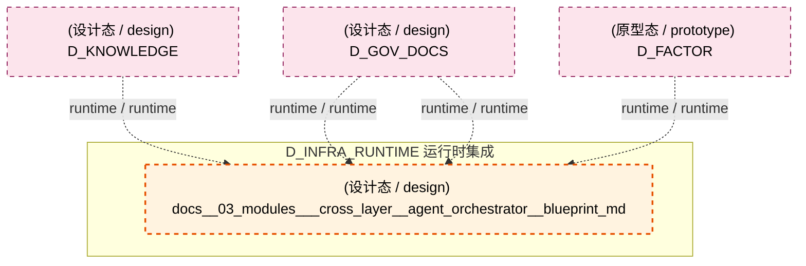
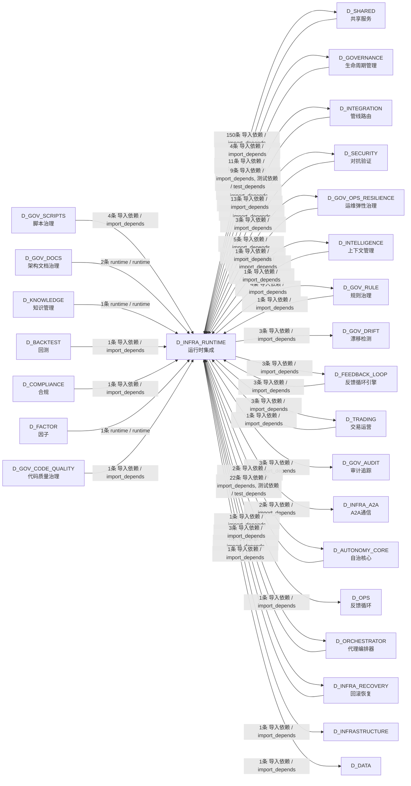

# 04_d_infra_runtime / runtime_core / 运行时集成 / Runtime Integration

> **功能简介 / Overview**: 运行时集成，负责组件生命周期编排、启动钩子和运行时上下文管理

> **文档作用 / Purpose**: 展示 运行时集成（D_INFRA_RUNTIME）功能域的模块清单、域内依赖关系、跨域依赖关系、架构分层视图，供架构审查和域治理参考。

> 本文档由 generate_domain_doc.py 从 depgraph (PostgreSQL) 自动生成
> 数据源: depgraph (PostgreSQL) nodes表 + edges表

## 域基本信息 / Domain Overview

| 字段 | 值 | Field | Value |
|------|------|-------|-------|
| 编号 | 04 | Number | 04 |
| 域ID | D_INFRA_RUNTIME | Domain ID | D_INFRA_RUNTIME |
| 域名称 | 运行时集成 | Domain Name | Runtime Integration |
| 层级 | L0 基础设施层 | Layer | L0 Infrastructure |
| 模块数 | 159 | Module Count | 159 |
| 域内依赖 | 146 | Internal Dependencies | 146 |
| 跨域入边 | 73 | Cross-domain Incoming | 73 |
| 跨域出边 | 208 | Cross-domain Outgoing | 208 |
| 设计态模块 | 1 | Design Modules | 1 |
| 原型态模块 | 40 | Prototype Modules | 40 |
| 生产态模块 | 118 | Production Modules | 118 |
| 容量 | 118/150 (正常) | Capacity | 118/150 (正常) |
| 描述 | 三层运行时编排(L1 Trae/L2 Local/L3 API) | Description | 三层运行时编排(L1 Trae/L2 Local/L3 API) |

## 模块分层清单 / Module Layered List

> 按 architecture_layer 分组的模块清单（共 159 个模块 / 159 modules）。

### L0 基础设施层 / Infrastructure Layer (154 modules)

| # | 模块路径 / Module Path | 模块名称 / Module Name (功能简介 / Description) | 成熟度 / Maturity | 蓝图 / Blueprint |
|:--:|---------|---------|:---:|:---:|
| 1 | src/zephyr/infrastructure/asset_inventory/__main__.py | Asset Inventory CLI — MOD-INF-026 蓝图 §31 | 原型态 / prototype | [MOD-INF-026](../../03_modules/_domain_infrastructure_operations/asset_inventory/blueprint.md) |
| 2 | src/zephyr/infrastructure/asset_inventory/classifier.py | AssetClassifier — MOD-INF-026 L2 资产自动分类器 | 生产态 / production | [MOD-INF-026](../../03_modules/_domain_infrastructure_operations/asset_inventory/blueprint.md) |
| 3 | src/zephyr/infrastructure/asset_inventory/dashboard.py | AssetDashboard — MOD-INF-026 资产健康仪表盘生成器 | 生产态 / production | [MOD-INF-026](../../03_modules/_domain_infrastructure_operations/asset_inventory/blueprint.md) |
| 4 | src/zephyr/infrastructure/asset_inventory/dependency.py | MOD-INF-026 §18 — 资产依赖图。 | 生产态 / production | [MOD-INF-026](../../03_modules/_domain_infrastructure_operations/asset_inventory/blueprint.md) |
| 5 | src/zephyr/infrastructure/asset_inventory/index_generator.py | UnifiedAssetIndex — MOD-INF-026 L3 统一资产索... | 生产态 / production | [MOD-INF-026](../../03_modules/_domain_infrastructure_operations/asset_inventory/blueprint.md) |
| 6 | src/zephyr/infrastructure/asset_inventory/lifecycle.py | AssetLifecycle — MOD-INF-026 L5 ITIL生命周期自... | 生产态 / production | [MOD-INF-026](../../03_modules/_domain_infrastructure_operations/asset_inventory/blueprint.md) |
| 7 | src/zephyr/infrastructure/asset_inventory/mcp_server.py | AssetInventory MCP Server — MOD-INF-026 蓝图 §21 | 原型态 / prototype | [MOD-INF-026](../../03_modules/_domain_infrastructure_operations/asset_inventory/blueprint.md) |
| 8 | src/zephyr/infrastructure/asset_inventory/metadata.py | MOD-INF-026 §24-25 — Git 历史元数据提取 + 多 ... | 生产态 / production | [MOD-INF-026](../../03_modules/_domain_infrastructure_operations/asset_inventory/blueprint.md) |
| 9 | src/zephyr/infrastructure/asset_inventory/models.py | AssetInventoryModels — MOD-INF-026 Pydantic V2... | 生产态 / production | [MOD-INF-026](../../03_modules/_domain_infrastructure_operations/asset_inventory/blueprint.md) |
| 10 | src/zephyr/infrastructure/asset_inventory/reconciler.py | ReconciliationEngine — MOD-INF-026 L4 注册表 v... | 生产态 / production | [MOD-INF-026](../../03_modules/_domain_infrastructure_operations/asset_inventory/blueprint.md) |
| 11 | src/zephyr/infrastructure/asset_inventory/registry_adapte... | MOD-INF-026 §17 — 24 个异构注册表统一解析适配器。 | 生产态 / production | [MOD-INF-026](../../03_modules/_domain_infrastructure_operations/asset_inventory/blueprint.md) |
| 12 | src/zephyr/infrastructure/asset_inventory/scanner.py | AssetDiscoveryScanner — MOD-INF-026 L1 全量文... | 生产态 / production | [MOD-INF-026](../../03_modules/_domain_infrastructure_operations/asset_inventory/blueprint.md) |
| 13 | src/zephyr/infrastructure/asset_inventory/telemetry.py | AssetInventoryTelemetry — MOD-INF-026 自监控指标 | 生产态 / production | [MOD-INF-026](../../03_modules/_domain_infrastructure_operations/asset_inventory/blueprint.md) |
| 14 | src/zephyr/infrastructure/asset_inventory/trust_anchor.py | MOD-INF-026 §26 — 三重信任锚验证门 R20。 | 生产态 / production | [MOD-INF-026](../../03_modules/_domain_infrastructure_operations/asset_inventory/blueprint.md) |
| 15 | src/zephyr/infrastructure/auto_diagnostics.py | RI-12 AutoDiagnostics — 自动诊断引擎 | 生产态 / production | [MOD-INF-002](../../03_modules/_domain_infrastructure_runtime/runtime_integration/blueprint.md) |
| 16 | src/zephyr/infrastructure/auto_fix_engine/__main__.py | __main__.py | 原型态 / prototype | [MOD-INF-031](../../03_modules/_cross_layer/auto_fix_engine/blueprint.md) |
| 17 | src/zephyr/infrastructure/auto_fix_engine/alignment_synce... | alignment_syncer.py | 原型态 / prototype | [MOD-INF-031](../../03_modules/_cross_layer/auto_fix_engine/blueprint.md) |
| 18 | src/zephyr/infrastructure/auto_fix_engine/all_completer.py | all_completer.py | 原型态 / prototype | [MOD-INF-031](../../03_modules/_cross_layer/auto_fix_engine/blueprint.md) |
| 19 | src/zephyr/infrastructure/auto_fix_engine/batch_fixer.py | batch_fixer.py | 原型态 / prototype | [MOD-INF-031](../../03_modules/_cross_layer/auto_fix_engine/blueprint.md) |
| 20 | src/zephyr/infrastructure/auto_fix_engine/compliance_audi... | compliance_auditor.py | 原型态 / prototype | [MOD-INF-031](../../03_modules/_cross_layer/auto_fix_engine/blueprint.md) |
| 21 | src/zephyr/infrastructure/auto_fix_engine/config_fixer.py | config_fixer.py | 原型态 / prototype | [MOD-INF-031](../../03_modules/_cross_layer/auto_fix_engine/blueprint.md) |
| 22 | src/zephyr/infrastructure/auto_fix_engine/dedup_extractor.py | dedup_extractor.py | 原型态 / prototype | [MOD-INF-031](../../03_modules/_cross_layer/auto_fix_engine/blueprint.md) |
| 23 | src/zephyr/infrastructure/auto_fix_engine/dep_version_fix... | dep_version_fixer.py | 生产态 / production | [MOD-INF-031](../../03_modules/_cross_layer/auto_fix_engine/blueprint.md) |
| 24 | src/zephyr/infrastructure/auto_fix_engine/drift_fixer.py | drift_fixer.py | 生产态 / production | [MOD-INF-031](../../03_modules/_cross_layer/auto_fix_engine/blueprint.md) |
| 25 | src/zephyr/infrastructure/auto_fix_engine/engine.py | engine.py | 生产态 / production | [MOD-INF-031](../../03_modules/_cross_layer/auto_fix_engine/blueprint.md) |
| 26 | src/zephyr/infrastructure/auto_fix_engine/escalation_brid... | escalation_bridge.py | 生产态 / production | [MOD-INF-031](../../03_modules/_cross_layer/auto_fix_engine/blueprint.md) |
| 27 | src/zephyr/infrastructure/auto_fix_engine/event_hooks.py | event_hooks.py | 生产态 / production | [MOD-INF-031](../../03_modules/_cross_layer/auto_fix_engine/blueprint.md) |
| 28 | src/zephyr/infrastructure/auto_fix_engine/fix_budget.py | fix_budget.py | 生产态 / production | [MOD-INF-031](../../03_modules/_cross_layer/auto_fix_engine/blueprint.md) |
| 29 | src/zephyr/infrastructure/auto_fix_engine/fix_diff.py | fix_diff.py | 生产态 / production | [MOD-INF-031](../../03_modules/_cross_layer/auto_fix_engine/blueprint.md) |
| 30 | src/zephyr/infrastructure/auto_fix_engine/fix_health_chec... | fix_health_check.py | 生产态 / production | [MOD-INF-031](../../03_modules/_cross_layer/auto_fix_engine/blueprint.md) |
| 31 | src/zephyr/infrastructure/auto_fix_engine/fix_pattern_min... | fix_pattern_miner.py | 生产态 / production | [MOD-INF-031](../../03_modules/_cross_layer/auto_fix_engine/blueprint.md) |
| 32 | src/zephyr/infrastructure/auto_fix_engine/fix_reliability.py | fix_reliability.py | 生产态 / production | [MOD-INF-031](../../03_modules/_cross_layer/auto_fix_engine/blueprint.md) |
| 33 | src/zephyr/infrastructure/auto_fix_engine/fix_report.py | fix_report.py | 生产态 / production | [MOD-INF-031](../../03_modules/_cross_layer/auto_fix_engine/blueprint.md) |
| 34 | src/zephyr/infrastructure/auto_fix_engine/fix_safety.py | fix_safety.py | 生产态 / production | [MOD-INF-031](../../03_modules/_cross_layer/auto_fix_engine/blueprint.md) |
| 35 | src/zephyr/infrastructure/auto_fix_engine/fix_scheduler.py | fix_scheduler.py | 生产态 / production | [MOD-INF-031](../../03_modules/_cross_layer/auto_fix_engine/blueprint.md) |
| 36 | src/zephyr/infrastructure/auto_fix_engine/import_fixer.py | import_fixer.py | 原型态 / prototype | [MOD-INF-031](../../03_modules/_cross_layer/auto_fix_engine/blueprint.md) |
| 37 | src/zephyr/infrastructure/auto_fix_engine/interrupt_guard.py | interrupt_guard.py | 生产态 / production | [MOD-INF-031](../../03_modules/_cross_layer/auto_fix_engine/blueprint.md) |
| 38 | src/zephyr/infrastructure/auto_fix_engine/llm_fix_adapter.py | llm_fix_adapter.py | 生产态 / production | [MOD-INF-031](../../03_modules/_cross_layer/auto_fix_engine/blueprint.md) |
| 39 | src/zephyr/infrastructure/auto_fix_engine/models.py | models.py | 生产态 / production | [MOD-INF-031](../../03_modules/_cross_layer/auto_fix_engine/blueprint.md) |
| 40 | src/zephyr/infrastructure/auto_fix_engine/scaffold_regist... | scaffold_registrar.py | 生产态 / production | [MOD-INF-031](../../03_modules/_cross_layer/auto_fix_engine/blueprint.md) |
| 41 | src/zephyr/infrastructure/auto_fix_engine/self_heal_agent.py | self_heal_agent.py | 生产态 / production | [MOD-INF-031](../../03_modules/_cross_layer/auto_fix_engine/blueprint.md) |
| 42 | src/zephyr/infrastructure/auto_fix_engine/shadow_workspac... | shadow_workspace.py | 生产态 / production | [MOD-INF-031](../../03_modules/_cross_layer/auto_fix_engine/blueprint.md) |
| 43 | src/zephyr/infrastructure/auto_fix_engine/state_machine.py | state_machine.py | 生产态 / production | [MOD-INF-031](../../03_modules/_cross_layer/auto_fix_engine/blueprint.md) |
| 44 | src/zephyr/infrastructure/auto_fix_engine/zombie_cleaner.py | zombie_cleaner.py | 生产态 / production | [MOD-INF-031](../../03_modules/_cross_layer/auto_fix_engine/blueprint.md) |
| 45 | src/zephyr/infrastructure/blueprint_code_sync.py | Blueprint-Code Sync — 蓝图-代码索引同步验证。 | 生产态 / production | [MOD-INF-002](../../03_modules/_domain_infrastructure_runtime/runtime_integration/blueprint.md) |
| 46 | src/zephyr/infrastructure/capacity_assurance/budget_forec... | budget_forecaster.py — Token 预算预测 (DD120-e... | 生产态 / production | [MOD-INF-001](../../03_modules/_domain_infrastructure_operations/capacity_assurance/blueprint.md) |
| 47 | src/zephyr/infrastructure/capacity_assurance/contracts/ba... | Batch1 基础设施层契约 — 15条 Pydantic v2 Schem... | 原型态 / prototype | [MOD-INF-001](../../03_modules/_domain_infrastructure_operations/capacity_assurance/blueprint.md) |
| 48 | src/zephyr/infrastructure/capacity_assurance/contracts/ba... | Batch3 集成层契约 — 14条 Pydantic v2 Schema（O... | 原型态 / prototype | [MOD-INF-001](../../03_modules/_domain_infrastructure_operations/capacity_assurance/blueprint.md) |
| 49 | src/zephyr/infrastructure/capacity_assurance/contracts/co... | ContractBus loader — 加载全部44条容量保障契约... | 原型态 / prototype | [MOD-INF-001](../../03_modules/_domain_infrastructure_operations/capacity_assurance/blueprint.md) |
| 50 | src/zephyr/infrastructure/capacity_assurance/cross_module... | Cross-module integration — CT-1~CT-4 跨模块集... | 原型态 / prototype | [MOD-INF-001](../../03_modules/_domain_infrastructure_operations/capacity_assurance/blueprint.md) |
| 51 | src/zephyr/infrastructure/capacity_assurance/host_resourc... | host_resource_governor.py — 主机资源治理 (B17,... | 生产态 / production | [MOD-INF-001](../../03_modules/_domain_infrastructure_operations/capacity_assurance/blueprint.md) |
| 52 | src/zephyr/infrastructure/capacity_assurance/kill_switch.py | kill_switch.py -- safety circuit breaker (DD110... | 生产态 / production | [MOD-INF-001](../../03_modules/_domain_infrastructure_operations/capacity_assurance/blueprint.md) |
| 53 | src/zephyr/infrastructure/capacity_assurance/risk_mitigat... | Risk mitigation — R1~R16 全量风险缓解实现（对... | 原型态 / prototype | [MOD-INF-001](../../03_modules/_domain_infrastructure_operations/capacity_assurance/blueprint.md) |
| 54 | src/zephyr/infrastructure/capacity_assurance/schema.py | SchemaManager — 容量保障体系数据库 Schema 管理器 | 原型态 / prototype | [MOD-INF-001](../../03_modules/_domain_infrastructure_operations/capacity_assurance/blueprint.md) |
| 55 | src/zephyr/infrastructure/capacity_assurance/sli_instrume... | SLI instrumentation — SLI采集插桩点（对标蓝图 ... | 原型态 / prototype | [MOD-INF-001](../../03_modules/_domain_infrastructure_operations/capacity_assurance/blueprint.md) |
| 56 | src/zephyr/infrastructure/capacity_assurance/tech_stack.py | TechStackValidator — 技术栈可用性校验器 | 原型态 / prototype | [MOD-INF-001](../../03_modules/_domain_infrastructure_operations/capacity_assurance/blueprint.md) |
| 57 | src/zephyr/infrastructure/capacity_assurance/token_budget.py | token_budget.py — Token 估算工具 SSoT | 生产态 / production | [MOD-INF-001](../../03_modules/_domain_infrastructure_operations/capacity_assurance/blueprint.md) |
| 58 | src/zephyr/infrastructure/config_validator.py | M-12 ConfigValidator — 配置参数校验器 | 生产态 / production | [MOD-INF-002](../../03_modules/_domain_infrastructure_runtime/runtime_integration/blueprint.md) |
| 59 | src/zephyr/infrastructure/contract_tester.py | M-11 ContractTester — 契约测试框架 | 生产态 / production | [MOD-INF-002](../../03_modules/_domain_infrastructure_runtime/runtime_integration/blueprint.md) |
| 60 | src/zephyr/infrastructure/cost_tracker.py | RI-15 CostTracker — 成本追踪器 | 生产态 / production | [MOD-INF-002](../../03_modules/_domain_infrastructure_runtime/runtime_integration/blueprint.md) |
| 61 | src/zephyr/infrastructure/database_service.py | DatabaseService: 统一管理数据库的连接池、生命周... | 原型态 / prototype | [MOD-INF-002](../../03_modules/_domain_infrastructure_runtime/runtime_integration/blueprint.md) |
| 62 | src/zephyr/infrastructure/dry_run_simulator.py | RI-14 DryRunSimulator — 干运行模拟器 | 生产态 / production | [MOD-INF-002](../../03_modules/_domain_infrastructure_runtime/runtime_integration/blueprint.md) |
| 63 | src/zephyr/infrastructure/event_bus_upgrade.py | DEPRECATED: 此文件已废弃。 | 生产态 / production | [MOD-INF-002](../../03_modules/_domain_infrastructure_runtime/runtime_integration/blueprint.md) |
| 64 | src/zephyr/infrastructure/event_store.py | RI-13 EventStore — 事件存储 | 生产态 / production | [MOD-INF-002](../../03_modules/_domain_infrastructure_runtime/runtime_integration/blueprint.md) |
| 65 | src/zephyr/infrastructure/events/event_store.py | Event Store — 事件持久化存储。 | 原型态 / prototype | [MOD-INF-016](../../03_modules/_cross_layer/shared_core/blueprint.md) |
| 66 | src/zephyr/infrastructure/file_watcher.py | file_watcher.py | 生产态 / production | [MOD-INF-002](../../03_modules/_domain_infrastructure_runtime/runtime_integration/blueprint.md) |
| 67 | src/zephyr/infrastructure/finding_task_bridge.py | Finding->TaskCard 桥接器 | 生产态 / production | [MOD-INF-002](../../03_modules/_domain_infrastructure_runtime/runtime_integration/blueprint.md) |
| 68 | src/zephyr/infrastructure/health_monitor/health_aggregato... | 全系统健康聚合 — check_all_systems() | 原型态 / prototype | [MOD-INF-035](../../03_modules/_cross_layer/auto_runtime_core/blueprint.md) |
| 69 | src/zephyr/infrastructure/hooks/event_hook.py | EventHook — 声明式任务系统事件订阅 | 原型态 / prototype | [MOD-INF-002](../../03_modules/_domain_infrastructure_runtime/runtime_integration/blueprint.md) |
| 70 | src/zephyr/infrastructure/impact/impact_propagator.py | Impact Propagator — 变更影响传播分析。 | 生产态 / production | [MOD-INF-016](../../03_modules/_cross_layer/shared_core/blueprint.md) |
| 71 | src/zephyr/infrastructure/impact/llm_impact_analyzer.py | LLM Impact Analyzer — 语义影响分析器。 | 生产态 / production | [MOD-INF-016](../../03_modules/_cross_layer/shared_core/blueprint.md) |
| 72 | src/zephyr/infrastructure/infrastructure_base.py | 基础设施 — Infrastructure Layer Skeleton | 生产态 / production | [MOD-INF-002](../../03_modules/_domain_infrastructure_runtime/runtime_integration/blueprint.md) |
| 73 | src/zephyr/infrastructure/kill_switch_sim.py | Kill Switch T0 Hardware Simulator | 生产态 / production | [MOD-INF-002](../../03_modules/_domain_infrastructure_runtime/runtime_integration/blueprint.md) |
| 74 | src/zephyr/infrastructure/lifecycle/scope_guard.py | Scope Guard — 范围蔓延检测与阻断。 | 生产态 / production | [MOD-INF-016](../../03_modules/_cross_layer/shared_core/blueprint.md) |
| 75 | src/zephyr/infrastructure/lifecycle/task_lifecycle_manage... | Task Lifecycle Manager — G0-G7 任务生命周期门禁。 | 生产态 / production | [MOD-INF-016](../../03_modules/_cross_layer/shared_core/blueprint.md) |
| 76 | src/zephyr/infrastructure/observability/notifier.py | Notifier — 多渠道 Owner 通知。 | 生产态 / production | [MOD-INF-016](../../03_modules/_cross_layer/shared_core/blueprint.md) |
| 77 | src/zephyr/infrastructure/observability/trace_decorator.py | trace_decorator.py | 生产态 / production | [MOD-INF-016](../../03_modules/_cross_layer/shared_core/blueprint.md) |
| 78 | src/zephyr/infrastructure/pipeline/backpressure_manager.py | Pipeline — Backpressure Manager | 生产态 / production | [MOD-INF-009](../../03_modules/_cross_layer/pipeline/blueprint.md) |
| 79 | src/zephyr/infrastructure/pipeline/backpressure_types.py | backpressure_types.py - Pipeline backpressure s... | 生产态 / production | [MOD-INF-009](../../03_modules/_cross_layer/pipeline/blueprint.md) |
| 80 | src/zephyr/infrastructure/pipeline/circuit_breaker_manage... | CircuitBreakerManager -- standalone circuit bre... | 生产态 / production | [MOD-INF-009](../../03_modules/_cross_layer/pipeline/blueprint.md) |
| 81 | src/zephyr/infrastructure/pipeline/cost_tracker.py | CostTracker —— LLM 调用成本追踪器（SRC-0025） | 生产态 / production | [MOD-INF-009](../../03_modules/_cross_layer/pipeline/blueprint.md) |
| 82 | src/zephyr/infrastructure/pipeline/ct_pipe_routing.py | CT-PIPE-ORC-001 — TaskCard -> 管线入口节点路由 | 生产态 / production | [MOD-INF-009](../../03_modules/_cross_layer/pipeline/blueprint.md) |
| 83 | src/zephyr/infrastructure/pipeline/dead_letter_queue.py | DeadLetterQueue — 死信队列 | 生产态 / production | [MOD-INF-009](../../03_modules/_cross_layer/pipeline/blueprint.md) |
| 84 | src/zephyr/infrastructure/pipeline/llm_gateway.py | MOD-INF-019: Agent Spec — LLM Gateway | 生产态 / production | [MOD-INF-009](../../03_modules/_cross_layer/pipeline/blueprint.md) |
| 85 | src/zephyr/infrastructure/pipeline/model_router.py | ModelRouter — 模型路由与降级链管理 | 生产态 / production | [MOD-INF-009](../../03_modules/_cross_layer/pipeline/blueprint.md) |
| 86 | src/zephyr/infrastructure/pipeline/models.py | Pipeline 数据模型 | 生产态 / production | [MOD-INF-009](../../03_modules/_cross_layer/pipeline/blueprint.md) |
| 87 | src/zephyr/infrastructure/pipeline/pipeline_agent_bridge.py | Pipeline -> Agent Bridge — 双编排器桥接层 | 生产态 / production | [MOD-INF-009](../../03_modules/_cross_layer/pipeline/blueprint.md) |
| 88 | src/zephyr/infrastructure/pipeline/pipeline_lock.py | Pipeline Lock — 双管线并发锁 | 生产态 / production | [MOD-INF-009](../../03_modules/_cross_layer/pipeline/blueprint.md) |
| 89 | src/zephyr/infrastructure/pipeline/pipeline_roadmap.py | Pipeline 未来版本路线图——v0.10.0 -> v0.12.0 ... | 生产态 / production | [MOD-INF-009](../../03_modules/_cross_layer/pipeline/blueprint.md) |
| 90 | src/zephyr/infrastructure/pipeline/preemption_manager.py | PreemptionManager -- 优先级抢占管理器 | 生产态 / production | [MOD-INF-009](../../03_modules/_cross_layer/pipeline/blueprint.md) |
| 91 | src/zephyr/infrastructure/pipeline/routing_plugins.py | Pipeline Routing Plugin System — K8s Schedulin... | 生产态 / production | [MOD-INF-009](../../03_modules/_cross_layer/pipeline/blueprint.md) |
| 92 | src/zephyr/infrastructure/pydantic_v2_migrator.py | M-15 PydanticV2Migrator — Pydantic V2 迁移工具 | 生产态 / production | [MOD-INF-002](../../03_modules/_domain_infrastructure_runtime/runtime_integration/blueprint.md) |
| 93 | src/zephyr/infrastructure/quality/quality_monitor.py | Quality Monitor — 生成代码质量门禁。 | 生产态 / production | [MOD-INF-016](../../03_modules/_cross_layer/shared_core/blueprint.md) |
| 94 | src/zephyr/infrastructure/queue/task_queue.py | Task Queue — 后台任务队列 + 自动 Dispatch。 | 生产态 / production | [MOD-INF-016](../../03_modules/_cross_layer/shared_core/blueprint.md) |
| 95 | src/zephyr/infrastructure/queue/task_scheduler.py | Task Scheduler — 任务调度器。 | 生产态 / production | [MOD-INF-016](../../03_modules/_cross_layer/shared_core/blueprint.md) |
| 96 | src/zephyr/infrastructure/reliability/circuit_breaker.py | Circuit Breaker — 熔断器：连续失败 -> OPEN -> ... | 原型态 / prototype | [MOD-INF-016](../../03_modules/_cross_layer/shared_core/blueprint.md) |
| 97 | src/zephyr/infrastructure/reliability/context_guard.py | Context Guard — 上下文契约守卫。 | 生产态 / production | [MOD-INF-016](../../03_modules/_cross_layer/shared_core/blueprint.md) |
| 98 | src/zephyr/infrastructure/runtime/concurrency_guard.py | concurrency_guard — 回滚操作并发安全守卫。 | 生产态 / production | [MOD-INF-002](../../03_modules/_domain_infrastructure_runtime/runtime_integration/blueprint.md) |
| 99 | src/zephyr/infrastructure/runtime/gate_coordinator.py | Rollback->Gate 协调器 — freeze_all / thaw_all | 原型态 / prototype | [MOD-INF-002](../../03_modules/_domain_infrastructure_runtime/runtime_integration/blueprint.md) |
| 100 | src/zephyr/infrastructure/runtime/sandbox_enforcer.py | SandboxEnforcer — Agent 沙盒隔离。 | 生产态 / production | [MOD-INF-002](../../03_modules/_domain_infrastructure_runtime/runtime_integration/blueprint.md) |
| 101 | src/zephyr/infrastructure/runtime/startup_shutdown.py | startup_shutdown.py | 生产态 / production | [MOD-GOVERNANCE](../../03_modules/_domain_governance/blueprint.md) |
| 102 | src/zephyr/infrastructure/script_system/finding.py | Finding Schema — 审计发现标准化数据模型 | 生产态 / production | [MOD-INF-005](../../03_modules/_domain_governance/governance_automation/blueprint.md) |
| 103 | src/zephyr/infrastructure/script_system/gate_bridge.py | Script->Gate 门禁桥接器 — submit_findings() 生产者 | 原型态 / prototype | [MOD-INF-005](../../03_modules/_domain_governance/governance_automation/blueprint.md) |
| 104 | src/zephyr/infrastructure/script_system/kb_bridge.py | Script->KB 审计入库桥接器 — publish_to_kb() 生产者 | 原型态 / prototype | [MOD-INF-005](../../03_modules/_domain_governance/governance_automation/blueprint.md) |
| 105 | src/zephyr/infrastructure/sla/sla_monitor.py | SLA Monitor — 服务等级协议 (SLA) 监控 RTO/RPO。 | 生产态 / production | [MOD-INF-016](../../03_modules/_cross_layer/shared_core/blueprint.md) |
| 106 | src/zephyr/infrastructure/system_telemetry/_budget_teleme... | _budget_telemetry_bridge.py | 原型态 / prototype | [MOD-INF-015](../../03_modules/_domain_infrastructure_operations/system_telemetry/blueprint.md) |
| 107 | src/zephyr/infrastructure/system_telemetry/_trace_bridge.py | _trace_bridge.py | 原型态 / prototype | [MOD-INF-015](../../03_modules/_domain_infrastructure_operations/system_telemetry/blueprint.md) |
| 108 | src/zephyr/infrastructure/system_telemetry/ai_behavior/ev... | 遥测 · ai_behavior/event_sink — AI 行为遥测事... | 原型态 / prototype | [MOD-INF-015](../../03_modules/_domain_infrastructure_operations/system_telemetry/blueprint.md) |
| 109 | src/zephyr/infrastructure/system_telemetry/archive/cold_s... | 遥测 · archive/cold_stub — 冷存储归档管道。 | 原型态 / prototype | [MOD-INF-015](../../03_modules/_domain_infrastructure_operations/system_telemetry/blueprint.md) |
| 110 | src/zephyr/infrastructure/system_telemetry/auto_bootstrap.py | auto_bootstrap — 全自动遥测注入钩子（MOD-INF-0... | 生产态 / production | [MOD-INF-015](../../03_modules/_domain_infrastructure_operations/system_telemetry/blueprint.md) |
| 111 | src/zephyr/infrastructure/system_telemetry/contract_metri... | ZephyrAlpha — system-telemetry/contract_metrics.py | 生产态 / production | [MOD-INF-015](../../03_modules/_domain_infrastructure_operations/system_telemetry/blueprint.md) |
| 112 | src/zephyr/infrastructure/system_telemetry/facade.py | Telemetry — 系统遥测门面类（MOD-INF-015 v2.1.0） | 原型态 / prototype | [MOD-INF-015](../../03_modules/_domain_infrastructure_operations/system_telemetry/blueprint.md) |
| 113 | src/zephyr/infrastructure/system_telemetry/health_aggrega... | 健康聚合器（Health Aggregator） | 生产态 / production | [MOD-INF-015](../../03_modules/_domain_infrastructure_operations/system_telemetry/blueprint.md) |
| 114 | src/zephyr/infrastructure/system_telemetry/health_probes.py | 三态健康探针协议（Health Probes — CT-HEALTH-001） | 生产态 / production | [MOD-INF-015](../../03_modules/_domain_infrastructure_operations/system_telemetry/blueprint.md) |
| 115 | src/zephyr/infrastructure/system_telemetry/logs/__init__.py | logs — 结构化日志流（structlog + JSONL + trace... | 生产态 / production | [MOD-INF-015](../../03_modules/_domain_infrastructure_operations/system_telemetry/blueprint.md) |
| 116 | src/zephyr/infrastructure/system_telemetry/logs/structure... | logs/structured_sink — 结构化日志管道（D_SYSTE... | 原型态 / prototype | [MOD-INF-015](../../03_modules/_domain_infrastructure_operations/system_telemetry/blueprint.md) |
| 117 | src/zephyr/infrastructure/system_telemetry/metrics/bluepr... | blueprint_metrics — 蓝图使用追踪 instrumentation | 生产态 / production | [MOD-INF-015](../../03_modules/_domain_infrastructure_operations/system_telemetry/blueprint.md) |
| 118 | src/zephyr/infrastructure/system_telemetry/metrics_bridge.py | TELE->FLE 指标桥接 — emit_metrics() 生产者 | 原型态 / prototype | [MOD-INF-015](../../03_modules/_domain_infrastructure_operations/system_telemetry/blueprint.md) |
| 119 | src/zephyr/infrastructure/system_telemetry/traces/span_st... | 遥测 · traces/span_stub — W3C TraceContext 分... | 原型态 / prototype | [MOD-INF-015](../../03_modules/_domain_infrastructure_operations/system_telemetry/blueprint.md) |
| 120 | src/zephyr/infrastructure/system_telemetry/watchdog.py | 三冗余 Watchdog（CT-WATCHDOG-001）——互检+Pani... | 原型态 / prototype | [MOD-INF-015](../../03_modules/_domain_infrastructure_operations/system_telemetry/blueprint.md) |
| 121 | src/zephyr/infrastructure/warm_hot_gate.py | M-14 WarmHotGate — Warm->Hot 阻断门 | 生产态 / production | [MOD-INF-002](../../03_modules/_domain_infrastructure_runtime/runtime_integration/blueprint.md) |
| 122 | src/zephyr/shared/lifecycle/daemon_registry.py | daemon_registry.py - unified daemon thread regi... | 生产态 / production | [MOD-INF-016](../../03_modules/_cross_layer/shared_core/blueprint.md) |
| 123 | src/zephyr/shared/lifecycle/hooks.py | hooks.py —— 模块生命周期钩子（Phase 2 新增 | ... | 生产态 / production | [MOD-INF-016](../../03_modules/_cross_layer/shared_core/blueprint.md) |
| 124 | src/zephyr/shared/lifecycle/lazy_loader.py | lazy_loader.py - Lazy module loading registry | 生产态 / production | [MOD-INF-016](../../03_modules/_cross_layer/shared_core/blueprint.md) |
| 125 | src/zephyr/shared/lifecycle/resource_optimization_models.py | models.py - Pydantic data models for resource o... | 生产态 / production | [MOD-INF-016](../../03_modules/_cross_layer/shared_core/blueprint.md) |
| 126 | src/zephyr/trading/__main__.py | python -m zephyr.trading — AutoRuntime Core 入口 | 原型态 / prototype | [MOD-INF-035](../../03_modules/_cross_layer/auto_runtime_core/blueprint.md) |
| 127 | src/zephyr/trading/action_dispatcher.py | ActionDispatcher --- 大脑的"手" v2.0 (Phase 2) | 生产态 / production | [MOD-INF-035](../../03_modules/_cross_layer/auto_runtime_core/blueprint.md) |
| 128 | src/zephyr/trading/ai_audit_logger.py | AiAuditLogger — AI 行为审计日志 | 生产态 / production | [MOD-INF-035](../../03_modules/_cross_layer/auto_runtime_core/blueprint.md) |
| 129 | src/zephyr/trading/auto_integrator.py | AutoIntegrator — 自动接入器 | 生产态 / production | [MOD-INF-035](../../03_modules/_cross_layer/auto_runtime_core/blueprint.md) |
| 130 | src/zephyr/trading/auto_runtime_core.py | AutoRuntimeCore — 三层运行时运营中心（系统大脑） | 生产态 / production | [MOD-INF-035](../../03_modules/_cross_layer/auto_runtime_core/blueprint.md) |
| 131 | src/zephyr/trading/auto_task_generator.py | AutoTaskGenerator — 自动任务生成器 | 生产态 / production | [MOD-INF-035](../../03_modules/_cross_layer/auto_runtime_core/blueprint.md) |
| 132 | src/zephyr/trading/boot_hooks.py | boot_hooks.py | 生产态 / production | [MOD-INF-035](../../03_modules/_cross_layer/auto_runtime_core/blueprint.md) |
| 133 | src/zephyr/trading/capability_card.py | CapabilityCard — 能力卡片数据模型 | 生产态 / production | [MOD-INF-035](../../03_modules/_cross_layer/auto_runtime_core/blueprint.md) |
| 134 | src/zephyr/trading/capability_registry.py | CapabilityRegistry — 能力注册中心 | 生产态 / production | [MOD-INF-035](../../03_modules/_cross_layer/auto_runtime_core/blueprint.md) |
| 135 | src/zephyr/trading/capability_sync.py | capability_sync.py | 生产态 / production | [MOD-INF-035](../../03_modules/_cross_layer/auto_runtime_core/blueprint.md) |
| 136 | src/zephyr/trading/dream_cycle.py | DreamCycle — 知识固化引擎 | 生产态 / production | [MOD-INF-035](../../03_modules/_cross_layer/auto_runtime_core/blueprint.md) |
| 137 | src/zephyr/trading/finalizer.py | Finalizer — 优雅清理器 | 生产态 / production | [MOD-INF-035](../../03_modules/_cross_layer/auto_runtime_core/blueprint.md) |
| 138 | src/zephyr/trading/health_monitor.py | HealthMonitor — 健康监控 + 自愈 | 生产态 / production | [MOD-INF-035](../../03_modules/_cross_layer/auto_runtime_core/blueprint.md) |
| 139 | src/zephyr/trading/integration_registry.py | IntegrationRegistry — 集成注册表 | 生产态 / production | [MOD-INF-035](../../03_modules/_cross_layer/auto_runtime_core/blueprint.md) |
| 140 | src/zephyr/trading/lifecycle_manager.py | lifecycle_manager.py | 生产态 / production | [MOD-INF-035](../../03_modules/_cross_layer/auto_runtime_core/blueprint.md) |
| 141 | src/zephyr/trading/module_onboarding_scanner.py | ModuleOnboardingScanner — 模块接入扫描器 | 生产态 / production | [MOD-INF-035](../../03_modules/_cross_layer/auto_runtime_core/blueprint.md) |
| 142 | src/zephyr/trading/night_shift_queue.py | NightShiftQueue — 夜班登记表持久化 | 生产态 / production | [MOD-INF-035](../../03_modules/_cross_layer/auto_runtime_core/blueprint.md) |
| 143 | src/zephyr/trading/orphan_detector.py | OrphanDetector — 孤儿检测器 | 原型态 / prototype | [MOD-INF-035](../../03_modules/_cross_layer/auto_runtime_core/blueprint.md) |
| 144 | src/zephyr/trading/ports.py | Protocol-based interface layer for runtime->pip... | 原型态 / prototype | [MOD-INF-035](../../03_modules/_cross_layer/auto_runtime_core/blueprint.md) |
| 145 | src/zephyr/trading/resource_optimization.py | resource_optimization.py - MAPE-K autonomic res... | 生产态 / production | [MOD-INF-035](../../03_modules/_cross_layer/auto_runtime_core/blueprint.md) |
| 146 | src/zephyr/trading/runtime_config.py | runtime_config.py | 生产态 / production | [MOD-INF-035](../../03_modules/_cross_layer/auto_runtime_core/blueprint.md) |
| 147 | src/zephyr/trading/staging_area.py | StagingArea — 多AI并发草稿写入+提交+冲突检测模... | 生产态 / production | [MOD-INF-035](../../03_modules/_cross_layer/auto_runtime_core/blueprint.md) |
| 148 | src/zephyr/trading/status_dashboard.py | StatusDashboard — 实时状态面板 | 生产态 / production | [MOD-INF-035](../../03_modules/_cross_layer/auto_runtime_core/blueprint.md) |
| 149 | src/zephyr/trading/stop_gate.py | StopGate — 质量闸门 | 生产态 / production | [MOD-INF-035](../../03_modules/_cross_layer/auto_runtime_core/blueprint.md) |
| 150 | src/zephyr/trading/task_gate.py | TaskGate --- 任务门控 | 生产态 / production | [MOD-INF-035](../../03_modules/_cross_layer/auto_runtime_core/blueprint.md) |
| 151 | src/zephyr/trading/windows_service.py | WindowsService — Windows Service 包装器 | 原型态 / prototype | [MOD-INF-035](../../03_modules/_cross_layer/auto_runtime_core/blueprint.md) |
| 152 | src/zephyr/trading/work_dag.py | WorkDAG + WorkItem — 工作编排数据模型 | 生产态 / production | [MOD-INF-035](../../03_modules/_cross_layer/auto_runtime_core/blueprint.md) |
| 153 | src/zephyr/trading/work_orchestrator.py | work_orchestrator.py | 生产态 / production | [MOD-INF-035](../../03_modules/_cross_layer/auto_runtime_core/blueprint.md) |
| 154 | src/zephyr/trading/zombie_scanner.py | zombie_scanner.py — 僵尸 Python 进程检测与自动处置 | 原型态 / prototype | [MOD-RESOURCE_OPTIMIZATION_ENGINE](../../03_modules/_cross_layer/resource_optimization_engine/blueprint.md) |

### L1 基础层 / Foundation Layer (5 modules)

| # | 模块路径 / Module Path | 模块名称 / Module Name (功能简介 / Description) | 成熟度 / Maturity | 蓝图 / Blueprint |
|:--:|---------|---------|:---:|:---:|
| 1 | docs/01_policies_and_standards/_registry/catalogs/infrast... | zephyr-sqlite-task-db — database 节点 (ARCH-053) | 生产态 / production |  |
| 2 | docs/01_policies_and_standards/_registry/catalogs/infrast... | zephyr-chroma-vector-db — database 节点 (ARCH-053) | 生产态 / production |  |
| 3 | docs/01_policies_and_standards/_registry/catalogs/infrast... | zephyr-depgraph-db — database 节点 (ARCH-053) | 生产态 / production |  |
| 4 | docs/01_policies_and_standards/_registry/catalogs/infrast... | zephyr-clickhouse-c1-market — database 节点 (ARCH-053) | 生产态 / production |  |
| 5 | docs/03_modules/_cross_layer/agent_orchestrator/blueprint.md | docs__03_modules___cross_layer__agent_orchestrator__blueprint_md | 设计态 / design | [MOD-INF-039](../../03_modules/_cross_layer/agent_orchestrator/blueprint.md) |

## 域内依赖图 / Internal Dependency Diagram

> 依赖图内嵌在本文档中，IDE 可直接渲染显示。参考 decision_index.md 设计，分四个视图：合并全景图、运营态子图、设计态子图、原型态子图（按 design_maturity 实际值拆分）。
>
> **图例说明 / Legend**：
> - **实线边框 = 运营态模块**（production，已上线运行）
> - **虚线边框 = 设计态模块**（design，蓝图阶段，代码未写）
> - **虚线边框 = 原型态模块**（prototype，代码已写，验证中未稳定上线）
> - **实线箭头 = 运营态依赖**（已生效的依赖关系）
> - **虚线箭头 = 非运营态依赖**（计划中/验证中的依赖关系）

### 合并全景图（全部模块，标签标注成熟度）

> 展示全部 159 个模块（生产态 118 + 设计态 1 + 原型态 40），标签标注成熟度。

#### 第 1 页 / 共 6 页

```mermaid
graph TD
    subgraph D_INFRA_RUNTIME["D_INFRA_RUNTIME 运行时集成"]
        docs_01_policies_and_standards_registry_catalogs_infrastructure_registry_yaml_INFRA_DB_001["(生产态 / production) zephyr-sqlite-task-db — database 节点 (ARCH-053)"]
        docs_01_policies_and_standards_registry_catalogs_infrastructure_registry_yaml_INFRA_DB_002["(生产态 / production) zephyr-chroma-vector-db — database 节点 (ARCH-053)"]
        docs_01_policies_and_standards_registry_catalogs_infrastructure_registry_yaml_INFRA_DB_003["(生产态 / production) zephyr-depgraph-db — database 节点 (ARCH-053)"]
        docs_01_policies_and_standards_registry_catalogs_infrastructure_registry_yaml_INFRA_DB_006["(生产态 / production) zephyr-clickhouse-c1-market — database 节点 (ARCH-053)"]
        docs_03_modules_cross_layer_agent_orchestrator_blueprint_md["(设计态 / design) docs__03_modules___cross_layer__agent_orchestrator__blueprint_md"]
        src_zephyr_infrastructure_asset_inventory_main_py["(原型态 / prototype) Asset Inventory CLI — MOD-INF-026 蓝图 §31<br/>文件: __main__.py"]
        src_zephyr_infrastructure_asset_inventory_classifier_py["(生产态 / production) AssetClassifier — MOD-INF-026 L2 资产自动分类器<br/>文件: classifier.py"]
        src_zephyr_infrastructure_asset_inventory_dashboard_py["(生产态 / production) AssetDashboard — MOD-INF-026 资产健康仪表盘生成器<br/>文件: dashboard.py"]
        src_zephyr_infrastructure_asset_inventory_dependency_py["(生产态 / production) MOD-INF-026 §18 — 资产依赖图。<br/>文件: dependency.py"]
        src_zephyr_infrastructure_asset_inventory_index_generator_py["(生产态 / production) UnifiedAssetIndex — MOD-INF-026 L3 统一资产索...<br/>文件: index_generator.py"]
        src_zephyr_infrastructure_asset_inventory_lifecycle_py["(生产态 / production) AssetLifecycle — MOD-INF-026 L5 ITIL生命周期自...<br/>文件: lifecycle.py"]
        src_zephyr_infrastructure_asset_inventory_mcp_server_py["(原型态 / prototype) AssetInventory MCP Server — MOD-INF-026 蓝图 §21<br/>文件: mcp_server.py"]
        src_zephyr_infrastructure_asset_inventory_metadata_py["(生产态 / production) MOD-INF-026 §24-25 — Git 历史元数据提取 + 多 ...<br/>文件: metadata.py"]
        src_zephyr_infrastructure_asset_inventory_models_py["(生产态 / production) AssetInventoryModels — MOD-INF-026 Pydantic V2...<br/>文件: models.py"]
        src_zephyr_infrastructure_asset_inventory_reconciler_py["(生产态 / production) ReconciliationEngine — MOD-INF-026 L4 注册表 v...<br/>文件: reconciler.py"]
        src_zephyr_infrastructure_asset_inventory_registry_adapter_py["(生产态 / production) MOD-INF-026 §17 — 24 个异构注册表统一解析适配器。<br/>文件: registry_adapter.py"]
        src_zephyr_infrastructure_asset_inventory_scanner_py["(生产态 / production) AssetDiscoveryScanner — MOD-INF-026 L1 全量文...<br/>文件: scanner.py"]
        src_zephyr_infrastructure_asset_inventory_telemetry_py["(生产态 / production) AssetInventoryTelemetry — MOD-INF-026 自监控指标<br/>文件: telemetry.py"]
        src_zephyr_infrastructure_asset_inventory_trust_anchor_py["(生产态 / production) MOD-INF-026 §26 — 三重信任锚验证门 R20。<br/>文件: trust_anchor.py"]
        src_zephyr_infrastructure_auto_diagnostics_py["(生产态 / production) RI-12 AutoDiagnostics — 自动诊断引擎<br/>文件: auto_diagnostics.py"]
        src_zephyr_infrastructure_auto_fix_engine_main_py["(原型态 / prototype) __main__.py"]
        src_zephyr_infrastructure_auto_fix_engine_alignment_syncer_py["(原型态 / prototype) alignment_syncer.py"]
        src_zephyr_infrastructure_auto_fix_engine_all_completer_py["(原型态 / prototype) all_completer.py"]
        src_zephyr_infrastructure_auto_fix_engine_batch_fixer_py["(原型态 / prototype) batch_fixer.py"]
        src_zephyr_infrastructure_auto_fix_engine_compliance_auditor_py["(原型态 / prototype) compliance_auditor.py"]
        src_zephyr_infrastructure_auto_fix_engine_config_fixer_py["(原型态 / prototype) config_fixer.py"]
        src_zephyr_infrastructure_auto_fix_engine_dedup_extractor_py["(原型态 / prototype) dedup_extractor.py"]
        src_zephyr_infrastructure_auto_fix_engine_dep_version_fixer_py["(生产态 / production) dep_version_fixer.py"]
        src_zephyr_infrastructure_auto_fix_engine_drift_fixer_py["(生产态 / production) drift_fixer.py"]
        src_zephyr_infrastructure_auto_fix_engine_engine_py["(生产态 / production) engine.py"]
    end
    src_zephyr_infrastructure_asset_inventory_classifier_py -->|导入依赖 / import_depends| src_zephyr_infrastructure_asset_inventory_models_py
    src_zephyr_infrastructure_asset_inventory_lifecycle_py -->|导入依赖 / import_depends| src_zephyr_infrastructure_asset_inventory_models_py
    src_zephyr_infrastructure_asset_inventory_dashboard_py -->|导入依赖 / import_depends| src_zephyr_infrastructure_asset_inventory_models_py
    src_zephyr_infrastructure_asset_inventory_index_generator_py -->|导入依赖 / import_depends| src_zephyr_infrastructure_asset_inventory_models_py
    src_zephyr_infrastructure_asset_inventory_reconciler_py -->|导入依赖 / import_depends| src_zephyr_infrastructure_asset_inventory_models_py
    src_zephyr_infrastructure_asset_inventory_main_py -.->|导入依赖 / import_depends| src_zephyr_infrastructure_asset_inventory_classifier_py
    src_zephyr_infrastructure_asset_inventory_main_py -.->|导入依赖 / import_depends| src_zephyr_infrastructure_asset_inventory_dependency_py
    src_zephyr_infrastructure_asset_inventory_main_py -.->|导入依赖 / import_depends| src_zephyr_infrastructure_asset_inventory_dashboard_py
    src_zephyr_infrastructure_asset_inventory_main_py -.->|导入依赖 / import_depends| src_zephyr_infrastructure_asset_inventory_index_generator_py
    src_zephyr_infrastructure_asset_inventory_main_py -.->|导入依赖 / import_depends| src_zephyr_infrastructure_asset_inventory_models_py
    src_zephyr_infrastructure_asset_inventory_main_py -.->|导入依赖 / import_depends| src_zephyr_infrastructure_asset_inventory_telemetry_py
    src_zephyr_infrastructure_asset_inventory_main_py -.->|导入依赖 / import_depends| src_zephyr_infrastructure_asset_inventory_reconciler_py
    src_zephyr_infrastructure_asset_inventory_main_py -.->|导入依赖 / import_depends| src_zephyr_infrastructure_asset_inventory_scanner_py
    src_zephyr_infrastructure_asset_inventory_main_py -.->|导入依赖 / import_depends| src_zephyr_infrastructure_asset_inventory_registry_adapter_py
    src_zephyr_infrastructure_asset_inventory_scanner_py -->|导入依赖 / import_depends| src_zephyr_infrastructure_asset_inventory_models_py
    src_zephyr_infrastructure_asset_inventory_registry_adapter_py -->|导入依赖 / import_depends| src_zephyr_infrastructure_asset_inventory_models_py
    src_zephyr_infrastructure_auto_fix_engine_engine_py -.->|导入依赖 / import_depends| src_zephyr_infrastructure_auto_fix_engine_compliance_auditor_py
    src_zephyr_infrastructure_auto_fix_engine_engine_py -.->|导入依赖 / import_depends| src_zephyr_infrastructure_auto_fix_engine_batch_fixer_py
    src_zephyr_infrastructure_auto_fix_engine_main_py -.->|导入依赖 / import_depends| src_zephyr_infrastructure_auto_fix_engine_engine_py
    D_SHARED["(生产态 / production) D_SHARED"]
    src_zephyr_infrastructure_asset_inventory_telemetry_py -->|导入依赖 / import_depends| D_SHARED
    src_zephyr_infrastructure_asset_inventory_classifier_py -->|导入依赖 / import_depends| D_SHARED
    D_GOV_AUDIT["(生产态 / production) D_GOV_AUDIT"]
    src_zephyr_infrastructure_asset_inventory_lifecycle_py -->|导入依赖 / import_depends| D_GOV_AUDIT
    src_zephyr_infrastructure_auto_fix_engine_dedup_extractor_py -.->|导入依赖 / import_depends| D_SHARED
    src_zephyr_infrastructure_auto_fix_engine_compliance_auditor_py -.->|导入依赖 / import_depends| D_SHARED
    src_zephyr_infrastructure_asset_inventory_reconciler_py -->|导入依赖 / import_depends| D_SHARED
    src_zephyr_infrastructure_asset_inventory_trust_anchor_py -->|导入依赖 / import_depends| D_SHARED
    src_zephyr_infrastructure_auto_fix_engine_all_completer_py -.->|导入依赖 / import_depends| D_SHARED
    src_zephyr_infrastructure_auto_fix_engine_dep_version_fixer_py -->|导入依赖 / import_depends| D_SHARED
    src_zephyr_infrastructure_auto_fix_engine_alignment_syncer_py -.->|导入依赖 / import_depends| D_SHARED
    src_zephyr_infrastructure_asset_inventory_scanner_py -->|导入依赖 / import_depends| D_SHARED
    src_zephyr_infrastructure_asset_inventory_registry_adapter_py -.->|导入依赖 / import_depends| D_SHARED
    src_zephyr_infrastructure_asset_inventory_registry_adapter_py -->|导入依赖 / import_depends| D_SHARED
    src_zephyr_infrastructure_asset_inventory_main_py -.->|导入依赖 / import_depends| D_SHARED
    src_zephyr_infrastructure_auto_fix_engine_engine_py -.->|导入依赖 / import_depends| D_GOV_AUDIT
    D_KNOWLEDGE["(设计态 / design) D_KNOWLEDGE"]
    D_KNOWLEDGE -.->|runtime / runtime| docs_03_modules_cross_layer_agent_orchestrator_blueprint_md
    D_GOV_DOCS["(设计态 / design) D_GOV_DOCS"]
    D_GOV_DOCS -.->|runtime / runtime| docs_03_modules_cross_layer_agent_orchestrator_blueprint_md
    D_GOV_DOCS -.->|runtime / runtime| docs_03_modules_cross_layer_agent_orchestrator_blueprint_md
    D_FACTOR["(原型态 / prototype) D_FACTOR"]
    D_FACTOR -.->|runtime / runtime| docs_03_modules_cross_layer_agent_orchestrator_blueprint_md
    D_GOV_CODE_QUALITY["(原型态 / prototype) D_GOV_CODE_QUALITY"]
    D_GOV_CODE_QUALITY -.->|导入依赖 / import_depends| src_zephyr_infrastructure_asset_inventory_scanner_py
    D_SECURITY["(原型态 / prototype) D_SECURITY"]
    D_SECURITY -.->|导入依赖 / import_depends| src_zephyr_infrastructure_asset_inventory_mcp_server_py
    D_GOVERNANCE["(原型态 / prototype) D_GOVERNANCE"]
    D_GOVERNANCE -.->|导入依赖 / import_depends| src_zephyr_infrastructure_asset_inventory_scanner_py
    classDef production fill:#e1f5fe,stroke:#01579b,stroke-width:2px,color:#000
    classDef design fill:#fff3e0,stroke:#e65100,stroke-width:2px,color:#000,stroke-dasharray: 5 5
    classDef external_prod fill:#e8f5e9,stroke:#1b5e20,stroke-width:1px,color:#000
    classDef external_design fill:#fce4ec,stroke:#880e4f,stroke-width:1px,color:#000,stroke-dasharray: 5 5
    class docs_01_policies_and_standards_registry_catalogs_infrastructure_registry_yaml_INFRA_DB_001,docs_01_policies_and_standards_registry_catalogs_infrastructure_registry_yaml_INFRA_DB_002,docs_01_policies_and_standards_registry_catalogs_infrastructure_registry_yaml_INFRA_DB_003,docs_01_policies_and_standards_registry_catalogs_infrastructure_registry_yaml_INFRA_DB_006,src_zephyr_infrastructure_asset_inventory_classifier_py,src_zephyr_infrastructure_asset_inventory_dashboard_py,src_zephyr_infrastructure_asset_inventory_dependency_py,src_zephyr_infrastructure_asset_inventory_index_generator_py,src_zephyr_infrastructure_asset_inventory_lifecycle_py,src_zephyr_infrastructure_asset_inventory_metadata_py,src_zephyr_infrastructure_asset_inventory_models_py,src_zephyr_infrastructure_asset_inventory_reconciler_py,src_zephyr_infrastructure_asset_inventory_registry_adapter_py,src_zephyr_infrastructure_asset_inventory_scanner_py,src_zephyr_infrastructure_asset_inventory_telemetry_py,src_zephyr_infrastructure_asset_inventory_trust_anchor_py,src_zephyr_infrastructure_auto_diagnostics_py,src_zephyr_infrastructure_auto_fix_engine_dep_version_fixer_py,src_zephyr_infrastructure_auto_fix_engine_drift_fixer_py,src_zephyr_infrastructure_auto_fix_engine_engine_py production
    class docs_03_modules_cross_layer_agent_orchestrator_blueprint_md,src_zephyr_infrastructure_asset_inventory_main_py,src_zephyr_infrastructure_asset_inventory_mcp_server_py,src_zephyr_infrastructure_auto_fix_engine_main_py,src_zephyr_infrastructure_auto_fix_engine_alignment_syncer_py,src_zephyr_infrastructure_auto_fix_engine_all_completer_py,src_zephyr_infrastructure_auto_fix_engine_batch_fixer_py,src_zephyr_infrastructure_auto_fix_engine_compliance_auditor_py,src_zephyr_infrastructure_auto_fix_engine_config_fixer_py,src_zephyr_infrastructure_auto_fix_engine_dedup_extractor_py design
    class D_SHARED,D_GOV_AUDIT external_prod
    class D_KNOWLEDGE,D_GOV_DOCS,D_FACTOR,D_GOV_CODE_QUALITY,D_SECURITY,D_GOVERNANCE external_design
```



#### 第 2 页 / 共 6 页

```mermaid
graph TD
    subgraph D_INFRA_RUNTIME["D_INFRA_RUNTIME 运行时集成"]
        src_zephyr_infrastructure_auto_fix_engine_escalation_bridge_py["(生产态 / production) escalation_bridge.py"]
        src_zephyr_infrastructure_auto_fix_engine_event_hooks_py["(生产态 / production) event_hooks.py"]
        src_zephyr_infrastructure_auto_fix_engine_fix_budget_py["(生产态 / production) fix_budget.py"]
        src_zephyr_infrastructure_auto_fix_engine_fix_diff_py["(生产态 / production) fix_diff.py"]
        src_zephyr_infrastructure_auto_fix_engine_fix_health_check_py["(生产态 / production) fix_health_check.py"]
        src_zephyr_infrastructure_auto_fix_engine_fix_pattern_miner_py["(生产态 / production) fix_pattern_miner.py"]
        src_zephyr_infrastructure_auto_fix_engine_fix_reliability_py["(生产态 / production) fix_reliability.py"]
        src_zephyr_infrastructure_auto_fix_engine_fix_report_py["(生产态 / production) fix_report.py"]
        src_zephyr_infrastructure_auto_fix_engine_fix_safety_py["(生产态 / production) fix_safety.py"]
        src_zephyr_infrastructure_auto_fix_engine_fix_scheduler_py["(生产态 / production) fix_scheduler.py"]
        src_zephyr_infrastructure_auto_fix_engine_import_fixer_py["(原型态 / prototype) import_fixer.py"]
        src_zephyr_infrastructure_auto_fix_engine_interrupt_guard_py["(生产态 / production) interrupt_guard.py"]
        src_zephyr_infrastructure_auto_fix_engine_llm_fix_adapter_py["(生产态 / production) llm_fix_adapter.py"]
        src_zephyr_infrastructure_auto_fix_engine_models_py["(生产态 / production) models.py"]
        src_zephyr_infrastructure_auto_fix_engine_scaffold_registrar_py["(生产态 / production) scaffold_registrar.py"]
        src_zephyr_infrastructure_auto_fix_engine_self_heal_agent_py["(生产态 / production) self_heal_agent.py"]
        src_zephyr_infrastructure_auto_fix_engine_shadow_workspace_py["(生产态 / production) shadow_workspace.py"]
        src_zephyr_infrastructure_auto_fix_engine_state_machine_py["(生产态 / production) state_machine.py"]
        src_zephyr_infrastructure_auto_fix_engine_zombie_cleaner_py["(生产态 / production) zombie_cleaner.py"]
        src_zephyr_infrastructure_blueprint_code_sync_py["(生产态 / production) Blueprint-Code Sync — 蓝图-代码索引同步验证。<br/>文件: blueprint_code_sync.py"]
        src_zephyr_infrastructure_capacity_assurance_budget_forecaster_py["(生产态 / production) budget_forecaster.py — Token 预算预测 (DD120-e...<br/>文件: budget_forecaster.py"]
        src_zephyr_infrastructure_capacity_assurance_contracts_batch1_infra_py["(原型态 / prototype) Batch1 基础设施层契约 — 15条 Pydantic v2 Schem...<br/>文件: batch1_infra.py"]
        src_zephyr_infrastructure_capacity_assurance_contracts_batch3_integration_py["(原型态 / prototype) Batch3 集成层契约 — 14条 Pydantic v2 Schema（O...<br/>文件: batch3_integration.py"]
        src_zephyr_infrastructure_capacity_assurance_contracts_contract_bus_py["(原型态 / prototype) ContractBus loader — 加载全部44条容量保障契约...<br/>文件: contract_bus.py"]
        src_zephyr_infrastructure_capacity_assurance_cross_module_integration_py["(原型态 / prototype) Cross-module integration — CT-1~CT-4 跨模块集...<br/>文件: cross_module_integration.py"]
        src_zephyr_infrastructure_capacity_assurance_host_resource_governor_py["(生产态 / production) host_resource_governor.py — 主机资源治理 (B17,...<br/>文件: host_resource_governor.py"]
        src_zephyr_infrastructure_capacity_assurance_kill_switch_py["(生产态 / production) kill_switch.py -- safety circuit breaker (DD110...<br/>文件: kill_switch.py"]
        src_zephyr_infrastructure_capacity_assurance_risk_mitigation_py["(原型态 / prototype) Risk mitigation — R1~R16 全量风险缓解实现（对...<br/>文件: risk_mitigation.py"]
        src_zephyr_infrastructure_capacity_assurance_schema_py["(原型态 / prototype) SchemaManager — 容量保障体系数据库 Schema 管理器<br/>文件: schema.py"]
        src_zephyr_infrastructure_capacity_assurance_sli_instrumentation_py["(原型态 / prototype) SLI instrumentation — SLI采集插桩点（对标蓝图 ...<br/>文件: sli_instrumentation.py"]
    end
    src_zephyr_infrastructure_auto_fix_engine_event_hooks_py -->|导入依赖 / import_depends| src_zephyr_infrastructure_auto_fix_engine_models_py
    src_zephyr_infrastructure_auto_fix_engine_escalation_bridge_py -->|导入依赖 / import_depends| src_zephyr_infrastructure_auto_fix_engine_models_py
    src_zephyr_infrastructure_auto_fix_engine_fix_budget_py -->|导入依赖 / import_depends| src_zephyr_infrastructure_auto_fix_engine_models_py
    src_zephyr_infrastructure_auto_fix_engine_fix_report_py -->|导入依赖 / import_depends| src_zephyr_infrastructure_auto_fix_engine_models_py
    src_zephyr_infrastructure_auto_fix_engine_fix_pattern_miner_py -->|导入依赖 / import_depends| src_zephyr_infrastructure_auto_fix_engine_models_py
    src_zephyr_infrastructure_auto_fix_engine_fix_diff_py -->|导入依赖 / import_depends| src_zephyr_infrastructure_auto_fix_engine_models_py
    src_zephyr_infrastructure_auto_fix_engine_fix_health_check_py -->|导入依赖 / import_depends| src_zephyr_infrastructure_auto_fix_engine_models_py
    src_zephyr_infrastructure_auto_fix_engine_import_fixer_py -.->|导入依赖 / import_depends| src_zephyr_infrastructure_auto_fix_engine_models_py
    src_zephyr_infrastructure_auto_fix_engine_fix_safety_py -->|导入依赖 / import_depends| src_zephyr_infrastructure_auto_fix_engine_models_py
    src_zephyr_infrastructure_auto_fix_engine_fix_reliability_py -->|导入依赖 / import_depends| src_zephyr_infrastructure_auto_fix_engine_models_py
    src_zephyr_infrastructure_auto_fix_engine_self_heal_agent_py -->|导入依赖 / import_depends| src_zephyr_infrastructure_auto_fix_engine_models_py
    src_zephyr_infrastructure_auto_fix_engine_scaffold_registrar_py -->|导入依赖 / import_depends| src_zephyr_infrastructure_auto_fix_engine_models_py
    src_zephyr_infrastructure_auto_fix_engine_shadow_workspace_py -->|导入依赖 / import_depends| src_zephyr_infrastructure_auto_fix_engine_models_py
    src_zephyr_infrastructure_auto_fix_engine_fix_scheduler_py -->|导入依赖 / import_depends| src_zephyr_infrastructure_auto_fix_engine_models_py
    src_zephyr_infrastructure_auto_fix_engine_llm_fix_adapter_py -->|导入依赖 / import_depends| src_zephyr_infrastructure_auto_fix_engine_fix_safety_py
    src_zephyr_infrastructure_auto_fix_engine_llm_fix_adapter_py -->|导入依赖 / import_depends| src_zephyr_infrastructure_auto_fix_engine_models_py
    src_zephyr_infrastructure_auto_fix_engine_zombie_cleaner_py -->|导入依赖 / import_depends| src_zephyr_infrastructure_auto_fix_engine_models_py
    src_zephyr_infrastructure_capacity_assurance_contracts_contract_bus_py -.->|导入依赖 / import_depends| src_zephyr_infrastructure_capacity_assurance_contracts_batch1_infra_py
    src_zephyr_infrastructure_capacity_assurance_contracts_contract_bus_py -.->|导入依赖 / import_depends| src_zephyr_infrastructure_capacity_assurance_contracts_batch3_integration_py
    D_SHARED["(生产态 / production) D_SHARED"]
    src_zephyr_infrastructure_auto_fix_engine_shadow_workspace_py -->|导入依赖 / import_depends| D_SHARED
    src_zephyr_infrastructure_auto_fix_engine_fix_pattern_miner_py -->|导入依赖 / import_depends| D_SHARED
    src_zephyr_infrastructure_auto_fix_engine_fix_pattern_miner_py -.->|导入依赖 / import_depends| D_SHARED
    src_zephyr_infrastructure_auto_fix_engine_fix_budget_py -->|导入依赖 / import_depends| D_SHARED
    src_zephyr_infrastructure_capacity_assurance_risk_mitigation_py -.->|导入依赖 / import_depends| D_SHARED
    D_GOVERNANCE["(原型态 / prototype) D_GOVERNANCE"]
    src_zephyr_infrastructure_capacity_assurance_contracts_contract_bus_py -.->|导入依赖 / import_depends| D_GOVERNANCE
    src_zephyr_infrastructure_auto_fix_engine_scaffold_registrar_py -->|导入依赖 / import_depends| D_SHARED
    D_GOV_DRIFT["(生产态 / production) D_GOV_DRIFT"]
    src_zephyr_infrastructure_auto_fix_engine_state_machine_py -->|导入依赖 / import_depends| D_GOV_DRIFT
    src_zephyr_infrastructure_auto_fix_engine_fix_budget_py -.->|导入依赖 / import_depends| D_SHARED
    src_zephyr_infrastructure_capacity_assurance_schema_py -.->|导入依赖 / import_depends| D_SHARED
    src_zephyr_infrastructure_auto_fix_engine_llm_fix_adapter_py -.->|导入依赖 / import_depends| D_SHARED
    src_zephyr_infrastructure_auto_fix_engine_fix_reliability_py -.->|导入依赖 / import_depends| D_SHARED
    src_zephyr_infrastructure_auto_fix_engine_fix_reliability_py -->|导入依赖 / import_depends| D_SHARED
    src_zephyr_infrastructure_auto_fix_engine_fix_health_check_py -.->|导入依赖 / import_depends| D_SHARED
    src_zephyr_infrastructure_auto_fix_engine_escalation_bridge_py -->|导入依赖 / import_depends| D_GOVERNANCE
    D_COMPLIANCE["(原型态 / prototype) D_COMPLIANCE"]
    D_COMPLIANCE -.->|导入依赖 / import_depends| src_zephyr_infrastructure_auto_fix_engine_state_machine_py
    D_AUTONOMY_CORE["(生产态 / production) D_AUTONOMY_CORE"]
    D_AUTONOMY_CORE -->|导入依赖 / import_depends| src_zephyr_infrastructure_capacity_assurance_kill_switch_py
    classDef production fill:#e1f5fe,stroke:#01579b,stroke-width:2px,color:#000
    classDef design fill:#fff3e0,stroke:#e65100,stroke-width:2px,color:#000,stroke-dasharray: 5 5
    classDef external_prod fill:#e8f5e9,stroke:#1b5e20,stroke-width:1px,color:#000
    classDef external_design fill:#fce4ec,stroke:#880e4f,stroke-width:1px,color:#000,stroke-dasharray: 5 5
    class src_zephyr_infrastructure_auto_fix_engine_escalation_bridge_py,src_zephyr_infrastructure_auto_fix_engine_event_hooks_py,src_zephyr_infrastructure_auto_fix_engine_fix_budget_py,src_zephyr_infrastructure_auto_fix_engine_fix_diff_py,src_zephyr_infrastructure_auto_fix_engine_fix_health_check_py,src_zephyr_infrastructure_auto_fix_engine_fix_pattern_miner_py,src_zephyr_infrastructure_auto_fix_engine_fix_reliability_py,src_zephyr_infrastructure_auto_fix_engine_fix_report_py,src_zephyr_infrastructure_auto_fix_engine_fix_safety_py,src_zephyr_infrastructure_auto_fix_engine_fix_scheduler_py,src_zephyr_infrastructure_auto_fix_engine_interrupt_guard_py,src_zephyr_infrastructure_auto_fix_engine_llm_fix_adapter_py,src_zephyr_infrastructure_auto_fix_engine_models_py,src_zephyr_infrastructure_auto_fix_engine_scaffold_registrar_py,src_zephyr_infrastructure_auto_fix_engine_self_heal_agent_py,src_zephyr_infrastructure_auto_fix_engine_shadow_workspace_py,src_zephyr_infrastructure_auto_fix_engine_state_machine_py,src_zephyr_infrastructure_auto_fix_engine_zombie_cleaner_py,src_zephyr_infrastructure_blueprint_code_sync_py,src_zephyr_infrastructure_capacity_assurance_budget_forecaster_py,src_zephyr_infrastructure_capacity_assurance_host_resource_governor_py,src_zephyr_infrastructure_capacity_assurance_kill_switch_py production
    class src_zephyr_infrastructure_auto_fix_engine_import_fixer_py,src_zephyr_infrastructure_capacity_assurance_contracts_batch1_infra_py,src_zephyr_infrastructure_capacity_assurance_contracts_batch3_integration_py,src_zephyr_infrastructure_capacity_assurance_contracts_contract_bus_py,src_zephyr_infrastructure_capacity_assurance_cross_module_integration_py,src_zephyr_infrastructure_capacity_assurance_risk_mitigation_py,src_zephyr_infrastructure_capacity_assurance_schema_py,src_zephyr_infrastructure_capacity_assurance_sli_instrumentation_py design
    class D_SHARED,D_GOV_DRIFT,D_AUTONOMY_CORE external_prod
    class D_GOVERNANCE,D_COMPLIANCE external_design
```



#### 第 3 页 / 共 6 页

```mermaid
graph TD
    subgraph D_INFRA_RUNTIME["D_INFRA_RUNTIME 运行时集成"]
        src_zephyr_infrastructure_capacity_assurance_tech_stack_py["(原型态 / prototype) TechStackValidator — 技术栈可用性校验器<br/>文件: tech_stack.py"]
        src_zephyr_infrastructure_capacity_assurance_token_budget_py["(生产态 / production) token_budget.py — Token 估算工具 SSoT<br/>文件: token_budget.py"]
        src_zephyr_infrastructure_config_validator_py["(生产态 / production) M-12 ConfigValidator — 配置参数校验器<br/>文件: config_validator.py"]
        src_zephyr_infrastructure_contract_tester_py["(生产态 / production) M-11 ContractTester — 契约测试框架<br/>文件: contract_tester.py"]
        src_zephyr_infrastructure_cost_tracker_py["(生产态 / production) RI-15 CostTracker — 成本追踪器<br/>文件: cost_tracker.py"]
        src_zephyr_infrastructure_database_service_py["(原型态 / prototype) DatabaseService: 统一管理数据库的连接池、生命周...<br/>文件: database_service.py"]
        src_zephyr_infrastructure_dry_run_simulator_py["(生产态 / production) RI-14 DryRunSimulator — 干运行模拟器<br/>文件: dry_run_simulator.py"]
        src_zephyr_infrastructure_event_bus_upgrade_py["(生产态 / production) DEPRECATED: 此文件已废弃。<br/>文件: event_bus_upgrade.py"]
        src_zephyr_infrastructure_event_store_py["(生产态 / production) RI-13 EventStore — 事件存储<br/>文件: event_store.py"]
        src_zephyr_infrastructure_events_event_store_py["(原型态 / prototype) Event Store — 事件持久化存储。<br/>文件: event_store.py"]
        src_zephyr_infrastructure_file_watcher_py["(生产态 / production) file_watcher.py"]
        src_zephyr_infrastructure_finding_task_bridge_py["(生产态 / production) Finding->TaskCard 桥接器<br/>文件: finding_task_bridge.py"]
        src_zephyr_infrastructure_health_monitor_health_aggregator_py["(原型态 / prototype) 全系统健康聚合 — check_all_systems()<br/>文件: health_aggregator.py"]
        src_zephyr_infrastructure_hooks_event_hook_py["(原型态 / prototype) EventHook — 声明式任务系统事件订阅<br/>文件: event_hook.py"]
        src_zephyr_infrastructure_impact_impact_propagator_py["(生产态 / production) Impact Propagator — 变更影响传播分析。<br/>文件: impact_propagator.py"]
        src_zephyr_infrastructure_impact_llm_impact_analyzer_py["(生产态 / production) LLM Impact Analyzer — 语义影响分析器。<br/>文件: llm_impact_analyzer.py"]
        src_zephyr_infrastructure_infrastructure_base_py["(生产态 / production) 基础设施 — Infrastructure Layer Skeleton<br/>文件: infrastructure_base.py"]
        src_zephyr_infrastructure_kill_switch_sim_py["(生产态 / production) Kill Switch T0 Hardware Simulator<br/>文件: kill_switch_sim.py"]
        src_zephyr_infrastructure_lifecycle_scope_guard_py["(生产态 / production) Scope Guard — 范围蔓延检测与阻断。<br/>文件: scope_guard.py"]
        src_zephyr_infrastructure_lifecycle_task_lifecycle_manager_py["(生产态 / production) Task Lifecycle Manager — G0-G7 任务生命周期门禁。<br/>文件: task_lifecycle_manager.py"]
        src_zephyr_infrastructure_observability_notifier_py["(生产态 / production) Notifier — 多渠道 Owner 通知。<br/>文件: notifier.py"]
        src_zephyr_infrastructure_observability_trace_decorator_py["(生产态 / production) trace_decorator.py"]
        src_zephyr_infrastructure_pipeline_backpressure_manager_py["(生产态 / production) Pipeline — Backpressure Manager<br/>文件: backpressure_manager.py"]
        src_zephyr_infrastructure_pipeline_backpressure_types_py["(生产态 / production) backpressure_types.py - Pipeline backpressure s...<br/>文件: backpressure_types.py"]
        src_zephyr_infrastructure_pipeline_circuit_breaker_manager_py["(生产态 / production) CircuitBreakerManager -- standalone circuit bre...<br/>文件: circuit_breaker_manager.py"]
        src_zephyr_infrastructure_pipeline_cost_tracker_py["(生产态 / production) CostTracker —— LLM 调用成本追踪器（SRC-0025）<br/>文件: cost_tracker.py"]
        src_zephyr_infrastructure_pipeline_ct_pipe_routing_py["(生产态 / production) CT-PIPE-ORC-001 — TaskCard -> 管线入口节点路由<br/>文件: ct_pipe_routing.py"]
        src_zephyr_infrastructure_pipeline_dead_letter_queue_py["(生产态 / production) DeadLetterQueue — 死信队列<br/>文件: dead_letter_queue.py"]
        src_zephyr_infrastructure_pipeline_llm_gateway_py["(生产态 / production) MOD-INF-019: Agent Spec — LLM Gateway<br/>文件: llm_gateway.py"]
        src_zephyr_infrastructure_pipeline_model_router_py["(生产态 / production) ModelRouter — 模型路由与降级链管理<br/>文件: model_router.py"]
    end
    src_zephyr_infrastructure_pipeline_backpressure_manager_py -->|导入依赖 / import_depends| src_zephyr_infrastructure_pipeline_backpressure_types_py
    src_zephyr_infrastructure_pipeline_cost_tracker_py -->|导入依赖 / import_depends| src_zephyr_infrastructure_pipeline_model_router_py
    D_SHARED["(生产态 / production) D_SHARED"]
    src_zephyr_infrastructure_finding_task_bridge_py -->|导入依赖 / import_depends| D_SHARED
    src_zephyr_infrastructure_pipeline_model_router_py -->|导入依赖 / import_depends| D_SHARED
    src_zephyr_infrastructure_event_store_py -->|导入依赖 / import_depends| D_SHARED
    src_zephyr_infrastructure_file_watcher_py -->|导入依赖 / import_depends| D_SHARED
    src_zephyr_infrastructure_pipeline_llm_gateway_py -.->|导入依赖 / import_depends| D_SHARED
    src_zephyr_infrastructure_pipeline_backpressure_types_py -->|导入依赖 / import_depends| D_SHARED
    src_zephyr_infrastructure_pipeline_ct_pipe_routing_py -.->|导入依赖 / import_depends| D_SHARED
    src_zephyr_infrastructure_file_watcher_py -.->|导入依赖 / import_depends| D_SHARED
    src_zephyr_infrastructure_file_watcher_py -->|导入依赖 / import_depends| D_SHARED
    src_zephyr_infrastructure_finding_task_bridge_py -->|导入依赖 / import_depends| D_SHARED
    src_zephyr_infrastructure_database_service_py -.->|导入依赖 / import_depends| D_SHARED
    src_zephyr_infrastructure_pipeline_ct_pipe_routing_py -->|导入依赖 / import_depends| D_SHARED
    src_zephyr_infrastructure_finding_task_bridge_py -.->|导入依赖 / import_depends| D_SHARED
    src_zephyr_infrastructure_event_store_py -.->|导入依赖 / import_depends| D_SHARED
    D_DATA["(原型态 / prototype) D_DATA"]
    src_zephyr_infrastructure_database_service_py -.->|导入依赖 / import_depends| D_DATA
    D_GOVERNANCE["(生产态 / production) D_GOVERNANCE"]
    D_GOVERNANCE -.->|导入依赖 / import_depends| src_zephyr_infrastructure_database_service_py
    D_AUTONOMY_CORE["(原型态 / prototype) D_AUTONOMY_CORE"]
    D_AUTONOMY_CORE -.->|测试依赖 / test_depends| src_zephyr_infrastructure_pipeline_backpressure_manager_py
    D_GOV_RULE["(生产态 / production) D_GOV_RULE"]
    D_GOV_RULE -->|导入依赖 / import_depends| src_zephyr_infrastructure_lifecycle_task_lifecycle_manager_py
    D_BACKTEST["(生产态 / production) D_BACKTEST"]
    D_BACKTEST -.->|导入依赖 / import_depends| src_zephyr_infrastructure_database_service_py
    D_GOVERNANCE -->|导入依赖 / import_depends| src_zephyr_infrastructure_capacity_assurance_token_budget_py
    D_GOV_SCRIPTS["(原型态 / prototype) D_GOV_SCRIPTS"]
    D_GOV_SCRIPTS -.->|导入依赖 / import_depends| src_zephyr_infrastructure_finding_task_bridge_py
    D_AUTONOMY_CORE -.->|测试依赖 / test_depends| src_zephyr_infrastructure_pipeline_backpressure_types_py
    D_AUTONOMY_CORE -.->|测试依赖 / test_depends| src_zephyr_infrastructure_pipeline_dead_letter_queue_py
    D_INTEGRATION["(生产态 / production) D_INTEGRATION"]
    D_INTEGRATION -->|导入依赖 / import_depends| src_zephyr_infrastructure_pipeline_circuit_breaker_manager_py
    D_INTEGRATION -->|导入依赖 / import_depends| src_zephyr_infrastructure_pipeline_cost_tracker_py
    D_INTEGRATION -->|导入依赖 / import_depends| src_zephyr_infrastructure_pipeline_ct_pipe_routing_py
    D_INTEGRATION -->|导入依赖 / import_depends| src_zephyr_infrastructure_pipeline_dead_letter_queue_py
    D_INTEGRATION -->|导入依赖 / import_depends| src_zephyr_infrastructure_pipeline_model_router_py
    D_AUTONOMY_CORE -->|导入依赖 / import_depends| src_zephyr_infrastructure_capacity_assurance_token_budget_py
    D_ORCHESTRATOR["(生产态 / production) D_ORCHESTRATOR"]
    D_ORCHESTRATOR -->|导入依赖 / import_depends| src_zephyr_infrastructure_capacity_assurance_token_budget_py
    classDef production fill:#e1f5fe,stroke:#01579b,stroke-width:2px,color:#000
    classDef design fill:#fff3e0,stroke:#e65100,stroke-width:2px,color:#000,stroke-dasharray: 5 5
    classDef external_prod fill:#e8f5e9,stroke:#1b5e20,stroke-width:1px,color:#000
    classDef external_design fill:#fce4ec,stroke:#880e4f,stroke-width:1px,color:#000,stroke-dasharray: 5 5
    class src_zephyr_infrastructure_capacity_assurance_token_budget_py,src_zephyr_infrastructure_config_validator_py,src_zephyr_infrastructure_contract_tester_py,src_zephyr_infrastructure_cost_tracker_py,src_zephyr_infrastructure_dry_run_simulator_py,src_zephyr_infrastructure_event_bus_upgrade_py,src_zephyr_infrastructure_event_store_py,src_zephyr_infrastructure_file_watcher_py,src_zephyr_infrastructure_finding_task_bridge_py,src_zephyr_infrastructure_impact_impact_propagator_py,src_zephyr_infrastructure_impact_llm_impact_analyzer_py,src_zephyr_infrastructure_infrastructure_base_py,src_zephyr_infrastructure_kill_switch_sim_py,src_zephyr_infrastructure_lifecycle_scope_guard_py,src_zephyr_infrastructure_lifecycle_task_lifecycle_manager_py,src_zephyr_infrastructure_observability_notifier_py,src_zephyr_infrastructure_observability_trace_decorator_py,src_zephyr_infrastructure_pipeline_backpressure_manager_py,src_zephyr_infrastructure_pipeline_backpressure_types_py,src_zephyr_infrastructure_pipeline_circuit_breaker_manager_py,src_zephyr_infrastructure_pipeline_cost_tracker_py,src_zephyr_infrastructure_pipeline_ct_pipe_routing_py,src_zephyr_infrastructure_pipeline_dead_letter_queue_py,src_zephyr_infrastructure_pipeline_llm_gateway_py,src_zephyr_infrastructure_pipeline_model_router_py production
    class src_zephyr_infrastructure_capacity_assurance_tech_stack_py,src_zephyr_infrastructure_database_service_py,src_zephyr_infrastructure_events_event_store_py,src_zephyr_infrastructure_health_monitor_health_aggregator_py,src_zephyr_infrastructure_hooks_event_hook_py design
    class D_SHARED,D_GOVERNANCE,D_GOV_RULE,D_BACKTEST,D_INTEGRATION,D_ORCHESTRATOR external_prod
    class D_DATA,D_AUTONOMY_CORE,D_GOV_SCRIPTS external_design
```



#### 第 4 页 / 共 6 页

```mermaid
graph TD
    subgraph D_INFRA_RUNTIME["D_INFRA_RUNTIME 运行时集成"]
        src_zephyr_infrastructure_pipeline_models_py["(生产态 / production) Pipeline 数据模型<br/>文件: models.py"]
        src_zephyr_infrastructure_pipeline_pipeline_agent_bridge_py["(生产态 / production) Pipeline -> Agent Bridge — 双编排器桥接层<br/>文件: pipeline_agent_bridge.py"]
        src_zephyr_infrastructure_pipeline_pipeline_lock_py["(生产态 / production) Pipeline Lock — 双管线并发锁<br/>文件: pipeline_lock.py"]
        src_zephyr_infrastructure_pipeline_pipeline_roadmap_py["(生产态 / production) Pipeline 未来版本路线图——v0.10.0 -> v0.12.0 ...<br/>文件: pipeline_roadmap.py"]
        src_zephyr_infrastructure_pipeline_preemption_manager_py["(生产态 / production) PreemptionManager -- 优先级抢占管理器<br/>文件: preemption_manager.py"]
        src_zephyr_infrastructure_pipeline_routing_plugins_py["(生产态 / production) Pipeline Routing Plugin System — K8s Schedulin...<br/>文件: routing_plugins.py"]
        src_zephyr_infrastructure_pydantic_v2_migrator_py["(生产态 / production) M-15 PydanticV2Migrator — Pydantic V2 迁移工具<br/>文件: pydantic_v2_migrator.py"]
        src_zephyr_infrastructure_quality_quality_monitor_py["(生产态 / production) Quality Monitor — 生成代码质量门禁。<br/>文件: quality_monitor.py"]
        src_zephyr_infrastructure_queue_task_queue_py["(生产态 / production) Task Queue — 后台任务队列 + 自动 Dispatch。<br/>文件: task_queue.py"]
        src_zephyr_infrastructure_queue_task_scheduler_py["(生产态 / production) Task Scheduler — 任务调度器。<br/>文件: task_scheduler.py"]
        src_zephyr_infrastructure_reliability_circuit_breaker_py["(原型态 / prototype) Circuit Breaker — 熔断器：连续失败 -> OPEN -> ...<br/>文件: circuit_breaker.py"]
        src_zephyr_infrastructure_reliability_context_guard_py["(生产态 / production) Context Guard — 上下文契约守卫。<br/>文件: context_guard.py"]
        src_zephyr_infrastructure_runtime_concurrency_guard_py["(生产态 / production) concurrency_guard — 回滚操作并发安全守卫。<br/>文件: concurrency_guard.py"]
        src_zephyr_infrastructure_runtime_gate_coordinator_py["(原型态 / prototype) Rollback->Gate 协调器 — freeze_all / thaw_all<br/>文件: gate_coordinator.py"]
        src_zephyr_infrastructure_runtime_sandbox_enforcer_py["(生产态 / production) SandboxEnforcer — Agent 沙盒隔离。<br/>文件: sandbox_enforcer.py"]
        src_zephyr_infrastructure_runtime_startup_shutdown_py["(生产态 / production) startup_shutdown.py"]
        src_zephyr_infrastructure_script_system_finding_py["(生产态 / production) Finding Schema — 审计发现标准化数据模型<br/>文件: finding.py"]
        src_zephyr_infrastructure_script_system_gate_bridge_py["(原型态 / prototype) Script->Gate 门禁桥接器 — submit_findings() 生产者<br/>文件: gate_bridge.py"]
        src_zephyr_infrastructure_script_system_kb_bridge_py["(原型态 / prototype) Script->KB 审计入库桥接器 — publish_to_kb() 生产者<br/>文件: kb_bridge.py"]
        src_zephyr_infrastructure_sla_sla_monitor_py["(生产态 / production) SLA Monitor — 服务等级协议 (SLA) 监控 RTO/RPO。<br/>文件: sla_monitor.py"]
        src_zephyr_infrastructure_system_telemetry_budget_telemetry_bridge_py["(原型态 / prototype) _budget_telemetry_bridge.py"]
        src_zephyr_infrastructure_system_telemetry_trace_bridge_py["(原型态 / prototype) _trace_bridge.py"]
        src_zephyr_infrastructure_system_telemetry_ai_behavior_event_sink_py["(原型态 / prototype) 遥测 · ai_behavior/event_sink — AI 行为遥测事...<br/>文件: event_sink.py"]
        src_zephyr_infrastructure_system_telemetry_archive_cold_stub_py["(原型态 / prototype) 遥测 · archive/cold_stub — 冷存储归档管道。<br/>文件: cold_stub.py"]
        src_zephyr_infrastructure_system_telemetry_auto_bootstrap_py["(生产态 / production) auto_bootstrap — 全自动遥测注入钩子（MOD-INF-0...<br/>文件: auto_bootstrap.py"]
        src_zephyr_infrastructure_system_telemetry_contract_metrics_py["(生产态 / production) ZephyrAlpha — system-telemetry/contract_metrics.py<br/>文件: contract_metrics.py"]
        src_zephyr_infrastructure_system_telemetry_facade_py["(原型态 / prototype) Telemetry — 系统遥测门面类（MOD-INF-015 v2.1.0）<br/>文件: facade.py"]
        src_zephyr_infrastructure_system_telemetry_health_aggregator_py["(生产态 / production) 健康聚合器（Health Aggregator）<br/>文件: health_aggregator.py"]
        src_zephyr_infrastructure_system_telemetry_health_probes_py["(生产态 / production) 三态健康探针协议（Health Probes — CT-HEALTH-001）<br/>文件: health_probes.py"]
        src_zephyr_infrastructure_system_telemetry_logs_init_py["(生产态 / production) logs — 结构化日志流（structlog + JSONL + trace...<br/>文件: __init__.py"]
    end
    src_zephyr_infrastructure_pipeline_preemption_manager_py -->|导入依赖 / import_depends| src_zephyr_infrastructure_pipeline_models_py
    src_zephyr_infrastructure_pipeline_routing_plugins_py -->|导入依赖 / import_depends| src_zephyr_infrastructure_pipeline_models_py
    src_zephyr_infrastructure_pipeline_pipeline_agent_bridge_py -->|导入依赖 / import_depends| src_zephyr_infrastructure_pipeline_models_py
    src_zephyr_infrastructure_system_telemetry_auto_bootstrap_py -->|导入依赖 / import_depends| src_zephyr_infrastructure_system_telemetry_contract_metrics_py
    src_zephyr_infrastructure_system_telemetry_auto_bootstrap_py -.->|导入依赖 / import_depends| src_zephyr_infrastructure_system_telemetry_facade_py
    src_zephyr_infrastructure_system_telemetry_auto_bootstrap_py -.->|导入依赖 / import_depends| src_zephyr_infrastructure_system_telemetry_budget_telemetry_bridge_py
    src_zephyr_infrastructure_system_telemetry_health_aggregator_py -->|导入依赖 / import_depends| src_zephyr_infrastructure_system_telemetry_health_probes_py
    src_zephyr_infrastructure_system_telemetry_facade_py -.->|导入依赖 / import_depends| src_zephyr_infrastructure_system_telemetry_health_aggregator_py
    src_zephyr_infrastructure_system_telemetry_facade_py -.->|导入依赖 / import_depends| src_zephyr_infrastructure_system_telemetry_ai_behavior_event_sink_py
    src_zephyr_infrastructure_system_telemetry_facade_py -.->|导入依赖 / import_depends| src_zephyr_infrastructure_system_telemetry_archive_cold_stub_py
    D_SHARED["(生产态 / production) D_SHARED"]
    src_zephyr_infrastructure_script_system_finding_py -->|导入依赖 / import_depends| D_SHARED
    src_zephyr_infrastructure_queue_task_queue_py -->|导入依赖 / import_depends| D_SHARED
    src_zephyr_infrastructure_system_telemetry_auto_bootstrap_py -->|导入依赖 / import_depends| D_SHARED
    src_zephyr_infrastructure_system_telemetry_auto_bootstrap_py -->|导入依赖 / import_depends| D_SHARED
    src_zephyr_infrastructure_system_telemetry_health_probes_py -->|导入依赖 / import_depends| D_SHARED
    D_GOV_DRIFT["(生产态 / production) D_GOV_DRIFT"]
    src_zephyr_infrastructure_system_telemetry_contract_metrics_py -->|导入依赖 / import_depends| D_GOV_DRIFT
    src_zephyr_infrastructure_sla_sla_monitor_py -->|导入依赖 / import_depends| D_SHARED
    src_zephyr_infrastructure_pipeline_models_py -->|导入依赖 / import_depends| D_SHARED
    src_zephyr_infrastructure_pipeline_preemption_manager_py -->|导入依赖 / import_depends| D_SHARED
    D_GOVERNANCE["(生产态 / production) D_GOVERNANCE"]
    src_zephyr_infrastructure_pipeline_preemption_manager_py -->|导入依赖 / import_depends| D_GOVERNANCE
    src_zephyr_infrastructure_system_telemetry_health_aggregator_py -->|导入依赖 / import_depends| D_SHARED
    src_zephyr_infrastructure_pipeline_models_py -->|导入依赖 / import_depends| D_SHARED
    src_zephyr_infrastructure_system_telemetry_facade_py -.->|导入依赖 / import_depends| D_SHARED
    src_zephyr_infrastructure_pipeline_preemption_manager_py -->|导入依赖 / import_depends| D_SHARED
    src_zephyr_infrastructure_queue_task_queue_py -->|导入依赖 / import_depends| D_SHARED
    D_GOV_SCRIPTS["(原型态 / prototype) D_GOV_SCRIPTS"]
    D_GOV_SCRIPTS -.->|导入依赖 / import_depends| src_zephyr_infrastructure_script_system_finding_py
    D_AUTONOMY_CORE["(原型态 / prototype) D_AUTONOMY_CORE"]
    D_AUTONOMY_CORE -.->|测试依赖 / test_depends| src_zephyr_infrastructure_pipeline_models_py
    D_GOV_SCRIPTS -.->|导入依赖 / import_depends| src_zephyr_infrastructure_script_system_finding_py
    D_INTELLIGENCE["(生产态 / production) D_INTELLIGENCE"]
    D_INTELLIGENCE -->|导入依赖 / import_depends| src_zephyr_infrastructure_pipeline_models_py
    D_INTEGRATION["(生产态 / production) D_INTEGRATION"]
    D_INTEGRATION -->|导入依赖 / import_depends| src_zephyr_infrastructure_pipeline_routing_plugins_py
    D_GOVERNANCE -.->|导入依赖 / import_depends| src_zephyr_infrastructure_runtime_concurrency_guard_py
    D_GOVERNANCE -->|导入依赖 / import_depends| src_zephyr_infrastructure_runtime_concurrency_guard_py
    D_ORCHESTRATOR["(原型态 / prototype) D_ORCHESTRATOR"]
    D_ORCHESTRATOR -.->|导入依赖 / import_depends| src_zephyr_infrastructure_script_system_gate_bridge_py
    D_INTEGRATION -.->|导入依赖 / import_depends| src_zephyr_infrastructure_system_telemetry_facade_py
    D_INTEGRATION -->|导入依赖 / import_depends| src_zephyr_infrastructure_pipeline_models_py
    D_ORCHESTRATOR -.->|导入依赖 / import_depends| src_zephyr_infrastructure_script_system_kb_bridge_py
    D_INTEGRATION -->|导入依赖 / import_depends| src_zephyr_infrastructure_pipeline_preemption_manager_py
    D_INTEGRATION -->|导入依赖 / import_depends| src_zephyr_infrastructure_pipeline_pipeline_lock_py
    D_GOVERNANCE -.->|测试依赖 / test_depends| src_zephyr_infrastructure_runtime_concurrency_guard_py
    D_GOV_OPS_RESILIENCE["(生产态 / production) D_GOV_OPS_RESILIENCE"]
    D_GOV_OPS_RESILIENCE -.->|导入依赖 / import_depends| src_zephyr_infrastructure_reliability_circuit_breaker_py
    classDef production fill:#e1f5fe,stroke:#01579b,stroke-width:2px,color:#000
    classDef design fill:#fff3e0,stroke:#e65100,stroke-width:2px,color:#000,stroke-dasharray: 5 5
    classDef external_prod fill:#e8f5e9,stroke:#1b5e20,stroke-width:1px,color:#000
    classDef external_design fill:#fce4ec,stroke:#880e4f,stroke-width:1px,color:#000,stroke-dasharray: 5 5
    class src_zephyr_infrastructure_pipeline_models_py,src_zephyr_infrastructure_pipeline_pipeline_agent_bridge_py,src_zephyr_infrastructure_pipeline_pipeline_lock_py,src_zephyr_infrastructure_pipeline_pipeline_roadmap_py,src_zephyr_infrastructure_pipeline_preemption_manager_py,src_zephyr_infrastructure_pipeline_routing_plugins_py,src_zephyr_infrastructure_pydantic_v2_migrator_py,src_zephyr_infrastructure_quality_quality_monitor_py,src_zephyr_infrastructure_queue_task_queue_py,src_zephyr_infrastructure_queue_task_scheduler_py,src_zephyr_infrastructure_reliability_context_guard_py,src_zephyr_infrastructure_runtime_concurrency_guard_py,src_zephyr_infrastructure_runtime_sandbox_enforcer_py,src_zephyr_infrastructure_runtime_startup_shutdown_py,src_zephyr_infrastructure_script_system_finding_py,src_zephyr_infrastructure_sla_sla_monitor_py,src_zephyr_infrastructure_system_telemetry_auto_bootstrap_py,src_zephyr_infrastructure_system_telemetry_contract_metrics_py,src_zephyr_infrastructure_system_telemetry_health_aggregator_py,src_zephyr_infrastructure_system_telemetry_health_probes_py,src_zephyr_infrastructure_system_telemetry_logs_init_py production
    class src_zephyr_infrastructure_reliability_circuit_breaker_py,src_zephyr_infrastructure_runtime_gate_coordinator_py,src_zephyr_infrastructure_script_system_gate_bridge_py,src_zephyr_infrastructure_script_system_kb_bridge_py,src_zephyr_infrastructure_system_telemetry_budget_telemetry_bridge_py,src_zephyr_infrastructure_system_telemetry_trace_bridge_py,src_zephyr_infrastructure_system_telemetry_ai_behavior_event_sink_py,src_zephyr_infrastructure_system_telemetry_archive_cold_stub_py,src_zephyr_infrastructure_system_telemetry_facade_py design
    class D_SHARED,D_GOV_DRIFT,D_GOVERNANCE,D_INTELLIGENCE,D_INTEGRATION,D_GOV_OPS_RESILIENCE external_prod
    class D_GOV_SCRIPTS,D_AUTONOMY_CORE,D_ORCHESTRATOR external_design
```



#### 第 5 页 / 共 6 页

```mermaid
graph TD
    subgraph D_INFRA_RUNTIME["D_INFRA_RUNTIME 运行时集成"]
        src_zephyr_infrastructure_system_telemetry_logs_structured_sink_py["(原型态 / prototype) logs/structured_sink — 结构化日志管道（D_SYSTE...<br/>文件: structured_sink.py"]
        src_zephyr_infrastructure_system_telemetry_metrics_blueprint_metrics_py["(生产态 / production) blueprint_metrics — 蓝图使用追踪 instrumentation<br/>文件: blueprint_metrics.py"]
        src_zephyr_infrastructure_system_telemetry_metrics_bridge_py["(原型态 / prototype) TELE->FLE 指标桥接 — emit_metrics() 生产者<br/>文件: metrics_bridge.py"]
        src_zephyr_infrastructure_system_telemetry_traces_span_stub_py["(原型态 / prototype) 遥测 · traces/span_stub — W3C TraceContext 分...<br/>文件: span_stub.py"]
        src_zephyr_infrastructure_system_telemetry_watchdog_py["(原型态 / prototype) 三冗余 Watchdog（CT-WATCHDOG-001）——互检+Pani...<br/>文件: watchdog.py"]
        src_zephyr_infrastructure_warm_hot_gate_py["(生产态 / production) M-14 WarmHotGate — Warm->Hot 阻断门<br/>文件: warm_hot_gate.py"]
        src_zephyr_shared_lifecycle_daemon_registry_py["(生产态 / production) daemon_registry.py - unified daemon thread regi...<br/>文件: daemon_registry.py"]
        src_zephyr_shared_lifecycle_hooks_py["(生产态 / production) hooks.py —— 模块生命周期钩子（Phase 2 新增 / ...<br/>文件: hooks.py"]
        src_zephyr_shared_lifecycle_lazy_loader_py["(生产态 / production) lazy_loader.py - Lazy module loading registry<br/>文件: lazy_loader.py"]
        src_zephyr_shared_lifecycle_resource_optimization_models_py["(生产态 / production) models.py - Pydantic data models for resource o...<br/>文件: resource_optimization_models.py"]
        src_zephyr_trading_main_py["(原型态 / prototype) python -m zephyr.trading — AutoRuntime Core 入口<br/>文件: __main__.py"]
        src_zephyr_trading_action_dispatcher_py["(生产态 / production) ActionDispatcher --- 大脑的'手' v2.0 (Phase 2)<br/>文件: action_dispatcher.py"]
        src_zephyr_trading_ai_audit_logger_py["(生产态 / production) AiAuditLogger — AI 行为审计日志<br/>文件: ai_audit_logger.py"]
        src_zephyr_trading_auto_integrator_py["(生产态 / production) AutoIntegrator — 自动接入器<br/>文件: auto_integrator.py"]
        src_zephyr_trading_auto_runtime_core_py["(生产态 / production) AutoRuntimeCore — 三层运行时运营中心（系统大脑）<br/>文件: auto_runtime_core.py"]
        src_zephyr_trading_auto_task_generator_py["(生产态 / production) AutoTaskGenerator — 自动任务生成器<br/>文件: auto_task_generator.py"]
        src_zephyr_trading_boot_hooks_py["(生产态 / production) boot_hooks.py"]
        src_zephyr_trading_capability_card_py["(生产态 / production) CapabilityCard — 能力卡片数据模型<br/>文件: capability_card.py"]
        src_zephyr_trading_capability_registry_py["(生产态 / production) CapabilityRegistry — 能力注册中心<br/>文件: capability_registry.py"]
        src_zephyr_trading_capability_sync_py["(生产态 / production) capability_sync.py"]
        src_zephyr_trading_dream_cycle_py["(生产态 / production) DreamCycle — 知识固化引擎<br/>文件: dream_cycle.py"]
        src_zephyr_trading_finalizer_py["(生产态 / production) Finalizer — 优雅清理器<br/>文件: finalizer.py"]
        src_zephyr_trading_health_monitor_py["(生产态 / production) HealthMonitor — 健康监控 + 自愈<br/>文件: health_monitor.py"]
        src_zephyr_trading_integration_registry_py["(生产态 / production) IntegrationRegistry — 集成注册表<br/>文件: integration_registry.py"]
        src_zephyr_trading_lifecycle_manager_py["(生产态 / production) lifecycle_manager.py"]
        src_zephyr_trading_module_onboarding_scanner_py["(生产态 / production) ModuleOnboardingScanner — 模块接入扫描器<br/>文件: module_onboarding_scanner.py"]
        src_zephyr_trading_night_shift_queue_py["(生产态 / production) NightShiftQueue — 夜班登记表持久化<br/>文件: night_shift_queue.py"]
        src_zephyr_trading_orphan_detector_py["(原型态 / prototype) OrphanDetector — 孤儿检测器<br/>文件: orphan_detector.py"]
        src_zephyr_trading_ports_py["(原型态 / prototype) Protocol-based interface layer for runtime->pip...<br/>文件: ports.py"]
        src_zephyr_trading_resource_optimization_py["(生产态 / production) resource_optimization.py - MAPE-K autonomic res...<br/>文件: resource_optimization.py"]
    end
    src_zephyr_trading_auto_integrator_py -->|导入依赖 / import_depends| src_zephyr_trading_capability_registry_py
    src_zephyr_trading_auto_integrator_py -->|导入依赖 / import_depends| src_zephyr_trading_module_onboarding_scanner_py
    src_zephyr_trading_auto_integrator_py -->|导入依赖 / import_depends| src_zephyr_trading_capability_card_py
    src_zephyr_trading_capability_registry_py -->|导入依赖 / import_depends| src_zephyr_trading_capability_card_py
    src_zephyr_trading_capability_sync_py -->|导入依赖 / import_depends| src_zephyr_trading_capability_registry_py
    src_zephyr_trading_capability_sync_py -->|导入依赖 / import_depends| src_zephyr_trading_capability_card_py
    src_zephyr_trading_auto_runtime_core_py -->|导入依赖 / import_depends| src_zephyr_trading_auto_integrator_py
    src_zephyr_trading_auto_runtime_core_py -->|导入依赖 / import_depends| src_zephyr_trading_capability_registry_py
    src_zephyr_trading_auto_runtime_core_py -->|导入依赖 / import_depends| src_zephyr_trading_capability_sync_py
    src_zephyr_trading_auto_runtime_core_py -->|导入依赖 / import_depends| src_zephyr_trading_boot_hooks_py
    src_zephyr_trading_auto_runtime_core_py -->|导入依赖 / import_depends| src_zephyr_trading_finalizer_py
    src_zephyr_trading_auto_runtime_core_py -->|导入依赖 / import_depends| src_zephyr_trading_module_onboarding_scanner_py
    src_zephyr_trading_auto_runtime_core_py -->|导入依赖 / import_depends| src_zephyr_trading_lifecycle_manager_py
    src_zephyr_trading_auto_runtime_core_py -.->|导入依赖 / import_depends| src_zephyr_trading_orphan_detector_py
    src_zephyr_trading_auto_runtime_core_py -->|导入依赖 / import_depends| src_zephyr_trading_ai_audit_logger_py
    src_zephyr_trading_auto_runtime_core_py -->|导入依赖 / import_depends| src_zephyr_trading_resource_optimization_py
    src_zephyr_trading_auto_runtime_core_py -->|导入依赖 / import_depends| src_zephyr_trading_dream_cycle_py
    src_zephyr_trading_auto_runtime_core_py -->|导入依赖 / import_depends| src_zephyr_trading_night_shift_queue_py
    src_zephyr_trading_auto_runtime_core_py -->|导入依赖 / import_depends| src_zephyr_trading_integration_registry_py
    src_zephyr_trading_auto_runtime_core_py -->|导入依赖 / import_depends| src_zephyr_trading_health_monitor_py
    src_zephyr_trading_boot_hooks_py -->|导入依赖 / import_depends| src_zephyr_trading_finalizer_py
    src_zephyr_trading_module_onboarding_scanner_py -->|导入依赖 / import_depends| src_zephyr_trading_capability_registry_py
    src_zephyr_trading_lifecycle_manager_py -->|导入依赖 / import_depends| src_zephyr_trading_capability_registry_py
    src_zephyr_trading_lifecycle_manager_py -->|导入依赖 / import_depends| src_zephyr_trading_finalizer_py
    src_zephyr_trading_lifecycle_manager_py -->|导入依赖 / import_depends| src_zephyr_trading_ai_audit_logger_py
    src_zephyr_trading_lifecycle_manager_py -->|导入依赖 / import_depends| src_zephyr_trading_dream_cycle_py
    src_zephyr_trading_lifecycle_manager_py -->|导入依赖 / import_depends| src_zephyr_trading_night_shift_queue_py
    src_zephyr_trading_lifecycle_manager_py -->|导入依赖 / import_depends| src_zephyr_trading_integration_registry_py
    src_zephyr_trading_lifecycle_manager_py -->|导入依赖 / import_depends| src_zephyr_trading_health_monitor_py
    src_zephyr_trading_orphan_detector_py -.->|导入依赖 / import_depends| src_zephyr_trading_capability_registry_py
    src_zephyr_trading_orphan_detector_py -.->|导入依赖 / import_depends| src_zephyr_trading_module_onboarding_scanner_py
    src_zephyr_trading_resource_optimization_py -->|导入依赖 / import_depends| src_zephyr_shared_lifecycle_daemon_registry_py
    src_zephyr_trading_resource_optimization_py -->|导入依赖 / import_depends| src_zephyr_shared_lifecycle_lazy_loader_py
    src_zephyr_trading_resource_optimization_py -->|导入依赖 / import_depends| src_zephyr_shared_lifecycle_resource_optimization_models_py
    src_zephyr_trading_main_py -.->|导入依赖 / import_depends| src_zephyr_trading_auto_runtime_core_py
    src_zephyr_trading_health_monitor_py -->|导入依赖 / import_depends| src_zephyr_trading_resource_optimization_py
    D_SHARED["(生产态 / production) D_SHARED"]
    src_zephyr_trading_ai_audit_logger_py -->|导入依赖 / import_depends| D_SHARED
    src_zephyr_trading_action_dispatcher_py -->|导入依赖 / import_depends| D_SHARED
    src_zephyr_trading_ai_audit_logger_py -->|导入依赖 / import_depends| D_SHARED
    src_zephyr_trading_capability_card_py -->|导入依赖 / import_depends| D_SHARED
    src_zephyr_trading_dream_cycle_py -->|导入依赖 / import_depends| D_SHARED
    src_zephyr_trading_integration_registry_py -->|导入依赖 / import_depends| D_SHARED
    src_zephyr_trading_night_shift_queue_py -->|导入依赖 / import_depends| D_SHARED
    src_zephyr_trading_health_monitor_py -->|导入依赖 / import_depends| D_SHARED
    D_INFRA_RECOVERY["(原型态 / prototype) D_INFRA_RECOVERY"]
    src_zephyr_trading_boot_hooks_py -.->|导入依赖 / import_depends| D_INFRA_RECOVERY
    D_FEEDBACK_LOOP["(生产态 / production) D_FEEDBACK_LOOP"]
    src_zephyr_trading_auto_runtime_core_py -->|导入依赖 / import_depends| D_FEEDBACK_LOOP
    src_zephyr_infrastructure_system_telemetry_metrics_blueprint_metrics_py -->|导入依赖 / import_depends| D_SHARED
    D_SECURITY["(生产态 / production) D_SECURITY"]
    src_zephyr_trading_boot_hooks_py -->|导入依赖 / import_depends| D_SECURITY
    D_AUTONOMY_CORE["(生产态 / production) D_AUTONOMY_CORE"]
    src_zephyr_trading_boot_hooks_py -->|导入依赖 / import_depends| D_AUTONOMY_CORE
    D_INTEGRATION["(生产态 / production) D_INTEGRATION"]
    src_zephyr_trading_auto_task_generator_py -->|导入依赖 / import_depends| D_INTEGRATION
    D_GOVERNANCE["(生产态 / production) D_GOVERNANCE"]
    src_zephyr_trading_auto_runtime_core_py -->|导入依赖 / import_depends| D_GOVERNANCE
    D_AUTONOMY_CORE -.->|测试依赖 / test_depends| src_zephyr_trading_dream_cycle_py
    D_AUTONOMY_CORE -.->|测试依赖 / test_depends| src_zephyr_trading_health_monitor_py
    D_AUTONOMY_CORE -.->|测试依赖 / test_depends| src_zephyr_trading_dream_cycle_py
    D_SHARED -->|导入依赖 / import_depends| src_zephyr_shared_lifecycle_resource_optimization_models_py
    D_SHARED -->|导入依赖 / import_depends| src_zephyr_shared_lifecycle_hooks_py
    D_AUTONOMY_CORE -.->|测试依赖 / test_depends| src_zephyr_trading_health_monitor_py
    D_SHARED -->|导入依赖 / import_depends| src_zephyr_shared_lifecycle_daemon_registry_py
    D_GOV_SCRIPTS["(原型态 / prototype) D_GOV_SCRIPTS"]
    D_GOV_SCRIPTS -.->|导入依赖 / import_depends| src_zephyr_infrastructure_system_telemetry_metrics_blueprint_metrics_py
    D_TRADING["(生产态 / production) D_TRADING"]
    D_TRADING -->|导入依赖 / import_depends| src_zephyr_shared_lifecycle_daemon_registry_py
    D_GOVERNANCE -.->|导入依赖 / import_depends| src_zephyr_trading_auto_task_generator_py
    D_INTEGRATION -->|导入依赖 / import_depends| src_zephyr_trading_resource_optimization_py
    D_INTEGRATION -->|导入依赖 / import_depends| src_zephyr_shared_lifecycle_hooks_py
    D_SECURITY -->|导入依赖 / import_depends| src_zephyr_trading_capability_registry_py
    D_SECURITY -->|导入依赖 / import_depends| src_zephyr_trading_module_onboarding_scanner_py
    D_GOVERNANCE -.->|导入依赖 / import_depends| src_zephyr_trading_auto_runtime_core_py
    classDef production fill:#e1f5fe,stroke:#01579b,stroke-width:2px,color:#000
    classDef design fill:#fff3e0,stroke:#e65100,stroke-width:2px,color:#000,stroke-dasharray: 5 5
    classDef external_prod fill:#e8f5e9,stroke:#1b5e20,stroke-width:1px,color:#000
    classDef external_design fill:#fce4ec,stroke:#880e4f,stroke-width:1px,color:#000,stroke-dasharray: 5 5
    class src_zephyr_infrastructure_system_telemetry_metrics_blueprint_metrics_py,src_zephyr_infrastructure_warm_hot_gate_py,src_zephyr_shared_lifecycle_daemon_registry_py,src_zephyr_shared_lifecycle_hooks_py,src_zephyr_shared_lifecycle_lazy_loader_py,src_zephyr_shared_lifecycle_resource_optimization_models_py,src_zephyr_trading_action_dispatcher_py,src_zephyr_trading_ai_audit_logger_py,src_zephyr_trading_auto_integrator_py,src_zephyr_trading_auto_runtime_core_py,src_zephyr_trading_auto_task_generator_py,src_zephyr_trading_boot_hooks_py,src_zephyr_trading_capability_card_py,src_zephyr_trading_capability_registry_py,src_zephyr_trading_capability_sync_py,src_zephyr_trading_dream_cycle_py,src_zephyr_trading_finalizer_py,src_zephyr_trading_health_monitor_py,src_zephyr_trading_integration_registry_py,src_zephyr_trading_lifecycle_manager_py,src_zephyr_trading_module_onboarding_scanner_py,src_zephyr_trading_night_shift_queue_py,src_zephyr_trading_resource_optimization_py production
    class src_zephyr_infrastructure_system_telemetry_logs_structured_sink_py,src_zephyr_infrastructure_system_telemetry_metrics_bridge_py,src_zephyr_infrastructure_system_telemetry_traces_span_stub_py,src_zephyr_infrastructure_system_telemetry_watchdog_py,src_zephyr_trading_main_py,src_zephyr_trading_orphan_detector_py,src_zephyr_trading_ports_py design
    class D_SHARED,D_FEEDBACK_LOOP,D_SECURITY,D_AUTONOMY_CORE,D_INTEGRATION,D_GOVERNANCE,D_TRADING external_prod
    class D_INFRA_RECOVERY,D_GOV_SCRIPTS external_design
```



#### 第 6 页 / 共 6 页

```mermaid
graph TD
    subgraph D_INFRA_RUNTIME["D_INFRA_RUNTIME 运行时集成"]
        src_zephyr_trading_runtime_config_py["(生产态 / production) runtime_config.py"]
        src_zephyr_trading_staging_area_py["(生产态 / production) StagingArea — 多AI并发草稿写入+提交+冲突检测模...<br/>文件: staging_area.py"]
        src_zephyr_trading_status_dashboard_py["(生产态 / production) StatusDashboard — 实时状态面板<br/>文件: status_dashboard.py"]
        src_zephyr_trading_stop_gate_py["(生产态 / production) StopGate — 质量闸门<br/>文件: stop_gate.py"]
        src_zephyr_trading_task_gate_py["(生产态 / production) TaskGate --- 任务门控<br/>文件: task_gate.py"]
        src_zephyr_trading_windows_service_py["(原型态 / prototype) WindowsService — Windows Service 包装器<br/>文件: windows_service.py"]
        src_zephyr_trading_work_dag_py["(生产态 / production) WorkDAG + WorkItem — 工作编排数据模型<br/>文件: work_dag.py"]
        src_zephyr_trading_work_orchestrator_py["(生产态 / production) work_orchestrator.py"]
        src_zephyr_trading_zombie_scanner_py["(原型态 / prototype) zombie_scanner.py — 僵尸 Python 进程检测与自动处置<br/>文件: zombie_scanner.py"]
    end
    src_zephyr_trading_status_dashboard_py -->|导入依赖 / import_depends| src_zephyr_trading_work_orchestrator_py
    src_zephyr_trading_windows_service_py -.->|导入依赖 / import_depends| src_zephyr_trading_runtime_config_py
    src_zephyr_trading_work_orchestrator_py -->|导入依赖 / import_depends| src_zephyr_trading_work_dag_py
    D_SHARED["(生产态 / production) D_SHARED"]
    src_zephyr_trading_work_orchestrator_py -->|导入依赖 / import_depends| D_SHARED
    src_zephyr_trading_work_dag_py -->|导入依赖 / import_depends| D_SHARED
    src_zephyr_trading_zombie_scanner_py -.->|导入依赖 / import_depends| D_SHARED
    src_zephyr_trading_work_orchestrator_py -->|导入依赖 / import_depends| D_SHARED
    src_zephyr_trading_stop_gate_py -->|导入依赖 / import_depends| D_SHARED
    D_INTELLIGENCE["(生产态 / production) D_INTELLIGENCE"]
    src_zephyr_trading_task_gate_py -->|导入依赖 / import_depends| D_INTELLIGENCE
    src_zephyr_trading_status_dashboard_py -->|导入依赖 / import_depends| D_SHARED
    D_GOV_RULE["(生产态 / production) D_GOV_RULE"]
    src_zephyr_trading_work_orchestrator_py -->|导入依赖 / import_depends| D_GOV_RULE
    D_INTEGRATION["(生产态 / production) D_INTEGRATION"]
    src_zephyr_trading_runtime_config_py -->|导入依赖 / import_depends| D_INTEGRATION
    D_AUTONOMY_CORE["(原型态 / prototype) D_AUTONOMY_CORE"]
    D_AUTONOMY_CORE -.->|测试依赖 / test_depends| src_zephyr_trading_work_orchestrator_py
    D_AUTONOMY_CORE -.->|测试依赖 / test_depends| src_zephyr_trading_runtime_config_py
    D_AUTONOMY_CORE -.->|测试依赖 / test_depends| src_zephyr_trading_work_orchestrator_py
    D_AUTONOMY_CORE -.->|测试依赖 / test_depends| src_zephyr_trading_work_dag_py
    D_AUTONOMY_CORE -.->|测试依赖 / test_depends| src_zephyr_trading_work_dag_py
    classDef production fill:#e1f5fe,stroke:#01579b,stroke-width:2px,color:#000
    classDef design fill:#fff3e0,stroke:#e65100,stroke-width:2px,color:#000,stroke-dasharray: 5 5
    classDef external_prod fill:#e8f5e9,stroke:#1b5e20,stroke-width:1px,color:#000
    classDef external_design fill:#fce4ec,stroke:#880e4f,stroke-width:1px,color:#000,stroke-dasharray: 5 5
    class src_zephyr_trading_runtime_config_py,src_zephyr_trading_staging_area_py,src_zephyr_trading_status_dashboard_py,src_zephyr_trading_stop_gate_py,src_zephyr_trading_task_gate_py,src_zephyr_trading_work_dag_py,src_zephyr_trading_work_orchestrator_py production
    class src_zephyr_trading_windows_service_py,src_zephyr_trading_zombie_scanner_py design
    class D_SHARED,D_INTELLIGENCE,D_GOV_RULE,D_INTEGRATION external_prod
    class D_AUTONOMY_CORE external_design
```



### 运营态子图（仅 design_maturity=production 的模块和依赖）

> 仅展示已上线运行的模块（共 118 个，101 条域内依赖）。

```mermaid
graph TD
    subgraph D_INFRA_RUNTIME["D_INFRA_RUNTIME 运行时集成"]
        docs_01_policies_and_standards_registry_catalogs_infrastructure_registry_yaml_INFRA_DB_001["(生产态 / production) zephyr-sqlite-task-db — database 节点 (ARCH-053)"]
        docs_01_policies_and_standards_registry_catalogs_infrastructure_registry_yaml_INFRA_DB_002["(生产态 / production) zephyr-chroma-vector-db — database 节点 (ARCH-053)"]
        docs_01_policies_and_standards_registry_catalogs_infrastructure_registry_yaml_INFRA_DB_003["(生产态 / production) zephyr-depgraph-db — database 节点 (ARCH-053)"]
        docs_01_policies_and_standards_registry_catalogs_infrastructure_registry_yaml_INFRA_DB_006["(生产态 / production) zephyr-clickhouse-c1-market — database 节点 (ARCH-053)"]
        src_zephyr_infrastructure_asset_inventory_classifier_py["(生产态 / production) AssetClassifier — MOD-INF-026 L2 资产自动分类器<br/>文件: classifier.py"]
        src_zephyr_infrastructure_asset_inventory_dashboard_py["(生产态 / production) AssetDashboard — MOD-INF-026 资产健康仪表盘生成器<br/>文件: dashboard.py"]
        src_zephyr_infrastructure_asset_inventory_dependency_py["(生产态 / production) MOD-INF-026 §18 — 资产依赖图。<br/>文件: dependency.py"]
        src_zephyr_infrastructure_asset_inventory_index_generator_py["(生产态 / production) UnifiedAssetIndex — MOD-INF-026 L3 统一资产索...<br/>文件: index_generator.py"]
        src_zephyr_infrastructure_asset_inventory_lifecycle_py["(生产态 / production) AssetLifecycle — MOD-INF-026 L5 ITIL生命周期自...<br/>文件: lifecycle.py"]
        src_zephyr_infrastructure_asset_inventory_metadata_py["(生产态 / production) MOD-INF-026 §24-25 — Git 历史元数据提取 + 多 ...<br/>文件: metadata.py"]
        src_zephyr_infrastructure_asset_inventory_models_py["(生产态 / production) AssetInventoryModels — MOD-INF-026 Pydantic V2...<br/>文件: models.py"]
        src_zephyr_infrastructure_asset_inventory_reconciler_py["(生产态 / production) ReconciliationEngine — MOD-INF-026 L4 注册表 v...<br/>文件: reconciler.py"]
        src_zephyr_infrastructure_asset_inventory_registry_adapter_py["(生产态 / production) MOD-INF-026 §17 — 24 个异构注册表统一解析适配器。<br/>文件: registry_adapter.py"]
        src_zephyr_infrastructure_asset_inventory_scanner_py["(生产态 / production) AssetDiscoveryScanner — MOD-INF-026 L1 全量文...<br/>文件: scanner.py"]
        src_zephyr_infrastructure_asset_inventory_telemetry_py["(生产态 / production) AssetInventoryTelemetry — MOD-INF-026 自监控指标<br/>文件: telemetry.py"]
        src_zephyr_infrastructure_asset_inventory_trust_anchor_py["(生产态 / production) MOD-INF-026 §26 — 三重信任锚验证门 R20。<br/>文件: trust_anchor.py"]
        src_zephyr_infrastructure_auto_diagnostics_py["(生产态 / production) RI-12 AutoDiagnostics — 自动诊断引擎<br/>文件: auto_diagnostics.py"]
        src_zephyr_infrastructure_auto_fix_engine_dep_version_fixer_py["(生产态 / production) dep_version_fixer.py"]
        src_zephyr_infrastructure_auto_fix_engine_drift_fixer_py["(生产态 / production) drift_fixer.py"]
        src_zephyr_infrastructure_auto_fix_engine_engine_py["(生产态 / production) engine.py"]
        src_zephyr_infrastructure_auto_fix_engine_escalation_bridge_py["(生产态 / production) escalation_bridge.py"]
        src_zephyr_infrastructure_auto_fix_engine_event_hooks_py["(生产态 / production) event_hooks.py"]
        src_zephyr_infrastructure_auto_fix_engine_fix_budget_py["(生产态 / production) fix_budget.py"]
        src_zephyr_infrastructure_auto_fix_engine_fix_diff_py["(生产态 / production) fix_diff.py"]
        src_zephyr_infrastructure_auto_fix_engine_fix_health_check_py["(生产态 / production) fix_health_check.py"]
        src_zephyr_infrastructure_auto_fix_engine_fix_pattern_miner_py["(生产态 / production) fix_pattern_miner.py"]
        src_zephyr_infrastructure_auto_fix_engine_fix_reliability_py["(生产态 / production) fix_reliability.py"]
        src_zephyr_infrastructure_auto_fix_engine_fix_report_py["(生产态 / production) fix_report.py"]
        src_zephyr_infrastructure_auto_fix_engine_fix_safety_py["(生产态 / production) fix_safety.py"]
        src_zephyr_infrastructure_auto_fix_engine_fix_scheduler_py["(生产态 / production) fix_scheduler.py"]
        src_zephyr_infrastructure_auto_fix_engine_interrupt_guard_py["(生产态 / production) interrupt_guard.py"]
        src_zephyr_infrastructure_auto_fix_engine_llm_fix_adapter_py["(生产态 / production) llm_fix_adapter.py"]
        src_zephyr_infrastructure_auto_fix_engine_models_py["(生产态 / production) models.py"]
        src_zephyr_infrastructure_auto_fix_engine_scaffold_registrar_py["(生产态 / production) scaffold_registrar.py"]
        src_zephyr_infrastructure_auto_fix_engine_self_heal_agent_py["(生产态 / production) self_heal_agent.py"]
        src_zephyr_infrastructure_auto_fix_engine_shadow_workspace_py["(生产态 / production) shadow_workspace.py"]
        src_zephyr_infrastructure_auto_fix_engine_state_machine_py["(生产态 / production) state_machine.py"]
        src_zephyr_infrastructure_auto_fix_engine_zombie_cleaner_py["(生产态 / production) zombie_cleaner.py"]
        src_zephyr_infrastructure_blueprint_code_sync_py["(生产态 / production) Blueprint-Code Sync — 蓝图-代码索引同步验证。<br/>文件: blueprint_code_sync.py"]
        src_zephyr_infrastructure_capacity_assurance_budget_forecaster_py["(生产态 / production) budget_forecaster.py — Token 预算预测 (DD120-e...<br/>文件: budget_forecaster.py"]
        src_zephyr_infrastructure_capacity_assurance_host_resource_governor_py["(生产态 / production) host_resource_governor.py — 主机资源治理 (B17,...<br/>文件: host_resource_governor.py"]
        src_zephyr_infrastructure_capacity_assurance_kill_switch_py["(生产态 / production) kill_switch.py -- safety circuit breaker (DD110...<br/>文件: kill_switch.py"]
        src_zephyr_infrastructure_capacity_assurance_token_budget_py["(生产态 / production) token_budget.py — Token 估算工具 SSoT<br/>文件: token_budget.py"]
        src_zephyr_infrastructure_config_validator_py["(生产态 / production) M-12 ConfigValidator — 配置参数校验器<br/>文件: config_validator.py"]
        src_zephyr_infrastructure_contract_tester_py["(生产态 / production) M-11 ContractTester — 契约测试框架<br/>文件: contract_tester.py"]
        src_zephyr_infrastructure_cost_tracker_py["(生产态 / production) RI-15 CostTracker — 成本追踪器<br/>文件: cost_tracker.py"]
        src_zephyr_infrastructure_dry_run_simulator_py["(生产态 / production) RI-14 DryRunSimulator — 干运行模拟器<br/>文件: dry_run_simulator.py"]
        src_zephyr_infrastructure_event_bus_upgrade_py["(生产态 / production) DEPRECATED: 此文件已废弃。<br/>文件: event_bus_upgrade.py"]
        src_zephyr_infrastructure_event_store_py["(生产态 / production) RI-13 EventStore — 事件存储<br/>文件: event_store.py"]
        src_zephyr_infrastructure_file_watcher_py["(生产态 / production) file_watcher.py"]
        src_zephyr_infrastructure_finding_task_bridge_py["(生产态 / production) Finding->TaskCard 桥接器<br/>文件: finding_task_bridge.py"]
        src_zephyr_infrastructure_impact_impact_propagator_py["(生产态 / production) Impact Propagator — 变更影响传播分析。<br/>文件: impact_propagator.py"]
        src_zephyr_infrastructure_impact_llm_impact_analyzer_py["(生产态 / production) LLM Impact Analyzer — 语义影响分析器。<br/>文件: llm_impact_analyzer.py"]
        src_zephyr_infrastructure_infrastructure_base_py["(生产态 / production) 基础设施 — Infrastructure Layer Skeleton<br/>文件: infrastructure_base.py"]
        src_zephyr_infrastructure_kill_switch_sim_py["(生产态 / production) Kill Switch T0 Hardware Simulator<br/>文件: kill_switch_sim.py"]
        src_zephyr_infrastructure_lifecycle_scope_guard_py["(生产态 / production) Scope Guard — 范围蔓延检测与阻断。<br/>文件: scope_guard.py"]
        src_zephyr_infrastructure_lifecycle_task_lifecycle_manager_py["(生产态 / production) Task Lifecycle Manager — G0-G7 任务生命周期门禁。<br/>文件: task_lifecycle_manager.py"]
        src_zephyr_infrastructure_observability_notifier_py["(生产态 / production) Notifier — 多渠道 Owner 通知。<br/>文件: notifier.py"]
        src_zephyr_infrastructure_observability_trace_decorator_py["(生产态 / production) trace_decorator.py"]
        src_zephyr_infrastructure_pipeline_backpressure_manager_py["(生产态 / production) Pipeline — Backpressure Manager<br/>文件: backpressure_manager.py"]
        src_zephyr_infrastructure_pipeline_backpressure_types_py["(生产态 / production) backpressure_types.py - Pipeline backpressure s...<br/>文件: backpressure_types.py"]
        src_zephyr_infrastructure_pipeline_circuit_breaker_manager_py["(生产态 / production) CircuitBreakerManager -- standalone circuit bre...<br/>文件: circuit_breaker_manager.py"]
        src_zephyr_infrastructure_pipeline_cost_tracker_py["(生产态 / production) CostTracker —— LLM 调用成本追踪器（SRC-0025）<br/>文件: cost_tracker.py"]
        src_zephyr_infrastructure_pipeline_ct_pipe_routing_py["(生产态 / production) CT-PIPE-ORC-001 — TaskCard -> 管线入口节点路由<br/>文件: ct_pipe_routing.py"]
        src_zephyr_infrastructure_pipeline_dead_letter_queue_py["(生产态 / production) DeadLetterQueue — 死信队列<br/>文件: dead_letter_queue.py"]
        src_zephyr_infrastructure_pipeline_llm_gateway_py["(生产态 / production) MOD-INF-019: Agent Spec — LLM Gateway<br/>文件: llm_gateway.py"]
        src_zephyr_infrastructure_pipeline_model_router_py["(生产态 / production) ModelRouter — 模型路由与降级链管理<br/>文件: model_router.py"]
        src_zephyr_infrastructure_pipeline_models_py["(生产态 / production) Pipeline 数据模型<br/>文件: models.py"]
        src_zephyr_infrastructure_pipeline_pipeline_agent_bridge_py["(生产态 / production) Pipeline -> Agent Bridge — 双编排器桥接层<br/>文件: pipeline_agent_bridge.py"]
        src_zephyr_infrastructure_pipeline_pipeline_lock_py["(生产态 / production) Pipeline Lock — 双管线并发锁<br/>文件: pipeline_lock.py"]
        src_zephyr_infrastructure_pipeline_pipeline_roadmap_py["(生产态 / production) Pipeline 未来版本路线图——v0.10.0 -> v0.12.0 ...<br/>文件: pipeline_roadmap.py"]
        src_zephyr_infrastructure_pipeline_preemption_manager_py["(生产态 / production) PreemptionManager -- 优先级抢占管理器<br/>文件: preemption_manager.py"]
        src_zephyr_infrastructure_pipeline_routing_plugins_py["(生产态 / production) Pipeline Routing Plugin System — K8s Schedulin...<br/>文件: routing_plugins.py"]
        src_zephyr_infrastructure_pydantic_v2_migrator_py["(生产态 / production) M-15 PydanticV2Migrator — Pydantic V2 迁移工具<br/>文件: pydantic_v2_migrator.py"]
        src_zephyr_infrastructure_quality_quality_monitor_py["(生产态 / production) Quality Monitor — 生成代码质量门禁。<br/>文件: quality_monitor.py"]
        src_zephyr_infrastructure_queue_task_queue_py["(生产态 / production) Task Queue — 后台任务队列 + 自动 Dispatch。<br/>文件: task_queue.py"]
        src_zephyr_infrastructure_queue_task_scheduler_py["(生产态 / production) Task Scheduler — 任务调度器。<br/>文件: task_scheduler.py"]
        src_zephyr_infrastructure_reliability_context_guard_py["(生产态 / production) Context Guard — 上下文契约守卫。<br/>文件: context_guard.py"]
        src_zephyr_infrastructure_runtime_concurrency_guard_py["(生产态 / production) concurrency_guard — 回滚操作并发安全守卫。<br/>文件: concurrency_guard.py"]
        src_zephyr_infrastructure_runtime_sandbox_enforcer_py["(生产态 / production) SandboxEnforcer — Agent 沙盒隔离。<br/>文件: sandbox_enforcer.py"]
        src_zephyr_infrastructure_runtime_startup_shutdown_py["(生产态 / production) startup_shutdown.py"]
        src_zephyr_infrastructure_script_system_finding_py["(生产态 / production) Finding Schema — 审计发现标准化数据模型<br/>文件: finding.py"]
        src_zephyr_infrastructure_sla_sla_monitor_py["(生产态 / production) SLA Monitor — 服务等级协议 (SLA) 监控 RTO/RPO。<br/>文件: sla_monitor.py"]
        src_zephyr_infrastructure_system_telemetry_auto_bootstrap_py["(生产态 / production) auto_bootstrap — 全自动遥测注入钩子（MOD-INF-0...<br/>文件: auto_bootstrap.py"]
        src_zephyr_infrastructure_system_telemetry_contract_metrics_py["(生产态 / production) ZephyrAlpha — system-telemetry/contract_metrics.py<br/>文件: contract_metrics.py"]
        src_zephyr_infrastructure_system_telemetry_health_aggregator_py["(生产态 / production) 健康聚合器（Health Aggregator）<br/>文件: health_aggregator.py"]
        src_zephyr_infrastructure_system_telemetry_health_probes_py["(生产态 / production) 三态健康探针协议（Health Probes — CT-HEALTH-001）<br/>文件: health_probes.py"]
        src_zephyr_infrastructure_system_telemetry_logs_init_py["(生产态 / production) logs — 结构化日志流（structlog + JSONL + trace...<br/>文件: __init__.py"]
        src_zephyr_infrastructure_system_telemetry_metrics_blueprint_metrics_py["(生产态 / production) blueprint_metrics — 蓝图使用追踪 instrumentation<br/>文件: blueprint_metrics.py"]
        src_zephyr_infrastructure_warm_hot_gate_py["(生产态 / production) M-14 WarmHotGate — Warm->Hot 阻断门<br/>文件: warm_hot_gate.py"]
        src_zephyr_shared_lifecycle_daemon_registry_py["(生产态 / production) daemon_registry.py - unified daemon thread regi...<br/>文件: daemon_registry.py"]
        src_zephyr_shared_lifecycle_hooks_py["(生产态 / production) hooks.py —— 模块生命周期钩子（Phase 2 新增 / ...<br/>文件: hooks.py"]
        src_zephyr_shared_lifecycle_lazy_loader_py["(生产态 / production) lazy_loader.py - Lazy module loading registry<br/>文件: lazy_loader.py"]
        src_zephyr_shared_lifecycle_resource_optimization_models_py["(生产态 / production) models.py - Pydantic data models for resource o...<br/>文件: resource_optimization_models.py"]
        src_zephyr_trading_action_dispatcher_py["(生产态 / production) ActionDispatcher --- 大脑的'手' v2.0 (Phase 2)<br/>文件: action_dispatcher.py"]
        src_zephyr_trading_ai_audit_logger_py["(生产态 / production) AiAuditLogger — AI 行为审计日志<br/>文件: ai_audit_logger.py"]
        src_zephyr_trading_auto_integrator_py["(生产态 / production) AutoIntegrator — 自动接入器<br/>文件: auto_integrator.py"]
        src_zephyr_trading_auto_runtime_core_py["(生产态 / production) AutoRuntimeCore — 三层运行时运营中心（系统大脑）<br/>文件: auto_runtime_core.py"]
        src_zephyr_trading_auto_task_generator_py["(生产态 / production) AutoTaskGenerator — 自动任务生成器<br/>文件: auto_task_generator.py"]
        src_zephyr_trading_boot_hooks_py["(生产态 / production) boot_hooks.py"]
        src_zephyr_trading_capability_card_py["(生产态 / production) CapabilityCard — 能力卡片数据模型<br/>文件: capability_card.py"]
        src_zephyr_trading_capability_registry_py["(生产态 / production) CapabilityRegistry — 能力注册中心<br/>文件: capability_registry.py"]
        src_zephyr_trading_capability_sync_py["(生产态 / production) capability_sync.py"]
        src_zephyr_trading_dream_cycle_py["(生产态 / production) DreamCycle — 知识固化引擎<br/>文件: dream_cycle.py"]
        src_zephyr_trading_finalizer_py["(生产态 / production) Finalizer — 优雅清理器<br/>文件: finalizer.py"]
        src_zephyr_trading_health_monitor_py["(生产态 / production) HealthMonitor — 健康监控 + 自愈<br/>文件: health_monitor.py"]
        src_zephyr_trading_integration_registry_py["(生产态 / production) IntegrationRegistry — 集成注册表<br/>文件: integration_registry.py"]
        src_zephyr_trading_lifecycle_manager_py["(生产态 / production) lifecycle_manager.py"]
        src_zephyr_trading_module_onboarding_scanner_py["(生产态 / production) ModuleOnboardingScanner — 模块接入扫描器<br/>文件: module_onboarding_scanner.py"]
        src_zephyr_trading_night_shift_queue_py["(生产态 / production) NightShiftQueue — 夜班登记表持久化<br/>文件: night_shift_queue.py"]
        src_zephyr_trading_resource_optimization_py["(生产态 / production) resource_optimization.py - MAPE-K autonomic res...<br/>文件: resource_optimization.py"]
        src_zephyr_trading_runtime_config_py["(生产态 / production) runtime_config.py"]
        src_zephyr_trading_staging_area_py["(生产态 / production) StagingArea — 多AI并发草稿写入+提交+冲突检测模...<br/>文件: staging_area.py"]
        src_zephyr_trading_status_dashboard_py["(生产态 / production) StatusDashboard — 实时状态面板<br/>文件: status_dashboard.py"]
        src_zephyr_trading_stop_gate_py["(生产态 / production) StopGate — 质量闸门<br/>文件: stop_gate.py"]
        src_zephyr_trading_task_gate_py["(生产态 / production) TaskGate --- 任务门控<br/>文件: task_gate.py"]
        src_zephyr_trading_work_dag_py["(生产态 / production) WorkDAG + WorkItem — 工作编排数据模型<br/>文件: work_dag.py"]
        src_zephyr_trading_work_orchestrator_py["(生产态 / production) work_orchestrator.py"]
    end
    src_zephyr_infrastructure_warm_hot_gate_py -->|导入依赖 / import_depends| src_zephyr_infrastructure_config_validator_py
    src_zephyr_infrastructure_warm_hot_gate_py -->|导入依赖 / import_depends| src_zephyr_infrastructure_contract_tester_py
    src_zephyr_infrastructure_asset_inventory_classifier_py -->|导入依赖 / import_depends| src_zephyr_infrastructure_asset_inventory_models_py
    src_zephyr_infrastructure_asset_inventory_lifecycle_py -->|导入依赖 / import_depends| src_zephyr_infrastructure_asset_inventory_models_py
    src_zephyr_infrastructure_asset_inventory_dashboard_py -->|导入依赖 / import_depends| src_zephyr_infrastructure_asset_inventory_models_py
    src_zephyr_infrastructure_asset_inventory_index_generator_py -->|导入依赖 / import_depends| src_zephyr_infrastructure_asset_inventory_models_py
    src_zephyr_infrastructure_asset_inventory_reconciler_py -->|导入依赖 / import_depends| src_zephyr_infrastructure_asset_inventory_models_py
    src_zephyr_infrastructure_asset_inventory_scanner_py -->|导入依赖 / import_depends| src_zephyr_infrastructure_asset_inventory_models_py
    src_zephyr_infrastructure_asset_inventory_registry_adapter_py -->|导入依赖 / import_depends| src_zephyr_infrastructure_asset_inventory_models_py
    src_zephyr_infrastructure_auto_fix_engine_drift_fixer_py -->|导入依赖 / import_depends| src_zephyr_infrastructure_auto_fix_engine_models_py
    src_zephyr_infrastructure_auto_fix_engine_engine_py -->|导入依赖 / import_depends| src_zephyr_infrastructure_auto_fix_engine_escalation_bridge_py
    src_zephyr_infrastructure_auto_fix_engine_engine_py -->|导入依赖 / import_depends| src_zephyr_infrastructure_auto_fix_engine_fix_budget_py
    src_zephyr_infrastructure_auto_fix_engine_engine_py -->|导入依赖 / import_depends| src_zephyr_infrastructure_auto_fix_engine_fix_report_py
    src_zephyr_infrastructure_auto_fix_engine_engine_py -->|导入依赖 / import_depends| src_zephyr_infrastructure_auto_fix_engine_fix_pattern_miner_py
    src_zephyr_infrastructure_auto_fix_engine_engine_py -->|导入依赖 / import_depends| src_zephyr_infrastructure_auto_fix_engine_fix_health_check_py
    src_zephyr_infrastructure_auto_fix_engine_engine_py -->|导入依赖 / import_depends| src_zephyr_infrastructure_auto_fix_engine_fix_safety_py
    src_zephyr_infrastructure_auto_fix_engine_engine_py -->|导入依赖 / import_depends| src_zephyr_infrastructure_auto_fix_engine_fix_reliability_py
    src_zephyr_infrastructure_auto_fix_engine_engine_py -->|导入依赖 / import_depends| src_zephyr_infrastructure_auto_fix_engine_models_py
    src_zephyr_infrastructure_auto_fix_engine_engine_py -->|导入依赖 / import_depends| src_zephyr_infrastructure_auto_fix_engine_shadow_workspace_py
    src_zephyr_infrastructure_auto_fix_engine_event_hooks_py -->|导入依赖 / import_depends| src_zephyr_infrastructure_auto_fix_engine_engine_py
    src_zephyr_infrastructure_auto_fix_engine_event_hooks_py -->|导入依赖 / import_depends| src_zephyr_infrastructure_auto_fix_engine_models_py
    src_zephyr_infrastructure_auto_fix_engine_escalation_bridge_py -->|导入依赖 / import_depends| src_zephyr_infrastructure_auto_fix_engine_models_py
    src_zephyr_infrastructure_auto_fix_engine_fix_budget_py -->|导入依赖 / import_depends| src_zephyr_infrastructure_auto_fix_engine_models_py
    src_zephyr_infrastructure_auto_fix_engine_dep_version_fixer_py -->|导入依赖 / import_depends| src_zephyr_infrastructure_auto_fix_engine_models_py
    src_zephyr_infrastructure_auto_fix_engine_fix_report_py -->|导入依赖 / import_depends| src_zephyr_infrastructure_auto_fix_engine_models_py
    src_zephyr_infrastructure_auto_fix_engine_fix_pattern_miner_py -->|导入依赖 / import_depends| src_zephyr_infrastructure_auto_fix_engine_models_py
    src_zephyr_infrastructure_auto_fix_engine_fix_diff_py -->|导入依赖 / import_depends| src_zephyr_infrastructure_auto_fix_engine_models_py
    src_zephyr_infrastructure_auto_fix_engine_fix_health_check_py -->|导入依赖 / import_depends| src_zephyr_infrastructure_auto_fix_engine_models_py
    src_zephyr_infrastructure_auto_fix_engine_fix_safety_py -->|导入依赖 / import_depends| src_zephyr_infrastructure_auto_fix_engine_models_py
    src_zephyr_infrastructure_auto_fix_engine_fix_reliability_py -->|导入依赖 / import_depends| src_zephyr_infrastructure_auto_fix_engine_models_py
    src_zephyr_infrastructure_auto_fix_engine_self_heal_agent_py -->|导入依赖 / import_depends| src_zephyr_infrastructure_auto_fix_engine_models_py
    src_zephyr_infrastructure_auto_fix_engine_scaffold_registrar_py -->|导入依赖 / import_depends| src_zephyr_infrastructure_auto_fix_engine_models_py
    src_zephyr_infrastructure_auto_fix_engine_shadow_workspace_py -->|导入依赖 / import_depends| src_zephyr_infrastructure_auto_fix_engine_models_py
    src_zephyr_infrastructure_auto_fix_engine_fix_scheduler_py -->|导入依赖 / import_depends| src_zephyr_infrastructure_auto_fix_engine_models_py
    src_zephyr_infrastructure_auto_fix_engine_llm_fix_adapter_py -->|导入依赖 / import_depends| src_zephyr_infrastructure_auto_fix_engine_fix_safety_py
    src_zephyr_infrastructure_auto_fix_engine_llm_fix_adapter_py -->|导入依赖 / import_depends| src_zephyr_infrastructure_auto_fix_engine_models_py
    src_zephyr_infrastructure_auto_fix_engine_zombie_cleaner_py -->|导入依赖 / import_depends| src_zephyr_infrastructure_auto_fix_engine_models_py
    src_zephyr_infrastructure_pipeline_backpressure_manager_py -->|导入依赖 / import_depends| src_zephyr_infrastructure_pipeline_backpressure_types_py
    src_zephyr_infrastructure_pipeline_circuit_breaker_manager_py -->|导入依赖 / import_depends| src_zephyr_infrastructure_pipeline_models_py
    src_zephyr_infrastructure_pipeline_cost_tracker_py -->|导入依赖 / import_depends| src_zephyr_infrastructure_pipeline_model_router_py
    src_zephyr_infrastructure_pipeline_cost_tracker_py -->|导入依赖 / import_depends| src_zephyr_infrastructure_pipeline_models_py
    src_zephyr_infrastructure_pipeline_dead_letter_queue_py -->|导入依赖 / import_depends| src_zephyr_infrastructure_pipeline_models_py
    src_zephyr_infrastructure_pipeline_ct_pipe_routing_py -->|导入依赖 / import_depends| src_zephyr_infrastructure_pipeline_models_py
    src_zephyr_infrastructure_pipeline_preemption_manager_py -->|导入依赖 / import_depends| src_zephyr_infrastructure_pipeline_models_py
    src_zephyr_infrastructure_pipeline_routing_plugins_py -->|导入依赖 / import_depends| src_zephyr_infrastructure_pipeline_ct_pipe_routing_py
    src_zephyr_infrastructure_pipeline_routing_plugins_py -->|导入依赖 / import_depends| src_zephyr_infrastructure_pipeline_models_py
    src_zephyr_infrastructure_pipeline_pipeline_agent_bridge_py -->|导入依赖 / import_depends| src_zephyr_infrastructure_pipeline_models_py
    src_zephyr_infrastructure_system_telemetry_auto_bootstrap_py -->|导入依赖 / import_depends| src_zephyr_infrastructure_system_telemetry_contract_metrics_py
    src_zephyr_infrastructure_system_telemetry_auto_bootstrap_py -->|导入依赖 / import_depends| src_zephyr_infrastructure_system_telemetry_metrics_blueprint_metrics_py
    src_zephyr_infrastructure_system_telemetry_health_aggregator_py -->|导入依赖 / import_depends| src_zephyr_infrastructure_system_telemetry_health_probes_py
    src_zephyr_trading_action_dispatcher_py -->|导入依赖 / import_depends| src_zephyr_infrastructure_queue_task_scheduler_py
    src_zephyr_trading_auto_integrator_py -->|导入依赖 / import_depends| src_zephyr_trading_capability_registry_py
    src_zephyr_trading_auto_integrator_py -->|导入依赖 / import_depends| src_zephyr_trading_module_onboarding_scanner_py
    src_zephyr_trading_auto_integrator_py -->|导入依赖 / import_depends| src_zephyr_trading_capability_card_py
    src_zephyr_trading_capability_registry_py -->|导入依赖 / import_depends| src_zephyr_trading_capability_card_py
    src_zephyr_trading_capability_sync_py -->|导入依赖 / import_depends| src_zephyr_trading_capability_registry_py
    src_zephyr_trading_capability_sync_py -->|导入依赖 / import_depends| src_zephyr_trading_capability_card_py
    src_zephyr_trading_auto_runtime_core_py -->|导入依赖 / import_depends| src_zephyr_infrastructure_queue_task_queue_py
    src_zephyr_trading_auto_runtime_core_py -->|导入依赖 / import_depends| src_zephyr_trading_auto_integrator_py
    src_zephyr_trading_auto_runtime_core_py -->|导入依赖 / import_depends| src_zephyr_trading_capability_registry_py
    src_zephyr_trading_auto_runtime_core_py -->|导入依赖 / import_depends| src_zephyr_trading_capability_sync_py
    src_zephyr_trading_auto_runtime_core_py -->|导入依赖 / import_depends| src_zephyr_trading_boot_hooks_py
    src_zephyr_trading_auto_runtime_core_py -->|导入依赖 / import_depends| src_zephyr_trading_finalizer_py
    src_zephyr_trading_auto_runtime_core_py -->|导入依赖 / import_depends| src_zephyr_trading_module_onboarding_scanner_py
    src_zephyr_trading_auto_runtime_core_py -->|导入依赖 / import_depends| src_zephyr_trading_lifecycle_manager_py
    src_zephyr_trading_auto_runtime_core_py -->|导入依赖 / import_depends| src_zephyr_trading_runtime_config_py
    src_zephyr_trading_auto_runtime_core_py -->|导入依赖 / import_depends| src_zephyr_trading_ai_audit_logger_py
    src_zephyr_trading_auto_runtime_core_py -->|导入依赖 / import_depends| src_zephyr_trading_resource_optimization_py
    src_zephyr_trading_auto_runtime_core_py -->|导入依赖 / import_depends| src_zephyr_trading_dream_cycle_py
    src_zephyr_trading_auto_runtime_core_py -->|导入依赖 / import_depends| src_zephyr_trading_stop_gate_py
    src_zephyr_trading_auto_runtime_core_py -->|导入依赖 / import_depends| src_zephyr_trading_status_dashboard_py
    src_zephyr_trading_auto_runtime_core_py -->|导入依赖 / import_depends| src_zephyr_trading_night_shift_queue_py
    src_zephyr_trading_auto_runtime_core_py -->|导入依赖 / import_depends| src_zephyr_trading_work_orchestrator_py
    src_zephyr_trading_auto_runtime_core_py -->|导入依赖 / import_depends| src_zephyr_trading_integration_registry_py
    src_zephyr_trading_auto_runtime_core_py -->|导入依赖 / import_depends| src_zephyr_trading_health_monitor_py
    src_zephyr_trading_auto_runtime_core_py -->|导入依赖 / import_depends| src_zephyr_trading_work_dag_py
    src_zephyr_trading_boot_hooks_py -->|导入依赖 / import_depends| src_zephyr_infrastructure_observability_notifier_py
    src_zephyr_trading_boot_hooks_py -->|导入依赖 / import_depends| src_zephyr_infrastructure_sla_sla_monitor_py
    src_zephyr_trading_boot_hooks_py -->|导入依赖 / import_depends| src_zephyr_infrastructure_system_telemetry_health_aggregator_py
    src_zephyr_trading_boot_hooks_py -->|导入依赖 / import_depends| src_zephyr_trading_finalizer_py
    src_zephyr_trading_module_onboarding_scanner_py -->|导入依赖 / import_depends| src_zephyr_trading_capability_registry_py
    src_zephyr_trading_lifecycle_manager_py -->|导入依赖 / import_depends| src_zephyr_trading_capability_registry_py
    src_zephyr_trading_lifecycle_manager_py -->|导入依赖 / import_depends| src_zephyr_trading_finalizer_py
    src_zephyr_trading_lifecycle_manager_py -->|导入依赖 / import_depends| src_zephyr_trading_runtime_config_py
    src_zephyr_trading_lifecycle_manager_py -->|导入依赖 / import_depends| src_zephyr_trading_ai_audit_logger_py
    src_zephyr_trading_lifecycle_manager_py -->|导入依赖 / import_depends| src_zephyr_trading_dream_cycle_py
    src_zephyr_trading_lifecycle_manager_py -->|导入依赖 / import_depends| src_zephyr_trading_stop_gate_py
    src_zephyr_trading_lifecycle_manager_py -->|导入依赖 / import_depends| src_zephyr_trading_night_shift_queue_py
    src_zephyr_trading_lifecycle_manager_py -->|导入依赖 / import_depends| src_zephyr_trading_work_orchestrator_py
    src_zephyr_trading_lifecycle_manager_py -->|导入依赖 / import_depends| src_zephyr_trading_integration_registry_py
    src_zephyr_trading_lifecycle_manager_py -->|导入依赖 / import_depends| src_zephyr_trading_health_monitor_py
    src_zephyr_trading_resource_optimization_py -->|导入依赖 / import_depends| src_zephyr_shared_lifecycle_daemon_registry_py
    src_zephyr_trading_resource_optimization_py -->|导入依赖 / import_depends| src_zephyr_shared_lifecycle_lazy_loader_py
    src_zephyr_trading_resource_optimization_py -->|导入依赖 / import_depends| src_zephyr_shared_lifecycle_resource_optimization_models_py
    src_zephyr_trading_status_dashboard_py -->|导入依赖 / import_depends| src_zephyr_trading_capability_registry_py
    src_zephyr_trading_status_dashboard_py -->|导入依赖 / import_depends| src_zephyr_trading_night_shift_queue_py
    src_zephyr_trading_status_dashboard_py -->|导入依赖 / import_depends| src_zephyr_trading_work_orchestrator_py
    src_zephyr_trading_status_dashboard_py -->|导入依赖 / import_depends| src_zephyr_trading_health_monitor_py
    src_zephyr_trading_work_orchestrator_py -->|导入依赖 / import_depends| src_zephyr_trading_capability_registry_py
    src_zephyr_trading_work_orchestrator_py -->|导入依赖 / import_depends| src_zephyr_trading_work_dag_py
    src_zephyr_trading_health_monitor_py -->|导入依赖 / import_depends| src_zephyr_trading_resource_optimization_py
    D_SHARED["(生产态 / production) D_SHARED"]
    src_zephyr_trading_ai_audit_logger_py -->|导入依赖 / import_depends| D_SHARED
    src_zephyr_infrastructure_finding_task_bridge_py -->|导入依赖 / import_depends| D_SHARED
    src_zephyr_infrastructure_script_system_finding_py -->|导入依赖 / import_depends| D_SHARED
    src_zephyr_trading_work_orchestrator_py -->|导入依赖 / import_depends| D_SHARED
    src_zephyr_trading_action_dispatcher_py -->|导入依赖 / import_depends| D_SHARED
    src_zephyr_trading_ai_audit_logger_py -->|导入依赖 / import_depends| D_SHARED
    src_zephyr_trading_capability_card_py -->|导入依赖 / import_depends| D_SHARED
    src_zephyr_trading_dream_cycle_py -->|导入依赖 / import_depends| D_SHARED
    src_zephyr_trading_integration_registry_py -->|导入依赖 / import_depends| D_SHARED
    src_zephyr_trading_night_shift_queue_py -->|导入依赖 / import_depends| D_SHARED
    src_zephyr_trading_health_monitor_py -->|导入依赖 / import_depends| D_SHARED
    src_zephyr_trading_work_dag_py -->|导入依赖 / import_depends| D_SHARED
    D_INFRA_RECOVERY["(原型态 / prototype) D_INFRA_RECOVERY"]
    src_zephyr_trading_boot_hooks_py -.->|导入依赖 / import_depends| D_INFRA_RECOVERY
    src_zephyr_infrastructure_auto_fix_engine_shadow_workspace_py -->|导入依赖 / import_depends| D_SHARED
    D_FEEDBACK_LOOP["(生产态 / production) D_FEEDBACK_LOOP"]
    src_zephyr_trading_auto_runtime_core_py -->|导入依赖 / import_depends| D_FEEDBACK_LOOP
    D_AUTONOMY_CORE["(原型态 / prototype) D_AUTONOMY_CORE"]
    D_AUTONOMY_CORE -.->|测试依赖 / test_depends| src_zephyr_trading_dream_cycle_py
    D_AUTONOMY_CORE -.->|测试依赖 / test_depends| src_zephyr_trading_work_orchestrator_py
    D_AUTONOMY_CORE -.->|测试依赖 / test_depends| src_zephyr_trading_health_monitor_py
    D_GOV_SCRIPTS["(原型态 / prototype) D_GOV_SCRIPTS"]
    D_GOV_SCRIPTS -.->|导入依赖 / import_depends| src_zephyr_infrastructure_script_system_finding_py
    D_AUTONOMY_CORE -.->|测试依赖 / test_depends| src_zephyr_infrastructure_pipeline_models_py
    D_COMPLIANCE["(原型态 / prototype) D_COMPLIANCE"]
    D_COMPLIANCE -.->|导入依赖 / import_depends| src_zephyr_infrastructure_auto_fix_engine_state_machine_py
    D_AUTONOMY_CORE -.->|测试依赖 / test_depends| src_zephyr_infrastructure_pipeline_backpressure_manager_py
    D_GOV_RULE["(生产态 / production) D_GOV_RULE"]
    D_GOV_RULE -->|导入依赖 / import_depends| src_zephyr_infrastructure_lifecycle_task_lifecycle_manager_py
    D_AUTONOMY_CORE -.->|测试依赖 / test_depends| src_zephyr_trading_dream_cycle_py
    D_GOV_SCRIPTS -.->|导入依赖 / import_depends| src_zephyr_infrastructure_script_system_finding_py
    D_SHARED -->|导入依赖 / import_depends| src_zephyr_shared_lifecycle_resource_optimization_models_py
    D_SHARED -->|导入依赖 / import_depends| src_zephyr_shared_lifecycle_hooks_py
    D_AUTONOMY_CORE -.->|测试依赖 / test_depends| src_zephyr_trading_runtime_config_py
    D_AUTONOMY_CORE -.->|测试依赖 / test_depends| src_zephyr_trading_health_monitor_py
    D_INTELLIGENCE["(生产态 / production) D_INTELLIGENCE"]
    D_INTELLIGENCE -->|导入依赖 / import_depends| src_zephyr_infrastructure_pipeline_models_py
    classDef production fill:#e1f5fe,stroke:#01579b,stroke-width:2px,color:#000
    classDef design fill:#fff3e0,stroke:#e65100,stroke-width:2px,color:#000,stroke-dasharray: 5 5
    classDef external_prod fill:#e8f5e9,stroke:#1b5e20,stroke-width:1px,color:#000
    classDef external_design fill:#fce4ec,stroke:#880e4f,stroke-width:1px,color:#000,stroke-dasharray: 5 5
    class docs_01_policies_and_standards_registry_catalogs_infrastructure_registry_yaml_INFRA_DB_001,docs_01_policies_and_standards_registry_catalogs_infrastructure_registry_yaml_INFRA_DB_002,docs_01_policies_and_standards_registry_catalogs_infrastructure_registry_yaml_INFRA_DB_003,docs_01_policies_and_standards_registry_catalogs_infrastructure_registry_yaml_INFRA_DB_006,src_zephyr_infrastructure_asset_inventory_classifier_py,src_zephyr_infrastructure_asset_inventory_dashboard_py,src_zephyr_infrastructure_asset_inventory_dependency_py,src_zephyr_infrastructure_asset_inventory_index_generator_py,src_zephyr_infrastructure_asset_inventory_lifecycle_py,src_zephyr_infrastructure_asset_inventory_metadata_py,src_zephyr_infrastructure_asset_inventory_models_py,src_zephyr_infrastructure_asset_inventory_reconciler_py,src_zephyr_infrastructure_asset_inventory_registry_adapter_py,src_zephyr_infrastructure_asset_inventory_scanner_py,src_zephyr_infrastructure_asset_inventory_telemetry_py,src_zephyr_infrastructure_asset_inventory_trust_anchor_py,src_zephyr_infrastructure_auto_diagnostics_py,src_zephyr_infrastructure_auto_fix_engine_dep_version_fixer_py,src_zephyr_infrastructure_auto_fix_engine_drift_fixer_py,src_zephyr_infrastructure_auto_fix_engine_engine_py,src_zephyr_infrastructure_auto_fix_engine_escalation_bridge_py,src_zephyr_infrastructure_auto_fix_engine_event_hooks_py,src_zephyr_infrastructure_auto_fix_engine_fix_budget_py,src_zephyr_infrastructure_auto_fix_engine_fix_diff_py,src_zephyr_infrastructure_auto_fix_engine_fix_health_check_py,src_zephyr_infrastructure_auto_fix_engine_fix_pattern_miner_py,src_zephyr_infrastructure_auto_fix_engine_fix_reliability_py,src_zephyr_infrastructure_auto_fix_engine_fix_report_py,src_zephyr_infrastructure_auto_fix_engine_fix_safety_py,src_zephyr_infrastructure_auto_fix_engine_fix_scheduler_py,src_zephyr_infrastructure_auto_fix_engine_interrupt_guard_py,src_zephyr_infrastructure_auto_fix_engine_llm_fix_adapter_py,src_zephyr_infrastructure_auto_fix_engine_models_py,src_zephyr_infrastructure_auto_fix_engine_scaffold_registrar_py,src_zephyr_infrastructure_auto_fix_engine_self_heal_agent_py,src_zephyr_infrastructure_auto_fix_engine_shadow_workspace_py,src_zephyr_infrastructure_auto_fix_engine_state_machine_py,src_zephyr_infrastructure_auto_fix_engine_zombie_cleaner_py,src_zephyr_infrastructure_blueprint_code_sync_py,src_zephyr_infrastructure_capacity_assurance_budget_forecaster_py,src_zephyr_infrastructure_capacity_assurance_host_resource_governor_py,src_zephyr_infrastructure_capacity_assurance_kill_switch_py,src_zephyr_infrastructure_capacity_assurance_token_budget_py,src_zephyr_infrastructure_config_validator_py,src_zephyr_infrastructure_contract_tester_py,src_zephyr_infrastructure_cost_tracker_py,src_zephyr_infrastructure_dry_run_simulator_py,src_zephyr_infrastructure_event_bus_upgrade_py,src_zephyr_infrastructure_event_store_py,src_zephyr_infrastructure_file_watcher_py,src_zephyr_infrastructure_finding_task_bridge_py,src_zephyr_infrastructure_impact_impact_propagator_py,src_zephyr_infrastructure_impact_llm_impact_analyzer_py,src_zephyr_infrastructure_infrastructure_base_py,src_zephyr_infrastructure_kill_switch_sim_py,src_zephyr_infrastructure_lifecycle_scope_guard_py,src_zephyr_infrastructure_lifecycle_task_lifecycle_manager_py,src_zephyr_infrastructure_observability_notifier_py,src_zephyr_infrastructure_observability_trace_decorator_py,src_zephyr_infrastructure_pipeline_backpressure_manager_py,src_zephyr_infrastructure_pipeline_backpressure_types_py,src_zephyr_infrastructure_pipeline_circuit_breaker_manager_py,src_zephyr_infrastructure_pipeline_cost_tracker_py,src_zephyr_infrastructure_pipeline_ct_pipe_routing_py,src_zephyr_infrastructure_pipeline_dead_letter_queue_py,src_zephyr_infrastructure_pipeline_llm_gateway_py,src_zephyr_infrastructure_pipeline_model_router_py,src_zephyr_infrastructure_pipeline_models_py,src_zephyr_infrastructure_pipeline_pipeline_agent_bridge_py,src_zephyr_infrastructure_pipeline_pipeline_lock_py,src_zephyr_infrastructure_pipeline_pipeline_roadmap_py,src_zephyr_infrastructure_pipeline_preemption_manager_py,src_zephyr_infrastructure_pipeline_routing_plugins_py,src_zephyr_infrastructure_pydantic_v2_migrator_py,src_zephyr_infrastructure_quality_quality_monitor_py,src_zephyr_infrastructure_queue_task_queue_py,src_zephyr_infrastructure_queue_task_scheduler_py,src_zephyr_infrastructure_reliability_context_guard_py,src_zephyr_infrastructure_runtime_concurrency_guard_py,src_zephyr_infrastructure_runtime_sandbox_enforcer_py,src_zephyr_infrastructure_runtime_startup_shutdown_py,src_zephyr_infrastructure_script_system_finding_py,src_zephyr_infrastructure_sla_sla_monitor_py,src_zephyr_infrastructure_system_telemetry_auto_bootstrap_py,src_zephyr_infrastructure_system_telemetry_contract_metrics_py,src_zephyr_infrastructure_system_telemetry_health_aggregator_py,src_zephyr_infrastructure_system_telemetry_health_probes_py,src_zephyr_infrastructure_system_telemetry_logs_init_py,src_zephyr_infrastructure_system_telemetry_metrics_blueprint_metrics_py,src_zephyr_infrastructure_warm_hot_gate_py,src_zephyr_shared_lifecycle_daemon_registry_py,src_zephyr_shared_lifecycle_hooks_py,src_zephyr_shared_lifecycle_lazy_loader_py,src_zephyr_shared_lifecycle_resource_optimization_models_py,src_zephyr_trading_action_dispatcher_py,src_zephyr_trading_ai_audit_logger_py,src_zephyr_trading_auto_integrator_py,src_zephyr_trading_auto_runtime_core_py,src_zephyr_trading_auto_task_generator_py,src_zephyr_trading_boot_hooks_py,src_zephyr_trading_capability_card_py,src_zephyr_trading_capability_registry_py,src_zephyr_trading_capability_sync_py,src_zephyr_trading_dream_cycle_py,src_zephyr_trading_finalizer_py,src_zephyr_trading_health_monitor_py,src_zephyr_trading_integration_registry_py,src_zephyr_trading_lifecycle_manager_py,src_zephyr_trading_module_onboarding_scanner_py,src_zephyr_trading_night_shift_queue_py,src_zephyr_trading_resource_optimization_py,src_zephyr_trading_runtime_config_py,src_zephyr_trading_staging_area_py,src_zephyr_trading_status_dashboard_py,src_zephyr_trading_stop_gate_py,src_zephyr_trading_task_gate_py,src_zephyr_trading_work_dag_py,src_zephyr_trading_work_orchestrator_py production
    class D_SHARED,D_FEEDBACK_LOOP,D_GOV_RULE,D_INTELLIGENCE external_prod
    class D_INFRA_RECOVERY,D_AUTONOMY_CORE,D_GOV_SCRIPTS,D_COMPLIANCE external_design
```

### 设计态子图（仅 design_maturity=design 的模块和依赖）

> 仅展示蓝图阶段、代码未写的设计态模块（共 1 个，0 条域内依赖）。



### 原型态子图（仅 design_maturity=prototype 的模块和依赖）

> 仅展示代码已写、验证中未稳定上线的原型态模块（共 40 个，10 条域内依赖）。

```mermaid
graph TD
    subgraph D_INFRA_RUNTIME["D_INFRA_RUNTIME 运行时集成"]
        src_zephyr_infrastructure_asset_inventory_main_py["(原型态 / prototype) Asset Inventory CLI — MOD-INF-026 蓝图 §31<br/>文件: __main__.py"]
        src_zephyr_infrastructure_asset_inventory_mcp_server_py["(原型态 / prototype) AssetInventory MCP Server — MOD-INF-026 蓝图 §21<br/>文件: mcp_server.py"]
        src_zephyr_infrastructure_auto_fix_engine_main_py["(原型态 / prototype) __main__.py"]
        src_zephyr_infrastructure_auto_fix_engine_alignment_syncer_py["(原型态 / prototype) alignment_syncer.py"]
        src_zephyr_infrastructure_auto_fix_engine_all_completer_py["(原型态 / prototype) all_completer.py"]
        src_zephyr_infrastructure_auto_fix_engine_batch_fixer_py["(原型态 / prototype) batch_fixer.py"]
        src_zephyr_infrastructure_auto_fix_engine_compliance_auditor_py["(原型态 / prototype) compliance_auditor.py"]
        src_zephyr_infrastructure_auto_fix_engine_config_fixer_py["(原型态 / prototype) config_fixer.py"]
        src_zephyr_infrastructure_auto_fix_engine_dedup_extractor_py["(原型态 / prototype) dedup_extractor.py"]
        src_zephyr_infrastructure_auto_fix_engine_import_fixer_py["(原型态 / prototype) import_fixer.py"]
        src_zephyr_infrastructure_capacity_assurance_contracts_batch1_infra_py["(原型态 / prototype) Batch1 基础设施层契约 — 15条 Pydantic v2 Schem...<br/>文件: batch1_infra.py"]
        src_zephyr_infrastructure_capacity_assurance_contracts_batch3_integration_py["(原型态 / prototype) Batch3 集成层契约 — 14条 Pydantic v2 Schema（O...<br/>文件: batch3_integration.py"]
        src_zephyr_infrastructure_capacity_assurance_contracts_contract_bus_py["(原型态 / prototype) ContractBus loader — 加载全部44条容量保障契约...<br/>文件: contract_bus.py"]
        src_zephyr_infrastructure_capacity_assurance_cross_module_integration_py["(原型态 / prototype) Cross-module integration — CT-1~CT-4 跨模块集...<br/>文件: cross_module_integration.py"]
        src_zephyr_infrastructure_capacity_assurance_risk_mitigation_py["(原型态 / prototype) Risk mitigation — R1~R16 全量风险缓解实现（对...<br/>文件: risk_mitigation.py"]
        src_zephyr_infrastructure_capacity_assurance_schema_py["(原型态 / prototype) SchemaManager — 容量保障体系数据库 Schema 管理器<br/>文件: schema.py"]
        src_zephyr_infrastructure_capacity_assurance_sli_instrumentation_py["(原型态 / prototype) SLI instrumentation — SLI采集插桩点（对标蓝图 ...<br/>文件: sli_instrumentation.py"]
        src_zephyr_infrastructure_capacity_assurance_tech_stack_py["(原型态 / prototype) TechStackValidator — 技术栈可用性校验器<br/>文件: tech_stack.py"]
        src_zephyr_infrastructure_database_service_py["(原型态 / prototype) DatabaseService: 统一管理数据库的连接池、生命周...<br/>文件: database_service.py"]
        src_zephyr_infrastructure_events_event_store_py["(原型态 / prototype) Event Store — 事件持久化存储。<br/>文件: event_store.py"]
        src_zephyr_infrastructure_health_monitor_health_aggregator_py["(原型态 / prototype) 全系统健康聚合 — check_all_systems()<br/>文件: health_aggregator.py"]
        src_zephyr_infrastructure_hooks_event_hook_py["(原型态 / prototype) EventHook — 声明式任务系统事件订阅<br/>文件: event_hook.py"]
        src_zephyr_infrastructure_reliability_circuit_breaker_py["(原型态 / prototype) Circuit Breaker — 熔断器：连续失败 -> OPEN -> ...<br/>文件: circuit_breaker.py"]
        src_zephyr_infrastructure_runtime_gate_coordinator_py["(原型态 / prototype) Rollback->Gate 协调器 — freeze_all / thaw_all<br/>文件: gate_coordinator.py"]
        src_zephyr_infrastructure_script_system_gate_bridge_py["(原型态 / prototype) Script->Gate 门禁桥接器 — submit_findings() 生产者<br/>文件: gate_bridge.py"]
        src_zephyr_infrastructure_script_system_kb_bridge_py["(原型态 / prototype) Script->KB 审计入库桥接器 — publish_to_kb() 生产者<br/>文件: kb_bridge.py"]
        src_zephyr_infrastructure_system_telemetry_budget_telemetry_bridge_py["(原型态 / prototype) _budget_telemetry_bridge.py"]
        src_zephyr_infrastructure_system_telemetry_trace_bridge_py["(原型态 / prototype) _trace_bridge.py"]
        src_zephyr_infrastructure_system_telemetry_ai_behavior_event_sink_py["(原型态 / prototype) 遥测 · ai_behavior/event_sink — AI 行为遥测事...<br/>文件: event_sink.py"]
        src_zephyr_infrastructure_system_telemetry_archive_cold_stub_py["(原型态 / prototype) 遥测 · archive/cold_stub — 冷存储归档管道。<br/>文件: cold_stub.py"]
        src_zephyr_infrastructure_system_telemetry_facade_py["(原型态 / prototype) Telemetry — 系统遥测门面类（MOD-INF-015 v2.1.0）<br/>文件: facade.py"]
        src_zephyr_infrastructure_system_telemetry_logs_structured_sink_py["(原型态 / prototype) logs/structured_sink — 结构化日志管道（D_SYSTE...<br/>文件: structured_sink.py"]
        src_zephyr_infrastructure_system_telemetry_metrics_bridge_py["(原型态 / prototype) TELE->FLE 指标桥接 — emit_metrics() 生产者<br/>文件: metrics_bridge.py"]
        src_zephyr_infrastructure_system_telemetry_traces_span_stub_py["(原型态 / prototype) 遥测 · traces/span_stub — W3C TraceContext 分...<br/>文件: span_stub.py"]
        src_zephyr_infrastructure_system_telemetry_watchdog_py["(原型态 / prototype) 三冗余 Watchdog（CT-WATCHDOG-001）——互检+Pani...<br/>文件: watchdog.py"]
        src_zephyr_trading_main_py["(原型态 / prototype) python -m zephyr.trading — AutoRuntime Core 入口<br/>文件: __main__.py"]
        src_zephyr_trading_orphan_detector_py["(原型态 / prototype) OrphanDetector — 孤儿检测器<br/>文件: orphan_detector.py"]
        src_zephyr_trading_ports_py["(原型态 / prototype) Protocol-based interface layer for runtime->pip...<br/>文件: ports.py"]
        src_zephyr_trading_windows_service_py["(原型态 / prototype) WindowsService — Windows Service 包装器<br/>文件: windows_service.py"]
        src_zephyr_trading_zombie_scanner_py["(原型态 / prototype) zombie_scanner.py — 僵尸 Python 进程检测与自动处置<br/>文件: zombie_scanner.py"]
    end
    src_zephyr_infrastructure_capacity_assurance_contracts_contract_bus_py -.->|导入依赖 / import_depends| src_zephyr_infrastructure_capacity_assurance_contracts_batch1_infra_py
    src_zephyr_infrastructure_capacity_assurance_contracts_contract_bus_py -.->|导入依赖 / import_depends| src_zephyr_infrastructure_capacity_assurance_contracts_batch3_integration_py
    src_zephyr_infrastructure_system_telemetry_facade_py -.->|导入依赖 / import_depends| src_zephyr_infrastructure_system_telemetry_watchdog_py
    src_zephyr_infrastructure_system_telemetry_facade_py -.->|导入依赖 / import_depends| src_zephyr_infrastructure_system_telemetry_ai_behavior_event_sink_py
    src_zephyr_infrastructure_system_telemetry_facade_py -.->|导入依赖 / import_depends| src_zephyr_infrastructure_system_telemetry_archive_cold_stub_py
    src_zephyr_infrastructure_system_telemetry_facade_py -.->|导入依赖 / import_depends| src_zephyr_infrastructure_system_telemetry_traces_span_stub_py
    src_zephyr_infrastructure_system_telemetry_ai_behavior_event_sink_py -.->|导入依赖 / import_depends| src_zephyr_infrastructure_system_telemetry_logs_structured_sink_py
    src_zephyr_infrastructure_system_telemetry_logs_structured_sink_py -.->|导入依赖 / import_depends| src_zephyr_infrastructure_system_telemetry_trace_bridge_py
    src_zephyr_infrastructure_system_telemetry_traces_span_stub_py -.->|导入依赖 / import_depends| src_zephyr_infrastructure_system_telemetry_trace_bridge_py
    src_zephyr_trading_windows_service_py -.->|导入依赖 / import_depends| src_zephyr_trading_main_py
    D_SHARED["(生产态 / production) D_SHARED"]
    src_zephyr_trading_zombie_scanner_py -.->|导入依赖 / import_depends| D_SHARED
    src_zephyr_infrastructure_system_telemetry_watchdog_py -.->|导入依赖 / import_depends| D_SHARED
    src_zephyr_infrastructure_capacity_assurance_risk_mitigation_py -.->|导入依赖 / import_depends| D_SHARED
    src_zephyr_infrastructure_auto_fix_engine_dedup_extractor_py -.->|导入依赖 / import_depends| D_SHARED
    src_zephyr_infrastructure_auto_fix_engine_compliance_auditor_py -.->|导入依赖 / import_depends| D_SHARED
    D_GOVERNANCE["(原型态 / prototype) D_GOVERNANCE"]
    src_zephyr_infrastructure_capacity_assurance_contracts_contract_bus_py -.->|导入依赖 / import_depends| D_GOVERNANCE
    src_zephyr_infrastructure_auto_fix_engine_all_completer_py -.->|导入依赖 / import_depends| D_SHARED
    src_zephyr_infrastructure_database_service_py -.->|导入依赖 / import_depends| D_SHARED
    src_zephyr_infrastructure_system_telemetry_facade_py -.->|导入依赖 / import_depends| D_SHARED
    src_zephyr_infrastructure_auto_fix_engine_alignment_syncer_py -.->|导入依赖 / import_depends| D_SHARED
    D_DATA["(原型态 / prototype) D_DATA"]
    src_zephyr_infrastructure_database_service_py -.->|导入依赖 / import_depends| D_DATA
    src_zephyr_infrastructure_system_telemetry_metrics_bridge_py -.->|导入依赖 / import_depends| D_SHARED
    src_zephyr_infrastructure_capacity_assurance_schema_py -.->|导入依赖 / import_depends| D_SHARED
    src_zephyr_infrastructure_script_system_kb_bridge_py -.->|导入依赖 / import_depends| D_SHARED
    src_zephyr_trading_ports_py -.->|导入依赖 / import_depends| D_SHARED
    D_GOVERNANCE -.->|导入依赖 / import_depends| src_zephyr_infrastructure_database_service_py
    D_BACKTEST["(生产态 / production) D_BACKTEST"]
    D_BACKTEST -.->|导入依赖 / import_depends| src_zephyr_infrastructure_database_service_py
    D_ORCHESTRATOR["(原型态 / prototype) D_ORCHESTRATOR"]
    D_ORCHESTRATOR -.->|导入依赖 / import_depends| src_zephyr_infrastructure_script_system_gate_bridge_py
    D_INTEGRATION["(生产态 / production) D_INTEGRATION"]
    D_INTEGRATION -.->|导入依赖 / import_depends| src_zephyr_infrastructure_system_telemetry_facade_py
    D_ORCHESTRATOR -.->|导入依赖 / import_depends| src_zephyr_infrastructure_script_system_kb_bridge_py
    D_SECURITY["(原型态 / prototype) D_SECURITY"]
    D_SECURITY -.->|导入依赖 / import_depends| src_zephyr_infrastructure_asset_inventory_mcp_server_py
    D_GOVERNANCE -.->|导入依赖 / import_depends| src_zephyr_infrastructure_database_service_py
    D_FEEDBACK_LOOP["(生产态 / production) D_FEEDBACK_LOOP"]
    D_FEEDBACK_LOOP -.->|导入依赖 / import_depends| src_zephyr_infrastructure_system_telemetry_metrics_bridge_py
    D_FEEDBACK_LOOP -.->|导入依赖 / import_depends| src_zephyr_infrastructure_system_telemetry_metrics_bridge_py
    D_GOV_OPS_RESILIENCE["(生产态 / production) D_GOV_OPS_RESILIENCE"]
    D_GOV_OPS_RESILIENCE -.->|导入依赖 / import_depends| src_zephyr_infrastructure_reliability_circuit_breaker_py
    classDef production fill:#e1f5fe,stroke:#01579b,stroke-width:2px,color:#000
    classDef design fill:#fff3e0,stroke:#e65100,stroke-width:2px,color:#000,stroke-dasharray: 5 5
    classDef external_prod fill:#e8f5e9,stroke:#1b5e20,stroke-width:1px,color:#000
    classDef external_design fill:#fce4ec,stroke:#880e4f,stroke-width:1px,color:#000,stroke-dasharray: 5 5
    class src_zephyr_infrastructure_asset_inventory_main_py,src_zephyr_infrastructure_asset_inventory_mcp_server_py,src_zephyr_infrastructure_auto_fix_engine_main_py,src_zephyr_infrastructure_auto_fix_engine_alignment_syncer_py,src_zephyr_infrastructure_auto_fix_engine_all_completer_py,src_zephyr_infrastructure_auto_fix_engine_batch_fixer_py,src_zephyr_infrastructure_auto_fix_engine_compliance_auditor_py,src_zephyr_infrastructure_auto_fix_engine_config_fixer_py,src_zephyr_infrastructure_auto_fix_engine_dedup_extractor_py,src_zephyr_infrastructure_auto_fix_engine_import_fixer_py,src_zephyr_infrastructure_capacity_assurance_contracts_batch1_infra_py,src_zephyr_infrastructure_capacity_assurance_contracts_batch3_integration_py,src_zephyr_infrastructure_capacity_assurance_contracts_contract_bus_py,src_zephyr_infrastructure_capacity_assurance_cross_module_integration_py,src_zephyr_infrastructure_capacity_assurance_risk_mitigation_py,src_zephyr_infrastructure_capacity_assurance_schema_py,src_zephyr_infrastructure_capacity_assurance_sli_instrumentation_py,src_zephyr_infrastructure_capacity_assurance_tech_stack_py,src_zephyr_infrastructure_database_service_py,src_zephyr_infrastructure_events_event_store_py,src_zephyr_infrastructure_health_monitor_health_aggregator_py,src_zephyr_infrastructure_hooks_event_hook_py,src_zephyr_infrastructure_reliability_circuit_breaker_py,src_zephyr_infrastructure_runtime_gate_coordinator_py,src_zephyr_infrastructure_script_system_gate_bridge_py,src_zephyr_infrastructure_script_system_kb_bridge_py,src_zephyr_infrastructure_system_telemetry_budget_telemetry_bridge_py,src_zephyr_infrastructure_system_telemetry_trace_bridge_py,src_zephyr_infrastructure_system_telemetry_ai_behavior_event_sink_py,src_zephyr_infrastructure_system_telemetry_archive_cold_stub_py,src_zephyr_infrastructure_system_telemetry_facade_py,src_zephyr_infrastructure_system_telemetry_logs_structured_sink_py,src_zephyr_infrastructure_system_telemetry_metrics_bridge_py,src_zephyr_infrastructure_system_telemetry_traces_span_stub_py,src_zephyr_infrastructure_system_telemetry_watchdog_py,src_zephyr_trading_main_py,src_zephyr_trading_orphan_detector_py,src_zephyr_trading_ports_py,src_zephyr_trading_windows_service_py,src_zephyr_trading_zombie_scanner_py design
    class D_SHARED,D_BACKTEST,D_INTEGRATION,D_FEEDBACK_LOOP,D_GOV_OPS_RESILIENCE external_prod
    class D_GOVERNANCE,D_DATA,D_ORCHESTRATOR,D_SECURITY external_design
```



## 跨域依赖 / Cross-domain Dependencies

### 本域依赖的其他域（出边）/ Depends On

| # | 本域模块 / Source Module | → | 外部域-目标模块 / Target Module | 依赖类型 / Type |
|:--:|---------|:--:|---------|---------|
| 1 | boot_hooks.py | → | D_AUTONOMY_CORE 自治核心: MOD-INF-019: Agent Spec — Skill Freshness Exte... | 导入依赖 / import_depends |
| 2 | boot_hooks.py | → | D_AUTONOMY_CORE 自治核心: MOD-INF-019: Agent Spec — Skill Lifecycle (ski... | 导入依赖 / import_depends |
| 3 | DatabaseService: 统一管理数据库的连接池、生命周... | → | D_DATA: ClickHouse 连接配置单真源加载器（裁定... (ch_co... | 导入依赖 / import_depends |
| 4 | AutoRuntimeCore — 三层运行时运营中心（系统大脑... | → | D_FEEDBACK_LOOP 反馈循环引擎: Feedback Loop Engine — MOD-FEEDBACK_LOOP. (__i... | 导入依赖 / import_depends |
| 5 | AutoRuntimeCore — 三层运行时运营中心（系统大脑... | → | D_FEEDBACK_LOOP 反馈循环引擎: FLE 全链路调度器 —— collect->detect->diagnose... | 导入依赖 / import_depends |
| 6 | lifecycle_manager.py | → | D_FEEDBACK_LOOP 反馈循环引擎: Feedback Loop Engine — MOD-FEEDBACK_LOOP. (__i... | 导入依赖 / import_depends |
| 7 | AssetDashboard — MOD-INF-026 资产健康仪表盘生... | → | D_GOVERNANCE 生命周期管理: depgraph Schema DDL + 版本化迁移框架 (depgraph_... | 导入依赖 / import_depends |
| 8 | escalation_bridge.py | → | D_GOVERNANCE 生命周期管理: Escalation Adapter — MOD-INF-022 统一集成入口.... | 导入依赖 / import_depends |
| 9 | ContractBus loader — 加载全部44条容量保障契约.... | → | D_GOVERNANCE 生命周期管理: Batch2 治理层契约 — 15条 Pydantic v2 Schema（P... | 导入依赖 / import_depends |
| 10 | DatabaseService: 统一管理数据库的连接池、生命周... | → | D_GOVERNANCE 生命周期管理: depgraph Schema DDL + 版本化迁移框架 (depgraph_... | 导入依赖 / import_depends |
| 11 | DatabaseService: 统一管理数据库的连接池、生命周... | → | D_GOVERNANCE 生命周期管理: SQLite 元数据层 Schema DDL + 版本化迁移框架（T-... | 导入依赖 / import_depends |
| 12 | PreemptionManager -- 优先级抢占管理器 (preempti... | → | D_GOVERNANCE 生命周期管理: TaskRepository — 任务登记表 CRUD + 状态机（T-1... | 导入依赖 / import_depends |
| 13 | AutoRuntimeCore — 三层运行时运营中心（系统大脑... | → | D_GOVERNANCE 生命周期管理: model_router.py | 导入依赖 / import_depends |
| 14 | AutoRuntimeCore — 三层运行时运营中心（系统大脑... | → | D_GOVERNANCE 生命周期管理: TaskRepository — 任务登记表 CRUD + 状态机（T-1... | 导入依赖 / import_depends |
| 15 | AutoRuntimeCore — 三层运行时运营中心（系统大脑... | → | D_GOVERNANCE 生命周期管理: Escalation Adapter — MOD-INF-022 统一集成入口.... | 导入依赖 / import_depends |
| 16 | boot_hooks.py | → | D_GOVERNANCE 生命周期管理: TaskRepository — 任务登记表 CRUD + 状态机（T-1... | 导入依赖 / import_depends |
| 17 | resource_optimization.py - MAPE-K autonomic res... | → | D_GOVERNANCE 生命周期管理: capacity_governance_loop.py | 导入依赖 / import_depends |
| 18 | AssetLifecycle — MOD-INF-026 L5 ITIL生命周期自... | → | D_GOV_AUDIT 审计追踪: writer.py | 导入依赖 / import_depends |
| 19 | engine.py | → | D_GOV_AUDIT 审计追踪: finding_model.py | 导入依赖 / import_depends |
| 20 | resource_optimization.py - MAPE-K autonomic res... | → | D_GOV_AUDIT 审计追踪: bridge.py | 导入依赖 / import_depends |
| 21 | state_machine.py | → | D_GOV_DRIFT 漂移检测: Drift Detector 数据模型 — drift_models.py (dri... | 导入依赖 / import_depends |
| 22 | ZephyrAlpha — system-telemetry/contract_metric... | → | D_GOV_DRIFT 漂移检测: contract_drift_detector — 契约漂移检测器。 (co... | 导入依赖 / import_depends |
| 23 | lifecycle_manager.py | → | D_GOV_DRIFT 漂移检测: self_monitor.py | 导入依赖 / import_depends |
| 24 | auto_bootstrap — 全自动遥测注入钩子（MOD-INF-0... | → | D_GOV_OPS_RESILIENCE 运维弹性治理: Phase Manager — ZephyrAlpha 施工阶段门控引擎. ... | 导入依赖 / import_depends |
| 25 | AutoRuntimeCore — 三层运行时运营中心（系统大脑... | → | D_GOV_OPS_RESILIENCE 运维弹性治理: Coldstart Manager — v0.7.0 冷启动管理器: escal... | 导入依赖 / import_depends |
| 26 | boot_hooks.py | → | D_GOV_OPS_RESILIENCE 运维弹性治理: EventHook — 声明式任务系统事件订阅 (event_hook.py) | 导入依赖 / import_depends |
| 27 | boot_hooks.py | → | D_GOV_OPS_RESILIENCE 运维弹性治理: F5BootIntegration — F5 自动启动/关闭集成 (MOD-... | 导入依赖 / import_depends |
| 28 | boot_hooks.py | → | D_GOV_OPS_RESILIENCE 运维弹性治理: F5ShutdownManager — F5 自动关闭/状态持久化/信.... | 导入依赖 / import_depends |
| 29 | Task Lifecycle Manager — G0-G7 任务生命周期门... | → | D_GOV_RULE 规则治理: task_types.py | 导入依赖 / import_depends |
| 30 | AutoRuntimeCore — 三层运行时运营中心（系统大脑... | → | D_GOV_RULE 规则治理: G-TRIPLE-ALIGN: 蓝图↔代码↔依赖图三方对齐门禁 ... | 导入依赖 / import_depends |
| 31 | boot_hooks.py | → | D_GOV_RULE 规则治理: G-TRIPLE-ALIGN: 蓝图↔代码↔依赖图三方对齐门禁 ... | 导入依赖 / import_depends |
| 32 | work_orchestrator.py | → | D_GOV_RULE 规则治理: task_types.py | 导入依赖 / import_depends |
| 33 | HealthMonitor — 健康监控 + 自愈 (health_monito... | → | D_INFRASTRUCTURE: telemetry_emitter.py | 导入依赖 / import_depends |
| 34 | AutoRuntimeCore — 三层运行时运营中心（系统大脑... | → | D_INFRA_A2A A2A通信: A2A 协议网关 — Agent 间请求分发与协议转换 (a2a... | 导入依赖 / import_depends |
| 35 | capability_sync.py | → | D_INFRA_A2A A2A通信: A2A Registry — Agent Card 注册与发现 (a2a_regi... | 导入依赖 / import_depends |
| 36 | boot_hooks.py | → | D_INFRA_RECOVERY 回滚恢复: RollbackBootIntegration — 回滚系统自动启动/关.... | 导入依赖 / import_depends |
| 37 | DEPRECATED: 此文件已废弃。 (event_bus_upgrade.py) | → | D_INTEGRATION 管线路由: EventBus 升级策略引擎 (upgrade_strategy.py) | 导入依赖 / import_depends |
| 38 | AutoRuntimeCore — 三层运行时运营中心（系统大脑... | → | D_INTEGRATION 管线路由: EmbeddingRouter — MOD-INF-011 双嵌入维度路由 (... | 导入依赖 / import_depends |
| 39 | AutoRuntimeCore — 三层运行时运营中心（系统大脑... | → | D_INTEGRATION 管线路由: LocalModelScheduler — L2 本地模型 24/7 调度循... | 导入依赖 / import_depends |
| 40 | AutoRuntimeCore — 三层运行时运营中心（系统大脑... | → | D_INTEGRATION 管线路由: OllamaChat — 通过 Ollama HTTP API 进行本地 LLM... | 导入依赖 / import_depends |
| 41 | AutoRuntimeCore — 三层运行时运营中心（系统大脑... | → | D_INTEGRATION 管线路由: PipelineOrchestrator — M1-M11 管线协调器 (pipe... | 导入依赖 / import_depends |
| 42 | AutoRuntimeCore — 三层运行时运营中心（系统大脑... | → | D_INTEGRATION 管线路由: InProcessVectorMemory — MOD-INF-011 VMS 统一入... | 导入依赖 / import_depends |
| 43 | AutoTaskGenerator — 自动任务生成器 (auto_task_... | → | D_INTEGRATION 管线路由: LocalModelScheduler — L2 本地模型 24/7 调度循... | 导入依赖 / import_depends |
| 44 | runtime_config.py | → | D_INTEGRATION 管线路由: runtime_types.py | 导入依赖 / import_depends |
| 45 | AutoRuntimeCore — 三层运行时运营中心（系统大脑... | → | D_INTELLIGENCE 上下文管理: Results Writer — 持久化 benchmark 结果，支持历... | 导入依赖 / import_depends |
| 46 | AutoRuntimeCore — 三层运行时运营中心（系统大脑... | → | D_INTELLIGENCE 上下文管理: ModelTaskMatrix — 任务×模型性能学习引擎 (task... | 导入依赖 / import_depends |
| 47 | boot_hooks.py | → | D_INTELLIGENCE 上下文管理: KB->VMS 同步引擎 — sync_to_vms() 生产者 (sync_... | 导入依赖 / import_depends |
| 48 | TaskGate --- 任务门控 (task_gate.py) | → | D_INTELLIGENCE 上下文管理: CapabilityPassport --- AI 模型能力护照 (capabil... | 导入依赖 / import_depends |
| 49 | boot_hooks.py | → | D_OPS 反馈循环: Budget Enforcer core engine — MOD-INF-024 (bud... | 导入依赖 / import_depends |
| 50 | boot_hooks.py | → | D_ORCHESTRATOR 代理编排器: Orc->VMS 记忆写入器 (memory_writer.py) | 导入依赖 / import_depends |
| 51 | AutoRuntimeCore — 三层运行时运营中心（系统大脑... | → | D_SECURITY 对抗验证: GenesisBootstrap — RBAC系统启动引导器. (genesi... | 导入依赖 / import_depends |
| 52 | boot_hooks.py | → | D_SECURITY 对抗验证: GenesisBootstrap — RBAC系统启动引导器. (genesi... | 导入依赖 / import_depends |
| 53 | boot_hooks.py | → | D_SECURITY 对抗验证: KillSwitch — 熔断器. (kill_switch.py) | 导入依赖 / import_depends |
| 54 | boot_hooks.py | → | D_SECURITY 对抗验证: NonRepudiation — 不可抵赖性审计签名. (non_repu... | 导入依赖 / import_depends |
| 55 | boot_hooks.py | → | D_SECURITY 对抗验证: CommitTrigger — 事件驱动红蓝对抗触发器 (MOD-IN... | 导入依赖 / import_depends |
| 56 | Asset Inventory CLI — MOD-INF-026 蓝图 §31 (_... | → | D_SHARED 共享服务: paths.py — 项目路径常量 SSoT（Single Source of... | 导入依赖 / import_depends |
| 57 | Asset Inventory CLI — MOD-INF-026 蓝图 §31 (_... | → | D_SHARED 共享服务: serialization.py —— 统一序列化/反序列化基础设... | 导入依赖 / import_depends |
| 58 | AssetClassifier — MOD-INF-026 L2 资产自动分类... | → | D_SHARED 共享服务: paths.py — 项目路径常量 SSoT（Single Source of... | 导入依赖 / import_depends |
| 59 | AssetDashboard — MOD-INF-026 资产健康仪表盘生... | → | D_SHARED 共享服务: paths.py — 项目路径常量 SSoT（Single Source of... | 导入依赖 / import_depends |
| 60 | UnifiedAssetIndex — MOD-INF-026 L3 统一资产索.... | → | D_SHARED 共享服务: paths.py — 项目路径常量 SSoT（Single Source of... | 导入依赖 / import_depends |
| 61 | AssetLifecycle — MOD-INF-026 L5 ITIL生命周期自... | → | D_SHARED 共享服务: paths.py — 项目路径常量 SSoT（Single Source of... | 导入依赖 / import_depends |
| 62 | AssetInventory MCP Server — MOD-INF-026 蓝图 ... | → | D_SHARED 共享服务: paths.py — 项目路径常量 SSoT（Single Source of... | 导入依赖 / import_depends |
| 63 | ReconciliationEngine — MOD-INF-026 L4 注册表 v... | → | D_SHARED 共享服务: paths.py — 项目路径常量 SSoT（Single Source of... | 导入依赖 / import_depends |
| 64 | MOD-INF-026 §17 — 24 个异构注册表统一解析适配... | → | D_SHARED 共享服务: paths.py — 项目路径常量 SSoT（Single Source of... | 导入依赖 / import_depends |
| 65 | MOD-INF-026 §17 — 24 个异构注册表统一解析适配... | → | D_SHARED 共享服务: SQLite 连接工厂真源（SSoT） (sqlite_factory.py) | 导入依赖 / import_depends |
| 66 | AssetDiscoveryScanner — MOD-INF-026 L1 全量文.... | → | D_SHARED 共享服务: paths.py — 项目路径常量 SSoT（Single Source of... | 导入依赖 / import_depends |
| 67 | AssetInventoryTelemetry — MOD-INF-026 自监控指... | → | D_SHARED 共享服务: secrets.py —— Secrets 管理抽象（Phase 7 新增 ... | 导入依赖 / import_depends |
| 68 | MOD-INF-026 §26 — 三重信任锚验证门 R20。 (tru... | → | D_SHARED 共享服务: paths.py — 项目路径常量 SSoT（Single Source of... | 导入依赖 / import_depends |
| 69 | alignment_syncer.py | → | D_SHARED 共享服务: paths.py — 项目路径常量 SSoT（Single Source of... | 导入依赖 / import_depends |
| 70 | all_completer.py | → | D_SHARED 共享服务: paths.py — 项目路径常量 SSoT（Single Source of... | 导入依赖 / import_depends |
| 71 | compliance_auditor.py | → | D_SHARED 共享服务: paths.py — 项目路径常量 SSoT（Single Source of... | 导入依赖 / import_depends |
| 72 | compliance_auditor.py | → | D_SHARED 共享服务: SQLite 连接工厂真源（SSoT） (sqlite_factory.py) | 导入依赖 / import_depends |
| 73 | config_fixer.py | → | D_SHARED 共享服务: paths.py — 项目路径常量 SSoT（Single Source of... | 导入依赖 / import_depends |
| 74 | dedup_extractor.py | → | D_SHARED 共享服务: paths.py — 项目路径常量 SSoT（Single Source of... | 导入依赖 / import_depends |
| 75 | dep_version_fixer.py | → | D_SHARED 共享服务: paths.py — 项目路径常量 SSoT（Single Source of... | 导入依赖 / import_depends |
| 76 | drift_fixer.py | → | D_SHARED 共享服务: paths.py — 项目路径常量 SSoT（Single Source of... | 导入依赖 / import_depends |
| 77 | event_hooks.py | → | D_SHARED 共享服务: EventBus — 事件总线（带背压控制）(M-07) (event... | 导入依赖 / import_depends |
| 78 | fix_budget.py | → | D_SHARED 共享服务: paths.py — 项目路径常量 SSoT（Single Source of... | 导入依赖 / import_depends |
| 79 | fix_budget.py | → | D_SHARED 共享服务: SQLite 连接工厂真源（SSoT） (sqlite_factory.py) | 导入依赖 / import_depends |
| 80 | fix_health_check.py | → | D_SHARED 共享服务: paths.py — 项目路径常量 SSoT（Single Source of... | 导入依赖 / import_depends |
| 81 | fix_health_check.py | → | D_SHARED 共享服务: SQLite 连接工厂真源（SSoT） (sqlite_factory.py) | 导入依赖 / import_depends |
| 82 | fix_pattern_miner.py | → | D_SHARED 共享服务: paths.py — 项目路径常量 SSoT（Single Source of... | 导入依赖 / import_depends |
| 83 | fix_pattern_miner.py | → | D_SHARED 共享服务: SQLite 连接工厂真源（SSoT） (sqlite_factory.py) | 导入依赖 / import_depends |
| 84 | fix_reliability.py | → | D_SHARED 共享服务: paths.py — 项目路径常量 SSoT（Single Source of... | 导入依赖 / import_depends |
| 85 | fix_reliability.py | → | D_SHARED 共享服务: SQLite 连接工厂真源（SSoT） (sqlite_factory.py) | 导入依赖 / import_depends |
| 86 | fix_safety.py | → | D_SHARED 共享服务: file_utils.py —— 安全文件操作工具（Phase 3 新... | 导入依赖 / import_depends |
| 87 | import_fixer.py | → | D_SHARED 共享服务: paths.py — 项目路径常量 SSoT（Single Source of... | 导入依赖 / import_depends |
| 88 | interrupt_guard.py | → | D_SHARED 共享服务: paths.py — 项目路径常量 SSoT（Single Source of... | 导入依赖 / import_depends |
| 89 | llm_fix_adapter.py | → | D_SHARED 共享服务: LLMGatewayProtocol — LLM 网关抽象接口 (llm_gat... | 导入依赖 / import_depends |
| 90 | scaffold_registrar.py | → | D_SHARED 共享服务: paths.py — 项目路径常量 SSoT（Single Source of... | 导入依赖 / import_depends |
| 91 | shadow_workspace.py | → | D_SHARED 共享服务: paths.py — 项目路径常量 SSoT（Single Source of... | 导入依赖 / import_depends |
| 92 | zombie_cleaner.py | → | D_SHARED 共享服务: paths.py — 项目路径常量 SSoT（Single Source of... | 导入依赖 / import_depends |
| 93 | Risk mitigation — R1~R16 全量风险缓解实现（对.... | → | D_SHARED 共享服务: SQLite 连接工厂真源（SSoT） (sqlite_factory.py) | 导入依赖 / import_depends |
| 94 | SchemaManager — 容量保障体系数据库 Schema 管理... | → | D_SHARED 共享服务: SQLite 连接工厂真源（SSoT） (sqlite_factory.py) | 导入依赖 / import_depends |
| 95 | RI-15 CostTracker — 成本追踪器 (cost_tracker.py) | → | D_SHARED 共享服务: paths.py — 项目路径常量 SSoT（Single Source of... | 导入依赖 / import_depends |
| 96 | RI-15 CostTracker — 成本追踪器 (cost_tracker.py) | → | D_SHARED 共享服务: SQLite 连接工厂真源（SSoT） (sqlite_factory.py) | 导入依赖 / import_depends |
| 97 | DatabaseService: 统一管理数据库的连接池、生命周... | → | D_SHARED 共享服务: DatabaseCRUDMixin: 共享的 governance.db + depgr... | 导入依赖 / import_depends |
| 98 | DatabaseService: 统一管理数据库的连接池、生命周... | → | D_SHARED 共享服务: paths.py — 项目路径常量 SSoT（Single Source of... | 导入依赖 / import_depends |
| 99 | DEPRECATED: 此文件已废弃。 (event_bus_upgrade.py) | → | D_SHARED 共享服务: EventBus 升级策略引擎 (upgrade_strategy.py) | 导入依赖 / import_depends |
| 100 | RI-13 EventStore — 事件存储 (event_store.py) | → | D_SHARED 共享服务: paths.py — 项目路径常量 SSoT（Single Source of... | 导入依赖 / import_depends |
| 101 | RI-13 EventStore — 事件存储 (event_store.py) | → | D_SHARED 共享服务: SQLite 连接工厂真源（SSoT） (sqlite_factory.py) | 导入依赖 / import_depends |
| 102 | Event Store — 事件持久化存储。 (event_store.py) | → | D_SHARED 共享服务: EventBus — 事件总线（带背压控制）(M-07) (event... | 导入依赖 / import_depends |
| 103 | Event Store — 事件持久化存储。 (event_store.py) | → | D_SHARED 共享服务: paths.py — 项目路径常量 SSoT（Single Source of... | 导入依赖 / import_depends |
| 104 | file_watcher.py | → | D_SHARED 共享服务: ZephyrAlpha 蓝图拆解器 (blueprint_decomposer.py) | 导入依赖 / import_depends |
| 105 | file_watcher.py | → | D_SHARED 共享服务: EventBus — 事件总线（带背压控制）(M-07) (event... | 导入依赖 / import_depends |
| 106 | file_watcher.py | → | D_SHARED 共享服务: paths.py — 项目路径常量 SSoT（Single Source of... | 导入依赖 / import_depends |
| 107 | file_watcher.py | → | D_SHARED 共享服务: registry — 运行时 DI 容器 (registry.py) | 导入依赖 / import_depends |
| 108 | Finding->TaskCard 桥接器 (finding_task_bridge.py) | → | D_SHARED 共享服务: paths.py — 项目路径常量 SSoT（Single Source of... | 导入依赖 / import_depends |
| 109 | Finding->TaskCard 桥接器 (finding_task_bridge.py) | → | D_SHARED 共享服务: registry — 运行时 DI 容器 (registry.py) | 导入依赖 / import_depends |
| 110 | Finding->TaskCard 桥接器 (finding_task_bridge.py) | → | D_SHARED 共享服务: schemas.py | 导入依赖 / import_depends |
| 111 | Finding->TaskCard 桥接器 (finding_task_bridge.py) | → | D_SHARED 共享服务: task_types — 任务系统核心类型 re-export 层 (ta... | 导入依赖 / import_depends |
| 112 | Kill Switch T0 Hardware Simulator (kill_switch_... | → | D_SHARED 共享服务: time_utils.py —— 时间/日期工具（Phase 9 新增 ... | 导入依赖 / import_depends |
| 113 | Notifier — 多渠道 Owner 通知。 (notifier.py) | → | D_SHARED 共享服务: EventBus — 事件总线（带背压控制）(M-07) (event... | 导入依赖 / import_depends |
| 114 | Notifier — 多渠道 Owner 通知。 (notifier.py) | → | D_SHARED 共享服务: paths.py — 项目路径常量 SSoT（Single Source of... | 导入依赖 / import_depends |
| 115 | trace_decorator.py | → | D_SHARED 共享服务: paths.py — 项目路径常量 SSoT（Single Source of... | 导入依赖 / import_depends |
| 116 | backpressure_types.py - Pipeline backpressure s... | → | D_SHARED 共享服务: trace_context.py | 导入依赖 / import_depends |
| 117 | CT-PIPE-ORC-001 — TaskCard -> 管线入口节点路由... | → | D_SHARED 共享服务: ZephyrAlpha 任务系统核心数据模型 (models.py) | 导入依赖 / import_depends |
| 118 | CT-PIPE-ORC-001 — TaskCard -> 管线入口节点路由... | → | D_SHARED 共享服务: yaml_utils.py — vocabulary YAML 加载公共工具（... | 导入依赖 / import_depends |
| 119 | CT-PIPE-ORC-001 — TaskCard -> 管线入口节点路由... | → | D_SHARED 共享服务: schemas.py | 导入依赖 / import_depends |
| 120 | MOD-INF-019: Agent Spec — LLM Gateway (llm_gat... | → | D_SHARED 共享服务: env.py | 导入依赖 / import_depends |
| 121 | MOD-INF-019: Agent Spec — LLM Gateway (llm_gat... | → | D_SHARED 共享服务: secrets.py —— Secrets 管理抽象（Phase 7 新增 ... | 导入依赖 / import_depends |
| 122 | MOD-INF-019: Agent Spec — LLM Gateway (llm_gat... | → | D_SHARED 共享服务: async_utils.py — async/sync 边界桥接（5.12.8 .... | 导入依赖 / import_depends |
| 123 | ModelRouter — 模型路由与降级链管理 (model_rout... | → | D_SHARED 共享服务: ZephyrAlpha 任务系统核心数据模型 (models.py) | 导入依赖 / import_depends |
| 124 | Pipeline 数据模型 (models.py) | → | D_SHARED 共享服务: schemas.py | 导入依赖 / import_depends |
| 125 | Pipeline 数据模型 (models.py) | → | D_SHARED 共享服务: time_utils.py —— 时间/日期工具（Phase 9 新增 ... | 导入依赖 / import_depends |
| 126 | PreemptionManager -- 优先级抢占管理器 (preempti... | → | D_SHARED 共享服务: serialization.py —— 统一序列化/反序列化基础设... | 导入依赖 / import_depends |
| 127 | PreemptionManager -- 优先级抢占管理器 (preempti... | → | D_SHARED 共享服务: task_types — 任务系统核心类型 re-export 层 (ta... | 导入依赖 / import_depends |
| 128 | PreemptionManager -- 优先级抢占管理器 (preempti... | → | D_SHARED 共享服务: time_utils.py —— 时间/日期工具（Phase 9 新增 ... | 导入依赖 / import_depends |
| 129 | Pipeline Routing Plugin System — K8s Schedulin... | → | D_SHARED 共享服务: yaml_utils.py — vocabulary YAML 加载公共工具（... | 导入依赖 / import_depends |
| 130 | Task Queue — 后台任务队列 + 自动 Dispatch。 (t... | → | D_SHARED 共享服务: EventBus — 事件总线（带背压控制）(M-07) (event... | 导入依赖 / import_depends |
| 131 | Task Queue — 后台任务队列 + 自动 Dispatch。 (t... | → | D_SHARED 共享服务: paths.py — 项目路径常量 SSoT（Single Source of... | 导入依赖 / import_depends |
| 132 | Task Scheduler — 任务调度器。 (task_scheduler.py) | → | D_SHARED 共享服务: paths.py — 项目路径常量 SSoT（Single Source of... | 导入依赖 / import_depends |
| 133 | Finding Schema — 审计发现标准化数据模型 (findi... | → | D_SHARED 共享服务: schemas.py | 导入依赖 / import_depends |
| 134 | Script->KB 审计入库桥接器 — publish_to_kb() 生... | → | D_SHARED 共享服务: serialization.py —— 统一序列化/反序列化基础设... | 导入依赖 / import_depends |
| 135 | Script->KB 审计入库桥接器 — publish_to_kb() 生... | → | D_SHARED 共享服务: registry — 运行时 DI 容器 (registry.py) | 导入依赖 / import_depends |
| 136 | SLA Monitor — 服务等级协议 (SLA) 监控 RTO/RPO... | → | D_SHARED 共享服务: EventBus — 事件总线（带背压控制）(M-07) (event... | 导入依赖 / import_depends |
| 137 | SLA Monitor — 服务等级协议 (SLA) 监控 RTO/RPO... | → | D_SHARED 共享服务: paths.py — 项目路径常量 SSoT（Single Source of... | 导入依赖 / import_depends |
| 138 | 遥测 · archive/cold_stub — 冷存储归档管道。 (... | → | D_SHARED 共享服务: paths.py — 项目路径常量 SSoT（Single Source of... | 导入依赖 / import_depends |
| 139 | auto_bootstrap — 全自动遥测注入钩子（MOD-INF-0... | → | D_SHARED 共享服务: serialization.py —— 统一序列化/反序列化基础设... | 导入依赖 / import_depends |
| 140 | auto_bootstrap — 全自动遥测注入钩子（MOD-INF-0... | → | D_SHARED 共享服务: SessionContinuity — Session 交接包自动生成与恢... | 导入依赖 / import_depends |
| 141 | Telemetry — 系统遥测门面类（MOD-INF-015 v2.1.0... | → | D_SHARED 共享服务: paths.py — 项目路径常量 SSoT（Single Source of... | 导入依赖 / import_depends |
| 142 | Telemetry — 系统遥测门面类（MOD-INF-015 v2.1.0... | → | D_SHARED 共享服务: serialization.py —— 统一序列化/反序列化基础设... | 导入依赖 / import_depends |
| 143 | 健康聚合器（Health Aggregator） (health_aggrega... | → | D_SHARED 共享服务: EventBus — 事件总线（带背压控制）(M-07) (event... | 导入依赖 / import_depends |
| 144 | 三态健康探针协议（Health Probes — CT-HEALTH-00... | → | D_SHARED 共享服务: paths.py — 项目路径常量 SSoT（Single Source of... | 导入依赖 / import_depends |
| 145 | blueprint_metrics — 蓝图使用追踪 instrumentati... | → | D_SHARED 共享服务: paths.py — 项目路径常量 SSoT（Single Source of... | 导入依赖 / import_depends |
| 146 | TELE->FLE 指标桥接 — emit_metrics() 生产者 (me... | → | D_SHARED 共享服务: registry — 运行时 DI 容器 (registry.py) | 导入依赖 / import_depends |
| 147 | 三冗余 Watchdog（CT-WATCHDOG-001）——互检+Pani... | → | D_SHARED 共享服务: paths.py — 项目路径常量 SSoT（Single Source of... | 导入依赖 / import_depends |
| 148 | ActionDispatcher --- 大脑的"手" v2.0 (Phase 2) ... | → | D_SHARED 共享服务: paths.py — 项目路径常量 SSoT（Single Source of... | 导入依赖 / import_depends |
| 149 | ActionDispatcher --- 大脑的"手" v2.0 (Phase 2) ... | → | D_SHARED 共享服务: serialization.py —— 统一序列化/反序列化基础设... | 导入依赖 / import_depends |
| 150 | ActionDispatcher --- 大脑的"手" v2.0 (Phase 2) ... | → | D_SHARED 共享服务: task_types — 任务系统核心类型 re-export 层 (ta... | 导入依赖 / import_depends |
| 151 | AiAuditLogger — AI 行为审计日志 (ai_audit_logg... | → | D_SHARED 共享服务: serialization.py —— 统一序列化/反序列化基础设... | 导入依赖 / import_depends |
| 152 | AiAuditLogger — AI 行为审计日志 (ai_audit_logg... | → | D_SHARED 共享服务: schemas.py | 导入依赖 / import_depends |
| 153 | AiAuditLogger — AI 行为审计日志 (ai_audit_logg... | → | D_SHARED 共享服务: time_utils.py —— 时间/日期工具（Phase 9 新增 ... | 导入依赖 / import_depends |
| 154 | AutoIntegrator — 自动接入器 (auto_integrator.py) | → | D_SHARED 共享服务: time_utils.py —— 时间/日期工具（Phase 9 新增 ... | 导入依赖 / import_depends |
| 155 | AutoRuntimeCore — 三层运行时运营中心（系统大脑... | → | D_SHARED 共享服务: system_configuration.py | 导入依赖 / import_depends |
| 156 | AutoRuntimeCore — 三层运行时运营中心（系统大脑... | → | D_SHARED 共享服务: TaskRepositoryProtocol — TaskRepository 的 Pro... | 导入依赖 / import_depends |
| 157 | AutoRuntimeCore — 三层运行时运营中心（系统大脑... | → | D_SHARED 共享服务: constants.py —— 共享枚举 & 常量集中 re-export... | 导入依赖 / import_depends |
| 158 | AutoRuntimeCore — 三层运行时运营中心（系统大脑... | → | D_SHARED 共享服务: paths.py — 项目路径常量 SSoT（Single Source of... | 导入依赖 / import_depends |
| 159 | AutoRuntimeCore — 三层运行时运营中心（系统大脑... | → | D_SHARED 共享服务: A2A Registry and Agent Card contracts — discov... | 导入依赖 / import_depends |
| 160 | AutoTaskGenerator — 自动任务生成器 (auto_task_... | → | D_SHARED 共享服务: EventBus — 事件总线（带背压控制）(M-07) (event... | 导入依赖 / import_depends |
| 161 | AutoTaskGenerator — 自动任务生成器 (auto_task_... | → | D_SHARED 共享服务: paths.py — 项目路径常量 SSoT（Single Source of... | 导入依赖 / import_depends |
| 162 | boot_hooks.py | → | D_SHARED 共享服务: TaskRepositoryProtocol — TaskRepository 的 Pro... | 导入依赖 / import_depends |
| 163 | boot_hooks.py | → | D_SHARED 共享服务: EventBus — 事件总线（带背压控制）(M-07) (event... | 导入依赖 / import_depends |
| 164 | boot_hooks.py | → | D_SHARED 共享服务: constants.py —— 共享枚举 & 常量集中 re-export... | 导入依赖 / import_depends |
| 165 | boot_hooks.py | → | D_SHARED 共享服务: paths.py — 项目路径常量 SSoT（Single Source of... | 导入依赖 / import_depends |
| 166 | boot_hooks.py | → | D_SHARED 共享服务: health.py —— ZephyrAlpha 聚合健康检查 (health.py) | 导入依赖 / import_depends |
| 167 | boot_hooks.py | → | D_SHARED 共享服务: CT-HEALTH-001: System-wide Health Discovery Reg... | 导入依赖 / import_depends |
| 168 | boot_hooks.py | → | D_SHARED 共享服务: Healthcheck Service — 运行时健康检查服务。 (he... | 导入依赖 / import_depends |
| 169 | boot_hooks.py | → | D_SHARED 共享服务: longevity_monitor.py | 导入依赖 / import_depends |
| 170 | boot_hooks.py | → | D_SHARED 共享服务: Autonomy Monitor — AI 自主等级监控与降级。 (au... | 导入依赖 / import_depends |
| 171 | boot_hooks.py | → | D_SHARED 共享服务: metrics.py —— 轻量级 Metrics 收集基础设施（Ph... | 导入依赖 / import_depends |
| 172 | CapabilityCard — 能力卡片数据模型 (capability_... | → | D_SHARED 共享服务: schemas.py | 导入依赖 / import_depends |
| 173 | CapabilityCard — 能力卡片数据模型 (capability_... | → | D_SHARED 共享服务: time_utils.py —— 时间/日期工具（Phase 9 新增 ... | 导入依赖 / import_depends |
| 174 | CapabilityRegistry — 能力注册中心 (capability_... | → | D_SHARED 共享服务: serialization.py —— 统一序列化/反序列化基础设... | 导入依赖 / import_depends |
| 175 | DreamCycle — 知识固化引擎 (dream_cycle.py) | → | D_SHARED 共享服务: schemas.py | 导入依赖 / import_depends |
| 176 | DreamCycle — 知识固化引擎 (dream_cycle.py) | → | D_SHARED 共享服务: time_utils.py —— 时间/日期工具（Phase 9 新增 ... | 导入依赖 / import_depends |
| 177 | Finalizer — 优雅清理器 (finalizer.py) | → | D_SHARED 共享服务: health.py —— ZephyrAlpha 聚合健康检查 (health.py) | 导入依赖 / import_depends |
| 178 | Finalizer — 优雅清理器 (finalizer.py) | → | D_SHARED 共享服务: metrics.py —— 轻量级 Metrics 收集基础设施（Ph... | 导入依赖 / import_depends |
| 179 | HealthMonitor — 健康监控 + 自愈 (health_monito... | → | D_SHARED 共享服务: EventBus — 事件总线（带背压控制）(M-07) (event... | 导入依赖 / import_depends |
| 180 | HealthMonitor — 健康监控 + 自愈 (health_monito... | → | D_SHARED 共享服务: paths.py — 项目路径常量 SSoT（Single Source of... | 导入依赖 / import_depends |
| 181 | HealthMonitor — 健康监控 + 自愈 (health_monito... | → | D_SHARED 共享服务: Healthcheck Service — 运行时健康检查服务。 (he... | 导入依赖 / import_depends |
| 182 | HealthMonitor — 健康监控 + 自愈 (health_monito... | → | D_SHARED 共享服务: longevity_monitor.py | 导入依赖 / import_depends |
| 183 | HealthMonitor — 健康监控 + 自愈 (health_monito... | → | D_SHARED 共享服务: metrics.py —— 轻量级 Metrics 收集基础设施（Ph... | 导入依赖 / import_depends |
| 184 | HealthMonitor — 健康监控 + 自愈 (health_monito... | → | D_SHARED 共享服务: schemas.py | 导入依赖 / import_depends |
| 185 | HealthMonitor — 健康监控 + 自愈 (health_monito... | → | D_SHARED 共享服务: time_utils.py —— 时间/日期工具（Phase 9 新增 ... | 导入依赖 / import_depends |
| 186 | IntegrationRegistry — 集成注册表 (integration_... | → | D_SHARED 共享服务: schemas.py | 导入依赖 / import_depends |
| 187 | lifecycle_manager.py | → | D_SHARED 共享服务: paths.py — 项目路径常量 SSoT（Single Source of... | 导入依赖 / import_depends |
| 188 | NightShiftQueue — 夜班登记表持久化 (night_shif... | → | D_SHARED 共享服务: serialization.py —— 统一序列化/反序列化基础设... | 导入依赖 / import_depends |
| 189 | NightShiftQueue — 夜班登记表持久化 (night_shif... | → | D_SHARED 共享服务: schemas.py | 导入依赖 / import_depends |
| 190 | NightShiftQueue — 夜班登记表持久化 (night_shif... | → | D_SHARED 共享服务: time_utils.py —— 时间/日期工具（Phase 9 新增 ... | 导入依赖 / import_depends |
| 191 | Protocol-based interface layer for runtime->pip... | → | D_SHARED 共享服务: task_types — 任务系统核心类型 re-export 层 (ta... | 导入依赖 / import_depends |
| 192 | resource_optimization.py - MAPE-K autonomic res... | → | D_SHARED 共享服务: capacity_calibrator.py | 导入依赖 / import_depends |
| 193 | resource_optimization.py - MAPE-K autonomic res... | → | D_SHARED 共享服务: capacity_digital_twin.py | 导入依赖 / import_depends |
| 194 | resource_optimization.py - MAPE-K autonomic res... | → | D_SHARED 共享服务: capacity_fingerprint.py | 导入依赖 / import_depends |
| 195 | resource_optimization.py - MAPE-K autonomic res... | → | D_SHARED 共享服务: capacity_runbook_generator.py | 导入依赖 / import_depends |
| 196 | resource_optimization.py - MAPE-K autonomic res... | → | D_SHARED 共享服务: model_capacity_probe.py | 导入依赖 / import_depends |
| 197 | resource_optimization.py - MAPE-K autonomic res... | → | D_SHARED 共享服务: EventBus — 事件总线（带背压控制）(M-07) (event... | 导入依赖 / import_depends |
| 198 | resource_optimization.py - MAPE-K autonomic res... | → | D_SHARED 共享服务: process_pool.py - Shared process pool for MCP s... | 导入依赖 / import_depends |
| 199 | resource_optimization.py - MAPE-K autonomic res... | → | D_SHARED 共享服务: io_cache.py - File-level I/O cache with LRU evi... | 导入依赖 / import_depends |
| 200 | StatusDashboard — 实时状态面板 (status_dashboa... | → | D_SHARED 共享服务: time_utils.py —— 时间/日期工具（Phase 9 新增 ... | 导入依赖 / import_depends |
| 201 | StopGate — 质量闸门 (stop_gate.py) | → | D_SHARED 共享服务: time_utils.py —— 时间/日期工具（Phase 9 新增 ... | 导入依赖 / import_depends |
| 202 | WorkDAG + WorkItem — 工作编排数据模型 (work_da... | → | D_SHARED 共享服务: schemas.py | 导入依赖 / import_depends |
| 203 | work_orchestrator.py | → | D_SHARED 共享服务: serialization.py —— 统一序列化/反序列化基础设... | 导入依赖 / import_depends |
| 204 | work_orchestrator.py | → | D_SHARED 共享服务: time_utils.py —— 时间/日期工具（Phase 9 新增 ... | 导入依赖 / import_depends |
| 205 | zombie_scanner.py — 僵尸 Python 进程检测与自动... | → | D_SHARED 共享服务: paths.py — 项目路径常量 SSoT（Single Source of... | 导入依赖 / import_depends |
| 206 | boot_hooks.py | → | D_TRADING 交易运营: ide_health_daemon.py — TRAE IDE 幽灵窗口守护线... | 导入依赖 / import_depends |
| 207 | resource_optimization.py - MAPE-K autonomic res... | → | D_TRADING 交易运营: gpu_monitor.py — NVIDIA GPU 状态采集器 (gpu_mo... | 导入依赖 / import_depends |
| 208 | resource_optimization.py - MAPE-K autonomic res... | → | D_TRADING 交易运营: ide_health_daemon.py — TRAE IDE 幽灵窗口守护线... | 导入依赖 / import_depends |

### 依赖本域的其他域（入边）/ Depended By

| # | 外部域-源模块 / Source Module | → | 本域模块 / Target Module | 依赖类型 / Type |
|:--:|---------|:--:|---------|---------|
| 1 | D_AUTONOMY_CORE 自治核心: ContextAssembler — 上下文装配、校验、影子留档 ... | → | token_budget.py — Token 估算工具 SSoT (token_b... | 导入依赖 / import_depends |
| 2 | D_AUTONOMY_CORE 自治核心: TruncationStrategy — TruncationStrategy (conte... | → | token_budget.py — Token 估算工具 SSoT (token_b... | 导入依赖 / import_depends |
| 3 | D_AUTONOMY_CORE 自治核心: ContextBudgetTracker: token budget management w... | → | token_budget.py — Token 估算工具 SSoT (token_b... | 导入依赖 / import_depends |
| 4 | D_AUTONOMY_CORE 自治核心: ContextInjector: retrieve and inject relevant k... | → | token_budget.py — Token 估算工具 SSoT (token_b... | 导入依赖 / import_depends |
| 5 | D_AUTONOMY_CORE 自治核心: context_pipeline — Context Engine **四段流水线... | → | token_budget.py — Token 估算工具 SSoT (token_b... | 导入依赖 / import_depends |
| 6 | D_AUTONOMY_CORE 自治核心: context_pipeline_auto.py — ContextPipeline 三.... | → | kill_switch.py -- safety circuit breaker (DD110... | 导入依赖 / import_depends |
| 7 | D_AUTONOMY_CORE 自治核心: PromptRegistry: YAML-driven Prompt 模板注册表 (... | → | token_budget.py — Token 估算工具 SSoT (token_b... | 导入依赖 / import_depends |
| 8 | D_AUTONOMY_CORE 自治核心: F1 AutoRuntimeCore 非mock端到端集成测试 (test_a... | → | AutoRuntimeCore — 三层运行时运营中心（系统大脑... | 测试依赖 / test_depends |
| 9 | D_AUTONOMY_CORE 自治核心: F1 AutoRuntimeCore 非mock端到端集成测试 (test_a... | → | CapabilityRegistry — 能力注册中心 (capability_... | 测试依赖 / test_depends |
| 10 | D_AUTONOMY_CORE 自治核心: F1 AutoRuntimeCore 非mock端到端集成测试 (test_a... | → | DreamCycle — 知识固化引擎 (dream_cycle.py) | 测试依赖 / test_depends |
| 11 | D_AUTONOMY_CORE 自治核心: F1 AutoRuntimeCore 非mock端到端集成测试 (test_a... | → | HealthMonitor — 健康监控 + 自愈 (health_monito... | 测试依赖 / test_depends |
| 12 | D_AUTONOMY_CORE 自治核心: F1 AutoRuntimeCore 非mock端到端集成测试 (test_a... | → | runtime_config.py | 测试依赖 / test_depends |
| 13 | D_AUTONOMY_CORE 自治核心: F1 AutoRuntimeCore 非mock端到端集成测试 (test_a... | → | WorkDAG + WorkItem — 工作编排数据模型 (work_da... | 测试依赖 / test_depends |
| 14 | D_AUTONOMY_CORE 自治核心: F1 AutoRuntimeCore 非mock端到端集成测试 (test_a... | → | work_orchestrator.py | 测试依赖 / test_depends |
| 15 | D_AUTONOMY_CORE 自治核心: F14 管线编排/反馈环 — 红蓝对抗端到端极端测试 (... | → | Pipeline — Backpressure Manager (backpressure_... | 测试依赖 / test_depends |
| 16 | D_AUTONOMY_CORE 自治核心: F14 管线编排/反馈环 — 红蓝对抗端到端极端测试 (... | → | backpressure_types.py - Pipeline backpressure s... | 测试依赖 / test_depends |
| 17 | D_AUTONOMY_CORE 自治核心: F14 管线编排/反馈环 — 红蓝对抗端到端极端测试 (... | → | DeadLetterQueue — 死信队列 (dead_letter_queue.py) | 测试依赖 / test_depends |
| 18 | D_AUTONOMY_CORE 自治核心: F14 管线编排/反馈环 — 红蓝对抗端到端极端测试 (... | → | Pipeline 数据模型 (models.py) | 测试依赖 / test_depends |
| 19 | D_AUTONOMY_CORE 自治核心: F1 自动驾驶/运行时大脑 — 红蓝对抗端到端极端测... | → | DreamCycle — 知识固化引擎 (dream_cycle.py) | 测试依赖 / test_depends |
| 20 | D_AUTONOMY_CORE 自治核心: F1 自动驾驶/运行时大脑 — 红蓝对抗端到端极端测... | → | HealthMonitor — 健康监控 + 自愈 (health_monito... | 测试依赖 / test_depends |
| 21 | D_AUTONOMY_CORE 自治核心: F1 自动驾驶/运行时大脑 — 红蓝对抗端到端极端测... | → | WorkDAG + WorkItem — 工作编排数据模型 (work_da... | 测试依赖 / test_depends |
| 22 | D_AUTONOMY_CORE 自治核心: F1 自动驾驶/运行时大脑 — 红蓝对抗端到端极端测... | → | work_orchestrator.py | 测试依赖 / test_depends |
| 23 | D_BACKTEST 回测: 回测数据处理器模块（v1.1.0 扩展：多源化 + Click... | → | DatabaseService: 统一管理数据库的连接池、生命周... | 导入依赖 / import_depends |
| 24 | D_COMPLIANCE 合规: __init__.py | → | state_machine.py | 导入依赖 / import_depends |
| 25 | D_FACTOR 因子: alpha_signal_pipeline.py | → | blueprint.md | runtime / runtime |
| 26 | D_FEEDBACK_LOOP 反馈循环引擎: FLE -> Pipeline 背压桥接（CTR-BP-001~003） (bac... | → | Pipeline — Backpressure Manager (backpressure_... | 导入依赖 / import_depends |
| 27 | D_FEEDBACK_LOOP 反馈循环引擎: FLE 持久化写入器 — 写 metrics/alerts/dispatch_... | → | TELE->FLE 指标桥接 — emit_metrics() 生产者 (me... | 导入依赖 / import_depends |
| 28 | D_FEEDBACK_LOOP 反馈循环引擎: FLE 全链路调度器 —— collect->detect->diagnose... | → | TELE->FLE 指标桥接 — emit_metrics() 生产者 (me... | 导入依赖 / import_depends |
| 29 | D_GOVERNANCE 生命周期管理: start_brain.py — ZephyrAlpha 系统大脑一键启动 ... | → | AutoRuntimeCore — 三层运行时运营中心（系统大脑... | 导入依赖 / import_depends |
| 30 | D_GOVERNANCE 生命周期管理: start_brain.py — ZephyrAlpha 系统大脑一键启动 ... | → | AutoTaskGenerator — 自动任务生成器 (auto_task_... | 导入依赖 / import_depends |
| 31 | D_GOVERNANCE 生命周期管理: Git Guard — 拦截危险 git 命令，防止破坏其他 se... | → | concurrency_guard — 回滚操作并发安全守卫。 (co... | 导入依赖 / import_depends |
| 32 | D_GOVERNANCE 生命周期管理: Post-checkout Guard — 事后检测 checkout 是否覆... | → | concurrency_guard — 回滚操作并发安全守卫。 (co... | 导入依赖 / import_depends |
| 33 | D_GOVERNANCE 生命周期管理: context_budget.py —— 上下文预算管理与超预算截... | → | token_budget.py — Token 估算工具 SSoT (token_b... | 导入依赖 / import_depends |
| 34 | D_GOVERNANCE 生命周期管理: MiniQMT 实盘行情 Provider（Tick + 5档盘口） (mi... | → | DatabaseService: 统一管理数据库的连接池、生命周... | 导入依赖 / import_depends |
| 35 | D_GOVERNANCE 生命周期管理: Self-Benchmark (W3-7) — 5 组已知对自验证 + 引.... | → | AssetDiscoveryScanner — MOD-INF-026 L1 全量文.... | 导入依赖 / import_depends |
| 36 | D_GOVERNANCE 生命周期管理: DatabaseService 真源收敛（AI-14 审计 P1 修复） ... | → | DatabaseService: 统一管理数据库的连接池、生命周... | 导入依赖 / import_depends |
| 37 | D_GOVERNANCE 生命周期管理: 红蓝对抗极端测试 — git_guard + concurrency_gua... | → | concurrency_guard — 回滚操作并发安全守卫。 (co... | 测试依赖 / test_depends |
| 38 | D_GOV_CODE_QUALITY 代码质量治理: code-dedup-engine CLI——子命令映射+退出码+扫描... | → | AssetDiscoveryScanner — MOD-INF-026 L1 全量文.... | 导入依赖 / import_depends |
| 39 | D_GOV_DOCS 架构文档治理: blueprint.md | → | blueprint.md | runtime / runtime |
| 40 | D_GOV_DOCS 架构文档治理: blueprint.md | → | blueprint.md | runtime / runtime |
| 41 | D_GOV_OPS_RESILIENCE 运维弹性治理: Circuit Breaker — MOD-INF-022 (circuit_breaker.py) | → | Circuit Breaker — 熔断器：连续失败 -> OPEN -> ... | 导入依赖 / import_depends |
| 42 | D_GOV_RULE 规则治理: TaskCompletionGate: scan for residual files out... | → | Task Lifecycle Manager — G0-G7 任务生命周期门... | 导入依赖 / import_depends |
| 43 | D_GOV_SCRIPTS 脚本治理: session_simulator — 30 个模拟开发 session 的蓝... | → | blueprint_metrics — 蓝图使用追踪 instrumentati... | 导入依赖 / import_depends |
| 44 | D_GOV_SCRIPTS 脚本治理: finding_state_machine.py — Finding 全生命周期.... | → | Finding Schema — 审计发现标准化数据模型 (findi... | 导入依赖 / import_depends |
| 45 | D_GOV_SCRIPTS 脚本治理: run_all.py — 脚本系统统一入口脚本 (run_all.py) | → | Finding->TaskCard 桥接器 (finding_task_bridge.py) | 导入依赖 / import_depends |
| 46 | D_GOV_SCRIPTS 脚本治理: run_all.py — 脚本系统统一入口脚本 (run_all.py) | → | Finding Schema — 审计发现标准化数据模型 (findi... | 导入依赖 / import_depends |
| 47 | D_INFRA_RECOVERY 回滚恢复: RollbackExecutor — 回滚执行器核心封装。 (rollb... | → | concurrency_guard — 回滚操作并发安全守卫。 (co... | 导入依赖 / import_depends |
| 48 | D_INTEGRATION 管线路由: LocalModelScheduler — L2 本地模型 24/7 调度循... | → | resource_optimization.py - MAPE-K autonomic res... | 导入依赖 / import_depends |
| 49 | D_INTEGRATION 管线路由: ZephyrAlpha MCP Telemetry Server — 系统可观测.... | → | Telemetry — 系统遥测门面类（MOD-INF-015 v2.1.0... | 导入依赖 / import_depends |
| 50 | D_INTEGRATION 管线路由: PipelineOrchestrator — M1-M11 管线协调器 (pipe... | → | CircuitBreakerManager -- standalone circuit bre... | 导入依赖 / import_depends |
| 51 | D_INTEGRATION 管线路由: PipelineOrchestrator — M1-M11 管线协调器 (pipe... | → | CostTracker —— LLM 调用成本追踪器（SRC-0025）... | 导入依赖 / import_depends |
| 52 | D_INTEGRATION 管线路由: PipelineOrchestrator — M1-M11 管线协调器 (pipe... | → | CT-PIPE-ORC-001 — TaskCard -> 管线入口节点路由... | 导入依赖 / import_depends |
| 53 | D_INTEGRATION 管线路由: PipelineOrchestrator — M1-M11 管线协调器 (pipe... | → | DeadLetterQueue — 死信队列 (dead_letter_queue.py) | 导入依赖 / import_depends |
| 54 | D_INTEGRATION 管线路由: PipelineOrchestrator — M1-M11 管线协调器 (pipe... | → | ModelRouter — 模型路由与降级链管理 (model_rout... | 导入依赖 / import_depends |
| 55 | D_INTEGRATION 管线路由: PipelineOrchestrator — M1-M11 管线协调器 (pipe... | → | Pipeline 数据模型 (models.py) | 导入依赖 / import_depends |
| 56 | D_INTEGRATION 管线路由: PipelineOrchestrator — M1-M11 管线协调器 (pipe... | → | Pipeline -> Agent Bridge — 双编排器桥接层 (pip... | 导入依赖 / import_depends |
| 57 | D_INTEGRATION 管线路由: PipelineOrchestrator — M1-M11 管线协调器 (pipe... | → | Pipeline Lock — 双管线并发锁 (pipeline_lock.py) | 导入依赖 / import_depends |
| 58 | D_INTEGRATION 管线路由: PipelineOrchestrator — M1-M11 管线协调器 (pipe... | → | PreemptionManager -- 优先级抢占管理器 (preempti... | 导入依赖 / import_depends |
| 59 | D_INTEGRATION 管线路由: PipelineOrchestrator — M1-M11 管线协调器 (pipe... | → | Pipeline Routing Plugin System — K8s Schedulin... | 导入依赖 / import_depends |
| 60 | D_INTEGRATION 管线路由: PipelineOrchestrator — M1-M11 管线协调器 (pipe... | → | hooks.py —— 模块生命周期钩子（Phase 2 新增 | ... | 导入依赖 / import_depends |
| 61 | D_INTELLIGENCE 上下文管理: ModelTaskMatrix — 任务×模型性能学习引擎 (task... | → | Pipeline 数据模型 (models.py) | 导入依赖 / import_depends |
| 62 | D_KNOWLEDGE 知识管理: blueprint.md | → | blueprint.md | runtime / runtime |
| 63 | D_ORCHESTRATOR 代理编排器: AgentOrchestrator · 多角色 Agent 路由、工具链.... | → | token_budget.py — Token 估算工具 SSoT (token_b... | 导入依赖 / import_depends |
| 64 | D_ORCHESTRATOR 代理编排器: Orc->Script 脚本执行器 — run_audit() 生产者 (s... | → | Script->Gate 门禁桥接器 — submit_findings() 生... | 导入依赖 / import_depends |
| 65 | D_ORCHESTRATOR 代理编排器: Orc->Script 脚本执行器 — run_audit() 生产者 (s... | → | Script->KB 审计入库桥接器 — publish_to_kb() 生... | 导入依赖 / import_depends |
| 66 | D_SECURITY 对抗验证: mcp_integration.py | → | AssetInventory MCP Server — MOD-INF-026 蓝图 ... | 导入依赖 / import_depends |
| 67 | D_SECURITY 对抗验证: [INVARIANTS] 蓝图 §4 文件清单与代码双向对齐 (o... | → | CapabilityRegistry — 能力注册中心 (capability_... | 导入依赖 / import_depends |
| 68 | D_SECURITY 对抗验证: [INVARIANTS] 蓝图 §4 文件清单与代码双向对齐 (o... | → | ModuleOnboardingScanner — 模块接入扫描器 (modu... | 导入依赖 / import_depends |
| 69 | D_SHARED 共享服务: ProcessLifecycleGateway — 进程生命周期统一入口... | → | daemon_registry.py - unified daemon thread regi... | 导入依赖 / import_depends |
| 70 | D_SHARED 共享服务: process_pool.py - Shared process pool for MCP s... | → | models.py - Pydantic data models for resource o... | 导入依赖 / import_depends |
| 71 | D_SHARED 共享服务: io_cache.py - File-level I/O cache with LRU evi... | → | models.py - Pydantic data models for resource o... | 导入依赖 / import_depends |
| 72 | D_SHARED 共享服务: health.py —— ZephyrAlpha 聚合健康检查 (health.py) | → | hooks.py —— 模块生命周期钩子（Phase 2 新增 | ... | 导入依赖 / import_depends |
| 73 | D_TRADING 交易运营: ide_health_daemon.py — TRAE IDE 幽灵窗口守护线... | → | daemon_registry.py - unified daemon thread regi... | 导入依赖 / import_depends |

### 跨域依赖图 / Cross-domain Dependency Diagram

> 本域与 25 个外部域直接连接（出边 208 条 + 入边 73 条 = 281 条）。只显示直接连接的域，不展开具体节点。



## 说明 / Notes

- **数据源 / Data Source**: `depgraph (PostgreSQL)` 的 `nodes`、`edges`、`domains` 表
- **生成器 / Generator**: `generate_domain_doc.py`（G2+G10 合并）
- **维护方式 / Maintenance**: 自动生成，全景图更新时刷新
- **文件名规则 / File Naming**: `{编号:02d}_{域ID小写}.md`，如 `16_d_trading.md`
- **图例说明 / Legend**: `[production]`=已上线 / `[design]`=设计中 / `[prototype]`=原型 / `[unknown]`=未知
