# 04_d_infra_runtime / runtime_core

> **文档作用 / Purpose**: 展示 runtime_core（D_INFRA_RUNTIME）功能域的模块清单、域内依赖关系、跨域依赖关系、架构分层视图，供架构审查和域治理参考。

> 本文档由 generate_domain_doc.py 从 depgraph (PostgreSQL) 自动生成
> 最后更新: 2026-07-06 06:14:10
> 数据源: depgraph (PostgreSQL) nodes表 + edges表

## 域基本信息 / Domain Overview

| 字段 | 值 | Field | Value |
|------|------|-------|-------|
| 编号 | 04 | Number | 04 |
| 域ID | D_INFRA_RUNTIME | Domain ID | D_INFRA_RUNTIME |
| 域名称 | runtime_core | Domain Name | runtime_core |
| 层级 | L0_infrastructure | Layer | L0_infrastructure |
| 模块数 | 145 | Module Count | 145 |
| 域内依赖 | 130 | Internal Dependencies | 130 |
| 跨域入边 | 191 | Cross-domain Incoming | 191 |
| 跨域出边 | 97 | Cross-domain Outgoing | 97 |
| 设计态模块 | 0 | Design Modules | 0 |
| 原型态模块 | 51 | Prototype Modules | 51 |
| 生产态模块 | 94 | Production Modules | 94 |
| 容量 | 94/150 (正常) | Capacity | 94/150 (正常) |
| 描述 | 三层运行时编排(L1 Trae/L2 Local/L3 API) | Description | 三层运行时编排(L1 Trae/L2 Local/L3 API) |

## 域内依赖图 / Internal Dependency Diagram

> 依赖图内嵌在本文档中，IDE 可直接渲染显示。每30个节点一组分页显示。
>
> **图例说明 / Legend**：
> - **实线边框 = 运营态模块**（production，已上线运行）
> - **虚线边框 = 设计态模块**（design，还在设计中）
> - **实线箭头 = 运营态依赖**（已生效的依赖关系）
> - **虚线箭头 = 设计态依赖**（计划中的依赖关系）

### 第 1 页 / 共 5 页 / Page 1 of 5

```mermaid
graph TD
    subgraph D_INFRA_RUNTIME["D_INFRA_RUNTIME runtime_core"]
        src_zephyr_init_py["src/zephyr/__init__.py prototype"]
        src_zephyr_infrastructure_init_py["src/zephyr/infrastructure/__init__.py prototype"]
        src_zephyr_infrastructure_base_server_py["src/zephyr/infrastructure/_base_server.py production"]
        src_zephyr_infrastructure_extensions_init_py["src/zephyr/infrastructure/_extensions/__init__.py prototype"]
        src_zephyr_infrastructure_api_init_py["src/zephyr/infrastructure/api/__init__.py prototype"]
        src_zephyr_infrastructure_asset_inventory_init_py["src/zephyr/infrastructure/asset_inventory/__ini... production"]
        src_zephyr_infrastructure_asset_inventory_main_py["src/zephyr/infrastructure/asset_inventory/__mai... prototype"]
        src_zephyr_infrastructure_asset_inventory_classifier_py["src/zephyr/infrastructure/asset_inventory/class... production"]
        src_zephyr_infrastructure_asset_inventory_dashboard_py["src/zephyr/infrastructure/asset_inventory/dashb... production"]
        src_zephyr_infrastructure_asset_inventory_dependency_py["src/zephyr/infrastructure/asset_inventory/depen... production"]
        src_zephyr_infrastructure_asset_inventory_index_generator_py["src/zephyr/infrastructure/asset_inventory/index... production"]
        src_zephyr_infrastructure_asset_inventory_lifecycle_py["src/zephyr/infrastructure/asset_inventory/lifec... production"]
        src_zephyr_infrastructure_asset_inventory_mcp_server_py["src/zephyr/infrastructure/asset_inventory/mcp_s... prototype"]
        src_zephyr_infrastructure_asset_inventory_metadata_py["src/zephyr/infrastructure/asset_inventory/metad... production"]
        src_zephyr_infrastructure_asset_inventory_models_py["src/zephyr/infrastructure/asset_inventory/model... production"]
        src_zephyr_infrastructure_asset_inventory_reconciler_py["src/zephyr/infrastructure/asset_inventory/recon... production"]
        src_zephyr_infrastructure_asset_inventory_registry_adapter_py["src/zephyr/infrastructure/asset_inventory/regis... production"]
        src_zephyr_infrastructure_asset_inventory_scanner_py["src/zephyr/infrastructure/asset_inventory/scann... production"]
        src_zephyr_infrastructure_asset_inventory_telemetry_py["src/zephyr/infrastructure/asset_inventory/telem... production"]
        src_zephyr_infrastructure_asset_inventory_trust_anchor_py["src/zephyr/infrastructure/asset_inventory/trust... production"]
        src_zephyr_infrastructure_audit_logger_py["src/zephyr/infrastructure/audit_logger.py production"]
        src_zephyr_infrastructure_auto_diagnostics_py["src/zephyr/infrastructure/auto_diagnostics.py production"]
        src_zephyr_infrastructure_auto_fix_engine_init_py["src/zephyr/infrastructure/auto_fix_engine/__ini... production"]
        src_zephyr_infrastructure_auto_fix_engine_main_py["src/zephyr/infrastructure/auto_fix_engine/__mai... prototype"]
        src_zephyr_infrastructure_auto_fix_engine_alignment_syncer_py["src/zephyr/infrastructure/auto_fix_engine/align... prototype"]
        src_zephyr_infrastructure_auto_fix_engine_all_completer_py["src/zephyr/infrastructure/auto_fix_engine/all_c... prototype"]
        src_zephyr_infrastructure_auto_fix_engine_auto_fix_config_yaml["src/zephyr/infrastructure/auto_fix_engine/auto_... production"]
        src_zephyr_infrastructure_auto_fix_engine_batch_fixer_py["src/zephyr/infrastructure/auto_fix_engine/batch... prototype"]
        src_zephyr_infrastructure_auto_fix_engine_compliance_auditor_py["src/zephyr/infrastructure/auto_fix_engine/compl... prototype"]
        src_zephyr_infrastructure_auto_fix_engine_config_fixer_py["src/zephyr/infrastructure/auto_fix_engine/confi... prototype"]
    end
    src_zephyr_infrastructure_asset_inventory_classifier_py -->|import_depends| src_zephyr_infrastructure_asset_inventory_models_py
    src_zephyr_infrastructure_asset_inventory_dashboard_py -->|import_depends| src_zephyr_infrastructure_asset_inventory_models_py
    src_zephyr_infrastructure_asset_inventory_index_generator_py -->|import_depends| src_zephyr_infrastructure_asset_inventory_models_py
    src_zephyr_infrastructure_asset_inventory_lifecycle_py -->|import_depends| src_zephyr_infrastructure_asset_inventory_models_py
    src_zephyr_infrastructure_asset_inventory_reconciler_py -->|import_depends| src_zephyr_infrastructure_asset_inventory_models_py
    src_zephyr_infrastructure_asset_inventory_scanner_py -->|import_depends| src_zephyr_infrastructure_asset_inventory_models_py
    src_zephyr_infrastructure_asset_inventory_registry_adapter_py -->|import_depends| src_zephyr_infrastructure_asset_inventory_models_py
    src_zephyr_infrastructure_asset_inventory_main_py -.->|import_depends| src_zephyr_infrastructure_asset_inventory_classifier_py
    src_zephyr_infrastructure_asset_inventory_main_py -.->|import_depends| src_zephyr_infrastructure_asset_inventory_dashboard_py
    src_zephyr_infrastructure_asset_inventory_main_py -.->|import_depends| src_zephyr_infrastructure_asset_inventory_dependency_py
    src_zephyr_infrastructure_asset_inventory_main_py -.->|import_depends| src_zephyr_infrastructure_asset_inventory_index_generator_py
    src_zephyr_infrastructure_asset_inventory_main_py -.->|import_depends| src_zephyr_infrastructure_asset_inventory_models_py
    src_zephyr_infrastructure_asset_inventory_main_py -.->|import_depends| src_zephyr_infrastructure_asset_inventory_reconciler_py
    src_zephyr_infrastructure_asset_inventory_main_py -.->|import_depends| src_zephyr_infrastructure_asset_inventory_scanner_py
    src_zephyr_infrastructure_asset_inventory_main_py -.->|import_depends| src_zephyr_infrastructure_asset_inventory_registry_adapter_py
    src_zephyr_infrastructure_asset_inventory_main_py -.->|import_depends| src_zephyr_infrastructure_asset_inventory_telemetry_py
    src_zephyr_infrastructure_auto_fix_engine_init_py -.->|import_depends| src_zephyr_infrastructure_auto_fix_engine_alignment_syncer_py
    src_zephyr_infrastructure_auto_fix_engine_init_py -.->|import_depends| src_zephyr_infrastructure_auto_fix_engine_all_completer_py
    src_zephyr_infrastructure_auto_fix_engine_init_py -.->|import_depends| src_zephyr_infrastructure_auto_fix_engine_batch_fixer_py
    src_zephyr_infrastructure_auto_fix_engine_init_py -.->|import_depends| src_zephyr_infrastructure_auto_fix_engine_config_fixer_py
    src_zephyr_infrastructure_auto_fix_engine_init_py -.->|import_depends| src_zephyr_infrastructure_auto_fix_engine_compliance_auditor_py
    src_zephyr_infrastructure_auto_fix_engine_auto_fix_config_yaml -->|config_depends| src_zephyr_infrastructure_auto_fix_engine_init_py
    D_SHARED["D_SHARED production"]
    src_zephyr_init_py -.->|import_depends| D_SHARED
    D_INFRA_TELEMETRY["D_INFRA_TELEMETRY production"]
    src_zephyr_init_py -.->|import_depends| D_INFRA_TELEMETRY
    D_TRADING["D_TRADING production"]
    src_zephyr_init_py -.->|import_depends| D_TRADING
    src_zephyr_infrastructure_audit_logger_py -->|import_depends| D_SHARED
    D_GOVERNANCE["D_GOVERNANCE production"]
    src_zephyr_infrastructure_audit_logger_py -->|import_depends| D_GOVERNANCE
    src_zephyr_infrastructure_base_server_py -.->|import_depends| D_SHARED
    src_zephyr_infrastructure_base_server_py -->|import_depends| D_GOVERNANCE
    src_zephyr_infrastructure_asset_inventory_classifier_py -->|import_depends| D_SHARED
    src_zephyr_infrastructure_asset_inventory_dashboard_py -->|import_depends| D_SHARED
    src_zephyr_infrastructure_asset_inventory_dashboard_py -->|import_depends| D_GOVERNANCE
    src_zephyr_infrastructure_asset_inventory_index_generator_py -->|import_depends| D_SHARED
    src_zephyr_infrastructure_asset_inventory_lifecycle_py -->|import_depends| D_SHARED
    src_zephyr_infrastructure_asset_inventory_lifecycle_py -->|import_depends| D_GOVERNANCE
    src_zephyr_infrastructure_asset_inventory_mcp_server_py -.->|import_depends| D_SHARED
    src_zephyr_infrastructure_asset_inventory_reconciler_py -->|import_depends| D_SHARED
    D_GOVERNANCE -.->|import_depends| src_zephyr_infrastructure_asset_inventory_scanner_py
    D_GOVERNANCE -.->|import_depends| src_zephyr_infrastructure_asset_inventory_scanner_py
    D_SECURITY["D_SECURITY prototype"]
    D_SECURITY -.->|import_depends| src_zephyr_infrastructure_asset_inventory_mcp_server_py
    D_TRADING -->|import_depends| src_zephyr_infrastructure_auto_fix_engine_init_py
    D_GOV_SCRIPTS["D_GOV_SCRIPTS prototype"]
    D_GOV_SCRIPTS -.->|import_depends| src_zephyr_infrastructure_init_py
    D_GOV_SCRIPTS -.->|import_depends| src_zephyr_infrastructure_init_py
    D_GOV_SCRIPTS -.->|import_depends| src_zephyr_infrastructure_init_py
    D_AUDITTEST["D_AUDITTEST prototype"]
    D_AUDITTEST -.->|test_depends| src_zephyr_infrastructure_auto_diagnostics_py
    D_AUDITTEST -.->|test_depends| src_zephyr_infrastructure_asset_inventory_dependency_py
    D_AUDITTEST -.->|test_depends| src_zephyr_infrastructure_asset_inventory_classifier_py
    D_AUDITTEST -.->|test_depends| src_zephyr_infrastructure_asset_inventory_models_py
    D_AUDITTEST -.->|test_depends| src_zephyr_infrastructure_asset_inventory_dashboard_py
    D_AUDITTEST -.->|test_depends| src_zephyr_infrastructure_asset_inventory_models_py
    D_AUDITTEST -.->|test_depends| src_zephyr_infrastructure_asset_inventory_index_generator_py
    D_AUDITTEST -.->|test_depends| src_zephyr_infrastructure_asset_inventory_models_py
    classDef production fill:#e1f5fe,stroke:#01579b,stroke-width:2px,color:#000
    classDef design fill:#fff3e0,stroke:#e65100,stroke-width:2px,color:#000,stroke-dasharray: 5 5
    classDef external_prod fill:#e8f5e9,stroke:#1b5e20,stroke-width:1px,color:#000
    classDef external_design fill:#fce4ec,stroke:#880e4f,stroke-width:1px,color:#000,stroke-dasharray: 5 5
    class src_zephyr_infrastructure_base_server_py,src_zephyr_infrastructure_asset_inventory_init_py,src_zephyr_infrastructure_asset_inventory_classifier_py,src_zephyr_infrastructure_asset_inventory_dashboard_py,src_zephyr_infrastructure_asset_inventory_dependency_py,src_zephyr_infrastructure_asset_inventory_index_generator_py,src_zephyr_infrastructure_asset_inventory_lifecycle_py,src_zephyr_infrastructure_asset_inventory_metadata_py,src_zephyr_infrastructure_asset_inventory_models_py,src_zephyr_infrastructure_asset_inventory_reconciler_py,src_zephyr_infrastructure_asset_inventory_registry_adapter_py,src_zephyr_infrastructure_asset_inventory_scanner_py,src_zephyr_infrastructure_asset_inventory_telemetry_py,src_zephyr_infrastructure_asset_inventory_trust_anchor_py,src_zephyr_infrastructure_audit_logger_py,src_zephyr_infrastructure_auto_diagnostics_py,src_zephyr_infrastructure_auto_fix_engine_init_py,src_zephyr_infrastructure_auto_fix_engine_auto_fix_config_yaml production
    class src_zephyr_init_py,src_zephyr_infrastructure_init_py,src_zephyr_infrastructure_extensions_init_py,src_zephyr_infrastructure_api_init_py,src_zephyr_infrastructure_asset_inventory_main_py,src_zephyr_infrastructure_asset_inventory_mcp_server_py,src_zephyr_infrastructure_auto_fix_engine_main_py,src_zephyr_infrastructure_auto_fix_engine_alignment_syncer_py,src_zephyr_infrastructure_auto_fix_engine_all_completer_py,src_zephyr_infrastructure_auto_fix_engine_batch_fixer_py,src_zephyr_infrastructure_auto_fix_engine_compliance_auditor_py,src_zephyr_infrastructure_auto_fix_engine_config_fixer_py design
    class D_SHARED,D_INFRA_TELEMETRY,D_TRADING,D_GOVERNANCE external_prod
    class D_SECURITY,D_GOV_SCRIPTS,D_AUDITTEST external_design
```



### 第 2 页 / 共 5 页 / Page 2 of 5

```mermaid
graph TD
    subgraph D_INFRA_RUNTIME["D_INFRA_RUNTIME runtime_core"]
        src_zephyr_infrastructure_auto_fix_engine_dedup_extractor_py["src/zephyr/infrastructure/auto_fix_engine/dedup... prototype"]
        src_zephyr_infrastructure_auto_fix_engine_dep_version_fixer_py["src/zephyr/infrastructure/auto_fix_engine/dep_v... production"]
        src_zephyr_infrastructure_auto_fix_engine_drift_fixer_py["src/zephyr/infrastructure/auto_fix_engine/drift... production"]
        src_zephyr_infrastructure_auto_fix_engine_engine_py["src/zephyr/infrastructure/auto_fix_engine/engin... production"]
        src_zephyr_infrastructure_auto_fix_engine_escalation_bridge_py["src/zephyr/infrastructure/auto_fix_engine/escal... production"]
        src_zephyr_infrastructure_auto_fix_engine_event_hooks_py["src/zephyr/infrastructure/auto_fix_engine/event... production"]
        src_zephyr_infrastructure_auto_fix_engine_fix_budget_py["src/zephyr/infrastructure/auto_fix_engine/fix_b... production"]
        src_zephyr_infrastructure_auto_fix_engine_fix_diff_py["src/zephyr/infrastructure/auto_fix_engine/fix_d... production"]
        src_zephyr_infrastructure_auto_fix_engine_fix_health_check_py["src/zephyr/infrastructure/auto_fix_engine/fix_h... production"]
        src_zephyr_infrastructure_auto_fix_engine_fix_pattern_miner_py["src/zephyr/infrastructure/auto_fix_engine/fix_p... production"]
        src_zephyr_infrastructure_auto_fix_engine_fix_reliability_py["src/zephyr/infrastructure/auto_fix_engine/fix_r... production"]
        src_zephyr_infrastructure_auto_fix_engine_fix_report_py["src/zephyr/infrastructure/auto_fix_engine/fix_r... production"]
        src_zephyr_infrastructure_auto_fix_engine_fix_safety_py["src/zephyr/infrastructure/auto_fix_engine/fix_s... production"]
        src_zephyr_infrastructure_auto_fix_engine_fix_scheduler_py["src/zephyr/infrastructure/auto_fix_engine/fix_s... production"]
        src_zephyr_infrastructure_auto_fix_engine_import_fixer_py["src/zephyr/infrastructure/auto_fix_engine/impor... prototype"]
        src_zephyr_infrastructure_auto_fix_engine_interrupt_guard_py["src/zephyr/infrastructure/auto_fix_engine/inter... production"]
        src_zephyr_infrastructure_auto_fix_engine_llm_fix_adapter_py["src/zephyr/infrastructure/auto_fix_engine/llm_f... production"]
        src_zephyr_infrastructure_auto_fix_engine_models_py["src/zephyr/infrastructure/auto_fix_engine/model... production"]
        src_zephyr_infrastructure_auto_fix_engine_scaffold_registrar_py["src/zephyr/infrastructure/auto_fix_engine/scaff... production"]
        src_zephyr_infrastructure_auto_fix_engine_self_heal_agent_py["src/zephyr/infrastructure/auto_fix_engine/self_... production"]
        src_zephyr_infrastructure_auto_fix_engine_shadow_workspace_py["src/zephyr/infrastructure/auto_fix_engine/shado... production"]
        src_zephyr_infrastructure_auto_fix_engine_state_machine_py["src/zephyr/infrastructure/auto_fix_engine/state... production"]
        src_zephyr_infrastructure_auto_fix_engine_zombie_cleaner_py["src/zephyr/infrastructure/auto_fix_engine/zombi... production"]
        src_zephyr_infrastructure_blueprint_search_server_py["src/zephyr/infrastructure/blueprint_search_serv... production"]
        src_zephyr_infrastructure_capacity_assurance_init_py["src/zephyr/infrastructure/capacity_assurance/__... prototype"]
        src_zephyr_infrastructure_capacity_assurance_budget_forecaster_py["src/zephyr/infrastructure/capacity_assurance/bu... production"]
        src_zephyr_infrastructure_capacity_assurance_contracts_init_py["src/zephyr/infrastructure/capacity_assurance/co... prototype"]
        src_zephyr_infrastructure_capacity_assurance_contracts_batch1_infra_py["src/zephyr/infrastructure/capacity_assurance/co... prototype"]
        src_zephyr_infrastructure_capacity_assurance_contracts_batch2_governance_py["src/zephyr/infrastructure/capacity_assurance/co... prototype"]
        src_zephyr_infrastructure_capacity_assurance_contracts_batch3_integration_py["src/zephyr/infrastructure/capacity_assurance/co... prototype"]
    end
    src_zephyr_infrastructure_auto_fix_engine_dep_version_fixer_py -->|import_depends| src_zephyr_infrastructure_auto_fix_engine_models_py
    src_zephyr_infrastructure_auto_fix_engine_dedup_extractor_py -.->|import_depends| src_zephyr_infrastructure_auto_fix_engine_models_py
    src_zephyr_infrastructure_auto_fix_engine_drift_fixer_py -->|import_depends| src_zephyr_infrastructure_auto_fix_engine_models_py
    src_zephyr_infrastructure_auto_fix_engine_escalation_bridge_py -->|import_depends| src_zephyr_infrastructure_auto_fix_engine_models_py
    src_zephyr_infrastructure_auto_fix_engine_engine_py -->|import_depends| src_zephyr_infrastructure_auto_fix_engine_escalation_bridge_py
    src_zephyr_infrastructure_auto_fix_engine_engine_py -->|import_depends| src_zephyr_infrastructure_auto_fix_engine_fix_budget_py
    src_zephyr_infrastructure_auto_fix_engine_engine_py -->|import_depends| src_zephyr_infrastructure_auto_fix_engine_fix_pattern_miner_py
    src_zephyr_infrastructure_auto_fix_engine_engine_py -->|import_depends| src_zephyr_infrastructure_auto_fix_engine_fix_health_check_py
    src_zephyr_infrastructure_auto_fix_engine_engine_py -->|import_depends| src_zephyr_infrastructure_auto_fix_engine_fix_reliability_py
    src_zephyr_infrastructure_auto_fix_engine_engine_py -->|import_depends| src_zephyr_infrastructure_auto_fix_engine_fix_report_py
    src_zephyr_infrastructure_auto_fix_engine_engine_py -->|import_depends| src_zephyr_infrastructure_auto_fix_engine_fix_safety_py
    src_zephyr_infrastructure_auto_fix_engine_engine_py -->|import_depends| src_zephyr_infrastructure_auto_fix_engine_models_py
    src_zephyr_infrastructure_auto_fix_engine_engine_py -->|import_depends| src_zephyr_infrastructure_auto_fix_engine_shadow_workspace_py
    src_zephyr_infrastructure_auto_fix_engine_fix_budget_py -->|import_depends| src_zephyr_infrastructure_auto_fix_engine_models_py
    src_zephyr_infrastructure_auto_fix_engine_event_hooks_py -->|import_depends| src_zephyr_infrastructure_auto_fix_engine_engine_py
    src_zephyr_infrastructure_auto_fix_engine_event_hooks_py -->|import_depends| src_zephyr_infrastructure_auto_fix_engine_models_py
    src_zephyr_infrastructure_auto_fix_engine_fix_pattern_miner_py -->|import_depends| src_zephyr_infrastructure_auto_fix_engine_models_py
    src_zephyr_infrastructure_auto_fix_engine_fix_diff_py -->|import_depends| src_zephyr_infrastructure_auto_fix_engine_models_py
    src_zephyr_infrastructure_auto_fix_engine_fix_health_check_py -->|import_depends| src_zephyr_infrastructure_auto_fix_engine_models_py
    src_zephyr_infrastructure_auto_fix_engine_fix_reliability_py -->|import_depends| src_zephyr_infrastructure_auto_fix_engine_models_py
    src_zephyr_infrastructure_auto_fix_engine_fix_report_py -->|import_depends| src_zephyr_infrastructure_auto_fix_engine_models_py
    src_zephyr_infrastructure_auto_fix_engine_llm_fix_adapter_py -->|import_depends| src_zephyr_infrastructure_auto_fix_engine_fix_safety_py
    src_zephyr_infrastructure_auto_fix_engine_llm_fix_adapter_py -->|import_depends| src_zephyr_infrastructure_auto_fix_engine_models_py
    src_zephyr_infrastructure_auto_fix_engine_fix_safety_py -->|import_depends| src_zephyr_infrastructure_auto_fix_engine_models_py
    src_zephyr_infrastructure_auto_fix_engine_import_fixer_py -.->|import_depends| src_zephyr_infrastructure_auto_fix_engine_models_py
    src_zephyr_infrastructure_auto_fix_engine_fix_scheduler_py -->|import_depends| src_zephyr_infrastructure_auto_fix_engine_models_py
    src_zephyr_infrastructure_auto_fix_engine_scaffold_registrar_py -->|import_depends| src_zephyr_infrastructure_auto_fix_engine_models_py
    src_zephyr_infrastructure_auto_fix_engine_self_heal_agent_py -->|import_depends| src_zephyr_infrastructure_auto_fix_engine_models_py
    src_zephyr_infrastructure_auto_fix_engine_zombie_cleaner_py -->|import_depends| src_zephyr_infrastructure_auto_fix_engine_models_py
    src_zephyr_infrastructure_auto_fix_engine_shadow_workspace_py -->|import_depends| src_zephyr_infrastructure_auto_fix_engine_models_py
    D_SHARED["D_SHARED production"]
    src_zephyr_infrastructure_blueprint_search_server_py -->|import_depends| D_SHARED
    src_zephyr_infrastructure_auto_fix_engine_dep_version_fixer_py -->|import_depends| D_SHARED
    src_zephyr_infrastructure_auto_fix_engine_dedup_extractor_py -.->|import_depends| D_SHARED
    src_zephyr_infrastructure_auto_fix_engine_drift_fixer_py -->|import_depends| D_SHARED
    D_GOVERNANCE["D_GOVERNANCE production"]
    src_zephyr_infrastructure_auto_fix_engine_escalation_bridge_py -->|import_depends| D_GOVERNANCE
    src_zephyr_infrastructure_auto_fix_engine_engine_py -.->|import_depends| D_GOVERNANCE
    src_zephyr_infrastructure_auto_fix_engine_fix_budget_py -.->|import_depends| D_SHARED
    src_zephyr_infrastructure_auto_fix_engine_fix_budget_py -->|import_depends| D_SHARED
    src_zephyr_infrastructure_auto_fix_engine_fix_pattern_miner_py -.->|import_depends| D_SHARED
    src_zephyr_infrastructure_auto_fix_engine_fix_pattern_miner_py -->|import_depends| D_SHARED
    src_zephyr_infrastructure_auto_fix_engine_fix_health_check_py -.->|import_depends| D_SHARED
    src_zephyr_infrastructure_auto_fix_engine_fix_health_check_py -->|import_depends| D_SHARED
    src_zephyr_infrastructure_auto_fix_engine_fix_reliability_py -.->|import_depends| D_SHARED
    src_zephyr_infrastructure_auto_fix_engine_fix_reliability_py -->|import_depends| D_SHARED
    src_zephyr_infrastructure_auto_fix_engine_llm_fix_adapter_py -.->|import_depends| D_SHARED
    D_GOVERNANCE -.->|import_depends| src_zephyr_infrastructure_auto_fix_engine_state_machine_py
    D_AUDITTEST["D_AUDITTEST prototype"]
    D_AUDITTEST -.->|test_depends| src_zephyr_infrastructure_auto_fix_engine_state_machine_py
    D_AUDITTEST -.->|test_depends| src_zephyr_infrastructure_auto_fix_engine_models_py
    D_AUDITTEST -.->|test_depends| src_zephyr_infrastructure_auto_fix_engine_fix_safety_py
    D_AUDITTEST -.->|test_depends| src_zephyr_infrastructure_auto_fix_engine_fix_budget_py
    D_AUDITTEST -.->|test_depends| src_zephyr_infrastructure_auto_fix_engine_fix_reliability_py
    D_AUDITTEST -.->|test_depends| src_zephyr_infrastructure_auto_fix_engine_shadow_workspace_py
    D_AUDITTEST -.->|test_depends| src_zephyr_infrastructure_auto_fix_engine_self_heal_agent_py
    D_AUDITTEST -.->|test_depends| src_zephyr_infrastructure_auto_fix_engine_fix_scheduler_py
    D_AUDITTEST -.->|test_depends| src_zephyr_infrastructure_auto_fix_engine_engine_py
    D_AUDITTEST -.->|test_depends| src_zephyr_infrastructure_auto_fix_engine_state_machine_py
    D_AUDITTEST -.->|test_depends| src_zephyr_infrastructure_capacity_assurance_budget_forecaster_py
    D_AUDITTEST -.->|test_depends| src_zephyr_infrastructure_auto_fix_engine_drift_fixer_py
    D_AUDITTEST -.->|test_depends| src_zephyr_infrastructure_auto_fix_engine_models_py
    D_AUDITTEST -.->|test_depends| src_zephyr_infrastructure_auto_fix_engine_escalation_bridge_py
    classDef production fill:#e1f5fe,stroke:#01579b,stroke-width:2px,color:#000
    classDef design fill:#fff3e0,stroke:#e65100,stroke-width:2px,color:#000,stroke-dasharray: 5 5
    classDef external_prod fill:#e8f5e9,stroke:#1b5e20,stroke-width:1px,color:#000
    classDef external_design fill:#fce4ec,stroke:#880e4f,stroke-width:1px,color:#000,stroke-dasharray: 5 5
    class src_zephyr_infrastructure_auto_fix_engine_dep_version_fixer_py,src_zephyr_infrastructure_auto_fix_engine_drift_fixer_py,src_zephyr_infrastructure_auto_fix_engine_engine_py,src_zephyr_infrastructure_auto_fix_engine_escalation_bridge_py,src_zephyr_infrastructure_auto_fix_engine_event_hooks_py,src_zephyr_infrastructure_auto_fix_engine_fix_budget_py,src_zephyr_infrastructure_auto_fix_engine_fix_diff_py,src_zephyr_infrastructure_auto_fix_engine_fix_health_check_py,src_zephyr_infrastructure_auto_fix_engine_fix_pattern_miner_py,src_zephyr_infrastructure_auto_fix_engine_fix_reliability_py,src_zephyr_infrastructure_auto_fix_engine_fix_report_py,src_zephyr_infrastructure_auto_fix_engine_fix_safety_py,src_zephyr_infrastructure_auto_fix_engine_fix_scheduler_py,src_zephyr_infrastructure_auto_fix_engine_interrupt_guard_py,src_zephyr_infrastructure_auto_fix_engine_llm_fix_adapter_py,src_zephyr_infrastructure_auto_fix_engine_models_py,src_zephyr_infrastructure_auto_fix_engine_scaffold_registrar_py,src_zephyr_infrastructure_auto_fix_engine_self_heal_agent_py,src_zephyr_infrastructure_auto_fix_engine_shadow_workspace_py,src_zephyr_infrastructure_auto_fix_engine_state_machine_py,src_zephyr_infrastructure_auto_fix_engine_zombie_cleaner_py,src_zephyr_infrastructure_blueprint_search_server_py,src_zephyr_infrastructure_capacity_assurance_budget_forecaster_py production
    class src_zephyr_infrastructure_auto_fix_engine_dedup_extractor_py,src_zephyr_infrastructure_auto_fix_engine_import_fixer_py,src_zephyr_infrastructure_capacity_assurance_init_py,src_zephyr_infrastructure_capacity_assurance_contracts_init_py,src_zephyr_infrastructure_capacity_assurance_contracts_batch1_infra_py,src_zephyr_infrastructure_capacity_assurance_contracts_batch2_governance_py,src_zephyr_infrastructure_capacity_assurance_contracts_batch3_integration_py design
    class D_SHARED,D_GOVERNANCE external_prod
    class D_AUDITTEST external_design
```



### 第 3 页 / 共 5 页 / Page 3 of 5

```mermaid
graph TD
    subgraph D_INFRA_RUNTIME["D_INFRA_RUNTIME runtime_core"]
        src_zephyr_infrastructure_capacity_assurance_contracts_contract_bus_py["src/zephyr/infrastructure/capacity_assurance/co... prototype"]
        src_zephyr_infrastructure_capacity_assurance_cross_module_integration_py["src/zephyr/infrastructure/capacity_assurance/cr... prototype"]
        src_zephyr_infrastructure_capacity_assurance_host_resource_governor_py["src/zephyr/infrastructure/capacity_assurance/ho... production"]
        src_zephyr_infrastructure_capacity_assurance_kill_switch_py["src/zephyr/infrastructure/capacity_assurance/ki... production"]
        src_zephyr_infrastructure_capacity_assurance_risk_mitigation_py["src/zephyr/infrastructure/capacity_assurance/ri... prototype"]
        src_zephyr_infrastructure_capacity_assurance_schema_py["src/zephyr/infrastructure/capacity_assurance/sc... prototype"]
        src_zephyr_infrastructure_capacity_assurance_sli_instrumentation_py["src/zephyr/infrastructure/capacity_assurance/sl... prototype"]
        src_zephyr_infrastructure_capacity_assurance_tech_stack_py["src/zephyr/infrastructure/capacity_assurance/te... prototype"]
        src_zephyr_infrastructure_capacity_assurance_token_budget_py["src/zephyr/infrastructure/capacity_assurance/to... production"]
        src_zephyr_infrastructure_config_init_py["src/zephyr/infrastructure/config/__init__.py production"]
        src_zephyr_infrastructure_config_validator_py["src/zephyr/infrastructure/config_validator.py production"]
        src_zephyr_infrastructure_contract_tester_py["src/zephyr/infrastructure/contract_tester.py production"]
        src_zephyr_infrastructure_core_init_py["src/zephyr/infrastructure/core/__init__.py prototype"]
        src_zephyr_infrastructure_cost_tracker_py["src/zephyr/infrastructure/cost_tracker.py production"]
        src_zephyr_infrastructure_dashboard_init_py["src/zephyr/infrastructure/dashboard/__init__.py prototype"]
        src_zephyr_infrastructure_dashboard_components_init_py["src/zephyr/infrastructure/dashboard/components/... prototype"]
        src_zephyr_infrastructure_database_service_py["src/zephyr/infrastructure/database_service.py prototype"]
        src_zephyr_infrastructure_doc_guard_server_py["src/zephyr/infrastructure/doc_guard_server.py production"]
        src_zephyr_infrastructure_dry_run_simulator_py["src/zephyr/infrastructure/dry_run_simulator.py production"]
        src_zephyr_infrastructure_error_codes_py["src/zephyr/infrastructure/error_codes.py production"]
        src_zephyr_infrastructure_event_bus_upgrade_py["src/zephyr/infrastructure/event_bus_upgrade.py production"]
        src_zephyr_infrastructure_event_store_py["src/zephyr/infrastructure/event_store.py production"]
        src_zephyr_infrastructure_file_watcher_py["src/zephyr/infrastructure/file_watcher.py production"]
        src_zephyr_infrastructure_finding_task_bridge_py["src/zephyr/infrastructure/finding_task_bridge.py production"]
        src_zephyr_infrastructure_gate_engine_server_py["src/zephyr/infrastructure/gate_engine_server.py production"]
        src_zephyr_infrastructure_gateway_server_py["src/zephyr/infrastructure/gateway_server.py production"]
        src_zephyr_infrastructure_governance_server_py["src/zephyr/infrastructure/governance_server.py production"]
        src_zephyr_infrastructure_handoff_auto_loader_py["src/zephyr/infrastructure/handoff_auto_loader.py prototype"]
        src_zephyr_infrastructure_health_monitor_health_aggregator_py["src/zephyr/infrastructure/health_monitor/health... prototype"]
        src_zephyr_infrastructure_hooks_init_py["src/zephyr/infrastructure/hooks/__init__.py prototype"]
    end
    src_zephyr_infrastructure_gateway_server_py -->|import_depends| src_zephyr_infrastructure_error_codes_py
    D_SHARED["D_SHARED prototype"]
    src_zephyr_infrastructure_cost_tracker_py -.->|import_depends| D_SHARED
    src_zephyr_infrastructure_cost_tracker_py -->|import_depends| D_SHARED
    D_GOVERNANCE["D_GOVERNANCE production"]
    src_zephyr_infrastructure_database_service_py -.->|import_depends| D_GOVERNANCE
    src_zephyr_infrastructure_database_service_py -.->|import_depends| D_GOVERNANCE
    src_zephyr_infrastructure_database_service_py -.->|import_depends| D_SHARED
    D_INTEGRATION["D_INTEGRATION production"]
    src_zephyr_infrastructure_doc_guard_server_py -->|import_depends| D_INTEGRATION
    src_zephyr_infrastructure_doc_guard_server_py -->|import_depends| D_SHARED
    src_zephyr_infrastructure_event_bus_upgrade_py -->|import_depends| D_INTEGRATION
    src_zephyr_infrastructure_event_bus_upgrade_py -.->|import_depends| D_SHARED
    src_zephyr_infrastructure_event_store_py -.->|import_depends| D_SHARED
    src_zephyr_infrastructure_event_store_py -->|import_depends| D_SHARED
    src_zephyr_infrastructure_file_watcher_py -->|import_depends| D_SHARED
    src_zephyr_infrastructure_finding_task_bridge_py -->|import_depends| D_INTEGRATION
    src_zephyr_infrastructure_finding_task_bridge_py -->|import_depends| D_SHARED
    src_zephyr_infrastructure_governance_server_py -->|import_depends| D_SHARED
    D_AUTONOMY_CORE["D_AUTONOMY_CORE production"]
    D_AUTONOMY_CORE -->|import_depends| src_zephyr_infrastructure_capacity_assurance_token_budget_py
    D_AUTONOMY_CORE -->|import_depends| src_zephyr_infrastructure_capacity_assurance_token_budget_py
    D_AUTONOMY_CORE -->|import_depends| src_zephyr_infrastructure_capacity_assurance_token_budget_py
    D_AUTONOMY_CORE -->|import_depends| src_zephyr_infrastructure_capacity_assurance_token_budget_py
    D_AUTONOMY_CORE -->|import_depends| src_zephyr_infrastructure_capacity_assurance_token_budget_py
    D_AUTONOMY_CORE -->|import_depends| src_zephyr_infrastructure_capacity_assurance_kill_switch_py
    D_AUTONOMY_CORE -->|import_depends| src_zephyr_infrastructure_capacity_assurance_token_budget_py
    D_BACKTEST["D_BACKTEST prototype"]
    D_BACKTEST -.->|import_depends| src_zephyr_infrastructure_database_service_py
    D_GOVERNANCE -->|import_depends| src_zephyr_infrastructure_capacity_assurance_token_budget_py
    D_GOVERNANCE -.->|import_depends| src_zephyr_infrastructure_database_service_py
    D_TRADING["D_TRADING production"]
    D_TRADING -->|import_depends| src_zephyr_infrastructure_capacity_assurance_token_budget_py
    D_TRADING -.->|import_depends| src_zephyr_infrastructure_capacity_assurance_token_budget_py
    D_GOVERNANCE -.->|import_depends| src_zephyr_infrastructure_config_init_py
    D_GOVERNANCE -.->|import_depends| src_zephyr_infrastructure_config_init_py
    D_GOV_SCRIPTS["D_GOV_SCRIPTS prototype"]
    D_GOV_SCRIPTS -.->|import_depends| src_zephyr_infrastructure_finding_task_bridge_py
    classDef production fill:#e1f5fe,stroke:#01579b,stroke-width:2px,color:#000
    classDef design fill:#fff3e0,stroke:#e65100,stroke-width:2px,color:#000,stroke-dasharray: 5 5
    classDef external_prod fill:#e8f5e9,stroke:#1b5e20,stroke-width:1px,color:#000
    classDef external_design fill:#fce4ec,stroke:#880e4f,stroke-width:1px,color:#000,stroke-dasharray: 5 5
    class src_zephyr_infrastructure_capacity_assurance_host_resource_governor_py,src_zephyr_infrastructure_capacity_assurance_kill_switch_py,src_zephyr_infrastructure_capacity_assurance_token_budget_py,src_zephyr_infrastructure_config_init_py,src_zephyr_infrastructure_config_validator_py,src_zephyr_infrastructure_contract_tester_py,src_zephyr_infrastructure_cost_tracker_py,src_zephyr_infrastructure_doc_guard_server_py,src_zephyr_infrastructure_dry_run_simulator_py,src_zephyr_infrastructure_error_codes_py,src_zephyr_infrastructure_event_bus_upgrade_py,src_zephyr_infrastructure_event_store_py,src_zephyr_infrastructure_file_watcher_py,src_zephyr_infrastructure_finding_task_bridge_py,src_zephyr_infrastructure_gate_engine_server_py,src_zephyr_infrastructure_gateway_server_py,src_zephyr_infrastructure_governance_server_py production
    class src_zephyr_infrastructure_capacity_assurance_contracts_contract_bus_py,src_zephyr_infrastructure_capacity_assurance_cross_module_integration_py,src_zephyr_infrastructure_capacity_assurance_risk_mitigation_py,src_zephyr_infrastructure_capacity_assurance_schema_py,src_zephyr_infrastructure_capacity_assurance_sli_instrumentation_py,src_zephyr_infrastructure_capacity_assurance_tech_stack_py,src_zephyr_infrastructure_core_init_py,src_zephyr_infrastructure_dashboard_init_py,src_zephyr_infrastructure_dashboard_components_init_py,src_zephyr_infrastructure_database_service_py,src_zephyr_infrastructure_handoff_auto_loader_py,src_zephyr_infrastructure_health_monitor_health_aggregator_py,src_zephyr_infrastructure_hooks_init_py design
    class D_GOVERNANCE,D_INTEGRATION,D_AUTONOMY_CORE,D_TRADING external_prod
    class D_SHARED,D_BACKTEST,D_GOV_SCRIPTS external_design
```



### 第 4 页 / 共 5 页 / Page 4 of 5

```mermaid
graph TD
    subgraph D_INFRA_RUNTIME["D_INFRA_RUNTIME runtime_core"]
        src_zephyr_infrastructure_hooks_event_hook_py["src/zephyr/infrastructure/hooks/event_hook.py prototype"]
        src_zephyr_infrastructure_infrastructure_init_py["src/zephyr/infrastructure/infrastructure/__init... prototype"]
        src_zephyr_infrastructure_infrastructure_base_py["src/zephyr/infrastructure/infrastructure_base.py production"]
        src_zephyr_infrastructure_kill_switch_sim_py["src/zephyr/infrastructure/kill_switch_sim.py production"]
        src_zephyr_infrastructure_knowledge_base_server_py["src/zephyr/infrastructure/knowledge_base_server.py production"]
        src_zephyr_infrastructure_lifecycle_init_py["src/zephyr/infrastructure/lifecycle/__init__.py prototype"]
        src_zephyr_infrastructure_model_capability_exam_init_py["src/zephyr/infrastructure/model_capability_exam... prototype"]
        src_zephyr_infrastructure_model_profiler_init_py["src/zephyr/infrastructure/model_profiler/__init... prototype"]
        src_zephyr_infrastructure_models_init_py["src/zephyr/infrastructure/models/__init__.py prototype"]
        src_zephyr_infrastructure_observability_init_py["src/zephyr/infrastructure/observability/__init_... prototype"]
        src_zephyr_infrastructure_pipeline_init_py["src/zephyr/infrastructure/pipeline/__init__.py prototype"]
        src_zephyr_infrastructure_pipeline_backpressure_manager_py["src/zephyr/infrastructure/pipeline/backpressure... production"]
        src_zephyr_infrastructure_pipeline_backpressure_types_py["src/zephyr/infrastructure/pipeline/backpressure... production"]
        src_zephyr_infrastructure_pipeline_circuit_breaker_manager_py["src/zephyr/infrastructure/pipeline/circuit_brea... production"]
        src_zephyr_infrastructure_pipeline_cost_tracker_py["src/zephyr/infrastructure/pipeline/cost_tracker.py production"]
        src_zephyr_infrastructure_pipeline_ct_pipe_routing_py["src/zephyr/infrastructure/pipeline/ct_pipe_rout... production"]
        src_zephyr_infrastructure_pipeline_dead_letter_queue_py["src/zephyr/infrastructure/pipeline/dead_letter_... production"]
        src_zephyr_infrastructure_pipeline_llm_gateway_py["src/zephyr/infrastructure/pipeline/llm_gateway.py production"]
        src_zephyr_infrastructure_pipeline_model_router_py["src/zephyr/infrastructure/pipeline/model_router.py production"]
        src_zephyr_infrastructure_pipeline_models_py["src/zephyr/infrastructure/pipeline/models.py production"]
        src_zephyr_infrastructure_pipeline_pipeline_agent_bridge_py["src/zephyr/infrastructure/pipeline/pipeline_age... production"]
        src_zephyr_infrastructure_pipeline_pipeline_lock_py["src/zephyr/infrastructure/pipeline/pipeline_loc... production"]
        src_zephyr_infrastructure_pipeline_pipeline_roadmap_py["src/zephyr/infrastructure/pipeline/pipeline_roa... production"]
        src_zephyr_infrastructure_pipeline_preemption_manager_py["src/zephyr/infrastructure/pipeline/preemption_m... production"]
        src_zephyr_infrastructure_pipeline_routing_plugins_py["src/zephyr/infrastructure/pipeline/routing_plug... production"]
        src_zephyr_infrastructure_prompt_provider_py["src/zephyr/infrastructure/prompt_provider.py prototype"]
        src_zephyr_infrastructure_pydantic_v2_migrator_py["src/zephyr/infrastructure/pydantic_v2_migrator.py production"]
        src_zephyr_infrastructure_rate_limiter_py["src/zephyr/infrastructure/rate_limiter.py production"]
        src_zephyr_infrastructure_registry_governance_py["src/zephyr/infrastructure/registry_governance.py production"]
        src_zephyr_infrastructure_resource_provider_py["src/zephyr/infrastructure/resource_provider.py prototype"]
    end
    src_zephyr_infrastructure_pipeline_backpressure_manager_py -->|import_depends| src_zephyr_infrastructure_pipeline_backpressure_types_py
    src_zephyr_infrastructure_pipeline_circuit_breaker_manager_py -->|import_depends| src_zephyr_infrastructure_pipeline_models_py
    src_zephyr_infrastructure_pipeline_cost_tracker_py -->|import_depends| src_zephyr_infrastructure_pipeline_models_py
    src_zephyr_infrastructure_pipeline_cost_tracker_py -->|import_depends| src_zephyr_infrastructure_pipeline_model_router_py
    src_zephyr_infrastructure_pipeline_ct_pipe_routing_py -->|import_depends| src_zephyr_infrastructure_pipeline_models_py
    src_zephyr_infrastructure_pipeline_dead_letter_queue_py -->|import_depends| src_zephyr_infrastructure_pipeline_models_py
    src_zephyr_infrastructure_pipeline_pipeline_agent_bridge_py -->|import_depends| src_zephyr_infrastructure_pipeline_models_py
    src_zephyr_infrastructure_pipeline_preemption_manager_py -->|import_depends| src_zephyr_infrastructure_pipeline_models_py
    src_zephyr_infrastructure_pipeline_routing_plugins_py -->|import_depends| src_zephyr_infrastructure_pipeline_ct_pipe_routing_py
    src_zephyr_infrastructure_pipeline_routing_plugins_py -->|import_depends| src_zephyr_infrastructure_pipeline_models_py
    src_zephyr_infrastructure_pipeline_init_py -.->|import_depends| src_zephyr_infrastructure_pipeline_backpressure_manager_py
    src_zephyr_infrastructure_pipeline_init_py -.->|import_depends| src_zephyr_infrastructure_pipeline_circuit_breaker_manager_py
    src_zephyr_infrastructure_pipeline_init_py -.->|import_depends| src_zephyr_infrastructure_pipeline_cost_tracker_py
    src_zephyr_infrastructure_pipeline_init_py -.->|import_depends| src_zephyr_infrastructure_pipeline_ct_pipe_routing_py
    src_zephyr_infrastructure_pipeline_init_py -.->|import_depends| src_zephyr_infrastructure_pipeline_dead_letter_queue_py
    src_zephyr_infrastructure_pipeline_init_py -.->|import_depends| src_zephyr_infrastructure_pipeline_models_py
    src_zephyr_infrastructure_pipeline_init_py -.->|import_depends| src_zephyr_infrastructure_pipeline_pipeline_agent_bridge_py
    src_zephyr_infrastructure_pipeline_init_py -.->|import_depends| src_zephyr_infrastructure_pipeline_llm_gateway_py
    src_zephyr_infrastructure_pipeline_init_py -.->|import_depends| src_zephyr_infrastructure_pipeline_pipeline_roadmap_py
    src_zephyr_infrastructure_pipeline_init_py -.->|import_depends| src_zephyr_infrastructure_pipeline_model_router_py
    src_zephyr_infrastructure_pipeline_init_py -.->|import_depends| src_zephyr_infrastructure_pipeline_pipeline_lock_py
    src_zephyr_infrastructure_pipeline_init_py -.->|import_depends| src_zephyr_infrastructure_pipeline_preemption_manager_py
    src_zephyr_infrastructure_pipeline_init_py -.->|import_depends| src_zephyr_infrastructure_pipeline_routing_plugins_py
    D_SHARED["D_SHARED prototype"]
    src_zephyr_infrastructure_knowledge_base_server_py -.->|import_depends| D_SHARED
    src_zephyr_infrastructure_resource_provider_py -.->|import_depends| D_SHARED
    src_zephyr_infrastructure_registry_governance_py -->|import_depends| D_SHARED
    src_zephyr_infrastructure_pipeline_backpressure_types_py -->|import_depends| D_SHARED
    src_zephyr_infrastructure_pipeline_ct_pipe_routing_py -.->|import_depends| D_SHARED
    src_zephyr_infrastructure_pipeline_models_py -.->|import_depends| D_SHARED
    src_zephyr_infrastructure_pipeline_llm_gateway_py -.->|import_depends| D_SHARED
    src_zephyr_infrastructure_pipeline_llm_gateway_py -->|import_depends| D_SHARED
    D_GOVERNANCE["D_GOVERNANCE production"]
    src_zephyr_infrastructure_pipeline_preemption_manager_py -->|import_depends| D_GOVERNANCE
    D_INTEGRATION["D_INTEGRATION production"]
    D_INTEGRATION -->|import_depends| src_zephyr_infrastructure_pipeline_circuit_breaker_manager_py
    D_INTEGRATION -->|import_depends| src_zephyr_infrastructure_pipeline_cost_tracker_py
    D_INTEGRATION -->|import_depends| src_zephyr_infrastructure_pipeline_ct_pipe_routing_py
    D_INTEGRATION -->|import_depends| src_zephyr_infrastructure_pipeline_dead_letter_queue_py
    D_INTEGRATION -->|import_depends| src_zephyr_infrastructure_pipeline_model_router_py
    D_INTEGRATION -->|import_depends| src_zephyr_infrastructure_pipeline_models_py
    D_INTEGRATION -->|import_depends| src_zephyr_infrastructure_pipeline_pipeline_lock_py
    D_INTEGRATION -->|import_depends| src_zephyr_infrastructure_pipeline_preemption_manager_py
    D_INTEGRATION -->|import_depends| src_zephyr_infrastructure_pipeline_routing_plugins_py
    D_INTEGRATION -->|import_depends| src_zephyr_infrastructure_pipeline_pipeline_agent_bridge_py
    D_INTELLIGENCE["D_INTELLIGENCE production"]
    D_INTELLIGENCE -->|import_depends| src_zephyr_infrastructure_pipeline_models_py
    D_TRADING["D_TRADING production"]
    D_TRADING -->|import_depends| src_zephyr_infrastructure_pipeline_backpressure_manager_py
    D_GOVERNANCE -->|import_depends| src_zephyr_infrastructure_registry_governance_py
    D_AUDITTEST["D_AUDITTEST prototype"]
    D_AUDITTEST -.->|test_depends| src_zephyr_infrastructure_pipeline_ct_pipe_routing_py
    D_AUDITTEST -.->|test_depends| src_zephyr_infrastructure_pipeline_models_py
    classDef production fill:#e1f5fe,stroke:#01579b,stroke-width:2px,color:#000
    classDef design fill:#fff3e0,stroke:#e65100,stroke-width:2px,color:#000,stroke-dasharray: 5 5
    classDef external_prod fill:#e8f5e9,stroke:#1b5e20,stroke-width:1px,color:#000
    classDef external_design fill:#fce4ec,stroke:#880e4f,stroke-width:1px,color:#000,stroke-dasharray: 5 5
    class src_zephyr_infrastructure_infrastructure_base_py,src_zephyr_infrastructure_kill_switch_sim_py,src_zephyr_infrastructure_knowledge_base_server_py,src_zephyr_infrastructure_pipeline_backpressure_manager_py,src_zephyr_infrastructure_pipeline_backpressure_types_py,src_zephyr_infrastructure_pipeline_circuit_breaker_manager_py,src_zephyr_infrastructure_pipeline_cost_tracker_py,src_zephyr_infrastructure_pipeline_ct_pipe_routing_py,src_zephyr_infrastructure_pipeline_dead_letter_queue_py,src_zephyr_infrastructure_pipeline_llm_gateway_py,src_zephyr_infrastructure_pipeline_model_router_py,src_zephyr_infrastructure_pipeline_models_py,src_zephyr_infrastructure_pipeline_pipeline_agent_bridge_py,src_zephyr_infrastructure_pipeline_pipeline_lock_py,src_zephyr_infrastructure_pipeline_pipeline_roadmap_py,src_zephyr_infrastructure_pipeline_preemption_manager_py,src_zephyr_infrastructure_pipeline_routing_plugins_py,src_zephyr_infrastructure_pydantic_v2_migrator_py,src_zephyr_infrastructure_rate_limiter_py,src_zephyr_infrastructure_registry_governance_py production
    class src_zephyr_infrastructure_hooks_event_hook_py,src_zephyr_infrastructure_infrastructure_init_py,src_zephyr_infrastructure_lifecycle_init_py,src_zephyr_infrastructure_model_capability_exam_init_py,src_zephyr_infrastructure_model_profiler_init_py,src_zephyr_infrastructure_models_init_py,src_zephyr_infrastructure_observability_init_py,src_zephyr_infrastructure_pipeline_init_py,src_zephyr_infrastructure_prompt_provider_py,src_zephyr_infrastructure_resource_provider_py design
    class D_GOVERNANCE,D_INTEGRATION,D_INTELLIGENCE,D_TRADING external_prod
    class D_SHARED,D_AUDITTEST external_design
```



### 第 5 页 / 共 5 页 / Page 5 of 5

```mermaid
graph TD
    subgraph D_INFRA_RUNTIME["D_INFRA_RUNTIME runtime_core"]
        src_zephyr_infrastructure_runtime_init_py["src/zephyr/infrastructure/runtime/__init__.py prototype"]
        src_zephyr_infrastructure_sandbox_server_py["src/zephyr/infrastructure/sandbox_server.py prototype"]
        src_zephyr_infrastructure_script_system_init_py["src/zephyr/infrastructure/script_system/__init_... prototype"]
        src_zephyr_infrastructure_script_system_finding_py["src/zephyr/infrastructure/script_system/finding.py production"]
        src_zephyr_infrastructure_script_system_gate_bridge_py["src/zephyr/infrastructure/script_system/gate_br... prototype"]
        src_zephyr_infrastructure_script_system_kb_bridge_py["src/zephyr/infrastructure/script_system/kb_brid... prototype"]
        src_zephyr_infrastructure_sentinel_server_py["src/zephyr/infrastructure/sentinel_server.py production"]
        src_zephyr_infrastructure_services_init_py["src/zephyr/infrastructure/services/__init__.py prototype"]
        src_zephyr_infrastructure_system_snapshot_py["src/zephyr/infrastructure/system_snapshot.py production"]
        src_zephyr_infrastructure_task_manager_server_py["src/zephyr/infrastructure/task_manager_server.py production"]
        src_zephyr_infrastructure_telemetry_server_py["src/zephyr/infrastructure/telemetry_server.py production"]
        src_zephyr_infrastructure_vector_memory_server_py["src/zephyr/infrastructure/vector_memory_server.py prototype"]
        src_zephyr_infrastructure_warm_hot_gate_py["src/zephyr/infrastructure/warm_hot_gate.py production"]
        src_zephyr_shared_lifecycle_init_py["src/zephyr/shared/lifecycle/__init__.py prototype"]
        src_zephyr_shared_lifecycle_daemon_registry_py["src/zephyr/shared/lifecycle/daemon_registry.py production"]
        src_zephyr_shared_lifecycle_health_py["src/zephyr/shared/lifecycle/health.py production"]
        src_zephyr_shared_lifecycle_health_discovery_py["src/zephyr/shared/lifecycle/health_discovery.py production"]
        src_zephyr_shared_lifecycle_hooks_py["src/zephyr/shared/lifecycle/hooks.py production"]
        src_zephyr_shared_lifecycle_lazy_loader_py["src/zephyr/shared/lifecycle/lazy_loader.py production"]
        src_zephyr_shared_lifecycle_longevity_monitor_py["src/zephyr/shared/lifecycle/longevity_monitor.py production"]
        src_zephyr_shared_lifecycle_resource_optimization_engine_py["src/zephyr/shared/lifecycle/resource_optimizati... production"]
        src_zephyr_shared_lifecycle_resource_optimization_models_py["src/zephyr/shared/lifecycle/resource_optimizati... production"]
        src_zephyr_shared_lifecycle_state_machine_py["src/zephyr/shared/lifecycle/state_machine.py prototype"]
        src_zephyr_shared_lifecycle_task_heartbeat_py["src/zephyr/shared/lifecycle/task_heartbeat.py production"]
        src_zephyr_shared_lifecycle_ttl_cleanup_engine_py["src/zephyr/shared/lifecycle/ttl_cleanup_engine.py production"]
    end
    src_zephyr_infrastructure_script_system_init_py -.->|config_depends| src_zephyr_infrastructure_script_system_finding_py
    src_zephyr_shared_lifecycle_health_py -->|import_depends| src_zephyr_shared_lifecycle_hooks_py
    src_zephyr_shared_lifecycle_init_py -.->|config_depends| src_zephyr_shared_lifecycle_health_py
    D_SHARED["D_SHARED prototype"]
    src_zephyr_infrastructure_system_snapshot_py -.->|import_depends| D_SHARED
    src_zephyr_infrastructure_system_snapshot_py -->|import_depends| D_SHARED
    src_zephyr_infrastructure_task_manager_server_py -->|import_depends| D_SHARED
    D_INTEGRATION["D_INTEGRATION production"]
    src_zephyr_infrastructure_task_manager_server_py -->|import_depends| D_INTEGRATION
    src_zephyr_infrastructure_task_manager_server_py -->|import_depends| D_INTEGRATION
    src_zephyr_infrastructure_telemetry_server_py -->|import_depends| D_SHARED
    src_zephyr_infrastructure_script_system_finding_py -->|import_depends| D_INTEGRATION
    src_zephyr_shared_lifecycle_state_machine_py -.->|import_depends| D_SHARED
    D_INTEGRATION -.->|import_depends| src_zephyr_shared_lifecycle_resource_optimization_engine_py
    D_SHARED -->|import_depends| src_zephyr_shared_lifecycle_resource_optimization_models_py
    D_SHARED -->|import_depends| src_zephyr_shared_lifecycle_daemon_registry_py
    D_SHARED -->|import_depends| src_zephyr_shared_lifecycle_resource_optimization_models_py
    D_TRADING["D_TRADING production"]
    D_TRADING -->|import_depends| src_zephyr_shared_lifecycle_resource_optimization_engine_py
    D_TRADING -->|import_depends| src_zephyr_shared_lifecycle_longevity_monitor_py
    D_TRADING -->|import_depends| src_zephyr_shared_lifecycle_health_discovery_py
    D_TRADING -->|import_depends| src_zephyr_shared_lifecycle_health_py
    D_TRADING -->|import_depends| src_zephyr_shared_lifecycle_health_py
    D_TRADING -->|import_depends| src_zephyr_shared_lifecycle_longevity_monitor_py
    D_TRADING -->|import_depends| src_zephyr_shared_lifecycle_daemon_registry_py
    D_TRADING -->|import_depends| src_zephyr_shared_lifecycle_daemon_registry_py
    D_TRADING -->|import_depends| src_zephyr_shared_lifecycle_resource_optimization_models_py
    D_TRADING -->|import_depends| src_zephyr_shared_lifecycle_lazy_loader_py
    D_TRADING -.->|import_depends| src_zephyr_infrastructure_script_system_gate_bridge_py
    classDef production fill:#e1f5fe,stroke:#01579b,stroke-width:2px,color:#000
    classDef design fill:#fff3e0,stroke:#e65100,stroke-width:2px,color:#000,stroke-dasharray: 5 5
    classDef external_prod fill:#e8f5e9,stroke:#1b5e20,stroke-width:1px,color:#000
    classDef external_design fill:#fce4ec,stroke:#880e4f,stroke-width:1px,color:#000,stroke-dasharray: 5 5
    class src_zephyr_infrastructure_script_system_finding_py,src_zephyr_infrastructure_sentinel_server_py,src_zephyr_infrastructure_system_snapshot_py,src_zephyr_infrastructure_task_manager_server_py,src_zephyr_infrastructure_telemetry_server_py,src_zephyr_infrastructure_warm_hot_gate_py,src_zephyr_shared_lifecycle_daemon_registry_py,src_zephyr_shared_lifecycle_health_py,src_zephyr_shared_lifecycle_health_discovery_py,src_zephyr_shared_lifecycle_hooks_py,src_zephyr_shared_lifecycle_lazy_loader_py,src_zephyr_shared_lifecycle_longevity_monitor_py,src_zephyr_shared_lifecycle_resource_optimization_engine_py,src_zephyr_shared_lifecycle_resource_optimization_models_py,src_zephyr_shared_lifecycle_task_heartbeat_py,src_zephyr_shared_lifecycle_ttl_cleanup_engine_py production
    class src_zephyr_infrastructure_runtime_init_py,src_zephyr_infrastructure_sandbox_server_py,src_zephyr_infrastructure_script_system_init_py,src_zephyr_infrastructure_script_system_gate_bridge_py,src_zephyr_infrastructure_script_system_kb_bridge_py,src_zephyr_infrastructure_services_init_py,src_zephyr_infrastructure_vector_memory_server_py,src_zephyr_shared_lifecycle_init_py,src_zephyr_shared_lifecycle_state_machine_py design
    class D_INTEGRATION,D_TRADING external_prod
    class D_SHARED external_design
```



## 跨域依赖 / Cross-domain Dependencies

### 本域依赖的其他域（出边）/ Depends On

| 目标域 / Target Domain | 依赖数 / Count | 依赖类型 / Type |
|--------|:---:|---------|
| D_SHARED | 68 | import_depends |
| D_GOVERNANCE | 18 | import_depends |
| D_INTEGRATION | 7 | import_depends |
| D_INFRA_TELEMETRY | 2 | import_depends |
| D_INFRA_RECOVERY | 1 | import_depends |
| D_TRADING | 1 | import_depends |

### 依赖本域的其他域（入边）/ Depended By

| 源域 / Source Domain | 依赖数 / Count | 依赖类型 / Type |
|------|:---:|---------|
| D_AUDITTEST | 126 | test_depends |
| D_GOVERNANCE | 17 | config_depends,import_depends,runtime |
| D_TRADING | 16 | import_depends |
| D_INTEGRATION | 11 | import_depends |
| D_AUTONOMY_CORE | 7 | import_depends |
| D_GOV_SCRIPTS | 6 | import_depends |
| D_SHARED | 3 | import_depends |
| D_BACKTEST | 1 | import_depends |
| D_SECURITY | 1 | import_depends |
| D_FACTOR | 1 | runtime |
| D_INTELLIGENCE | 1 | import_depends |
| D_INFRA_TELEMETRY | 1 | runtime |

## 架构分层视图 / Architecture Overview

> 按 architecture_layer 分层显示 runtime_core（D_INFRA_RUNTIME）的模块分布。共 145 个模块 / 145 modules。

```

┌──────────────────────────────────────────────────────────────────┐
│        L0 基础设施层 / Infrastructure Layer (145 modules)        │
├──────────────────────────────────────────────────────────────────┤
│   src/zephyr/__init__.py  [prototype]                            │
│   src/zephyr/infrastructure/__init__.py  [prototype]             │
│   src/zephyr/infrastructure/_base_server.py  [production]        │
│   src/zephyr/infrastructure/_extensions/__init__.py  [prototype] │
│   src/zephyr/infrastructure/api/__init__.py  [prototype]         │
│   src/zephyr/infrastructure/asset_inventory/__init__.py  [pro... │
│   src/zephyr/infrastructure/asset_inventory/__main__.py  [pro... │
│   src/zephyr/infrastructure/asset_inventory/classifier.py  [p... │
│   src/zephyr/infrastructure/asset_inventory/dashboard.py  [pr... │
│   src/zephyr/infrastructure/asset_inventory/dependency.py  [p... │
│   src/zephyr/infrastructure/asset_inventory/index_generator.p... │
│   src/zephyr/infrastructure/asset_inventory/lifecycle.py  [pr... │
│   src/zephyr/infrastructure/asset_inventory/mcp_server.py  [p... │
│   src/zephyr/infrastructure/asset_inventory/metadata.py  [pro... │
│   src/zephyr/infrastructure/asset_inventory/models.py  [produ... │
│   src/zephyr/infrastructure/asset_inventory/reconciler.py  [p... │
│   src/zephyr/infrastructure/asset_inventory/registry_adapter.... │
│   src/zephyr/infrastructure/asset_inventory/scanner.py  [prod... │
│   ...还有 127 个模块 / 127 more modules                          │
└──────────────────────────────────────────────────────────────────┘

```

## 模块分层清单 / Module Layered List

> 按 architecture_layer 分组的模块清单（共 145 个模块 / 145 modules）。

### L0 基础设施层 / Infrastructure Layer (145 modules)

| # | 模块路径 / Module Path | 模块名称 / Module Name | 成熟度 / Maturity | 构建状态 / Build Status |
|:--:|---------|---------|:---:|:---:|
| 1 | src/zephyr/__init__.py | src/zephyr/__init__.py | prototype | generated |
| 2 | src/zephyr/infrastructure/__init__.py | src/zephyr/infrastructure/__init__.py | prototype | generated |
| 3 | src/zephyr/infrastructure/_base_server.py | src/zephyr/infrastructure/_base_serve... | production | generated |
| 4 | src/zephyr/infrastructure/_extensions/__init__.py | src/zephyr/infrastructure/_extensions... | prototype | generated |
| 5 | src/zephyr/infrastructure/api/__init__.py | src/zephyr/infrastructure/api/__init_... | prototype | generated |
| 6 | src/zephyr/infrastructure/asset_inventory/__init__.py | src/zephyr/infrastructure/asset_inven... | production | generated |
| 7 | src/zephyr/infrastructure/asset_inventory/__main__.py | src/zephyr/infrastructure/asset_inven... | prototype | generated |
| 8 | src/zephyr/infrastructure/asset_inventory/classifier.py | src/zephyr/infrastructure/asset_inven... | production | generated |
| 9 | src/zephyr/infrastructure/asset_inventory/dashboard.py | src/zephyr/infrastructure/asset_inven... | production | generated |
| 10 | src/zephyr/infrastructure/asset_inventory/dependency.py | src/zephyr/infrastructure/asset_inven... | production | generated |
| 11 | src/zephyr/infrastructure/asset_inventory/index_generator.py | src/zephyr/infrastructure/asset_inven... | production | generated |
| 12 | src/zephyr/infrastructure/asset_inventory/lifecycle.py | src/zephyr/infrastructure/asset_inven... | production | generated |
| 13 | src/zephyr/infrastructure/asset_inventory/mcp_server.py | src/zephyr/infrastructure/asset_inven... | prototype | generated |
| 14 | src/zephyr/infrastructure/asset_inventory/metadata.py | src/zephyr/infrastructure/asset_inven... | production | generated |
| 15 | src/zephyr/infrastructure/asset_inventory/models.py | src/zephyr/infrastructure/asset_inven... | production | generated |
| 16 | src/zephyr/infrastructure/asset_inventory/reconciler.py | src/zephyr/infrastructure/asset_inven... | production | generated |
| 17 | src/zephyr/infrastructure/asset_inventory/registry_adapte... | src/zephyr/infrastructure/asset_inven... | production | generated |
| 18 | src/zephyr/infrastructure/asset_inventory/scanner.py | src/zephyr/infrastructure/asset_inven... | production | generated |
| 19 | src/zephyr/infrastructure/asset_inventory/telemetry.py | src/zephyr/infrastructure/asset_inven... | production | generated |
| 20 | src/zephyr/infrastructure/asset_inventory/trust_anchor.py | src/zephyr/infrastructure/asset_inven... | production | generated |
| 21 | src/zephyr/infrastructure/audit_logger.py | src/zephyr/infrastructure/audit_logge... | production | generated |
| 22 | src/zephyr/infrastructure/auto_diagnostics.py | src/zephyr/infrastructure/auto_diagno... | production | generated |
| 23 | src/zephyr/infrastructure/auto_fix_engine/__init__.py | src/zephyr/infrastructure/auto_fix_en... | production | generated |
| 24 | src/zephyr/infrastructure/auto_fix_engine/__main__.py | src/zephyr/infrastructure/auto_fix_en... | prototype | generated |
| 25 | src/zephyr/infrastructure/auto_fix_engine/alignment_synce... | src/zephyr/infrastructure/auto_fix_en... | prototype | generated |
| 26 | src/zephyr/infrastructure/auto_fix_engine/all_completer.py | src/zephyr/infrastructure/auto_fix_en... | prototype | generated |
| 27 | src/zephyr/infrastructure/auto_fix_engine/auto_fix_config... | src/zephyr/infrastructure/auto_fix_en... | production | generated |
| 28 | src/zephyr/infrastructure/auto_fix_engine/batch_fixer.py | src/zephyr/infrastructure/auto_fix_en... | prototype | generated |
| 29 | src/zephyr/infrastructure/auto_fix_engine/compliance_audi... | src/zephyr/infrastructure/auto_fix_en... | prototype | generated |
| 30 | src/zephyr/infrastructure/auto_fix_engine/config_fixer.py | src/zephyr/infrastructure/auto_fix_en... | prototype | generated |
| 31 | src/zephyr/infrastructure/auto_fix_engine/dedup_extractor.py | src/zephyr/infrastructure/auto_fix_en... | prototype | generated |
| 32 | src/zephyr/infrastructure/auto_fix_engine/dep_version_fix... | src/zephyr/infrastructure/auto_fix_en... | production | generated |
| 33 | src/zephyr/infrastructure/auto_fix_engine/drift_fixer.py | src/zephyr/infrastructure/auto_fix_en... | production | generated |
| 34 | src/zephyr/infrastructure/auto_fix_engine/engine.py | src/zephyr/infrastructure/auto_fix_en... | production | generated |
| 35 | src/zephyr/infrastructure/auto_fix_engine/escalation_brid... | src/zephyr/infrastructure/auto_fix_en... | production | generated |
| 36 | src/zephyr/infrastructure/auto_fix_engine/event_hooks.py | src/zephyr/infrastructure/auto_fix_en... | production | generated |
| 37 | src/zephyr/infrastructure/auto_fix_engine/fix_budget.py | src/zephyr/infrastructure/auto_fix_en... | production | generated |
| 38 | src/zephyr/infrastructure/auto_fix_engine/fix_diff.py | src/zephyr/infrastructure/auto_fix_en... | production | generated |
| 39 | src/zephyr/infrastructure/auto_fix_engine/fix_health_chec... | src/zephyr/infrastructure/auto_fix_en... | production | generated |
| 40 | src/zephyr/infrastructure/auto_fix_engine/fix_pattern_min... | src/zephyr/infrastructure/auto_fix_en... | production | generated |
| 41 | src/zephyr/infrastructure/auto_fix_engine/fix_reliability.py | src/zephyr/infrastructure/auto_fix_en... | production | generated |
| 42 | src/zephyr/infrastructure/auto_fix_engine/fix_report.py | src/zephyr/infrastructure/auto_fix_en... | production | generated |
| 43 | src/zephyr/infrastructure/auto_fix_engine/fix_safety.py | src/zephyr/infrastructure/auto_fix_en... | production | generated |
| 44 | src/zephyr/infrastructure/auto_fix_engine/fix_scheduler.py | src/zephyr/infrastructure/auto_fix_en... | production | generated |
| 45 | src/zephyr/infrastructure/auto_fix_engine/import_fixer.py | src/zephyr/infrastructure/auto_fix_en... | prototype | generated |
| 46 | src/zephyr/infrastructure/auto_fix_engine/interrupt_guard.py | src/zephyr/infrastructure/auto_fix_en... | production | generated |
| 47 | src/zephyr/infrastructure/auto_fix_engine/llm_fix_adapter.py | src/zephyr/infrastructure/auto_fix_en... | production | generated |
| 48 | src/zephyr/infrastructure/auto_fix_engine/models.py | src/zephyr/infrastructure/auto_fix_en... | production | generated |
| 49 | src/zephyr/infrastructure/auto_fix_engine/scaffold_regist... | src/zephyr/infrastructure/auto_fix_en... | production | generated |
| 50 | src/zephyr/infrastructure/auto_fix_engine/self_heal_agent.py | src/zephyr/infrastructure/auto_fix_en... | production | generated |
| 51 | src/zephyr/infrastructure/auto_fix_engine/shadow_workspac... | src/zephyr/infrastructure/auto_fix_en... | production | generated |
| 52 | src/zephyr/infrastructure/auto_fix_engine/state_machine.py | src/zephyr/infrastructure/auto_fix_en... | production | generated |
| 53 | src/zephyr/infrastructure/auto_fix_engine/zombie_cleaner.py | src/zephyr/infrastructure/auto_fix_en... | production | generated |
| 54 | src/zephyr/infrastructure/blueprint_search_server.py | src/zephyr/infrastructure/blueprint_s... | production | generated |
| 55 | src/zephyr/infrastructure/capacity_assurance/__init__.py | src/zephyr/infrastructure/capacity_as... | prototype | generated |
| 56 | src/zephyr/infrastructure/capacity_assurance/budget_forec... | src/zephyr/infrastructure/capacity_as... | production | generated |
| 57 | src/zephyr/infrastructure/capacity_assurance/contracts/__... | src/zephyr/infrastructure/capacity_as... | prototype | generated |
| 58 | src/zephyr/infrastructure/capacity_assurance/contracts/ba... | src/zephyr/infrastructure/capacity_as... | prototype | generated |
| 59 | src/zephyr/infrastructure/capacity_assurance/contracts/ba... | src/zephyr/infrastructure/capacity_as... | prototype | generated |
| 60 | src/zephyr/infrastructure/capacity_assurance/contracts/ba... | src/zephyr/infrastructure/capacity_as... | prototype | generated |
| 61 | src/zephyr/infrastructure/capacity_assurance/contracts/co... | src/zephyr/infrastructure/capacity_as... | prototype | generated |
| 62 | src/zephyr/infrastructure/capacity_assurance/cross_module... | src/zephyr/infrastructure/capacity_as... | prototype | generated |
| 63 | src/zephyr/infrastructure/capacity_assurance/host_resourc... | src/zephyr/infrastructure/capacity_as... | production | generated |
| 64 | src/zephyr/infrastructure/capacity_assurance/kill_switch.py | src/zephyr/infrastructure/capacity_as... | production | generated |
| 65 | src/zephyr/infrastructure/capacity_assurance/risk_mitigat... | src/zephyr/infrastructure/capacity_as... | prototype | generated |
| 66 | src/zephyr/infrastructure/capacity_assurance/schema.py | src/zephyr/infrastructure/capacity_as... | prototype | generated |
| 67 | src/zephyr/infrastructure/capacity_assurance/sli_instrume... | src/zephyr/infrastructure/capacity_as... | prototype | generated |
| 68 | src/zephyr/infrastructure/capacity_assurance/tech_stack.py | src/zephyr/infrastructure/capacity_as... | prototype | generated |
| 69 | src/zephyr/infrastructure/capacity_assurance/token_budget.py | src/zephyr/infrastructure/capacity_as... | production | generated |
| 70 | src/zephyr/infrastructure/config/__init__.py | src/zephyr/infrastructure/config/__in... | production | generated |
| 71 | src/zephyr/infrastructure/config_validator.py | src/zephyr/infrastructure/config_vali... | production | generated |
| 72 | src/zephyr/infrastructure/contract_tester.py | src/zephyr/infrastructure/contract_te... | production | generated |
| 73 | src/zephyr/infrastructure/core/__init__.py | src/zephyr/infrastructure/core/__init... | prototype | generated |
| 74 | src/zephyr/infrastructure/cost_tracker.py | src/zephyr/infrastructure/cost_tracke... | production | generated |
| 75 | src/zephyr/infrastructure/dashboard/__init__.py | src/zephyr/infrastructure/dashboard/_... | prototype | generated |
| 76 | src/zephyr/infrastructure/dashboard/components/__init__.py | src/zephyr/infrastructure/dashboard/c... | prototype | generated |
| 77 | src/zephyr/infrastructure/database_service.py | src/zephyr/infrastructure/database_se... | prototype | generated |
| 78 | src/zephyr/infrastructure/doc_guard_server.py | src/zephyr/infrastructure/doc_guard_s... | production | generated |
| 79 | src/zephyr/infrastructure/dry_run_simulator.py | src/zephyr/infrastructure/dry_run_sim... | production | generated |
| 80 | src/zephyr/infrastructure/error_codes.py | src/zephyr/infrastructure/error_codes.py | production | generated |
| 81 | src/zephyr/infrastructure/event_bus_upgrade.py | src/zephyr/infrastructure/event_bus_u... | production | generated |
| 82 | src/zephyr/infrastructure/event_store.py | src/zephyr/infrastructure/event_store.py | production | generated |
| 83 | src/zephyr/infrastructure/file_watcher.py | src/zephyr/infrastructure/file_watche... | production | generated |
| 84 | src/zephyr/infrastructure/finding_task_bridge.py | src/zephyr/infrastructure/finding_tas... | production | generated |
| 85 | src/zephyr/infrastructure/gate_engine_server.py | src/zephyr/infrastructure/gate_engine... | production | generated |
| 86 | src/zephyr/infrastructure/gateway_server.py | src/zephyr/infrastructure/gateway_ser... | production | generated |
| 87 | src/zephyr/infrastructure/governance_server.py | src/zephyr/infrastructure/governance_... | production | generated |
| 88 | src/zephyr/infrastructure/handoff_auto_loader.py | src/zephyr/infrastructure/handoff_aut... | prototype | generated |
| 89 | src/zephyr/infrastructure/health_monitor/health_aggregato... | src/zephyr/infrastructure/health_moni... | prototype | generated |
| 90 | src/zephyr/infrastructure/hooks/__init__.py | src/zephyr/infrastructure/hooks/__ini... | prototype | generated |
| 91 | src/zephyr/infrastructure/hooks/event_hook.py | src/zephyr/infrastructure/hooks/event... | prototype | generated |
| 92 | src/zephyr/infrastructure/infrastructure/__init__.py | src/zephyr/infrastructure/infrastruct... | prototype | generated |
| 93 | src/zephyr/infrastructure/infrastructure_base.py | src/zephyr/infrastructure/infrastruct... | production | generated |
| 94 | src/zephyr/infrastructure/kill_switch_sim.py | src/zephyr/infrastructure/kill_switch... | production | generated |
| 95 | src/zephyr/infrastructure/knowledge_base_server.py | src/zephyr/infrastructure/knowledge_b... | production | generated |
| 96 | src/zephyr/infrastructure/lifecycle/__init__.py | src/zephyr/infrastructure/lifecycle/_... | prototype | generated |
| 97 | src/zephyr/infrastructure/model_capability_exam/__init__.py | src/zephyr/infrastructure/model_capab... | prototype | generated |
| 98 | src/zephyr/infrastructure/model_profiler/__init__.py | src/zephyr/infrastructure/model_profi... | prototype | generated |
| 99 | src/zephyr/infrastructure/models/__init__.py | src/zephyr/infrastructure/models/__in... | prototype | generated |
| 100 | src/zephyr/infrastructure/observability/__init__.py | src/zephyr/infrastructure/observabili... | prototype | generated |
| 101 | src/zephyr/infrastructure/pipeline/__init__.py | src/zephyr/infrastructure/pipeline/__... | prototype | generated |
| 102 | src/zephyr/infrastructure/pipeline/backpressure_manager.py | src/zephyr/infrastructure/pipeline/ba... | production | generated |
| 103 | src/zephyr/infrastructure/pipeline/backpressure_types.py | src/zephyr/infrastructure/pipeline/ba... | production | generated |
| 104 | src/zephyr/infrastructure/pipeline/circuit_breaker_manage... | src/zephyr/infrastructure/pipeline/ci... | production | generated |
| 105 | src/zephyr/infrastructure/pipeline/cost_tracker.py | src/zephyr/infrastructure/pipeline/co... | production | generated |
| 106 | src/zephyr/infrastructure/pipeline/ct_pipe_routing.py | src/zephyr/infrastructure/pipeline/ct... | production | generated |
| 107 | src/zephyr/infrastructure/pipeline/dead_letter_queue.py | src/zephyr/infrastructure/pipeline/de... | production | generated |
| 108 | src/zephyr/infrastructure/pipeline/llm_gateway.py | src/zephyr/infrastructure/pipeline/ll... | production | generated |
| 109 | src/zephyr/infrastructure/pipeline/model_router.py | src/zephyr/infrastructure/pipeline/mo... | production | generated |
| 110 | src/zephyr/infrastructure/pipeline/models.py | src/zephyr/infrastructure/pipeline/mo... | production | generated |
| 111 | src/zephyr/infrastructure/pipeline/pipeline_agent_bridge.py | src/zephyr/infrastructure/pipeline/pi... | production | generated |
| 112 | src/zephyr/infrastructure/pipeline/pipeline_lock.py | src/zephyr/infrastructure/pipeline/pi... | production | generated |
| 113 | src/zephyr/infrastructure/pipeline/pipeline_roadmap.py | src/zephyr/infrastructure/pipeline/pi... | production | generated |
| 114 | src/zephyr/infrastructure/pipeline/preemption_manager.py | src/zephyr/infrastructure/pipeline/pr... | production | generated |
| 115 | src/zephyr/infrastructure/pipeline/routing_plugins.py | src/zephyr/infrastructure/pipeline/ro... | production | generated |
| 116 | src/zephyr/infrastructure/prompt_provider.py | src/zephyr/infrastructure/prompt_prov... | prototype | generated |
| 117 | src/zephyr/infrastructure/pydantic_v2_migrator.py | src/zephyr/infrastructure/pydantic_v2... | production | generated |
| 118 | src/zephyr/infrastructure/rate_limiter.py | src/zephyr/infrastructure/rate_limite... | production | generated |
| 119 | src/zephyr/infrastructure/registry_governance.py | src/zephyr/infrastructure/registry_go... | production | generated |
| 120 | src/zephyr/infrastructure/resource_provider.py | src/zephyr/infrastructure/resource_pr... | prototype | generated |
| 121 | src/zephyr/infrastructure/runtime/__init__.py | src/zephyr/infrastructure/runtime/__i... | prototype | generated |
| 122 | src/zephyr/infrastructure/sandbox_server.py | src/zephyr/infrastructure/sandbox_ser... | prototype | generated |
| 123 | src/zephyr/infrastructure/script_system/__init__.py | src/zephyr/infrastructure/script_syst... | prototype | generated |
| 124 | src/zephyr/infrastructure/script_system/finding.py | src/zephyr/infrastructure/script_syst... | production | generated |
| 125 | src/zephyr/infrastructure/script_system/gate_bridge.py | src/zephyr/infrastructure/script_syst... | prototype | generated |
| 126 | src/zephyr/infrastructure/script_system/kb_bridge.py | src/zephyr/infrastructure/script_syst... | prototype | generated |
| 127 | src/zephyr/infrastructure/sentinel_server.py | src/zephyr/infrastructure/sentinel_se... | production | generated |
| 128 | src/zephyr/infrastructure/services/__init__.py | src/zephyr/infrastructure/services/__... | prototype | generated |
| 129 | src/zephyr/infrastructure/system_snapshot.py | src/zephyr/infrastructure/system_snap... | production | generated |
| 130 | src/zephyr/infrastructure/task_manager_server.py | src/zephyr/infrastructure/task_manage... | production | generated |
| 131 | src/zephyr/infrastructure/telemetry_server.py | src/zephyr/infrastructure/telemetry_s... | production | generated |
| 132 | src/zephyr/infrastructure/vector_memory_server.py | src/zephyr/infrastructure/vector_memo... | prototype | generated |
| 133 | src/zephyr/infrastructure/warm_hot_gate.py | src/zephyr/infrastructure/warm_hot_ga... | production | generated |
| 134 | src/zephyr/shared/lifecycle/__init__.py | src/zephyr/shared/lifecycle/__init__.py | prototype | generated |
| 135 | src/zephyr/shared/lifecycle/daemon_registry.py | src/zephyr/shared/lifecycle/daemon_re... | production | generated |
| 136 | src/zephyr/shared/lifecycle/health.py | src/zephyr/shared/lifecycle/health.py | production | generated |
| 137 | src/zephyr/shared/lifecycle/health_discovery.py | src/zephyr/shared/lifecycle/health_di... | production | generated |
| 138 | src/zephyr/shared/lifecycle/hooks.py | src/zephyr/shared/lifecycle/hooks.py | production | generated |
| 139 | src/zephyr/shared/lifecycle/lazy_loader.py | src/zephyr/shared/lifecycle/lazy_load... | production | generated |
| 140 | src/zephyr/shared/lifecycle/longevity_monitor.py | src/zephyr/shared/lifecycle/longevity... | production | generated |
| 141 | src/zephyr/shared/lifecycle/resource_optimization_engine.py | src/zephyr/shared/lifecycle/resource_... | production | generated |
| 142 | src/zephyr/shared/lifecycle/resource_optimization_models.py | src/zephyr/shared/lifecycle/resource_... | production | generated |
| 143 | src/zephyr/shared/lifecycle/state_machine.py | src/zephyr/shared/lifecycle/state_mac... | prototype | generated |
| 144 | src/zephyr/shared/lifecycle/task_heartbeat.py | src/zephyr/shared/lifecycle/task_hear... | production | generated |
| 145 | src/zephyr/shared/lifecycle/ttl_cleanup_engine.py | src/zephyr/shared/lifecycle/ttl_clean... | production | generated |

## 依赖关系图 / Dependency Graph

> 域内模块依赖关系（共 130 条 / 130 edges）。按依赖类型分组，使用 → 表示方向。

```

┌──────────────────────────────────────────────────────────────────┐
│      依赖关系图 / Dependency Graph (共 130 条 / 130 edges)       │
├──────────────────────────────────────────────────────────────────┤
│   依赖类型数 / Dependency Types: 2                               │
│   [import_depends]: 122 条 / edges                               │
│   [config_depends]: 8 条 / edges                                 │
└──────────────────────────────────────────────────────────────────┘

┌──────────────────────────────────────────────────────────────────┐
│                [import_depends] (122 条 / edges)                 │
├──────────────────────────────────────────────────────────────────┤
│   blueprint_search_server.py → _base_server.py                   │
│   doc_guard_server.py → _base_server.py                          │
│   governance_server.py → _base_server.py                         │
│   gate_engine_server.py → _base_server.py                        │
│   gateway_server.py → audit_logger.py                            │
│   gateway_server.py → error_codes.py                             │
│   gateway_server.py → rate_limiter.py                            │
│   gateway_server.py → _base_server.py                            │
│   knowledge_base_server.py → _base_server.py                     │
│   sentinel_server.py → _base_server.py                           │
│   sandbox_server.py → _base_server.py                            │
│   vector_memory_server.py → _base_server.py                      │
│   warm_hot_gate.py → config_validator.py                         │
│   warm_hot_gate.py → contract_tester.py                          │
│   _base_server.py → error_codes.py                               │
│   classifier.py → models.py                                      │
│   dashboard.py → models.py                                       │
│   index_generator.py → models.py                                 │
│   lifecycle.py → models.py                                       │
│   reconciler.py → models.py                                      │
│   scanner.py → models.py                                         │
│   registry_adapter.py → models.py                                │
│   __main__.py → classifier.py                                    │
│   __main__.py → dashboard.py                                     │
│   __main__.py → dependency.py                                    │
│   __main__.py → index_generator.py                               │
│   __main__.py → models.py                                        │
│   __main__.py → reconciler.py                                    │
│   __main__.py → scanner.py                                       │
│   __main__.py → registry_adapter.py                              │
│   __main__.py → telemetry.py                                     │
│   alignment_syncer.py → models.py                                │
│   all_completer.py → models.py                                   │
│   batch_fixer.py → fix_budget.py                                 │
│   batch_fixer.py → fix_reliability.py                            │
│   batch_fixer.py → models.py                                     │
│   config_fixer.py → models.py                                    │
│   dep_version_fixer.py → models.py                               │
│   compliance_auditor.py → models.py                              │
│   dedup_extractor.py → models.py                                 │
│   drift_fixer.py → models.py                                     │
│   escalation_bridge.py → models.py                               │
│   engine.py → batch_fixer.py                                     │
│   engine.py → compliance_auditor.py                              │
│   engine.py → escalation_bridge.py                               │
│   engine.py → fix_budget.py                                      │
│   engine.py → fix_pattern_miner.py                               │
│   engine.py → fix_health_check.py                                │
│   engine.py → fix_reliability.py                                 │
│   ...还有 73 条 / 73 more edges                                  │
└──────────────────────────────────────────────────────────────────┘

**[config_depends]** (8 条 / edges) — 已达显示上限，省略 / limit reached

> (最多显示前 50 条依赖边，共 130 条)

```

## 说明 / Notes

- **数据源 / Data Source**: `depgraph (PostgreSQL)` 的 `nodes`、`edges`、`domains` 表
- **生成器 / Generator**: `generate_domain_doc.py`（G2+G10 合并）
- **维护方式 / Maintenance**: 自动生成，全景图更新时刷新
- **文件名规则 / File Naming**: `{编号:02d}_{域ID小写}.md`，如 `16_d_trading.md`
- **图例说明 / Legend**: `[production]`=已上线 / `[design]`=设计中 / `[prototype]`=原型 / `[unknown]`=未知
