# 04_d_infra_runtime / runtime_core / 运行时集成 / Runtime Integration

> **功能简介 / Overview**: 运行时集成，负责组件生命周期编排、启动钩子和运行时上下文管理

> **文档作用 / Purpose**: 展示 运行时集成（D_INFRA_RUNTIME）功能域的模块清单、域内依赖关系、跨域依赖关系、架构分层视图，供架构审查和域治理参考。

> 本文档由 generate_domain_doc.py 从 depgraph (PostgreSQL) 自动生成
> 最后更新: 2026-07-15 11:53:44
> 数据源: depgraph (PostgreSQL) nodes表 + edges表

## 域基本信息 / Domain Overview

| 字段 | 值 | Field | Value |
|------|------|-------|-------|
| 编号 | 04 | Number | 04 |
| 域ID | D_INFRA_RUNTIME | Domain ID | D_INFRA_RUNTIME |
| 域名称 | 运行时集成 | Domain Name | Runtime Integration |
| 层级 | L0 基础设施层 | Layer | L0 Infrastructure |
| 模块数 | 332 | Module Count | 332 |
| 域内依赖 | 238 | Internal Dependencies | 238 |
| 跨域入边 | 246 | Cross-domain Incoming | 246 |
| 跨域出边 | 308 | Cross-domain Outgoing | 308 |
| 设计态模块 | 3 | Design Modules | 3 |
| 原型态模块 | 180 | Prototype Modules | 180 |
| 生产态模块 | 149 | Production Modules | 149 |
| 容量 | 149/150 (正常) | Capacity | 149/150 (正常) |
| 描述 | 三层运行时编排(L1 Trae/L2 Local/L3 API) | Description | 三层运行时编排(L1 Trae/L2 Local/L3 API) |

## 模块分层清单 / Module Layered List

> 按 architecture_layer 分组的模块清单（共 332 个模块 / 332 modules）。

### L0 基础设施层 / Infrastructure Layer (216 modules)

| # | 模块路径 / Module Path | 模块名称 / Module Name (功能简介 / Description) | 成熟度 / Maturity | 蓝图 / Blueprint |
|:--:|---------|---------|:---:|:---:|
| 1 | config/ai_capability_matrix.yaml | ai_capability_matrix.yaml | 生产态 / production | [MOD-INF-002](../../03_modules/_domain_infrastructure_runtime/runtime_integration/blueprint.md) |
| 2 | config/auto_fix_cron.yaml | auto_fix_cron.yaml | 生产态 / production |  |
| 3 | config/blueprint_routing.yaml | blueprint_routing.yaml | 生产态 / production | [MOD-INF-002](../../03_modules/_domain_infrastructure_runtime/runtime_integration/blueprint.md) |
| 4 | config/budget_policy.yaml | budget_policy.yaml | 生产态 / production | [MOD-INF-024](../../03_modules/_domain_autonomy_perm/budget_enforcer/blueprint.md) |
| 5 | config/capabilities.yaml | capabilities.yaml | 生产态 / production | [MOD-INF-002](../../03_modules/_domain_infrastructure_runtime/runtime_integration/blueprint.md) |
| 6 | config/capacity_params.yaml | capacity_params.yaml | 生产态 / production | [MOD-INF-002](../../03_modules/_domain_infrastructure_runtime/runtime_integration/blueprint.md) |
| 7 | config/capacity_slo.yaml | capacity_slo.yaml | 生产态 / production | [MOD-INF-001](../../03_modules/_domain_infrastructure_operations/capacity_assurance/blueprint.md) |
| 8 | config/context_rules.yaml | 15 context management rules for AI agent sessio... | 生产态 / production | [MOD-INF-002](../../03_modules/_domain_infrastructure_runtime/runtime_integration/blueprint.md) |
| 9 | config/flags.yaml | flags.yaml | 生产态 / production | [MOD-INF-002](../../03_modules/_domain_infrastructure_runtime/runtime_integration/blueprint.md) |
| 10 | config/infra/grafana/dashboards/provider.yml | provider.yml | 生产态 / production |  |
| 11 | config/infra/grafana/datasources/prometheus.yml | prometheus.yml | 生产态 / production |  |
| 12 | config/infra/prometheus/prometheus.yml | prometheus.yml | 生产态 / production |  |
| 13 | config/kb_parameters.yaml | kb_parameters.yaml | 生产态 / production | [MOD-INF-002](../../03_modules/_domain_infrastructure_runtime/runtime_integration/blueprint.md) |
| 14 | config/model_pricing.yaml | model_pricing.yaml | 生产态 / production | [MOD-INF-002](../../03_modules/_domain_infrastructure_runtime/runtime_integration/blueprint.md) |
| 15 | config/nav_table_mapping.yaml | nav_table_mapping.yaml | 生产态 / production | [MOD-INF-002](../../03_modules/_domain_infrastructure_runtime/runtime_integration/blueprint.md) |
| 16 | config/rbac_roles.yaml | rbac_roles.yaml | 生产态 / production | [MOD-INF-002](../../03_modules/_domain_infrastructure_runtime/runtime_integration/blueprint.md) |
| 17 | config/resource_optimization.yaml | resource_optimization.yaml | 生产态 / production | [MOD-INF-002](../../03_modules/_domain_infrastructure_runtime/runtime_integration/blueprint.md) |
| 18 | config/risk_params.yaml | risk_params.yaml | 生产态 / production | [MOD-INF-002](../../03_modules/_domain_infrastructure_runtime/runtime_integration/blueprint.md) |
| 19 | config/runtime/burn_rate_acceleration.yaml | burn_rate_acceleration.yaml | 生产态 / production | [MOD-INF-002](../../03_modules/_domain_infrastructure_runtime/runtime_integration/blueprint.md) |
| 20 | config/runtime/error_budget_state.yaml | error_budget_state.yaml | 生产态 / production | [MOD-INF-002](../../03_modules/_domain_infrastructure_runtime/runtime_integration/blueprint.md) |
| 21 | config/runtime/kill_switch_state.yaml | kill_switch_state.yaml | 生产态 / production | [MOD-INF-002](../../03_modules/_domain_infrastructure_runtime/runtime_integration/blueprint.md) |
| 22 | config/runtime/script_retirement_state.yaml | script_retirement_state.yaml | 生产态 / production | [MOD-INF-002](../../03_modules/_domain_infrastructure_runtime/runtime_integration/blueprint.md) |
| 23 | config/runtime/shadow_mode_state.yaml | shadow_mode_state.yaml | 生产态 / production | [MOD-INF-002](../../03_modules/_domain_infrastructure_runtime/runtime_integration/blueprint.md) |
| 24 | config/session_state_machine.yaml | Defines the lifecycle states and transitions fo... | 生产态 / production | [MOD-INF-002](../../03_modules/_domain_infrastructure_runtime/runtime_integration/blueprint.md) |
| 25 | config/trigger_router.yaml | trigger_router.yaml | 生产态 / production | [MOD-INF-002](../../03_modules/_domain_infrastructure_runtime/runtime_integration/blueprint.md) |
| 26 | docs/03_modules/_cross_layer/shared_core/contracts_bluepr... |  | 设计态 / design |  |
| 27 | docs/03_modules/_cross_layer/shared_core/shared_infra_blu... |  | 设计态 / design |  |
| 28 | src/zephyr/__init__.py | ZephyrAlpha 核心包索引 + 模块懒加载器 (M-04) | 原型态 / prototype | [MOD-INF-002](../../03_modules/_domain_infrastructure_runtime/runtime_integration/blueprint.md) |
| 29 | src/zephyr/infrastructure/__init__.py | __init__.py | 原型态 / prototype |  |
| 30 | src/zephyr/infrastructure/_extensions/__init__.py | __init__.py | 原型态 / prototype |  |
| 31 | src/zephyr/infrastructure/adaptation/__init__.py | Re-export wrapper: true source is zephyr.shared... | 原型态 / prototype | [MOD-INF-016](../../03_modules/_cross_layer/shared_core/blueprint.md) |
| 32 | src/zephyr/infrastructure/api/__init__.py | __init__.py | 原型态 / prototype |  |
| 33 | src/zephyr/infrastructure/asset_inventory/__init__.py | asset-inventory — MOD-INF-026 · 资产盘点系统... | 生产态 / production | [MOD-INF-026](../../03_modules/_domain_infrastructure_operations/asset_inventory/blueprint.md) |
| 34 | src/zephyr/infrastructure/asset_inventory/__main__.py | Asset Inventory CLI — MOD-INF-026 蓝图 §31 | 原型态 / prototype | [MOD-INF-026](../../03_modules/_domain_infrastructure_operations/asset_inventory/blueprint.md) |
| 35 | src/zephyr/infrastructure/asset_inventory/classifier.py | AssetClassifier — MOD-INF-026 L2 资产自动分类器 | 生产态 / production | [MOD-INF-026](../../03_modules/_domain_infrastructure_operations/asset_inventory/blueprint.md) |
| 36 | src/zephyr/infrastructure/asset_inventory/dashboard.py | AssetDashboard — MOD-INF-026 资产健康仪表盘生成器 | 生产态 / production | [MOD-INF-026](../../03_modules/_domain_infrastructure_operations/asset_inventory/blueprint.md) |
| 37 | src/zephyr/infrastructure/asset_inventory/dependency.py | MOD-INF-026 §18 — 资产依赖图。 | 生产态 / production | [MOD-INF-026](../../03_modules/_domain_infrastructure_operations/asset_inventory/blueprint.md) |
| 38 | src/zephyr/infrastructure/asset_inventory/index_generator.py | UnifiedAssetIndex — MOD-INF-026 L3 统一资产索... | 生产态 / production | [MOD-INF-026](../../03_modules/_domain_infrastructure_operations/asset_inventory/blueprint.md) |
| 39 | src/zephyr/infrastructure/asset_inventory/lifecycle.py | AssetLifecycle — MOD-INF-026 L5 ITIL生命周期自... | 生产态 / production | [MOD-INF-026](../../03_modules/_domain_infrastructure_operations/asset_inventory/blueprint.md) |
| 40 | src/zephyr/infrastructure/asset_inventory/mcp_server.py | AssetInventory MCP Server — MOD-INF-026 蓝图 §21 | 原型态 / prototype | [MOD-INF-026](../../03_modules/_domain_infrastructure_operations/asset_inventory/blueprint.md) |
| 41 | src/zephyr/infrastructure/asset_inventory/metadata.py | MOD-INF-026 §24-25 — Git 历史元数据提取 + 多 ... | 生产态 / production | [MOD-INF-026](../../03_modules/_domain_infrastructure_operations/asset_inventory/blueprint.md) |
| 42 | src/zephyr/infrastructure/asset_inventory/models.py | AssetInventoryModels — MOD-INF-026 Pydantic V2... | 生产态 / production | [MOD-INF-026](../../03_modules/_domain_infrastructure_operations/asset_inventory/blueprint.md) |
| 43 | src/zephyr/infrastructure/asset_inventory/reconciler.py | ReconciliationEngine — MOD-INF-026 L4 注册表 v... | 生产态 / production | [MOD-INF-026](../../03_modules/_domain_infrastructure_operations/asset_inventory/blueprint.md) |
| 44 | src/zephyr/infrastructure/asset_inventory/registry_adapte... | MOD-INF-026 §17 — 24 个异构注册表统一解析适配器。 | 生产态 / production | [MOD-INF-026](../../03_modules/_domain_infrastructure_operations/asset_inventory/blueprint.md) |
| 45 | src/zephyr/infrastructure/asset_inventory/scanner.py | AssetDiscoveryScanner — MOD-INF-026 L1 全量文... | 生产态 / production | [MOD-INF-026](../../03_modules/_domain_infrastructure_operations/asset_inventory/blueprint.md) |
| 46 | src/zephyr/infrastructure/asset_inventory/telemetry.py | AssetInventoryTelemetry — MOD-INF-026 自监控指标 | 生产态 / production | [MOD-INF-026](../../03_modules/_domain_infrastructure_operations/asset_inventory/blueprint.md) |
| 47 | src/zephyr/infrastructure/asset_inventory/trust_anchor.py | MOD-INF-026 §26 — 三重信任锚验证门 R20。 | 生产态 / production | [MOD-INF-026](../../03_modules/_domain_infrastructure_operations/asset_inventory/blueprint.md) |
| 48 | src/zephyr/infrastructure/auto_diagnostics.py | RI-12 AutoDiagnostics — 自动诊断引擎 | 生产态 / production | [MOD-INF-002](../../03_modules/_domain_infrastructure_runtime/runtime_integration/blueprint.md) |
| 49 | src/zephyr/infrastructure/auto_fix_engine/__init__.py | __init__.py | 生产态 / production | [MOD-INF-031](../../03_modules/_cross_layer/auto_fix_engine/blueprint.md) |
| 50 | src/zephyr/infrastructure/auto_fix_engine/__main__.py | __main__.py | 原型态 / prototype | [MOD-INF-031](../../03_modules/_cross_layer/auto_fix_engine/blueprint.md) |
| 51 | src/zephyr/infrastructure/auto_fix_engine/alignment_synce... | alignment_syncer.py | 原型态 / prototype | [MOD-INF-031](../../03_modules/_cross_layer/auto_fix_engine/blueprint.md) |
| 52 | src/zephyr/infrastructure/auto_fix_engine/all_completer.py | all_completer.py | 原型态 / prototype | [MOD-INF-031](../../03_modules/_cross_layer/auto_fix_engine/blueprint.md) |
| 53 | src/zephyr/infrastructure/auto_fix_engine/auto_fix_config... | auto_fix_config.yaml | 生产态 / production |  |
| 54 | src/zephyr/infrastructure/auto_fix_engine/batch_fixer.py | batch_fixer.py | 原型态 / prototype | [MOD-INF-031](../../03_modules/_cross_layer/auto_fix_engine/blueprint.md) |
| 55 | src/zephyr/infrastructure/auto_fix_engine/compliance_audi... | compliance_auditor.py | 原型态 / prototype | [MOD-INF-031](../../03_modules/_cross_layer/auto_fix_engine/blueprint.md) |
| 56 | src/zephyr/infrastructure/auto_fix_engine/config_fixer.py | config_fixer.py | 原型态 / prototype | [MOD-INF-031](../../03_modules/_cross_layer/auto_fix_engine/blueprint.md) |
| 57 | src/zephyr/infrastructure/auto_fix_engine/dedup_extractor.py | dedup_extractor.py | 原型态 / prototype | [MOD-INF-031](../../03_modules/_cross_layer/auto_fix_engine/blueprint.md) |
| 58 | src/zephyr/infrastructure/auto_fix_engine/dep_version_fix... | dep_version_fixer.py | 生产态 / production | [MOD-INF-031](../../03_modules/_cross_layer/auto_fix_engine/blueprint.md) |
| 59 | src/zephyr/infrastructure/auto_fix_engine/drift_fixer.py | drift_fixer.py | 生产态 / production | [MOD-INF-031](../../03_modules/_cross_layer/auto_fix_engine/blueprint.md) |
| 60 | src/zephyr/infrastructure/auto_fix_engine/engine.py | engine.py | 生产态 / production | [MOD-INF-031](../../03_modules/_cross_layer/auto_fix_engine/blueprint.md) |
| 61 | src/zephyr/infrastructure/auto_fix_engine/escalation_brid... | escalation_bridge.py | 生产态 / production | [MOD-INF-031](../../03_modules/_cross_layer/auto_fix_engine/blueprint.md) |
| 62 | src/zephyr/infrastructure/auto_fix_engine/event_hooks.py | event_hooks.py | 生产态 / production | [MOD-INF-031](../../03_modules/_cross_layer/auto_fix_engine/blueprint.md) |
| 63 | src/zephyr/infrastructure/auto_fix_engine/fix_budget.py | fix_budget.py | 生产态 / production | [MOD-INF-031](../../03_modules/_cross_layer/auto_fix_engine/blueprint.md) |
| 64 | src/zephyr/infrastructure/auto_fix_engine/fix_diff.py | fix_diff.py | 生产态 / production | [MOD-INF-031](../../03_modules/_cross_layer/auto_fix_engine/blueprint.md) |
| 65 | src/zephyr/infrastructure/auto_fix_engine/fix_health_chec... | fix_health_check.py | 生产态 / production | [MOD-INF-031](../../03_modules/_cross_layer/auto_fix_engine/blueprint.md) |
| 66 | src/zephyr/infrastructure/auto_fix_engine/fix_pattern_min... | fix_pattern_miner.py | 生产态 / production | [MOD-INF-031](../../03_modules/_cross_layer/auto_fix_engine/blueprint.md) |
| 67 | src/zephyr/infrastructure/auto_fix_engine/fix_reliability.py | fix_reliability.py | 生产态 / production | [MOD-INF-031](../../03_modules/_cross_layer/auto_fix_engine/blueprint.md) |
| 68 | src/zephyr/infrastructure/auto_fix_engine/fix_report.py | fix_report.py | 生产态 / production | [MOD-INF-031](../../03_modules/_cross_layer/auto_fix_engine/blueprint.md) |
| 69 | src/zephyr/infrastructure/auto_fix_engine/fix_safety.py | fix_safety.py | 生产态 / production | [MOD-INF-031](../../03_modules/_cross_layer/auto_fix_engine/blueprint.md) |
| 70 | src/zephyr/infrastructure/auto_fix_engine/fix_scheduler.py | fix_scheduler.py | 生产态 / production | [MOD-INF-031](../../03_modules/_cross_layer/auto_fix_engine/blueprint.md) |
| 71 | src/zephyr/infrastructure/auto_fix_engine/import_fixer.py | import_fixer.py | 原型态 / prototype | [MOD-INF-031](../../03_modules/_cross_layer/auto_fix_engine/blueprint.md) |
| 72 | src/zephyr/infrastructure/auto_fix_engine/interrupt_guard.py | interrupt_guard.py | 生产态 / production | [MOD-INF-031](../../03_modules/_cross_layer/auto_fix_engine/blueprint.md) |
| 73 | src/zephyr/infrastructure/auto_fix_engine/llm_fix_adapter.py | llm_fix_adapter.py | 生产态 / production | [MOD-INF-031](../../03_modules/_cross_layer/auto_fix_engine/blueprint.md) |
| 74 | src/zephyr/infrastructure/auto_fix_engine/models.py | models.py | 生产态 / production | [MOD-INF-031](../../03_modules/_cross_layer/auto_fix_engine/blueprint.md) |
| 75 | src/zephyr/infrastructure/auto_fix_engine/scaffold_regist... | scaffold_registrar.py | 生产态 / production | [MOD-INF-031](../../03_modules/_cross_layer/auto_fix_engine/blueprint.md) |
| 76 | src/zephyr/infrastructure/auto_fix_engine/self_heal_agent.py | self_heal_agent.py | 生产态 / production | [MOD-INF-031](../../03_modules/_cross_layer/auto_fix_engine/blueprint.md) |
| 77 | src/zephyr/infrastructure/auto_fix_engine/shadow_workspac... | shadow_workspace.py | 生产态 / production | [MOD-INF-031](../../03_modules/_cross_layer/auto_fix_engine/blueprint.md) |
| 78 | src/zephyr/infrastructure/auto_fix_engine/state_machine.py | state_machine.py | 生产态 / production | [MOD-INF-031](../../03_modules/_cross_layer/auto_fix_engine/blueprint.md) |
| 79 | src/zephyr/infrastructure/auto_fix_engine/zombie_cleaner.py | zombie_cleaner.py | 生产态 / production | [MOD-INF-031](../../03_modules/_cross_layer/auto_fix_engine/blueprint.md) |
| 80 | src/zephyr/infrastructure/blueprint_code_sync.py | Blueprint-Code Sync — 蓝图-代码索引同步验证。 | 生产态 / production | [MOD-INF-002](../../03_modules/_domain_infrastructure_runtime/runtime_integration/blueprint.md) |
| 81 | src/zephyr/infrastructure/capacity_assurance/__init__.py | ZephyrAlpha 容量保障体系 (Capacity Assurance) ... | 原型态 / prototype | [MOD-INF-001](../../03_modules/_domain_infrastructure_operations/capacity_assurance/blueprint.md) |
| 82 | src/zephyr/infrastructure/capacity_assurance/budget_forec... | budget_forecaster.py — Token 预算预测 (DD120-e... | 生产态 / production | [MOD-INF-001](../../03_modules/_domain_infrastructure_operations/capacity_assurance/blueprint.md) |
| 83 | src/zephyr/infrastructure/capacity_assurance/contracts/__... | capacity-assurance contracts — ContractBus 44... | 原型态 / prototype | [MOD-INF-001](../../03_modules/_domain_infrastructure_operations/capacity_assurance/blueprint.md) |
| 84 | src/zephyr/infrastructure/capacity_assurance/contracts/ba... | Batch1 基础设施层契约 — 15条 Pydantic v2 Schem... | 原型态 / prototype | [MOD-INF-001](../../03_modules/_domain_infrastructure_operations/capacity_assurance/blueprint.md) |
| 85 | src/zephyr/infrastructure/capacity_assurance/contracts/ba... | Batch3 集成层契约 — 14条 Pydantic v2 Schema（O... | 原型态 / prototype | [MOD-INF-001](../../03_modules/_domain_infrastructure_operations/capacity_assurance/blueprint.md) |
| 86 | src/zephyr/infrastructure/capacity_assurance/contracts/co... | ContractBus loader — 加载全部44条容量保障契约... | 原型态 / prototype | [MOD-INF-001](../../03_modules/_domain_infrastructure_operations/capacity_assurance/blueprint.md) |
| 87 | src/zephyr/infrastructure/capacity_assurance/cross_module... | Cross-module integration — CT-1~CT-4 跨模块集... | 原型态 / prototype | [MOD-INF-001](../../03_modules/_domain_infrastructure_operations/capacity_assurance/blueprint.md) |
| 88 | src/zephyr/infrastructure/capacity_assurance/host_resourc... | host_resource_governor.py — 主机资源治理 (B17,... | 生产态 / production | [MOD-INF-001](../../03_modules/_domain_infrastructure_operations/capacity_assurance/blueprint.md) |
| 89 | src/zephyr/infrastructure/capacity_assurance/kill_switch.py | kill_switch.py -- safety circuit breaker (DD110... | 生产态 / production | [MOD-INF-001](../../03_modules/_domain_infrastructure_operations/capacity_assurance/blueprint.md) |
| 90 | src/zephyr/infrastructure/capacity_assurance/risk_mitigat... | Risk mitigation — R1~R16 全量风险缓解实现（对... | 原型态 / prototype | [MOD-INF-001](../../03_modules/_domain_infrastructure_operations/capacity_assurance/blueprint.md) |
| 91 | src/zephyr/infrastructure/capacity_assurance/schema.py | SchemaManager — 容量保障体系数据库 Schema 管理器 | 原型态 / prototype | [MOD-INF-001](../../03_modules/_domain_infrastructure_operations/capacity_assurance/blueprint.md) |
| 92 | src/zephyr/infrastructure/capacity_assurance/sli_instrume... | SLI instrumentation — SLI采集插桩点（对标蓝图 ... | 原型态 / prototype | [MOD-INF-001](../../03_modules/_domain_infrastructure_operations/capacity_assurance/blueprint.md) |
| 93 | src/zephyr/infrastructure/capacity_assurance/tech_stack.py | TechStackValidator — 技术栈可用性校验器 | 原型态 / prototype | [MOD-INF-001](../../03_modules/_domain_infrastructure_operations/capacity_assurance/blueprint.md) |
| 94 | src/zephyr/infrastructure/capacity_assurance/token_budget.py | token_budget.py — Token 估算工具 SSoT | 生产态 / production | [MOD-INF-001](../../03_modules/_domain_infrastructure_operations/capacity_assurance/blueprint.md) |
| 95 | src/zephyr/infrastructure/compensation/__init__.py | Re-export wrapper: true source is zephyr.shared... | 原型态 / prototype | [MOD-INF-016](../../03_modules/_cross_layer/shared_core/blueprint.md) |
| 96 | src/zephyr/infrastructure/config_validator.py | M-12 ConfigValidator — 配置参数校验器 | 生产态 / production | [MOD-INF-002](../../03_modules/_domain_infrastructure_runtime/runtime_integration/blueprint.md) |
| 97 | src/zephyr/infrastructure/contract_tester.py | M-11 ContractTester — 契约测试框架 | 生产态 / production | [MOD-INF-002](../../03_modules/_domain_infrastructure_runtime/runtime_integration/blueprint.md) |
| 98 | src/zephyr/infrastructure/core/__init__.py | __init__.py | 原型态 / prototype |  |
| 99 | src/zephyr/infrastructure/cost_tracker.py | RI-15 CostTracker — 成本追踪器 | 生产态 / production | [MOD-INF-002](../../03_modules/_domain_infrastructure_runtime/runtime_integration/blueprint.md) |
| 100 | src/zephyr/infrastructure/dashboard/__init__.py | __init__.py | 原型态 / prototype | [MOD-L08-001](../../03_modules/_domain_frontend/blueprint.md) |
| 101 | src/zephyr/infrastructure/dashboard/components/__init__.py | __init__.py | 原型态 / prototype | [MOD-L08-001](../../03_modules/_domain_frontend/blueprint.md) |
| 102 | src/zephyr/infrastructure/database_service.py | DatabaseService: 统一管理数据库的连接池、生命周... | 原型态 / prototype | [MOD-INF-002](../../03_modules/_domain_infrastructure_runtime/runtime_integration/blueprint.md) |
| 103 | src/zephyr/infrastructure/dependency/__init__.py | Re-export wrapper: true source is zephyr.shared... | 原型态 / prototype | [MOD-INF-016](../../03_modules/_cross_layer/shared_core/blueprint.md) |
| 104 | src/zephyr/infrastructure/draft/__init__.py | Re-export wrapper: true source is zephyr.shared... | 原型态 / prototype | [MOD-INF-016](../../03_modules/_cross_layer/shared_core/blueprint.md) |
| 105 | src/zephyr/infrastructure/dry_run_simulator.py | RI-14 DryRunSimulator — 干运行模拟器 | 生产态 / production | [MOD-INF-002](../../03_modules/_domain_infrastructure_runtime/runtime_integration/blueprint.md) |
| 106 | src/zephyr/infrastructure/event_bus_upgrade.py | DEPRECATED: 此文件已废弃。 | 生产态 / production | [MOD-INF-002](../../03_modules/_domain_infrastructure_runtime/runtime_integration/blueprint.md) |
| 107 | src/zephyr/infrastructure/event_store.py | RI-13 EventStore — 事件存储 | 生产态 / production | [MOD-INF-002](../../03_modules/_domain_infrastructure_runtime/runtime_integration/blueprint.md) |
| 108 | src/zephyr/infrastructure/events/__init__.py | core.events — event infrastructure. | 原型态 / prototype | [MOD-INF-016](../../03_modules/_cross_layer/shared_core/blueprint.md) |
| 109 | src/zephyr/infrastructure/events/event_store.py | Event Store — 事件持久化存储。 | 原型态 / prototype | [MOD-INF-016](../../03_modules/_cross_layer/shared_core/blueprint.md) |
| 110 | src/zephyr/infrastructure/file_watcher.py | file_watcher.py | 生产态 / production | [MOD-INF-002](../../03_modules/_domain_infrastructure_runtime/runtime_integration/blueprint.md) |
| 111 | src/zephyr/infrastructure/finding_task_bridge.py | Finding->TaskCard 桥接器 | 生产态 / production | [MOD-INF-002](../../03_modules/_domain_infrastructure_runtime/runtime_integration/blueprint.md) |
| 112 | src/zephyr/infrastructure/health_monitor/__init__.py | Health Monitor — 全系统健康聚合模块 | 原型态 / prototype | [MOD-INF-035](../../03_modules/_cross_layer/auto_runtime_core/blueprint.md) |
| 113 | src/zephyr/infrastructure/health_monitor/health_aggregato... | 全系统健康聚合 — check_all_systems() | 原型态 / prototype | [MOD-INF-035](../../03_modules/_cross_layer/auto_runtime_core/blueprint.md) |
| 114 | src/zephyr/infrastructure/hooks/__init__.py | __init__.py | 原型态 / prototype | [MOD-INF-002](../../03_modules/_domain_infrastructure_runtime/runtime_integration/blueprint.md) |
| 115 | src/zephyr/infrastructure/hooks/event_hook.py | EventHook — 声明式任务系统事件订阅 | 原型态 / prototype | [MOD-INF-002](../../03_modules/_domain_infrastructure_runtime/runtime_integration/blueprint.md) |
| 116 | src/zephyr/infrastructure/impact/__init__.py | core.impact — auto-generated package init. | 原型态 / prototype | [MOD-INF-016](../../03_modules/_cross_layer/shared_core/blueprint.md) |
| 117 | src/zephyr/infrastructure/impact/impact_propagator.py | Impact Propagator — 变更影响传播分析。 | 生产态 / production | [MOD-INF-016](../../03_modules/_cross_layer/shared_core/blueprint.md) |
| 118 | src/zephyr/infrastructure/impact/llm_impact_analyzer.py | LLM Impact Analyzer — 语义影响分析器。 | 生产态 / production | [MOD-INF-016](../../03_modules/_cross_layer/shared_core/blueprint.md) |
| 119 | src/zephyr/infrastructure/infrastructure_base.py | 基础设施 — Infrastructure Layer Skeleton | 生产态 / production | [MOD-INF-002](../../03_modules/_domain_infrastructure_runtime/runtime_integration/blueprint.md) |
| 120 | src/zephyr/infrastructure/kill_switch_sim.py | Kill Switch T0 Hardware Simulator | 生产态 / production | [MOD-INF-002](../../03_modules/_domain_infrastructure_runtime/runtime_integration/blueprint.md) |
| 121 | src/zephyr/infrastructure/knowledge/__init__.py | Re-export wrapper: true source is zephyr.shared... | 原型态 / prototype | [MOD-INF-016](../../03_modules/_cross_layer/shared_core/blueprint.md) |
| 122 | src/zephyr/infrastructure/lifecycle/__init__.py | core.lifecycle — lifecycle management, resourc... | 原型态 / prototype | [MOD-INF-016](../../03_modules/_cross_layer/shared_core/blueprint.md) |
| 123 | src/zephyr/infrastructure/lifecycle/scope_guard.py | Scope Guard — 范围蔓延检测与阻断。 | 生产态 / production | [MOD-INF-016](../../03_modules/_cross_layer/shared_core/blueprint.md) |
| 124 | src/zephyr/infrastructure/lifecycle/task_lifecycle_manage... | Task Lifecycle Manager — G0-G7 任务生命周期门禁。 | 生产态 / production | [MOD-INF-016](../../03_modules/_cross_layer/shared_core/blueprint.md) |
| 125 | src/zephyr/infrastructure/maintenance/__init__.py | Re-export wrapper: true source is zephyr.shared... | 原型态 / prototype | [MOD-INF-016](../../03_modules/_cross_layer/shared_core/blueprint.md) |
| 126 | src/zephyr/infrastructure/model_capability_exam/__init__.py | # [MODULE] zephyr.infrastructure.model_capabili... | 原型态 / prototype | [MOD-INF-036](../../03_modules/_cross_layer/model_capability_exam/blueprint.md) |
| 127 | src/zephyr/infrastructure/model_profiler/__init__.py | Model Profiler — 本地 + 远程模型性能基准测试 | 原型态 / prototype | [MOD-INF-034](../../03_modules/_cross_layer/model_profiler/blueprint.md) |
| 128 | src/zephyr/infrastructure/models/__init__.py | __init__.py | 原型态 / prototype |  |
| 129 | src/zephyr/infrastructure/observability/__init__.py | Auto-generated contracts package — system-tele... | 原型态 / prototype |  |
| 130 | src/zephyr/infrastructure/observability/notifier.py | Notifier — 多渠道 Owner 通知。 | 生产态 / production | [MOD-INF-016](../../03_modules/_cross_layer/shared_core/blueprint.md) |
| 131 | src/zephyr/infrastructure/observability/trace_decorator.py | trace_decorator.py | 生产态 / production | [MOD-INF-016](../../03_modules/_cross_layer/shared_core/blueprint.md) |
| 132 | src/zephyr/infrastructure/pipeline/__init__.py | ZephyrAlpha Pipeline 模块 — M1-M11 双管线 + K8... | 原型态 / prototype | [MOD-INF-009](../../03_modules/_cross_layer/pipeline/blueprint.md) |
| 133 | src/zephyr/infrastructure/pipeline/backpressure_manager.py | Pipeline — Backpressure Manager | 生产态 / production | [MOD-INF-009](../../03_modules/_cross_layer/pipeline/blueprint.md) |
| 134 | src/zephyr/infrastructure/pipeline/backpressure_types.py | backpressure_types.py - Pipeline backpressure s... | 生产态 / production | [MOD-INF-009](../../03_modules/_cross_layer/pipeline/blueprint.md) |
| 135 | src/zephyr/infrastructure/pipeline/circuit_breaker_manage... | CircuitBreakerManager -- standalone circuit bre... | 生产态 / production | [MOD-INF-009](../../03_modules/_cross_layer/pipeline/blueprint.md) |
| 136 | src/zephyr/infrastructure/pipeline/cost_tracker.py | CostTracker —— LLM 调用成本追踪器（SRC-0025） | 生产态 / production | [MOD-INF-009](../../03_modules/_cross_layer/pipeline/blueprint.md) |
| 137 | src/zephyr/infrastructure/pipeline/ct_pipe_routing.py | CT-PIPE-ORC-001 — TaskCard -> 管线入口节点路由 | 生产态 / production | [MOD-INF-009](../../03_modules/_cross_layer/pipeline/blueprint.md) |
| 138 | src/zephyr/infrastructure/pipeline/dead_letter_queue.py | DeadLetterQueue — 死信队列 | 生产态 / production | [MOD-INF-009](../../03_modules/_cross_layer/pipeline/blueprint.md) |
| 139 | src/zephyr/infrastructure/pipeline/llm_gateway.py | MOD-INF-019: Agent Spec — LLM Gateway | 生产态 / production | [MOD-INF-009](../../03_modules/_cross_layer/pipeline/blueprint.md) |
| 140 | src/zephyr/infrastructure/pipeline/model_router.py | ModelRouter — 模型路由与降级链管理 | 生产态 / production | [MOD-INF-009](../../03_modules/_cross_layer/pipeline/blueprint.md) |
| 141 | src/zephyr/infrastructure/pipeline/models.py | Pipeline 数据模型 | 生产态 / production | [MOD-INF-009](../../03_modules/_cross_layer/pipeline/blueprint.md) |
| 142 | src/zephyr/infrastructure/pipeline/pipeline_agent_bridge.py | Pipeline -> Agent Bridge — 双编排器桥接层 | 生产态 / production | [MOD-INF-009](../../03_modules/_cross_layer/pipeline/blueprint.md) |
| 143 | src/zephyr/infrastructure/pipeline/pipeline_lock.py | Pipeline Lock — 双管线并发锁 | 生产态 / production | [MOD-INF-009](../../03_modules/_cross_layer/pipeline/blueprint.md) |
| 144 | src/zephyr/infrastructure/pipeline/pipeline_roadmap.py | Pipeline 未来版本路线图——v0.10.0 -> v0.12.0 ... | 生产态 / production | [MOD-INF-009](../../03_modules/_cross_layer/pipeline/blueprint.md) |
| 145 | src/zephyr/infrastructure/pipeline/preemption_manager.py | PreemptionManager -- 优先级抢占管理器 | 生产态 / production | [MOD-INF-009](../../03_modules/_cross_layer/pipeline/blueprint.md) |
| 146 | src/zephyr/infrastructure/pipeline/routing_plugins.py | Pipeline Routing Plugin System — K8s Schedulin... | 生产态 / production | [MOD-INF-009](../../03_modules/_cross_layer/pipeline/blueprint.md) |
| 147 | src/zephyr/infrastructure/pydantic_v2_migrator.py | M-15 PydanticV2Migrator — Pydantic V2 迁移工具 | 生产态 / production | [MOD-INF-002](../../03_modules/_domain_infrastructure_runtime/runtime_integration/blueprint.md) |
| 148 | src/zephyr/infrastructure/quality/__init__.py | core.quality — auto-generated package init. | 原型态 / prototype | [MOD-INF-016](../../03_modules/_cross_layer/shared_core/blueprint.md) |
| 149 | src/zephyr/infrastructure/quality/quality_monitor.py | Quality Monitor — 生成代码质量门禁。 | 生产态 / production | [MOD-INF-016](../../03_modules/_cross_layer/shared_core/blueprint.md) |
| 150 | src/zephyr/infrastructure/queue/__init__.py | core.queue — auto-generated package init. | 原型态 / prototype | [MOD-INF-016](../../03_modules/_cross_layer/shared_core/blueprint.md) |
| 151 | src/zephyr/infrastructure/queue/task_queue.py | Task Queue — 后台任务队列 + 自动 Dispatch。 | 生产态 / production | [MOD-INF-016](../../03_modules/_cross_layer/shared_core/blueprint.md) |
| 152 | src/zephyr/infrastructure/queue/task_scheduler.py | Task Scheduler — 任务调度器。 | 生产态 / production | [MOD-INF-016](../../03_modules/_cross_layer/shared_core/blueprint.md) |
| 153 | src/zephyr/infrastructure/reliability/__init__.py | core.reliability — auto-generated package init. | 原型态 / prototype | [MOD-INF-016](../../03_modules/_cross_layer/shared_core/blueprint.md) |
| 154 | src/zephyr/infrastructure/reliability/circuit_breaker.py | Circuit Breaker — 熔断器：连续失败 -> OPEN -> ... | 原型态 / prototype | [MOD-INF-016](../../03_modules/_cross_layer/shared_core/blueprint.md) |
| 155 | src/zephyr/infrastructure/reliability/context_guard.py | Context Guard — 上下文契约守卫。 | 生产态 / production | [MOD-INF-016](../../03_modules/_cross_layer/shared_core/blueprint.md) |
| 156 | src/zephyr/infrastructure/runtime/__init__.py | __init__.py | 原型态 / prototype |  |
| 157 | src/zephyr/infrastructure/runtime/concurrency_guard.py | concurrency_guard — 回滚操作并发安全守卫。 | 生产态 / production | [MOD-INF-002](../../03_modules/_domain_infrastructure_runtime/runtime_integration/blueprint.md) |
| 158 | src/zephyr/infrastructure/runtime/gate_coordinator.py | Rollback->Gate 协调器 — freeze_all / thaw_all | 原型态 / prototype | [MOD-INF-002](../../03_modules/_domain_infrastructure_runtime/runtime_integration/blueprint.md) |
| 159 | src/zephyr/infrastructure/runtime/sandbox_enforcer.py | SandboxEnforcer — Agent 沙盒隔离。 | 生产态 / production | [MOD-INF-002](../../03_modules/_domain_infrastructure_runtime/runtime_integration/blueprint.md) |
| 160 | src/zephyr/infrastructure/runtime/startup_shutdown.py | startup_shutdown.py | 生产态 / production | [MOD-GOVERNANCE](../../03_modules/_domain_governance/blueprint.md) |
| 161 | src/zephyr/infrastructure/script_system/__init__.py | __init__.py | 原型态 / prototype | [MOD-INF-005](../../03_modules/_domain_governance/governance_automation/blueprint.md) |
| 162 | src/zephyr/infrastructure/script_system/finding.py | Finding Schema — 审计发现标准化数据模型 | 生产态 / production | [MOD-INF-005](../../03_modules/_domain_governance/governance_automation/blueprint.md) |
| 163 | src/zephyr/infrastructure/script_system/gate_bridge.py | Script->Gate 门禁桥接器 — submit_findings() 生产者 | 原型态 / prototype | [MOD-INF-005](../../03_modules/_domain_governance/governance_automation/blueprint.md) |
| 164 | src/zephyr/infrastructure/script_system/kb_bridge.py | Script->KB 审计入库桥接器 — publish_to_kb() 生产者 | 原型态 / prototype | [MOD-INF-005](../../03_modules/_domain_governance/governance_automation/blueprint.md) |
| 165 | src/zephyr/infrastructure/services/__init__.py | __init__.py | 原型态 / prototype |  |
| 166 | src/zephyr/infrastructure/session/__init__.py | Re-export wrapper: true source is zephyr.shared... | 原型态 / prototype | [MOD-INF-016](../../03_modules/_cross_layer/shared_core/blueprint.md) |
| 167 | src/zephyr/infrastructure/sla/__init__.py | core.sla — auto-generated package init. | 原型态 / prototype | [MOD-INF-016](../../03_modules/_cross_layer/shared_core/blueprint.md) |
| 168 | src/zephyr/infrastructure/sla/sla_monitor.py | SLA Monitor — 服务等级协议 (SLA) 监控 RTO/RPO。 | 生产态 / production | [MOD-INF-016](../../03_modules/_cross_layer/shared_core/blueprint.md) |
| 169 | src/zephyr/infrastructure/system_telemetry/_budget_teleme... | _budget_telemetry_bridge.py | 原型态 / prototype | [MOD-INF-015](../../03_modules/_domain_infrastructure_operations/system_telemetry/blueprint.md) |
| 170 | src/zephyr/infrastructure/system_telemetry/_trace_bridge.py | _trace_bridge.py | 原型态 / prototype | [MOD-INF-015](../../03_modules/_domain_infrastructure_operations/system_telemetry/blueprint.md) |
| 171 | src/zephyr/infrastructure/system_telemetry/ai_behavior/ev... | 遥测 · ai_behavior/event_sink — AI 行为遥测事... | 原型态 / prototype | [MOD-INF-015](../../03_modules/_domain_infrastructure_operations/system_telemetry/blueprint.md) |
| 172 | src/zephyr/infrastructure/system_telemetry/archive/cold_s... | 遥测 · archive/cold_stub — 冷存储归档管道。 | 原型态 / prototype | [MOD-INF-015](../../03_modules/_domain_infrastructure_operations/system_telemetry/blueprint.md) |
| 173 | src/zephyr/infrastructure/system_telemetry/auto_bootstrap.py | auto_bootstrap — 全自动遥测注入钩子（MOD-INF-0... | 生产态 / production | [MOD-INF-015](../../03_modules/_domain_infrastructure_operations/system_telemetry/blueprint.md) |
| 174 | src/zephyr/infrastructure/system_telemetry/contract_metri... | ZephyrAlpha — system-telemetry/contract_metrics.py | 生产态 / production | [MOD-INF-015](../../03_modules/_domain_infrastructure_operations/system_telemetry/blueprint.md) |
| 175 | src/zephyr/infrastructure/system_telemetry/facade.py | Telemetry — 系统遥测门面类（MOD-INF-015 v2.1.0） | 原型态 / prototype | [MOD-INF-015](../../03_modules/_domain_infrastructure_operations/system_telemetry/blueprint.md) |
| 176 | src/zephyr/infrastructure/system_telemetry/health_aggrega... | 健康聚合器（Health Aggregator） | 生产态 / production | [MOD-INF-015](../../03_modules/_domain_infrastructure_operations/system_telemetry/blueprint.md) |
| 177 | src/zephyr/infrastructure/system_telemetry/health_probes.py | 三态健康探针协议（Health Probes — CT-HEALTH-001） | 生产态 / production | [MOD-INF-015](../../03_modules/_domain_infrastructure_operations/system_telemetry/blueprint.md) |
| 178 | src/zephyr/infrastructure/system_telemetry/logs/structure... | logs/structured_sink — 结构化日志管道（D_SYSTE... | 原型态 / prototype | [MOD-INF-015](../../03_modules/_domain_infrastructure_operations/system_telemetry/blueprint.md) |
| 179 | src/zephyr/infrastructure/system_telemetry/metrics/bluepr... | blueprint_metrics — 蓝图使用追踪 instrumentation | 生产态 / production | [MOD-INF-015](../../03_modules/_domain_infrastructure_operations/system_telemetry/blueprint.md) |
| 180 | src/zephyr/infrastructure/system_telemetry/metrics_bridge.py | TELE->FLE 指标桥接 — emit_metrics() 生产者 | 原型态 / prototype | [MOD-INF-015](../../03_modules/_domain_infrastructure_operations/system_telemetry/blueprint.md) |
| 181 | src/zephyr/infrastructure/system_telemetry/traces/span_st... | 遥测 · traces/span_stub — W3C TraceContext 分... | 原型态 / prototype | [MOD-INF-015](../../03_modules/_domain_infrastructure_operations/system_telemetry/blueprint.md) |
| 182 | src/zephyr/infrastructure/system_telemetry/watchdog.py | 三冗余 Watchdog（CT-WATCHDOG-001）——互检+Pani... | 原型态 / prototype | [MOD-INF-015](../../03_modules/_domain_infrastructure_operations/system_telemetry/blueprint.md) |
| 183 | src/zephyr/infrastructure/warm_hot_gate.py | M-14 WarmHotGate — Warm->Hot 阻断门 | 生产态 / production | [MOD-INF-002](../../03_modules/_domain_infrastructure_runtime/runtime_integration/blueprint.md) |
| 184 | src/zephyr/shared/__init__.py | __init__.py | 原型态 / prototype |  |
| 185 | src/zephyr/shared/_cross_layer/__init__.py | _cross_layer: Cross-layer integration pipelines... | 原型态 / prototype | [MOD-INF-002](../../03_modules/_domain_infrastructure_runtime/runtime_integration/blueprint.md) |
| 186 | src/zephyr/shared/adaptation/__init__.py | 包 shared.adaptation 的初始化文件。 | 原型态 / prototype |  |
| 187 | src/zephyr/shared/api/__init__.py | shared.api — auto-generated package init. | 原型态 / prototype | [MOD-INF-016](../../03_modules/_cross_layer/shared_core/blueprint.md) |
| 188 | src/zephyr/shared/api/shared_quickref.yaml | shared_quickref.yaml | 生产态 / production | [MOD-INF-016](../../03_modules/_cross_layer/shared_core/blueprint.md) |
| 189 | src/zephyr/shared/blueprint_tools/__init__.py | 包 shared.blueprint_tools 的初始化文件。 | 原型态 / prototype |  |
| 190 | src/zephyr/shared/capacity_governance/__init__.py | 包 shared.capacity_governance 的初始化文件。 | 原型态 / prototype |  |
| 191 | src/zephyr/shared/compensation/__init__.py | 包 shared.compensation 的初始化文件。 | 原型态 / prototype |  |
| 192 | src/zephyr/shared/dependency/__init__.py | 包 shared.dependency 的初始化文件。 | 原型态 / prototype |  |
| 193 | src/zephyr/shared/draft/__init__.py | 包 shared.draft 的初始化文件。 | 原型态 / prototype |  |
| 194 | src/zephyr/shared/events/__init__.py | __init__.py | 原型态 / prototype | [MOD-INF-016](../../03_modules/_cross_layer/shared_core/blueprint.md) |
| 195 | src/zephyr/shared/foundation/__init__.py | shared.foundation — auto-generated package init. | 生产态 / production | [MOD-INF-016](../../03_modules/_cross_layer/shared_core/blueprint.md) |
| 196 | src/zephyr/shared/infra/__init__.py | __init__.py | 原型态 / prototype | [MOD-INF-016](../../03_modules/_cross_layer/shared_core/blueprint.md) |
| 197 | src/zephyr/shared/io/__init__.py | shared.io — auto-generated package init. | 原型态 / prototype | [MOD-INF-016](../../03_modules/_cross_layer/shared_core/blueprint.md) |
| 198 | src/zephyr/shared/knowledge/__init__.py | 包 shared.knowledge 的初始化文件。 | 原型态 / prototype |  |
| 199 | src/zephyr/shared/lifecycle/__init__.py | __init__.py | 原型态 / prototype | [MOD-INF-016](../../03_modules/_cross_layer/shared_core/blueprint.md) |
| 200 | src/zephyr/shared/lifecycle/daemon_registry.py | daemon_registry.py - unified daemon thread regi... | 生产态 / production | [MOD-INF-016](../../03_modules/_cross_layer/shared_core/blueprint.md) |

> (仅显示前 200 个模块，共 216 个)

### L1 基础层 / Foundation Layer (5 modules)

| # | 模块路径 / Module Path | 模块名称 / Module Name (功能简介 / Description) | 成熟度 / Maturity | 蓝图 / Blueprint |
|:--:|---------|---------|:---:|:---:|
| 1 | docs/01_policies_and_standards/_registry/catalogs/infrast... | zephyr-sqlite-task-db — database 节点 (ARCH-053) | 生产态 / production |  |
| 2 | docs/01_policies_and_standards/_registry/catalogs/infrast... | zephyr-chroma-vector-db — database 节点 (ARCH-053) | 生产态 / production |  |
| 3 | docs/01_policies_and_standards/_registry/catalogs/infrast... | zephyr-depgraph-db — database 节点 (ARCH-053) | 生产态 / production |  |
| 4 | docs/01_policies_and_standards/_registry/catalogs/infrast... | zephyr-clickhouse-c1-market — database 节点 (ARCH-053) | 生产态 / production |  |
| 5 | docs/03_modules/_cross_layer/agent_orchestrator/blueprint.md | docs__03_modules___cross_layer__agent_orchestrator__blueprint_md | 设计态 / design | [MOD-INF-039](../../03_modules/_cross_layer/agent_orchestrator/blueprint.md) |

### L2 领域层 / Domain Layer (111 modules)

| # | 模块路径 / Module Path | 模块名称 / Module Name (功能简介 / Description) | 成熟度 / Maturity | 蓝图 / Blueprint |
|:--:|---------|---------|:---:|:---:|
| 1 | src/zephyr/trading/__main__.py | python -m zephyr.trading — AutoRuntime Core 入口 | 原型态 / prototype | [MOD-INF-035](../../03_modules/_cross_layer/auto_runtime_core/blueprint.md) |
| 2 | src/zephyr/trading/action_dispatcher.py | ActionDispatcher --- 大脑的"手" v2.0 (Phase 2) | 生产态 / production | [MOD-INF-035](../../03_modules/_cross_layer/auto_runtime_core/blueprint.md) |
| 3 | src/zephyr/trading/ai_audit_logger.py | AiAuditLogger — AI 行为审计日志 | 生产态 / production | [MOD-INF-035](../../03_modules/_cross_layer/auto_runtime_core/blueprint.md) |
| 4 | src/zephyr/trading/auto_integrator.py | AutoIntegrator — 自动接入器 | 生产态 / production | [MOD-INF-035](../../03_modules/_cross_layer/auto_runtime_core/blueprint.md) |
| 5 | src/zephyr/trading/auto_runtime_core.py | AutoRuntimeCore — 三层运行时运营中心（系统大脑） | 生产态 / production | [MOD-INF-035](../../03_modules/_cross_layer/auto_runtime_core/blueprint.md) |
| 6 | src/zephyr/trading/auto_task_generator.py | AutoTaskGenerator — 自动任务生成器 | 生产态 / production | [MOD-INF-035](../../03_modules/_cross_layer/auto_runtime_core/blueprint.md) |
| 7 | src/zephyr/trading/boot_hooks.py | boot_hooks.py | 生产态 / production | [MOD-INF-035](../../03_modules/_cross_layer/auto_runtime_core/blueprint.md) |
| 8 | src/zephyr/trading/capability_card.py | CapabilityCard — 能力卡片数据模型 | 生产态 / production | [MOD-INF-035](../../03_modules/_cross_layer/auto_runtime_core/blueprint.md) |
| 9 | src/zephyr/trading/capability_registry.py | CapabilityRegistry — 能力注册中心 | 生产态 / production | [MOD-INF-035](../../03_modules/_cross_layer/auto_runtime_core/blueprint.md) |
| 10 | src/zephyr/trading/capability_sync.py | capability_sync.py | 生产态 / production | [MOD-INF-035](../../03_modules/_cross_layer/auto_runtime_core/blueprint.md) |
| 11 | src/zephyr/trading/dream_cycle.py | DreamCycle — 知识固化引擎 | 生产态 / production | [MOD-INF-035](../../03_modules/_cross_layer/auto_runtime_core/blueprint.md) |
| 12 | src/zephyr/trading/finalizer.py | Finalizer — 优雅清理器 | 生产态 / production | [MOD-INF-035](../../03_modules/_cross_layer/auto_runtime_core/blueprint.md) |
| 13 | src/zephyr/trading/health_monitor.py | HealthMonitor — 健康监控 + 自愈 | 生产态 / production | [MOD-INF-035](../../03_modules/_cross_layer/auto_runtime_core/blueprint.md) |
| 14 | src/zephyr/trading/integration_registry.py | IntegrationRegistry — 集成注册表 | 生产态 / production | [MOD-INF-035](../../03_modules/_cross_layer/auto_runtime_core/blueprint.md) |
| 15 | src/zephyr/trading/lifecycle_manager.py | lifecycle_manager.py | 生产态 / production | [MOD-INF-035](../../03_modules/_cross_layer/auto_runtime_core/blueprint.md) |
| 16 | src/zephyr/trading/module_onboarding_scanner.py | ModuleOnboardingScanner — 模块接入扫描器 | 生产态 / production | [MOD-INF-035](../../03_modules/_cross_layer/auto_runtime_core/blueprint.md) |
| 17 | src/zephyr/trading/night_shift_queue.py | NightShiftQueue — 夜班登记表持久化 | 生产态 / production | [MOD-INF-035](../../03_modules/_cross_layer/auto_runtime_core/blueprint.md) |
| 18 | src/zephyr/trading/orphan_detector.py | OrphanDetector — 孤儿检测器 | 原型态 / prototype | [MOD-INF-035](../../03_modules/_cross_layer/auto_runtime_core/blueprint.md) |
| 19 | src/zephyr/trading/ports.py | Protocol-based interface layer for runtime->pip... | 原型态 / prototype | [MOD-INF-035](../../03_modules/_cross_layer/auto_runtime_core/blueprint.md) |
| 20 | src/zephyr/trading/resource_optimization.py | resource_optimization.py - MAPE-K autonomic res... | 生产态 / production | [MOD-INF-035](../../03_modules/_cross_layer/auto_runtime_core/blueprint.md) |
| 21 | src/zephyr/trading/runtime_config.py | runtime_config.py | 生产态 / production | [MOD-INF-035](../../03_modules/_cross_layer/auto_runtime_core/blueprint.md) |
| 22 | src/zephyr/trading/staging_area.py | StagingArea — 多AI并发草稿写入+提交+冲突检测模... | 生产态 / production | [MOD-INF-035](../../03_modules/_cross_layer/auto_runtime_core/blueprint.md) |
| 23 | src/zephyr/trading/status_dashboard.py | StatusDashboard — 实时状态面板 | 生产态 / production | [MOD-INF-035](../../03_modules/_cross_layer/auto_runtime_core/blueprint.md) |
| 24 | src/zephyr/trading/stop_gate.py | StopGate — 质量闸门 | 生产态 / production | [MOD-INF-035](../../03_modules/_cross_layer/auto_runtime_core/blueprint.md) |
| 25 | src/zephyr/trading/task_gate.py | TaskGate --- 任务门控 | 生产态 / production | [MOD-INF-035](../../03_modules/_cross_layer/auto_runtime_core/blueprint.md) |
| 26 | src/zephyr/trading/windows_service.py | WindowsService — Windows Service 包装器 | 原型态 / prototype | [MOD-INF-035](../../03_modules/_cross_layer/auto_runtime_core/blueprint.md) |
| 27 | src/zephyr/trading/work_dag.py | WorkDAG + WorkItem — 工作编排数据模型 | 生产态 / production | [MOD-INF-035](../../03_modules/_cross_layer/auto_runtime_core/blueprint.md) |
| 28 | src/zephyr/trading/work_orchestrator.py | work_orchestrator.py | 生产态 / production | [MOD-INF-035](../../03_modules/_cross_layer/auto_runtime_core/blueprint.md) |
| 29 | tests/cold/test_cold_start.py | test_cold_start.py | 原型态 / prototype | [MOD-INF-033](../../03_modules/_cross_layer/behavioral_auditor/blueprint.md) |
| 30 | tests/cold/test_cold_start_booster.py | test_cold_start_booster.py | 原型态 / prototype | [MOD-CONTEXT_ENGINE](../../03_modules/_cross_layer/context_engine/blueprint.md) |
| 31 | tests/cold/test_cold_start_conservative_mode.py | test_cold_start_conservative_mode.py | 原型态 / prototype | [MOD-FEEDBACK_LOOP](../../03_modules/_cross_layer/feedback_loop/blueprint.md) |
| 32 | tests/cold/test_cold_start_lock.py | test_cold_start_lock.py | 原型态 / prototype | [MOD-INF-018](../../03_modules/_domain_autonomy_core/agent_role_based_access_control/blueprint.md) |
| 33 | tests/cold/test_cold_stub.py | test_cold_stub.py | 原型态 / prototype | [MOD-INF-015](../../03_modules/_domain_infrastructure_operations/system_telemetry/blueprint.md) |
| 34 | tests/event/test_event_bus_upgrade.py | test_event_bus_upgrade.py | 原型态 / prototype | [MOD-INF-002](../../03_modules/_domain_infrastructure_runtime/runtime_integration/blueprint.md) |
| 35 | tests/event/test_event_hook.py | test_event_hook.py | 原型态 / prototype | [MOD-INF-002](../../03_modules/_domain_infrastructure_runtime/runtime_integration/blueprint.md) |
| 36 | tests/event/test_event_hooks.py | test_event_hooks.py | 原型态 / prototype | [MOD-INF-031](../../03_modules/_cross_layer/auto_fix_engine/blueprint.md) |
| 37 | tests/event/test_event_sink.py | test_event_sink.py | 原型态 / prototype | [MOD-INF-015](../../03_modules/_domain_infrastructure_operations/system_telemetry/blueprint.md) |
| 38 | tests/event/test_event_store.py | test_event_store.py | 原型态 / prototype | [MOD-INF-002](../../03_modules/_domain_infrastructure_runtime/runtime_integration/blueprint.md) |
| 39 | tests/event/test_event_store_stress.py | test_event_store_stress.py — Event Store 压力... | 原型态 / prototype |  |
| 40 | tests/infrastructure/test_arbiter.py | test_arbiter.py | 原型态 / prototype | [MOD-INF-025](../../03_modules/_domain_infrastructure_operations/agent_to_agent_protocol/blueprint.md) |
| 41 | tests/infrastructure/test_arbitrator.py | test_arbitrator.py | 原型态 / prototype | [MOD-INF-025](../../03_modules/_domain_infrastructure_operations/agent_to_agent_protocol/blueprint.md) |
| 42 | tests/infrastructure/test_audit_rename_completeness.py | audit_rename_completeness.py 回归测试（红蓝对抗... | 原型态 / prototype |  |
| 43 | tests/infrastructure/test_cascade_guard.py | test_cascade_guard.py | 原型态 / prototype | [MOD-INF-025](../../03_modules/_domain_infrastructure_operations/agent_to_agent_protocol/blueprint.md) |
| 44 | tests/infrastructure/test_classifier_root.py | test_classifier_root.py | 原型态 / prototype | [MOD-INF-026](../../03_modules/_domain_infrastructure_operations/asset_inventory/blueprint.md) |
| 45 | tests/infrastructure/test_commit_quality_gate.py | test_commit_quality_gate.py | 原型态 / prototype | [MOD-INF-021](../../03_modules/_domain_autonomy_core/rollback_system/blueprint.md) |
| 46 | tests/infrastructure/test_conflict_detector.py | test_conflict_detector.py | 原型态 / prototype | [MOD-INF-025](../../03_modules/_domain_infrastructure_operations/agent_to_agent_protocol/blueprint.md) |
| 47 | tests/infrastructure/test_cost_tracker.py | test_cost_tracker.py | 原型态 / prototype | [MOD-INF-002](../../03_modules/_domain_infrastructure_runtime/runtime_integration/blueprint.md) |
| 48 | tests/infrastructure/test_dashboard_root.py | test_dashboard_root.py | 原型态 / prototype | [MOD-INF-026](../../03_modules/_domain_infrastructure_operations/asset_inventory/blueprint.md) |
| 49 | tests/infrastructure/test_deadlock_guard.py | test_deadlock_guard.py | 原型态 / prototype | [MOD-INF-025](../../03_modules/_domain_infrastructure_operations/agent_to_agent_protocol/blueprint.md) |
| 50 | tests/infrastructure/test_dry_run_simulator.py | test_dry_run_simulator.py | 原型态 / prototype | [MOD-INF-002](../../03_modules/_domain_infrastructure_runtime/runtime_integration/blueprint.md) |
| 51 | tests/infrastructure/test_f18_governance_adversarial.py | F18 治理脚本系统红蓝对抗极端测试. | 原型态 / prototype | [MOD-INF-005](../../03_modules/_domain_governance/governance_automation/blueprint.md) |
| 52 | tests/infrastructure/test_finding_task_bridge.py | test_finding_task_bridge.py | 原型态 / prototype | [MOD-INF-002](../../03_modules/_domain_infrastructure_runtime/runtime_integration/blueprint.md) |
| 53 | tests/infrastructure/test_forward_fix_runner.py | test_forward_fix_runner.py | 原型态 / prototype | [MOD-INF-021](../../03_modules/_domain_autonomy_core/rollback_system/blueprint.md) |
| 54 | tests/infrastructure/test_graceful_degradation_planner.py | test_graceful_degradation_planner.py | 原型态 / prototype | [MOD-FEEDBACK_LOOP](../../03_modules/_cross_layer/feedback_loop/blueprint.md) |
| 55 | tests/infrastructure/test_index_generator_root.py | test_index_generator_root.py | 原型态 / prototype | [MOD-INF-026](../../03_modules/_domain_infrastructure_operations/asset_inventory/blueprint.md) |
| 56 | tests/infrastructure/test_infra_cache.py | test_infra_cache.py | 原型态 / prototype | [MOD-INF-016](../../03_modules/_cross_layer/shared_core/blueprint.md) |
| 57 | tests/infrastructure/test_infra_idempotency.py | test_infra_idempotency.py | 原型态 / prototype | [MOD-INF-016](../../03_modules/_cross_layer/shared_core/blueprint.md) |
| 58 | tests/infrastructure/test_infra_limiter.py | test_infra_limiter.py | 原型态 / prototype | [MOD-INF-016](../../03_modules/_cross_layer/shared_core/blueprint.md) |
| 59 | tests/infrastructure/test_infra_lock.py | test_infra_lock.py | 原型态 / prototype | [MOD-INF-016](../../03_modules/_cross_layer/shared_core/blueprint.md) |
| 60 | tests/infrastructure/test_infra_observer.py | test_infra_observer.py | 原型态 / prototype | [MOD-INF-016](../../03_modules/_cross_layer/shared_core/blueprint.md) |
| 61 | tests/infrastructure/test_infra_outbox.py | test_infra_outbox.py | 原型态 / prototype | [MOD-INF-016](../../03_modules/_cross_layer/shared_core/blueprint.md) |
| 62 | tests/infrastructure/test_infrastructure_base.py | test_infrastructure_base.py | 原型态 / prototype | [MOD-INF-002](../../03_modules/_domain_infrastructure_runtime/runtime_integration/blueprint.md) |
| 63 | tests/infrastructure/test_kill_switch_sim.py | test_kill_switch_sim.py | 原型态 / prototype | [MOD-INF-002](../../03_modules/_domain_infrastructure_runtime/runtime_integration/blueprint.md) |
| 64 | tests/infrastructure/test_lifecycle_root.py | test_lifecycle_root.py | 原型态 / prototype | [MOD-INF-026](../../03_modules/_domain_infrastructure_operations/asset_inventory/blueprint.md) |
| 65 | tests/infrastructure/test_livelock_detector.py | test_livelock_detector.py | 原型态 / prototype | [MOD-INF-025](../../03_modules/_domain_infrastructure_operations/agent_to_agent_protocol/blueprint.md) |
| 66 | tests/infrastructure/test_mcp_adapter.py | test_mcp_adapter.py | 原型态 / prototype | [MOD-INF-019](../../03_modules/_domain_autonomy_core/agent_spec/blueprint.md) |
| 67 | tests/infrastructure/test_mcp_boot_hooks_integration.py | DM-202910: MCP boot_hooks 集成测试——验证10进... | 原型态 / prototype | [MOD-INF-013](../../03_modules/_cross_layer/model_context_protocol_servers/blueprint.md) |
| 68 | tests/infrastructure/test_mcp_full_lifecycle_e2e.py | DM-202914: MCP boot→FLE→MCP→shutdown全链路E2... | 原型态 / prototype | [MOD-INF-013](../../03_modules/_cross_layer/model_context_protocol_servers/blueprint.md) |
| 69 | tests/infrastructure/test_mcp_health_check_recovery.py | DM-202913: MCP _mcp_health_check死亡进程检测+re... | 原型态 / prototype | [MOD-INF-013](../../03_modules/_cross_layer/model_context_protocol_servers/blueprint.md) |
| 70 | tests/infrastructure/test_mcp_idle_timeout.py | DM-202912: MCP idle_timeout 10分钟自动回收验证。 | 原型态 / prototype | [MOD-INF-013](../../03_modules/_cross_layer/model_context_protocol_servers/blueprint.md) |
| 71 | tests/infrastructure/test_mcp_signal_shutdown.py | DM-202911: MCP SIGINT/SIGTERM 信号优雅关闭进程... | 原型态 / prototype | [MOD-INF-013](../../03_modules/_cross_layer/model_context_protocol_servers/blueprint.md) |
| 72 | tests/infrastructure/test_message_router.py | test_message_router.py | 原型态 / prototype | [MOD-INF-025](../../03_modules/_domain_infrastructure_operations/agent_to_agent_protocol/blueprint.md) |
| 73 | tests/infrastructure/test_metadata.py | test_metadata.py | 原型态 / prototype | [MOD-INF-026](../../03_modules/_domain_infrastructure_operations/asset_inventory/blueprint.md) |
| 74 | tests/infrastructure/test_preemption_manager.py | test_preemption_manager.py | 原型态 / prototype | [MOD-INF-009](../../03_modules/_cross_layer/pipeline/blueprint.md) |
| 75 | tests/infrastructure/test_push_notifier.py | test_push_notifier.py | 原型态 / prototype | [MOD-INF-025](../../03_modules/_domain_infrastructure_operations/agent_to_agent_protocol/blueprint.md) |
| 76 | tests/infrastructure/test_pydantic_v2_migrator.py | test_pydantic_v2_migrator.py | 原型态 / prototype | [MOD-INF-002](../../03_modules/_domain_infrastructure_runtime/runtime_integration/blueprint.md) |
| 77 | tests/infrastructure/test_reconciler_root.py | test_reconciler_root.py | 原型态 / prototype | [MOD-INF-026](../../03_modules/_domain_infrastructure_operations/asset_inventory/blueprint.md) |
| 78 | tests/infrastructure/test_registry_adapter_root.py | test_registry_adapter_root.py | 原型态 / prototype | [MOD-INF-026](../../03_modules/_domain_infrastructure_operations/asset_inventory/blueprint.md) |
| 79 | tests/infrastructure/test_registry_governance_infrastruct... | [INVARIANTS] 功能域注册表是功能域声明的唯一真源... | 原型态 / prototype | [MOD-INF-037](../../03_modules/_domain_governance/registry_governance/blueprint.md) |
| 80 | tests/infrastructure/test_registry_governance_root.py | test_registry_governance_root.py | 原型态 / prototype | [MOD-INF-037](../../03_modules/_domain_governance/registry_governance/blueprint.md) |
| 81 | tests/infrastructure/test_scanner_root.py | test_scanner_root.py | 原型态 / prototype | [MOD-INF-026](../../03_modules/_domain_infrastructure_operations/asset_inventory/blueprint.md) |
| 82 | tests/infrastructure/test_span_stub.py | test_span_stub.py | 原型态 / prototype | [MOD-INF-015](../../03_modules/_domain_infrastructure_operations/system_telemetry/blueprint.md) |
| 83 | tests/infrastructure/test_split_brain_quorum.py | test_split_brain_quorum.py | 原型态 / prototype | [MOD-FEEDBACK_LOOP](../../03_modules/_cross_layer/feedback_loop/blueprint.md) |
| 84 | tests/infrastructure/test_streaming.py | test_streaming.py | 原型态 / prototype | [MOD-INF-025](../../03_modules/_domain_infrastructure_operations/agent_to_agent_protocol/blueprint.md) |
| 85 | tests/infrastructure/test_supervisor.py | test_supervisor.py | 原型态 / prototype | [MOD-INF-025](../../03_modules/_domain_infrastructure_operations/agent_to_agent_protocol/blueprint.md) |
| 86 | tests/infrastructure/test_telemetry.py | test_telemetry.py | 原型态 / prototype | [MOD-INF-026](../../03_modules/_domain_infrastructure_operations/asset_inventory/blueprint.md) |
| 87 | tests/infrastructure/test_topology_change_log.py | test_topology_change_log.py | 原型态 / prototype | [MOD-INF-021](../../03_modules/_domain_autonomy_core/rollback_system/blueprint.md) |
| 88 | tests/infrastructure/test_trigger_monitor.py | test_trigger_monitor.py | 原型态 / prototype | [MOD-INF-025](../../03_modules/_domain_infrastructure_operations/agent_to_agent_protocol/blueprint.md) |
| 89 | tests/infrastructure/test_trust_anchor_root.py | test_trust_anchor_root.py | 原型态 / prototype | [MOD-INF-026](../../03_modules/_domain_infrastructure_operations/asset_inventory/blueprint.md) |
| 90 | tests/infrastructure/test_warm_hot_gate.py | test_warm_hot_gate.py | 原型态 / prototype | [MOD-INF-002](../../03_modules/_domain_infrastructure_runtime/runtime_integration/blueprint.md) |
| 91 | tests/observability/test_facade.py | test_facade.py | 原型态 / prototype | [MOD-INF-015](../../03_modules/_domain_infrastructure_operations/system_telemetry/blueprint.md) |
| 92 | tests/observability/test_health_aggregator_root.py | test_health_aggregator_root.py | 原型态 / prototype | [MOD-INF-015](../../03_modules/_domain_infrastructure_operations/system_telemetry/blueprint.md) |
| 93 | tests/observability/test_health_probes_root.py | test_health_probes_root.py | 原型态 / prototype | [MOD-INF-015](../../03_modules/_domain_infrastructure_operations/system_telemetry/blueprint.md) |
| 94 | tests/observability/test_observability_health.py | test_observability_health.py | 原型态 / prototype | [MOD-INF-016](../../03_modules/_cross_layer/shared_core/blueprint.md) |
| 95 | tests/observability/test_observability_logging.py | test_observability_logging.py | 原型态 / prototype | [MOD-INF-016](../../03_modules/_cross_layer/shared_core/blueprint.md) |
| 96 | tests/observability/test_observability_metrics.py | test_observability_metrics.py | 原型态 / prototype | [MOD-INF-016](../../03_modules/_cross_layer/shared_core/blueprint.md) |
| 97 | tests/observability/test_observability_root.py | test_observability_root.py | 原型态 / prototype | [MOD-INF-018](../../03_modules/_domain_autonomy_core/agent_role_based_access_control/blueprint.md) |
| 98 | tests/observability/test_observability_tracing.py | test_observability_tracing.py | 原型态 / prototype | [MOD-INF-016](../../03_modules/_cross_layer/shared_core/blueprint.md) |
| 99 | tests/observability/test_structured_sink.py | test_structured_sink.py | 原型态 / prototype | [MOD-INF-015](../../03_modules/_domain_infrastructure_operations/system_telemetry/blueprint.md) |
| 100 | tests/observability/test_trace_bridge.py | test_trace_bridge.py | 原型态 / prototype | [MOD-INF-015](../../03_modules/_domain_infrastructure_operations/system_telemetry/blueprint.md) |
| 101 | tests/observability/test_trace_causal_bridge.py | test_trace_causal_bridge.py | 原型态 / prototype | [MOD-FEEDBACK_LOOP](../../03_modules/_cross_layer/feedback_loop/blueprint.md) |
| 102 | tests/observability/test_watchdog.py | test_watchdog.py | 原型态 / prototype | [MOD-INF-015](../../03_modules/_domain_infrastructure_operations/system_telemetry/blueprint.md) |
| 103 | tests/resource/test_resource_guard.py | test_resource_guard.py | 原型态 / prototype | [MOD-INF-033](../../03_modules/_cross_layer/behavioral_auditor/blueprint.md) |
| 104 | tests/resource/test_resource_optimization.py | test_resource_optimization.py | 原型态 / prototype | [MOD-INF-035](../../03_modules/_cross_layer/auto_runtime_core/blueprint.md) |
| 105 | tests/resource/test_resource_starvation_aware.py | test_resource_starvation_aware.py | 原型态 / prototype | [MOD-FEEDBACK_LOOP](../../03_modules/_cross_layer/feedback_loop/blueprint.md) |
| 106 | tests/temporal/test_temporal_coherence_of_self_model.py | test_temporal_coherence_of_self_model.py | 原型态 / prototype | [MOD-FEEDBACK_LOOP](../../03_modules/_cross_layer/feedback_loop/blueprint.md) |
| 107 | tests/temporal/test_temporal_context_adapter.py | test_temporal_context_adapter.py | 原型态 / prototype | [MOD-INF-021](../../03_modules/_domain_autonomy_core/rollback_system/blueprint.md) |
| 108 | tests/temporal/test_temporal_drift_tracker.py | test_temporal_drift_tracker.py | 原型态 / prototype | [MOD-INF-017](../../03_modules/_domain_governance/code_dedup_engine/blueprint.md) |
| 109 | tests/temporal/test_temporal_event_store.py | test_temporal_event_store.py | 原型态 / prototype | [MOD-FEEDBACK_LOOP](../../03_modules/_cross_layer/feedback_loop/blueprint.md) |
| 110 | tests/temporal/test_temporal_integrity_guard.py | test_temporal_integrity_guard.py | 原型态 / prototype | [MOD-FEEDBACK_LOOP](../../03_modules/_cross_layer/feedback_loop/blueprint.md) |
| 111 | tests/temporal/test_temporal_pattern.py | test_temporal_pattern.py | 原型态 / prototype | [MOD-FEEDBACK_LOOP](../../03_modules/_cross_layer/feedback_loop/blueprint.md) |

## 域内依赖图 / Internal Dependency Diagram

> 依赖图内嵌在本文档中，IDE 可直接渲染显示。参考 decision_index.md 设计，分四个视图：合并全景图、运营态子图、设计态子图、原型态子图（按 design_maturity 实际值拆分）。
>
> **图例说明 / Legend**：
> - **实线边框 = 运营态模块**（production，已上线运行）
> - **虚线边框 = 设计态模块**（design，蓝图阶段，代码未写）
> - **虚线边框 = 原型态模块**（prototype，代码已写，验证中未稳定上线）
> - **实线箭头 = 运营态依赖**（已生效的依赖关系）
> - **虚线箭头 = 非运营态依赖**（计划中/验证中的依赖关系）

### 合并全景图（全部模块，标签标注成熟度）

> 展示全部 332 个模块（生产态 149 + 设计态 3 + 原型态 180），标签标注成熟度。

#### 第 1 页 / 共 12 页

```mermaid
graph TD
    subgraph D_INFRA_RUNTIME["D_INFRA_RUNTIME 运行时集成"]
        config_ai_capability_matrix_yaml["(生产态 / production) ai_capability_matrix.yaml"]
        config_auto_fix_cron_yaml["(生产态 / production) auto_fix_cron.yaml"]
        config_blueprint_routing_yaml["(生产态 / production) blueprint_routing.yaml"]
        config_budget_policy_yaml["(生产态 / production) budget_policy.yaml"]
        config_capabilities_yaml["(生产态 / production) capabilities.yaml"]
        config_capacity_params_yaml["(生产态 / production) capacity_params.yaml"]
        config_capacity_slo_yaml["(生产态 / production) capacity_slo.yaml"]
        config_context_rules_yaml["(生产态 / production) 15 context management rules for AI agent sessio...<br/>文件: context_rules.yaml"]
        config_flags_yaml["(生产态 / production) flags.yaml"]
        config_infra_grafana_dashboards_provider_yml["(生产态 / production) provider.yml"]
        config_infra_grafana_datasources_prometheus_yml["(生产态 / production) prometheus.yml"]
        config_infra_prometheus_prometheus_yml["(生产态 / production) prometheus.yml"]
        config_kb_parameters_yaml["(生产态 / production) kb_parameters.yaml"]
        config_model_pricing_yaml["(生产态 / production) model_pricing.yaml"]
        config_nav_table_mapping_yaml["(生产态 / production) nav_table_mapping.yaml"]
        config_rbac_roles_yaml["(生产态 / production) rbac_roles.yaml"]
        config_resource_optimization_yaml["(生产态 / production) resource_optimization.yaml"]
        config_risk_params_yaml["(生产态 / production) risk_params.yaml"]
        config_runtime_burn_rate_acceleration_yaml["(生产态 / production) burn_rate_acceleration.yaml"]
        config_runtime_error_budget_state_yaml["(生产态 / production) error_budget_state.yaml"]
        config_runtime_kill_switch_state_yaml["(生产态 / production) kill_switch_state.yaml"]
        config_runtime_script_retirement_state_yaml["(生产态 / production) script_retirement_state.yaml"]
        config_runtime_shadow_mode_state_yaml["(生产态 / production) shadow_mode_state.yaml"]
        config_session_state_machine_yaml["(生产态 / production) Defines the lifecycle states and transitions fo...<br/>文件: session_state_machine.yaml"]
        config_trigger_router_yaml["(生产态 / production) trigger_router.yaml"]
        docs_01_policies_and_standards_registry_catalogs_infrastructure_registry_yaml_INFRA_DB_001["(生产态 / production) zephyr-sqlite-task-db — database 节点 (ARCH-053)"]
        docs_01_policies_and_standards_registry_catalogs_infrastructure_registry_yaml_INFRA_DB_002["(生产态 / production) zephyr-chroma-vector-db — database 节点 (ARCH-053)"]
        docs_01_policies_and_standards_registry_catalogs_infrastructure_registry_yaml_INFRA_DB_003["(生产态 / production) zephyr-depgraph-db — database 节点 (ARCH-053)"]
        docs_01_policies_and_standards_registry_catalogs_infrastructure_registry_yaml_INFRA_DB_006["(生产态 / production) zephyr-clickhouse-c1-market — database 节点 (ARCH-053)"]
        docs_03_modules_cross_layer_agent_orchestrator_blueprint_md["(设计态 / design) docs__03_modules___cross_layer__agent_orchestrator__blueprint_md"]
    end
    D_KNOWLEDGE["(设计态 / design) D_KNOWLEDGE"]
    D_KNOWLEDGE -.->|runtime / runtime| docs_03_modules_cross_layer_agent_orchestrator_blueprint_md
    D_AUTONOMY_CORE["(原型态 / prototype) D_AUTONOMY_CORE"]
    D_AUTONOMY_CORE -.->|runtime / runtime| docs_03_modules_cross_layer_agent_orchestrator_blueprint_md
    D_GOV_DOCS["(设计态 / design) D_GOV_DOCS"]
    D_GOV_DOCS -.->|runtime / runtime| docs_03_modules_cross_layer_agent_orchestrator_blueprint_md
    D_FACTOR["(原型态 / prototype) D_FACTOR"]
    D_FACTOR -.->|runtime / runtime| docs_03_modules_cross_layer_agent_orchestrator_blueprint_md
    classDef production fill:#e1f5fe,stroke:#01579b,stroke-width:2px,color:#000
    classDef design fill:#fff3e0,stroke:#e65100,stroke-width:2px,color:#000,stroke-dasharray: 5 5
    classDef external_prod fill:#e8f5e9,stroke:#1b5e20,stroke-width:1px,color:#000
    classDef external_design fill:#fce4ec,stroke:#880e4f,stroke-width:1px,color:#000,stroke-dasharray: 5 5
    class config_ai_capability_matrix_yaml,config_auto_fix_cron_yaml,config_blueprint_routing_yaml,config_budget_policy_yaml,config_capabilities_yaml,config_capacity_params_yaml,config_capacity_slo_yaml,config_context_rules_yaml,config_flags_yaml,config_infra_grafana_dashboards_provider_yml,config_infra_grafana_datasources_prometheus_yml,config_infra_prometheus_prometheus_yml,config_kb_parameters_yaml,config_model_pricing_yaml,config_nav_table_mapping_yaml,config_rbac_roles_yaml,config_resource_optimization_yaml,config_risk_params_yaml,config_runtime_burn_rate_acceleration_yaml,config_runtime_error_budget_state_yaml,config_runtime_kill_switch_state_yaml,config_runtime_script_retirement_state_yaml,config_runtime_shadow_mode_state_yaml,config_session_state_machine_yaml,config_trigger_router_yaml,docs_01_policies_and_standards_registry_catalogs_infrastructure_registry_yaml_INFRA_DB_001,docs_01_policies_and_standards_registry_catalogs_infrastructure_registry_yaml_INFRA_DB_002,docs_01_policies_and_standards_registry_catalogs_infrastructure_registry_yaml_INFRA_DB_003,docs_01_policies_and_standards_registry_catalogs_infrastructure_registry_yaml_INFRA_DB_006 production
    class docs_03_modules_cross_layer_agent_orchestrator_blueprint_md design
    class D_KNOWLEDGE,D_AUTONOMY_CORE,D_GOV_DOCS,D_FACTOR external_design
```

#### 第 2 页 / 共 12 页

```mermaid
graph TD
    subgraph D_INFRA_RUNTIME["D_INFRA_RUNTIME 运行时集成"]
        docs_03_modules_cross_layer_shared_core_contracts_blueprint_md["(设计态 / design) "]
        docs_03_modules_cross_layer_shared_core_shared_infra_blueprint_md["(设计态 / design) "]
        src_zephyr_init_py["(原型态 / prototype) ZephyrAlpha 核心包索引 + 模块懒加载器 (M-04)<br/>文件: __init__.py"]
        src_zephyr_infrastructure_init_py["(原型态 / prototype) __init__.py"]
        src_zephyr_infrastructure_extensions_init_py["(原型态 / prototype) __init__.py"]
        src_zephyr_infrastructure_adaptation_init_py["(原型态 / prototype) Re-export wrapper: true source is zephyr.shared...<br/>文件: __init__.py"]
        src_zephyr_infrastructure_api_init_py["(原型态 / prototype) __init__.py"]
        src_zephyr_infrastructure_asset_inventory_init_py["(生产态 / production) asset-inventory — MOD-INF-026 · 资产盘点系统...<br/>文件: __init__.py"]
        src_zephyr_infrastructure_asset_inventory_main_py["(原型态 / prototype) Asset Inventory CLI — MOD-INF-026 蓝图 §31<br/>文件: __main__.py"]
        src_zephyr_infrastructure_asset_inventory_classifier_py["(生产态 / production) AssetClassifier — MOD-INF-026 L2 资产自动分类器<br/>文件: classifier.py"]
        src_zephyr_infrastructure_asset_inventory_dashboard_py["(生产态 / production) AssetDashboard — MOD-INF-026 资产健康仪表盘生成器<br/>文件: dashboard.py"]
        src_zephyr_infrastructure_asset_inventory_dependency_py["(生产态 / production) MOD-INF-026 §18 — 资产依赖图。<br/>文件: dependency.py"]
        src_zephyr_infrastructure_asset_inventory_index_generator_py["(生产态 / production) UnifiedAssetIndex — MOD-INF-026 L3 统一资产索...<br/>文件: index_generator.py"]
        src_zephyr_infrastructure_asset_inventory_lifecycle_py["(生产态 / production) AssetLifecycle — MOD-INF-026 L5 ITIL生命周期自...<br/>文件: lifecycle.py"]
        src_zephyr_infrastructure_asset_inventory_mcp_server_py["(原型态 / prototype) AssetInventory MCP Server — MOD-INF-026 蓝图 §21<br/>文件: mcp_server.py"]
        src_zephyr_infrastructure_asset_inventory_metadata_py["(生产态 / production) MOD-INF-026 §24-25 — Git 历史元数据提取 + 多 ...<br/>文件: metadata.py"]
        src_zephyr_infrastructure_asset_inventory_models_py["(生产态 / production) AssetInventoryModels — MOD-INF-026 Pydantic V2...<br/>文件: models.py"]
        src_zephyr_infrastructure_asset_inventory_reconciler_py["(生产态 / production) ReconciliationEngine — MOD-INF-026 L4 注册表 v...<br/>文件: reconciler.py"]
        src_zephyr_infrastructure_asset_inventory_registry_adapter_py["(生产态 / production) MOD-INF-026 §17 — 24 个异构注册表统一解析适配器。<br/>文件: registry_adapter.py"]
        src_zephyr_infrastructure_asset_inventory_scanner_py["(生产态 / production) AssetDiscoveryScanner — MOD-INF-026 L1 全量文...<br/>文件: scanner.py"]
        src_zephyr_infrastructure_asset_inventory_telemetry_py["(生产态 / production) AssetInventoryTelemetry — MOD-INF-026 自监控指标<br/>文件: telemetry.py"]
        src_zephyr_infrastructure_asset_inventory_trust_anchor_py["(生产态 / production) MOD-INF-026 §26 — 三重信任锚验证门 R20。<br/>文件: trust_anchor.py"]
        src_zephyr_infrastructure_auto_diagnostics_py["(生产态 / production) RI-12 AutoDiagnostics — 自动诊断引擎<br/>文件: auto_diagnostics.py"]
        src_zephyr_infrastructure_auto_fix_engine_init_py["(生产态 / production) __init__.py"]
        src_zephyr_infrastructure_auto_fix_engine_main_py["(原型态 / prototype) __main__.py"]
        src_zephyr_infrastructure_auto_fix_engine_alignment_syncer_py["(原型态 / prototype) alignment_syncer.py"]
        src_zephyr_infrastructure_auto_fix_engine_all_completer_py["(原型态 / prototype) all_completer.py"]
        src_zephyr_infrastructure_auto_fix_engine_auto_fix_config_yaml["(生产态 / production) auto_fix_config.yaml"]
        src_zephyr_infrastructure_auto_fix_engine_batch_fixer_py["(原型态 / prototype) batch_fixer.py"]
        src_zephyr_infrastructure_auto_fix_engine_compliance_auditor_py["(原型态 / prototype) compliance_auditor.py"]
    end
    src_zephyr_infrastructure_asset_inventory_classifier_py -->|导入依赖 / import_depends| src_zephyr_infrastructure_asset_inventory_models_py
    src_zephyr_infrastructure_asset_inventory_dashboard_py -->|导入依赖 / import_depends| src_zephyr_infrastructure_asset_inventory_models_py
    src_zephyr_infrastructure_asset_inventory_index_generator_py -->|导入依赖 / import_depends| src_zephyr_infrastructure_asset_inventory_models_py
    src_zephyr_infrastructure_asset_inventory_lifecycle_py -->|导入依赖 / import_depends| src_zephyr_infrastructure_asset_inventory_models_py
    src_zephyr_infrastructure_asset_inventory_registry_adapter_py -->|导入依赖 / import_depends| src_zephyr_infrastructure_asset_inventory_models_py
    src_zephyr_infrastructure_asset_inventory_scanner_py -->|导入依赖 / import_depends| src_zephyr_infrastructure_asset_inventory_models_py
    src_zephyr_infrastructure_asset_inventory_reconciler_py -->|导入依赖 / import_depends| src_zephyr_infrastructure_asset_inventory_models_py
    src_zephyr_infrastructure_asset_inventory_main_py -.->|导入依赖 / import_depends| src_zephyr_infrastructure_asset_inventory_dependency_py
    src_zephyr_infrastructure_asset_inventory_main_py -.->|导入依赖 / import_depends| src_zephyr_infrastructure_asset_inventory_classifier_py
    src_zephyr_infrastructure_asset_inventory_main_py -.->|导入依赖 / import_depends| src_zephyr_infrastructure_asset_inventory_dashboard_py
    src_zephyr_infrastructure_asset_inventory_main_py -.->|导入依赖 / import_depends| src_zephyr_infrastructure_asset_inventory_index_generator_py
    src_zephyr_infrastructure_asset_inventory_main_py -.->|导入依赖 / import_depends| src_zephyr_infrastructure_asset_inventory_models_py
    src_zephyr_infrastructure_asset_inventory_main_py -.->|导入依赖 / import_depends| src_zephyr_infrastructure_asset_inventory_registry_adapter_py
    src_zephyr_infrastructure_asset_inventory_main_py -.->|导入依赖 / import_depends| src_zephyr_infrastructure_asset_inventory_scanner_py
    src_zephyr_infrastructure_asset_inventory_main_py -.->|导入依赖 / import_depends| src_zephyr_infrastructure_asset_inventory_reconciler_py
    src_zephyr_infrastructure_asset_inventory_main_py -.->|导入依赖 / import_depends| src_zephyr_infrastructure_asset_inventory_telemetry_py
    src_zephyr_infrastructure_auto_fix_engine_init_py -.->|导入依赖 / import_depends| src_zephyr_infrastructure_auto_fix_engine_batch_fixer_py
    src_zephyr_infrastructure_auto_fix_engine_init_py -.->|导入依赖 / import_depends| src_zephyr_infrastructure_auto_fix_engine_alignment_syncer_py
    src_zephyr_infrastructure_auto_fix_engine_init_py -.->|导入依赖 / import_depends| src_zephyr_infrastructure_auto_fix_engine_compliance_auditor_py
    src_zephyr_infrastructure_auto_fix_engine_init_py -.->|导入依赖 / import_depends| src_zephyr_infrastructure_auto_fix_engine_all_completer_py
    src_zephyr_infrastructure_auto_fix_engine_auto_fix_config_yaml -->|config_depends / config_depends| src_zephyr_infrastructure_auto_fix_engine_init_py
    D_SHARED["(生产态 / production) D_SHARED"]
    src_zephyr_infrastructure_asset_inventory_main_py -.->|导入依赖 / import_depends| D_SHARED
    src_zephyr_infrastructure_asset_inventory_telemetry_py -->|导入依赖 / import_depends| D_SHARED
    D_GOV_OPS_RESILIENCE["(原型态 / prototype) D_GOV_OPS_RESILIENCE"]
    src_zephyr_init_py -.->|导入依赖 / import_depends| D_GOV_OPS_RESILIENCE
    src_zephyr_init_py -.->|导入依赖 / import_depends| D_SHARED
    src_zephyr_infrastructure_asset_inventory_trust_anchor_py -->|导入依赖 / import_depends| D_SHARED
    src_zephyr_infrastructure_asset_inventory_dashboard_py -->|导入依赖 / import_depends| D_SHARED
    D_GOVERNANCE["(生产态 / production) D_GOVERNANCE"]
    src_zephyr_infrastructure_asset_inventory_dashboard_py -->|导入依赖 / import_depends| D_GOVERNANCE
    src_zephyr_infrastructure_asset_inventory_mcp_server_py -.->|导入依赖 / import_depends| D_SHARED
    src_zephyr_infrastructure_asset_inventory_main_py -.->|导入依赖 / import_depends| D_SHARED
    src_zephyr_infrastructure_asset_inventory_classifier_py -->|导入依赖 / import_depends| D_SHARED
    src_zephyr_infrastructure_asset_inventory_lifecycle_py -->|导入依赖 / import_depends| D_SHARED
    D_GOV_AUDIT["(生产态 / production) D_GOV_AUDIT"]
    src_zephyr_infrastructure_asset_inventory_lifecycle_py -->|导入依赖 / import_depends| D_GOV_AUDIT
    src_zephyr_infrastructure_asset_inventory_index_generator_py -->|导入依赖 / import_depends| D_SHARED
    src_zephyr_infrastructure_auto_fix_engine_all_completer_py -.->|导入依赖 / import_depends| D_SHARED
    src_zephyr_infrastructure_asset_inventory_registry_adapter_py -.->|导入依赖 / import_depends| D_SHARED
    D_GOV_REPAIR["(生产态 / production) D_GOV_REPAIR"]
    D_GOV_REPAIR -->|导入依赖 / import_depends| src_zephyr_infrastructure_asset_inventory_registry_adapter_py
    D_GOV_REPAIR -->|导入依赖 / import_depends| src_zephyr_infrastructure_asset_inventory_reconciler_py
    D_GOVERNANCE -.->|导入依赖 / import_depends| src_zephyr_infrastructure_asset_inventory_scanner_py
    D_GOV_REPAIR -->|导入依赖 / import_depends| src_zephyr_infrastructure_asset_inventory_metadata_py
    D_GOV_REPAIR -->|导入依赖 / import_depends| src_zephyr_infrastructure_asset_inventory_dashboard_py
    D_GOV_REPAIR -->|导入依赖 / import_depends| src_zephyr_infrastructure_asset_inventory_models_py
    D_AUTONOMY_CORE["(原型态 / prototype) D_AUTONOMY_CORE"]
    D_AUTONOMY_CORE -.->|测试依赖 / test_depends| src_zephyr_infrastructure_auto_diagnostics_py
    D_GOV_REPAIR -->|导入依赖 / import_depends| src_zephyr_infrastructure_asset_inventory_trust_anchor_py
    D_GOV_REPAIR -->|导入依赖 / import_depends| src_zephyr_infrastructure_asset_inventory_index_generator_py
    D_GOV_REPAIR -->|导入依赖 / import_depends| src_zephyr_infrastructure_asset_inventory_classifier_py
    D_GOV_REPAIR -->|导入依赖 / import_depends| src_zephyr_infrastructure_asset_inventory_lifecycle_py
    D_SECURITY_LLM["(原型态 / prototype) D_SECURITY_LLM"]
    D_SECURITY_LLM -.->|测试依赖 / test_depends| src_zephyr_infrastructure_auto_fix_engine_init_py
    D_GOV_SCRIPTS["(原型态 / prototype) D_GOV_SCRIPTS"]
    D_GOV_SCRIPTS -.->|导入依赖 / import_depends| src_zephyr_infrastructure_init_py
    D_GOV_SCRIPTS -.->|导入依赖 / import_depends| src_zephyr_infrastructure_init_py
    D_GOV_CODE_QUALITY["(原型态 / prototype) D_GOV_CODE_QUALITY"]
    D_GOV_CODE_QUALITY -.->|导入依赖 / import_depends| src_zephyr_infrastructure_asset_inventory_scanner_py
    classDef production fill:#e1f5fe,stroke:#01579b,stroke-width:2px,color:#000
    classDef design fill:#fff3e0,stroke:#e65100,stroke-width:2px,color:#000,stroke-dasharray: 5 5
    classDef external_prod fill:#e8f5e9,stroke:#1b5e20,stroke-width:1px,color:#000
    classDef external_design fill:#fce4ec,stroke:#880e4f,stroke-width:1px,color:#000,stroke-dasharray: 5 5
    class src_zephyr_infrastructure_asset_inventory_init_py,src_zephyr_infrastructure_asset_inventory_classifier_py,src_zephyr_infrastructure_asset_inventory_dashboard_py,src_zephyr_infrastructure_asset_inventory_dependency_py,src_zephyr_infrastructure_asset_inventory_index_generator_py,src_zephyr_infrastructure_asset_inventory_lifecycle_py,src_zephyr_infrastructure_asset_inventory_metadata_py,src_zephyr_infrastructure_asset_inventory_models_py,src_zephyr_infrastructure_asset_inventory_reconciler_py,src_zephyr_infrastructure_asset_inventory_registry_adapter_py,src_zephyr_infrastructure_asset_inventory_scanner_py,src_zephyr_infrastructure_asset_inventory_telemetry_py,src_zephyr_infrastructure_asset_inventory_trust_anchor_py,src_zephyr_infrastructure_auto_diagnostics_py,src_zephyr_infrastructure_auto_fix_engine_init_py,src_zephyr_infrastructure_auto_fix_engine_auto_fix_config_yaml production
    class docs_03_modules_cross_layer_shared_core_contracts_blueprint_md,docs_03_modules_cross_layer_shared_core_shared_infra_blueprint_md,src_zephyr_init_py,src_zephyr_infrastructure_init_py,src_zephyr_infrastructure_extensions_init_py,src_zephyr_infrastructure_adaptation_init_py,src_zephyr_infrastructure_api_init_py,src_zephyr_infrastructure_asset_inventory_main_py,src_zephyr_infrastructure_asset_inventory_mcp_server_py,src_zephyr_infrastructure_auto_fix_engine_main_py,src_zephyr_infrastructure_auto_fix_engine_alignment_syncer_py,src_zephyr_infrastructure_auto_fix_engine_all_completer_py,src_zephyr_infrastructure_auto_fix_engine_batch_fixer_py,src_zephyr_infrastructure_auto_fix_engine_compliance_auditor_py design
    class D_SHARED,D_GOVERNANCE,D_GOV_AUDIT,D_GOV_REPAIR external_prod
    class D_GOV_OPS_RESILIENCE,D_AUTONOMY_CORE,D_SECURITY_LLM,D_GOV_SCRIPTS,D_GOV_CODE_QUALITY external_design
```

#### 第 3 页 / 共 12 页

```mermaid
graph TD
    subgraph D_INFRA_RUNTIME["D_INFRA_RUNTIME 运行时集成"]
        src_zephyr_infrastructure_auto_fix_engine_config_fixer_py["(原型态 / prototype) config_fixer.py"]
        src_zephyr_infrastructure_auto_fix_engine_dedup_extractor_py["(原型态 / prototype) dedup_extractor.py"]
        src_zephyr_infrastructure_auto_fix_engine_dep_version_fixer_py["(生产态 / production) dep_version_fixer.py"]
        src_zephyr_infrastructure_auto_fix_engine_drift_fixer_py["(生产态 / production) drift_fixer.py"]
        src_zephyr_infrastructure_auto_fix_engine_engine_py["(生产态 / production) engine.py"]
        src_zephyr_infrastructure_auto_fix_engine_escalation_bridge_py["(生产态 / production) escalation_bridge.py"]
        src_zephyr_infrastructure_auto_fix_engine_event_hooks_py["(生产态 / production) event_hooks.py"]
        src_zephyr_infrastructure_auto_fix_engine_fix_budget_py["(生产态 / production) fix_budget.py"]
        src_zephyr_infrastructure_auto_fix_engine_fix_diff_py["(生产态 / production) fix_diff.py"]
        src_zephyr_infrastructure_auto_fix_engine_fix_health_check_py["(生产态 / production) fix_health_check.py"]
        src_zephyr_infrastructure_auto_fix_engine_fix_pattern_miner_py["(生产态 / production) fix_pattern_miner.py"]
        src_zephyr_infrastructure_auto_fix_engine_fix_reliability_py["(生产态 / production) fix_reliability.py"]
        src_zephyr_infrastructure_auto_fix_engine_fix_report_py["(生产态 / production) fix_report.py"]
        src_zephyr_infrastructure_auto_fix_engine_fix_safety_py["(生产态 / production) fix_safety.py"]
        src_zephyr_infrastructure_auto_fix_engine_fix_scheduler_py["(生产态 / production) fix_scheduler.py"]
        src_zephyr_infrastructure_auto_fix_engine_import_fixer_py["(原型态 / prototype) import_fixer.py"]
        src_zephyr_infrastructure_auto_fix_engine_interrupt_guard_py["(生产态 / production) interrupt_guard.py"]
        src_zephyr_infrastructure_auto_fix_engine_llm_fix_adapter_py["(生产态 / production) llm_fix_adapter.py"]
        src_zephyr_infrastructure_auto_fix_engine_models_py["(生产态 / production) models.py"]
        src_zephyr_infrastructure_auto_fix_engine_scaffold_registrar_py["(生产态 / production) scaffold_registrar.py"]
        src_zephyr_infrastructure_auto_fix_engine_self_heal_agent_py["(生产态 / production) self_heal_agent.py"]
        src_zephyr_infrastructure_auto_fix_engine_shadow_workspace_py["(生产态 / production) shadow_workspace.py"]
        src_zephyr_infrastructure_auto_fix_engine_state_machine_py["(生产态 / production) state_machine.py"]
        src_zephyr_infrastructure_auto_fix_engine_zombie_cleaner_py["(生产态 / production) zombie_cleaner.py"]
        src_zephyr_infrastructure_blueprint_code_sync_py["(生产态 / production) Blueprint-Code Sync — 蓝图-代码索引同步验证。<br/>文件: blueprint_code_sync.py"]
        src_zephyr_infrastructure_capacity_assurance_init_py["(原型态 / prototype) ZephyrAlpha 容量保障体系 (Capacity Assurance) ...<br/>文件: __init__.py"]
        src_zephyr_infrastructure_capacity_assurance_budget_forecaster_py["(生产态 / production) budget_forecaster.py — Token 预算预测 (DD120-e...<br/>文件: budget_forecaster.py"]
        src_zephyr_infrastructure_capacity_assurance_contracts_init_py["(原型态 / prototype) capacity-assurance contracts — ContractBus 44...<br/>文件: __init__.py"]
        src_zephyr_infrastructure_capacity_assurance_contracts_batch1_infra_py["(原型态 / prototype) Batch1 基础设施层契约 — 15条 Pydantic v2 Schem...<br/>文件: batch1_infra.py"]
        src_zephyr_infrastructure_capacity_assurance_contracts_batch3_integration_py["(原型态 / prototype) Batch3 集成层契约 — 14条 Pydantic v2 Schema（O...<br/>文件: batch3_integration.py"]
    end
    src_zephyr_infrastructure_auto_fix_engine_config_fixer_py -.->|导入依赖 / import_depends| src_zephyr_infrastructure_auto_fix_engine_models_py
    src_zephyr_infrastructure_auto_fix_engine_dedup_extractor_py -.->|导入依赖 / import_depends| src_zephyr_infrastructure_auto_fix_engine_models_py
    src_zephyr_infrastructure_auto_fix_engine_escalation_bridge_py -->|导入依赖 / import_depends| src_zephyr_infrastructure_auto_fix_engine_models_py
    src_zephyr_infrastructure_auto_fix_engine_dep_version_fixer_py -->|导入依赖 / import_depends| src_zephyr_infrastructure_auto_fix_engine_models_py
    src_zephyr_infrastructure_auto_fix_engine_drift_fixer_py -->|导入依赖 / import_depends| src_zephyr_infrastructure_auto_fix_engine_models_py
    src_zephyr_infrastructure_auto_fix_engine_event_hooks_py -->|导入依赖 / import_depends| src_zephyr_infrastructure_auto_fix_engine_engine_py
    src_zephyr_infrastructure_auto_fix_engine_event_hooks_py -->|导入依赖 / import_depends| src_zephyr_infrastructure_auto_fix_engine_models_py
    src_zephyr_infrastructure_auto_fix_engine_fix_budget_py -->|导入依赖 / import_depends| src_zephyr_infrastructure_auto_fix_engine_models_py
    src_zephyr_infrastructure_auto_fix_engine_fix_diff_py -->|导入依赖 / import_depends| src_zephyr_infrastructure_auto_fix_engine_models_py
    src_zephyr_infrastructure_auto_fix_engine_fix_health_check_py -->|导入依赖 / import_depends| src_zephyr_infrastructure_auto_fix_engine_models_py
    src_zephyr_infrastructure_auto_fix_engine_fix_pattern_miner_py -->|导入依赖 / import_depends| src_zephyr_infrastructure_auto_fix_engine_models_py
    src_zephyr_infrastructure_auto_fix_engine_fix_report_py -->|导入依赖 / import_depends| src_zephyr_infrastructure_auto_fix_engine_models_py
    src_zephyr_infrastructure_auto_fix_engine_engine_py -->|导入依赖 / import_depends| src_zephyr_infrastructure_auto_fix_engine_escalation_bridge_py
    src_zephyr_infrastructure_auto_fix_engine_engine_py -->|导入依赖 / import_depends| src_zephyr_infrastructure_auto_fix_engine_fix_budget_py
    src_zephyr_infrastructure_auto_fix_engine_engine_py -->|导入依赖 / import_depends| src_zephyr_infrastructure_auto_fix_engine_fix_health_check_py
    src_zephyr_infrastructure_auto_fix_engine_engine_py -->|导入依赖 / import_depends| src_zephyr_infrastructure_auto_fix_engine_fix_pattern_miner_py
    src_zephyr_infrastructure_auto_fix_engine_engine_py -->|导入依赖 / import_depends| src_zephyr_infrastructure_auto_fix_engine_fix_report_py
    src_zephyr_infrastructure_auto_fix_engine_engine_py -->|导入依赖 / import_depends| src_zephyr_infrastructure_auto_fix_engine_fix_reliability_py
    src_zephyr_infrastructure_auto_fix_engine_engine_py -->|导入依赖 / import_depends| src_zephyr_infrastructure_auto_fix_engine_models_py
    src_zephyr_infrastructure_auto_fix_engine_engine_py -->|导入依赖 / import_depends| src_zephyr_infrastructure_auto_fix_engine_fix_safety_py
    src_zephyr_infrastructure_auto_fix_engine_engine_py -->|导入依赖 / import_depends| src_zephyr_infrastructure_auto_fix_engine_shadow_workspace_py
    src_zephyr_infrastructure_auto_fix_engine_fix_reliability_py -->|导入依赖 / import_depends| src_zephyr_infrastructure_auto_fix_engine_models_py
    src_zephyr_infrastructure_auto_fix_engine_import_fixer_py -.->|导入依赖 / import_depends| src_zephyr_infrastructure_auto_fix_engine_models_py
    src_zephyr_infrastructure_auto_fix_engine_fix_scheduler_py -->|导入依赖 / import_depends| src_zephyr_infrastructure_auto_fix_engine_models_py
    src_zephyr_infrastructure_auto_fix_engine_fix_safety_py -->|导入依赖 / import_depends| src_zephyr_infrastructure_auto_fix_engine_models_py
    src_zephyr_infrastructure_auto_fix_engine_self_heal_agent_py -->|导入依赖 / import_depends| src_zephyr_infrastructure_auto_fix_engine_models_py
    src_zephyr_infrastructure_auto_fix_engine_scaffold_registrar_py -->|导入依赖 / import_depends| src_zephyr_infrastructure_auto_fix_engine_models_py
    src_zephyr_infrastructure_auto_fix_engine_llm_fix_adapter_py -->|导入依赖 / import_depends| src_zephyr_infrastructure_auto_fix_engine_models_py
    src_zephyr_infrastructure_auto_fix_engine_llm_fix_adapter_py -->|导入依赖 / import_depends| src_zephyr_infrastructure_auto_fix_engine_fix_safety_py
    src_zephyr_infrastructure_auto_fix_engine_shadow_workspace_py -->|导入依赖 / import_depends| src_zephyr_infrastructure_auto_fix_engine_models_py
    src_zephyr_infrastructure_auto_fix_engine_zombie_cleaner_py -->|导入依赖 / import_depends| src_zephyr_infrastructure_auto_fix_engine_models_py
    D_SHARED["(生产态 / production) D_SHARED"]
    src_zephyr_infrastructure_auto_fix_engine_fix_pattern_miner_py -->|导入依赖 / import_depends| D_SHARED
    src_zephyr_infrastructure_auto_fix_engine_import_fixer_py -.->|导入依赖 / import_depends| D_SHARED
    src_zephyr_infrastructure_auto_fix_engine_interrupt_guard_py -->|导入依赖 / import_depends| D_SHARED
    src_zephyr_infrastructure_auto_fix_engine_fix_health_check_py -->|导入依赖 / import_depends| D_SHARED
    src_zephyr_infrastructure_auto_fix_engine_scaffold_registrar_py -->|导入依赖 / import_depends| D_SHARED
    src_zephyr_infrastructure_auto_fix_engine_event_hooks_py -->|导入依赖 / import_depends| D_SHARED
    src_zephyr_infrastructure_auto_fix_engine_fix_pattern_miner_py -.->|导入依赖 / import_depends| D_SHARED
    src_zephyr_infrastructure_auto_fix_engine_config_fixer_py -.->|导入依赖 / import_depends| D_SHARED
    src_zephyr_infrastructure_auto_fix_engine_fix_budget_py -.->|导入依赖 / import_depends| D_SHARED
    src_zephyr_infrastructure_auto_fix_engine_fix_budget_py -->|导入依赖 / import_depends| D_SHARED
    D_GOVERNANCE["(生产态 / production) D_GOVERNANCE"]
    src_zephyr_infrastructure_auto_fix_engine_escalation_bridge_py -->|导入依赖 / import_depends| D_GOVERNANCE
    src_zephyr_infrastructure_auto_fix_engine_drift_fixer_py -->|导入依赖 / import_depends| D_SHARED
    D_GOV_AUDIT["(原型态 / prototype) D_GOV_AUDIT"]
    src_zephyr_infrastructure_auto_fix_engine_engine_py -.->|导入依赖 / import_depends| D_GOV_AUDIT
    src_zephyr_infrastructure_auto_fix_engine_llm_fix_adapter_py -.->|导入依赖 / import_depends| D_SHARED
    src_zephyr_infrastructure_auto_fix_engine_dep_version_fixer_py -->|导入依赖 / import_depends| D_SHARED
    D_SECURITY_LLM["(原型态 / prototype) D_SECURITY_LLM"]
    D_SECURITY_LLM -.->|测试依赖 / test_depends| src_zephyr_infrastructure_auto_fix_engine_dep_version_fixer_py
    D_SHARED -.->|测试依赖 / test_depends| src_zephyr_infrastructure_auto_fix_engine_models_py
    D_SECURITY_LLM -.->|测试依赖 / test_depends| src_zephyr_infrastructure_auto_fix_engine_llm_fix_adapter_py
    D_SHARED -.->|测试依赖 / test_depends| src_zephyr_infrastructure_auto_fix_engine_models_py
    D_SECURITY_LLM -.->|测试依赖 / test_depends| src_zephyr_infrastructure_auto_fix_engine_models_py
    D_SECURITY_LLM -.->|测试依赖 / test_depends| src_zephyr_infrastructure_auto_fix_engine_zombie_cleaner_py
    D_GOV_AUDIT -.->|测试依赖 / test_depends| src_zephyr_infrastructure_auto_fix_engine_state_machine_py
    D_SHARED -.->|测试依赖 / test_depends| src_zephyr_infrastructure_auto_fix_engine_models_py
    D_COMPLIANCE["(原型态 / prototype) D_COMPLIANCE"]
    D_COMPLIANCE -.->|导入依赖 / import_depends| src_zephyr_infrastructure_auto_fix_engine_state_machine_py
    D_SHARED -.->|测试依赖 / test_depends| src_zephyr_infrastructure_auto_fix_engine_fix_budget_py
    D_SHARED -.->|测试依赖 / test_depends| src_zephyr_infrastructure_auto_fix_engine_models_py
    D_SHARED -.->|测试依赖 / test_depends| src_zephyr_infrastructure_auto_fix_engine_fix_scheduler_py
    D_SHARED -.->|测试依赖 / test_depends| src_zephyr_infrastructure_auto_fix_engine_fix_safety_py
    D_SECURITY_LLM -.->|测试依赖 / test_depends| src_zephyr_infrastructure_auto_fix_engine_models_py
    D_SECURITY_LLM -.->|测试依赖 / test_depends| src_zephyr_infrastructure_auto_fix_engine_interrupt_guard_py
    classDef production fill:#e1f5fe,stroke:#01579b,stroke-width:2px,color:#000
    classDef design fill:#fff3e0,stroke:#e65100,stroke-width:2px,color:#000,stroke-dasharray: 5 5
    classDef external_prod fill:#e8f5e9,stroke:#1b5e20,stroke-width:1px,color:#000
    classDef external_design fill:#fce4ec,stroke:#880e4f,stroke-width:1px,color:#000,stroke-dasharray: 5 5
    class src_zephyr_infrastructure_auto_fix_engine_dep_version_fixer_py,src_zephyr_infrastructure_auto_fix_engine_drift_fixer_py,src_zephyr_infrastructure_auto_fix_engine_engine_py,src_zephyr_infrastructure_auto_fix_engine_escalation_bridge_py,src_zephyr_infrastructure_auto_fix_engine_event_hooks_py,src_zephyr_infrastructure_auto_fix_engine_fix_budget_py,src_zephyr_infrastructure_auto_fix_engine_fix_diff_py,src_zephyr_infrastructure_auto_fix_engine_fix_health_check_py,src_zephyr_infrastructure_auto_fix_engine_fix_pattern_miner_py,src_zephyr_infrastructure_auto_fix_engine_fix_reliability_py,src_zephyr_infrastructure_auto_fix_engine_fix_report_py,src_zephyr_infrastructure_auto_fix_engine_fix_safety_py,src_zephyr_infrastructure_auto_fix_engine_fix_scheduler_py,src_zephyr_infrastructure_auto_fix_engine_interrupt_guard_py,src_zephyr_infrastructure_auto_fix_engine_llm_fix_adapter_py,src_zephyr_infrastructure_auto_fix_engine_models_py,src_zephyr_infrastructure_auto_fix_engine_scaffold_registrar_py,src_zephyr_infrastructure_auto_fix_engine_self_heal_agent_py,src_zephyr_infrastructure_auto_fix_engine_shadow_workspace_py,src_zephyr_infrastructure_auto_fix_engine_state_machine_py,src_zephyr_infrastructure_auto_fix_engine_zombie_cleaner_py,src_zephyr_infrastructure_blueprint_code_sync_py,src_zephyr_infrastructure_capacity_assurance_budget_forecaster_py production
    class src_zephyr_infrastructure_auto_fix_engine_config_fixer_py,src_zephyr_infrastructure_auto_fix_engine_dedup_extractor_py,src_zephyr_infrastructure_auto_fix_engine_import_fixer_py,src_zephyr_infrastructure_capacity_assurance_init_py,src_zephyr_infrastructure_capacity_assurance_contracts_init_py,src_zephyr_infrastructure_capacity_assurance_contracts_batch1_infra_py,src_zephyr_infrastructure_capacity_assurance_contracts_batch3_integration_py design
    class D_SHARED,D_GOVERNANCE external_prod
    class D_GOV_AUDIT,D_SECURITY_LLM,D_COMPLIANCE external_design
```

#### 第 4 页 / 共 12 页

```mermaid
graph TD
    subgraph D_INFRA_RUNTIME["D_INFRA_RUNTIME 运行时集成"]
        src_zephyr_infrastructure_capacity_assurance_contracts_contract_bus_py["(原型态 / prototype) ContractBus loader — 加载全部44条容量保障契约...<br/>文件: contract_bus.py"]
        src_zephyr_infrastructure_capacity_assurance_cross_module_integration_py["(原型态 / prototype) Cross-module integration — CT-1~CT-4 跨模块集...<br/>文件: cross_module_integration.py"]
        src_zephyr_infrastructure_capacity_assurance_host_resource_governor_py["(生产态 / production) host_resource_governor.py — 主机资源治理 (B17,...<br/>文件: host_resource_governor.py"]
        src_zephyr_infrastructure_capacity_assurance_kill_switch_py["(生产态 / production) kill_switch.py -- safety circuit breaker (DD110...<br/>文件: kill_switch.py"]
        src_zephyr_infrastructure_capacity_assurance_risk_mitigation_py["(原型态 / prototype) Risk mitigation — R1~R16 全量风险缓解实现（对...<br/>文件: risk_mitigation.py"]
        src_zephyr_infrastructure_capacity_assurance_schema_py["(原型态 / prototype) SchemaManager — 容量保障体系数据库 Schema 管理器<br/>文件: schema.py"]
        src_zephyr_infrastructure_capacity_assurance_sli_instrumentation_py["(原型态 / prototype) SLI instrumentation — SLI采集插桩点（对标蓝图 ...<br/>文件: sli_instrumentation.py"]
        src_zephyr_infrastructure_capacity_assurance_tech_stack_py["(原型态 / prototype) TechStackValidator — 技术栈可用性校验器<br/>文件: tech_stack.py"]
        src_zephyr_infrastructure_capacity_assurance_token_budget_py["(生产态 / production) token_budget.py — Token 估算工具 SSoT<br/>文件: token_budget.py"]
        src_zephyr_infrastructure_compensation_init_py["(原型态 / prototype) Re-export wrapper: true source is zephyr.shared...<br/>文件: __init__.py"]
        src_zephyr_infrastructure_config_validator_py["(生产态 / production) M-12 ConfigValidator — 配置参数校验器<br/>文件: config_validator.py"]
        src_zephyr_infrastructure_contract_tester_py["(生产态 / production) M-11 ContractTester — 契约测试框架<br/>文件: contract_tester.py"]
        src_zephyr_infrastructure_core_init_py["(原型态 / prototype) __init__.py"]
        src_zephyr_infrastructure_cost_tracker_py["(生产态 / production) RI-15 CostTracker — 成本追踪器<br/>文件: cost_tracker.py"]
        src_zephyr_infrastructure_dashboard_init_py["(原型态 / prototype) __init__.py"]
        src_zephyr_infrastructure_dashboard_components_init_py["(原型态 / prototype) __init__.py"]
        src_zephyr_infrastructure_database_service_py["(原型态 / prototype) DatabaseService: 统一管理数据库的连接池、生命周...<br/>文件: database_service.py"]
        src_zephyr_infrastructure_dependency_init_py["(原型态 / prototype) Re-export wrapper: true source is zephyr.shared...<br/>文件: __init__.py"]
        src_zephyr_infrastructure_draft_init_py["(原型态 / prototype) Re-export wrapper: true source is zephyr.shared...<br/>文件: __init__.py"]
        src_zephyr_infrastructure_dry_run_simulator_py["(生产态 / production) RI-14 DryRunSimulator — 干运行模拟器<br/>文件: dry_run_simulator.py"]
        src_zephyr_infrastructure_event_bus_upgrade_py["(生产态 / production) DEPRECATED: 此文件已废弃。<br/>文件: event_bus_upgrade.py"]
        src_zephyr_infrastructure_event_store_py["(生产态 / production) RI-13 EventStore — 事件存储<br/>文件: event_store.py"]
        src_zephyr_infrastructure_events_init_py["(原型态 / prototype) core.events — event infrastructure.<br/>文件: __init__.py"]
        src_zephyr_infrastructure_events_event_store_py["(原型态 / prototype) Event Store — 事件持久化存储。<br/>文件: event_store.py"]
        src_zephyr_infrastructure_file_watcher_py["(生产态 / production) file_watcher.py"]
        src_zephyr_infrastructure_finding_task_bridge_py["(生产态 / production) Finding->TaskCard 桥接器<br/>文件: finding_task_bridge.py"]
        src_zephyr_infrastructure_health_monitor_init_py["(原型态 / prototype) Health Monitor — 全系统健康聚合模块<br/>文件: __init__.py"]
        src_zephyr_infrastructure_health_monitor_health_aggregator_py["(原型态 / prototype) 全系统健康聚合 — check_all_systems()<br/>文件: health_aggregator.py"]
        src_zephyr_infrastructure_hooks_init_py["(原型态 / prototype) __init__.py"]
        src_zephyr_infrastructure_hooks_event_hook_py["(原型态 / prototype) EventHook — 声明式任务系统事件订阅<br/>文件: event_hook.py"]
    end
    src_zephyr_infrastructure_events_init_py -.->|导入依赖 / import_depends| src_zephyr_infrastructure_events_event_store_py
    src_zephyr_infrastructure_health_monitor_init_py -.->|导入依赖 / import_depends| src_zephyr_infrastructure_health_monitor_health_aggregator_py
    src_zephyr_infrastructure_hooks_init_py -.->|导入依赖 / import_depends| src_zephyr_infrastructure_hooks_event_hook_py
    D_SHARED["(生产态 / production) D_SHARED"]
    src_zephyr_infrastructure_event_store_py -->|导入依赖 / import_depends| D_SHARED
    D_GOVERNANCE["(生产态 / production) D_GOVERNANCE"]
    src_zephyr_infrastructure_database_service_py -.->|导入依赖 / import_depends| D_GOVERNANCE
    src_zephyr_infrastructure_cost_tracker_py -.->|导入依赖 / import_depends| D_SHARED
    src_zephyr_infrastructure_finding_task_bridge_py -->|导入依赖 / import_depends| D_SHARED
    src_zephyr_infrastructure_database_service_py -.->|导入依赖 / import_depends| D_GOVERNANCE
    src_zephyr_infrastructure_finding_task_bridge_py -.->|导入依赖 / import_depends| D_SHARED
    src_zephyr_infrastructure_event_bus_upgrade_py -.->|导入依赖 / import_depends| D_SHARED
    src_zephyr_infrastructure_events_event_store_py -.->|导入依赖 / import_depends| D_SHARED
    src_zephyr_infrastructure_capacity_assurance_risk_mitigation_py -.->|导入依赖 / import_depends| D_SHARED
    src_zephyr_infrastructure_events_event_store_py -.->|导入依赖 / import_depends| D_SHARED
    src_zephyr_infrastructure_database_service_py -.->|导入依赖 / import_depends| D_SHARED
    src_zephyr_infrastructure_database_service_py -.->|导入依赖 / import_depends| D_SHARED
    src_zephyr_infrastructure_event_store_py -.->|导入依赖 / import_depends| D_SHARED
    src_zephyr_infrastructure_file_watcher_py -->|导入依赖 / import_depends| D_SHARED
    D_INTEGRATION["(生产态 / production) D_INTEGRATION"]
    src_zephyr_infrastructure_finding_task_bridge_py -->|导入依赖 / import_depends| D_INTEGRATION
    D_AUTONOMY_CORE["(生产态 / production) D_AUTONOMY_CORE"]
    D_AUTONOMY_CORE -->|导入依赖 / import_depends| src_zephyr_infrastructure_capacity_assurance_token_budget_py
    D_AUTONOMY_CORE -->|导入依赖 / import_depends| src_zephyr_infrastructure_capacity_assurance_kill_switch_py
    D_GOV_SCRIPTS["(原型态 / prototype) D_GOV_SCRIPTS"]
    D_GOV_SCRIPTS -.->|导入依赖 / import_depends| src_zephyr_infrastructure_finding_task_bridge_py
    D_AUTONOMY_CORE -->|导入依赖 / import_depends| src_zephyr_infrastructure_capacity_assurance_token_budget_py
    D_AUTONOMY_CORE -->|导入依赖 / import_depends| src_zephyr_infrastructure_capacity_assurance_token_budget_py
    D_AUTONOMY_CORE -->|导入依赖 / import_depends| src_zephyr_infrastructure_capacity_assurance_token_budget_py
    D_AUTONOMY_CORE -->|导入依赖 / import_depends| src_zephyr_infrastructure_capacity_assurance_token_budget_py
    D_INFRASTRUCTURE["(原型态 / prototype) D_INFRASTRUCTURE"]
    D_INFRASTRUCTURE -.->|测试依赖 / test_depends| src_zephyr_infrastructure_config_validator_py
    D_AUTONOMY_CORE -.->|测试依赖 / test_depends| src_zephyr_infrastructure_capacity_assurance_token_budget_py
    D_AUTONOMY_CORE -->|导入依赖 / import_depends| src_zephyr_infrastructure_capacity_assurance_token_budget_py
    D_ORCHESTRATOR["(生产态 / production) D_ORCHESTRATOR"]
    D_ORCHESTRATOR -->|导入依赖 / import_depends| src_zephyr_infrastructure_capacity_assurance_token_budget_py
    D_AUTONOMY_CORE -.->|测试依赖 / test_depends| src_zephyr_infrastructure_capacity_assurance_host_resource_governor_py
    D_GOVERNANCE -->|导入依赖 / import_depends| src_zephyr_infrastructure_capacity_assurance_token_budget_py
    D_INFRASTRUCTURE -.->|测试依赖 / test_depends| src_zephyr_infrastructure_contract_tester_py
    D_SHARED -.->|测试依赖 / test_depends| src_zephyr_infrastructure_file_watcher_py
    classDef production fill:#e1f5fe,stroke:#01579b,stroke-width:2px,color:#000
    classDef design fill:#fff3e0,stroke:#e65100,stroke-width:2px,color:#000,stroke-dasharray: 5 5
    classDef external_prod fill:#e8f5e9,stroke:#1b5e20,stroke-width:1px,color:#000
    classDef external_design fill:#fce4ec,stroke:#880e4f,stroke-width:1px,color:#000,stroke-dasharray: 5 5
    class src_zephyr_infrastructure_capacity_assurance_host_resource_governor_py,src_zephyr_infrastructure_capacity_assurance_kill_switch_py,src_zephyr_infrastructure_capacity_assurance_token_budget_py,src_zephyr_infrastructure_config_validator_py,src_zephyr_infrastructure_contract_tester_py,src_zephyr_infrastructure_cost_tracker_py,src_zephyr_infrastructure_dry_run_simulator_py,src_zephyr_infrastructure_event_bus_upgrade_py,src_zephyr_infrastructure_event_store_py,src_zephyr_infrastructure_file_watcher_py,src_zephyr_infrastructure_finding_task_bridge_py production
    class src_zephyr_infrastructure_capacity_assurance_contracts_contract_bus_py,src_zephyr_infrastructure_capacity_assurance_cross_module_integration_py,src_zephyr_infrastructure_capacity_assurance_risk_mitigation_py,src_zephyr_infrastructure_capacity_assurance_schema_py,src_zephyr_infrastructure_capacity_assurance_sli_instrumentation_py,src_zephyr_infrastructure_capacity_assurance_tech_stack_py,src_zephyr_infrastructure_compensation_init_py,src_zephyr_infrastructure_core_init_py,src_zephyr_infrastructure_dashboard_init_py,src_zephyr_infrastructure_dashboard_components_init_py,src_zephyr_infrastructure_database_service_py,src_zephyr_infrastructure_dependency_init_py,src_zephyr_infrastructure_draft_init_py,src_zephyr_infrastructure_events_init_py,src_zephyr_infrastructure_events_event_store_py,src_zephyr_infrastructure_health_monitor_init_py,src_zephyr_infrastructure_health_monitor_health_aggregator_py,src_zephyr_infrastructure_hooks_init_py,src_zephyr_infrastructure_hooks_event_hook_py design
    class D_SHARED,D_GOVERNANCE,D_INTEGRATION,D_AUTONOMY_CORE,D_ORCHESTRATOR external_prod
    class D_GOV_SCRIPTS,D_INFRASTRUCTURE external_design
```

#### 第 5 页 / 共 12 页

```mermaid
graph TD
    subgraph D_INFRA_RUNTIME["D_INFRA_RUNTIME 运行时集成"]
        src_zephyr_infrastructure_impact_init_py["(原型态 / prototype) core.impact — auto-generated package init.<br/>文件: __init__.py"]
        src_zephyr_infrastructure_impact_impact_propagator_py["(生产态 / production) Impact Propagator — 变更影响传播分析。<br/>文件: impact_propagator.py"]
        src_zephyr_infrastructure_impact_llm_impact_analyzer_py["(生产态 / production) LLM Impact Analyzer — 语义影响分析器。<br/>文件: llm_impact_analyzer.py"]
        src_zephyr_infrastructure_infrastructure_base_py["(生产态 / production) 基础设施 — Infrastructure Layer Skeleton<br/>文件: infrastructure_base.py"]
        src_zephyr_infrastructure_kill_switch_sim_py["(生产态 / production) Kill Switch T0 Hardware Simulator<br/>文件: kill_switch_sim.py"]
        src_zephyr_infrastructure_knowledge_init_py["(原型态 / prototype) Re-export wrapper: true source is zephyr.shared...<br/>文件: __init__.py"]
        src_zephyr_infrastructure_lifecycle_init_py["(原型态 / prototype) core.lifecycle — lifecycle management, resourc...<br/>文件: __init__.py"]
        src_zephyr_infrastructure_lifecycle_scope_guard_py["(生产态 / production) Scope Guard — 范围蔓延检测与阻断。<br/>文件: scope_guard.py"]
        src_zephyr_infrastructure_lifecycle_task_lifecycle_manager_py["(生产态 / production) Task Lifecycle Manager — G0-G7 任务生命周期门禁。<br/>文件: task_lifecycle_manager.py"]
        src_zephyr_infrastructure_maintenance_init_py["(原型态 / prototype) Re-export wrapper: true source is zephyr.shared...<br/>文件: __init__.py"]
        src_zephyr_infrastructure_model_capability_exam_init_py["(原型态 / prototype) # (MODULE) zephyr.infrastructure.model_capabili...<br/>文件: __init__.py"]
        src_zephyr_infrastructure_model_profiler_init_py["(原型态 / prototype) Model Profiler — 本地 + 远程模型性能基准测试<br/>文件: __init__.py"]
        src_zephyr_infrastructure_models_init_py["(原型态 / prototype) __init__.py"]
        src_zephyr_infrastructure_observability_init_py["(原型态 / prototype) Auto-generated contracts package — system-tele...<br/>文件: __init__.py"]
        src_zephyr_infrastructure_observability_notifier_py["(生产态 / production) Notifier — 多渠道 Owner 通知。<br/>文件: notifier.py"]
        src_zephyr_infrastructure_observability_trace_decorator_py["(生产态 / production) trace_decorator.py"]
        src_zephyr_infrastructure_pipeline_init_py["(原型态 / prototype) ZephyrAlpha Pipeline 模块 — M1-M11 双管线 + K8...<br/>文件: __init__.py"]
        src_zephyr_infrastructure_pipeline_backpressure_manager_py["(生产态 / production) Pipeline — Backpressure Manager<br/>文件: backpressure_manager.py"]
        src_zephyr_infrastructure_pipeline_backpressure_types_py["(生产态 / production) backpressure_types.py - Pipeline backpressure s...<br/>文件: backpressure_types.py"]
        src_zephyr_infrastructure_pipeline_circuit_breaker_manager_py["(生产态 / production) CircuitBreakerManager -- standalone circuit bre...<br/>文件: circuit_breaker_manager.py"]
        src_zephyr_infrastructure_pipeline_cost_tracker_py["(生产态 / production) CostTracker —— LLM 调用成本追踪器（SRC-0025）<br/>文件: cost_tracker.py"]
        src_zephyr_infrastructure_pipeline_ct_pipe_routing_py["(生产态 / production) CT-PIPE-ORC-001 — TaskCard -> 管线入口节点路由<br/>文件: ct_pipe_routing.py"]
        src_zephyr_infrastructure_pipeline_dead_letter_queue_py["(生产态 / production) DeadLetterQueue — 死信队列<br/>文件: dead_letter_queue.py"]
        src_zephyr_infrastructure_pipeline_llm_gateway_py["(生产态 / production) MOD-INF-019: Agent Spec — LLM Gateway<br/>文件: llm_gateway.py"]
        src_zephyr_infrastructure_pipeline_model_router_py["(生产态 / production) ModelRouter — 模型路由与降级链管理<br/>文件: model_router.py"]
        src_zephyr_infrastructure_pipeline_models_py["(生产态 / production) Pipeline 数据模型<br/>文件: models.py"]
        src_zephyr_infrastructure_pipeline_pipeline_agent_bridge_py["(生产态 / production) Pipeline -> Agent Bridge — 双编排器桥接层<br/>文件: pipeline_agent_bridge.py"]
        src_zephyr_infrastructure_pipeline_pipeline_lock_py["(生产态 / production) Pipeline Lock — 双管线并发锁<br/>文件: pipeline_lock.py"]
        src_zephyr_infrastructure_pipeline_pipeline_roadmap_py["(生产态 / production) Pipeline 未来版本路线图——v0.10.0 -> v0.12.0 ...<br/>文件: pipeline_roadmap.py"]
        src_zephyr_infrastructure_pipeline_preemption_manager_py["(生产态 / production) PreemptionManager -- 优先级抢占管理器<br/>文件: preemption_manager.py"]
    end
    src_zephyr_infrastructure_impact_init_py -.->|导入依赖 / import_depends| src_zephyr_infrastructure_impact_impact_propagator_py
    src_zephyr_infrastructure_impact_init_py -.->|导入依赖 / import_depends| src_zephyr_infrastructure_impact_llm_impact_analyzer_py
    src_zephyr_infrastructure_lifecycle_init_py -.->|导入依赖 / import_depends| src_zephyr_infrastructure_lifecycle_scope_guard_py
    src_zephyr_infrastructure_observability_init_py -.->|config_depends / config_depends| src_zephyr_infrastructure_observability_trace_decorator_py
    src_zephyr_infrastructure_pipeline_circuit_breaker_manager_py -->|导入依赖 / import_depends| src_zephyr_infrastructure_pipeline_models_py
    src_zephyr_infrastructure_pipeline_cost_tracker_py -->|导入依赖 / import_depends| src_zephyr_infrastructure_pipeline_model_router_py
    src_zephyr_infrastructure_pipeline_cost_tracker_py -->|导入依赖 / import_depends| src_zephyr_infrastructure_pipeline_models_py
    src_zephyr_infrastructure_pipeline_ct_pipe_routing_py -->|导入依赖 / import_depends| src_zephyr_infrastructure_pipeline_models_py
    src_zephyr_infrastructure_pipeline_backpressure_manager_py -->|导入依赖 / import_depends| src_zephyr_infrastructure_pipeline_backpressure_types_py
    src_zephyr_infrastructure_pipeline_pipeline_agent_bridge_py -->|导入依赖 / import_depends| src_zephyr_infrastructure_pipeline_models_py
    src_zephyr_infrastructure_pipeline_dead_letter_queue_py -->|导入依赖 / import_depends| src_zephyr_infrastructure_pipeline_models_py
    src_zephyr_infrastructure_pipeline_preemption_manager_py -->|导入依赖 / import_depends| src_zephyr_infrastructure_pipeline_models_py
    src_zephyr_infrastructure_pipeline_init_py -.->|导入依赖 / import_depends| src_zephyr_infrastructure_pipeline_circuit_breaker_manager_py
    src_zephyr_infrastructure_pipeline_init_py -.->|导入依赖 / import_depends| src_zephyr_infrastructure_pipeline_cost_tracker_py
    src_zephyr_infrastructure_pipeline_init_py -.->|导入依赖 / import_depends| src_zephyr_infrastructure_pipeline_ct_pipe_routing_py
    src_zephyr_infrastructure_pipeline_init_py -.->|导入依赖 / import_depends| src_zephyr_infrastructure_pipeline_backpressure_manager_py
    src_zephyr_infrastructure_pipeline_init_py -.->|导入依赖 / import_depends| src_zephyr_infrastructure_pipeline_model_router_py
    src_zephyr_infrastructure_pipeline_init_py -.->|导入依赖 / import_depends| src_zephyr_infrastructure_pipeline_llm_gateway_py
    src_zephyr_infrastructure_pipeline_init_py -.->|导入依赖 / import_depends| src_zephyr_infrastructure_pipeline_pipeline_agent_bridge_py
    src_zephyr_infrastructure_pipeline_init_py -.->|导入依赖 / import_depends| src_zephyr_infrastructure_pipeline_dead_letter_queue_py
    src_zephyr_infrastructure_pipeline_init_py -.->|导入依赖 / import_depends| src_zephyr_infrastructure_pipeline_pipeline_lock_py
    src_zephyr_infrastructure_pipeline_init_py -.->|导入依赖 / import_depends| src_zephyr_infrastructure_pipeline_models_py
    src_zephyr_infrastructure_pipeline_init_py -.->|导入依赖 / import_depends| src_zephyr_infrastructure_pipeline_pipeline_roadmap_py
    src_zephyr_infrastructure_pipeline_init_py -.->|导入依赖 / import_depends| src_zephyr_infrastructure_pipeline_preemption_manager_py
    D_SHARED["(生产态 / production) D_SHARED"]
    src_zephyr_infrastructure_kill_switch_sim_py -->|导入依赖 / import_depends| D_SHARED
    src_zephyr_infrastructure_pipeline_llm_gateway_py -->|导入依赖 / import_depends| D_SHARED
    src_zephyr_infrastructure_pipeline_preemption_manager_py -->|导入依赖 / import_depends| D_SHARED
    src_zephyr_infrastructure_observability_notifier_py -->|导入依赖 / import_depends| D_SHARED
    D_GOV_RULE["(生产态 / production) D_GOV_RULE"]
    src_zephyr_infrastructure_lifecycle_task_lifecycle_manager_py -->|导入依赖 / import_depends| D_GOV_RULE
    src_zephyr_infrastructure_pipeline_models_py -->|导入依赖 / import_depends| D_SHARED
    src_zephyr_infrastructure_pipeline_llm_gateway_py -.->|导入依赖 / import_depends| D_SHARED
    src_zephyr_infrastructure_pipeline_model_router_py -->|导入依赖 / import_depends| D_SHARED
    src_zephyr_infrastructure_pipeline_ct_pipe_routing_py -->|导入依赖 / import_depends| D_SHARED
    src_zephyr_infrastructure_pipeline_models_py -.->|导入依赖 / import_depends| D_SHARED
    src_zephyr_infrastructure_pipeline_preemption_manager_py -->|导入依赖 / import_depends| D_SHARED
    src_zephyr_infrastructure_pipeline_preemption_manager_py -->|导入依赖 / import_depends| D_SHARED
    src_zephyr_infrastructure_observability_trace_decorator_py -->|导入依赖 / import_depends| D_SHARED
    src_zephyr_infrastructure_pipeline_backpressure_types_py -->|导入依赖 / import_depends| D_SHARED
    src_zephyr_infrastructure_pipeline_ct_pipe_routing_py -.->|导入依赖 / import_depends| D_SHARED
    D_AUTONOMY_CORE["(原型态 / prototype) D_AUTONOMY_CORE"]
    D_AUTONOMY_CORE -.->|测试依赖 / test_depends| src_zephyr_infrastructure_pipeline_dead_letter_queue_py
    D_INTEGRATION["(生产态 / production) D_INTEGRATION"]
    D_INTEGRATION -->|导入依赖 / import_depends| src_zephyr_infrastructure_pipeline_pipeline_agent_bridge_py
    D_INTELLIGENCE["(原型态 / prototype) D_INTELLIGENCE"]
    D_INTELLIGENCE -.->|测试依赖 / test_depends| src_zephyr_infrastructure_pipeline_models_py
    D_SECURITY_LLM["(原型态 / prototype) D_SECURITY_LLM"]
    D_SECURITY_LLM -.->|测试依赖 / test_depends| src_zephyr_infrastructure_pipeline_llm_gateway_py
    D_INTEGRATION -->|导入依赖 / import_depends| src_zephyr_infrastructure_pipeline_preemption_manager_py
    D_AUTONOMY_CORE -.->|测试依赖 / test_depends| src_zephyr_infrastructure_pipeline_models_py
    D_INTELLIGENCE -.->|测试依赖 / test_depends| src_zephyr_infrastructure_pipeline_models_py
    D_INTELLIGENCE -.->|测试依赖 / test_depends| src_zephyr_infrastructure_pipeline_pipeline_roadmap_py
    D_FEEDBACK_LOOP["(生产态 / production) D_FEEDBACK_LOOP"]
    D_FEEDBACK_LOOP -->|导入依赖 / import_depends| src_zephyr_infrastructure_pipeline_backpressure_manager_py
    D_GOV_RULE -->|导入依赖 / import_depends| src_zephyr_infrastructure_lifecycle_task_lifecycle_manager_py
    D_INTELLIGENCE -.->|测试依赖 / test_depends| src_zephyr_infrastructure_pipeline_pipeline_lock_py
    D_INTELLIGENCE -.->|测试依赖 / test_depends| src_zephyr_infrastructure_pipeline_models_py
    D_INTELLIGENCE -->|导入依赖 / import_depends| src_zephyr_infrastructure_pipeline_models_py
    D_TRADING["(原型态 / prototype) D_TRADING"]
    D_TRADING -.->|测试依赖 / test_depends| src_zephyr_infrastructure_pipeline_backpressure_types_py
    D_TRADING -.->|测试依赖 / test_depends| src_zephyr_infrastructure_pipeline_circuit_breaker_manager_py
    classDef production fill:#e1f5fe,stroke:#01579b,stroke-width:2px,color:#000
    classDef design fill:#fff3e0,stroke:#e65100,stroke-width:2px,color:#000,stroke-dasharray: 5 5
    classDef external_prod fill:#e8f5e9,stroke:#1b5e20,stroke-width:1px,color:#000
    classDef external_design fill:#fce4ec,stroke:#880e4f,stroke-width:1px,color:#000,stroke-dasharray: 5 5
    class src_zephyr_infrastructure_impact_impact_propagator_py,src_zephyr_infrastructure_impact_llm_impact_analyzer_py,src_zephyr_infrastructure_infrastructure_base_py,src_zephyr_infrastructure_kill_switch_sim_py,src_zephyr_infrastructure_lifecycle_scope_guard_py,src_zephyr_infrastructure_lifecycle_task_lifecycle_manager_py,src_zephyr_infrastructure_observability_notifier_py,src_zephyr_infrastructure_observability_trace_decorator_py,src_zephyr_infrastructure_pipeline_backpressure_manager_py,src_zephyr_infrastructure_pipeline_backpressure_types_py,src_zephyr_infrastructure_pipeline_circuit_breaker_manager_py,src_zephyr_infrastructure_pipeline_cost_tracker_py,src_zephyr_infrastructure_pipeline_ct_pipe_routing_py,src_zephyr_infrastructure_pipeline_dead_letter_queue_py,src_zephyr_infrastructure_pipeline_llm_gateway_py,src_zephyr_infrastructure_pipeline_model_router_py,src_zephyr_infrastructure_pipeline_models_py,src_zephyr_infrastructure_pipeline_pipeline_agent_bridge_py,src_zephyr_infrastructure_pipeline_pipeline_lock_py,src_zephyr_infrastructure_pipeline_pipeline_roadmap_py,src_zephyr_infrastructure_pipeline_preemption_manager_py production
    class src_zephyr_infrastructure_impact_init_py,src_zephyr_infrastructure_knowledge_init_py,src_zephyr_infrastructure_lifecycle_init_py,src_zephyr_infrastructure_maintenance_init_py,src_zephyr_infrastructure_model_capability_exam_init_py,src_zephyr_infrastructure_model_profiler_init_py,src_zephyr_infrastructure_models_init_py,src_zephyr_infrastructure_observability_init_py,src_zephyr_infrastructure_pipeline_init_py design
    class D_SHARED,D_GOV_RULE,D_INTEGRATION,D_FEEDBACK_LOOP external_prod
    class D_AUTONOMY_CORE,D_INTELLIGENCE,D_SECURITY_LLM,D_TRADING external_design
```

#### 第 6 页 / 共 12 页

```mermaid
graph TD
    subgraph D_INFRA_RUNTIME["D_INFRA_RUNTIME 运行时集成"]
        src_zephyr_infrastructure_pipeline_routing_plugins_py["(生产态 / production) Pipeline Routing Plugin System — K8s Schedulin...<br/>文件: routing_plugins.py"]
        src_zephyr_infrastructure_pydantic_v2_migrator_py["(生产态 / production) M-15 PydanticV2Migrator — Pydantic V2 迁移工具<br/>文件: pydantic_v2_migrator.py"]
        src_zephyr_infrastructure_quality_init_py["(原型态 / prototype) core.quality — auto-generated package init.<br/>文件: __init__.py"]
        src_zephyr_infrastructure_quality_quality_monitor_py["(生产态 / production) Quality Monitor — 生成代码质量门禁。<br/>文件: quality_monitor.py"]
        src_zephyr_infrastructure_queue_init_py["(原型态 / prototype) core.queue — auto-generated package init.<br/>文件: __init__.py"]
        src_zephyr_infrastructure_queue_task_queue_py["(生产态 / production) Task Queue — 后台任务队列 + 自动 Dispatch。<br/>文件: task_queue.py"]
        src_zephyr_infrastructure_queue_task_scheduler_py["(生产态 / production) Task Scheduler — 任务调度器。<br/>文件: task_scheduler.py"]
        src_zephyr_infrastructure_reliability_init_py["(原型态 / prototype) core.reliability — auto-generated package init.<br/>文件: __init__.py"]
        src_zephyr_infrastructure_reliability_circuit_breaker_py["(原型态 / prototype) Circuit Breaker — 熔断器：连续失败 -> OPEN -> ...<br/>文件: circuit_breaker.py"]
        src_zephyr_infrastructure_reliability_context_guard_py["(生产态 / production) Context Guard — 上下文契约守卫。<br/>文件: context_guard.py"]
        src_zephyr_infrastructure_runtime_init_py["(原型态 / prototype) __init__.py"]
        src_zephyr_infrastructure_runtime_concurrency_guard_py["(生产态 / production) concurrency_guard — 回滚操作并发安全守卫。<br/>文件: concurrency_guard.py"]
        src_zephyr_infrastructure_runtime_gate_coordinator_py["(原型态 / prototype) Rollback->Gate 协调器 — freeze_all / thaw_all<br/>文件: gate_coordinator.py"]
        src_zephyr_infrastructure_runtime_sandbox_enforcer_py["(生产态 / production) SandboxEnforcer — Agent 沙盒隔离。<br/>文件: sandbox_enforcer.py"]
        src_zephyr_infrastructure_runtime_startup_shutdown_py["(生产态 / production) startup_shutdown.py"]
        src_zephyr_infrastructure_script_system_init_py["(原型态 / prototype) __init__.py"]
        src_zephyr_infrastructure_script_system_finding_py["(生产态 / production) Finding Schema — 审计发现标准化数据模型<br/>文件: finding.py"]
        src_zephyr_infrastructure_script_system_gate_bridge_py["(原型态 / prototype) Script->Gate 门禁桥接器 — submit_findings() 生产者<br/>文件: gate_bridge.py"]
        src_zephyr_infrastructure_script_system_kb_bridge_py["(原型态 / prototype) Script->KB 审计入库桥接器 — publish_to_kb() 生产者<br/>文件: kb_bridge.py"]
        src_zephyr_infrastructure_services_init_py["(原型态 / prototype) __init__.py"]
        src_zephyr_infrastructure_session_init_py["(原型态 / prototype) Re-export wrapper: true source is zephyr.shared...<br/>文件: __init__.py"]
        src_zephyr_infrastructure_sla_init_py["(原型态 / prototype) core.sla — auto-generated package init.<br/>文件: __init__.py"]
        src_zephyr_infrastructure_sla_sla_monitor_py["(生产态 / production) SLA Monitor — 服务等级协议 (SLA) 监控 RTO/RPO。<br/>文件: sla_monitor.py"]
        src_zephyr_infrastructure_system_telemetry_budget_telemetry_bridge_py["(原型态 / prototype) _budget_telemetry_bridge.py"]
        src_zephyr_infrastructure_system_telemetry_trace_bridge_py["(原型态 / prototype) _trace_bridge.py"]
        src_zephyr_infrastructure_system_telemetry_ai_behavior_event_sink_py["(原型态 / prototype) 遥测 · ai_behavior/event_sink — AI 行为遥测事...<br/>文件: event_sink.py"]
        src_zephyr_infrastructure_system_telemetry_archive_cold_stub_py["(原型态 / prototype) 遥测 · archive/cold_stub — 冷存储归档管道。<br/>文件: cold_stub.py"]
        src_zephyr_infrastructure_system_telemetry_auto_bootstrap_py["(生产态 / production) auto_bootstrap — 全自动遥测注入钩子（MOD-INF-0...<br/>文件: auto_bootstrap.py"]
        src_zephyr_infrastructure_system_telemetry_contract_metrics_py["(生产态 / production) ZephyrAlpha — system-telemetry/contract_metrics.py<br/>文件: contract_metrics.py"]
        src_zephyr_infrastructure_system_telemetry_facade_py["(原型态 / prototype) Telemetry — 系统遥测门面类（MOD-INF-015 v2.1.0）<br/>文件: facade.py"]
    end
    src_zephyr_infrastructure_quality_init_py -.->|导入依赖 / import_depends| src_zephyr_infrastructure_quality_quality_monitor_py
    src_zephyr_infrastructure_queue_init_py -.->|导入依赖 / import_depends| src_zephyr_infrastructure_queue_task_scheduler_py
    src_zephyr_infrastructure_reliability_init_py -.->|导入依赖 / import_depends| src_zephyr_infrastructure_reliability_circuit_breaker_py
    src_zephyr_infrastructure_reliability_init_py -.->|导入依赖 / import_depends| src_zephyr_infrastructure_reliability_context_guard_py
    src_zephyr_infrastructure_script_system_init_py -.->|config_depends / config_depends| src_zephyr_infrastructure_script_system_kb_bridge_py
    src_zephyr_infrastructure_sla_init_py -.->|导入依赖 / import_depends| src_zephyr_infrastructure_sla_sla_monitor_py
    src_zephyr_infrastructure_system_telemetry_auto_bootstrap_py -->|导入依赖 / import_depends| src_zephyr_infrastructure_system_telemetry_contract_metrics_py
    src_zephyr_infrastructure_system_telemetry_auto_bootstrap_py -.->|导入依赖 / import_depends| src_zephyr_infrastructure_system_telemetry_facade_py
    src_zephyr_infrastructure_system_telemetry_auto_bootstrap_py -.->|导入依赖 / import_depends| src_zephyr_infrastructure_system_telemetry_budget_telemetry_bridge_py
    src_zephyr_infrastructure_system_telemetry_facade_py -.->|导入依赖 / import_depends| src_zephyr_infrastructure_system_telemetry_ai_behavior_event_sink_py
    src_zephyr_infrastructure_system_telemetry_facade_py -.->|导入依赖 / import_depends| src_zephyr_infrastructure_system_telemetry_archive_cold_stub_py
    D_SHARED["(生产态 / production) D_SHARED"]
    src_zephyr_infrastructure_system_telemetry_facade_py -.->|导入依赖 / import_depends| D_SHARED
    src_zephyr_infrastructure_sla_sla_monitor_py -->|导入依赖 / import_depends| D_SHARED
    src_zephyr_infrastructure_script_system_kb_bridge_py -.->|导入依赖 / import_depends| D_SHARED
    D_GOV_OPS_RESILIENCE["(生产态 / production) D_GOV_OPS_RESILIENCE"]
    src_zephyr_infrastructure_system_telemetry_auto_bootstrap_py -->|导入依赖 / import_depends| D_GOV_OPS_RESILIENCE
    D_INFRA_TELEMETRY["(生产态 / production) D_INFRA_TELEMETRY"]
    src_zephyr_infrastructure_system_telemetry_facade_py -.->|导入依赖 / import_depends| D_INFRA_TELEMETRY
    src_zephyr_infrastructure_queue_task_scheduler_py -->|导入依赖 / import_depends| D_SHARED
    src_zephyr_infrastructure_system_telemetry_facade_py -.->|导入依赖 / import_depends| D_INFRA_TELEMETRY
    src_zephyr_infrastructure_system_telemetry_facade_py -.->|导入依赖 / import_depends| D_INFRA_TELEMETRY
    src_zephyr_infrastructure_system_telemetry_facade_py -.->|导入依赖 / import_depends| D_INFRA_TELEMETRY
    src_zephyr_infrastructure_system_telemetry_auto_bootstrap_py -->|导入依赖 / import_depends| D_SHARED
    src_zephyr_infrastructure_queue_task_queue_py -->|导入依赖 / import_depends| D_SHARED
    src_zephyr_infrastructure_system_telemetry_facade_py -.->|导入依赖 / import_depends| D_SHARED
    src_zephyr_infrastructure_sla_sla_monitor_py -->|导入依赖 / import_depends| D_SHARED
    src_zephyr_infrastructure_script_system_kb_bridge_py -.->|导入依赖 / import_depends| D_SHARED
    D_GOV_DRIFT["(生产态 / production) D_GOV_DRIFT"]
    src_zephyr_infrastructure_system_telemetry_contract_metrics_py -->|导入依赖 / import_depends| D_GOV_DRIFT
    D_INFRA_RECOVERY["(生产态 / production) D_INFRA_RECOVERY"]
    D_INFRA_RECOVERY -->|导入依赖 / import_depends| src_zephyr_infrastructure_runtime_concurrency_guard_py
    D_GOVERNANCE["(原型态 / prototype) D_GOVERNANCE"]
    D_GOVERNANCE -.->|导入依赖 / import_depends| src_zephyr_infrastructure_runtime_init_py
    D_GOV_REPAIR["(生产态 / production) D_GOV_REPAIR"]
    D_GOV_REPAIR -->|导入依赖 / import_depends| src_zephyr_infrastructure_runtime_startup_shutdown_py
    D_INFRA_RECOVERY -.->|导入依赖 / import_depends| src_zephyr_infrastructure_runtime_concurrency_guard_py
    D_ORCHESTRATOR["(原型态 / prototype) D_ORCHESTRATOR"]
    D_ORCHESTRATOR -.->|导入依赖 / import_depends| src_zephyr_infrastructure_script_system_gate_bridge_py
    D_INFRA_TELEMETRY -.->|导入依赖 / import_depends| src_zephyr_infrastructure_system_telemetry_archive_cold_stub_py
    D_GOVERNANCE -.->|测试依赖 / test_depends| src_zephyr_infrastructure_runtime_sandbox_enforcer_py
    D_GOVERNANCE -->|导入依赖 / import_depends| src_zephyr_infrastructure_runtime_concurrency_guard_py
    D_GOVERNANCE -.->|导入依赖 / import_depends| src_zephyr_infrastructure_runtime_concurrency_guard_py
    D_INFRA_TELEMETRY -.->|导入依赖 / import_depends| src_zephyr_infrastructure_system_telemetry_ai_behavior_event_sink_py
    D_INTEGRATION["(生产态 / production) D_INTEGRATION"]
    D_INTEGRATION -->|导入依赖 / import_depends| src_zephyr_infrastructure_pipeline_routing_plugins_py
    D_INFRA_RECOVERY -.->|测试依赖 / test_depends| src_zephyr_infrastructure_runtime_concurrency_guard_py
    D_INFRA_TELEMETRY -->|导入依赖 / import_depends| src_zephyr_infrastructure_system_telemetry_contract_metrics_py
    D_GOV_OPS_RESILIENCE -.->|导入依赖 / import_depends| src_zephyr_infrastructure_reliability_circuit_breaker_py
    D_GOVERNANCE -.->|导入依赖 / import_depends| src_zephyr_infrastructure_runtime_init_py
    classDef production fill:#e1f5fe,stroke:#01579b,stroke-width:2px,color:#000
    classDef design fill:#fff3e0,stroke:#e65100,stroke-width:2px,color:#000,stroke-dasharray: 5 5
    classDef external_prod fill:#e8f5e9,stroke:#1b5e20,stroke-width:1px,color:#000
    classDef external_design fill:#fce4ec,stroke:#880e4f,stroke-width:1px,color:#000,stroke-dasharray: 5 5
    class src_zephyr_infrastructure_pipeline_routing_plugins_py,src_zephyr_infrastructure_pydantic_v2_migrator_py,src_zephyr_infrastructure_quality_quality_monitor_py,src_zephyr_infrastructure_queue_task_queue_py,src_zephyr_infrastructure_queue_task_scheduler_py,src_zephyr_infrastructure_reliability_context_guard_py,src_zephyr_infrastructure_runtime_concurrency_guard_py,src_zephyr_infrastructure_runtime_sandbox_enforcer_py,src_zephyr_infrastructure_runtime_startup_shutdown_py,src_zephyr_infrastructure_script_system_finding_py,src_zephyr_infrastructure_sla_sla_monitor_py,src_zephyr_infrastructure_system_telemetry_auto_bootstrap_py,src_zephyr_infrastructure_system_telemetry_contract_metrics_py production
    class src_zephyr_infrastructure_quality_init_py,src_zephyr_infrastructure_queue_init_py,src_zephyr_infrastructure_reliability_init_py,src_zephyr_infrastructure_reliability_circuit_breaker_py,src_zephyr_infrastructure_runtime_init_py,src_zephyr_infrastructure_runtime_gate_coordinator_py,src_zephyr_infrastructure_script_system_init_py,src_zephyr_infrastructure_script_system_gate_bridge_py,src_zephyr_infrastructure_script_system_kb_bridge_py,src_zephyr_infrastructure_services_init_py,src_zephyr_infrastructure_session_init_py,src_zephyr_infrastructure_sla_init_py,src_zephyr_infrastructure_system_telemetry_budget_telemetry_bridge_py,src_zephyr_infrastructure_system_telemetry_trace_bridge_py,src_zephyr_infrastructure_system_telemetry_ai_behavior_event_sink_py,src_zephyr_infrastructure_system_telemetry_archive_cold_stub_py,src_zephyr_infrastructure_system_telemetry_facade_py design
    class D_SHARED,D_GOV_OPS_RESILIENCE,D_INFRA_TELEMETRY,D_GOV_DRIFT,D_INFRA_RECOVERY,D_GOV_REPAIR,D_INTEGRATION external_prod
    class D_GOVERNANCE,D_ORCHESTRATOR external_design
```

#### 第 7 页 / 共 12 页

```mermaid
graph TD
    subgraph D_INFRA_RUNTIME["D_INFRA_RUNTIME 运行时集成"]
        src_zephyr_infrastructure_system_telemetry_health_aggregator_py["(生产态 / production) 健康聚合器（Health Aggregator）<br/>文件: health_aggregator.py"]
        src_zephyr_infrastructure_system_telemetry_health_probes_py["(生产态 / production) 三态健康探针协议（Health Probes — CT-HEALTH-001）<br/>文件: health_probes.py"]
        src_zephyr_infrastructure_system_telemetry_logs_structured_sink_py["(原型态 / prototype) logs/structured_sink — 结构化日志管道（D_SYSTE...<br/>文件: structured_sink.py"]
        src_zephyr_infrastructure_system_telemetry_metrics_blueprint_metrics_py["(生产态 / production) blueprint_metrics — 蓝图使用追踪 instrumentation<br/>文件: blueprint_metrics.py"]
        src_zephyr_infrastructure_system_telemetry_metrics_bridge_py["(原型态 / prototype) TELE->FLE 指标桥接 — emit_metrics() 生产者<br/>文件: metrics_bridge.py"]
        src_zephyr_infrastructure_system_telemetry_traces_span_stub_py["(原型态 / prototype) 遥测 · traces/span_stub — W3C TraceContext 分...<br/>文件: span_stub.py"]
        src_zephyr_infrastructure_system_telemetry_watchdog_py["(原型态 / prototype) 三冗余 Watchdog（CT-WATCHDOG-001）——互检+Pani...<br/>文件: watchdog.py"]
        src_zephyr_infrastructure_warm_hot_gate_py["(生产态 / production) M-14 WarmHotGate — Warm->Hot 阻断门<br/>文件: warm_hot_gate.py"]
        src_zephyr_shared_init_py["(原型态 / prototype) __init__.py"]
        src_zephyr_shared_cross_layer_init_py["(原型态 / prototype) _cross_layer: Cross-layer integration pipelines...<br/>文件: __init__.py"]
        src_zephyr_shared_adaptation_init_py["(原型态 / prototype) 包 shared.adaptation 的初始化文件。<br/>文件: __init__.py"]
        src_zephyr_shared_api_init_py["(原型态 / prototype) shared.api — auto-generated package init.<br/>文件: __init__.py"]
        src_zephyr_shared_api_shared_quickref_yaml["(生产态 / production) shared_quickref.yaml"]
        src_zephyr_shared_blueprint_tools_init_py["(原型态 / prototype) 包 shared.blueprint_tools 的初始化文件。<br/>文件: __init__.py"]
        src_zephyr_shared_capacity_governance_init_py["(原型态 / prototype) 包 shared.capacity_governance 的初始化文件。<br/>文件: __init__.py"]
        src_zephyr_shared_compensation_init_py["(原型态 / prototype) 包 shared.compensation 的初始化文件。<br/>文件: __init__.py"]
        src_zephyr_shared_dependency_init_py["(原型态 / prototype) 包 shared.dependency 的初始化文件。<br/>文件: __init__.py"]
        src_zephyr_shared_draft_init_py["(原型态 / prototype) 包 shared.draft 的初始化文件。<br/>文件: __init__.py"]
        src_zephyr_shared_events_init_py["(原型态 / prototype) __init__.py"]
        src_zephyr_shared_foundation_init_py["(生产态 / production) shared.foundation — auto-generated package init.<br/>文件: __init__.py"]
        src_zephyr_shared_infra_init_py["(原型态 / prototype) __init__.py"]
        src_zephyr_shared_io_init_py["(原型态 / prototype) shared.io — auto-generated package init.<br/>文件: __init__.py"]
        src_zephyr_shared_knowledge_init_py["(原型态 / prototype) 包 shared.knowledge 的初始化文件。<br/>文件: __init__.py"]
        src_zephyr_shared_lifecycle_init_py["(原型态 / prototype) __init__.py"]
        src_zephyr_shared_lifecycle_daemon_registry_py["(生产态 / production) daemon_registry.py - unified daemon thread regi...<br/>文件: daemon_registry.py"]
        src_zephyr_shared_lifecycle_hooks_py["(生产态 / production) hooks.py —— 模块生命周期钩子（Phase 2 新增 / ...<br/>文件: hooks.py"]
        src_zephyr_shared_lifecycle_lazy_loader_py["(生产态 / production) lazy_loader.py - Lazy module loading registry<br/>文件: lazy_loader.py"]
        src_zephyr_shared_lifecycle_resource_optimization_engine_py["(生产态 / production) resource_optimization_engine.py"]
        src_zephyr_shared_lifecycle_resource_optimization_models_py["(生产态 / production) models.py - Pydantic data models for resource o...<br/>文件: resource_optimization_models.py"]
        src_zephyr_shared_maintenance_init_py["(原型态 / prototype) 包 shared.maintenance 的初始化文件。<br/>文件: __init__.py"]
    end
    src_zephyr_infrastructure_system_telemetry_health_aggregator_py -->|导入依赖 / import_depends| src_zephyr_infrastructure_system_telemetry_health_probes_py
    src_zephyr_shared_lifecycle_init_py -.->|config_depends / config_depends| src_zephyr_shared_lifecycle_daemon_registry_py
    src_zephyr_shared_api_shared_quickref_yaml -.->|config_depends / config_depends| src_zephyr_shared_api_init_py
    D_SHARED["(生产态 / production) D_SHARED"]
    src_zephyr_shared_adaptation_init_py -.->|config_depends / config_depends| D_SHARED
    src_zephyr_infrastructure_system_telemetry_metrics_blueprint_metrics_py -->|导入依赖 / import_depends| D_SHARED
    src_zephyr_shared_events_init_py -.->|导入依赖 / import_depends| D_SHARED
    src_zephyr_infrastructure_system_telemetry_health_aggregator_py -->|导入依赖 / import_depends| D_SHARED
    src_zephyr_infrastructure_system_telemetry_metrics_bridge_py -.->|导入依赖 / import_depends| D_SHARED
    src_zephyr_shared_knowledge_init_py -.->|config_depends / config_depends| D_SHARED
    src_zephyr_infrastructure_system_telemetry_watchdog_py -.->|导入依赖 / import_depends| D_SHARED
    src_zephyr_shared_blueprint_tools_init_py -.->|config_depends / config_depends| D_SHARED
    D_AUTONOMY_CORE["(生产态 / production) D_AUTONOMY_CORE"]
    src_zephyr_shared_io_init_py -.->|config_depends / config_depends| D_AUTONOMY_CORE
    src_zephyr_shared_infra_init_py -.->|导入依赖 / import_depends| D_SHARED
    src_zephyr_shared_compensation_init_py -.->|config_depends / config_depends| D_SHARED
    src_zephyr_shared_cross_layer_init_py -.->|config_depends / config_depends| D_SHARED
    src_zephyr_shared_infra_init_py -.->|导入依赖 / import_depends| D_SHARED
    src_zephyr_infrastructure_system_telemetry_health_probes_py -->|导入依赖 / import_depends| D_SHARED
    src_zephyr_shared_dependency_init_py -.->|config_depends / config_depends| D_SHARED
    D_SHARED -->|导入依赖 / import_depends| src_zephyr_shared_lifecycle_resource_optimization_models_py
    D_SHARED -.->|config_depends / config_depends| src_zephyr_shared_blueprint_tools_init_py
    D_FEEDBACK_LOOP["(生产态 / production) D_FEEDBACK_LOOP"]
    D_FEEDBACK_LOOP -.->|导入依赖 / import_depends| src_zephyr_infrastructure_system_telemetry_metrics_bridge_py
    D_INFRA_TELEMETRY["(生产态 / production) D_INFRA_TELEMETRY"]
    D_INFRA_TELEMETRY -.->|导入依赖 / import_depends| src_zephyr_infrastructure_system_telemetry_traces_span_stub_py
    D_INFRA_TELEMETRY -.->|导入依赖 / import_depends| src_zephyr_infrastructure_system_telemetry_logs_structured_sink_py
    D_SHARED -.->|导入依赖 / import_depends| src_zephyr_shared_init_py
    D_GOV_AUDIT["(原型态 / prototype) D_GOV_AUDIT"]
    D_GOV_AUDIT -.->|测试依赖 / test_depends| src_zephyr_shared_lifecycle_hooks_py
    D_GOVERNANCE["(原型态 / prototype) D_GOVERNANCE"]
    D_GOVERNANCE -.->|导入依赖 / import_depends| src_zephyr_shared_lifecycle_daemon_registry_py
    D_SHARED -.->|测试依赖 / test_depends| src_zephyr_shared_foundation_init_py
    D_INTEGRATION["(生产态 / production) D_INTEGRATION"]
    D_INTEGRATION -->|导入依赖 / import_depends| src_zephyr_shared_lifecycle_hooks_py
    D_FEEDBACK_LOOP -.->|导入依赖 / import_depends| src_zephyr_infrastructure_system_telemetry_metrics_bridge_py
    D_INFRA_TELEMETRY -.->|导入依赖 / import_depends| src_zephyr_infrastructure_system_telemetry_metrics_bridge_py
    D_SHARED -->|导入依赖 / import_depends| src_zephyr_shared_lifecycle_resource_optimization_models_py
    D_INFRA_TELEMETRY -->|导入依赖 / import_depends| src_zephyr_infrastructure_system_telemetry_health_probes_py
    D_SHARED -->|导入依赖 / import_depends| src_zephyr_shared_lifecycle_hooks_py
    classDef production fill:#e1f5fe,stroke:#01579b,stroke-width:2px,color:#000
    classDef design fill:#fff3e0,stroke:#e65100,stroke-width:2px,color:#000,stroke-dasharray: 5 5
    classDef external_prod fill:#e8f5e9,stroke:#1b5e20,stroke-width:1px,color:#000
    classDef external_design fill:#fce4ec,stroke:#880e4f,stroke-width:1px,color:#000,stroke-dasharray: 5 5
    class src_zephyr_infrastructure_system_telemetry_health_aggregator_py,src_zephyr_infrastructure_system_telemetry_health_probes_py,src_zephyr_infrastructure_system_telemetry_metrics_blueprint_metrics_py,src_zephyr_infrastructure_warm_hot_gate_py,src_zephyr_shared_api_shared_quickref_yaml,src_zephyr_shared_foundation_init_py,src_zephyr_shared_lifecycle_daemon_registry_py,src_zephyr_shared_lifecycle_hooks_py,src_zephyr_shared_lifecycle_lazy_loader_py,src_zephyr_shared_lifecycle_resource_optimization_engine_py,src_zephyr_shared_lifecycle_resource_optimization_models_py production
    class src_zephyr_infrastructure_system_telemetry_logs_structured_sink_py,src_zephyr_infrastructure_system_telemetry_metrics_bridge_py,src_zephyr_infrastructure_system_telemetry_traces_span_stub_py,src_zephyr_infrastructure_system_telemetry_watchdog_py,src_zephyr_shared_init_py,src_zephyr_shared_cross_layer_init_py,src_zephyr_shared_adaptation_init_py,src_zephyr_shared_api_init_py,src_zephyr_shared_blueprint_tools_init_py,src_zephyr_shared_capacity_governance_init_py,src_zephyr_shared_compensation_init_py,src_zephyr_shared_dependency_init_py,src_zephyr_shared_draft_init_py,src_zephyr_shared_events_init_py,src_zephyr_shared_infra_init_py,src_zephyr_shared_io_init_py,src_zephyr_shared_knowledge_init_py,src_zephyr_shared_lifecycle_init_py,src_zephyr_shared_maintenance_init_py design
    class D_SHARED,D_AUTONOMY_CORE,D_FEEDBACK_LOOP,D_INFRA_TELEMETRY,D_INTEGRATION external_prod
    class D_GOV_AUDIT,D_GOVERNANCE external_design
```

#### 第 8 页 / 共 12 页

```mermaid
graph TD
    subgraph D_INFRA_RUNTIME["D_INFRA_RUNTIME 运行时集成"]
        src_zephyr_shared_protocols_init_py["(原型态 / prototype) Shared Protocols — cross-domain interface defi...<br/>文件: __init__.py"]
        src_zephyr_shared_protocols_a2a_init_py["(原型态 / prototype) A2A Protocol — shared interface definitions.<br/>文件: __init__.py"]
        src_zephyr_shared_protocols_a2a_layer3_coordination_init_py["(原型态 / prototype) A2A Layer3 Coordination — shared Protocol inte...<br/>文件: __init__.py"]
        src_zephyr_shared_queue_init_py["(原型态 / prototype) __init__.py"]
        src_zephyr_shared_reliability_init_py["(原型态 / prototype) 包 shared.reliability 的初始化文件。<br/>文件: __init__.py"]
        src_zephyr_shared_resilience_init_py["(生产态 / production) resilience/__init__.py — 韧性工具包入口（Phase...<br/>文件: __init__.py"]
        src_zephyr_shared_schema_init_py["(原型态 / prototype) shared.schema — auto-generated package init.<br/>文件: __init__.py"]
        src_zephyr_shared_security_init_py["(原型态 / prototype) shared.security — auto-generated package init.<br/>文件: __init__.py"]
        src_zephyr_shared_session_init_py["(原型态 / prototype) 包 shared.session 的初始化文件。<br/>文件: __init__.py"]
        src_zephyr_shared_shared_util_init_py["(原型态 / prototype) __init__.py"]
        src_zephyr_shared_utils_init_py["(原型态 / prototype) shared.utils — auto-generated package init.<br/>文件: __init__.py"]
        src_zephyr_trading_main_py["(原型态 / prototype) python -m zephyr.trading — AutoRuntime Core 入口<br/>文件: __main__.py"]
        src_zephyr_trading_action_dispatcher_py["(生产态 / production) ActionDispatcher --- 大脑的'手' v2.0 (Phase 2)<br/>文件: action_dispatcher.py"]
        src_zephyr_trading_ai_audit_logger_py["(生产态 / production) AiAuditLogger — AI 行为审计日志<br/>文件: ai_audit_logger.py"]
        src_zephyr_trading_auto_integrator_py["(生产态 / production) AutoIntegrator — 自动接入器<br/>文件: auto_integrator.py"]
        src_zephyr_trading_auto_runtime_core_py["(生产态 / production) AutoRuntimeCore — 三层运行时运营中心（系统大脑）<br/>文件: auto_runtime_core.py"]
        src_zephyr_trading_auto_task_generator_py["(生产态 / production) AutoTaskGenerator — 自动任务生成器<br/>文件: auto_task_generator.py"]
        src_zephyr_trading_boot_hooks_py["(生产态 / production) boot_hooks.py"]
        src_zephyr_trading_capability_card_py["(生产态 / production) CapabilityCard — 能力卡片数据模型<br/>文件: capability_card.py"]
        src_zephyr_trading_capability_registry_py["(生产态 / production) CapabilityRegistry — 能力注册中心<br/>文件: capability_registry.py"]
        src_zephyr_trading_capability_sync_py["(生产态 / production) capability_sync.py"]
        src_zephyr_trading_dream_cycle_py["(生产态 / production) DreamCycle — 知识固化引擎<br/>文件: dream_cycle.py"]
        src_zephyr_trading_finalizer_py["(生产态 / production) Finalizer — 优雅清理器<br/>文件: finalizer.py"]
        src_zephyr_trading_health_monitor_py["(生产态 / production) HealthMonitor — 健康监控 + 自愈<br/>文件: health_monitor.py"]
        src_zephyr_trading_integration_registry_py["(生产态 / production) IntegrationRegistry — 集成注册表<br/>文件: integration_registry.py"]
        src_zephyr_trading_lifecycle_manager_py["(生产态 / production) lifecycle_manager.py"]
        src_zephyr_trading_module_onboarding_scanner_py["(生产态 / production) ModuleOnboardingScanner — 模块接入扫描器<br/>文件: module_onboarding_scanner.py"]
        src_zephyr_trading_night_shift_queue_py["(生产态 / production) NightShiftQueue — 夜班登记表持久化<br/>文件: night_shift_queue.py"]
        src_zephyr_trading_orphan_detector_py["(原型态 / prototype) OrphanDetector — 孤儿检测器<br/>文件: orphan_detector.py"]
        src_zephyr_trading_ports_py["(原型态 / prototype) Protocol-based interface layer for runtime->pip...<br/>文件: ports.py"]
    end
    src_zephyr_shared_protocols_init_py -.->|导入依赖 / import_depends| src_zephyr_shared_protocols_a2a_init_py
    src_zephyr_trading_auto_integrator_py -->|导入依赖 / import_depends| src_zephyr_trading_capability_card_py
    src_zephyr_trading_auto_integrator_py -->|导入依赖 / import_depends| src_zephyr_trading_capability_registry_py
    src_zephyr_trading_auto_integrator_py -->|导入依赖 / import_depends| src_zephyr_trading_module_onboarding_scanner_py
    src_zephyr_trading_capability_registry_py -->|导入依赖 / import_depends| src_zephyr_trading_capability_card_py
    src_zephyr_trading_capability_sync_py -->|导入依赖 / import_depends| src_zephyr_trading_capability_card_py
    src_zephyr_trading_capability_sync_py -->|导入依赖 / import_depends| src_zephyr_trading_capability_registry_py
    src_zephyr_trading_boot_hooks_py -->|导入依赖 / import_depends| src_zephyr_trading_finalizer_py
    src_zephyr_trading_module_onboarding_scanner_py -->|导入依赖 / import_depends| src_zephyr_trading_capability_registry_py
    src_zephyr_trading_auto_runtime_core_py -->|导入依赖 / import_depends| src_zephyr_trading_ai_audit_logger_py
    src_zephyr_trading_auto_runtime_core_py -->|导入依赖 / import_depends| src_zephyr_trading_auto_integrator_py
    src_zephyr_trading_auto_runtime_core_py -->|导入依赖 / import_depends| src_zephyr_trading_capability_registry_py
    src_zephyr_trading_auto_runtime_core_py -->|导入依赖 / import_depends| src_zephyr_trading_capability_sync_py
    src_zephyr_trading_auto_runtime_core_py -->|导入依赖 / import_depends| src_zephyr_trading_dream_cycle_py
    src_zephyr_trading_auto_runtime_core_py -->|导入依赖 / import_depends| src_zephyr_trading_finalizer_py
    src_zephyr_trading_auto_runtime_core_py -->|导入依赖 / import_depends| src_zephyr_trading_health_monitor_py
    src_zephyr_trading_auto_runtime_core_py -->|导入依赖 / import_depends| src_zephyr_trading_integration_registry_py
    src_zephyr_trading_auto_runtime_core_py -->|导入依赖 / import_depends| src_zephyr_trading_boot_hooks_py
    src_zephyr_trading_auto_runtime_core_py -->|导入依赖 / import_depends| src_zephyr_trading_module_onboarding_scanner_py
    src_zephyr_trading_auto_runtime_core_py -->|导入依赖 / import_depends| src_zephyr_trading_lifecycle_manager_py
    src_zephyr_trading_auto_runtime_core_py -->|导入依赖 / import_depends| src_zephyr_trading_night_shift_queue_py
    src_zephyr_trading_auto_runtime_core_py -.->|导入依赖 / import_depends| src_zephyr_trading_orphan_detector_py
    src_zephyr_trading_lifecycle_manager_py -->|导入依赖 / import_depends| src_zephyr_trading_ai_audit_logger_py
    src_zephyr_trading_lifecycle_manager_py -->|导入依赖 / import_depends| src_zephyr_trading_capability_registry_py
    src_zephyr_trading_lifecycle_manager_py -->|导入依赖 / import_depends| src_zephyr_trading_dream_cycle_py
    src_zephyr_trading_lifecycle_manager_py -->|导入依赖 / import_depends| src_zephyr_trading_finalizer_py
    src_zephyr_trading_lifecycle_manager_py -->|导入依赖 / import_depends| src_zephyr_trading_health_monitor_py
    src_zephyr_trading_lifecycle_manager_py -->|导入依赖 / import_depends| src_zephyr_trading_integration_registry_py
    src_zephyr_trading_lifecycle_manager_py -->|导入依赖 / import_depends| src_zephyr_trading_night_shift_queue_py
    src_zephyr_trading_orphan_detector_py -.->|导入依赖 / import_depends| src_zephyr_trading_capability_registry_py
    src_zephyr_trading_orphan_detector_py -.->|导入依赖 / import_depends| src_zephyr_trading_module_onboarding_scanner_py
    src_zephyr_trading_main_py -.->|导入依赖 / import_depends| src_zephyr_trading_auto_runtime_core_py
    D_SHARED["(生产态 / production) D_SHARED"]
    src_zephyr_trading_ports_py -.->|导入依赖 / import_depends| D_SHARED
    src_zephyr_trading_auto_integrator_py -->|导入依赖 / import_depends| D_SHARED
    D_GOVERNANCE["(生产态 / production) D_GOVERNANCE"]
    src_zephyr_trading_auto_runtime_core_py -->|导入依赖 / import_depends| D_GOVERNANCE
    src_zephyr_trading_lifecycle_manager_py -->|导入依赖 / import_depends| D_SHARED
    src_zephyr_trading_boot_hooks_py -->|导入依赖 / import_depends| D_SHARED
    src_zephyr_trading_ai_audit_logger_py -->|导入依赖 / import_depends| D_SHARED
    D_INFRASTRUCTURE["(生产态 / production) D_INFRASTRUCTURE"]
    src_zephyr_trading_health_monitor_py -->|导入依赖 / import_depends| D_INFRASTRUCTURE
    D_INFRA_A2A["(生产态 / production) D_INFRA_A2A"]
    src_zephyr_trading_capability_sync_py -->|导入依赖 / import_depends| D_INFRA_A2A
    D_SECURITY["(原型态 / prototype) D_SECURITY"]
    src_zephyr_trading_boot_hooks_py -.->|导入依赖 / import_depends| D_SECURITY
    src_zephyr_trading_action_dispatcher_py -->|导入依赖 / import_depends| D_SHARED
    src_zephyr_trading_health_monitor_py -->|导入依赖 / import_depends| D_SHARED
    src_zephyr_trading_health_monitor_py -->|导入依赖 / import_depends| D_SHARED
    D_FEEDBACK_LOOP["(生产态 / production) D_FEEDBACK_LOOP"]
    src_zephyr_trading_auto_runtime_core_py -->|导入依赖 / import_depends| D_FEEDBACK_LOOP
    src_zephyr_shared_protocols_a2a_init_py -.->|导入依赖 / import_depends| D_SHARED
    D_INTELLIGENCE["(原型态 / prototype) D_INTELLIGENCE"]
    src_zephyr_trading_boot_hooks_py -.->|导入依赖 / import_depends| D_INTELLIGENCE
    D_TRADING["(原型态 / prototype) D_TRADING"]
    D_TRADING -.->|测试依赖 / test_depends| src_zephyr_trading_boot_hooks_py
    D_TRADING -.->|测试依赖 / test_depends| src_zephyr_trading_lifecycle_manager_py
    D_GOVERNANCE -.->|测试依赖 / test_depends| src_zephyr_trading_capability_card_py
    D_GOV_AUDIT["(原型态 / prototype) D_GOV_AUDIT"]
    D_GOV_AUDIT -.->|测试依赖 / test_depends| src_zephyr_trading_boot_hooks_py
    D_GOVERNANCE -.->|导入依赖 / import_depends| src_zephyr_trading_auto_runtime_core_py
    D_INTEGRATION["(原型态 / prototype) D_INTEGRATION"]
    D_INTEGRATION -.->|导入依赖 / import_depends| src_zephyr_shared_protocols_a2a_layer3_coordination_init_py
    D_GOVERNANCE -.->|导入依赖 / import_depends| src_zephyr_trading_auto_task_generator_py
    D_TRADING -.->|测试依赖 / test_depends| src_zephyr_trading_finalizer_py
    D_TRADING -.->|测试依赖 / test_depends| src_zephyr_trading_dream_cycle_py
    D_AUTONOMY_CORE["(原型态 / prototype) D_AUTONOMY_CORE"]
    D_AUTONOMY_CORE -.->|测试依赖 / test_depends| src_zephyr_trading_capability_registry_py
    D_AUTONOMY_CORE -.->|测试依赖 / test_depends| src_zephyr_trading_dream_cycle_py
    D_GOVERNANCE -.->|测试依赖 / test_depends| src_zephyr_trading_capability_sync_py
    D_AUTONOMY_CORE -.->|测试依赖 / test_depends| src_zephyr_trading_dream_cycle_py
    D_AUTONOMY_CORE -.->|测试依赖 / test_depends| src_zephyr_trading_health_monitor_py
    D_AUTONOMY_CORE -.->|测试依赖 / test_depends| src_zephyr_trading_auto_runtime_core_py
    classDef production fill:#e1f5fe,stroke:#01579b,stroke-width:2px,color:#000
    classDef design fill:#fff3e0,stroke:#e65100,stroke-width:2px,color:#000,stroke-dasharray: 5 5
    classDef external_prod fill:#e8f5e9,stroke:#1b5e20,stroke-width:1px,color:#000
    classDef external_design fill:#fce4ec,stroke:#880e4f,stroke-width:1px,color:#000,stroke-dasharray: 5 5
    class src_zephyr_shared_resilience_init_py,src_zephyr_trading_action_dispatcher_py,src_zephyr_trading_ai_audit_logger_py,src_zephyr_trading_auto_integrator_py,src_zephyr_trading_auto_runtime_core_py,src_zephyr_trading_auto_task_generator_py,src_zephyr_trading_boot_hooks_py,src_zephyr_trading_capability_card_py,src_zephyr_trading_capability_registry_py,src_zephyr_trading_capability_sync_py,src_zephyr_trading_dream_cycle_py,src_zephyr_trading_finalizer_py,src_zephyr_trading_health_monitor_py,src_zephyr_trading_integration_registry_py,src_zephyr_trading_lifecycle_manager_py,src_zephyr_trading_module_onboarding_scanner_py,src_zephyr_trading_night_shift_queue_py production
    class src_zephyr_shared_protocols_init_py,src_zephyr_shared_protocols_a2a_init_py,src_zephyr_shared_protocols_a2a_layer3_coordination_init_py,src_zephyr_shared_queue_init_py,src_zephyr_shared_reliability_init_py,src_zephyr_shared_schema_init_py,src_zephyr_shared_security_init_py,src_zephyr_shared_session_init_py,src_zephyr_shared_shared_util_init_py,src_zephyr_shared_utils_init_py,src_zephyr_trading_main_py,src_zephyr_trading_orphan_detector_py,src_zephyr_trading_ports_py design
    class D_SHARED,D_GOVERNANCE,D_INFRASTRUCTURE,D_INFRA_A2A,D_FEEDBACK_LOOP external_prod
    class D_SECURITY,D_INTELLIGENCE,D_TRADING,D_GOV_AUDIT,D_INTEGRATION,D_AUTONOMY_CORE external_design
```

#### 第 9 页 / 共 12 页

```mermaid
graph TD
    subgraph D_INFRA_RUNTIME["D_INFRA_RUNTIME 运行时集成"]
        src_zephyr_trading_resource_optimization_py["(生产态 / production) resource_optimization.py - MAPE-K autonomic res...<br/>文件: resource_optimization.py"]
        src_zephyr_trading_runtime_config_py["(生产态 / production) runtime_config.py"]
        src_zephyr_trading_staging_area_py["(生产态 / production) StagingArea — 多AI并发草稿写入+提交+冲突检测模...<br/>文件: staging_area.py"]
        src_zephyr_trading_status_dashboard_py["(生产态 / production) StatusDashboard — 实时状态面板<br/>文件: status_dashboard.py"]
        src_zephyr_trading_stop_gate_py["(生产态 / production) StopGate — 质量闸门<br/>文件: stop_gate.py"]
        src_zephyr_trading_task_gate_py["(生产态 / production) TaskGate --- 任务门控<br/>文件: task_gate.py"]
        src_zephyr_trading_windows_service_py["(原型态 / prototype) WindowsService — Windows Service 包装器<br/>文件: windows_service.py"]
        src_zephyr_trading_work_dag_py["(生产态 / production) WorkDAG + WorkItem — 工作编排数据模型<br/>文件: work_dag.py"]
        src_zephyr_trading_work_orchestrator_py["(生产态 / production) work_orchestrator.py"]
        tests_cold_test_cold_start_py["(原型态 / prototype) test_cold_start.py"]
        tests_cold_test_cold_start_booster_py["(原型态 / prototype) test_cold_start_booster.py"]
        tests_cold_test_cold_start_conservative_mode_py["(原型态 / prototype) test_cold_start_conservative_mode.py"]
        tests_cold_test_cold_start_lock_py["(原型态 / prototype) test_cold_start_lock.py"]
        tests_cold_test_cold_stub_py["(原型态 / prototype) test_cold_stub.py"]
        tests_event_test_event_bus_upgrade_py["(原型态 / prototype) test_event_bus_upgrade.py"]
        tests_event_test_event_hook_py["(原型态 / prototype) test_event_hook.py"]
        tests_event_test_event_hooks_py["(原型态 / prototype) test_event_hooks.py"]
        tests_event_test_event_sink_py["(原型态 / prototype) test_event_sink.py"]
        tests_event_test_event_store_py["(原型态 / prototype) test_event_store.py"]
        tests_event_test_event_store_stress_py["(原型态 / prototype) test_event_store_stress.py — Event Store 压力...<br/>文件: test_event_store_stress.py"]
        tests_infrastructure_test_arbiter_py["(原型态 / prototype) test_arbiter.py"]
        tests_infrastructure_test_arbitrator_py["(原型态 / prototype) test_arbitrator.py"]
        tests_infrastructure_test_audit_rename_completeness_py["(原型态 / prototype) audit_rename_completeness.py 回归测试（红蓝对抗...<br/>文件: test_audit_rename_completeness.py"]
        tests_infrastructure_test_cascade_guard_py["(原型态 / prototype) test_cascade_guard.py"]
        tests_infrastructure_test_classifier_root_py["(原型态 / prototype) test_classifier_root.py"]
        tests_infrastructure_test_commit_quality_gate_py["(原型态 / prototype) test_commit_quality_gate.py"]
        tests_infrastructure_test_conflict_detector_py["(原型态 / prototype) test_conflict_detector.py"]
        tests_infrastructure_test_cost_tracker_py["(原型态 / prototype) test_cost_tracker.py"]
        tests_infrastructure_test_dashboard_root_py["(原型态 / prototype) test_dashboard_root.py"]
        tests_infrastructure_test_deadlock_guard_py["(原型态 / prototype) test_deadlock_guard.py"]
    end
    src_zephyr_trading_status_dashboard_py -->|导入依赖 / import_depends| src_zephyr_trading_work_orchestrator_py
    src_zephyr_trading_windows_service_py -.->|导入依赖 / import_depends| src_zephyr_trading_runtime_config_py
    src_zephyr_trading_work_orchestrator_py -->|导入依赖 / import_depends| src_zephyr_trading_work_dag_py
    D_INFRA_A2A["(生产态 / production) D_INFRA_A2A"]
    tests_infrastructure_test_arbitrator_py -.->|测试依赖 / test_depends| D_INFRA_A2A
    D_INFRA_RECOVERY["(生产态 / production) D_INFRA_RECOVERY"]
    tests_infrastructure_test_commit_quality_gate_py -.->|测试依赖 / test_depends| D_INFRA_RECOVERY
    D_SHARED["(生产态 / production) D_SHARED"]
    src_zephyr_trading_work_orchestrator_py -->|导入依赖 / import_depends| D_SHARED
    src_zephyr_trading_resource_optimization_py -->|导入依赖 / import_depends| D_SHARED
    src_zephyr_trading_stop_gate_py -->|导入依赖 / import_depends| D_SHARED
    D_GOVERNANCE["(生产态 / production) D_GOVERNANCE"]
    tests_event_test_event_store_stress_py -.->|测试依赖 / test_depends| D_GOVERNANCE
    tests_event_test_event_store_stress_py -.->|测试依赖 / test_depends| D_GOVERNANCE
    tests_infrastructure_test_cascade_guard_py -.->|测试依赖 / test_depends| D_INFRA_A2A
    D_AUTONOMY_CORE["(生产态 / production) D_AUTONOMY_CORE"]
    tests_cold_test_cold_start_booster_py -.->|测试依赖 / test_depends| D_AUTONOMY_CORE
    D_SECURITY["(生产态 / production) D_SECURITY"]
    tests_cold_test_cold_start_lock_py -.->|测试依赖 / test_depends| D_SECURITY
    D_INTEGRATION["(生产态 / production) D_INTEGRATION"]
    src_zephyr_trading_runtime_config_py -->|导入依赖 / import_depends| D_INTEGRATION
    src_zephyr_trading_resource_optimization_py -->|导入依赖 / import_depends| D_SHARED
    D_GOV_AUDIT["(生产态 / production) D_GOV_AUDIT"]
    src_zephyr_trading_resource_optimization_py -->|导入依赖 / import_depends| D_GOV_AUDIT
    src_zephyr_trading_resource_optimization_py -->|导入依赖 / import_depends| D_SHARED
    tests_cold_test_cold_start_lock_py -.->|测试依赖 / test_depends| D_SECURITY
    D_TRADING["(原型态 / prototype) D_TRADING"]
    D_TRADING -.->|测试依赖 / test_depends| src_zephyr_trading_status_dashboard_py
    D_TRADING -.->|测试依赖 / test_depends| src_zephyr_trading_work_dag_py
    D_AUTONOMY_CORE -.->|测试依赖 / test_depends| src_zephyr_trading_runtime_config_py
    D_GOVERNANCE -.->|导入依赖 / import_depends| src_zephyr_trading_staging_area_py
    D_AUTONOMY_CORE -.->|测试依赖 / test_depends| src_zephyr_trading_runtime_config_py
    D_AUTONOMY_CORE -.->|测试依赖 / test_depends| src_zephyr_trading_work_dag_py
    D_AUTONOMY_CORE -.->|测试依赖 / test_depends| src_zephyr_trading_work_orchestrator_py
    D_TRADING -.->|测试依赖 / test_depends| src_zephyr_trading_stop_gate_py
    D_AUTONOMY_CORE -.->|测试依赖 / test_depends| src_zephyr_trading_task_gate_py
    D_TRADING -.->|测试依赖 / test_depends| src_zephyr_trading_work_orchestrator_py
    D_TRADING -.->|测试依赖 / test_depends| src_zephyr_trading_work_dag_py
    D_TRADING -.->|测试依赖 / test_depends| src_zephyr_trading_work_orchestrator_py
    D_AUTONOMY_CORE -.->|测试依赖 / test_depends| src_zephyr_trading_work_orchestrator_py
    D_TRADING -.->|测试依赖 / test_depends| src_zephyr_trading_staging_area_py
    D_AUTONOMY_CORE -.->|测试依赖 / test_depends| src_zephyr_trading_runtime_config_py
    classDef production fill:#e1f5fe,stroke:#01579b,stroke-width:2px,color:#000
    classDef design fill:#fff3e0,stroke:#e65100,stroke-width:2px,color:#000,stroke-dasharray: 5 5
    classDef external_prod fill:#e8f5e9,stroke:#1b5e20,stroke-width:1px,color:#000
    classDef external_design fill:#fce4ec,stroke:#880e4f,stroke-width:1px,color:#000,stroke-dasharray: 5 5
    class src_zephyr_trading_resource_optimization_py,src_zephyr_trading_runtime_config_py,src_zephyr_trading_staging_area_py,src_zephyr_trading_status_dashboard_py,src_zephyr_trading_stop_gate_py,src_zephyr_trading_task_gate_py,src_zephyr_trading_work_dag_py,src_zephyr_trading_work_orchestrator_py production
    class src_zephyr_trading_windows_service_py,tests_cold_test_cold_start_py,tests_cold_test_cold_start_booster_py,tests_cold_test_cold_start_conservative_mode_py,tests_cold_test_cold_start_lock_py,tests_cold_test_cold_stub_py,tests_event_test_event_bus_upgrade_py,tests_event_test_event_hook_py,tests_event_test_event_hooks_py,tests_event_test_event_sink_py,tests_event_test_event_store_py,tests_event_test_event_store_stress_py,tests_infrastructure_test_arbiter_py,tests_infrastructure_test_arbitrator_py,tests_infrastructure_test_audit_rename_completeness_py,tests_infrastructure_test_cascade_guard_py,tests_infrastructure_test_classifier_root_py,tests_infrastructure_test_commit_quality_gate_py,tests_infrastructure_test_conflict_detector_py,tests_infrastructure_test_cost_tracker_py,tests_infrastructure_test_dashboard_root_py,tests_infrastructure_test_deadlock_guard_py design
    class D_INFRA_A2A,D_INFRA_RECOVERY,D_SHARED,D_GOVERNANCE,D_AUTONOMY_CORE,D_SECURITY,D_INTEGRATION,D_GOV_AUDIT external_prod
    class D_TRADING external_design
```

#### 第 10 页 / 共 12 页

```mermaid
graph TD
    subgraph D_INFRA_RUNTIME["D_INFRA_RUNTIME 运行时集成"]
        tests_infrastructure_test_dry_run_simulator_py["(原型态 / prototype) test_dry_run_simulator.py"]
        tests_infrastructure_test_f18_governance_adversarial_py["(原型态 / prototype) F18 治理脚本系统红蓝对抗极端测试.<br/>文件: test_f18_governance_adversarial.py"]
        tests_infrastructure_test_finding_task_bridge_py["(原型态 / prototype) test_finding_task_bridge.py"]
        tests_infrastructure_test_forward_fix_runner_py["(原型态 / prototype) test_forward_fix_runner.py"]
        tests_infrastructure_test_graceful_degradation_planner_py["(原型态 / prototype) test_graceful_degradation_planner.py"]
        tests_infrastructure_test_index_generator_root_py["(原型态 / prototype) test_index_generator_root.py"]
        tests_infrastructure_test_infra_cache_py["(原型态 / prototype) test_infra_cache.py"]
        tests_infrastructure_test_infra_idempotency_py["(原型态 / prototype) test_infra_idempotency.py"]
        tests_infrastructure_test_infra_limiter_py["(原型态 / prototype) test_infra_limiter.py"]
        tests_infrastructure_test_infra_lock_py["(原型态 / prototype) test_infra_lock.py"]
        tests_infrastructure_test_infra_observer_py["(原型态 / prototype) test_infra_observer.py"]
        tests_infrastructure_test_infra_outbox_py["(原型态 / prototype) test_infra_outbox.py"]
        tests_infrastructure_test_infrastructure_base_py["(原型态 / prototype) test_infrastructure_base.py"]
        tests_infrastructure_test_kill_switch_sim_py["(原型态 / prototype) test_kill_switch_sim.py"]
        tests_infrastructure_test_lifecycle_root_py["(原型态 / prototype) test_lifecycle_root.py"]
        tests_infrastructure_test_livelock_detector_py["(原型态 / prototype) test_livelock_detector.py"]
        tests_infrastructure_test_mcp_adapter_py["(原型态 / prototype) test_mcp_adapter.py"]
        tests_infrastructure_test_mcp_boot_hooks_integration_py["(原型态 / prototype) DM-202910: MCP boot_hooks 集成测试——验证10进...<br/>文件: test_mcp_boot_hooks_integration.py"]
        tests_infrastructure_test_mcp_full_lifecycle_e2e_py["(原型态 / prototype) DM-202914: MCP boot→FLE→MCP→shutdown全链路E2...<br/>文件: test_mcp_full_lifecycle_e2e.py"]
        tests_infrastructure_test_mcp_health_check_recovery_py["(原型态 / prototype) DM-202913: MCP _mcp_health_check死亡进程检测+re...<br/>文件: test_mcp_health_check_recovery.py"]
        tests_infrastructure_test_mcp_idle_timeout_py["(原型态 / prototype) DM-202912: MCP idle_timeout 10分钟自动回收验证。<br/>文件: test_mcp_idle_timeout.py"]
        tests_infrastructure_test_mcp_signal_shutdown_py["(原型态 / prototype) DM-202911: MCP SIGINT/SIGTERM 信号优雅关闭进程...<br/>文件: test_mcp_signal_shutdown.py"]
        tests_infrastructure_test_message_router_py["(原型态 / prototype) test_message_router.py"]
        tests_infrastructure_test_metadata_py["(原型态 / prototype) test_metadata.py"]
        tests_infrastructure_test_preemption_manager_py["(原型态 / prototype) test_preemption_manager.py"]
        tests_infrastructure_test_push_notifier_py["(原型态 / prototype) test_push_notifier.py"]
        tests_infrastructure_test_pydantic_v2_migrator_py["(原型态 / prototype) test_pydantic_v2_migrator.py"]
        tests_infrastructure_test_reconciler_root_py["(原型态 / prototype) test_reconciler_root.py"]
        tests_infrastructure_test_registry_adapter_root_py["(原型态 / prototype) test_registry_adapter_root.py"]
        tests_infrastructure_test_registry_governance_infrastructure_py["(原型态 / prototype) (INVARIANTS) 功能域注册表是功能域声明的唯一真源...<br/>文件: test_registry_governance_infrastructure.py"]
    end
    D_SHARED["(生产态 / production) D_SHARED"]
    tests_infrastructure_test_f18_governance_adversarial_py -.->|测试依赖 / test_depends| D_SHARED
    D_INFRA_RECOVERY["(生产态 / production) D_INFRA_RECOVERY"]
    tests_infrastructure_test_forward_fix_runner_py -.->|测试依赖 / test_depends| D_INFRA_RECOVERY
    D_INFRA_A2A["(生产态 / production) D_INFRA_A2A"]
    tests_infrastructure_test_message_router_py -.->|测试依赖 / test_depends| D_INFRA_A2A
    tests_infrastructure_test_infra_idempotency_py -.->|测试依赖 / test_depends| D_SHARED
    tests_infrastructure_test_mcp_health_check_recovery_py -.->|测试依赖 / test_depends| D_SHARED
    tests_infrastructure_test_infra_outbox_py -.->|测试依赖 / test_depends| D_SHARED
    tests_infrastructure_test_message_router_py -.->|测试依赖 / test_depends| D_INFRA_A2A
    tests_infrastructure_test_mcp_full_lifecycle_e2e_py -.->|测试依赖 / test_depends| D_SHARED
    tests_infrastructure_test_mcp_health_check_recovery_py -.->|测试依赖 / test_depends| D_SHARED
    tests_infrastructure_test_mcp_idle_timeout_py -.->|测试依赖 / test_depends| D_SHARED
    D_GOVERNANCE["(生产态 / production) D_GOVERNANCE"]
    tests_infrastructure_test_registry_governance_infrastructure_py -.->|测试依赖 / test_depends| D_GOVERNANCE
    D_TRADING["(生产态 / production) D_TRADING"]
    tests_infrastructure_test_mcp_boot_hooks_integration_py -.->|测试依赖 / test_depends| D_TRADING
    tests_infrastructure_test_push_notifier_py -.->|测试依赖 / test_depends| D_INFRA_A2A
    tests_infrastructure_test_mcp_idle_timeout_py -.->|测试依赖 / test_depends| D_SHARED
    tests_infrastructure_test_mcp_signal_shutdown_py -.->|测试依赖 / test_depends| D_SHARED
    classDef production fill:#e1f5fe,stroke:#01579b,stroke-width:2px,color:#000
    classDef design fill:#fff3e0,stroke:#e65100,stroke-width:2px,color:#000,stroke-dasharray: 5 5
    classDef external_prod fill:#e8f5e9,stroke:#1b5e20,stroke-width:1px,color:#000
    classDef external_design fill:#fce4ec,stroke:#880e4f,stroke-width:1px,color:#000,stroke-dasharray: 5 5
    class tests_infrastructure_test_dry_run_simulator_py,tests_infrastructure_test_f18_governance_adversarial_py,tests_infrastructure_test_finding_task_bridge_py,tests_infrastructure_test_forward_fix_runner_py,tests_infrastructure_test_graceful_degradation_planner_py,tests_infrastructure_test_index_generator_root_py,tests_infrastructure_test_infra_cache_py,tests_infrastructure_test_infra_idempotency_py,tests_infrastructure_test_infra_limiter_py,tests_infrastructure_test_infra_lock_py,tests_infrastructure_test_infra_observer_py,tests_infrastructure_test_infra_outbox_py,tests_infrastructure_test_infrastructure_base_py,tests_infrastructure_test_kill_switch_sim_py,tests_infrastructure_test_lifecycle_root_py,tests_infrastructure_test_livelock_detector_py,tests_infrastructure_test_mcp_adapter_py,tests_infrastructure_test_mcp_boot_hooks_integration_py,tests_infrastructure_test_mcp_full_lifecycle_e2e_py,tests_infrastructure_test_mcp_health_check_recovery_py,tests_infrastructure_test_mcp_idle_timeout_py,tests_infrastructure_test_mcp_signal_shutdown_py,tests_infrastructure_test_message_router_py,tests_infrastructure_test_metadata_py,tests_infrastructure_test_preemption_manager_py,tests_infrastructure_test_push_notifier_py,tests_infrastructure_test_pydantic_v2_migrator_py,tests_infrastructure_test_reconciler_root_py,tests_infrastructure_test_registry_adapter_root_py,tests_infrastructure_test_registry_governance_infrastructure_py design
    class D_SHARED,D_INFRA_RECOVERY,D_INFRA_A2A,D_GOVERNANCE,D_TRADING external_prod
```

#### 第 11 页 / 共 12 页

```mermaid
graph TD
    subgraph D_INFRA_RUNTIME["D_INFRA_RUNTIME 运行时集成"]
        tests_infrastructure_test_registry_governance_root_py["(原型态 / prototype) test_registry_governance_root.py"]
        tests_infrastructure_test_scanner_root_py["(原型态 / prototype) test_scanner_root.py"]
        tests_infrastructure_test_span_stub_py["(原型态 / prototype) test_span_stub.py"]
        tests_infrastructure_test_split_brain_quorum_py["(原型态 / prototype) test_split_brain_quorum.py"]
        tests_infrastructure_test_streaming_py["(原型态 / prototype) test_streaming.py"]
        tests_infrastructure_test_supervisor_py["(原型态 / prototype) test_supervisor.py"]
        tests_infrastructure_test_telemetry_py["(原型态 / prototype) test_telemetry.py"]
        tests_infrastructure_test_topology_change_log_py["(原型态 / prototype) test_topology_change_log.py"]
        tests_infrastructure_test_trigger_monitor_py["(原型态 / prototype) test_trigger_monitor.py"]
        tests_infrastructure_test_trust_anchor_root_py["(原型态 / prototype) test_trust_anchor_root.py"]
        tests_infrastructure_test_warm_hot_gate_py["(原型态 / prototype) test_warm_hot_gate.py"]
        tests_observability_test_facade_py["(原型态 / prototype) test_facade.py"]
        tests_observability_test_health_aggregator_root_py["(原型态 / prototype) test_health_aggregator_root.py"]
        tests_observability_test_health_probes_root_py["(原型态 / prototype) test_health_probes_root.py"]
        tests_observability_test_observability_health_py["(原型态 / prototype) test_observability_health.py"]
        tests_observability_test_observability_logging_py["(原型态 / prototype) test_observability_logging.py"]
        tests_observability_test_observability_metrics_py["(原型态 / prototype) test_observability_metrics.py"]
        tests_observability_test_observability_root_py["(原型态 / prototype) test_observability_root.py"]
        tests_observability_test_observability_tracing_py["(原型态 / prototype) test_observability_tracing.py"]
        tests_observability_test_structured_sink_py["(原型态 / prototype) test_structured_sink.py"]
        tests_observability_test_trace_bridge_py["(原型态 / prototype) test_trace_bridge.py"]
        tests_observability_test_trace_causal_bridge_py["(原型态 / prototype) test_trace_causal_bridge.py"]
        tests_observability_test_watchdog_py["(原型态 / prototype) test_watchdog.py"]
        tests_resource_test_resource_guard_py["(原型态 / prototype) test_resource_guard.py"]
        tests_resource_test_resource_optimization_py["(原型态 / prototype) test_resource_optimization.py"]
        tests_resource_test_resource_starvation_aware_py["(原型态 / prototype) test_resource_starvation_aware.py"]
        tests_temporal_test_temporal_coherence_of_self_model_py["(原型态 / prototype) test_temporal_coherence_of_self_model.py"]
        tests_temporal_test_temporal_context_adapter_py["(原型态 / prototype) test_temporal_context_adapter.py"]
        tests_temporal_test_temporal_drift_tracker_py["(原型态 / prototype) test_temporal_drift_tracker.py"]
        tests_temporal_test_temporal_event_store_py["(原型态 / prototype) test_temporal_event_store.py"]
    end
    D_SECURITY["(生产态 / production) D_SECURITY"]
    tests_observability_test_observability_root_py -.->|测试依赖 / test_depends| D_SECURITY
    D_FBL_DETECTORS["(生产态 / production) D_FBL_DETECTORS"]
    tests_observability_test_trace_causal_bridge_py -.->|测试依赖 / test_depends| D_FBL_DETECTORS
    D_GOV_DRIFT["(生产态 / production) D_GOV_DRIFT"]
    tests_resource_test_resource_guard_py -.->|测试依赖 / test_depends| D_GOV_DRIFT
    D_FEEDBACK_LOOP["(生产态 / production) D_FEEDBACK_LOOP"]
    tests_infrastructure_test_split_brain_quorum_py -.->|测试依赖 / test_depends| D_FEEDBACK_LOOP
    D_SHARED["(生产态 / production) D_SHARED"]
    tests_observability_test_observability_metrics_py -.->|测试依赖 / test_depends| D_SHARED
    D_INFRA_TELEMETRY["(生产态 / production) D_INFRA_TELEMETRY"]
    tests_observability_test_observability_health_py -.->|测试依赖 / test_depends| D_INFRA_TELEMETRY
    D_GOV_REPAIR["(生产态 / production) D_GOV_REPAIR"]
    tests_temporal_test_temporal_drift_tracker_py -.->|测试依赖 / test_depends| D_GOV_REPAIR
    D_INFRA_RECOVERY["(生产态 / production) D_INFRA_RECOVERY"]
    tests_temporal_test_temporal_context_adapter_py -.->|测试依赖 / test_depends| D_INFRA_RECOVERY
    tests_temporal_test_temporal_event_store_py -.->|测试依赖 / test_depends| D_FEEDBACK_LOOP
    tests_observability_test_observability_tracing_py -.->|测试依赖 / test_depends| D_SHARED
    D_INFRA_A2A["(生产态 / production) D_INFRA_A2A"]
    tests_infrastructure_test_supervisor_py -.->|测试依赖 / test_depends| D_INFRA_A2A
    tests_infrastructure_test_supervisor_py -.->|测试依赖 / test_depends| D_INFRA_A2A
    tests_resource_test_resource_starvation_aware_py -.->|测试依赖 / test_depends| D_FEEDBACK_LOOP
    tests_observability_test_observability_logging_py -.->|测试依赖 / test_depends| D_SHARED
    tests_observability_test_observability_tracing_py -.->|测试依赖 / test_depends| D_SHARED
    classDef production fill:#e1f5fe,stroke:#01579b,stroke-width:2px,color:#000
    classDef design fill:#fff3e0,stroke:#e65100,stroke-width:2px,color:#000,stroke-dasharray: 5 5
    classDef external_prod fill:#e8f5e9,stroke:#1b5e20,stroke-width:1px,color:#000
    classDef external_design fill:#fce4ec,stroke:#880e4f,stroke-width:1px,color:#000,stroke-dasharray: 5 5
    class tests_infrastructure_test_registry_governance_root_py,tests_infrastructure_test_scanner_root_py,tests_infrastructure_test_span_stub_py,tests_infrastructure_test_split_brain_quorum_py,tests_infrastructure_test_streaming_py,tests_infrastructure_test_supervisor_py,tests_infrastructure_test_telemetry_py,tests_infrastructure_test_topology_change_log_py,tests_infrastructure_test_trigger_monitor_py,tests_infrastructure_test_trust_anchor_root_py,tests_infrastructure_test_warm_hot_gate_py,tests_observability_test_facade_py,tests_observability_test_health_aggregator_root_py,tests_observability_test_health_probes_root_py,tests_observability_test_observability_health_py,tests_observability_test_observability_logging_py,tests_observability_test_observability_metrics_py,tests_observability_test_observability_root_py,tests_observability_test_observability_tracing_py,tests_observability_test_structured_sink_py,tests_observability_test_trace_bridge_py,tests_observability_test_trace_causal_bridge_py,tests_observability_test_watchdog_py,tests_resource_test_resource_guard_py,tests_resource_test_resource_optimization_py,tests_resource_test_resource_starvation_aware_py,tests_temporal_test_temporal_coherence_of_self_model_py,tests_temporal_test_temporal_context_adapter_py,tests_temporal_test_temporal_drift_tracker_py,tests_temporal_test_temporal_event_store_py design
    class D_SECURITY,D_FBL_DETECTORS,D_GOV_DRIFT,D_FEEDBACK_LOOP,D_SHARED,D_INFRA_TELEMETRY,D_GOV_REPAIR,D_INFRA_RECOVERY,D_INFRA_A2A external_prod
```

#### 第 12 页 / 共 12 页

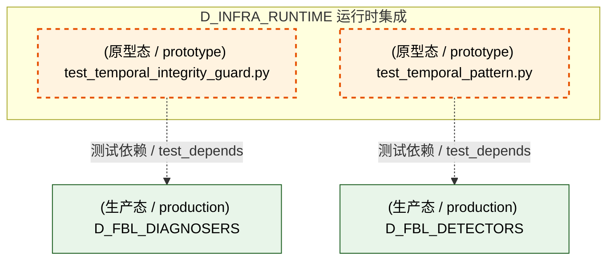

### 运营态子图（仅 design_maturity=production 的模块和依赖）

> 仅展示已上线运行的模块（共 149 个，118 条域内依赖）。

```mermaid
graph TD
    subgraph D_INFRA_RUNTIME["D_INFRA_RUNTIME 运行时集成"]
        config_ai_capability_matrix_yaml["(生产态 / production) ai_capability_matrix.yaml"]
        config_auto_fix_cron_yaml["(生产态 / production) auto_fix_cron.yaml"]
        config_blueprint_routing_yaml["(生产态 / production) blueprint_routing.yaml"]
        config_budget_policy_yaml["(生产态 / production) budget_policy.yaml"]
        config_capabilities_yaml["(生产态 / production) capabilities.yaml"]
        config_capacity_params_yaml["(生产态 / production) capacity_params.yaml"]
        config_capacity_slo_yaml["(生产态 / production) capacity_slo.yaml"]
        config_context_rules_yaml["(生产态 / production) 15 context management rules for AI agent sessio...<br/>文件: context_rules.yaml"]
        config_flags_yaml["(生产态 / production) flags.yaml"]
        config_infra_grafana_dashboards_provider_yml["(生产态 / production) provider.yml"]
        config_infra_grafana_datasources_prometheus_yml["(生产态 / production) prometheus.yml"]
        config_infra_prometheus_prometheus_yml["(生产态 / production) prometheus.yml"]
        config_kb_parameters_yaml["(生产态 / production) kb_parameters.yaml"]
        config_model_pricing_yaml["(生产态 / production) model_pricing.yaml"]
        config_nav_table_mapping_yaml["(生产态 / production) nav_table_mapping.yaml"]
        config_rbac_roles_yaml["(生产态 / production) rbac_roles.yaml"]
        config_resource_optimization_yaml["(生产态 / production) resource_optimization.yaml"]
        config_risk_params_yaml["(生产态 / production) risk_params.yaml"]
        config_runtime_burn_rate_acceleration_yaml["(生产态 / production) burn_rate_acceleration.yaml"]
        config_runtime_error_budget_state_yaml["(生产态 / production) error_budget_state.yaml"]
        config_runtime_kill_switch_state_yaml["(生产态 / production) kill_switch_state.yaml"]
        config_runtime_script_retirement_state_yaml["(生产态 / production) script_retirement_state.yaml"]
        config_runtime_shadow_mode_state_yaml["(生产态 / production) shadow_mode_state.yaml"]
        config_session_state_machine_yaml["(生产态 / production) Defines the lifecycle states and transitions fo...<br/>文件: session_state_machine.yaml"]
        config_trigger_router_yaml["(生产态 / production) trigger_router.yaml"]
        docs_01_policies_and_standards_registry_catalogs_infrastructure_registry_yaml_INFRA_DB_001["(生产态 / production) zephyr-sqlite-task-db — database 节点 (ARCH-053)"]
        docs_01_policies_and_standards_registry_catalogs_infrastructure_registry_yaml_INFRA_DB_002["(生产态 / production) zephyr-chroma-vector-db — database 节点 (ARCH-053)"]
        docs_01_policies_and_standards_registry_catalogs_infrastructure_registry_yaml_INFRA_DB_003["(生产态 / production) zephyr-depgraph-db — database 节点 (ARCH-053)"]
        docs_01_policies_and_standards_registry_catalogs_infrastructure_registry_yaml_INFRA_DB_006["(生产态 / production) zephyr-clickhouse-c1-market — database 节点 (ARCH-053)"]
        src_zephyr_infrastructure_asset_inventory_init_py["(生产态 / production) asset-inventory — MOD-INF-026 · 资产盘点系统...<br/>文件: __init__.py"]
        src_zephyr_infrastructure_asset_inventory_classifier_py["(生产态 / production) AssetClassifier — MOD-INF-026 L2 资产自动分类器<br/>文件: classifier.py"]
        src_zephyr_infrastructure_asset_inventory_dashboard_py["(生产态 / production) AssetDashboard — MOD-INF-026 资产健康仪表盘生成器<br/>文件: dashboard.py"]
        src_zephyr_infrastructure_asset_inventory_dependency_py["(生产态 / production) MOD-INF-026 §18 — 资产依赖图。<br/>文件: dependency.py"]
        src_zephyr_infrastructure_asset_inventory_index_generator_py["(生产态 / production) UnifiedAssetIndex — MOD-INF-026 L3 统一资产索...<br/>文件: index_generator.py"]
        src_zephyr_infrastructure_asset_inventory_lifecycle_py["(生产态 / production) AssetLifecycle — MOD-INF-026 L5 ITIL生命周期自...<br/>文件: lifecycle.py"]
        src_zephyr_infrastructure_asset_inventory_metadata_py["(生产态 / production) MOD-INF-026 §24-25 — Git 历史元数据提取 + 多 ...<br/>文件: metadata.py"]
        src_zephyr_infrastructure_asset_inventory_models_py["(生产态 / production) AssetInventoryModels — MOD-INF-026 Pydantic V2...<br/>文件: models.py"]
        src_zephyr_infrastructure_asset_inventory_reconciler_py["(生产态 / production) ReconciliationEngine — MOD-INF-026 L4 注册表 v...<br/>文件: reconciler.py"]
        src_zephyr_infrastructure_asset_inventory_registry_adapter_py["(生产态 / production) MOD-INF-026 §17 — 24 个异构注册表统一解析适配器。<br/>文件: registry_adapter.py"]
        src_zephyr_infrastructure_asset_inventory_scanner_py["(生产态 / production) AssetDiscoveryScanner — MOD-INF-026 L1 全量文...<br/>文件: scanner.py"]
        src_zephyr_infrastructure_asset_inventory_telemetry_py["(生产态 / production) AssetInventoryTelemetry — MOD-INF-026 自监控指标<br/>文件: telemetry.py"]
        src_zephyr_infrastructure_asset_inventory_trust_anchor_py["(生产态 / production) MOD-INF-026 §26 — 三重信任锚验证门 R20。<br/>文件: trust_anchor.py"]
        src_zephyr_infrastructure_auto_diagnostics_py["(生产态 / production) RI-12 AutoDiagnostics — 自动诊断引擎<br/>文件: auto_diagnostics.py"]
        src_zephyr_infrastructure_auto_fix_engine_init_py["(生产态 / production) __init__.py"]
        src_zephyr_infrastructure_auto_fix_engine_auto_fix_config_yaml["(生产态 / production) auto_fix_config.yaml"]
        src_zephyr_infrastructure_auto_fix_engine_dep_version_fixer_py["(生产态 / production) dep_version_fixer.py"]
        src_zephyr_infrastructure_auto_fix_engine_drift_fixer_py["(生产态 / production) drift_fixer.py"]
        src_zephyr_infrastructure_auto_fix_engine_engine_py["(生产态 / production) engine.py"]
        src_zephyr_infrastructure_auto_fix_engine_escalation_bridge_py["(生产态 / production) escalation_bridge.py"]
        src_zephyr_infrastructure_auto_fix_engine_event_hooks_py["(生产态 / production) event_hooks.py"]
        src_zephyr_infrastructure_auto_fix_engine_fix_budget_py["(生产态 / production) fix_budget.py"]
        src_zephyr_infrastructure_auto_fix_engine_fix_diff_py["(生产态 / production) fix_diff.py"]
        src_zephyr_infrastructure_auto_fix_engine_fix_health_check_py["(生产态 / production) fix_health_check.py"]
        src_zephyr_infrastructure_auto_fix_engine_fix_pattern_miner_py["(生产态 / production) fix_pattern_miner.py"]
        src_zephyr_infrastructure_auto_fix_engine_fix_reliability_py["(生产态 / production) fix_reliability.py"]
        src_zephyr_infrastructure_auto_fix_engine_fix_report_py["(生产态 / production) fix_report.py"]
        src_zephyr_infrastructure_auto_fix_engine_fix_safety_py["(生产态 / production) fix_safety.py"]
        src_zephyr_infrastructure_auto_fix_engine_fix_scheduler_py["(生产态 / production) fix_scheduler.py"]
        src_zephyr_infrastructure_auto_fix_engine_interrupt_guard_py["(生产态 / production) interrupt_guard.py"]
        src_zephyr_infrastructure_auto_fix_engine_llm_fix_adapter_py["(生产态 / production) llm_fix_adapter.py"]
        src_zephyr_infrastructure_auto_fix_engine_models_py["(生产态 / production) models.py"]
        src_zephyr_infrastructure_auto_fix_engine_scaffold_registrar_py["(生产态 / production) scaffold_registrar.py"]
        src_zephyr_infrastructure_auto_fix_engine_self_heal_agent_py["(生产态 / production) self_heal_agent.py"]
        src_zephyr_infrastructure_auto_fix_engine_shadow_workspace_py["(生产态 / production) shadow_workspace.py"]
        src_zephyr_infrastructure_auto_fix_engine_state_machine_py["(生产态 / production) state_machine.py"]
        src_zephyr_infrastructure_auto_fix_engine_zombie_cleaner_py["(生产态 / production) zombie_cleaner.py"]
        src_zephyr_infrastructure_blueprint_code_sync_py["(生产态 / production) Blueprint-Code Sync — 蓝图-代码索引同步验证。<br/>文件: blueprint_code_sync.py"]
        src_zephyr_infrastructure_capacity_assurance_budget_forecaster_py["(生产态 / production) budget_forecaster.py — Token 预算预测 (DD120-e...<br/>文件: budget_forecaster.py"]
        src_zephyr_infrastructure_capacity_assurance_host_resource_governor_py["(生产态 / production) host_resource_governor.py — 主机资源治理 (B17,...<br/>文件: host_resource_governor.py"]
        src_zephyr_infrastructure_capacity_assurance_kill_switch_py["(生产态 / production) kill_switch.py -- safety circuit breaker (DD110...<br/>文件: kill_switch.py"]
        src_zephyr_infrastructure_capacity_assurance_token_budget_py["(生产态 / production) token_budget.py — Token 估算工具 SSoT<br/>文件: token_budget.py"]
        src_zephyr_infrastructure_config_validator_py["(生产态 / production) M-12 ConfigValidator — 配置参数校验器<br/>文件: config_validator.py"]
        src_zephyr_infrastructure_contract_tester_py["(生产态 / production) M-11 ContractTester — 契约测试框架<br/>文件: contract_tester.py"]
        src_zephyr_infrastructure_cost_tracker_py["(生产态 / production) RI-15 CostTracker — 成本追踪器<br/>文件: cost_tracker.py"]
        src_zephyr_infrastructure_dry_run_simulator_py["(生产态 / production) RI-14 DryRunSimulator — 干运行模拟器<br/>文件: dry_run_simulator.py"]
        src_zephyr_infrastructure_event_bus_upgrade_py["(生产态 / production) DEPRECATED: 此文件已废弃。<br/>文件: event_bus_upgrade.py"]
        src_zephyr_infrastructure_event_store_py["(生产态 / production) RI-13 EventStore — 事件存储<br/>文件: event_store.py"]
        src_zephyr_infrastructure_file_watcher_py["(生产态 / production) file_watcher.py"]
        src_zephyr_infrastructure_finding_task_bridge_py["(生产态 / production) Finding->TaskCard 桥接器<br/>文件: finding_task_bridge.py"]
        src_zephyr_infrastructure_impact_impact_propagator_py["(生产态 / production) Impact Propagator — 变更影响传播分析。<br/>文件: impact_propagator.py"]
        src_zephyr_infrastructure_impact_llm_impact_analyzer_py["(生产态 / production) LLM Impact Analyzer — 语义影响分析器。<br/>文件: llm_impact_analyzer.py"]
        src_zephyr_infrastructure_infrastructure_base_py["(生产态 / production) 基础设施 — Infrastructure Layer Skeleton<br/>文件: infrastructure_base.py"]
        src_zephyr_infrastructure_kill_switch_sim_py["(生产态 / production) Kill Switch T0 Hardware Simulator<br/>文件: kill_switch_sim.py"]
        src_zephyr_infrastructure_lifecycle_scope_guard_py["(生产态 / production) Scope Guard — 范围蔓延检测与阻断。<br/>文件: scope_guard.py"]
        src_zephyr_infrastructure_lifecycle_task_lifecycle_manager_py["(生产态 / production) Task Lifecycle Manager — G0-G7 任务生命周期门禁。<br/>文件: task_lifecycle_manager.py"]
        src_zephyr_infrastructure_observability_notifier_py["(生产态 / production) Notifier — 多渠道 Owner 通知。<br/>文件: notifier.py"]
        src_zephyr_infrastructure_observability_trace_decorator_py["(生产态 / production) trace_decorator.py"]
        src_zephyr_infrastructure_pipeline_backpressure_manager_py["(生产态 / production) Pipeline — Backpressure Manager<br/>文件: backpressure_manager.py"]
        src_zephyr_infrastructure_pipeline_backpressure_types_py["(生产态 / production) backpressure_types.py - Pipeline backpressure s...<br/>文件: backpressure_types.py"]
        src_zephyr_infrastructure_pipeline_circuit_breaker_manager_py["(生产态 / production) CircuitBreakerManager -- standalone circuit bre...<br/>文件: circuit_breaker_manager.py"]
        src_zephyr_infrastructure_pipeline_cost_tracker_py["(生产态 / production) CostTracker —— LLM 调用成本追踪器（SRC-0025）<br/>文件: cost_tracker.py"]
        src_zephyr_infrastructure_pipeline_ct_pipe_routing_py["(生产态 / production) CT-PIPE-ORC-001 — TaskCard -> 管线入口节点路由<br/>文件: ct_pipe_routing.py"]
        src_zephyr_infrastructure_pipeline_dead_letter_queue_py["(生产态 / production) DeadLetterQueue — 死信队列<br/>文件: dead_letter_queue.py"]
        src_zephyr_infrastructure_pipeline_llm_gateway_py["(生产态 / production) MOD-INF-019: Agent Spec — LLM Gateway<br/>文件: llm_gateway.py"]
        src_zephyr_infrastructure_pipeline_model_router_py["(生产态 / production) ModelRouter — 模型路由与降级链管理<br/>文件: model_router.py"]
        src_zephyr_infrastructure_pipeline_models_py["(生产态 / production) Pipeline 数据模型<br/>文件: models.py"]
        src_zephyr_infrastructure_pipeline_pipeline_agent_bridge_py["(生产态 / production) Pipeline -> Agent Bridge — 双编排器桥接层<br/>文件: pipeline_agent_bridge.py"]
        src_zephyr_infrastructure_pipeline_pipeline_lock_py["(生产态 / production) Pipeline Lock — 双管线并发锁<br/>文件: pipeline_lock.py"]
        src_zephyr_infrastructure_pipeline_pipeline_roadmap_py["(生产态 / production) Pipeline 未来版本路线图——v0.10.0 -> v0.12.0 ...<br/>文件: pipeline_roadmap.py"]
        src_zephyr_infrastructure_pipeline_preemption_manager_py["(生产态 / production) PreemptionManager -- 优先级抢占管理器<br/>文件: preemption_manager.py"]
        src_zephyr_infrastructure_pipeline_routing_plugins_py["(生产态 / production) Pipeline Routing Plugin System — K8s Schedulin...<br/>文件: routing_plugins.py"]
        src_zephyr_infrastructure_pydantic_v2_migrator_py["(生产态 / production) M-15 PydanticV2Migrator — Pydantic V2 迁移工具<br/>文件: pydantic_v2_migrator.py"]
        src_zephyr_infrastructure_quality_quality_monitor_py["(生产态 / production) Quality Monitor — 生成代码质量门禁。<br/>文件: quality_monitor.py"]
        src_zephyr_infrastructure_queue_task_queue_py["(生产态 / production) Task Queue — 后台任务队列 + 自动 Dispatch。<br/>文件: task_queue.py"]
        src_zephyr_infrastructure_queue_task_scheduler_py["(生产态 / production) Task Scheduler — 任务调度器。<br/>文件: task_scheduler.py"]
        src_zephyr_infrastructure_reliability_context_guard_py["(生产态 / production) Context Guard — 上下文契约守卫。<br/>文件: context_guard.py"]
        src_zephyr_infrastructure_runtime_concurrency_guard_py["(生产态 / production) concurrency_guard — 回滚操作并发安全守卫。<br/>文件: concurrency_guard.py"]
        src_zephyr_infrastructure_runtime_sandbox_enforcer_py["(生产态 / production) SandboxEnforcer — Agent 沙盒隔离。<br/>文件: sandbox_enforcer.py"]
        src_zephyr_infrastructure_runtime_startup_shutdown_py["(生产态 / production) startup_shutdown.py"]
        src_zephyr_infrastructure_script_system_finding_py["(生产态 / production) Finding Schema — 审计发现标准化数据模型<br/>文件: finding.py"]
        src_zephyr_infrastructure_sla_sla_monitor_py["(生产态 / production) SLA Monitor — 服务等级协议 (SLA) 监控 RTO/RPO。<br/>文件: sla_monitor.py"]
        src_zephyr_infrastructure_system_telemetry_auto_bootstrap_py["(生产态 / production) auto_bootstrap — 全自动遥测注入钩子（MOD-INF-0...<br/>文件: auto_bootstrap.py"]
        src_zephyr_infrastructure_system_telemetry_contract_metrics_py["(生产态 / production) ZephyrAlpha — system-telemetry/contract_metrics.py<br/>文件: contract_metrics.py"]
        src_zephyr_infrastructure_system_telemetry_health_aggregator_py["(生产态 / production) 健康聚合器（Health Aggregator）<br/>文件: health_aggregator.py"]
        src_zephyr_infrastructure_system_telemetry_health_probes_py["(生产态 / production) 三态健康探针协议（Health Probes — CT-HEALTH-001）<br/>文件: health_probes.py"]
        src_zephyr_infrastructure_system_telemetry_metrics_blueprint_metrics_py["(生产态 / production) blueprint_metrics — 蓝图使用追踪 instrumentation<br/>文件: blueprint_metrics.py"]
        src_zephyr_infrastructure_warm_hot_gate_py["(生产态 / production) M-14 WarmHotGate — Warm->Hot 阻断门<br/>文件: warm_hot_gate.py"]
        src_zephyr_shared_api_shared_quickref_yaml["(生产态 / production) shared_quickref.yaml"]
        src_zephyr_shared_foundation_init_py["(生产态 / production) shared.foundation — auto-generated package init.<br/>文件: __init__.py"]
        src_zephyr_shared_lifecycle_daemon_registry_py["(生产态 / production) daemon_registry.py - unified daemon thread regi...<br/>文件: daemon_registry.py"]
        src_zephyr_shared_lifecycle_hooks_py["(生产态 / production) hooks.py —— 模块生命周期钩子（Phase 2 新增 / ...<br/>文件: hooks.py"]
        src_zephyr_shared_lifecycle_lazy_loader_py["(生产态 / production) lazy_loader.py - Lazy module loading registry<br/>文件: lazy_loader.py"]
        src_zephyr_shared_lifecycle_resource_optimization_engine_py["(生产态 / production) resource_optimization_engine.py"]
        src_zephyr_shared_lifecycle_resource_optimization_models_py["(生产态 / production) models.py - Pydantic data models for resource o...<br/>文件: resource_optimization_models.py"]
        src_zephyr_shared_resilience_init_py["(生产态 / production) resilience/__init__.py — 韧性工具包入口（Phase...<br/>文件: __init__.py"]
        src_zephyr_trading_action_dispatcher_py["(生产态 / production) ActionDispatcher --- 大脑的'手' v2.0 (Phase 2)<br/>文件: action_dispatcher.py"]
        src_zephyr_trading_ai_audit_logger_py["(生产态 / production) AiAuditLogger — AI 行为审计日志<br/>文件: ai_audit_logger.py"]
        src_zephyr_trading_auto_integrator_py["(生产态 / production) AutoIntegrator — 自动接入器<br/>文件: auto_integrator.py"]
        src_zephyr_trading_auto_runtime_core_py["(生产态 / production) AutoRuntimeCore — 三层运行时运营中心（系统大脑）<br/>文件: auto_runtime_core.py"]
        src_zephyr_trading_auto_task_generator_py["(生产态 / production) AutoTaskGenerator — 自动任务生成器<br/>文件: auto_task_generator.py"]
        src_zephyr_trading_boot_hooks_py["(生产态 / production) boot_hooks.py"]
        src_zephyr_trading_capability_card_py["(生产态 / production) CapabilityCard — 能力卡片数据模型<br/>文件: capability_card.py"]
        src_zephyr_trading_capability_registry_py["(生产态 / production) CapabilityRegistry — 能力注册中心<br/>文件: capability_registry.py"]
        src_zephyr_trading_capability_sync_py["(生产态 / production) capability_sync.py"]
        src_zephyr_trading_dream_cycle_py["(生产态 / production) DreamCycle — 知识固化引擎<br/>文件: dream_cycle.py"]
        src_zephyr_trading_finalizer_py["(生产态 / production) Finalizer — 优雅清理器<br/>文件: finalizer.py"]
        src_zephyr_trading_health_monitor_py["(生产态 / production) HealthMonitor — 健康监控 + 自愈<br/>文件: health_monitor.py"]
        src_zephyr_trading_integration_registry_py["(生产态 / production) IntegrationRegistry — 集成注册表<br/>文件: integration_registry.py"]
        src_zephyr_trading_lifecycle_manager_py["(生产态 / production) lifecycle_manager.py"]
        src_zephyr_trading_module_onboarding_scanner_py["(生产态 / production) ModuleOnboardingScanner — 模块接入扫描器<br/>文件: module_onboarding_scanner.py"]
        src_zephyr_trading_night_shift_queue_py["(生产态 / production) NightShiftQueue — 夜班登记表持久化<br/>文件: night_shift_queue.py"]
        src_zephyr_trading_resource_optimization_py["(生产态 / production) resource_optimization.py - MAPE-K autonomic res...<br/>文件: resource_optimization.py"]
        src_zephyr_trading_runtime_config_py["(生产态 / production) runtime_config.py"]
        src_zephyr_trading_staging_area_py["(生产态 / production) StagingArea — 多AI并发草稿写入+提交+冲突检测模...<br/>文件: staging_area.py"]
        src_zephyr_trading_status_dashboard_py["(生产态 / production) StatusDashboard — 实时状态面板<br/>文件: status_dashboard.py"]
        src_zephyr_trading_stop_gate_py["(生产态 / production) StopGate — 质量闸门<br/>文件: stop_gate.py"]
        src_zephyr_trading_task_gate_py["(生产态 / production) TaskGate --- 任务门控<br/>文件: task_gate.py"]
        src_zephyr_trading_work_dag_py["(生产态 / production) WorkDAG + WorkItem — 工作编排数据模型<br/>文件: work_dag.py"]
        src_zephyr_trading_work_orchestrator_py["(生产态 / production) work_orchestrator.py"]
    end
    src_zephyr_infrastructure_warm_hot_gate_py -->|导入依赖 / import_depends| src_zephyr_infrastructure_config_validator_py
    src_zephyr_infrastructure_warm_hot_gate_py -->|导入依赖 / import_depends| src_zephyr_infrastructure_contract_tester_py
    src_zephyr_infrastructure_asset_inventory_classifier_py -->|导入依赖 / import_depends| src_zephyr_infrastructure_asset_inventory_models_py
    src_zephyr_infrastructure_asset_inventory_dashboard_py -->|导入依赖 / import_depends| src_zephyr_infrastructure_asset_inventory_models_py
    src_zephyr_infrastructure_asset_inventory_index_generator_py -->|导入依赖 / import_depends| src_zephyr_infrastructure_asset_inventory_models_py
    src_zephyr_infrastructure_asset_inventory_lifecycle_py -->|导入依赖 / import_depends| src_zephyr_infrastructure_asset_inventory_models_py
    src_zephyr_infrastructure_asset_inventory_registry_adapter_py -->|导入依赖 / import_depends| src_zephyr_infrastructure_asset_inventory_models_py
    src_zephyr_infrastructure_asset_inventory_scanner_py -->|导入依赖 / import_depends| src_zephyr_infrastructure_asset_inventory_models_py
    src_zephyr_infrastructure_asset_inventory_reconciler_py -->|导入依赖 / import_depends| src_zephyr_infrastructure_asset_inventory_models_py
    src_zephyr_infrastructure_auto_fix_engine_escalation_bridge_py -->|导入依赖 / import_depends| src_zephyr_infrastructure_auto_fix_engine_models_py
    src_zephyr_infrastructure_auto_fix_engine_dep_version_fixer_py -->|导入依赖 / import_depends| src_zephyr_infrastructure_auto_fix_engine_models_py
    src_zephyr_infrastructure_auto_fix_engine_drift_fixer_py -->|导入依赖 / import_depends| src_zephyr_infrastructure_auto_fix_engine_models_py
    src_zephyr_infrastructure_auto_fix_engine_event_hooks_py -->|导入依赖 / import_depends| src_zephyr_infrastructure_auto_fix_engine_engine_py
    src_zephyr_infrastructure_auto_fix_engine_event_hooks_py -->|导入依赖 / import_depends| src_zephyr_infrastructure_auto_fix_engine_models_py
    src_zephyr_infrastructure_auto_fix_engine_fix_budget_py -->|导入依赖 / import_depends| src_zephyr_infrastructure_auto_fix_engine_models_py
    src_zephyr_infrastructure_auto_fix_engine_fix_diff_py -->|导入依赖 / import_depends| src_zephyr_infrastructure_auto_fix_engine_models_py
    src_zephyr_infrastructure_auto_fix_engine_fix_health_check_py -->|导入依赖 / import_depends| src_zephyr_infrastructure_auto_fix_engine_models_py
    src_zephyr_infrastructure_auto_fix_engine_fix_pattern_miner_py -->|导入依赖 / import_depends| src_zephyr_infrastructure_auto_fix_engine_models_py
    src_zephyr_infrastructure_auto_fix_engine_fix_report_py -->|导入依赖 / import_depends| src_zephyr_infrastructure_auto_fix_engine_models_py
    src_zephyr_infrastructure_auto_fix_engine_engine_py -->|导入依赖 / import_depends| src_zephyr_infrastructure_auto_fix_engine_escalation_bridge_py
    src_zephyr_infrastructure_auto_fix_engine_engine_py -->|导入依赖 / import_depends| src_zephyr_infrastructure_auto_fix_engine_fix_budget_py
    src_zephyr_infrastructure_auto_fix_engine_engine_py -->|导入依赖 / import_depends| src_zephyr_infrastructure_auto_fix_engine_fix_health_check_py
    src_zephyr_infrastructure_auto_fix_engine_engine_py -->|导入依赖 / import_depends| src_zephyr_infrastructure_auto_fix_engine_fix_pattern_miner_py
    src_zephyr_infrastructure_auto_fix_engine_engine_py -->|导入依赖 / import_depends| src_zephyr_infrastructure_auto_fix_engine_fix_report_py
    src_zephyr_infrastructure_auto_fix_engine_engine_py -->|导入依赖 / import_depends| src_zephyr_infrastructure_auto_fix_engine_fix_reliability_py
    src_zephyr_infrastructure_auto_fix_engine_engine_py -->|导入依赖 / import_depends| src_zephyr_infrastructure_auto_fix_engine_models_py
    src_zephyr_infrastructure_auto_fix_engine_engine_py -->|导入依赖 / import_depends| src_zephyr_infrastructure_auto_fix_engine_fix_safety_py
    src_zephyr_infrastructure_auto_fix_engine_engine_py -->|导入依赖 / import_depends| src_zephyr_infrastructure_auto_fix_engine_shadow_workspace_py
    src_zephyr_infrastructure_auto_fix_engine_fix_reliability_py -->|导入依赖 / import_depends| src_zephyr_infrastructure_auto_fix_engine_models_py
    src_zephyr_infrastructure_auto_fix_engine_fix_scheduler_py -->|导入依赖 / import_depends| src_zephyr_infrastructure_auto_fix_engine_models_py
    src_zephyr_infrastructure_auto_fix_engine_fix_safety_py -->|导入依赖 / import_depends| src_zephyr_infrastructure_auto_fix_engine_models_py
    src_zephyr_infrastructure_auto_fix_engine_self_heal_agent_py -->|导入依赖 / import_depends| src_zephyr_infrastructure_auto_fix_engine_models_py
    src_zephyr_infrastructure_auto_fix_engine_scaffold_registrar_py -->|导入依赖 / import_depends| src_zephyr_infrastructure_auto_fix_engine_models_py
    src_zephyr_infrastructure_auto_fix_engine_llm_fix_adapter_py -->|导入依赖 / import_depends| src_zephyr_infrastructure_auto_fix_engine_models_py
    src_zephyr_infrastructure_auto_fix_engine_llm_fix_adapter_py -->|导入依赖 / import_depends| src_zephyr_infrastructure_auto_fix_engine_fix_safety_py
    src_zephyr_infrastructure_auto_fix_engine_shadow_workspace_py -->|导入依赖 / import_depends| src_zephyr_infrastructure_auto_fix_engine_models_py
    src_zephyr_infrastructure_auto_fix_engine_zombie_cleaner_py -->|导入依赖 / import_depends| src_zephyr_infrastructure_auto_fix_engine_models_py
    src_zephyr_infrastructure_auto_fix_engine_init_py -->|导入依赖 / import_depends| src_zephyr_infrastructure_auto_fix_engine_escalation_bridge_py
    src_zephyr_infrastructure_auto_fix_engine_init_py -->|导入依赖 / import_depends| src_zephyr_infrastructure_auto_fix_engine_dep_version_fixer_py
    src_zephyr_infrastructure_auto_fix_engine_init_py -->|导入依赖 / import_depends| src_zephyr_infrastructure_auto_fix_engine_drift_fixer_py
    src_zephyr_infrastructure_auto_fix_engine_init_py -->|导入依赖 / import_depends| src_zephyr_infrastructure_auto_fix_engine_event_hooks_py
    src_zephyr_infrastructure_auto_fix_engine_init_py -->|导入依赖 / import_depends| src_zephyr_infrastructure_auto_fix_engine_fix_diff_py
    src_zephyr_infrastructure_auto_fix_engine_init_py -->|导入依赖 / import_depends| src_zephyr_infrastructure_auto_fix_engine_fix_health_check_py
    src_zephyr_infrastructure_auto_fix_engine_init_py -->|导入依赖 / import_depends| src_zephyr_infrastructure_auto_fix_engine_fix_pattern_miner_py
    src_zephyr_infrastructure_auto_fix_engine_init_py -->|导入依赖 / import_depends| src_zephyr_infrastructure_auto_fix_engine_engine_py
    src_zephyr_infrastructure_auto_fix_engine_init_py -->|导入依赖 / import_depends| src_zephyr_infrastructure_auto_fix_engine_interrupt_guard_py
    src_zephyr_infrastructure_auto_fix_engine_init_py -->|导入依赖 / import_depends| src_zephyr_infrastructure_auto_fix_engine_fix_scheduler_py
    src_zephyr_infrastructure_auto_fix_engine_init_py -->|导入依赖 / import_depends| src_zephyr_infrastructure_auto_fix_engine_models_py
    src_zephyr_infrastructure_auto_fix_engine_init_py -->|导入依赖 / import_depends| src_zephyr_infrastructure_auto_fix_engine_self_heal_agent_py
    src_zephyr_infrastructure_auto_fix_engine_init_py -->|导入依赖 / import_depends| src_zephyr_infrastructure_auto_fix_engine_scaffold_registrar_py
    src_zephyr_infrastructure_auto_fix_engine_init_py -->|导入依赖 / import_depends| src_zephyr_infrastructure_auto_fix_engine_llm_fix_adapter_py
    src_zephyr_infrastructure_auto_fix_engine_init_py -->|导入依赖 / import_depends| src_zephyr_infrastructure_auto_fix_engine_shadow_workspace_py
    src_zephyr_infrastructure_pipeline_circuit_breaker_manager_py -->|导入依赖 / import_depends| src_zephyr_infrastructure_pipeline_models_py
    src_zephyr_infrastructure_pipeline_cost_tracker_py -->|导入依赖 / import_depends| src_zephyr_infrastructure_pipeline_model_router_py
    src_zephyr_infrastructure_pipeline_cost_tracker_py -->|导入依赖 / import_depends| src_zephyr_infrastructure_pipeline_models_py
    src_zephyr_infrastructure_pipeline_ct_pipe_routing_py -->|导入依赖 / import_depends| src_zephyr_infrastructure_pipeline_models_py
    src_zephyr_infrastructure_pipeline_backpressure_manager_py -->|导入依赖 / import_depends| src_zephyr_infrastructure_pipeline_backpressure_types_py
    src_zephyr_infrastructure_pipeline_pipeline_agent_bridge_py -->|导入依赖 / import_depends| src_zephyr_infrastructure_pipeline_models_py
    src_zephyr_infrastructure_pipeline_dead_letter_queue_py -->|导入依赖 / import_depends| src_zephyr_infrastructure_pipeline_models_py
    src_zephyr_infrastructure_pipeline_preemption_manager_py -->|导入依赖 / import_depends| src_zephyr_infrastructure_pipeline_models_py
    src_zephyr_infrastructure_pipeline_routing_plugins_py -->|导入依赖 / import_depends| src_zephyr_infrastructure_pipeline_ct_pipe_routing_py
    src_zephyr_infrastructure_pipeline_routing_plugins_py -->|导入依赖 / import_depends| src_zephyr_infrastructure_pipeline_models_py
    src_zephyr_infrastructure_system_telemetry_health_aggregator_py -->|导入依赖 / import_depends| src_zephyr_infrastructure_system_telemetry_health_probes_py
    src_zephyr_infrastructure_system_telemetry_auto_bootstrap_py -->|导入依赖 / import_depends| src_zephyr_infrastructure_system_telemetry_contract_metrics_py
    src_zephyr_infrastructure_system_telemetry_auto_bootstrap_py -->|导入依赖 / import_depends| src_zephyr_infrastructure_system_telemetry_metrics_blueprint_metrics_py
    src_zephyr_trading_action_dispatcher_py -->|导入依赖 / import_depends| src_zephyr_infrastructure_queue_task_scheduler_py
    src_zephyr_trading_auto_integrator_py -->|导入依赖 / import_depends| src_zephyr_trading_capability_card_py
    src_zephyr_trading_auto_integrator_py -->|导入依赖 / import_depends| src_zephyr_trading_capability_registry_py
    src_zephyr_trading_auto_integrator_py -->|导入依赖 / import_depends| src_zephyr_trading_module_onboarding_scanner_py
    src_zephyr_trading_capability_registry_py -->|导入依赖 / import_depends| src_zephyr_trading_capability_card_py
    src_zephyr_trading_capability_sync_py -->|导入依赖 / import_depends| src_zephyr_trading_capability_card_py
    src_zephyr_trading_capability_sync_py -->|导入依赖 / import_depends| src_zephyr_trading_capability_registry_py
    src_zephyr_trading_health_monitor_py -->|导入依赖 / import_depends| src_zephyr_trading_resource_optimization_py
    src_zephyr_trading_boot_hooks_py -->|导入依赖 / import_depends| src_zephyr_infrastructure_observability_notifier_py
    src_zephyr_trading_boot_hooks_py -->|导入依赖 / import_depends| src_zephyr_infrastructure_sla_sla_monitor_py
    src_zephyr_trading_boot_hooks_py -->|导入依赖 / import_depends| src_zephyr_infrastructure_system_telemetry_health_aggregator_py
    src_zephyr_trading_boot_hooks_py -->|导入依赖 / import_depends| src_zephyr_trading_finalizer_py
    src_zephyr_trading_module_onboarding_scanner_py -->|导入依赖 / import_depends| src_zephyr_trading_capability_registry_py
    src_zephyr_trading_auto_runtime_core_py -->|导入依赖 / import_depends| src_zephyr_infrastructure_queue_task_queue_py
    src_zephyr_trading_auto_runtime_core_py -->|导入依赖 / import_depends| src_zephyr_shared_lifecycle_resource_optimization_engine_py
    src_zephyr_trading_auto_runtime_core_py -->|导入依赖 / import_depends| src_zephyr_trading_ai_audit_logger_py
    src_zephyr_trading_auto_runtime_core_py -->|导入依赖 / import_depends| src_zephyr_trading_auto_integrator_py
    src_zephyr_trading_auto_runtime_core_py -->|导入依赖 / import_depends| src_zephyr_trading_capability_registry_py
    src_zephyr_trading_auto_runtime_core_py -->|导入依赖 / import_depends| src_zephyr_trading_capability_sync_py
    src_zephyr_trading_auto_runtime_core_py -->|导入依赖 / import_depends| src_zephyr_trading_dream_cycle_py
    src_zephyr_trading_auto_runtime_core_py -->|导入依赖 / import_depends| src_zephyr_trading_finalizer_py
    src_zephyr_trading_auto_runtime_core_py -->|导入依赖 / import_depends| src_zephyr_trading_health_monitor_py
    src_zephyr_trading_auto_runtime_core_py -->|导入依赖 / import_depends| src_zephyr_trading_integration_registry_py
    src_zephyr_trading_auto_runtime_core_py -->|导入依赖 / import_depends| src_zephyr_trading_boot_hooks_py
    src_zephyr_trading_auto_runtime_core_py -->|导入依赖 / import_depends| src_zephyr_trading_module_onboarding_scanner_py
    src_zephyr_trading_auto_runtime_core_py -->|导入依赖 / import_depends| src_zephyr_trading_lifecycle_manager_py
    src_zephyr_trading_auto_runtime_core_py -->|导入依赖 / import_depends| src_zephyr_trading_night_shift_queue_py
    src_zephyr_trading_auto_runtime_core_py -->|导入依赖 / import_depends| src_zephyr_trading_runtime_config_py
    src_zephyr_trading_auto_runtime_core_py -->|导入依赖 / import_depends| src_zephyr_trading_status_dashboard_py
    src_zephyr_trading_auto_runtime_core_py -->|导入依赖 / import_depends| src_zephyr_trading_stop_gate_py
    src_zephyr_trading_auto_runtime_core_py -->|导入依赖 / import_depends| src_zephyr_trading_resource_optimization_py
    src_zephyr_trading_auto_runtime_core_py -->|导入依赖 / import_depends| src_zephyr_trading_work_dag_py
    src_zephyr_trading_auto_runtime_core_py -->|导入依赖 / import_depends| src_zephyr_trading_work_orchestrator_py
    src_zephyr_trading_lifecycle_manager_py -->|导入依赖 / import_depends| src_zephyr_trading_ai_audit_logger_py
    src_zephyr_trading_lifecycle_manager_py -->|导入依赖 / import_depends| src_zephyr_trading_capability_registry_py
    src_zephyr_trading_lifecycle_manager_py -->|导入依赖 / import_depends| src_zephyr_trading_dream_cycle_py
    src_zephyr_trading_lifecycle_manager_py -->|导入依赖 / import_depends| src_zephyr_trading_finalizer_py
    src_zephyr_trading_lifecycle_manager_py -->|导入依赖 / import_depends| src_zephyr_trading_health_monitor_py
    src_zephyr_trading_lifecycle_manager_py -->|导入依赖 / import_depends| src_zephyr_trading_integration_registry_py
    src_zephyr_trading_lifecycle_manager_py -->|导入依赖 / import_depends| src_zephyr_trading_night_shift_queue_py
    src_zephyr_trading_lifecycle_manager_py -->|导入依赖 / import_depends| src_zephyr_trading_runtime_config_py
    src_zephyr_trading_lifecycle_manager_py -->|导入依赖 / import_depends| src_zephyr_trading_stop_gate_py
    src_zephyr_trading_lifecycle_manager_py -->|导入依赖 / import_depends| src_zephyr_trading_work_orchestrator_py
    src_zephyr_trading_status_dashboard_py -->|导入依赖 / import_depends| src_zephyr_trading_capability_registry_py
    src_zephyr_trading_status_dashboard_py -->|导入依赖 / import_depends| src_zephyr_trading_health_monitor_py
    src_zephyr_trading_status_dashboard_py -->|导入依赖 / import_depends| src_zephyr_trading_night_shift_queue_py
    src_zephyr_trading_status_dashboard_py -->|导入依赖 / import_depends| src_zephyr_trading_work_orchestrator_py
    src_zephyr_trading_resource_optimization_py -->|导入依赖 / import_depends| src_zephyr_shared_lifecycle_daemon_registry_py
    src_zephyr_trading_resource_optimization_py -->|导入依赖 / import_depends| src_zephyr_shared_lifecycle_lazy_loader_py
    src_zephyr_trading_resource_optimization_py -->|导入依赖 / import_depends| src_zephyr_shared_lifecycle_resource_optimization_models_py
    src_zephyr_trading_work_orchestrator_py -->|导入依赖 / import_depends| src_zephyr_trading_capability_registry_py
    src_zephyr_trading_work_orchestrator_py -->|导入依赖 / import_depends| src_zephyr_trading_work_dag_py
    src_zephyr_infrastructure_auto_fix_engine_auto_fix_config_yaml -->|config_depends / config_depends| src_zephyr_infrastructure_auto_fix_engine_init_py
    D_SHARED["(生产态 / production) D_SHARED"]
    src_zephyr_infrastructure_cost_tracker_py -->|导入依赖 / import_depends| D_SHARED
    src_zephyr_infrastructure_cost_tracker_py -.->|导入依赖 / import_depends| D_SHARED
    src_zephyr_infrastructure_event_store_py -.->|导入依赖 / import_depends| D_SHARED
    src_zephyr_infrastructure_event_store_py -->|导入依赖 / import_depends| D_SHARED
    D_INTEGRATION["(生产态 / production) D_INTEGRATION"]
    src_zephyr_infrastructure_event_bus_upgrade_py -->|导入依赖 / import_depends| D_INTEGRATION
    src_zephyr_infrastructure_event_bus_upgrade_py -.->|导入依赖 / import_depends| D_SHARED
    src_zephyr_infrastructure_file_watcher_py -->|导入依赖 / import_depends| D_SHARED
    src_zephyr_infrastructure_file_watcher_py -.->|导入依赖 / import_depends| D_SHARED
    src_zephyr_infrastructure_file_watcher_py -->|导入依赖 / import_depends| D_SHARED
    src_zephyr_infrastructure_kill_switch_sim_py -->|导入依赖 / import_depends| D_SHARED
    src_zephyr_infrastructure_finding_task_bridge_py -->|导入依赖 / import_depends| D_SHARED
    src_zephyr_infrastructure_finding_task_bridge_py -->|导入依赖 / import_depends| D_INTEGRATION
    src_zephyr_infrastructure_finding_task_bridge_py -.->|导入依赖 / import_depends| D_SHARED
    src_zephyr_infrastructure_finding_task_bridge_py -->|导入依赖 / import_depends| D_SHARED
    src_zephyr_infrastructure_asset_inventory_classifier_py -->|导入依赖 / import_depends| D_SHARED
    D_INFRA_RECOVERY["(生产态 / production) D_INFRA_RECOVERY"]
    D_INFRA_RECOVERY -->|导入依赖 / import_depends| src_zephyr_infrastructure_runtime_concurrency_guard_py
    D_AUTONOMY_CORE["(原型态 / prototype) D_AUTONOMY_CORE"]
    D_AUTONOMY_CORE -.->|测试依赖 / test_depends| src_zephyr_infrastructure_pipeline_dead_letter_queue_py
    D_INTEGRATION -->|导入依赖 / import_depends| src_zephyr_infrastructure_pipeline_pipeline_agent_bridge_py
    D_SHARED -->|导入依赖 / import_depends| src_zephyr_shared_lifecycle_resource_optimization_models_py
    D_SECURITY_LLM["(原型态 / prototype) D_SECURITY_LLM"]
    D_SECURITY_LLM -.->|测试依赖 / test_depends| src_zephyr_infrastructure_auto_fix_engine_dep_version_fixer_py
    D_TRADING["(原型态 / prototype) D_TRADING"]
    D_TRADING -.->|测试依赖 / test_depends| src_zephyr_trading_boot_hooks_py
    D_INTELLIGENCE["(原型态 / prototype) D_INTELLIGENCE"]
    D_INTELLIGENCE -.->|测试依赖 / test_depends| src_zephyr_infrastructure_pipeline_models_py
    D_AUTONOMY_CORE -->|导入依赖 / import_depends| src_zephyr_infrastructure_capacity_assurance_token_budget_py
    D_SHARED -.->|测试依赖 / test_depends| src_zephyr_infrastructure_auto_fix_engine_models_py
    D_SECURITY_LLM -.->|测试依赖 / test_depends| src_zephyr_infrastructure_auto_fix_engine_llm_fix_adapter_py
    D_SECURITY_LLM -.->|测试依赖 / test_depends| src_zephyr_infrastructure_pipeline_llm_gateway_py
    D_TRADING -.->|测试依赖 / test_depends| src_zephyr_trading_lifecycle_manager_py
    D_SHARED -.->|测试依赖 / test_depends| src_zephyr_infrastructure_auto_fix_engine_models_py
    D_GOV_REPAIR["(生产态 / production) D_GOV_REPAIR"]
    D_GOV_REPAIR -->|导入依赖 / import_depends| src_zephyr_infrastructure_runtime_startup_shutdown_py
    D_INTEGRATION -->|导入依赖 / import_depends| src_zephyr_infrastructure_pipeline_preemption_manager_py
    classDef production fill:#e1f5fe,stroke:#01579b,stroke-width:2px,color:#000
    classDef design fill:#fff3e0,stroke:#e65100,stroke-width:2px,color:#000,stroke-dasharray: 5 5
    classDef external_prod fill:#e8f5e9,stroke:#1b5e20,stroke-width:1px,color:#000
    classDef external_design fill:#fce4ec,stroke:#880e4f,stroke-width:1px,color:#000,stroke-dasharray: 5 5
    class config_ai_capability_matrix_yaml,config_auto_fix_cron_yaml,config_blueprint_routing_yaml,config_budget_policy_yaml,config_capabilities_yaml,config_capacity_params_yaml,config_capacity_slo_yaml,config_context_rules_yaml,config_flags_yaml,config_infra_grafana_dashboards_provider_yml,config_infra_grafana_datasources_prometheus_yml,config_infra_prometheus_prometheus_yml,config_kb_parameters_yaml,config_model_pricing_yaml,config_nav_table_mapping_yaml,config_rbac_roles_yaml,config_resource_optimization_yaml,config_risk_params_yaml,config_runtime_burn_rate_acceleration_yaml,config_runtime_error_budget_state_yaml,config_runtime_kill_switch_state_yaml,config_runtime_script_retirement_state_yaml,config_runtime_shadow_mode_state_yaml,config_session_state_machine_yaml,config_trigger_router_yaml,docs_01_policies_and_standards_registry_catalogs_infrastructure_registry_yaml_INFRA_DB_001,docs_01_policies_and_standards_registry_catalogs_infrastructure_registry_yaml_INFRA_DB_002,docs_01_policies_and_standards_registry_catalogs_infrastructure_registry_yaml_INFRA_DB_003,docs_01_policies_and_standards_registry_catalogs_infrastructure_registry_yaml_INFRA_DB_006,src_zephyr_infrastructure_asset_inventory_init_py,src_zephyr_infrastructure_asset_inventory_classifier_py,src_zephyr_infrastructure_asset_inventory_dashboard_py,src_zephyr_infrastructure_asset_inventory_dependency_py,src_zephyr_infrastructure_asset_inventory_index_generator_py,src_zephyr_infrastructure_asset_inventory_lifecycle_py,src_zephyr_infrastructure_asset_inventory_metadata_py,src_zephyr_infrastructure_asset_inventory_models_py,src_zephyr_infrastructure_asset_inventory_reconciler_py,src_zephyr_infrastructure_asset_inventory_registry_adapter_py,src_zephyr_infrastructure_asset_inventory_scanner_py,src_zephyr_infrastructure_asset_inventory_telemetry_py,src_zephyr_infrastructure_asset_inventory_trust_anchor_py,src_zephyr_infrastructure_auto_diagnostics_py,src_zephyr_infrastructure_auto_fix_engine_init_py,src_zephyr_infrastructure_auto_fix_engine_auto_fix_config_yaml,src_zephyr_infrastructure_auto_fix_engine_dep_version_fixer_py,src_zephyr_infrastructure_auto_fix_engine_drift_fixer_py,src_zephyr_infrastructure_auto_fix_engine_engine_py,src_zephyr_infrastructure_auto_fix_engine_escalation_bridge_py,src_zephyr_infrastructure_auto_fix_engine_event_hooks_py,src_zephyr_infrastructure_auto_fix_engine_fix_budget_py,src_zephyr_infrastructure_auto_fix_engine_fix_diff_py,src_zephyr_infrastructure_auto_fix_engine_fix_health_check_py,src_zephyr_infrastructure_auto_fix_engine_fix_pattern_miner_py,src_zephyr_infrastructure_auto_fix_engine_fix_reliability_py,src_zephyr_infrastructure_auto_fix_engine_fix_report_py,src_zephyr_infrastructure_auto_fix_engine_fix_safety_py,src_zephyr_infrastructure_auto_fix_engine_fix_scheduler_py,src_zephyr_infrastructure_auto_fix_engine_interrupt_guard_py,src_zephyr_infrastructure_auto_fix_engine_llm_fix_adapter_py,src_zephyr_infrastructure_auto_fix_engine_models_py,src_zephyr_infrastructure_auto_fix_engine_scaffold_registrar_py,src_zephyr_infrastructure_auto_fix_engine_self_heal_agent_py,src_zephyr_infrastructure_auto_fix_engine_shadow_workspace_py,src_zephyr_infrastructure_auto_fix_engine_state_machine_py,src_zephyr_infrastructure_auto_fix_engine_zombie_cleaner_py,src_zephyr_infrastructure_blueprint_code_sync_py,src_zephyr_infrastructure_capacity_assurance_budget_forecaster_py,src_zephyr_infrastructure_capacity_assurance_host_resource_governor_py,src_zephyr_infrastructure_capacity_assurance_kill_switch_py,src_zephyr_infrastructure_capacity_assurance_token_budget_py,src_zephyr_infrastructure_config_validator_py,src_zephyr_infrastructure_contract_tester_py,src_zephyr_infrastructure_cost_tracker_py,src_zephyr_infrastructure_dry_run_simulator_py,src_zephyr_infrastructure_event_bus_upgrade_py,src_zephyr_infrastructure_event_store_py,src_zephyr_infrastructure_file_watcher_py,src_zephyr_infrastructure_finding_task_bridge_py,src_zephyr_infrastructure_impact_impact_propagator_py,src_zephyr_infrastructure_impact_llm_impact_analyzer_py,src_zephyr_infrastructure_infrastructure_base_py,src_zephyr_infrastructure_kill_switch_sim_py,src_zephyr_infrastructure_lifecycle_scope_guard_py,src_zephyr_infrastructure_lifecycle_task_lifecycle_manager_py,src_zephyr_infrastructure_observability_notifier_py,src_zephyr_infrastructure_observability_trace_decorator_py,src_zephyr_infrastructure_pipeline_backpressure_manager_py,src_zephyr_infrastructure_pipeline_backpressure_types_py,src_zephyr_infrastructure_pipeline_circuit_breaker_manager_py,src_zephyr_infrastructure_pipeline_cost_tracker_py,src_zephyr_infrastructure_pipeline_ct_pipe_routing_py,src_zephyr_infrastructure_pipeline_dead_letter_queue_py,src_zephyr_infrastructure_pipeline_llm_gateway_py,src_zephyr_infrastructure_pipeline_model_router_py,src_zephyr_infrastructure_pipeline_models_py,src_zephyr_infrastructure_pipeline_pipeline_agent_bridge_py,src_zephyr_infrastructure_pipeline_pipeline_lock_py,src_zephyr_infrastructure_pipeline_pipeline_roadmap_py,src_zephyr_infrastructure_pipeline_preemption_manager_py,src_zephyr_infrastructure_pipeline_routing_plugins_py,src_zephyr_infrastructure_pydantic_v2_migrator_py,src_zephyr_infrastructure_quality_quality_monitor_py,src_zephyr_infrastructure_queue_task_queue_py,src_zephyr_infrastructure_queue_task_scheduler_py,src_zephyr_infrastructure_reliability_context_guard_py,src_zephyr_infrastructure_runtime_concurrency_guard_py,src_zephyr_infrastructure_runtime_sandbox_enforcer_py,src_zephyr_infrastructure_runtime_startup_shutdown_py,src_zephyr_infrastructure_script_system_finding_py,src_zephyr_infrastructure_sla_sla_monitor_py,src_zephyr_infrastructure_system_telemetry_auto_bootstrap_py,src_zephyr_infrastructure_system_telemetry_contract_metrics_py,src_zephyr_infrastructure_system_telemetry_health_aggregator_py,src_zephyr_infrastructure_system_telemetry_health_probes_py,src_zephyr_infrastructure_system_telemetry_metrics_blueprint_metrics_py,src_zephyr_infrastructure_warm_hot_gate_py,src_zephyr_shared_api_shared_quickref_yaml,src_zephyr_shared_foundation_init_py,src_zephyr_shared_lifecycle_daemon_registry_py,src_zephyr_shared_lifecycle_hooks_py,src_zephyr_shared_lifecycle_lazy_loader_py,src_zephyr_shared_lifecycle_resource_optimization_engine_py,src_zephyr_shared_lifecycle_resource_optimization_models_py,src_zephyr_shared_resilience_init_py,src_zephyr_trading_action_dispatcher_py,src_zephyr_trading_ai_audit_logger_py,src_zephyr_trading_auto_integrator_py,src_zephyr_trading_auto_runtime_core_py,src_zephyr_trading_auto_task_generator_py,src_zephyr_trading_boot_hooks_py,src_zephyr_trading_capability_card_py,src_zephyr_trading_capability_registry_py,src_zephyr_trading_capability_sync_py,src_zephyr_trading_dream_cycle_py,src_zephyr_trading_finalizer_py,src_zephyr_trading_health_monitor_py,src_zephyr_trading_integration_registry_py,src_zephyr_trading_lifecycle_manager_py,src_zephyr_trading_module_onboarding_scanner_py,src_zephyr_trading_night_shift_queue_py,src_zephyr_trading_resource_optimization_py,src_zephyr_trading_runtime_config_py,src_zephyr_trading_staging_area_py,src_zephyr_trading_status_dashboard_py,src_zephyr_trading_stop_gate_py,src_zephyr_trading_task_gate_py,src_zephyr_trading_work_dag_py,src_zephyr_trading_work_orchestrator_py production
    class D_SHARED,D_INTEGRATION,D_INFRA_RECOVERY,D_GOV_REPAIR external_prod
    class D_AUTONOMY_CORE,D_SECURITY_LLM,D_TRADING,D_INTELLIGENCE external_design
```

### 设计态子图（仅 design_maturity=design 的模块和依赖）

> 仅展示蓝图阶段、代码未写的设计态模块（共 3 个，0 条域内依赖）。


### 原型态子图（仅 design_maturity=prototype 的模块和依赖）

> 仅展示代码已写、验证中未稳定上线的原型态模块（共 180 个，20 条域内依赖）。

```mermaid
graph TD
    subgraph D_INFRA_RUNTIME["D_INFRA_RUNTIME 运行时集成"]
        src_zephyr_init_py["(原型态 / prototype) ZephyrAlpha 核心包索引 + 模块懒加载器 (M-04)<br/>文件: __init__.py"]
        src_zephyr_infrastructure_init_py["(原型态 / prototype) __init__.py"]
        src_zephyr_infrastructure_extensions_init_py["(原型态 / prototype) __init__.py"]
        src_zephyr_infrastructure_adaptation_init_py["(原型态 / prototype) Re-export wrapper: true source is zephyr.shared...<br/>文件: __init__.py"]
        src_zephyr_infrastructure_api_init_py["(原型态 / prototype) __init__.py"]
        src_zephyr_infrastructure_asset_inventory_main_py["(原型态 / prototype) Asset Inventory CLI — MOD-INF-026 蓝图 §31<br/>文件: __main__.py"]
        src_zephyr_infrastructure_asset_inventory_mcp_server_py["(原型态 / prototype) AssetInventory MCP Server — MOD-INF-026 蓝图 §21<br/>文件: mcp_server.py"]
        src_zephyr_infrastructure_auto_fix_engine_main_py["(原型态 / prototype) __main__.py"]
        src_zephyr_infrastructure_auto_fix_engine_alignment_syncer_py["(原型态 / prototype) alignment_syncer.py"]
        src_zephyr_infrastructure_auto_fix_engine_all_completer_py["(原型态 / prototype) all_completer.py"]
        src_zephyr_infrastructure_auto_fix_engine_batch_fixer_py["(原型态 / prototype) batch_fixer.py"]
        src_zephyr_infrastructure_auto_fix_engine_compliance_auditor_py["(原型态 / prototype) compliance_auditor.py"]
        src_zephyr_infrastructure_auto_fix_engine_config_fixer_py["(原型态 / prototype) config_fixer.py"]
        src_zephyr_infrastructure_auto_fix_engine_dedup_extractor_py["(原型态 / prototype) dedup_extractor.py"]
        src_zephyr_infrastructure_auto_fix_engine_import_fixer_py["(原型态 / prototype) import_fixer.py"]
        src_zephyr_infrastructure_capacity_assurance_init_py["(原型态 / prototype) ZephyrAlpha 容量保障体系 (Capacity Assurance) ...<br/>文件: __init__.py"]
        src_zephyr_infrastructure_capacity_assurance_contracts_init_py["(原型态 / prototype) capacity-assurance contracts — ContractBus 44...<br/>文件: __init__.py"]
        src_zephyr_infrastructure_capacity_assurance_contracts_batch1_infra_py["(原型态 / prototype) Batch1 基础设施层契约 — 15条 Pydantic v2 Schem...<br/>文件: batch1_infra.py"]
        src_zephyr_infrastructure_capacity_assurance_contracts_batch3_integration_py["(原型态 / prototype) Batch3 集成层契约 — 14条 Pydantic v2 Schema（O...<br/>文件: batch3_integration.py"]
        src_zephyr_infrastructure_capacity_assurance_contracts_contract_bus_py["(原型态 / prototype) ContractBus loader — 加载全部44条容量保障契约...<br/>文件: contract_bus.py"]
        src_zephyr_infrastructure_capacity_assurance_cross_module_integration_py["(原型态 / prototype) Cross-module integration — CT-1~CT-4 跨模块集...<br/>文件: cross_module_integration.py"]
        src_zephyr_infrastructure_capacity_assurance_risk_mitigation_py["(原型态 / prototype) Risk mitigation — R1~R16 全量风险缓解实现（对...<br/>文件: risk_mitigation.py"]
        src_zephyr_infrastructure_capacity_assurance_schema_py["(原型态 / prototype) SchemaManager — 容量保障体系数据库 Schema 管理器<br/>文件: schema.py"]
        src_zephyr_infrastructure_capacity_assurance_sli_instrumentation_py["(原型态 / prototype) SLI instrumentation — SLI采集插桩点（对标蓝图 ...<br/>文件: sli_instrumentation.py"]
        src_zephyr_infrastructure_capacity_assurance_tech_stack_py["(原型态 / prototype) TechStackValidator — 技术栈可用性校验器<br/>文件: tech_stack.py"]
        src_zephyr_infrastructure_compensation_init_py["(原型态 / prototype) Re-export wrapper: true source is zephyr.shared...<br/>文件: __init__.py"]
        src_zephyr_infrastructure_core_init_py["(原型态 / prototype) __init__.py"]
        src_zephyr_infrastructure_dashboard_init_py["(原型态 / prototype) __init__.py"]
        src_zephyr_infrastructure_dashboard_components_init_py["(原型态 / prototype) __init__.py"]
        src_zephyr_infrastructure_database_service_py["(原型态 / prototype) DatabaseService: 统一管理数据库的连接池、生命周...<br/>文件: database_service.py"]
        src_zephyr_infrastructure_dependency_init_py["(原型态 / prototype) Re-export wrapper: true source is zephyr.shared...<br/>文件: __init__.py"]
        src_zephyr_infrastructure_draft_init_py["(原型态 / prototype) Re-export wrapper: true source is zephyr.shared...<br/>文件: __init__.py"]
        src_zephyr_infrastructure_events_init_py["(原型态 / prototype) core.events — event infrastructure.<br/>文件: __init__.py"]
        src_zephyr_infrastructure_events_event_store_py["(原型态 / prototype) Event Store — 事件持久化存储。<br/>文件: event_store.py"]
        src_zephyr_infrastructure_health_monitor_init_py["(原型态 / prototype) Health Monitor — 全系统健康聚合模块<br/>文件: __init__.py"]
        src_zephyr_infrastructure_health_monitor_health_aggregator_py["(原型态 / prototype) 全系统健康聚合 — check_all_systems()<br/>文件: health_aggregator.py"]
        src_zephyr_infrastructure_hooks_init_py["(原型态 / prototype) __init__.py"]
        src_zephyr_infrastructure_hooks_event_hook_py["(原型态 / prototype) EventHook — 声明式任务系统事件订阅<br/>文件: event_hook.py"]
        src_zephyr_infrastructure_impact_init_py["(原型态 / prototype) core.impact — auto-generated package init.<br/>文件: __init__.py"]
        src_zephyr_infrastructure_knowledge_init_py["(原型态 / prototype) Re-export wrapper: true source is zephyr.shared...<br/>文件: __init__.py"]
        src_zephyr_infrastructure_lifecycle_init_py["(原型态 / prototype) core.lifecycle — lifecycle management, resourc...<br/>文件: __init__.py"]
        src_zephyr_infrastructure_maintenance_init_py["(原型态 / prototype) Re-export wrapper: true source is zephyr.shared...<br/>文件: __init__.py"]
        src_zephyr_infrastructure_model_capability_exam_init_py["(原型态 / prototype) # (MODULE) zephyr.infrastructure.model_capabili...<br/>文件: __init__.py"]
        src_zephyr_infrastructure_model_profiler_init_py["(原型态 / prototype) Model Profiler — 本地 + 远程模型性能基准测试<br/>文件: __init__.py"]
        src_zephyr_infrastructure_models_init_py["(原型态 / prototype) __init__.py"]
        src_zephyr_infrastructure_observability_init_py["(原型态 / prototype) Auto-generated contracts package — system-tele...<br/>文件: __init__.py"]
        src_zephyr_infrastructure_pipeline_init_py["(原型态 / prototype) ZephyrAlpha Pipeline 模块 — M1-M11 双管线 + K8...<br/>文件: __init__.py"]
        src_zephyr_infrastructure_quality_init_py["(原型态 / prototype) core.quality — auto-generated package init.<br/>文件: __init__.py"]
        src_zephyr_infrastructure_queue_init_py["(原型态 / prototype) core.queue — auto-generated package init.<br/>文件: __init__.py"]
        src_zephyr_infrastructure_reliability_init_py["(原型态 / prototype) core.reliability — auto-generated package init.<br/>文件: __init__.py"]
        src_zephyr_infrastructure_reliability_circuit_breaker_py["(原型态 / prototype) Circuit Breaker — 熔断器：连续失败 -> OPEN -> ...<br/>文件: circuit_breaker.py"]
        src_zephyr_infrastructure_runtime_init_py["(原型态 / prototype) __init__.py"]
        src_zephyr_infrastructure_runtime_gate_coordinator_py["(原型态 / prototype) Rollback->Gate 协调器 — freeze_all / thaw_all<br/>文件: gate_coordinator.py"]
        src_zephyr_infrastructure_script_system_init_py["(原型态 / prototype) __init__.py"]
        src_zephyr_infrastructure_script_system_gate_bridge_py["(原型态 / prototype) Script->Gate 门禁桥接器 — submit_findings() 生产者<br/>文件: gate_bridge.py"]
        src_zephyr_infrastructure_script_system_kb_bridge_py["(原型态 / prototype) Script->KB 审计入库桥接器 — publish_to_kb() 生产者<br/>文件: kb_bridge.py"]
        src_zephyr_infrastructure_services_init_py["(原型态 / prototype) __init__.py"]
        src_zephyr_infrastructure_session_init_py["(原型态 / prototype) Re-export wrapper: true source is zephyr.shared...<br/>文件: __init__.py"]
        src_zephyr_infrastructure_sla_init_py["(原型态 / prototype) core.sla — auto-generated package init.<br/>文件: __init__.py"]
        src_zephyr_infrastructure_system_telemetry_budget_telemetry_bridge_py["(原型态 / prototype) _budget_telemetry_bridge.py"]
        src_zephyr_infrastructure_system_telemetry_trace_bridge_py["(原型态 / prototype) _trace_bridge.py"]
        src_zephyr_infrastructure_system_telemetry_ai_behavior_event_sink_py["(原型态 / prototype) 遥测 · ai_behavior/event_sink — AI 行为遥测事...<br/>文件: event_sink.py"]
        src_zephyr_infrastructure_system_telemetry_archive_cold_stub_py["(原型态 / prototype) 遥测 · archive/cold_stub — 冷存储归档管道。<br/>文件: cold_stub.py"]
        src_zephyr_infrastructure_system_telemetry_facade_py["(原型态 / prototype) Telemetry — 系统遥测门面类（MOD-INF-015 v2.1.0）<br/>文件: facade.py"]
        src_zephyr_infrastructure_system_telemetry_logs_structured_sink_py["(原型态 / prototype) logs/structured_sink — 结构化日志管道（D_SYSTE...<br/>文件: structured_sink.py"]
        src_zephyr_infrastructure_system_telemetry_metrics_bridge_py["(原型态 / prototype) TELE->FLE 指标桥接 — emit_metrics() 生产者<br/>文件: metrics_bridge.py"]
        src_zephyr_infrastructure_system_telemetry_traces_span_stub_py["(原型态 / prototype) 遥测 · traces/span_stub — W3C TraceContext 分...<br/>文件: span_stub.py"]
        src_zephyr_infrastructure_system_telemetry_watchdog_py["(原型态 / prototype) 三冗余 Watchdog（CT-WATCHDOG-001）——互检+Pani...<br/>文件: watchdog.py"]
        src_zephyr_shared_init_py["(原型态 / prototype) __init__.py"]
        src_zephyr_shared_cross_layer_init_py["(原型态 / prototype) _cross_layer: Cross-layer integration pipelines...<br/>文件: __init__.py"]
        src_zephyr_shared_adaptation_init_py["(原型态 / prototype) 包 shared.adaptation 的初始化文件。<br/>文件: __init__.py"]
        src_zephyr_shared_api_init_py["(原型态 / prototype) shared.api — auto-generated package init.<br/>文件: __init__.py"]
        src_zephyr_shared_blueprint_tools_init_py["(原型态 / prototype) 包 shared.blueprint_tools 的初始化文件。<br/>文件: __init__.py"]
        src_zephyr_shared_capacity_governance_init_py["(原型态 / prototype) 包 shared.capacity_governance 的初始化文件。<br/>文件: __init__.py"]
        src_zephyr_shared_compensation_init_py["(原型态 / prototype) 包 shared.compensation 的初始化文件。<br/>文件: __init__.py"]
        src_zephyr_shared_dependency_init_py["(原型态 / prototype) 包 shared.dependency 的初始化文件。<br/>文件: __init__.py"]
        src_zephyr_shared_draft_init_py["(原型态 / prototype) 包 shared.draft 的初始化文件。<br/>文件: __init__.py"]
        src_zephyr_shared_events_init_py["(原型态 / prototype) __init__.py"]
        src_zephyr_shared_infra_init_py["(原型态 / prototype) __init__.py"]
        src_zephyr_shared_io_init_py["(原型态 / prototype) shared.io — auto-generated package init.<br/>文件: __init__.py"]
        src_zephyr_shared_knowledge_init_py["(原型态 / prototype) 包 shared.knowledge 的初始化文件。<br/>文件: __init__.py"]
        src_zephyr_shared_lifecycle_init_py["(原型态 / prototype) __init__.py"]
        src_zephyr_shared_maintenance_init_py["(原型态 / prototype) 包 shared.maintenance 的初始化文件。<br/>文件: __init__.py"]
        src_zephyr_shared_protocols_init_py["(原型态 / prototype) Shared Protocols — cross-domain interface defi...<br/>文件: __init__.py"]
        src_zephyr_shared_protocols_a2a_init_py["(原型态 / prototype) A2A Protocol — shared interface definitions.<br/>文件: __init__.py"]
        src_zephyr_shared_protocols_a2a_layer3_coordination_init_py["(原型态 / prototype) A2A Layer3 Coordination — shared Protocol inte...<br/>文件: __init__.py"]
        src_zephyr_shared_queue_init_py["(原型态 / prototype) __init__.py"]
        src_zephyr_shared_reliability_init_py["(原型态 / prototype) 包 shared.reliability 的初始化文件。<br/>文件: __init__.py"]
        src_zephyr_shared_schema_init_py["(原型态 / prototype) shared.schema — auto-generated package init.<br/>文件: __init__.py"]
        src_zephyr_shared_security_init_py["(原型态 / prototype) shared.security — auto-generated package init.<br/>文件: __init__.py"]
        src_zephyr_shared_session_init_py["(原型态 / prototype) 包 shared.session 的初始化文件。<br/>文件: __init__.py"]
        src_zephyr_shared_shared_util_init_py["(原型态 / prototype) __init__.py"]
        src_zephyr_shared_utils_init_py["(原型态 / prototype) shared.utils — auto-generated package init.<br/>文件: __init__.py"]
        src_zephyr_trading_main_py["(原型态 / prototype) python -m zephyr.trading — AutoRuntime Core 入口<br/>文件: __main__.py"]
        src_zephyr_trading_orphan_detector_py["(原型态 / prototype) OrphanDetector — 孤儿检测器<br/>文件: orphan_detector.py"]
        src_zephyr_trading_ports_py["(原型态 / prototype) Protocol-based interface layer for runtime->pip...<br/>文件: ports.py"]
        src_zephyr_trading_windows_service_py["(原型态 / prototype) WindowsService — Windows Service 包装器<br/>文件: windows_service.py"]
        tests_cold_test_cold_start_py["(原型态 / prototype) test_cold_start.py"]
        tests_cold_test_cold_start_booster_py["(原型态 / prototype) test_cold_start_booster.py"]
        tests_cold_test_cold_start_conservative_mode_py["(原型态 / prototype) test_cold_start_conservative_mode.py"]
        tests_cold_test_cold_start_lock_py["(原型态 / prototype) test_cold_start_lock.py"]
        tests_cold_test_cold_stub_py["(原型态 / prototype) test_cold_stub.py"]
        tests_event_test_event_bus_upgrade_py["(原型态 / prototype) test_event_bus_upgrade.py"]
        tests_event_test_event_hook_py["(原型态 / prototype) test_event_hook.py"]
        tests_event_test_event_hooks_py["(原型态 / prototype) test_event_hooks.py"]
        tests_event_test_event_sink_py["(原型态 / prototype) test_event_sink.py"]
        tests_event_test_event_store_py["(原型态 / prototype) test_event_store.py"]
        tests_event_test_event_store_stress_py["(原型态 / prototype) test_event_store_stress.py — Event Store 压力...<br/>文件: test_event_store_stress.py"]
        tests_infrastructure_test_arbiter_py["(原型态 / prototype) test_arbiter.py"]
        tests_infrastructure_test_arbitrator_py["(原型态 / prototype) test_arbitrator.py"]
        tests_infrastructure_test_audit_rename_completeness_py["(原型态 / prototype) audit_rename_completeness.py 回归测试（红蓝对抗...<br/>文件: test_audit_rename_completeness.py"]
        tests_infrastructure_test_cascade_guard_py["(原型态 / prototype) test_cascade_guard.py"]
        tests_infrastructure_test_classifier_root_py["(原型态 / prototype) test_classifier_root.py"]
        tests_infrastructure_test_commit_quality_gate_py["(原型态 / prototype) test_commit_quality_gate.py"]
        tests_infrastructure_test_conflict_detector_py["(原型态 / prototype) test_conflict_detector.py"]
        tests_infrastructure_test_cost_tracker_py["(原型态 / prototype) test_cost_tracker.py"]
        tests_infrastructure_test_dashboard_root_py["(原型态 / prototype) test_dashboard_root.py"]
        tests_infrastructure_test_deadlock_guard_py["(原型态 / prototype) test_deadlock_guard.py"]
        tests_infrastructure_test_dry_run_simulator_py["(原型态 / prototype) test_dry_run_simulator.py"]
        tests_infrastructure_test_f18_governance_adversarial_py["(原型态 / prototype) F18 治理脚本系统红蓝对抗极端测试.<br/>文件: test_f18_governance_adversarial.py"]
        tests_infrastructure_test_finding_task_bridge_py["(原型态 / prototype) test_finding_task_bridge.py"]
        tests_infrastructure_test_forward_fix_runner_py["(原型态 / prototype) test_forward_fix_runner.py"]
        tests_infrastructure_test_graceful_degradation_planner_py["(原型态 / prototype) test_graceful_degradation_planner.py"]
        tests_infrastructure_test_index_generator_root_py["(原型态 / prototype) test_index_generator_root.py"]
        tests_infrastructure_test_infra_cache_py["(原型态 / prototype) test_infra_cache.py"]
        tests_infrastructure_test_infra_idempotency_py["(原型态 / prototype) test_infra_idempotency.py"]
        tests_infrastructure_test_infra_limiter_py["(原型态 / prototype) test_infra_limiter.py"]
        tests_infrastructure_test_infra_lock_py["(原型态 / prototype) test_infra_lock.py"]
        tests_infrastructure_test_infra_observer_py["(原型态 / prototype) test_infra_observer.py"]
        tests_infrastructure_test_infra_outbox_py["(原型态 / prototype) test_infra_outbox.py"]
        tests_infrastructure_test_infrastructure_base_py["(原型态 / prototype) test_infrastructure_base.py"]
        tests_infrastructure_test_kill_switch_sim_py["(原型态 / prototype) test_kill_switch_sim.py"]
        tests_infrastructure_test_lifecycle_root_py["(原型态 / prototype) test_lifecycle_root.py"]
        tests_infrastructure_test_livelock_detector_py["(原型态 / prototype) test_livelock_detector.py"]
        tests_infrastructure_test_mcp_adapter_py["(原型态 / prototype) test_mcp_adapter.py"]
        tests_infrastructure_test_mcp_boot_hooks_integration_py["(原型态 / prototype) DM-202910: MCP boot_hooks 集成测试——验证10进...<br/>文件: test_mcp_boot_hooks_integration.py"]
        tests_infrastructure_test_mcp_full_lifecycle_e2e_py["(原型态 / prototype) DM-202914: MCP boot→FLE→MCP→shutdown全链路E2...<br/>文件: test_mcp_full_lifecycle_e2e.py"]
        tests_infrastructure_test_mcp_health_check_recovery_py["(原型态 / prototype) DM-202913: MCP _mcp_health_check死亡进程检测+re...<br/>文件: test_mcp_health_check_recovery.py"]
        tests_infrastructure_test_mcp_idle_timeout_py["(原型态 / prototype) DM-202912: MCP idle_timeout 10分钟自动回收验证。<br/>文件: test_mcp_idle_timeout.py"]
        tests_infrastructure_test_mcp_signal_shutdown_py["(原型态 / prototype) DM-202911: MCP SIGINT/SIGTERM 信号优雅关闭进程...<br/>文件: test_mcp_signal_shutdown.py"]
        tests_infrastructure_test_message_router_py["(原型态 / prototype) test_message_router.py"]
        tests_infrastructure_test_metadata_py["(原型态 / prototype) test_metadata.py"]
        tests_infrastructure_test_preemption_manager_py["(原型态 / prototype) test_preemption_manager.py"]
        tests_infrastructure_test_push_notifier_py["(原型态 / prototype) test_push_notifier.py"]
        tests_infrastructure_test_pydantic_v2_migrator_py["(原型态 / prototype) test_pydantic_v2_migrator.py"]
        tests_infrastructure_test_reconciler_root_py["(原型态 / prototype) test_reconciler_root.py"]
        tests_infrastructure_test_registry_adapter_root_py["(原型态 / prototype) test_registry_adapter_root.py"]
        tests_infrastructure_test_registry_governance_infrastructure_py["(原型态 / prototype) (INVARIANTS) 功能域注册表是功能域声明的唯一真源...<br/>文件: test_registry_governance_infrastructure.py"]
        tests_infrastructure_test_registry_governance_root_py["(原型态 / prototype) test_registry_governance_root.py"]
        tests_infrastructure_test_scanner_root_py["(原型态 / prototype) test_scanner_root.py"]
        tests_infrastructure_test_span_stub_py["(原型态 / prototype) test_span_stub.py"]
        tests_infrastructure_test_split_brain_quorum_py["(原型态 / prototype) test_split_brain_quorum.py"]
        tests_infrastructure_test_streaming_py["(原型态 / prototype) test_streaming.py"]
        tests_infrastructure_test_supervisor_py["(原型态 / prototype) test_supervisor.py"]
        tests_infrastructure_test_telemetry_py["(原型态 / prototype) test_telemetry.py"]
        tests_infrastructure_test_topology_change_log_py["(原型态 / prototype) test_topology_change_log.py"]
        tests_infrastructure_test_trigger_monitor_py["(原型态 / prototype) test_trigger_monitor.py"]
        tests_infrastructure_test_trust_anchor_root_py["(原型态 / prototype) test_trust_anchor_root.py"]
        tests_infrastructure_test_warm_hot_gate_py["(原型态 / prototype) test_warm_hot_gate.py"]
        tests_observability_test_facade_py["(原型态 / prototype) test_facade.py"]
        tests_observability_test_health_aggregator_root_py["(原型态 / prototype) test_health_aggregator_root.py"]
        tests_observability_test_health_probes_root_py["(原型态 / prototype) test_health_probes_root.py"]
        tests_observability_test_observability_health_py["(原型态 / prototype) test_observability_health.py"]
        tests_observability_test_observability_logging_py["(原型态 / prototype) test_observability_logging.py"]
        tests_observability_test_observability_metrics_py["(原型态 / prototype) test_observability_metrics.py"]
        tests_observability_test_observability_root_py["(原型态 / prototype) test_observability_root.py"]
        tests_observability_test_observability_tracing_py["(原型态 / prototype) test_observability_tracing.py"]
        tests_observability_test_structured_sink_py["(原型态 / prototype) test_structured_sink.py"]
        tests_observability_test_trace_bridge_py["(原型态 / prototype) test_trace_bridge.py"]
        tests_observability_test_trace_causal_bridge_py["(原型态 / prototype) test_trace_causal_bridge.py"]
        tests_observability_test_watchdog_py["(原型态 / prototype) test_watchdog.py"]
        tests_resource_test_resource_guard_py["(原型态 / prototype) test_resource_guard.py"]
        tests_resource_test_resource_optimization_py["(原型态 / prototype) test_resource_optimization.py"]
        tests_resource_test_resource_starvation_aware_py["(原型态 / prototype) test_resource_starvation_aware.py"]
        tests_temporal_test_temporal_coherence_of_self_model_py["(原型态 / prototype) test_temporal_coherence_of_self_model.py"]
        tests_temporal_test_temporal_context_adapter_py["(原型态 / prototype) test_temporal_context_adapter.py"]
        tests_temporal_test_temporal_drift_tracker_py["(原型态 / prototype) test_temporal_drift_tracker.py"]
        tests_temporal_test_temporal_event_store_py["(原型态 / prototype) test_temporal_event_store.py"]
        tests_temporal_test_temporal_integrity_guard_py["(原型态 / prototype) test_temporal_integrity_guard.py"]
        tests_temporal_test_temporal_pattern_py["(原型态 / prototype) test_temporal_pattern.py"]
    end
    src_zephyr_infrastructure_capacity_assurance_cross_module_integration_py -.->|config_depends / config_depends| src_zephyr_infrastructure_capacity_assurance_init_py
    src_zephyr_infrastructure_capacity_assurance_sli_instrumentation_py -.->|config_depends / config_depends| src_zephyr_infrastructure_capacity_assurance_init_py
    src_zephyr_infrastructure_capacity_assurance_tech_stack_py -.->|config_depends / config_depends| src_zephyr_infrastructure_capacity_assurance_init_py
    src_zephyr_infrastructure_capacity_assurance_contracts_contract_bus_py -.->|导入依赖 / import_depends| src_zephyr_infrastructure_capacity_assurance_contracts_batch1_infra_py
    src_zephyr_infrastructure_capacity_assurance_contracts_contract_bus_py -.->|导入依赖 / import_depends| src_zephyr_infrastructure_capacity_assurance_contracts_batch3_integration_py
    src_zephyr_infrastructure_capacity_assurance_contracts_init_py -.->|导入依赖 / import_depends| src_zephyr_infrastructure_capacity_assurance_contracts_contract_bus_py
    src_zephyr_infrastructure_events_init_py -.->|导入依赖 / import_depends| src_zephyr_infrastructure_events_event_store_py
    src_zephyr_infrastructure_health_monitor_init_py -.->|导入依赖 / import_depends| src_zephyr_infrastructure_health_monitor_health_aggregator_py
    src_zephyr_infrastructure_hooks_init_py -.->|导入依赖 / import_depends| src_zephyr_infrastructure_hooks_event_hook_py
    src_zephyr_infrastructure_reliability_init_py -.->|导入依赖 / import_depends| src_zephyr_infrastructure_reliability_circuit_breaker_py
    src_zephyr_infrastructure_script_system_init_py -.->|config_depends / config_depends| src_zephyr_infrastructure_script_system_kb_bridge_py
    src_zephyr_infrastructure_system_telemetry_facade_py -.->|导入依赖 / import_depends| src_zephyr_infrastructure_system_telemetry_watchdog_py
    src_zephyr_infrastructure_system_telemetry_facade_py -.->|导入依赖 / import_depends| src_zephyr_infrastructure_system_telemetry_ai_behavior_event_sink_py
    src_zephyr_infrastructure_system_telemetry_facade_py -.->|导入依赖 / import_depends| src_zephyr_infrastructure_system_telemetry_archive_cold_stub_py
    src_zephyr_infrastructure_system_telemetry_facade_py -.->|导入依赖 / import_depends| src_zephyr_infrastructure_system_telemetry_traces_span_stub_py
    src_zephyr_infrastructure_system_telemetry_ai_behavior_event_sink_py -.->|导入依赖 / import_depends| src_zephyr_infrastructure_system_telemetry_logs_structured_sink_py
    src_zephyr_infrastructure_system_telemetry_logs_structured_sink_py -.->|导入依赖 / import_depends| src_zephyr_infrastructure_system_telemetry_trace_bridge_py
    src_zephyr_infrastructure_system_telemetry_traces_span_stub_py -.->|导入依赖 / import_depends| src_zephyr_infrastructure_system_telemetry_trace_bridge_py
    src_zephyr_shared_protocols_init_py -.->|导入依赖 / import_depends| src_zephyr_shared_protocols_a2a_init_py
    src_zephyr_trading_windows_service_py -.->|导入依赖 / import_depends| src_zephyr_trading_main_py
    D_SHARED["(生产态 / production) D_SHARED"]
    src_zephyr_infrastructure_events_event_store_py -.->|导入依赖 / import_depends| D_SHARED
    src_zephyr_infrastructure_events_event_store_py -.->|导入依赖 / import_depends| D_SHARED
    src_zephyr_shared_adaptation_init_py -.->|config_depends / config_depends| D_SHARED
    src_zephyr_shared_blueprint_tools_init_py -.->|config_depends / config_depends| D_SHARED
    src_zephyr_shared_capacity_governance_init_py -.->|config_depends / config_depends| D_SHARED
    src_zephyr_shared_compensation_init_py -.->|config_depends / config_depends| D_SHARED
    src_zephyr_shared_dependency_init_py -.->|config_depends / config_depends| D_SHARED
    src_zephyr_shared_draft_init_py -.->|config_depends / config_depends| D_SHARED
    src_zephyr_shared_events_init_py -.->|导入依赖 / import_depends| D_SHARED
    src_zephyr_shared_infra_init_py -.->|导入依赖 / import_depends| D_SHARED
    src_zephyr_shared_infra_init_py -.->|导入依赖 / import_depends| D_SHARED
    D_AUTONOMY_CORE["(生产态 / production) D_AUTONOMY_CORE"]
    src_zephyr_shared_io_init_py -.->|config_depends / config_depends| D_AUTONOMY_CORE
    src_zephyr_shared_knowledge_init_py -.->|config_depends / config_depends| D_SHARED
    src_zephyr_shared_maintenance_init_py -.->|config_depends / config_depends| D_SHARED
    D_GOVERNANCE["(原型态 / prototype) D_GOVERNANCE"]
    src_zephyr_shared_protocols_a2a_layer3_coordination_init_py -.->|导入依赖 / import_depends| D_GOVERNANCE
    D_SHARED -.->|config_depends / config_depends| src_zephyr_shared_blueprint_tools_init_py
    D_FEEDBACK_LOOP["(生产态 / production) D_FEEDBACK_LOOP"]
    D_FEEDBACK_LOOP -.->|导入依赖 / import_depends| src_zephyr_infrastructure_system_telemetry_metrics_bridge_py
    D_GOVERNANCE -.->|导入依赖 / import_depends| src_zephyr_infrastructure_runtime_init_py
    D_INFRA_TELEMETRY["(生产态 / production) D_INFRA_TELEMETRY"]
    D_INFRA_TELEMETRY -.->|导入依赖 / import_depends| src_zephyr_infrastructure_system_telemetry_traces_span_stub_py
    D_INFRA_TELEMETRY -.->|导入依赖 / import_depends| src_zephyr_infrastructure_system_telemetry_logs_structured_sink_py
    D_SHARED -.->|导入依赖 / import_depends| src_zephyr_shared_init_py
    D_ORCHESTRATOR["(原型态 / prototype) D_ORCHESTRATOR"]
    D_ORCHESTRATOR -.->|导入依赖 / import_depends| src_zephyr_infrastructure_script_system_gate_bridge_py
    D_INFRA_TELEMETRY -.->|导入依赖 / import_depends| src_zephyr_infrastructure_system_telemetry_archive_cold_stub_py
    D_INTEGRATION["(原型态 / prototype) D_INTEGRATION"]
    D_INTEGRATION -.->|导入依赖 / import_depends| src_zephyr_shared_protocols_a2a_layer3_coordination_init_py
    D_INFRA_TELEMETRY -.->|导入依赖 / import_depends| src_zephyr_infrastructure_system_telemetry_ai_behavior_event_sink_py
    D_GOV_OPS_RESILIENCE["(生产态 / production) D_GOV_OPS_RESILIENCE"]
    D_GOV_OPS_RESILIENCE -.->|导入依赖 / import_depends| src_zephyr_infrastructure_reliability_circuit_breaker_py
    D_FEEDBACK_LOOP -.->|导入依赖 / import_depends| src_zephyr_infrastructure_system_telemetry_metrics_bridge_py
    D_GOVERNANCE -.->|导入依赖 / import_depends| src_zephyr_infrastructure_runtime_init_py
    D_INFRA_TELEMETRY -.->|导入依赖 / import_depends| src_zephyr_infrastructure_system_telemetry_facade_py
    D_INFRA_TELEMETRY -.->|导入依赖 / import_depends| src_zephyr_infrastructure_system_telemetry_metrics_bridge_py
    classDef production fill:#e1f5fe,stroke:#01579b,stroke-width:2px,color:#000
    classDef design fill:#fff3e0,stroke:#e65100,stroke-width:2px,color:#000,stroke-dasharray: 5 5
    classDef external_prod fill:#e8f5e9,stroke:#1b5e20,stroke-width:1px,color:#000
    classDef external_design fill:#fce4ec,stroke:#880e4f,stroke-width:1px,color:#000,stroke-dasharray: 5 5
    class src_zephyr_init_py,src_zephyr_infrastructure_init_py,src_zephyr_infrastructure_extensions_init_py,src_zephyr_infrastructure_adaptation_init_py,src_zephyr_infrastructure_api_init_py,src_zephyr_infrastructure_asset_inventory_main_py,src_zephyr_infrastructure_asset_inventory_mcp_server_py,src_zephyr_infrastructure_auto_fix_engine_main_py,src_zephyr_infrastructure_auto_fix_engine_alignment_syncer_py,src_zephyr_infrastructure_auto_fix_engine_all_completer_py,src_zephyr_infrastructure_auto_fix_engine_batch_fixer_py,src_zephyr_infrastructure_auto_fix_engine_compliance_auditor_py,src_zephyr_infrastructure_auto_fix_engine_config_fixer_py,src_zephyr_infrastructure_auto_fix_engine_dedup_extractor_py,src_zephyr_infrastructure_auto_fix_engine_import_fixer_py,src_zephyr_infrastructure_capacity_assurance_init_py,src_zephyr_infrastructure_capacity_assurance_contracts_init_py,src_zephyr_infrastructure_capacity_assurance_contracts_batch1_infra_py,src_zephyr_infrastructure_capacity_assurance_contracts_batch3_integration_py,src_zephyr_infrastructure_capacity_assurance_contracts_contract_bus_py,src_zephyr_infrastructure_capacity_assurance_cross_module_integration_py,src_zephyr_infrastructure_capacity_assurance_risk_mitigation_py,src_zephyr_infrastructure_capacity_assurance_schema_py,src_zephyr_infrastructure_capacity_assurance_sli_instrumentation_py,src_zephyr_infrastructure_capacity_assurance_tech_stack_py,src_zephyr_infrastructure_compensation_init_py,src_zephyr_infrastructure_core_init_py,src_zephyr_infrastructure_dashboard_init_py,src_zephyr_infrastructure_dashboard_components_init_py,src_zephyr_infrastructure_database_service_py,src_zephyr_infrastructure_dependency_init_py,src_zephyr_infrastructure_draft_init_py,src_zephyr_infrastructure_events_init_py,src_zephyr_infrastructure_events_event_store_py,src_zephyr_infrastructure_health_monitor_init_py,src_zephyr_infrastructure_health_monitor_health_aggregator_py,src_zephyr_infrastructure_hooks_init_py,src_zephyr_infrastructure_hooks_event_hook_py,src_zephyr_infrastructure_impact_init_py,src_zephyr_infrastructure_knowledge_init_py,src_zephyr_infrastructure_lifecycle_init_py,src_zephyr_infrastructure_maintenance_init_py,src_zephyr_infrastructure_model_capability_exam_init_py,src_zephyr_infrastructure_model_profiler_init_py,src_zephyr_infrastructure_models_init_py,src_zephyr_infrastructure_observability_init_py,src_zephyr_infrastructure_pipeline_init_py,src_zephyr_infrastructure_quality_init_py,src_zephyr_infrastructure_queue_init_py,src_zephyr_infrastructure_reliability_init_py,src_zephyr_infrastructure_reliability_circuit_breaker_py,src_zephyr_infrastructure_runtime_init_py,src_zephyr_infrastructure_runtime_gate_coordinator_py,src_zephyr_infrastructure_script_system_init_py,src_zephyr_infrastructure_script_system_gate_bridge_py,src_zephyr_infrastructure_script_system_kb_bridge_py,src_zephyr_infrastructure_services_init_py,src_zephyr_infrastructure_session_init_py,src_zephyr_infrastructure_sla_init_py,src_zephyr_infrastructure_system_telemetry_budget_telemetry_bridge_py,src_zephyr_infrastructure_system_telemetry_trace_bridge_py,src_zephyr_infrastructure_system_telemetry_ai_behavior_event_sink_py,src_zephyr_infrastructure_system_telemetry_archive_cold_stub_py,src_zephyr_infrastructure_system_telemetry_facade_py,src_zephyr_infrastructure_system_telemetry_logs_structured_sink_py,src_zephyr_infrastructure_system_telemetry_metrics_bridge_py,src_zephyr_infrastructure_system_telemetry_traces_span_stub_py,src_zephyr_infrastructure_system_telemetry_watchdog_py,src_zephyr_shared_init_py,src_zephyr_shared_cross_layer_init_py,src_zephyr_shared_adaptation_init_py,src_zephyr_shared_api_init_py,src_zephyr_shared_blueprint_tools_init_py,src_zephyr_shared_capacity_governance_init_py,src_zephyr_shared_compensation_init_py,src_zephyr_shared_dependency_init_py,src_zephyr_shared_draft_init_py,src_zephyr_shared_events_init_py,src_zephyr_shared_infra_init_py,src_zephyr_shared_io_init_py,src_zephyr_shared_knowledge_init_py,src_zephyr_shared_lifecycle_init_py,src_zephyr_shared_maintenance_init_py,src_zephyr_shared_protocols_init_py,src_zephyr_shared_protocols_a2a_init_py,src_zephyr_shared_protocols_a2a_layer3_coordination_init_py,src_zephyr_shared_queue_init_py,src_zephyr_shared_reliability_init_py,src_zephyr_shared_schema_init_py,src_zephyr_shared_security_init_py,src_zephyr_shared_session_init_py,src_zephyr_shared_shared_util_init_py,src_zephyr_shared_utils_init_py,src_zephyr_trading_main_py,src_zephyr_trading_orphan_detector_py,src_zephyr_trading_ports_py,src_zephyr_trading_windows_service_py,tests_cold_test_cold_start_py,tests_cold_test_cold_start_booster_py,tests_cold_test_cold_start_conservative_mode_py,tests_cold_test_cold_start_lock_py,tests_cold_test_cold_stub_py,tests_event_test_event_bus_upgrade_py,tests_event_test_event_hook_py,tests_event_test_event_hooks_py,tests_event_test_event_sink_py,tests_event_test_event_store_py,tests_event_test_event_store_stress_py,tests_infrastructure_test_arbiter_py,tests_infrastructure_test_arbitrator_py,tests_infrastructure_test_audit_rename_completeness_py,tests_infrastructure_test_cascade_guard_py,tests_infrastructure_test_classifier_root_py,tests_infrastructure_test_commit_quality_gate_py,tests_infrastructure_test_conflict_detector_py,tests_infrastructure_test_cost_tracker_py,tests_infrastructure_test_dashboard_root_py,tests_infrastructure_test_deadlock_guard_py,tests_infrastructure_test_dry_run_simulator_py,tests_infrastructure_test_f18_governance_adversarial_py,tests_infrastructure_test_finding_task_bridge_py,tests_infrastructure_test_forward_fix_runner_py,tests_infrastructure_test_graceful_degradation_planner_py,tests_infrastructure_test_index_generator_root_py,tests_infrastructure_test_infra_cache_py,tests_infrastructure_test_infra_idempotency_py,tests_infrastructure_test_infra_limiter_py,tests_infrastructure_test_infra_lock_py,tests_infrastructure_test_infra_observer_py,tests_infrastructure_test_infra_outbox_py,tests_infrastructure_test_infrastructure_base_py,tests_infrastructure_test_kill_switch_sim_py,tests_infrastructure_test_lifecycle_root_py,tests_infrastructure_test_livelock_detector_py,tests_infrastructure_test_mcp_adapter_py,tests_infrastructure_test_mcp_boot_hooks_integration_py,tests_infrastructure_test_mcp_full_lifecycle_e2e_py,tests_infrastructure_test_mcp_health_check_recovery_py,tests_infrastructure_test_mcp_idle_timeout_py,tests_infrastructure_test_mcp_signal_shutdown_py,tests_infrastructure_test_message_router_py,tests_infrastructure_test_metadata_py,tests_infrastructure_test_preemption_manager_py,tests_infrastructure_test_push_notifier_py,tests_infrastructure_test_pydantic_v2_migrator_py,tests_infrastructure_test_reconciler_root_py,tests_infrastructure_test_registry_adapter_root_py,tests_infrastructure_test_registry_governance_infrastructure_py,tests_infrastructure_test_registry_governance_root_py,tests_infrastructure_test_scanner_root_py,tests_infrastructure_test_span_stub_py,tests_infrastructure_test_split_brain_quorum_py,tests_infrastructure_test_streaming_py,tests_infrastructure_test_supervisor_py,tests_infrastructure_test_telemetry_py,tests_infrastructure_test_topology_change_log_py,tests_infrastructure_test_trigger_monitor_py,tests_infrastructure_test_trust_anchor_root_py,tests_infrastructure_test_warm_hot_gate_py,tests_observability_test_facade_py,tests_observability_test_health_aggregator_root_py,tests_observability_test_health_probes_root_py,tests_observability_test_observability_health_py,tests_observability_test_observability_logging_py,tests_observability_test_observability_metrics_py,tests_observability_test_observability_root_py,tests_observability_test_observability_tracing_py,tests_observability_test_structured_sink_py,tests_observability_test_trace_bridge_py,tests_observability_test_trace_causal_bridge_py,tests_observability_test_watchdog_py,tests_resource_test_resource_guard_py,tests_resource_test_resource_optimization_py,tests_resource_test_resource_starvation_aware_py,tests_temporal_test_temporal_coherence_of_self_model_py,tests_temporal_test_temporal_context_adapter_py,tests_temporal_test_temporal_drift_tracker_py,tests_temporal_test_temporal_event_store_py,tests_temporal_test_temporal_integrity_guard_py,tests_temporal_test_temporal_pattern_py design
    class D_SHARED,D_AUTONOMY_CORE,D_FEEDBACK_LOOP,D_INFRA_TELEMETRY,D_GOV_OPS_RESILIENCE external_prod
    class D_GOVERNANCE,D_ORCHESTRATOR,D_INTEGRATION external_design
```

## 跨域依赖 / Cross-domain Dependencies

### 本域依赖的其他域（出边）/ Depends On

| # | 本域模块 / Source Module | → | 外部域-目标模块 / Target Module | 依赖类型 / Type |
|:--:|---------|:--:|---------|---------|
| 1 | shared.io — auto-generated package init. (__in... | → | D_AUTONOMY_CORE 自治核心: cache_invalidation.py — 缓存一致性 (DD113, TAS... | config_depends / config_depends |
| 2 | boot_hooks.py | → | D_AUTONOMY_CORE 自治核心: MOD-INF-019: Agent Spec — Skill Freshness Exte... | 导入依赖 / import_depends |
| 3 | boot_hooks.py | → | D_AUTONOMY_CORE 自治核心: MOD-INF-019: Agent Spec — Skill Lifecycle (ski... | 导入依赖 / import_depends |
| 4 | test_cold_start_booster.py | → | D_AUTONOMY_CORE 自治核心: cold_start_booster.py — 冷启动 (DD107, TASK-01... | 测试依赖 / test_depends |
| 5 | test_trace_causal_bridge.py | → | D_FBL_DETECTORS: Trace Causal Bridge — v0.6.0 R62 (trace_causal... | 测试依赖 / test_depends |
| 6 | test_temporal_coherence_of_self_model.py | → | D_FBL_DETECTORS: R525: TemporalCoherenceOfSelfModel (temporal_co... | 测试依赖 / test_depends |
| 7 | test_temporal_pattern.py | → | D_FBL_DETECTORS: Temporal Pattern Detector — v0.12.0 R164 (temp... | 测试依赖 / test_depends |
| 8 | test_cold_start_conservative_mode.py | → | D_FBL_DIAGNOSERS: R509: ColdStartConservativeMode (cold_start_con... | 测试依赖 / test_depends |
| 9 | test_temporal_integrity_guard.py | → | D_FBL_DIAGNOSERS: Temporal Integrity Guard — v0.38.0 R478 (tempo... | 测试依赖 / test_depends |
| 10 | ZephyrAlpha 核心包索引 + 模块懒加载器 (M-04) (_... | → | D_FEEDBACK_LOOP 反馈循环引擎: Secret Rotation — v0.14.0 R189 (secret_rotatio... | 导入依赖 / import_depends |
| 11 | AutoRuntimeCore — 三层运行时运营中心（系统大脑... | → | D_FEEDBACK_LOOP 反馈循环引擎: Feedback Loop Engine — MOD-FEEDBACK_LOOP. (__i... | 导入依赖 / import_depends |
| 12 | AutoRuntimeCore — 三层运行时运营中心（系统大脑... | → | D_FEEDBACK_LOOP 反馈循环引擎: FLE 全链路调度器 —— collect->detect->diagnose... | 导入依赖 / import_depends |
| 13 | lifecycle_manager.py | → | D_FEEDBACK_LOOP 反馈循环引擎: Feedback Loop Engine — MOD-FEEDBACK_LOOP. (__i... | 导入依赖 / import_depends |
| 14 | test_graceful_degradation_planner.py | → | D_FEEDBACK_LOOP 反馈循环引擎: Graceful Degradation Planner — v0.40.0 R496 (g... | 测试依赖 / test_depends |
| 15 | test_split_brain_quorum.py | → | D_FEEDBACK_LOOP 反馈循环引擎: Split-Brain Quorum — v0.37.0 R451 (split_brain... | 测试依赖 / test_depends |
| 16 | test_resource_starvation_aware.py | → | D_FEEDBACK_LOOP 反馈循环引擎: Resource Starvation Aware — v0.15.0 R209 (reso... | 测试依赖 / test_depends |
| 17 | test_temporal_event_store.py | → | D_FEEDBACK_LOOP 反馈循环引擎: Temporal Event Store — v0.3.0 R9 (temporal_eve... | 测试依赖 / test_depends |
| 18 | AssetDashboard — MOD-INF-026 资产健康仪表盘生... | → | D_GOVERNANCE 生命周期管理: depgraph Schema DDL + 版本化迁移框架 (depgraph_... | 导入依赖 / import_depends |
| 19 | escalation_bridge.py | → | D_GOVERNANCE 生命周期管理: Escalation Adapter — MOD-INF-022 统一集成入口.... | 导入依赖 / import_depends |
| 20 | ContractBus loader — 加载全部44条容量保障契约.... | → | D_GOVERNANCE 生命周期管理: Batch2 治理层契约 — 15条 Pydantic v2 Schema（P... | 导入依赖 / import_depends |
| 21 | DatabaseService: 统一管理数据库的连接池、生命周... | → | D_GOVERNANCE 生命周期管理: depgraph Schema DDL + 版本化迁移框架 (depgraph_... | 导入依赖 / import_depends |
| 22 | DatabaseService: 统一管理数据库的连接池、生命周... | → | D_GOVERNANCE 生命周期管理: SQLite 元数据层 Schema DDL + 版本化迁移框架（T-... | 导入依赖 / import_depends |
| 23 | PreemptionManager -- 优先级抢占管理器 (preempti... | → | D_GOVERNANCE 生命周期管理: TaskRepository — 任务登记表 CRUD + 状态机（T-1... | 导入依赖 / import_depends |
| 24 | A2A Protocol — shared interface definitions. (... | → | D_GOVERNANCE 生命周期管理: A2A Governance — shared interface definitions ... | 导入依赖 / import_depends |
| 25 | A2A Layer3 Coordination — shared Protocol inte... | → | D_GOVERNANCE 生命周期管理: A2A Governance — shared interface definitions ... | 导入依赖 / import_depends |
| 26 | AutoRuntimeCore — 三层运行时运营中心（系统大脑... | → | D_GOVERNANCE 生命周期管理: model_router.py | 导入依赖 / import_depends |
| 27 | AutoRuntimeCore — 三层运行时运营中心（系统大脑... | → | D_GOVERNANCE 生命周期管理: TaskRepository — 任务登记表 CRUD + 状态机（T-1... | 导入依赖 / import_depends |
| 28 | AutoRuntimeCore — 三层运行时运营中心（系统大脑... | → | D_GOVERNANCE 生命周期管理: Escalation Adapter — MOD-INF-022 统一集成入口.... | 导入依赖 / import_depends |
| 29 | boot_hooks.py | → | D_GOVERNANCE 生命周期管理: TaskRepository — 任务登记表 CRUD + 状态机（T-1... | 导入依赖 / import_depends |
| 30 | resource_optimization.py - MAPE-K autonomic res... | → | D_GOVERNANCE 生命周期管理: capacity_governance_loop.py | 导入依赖 / import_depends |
| 31 | test_event_store_stress.py — Event Store 压力.... | → | D_GOVERNANCE 生命周期管理: ProjectionEngine — 事件折叠为当前状态（DW-0003... | 测试依赖 / test_depends |
| 32 | test_event_store_stress.py — Event Store 压力.... | → | D_GOVERNANCE 生命周期管理: SQLite 元数据层 Schema DDL + 版本化迁移框架（T-... | 测试依赖 / test_depends |
| 33 | test_mcp_adapter.py | → | D_GOVERNANCE 生命周期管理: A2A GovernanceAdapter — Phase 4 治理集成桥接器... | 测试依赖 / test_depends |
| 34 | [INVARIANTS] 功能域注册表是功能域声明的唯一真源... | → | D_GOVERNANCE 生命周期管理: Registry Governance — MOD-INF-037 (registry_go... | 测试依赖 / test_depends |
| 35 | test_registry_governance_root.py | → | D_GOVERNANCE 生命周期管理: Registry Governance — MOD-INF-037 (registry_go... | 测试依赖 / test_depends |
| 36 | AssetLifecycle — MOD-INF-026 L5 ITIL生命周期自... | → | D_GOV_AUDIT 审计追踪: writer.py | 导入依赖 / import_depends |
| 37 | engine.py | → | D_GOV_AUDIT 审计追踪: finding_model.py | 导入依赖 / import_depends |
| 38 | resource_optimization.py - MAPE-K autonomic res... | → | D_GOV_AUDIT 审计追踪: bridge.py | 导入依赖 / import_depends |
| 39 | test_cold_start.py | → | D_GOV_AUDIT 审计追踪: cold_start.py | 测试依赖 / test_depends |
| 40 | test_event_store_stress.py — Event Store 压力.... | → | D_GOV_AUDIT 审计追踪: EventStore — Event Sourcing 事件追加与回放（DW... | 测试依赖 / test_depends |
| 41 | test_event_store_stress.py — Event Store 压力.... | → | D_GOV_AUDIT 审计追踪: SnapshotManager — Event Sourcing 快照管理（DW-... | 测试依赖 / test_depends |
| 42 | ZephyrAlpha — system-telemetry/contract_metric... | → | D_GOV_DRIFT 漂移检测: contract_drift_detector — 契约漂移检测器。 (co... | 导入依赖 / import_depends |
| 43 | lifecycle_manager.py | → | D_GOV_DRIFT 漂移检测: self_monitor.py | 导入依赖 / import_depends |
| 44 | test_resource_guard.py | → | D_GOV_DRIFT 漂移检测: Resource Guard — 资源上限与优雅降级 D-023-23 .... | 测试依赖 / test_depends |
| 45 | ZephyrAlpha 核心包索引 + 模块懒加载器 (M-04) (_... | → | D_GOV_OPS_RESILIENCE 运维弹性治理: D-DATA -> ServiceRegistry 注册模块 (service_reg... | 导入依赖 / import_depends |
| 46 | auto_bootstrap — 全自动遥测注入钩子（MOD-INF-0... | → | D_GOV_OPS_RESILIENCE 运维弹性治理: Phase Manager — ZephyrAlpha 施工阶段门控引擎. ... | 导入依赖 / import_depends |
| 47 | AutoRuntimeCore — 三层运行时运营中心（系统大脑... | → | D_GOV_OPS_RESILIENCE 运维弹性治理: Coldstart Manager — v0.7.0 冷启动管理器: escal... | 导入依赖 / import_depends |
| 48 | boot_hooks.py | → | D_GOV_OPS_RESILIENCE 运维弹性治理: EventHook — 声明式任务系统事件订阅 (event_hook.py) | 导入依赖 / import_depends |
| 49 | test_event_hook.py | → | D_GOV_OPS_RESILIENCE 运维弹性治理: EventHook — 声明式任务系统事件订阅 (event_hook.py) | 测试依赖 / test_depends |
| 50 | test_temporal_drift_tracker.py | → | D_GOV_REPAIR 治理修复: Agent 治理八件套 · Governance Domain — DOM-GO... | 测试依赖 / test_depends |
| 51 | Task Lifecycle Manager — G0-G7 任务生命周期门... | → | D_GOV_RULE 规则治理: task_types.py | 导入依赖 / import_depends |
| 52 | AutoRuntimeCore — 三层运行时运营中心（系统大脑... | → | D_GOV_RULE 规则治理: G-TRIPLE-ALIGN: 蓝图↔代码↔依赖图三方对齐门禁 ... | 导入依赖 / import_depends |
| 53 | boot_hooks.py | → | D_GOV_RULE 规则治理: G-TRIPLE-ALIGN: 蓝图↔代码↔依赖图三方对齐门禁 ... | 导入依赖 / import_depends |
| 54 | test_preemption_manager.py | → | D_GOV_RULE 规则治理: task_types.py | 测试依赖 / test_depends |
| 55 | HealthMonitor — 健康监控 + 自愈 (health_monito... | → | D_INFRASTRUCTURE: telemetry_emitter.py | 导入依赖 / import_depends |
| 56 | AutoRuntimeCore — 三层运行时运营中心（系统大脑... | → | D_INFRA_A2A A2A通信: A2A 协议网关 — Agent 间请求分发与协议转换 (a2a... | 导入依赖 / import_depends |
| 57 | capability_sync.py | → | D_INFRA_A2A A2A通信: A2A Registry — Agent Card 注册与发现 (a2a_regi... | 导入依赖 / import_depends |
| 58 | test_arbiter.py | → | D_INFRA_A2A A2A通信: A2A 三级仲裁引擎 — priority -> rule -> escalat... | 测试依赖 / test_depends |
| 59 | test_arbitrator.py | → | D_INFRA_A2A A2A通信: A2A 三级仲裁引擎 — priority -> rule -> escalat... | 测试依赖 / test_depends |
| 60 | test_cascade_guard.py | → | D_INFRA_A2A A2A通信: 级联守卫——防止失败在Agent间级联 (cascade_guard.py) | 测试依赖 / test_depends |
| 61 | test_conflict_detector.py | → | D_INFRA_A2A A2A通信: A2A 冲突检测引擎 — 语义+文本+资源三维冲突检测 ... | 测试依赖 / test_depends |
| 62 | test_deadlock_guard.py | → | D_INFRA_A2A A2A通信: P2: 死锁守卫 (deadlock_guard.py) | 测试依赖 / test_depends |
| 63 | test_livelock_detector.py | → | D_INFRA_A2A A2A通信: P2: 活锁检测器 (livelock_detector.py) | 测试依赖 / test_depends |
| 64 | test_message_router.py | → | D_INFRA_A2A A2A通信: A2A Message/Part 系统 — Layer 2 Communication ... | 测试依赖 / test_depends |
| 65 | test_message_router.py | → | D_INFRA_A2A A2A通信: Message Router — A2A 消息路由 (message_router.py) | 测试依赖 / test_depends |
| 66 | test_push_notifier.py | → | D_INFRA_A2A A2A通信: Push Notifier — A2A 推送通知 (push_notifier.py) | 测试依赖 / test_depends |
| 67 | test_streaming.py | → | D_INFRA_A2A A2A通信: Streaming — A2A 流式传输 (streaming.py) | 测试依赖 / test_depends |
| 68 | test_supervisor.py | → | D_INFRA_A2A A2A通信: A2A Task 状态机 — Layer 2 Communication (a2a_s... | 测试依赖 / test_depends |
| 69 | test_supervisor.py | → | D_INFRA_A2A A2A通信: Supervisor — A2A Layer 3 Coordination (supervi... | 测试依赖 / test_depends |
| 70 | test_trigger_monitor.py | → | D_INFRA_A2A A2A通信: 触发监控器 (trigger_monitor.py) | 测试依赖 / test_depends |
| 71 | boot_hooks.py | → | D_INFRA_RECOVERY 回滚恢复: RollbackBootIntegration — 回滚系统自动启动/关.... | 导入依赖 / import_depends |
| 72 | test_commit_quality_gate.py | → | D_INFRA_RECOVERY 回滚恢复: CommitQualityGate — Commit 质量基础设施。 (com... | 测试依赖 / test_depends |
| 73 | test_forward_fix_runner.py | → | D_INFRA_RECOVERY 回滚恢复: ForwardFixRunner — Forward-Fix 执行器。 (forwa... | 测试依赖 / test_depends |
| 74 | test_topology_change_log.py | → | D_INFRA_RECOVERY 回滚恢复: TopologyChangeLog — 分支拓扑变更日志。 (topolo... | 测试依赖 / test_depends |
| 75 | test_temporal_context_adapter.py | → | D_INFRA_RECOVERY 回滚恢复: TemporalContextAdapter — AI 时间上下文断裂修复... | 测试依赖 / test_depends |
| 76 | auto_bootstrap — 全自动遥测注入钩子（MOD-INF-0... | → | D_INFRA_TELEMETRY 可观测性: 遥测 · metrics — SLI/SLO 与业务指标流 (__init... | 导入依赖 / import_depends |
| 77 | Telemetry — 系统遥测门面类（MOD-INF-015 v2.1.0... | → | D_INFRA_TELEMETRY 可观测性: AlertSubsystem — 告警规则评估引擎（MOD-INF-015... | 导入依赖 / import_depends |
| 78 | Telemetry — 系统遥测门面类（MOD-INF-015 v2.1.0... | → | D_INFRA_TELEMETRY 可观测性: 遥测 · archive — 冷存储归档管道（TTL + gzip +... | 导入依赖 / import_depends |
| 79 | Telemetry — 系统遥测门面类（MOD-INF-015 v2.1.0... | → | D_INFRA_TELEMETRY 可观测性: health subsystem — 模块健康注册与 LifecycleMan... | 导入依赖 / import_depends |
| 80 | Telemetry — 系统遥测门面类（MOD-INF-015 v2.1.0... | → | D_INFRA_TELEMETRY 可观测性: ProfileSubsystem — 系统资源画像（MOD-INF-015 .... | 导入依赖 / import_depends |
| 81 | Telemetry — 系统遥测门面类（MOD-INF-015 v2.1.0... | → | D_INFRA_TELEMETRY 可观测性: SchemaSubsystem — Schema 版本管理与兼容性校验.... | 导入依赖 / import_depends |
| 82 | test_observability_health.py | → | D_INFRA_TELEMETRY 可观测性: health subsystem — 模块健康注册与 LifecycleMan... | 测试依赖 / test_depends |
| 83 | DEPRECATED: 此文件已废弃。 (event_bus_upgrade.py) | → | D_INTEGRATION 管线路由: EventBus 升级策略引擎 (upgrade_strategy.py) | 导入依赖 / import_depends |
| 84 | Finding->TaskCard 桥接器 (finding_task_bridge.py) | → | D_INTEGRATION 管线路由: schemas.py | 导入依赖 / import_depends |
| 85 | Finding Schema — 审计发现标准化数据模型 (findi... | → | D_INTEGRATION 管线路由: schemas.py | 导入依赖 / import_depends |
| 86 | AiAuditLogger — AI 行为审计日志 (ai_audit_logg... | → | D_INTEGRATION 管线路由: schemas.py | 导入依赖 / import_depends |
| 87 | AutoRuntimeCore — 三层运行时运营中心（系统大脑... | → | D_INTEGRATION 管线路由: DeepSeekChat — 通过 DeepSeek API 进行 LLM 推理... | 导入依赖 / import_depends |
| 88 | AutoRuntimeCore — 三层运行时运营中心（系统大脑... | → | D_INTEGRATION 管线路由: EmbeddingRouter — MOD-INF-011 双嵌入维度路由 (... | 导入依赖 / import_depends |
| 89 | AutoRuntimeCore — 三层运行时运营中心（系统大脑... | → | D_INTEGRATION 管线路由: LocalModelScheduler — L2 本地模型 24/7 调度循... | 导入依赖 / import_depends |
| 90 | AutoRuntimeCore — 三层运行时运营中心（系统大脑... | → | D_INTEGRATION 管线路由: OllamaChat — 通过 Ollama HTTP API 进行本地 LLM... | 导入依赖 / import_depends |
| 91 | AutoRuntimeCore — 三层运行时运营中心（系统大脑... | → | D_INTEGRATION 管线路由: PipelineOrchestrator — M1-M11 管线协调器 (pipe... | 导入依赖 / import_depends |
| 92 | AutoRuntimeCore — 三层运行时运营中心（系统大脑... | → | D_INTEGRATION 管线路由: InProcessVectorMemory — MOD-INF-011 VMS 统一入... | 导入依赖 / import_depends |
| 93 | AutoTaskGenerator — 自动任务生成器 (auto_task_... | → | D_INTEGRATION 管线路由: LocalModelScheduler — L2 本地模型 24/7 调度循... | 导入依赖 / import_depends |
| 94 | CapabilityCard — 能力卡片数据模型 (capability_... | → | D_INTEGRATION 管线路由: schemas.py | 导入依赖 / import_depends |
| 95 | DreamCycle — 知识固化引擎 (dream_cycle.py) | → | D_INTEGRATION 管线路由: schemas.py | 导入依赖 / import_depends |
| 96 | HealthMonitor — 健康监控 + 自愈 (health_monito... | → | D_INTEGRATION 管线路由: schemas.py | 导入依赖 / import_depends |
| 97 | IntegrationRegistry — 集成注册表 (integration_... | → | D_INTEGRATION 管线路由: schemas.py | 导入依赖 / import_depends |
| 98 | NightShiftQueue — 夜班登记表持久化 (night_shif... | → | D_INTEGRATION 管线路由: schemas.py | 导入依赖 / import_depends |
| 99 | runtime_config.py | → | D_INTEGRATION 管线路由: runtime_types.py | 导入依赖 / import_depends |
| 100 | WorkDAG + WorkItem — 工作编排数据模型 (work_da... | → | D_INTEGRATION 管线路由: schemas.py | 导入依赖 / import_depends |
| 101 | AutoRuntimeCore — 三层运行时运营中心（系统大脑... | → | D_INTELLIGENCE 上下文管理: Model Profiling — 本地 + 远程模型性能基准测试 ... | 导入依赖 / import_depends |
| 102 | AutoRuntimeCore — 三层运行时运营中心（系统大脑... | → | D_INTELLIGENCE 上下文管理: Results Writer — 持久化 benchmark 结果，支持历... | 导入依赖 / import_depends |
| 103 | AutoRuntimeCore — 三层运行时运营中心（系统大脑... | → | D_INTELLIGENCE 上下文管理: ModelTaskMatrix — 任务×模型性能学习引擎 (task... | 导入依赖 / import_depends |
| 104 | boot_hooks.py | → | D_INTELLIGENCE 上下文管理: KB->VMS 同步引擎 — sync_to_vms() 生产者 (sync_... | 导入依赖 / import_depends |
| 105 | TaskGate --- 任务门控 (task_gate.py) | → | D_INTELLIGENCE 上下文管理: CapabilityPassport --- AI 模型能力护照 (capabil... | 导入依赖 / import_depends |
| 106 | boot_hooks.py | → | D_OPS 反馈循环: Budget Enforcer core engine — MOD-INF-024 (bud... | 导入依赖 / import_depends |
| 107 | boot_hooks.py | → | D_ORCHESTRATOR 代理编排器: Orc->VMS 记忆写入器 (memory_writer.py) | 导入依赖 / import_depends |
| 108 | AutoRuntimeCore — 三层运行时运营中心（系统大脑... | → | D_SECURITY 对抗验证: GenesisBootstrap — RBAC系统启动引导器. (genesi... | 导入依赖 / import_depends |
| 109 | boot_hooks.py | → | D_SECURITY 对抗验证: GenesisBootstrap — RBAC系统启动引导器. (genesi... | 导入依赖 / import_depends |
| 110 | boot_hooks.py | → | D_SECURITY 对抗验证: KillSwitch — 熔断器. (kill_switch.py) | 导入依赖 / import_depends |
| 111 | boot_hooks.py | → | D_SECURITY 对抗验证: NonRepudiation — 不可抵赖性审计签名. (non_repu... | 导入依赖 / import_depends |
| 112 | boot_hooks.py | → | D_SECURITY 对抗验证: CommitTrigger — 事件驱动红蓝对抗触发器 (MOD-IN... | 导入依赖 / import_depends |
| 113 | test_cold_start_lock.py | → | D_SECURITY 对抗验证: ColdStartLock — 冷启动锁. (cold_start_lock.py) | 测试依赖 / test_depends |
| 114 | test_cold_start_lock.py | → | D_SECURITY 对抗验证: ImmutableCore — 不可变核心验证器. (immutable_c... | 测试依赖 / test_depends |
| 115 | test_observability_root.py | → | D_SECURITY 对抗验证: ObservabilityReporter — 指标上报与异常检测. (o... | 测试依赖 / test_depends |
| 116 | ZephyrAlpha 核心包索引 + 模块懒加载器 (M-04) (_... | → | D_SHARED 共享服务: paths.py — 项目路径常量 SSoT（Single Source of... | 导入依赖 / import_depends |
| 117 | Asset Inventory CLI — MOD-INF-026 蓝图 §31 (_... | → | D_SHARED 共享服务: paths.py — 项目路径常量 SSoT（Single Source of... | 导入依赖 / import_depends |
| 118 | Asset Inventory CLI — MOD-INF-026 蓝图 §31 (_... | → | D_SHARED 共享服务: serialization.py —— 统一序列化/反序列化基础设... | 导入依赖 / import_depends |
| 119 | AssetClassifier — MOD-INF-026 L2 资产自动分类... | → | D_SHARED 共享服务: paths.py — 项目路径常量 SSoT（Single Source of... | 导入依赖 / import_depends |
| 120 | AssetDashboard — MOD-INF-026 资产健康仪表盘生... | → | D_SHARED 共享服务: paths.py — 项目路径常量 SSoT（Single Source of... | 导入依赖 / import_depends |
| 121 | UnifiedAssetIndex — MOD-INF-026 L3 统一资产索.... | → | D_SHARED 共享服务: paths.py — 项目路径常量 SSoT（Single Source of... | 导入依赖 / import_depends |
| 122 | AssetLifecycle — MOD-INF-026 L5 ITIL生命周期自... | → | D_SHARED 共享服务: paths.py — 项目路径常量 SSoT（Single Source of... | 导入依赖 / import_depends |
| 123 | AssetInventory MCP Server — MOD-INF-026 蓝图 ... | → | D_SHARED 共享服务: paths.py — 项目路径常量 SSoT（Single Source of... | 导入依赖 / import_depends |
| 124 | ReconciliationEngine — MOD-INF-026 L4 注册表 v... | → | D_SHARED 共享服务: paths.py — 项目路径常量 SSoT（Single Source of... | 导入依赖 / import_depends |
| 125 | MOD-INF-026 §17 — 24 个异构注册表统一解析适配... | → | D_SHARED 共享服务: paths.py — 项目路径常量 SSoT（Single Source of... | 导入依赖 / import_depends |
| 126 | MOD-INF-026 §17 — 24 个异构注册表统一解析适配... | → | D_SHARED 共享服务: SQLite 连接工厂真源（SSoT） (sqlite_factory.py) | 导入依赖 / import_depends |
| 127 | AssetDiscoveryScanner — MOD-INF-026 L1 全量文.... | → | D_SHARED 共享服务: paths.py — 项目路径常量 SSoT（Single Source of... | 导入依赖 / import_depends |
| 128 | AssetInventoryTelemetry — MOD-INF-026 自监控指... | → | D_SHARED 共享服务: secrets.py —— Secrets 管理抽象（Phase 7 新增 ... | 导入依赖 / import_depends |
| 129 | MOD-INF-026 §26 — 三重信任锚验证门 R20。 (tru... | → | D_SHARED 共享服务: paths.py — 项目路径常量 SSoT（Single Source of... | 导入依赖 / import_depends |
| 130 | alignment_syncer.py | → | D_SHARED 共享服务: paths.py — 项目路径常量 SSoT（Single Source of... | 导入依赖 / import_depends |
| 131 | all_completer.py | → | D_SHARED 共享服务: paths.py — 项目路径常量 SSoT（Single Source of... | 导入依赖 / import_depends |
| 132 | compliance_auditor.py | → | D_SHARED 共享服务: paths.py — 项目路径常量 SSoT（Single Source of... | 导入依赖 / import_depends |
| 133 | compliance_auditor.py | → | D_SHARED 共享服务: SQLite 连接工厂真源（SSoT） (sqlite_factory.py) | 导入依赖 / import_depends |
| 134 | config_fixer.py | → | D_SHARED 共享服务: paths.py — 项目路径常量 SSoT（Single Source of... | 导入依赖 / import_depends |
| 135 | dedup_extractor.py | → | D_SHARED 共享服务: paths.py — 项目路径常量 SSoT（Single Source of... | 导入依赖 / import_depends |
| 136 | dep_version_fixer.py | → | D_SHARED 共享服务: paths.py — 项目路径常量 SSoT（Single Source of... | 导入依赖 / import_depends |
| 137 | drift_fixer.py | → | D_SHARED 共享服务: paths.py — 项目路径常量 SSoT（Single Source of... | 导入依赖 / import_depends |
| 138 | event_hooks.py | → | D_SHARED 共享服务: EventBus — 事件总线（带背压控制）(M-07) (event... | 导入依赖 / import_depends |
| 139 | fix_budget.py | → | D_SHARED 共享服务: paths.py — 项目路径常量 SSoT（Single Source of... | 导入依赖 / import_depends |
| 140 | fix_budget.py | → | D_SHARED 共享服务: SQLite 连接工厂真源（SSoT） (sqlite_factory.py) | 导入依赖 / import_depends |
| 141 | fix_health_check.py | → | D_SHARED 共享服务: paths.py — 项目路径常量 SSoT（Single Source of... | 导入依赖 / import_depends |
| 142 | fix_health_check.py | → | D_SHARED 共享服务: SQLite 连接工厂真源（SSoT） (sqlite_factory.py) | 导入依赖 / import_depends |
| 143 | fix_pattern_miner.py | → | D_SHARED 共享服务: paths.py — 项目路径常量 SSoT（Single Source of... | 导入依赖 / import_depends |
| 144 | fix_pattern_miner.py | → | D_SHARED 共享服务: SQLite 连接工厂真源（SSoT） (sqlite_factory.py) | 导入依赖 / import_depends |
| 145 | fix_reliability.py | → | D_SHARED 共享服务: paths.py — 项目路径常量 SSoT（Single Source of... | 导入依赖 / import_depends |
| 146 | fix_reliability.py | → | D_SHARED 共享服务: SQLite 连接工厂真源（SSoT） (sqlite_factory.py) | 导入依赖 / import_depends |
| 147 | fix_safety.py | → | D_SHARED 共享服务: file_utils.py —— 安全文件操作工具（Phase 3 新... | 导入依赖 / import_depends |
| 148 | import_fixer.py | → | D_SHARED 共享服务: paths.py — 项目路径常量 SSoT（Single Source of... | 导入依赖 / import_depends |
| 149 | interrupt_guard.py | → | D_SHARED 共享服务: paths.py — 项目路径常量 SSoT（Single Source of... | 导入依赖 / import_depends |
| 150 | llm_fix_adapter.py | → | D_SHARED 共享服务: LLMGatewayProtocol — LLM 网关抽象接口 (llm_gat... | 导入依赖 / import_depends |
| 151 | scaffold_registrar.py | → | D_SHARED 共享服务: paths.py — 项目路径常量 SSoT（Single Source of... | 导入依赖 / import_depends |
| 152 | shadow_workspace.py | → | D_SHARED 共享服务: paths.py — 项目路径常量 SSoT（Single Source of... | 导入依赖 / import_depends |
| 153 | zombie_cleaner.py | → | D_SHARED 共享服务: paths.py — 项目路径常量 SSoT（Single Source of... | 导入依赖 / import_depends |
| 154 | Risk mitigation — R1~R16 全量风险缓解实现（对.... | → | D_SHARED 共享服务: SQLite 连接工厂真源（SSoT） (sqlite_factory.py) | 导入依赖 / import_depends |
| 155 | SchemaManager — 容量保障体系数据库 Schema 管理... | → | D_SHARED 共享服务: SQLite 连接工厂真源（SSoT） (sqlite_factory.py) | 导入依赖 / import_depends |
| 156 | RI-15 CostTracker — 成本追踪器 (cost_tracker.py) | → | D_SHARED 共享服务: paths.py — 项目路径常量 SSoT（Single Source of... | 导入依赖 / import_depends |
| 157 | RI-15 CostTracker — 成本追踪器 (cost_tracker.py) | → | D_SHARED 共享服务: SQLite 连接工厂真源（SSoT） (sqlite_factory.py) | 导入依赖 / import_depends |
| 158 | DatabaseService: 统一管理数据库的连接池、生命周... | → | D_SHARED 共享服务: DatabaseCRUDMixin: 共享的 governance.db + depgr... | 导入依赖 / import_depends |
| 159 | DatabaseService: 统一管理数据库的连接池、生命周... | → | D_SHARED 共享服务: paths.py — 项目路径常量 SSoT（Single Source of... | 导入依赖 / import_depends |
| 160 | DatabaseService: 统一管理数据库的连接池、生命周... | → | D_SHARED 共享服务: secrets.py —— Secrets 管理抽象（Phase 7 新增 ... | 导入依赖 / import_depends |
| 161 | DEPRECATED: 此文件已废弃。 (event_bus_upgrade.py) | → | D_SHARED 共享服务: EventBus 升级策略引擎 (upgrade_strategy.py) | 导入依赖 / import_depends |
| 162 | RI-13 EventStore — 事件存储 (event_store.py) | → | D_SHARED 共享服务: paths.py — 项目路径常量 SSoT（Single Source of... | 导入依赖 / import_depends |
| 163 | RI-13 EventStore — 事件存储 (event_store.py) | → | D_SHARED 共享服务: SQLite 连接工厂真源（SSoT） (sqlite_factory.py) | 导入依赖 / import_depends |
| 164 | Event Store — 事件持久化存储。 (event_store.py) | → | D_SHARED 共享服务: EventBus — 事件总线（带背压控制）(M-07) (event... | 导入依赖 / import_depends |
| 165 | Event Store — 事件持久化存储。 (event_store.py) | → | D_SHARED 共享服务: paths.py — 项目路径常量 SSoT（Single Source of... | 导入依赖 / import_depends |
| 166 | file_watcher.py | → | D_SHARED 共享服务: ZephyrAlpha 蓝图拆解器 (blueprint_decomposer.py) | 导入依赖 / import_depends |
| 167 | file_watcher.py | → | D_SHARED 共享服务: paths.py — 项目路径常量 SSoT（Single Source of... | 导入依赖 / import_depends |
| 168 | file_watcher.py | → | D_SHARED 共享服务: registry — 运行时 DI 容器 (registry.py) | 导入依赖 / import_depends |
| 169 | Finding->TaskCard 桥接器 (finding_task_bridge.py) | → | D_SHARED 共享服务: paths.py — 项目路径常量 SSoT（Single Source of... | 导入依赖 / import_depends |
| 170 | Finding->TaskCard 桥接器 (finding_task_bridge.py) | → | D_SHARED 共享服务: registry — 运行时 DI 容器 (registry.py) | 导入依赖 / import_depends |
| 171 | Finding->TaskCard 桥接器 (finding_task_bridge.py) | → | D_SHARED 共享服务: task_types — 任务系统核心类型 re-export 层 (ta... | 导入依赖 / import_depends |
| 172 | Kill Switch T0 Hardware Simulator (kill_switch_... | → | D_SHARED 共享服务: time_utils.py —— 时间/日期工具（Phase 9 新增 ... | 导入依赖 / import_depends |
| 173 | Notifier — 多渠道 Owner 通知。 (notifier.py) | → | D_SHARED 共享服务: EventBus — 事件总线（带背压控制）(M-07) (event... | 导入依赖 / import_depends |
| 174 | Notifier — 多渠道 Owner 通知。 (notifier.py) | → | D_SHARED 共享服务: paths.py — 项目路径常量 SSoT（Single Source of... | 导入依赖 / import_depends |
| 175 | trace_decorator.py | → | D_SHARED 共享服务: paths.py — 项目路径常量 SSoT（Single Source of... | 导入依赖 / import_depends |
| 176 | backpressure_types.py - Pipeline backpressure s... | → | D_SHARED 共享服务: trace_context.py | 导入依赖 / import_depends |
| 177 | CT-PIPE-ORC-001 — TaskCard -> 管线入口节点路由... | → | D_SHARED 共享服务: ZephyrAlpha 任务系统核心数据模型 (models.py) | 导入依赖 / import_depends |
| 178 | CT-PIPE-ORC-001 — TaskCard -> 管线入口节点路由... | → | D_SHARED 共享服务: schemas.py | 导入依赖 / import_depends |
| 179 | MOD-INF-019: Agent Spec — LLM Gateway (llm_gat... | → | D_SHARED 共享服务: env.py | 导入依赖 / import_depends |
| 180 | MOD-INF-019: Agent Spec — LLM Gateway (llm_gat... | → | D_SHARED 共享服务: secrets.py —— Secrets 管理抽象（Phase 7 新增 ... | 导入依赖 / import_depends |
| 181 | MOD-INF-019: Agent Spec — LLM Gateway (llm_gat... | → | D_SHARED 共享服务: async_utils.py — async/sync 边界桥接（5.12.8 .... | 导入依赖 / import_depends |
| 182 | ModelRouter — 模型路由与降级链管理 (model_rout... | → | D_SHARED 共享服务: ZephyrAlpha 任务系统核心数据模型 (models.py) | 导入依赖 / import_depends |
| 183 | Pipeline 数据模型 (models.py) | → | D_SHARED 共享服务: schemas.py | 导入依赖 / import_depends |
| 184 | Pipeline 数据模型 (models.py) | → | D_SHARED 共享服务: time_utils.py —— 时间/日期工具（Phase 9 新增 ... | 导入依赖 / import_depends |
| 185 | PreemptionManager -- 优先级抢占管理器 (preempti... | → | D_SHARED 共享服务: serialization.py —— 统一序列化/反序列化基础设... | 导入依赖 / import_depends |
| 186 | PreemptionManager -- 优先级抢占管理器 (preempti... | → | D_SHARED 共享服务: task_types — 任务系统核心类型 re-export 层 (ta... | 导入依赖 / import_depends |
| 187 | PreemptionManager -- 优先级抢占管理器 (preempti... | → | D_SHARED 共享服务: time_utils.py —— 时间/日期工具（Phase 9 新增 ... | 导入依赖 / import_depends |
| 188 | Task Queue — 后台任务队列 + 自动 Dispatch。 (t... | → | D_SHARED 共享服务: paths.py — 项目路径常量 SSoT（Single Source of... | 导入依赖 / import_depends |
| 189 | Task Scheduler — 任务调度器。 (task_scheduler.py) | → | D_SHARED 共享服务: paths.py — 项目路径常量 SSoT（Single Source of... | 导入依赖 / import_depends |
| 190 | Script->KB 审计入库桥接器 — publish_to_kb() 生... | → | D_SHARED 共享服务: serialization.py —— 统一序列化/反序列化基础设... | 导入依赖 / import_depends |
| 191 | Script->KB 审计入库桥接器 — publish_to_kb() 生... | → | D_SHARED 共享服务: registry — 运行时 DI 容器 (registry.py) | 导入依赖 / import_depends |
| 192 | SLA Monitor — 服务等级协议 (SLA) 监控 RTO/RPO... | → | D_SHARED 共享服务: EventBus — 事件总线（带背压控制）(M-07) (event... | 导入依赖 / import_depends |
| 193 | SLA Monitor — 服务等级协议 (SLA) 监控 RTO/RPO... | → | D_SHARED 共享服务: paths.py — 项目路径常量 SSoT（Single Source of... | 导入依赖 / import_depends |
| 194 | 遥测 · archive/cold_stub — 冷存储归档管道。 (... | → | D_SHARED 共享服务: paths.py — 项目路径常量 SSoT（Single Source of... | 导入依赖 / import_depends |
| 195 | auto_bootstrap — 全自动遥测注入钩子（MOD-INF-0... | → | D_SHARED 共享服务: serialization.py —— 统一序列化/反序列化基础设... | 导入依赖 / import_depends |
| 196 | auto_bootstrap — 全自动遥测注入钩子（MOD-INF-0... | → | D_SHARED 共享服务: SessionContinuity — Session 交接包自动生成与恢... | 导入依赖 / import_depends |
| 197 | Telemetry — 系统遥测门面类（MOD-INF-015 v2.1.0... | → | D_SHARED 共享服务: paths.py — 项目路径常量 SSoT（Single Source of... | 导入依赖 / import_depends |
| 198 | Telemetry — 系统遥测门面类（MOD-INF-015 v2.1.0... | → | D_SHARED 共享服务: serialization.py —— 统一序列化/反序列化基础设... | 导入依赖 / import_depends |
| 199 | 健康聚合器（Health Aggregator） (health_aggrega... | → | D_SHARED 共享服务: EventBus — 事件总线（带背压控制）(M-07) (event... | 导入依赖 / import_depends |
| 200 | 三态健康探针协议（Health Probes — CT-HEALTH-00... | → | D_SHARED 共享服务: paths.py — 项目路径常量 SSoT（Single Source of... | 导入依赖 / import_depends |
| 201 | blueprint_metrics — 蓝图使用追踪 instrumentati... | → | D_SHARED 共享服务: paths.py — 项目路径常量 SSoT（Single Source of... | 导入依赖 / import_depends |
| 202 | TELE->FLE 指标桥接 — emit_metrics() 生产者 (me... | → | D_SHARED 共享服务: registry — 运行时 DI 容器 (registry.py) | 导入依赖 / import_depends |
| 203 | 三冗余 Watchdog（CT-WATCHDOG-001）——互检+Pani... | → | D_SHARED 共享服务: paths.py — 项目路径常量 SSoT（Single Source of... | 导入依赖 / import_depends |
| 204 | _cross_layer: Cross-layer integration pipelines... | → | D_SHARED 共享服务: MLExperimentPipeline D_ML_TRAIN->实验跨层集成管... | config_depends / config_depends |
| 205 | 包 shared.adaptation 的初始化文件。 (__init__.py) | → | D_SHARED 共享服务: Execution Tuner — 执行调谐器（token/timeout 自... | config_depends / config_depends |
| 206 | 包 shared.blueprint_tools 的初始化文件。 (__ini... | → | D_SHARED 共享服务: ai_understandability_constraint.py | config_depends / config_depends |
| 207 | 包 shared.capacity_governance 的初始化文件。 (_... | → | D_SHARED 共享服务: adaptive_sampler.py | config_depends / config_depends |
| 208 | 包 shared.compensation 的初始化文件。 (__init__... | → | D_SHARED 共享服务: Saga Compensator — 补偿事务：多步操作任一失败 ... | config_depends / config_depends |
| 209 | 包 shared.dependency 的初始化文件。 (__init__.py) | → | D_SHARED 共享服务: Dependency Graph — 任务卡依赖关系管理。 (depen... | config_depends / config_depends |
| 210 | 包 shared.draft 的初始化文件。 (__init__.py) | → | D_SHARED 共享服务: Draft Assistant — 想法 -> MTH-012 蓝图骨架生成... | config_depends / config_depends |
| 211 | __init__.py | → | D_SHARED 共享服务: CT-DLQ-001: DeadLetterQueue -> System Event Bus... | 导入依赖 / import_depends |
| 212 | __init__.py | → | D_SHARED 共享服务: cache.py —— 统一缓存抽象（Phase 8 新增 | 盲点... | 导入依赖 / import_depends |
| 213 | __init__.py | → | D_SHARED 共享服务: ProcessLifecycleGateway — 进程生命周期统一入口... | 导入依赖 / import_depends |
| 214 | 包 shared.knowledge 的初始化文件。 (__init__.py) | → | D_SHARED 共享服务: KE Linker — 知识条目关联图。 (ke_linker.py) | config_depends / config_depends |
| 215 | 包 shared.maintenance 的初始化文件。 (__init__.py) | → | D_SHARED 共享服务: Autonomy Monitor — AI 自主等级监控与降级。 (au... | config_depends / config_depends |
| 216 | A2A Protocol — shared interface definitions. (... | → | D_SHARED 共享服务: A2A Coordination — shared interface definition... | 导入依赖 / import_depends |
| 217 | A2A Protocol — shared interface definitions. (... | → | D_SHARED 共享服务: Core A2A Protocol interface and governance data... | 导入依赖 / import_depends |
| 218 | A2A Protocol — shared interface definitions. (... | → | D_SHARED 共享服务: A2A Registry and Agent Card contracts — discov... | 导入依赖 / import_depends |
| 219 | A2A Protocol — shared interface definitions. (... | → | D_SHARED 共享服务: A2A data structure contracts — Message, Task, ... | 导入依赖 / import_depends |
| 220 | A2A Layer3 Coordination — shared Protocol inte... | → | D_SHARED 共享服务: A2A Coordination — shared interface definition... | 导入依赖 / import_depends |
| 221 | 包 shared.reliability 的初始化文件。 (__init__.py) | → | D_SHARED 共享服务: Retry Handler — 指数退避重试 + 可恢复/不可恢复... | config_depends / config_depends |
| 222 | shared.schema — auto-generated package init. (... | → | D_SHARED 共享服务: base_config.py | config_depends / config_depends |
| 223 | shared.security — auto-generated package init.... | → | D_SHARED 共享服务: CBAC 能力检查器 (Capability-Based Access Contro... | config_depends / config_depends |
| 224 | 包 shared.session 的初始化文件。 (__init__.py) | → | D_SHARED 共享服务: Session Boundary — 会话边界管理。 (session_bou... | config_depends / config_depends |
| 225 | shared.utils — auto-generated package init. (_... | → | D_SHARED 共享服务: context.py —— 结构化上下文传播（Phase 8 新增 ... | 导入依赖 / import_depends |
| 226 | ActionDispatcher --- 大脑的"手" v2.0 (Phase 2) ... | → | D_SHARED 共享服务: paths.py — 项目路径常量 SSoT（Single Source of... | 导入依赖 / import_depends |
| 227 | ActionDispatcher --- 大脑的"手" v2.0 (Phase 2) ... | → | D_SHARED 共享服务: serialization.py —— 统一序列化/反序列化基础设... | 导入依赖 / import_depends |
| 228 | ActionDispatcher --- 大脑的"手" v2.0 (Phase 2) ... | → | D_SHARED 共享服务: task_types — 任务系统核心类型 re-export 层 (ta... | 导入依赖 / import_depends |
| 229 | AiAuditLogger — AI 行为审计日志 (ai_audit_logg... | → | D_SHARED 共享服务: serialization.py —— 统一序列化/反序列化基础设... | 导入依赖 / import_depends |
| 230 | AiAuditLogger — AI 行为审计日志 (ai_audit_logg... | → | D_SHARED 共享服务: time_utils.py —— 时间/日期工具（Phase 9 新增 ... | 导入依赖 / import_depends |
| 231 | AutoIntegrator — 自动接入器 (auto_integrator.py) | → | D_SHARED 共享服务: time_utils.py —— 时间/日期工具（Phase 9 新增 ... | 导入依赖 / import_depends |
| 232 | AutoRuntimeCore — 三层运行时运营中心（系统大脑... | → | D_SHARED 共享服务: system_configuration.py | 导入依赖 / import_depends |
| 233 | AutoRuntimeCore — 三层运行时运营中心（系统大脑... | → | D_SHARED 共享服务: TaskRepositoryProtocol — TaskRepository 的 Pro... | 导入依赖 / import_depends |
| 234 | AutoRuntimeCore — 三层运行时运营中心（系统大脑... | → | D_SHARED 共享服务: constants.py —— 共享枚举 & 常量集中 re-export... | 导入依赖 / import_depends |
| 235 | AutoRuntimeCore — 三层运行时运营中心（系统大脑... | → | D_SHARED 共享服务: paths.py — 项目路径常量 SSoT（Single Source of... | 导入依赖 / import_depends |
| 236 | AutoRuntimeCore — 三层运行时运营中心（系统大脑... | → | D_SHARED 共享服务: A2A Registry and Agent Card contracts — discov... | 导入依赖 / import_depends |
| 237 | AutoTaskGenerator — 自动任务生成器 (auto_task_... | → | D_SHARED 共享服务: EventBus — 事件总线（带背压控制）(M-07) (event... | 导入依赖 / import_depends |
| 238 | AutoTaskGenerator — 自动任务生成器 (auto_task_... | → | D_SHARED 共享服务: paths.py — 项目路径常量 SSoT（Single Source of... | 导入依赖 / import_depends |
| 239 | boot_hooks.py | → | D_SHARED 共享服务: TaskRepositoryProtocol — TaskRepository 的 Pro... | 导入依赖 / import_depends |
| 240 | boot_hooks.py | → | D_SHARED 共享服务: EventBus — 事件总线（带背压控制）(M-07) (event... | 导入依赖 / import_depends |
| 241 | boot_hooks.py | → | D_SHARED 共享服务: constants.py —— 共享枚举 & 常量集中 re-export... | 导入依赖 / import_depends |
| 242 | boot_hooks.py | → | D_SHARED 共享服务: paths.py — 项目路径常量 SSoT（Single Source of... | 导入依赖 / import_depends |
| 243 | boot_hooks.py | → | D_SHARED 共享服务: health.py —— ZephyrAlpha 聚合健康检查 (health.py) | 导入依赖 / import_depends |
| 244 | boot_hooks.py | → | D_SHARED 共享服务: CT-HEALTH-001: System-wide Health Discovery Reg... | 导入依赖 / import_depends |
| 245 | boot_hooks.py | → | D_SHARED 共享服务: Healthcheck Service — 运行时健康检查服务。 (he... | 导入依赖 / import_depends |
| 246 | boot_hooks.py | → | D_SHARED 共享服务: longevity_monitor.py | 导入依赖 / import_depends |
| 247 | boot_hooks.py | → | D_SHARED 共享服务: Autonomy Monitor — AI 自主等级监控与降级。 (au... | 导入依赖 / import_depends |
| 248 | boot_hooks.py | → | D_SHARED 共享服务: metrics.py —— 轻量级 Metrics 收集基础设施（Ph... | 导入依赖 / import_depends |
| 249 | CapabilityCard — 能力卡片数据模型 (capability_... | → | D_SHARED 共享服务: time_utils.py —— 时间/日期工具（Phase 9 新增 ... | 导入依赖 / import_depends |
| 250 | CapabilityRegistry — 能力注册中心 (capability_... | → | D_SHARED 共享服务: serialization.py —— 统一序列化/反序列化基础设... | 导入依赖 / import_depends |
| 251 | DreamCycle — 知识固化引擎 (dream_cycle.py) | → | D_SHARED 共享服务: time_utils.py —— 时间/日期工具（Phase 9 新增 ... | 导入依赖 / import_depends |
| 252 | Finalizer — 优雅清理器 (finalizer.py) | → | D_SHARED 共享服务: health.py —— ZephyrAlpha 聚合健康检查 (health.py) | 导入依赖 / import_depends |
| 253 | Finalizer — 优雅清理器 (finalizer.py) | → | D_SHARED 共享服务: metrics.py —— 轻量级 Metrics 收集基础设施（Ph... | 导入依赖 / import_depends |
| 254 | HealthMonitor — 健康监控 + 自愈 (health_monito... | → | D_SHARED 共享服务: EventBus — 事件总线（带背压控制）(M-07) (event... | 导入依赖 / import_depends |
| 255 | HealthMonitor — 健康监控 + 自愈 (health_monito... | → | D_SHARED 共享服务: paths.py — 项目路径常量 SSoT（Single Source of... | 导入依赖 / import_depends |
| 256 | HealthMonitor — 健康监控 + 自愈 (health_monito... | → | D_SHARED 共享服务: Healthcheck Service — 运行时健康检查服务。 (he... | 导入依赖 / import_depends |
| 257 | HealthMonitor — 健康监控 + 自愈 (health_monito... | → | D_SHARED 共享服务: longevity_monitor.py | 导入依赖 / import_depends |
| 258 | HealthMonitor — 健康监控 + 自愈 (health_monito... | → | D_SHARED 共享服务: metrics.py —— 轻量级 Metrics 收集基础设施（Ph... | 导入依赖 / import_depends |
| 259 | HealthMonitor — 健康监控 + 自愈 (health_monito... | → | D_SHARED 共享服务: time_utils.py —— 时间/日期工具（Phase 9 新增 ... | 导入依赖 / import_depends |
| 260 | lifecycle_manager.py | → | D_SHARED 共享服务: paths.py — 项目路径常量 SSoT（Single Source of... | 导入依赖 / import_depends |
| 261 | NightShiftQueue — 夜班登记表持久化 (night_shif... | → | D_SHARED 共享服务: serialization.py —— 统一序列化/反序列化基础设... | 导入依赖 / import_depends |
| 262 | NightShiftQueue — 夜班登记表持久化 (night_shif... | → | D_SHARED 共享服务: time_utils.py —— 时间/日期工具（Phase 9 新增 ... | 导入依赖 / import_depends |
| 263 | Protocol-based interface layer for runtime->pip... | → | D_SHARED 共享服务: task_types — 任务系统核心类型 re-export 层 (ta... | 导入依赖 / import_depends |
| 264 | resource_optimization.py - MAPE-K autonomic res... | → | D_SHARED 共享服务: capacity_calibrator.py | 导入依赖 / import_depends |
| 265 | resource_optimization.py - MAPE-K autonomic res... | → | D_SHARED 共享服务: capacity_digital_twin.py | 导入依赖 / import_depends |
| 266 | resource_optimization.py - MAPE-K autonomic res... | → | D_SHARED 共享服务: capacity_fingerprint.py | 导入依赖 / import_depends |
| 267 | resource_optimization.py - MAPE-K autonomic res... | → | D_SHARED 共享服务: capacity_runbook_generator.py | 导入依赖 / import_depends |
| 268 | resource_optimization.py - MAPE-K autonomic res... | → | D_SHARED 共享服务: model_capacity_probe.py | 导入依赖 / import_depends |
| 269 | resource_optimization.py - MAPE-K autonomic res... | → | D_SHARED 共享服务: EventBus — 事件总线（带背压控制）(M-07) (event... | 导入依赖 / import_depends |
| 270 | resource_optimization.py - MAPE-K autonomic res... | → | D_SHARED 共享服务: process_pool.py - Shared process pool for MCP s... | 导入依赖 / import_depends |
| 271 | resource_optimization.py - MAPE-K autonomic res... | → | D_SHARED 共享服务: io_cache.py - File-level I/O cache with LRU evi... | 导入依赖 / import_depends |
| 272 | StatusDashboard — 实时状态面板 (status_dashboa... | → | D_SHARED 共享服务: time_utils.py —— 时间/日期工具（Phase 9 新增 ... | 导入依赖 / import_depends |
| 273 | StopGate — 质量闸门 (stop_gate.py) | → | D_SHARED 共享服务: time_utils.py —— 时间/日期工具（Phase 9 新增 ... | 导入依赖 / import_depends |
| 274 | work_orchestrator.py | → | D_SHARED 共享服务: serialization.py —— 统一序列化/反序列化基础设... | 导入依赖 / import_depends |
| 275 | work_orchestrator.py | → | D_SHARED 共享服务: time_utils.py —— 时间/日期工具（Phase 9 新增 ... | 导入依赖 / import_depends |
| 276 | audit_rename_completeness.py 回归测试（红蓝对抗... | → | D_SHARED 共享服务: paths.py — 项目路径常量 SSoT（Single Source of... | 测试依赖 / test_depends |
| 277 | F18 治理脚本系统红蓝对抗极端测试. (test_f18_gov... | → | D_SHARED 共享服务: paths.py — 项目路径常量 SSoT（Single Source of... | 测试依赖 / test_depends |
| 278 | test_infra_cache.py | → | D_SHARED 共享服务: errors.py —— ZephyrAlpha 统一错误层次（Tradit... | 测试依赖 / test_depends |
| 279 | test_infra_cache.py | → | D_SHARED 共享服务: cache.py —— 统一缓存抽象（Phase 8 新增 | 盲点... | 测试依赖 / test_depends |
| 280 | test_infra_idempotency.py | → | D_SHARED 共享服务: errors.py —— ZephyrAlpha 统一错误层次（Tradit... | 测试依赖 / test_depends |
| 281 | test_infra_idempotency.py | → | D_SHARED 共享服务: idempotency.py —— 幂等性基础设施（Phase 8 新.... | 测试依赖 / test_depends |
| 282 | test_infra_limiter.py | → | D_SHARED 共享服务: errors.py —— ZephyrAlpha 统一错误层次（Tradit... | 测试依赖 / test_depends |
| 283 | test_infra_limiter.py | → | D_SHARED 共享服务: limiter.py —— Re-export wrapper -> canonical:... | 测试依赖 / test_depends |
| 284 | test_infra_lock.py | → | D_SHARED 共享服务: errors.py —— ZephyrAlpha 统一错误层次（Tradit... | 测试依赖 / test_depends |
| 285 | test_infra_lock.py | → | D_SHARED 共享服务: lock.py —— 分布式锁抽象（Phase 10 新增 | 盲点... | 测试依赖 / test_depends |
| 286 | test_infra_observer.py | → | D_SHARED 共享服务: Zero-dependency Observer pattern (subscribe/emi... | 测试依赖 / test_depends |
| 287 | test_infra_outbox.py | → | D_SHARED 共享服务: errors.py —— ZephyrAlpha 统一错误层次（Tradit... | 测试依赖 / test_depends |
| 288 | test_infra_outbox.py | → | D_SHARED 共享服务: outbox.py —— 事务性 Outbox 模式（Phase 10 新.... | 测试依赖 / test_depends |
| 289 | DM-202910: MCP boot_hooks 集成测试——验证10进.... | → | D_SHARED 共享服务: ProcessLifecycleGateway — 进程生命周期统一入口... | 测试依赖 / test_depends |
| 290 | DM-202910: MCP boot_hooks 集成测试——验证10进.... | → | D_SHARED 共享服务: paths.py — 项目路径常量 SSoT（Single Source of... | 测试依赖 / test_depends |
| 291 | DM-202914: MCP boot→FLE→MCP→shutdown全链路E2... | → | D_SHARED 共享服务: ProcessLifecycleGateway — 进程生命周期统一入口... | 测试依赖 / test_depends |
| 292 | DM-202914: MCP boot→FLE→MCP→shutdown全链路E2... | → | D_SHARED 共享服务: paths.py — 项目路径常量 SSoT（Single Source of... | 测试依赖 / test_depends |
| 293 | DM-202913: MCP _mcp_health_check死亡进程检测+re... | → | D_SHARED 共享服务: ProcessLifecycleGateway — 进程生命周期统一入口... | 测试依赖 / test_depends |
| 294 | DM-202913: MCP _mcp_health_check死亡进程检测+re... | → | D_SHARED 共享服务: paths.py — 项目路径常量 SSoT（Single Source of... | 测试依赖 / test_depends |
| 295 | DM-202912: MCP idle_timeout 10分钟自动回收验证... | → | D_SHARED 共享服务: ProcessLifecycleGateway — 进程生命周期统一入口... | 测试依赖 / test_depends |
| 296 | DM-202912: MCP idle_timeout 10分钟自动回收验证... | → | D_SHARED 共享服务: process_pool.py - Shared process pool for MCP s... | 测试依赖 / test_depends |
| 297 | DM-202912: MCP idle_timeout 10分钟自动回收验证... | → | D_SHARED 共享服务: paths.py — 项目路径常量 SSoT（Single Source of... | 测试依赖 / test_depends |
| 298 | DM-202911: MCP SIGINT/SIGTERM 信号优雅关闭进程.... | → | D_SHARED 共享服务: ProcessLifecycleGateway — 进程生命周期统一入口... | 测试依赖 / test_depends |
| 299 | DM-202911: MCP SIGINT/SIGTERM 信号优雅关闭进程.... | → | D_SHARED 共享服务: paths.py — 项目路径常量 SSoT（Single Source of... | 测试依赖 / test_depends |
| 300 | test_observability_logging.py | → | D_SHARED 共享服务: logging.py —— ZephyrAlpha 结构化日志系统（Str... | 测试依赖 / test_depends |
| 301 | test_observability_metrics.py | → | D_SHARED 共享服务: metrics.py —— 轻量级 Metrics 收集基础设施（Ph... | 测试依赖 / test_depends |
| 302 | test_observability_tracing.py | → | D_SHARED 共享服务: tracing.py —— OpenTelemetry 分布式追踪（Phase... | 测试依赖 / test_depends |
| 303 | test_observability_tracing.py | → | D_SHARED 共享服务: logging.py —— ZephyrAlpha 结构化日志系统（Str... | 测试依赖 / test_depends |
| 304 | boot_hooks.py | → | D_TRADING 交易运营: ide_health_daemon.py — TRAE IDE 幽灵窗口守护线... | 导入依赖 / import_depends |
| 305 | resource_optimization.py - MAPE-K autonomic res... | → | D_TRADING 交易运营: gpu_monitor.py — NVIDIA GPU 状态采集器 (gpu_mo... | 导入依赖 / import_depends |
| 306 | resource_optimization.py - MAPE-K autonomic res... | → | D_TRADING 交易运营: ide_health_daemon.py — TRAE IDE 幽灵窗口守护线... | 导入依赖 / import_depends |
| 307 | DM-202910: MCP boot_hooks 集成测试——验证10进.... | → | D_TRADING 交易运营: __init__.py | 测试依赖 / test_depends |
| 308 | DM-202914: MCP boot→FLE→MCP→shutdown全链路E2... | → | D_TRADING 交易运营: __init__.py | 测试依赖 / test_depends |

### 依赖本域的其他域（入边）/ Depended By

| # | 外部域-源模块 / Source Module | → | 本域模块 / Target Module | 依赖类型 / Type |
|:--:|---------|:--:|---------|---------|
| 1 | D_AUTONOMY_CORE 自治核心: ContextAssembler — 上下文装配、校验、影子留档 ... | → | token_budget.py — Token 估算工具 SSoT (token_b... | 导入依赖 / import_depends |
| 2 | D_AUTONOMY_CORE 自治核心: TruncationStrategy — TruncationStrategy (conte... | → | token_budget.py — Token 估算工具 SSoT (token_b... | 导入依赖 / import_depends |
| 3 | D_AUTONOMY_CORE 自治核心: ContextBudgetTracker: token budget management w... | → | token_budget.py — Token 估算工具 SSoT (token_b... | 导入依赖 / import_depends |
| 4 | D_AUTONOMY_CORE 自治核心: ContextInjector: retrieve and inject relevant k... | → | token_budget.py — Token 估算工具 SSoT (token_b... | 导入依赖 / import_depends |
| 5 | D_AUTONOMY_CORE 自治核心: context_pipeline — Context Engine **四段流水线... | → | token_budget.py — Token 估算工具 SSoT (token_b... | 导入依赖 / import_depends |
| 6 | D_AUTONOMY_CORE 自治核心: context_pipeline_auto.py — ContextPipeline 三.... | → | kill_switch.py -- safety circuit breaker (DD110... | 导入依赖 / import_depends |
| 7 | D_AUTONOMY_CORE 自治核心: Agent Spec -> Pipeline 集成桥接层 (__init__.py) | → | blueprint.md | runtime / runtime |
| 8 | D_AUTONOMY_CORE 自治核心: PromptRegistry: YAML-driven Prompt 模板注册表 (... | → | token_budget.py — Token 估算工具 SSoT (token_b... | 导入依赖 / import_depends |
| 9 | D_AUTONOMY_CORE 自治核心: test_action_dispatcher.py | → | ActionDispatcher --- 大脑的"手" v2.0 (Phase 2) ... | 测试依赖 / test_depends |
| 10 | D_AUTONOMY_CORE 自治核心: test_auto_diagnostics.py | → | RI-12 AutoDiagnostics — 自动诊断引擎 (auto_dia... | 测试依赖 / test_depends |
| 11 | D_AUTONOMY_CORE 自治核心: DM-202508 验收测试: F15注册到phase_manager实现.... | → | engine.py | 测试依赖 / test_depends |
| 12 | D_AUTONOMY_CORE 自治核心: DM-202508 验收测试: F15注册到phase_manager实现.... | → | fix_scheduler.py | 测试依赖 / test_depends |
| 13 | D_AUTONOMY_CORE 自治核心: F15 自动修复引擎 - 红蓝对抗极端测试 (test_auto_... | → | fix_budget.py | 测试依赖 / test_depends |
| 14 | D_AUTONOMY_CORE 自治核心: F15 自动修复引擎 - 红蓝对抗极端测试 (test_auto_... | → | fix_reliability.py | 测试依赖 / test_depends |
| 15 | D_AUTONOMY_CORE 自治核心: F15 自动修复引擎 - 红蓝对抗极端测试 (test_auto_... | → | fix_safety.py | 测试依赖 / test_depends |
| 16 | D_AUTONOMY_CORE 自治核心: F15 自动修复引擎 - 红蓝对抗极端测试 (test_auto_... | → | models.py | 测试依赖 / test_depends |
| 17 | D_AUTONOMY_CORE 自治核心: F15 自动修复引擎 - 红蓝对抗极端测试 (test_auto_... | → | self_heal_agent.py | 测试依赖 / test_depends |
| 18 | D_AUTONOMY_CORE 自治核心: F15 自动修复引擎 - 红蓝对抗极端测试 (test_auto_... | → | shadow_workspace.py | 测试依赖 / test_depends |
| 19 | D_AUTONOMY_CORE 自治核心: test_auto_integrator.py | → | AutoIntegrator — 自动接入器 (auto_integrator.py) | 测试依赖 / test_depends |
| 20 | D_AUTONOMY_CORE 自治核心: test_auto_integrator.py | → | CapabilityCard — 能力卡片数据模型 (capability_... | 测试依赖 / test_depends |
| 21 | D_AUTONOMY_CORE 自治核心: test_auto_integrator.py | → | CapabilityRegistry — 能力注册中心 (capability_... | 测试依赖 / test_depends |
| 22 | D_AUTONOMY_CORE 自治核心: test_auto_integrator.py | → | ModuleOnboardingScanner — 模块接入扫描器 (modu... | 测试依赖 / test_depends |
| 23 | D_AUTONOMY_CORE 自治核心: test_auto_runtime_core.py | → | AutoRuntimeCore — 三层运行时运营中心（系统大脑... | 测试依赖 / test_depends |
| 24 | D_AUTONOMY_CORE 自治核心: test_auto_runtime_core.py | → | lifecycle_manager.py | 测试依赖 / test_depends |
| 25 | D_AUTONOMY_CORE 自治核心: test_auto_runtime_core.py | → | runtime_config.py | 测试依赖 / test_depends |
| 26 | D_AUTONOMY_CORE 自治核心: F1 AutoRuntimeCore 非mock端到端集成测试 (test_a... | → | AutoRuntimeCore — 三层运行时运营中心（系统大脑... | 测试依赖 / test_depends |
| 27 | D_AUTONOMY_CORE 自治核心: F1 AutoRuntimeCore 非mock端到端集成测试 (test_a... | → | CapabilityRegistry — 能力注册中心 (capability_... | 测试依赖 / test_depends |
| 28 | D_AUTONOMY_CORE 自治核心: F1 AutoRuntimeCore 非mock端到端集成测试 (test_a... | → | DreamCycle — 知识固化引擎 (dream_cycle.py) | 测试依赖 / test_depends |
| 29 | D_AUTONOMY_CORE 自治核心: F1 AutoRuntimeCore 非mock端到端集成测试 (test_a... | → | HealthMonitor — 健康监控 + 自愈 (health_monito... | 测试依赖 / test_depends |
| 30 | D_AUTONOMY_CORE 自治核心: F1 AutoRuntimeCore 非mock端到端集成测试 (test_a... | → | runtime_config.py | 测试依赖 / test_depends |
| 31 | D_AUTONOMY_CORE 自治核心: F1 AutoRuntimeCore 非mock端到端集成测试 (test_a... | → | WorkDAG + WorkItem — 工作编排数据模型 (work_da... | 测试依赖 / test_depends |
| 32 | D_AUTONOMY_CORE 自治核心: F1 AutoRuntimeCore 非mock端到端集成测试 (test_a... | → | work_orchestrator.py | 测试依赖 / test_depends |
| 33 | D_AUTONOMY_CORE 自治核心: AutoRuntimeCore → FeedbackLoopScheduler 自动启... | → | AutoRuntimeCore — 三层运行时运营中心（系统大脑... | 测试依赖 / test_depends |
| 34 | D_AUTONOMY_CORE 自治核心: AutoRuntimeCore → FeedbackLoopScheduler 自动启... | → | runtime_config.py | 测试依赖 / test_depends |
| 35 | D_AUTONOMY_CORE 自治核心: test_auto_task_generator.py | → | AutoTaskGenerator — 自动任务生成器 (auto_task_... | 测试依赖 / test_depends |
| 36 | D_AUTONOMY_CORE 自治核心: F11 ContextPipeline 红蓝对抗极端测试 (test_cont... | → | kill_switch.py -- safety circuit breaker (DD110... | 测试依赖 / test_depends |
| 37 | D_AUTONOMY_CORE 自治核心: test_host_resource_governor.py | → | host_resource_governor.py — 主机资源治理 (B17,... | 测试依赖 / test_depends |
| 38 | D_AUTONOMY_CORE 自治核心: test_token_budget_root.py | → | token_budget.py — Token 估算工具 SSoT (token_b... | 测试依赖 / test_depends |
| 39 | D_AUTONOMY_CORE 自治核心: test_escalation_bridge.py | → | escalation_bridge.py | 测试依赖 / test_depends |
| 40 | D_AUTONOMY_CORE 自治核心: test_escalation_bridge.py | → | models.py | 测试依赖 / test_depends |
| 41 | D_AUTONOMY_CORE 自治核心: test_task_gate.py | → | TaskGate --- 任务门控 (task_gate.py) | 测试依赖 / test_depends |
| 42 | D_AUTONOMY_CORE 自治核心: F14 管线编排/反馈环 — 红蓝对抗端到端极端测试 (... | → | Pipeline — Backpressure Manager (backpressure_... | 测试依赖 / test_depends |
| 43 | D_AUTONOMY_CORE 自治核心: F14 管线编排/反馈环 — 红蓝对抗端到端极端测试 (... | → | backpressure_types.py - Pipeline backpressure s... | 测试依赖 / test_depends |
| 44 | D_AUTONOMY_CORE 自治核心: F14 管线编排/反馈环 — 红蓝对抗端到端极端测试 (... | → | DeadLetterQueue — 死信队列 (dead_letter_queue.py) | 测试依赖 / test_depends |
| 45 | D_AUTONOMY_CORE 自治核心: F14 管线编排/反馈环 — 红蓝对抗端到端极端测试 (... | → | Pipeline 数据模型 (models.py) | 测试依赖 / test_depends |
| 46 | D_AUTONOMY_CORE 自治核心: F1 自动驾驶/运行时大脑 — 红蓝对抗端到端极端测... | → | DreamCycle — 知识固化引擎 (dream_cycle.py) | 测试依赖 / test_depends |
| 47 | D_AUTONOMY_CORE 自治核心: F1 自动驾驶/运行时大脑 — 红蓝对抗端到端极端测... | → | HealthMonitor — 健康监控 + 自愈 (health_monito... | 测试依赖 / test_depends |
| 48 | D_AUTONOMY_CORE 自治核心: F1 自动驾驶/运行时大脑 — 红蓝对抗端到端极端测... | → | WorkDAG + WorkItem — 工作编排数据模型 (work_da... | 测试依赖 / test_depends |
| 49 | D_AUTONOMY_CORE 自治核心: F1 自动驾驶/运行时大脑 — 红蓝对抗端到端极端测... | → | work_orchestrator.py | 测试依赖 / test_depends |
| 50 | D_AUTONOMY_PERM 自治保护: RBAC 自动启动/关闭生命周期集成测试. (test_rbac_... | → | AutoRuntimeCore — 三层运行时运营中心（系统大脑... | 测试依赖 / test_depends |
| 51 | D_AUTONOMY_PERM 自治保护: RBAC 自动启动/关闭生命周期集成测试. (test_rbac_... | → | boot_hooks.py | 测试依赖 / test_depends |
| 52 | D_BACKTEST 回测: 回测数据处理器模块（v1.1.0 扩展：多源化 + Click... | → | DatabaseService: 统一管理数据库的连接池、生命周... | 导入依赖 / import_depends |
| 53 | D_COMPLIANCE 合规: __init__.py | → | state_machine.py | 导入依赖 / import_depends |
| 54 | D_FACTOR 因子: alpha_signal_pipeline.py | → | blueprint.md | runtime / runtime |
| 55 | D_FEEDBACK_LOOP 反馈循环引擎: FLE -> Pipeline 背压桥接（CTR-BP-001~003） (bac... | → | Pipeline — Backpressure Manager (backpressure_... | 导入依赖 / import_depends |
| 56 | D_FEEDBACK_LOOP 反馈循环引擎: FLE 持久化写入器 — 写 metrics/alerts/dispatch_... | → | TELE->FLE 指标桥接 — emit_metrics() 生产者 (me... | 导入依赖 / import_depends |
| 57 | D_FEEDBACK_LOOP 反馈循环引擎: FLE 全链路调度器 —— collect->detect->diagnose... | → | __init__.py | 导入依赖 / import_depends |
| 58 | D_FEEDBACK_LOOP 反馈循环引擎: FLE 全链路调度器 —— collect->detect->diagnose... | → | TELE->FLE 指标桥接 — emit_metrics() 生产者 (me... | 导入依赖 / import_depends |
| 59 | D_GOVERNANCE 生命周期管理: A2A Protocol 全链路满分验证脚本 (a2a_full_verif... | → | __init__.py | 导入依赖 / import_depends |
| 60 | D_GOVERNANCE 生命周期管理: local_layer_daemon.py — L2 本地模型层守护进程.... | → | __init__.py | 导入依赖 / import_depends |
| 61 | D_GOVERNANCE 生命周期管理: start_brain.py — ZephyrAlpha 系统大脑一键启动 ... | → | AutoRuntimeCore — 三层运行时运营中心（系统大脑... | 导入依赖 / import_depends |
| 62 | D_GOVERNANCE 生命周期管理: start_brain.py — ZephyrAlpha 系统大脑一键启动 ... | → | AutoTaskGenerator — 自动任务生成器 (auto_task_... | 导入依赖 / import_depends |
| 63 | D_GOVERNANCE 生命周期管理: Git Guard — 拦截危险 git 命令，防止破坏其他 se... | → | concurrency_guard — 回滚操作并发安全守卫。 (co... | 导入依赖 / import_depends |
| 64 | D_GOVERNANCE 生命周期管理: [INVARIANTS] 使用测试数据库副本，不污染生产数据... | → | StagingArea — 多AI并发草稿写入+提交+冲突检测模... | 导入依赖 / import_depends |
| 65 | D_GOVERNANCE 生命周期管理: IDE健康守护进程CLI包装器 (ide_health_service.py) | → | daemon_registry.py - unified daemon thread regi... | 导入依赖 / import_depends |
| 66 | D_GOVERNANCE 生命周期管理: Post-checkout Guard — 事后检测 checkout 是否覆... | → | concurrency_guard — 回滚操作并发安全守卫。 (co... | 导入依赖 / import_depends |
| 67 | D_GOVERNANCE 生命周期管理: context_budget.py —— 上下文预算管理与超预算截... | → | token_budget.py — Token 估算工具 SSoT (token_b... | 导入依赖 / import_depends |
| 68 | D_GOVERNANCE 生命周期管理: MiniQMT 实盘行情 Provider（Tick + 5档盘口） (mi... | → | DatabaseService: 统一管理数据库的连接池、生命周... | 导入依赖 / import_depends |
| 69 | D_GOVERNANCE 生命周期管理: Self-Benchmark (W3-7) — 5 组已知对自验证 + 引.... | → | AssetDiscoveryScanner — MOD-INF-026 L1 全量文.... | 导入依赖 / import_depends |
| 70 | D_GOVERNANCE 生命周期管理: service_layer_owners.yaml | → | ZephyrAlpha 核心包索引 + 模块懒加载器 (M-04) (_... | config_depends / config_depends |
| 71 | D_GOVERNANCE 生命周期管理: test_capability_card.py | → | CapabilityCard — 能力卡片数据模型 (capability_... | 测试依赖 / test_depends |
| 72 | D_GOVERNANCE 生命周期管理: test_capability_registry.py | → | CapabilityCard — 能力卡片数据模型 (capability_... | 测试依赖 / test_depends |
| 73 | D_GOVERNANCE 生命周期管理: test_capability_registry.py | → | CapabilityRegistry — 能力注册中心 (capability_... | 测试依赖 / test_depends |
| 74 | D_GOVERNANCE 生命周期管理: test_capability_sync.py | → | CapabilityCard — 能力卡片数据模型 (capability_... | 测试依赖 / test_depends |
| 75 | D_GOVERNANCE 生命周期管理: test_capability_sync.py | → | CapabilityRegistry — 能力注册中心 (capability_... | 测试依赖 / test_depends |
| 76 | D_GOVERNANCE 生命周期管理: test_capability_sync.py | → | capability_sync.py | 测试依赖 / test_depends |
| 77 | D_GOVERNANCE 生命周期管理: F11 ContextPipeline 三层自动化机制测试 (test_co... | → | kill_switch.py -- safety circuit breaker (DD110... | 测试依赖 / test_depends |
| 78 | D_GOVERNANCE 生命周期管理: test_startup_shutdown.py | → | startup_shutdown.py | 测试依赖 / test_depends |
| 79 | D_GOVERNANCE 生命周期管理: test_sandbox_enforcer.py | → | SandboxEnforcer — Agent 沙盒隔离。 (sandbox_en... | 测试依赖 / test_depends |
| 80 | D_GOVERNANCE 生命周期管理: 红蓝对抗极端测试 — git_guard + concurrency_gua... | → | concurrency_guard — 回滚操作并发安全守卫。 (co... | 测试依赖 / test_depends |
| 81 | D_GOV_AUDIT 审计追踪: test_state_machine.py | → | state_machine.py | 测试依赖 / test_depends |
| 82 | D_GOV_AUDIT 审计追踪: test_ba_state_machine.py | → | state_machine.py | 测试依赖 / test_depends |
| 83 | D_GOV_AUDIT 审计追踪: test_drift_fixer.py | → | drift_fixer.py | 测试依赖 / test_depends |
| 84 | D_GOV_AUDIT 审计追踪: test_drift_fixer.py | → | models.py | 测试依赖 / test_depends |
| 85 | D_GOV_AUDIT 审计追踪: F21 自动运行测试 — DM-201250 (test_f21_auto_ru... | → | HealthMonitor — 健康监控 + 自愈 (health_monito... | 测试依赖 / test_depends |
| 86 | D_GOV_AUDIT 审计追踪: F21 自动关闭测试 — DM-201250 (test_f21_auto_sh... | → | boot_hooks.py | 测试依赖 / test_depends |
| 87 | D_GOV_AUDIT 审计追踪: F21 自动关闭测试 — DM-201250 (test_f21_auto_sh... | → | Finalizer — 优雅清理器 (finalizer.py) | 测试依赖 / test_depends |
| 88 | D_GOV_AUDIT 审计追踪: F21 自动启动测试 — DM-201250 (test_f21_auto_st... | → | boot_hooks.py | 测试依赖 / test_depends |
| 89 | D_GOV_AUDIT 审计追踪: F21 自动启动测试 — DM-201250 (test_f21_auto_st... | → | Finalizer — 优雅清理器 (finalizer.py) | 测试依赖 / test_depends |
| 90 | D_GOV_AUDIT 审计追踪: test_lifecycle_hooks.py | → | hooks.py —— 模块生命周期钩子（Phase 2 新增 | ... | 测试依赖 / test_depends |
| 91 | D_GOV_CODE_QUALITY 代码质量治理: code-dedup-engine CLI——子命令映射+退出码+扫描... | → | AssetDiscoveryScanner — MOD-INF-026 L1 全量文.... | 导入依赖 / import_depends |
| 92 | D_GOV_DOCS 架构文档治理: blueprint.md | → | blueprint.md | runtime / runtime |
| 93 | D_GOV_OPS_RESILIENCE 运维弹性治理: Circuit Breaker — MOD-INF-022 (circuit_breaker.py) | → | Circuit Breaker — 熔断器：连续失败 -> OPEN -> ... | 导入依赖 / import_depends |
| 94 | D_GOV_REPAIR 治理修复: Agent 治理八件套 · Governance Domain — DOM-GO... | → | AssetClassifier — MOD-INF-026 L2 资产自动分类... | 导入依赖 / import_depends |
| 95 | D_GOV_REPAIR 治理修复: Agent 治理八件套 · Governance Domain — DOM-GO... | → | AssetDashboard — MOD-INF-026 资产健康仪表盘生... | 导入依赖 / import_depends |
| 96 | D_GOV_REPAIR 治理修复: Agent 治理八件套 · Governance Domain — DOM-GO... | → | MOD-INF-026 §18 — 资产依赖图。 (dependency.py) | 导入依赖 / import_depends |
| 97 | D_GOV_REPAIR 治理修复: Agent 治理八件套 · Governance Domain — DOM-GO... | → | UnifiedAssetIndex — MOD-INF-026 L3 统一资产索.... | 导入依赖 / import_depends |
| 98 | D_GOV_REPAIR 治理修复: Agent 治理八件套 · Governance Domain — DOM-GO... | → | AssetLifecycle — MOD-INF-026 L5 ITIL生命周期自... | 导入依赖 / import_depends |
| 99 | D_GOV_REPAIR 治理修复: Agent 治理八件套 · Governance Domain — DOM-GO... | → | MOD-INF-026 §24-25 — Git 历史元数据提取 + 多 ... | 导入依赖 / import_depends |
| 100 | D_GOV_REPAIR 治理修复: Agent 治理八件套 · Governance Domain — DOM-GO... | → | AssetInventoryModels — MOD-INF-026 Pydantic V2... | 导入依赖 / import_depends |
| 101 | D_GOV_REPAIR 治理修复: Agent 治理八件套 · Governance Domain — DOM-GO... | → | ReconciliationEngine — MOD-INF-026 L4 注册表 v... | 导入依赖 / import_depends |
| 102 | D_GOV_REPAIR 治理修复: Agent 治理八件套 · Governance Domain — DOM-GO... | → | MOD-INF-026 §17 — 24 个异构注册表统一解析适配... | 导入依赖 / import_depends |
| 103 | D_GOV_REPAIR 治理修复: Agent 治理八件套 · Governance Domain — DOM-GO... | → | MOD-INF-026 §26 — 三重信任锚验证门 R20。 (tru... | 导入依赖 / import_depends |
| 104 | D_GOV_REPAIR 治理修复: Agent 治理八件套 · Governance Domain — DOM-GO... | → | startup_shutdown.py | 导入依赖 / import_depends |
| 105 | D_GOV_RULE 规则治理: TaskCompletionGate: scan for residual files out... | → | Task Lifecycle Manager — G0-G7 任务生命周期门... | 导入依赖 / import_depends |
| 106 | D_GOV_SCRIPTS 脚本治理: session_simulator — 30 个模拟开发 session 的蓝... | → | blueprint_metrics — 蓝图使用追踪 instrumentati... | 导入依赖 / import_depends |
| 107 | D_GOV_SCRIPTS 脚本治理: base.py — 审计脚本基类 (base.py) | → | __init__.py | 导入依赖 / import_depends |
| 108 | D_GOV_SCRIPTS 脚本治理: check_registry_consistency — 跨登记表一致性校... | → | __init__.py | 导入依赖 / import_depends |
| 109 | D_GOV_SCRIPTS 脚本治理: finding_state_machine.py — Finding 全生命周期.... | → | Finding Schema — 审计发现标准化数据模型 (findi... | 导入依赖 / import_depends |
| 110 | D_GOV_SCRIPTS 脚本治理: validate_emergency_bypass_log.py — 应急绕过审.... | → | __init__.py | 导入依赖 / import_depends |
| 111 | D_GOV_SCRIPTS 脚本治理: run_all.py — 脚本系统统一入口脚本 (run_all.py) | → | Finding->TaskCard 桥接器 (finding_task_bridge.py) | 导入依赖 / import_depends |
| 112 | D_GOV_SCRIPTS 脚本治理: run_all.py — 脚本系统统一入口脚本 (run_all.py) | → | Finding Schema — 审计发现标准化数据模型 (findi... | 导入依赖 / import_depends |
| 113 | D_GOV_SCRIPTS 脚本治理: test_dependency_root.py | → | MOD-INF-026 §18 — 资产依赖图。 (dependency.py) | 测试依赖 / test_depends |
| 114 | D_INFRASTRUCTURE: test_config_validator.py | → | M-12 ConfigValidator — 配置参数校验器 (config_... | 测试依赖 / test_depends |
| 115 | D_INFRASTRUCTURE: test_contract_tester.py | → | M-11 ContractTester — 契约测试框架 (contract_t... | 测试依赖 / test_depends |
| 116 | D_INFRASTRUCTURE: test_ct_pipe_routing_root.py | → | CT-PIPE-ORC-001 — TaskCard -> 管线入口节点路由... | 测试依赖 / test_depends |
| 117 | D_INFRASTRUCTURE: test_ct_pipe_routing_root.py | → | Pipeline 数据模型 (models.py) | 测试依赖 / test_depends |
| 118 | D_INFRA_A2A A2A通信: 基础设施 Infrastructure — A2A Protocol 模块 (M... | → | A2A Protocol — shared interface definitions. (... | 导入依赖 / import_depends |
| 119 | D_INFRA_RECOVERY 回滚恢复: MOD-INF-021 Rollback System — ZephyrAlpha 回滚... | → | concurrency_guard — 回滚操作并发安全守卫。 (co... | 导入依赖 / import_depends |
| 120 | D_INFRA_RECOVERY 回滚恢复: RollbackExecutor — 回滚执行器核心封装。 (rollb... | → | concurrency_guard — 回滚操作并发安全守卫。 (co... | 导入依赖 / import_depends |
| 121 | D_INFRA_RECOVERY 回滚恢复: test_concurrency_guard.py | → | concurrency_guard — 回滚操作并发安全守卫。 (co... | 测试依赖 / test_depends |
| 122 | D_INFRA_TELEMETRY 可观测性: system-telemetry — 系统遥测模块（MOD-INF-015 v... | → | auto_bootstrap — 全自动遥测注入钩子（MOD-INF-0... | 导入依赖 / import_depends |
| 123 | D_INFRA_TELEMETRY 可观测性: system-telemetry — 系统遥测模块（MOD-INF-015 v... | → | ZephyrAlpha — system-telemetry/contract_metric... | 导入依赖 / import_depends |
| 124 | D_INFRA_TELEMETRY 可观测性: system-telemetry — 系统遥测模块（MOD-INF-015 v... | → | Telemetry — 系统遥测门面类（MOD-INF-015 v2.1.0... | 导入依赖 / import_depends |
| 125 | D_INFRA_TELEMETRY 可观测性: system-telemetry — 系统遥测模块（MOD-INF-015 v... | → | 三态健康探针协议（Health Probes — CT-HEALTH-00... | 导入依赖 / import_depends |
| 126 | D_INFRA_TELEMETRY 可观测性: system-telemetry — 系统遥测模块（MOD-INF-015 v... | → | TELE->FLE 指标桥接 — emit_metrics() 生产者 (me... | 导入依赖 / import_depends |
| 127 | D_INFRA_TELEMETRY 可观测性: system-telemetry — 系统遥测模块（MOD-INF-015 v... | → | 三冗余 Watchdog（CT-WATCHDOG-001）——互检+Pani... | 导入依赖 / import_depends |
| 128 | D_INFRA_TELEMETRY 可观测性: 遥测 · ai_behavior — AI 行为遥测（7维度 + Err... | → | 遥测 · ai_behavior/event_sink — AI 行为遥测事... | 导入依赖 / import_depends |
| 129 | D_INFRA_TELEMETRY 可观测性: 遥测 · archive — 冷存储归档管道（TTL + gzip +... | → | 遥测 · archive/cold_stub — 冷存储归档管道。 (... | 导入依赖 / import_depends |
| 130 | D_INFRA_TELEMETRY 可观测性: logs — 结构化日志流（structlog + JSONL + trace... | → | logs/structured_sink — 结构化日志管道（D_SYSTE... | 导入依赖 / import_depends |
| 131 | D_INFRA_TELEMETRY 可观测性: 遥测 · traces — 分布式链路追踪（W3C TraceCont... | → | 遥测 · traces/span_stub — W3C TraceContext 分... | 导入依赖 / import_depends |
| 132 | D_INTEGRATION 管线路由: __init__.py | → | A2A Layer3 Coordination — shared Protocol inte... | 导入依赖 / import_depends |
| 133 | D_INTEGRATION 管线路由: LocalModelScheduler — L2 本地模型 24/7 调度循... | → | resource_optimization_engine.py | 导入依赖 / import_depends |
| 134 | D_INTEGRATION 管线路由: ZephyrAlpha MCP Telemetry Server — 系统可观测.... | → | Telemetry — 系统遥测门面类（MOD-INF-015 v2.1.0... | 导入依赖 / import_depends |
| 135 | D_INTEGRATION 管线路由: PipelineOrchestrator — M1-M11 管线协调器 (pipe... | → | CircuitBreakerManager -- standalone circuit bre... | 导入依赖 / import_depends |
| 136 | D_INTEGRATION 管线路由: PipelineOrchestrator — M1-M11 管线协调器 (pipe... | → | CostTracker —— LLM 调用成本追踪器（SRC-0025）... | 导入依赖 / import_depends |
| 137 | D_INTEGRATION 管线路由: PipelineOrchestrator — M1-M11 管线协调器 (pipe... | → | CT-PIPE-ORC-001 — TaskCard -> 管线入口节点路由... | 导入依赖 / import_depends |
| 138 | D_INTEGRATION 管线路由: PipelineOrchestrator — M1-M11 管线协调器 (pipe... | → | DeadLetterQueue — 死信队列 (dead_letter_queue.py) | 导入依赖 / import_depends |
| 139 | D_INTEGRATION 管线路由: PipelineOrchestrator — M1-M11 管线协调器 (pipe... | → | ModelRouter — 模型路由与降级链管理 (model_rout... | 导入依赖 / import_depends |
| 140 | D_INTEGRATION 管线路由: PipelineOrchestrator — M1-M11 管线协调器 (pipe... | → | Pipeline 数据模型 (models.py) | 导入依赖 / import_depends |
| 141 | D_INTEGRATION 管线路由: PipelineOrchestrator — M1-M11 管线协调器 (pipe... | → | Pipeline -> Agent Bridge — 双编排器桥接层 (pip... | 导入依赖 / import_depends |
| 142 | D_INTEGRATION 管线路由: PipelineOrchestrator — M1-M11 管线协调器 (pipe... | → | Pipeline Lock — 双管线并发锁 (pipeline_lock.py) | 导入依赖 / import_depends |
| 143 | D_INTEGRATION 管线路由: PipelineOrchestrator — M1-M11 管线协调器 (pipe... | → | PreemptionManager -- 优先级抢占管理器 (preempti... | 导入依赖 / import_depends |
| 144 | D_INTEGRATION 管线路由: PipelineOrchestrator — M1-M11 管线协调器 (pipe... | → | Pipeline Routing Plugin System — K8s Schedulin... | 导入依赖 / import_depends |
| 145 | D_INTEGRATION 管线路由: PipelineOrchestrator — M1-M11 管线协调器 (pipe... | → | hooks.py —— 模块生命周期钩子（Phase 2 新增 | ... | 导入依赖 / import_depends |
| 146 | D_INTEGRATION 管线路由: PipelineOrchestrator — M1-M11 管线协调器 (pipe... | → | A2A Layer3 Coordination — shared Protocol inte... | 导入依赖 / import_depends |
| 147 | D_INTELLIGENCE 上下文管理: ModelTaskMatrix — 任务×模型性能学习引擎 (task... | → | Pipeline 数据模型 (models.py) | 导入依赖 / import_depends |
| 148 | D_INTELLIGENCE 上下文管理: test_ai_audit_logger.py | → | AiAuditLogger — AI 行为审计日志 (ai_audit_logg... | 测试依赖 / test_depends |
| 149 | D_INTELLIGENCE 上下文管理: test_budget_forecaster.py | → | budget_forecaster.py — Token 预算预测 (DD120-e... | 测试依赖 / test_depends |
| 150 | D_INTELLIGENCE 上下文管理: DM-201504: F4 BudgetEngine自动关闭——shutdown.... | → | boot_hooks.py | 测试依赖 / test_depends |
| 151 | D_INTELLIGENCE 上下文管理: test_model_router.py | → | ModelRouter — 模型路由与降级链管理 (model_rout... | 测试依赖 / test_depends |
| 152 | D_INTELLIGENCE 上下文管理: test_pipeline_agent_bridge.py | → | Pipeline 数据模型 (models.py) | 测试依赖 / test_depends |
| 153 | D_INTELLIGENCE 上下文管理: test_pipeline_agent_bridge.py | → | Pipeline -> Agent Bridge — 双编排器桥接层 (pip... | 测试依赖 / test_depends |
| 154 | D_INTELLIGENCE 上下文管理: test_pipeline_cost_tracker.py | → | CostTracker —— LLM 调用成本追踪器（SRC-0025）... | 测试依赖 / test_depends |
| 155 | D_INTELLIGENCE 上下文管理: test_pipeline_cost_tracker.py | → | Pipeline 数据模型 (models.py) | 测试依赖 / test_depends |
| 156 | D_INTELLIGENCE 上下文管理: test_pipeline_lock.py | → | Pipeline Lock — 双管线并发锁 (pipeline_lock.py) | 测试依赖 / test_depends |
| 157 | D_INTELLIGENCE 上下文管理: test_pipeline_models.py | → | Pipeline 数据模型 (models.py) | 测试依赖 / test_depends |
| 158 | D_INTELLIGENCE 上下文管理: DM-202010: PipelineOrchestrator 自动启动/周期运... | → | Pipeline 数据模型 (models.py) | 测试依赖 / test_depends |
| 159 | D_INTELLIGENCE 上下文管理: test_pipeline_roadmap.py | → | Pipeline 未来版本路线图——v0.10.0 -> v0.12.0 .... | 测试依赖 / test_depends |
| 160 | D_KNOWLEDGE 知识管理: blueprint.md | → | blueprint.md | runtime / runtime |
| 161 | D_ORCHESTRATOR 代理编排器: AgentOrchestrator · 多角色 Agent 路由、工具链.... | → | token_budget.py — Token 估算工具 SSoT (token_b... | 导入依赖 / import_depends |
| 162 | D_ORCHESTRATOR 代理编排器: Orc->Script 脚本执行器 — run_audit() 生产者 (s... | → | Script->Gate 门禁桥接器 — submit_findings() 生... | 导入依赖 / import_depends |
| 163 | D_ORCHESTRATOR 代理编排器: Orc->Script 脚本执行器 — run_audit() 生产者 (s... | → | Script->KB 审计入库桥接器 — publish_to_kb() 生... | 导入依赖 / import_depends |
| 164 | D_SECURITY 对抗验证: mcp_integration.py | → | AssetInventory MCP Server — MOD-INF-026 蓝图 ... | 导入依赖 / import_depends |
| 165 | D_SECURITY 对抗验证: [INVARIANTS] 蓝图 §4 文件清单与代码双向对齐 (o... | → | CapabilityRegistry — 能力注册中心 (capability_... | 导入依赖 / import_depends |
| 166 | D_SECURITY 对抗验证: [INVARIANTS] 蓝图 §4 文件清单与代码双向对齐 (o... | → | ModuleOnboardingScanner — 模块接入扫描器 (modu... | 导入依赖 / import_depends |
| 167 | D_SECURITY_LLM LLM防御: test_cross_module_integration_llm_security.py | → | MOD-INF-019: Agent Spec — LLM Gateway (llm_gat... | 测试依赖 / test_depends |
| 168 | D_SECURITY_LLM LLM防御: test_dep_version_fixer.py | → | __init__.py | 测试依赖 / test_depends |
| 169 | D_SECURITY_LLM LLM防御: test_dep_version_fixer.py | → | dep_version_fixer.py | 测试依赖 / test_depends |
| 170 | D_SECURITY_LLM LLM防御: test_dep_version_fixer.py | → | models.py | 测试依赖 / test_depends |
| 171 | D_SECURITY_LLM LLM防御: test_engine_root.py | → | engine.py | 测试依赖 / test_depends |
| 172 | D_SECURITY_LLM LLM防御: test_engine_root.py | → | models.py | 测试依赖 / test_depends |
| 173 | D_SECURITY_LLM LLM防御: test_interrupt_guard.py | → | interrupt_guard.py | 测试依赖 / test_depends |
| 174 | D_SECURITY_LLM LLM防御: test_llm_fix_adapter.py | → | llm_fix_adapter.py | 测试依赖 / test_depends |
| 175 | D_SECURITY_LLM LLM防御: test_llm_fix_adapter.py | → | models.py | 测试依赖 / test_depends |
| 176 | D_SECURITY_LLM LLM防御: test_llm_gateway.py | → | MOD-INF-019: Agent Spec — LLM Gateway (llm_gat... | 测试依赖 / test_depends |
| 177 | D_SECURITY_LLM LLM防御: test_models_root.py | → | models.py | 测试依赖 / test_depends |
| 178 | D_SECURITY_LLM LLM防御: test_orphan_detector.py | → | ModuleOnboardingScanner — 模块接入扫描器 (modu... | 测试依赖 / test_depends |
| 179 | D_SECURITY_LLM LLM防御: test_scaffold_registrar.py | → | __init__.py | 测试依赖 / test_depends |
| 180 | D_SECURITY_LLM LLM防御: test_scaffold_registrar.py | → | models.py | 测试依赖 / test_depends |
| 181 | D_SECURITY_LLM LLM防御: test_scaffold_registrar.py | → | scaffold_registrar.py | 测试依赖 / test_depends |
| 182 | D_SECURITY_LLM LLM防御: test_shadow_workspace.py | → | models.py | 测试依赖 / test_depends |
| 183 | D_SECURITY_LLM LLM防御: test_shadow_workspace.py | → | shadow_workspace.py | 测试依赖 / test_depends |
| 184 | D_SECURITY_LLM LLM防御: test_zombie_cleaner.py | → | models.py | 测试依赖 / test_depends |
| 185 | D_SECURITY_LLM LLM防御: test_zombie_cleaner.py | → | zombie_cleaner.py | 测试依赖 / test_depends |
| 186 | D_SHARED 共享服务: shared/ API 索引 — AI session 冷启动时的"员工.... | → | shared.api — auto-generated package init. (__i... | config_depends / config_depends |
| 187 | D_SHARED 共享服务: blueprint_scorer.py — Re-export wrapper -> can... | → | 包 shared.blueprint_tools 的初始化文件。 (__ini... | config_depends / config_depends |
| 188 | D_SHARED 共享服务: EventBus — 事件总线（带背压控制）(M-07) (event... | → | __init__.py | 导入依赖 / import_depends |
| 189 | D_SHARED 共享服务: ProcessLifecycleGateway — 进程生命周期统一入口... | → | daemon_registry.py - unified daemon thread regi... | 导入依赖 / import_depends |
| 190 | D_SHARED 共享服务: process_pool.py - Shared process pool for MCP s... | → | models.py - Pydantic data models for resource o... | 导入依赖 / import_depends |
| 191 | D_SHARED 共享服务: io_cache.py - File-level I/O cache with LRU evi... | → | models.py - Pydantic data models for resource o... | 导入依赖 / import_depends |
| 192 | D_SHARED 共享服务: health.py —— ZephyrAlpha 聚合健康检查 (health.py) | → | hooks.py —— 模块生命周期钩子（Phase 2 新增 | ... | 导入依赖 / import_depends |
| 193 | D_SHARED 共享服务: test_file_watcher.py | → | file_watcher.py | 测试依赖 / test_depends |
| 194 | D_SHARED 共享服务: test_fix_budget.py | → | fix_budget.py | 测试依赖 / test_depends |
| 195 | D_SHARED 共享服务: test_fix_budget.py | → | models.py | 测试依赖 / test_depends |
| 196 | D_SHARED 共享服务: test_fix_diff.py | → | fix_diff.py | 测试依赖 / test_depends |
| 197 | D_SHARED 共享服务: test_fix_diff.py | → | models.py | 测试依赖 / test_depends |
| 198 | D_SHARED 共享服务: test_fix_health_check.py | → | fix_health_check.py | 测试依赖 / test_depends |
| 199 | D_SHARED 共享服务: test_fix_health_check.py | → | models.py | 测试依赖 / test_depends |
| 200 | D_SHARED 共享服务: test_fix_pattern_miner.py | → | fix_pattern_miner.py | 测试依赖 / test_depends |
| 201 | D_SHARED 共享服务: test_fix_pattern_miner.py | → | models.py | 测试依赖 / test_depends |
| 202 | D_SHARED 共享服务: test_fix_reliability.py | → | fix_reliability.py | 测试依赖 / test_depends |
| 203 | D_SHARED 共享服务: test_fix_reliability.py | → | models.py | 测试依赖 / test_depends |
| 204 | D_SHARED 共享服务: test_fix_report.py | → | fix_report.py | 测试依赖 / test_depends |
| 205 | D_SHARED 共享服务: test_fix_report.py | → | models.py | 测试依赖 / test_depends |
| 206 | D_SHARED 共享服务: test_fix_safety.py | → | fix_safety.py | 测试依赖 / test_depends |
| 207 | D_SHARED 共享服务: test_fix_safety.py | → | models.py | 测试依赖 / test_depends |
| 208 | D_SHARED 共享服务: test_fix_scheduler.py | → | fix_scheduler.py | 测试依赖 / test_depends |
| 209 | D_SHARED 共享服务: test_fix_scheduler.py | → | models.py | 测试依赖 / test_depends |
| 210 | D_SHARED 共享服务: test_foundation_env.py | → | shared.foundation — auto-generated package ini... | 测试依赖 / test_depends |
| 211 | D_TRADING 交易运营: ide_health_daemon.py — TRAE IDE 幽灵窗口守护线... | → | daemon_registry.py - unified daemon thread regi... | 导入依赖 / import_depends |
| 212 | D_TRADING 交易运营: test_backpressure_manager.py | → | Pipeline — Backpressure Manager (backpressure_... | 测试依赖 / test_depends |
| 213 | D_TRADING 交易运营: test_backpressure_manager.py | → | backpressure_types.py - Pipeline backpressure s... | 测试依赖 / test_depends |
| 214 | D_TRADING 交易运营: test_backpressure_types.py | → | backpressure_types.py - Pipeline backpressure s... | 测试依赖 / test_depends |
| 215 | D_TRADING 交易运营: test_boot_hooks.py | → | boot_hooks.py | 测试依赖 / test_depends |
| 216 | D_TRADING 交易运营: test_circuit_breaker_manager.py | → | CircuitBreakerManager -- standalone circuit bre... | 测试依赖 / test_depends |
| 217 | D_TRADING 交易运营: test_circuit_breaker_manager.py | → | Pipeline 数据模型 (models.py) | 测试依赖 / test_depends |
| 218 | D_TRADING 交易运营: test_dead_letter_queue.py | → | DeadLetterQueue — 死信队列 (dead_letter_queue.py) | 测试依赖 / test_depends |
| 219 | D_TRADING 交易运营: test_dead_letter_queue.py | → | Pipeline 数据模型 (models.py) | 测试依赖 / test_depends |
| 220 | D_TRADING 交易运营: test_dream_cycle.py | → | DreamCycle — 知识固化引擎 (dream_cycle.py) | 测试依赖 / test_depends |
| 221 | D_TRADING 交易运营: test_finalizer.py | → | Finalizer — 优雅清理器 (finalizer.py) | 测试依赖 / test_depends |
| 222 | D_TRADING 交易运营: test_integration_registry.py | → | IntegrationRegistry — 集成注册表 (integration_... | 测试依赖 / test_depends |
| 223 | D_TRADING 交易运营: test_lifecycle_manager.py | → | CapabilityRegistry — 能力注册中心 (capability_... | 测试依赖 / test_depends |
| 224 | D_TRADING 交易运营: test_lifecycle_manager.py | → | DreamCycle — 知识固化引擎 (dream_cycle.py) | 测试依赖 / test_depends |
| 225 | D_TRADING 交易运营: test_lifecycle_manager.py | → | Finalizer — 优雅清理器 (finalizer.py) | 测试依赖 / test_depends |
| 226 | D_TRADING 交易运营: test_lifecycle_manager.py | → | HealthMonitor — 健康监控 + 自愈 (health_monito... | 测试依赖 / test_depends |
| 227 | D_TRADING 交易运营: test_lifecycle_manager.py | → | IntegrationRegistry — 集成注册表 (integration_... | 测试依赖 / test_depends |
| 228 | D_TRADING 交易运营: test_lifecycle_manager.py | → | lifecycle_manager.py | 测试依赖 / test_depends |
| 229 | D_TRADING 交易运营: test_lifecycle_manager.py | → | NightShiftQueue — 夜班登记表持久化 (night_shif... | 测试依赖 / test_depends |
| 230 | D_TRADING 交易运营: test_lifecycle_manager.py | → | StopGate — 质量闸门 (stop_gate.py) | 测试依赖 / test_depends |
| 231 | D_TRADING 交易运营: test_lifecycle_manager.py | → | work_orchestrator.py | 测试依赖 / test_depends |
| 232 | D_TRADING 交易运营: test_module_onboarding_scanner.py | → | CapabilityCard — 能力卡片数据模型 (capability_... | 测试依赖 / test_depends |
| 233 | D_TRADING 交易运营: test_module_onboarding_scanner.py | → | CapabilityRegistry — 能力注册中心 (capability_... | 测试依赖 / test_depends |
| 234 | D_TRADING 交易运营: test_module_onboarding_scanner.py | → | ModuleOnboardingScanner — 模块接入扫描器 (modu... | 测试依赖 / test_depends |
| 235 | D_TRADING 交易运营: test_night_shift_queue.py | → | NightShiftQueue — 夜班登记表持久化 (night_shif... | 测试依赖 / test_depends |
| 236 | D_TRADING 交易运营: test_routing_plugins.py | → | CT-PIPE-ORC-001 — TaskCard -> 管线入口节点路由... | 测试依赖 / test_depends |
| 237 | D_TRADING 交易运营: test_routing_plugins.py | → | Pipeline 数据模型 (models.py) | 测试依赖 / test_depends |
| 238 | D_TRADING 交易运营: test_routing_plugins.py | → | Pipeline Routing Plugin System — K8s Schedulin... | 测试依赖 / test_depends |
| 239 | D_TRADING 交易运营: test_runtime_config.py | → | runtime_config.py | 测试依赖 / test_depends |
| 240 | D_TRADING 交易运营: test_staging_area.py | → | StagingArea — 多AI并发草稿写入+提交+冲突检测模... | 测试依赖 / test_depends |
| 241 | D_TRADING 交易运营: test_status_dashboard.py | → | HealthMonitor — 健康监控 + 自愈 (health_monito... | 测试依赖 / test_depends |
| 242 | D_TRADING 交易运营: test_status_dashboard.py | → | StatusDashboard — 实时状态面板 (status_dashboa... | 测试依赖 / test_depends |
| 243 | D_TRADING 交易运营: test_stop_gate.py | → | StopGate — 质量闸门 (stop_gate.py) | 测试依赖 / test_depends |
| 244 | D_TRADING 交易运营: test_work_dag.py | → | WorkDAG + WorkItem — 工作编排数据模型 (work_da... | 测试依赖 / test_depends |
| 245 | D_TRADING 交易运营: test_work_orchestrator.py | → | WorkDAG + WorkItem — 工作编排数据模型 (work_da... | 测试依赖 / test_depends |
| 246 | D_TRADING 交易运营: test_work_orchestrator.py | → | work_orchestrator.py | 测试依赖 / test_depends |

### 跨域依赖图 / Cross-domain Dependency Diagram

> 本域与 30 个外部域直接连接（出边 308 条 + 入边 246 条 = 554 条）。只显示直接连接的域，不展开具体节点。

```mermaid
graph LR
    D_INFRA_RUNTIME["D_INFRA_RUNTIME<br/>运行时集成"]
    D_SHARED["D_SHARED<br/>共享服务"]
    D_GOVERNANCE["D_GOVERNANCE<br/>生命周期管理"]
    D_INTEGRATION["D_INTEGRATION<br/>管线路由"]
    D_INFRA_A2A["D_INFRA_A2A<br/>A2A通信"]
    D_SECURITY["D_SECURITY<br/>对抗验证"]
    D_FEEDBACK_LOOP["D_FEEDBACK_LOOP<br/>反馈循环引擎"]
    D_INFRA_TELEMETRY["D_INFRA_TELEMETRY<br/>可观测性"]
    D_GOV_AUDIT["D_GOV_AUDIT<br/>审计追踪"]
    D_INFRA_RECOVERY["D_INFRA_RECOVERY<br/>回滚恢复"]
    D_GOV_OPS_RESILIENCE["D_GOV_OPS_RESILIENCE<br/>运维弹性治理"]
    D_INTELLIGENCE["D_INTELLIGENCE<br/>上下文管理"]
    D_TRADING["D_TRADING<br/>交易运营"]
    D_AUTONOMY_CORE["D_AUTONOMY_CORE<br/>自治核心"]
    D_GOV_RULE["D_GOV_RULE<br/>规则治理"]
    D_GOV_DRIFT["D_GOV_DRIFT<br/>漂移检测"]
    D_FBL_DETECTORS["D_FBL_DETECTORS"]
    D_FBL_DIAGNOSERS["D_FBL_DIAGNOSERS"]
    D_INFRASTRUCTURE["D_INFRASTRUCTURE"]
    D_ORCHESTRATOR["D_ORCHESTRATOR<br/>代理编排器"]
    D_GOV_REPAIR["D_GOV_REPAIR<br/>治理修复"]
    D_OPS["D_OPS<br/>反馈循环"]
    D_SECURITY_LLM["D_SECURITY_LLM<br/>LLM防御"]
    D_GOV_SCRIPTS["D_GOV_SCRIPTS<br/>脚本治理"]
    D_AUTONOMY_PERM["D_AUTONOMY_PERM<br/>自治保护"]
    D_KNOWLEDGE["D_KNOWLEDGE<br/>知识管理"]
    D_GOV_DOCS["D_GOV_DOCS<br/>架构文档治理"]
    D_GOV_CODE_QUALITY["D_GOV_CODE_QUALITY<br/>代码质量治理"]
    D_FACTOR["D_FACTOR<br/>因子"]
    D_COMPLIANCE["D_COMPLIANCE<br/>合规"]
    D_BACKTEST["D_BACKTEST<br/>回测"]
    D_INFRA_RUNTIME -->|188条 config_depends / config_depends, 导入依赖 / import_depends, 测试依赖 / test_depends| D_SHARED
    D_INFRA_RUNTIME -->|18条 导入依赖 / import_depends, 测试依赖 / test_depends| D_GOVERNANCE
    D_INFRA_RUNTIME -->|18条 导入依赖 / import_depends| D_INTEGRATION
    D_INFRA_RUNTIME -->|15条 导入依赖 / import_depends, 测试依赖 / test_depends| D_INFRA_A2A
    D_INFRA_RUNTIME -->|8条 导入依赖 / import_depends, 测试依赖 / test_depends| D_SECURITY
    D_INFRA_RUNTIME -->|8条 导入依赖 / import_depends, 测试依赖 / test_depends| D_FEEDBACK_LOOP
    D_INFRA_RUNTIME -->|7条 导入依赖 / import_depends, 测试依赖 / test_depends| D_INFRA_TELEMETRY
    D_INFRA_RUNTIME -->|6条 导入依赖 / import_depends, 测试依赖 / test_depends| D_GOV_AUDIT
    D_INFRA_RUNTIME -->|5条 导入依赖 / import_depends, 测试依赖 / test_depends| D_INFRA_RECOVERY
    D_INFRA_RUNTIME -->|5条 导入依赖 / import_depends, 测试依赖 / test_depends| D_GOV_OPS_RESILIENCE
    D_INFRA_RUNTIME -->|5条 导入依赖 / import_depends| D_INTELLIGENCE
    D_INFRA_RUNTIME -->|5条 导入依赖 / import_depends, 测试依赖 / test_depends| D_TRADING
    D_INFRA_RUNTIME -->|4条 config_depends / config_depends, 导入依赖 / import_depends, 测试依赖 / test_depends| D_AUTONOMY_CORE
    D_INFRA_RUNTIME -->|4条 导入依赖 / import_depends, 测试依赖 / test_depends| D_GOV_RULE
    D_INFRA_RUNTIME -->|3条 导入依赖 / import_depends, 测试依赖 / test_depends| D_GOV_DRIFT
    D_INFRA_RUNTIME -->|3条 测试依赖 / test_depends| D_FBL_DETECTORS
    D_INFRA_RUNTIME -->|2条 测试依赖 / test_depends| D_FBL_DIAGNOSERS
    D_INFRA_RUNTIME -->|1条 导入依赖 / import_depends| D_INFRASTRUCTURE
    D_INFRA_RUNTIME -->|1条 导入依赖 / import_depends| D_ORCHESTRATOR
    D_INFRA_RUNTIME -->|1条 测试依赖 / test_depends| D_GOV_REPAIR
    D_INFRA_RUNTIME -->|1条 导入依赖 / import_depends| D_OPS
    D_AUTONOMY_CORE -->|49条 导入依赖 / import_depends, runtime / runtime, 测试依赖 / test_depends| D_INFRA_RUNTIME
    D_TRADING -->|36条 导入依赖 / import_depends, 测试依赖 / test_depends| D_INFRA_RUNTIME
    D_SHARED -->|25条 config_depends / config_depends, 导入依赖 / import_depends, 测试依赖 / test_depends| D_INFRA_RUNTIME
    D_GOVERNANCE -->|22条 config_depends / config_depends, 导入依赖 / import_depends, 测试依赖 / test_depends| D_INFRA_RUNTIME
    D_SECURITY_LLM -->|19条 测试依赖 / test_depends| D_INFRA_RUNTIME
    D_INTEGRATION -->|15条 导入依赖 / import_depends| D_INFRA_RUNTIME
    D_INTELLIGENCE -->|13条 导入依赖 / import_depends, 测试依赖 / test_depends| D_INFRA_RUNTIME
    D_GOV_REPAIR -->|11条 导入依赖 / import_depends| D_INFRA_RUNTIME
    D_GOV_AUDIT -->|10条 测试依赖 / test_depends| D_INFRA_RUNTIME
    D_INFRA_TELEMETRY -->|10条 导入依赖 / import_depends| D_INFRA_RUNTIME
    D_GOV_SCRIPTS -->|8条 导入依赖 / import_depends, 测试依赖 / test_depends| D_INFRA_RUNTIME
    D_FEEDBACK_LOOP -->|4条 导入依赖 / import_depends| D_INFRA_RUNTIME
    D_INFRASTRUCTURE -->|4条 测试依赖 / test_depends| D_INFRA_RUNTIME
    D_ORCHESTRATOR -->|3条 导入依赖 / import_depends| D_INFRA_RUNTIME
    D_SECURITY -->|3条 导入依赖 / import_depends| D_INFRA_RUNTIME
    D_INFRA_RECOVERY -->|3条 导入依赖 / import_depends, 测试依赖 / test_depends| D_INFRA_RUNTIME
    D_AUTONOMY_PERM -->|2条 测试依赖 / test_depends| D_INFRA_RUNTIME
    D_INFRA_A2A -->|1条 导入依赖 / import_depends| D_INFRA_RUNTIME
    D_GOV_RULE -->|1条 导入依赖 / import_depends| D_INFRA_RUNTIME
    D_GOV_OPS_RESILIENCE -->|1条 导入依赖 / import_depends| D_INFRA_RUNTIME
    D_KNOWLEDGE -->|1条 runtime / runtime| D_INFRA_RUNTIME
    D_GOV_DOCS -->|1条 runtime / runtime| D_INFRA_RUNTIME
    D_GOV_CODE_QUALITY -->|1条 导入依赖 / import_depends| D_INFRA_RUNTIME
    D_FACTOR -->|1条 runtime / runtime| D_INFRA_RUNTIME
    D_COMPLIANCE -->|1条 导入依赖 / import_depends| D_INFRA_RUNTIME
    D_BACKTEST -->|1条 导入依赖 / import_depends| D_INFRA_RUNTIME
```

## 说明 / Notes

- **数据源 / Data Source**: `depgraph (PostgreSQL)` 的 `nodes`、`edges`、`domains` 表
- **生成器 / Generator**: `generate_domain_doc.py`（G2+G10 合并）
- **维护方式 / Maintenance**: 自动生成，全景图更新时刷新
- **文件名规则 / File Naming**: `{编号:02d}_{域ID小写}.md`，如 `16_d_trading.md`
- **图例说明 / Legend**: `[production]`=已上线 / `[design]`=设计中 / `[prototype]`=原型 / `[unknown]`=未知
