# 05_d_data_eng 域文档

> 本文档由 generate_domain_doc.py 从 depgraph.db 自动生成
> 最后更新: 2026-06-24 02:24:12
> 数据源: depgraph.db nodes表 + edges表

## 域基本信息 / Domain Overview

| 字段 | 值 | Field | Value |
|------|------|-------|-------|
| 编号 | 05 | Number | 05 |
| 域ID | D-DATA_ENG | Domain ID | D-DATA_ENG |
| 域名称 | 数据工程(增值+融合+知识) | Domain Name | 数据工程(增值+融合+知识) |
| 层级 | L1_foundation | Layer | L1_foundation |
| 模块数 | 147 | Module Count | 147 |
| 域内依赖 | 125 | Internal Dependencies | 125 |
| 跨域入边 | 281 | Cross-domain Incoming | 281 |
| 跨域出边 | 28 | Cross-domain Outgoing | 28 |
| 设计态模块 | 140 | Design Modules | 140 |
| 原型态模块 | 1 | Prototype Modules | 1 |
| 生产态模块 | 0 | Production Modules | 0 |
| 容量 | 147/150 (正常) | Capacity | 147/150 (正常) |
| 描述 | 数据工程域。负责数据增值处理、多源数据融合与知识提取，包括ETL管线、特征工程、数据融合引擎、知识图谱构建。拆分自原D-DATA域。 | Description | 数据工程域。负责数据增值处理、多源数据融合与知识提取，包括ETL管线、特征工程、数据融合引擎、知识图谱构建。拆分自原D-DATA域。 |

## 模块清单 / Module List

共 147 个模块（按路径排序，最多显示前 200 个）

| 模块路径 | 模块名称 | 设计成熟度 | 构建状态 | Module Path | Module Name | Maturity | Build Status |
|---------|---------|-----------|---------|-------------|-------------|----------|--------------|
| D-DATA-ENG/ADWIN Drift Detection ADWIN漂移检测 | ADWIN Drift Detection ADWIN漂移检测 | design | design_only | D-DATA-ENG/ADWIN Drift Detection ADWIN漂移检测 | ADWIN Drift Detection ADWIN漂移检测 | design | design_only |
| D-DATA-ENG/AI Auto Feature Discoverer AI自动特征发现器 | AI Auto Feature Discoverer AI自动特征发现器 | design | design_only | D-DATA-ENG/AI Auto Feature Discoverer AI自动特征发现器 | AI Auto Feature Discoverer AI自动特征发现器 | design | design_only |
| D-DATA-ENG/Airflow Pipeline Airflow流水线 | Airflow Pipeline Airflow流水线 | design | design_only | D-DATA-ENG/Airflow Pipeline Airflow流水线 | Airflow Pipeline Airflow流水线 | design | design_only |
| D-DATA-ENG/Alternative Data 另类数据 | Alternative Data 另类数据 | design | design_only | D-DATA-ENG/Alternative Data 另类数据 | Alternative Data 另类数据 | design | design_only |
| D-DATA-ENG/Apache Beam | Apache Beam | design | design_only | D-DATA-ENG/Apache Beam | Apache Beam | design | design_only |
| D-DATA-ENG/Apache Iceberg v3特性 Iceberg v3 Features | Apache Iceberg v3特性 Iceberg v3 Features | design | design_only | D-DATA-ENG/Apache Iceberg v3特性 Iceberg v3 Features | Apache Iceberg v3特性 Iceberg v3 Features | design | design_only |
| D-DATA-ENG/CI/CD门禁集成 CI/CD Gate Integration | CI/CD门禁集成 CI/CD Gate Integration | design | design_only | D-DATA-ENG/CI/CD门禁集成 CI/CD Gate Integration | CI/CD门禁集成 CI/CD Gate Integration | design | design_only |
| D-DATA-ENG/CQRS Dependency Node CQRS依赖图节点 | CQRS Dependency Node CQRS依赖图节点 | design | design_only | D-DATA-ENG/CQRS Dependency Node CQRS依赖图节点 | CQRS Dependency Node CQRS依赖图节点 | design | design_only |
| D-DATA-ENG/CQRS Event Sourcing CQRS事件溯源 | CQRS Event Sourcing CQRS事件溯源 | design | design_only | D-DATA-ENG/CQRS Event Sourcing CQRS事件溯源 | CQRS Event Sourcing CQRS事件溯源 | design | design_only |
| D-DATA-ENG/CTR-TRACE-001 Data Lineage Chain CTR-TRACE-001数据血缘链契约 | CTR-TRACE-001 Data Lineage Chain CTR-... | design | design_only | D-DATA-ENG/CTR-TRACE-001 Data Lineage Chain CTR-TRACE-001数据血缘链契约 | CTR-TRACE-001 Data Lineage Chain CTR-... | design | design_only |
| D-DATA-ENG/Cleaning & Anomaly Engine 清洗与异常引擎 | Cleaning & Anomaly Engine 清洗与异常引擎 | design | design_only | D-DATA-ENG/Cleaning & Anomaly Engine 清洗与异常引擎 | Cleaning & Anomaly Engine 清洗与异常引擎 | design | design_only |
| D-DATA-ENG/Column-Level Lineage 列级血缘 | Column-Level Lineage 列级血缘 | design | design_only | D-DATA-ENG/Column-Level Lineage 列级血缘 | Column-Level Lineage 列级血缘 | design | design_only |
| D-DATA-ENG/Core Pipeline 核心管线 | Core Pipeline 核心管线 | design | design_only | D-DATA-ENG/Core Pipeline 核心管线 | Core Pipeline 核心管线 | design | design_only |
| D-DATA-ENG/DDM Drift Detection DDM漂移检测 | DDM Drift Detection DDM漂移检测 | design | design_only | D-DATA-ENG/DDM Drift Detection DDM漂移检测 | DDM Drift Detection DDM漂移检测 | design | design_only |
| D-DATA-ENG/Data Fusion 数据融合 | Data Fusion 数据融合 | design | design_only | D-DATA-ENG/Data Fusion 数据融合 | Data Fusion 数据融合 | design | design_only |
| D-DATA-ENG/Data Lifecycle Management 数据生命周期管理 | Data Lifecycle Management 数据生命周期管理 | design | design_only | D-DATA-ENG/Data Lifecycle Management 数据生命周期管理 | Data Lifecycle Management 数据生命周期管理 | design | design_only |
| D-DATA-ENG/Data Lineage & Traceability 数据血缘与可追溯性 | Data Lineage & Traceability 数据血缘与可追溯性 | design | design_only | D-DATA-ENG/Data Lineage & Traceability 数据血缘与可追溯性 | Data Lineage & Traceability 数据血缘与可追溯性 | design | design_only |
| D-DATA-ENG/Data Lineage Runtime Discovery 数据血缘运行时发现 | Data Lineage Runtime Discovery 数据血缘运行时发现 | design | design_only | D-DATA-ENG/Data Lineage Runtime Discovery 数据血缘运行时发现 | Data Lineage Runtime Discovery 数据血缘运行时发现 | design | design_only |
| D-DATA-ENG/Data Lineage Tracking 数据血缘追踪 | Data Lineage Tracking 数据血缘追踪 | design | design_only | D-DATA-ENG/Data Lineage Tracking 数据血缘追踪 | Data Lineage Tracking 数据血缘追踪 | design | design_only |
| D-DATA-ENG/Data Observability Platform 数据可观测性平台 | Data Observability Platform 数据可观测性平台 | design | design_only | D-DATA-ENG/Data Observability Platform 数据可观测性平台 | Data Observability Platform 数据可观测性平台 | design | design_only |
| D-DATA-ENG/Data Quality Report 数据质量报告 | Data Quality Report 数据质量报告 | design | design_only | D-DATA-ENG/Data Quality Report 数据质量报告 | Data Quality Report 数据质量报告 | design | design_only |
| D-DATA-ENG/Data Scheduler 数据调度器 | Data Scheduler 数据调度器 | design | design_only | D-DATA-ENG/Data Scheduler 数据调度器 | Data Scheduler 数据调度器 | design | design_only |
| D-DATA-ENG/Data Source Approval 数据源审批 | Data Source Approval 数据源审批 | design | design_only | D-DATA-ENG/Data Source Approval 数据源审批 | Data Source Approval 数据源审批 | design | design_only |
| D-DATA-ENG/Data Source Development 数据源开发 | Data Source Development 数据源开发 | design | design_only | D-DATA-ENG/Data Source Development 数据源开发 | Data Source Development 数据源开发 | design | design_only |
| D-DATA-ENG/Data Source Evaluation 数据源评估 | Data Source Evaluation 数据源评估 | design | design_only | D-DATA-ENG/Data Source Evaluation 数据源评估 | Data Source Evaluation 数据源评估 | design | design_only |
| D-DATA-ENG/Data Source Full Rollout 数据源全量 | Data Source Full Rollout 数据源全量 | design | design_only | D-DATA-ENG/Data Source Full Rollout 数据源全量 | Data Source Full Rollout 数据源全量 | design | design_only |
| D-DATA-ENG/Data Source Grayscale 数据源灰度 | Data Source Grayscale 数据源灰度 | design | design_only | D-DATA-ENG/Data Source Grayscale 数据源灰度 | Data Source Grayscale 数据源灰度 | design | design_only |
| D-DATA-ENG/Data Source Validation 数据源验证 | Data Source Validation 数据源验证 | design | design_only | D-DATA-ENG/Data Source Validation 数据源验证 | Data Source Validation 数据源验证 | design | design_only |
| D-DATA-ENG/Data Vendor SLA Monitor 数据供应商SLA监控 | Data Vendor SLA Monitor 数据供应商SLA监控 | design | design_only | D-DATA-ENG/Data Vendor SLA Monitor 数据供应商SLA监控 | Data Vendor SLA Monitor 数据供应商SLA监控 | design | design_only |
| D-DATA-ENG/DataCatalogSync 数据目录同步 | DataCatalogSync 数据目录同步 | design | design_only | D-DATA-ENG/DataCatalogSync 数据目录同步 | DataCatalogSync 数据目录同步 | design | design_only |
| D-DATA-ENG/DataCompressionArchive 数据压缩归档 | DataCompressionArchive 数据压缩归档 | design | design_only | D-DATA-ENG/DataCompressionArchive 数据压缩归档 | DataCompressionArchive 数据压缩归档 | design | design_only |
| D-DATA-ENG/DataHub Data Catalog DataHub数据目录 | DataHub Data Catalog DataHub数据目录 | design | design_only | D-DATA-ENG/DataHub Data Catalog DataHub数据目录 | DataHub Data Catalog DataHub数据目录 | design | design_only |
| D-DATA-ENG/DataLakeManager 数据湖管理器 | DataLakeManager 数据湖管理器 | design | design_only | D-DATA-ENG/DataLakeManager 数据湖管理器 | DataLakeManager 数据湖管理器 | design | design_only |
| D-DATA-ENG/DataLineageTracker Dependency 数据血缘追踪依赖 | DataLineageTracker Dependency 数据血缘追踪依赖 | design | design_only | D-DATA-ENG/DataLineageTracker Dependency 数据血缘追踪依赖 | DataLineageTracker Dependency 数据血缘追踪依赖 | design | design_only |
| D-DATA-ENG/DataLineageTracker 数据血缘追踪器 | DataLineageTracker 数据血缘追踪器 | design | design_only | D-DATA-ENG/DataLineageTracker 数据血缘追踪器 | DataLineageTracker 数据血缘追踪器 | design | design_only |
| D-DATA-ENG/DataMesh Dependency Node 数据网格依赖图节点 | DataMesh Dependency Node 数据网格依赖图节点 | design | design_only | D-DATA-ENG/DataMesh Dependency Node 数据网格依赖图节点 | DataMesh Dependency Node 数据网格依赖图节点 | design | design_only |
| D-DATA-ENG/DataMeshIntegrator Data Mesh集成器 | DataMeshIntegrator Data Mesh集成器 | design | design_only | D-DATA-ENG/DataMeshIntegrator Data Mesh集成器 | DataMeshIntegrator Data Mesh集成器 | design | design_only |
| D-DATA-ENG/DataPipeline 数据管线 | DataPipeline 数据管线 | design | design_only | D-DATA-ENG/DataPipeline 数据管线 | DataPipeline 数据管线 | design | design_only |
| D-DATA-ENG/DataProductManager 数据产品管理器 | DataProductManager 数据产品管理器 | design | design_only | D-DATA-ENG/DataProductManager 数据产品管理器 | DataProductManager 数据产品管理器 | design | design_only |
| D-DATA-ENG/DataProfiler 数据画像器 | DataProfiler 数据画像器 | design | design_only | D-DATA-ENG/DataProfiler 数据画像器 | DataProfiler 数据画像器 | design | design_only |
| D-DATA-ENG/DataQualityAlert 数据质量告警 | DataQualityAlert 数据质量告警 | design | design_only | D-DATA-ENG/DataQualityAlert 数据质量告警 | DataQualityAlert 数据质量告警 | design | design_only |
| D-DATA-ENG/DataQualityMonitor Dependency 数据质量监控依赖 | DataQualityMonitor Dependency 数据质量监控依赖 | design | design_only | D-DATA-ENG/DataQualityMonitor Dependency 数据质量监控依赖 | DataQualityMonitor Dependency 数据质量监控依赖 | design | design_only |
| D-DATA-ENG/DataReplicationSync 数据复制同步 | DataReplicationSync 数据复制同步 | design | design_only | D-DATA-ENG/DataReplicationSync 数据复制同步 | DataReplicationSync 数据复制同步 | design | design_only |
| D-DATA-ENG/Debezium CDC Debezium变更数据捕获 | Debezium CDC Debezium变更数据捕获 | design | design_only | D-DATA-ENG/Debezium CDC Debezium变更数据捕获 | Debezium CDC Debezium变更数据捕获 | design | design_only |
| D-DATA-ENG/Decision 10 TrainingDataManager独立子模块 | Decision 10 TrainingDataManager独立子模块 | design | design_only | D-DATA-ENG/Decision 10 TrainingDataManager独立子模块 | Decision 10 TrainingDataManager独立子模块 | design | design_only |
| D-DATA-ENG/Decision 11 知识清洗流水线入数据工程域 | Decision 11 知识清洗流水线入数据工程域 | design | design_only | D-DATA-ENG/Decision 11 知识清洗流水线入数据工程域 | Decision 11 知识清洗流水线入数据工程域 | design | design_only |
| D-DATA-ENG/Decision 12 SyntheticDataGenerator为P2 | Decision 12 SyntheticDataGenerator为P2 | design | design_only | D-DATA-ENG/Decision 12 SyntheticDataGenerator为P2 | Decision 12 SyntheticDataGenerator为P2 | design | design_only |
| D-DATA-ENG/Decision 13 CQRS/Event Sourcing为P3 | Decision 13 CQRS/Event Sourcing为P3 | design | design_only | D-DATA-ENG/Decision 13 CQRS/Event Sourcing为P3 | Decision 13 CQRS/Event Sourcing为P3 | design | design_only |
| D-DATA-ENG/Decision 3 FeatureStore从D-DATA-03拆出独立 | Decision 3 FeatureStore从D-DATA-03拆出独立 | design | design_only | D-DATA-ENG/Decision 3 FeatureStore从D-DATA-03拆出独立 | Decision 3 FeatureStore从D-DATA-03拆出独立 | design | design_only |
| D-DATA-ENG/Decision 4 调度器从D-DATA-01拆出 | Decision 4 调度器从D-DATA-01拆出 | design | design_only | D-DATA-ENG/Decision 4 调度器从D-DATA-01拆出 | Decision 4 调度器从D-DATA-01拆出 | design | design_only |
| D-DATA-ENG/Decision 5 StreamProcessing入骨架 | Decision 5 StreamProcessing入骨架 | design | design_only | D-DATA-ENG/Decision 5 StreamProcessing入骨架 | Decision 5 StreamProcessing入骨架 | design | design_only |
| D-DATA-ENG/Decision 6 DataMesh暂不入骨架 | Decision 6 DataMesh暂不入骨架 | design | design_only | D-DATA-ENG/Decision 6 DataMesh暂不入骨架 | Decision 6 DataMesh暂不入骨架 | design | design_only |
| D-DATA-ENG/Decision 7 血缘追踪从D-DATA-05拆出 | Decision 7 血缘追踪从D-DATA-05拆出 | design | design_only | D-DATA-ENG/Decision 7 血缘追踪从D-DATA-05拆出 | Decision 7 血缘追踪从D-DATA-05拆出 | design | design_only |
| D-DATA-ENG/Decision 8 漂移感知调度独立子模块 | Decision 8 漂移感知调度独立子模块 | design | design_only | D-DATA-ENG/Decision 8 漂移感知调度独立子模块 | Decision 8 漂移感知调度独立子模块 | design | design_only |
| D-DATA-ENG/Decision 9 PIT Manager独立于FeatureStore | Decision 9 PIT Manager独立于FeatureStore | design | design_only | D-DATA-ENG/Decision 9 PIT Manager独立于FeatureStore | Decision 9 PIT Manager独立于FeatureStore | design | design_only |
| D-DATA-ENG/Deduplication 去重 | Deduplication 去重 | design | design_only | D-DATA-ENG/Deduplication 去重 | Deduplication 去重 | design | design_only |
| D-DATA-ENG/Denoising 去噪 | Denoising 去噪 | design | design_only | D-DATA-ENG/Denoising 去噪 | Denoising 去噪 | design | design_only |
| D-DATA-ENG/DriftAwareScheduler Dependency 漂移感知调度器依赖 | DriftAwareScheduler Dependency 漂移感知调度器依赖 | design | design_only | D-DATA-ENG/DriftAwareScheduler Dependency 漂移感知调度器依赖 | DriftAwareScheduler Dependency 漂移感知调度器依赖 | design | design_only |
| D-DATA-ENG/DriftDetected 数据分布漂移检测 | DriftDetected 数据分布漂移检测 | design | design_only | D-DATA-ENG/DriftDetected 数据分布漂移检测 | DriftDetected 数据分布漂移检测 | design | design_only |
| D-DATA-ENG/ETL Pipeline ETL管线 | ETL Pipeline ETL管线 | design | design_only | D-DATA-ENG/ETL Pipeline ETL管线 | ETL Pipeline ETL管线 | design | design_only |
| D-DATA-ENG/ETLPipeline Dependency ETL管线依赖 | ETLPipeline Dependency ETL管线依赖 | design | design_only | D-DATA-ENG/ETLPipeline Dependency ETL管线依赖 | ETLPipeline Dependency ETL管线依赖 | design | design_only |
| D-DATA-ENG/Event-Triggered Collection 事件触发采集 | Event-Triggered Collection 事件触发采集 | design | design_only | D-DATA-ENG/Event-Triggered Collection 事件触发采集 | Event-Triggered Collection 事件触发采集 | design | design_only |
| D-DATA-ENG/Factor Formula 因子公式 | Factor Formula 因子公式 | design | design_only | D-DATA-ENG/Factor Formula 因子公式 | Factor Formula 因子公式 | design | design_only |
| D-DATA-ENG/Feast Feature Store Feast特征存储 | Feast Feature Store Feast特征存储 | design | design_only | D-DATA-ENG/Feast Feature Store Feast特征存储 | Feast Feature Store Feast特征存储 | design | design_only |
| D-DATA-ENG/Feature Store Architecture 特征存储架构 | Feature Store Architecture 特征存储架构 | design | design_only | D-DATA-ENG/Feature Store Architecture 特征存储架构 | Feature Store Architecture 特征存储架构 | design | design_only |
| D-DATA-ENG/Feature Store Offline 离线特征存储 | Feature Store Offline 离线特征存储 | design | design_only | D-DATA-ENG/Feature Store Offline 离线特征存储 | Feature Store Offline 离线特征存储 | design | design_only |
| D-DATA-ENG/FeatureStore Dependency 特征存储依赖 | FeatureStore Dependency 特征存储依赖 | design | design_only | D-DATA-ENG/FeatureStore Dependency 特征存储依赖 | FeatureStore Dependency 特征存储依赖 | design | design_only |
| D-DATA-ENG/FeatureStoreUpdated 特征存储更新完成 | FeatureStoreUpdated 特征存储更新完成 | design | design_only | D-DATA-ENG/FeatureStoreUpdated 特征存储更新完成 | FeatureStoreUpdated 特征存储更新完成 | design | design_only |
| D-DATA-ENG/Format Conversion 格式转换 | Format Conversion 格式转换 | design | design_only | D-DATA-ENG/Format Conversion 格式转换 | Format Conversion 格式转换 | design | design_only |
| D-DATA-ENG/GPUResourceManager Dependency GPU资源管理器依赖 | GPUResourceManager Dependency GPU资源管理器依赖 | design | design_only | D-DATA-ENG/GPUResourceManager Dependency GPU资源管理器依赖 | GPUResourceManager Dependency GPU资源管理器依赖 | design | design_only |
| D-DATA-ENG/GPUResourceManager GPU资源管理器 | GPUResourceManager GPU资源管理器 | design | design_only | D-DATA-ENG/GPUResourceManager GPU资源管理器 | GPUResourceManager GPU资源管理器 | design | design_only |
| D-DATA-ENG/Get Feature Lineage 获取特征血缘 | Get Feature Lineage 获取特征血缘 | design | design_only | D-DATA-ENG/Get Feature Lineage 获取特征血缘 | Get Feature Lineage 获取特征血缘 | design | design_only |
| D-DATA-ENG/Get Features 获取特征 | Get Features 获取特征 | design | design_only | D-DATA-ENG/Get Features 获取特征 | Get Features 获取特征 | design | design_only |
| D-DATA-ENG/Great Expectations Quality Engine Great Expectations质量引擎 | Great Expectations Quality Engine Gre... | design | design_only | D-DATA-ENG/Great Expectations Quality Engine Great Expectations质量引擎 | Great Expectations Quality Engine Gre... | design | design_only |
| D-DATA-ENG/Human-AI Collaboration 人机协作模式 | Human-AI Collaboration 人机协作模式 | design | design_only | D-DATA-ENG/Human-AI Collaboration 人机协作模式 | Human-AI Collaboration 人机协作模式 | design | design_only |
| D-DATA-ENG/Information Value Scoring 信息价值评分 | Information Value Scoring 信息价值评分 | design | design_only | D-DATA-ENG/Information Value Scoring 信息价值评分 | Information Value Scoring 信息价值评分 | design | design_only |
| D-DATA-ENG/Kappa Architecture Kappa架构 | Kappa Architecture Kappa架构 | design | design_only | D-DATA-ENG/Kappa Architecture Kappa架构 | Kappa Architecture Kappa架构 | design | design_only |
| D-DATA-ENG/KnowledgeCleaningPipeline Dependency 知识清洗流水线依赖 | KnowledgeCleaningPipeline Dependency ... | design | design_only | D-DATA-ENG/KnowledgeCleaningPipeline Dependency 知识清洗流水线依赖 | KnowledgeCleaningPipeline Dependency ... | design | design_only |
| D-DATA-ENG/KnowledgeCleaningPipeline 知识清洗流水线 | KnowledgeCleaningPipeline 知识清洗流水线 | design | design_only | D-DATA-ENG/KnowledgeCleaningPipeline 知识清洗流水线 | KnowledgeCleaningPipeline 知识清洗流水线 | design | design_only |
| D-DATA-ENG/L0 to L1 Data Flow L0→L1数据流 | L0 to L1 Data Flow L0→L1数据流 | design | design_only | D-DATA-ENG/L0 to L1 Data Flow L0→L1数据流 | L0 to L1 Data Flow L0→L1数据流 | design | design_only |
| D-DATA-ENG/LLM Extraction LLM提取 | LLM Extraction LLM提取 | design | design_only | D-DATA-ENG/LLM Extraction LLM提取 | LLM Extraction LLM提取 | design | design_only |
| D-DATA-ENG/Lambda Architecture Lambda架构 | Lambda Architecture Lambda架构 | design | design_only | D-DATA-ENG/Lambda Architecture Lambda架构 | Lambda Architecture Lambda架构 | design | design_only |
| D-DATA-ENG/Lightweight GAN 轻量GAN | Lightweight GAN 轻量GAN | design | design_only | D-DATA-ENG/Lightweight GAN 轻量GAN | Lightweight GAN 轻量GAN | design | design_only |
| D-DATA-ENG/LineageGapDetected 血缘链断裂检测 | LineageGapDetected 血缘链断裂检测 | design | design_only | D-DATA-ENG/LineageGapDetected 血缘链断裂检测 | LineageGapDetected 血缘链断裂检测 | design | design_only |
| D-DATA-ENG/Manual Submission 手动提交 | Manual Submission 手动提交 | design | design_only | D-DATA-ENG/Manual Submission 手动提交 | Manual Submission 手动提交 | design | design_only |
| D-DATA-ENG/Marquez Lineage Backend Marquez血缘后端 | Marquez Lineage Backend Marquez血缘后端 | design | design_only | D-DATA-ENG/Marquez Lineage Backend Marquez血缘后端 | Marquez Lineage Backend Marquez血缘后端 | design | design_only |
| D-DATA-ENG/Memory Consolidation 记忆巩固 | Memory Consolidation 记忆巩固 | design | design_only | D-DATA-ENG/Memory Consolidation 记忆巩固 | Memory Consolidation 记忆巩固 | design | design_only |
| D-DATA-ENG/Memory Forgetting 记忆遗忘 | Memory Forgetting 记忆遗忘 | design | design_only | D-DATA-ENG/Memory Forgetting 记忆遗忘 | Memory Forgetting 记忆遗忘 | design | design_only |
| D-DATA-ENG/Memory Retrieval 记忆检索 | Memory Retrieval 记忆检索 | design | design_only | D-DATA-ENG/Memory Retrieval 记忆检索 | Memory Retrieval 记忆检索 | design | design_only |
| D-DATA-ENG/MinHash Similarity MinHash相似度 | MinHash Similarity MinHash相似度 | design | design_only | D-DATA-ENG/MinHash Similarity MinHash相似度 | MinHash Similarity MinHash相似度 | design | design_only |
| D-DATA-ENG/Model Training Pipeline 管线 | Model Training Pipeline 管线 | design | design_only | D-DATA-ENG/Model Training Pipeline 管线 | Model Training Pipeline 管线 | design | design_only |
| D-DATA-ENG/Multi-Source Cross Validator 多源交叉验证器 | Multi-Source Cross Validator 多源交叉验证器 | design | design_only | D-DATA-ENG/Multi-Source Cross Validator 多源交叉验证器 | Multi-Source Cross Validator 多源交叉验证器 | design | design_only |
| D-DATA-ENG/Multi-Timeframe Data Fusion 多时间尺度数据融合 | Multi-Timeframe Data Fusion 多时间尺度数据融合 | design | design_only | D-DATA-ENG/Multi-Timeframe Data Fusion 多时间尺度数据融合 | Multi-Timeframe Data Fusion 多时间尺度数据融合 | design | design_only |
| D-DATA-ENG/New Data Source Onboarding Flow 新数据源接入流程 | New Data Source Onboarding Flow 新数据源接入流程 | design | design_only | D-DATA-ENG/New Data Source Onboarding Flow 新数据源接入流程 | New Data Source Onboarding Flow 新数据源接入流程 | design | design_only |
| D-DATA-ENG/OpenLineage Lineage Standard OpenLineage血缘标准 | OpenLineage Lineage Standard OpenLine... | design | design_only | D-DATA-ENG/OpenLineage Lineage Standard OpenLineage血缘标准 | OpenLineage Lineage Standard OpenLine... | design | design_only |
| D-DATA-ENG/OpenLineage Standard Adaptation OpenLineage标准适配 | OpenLineage Standard Adaptation OpenL... | design | design_only | D-DATA-ENG/OpenLineage Standard Adaptation OpenLineage标准适配 | OpenLineage Standard Adaptation OpenL... | design | design_only |
| D-DATA-ENG/OpenLineage Standard OpenLineage标准 | OpenLineage Standard OpenLineage标准 | design | design_only | D-DATA-ENG/OpenLineage Standard OpenLineage标准 | OpenLineage Standard OpenLineage标准 | design | design_only |
| D-DATA-ENG/PIT Data PIT数据 | PIT Data PIT数据 | design | design_only | D-DATA-ENG/PIT Data PIT数据 | PIT Data PIT数据 | design | design_only |
| D-DATA-ENG/PITManager Dependency PIT管理器依赖 | PITManager Dependency PIT管理器依赖 | design | design_only | D-DATA-ENG/PITManager Dependency PIT管理器依赖 | PITManager Dependency PIT管理器依赖 | design | design_only |
| D-DATA-ENG/PITManager PIT管理器 | PITManager PIT管理器 | design | design_only | D-DATA-ENG/PITManager PIT管理器 | PITManager PIT管理器 | design | design_only |
| D-DATA-ENG/Pipeline Orchestrator 数据管线编排 | Pipeline Orchestrator 数据管线编排 | design | design_only | D-DATA-ENG/Pipeline Orchestrator 数据管线编排 | Pipeline Orchestrator 数据管线编排 | design | design_only |
| D-DATA-ENG/PipelineCompleted 管线执行成功 | PipelineCompleted 管线执行成功 | design | design_only | D-DATA-ENG/PipelineCompleted 管线执行成功 | PipelineCompleted 管线执行成功 | design | design_only |
| D-DATA-ENG/PipelineFailed 管线执行失败 | PipelineFailed 管线执行失败 | design | design_only | D-DATA-ENG/PipelineFailed 管线执行失败 | PipelineFailed 管线执行失败 | design | design_only |
| D-DATA-ENG/PipelineOrchestrator Dependency 管线编排器依赖 | PipelineOrchestrator Dependency 管线编排器依赖 | design | design_only | D-DATA-ENG/PipelineOrchestrator Dependency 管线编排器依赖 | PipelineOrchestrator Dependency 管线编排器依赖 | design | design_only |
| D-DATA-ENG/PipelineOrchestrator 管线编排器 | PipelineOrchestrator 管线编排器 | design | design_only | D-DATA-ENG/PipelineOrchestrator 管线编排器 | PipelineOrchestrator 管线编排器 | design | design_only |
| D-DATA-ENG/Pre/Post Market Pipeline 盘前盘后管线 | Pre/Post Market Pipeline 盘前盘后管线 | design | design_only | D-DATA-ENG/Pre/Post Market Pipeline 盘前盘后管线 | Pre/Post Market Pipeline 盘前盘后管线 | design | design_only |
| D-DATA-ENG/Quality Gate Full-Pipeline Executor Quality Gate全流程执行器 | Quality Gate Full-Pipeline Executor Q... | design | design_only | D-DATA-ENG/Quality Gate Full-Pipeline Executor Quality Gate全流程执行器 | Quality Gate Full-Pipeline Executor Q... | design | design_only |
| D-DATA-ENG/Raw Knowledge Packet 原始知识包 | Raw Knowledge Packet 原始知识包 | design | design_only | D-DATA-ENG/Raw Knowledge Packet 原始知识包 | Raw Knowledge Packet 原始知识包 | design | design_only |
| D-DATA-ENG/Raw Market Data 原始行情 | Raw Market Data 原始行情 | design | design_only | D-DATA-ENG/Raw Market Data 原始行情 | Raw Market Data 原始行情 | design | design_only |
| D-DATA-ENG/Realtime Streaming 实时流处理 | Realtime Streaming 实时流处理 | design | design_only | D-DATA-ENG/Realtime Streaming 实时流处理 | Realtime Streaming 实时流处理 | design | design_only |
| D-DATA-ENG/Register Feature 注册特征 | Register Feature 注册特征 | design | design_only | D-DATA-ENG/Register Feature 注册特征 | Register Feature 注册特征 | design | design_only |
| D-DATA-ENG/Representation Learning Drift Detection 表示学习漂移检测 | Representation Learning Drift Detecti... | design | design_only | D-DATA-ENG/Representation Learning Drift Detection 表示学习漂移检测 | Representation Learning Drift Detecti... | design | design_only |
| D-DATA-ENG/SMOTE Oversampling SMOTE过采样 | SMOTE Oversampling SMOTE过采样 | design | design_only | D-DATA-ENG/SMOTE Oversampling SMOTE过采样 | SMOTE Oversampling SMOTE过采样 | design | design_only |
| D-DATA-ENG/Scheduled Collection 定时采集 | Scheduled Collection 定时采集 | design | design_only | D-DATA-ENG/Scheduled Collection 定时采集 | Scheduled Collection 定时采集 | design | design_only |
| D-DATA-ENG/Schema Evolution Manager Schema演进管理 | Schema Evolution Manager Schema演进管理 | design | design_only | D-DATA-ENG/Schema Evolution Manager Schema演进管理 | Schema Evolution Manager Schema演进管理 | design | design_only |
| D-DATA-ENG/Schema Evolution Strategy Schema演进策略 | Schema Evolution Strategy Schema演进策略 | design | design_only | D-DATA-ENG/Schema Evolution Strategy Schema演进策略 | Schema Evolution Strategy Schema演进策略 | design | design_only |
| D-DATA-ENG/Signal Logic 信号逻辑 | Signal Logic 信号逻辑 | design | design_only | D-DATA-ENG/Signal Logic 信号逻辑 | Signal Logic 信号逻辑 | design | design_only |
| D-DATA-ENG/SimHash Similarity SimHash相似度 | SimHash Similarity SimHash相似度 | design | design_only | D-DATA-ENG/SimHash Similarity SimHash相似度 | SimHash Similarity SimHash相似度 | design | design_only |
| D-DATA-ENG/Smart Scheduler 智能调度器 | Smart Scheduler 智能调度器 | design | design_only | D-DATA-ENG/Smart Scheduler 智能调度器 | Smart Scheduler 智能调度器 | design | design_only |
| D-DATA-ENG/Speaker Diarization 说话人分离 | Speaker Diarization 说话人分离 | design | design_only | D-DATA-ENG/Speaker Diarization 说话人分离 | Speaker Diarization 说话人分离 | design | design_only |
| D-DATA-ENG/Storage Expansion Path 存储扩展路径 | Storage Expansion Path 存储扩展路径 | design | design_only | D-DATA-ENG/Storage Expansion Path 存储扩展路径 | Storage Expansion Path 存储扩展路径 | design | design_only |
| D-DATA-ENG/Storage Expansion Phase 1 存储扩展阶段1 | Storage Expansion Phase 1 存储扩展阶段1 | design | design_only | D-DATA-ENG/Storage Expansion Phase 1 存储扩展阶段1 | Storage Expansion Phase 1 存储扩展阶段1 | design | design_only |
| D-DATA-ENG/Storage Expansion Phase 2 存储扩展阶段2 | Storage Expansion Phase 2 存储扩展阶段2 | design | design_only | D-DATA-ENG/Storage Expansion Phase 2 存储扩展阶段2 | Storage Expansion Phase 2 存储扩展阶段2 | design | design_only |
| D-DATA-ENG/Storage Expansion Phase 3 存储扩展阶段3 | Storage Expansion Phase 3 存储扩展阶段3 | design | design_only | D-DATA-ENG/Storage Expansion Phase 3 存储扩展阶段3 | Storage Expansion Phase 3 存储扩展阶段3 | design | design_only |
| D-DATA-ENG/StreamProcessingEngine Dependency 流处理引擎依赖 | StreamProcessingEngine Dependency 流处理... | design | design_only | D-DATA-ENG/StreamProcessingEngine Dependency 流处理引擎依赖 | StreamProcessingEngine Dependency 流处理... | design | design_only |
| D-DATA-ENG/StreamProcessingEngine 流处理引擎 | StreamProcessingEngine 流处理引擎 | design | design_only | D-DATA-ENG/StreamProcessingEngine 流处理引擎 | StreamProcessingEngine 流处理引擎 | design | design_only |
| D-DATA-ENG/SyntheticDataGenerator Dependency Node 合成数据生成器依赖图节点 | SyntheticDataGenerator Dependency Nod... | design | design_only | D-DATA-ENG/SyntheticDataGenerator Dependency Node 合成数据生成器依赖图节点 | SyntheticDataGenerator Dependency Nod... | design | design_only |
| D-DATA-ENG/Tech Stack Evolution 技术栈演进 | Tech Stack Evolution 技术栈演进 | design | design_only | D-DATA-ENG/Tech Stack Evolution 技术栈演进 | Tech Stack Evolution 技术栈演进 | design | design_only |
| D-DATA-ENG/Terminology Normalization 术语标准化 | Terminology Normalization 术语标准化 | design | design_only | D-DATA-ENG/Terminology Normalization 术语标准化 | Terminology Normalization 术语标准化 | design | design_only |
| D-DATA-ENG/TrainingDataManager Dependency 训练数据管理器依赖 | TrainingDataManager Dependency 训练数据管理器依赖 | design | design_only | D-DATA-ENG/TrainingDataManager Dependency 训练数据管理器依赖 | TrainingDataManager Dependency 训练数据管理器依赖 | design | design_only |
| D-DATA-ENG/TrainingDataVersioned 训练数据集版本化完成 | TrainingDataVersioned 训练数据集版本化完成 | design | design_only | D-DATA-ENG/TrainingDataVersioned 训练数据集版本化完成 | TrainingDataVersioned 训练数据集版本化完成 | design | design_only |
| D-DATA-ENG/架构不变量验证器 Architecture Invariant Validator | 架构不变量验证器 Architecture Invariant Valid... | design | design_only | D-DATA-ENG/架构不变量验证器 Architecture Invariant Validator | 架构不变量验证器 Architecture Invariant Valid... | design | design_only |
| D-DATA-ENG/测试报告器 Test Reporter | 测试报告器 Test Reporter | design | design_only | D-DATA-ENG/测试报告器 Test Reporter | 测试报告器 Test Reporter | design | design_only |
| D-DATA-ENG/清洗去重 Clean & Deduplicate | 清洗去重 Clean & Deduplicate | design | design_only | D-DATA-ENG/清洗去重 Clean & Deduplicate | 清洗去重 Clean & Deduplicate | design | design_only |
| D-DATA-ENG/质量SLA违约预测器 Quality SLA Breach Predictor | 质量SLA违约预测器 Quality SLA Breach Predictor | design | design_only | D-DATA-ENG/质量SLA违约预测器 Quality SLA Breach Predictor | 质量SLA违约预测器 Quality SLA Breach Predictor | design | design_only |
| D-DATA-ENG/质量门禁执行器 Quality Gate Executor | 质量门禁执行器 Quality Gate Executor | design | design_only | D-DATA-ENG/质量门禁执行器 Quality Gate Executor | 质量门禁执行器 Quality Gate Executor | design | design_only |
| src/zephyr/data_eng/__init__.py |  | prototype | orphan | src/zephyr/data_eng/__init__.py |  | prototype | orphan |
| src/zephyr/data_eng/_extensions/__init__.py |  | scaffold_placeholder | orphan | src/zephyr/data_eng/_extensions/__init__.py |  | scaffold_placeholder | orphan |
| src/zephyr/data_eng/api/__init__.py |  | scaffold_placeholder | orphan | src/zephyr/data_eng/api/__init__.py |  | scaffold_placeholder | orphan |
| src/zephyr/data_eng/core/__init__.py |  | scaffold_placeholder | orphan | src/zephyr/data_eng/core/__init__.py |  | scaffold_placeholder | orphan |
| src/zephyr/data_eng/infrastructure/__init__.py |  | scaffold_placeholder | orphan | src/zephyr/data_eng/infrastructure/__init__.py |  | scaffold_placeholder | orphan |
| src/zephyr/data_eng/models/__init__.py |  | scaffold_placeholder | orphan | src/zephyr/data_eng/models/__init__.py |  | scaffold_placeholder | orphan |
| src/zephyr/data_eng/services/__init__.py |  | scaffold_placeholder | orphan | src/zephyr/data_eng/services/__init__.py |  | scaffold_placeholder | orphan |
| 数据域-L0数据接入/D-DATA-67 | AkShare Data Source Adapter | design | design_only | 数据域-L0数据接入/D-DATA-67 | AkShare Data Source Adapter | design | design_only |
| 数据域-L0数据接入/D-DATA-78 | Data Source Health Monitor | design | design_only | 数据域-L0数据接入/D-DATA-78 | Data Source Health Monitor | design | design_only |
| 数据域-L3存储优化/D-DATA-84 | Smart Scheduler | design | design_only | 数据域-L3存储优化/D-DATA-84 | Smart Scheduler | design | design_only |
| 数据域-参考数据/D-DATA-113 | Market Regime Reference Data | design | design_only | 数据域-参考数据/D-DATA-113 | Market Regime Reference Data | design | design_only |

## 域内依赖图 / Internal Dependency Diagram

> 依赖图内嵌在本文档中，IDE 可直接渲染显示。
>
> **图例说明 / Legend**：
> - **实线边框 = 运营态模块**（production，已上线运行）
> - **虚线边框 = 设计态模块**（design，还在设计中）
> - **实线箭头 = 运营态依赖**（已生效的依赖关系）
> - **虚线箭头 = 设计态依赖**（计划中的依赖关系）

```mermaid
graph TD
    subgraph D_DATA_ENG["D-DATA_ENG 数据工程(增值+融合+知识)"]
        D_DATA_ENG_ADWIN_Drift_Detection_ADWIN["ADWIN Drift Detection ADWIN漂移检测 design"]
        D_DATA_ENG_AI_Auto_Feature_Discoverer_AI["AI Auto Feature Discoverer AI自动特征发现器 design"]
        D_DATA_ENG_Airflow_Pipeline_Airflow["Airflow Pipeline Airflow流水线 design"]
        D_DATA_ENG_Alternative_Data["Alternative Data 另类数据 design"]
        D_DATA_ENG_Apache_Beam["Apache Beam design"]
        D_DATA_ENG_Apache_Iceberg_v3_Iceberg_v3_Features["Apache Iceberg v3特性 Iceberg v3 Features design"]
        D_DATA_ENG_CI_CD_CI_CD_Gate_Integration["CI/CD门禁集成 CI/CD Gate Integration design"]
        D_DATA_ENG_CQRS_Dependency_Node_CQRS["CQRS Dependency Node CQRS依赖图节点 design"]
        D_DATA_ENG_CQRS_Event_Sourcing_CQRS["CQRS Event Sourcing CQRS事件溯源 design"]
        D_DATA_ENG_CTR_TRACE_001_Data_Lineage_Chain_CTR_TRACE_001["CTR-TRACE-001 Data Lineage Chain CTR-TRACE-001数... design"]
        D_DATA_ENG_Cleaning_Anomaly_Engine["Cleaning & Anomaly Engine 清洗与异常引擎 design"]
        D_DATA_ENG_Column_Level_Lineage["Column-Level Lineage 列级血缘 design"]
        D_DATA_ENG_Core_Pipeline["Core Pipeline 核心管线 design"]
        D_DATA_ENG_DDM_Drift_Detection_DDM["DDM Drift Detection DDM漂移检测 design"]
        D_DATA_ENG_Data_Fusion["Data Fusion 数据融合 design"]
        D_DATA_ENG_Data_Lifecycle_Management["Data Lifecycle Management 数据生命周期管理 design"]
        D_DATA_ENG_Data_Lineage_Traceability["Data Lineage & Traceability 数据血缘与可追溯性 design"]
        D_DATA_ENG_Data_Lineage_Runtime_Discovery["Data Lineage Runtime Discovery 数据血缘运行时发现 design"]
        D_DATA_ENG_Data_Lineage_Tracking["Data Lineage Tracking 数据血缘追踪 design"]
        D_DATA_ENG_Data_Observability_Platform["Data Observability Platform 数据可观测性平台 design"]
        D_DATA_ENG_Data_Quality_Report["Data Quality Report 数据质量报告 design"]
        D_DATA_ENG_Data_Scheduler["Data Scheduler 数据调度器 design"]
        D_DATA_ENG_Data_Source_Approval["Data Source Approval 数据源审批 design"]
        D_DATA_ENG_Data_Source_Development["Data Source Development 数据源开发 design"]
        D_DATA_ENG_Data_Source_Evaluation["Data Source Evaluation 数据源评估 design"]
        D_DATA_ENG_Data_Source_Full_Rollout["Data Source Full Rollout 数据源全量 design"]
        D_DATA_ENG_Data_Source_Grayscale["Data Source Grayscale 数据源灰度 design"]
        D_DATA_ENG_Data_Source_Validation["Data Source Validation 数据源验证 design"]
        D_DATA_ENG_Data_Vendor_SLA_Monitor_SLA["Data Vendor SLA Monitor 数据供应商SLA监控 design"]
        D_DATA_ENG_DataCatalogSync["DataCatalogSync 数据目录同步 design"]
    end
    D_DATA_ENG_CQRS_Event_Sourcing_CQRS -.->|import_depends| D_DATA_ENG_AI_Auto_Feature_Discoverer_AI
    D_DATA_ENG_AI_Auto_Feature_Discoverer_AI -.->|import_depends| D_DATA_ENG_Cleaning_Anomaly_Engine
    D_DATA_ENG_Data_Lineage_Tracking -.->|import_depends| D_DATA_ENG_ADWIN_Drift_Detection_ADWIN
    D_DATA_ENG_Data_Lineage_Tracking -.->|contract| D_DATA_ENG_ADWIN_Drift_Detection_ADWIN
    D_DATA_ENG_ADWIN_Drift_Detection_ADWIN -.->|import_depends| D_DATA_ENG_DDM_Drift_Detection_DDM
    D_DATA_ENG_Data_Source_Evaluation -.->|import_depends| D_DATA_ENG_Data_Source_Approval
    D_DATA_ENG_Data_Source_Approval -.->|import_depends| D_DATA_ENG_Data_Source_Development
    D_DATA_ENG_Data_Source_Development -.->|import_depends| D_DATA_ENG_Data_Source_Validation
    D_DATA_ENG_Data_Source_Validation -.->|import_depends| D_DATA_ENG_Data_Source_Grayscale
    D_DATA_ENG_Data_Source_Grayscale -.->|import_depends| D_DATA_ENG_Data_Source_Full_Rollout
    D_DATA_ENG_Data_Lifecycle_Management -.->|import_depends| D_DATA_ENG_Data_Vendor_SLA_Monitor_SLA
    D_DATA_ENG_Data_Vendor_SLA_Monitor_SLA -.->|import_depends| D_DATA_ENG_Data_Lineage_Runtime_Discovery
    D_EX_SOR["D-EX_SOR design"]
    D_DATA_ENG_Data_Observability_Platform -.->|event| D_EX_SOR
    D_INFRA_RUNTIME["D-INFRA_RUNTIME design"]
    D_DATA_ENG_Data_Source_Grayscale -.->|event| D_INFRA_RUNTIME
    D_DATA_ENG_Data_Vendor_SLA_Monitor_SLA -.->|contract| D_INFRA_RUNTIME
    D_DATA_ENG_Data_Fusion -.->|domain_dependency| D_INFRA_RUNTIME
    D_KNOWLEDGE["D-KNOWLEDGE design"]
    D_KNOWLEDGE -.->|contract| D_DATA_ENG_Data_Scheduler
    D_POSITION["D-POSITION design"]
    D_POSITION -.->|contract| D_DATA_ENG_Data_Scheduler
    D_FACTOR["D-FACTOR design"]
    D_FACTOR -.->|data| D_DATA_ENG_Data_Scheduler
    D_REPORTING["D-REPORTING design"]
    D_REPORTING -.->|contract| D_DATA_ENG_Data_Observability_Platform
    D_OPS["D-OPS design"]
    D_OPS -.->|data| D_DATA_ENG_Data_Observability_Platform
    D_TRADING["D-TRADING design"]
    D_TRADING -.->|data| D_DATA_ENG_CQRS_Event_Sourcing_CQRS
    D_FACTOR -.->|data| D_DATA_ENG_CQRS_Event_Sourcing_CQRS
    D_COMPLIANCE["D-COMPLIANCE design"]
    D_COMPLIANCE -.->|event| D_DATA_ENG_CQRS_Event_Sourcing_CQRS
    D_MKT_DATA["D-MKT_DATA design"]
    D_MKT_DATA -.->|data| D_DATA_ENG_AI_Auto_Feature_Discoverer_AI
    D_ALT_DATA["D-ALT_DATA design"]
    D_ALT_DATA -.->|event| D_DATA_ENG_AI_Auto_Feature_Discoverer_AI
    D_AUTONOMY_PERM["D-AUTONOMY_PERM design"]
    D_AUTONOMY_PERM -.->|contract| D_DATA_ENG_AI_Auto_Feature_Discoverer_AI
    D_COMPLIANCE -.->|event| D_DATA_ENG_Cleaning_Anomaly_Engine
    D_AUTONOMY_PERM -.->|event| D_DATA_ENG_Cleaning_Anomaly_Engine
    D_TRADING -.->|contract| D_DATA_ENG_Cleaning_Anomaly_Engine
    D_SECURITY["D-SECURITY design"]
    D_SECURITY -.->|event| D_DATA_ENG_Airflow_Pipeline_Airflow
    classDef production fill:#e1f5fe,stroke:#01579b,stroke-width:2px,color:#000
    classDef design fill:#fff3e0,stroke:#e65100,stroke-width:2px,color:#000,stroke-dasharray: 5 5
    classDef external_prod fill:#e8f5e9,stroke:#1b5e20,stroke-width:1px,color:#000
    classDef external_design fill:#fce4ec,stroke:#880e4f,stroke-width:1px,color:#000,stroke-dasharray: 5 5
    class D_DATA_ENG_ADWIN_Drift_Detection_ADWIN,D_DATA_ENG_AI_Auto_Feature_Discoverer_AI,D_DATA_ENG_Airflow_Pipeline_Airflow,D_DATA_ENG_Alternative_Data,D_DATA_ENG_Apache_Beam,D_DATA_ENG_Apache_Iceberg_v3_Iceberg_v3_Features,D_DATA_ENG_CI_CD_CI_CD_Gate_Integration,D_DATA_ENG_CQRS_Dependency_Node_CQRS,D_DATA_ENG_CQRS_Event_Sourcing_CQRS,D_DATA_ENG_CTR_TRACE_001_Data_Lineage_Chain_CTR_TRACE_001,D_DATA_ENG_Cleaning_Anomaly_Engine,D_DATA_ENG_Column_Level_Lineage,D_DATA_ENG_Core_Pipeline,D_DATA_ENG_DDM_Drift_Detection_DDM,D_DATA_ENG_Data_Fusion,D_DATA_ENG_Data_Lifecycle_Management,D_DATA_ENG_Data_Lineage_Traceability,D_DATA_ENG_Data_Lineage_Runtime_Discovery,D_DATA_ENG_Data_Lineage_Tracking,D_DATA_ENG_Data_Observability_Platform,D_DATA_ENG_Data_Quality_Report,D_DATA_ENG_Data_Scheduler,D_DATA_ENG_Data_Source_Approval,D_DATA_ENG_Data_Source_Development,D_DATA_ENG_Data_Source_Evaluation,D_DATA_ENG_Data_Source_Full_Rollout,D_DATA_ENG_Data_Source_Grayscale,D_DATA_ENG_Data_Source_Validation,D_DATA_ENG_Data_Vendor_SLA_Monitor_SLA,D_DATA_ENG_DataCatalogSync design
    class D_EX_SOR,D_INFRA_RUNTIME,D_KNOWLEDGE,D_POSITION,D_FACTOR,D_REPORTING,D_OPS,D_TRADING,D_COMPLIANCE,D_MKT_DATA,D_ALT_DATA,D_AUTONOMY_PERM,D_SECURITY external_design
```

> (依赖图最多显示前 30 个节点，共 147 个)

## 跨域依赖 / Cross-domain Dependencies

### 本域依赖的其他域（出边）/ Depends On

| 目标域 | 依赖数 | 依赖类型 | Target Domain | Count | Type |
|--------|:---:|---------|---------------|:---:|------|
| D-INFRA_RUNTIME | 20 | event,data,contract,config_depends,domain_dependency | D-INFRA_RUNTIME | 20 | event,data,contract,config_depends,domain_dependency |
| D-SHARED | 4 | contract,event,data | D-SHARED | 4 | contract,event,data |
| D-EX_SOR | 4 | event,contract,data | D-EX_SOR | 4 | event,contract,data |

### 依赖本域的其他域（入边）/ Depended By

| 源域 | 依赖数 | 依赖类型 | Source Domain | Count | Type |
|------|:---:|---------|---------------|:---:|------|
| D-COMPLIANCE | 29 | event,contract,data,config_depends | D-COMPLIANCE | 29 | event,contract,data,config_depends |
| D-RISK | 26 | event,contract,data,config_depends | D-RISK | 26 | event,contract,data,config_depends |
| D-GOVERNANCE | 25 | data,event,contract,config_depends | D-GOVERNANCE | 25 | data,event,contract,config_depends |
| D-MKT_DATA | 21 | data,contract,event,domain_dependency | D-MKT_DATA | 21 | data,contract,event,domain_dependency |
| D-AUTONOMY_CORE | 20 | data,contract,event,config_depends | D-AUTONOMY_CORE | 20 | data,contract,event,config_depends |
| D-SECURITY | 17 | contract,event,data,config_depends | D-SECURITY | 17 | contract,event,data,config_depends |
| D-INTEGRATION | 16 | config_depends,event,contract,data | D-INTEGRATION | 16 | config_depends,event,contract,data |
| D-FACTOR | 14 | event,data,config_depends,contract,domain_dependency | D-FACTOR | 14 | event,data,config_depends,contract,domain_dependency |
| D-SIGNAL | 13 | event,data,contract | D-SIGNAL | 13 | event,data,contract |
| D-PF_CORE | 9 | contract,event,config_depends,data | D-PF_CORE | 9 | contract,event,config_depends,data |
| D-OPS | 9 | data,contract,config_depends,event | D-OPS | 9 | data,contract,config_depends,event |
| D-REPORTING | 8 | contract,event,data,config_depends,domain_dependency | D-REPORTING | 8 | contract,event,data,config_depends,domain_dependency |
| D-KNOWLEDGE | 8 | contract,event,data,domain_dependency | D-KNOWLEDGE | 8 | contract,event,data,domain_dependency |
| D-SELL_DECISION | 6 | contract,event,data | D-SELL_DECISION | 6 | contract,event,data |
| D-INFRA_OPS | 6 | event,contract,data | D-INFRA_OPS | 6 | event,contract,data |
| D-AUTONOMY_PERM | 6 | contract,event,data | D-AUTONOMY_PERM | 6 | contract,event,data |
| D-ML_TRAIN | 5 | event,contract,config_depends,domain_dependency | D-ML_TRAIN | 5 | event,contract,config_depends,domain_dependency |
| D-FRONTEND | 5 | data,event,contract | D-FRONTEND | 5 | data,event,contract |
| D-CROSS_ASSET | 5 | contract,data,config_depends | D-CROSS_ASSET | 5 | contract,data,config_depends |
| D-TRADING | 4 | config_depends,data,contract | D-TRADING | 4 | config_depends,data,contract |
| D-SIMULATION | 4 | data,event,contract | D-SIMULATION | 4 | data,event,contract |
| D-POSITION | 4 | config_depends,contract,data | D-POSITION | 4 | config_depends,contract,data |
| D-PF_ALLOC | 4 | event,contract | D-PF_ALLOC | 4 | event,contract |
| D-INTELLIGENCE | 4 | config_depends,data,event | D-INTELLIGENCE | 4 | config_depends,data,event |
| D-EX_CORE | 4 | contract,data | D-EX_CORE | 4 | contract,data |
| D-ALT_DATA | 4 | event,contract,domain_dependency | D-ALT_DATA | 4 | event,contract,domain_dependency |
| D-ML_SERVE | 3 | contract,data | D-ML_SERVE | 3 | contract,data |
| D-DATA_GOV | 2 | contract,config_depends | D-DATA_GOV | 2 | contract,config_depends |

## 说明 / Notes

- **数据源 / Data Source**: `depgraph.db` 的 `nodes`、`edges`、`domains` 表
- **生成器 / Generator**: `generate_domain_doc.py`
- **维护方式 / Maintenance**: 自动生成，全景图更新时刷新
- **文件名规则 / File Naming**: `{编号:02d}_{域ID小写}.md`，如 `16_d_trading.md`
